# Final Memory Sheet

This page extends Section C of the [Functional Analysis Notes](https://hanfengzhai.github.io/file/teaching/notes/ME412_CourseSummary.pdf) (ME 412) across the **full book**. It is not a proof document — it is a **concept map** for the copper-wire story from linear algebra through DFT. Use it after the [epilogue](../epilogue/multiscale.md) as a one-sitting recap, or mid-read when abstraction rises and you need the ladder in one glance.

At every scale, ask the four questions the notes formalize: **object**, **structure**, **theorem**, **failure mode**. The [glossary](glossary.md) collects those answers in tables; this page collects the **habits** that make the story continuous.

## Scene: the wire after the last chapter

The grips are still mounted. The load cell still reads force. The thermocouple still warms. Nothing in the laboratory changed while you read — only your vocabulary did. This memory sheet is the **closing lens** on that same afternoon: what to carry forward when the next project is not copper, when the code is not the one in the worked examples, when the scale you need is somewhere between two parts.

## The most important ideas (whole book)

**Grammar (Parts I–II)**

1. A **state vector** \(\mathbf{u}\) is the finite-dimensional habit every code shares before it knows stress tensors or orbitals.
2. A **matrix** is a linear map in a chosen basis; assembly is change of coordinates, not magic bookkeeping.
3. **Eigenmodes** decouple complexity; the spectral theorem is the infinite-dimensional upgrade of diagonalization.
4. As \(N \to \infty\), vectors become **fields**; matrices become **operators** on function spaces.
5. A **norm** is the ruler; equivalent norms give the same convergence story.
6. **Completeness** means Cauchy sequences stay inside — mesh refinement must have a target.
7. A **Hilbert space** adds angles; **orthogonal projection** is Galerkin's best-approximation instinct.
8. **Loads** are functionals; **Riesz representation** turns them into vectors in dual space.
9. **Compactness** in infinite dimensions is subtle; compact operators behave like finite matrices for spectra.

**Fields and weak forms (Part III)**

10. The **strong form** demands pointwise smoothness; corners and kinks break it honestly.
11. The **weak form** moves derivatives onto test functions — integration by parts is the hinge.
12. **Sobolev spaces** \(H^1\), \(L^2\) are the correct rooms for weak PDEs and FEM.
13. **Energy methods** turn equilibrium into minimization; **Lax–Milgram** gives existence with stability.
14. **Coercivity** (continuity + lower bound on the bilinear form) is the continuum version of SPD \(\mathbf{K}\).

**Discretization (Parts IV–V)**

15. **Galerkin FEM** is projection in \(H^1\), not ad hoc sparse algebra — \(\mathbf{K}\) is the discrete shadow of a bilinear form.
16. **Weighted residuals** unify trial-function methods; assembly is local-to-global book-keeping.
17. **Shape functions** and **quadrature** approximate integrals; patch tests catch broken elements.
18. **Céa's lemma** makes FEM quasi-optimal: error is controlled by best approximation in \(V_h\).
19. **FVM** balances **fluxes** on control volumes — the right philosophy for conservation laws and shocks.
20. **Riemann solvers** and **upwinding** stabilize hyperbolic discretizations; CFL limits time steps.
21. **Conjugate heat transfer** couples FEM solid conduction to FVM fluid convection at the wall — a fixed-point handshake previewing multiscale workflows.

**Continuum physics (Part VI)**

22. **Kinematics** names \(\mathbf{F}\), strain measures, and objectivity — what Part IV's mesh already approximates.
23. **Cauchy stress** and **balance laws** are the PDEs Part III wrote in tensor language.
24. **Virtual work** is the weak form of solids; hyperelastic energy is the Dirichlet principle in finite strain.
25. **Yield and plasticity** signal where continuum fields need **history variables** from finer scales.

**Mesoscale and below (Parts VII–IX)**

26. **Defects** break smooth displacement fields; **dislocations** are line singularities with Burgers vector \(\mathbf{b}\).
27. **Peach–Köhler** forces drive dislocation motion; **mobility laws** close the dynamics.
28. **Taylor hardening** \(\Delta\tau \propto \sqrt{\rho}\) exports mesoscale physics to crystal plasticity FEM.
29. **Molecular dynamics** tracks \(\{\mathbf{r}_i\}\) with Newton's equations; **potentials** \(V\) encode electronic bonding at coarse grain.
30. **Ensembles** (NVE, NVT, NPT) define which averages MD estimates; **symplectic integrators** preserve energy on short horizons.
31. **Born–Oppenheimer** separates fast electrons from slow nuclei — the scale-separation assumption behind ab initio MD.
32. **Hohenberg–Kohn** proves ground-state energy is a functional of density \(\rho(\mathbf{r})\).
33. **Kohn–Sham DFT** replaces the many-body problem with a self-consistent single-particle loop — eigenvalues again.
34. **SCF convergence** is the DFT analogue of mesh refinement: orbitals and density must settle before forces are trusted.

**Multiscale (Epilogue)**

35. **Homogenize upward**: DFT → potential → MD → mobility → DDD → hardening → FEM.
36. **Derive downward**: ask where continuum moduli and yield stress originated.
37. **Handshake interfaces** need consistent units, frames, and averaging — not just file formats.
38. The same four questions at every scale: **state**, **equations**, **discretization**, **upward export**.

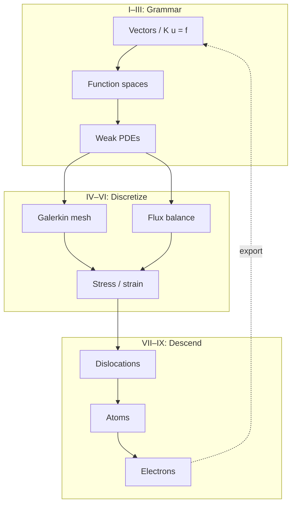
```mermaid
flowchart TB
  subgraph grammar["I–III: Grammar"]
    LA[Vectors / K u = f]
    FA[Function spaces]
    PDE[Weak PDEs]
  end
  subgraph disc["IV–VI: Discretize"]
    FEM[Galerkin mesh]
    FVM[Flux balance]
    CM[Stress / strain]
  end
  subgraph fine["VII–IX: Descend"]
    DDD[Dislocations]
    MD[Atoms]
    DFT[Electrons]
  end
  LA --> FA --> PDE --> FEM
  PDE --> FVM
  FEM --> CM
  FVM --> CM
  CM --> DDD --> MD --> DFT
  DFT -.->|export| LA
```

## The most important traps (whole book)

**Linear algebra and analysis**

1. **Ill-conditioning** is not non-uniqueness — check constraints and scaling before blaming physics.
2. **Rigid-body modes** are null-space physics, not solver bugs — boundary conditions remove them.
3. **Cauchy** does not imply convergence unless the space is **complete**.
4. **Weak convergence** is not strong convergence — FEM error in energy norm does not guarantee pointwise accuracy.
5. **FEM is not just matrix algebra** — it is projection; wrong \(V_h\) breaks the story before \(\mathbf{K}\) is assembled.

**PDEs and discretization**

6. **Corners and point loads** break classical smoothness — weak forms exist because strong forms fail.
7. **Equal-order \((P_1, P_1)\)** velocity–pressure pairs violate **inf–sup** — use Taylor–Hood or stabilization.
8. **Locking** in elasticity is a modeling/discretization mismatch — reduced integration or mixed formulations help.
9. **CFL violation** in explicit FVM blows up quietly until it blows up loudly — stability is not optional.
10. **Wall flux mismatch** in conjugate heat transfer is a **category error** at the interface, not a mesh issue.

**Continuum and mesoscale**

11. **Isotropic \(\mathbb{C}\) from bulk DFT** does not carry **cold-work history** — hardening lives in dislocation density.
12. **J₂ plasticity with one \(H\)** fits a curve; it does not explain **why** the curve bends — DDD supplies that.
13. **Cauchy stress from MD** requires careful **volume definition** and thermostat interpretation.
14. **Polycrystal texture** is not captured by single-crystal DDD alone — RVE and statistics matter.

**Atomistic and electronic**

15. **Cutoff artifacts** in MD potentials fake long-range physics — check convergence with box size and cutoff.
16. **Energy drift** in MD means the integrator or thermostat is wrong for the question asked.
17. **Wrong XC functional** in DFT shifts lattice constants — elastic constants and cohesive energies inherit the error.
18. **k-mesh too coarse** makes metals look like insulators in band structure — convergence is part of the physics.
19. **Born–Oppenheimer** fails when electrons stay correlated — the ladder has a bottom rung limit.

**Multiscale coupling**

20. **Unit mismatches** (eV vs. J, Å vs. m) propagate catastrophically upward — check at every arrow.
21. **Sequential homogenization** loses **path dependence** unless internal variables carry history.
22. **Surrogates** trained on one loading path fail on another — frame indifference and thermodynamic consistency are not optional.
23. **Skipping manufacturing history** (draw, anneal, service) predicts the wrong wire even with perfect DFT moduli.

## Continuity hinges master map {#continuity-hinges-master-map}

When a chapter feels disconnected from the last, pause at the hinge for your reading position — same copper wire, richer vocabulary at each turn. The [preface](../preface.md) splits these into opening, ascent, midpoint, descent, and epilogue tables; this page collects all **seventeen narrative hinges** (rows 0–16) plus **rows 17–27** (continuous read-through, plot-spine audits, lab act reunion, narrative recap, and symbol bridges) in reading order.

| # | Phase | Hinge | When to pause |
|---|-------|-------|---------------|
| 0 | Opening | [Prologue → I](../prologue/00-many-scales.md#bridge-to-part-i) · [preface row 0 skill checkpoint](../preface.md#skill-navigation-row-0) | Scale ladder feels like a menu before the first matrix |
| 1 | Ascent | [I.4 → II](../part01-linear-algebra/04-toward-infinity.md#bridge-to-part-ii) | \(\mathbf{K}\mathbf{u}=\mathbf{f}\) feels unrelated to PDEs |
| 2 | Ascent | [II.5 → III](../part02-functional-analysis/05-spectral-theorem.md#bridge-to-part-iii) | Sobolev norms feel abstract; weak form is the next dialogue |
| 3 | Ascent | [III.4 → IV](../part03-pdes/04-energy-methods.md#bridge-to-part-iv) | Energy minimization and matrix assembly seem like separate tricks |
| 4 | Ascent | [IV.5 / V.4 → VI](../part04-fem/05-convergence.md#bridge-two-doors-from-here) | FEM and FVM feel like unrelated courses |
| 5 | Midpoint | [Part VI opening](../part06-continuum/00-opening.md#midpoint-ascent-complete-descent-ahead) | Parts I–V feel like separate subjects |
| 6 | Midpoint | [VI.4 intermission](../part06-continuum/04-nonlinear-plasticity-preview.md#intermission-ascent-ends-descent-begins) | \(J_2\) fits the curve but not its cause |
| 7 | Descent | [VII.3 → VIII](../part07-defects/03-polycrystal-and-fem-handoff.md#bridge-to-part-viii) · [VIII.1 opening hinge](../part08-md/01-potentials-phase-space.md#opening-hinge-vii3-to-viii1) · [VIII.0 descent hinge](../part08-md/00-opening.md#descent-hinge-cores-mobility-and-tw-pedigree) | Mobility or \(\gamma_{\text{sf}}\) feel like fitted constants; `mobility.yaml` cites Part VIII without an atomic box |
| 7b | Descent | [VIII.1 Bridge](../part08-md/01-potentials-phase-space.md#bridge) · [VIII.2 opening hinge](../part08-md/02-ensembles-integrators.md#opening-hinge-viii1-to-viii2) | EAM archive exists but trajectories not run; 0 K \(a_0\) exported without NPT equilibration at \(T_w\) |
| 7c | Descent | [VIII.2 Bridge](../part08-md/02-ensembles-integrators.md#bridge) · [VIII.3 opening hinge](../part08-md/03-ab-initio-and-coarse-graining.md#opening-hinge-viii2-to-viii3) | NPT moduli and mobility exist but no handoff bundle; trajectories without DFT pedigree gates |
| 8 | Descent | [VIII.3 WHAM → VII mobility](../part08-md/03-ab-initio-and-coarse-graining.md#wham-part-vii-mobility-hinge-act-ii-temperature-pedigree) · [VIII.0 descent hinge](../part08-md/00-opening.md#descent-hinge-cores-mobility-and-tw-pedigree) · [preface row 8 skill checkpoint](../preface.md#skill-navigation-row-8) | Recovery or drag tables at 300 K while [`cht_export.yaml`](../../fixtures/cht_export.yaml) archives \(T_w = 311.48\,\text{K}\); [rows 8–9 baby picture](#rows-8-9-baby-picture-tw-temperature-pedigree) |
| 9 | Descent | [VIII.3 → IX](../part08-md/03-ab-initio-and-coarse-graining.md#bridge-to-part-ix) · [IX.0 electronic audit hinge](../part09-dft/00-opening.md#electronic-audit-hinge-descent-pedigree-and-tw-phonon) · [IX.0 thermal phonon audit at \(T_w\)](../part09-dft/00-opening.md#thermal-phonon-audit-at-tw) · [preface row 9 skill checkpoint](../preface.md#skill-navigation-row-9) | EAM matches bulk moduli but no DFT deck is cited; \(\alpha\) and \(\tau_{\text{ph}}\) at \(T_w\), not 300 K default; [rows 8–9 baby picture](#rows-8-9-baby-picture-tw-temperature-pedigree); [epilogue opening hinge from Part IX](../epilogue/multiscale.md#opening-hinge-ix3-to-epilogue) |
| 10 | Descent | [IX.3 → epilogue](../part09-dft/03-dft-workflows.md#bridge-to-the-epilogue) · [epilogue opening hinge from Part IX](../epilogue/multiscale.md#opening-hinge-ix3-to-epilogue) · [preface row 10 skill checkpoint](../preface.md#skill-navigation-row-10) · [prologue row 10 preview](../prologue/00-many-scales.md#prologue-preview-row-10) | Exports exist in separate folders with no workflow; Handshakes 4a/4b split not documented — [IX.3 epilogue pedigree table](../part09-dft/03-dft-workflows.md#ix3-epilogue-pedigree-table) maps artifacts to Handshakes 1–4b |
| 11 | Closing | [Epilogue: six-act reunion](../epilogue/multiscale.md#lab-act-reunion-six-acts-one-afternoon) · [preface row 11 skill checkpoint](../preface.md#skill-navigation-row-11) · [prologue row 11 preview](../prologue/00-many-scales.md#prologue-preview-row-11) · [prologue row 11 closing stitch](../prologue/00-many-scales.md#row-11-closing-stitch) · [epilogue row 11 closing loop](../epilogue/multiscale.md#row-11-closing-loop) | Each part makes sense alone but workflow order is unclear — [one-page copper wire recap](#one-page-copper-wire-recap) maps Acts I–VI to Parts; Act VI runs **in parallel** with Acts I–V, not after Part IX in lab time |
| 12 | Closing | [Epilogue → prologue](../epilogue/multiscale.md#row-12-closing-loop) · [prologue reopening anchor](../prologue/00-many-scales.md#prologue-reopening-anchor) · [preface row 12 skill checkpoint](../preface.md#skill-navigation-row-12) · [prologue row 12 preview](../prologue/00-many-scales.md#prologue-preview-row-12) · [prologue row 12 closing stitch](../prologue/00-many-scales.md#row-12-closing-stitch) | Next project needs scale discipline from day one — four questions restart; ladder reusable; [row 12 baby picture](#row-12-baby-picture-next-project) |
| 13 | Closing | [Handshake 2 → 3](../epilogue/multiscale.md#handshake-2--joule-heating--conjugate-heat-transfer-part-iv--v) → [IX.3 \(\alpha\) Lab act](../part09-dft/03-dft-workflows.md#lab-act-quasiharmonic-alpha-handshake-3-pedigree) → [Handshake 3](../epilogue/multiscale.md#handshake-3--thermal-strain--mechanical-stiffness-part-vi--iv) · [preface row 13 skill checkpoint](../preface.md#skill-navigation-row-13) · [prologue row 13 preview](../prologue/00-many-scales.md#prologue-preview-row-13) · [prologue row 13 closing stitch](../prologue/00-many-scales.md#row-13-closing-stitch) · [epilogue row 13 closing loop](../epilogue/multiscale.md#row-13-closing-loop) | CHT converged but load cell still uses handbook \(\alpha\); [row 13 baby picture](#row-13-baby-picture-handshake-2-3); [sensitivity table](../epilogue/multiscale.md#sensitivity-which-handshake-matters-most) ranks Handshake 3 **first for fixed-grip stress**; [sensitivity derivation worksheet](../epilogue/multiscale.md#worked-example-sensitivity-ranks) proves the ranking |
| 14 | Closing | [VII.3 rate handshake](../part07-defects/03-polycrystal-and-fem-handoff.md#scale-boundary-handshake-ddd-strain-rate-to-quasi-static-fem) → [Handshake 4a](../epilogue/multiscale.md#handshake-4--rate-dependent-hardening-and-notch-localization-part-vii--vi--viii) · [preface row 14 skill checkpoint](../preface.md#skill-navigation-row-14) · [prologue row 14 preview](../prologue/00-many-scales.md#prologue-preview-row-14) · [prologue row 14 closing stitch](../prologue/00-many-scales.md#row-14-closing-stitch) · [epilogue row 14 closing loop](../epilogue/multiscale.md#row-14-closing-loop) | DDD exports feed plasticity deck but hardening knee arrives early; [row 14 baby picture](#row-14-baby-picture-handshake-4a); [`parse_rate.sh`](../../scripts/parse_rate.sh) on `ddd_tau_vs_rate.dat`; [sensitivity derivation worksheet](../epilogue/multiscale.md#worked-example-sensitivity-ranks) (Handshake 4a column) — direct import without extrapolation overpredicts flow stress by 5–35% |
| 15 | Closing | [VII.3 Step 4 FE²](../part07-defects/03-polycrystal-and-fem-handoff.md#step-4--when-offline-calibration-fails-fe-at-the-notch) → [Handshake 4b](../epilogue/multiscale.md#4b--when-continuum-fails-at-the-notch-md-subdomain-act-v--notch) · [preface row 15 skill checkpoint](../preface.md#skill-navigation-row-15) · [prologue Handshake 4b preview](../prologue/00-many-scales.md#prologue-preview-act-v) · [prologue row 15 closing stitch](../prologue/00-many-scales.md#row-15-closing-stitch) · [epilogue row 15 closing loop](../epilogue/multiscale.md#row-15-closing-loop) | Bulk hardening from 4a looks right but notch root under-predicts peak stress; [row 15 baby picture](#row-15-baby-picture-handshake-4b); [`parse_fe2.sh`](../../scripts/parse_fe2.sh) on `fe2_notch_comparison.dat`; [sensitivity derivation worksheet](../epilogue/multiscale.md#worked-example-sensitivity-ranks) (Handshake 4b column) — scalar \(H\) under-predicts root stress by 10–15%; upstream rate from [row 14](../preface.md#skill-navigation-row-14) |
| 16 | Closing | [IX.3 → epilogue orchestration](../part09-dft/03-dft-workflows.md#bridge-to-the-epilogue) → [`parse_multiscale_workflow.sh`](../../scripts/parse_multiscale_workflow.sh) · [preface row 16 skill checkpoint](../preface.md#skill-navigation-row-16) · [prologue row 16 preview](../prologue/00-many-scales.md#prologue-preview-row-16) · [prologue row 16 closing stitch](../prologue/00-many-scales.md#row-16-closing-stitch) · [epilogue row 16 closing loop](../epilogue/multiscale.md#row-16-closing-loop) | Exports exist in separate folders but no orchestrated pedigree; [preface row 16 three-way audit](../preface.md#skill-navigation-row-16); [memory sheet Act VI baby picture](#act-vi-baby-picture-me-412-coupling-ladder); [epilogue script audit trail](../epilogue/multiscale.md#script-audit-trail-parse-scripts-handshakes) for per-handshake parsers; upstream [rows 8–9](../preface.md#skill-navigation-row-8) (\(T_w\) pedigree) and [rows 13–15](../preface.md#skill-navigation-row-13) understood first; [`parse_multiscale_workflow.sh`](../../scripts/parse_multiscale_workflow.sh) on `cu.foundation/` + `cht_wire.conf` → `multiscale_export.yaml` linking Handshakes 1–4b with \(\Delta T\) from Handshake 2 feeding Handshake 3 and phonon lifetime at converged \(T_w\) feeding Handshake 4a |
| 17 | Meta | [Continuous read-through guide](sources.md#continuous-read-through-guide) · [preface row 17 skill checkpoint](../preface.md#skill-navigation-row-17) · [prologue row 17 preview](../prologue/00-many-scales.md#prologue-preview-row-17) · [prologue row 17 closing stitch](../prologue/00-many-scales.md#row-17-closing-stitch) · [epilogue row 17 closing loop](../epilogue/multiscale.md#row-17-closing-loop) | Straight read feels choppy despite individual Bridges — trust Scene/Bridge rhythm; pause only at I.4, VI.4, IX.3 gates; [row 17 baby picture](#row-17-baby-picture-continuous-read-through) |
| 18 | Meta | [Part-opening plot spine index](sources.md#part-opening-plot-spine-index-row-18) · [preface row 18 skill checkpoint](../preface.md#skill-navigation-row-18) · [prologue row 18 preview](../prologue/00-many-scales.md#prologue-preview-row-18) · [prologue row 18 closing stitch](../prologue/00-many-scales.md#row-18-closing-stitch) · [epilogue row 18 closing loop](../epilogue/multiscale.md#row-18-closing-loop) | A part opening feels like a new syllabus — read its [plot spine one line](../part01-linear-algebra/00-opening.md#plot-spine-one-line) aloud; [row 18 baby picture](#row-18-baby-picture-part-opening-plot-spine) |
| 19 | Meta | [Numbered-chapter plot spine index](sources.md#numbered-chapter-plot-spine-index-row-19) · [preface row 19 skill checkpoint](../preface.md#skill-navigation-row-19) · [prologue row 19 preview](../prologue/00-many-scales.md#prologue-preview-row-19) · [prologue row 19 closing stitch](../prologue/00-many-scales.md#row-19-closing-stitch) · [epilogue row 19 closing loop](../epilogue/multiscale.md#row-19-closing-loop) | Mid-chapter reading stalls despite a Bridge — read this chapter's [plot spine one line](../part01-linear-algebra/01-vectors-matrices.md#plot-spine-one-line) aloud; [row 19 baby picture](#row-19-baby-picture-numbered-chapter-plot-spine) |
| 20 | Meta | [Gate-chapter plot spine index](sources.md#gate-chapter-plot-spine-index-row-20) · [preface row 20 skill checkpoint](../preface.md#skill-navigation-row-20) · [prologue row 20 preview](../prologue/00-many-scales.md#prologue-preview-row-20) · [prologue row 20 closing stitch](../prologue/00-many-scales.md#row-20-closing-stitch) · [epilogue row 20 closing loop](../epilogue/multiscale.md#row-20-closing-loop) | A mandatory gate (I.4, VI.4, IX.3) stalls the straight read — recite its [plot spine one line](../part01-linear-algebra/04-toward-infinity.md#plot-spine-one-line) aloud before the Bridge; [row 20 baby picture](#row-20-baby-picture-gate-chapter-plot-spine) |
| 21 | Meta | [Lab act reunion index](sources.md#lab-act-reunion-index-row-21) · [preface row 21 skill checkpoint](../preface.md#skill-navigation-row-21) · [prologue row 21 preview](../prologue/00-many-scales.md#prologue-preview-row-21) · [prologue row 21 closing stitch](../prologue/00-many-scales.md#row-21-closing-stitch) · [epilogue row 21 closing loop](../epilogue/multiscale.md#row-21-closing-loop) | A Lab act feels like standalone homework — read its one-line move aloud and name the lab act; [row 21 baby picture](#row-21-baby-picture-lab-act-reunion) |
| 22 | Meta | [Scene reunion index](sources.md#scene-reunion-index-row-22) · [preface row 22 skill checkpoint](../preface.md#skill-navigation-row-22) · [prologue row 22 preview](../prologue/00-many-scales.md#prologue-preview-row-22) · [prologue row 22 closing stitch](../prologue/00-many-scales.md#row-22-closing-stitch) · [epilogue row 22 closing loop](../epilogue/multiscale.md#row-22-closing-loop) | Plot spines and Lab acts read correctly but symbols hide the wire — read the Scene one-line visual aloud and picture the operator; [row 22 baby picture](#row-22-baby-picture-scene-reunion) |
| 23 | Meta | [Bridge reunion index](sources.md#bridge-reunion-index-row-23) · [preface row 23 skill checkpoint](../preface.md#skill-navigation-row-23) · [prologue row 23 preview](../prologue/00-many-scales.md#prologue-preview-row-23) · [prologue row 23 closing stitch](../prologue/00-many-scales.md#row-23-closing-stitch) · [epilogue row 23 closing loop](../epilogue/multiscale.md#row-23-closing-loop) | Scene, plot spines, and Lab acts all read correctly but chapter transitions feel mechanical — read the prior chapter's Bridge one-line hinge aloud; [row 23 baby picture](#row-23-baby-picture-bridge-reunion) |
| 24 | Meta | [Concept map reunion index](sources.md#concept-map-reunion-index-row-24) · [preface row 24 skill checkpoint](../preface.md#skill-navigation-row-24) · [prologue row 24 preview](../prologue/00-many-scales.md#prologue-preview-row-24) · [prologue row 24 closing stitch](../prologue/00-many-scales.md#row-24-closing-stitch) · [epilogue row 24 closing loop](../epilogue/multiscale.md#row-24-closing-loop) | Narrative, sensory, and transition vocabulary all read correctly but proofs feel like disconnected theorems — answer object / structure / theorem / breaks at the part-opening concept map; [row 24 baby picture](#row-24-baby-picture-concept-map-reunion) |
| 25 | Meta | [Schematic reunion index](sources.md#schematic-reunion-index-row-25) · [preface row 25 skill checkpoint](../preface.md#skill-navigation-row-25) · [prologue row 25 preview](../prologue/00-many-scales.md#prologue-preview-row-25) · [prologue row 25 closing stitch](../prologue/00-many-scales.md#row-25-closing-stitch) · [epilogue row 25 closing loop](../epilogue/multiscale.md#row-25-closing-loop) | Scene, plot spines, Lab acts, visuals, Bridges, and concept maps all read correctly but proofs feel abstract without a visual anchor — locate the matching baby picture from the part-opening representative schematics table; [row 25 baby picture](#row-25-baby-picture-schematic-reunion) |
| 26 | Meta | [Story so far reunion index](sources.md#story-so-far-reunion-index-row-26) · [preface row 26 skill checkpoint](../preface.md#skill-navigation-row-26) · [prologue row 26 preview](../prologue/00-many-scales.md#prologue-preview-row-26) · [prologue row 26 closing stitch](../prologue/00-many-scales.md#row-26-closing-stitch) · [epilogue row 26 closing loop](../epilogue/multiscale.md#row-26-closing-loop) | Rows 17–25 all read correctly in isolation but you cannot place where the copper wire is in the narrative arc — read the part-opening **Story so far** recap aloud and name what the wire became at the prior scale; [row 26 baby picture](#row-26-baby-picture-story-so-far-reunion) |
| 27 | Meta | [Closing the arc reunion index](sources.md#closing-the-arc-reunion-index-row-27) · [preface row 27 skill checkpoint](../preface.md#skill-navigation-row-27) · [prologue row 27 preview](../prologue/00-many-scales.md#prologue-preview-row-27) · [prologue row 27 closing stitch](../prologue/00-many-scales.md#row-27-closing-stitch) · [epilogue row 27 closing loop](../epilogue/multiscale.md#row-27-closing-loop) | Rows 17–26 all read correctly but prior-part symbols do not map to current-part vocabulary — read the part-opening **Closing the arc** table aloud and name one symbol translation per row; [row 27 baby picture](#row-27-baby-picture-closing-the-arc-reunion) |
| 28 | Meta | [Scale-boundary reunion index](sources.md#scale-boundary-reunion-index-row-28) · [preface row 28 skill checkpoint](../preface.md#skill-navigation-row-28) · [prologue row 28 preview](../prologue/00-many-scales.md#prologue-preview-row-28) · [prologue row 28 closing stitch](../prologue/00-many-scales.md#row-28-closing-stitch) · [epilogue row 28 closing loop](../epilogue/multiscale.md#row-28-closing-loop) | Rows 17–27 all read correctly but parameters crossing a scale boundary feel arbitrary — read the chapter **Scale-boundary handshake** table and name export → consumer → failure mode; [row 28 baby picture](#row-28-baby-picture-scale-boundary-reunion) |
| 29 | Meta | [Thermoelastic assembly reunion index](sources.md#thermoelastic-assembly-reunion-index-row-29) · [preface row 29 skill checkpoint](../preface.md#skill-navigation-row-29) · [prologue row 29 preview](../prologue/00-many-scales.md#prologue-preview-row-29) · [prologue row 29 closing stitch](../prologue/00-many-scales.md#row-29-closing-stitch) · [epilogue row 29 closing loop](../epilogue/multiscale.md#row-29-closing-loop) | Rows 17–28 all read correctly but Act II heating and Act III pulling feel like separate FEM homework — read the Part IV thermoelastic assembly thread and name heat pass → \(\mathbf{F}_{\text{th}}\) → mechanics pass on same connectivity; [row 29 baby picture](#row-29-baby-picture-thermoelastic-assembly-reunion) |
| 30 | Meta | [CHT outer-loop reunion index](sources.md#cht-outer-loop-reunion-index-row-30) · [preface row 30 skill checkpoint](../preface.md#skill-navigation-row-30) · [prologue row 30 preview](../prologue/00-many-scales.md#prologue-preview-row-30) · [prologue row 30 closing stitch](../prologue/00-many-scales.md#row-30-closing-stitch) · [epilogue row 30 closing loop](../epilogue/multiscale.md#row-30-closing-loop) | Rows 17–29 all read correctly but solid FEM and fluid FVM still feel like separate solvers — read IV.5 → V.4 Picard → `cht_export.yaml` and name one converged \(T_w\) for both twins; [row 30 baby picture](#row-30-baby-picture-cht-outer-loop-reunion) |
| 31 | Meta | [Twin-ladder virtual work reunion index](sources.md#twin-ladder-virtual-work-reunion-index-row-31) · [preface row 31 skill checkpoint](../preface.md#skill-navigation-row-31) · [prologue row 31 preview](../prologue/00-many-scales.md#prologue-preview-row-31) · [prologue row 31 closing stitch](../prologue/00-many-scales.md#row-31-closing-stitch) · [epilogue row 31 closing loop](../epilogue/multiscale.md#row-31-closing-loop) | Rows 17–30 all read correctly but Galerkin assembly and virtual work still feel like separate subjects — read VI.0 twin-ladder → VI.1 kinematics → VI.3 virtual work and name why \(\mathbf{K}\mathbf{U}=\mathbf{F}\) is force balance; [row 31 baby picture](#row-31-baby-picture-twin-ladder-virtual-work-reunion) |
| 32 | Meta | [Virtual work → plasticity preview reunion index](sources.md#virtual-work-plasticity-preview-reunion-index-row-32) · [preface row 32 skill checkpoint](../preface.md#skill-navigation-row-32) · [prologue row 32 preview](../prologue/00-many-scales.md#prologue-preview-row-32) · [prologue row 32 closing stitch](../prologue/00-many-scales.md#row-32-closing-stitch) · [epilogue row 32 closing loop](../epilogue/multiscale.md#row-32-closing-loop) | Rows 17–31 all read correctly but \(\delta\Pi = 0\) and return-mapping still feel like separate subjects — read VI.3 virtual work → VI.4 return-mapping → Part VII descent hinge; [row 32 baby picture](#row-32-baby-picture-virtual-work-plasticity-preview-reunion) |
| 33 | Meta | [Part VII → VIII descent hinge reunion index](sources.md#part-vii-viii-descent-hinge-reunion-index-row-33) · [preface row 33 skill checkpoint](../preface.md#skill-navigation-row-33) · [prologue row 33 preview](../prologue/00-many-scales.md#prologue-preview-row-33) · [prologue row 33 closing stitch](../prologue/00-many-scales.md#row-33-closing-stitch) · [epilogue row 33 closing loop](../epilogue/multiscale.md#row-33-closing-loop) | Rows 17–32 all read correctly but mesoscale DDD and atomistic MD still feel like separate courses — read Part VII descent hinge → VII.2 mobility at \(T_w\) → Part VIII descent hinge; [row 33 baby picture](#row-33-baby-picture-part-vii-viii-descent-hinge-reunion) |
| 34 | Meta | [Potentials → ensembles reunion index](sources.md#potentials-ensembles-reunion-index-row-34) · [preface row 34 skill checkpoint](../preface.md#skill-navigation-row-34) · [prologue row 34 preview](../prologue/00-many-scales.md#prologue-preview-row-34) · [prologue row 34 closing stitch](../prologue/00-many-scales.md#row-34-closing-stitch) · [epilogue row 34 closing loop](../epilogue/multiscale.md#row-34-closing-loop) | Rows 17–33 all read correctly but 0 K EAM minimization and NVT/NPT trajectories still feel like separate subjects — read VIII.1 Bridge → VIII.2 opening hinge; [row 34 baby picture](#row-34-baby-picture-potentials-ensembles-reunion) |
| 35 | Meta | [Ensembles → coarse-graining reunion index](sources.md#ensembles-coarse-graining-reunion-index-row-35) · [preface row 35 skill checkpoint](../preface.md#skill-navigation-row-35) · [prologue row 35 preview](../prologue/00-many-scales.md#prologue-preview-row-35) · [prologue row 35 closing stitch](../prologue/00-many-scales.md#row-35-closing-stitch) · [epilogue row 35 closing loop](../epilogue/multiscale.md#row-35-closing-loop) | Rows 17–34 all read correctly but audited trajectories and coarse-grained handoff tables still feel like separate subjects — read VIII.2 Bridge → VIII.3 opening hinge; [row 35 baby picture](#row-35-baby-picture-ensembles-coarse-graining-reunion) |
| 36 | Meta | [Coarse-graining → electronic audit reunion index](sources.md#coarse-graining-electronic-audit-reunion-index-row-36) · [preface row 36 skill checkpoint](../preface.md#skill-navigation-row-36) · [prologue row 36 preview](../prologue/00-many-scales.md#prologue-preview-row-36) · [prologue row 36 closing stitch](../prologue/00-many-scales.md#row-36-closing-stitch) · [epilogue row 36 closing loop](../epilogue/multiscale.md#row-36-closing-loop) | Rows 17–35 all read correctly but pedigree checklist rows exist without QE SCF logs or \(\alpha(T_w)\) — read VIII.3 Bridge → IX.0 opening hinge; [row 36 baby picture](#row-36-baby-picture-coarse-graining-electronic-audit-reunion) |
| 37 | Meta | [Electronic audit → Born–Oppenheimer reunion index](sources.md#electronic-audit-born-oppenheimer-reunion-index-row-37) · [preface row 37 skill checkpoint](../preface.md#skill-navigation-row-37) · [prologue row 37 preview](../prologue/00-many-scales.md#prologue-preview-row-37) · [prologue row 37 closing stitch](../prologue/00-many-scales.md#row-37-closing-stitch) · [epilogue row 37 closing loop](../epilogue/multiscale.md#row-37-closing-loop) | Rows 17–36 all read correctly but SCF logs exist without BO/HK theorems connecting to Part VIII's EAM surface — read IX.0 Bridge → IX.1 opening hinge; [row 37 baby picture](#row-37-baby-picture-electronic-audit-born-oppenheimer-reunion) |
| 38 | Meta | [Born–Oppenheimer → Kohn–Sham reunion index](sources.md#born-oppenheimer-kohn-sham-reunion-index-row-38) · [preface row 38 skill checkpoint](../preface.md#skill-navigation-row-38) · [prologue row 38 preview](../prologue/00-many-scales.md#prologue-preview-row-38) · [prologue row 38 closing stitch](../prologue/00-many-scales.md#row-38-closing-stitch) · [epilogue row 38 closing loop](../epilogue/multiscale.md#row-38-closing-loop) | Rows 17–37 all read correctly but BO/HK theorems exist without SCF fixed-point loop connecting to Part I eigenvalues — read IX.1 Bridge → IX.2 opening hinge; [row 38 baby picture](#row-38-baby-picture-born-oppenheimer-kohn-sham-reunion) |
| 39 | Meta | [Kohn–Sham → DFT workflows reunion index](sources.md#kohn-sham-dft-workflows-reunion-index-row-39) · [preface row 39 skill checkpoint](../preface.md#skill-navigation-row-39) · [prologue row 39 preview](../prologue/00-many-scales.md#prologue-preview-row-39) · [prologue row 39 closing stitch](../prologue/00-many-scales.md#row-39-closing-stitch) · [epilogue row 39 closing loop](../epilogue/multiscale.md#row-39-closing-loop) | Rows 17–38 all read correctly but SCF is understood without calculation ladder and `cu.foundation/` archive — read IX.2 Bridge → IX.3 opening hinge; [row 39 baby picture](#row-39-baby-picture-kohn-sham-dft-workflows-reunion) |
| 40 | Meta | [IX.3 → Handshake 3 reunion index](sources.md#ix3-handshake3-reunion-index-row-40) · [preface row 40 skill checkpoint](../preface.md#skill-navigation-row-40) · [prologue row 40 preview](../prologue/00-many-scales.md#prologue-preview-row-40) · [prologue row 40 closing stitch](../prologue/00-many-scales.md#row-40-closing-stitch) · [epilogue row 40 closing loop](../epilogue/multiscale.md#row-40-closing-loop) | Rows 17–39 all read correctly but `cu.foundation/` is complete yet handbook \(\alpha(300\,\text{K})\) persists at load cell — read IX.3 Bridge → epilogue Handshake 3 opening hinge; [row 40 baby picture](#row-40-baby-picture-ix3-handshake3-reunion) |
| 41 | Meta | [VII.3 → Handshake 4a reunion index](sources.md#vii3-handshake4a-reunion-index-row-41) · [preface row 41 skill checkpoint](../preface.md#skill-navigation-row-41) · [prologue row 41 preview](../prologue/00-many-scales.md#prologue-preview-row-41) · [prologue row 41 closing stitch](../prologue/00-many-scales.md#row-41-closing-stitch) · [epilogue row 41 closing loop](../epilogue/multiscale.md#row-41-closing-loop) | Rows 17–40 all read correctly but OpenDiS exports feed plasticity deck without rate extrapolation — read VII.3 rate handshake → epilogue Handshake 4a opening hinge; [row 41 baby picture](#row-41-baby-picture-vii3-handshake4a-reunion) |
| 42 | Meta | [VII.3 → Handshake 4b reunion index](sources.md#vii3-handshake4b-reunion-index-row-42) · [preface row 42 skill checkpoint](../preface.md#skill-navigation-row-42) · [prologue row 42 preview](../prologue/00-many-scales.md#prologue-preview-row-42) · [prologue row 42 closing stitch](../prologue/00-many-scales.md#row-42-closing-stitch) · [epilogue row 42 closing loop](../epilogue/multiscale.md#row-42-closing-loop) | Rows 17–41 all read correctly but bulk hardening from 4a matches flow stress while notch root under-predicts without FE² audit — read VII.3 Step 4 → epilogue Handshake 4b opening hinge; [row 42 baby picture](#row-42-baby-picture-vii3-handshake4b-reunion) |
| 43 | Meta | [Rows 17–42 → Row 16 orchestration reunion index](sources.md#rows17-42-row16-orchestration-reunion-index-row-43) · [preface row 43 skill checkpoint](../preface.md#skill-navigation-row-43) · [prologue row 43 preview](../prologue/00-many-scales.md#prologue-preview-row-43) · [prologue row 43 closing stitch](../prologue/00-many-scales.md#row-43-closing-stitch) · [epilogue row 43 closing loop](../epilogue/multiscale.md#row-43-closing-loop) | Rows 17–42 all read correctly but Handshakes 1–4b exist in separate folders without orchestrated `multiscale_export.yaml` — read IX.3 pedigree table → epilogue row 16 opening hinge; [row 43 baby picture](#row-43-baby-picture-rows17-42-row16-orchestration-reunion) |
| 44 | Meta | [Rows 17–43 → Row 12 book loop closure index](sources.md#rows17-43-row12-book-loop-closure-index-row-44) · [preface row 44 skill checkpoint](../preface.md#skill-navigation-row-44) · [prologue row 44 preview](../prologue/00-many-scales.md#prologue-preview-row-44) · [prologue row 44 closing stitch](../prologue/00-many-scales.md#row-44-closing-stitch) · [epilogue row 44 closing loop](../epilogue/multiscale.md#row-44-closing-loop) | Rows 17–43 all read correctly but `multiscale_export.yaml` exists yet the next terminal opens with copper decks copied blindly — read epilogue ME 412 summary → prologue reopening anchor; [row 44 baby picture](#row-44-baby-picture-rows17-43-row12-book-loop-closure) |
| 45 | Meta | [Rows 17–44 → Row 17 second-pass reunion index](sources.md#rows17-44-row17-second-pass-reunion-index-row-45) · [preface row 45 skill checkpoint](../preface.md#skill-navigation-row-45) · [prologue row 45 preview](../prologue/00-many-scales.md#prologue-preview-row-45) · [prologue row 45 closing stitch](../prologue/00-many-scales.md#row-45-closing-stitch) · [epilogue row 45 closing loop](../epilogue/multiscale.md#row-45-closing-loop) | Rows 17–44 all read correctly but Preface → Epilogue still feels like a syllabus — second Scene → Bridge pass; [row 45 baby picture](#row-45-baby-picture-rows17-44-row17-second-pass-reunion) |
| 46 | Meta | [Rows 17–45 → Writings reunion index](sources.md#rows17-45-writings-canonical-reunion-index-row-46) · [preface row 46 skill checkpoint](../preface.md#skill-navigation-row-46) · [prologue row 46 preview](../prologue/00-many-scales.md#prologue-preview-row-46) · [prologue row 46 closing stitch](../prologue/00-many-scales.md#row-46-closing-stitch) · [epilogue row 46 closing loop](../epilogue/multiscale.md#row-46-closing-loop) · [writings source index](../writings/SUMMARY.md) | Rows 17–45 all read correctly but edits land in `src/` not `writings/` — sync before build; [row 46 baby picture](#row-46-baby-picture-rows17-45-writings-canonical-reunion) |
| 47 | Meta | [V.4 → VI.0 Writings reunion index](sources.md#v4-vi0-writings-canonical-reunion-index-row-47) · [preface row 47 skill checkpoint](../preface.md#skill-navigation-row-47) · [prologue row 47 preview](../prologue/00-many-scales.md#prologue-preview-row-47) · [prologue row 47 closing stitch](../prologue/00-many-scales.md#row-47-closing-stitch) · [epilogue row 47 closing loop](../epilogue/multiscale.md#row-47-closing-loop) | Row 46 closed but V.4 → VI.0 feels like two courses — read Bridge → VI.0 twin-ladder landing; [row 47 baby picture](#row-47-baby-picture-v4-vi0-writings-canonical-reunion) |
| 48 | Meta | [VI.4 → VII.0 Writings reunion index](sources.md#vi4-vii0-writings-canonical-reunion-index-row-48) · [preface row 48 skill checkpoint](../preface.md#skill-navigation-row-48) · [prologue row 48 preview](../prologue/00-many-scales.md#prologue-preview-row-48) · [prologue row 48 closing stitch](../prologue/00-many-scales.md#row-48-closing-stitch) · [epilogue row 48 closing loop](../epilogue/multiscale.md#row-48-closing-loop) | Row 47 closed but VI.4 → VII.0 feels like two courses — read intermission → Bridge → VII.0 landing; [row 48 baby picture](#row-48-baby-picture-vi4-vii0-writings-canonical-reunion) |
| 49 | Meta | [VII.0 → VII.1 reunion index](sources.md#vii0-vii1-opening-hinge-reunion-index-row-49) · [preface row 49 skill checkpoint](../preface.md#skill-navigation-row-49) · [prologue row 49 preview](../prologue/00-many-scales.md#prologue-preview-row-49) · [prologue row 49 closing stitch](../prologue/00-many-scales.md#row-49-closing-stitch) · [epilogue row 49 closing loop](../epilogue/multiscale.md#row-49-closing-loop) | Row 48 closed but VII.1 feels like Defects Notes homework — read VII.0 Bridge → opening hinge → VII.1; [row 49 baby picture](#row-49-baby-picture-vii0-vii1-opening-hinge-reunion) |
| 50 | Meta | [VII.1 → VII.2 reunion index](sources.md#vii1-vii2-opening-hinge-reunion-index-row-50) · [preface row 50 skill checkpoint](../preface.md#skill-navigation-row-50) · [prologue row 50 preview](../prologue/00-many-scales.md#prologue-preview-row-50) · [prologue row 50 closing stitch](../prologue/00-many-scales.md#row-50-closing-stitch) · [epilogue row 50 closing loop](../epilogue/multiscale.md#row-50-closing-loop) | Row 49 closed but VII.2 feels like OpenDiS homework — read VII.1 Bridge → opening hinge → VII.2; [row 50 baby picture](#row-50-baby-picture-vii1-vii2-opening-hinge-reunion) |
| 51 | Meta | [VII.2 → VII.3 reunion index](sources.md#vii2-vii3-opening-hinge-reunion-index-row-51) · [preface row 51 skill checkpoint](../preface.md#skill-navigation-row-51) · [prologue row 51 preview](../prologue/00-many-scales.md#prologue-preview-row-51) · [prologue row 51 closing stitch](../prologue/00-many-scales.md#row-51-closing-stitch) · [epilogue row 51 closing loop](../epilogue/multiscale.md#row-51-closing-loop) | Row 50 closed but VII.3 feels like DAMASK homework — read VII.2 Bridge → opening hinge → VII.3; [row 51 baby picture](#row-51-baby-picture-vii2-vii3-opening-hinge-reunion) |
| 52 | Meta | [VII.3 → VIII.1 reunion index](sources.md#vii3-viii1-opening-hinge-reunion-index-row-52) · [preface row 52 skill checkpoint](../preface.md#skill-navigation-row-52) · [prologue row 52 preview](../prologue/00-many-scales.md#prologue-preview-row-52) · [prologue row 52 closing stitch](../prologue/00-many-scales.md#row-52-closing-stitch) · [epilogue row 52 closing loop](../epilogue/multiscale.md#row-52-closing-loop) | Row 51 closed but VIII.1 feels like LAMMPS homework — read VII.3 Bridge → opening hinge → VIII.1; [row 52 baby picture](#row-52-baby-picture-vii3-viii1-opening-hinge-reunion) |
| 53 | Meta | [VIII.1 → VIII.2 reunion index](sources.md#viii1-viii2-opening-hinge-reunion-index-row-53) · [preface row 53 skill checkpoint](../preface.md#skill-navigation-row-53) · [prologue row 53 preview](../prologue/00-many-scales.md#prologue-preview-row-53) · [prologue row 53 closing stitch](../prologue/00-many-scales.md#row-53-closing-stitch) · [epilogue row 53 closing loop](../epilogue/multiscale.md#row-53-closing-loop) | Row 52 closed but VIII.2 feels like thermostat homework — read VIII.1 Bridge → opening hinge → VIII.2; [row 53 baby picture](#row-53-baby-picture-viii1-viii2-opening-hinge-reunion) |
| 54 | Meta | [VIII.2 → VIII.3 reunion index](sources.md#viii2-viii3-opening-hinge-reunion-index-row-54) · [preface row 54 skill checkpoint](../preface.md#skill-navigation-row-54) · [prologue row 54 preview](../prologue/00-many-scales.md#prologue-preview-row-54) · [prologue row 54 closing stitch](../prologue/00-many-scales.md#row-54-closing-stitch) · [epilogue row 54 closing loop](../epilogue/multiscale.md#row-54-closing-loop) | Row 53 closed but VIII.3 feels like export homework — read VIII.2 Bridge → opening hinge → VIII.3; [row 54 baby picture](#row-54-baby-picture-viii2-viii3-opening-hinge-reunion) |
| 55 | Meta | [VIII.3 → IX.0 reunion index](sources.md#viii3-ix0-opening-hinge-reunion-index-row-55) · [preface row 55 skill checkpoint](../preface.md#skill-navigation-row-55) · [prologue row 55 preview](../prologue/00-many-scales.md#prologue-preview-row-55) · [prologue row 55 closing stitch](../prologue/00-many-scales.md#row-55-closing-stitch) · [epilogue row 55 closing loop](../epilogue/multiscale.md#row-55-closing-loop) | Row 54 closed but Part IX feels like DFT homework — read VIII.3 Bridge → IX.0 opening hinge; [row 55 baby picture](#row-55-baby-picture-viii3-ix0-opening-hinge-reunion) |
| 56 | Meta | [IX.0 → IX.1 reunion index](sources.md#ix0-ix1-opening-hinge-reunion-index-row-56) · [preface row 56 skill checkpoint](../preface.md#skill-navigation-row-56) · [prologue row 56 preview](../prologue/00-many-scales.md#prologue-preview-row-56) · [prologue row 56 closing stitch](../prologue/00-many-scales.md#row-56-closing-stitch) · [epilogue row 56 closing loop](../epilogue/multiscale.md#row-56-closing-loop) | Row 55 closed but IX.1 feels like quantum chemistry homework — read IX.0 Bridge → IX.1 opening hinge; [row 56 baby picture](#row-56-baby-picture-ix0-ix1-opening-hinge-reunion) |
| 57 | Meta | [IX.1 → IX.2 reunion index](sources.md#ix1-ix2-opening-hinge-reunion-index-row-57) · [preface row 57 skill checkpoint](../preface.md#skill-navigation-row-57) · [prologue row 57 preview](../prologue/00-many-scales.md#prologue-preview-row-57) · [prologue row 57 closing stitch](../prologue/00-many-scales.md#row-57-closing-stitch) · [epilogue row 57 closing loop](../epilogue/multiscale.md#row-57-closing-loop) | Row 56 closed but IX.2 feels like QE homework — read IX.1 Bridge → IX.2 opening hinge; [row 57 baby picture](#row-57-baby-picture-ix1-ix2-opening-hinge-reunion) |
| 58 | Meta | [IX.2 → IX.3 reunion index](sources.md#ix2-ix3-opening-hinge-reunion-index-row-58) · [preface row 58 skill checkpoint](../preface.md#skill-navigation-row-58) · [prologue row 58 preview](../prologue/00-many-scales.md#prologue-preview-row-58) · [prologue row 58 closing stitch](../prologue/00-many-scales.md#row-58-closing-stitch) · [epilogue row 58 closing loop](../epilogue/multiscale.md#row-58-closing-loop) | Row 57 closed but IX.3 feels like MSE5720 homework — read IX.2 Bridge → IX.3 opening hinge; [row 58 baby picture](#row-58-baby-picture-ix2-ix3-opening-hinge-reunion) |
| 59 | Meta | [IX.3 → Handshake 3 reunion index (row 59)](sources.md#ix3-handshake3-opening-hinge-reunion-index-row-59) · [preface row 59 skill checkpoint](../preface.md#skill-navigation-row-59) · [prologue row 59 preview](../prologue/00-many-scales.md#prologue-preview-row-59) · [prologue row 59 closing stitch](../prologue/00-many-scales.md#row-59-closing-stitch) · [epilogue row 59 closing loop](../epilogue/multiscale.md#row-59-closing-loop) | Row 58 closed but Handshake 3 feels like epilogue homework — read IX.3 Bridge → opening hinge to Handshake 3; [row 59 baby picture](#row-59-baby-picture-ix3-handshake3-opening-hinge-reunion) |
| 60 | Meta | [Row 59 → Row 40 Handshake 3 reunion index](sources.md#row59-row40-handshake3-meta-reunion-index-row-60) · [preface row 60 skill checkpoint](../preface.md#skill-navigation-row-60) · [prologue row 60 preview](../prologue/00-many-scales.md#prologue-preview-row-60) · [prologue row 60 closing stitch](../prologue/00-many-scales.md#row-60-closing-stitch) · [epilogue row 60 closing loop](../epilogue/multiscale.md#row-60-closing-loop) | Row 59 closed but Handshake 3 feels disconnected from Parts III–VI — read row 59 + α cross-links + row 40; [row 60 baby picture](#row-60-baby-picture-row59-row40-handshake3-meta-reunion) |
| 61 | Meta | [Row 60 → Row 41 Handshake 4a reunion index](sources.md#row60-row41-handshake4a-prelude-reunion-index-row-61) · [preface row 61 skill checkpoint](../preface.md#skill-navigation-row-61) · [prologue row 61 preview](../prologue/00-many-scales.md#prologue-preview-row-61) · [prologue row 61 closing stitch](../prologue/00-many-scales.md#row-61-closing-stitch) · [epilogue row 61 closing loop](../epilogue/multiscale.md#row-61-closing-loop) | Row 60 closed but Handshake 4a feels disconnected from Part VII — read row 60 + rate cross-links + row 41; [row 61 baby picture](#row-61-baby-picture-row60-row41-handshake4a-prelude-reunion) |
| 62 | Meta | [Row 61 → Row 42 Handshake 4b reunion index](sources.md#row61-row42-handshake4b-prelude-reunion-index-row-62) · [preface row 62 skill checkpoint](../preface.md#skill-navigation-row-62) · [prologue row 62 preview](../prologue/00-many-scales.md#prologue-preview-row-62) · [prologue row 62 closing stitch](../prologue/00-many-scales.md#row-62-closing-stitch) · [epilogue row 62 closing loop](../epilogue/multiscale.md#row-62-closing-loop) | Row 61 closed but Handshake 4b feels disconnected from Part VII Step 4 — read row 61 + FE² cross-links + row 42; [row 62 baby picture](#row-62-baby-picture-row61-row42-handshake4b-prelude-reunion) |
| 63 | Meta | [Row 62 → Row 43 orchestration reunion index](sources.md#row62-row43-orchestration-prelude-reunion-index-row-63) · [preface row 63 skill checkpoint](../preface.md#skill-navigation-row-63) · [prologue row 63 preview](../prologue/00-many-scales.md#prologue-preview-row-63) · [prologue row 63 closing stitch](../prologue/00-many-scales.md#row-63-closing-stitch) · [epilogue row 63 closing loop](../epilogue/multiscale.md#row-63-closing-loop) | Row 62 closed but row 16 orchestration feels disconnected from Handshakes 3–4b — read row 62 + orchestration cross-links + row 43; [row 63 baby picture](#row-63-baby-picture-row62-row43-orchestration-prelude-reunion) |
| 64 | Meta | [Row 63 → Row 44 book loop reunion index](sources.md#row63-row44-book-loop-prelude-reunion-index-row-64) · [preface row 64 skill checkpoint](../preface.md#skill-navigation-row-64) · [prologue row 64 preview](../prologue/00-many-scales.md#prologue-preview-row-64) · [prologue row 64 closing stitch](../prologue/00-many-scales.md#row-64-closing-stitch) · [epilogue row 64 closing loop](../epilogue/multiscale.md#row-64-closing-loop) | Row 63 closed but row 44 book loop feels disconnected from verified orchestration — read row 63 + book-loop cross-links + row 44; [row 64 baby picture](#row-64-baby-picture-row63-row44-book-loop-prelude-reunion) |
| 65 | Meta | [Row 64 → Row 45 second-pass reunion index](sources.md#row64-row45-second-pass-prelude-reunion-index-row-65) · [preface row 65 skill checkpoint](../preface.md#skill-navigation-row-65) · [prologue row 65 preview](../prologue/00-many-scales.md#prologue-preview-row-65) · [prologue row 65 closing stitch](../prologue/00-many-scales.md#row-65-closing-stitch) · [epilogue row 65 closing loop](../epilogue/multiscale.md#row-65-closing-loop) | Row 64 closed but row 45 second pass feels disconnected from verified book loop — read row 64 + second-pass cross-links + row 45; [row 65 baby picture](#row-65-baby-picture-row64-row45-second-pass-prelude-reunion) |
| 66 | Meta | [Row 65 → Row 46 Writings reunion index](sources.md#row65-row46-writings-prelude-reunion-index-row-66) · [preface row 66 skill checkpoint](../preface.md#skill-navigation-row-66) · [prologue row 66 preview](../prologue/00-many-scales.md#prologue-preview-row-66) · [prologue row 66 closing stitch](../prologue/00-many-scales.md#row-66-closing-stitch) · [epilogue row 66 closing loop](../epilogue/multiscale.md#row-66-closing-loop) | Row 65 closed but row 46 Writings reunion feels disconnected from verified second pass — read row 65 + writings cross-links + row 46; [row 66 baby picture](#row-66-baby-picture-row65-row46-writings-prelude-reunion) |
| 67 | Meta | [Row 66 → Row 47 part-boundary reunion index](sources.md#row66-row47-part-boundary-prelude-reunion-index-row-67) · [preface row 67 skill checkpoint](../preface.md#skill-navigation-row-67) · [prologue row 67 preview](../prologue/00-many-scales.md#prologue-preview-row-67) · [prologue row 67 closing stitch](../prologue/00-many-scales.md#row-67-closing-stitch) · [epilogue row 67 closing loop](../epilogue/multiscale.md#row-67-closing-loop) | Row 66 closed but row 47 V.4 → VI.0 reunion feels disconnected from verified sync — read row 66 + twin-ladder chain + row 47; [row 67 baby picture](#row-67-baby-picture-row66-row47-part-boundary-prelude-reunion) |
| 68 | Meta | [Row 67 → Row 48 midpoint reunion index](sources.md#row67-row48-midpoint-prelude-reunion-index-row-68) · [preface row 68 skill checkpoint](../preface.md#skill-navigation-row-68) · [prologue row 68 preview](../prologue/00-many-scales.md#prologue-preview-row-68) · [prologue row 68 closing stitch](../prologue/00-many-scales.md#row-68-closing-stitch) · [epilogue row 68 closing loop](../epilogue/multiscale.md#row-68-closing-loop) | Row 67 closed but row 48 VI.4 → VII.0 reunion feels disconnected from verified part-boundary prelude — read row 67 + intermission → Bridge → VII.0 landing + row 48; [row 68 baby picture](#row-68-baby-picture-row67-row48-midpoint-prelude-reunion) |
| 69 | Meta | [Row 68 → Row 49 taxonomy prelude reunion index](sources.md#row68-row49-taxonomy-prelude-reunion-index-row-69) · [preface row 69 skill checkpoint](../preface.md#skill-navigation-row-69) · [prologue row 69 preview](../prologue/00-many-scales.md#prologue-preview-row-69) · [prologue row 69 closing stitch](../prologue/00-many-scales.md#row-69-closing-stitch) · [epilogue row 69 closing loop](../epilogue/multiscale.md#row-69-closing-loop) | Row 68 closed but row 49 VII.0 → VII.1 reunion feels disconnected from verified midpoint prelude — read row 68 + VII.0 Bridge → opening hinge → VII.1 + row 49; [row 69 baby picture](#row-69-baby-picture-row68-row49-taxonomy-prelude-reunion) |
| 70 | Meta | [Row 68 → Row 50 DDD prelude reunion index](sources.md#row68-row50-ddd-prelude-reunion-index-row-70) · [preface row 70 skill checkpoint](../preface.md#skill-navigation-row-70) · [prologue row 70 preview](../prologue/00-many-scales.md#prologue-preview-row-70) · [prologue row 70 closing stitch](../prologue/00-many-scales.md#row-70-closing-stitch) · [epilogue row 70 closing loop](../epilogue/multiscale.md#row-70-closing-loop) | Row 68 closed but row 50 VII.1 → VII.2 reunion feels disconnected from verified midpoint prelude — read row 68 + VII.1 Bridge → opening hinge → VII.2 + row 50; [row 70 baby picture](#row-70-baby-picture-row68-row50-ddd-prelude-reunion) |
| 71 | Meta | [Row 68 → Row 51 homogenization prelude reunion index](sources.md#row68-row51-homogenization-prelude-reunion-index-row-71) · [preface row 71 skill checkpoint](../preface.md#skill-navigation-row-71) · [prologue row 71 preview](../prologue/00-many-scales.md#prologue-preview-row-71) · [prologue row 71 closing stitch](../prologue/00-many-scales.md#row-71-closing-stitch) · [epilogue row 71 closing loop](../epilogue/multiscale.md#row-71-closing-loop) | Row 68 closed but row 51 VII.2 → VII.3 reunion feels disconnected from verified midpoint prelude — read row 68 + VII.2 Bridge → opening hinge → VII.3 + row 51; [row 71 baby picture](#row-71-baby-picture-row68-row51-homogenization-prelude-reunion) |
| 72 | Meta | [Row 68 → Row 52 atomistic prelude reunion index](sources.md#row68-row52-atomistic-prelude-reunion-index-row-72) · [preface row 72 skill checkpoint](../preface.md#skill-navigation-row-72) · [prologue row 72 preview](../prologue/00-many-scales.md#prologue-preview-row-72) · [prologue row 72 closing stitch](../prologue/00-many-scales.md#row-72-closing-stitch) · [epilogue row 72 closing loop](../epilogue/multiscale.md#row-72-closing-loop) | Row 68 closed but row 52 VII.3 → VIII.1 reunion feels disconnected from verified midpoint prelude — read row 68 + VII.3 Bridge → opening hinge → VIII.1 + row 52; [row 72 baby picture](#row-72-baby-picture-row68-row52-atomistic-prelude-reunion) |
| 73 | Meta | [Row 68 → Row 53 dynamics prelude reunion index](sources.md#row68-row53-dynamics-prelude-reunion-index-row-73) · [preface row 73 skill checkpoint](../preface.md#skill-navigation-row-73) · [prologue row 73 preview](../prologue/00-many-scales.md#prologue-preview-row-73) · [prologue row 73 closing stitch](../prologue/00-many-scales.md#row-73-closing-stitch) · [epilogue row 73 closing loop](../epilogue/multiscale.md#row-73-closing-loop) | Row 68 closed but row 53 VIII.1 → VIII.2 reunion feels disconnected from verified midpoint prelude — read row 68 + VIII.1 Bridge → opening hinge → VIII.2 + row 53; [row 73 baby picture](#row-73-baby-picture-row68-row53-dynamics-prelude-reunion) |
| 74 | Meta | [Row 68 → Row 54 export prelude reunion index](sources.md#row68-row54-export-prelude-reunion-index-row-74) · [preface row 74 skill checkpoint](../preface.md#skill-navigation-row-74) · [prologue row 74 preview](../prologue/00-many-scales.md#prologue-preview-row-74) · [prologue row 74 closing stitch](../prologue/00-many-scales.md#row-74-closing-stitch) · [epilogue row 74 closing loop](../epilogue/multiscale.md#row-74-closing-loop) | Row 68 closed but row 54 VIII.2 → VIII.3 reunion feels disconnected from verified midpoint prelude — read row 68 + VIII.2 Bridge → opening hinge → VIII.3 pedigree + row 54; [row 74 baby picture](#row-74-baby-picture-row68-row54-export-prelude-reunion) |
| 75 | Meta | [Row 68 → Row 55 electronic audit prelude reunion index](sources.md#row68-row55-electronic-audit-prelude-reunion-index-row-75) · [preface row 75 skill checkpoint](../preface.md#skill-navigation-row-75) · [prologue row 75 preview](../prologue/00-many-scales.md#prologue-preview-row-75) · [prologue row 75 closing stitch](../prologue/00-many-scales.md#row-75-closing-stitch) · [epilogue row 75 closing loop](../epilogue/multiscale.md#row-75-closing-loop) | Row 68 closed but row 55 VIII.3 → IX.0 reunion feels disconnected from verified midpoint prelude — read row 68 + VIII.3 Bridge → opening hinge → IX.0 SCF audit + row 55; [row 75 baby picture](#row-75-baby-picture-row68-row55-electronic-audit-prelude-reunion) |
| 76 | Meta | [Row 68 → Row 56 Born–Oppenheimer prelude reunion index](sources.md#row68-row56-born-oppenheimer-prelude-reunion-index-row-76) · [preface row 76 skill checkpoint](../preface.md#skill-navigation-row-76) · [prologue row 76 preview](../prologue/00-many-scales.md#prologue-preview-row-76) · [prologue row 76 closing stitch](../prologue/00-many-scales.md#row-76-closing-stitch) · [epilogue row 76 closing loop](../epilogue/multiscale.md#row-76-closing-loop) | Row 68 closed but row 56 IX.0 → IX.1 reunion feels disconnected from verified midpoint prelude — read row 68 + IX.0 Bridge → opening hinge → IX.1 BO/HK + row 56; [row 76 baby picture](#row-76-baby-picture-row68-row56-born-oppenheimer-prelude-reunion) |
| 80 | Meta | [Row 68 → Row 60 Handshake 3 meta prelude reunion index](sources.md#row68-row60-handshake3-meta-prelude-reunion-index-row-80) · [preface row 80 skill checkpoint](../preface.md#skill-navigation-row-80) · [prologue row 80 preview](../prologue/00-many-scales.md#prologue-preview-row-80) · [prologue row 80 closing stitch](../prologue/00-many-scales.md#row-80-closing-stitch) · [epilogue row 80 closing loop](../epilogue/multiscale.md#row-80-closing-loop) | Row 68 closed but row 60 Handshake 3 meta reunion feels disconnected from verified midpoint prelude — read row 68 + chapter hinge + epilogue α cross-links + row 60; [row 80 baby picture](#row-80-baby-picture-row68-row60-handshake3-meta-prelude-reunion) |
| 81 | Meta | [Row 68 → Row 61 Handshake 4a meta prelude reunion index](sources.md#row68-row61-handshake4a-meta-prelude-reunion-index-row-81) · [preface row 81 skill checkpoint](../preface.md#skill-navigation-row-81) · [prologue row 81 preview](../prologue/00-many-scales.md#prologue-preview-row-81) · [prologue row 81 closing stitch](../prologue/00-many-scales.md#row-81-closing-stitch) · [epilogue row 81 closing loop](../epilogue/multiscale.md#row-81-closing-loop) | Row 68 closed but row 61 Handshake 4a opening prelude feels disconnected from verified midpoint prelude — read row 68 + Handshake 3 meta gate + epilogue rate cross-links + row 61; [row 81 baby picture](#row-81-baby-picture-row68-row61-handshake4a-meta-prelude-reunion) |
| 82 | Meta | [Row 68 → Row 62 Handshake 4b meta prelude reunion index](sources.md#row68-row62-handshake4b-meta-prelude-reunion-index-row-82) · [preface row 82 skill checkpoint](../preface.md#skill-navigation-row-82) · [prologue row 82 preview](../prologue/00-many-scales.md#prologue-preview-row-82) · [prologue row 82 closing stitch](../prologue/00-many-scales.md#row-82-closing-stitch) · [epilogue row 82 closing loop](../epilogue/multiscale.md#row-82-closing-loop) | Row 68 closed but row 62 Handshake 4b opening prelude feels disconnected from verified midpoint prelude — read row 68 + Handshake 4a meta gate + epilogue FE² cross-links + row 62; [row 82 baby picture](#row-82-baby-picture-row68-row62-handshake4b-meta-prelude-reunion) |
| 83 | Meta | [Row 68 → Row 63 orchestration meta prelude reunion index](sources.md#row68-row63-orchestration-meta-prelude-reunion-index-row-83) · [preface row 83 skill checkpoint](../preface.md#skill-navigation-row-83) · [prologue row 83 preview](../prologue/00-many-scales.md#prologue-preview-row-83) · [prologue row 83 closing stitch](../prologue/00-many-scales.md#row-83-closing-stitch) · [epilogue row 83 closing loop](../epilogue/multiscale.md#row-83-closing-loop) | Row 68 closed but row 63 orchestration opening prelude feels disconnected from verified midpoint prelude — read row 68 + Handshake 4b meta gate + epilogue orchestration cross-links + row 63; [row 83 baby picture](#row-83-baby-picture-row68-row63-orchestration-meta-prelude-reunion) |
| 84 | Meta | [Row 68 → Row 64 book-loop meta prelude reunion index](sources.md#row68-row64-book-loop-meta-prelude-reunion-index-row-84) · [preface row 84 skill checkpoint](../preface.md#skill-navigation-row-84) · [prologue row 84 preview](../prologue/00-many-scales.md#prologue-preview-row-84) · [prologue row 84 closing stitch](../prologue/00-many-scales.md#row-84-closing-stitch) · [epilogue row 84 closing loop](../epilogue/multiscale.md#row-84-closing-loop) | Row 68 closed but row 64 book-loop opening prelude feels disconnected from verified midpoint prelude — read row 68 + orchestration meta gate + epilogue book-loop cross-links + row 64; [row 84 baby picture](#row-84-baby-picture-row68-row64-book-loop-meta-prelude-reunion) |
| 85 | Meta | [Row 68 → Row 65 second-pass meta prelude reunion index](sources.md#row68-row65-second-pass-meta-prelude-reunion-index-row-85) · [preface row 85 skill checkpoint](../preface.md#skill-navigation-row-85) · [prologue row 85 preview](../prologue/00-many-scales.md#prologue-preview-row-85) · [prologue row 85 closing stitch](../prologue/00-many-scales.md#row-85-closing-stitch) · [epilogue row 85 closing loop](../epilogue/multiscale.md#row-85-closing-loop) | Row 68 closed but row 65 second-pass opening prelude feels disconnected from verified midpoint prelude — read row 68 + book-loop meta gate + epilogue second-pass cross-links + row 65; [row 85 baby picture](#row-85-baby-picture-row68-row65-second-pass-meta-prelude-reunion) |
| 86 | Meta | [Row 68 → Row 66 Writings meta prelude reunion index](sources.md#row68-row66-writings-meta-prelude-reunion-index-row-86) · [preface row 86 skill checkpoint](../preface.md#skill-navigation-row-86) · [prologue row 86 preview](../prologue/00-many-scales.md#prologue-preview-row-86) · [prologue row 86 closing stitch](../prologue/00-many-scales.md#row-86-closing-stitch) · [epilogue row 86 closing loop](../epilogue/multiscale.md#row-86-closing-loop) | Row 68 closed but row 66 Writings canonical opening prelude feels disconnected from verified midpoint prelude — read row 68 + second-pass meta gate + epilogue writings cross-links + row 66; [row 86 baby picture](#row-86-baby-picture-row68-row66-writings-meta-prelude-reunion) |
| 87 | Meta | [Row 68 → Row 67 part-boundary meta prelude reunion index](sources.md#row68-row67-part-boundary-meta-prelude-reunion-index-row-87) · [preface row 87 skill checkpoint](../preface.md#skill-navigation-row-87) · [prologue row 87 preview](../prologue/00-many-scales.md#prologue-preview-row-87) · [prologue row 87 closing stitch](../prologue/00-many-scales.md#row-87-closing-stitch) · [epilogue row 87 closing loop](../epilogue/multiscale.md#row-87-closing-loop) | Row 68 closed but row 67 part-boundary opening prelude feels disconnected from verified midpoint prelude — read row 68 + row 86 or row 66 Writings meta gate + V.4 Bridge → VI.0 twin-ladder + row 67; [row 87 baby picture](#row-87-baby-picture-row68-row67-part-boundary-meta-prelude-reunion) |
| 88 | Meta | [Row 68 → Row 68 midpoint meta prelude reunion index](sources.md#row68-row68-midpoint-meta-prelude-reunion-index-row-88) · [preface row 88 skill checkpoint](../preface.md#skill-navigation-row-88) · [prologue row 88 preview](../prologue/00-many-scales.md#prologue-preview-row-88) · [prologue row 88 closing stitch](../prologue/00-many-scales.md#row-88-closing-stitch) · [epilogue row 88 closing loop](../epilogue/multiscale.md#row-88-closing-loop) | Row 68 closed but row 48 midpoint opening prelude feels disconnected from verified part-boundary meta — read row 68 + row 87 or row 67 part-boundary meta gate + VI.4 intermission → VII.0 landing + row 48; [row 88 baby picture](#row-88-baby-picture-row68-row68-midpoint-meta-prelude-reunion) |
| 89 | Meta | [Row 68 → Row 69 taxonomy meta prelude reunion index](sources.md#row68-row69-taxonomy-meta-prelude-reunion-index-row-89) · [preface row 89 skill checkpoint](../preface.md#skill-navigation-row-89) · [prologue row 89 preview](../prologue/00-many-scales.md#prologue-preview-row-89) · [prologue row 89 closing stitch](../prologue/00-many-scales.md#row-89-closing-stitch) · [epilogue row 89 closing loop](../epilogue/multiscale.md#row-89-closing-loop) | Row 68 closed but row 49 VII.0 → VII.1 opening hinge feels disconnected from verified midpoint meta — read row 68 + row 88 or row 48 midpoint meta gate + VII.0 Bridge → opening hinge → VII.1 taxonomy + row 49; [row 89 baby picture](#row-89-baby-picture-row68-row69-taxonomy-meta-prelude-reunion) |
| 90 | Meta | [Row 68 → Row 70 DDD meta prelude reunion index](sources.md#row68-row70-ddd-meta-prelude-reunion-index-row-90) · [preface row 90 skill checkpoint](../preface.md#skill-navigation-row-90) · [prologue row 90 preview](../prologue/00-many-scales.md#prologue-preview-row-90) · [prologue row 90 closing stitch](../prologue/00-many-scales.md#row-90-closing-stitch) · [epilogue row 90 closing loop](../epilogue/multiscale.md#row-90-closing-loop) | Row 68 closed but row 50 VII.1 → VII.2 opening hinge feels disconnected from verified taxonomy meta — read row 68 + row 89 or row 49 taxonomy meta gate + VII.1 Bridge → opening hinge → VII.2 Peach–Köhler + row 50; [row 90 baby picture](#row-90-baby-picture-row68-row70-ddd-meta-prelude-reunion) |
| 92 | Meta | [Row 68 → Row 72 atomistic meta prelude reunion index](sources.md#row68-row72-atomistic-meta-prelude-reunion-index-row-92) · [preface row 92 skill checkpoint](../preface.md#skill-navigation-row-92) · [prologue row 92 preview](../prologue/00-many-scales.md#prologue-preview-row-92) · [prologue row 92 closing stitch](../prologue/00-many-scales.md#row-92-closing-stitch) · [epilogue row 92 closing loop](../epilogue/multiscale.md#row-92-closing-loop) | Row 68 closed but row 52 VII.3 → VIII.1 opening hinge feels disconnected from verified homogenization meta — read row 68 + row 91 or row 51 homogenization meta gate + VII.3 Bridge → opening hinge → VIII.1 phase space + row 52; [row 92 baby picture](#row-92-baby-picture-row68-row72-atomistic-meta-prelude-reunion) |
| 94 | Meta | [Row 68 → Row 74 export meta prelude reunion index](sources.md#row68-row74-export-meta-prelude-reunion-index-row-94) · [preface row 94 skill checkpoint](../preface.md#skill-navigation-row-94) · [prologue row 94 preview](../prologue/00-many-scales.md#prologue-preview-row-94) · [prologue row 94 closing stitch](../prologue/00-many-scales.md#row-94-closing-stitch) · [epilogue row 94 closing loop](../epilogue/multiscale.md#row-94-closing-loop) | Row 68 closed but row 54 VIII.2 → VIII.3 opening hinge feels disconnected from verified dynamics meta — read row 68 + row 93 or row 53 dynamics meta gate + VIII.2 Bridge → opening hinge → VIII.3 pedigree + row 54; [row 94 baby picture](#row-94-baby-picture-row68-row74-export-meta-prelude-reunion) |
| 95 | Meta | [Row 68 → Row 75 electronic audit meta prelude reunion index](sources.md#row68-row75-electronic-audit-meta-prelude-reunion-index-row-95) · [preface row 95 skill checkpoint](../preface.md#skill-navigation-row-95) · [prologue row 95 preview](../prologue/00-many-scales.md#prologue-preview-row-95) · [prologue row 95 closing stitch](../prologue/00-many-scales.md#row-95-closing-stitch) · [epilogue row 95 closing loop](../epilogue/multiscale.md#row-95-closing-loop) | Row 68 closed but row 55 VIII.3 → IX.0 opening hinge feels disconnected from verified export meta — read row 68 + row 94 or row 54 export meta gate + VIII.3 Bridge → opening hinge → IX.0 SCF audit + row 55; [row 95 baby picture](#row-95-baby-picture-row68-row75-electronic-audit-meta-prelude-reunion) |
| 96 | Meta | [Row 68 → Row 76 Born–Oppenheimer meta prelude reunion index](sources.md#row68-row76-born-oppenheimer-meta-prelude-reunion-index-row-96) · [preface row 96 skill checkpoint](../preface.md#skill-navigation-row-96) · [prologue row 96 preview](../prologue/00-many-scales.md#prologue-preview-row-96) · [prologue row 96 closing stitch](../prologue/00-many-scales.md#row-96-closing-stitch) · [epilogue row 96 closing loop](../epilogue/multiscale.md#row-96-closing-loop) | Row 68 closed but row 56 IX.0 → IX.1 opening hinge feels disconnected from verified electronic audit meta — read row 68 + row 95 or row 55 electronic audit meta gate + IX.0 Bridge → opening hinge → IX.1 BO/HK + row 56; [row 96 baby picture](#row-96-baby-picture-row68-row76-born-oppenheimer-meta-prelude-reunion) |
| 97 | Meta | [Row 68 → Row 77 Kohn–Sham meta prelude reunion index](sources.md#row68-row77-kohn-sham-meta-prelude-reunion-index-row-97) · [preface row 97 skill checkpoint](../preface.md#skill-navigation-row-97) · [prologue row 97 preview](../prologue/00-many-scales.md#prologue-preview-row-97) · [prologue row 97 closing stitch](../prologue/00-many-scales.md#row-97-closing-stitch) · [epilogue row 97 closing loop](../epilogue/multiscale.md#row-97-closing-loop) | Row 68 closed but row 57 IX.1 → IX.2 opening hinge feels disconnected from verified Born–Oppenheimer meta — read row 68 + row 96 or row 56 Born–Oppenheimer meta gate + IX.1 Bridge → opening hinge → IX.2 Kohn–Sham SCF + row 57; [row 97 baby picture](#row-97-baby-picture-row68-row77-kohn-sham-meta-prelude-reunion) |
| 98 | Meta | [Row 68 → Row 78 DFT workflows meta prelude reunion index](sources.md#row68-row78-dft-workflows-meta-prelude-reunion-index-row-98) · [preface row 98 skill checkpoint](../preface.md#skill-navigation-row-98) · [prologue row 98 preview](../prologue/00-many-scales.md#prologue-preview-row-98) · [prologue row 98 closing stitch](../prologue/00-many-scales.md#row-98-closing-stitch) · [epilogue row 98 closing loop](../epilogue/multiscale.md#row-98-closing-loop) | Row 68 closed but row 58 IX.2 → IX.3 opening hinge feels disconnected from verified Kohn–Sham meta — read row 68 + row 97 or row 57 Kohn–Sham meta gate + IX.2 Bridge → opening hinge → IX.3 calculation ladder + row 58; [row 98 baby picture](#row-98-baby-picture-row68-row78-dft-workflows-meta-prelude-reunion) |
| 99 | Meta | [Row 68 → Row 79 Handshake 3 meta prelude reunion index](sources.md#row68-row79-handshake3-meta-prelude-reunion-index-row-99) · [preface row 99 skill checkpoint](../preface.md#skill-navigation-row-99) · [prologue row 99 preview](../prologue/00-many-scales.md#prologue-preview-row-99) · [prologue row 99 closing stitch](../prologue/00-many-scales.md#row-99-closing-stitch) · [epilogue row 99 closing loop](../epilogue/multiscale.md#row-99-closing-loop) | Row 68 closed but row 59 IX.3 → Handshake 3 opening hinge feels disconnected from verified DFT workflows meta — read row 68 + row 98 or row 58 DFT workflows meta gate + IX.3 Bridge → opening hinge to Handshake 3 + row 59; [row 99 baby picture](#row-99-baby-picture-row68-row79-handshake3-meta-prelude-reunion) |
| 100 | Meta | [Row 68 → Row 80 Handshake 3 meta prelude reunion index](sources.md#row68-row80-handshake3-meta-prelude-reunion-index-row-100) · [preface row 100 skill checkpoint](../preface.md#skill-navigation-row-100) · [prologue row 100 preview](../prologue/00-many-scales.md#prologue-preview-row-100) · [prologue row 100 closing stitch](../prologue/00-many-scales.md#row-100-closing-stitch) · [epilogue row 100 closing loop](../epilogue/multiscale.md#row-100-closing-loop) | Row 68 closed but row 60 Handshake 3 meta reunion feels disconnected from verified Handshake 3 opening hinge meta — read row 68 + row 99 or row 59 chapter hinge + epilogue α cross-links + row 60; [row 100 baby picture](#row-100-baby-picture-row68-row80-handshake3-meta-prelude-reunion) |
| 101 | Meta | [Row 68 → Row 81 Handshake 4a meta prelude reunion index](sources.md#row68-row81-handshake4a-meta-prelude-reunion-index-row-101) · [preface row 101 skill checkpoint](../preface.md#skill-navigation-row-101) · [prologue row 101 preview](../prologue/00-many-scales.md#prologue-preview-row-101) · [prologue row 101 closing stitch](../prologue/00-many-scales.md#row-101-closing-stitch) · [epilogue row 101 closing loop](../epilogue/multiscale.md#row-101-closing-loop) | Row 68 closed but row 61 Handshake 4a meta reunion feels disconnected from verified Handshake 3 meta capstone — read row 68 + row 100 or row 81 opening gate + epilogue rate cross-links + row 61; [row 101 baby picture](#row-101-baby-picture-row68-row81-handshake4a-meta-prelude-reunion) |
| 102 | Meta | [Row 68 → Row 82 Handshake 4b meta prelude reunion index](sources.md#row68-row82-handshake4b-meta-prelude-reunion-index-row-102) · [preface row 102 skill checkpoint](../preface.md#skill-navigation-row-102) · [prologue row 102 preview](../prologue/00-many-scales.md#prologue-preview-row-102) · [prologue row 102 closing stitch](../prologue/00-many-scales.md#row-102-closing-stitch) · [epilogue row 102 closing loop](../epilogue/multiscale.md#row-102-closing-loop) | Row 68 closed but row 62 Handshake 4b meta reunion feels disconnected from verified Handshake 4a meta capstone — read row 68 + row 101 or row 82 opening gate + epilogue FE² cross-links + row 62; [row 102 baby picture](#row-102-baby-picture-row68-row82-handshake4b-meta-prelude-reunion) |
| 103 | Meta | [Row 68 → Row 83 orchestration meta prelude reunion index](sources.md#row68-row83-orchestration-meta-prelude-reunion-index-row-103) · [preface row 103 skill checkpoint](../preface.md#skill-navigation-row-103) · [prologue row 103 preview](../prologue/00-many-scales.md#prologue-preview-row-103) · [prologue row 103 closing stitch](../prologue/00-many-scales.md#row-103-closing-stitch) · [epilogue row 103 closing loop](../epilogue/multiscale.md#row-103-closing-loop) | Row 68 closed but row 63 orchestration meta reunion feels disconnected from verified Handshake 4b meta capstone — read row 68 + row 102 or row 83 opening gate + epilogue orchestration cross-links + row 63; [row 103 baby picture](#row-103-baby-picture-row68-row83-orchestration-meta-prelude-reunion) |
| 104 | Meta | [Row 68 → Row 84 book-loop meta prelude reunion index](sources.md#row68-row84-book-loop-meta-prelude-reunion-index-row-104) · [preface row 104 skill checkpoint](../preface.md#skill-navigation-row-104) · [prologue row 104 preview](../prologue/00-many-scales.md#prologue-preview-row-104) · [prologue row 104 closing stitch](../prologue/00-many-scales.md#row-104-closing-stitch) · [epilogue row 104 closing loop](../epilogue/multiscale.md#row-104-closing-loop) | Row 68 closed but row 64 book-loop meta reunion feels disconnected from verified orchestration meta capstone — read row 68 + row 103 or row 84 opening gate + epilogue book-loop cross-links + row 64; [row 104 baby picture](#row-104-baby-picture-row68-row84-book-loop-meta-prelude-reunion) |
| 105 | Meta | [Row 68 → Row 85 second-pass meta prelude reunion index](sources.md#row68-row85-second-pass-meta-prelude-reunion-index-row-105) · [preface row 105 skill checkpoint](../preface.md#skill-navigation-row-105) · [prologue row 105 preview](../prologue/00-many-scales.md#prologue-preview-row-105) · [prologue row 105 closing stitch](../prologue/00-many-scales.md#row-105-closing-stitch) · [epilogue row 105 closing loop](../epilogue/multiscale.md#row-105-closing-loop) | Row 68 closed but row 65 second-pass meta reunion feels disconnected from verified book-loop meta capstone — read row 68 + row 104 or row 85 opening gate + epilogue second-pass cross-links + row 65; [row 105 baby picture](#row-105-baby-picture-row68-row85-second-pass-meta-prelude-reunion) |
| 106 | Meta | [Row 68 → Row 86 Writings canonical meta prelude reunion index](sources.md#row68-row86-writings-meta-prelude-reunion-index-row-106) · [preface row 106 skill checkpoint](../preface.md#skill-navigation-row-106) · [prologue row 106 preview](../prologue/00-many-scales.md#prologue-preview-row-106) · [prologue row 106 closing stitch](../prologue/00-many-scales.md#row-106-closing-stitch) · [epilogue row 106 closing loop](../epilogue/multiscale.md#row-106-closing-loop) | Row 68 closed but row 66 Writings canonical meta reunion feels disconnected from verified second-pass meta capstone — read row 68 + row 105 or row 86 opening gate + epilogue writings cross-links + row 66; [row 106 baby picture](#row-106-baby-picture-row68-row86-writings-meta-prelude-reunion) |
| 107 | Meta | [Row 68 → Row 87 part-boundary meta prelude reunion index](sources.md#row68-row87-part-boundary-meta-prelude-reunion-index-row-107) · [preface row 107 skill checkpoint](../preface.md#skill-navigation-row-107) · [prologue row 107 preview](../prologue/00-many-scales.md#prologue-preview-row-107) · [prologue row 107 closing stitch](../prologue/00-many-scales.md#row-107-closing-stitch) · [epilogue row 107 closing loop](../epilogue/multiscale.md#row-107-closing-loop) | Row 68 closed but row 67 part-boundary meta reunion feels disconnected from verified Writings canonical meta capstone — read row 68 + row 106 or row 87 opening gate + V.4 Bridge → VI.0 twin-ladder + row 67; [row 107 baby picture](#row-107-baby-picture-row68-row87-part-boundary-meta-prelude-reunion) |
| 108 | Meta | [Row 68 → Row 88 midpoint meta prelude reunion index](sources.md#row68-row88-midpoint-meta-prelude-reunion-index-row-108) · [preface row 108 skill checkpoint](../preface.md#skill-navigation-row-108) · [prologue row 108 preview](../prologue/00-many-scales.md#prologue-preview-row-108) · [prologue row 108 closing stitch](../prologue/00-many-scales.md#row-108-closing-stitch) · [epilogue row 108 closing loop](../epilogue/multiscale.md#row-108-closing-loop) | Row 68 closed but row 48 midpoint meta reunion feels disconnected from verified part-boundary meta capstone — read row 68 + row 107 or row 88 opening gate + VI.4 intermission → VII.0 landing + row 48; [row 108 baby picture](#row-108-baby-picture-row68-row88-midpoint-meta-prelude-reunion) |
| 109 | Meta | [Row 68 → Row 89 taxonomy meta prelude reunion index](sources.md#row68-row89-taxonomy-meta-prelude-reunion-index-row-109) · [preface row 109 skill checkpoint](../preface.md#skill-navigation-row-109) · [prologue row 109 preview](../prologue/00-many-scales.md#prologue-preview-row-109) · [prologue row 109 closing stitch](../prologue/00-many-scales.md#row-109-closing-stitch) · [epilogue row 109 closing loop](../epilogue/multiscale.md#row-109-closing-loop) | Row 68 closed but row 49 VII.0 → VII.1 opening hinge feels disconnected from verified midpoint meta capstone — read row 68 + row 108 or row 89 opening gate + VII.0 Bridge → opening hinge → VII.1 taxonomy + row 49; [row 109 baby picture](#row-109-baby-picture-row68-row89-taxonomy-meta-prelude-reunion) |
| 110 | Meta | [Row 68 → Row 90 DDD meta prelude reunion index](sources.md#row68-row90-ddd-meta-prelude-reunion-index-row-110) · [preface row 110 skill checkpoint](../preface.md#skill-navigation-row-110) · [prologue row 110 preview](../prologue/00-many-scales.md#prologue-preview-row-110) · [prologue row 110 closing stitch](../prologue/00-many-scales.md#row-110-closing-stitch) · [epilogue row 110 closing loop](../epilogue/multiscale.md#row-110-closing-loop) | Row 68 closed but row 50 VII.1 → VII.2 opening hinge feels disconnected from verified taxonomy meta capstone — read row 68 + row 109 or row 90 opening gate + VII.1 Bridge → opening hinge → VII.2 Peach–Köhler + row 50; [row 110 baby picture](#row-110-baby-picture-row68-row90-ddd-meta-prelude-reunion) |
| 111 | Meta | [Row 68 → Row 91 homogenization meta prelude reunion index](sources.md#row68-row91-homogenization-meta-prelude-reunion-index-row-111) · [preface row 111 skill checkpoint](../preface.md#skill-navigation-row-111) · [prologue row 111 preview](../prologue/00-many-scales.md#prologue-preview-row-111) · [prologue row 111 closing stitch](../prologue/00-many-scales.md#row-111-closing-stitch) · [epilogue row 111 closing loop](../epilogue/multiscale.md#row-111-closing-loop) | Row 68 closed but row 51 VII.2 → VII.3 opening hinge feels disconnected from verified DDD meta capstone — read row 68 + row 110 or row 91 opening gate + VII.2 Bridge → opening hinge → VII.3 homogenization + row 51; [row 111 baby picture](#row-111-baby-picture-row68-row91-homogenization-meta-prelude-reunion) |
| 112 | Meta | [Row 68 → Row 92 atomistic meta prelude reunion index](sources.md#row68-row92-atomistic-meta-prelude-reunion-index-row-112) · [preface row 112 skill checkpoint](../preface.md#skill-navigation-row-112) · [prologue row 112 preview](../prologue/00-many-scales.md#prologue-preview-row-112) · [prologue row 112 closing stitch](../prologue/00-many-scales.md#row-112-closing-stitch) · [epilogue row 112 closing loop](../epilogue/multiscale.md#row-112-closing-loop) | Row 68 closed but row 52 VII.3 → VIII.1 opening hinge feels disconnected from verified homogenization meta capstone — read row 68 + row 111 or row 92 opening gate + VII.3 Bridge → opening hinge → VIII.1 phase space + row 52; [row 112 baby picture](#row-112-baby-picture-row68-row92-atomistic-meta-prelude-reunion) |
| 113 | Meta | [Row 68 → Row 93 dynamics meta prelude reunion index](sources.md#row68-row93-dynamics-meta-prelude-reunion-index-row-113) · [preface row 113 skill checkpoint](../preface.md#skill-navigation-row-113) · [prologue row 113 preview](../prologue/00-many-scales.md#prologue-preview-row-113) · [prologue row 113 closing stitch](../prologue/00-many-scales.md#row-113-closing-stitch) · [epilogue row 113 closing loop](../epilogue/multiscale.md#row-113-closing-loop) | Row 68 closed but row 53 VIII.1 → VIII.2 opening hinge feels disconnected from verified atomistic meta capstone — read row 68 + row 112 or row 93 opening gate + VIII.1 Bridge → opening hinge → VIII.2 ensembles + row 53; [row 113 baby picture](#row-113-baby-picture-row68-row93-dynamics-meta-prelude-reunion) |
| 114 | Meta | [Row 68 → Row 94 export meta prelude reunion index](sources.md#row68-row94-export-meta-prelude-reunion-index-row-114) · [preface row 114 skill checkpoint](../preface.md#skill-navigation-row-134) · [prologue row 114 preview](../prologue/00-many-scales.md#prologue-preview-row-114) · [prologue row 114 closing stitch](../prologue/00-many-scales.md#row-114-closing-stitch) · [epilogue row 114 closing loop](../epilogue/multiscale.md#row-114-closing-loop) | Row 68 closed but row 54 VIII.2 → VIII.3 opening hinge feels disconnected from verified dynamics meta capstone — read row 68 + row 113 or row 94 opening gate + VIII.2 Bridge → opening hinge → VIII.3 pedigree + row 54; [row 114 baby picture](#row-114-baby-picture-row68-row94-export-meta-prelude-reunion) |
| 115 | Meta | [Row 68 → Row 95 electronic audit meta prelude reunion index](sources.md#row68-row95-electronic-audit-meta-prelude-reunion-index-row-115) · [preface row 115 skill checkpoint](../preface.md#skill-navigation-row-115) · [prologue row 115 preview](../prologue/00-many-scales.md#prologue-preview-row-115) · [prologue row 115 closing stitch](../prologue/00-many-scales.md#row-115-closing-stitch) · [epilogue row 115 closing loop](../epilogue/multiscale.md#row-115-closing-loop) | Row 68 closed but row 55 VIII.3 → IX.0 opening hinge feels disconnected from verified export meta capstone — read row 68 + row 114 or row 95 opening gate + VIII.3 Bridge → opening hinge → IX.0 SCF audit + row 55; [row 115 baby picture](#row-115-baby-picture-row68-row95-electronic-audit-meta-prelude-reunion) |
| 116 | Meta | [Row 68 → Row 96 Born–Oppenheimer meta capstone reunion index](sources.md#row68-row96-born-oppenheimer-meta-capstone-reunion-index-row-116) · [preface row 116 skill checkpoint](../preface.md#skill-navigation-row-116) · [prologue row 116 preview](../prologue/00-many-scales.md#prologue-preview-row-116) · [prologue row 116 closing stitch](../prologue/00-many-scales.md#row-116-closing-stitch) · [epilogue row 116 closing loop](../epilogue/multiscale.md#row-116-closing-loop) | Row 68 closed but row 56 IX.0 → IX.1 opening hinge feels disconnected from verified electronic audit meta capstone — read row 68 + row 115 or row 96 opening gate + IX.0 Bridge → opening hinge → IX.1 BO/HK + row 56; [row 116 baby picture](#row-116-baby-picture-row68-row96-born-oppenheimer-meta-capstone-reunion) |
| 117 | Meta | [Row 68 → Row 97 Kohn–Sham meta capstone reunion index](sources.md#row68-row97-kohn-sham-meta-capstone-reunion-index-row-117) · [preface row 117 skill checkpoint](../preface.md#skill-navigation-row-117) · [prologue row 117 preview](../prologue/00-many-scales.md#prologue-preview-row-117) · [prologue row 117 closing stitch](../prologue/00-many-scales.md#row-117-closing-stitch) · [epilogue row 117 closing loop](../epilogue/multiscale.md#row-117-closing-loop) | Row 68 closed but row 57 IX.1 → IX.2 opening hinge feels disconnected from verified Born–Oppenheimer meta capstone — read row 68 + row 116 or row 97 opening gate + IX.1 Bridge → opening hinge → IX.2 Kohn–Sham SCF + row 57; [row 117 baby picture](#row-117-baby-picture-row68-row97-kohn-sham-meta-capstone-reunion) |
| 118 | Meta | [Row 68 → Row 98 DFT workflows meta capstone reunion index](sources.md#row68-row98-dft-workflows-meta-capstone-reunion-index-row-118) · [preface row 118 skill checkpoint](../preface.md#skill-navigation-row-118) · [prologue row 118 preview](../prologue/00-many-scales.md#prologue-preview-row-118) · [prologue row 118 closing stitch](../prologue/00-many-scales.md#row-118-closing-stitch) · [epilogue row 118 closing loop](../epilogue/multiscale.md#row-118-closing-loop) | Row 68 closed but row 58 IX.2 → IX.3 opening hinge feels disconnected from verified Kohn–Sham meta capstone — read row 68 + row 117 or row 98 opening gate + IX.2 Bridge → opening hinge → IX.3 calculation ladder + row 58; [row 118 baby picture](#row-118-baby-picture-row68-row98-dft-workflows-meta-capstone-reunion) |
| 119 | Meta | [Row 68 → Row 99 Handshake 3 meta capstone reunion index](sources.md#row68-row99-handshake3-meta-capstone-reunion-index-row-119) · [preface row 119 skill checkpoint](../preface.md#skill-navigation-row-119) · [prologue row 119 preview](../prologue/00-many-scales.md#prologue-preview-row-119) · [prologue row 119 closing stitch](../prologue/00-many-scales.md#row-119-closing-stitch) · [epilogue row 119 closing loop](../epilogue/multiscale.md#row-119-closing-loop) | Row 68 closed but row 59 IX.3 → Handshake 3 opening hinge feels disconnected from verified DFT workflows meta capstone — read row 68 + row 118 or row 99 opening gate + IX.3 Bridge → opening hinge to Handshake 3 + row 59; [row 119 baby picture](#row-119-baby-picture-row68-row99-handshake3-meta-capstone-reunion) |
| 120 | Meta | [Row 68 → Row 100 Handshake 3 meta prelude capstone reunion index](sources.md#row68-row100-handshake3-meta-prelude-capstone-reunion-index-row-120) · [preface row 120 skill checkpoint](../preface.md#skill-navigation-row-120) · [prologue row 120 preview](../prologue/00-many-scales.md#prologue-preview-row-120) · [prologue row 120 closing stitch](../prologue/00-many-scales.md#row-120-closing-stitch) · [epilogue row 120 closing loop](../epilogue/multiscale.md#row-120-closing-loop) | Row 68 closed but row 60 Handshake 3 meta reunion feels disconnected from verified Handshake 3 meta capstone — read row 68 + row 119 or row 100 gate + epilogue α cross-links + row 60; [row 120 baby picture](#row-120-baby-picture-row68-row100-handshake3-meta-prelude-capstone-reunion) |
| 121 | Meta | [Row 68 → Row 101 Handshake 4a meta prelude capstone reunion index](sources.md#row68-row101-handshake4a-meta-prelude-capstone-reunion-index-row-121) · [preface row 121 skill checkpoint](../preface.md#skill-navigation-row-121) · [prologue row 121 preview](../prologue/00-many-scales.md#prologue-preview-row-121) · [prologue row 121 closing stitch](../prologue/00-many-scales.md#row-121-closing-stitch) · [epilogue row 121 closing loop](../epilogue/multiscale.md#row-121-closing-loop) | Row 68 closed but row 61 Handshake 4a meta reunion feels disconnected from verified Handshake 3 meta prelude capstone — read row 68 + row 120 or row 101 gate + epilogue rate cross-links + row 61; [row 121 baby picture](#row-121-baby-picture-row68-row101-handshake4a-meta-prelude-capstone-reunion) |
| 122 | Meta | [Row 68 → Row 102 Handshake 4b meta prelude capstone reunion index](sources.md#row68-row102-handshake4b-meta-prelude-capstone-reunion-index-row-122) · [preface row 122 skill checkpoint](../preface.md#skill-navigation-row-122) · [prologue row 122 preview](../prologue/00-many-scales.md#prologue-preview-row-122) · [prologue row 122 closing stitch](../prologue/00-many-scales.md#row-122-closing-stitch) · [epilogue row 122 closing loop](../epilogue/multiscale.md#row-122-closing-loop) | Row 68 closed but row 62 Handshake 4b meta reunion feels disconnected from verified Handshake 4a meta prelude capstone — read row 68 + row 121 or row 102 gate + epilogue FE² cross-links + row 62; [row 122 baby picture](#row-122-baby-picture-row68-row102-handshake4b-meta-prelude-capstone-reunion) |
| 123 | Meta | [Row 68 → Row 103 orchestration meta prelude capstone reunion index](sources.md#row68-row103-orchestration-meta-prelude-capstone-reunion-index-row-123) · [preface row 123 skill checkpoint](../preface.md#skill-navigation-row-123) · [prologue row 123 preview](../prologue/00-many-scales.md#prologue-preview-row-123) · [prologue row 123 closing stitch](../prologue/00-many-scales.md#row-123-closing-stitch) · [epilogue row 123 closing loop](../epilogue/multiscale.md#row-123-closing-loop) | Row 68 closed but row 63 orchestration meta reunion feels disconnected from verified Handshake 4b meta prelude capstone — read row 68 + row 122 or row 103 gate + epilogue orchestration cross-links + row 63; [row 123 baby picture](#row-123-baby-picture-row68-row103-orchestration-meta-prelude-capstone-reunion) |
| 124 | Meta | [Row 68 → Row 104 book-loop meta prelude capstone reunion index](sources.md#row68-row104-book-loop-meta-prelude-capstone-reunion-index-row-124) · [preface row 124 skill checkpoint](../preface.md#skill-navigation-row-124) · [prologue row 124 preview](../prologue/00-many-scales.md#prologue-preview-row-124) · [prologue row 124 closing stitch](../prologue/00-many-scales.md#row-124-closing-stitch) · [epilogue row 124 closing loop](../epilogue/multiscale.md#row-124-closing-loop) | Row 68 closed but row 64 book-loop meta reunion feels disconnected from verified orchestration meta prelude capstone — read row 68 + row 123 or row 104 gate + epilogue book-loop cross-links + row 64; [row 124 baby picture](#row-124-baby-picture-row68-row104-book-loop-meta-prelude-capstone-reunion) |
| 125 | Meta | [Row 68 → Row 105 second-pass meta prelude capstone reunion index](sources.md#row68-row105-second-pass-meta-prelude-capstone-reunion-index-row-125) · [preface row 125 skill checkpoint](../preface.md#skill-navigation-row-125) · [prologue row 125 preview](../prologue/00-many-scales.md#prologue-preview-row-125) · [prologue row 125 closing stitch](../prologue/00-many-scales.md#row-125-closing-stitch) · [epilogue row 125 closing loop](../epilogue/multiscale.md#row-125-closing-loop) | Row 68 closed but row 65 second-pass meta reunion feels disconnected from verified book-loop meta prelude capstone — read row 68 + row 124 or row 105 gate + epilogue second-pass cross-links + row 65; [row 125 baby picture](#row-125-baby-picture-row68-row105-second-pass-meta-prelude-capstone-reunion) |
| 126 | Meta | [Row 68 → Row 106 Writings canonical meta prelude capstone reunion index](sources.md#row68-row106-writings-meta-prelude-capstone-reunion-index-row-126) · [preface row 126 skill checkpoint](../preface.md#skill-navigation-row-126) · [prologue row 126 preview](../prologue/00-many-scales.md#prologue-preview-row-126) · [prologue row 126 closing stitch](../prologue/00-many-scales.md#row-126-closing-stitch) · [epilogue row 126 closing loop](../epilogue/multiscale.md#row-126-closing-loop) | Row 68 closed but row 66 Writings canonical meta reunion feels disconnected from verified second-pass meta prelude capstone on the capstone path — read row 68 + row 125 or row 106 gate + epilogue writings cross-links + row 66; [row 126 baby picture](#row-126-baby-picture-row68-row106-writings-meta-prelude-capstone-reunion) |
| 127 | Meta | [Row 68 → Row 107 part-boundary meta prelude capstone reunion index](sources.md#row68-row107-part-boundary-meta-prelude-capstone-reunion-index-row-127) · [preface row 127 skill checkpoint](../preface.md#skill-navigation-row-127) · [prologue row 127 preview](../prologue/00-many-scales.md#prologue-preview-row-127) · [prologue row 127 closing stitch](../prologue/00-many-scales.md#row-127-closing-stitch) · [epilogue row 127 closing loop](../epilogue/multiscale.md#row-127-closing-loop) | Row 68 closed but row 67 part-boundary meta reunion feels disconnected from verified Writings canonical meta prelude capstone on the capstone path — read row 68 + row 126 or row 107 gate + V.4 Bridge → VI.0 twin-ladder + row 67; [row 127 baby picture](#row-127-baby-picture-row68-row107-part-boundary-meta-prelude-capstone-reunion) |
| 128 | Meta | [Row 68 → Row 108 midpoint meta prelude capstone reunion index](sources.md#row68-row108-midpoint-meta-prelude-capstone-reunion-index-row-128) · [preface row 128 skill checkpoint](../preface.md#skill-navigation-row-128) · [prologue row 128 preview](../prologue/00-many-scales.md#prologue-preview-row-128) · [prologue row 128 closing stitch](../prologue/00-many-scales.md#row-128-closing-stitch) · [epilogue row 128 closing loop](../epilogue/multiscale.md#row-128-closing-loop) | Row 68 closed but row 48 midpoint meta reunion feels disconnected from verified part-boundary meta prelude capstone on the capstone path — read row 68 + row 127 or row 108 gate + VI.4 intermission → VII.0 landing + row 48; [row 128 baby picture](#row-128-baby-picture-row68-row108-midpoint-meta-prelude-capstone-reunion) |
| 129 | Meta | [Row 68 → Row 109 taxonomy meta prelude capstone reunion index](sources.md#row68-row109-taxonomy-meta-prelude-capstone-reunion-index-row-129) · [preface row 129 skill checkpoint](../preface.md#skill-navigation-row-129) · [prologue row 129 preview](../prologue/00-many-scales.md#prologue-preview-row-129) · [prologue row 129 closing stitch](../prologue/00-many-scales.md#row-129-closing-stitch) · [epilogue row 129 closing loop](../epilogue/multiscale.md#row-129-closing-loop) | Row 68 closed but row 49 VII.0 → VII.1 opening hinge feels disconnected from verified midpoint meta prelude capstone on the capstone path — read row 68 + row 128 or row 109 gate + VII.0 Bridge → opening hinge → VII.1 taxonomy + row 49; [row 129 baby picture](#row-129-baby-picture-row68-row109-taxonomy-meta-prelude-capstone-reunion) |
| 130 | Meta | [Row 68 → Row 110 DDD meta prelude capstone reunion index](sources.md#row68-row110-ddd-meta-prelude-capstone-reunion-index-row-130) · [preface row 130 skill checkpoint](../preface.md#skill-navigation-row-130) · [prologue row 130 preview](../prologue/00-many-scales.md#prologue-preview-row-130) · [prologue row 130 closing stitch](../prologue/00-many-scales.md#row-130-closing-stitch) · [epilogue row 130 closing loop](../epilogue/multiscale.md#row-130-closing-loop) | Row 68 closed but row 50 VII.1 → VII.2 opening hinge feels disconnected from verified taxonomy meta prelude capstone on the capstone path — read row 68 + row 129 or row 110 gate + VII.1 Bridge → opening hinge → VII.2 Peach–Köhler + row 50; [row 130 baby picture](#row-130-baby-picture-row68-row110-ddd-meta-prelude-capstone-reunion) |
| 131 | Meta | [Row 68 → Row 111 homogenization meta prelude capstone reunion index](sources.md#row68-row111-homogenization-meta-prelude-capstone-reunion-index-row-131) · [preface row 131 skill checkpoint](../preface.md#skill-navigation-row-131) · [prologue row 131 preview](../prologue/00-many-scales.md#prologue-preview-row-131) · [prologue row 131 closing stitch](../prologue/00-many-scales.md#row-131-closing-stitch) · [epilogue row 131 closing loop](../epilogue/multiscale.md#row-131-closing-loop) | Row 68 closed but row 51 VII.2 → VII.3 opening hinge feels disconnected from verified DDD meta prelude capstone on the capstone path — read row 68 + row 130 or row 111 gate + VII.2 Bridge → opening hinge → VII.3 homogenization + row 51; [row 131 baby picture](#row-131-baby-picture-row68-row111-homogenization-meta-prelude-capstone-reunion) |
| 132 | Meta | [Row 68 → Row 112 atomistic meta prelude capstone reunion index](sources.md#row68-row112-atomistic-meta-prelude-capstone-reunion-index-row-132) · [preface row 132 skill checkpoint](../preface.md#skill-navigation-row-132) · [prologue row 132 preview](../prologue/00-many-scales.md#prologue-preview-row-132) · [prologue row 132 closing stitch](../prologue/00-many-scales.md#row-132-closing-stitch) · [epilogue row 132 closing loop](../epilogue/multiscale.md#row-132-closing-loop) | Row 68 closed but row 52 VII.3 → VIII.1 opening hinge feels disconnected from verified homogenization meta prelude capstone on the capstone path — read row 68 + row 131 or row 112 gate + VII.3 Bridge → opening hinge → VIII.1 phase space + row 52; [row 132 baby picture](#row-132-baby-picture-row68-row112-atomistic-meta-prelude-capstone-reunion) |
| 133 | Meta | [Row 68 → Row 113 dynamics meta prelude capstone reunion index](sources.md#row68-row113-dynamics-meta-prelude-capstone-reunion-index-row-133) · [preface row 133 skill checkpoint](../preface.md#skill-navigation-row-153) · [prologue row 133 preview](../prologue/00-many-scales.md#prologue-preview-row-133) · [prologue row 133 closing stitch](../prologue/00-many-scales.md#row-133-closing-stitch) · [epilogue row 133 closing loop](../epilogue/multiscale.md#row-133-closing-loop) | Row 68 closed but row 53 VIII.1 → VIII.2 opening hinge feels disconnected from verified atomistic meta prelude capstone on the capstone path — read row 68 + row 132 or row 113 gate + VIII.1 Bridge → opening hinge → VIII.2 ensembles + row 53; [row 133 baby picture](#row-133-baby-picture-row68-row113-dynamics-meta-prelude-capstone-reunion) |
| 134 | Meta | [Row 68 → Row 134 export meta prelude capstone reunion index](sources.md#row68-row114-export-meta-prelude-capstone-reunion-index-row-134) · [preface row 134 skill checkpoint](../preface.md#skill-navigation-row-134) · [prologue row 134 preview](../prologue/00-many-scales.md#prologue-preview-row-134) · [prologue row 134 closing stitch](../prologue/00-many-scales.md#row-134-closing-stitch) · [epilogue row 134 closing loop](../epilogue/multiscale.md#row-134-closing-loop) | Row 68 closed but row 54 VIII.2 → VIII.3 opening hinge feels disconnected from verified dynamics meta prelude capstone on the capstone path — read row 68 + row 133 or row 114 gate + VIII.2 Bridge → opening hinge → VIII.3 pedigree + row 54; [row 134 baby picture](#row-134-baby-picture-row68-row114-export-meta-prelude-capstone-reunion) |
| 135 | Meta | [Row 68 → Row 115 electronic audit meta prelude capstone reunion index](sources.md#row68-row115-electronic-audit-meta-prelude-capstone-reunion-index-row-135) · [preface row 135 skill checkpoint](../preface.md#skill-navigation-row-135) · [prologue row 135 preview](../prologue/00-many-scales.md#prologue-preview-row-135) · [prologue row 135 closing stitch](../prologue/00-many-scales.md#row-135-closing-stitch) · [epilogue row 135 closing loop](../epilogue/multiscale.md#row-135-closing-loop) | Row 68 closed but row 55 VIII.3 → IX.0 opening hinge feels disconnected from verified export meta prelude capstone on the capstone path — read row 68 + row 134 or row 115 gate + VIII.3 Bridge → opening hinge → IX.0 SCF audit + row 55; [row 135 baby picture](#row-135-baby-picture-row68-row115-electronic-audit-meta-prelude-capstone-reunion) |
| 137 | Meta | [Row 68 → Row 117 Kohn–Sham meta prelude capstone reunion index](sources.md#row68-row117-kohn-sham-meta-prelude-capstone-reunion-index-row-137) · [preface row 137 skill checkpoint](../preface.md#skill-navigation-row-137) · [prologue row 137 preview](../prologue/00-many-scales.md#prologue-preview-row-137) · [prologue row 137 closing stitch](../prologue/00-many-scales.md#row-137-closing-stitch) · [epilogue row 137 closing loop](../epilogue/multiscale.md#row-137-closing-loop) | Row 68 closed but row 57 IX.1 → IX.2 opening hinge feels disconnected from verified Born–Oppenheimer meta prelude capstone on the capstone path — read row 68 + row 136 or row 117 gate + IX.1 Bridge → opening hinge → IX.2 Kohn–Sham SCF + row 57; [row 137 baby picture](#row-137-baby-picture-row68-row117-kohn-sham-meta-prelude-capstone-reunion) |
| 141 | Meta | [Row 68 → Row 121 Handshake 4a meta prelude capstone reunion index](sources.md#row68-row121-handshake4a-meta-prelude-capstone-reunion-index-row-141) · [preface row 141 skill checkpoint](../preface.md#skill-navigation-row-141) · [prologue row 141 preview](../prologue/00-many-scales.md#prologue-preview-row-141) · [prologue row 141 closing stitch](../prologue/00-many-scales.md#row-141-closing-stitch) · [epilogue row 141 closing loop](../epilogue/multiscale.md#row-141-closing-loop) | Row 68 closed but row 61 Handshake 4a meta reunion feels disconnected from verified Handshake 4a meta prelude capstone on the capstone path — read row 68 + row 140 or row 121 gate + epilogue rate cross-links + row 61; [row 141 baby picture](#row-141-baby-picture-row68-row121-handshake4a-meta-prelude-capstone-reunion) |
| 144 | Meta | [Row 68 → Row 124 book-loop meta prelude capstone reunion index](sources.md#row68-row124-book-loop-meta-prelude-capstone-reunion-index-row-144) · [preface row 144 skill checkpoint](../preface.md#skill-navigation-row-144) · [prologue row 144 preview](../prologue/00-many-scales.md#prologue-preview-row-144) · [prologue row 144 closing stitch](../prologue/00-many-scales.md#row-144-closing-stitch) · [epilogue row 144 closing loop](../epilogue/multiscale.md#row-144-closing-loop) | Row 68 closed but row 64 book-loop meta reunion feels disconnected from verified orchestration meta prelude capstone on the capstone path — read row 68 + row 143 or row 124 gate + epilogue book-loop cross-links + row 64; [row 144 baby picture](#row-144-baby-picture-row68-row124-book-loop-meta-prelude-capstone-reunion) |
| 146 | Meta | [Row 68 → Row 126 Writings canonical meta prelude capstone reunion index](sources.md#row68-row126-writings-meta-prelude-capstone-reunion-index-row-146) · [preface row 146 skill checkpoint](../preface.md#skill-navigation-row-146) · [prologue row 146 preview](../prologue/00-many-scales.md#prologue-preview-row-146) · [prologue row 146 closing stitch](../prologue/00-many-scales.md#row-146-closing-stitch) · [epilogue row 146 closing loop](../epilogue/multiscale.md#row-146-closing-loop) | Row 68 closed but row 66 Writings canonical meta reunion feels disconnected from verified second-pass meta prelude capstone on the full capstone path — read row 68 + row 145 or row 126 gate + epilogue writings cross-links + row 66; [row 146 baby picture](#row-146-baby-picture-row68-row126-writings-meta-prelude-capstone-reunion) |
| 149 | Meta | [Row 68 → Row 129 taxonomy meta prelude capstone reunion index](sources.md#row68-row129-taxonomy-meta-prelude-capstone-reunion-index-row-149) · [preface row 149 skill checkpoint](../preface.md#skill-navigation-row-149) · [prologue row 149 preview](../prologue/00-many-scales.md#prologue-preview-row-149) · [prologue row 149 closing stitch](../prologue/00-many-scales.md#row-149-closing-stitch) · [epilogue row 149 closing loop](../epilogue/multiscale.md#row-149-closing-loop) | Row 68 closed but row 49 VII.0 → VII.1 opening hinge feels disconnected from verified midpoint meta prelude capstone on the full capstone path — read row 68 + row 148 or row 129 gate + VII.0 Bridge → opening hinge → VII.1 taxonomy + row 49; [row 149 baby picture](#row-149-baby-picture-row68-row129-taxonomy-meta-prelude-capstone-reunion) |
| 150 | Meta | [Row 68 → Row 130 DDD meta prelude capstone reunion index](sources.md#row68-row130-ddd-meta-prelude-capstone-reunion-index-row-150) · [preface row 150 skill checkpoint](../preface.md#skill-navigation-row-150) · [prologue row 150 preview](../prologue/00-many-scales.md#prologue-preview-row-150) · [prologue row 150 closing stitch](../prologue/00-many-scales.md#row-150-closing-stitch) · [epilogue row 150 closing loop](../epilogue/multiscale.md#row-150-closing-loop) | Row 68 closed but row 50 VII.1 → VII.2 opening hinge feels disconnected from verified taxonomy meta prelude capstone on the full capstone path — read row 68 + row 149 or row 130 gate + VII.1 Bridge → opening hinge → VII.2 Peach–Köhler + row 50; [row 150 baby picture](#row-150-baby-picture-row68-row130-ddd-meta-prelude-capstone-reunion) |
| 153 | Meta | [Row 68 → Row 133 dynamics meta prelude capstone reunion index](sources.md#row68-row133-dynamics-meta-prelude-capstone-reunion-index-row-153) · [preface row 153 skill checkpoint](../preface.md#skill-navigation-row-153) · [prologue row 153 preview](../prologue/00-many-scales.md#prologue-preview-row-153) · [prologue row 153 closing stitch](../prologue/00-many-scales.md#row-153-closing-stitch) · [epilogue row 153 closing loop](../epilogue/multiscale.md#row-153-closing-loop) | Row 68 closed but row 53 VIII.1 → VIII.2 opening hinge feels disconnected from verified atomistic meta prelude capstone on the full capstone path — read row 68 + row 152 or row 133 gate + VIII.1 Bridge → opening hinge → VIII.2 ensembles + row 53; [row 153 baby picture](#row-153-baby-picture-row68-row133-dynamics-meta-prelude-capstone-reunion) |
| 154 | Meta | [Row 68 → Row 134 export meta prelude capstone reunion index](sources.md#row68-row134-export-meta-prelude-capstone-reunion-index-row-154) · [preface row 154 skill checkpoint](../preface.md#skill-navigation-row-154) · [prologue row 154 preview](../prologue/00-many-scales.md#prologue-preview-row-154) · [prologue row 154 closing stitch](../prologue/00-many-scales.md#row-154-closing-stitch) · [epilogue row 154 closing loop](../epilogue/multiscale.md#row-154-closing-loop) | Row 68 closed but row 54 VIII.2 → VIII.3 opening hinge feels disconnected from verified dynamics meta prelude capstone on the full capstone path — read row 68 + row 153 or row 134 gate + VIII.2 Bridge → opening hinge → VIII.3 pedigree + row 54; [row 154 baby picture](#row-154-baby-picture-row68-row134-export-meta-prelude-capstone-reunion) |
| 156 | Meta | [Row 68 → Row 136 Born–Oppenheimer meta prelude capstone reunion index](sources.md#row68-row136-born-oppenheimer-meta-prelude-capstone-reunion-index-row-156) · [preface row 156 skill checkpoint](../preface.md#skill-navigation-row-156) · [prologue row 156 preview](../prologue/00-many-scales.md#prologue-preview-row-156) · [prologue row 156 closing stitch](../prologue/00-many-scales.md#row-156-closing-stitch) · [epilogue row 156 closing loop](../epilogue/multiscale.md#row-156-closing-loop) | Row 68 closed but row 56 IX.0 → IX.1 opening hinge feels disconnected from verified electronic audit meta prelude capstone on the full capstone path — read row 68 + row 155 or row 136 gate + IX.0 Bridge → opening hinge → IX.1 BO/HK + row 56; [row 156 baby picture](#row-156-baby-picture-row68-row136-born-oppenheimer-meta-prelude-capstone-reunion) |
| 203 | Meta | [Row 68 → Row 202 Handshake 4b meta prelude capstone reunion index](sources.md#row68-row182-handshake4b-meta-prelude-capstone-reunion-index-row-202) · [preface row 201 skill checkpoint](../preface.md#skill-navigation-row-202) · [prologue row 201 preview](../prologue/00-many-scales.md#prologue-preview-row-202) · [prologue row 201 closing stitch](../prologue/00-many-scales.md#row-202-closing-stitch) · [epilogue row 201 closing loop](../epilogue/multiscale.md#row-202-closing-loop) | Row 68 closed but row 62 Handshake 4b meta reunion feels disconnected from verified Handshake 4b meta prelude capstone on the full capstone path — read row 68 + row 201 or row 202 gate + epilogue FE² cross-links + row 62; [row 201 baby picture](#row-202-baby-picture-row68-row182-handshake4b-meta-prelude-capstone-reunion) |
| 222 | Meta | [Row 68 → Row 202 Handshake 4b meta prelude capstone reunion index](sources.md#row68-row202-handshake4b-meta-prelude-capstone-reunion-index-row-222) · [preface row 201 skill checkpoint](../preface.md#skill-navigation-row-222) · [prologue row 201 preview](../prologue/00-many-scales.md#prologue-preview-row-222) · [prologue row 201 closing stitch](../prologue/00-many-scales.md#row-222-closing-stitch) · [epilogue row 201 closing loop](../epilogue/multiscale.md#row-222-closing-loop) | Row 68 closed but row 62 Handshake 4b meta reunion feels disconnected from verified Handshake 4b meta prelude capstone on the full capstone path — read row 68 + row 201 or row 202 gate + epilogue FE² cross-links + row 62; [row 201 baby picture](#row-222-baby-picture-row68-row202-handshake4b-meta-prelude-capstone-reunion) |
| 202 | Meta | [Row 68 → Row 182 Handshake 4b meta prelude capstone reunion index](sources.md#row68-row182-handshake4b-meta-prelude-capstone-reunion-index-row-202) · [preface row 201 skill checkpoint](../preface.md#skill-navigation-row-202) · [prologue row 201 preview](../prologue/00-many-scales.md#prologue-preview-row-202) · [prologue row 201 closing stitch](../prologue/00-many-scales.md#row-202-closing-stitch) · [epilogue row 201 closing loop](../epilogue/multiscale.md#row-202-closing-loop) | Row 68 closed but row 62 Handshake 4b meta reunion feels disconnected from verified Handshake 4b meta prelude capstone on the full capstone path — read row 68 + row 201 or row 202 gate + epilogue FE² cross-links + row 62; [row 201 baby picture](#row-202-baby-picture-row68-row182-handshake4b-meta-prelude-capstone-reunion) |
| 221 | Meta | [Row 68 → Row 221 Handshake 4a meta prelude capstone reunion index](sources.md#row68-row181-handshake4a-meta-prelude-capstone-reunion-index-row-201) · [preface row 201 skill checkpoint](../preface.md#skill-navigation-row-201) · [prologue row 201 preview](../prologue/00-many-scales.md#prologue-preview-row-201) · [prologue row 201 closing stitch](../prologue/00-many-scales.md#row-201-closing-stitch) · [epilogue row 201 closing loop](../epilogue/multiscale.md#row-201-closing-loop) | Row 68 closed but row 61 Handshake 4a meta reunion feels disconnected from verified Handshake 4a meta prelude capstone on the full capstone path — read row 68 + row 200 or row 201 gate + epilogue rate cross-links + row 61; [row 201 baby picture](#row-201-baby-picture-row68-row181-handshake4a-meta-prelude-capstone-reunion) |
| 201 | Meta | [Row 68 → Row 181 Handshake 4a meta prelude capstone reunion index](sources.md#row68-row181-handshake4a-meta-prelude-capstone-reunion-index-row-201) · [preface row 201 skill checkpoint](../preface.md#skill-navigation-row-201) · [prologue row 201 preview](../prologue/00-many-scales.md#prologue-preview-row-201) · [prologue row 201 closing stitch](../prologue/00-many-scales.md#row-201-closing-stitch) · [epilogue row 201 closing loop](../epilogue/multiscale.md#row-201-closing-loop) | Row 68 closed but row 61 Handshake 4a meta reunion feels disconnected from verified Handshake 4a meta prelude capstone on the full capstone path — read row 68 + row 200 or row 181 gate + epilogue rate cross-links + row 61; [row 201 baby picture](#row-201-baby-picture-row68-row181-handshake4a-meta-prelude-capstone-reunion) |
| 220 | Meta | [Row 68 → Row 200 Handshake 3 meta prelude capstone reunion index](sources.md#row68-row200-handshake3-meta-prelude-capstone-reunion-index-row-220) · [preface row 220 skill checkpoint](../preface.md#skill-navigation-row-200) · [prologue row 220 preview](../prologue/00-many-scales.md#prologue-preview-row-200) · [prologue row 220 closing stitch](../prologue/00-many-scales.md#row-200-closing-stitch) · [epilogue row 220 closing loop](../epilogue/multiscale.md#row-200-closing-loop) | Row 68 closed but row 60 Handshake 3 meta reunion feels disconnected from verified Handshake 3 meta prelude capstone on the full capstone path — read row 68 + row 199 or row 200 gate + epilogue α cross-links + row 60; [row 220 baby picture](#row-200-baby-picture-row68-row180-handshake3-meta-prelude-capstone-reunion) |
| 200 | Meta | [Row 68 → Row 180 Handshake 3 meta prelude capstone reunion index](sources.md#row68-row180-handshake3-meta-prelude-capstone-reunion-index-row-200) · [preface row 200 skill checkpoint](../preface.md#skill-navigation-row-200) · [prologue row 200 preview](../prologue/00-many-scales.md#prologue-preview-row-200) · [prologue row 200 closing stitch](../prologue/00-many-scales.md#row-200-closing-stitch) · [epilogue row 200 closing loop](../epilogue/multiscale.md#row-200-closing-loop) | Row 68 closed but row 60 Handshake 3 meta reunion feels disconnected from verified Handshake 3 meta prelude capstone on the full capstone path — read row 68 + row 199 or row 180 gate + epilogue α cross-links + row 60; [row 200 baby picture](#row-200-baby-picture-row68-row180-handshake3-meta-prelude-capstone-reunion) |
| 219 | Meta | [Row 68 → Row 199 Handshake 3 meta prelude capstone reunion index](sources.md#row68-row199-handshake3-meta-prelude-capstone-reunion-index-row-219) · [preface row 219 skill checkpoint](../preface.md#skill-navigation-row-219) · [prologue row 219 preview](../prologue/00-many-scales.md#prologue-preview-row-219) · [prologue row 219 closing stitch](../prologue/00-many-scales.md#row-219-closing-stitch) · [epilogue row 219 closing loop](../epilogue/multiscale.md#row-219-closing-loop) | Row 68 closed but row 59 IX.3 → Handshake 3 opening hinge feels disconnected from verified DFT workflows meta prelude capstone on the full capstone path — read row 68 + row 218 or row 199 gate + IX.3 Bridge → opening hinge to Handshake 3 + row 59; [row 219 baby picture](#row-219-baby-picture-row68-row199-handshake3-meta-prelude-capstone-reunion) |
| 199 | Meta | [Row 68 → Row 179 Handshake 3 meta prelude capstone reunion index](sources.md#row68-row179-handshake3-meta-prelude-capstone-reunion-index-row-199) · [preface row 199 skill checkpoint](../preface.md#skill-navigation-row-199) · [prologue row 199 preview](../prologue/00-many-scales.md#prologue-preview-row-199) · [prologue row 199 closing stitch](../prologue/00-many-scales.md#row-199-closing-stitch) · [epilogue row 199 closing loop](../epilogue/multiscale.md#row-199-closing-loop) | Row 68 closed but row 59 IX.3 → Handshake 3 opening hinge feels disconnected from verified DFT workflows meta prelude capstone on the full capstone path — read row 68 + row 198 or row 179 gate + IX.3 Bridge → opening hinge to Handshake 3 + row 59; [row 199 baby picture](#row-199-baby-picture-row68-row179-handshake3-meta-prelude-capstone-reunion) |
| 198 | Meta | [Row 68 → Row 178 DFT workflows meta prelude capstone reunion index](sources.md#row68-row178-dft-workflows-meta-prelude-capstone-reunion-index-row-198) · [preface row 198 skill checkpoint](../preface.md#skill-navigation-row-198) · [prologue row 198 preview](../prologue/00-many-scales.md#prologue-preview-row-198) · [prologue row 198 closing stitch](../prologue/00-many-scales.md#row-198-closing-stitch) · [epilogue row 198 closing loop](../epilogue/multiscale.md#row-198-closing-loop) | Row 68 closed but row 58 IX.2 → IX.3 opening hinge feels disconnected from verified Kohn–Sham meta prelude capstone on the full capstone path — read row 68 + row 197 or row 178 gate + IX.2 Bridge → opening hinge → IX.3 calculation ladder + row 58; [row 198 baby picture](#row-198-baby-picture-row68-row178-dft-workflows-meta-prelude-capstone-reunion) |
| 217 | Meta | [Row 68 → Row 197 Kohn–Sham meta prelude capstone reunion index](sources.md#row68-row197-kohn-sham-meta-prelude-capstone-reunion-index-row-217) · [preface row 217 skill checkpoint](../preface.md#skill-navigation-row-217) · [prologue row 217 preview](../prologue/00-many-scales.md#prologue-preview-row-217) · [prologue row 217 closing stitch](../prologue/00-many-scales.md#row-217-closing-stitch) · [epilogue row 217 closing loop](../epilogue/multiscale.md#row-217-closing-loop) | Row 68 closed but row 57 IX.1 → IX.2 opening hinge feels disconnected from verified Born–Oppenheimer meta prelude capstone on the full capstone path — read row 68 + row 216 or row 197 gate + IX.1 Bridge → opening hinge → IX.2 Kohn–Sham SCF + row 57; [row 197 baby picture](#row-217-baby-picture-row68-row197-kohn-sham-meta-prelude-capstone-reunion) |
| 197 | Meta | [Row 68 → Row 177 Kohn–Sham meta prelude capstone reunion index](sources.md#row68-row177-kohn-sham-meta-prelude-capstone-reunion-index-row-197) · [preface row 197 skill checkpoint](../preface.md#skill-navigation-row-197) · [prologue row 197 preview](../prologue/00-many-scales.md#prologue-preview-row-197) · [prologue row 197 closing stitch](../prologue/00-many-scales.md#row-197-closing-stitch) · [epilogue row 197 closing loop](../epilogue/multiscale.md#row-197-closing-loop) | Row 68 closed but row 57 IX.1 → IX.2 opening hinge feels disconnected from verified Born–Oppenheimer meta prelude capstone on the full capstone path — read row 68 + row 196 or row 177 gate + IX.1 Bridge → opening hinge → IX.2 Kohn–Sham SCF + row 57; [row 197 baby picture](#row-197-baby-picture-row68-row177-kohn-sham-meta-prelude-capstone-reunion) |
| 216 | Meta | [Row 68 → Row 196 Born–Oppenheimer meta prelude capstone reunion index](sources.md#row68-row196-born-oppenheimer-meta-prelude-capstone-reunion-index-row-216) · [preface row 216 skill checkpoint](../preface.md#skill-navigation-row-216) · [prologue row 216 preview](../prologue/00-many-scales.md#prologue-preview-row-216) · [prologue row 216 closing stitch](../prologue/00-many-scales.md#row-216-closing-stitch) · [epilogue row 216 closing loop](../epilogue/multiscale.md#row-216-closing-loop) | Row 68 closed but row 56 IX.0 → IX.1 opening hinge feels disconnected from verified electronic audit meta prelude capstone on the full capstone path — read row 68 + row 195 or row 196 gate + IX.0 Bridge → opening hinge → IX.1 BO/HK + row 56; [row 196 baby picture](#row-216-baby-picture-row68-row196-born-oppenheimer-meta-prelude-capstone-reunion) |
| 196 | Meta | [Row 68 → Row 176 Born–Oppenheimer meta prelude capstone reunion index](sources.md#row68-row176-born-oppenheimer-meta-prelude-capstone-reunion-index-row-196) · [preface row 196 skill checkpoint](../preface.md#skill-navigation-row-196) · [prologue row 196 preview](../prologue/00-many-scales.md#prologue-preview-row-196) · [prologue row 196 closing stitch](../prologue/00-many-scales.md#row-196-closing-stitch) · [epilogue row 196 closing loop](../epilogue/multiscale.md#row-196-closing-loop) | Row 68 closed but row 56 IX.0 → IX.1 opening hinge feels disconnected from verified electronic audit meta prelude capstone on the full capstone path — read row 68 + row 195 or row 176 gate + IX.0 Bridge → opening hinge → IX.1 BO/HK + row 56; [row 196 baby picture](#row-196-baby-picture-row68-row176-born-oppenheimer-meta-prelude-capstone-reunion) |
| 215 | Meta | [Row 68 → Row 195 electronic audit meta prelude capstone reunion index](sources.md#row68-row195-electronic-audit-meta-prelude-capstone-reunion-index-row-215) · [preface row 215 skill checkpoint](../preface.md#skill-navigation-row-215) · [prologue row 215 preview](../prologue/00-many-scales.md#prologue-preview-row-215) · [prologue row 215 closing stitch](../prologue/00-many-scales.md#row-215-closing-stitch) · [epilogue row 215 closing loop](../epilogue/multiscale.md#row-215-closing-loop) | Row 68 closed but row 55 VIII.3 → IX.0 opening hinge feels disconnected from verified export meta prelude capstone on the full capstone path — read row 68 + row 194 or row 195 gate + VIII.3 Bridge → opening hinge → IX.0 SCF audit + row 55; [row 195 baby picture](#row-215-baby-picture-row68-row195-electronic-audit-meta-prelude-capstone-reunion) |
| 195 | Meta | [Row 68 → Row 175 electronic audit meta prelude capstone reunion index](sources.md#row68-row175-electronic-audit-meta-prelude-capstone-reunion-index-row-195) · [preface row 195 skill checkpoint](../preface.md#skill-navigation-row-195) · [prologue row 195 preview](../prologue/00-many-scales.md#prologue-preview-row-195) · [prologue row 195 closing stitch](../prologue/00-many-scales.md#row-195-closing-stitch) · [epilogue row 195 closing loop](../epilogue/multiscale.md#row-195-closing-loop) | Row 68 closed but row 55 VIII.3 → IX.0 opening hinge feels disconnected from verified export meta prelude capstone on the full capstone path — read row 68 + row 194 or row 175 gate + VIII.3 Bridge → opening hinge → IX.0 SCF audit + row 55; [row 195 baby picture](#row-195-baby-picture-row68-row175-electronic-audit-meta-prelude-capstone-reunion) |
| 214 | Meta | [Row 68 → Row 194 export meta prelude capstone reunion index](sources.md#row68-row194-export-meta-prelude-capstone-reunion-index-row-214) · [preface row 214 skill checkpoint](../preface.md#skill-navigation-row-214) · [prologue row 214 preview](../prologue/00-many-scales.md#prologue-preview-row-214) · [prologue row 214 closing stitch](../prologue/00-many-scales.md#row-214-closing-stitch) · [epilogue row 214 closing loop](../epilogue/multiscale.md#row-214-closing-loop) | Row 68 closed but row 54 VIII.2 → VIII.3 opening hinge feels disconnected from verified dynamics meta prelude capstone on the full capstone path — read row 68 + row 213 or row 194 gate + VIII.2 Bridge → opening hinge → VIII.3 pedigree + row 54; [row 214 baby picture](#row-214-baby-picture-row68-row194-export-meta-prelude-capstone-reunion) |
| 194 | Meta | [Row 68 → Row 174 export meta prelude capstone reunion index](sources.md#row68-row174-export-meta-prelude-capstone-reunion-index-row-194) · [preface row 194 skill checkpoint](../preface.md#skill-navigation-row-194) · [prologue row 194 preview](../prologue/00-many-scales.md#prologue-preview-row-194) · [prologue row 194 closing stitch](../prologue/00-many-scales.md#row-194-closing-stitch) · [epilogue row 194 closing loop](../epilogue/multiscale.md#row-194-closing-loop) | Row 68 closed but row 54 VIII.2 → VIII.3 opening hinge feels disconnected from verified dynamics meta prelude capstone on the full capstone path — read row 68 + row 193 or row 174 gate + VIII.2 Bridge → opening hinge → VIII.3 pedigree + row 54; [row 194 baby picture](#row-194-baby-picture-row68-row174-export-meta-prelude-capstone-reunion) |
| 213 | Meta | [Row 68 → Row 193 dynamics meta prelude capstone reunion index](sources.md#row68-row193-dynamics-meta-prelude-capstone-reunion-index-row-213) · [preface row 213 skill checkpoint](../preface.md#skill-navigation-row-213) · [prologue row 213 preview](../prologue/00-many-scales.md#prologue-preview-row-213) · [prologue row 213 closing stitch](../prologue/00-many-scales.md#row-213-closing-stitch) · [epilogue row 213 closing loop](../epilogue/multiscale.md#row-213-closing-loop) | Row 68 closed but row 53 dynamics meta reunion feels disconnected from verified atomistic meta prelude capstone on the full capstone path — read row 68 + row 212 or row 193 gate + VIII.1 Bridge → opening hinge → VIII.2 ensembles + row 53; [row 193 baby picture](#row-213-baby-picture-row68-row193-dynamics-meta-prelude-capstone-reunion) |
| 193 | Meta | [Row 68 → Row 173 dynamics meta prelude capstone reunion index](sources.md#row68-row173-dynamics-meta-prelude-capstone-reunion-index-row-193) · [preface row 193 skill checkpoint](../preface.md#skill-navigation-row-193) · [prologue row 193 preview](../prologue/00-many-scales.md#prologue-preview-row-193) · [prologue row 193 closing stitch](../prologue/00-many-scales.md#row-193-closing-stitch) · [epilogue row 193 closing loop](../epilogue/multiscale.md#row-193-closing-loop) | Row 68 closed but row 53 dynamics meta reunion feels disconnected from verified atomistic meta prelude capstone on the full capstone path — read row 68 + row 192 or row 173 gate + VIII.1 Bridge → opening hinge → VIII.2 ensembles + row 53; [row 193 baby picture](#row-193-baby-picture-row68-row173-dynamics-meta-prelude-capstone-reunion) |
| 212 | Meta | [Row 68 → Row 192 atomistic meta prelude capstone reunion index](sources.md#row68-row192-atomistic-meta-prelude-capstone-reunion-index-row-212) · [preface row 212 skill checkpoint](../preface.md#skill-navigation-row-212) · [prologue row 212 preview](../prologue/00-many-scales.md#prologue-preview-row-212) · [prologue row 212 closing stitch](../prologue/00-many-scales.md#row-212-closing-stitch) · [epilogue row 212 closing loop](../epilogue/multiscale.md#row-212-closing-loop) | Row 68 closed but row 52 atomistic meta reunion feels disconnected from verified homogenization meta prelude capstone on the full capstone path — read row 68 + row 211 or row 192 gate + VII.3 Bridge → opening hinge → VIII.1 phase space + row 52; [row 192 baby picture](#row-212-baby-picture-row68-row192-atomistic-meta-prelude-capstone-reunion) |
| 192 | Meta | [Row 68 → Row 172 atomistic meta prelude capstone reunion index](sources.md#row68-row172-atomistic-meta-prelude-capstone-reunion-index-row-192) · [preface row 192 skill checkpoint](../preface.md#skill-navigation-row-192) · [prologue row 192 preview](../prologue/00-many-scales.md#prologue-preview-row-192) · [prologue row 192 closing stitch](../prologue/00-many-scales.md#row-192-closing-stitch) · [epilogue row 192 closing loop](../epilogue/multiscale.md#row-192-closing-loop) | Row 68 closed but row 52 atomistic meta reunion feels disconnected from verified homogenization meta prelude capstone on the full capstone path — read row 68 + row 191 or row 172 gate + VII.3 Bridge → opening hinge → VIII.1 phase space + row 52; [row 192 baby picture](#row-192-baby-picture-row68-row172-atomistic-meta-prelude-capstone-reunion) |
| 211 | Meta | [Row 68 → Row 191 homogenization meta prelude capstone reunion index](sources.md#row68-row191-homogenization-meta-prelude-capstone-reunion-index-row-211) · [preface row 211 skill checkpoint](../preface.md#skill-navigation-row-211) · [prologue row 211 preview](../prologue/00-many-scales.md#prologue-preview-row-211) · [prologue row 211 closing stitch](../prologue/00-many-scales.md#row-211-closing-stitch) · [epilogue row 211 closing loop](../epilogue/multiscale.md#row-211-closing-loop) | Row 68 closed but row 51 homogenization meta reunion feels disconnected from verified DDD meta prelude capstone on the full capstone path — read row 68 + row 210 or row 191 gate + VII.2 Bridge → opening hinge → VII.3 homogenization + row 51; [row 211 baby picture](#row-211-baby-picture-row68-row191-homogenization-meta-prelude-capstone-reunion) |
| 191 | Meta | [Row 68 → Row 171 homogenization meta prelude capstone reunion index](sources.md#row68-row171-homogenization-meta-prelude-capstone-reunion-index-row-191) · [preface row 191 skill checkpoint](../preface.md#skill-navigation-row-191) · [prologue row 191 preview](../prologue/00-many-scales.md#prologue-preview-row-191) · [prologue row 191 closing stitch](../prologue/00-many-scales.md#row-191-closing-stitch) · [epilogue row 191 closing loop](../epilogue/multiscale.md#row-191-closing-loop) | Row 68 closed but row 51 homogenization meta reunion feels disconnected from verified DDD meta prelude capstone on the full capstone path — read row 68 + row 190 or row 171 gate + VII.2 Bridge → opening hinge → VII.3 homogenization + row 51; [row 191 baby picture](#row-191-baby-picture-row68-row171-homogenization-meta-prelude-capstone-reunion) |
| 190 | Meta | [Row 68 → Row 170 DDD meta prelude capstone reunion index](sources.md#row68-row170-ddd-meta-prelude-capstone-reunion-index-row-190) · [preface row 190 skill checkpoint](../preface.md#skill-navigation-row-190) · [prologue row 190 preview](../prologue/00-many-scales.md#prologue-preview-row-190) · [prologue row 190 closing stitch](../prologue/00-many-scales.md#row-190-closing-stitch) · [epilogue row 190 closing loop](../epilogue/multiscale.md#row-190-closing-loop) | Row 68 closed but row 50 DDD meta reunion feels disconnected from verified taxonomy meta prelude capstone on the full capstone path — read row 68 + row 189 or row 170 gate + VII.1 Bridge → opening hinge → VII.2 Peach–Köhler + row 50; [row 190 baby picture](#row-190-baby-picture-row68-row170-ddd-meta-prelude-capstone-reunion) |
| 235 | Meta | [Row 68 → Row 215 electronic audit meta prelude capstone reunion index](sources.md#row68-row215-electronic-audit-meta-prelude-capstone-reunion-index-row-235) · [preface row 235 skill checkpoint](../preface.md#skill-navigation-row-235) · [prologue row 235 preview](../prologue/00-many-scales.md#prologue-preview-row-235) · [prologue row 235 closing stitch](../prologue/00-many-scales.md#row-235-closing-stitch) · [epilogue row 235 closing loop](../epilogue/multiscale.md#row-235-closing-loop) | Row 68 closed but row 55 VIII.3 → IX.0 opening hinge feels disconnected from verified export meta prelude capstone on the full capstone path — read row 68 + row 214 or row 215 gate + VIII.3 Bridge → opening hinge → IX.0 SCF audit + row 55; [row 215 baby picture](#row-235-baby-picture-row68-row215-electronic-audit-meta-prelude-capstone-reunion) |
| 234 | Meta | [Row 68 → Row 214 export meta prelude capstone reunion index](sources.md#row68-row214-export-meta-prelude-capstone-reunion-index-row-234) · [preface row 234 skill checkpoint](../preface.md#skill-navigation-row-234) · [prologue row 234 preview](../prologue/00-many-scales.md#prologue-preview-row-234) · [prologue row 234 closing stitch](../prologue/00-many-scales.md#row-234-closing-stitch) · [epilogue row 234 closing loop](../epilogue/multiscale.md#row-234-closing-loop) | Row 68 closed but row 54 VIII.2 → VIII.3 opening hinge feels disconnected from verified dynamics meta prelude capstone on the full capstone path — read row 68 + row 233 or row 214 gate + VIII.2 Bridge → opening hinge → VIII.3 pedigree + row 54; [row 214 baby picture](#row-234-baby-picture-row68-row214-export-meta-prelude-capstone-reunion) |
| 233 | Meta | [Row 68 → Row 213 dynamics meta prelude capstone reunion index](sources.md#row68-row213-dynamics-meta-prelude-capstone-reunion-index-row-233) · [preface row 233 skill checkpoint](../preface.md#skill-navigation-row-233) · [prologue row 233 preview](../prologue/00-many-scales.md#prologue-preview-row-233) · [prologue row 233 closing stitch](../prologue/00-many-scales.md#row-233-closing-stitch) · [epilogue row 233 closing loop](../epilogue/multiscale.md#row-233-closing-loop) | Row 68 closed but row 53 dynamics meta reunion feels disconnected from verified atomistic meta prelude capstone on the full capstone path — read row 68 + row 232 or row 213 gate + VIII.1 Bridge → opening hinge → VIII.2 ensembles + row 53; [row 213 baby picture](#row-233-baby-picture-row68-row213-dynamics-meta-prelude-capstone-reunion) |
| 232 | Meta | [Row 68 → Row 212 atomistic meta prelude capstone reunion index](sources.md#row68-row212-atomistic-meta-prelude-capstone-reunion-index-row-232) · [preface row 232 skill checkpoint](../preface.md#skill-navigation-row-232) · [prologue row 232 preview](../prologue/00-many-scales.md#prologue-preview-row-232) · [prologue row 232 closing stitch](../prologue/00-many-scales.md#row-232-closing-stitch) · [epilogue row 232 closing loop](../epilogue/multiscale.md#row-232-closing-loop) | Row 68 closed but row 52 atomistic meta reunion feels disconnected from verified homogenization meta prelude capstone on the full capstone path — read row 68 + row 231 or row 212 gate + VII.3 Bridge → opening hinge → VIII.1 phase space + row 52; [row 212 baby picture](#row-232-baby-picture-row68-row212-atomistic-meta-prelude-capstone-reunion) |
| 231 | Meta | [Row 68 → Row 211 homogenization meta prelude capstone reunion index](sources.md#row68-row211-homogenization-meta-prelude-capstone-reunion-index-row-231) · [preface row 231 skill checkpoint](../preface.md#skill-navigation-row-231) · [prologue row 231 preview](../prologue/00-many-scales.md#prologue-preview-row-231) · [prologue row 231 closing stitch](../prologue/00-many-scales.md#row-231-closing-stitch) · [epilogue row 231 closing loop](../epilogue/multiscale.md#row-231-closing-loop) | Row 68 closed but row 51 homogenization meta reunion feels disconnected from verified DDD meta prelude capstone on the full capstone path — read row 68 + row 230 or row 211 gate + VII.2 Bridge → opening hinge → VII.3 homogenization + row 51; [row 211 baby picture](#row-231-baby-picture-row68-row211-homogenization-meta-prelude-capstone-reunion) |
| 230 | Meta | [Row 68 → Row 210 DDD meta prelude capstone reunion index](sources.md#row68-row210-ddd-meta-prelude-capstone-reunion-index-row-230) · [preface row 230 skill checkpoint](../preface.md#skill-navigation-row-230) · [prologue row 230 preview](../prologue/00-many-scales.md#prologue-preview-row-230) · [prologue row 230 closing stitch](../prologue/00-many-scales.md#row-230-closing-stitch) · [epilogue row 230 closing loop](../epilogue/multiscale.md#row-230-closing-loop) | Row 68 closed but row 50 DDD meta reunion feels disconnected from verified taxonomy meta prelude capstone on the full capstone path — read row 68 + row 209 or row 210 gate + VII.1 Bridge → opening hinge → VII.2 Peach–Köhler + row 50; [row 210 baby picture](#row-230-baby-picture-row68-row210-ddd-meta-prelude-capstone-reunion) |
| 229 | Meta | [Row 68 → Row 209 taxonomy meta prelude capstone reunion index](sources.md#row68-row209-taxonomy-meta-prelude-capstone-reunion-index-row-229) · [preface row 209 skill checkpoint](../preface.md#skill-navigation-row-229) · [prologue row 209 preview](../prologue/00-many-scales.md#prologue-preview-row-229) · [prologue row 209 closing stitch](../prologue/00-many-scales.md#row-229-closing-stitch) · [epilogue row 209 closing loop](../epilogue/multiscale.md#row-229-closing-loop) | Row 68 closed but row 49 taxonomy meta reunion feels disconnected from verified midpoint meta prelude capstone on the full capstone path — read row 68 + row 208 or row 189 gate + VII.0 Bridge → opening hinge → VII.1 taxonomy + row 49; [row 209 baby picture](#row-229-baby-picture-row68-row209-taxonomy-meta-prelude-capstone-reunion) |
| 209 | Meta | [Row 68 → Row 189 taxonomy meta prelude capstone reunion index](sources.md#row68-row189-taxonomy-meta-prelude-capstone-reunion-index-row-209) · [preface row 209 skill checkpoint](../preface.md#skill-navigation-row-209) · [prologue row 209 preview](../prologue/00-many-scales.md#prologue-preview-row-209) · [prologue row 209 closing stitch](../prologue/00-many-scales.md#row-209-closing-stitch) · [epilogue row 209 closing loop](../epilogue/multiscale.md#row-209-closing-loop) | Row 68 closed but row 49 taxonomy meta reunion feels disconnected from verified midpoint meta prelude capstone on the full capstone path — read row 68 + row 208 or row 189 gate + VII.0 Bridge → opening hinge → VII.1 taxonomy + row 49; [row 209 baby picture](#row-209-baby-picture-row68-row189-taxonomy-meta-prelude-capstone-reunion) |
| 189 | Meta | [Row 68 → Row 169 taxonomy meta prelude capstone reunion index](sources.md#row68-row169-taxonomy-meta-prelude-capstone-reunion-index-row-189) · [preface row 189 skill checkpoint](../preface.md#skill-navigation-row-189) · [prologue row 189 preview](../prologue/00-many-scales.md#prologue-preview-row-189) · [prologue row 189 closing stitch](../prologue/00-many-scales.md#row-189-closing-stitch) · [epilogue row 189 closing loop](../epilogue/multiscale.md#row-189-closing-loop) | Row 68 closed but row 49 taxonomy meta reunion feels disconnected from verified midpoint meta prelude capstone on the full capstone path — read row 68 + row 188 or row 169 gate + VII.0 Bridge → opening hinge → VII.1 taxonomy + row 49; [row 189 baby picture](#row-189-baby-picture-row68-row169-taxonomy-meta-prelude-capstone-reunion) |
| 228 | Meta | [Row 68 → Row 208 midpoint meta prelude capstone reunion index](sources.md#row68-row208-midpoint-meta-prelude-capstone-reunion-index-row-228) · [preface row 188 skill checkpoint](../preface.md#skill-navigation-row-228) · [prologue row 188 preview](../prologue/00-many-scales.md#prologue-preview-row-228) · [prologue row 188 closing stitch](../prologue/00-many-scales.md#row-228-closing-stitch) · [epilogue row 188 closing loop](../epilogue/multiscale.md#row-228-closing-loop) | Row 68 closed but row 48 midpoint meta reunion feels disconnected from verified part-boundary meta prelude capstone on the full capstone path — read row 68 + row 207 or row 188 gate + VI.4 intermission → VII.0 landing + row 48; [row 188 baby picture](#row-228-baby-picture-row68-row208-midpoint-meta-prelude-capstone-reunion) |
| 208 | Meta | [Row 68 → Row 188 midpoint meta prelude capstone reunion index](sources.md#row68-row188-midpoint-meta-prelude-capstone-reunion-index-row-208) · [preface row 208 skill checkpoint](../preface.md#skill-navigation-row-208) · [prologue row 208 preview](../prologue/00-many-scales.md#prologue-preview-row-208) · [prologue row 208 closing stitch](../prologue/00-many-scales.md#row-208-closing-stitch) · [epilogue row 208 closing loop](../epilogue/multiscale.md#row-208-closing-loop) | Row 68 closed but row 48 midpoint meta reunion feels disconnected from verified part-boundary meta prelude capstone on the full capstone path — read row 68 + row 207 or row 188 gate + VI.4 intermission → VII.0 landing + row 48; [row 208 baby picture](#row-208-baby-picture-row68-row188-midpoint-meta-prelude-capstone-reunion) |
| 188 | Meta | [Row 68 → Row 168 midpoint meta prelude capstone reunion index](sources.md#row68-row168-midpoint-meta-prelude-capstone-reunion-index-row-188) · [preface row 188 skill checkpoint](../preface.md#skill-navigation-row-188) · [prologue row 188 preview](../prologue/00-many-scales.md#prologue-preview-row-188) · [prologue row 188 closing stitch](../prologue/00-many-scales.md#row-188-closing-stitch) · [epilogue row 188 closing loop](../epilogue/multiscale.md#row-188-closing-loop) | Row 68 closed but row 48 midpoint meta reunion feels disconnected from verified part-boundary meta prelude capstone on the full capstone path — read row 68 + row 187 or row 168 gate + VI.4 intermission → VII.0 landing + row 48; [row 188 baby picture](#row-188-baby-picture-row68-row168-midpoint-meta-prelude-capstone-reunion) |
| 227 | Meta | [Row 68 → Row 207 part-boundary meta prelude capstone reunion index](sources.md#row68-row207-part-boundary-meta-prelude-capstone-reunion-index-row-227) · [preface row 227 skill checkpoint](../preface.md#skill-navigation-row-227) · [prologue row 227 preview](../prologue/00-many-scales.md#prologue-preview-row-227) · [prologue row 227 closing stitch](../prologue/00-many-scales.md#row-227-closing-stitch) · [epilogue row 227 closing loop](../epilogue/multiscale.md#row-227-closing-loop) | Row 68 closed but row 67 part-boundary meta reunion feels disconnected from verified Writings canonical meta prelude capstone on the full capstone path — read row 68 + row 226 or row 207 gate + V.4 Bridge → VI.0 twin-ladder + row 67; [row 227 baby picture](#row-227-baby-picture-row68-row207-part-boundary-meta-prelude-capstone-reunion) |
| 207 | Meta | [Row 68 → Row 187 part-boundary meta prelude capstone reunion index](sources.md#row68-row187-part-boundary-meta-prelude-capstone-reunion-index-row-207) · [preface row 207 skill checkpoint](../preface.md#skill-navigation-row-207) · [prologue row 207 preview](../prologue/00-many-scales.md#prologue-preview-row-207) · [prologue row 207 closing stitch](../prologue/00-many-scales.md#row-207-closing-stitch) · [epilogue row 207 closing loop](../epilogue/multiscale.md#row-207-closing-loop) | Row 68 closed but row 67 part-boundary meta reunion feels disconnected from verified Writings canonical meta prelude capstone on the full capstone path — read row 68 + row 206 or row 187 gate + V.4 Bridge → VI.0 twin-ladder + row 67; [row 207 baby picture](#row-207-baby-picture-row68-row187-part-boundary-meta-prelude-capstone-reunion) |
| 187 | Meta | [Row 68 → Row 167 part-boundary meta prelude capstone reunion index](sources.md#row68-row167-part-boundary-meta-prelude-capstone-reunion-index-row-187) · [preface row 187 skill checkpoint](../preface.md#skill-navigation-row-187) · [prologue row 187 preview](../prologue/00-many-scales.md#prologue-preview-row-187) · [prologue row 187 closing stitch](../prologue/00-many-scales.md#row-187-closing-stitch) · [epilogue row 187 closing loop](../epilogue/multiscale.md#row-187-closing-loop) | Row 68 closed but row 67 part-boundary meta reunion feels disconnected from verified Writings canonical meta prelude capstone on the full capstone path — read row 68 + row 186 or row 167 gate + V.4 Bridge → VI.0 twin-ladder + row 67; [row 187 baby picture](#row-187-baby-picture-row68-row167-part-boundary-meta-prelude-capstone-reunion) |
| 186 | Meta | [Row 68 → Row 166 Writings canonical meta prelude capstone reunion index](sources.md#row68-row166-writings-meta-prelude-capstone-reunion-index-row-186) · [preface row 186 skill checkpoint](../preface.md#skill-navigation-row-186) · [prologue row 186 preview](../prologue/00-many-scales.md#prologue-preview-row-186) · [prologue row 186 closing stitch](../prologue/00-many-scales.md#row-186-closing-stitch) · [epilogue row 186 closing loop](../epilogue/multiscale.md#row-186-closing-loop) | Row 68 closed but row 66 Writings canonical meta reunion feels disconnected from verified second-pass meta prelude capstone on the full capstone path — read row 68 + row 185 or row 166 gate + epilogue writings cross-links + row 66; [row 186 baby picture](#row-186-baby-picture-row68-row166-writings-meta-prelude-capstone-reunion) |
| 185 | Meta | [Row 68 → Row 165 second-pass meta prelude capstone reunion index](sources.md#row68-row145-second-pass-meta-prelude-capstone-reunion-index-row-165) · [preface row 185 skill checkpoint](../preface.md#skill-navigation-row-165) · [prologue row 185 preview](../prologue/00-many-scales.md#prologue-preview-row-165) · [prologue row 185 closing stitch](../prologue/00-many-scales.md#row-165-closing-stitch) · [epilogue row 185 closing loop](../epilogue/multiscale.md#row-165-closing-loop) | Row 68 closed but row 65 second-pass meta reunion feels disconnected from verified book-loop meta prelude capstone on the full capstone path — read row 68 + row 184 or row 165 gate + epilogue second-pass cross-links + row 65; [row 185 baby picture](#row-165-baby-picture-row68-row145-second-pass-meta-prelude-capstone-reunion) |
| 226 | Meta | [Row 68 → Row 184 book-loop meta prelude capstone reunion index](sources.md#row68-row184-book-loop-meta-prelude-capstone-reunion-index-row-204) · [preface row 224 skill checkpoint](../preface.md#skill-navigation-row-204) · [prologue row 224 preview](../prologue/00-many-scales.md#prologue-preview-row-204) · [prologue row 224 closing stitch](../prologue/00-many-scales.md#row-204-closing-stitch) · [epilogue row 224 closing loop](../epilogue/multiscale.md#row-204-closing-loop) | Row 68 closed but row 64 book-loop meta reunion feels disconnected from verified orchestration meta prelude capstone on the full capstone path — read row 68 + row 183 or row 184 gate + epilogue book-loop cross-links + row 64; [row 224 baby picture](#row-204-baby-picture-row68-row184-book-loop-meta-prelude-capstone-reunion) |
| 206 | Meta | [Row 68 → Row 184 book-loop meta prelude capstone reunion index](sources.md#row68-row184-book-loop-meta-prelude-capstone-reunion-index-row-204) · [preface row 204 skill checkpoint](../preface.md#skill-navigation-row-204) · [prologue row 204 preview](../prologue/00-many-scales.md#prologue-preview-row-204) · [prologue row 204 closing stitch](../prologue/00-many-scales.md#row-204-closing-stitch) · [epilogue row 204 closing loop](../epilogue/multiscale.md#row-204-closing-loop) | Row 68 closed but row 64 book-loop meta reunion feels disconnected from verified orchestration meta prelude capstone on the full capstone path — read row 68 + row 183 or row 184 gate + epilogue book-loop cross-links + row 64; [row 204 baby picture](#row-204-baby-picture-row68-row184-book-loop-meta-prelude-capstone-reunion) |
| 205 | Meta | [Row 68 → Row 184 book-loop meta prelude capstone reunion index](sources.md#row68-row184-book-loop-meta-prelude-capstone-reunion-index-row-204) · [preface row 204 skill checkpoint](../preface.md#skill-navigation-row-204) · [prologue row 204 preview](../prologue/00-many-scales.md#prologue-preview-row-204) · [prologue row 204 closing stitch](../prologue/00-many-scales.md#row-204-closing-stitch) · [epilogue row 204 closing loop](../epilogue/multiscale.md#row-204-closing-loop) | Row 68 closed but row 64 book-loop meta reunion feels disconnected from verified orchestration meta prelude capstone on the full capstone path — read row 68 + row 183 or row 184 gate + epilogue book-loop cross-links + row 64; [row 204 baby picture](#row-204-baby-picture-row68-row184-book-loop-meta-prelude-capstone-reunion) |
| 204 | Meta | [Row 68 → Row 164 book-loop meta prelude capstone reunion index](sources.md#row68-row184-book-loop-meta-prelude-capstone-reunion-index-row-204) · [preface row 204 skill checkpoint](../preface.md#skill-navigation-row-204) · [prologue row 204 preview](../prologue/00-many-scales.md#prologue-preview-row-204) · [prologue row 204 closing stitch](../prologue/00-many-scales.md#row-204-closing-stitch) · [epilogue row 204 closing loop](../epilogue/multiscale.md#row-204-closing-loop) | Row 68 closed but row 64 book-loop meta reunion feels disconnected from verified orchestration meta prelude capstone on the full capstone path — read row 68 + row 183 or row 164 gate + epilogue book-loop cross-links + row 64; [row 204 baby picture](#row-204-baby-picture-row68-row184-book-loop-meta-prelude-capstone-reunion) |
| 184 | Meta | [Row 68 → Row 144 book-loop meta prelude capstone reunion index](sources.md#row68-row144-book-loop-meta-prelude-capstone-reunion-index-row-164) · [preface row 184 skill checkpoint](../preface.md#skill-navigation-row-184) · [prologue row 184 preview](../prologue/00-many-scales.md#prologue-preview-row-164) · [prologue row 184 closing stitch](../prologue/00-many-scales.md#row-164-closing-stitch) · [epilogue row 184 closing loop](../epilogue/multiscale.md#row-184-closing-loop) | Row 68 closed but row 64 book-loop meta reunion feels disconnected from verified orchestration meta prelude capstone on the full capstone path — read row 68 + row 163 or row 144 gate + epilogue book-loop cross-links + row 64; [row 184 baby picture](#row-164-baby-picture-row68-row144-book-loop-meta-prelude-capstone-reunion) |
| 183 | Meta | [Row 68 → Row 163 orchestration meta prelude capstone reunion index](sources.md#row68-row163-orchestration-meta-prelude-capstone-reunion-index-row-183) · [preface row 183 skill checkpoint](../preface.md#skill-navigation-row-183) · [prologue row 183 preview](../prologue/00-many-scales.md#prologue-preview-row-183) · [prologue row 183 closing stitch](../prologue/00-many-scales.md#row-183-closing-stitch) · [epilogue row 183 closing loop](../epilogue/multiscale.md#row-183-closing-loop) | Row 68 closed but row 63 orchestration meta reunion feels disconnected from verified Handshake 4b meta prelude capstone on the full capstone path — read row 68 + row 182 or row 163 gate + epilogue orchestration cross-links + row 63; [row 183 baby picture](#row-183-baby-picture-row68-row163-orchestration-meta-prelude-capstone-reunion) |
| 182 | Meta | [Row 68 → Row 162 Handshake 4b meta prelude capstone reunion index](sources.md#row68-row162-handshake4b-meta-prelude-capstone-reunion-index-row-182) · [preface row 182 skill checkpoint](../preface.md#skill-navigation-row-182) · [prologue row 182 preview](../prologue/00-many-scales.md#prologue-preview-row-182) · [prologue row 182 closing stitch](../prologue/00-many-scales.md#row-182-closing-stitch) · [epilogue row 182 closing loop](../epilogue/multiscale.md#row-182-closing-loop) | Row 68 closed but row 62 Handshake 4b meta reunion feels disconnected from verified Handshake 4a meta prelude capstone on the full capstone path — read row 68 + row 181 or row 162 gate + epilogue FE² cross-links + row 62; [row 182 baby picture](#row-182-baby-picture-row68-row162-handshake4b-meta-prelude-capstone-reunion) |
| 181 | Meta | [Row 68 → Row 161 Handshake 4a meta prelude capstone reunion index](sources.md#row68-row161-handshake4a-meta-prelude-capstone-reunion-index-row-181) · [preface row 181 skill checkpoint](../preface.md#skill-navigation-row-181) · [prologue row 181 preview](../prologue/00-many-scales.md#prologue-preview-row-181) · [prologue row 181 closing stitch](../prologue/00-many-scales.md#row-181-closing-stitch) · [epilogue row 181 closing loop](../epilogue/multiscale.md#row-181-closing-loop) | Row 68 closed but row 61 Handshake 4a meta reunion feels disconnected from verified Handshake 4a meta prelude capstone on the full capstone path — read row 68 + row 180 or row 161 gate + epilogue rate cross-links + row 61; [row 181 baby picture](#row-181-baby-picture-row68-row161-handshake4a-meta-prelude-capstone-reunion) |
| 180 | Meta | [Row 68 → Row 160 Handshake 3 meta prelude capstone reunion index](sources.md#row68-row160-handshake3-meta-prelude-capstone-reunion-index-row-180) · [preface row 180 skill checkpoint](../preface.md#skill-navigation-row-180) · [prologue row 180 preview](../prologue/00-many-scales.md#prologue-preview-row-180) · [prologue row 180 closing stitch](../prologue/00-many-scales.md#row-180-closing-stitch) · [epilogue row 180 closing loop](../epilogue/multiscale.md#row-180-closing-loop) | Row 68 closed but row 60 Handshake 3 meta reunion feels disconnected from verified Handshake 3 meta prelude capstone on the full capstone path — read row 68 + row 179 or row 160 gate + epilogue α cross-links + row 60; [row 180 baby picture](#row-180-baby-picture-row68-row160-handshake3-meta-prelude-capstone-reunion) |
| 179 | Meta | [Row 68 → Row 159 Handshake 3 meta prelude capstone reunion index](sources.md#row68-row159-handshake3-meta-prelude-capstone-reunion-index-row-179) · [preface row 179 skill checkpoint](../preface.md#skill-navigation-row-179) · [prologue row 179 preview](../prologue/00-many-scales.md#prologue-preview-row-179) · [prologue row 179 closing stitch](../prologue/00-many-scales.md#row-179-closing-stitch) · [epilogue row 179 closing loop](../epilogue/multiscale.md#row-179-closing-loop) | Row 68 closed but row 59 IX.3 → Handshake 3 opening hinge feels disconnected from verified DFT workflows meta prelude capstone on the full capstone path — read row 68 + row 178 or row 159 gate + IX.3 Bridge → opening hinge to Handshake 3 + row 59; [row 179 baby picture](#row-179-baby-picture-row68-row159-handshake3-meta-prelude-capstone-reunion) |
| 178 | Meta | [Row 68 → Row 158 DFT workflows meta prelude capstone reunion index](sources.md#row68-row158-dft-workflows-meta-prelude-capstone-reunion-index-row-178) · [preface row 178 skill checkpoint](../preface.md#skill-navigation-row-178) · [prologue row 178 preview](../prologue/00-many-scales.md#prologue-preview-row-178) · [prologue row 178 closing stitch](../prologue/00-many-scales.md#row-178-closing-stitch) · [epilogue row 178 closing loop](../epilogue/multiscale.md#row-178-closing-loop) | Row 68 closed but row 58 IX.2 → IX.3 opening hinge feels disconnected from verified Kohn–Sham meta prelude capstone on the full capstone path — read row 68 + row 177 or row 158 gate + IX.2 Bridge → opening hinge → IX.3 calculation ladder + row 58; [row 178 baby picture](#row-178-baby-picture-row68-row158-dft-workflows-meta-prelude-capstone-reunion) |
| 177 | Meta | [Row 68 → Row 157 Kohn–Sham meta prelude capstone reunion index](sources.md#row68-row157-kohn-sham-meta-prelude-capstone-reunion-index-row-177) · [preface row 177 skill checkpoint](../preface.md#skill-navigation-row-177) · [prologue row 177 preview](../prologue/00-many-scales.md#prologue-preview-row-177) · [prologue row 177 closing stitch](../prologue/00-many-scales.md#row-177-closing-stitch) · [epilogue row 177 closing loop](../epilogue/multiscale.md#row-177-closing-loop) | Row 68 closed but row 57 IX.1 → IX.2 opening hinge feels disconnected from verified Born–Oppenheimer meta prelude capstone on the full capstone path — read row 68 + row 176 or row 157 gate + IX.1 Bridge → opening hinge → IX.2 Kohn–Sham SCF + row 57; [row 177 baby picture](#row-177-baby-picture-row68-row157-kohn-sham-meta-prelude-capstone-reunion) |
| 176 | Meta | [Row 68 → Row 156 Born–Oppenheimer meta prelude capstone reunion index](sources.md#row68-row156-born-oppenheimer-meta-prelude-capstone-reunion-index-row-176) · [preface row 176 skill checkpoint](../preface.md#skill-navigation-row-176) · [prologue row 176 preview](../prologue/00-many-scales.md#prologue-preview-row-176) · [prologue row 176 closing stitch](../prologue/00-many-scales.md#row-176-closing-stitch) · [epilogue row 176 closing loop](../epilogue/multiscale.md#row-176-closing-loop) | Row 68 closed but row 56 IX.0 → IX.1 opening hinge feels disconnected from verified electronic audit meta prelude capstone on the full capstone path — read row 68 + row 175 or row 156 gate + IX.0 Bridge → opening hinge → IX.1 BO/HK + row 56; [row 176 baby picture](#row-176-baby-picture-row68-row156-born-oppenheimer-meta-prelude-capstone-reunion) |
| 175 | Meta | [Row 68 → Row 155 electronic audit meta prelude capstone reunion index](sources.md#row68-row155-electronic-audit-meta-prelude-capstone-reunion-index-row-175) · [preface row 175 skill checkpoint](../preface.md#skill-navigation-row-175) · [prologue row 175 preview](../prologue/00-many-scales.md#prologue-preview-row-175) · [prologue row 175 closing stitch](../prologue/00-many-scales.md#row-175-closing-stitch) · [epilogue row 175 closing loop](../epilogue/multiscale.md#row-175-closing-loop) | Row 68 closed but row 55 VIII.3 → IX.0 opening hinge feels disconnected from verified export meta prelude capstone on the full capstone path — read row 68 + row 174 or row 155 gate + VIII.3 Bridge → opening hinge → IX.0 SCF audit + row 55; [row 175 baby picture](#row-175-baby-picture-row68-row155-electronic-audit-meta-prelude-capstone-reunion) || 174 | Meta | [Row 68 → Row 154 export meta prelude capstone reunion index](sources.md#row68-row154-export-meta-prelude-capstone-reunion-index-row-174) · [preface row 174 skill checkpoint](../preface.md#skill-navigation-row-174) · [prologue row 174 preview](../prologue/00-many-scales.md#prologue-preview-row-174) · [prologue row 174 closing stitch](../prologue/00-many-scales.md#row-174-closing-stitch) · [epilogue row 174 closing loop](../epilogue/multiscale.md#row-174-closing-loop) | Row 68 closed but row 54 VIII.2 → VIII.3 opening hinge feels disconnected from verified dynamics meta prelude capstone on the full capstone path — read row 68 + row 173 or row 154 gate + VIII.2 Bridge → opening hinge → VIII.3 pedigree + row 54; [row 174 baby picture](#row-174-baby-picture-row68-row154-export-meta-prelude-capstone-reunion) |
| 173 | Meta | [Row 68 → Row 153 dynamics meta prelude capstone reunion index](sources.md#row68-row153-dynamics-meta-prelude-capstone-reunion-index-row-173) · [preface row 173 skill checkpoint](../preface.md#skill-navigation-row-173) · [prologue row 173 preview](../prologue/00-many-scales.md#prologue-preview-row-173) · [prologue row 173 closing stitch](../prologue/00-many-scales.md#row-173-closing-stitch) · [epilogue row 173 closing loop](../epilogue/multiscale.md#row-173-closing-loop) | Row 68 closed but row 53 VIII.1 → VIII.2 opening hinge feels disconnected from verified atomistic meta prelude capstone on the full capstone path — read row 68 + row 172 or row 153 gate + VIII.1 Bridge → opening hinge → VIII.2 ensembles + row 53; [row 173 baby picture](#row-173-baby-picture-row68-row153-dynamics-meta-prelude-capstone-reunion) |
| 172 | Meta | [Row 68 → Row 152 atomistic meta prelude capstone reunion index](sources.md#row68-row152-atomistic-meta-prelude-capstone-reunion-index-row-172) · [preface row 172 skill checkpoint](../preface.md#skill-navigation-row-172) · [prologue row 172 preview](../prologue/00-many-scales.md#prologue-preview-row-172) · [prologue row 172 closing stitch](../prologue/00-many-scales.md#row-172-closing-stitch) · [epilogue row 172 closing loop](../epilogue/multiscale.md#row-172-closing-loop) | Row 68 closed but row 52 atomistic meta reunion feels disconnected from verified homogenization meta prelude capstone on the full capstone path — read row 68 + row 171 or row 152 gate + VII.3 Bridge → opening hinge → VIII.1 phase space + row 52; [row 172 baby picture](#row-172-baby-picture-row68-row152-atomistic-meta-prelude-capstone-reunion) |
| 171 | Meta | [Row 68 → Row 151 homogenization meta prelude capstone reunion index](sources.md#row68-row151-homogenization-meta-prelude-capstone-reunion-index-row-171) · [preface row 171 skill checkpoint](../preface.md#skill-navigation-row-171) · [prologue row 171 preview](../prologue/00-many-scales.md#prologue-preview-row-171) · [prologue row 171 closing stitch](../prologue/00-many-scales.md#row-171-closing-stitch) · [epilogue row 171 closing loop](../epilogue/multiscale.md#row-171-closing-loop) | Row 68 closed but row 51 homogenization meta reunion feels disconnected from verified DDD meta prelude capstone on the full capstone path — read row 68 + row 170 or row 151 gate + VII.2 Bridge → opening hinge → VII.3 homogenization + row 51; [row 171 baby picture](#row-171-baby-picture-row68-row151-homogenization-meta-prelude-capstone-reunion) |
| 170 | Meta | [Row 68 → Row 150 DDD meta prelude capstone reunion index](sources.md#row68-row150-ddd-meta-prelude-capstone-reunion-index-row-170) · [preface row 170 skill checkpoint](../preface.md#skill-navigation-row-170) · [prologue row 170 preview](../prologue/00-many-scales.md#prologue-preview-row-170) · [prologue row 170 closing stitch](../prologue/00-many-scales.md#row-170-closing-stitch) · [epilogue row 170 closing loop](../epilogue/multiscale.md#row-170-closing-loop) | Row 68 closed but row 50 DDD meta reunion feels disconnected from verified taxonomy meta prelude capstone on the full capstone path — read row 68 + row 169 or row 150 gate + VII.1 Bridge → opening hinge → VII.2 Peach–Köhler + row 50; [row 170 baby picture](#row-170-baby-picture-row68-row150-ddd-meta-prelude-capstone-reunion) |
| 169 | Meta | [Row 68 → Row 149 taxonomy meta prelude capstone reunion index](sources.md#row68-row149-taxonomy-meta-prelude-capstone-reunion-index-row-169) · [preface row 169 skill checkpoint](../preface.md#skill-navigation-row-169) · [prologue row 169 preview](../prologue/00-many-scales.md#prologue-preview-row-169) · [prologue row 169 closing stitch](../prologue/00-many-scales.md#row-169-closing-stitch) · [epilogue row 169 closing loop](../epilogue/multiscale.md#row-169-closing-loop) | Row 68 closed but row 49 taxonomy meta reunion feels disconnected from verified midpoint meta prelude capstone on the full capstone path — read row 68 + row 168 or row 149 gate + VII.0 Bridge → opening hinge → VII.1 taxonomy + row 49; [row 169 baby picture](#row-169-baby-picture-row68-row149-taxonomy-meta-prelude-capstone-reunion) |
| 168 | Meta | [Row 68 → Row 148 midpoint meta prelude capstone reunion index](sources.md#row68-row148-midpoint-meta-prelude-capstone-reunion-index-row-168) · [preface row 168 skill checkpoint](../preface.md#skill-navigation-row-168) · [prologue row 168 preview](../prologue/00-many-scales.md#prologue-preview-row-168) · [prologue row 168 closing stitch](../prologue/00-many-scales.md#row-168-closing-stitch) · [epilogue row 168 closing loop](../epilogue/multiscale.md#row-168-closing-loop) | Row 68 closed but row 48 midpoint meta reunion feels disconnected from verified part-boundary meta prelude capstone on the full capstone path — read row 68 + row 167 or row 148 gate + VI.4 intermission → VII.0 landing + row 48; [row 168 baby picture](#row-168-baby-picture-row68-row148-midpoint-meta-prelude-capstone-reunion) |
| 167 | Meta | [Row 68 → Row 147 part-boundary meta prelude capstone reunion index](sources.md#row68-row147-part-boundary-meta-prelude-capstone-reunion-index-row-167) · [preface row 167 skill checkpoint](../preface.md#skill-navigation-row-167) · [prologue row 167 preview](../prologue/00-many-scales.md#prologue-preview-row-167) · [prologue row 167 closing stitch](../prologue/00-many-scales.md#row-167-closing-stitch) · [epilogue row 167 closing loop](../epilogue/multiscale.md#row-167-closing-loop) | Row 68 closed but row 67 part-boundary meta reunion feels disconnected from verified Writings canonical meta prelude capstone on the full capstone path — read row 68 + row 166 or row 147 gate + V.4 Bridge → VI.0 twin-ladder + row 67; [row 167 baby picture](#row-167-baby-picture-row68-row147-part-boundary-meta-prelude-capstone-reunion) |
| 166 | Meta | [Row 68 → Row 146 Writings canonical meta prelude capstone reunion index](sources.md#row68-row146-writings-meta-prelude-capstone-reunion-index-row-166) · [preface row 166 skill checkpoint](../preface.md#skill-navigation-row-166) · [prologue row 166 preview](../prologue/00-many-scales.md#prologue-preview-row-166) · [prologue row 166 closing stitch](../prologue/00-many-scales.md#row-166-closing-stitch) · [epilogue row 166 closing loop](../epilogue/multiscale.md#row-166-closing-loop) | Row 68 closed but row 66 Writings canonical meta reunion feels disconnected from verified second-pass meta prelude capstone on the full capstone path — read row 68 + row 165 or row 146 gate + epilogue writings cross-links + row 66; [row 166 baby picture](#row-166-baby-picture-row68-row146-writings-meta-prelude-capstone-reunion) |
| 165 | Meta | [Row 68 → Row 145 second-pass meta prelude capstone reunion index](sources.md#row68-row145-second-pass-meta-prelude-capstone-reunion-index-row-165) · [preface row 165 skill checkpoint](../preface.md#skill-navigation-row-165) · [prologue row 165 preview](../prologue/00-many-scales.md#prologue-preview-row-165) · [prologue row 165 closing stitch](../prologue/00-many-scales.md#row-165-closing-stitch) · [epilogue row 165 closing loop](../epilogue/multiscale.md#row-165-closing-loop) | Row 68 closed but row 65 second-pass meta reunion feels disconnected from verified book-loop meta prelude capstone on the full capstone path — read row 68 + row 164 or row 145 gate + epilogue second-pass cross-links + row 65; [row 165 baby picture](#row-165-baby-picture-row68-row145-second-pass-meta-prelude-capstone-reunion) |
| 164 | Meta | [Row 68 → Row 144 book-loop meta prelude capstone reunion index](sources.md#row68-row144-book-loop-meta-prelude-capstone-reunion-index-row-164) · [preface row 164 skill checkpoint](../preface.md#skill-navigation-row-164) · [prologue row 164 preview](../prologue/00-many-scales.md#prologue-preview-row-164) · [prologue row 164 closing stitch](../prologue/00-many-scales.md#row-164-closing-stitch) · [epilogue row 164 closing loop](../epilogue/multiscale.md#row-164-closing-loop) | Row 68 closed but row 64 book-loop meta reunion feels disconnected from verified orchestration meta prelude capstone on the full capstone path — read row 68 + row 163 or row 144 gate + epilogue book-loop cross-links + row 64; [row 164 baby picture](#row-164-baby-picture-row68-row144-book-loop-meta-prelude-capstone-reunion) |
| 163 | Meta | [Row 68 → Row 143 orchestration meta prelude capstone reunion index](sources.md#row68-row143-orchestration-meta-prelude-capstone-reunion-index-row-163) · [preface row 163 skill checkpoint](../preface.md#skill-navigation-row-163) · [prologue row 163 preview](../prologue/00-many-scales.md#prologue-preview-row-163) · [prologue row 163 closing stitch](../prologue/00-many-scales.md#row-163-closing-stitch) · [epilogue row 163 closing loop](../epilogue/multiscale.md#row-163-closing-loop) | Row 68 closed but row 63 orchestration meta reunion feels disconnected from verified Handshake 4b meta prelude capstone on the full capstone path — read row 68 + row 162 or row 143 gate + epilogue orchestration cross-links + row 63; [row 163 baby picture](#row-163-baby-picture-row68-row143-orchestration-meta-prelude-capstone-reunion) |
| 162 | Meta | [Row 68 → Row 142 Handshake 4b meta prelude capstone reunion index](sources.md#row68-row142-handshake4b-meta-prelude-capstone-reunion-index-row-162) · [preface row 162 skill checkpoint](../preface.md#skill-navigation-row-162) · [prologue row 162 preview](../prologue/00-many-scales.md#prologue-preview-row-162) · [prologue row 162 closing stitch](../prologue/00-many-scales.md#row-162-closing-stitch) · [epilogue row 162 closing loop](../epilogue/multiscale.md#row-162-closing-loop) | Row 68 closed but row 62 Handshake 4b meta reunion feels disconnected from verified Handshake 4a meta prelude capstone on the full capstone path — read row 68 + row 161 or row 142 gate + epilogue FE² cross-links + row 62; [row 162 baby picture](#row-162-baby-picture-row68-row142-handshake4b-meta-prelude-capstone-reunion) |
| 161 | Meta | [Row 68 → Row 141 Handshake 4a meta prelude capstone reunion index](sources.md#row68-row141-handshake4a-meta-prelude-capstone-reunion-index-row-161) · [preface row 161 skill checkpoint](../preface.md#skill-navigation-row-161) · [prologue row 161 preview](../prologue/00-many-scales.md#prologue-preview-row-161) · [prologue row 161 closing stitch](../prologue/00-many-scales.md#row-161-closing-stitch) · [epilogue row 161 closing loop](../epilogue/multiscale.md#row-161-closing-loop) | Row 68 closed but row 61 Handshake 4a meta reunion feels disconnected from verified Handshake 4a meta prelude capstone on the full capstone path — read row 68 + row 160 or row 141 gate + epilogue rate cross-links + row 61; [row 161 baby picture](#row-161-baby-picture-row68-row141-handshake4a-meta-prelude-capstone-reunion) |
| 160 | Meta | [Row 68 → Row 140 Handshake 3 meta prelude capstone reunion index](sources.md#row68-row140-handshake3-meta-prelude-capstone-reunion-index-row-160) · [preface row 160 skill checkpoint](../preface.md#skill-navigation-row-160) · [prologue row 160 preview](../prologue/00-many-scales.md#prologue-preview-row-160) · [prologue row 160 closing stitch](../prologue/00-many-scales.md#row-160-closing-stitch) · [epilogue row 160 closing loop](../epilogue/multiscale.md#row-160-closing-loop) | Row 68 closed but row 60 Handshake 3 meta reunion feels disconnected from verified Handshake 3 meta prelude capstone on the full capstone path — read row 68 + row 159 or row 140 gate + epilogue α cross-links + row 60; [row 160 baby picture](#row-160-baby-picture-row68-row140-handshake3-meta-prelude-capstone-reunion) |
| 159 | Meta | [Row 68 → Row 139 Handshake 3 meta prelude capstone reunion index](sources.md#row68-row139-handshake3-meta-prelude-capstone-reunion-index-row-159) · [preface row 159 skill checkpoint](../preface.md#skill-navigation-row-159) · [prologue row 159 preview](../prologue/00-many-scales.md#prologue-preview-row-159) · [prologue row 159 closing stitch](../prologue/00-many-scales.md#row-159-closing-stitch) · [epilogue row 159 closing loop](../epilogue/multiscale.md#row-159-closing-loop) | Row 68 closed but row 59 IX.3 → Handshake 3 opening hinge feels disconnected from verified DFT workflows meta prelude capstone on the full capstone path — read row 68 + row 158 or row 139 gate + IX.3 Bridge → opening hinge to Handshake 3 + row 59; [row 159 baby picture](#row-159-baby-picture-row68-row139-handshake3-meta-prelude-capstone-reunion) |
| 158 | Meta | [Row 68 → Row 138 DFT workflows meta prelude capstone reunion index](sources.md#row68-row138-dft-workflows-meta-prelude-capstone-reunion-index-row-158) · [preface row 158 skill checkpoint](../preface.md#skill-navigation-row-158) · [prologue row 158 preview](../prologue/00-many-scales.md#prologue-preview-row-158) · [prologue row 158 closing stitch](../prologue/00-many-scales.md#row-158-closing-stitch) · [epilogue row 158 closing loop](../epilogue/multiscale.md#row-158-closing-loop) | Row 68 closed but row 58 IX.2 → IX.3 opening hinge feels disconnected from verified Kohn–Sham meta prelude capstone on the full capstone path — read row 68 + row 157 or row 138 gate + IX.2 Bridge → opening hinge → IX.3 calculation ladder + row 58; [row 158 baby picture](#row-158-baby-picture-row68-row138-dft-workflows-meta-prelude-capstone-reunion) |
| 157 | Meta | [Row 68 → Row 137 Kohn–Sham meta prelude capstone reunion index](sources.md#row68-row137-kohn-sham-meta-prelude-capstone-reunion-index-row-157) · [preface row 157 skill checkpoint](../preface.md#skill-navigation-row-157) · [prologue row 157 preview](../prologue/00-many-scales.md#prologue-preview-row-157) · [prologue row 157 closing stitch](../prologue/00-many-scales.md#row-157-closing-stitch) · [epilogue row 157 closing loop](../epilogue/multiscale.md#row-157-closing-loop) | Row 68 closed but row 57 IX.1 → IX.2 opening hinge feels disconnected from verified Born–Oppenheimer meta prelude capstone on the full capstone path — read row 68 + row 156 or row 137 gate + IX.1 Bridge → opening hinge → IX.2 Kohn–Sham SCF + row 57; [row 157 baby picture](#row-157-baby-picture-row68-row137-kohn-sham-meta-prelude-capstone-reunion) |
| 155 | Meta | [Row 68 → Row 135 electronic audit meta prelude capstone reunion index](sources.md#row68-row135-electronic-audit-meta-prelude-capstone-reunion-index-row-155) · [preface row 155 skill checkpoint](../preface.md#skill-navigation-row-155) · [prologue row 155 preview](../prologue/00-many-scales.md#prologue-preview-row-155) · [prologue row 155 closing stitch](../prologue/00-many-scales.md#row-155-closing-stitch) · [epilogue row 155 closing loop](../epilogue/multiscale.md#row-155-closing-loop) | Row 68 closed but row 55 VIII.3 → IX.0 opening hinge feels disconnected from verified export meta prelude capstone on the full capstone path — read row 68 + row 154 or row 135 gate + VIII.3 Bridge → opening hinge → IX.0 SCF audit + row 55; [row 155 baby picture](#row-155-baby-picture-row68-row135-electronic-audit-meta-prelude-capstone-reunion) |
| 152 | Meta | [Row 68 → Row 132 atomistic meta prelude capstone reunion index](sources.md#row68-row132-atomistic-meta-prelude-capstone-reunion-index-row-152) · [preface row 152 skill checkpoint](../preface.md#skill-navigation-row-152) · [prologue row 152 preview](../prologue/00-many-scales.md#prologue-preview-row-152) · [prologue row 152 closing stitch](../prologue/00-many-scales.md#row-152-closing-stitch) · [epilogue row 152 closing loop](../epilogue/multiscale.md#row-152-closing-loop) | Row 68 closed but row 52 VII.3 → VIII.1 opening hinge feels disconnected from verified homogenization meta prelude capstone on the full capstone path — read row 68 + row 151 or row 132 gate + VII.3 Bridge → opening hinge → VIII.1 phase space + row 52; [row 152 baby picture](#row-152-baby-picture-row68-row132-atomistic-meta-prelude-capstone-reunion) |
| 151 | Meta | [Row 68 → Row 131 homogenization meta prelude capstone reunion index](sources.md#row68-row131-homogenization-meta-prelude-capstone-reunion-index-row-151) · [preface row 151 skill checkpoint](../preface.md#skill-navigation-row-151) · [prologue row 151 preview](../prologue/00-many-scales.md#prologue-preview-row-151) · [prologue row 151 closing stitch](../prologue/00-many-scales.md#row-151-closing-stitch) · [epilogue row 151 closing loop](../epilogue/multiscale.md#row-151-closing-loop) | Row 68 closed but row 51 VII.2 → VII.3 opening hinge feels disconnected from verified DDD meta prelude capstone on the full capstone path — read row 68 + row 150 or row 131 gate + VII.2 Bridge → opening hinge → VII.3 homogenization + row 51; [row 151 baby picture](#row-151-baby-picture-row68-row131-homogenization-meta-prelude-capstone-reunion) |
| 148 | Meta | [Row 68 → Row 128 midpoint meta prelude capstone reunion index](sources.md#row68-row128-midpoint-meta-prelude-capstone-reunion-index-row-148) · [preface row 148 skill checkpoint](../preface.md#skill-navigation-row-148) · [prologue row 148 preview](../prologue/00-many-scales.md#prologue-preview-row-148) · [prologue row 148 closing stitch](../prologue/00-many-scales.md#row-148-closing-stitch) · [epilogue row 148 closing loop](../epilogue/multiscale.md#row-148-closing-loop) | Row 68 closed but row 48 midpoint meta reunion feels disconnected from verified part-boundary meta prelude capstone on the full capstone path — read row 68 + row 147 or row 128 gate + VI.4 intermission → VII.0 landing + row 48; [row 148 baby picture](#row-148-baby-picture-row68-row128-midpoint-meta-prelude-capstone-reunion) |
| 147 | Meta | [Row 68 → Row 127 part-boundary meta prelude capstone reunion index](sources.md#row68-row127-part-boundary-meta-prelude-capstone-reunion-index-row-147) · [preface row 147 skill checkpoint](../preface.md#skill-navigation-row-147) · [prologue row 147 preview](../prologue/00-many-scales.md#prologue-preview-row-147) · [prologue row 147 closing stitch](../prologue/00-many-scales.md#row-147-closing-stitch) · [epilogue row 147 closing loop](../epilogue/multiscale.md#row-147-closing-loop) | Row 68 closed but row 67 part-boundary meta reunion feels disconnected from verified Writings canonical meta prelude capstone on the full capstone path — read row 68 + row 146 or row 127 gate + V.4 Bridge → VI.0 twin-ladder + row 67; [row 147 baby picture](#row-147-baby-picture-row68-row127-part-boundary-meta-prelude-capstone-reunion) |
| 145 | Meta | [Row 68 → Row 125 second-pass meta prelude capstone reunion index](sources.md#row68-row125-second-pass-meta-prelude-capstone-reunion-index-row-145) · [preface row 145 skill checkpoint](../preface.md#skill-navigation-row-145) · [prologue row 145 preview](../prologue/00-many-scales.md#prologue-preview-row-145) · [prologue row 145 closing stitch](../prologue/00-many-scales.md#row-145-closing-stitch) · [epilogue row 145 closing loop](../epilogue/multiscale.md#row-145-closing-loop) | Row 68 closed but row 65 second-pass meta reunion feels disconnected from verified book-loop meta prelude capstone on the capstone path — read row 68 + row 144 or row 125 gate + epilogue second-pass cross-links + row 65; [row 145 baby picture](#row-145-baby-picture-row68-row125-second-pass-meta-prelude-capstone-reunion) |
| 143 | Meta | [Row 68 → Row 123 orchestration meta prelude capstone reunion index](sources.md#row68-row123-orchestration-meta-prelude-capstone-reunion-index-row-143) · [preface row 143 skill checkpoint](../preface.md#skill-navigation-row-143) · [prologue row 143 preview](../prologue/00-many-scales.md#prologue-preview-row-143) · [prologue row 143 closing stitch](../prologue/00-many-scales.md#row-143-closing-stitch) · [epilogue row 143 closing loop](../epilogue/multiscale.md#row-143-closing-loop) | Row 68 closed but row 63 orchestration meta reunion feels disconnected from verified Handshake 4b meta prelude capstone on the capstone path — read row 68 + row 142 or row 123 gate + epilogue orchestration cross-links + row 63; [row 143 baby picture](#row-143-baby-picture-row68-row123-orchestration-meta-prelude-capstone-reunion) |
| 142 | Meta | [Row 68 → Row 122 Handshake 4b meta prelude capstone reunion index](sources.md#row68-row122-handshake4b-meta-prelude-capstone-reunion-index-row-142) · [preface row 142 skill checkpoint](../preface.md#skill-navigation-row-142) · [prologue row 142 preview](../prologue/00-many-scales.md#prologue-preview-row-142) · [prologue row 142 closing stitch](../prologue/00-many-scales.md#row-142-closing-stitch) · [epilogue row 142 closing loop](../epilogue/multiscale.md#row-142-closing-loop) | Row 68 closed but row 62 Handshake 4b meta reunion feels disconnected from verified Handshake 4a meta prelude capstone on the capstone path — read row 68 + row 141 or row 122 gate + epilogue FE² cross-links + row 62; [row 142 baby picture](#row-142-baby-picture-row68-row122-handshake4b-meta-prelude-capstone-reunion) |
| 140 | Meta | [Row 68 → Row 120 Handshake 3 meta prelude capstone reunion index](sources.md#row68-row120-handshake3-meta-prelude-capstone-reunion-index-row-140) · [preface row 140 skill checkpoint](../preface.md#skill-navigation-row-140) · [prologue row 140 preview](../prologue/00-many-scales.md#prologue-preview-row-140) · [prologue row 140 closing stitch](../prologue/00-many-scales.md#row-140-closing-stitch) · [epilogue row 140 closing loop](../epilogue/multiscale.md#row-140-closing-loop) | Row 68 closed but row 60 Handshake 3 meta reunion feels disconnected from verified Handshake 3 meta prelude capstone on the capstone path — read row 68 + row 139 or row 120 gate + epilogue α cross-links + row 60; [row 140 baby picture](#row-140-baby-picture-row68-row120-handshake3-meta-prelude-capstone-reunion) |
| 139 | Meta | [Row 68 → Row 119 Handshake 3 meta prelude capstone reunion index](sources.md#row68-row119-handshake3-meta-prelude-capstone-reunion-index-row-139) · [preface row 139 skill checkpoint](../preface.md#skill-navigation-row-139) · [prologue row 139 preview](../prologue/00-many-scales.md#prologue-preview-row-139) · [prologue row 139 closing stitch](../prologue/00-many-scales.md#row-139-closing-stitch) · [epilogue row 139 closing loop](../epilogue/multiscale.md#row-139-closing-loop) | Row 68 closed but row 59 IX.3 → Handshake 3 opening hinge feels disconnected from verified DFT workflows meta prelude capstone on the capstone path — read row 68 + row 138 or row 119 gate + IX.3 Bridge → opening hinge to Handshake 3 + row 59; [row 139 baby picture](#row-139-baby-picture-row68-row119-handshake3-meta-prelude-capstone-reunion) |
| 138 | Meta | [Row 68 → Row 118 DFT workflows meta prelude capstone reunion index](sources.md#row68-row118-dft-workflows-meta-prelude-capstone-reunion-index-row-138) · [preface row 138 skill checkpoint](../preface.md#skill-navigation-row-138) · [prologue row 138 preview](../prologue/00-many-scales.md#prologue-preview-row-138) · [prologue row 138 closing stitch](../prologue/00-many-scales.md#row-138-closing-stitch) · [epilogue row 138 closing loop](../epilogue/multiscale.md#row-138-closing-loop) | Row 68 closed but row 58 IX.2 → IX.3 opening hinge feels disconnected from verified Kohn–Sham meta prelude capstone on the capstone path — read row 68 + row 137 or row 118 gate + IX.2 Bridge → opening hinge → IX.3 calculation ladder + row 58; [row 138 baby picture](#row-138-baby-picture-row68-row118-dft-workflows-meta-prelude-capstone-reunion) |
| 136 | Meta | [Row 68 → Row 116 Born–Oppenheimer meta prelude capstone reunion index](sources.md#row68-row116-born-oppenheimer-meta-prelude-capstone-reunion-index-row-136) · [preface row 136 skill checkpoint](../preface.md#skill-navigation-row-136) · [prologue row 136 preview](../prologue/00-many-scales.md#prologue-preview-row-136) · [prologue row 136 closing stitch](../prologue/00-many-scales.md#row-136-closing-stitch) · [epilogue row 136 closing loop](../epilogue/multiscale.md#row-136-closing-loop) | Row 68 closed but row 56 IX.0 → IX.1 opening hinge feels disconnected from verified electronic audit meta prelude capstone on the capstone path — read row 68 + row 135 or row 116 gate + IX.0 Bridge → opening hinge → IX.1 BO/HK + row 56; [row 136 baby picture](#row-136-baby-picture-row68-row116-born-oppenheimer-meta-prelude-capstone-reunion) |
| 93 | Meta | [Row 68 → Row 73 dynamics meta prelude reunion index](sources.md#row68-row73-dynamics-meta-prelude-reunion-index-row-93) · [preface row 93 skill checkpoint](../preface.md#skill-navigation-row-93) · [prologue row 93 preview](../prologue/00-many-scales.md#prologue-preview-row-93) · [prologue row 93 closing stitch](../prologue/00-many-scales.md#row-93-closing-stitch) · [epilogue row 93 closing loop](../epilogue/multiscale.md#row-93-closing-loop) | Row 68 closed but row 53 VIII.1 → VIII.2 opening hinge feels disconnected from verified atomistic meta — read row 68 + row 92 or row 52 atomistic meta gate + VIII.1 Bridge → opening hinge → VIII.2 ensembles + row 53; [row 93 baby picture](#row-93-baby-picture-row68-row73-dynamics-meta-prelude-reunion) |
| 91 | Meta | [Row 68 → Row 71 homogenization meta prelude reunion index](sources.md#row68-row71-homogenization-meta-prelude-reunion-index-row-91) · [preface row 91 skill checkpoint](../preface.md#skill-navigation-row-91) · [prologue row 91 preview](../prologue/00-many-scales.md#prologue-preview-row-91) · [prologue row 91 closing stitch](../prologue/00-many-scales.md#row-91-closing-stitch) · [epilogue row 91 closing loop](../epilogue/multiscale.md#row-91-closing-loop) | Row 68 closed but row 51 VII.2 → VII.3 opening hinge feels disconnected from verified DDD meta — read row 68 + row 90 or row 50 DDD meta gate + VII.2 Bridge → opening hinge → VII.3 homogenization + row 51; [row 91 baby picture](#row-91-baby-picture-row68-row71-homogenization-meta-prelude-reunion) |
| 79 | Meta | [Row 68 → Row 59 Handshake 3 prelude reunion index](sources.md#row68-row59-handshake3-prelude-reunion-index-row-79) · [preface row 79 skill checkpoint](../preface.md#skill-navigation-row-79) · [prologue row 79 preview](../prologue/00-many-scales.md#prologue-preview-row-79) · [prologue row 79 closing stitch](../prologue/00-many-scales.md#row-79-closing-stitch) · [epilogue row 79 closing loop](../epilogue/multiscale.md#row-79-closing-loop) | Row 68 closed but row 59 IX.3 → Handshake 3 reunion feels disconnected from verified midpoint prelude — read row 68 + IX.3 Bridge → opening hinge to Handshake 3 + row 59; [row 79 baby picture](#row-79-baby-picture-row68-row59-handshake3-prelude-reunion) |
| 78 | Meta | [Row 68 → Row 58 DFT workflows prelude reunion index](sources.md#row68-row58-dft-workflows-prelude-reunion-index-row-78) · [preface row 78 skill checkpoint](../preface.md#skill-navigation-row-78) · [prologue row 78 preview](../prologue/00-many-scales.md#prologue-preview-row-78) · [prologue row 78 closing stitch](../prologue/00-many-scales.md#row-78-closing-stitch) · [epilogue row 78 closing loop](../epilogue/multiscale.md#row-78-closing-loop) | Row 68 closed but row 58 IX.2 → IX.3 reunion feels disconnected from verified midpoint prelude — read row 68 + IX.2 Bridge → opening hinge → IX.3 calculation ladder + row 58; [row 78 baby picture](#row-78-baby-picture-row68-row58-dft-workflows-prelude-reunion) |
| 77 | Meta | [Row 68 → Row 57 Kohn–Sham prelude reunion index](sources.md#row68-row57-kohn-sham-prelude-reunion-index-row-77) · [preface row 77 skill checkpoint](../preface.md#skill-navigation-row-77) · [prologue row 77 preview](../prologue/00-many-scales.md#prologue-preview-row-77) · [prologue row 77 closing stitch](../prologue/00-many-scales.md#row-77-closing-stitch) · [epilogue row 77 closing loop](../epilogue/multiscale.md#row-77-closing-loop) | Row 68 closed but row 57 IX.1 → IX.2 reunion feels disconnected from verified midpoint prelude — read row 68 + IX.1 Bridge → opening hinge → IX.2 Kohn–Sham SCF + row 57; [row 77 baby picture](#row-77-baby-picture-row68-row57-kohn-sham-prelude-reunion) |

**Baby picture:** read straight through for the plot; when the symbols change faster than the specimen, jump to the hinge row — it is the narrative stitch the Functional Analysis Notes layout assumes between numbered chapters. When even the hinges feel like a syllabus, switch to [row 17](#row-17-baby-picture-continuous-read-through) — read like a novel (Scene → Bridge) and open skill checkpoints only after the first pass stalls at a gate. When rows 17–44 all verify but the arc still reads choppy, switch to [row 45](#row-45-baby-picture-rows17-44-row17-second-pass-reunion) — second straight pass with meta rows as rear-view mirrors. When rows 17–45 verify but maintainers fork the manuscript, switch to [row 46](#row-46-baby-picture-rows17-45-writings-canonical-reunion) — edit `writings/` only, then sync. When row 65 closed but sync and second pass feel disconnected, switch to [row 66](#row-66-baby-picture-row65-row46-writings-prelude-reunion) — writings cross-links before part-boundary reads. When row 66 closed but Part V → Part VI still feels like CFD then mechanics homework, switch to [row 67](#row-67-baby-picture-row66-row47-part-boundary-prelude-reunion) then [row 47](#row-47-baby-picture-v4-vi0-writings-canonical-reunion) — V.4 Bridge → VI.0 landing. When row 67 closed but Part VI → Part VII still feels like elasticity then defects homework, switch to [row 68](#row-68-baby-picture-row67-row48-midpoint-prelude-reunion) then [row 48](#row-48-baby-picture-vi4-vii0-writings-canonical-reunion) — VI.4 intermission → VII.0 landing before VII.1. When row 47 closed but the midpoint still stalls without row 67 prelude, read [row 68](#row-68-baby-picture-row67-row48-midpoint-prelude-reunion) — part-boundary gate before row 48 meta alone. When row 68 closed but VII.1 taxonomy still feels like Defects Notes homework after the forest Scene, switch to [row 69](#row-69-baby-picture-row68-row49-taxonomy-prelude-reunion) then [row 49](#row-49-baby-picture-vii0-vii1-opening-hinge-reunion) — VII.0 Bridge → Burgers vector before VII.2. When row 48 closed but VII.1 taxonomy still feels like a notes-PDF reset without row 68 prelude, switch to [row 49](#row-49-baby-picture-vii0-vii1-opening-hinge-reunion) alone — VII.0 Bridge → Burgers vector before VII.2. When row 68 closed but VII.2 Peach–Köhler still feels like OpenDiS homework after the slip-line Lab act, switch to [row 70](#row-70-baby-picture-row68-row50-ddd-prelude-reunion) then [row 50](#row-50-baby-picture-vii1-vii2-opening-hinge-reunion) — VII.1 Bridge → Peach–Köhler before mobility at \(T_w\). When row 49 closed but VII.2 Peach–Köhler still feels like a simulation manual reset without row 68 prelude, switch to [row 50](#row-50-baby-picture-vii1-vii2-opening-hinge-reunion) alone — VII.1 Bridge → Peach–Köhler before mobility at \(T_w\). When row 68 closed but VII.3 polycrystal handoff still feels like DAMASK homework after the forest Lab act, switch to [row 71](#row-71-baby-picture-row68-row51-homogenization-prelude-reunion) then [row 51](#row-51-baby-picture-vii2-vii3-opening-hinge-reunion) — VII.2 Bridge → homogenization before Handshake 4a. When row 50 closed but VII.3 polycrystal handoff still feels like a CP manual reset without row 68 prelude, switch to [row 51](#row-51-baby-picture-vii2-vii3-opening-hinge-reunion) alone — VII.2 Bridge → homogenization before Handshake 4a. When row 68 closed but VIII.1 phase space still feels like LAMMPS homework after the handoff Lab act, switch to [row 72](#row-72-baby-picture-row68-row52-atomistic-prelude-reunion) then [row 52](#row-52-baby-picture-vii3-viii1-opening-hinge-reunion) — VII.3 Bridge → screw-core RVE before EAM minimization. When row 51 closed but VIII.1 still feels like an AtomModel manual reset without row 68 prelude, switch to [row 52](#row-52-baby-picture-vii3-viii1-opening-hinge-reunion) alone — VII.3 Bridge → phase space at \(T_w\). When row 68 closed but VIII.2 integrators still feel like thermostat homework after the EAM Lab act, switch to [row 73](#row-73-baby-picture-row68-row53-dynamics-prelude-reunion) then [row 53](#row-53-baby-picture-viii1-viii2-opening-hinge-reunion) — VIII.1 Bridge → NPT at \(T_w\). When row 53 closed but VIII.3 coarse-graining still feels like export homework without row 68 prelude, switch to [row 54](#row-54-baby-picture-viii2-viii3-opening-hinge-reunion) alone — VIII.2 Bridge → pedigree checklist. When row 68 closed but VIII.3 exports still feel like LAMMPS post-processing homework after the NPT Lab act, switch to [row 74](#row-74-baby-picture-row68-row54-export-prelude-reunion) then [row 54](#row-54-baby-picture-viii2-viii3-opening-hinge-reunion) — VIII.2 Bridge → yaml handoff before Part IX. When row 68 closed but Part IX still feels like standalone DFT coursework after the pedigree checklist, switch to [row 75](#row-75-baby-picture-row68-row55-electronic-audit-prelude-reunion) then [row 55](#row-55-baby-picture-viii3-ix0-opening-hinge-reunion) — VIII.3 Bridge → SCF audit before IX.1. When a **part opening** feels like a new course, switch to [row 18](#row-18-baby-picture-part-opening-plot-spine) — read the one-line plot spine aloud before opening rows 0–16. When a **numbered chapter** feels abstract mid-read, switch to [row 19](#row-19-baby-picture-numbered-chapter-plot-spine) — read that chapter's plot spine one line aloud before the skill table. When a **mandatory gate** (I.4, VI.4, IX.3) stalls row 17's straight read, switch to [row 20](#row-20-baby-picture-gate-chapter-plot-spine) — recite the gate's plot spine one line aloud before opening rows 0–16. Row 8 is the **Act II temperature stitch**: **V.4 CHT sets \(T_w\); MD and DDD inherit \(M(\tau, T_w)\), not 300 K** — conflating converged wall temperature with handbook defaults shifts phonon drag and rate sensitivity before Part IX audits the phonon curve; the [VIII.0 descent hinge](../part08-md/00-opening.md#descent-hinge-cores-mobility-and-tw-pedigree) and [rows 8–9 baby picture](#rows-8-9-baby-picture-tw-temperature-pedigree) below draw the chain. Row 9 is the **electronic audit stitch**: **VIII.3 requests DFT pedigree; IX.0 confirms \(\alpha(T_w)\) and \(\tau_{\text{ph}}(T_w)\) beside SCF logs** — bulk moduli without phonon temperature audit leave Handshakes 3 and 4a partially audited; the [IX.0 electronic audit hinge](../part09-dft/00-opening.md#electronic-audit-hinge-descent-pedigree-and-tw-phonon) and [thermal phonon audit at \(T_w\)](../part09-dft/00-opening.md#thermal-phonon-audit-at-tw) are the upstream halves the [epilogue opening hinge from Part IX](../epilogue/multiscale.md#opening-hinge-ix3-to-epilogue) reunites with Handshakes 2–4a. Row 10 is the **coupling hinge stitch**: **IX.3 archives foundation exports; the epilogue composes Handshakes 1–4b with 4a (Act IV bulk hardening) and 4b (Act V notch) on the same `hardening.yaml`** — separate DFT/MD/FEM folders without a pedigree table leave every upward arrow folklore; the [IX.3 epilogue pedigree table](../part09-dft/03-dft-workflows.md#ix3-epilogue-pedigree-table) and [preface row 10 skill checkpoint](../preface.md#skill-navigation-row-10) close the competence loop when Part IX ends but Handshakes 4a/4b feel undifferentiated; the [prologue row 10 preview](../prologue/00-many-scales.md#prologue-preview-row-10) names the 4a/4b split before the epilogue reunites Acts IV and V. Row 11 is the **six-act reunion stitch**: **mathematical order (I→IX) and laboratory time (Acts I–VI) reunite in the epilogue** — each Part makes sense alone but workflow order stays unclear until the [six-act reunion table](../epilogue/multiscale.md#lab-act-reunion-six-acts-one-afternoon) maps Parts to Acts; Act VI (foundation) runs **in parallel** with Acts I–V in real projects, not sequentially after Part IX; the [one-page copper wire recap](#one-page-copper-wire-recap) compresses the same mapping for index-card review; the [preface row 11 skill checkpoint](../preface.md#skill-navigation-row-11) closes the competence loop when the two clocks diverge; the [prologue row 11 preview](../prologue/00-many-scales.md#prologue-preview-row-11) names the two-clock discipline before Part I; the [prologue row 11 closing stitch](../prologue/00-many-scales.md#row-11-closing-stitch) and [epilogue row 11 closing loop](../epilogue/multiscale.md#row-11-closing-loop) reunite prologue preview, skill checkpoint, and workflow exam when Acts I–VI map onto Parts I–IX. Row 12 is the **next-project restart stitch**: **epilogue Bridge reunites with prologue reopening anchor** — the copper wire taught the habit; a new specimen tests whether four questions and the ladder transferred; the [prologue reopening anchor](../prologue/00-many-scales.md#prologue-reopening-anchor) and [epilogue row 12 closing loop](../epilogue/multiscale.md#row-12-closing-loop) close the book loop that row 0 opened; the [preface row 12 skill checkpoint](../preface.md#skill-navigation-row-12) closes the competence loop when the next material feels like a scale menu; the [prologue row 12 preview](../prologue/00-many-scales.md#prologue-preview-row-12) names the restart before Part I — see [row 12 baby picture](#row-12-baby-picture-next-project). Row 13 is the epilogue-only stitch: **Handshake 2 sets \(\Delta T\); Handshake 3 sets \(\alpha\Delta T\)** — conflating them is the most common multiscale pedigree error on the heated wire; the [epilogue Act III reunion paragraph](../epilogue/multiscale.md#lab-act-reunion-six-acts-one-afternoon) names the same thermal pre-stress stitch in workflow time; the [preface row 13 three-way audit](../preface.md#skill-navigation-row-13) and [epilogue row 13 closing loop](../epilogue/multiscale.md#row-13-closing-loop) close the competence loop across prologue preview, skill checkpoint, and workflow exam; see [row 13 baby picture](#row-13-baby-picture-handshake-2-3); the [sensitivity derivation worksheet closing](../epilogue/multiscale.md#worked-example-sensitivity-ranks) links back to the [prologue row 13 preview](../prologue/00-many-scales.md#prologue-preview-row-13) when the competence loop closes. Row 14 is the companion stitch for Act IV: **VII.3 sets \(\tau_{\text{flow}}(\dot\varepsilon_{\text{DDD}})\); Handshake 4a sets \(\tau_{\text{lab}}\)** — conflating DDD timestep strain rate with lab grip speed overpredicts yield by the same order as a handbook \(\alpha\) error shifts thermal stress; the [epilogue Act IV reunion paragraph](../epilogue/multiscale.md#lab-act-reunion-six-acts-one-afternoon) names the same hardening stitch in workflow time; the [preface row 14 three-way audit](../preface.md#skill-navigation-row-14) and [epilogue row 14 closing loop](../epilogue/multiscale.md#row-14-closing-loop) close the competence loop across prologue preview, skill checkpoint, and workflow exam; see [row 14 baby picture](#row-14-baby-picture-handshake-4a); the [sensitivity derivation worksheet closing](../epilogue/multiscale.md#worked-example-sensitivity-ranks) links back to the [prologue row 14 preview](../prologue/00-many-scales.md#prologue-preview-row-14) when the competence loop closes. Row 15 is the Act V stitch: **4a sets bulk \(\tau_{\text{lab}}\); 4b asks whether scalar \(H\) suffices at the notch root** — sequential homogenization can match bulk flow stress while under-predicting localization by 10–15%; run [`parse_fe2.sh`](../../scripts/parse_fe2.sh) before trusting the notch-root answer; the [epilogue Act V reunion paragraph](../epilogue/multiscale.md#lab-act-reunion-six-acts-one-afternoon) names the same localization stitch in workflow time; the [preface row 15 three-way audit](../preface.md#skill-navigation-row-15) and [epilogue row 15 closing loop](../epilogue/multiscale.md#row-15-closing-loop) close the competence loop across prologue preview, skill checkpoint, and workflow exam; see [row 15 baby picture](#row-15-baby-picture-handshake-4b); the [sensitivity derivation worksheet closing](../epilogue/multiscale.md#worked-example-sensitivity-ranks) links back to the [prologue Handshake 4b preview](../prologue/00-many-scales.md#prologue-preview-act-v) when the competence loop closes. Row 16 is the **ME 412 coupling ladder** stitch for Act VI: **rows 8–9 set the \(T_w\) pedigree; rows 13–15 are individual handshakes; row 16 orchestrates them in dependency order** — [`parse_multiscale_workflow.sh`](../../scripts/parse_multiscale_workflow.sh) runs Handshakes 1–4b with Handshake 2's converged \(\Delta T\) feeding Handshake 3 and phonon lifetime at \(T_w\) feeding Handshake 4a drag; archive `multiscale_export.yaml` beside the Act VI folder before opening the epilogue; the [epilogue Act VI reunion paragraph](../epilogue/multiscale.md#lab-act-reunion-six-acts-one-afternoon) names the same orchestration stitch in workflow time; the [preface row 16 three-way audit](../preface.md#skill-navigation-row-16) maps each step across prologue preview, skill checkpoint, and workflow exam; the [prologue row 16 closing stitch](../prologue/00-many-scales.md#row-16-closing-stitch) and [epilogue row 16 closing loop](../epilogue/multiscale.md#row-16-closing-loop) reunite Act VI orchestration in narrative and workflow time; the [prologue row 16 preview](../prologue/00-many-scales.md#prologue-preview-row-16) named the foundation → orchestration chain before Part I; see [Act VI baby picture](#act-vi-baby-picture-me-412-coupling-ladder). Row 17 is the **continuous read-through** stitch: **Scene → Bridge rhythm; pause only at I.4, VI.4, IX.3** — individual chapters and skill rows feel correct in isolation but the arc still reads like separate courses until the [continuous read-through guide](sources.md#continuous-read-through-guide) and [chapter roadmap](sources.md#chapter-roadmap-one-continuous-arc) anchor a straight pass; the [preface row 17 three-way audit](../preface.md#skill-navigation-row-17) maps each step across prologue preview, skill checkpoint, and workflow exam; the [prologue row 17 closing stitch](../prologue/00-many-scales.md#row-17-closing-stitch) and [epilogue row 17 closing loop](../epilogue/multiscale.md#row-17-closing-loop) reunite narrative smoothness in reading and workflow time; the [prologue row 17 preview](../prologue/00-many-scales.md#prologue-preview-row-17) named the straight-read habit before Part I; see [row 17 baby picture](#row-17-baby-picture-continuous-read-through). Row 18 is the **part-opening plot spine** stitch: **read one sentence aloud at every part opening — grammar (3), discretize (3), descend (3)** — row 17's straight-through read stalls at a part boundary (III→IV, VI→VII) until the [part-opening plot spine index](sources.md#part-opening-plot-spine-index-row-18) names what each part should sound like; the [preface row 18 three-way audit](../preface.md#skill-navigation-row-18) maps each step across prologue preview, skill checkpoint, and workflow exam; the [prologue row 18 closing stitch](../prologue/00-many-scales.md#row-18-closing-stitch) and [epilogue row 18 closing loop](../epilogue/multiscale.md#row-18-closing-loop) reunite part-boundary smoothness in reading and workflow time; the [prologue row 18 preview](../prologue/00-many-scales.md#prologue-preview-row-18) named the part-recitation habit before Part I; see [row 18 baby picture](#row-18-baby-picture-part-opening-plot-spine). Row 19 is the **numbered-chapter plot spine** stitch: **read one sentence aloud at any numbered chapter when the body loses the wire — 35 rungs from I.1 through IX.3** — row 18's part one-liners did not restore continuity until the [numbered-chapter plot spine index](sources.md#numbered-chapter-plot-spine-index-row-19) names what each chapter should sound like; the [preface row 19 three-way audit](../preface.md#skill-navigation-row-19) maps each step across prologue preview, skill checkpoint, and workflow exam; the [prologue row 19 closing stitch](../prologue/00-many-scales.md#row-19-closing-stitch) and [epilogue row 19 closing loop](../epilogue/multiscale.md#row-19-closing-loop) reunite mid-chapter smoothness in reading and workflow time; the [prologue row 19 preview](../prologue/00-many-scales.md#prologue-preview-row-19) named the chapter-recitation habit before Part I; see [row 19 baby picture](#row-19-baby-picture-numbered-chapter-plot-spine). Row 20 is the **gate-chapter plot spine** stitch: **recite one sentence aloud at I.4, VI.4, and IX.3 — grammar becomes analysis, ascent ends at the knee, pedigree exports upward** — row 17's straight-through read stalls at a mandatory gate until the [gate-chapter plot spine index](sources.md#gate-chapter-plot-spine-index-row-20) names what each plot turn should sound like; the [preface row 20 three-way audit](../preface.md#skill-navigation-row-20) maps each step across prologue preview, skill checkpoint, and workflow exam; the [prologue row 20 closing stitch](../prologue/00-many-scales.md#row-20-closing-stitch) and [epilogue row 20 closing loop](../epilogue/multiscale.md#row-20-closing-loop) reunite gate smoothness in reading and workflow time; the [prologue row 20 preview](../prologue/00-many-scales.md#prologue-preview-row-20) named the gate-recitation habit before Part I; see [row 20 baby picture](#row-20-baby-picture-gate-chapter-plot-spine).

### Rows 8–9 baby picture (\(T_w\) temperature pedigree) {#rows-8-9-baby-picture-tw-temperature-pedigree}

Rows 8 and 9 are the **descent temperature contract** — Act II's Joule heating sets wall temperature once; every finer rung must inherit that \(T_w\) before exporting upward. Row 8 names the MD/DDD layer; row 9 names the DFT audit beneath it.

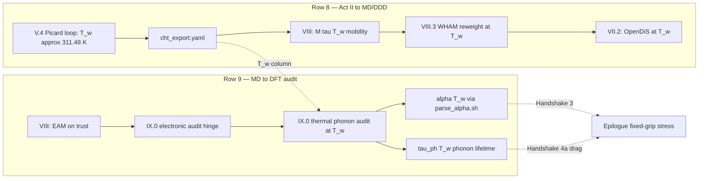
```mermaid
flowchart LR
  subgraph row8["Row 8 — Act II to MD/DDD"]
    CHT[V.4 Picard loop: T_w approx 311.48 K]
    YAML[cht_export.yaml]
    MDmob[VIII: M tau T_w mobility]
    WHAM[VIII.3 WHAM reweight at T_w]
    DDDmob[VII.2: OpenDiS at T_w]
  end
  subgraph row9["Row 9 — MD to DFT audit"]
    EAM[VIII: EAM on trust]
    IX0[IX.0 electronic audit hinge]
    PHON[IX.0 thermal phonon audit at T_w]
    ALPHA[alpha T_w via parse_alpha.sh]
    LIFETIME[tau_ph T_w phonon lifetime]
  end
  CHT --> YAML --> MDmob --> WHAM --> DDDmob
  EAM --> IX0 --> PHON
  PHON --> ALPHA
  PHON --> LIFETIME
  YAML -.->|T_w column| PHON
  ALPHA -.->|Handshake 3| EPIL[Epilogue fixed-grip stress]
  LIFETIME -.->|Handshake 4a drag| EPIL
```

**Row 8 baby picture:** conjugate heat transfer converges once at \(T_w\); archive `cht_export.yaml` before any NVT shear test, WHAM ladder, or OpenDiS mobility calibration — the [VIII.0 descent hinge](../part08-md/00-opening.md#descent-hinge-cores-mobility-and-tw-pedigree) states the contract; the [preface row 8 skill checkpoint](../preface.md#skill-navigation-row-8) closes the competence loop when Act II and Part VIII diverge.

**Row 9 baby picture:** EAM fits bulk moduli on trust until Part IX supplies SCF logs **and** evaluates quasiharmonic \(\alpha(T_w)\) and phonon lifetimes at the same \(T_w\) from row 8 — not at 300 K alone. The [IX.0 thermal phonon audit table](../part09-dft/00-opening.md#thermal-phonon-audit-at-tw) lists the three quantities at risk; the [preface row 9 skill checkpoint](../preface.md#skill-navigation-row-9) closes the competence loop; the [epilogue opening hinge from Part IX](../epilogue/multiscale.md#opening-hinge-ix3-to-epilogue) is where those audits compose with Handshakes 2–4a in workflow time.

When rows 8–9 feel disconnected from row 13 (Handshake 2 → 3), read them as **upstream pedigree**: row 8 sets \(T_w\); row 9 sets \(\alpha(T_w)\) and \(\tau_{\text{ph}}(T_w)\); row 13 sets \(\alpha(T_w)\Delta T\) on fixed grips — skip row 9 and row 13 inherits handbook \(\alpha\) beside a converged CHT loop.

### Row 12 baby picture (next-project restart) {#row-12-baby-picture-next-project}

Row 12 closes the book loop that row 0 opened — same four questions, new specimen, ladder portable.

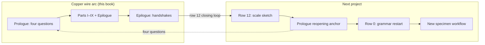
```mermaid
flowchart LR
  subgraph copper["Copper wire arc (this book)"]
    P[Prologue: four questions]
    PARTS[Parts I–IX + Epilogue]
    E[Epilogue: handshakes]
  end
  subgraph next["Next project"]
    R12[Row 12: scale sketch]
    REOPEN[Prologue reopening anchor]
    R0[Row 0: grammar restart]
    NEW[New specimen workflow]
  end
  P --> PARTS --> E
  E -->|row 12 closing loop| R12 --> REOPEN --> R0 --> NEW
  REOPEN -.->|four questions| P
```

**Row 12 baby picture:** finish the epilogue workflow exam, then **do not copy copper input decks blindly** — run the four-step audit at the [prologue reopening anchor](../prologue/00-many-scales.md#prologue-reopening-anchor): name required rungs, fill four questions for two scales, mark which Acts I–VI apply, restart grammar at [row 0](../preface.md#skill-navigation-row-0) before mid-book handshakes. The [epilogue Bridge row 12 closing loop](../epilogue/multiscale.md#row-12-closing-loop) and [preface row 12 skill checkpoint](../preface.md#skill-navigation-row-12) close the competence loop; the [prologue row 12 preview](../prologue/00-many-scales.md#prologue-preview-row-12) named this restart before Part I.

### Row 13 baby picture (Handshake 2 → 3 thermal pre-stress) {#row-13-baby-picture-handshake-2-3}

Row 13 is the **thermal pre-stress contract** — Act II's conjugate heat transfer sets \(\Delta T = T_w - T_\infty\) once; IX.3 quasiharmonic \(\alpha\) sets thermal strain before the fixed-grip load cell reads stress in Act III. Do not conflate the two handshakes: \(\Delta T\) does not depend on \(\alpha\), and \(\alpha\) does not substitute for a converged CHT loop.

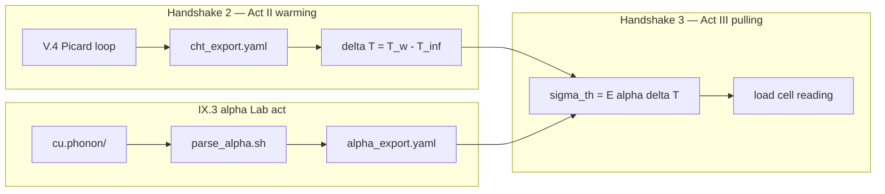
```mermaid
flowchart LR
  subgraph h2["Handshake 2 — Act II warming"]
    CHT[V.4 Picard loop]
    YAML[cht_export.yaml]
    DT["delta T = T_w - T_inf"]
  end
  subgraph ix3["IX.3 alpha Lab act"]
    PHON[cu.phonon/]
    ALPHA[parse_alpha.sh]
    AEXP[alpha_export.yaml]
  end
  subgraph h3["Handshake 3 — Act III pulling"]
    SIG["sigma_th = E alpha delta T"]
    LC[load cell reading]
  end
  CHT --> YAML --> DT
  PHON --> ALPHA --> AEXP
  DT --> SIG
  AEXP --> SIG --> LC
```

**Row 13 baby picture:** run [V.4's Picard loop](../part05-fvm/04-navier-stokes-cfd.md#lab-act-extension-two-domain-picard-loop-with-a-1d-fem-solid) and archive `cht_export.yaml` before exporting quasiharmonic \(\alpha\) — the [preface row 13 three-way audit](../preface.md#skill-navigation-row-13) maps each step across prologue preview, skill checkpoint, and workflow exam; the [epilogue row 13 closing loop](../epilogue/multiscale.md#row-13-closing-loop) reunites Handshakes 2 and 3 in workflow time; the [prologue row 13 preview](../prologue/00-many-scales.md#prologue-preview-row-13) named "\(\Delta T\) from CHT; \(\alpha\Delta T\) from IX.3" before Part I. When rows 8–9 (\(T_w\) pedigree) feel disconnected from row 13, read them as **upstream temperature context**: row 8 sets \(T_w\); row 9 sets \(\alpha(T_w)\) when evaluating phonons at service temperature; row 13 sets \(\alpha\Delta T\) on fixed grips using \(\Delta T\) from Handshake 2 — skip IX.3 and row 13 inherits handbook \(\alpha\) beside a converged CHT loop.

### Row 14 baby picture (Handshake 4a rate extrapolation) {#row-14-baby-picture-handshake-4a}

Row 14 is the **rate-extrapolation contract** — OpenDiS runs at accessible strain rates (\(\sim 10^3\,\text{s}^{-1}\)); the lab grip runs at \(\sim 10^{-3}\,\text{s}^{-1}\). Do not conflate the two: \(\tau_{\text{flow}}\) from DDD does not depend on lab grip speed, and power-law \(m\) does not substitute for a documented forest export.

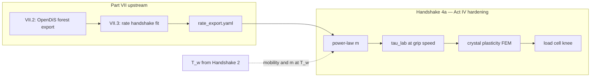
```mermaid
flowchart LR
  subgraph vii["Part VII upstream"]
    FOREST[VII.2: OpenDiS forest export]
    RATE[VII.3: rate handshake fit]
    YAML[rate_export.yaml]
  end
  subgraph h4a["Handshake 4a — Act IV hardening"]
    M["power-law m"]
    TAU["tau_lab at grip speed"]
    FEM[crystal plasticity FEM]
    LC[load cell knee]
  end
  FOREST --> RATE --> YAML
  YAML --> M --> TAU --> FEM --> LC
  TW["T_w from Handshake 2"] -.->|mobility and m at T_w| M
```

**Row 14 baby picture:** run [VII.2's forest Lab act](../part07-defects/02-dislocation-dynamics.md#lab-act-read-the-hardening-bend-from-forest-density-act-iv) and [VII.3's rate handshake](../part07-defects/03-polycrystal-and-fem-handoff.md#scale-boundary-handshake-ddd-strain-rate-to-quasi-static-fem) before importing \(\tau(\gamma)\) into the crystal-plasticity deck — the [preface row 14 three-way audit](../preface.md#skill-navigation-row-14) maps each step across prologue preview, skill checkpoint, and workflow exam; the [epilogue row 14 closing loop](../epilogue/multiscale.md#row-14-closing-loop) reunites Handshake 4a in workflow time; the [prologue row 14 preview](../prologue/00-many-scales.md#prologue-preview-row-14) named "\(\tau_{\text{flow}}\) from DDD; \(\tau_{\text{lab}}\) from power-law \(m\)" before Part I. When rows 8–9 (\(T_w\) pedigree) feel disconnected from row 14, read them as **upstream temperature context**: row 8 sets \(T_w\); row 9 sets \(\tau_{\text{ph}}(T_w)\) for drag on \(m\); row 14 evaluates \(m\) and mobility at converged \(T_w\), not at 300 K — skip row 8 and row 14 inherits room-temperature rate sensitivity beside a Joule-heated wire.

### Row 15 baby picture (Handshake 4b notch localization) {#row-15-baby-picture-handshake-4b}

Row 15 is the **notch-localization contract** — bulk hardening from Handshake 4a may match the load-cell knee while scalar \(H\) under-predicts peak von Mises stress at the notch root by 10–15%. Do not conflate bulk adequacy with root localization: FE² with DDD-active Gauss points resolves pile-up physics that spatially uniform Taylor hardening smears.

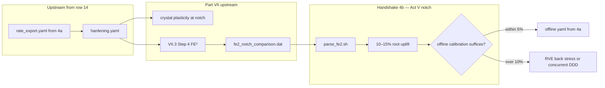
```mermaid
flowchart LR
  subgraph upstream["Upstream from row 14"]
    RATE[rate_export.yaml from 4a]
    YAML[hardening.yaml]
  end
  subgraph vii["Part VII upstream"]
    CP[crystal plasticity at notch]
    FE2[VII.3 Step 4 FE²]
    DAT[fe2_notch_comparison.dat]
  end
  subgraph h4b["Handshake 4b — Act V notch"]
    PARSE["parse_fe2.sh"]
    UPLIFT["10–15% root uplift"]
    DECIDE{offline calibration suffices?}
  end
  RATE --> YAML --> CP
  YAML --> FE2 --> DAT
  DAT --> PARSE --> UPLIFT --> DECIDE
  DECIDE -->|within 5%| OFFLINE[offline yaml from 4a]
  DECIDE -->|over 10%| ENRICH[RVE back stress or concurrent DDD]
```

**Row 15 baby picture:** complete [preface row 14](../preface.md#skill-navigation-row-14) before opening the notch comparison — FE² inherits the same `hardening.yaml` that 4a calibrated. Run [VII.3 Step 4](../part07-defects/03-polycrystal-and-fem-handoff.md#step-4--when-offline-calibration-fails-fe-at-the-notch) and [`parse_fe2.sh`](../../scripts/parse_fe2.sh) on `fe2_notch_comparison.dat` before trusting the notch-root answer — the [preface row 15 three-way audit](../preface.md#skill-navigation-row-15) maps each step across prologue preview, skill checkpoint, and workflow exam; the [prologue row 15 closing stitch](../prologue/00-many-scales.md#row-15-closing-stitch) and [epilogue row 15 closing loop](../epilogue/multiscale.md#row-15-closing-loop) reunite Handshake 4b in narrative and workflow time; the [prologue Handshake 4b preview](../prologue/00-many-scales.md#prologue-preview-act-v) named "FE² vs crystal plasticity at the notch root" before Part I. When row 14 (bulk rate) feels disconnected from row 15 (notch localization), read them as **sequential contracts on the same `hardening.yaml`**: row 14 sets \(\tau_{\text{lab}}\) at lab grip speed; row 15 asks whether that calibration suffices at \(K_t \approx 3\) — skip row 14 and FE² RVEs inherit wrong CRSS at active Gauss points.

### Row 17 baby picture (continuous read-through) {#row-17-baby-picture-continuous-read-through}

Row 17 is the **meta-navigation stitch** — when rows 0–16 feel like a syllabus but the copper wire story should read as one novel, trust the chapter rhythm instead of opening every skill checkpoint mid-climb.

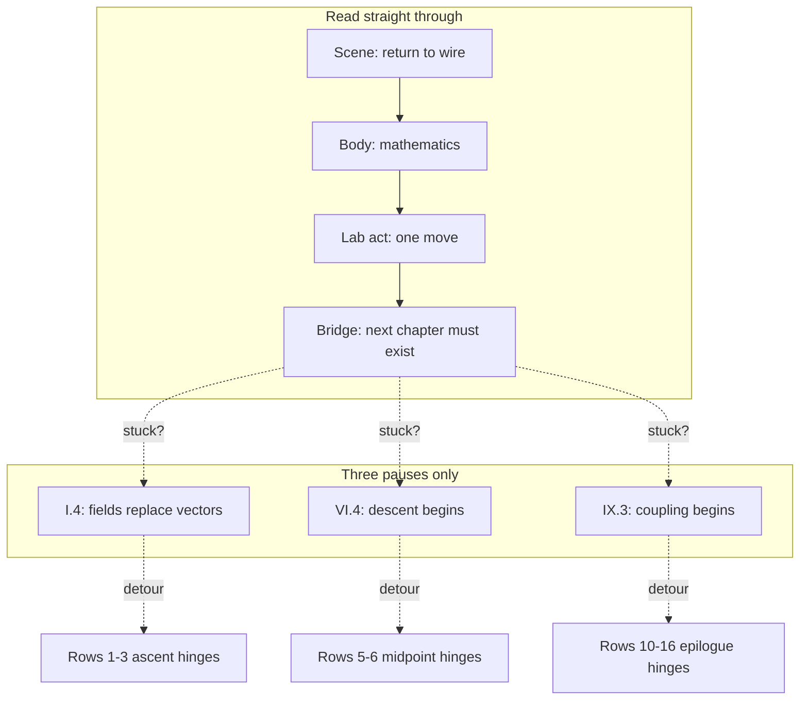
```mermaid
flowchart TB
  subgraph novel["Read straight through"]
    S[Scene: return to wire]
    B[Body: mathematics]
    L[Lab act: one move]
    Br[Bridge: next chapter must exist]
  end
  subgraph gates["Three pauses only"]
    G1[I.4: fields replace vectors]
    G2[VI.4: descent begins]
    G3[IX.3: coupling begins]
  end
  S --> B --> L --> Br
  Br -.->|stuck?| G1
  Br -.->|stuck?| G2
  Br -.->|stuck?| G3
  G1 -.->|detour| H1[Rows 1-3 ascent hinges]
  G2 -.->|detour| H2[Rows 5-6 midpoint hinges]
  G3 -.->|detour| H3[Rows 10-16 epilogue hinges]
```

**Row 17 baby picture:** finish the [preface story in one page](../preface.md#the-story-in-one-page) and [prologue ladder](../prologue/00-many-scales.md#a-ladder-not-a-menu) once, then read Parts I–IX in order — **Scene → Bridge** at every chapter boundary, skill checkpoints only when a gate stalls. The three mandatory pauses are [I.4 Bridge](../part01-linear-algebra/04-toward-infinity.md#bridge-to-part-ii), [VI.4 intermission](../part06-continuum/04-nonlinear-plasticity-preview.md#intermission-ascent-ends-descent-begins), and [IX.3 Bridge](../part09-dft/03-dft-workflows.md#bridge-to-the-epilogue); the [continuous read-through guide](sources.md#continuous-read-through-guide) draws the five-act straight path; the [preface row 17 skill checkpoint](../preface.md#skill-navigation-row-17) closes the competence loop when the first pass ends but the plot still feels episodic; the [prologue row 17 closing stitch](../prologue/00-many-scales.md#row-17-closing-stitch) and [prologue row 17 preview](../prologue/00-many-scales.md#prologue-preview-row-17) reunite the three-way audit when the epilogue [workflow exam full arc row](../epilogue/multiscale.md#what-you-should-be-able-to-do-after-the-book) feels like separate courses stitched together; the [epilogue row 17 closing loop](../epilogue/multiscale.md#row-17-closing-loop) reunites narrative and workflow time after [row 16](#act-vi-baby-picture-me-412-coupling-ladder) orchestration is understood.

When row 17 feels disconnected from row 12 (next project), read them as **bookend meta-stitches**: row 17 is how to read **this** copper arc continuously; row 12 is how to restart the ladder on the **next** specimen — complete row 17 before row 12 when the epilogue workflow exam feels like separate courses stitched together.

### Row 18 baby picture (part-opening plot spine) {#row-18-baby-picture-part-opening-plot-spine}

**Row 18 baby picture:** when a part opening feels like a new syllabus, read its [plot spine one line](../part01-linear-algebra/00-opening.md#plot-spine-one-line) aloud — one sentence per part, nine rungs from grammar through descent. The [part-opening plot spine index](sources.md#part-opening-plot-spine-index-row-18) lists all nine; the [preface plot spine](../preface.md#plot-spine-how-the-story-is-told) names four acts. Row 17 is how to read continuously; row 18 is what each part opening should **sound like** when the plot is smooth. The [preface row 18 skill checkpoint](../preface.md#skill-navigation-row-18) closes the competence loop when row 17's straight read stalls at a part boundary; the [prologue row 18 closing stitch](../prologue/00-many-scales.md#row-18-closing-stitch) and [prologue row 18 preview](../prologue/00-many-scales.md#prologue-preview-row-18) reunite the three-way audit when the epilogue [workflow exam row 18 row](../epilogue/multiscale.md#what-you-should-be-able-to-do-after-the-book) feels like separate textbooks at III→IV or VI→VII; the [epilogue row 18 closing loop](../epilogue/multiscale.md#row-18-closing-loop) reunites narrative and workflow time after [row 17](#row-17-baby-picture-continuous-read-through) straight-read rhythm is understood. When row 18 feels disconnected from row 17, read them as **layered meta-stitches**: row 17 names straight-through rhythm; row 18 names the one-line role at each part boundary — use row 18 when you land on a new part and the symbols changed faster than the specimen.

When a chapter feels abstract, pick the row that matches your reading position and read it aloud — it is the plot spine in one breath. At part openings, use [row 18](sources.md#part-opening-plot-spine-index-row-18); mid-chapter, use [row 19](sources.md#numbered-chapter-plot-spine-index-row-19) or the [chapter roadmap](sources.md#chapter-roadmap-one-continuous-arc) row for that chapter.

### Row 19 baby picture (numbered-chapter plot spine) {#row-19-baby-picture-numbered-chapter-plot-spine}

**Row 19 baby picture:** when a numbered chapter feels abstract despite reading the prior Bridge, read its [plot spine one line](../part01-linear-algebra/01-vectors-matrices.md#plot-spine-one-line) aloud — one sentence per chapter, 35 rungs from \(\mathbf{K}\mathbf{u}=\mathbf{f}\) through DFT workflows. The [numbered-chapter plot spine index](sources.md#numbered-chapter-plot-spine-index-row-19) groups them by part; the [chapter roadmap](sources.md#chapter-roadmap-one-continuous-arc) is the audit table. Row 17 is how to read continuously; row 18 is what part openings should sound like; row 19 is what **each chapter opening** should sound like when symbols rise faster than the specimen mid-part. The [preface row 19 skill checkpoint](../preface.md#skill-navigation-row-19) closes the competence loop when row 18's part one-liners did not restore continuity; the [prologue row 19 closing stitch](../prologue/00-many-scales.md#row-19-closing-stitch) and [prologue row 19 preview](../prologue/00-many-scales.md#prologue-preview-row-19) reunite the three-way audit when the epilogue [workflow exam row 19 row](../epilogue/multiscale.md#what-you-should-be-able-to-do-after-the-book) feels like separate chapters mid-part; the [epilogue row 19 closing loop](../epilogue/multiscale.md#row-19-closing-loop) reunites narrative and workflow time after [row 18](#row-18-baby-picture-part-opening-plot-spine) part-boundary rhythm is understood. When row 19 feels disconnected from row 18, read them as **layered meta-stitches**: row 18 at part boundaries; row 19 at chapter interiors — use row 19 when Scene and Bridge both felt fine but the body lost the wire.

When a chapter feels abstract, pick the row that matches your reading position and read it aloud — it is the plot spine in one breath. At part openings, use [row 18](sources.md#part-opening-plot-spine-index-row-18); mid-chapter, use [row 19](sources.md#numbered-chapter-plot-spine-index-row-19) or the [chapter roadmap](sources.md#chapter-roadmap-one-continuous-arc) row for that chapter; at mandatory gates, use [row 20](sources.md#gate-chapter-plot-spine-index-row-20).

### Row 20 baby picture (gate-chapter plot spine) {#row-20-baby-picture-gate-chapter-plot-spine}

**Row 20 baby picture:** when row 17's straight-through read stalls at a mandatory gate, recite the [plot spine one line](../part01-linear-algebra/04-toward-infinity.md#plot-spine-one-line) for that gate aloud — three sentences for three plot turns: [I.4](../part01-linear-algebra/04-toward-infinity.md#plot-spine-one-line) (grammar becomes analysis), [VI.4](../part06-continuum/04-nonlinear-plasticity-preview.md#plot-spine-one-line) (ascent ends at the knee), [IX.3](../part09-dft/03-dft-workflows.md#plot-spine-one-line) (pedigree exports upward). The [gate-chapter plot spine index](sources.md#gate-chapter-plot-spine-index-row-20) lists all three; the [continuous read-through guide](sources.md#continuous-read-through-guide) names when to pause. Row 17 is how to read continuously; row 18 is what part openings sound like; row 19 is what chapter interiors sound like; row 20 is what **plot turns** sound like at the three gates row 17 assumes you will pause. The [preface row 20 skill checkpoint](../preface.md#skill-navigation-row-20) closes the competence loop when row 19's chapter one-liners did not restore continuity at a plot turn; the [prologue row 20 closing stitch](../prologue/00-many-scales.md#row-20-closing-stitch) and [prologue row 20 preview](../prologue/00-many-scales.md#prologue-preview-row-20) reunite the three-way audit when the epilogue [workflow exam row 20 row](../epilogue/multiscale.md#what-you-should-be-able-to-do-after-the-book) feels like separate acts at a mandatory gate; the [epilogue row 20 closing loop](../epilogue/multiscale.md#row-20-closing-loop) reunites narrative and workflow time after [row 19](#row-19-baby-picture-numbered-chapter-plot-spine) mid-chapter rhythm is understood. When row 20 feels disconnected from row 19, read them as **layered meta-stitches**: row 19 at chapter interiors; row 20 at plot turns — use row 20 when Scene, Bridge, and chapter one-liners all felt fine but the **act** still changed (ascent → analysis, ascent → descent, descent → coupling).

When a chapter feels abstract, pick the row that matches your reading position and read it aloud — it is the plot spine in one breath. At part openings, use [row 18](sources.md#part-opening-plot-spine-index-row-18); mid-chapter, use [row 19](sources.md#numbered-chapter-plot-spine-index-row-19); at mandatory gates, use [row 20](sources.md#gate-chapter-plot-spine-index-row-20); when a Lab act feels disconnected, use [row 21](sources.md#lab-act-reunion-index-row-21); when symbols hide the specimen, use [row 22](sources.md#scene-reunion-index-row-22); when transitions feel mechanical, use [row 23](sources.md#bridge-reunion-index-row-23).

### Row 21 baby picture (lab act reunion) {#row-21-baby-picture-lab-act-reunion}

**Row 21 baby picture:** when Scene, Bridge, and plot spine one-liners all read correctly but a **Lab act** still feels like a course assignment, open the [lab act reunion index](sources.md#lab-act-reunion-index-row-21) — read the one-line move for that act aloud, then name which of Acts I–VI the operator is running. Row 17 is chapter rhythm; rows 18–20 are plot vocabulary; row 21 is **competence vocabulary** — what the hands do on the same copper wire. The [preface row 21 skill checkpoint](../preface.md#skill-navigation-row-21) closes the competence loop when algebra and laboratory time diverge; the [prologue row 21 closing stitch](../prologue/00-many-scales.md#row-21-closing-stitch) and [prologue row 21 preview](../prologue/00-many-scales.md#prologue-preview-row-21) reunite the three-way audit when the epilogue [workflow exam row 21 row](../epilogue/multiscale.md#what-you-should-be-able-to-do-after-the-book) feels like code without a specimen. When row 21 feels disconnected from row 20, read them as **layered meta-stitches**: row 20 at plot turns; row 21 when the plot is clear but the **computation** lost the wire.

When a Lab act feels like homework, pick the row that matches your reading position — read the one-line move aloud, then open the Lab act body. At workflow handoffs, use [rows 8–16](#continuity-hinges-master-map); at narrative smoothness, use [rows 17–20](#continuity-hinges-master-map); at computational smoothness, use [row 21](sources.md#lab-act-reunion-index-row-21); at sensory smoothness, use [row 22](sources.md#scene-reunion-index-row-22); at transition smoothness, use [row 23](sources.md#bridge-reunion-index-row-23).

### Row 22 baby picture (Scene reunion) {#row-22-baby-picture-scene-reunion}

**Row 22 baby picture:** when plot spine one-liners and Lab act moves both read correctly but **symbols hide the copper wire**, open the [Scene reunion index](sources.md#scene-reunion-index-row-22) — read the one-line visual for the part you are in aloud, then open the chapter **Scene** paragraph and picture the grips, thermocouple, or load cell. Row 17 is chapter rhythm; rows 18–20 are plot vocabulary; row 21 is competence vocabulary; row 22 is **sensory vocabulary** — what the operator's eyes see on the same afternoon. The [preface row 22 skill checkpoint](../preface.md#skill-navigation-row-22) closes the competence loop when abstraction rises faster than the specimen; the [prologue row 22 closing stitch](../prologue/00-many-scales.md#row-22-closing-stitch) and [prologue row 22 preview](../prologue/00-many-scales.md#prologue-preview-row-22) reunite the three-way audit when the epilogue [workflow exam row 22 row](../epilogue/multiscale.md#what-you-should-be-able-to-do-after-the-book) feels like notation without a lab. When row 22 feels disconnected from row 21, read them as **layered meta-stitches**: row 21 when the plot and code diverge; row 22 when the plot and code align but the **specimen** is invisible.

When symbols hide the wire, pick the row that matches your reading position — read the Scene one-line visual aloud, then continue the chapter body. At workflow handoffs, use [rows 8–16](#continuity-hinges-master-map); at narrative smoothness, use [rows 17–20](#continuity-hinges-master-map); at computational smoothness, use [row 21](sources.md#lab-act-reunion-index-row-21); at sensory smoothness, use [row 22](sources.md#scene-reunion-index-row-22); at transition smoothness, use [row 23](sources.md#bridge-reunion-index-row-23).

### Row 23 baby picture (Bridge reunion) {#row-23-baby-picture-bridge-reunion}

**Row 23 baby picture:** when Scene, plot spine one-liners, Lab act moves, and Scene visuals all read correctly but **chapter transitions feel mechanical**, open the [Bridge reunion index](sources.md#bridge-reunion-index-row-23) — read the one-line hinge for the part boundary you are crossing aloud, then open the prior chapter's **Bridge** section. Row 17 is chapter rhythm; rows 18–20 are plot vocabulary; row 21 is competence vocabulary; row 22 is sensory vocabulary; row 23 is **transition vocabulary** — why the next chapter must exist on the same copper wire. The [preface row 23 skill checkpoint](../preface.md#skill-navigation-row-23) closes the competence loop when vocabulary is restored but the seam is visible; the [prologue row 23 closing stitch](../prologue/00-many-scales.md#row-23-closing-stitch) and [prologue row 23 preview](../prologue/00-many-scales.md#prologue-preview-row-23) reunite the three-way audit when the epilogue [workflow exam row 23 row](../epilogue/multiscale.md#what-you-should-be-able-to-do-after-the-book) feels like separate courses at part boundaries. When row 23 feels disconnected from row 22, read them as **layered meta-stitches**: row 22 when the specimen is invisible; row 23 when the specimen is visible but the **turn** still reads like a syllabus bullet.

When transitions feel mechanical, pick the row that matches your reading position — read the Bridge one-line hinge aloud, then turn the page. At workflow handoffs, use [rows 8–16](#continuity-hinges-master-map); at narrative smoothness, use [rows 17–20](#continuity-hinges-master-map); at computational smoothness, use [row 21](sources.md#lab-act-reunion-index-row-21); at sensory smoothness, use [row 22](sources.md#scene-reunion-index-row-22); at transition smoothness, use [row 23](sources.md#bridge-reunion-index-row-23); at structural smoothness, use [row 24](sources.md#concept-map-reunion-index-row-24).

### Row 24 baby picture (Concept map reunion) {#row-24-baby-picture-concept-map-reunion}

**Row 24 baby picture:** when Scene, plot spine one-liners, Lab act moves, Scene visuals, and Bridge hinges all read correctly but **proofs feel like disconnected theorems**, open the [Concept map reunion index](sources.md#concept-map-reunion-index-row-24) — answer object / structure / theorem / breaks for the part you are in, then return to the chapter body. Row 17 is chapter rhythm; rows 18–20 are plot vocabulary; row 21 is competence vocabulary; row 22 is sensory vocabulary; row 23 is transition vocabulary; row 24 is **structural vocabulary** — what ME 412 structure makes the theorem possible on the same copper wire. The [preface row 24 skill checkpoint](../preface.md#skill-navigation-row-24) closes the competence loop when narrative is smooth but the proof stack feels like a syllabus; the [prologue row 24 closing stitch](../prologue/00-many-scales.md#row-24-closing-stitch) and [prologue row 24 preview](../prologue/00-many-scales.md#prologue-preview-row-24) reunite the three-way audit when the epilogue [workflow exam row 24 row](../epilogue/multiscale.md#what-you-should-be-able-to-do-after-the-book) feels like theorems without a concept map. When row 24 feels disconnected from row 23, read them as **layered meta-stitches**: row 23 when the turn feels mechanical; row 24 when the turn is smooth but the **proof** lost its structural spine.

When proofs feel unmotivated, pick the row that matches your reading position — answer the four ME 412 questions at the part opening, then continue the derivation. At workflow handoffs, use [rows 8–16](#continuity-hinges-master-map); at narrative smoothness, use [rows 17–20](#continuity-hinges-master-map); at computational smoothness, use [row 21](sources.md#lab-act-reunion-index-row-21); at sensory smoothness, use [row 22](sources.md#scene-reunion-index-row-22); at transition smoothness, use [row 23](sources.md#bridge-reunion-index-row-23); at structural smoothness, use [row 24](sources.md#concept-map-reunion-index-row-24); at visual smoothness, use [row 25](sources.md#schematic-reunion-index-row-25).

### Row 25 baby picture (Schematic reunion) {#row-25-baby-picture-schematic-reunion}

**Row 25 baby picture:** when Scene, plot spine one-liners, Lab act moves, Scene visuals, Bridge hinges, and concept map audits all read correctly but **proofs feel abstract without a visual anchor**, open the [Schematic reunion index](sources.md#schematic-reunion-index-row-25) — locate the matching baby picture from the part-opening representative schematics table, then return to the chapter body. Row 17 is chapter rhythm; rows 18–20 are plot vocabulary; row 21 is competence vocabulary; row 22 is sensory vocabulary; row 23 is transition vocabulary; row 24 is structural vocabulary; row 25 is **visual vocabulary** — which course-note diagram makes the proof concrete on the same copper wire. The [preface row 25 skill checkpoint](../preface.md#skill-navigation-row-25) closes the competence loop when structure is restored but no diagram anchors the chapter; the [prologue row 25 closing stitch](../prologue/00-many-scales.md#row-25-closing-stitch) and [prologue row 25 preview](../prologue/00-many-scales.md#prologue-preview-row-25) reunite the three-way audit when the epilogue [workflow exam row 25 row](../epilogue/multiscale.md#what-you-should-be-able-to-do-after-the-book) feels like proofs without source-note diagrams. When row 25 feels disconnected from row 24, read them as **layered meta-stitches**: row 24 when the proof lost its structural spine; row 25 when structure is restored but the **baby picture** from ME 300A, ME 412, ME 300B, FEA, FVM, or the descent notes is still missing. **Schematic 14** in Part II is the spine through [III.0's variational ladder](../part03-pdes/00-opening.md#the-variational-ladder-me-412-schematic-14), [IV.0's Galerkin ladder](../part04-fem/00-opening.md#the-galerkin-ladder-me-412-schematic-14-continued), and [V.0's conservation ladder](../part05-fvm/00-opening.md#the-conservation-ladder-fvm-parallel-to-schematic-14) — read it once when ascent and discretization feel like separate subjects.

When proofs feel abstract, pick the row that matches your reading position — locate the matching schematic row at the part opening, then continue the derivation. At workflow handoffs, use [rows 8–16](#continuity-hinges-master-map); at narrative smoothness, use [rows 17–20](#continuity-hinges-master-map); at computational smoothness, use [row 21](sources.md#lab-act-reunion-index-row-21); at sensory smoothness, use [row 22](sources.md#scene-reunion-index-row-22); at transition smoothness, use [row 23](sources.md#bridge-reunion-index-row-23); at structural smoothness, use [row 24](sources.md#concept-map-reunion-index-row-24); at visual smoothness, use [row 25](sources.md#schematic-reunion-index-row-25); at temporal smoothness, use [row 26](sources.md#story-so-far-reunion-index-row-26); at symbolic smoothness, use [row 27](sources.md#closing-the-arc-reunion-index-row-27).

### Row 26 baby picture (Story so far reunion) {#row-26-baby-picture-story-so-far-reunion}

**Row 26 baby picture:** when Scene, plot spine one-liners, Lab act moves, Scene visuals, Bridge hinges, concept map audits, and schematic anchors all read correctly but **you cannot place where the copper wire is in the narrative arc**, open the [Story so far reunion index](sources.md#story-so-far-reunion-index-row-26) — read the one-line temporal summary for the part you are in aloud, then open the part-opening **Story so far** table. Row 17 is chapter rhythm; rows 18–20 are plot vocabulary; row 21 is competence vocabulary; row 22 is sensory vocabulary; row 23 is transition vocabulary; row 24 is structural vocabulary; row 25 is visual vocabulary; row 26 is **temporal vocabulary** — where the same specimen is in the story when every layer works but the arc feels disoriented. The [preface row 26 skill checkpoint](../preface.md#skill-navigation-row-26) closes the competence loop when all meta-stitches read correctly but the chapter feels like a flashback; the [prologue row 26 closing stitch](../prologue/00-many-scales.md#row-26-closing-stitch) and [prologue row 26 preview](../prologue/00-many-scales.md#prologue-preview-row-26) reunite the three-way audit when the epilogue [workflow exam row 26 row](../epilogue/multiscale.md#what-you-should-be-able-to-do-after-the-book) feels like mid-novel confusion without a recap. When row 26 feels disconnected from row 25, read them as **layered meta-stitches**: row 25 when the proof lost its baby picture; row 26 when every vocabulary layer is restored but the **timeline** of the copper wire story is still invisible. The [VI.4 intermission](../part06-continuum/04-nonlinear-plasticity-preview.md#intermission-ascent-ends-descent-begins) is the book's midpoint **Story so far** — read it once when ascent (Parts I–VI) and descent (Parts VII–IX) feel like separate novels.

When the narrative timeline blurs, pick the row that matches your reading position — read the **Story so far** one-line summary aloud, then continue the chapter body. At workflow handoffs, use [rows 8–16](#continuity-hinges-master-map); at narrative smoothness, use [rows 17–20](#continuity-hinges-master-map); at computational smoothness, use [row 21](sources.md#lab-act-reunion-index-row-21); at sensory smoothness, use [row 22](sources.md#scene-reunion-index-row-22); at transition smoothness, use [row 23](sources.md#bridge-reunion-index-row-23); at structural smoothness, use [row 24](sources.md#concept-map-reunion-index-row-24); at visual smoothness, use [row 25](sources.md#schematic-reunion-index-row-25); at temporal smoothness, use [row 26](sources.md#story-so-far-reunion-index-row-26); at symbolic smoothness, use [row 27](sources.md#closing-the-arc-reunion-index-row-27).

### Row 27 baby picture (Closing the arc reunion) {#row-27-baby-picture-closing-the-arc-reunion}

**Row 27 baby picture:** when Scene, plot spine one-liners, Lab act moves, Scene visuals, Bridge hinges, concept map audits, schematic anchors, and Story so far recaps all read correctly but **prior-part symbols do not translate to current-part vocabulary**, open the [Closing the arc reunion index](sources.md#closing-the-arc-reunion-index-row-27) — read the one-line symbol bridge for the part you are in aloud, then open the part-opening **Closing the arc** table. Row 17 is chapter rhythm; rows 18–20 are plot vocabulary; row 21 is competence vocabulary; row 22 is sensory vocabulary; row 23 is transition vocabulary; row 24 is structural vocabulary; row 25 is visual vocabulary; row 26 is temporal vocabulary; row 27 is **symbolic vocabulary** — how \(\mathbf{K}\mathbf{u}=\mathbf{f}\) becomes \(a(u,v)=\ell(v)\), then Galerkin assembly, then Cauchy stress, then dislocation density, then electron density on the same copper wire. The [preface row 27 skill checkpoint](../preface.md#skill-navigation-row-27) closes the competence loop when every meta-stitch layer works but notation feels like a subject change; the [prologue row 27 closing stitch](../prologue/00-many-scales.md#row-27-closing-stitch) and [epilogue row 27 closing loop](../epilogue/multiscale.md#row-27-closing-loop) reunite the three-way audit.

When prior-part symbols do not map, pick the row that matches your reading position — read one row of the **Closing the arc** translation table aloud, then continue the chapter body. At workflow handoffs, use [rows 8–16](#continuity-hinges-master-map); at narrative smoothness, use [rows 17–20](#continuity-hinges-master-map); at computational smoothness, use [row 21](sources.md#lab-act-reunion-index-row-21); at sensory smoothness, use [row 22](sources.md#scene-reunion-index-row-22); at transition smoothness, use [row 23](sources.md#bridge-reunion-index-row-23); at structural smoothness, use [row 24](sources.md#concept-map-reunion-index-row-24); at visual smoothness, use [row 25](sources.md#schematic-reunion-index-row-25); at temporal smoothness, use [row 26](sources.md#story-so-far-reunion-index-row-26); at symbolic smoothness, use [row 27](sources.md#closing-the-arc-reunion-index-row-27); at export pedigree smoothness, use [row 28](sources.md#scale-boundary-reunion-index-row-28).

### Row 28 baby picture (Scale-boundary reunion) {#row-28-baby-picture-scale-boundary-reunion}

**Row 28 baby picture:** when Scene, plot spine one-liners, Lab act moves, Scene visuals, Bridge hinges, concept map audits, schematic anchors, Story so far recaps, and Closing the arc symbol bridges all read correctly but **parameters crossing a scale boundary feel arbitrary** — handbook \(\alpha\), 300 K mobility defaults, DDD rates fed directly to a quasi-static load cell, single-crystal moduli on a polycrystal wire — open the [Scale-boundary reunion index](sources.md#scale-boundary-reunion-index-row-28) and read the export → consumer → failure mode chain for the handshake you are at. Row 17 is chapter rhythm; rows 18–20 are plot vocabulary; row 21 is competence vocabulary; row 22 is sensory vocabulary; row 23 is transition vocabulary; row 24 is structural vocabulary; row 25 is visual vocabulary; row 26 is temporal vocabulary; row 27 is symbolic vocabulary; row 28 is **export pedigree vocabulary** — what must transfer across scale boundaries with documented units, averaging, and temperature column. The [preface row 28 skill checkpoint](../preface.md#skill-navigation-row-28) closes the competence loop when every meta-stitch layer works but input-deck numbers feel like folklore; the [prologue row 28 closing stitch](../prologue/00-many-scales.md#row-28-closing-stitch) and [epilogue row 28 closing loop](../epilogue/multiscale.md#row-28-closing-loop) reunite the three-way audit. When row 28 feels disconnected from row 27, read them as **layered meta-stitches**: row 27 when notation feels like a subject change; row 28 when notation is clear but **exports** at the boundary have no pedigree. Rows 8–16 are the workflow-time mirrors of the same handshakes row 28 indexes in reading time.

When exports feel arbitrary, pick the row that matches your reading position — read one **Scale-boundary handshake** table aloud, then continue the chapter body. At workflow handoffs, use [rows 8–16](#continuity-hinges-master-map); at narrative smoothness, use [rows 17–20](#continuity-hinges-master-map); at computational smoothness, use [row 21](sources.md#lab-act-reunion-index-row-21); at sensory smoothness, use [row 22](sources.md#scene-reunion-index-row-22); at transition smoothness, use [row 23](sources.md#bridge-reunion-index-row-23); at structural smoothness, use [row 24](sources.md#concept-map-reunion-index-row-24); at visual smoothness, use [row 25](sources.md#schematic-reunion-index-row-25); at temporal smoothness, use [row 26](sources.md#story-so-far-reunion-index-row-26); at symbolic smoothness, use [row 27](sources.md#closing-the-arc-reunion-index-row-27); at export pedigree smoothness, use [row 28](sources.md#scale-boundary-reunion-index-row-28); at thermoelastic assembly smoothness, use [row 29](sources.md#thermoelastic-assembly-reunion-index-row-29); at CHT outer-loop smoothness, use [row 30](sources.md#cht-outer-loop-reunion-index-row-30).

### Row 29 baby picture (Thermoelastic assembly reunion) {#row-29-baby-picture-thermoelastic-assembly-reunion}

**Row 29 baby picture:** when Scene, plot spine one-liners, Lab act moves, Scene visuals, Bridge hinges, concept map audits, schematic anchors, Story so far recaps, Closing the arc symbol bridges, and Scale-boundary handshakes all read correctly but **Act II (thermocouple) and Act III (load cell) still feel like separate FEM courses**, open the [Thermoelastic assembly reunion index](sources.md#thermoelastic-assembly-reunion-index-row-29) — read the staggered pass chain aloud: \(\mathbf{K}_{TT}\mathbf{T}=\mathbf{F}_T\) → \(\varepsilon_{\text{th}}=\alpha\Delta T\) → \(\mathbf{K}_{uu}\mathbf{U}=\mathbf{F}_u+\mathbf{F}_{\text{th}}\) → [IV.5 \(h\)-certificate](../part04-fem/05-convergence.md#lab-act-extension-thermoelastic-h-refinement-on-one-mesh-acts-iiiii) before [V.0 CHT](../part05-fvm/00-opening.md#conjugate-heat-transfer-the-wire-meets-the-wind). Row 17 is chapter rhythm; rows 18–20 are plot vocabulary; row 21 is competence vocabulary; row 22 is sensory vocabulary; row 23 is transition vocabulary; row 24 is structural vocabulary; row 25 is visual vocabulary; row 26 is temporal vocabulary; row 27 is symbolic vocabulary; row 28 is export pedigree vocabulary; row 29 is **thermoelastic assembly vocabulary** — one mesh, two weighted residuals, one thermal handshake between lab acts. The [preface row 29 skill checkpoint](../preface.md#skill-navigation-row-29) closes the competence loop; the [prologue row 29 closing stitch](../prologue/00-many-scales.md#row-29-closing-stitch) and [epilogue row 29 closing loop](../epilogue/multiscale.md#row-29-closing-loop) reunite the three-way audit.

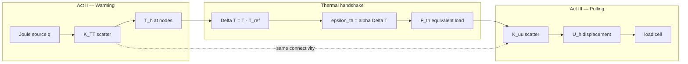
```mermaid
flowchart LR
  subgraph act2["Act II — Warming"]
    Q[Joule source q]
    KTT[K_TT scatter]
    T[T_h at nodes]
  end
  subgraph handshake["Thermal handshake"]
    DT["Delta T = T - T_ref"]
    ETH["epsilon_th = alpha Delta T"]
    FTH[F_th equivalent load]
  end
  subgraph act3["Act III — Pulling"]
    KUU[K_uu scatter]
    U[U_h displacement]
    LC[load cell]
  end
  Q --> KTT --> T --> DT --> ETH --> FTH
  FTH --> KUU --> U --> LC
  KTT -.->|same connectivity| KUU
```

When row 29 feels disconnected from row 28, read them as **layered meta-stitches**: row 28 when export numbers lack pedigree; row 29 when pedigree is clear but **heat and mechanics never ran on the same mesh in order** — skip the heat pass and row 28's \(\alpha(T_w)\) audit cannot fix the load cell lie.

When Act II and Act III feel like separate homework, pick the row that matches your reading position — read the [Part IV thermoelastic assembly thread](../part04-fem/00-opening.md#acts-ii-and-iii-together-thermoelastic-assembly-thread) aloud, then open the chapter Lab act for your position (IV.1 heat, IV.2 scatter, IV.4 coupled). At workflow handoffs, use [rows 8–16](#continuity-hinges-master-map); at narrative smoothness, use [rows 17–20](#continuity-hinges-master-map); at thermoelastic assembly smoothness, use [row 29](sources.md#thermoelastic-assembly-reunion-index-row-29); at CHT outer-loop smoothness, use [row 30](sources.md#cht-outer-loop-reunion-index-row-30); at twin-ladder → virtual work smoothness, use [row 31](sources.md#twin-ladder-virtual-work-reunion-index-row-31); at virtual work → plasticity preview smoothness, use [row 32](sources.md#virtual-work-plasticity-preview-reunion-index-row-32).

### Row 30 baby picture (CHT outer-loop reunion) {#row-30-baby-picture-cht-outer-loop-reunion}

**Row 30 baby picture:** when Scene, plot spine one-liners, Lab act moves, Scene visuals, Bridge hinges, concept map audits, schematic anchors, Story so far recaps, Closing the arc symbol bridges, Scale-boundary handshakes, and thermoelastic assembly all read correctly but **solid FEM and fluid FVM still feel like separate solvers**, open the [CHT outer-loop reunion index](sources.md#cht-outer-loop-reunion-index-row-30) — read the chain aloud: [IV.5 \(h\)-certificate](../part04-fem/05-convergence.md#lab-act-extension-thermoelastic-h-refinement-on-one-mesh-acts-iiiii) → [V.4 Picard](../part05-fvm/04-navier-stokes-cfd.md#lab-act-extension-two-domain-picard-loop-with-a-1d-fem-solid) → [`parse_cht.sh`](../../scripts/parse_cht.sh) → `cht_export.yaml` → [VI.0 twin-ladder reunion](../part06-continuum/00-opening.md#the-twin-ladders-reunite-galerkin-and-conservation). Row 29 is one mesh, two fields on the solid; row 30 is **two dialects, one wall temperature** at the interface. The [preface row 30 skill checkpoint](../preface.md#skill-navigation-row-30) closes the competence loop; the [prologue row 30 closing stitch](../prologue/00-many-scales.md#row-30-closing-stitch) and [epilogue row 30 closing loop](../epilogue/multiscale.md#row-30-closing-loop) reunite the three-way audit.

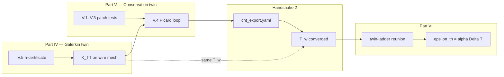
```mermaid
flowchart LR
  subgraph solid["Part IV — Galerkin twin"]
    IV5[IV.5 h-certificate]
    KTT[K_TT on wire mesh]
  end
  subgraph fluid["Part V — Conservation twin"]
    V13[V.1–V.3 patch tests]
    PIC[V.4 Picard loop]
  end
  subgraph export["Handshake 2"]
    YAML[cht_export.yaml]
    TW["T_w converged"]
  end
  subgraph reunion["Part VI"]
    TL[twin-ladder reunion]
    ETH["epsilon_th = alpha Delta T"]
  end
  IV5 --> KTT --> PIC
  V13 --> PIC
  PIC --> YAML --> TW
  TW --> TL --> ETH
  KTT -.->|same T_w| TW
```

When row 30 feels disconnected from row 29, read them as **layered meta-stitches**: row 29 when heat and mechanics never shared a solid mesh; row 30 when the solid mesh and fluid fluxes never archived **one converged \(T_w\)** — skip `cht_export.yaml` and Handshake 3 inherits a hand-wavy wall temperature.

### Row 31 baby picture (twin-ladder → virtual work reunion) {#row-31-baby-picture-twin-ladder-virtual-work-reunion}

**Row 31 baby picture:** when Scene, plot spine one-liners, Lab act moves, Scene visuals, Bridge hinges, concept map audits, schematic anchors, Story so far recaps, Closing the arc symbol bridges, Scale-boundary handshakes, thermoelastic assembly, and CHT outer-loop reunion all read correctly but **\(\mathbf{K}\mathbf{U}=\mathbf{F}\) and virtual work still feel like separate subjects**, open the [twin-ladder → virtual work reunion index](sources.md#twin-ladder-virtual-work-reunion-index-row-31) — read the chain aloud: [VI.0 twin-ladder reunion](../part06-continuum/00-opening.md#the-twin-ladders-reunite-galerkin-and-conservation) → [VI.1 kinematics + Act II overlay](../part06-continuum/01-kinematics.md#lab-act-act-ii-overlay-thermal-eigenstrain-from-cht-export) → [VI.3 virtual work Lab act](../part06-continuum/03-variational-elasticity.md#lab-act-virtual-work-equals-load-cell-reading-act-iii--pulling). Row 30 is two dialects, one \(T_w\); row 31 is **one energy functional, one load cell**. The [preface row 31 skill checkpoint](../preface.md#skill-navigation-row-31) closes the competence loop; the [prologue row 31 closing stitch](../prologue/00-many-scales.md#row-31-closing-stitch) and [epilogue row 31 closing loop](../epilogue/multiscale.md#row-31-closing-loop) reunite the three-way audit.

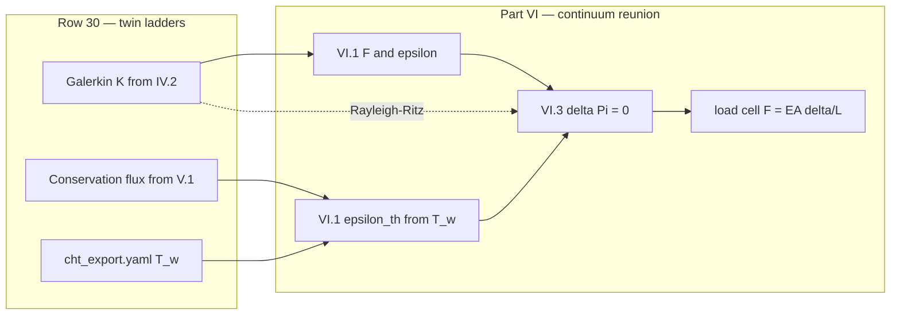
```mermaid
flowchart LR
  subgraph twins["Row 30 — twin ladders"]
    GL[Galerkin K from IV.2]
    CL[Conservation flux from V.1]
    YAML[cht_export.yaml T_w]
  end
  subgraph vi["Part VI — continuum reunion"]
    KIN[VI.1 F and epsilon]
    ETH[VI.1 epsilon_th from T_w]
    VW[VI.3 delta Pi = 0]
    LC[load cell F = EA delta/L]
  end
  GL --> KIN --> VW --> LC
  CL --> ETH --> VW
  YAML --> ETH
  GL -.->|Rayleigh-Ritz| VW
```

When row 31 feels disconnected from row 30, read them as **layered meta-stitches**: row 30 when FEM and FVM never shared one \(T_w\); row 31 when one \(T_w\) is archived but **assembly still reads like sparse linear algebra without \(\Pi[\mathbf{u}]\)** — skip [VI.3's virtual work Lab act](../part06-continuum/03-variational-elasticity.md#lab-act-virtual-work-equals-load-cell-reading-act-iii--pulling) and the load cell cannot defend why \(\mathbf{K}\) existed.

### Row 32 baby picture (virtual work → plasticity preview reunion) {#row-32-baby-picture-virtual-work-plasticity-preview-reunion}

**Row 32 baby picture:** when Scene, plot spine one-liners, Lab act moves, Scene visuals, Bridge hinges, concept map audits, schematic anchors, Story so far recaps, Closing the arc symbol bridges, Scale-boundary handshakes, thermoelastic assembly, CHT outer-loop reunion, and twin-ladder → virtual work reunion all read correctly but **\(\delta\Pi = 0\) and return-mapping still feel like separate subjects**, open the [virtual work → plasticity preview reunion index](sources.md#virtual-work-plasticity-preview-reunion-index-row-32) — read the chain aloud: [VI.3 virtual work Lab act](../part06-continuum/03-variational-elasticity.md#lab-act-virtual-work-equals-load-cell-reading-act-iii--pulling) → [VI.4 return-mapping Lab act](../part06-continuum/04-nonlinear-plasticity-preview.md#lab-act-return-mapping-on-the-load-cell-knee-act-iv-hardening) → [VI.4 intermission](../part06-continuum/04-nonlinear-plasticity-preview.md#intermission-ascent-ends-descent-begins) → [Part VII descent hinge from VI.4](../part07-defects/00-opening.md#descent-hinge-from-vi4-energy-break-forest-begins). Row 31 is elastic energy equals load cell; row 32 is **history breaks path independence at the knee**. The [preface row 32 skill checkpoint](../preface.md#skill-navigation-row-32) closes the competence loop; the [prologue row 32 closing stitch](../prologue/00-many-scales.md#row-32-closing-stitch) and [epilogue row 32 closing loop](../epilogue/multiscale.md#row-32-closing-loop) reunite the three-way audit.

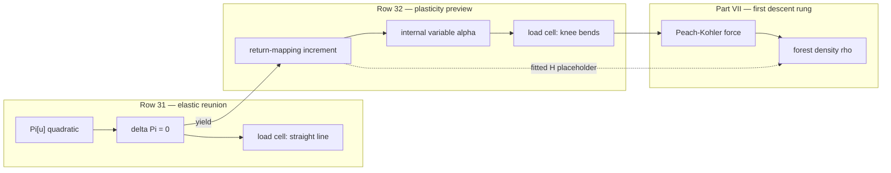
```mermaid
flowchart LR
  subgraph elastic["Row 31 — elastic reunion"]
    PI["Pi[u] quadratic"]
    DPi["delta Pi = 0"]
    LC1["load cell: straight line"]
  end
  subgraph plastic["Row 32 — plasticity preview"]
    RM[return-mapping increment]
    ALPHA[internal variable alpha]
    LC2["load cell: knee bends"]
  end
  subgraph descent["Part VII — first descent rung"]
    PK[Peach-Kohler force]
    RHO[forest density rho]
  end
  PI --> DPi --> LC1
  DPi -->|yield| RM --> ALPHA --> LC2
  LC2 --> PK --> RHO
  RM -.->|fitted H placeholder| RHO
```

When row 32 feels disconnected from row 31, read them as **layered meta-stitches**: row 31 when virtual work never closed the elastic climb; row 32 when \(\delta\Pi = 0\) is clear but **return-mapping still reads like an IF statement without the energy break story** — skip [VI.4's intermission](../part06-continuum/04-nonlinear-plasticity-preview.md#intermission-ascent-ends-descent-begins) and Part VII feels like a new course on dislocations.

### Row 33 baby picture (Part VII → VIII descent hinge reunion) {#row-33-baby-picture-part-vii-viii-descent-hinge-reunion}

**Row 33 baby picture:** when Scene, plot spine one-liners, Lab act moves, Scene visuals, Bridge hinges, concept map audits, schematic anchors, Story so far recaps, Closing the arc symbol bridges, Scale-boundary handshakes, thermoelastic assembly, CHT outer-loop reunion, twin-ladder → virtual work reunion, and virtual work → plasticity preview reunion all read correctly but **mesoscale DDD and atomistic MD still feel like separate courses**, open the [Part VII → VIII descent hinge reunion index](sources.md#part-vii-viii-descent-hinge-reunion-index-row-33) — read the chain aloud: [Part VII descent hinge from VI.4](../part07-defects/00-opening.md#descent-hinge-from-vi4-energy-break-forest-begins) → [VII.2 mobility Lab act at \(T_w\)](../part07-defects/02-dislocation-dynamics.md#lab-act-calibrate-screw-mobility-from-md-shear-act-iv--mobility-prelude) → [VII.3 Bridge to Part VIII](../part07-defects/03-polycrystal-and-fem-handoff.md#bridge-to-part-viii) → [Part VIII descent hinge](../part08-md/00-opening.md#descent-hinge-cores-mobility-and-tw-pedigree). Row 32 is plastic history at the knee; row 33 is **MD is where DDD's mobility was measured**. The [preface row 33 skill checkpoint](../preface.md#skill-navigation-row-33) closes the competence loop; the [prologue row 33 closing stitch](../prologue/00-many-scales.md#row-33-closing-stitch) and [epilogue row 33 closing loop](../epilogue/multiscale.md#row-33-closing-loop) reunite the three-way audit.

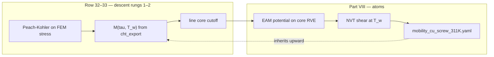
```mermaid
flowchart LR
  subgraph meso["Row 32–33 — descent rungs 1–2"]
    PK[Peach-Kohler on FEM stress]
    Mtw["M(tau, T_w) from cht_export"]
    CORE[line core cutoff]
  end
  subgraph atom["Part VIII — atoms"]
    EAM[EAM potential on core RVE]
    NVT[NVT shear at T_w]
    YAML["mobility_cu_screw_311K.yaml"]
  end
  PK --> Mtw --> CORE
  CORE --> EAM --> NVT --> YAML
  YAML -.->|inherits upward| Mtw
```

When row 33 feels disconnected from row 32, read them as **layered meta-stitches**: row 32 when the forest story never closed the knee; row 33 when DDD is clear but **mobility tables cite Part VIII without an archived NVT shear folder at \(T_w\)** — skip [VII.2's mobility Lab act Step 0](../part07-defects/02-dislocation-dynamics.md#lab-act-calibrate-screw-mobility-from-md-shear-act-iv--mobility-prelude) and Part VIII feels like standalone statistical mechanics.

### Row 34 baby picture (potentials → ensembles reunion) {#row-34-baby-picture-potentials-ensembles-reunion}

**Row 34 baby picture:** when Scene, plot spine one-liners, Lab act moves, Scene visuals, Bridge hinges, concept map audits, schematic anchors, Story so far recaps, Closing the arc symbol bridges, Scale-boundary handshakes, thermoelastic assembly, CHT outer-loop reunion, twin-ladder → virtual work reunion, virtual work → plasticity preview reunion, and Part VII → VIII descent hinge reunion all read correctly but **0 K EAM minimization and NVT/NPT dynamics still feel like separate subjects**, open the [potentials → ensembles reunion index](sources.md#potentials-ensembles-reunion-index-row-34) — read the chain aloud: [VIII.1 EAM Lab act](../part08-md/01-potentials-phase-space.md#lab-act-eam-lattice-constant-from-energy-minimization-act-v--notch-prelude) → [VIII.1 Bridge](../part08-md/01-potentials-phase-space.md#bridge) → [VIII.2 opening hinge](../part08-md/02-ensembles-integrators.md#opening-hinge-viii1-to-viii2) → [VIII.2 NPT Lab act](../part08-md/02-ensembles-integrators.md#lab-act-npt-tension-on-a-copper-nanowire-segment) → `MD_NVT_shear_PartVIII` at \(T_w\) from [`fixtures/cht_export.yaml`](../../fixtures/cht_export.yaml).

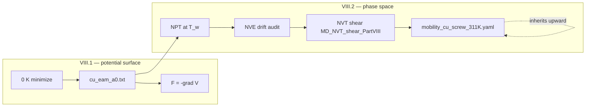
```mermaid
flowchart LR
  subgraph static["VIII.1 — potential surface"]
    MIN["0 K minimize"]
    A0["cu_eam_a0.txt"]
    V["F = -grad V"]
  end
  subgraph dynamic["VIII.2 — phase space"]
    NPT["NPT at T_w"]
    NVE["NVE drift audit"]
    SHEAR["NVT shear MD_NVT_shear_PartVIII"]
    MOB["mobility_cu_screw_311K.yaml"]
  end
  MIN --> A0 --> V
  A0 --> NPT --> NVE --> SHEAR --> MOB
  MOB -.->|inherits upward| MOB
```

When row 34 feels disconnected from row 33, read them as **layered meta-stitches**: row 33 when DDD and MD still feel like separate courses; row 34 when **the EAM foundation archive exists but no trajectory has integrated a single timestep at \(T_w\)** — skip [VIII.1's Bridge](../part08-md/01-potentials-phase-space.md#bridge) and ensembles feel like standalone statistical mechanics.

### Row 35 baby picture (ensembles → coarse-graining reunion) {#row-35-baby-picture-ensembles-coarse-graining-reunion}

**Row 35 baby picture:** when Scene, plot spine one-liners, Lab act moves, Scene visuals, Bridge hinges, concept map audits, schematic anchors, Story so far recaps, Closing the arc symbol bridges, Scale-boundary handshakes, thermoelastic assembly, CHT outer-loop reunion, twin-ladder → virtual work reunion, virtual work → plasticity preview reunion, Part VII → VIII descent hinge reunion, and potentials → ensembles reunion all read correctly but **audited NVT/NPT trajectories and yaml handoff tables still feel like separate subjects**, open the [ensembles → coarse-graining reunion index](sources.md#ensembles-coarse-graining-reunion-index-row-35) — read the chain aloud: [VIII.2 NPT Lab act](../part08-md/02-ensembles-integrators.md#lab-act-npt-tension-on-a-copper-nanowire-segment) → [VIII.2 Bridge](../part08-md/02-ensembles-integrators.md#bridge) → [VIII.3 opening hinge](../part08-md/03-ab-initio-and-coarse-graining.md#opening-hinge-viii2-to-viii3) → [VIII.3 EAM-fit audit Lab act](../part08-md/03-ab-initio-and-coarse-graining.md#lab-act-eam-fit-audit-before-the-notch-md-run-act-v--notch) → [pedigree checklist](../part08-md/03-ab-initio-and-coarse-graining.md#pedigree-checklist-before-the-epilogue).

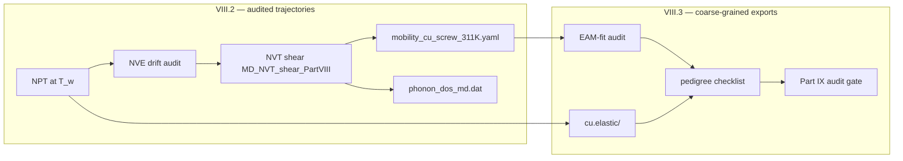
```mermaid
flowchart LR
  subgraph dynamic["VIII.2 — audited trajectories"]
    NPT["NPT at T_w"]
    NVE["NVE drift audit"]
    SHEAR["NVT shear MD_NVT_shear_PartVIII"]
    MOB["mobility_cu_screw_311K.yaml"]
    VACF["phonon_dos_md.dat"]
  end
  subgraph export["VIII.3 — coarse-grained exports"]
    ELAS["cu.elastic/"]
    EAM["EAM-fit audit"]
    PED["pedigree checklist"]
    DFT["Part IX audit gate"]
  end
  NPT --> NVE --> SHEAR --> MOB
  NPT --> ELAS
  SHEAR --> VACF
  MOB --> EAM --> PED --> DFT
  ELAS --> PED
```

When row 35 feels disconnected from row 34, read them as **layered meta-stitches**: row 34 when **trajectories have not run at \(T_w\)**; row 35 when **mobility and moduli exist but no handoff bundle names DFT audit gates** — skip [VIII.2's Bridge](../part08-md/02-ensembles-integrators.md#bridge) and coarse-graining feels like standalone potential fitting.

### Row 36 baby picture (coarse-graining → electronic audit reunion) {#row-36-baby-picture-coarse-graining-electronic-audit-reunion}

**Row 36 baby picture:** when Scene, plot spine one-liners, Lab act moves, Scene visuals, Bridge hinges, concept map audits, schematic anchors, Story so far recaps, Closing the arc symbol bridges, Scale-boundary handshakes, thermoelastic assembly, CHT outer-loop reunion, twin-ladder → virtual work reunion, virtual work → plasticity preview reunion, Part VII → VIII descent hinge reunion, potentials → ensembles reunion, and ensembles → coarse-graining reunion all read correctly but **the pedigree checklist has consumer rows filled but Part IX still feels like standalone DFT coursework**, open the [coarse-graining → electronic audit reunion index](sources.md#coarse-graining-electronic-audit-reunion-index-row-36) — read the chain aloud: [VIII.3 pedigree checklist](../part08-md/03-ab-initio-and-coarse-graining.md#pedigree-checklist-before-the-epilogue) → [VIII.3 Bridge to Part IX](../part08-md/03-ab-initio-and-coarse-graining.md#bridge-to-part-ix) → [IX.0 opening hinge from VIII.3](../part09-dft/00-opening.md#opening-hinge-viii3-to-ix) → [IX.0 thermal phonon audit at \(T_w\)](../part09-dft/00-opening.md#thermal-phonon-audit-at-tw) → [IX.1 Born–Oppenheimer](../part09-dft/01-born-oppenheimer.md).

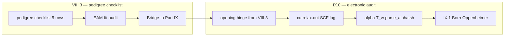
```mermaid
flowchart LR
  subgraph handoff["VIII.3 — pedigree checklist"]
    PED["pedigree checklist 5 rows"]
    EAM["EAM-fit audit"]
    BR["Bridge to Part IX"]
  end
  subgraph audit["IX.0 — electronic audit"]
    HINGE["opening hinge from VIII.3"]
    SCF["cu.relax.out SCF log"]
    PHON["alpha T_w parse_alpha.sh"]
    BO["IX.1 Born-Oppenheimer"]
  end
  PED --> EAM --> BR --> HINGE
  HINGE --> SCF --> PHON --> BO
```

When row 36 feels disconnected from row 35, read them as **layered meta-stitches**: row 35 when **handoff tables lack DFT audit gate columns**; row 36 when **checklist rows exist but `cu.relax.out` and \(\alpha(T_w)\) beside `cht_export.yaml` do not** — skip [VIII.3's Bridge to Part IX](../part08-md/03-ab-initio-and-coarse-graining.md#bridge-to-part-ix) and Born–Oppenheimer feels like standalone quantum chemistry.

### Row 37 baby picture (electronic audit → Born–Oppenheimer reunion) {#row-37-baby-picture-electronic-audit-born-oppenheimer-reunion}

**Row 37 baby picture:** when Scene, plot spine one-liners, Lab act moves, Scene visuals, Bridge hinges, concept map audits, schematic anchors, Story so far recaps, Closing the arc symbol bridges, Scale-boundary handshakes, thermoelastic assembly, CHT outer-loop reunion, twin-ladder → virtual work reunion, virtual work → plasticity preview reunion, Part VII → VIII descent hinge reunion, potentials → ensembles reunion, ensembles → coarse-graining reunion, and coarse-graining → electronic audit reunion all read correctly but **`cu.relax.out` and \(\alpha(T_w)\) exist but Born–Oppenheimer and Hohenberg–Kohn still feel like standalone quantum chemistry**, open the [electronic audit → Born–Oppenheimer reunion index](sources.md#electronic-audit-born-oppenheimer-reunion-index-row-37) — read the chain aloud: [IX.0 electronic audit hinge](../part09-dft/00-opening.md#electronic-audit-hinge-descent-pedigree-and-tw-phonon) → [IX.0 Bridge](../part09-dft/00-opening.md#bridge) → [IX.1 opening hinge from IX.0](../part09-dft/01-born-oppenheimer.md#opening-hinge-ix0-to-ix1) → [IX.1 Born–Oppenheimer](../part09-dft/01-born-oppenheimer.md) → [IX.1 Murnaghan Lab act](../part09-dft/01-born-oppenheimer.md#lab-act-murnaghan-fit-on-fcc-cu-act-vi--foundation) → [IX.2 Kohn–Sham](../part09-dft/02-kohn-sham.md).

```mermaid
flowchart LR
  subgraph audit["IX.0 — electronic audit"]
    SCF["cu.relax.out SCF log"]
    PHON["alpha T_w parse_alpha.sh"]
    BR["Bridge to IX.1"]
  end
  subgraph theorems["IX.1 — Born-Oppenheimer"]
    HINGE["opening hinge from IX.0"]
    BO["BO separation"]
    HK["Hohenberg-Kohn"]
    MUR["Murnaghan Lab act"]
    KS["IX.2 Kohn-Sham"]
  end
  SCF --> PHON --> BR --> HINGE
  HINGE --> BO --> HK --> MUR --> KS
```

When row 37 feels disconnected from row 36, read them as **layered meta-stitches**: row 36 when **SCF logs and phonon audits are missing**; row 37 when **audit gates exist but BO surface and \(E[\rho]\) are unnamed** — skip [IX.0's Bridge](../part09-dft/00-opening.md#bridge) and Kohn–Sham feels like standalone implementation details.

### Row 38 baby picture (Born–Oppenheimer → Kohn–Sham reunion) {#row-38-baby-picture-born-oppenheimer-kohn-sham-reunion}

**Row 38 baby picture:** when Scene, plot spine one-liners, Lab act moves, Scene visuals, Bridge hinges, concept map audits, schematic anchors, Story so far recaps, Closing the arc symbol bridges, Scale-boundary handshakes, thermoelastic assembly, CHT outer-loop reunion, twin-ladder → virtual work reunion, virtual work → plasticity preview reunion, Part VII → VIII descent hinge reunion, potentials → ensembles reunion, ensembles → coarse-graining reunion, coarse-graining → electronic audit reunion, and electronic audit → Born–Oppenheimer reunion all read correctly but **Born–Oppenheimer and Hohenberg–Kohn are understood but Kohn–Sham SCF still feels like standalone quantum chemistry**, open the [Born–Oppenheimer → Kohn–Sham reunion index](sources.md#born-oppenheimer-kohn-sham-reunion-index-row-38) — read the chain aloud: [IX.1 Bridge](../part09-dft/01-born-oppenheimer.md#bridge) → [IX.2 opening hinge from IX.1](../part09-dft/02-kohn-sham.md#opening-hinge-ix1-to-ix2) → [IX.2 cutoff-sweep Lab act](../part09-dft/02-kohn-sham.md#lab-act-cutoff-sweep-on-fcc-cu-act-vi--convergence-certificate) → [IX.3 workflows](../part09-dft/03-dft-workflows.md).

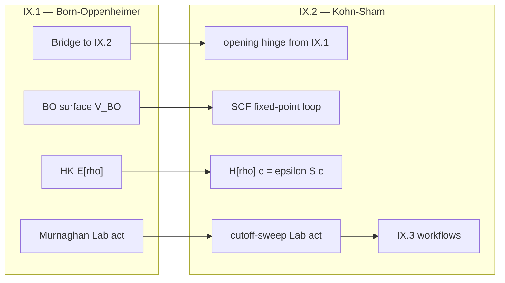
```mermaid
flowchart LR
  subgraph theorems["IX.1 — Born-Oppenheimer"]
    BR["Bridge to IX.2"]
    BO["BO surface V_BO"]
    HK["HK E[rho]"]
    MUR["Murnaghan Lab act"]
  end
  subgraph scf["IX.2 — Kohn-Sham"]
    HINGE["opening hinge from IX.1"]
    FP["SCF fixed-point loop"]
    EIG["H[rho] c = epsilon S c"]
    CUT["cutoff-sweep Lab act"]
    WF["IX.3 workflows"]
  end
  BR --> HINGE
  BO --> FP
  HK --> EIG
  MUR --> CUT --> WF
```

When row 38 feels disconnected from row 37, read them as **layered meta-stitches**: row 37 when **BO/HK theorems are unnamed**; row 38 when **theorems are understood but the SCF fixed-point loop feels disconnected from Part I eigenvalues** — skip [IX.1's Bridge](../part09-dft/01-born-oppenheimer.md#bridge) and IX.3 workflows feel like standalone DFT coursework.

### Row 39 baby picture (Kohn–Sham → DFT workflows reunion) {#row-39-baby-picture-kohn-sham-dft-workflows-reunion}

**Row 39 baby picture:** when Scene, plot spine one-liners, Lab act moves, Scene visuals, Bridge hinges, concept map audits, schematic anchors, Story so far recaps, Closing the arc symbol bridges, Scale-boundary handshakes, thermoelastic assembly, CHT outer-loop reunion, twin-ladder → virtual work reunion, virtual work → plasticity preview reunion, Part VII → VIII descent hinge reunion, potentials → ensembles reunion, ensembles → coarse-graining reunion, coarse-graining → electronic audit reunion, electronic audit → Born–Oppenheimer reunion, and Born–Oppenheimer → Kohn–Sham reunion all read correctly but **Kohn–Sham SCF is understood but DFT workflows still feel like standalone coursework**, open the [Kohn–Sham → DFT workflows reunion index](sources.md#kohn-sham-dft-workflows-reunion-index-row-39) — read the chain aloud: [IX.2 Bridge](../part09-dft/02-kohn-sham.md#bridge) → [IX.3 opening hinge from IX.2](../part09-dft/03-dft-workflows.md#opening-hinge-ix2-to-ix3) → [IX.3 foundation archive Lab act](../part09-dft/03-dft-workflows.md#lab-act-archive-the-foundation-run-before-the-wire-scale-solve-act-vi--foundation) → [IX.3 Bridge to epilogue](../part09-dft/03-dft-workflows.md#bridge-to-the-epilogue).

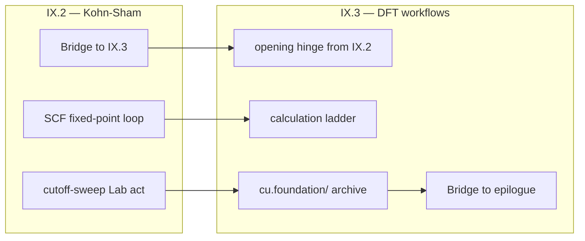
```mermaid
flowchart LR
  subgraph scf["IX.2 — Kohn-Sham"]
    BR["Bridge to IX.3"]
    FP["SCF fixed-point loop"]
    CUT["cutoff-sweep Lab act"]
  end
  subgraph wf["IX.3 — DFT workflows"]
    HINGE["opening hinge from IX.2"]
    LAD["calculation ladder"]
    FOLD["cu.foundation/ archive"]
    EPI["Bridge to epilogue"]
  end
  BR --> HINGE
  FP --> LAD
  CUT --> FOLD --> EPI
```

When row 39 feels disconnected from row 38, read them as **layered meta-stitches**: row 38 when **the SCF fixed-point loop feels disconnected from Part I eigenvalues**; row 39 when **SCF is understood but `cu.foundation/` and the calculation ladder feel like a new course** — skip [IX.2's Bridge](../part09-dft/02-kohn-sham.md#bridge) and the epilogue's Handshakes feel like folklore without pedigree.

### Row 40 baby picture (IX.3 → Handshake 3 reunion) {#row-40-baby-picture-ix3-handshake3-reunion}

**Row 40 baby picture:** when Scene, plot spine one-liners, Lab act moves, Scene visuals, Bridge hinges, concept map audits, schematic anchors, Story so far recaps, Closing the arc symbol bridges, Scale-boundary handshakes, thermoelastic assembly, CHT outer-loop reunion, twin-ladder → virtual work reunion, virtual work → plasticity preview reunion, Part VII → VIII descent hinge reunion, potentials → ensembles reunion, ensembles → coarse-graining reunion, coarse-graining → electronic audit reunion, electronic audit → Born–Oppenheimer reunion, Born–Oppenheimer → Kohn–Sham reunion, and Kohn–Sham → DFT workflows reunion all read correctly but **`cu.foundation/` is complete yet fixed-grip stress still cites handbook \(\alpha(300\,\text{K})\) beside an orphan `pw.x` log**, open the [IX.3 → Handshake 3 reunion index](sources.md#ix3-handshake3-reunion-index-row-40) — read the chain aloud: [IX.3 Bridge](../part09-dft/03-dft-workflows.md#bridge-to-the-epilogue) → [IX.3 opening hinge to Handshake 3](../part09-dft/03-dft-workflows.md#opening-hinge-ix3-to-handshake3) → [epilogue opening hinge from IX.3](../epilogue/multiscale.md#opening-hinge-ix3-handshake3) → [Handshake 3 worked load-cell example](../epilogue/multiscale.md#handshake-3--thermal-strain--mechanical-stiffness-part-vi--iv) — then run [`parse_alpha.sh`](../scripts/parse_alpha.sh) with `--target-t` from `cht_export.yaml`.

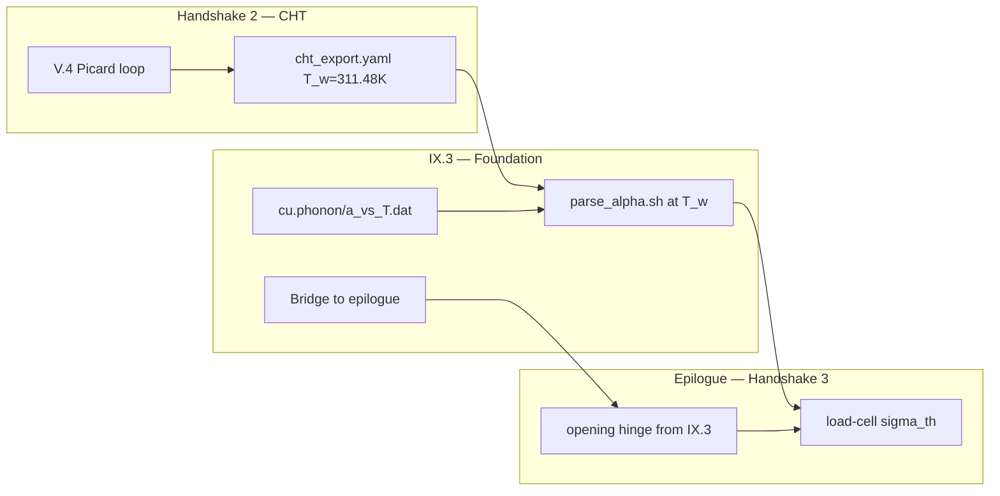
```mermaid
flowchart LR
  subgraph cht["Handshake 2 — CHT"]
    PIC["V.4 Picard loop"]
    YAML["cht_export.yaml T_w=311.48K"]
  end
  subgraph ix3["IX.3 — Foundation"]
    BR["Bridge to epilogue"]
    PHON["cu.phonon/a_vs_T.dat"]
    ALPHA["parse_alpha.sh at T_w"]
  end
  subgraph h3["Epilogue — Handshake 3"]
    HINGE["opening hinge from IX.3"]
    LC["load-cell sigma_th"]
  end
  PIC --> YAML --> ALPHA
  BR --> HINGE
  PHON --> ALPHA --> LC
  HINGE --> LC
```

When row 40 feels disconnected from row 39, read them as **layered meta-stitches**: row 39 when **`cu.foundation/` and the calculation ladder feel like a new course**; row 40 when **the foundation folder is complete but \(\alpha(T_w)\) at the load cell still cites handbook values** — skip [IX.3's opening hinge to Handshake 3](../part09-dft/03-dft-workflows.md#opening-hinge-ix3-to-handshake3) and Handshake 3 feels like standalone epilogue homework. [Row 13](#row-13-baby-picture-handshake-2-3) names the Handshake 2 → 3 chain in competence time; row 40 names **temperature pedigree at the phonon → load-cell boundary**.

### Row 41 baby picture (VII.3 → Handshake 4a reunion) {#row-41-baby-picture-vii3-handshake4a-reunion}

**Row 41 baby picture:** when Scene, plot spine one-liners, Lab act moves, Scene visuals, Bridge hinges, concept map audits, schematic anchors, Story so far recaps, Closing the arc symbol bridges, Scale-boundary handshakes, thermoelastic assembly, CHT outer-loop reunion, twin-ladder → virtual work reunion, virtual work → plasticity preview reunion, Part VII → VIII descent hinge reunion, potentials → ensembles reunion, ensembles → coarse-graining reunion, coarse-graining → electronic audit reunion, electronic audit → Born–Oppenheimer reunion, Born–Oppenheimer → Kohn–Sham reunion, Kohn–Sham → DFT workflows reunion, and IX.3 → Handshake 3 reunion all read correctly but **OpenDiS exports feed the crystal-plasticity deck at DDD timestep strain rate without power-law extrapolation**, open the [VII.3 → Handshake 4a reunion index](sources.md#vii3-handshake4a-reunion-index-row-41) — read the chain aloud: [VII.3 rate handshake](../part07-defects/03-polycrystal-and-fem-handoff.md#scale-boundary-handshake-ddd-strain-rate-to-quasi-static-fem) → [VII.3 opening hinge to Handshake 4a](../part07-defects/03-polycrystal-and-fem-handoff.md#opening-hinge-vii3-to-handshake4a) → [epilogue opening hinge from VII.3](../epilogue/multiscale.md#opening-hinge-vii3-handshake4a) → [Handshake 4a worked example](../epilogue/multiscale.md#4a--ddd-strain-rate-to-quasi-static-load-cell-act-iv--hardening) — then run [`parse_rate.sh`](../scripts/parse_rate.sh) with `--lab-rate 1.0e-3` on `ddd_tau_vs_rate.dat`.

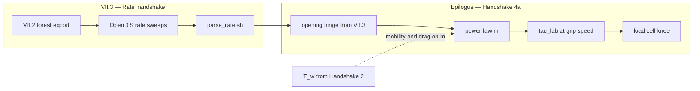
```mermaid
flowchart LR
  subgraph vii3["VII.3 — Rate handshake"]
    FOREST["VII.2 forest export"]
    SWEEP["OpenDiS rate sweeps"]
    PARSE["parse_rate.sh"]
  end
  subgraph h4a["Epilogue — Handshake 4a"]
    HINGE["opening hinge from VII.3"]
    M["power-law m"]
    TAU["tau_lab at grip speed"]
    LC["load cell knee"]
  end
  FOREST --> SWEEP --> PARSE
  PARSE --> HINGE --> M --> TAU --> LC
  TW["T_w from Handshake 2"] -.->|mobility and drag on m| M
```

When row 41 feels disconnected from row 40, read them as **layered meta-stitches**: row 40 when **Handshake 3 thermal pre-stress still cites handbook \(\alpha\)**; row 41 when **Handshake 3 is verified but the hardening knee arrives early because DDD rate was conflated with lab grip speed** — skip [VII.3's opening hinge to Handshake 4a](../part07-defects/03-polycrystal-and-fem-handoff.md#opening-hinge-vii3-to-handshake4a) and Handshake 4a feels like standalone epilogue homework. [Row 14](#row-14-baby-picture-handshake-4a) names the Handshake 4a chain in competence time; row 41 names **rate extrapolation at the forest → load-cell boundary**.

### Row 42 baby picture (VII.3 Step 4 → Handshake 4b reunion) {#row-42-baby-picture-vii3-handshake4b-reunion}

**Row 42 baby picture:** when Scene, plot spine one-liners, Lab act moves, Scene visuals, Bridge hinges, concept map audits, schematic anchors, Story so far recaps, Closing the arc symbol bridges, Scale-boundary handshakes, thermoelastic assembly, CHT outer-loop reunion, twin-ladder → virtual work reunion, virtual work → plasticity preview reunion, Part VII → VIII descent hinge reunion, potentials → ensembles reunion, ensembles → coarse-graining reunion, coarse-graining → electronic audit reunion, electronic audit → Born–Oppenheimer reunion, Born–Oppenheimer → Kohn–Sham reunion, Kohn–Sham → DFT workflows reunion, IX.3 → Handshake 3 reunion, and VII.3 → Handshake 4a reunion all read correctly but **crystal plasticity with scalar hardening from 4a matches bulk flow stress while under-predicting peak von Mises stress at the notch root by 10–15%**, open the [VII.3 → Handshake 4b reunion index](sources.md#vii3-handshake4b-reunion-index-row-42) — read the chain aloud: [VII.3 Step 4 FE²](../part07-defects/03-polycrystal-and-fem-handoff.md#step-4--when-offline-calibration-fails-fe-at-the-notch) → [VII.3 opening hinge to Handshake 4b](../part07-defects/03-polycrystal-and-fem-handoff.md#opening-hinge-vii3-to-handshake4b) → [epilogue opening hinge from VII.3 Step 4](../epilogue/multiscale.md#opening-hinge-vii3-handshake4b) → [Handshake 4b worked example](../epilogue/multiscale.md#worked-example-fe-at-the-wire-notch-act-v--notch) — then run [`parse_fe2.sh`](../scripts/parse_fe2.sh) on `fe2_notch_comparison.dat` and verify `fe2_export.yaml` appears in `multiscale_export.yaml` via [`parse_multiscale_workflow.sh`](../scripts/parse_multiscale_workflow.sh).

```mermaid
flowchart LR
  subgraph vii3["VII.3 — Step 4 FE²"]
    BULK["Handshake 4a bulk gate"]
    COMP["fe2_notch_comparison.dat"]
    PARSE["parse_fe2.sh"]
  end
  subgraph h4b["Epilogue — Handshake 4b"]
    HINGE["opening hinge from Step 4"]
    UPLIFT["10-15% root uplift"]
    ROOT["notch root stress"]
    ORCH["multiscale_export.yaml 4b slot"]
  end
  BULK --> COMP --> PARSE
  PARSE --> HINGE --> UPLIFT --> ROOT
  PARSE --> ORCH
  GSF["gamma_sf from IX.3"] -.->|partial dislocations| UPLIFT
```

When row 42 feels disconnected from row 41, read them as **layered meta-stitches**: row 41 when **bulk \(\tau_{\text{lab}}\) still cites DDD timestep rate**; row 42 when **bulk knee matches the load cell but notch root under-predicts because scalar \(H\) smeared pile-up** — skip [VII.3's opening hinge to Handshake 4b](../part07-defects/03-polycrystal-and-fem-handoff.md#opening-hinge-vii3-to-handshake4b) and Handshake 4b feels like standalone epilogue homework. [Row 15](#row-15-baby-picture-handshake-4b) names the Handshake 4b chain in competence time; row 42 names **FE² notch localization at the bulk → root boundary**.

### Row 43 baby picture (Rows 17–42 → Row 16 orchestration reunion) {#row-43-baby-picture-rows17-42-row16-orchestration-reunion}

**Row 43 baby picture:** when Scene, plot spine one-liners, Lab act moves, Scene visuals, Bridge hinges, concept map audits, schematic anchors, Story so far recaps, Closing the arc symbol bridges, Scale-boundary handshakes, thermoelastic assembly, CHT outer-loop reunion, twin-ladder → virtual work reunion, virtual work → plasticity preview reunion, Part VII → VIII descent hinge reunion, potentials → ensembles reunion, ensembles → coarse-graining reunion, coarse-graining → electronic audit reunion, electronic audit → Born–Oppenheimer reunion, Born–Oppenheimer → Kohn–Sham reunion, Kohn–Sham → DFT workflows reunion, IX.3 → Handshake 3 reunion, VII.3 → Handshake 4a reunion, and VII.3 → Handshake 4b reunion all read correctly but **Handshakes 1–4b exist in separate folders without orchestrated `multiscale_export.yaml`**, open the [Rows 17–42 → Row 16 orchestration reunion index](sources.md#rows17-42-row16-orchestration-reunion-index-row-43) — read the chain aloud: [IX.3 epilogue pedigree table](../part09-dft/03-dft-workflows.md#ix3-epilogue-pedigree-table) → [epilogue opening hinge from rows 17–42 → row 16](../epilogue/multiscale.md#opening-hinge-rows17-42-row16) → [row 16 closing loop](../epilogue/multiscale.md#row-16-closing-loop) → [`parse_multiscale_workflow.sh`](../scripts/parse_multiscale_workflow.sh) — then run `./scripts/test-fixtures.sh` and verify `delta_T_from_handshake_2` and `target_T_K` match converged CHT.

```mermaid
flowchart TB
  subgraph meta["Rows 17-42 meta-stitches"]
    R17["Row 17: Scene to Bridge"]
    R40["Row 40: Handshake 3"]
    R41["Row 41: Handshake 4a"]
    R42["Row 42: Handshake 4b"]
  end
  subgraph orch["Row 16 orchestration"]
    H1["H1: DFT moduli"]
    H2["H2: CHT delta T"]
    H3["H3: alpha delta T"]
    H4a["H4a: rate extrapolation"]
    H4b["H4b: FE2 notch"]
    OUT["multiscale_export.yaml"]
  end
  R17 --> R40 --> R41 --> R42
  R42 --> H1 --> H2 --> H3 --> H4a --> H4b --> OUT
```

When row 43 feels disconnected from row 42, read them as **layered meta-stitches**: row 42 when **individual Handshake 4b export exists but is not in the orchestrated chain**; row 43 when **every meta-stitch layer reads correctly but the afternoon still feels like separate terminal windows** — skip the [epilogue opening hinge from rows 17–42 → row 16](../epilogue/multiscale.md#opening-hinge-rows17-42-row16) and row 16 feels like a script name without the full-book context. [Row 16](#act-vi-baby-picture-me-412-coupling-ladder) names the ME 412 coupling ladder in competence time; row 43 names **full-book closing arc reunion with orchestrated export**.

### Row 44 baby picture (Rows 17–43 → Row 12 book loop closure) {#row-44-baby-picture-rows17-43-row12-book-loop-closure}

**Row 44 baby picture:** when Scene, plot spine one-liners, Lab act moves, Scene visuals, Bridge hinges, concept map audits, schematic anchors, Story so far recaps, Closing the arc symbol bridges, Scale-boundary handshakes, thermoelastic assembly, CHT outer-loop reunion, twin-ladder → virtual work reunion, virtual work → plasticity preview reunion, Part VII → VIII descent hinge reunion, potentials → ensembles reunion, ensembles → coarse-graining reunion, coarse-graining → electronic audit reunion, electronic audit → Born–Oppenheimer reunion, Born–Oppenheimer → Kohn–Sham reunion, Kohn–Sham → DFT workflows reunion, IX.3 → Handshake 3 reunion, VII.3 → Handshake 4a reunion, VII.3 → Handshake 4b reunion, and Rows 17–42 → Row 16 orchestration reunion all read correctly but **`multiscale_export.yaml` archives beside the Act VI folder yet the next terminal opens with copper input decks copied blindly**, open the [Rows 17–43 → Row 12 book loop closure index](sources.md#rows17-43-row12-book-loop-closure-index-row-44) — read the chain aloud: [epilogue ME 412 one-line summary](../epilogue/multiscale.md#row-12-closing-loop) → [epilogue opening hinge from rows 17–43 → row 12](../epilogue/multiscale.md#opening-hinge-rows17-43-row12) → [prologue reopening anchor](../prologue/00-many-scales.md#prologue-reopening-anchor) → [row 0 skill checkpoint](../preface.md#skill-navigation-row-0) — then complete the row 12 four-step audit on the new specimen before opening any terminal.

```mermaid
flowchart TB
  subgraph meta["Rows 17-43 meta-stitches"]
    R17["Row 17: Scene to Bridge"]
    R43["Row 43: orchestration"]
  end
  subgraph loop["Row 12 book loop"]
    ME412["ME 412 one-line summary"]
    R12["Row 12: four-step audit"]
    REOPEN["Prologue reopening anchor"]
    R0["Row 0: grammar restart"]
  end
  R17 --> R43
  R43 --> ME412 --> R12 --> REOPEN --> R0
```

When row 44 feels disconnected from row 43, read them as **layered meta-stitches**: row 43 when **orchestration is missing or unverified**; row 44 when **orchestration is verified but the epilogue → prologue book loop still feels open** — skip the [epilogue opening hinge from rows 17–43 → row 12](../epilogue/multiscale.md#opening-hinge-rows17-43-row12) and row 12 feels like a scale menu without the full meta-stitch context. [Row 12](#row-12-baby-picture-next-project) names the next-project restart in competence time; row 44 names **full meta-stitch chain reunion with epilogue → prologue book loop closure**.

### Row 45 baby picture (Rows 17–44 → Row 17 second-pass reunion) {#row-45-baby-picture-rows17-44-row17-second-pass-reunion}

**Row 45 baby picture:** when Scene, plot spine one-liners, Lab act moves, Scene visuals, Bridge hinges, concept map audits, schematic anchors, Story so far recaps, Closing the arc symbol bridges, Scale-boundary handshakes, thermoelastic assembly, CHT outer-loop reunion, twin-ladder → virtual work reunion, virtual work → plasticity preview reunion, Part VII → VIII descent hinge reunion, potentials → ensembles reunion, ensembles → coarse-graining reunion, coarse-graining → electronic audit reunion, electronic audit → Born–Oppenheimer reunion, Born–Oppenheimer → Kohn–Sham reunion, Kohn–Sham → DFT workflows reunion, IX.3 → Handshake 3 reunion, VII.3 → Handshake 4a reunion, VII.3 → Handshake 4b reunion, Rows 17–42 → Row 16 orchestration reunion, and Rows 17–43 → Row 12 book loop closure all read correctly but **every chapter turn still opens a skill checkpoint instead of trusting the Bridge**, open the [Rows 17–44 → Row 17 second-pass reunion index](sources.md#rows17-44-row17-second-pass-reunion-index-row-45) — read Preface → Epilogue once more with Scene → Bridge only, pausing at I.4, VI.4, and IX.3; treat rows 18–44 as confirmation layers, not mandatory front matter.

```mermaid
flowchart LR
  subgraph first["First pass (row 17)"]
    S1[Scene]
    B1[Bridge]
    G1[Gates I.4 VI.4 IX.3]
  end
  subgraph meta["Rows 18-44 meta-stitches"]
    M[Competence + workflow reunions]
  end
  subgraph second["Second pass (row 45)"]
    S2[Scene to Bridge novel rhythm]
    R[Rear-view: meta rows only if gate stalls twice]
  end
  S1 --> B1 --> G1 --> M --> S2 --> R
```

When row 45 feels disconnected from row 44, read them as **layered closures**: row 44 when **the book loop must land at the prologue reopening anchor**; row 45 when **the copper arc is workflow-complete but narrative smoothness still lags** — skip the [epilogue opening hinge from rows 17–44 → row 17](../epilogue/multiscale.md#opening-hinge-rows17-44-row17) and row 17 feels like a first-pass-only instruction. [Row 17](#row-17-baby-picture-continuous-read-through) names continuous read-through in competence time; row 45 names **full meta-stitch chain reunion with the novel second pass**.

### Row 46 baby picture (Rows 17–45 → Writings canonical reunion) {#row-46-baby-picture-rows17-45-writings-canonical-reunion}

**Row 46 baby picture:** when rows 17–45 all read correctly — second Scene → Bridge pass complete, `./scripts/test-fixtures.sh` green, Preface → Epilogue trusted as one novel — but **the next prose commit touches `src/part*` without a matching `writings/` diff**, or `./scripts/sync-writings.sh --check` fails, open the [Rows 17–45 → Writings reunion index](sources.md#rows17-45-writings-canonical-reunion-index-row-46) — edit only under [`writings/`](../writings/SUMMARY.md), run sync, then `mdbook build`.

```mermaid
flowchart LR
  W[writings/ subtrees]
  S[sync-writings.sh]
  SRC[src/ mdBook tree]
  B[mdbook build book/]
  W --> S --> SRC --> B
```

When row 46 feels disconnected from row 45, read them as **layered capstones**: row 45 when **narrative meta-stitches close in reading time**; row 46 when **canonical markdown must stay one tree in source time** — skip sync and the continuous novel forks in git even when HTML looks fine. [Row 45](#row-45-baby-picture-rows17-44-row17-second-pass-reunion) names the second-pass reader habit; row 46 names **writings → sync → src discipline for authors**.

### Row 47 baby picture (V.4 → VI.0 Writings canonical reunion) {#row-47-baby-picture-v4-vi0-writings-canonical-reunion}

**Row 47 baby picture:** when row 46 closed sync discipline and [row 30](#row-30-baby-picture-cht-outer-loop-reunion) archived `cht_export.yaml`, but **Part VI.0 still opens like a new course after Part V's Navier–Stokes chapter**, open the [V.4 → VI.0 Writings reunion index](sources.md#v4-vi0-writings-canonical-reunion-index-row-47) — read [V.4 Bridge](../part05-fvm/04-navier-stokes-cfd.md#bridge-to-part-vi) → [VI.0 Writings canonical landing](../part06-continuum/00-opening.md#writings-canonical-landing-v4-to-vi0) → [twin ladders reunite](../part06-continuum/00-opening.md#the-twin-ladders-reunite-galerkin-and-conservation) aloud before VI.1.

```mermaid
flowchart LR
  FVM[writings/fvm V.4 Bridge]
  CHT[cht_export.yaml T_w]
  CONT[writings/continuum VI.0]
  TW[twin ladders sigma]
  FVM --> CHT --> CONT --> TW
```

When row 47 feels disconnected from row 46, read them as **reader vs author capstones**: row 46 when **sources must not fork**; row 47 when **subtree boundaries must not feel like course breaks** — same Functional Analysis Notes layout, different upstream PDFs. [Row 30](#row-30-baby-picture-cht-outer-loop-reunion) names one \(T_w\); row 47 names **why tensors reunite the twins**.

### Row 48 baby picture (VI.4 → VII.0 Writings canonical reunion) {#row-48-baby-picture-vi4-vii0-writings-canonical-reunion}

**Row 48 baby picture:** when row 47 closed the ascent discretization arc and [row 32](#row-32-baby-picture-virtual-work-plasticity-preview-reunion) archived return-mapping at the knee, but **Part VII.0 still opens like a new course after VI.4's plasticity preview**, open the [VI.4 → VII.0 Writings reunion index](sources.md#vi4-vii0-writings-canonical-reunion-index-row-48) — read [VI.4 plot spine](../part06-continuum/04-nonlinear-plasticity-preview.md#plot-spine-one-line) → [intermission](../part06-continuum/04-nonlinear-plasticity-preview.md#intermission-ascent-ends-descent-begins) → [Writings canonical hinge](../part06-continuum/04-nonlinear-plasticity-preview.md#writings-canonical-hinge-vi4-to-vii0) → [VII.0 landing](../part07-defects/00-opening.md#writings-canonical-landing-vi4-to-vii0) → [VII.0 plot spine](../part07-defects/00-opening.md#plot-spine-one-line) aloud before VII.1.

```mermaid
flowchart LR
  CONT[writings/continuum VI.4 Bridge]
  HARD[hardening.yaml placeholders]
  DEF[writings/defects VII.0]
  RHO[forest density rho]
  CONT --> HARD --> DEF --> RHO
```

When row 48 feels disconnected from row 47, read them as **ascent vs midpoint capstones**: row 47 when **Galerkin and conservation reunite on \(\boldsymbol{\sigma}\)**; row 48 when **placeholder hardening yields to line motion** — same Functional Analysis Notes layout, state variable shrinks from tensor fields to forest density.

### Row 49 baby picture (VII.0 → VII.1 opening hinge reunion) {#row-49-baby-picture-vii0-vii1-opening-hinge-reunion}

**Row 49 baby picture:** when row 48 closed the Writings midpoint landing and [row 32](#row-32-baby-picture-virtual-work-plasticity-preview-reunion) archived `hardening.yaml`, but **VII.1 still opens like Defects Notes homework after VII.0's Scene and Bridge**, open the [VII.0 → VII.1 reunion index](sources.md#vii0-vii1-opening-hinge-reunion-index-row-49) — read [VII.0 Bridge](../part07-defects/00-opening.md#bridge) → [VII.0 opening hinge to VII.1](../part07-defects/00-opening.md#opening-hinge-vii0-to-vii1) → [VII.1 opening hinge from VII.0](../part07-defects/01-defect-taxonomy.md#opening-hinge-vii0-to-vii1) → [VII.1 plot spine](../part07-defects/01-defect-taxonomy.md#plot-spine-one-line) aloud before VII.2.

```mermaid
flowchart LR
  L[VII.0 landing row 48]
  S[Scene load cell forest]
  B[VII.0 Bridge geometry]
  BUR[Burgers b VII.1]
  L --> S --> B --> BUR
```

When row 49 feels disconnected from row 48, read them as **part vs chapter capstones**: row 48 when **subtree boundaries must not feel like course breaks**; row 49 when **the first numbered chapter must not feel like a notes PDF reset** — same load cell, fitted \(H\) yields to \(\mathbf{b}\).

### Row 50 baby picture (VII.1 → VII.2 opening hinge reunion) {#row-50-baby-picture-vii1-vii2-opening-hinge-reunion}

**Row 50 baby picture:** when row 49 closed Burgers taxonomy and the [slip-line Lab act](../part07-defects/01-defect-taxonomy.md#lab-act-read-the-slip-lines-before-the-load-cell-bends-act-iv-hardening) classified line defects, but **VII.2 still opens like OpenDiS homework after VII.1's Bridge**, open the [VII.1 → VII.2 reunion index](sources.md#vii1-vii2-opening-hinge-reunion-index-row-50) — read [VII.1 Bridge](../part07-defects/01-defect-taxonomy.md#bridge) → [VII.1 opening hinge to VII.2](../part07-defects/01-defect-taxonomy.md#opening-hinge-vii1-to-vii2) → [VII.2 opening hinge from VII.1](../part07-defects/02-dislocation-dynamics.md#opening-hinge-vii1-to-vii2) → [VII.2 plot spine](../part07-defects/02-dislocation-dynamics.md#plot-spine-one-line) aloud before mobility calibration.

```mermaid
flowchart LR
  BUR[Burgers b row 49]
  LAB[Slip-line Lab act]
  BR[VII.1 Bridge forest]
  PK[Peach-Köhler VII.2]
  BUR --> LAB --> BR --> PK
```

When row 50 feels disconnected from row 49, read them as **static vs dynamic capstones**: row 49 when **geometry must name what fitted \(H\) homogenized**; row 50 when **segment motion must name what dimension tables classified** — same tensile test, taxonomy yields to timesteps.

### Row 51 baby picture (VII.2 → VII.3 opening hinge reunion) {#row-51-baby-picture-vii2-vii3-opening-hinge-reunion}

**Row 51 baby picture:** when row 50 closed Peach–Köhler DDD and the [forest-density Lab act](../part07-defects/02-dislocation-dynamics.md#lab-act-read-the-hardening-bend-from-forest-density-act-iv) linked \(\tau(\gamma)\) to Taylor hardening, but **VII.3 still opens like DAMASK homework after VII.2's Bridge**, open the [VII.2 → VII.3 reunion index](sources.md#vii2-vii3-opening-hinge-reunion-index-row-51) — read [VII.2 Bridge to VII.3](../part07-defects/02-dislocation-dynamics.md#bridge-to-vii3) → [VII.2 opening hinge to VII.3](../part07-defects/02-dislocation-dynamics.md#opening-hinge-vii2-to-vii3) → [VII.3 opening hinge from VII.2](../part07-defects/03-polycrystal-and-fem-handoff.md#opening-hinge-vii2-to-vii3) → [VII.3 plot spine](../part07-defects/03-polycrystal-and-fem-handoff.md#plot-spine-one-line) aloud before rate extrapolation.

```mermaid
flowchart LR
  PK[Peach-Köhler row 50]
  LAB[Forest Lab act]
  BR[VII.2 Bridge spool]
  CP[OpenDiS to FEM VII.3]
  PK --> LAB --> BR --> CP
```

When row 51 feels disconnected from row 50, read them as **single-crystal vs organizational capstones**: row 50 when **timesteps must name what taxonomy classified**; row 51 when **texture average must name what the RVE simulated** — same Act IV knee, one crystal yields to the spool.

### Row 52 baby picture (VII.3 → VIII.1 opening hinge reunion) {#row-52-baby-picture-vii3-viii1-opening-hinge-reunion}

**Row 52 baby picture:** when row 51 closed polycrystal homogenization and the [handoff Lab act](../part07-defects/03-polycrystal-and-fem-handoff.md#lab-act-archive-the-opendis--damask--fem-handoff-act-ivv) archived `hardening.yaml`, but **VIII.1 still opens like LAMMPS homework after VII.3's Bridge**, open the [VII.3 → VIII.1 reunion index](sources.md#vii3-viii1-opening-hinge-reunion-index-row-52) — read [VII.3 Bridge to Part VIII](../part07-defects/03-polycrystal-and-fem-handoff.md#bridge-to-part-viii) → [VII.3 opening hinge to VIII.1](../part07-defects/03-polycrystal-and-fem-handoff.md#opening-hinge-vii3-to-viii1) → [VIII.0 descent hinge](../part08-md/00-opening.md#descent-hinge-cores-mobility-and-tw-pedigree) → [VIII.1 opening hinge from VII.3](../part08-md/01-potentials-phase-space.md#opening-hinge-vii3-to-viii1) aloud before NVT shear.

```mermaid
flowchart LR
  CP[Homogenize row 51]
  MOB[mobility.yaml at Tw]
  BR[VII.3 Bridge ink]
  MD[Phase space VIII.1]
  CP --> MOB --> BR --> MD
```

When row 52 feels disconnected from row 51, read them as **organizational vs atomistic capstones**: row 51 when **FEM internal variables must name what DDD exported**; row 52 when **screw-core RVE must name what mobility rows borrowed on trust** — same \(T_w\) from Act II, lines yield to coordinates.

### Row 53 baby picture (VIII.1 → VIII.2 opening hinge reunion) {#row-53-baby-picture-viii1-viii2-opening-hinge-reunion}

**Row 53 baby picture:** when row 52 closed phase space and the [EAM Lab act](../part08-md/01-potentials-phase-space.md#lab-act-eam-lattice-constant-from-energy-minimization-act-v--notch-prelude) archived `cu_eam_a0.txt` and the foundation manifest, but **VIII.2 still opens like thermostat homework after VIII.1's Bridge**, open the [VIII.1 → VIII.2 reunion index](sources.md#viii1-viii2-opening-hinge-reunion-index-row-53) — read [VIII.1 Bridge](../part08-md/01-potentials-phase-space.md#bridge) → [VIII.2 opening hinge from VIII.1](../part08-md/02-ensembles-integrators.md#opening-hinge-viii1-to-viii2) → [VIII.2 NPT Lab act step 1](../part08-md/02-ensembles-integrators.md#lab-act-npt-tension-on-a-copper-nanowire-segment) aloud before `MD_NVT_shear_PartVIII`.

```mermaid
flowchart LR
  EAM[0 K EAM row 52]
  MAN[Foundation manifest]
  BR[VIII.1 Bridge]
  NPT[NVT/NPT at Tw]
  EAM --> MAN --> BR --> NPT
```

When row 53 feels disconnected from row 52, read them as **static vs dynamic capstones**: row 52 when **mobility yaml must become a Hamiltonian**; row 53 when **Hamiltonian must become a trajectory at \(T_w\)** — same `cht_export.yaml`, energy minimum yields to canonical sample. Row 34 names the same stitch at meta depth; row 53 names it at **chapter order** inside Part VIII.

### Row 54 baby picture (VIII.2 → VIII.3 opening hinge reunion) {#row-54-baby-picture-viii2-viii3-opening-hinge-reunion}

**Row 54 baby picture:** when row 53 closed NPT at \(T_w\) and the [NPT Lab act](../part08-md/02-ensembles-integrators.md#lab-act-npt-tension-on-a-copper-nanowire-segment) archived the [dynamics export manifest](../part08-md/02-ensembles-integrators.md#dynamics-export-manifest-handoff-to-viii3), but **VIII.3 still opens like coarse-graining homework after VIII.2's Bridge**, open the [VIII.2 → VIII.3 reunion index](sources.md#viii2-viii3-opening-hinge-reunion-index-row-54) — read [VIII.2 Bridge](../part08-md/02-ensembles-integrators.md#bridge) → [VIII.3 opening hinge from VIII.2](../part08-md/03-ab-initio-and-coarse-graining.md#opening-hinge-viii2-to-viii3) → [pedigree checklist](../part08-md/03-ab-initio-and-coarse-graining.md#pedigree-checklist-before-the-epilogue) aloud before Part IX.

```mermaid
flowchart LR
  NPT[NVT/NPT row 53]
  EL[cu.elastic at Tw]
  BR[VIII.2 Bridge]
  YAML[Pedigree yaml]
  NPT --> EL --> BR --> YAML
```

When row 54 feels disconnected from row 53, read them as **dynamic vs export capstones**: row 53 when **foundation manifest must become trajectories**; row 54 when **trajectories must become handoff tables** — same mobility contract from Part VII, dumps yield to yaml with consumers. Row 35 names the same stitch at meta depth; row 54 names it at **chapter order** inside Part VIII.

### Row 55 baby picture (VIII.3 → IX.0 opening hinge reunion) {#row-55-baby-picture-viii3-ix0-opening-hinge-reunion}

**Row 55 baby picture:** when row 54 closed the [pedigree checklist](../part08-md/03-ab-initio-and-coarse-graining.md#pedigree-checklist-before-the-epilogue) and the [EAM-fit audit Lab act](../part08-md/03-ab-initio-and-coarse-graining.md#lab-act-eam-fit-audit-before-the-notch-md-run-act-v--notch) archived the [coarse-graining export manifest](../part08-md/03-ab-initio-and-coarse-graining.md#coarse-graining-export-manifest-handoff-to-ix), but **Part IX still opens like DFT homework after VIII.3's Bridge**, open the [VIII.3 → IX.0 reunion index](sources.md#viii3-ix0-opening-hinge-reunion-index-row-55) — read [VIII.3 Bridge to Part IX](../part08-md/03-ab-initio-and-coarse-graining.md#bridge-to-part-ix) → [IX.0 opening hinge from VIII.3](../part09-dft/00-opening.md#opening-hinge-viii3-to-ix) → [thermal phonon audit at \(T_w\)](../part09-dft/00-opening.md#thermal-phonon-audit-at-tw) aloud before IX.1.

```mermaid
flowchart LR
  YAML[pedigree_checklist.yaml]
  AUD[eam_fit_audit.log]
  BR[VIII.3 Bridge]
  SCF[cu.relax.out or pending]
  YAML --> AUD --> BR --> SCF
```

When row 55 feels disconnected from row 54, read them as **export vs audit capstones**: row 54 when **trajectories must become yaml consumers**; row 55 when **yaml consumers must become SCF evidence** — same five-row checklist, EAM trust yields to \(\rho(\mathbf{r})\). Row 36 names the same stitch at meta depth; row 55 names it at **chapter order** on the VIII.3 → IX.0 boundary.

### Row 56 baby picture (IX.0 → IX.1 opening hinge reunion) {#row-56-baby-picture-ix0-ix1-opening-hinge-reunion}

**Row 56 baby picture:** when row 55 closed the [foundation SCF audit Lab act](../part09-dft/00-opening.md#lab-act-foundation-scf-audit-before-born-oppenheimer-act-vi--foundation) and the [electronic audit export manifest](../part09-dft/00-opening.md#electronic-audit-export-manifest-handoff-to-ix1), but **IX.1 still opens like quantum chemistry homework after IX.0's Bridge**, open the [IX.0 → IX.1 reunion index](sources.md#ix0-ix1-opening-hinge-reunion-index-row-56) — read [IX.0 Bridge](../part09-dft/00-opening.md#bridge) → [IX.1 opening hinge from IX.0](../part09-dft/01-born-oppenheimer.md#opening-hinge-ix0-to-ix1) → [Murnaghan Lab act](../part09-dft/01-born-oppenheimer.md#lab-act-murnaghan-fit-on-fcc-cu-act-vi--foundation) aloud before IX.2.

```mermaid
flowchart LR
  SCF[cu.relax.out]
  ALPHA[alpha_export.yaml at Tw]
  BR[IX.0 Bridge]
  BO[V_BO surface named]
  SCF --> ALPHA --> BR --> BO
```

When row 56 feels disconnected from row 55, read them as **audit vs theorem capstones**: row 55 when **yaml must become SCF logs**; row 56 when **SCF logs must become Born–Oppenheimer vocabulary** — same foundation folder, EAM trust yields to \(V_{\text{BO}}(\{\mathbf{R}_I\})\). Row 37 names the same stitch at meta depth; row 56 names it at **chapter order** on the IX.0 → IX.1 boundary.

### Row 57 baby picture (IX.1 → IX.2 opening hinge reunion) {#row-57-baby-picture-ix1-ix2-opening-hinge-reunion}

**Row 57 baby picture:** when row 56 closed the [Murnaghan Lab act](../part09-dft/01-born-oppenheimer.md#lab-act-murnaghan-fit-on-fcc-cu-act-vi--foundation) and the [Murnaghan export manifest](../part09-dft/01-born-oppenheimer.md#murnaghan-export-manifest-handoff-to-ix2), but **IX.2 still opens like quantum chemistry homework after IX.1's Bridge**, open the [IX.1 → IX.2 reunion index](sources.md#ix1-ix2-opening-hinge-reunion-index-row-57) — read [IX.1 Bridge](../part09-dft/01-born-oppenheimer.md#bridge) → [IX.2 opening hinge from IX.1](../part09-dft/02-kohn-sham.md#opening-hinge-ix1-to-ix2) → [cutoff-sweep Lab act](../part09-dft/02-kohn-sham.md#lab-act-cutoff-sweep-on-fcc-cu-act-vi--convergence-certificate) aloud before IX.3.

```mermaid
flowchart LR
  BO[V_BO and HK theorems]
  MUR[murnaghan_eos.yaml]
  BR[IX.1 Bridge]
  SCF["H[rho] c = epsilon S c"]
  BO --> MUR --> BR --> SCF
```

When row 57 feels disconnected from row 56, read them as **theorem vs implementation capstones**: row 56 when **SCF logs must become BO vocabulary**; row 57 when **BO/HK must become the SCF fixed-point loop** — same volume scan, inner eigenvalue cycle instead of Murnaghan fit alone. Row 38 names the same stitch at meta depth; row 57 names it at **chapter order** on the IX.1 → IX.2 boundary.

### Row 58 baby picture (IX.2 → IX.3 opening hinge reunion) {#row-58-baby-picture-ix2-ix3-opening-hinge-reunion}

**Row 58 baby picture:** when row 57 closed the [cutoff-sweep Lab act](../part09-dft/02-kohn-sham.md#lab-act-cutoff-sweep-on-fcc-cu-act-vi--convergence-certificate) and the [cutoff export manifest](../part09-dft/02-kohn-sham.md#cutoff-export-manifest-handoff-to-ix3), but **IX.3 still opens like MSE5720 homework after IX.2's Bridge**, open the [IX.2 → IX.3 reunion index](sources.md#ix2-ix3-opening-hinge-reunion-index-row-58) — read [IX.2 Bridge](../part09-dft/02-kohn-sham.md#bridge) → [IX.3 opening hinge from IX.2](../part09-dft/03-dft-workflows.md#opening-hinge-ix2-to-ix3) → [foundation archive Lab act](../part09-dft/03-dft-workflows.md#lab-act-archive-the-foundation-run-before-the-wire-scale-solve-act-vi--foundation) aloud before the epilogue.

```mermaid
flowchart LR
  CUT[cutoff_convergence.yaml]
  BR[IX.2 Bridge]
  LAD[calculation ladder]
  FOLD[cu.foundation/]
  CUT --> BR --> LAD --> FOLD
```

When row 58 feels disconnected from row 57, read them as **implementation vs archive capstones**: row 57 when **theorems must become the SCF fixed-point loop**; row 58 when **converged SCF must become reproducible workflow archives** — same cutoff certificate, foundation folder instead of eigenvalue algebra alone. Row 39 names the same stitch at meta depth; row 58 names it at **chapter order** on the IX.2 → IX.3 boundary.

### Row 59 baby picture (IX.3 → Handshake 3 opening hinge reunion) {#row-59-baby-picture-ix3-handshake3-opening-hinge-reunion}

**Row 59 baby picture:** when row 58 closed the [foundation archive Lab act](../part09-dft/03-dft-workflows.md#lab-act-archive-the-foundation-run-before-the-wire-scale-solve-act-vi--foundation) and the [foundation export manifest](../part09-dft/03-dft-workflows.md#foundation-export-manifest-handoff-to-epilogue), but **Handshake 3 still opens like epilogue homework after IX.3's Bridge**, open the [IX.3 → Handshake 3 reunion index (row 59)](sources.md#ix3-handshake3-opening-hinge-reunion-index-row-59) — read [IX.3 Bridge to the epilogue](../part09-dft/03-dft-workflows.md#bridge-to-the-epilogue) → [opening hinge to Handshake 3](../part09-dft/03-dft-workflows.md#opening-hinge-ix3-to-handshake3) → [epilogue Handshake 3](../epilogue/multiscale.md#handshake-3--thermal-strain--mechanical-stiffness-part-vi--iv) aloud before Handshake 4a.

```mermaid
flowchart LR
  FOLD[foundation_export.yaml]
  BR[IX.3 Bridge]
  ALPHA[alpha at Tw]
  H3[Handshake 3 load cell]
  FOLD --> BR --> ALPHA --> H3
```

When row 59 feels disconnected from row 58, read them as **archive vs coupling capstones**: row 58 when **converged SCF must become `cu.foundation/`**; row 59 when **a complete foundation folder must become \(\alpha(T_w)\) at the load cell** — same phonon archive, temperature pedigree instead of handbook defaults alone. Row 40 names the same stitch at meta depth; row 59 names it at **chapter order** on the IX.3 → epilogue boundary.

### Row 60 baby picture (Row 59 → Row 40 Handshake 3 meta reunion) {#row-60-baby-picture-row59-row40-handshake3-meta-reunion}

**Row 60 baby picture:** when row 59 closed the IX.3 → Handshake 3 chapter hinge but **row 40's meta audit or the epilogue α cross-links table still feel like separate checklists**, open the [Row 59 → Row 40 Handshake 3 reunion index](sources.md#row59-row40-handshake3-meta-reunion-index-row-60) — read [preface row 59](../preface.md#skill-navigation-row-59) gate → [epilogue α cross-links](../epilogue/multiscale.md#opening-hinge-ix3-handshake3) (all rows aloud) → [preface row 40](../preface.md#skill-navigation-row-40) five-step audit before Handshake 4a.

```mermaid
flowchart LR
  R59[row 59 chapter gate]
  XLINK[alpha Tw cross-links]
  R40[row 40 meta gate]
  H4a[Handshake 4a next]
  R59 --> XLINK --> R40 --> H4a
```

When row 60 feels disconnected from row 59, read them as **chapter vs meta capstones**: row 59 when **foundation archive must reach the load cell**; row 60 when **that load cell must inherit the III.4 → IV.4 → V.4 → VI.2 ascent chain** — same Handshake 3 afternoon, full-book rear-view mirror.

### Row 61 baby picture (Row 60 → Row 41 Handshake 4a opening prelude reunion) {#row-61-baby-picture-row60-row41-handshake4a-prelude-reunion}

**Row 61 baby picture:** when row 60 closed Handshake 3 but **row 41's meta audit or the epilogue rate cross-links table still feel like separate checklists**, open the [Row 60 → Row 41 Handshake 4a reunion index](sources.md#row60-row41-handshake4a-prelude-reunion-index-row-61) — read [preface row 60](../preface.md#skill-navigation-row-60) gate → [epilogue rate cross-links](../epilogue/multiscale.md#opening-hinge-vii3-handshake4a) (all rows aloud) → [preface row 41](../preface.md#skill-navigation-row-41) five-step audit → [preface row 14](../preface.md#skill-navigation-row-14) one-liner before Handshake 4b.

```mermaid
flowchart LR
  R60[row 60 Handshake 3 gate]
  XLINK[rate cross-links]
  R41[row 41 meta gate]
  H4b[Handshake 4b next]
  R60 --> XLINK --> R41 --> H4b
```

When row 61 feels disconnected from row 60, read them as **thermal vs rate capstones**: row 60 when **Handshake 3 must finish before Act IV**; row 61 when **that Act IV knee must inherit VII.3 power-law extrapolation and the descent chain behind it** — same load cell afternoon, OpenDiS and phonon drag in the rear-view mirror.

### Row 62 baby picture (Row 61 → Row 42 Handshake 4b opening prelude reunion) {#row-62-baby-picture-row61-row42-handshake4b-prelude-reunion}

**Row 62 baby picture:** when row 61 closed Handshake 4a but **row 42's meta audit or the epilogue FE² cross-links table still feel like separate checklists**, open the [Row 61 → Row 42 Handshake 4b reunion index](sources.md#row61-row42-handshake4b-prelude-reunion-index-row-62) — read [preface row 61](../preface.md#skill-navigation-row-61) gate → [epilogue FE² cross-links](../epilogue/multiscale.md#opening-hinge-vii3-handshake4b) (all rows aloud) → [preface row 42](../preface.md#skill-navigation-row-42) five-step audit → [preface row 15](../preface.md#skill-navigation-row-15) one-liner before row 16 orchestration.

```mermaid
flowchart LR
  R61[row 61 Handshake 4a gate]
  XLINK[FE² cross-links]
  R42[row 42 meta gate]
  H16[row 16 orchestration next]
  R61 --> XLINK --> R42 --> H16
```

When row 62 feels disconnected from row 61, read them as **bulk vs notch capstones**: row 61 when **Handshake 4a must finish before Act V**; row 62 when **that Act V notch must inherit VII.3 Step 4 FE² and the discretization chain behind it** — same optional micro-notch, pile-up and GSF pedigree in the rear-view mirror.

### Row 63 baby picture (Row 62 → Row 43 orchestration opening prelude reunion) {#row-63-baby-picture-row62-row43-orchestration-prelude-reunion}

**Row 63 baby picture:** when row 62 closed Handshake 4b but **row 43's meta audit or the epilogue orchestration cross-links table still feel like separate checklists**, open the [Row 62 → Row 43 orchestration reunion index](sources.md#row62-row43-orchestration-prelude-reunion-index-row-63) — read [preface row 62](../preface.md#skill-navigation-row-62) gate → [epilogue orchestration cross-links](../epilogue/multiscale.md#opening-hinge-rows17-42-row16) (all rows aloud) → [preface row 43](../preface.md#skill-navigation-row-43) five-step audit → [preface row 16](../preface.md#skill-navigation-row-16) one-liner before row 44 book loop.

```mermaid
flowchart LR
  R62[row 62 Handshake 4b gate]
  XLINK[orchestration cross-links]
  R43[row 43 meta gate]
  H44[row 44 book loop next]
  R62 --> XLINK --> R43 --> H44
```

When row 63 feels disconnected from row 62, read them as **notch vs foundation capstones**: row 62 when **Handshake 4b must finish before Act VI**; row 63 when **that Act VI foundation must inherit dependency-ordered `multiscale_export.yaml`, not verified exports in separate folders** — same multiscale afternoon, IX.3 pedigree and H1→OUT chain in the rear-view mirror.

### Row 64 baby picture (Row 63 → Row 44 book loop closure opening prelude reunion) {#row-64-baby-picture-row63-row44-book-loop-prelude-reunion}

**Row 64 baby picture:** when row 63 closed orchestration prelude but **row 44's meta audit or the epilogue book-loop cross-links table still feel like separate checklists**, open the [Row 63 → Row 44 book loop reunion index](sources.md#row63-row44-book-loop-prelude-reunion-index-row-64) — read [preface row 63](../preface.md#skill-navigation-row-63) gate → [epilogue book-loop cross-links](../epilogue/multiscale.md#opening-hinge-rows17-43-row12) (all rows aloud) → [preface row 44](../preface.md#skill-navigation-row-44) five-step audit → [prologue reopening anchor](../prologue/00-many-scales.md#prologue-reopening-anchor) before copying decks to a new specimen.

```mermaid
flowchart LR
  R63[row 63 orchestration prelude gate]
  XLINK[book-loop cross-links]
  R44[row 44 meta gate]
  H12[row 12 restart next]
  R63 --> XLINK --> R44 --> H12
```

When row 64 feels disconnected from row 63, read them as **orchestration vs restart capstones**: row 63 when **H1→OUT must finish before project restart**; row 64 when **that restart must inherit the full meta-stitch chain at the prologue reopening anchor, not copied copper decks** — same ladder, four questions on a new specimen in the rear-view mirror.

### Row 65 baby picture (Row 64 → Row 45 second-pass reunion opening prelude reunion) {#row-65-baby-picture-row64-row45-second-pass-prelude-reunion}

**Row 65 baby picture:** when row 64 closed book-loop prelude but **row 45's meta audit or the epilogue second-pass cross-links table still feel like separate checklists**, open the [Row 64 → Row 45 second-pass reunion index](sources.md#row64-row45-second-pass-prelude-reunion-index-row-65) — read [preface row 64](../preface.md#skill-navigation-row-64) gate → [epilogue second-pass cross-links](../epilogue/multiscale.md#opening-hinge-rows17-44-row17) (all rows aloud) → [preface row 45](../preface.md#skill-navigation-row-45) five-step audit → [continuous read-through guide](sources.md#continuous-read-through-guide) before opening rows 18–44 mid-climb.

```mermaid
flowchart LR
  R64[row 64 book-loop prelude gate]
  XLINK[second-pass cross-links]
  R45[row 45 meta gate]
  H17[row 17 novel second pass]
  R64 --> XLINK --> R45 --> H17
```

When row 65 feels disconnected from row 64, read them as **restart vs novel-rhythm capstones**: row 64 when **epilogue → prologue must finish before narrative second pass**; row 65 when **that second pass demands Scene → Bridge with meta rows as rear-view mirrors, not mandatory front matter** — same manuscript, one continuous story in the rear-view mirror.

### Row 66 baby picture (Row 65 → Row 46 Writings canonical reunion opening prelude reunion) {#row-66-baby-picture-row65-row46-writings-prelude-reunion}

**Row 66 baby picture:** when row 65 closed second-pass prelude but **row 46 sync discipline or the epilogue Writings cross-links table still feel like separate checklists**, open the [Row 65 → Row 46 Writings reunion index](sources.md#row65-row46-writings-prelude-reunion-index-row-66) — read [preface row 65](../preface.md#skill-navigation-row-65) gate → [epilogue Writings canonical cross-links](../epilogue/multiscale.md#opening-hinge-rows17-45-writings) (all rows aloud) → [preface row 46](../preface.md#skill-navigation-row-46) five-step audit → `./scripts/sync-writings.sh --check` before editing chapter prose.

```mermaid
flowchart LR
  SP[Second pass row 65]
  NOV[Scene Bridge novel]
  W[writings/ edit path]
  S[sync to src]
  SP --> NOV --> W --> S
```

When row 66 feels disconnected from row 65, read them as **reading-time vs source-time capstones**: row 65 when **narrative rhythm must close before maintainer edits**; row 66 when **those edits must stay under `writings/` and sync into `src/`** — same Bridges in browser and in the Functional Analysis Notes subtrees.

### Row 67 baby picture (Row 66 → Row 47 Writings canonical part-boundary opening prelude reunion) {#row-67-baby-picture-row66-row47-part-boundary-prelude-reunion}

**Row 67 baby picture:** when row 66 closed Writings sync but **row 47 twin-ladder reunion or the V.4 → VI.0 Bridge chain still feel like separate checklists**, open the [Row 66 → Row 47 part-boundary reunion index](sources.md#row66-row47-part-boundary-prelude-reunion-index-row-67) — read [preface row 66](../preface.md#skill-navigation-row-66) gate → [V.4 Bridge](../part05-fvm/04-navier-stokes-cfd.md#bridge-to-part-vi) through [Writings canonical hinge](../part05-fvm/04-navier-stokes-cfd.md#writings-canonical-hinge-v4-to-vi0) → [VI.0 twin-ladder landing](../part06-continuum/00-opening.md#writings-canonical-landing-v4-to-vi0) → [preface row 47](../preface.md#skill-navigation-row-47) five-step audit before opening VI.1.

```mermaid
flowchart LR
  SYNC[Writings sync row 66]
  CHT[cht_export.yaml]
  BR[V.4 Bridge to VI.0]
  TL[Twin ladders VI.0]
  SYNC --> CHT --> BR --> TL
```

When row 67 feels disconnected from row 66, read them as **source-time vs part-boundary capstones**: row 66 when **canonical tree discipline must close before subtree handoffs**; row 67 when **the first handoff (fvm → continuum) must reunite Galerkin and conservation on Cauchy stress** — same copper wire, same Functional Analysis Notes layout, one continuous discretization act.

### Row 68 baby picture (Row 67 → Row 48 Writings canonical midpoint opening prelude reunion) {#row-68-baby-picture-row67-row48-midpoint-prelude-reunion}

**Row 68 baby picture:** when row 67 closed the fvm → continuum prelude but **row 48 midpoint reunion or the VI.4 → VII.0 Bridge chain still feel like separate checklists**, open the [Row 67 → Row 48 midpoint reunion index](sources.md#row67-row48-midpoint-prelude-reunion-index-row-68) — read [preface row 67](../preface.md#skill-navigation-row-67) gate → [VI.4 intermission](../part06-continuum/04-nonlinear-plasticity-preview.md#intermission-ascent-ends-descent-begins) through [Writings canonical hinge](../part06-continuum/04-nonlinear-plasticity-preview.md#writings-canonical-hinge-vi4-to-vii0) → [VII.0 landing](../part07-defects/00-opening.md#writings-canonical-landing-vi4-to-vii0) → [preface row 48](../preface.md#skill-navigation-row-48) five-step audit before opening VII.1.

```mermaid
flowchart LR
  PB[Part-boundary row 67]
  HM[hardening.yaml]
  INT[VI.4 intermission]
  LD[VII.0 landing]
  PB --> HM --> INT --> LD
```

When row 68 feels disconnected from row 67, read them as **discretization vs midpoint capstones**: row 67 when **Galerkin and conservation must reunite on Cauchy stress before VI.4**; row 68 when **return-mapping placeholders must yield to the dislocation forest at the mandatory midpoint gate** — same copper wire, same Functional Analysis Notes layout, one continuous descent act.

### Row 69 baby picture (Row 68 → Row 49 VII.0 → VII.1 opening hinge prelude reunion) {#row-69-baby-picture-row68-row49-taxonomy-prelude-reunion}

**Row 69 baby picture:** when row 68 closed the midpoint prelude but **row 49 VII.0 → VII.1 reunion or the Bridge → Burgers chain still feel like separate checklists**, open the [Row 68 → Row 49 taxonomy prelude reunion index](sources.md#row68-row49-taxonomy-prelude-reunion-index-row-69) — read [preface row 68](../preface.md#skill-navigation-row-68) gate → [VII.0 Bridge](../part07-defects/00-opening.md#bridge) → [VII.0 opening hinge to VII.1](../part07-defects/00-opening.md#opening-hinge-vii0-to-vii1) → [VII.1 opening hinge from VII.0](../part07-defects/01-defect-taxonomy.md#opening-hinge-vii0-to-vii1) → [preface row 49](../preface.md#skill-navigation-row-49) five-step audit before opening VII.2.

```mermaid
flowchart LR
  MP[Midpoint row 68]
  BR[VII.0 Bridge]
  OH[Opening hinge]
  TAX[VII.1 Burgers b]
  MP --> BR --> OH --> TAX
```

When row 69 feels disconnected from row 68, read them as **midpoint vs first-chapter capstones**: row 68 when **subtree boundaries must reunite at the knee before VII.0 landing**; row 69 when **part opening and first numbered chapter must reunite on the same load cell before Peach–Köhler simulation** — same copper wire, same Functional Analysis Notes layout, one continuous defects act.

### Row 70 baby picture (Row 68 → Row 50 VII.1 → VII.2 opening hinge prelude reunion) {#row-70-baby-picture-row68-row50-ddd-prelude-reunion}

**Row 70 baby picture:** when row 68 closed the midpoint prelude but **row 50 VII.1 → VII.2 reunion or the Bridge → Peach–Köhler chain still feel like separate checklists**, open the [Row 68 → Row 50 DDD prelude reunion index](sources.md#row68-row50-ddd-prelude-reunion-index-row-70) — read [preface row 68](../preface.md#skill-navigation-row-68) gate → [VII.1 Bridge](../part07-defects/01-defect-taxonomy.md#bridge) → [VII.1 opening hinge to VII.2](../part07-defects/01-defect-taxonomy.md#opening-hinge-vii1-to-vii2) → [VII.2 opening hinge from VII.1](../part07-defects/02-dislocation-dynamics.md#opening-hinge-vii1-to-vii2) → [preface row 50](../preface.md#skill-navigation-row-50) five-step audit before opening VII.3.

```mermaid
flowchart LR
  MP[Midpoint row 68]
  BR[VII.1 Bridge]
  OH[Opening hinge]
  PK[VII.2 Peach-Köhler]
  MP --> BR --> OH --> PK
```

When row 70 feels disconnected from row 68, read them as **midpoint vs second-chapter capstones**: row 68 when **subtree boundaries must reunite at the knee before any DDD deck**; row 70 when **taxonomy chapter and DDD chapter must reunite on the same load cell before polycrystal homogenization** — same copper wire, same Functional Analysis Notes layout, one continuous defects act.

### Row 71 baby picture (Row 68 → Row 51 VII.2 → VII.3 opening hinge prelude reunion) {#row-71-baby-picture-row68-row51-homogenization-prelude-reunion}

**Row 71 baby picture:** when row 68 closed the midpoint prelude but **row 51 VII.2 → VII.3 reunion or the Bridge → homogenization chain still feel like separate checklists**, open the [Row 68 → Row 51 homogenization prelude reunion index](sources.md#row68-row51-homogenization-prelude-reunion-index-row-71) — read [preface row 68](../preface.md#skill-navigation-row-68) gate → [VII.2 Bridge to VII.3](../part07-defects/02-dislocation-dynamics.md#bridge-to-vii3) → [VII.2 opening hinge to VII.3](../part07-defects/02-dislocation-dynamics.md#opening-hinge-vii2-to-vii3) → [VII.3 opening hinge from VII.2](../part07-defects/03-polycrystal-and-fem-handoff.md#opening-hinge-vii2-to-vii3) → [preface row 51](../preface.md#skill-navigation-row-51) five-step audit before opening Part VIII.

```mermaid
flowchart LR
  MP[Midpoint row 68]
  BR[VII.2 Bridge]
  OH[Opening hinge]
  HOM[VII.3 texture yaml]
  MP --> BR --> OH --> HOM
```

When row 71 feels disconnected from row 68, read them as **midpoint vs third-chapter capstones**: row 68 when **subtree boundaries must reunite at the knee before any CP deck**; row 71 when **DDD chapter and polycrystal handoff chapter must reunite on the same load cell before Part VIII descent** — same copper wire, same Functional Analysis Notes layout, one continuous defects act.

### Row 72 baby picture (Row 68 → Row 52 VII.3 → VIII.1 opening hinge prelude reunion) {#row-72-baby-picture-row68-row52-atomistic-prelude-reunion}

**Row 72 baby picture:** when row 68 closed the midpoint prelude but **row 52 VII.3 → VIII.1 reunion or the Bridge → screw-core RVE chain still feel like separate checklists**, open the [Row 68 → Row 52 atomistic prelude reunion index](sources.md#row68-row52-atomistic-prelude-reunion-index-row-72) — read [preface row 68](../preface.md#skill-navigation-row-68) gate → [VII.3 Bridge to Part VIII](../part07-defects/03-polycrystal-and-fem-handoff.md#bridge-to-part-viii) → [VII.3 opening hinge to VIII.1](../part07-defects/03-polycrystal-and-fem-handoff.md#opening-hinge-vii3-to-viii1) → [VIII.1 opening hinge from VII.3](../part08-md/01-potentials-phase-space.md#opening-hinge-vii3-to-viii1) → [preface row 52](../preface.md#skill-navigation-row-52) five-step audit before EAM minimization.

```mermaid
flowchart LR
  MP[Midpoint row 68]
  BR[VII.3 Bridge]
  OH[Opening hinge]
  PS[VIII.1 phase space]
  MP --> BR --> OH --> PS
```

When row 72 feels disconnected from row 68, read them as **midpoint vs subtree-boundary capstones**: row 68 when **continuum → defects must reunite at the knee before any MD deck**; row 72 when **polycrystal handoff chapter and atomistic opening chapter must reunite on the same notch before NVT shear at \(T_w\)** — same copper wire, same Functional Analysis Notes layout, one continuous descent act.

### Row 73 baby picture (Row 68 → Row 53 VIII.1 → VIII.2 opening hinge prelude reunion) {#row-73-baby-picture-row68-row53-dynamics-prelude-reunion}

**Row 73 baby picture:** when row 68 closed the midpoint prelude but **row 53 VIII.1 → VIII.2 reunion or the Bridge → NPT chain still feel like separate checklists**, open the [Row 68 → Row 53 dynamics prelude reunion index](sources.md#row68-row53-dynamics-prelude-reunion-index-row-73) — read [preface row 68](../preface.md#skill-navigation-row-68) gate → [VIII.1 Bridge](../part08-md/01-potentials-phase-space.md#bridge) → [VIII.2 opening hinge from VIII.1](../part08-md/02-ensembles-integrators.md#opening-hinge-viii1-to-viii2) → [preface row 53](../preface.md#skill-navigation-row-53) five-step audit before mobility shear at \(T_w\).

```mermaid
flowchart LR
  MP[Midpoint row 68]
  BR[VIII.1 Bridge]
  OH[Opening hinge]
  NPT[VIII.2 NPT at T_w]
  MP --> BR --> OH --> NPT
```

When row 73 feels disconnected from row 68, read them as **midpoint vs chapter-boundary capstones**: row 68 when **continuum → defects must reunite at the knee before any thermostat deck**; row 73 when **EAM foundation chapter and ensembles chapter must reunite on the same wire before OpenDiS mobility shear** — same copper wire, same Functional Analysis Notes layout, one continuous Part VIII act.

### Row 74 baby picture (Row 68 → Row 54 VIII.2 → VIII.3 opening hinge prelude reunion) {#row-74-baby-picture-row68-row54-export-prelude-reunion}

**Row 74 baby picture:** when row 68 closed the midpoint prelude but **row 54 VIII.2 → VIII.3 reunion or the Bridge → pedigree chain still feel like separate checklists**, open the [Row 68 → Row 54 export prelude reunion index](sources.md#row68-row54-export-prelude-reunion-index-row-74) — read [preface row 68](../preface.md#skill-navigation-row-68) gate → [VIII.2 Bridge](../part08-md/02-ensembles-integrators.md#bridge) → [VIII.3 opening hinge from VIII.2](../part08-md/03-ab-initio-and-coarse-graining.md#opening-hinge-viii2-to-viii3) → [preface row 54](../preface.md#skill-navigation-row-54) five-step audit before Part IX opens.

```mermaid
flowchart LR
  MP[Midpoint row 68]
  BR[VIII.2 Bridge]
  OH[Opening hinge]
  YAML[VIII.3 yaml exports]
  MP --> BR --> OH --> YAML
```

When row 74 feels disconnected from row 68, read them as **midpoint vs chapter-boundary capstones**: row 68 when **continuum → defects must reunite at the knee before any pedigree checklist**; row 74 when **NPT dynamics chapter and coarse-graining export chapter must reunite on the same wire before SCF audit in Part IX** — same copper wire, same Functional Analysis Notes layout, one continuous Part VIII act.

### Row 75 baby picture (Row 68 → Row 55 VIII.3 → IX.0 opening hinge prelude reunion) {#row-75-baby-picture-row68-row55-electronic-audit-prelude-reunion}

**Row 75 baby picture:** when row 68 closed the midpoint prelude but **row 55 VIII.3 → IX.0 reunion or the Bridge → SCF audit chain still feel like separate checklists**, open the [Row 68 → Row 55 electronic audit prelude reunion index](sources.md#row68-row55-electronic-audit-prelude-reunion-index-row-75) — read [preface row 68](../preface.md#skill-navigation-row-68) gate → [VIII.3 Bridge to Part IX](../part08-md/03-ab-initio-and-coarse-graining.md#bridge-to-part-ix) → [IX.0 opening hinge from VIII.3](../part09-dft/00-opening.md#opening-hinge-viii3-to-ix) → [preface row 55](../preface.md#skill-navigation-row-55) five-step audit before IX.1 opens.

```mermaid
flowchart LR
  MP[Midpoint row 68]
  BR[VIII.3 Bridge]
  OH[Opening hinge]
  SCF[IX.0 SCF audit]
  MP --> BR --> OH --> SCF
```

When row 75 feels disconnected from row 68, read them as **midpoint vs part-boundary capstones**: row 68 when **continuum → defects must reunite at the knee before any SCF deck**; row 75 when **coarse-graining export chapter and electronic audit opening must reunite on the same wire before Born–Oppenheimer theorems** — same copper wire, same Functional Analysis Notes layout, one continuous descent to the finest rung.

### Row 76 baby picture (Row 68 → Row 56 IX.0 → IX.1 opening hinge prelude reunion) {#row-76-baby-picture-row68-row56-born-oppenheimer-prelude-reunion}

**Row 76 baby picture:** when row 68 closed the midpoint prelude but **row 56 IX.0 → IX.1 reunion or the Bridge → BO/HK chain still feel like separate checklists**, open the [Row 68 → Row 56 Born–Oppenheimer prelude reunion index](sources.md#row68-row56-born-oppenheimer-prelude-reunion-index-row-76) — read [preface row 68](../preface.md#skill-navigation-row-68) gate → [IX.0 Bridge](../part09-dft/00-opening.md#bridge) → [IX.1 opening hinge from IX.0](../part09-dft/01-born-oppenheimer.md#opening-hinge-ix0-to-ix1) → [preface row 56](../preface.md#skill-navigation-row-56) five-step audit before IX.2 opens.

```mermaid
flowchart LR
  MP[Midpoint row 68]
  BR[IX.0 Bridge]
  OH[Opening hinge]
  BO[V_BO named]
  MP --> BR --> OH --> BO
```

When row 76 feels disconnected from row 68, read them as **midpoint vs chapter-boundary capstones**: row 68 when **continuum → defects must reunite at the knee before any Murnaghan scan**; row 76 when **foundation SCF audit opening and Born–Oppenheimer theorem chapter must reunite on the same wire before Kohn–Sham SCF** — same copper wire, same Functional Analysis Notes layout, one continuous Part IX act.

### Row 77 baby picture (Row 68 → Row 57 IX.1 → IX.2 opening hinge prelude reunion) {#row-77-baby-picture-row68-row57-kohn-sham-prelude-reunion}

**Row 77 baby picture:** when row 68 closed the midpoint prelude but **row 57 IX.1 → IX.2 reunion or the Bridge → Kohn–Sham SCF chain still feel like separate checklists**, open the [Row 68 → Row 57 Kohn–Sham prelude reunion index](sources.md#row68-row57-kohn-sham-prelude-reunion-index-row-77) — read [preface row 68](../preface.md#skill-navigation-row-68) gate → [IX.1 Bridge](../part09-dft/01-born-oppenheimer.md#bridge) → [IX.2 opening hinge from IX.1](../part09-dft/02-kohn-sham.md#opening-hinge-ix1-to-ix2) → [preface row 57](../preface.md#skill-navigation-row-57) five-step audit before IX.3 opens.

```mermaid
flowchart LR
  MP[Midpoint row 68]
  BR[IX.1 Bridge]
  OH[Opening hinge]
  KS[Kohn-Sham loop named]
  MP --> BR --> OH --> KS
```

When row 77 feels disconnected from row 68, read them as **midpoint vs chapter-boundary capstones**: row 68 when **continuum → defects must reunite at the knee before any cutoff certificate**; row 77 when **Murnaghan theorem chapter and Kohn–Sham SCF implementation chapter must reunite on the same wire before DFT workflow archive** — same copper wire, same Functional Analysis Notes layout, one continuous Part IX act.

### Row 78 baby picture (Row 68 → Row 58 IX.2 → IX.3 opening hinge prelude reunion) {#row-78-baby-picture-row68-row58-dft-workflows-prelude-reunion}

**Row 78 baby picture:** when row 68 closed the midpoint prelude but **row 58 IX.2 → IX.3 reunion or the Bridge → calculation ladder chain still feel like separate checklists**, open the [Row 68 → Row 58 DFT workflows prelude reunion index](sources.md#row68-row58-dft-workflows-prelude-reunion-index-row-78) — read [preface row 68](../preface.md#skill-navigation-row-68) gate → [IX.2 Bridge](../part09-dft/02-kohn-sham.md#bridge) → [IX.3 opening hinge from IX.2](../part09-dft/03-dft-workflows.md#opening-hinge-ix2-to-ix3) → [preface row 58](../preface.md#skill-navigation-row-58) five-step audit before the epilogue opens.

```mermaid
flowchart LR
  MP[Midpoint row 68]
  BR[IX.2 Bridge]
  OH[Opening hinge]
  WF[Foundation archive named]
  MP --> BR --> OH --> WF
```

When row 78 feels disconnected from row 68, read them as **midpoint vs chapter-boundary capstones**: row 68 when **continuum → defects must reunite at the knee before any foundation folder**; row 78 when **Kohn–Sham SCF implementation chapter and DFT workflow archive chapter must reunite on the same wire before Handshake 1 exports** — same copper wire, same Functional Analysis Notes layout, one continuous Part IX act.

### Row 79 baby picture (Row 68 → Row 59 IX.3 → Handshake 3 opening hinge prelude reunion) {#row-79-baby-picture-row68-row59-handshake3-prelude-reunion}

**Row 79 baby picture:** when row 68 closed the midpoint prelude but **row 59 IX.3 → Handshake 3 reunion or the Bridge → quasiharmonic \(\alpha(T_w)\) chain still feel like separate checklists**, open the [Row 68 → Row 59 Handshake 3 prelude reunion index](sources.md#row68-row59-handshake3-prelude-reunion-index-row-79) — read [preface row 68](../preface.md#skill-navigation-row-68) gate → [IX.3 Bridge to the epilogue](../part09-dft/03-dft-workflows.md#bridge-to-the-epilogue) → [opening hinge to Handshake 3](../part09-dft/03-dft-workflows.md#opening-hinge-ix3-to-handshake3) → [preface row 59](../preface.md#skill-navigation-row-59) five-step audit before Handshake 4a opens.

```mermaid
flowchart LR
  MP[Midpoint row 68]
  BR[IX.3 Bridge]
  OH[Opening hinge]
  LC[alpha at T_w named]
  MP --> BR --> OH --> LC
```

When row 79 feels disconnected from row 68, read them as **midpoint vs chapter-boundary capstones**: row 68 when **continuum → defects must reunite at the knee before any load-cell thermal stress**; row 79 when **DFT workflow archive chapter and epilogue Handshake 3 chapter must reunite on the same wire before rate hardening (Handshake 4a)** — same copper wire, same Functional Analysis Notes layout, one continuous Act III afternoon. When row 79 closed but Handshake 3 still feels disconnected from Parts III–VI, switch to [row 80](#row-80-baby-picture-row68-row60-handshake3-meta-prelude-reunion).

### Row 80 baby picture (Row 68 → Row 60 Row 59 → Row 40 Handshake 3 meta prelude reunion) {#row-80-baby-picture-row68-row60-handshake3-meta-prelude-reunion}

**Row 80 baby picture:** when row 68 closed the midpoint prelude and row 79 or row 59 closed the chapter hinge but **row 60's meta audit or the epilogue α cross-links table still feel like separate checklists**, open the [Row 68 → Row 60 Handshake 3 meta prelude reunion index](sources.md#row68-row60-handshake3-meta-prelude-reunion-index-row-80) — read [preface row 68](../preface.md#skill-navigation-row-68) gate → [preface row 79](../preface.md#skill-navigation-row-79) or [preface row 59](../preface.md#skill-navigation-row-59) chapter hinge → [epilogue α cross-links](../epilogue/multiscale.md#opening-hinge-ix3-handshake3) (all rows aloud) → [preface row 60](../preface.md#skill-navigation-row-60) five-step audit before Handshake 4a opens.

```mermaid
flowchart LR
  MP[Midpoint row 68]
  CH[Chapter hinge row 59]
  XL[alpha Tw cross-links]
  R60[row 60 meta gate]
  MP --> CH --> XL --> R60
```

When row 80 feels disconnected from row 68, read them as **midpoint vs Handshake 3 meta capstones**: row 68 when **continuum → defects must reunite at the knee before any Handshake 3 meta audit**; row 80 when **chapter-order load cell and full-book ascent chain must reunite on the same wire before rate hardening (Handshake 4a)** — same copper wire, same Functional Analysis Notes layout, one continuous Act II → Act III afternoon. When row 80 closed but Handshake 4a still feels disconnected from Part VII, switch to [row 81](#row-81-baby-picture-row68-row61-handshake4a-meta-prelude-reunion).

### Row 81 baby picture (Row 68 → Row 61 Row 60 → Row 41 Handshake 4a opening prelude reunion) {#row-81-baby-picture-row68-row61-handshake4a-meta-prelude-reunion}

**Row 81 baby picture:** when row 68 closed the midpoint prelude and row 80 or row 60 closed Handshake 3 meta but **row 61's meta audit or the epilogue rate cross-links table still feel like separate checklists**, open the [Row 68 → Row 61 Handshake 4a meta prelude reunion index](sources.md#row68-row61-handshake4a-meta-prelude-reunion-index-row-81) — read [preface row 68](../preface.md#skill-navigation-row-68) gate → [preface row 80](../preface.md#skill-navigation-row-80) or [preface row 60](../preface.md#skill-navigation-row-60) Handshake 3 meta gate → [epilogue rate cross-links](../epilogue/multiscale.md#opening-hinge-vii3-handshake4a) (all rows aloud) → [preface row 61](../preface.md#skill-navigation-row-61) five-step audit before Handshake 4b opens.

```mermaid
flowchart LR
  MP[Midpoint row 68]
  H3[Handshake 3 meta row 60]
  XL[rate cross-links]
  R61[row 61 meta gate]
  MP --> H3 --> XL --> R61
```

When row 81 feels disconnected from row 68, read them as **midpoint vs Handshake 4a meta capstones**: row 68 when **continuum → defects must reunite at the knee before any Handshake 4a meta audit**; row 81 when **chapter-order thermal pre-stress and full-book descent chain must reunite on the same wire before notch localization (Handshake 4b)** — same copper wire, same Functional Analysis Notes layout, one continuous Act III → Act IV afternoon. When row 81 closed but Handshake 4b still feels disconnected from Part VII Step 4, switch to [row 82](#row-82-baby-picture-row68-row62-handshake4b-meta-prelude-reunion).

### Row 82 baby picture (Row 68 → Row 62 Row 61 → Row 42 Handshake 4b opening prelude reunion) {#row-82-baby-picture-row68-row62-handshake4b-meta-prelude-reunion}

**Row 82 baby picture:** when row 68 closed the midpoint prelude and row 81 or row 61 closed Handshake 4a meta but **row 62's meta audit or the epilogue FE² cross-links table still feel like separate checklists**, open the [Row 68 → Row 62 Handshake 4b meta prelude reunion index](sources.md#row68-row62-handshake4b-meta-prelude-reunion-index-row-82) — read [preface row 68](../preface.md#skill-navigation-row-68) gate → [preface row 81](../preface.md#skill-navigation-row-81) or [preface row 61](../preface.md#skill-navigation-row-61) Handshake 4a meta gate → [epilogue FE² cross-links](../epilogue/multiscale.md#opening-hinge-vii3-handshake4b) (all rows aloud) → [preface row 62](../preface.md#skill-navigation-row-62) five-step audit before row 16 orchestration opens.

```mermaid
flowchart LR
  MP[Midpoint row 68]
  H4a[Handshake 4a meta row 61]
  XL[FE² cross-links]
  R62[row 62 meta gate]
  MP --> H4a --> XL --> R62
```

When row 82 feels disconnected from row 68, read them as **midpoint vs Handshake 4b meta capstones**: row 68 when **continuum → defects must reunite at the knee before any Handshake 4b meta audit**; row 82 when **chapter-order bulk hardening and full-book discretization chain must reunite on the same wire before orchestrated export (row 16)** — same copper wire, same Functional Analysis Notes layout, one continuous Act IV → Act V afternoon. When row 82 closed but orchestration still feels disconnected from verified notch exports, switch to [row 83](#row-83-baby-picture-row68-row63-orchestration-meta-prelude-reunion).

### Row 83 baby picture (Row 68 → Row 63 Row 62 → Row 43 orchestration opening prelude reunion) {#row-83-baby-picture-row68-row63-orchestration-meta-prelude-reunion}

**Row 83 baby picture:** when row 68 closed the midpoint prelude and row 82 or row 62 closed Handshake 4b meta but **row 63's meta audit or the epilogue orchestration cross-links table still feel like separate checklists**, open the [Row 68 → Row 63 orchestration meta prelude reunion index](sources.md#row68-row63-orchestration-meta-prelude-reunion-index-row-83) — read [preface row 68](../preface.md#skill-navigation-row-68) gate → [preface row 82](../preface.md#skill-navigation-row-82) or [preface row 62](../preface.md#skill-navigation-row-62) Handshake 4b meta gate → [epilogue orchestration cross-links](../epilogue/multiscale.md#opening-hinge-rows17-42-row16) (all rows aloud) → [preface row 63](../preface.md#skill-navigation-row-63) five-step audit before row 44 book-loop closure opens.

```mermaid
flowchart LR
  MP[Midpoint row 68]
  H4b[Handshake 4b meta row 62]
  XL[Orchestration cross-links]
  R63[row 63 meta gate]
  MP --> H4b --> XL --> R63
```

When row 83 feels disconnected from row 68, read them as **midpoint vs orchestration meta capstones**: row 68 when **continuum → defects must reunite at the knee before any orchestration meta audit**; row 83 when **chapter-order notch closure and full-book H1→OUT chain must reunite on the same wire before epilogue → prologue book loop (row 44)** — same copper wire, same Functional Analysis Notes layout, one continuous Act V → Act VI afternoon. When row 83 closed but book-loop closure still feels disconnected from verified orchestration, switch to [row 84](#row-84-baby-picture-row68-row64-book-loop-meta-prelude-reunion).

### Row 84 baby picture (Row 68 → Row 64 Row 63 → Row 44 book-loop opening prelude reunion) {#row-84-baby-picture-row68-row64-book-loop-meta-prelude-reunion}

**Row 84 baby picture:** when row 68 closed the midpoint prelude and row 83 or row 63 closed orchestration meta but **row 64's meta audit or the epilogue book-loop cross-links table still feel like separate checklists**, open the [Row 68 → Row 64 book-loop meta prelude reunion index](sources.md#row68-row64-book-loop-meta-prelude-reunion-index-row-84) — read [preface row 68](../preface.md#skill-navigation-row-68) gate → [preface row 83](../preface.md#skill-navigation-row-83) or [preface row 63](../preface.md#skill-navigation-row-63) orchestration meta gate → [epilogue book-loop cross-links](../epilogue/multiscale.md#opening-hinge-rows17-43-row12) (all rows aloud) → [preface row 64](../preface.md#skill-navigation-row-64) five-step audit before row 45 second-pass reunion opens.

```mermaid
flowchart LR
  MP[Midpoint row 68]
  ORCH[Orchestration meta row 63]
  XL[Book-loop cross-links]
  R64[row 64 meta gate]
  MP --> ORCH --> XL --> R64
```

When row 84 feels disconnected from row 68, read them as **midpoint vs book-loop meta capstones**: row 68 when **continuum → defects must reunite at the knee before any book-loop meta audit**; row 84 when **chapter-order orchestrated foundation and full-book restart chain must reunite on the same wire before narrative second pass (row 45)** — same copper wire, same Functional Analysis Notes layout, one continuous Act VI → next-project afternoon. When row 84 closed but second-pass reunion still feels disconnected from verified reopening anchor, switch to [row 85](#row-85-baby-picture-row68-row65-second-pass-meta-prelude-reunion).

### Row 85 baby picture (Row 68 → Row 65 Row 64 → Row 45 second-pass opening prelude reunion) {#row-85-baby-picture-row68-row65-second-pass-meta-prelude-reunion}

**Row 85 baby picture:** when row 68 closed the midpoint prelude and row 84 or row 64 closed book-loop meta but **row 65's meta audit or the epilogue second-pass cross-links table still feel like separate checklists**, open the [Row 68 → Row 65 second-pass meta prelude reunion index](sources.md#row68-row65-second-pass-meta-prelude-reunion-index-row-85) — read [preface row 68](../preface.md#skill-navigation-row-68) gate → [preface row 84](../preface.md#skill-navigation-row-84) or [preface row 64](../preface.md#skill-navigation-row-64) book-loop meta gate → [epilogue second-pass cross-links](../epilogue/multiscale.md#opening-hinge-rows17-44-row17) (all rows aloud) → [preface row 65](../preface.md#skill-navigation-row-65) five-step audit → [continuous read-through guide](sources.md#continuous-read-through-guide) before row 46 Writings reunion opens.

```mermaid
flowchart LR
  MP[Midpoint row 68]
  BL[Book-loop meta row 64]
  XL[Second-pass cross-links]
  R65[row 65 meta gate]
  MP --> BL --> XL --> R65
```

When row 85 feels disconnected from row 68, read them as **midpoint vs second-pass meta capstones**: row 68 when **continuum → defects must reunite at the knee before any second-pass meta audit**; row 85 when **chapter-order project restart and full-book Scene → Bridge rhythm must reunite on the same wire before Writings canonical reunion (row 46)** — same copper wire, same Functional Analysis Notes layout, one continuous next-project → novel-rhythm afternoon. When row 85 closed but Writings canonical meta still feels disconnected from verified second pass, switch to [row 86](#row-86-baby-picture-row68-row66-writings-meta-prelude-reunion).

### Row 86 baby picture (Row 68 → Row 66 Row 65 → Row 46 Writings canonical meta prelude reunion) {#row-86-baby-picture-row68-row66-writings-meta-prelude-reunion}

**Row 86 baby picture:** when row 68 closed the midpoint prelude and row 85 or row 65 closed second-pass meta but **row 66's meta audit or the epilogue Writings canonical cross-links table still feel like separate checklists**, open the [Row 68 → Row 66 Writings meta prelude reunion index](sources.md#row68-row66-writings-meta-prelude-reunion-index-row-86) — read [preface row 68](../preface.md#skill-navigation-row-68) gate → [preface row 85](../preface.md#skill-navigation-row-85) or [preface row 65](../preface.md#skill-navigation-row-65) second-pass meta gate → [epilogue Writings canonical cross-links](../epilogue/multiscale.md#opening-hinge-rows17-45-writings) (all rows aloud) → [preface row 66](../preface.md#skill-navigation-row-66) five-step audit → `./scripts/sync-writings.sh --check` before row 67 part-boundary prelude opens.

```mermaid
flowchart LR
  MP[Midpoint row 68]
  SP[Second-pass meta row 65]
  XL[Writings cross-links]
  R66[row 66 meta gate]
  MP --> SP --> XL --> R66
```

When row 86 feels disconnected from row 68, read them as **midpoint vs Writings meta capstones**: row 68 when **continuum → defects must reunite at the knee before any canonical-source meta audit**; row 86 when **chapter-order novel rhythm and full-book `writings/` → sync discipline must reunite on the same wire before part-boundary reunion (row 67)** — same copper wire, same Functional Analysis Notes layout, one continuous novel-rhythm → single-manuscript-tree afternoon. When row 86 closed but fvm → continuum still feels disconnected from verified Writings meta, switch to [row 87](#row-87-baby-picture-row68-row67-part-boundary-meta-prelude-reunion).

### Row 87 baby picture (Row 68 → Row 67 Row 66 → Row 47 part-boundary meta prelude reunion) {#row-87-baby-picture-row68-row67-part-boundary-meta-prelude-reunion}

**Row 87 baby picture:** when row 68 closed the midpoint prelude and row 86 or row 66 closed Writings canonical meta but **row 67's part-boundary audit or the V.4 → VI.0 twin-ladder chain still feel like separate checklists**, open the [Row 68 → Row 67 part-boundary meta prelude reunion index](sources.md#row68-row67-part-boundary-meta-prelude-reunion-index-row-87) — read [preface row 68](../preface.md#skill-navigation-row-68) gate → [preface row 86](../preface.md#skill-navigation-row-86) or [preface row 66](../preface.md#skill-navigation-row-66) Writings meta gate → [V.4 Bridge](../part05-fvm/04-navier-stokes-cfd.md#bridge-to-part-vi) through [VI.0 twin ladders reunite](../part06-continuum/00-opening.md#the-twin-ladders-reunite-galerkin-and-conservation) aloud → [preface row 67](../preface.md#skill-navigation-row-67) five-step audit → confirm `cht_export.yaml` per [row 30](../preface.md#skill-navigation-row-30) before VI.1 kinematics opens.

```mermaid
flowchart LR
  MP[Midpoint row 68]
  WM[Writings meta row 66]
  BR[V.4 Bridge to VI.0]
  R67[row 67 meta gate]
  MP --> WM --> BR --> R67
```

When row 87 feels disconnected from row 68, read them as **midpoint vs part-boundary meta capstones**: row 68 when **continuum → defects must reunite at the knee before any fvm → continuum meta audit**; row 87 when **canonical manuscript tree and V.4 → VI.0 twin-ladder reunion must read on the same wire before midpoint prelude (row 68) or VI.1 kinematics open** — same copper wire, same Functional Analysis Notes layout, one continuous canonical-tree → twin-ladder afternoon. When row 87 closed but continuum → defects still feels disconnected from verified part-boundary meta, switch to [row 88](#row-88-baby-picture-row68-row68-midpoint-meta-prelude-reunion).

### Row 88 baby picture (Row 68 → Row 68 Row 67 → Row 48 midpoint meta prelude reunion) {#row-88-baby-picture-row68-row68-midpoint-meta-prelude-reunion}

**Row 88 baby picture:** when row 68 closed the midpoint prelude and row 87 or row 67 closed part-boundary meta but **row 48's midpoint audit or the VI.4 intermission → VII.0 Bridge chain still feel like separate checklists**, open the [Row 68 → Row 68 midpoint meta prelude reunion index](sources.md#row68-row68-midpoint-meta-prelude-reunion-index-row-88) — read [preface row 68](../preface.md#skill-navigation-row-68) gate → [preface row 87](../preface.md#skill-navigation-row-87) or [preface row 67](../preface.md#skill-navigation-row-67) part-boundary meta gate → [VI.4 intermission](../part06-continuum/04-nonlinear-plasticity-preview.md#intermission-ascent-ends-descent-begins) through [VII.0 Writings canonical landing](../part07-defects/00-opening.md#writings-canonical-landing-vi4-to-vii0) aloud → [preface row 48](../preface.md#skill-navigation-row-48) five-step audit → confirm `hardening.yaml` per [row 32](../preface.md#skill-navigation-row-32) before VII.1 taxonomy opens.

```mermaid
flowchart LR
  MP[Midpoint row 68]
  PB[Part-boundary meta row 67]
  BR[VI.4 intermission to VII.0]
  R48[row 48 meta gate]
  MP --> PB --> BR --> R48
```

When row 88 feels disconnected from row 87, read them as **part-boundary vs midpoint meta capstones**: row 87 when **fvm → continuum must reunite on Cauchy stress before any continuum → defects meta audit**; row 88 when **twin-ladder closure and VI.4 → VII.0 intermission → Bridge reunion must read on the same wire before VII.1 taxonomy or row 69 prelude open** — same copper wire, same Functional Analysis Notes layout, one continuous discretization → descent afternoon at the knee. When row 88 closed but VII.1 Burgers taxonomy still feels disconnected from verified midpoint meta, switch to [row 89](#row-89-baby-picture-row68-row69-taxonomy-meta-prelude-reunion).

### Row 89 baby picture (Row 68 → Row 69 Row 68 → Row 49 taxonomy meta prelude reunion) {#row-89-baby-picture-row68-row69-taxonomy-meta-prelude-reunion}

**Row 89 baby picture:** when row 68 closed the midpoint prelude and row 88 or row 48 closed midpoint meta but **row 49's VII.0 → VII.1 audit or the Bridge → Burgers chain still feel like separate checklists**, open the [Row 68 → Row 69 taxonomy meta prelude reunion index](sources.md#row68-row69-taxonomy-meta-prelude-reunion-index-row-89) — read [preface row 68](../preface.md#skill-navigation-row-68) gate → [preface row 88](../preface.md#skill-navigation-row-88) or [preface row 48](../preface.md#skill-navigation-row-48) midpoint meta gate → [VII.0 Bridge](../part07-defects/00-opening.md#bridge) through [VII.1 opening hinge from VII.0](../part07-defects/01-defect-taxonomy.md#opening-hinge-vii0-to-vii1) aloud → [preface row 49](../preface.md#skill-navigation-row-49) five-step audit → confirm `hardening.yaml` per [row 32](../preface.md#skill-navigation-row-32) before VII.2 Peach–Köhler opens.

```mermaid
flowchart LR
  MP[Midpoint row 68]
  MM[Midpoint meta row 88]
  BR[VII.0 Bridge to VII.1]
  R49[row 49 meta gate]
  MP --> MM --> BR --> R49
```

When row 89 feels disconnected from row 88, read them as **midpoint meta vs taxonomy meta capstones**: row 88 when **VI.4 → VII.0 intermission → Bridge reunion must read on the same wire before any Burgers proof**; row 89 when **forest landing and VII.0 → VII.1 taxonomy meta must read on the same wire before row 70 prelude or VII.2 Peach–Köhler open** — same copper wire, same Functional Analysis Notes layout, one continuous knee → Burgers afternoon. When row 89 closed but VII.2 Peach–Köhler still feels disconnected from verified taxonomy meta, switch to [row 90](#row-90-baby-picture-row68-row70-ddd-meta-prelude-reunion).

### Row 90 baby picture (Row 68 → Row 70 Row 68 → Row 50 DDD meta prelude reunion) {#row-90-baby-picture-row68-row70-ddd-meta-prelude-reunion}

**Row 90 baby picture:** when row 68 closed the midpoint prelude and row 89 or row 49 closed taxonomy meta but **row 50's VII.1 → VII.2 audit or the Bridge → Peach–Köhler chain still feel like separate checklists**, open the [Row 68 → Row 70 DDD meta prelude reunion index](sources.md#row68-row70-ddd-meta-prelude-reunion-index-row-90) — read [preface row 68](../preface.md#skill-navigation-row-68) gate → [preface row 89](../preface.md#skill-navigation-row-89) or [preface row 49](../preface.md#skill-navigation-row-49) taxonomy meta gate → [VII.1 Bridge](../part07-defects/01-defect-taxonomy.md#bridge) through [VII.2 opening hinge from VII.1](../part07-defects/02-dislocation-dynamics.md#opening-hinge-vii1-to-vii2) aloud → [preface row 50](../preface.md#skill-navigation-row-50) five-step audit → confirm slip-line Lab act before OpenDiS mobility tables.

```mermaid
flowchart LR
  MP[Midpoint row 68]
  TM[Taxonomy meta row 89]
  BR[VII.1 Bridge to VII.2]
  R50[row 50 meta gate]
  MP --> TM --> BR --> R50
```

When row 90 feels disconnected from row 89, read them as **taxonomy meta vs DDD meta capstones**: row 89 when **VII.0 → VII.1 must reunite on Burgers circuits before any Peach–Köhler proof**; row 90 when **slip-line Lab act and VII.1 → VII.2 DDD meta must read on the same wire before row 71 prelude or VII.3 homogenization open** — same copper wire, same Functional Analysis Notes layout, one continuous Burgers → segment-network afternoon. When row 90 closed but VII.3 polycrystal handoff still feels disconnected from verified DDD meta, switch to [row 91](#row-91-baby-picture-row68-row71-homogenization-meta-prelude-reunion). When row 91 closed but VIII.1 phase space still feels disconnected from verified homogenization meta, switch to [row 92](#row-92-baby-picture-row68-row72-atomistic-meta-prelude-reunion).

### Row 91 baby picture (Row 68 → Row 71 Row 68 → Row 51 homogenization meta prelude reunion) {#row-91-baby-picture-row68-row71-homogenization-meta-prelude-reunion}

**Row 91 baby picture:** when row 68 closed the midpoint prelude and row 90 or row 50 closed DDD meta but **row 51's VII.2 → VII.3 audit or the Bridge → homogenization chain still feel like separate checklists**, open the [Row 68 → Row 71 homogenization meta prelude reunion index](sources.md#row68-row71-homogenization-meta-prelude-reunion-index-row-91) — read [preface row 68](../preface.md#skill-navigation-row-68) gate → [preface row 90](../preface.md#skill-navigation-row-90) or [preface row 50](../preface.md#skill-navigation-row-50) DDD meta gate → [VII.2 Bridge to VII.3](../part07-defects/02-dislocation-dynamics.md#bridge-to-vii3) through [VII.3 opening hinge from VII.2](../part07-defects/03-polycrystal-and-fem-handoff.md#opening-hinge-vii2-to-vii3) aloud → [preface row 51](../preface.md#skill-navigation-row-51) five-step audit → confirm [forest-density Lab act](../part07-defects/02-dislocation-dynamics.md#lab-act-read-the-hardening-bend-from-forest-density-act-iv) before DAMASK texture tables.

```mermaid
flowchart LR
  MP[Midpoint row 68]
  DM[DDD meta row 90]
  BR[VII.2 Bridge to VII.3]
  R51[row 51 meta gate]
  MP --> DM --> BR --> R51
```

### Row 92 baby picture (Row 68 → Row 72 Row 68 → Row 52 atomistic meta prelude reunion) {#row-92-baby-picture-row68-row72-atomistic-meta-prelude-reunion}

**Row 92 baby picture:** when row 68 closed the midpoint prelude and row 91 or row 51 closed homogenization meta but **row 52's VII.3 → VIII.1 audit or the Bridge → screw-core RVE chain still feel like separate checklists**, open the [Row 68 → Row 72 atomistic meta prelude reunion index](sources.md#row68-row72-atomistic-meta-prelude-reunion-index-row-92) — read [preface row 68](../preface.md#skill-navigation-row-68) gate → [preface row 91](../preface.md#skill-navigation-row-91) or [preface row 51](../preface.md#skill-navigation-row-51) homogenization meta gate → [VII.3 Bridge to Part VIII](../part07-defects/03-polycrystal-and-fem-handoff.md#bridge-to-part-viii) through [VIII.1 opening hinge from VII.3](../part08-md/01-potentials-phase-space.md#opening-hinge-vii3-to-viii1) aloud → [preface row 52](../preface.md#skill-navigation-row-52) five-step audit → confirm [handoff Lab act step 5](../part07-defects/03-polycrystal-and-fem-handoff.md#lab-act-archive-the-opendis--damask--fem-handoff-act-ivv) before EAM minimization.

```mermaid
flowchart LR
  MP[Midpoint row 68]
  HM[Homogenization meta row 91]
  BR[VII.3 Bridge to VIII]
  R52[row 52 meta gate]
  MP --> HM --> BR --> R52
```

When row 92 feels disconnected from row 91, read them as **homogenization meta vs atomistic meta capstones**: row 91 when **VII.2 → VII.3 must reunite on texture exports before any LAMMPS deck**; row 92 when **handoff Lab act and VII.3 → VIII.1 atomistic meta must read on the same wire before row 93 prelude or VIII.2 integrators open** — same copper wire, same Functional Analysis Notes layout, one continuous spool → screw-core afternoon. When row 92 closed but VIII.2 thermostat sections still feel disconnected from verified atomistic meta, switch to [row 93](#row-93-baby-picture-row68-row73-dynamics-meta-prelude-reunion).

### Row 93 baby picture (Row 68 → Row 73 Row 68 → Row 53 dynamics meta prelude reunion) {#row-93-baby-picture-row68-row73-dynamics-meta-prelude-reunion}

**Row 93 baby picture:** when row 68 closed the midpoint prelude and row 92 or row 52 closed atomistic meta but **row 53's VIII.1 → VIII.2 audit or the Bridge → NPT chain still feel like separate checklists**, open the [Row 68 → Row 73 dynamics meta prelude reunion index](sources.md#row68-row73-dynamics-meta-prelude-reunion-index-row-93) — read [preface row 68](../preface.md#skill-navigation-row-68) gate → [preface row 92](../preface.md#skill-navigation-row-92) or [preface row 52](../preface.md#skill-navigation-row-52) atomistic meta gate → [VIII.1 Bridge](../part08-md/01-potentials-phase-space.md#bridge) through [VIII.2 opening hinge from VIII.1](../part08-md/02-ensembles-integrators.md#opening-hinge-viii1-to-viii2) aloud → [preface row 53](../preface.md#skill-navigation-row-53) five-step audit → confirm [EAM Lab act steps 6–7](../part08-md/01-potentials-phase-space.md#lab-act-eam-lattice-constant-from-energy-minimization-act-v--notch-prelude) before Nosé–Hoover chains.

```mermaid
flowchart LR
  MP[Midpoint row 68]
  AM[Atomistic meta row 92]
  BR[VIII.1 Bridge to VIII.2]
  R53[row 53 meta gate]
  MP --> AM --> BR --> R53
```

When row 93 feels disconnected from row 92, read them as **atomistic meta vs dynamics meta capstones**: row 92 when **VII.3 → VIII.1 must reunite on screw-core RVE before any 0 K minimize**; row 93 when **EAM foundation manifest and VIII.1 → VIII.2 dynamics meta must read on the same wire before row 94 prelude or VIII.3 exports open** — same copper wire, same Functional Analysis Notes layout, one continuous static potential → \(T_w\) thermostat afternoon. When row 93 closed but VIII.3 pedigree sections still feel disconnected from verified dynamics meta, switch to [row 94](#row-94-baby-picture-row68-row74-export-meta-prelude-reunion).

### Row 94 baby picture (Row 68 → Row 74 Row 68 → Row 54 export meta prelude reunion) {#row-94-baby-picture-row68-row74-export-meta-prelude-reunion}

**Row 94 baby picture:** when row 68 closed the midpoint prelude and row 93 or row 53 closed dynamics meta but **row 54's VIII.2 → VIII.3 audit or the Bridge → pedigree chain still feel like separate checklists**, open the [Row 68 → Row 74 export meta prelude reunion index](sources.md#row68-row74-export-meta-prelude-reunion-index-row-94) — read [preface row 68](../preface.md#skill-navigation-row-68) gate → [preface row 93](../preface.md#skill-navigation-row-93) or [preface row 53](../preface.md#skill-navigation-row-53) dynamics meta gate → [VIII.2 Bridge](../part08-md/02-ensembles-integrators.md#bridge) through [VIII.3 opening hinge from VIII.2](../part08-md/03-ab-initio-and-coarse-graining.md#opening-hinge-viii2-to-viii3) aloud → [preface row 54](../preface.md#skill-navigation-row-54) five-step audit → confirm [NPT Lab act steps 1–7](../part08-md/02-ensembles-integrators.md#lab-act-npt-tension-on-a-copper-nanowire-segment) and [dynamics export manifest](../part08-md/02-ensembles-integrators.md#dynamics-export-manifest-handoff-to-viii3) before pedigree checklist consumer columns.

```mermaid
flowchart LR
  MP[Midpoint row 68]
  DM[Dynamics meta row 93]
  BR[VIII.2 Bridge to VIII.3]
  R54[row 54 meta gate]
  MP --> DM --> BR --> R54
```

When row 94 feels disconnected from row 93, read them as **dynamics meta vs export meta capstones**: row 93 when **VIII.1 → VIII.2 must reunite on NPT at \(T_w\) before any yaml export**; row 94 when **NPT dynamics manifest and VIII.2 → VIII.3 export meta must read on the same wire before row 95 prelude or Part IX SCF opens** — same copper wire, same Functional Analysis Notes layout, one continuous NPT → pedigree afternoon. When row 94 closed but IX.0 SCF sections still feel disconnected from verified export meta, switch to [row 95](#row-95-baby-picture-row68-row75-electronic-audit-meta-prelude-reunion).

### Row 95 baby picture (Row 68 → Row 75 Row 68 → Row 55 electronic audit meta prelude reunion) {#row-95-baby-picture-row68-row75-electronic-audit-meta-prelude-reunion}

**Row 95 baby picture:** when row 68 closed the midpoint prelude and row 94 or row 54 closed export meta but **row 55's VIII.3 → IX.0 audit or the Bridge → SCF chain still feel like separate checklists**, open the [Row 68 → Row 75 electronic audit meta prelude reunion index](sources.md#row68-row75-electronic-audit-meta-prelude-reunion-index-row-95) — read [preface row 68](../preface.md#skill-navigation-row-68) gate → [preface row 94](../preface.md#skill-navigation-row-94) or [preface row 54](../preface.md#skill-navigation-row-54) export meta gate → [VIII.3 Bridge to Part IX](../part08-md/03-ab-initio-and-coarse-graining.md#bridge-to-part-ix) through [IX.0 opening hinge from VIII.3](../part09-dft/00-opening.md#opening-hinge-viii3-to-ix) aloud → [preface row 55](../preface.md#skill-navigation-row-55) five-step audit → confirm [EAM-fit audit Lab act steps 1–6](../part08-md/03-ab-initio-and-coarse-graining.md#lab-act-eam-fit-audit-before-the-notch-md-run-act-v--notch) and [coarse-graining export manifest](../part08-md/03-ab-initio-and-coarse-graining.md#coarse-graining-export-manifest-handoff-to-ix) before foundation SCF Lab act step 1.

```mermaid
flowchart LR
  MP[Midpoint row 68]
  EM[Export meta row 94]
  BR[VIII.3 Bridge to IX.0]
  R55[row 55 meta gate]
  MP --> EM --> BR --> R55
```

When row 95 feels disconnected from row 94, read them as **export meta vs electronic audit meta capstones**: row 94 when **VIII.2 → VIII.3 must reunite on pedigree yaml at \(T_w\) before any SCF deck**; row 95 when **coarse-graining export manifest and VIII.3 → IX.0 electronic audit meta must read on the same wire before row 96 prelude or IX.1 Born–Oppenheimer opens** — same copper wire, same Functional Analysis Notes layout, one continuous pedigree → foundation SCF afternoon. When row 95 closed but IX.1 BO/HK sections still feel disconnected from verified electronic audit meta, switch to [row 96](#row-96-baby-picture-row68-row76-born-oppenheimer-meta-prelude-reunion).

### Row 96 baby picture (Row 68 → Row 76 Row 68 → Row 56 Born–Oppenheimer meta prelude reunion) {#row-96-baby-picture-row68-row76-born-oppenheimer-meta-prelude-reunion}

**Row 96 baby picture:** when row 68 closed the midpoint prelude and row 95 or row 55 closed electronic audit meta but **row 56's IX.0 → IX.1 audit or the Bridge → BO/HK chain still feel like separate checklists**, open the [Row 68 → Row 76 Born–Oppenheimer meta prelude reunion index](sources.md#row68-row76-born-oppenheimer-meta-prelude-reunion-index-row-96) — read [preface row 68](../preface.md#skill-navigation-row-68) gate → [preface row 95](../preface.md#skill-navigation-row-95) or [preface row 55](../preface.md#skill-navigation-row-55) electronic audit meta gate → [IX.0 Bridge](../part09-dft/00-opening.md#bridge) through [IX.1 opening hinge from IX.0](../part09-dft/01-born-oppenheimer.md#opening-hinge-ix0-to-ix1) aloud → [preface row 56](../preface.md#skill-navigation-row-56) five-step audit → confirm [foundation SCF audit Lab act steps 1–6](../part09-dft/00-opening.md#lab-act-foundation-scf-audit-before-born-oppenheimer-act-vi--foundation) and [electronic audit export manifest](../part09-dft/00-opening.md#electronic-audit-export-manifest-handoff-to-ix1) before Murnaghan Lab act step 0.

```mermaid
flowchart LR
  MP[Midpoint row 68]
  EA[Electronic audit meta row 95]
  BR[IX.0 Bridge to IX.1]
  R56[row 56 meta gate]
  MP --> EA --> BR --> R56
```

When row 96 feels disconnected from row 95, read them as **electronic audit meta vs Born–Oppenheimer meta capstones**: row 95 when **VIII.3 → IX.0 must reunite on foundation SCF at \(T_w\) before any BO surface fit**; row 96 when **electronic audit export manifest and IX.0 → IX.1 Born–Oppenheimer meta must read on the same wire before row 116 capstone or row 97 prelude opens** — same copper wire, same Functional Analysis Notes layout, one continuous SCF log → \(V_{\text{BO}}\) afternoon. When row 115 closed but Born–Oppenheimer meta capstone still lags, switch to [row 116](#row-116-baby-picture-row68-row96-born-oppenheimer-meta-capstone-reunion). When row 116 closed but IX.2 Kohn–Sham sections still feel disconnected from verified Born–Oppenheimer meta capstone, switch to [row 117](#row-117-baby-picture-row68-row97-kohn-sham-meta-capstone-reunion). When row 117 closed but IX.3 DFT workflows still feel disconnected from verified Kohn–Sham meta capstone, switch to [row 118](#row-118-baby-picture-row68-row98-dft-workflows-meta-capstone-reunion). When row 96 closed but IX.2 Kohn–Sham sections still feel disconnected from verified Born–Oppenheimer meta, switch to [row 97](#row-97-baby-picture-row68-row77-kohn-sham-meta-prelude-reunion). When row 97 closed but IX.3 DFT workflow sections still feel disconnected from verified Kohn–Sham meta, switch to [row 98](#row-98-baby-picture-row68-row78-dft-workflows-meta-prelude-reunion). When row 98 closed but Handshake 3 sections still feel disconnected from verified DFT workflows meta, switch to [row 99](#row-99-baby-picture-row68-row79-handshake3-meta-prelude-reunion). When row 99 closed but Handshake 3 still feels disconnected from Parts III–VI after verified opening hinge meta, switch to [row 100](#row-100-baby-picture-row68-row80-handshake3-meta-prelude-reunion).

### Row 97 baby picture (Row 68 → Row 77 Row 68 → Row 57 Kohn–Sham meta prelude reunion) {#row-97-baby-picture-row68-row77-kohn-sham-meta-prelude-reunion}

**Row 97 baby picture:** when row 68 closed the midpoint prelude and row 96 or row 56 closed Born–Oppenheimer meta but **row 57's IX.1 → IX.2 audit or the Bridge → Kohn–Sham SCF chain still feel like separate checklists**, open the [Row 68 → Row 77 Kohn–Sham meta prelude reunion index](sources.md#row68-row77-kohn-sham-meta-prelude-reunion-index-row-97) — read [preface row 68](../preface.md#skill-navigation-row-68) gate → [preface row 96](../preface.md#skill-navigation-row-96) or [preface row 56](../preface.md#skill-navigation-row-56) Born–Oppenheimer meta gate → [IX.1 Bridge](../part09-dft/01-born-oppenheimer.md#bridge) through [IX.2 opening hinge from IX.1](../part09-dft/02-kohn-sham.md#opening-hinge-ix1-to-ix2) aloud → [preface row 57](../preface.md#skill-navigation-row-57) five-step audit → confirm [Murnaghan Lab act steps 1–5](../part09-dft/01-born-oppenheimer.md#lab-act-murnaghan-fit-on-fcc-cu-act-vi--foundation) and [Murnaghan export manifest](../part09-dft/01-born-oppenheimer.md#murnaghan-export-manifest-handoff-to-ix2) before cutoff-sweep Lab act step 0.

```mermaid
flowchart LR
  MP[Midpoint row 68]
  BO[Born–Oppenheimer meta row 96]
  BR[IX.1 Bridge to IX.2]
  R57[row 57 meta gate]
  MP --> BO --> BR --> R57
```

When row 97 feels disconnected from row 96, read them as **Born–Oppenheimer meta vs Kohn–Sham meta capstones**: row 96 when **IX.0 → IX.1 must reunite on foundation SCF at \(T_w\) before any Murnaghan volume scan**; row 97 when **Murnaghan export manifest and IX.1 → IX.2 Kohn–Sham meta must read on the same wire before row 78 prelude or IX.3 DFT workflows opens** — same copper wire, same Functional Analysis Notes layout, one continuous Murnaghan scan → \(\rho^\star = \mathcal{G}(\rho^\star)\) afternoon.

### Row 98 baby picture (Row 68 → Row 78 Row 68 → Row 58 DFT workflows meta prelude reunion) {#row-98-baby-picture-row68-row78-dft-workflows-meta-prelude-reunion}

**Row 98 baby picture:** when row 68 closed the midpoint prelude and row 97 or row 57 closed Kohn–Sham meta but **row 58's IX.2 → IX.3 audit or the Bridge → calculation ladder chain still feel like separate checklists**, open the [Row 68 → Row 78 DFT workflows meta prelude reunion index](sources.md#row68-row78-dft-workflows-meta-prelude-reunion-index-row-98) — read [preface row 68](../preface.md#skill-navigation-row-68) gate → [preface row 97](../preface.md#skill-navigation-row-97) or [preface row 57](../preface.md#skill-navigation-row-57) Kohn–Sham meta gate → [IX.2 Bridge](../part09-dft/02-kohn-sham.md#bridge) through [IX.3 opening hinge from IX.2](../part09-dft/03-dft-workflows.md#opening-hinge-ix2-to-ix3) aloud → [preface row 58](../preface.md#skill-navigation-row-58) five-step audit → confirm [cutoff-sweep Lab act steps 1–5](../part09-dft/02-kohn-sham.md#lab-act-cutoff-sweep-on-fcc-cu-act-vi--convergence-certificate) and [cutoff export manifest](../part09-dft/02-kohn-sham.md#cutoff-export-manifest-handoff-to-ix3) before foundation archive Lab act step 0.

```mermaid
flowchart LR
  MP[Midpoint row 68]
  KS[Kohn–Sham meta row 97]
  BR[IX.2 Bridge to IX.3]
  R58[row 58 meta gate]
  MP --> KS --> BR --> R58
```

When row 98 feels disconnected from row 97, read them as **Kohn–Sham meta vs DFT workflows meta capstones**: row 97 when **IX.1 → IX.2 must reunite on Murnaghan volume scans at \(T_w\) before any cutoff certificate**; row 98 when **cutoff export manifest and IX.2 → IX.3 DFT workflows meta must read on the same wire before row 118 capstone or row 99 prelude opens** — same copper wire, same Functional Analysis Notes layout, one continuous cutoff certificate → `cu.foundation/` afternoon. When row 117 closed but workflow sections still lag, switch to [row 118](#row-118-baby-picture-row68-row98-dft-workflows-meta-capstone-reunion).

When row 91 feels disconnected from row 90, read them as **DDD meta vs homogenization meta capstones**: row 90 when **VII.1 → VII.2 must reunite on Peach–Köhler segments before any polycrystal proof**; row 91 when **forest-density Lab act and VII.2 → VII.3 homogenization meta must read on the same wire before row 92 prelude or Part VIII descent open** — same copper wire, same Functional Analysis Notes layout, one continuous segment-network → spool afternoon.

### Row 99 baby picture (Row 68 → Row 79 Row 68 → Row 59 Handshake 3 meta prelude reunion) {#row-99-baby-picture-row68-row79-handshake3-meta-prelude-reunion}

**Row 99 baby picture:** when row 68 closed the midpoint prelude and row 98 or row 58 closed DFT workflows meta but **row 59's IX.3 → Handshake 3 audit or the Bridge → quasiharmonic \(\alpha(T_w)\) chain still feel like separate checklists**, open the [Row 68 → Row 79 Handshake 3 meta prelude reunion index](sources.md#row68-row79-handshake3-meta-prelude-reunion-index-row-99) — read [preface row 68](../preface.md#skill-navigation-row-68) gate → [preface row 98](../preface.md#skill-navigation-row-98) or [preface row 58](../preface.md#skill-navigation-row-58) DFT workflows meta gate → [IX.3 Bridge to the epilogue](../part09-dft/03-dft-workflows.md#bridge-to-the-epilogue) through [opening hinge to Handshake 3](../part09-dft/03-dft-workflows.md#opening-hinge-ix3-to-handshake3) aloud → [preface row 59](../preface.md#skill-navigation-row-59) five-step audit → confirm [foundation archive Lab act steps 1–5](../part09-dft/03-dft-workflows.md#lab-act-archive-the-foundation-run-before-the-wire-scale-solve-act-vi--foundation) and [foundation export manifest](../part09-dft/03-dft-workflows.md#foundation-export-manifest-handoff-to-epilogue) before quasiharmonic Lab act step 0.

```mermaid
flowchart LR
  MP[Midpoint row 68]
  DF[DFT workflows meta row 98]
  BR[IX.3 Bridge to Handshake 3]
  R59[row 59 meta gate]
  MP --> DF --> BR --> R59
```

When row 99 feels disconnected from row 98, read them as **DFT workflows meta vs Handshake 3 meta capstones**: row 98 when **IX.2 → IX.3 must reunite on cutoff certificates at \(T_w\) before any foundation archive**; row 99 when **foundation export manifest and IX.3 → Handshake 3 meta must read on the same wire before row 100 prelude or Handshake 3 cross-links open** — same copper wire, same Functional Analysis Notes layout, one continuous foundation archive → \(\alpha(T_w)\) afternoon.

### Row 100 baby picture (Row 68 → Row 80 Row 68 → Row 60 Handshake 3 meta prelude reunion) {#row-100-baby-picture-row68-row80-handshake3-meta-prelude-reunion}

**Row 100 baby picture:** when row 68 closed the midpoint prelude and row 99 or row 59 closed Handshake 3 opening hinge meta but **row 60's epilogue α cross-links audit or the III.4 → IV.4 → V.4 → VI.2 ascent chain still feel like separate checklists**, open the [Row 68 → Row 80 Handshake 3 meta prelude reunion index](sources.md#row68-row80-handshake3-meta-prelude-reunion-index-row-100) — read [preface row 68](../preface.md#skill-navigation-row-68) gate → [preface row 99](../preface.md#skill-navigation-row-99) or [preface row 59](../preface.md#skill-navigation-row-59) opening hinge meta gate → [epilogue α cross-links audit](../epilogue/multiscale.md#opening-hinge-ix3-handshake3) aloud → [preface row 60](../preface.md#skill-navigation-row-60) five-step audit → confirm [V.4 Picard CHT Lab act](../part05-fvm/04-navier-stokes-cfd.md#lab-act-extension-two-domain-picard-loop-with-a-1d-fem-solid) and [VI.2 \(\alpha\) handshake](../part06-continuum/02-stress-balance.md#scale-boundary-handshake-thermal-expansion-alpha) before Handshake 4a step 0.

```mermaid
flowchart LR
  MP[Midpoint row 68]
  HS[Opening hinge meta row 99]
  XL[Epilogue α cross-links]
  R60[row 60 meta gate]
  MP --> HS --> XL --> R60
```

When row 100 feels disconnected from row 99, read them as **Handshake 3 opening hinge meta vs Handshake 3 meta capstones**: row 99 when **IX.3 → Handshake 3 must reunite on foundation archive at \(T_w\) before any cross-links table**; row 100 when **epilogue α cross-links and Row 59 → Row 40 Handshake 3 meta must read on the same wire before row 101 prelude or Handshake 4a meta opens** — same copper wire, same Functional Analysis Notes layout, one continuous \(\alpha(T_w)\) → Act II–III afternoon.

### Row 101 baby picture (Row 68 → Row 81 Row 68 → Row 61 Handshake 4a meta prelude reunion) {#row-101-baby-picture-row68-row81-handshake4a-meta-prelude-reunion}

**Row 101 baby picture:** when row 68 closed the midpoint prelude and row 100 or row 81 closed Handshake 3 meta capstone / Handshake 4a opening prelude but **row 61's epilogue rate cross-links audit or the VI.4 → VII.3 descent chain still feel like separate checklists**, open the [Row 68 → Row 81 Handshake 4a meta prelude reunion index](sources.md#row68-row81-handshake4a-meta-prelude-reunion-index-row-101) — read [preface row 68](../preface.md#skill-navigation-row-68) gate → [preface row 100](../preface.md#skill-navigation-row-100) or [preface row 81](../preface.md#skill-navigation-row-81) Handshake 3 meta / 4a opening gate → [epilogue rate cross-links audit](../epilogue/multiscale.md#opening-hinge-vii3-handshake4a) aloud → [preface row 61](../preface.md#skill-navigation-row-61) five-step audit → confirm [VII.3 rate handshake](../part07-defects/03-polycrystal-and-fem-handoff.md#scale-boundary-handshake-ddd-strain-rate-to-quasi-static-fem) and [`parse_rate.sh`](../../scripts/parse_rate.sh) at lab grip rate before Handshake 4b step 0.

```mermaid
flowchart LR
  MP[Midpoint row 68]
  HS[Handshake 3 meta row 100]
  XL[Epilogue rate cross-links]
  R61[row 61 meta gate]
  MP --> HS --> XL --> R61
```

When row 101 feels disconnected from row 100, read them as **Handshake 3 meta capstone vs Handshake 4a meta capstones**: row 100 when **epilogue α cross-links must reunite on \(\alpha(T_w)\) at the load cell before any Handshake 4a opening prelude**; row 101 when **epilogue rate cross-links and Row 60 → Row 41 Handshake 4a meta must read on the same wire before row 102 prelude or Handshake 4b meta opens** — same copper wire, same Functional Analysis Notes layout, one continuous thermal pre-stress → Act III–IV afternoon.

### Row 102 baby picture (Row 68 → Row 82 Row 68 → Row 62 Handshake 4b meta prelude reunion) {#row-102-baby-picture-row68-row82-handshake4b-meta-prelude-reunion}

**Row 102 baby picture:** when row 68 closed the midpoint prelude and row 101 or row 82 closed Handshake 4a meta capstone / Handshake 4b opening prelude but **row 62's epilogue FE² cross-links audit or the IV.4 → VII.3 Step 4 discretization chain still feel like separate checklists**, open the [Row 68 → Row 82 Handshake 4b meta prelude reunion index](sources.md#row68-row82-handshake4b-meta-prelude-reunion-index-row-102) — read [preface row 68](../preface.md#skill-navigation-row-68) gate → [preface row 101](../preface.md#skill-navigation-row-101) or [preface row 82](../preface.md#skill-navigation-row-82) Handshake 4a meta / 4b opening gate → [epilogue FE² cross-links audit](../epilogue/multiscale.md#opening-hinge-vii3-handshake4b) aloud → [preface row 62](../preface.md#skill-navigation-row-62) five-step audit → confirm [VII.3 Step 4 FE²](../part07-defects/03-polycrystal-and-fem-handoff.md#step-4--when-offline-calibration-fails-fe-at-the-notch) and [`parse_fe2.sh`](../../scripts/parse_fe2.sh) on fixture data before row 16 orchestration step 0.

```mermaid
flowchart LR
  MP[Midpoint row 68]
  HS[Handshake 4a meta row 101]
  XL[Epilogue FE² cross-links]
  R62[row 62 meta gate]
  MP --> HS --> XL --> R62
```

When row 102 feels disconnected from row 101, read them as **Handshake 4a meta capstone vs Handshake 4b meta capstones**: row 101 when **epilogue rate cross-links must reunite on \(\tau_{\text{lab}}\) at lab grip rate before any Handshake 4b opening prelude**; row 102 when **epilogue FE² cross-links and Row 61 → Row 42 Handshake 4b meta must read on the same wire before row 83 prelude or row 16 orchestration opens** — same copper wire, same Functional Analysis Notes layout, one continuous bulk hardening → Act IV–V afternoon.

### Row 103 baby picture (Row 68 → Row 83 Row 68 → Row 63 orchestration meta prelude reunion) {#row-103-baby-picture-row68-row83-orchestration-meta-prelude-reunion}

**Row 103 baby picture:** when row 68 closed the midpoint prelude and row 102 or row 83 closed Handshake 4b meta capstone / orchestration opening prelude but **row 63's epilogue orchestration cross-links audit or the H1→H2→H3→H4a→H4b chain still feel like separate checklists**, open the [Row 68 → Row 83 orchestration meta prelude reunion index](sources.md#row68-row83-orchestration-meta-prelude-reunion-index-row-103) — read [preface row 68](../preface.md#skill-navigation-row-68) gate → [preface row 102](../preface.md#skill-navigation-row-102) or [preface row 83](../preface.md#skill-navigation-row-83) Handshake 4b meta / orchestration opening gate → [epilogue orchestration cross-links audit](../epilogue/multiscale.md#opening-hinge-rows17-42-row16) aloud → [preface row 63](../preface.md#skill-navigation-row-63) five-step audit → confirm [`parse_multiscale_workflow.sh`](../../scripts/parse_multiscale_workflow.sh) and `multiscale_export.yaml` before row 44 book-loop closure opens.

```mermaid
flowchart LR
  MP[Midpoint row 68]
  H4b[Handshake 4b meta row 102]
  XL[Orchestration cross-links]
  R63[row 63 meta gate]
  MP --> H4b --> XL --> R63
```

When row 103 feels disconnected from row 102, read them as **Handshake 4b meta capstone vs orchestration meta capstones**: row 102 when **epilogue FE² cross-links must reunite on verified notch exports before any orchestration opening prelude**; row 103 when **epilogue orchestration cross-links and Row 62 → Row 43 meta must read on the same wire before row 84 prelude or row 44 book loop opens** — same copper wire, same Functional Analysis Notes layout, one continuous notch closure → Act V–VI afternoon. When row 103 closed but book-loop meta capstone still feels disconnected from verified orchestration, switch to [row 104](#row-104-baby-picture-row68-row84-book-loop-meta-prelude-reunion). When row 104 closed but second-pass reunion still lags, switch to [row 85](#row-85-baby-picture-row68-row65-second-pass-meta-prelude-reunion).

### Row 104 baby picture (Row 68 → Row 84 Row 68 → Row 64 book-loop meta prelude reunion) {#row-104-baby-picture-row68-row84-book-loop-meta-prelude-reunion}

**Row 104 baby picture:** when row 68 closed the midpoint prelude and row 103 or row 84 closed orchestration meta capstone / book-loop opening prelude but **row 64's epilogue book-loop cross-links audit or the reopening anchor still feel like separate checklists**, open the [Row 68 → Row 84 book-loop meta prelude reunion index](sources.md#row68-row84-book-loop-meta-prelude-reunion-index-row-104) — read [preface row 68](../preface.md#skill-navigation-row-68) gate → [preface row 103](../preface.md#skill-navigation-row-103) or [preface row 84](../preface.md#skill-navigation-row-84) orchestration meta / book-loop opening gate → [epilogue book-loop cross-links audit](../epilogue/multiscale.md#opening-hinge-rows17-43-row12) aloud → [preface row 64](../preface.md#skill-navigation-row-64) five-step audit → complete [prologue reopening anchor](../prologue/00-many-scales.md#prologue-reopening-anchor) before row 45 second-pass reunion opens.

```mermaid
flowchart LR
  MP[Midpoint row 68]
  ORCH[Orchestration meta row 103]
  XL[Book-loop cross-links]
  R64[row 64 meta gate]
  MP --> ORCH --> XL --> R64
```

When row 104 feels disconnected from row 103, read them as **orchestration meta capstone vs book-loop meta capstones**: row 103 when **epilogue orchestration cross-links must reunite on verified notch exports before any book-loop opening prelude**; row 104 when **epilogue book-loop cross-links and Row 63 → Row 44 meta must read on the same wire before row 124 capstone or row 85 prelude opens** — same copper wire, same Functional Analysis Notes layout, one continuous orchestrated foundation → next-project afternoon. When row 104 closed but second-pass reunion still feels disconnected from verified reopening anchor on the opening-hinge path alone, switch to [row 124](#row-124-baby-picture-row68-row104-book-loop-meta-prelude-capstone-reunion) on the capstone path or [row 105](#row-105-baby-picture-row68-row85-second-pass-meta-prelude-reunion) after row 124 closes. When row 105 closed but Writings canonical reunion still lags on the opening-hinge path alone, switch to [row 125](#row-125-baby-picture-row68-row105-second-pass-meta-prelude-capstone-reunion) on the capstone path or [row 106](#row-106-baby-picture-row68-row86-writings-meta-prelude-reunion) after row 125 closes. When row 125 closed but canonical source discipline still lags on the capstone path alone, switch to [row 126](#row-126-baby-picture-row68-row106-writings-meta-prelude-capstone-reunion). When row 106 closed but part-boundary reunion still lags, switch to [row 107](#row-107-baby-picture-row68-row87-part-boundary-meta-prelude-reunion). When row 107 closed but midpoint meta reunion still lags, switch to [row 108](#row-108-baby-picture-row68-row88-midpoint-meta-prelude-reunion). When row 108 closed but taxonomy meta reunion still lags, switch to [row 109](#row-109-baby-picture-row68-row89-taxonomy-meta-prelude-reunion). When row 109 closed but DDD meta reunion still lags, switch to [row 90](#row-90-baby-picture-row68-row70-ddd-meta-prelude-reunion).

### Row 105 baby picture (Row 68 → Row 85 Row 68 → Row 65 second-pass meta prelude reunion) {#row-105-baby-picture-row68-row85-second-pass-meta-prelude-reunion}

**Row 105 baby picture:** when row 68 closed the midpoint prelude and row 104 or row 85 closed book-loop meta capstone / second-pass opening prelude but **row 65's epilogue second-pass cross-links audit or the continuous read-through guide still feel like separate checklists**, open the [Row 68 → Row 85 second-pass meta prelude reunion index](sources.md#row68-row85-second-pass-meta-prelude-reunion-index-row-105) — read [preface row 68](../preface.md#skill-navigation-row-68) gate → [preface row 104](../preface.md#skill-navigation-row-104) or [preface row 85](../preface.md#skill-navigation-row-85) book-loop meta / second-pass opening gate → [epilogue second-pass cross-links audit](../epilogue/multiscale.md#opening-hinge-rows17-44-row17) aloud → [preface row 65](../preface.md#skill-navigation-row-65) five-step audit → recite [continuous read-through guide](sources.md#continuous-read-through-guide) before row 46 Writings canonical reunion opens.

```mermaid
flowchart LR
  MP[Midpoint row 68]
  BL[Book-loop meta row 104]
  XL[Second-pass cross-links]
  R65[row 65 meta gate]
  MP --> BL --> XL --> R65
```

When row 105 feels disconnected from row 104, read them as **book-loop meta capstone vs second-pass meta capstones**: row 104 when **epilogue book-loop cross-links must reunite on verified orchestration exports before any second-pass opening prelude**; row 105 when **epilogue second-pass cross-links and Row 64 → Row 45 meta must read on the same wire before row 86 prelude or row 46 Writings canonical reunion opens** — same copper wire, same Functional Analysis Notes layout, one continuous next-project → novel-rhythm afternoon. When row 105 closed but Writings canonical reunion still lags, switch to [row 106](#row-106-baby-picture-row68-row86-writings-meta-prelude-reunion). When row 106 closed but part-boundary reunion still lags, switch to [row 87](#row-87-baby-picture-row68-row67-part-boundary-meta-prelude-reunion).

### Row 106 baby picture (Row 68 → Row 86 Row 68 → Row 66 Writings canonical meta prelude reunion) {#row-106-baby-picture-row68-row86-writings-meta-prelude-reunion}

**Row 106 baby picture:** when row 68 closed the midpoint prelude and row 105 or row 86 closed second-pass meta capstone / Writings opening prelude but **row 66's epilogue writings cross-links audit or `./scripts/sync-writings.sh --check` still feel like separate checklists**, open the [Row 68 → Row 86 Writings canonical meta prelude reunion index](sources.md#row68-row86-writings-meta-prelude-reunion-index-row-106) — read [preface row 68](../preface.md#skill-navigation-row-68) gate → [preface row 105](../preface.md#skill-navigation-row-105) or [preface row 86](../preface.md#skill-navigation-row-86) second-pass meta capstone / Writings opening gate → [epilogue Writings canonical cross-links audit](../epilogue/multiscale.md#opening-hinge-rows17-45-writings) aloud → [preface row 66](../preface.md#skill-navigation-row-66) five-step audit → run `./scripts/sync-writings.sh --check` before row 67 part-boundary prelude opens.

```mermaid
flowchart LR
  MP[Midpoint row 68]
  SP[Second-pass meta row 105]
  XL[Writings cross-links]
  R66[row 66 meta gate]
  MP --> SP --> XL --> R66
```

When row 106 feels disconnected from row 105, read them as **second-pass meta capstone vs Writings meta capstones**: row 105 when **epilogue second-pass cross-links must reunite on verified book-loop meta before any Writings sync audit**; row 106 when **epilogue writings cross-links and Row 65 → Row 46 meta must read on the same wire before row 87 prelude or row 47 part-boundary reunion opens** — same copper wire, same Functional Analysis Notes layout, one continuous novel-rhythm → single-manuscript-tree afternoon. When row 106 closed but part-boundary reunion still lags, switch to [row 87](#row-87-baby-picture-row68-row67-part-boundary-meta-prelude-reunion).

### Row 107 baby picture (Row 68 → Row 87 Row 68 → Row 67 part-boundary meta prelude reunion) {#row-107-baby-picture-row68-row87-part-boundary-meta-prelude-reunion}

**Row 107 baby picture:** when row 68 closed the midpoint prelude and row 106 or row 87 closed Writings canonical meta capstone / part-boundary opening prelude but **row 67's twin-ladder Bridge or `writings/fvm` → `writings/continuum` handoff still feel like separate courses**, open the [Row 68 → Row 87 part-boundary meta prelude reunion index](sources.md#row68-row87-part-boundary-meta-prelude-reunion-index-row-107) — read [preface row 68](../preface.md#skill-navigation-row-68) gate → [preface row 106](../preface.md#skill-navigation-row-106) or [preface row 87](../preface.md#skill-navigation-row-87) Writings meta capstone / part-boundary opening gate → [V.4 Bridge](../part05-fvm/04-navier-stokes-cfd.md#bridge-to-part-vi) through [VI.0 twin ladders reunite](../part06-continuum/00-opening.md#the-twin-ladders-reunite-galerkin-and-conservation) aloud → [preface row 67](../preface.md#skill-navigation-row-67) five-step audit → confirm `cht_export.yaml` beside both decks before row 48 midpoint meta prelude opens.

```mermaid
flowchart LR
  MP[Midpoint row 68]
  WM[Writings meta row 106]
  BR[Twin-ladder Bridge]
  R67[row 67 meta gate]
  MP --> WM --> BR --> R67
```

When row 107 feels disconnected from row 106, read them as **Writings meta capstone vs part-boundary meta capstones**: row 106 when **epilogue writings cross-links must reunite on verified second-pass meta before any fvm → continuum audit**; row 107 when **V.4 Bridge and Row 66 → Row 47 meta must read on the same wire before row 108 prelude or row 48 midpoint reunion opens** — same copper wire, same Functional Analysis Notes layout, one continuous single-manuscript-tree → twin-ladder afternoon. When row 107 closed but midpoint meta reunion still lags, switch to [row 108](#row-108-baby-picture-row68-row88-midpoint-meta-prelude-reunion).

### Row 108 baby picture (Row 68 → Row 88 Row 68 → Row 48 midpoint meta prelude reunion) {#row-108-baby-picture-row68-row88-midpoint-meta-prelude-reunion}

**Row 108 baby picture:** when row 68 closed the midpoint prelude and row 107 or row 88 closed part-boundary meta capstone / midpoint opening prelude but **row 48's intermission → Bridge or `writings/continuum` → `writings/defects` handoff still feel like separate courses**, open the [Row 68 → Row 88 midpoint meta prelude reunion index](sources.md#row68-row88-midpoint-meta-prelude-reunion-index-row-108) — read [preface row 68](../preface.md#skill-navigation-row-68) gate → [preface row 107](../preface.md#skill-navigation-row-107) or [preface row 88](../preface.md#skill-navigation-row-88) part-boundary meta capstone / midpoint opening gate → [VI.4 intermission](../part06-continuum/04-nonlinear-plasticity-preview.md#intermission-ascent-ends-descent-begins) through [VII.0 descent hinge from VI.4](../part07-defects/00-opening.md#descent-hinge-from-vi4-energy-break-forest-begins) aloud → [preface row 48](../preface.md#skill-navigation-row-48) five-step audit → confirm `hardening.yaml` beside Act IV before row 49 taxonomy meta prelude opens.

```mermaid
flowchart LR
  MP[Midpoint row 68]
  PB[Part-boundary meta row 107]
  BR[Intermission Bridge]
  R48[row 48 meta gate]
  MP --> PB --> BR --> R48
```

When row 108 feels disconnected from row 107, read them as **part-boundary meta capstone vs midpoint meta capstones**: row 107 when **V.4 Bridge and Row 66 → Row 47 meta must read on the same wire before any continuum → defects audit**; row 108 when **VI.4 intermission and Row 67 → Row 48 meta must read on the same wire before row 89 prelude or row 49 taxonomy reunion opens** — same copper wire, same Functional Analysis Notes layout, one continuous twin-ladder → forest afternoon. When row 108 closed but taxonomy meta reunion still lags, switch to [row 89](#row-89-baby-picture-row68-row69-taxonomy-meta-prelude-reunion).

### Row 109 baby picture (Row 68 → Row 89 Row 68 → Row 49 taxonomy meta prelude reunion) {#row-109-baby-picture-row68-row89-taxonomy-meta-prelude-reunion}

**Row 109 baby picture:** when row 68 closed the midpoint prelude and row 108 or row 89 closed midpoint meta capstone / taxonomy opening prelude but **row 49's VII.0 Bridge → Burgers taxonomy handoff still feels like separate courses**, open the [Row 68 → Row 89 taxonomy meta prelude reunion index](sources.md#row68-row89-taxonomy-meta-prelude-reunion-index-row-109) — read [preface row 68](../preface.md#skill-navigation-row-68) gate → [preface row 108](../preface.md#skill-navigation-row-108) or [preface row 89](../preface.md#skill-navigation-row-89) midpoint meta capstone / taxonomy opening gate → [VII.0 Bridge](../part07-defects/00-opening.md#bridge) through [VII.0 opening hinge to VII.1](../part07-defects/00-opening.md#opening-hinge-vii0-to-vii1) aloud → [preface row 49](../preface.md#skill-navigation-row-49) five-step audit → confirm `hardening.yaml` beside Act IV before row 50 DDD meta prelude opens.

```mermaid
flowchart LR
  MP[Midpoint row 68]
  MM[Midpoint meta row 108]
  BR[VII.0 Bridge]
  R49[row 49 meta gate]
  MP --> MM --> BR --> R49
```

When row 109 feels disconnected from row 108, read them as **midpoint meta capstone vs taxonomy meta capstones**: row 108 when **VI.4 intermission and Row 67 → Row 48 meta must read on the same wire before any VII.0 → VII.1 audit**; row 109 when **VII.0 Bridge and Row 68 → Row 49 meta must read on the same wire before row 110 prelude or row 50 DDD reunion opens** — same copper wire, same Functional Analysis Notes layout, one continuous forest landing → Burgers afternoon. When row 109 closed but DDD meta reunion still lags, switch to [row 110](#row-110-baby-picture-row68-row90-ddd-meta-prelude-reunion). When row 110 closed but homogenization meta reunion still lags, switch to [row 111](#row-111-baby-picture-row68-row91-homogenization-meta-prelude-reunion). When row 111 closed but atomistic meta reunion still lags, switch to [row 112](#row-112-baby-picture-row68-row92-atomistic-meta-prelude-reunion). When row 112 closed but dynamics meta reunion still lags, switch to [row 113](#row-113-baby-picture-row68-row93-dynamics-meta-prelude-reunion). When row 113 closed but export meta reunion still lags, switch to [row 114](#row-114-baby-picture-row68-row94-export-meta-prelude-reunion), to [row 94](#row-94-baby-picture-row68-row74-export-meta-prelude-reunion) for the opening-prelude stitch alone, to [row 91](#row-91-baby-picture-row68-row71-homogenization-meta-prelude-reunion), to [row 92](#row-92-baby-picture-row68-row72-atomistic-meta-prelude-reunion), or [row 93](#row-93-baby-picture-row68-row73-dynamics-meta-prelude-reunion).

### Row 110 baby picture (Row 68 → Row 90 Row 68 → Row 50 DDD meta prelude reunion) {#row-110-baby-picture-row68-row90-ddd-meta-prelude-reunion}

**Row 110 baby picture:** when row 68 closed the midpoint prelude and row 109 or row 90 closed taxonomy meta capstone / DDD opening prelude but **row 50's VII.1 → VII.2 audit or the Bridge → Peach–Köhler chain still feel like separate checklists**, open the [Row 68 → Row 90 DDD meta prelude reunion index](sources.md#row68-row90-ddd-meta-prelude-reunion-index-row-110) — read [preface row 68](../preface.md#skill-navigation-row-68) gate → [preface row 109](../preface.md#skill-navigation-row-109) or [preface row 90](../preface.md#skill-navigation-row-90) taxonomy meta capstone / DDD opening gate → [VII.1 Bridge](../part07-defects/01-defect-taxonomy.md#bridge) through [VII.2 opening hinge from VII.1](../part07-defects/02-dislocation-dynamics.md#opening-hinge-vii1-to-vii2) aloud → [preface row 50](../preface.md#skill-navigation-row-50) five-step audit → confirm slip-line Lab act before OpenDiS mobility tables.

```mermaid
flowchart LR
  MP[Midpoint row 68]
  TM[Taxonomy meta row 109]
  BR[VII.1 Bridge]
  R50[row 50 meta gate]
  MP --> TM --> BR --> R50
```

When row 110 feels disconnected from row 109, read them as **taxonomy meta capstone vs DDD meta capstones**: row 109 when **VII.0 Bridge and Row 68 → Row 49 meta must read on the same wire before any VII.1 → VII.2 audit**; row 110 when **VII.1 Bridge and Row 68 → Row 50 meta must read on the same wire before row 111 prelude or row 51 homogenization reunion opens** — same copper wire, same Functional Analysis Notes layout, one continuous Burgers → Peach–Köhler afternoon.

### Row 111 baby picture (Row 68 → Row 91 Row 68 → Row 51 homogenization meta prelude reunion) {#row-111-baby-picture-row68-row91-homogenization-meta-prelude-reunion}

**Row 111 baby picture:** when row 68 closed the midpoint prelude and row 110 or row 91 closed DDD meta capstone / homogenization opening prelude but **row 51's VII.2 → VII.3 audit or the Bridge → polycrystal chain still feel like separate checklists**, open the [Row 68 → Row 91 homogenization meta prelude reunion index](sources.md#row68-row91-homogenization-meta-prelude-reunion-index-row-111) — read [preface row 68](../preface.md#skill-navigation-row-68) gate → [preface row 110](../preface.md#skill-navigation-row-110) or [preface row 91](../preface.md#skill-navigation-row-91) DDD meta capstone / homogenization opening gate → [VII.2 Bridge to VII.3](../part07-defects/02-dislocation-dynamics.md#bridge-to-vii3) through [VII.3 opening hinge from VII.2](../part07-defects/03-polycrystal-and-fem-handoff.md#opening-hinge-vii2-to-vii3) aloud → [preface row 51](../preface.md#skill-navigation-row-51) five-step audit → confirm [forest-density Lab act](../part07-defects/02-dislocation-dynamics.md#lab-act-read-the-hardening-bend-from-forest-density-act-iv) before Voce and texture yaml.

```mermaid
flowchart LR
  MP[Midpoint row 68]
  DM[DDD meta row 110]
  BR[VII.2 Bridge]
  R51[row 51 meta gate]
  MP --> DM --> BR --> R51
```

When row 111 feels disconnected from row 110, read them as **DDD meta capstone vs homogenization meta capstones**: row 110 when **VII.1 Bridge and Row 68 → Row 50 meta must read on the same wire before any VII.2 → VII.3 audit**; row 111 when **VII.2 Bridge and Row 68 → Row 51 meta must read on the same wire before row 112 prelude or row 52 atomistic reunion opens** — same copper wire, same Functional Analysis Notes layout, one continuous OpenDiS → polycrystal afternoon.

### Row 112 baby picture (Row 68 → Row 92 Row 68 → Row 52 atomistic meta prelude reunion) {#row-112-baby-picture-row68-row92-atomistic-meta-prelude-reunion}

**Row 112 baby picture:** when row 68 closed the midpoint prelude and row 111 or row 92 closed homogenization meta capstone / atomistic opening prelude but **row 52's VII.3 → VIII.1 audit or the Bridge → phase-space chain still feel like separate checklists**, open the [Row 68 → Row 92 atomistic meta prelude reunion index](sources.md#row68-row92-atomistic-meta-prelude-reunion-index-row-112) — read [preface row 68](../preface.md#skill-navigation-row-68) gate → [preface row 111](../preface.md#skill-navigation-row-111) or [preface row 92](../preface.md#skill-navigation-row-92) homogenization meta capstone / atomistic opening gate → [VII.3 Bridge to Part VIII](../part07-defects/03-polycrystal-and-fem-handoff.md#bridge-to-part-viii) through [VIII.1 opening hinge from VII.3](../part08-md/01-potentials-phase-space.md#opening-hinge-vii3-to-viii1) aloud → [preface row 52](../preface.md#skill-navigation-row-52) five-step audit → confirm [handoff Lab act step 5](../part07-defects/03-polycrystal-and-fem-handoff.md#lab-act-archive-the-opendis--damask--fem-handoff-act-ivv) before EAM tables.

```mermaid
flowchart LR
  MP[Midpoint row 68]
  HM[Homogenization meta row 111]
  BR[VII.3 Bridge]
  R52[row 52 meta gate]
  MP --> HM --> BR --> R52
```

When row 112 feels disconnected from row 111, read them as **homogenization meta capstone vs atomistic meta capstones**: row 111 when **VII.2 Bridge and Row 68 → Row 51 meta must read on the same wire before any VII.3 → VIII.1 audit**; row 112 when **VII.3 Bridge and Row 68 → Row 52 meta must read on the same wire before row 113 dynamics meta capstone or row 93 prelude opens** — same copper wire, same Functional Analysis Notes layout, one continuous polycrystal → screw-core afternoon.

### Row 113 baby picture (Row 68 → Row 93 Row 68 → Row 53 dynamics meta prelude reunion) {#row-113-baby-picture-row68-row93-dynamics-meta-prelude-reunion}

**Row 113 baby picture:** when row 68 closed the midpoint prelude and row 112 or row 93 closed atomistic meta capstone / dynamics opening prelude but **row 53's VIII.1 → VIII.2 audit or the Bridge → NPT chain still feel like separate checklists**, open the [Row 68 → Row 93 dynamics meta prelude reunion index](sources.md#row68-row93-dynamics-meta-prelude-reunion-index-row-113) — read [preface row 68](../preface.md#skill-navigation-row-68) gate → [preface row 112](../preface.md#skill-navigation-row-112) or [preface row 93](../preface.md#skill-navigation-row-93) atomistic meta capstone / dynamics opening gate → [VIII.1 Bridge](../part08-md/01-potentials-phase-space.md#bridge) through [VIII.2 opening hinge from VIII.1](../part08-md/02-ensembles-integrators.md#opening-hinge-viii1-to-viii2) aloud → [preface row 53](../preface.md#skill-navigation-row-53) five-step audit → confirm [EAM Lab act steps 6–7](../part08-md/01-potentials-phase-space.md#lab-act-eam-lattice-constant-from-energy-minimization-act-v--notch-prelude) before Nosé–Hoover chains at \(T_w\).

```mermaid
flowchart LR
  MP[Midpoint row 68]
  AM[Atomistic meta row 112]
  BR[VIII.1 Bridge]
  R53[row 53 meta gate]
  MP --> AM --> BR --> R53
```

When row 113 feels disconnected from row 112, read them as **atomistic meta capstone vs dynamics meta capstones**: row 112 when **VII.3 Bridge and Row 68 → Row 52 meta must read on the same wire before any VIII.1 → VIII.2 audit**; row 113 when **VIII.1 Bridge and Row 68 → Row 53 meta must read on the same wire before row 114 export meta capstone or row 94 prelude opens** — same copper wire, same Functional Analysis Notes layout, one continuous screw-core → NPT afternoon.

### Row 114 baby picture (Row 68 → Row 94 Row 68 → Row 54 export meta prelude reunion) {#row-114-baby-picture-row68-row94-export-meta-prelude-reunion}

**Row 114 baby picture:** when row 68 closed the midpoint prelude and row 113 or row 94 closed dynamics meta capstone / export opening prelude but **row 54's VIII.2 → VIII.3 audit or the Bridge → pedigree chain still feel like separate checklists**, open the [Row 68 → Row 94 export meta prelude reunion index](sources.md#row68-row94-export-meta-prelude-reunion-index-row-114) — read [preface row 68](../preface.md#skill-navigation-row-68) gate → [preface row 113](../preface.md#skill-navigation-row-113) or [preface row 94](../preface.md#skill-navigation-row-94) dynamics meta capstone / export opening gate → [VIII.2 Bridge](../part08-md/02-ensembles-integrators.md#bridge) through [VIII.3 opening hinge from VIII.2](../part08-md/03-ab-initio-and-coarse-graining.md#opening-hinge-viii2-to-viii3) aloud → [preface row 54](../preface.md#skill-navigation-row-54) five-step audit → confirm [NPT Lab act steps 1–7](../part08-md/02-ensembles-integrators.md#lab-act-npt-tension-on-a-copper-nanowire-segment) archived `cu.elastic/` before pedigree consumer columns.

```mermaid
flowchart LR
  MP[Midpoint row 68]
  DM[Dynamics meta row 113]
  BR[VIII.2 Bridge]
  R54[row 54 meta gate]
  MP --> DM --> BR --> R54
```

When row 114 feels disconnected from row 113, read them as **dynamics meta capstone vs export meta capstones**: row 113 when **VIII.1 Bridge and Row 68 → Row 53 meta must read on the same wire before any VIII.2 → VIII.3 audit**; row 114 when **VIII.2 Bridge and Row 68 → Row 54 meta must read on the same wire before row 115 electronic audit meta capstone or row 95 prelude opens** — same copper wire, same Functional Analysis Notes layout, one continuous NPT → pedigree afternoon.

### Row 115 baby picture (Row 68 → Row 95 Row 68 → Row 55 electronic audit meta prelude reunion) {#row-115-baby-picture-row68-row95-electronic-audit-meta-prelude-reunion}

**Row 115 baby picture:** when row 68 closed the midpoint prelude and row 114 or row 95 closed export meta capstone / electronic audit opening prelude but **row 55's VIII.3 → IX.0 audit or the Bridge → SCF chain still feel like separate checklists**, open the [Row 68 → Row 95 electronic audit meta prelude reunion index](sources.md#row68-row95-electronic-audit-meta-prelude-reunion-index-row-115) — read [preface row 68](../preface.md#skill-navigation-row-68) gate → [preface row 114](../preface.md#skill-navigation-row-134) or [preface row 95](../preface.md#skill-navigation-row-95) export meta capstone / electronic audit opening gate → [VIII.3 Bridge to Part IX](../part08-md/03-ab-initio-and-coarse-graining.md#bridge-to-part-ix) through [IX.0 opening hinge from VIII.3](../part09-dft/00-opening.md#opening-hinge-viii3-to-ix) aloud → [preface row 55](../preface.md#skill-navigation-row-55) five-step audit → confirm [EAM-fit audit Lab act steps 1–6](../part08-md/03-ab-initio-and-coarse-graining.md#lab-act-eam-fit-audit-before-the-notch-md-run-act-v--notch) archived `pedigree_checklist.yaml` before `cu.relax.out`.

```mermaid
flowchart LR
  MP[Midpoint row 68]
  EM[Export meta row 114]
  BR[VIII.3 Bridge]
  R55[row 55 meta gate]
  MP --> EM --> BR --> R55
```

When row 115 feels disconnected from row 114, read them as **export meta capstone vs electronic audit meta capstones**: row 114 when **VIII.2 Bridge and Row 68 → Row 54 meta must read on the same wire before any VIII.3 → IX.0 audit**; row 115 when **VIII.3 Bridge and Row 68 → Row 55 meta must read on the same wire before row 116 Born–Oppenheimer meta capstone or row 96 prelude opens** — same copper wire, same Functional Analysis Notes layout, one continuous pedigree → foundation SCF afternoon.

### Row 116 baby picture (Row 68 → Row 96 Row 68 → Row 56 Born–Oppenheimer meta capstone reunion) {#row-116-baby-picture-row68-row96-born-oppenheimer-meta-capstone-reunion}

**Row 116 baby picture:** when row 68 closed the midpoint prelude and row 115 or row 96 closed electronic audit meta capstone / Born–Oppenheimer opening prelude but **row 56's IX.0 → IX.1 audit or the Bridge → BO/HK chain still feel like separate checklists**, open the [Row 68 → Row 96 Born–Oppenheimer meta capstone reunion index](sources.md#row68-row96-born-oppenheimer-meta-capstone-reunion-index-row-116) — read [preface row 68](../preface.md#skill-navigation-row-68) gate → [preface row 115](../preface.md#skill-navigation-row-115) or [preface row 96](../preface.md#skill-navigation-row-96) electronic audit meta capstone / Born–Oppenheimer opening gate → [IX.0 Bridge](../part09-dft/00-opening.md#bridge) through [IX.1 opening hinge from IX.0](../part09-dft/01-born-oppenheimer.md#opening-hinge-ix0-to-ix1) aloud → [preface row 56](../preface.md#skill-navigation-row-56) five-step audit → confirm [foundation SCF audit Lab act steps 1–6](../part09-dft/00-opening.md#lab-act-foundation-scf-audit-before-born-oppenheimer-act-vi--foundation) and [electronic audit export manifest](../part09-dft/00-opening.md#electronic-audit-export-manifest-handoff-to-ix1) at \(T_w\).

```mermaid
flowchart LR
  MP[Midpoint row 68]
  EA[Electronic audit meta row 115]
  BR[IX.0 Bridge to IX.1]
  R56[row 56 meta gate]
  MP --> EA --> BR --> R56
```

When row 116 feels disconnected from row 115, read them as **electronic audit meta capstone vs Born–Oppenheimer meta capstones**: row 115 when **VIII.3 Bridge and Row 68 → Row 55 meta must read on the same wire before any IX.0 → IX.1 audit**; row 116 when **IX.0 Bridge and Row 68 → Row 56 meta must read on the same wire before row 117 Kohn–Sham meta capstone or row 97 prelude opens** — same copper wire, same Functional Analysis Notes layout, one continuous SCF log → \(V_{\text{BO}}\) afternoon.

### Row 117 baby picture (Row 68 → Row 97 Row 68 → Row 57 Kohn–Sham meta capstone reunion) {#row-117-baby-picture-row68-row97-kohn-sham-meta-capstone-reunion}

**Row 117 baby picture:** when row 68 closed the midpoint prelude and row 116 or row 97 closed Born–Oppenheimer meta capstone / Kohn–Sham opening prelude but **row 57's IX.1 → IX.2 audit or the Bridge → Kohn–Sham SCF chain still feel like separate checklists**, open the [Row 68 → Row 97 Kohn–Sham meta capstone reunion index](sources.md#row68-row97-kohn-sham-meta-capstone-reunion-index-row-117) — read [preface row 68](../preface.md#skill-navigation-row-68) gate → [preface row 116](../preface.md#skill-navigation-row-116) or [preface row 97](../preface.md#skill-navigation-row-97) Born–Oppenheimer meta capstone / Kohn–Sham opening gate → [IX.1 Bridge](../part09-dft/01-born-oppenheimer.md#bridge) through [IX.2 opening hinge from IX.1](../part09-dft/02-kohn-sham.md#opening-hinge-ix1-to-ix2) aloud → [preface row 57](../preface.md#skill-navigation-row-57) five-step audit → confirm [Murnaghan Lab act steps 1–5](../part09-dft/01-born-oppenheimer.md#lab-act-murnaghan-fit-on-fcc-cu-act-vi--foundation) and [Murnaghan export manifest](../part09-dft/01-born-oppenheimer.md#murnaghan-export-manifest-handoff-to-ix2) at \(T_w\).

```mermaid
flowchart LR
  MP[Midpoint row 68]
  BO[Born–Oppenheimer meta row 116]
  BR[IX.1 Bridge to IX.2]
  R57[row 57 meta gate]
  MP --> BO --> BR --> R57
```

When row 117 feels disconnected from row 116, read them as **Born–Oppenheimer meta capstone vs Kohn–Sham meta capstones**: row 116 when **IX.0 Bridge and Row 68 → Row 56 meta must read on the same wire before any IX.1 → IX.2 audit**; row 117 when **IX.1 Bridge and Row 68 → Row 57 meta must read on the same wire before row 118 DFT workflows meta capstone or row 98 prelude opens** — same copper wire, same Functional Analysis Notes layout, one continuous Murnaghan scan → \(\rho^\star = \mathcal{G}(\rho^\star)\) afternoon.

### Row 118 baby picture (Row 68 → Row 98 Row 68 → Row 58 DFT workflows meta capstone reunion) {#row-118-baby-picture-row68-row98-dft-workflows-meta-capstone-reunion}

**Row 118 baby picture:** when row 68 closed the midpoint prelude and row 117 or row 98 closed Kohn–Sham meta capstone / DFT workflows opening prelude but **row 58's IX.2 → IX.3 audit or the Bridge → calculation ladder chain still feel like separate checklists**, open the [Row 68 → Row 98 DFT workflows meta capstone reunion index](sources.md#row68-row98-dft-workflows-meta-capstone-reunion-index-row-118) — read [preface row 68](../preface.md#skill-navigation-row-68) gate → [preface row 117](../preface.md#skill-navigation-row-117) or [preface row 98](../preface.md#skill-navigation-row-98) Kohn–Sham meta capstone / DFT workflows opening gate → [IX.2 Bridge](../part09-dft/02-kohn-sham.md#bridge) through [IX.3 opening hinge from IX.2](../part09-dft/03-dft-workflows.md#opening-hinge-ix2-to-ix3) aloud → [preface row 58](../preface.md#skill-navigation-row-58) five-step audit → confirm [cutoff-sweep Lab act steps 1–5](../part09-dft/02-kohn-sham.md#lab-act-cutoff-sweep-on-fcc-cu-act-vi--convergence-certificate) and [cutoff export manifest](../part09-dft/02-kohn-sham.md#cutoff-export-manifest-handoff-to-ix3) at \(T_w\).

```mermaid
flowchart LR
  MP[Midpoint row 68]
  KS[Kohn–Sham meta row 117]
  BR[IX.2 Bridge to IX.3]
  R58[row 58 meta gate]
  MP --> KS --> BR --> R58
```

When row 118 feels disconnected from row 117, read them as **Kohn–Sham meta capstone vs DFT workflows meta capstones**: row 117 when **IX.1 → IX.2 must reunite on Murnaghan volume scans at \(T_w\) before any cutoff certificate**; row 118 when **cutoff export manifest and IX.2 → IX.3 DFT workflows meta must read on the same wire before row 119 Handshake 3 meta capstone or row 99 prelude opens** — same copper wire, same Functional Analysis Notes layout, one continuous cutoff certificate → `cu.foundation/` afternoon.

### Row 139 baby picture (Row 68 → Row 119 Row 68 → Row 59 Handshake 3 meta prelude capstone reunion) {#row-139-baby-picture-row68-row119-handshake3-meta-prelude-capstone-reunion}

**Row 139 baby picture:** when row 68 closed the midpoint prelude and row 138 or row 119 closed DFT workflows meta prelude capstone / Handshake 3 meta capstone on the capstone path but **row 59's IX.3 → Handshake 3 audit or the Bridge → quasiharmonic \(\alpha(T_w)\) chain still feel like separate checklists**, open the [Row 68 → Row 119 Handshake 3 meta prelude capstone reunion index](sources.md#row68-row119-handshake3-meta-prelude-capstone-reunion-index-row-139) — read [preface row 68](../preface.md#skill-navigation-row-68) gate → [preface row 138](../preface.md#skill-navigation-row-138) or [preface row 119](../preface.md#skill-navigation-row-119) DFT workflows meta prelude capstone / Handshake 3 meta capstone gate → [IX.3 Bridge to the epilogue](../part09-dft/03-dft-workflows.md#bridge-to-the-epilogue) through [opening hinge to Handshake 3](../part09-dft/03-dft-workflows.md#opening-hinge-ix3-to-handshake3) aloud → [preface row 59](../preface.md#skill-navigation-row-59) five-step audit → confirm [foundation archive Lab act steps 1–5](../part09-dft/03-dft-workflows.md#lab-act-archive-the-foundation-run-before-the-wire-scale-solve-act-vi--foundation) and [foundation export manifest](../part09-dft/03-dft-workflows.md#foundation-export-manifest-handoff-to-epilogue) at \(T_w\) on the capstone path.

```mermaid
flowchart LR
  MP[Midpoint row 68]
  DF[DFT workflows meta row 138]
  BR[IX.3 Bridge to Handshake 3]
  R59[row 59 meta gate]
  MP --> DF --> BR --> R59
```

When row 139 feels disconnected from row 138, read them as **Kohn–Sham / DFT workflows meta prelude capstone vs Handshake 3 meta prelude capstones on the capstone path**: row 138 when **IX.2 → IX.3 must reunite on cutoff certificates at \(T_w\) before any foundation archive on the capstone path**; row 139 when **foundation export manifest and IX.3 → Handshake 3 meta must read on the same wire before row 140 Handshake 3 meta prelude capstone opens on the capstone path** — same copper wire, same Functional Analysis Notes layout, one continuous foundation archive → \(\alpha(T_w)\) afternoon. When row 138 closed but load-cell sections still lag on the capstone path, switch to [row 139](#row-139-baby-picture-row68-row119-handshake3-meta-prelude-capstone-reunion).

### Row 140 baby picture (Row 68 → Row 120 Row 68 → Row 60 Handshake 3 meta prelude capstone reunion) {#row-140-baby-picture-row68-row120-handshake3-meta-prelude-capstone-reunion}

**Row 140 baby picture:** when row 68 closed the midpoint prelude and row 139 or row 120 closed Handshake 3 meta prelude capstone / Handshake 3 meta capstone on the capstone path but **row 60's epilogue α cross-links audit or the III.4 → IV.4 → V.4 → VI.2 ascent chain still feel like separate checklists**, open the [Row 68 → Row 120 Handshake 3 meta prelude capstone reunion index](sources.md#row68-row120-handshake3-meta-prelude-capstone-reunion-index-row-140) — read [preface row 68](../preface.md#skill-navigation-row-68) gate → [preface row 139](../preface.md#skill-navigation-row-139) or [preface row 120](../preface.md#skill-navigation-row-120) Handshake 3 meta prelude capstone / meta capstone gate → [epilogue α cross-links audit](../epilogue/multiscale.md#opening-hinge-ix3-handshake3) aloud → [preface row 60](../preface.md#skill-navigation-row-60) five-step audit → confirm [V.4 Picard CHT Lab act](../part05-fvm/04-navier-stokes-cfd.md#lab-act-extension-two-domain-picard-loop-with-a-1d-fem-solid) and [VI.2 \(\alpha\) handshake](../part06-continuum/02-stress-balance.md#scale-boundary-handshake-thermal-expansion-alpha) at \(T_w\) on the capstone path.

```mermaid
flowchart LR
  MP[Midpoint row 68]
  HS[Handshake 3 meta prelude row 139]
  XL[Epilogue α cross-links]
  R60[row 60 meta gate]
  MP --> HS --> XL --> R60
```

When row 140 feels disconnected from row 139, read them as **Handshake 3 opening vs Handshake 3 meta prelude capstones on the capstone path**: row 139 when **IX.3 → Handshake 3 must reunite on foundation archive at \(T_w\) before any cross-links table on the capstone path**; row 140 when **epilogue α cross-links and Row 59 → Row 40 Handshake 3 meta must read on the same wire before row 141 Handshake 4a meta prelude capstone opens on the capstone path** — same copper wire, same Functional Analysis Notes layout, one continuous \(\alpha(T_w)\) → Act II–III afternoon after verified Handshake 3 meta prelude capstone. When row 139 closed but Parts III–VI still lag on the capstone path, switch to [row 140](#row-140-baby-picture-row68-row120-handshake3-meta-prelude-capstone-reunion).

### Row 141 baby picture (Row 68 → Row 121 Row 68 → Row 61 Handshake 4a meta prelude capstone reunion) {#row-141-baby-picture-row68-row121-handshake4a-meta-prelude-capstone-reunion}

**Row 141 baby picture:** when row 68 closed the midpoint prelude and row 140 or row 121 closed Handshake 3 meta prelude capstone / Handshake 4a meta capstone on the capstone path but **row 61's epilogue rate cross-links audit or the VI.4 → VII.3 → VIII descent chain still feel like separate checklists on the capstone path**, open the [Row 68 → Row 121 Handshake 4a meta prelude capstone reunion index](sources.md#row68-row121-handshake4a-meta-prelude-capstone-reunion-index-row-141) — read [preface row 68](../preface.md#skill-navigation-row-68) gate → [preface row 140](../preface.md#skill-navigation-row-140) or [preface row 121](../preface.md#skill-navigation-row-121) Handshake 3 meta prelude capstone / Handshake 4a meta capstone gate → [epilogue rate cross-links audit](../epilogue/multiscale.md#opening-hinge-vii3-handshake4a) aloud → [preface row 61](../preface.md#skill-navigation-row-61) five-step audit → confirm [VII.3 rate handshake](../part07-defects/03-polycrystal-and-fem-handoff.md#scale-boundary-handshake-ddd-strain-rate-to-quasi-static-fem) and [`parse_rate.sh`](../scripts/parse_rate.sh) at lab grip rate on the capstone path.

```mermaid
flowchart LR
  MP[Midpoint row 68]
  HS[Handshake 4a meta prelude capstone row 140]
  XL[Epilogue rate cross-links]
  R61[row 61 meta gate]
  MP --> HS --> XL --> R61
```

When row 141 feels disconnected from row 140, read them as **Handshake 3 meta prelude capstone vs Handshake 4a meta prelude capstones on the capstone path**: row 140 when **epilogue α cross-links must reunite on verified Handshake 3 meta prelude capstone before any rate table on the capstone path**; row 141 when **epilogue rate cross-links and Row 60 → Row 41 Handshake 4a meta must read on the same wire before row 142 Handshake 4b meta prelude capstone opens on the capstone path** — same copper wire, same Functional Analysis Notes layout, one continuous thermal pre-stress → Act III–IV afternoon after verified Handshake 4a meta prelude capstone. When row 140 closed but Part VII still lags on the capstone path, switch to [row 141](#row-141-baby-picture-row68-row121-handshake4a-meta-prelude-capstone-reunion).

### Row 142 baby picture (Row 68 → Row 122 Row 68 → Row 62 Handshake 4b meta prelude capstone reunion) {#row-142-baby-picture-row68-row122-handshake4b-meta-prelude-capstone-reunion}

**Row 142 baby picture:** when row 68 closed the midpoint prelude and row 141 or row 122 closed Handshake 4a meta prelude capstone / Handshake 4b meta capstone on the capstone path but **row 62's epilogue FE² cross-links audit or the IV.4 → VII.3 Step 4 → IX.3 GSF discretization chain still feel like separate checklists on the capstone path**, open the [Row 68 → Row 122 Handshake 4b meta prelude capstone reunion index](sources.md#row68-row122-handshake4b-meta-prelude-capstone-reunion-index-row-142) — read [preface row 68](../preface.md#skill-navigation-row-68) gate → [preface row 141](../preface.md#skill-navigation-row-141) or [preface row 122](../preface.md#skill-navigation-row-122) Handshake 4a meta prelude capstone / Handshake 4b meta capstone gate → [epilogue FE² cross-links audit](../epilogue/multiscale.md#opening-hinge-vii3-handshake4b) aloud → [preface row 62](../preface.md#skill-navigation-row-62) five-step audit → confirm [VII.3 Step 4 FE²](../part07-defects/03-polycrystal-and-fem-handoff.md#step-4--when-offline-calibration-fails-fe-at-the-notch) and [`parse_fe2.sh`](../scripts/parse_fe2.sh) on the capstone path.

```mermaid
flowchart LR
  MP[Midpoint row 68]
  HS[Handshake 4a meta prelude capstone row 141]
  XL[Epilogue FE² cross-links]
  R62[row 62 meta gate]
  MP --> HS --> XL --> R62
```

When row 142 feels disconnected from row 141, read them as **Handshake 4a meta prelude capstone vs Handshake 4b meta prelude capstones on the capstone path**: row 141 when **epilogue rate cross-links must reunite on verified Handshake 4a meta prelude capstone before any FE² table on the capstone path**; row 142 when **epilogue FE² cross-links and Row 61 → Row 42 Handshake 4b meta must read on the same wire before row 143 orchestration meta prelude capstone reunion opens on the capstone path** — same copper wire, same Functional Analysis Notes layout, one continuous bulk hardening → Act IV–V afternoon after verified Handshake 4a meta prelude capstone. When row 141 closed but Part VII Step 4 still lags on the capstone path, switch to [row 142](#row-142-baby-picture-row68-row122-handshake4b-meta-prelude-capstone-reunion).

### Row 143 baby picture (Row 68 → Row 123 Row 68 → Row 63 orchestration meta prelude capstone reunion) {#row-143-baby-picture-row68-row123-orchestration-meta-prelude-capstone-reunion}

**Row 143 baby picture:** when row 68 closed the midpoint prelude and row 142 or row 123 closed Handshake 4b meta prelude capstone / orchestration meta capstone on the capstone path but **row 63's epilogue orchestration cross-links audit or the H1→H2→H3→H4a→H4b chain still feel like separate checklists on the capstone path**, open the [Row 68 → Row 123 orchestration meta prelude capstone reunion index](sources.md#row68-row123-orchestration-meta-prelude-capstone-reunion-index-row-143) — read [preface row 68](../preface.md#skill-navigation-row-68) gate → [preface row 142](../preface.md#skill-navigation-row-142) or [preface row 123](../preface.md#skill-navigation-row-123) Handshake 4b meta prelude capstone / orchestration meta capstone gate → [epilogue orchestration cross-links audit](../epilogue/multiscale.md#opening-hinge-rows17-42-row16) aloud → [preface row 63](../preface.md#skill-navigation-row-63) five-step audit → confirm [`parse_multiscale_workflow.sh`](../scripts/parse_multiscale_workflow.sh) and `multiscale_export.yaml` with H1→H2→H3→H4a→H4b→OUT before row 44 book-loop meta prelude capstone on the capstone path.

```mermaid
flowchart LR
  MP[Midpoint row 68]
  HS[Handshake 4b meta prelude capstone row 142]
  XL[Epilogue orchestration cross-links]
  R63[row 63 meta gate]
  MP --> HS --> XL --> R63
```

When row 143 feels disconnected from row 142, read them as **Handshake 4b meta prelude capstone vs orchestration meta prelude capstones on the capstone path**: row 142 when **epilogue FE² cross-links must reunite on verified Handshake 4a meta prelude capstone before any orchestration table on the capstone path**; row 143 when **epilogue orchestration cross-links and Row 62 → Row 43 meta must read on the same wire before row 144 book-loop meta prelude capstone opens on the capstone path** — same copper wire, same Functional Analysis Notes layout, one continuous notch closure → Act V–VI afternoon after verified Handshake 4b meta prelude capstone. When row 142 closed but Act VI foundation still lags on the capstone path, switch to [row 143](#row-143-baby-picture-row68-row123-orchestration-meta-prelude-capstone-reunion).

### Row 144 baby picture (Row 68 → Row 104 Row 68 → Row 64 book-loop meta prelude capstone reunion) {#row-144-baby-picture-row68-row124-book-loop-meta-prelude-capstone-reunion}

**Row 144 baby picture:** when row 68 closed the midpoint prelude and row 143 or row 124 closed orchestration meta prelude capstone / book-loop meta prelude but **row 64's epilogue book-loop cross-links audit or the reopening anchor still feel like separate checklists on the capstone path**, open the [Row 68 → Row 104 book-loop meta prelude capstone reunion index](sources.md#row68-row124-book-loop-meta-prelude-capstone-reunion-index-row-144) — read [preface row 68](../preface.md#skill-navigation-row-68) gate → [preface row 143](../preface.md#skill-navigation-row-123) or [preface row 124](../preface.md#skill-navigation-row-104) orchestration meta prelude capstone / book-loop meta prelude gate → [epilogue book-loop cross-links audit](../epilogue/multiscale.md#opening-hinge-rows17-43-row12) aloud → [preface row 64](../preface.md#skill-navigation-row-64) five-step audit → complete [prologue reopening anchor](../prologue/00-many-scales.md#prologue-reopening-anchor) before row 45 second-pass reunion opens.

```mermaid
flowchart LR
  MP[Midpoint row 68]
  ORCH[Orchestration meta prelude capstone row 143]
  XL[Book-loop cross-links]
  R64[row 64 meta gate]
  MP --> ORCH --> XL --> R64
```

When row 144 feels disconnected from row 143, read them as **orchestration meta prelude capstone vs book-loop meta prelude capstones**: row 143 when **epilogue orchestration cross-links must reunite on verified Handshake 4b meta prelude capstone before any book-loop table on the capstone path**; row 144 when **epilogue book-loop cross-links and Row 63 → Row 44 meta must read on the same wire before row 145 second-pass meta prelude capstone reunion opens on the capstone path** — same copper wire, same Functional Analysis Notes layout, one continuous orchestrated foundation → next-project afternoon after verified orchestration meta prelude capstone. When row 143 closed but next-project restart still lags on the capstone path, switch to [row 144](#row-144-baby-picture-row68-row124-book-loop-meta-prelude-capstone-reunion).

### Row 145 baby picture (Row 68 → Row 125 Row 68 → Row 65 second-pass meta prelude capstone reunion) {#row-145-baby-picture-row68-row125-second-pass-meta-prelude-capstone-reunion}

**Row 145 baby picture:** when row 68 closed the midpoint prelude and row 144 or row 125 closed book-loop meta prelude capstone / second-pass meta prelude on the capstone path but **row 65's epilogue second-pass cross-links audit or the continuous read-through guide still feel like separate checklists on the capstone path**, open the [Row 68 → Row 125 second-pass meta prelude capstone reunion index](sources.md#row68-row125-second-pass-meta-prelude-capstone-reunion-index-row-145) — read [preface row 68](../preface.md#skill-navigation-row-68) gate → [preface row 144](../preface.md#skill-navigation-row-144) or [preface row 125](../preface.md#skill-navigation-row-125) book-loop meta prelude capstone / second-pass meta prelude gate → [epilogue second-pass cross-links audit](../epilogue/multiscale.md#opening-hinge-rows17-44-row17) aloud → [preface row 65](../preface.md#skill-navigation-row-65) five-step audit → recite [continuous read-through guide](sources.md#continuous-read-through-guide) before row 46 Writings canonical reunion opens on the capstone path.

```mermaid
flowchart LR
  MP[Midpoint row 68]
  BL[Book-loop meta prelude capstone row 144]
  XL[Second-pass cross-links]
  R65[row 65 meta gate]
  MP --> BL --> XL --> R65
```

When row 145 feels disconnected from row 144, read them as **book-loop meta prelude capstone vs second-pass meta prelude capstones on the capstone path**: row 144 when **epilogue book-loop cross-links must reunite on verified orchestration meta prelude capstone before any second-pass table on the capstone path**; row 145 when **epilogue second-pass cross-links and Row 64 → Row 45 meta must read on the same wire before row 146 Writings canonical meta prelude capstone reunion opens on the capstone path** — same copper wire, same Functional Analysis Notes layout, one continuous next-project → novel-rhythm afternoon after verified book-loop meta prelude capstone. When row 144 closed but novel second pass still lags on the capstone path, switch to [row 145](#row-145-baby-picture-row68-row125-second-pass-meta-prelude-capstone-reunion).

### Row 146 baby picture (Row 68 → Row 126 Row 68 → Row 66 Writings canonical meta prelude capstone reunion) {#row-146-baby-picture-row68-row126-writings-meta-prelude-capstone-reunion}

**Row 146 baby picture:** when row 68 closed the midpoint prelude and row 145 or row 126 closed second-pass meta prelude capstone / Writings canonical meta prelude on the full capstone path but **row 66's epilogue writings cross-links audit or `./scripts/sync-writings.sh --check` still feel like separate checklists on the capstone path**, open the [Row 68 → Row 126 Writings canonical meta prelude capstone reunion index](sources.md#row68-row126-writings-meta-prelude-capstone-reunion-index-row-146) — read [preface row 68](../preface.md#skill-navigation-row-68) gate → [preface row 145](../preface.md#skill-navigation-row-145) or [preface row 126](../preface.md#skill-navigation-row-126) second-pass meta prelude capstone / Writings meta prelude gate → [epilogue Writings canonical cross-links audit](../epilogue/multiscale.md#opening-hinge-rows17-45-writings) aloud → [preface row 66](../preface.md#skill-navigation-row-66) five-step audit → run `./scripts/sync-writings.sh --check` before row 67 part-boundary prelude opens on the capstone path.

```mermaid
flowchart LR
  MP[Midpoint row 68]
  SP[Second-pass meta prelude capstone row 145]
  XL[Writings cross-links]
  R66[row 66 meta gate]
  MP --> SP --> XL --> R66
```

When row 146 feels disconnected from row 145, read them as **second-pass meta prelude capstone vs Writings meta prelude capstones on the full capstone path**: row 145 when **epilogue second-pass cross-links must reunite on verified book-loop meta prelude capstone before any writings sync audit on row 46 on the capstone path**; row 146 when **epilogue writings cross-links and Row 65 → Row 46 meta must read on the same wire before row 147 part-boundary meta prelude capstone reunion opens on the full capstone path** — same copper wire, same Functional Analysis Notes layout, one continuous novel-rhythm → single-manuscript-tree afternoon after verified second-pass meta prelude capstone on the full capstone path. When row 145 closed but canonical tree discipline still lags on the capstone path, switch to [row 146](#row-146-baby-picture-row68-row126-writings-meta-prelude-capstone-reunion).

### Row 148 baby picture (Row 68 → Row 128 Row 68 → Row 48 midpoint meta prelude capstone reunion) {#row-148-baby-picture-row68-row128-midpoint-meta-prelude-capstone-reunion}

**Row 148 baby picture:** when row 68 closed the midpoint prelude and row 147 or row 128 closed part-boundary meta prelude capstone / midpoint meta prelude on the full capstone path but **row 48's intermission → Bridge or `writings/continuum` → `writings/defects` handoff still feel like separate courses**, open the [Row 68 → Row 128 midpoint meta prelude capstone reunion index](sources.md#row68-row128-midpoint-meta-prelude-capstone-reunion-index-row-148) — read [preface row 68](../preface.md#skill-navigation-row-68) gate → [preface row 147](../preface.md#skill-navigation-row-147) or [preface row 128](../preface.md#skill-navigation-row-128) part-boundary meta prelude capstone / midpoint meta prelude gate → [VI.4 intermission](../part06-continuum/04-nonlinear-plasticity-preview.md#intermission-ascent-ends-descent-begins) through [VII.0 descent hinge from VI.4](../part07-defects/00-opening.md#descent-hinge-from-vi4-energy-break-forest-begins) aloud → [preface row 48](../preface.md#skill-navigation-row-48) five-step audit → confirm `hardening.yaml` beside Act IV before row 149 taxonomy meta prelude capstone opens on the full capstone path.

```mermaid
flowchart LR
  MP[Midpoint row 68]
  PB[Part-boundary meta prelude capstone row 147]
  BR[Intermission Bridge VI.4 to VII.0]
  R48[row 48 meta gate]
  MP --> PB --> BR --> R48
```

When row 148 feels disconnected from row 147, read them as **part-boundary meta prelude capstone vs midpoint meta prelude capstones on the full capstone path**: row 147 when **V.4 Bridge and Row 66 → Row 47 meta must read on the same wire before any continuum → defects audit on the full capstone path**; row 148 when **VI.4 intermission and Row 67 → Row 48 meta must read on the same wire before row 149 taxonomy meta prelude capstone opens on the full capstone path** — same copper wire, same Functional Analysis Notes layout, one continuous twin-ladder → forest afternoon after verified part-boundary meta prelude capstone on the full capstone path. When row 147 closed but midpoint meta reunion still lags on the full capstone path, switch to [row 148](#row-148-baby-picture-row68-row128-midpoint-meta-prelude-capstone-reunion). When row 148 closed but taxonomy meta reunion still lags on the full capstone path, switch to [row 149](#row-149-baby-picture-row68-row129-taxonomy-meta-prelude-capstone-reunion).

### Row 149 baby picture (Row 68 → Row 129 Row 68 → Row 49 taxonomy meta prelude capstone reunion) {#row-149-baby-picture-row68-row129-taxonomy-meta-prelude-capstone-reunion}

**Row 149 baby picture:** when row 68 closed the midpoint prelude and row 148 or row 129 closed midpoint meta prelude capstone / taxonomy meta prelude on the full capstone path but **row 49's VII.0 → VII.1 audit or the Bridge → Burgers chain still feel like separate checklists on the full capstone path**, open the [Row 68 → Row 129 taxonomy meta prelude capstone reunion index](sources.md#row68-row129-taxonomy-meta-prelude-capstone-reunion-index-row-149) — read [preface row 68](../preface.md#skill-navigation-row-68) gate → [preface row 148](../preface.md#skill-navigation-row-148) or [preface row 129](../preface.md#skill-navigation-row-129) midpoint meta prelude capstone / taxonomy meta prelude gate → [VII.0 Bridge](../part07-defects/00-opening.md#bridge) through [VII.1 opening hinge from VII.0](../part07-defects/01-defect-taxonomy.md#opening-hinge-vii0-to-vii1) aloud → [preface row 49](../preface.md#skill-navigation-row-49) five-step audit → confirm `hardening.yaml` beside Act IV before row 150 DDD meta prelude capstone opens on the full capstone path.

```mermaid
flowchart LR
  MP[Midpoint row 68]
  MM[Midpoint meta prelude capstone row 148]
  BR[VII.0 Bridge to VII.1]
  R49[row 49 meta gate]
  MP --> MM --> BR --> R49
```

When row 149 feels disconnected from row 148, read them as **midpoint meta prelude capstone vs taxonomy meta prelude capstones on the full capstone path**: row 148 when **VI.4 intermission and Row 67 → Row 48 meta must read on the same wire before any VII.0 → VII.1 audit on the full capstone path**; row 189 when **VII.0 Bridge and Row 68 → Row 49 meta must read on the same wire before row 190 DDD meta prelude capstone opens on the full capstone path** — same copper wire, same Functional Analysis Notes layout, one continuous forest landing → Burgers afternoon after verified midpoint meta prelude capstone on the full capstone path.
### Row 130 baby picture (Row 68 → Row 130 Row 68 → Row 50 DDD meta prelude capstone reunion) {#row-150-baby-picture-row68-row130-ddd-meta-prelude-capstone-reunion}

**Row 130 baby picture:** when row 68 closed the midpoint prelude and row 149 or row 130 closed taxonomy meta prelude capstone / DDD meta prelude but **row 50's VII.1 → VII.2 audit or the Bridge → Peach–Köhler chain still feel like separate checklists on the full capstone path**, open the [Row 68 → Row 130 DDD meta prelude capstone reunion index](sources.md#row68-row130-ddd-meta-prelude-capstone-reunion-index-row-150) — read [preface row 68](../preface.md#skill-navigation-row-68) gate → [preface row 129](../preface.md#skill-navigation-row-129) or [preface row 110](../preface.md#skill-navigation-row-110) taxonomy meta prelude capstone / DDD meta prelude gate → [VII.1 Bridge](../part07-defects/01-defect-taxonomy.md#bridge) through [VII.2 opening hinge from VII.1](../part07-defects/02-dislocation-dynamics.md#opening-hinge-vii1-to-vii2) aloud → [preface row 50](../preface.md#skill-navigation-row-50) five-step audit → confirm slip-line Lab act before OpenDiS mobility tables on the full capstone path.

```mermaid
flowchart LR
  MP[Midpoint row 68]
  TM[Taxonomy meta prelude capstone row 149]
  BR[VII.1 Bridge]
  R50[row 50 meta gate]
  MP --> TM --> BR --> R50
```

When row 130 feels disconnected from row 129, read them as **taxonomy meta prelude capstone vs DDD meta prelude capstones on the full capstone path**: row 149 when **VII.0 Bridge and Row 68 → Row 49 meta must read on the same wire before any VII.1 → VII.2 audit on the full capstone path**; row 130 when **VII.1 Bridge and Row 68 → Row 50 meta must read on the same wire before row 151 homogenization meta prelude capstone opens on the full capstone path** — same copper wire, same Functional Analysis Notes layout, one continuous Burgers → Peach–Köhler afternoon after verified taxonomy meta prelude capstone.

### Row 147 baby picture (Row 68 → Row 127 Row 68 → Row 67 part-boundary meta prelude capstone reunion) {#row-147-baby-picture-row68-row127-part-boundary-meta-prelude-capstone-reunion}

**Row 147 baby picture:** when row 68 closed the midpoint prelude and row 146 or row 127 closed Writings canonical meta prelude capstone / part-boundary meta prelude on the full capstone path but **row 67's twin-ladder Bridge or V.4 → VI.0 landing still feels like separate checklists**, open the [Row 68 → Row 127 part-boundary meta prelude capstone reunion index](sources.md#row68-row127-part-boundary-meta-prelude-capstone-reunion-index-row-147) — read [preface row 68](../preface.md#skill-navigation-row-68) gate → [preface row 146](../preface.md#skill-navigation-row-146) or [preface row 127](../preface.md#skill-navigation-row-127) Writings canonical meta prelude capstone / part-boundary meta prelude gate → [V.4 Bridge](../part05-fvm/04-navier-stokes-cfd.md#bridge-to-part-vi) through [VI.0 twin ladders reunite](../part06-continuum/00-opening.md#the-twin-ladders-reunite-galerkin-and-conservation) aloud → [preface row 67](../preface.md#skill-navigation-row-67) five-step audit → confirm `cht_export.yaml` beside both decks before row 148 midpoint meta prelude capstone opens on the full capstone path.

```mermaid
flowchart LR
  MP[Midpoint row 68]
  WM[Writings meta prelude capstone row 146]
  BR[Twin-ladder Bridge V.4 to VI.0]
  R67[row 67 meta gate]
  MP --> WM --> BR --> R67
```

When row 147 feels disconnected from row 146, read them as **Writings meta prelude capstone vs part-boundary meta prelude capstones on the full capstone path**: row 146 when **epilogue writings cross-links must reunite on verified second-pass meta prelude capstone before any fvm → continuum Bridge on the full capstone path**; row 147 when **V.4 → VI.0 twin-ladder reunion and Row 66 → Row 47 meta must read on the same wire before row 148 midpoint meta prelude capstone opens on the full capstone path** — same copper wire, same Functional Analysis Notes layout, one continuous single-manuscript-tree → Cauchy stress afternoon after verified Writings canonical meta prelude capstone on the full capstone path. When row 146 closed but twin-ladder reunion still lags on the full capstone path, switch to [row 147](#row-147-baby-picture-row68-row127-part-boundary-meta-prelude-capstone-reunion).

### Row 119 baby picture (Row 68 → Row 99 Row 68 → Row 59 Handshake 3 meta capstone reunion) {#row-119-baby-picture-row68-row99-handshake3-meta-capstone-reunion}

**Row 119 baby picture:** when row 68 closed the midpoint prelude and row 118 or row 99 closed DFT workflows meta capstone / Handshake 3 opening prelude but **row 59's IX.3 → Handshake 3 audit or the Bridge → quasiharmonic \(\alpha(T_w)\) chain still feel like separate checklists**, open the [Row 68 → Row 99 Handshake 3 meta capstone reunion index](sources.md#row68-row99-handshake3-meta-capstone-reunion-index-row-119) — read [preface row 68](../preface.md#skill-navigation-row-68) gate → [preface row 118](../preface.md#skill-navigation-row-118) or [preface row 99](../preface.md#skill-navigation-row-99) DFT workflows meta capstone / Handshake 3 opening gate → [IX.3 Bridge to the epilogue](../part09-dft/03-dft-workflows.md#bridge-to-the-epilogue) through [opening hinge to Handshake 3](../part09-dft/03-dft-workflows.md#opening-hinge-ix3-to-handshake3) aloud → [preface row 59](../preface.md#skill-navigation-row-59) five-step audit → confirm [foundation archive Lab act steps 1–5](../part09-dft/03-dft-workflows.md#lab-act-archive-the-foundation-run-before-the-wire-scale-solve-act-vi--foundation) and [foundation export manifest](../part09-dft/03-dft-workflows.md#foundation-export-manifest-handoff-to-epilogue) at \(T_w\).

```mermaid
flowchart LR
  MP[Midpoint row 68]
  DF[DFT workflows meta row 118]
  BR[IX.3 Bridge to Handshake 3]
  R59[row 59 meta gate]
  MP --> DF --> BR --> R59
```

When row 119 feels disconnected from row 118, read them as **DFT workflows meta capstone vs Handshake 3 meta capstones**: row 118 when **IX.2 → IX.3 must reunite on cutoff certificates at \(T_w\) before any foundation archive**; row 119 when **foundation export manifest and IX.3 → Handshake 3 meta must read on the same wire before row 120 Handshake 3 meta prelude capstone opens** — same copper wire, same Functional Analysis Notes layout, one continuous foundation archive → \(\alpha(T_w)\) afternoon. When row 118 closed but load-cell sections still lag, switch to [row 119](#row-119-baby-picture-row68-row99-handshake3-meta-capstone-reunion).

### Row 120 baby picture (Row 68 → Row 100 Row 68 → Row 60 Handshake 3 meta prelude capstone reunion) {#row-120-baby-picture-row68-row100-handshake3-meta-prelude-capstone-reunion}

**Row 120 baby picture:** when row 68 closed the midpoint prelude and row 119 or row 100 closed Handshake 3 meta capstone / Handshake 3 meta prelude but **row 60's epilogue α cross-links audit or the III.4 → IV.4 → V.4 → VI.2 ascent chain still feel like separate checklists on the capstone path**, open the [Row 68 → Row 100 Handshake 3 meta prelude capstone reunion index](sources.md#row68-row100-handshake3-meta-prelude-capstone-reunion-index-row-120) — read [preface row 68](../preface.md#skill-navigation-row-68) gate → [preface row 119](../preface.md#skill-navigation-row-119) or [preface row 100](../preface.md#skill-navigation-row-100) Handshake 3 meta capstone / meta prelude gate → [epilogue α cross-links audit](../epilogue/multiscale.md#opening-hinge-ix3-handshake3) aloud → [preface row 60](../preface.md#skill-navigation-row-60) five-step audit → confirm [V.4 Picard CHT Lab act](../part05-fvm/04-navier-stokes-cfd.md#lab-act-extension-two-domain-picard-loop-with-a-1d-fem-solid) and [VI.2 \(\alpha\) handshake](../part06-continuum/02-stress-balance.md#scale-boundary-handshake-thermal-expansion-alpha) at \(T_w\).

```mermaid
flowchart LR
  MP[Midpoint row 68]
  HS[Handshake 3 meta capstone row 119]
  XL[Epilogue α cross-links]
  R60[row 60 meta gate]
  MP --> HS --> XL --> R60
```

When row 120 feels disconnected from row 119, read them as **Handshake 3 meta capstone vs Handshake 3 meta prelude capstones**: row 119 when **IX.3 → Handshake 3 must reunite on foundation archive at \(T_w\) before any cross-links table on the capstone path**; row 120 when **epilogue α cross-links and Row 59 → Row 40 Handshake 3 meta must read on the same wire before row 121 Handshake 4a meta prelude capstone opens** — same copper wire, same Functional Analysis Notes layout, one continuous \(\alpha(T_w)\) → Act II–III afternoon after verified DFT workflows meta capstone. When row 119 closed but Parts III–VI still lag, switch to [row 120](#row-120-baby-picture-row68-row100-handshake3-meta-prelude-capstone-reunion).

### Row 121 baby picture (Row 68 → Row 101 Row 68 → Row 61 Handshake 4a meta prelude capstone reunion) {#row-121-baby-picture-row68-row101-handshake4a-meta-prelude-capstone-reunion}

**Row 121 baby picture:** when row 68 closed the midpoint prelude and row 120 or row 101 closed Handshake 3 meta prelude capstone / Handshake 4a meta prelude but **row 61's epilogue rate cross-links audit or the VI.4 → VII.3 → VIII descent chain still feel like separate checklists on the capstone path**, open the [Row 68 → Row 101 Handshake 4a meta prelude capstone reunion index](sources.md#row68-row101-handshake4a-meta-prelude-capstone-reunion-index-row-121) — read [preface row 68](../preface.md#skill-navigation-row-68) gate → [preface row 120](../preface.md#skill-navigation-row-120) or [preface row 101](../preface.md#skill-navigation-row-101) Handshake 3 meta prelude capstone / Handshake 4a meta prelude gate → [epilogue rate cross-links audit](../epilogue/multiscale.md#opening-hinge-vii3-handshake4a) aloud → [preface row 61](../preface.md#skill-navigation-row-61) five-step audit → confirm [VII.3 rate handshake](../part07-defects/03-polycrystal-and-fem-handoff.md#scale-boundary-handshake-ddd-strain-rate-to-quasi-static-fem) and [`parse_rate.sh`](../scripts/parse_rate.sh) at lab grip rate.

```mermaid
flowchart LR
  MP[Midpoint row 68]
  HS[Handshake 3 meta prelude capstone row 120]
  XL[Epilogue rate cross-links]
  R61[row 61 meta gate]
  MP --> HS --> XL --> R61
```

When row 121 feels disconnected from row 120, read them as **Handshake 3 meta prelude capstone vs Handshake 4a meta prelude capstones**: row 120 when **epilogue α cross-links must reunite on verified Handshake 3 meta capstone before any rate table on the capstone path**; row 121 when **epilogue rate cross-links and Row 60 → Row 41 Handshake 4a meta must read on the same wire before row 122 Handshake 4b meta prelude capstone opens** — same copper wire, same Functional Analysis Notes layout, one continuous thermal pre-stress → Act III–IV afternoon after verified Handshake 3 meta prelude capstone. When row 120 closed but Part VII still lags, switch to [row 121](#row-121-baby-picture-row68-row101-handshake4a-meta-prelude-capstone-reunion).

### Row 122 baby picture (Row 68 → Row 102 Row 68 → Row 62 Handshake 4b meta prelude capstone reunion) {#row-122-baby-picture-row68-row102-handshake4b-meta-prelude-capstone-reunion}

**Row 122 baby picture:** when row 68 closed the midpoint prelude and row 121 or row 102 closed Handshake 4a meta prelude capstone / Handshake 4b meta prelude but **row 62's epilogue FE² cross-links audit or the IV.4 → VII.3 Step 4 → IX.3 GSF discretization chain still feel like separate checklists on the capstone path**, open the [Row 68 → Row 102 Handshake 4b meta prelude capstone reunion index](sources.md#row68-row102-handshake4b-meta-prelude-capstone-reunion-index-row-122) — read [preface row 68](../preface.md#skill-navigation-row-68) gate → [preface row 121](../preface.md#skill-navigation-row-121) or [preface row 102](../preface.md#skill-navigation-row-102) Handshake 4a meta prelude capstone / Handshake 4b meta prelude gate → [epilogue FE² cross-links audit](../epilogue/multiscale.md#opening-hinge-vii3-handshake4b) aloud → [preface row 62](../preface.md#skill-navigation-row-62) five-step audit → confirm [VII.3 Step 4 FE²](../part07-defects/03-polycrystal-and-fem-handoff.md#step-4--when-offline-calibration-fails-fe-at-the-notch) and [`parse_fe2.sh`](../scripts/parse_fe2.sh) when uplift exceeds 10%.

```mermaid
flowchart LR
  MP[Midpoint row 68]
  HS[Handshake 4a meta prelude capstone row 121]
  XL[Epilogue FE² cross-links]
  R62[row 62 meta gate]
  MP --> HS --> XL --> R62
```

When row 122 feels disconnected from row 121, read them as **Handshake 4a meta prelude capstone vs Handshake 4b meta prelude capstones**: row 121 when **epilogue rate cross-links must reunite on verified Handshake 3 meta prelude capstone before any FE² table on the capstone path**; row 122 when **epilogue FE² cross-links and Row 61 → Row 42 Handshake 4b meta must read on the same wire before row 123 orchestration meta prelude capstone opens** — same copper wire, same Functional Analysis Notes layout, one continuous bulk hardening → Act IV–V afternoon after verified Handshake 4a meta prelude capstone. When row 121 closed but Part VII Step 4 still lags, switch to [row 122](#row-122-baby-picture-row68-row102-handshake4b-meta-prelude-capstone-reunion).

### Row 123 baby picture (Row 68 → Row 103 Row 68 → Row 63 orchestration meta prelude capstone reunion) {#row-123-baby-picture-row68-row103-orchestration-meta-prelude-capstone-reunion}

**Row 123 baby picture:** when row 68 closed the midpoint prelude and row 122 or row 103 closed Handshake 4b meta prelude capstone / orchestration meta prelude but **row 63's epilogue orchestration cross-links audit or the H1→H2→H3→H4a→H4b chain still feel like separate checklists on the capstone path**, open the [Row 68 → Row 103 orchestration meta prelude capstone reunion index](sources.md#row68-row103-orchestration-meta-prelude-capstone-reunion-index-row-123) — read [preface row 68](../preface.md#skill-navigation-row-68) gate → [preface row 122](../preface.md#skill-navigation-row-122) or [preface row 103](../preface.md#skill-navigation-row-103) Handshake 4b meta prelude capstone / orchestration meta prelude gate → [epilogue orchestration cross-links audit](../epilogue/multiscale.md#opening-hinge-rows17-42-row16) aloud → [preface row 63](../preface.md#skill-navigation-row-63) five-step audit → confirm [`parse_multiscale_workflow.sh`](../scripts/parse_multiscale_workflow.sh) and `multiscale_export.yaml` before row 44 book-loop closure opens.

```mermaid
flowchart LR
  MP[Midpoint row 68]
  HS[Handshake 4b meta prelude capstone row 122]
  XL[Epilogue orchestration cross-links]
  R63[row 63 meta gate]
  MP --> HS --> XL --> R63
```

When row 123 feels disconnected from row 122, read them as **Handshake 4b meta prelude capstone vs orchestration meta prelude capstones**: row 122 when **epilogue FE² cross-links must reunite on verified Handshake 4a meta prelude capstone before any orchestration table on the capstone path**; row 123 when **epilogue orchestration cross-links and Row 62 → Row 43 meta must read on the same wire before row 124 book-loop meta prelude capstone opens** — same copper wire, same Functional Analysis Notes layout, one continuous notch closure → Act V–VI afternoon after verified Handshake 4b meta prelude capstone. When row 122 closed but Act VI foundation still lags, switch to [row 123](#row-123-baby-picture-row68-row103-orchestration-meta-prelude-capstone-reunion).

### Row 124 baby picture (Row 68 → Row 104 Row 68 → Row 64 book-loop meta prelude capstone reunion) {#row-124-baby-picture-row68-row104-book-loop-meta-prelude-capstone-reunion}

**Row 124 baby picture:** when row 68 closed the midpoint prelude and row 123 or row 104 closed orchestration meta prelude capstone / book-loop meta prelude but **row 64's epilogue book-loop cross-links audit or the reopening anchor still feel like separate checklists on the capstone path**, open the [Row 68 → Row 104 book-loop meta prelude capstone reunion index](sources.md#row68-row104-book-loop-meta-prelude-capstone-reunion-index-row-124) — read [preface row 68](../preface.md#skill-navigation-row-68) gate → [preface row 123](../preface.md#skill-navigation-row-123) or [preface row 104](../preface.md#skill-navigation-row-104) orchestration meta prelude capstone / book-loop meta prelude gate → [epilogue book-loop cross-links audit](../epilogue/multiscale.md#opening-hinge-rows17-43-row12) aloud → [preface row 64](../preface.md#skill-navigation-row-64) five-step audit → complete [prologue reopening anchor](../prologue/00-many-scales.md#prologue-reopening-anchor) before row 45 second-pass reunion opens.

```mermaid
flowchart LR
  MP[Midpoint row 68]
  ORCH[Orchestration meta prelude capstone row 123]
  XL[Book-loop cross-links]
  R64[row 64 meta gate]
  MP --> ORCH --> XL --> R64
```

When row 124 feels disconnected from row 123, read them as **orchestration meta prelude capstone vs book-loop meta prelude capstones**: row 123 when **epilogue orchestration cross-links must reunite on verified Handshake 4b meta prelude capstone before any book-loop table on the capstone path**; row 124 when **epilogue book-loop cross-links and Row 63 → Row 44 meta must read on the same wire before row 125 second-pass meta prelude capstone opens** — same copper wire, same Functional Analysis Notes layout, one continuous orchestrated foundation → next-project afternoon after verified orchestration meta prelude capstone. When row 123 closed but next-project restart still lags, switch to [row 124](#row-124-baby-picture-row68-row104-book-loop-meta-prelude-capstone-reunion).

### Row 125 baby picture (Row 68 → Row 105 Row 68 → Row 65 second-pass meta prelude capstone reunion) {#row-125-baby-picture-row68-row105-second-pass-meta-prelude-capstone-reunion}

**Row 125 baby picture:** when row 68 closed the midpoint prelude and row 124 or row 105 closed book-loop meta prelude capstone / second-pass meta prelude but **row 65's epilogue second-pass cross-links audit or the continuous read-through guide still feel like separate checklists on the capstone path**, open the [Row 68 → Row 105 second-pass meta prelude capstone reunion index](sources.md#row68-row105-second-pass-meta-prelude-capstone-reunion-index-row-125) — read [preface row 68](../preface.md#skill-navigation-row-68) gate → [preface row 124](../preface.md#skill-navigation-row-124) or [preface row 105](../preface.md#skill-navigation-row-105) book-loop meta prelude capstone / second-pass meta prelude gate → [epilogue second-pass cross-links audit](../epilogue/multiscale.md#opening-hinge-rows17-44-row17) aloud → [preface row 65](../preface.md#skill-navigation-row-65) five-step audit → recite [continuous read-through guide](sources.md#continuous-read-through-guide) before row 46 Writings canonical reunion opens.

```mermaid
flowchart LR
  MP[Midpoint row 68]
  BL[Book-loop meta prelude capstone row 124]
  XL[Second-pass cross-links]
  R65[row 65 meta gate]
  MP --> BL --> XL --> R65
```

When row 125 feels disconnected from row 124, read them as **book-loop meta prelude capstone vs second-pass meta prelude capstones**: row 124 when **epilogue book-loop cross-links must reunite on verified orchestration meta prelude capstone before any second-pass table on the capstone path**; row 125 when **epilogue second-pass cross-links and Row 64 → Row 45 meta must read on the same wire before row 126 Writings canonical meta prelude capstone opens** — same copper wire, same Functional Analysis Notes layout, one continuous next-project → novel-rhythm afternoon after verified book-loop meta prelude capstone. When row 124 closed but novel second pass still lags, switch to [row 125](#row-125-baby-picture-row68-row105-second-pass-meta-prelude-capstone-reunion).

### Row 126 baby picture (Row 68 → Row 106 Row 68 → Row 66 Writings canonical meta prelude capstone reunion) {#row-126-baby-picture-row68-row106-writings-meta-prelude-capstone-reunion}

**Row 126 baby picture:** when row 68 closed the midpoint prelude and row 125 or row 106 closed second-pass meta prelude capstone / Writings canonical meta prelude but **row 66's epilogue writings cross-links audit or `./scripts/sync-writings.sh --check` still feel like separate checklists on the capstone path**, open the [Row 68 → Row 106 Writings canonical meta prelude capstone reunion index](sources.md#row68-row106-writings-meta-prelude-capstone-reunion-index-row-126) — read [preface row 68](../preface.md#skill-navigation-row-68) gate → [preface row 125](../preface.md#skill-navigation-row-125) or [preface row 106](../preface.md#skill-navigation-row-106) second-pass meta prelude capstone / Writings meta prelude gate → [epilogue Writings canonical cross-links audit](../epilogue/multiscale.md#opening-hinge-rows17-45-writings) aloud → [preface row 66](../preface.md#skill-navigation-row-66) five-step audit → run `./scripts/sync-writings.sh --check` before row 67 part-boundary prelude opens.

```mermaid
flowchart LR
  MP[Midpoint row 68]
  SP[Second-pass meta prelude capstone row 125]
  XL[Writings cross-links]
  R66[row 66 meta gate]
  MP --> SP --> XL --> R66
```

When row 126 feels disconnected from row 125, read them as **second-pass meta prelude capstone vs Writings meta prelude capstones**: row 125 when **epilogue second-pass cross-links must reunite on verified book-loop meta prelude capstone before any writings sync audit on row 46 on the capstone path**; row 126 when **epilogue writings cross-links and Row 65 → Row 46 meta must read on the same wire before row 127 part-boundary meta prelude capstone opens** — same copper wire, same Functional Analysis Notes layout, one continuous novel-rhythm → single-manuscript-tree afternoon after verified second-pass meta prelude capstone. When row 125 closed but canonical tree discipline still lags, switch to [row 126](#row-126-baby-picture-row68-row106-writings-meta-prelude-capstone-reunion).

### Row 127 baby picture (Row 68 → Row 107 Row 68 → Row 67 part-boundary meta prelude capstone reunion) {#row-127-baby-picture-row68-row107-part-boundary-meta-prelude-capstone-reunion}

**Row 127 baby picture:** when row 68 closed the midpoint prelude and row 126 or row 107 closed Writings canonical meta prelude capstone / part-boundary meta prelude but **row 67's twin-ladder Bridge or V.4 → VI.0 landing still feels like separate checklists on the capstone path**, open the [Row 68 → Row 107 part-boundary meta prelude capstone reunion index](sources.md#row68-row107-part-boundary-meta-prelude-capstone-reunion-index-row-127) — read [preface row 68](../preface.md#skill-navigation-row-68) gate → [preface row 126](../preface.md#skill-navigation-row-126) or [preface row 107](../preface.md#skill-navigation-row-107) Writings meta prelude capstone / part-boundary meta prelude gate → [V.4 Bridge](../part05-fvm/04-navier-stokes-cfd.md#bridge-to-part-vi) through [VI.0 twin ladders reunite](../part06-continuum/00-opening.md#the-twin-ladders-reunite-galerkin-and-conservation) aloud → [preface row 67](../preface.md#skill-navigation-row-67) five-step audit → confirm `cht_export.yaml` beside both decks before row 48 midpoint meta prelude opens.

```mermaid
flowchart LR
  MP[Midpoint row 68]
  WM[Writings meta prelude capstone row 126]
  BR[Twin-ladder Bridge V.4 to VI.0]
  R67[row 67 meta gate]
  MP --> WM --> BR --> R67
```

When row 127 feels disconnected from row 126, read them as **Writings meta prelude capstone vs part-boundary meta prelude capstones**: row 126 when **epilogue writings cross-links must reunite on verified second-pass meta prelude capstone before any fvm → continuum Bridge on the capstone path**; row 127 when **V.4 → VI.0 twin-ladder reunion and Row 66 → Row 47 meta must read on the same wire before row 128 midpoint meta prelude capstone opens** — same copper wire, same Functional Analysis Notes layout, one continuous single-manuscript-tree → Cauchy stress afternoon after verified Writings canonical meta prelude capstone. When row 126 closed but twin-ladder reunion still lags, switch to [row 127](#row-127-baby-picture-row68-row107-part-boundary-meta-prelude-capstone-reunion).

### Row 128 baby picture (Row 68 → Row 108 Row 68 → Row 48 midpoint meta prelude capstone reunion) {#row-128-baby-picture-row68-row108-midpoint-meta-prelude-capstone-reunion}

**Row 128 baby picture:** when row 68 closed the midpoint prelude and row 127 or row 108 closed part-boundary meta prelude capstone / midpoint meta prelude but **row 48's intermission → Bridge or `writings/continuum` → `writings/defects` handoff still feel like separate courses on the capstone path**, open the [Row 68 → Row 108 midpoint meta prelude capstone reunion index](sources.md#row68-row108-midpoint-meta-prelude-capstone-reunion-index-row-128) — read [preface row 68](../preface.md#skill-navigation-row-68) gate → [preface row 127](../preface.md#skill-navigation-row-127) or [preface row 108](../preface.md#skill-navigation-row-108) part-boundary meta prelude capstone / midpoint meta prelude gate → [VI.4 intermission](../part06-continuum/04-nonlinear-plasticity-preview.md#intermission-ascent-ends-descent-begins) through [VII.0 descent hinge from VI.4](../part07-defects/00-opening.md#descent-hinge-from-vi4-energy-break-forest-begins) aloud → [preface row 48](../preface.md#skill-navigation-row-48) five-step audit → confirm `hardening.yaml` beside Act IV before row 109 taxonomy meta prelude capstone opens.

```mermaid
flowchart LR
  MP[Midpoint row 68]
  PB[Part-boundary meta prelude capstone row 127]
  BR[Intermission Bridge]
  R48[row 48 meta gate]
  MP --> PB --> BR --> R48
```

When row 128 feels disconnected from row 127, read them as **part-boundary meta prelude capstone vs midpoint meta prelude capstones**: row 127 when **V.4 Bridge and Row 66 → Row 47 meta must read on the same wire before any continuum → defects audit on the capstone path**; row 128 when **VI.4 intermission and Row 67 → Row 48 meta must read on the same wire before row 109 taxonomy meta prelude capstone opens** — same copper wire, same Functional Analysis Notes layout, one continuous twin-ladder → forest afternoon after verified part-boundary meta prelude capstone. When row 127 closed but midpoint meta reunion still lags, switch to [row 128](#row-128-baby-picture-row68-row108-midpoint-meta-prelude-capstone-reunion). When row 128 closed but taxonomy meta reunion still lags on the capstone path, switch to [row 129](#row-129-baby-picture-row68-row109-taxonomy-meta-prelude-capstone-reunion). When row 129 closed but DDD meta reunion still lags on the capstone path, switch to [row 130](#row-130-baby-picture-row68-row110-ddd-meta-prelude-capstone-reunion). When row 130 closed but homogenization meta reunion still lags on the capstone path, switch to [row 131](#row-131-baby-picture-row68-row111-homogenization-meta-prelude-capstone-reunion). When row 131 closed but atomistic meta reunion still lags on the capstone path, switch to [row 132](#row-132-baby-picture-row68-row112-atomistic-meta-prelude-capstone-reunion).

### Row 129 baby picture (Row 68 → Row 109 Row 68 → Row 49 taxonomy meta prelude capstone reunion) {#row-129-baby-picture-row68-row109-taxonomy-meta-prelude-capstone-reunion}

**Row 129 baby picture:** when row 68 closed the midpoint prelude and row 128 or row 109 closed part-boundary / midpoint meta prelude capstone / taxonomy meta prelude but **row 49's VII.0 → VII.1 audit or the Bridge → Burgers chain still feel like separate checklists on the capstone path**, open the [Row 68 → Row 109 taxonomy meta prelude capstone reunion index](sources.md#row68-row109-taxonomy-meta-prelude-capstone-reunion-index-row-129) — read [preface row 68](../preface.md#skill-navigation-row-68) gate → [preface row 128](../preface.md#skill-navigation-row-128) or [preface row 109](../preface.md#skill-navigation-row-109) midpoint meta prelude capstone / taxonomy meta prelude gate → [VII.0 Bridge](../part07-defects/00-opening.md#bridge) through [VII.1 opening hinge from VII.0](../part07-defects/01-defect-taxonomy.md#opening-hinge-vii0-to-vii1) aloud → [preface row 49](../preface.md#skill-navigation-row-49) five-step audit → confirm `hardening.yaml` beside Act IV before row 130 DDD meta prelude capstone opens.

```mermaid
flowchart LR
  MP[Midpoint row 68]
  MM[Midpoint meta prelude capstone row 128]
  BR[VII.0 Bridge]
  R49[row 49 meta gate]
  MP --> MM --> BR --> R49
```

When row 129 feels disconnected from row 128, read them as **midpoint meta prelude capstone vs taxonomy meta prelude capstones on the capstone path**: row 128 when **VI.4 intermission and Row 67 → Row 48 meta must read on the same wire before any VII.0 → VII.1 audit on the capstone path**; row 129 when **VII.0 Bridge and Row 68 → Row 49 meta must read on the same wire before row 130 DDD meta prelude capstone opens** — same copper wire, same Functional Analysis Notes layout, one continuous forest landing → Burgers afternoon after verified midpoint meta prelude capstone.

### Row 130 baby picture (Row 68 → Row 110 Row 68 → Row 50 DDD meta prelude capstone reunion) {#row-130-baby-picture-row68-row110-ddd-meta-prelude-capstone-reunion}

**Row 130 baby picture:** when row 68 closed the midpoint prelude and row 129 or row 110 closed taxonomy meta prelude capstone / DDD meta prelude but **row 50's VII.1 → VII.2 audit or the Bridge → Peach–Köhler chain still feel like separate checklists on the capstone path**, open the [Row 68 → Row 110 DDD meta prelude capstone reunion index](sources.md#row68-row110-ddd-meta-prelude-capstone-reunion-index-row-130) — read [preface row 68](../preface.md#skill-navigation-row-68) gate → [preface row 129](../preface.md#skill-navigation-row-129) or [preface row 110](../preface.md#skill-navigation-row-110) taxonomy meta prelude capstone / DDD meta prelude gate → [VII.1 Bridge](../part07-defects/01-defect-taxonomy.md#bridge) through [VII.2 opening hinge from VII.1](../part07-defects/02-dislocation-dynamics.md#opening-hinge-vii1-to-vii2) aloud → [preface row 50](../preface.md#skill-navigation-row-50) five-step audit → confirm slip-line Lab act before OpenDiS mobility tables on the capstone path.

```mermaid
flowchart LR
  MP[Midpoint row 68]
  TM[Taxonomy meta prelude capstone row 129]
  BR[VII.1 Bridge]
  R50[row 50 meta gate]
  MP --> TM --> BR --> R50
```

When row 130 feels disconnected from row 129, read them as **taxonomy meta prelude capstone vs DDD meta prelude capstones on the capstone path**: row 129 when **VII.0 Bridge and Row 68 → Row 49 meta must read on the same wire before any VII.1 → VII.2 audit on the capstone path**; row 130 when **VII.1 Bridge and Row 68 → Row 50 meta must read on the same wire before row 131 homogenization meta prelude capstone opens** — same copper wire, same Functional Analysis Notes layout, one continuous Burgers → Peach–Köhler afternoon after verified taxonomy meta prelude capstone.

### Row 191 baby picture {#row-131-baby-picture-row68-row111-homogenization-meta-prelude-capstone-reunion}

**Row 191 baby picture:** when row 68 closed the midpoint prelude and row 130 or row 191 closed DDD meta prelude capstone / homogenization meta prelude but **row 51's VII.2 → VII.3 audit or the Bridge → polycrystal chain still feel like separate checklists on the capstone path**, open the [Row 68 → Row 191 homogenization meta prelude capstone reunion index](sources.md#row68-row171-homogenization-meta-prelude-capstone-reunion-index-row-191) — read [preface row 68](../preface.md#skill-navigation-row-68) gate → [preface row 130](../preface.md#skill-navigation-row-130) or [preface row 211](../preface.md#skill-navigation-row-111) DDD meta prelude capstone / homogenization meta prelude gate → [VII.2 Bridge to VII.3](../part07-defects/02-dislocation-dynamics.md#bridge-to-vii3) through [VII.3 opening hinge from VII.2](../part07-defects/03-polycrystal-and-fem-handoff.md#opening-hinge-vii2-to-vii3) aloud → [preface row 51](../preface.md#skill-navigation-row-51) five-step audit → confirm [forest-density Lab act](../part07-defects/02-dislocation-dynamics.md#lab-act-read-the-hardening-bend-from-forest-density-act-iv) before Voce yaml on the capstone path.

```mermaid
flowchart LR
  MP[Midpoint row 68]
  DM[DDD meta prelude capstone row 130]
  BR[VII.2 Bridge]
  R51[row 51 meta gate]
  MP --> DM --> BR --> R51
```

When row 191 feels disconnected from row 130, read them as **DDD meta prelude capstone vs homogenization meta prelude capstones on the capstone path**: row 130 when **VII.1 Bridge and Row 68 → Row 50 meta must read on the same wire before any VII.2 → VII.3 audit on the capstone path**; row 191 when **VII.2 Bridge and Row 68 → Row 51 meta must read on the same wire before row 172 atomistic meta prelude capstone opens** — same copper wire, same Functional Analysis Notes layout, one continuous Peach–Köhler → polycrystal afternoon after verified DDD meta prelude capstone.

### Row 172 baby picture (Row 68 → Row 172 Row 68 → Row 52 atomistic meta prelude capstone reunion) {#row-132-baby-picture-row68-row112-atomistic-meta-prelude-capstone-reunion}

**Row 172 baby picture:** when row 68 closed the midpoint prelude and row 191 or row 172 closed homogenization meta prelude capstone / atomistic meta prelude but **row 52's VII.3 → VIII.1 audit or the Bridge → phase-space chain still feel like separate checklists on the capstone path**, open the [Row 68 → Row 172 atomistic meta prelude capstone reunion index](sources.md#row68-row112-atomistic-meta-prelude-capstone-reunion-index-row-132) — read [preface row 68](../preface.md#skill-navigation-row-68) gate → [preface row 211](../preface.md#skill-navigation-row-151) or [preface row 172](../preface.md#skill-navigation-row-112) homogenization meta prelude capstone / atomistic meta prelude gate → [VII.3 Bridge to Part VIII](../part07-defects/03-polycrystal-and-fem-handoff.md#bridge-to-part-viii) through [VIII.1 opening hinge from VII.3](../part08-md/01-potentials-phase-space.md#opening-hinge-vii3-to-viii1) aloud → [preface row 52](../preface.md#skill-navigation-row-52) five-step audit → confirm [handoff Lab act step 5](../part07-defects/03-polycrystal-and-fem-handoff.md#lab-act-archive-the-opendis--damask--fem-handoff-act-ivv) archived `mobility.yaml` before EAM minimize on the capstone path.

```mermaid
flowchart LR
  MP[Midpoint row 68]
  HM[Homogenization meta prelude capstone row 191]
  BR[VII.3 Bridge]
  R52[row 52 meta gate]
  MP --> HM --> BR --> R52
```

When row 172 feels disconnected from row 191, read them as **homogenization meta prelude capstone vs atomistic meta prelude capstones on the capstone path**: row 191 when **VII.2 Bridge and Row 68 → Row 51 meta must read on the same wire before any VII.3 → VIII.1 audit on the capstone path**; row 172 when **VII.3 Bridge and Row 68 → Row 52 meta must read on the same wire before row 133 dynamics meta prelude capstone opens** — same copper wire, same Functional Analysis Notes layout, one continuous polycrystal → screw-core afternoon after verified homogenization meta prelude capstone.

### Row 133 baby picture (Row 68 → Row 113 Row 68 → Row 53 dynamics meta prelude capstone reunion) {#row-133-baby-picture-row68-row113-dynamics-meta-prelude-capstone-reunion}

**Row 133 baby picture:** when row 68 closed the midpoint prelude and row 172 or row 113 closed atomistic meta prelude capstone / dynamics meta prelude but **row 53's VIII.1 → VIII.2 audit or the Bridge → NPT chain still feel like separate checklists on the capstone path**, open the [Row 68 → Row 113 dynamics meta prelude capstone reunion index](sources.md#row68-row113-dynamics-meta-prelude-capstone-reunion-index-row-133) — read [preface row 68](../preface.md#skill-navigation-row-68) gate → [preface row 172](../preface.md#skill-navigation-row-132) or [preface row 113](../preface.md#skill-navigation-row-113) atomistic meta prelude capstone / dynamics meta prelude gate → [VIII.1 Bridge](../part08-md/01-potentials-phase-space.md#bridge) through [VIII.2 opening hinge from VIII.1](../part08-md/02-ensembles-integrators.md#opening-hinge-viii1-to-viii2) aloud → [preface row 53](../preface.md#skill-navigation-row-53) five-step audit → confirm [EAM Lab act steps 6–7](../part08-md/01-potentials-phase-space.md#lab-act-eam-lattice-constant-from-energy-minimization-act-v--notch-prelude) archived `cu_eam_a0.txt` before NPT at \(T_w\) on the capstone path.

```mermaid
flowchart LR
  MP[Midpoint row 68]
  AM[Atomistic meta prelude capstone row 172]
  BR[VIII.1 Bridge]
  R53[row 53 meta gate]
  MP --> AM --> BR --> R53
```

When row 133 feels disconnected from row 172, read them as **atomistic meta prelude capstone vs dynamics meta prelude capstones on the capstone path**: row 172 when **VII.3 Bridge and Row 68 → Row 52 meta must read on the same wire before any VIII.1 → VIII.2 audit on the capstone path**; row 133 when **VIII.1 Bridge and Row 68 → Row 53 meta must read on the same wire before row 134 export meta prelude capstone opens** — same copper wire, same Functional Analysis Notes layout, one continuous screw-core → NPT afternoon after verified atomistic meta prelude capstone.

### Row 134 baby picture (Row 68 → Row 114 Row 68 → Row 54 export meta prelude capstone reunion) {#row-134-baby-picture-row68-row114-export-meta-prelude-capstone-reunion}

**Row 134 baby picture:** when row 68 closed the midpoint prelude and row 133 or row 114 closed dynamics meta prelude capstone / export meta prelude but **row 54's VIII.2 → VIII.3 audit or the Bridge → pedigree chain still feel like separate checklists on the capstone path**, open the [Row 68 → Row 134 export meta prelude capstone reunion index](sources.md#row68-row114-export-meta-prelude-capstone-reunion-index-row-134) — read [preface row 68](../preface.md#skill-navigation-row-68) gate → [preface row 133](../preface.md#skill-navigation-row-153) or [preface row 114](../preface.md#skill-navigation-row-134) dynamics meta prelude capstone / export meta prelude gate → [VIII.2 Bridge](../part08-md/02-ensembles-integrators.md#bridge) through [VIII.3 opening hinge from VIII.2](../part08-md/03-ab-initio-and-coarse-graining.md#opening-hinge-viii2-to-viii3) aloud → [preface row 54](../preface.md#skill-navigation-row-54) five-step audit → confirm [NPT Lab act steps 1–7](../part08-md/02-ensembles-integrators.md#lab-act-npt-tension-on-a-copper-nanowire-segment) archived `cu.elastic/` before pedigree consumer columns on the capstone path.

```mermaid
flowchart LR
  MP[Midpoint row 68]
  DM[Dynamics meta prelude capstone row 133]
  BR[VIII.2 Bridge]
  R54[row 54 meta gate]
  MP --> DM --> BR --> R54
```

When row 134 feels disconnected from row 133, read them as **dynamics meta prelude capstone vs export meta prelude capstones on the capstone path**: row 133 when **VIII.1 Bridge and Row 68 → Row 53 meta must read on the same wire before any VIII.2 → VIII.3 audit on the capstone path**; row 134 when **VIII.2 Bridge and Row 68 → Row 54 meta must read on the same wire before row 135 electronic audit meta prelude capstone opens** — same copper wire, same Functional Analysis Notes layout, one continuous NPT → pedigree afternoon after verified dynamics meta prelude capstone.

### Row 135 baby picture (Row 68 → Row 115 Row 68 → Row 55 electronic audit meta prelude capstone reunion) {#row-135-baby-picture-row68-row115-electronic-audit-meta-prelude-capstone-reunion}

**Row 135 baby picture:** when row 68 closed the midpoint prelude and row 134 or row 115 closed export meta prelude capstone / electronic audit opening prelude but **row 55's VIII.3 → IX.0 audit or the Bridge → SCF chain still feel like separate checklists on the capstone path**, open the [Row 68 → Row 115 electronic audit meta prelude capstone reunion index](sources.md#row68-row115-electronic-audit-meta-prelude-capstone-reunion-index-row-135) — read [preface row 68](../preface.md#skill-navigation-row-68) gate → [preface row 134](../preface.md#skill-navigation-row-134) or [preface row 115](../preface.md#skill-navigation-row-115) export meta prelude capstone / electronic audit meta prelude gate → [VIII.3 Bridge to Part IX](../part08-md/03-ab-initio-and-coarse-graining.md#bridge-to-part-ix) through [IX.0 opening hinge from VIII.3](../part09-dft/00-opening.md#opening-hinge-viii3-to-ix) aloud → [preface row 55](../preface.md#skill-navigation-row-55) five-step audit → confirm [EAM-fit audit Lab act steps 1–6](../part08-md/03-ab-initio-and-coarse-graining.md#lab-act-eam-fit-audit-before-the-notch-md-run-act-v--notch) archived `pedigree_checklist.yaml` before `cu.relax.out` on the capstone path.

```mermaid
flowchart LR
  MP[Midpoint row 68]
  EM[Export meta prelude capstone row 134]
  BR[VIII.3 Bridge]
  R55[row 55 meta gate]
  MP --> EM --> BR --> R55
```

When row 135 feels disconnected from row 134, read them as **export meta prelude capstone vs electronic audit meta prelude capstones on the capstone path**: row 134 when **VIII.2 Bridge and Row 68 → Row 54 meta must read on the same wire before any VIII.3 → IX.0 audit on the capstone path**; row 135 when **VIII.3 Bridge and Row 68 → Row 55 meta must read on the same wire before row 136 Born–Oppenheimer meta prelude capstone opens** — same copper wire, same Functional Analysis Notes layout, one continuous pedigree → foundation SCF afternoon after verified export meta prelude capstone.

### Row 136 baby picture (Row 68 → Row 116 Row 68 → Row 56 Born–Oppenheimer meta prelude capstone reunion) {#row-136-baby-picture-row68-row116-born-oppenheimer-meta-prelude-capstone-reunion}

**Row 136 baby picture:** when row 68 closed the midpoint prelude and row 135 or row 116 closed electronic audit meta prelude capstone / Born–Oppenheimer opening prelude but **row 56's IX.0 → IX.1 audit or the Bridge → BO/HK chain still feel like separate checklists on the capstone path**, open the [Row 68 → Row 116 Born–Oppenheimer meta prelude capstone reunion index](sources.md#row68-row116-born-oppenheimer-meta-prelude-capstone-reunion-index-row-136) — read [preface row 68](../preface.md#skill-navigation-row-68) gate → [preface row 135](../preface.md#skill-navigation-row-135) or [preface row 116](../preface.md#skill-navigation-row-116) electronic audit meta prelude capstone / Born–Oppenheimer opening gate → [IX.0 Bridge](../part09-dft/00-opening.md#bridge) through [IX.1 opening hinge from IX.0](../part09-dft/01-born-oppenheimer.md#opening-hinge-ix0-to-ix1) aloud → [preface row 56](../preface.md#skill-navigation-row-56) five-step audit → confirm [foundation SCF audit Lab act steps 1–6](../part09-dft/00-opening.md#lab-act-foundation-scf-audit-before-born-oppenheimer-act-vi--foundation) and [electronic audit export manifest](../part09-dft/00-opening.md#electronic-audit-export-manifest-handoff-to-ix1) at \(T_w\) on the capstone path.

```mermaid
flowchart LR
  MP[Midpoint row 68]
  EA[Electronic audit meta prelude capstone row 135]
  BR[IX.0 Bridge to IX.1]
  R56[row 56 meta gate]
  MP --> EA --> BR --> R56
```

When row 136 feels disconnected from row 135, read them as **electronic audit meta prelude capstone vs Born–Oppenheimer meta prelude capstones on the capstone path**: row 135 when **VIII.3 Bridge and Row 68 → Row 55 meta must read on the same wire before any IX.0 → IX.1 audit on the capstone path**; row 136 when **IX.0 Bridge and Row 68 → Row 56 meta must read on the same wire before row 137 Kohn–Sham meta prelude capstone opens** — same copper wire, same Functional Analysis Notes layout, one continuous SCF log → \(V_{\text{BO}}\) afternoon after verified electronic audit meta prelude capstone.

### Row 137 baby picture (Row 68 → Row 117 Row 68 → Row 57 Kohn–Sham meta prelude capstone reunion) {#row-137-baby-picture-row68-row117-kohn-sham-meta-prelude-capstone-reunion}

**Row 137 baby picture:** when row 68 closed the midpoint prelude and row 136 or row 117 closed Born–Oppenheimer meta prelude capstone / Kohn–Sham opening prelude but **row 57's IX.1 → IX.2 audit or the Bridge → Kohn–Sham SCF chain still feel like separate checklists on the capstone path**, open the [Row 68 → Row 117 Kohn–Sham meta prelude capstone reunion index](sources.md#row68-row117-kohn-sham-meta-prelude-capstone-reunion-index-row-137) — read [preface row 68](../preface.md#skill-navigation-row-68) gate → [preface row 136](../preface.md#skill-navigation-row-136) or [preface row 117](../preface.md#skill-navigation-row-117) Born–Oppenheimer meta prelude capstone / Kohn–Sham opening gate → [IX.1 Bridge](../part09-dft/01-born-oppenheimer.md#bridge) through [IX.2 opening hinge from IX.1](../part09-dft/02-kohn-sham.md#opening-hinge-ix1-to-ix2) aloud → [preface row 57](../preface.md#skill-navigation-row-57) five-step audit → confirm [Murnaghan Lab act steps 1–5](../part09-dft/01-born-oppenheimer.md#lab-act-murnaghan-fit-on-fcc-cu-act-vi--foundation) and [Murnaghan export manifest](../part09-dft/01-born-oppenheimer.md#murnaghan-export-manifest-handoff-to-ix2) at \(T_w\).

```mermaid
flowchart LR
  MP[Midpoint row 68]
  BO[Born–Oppenheimer meta prelude capstone row 136]
  BR[IX.1 Bridge to IX.2]
  R57[row 57 meta gate]
  MP --> BO --> BR --> R57
```

When row 137 feels disconnected from row 136, read them as **Born–Oppenheimer meta prelude capstone vs Kohn–Sham meta prelude capstones**: row 136 when **IX.0 Bridge and Row 68 → Row 56 meta must read on the same wire before any IX.1 → IX.2 audit on the capstone path**; row 137 when **IX.1 Bridge and Row 68 → Row 57 meta must read on the same wire before row 138 DFT workflows meta prelude capstone opens** — same copper wire, same Functional Analysis Notes layout, one continuous Murnaghan scan → \(\rho^\star = \mathcal{G}(\rho^\star)\) afternoon.

### Act VI baby picture (ME 412 coupling ladder) {#act-vi-baby-picture-me-412-coupling-ladder}

The [Part IX opening](../part09-dft/00-opening.md#the-coupling-ladder-me-412-reunion) draws the full coupling ladder; this diagram is the **Act VI slice** — foundation pedigree in workflow order, then handshake orchestration:

```mermaid
flowchart TB
  subgraph act6["Act VI foundation (IX to IV workflow order)"]
    DFT[IX.3: E_coh, C_ij, gamma_sf]
    MD[VIII: EAM fit on DFT]
    DDD[VII: mobility from MD]
    FEM[IV: moduli in input deck]
  end
  subgraph orch["Row 16 orchestration (epilogue handshakes)"]
    H1[1: DFT moduli to FEM]
    H2[2: CHT delta T]
    H3[3: alpha delta T]
    H4a[4a: rate extrapolation]
    H4b[4b: FE2 notch]
    OUT[multiscale_export.yaml]
  end
  DFT --> MD --> DDD --> FEM --> H1
  H1 --> H2 --> H3 --> H4a --> H4b --> OUT
  H2 -.->|delta T| H3
  H2 -.->|T_w to phonon lifetime| H4a
```

**Per-node anchors (inline index).** Mermaid nodes are not clickable in mdBook; each label above maps to an anchor below for reverse audit with the [epilogue Act VI minimal artifact column](../epilogue/multiscale.md#act-vi-foundation-minimal-artifacts) and [preface row 16 three-way audit](../preface.md#skill-navigation-row-16):

| Diagram node | Anchor | Row 16 step |
|--------------|--------|-------------|
| **DFT** | [#act-vi-node-dft](#act-vi-node-dft) | Step 2 — `foundation_export.yaml` |
| **MD** | [#act-vi-node-md](#act-vi-node-md) | Step 2 — EAM / VACF archive |
| **DDD** | [#act-vi-node-ddd](#act-vi-node-ddd) | Step 2 — mobility / GSF archive |
| **FEM** | [#act-vi-node-fem](#act-vi-node-fem) | Step 2 — `cu.elastic/` in input deck |
| **H1** | [#act-vi-node-h1](#act-vi-node-h1) | Step 3 — Handshake 1 in orchestrator |
| **H2** | [#act-vi-node-h2](#act-vi-node-h2) | Step 1 — upstream [row 13](../preface.md#skill-navigation-row-13); Step 3 — `cht_export.yaml` |
| **H3** | [#act-vi-node-h3](#act-vi-node-h3) | Step 1 — upstream rows 8–9, 13; Step 4 — `delta_T_from_handshake_2` |
| **H4a** | [#act-vi-node-h4a](#act-vi-node-h4a) | Step 1 — upstream [row 14](../preface.md#skill-navigation-row-14); Step 4 — `target_T_K` |
| **H4b** | [#act-vi-node-h4b](#act-vi-node-h4b) | Step 1 — upstream [row 15](../preface.md#skill-navigation-row-15) |
| **OUT** | [#act-vi-node-out](#act-vi-node-out) | Step 3–4 — `multiscale_export.yaml` + `./scripts/test-fixtures.sh` |

**DFT** — IX.3 exports: \(E_{\text{coh}}\), \(C_{ij}\), \(\gamma_{\text{sf}}\), phonon tables; [`parse_dft_workflow.sh`](../../scripts/parse_dft_workflow.sh).

**MD** — EAM fit on DFT; [`parse_vacf.sh`](../../scripts/parse_vacf.sh) cross-check.

**DDD** — mobility from MD; GSF for partial dislocations; [`parse_rate.sh`](../../scripts/parse_rate.sh), [`parse_gsf.sh`](../../scripts/parse_gsf.sh).

**FEM** — Voigt \(E\), \(\nu\) in Part IV elastic step; `cu.elastic/`.

**H1** — Handshake 1: DFT moduli → continuum; [`parse_elastic.sh`](../../scripts/parse_elastic.sh).

**H2** — Handshake 2: Joule → CHT; [`parse_cht.sh`](../../scripts/parse_cht.sh) → `cht_export.yaml`.

**H3** — Handshake 3: thermal → mechanical; [`parse_alpha.sh`](../../scripts/parse_alpha.sh) → `alpha_export.yaml`.

**H4a** — Handshake 4a: rate hardening; [`parse_rate.sh`](../../scripts/parse_rate.sh); [`parse_lifetime.sh`](../../scripts/parse_lifetime.sh) at \(T_w\).

**H4b** — Handshake 4b: notch localization; [`parse_fe2.sh`](../../scripts/parse_fe2.sh).

**OUT** — orchestrated chain; [`parse_multiscale_workflow.sh`](../../scripts/parse_multiscale_workflow.sh) → `multiscale_export.yaml`.

#### Subgraph node audit (bidirectional ↔ IX.3 pedigree table) {#act-vi-subgraph-node-audit}

Each node in the diagram above maps to a row in [IX.3's epilogue pedigree table](../part09-dft/03-dft-workflows.md#ix3-epilogue-pedigree-table). Use this table when the baby picture feels like a diagram without archive artifacts, or when the pedigree table feels like rows without workflow order. The **Node anchor** column links to the inline anchors above; the **Row 16 step** column links to the [epilogue Act VI minimal artifact table](../epilogue/multiscale.md#act-vi-foundation-minimal-artifacts) for reverse audit.

| Subgraph | Node | Node anchor | Row 16 step | IX.3 pedigree row | Parser / export |
|----------|------|-------------|-------------|-------------------|-----------------|
| `act6` | **DFT** | [#act-vi-node-dft](#act-vi-node-dft) | Step 2 | Handshake 1 (moduli); Handshake 3 (phonon) | [`parse_dft_workflow.sh`](../../scripts/parse_dft_workflow.sh); [`parse_elastic.sh`](../../scripts/parse_elastic.sh); [`parse_alpha.sh`](../../scripts/parse_alpha.sh) |
| `act6` | **MD** | [#act-vi-node-md](#act-vi-node-md) | Step 2 | Handshake 4a (VACF cross-check) | [`parse_vacf.sh`](../../scripts/parse_vacf.sh); EAM fit archive |
| `act6` | **DDD** | [#act-vi-node-ddd](#act-vi-node-ddd) | Step 2 | Handshake 4a (mobility); Handshake 4b (GSF) | [`parse_rate.sh`](../../scripts/parse_rate.sh); [`parse_gsf.sh`](../../scripts/parse_gsf.sh) |
| `act6` | **FEM** | [#act-vi-node-fem](#act-vi-node-fem) | Step 2 | Handshake 1 (moduli in input deck) | Part IV elastic step; `cu.elastic/` |
| `orch` | **H1** | [#act-vi-node-h1](#act-vi-node-h1) | Step 3 | Handshake 1 — DFT → continuum | [`parse_elastic.sh`](../../scripts/parse_elastic.sh) |
| `orch` | **H2** | [#act-vi-node-h2](#act-vi-node-h2) | Step 1, 3 | Handshake 2 — Joule → CHT | [`parse_cht.sh`](../../scripts/parse_cht.sh) → `cht_export.yaml` |
| `orch` | **H3** | [#act-vi-node-h3](#act-vi-node-h3) | Step 1, 4 | Handshake 3 — thermal → mechanical | [`parse_alpha.sh`](../../scripts/parse_alpha.sh) → `alpha_export.yaml` |
| `orch` | **H4a** | [#act-vi-node-h4a](#act-vi-node-h4a) | Step 1, 4 | Handshake 4a — rate hardening | [`parse_rate.sh`](../../scripts/parse_rate.sh); [`parse_lifetime.sh`](../../scripts/parse_lifetime.sh) |
| `orch` | **H4b** | [#act-vi-node-h4b](#act-vi-node-h4b) | Step 1 | Handshake 4b — notch localization | [`parse_fe2.sh`](../../scripts/parse_fe2.sh) |
| `orch` | **OUT** | [#act-vi-node-out](#act-vi-node-out) | Step 3–4 | All — orchestrated chain | [`parse_multiscale_workflow.sh`](../../scripts/parse_multiscale_workflow.sh) → `multiscale_export.yaml` |

When ascent grammar (Parts I–III) and descent pedigree (Parts VII–IX) feel like separate books, return here — row 16 is where the ME 412 coupling ladder reunites them in one afternoon. {#act-vi-baby-picture-closing} The `act6` subgraph (DFT → MD → DDD → FEM) is the workflow-time mirror of [IX.3's foundation checklist](../part09-dft/03-dft-workflows.md#ix3-foundation-checklist) — the scale-boundary handshake table names the audit gate on each DFT archive before [`parse_dft_workflow.sh`](../../scripts/parse_dft_workflow.sh) emits `foundation_export.yaml`; return to that anchor when this closing paragraph feels abstract without the six-row audit table; the [IX.3 epilogue pedigree table](../part09-dft/03-dft-workflows.md#ix3-epilogue-pedigree-table) maps each handshake row to archive artifacts; the `orch` subgraph (Handshakes 1–4b → `multiscale_export.yaml`) is the downstream half archived by [`parse_multiscale_workflow.sh`](../../scripts/parse_multiscale_workflow.sh). The [epilogue script audit trail](../epilogue/multiscale.md#script-audit-trail-parse-scripts-handshakes) **All — orchestrated chain** row names the parser that runs this subgraph in dependency order; its closing paragraph cites `./scripts/test-fixtures.sh` when auditing `delta_T_from_handshake_2` and `target_T_K`. Return to the [preface epilogue continuity hinges](../preface.md#epilogue-continuity-hinges) (Act VI orchestration row), the [preface row 16 When-to-pause opening sentence](../preface.md#skill-navigation-row-16), the [prologue row 16 closing stitch](../prologue/00-many-scales.md#row-16-closing-stitch), the [prologue row 16 preview](../prologue/00-many-scales.md#what-you-should-be-able-to-do-after-the-prologue), the [epilogue row 16 closing loop](../epilogue/multiscale.md#row-16-closing-loop), and [prologue reading compass row 16](../prologue/00-many-scales.md#reading-compass-two-clocks-on-one-wire) when the competence loop closes — this baby picture closing paragraph is the narrative stitch; the epilogue hinges table, closing loop, and those rows are the competence-time mirrors named in the script audit trail opening sentence. The [epilogue Act VI foundation table row](../epilogue/multiscale.md#lab-act-reunion-six-acts-one-afternoon) and [workflow exam Act VI row](../epilogue/multiscale.md#what-you-should-be-able-to-do-after-the-book) are the workflow-time mirrors — return to this closing paragraph when the workflow exam Act VI row feels like a checklist without the foundation → orchestration diagram; the [one-page copper wire recap](#one-page-copper-wire-recap) Act VI column compresses the same chain for index-card review; the [epilogue sensitivity worksheet closing](../epilogue/multiscale.md#worked-example-sensitivity-ranks) (row 16 orchestration stitch) proves Handshakes 1–4b ran in dependency order after the partial-derivative audit.

## One-line course summaries (ME 412 style)

The [Functional Analysis Notes](https://hanfengzhai.github.io/file/teaching/notes/ME412_CourseSummary.pdf) close with compressed sentences that fit on an index card. This book extends that habit across scales:

| Scope | One-line summary |
|-------|------------------|
| **Parts I–III** | Linear algebra → operator equations → well-posedness → weak PDE. |
| **Parts I–IV** | Choose the right space → prove the weak solution exists → approximate it by Galerkin projection. |
| **Parts I–VI** | Norm = ruler, Banach = no holes, Hilbert = geometry, Sobolev = PDE-ready; continuum stress names what FEM already meshed. |
| **Parts I–IX** | Same ladder from \(\mathbb{R}^N\) to \(\rho(\mathbf{r})\); homogenize upward with documented handshakes. |
| **Whole book** | One copper wire, four questions at every scale: state, equations, discretization, upward export. |

When a chapter feels abstract, pick the row that matches your reading position and read it aloud — it is the plot spine in one breath. At part openings, use [row 18](sources.md#part-opening-plot-spine-index-row-18); mid-chapter, use [row 19](sources.md#numbered-chapter-plot-spine-index-row-19).

## One-page copper wire recap {#one-page-copper-wire-recap}

| Act | Lab beat | Part | State on the wire | Upward export |
|-----|----------|------|-------------------|---------------|
| I | Mounting | I | Spring displacements | \(\mathbf{K}\), modes |
| II | Warming | III–V | \(T(\mathbf{x})\), air flow | Wall flux, CHT loop |
| III | Pulling | II–IV, VI | \(u(x)\), \(\boldsymbol{\sigma}\) | Weak form → assembly |
| IV | Hardening | VII | Dislocation density \(\rho\) | \(\tau(\gamma)\) for FEM |
| V | Notch | VI, VIII | Stress concentrator | MD traction handoff |
| VI | Foundation | IX → VIII → VII → IV | \(\rho(\mathbf{r})\), then potentials | \(E_{\text{coh}}\), \(C_{ij}\), [`multiscale_export.yaml`](../../scripts/parse_multiscale_workflow.sh) pedigree |

Read the [prologue](../prologue/00-many-scales.md#the-experiment-as-plot) for the six-act table in narrative form; read the [epilogue Act VI foundation table row](../epilogue/multiscale.md#lab-act-reunion-six-acts-one-afternoon) for the foundation → handshake workflow and the [workflow exam Act VI row](../epilogue/multiscale.md#what-you-should-be-able-to-do-after-the-book) for the competence-time checklist — the same minimal-artifact column the [prologue row 16 preview](../prologue/00-many-scales.md#what-you-should-be-able-to-do-after-the-prologue) named before Part I. Act VI's upward export is not a single modulus — it is the orchestrated pedigree file linking Handshakes 1–4b; the [Act VI baby picture](#act-vi-baby-picture-me-412-coupling-ladder) draws that chain; the [IX.3 foundation checklist](../part09-dft/03-dft-workflows.md#ix3-foundation-checklist) (scale-boundary handshake table) and [IX.3 epilogue pedigree table](../part09-dft/03-dft-workflows.md#ix3-epilogue-pedigree-table) map each handshake to DFT archive artifacts; [preface row 16](../preface.md#skill-navigation-row-16) and the [preface epilogue hinges Act VI row](../preface.md#epilogue-continuity-hinges) close the competence loop when individual exports exist but no `multiscale_export.yaml` links them; the [epilogue sensitivity worksheet closing](../epilogue/multiscale.md#worked-example-sensitivity-ranks) (row 16 orchestration stitch) proves Handshakes 1–4b ran in dependency order after the partial-derivative audit — return there when this Act VI column feels abstract without the quantitative audit trail; return here when that closing stitch completes and you need the index-card compression.

## Handshake interface checklist

Multiscale workflows fail at **interfaces**, not inside solvers. Before merging outputs from two codes, verify each row — the epilogue's four-handshake example on the heated wire is the template.

| Interface | Quantity crossing | Unit check | Frame check | Convergence artifact |
|-----------|-------------------|------------|-------------|----------------------|
| DFT → MD | \(E_{\text{coh}}\), \(a_0\), \(C_{ij}\), \(\gamma_{\text{sf}}\) | eV → eV/atom; Å → Å; GPa from Voigt average | Same crystal orientation as MD box | SCF log; k-mesh table; cutoff test |
| MD → DDD | \(M(\tau, T)\), core structure, \(\gamma_{\text{sf}}\) | Pa, m/s; mJ/m² | Slip system labels match OpenDiS input | Autocorrelation \(\tau\); equilibration length |
| DDD → FEM | \(\tau(\gamma)\), \(\rho(\gamma)\), hardening modulus | Pa; m⁻² | Same strain rate as lab frame | Forest density vs strain curve |
| FEM solid → FVM fluid | Wall \(T\), heat flux \(q''\), \(h\) | K; W/m²; W/(m²·K) | Outward normal consistent on both meshes | CHT fixed-point iteration log |
| FEM mechanical → FEM thermal | \(\varepsilon_{\text{th}}(T)\), temperature-dependent \(E\) | K⁻¹; GPa vs temperature table | Same mesh or consistent interpolation | Staggered coupling iteration count |

**Archive rule:** every arrow in a workflow folder gets a README line with (1) source commit or run ID, (2) convergence parameter that was tested, (3) known sensitivity from the epilogue table. Future-you should not inherit a number without inheriting its pedigree.

## Reading rhythm reminder (ME 412 layout)

Each numbered chapter follows the same five-beat rhythm the Functional Analysis Notes use, extended with narrative Scene and Lab act sections:

1. **Scene** — return to the copper wire in the lab
2. **Concept map checkpoint** (mid- or end-chapter) — object, structure, theorem, failure mode — present in all **35 numbered chapters** (I.1–IX.3), plus **prologue** and **epilogue** bookends
3. **Lab act** — one computational move you can run
4. **Bridge** — why the next chapter must exist

When abstraction rises mid-chapter, pause at the next **Scene** or **Lab act** before continuing — the plot resumes there even if the theorem does not.

## Bridge

The memory sheet closes the book the way ME 412 closes the Functional Analysis Notes — habits and traps, not proofs. Return to the [glossary](glossary.md) when a symbol reappears under new vocabulary; return to [sources](sources.md) when you need the PDF behind a part or the [continuity hinges index](sources.md#continuity-hinges-index-when-the-plot-stutters); return to the [prologue](../prologue/00-many-scales.md) when a new project needs scale discipline from day one. The [continuity hinges master map](#continuity-hinges-master-map) above is the one-page navigation aid when the plot stutters mid-read.

The copper wire does not care which chapter you finished last. It responds to physics. Your craft is to make that physics computable, connected, and credible — one continuous story from \(\mathbb{R}^N\) to \(\rho(\mathbf{r})\) and back upward through homogenization.
### Row 191 baby picture (Row 68 → Row 191 Row 68 → Row 51 homogenization meta prelude capstone reunion) {#row-151-baby-picture-row68-row131-homogenization-meta-prelude-capstone-reunion}

**Row 191 baby picture:** when row 68 closed the midpoint prelude and row 210 or row 191 closed DDD meta prelude capstone / homogenization meta prelude but **row 51's VII.2 → VII.3 audit or the Bridge → polycrystal chain still feel like separate checklists on the full capstone path**, open the [Row 68 → Row 191 homogenization meta prelude capstone reunion index](sources.md#row68-row171-homogenization-meta-prelude-capstone-reunion-index-row-191) — read [preface row 68](../preface.md#skill-navigation-row-68) gate → [preface row 210](../preface.md#skill-navigation-row-150) or [preface row 211](../preface.md#skill-navigation-row-131) DDD meta prelude capstone / homogenization meta prelude gate → [VII.2 Bridge to VII.3](../part07-defects/02-dislocation-dynamics.md#bridge-to-vii3) through [VII.3 opening hinge from VII.2](../part07-defects/03-polycrystal-and-fem-handoff.md#opening-hinge-vii2-to-vii3) aloud → [preface row 51](../preface.md#skill-navigation-row-51) five-step audit → confirm [forest-density Lab act](../part07-defects/02-dislocation-dynamics.md#lab-act-read-the-hardening-bend-from-forest-density-act-iv) before Voce yaml on the full capstone path.

```mermaid
flowchart LR
  MP[Midpoint row 68]
  DM[DDD meta prelude capstone row 210]
  BR[VII.2 Bridge]
  R51[row 51 meta gate]
  MP --> DM --> BR --> R51
```

When row 191 feels disconnected from row 210, read them as **DDD meta prelude capstone vs homogenization meta prelude capstones on the full capstone path**: row 210 when **VII.1 Bridge and Row 68 → Row 50 meta must read on the same wire before any VII.2 → VII.3 audit on the full capstone path**; row 191 when **VII.2 Bridge and Row 68 → Row 51 meta must read on the same wire before row 192 atomistic meta prelude capstone opens on the full capstone path** — same copper wire, same Functional Analysis Notes layout, one continuous Peach–Köhler → polycrystal afternoon after verified DDD meta prelude capstone.

### Row 191 baby picture (Row 68 → Row 191 Row 68 → Row 51 homogenization meta prelude capstone reunion) {#row-131-baby-picture-row68-row111-homogenization-meta-prelude-capstone-reunion}

**Row 191 baby picture:** when row 68 closed the midpoint prelude and row 130 or row 191 closed DDD meta prelude capstone / homogenization meta prelude but **row 51's VII.2 → VII.3 audit or the Bridge → polycrystal chain still feel like separate checklists on the capstone path**, open the [Row 68 → Row 191 homogenization meta prelude capstone reunion index](sources.md#row68-row171-homogenization-meta-prelude-capstone-reunion-index-row-191) — read [preface row 68](../preface.md#skill-navigation-row-68) gate → [preface row 130](../preface.md#skill-navigation-row-130) or [preface row 211](../preface.md#skill-navigation-row-111) DDD meta prelude capstone / homogenization meta prelude gate → [VII.2 Bridge to VII.3](../part07-defects/02-dislocation-dynamics.md#bridge-to-vii3) through [VII.3 opening hinge from VII.2](../part07-defects/03-polycrystal-and-fem-handoff.md#opening-hinge-vii2-to-vii3) aloud → [preface row 51](../preface.md#skill-navigation-row-51) five-step audit → confirm [forest-density Lab act](../part07-defects/02-dislocation-dynamics.md#lab-act-read-the-hardening-bend-from-forest-density-act-iv) before Voce yaml on the capstone path.

```mermaid
flowchart LR
  MP[Midpoint row 68]
  DM[DDD meta prelude capstone row 130]
  BR[VII.2 Bridge]
  R51[row 51 meta gate]
  MP --> DM --> BR --> R51
```

When row 191 feels disconnected from row 130, read them as **DDD meta prelude capstone vs homogenization meta prelude capstones on the capstone path**: row 130 when **VII.1 Bridge and Row 68 → Row 50 meta must read on the same wire before any VII.2 → VII.3 audit on the capstone path**; row 191 when **VII.2 Bridge and Row 68 → Row 51 meta must read on the same wire before row 172 atomistic meta prelude capstone opens** — same copper wire, same Functional Analysis Notes layout, one continuous Peach–Köhler → polycrystal afternoon after verified DDD meta prelude capstone.

### Row 172 baby picture (Row 68 → Row 112 Row 68 → Row 52 atomistic meta prelude capstone reunion) {#row-132-baby-picture-row68-row112-atomistic-meta-prelude-capstone-reunion}

**Row 172 baby picture:** when row 68 closed the midpoint prelude and row 191 or row 112 closed homogenization meta prelude capstone / atomistic meta prelude but **row 52's VII.3 → VIII.1 audit or the Bridge → phase-space chain still feel like separate checklists on the capstone path**, open the [Row 68 → Row 112 atomistic meta prelude capstone reunion index](sources.md#row68-row112-atomistic-meta-prelude-capstone-reunion-index-row-132) — read [preface row 68](../preface.md#skill-navigation-row-68) gate → [preface row 211](../preface.md#skill-navigation-row-151) or [preface row 112](../preface.md#skill-navigation-row-112) homogenization meta prelude capstone / atomistic meta prelude gate → [VII.3 Bridge to Part VIII](../part07-defects/03-polycrystal-and-fem-handoff.md#bridge-to-part-viii) through [VIII.1 opening hinge from VII.3](../part08-md/01-potentials-phase-space.md#opening-hinge-vii3-to-viii1) aloud → [preface row 52](../preface.md#skill-navigation-row-52) five-step audit → confirm [handoff Lab act step 5](../part07-defects/03-polycrystal-and-fem-handoff.md#lab-act-archive-the-opendis--damask--fem-handoff-act-ivv) archived `mobility.yaml` before EAM minimize on the capstone path.

```mermaid
flowchart LR
  MP[Midpoint row 68]
  HM[Homogenization meta prelude capstone row 191]
  BR[VII.3 Bridge]
  R52[row 52 meta gate]
  MP --> HM --> BR --> R52
```

When row 172 feels disconnected from row 191, read them as **homogenization meta prelude capstone vs atomistic meta prelude capstones on the capstone path**: row 191 when **VII.2 Bridge and Row 68 → Row 51 meta must read on the same wire before any VII.3 → VIII.1 audit on the capstone path**; row 172 when **VII.3 Bridge and Row 68 → Row 52 meta must read on the same wire before row 133 dynamics meta prelude capstone opens** — same copper wire, same Functional Analysis Notes layout, one continuous polycrystal → screw-core afternoon after verified homogenization meta prelude capstone.

### Row 133 baby picture (Row 68 → Row 113 Row 68 → Row 53 dynamics meta prelude capstone reunion) {#row-133-baby-picture-row68-row113-dynamics-meta-prelude-capstone-reunion}

**Row 133 baby picture:** when row 68 closed the midpoint prelude and row 172 or row 113 closed atomistic meta prelude capstone / dynamics meta prelude but **row 53's VIII.1 → VIII.2 audit or the Bridge → NPT chain still feel like separate checklists on the capstone path**, open the [Row 68 → Row 113 dynamics meta prelude capstone reunion index](sources.md#row68-row113-dynamics-meta-prelude-capstone-reunion-index-row-133) — read [preface row 68](../preface.md#skill-navigation-row-68) gate → [preface row 172](../preface.md#skill-navigation-row-132) or [preface row 113](../preface.md#skill-navigation-row-113) atomistic meta prelude capstone / dynamics meta prelude gate → [VIII.1 Bridge](../part08-md/01-potentials-phase-space.md#bridge) through [VIII.2 opening hinge from VIII.1](../part08-md/02-ensembles-integrators.md#opening-hinge-viii1-to-viii2) aloud → [preface row 53](../preface.md#skill-navigation-row-53) five-step audit → confirm [EAM Lab act steps 6–7](../part08-md/01-potentials-phase-space.md#lab-act-eam-lattice-constant-from-energy-minimization-act-v--notch-prelude) archived `cu_eam_a0.txt` before NPT at \(T_w\) on the capstone path.

```mermaid
flowchart LR
  MP[Midpoint row 68]
  AM[Atomistic meta prelude capstone row 172]
  BR[VIII.1 Bridge]
  R53[row 53 meta gate]
  MP --> AM --> BR --> R53
```

When row 133 feels disconnected from row 172, read them as **atomistic meta prelude capstone vs dynamics meta prelude capstones on the capstone path**: row 172 when **VII.3 Bridge and Row 68 → Row 52 meta must read on the same wire before any VIII.1 → VIII.2 audit on the capstone path**; row 133 when **VIII.1 Bridge and Row 68 → Row 53 meta must read on the same wire before row 134 export meta prelude capstone opens** — same copper wire, same Functional Analysis Notes layout, one continuous screw-core → NPT afternoon after verified atomistic meta prelude capstone.

### Row 134 baby picture (Row 68 → Row 114 Row 68 → Row 54 export meta prelude capstone reunion) {#row-134-baby-picture-row68-row114-export-meta-prelude-capstone-reunion}

**Row 134 baby picture:** when row 68 closed the midpoint prelude and row 133 or row 114 closed dynamics meta prelude capstone / export meta prelude but **row 54's VIII.2 → VIII.3 audit or the Bridge → pedigree chain still feel like separate checklists on the capstone path**, open the [Row 68 → Row 134 export meta prelude capstone reunion index](sources.md#row68-row114-export-meta-prelude-capstone-reunion-index-row-134) — read [preface row 68](../preface.md#skill-navigation-row-68) gate → [preface row 133](../preface.md#skill-navigation-row-153) or [preface row 114](../preface.md#skill-navigation-row-134) dynamics meta prelude capstone / export meta prelude gate → [VIII.2 Bridge](../part08-md/02-ensembles-integrators.md#bridge) through [VIII.3 opening hinge from VIII.2](../part08-md/03-ab-initio-and-coarse-graining.md#opening-hinge-viii2-to-viii3) aloud → [preface row 54](../preface.md#skill-navigation-row-54) five-step audit → confirm [NPT Lab act steps 1–7](../part08-md/02-ensembles-integrators.md#lab-act-npt-tension-on-a-copper-nanowire-segment) archived `cu.elastic/` before pedigree consumer columns on the capstone path.

```mermaid
flowchart LR
  MP[Midpoint row 68]
  DM[Dynamics meta prelude capstone row 133]
  BR[VIII.2 Bridge]
  R54[row 54 meta gate]
  MP --> DM --> BR --> R54
```

When row 134 feels disconnected from row 133, read them as **dynamics meta prelude capstone vs export meta prelude capstones on the capstone path**: row 133 when **VIII.1 Bridge and Row 68 → Row 53 meta must read on the same wire before any VIII.2 → VIII.3 audit on the capstone path**; row 134 when **VIII.2 Bridge and Row 68 → Row 54 meta must read on the same wire before row 135 electronic audit meta prelude capstone opens** — same copper wire, same Functional Analysis Notes layout, one continuous NPT → pedigree afternoon after verified dynamics meta prelude capstone.

### Row 135 baby picture (Row 68 → Row 115 Row 68 → Row 55 electronic audit meta prelude capstone reunion) {#row-135-baby-picture-row68-row115-electronic-audit-meta-prelude-capstone-reunion}

**Row 135 baby picture:** when row 68 closed the midpoint prelude and row 134 or row 115 closed export meta prelude capstone / electronic audit opening prelude but **row 55's VIII.3 → IX.0 audit or the Bridge → SCF chain still feel like separate checklists on the capstone path**, open the [Row 68 → Row 115 electronic audit meta prelude capstone reunion index](sources.md#row68-row115-electronic-audit-meta-prelude-capstone-reunion-index-row-135) — read [preface row 68](../preface.md#skill-navigation-row-68) gate → [preface row 134](../preface.md#skill-navigation-row-134) or [preface row 115](../preface.md#skill-navigation-row-115) export meta prelude capstone / electronic audit meta prelude gate → [VIII.3 Bridge to Part IX](../part08-md/03-ab-initio-and-coarse-graining.md#bridge-to-part-ix) through [IX.0 opening hinge from VIII.3](../part09-dft/00-opening.md#opening-hinge-viii3-to-ix) aloud → [preface row 55](../preface.md#skill-navigation-row-55) five-step audit → confirm [EAM-fit audit Lab act steps 1–6](../part08-md/03-ab-initio-and-coarse-graining.md#lab-act-eam-fit-audit-before-the-notch-md-run-act-v--notch) archived `pedigree_checklist.yaml` before `cu.relax.out` on the capstone path.

```mermaid
flowchart LR
  MP[Midpoint row 68]
  EM[Export meta prelude capstone row 134]
  BR[VIII.3 Bridge]
  R55[row 55 meta gate]
  MP --> EM --> BR --> R55
```

When row 135 feels disconnected from row 134, read them as **export meta prelude capstone vs electronic audit meta prelude capstones on the capstone path**: row 134 when **VIII.2 Bridge and Row 68 → Row 54 meta must read on the same wire before any VIII.3 → IX.0 audit on the capstone path**; row 135 when **VIII.3 Bridge and Row 68 → Row 55 meta must read on the same wire before row 136 Born–Oppenheimer meta prelude capstone opens** — same copper wire, same Functional Analysis Notes layout, one continuous pedigree → foundation SCF afternoon after verified export meta prelude capstone.

### Row 136 baby picture (Row 68 → Row 116 Row 68 → Row 56 Born–Oppenheimer meta prelude capstone reunion) {#row-136-baby-picture-row68-row116-born-oppenheimer-meta-prelude-capstone-reunion}

**Row 136 baby picture:** when row 68 closed the midpoint prelude and row 135 or row 116 closed electronic audit meta prelude capstone / Born–Oppenheimer opening prelude but **row 56's IX.0 → IX.1 audit or the Bridge → BO/HK chain still feel like separate checklists on the capstone path**, open the [Row 68 → Row 116 Born–Oppenheimer meta prelude capstone reunion index](sources.md#row68-row116-born-oppenheimer-meta-prelude-capstone-reunion-index-row-136) — read [preface row 68](../preface.md#skill-navigation-row-68) gate → [preface row 135](../preface.md#skill-navigation-row-135) or [preface row 116](../preface.md#skill-navigation-row-116) electronic audit meta prelude capstone / Born–Oppenheimer opening gate → [IX.0 Bridge](../part09-dft/00-opening.md#bridge) through [IX.1 opening hinge from IX.0](../part09-dft/01-born-oppenheimer.md#opening-hinge-ix0-to-ix1) aloud → [preface row 56](../preface.md#skill-navigation-row-56) five-step audit → confirm [foundation SCF audit Lab act steps 1–6](../part09-dft/00-opening.md#lab-act-foundation-scf-audit-before-born-oppenheimer-act-vi--foundation) and [electronic audit export manifest](../part09-dft/00-opening.md#electronic-audit-export-manifest-handoff-to-ix1) at \(T_w\) on the capstone path.

```mermaid
flowchart LR
  MP[Midpoint row 68]
  EA[Electronic audit meta prelude capstone row 135]
  BR[IX.0 Bridge to IX.1]
  R56[row 56 meta gate]
  MP --> EA --> BR --> R56
```

When row 136 feels disconnected from row 135, read them as **electronic audit meta prelude capstone vs Born–Oppenheimer meta prelude capstones on the capstone path**: row 135 when **VIII.3 Bridge and Row 68 → Row 55 meta must read on the same wire before any IX.0 → IX.1 audit on the capstone path**; row 136 when **IX.0 Bridge and Row 68 → Row 56 meta must read on the same wire before row 137 Kohn–Sham meta prelude capstone opens** — same copper wire, same Functional Analysis Notes layout, one continuous SCF log → \(V_{\text{BO}}\) afternoon after verified electronic audit meta prelude capstone.

### Row 137 baby picture (Row 68 → Row 117 Row 68 → Row 57 Kohn–Sham meta prelude capstone reunion) {#row-137-baby-picture-row68-row117-kohn-sham-meta-prelude-capstone-reunion}

**Row 137 baby picture:** when row 68 closed the midpoint prelude and row 136 or row 117 closed Born–Oppenheimer meta prelude capstone / Kohn–Sham opening prelude but **row 57's IX.1 → IX.2 audit or the Bridge → Kohn–Sham SCF chain still feel like separate checklists on the capstone path**, open the [Row 68 → Row 117 Kohn–Sham meta prelude capstone reunion index](sources.md#row68-row117-kohn-sham-meta-prelude-capstone-reunion-index-row-137) — read [preface row 68](../preface.md#skill-navigation-row-68) gate → [preface row 136](../preface.md#skill-navigation-row-136) or [preface row 117](../preface.md#skill-navigation-row-117) Born–Oppenheimer meta prelude capstone / Kohn–Sham opening gate → [IX.1 Bridge](../part09-dft/01-born-oppenheimer.md#bridge) through [IX.2 opening hinge from IX.1](../part09-dft/02-kohn-sham.md#opening-hinge-ix1-to-ix2) aloud → [preface row 57](../preface.md#skill-navigation-row-57) five-step audit → confirm [Murnaghan Lab act steps 1–5](../part09-dft/01-born-oppenheimer.md#lab-act-murnaghan-fit-on-fcc-cu-act-vi--foundation) and [Murnaghan export manifest](../part09-dft/01-born-oppenheimer.md#murnaghan-export-manifest-handoff-to-ix2) at \(T_w\).

```mermaid
flowchart LR
  MP[Midpoint row 68]
  BO[Born–Oppenheimer meta prelude capstone row 136]
  BR[IX.1 Bridge to IX.2]
  R57[row 57 meta gate]
  MP --> BO --> BR --> R57
```

When row 137 feels disconnected from row 136, read them as **Born–Oppenheimer meta prelude capstone vs Kohn–Sham meta prelude capstones**: row 136 when **IX.0 Bridge and Row 68 → Row 56 meta must read on the same wire before any IX.1 → IX.2 audit on the capstone path**; row 137 when **IX.1 Bridge and Row 68 → Row 57 meta must read on the same wire before row 138 DFT workflows meta prelude capstone opens** — same copper wire, same Functional Analysis Notes layout, one continuous Murnaghan scan → \(\rho^\star = \mathcal{G}(\rho^\star)\) afternoon.

### Act VI baby picture (ME 412 coupling ladder) {#act-vi-baby-picture-me-412-coupling-ladder}

The [Part IX opening](../part09-dft/00-opening.md#the-coupling-ladder-me-412-reunion) draws the full coupling ladder; this diagram is the **Act VI slice** — foundation pedigree in workflow order, then handshake orchestration:

```mermaid
flowchart TB
  subgraph act6["Act VI foundation (IX to IV workflow order)"]
    DFT[IX.3: E_coh, C_ij, gamma_sf]
    MD[VIII: EAM fit on DFT]
    DDD[VII: mobility from MD]
    FEM[IV: moduli in input deck]
  end
  subgraph orch["Row 16 orchestration (epilogue handshakes)"]
    H1[1: DFT moduli to FEM]
    H2[2: CHT delta T]
    H3[3: alpha delta T]
    H4a[4a: rate extrapolation]
    H4b[4b: FE2 notch]
    OUT[multiscale_export.yaml]
  end
  DFT --> MD --> DDD --> FEM --> H1
  H1 --> H2 --> H3 --> H4a --> H4b --> OUT
  H2 -.->|delta T| H3
  H2 -.->|T_w to phonon lifetime| H4a
```

**Per-node anchors (inline index).** Mermaid nodes are not clickable in mdBook; each label above maps to an anchor below for reverse audit with the [epilogue Act VI minimal artifact column](../epilogue/multiscale.md#act-vi-foundation-minimal-artifacts) and [preface row 16 three-way audit](../preface.md#skill-navigation-row-16):

| Diagram node | Anchor | Row 16 step |
|--------------|--------|-------------|
| **DFT** | [#act-vi-node-dft](#act-vi-node-dft) | Step 2 — `foundation_export.yaml` |
| **MD** | [#act-vi-node-md](#act-vi-node-md) | Step 2 — EAM / VACF archive |
| **DDD** | [#act-vi-node-ddd](#act-vi-node-ddd) | Step 2 — mobility / GSF archive |
| **FEM** | [#act-vi-node-fem](#act-vi-node-fem) | Step 2 — `cu.elastic/` in input deck |
| **H1** | [#act-vi-node-h1](#act-vi-node-h1) | Step 3 — Handshake 1 in orchestrator |
| **H2** | [#act-vi-node-h2](#act-vi-node-h2) | Step 1 — upstream [row 13](../preface.md#skill-navigation-row-13); Step 3 — `cht_export.yaml` |
| **H3** | [#act-vi-node-h3](#act-vi-node-h3) | Step 1 — upstream rows 8–9, 13; Step 4 — `delta_T_from_handshake_2` |
| **H4a** | [#act-vi-node-h4a](#act-vi-node-h4a) | Step 1 — upstream [row 14](../preface.md#skill-navigation-row-14); Step 4 — `target_T_K` |
| **H4b** | [#act-vi-node-h4b](#act-vi-node-h4b) | Step 1 — upstream [row 15](../preface.md#skill-navigation-row-15) |
| **OUT** | [#act-vi-node-out](#act-vi-node-out) | Step 3–4 — `multiscale_export.yaml` + `./scripts/test-fixtures.sh` |

**DFT** — IX.3 exports: \(E_{\text{coh}}\), \(C_{ij}\), \(\gamma_{\text{sf}}\), phonon tables; [`parse_dft_workflow.sh`](../../scripts/parse_dft_workflow.sh).

**MD** — EAM fit on DFT; [`parse_vacf.sh`](../../scripts/parse_vacf.sh) cross-check.

**DDD** — mobility from MD; GSF for partial dislocations; [`parse_rate.sh`](../../scripts/parse_rate.sh), [`parse_gsf.sh`](../../scripts/parse_gsf.sh).

**FEM** — Voigt \(E\), \(\nu\) in Part IV elastic step; `cu.elastic/`.

**H1** — Handshake 1: DFT moduli → continuum; [`parse_elastic.sh`](../../scripts/parse_elastic.sh).

**H2** — Handshake 2: Joule → CHT; [`parse_cht.sh`](../../scripts/parse_cht.sh) → `cht_export.yaml`.

**H3** — Handshake 3: thermal → mechanical; [`parse_alpha.sh`](../../scripts/parse_alpha.sh) → `alpha_export.yaml`.

**H4a** — Handshake 4a: rate hardening; [`parse_rate.sh`](../../scripts/parse_rate.sh); [`parse_lifetime.sh`](../../scripts/parse_lifetime.sh) at \(T_w\).

**H4b** — Handshake 4b: notch localization; [`parse_fe2.sh`](../../scripts/parse_fe2.sh).

**OUT** — orchestrated chain; [`parse_multiscale_workflow.sh`](../../scripts/parse_multiscale_workflow.sh) → `multiscale_export.yaml`.

#### Subgraph node audit (bidirectional ↔ IX.3 pedigree table) {#act-vi-subgraph-node-audit}

Each node in the diagram above maps to a row in [IX.3's epilogue pedigree table](../part09-dft/03-dft-workflows.md#ix3-epilogue-pedigree-table). Use this table when the baby picture feels like a diagram without archive artifacts, or when the pedigree table feels like rows without workflow order. The **Node anchor** column links to the inline anchors above; the **Row 16 step** column links to the [epilogue Act VI minimal artifact table](../epilogue/multiscale.md#act-vi-foundation-minimal-artifacts) for reverse audit.

| Subgraph | Node | Node anchor | Row 16 step | IX.3 pedigree row | Parser / export |
|----------|------|-------------|-------------|-------------------|-----------------|
| `act6` | **DFT** | [#act-vi-node-dft](#act-vi-node-dft) | Step 2 | Handshake 1 (moduli); Handshake 3 (phonon) | [`parse_dft_workflow.sh`](../../scripts/parse_dft_workflow.sh); [`parse_elastic.sh`](../../scripts/parse_elastic.sh); [`parse_alpha.sh`](../../scripts/parse_alpha.sh) |
| `act6` | **MD** | [#act-vi-node-md](#act-vi-node-md) | Step 2 | Handshake 4a (VACF cross-check) | [`parse_vacf.sh`](../../scripts/parse_vacf.sh); EAM fit archive |
| `act6` | **DDD** | [#act-vi-node-ddd](#act-vi-node-ddd) | Step 2 | Handshake 4a (mobility); Handshake 4b (GSF) | [`parse_rate.sh`](../../scripts/parse_rate.sh); [`parse_gsf.sh`](../../scripts/parse_gsf.sh) |
| `act6` | **FEM** | [#act-vi-node-fem](#act-vi-node-fem) | Step 2 | Handshake 1 (moduli in input deck) | Part IV elastic step; `cu.elastic/` |
| `orch` | **H1** | [#act-vi-node-h1](#act-vi-node-h1) | Step 3 | Handshake 1 — DFT → continuum | [`parse_elastic.sh`](../../scripts/parse_elastic.sh) |
| `orch` | **H2** | [#act-vi-node-h2](#act-vi-node-h2) | Step 1, 3 | Handshake 2 — Joule → CHT | [`parse_cht.sh`](../../scripts/parse_cht.sh) → `cht_export.yaml` |
| `orch` | **H3** | [#act-vi-node-h3](#act-vi-node-h3) | Step 1, 4 | Handshake 3 — thermal → mechanical | [`parse_alpha.sh`](../../scripts/parse_alpha.sh) → `alpha_export.yaml` |
| `orch` | **H4a** | [#act-vi-node-h4a](#act-vi-node-h4a) | Step 1, 4 | Handshake 4a — rate hardening | [`parse_rate.sh`](../../scripts/parse_rate.sh); [`parse_lifetime.sh`](../../scripts/parse_lifetime.sh) |
| `orch` | **H4b** | [#act-vi-node-h4b](#act-vi-node-h4b) | Step 1 | Handshake 4b — notch localization | [`parse_fe2.sh`](../../scripts/parse_fe2.sh) |
| `orch` | **OUT** | [#act-vi-node-out](#act-vi-node-out) | Step 3–4 | All — orchestrated chain | [`parse_multiscale_workflow.sh`](../../scripts/parse_multiscale_workflow.sh) → `multiscale_export.yaml` |

When ascent grammar (Parts I–III) and descent pedigree (Parts VII–IX) feel like separate books, return here — row 16 is where the ME 412 coupling ladder reunites them in one afternoon. {#act-vi-baby-picture-closing} The `act6` subgraph (DFT → MD → DDD → FEM) is the workflow-time mirror of [IX.3's foundation checklist](../part09-dft/03-dft-workflows.md#ix3-foundation-checklist) — the scale-boundary handshake table names the audit gate on each DFT archive before [`parse_dft_workflow.sh`](../../scripts/parse_dft_workflow.sh) emits `foundation_export.yaml`; return to that anchor when this closing paragraph feels abstract without the six-row audit table; the [IX.3 epilogue pedigree table](../part09-dft/03-dft-workflows.md#ix3-epilogue-pedigree-table) maps each handshake row to archive artifacts; the `orch` subgraph (Handshakes 1–4b → `multiscale_export.yaml`) is the downstream half archived by [`parse_multiscale_workflow.sh`](../../scripts/parse_multiscale_workflow.sh). The [epilogue script audit trail](../epilogue/multiscale.md#script-audit-trail-parse-scripts-handshakes) **All — orchestrated chain** row names the parser that runs this subgraph in dependency order; its closing paragraph cites `./scripts/test-fixtures.sh` when auditing `delta_T_from_handshake_2` and `target_T_K`. Return to the [preface epilogue continuity hinges](../preface.md#epilogue-continuity-hinges) (Act VI orchestration row), the [preface row 16 When-to-pause opening sentence](../preface.md#skill-navigation-row-16), the [prologue row 16 closing stitch](../prologue/00-many-scales.md#row-16-closing-stitch), the [prologue row 16 preview](../prologue/00-many-scales.md#what-you-should-be-able-to-do-after-the-prologue), the [epilogue row 16 closing loop](../epilogue/multiscale.md#row-16-closing-loop), and [prologue reading compass row 16](../prologue/00-many-scales.md#reading-compass-two-clocks-on-one-wire) when the competence loop closes — this baby picture closing paragraph is the narrative stitch; the epilogue hinges table, closing loop, and those rows are the competence-time mirrors named in the script audit trail opening sentence. The [epilogue Act VI foundation table row](../epilogue/multiscale.md#lab-act-reunion-six-acts-one-afternoon) and [workflow exam Act VI row](../epilogue/multiscale.md#what-you-should-be-able-to-do-after-the-book) are the workflow-time mirrors — return to this closing paragraph when the workflow exam Act VI row feels like a checklist without the foundation → orchestration diagram; the [one-page copper wire recap](#one-page-copper-wire-recap) Act VI column compresses the same chain for index-card review; the [epilogue sensitivity worksheet closing](../epilogue/multiscale.md#worked-example-sensitivity-ranks) (row 16 orchestration stitch) proves Handshakes 1–4b ran in dependency order after the partial-derivative audit.

## One-line course summaries (ME 412 style)

The [Functional Analysis Notes](https://hanfengzhai.github.io/file/teaching/notes/ME412_CourseSummary.pdf) close with compressed sentences that fit on an index card. This book extends that habit across scales:

| Scope | One-line summary |
|-------|------------------|
| **Parts I–III** | Linear algebra → operator equations → well-posedness → weak PDE. |
| **Parts I–IV** | Choose the right space → prove the weak solution exists → approximate it by Galerkin projection. |
| **Parts I–VI** | Norm = ruler, Banach = no holes, Hilbert = geometry, Sobolev = PDE-ready; continuum stress names what FEM already meshed. |
| **Parts I–IX** | Same ladder from \(\mathbb{R}^N\) to \(\rho(\mathbf{r})\); homogenize upward with documented handshakes. |
| **Whole book** | One copper wire, four questions at every scale: state, equations, discretization, upward export. |

When a chapter feels abstract, pick the row that matches your reading position and read it aloud — it is the plot spine in one breath. At part openings, use [row 18](sources.md#part-opening-plot-spine-index-row-18); mid-chapter, use [row 19](sources.md#numbered-chapter-plot-spine-index-row-19).

## One-page copper wire recap {#one-page-copper-wire-recap}

| Act | Lab beat | Part | State on the wire | Upward export |
|-----|----------|------|-------------------|---------------|
| I | Mounting | I | Spring displacements | \(\mathbf{K}\), modes |
| II | Warming | III–V | \(T(\mathbf{x})\), air flow | Wall flux, CHT loop |
| III | Pulling | II–IV, VI | \(u(x)\), \(\boldsymbol{\sigma}\) | Weak form → assembly |
| IV | Hardening | VII | Dislocation density \(\rho\) | \(\tau(\gamma)\) for FEM |
| V | Notch | VI, VIII | Stress concentrator | MD traction handoff |
| VI | Foundation | IX → VIII → VII → IV | \(\rho(\mathbf{r})\), then potentials | \(E_{\text{coh}}\), \(C_{ij}\), [`multiscale_export.yaml`](../../scripts/parse_multiscale_workflow.sh) pedigree |

Read the [prologue](../prologue/00-many-scales.md#the-experiment-as-plot) for the six-act table in narrative form; read the [epilogue Act VI foundation table row](../epilogue/multiscale.md#lab-act-reunion-six-acts-one-afternoon) for the foundation → handshake workflow and the [workflow exam Act VI row](../epilogue/multiscale.md#what-you-should-be-able-to-do-after-the-book) for the competence-time checklist — the same minimal-artifact column the [prologue row 16 preview](../prologue/00-many-scales.md#what-you-should-be-able-to-do-after-the-prologue) named before Part I. Act VI's upward export is not a single modulus — it is the orchestrated pedigree file linking Handshakes 1–4b; the [Act VI baby picture](#act-vi-baby-picture-me-412-coupling-ladder) draws that chain; the [IX.3 foundation checklist](../part09-dft/03-dft-workflows.md#ix3-foundation-checklist) (scale-boundary handshake table) and [IX.3 epilogue pedigree table](../part09-dft/03-dft-workflows.md#ix3-epilogue-pedigree-table) map each handshake to DFT archive artifacts; [preface row 16](../preface.md#skill-navigation-row-16) and the [preface epilogue hinges Act VI row](../preface.md#epilogue-continuity-hinges) close the competence loop when individual exports exist but no `multiscale_export.yaml` links them; the [epilogue sensitivity worksheet closing](../epilogue/multiscale.md#worked-example-sensitivity-ranks) (row 16 orchestration stitch) proves Handshakes 1–4b ran in dependency order after the partial-derivative audit — return there when this Act VI column feels abstract without the quantitative audit trail; return here when that closing stitch completes and you need the index-card compression.

## Handshake interface checklist

Multiscale workflows fail at **interfaces**, not inside solvers. Before merging outputs from two codes, verify each row — the epilogue's four-handshake example on the heated wire is the template.

| Interface | Quantity crossing | Unit check | Frame check | Convergence artifact |
|-----------|-------------------|------------|-------------|----------------------|
| DFT → MD | \(E_{\text{coh}}\), \(a_0\), \(C_{ij}\), \(\gamma_{\text{sf}}\) | eV → eV/atom; Å → Å; GPa from Voigt average | Same crystal orientation as MD box | SCF log; k-mesh table; cutoff test |
| MD → DDD | \(M(\tau, T)\), core structure, \(\gamma_{\text{sf}}\) | Pa, m/s; mJ/m² | Slip system labels match OpenDiS input | Autocorrelation \(\tau\); equilibration length |
| DDD → FEM | \(\tau(\gamma)\), \(\rho(\gamma)\), hardening modulus | Pa; m⁻² | Same strain rate as lab frame | Forest density vs strain curve |
| FEM solid → FVM fluid | Wall \(T\), heat flux \(q''\), \(h\) | K; W/m²; W/(m²·K) | Outward normal consistent on both meshes | CHT fixed-point iteration log |
| FEM mechanical → FEM thermal | \(\varepsilon_{\text{th}}(T)\), temperature-dependent \(E\) | K⁻¹; GPa vs temperature table | Same mesh or consistent interpolation | Staggered coupling iteration count |

**Archive rule:** every arrow in a workflow folder gets a README line with (1) source commit or run ID, (2) convergence parameter that was tested, (3) known sensitivity from the epilogue table. Future-you should not inherit a number without inheriting its pedigree.

## Reading rhythm reminder (ME 412 layout)

Each numbered chapter follows the same five-beat rhythm the Functional Analysis Notes use, extended with narrative Scene and Lab act sections:

1. **Scene** — return to the copper wire in the lab
2. **Concept map checkpoint** (mid- or end-chapter) — object, structure, theorem, failure mode — present in all **35 numbered chapters** (I.1–IX.3), plus **prologue** and **epilogue** bookends
3. **Lab act** — one computational move you can run
4. **Bridge** — why the next chapter must exist

When abstraction rises mid-chapter, pause at the next **Scene** or **Lab act** before continuing — the plot resumes there even if the theorem does not.

## Bridge

The memory sheet closes the book the way ME 412 closes the Functional Analysis Notes — habits and traps, not proofs. Return to the [glossary](glossary.md) when a symbol reappears under new vocabulary; return to [sources](sources.md) when you need the PDF behind a part or the [continuity hinges index](sources.md#continuity-hinges-index-when-the-plot-stutters); return to the [prologue](../prologue/00-many-scales.md) when a new project needs scale discipline from day one. The [continuity hinges master map](#continuity-hinges-master-map) above is the one-page navigation aid when the plot stutters mid-read.

The copper wire does not care which chapter you finished last. It responds to physics. Your craft is to make that physics computable, connected, and credible — one continuous story from \(\mathbb{R}^N\) to \(\rho(\mathbf{r})\) and back upward through homogenization.
### Row 191 baby picture (Row 68 → Row 191 Row 68 → Row 51 homogenization meta prelude capstone reunion) {#row-151-baby-picture-row68-row131-homogenization-meta-prelude-capstone-reunion}

**Row 191 baby picture:** when row 68 closed the midpoint prelude and row 150 or row 191 closed DDD meta prelude capstone / homogenization meta prelude but **row 51's VII.2 → VII.3 audit or the Bridge → polycrystal chain still feel like separate checklists on the full capstone path**, open the [Row 68 → Row 191 homogenization meta prelude capstone reunion index](sources.md#row68-row171-homogenization-meta-prelude-capstone-reunion-index-row-191) — read [preface row 68](../preface.md#skill-navigation-row-68) gate → [preface row 150](../preface.md#skill-navigation-row-150) or [preface row 211](../preface.md#skill-navigation-row-131) DDD meta prelude capstone / homogenization meta prelude gate → [VII.2 Bridge to VII.3](../part07-defects/02-dislocation-dynamics.md#bridge-to-vii3) through [VII.3 opening hinge from VII.2](../part07-defects/03-polycrystal-and-fem-handoff.md#opening-hinge-vii2-to-vii3) aloud → [preface row 51](../preface.md#skill-navigation-row-51) five-step audit → confirm [forest-density Lab act](../part07-defects/02-dislocation-dynamics.md#lab-act-read-the-hardening-bend-from-forest-density-act-iv) before Voce yaml on the full capstone path.

```mermaid
flowchart LR
  MP[Midpoint row 68]
  DM[DDD meta prelude capstone row 150]
  BR[VII.2 Bridge]
  R51[row 51 meta gate]
  MP --> DM --> BR --> R51
```

When row 191 feels disconnected from row 150, read them as **DDD meta prelude capstone vs homogenization meta prelude capstones on the full capstone path**: row 150 when **VII.1 Bridge and Row 68 → Row 50 meta must read on the same wire before any VII.2 → VII.3 audit on the full capstone path**; row 191 when **VII.2 Bridge and Row 68 → Row 51 meta must read on the same wire before row 192 atomistic meta prelude capstone opens on the full capstone path** — same copper wire, same Functional Analysis Notes layout, one continuous Peach–Köhler → polycrystal afternoon after verified DDD meta prelude capstone.

### Row 191 baby picture {#row-131-baby-picture-row68-row111-homogenization-meta-prelude-capstone-reunion}

**Row 171 baby picture:** when row 68 closed the midpoint prelude and row 130 or row 171 closed DDD meta prelude capstone / homogenization meta prelude but **row 51's VII.2 → VII.3 audit or the Bridge → polycrystal chain still feel like separate checklists on the capstone path**, open the [Row 68 → Row 171 homogenization meta prelude capstone reunion index](sources.md#row68-row151-homogenization-meta-prelude-capstone-reunion-index-row-171) — read [preface row 68](../preface.md#skill-navigation-row-68) gate → [preface row 130](../preface.md#skill-navigation-row-130) or [preface row 171](../preface.md#skill-navigation-row-111) DDD meta prelude capstone / homogenization meta prelude gate → [VII.2 Bridge to VII.3](../part07-defects/02-dislocation-dynamics.md#bridge-to-vii3) through [VII.3 opening hinge from VII.2](../part07-defects/03-polycrystal-and-fem-handoff.md#opening-hinge-vii2-to-vii3) aloud → [preface row 51](../preface.md#skill-navigation-row-51) five-step audit → confirm [forest-density Lab act](../part07-defects/02-dislocation-dynamics.md#lab-act-read-the-hardening-bend-from-forest-density-act-iv) before Voce yaml on the capstone path.

```mermaid
flowchart LR
  MP[Midpoint row 68]
  DM[DDD meta prelude capstone row 130]
  BR[VII.2 Bridge]
  R51[row 51 meta gate]
  MP --> DM --> BR --> R51
```

When row 171 feels disconnected from row 130, read them as **DDD meta prelude capstone vs homogenization meta prelude capstones on the capstone path**: row 130 when **VII.1 Bridge and Row 68 → Row 50 meta must read on the same wire before any VII.2 → VII.3 audit on the capstone path**; row 171 when **VII.2 Bridge and Row 68 → Row 51 meta must read on the same wire before row 152 atomistic meta prelude capstone opens** — same copper wire, same Functional Analysis Notes layout, one continuous Peach–Köhler → polycrystal afternoon after verified DDD meta prelude capstone.

### Row 152 baby picture (Row 68 → Row 152 Row 68 → Row 52 atomistic meta prelude capstone reunion) {#row-132-baby-picture-row68-row112-atomistic-meta-prelude-capstone-reunion}

**Row 152 baby picture:** when row 68 closed the midpoint prelude and row 171 or row 152 closed homogenization meta prelude capstone / atomistic meta prelude but **row 52's VII.3 → VIII.1 audit or the Bridge → phase-space chain still feel like separate checklists on the capstone path**, open the [Row 68 → Row 152 atomistic meta prelude capstone reunion index](sources.md#row68-row112-atomistic-meta-prelude-capstone-reunion-index-row-132) — read [preface row 68](../preface.md#skill-navigation-row-68) gate → [preface row 171](../preface.md#skill-navigation-row-151) or [preface row 152](../preface.md#skill-navigation-row-112) homogenization meta prelude capstone / atomistic meta prelude gate → [VII.3 Bridge to Part VIII](../part07-defects/03-polycrystal-and-fem-handoff.md#bridge-to-part-viii) through [VIII.1 opening hinge from VII.3](../part08-md/01-potentials-phase-space.md#opening-hinge-vii3-to-viii1) aloud → [preface row 52](../preface.md#skill-navigation-row-52) five-step audit → confirm [handoff Lab act step 5](../part07-defects/03-polycrystal-and-fem-handoff.md#lab-act-archive-the-opendis--damask--fem-handoff-act-ivv) archived `mobility.yaml` before EAM minimize on the capstone path.

```mermaid
flowchart LR
  MP[Midpoint row 68]
  HM[Homogenization meta prelude capstone row 171]
  BR[VII.3 Bridge]
  R52[row 52 meta gate]
  MP --> HM --> BR --> R52
```

When row 152 feels disconnected from row 171, read them as **homogenization meta prelude capstone vs atomistic meta prelude capstones on the capstone path**: row 171 when **VII.2 Bridge and Row 68 → Row 51 meta must read on the same wire before any VII.3 → VIII.1 audit on the capstone path**; row 152 when **VII.3 Bridge and Row 68 → Row 52 meta must read on the same wire before row 133 dynamics meta prelude capstone opens** — same copper wire, same Functional Analysis Notes layout, one continuous polycrystal → screw-core afternoon after verified homogenization meta prelude capstone.

### Row 133 baby picture (Row 68 → Row 113 Row 68 → Row 53 dynamics meta prelude capstone reunion) {#row-133-baby-picture-row68-row113-dynamics-meta-prelude-capstone-reunion}

**Row 133 baby picture:** when row 68 closed the midpoint prelude and row 152 or row 113 closed atomistic meta prelude capstone / dynamics meta prelude but **row 53's VIII.1 → VIII.2 audit or the Bridge → NPT chain still feel like separate checklists on the capstone path**, open the [Row 68 → Row 113 dynamics meta prelude capstone reunion index](sources.md#row68-row113-dynamics-meta-prelude-capstone-reunion-index-row-133) — read [preface row 68](../preface.md#skill-navigation-row-68) gate → [preface row 152](../preface.md#skill-navigation-row-132) or [preface row 113](../preface.md#skill-navigation-row-113) atomistic meta prelude capstone / dynamics meta prelude gate → [VIII.1 Bridge](../part08-md/01-potentials-phase-space.md#bridge) through [VIII.2 opening hinge from VIII.1](../part08-md/02-ensembles-integrators.md#opening-hinge-viii1-to-viii2) aloud → [preface row 53](../preface.md#skill-navigation-row-53) five-step audit → confirm [EAM Lab act steps 6–7](../part08-md/01-potentials-phase-space.md#lab-act-eam-lattice-constant-from-energy-minimization-act-v--notch-prelude) archived `cu_eam_a0.txt` before NPT at \(T_w\) on the capstone path.

```mermaid
flowchart LR
  MP[Midpoint row 68]
  AM[Atomistic meta prelude capstone row 152]
  BR[VIII.1 Bridge]
  R53[row 53 meta gate]
  MP --> AM --> BR --> R53
```

When row 133 feels disconnected from row 152, read them as **atomistic meta prelude capstone vs dynamics meta prelude capstones on the capstone path**: row 152 when **VII.3 Bridge and Row 68 → Row 52 meta must read on the same wire before any VIII.1 → VIII.2 audit on the capstone path**; row 133 when **VIII.1 Bridge and Row 68 → Row 53 meta must read on the same wire before row 134 export meta prelude capstone opens** — same copper wire, same Functional Analysis Notes layout, one continuous screw-core → NPT afternoon after verified atomistic meta prelude capstone.

### Row 134 baby picture (Row 68 → Row 114 Row 68 → Row 54 export meta prelude capstone reunion) {#row-134-baby-picture-row68-row114-export-meta-prelude-capstone-reunion}

**Row 134 baby picture:** when row 68 closed the midpoint prelude and row 133 or row 114 closed dynamics meta prelude capstone / export meta prelude but **row 54's VIII.2 → VIII.3 audit or the Bridge → pedigree chain still feel like separate checklists on the capstone path**, open the [Row 68 → Row 134 export meta prelude capstone reunion index](sources.md#row68-row114-export-meta-prelude-capstone-reunion-index-row-134) — read [preface row 68](../preface.md#skill-navigation-row-68) gate → [preface row 133](../preface.md#skill-navigation-row-153) or [preface row 114](../preface.md#skill-navigation-row-134) dynamics meta prelude capstone / export meta prelude gate → [VIII.2 Bridge](../part08-md/02-ensembles-integrators.md#bridge) through [VIII.3 opening hinge from VIII.2](../part08-md/03-ab-initio-and-coarse-graining.md#opening-hinge-viii2-to-viii3) aloud → [preface row 54](../preface.md#skill-navigation-row-54) five-step audit → confirm [NPT Lab act steps 1–7](../part08-md/02-ensembles-integrators.md#lab-act-npt-tension-on-a-copper-nanowire-segment) archived `cu.elastic/` before pedigree consumer columns on the capstone path.

```mermaid
flowchart LR
  MP[Midpoint row 68]
  DM[Dynamics meta prelude capstone row 133]
  BR[VIII.2 Bridge]
  R54[row 54 meta gate]
  MP --> DM --> BR --> R54
```

When row 134 feels disconnected from row 133, read them as **dynamics meta prelude capstone vs export meta prelude capstones on the capstone path**: row 133 when **VIII.1 Bridge and Row 68 → Row 53 meta must read on the same wire before any VIII.2 → VIII.3 audit on the capstone path**; row 134 when **VIII.2 Bridge and Row 68 → Row 54 meta must read on the same wire before row 135 electronic audit meta prelude capstone opens** — same copper wire, same Functional Analysis Notes layout, one continuous NPT → pedigree afternoon after verified dynamics meta prelude capstone.

### Row 135 baby picture (Row 68 → Row 115 Row 68 → Row 55 electronic audit meta prelude capstone reunion) {#row-135-baby-picture-row68-row115-electronic-audit-meta-prelude-capstone-reunion}

**Row 135 baby picture:** when row 68 closed the midpoint prelude and row 134 or row 115 closed export meta prelude capstone / electronic audit opening prelude but **row 55's VIII.3 → IX.0 audit or the Bridge → SCF chain still feel like separate checklists on the capstone path**, open the [Row 68 → Row 115 electronic audit meta prelude capstone reunion index](sources.md#row68-row115-electronic-audit-meta-prelude-capstone-reunion-index-row-135) — read [preface row 68](../preface.md#skill-navigation-row-68) gate → [preface row 134](../preface.md#skill-navigation-row-134) or [preface row 115](../preface.md#skill-navigation-row-115) export meta prelude capstone / electronic audit meta prelude gate → [VIII.3 Bridge to Part IX](../part08-md/03-ab-initio-and-coarse-graining.md#bridge-to-part-ix) through [IX.0 opening hinge from VIII.3](../part09-dft/00-opening.md#opening-hinge-viii3-to-ix) aloud → [preface row 55](../preface.md#skill-navigation-row-55) five-step audit → confirm [EAM-fit audit Lab act steps 1–6](../part08-md/03-ab-initio-and-coarse-graining.md#lab-act-eam-fit-audit-before-the-notch-md-run-act-v--notch) archived `pedigree_checklist.yaml` before `cu.relax.out` on the capstone path.

```mermaid
flowchart LR
  MP[Midpoint row 68]
  EM[Export meta prelude capstone row 134]
  BR[VIII.3 Bridge]
  R55[row 55 meta gate]
  MP --> EM --> BR --> R55
```

When row 135 feels disconnected from row 134, read them as **export meta prelude capstone vs electronic audit meta prelude capstones on the capstone path**: row 134 when **VIII.2 Bridge and Row 68 → Row 54 meta must read on the same wire before any VIII.3 → IX.0 audit on the capstone path**; row 135 when **VIII.3 Bridge and Row 68 → Row 55 meta must read on the same wire before row 136 Born–Oppenheimer meta prelude capstone opens** — same copper wire, same Functional Analysis Notes layout, one continuous pedigree → foundation SCF afternoon after verified export meta prelude capstone.

### Row 136 baby picture (Row 68 → Row 116 Row 68 → Row 56 Born–Oppenheimer meta prelude capstone reunion) {#row-136-baby-picture-row68-row116-born-oppenheimer-meta-prelude-capstone-reunion}

**Row 136 baby picture:** when row 68 closed the midpoint prelude and row 135 or row 116 closed electronic audit meta prelude capstone / Born–Oppenheimer opening prelude but **row 56's IX.0 → IX.1 audit or the Bridge → BO/HK chain still feel like separate checklists on the capstone path**, open the [Row 68 → Row 116 Born–Oppenheimer meta prelude capstone reunion index](sources.md#row68-row116-born-oppenheimer-meta-prelude-capstone-reunion-index-row-136) — read [preface row 68](../preface.md#skill-navigation-row-68) gate → [preface row 135](../preface.md#skill-navigation-row-135) or [preface row 116](../preface.md#skill-navigation-row-116) electronic audit meta prelude capstone / Born–Oppenheimer opening gate → [IX.0 Bridge](../part09-dft/00-opening.md#bridge) through [IX.1 opening hinge from IX.0](../part09-dft/01-born-oppenheimer.md#opening-hinge-ix0-to-ix1) aloud → [preface row 56](../preface.md#skill-navigation-row-56) five-step audit → confirm [foundation SCF audit Lab act steps 1–6](../part09-dft/00-opening.md#lab-act-foundation-scf-audit-before-born-oppenheimer-act-vi--foundation) and [electronic audit export manifest](../part09-dft/00-opening.md#electronic-audit-export-manifest-handoff-to-ix1) at \(T_w\) on the capstone path.

```mermaid
flowchart LR
  MP[Midpoint row 68]
  EA[Electronic audit meta prelude capstone row 135]
  BR[IX.0 Bridge to IX.1]
  R56[row 56 meta gate]
  MP --> EA --> BR --> R56
```

When row 136 feels disconnected from row 135, read them as **electronic audit meta prelude capstone vs Born–Oppenheimer meta prelude capstones on the capstone path**: row 135 when **VIII.3 Bridge and Row 68 → Row 55 meta must read on the same wire before any IX.0 → IX.1 audit on the capstone path**; row 136 when **IX.0 Bridge and Row 68 → Row 56 meta must read on the same wire before row 137 Kohn–Sham meta prelude capstone opens** — same copper wire, same Functional Analysis Notes layout, one continuous SCF log → \(V_{\text{BO}}\) afternoon after verified electronic audit meta prelude capstone.

### Row 137 baby picture (Row 68 → Row 117 Row 68 → Row 57 Kohn–Sham meta prelude capstone reunion) {#row-137-baby-picture-row68-row117-kohn-sham-meta-prelude-capstone-reunion}

**Row 137 baby picture:** when row 68 closed the midpoint prelude and row 136 or row 117 closed Born–Oppenheimer meta prelude capstone / Kohn–Sham opening prelude but **row 57's IX.1 → IX.2 audit or the Bridge → Kohn–Sham SCF chain still feel like separate checklists on the capstone path**, open the [Row 68 → Row 117 Kohn–Sham meta prelude capstone reunion index](sources.md#row68-row117-kohn-sham-meta-prelude-capstone-reunion-index-row-137) — read [preface row 68](../preface.md#skill-navigation-row-68) gate → [preface row 136](../preface.md#skill-navigation-row-136) or [preface row 117](../preface.md#skill-navigation-row-117) Born–Oppenheimer meta prelude capstone / Kohn–Sham opening gate → [IX.1 Bridge](../part09-dft/01-born-oppenheimer.md#bridge) through [IX.2 opening hinge from IX.1](../part09-dft/02-kohn-sham.md#opening-hinge-ix1-to-ix2) aloud → [preface row 57](../preface.md#skill-navigation-row-57) five-step audit → confirm [Murnaghan Lab act steps 1–5](../part09-dft/01-born-oppenheimer.md#lab-act-murnaghan-fit-on-fcc-cu-act-vi--foundation) and [Murnaghan export manifest](../part09-dft/01-born-oppenheimer.md#murnaghan-export-manifest-handoff-to-ix2) at \(T_w\).

```mermaid
flowchart LR
  MP[Midpoint row 68]
  BO[Born–Oppenheimer meta prelude capstone row 136]
  BR[IX.1 Bridge to IX.2]
  R57[row 57 meta gate]
  MP --> BO --> BR --> R57
```

When row 137 feels disconnected from row 136, read them as **Born–Oppenheimer meta prelude capstone vs Kohn–Sham meta prelude capstones**: row 136 when **IX.0 Bridge and Row 68 → Row 56 meta must read on the same wire before any IX.1 → IX.2 audit on the capstone path**; row 137 when **IX.1 Bridge and Row 68 → Row 57 meta must read on the same wire before row 138 DFT workflows meta prelude capstone opens** — same copper wire, same Functional Analysis Notes layout, one continuous Murnaghan scan → \(\rho^\star = \mathcal{G}(\rho^\star)\) afternoon.

### Act VI baby picture (ME 412 coupling ladder) {#act-vi-baby-picture-me-412-coupling-ladder}

The [Part IX opening](../part09-dft/00-opening.md#the-coupling-ladder-me-412-reunion) draws the full coupling ladder; this diagram is the **Act VI slice** — foundation pedigree in workflow order, then handshake orchestration:

```mermaid
flowchart TB
  subgraph act6["Act VI foundation (IX to IV workflow order)"]
    DFT[IX.3: E_coh, C_ij, gamma_sf]
    MD[VIII: EAM fit on DFT]
    DDD[VII: mobility from MD]
    FEM[IV: moduli in input deck]
  end
  subgraph orch["Row 16 orchestration (epilogue handshakes)"]
    H1[1: DFT moduli to FEM]
    H2[2: CHT delta T]
    H3[3: alpha delta T]
    H4a[4a: rate extrapolation]
    H4b[4b: FE2 notch]
    OUT[multiscale_export.yaml]
  end
  DFT --> MD --> DDD --> FEM --> H1
  H1 --> H2 --> H3 --> H4a --> H4b --> OUT
  H2 -.->|delta T| H3
  H2 -.->|T_w to phonon lifetime| H4a
```

**Per-node anchors (inline index).** Mermaid nodes are not clickable in mdBook; each label above maps to an anchor below for reverse audit with the [epilogue Act VI minimal artifact column](../epilogue/multiscale.md#act-vi-foundation-minimal-artifacts) and [preface row 16 three-way audit](../preface.md#skill-navigation-row-16):

| Diagram node | Anchor | Row 16 step |
|--------------|--------|-------------|
| **DFT** | [#act-vi-node-dft](#act-vi-node-dft) | Step 2 — `foundation_export.yaml` |
| **MD** | [#act-vi-node-md](#act-vi-node-md) | Step 2 — EAM / VACF archive |
| **DDD** | [#act-vi-node-ddd](#act-vi-node-ddd) | Step 2 — mobility / GSF archive |
| **FEM** | [#act-vi-node-fem](#act-vi-node-fem) | Step 2 — `cu.elastic/` in input deck |
| **H1** | [#act-vi-node-h1](#act-vi-node-h1) | Step 3 — Handshake 1 in orchestrator |
| **H2** | [#act-vi-node-h2](#act-vi-node-h2) | Step 1 — upstream [row 13](../preface.md#skill-navigation-row-13); Step 3 — `cht_export.yaml` |
| **H3** | [#act-vi-node-h3](#act-vi-node-h3) | Step 1 — upstream rows 8–9, 13; Step 4 — `delta_T_from_handshake_2` |
| **H4a** | [#act-vi-node-h4a](#act-vi-node-h4a) | Step 1 — upstream [row 14](../preface.md#skill-navigation-row-14); Step 4 — `target_T_K` |
| **H4b** | [#act-vi-node-h4b](#act-vi-node-h4b) | Step 1 — upstream [row 15](../preface.md#skill-navigation-row-15) |
| **OUT** | [#act-vi-node-out](#act-vi-node-out) | Step 3–4 — `multiscale_export.yaml` + `./scripts/test-fixtures.sh` |

**DFT** — IX.3 exports: \(E_{\text{coh}}\), \(C_{ij}\), \(\gamma_{\text{sf}}\), phonon tables; [`parse_dft_workflow.sh`](../../scripts/parse_dft_workflow.sh).

**MD** — EAM fit on DFT; [`parse_vacf.sh`](../../scripts/parse_vacf.sh) cross-check.

**DDD** — mobility from MD; GSF for partial dislocations; [`parse_rate.sh`](../../scripts/parse_rate.sh), [`parse_gsf.sh`](../../scripts/parse_gsf.sh).

**FEM** — Voigt \(E\), \(\nu\) in Part IV elastic step; `cu.elastic/`.

**H1** — Handshake 1: DFT moduli → continuum; [`parse_elastic.sh`](../../scripts/parse_elastic.sh).

**H2** — Handshake 2: Joule → CHT; [`parse_cht.sh`](../../scripts/parse_cht.sh) → `cht_export.yaml`.

**H3** — Handshake 3: thermal → mechanical; [`parse_alpha.sh`](../../scripts/parse_alpha.sh) → `alpha_export.yaml`.

**H4a** — Handshake 4a: rate hardening; [`parse_rate.sh`](../../scripts/parse_rate.sh); [`parse_lifetime.sh`](../../scripts/parse_lifetime.sh) at \(T_w\).

**H4b** — Handshake 4b: notch localization; [`parse_fe2.sh`](../../scripts/parse_fe2.sh).

**OUT** — orchestrated chain; [`parse_multiscale_workflow.sh`](../../scripts/parse_multiscale_workflow.sh) → `multiscale_export.yaml`.

#### Subgraph node audit (bidirectional ↔ IX.3 pedigree table) {#act-vi-subgraph-node-audit}

Each node in the diagram above maps to a row in [IX.3's epilogue pedigree table](../part09-dft/03-dft-workflows.md#ix3-epilogue-pedigree-table). Use this table when the baby picture feels like a diagram without archive artifacts, or when the pedigree table feels like rows without workflow order. The **Node anchor** column links to the inline anchors above; the **Row 16 step** column links to the [epilogue Act VI minimal artifact table](../epilogue/multiscale.md#act-vi-foundation-minimal-artifacts) for reverse audit.

| Subgraph | Node | Node anchor | Row 16 step | IX.3 pedigree row | Parser / export |
|----------|------|-------------|-------------|-------------------|-----------------|
| `act6` | **DFT** | [#act-vi-node-dft](#act-vi-node-dft) | Step 2 | Handshake 1 (moduli); Handshake 3 (phonon) | [`parse_dft_workflow.sh`](../../scripts/parse_dft_workflow.sh); [`parse_elastic.sh`](../../scripts/parse_elastic.sh); [`parse_alpha.sh`](../../scripts/parse_alpha.sh) |
| `act6` | **MD** | [#act-vi-node-md](#act-vi-node-md) | Step 2 | Handshake 4a (VACF cross-check) | [`parse_vacf.sh`](../../scripts/parse_vacf.sh); EAM fit archive |
| `act6` | **DDD** | [#act-vi-node-ddd](#act-vi-node-ddd) | Step 2 | Handshake 4a (mobility); Handshake 4b (GSF) | [`parse_rate.sh`](../../scripts/parse_rate.sh); [`parse_gsf.sh`](../../scripts/parse_gsf.sh) |
| `act6` | **FEM** | [#act-vi-node-fem](#act-vi-node-fem) | Step 2 | Handshake 1 (moduli in input deck) | Part IV elastic step; `cu.elastic/` |
| `orch` | **H1** | [#act-vi-node-h1](#act-vi-node-h1) | Step 3 | Handshake 1 — DFT → continuum | [`parse_elastic.sh`](../../scripts/parse_elastic.sh) |
| `orch` | **H2** | [#act-vi-node-h2](#act-vi-node-h2) | Step 1, 3 | Handshake 2 — Joule → CHT | [`parse_cht.sh`](../../scripts/parse_cht.sh) → `cht_export.yaml` |
| `orch` | **H3** | [#act-vi-node-h3](#act-vi-node-h3) | Step 1, 4 | Handshake 3 — thermal → mechanical | [`parse_alpha.sh`](../../scripts/parse_alpha.sh) → `alpha_export.yaml` |
| `orch` | **H4a** | [#act-vi-node-h4a](#act-vi-node-h4a) | Step 1, 4 | Handshake 4a — rate hardening | [`parse_rate.sh`](../../scripts/parse_rate.sh); [`parse_lifetime.sh`](../../scripts/parse_lifetime.sh) |
| `orch` | **H4b** | [#act-vi-node-h4b](#act-vi-node-h4b) | Step 1 | Handshake 4b — notch localization | [`parse_fe2.sh`](../../scripts/parse_fe2.sh) |
| `orch` | **OUT** | [#act-vi-node-out](#act-vi-node-out) | Step 3–4 | All — orchestrated chain | [`parse_multiscale_workflow.sh`](../../scripts/parse_multiscale_workflow.sh) → `multiscale_export.yaml` |

When ascent grammar (Parts I–III) and descent pedigree (Parts VII–IX) feel like separate books, return here — row 16 is where the ME 412 coupling ladder reunites them in one afternoon. {#act-vi-baby-picture-closing} The `act6` subgraph (DFT → MD → DDD → FEM) is the workflow-time mirror of [IX.3's foundation checklist](../part09-dft/03-dft-workflows.md#ix3-foundation-checklist) — the scale-boundary handshake table names the audit gate on each DFT archive before [`parse_dft_workflow.sh`](../../scripts/parse_dft_workflow.sh) emits `foundation_export.yaml`; return to that anchor when this closing paragraph feels abstract without the six-row audit table; the [IX.3 epilogue pedigree table](../part09-dft/03-dft-workflows.md#ix3-epilogue-pedigree-table) maps each handshake row to archive artifacts; the `orch` subgraph (Handshakes 1–4b → `multiscale_export.yaml`) is the downstream half archived by [`parse_multiscale_workflow.sh`](../../scripts/parse_multiscale_workflow.sh). The [epilogue script audit trail](../epilogue/multiscale.md#script-audit-trail-parse-scripts-handshakes) **All — orchestrated chain** row names the parser that runs this subgraph in dependency order; its closing paragraph cites `./scripts/test-fixtures.sh` when auditing `delta_T_from_handshake_2` and `target_T_K`. Return to the [preface epilogue continuity hinges](../preface.md#epilogue-continuity-hinges) (Act VI orchestration row), the [preface row 16 When-to-pause opening sentence](../preface.md#skill-navigation-row-16), the [prologue row 16 closing stitch](../prologue/00-many-scales.md#row-16-closing-stitch), the [prologue row 16 preview](../prologue/00-many-scales.md#what-you-should-be-able-to-do-after-the-prologue), the [epilogue row 16 closing loop](../epilogue/multiscale.md#row-16-closing-loop), and [prologue reading compass row 16](../prologue/00-many-scales.md#reading-compass-two-clocks-on-one-wire) when the competence loop closes — this baby picture closing paragraph is the narrative stitch; the epilogue hinges table, closing loop, and those rows are the competence-time mirrors named in the script audit trail opening sentence. The [epilogue Act VI foundation table row](../epilogue/multiscale.md#lab-act-reunion-six-acts-one-afternoon) and [workflow exam Act VI row](../epilogue/multiscale.md#what-you-should-be-able-to-do-after-the-book) are the workflow-time mirrors — return to this closing paragraph when the workflow exam Act VI row feels like a checklist without the foundation → orchestration diagram; the [one-page copper wire recap](#one-page-copper-wire-recap) Act VI column compresses the same chain for index-card review; the [epilogue sensitivity worksheet closing](../epilogue/multiscale.md#worked-example-sensitivity-ranks) (row 16 orchestration stitch) proves Handshakes 1–4b ran in dependency order after the partial-derivative audit.

## One-line course summaries (ME 412 style)

The [Functional Analysis Notes](https://hanfengzhai.github.io/file/teaching/notes/ME412_CourseSummary.pdf) close with compressed sentences that fit on an index card. This book extends that habit across scales:

| Scope | One-line summary |
|-------|------------------|
| **Parts I–III** | Linear algebra → operator equations → well-posedness → weak PDE. |
| **Parts I–IV** | Choose the right space → prove the weak solution exists → approximate it by Galerkin projection. |
| **Parts I–VI** | Norm = ruler, Banach = no holes, Hilbert = geometry, Sobolev = PDE-ready; continuum stress names what FEM already meshed. |
| **Parts I–IX** | Same ladder from \(\mathbb{R}^N\) to \(\rho(\mathbf{r})\); homogenize upward with documented handshakes. |
| **Whole book** | One copper wire, four questions at every scale: state, equations, discretization, upward export. |

When a chapter feels abstract, pick the row that matches your reading position and read it aloud — it is the plot spine in one breath. At part openings, use [row 18](sources.md#part-opening-plot-spine-index-row-18); mid-chapter, use [row 19](sources.md#numbered-chapter-plot-spine-index-row-19).

## One-page copper wire recap {#one-page-copper-wire-recap}

| Act | Lab beat | Part | State on the wire | Upward export |
|-----|----------|------|-------------------|---------------|
| I | Mounting | I | Spring displacements | \(\mathbf{K}\), modes |
| II | Warming | III–V | \(T(\mathbf{x})\), air flow | Wall flux, CHT loop |
| III | Pulling | II–IV, VI | \(u(x)\), \(\boldsymbol{\sigma}\) | Weak form → assembly |
| IV | Hardening | VII | Dislocation density \(\rho\) | \(\tau(\gamma)\) for FEM |
| V | Notch | VI, VIII | Stress concentrator | MD traction handoff |
| VI | Foundation | IX → VIII → VII → IV | \(\rho(\mathbf{r})\), then potentials | \(E_{\text{coh}}\), \(C_{ij}\), [`multiscale_export.yaml`](../../scripts/parse_multiscale_workflow.sh) pedigree |

Read the [prologue](../prologue/00-many-scales.md#the-experiment-as-plot) for the six-act table in narrative form; read the [epilogue Act VI foundation table row](../epilogue/multiscale.md#lab-act-reunion-six-acts-one-afternoon) for the foundation → handshake workflow and the [workflow exam Act VI row](../epilogue/multiscale.md#what-you-should-be-able-to-do-after-the-book) for the competence-time checklist — the same minimal-artifact column the [prologue row 16 preview](../prologue/00-many-scales.md#what-you-should-be-able-to-do-after-the-prologue) named before Part I. Act VI's upward export is not a single modulus — it is the orchestrated pedigree file linking Handshakes 1–4b; the [Act VI baby picture](#act-vi-baby-picture-me-412-coupling-ladder) draws that chain; the [IX.3 foundation checklist](../part09-dft/03-dft-workflows.md#ix3-foundation-checklist) (scale-boundary handshake table) and [IX.3 epilogue pedigree table](../part09-dft/03-dft-workflows.md#ix3-epilogue-pedigree-table) map each handshake to DFT archive artifacts; [preface row 16](../preface.md#skill-navigation-row-16) and the [preface epilogue hinges Act VI row](../preface.md#epilogue-continuity-hinges) close the competence loop when individual exports exist but no `multiscale_export.yaml` links them; the [epilogue sensitivity worksheet closing](../epilogue/multiscale.md#worked-example-sensitivity-ranks) (row 16 orchestration stitch) proves Handshakes 1–4b ran in dependency order after the partial-derivative audit — return there when this Act VI column feels abstract without the quantitative audit trail; return here when that closing stitch completes and you need the index-card compression.

## Handshake interface checklist

Multiscale workflows fail at **interfaces**, not inside solvers. Before merging outputs from two codes, verify each row — the epilogue's four-handshake example on the heated wire is the template.

| Interface | Quantity crossing | Unit check | Frame check | Convergence artifact |
|-----------|-------------------|------------|-------------|----------------------|
| DFT → MD | \(E_{\text{coh}}\), \(a_0\), \(C_{ij}\), \(\gamma_{\text{sf}}\) | eV → eV/atom; Å → Å; GPa from Voigt average | Same crystal orientation as MD box | SCF log; k-mesh table; cutoff test |
| MD → DDD | \(M(\tau, T)\), core structure, \(\gamma_{\text{sf}}\) | Pa, m/s; mJ/m² | Slip system labels match OpenDiS input | Autocorrelation \(\tau\); equilibration length |
| DDD → FEM | \(\tau(\gamma)\), \(\rho(\gamma)\), hardening modulus | Pa; m⁻² | Same strain rate as lab frame | Forest density vs strain curve |
| FEM solid → FVM fluid | Wall \(T\), heat flux \(q''\), \(h\) | K; W/m²; W/(m²·K) | Outward normal consistent on both meshes | CHT fixed-point iteration log |
| FEM mechanical → FEM thermal | \(\varepsilon_{\text{th}}(T)\), temperature-dependent \(E\) | K⁻¹; GPa vs temperature table | Same mesh or consistent interpolation | Staggered coupling iteration count |

**Archive rule:** every arrow in a workflow folder gets a README line with (1) source commit or run ID, (2) convergence parameter that was tested, (3) known sensitivity from the epilogue table. Future-you should not inherit a number without inheriting its pedigree.

## Reading rhythm reminder (ME 412 layout)

Each numbered chapter follows the same five-beat rhythm the Functional Analysis Notes use, extended with narrative Scene and Lab act sections:

1. **Scene** — return to the copper wire in the lab
2. **Concept map checkpoint** (mid- or end-chapter) — object, structure, theorem, failure mode — present in all **35 numbered chapters** (I.1–IX.3), plus **prologue** and **epilogue** bookends
3. **Lab act** — one computational move you can run
4. **Bridge** — why the next chapter must exist

When abstraction rises mid-chapter, pause at the next **Scene** or **Lab act** before continuing — the plot resumes there even if the theorem does not.

## Bridge

The memory sheet closes the book the way ME 412 closes the Functional Analysis Notes — habits and traps, not proofs. Return to the [glossary](glossary.md) when a symbol reappears under new vocabulary; return to [sources](sources.md) when you need the PDF behind a part or the [continuity hinges index](sources.md#continuity-hinges-index-when-the-plot-stutters); return to the [prologue](../prologue/00-many-scales.md) when a new project needs scale discipline from day one. The [continuity hinges master map](#continuity-hinges-master-map) above is the one-page navigation aid when the plot stutters mid-read.

The copper wire does not care which chapter you finished last. It responds to physics. Your craft is to make that physics computable, connected, and credible — one continuous story from \(\mathbb{R}^N\) to \(\rho(\mathbf{r})\) and back upward through homogenization.
### Row 171 baby picture (Row 68 → Row 171 Row 68 → Row 51 homogenization meta prelude capstone reunion) {#row-151-baby-picture-row68-row131-homogenization-meta-prelude-capstone-reunion}

**Row 171 baby picture:** when row 68 closed the midpoint prelude and row 190 or row 171 closed DDD meta prelude capstone / homogenization meta prelude but **row 51's VII.2 → VII.3 audit or the Bridge → polycrystal chain still feel like separate checklists on the full capstone path**, open the [Row 68 → Row 171 homogenization meta prelude capstone reunion index](sources.md#row68-row151-homogenization-meta-prelude-capstone-reunion-index-row-171) — read [preface row 68](../preface.md#skill-navigation-row-68) gate → [preface row 190](../preface.md#skill-navigation-row-150) or [preface row 171](../preface.md#skill-navigation-row-131) DDD meta prelude capstone / homogenization meta prelude gate → [VII.2 Bridge to VII.3](../part07-defects/02-dislocation-dynamics.md#bridge-to-vii3) through [VII.3 opening hinge from VII.2](../part07-defects/03-polycrystal-and-fem-handoff.md#opening-hinge-vii2-to-vii3) aloud → [preface row 51](../preface.md#skill-navigation-row-51) five-step audit → confirm [forest-density Lab act](../part07-defects/02-dislocation-dynamics.md#lab-act-read-the-hardening-bend-from-forest-density-act-iv) before Voce yaml on the full capstone path.

```mermaid
flowchart LR
  MP[Midpoint row 68]
  DM[DDD meta prelude capstone row 190]
  BR[VII.2 Bridge]
  R51[row 51 meta gate]
  MP --> DM --> BR --> R51
```

When row 171 feels disconnected from row 190, read them as **DDD meta prelude capstone vs homogenization meta prelude capstones on the full capstone path**: row 190 when **VII.1 Bridge and Row 68 → Row 50 meta must read on the same wire before any VII.2 → VII.3 audit on the full capstone path**; row 191 when **VII.2 Bridge and Row 68 → Row 51 meta must read on the same wire before row 192 atomistic meta prelude capstone opens on the full capstone path** — same copper wire, same Functional Analysis Notes layout, one continuous Peach–Köhler → polycrystal afternoon after verified DDD meta prelude capstone.

### Row 171 baby picture (Row 68 → Row 151 Row 68 → Row 51 homogenization meta prelude capstone reunion) {#row-131-baby-picture-row68-row111-homogenization-meta-prelude-capstone-reunion}

**Row 151 baby picture:** when row 68 closed the midpoint prelude and row 130 or row 131 closed DDD meta prelude capstone / homogenization meta prelude but **row 51's VII.2 → VII.3 audit or the Bridge → polycrystal chain still feel like separate checklists on the capstone path**, open the [Row 68 → Row 131 homogenization meta prelude capstone reunion index](sources.md#row68-row131-homogenization-meta-prelude-capstone-reunion-index-row-151) — read [preface row 68](../preface.md#skill-navigation-row-68) gate → [preface row 130](../preface.md#skill-navigation-row-130) or [preface row 131](../preface.md#skill-navigation-row-111) DDD meta prelude capstone / homogenization meta prelude gate → [VII.2 Bridge to VII.3](../part07-defects/02-dislocation-dynamics.md#bridge-to-vii3) through [VII.3 opening hinge from VII.2](../part07-defects/03-polycrystal-and-fem-handoff.md#opening-hinge-vii2-to-vii3) aloud → [preface row 51](../preface.md#skill-navigation-row-51) five-step audit → confirm [forest-density Lab act](../part07-defects/02-dislocation-dynamics.md#lab-act-read-the-hardening-bend-from-forest-density-act-iv) before Voce yaml on the capstone path.

```mermaid
flowchart LR
  MP[Midpoint row 68]
  DM[DDD meta prelude capstone row 130]
  BR[VII.2 Bridge]
  R51[row 51 meta gate]
  MP --> DM --> BR --> R51
```

When row 151 feels disconnected from row 130, read them as **DDD meta prelude capstone vs homogenization meta prelude capstones on the capstone path**: row 130 when **VII.1 Bridge and Row 68 → Row 50 meta must read on the same wire before any VII.2 → VII.3 audit on the capstone path**; row 151 when **VII.2 Bridge and Row 68 → Row 51 meta must read on the same wire before row 132 atomistic meta prelude capstone opens** — same copper wire, same Functional Analysis Notes layout, one continuous Peach–Köhler → polycrystal afternoon after verified DDD meta prelude capstone.

### Row 132 baby picture (Row 68 → Row 112 Row 68 → Row 52 atomistic meta prelude capstone reunion) {#row-132-baby-picture-row68-row112-atomistic-meta-prelude-capstone-reunion}

**Row 132 baby picture:** when row 68 closed the midpoint prelude and row 151 or row 112 closed homogenization meta prelude capstone / atomistic meta prelude but **row 52's VII.3 → VIII.1 audit or the Bridge → phase-space chain still feel like separate checklists on the capstone path**, open the [Row 68 → Row 112 atomistic meta prelude capstone reunion index](sources.md#row68-row112-atomistic-meta-prelude-capstone-reunion-index-row-132) — read [preface row 68](../preface.md#skill-navigation-row-68) gate → [preface row 151](../preface.md#skill-navigation-row-151) or [preface row 112](../preface.md#skill-navigation-row-112) homogenization meta prelude capstone / atomistic meta prelude gate → [VII.3 Bridge to Part VIII](../part07-defects/03-polycrystal-and-fem-handoff.md#bridge-to-part-viii) through [VIII.1 opening hinge from VII.3](../part08-md/01-potentials-phase-space.md#opening-hinge-vii3-to-viii1) aloud → [preface row 52](../preface.md#skill-navigation-row-52) five-step audit → confirm [handoff Lab act step 5](../part07-defects/03-polycrystal-and-fem-handoff.md#lab-act-archive-the-opendis--damask--fem-handoff-act-ivv) archived `mobility.yaml` before EAM minimize on the capstone path.

```mermaid
flowchart LR
  MP[Midpoint row 68]
  HM[Homogenization meta prelude capstone row 151]
  BR[VII.3 Bridge]
  R52[row 52 meta gate]
  MP --> HM --> BR --> R52
```

When row 132 feels disconnected from row 151, read them as **homogenization meta prelude capstone vs atomistic meta prelude capstones on the capstone path**: row 151 when **VII.2 Bridge and Row 68 → Row 51 meta must read on the same wire before any VII.3 → VIII.1 audit on the capstone path**; row 132 when **VII.3 Bridge and Row 68 → Row 52 meta must read on the same wire before row 133 dynamics meta prelude capstone opens** — same copper wire, same Functional Analysis Notes layout, one continuous polycrystal → screw-core afternoon after verified homogenization meta prelude capstone.

### Row 133 baby picture (Row 68 → Row 113 Row 68 → Row 53 dynamics meta prelude capstone reunion) {#row-133-baby-picture-row68-row113-dynamics-meta-prelude-capstone-reunion}

**Row 133 baby picture:** when row 68 closed the midpoint prelude and row 132 or row 113 closed atomistic meta prelude capstone / dynamics meta prelude but **row 53's VIII.1 → VIII.2 audit or the Bridge → NPT chain still feel like separate checklists on the capstone path**, open the [Row 68 → Row 113 dynamics meta prelude capstone reunion index](sources.md#row68-row113-dynamics-meta-prelude-capstone-reunion-index-row-133) — read [preface row 68](../preface.md#skill-navigation-row-68) gate → [preface row 132](../preface.md#skill-navigation-row-132) or [preface row 113](../preface.md#skill-navigation-row-113) atomistic meta prelude capstone / dynamics meta prelude gate → [VIII.1 Bridge](../part08-md/01-potentials-phase-space.md#bridge) through [VIII.2 opening hinge from VIII.1](../part08-md/02-ensembles-integrators.md#opening-hinge-viii1-to-viii2) aloud → [preface row 53](../preface.md#skill-navigation-row-53) five-step audit → confirm [EAM Lab act steps 6–7](../part08-md/01-potentials-phase-space.md#lab-act-eam-lattice-constant-from-energy-minimization-act-v--notch-prelude) archived `cu_eam_a0.txt` before NPT at \(T_w\) on the capstone path.

```mermaid
flowchart LR
  MP[Midpoint row 68]
  AM[Atomistic meta prelude capstone row 132]
  BR[VIII.1 Bridge]
  R53[row 53 meta gate]
  MP --> AM --> BR --> R53
```

When row 133 feels disconnected from row 132, read them as **atomistic meta prelude capstone vs dynamics meta prelude capstones on the capstone path**: row 132 when **VII.3 Bridge and Row 68 → Row 52 meta must read on the same wire before any VIII.1 → VIII.2 audit on the capstone path**; row 133 when **VIII.1 Bridge and Row 68 → Row 53 meta must read on the same wire before row 134 export meta prelude capstone opens** — same copper wire, same Functional Analysis Notes layout, one continuous screw-core → NPT afternoon after verified atomistic meta prelude capstone.

### Row 134 baby picture (Row 68 → Row 114 Row 68 → Row 54 export meta prelude capstone reunion) {#row-134-baby-picture-row68-row114-export-meta-prelude-capstone-reunion}

**Row 134 baby picture:** when row 68 closed the midpoint prelude and row 133 or row 114 closed dynamics meta prelude capstone / export meta prelude but **row 54's VIII.2 → VIII.3 audit or the Bridge → pedigree chain still feel like separate checklists on the capstone path**, open the [Row 68 → Row 134 export meta prelude capstone reunion index](sources.md#row68-row114-export-meta-prelude-capstone-reunion-index-row-134) — read [preface row 68](../preface.md#skill-navigation-row-68) gate → [preface row 133](../preface.md#skill-navigation-row-153) or [preface row 114](../preface.md#skill-navigation-row-134) dynamics meta prelude capstone / export meta prelude gate → [VIII.2 Bridge](../part08-md/02-ensembles-integrators.md#bridge) through [VIII.3 opening hinge from VIII.2](../part08-md/03-ab-initio-and-coarse-graining.md#opening-hinge-viii2-to-viii3) aloud → [preface row 54](../preface.md#skill-navigation-row-54) five-step audit → confirm [NPT Lab act steps 1–7](../part08-md/02-ensembles-integrators.md#lab-act-npt-tension-on-a-copper-nanowire-segment) archived `cu.elastic/` before pedigree consumer columns on the capstone path.

```mermaid
flowchart LR
  MP[Midpoint row 68]
  DM[Dynamics meta prelude capstone row 133]
  BR[VIII.2 Bridge]
  R54[row 54 meta gate]
  MP --> DM --> BR --> R54
```

When row 134 feels disconnected from row 133, read them as **dynamics meta prelude capstone vs export meta prelude capstones on the capstone path**: row 133 when **VIII.1 Bridge and Row 68 → Row 53 meta must read on the same wire before any VIII.2 → VIII.3 audit on the capstone path**; row 134 when **VIII.2 Bridge and Row 68 → Row 54 meta must read on the same wire before row 135 electronic audit meta prelude capstone opens** — same copper wire, same Functional Analysis Notes layout, one continuous NPT → pedigree afternoon after verified dynamics meta prelude capstone.

### Row 135 baby picture (Row 68 → Row 115 Row 68 → Row 55 electronic audit meta prelude capstone reunion) {#row-135-baby-picture-row68-row115-electronic-audit-meta-prelude-capstone-reunion}

**Row 135 baby picture:** when row 68 closed the midpoint prelude and row 134 or row 115 closed export meta prelude capstone / electronic audit opening prelude but **row 55's VIII.3 → IX.0 audit or the Bridge → SCF chain still feel like separate checklists on the capstone path**, open the [Row 68 → Row 115 electronic audit meta prelude capstone reunion index](sources.md#row68-row115-electronic-audit-meta-prelude-capstone-reunion-index-row-135) — read [preface row 68](../preface.md#skill-navigation-row-68) gate → [preface row 134](../preface.md#skill-navigation-row-134) or [preface row 115](../preface.md#skill-navigation-row-115) export meta prelude capstone / electronic audit meta prelude gate → [VIII.3 Bridge to Part IX](../part08-md/03-ab-initio-and-coarse-graining.md#bridge-to-part-ix) through [IX.0 opening hinge from VIII.3](../part09-dft/00-opening.md#opening-hinge-viii3-to-ix) aloud → [preface row 55](../preface.md#skill-navigation-row-55) five-step audit → confirm [EAM-fit audit Lab act steps 1–6](../part08-md/03-ab-initio-and-coarse-graining.md#lab-act-eam-fit-audit-before-the-notch-md-run-act-v--notch) archived `pedigree_checklist.yaml` before `cu.relax.out` on the capstone path.

```mermaid
flowchart LR
  MP[Midpoint row 68]
  EM[Export meta prelude capstone row 134]
  BR[VIII.3 Bridge]
  R55[row 55 meta gate]
  MP --> EM --> BR --> R55
```

When row 135 feels disconnected from row 134, read them as **export meta prelude capstone vs electronic audit meta prelude capstones on the capstone path**: row 134 when **VIII.2 Bridge and Row 68 → Row 54 meta must read on the same wire before any VIII.3 → IX.0 audit on the capstone path**; row 135 when **VIII.3 Bridge and Row 68 → Row 55 meta must read on the same wire before row 136 Born–Oppenheimer meta prelude capstone opens** — same copper wire, same Functional Analysis Notes layout, one continuous pedigree → foundation SCF afternoon after verified export meta prelude capstone.

### Row 136 baby picture (Row 68 → Row 116 Row 68 → Row 56 Born–Oppenheimer meta prelude capstone reunion) {#row-136-baby-picture-row68-row116-born-oppenheimer-meta-prelude-capstone-reunion}

**Row 136 baby picture:** when row 68 closed the midpoint prelude and row 135 or row 116 closed electronic audit meta prelude capstone / Born–Oppenheimer opening prelude but **row 56's IX.0 → IX.1 audit or the Bridge → BO/HK chain still feel like separate checklists on the capstone path**, open the [Row 68 → Row 116 Born–Oppenheimer meta prelude capstone reunion index](sources.md#row68-row116-born-oppenheimer-meta-prelude-capstone-reunion-index-row-136) — read [preface row 68](../preface.md#skill-navigation-row-68) gate → [preface row 135](../preface.md#skill-navigation-row-135) or [preface row 116](../preface.md#skill-navigation-row-116) electronic audit meta prelude capstone / Born–Oppenheimer opening gate → [IX.0 Bridge](../part09-dft/00-opening.md#bridge) through [IX.1 opening hinge from IX.0](../part09-dft/01-born-oppenheimer.md#opening-hinge-ix0-to-ix1) aloud → [preface row 56](../preface.md#skill-navigation-row-56) five-step audit → confirm [foundation SCF audit Lab act steps 1–6](../part09-dft/00-opening.md#lab-act-foundation-scf-audit-before-born-oppenheimer-act-vi--foundation) and [electronic audit export manifest](../part09-dft/00-opening.md#electronic-audit-export-manifest-handoff-to-ix1) at \(T_w\) on the capstone path.

```mermaid
flowchart LR
  MP[Midpoint row 68]
  EA[Electronic audit meta prelude capstone row 135]
  BR[IX.0 Bridge to IX.1]
  R56[row 56 meta gate]
  MP --> EA --> BR --> R56
```

When row 136 feels disconnected from row 135, read them as **electronic audit meta prelude capstone vs Born–Oppenheimer meta prelude capstones on the capstone path**: row 135 when **VIII.3 Bridge and Row 68 → Row 55 meta must read on the same wire before any IX.0 → IX.1 audit on the capstone path**; row 136 when **IX.0 Bridge and Row 68 → Row 56 meta must read on the same wire before row 137 Kohn–Sham meta prelude capstone opens** — same copper wire, same Functional Analysis Notes layout, one continuous SCF log → \(V_{\text{BO}}\) afternoon after verified electronic audit meta prelude capstone.

### Row 137 baby picture (Row 68 → Row 117 Row 68 → Row 57 Kohn–Sham meta prelude capstone reunion) {#row-137-baby-picture-row68-row117-kohn-sham-meta-prelude-capstone-reunion}

**Row 137 baby picture:** when row 68 closed the midpoint prelude and row 136 or row 117 closed Born–Oppenheimer meta prelude capstone / Kohn–Sham opening prelude but **row 57's IX.1 → IX.2 audit or the Bridge → Kohn–Sham SCF chain still feel like separate checklists on the capstone path**, open the [Row 68 → Row 117 Kohn–Sham meta prelude capstone reunion index](sources.md#row68-row117-kohn-sham-meta-prelude-capstone-reunion-index-row-137) — read [preface row 68](../preface.md#skill-navigation-row-68) gate → [preface row 136](../preface.md#skill-navigation-row-136) or [preface row 117](../preface.md#skill-navigation-row-117) Born–Oppenheimer meta prelude capstone / Kohn–Sham opening gate → [IX.1 Bridge](../part09-dft/01-born-oppenheimer.md#bridge) through [IX.2 opening hinge from IX.1](../part09-dft/02-kohn-sham.md#opening-hinge-ix1-to-ix2) aloud → [preface row 57](../preface.md#skill-navigation-row-57) five-step audit → confirm [Murnaghan Lab act steps 1–5](../part09-dft/01-born-oppenheimer.md#lab-act-murnaghan-fit-on-fcc-cu-act-vi--foundation) and [Murnaghan export manifest](../part09-dft/01-born-oppenheimer.md#murnaghan-export-manifest-handoff-to-ix2) at \(T_w\).

```mermaid
flowchart LR
  MP[Midpoint row 68]
  BO[Born–Oppenheimer meta prelude capstone row 136]
  BR[IX.1 Bridge to IX.2]
  R57[row 57 meta gate]
  MP --> BO --> BR --> R57
```

When row 137 feels disconnected from row 136, read them as **Born–Oppenheimer meta prelude capstone vs Kohn–Sham meta prelude capstones**: row 136 when **IX.0 Bridge and Row 68 → Row 56 meta must read on the same wire before any IX.1 → IX.2 audit on the capstone path**; row 137 when **IX.1 Bridge and Row 68 → Row 57 meta must read on the same wire before row 138 DFT workflows meta prelude capstone opens** — same copper wire, same Functional Analysis Notes layout, one continuous Murnaghan scan → \(\rho^\star = \mathcal{G}(\rho^\star)\) afternoon.

### Act VI baby picture (ME 412 coupling ladder) {#act-vi-baby-picture-me-412-coupling-ladder}

The [Part IX opening](../part09-dft/00-opening.md#the-coupling-ladder-me-412-reunion) draws the full coupling ladder; this diagram is the **Act VI slice** — foundation pedigree in workflow order, then handshake orchestration:

```mermaid
flowchart TB
  subgraph act6["Act VI foundation (IX to IV workflow order)"]
    DFT[IX.3: E_coh, C_ij, gamma_sf]
    MD[VIII: EAM fit on DFT]
    DDD[VII: mobility from MD]
    FEM[IV: moduli in input deck]
  end
  subgraph orch["Row 16 orchestration (epilogue handshakes)"]
    H1[1: DFT moduli to FEM]
    H2[2: CHT delta T]
    H3[3: alpha delta T]
    H4a[4a: rate extrapolation]
    H4b[4b: FE2 notch]
    OUT[multiscale_export.yaml]
  end
  DFT --> MD --> DDD --> FEM --> H1
  H1 --> H2 --> H3 --> H4a --> H4b --> OUT
  H2 -.->|delta T| H3
  H2 -.->|T_w to phonon lifetime| H4a
```

**Per-node anchors (inline index).** Mermaid nodes are not clickable in mdBook; each label above maps to an anchor below for reverse audit with the [epilogue Act VI minimal artifact column](../epilogue/multiscale.md#act-vi-foundation-minimal-artifacts) and [preface row 16 three-way audit](../preface.md#skill-navigation-row-16):

| Diagram node | Anchor | Row 16 step |
|--------------|--------|-------------|
| **DFT** | [#act-vi-node-dft](#act-vi-node-dft) | Step 2 — `foundation_export.yaml` |
| **MD** | [#act-vi-node-md](#act-vi-node-md) | Step 2 — EAM / VACF archive |
| **DDD** | [#act-vi-node-ddd](#act-vi-node-ddd) | Step 2 — mobility / GSF archive |
| **FEM** | [#act-vi-node-fem](#act-vi-node-fem) | Step 2 — `cu.elastic/` in input deck |
| **H1** | [#act-vi-node-h1](#act-vi-node-h1) | Step 3 — Handshake 1 in orchestrator |
| **H2** | [#act-vi-node-h2](#act-vi-node-h2) | Step 1 — upstream [row 13](../preface.md#skill-navigation-row-13); Step 3 — `cht_export.yaml` |
| **H3** | [#act-vi-node-h3](#act-vi-node-h3) | Step 1 — upstream rows 8–9, 13; Step 4 — `delta_T_from_handshake_2` |
| **H4a** | [#act-vi-node-h4a](#act-vi-node-h4a) | Step 1 — upstream [row 14](../preface.md#skill-navigation-row-14); Step 4 — `target_T_K` |
| **H4b** | [#act-vi-node-h4b](#act-vi-node-h4b) | Step 1 — upstream [row 15](../preface.md#skill-navigation-row-15) |
| **OUT** | [#act-vi-node-out](#act-vi-node-out) | Step 3–4 — `multiscale_export.yaml` + `./scripts/test-fixtures.sh` |

**DFT** — IX.3 exports: \(E_{\text{coh}}\), \(C_{ij}\), \(\gamma_{\text{sf}}\), phonon tables; [`parse_dft_workflow.sh`](../../scripts/parse_dft_workflow.sh).

**MD** — EAM fit on DFT; [`parse_vacf.sh`](../../scripts/parse_vacf.sh) cross-check.

**DDD** — mobility from MD; GSF for partial dislocations; [`parse_rate.sh`](../../scripts/parse_rate.sh), [`parse_gsf.sh`](../../scripts/parse_gsf.sh).

**FEM** — Voigt \(E\), \(\nu\) in Part IV elastic step; `cu.elastic/`.

**H1** — Handshake 1: DFT moduli → continuum; [`parse_elastic.sh`](../../scripts/parse_elastic.sh).

**H2** — Handshake 2: Joule → CHT; [`parse_cht.sh`](../../scripts/parse_cht.sh) → `cht_export.yaml`.

**H3** — Handshake 3: thermal → mechanical; [`parse_alpha.sh`](../../scripts/parse_alpha.sh) → `alpha_export.yaml`.

**H4a** — Handshake 4a: rate hardening; [`parse_rate.sh`](../../scripts/parse_rate.sh); [`parse_lifetime.sh`](../../scripts/parse_lifetime.sh) at \(T_w\).

**H4b** — Handshake 4b: notch localization; [`parse_fe2.sh`](../../scripts/parse_fe2.sh).

**OUT** — orchestrated chain; [`parse_multiscale_workflow.sh`](../../scripts/parse_multiscale_workflow.sh) → `multiscale_export.yaml`.

#### Subgraph node audit (bidirectional ↔ IX.3 pedigree table) {#act-vi-subgraph-node-audit}

Each node in the diagram above maps to a row in [IX.3's epilogue pedigree table](../part09-dft/03-dft-workflows.md#ix3-epilogue-pedigree-table). Use this table when the baby picture feels like a diagram without archive artifacts, or when the pedigree table feels like rows without workflow order. The **Node anchor** column links to the inline anchors above; the **Row 16 step** column links to the [epilogue Act VI minimal artifact table](../epilogue/multiscale.md#act-vi-foundation-minimal-artifacts) for reverse audit.

| Subgraph | Node | Node anchor | Row 16 step | IX.3 pedigree row | Parser / export |
|----------|------|-------------|-------------|-------------------|-----------------|
| `act6` | **DFT** | [#act-vi-node-dft](#act-vi-node-dft) | Step 2 | Handshake 1 (moduli); Handshake 3 (phonon) | [`parse_dft_workflow.sh`](../../scripts/parse_dft_workflow.sh); [`parse_elastic.sh`](../../scripts/parse_elastic.sh); [`parse_alpha.sh`](../../scripts/parse_alpha.sh) |
| `act6` | **MD** | [#act-vi-node-md](#act-vi-node-md) | Step 2 | Handshake 4a (VACF cross-check) | [`parse_vacf.sh`](../../scripts/parse_vacf.sh); EAM fit archive |
| `act6` | **DDD** | [#act-vi-node-ddd](#act-vi-node-ddd) | Step 2 | Handshake 4a (mobility); Handshake 4b (GSF) | [`parse_rate.sh`](../../scripts/parse_rate.sh); [`parse_gsf.sh`](../../scripts/parse_gsf.sh) |
| `act6` | **FEM** | [#act-vi-node-fem](#act-vi-node-fem) | Step 2 | Handshake 1 (moduli in input deck) | Part IV elastic step; `cu.elastic/` |
| `orch` | **H1** | [#act-vi-node-h1](#act-vi-node-h1) | Step 3 | Handshake 1 — DFT → continuum | [`parse_elastic.sh`](../../scripts/parse_elastic.sh) |
| `orch` | **H2** | [#act-vi-node-h2](#act-vi-node-h2) | Step 1, 3 | Handshake 2 — Joule → CHT | [`parse_cht.sh`](../../scripts/parse_cht.sh) → `cht_export.yaml` |
| `orch` | **H3** | [#act-vi-node-h3](#act-vi-node-h3) | Step 1, 4 | Handshake 3 — thermal → mechanical | [`parse_alpha.sh`](../../scripts/parse_alpha.sh) → `alpha_export.yaml` |
| `orch` | **H4a** | [#act-vi-node-h4a](#act-vi-node-h4a) | Step 1, 4 | Handshake 4a — rate hardening | [`parse_rate.sh`](../../scripts/parse_rate.sh); [`parse_lifetime.sh`](../../scripts/parse_lifetime.sh) |
| `orch` | **H4b** | [#act-vi-node-h4b](#act-vi-node-h4b) | Step 1 | Handshake 4b — notch localization | [`parse_fe2.sh`](../../scripts/parse_fe2.sh) |
| `orch` | **OUT** | [#act-vi-node-out](#act-vi-node-out) | Step 3–4 | All — orchestrated chain | [`parse_multiscale_workflow.sh`](../../scripts/parse_multiscale_workflow.sh) → `multiscale_export.yaml` |

When ascent grammar (Parts I–III) and descent pedigree (Parts VII–IX) feel like separate books, return here — row 16 is where the ME 412 coupling ladder reunites them in one afternoon. {#act-vi-baby-picture-closing} The `act6` subgraph (DFT → MD → DDD → FEM) is the workflow-time mirror of [IX.3's foundation checklist](../part09-dft/03-dft-workflows.md#ix3-foundation-checklist) — the scale-boundary handshake table names the audit gate on each DFT archive before [`parse_dft_workflow.sh`](../../scripts/parse_dft_workflow.sh) emits `foundation_export.yaml`; return to that anchor when this closing paragraph feels abstract without the six-row audit table; the [IX.3 epilogue pedigree table](../part09-dft/03-dft-workflows.md#ix3-epilogue-pedigree-table) maps each handshake row to archive artifacts; the `orch` subgraph (Handshakes 1–4b → `multiscale_export.yaml`) is the downstream half archived by [`parse_multiscale_workflow.sh`](../../scripts/parse_multiscale_workflow.sh). The [epilogue script audit trail](../epilogue/multiscale.md#script-audit-trail-parse-scripts-handshakes) **All — orchestrated chain** row names the parser that runs this subgraph in dependency order; its closing paragraph cites `./scripts/test-fixtures.sh` when auditing `delta_T_from_handshake_2` and `target_T_K`. Return to the [preface epilogue continuity hinges](../preface.md#epilogue-continuity-hinges) (Act VI orchestration row), the [preface row 16 When-to-pause opening sentence](../preface.md#skill-navigation-row-16), the [prologue row 16 closing stitch](../prologue/00-many-scales.md#row-16-closing-stitch), the [prologue row 16 preview](../prologue/00-many-scales.md#what-you-should-be-able-to-do-after-the-prologue), the [epilogue row 16 closing loop](../epilogue/multiscale.md#row-16-closing-loop), and [prologue reading compass row 16](../prologue/00-many-scales.md#reading-compass-two-clocks-on-one-wire) when the competence loop closes — this baby picture closing paragraph is the narrative stitch; the epilogue hinges table, closing loop, and those rows are the competence-time mirrors named in the script audit trail opening sentence. The [epilogue Act VI foundation table row](../epilogue/multiscale.md#lab-act-reunion-six-acts-one-afternoon) and [workflow exam Act VI row](../epilogue/multiscale.md#what-you-should-be-able-to-do-after-the-book) are the workflow-time mirrors — return to this closing paragraph when the workflow exam Act VI row feels like a checklist without the foundation → orchestration diagram; the [one-page copper wire recap](#one-page-copper-wire-recap) Act VI column compresses the same chain for index-card review; the [epilogue sensitivity worksheet closing](../epilogue/multiscale.md#worked-example-sensitivity-ranks) (row 16 orchestration stitch) proves Handshakes 1–4b ran in dependency order after the partial-derivative audit.

## One-line course summaries (ME 412 style)

The [Functional Analysis Notes](https://hanfengzhai.github.io/file/teaching/notes/ME412_CourseSummary.pdf) close with compressed sentences that fit on an index card. This book extends that habit across scales:

| Scope | One-line summary |
|-------|------------------|
| **Parts I–III** | Linear algebra → operator equations → well-posedness → weak PDE. |
| **Parts I–IV** | Choose the right space → prove the weak solution exists → approximate it by Galerkin projection. |
| **Parts I–VI** | Norm = ruler, Banach = no holes, Hilbert = geometry, Sobolev = PDE-ready; continuum stress names what FEM already meshed. |
| **Parts I–IX** | Same ladder from \(\mathbb{R}^N\) to \(\rho(\mathbf{r})\); homogenize upward with documented handshakes. |
| **Whole book** | One copper wire, four questions at every scale: state, equations, discretization, upward export. |

When a chapter feels abstract, pick the row that matches your reading position and read it aloud — it is the plot spine in one breath. At part openings, use [row 18](sources.md#part-opening-plot-spine-index-row-18); mid-chapter, use [row 19](sources.md#numbered-chapter-plot-spine-index-row-19).

## One-page copper wire recap {#one-page-copper-wire-recap}

| Act | Lab beat | Part | State on the wire | Upward export |
|-----|----------|------|-------------------|---------------|
| I | Mounting | I | Spring displacements | \(\mathbf{K}\), modes |
| II | Warming | III–V | \(T(\mathbf{x})\), air flow | Wall flux, CHT loop |
| III | Pulling | II–IV, VI | \(u(x)\), \(\boldsymbol{\sigma}\) | Weak form → assembly |
| IV | Hardening | VII | Dislocation density \(\rho\) | \(\tau(\gamma)\) for FEM |
| V | Notch | VI, VIII | Stress concentrator | MD traction handoff |
| VI | Foundation | IX → VIII → VII → IV | \(\rho(\mathbf{r})\), then potentials | \(E_{\text{coh}}\), \(C_{ij}\), [`multiscale_export.yaml`](../../scripts/parse_multiscale_workflow.sh) pedigree |

Read the [prologue](../prologue/00-many-scales.md#the-experiment-as-plot) for the six-act table in narrative form; read the [epilogue Act VI foundation table row](../epilogue/multiscale.md#lab-act-reunion-six-acts-one-afternoon) for the foundation → handshake workflow and the [workflow exam Act VI row](../epilogue/multiscale.md#what-you-should-be-able-to-do-after-the-book) for the competence-time checklist — the same minimal-artifact column the [prologue row 16 preview](../prologue/00-many-scales.md#what-you-should-be-able-to-do-after-the-prologue) named before Part I. Act VI's upward export is not a single modulus — it is the orchestrated pedigree file linking Handshakes 1–4b; the [Act VI baby picture](#act-vi-baby-picture-me-412-coupling-ladder) draws that chain; the [IX.3 foundation checklist](../part09-dft/03-dft-workflows.md#ix3-foundation-checklist) (scale-boundary handshake table) and [IX.3 epilogue pedigree table](../part09-dft/03-dft-workflows.md#ix3-epilogue-pedigree-table) map each handshake to DFT archive artifacts; [preface row 16](../preface.md#skill-navigation-row-16) and the [preface epilogue hinges Act VI row](../preface.md#epilogue-continuity-hinges) close the competence loop when individual exports exist but no `multiscale_export.yaml` links them; the [epilogue sensitivity worksheet closing](../epilogue/multiscale.md#worked-example-sensitivity-ranks) (row 16 orchestration stitch) proves Handshakes 1–4b ran in dependency order after the partial-derivative audit — return there when this Act VI column feels abstract without the quantitative audit trail; return here when that closing stitch completes and you need the index-card compression.

## Handshake interface checklist

Multiscale workflows fail at **interfaces**, not inside solvers. Before merging outputs from two codes, verify each row — the epilogue's four-handshake example on the heated wire is the template.

| Interface | Quantity crossing | Unit check | Frame check | Convergence artifact |
|-----------|-------------------|------------|-------------|----------------------|
| DFT → MD | \(E_{\text{coh}}\), \(a_0\), \(C_{ij}\), \(\gamma_{\text{sf}}\) | eV → eV/atom; Å → Å; GPa from Voigt average | Same crystal orientation as MD box | SCF log; k-mesh table; cutoff test |
| MD → DDD | \(M(\tau, T)\), core structure, \(\gamma_{\text{sf}}\) | Pa, m/s; mJ/m² | Slip system labels match OpenDiS input | Autocorrelation \(\tau\); equilibration length |
| DDD → FEM | \(\tau(\gamma)\), \(\rho(\gamma)\), hardening modulus | Pa; m⁻² | Same strain rate as lab frame | Forest density vs strain curve |
| FEM solid → FVM fluid | Wall \(T\), heat flux \(q''\), \(h\) | K; W/m²; W/(m²·K) | Outward normal consistent on both meshes | CHT fixed-point iteration log |
| FEM mechanical → FEM thermal | \(\varepsilon_{\text{th}}(T)\), temperature-dependent \(E\) | K⁻¹; GPa vs temperature table | Same mesh or consistent interpolation | Staggered coupling iteration count |

**Archive rule:** every arrow in a workflow folder gets a README line with (1) source commit or run ID, (2) convergence parameter that was tested, (3) known sensitivity from the epilogue table. Future-you should not inherit a number without inheriting its pedigree.

## Reading rhythm reminder (ME 412 layout)

Each numbered chapter follows the same five-beat rhythm the Functional Analysis Notes use, extended with narrative Scene and Lab act sections:

1. **Scene** — return to the copper wire in the lab
2. **Concept map checkpoint** (mid- or end-chapter) — object, structure, theorem, failure mode — present in all **35 numbered chapters** (I.1–IX.3), plus **prologue** and **epilogue** bookends
3. **Lab act** — one computational move you can run
4. **Bridge** — why the next chapter must exist

When abstraction rises mid-chapter, pause at the next **Scene** or **Lab act** before continuing — the plot resumes there even if the theorem does not.

## Bridge

The memory sheet closes the book the way ME 412 closes the Functional Analysis Notes — habits and traps, not proofs. Return to the [glossary](glossary.md) when a symbol reappears under new vocabulary; return to [sources](sources.md) when you need the PDF behind a part or the [continuity hinges index](sources.md#continuity-hinges-index-when-the-plot-stutters); return to the [prologue](../prologue/00-many-scales.md) when a new project needs scale discipline from day one. The [continuity hinges master map](#continuity-hinges-master-map) above is the one-page navigation aid when the plot stutters mid-read.

The copper wire does not care which chapter you finished last. It responds to physics. Your craft is to make that physics computable, connected, and credible — one continuous story from \(\mathbb{R}^N\) to \(\rho(\mathbf{r})\) and back upward through homogenization.
### Row 151 baby picture (Row 68 → Row 131 Row 68 → Row 51 homogenization meta prelude capstone reunion) {#row-151-baby-picture-row68-row131-homogenization-meta-prelude-capstone-reunion}

**Row 151 baby picture:** when row 68 closed the midpoint prelude and row 150 or row 131 closed DDD meta prelude capstone / homogenization meta prelude but **row 51's VII.2 → VII.3 audit or the Bridge → polycrystal chain still feel like separate checklists on the full capstone path**, open the [Row 68 → Row 131 homogenization meta prelude capstone reunion index](sources.md#row68-row131-homogenization-meta-prelude-capstone-reunion-index-row-151) — read [preface row 68](../preface.md#skill-navigation-row-68) gate → [preface row 150](../preface.md#skill-navigation-row-150) or [preface row 131](../preface.md#skill-navigation-row-131) DDD meta prelude capstone / homogenization meta prelude gate → [VII.2 Bridge to VII.3](../part07-defects/02-dislocation-dynamics.md#bridge-to-vii3) through [VII.3 opening hinge from VII.2](../part07-defects/03-polycrystal-and-fem-handoff.md#opening-hinge-vii2-to-vii3) aloud → [preface row 51](../preface.md#skill-navigation-row-51) five-step audit → confirm [forest-density Lab act](../part07-defects/02-dislocation-dynamics.md#lab-act-read-the-hardening-bend-from-forest-density-act-iv) before Voce yaml on the full capstone path.

```mermaid
flowchart LR
  MP[Midpoint row 68]
  DM[DDD meta prelude capstone row 150]
  BR[VII.2 Bridge]
  R51[row 51 meta gate]
  MP --> DM --> BR --> R51
```

When row 151 feels disconnected from row 150, read them as **DDD meta prelude capstone vs homogenization meta prelude capstones on the full capstone path**: row 150 when **VII.1 Bridge and Row 68 → Row 50 meta must read on the same wire before any VII.2 → VII.3 audit on the full capstone path**; row 191 when **VII.2 Bridge and Row 68 → Row 51 meta must read on the same wire before row 192 atomistic meta prelude capstone opens on the full capstone path** — same copper wire, same Functional Analysis Notes layout, one continuous Peach–Köhler → polycrystal afternoon after verified DDD meta prelude capstone.

### Row 192 baby picture (Row 68 → Row 192 Row 68 → Row 52 atomistic meta prelude capstone reunion) gate → [preface row 211](../preface.md#skill-navigation-row-151) or [preface row 212](../preface.md#skill-navigation-row-152) homogenization meta prelude capstone / atomistic meta prelude gate → [VII.3 Bridge to Part VIII](../part07-defects/03-polycrystal-and-fem-handoff.md#bridge-to-part-viii) through [VIII.1 opening hinge from VII.3](../part08-md/01-potentials-phase-space.md#opening-hinge-vii3-to-viii1) aloud → [preface row 52](../preface.md#skill-navigation-row-52) five-step audit → confirm [handoff Lab act step 5](../part07-defects/03-polycrystal-and-fem-handoff.md#lab-act-archive-the-opendis--damask--fem-handoff-act-ivv) archived `mobility.yaml` before EAM minimize on the full capstone path.

```mermaid
flowchart LR
  MP[Midpoint row 68]
  HM[Homogenization meta prelude capstone row 211]
  BR[VII.3 Bridge]
  R52[row 52 meta gate]
  MP --> HM --> BR --> R52
```

When row 192 feels disconnected from row 211, read them as **homogenization meta prelude capstone vs atomistic meta prelude capstones on the full capstone path**: row 211 when **VII.2 Bridge and Row 68 → Row 51 meta must read on the same wire before any VII.3 → VIII.1 audit on the full capstone path**; row 192 when **VII.3 Bridge and Row 68 → Row 52 meta must read on the same wire before row 153 dynamics meta prelude capstone opens on the full capstone path** — same copper wire, same Functional Analysis Notes layout, one continuous handoff → screw-core afternoon after verified homogenization meta prelude capstone.

### Row 192 baby picture (Row 68 → Row 192 Row 68 → Row 52 atomistic meta prelude capstone reunion) {#row-152-baby-picture-row68-row132-atomistic-meta-prelude-capstone-reunion}

**Row 192 baby picture:** when row 68 closed the midpoint prelude and row 211 or row 192 closed homogenization meta prelude capstone / atomistic meta prelude but **row 52's VII.3 → VIII.1 audit or the Bridge → phase-space chain still feel like separate checklists on the full capstone path**, open the [Row 68 → Row 192 atomistic meta prelude capstone reunion index](sources.md#row68-row172-atomistic-meta-prelude-capstone-reunion-index-row-192) — read [preface row 68](../preface.md#skill-navigation-row-68) gate → [preface row 211](../preface.md#skill-navigation-row-151) or [preface row 212](../preface.md#skill-navigation-row-132) homogenization meta prelude capstone / atomistic meta prelude gate → [VII.3 Bridge to Part VIII](../part07-defects/03-polycrystal-and-fem-handoff.md#bridge-to-part-viii) through [VIII.1 opening hinge from VII.3](../part08-md/01-potentials-phase-space.md#opening-hinge-vii3-to-viii1) aloud → [preface row 52](../preface.md#skill-navigation-row-52) five-step audit → confirm [handoff Lab act step 5](../part07-defects/03-polycrystal-and-fem-handoff.md#lab-act-archive-the-opendis--damask--fem-handoff-act-ivv) archived `mobility.yaml` before EAM minimize on the full capstone path.

```mermaid
flowchart LR
  MP[Midpoint row 68]
  HM[Homogenization meta prelude capstone row 211]
  BR[VII.3 Bridge]
  R52[row 52 meta gate]
  MP --> HM --> BR --> R52
```

When row 192 feels disconnected from row 211, read them as **homogenization meta prelude capstone vs atomistic meta prelude capstones on the full capstone path**: row 211 when **VII.2 Bridge and Row 68 → Row 51 meta must read on the same wire before any VII.3 → VIII.1 audit on the full capstone path**; row 192 when **VII.3 Bridge and Row 68 → Row 52 meta must read on the same wire before row 153 dynamics meta prelude capstone opens on the full capstone path** — same copper wire, same Functional Analysis Notes layout, one continuous handoff → screw-core afternoon after verified homogenization meta prelude capstone.

### Row 192 baby picture (Row 68 → Row 192 Row 68 → Row 52 atomistic meta prelude capstone reunion) {#row-152-baby-picture-row68-row132-atomistic-meta-prelude-capstone-reunion} [preface row 68](../preface.md#skill-navigation-row-68) gate → [preface row 211](../preface.md#skill-navigation-row-151) or [preface row 212](../preface.md#skill-navigation-row-152) homogenization meta prelude capstone / atomistic meta prelude gate → [VII.3 Bridge to Part VIII](../part07-defects/03-polycrystal-and-fem-handoff.md#bridge-to-part-viii) through [VIII.1 opening hinge from VII.3](../part08-md/01-potentials-phase-space.md#opening-hinge-vii3-to-viii1) aloud → [preface row 52](../preface.md#skill-navigation-row-52) five-step audit → confirm [handoff Lab act step 5](../part07-defects/03-polycrystal-and-fem-handoff.md#lab-act-archive-the-opendis--damask--fem-handoff-act-ivv) archived `mobility.yaml` before EAM minimize on the full capstone path.

```mermaid
flowchart LR
  MP[Midpoint row 68]
  HM[Homogenization meta prelude capstone row 211]
  BR[VII.3 Bridge]
  R52[row 52 meta gate]
  MP --> HM --> BR --> R52
```

When row 192 feels disconnected from row 211, read them as **homogenization meta prelude capstone vs atomistic meta prelude capstones on the full capstone path**: row 211 when **VII.2 Bridge and Row 68 → Row 51 meta must read on the same wire before any VII.3 → VIII.1 audit on the full capstone path**; row 192 when **VII.3 Bridge and Row 68 → Row 52 meta must read on the same wire before row 153 dynamics meta prelude capstone opens on the full capstone path** — same copper wire, same Functional Analysis Notes layout, one continuous handoff → screw-core afternoon after verified homogenization meta prelude capstone.

### Row 192 baby picture (Row 68 → Row 192 Row 68 → Row 52 atomistic meta prelude capstone reunion) {#row-152-baby-picture-row68-row132-atomistic-meta-prelude-capstone-reunion}

**Row 192 baby picture:** when row 68 closed the midpoint prelude and row 211 or row 192 closed homogenization meta prelude capstone / atomistic meta prelude but **row 52's VII.3 → VIII.1 audit or the Bridge → phase-space chain still feel like separate checklists on the full capstone path**, open the [Row 68 → Row 192 atomistic meta prelude capstone reunion index](sources.md#row68-row172-atomistic-meta-prelude-capstone-reunion-index-row-192) — read [preface row 68](../preface.md#skill-navigation-row-68) gate → [preface row 211](../preface.md#skill-navigation-row-151) or [preface row 212](../preface.md#skill-navigation-row-132) homogenization meta prelude capstone / atomistic meta prelude gate → [VII.3 Bridge to Part VIII](../part07-defects/03-polycrystal-and-fem-handoff.md#bridge-to-part-viii) through [VIII.1 opening hinge from VII.3](../part08-md/01-potentials-phase-space.md#opening-hinge-vii3-to-viii1) aloud → [preface row 52](../preface.md#skill-navigation-row-52) five-step audit → confirm [handoff Lab act step 5](../part07-defects/03-polycrystal-and-fem-handoff.md#lab-act-archive-the-opendis--damask--fem-handoff-act-ivv) archived `mobility.yaml` before EAM minimize on the full capstone path.

```mermaid
flowchart LR
  MP[Midpoint row 68]
  HM[Homogenization meta prelude capstone row 211]
  BR[VII.3 Bridge]
  R52[row 52 meta gate]
  MP --> HM --> BR --> R52
```

When row 192 feels disconnected from row 211, read them as **homogenization meta prelude capstone vs atomistic meta prelude capstones on the full capstone path**: row 211 when **VII.2 Bridge and Row 68 → Row 51 meta must read on the same wire before any VII.3 → VIII.1 audit on the full capstone path**; row 192 when **VII.3 Bridge and Row 68 → Row 52 meta must read on the same wire before row 153 dynamics meta prelude capstone opens on the full capstone path** — same copper wire, same Functional Analysis Notes layout, one continuous handoff → screw-core afternoon after verified homogenization meta prelude capstone.

### Row 192 baby picture (Row 68 → Row 172 Row 68 → Row 52 atomistic meta prelude capstone reunion) gate → [preface row 151](../preface.md#skill-navigation-row-151) or [preface row 172](../preface.md#skill-navigation-row-152) homogenization meta prelude capstone / atomistic meta prelude gate → [VII.3 Bridge to Part VIII](../part07-defects/03-polycrystal-and-fem-handoff.md#bridge-to-part-viii) through [VIII.1 opening hinge from VII.3](../part08-md/01-potentials-phase-space.md#opening-hinge-vii3-to-viii1) aloud → [preface row 52](../preface.md#skill-navigation-row-52) five-step audit → confirm [handoff Lab act step 5](../part07-defects/03-polycrystal-and-fem-handoff.md#lab-act-archive-the-opendis--damask--fem-handoff-act-ivv) archived `mobility.yaml` before EAM minimize on the full capstone path.

```mermaid
flowchart LR
  MP[Midpoint row 68]
  HM[Homogenization meta prelude capstone row 151]
  BR[VII.3 Bridge]
  R52[row 52 meta gate]
  MP --> HM --> BR --> R52
```

When row 172 feels disconnected from row 151, read them as **homogenization meta prelude capstone vs atomistic meta prelude capstones on the full capstone path**: row 151 when **VII.2 Bridge and Row 68 → Row 51 meta must read on the same wire before any VII.3 → VIII.1 audit on the full capstone path**; row 172 when **VII.3 Bridge and Row 68 → Row 52 meta must read on the same wire before row 153 dynamics meta prelude capstone opens on the full capstone path** — same copper wire, same Functional Analysis Notes layout, one continuous handoff → screw-core afternoon after verified homogenization meta prelude capstone.

### Row 172 baby picture (Row 68 → Row 172 Row 68 → Row 52 atomistic meta prelude capstone reunion) {#row-152-baby-picture-row68-row132-atomistic-meta-prelude-capstone-reunion}

**Row 172 baby picture:** when row 68 closed the midpoint prelude and row 151 or row 172 closed homogenization meta prelude capstone / atomistic meta prelude but **row 52's VII.3 → VIII.1 audit or the Bridge → phase-space chain still feel like separate checklists on the full capstone path**, open the [Row 68 → Row 172 atomistic meta prelude capstone reunion index](sources.md#row68-row132-atomistic-meta-prelude-capstone-reunion-index-row-152) — read [preface row 68](../preface.md#skill-navigation-row-68) gate → [preface row 151](../preface.md#skill-navigation-row-151) or [preface row 172](../preface.md#skill-navigation-row-132) homogenization meta prelude capstone / atomistic meta prelude gate → [VII.3 Bridge to Part VIII](../part07-defects/03-polycrystal-and-fem-handoff.md#bridge-to-part-viii) through [VIII.1 opening hinge from VII.3](../part08-md/01-potentials-phase-space.md#opening-hinge-vii3-to-viii1) aloud → [preface row 52](../preface.md#skill-navigation-row-52) five-step audit → confirm [handoff Lab act step 5](../part07-defects/03-polycrystal-and-fem-handoff.md#lab-act-archive-the-opendis--damask--fem-handoff-act-ivv) archived `mobility.yaml` before EAM minimize on the full capstone path.

```mermaid
flowchart LR
  MP[Midpoint row 68]
  HM[Homogenization meta prelude capstone row 151]
  BR[VII.3 Bridge]
  R52[row 52 meta gate]
  MP --> HM --> BR --> R52
```

When row 172 feels disconnected from row 151, read them as **homogenization meta prelude capstone vs atomistic meta prelude capstones on the full capstone path**: row 151 when **VII.2 Bridge and Row 68 → Row 51 meta must read on the same wire before any VII.3 → VIII.1 audit on the full capstone path**; row 172 when **VII.3 Bridge and Row 68 → Row 52 meta must read on the same wire before row 153 dynamics meta prelude capstone opens on the full capstone path** — same copper wire, same Functional Analysis Notes layout, one continuous handoff → screw-core afternoon after verified homogenization meta prelude capstone.

### Row 152 baby picture (Row 68 → Row 132 Row 68 → Row 52 atomistic meta prelude capstone reunion) {#row-152-baby-picture-row68-row132-atomistic-meta-prelude-capstone-reunion} [preface row 68](../preface.md#skill-navigation-row-68) gate → [preface row 151](../preface.md#skill-navigation-row-151) or [preface row 152](../preface.md#skill-navigation-row-152) homogenization meta prelude capstone / atomistic meta prelude gate → [VII.3 Bridge to Part VIII](../part07-defects/03-polycrystal-and-fem-handoff.md#bridge-to-part-viii) through [VIII.1 opening hinge from VII.3](../part08-md/01-potentials-phase-space.md#opening-hinge-vii3-to-viii1) aloud → [preface row 52](../preface.md#skill-navigation-row-52) five-step audit → confirm [handoff Lab act step 5](../part07-defects/03-polycrystal-and-fem-handoff.md#lab-act-archive-the-opendis--damask--fem-handoff-act-ivv) archived `mobility.yaml` before EAM minimize on the full capstone path.

```mermaid
flowchart LR
  MP[Midpoint row 68]
  HM[Homogenization meta prelude capstone row 151]
  BR[VII.3 Bridge]
  R52[row 52 meta gate]
  MP --> HM --> BR --> R52
```

When row 172 feels disconnected from row 151, read them as **homogenization meta prelude capstone vs atomistic meta prelude capstones on the full capstone path**: row 151 when **VII.2 Bridge and Row 68 → Row 51 meta must read on the same wire before any VII.3 → VIII.1 audit on the full capstone path**; row 172 when **VII.3 Bridge and Row 68 → Row 52 meta must read on the same wire before row 153 dynamics meta prelude capstone opens on the full capstone path** — same copper wire, same Functional Analysis Notes layout, one continuous handoff → screw-core afternoon after verified homogenization meta prelude capstone.

### Row 152 baby picture (Row 68 → Row 132 Row 68 → Row 52 atomistic meta prelude capstone reunion) {#row-152-baby-picture-row68-row132-atomistic-meta-prelude-capstone-reunion}

**Row 152 baby picture:** when row 68 closed the midpoint prelude and row 151 or row 132 closed homogenization meta prelude capstone / atomistic meta prelude but **row 52's VII.3 → VIII.1 audit or the Bridge → phase-space chain still feel like separate checklists on the full capstone path**, open the [Row 68 → Row 132 atomistic meta prelude capstone reunion index](sources.md#row68-row132-atomistic-meta-prelude-capstone-reunion-index-row-152) — read [preface row 68](../preface.md#skill-navigation-row-68) gate → [preface row 151](../preface.md#skill-navigation-row-151) or [preface row 132](../preface.md#skill-navigation-row-132) homogenization meta prelude capstone / atomistic meta prelude gate → [VII.3 Bridge to Part VIII](../part07-defects/03-polycrystal-and-fem-handoff.md#bridge-to-part-viii) through [VIII.1 opening hinge from VII.3](../part08-md/01-potentials-phase-space.md#opening-hinge-vii3-to-viii1) aloud → [preface row 52](../preface.md#skill-navigation-row-52) five-step audit → confirm [handoff Lab act step 5](../part07-defects/03-polycrystal-and-fem-handoff.md#lab-act-archive-the-opendis--damask--fem-handoff-act-ivv) archived `mobility.yaml` before EAM minimize on the full capstone path.

```mermaid
flowchart LR
  MP[Midpoint row 68]
  HM[Homogenization meta prelude capstone row 151]
  BR[VII.3 Bridge]
  R52[row 52 meta gate]
  MP --> HM --> BR --> R52
```

When row 152 feels disconnected from row 151, read them as **homogenization meta prelude capstone vs atomistic meta prelude capstones on the full capstone path**: row 151 when **VII.2 Bridge and Row 68 → Row 51 meta must read on the same wire before any VII.3 → VIII.1 audit on the full capstone path**; row 152 when **VII.3 Bridge and Row 68 → Row 52 meta must read on the same wire before row 153 dynamics meta prelude capstone opens on the full capstone path** — same copper wire, same Functional Analysis Notes layout, one continuous handoff → screw-core afternoon after verified homogenization meta prelude capstone.

### Row 213 baby picture (Row 68 → Row 213 Row 68 → Row 53 dynamics meta prelude capstone reunion) — read [preface row 68](../preface.md#skill-navigation-row-68) gate → [preface row 192](../preface.md#skill-navigation-row-192) or [preface row 233](../preface.md#skill-navigation-row-173) atomistic meta prelude capstone / dynamics meta prelude gate → [VIII.1 Bridge](../part08-md/01-potentials-phase-space.md#bridge) through [VIII.2 opening hinge from VIII.1](../part08-md/02-ensembles-integrators.md#opening-hinge-viii1-to-viii2) aloud → [preface row 53](../preface.md#skill-navigation-row-53) five-step audit → confirm [EAM Lab act steps 6–7](../part08-md/01-potentials-phase-space.md#lab-act-eam-lattice-constant-from-energy-minimization-act-v--notch-prelude) archived `cu_eam_a0.txt` and linked `cu.foundation/` at \(T_w\) on the full capstone path.

```mermaid
flowchart LR
  MP[Midpoint row 68]
  AM[Atomistic meta prelude capstone row 172]
  BR[VIII.1 Bridge]
  R53[row 53 meta gate]
  MP --> AM --> BR --> R53
```

When row 213 feels disconnected from row 172, read them as **atomistic meta prelude capstone vs dynamics meta prelude capstones on the full capstone path**: row 172 when **VII.3 Bridge and Row 68 → Row 52 meta must read on the same wire before any VIII.1 → VIII.2 audit on the full capstone path**; row 213 when **VIII.2 Bridge and Row 68 → Row 54 meta must read on the same wire before row 194 export meta prelude capstone opens on the full capstone path** — same copper wire, same Functional Analysis Notes layout, one continuous screw-core → NPT afternoon after verified atomistic meta prelude capstone.

### Row 213 baby picture (Row 68 → Row 213 Row 68 → Row 53 dynamics meta prelude capstone reunion) {#row-173-baby-picture-row68-row153-dynamics-meta-prelude-capstone-reunion}

**Row 213 baby picture:** when row 68 closed the midpoint prelude and row 172 or row 213 closed atomistic meta prelude capstone / dynamics meta prelude but **row 53's VIII.1 → VIII.2 audit or the Bridge → NPT chain still feel like separate checklists on the full capstone path**, open the [Row 68 → Row 213 dynamics meta prelude capstone reunion index](sources.md#row68-row213-dynamics-meta-prelude-capstone-reunion-index-row-233) — read [preface row 68](../preface.md#skill-navigation-row-68) gate → [preface row 172](../preface.md#skill-navigation-row-172) or [preface row 233](../preface.md#skill-navigation-row-173) atomistic meta prelude capstone / dynamics meta prelude gate → [VIII.1 Bridge](../part08-md/01-potentials-phase-space.md#bridge) through [VIII.2 opening hinge from VIII.1](../part08-md/02-ensembles-integrators.md#opening-hinge-viii1-to-viii2) aloud → [preface row 53](../preface.md#skill-navigation-row-53) five-step audit → confirm [EAM Lab act steps 6–7](../part08-md/01-potentials-phase-space.md#lab-act-eam-lattice-constant-from-energy-minimization-act-v--notch-prelude) archived `cu_eam_a0.txt` and linked `cu.foundation/` at \(T_w\) on the full capstone path.

```mermaid
flowchart LR
  MP[Midpoint row 68]
  AM[Atomistic meta prelude capstone row 172]
  BR[VIII.1 Bridge]
  R53[row 53 meta gate]
  MP --> AM --> BR --> R53
```

When row 213 feels disconnected from row 172, read them as **atomistic meta prelude capstone vs dynamics meta prelude capstones on the full capstone path**: row 172 when **VII.3 Bridge and Row 68 → Row 52 meta must read on the same wire before any VIII.1 → VIII.2 audit on the full capstone path**; row 213 when **VIII.1 Bridge and Row 68 → Row 53 meta must read on the same wire before row 174 export meta prelude capstone opens on the full capstone path** — same copper wire, same Functional Analysis Notes layout, one continuous screw-core → NPT afternoon after verified atomistic meta prelude capstone.

### Row 213 baby picture (Row 68 → Row 213 Row 68 → Row 53 dynamics meta prelude capstone reunion) — read [preface row 68](../preface.md#skill-navigation-row-68) gate → [preface row 192](../preface.md#skill-navigation-row-192) or [preface row 233](../preface.md#skill-navigation-row-173) atomistic meta prelude capstone / dynamics meta prelude gate → [VIII.1 Bridge](../part08-md/01-potentials-phase-space.md#bridge) through [VIII.2 opening hinge from VIII.1](../part08-md/02-ensembles-integrators.md#opening-hinge-viii1-to-viii2) aloud → [preface row 53](../preface.md#skill-navigation-row-53) five-step audit → confirm [EAM Lab act steps 6–7](../part08-md/01-potentials-phase-space.md#lab-act-eam-lattice-constant-from-energy-minimization-act-v--notch-prelude) archived `cu_eam_a0.txt` and linked `cu.foundation/` at \(T_w\) on the full capstone path.

```mermaid
flowchart LR
  MP[Midpoint row 68]
  AM[Atomistic meta prelude capstone row 172]
  BR[VIII.1 Bridge]
  R53[row 53 meta gate]
  MP --> AM --> BR --> R53
```

When row 213 feels disconnected from row 172, read them as **atomistic meta prelude capstone vs dynamics meta prelude capstones on the full capstone path**: row 172 when **VII.3 Bridge and Row 68 → Row 52 meta must read on the same wire before any VIII.1 → VIII.2 audit on the full capstone path**; row 213 when **VIII.2 Bridge and Row 68 → Row 54 meta must read on the same wire before row 194 export meta prelude capstone opens on the full capstone path** — same copper wire, same Functional Analysis Notes layout, one continuous screw-core → NPT afternoon after verified atomistic meta prelude capstone.

### Row 213 baby picture (Row 68 → Row 213 Row 68 → Row 53 dynamics meta prelude capstone reunion) {#row-173-baby-picture-row68-row153-dynamics-meta-prelude-capstone-reunion}

**Row 213 baby picture:** when row 68 closed the midpoint prelude and row 172 or row 213 closed atomistic meta prelude capstone / dynamics meta prelude but **row 53's VIII.1 → VIII.2 audit or the Bridge → NPT chain still feel like separate checklists on the full capstone path**, open the [Row 68 → Row 213 dynamics meta prelude capstone reunion index](sources.md#row68-row193-dynamics-meta-prelude-capstone-reunion-index-row-213) — read [preface row 68](../preface.md#skill-navigation-row-68) gate → [preface row 172](../preface.md#skill-navigation-row-172) or [preface row 233](../preface.md#skill-navigation-row-173) atomistic meta prelude capstone / dynamics meta prelude gate → [VIII.1 Bridge](../part08-md/01-potentials-phase-space.md#bridge) through [VIII.2 opening hinge from VIII.1](../part08-md/02-ensembles-integrators.md#opening-hinge-viii1-to-viii2) aloud → [preface row 53](../preface.md#skill-navigation-row-53) five-step audit → confirm [EAM Lab act steps 6–7](../part08-md/01-potentials-phase-space.md#lab-act-eam-lattice-constant-from-energy-minimization-act-v--notch-prelude) archived `cu_eam_a0.txt` and linked `cu.foundation/` at \(T_w\) on the full capstone path.

```mermaid
flowchart LR
  MP[Midpoint row 68]
  AM[Atomistic meta prelude capstone row 172]
  BR[VIII.1 Bridge]
  R53[row 53 meta gate]
  MP --> AM --> BR --> R53
```

When row 213 feels disconnected from row 172, read them as **atomistic meta prelude capstone vs dynamics meta prelude capstones on the full capstone path**: row 172 when **VII.3 Bridge and Row 68 → Row 52 meta must read on the same wire before any VIII.1 → VIII.2 audit on the full capstone path**; row 213 when **VIII.1 Bridge and Row 68 → Row 53 meta must read on the same wire before row 174 export meta prelude capstone opens on the full capstone path** — same copper wire, same Functional Analysis Notes layout, one continuous screw-core → NPT afternoon after verified atomistic meta prelude capstone.

### Row 193 baby picture (Row 68 → Row 193 Row 68 → Row 53 dynamics meta prelude capstone reunion) — read [preface row 68](../preface.md#skill-navigation-row-68) gate → [preface row 172](../preface.md#skill-navigation-row-172) or [preface row 213](../preface.md#skill-navigation-row-153) atomistic meta prelude capstone / dynamics meta prelude gate → [VIII.1 Bridge](../part08-md/01-potentials-phase-space.md#bridge) through [VIII.2 opening hinge from VIII.1](../part08-md/02-ensembles-integrators.md#opening-hinge-viii1-to-viii2) aloud → [preface row 53](../preface.md#skill-navigation-row-53) five-step audit → confirm [EAM Lab act steps 6–7](../part08-md/01-potentials-phase-space.md#lab-act-eam-lattice-constant-from-energy-minimization-act-v--notch-prelude) archived `cu_eam_a0.txt` and linked `cu.foundation/` at \(T_w\) on the full capstone path.

```mermaid
flowchart LR
  MP[Midpoint row 68]
  AM[Atomistic meta prelude capstone row 152]
  BR[VIII.1 Bridge]
  R53[row 53 meta gate]
  MP --> AM --> BR --> R53
```

When row 193 feels disconnected from row 152, read them as **atomistic meta prelude capstone vs dynamics meta prelude capstones on the full capstone path**: row 152 when **VII.3 Bridge and Row 68 → Row 52 meta must read on the same wire before any VIII.1 → VIII.2 audit on the full capstone path**; row 193 when **VIII.2 Bridge and Row 68 → Row 54 meta must read on the same wire before row 174 export meta prelude capstone opens on the full capstone path** — same copper wire, same Functional Analysis Notes layout, one continuous screw-core → NPT afternoon after verified atomistic meta prelude capstone.

### Row 193 baby picture (Row 68 → Row 193 Row 68 → Row 53 dynamics meta prelude capstone reunion) {#row-153-baby-picture-row68-row133-dynamics-meta-prelude-capstone-reunion}

**Row 193 baby picture:** when row 68 closed the midpoint prelude and row 152 or row 193 closed atomistic meta prelude capstone / dynamics meta prelude but **row 53's VIII.1 → VIII.2 audit or the Bridge → NPT chain still feel like separate checklists on the full capstone path**, open the [Row 68 → Row 193 dynamics meta prelude capstone reunion index](sources.md#row68-row173-dynamics-meta-prelude-capstone-reunion-index-row-193) — read [preface row 68](../preface.md#skill-navigation-row-68) gate → [preface row 152](../preface.md#skill-navigation-row-152) or [preface row 213](../preface.md#skill-navigation-row-153) atomistic meta prelude capstone / dynamics meta prelude gate → [VIII.1 Bridge](../part08-md/01-potentials-phase-space.md#bridge) through [VIII.2 opening hinge from VIII.1](../part08-md/02-ensembles-integrators.md#opening-hinge-viii1-to-viii2) aloud → [preface row 53](../preface.md#skill-navigation-row-53) five-step audit → confirm [EAM Lab act steps 6–7](../part08-md/01-potentials-phase-space.md#lab-act-eam-lattice-constant-from-energy-minimization-act-v--notch-prelude) archived `cu_eam_a0.txt` and linked `cu.foundation/` at \(T_w\) on the full capstone path.

```mermaid
flowchart LR
  MP[Midpoint row 68]
  AM[Atomistic meta prelude capstone row 152]
  BR[VIII.1 Bridge]
  R53[row 53 meta gate]
  MP --> AM --> BR --> R53
```

When row 193 feels disconnected from row 152, read them as **atomistic meta prelude capstone vs dynamics meta prelude capstones on the full capstone path**: row 152 when **VII.3 Bridge and Row 68 → Row 52 meta must read on the same wire before any VIII.1 → VIII.2 audit on the full capstone path**; row 193 when **VIII.1 Bridge and Row 68 → Row 53 meta must read on the same wire before row 154 export meta prelude capstone opens on the full capstone path** — same copper wire, same Functional Analysis Notes layout, one continuous screw-core → NPT afternoon after verified atomistic meta prelude capstone.

### Row 173 baby picture (Row 68 → Row 153 Row 68 → Row 53 dynamics meta prelude capstone reunion) — read [preface row 68](../preface.md#skill-navigation-row-68) gate → [preface row 172](../preface.md#skill-navigation-row-172) or [preface row 153](../preface.md#skill-navigation-row-153) atomistic meta prelude capstone / dynamics meta prelude gate → [VIII.1 Bridge](../part08-md/01-potentials-phase-space.md#bridge) through [VIII.2 opening hinge from VIII.1](../part08-md/02-ensembles-integrators.md#opening-hinge-viii1-to-viii2) aloud → [preface row 53](../preface.md#skill-navigation-row-53) five-step audit → confirm [EAM Lab act steps 6–7](../part08-md/01-potentials-phase-space.md#lab-act-eam-lattice-constant-from-energy-minimization-act-v--notch-prelude) archived `cu_eam_a0.txt` and linked `cu.foundation/` at \(T_w\) on the full capstone path.

```mermaid
flowchart LR
  MP[Midpoint row 68]
  AM[Atomistic meta prelude capstone row 152]
  BR[VIII.1 Bridge]
  R53[row 53 meta gate]
  MP --> AM --> BR --> R53
```

When row 173 feels disconnected from row 152, read them as **atomistic meta prelude capstone vs dynamics meta prelude capstones on the full capstone path**: row 152 when **VII.3 Bridge and Row 68 → Row 52 meta must read on the same wire before any VIII.1 → VIII.2 audit on the full capstone path**; row 173 when **VIII.2 Bridge and Row 68 → Row 54 meta must read on the same wire before row 174 export meta prelude capstone opens on the full capstone path** — same copper wire, same Functional Analysis Notes layout, one continuous screw-core → NPT afternoon after verified atomistic meta prelude capstone.

### Row 153 baby picture (Row 68 → Row 133 Row 68 → Row 53 dynamics meta prelude capstone reunion) {#row-153-baby-picture-row68-row133-dynamics-meta-prelude-capstone-reunion}

**Row 153 baby picture:** when row 68 closed the midpoint prelude and row 152 or row 133 closed atomistic meta prelude capstone / dynamics meta prelude but **row 53's VIII.1 → VIII.2 audit or the Bridge → NPT chain still feel like separate checklists on the full capstone path**, open the [Row 68 → Row 133 dynamics meta prelude capstone reunion index](sources.md#row68-row133-dynamics-meta-prelude-capstone-reunion-index-row-153) — read [preface row 68](../preface.md#skill-navigation-row-68) gate → [preface row 152](../preface.md#skill-navigation-row-152) or [preface row 133](../preface.md#skill-navigation-row-153) atomistic meta prelude capstone / dynamics meta prelude gate → [VIII.1 Bridge](../part08-md/01-potentials-phase-space.md#bridge) through [VIII.2 opening hinge from VIII.1](../part08-md/02-ensembles-integrators.md#opening-hinge-viii1-to-viii2) aloud → [preface row 53](../preface.md#skill-navigation-row-53) five-step audit → confirm [EAM Lab act steps 6–7](../part08-md/01-potentials-phase-space.md#lab-act-eam-lattice-constant-from-energy-minimization-act-v--notch-prelude) archived `cu_eam_a0.txt` and linked `cu.foundation/` at \(T_w\) on the full capstone path.

```mermaid
flowchart LR
  MP[Midpoint row 68]
  AM[Atomistic meta prelude capstone row 152]
  BR[VIII.1 Bridge]
  R53[row 53 meta gate]
  MP --> AM --> BR --> R53
```

When row 153 feels disconnected from row 152, read them as **atomistic meta prelude capstone vs dynamics meta prelude capstones on the full capstone path**: row 152 when **VII.3 Bridge and Row 68 → Row 52 meta must read on the same wire before any VIII.1 → VIII.2 audit on the full capstone path**; row 153 when **VIII.1 Bridge and Row 68 → Row 53 meta must read on the same wire before row 154 export meta prelude capstone opens on the full capstone path** — same copper wire, same Functional Analysis Notes layout, one continuous screw-core → NPT afternoon after verified atomistic meta prelude capstone.

### Row 214 baby picture (Row 68 → Row 214 Row 68 → Row 54 export meta prelude capstone reunion) — read [preface row 68](../preface.md#skill-navigation-row-68) gate → [preface row 173](../preface.md#skill-navigation-row-173) or [preface row 234](../preface.md#skill-navigation-row-174) dynamics meta prelude capstone / export meta prelude gate → [VIII.2 Bridge](../part08-md/02-ensembles-integrators.md#bridge) through [VIII.3 opening hinge from VIII.2](../part08-md/03-ab-initio-and-coarse-graining.md#opening-hinge-viii2-to-viii3) aloud → [preface row 54](../preface.md#skill-navigation-row-54) five-step audit → confirm [NPT Lab act steps 1–7](../part08-md/02-ensembles-integrators.md#lab-act-npt-tension-on-a-copper-nanowire-segment) archived `cu.elastic/` before pedigree consumer columns on the full capstone path.

```mermaid
flowchart LR
  MP[Midpoint row 68]
  DM[Dynamics meta prelude capstone row 173]
  BR[VIII.2 Bridge]
  R54[row 54 meta gate]
  MP --> DM --> BR --> R54
```

When row 214 feels disconnected from row 173, read them as **dynamics meta prelude capstone vs export meta prelude capstones on the full capstone path**: row 173 when **VIII.1 Bridge and Row 68 → Row 53 meta must read on the same wire before any VIII.2 → VIII.3 audit on the full capstone path**; row 214 when **VIII.3 Bridge and Row 68 → Row 55 meta must read on the same wire before row 195 electronic audit meta prelude capstone opens on the full capstone path** — same copper wire, same Functional Analysis Notes layout, one continuous NPT → pedigree afternoon after verified dynamics meta prelude capstone.

### Row 214 baby picture (Row 68 → Row 214 Row 68 → Row 54 export meta prelude capstone reunion) {#row-174-baby-picture-row68-row154-export-meta-prelude-capstone-reunion}

**Row 214 baby picture:** when row 68 closed the midpoint prelude and row 173 or row 214 closed dynamics meta prelude capstone / export meta prelude but **row 54's VIII.2 → VIII.3 audit or the Bridge → pedigree chain still feel like separate checklists on the full capstone path**, open the [Row 68 → Row 214 export meta prelude capstone reunion index](sources.md#row68-row214-export-meta-prelude-capstone-reunion-index-row-234) — read [preface row 68](../preface.md#skill-navigation-row-68) gate → [preface row 173](../preface.md#skill-navigation-row-173) or [preface row 234](../preface.md#skill-navigation-row-154) dynamics meta prelude capstone / export meta prelude gate → [VIII.2 Bridge](../part08-md/02-ensembles-integrators.md#bridge) through [VIII.3 opening hinge from VIII.2](../part08-md/03-ab-initio-and-coarse-graining.md#opening-hinge-viii2-to-viii3) aloud → [preface row 54](../preface.md#skill-navigation-row-54) five-step audit → confirm [NPT Lab act steps 1–7](../part08-md/02-ensembles-integrators.md#lab-act-npt-tension-on-a-copper-nanowire-segment) archived `cu.elastic/` before pedigree consumer columns on the full capstone path.

```mermaid
flowchart LR
  MP[Midpoint row 68]
  DM[Dynamics meta prelude capstone row 173]
  BR[VIII.2 Bridge]
  R54[row 54 meta gate]
  MP --> DM --> BR --> R54
```

When row 214 feels disconnected from row 173, read them as **dynamics meta prelude capstone vs export meta prelude capstones on the full capstone path**: row 173 when **VIII.1 Bridge and Row 68 → Row 53 meta must read on the same wire before any VIII.2 → VIII.3 audit on the full capstone path**; row 214 when **VIII.2 Bridge and Row 68 → Row 54 meta must read on the same wire before row 175 electronic audit meta prelude capstone opens on the full capstone path** — same copper wire, same Functional Analysis Notes layout, one continuous NPT → pedigree afternoon after verified dynamics meta prelude capstone.

### Row 214 baby picture (Row 68 → Row 214 Row 68 → Row 54 export meta prelude capstone reunion) — read [preface row 68](../preface.md#skill-navigation-row-68) gate → [preface row 173](../preface.md#skill-navigation-row-173) or [preface row 234](../preface.md#skill-navigation-row-174) dynamics meta prelude capstone / export meta prelude gate → [VIII.2 Bridge](../part08-md/02-ensembles-integrators.md#bridge) through [VIII.3 opening hinge from VIII.2](../part08-md/03-ab-initio-and-coarse-graining.md#opening-hinge-viii2-to-viii3) aloud → [preface row 54](../preface.md#skill-navigation-row-54) five-step audit → confirm [NPT Lab act steps 1–7](../part08-md/02-ensembles-integrators.md#lab-act-npt-tension-on-a-copper-nanowire-segment) archived `cu.elastic/` before pedigree consumer columns on the full capstone path.

```mermaid
flowchart LR
  MP[Midpoint row 68]
  DM[Dynamics meta prelude capstone row 173]
  BR[VIII.2 Bridge]
  R54[row 54 meta gate]
  MP --> DM --> BR --> R54
```

When row 214 feels disconnected from row 173, read them as **dynamics meta prelude capstone vs export meta prelude capstones on the full capstone path**: row 173 when **VIII.1 Bridge and Row 68 → Row 53 meta must read on the same wire before any VIII.2 → VIII.3 audit on the full capstone path**; row 214 when **VIII.3 Bridge and Row 68 → Row 55 meta must read on the same wire before row 195 electronic audit meta prelude capstone opens on the full capstone path** — same copper wire, same Functional Analysis Notes layout, one continuous NPT → pedigree afternoon after verified dynamics meta prelude capstone.

### Row 214 baby picture (Row 68 → Row 214 Row 68 → Row 54 export meta prelude capstone reunion) {#row-174-baby-picture-row68-row154-export-meta-prelude-capstone-reunion}

**Row 214 baby picture:** when row 68 closed the midpoint prelude and row 173 or row 214 closed dynamics meta prelude capstone / export meta prelude but **row 54's VIII.2 → VIII.3 audit or the Bridge → pedigree chain still feel like separate checklists on the full capstone path**, open the [Row 68 → Row 214 export meta prelude capstone reunion index](sources.md#row68-row194-export-meta-prelude-capstone-reunion-index-row-214) — read [preface row 68](../preface.md#skill-navigation-row-68) gate → [preface row 173](../preface.md#skill-navigation-row-173) or [preface row 234](../preface.md#skill-navigation-row-154) dynamics meta prelude capstone / export meta prelude gate → [VIII.2 Bridge](../part08-md/02-ensembles-integrators.md#bridge) through [VIII.3 opening hinge from VIII.2](../part08-md/03-ab-initio-and-coarse-graining.md#opening-hinge-viii2-to-viii3) aloud → [preface row 54](../preface.md#skill-navigation-row-54) five-step audit → confirm [NPT Lab act steps 1–7](../part08-md/02-ensembles-integrators.md#lab-act-npt-tension-on-a-copper-nanowire-segment) archived `cu.elastic/` before pedigree consumer columns on the full capstone path.

```mermaid
flowchart LR
  MP[Midpoint row 68]
  DM[Dynamics meta prelude capstone row 173]
  BR[VIII.2 Bridge]
  R54[row 54 meta gate]
  MP --> DM --> BR --> R54
```

When row 214 feels disconnected from row 173, read them as **dynamics meta prelude capstone vs export meta prelude capstones on the full capstone path**: row 173 when **VIII.1 Bridge and Row 68 → Row 53 meta must read on the same wire before any VIII.2 → VIII.3 audit on the full capstone path**; row 214 when **VIII.2 Bridge and Row 68 → Row 54 meta must read on the same wire before row 175 electronic audit meta prelude capstone opens on the full capstone path** — same copper wire, same Functional Analysis Notes layout, one continuous NPT → pedigree afternoon after verified dynamics meta prelude capstone.

### Row 194 baby picture (Row 68 → Row 194 Row 68 → Row 54 export meta prelude capstone reunion) — read [preface row 68](../preface.md#skill-navigation-row-68) gate → [preface row 153](../preface.md#skill-navigation-row-153) or [preface row 214](../preface.md#skill-navigation-row-154) dynamics meta prelude capstone / export meta prelude gate → [VIII.2 Bridge](../part08-md/02-ensembles-integrators.md#bridge) through [VIII.3 opening hinge from VIII.2](../part08-md/03-ab-initio-and-coarse-graining.md#opening-hinge-viii2-to-viii3) aloud → [preface row 54](../preface.md#skill-navigation-row-54) five-step audit → confirm [NPT Lab act steps 1–7](../part08-md/02-ensembles-integrators.md#lab-act-npt-tension-on-a-copper-nanowire-segment) archived `cu.elastic/` before pedigree consumer columns on the full capstone path.

```mermaid
flowchart LR
  MP[Midpoint row 68]
  DM[Dynamics meta prelude capstone row 153]
  BR[VIII.2 Bridge]
  R54[row 54 meta gate]
  MP --> DM --> BR --> R54
```

When row 194 feels disconnected from row 153, read them as **dynamics meta prelude capstone vs export meta prelude capstones on the full capstone path**: row 153 when **VIII.1 Bridge and Row 68 → Row 53 meta must read on the same wire before any VIII.2 → VIII.3 audit on the full capstone path**; row 194 when **VIII.3 Bridge and Row 68 → Row 55 meta must read on the same wire before row 175 electronic audit meta prelude capstone opens on the full capstone path** — same copper wire, same Functional Analysis Notes layout, one continuous NPT → pedigree afternoon after verified dynamics meta prelude capstone.

### Row 194 baby picture (Row 68 → Row 194 Row 68 → Row 54 export meta prelude capstone reunion) {#row-154-baby-picture-row68-row134-export-meta-prelude-capstone-reunion}

**Row 194 baby picture:** when row 68 closed the midpoint prelude and row 153 or row 194 closed dynamics meta prelude capstone / export meta prelude but **row 54's VIII.2 → VIII.3 audit or the Bridge → pedigree chain still feel like separate checklists on the full capstone path**, open the [Row 68 → Row 194 export meta prelude capstone reunion index](sources.md#row68-row174-export-meta-prelude-capstone-reunion-index-row-194) — read [preface row 68](../preface.md#skill-navigation-row-68) gate → [preface row 153](../preface.md#skill-navigation-row-153) or [preface row 214](../preface.md#skill-navigation-row-134) dynamics meta prelude capstone / export meta prelude gate → [VIII.2 Bridge](../part08-md/02-ensembles-integrators.md#bridge) through [VIII.3 opening hinge from VIII.2](../part08-md/03-ab-initio-and-coarse-graining.md#opening-hinge-viii2-to-viii3) aloud → [preface row 54](../preface.md#skill-navigation-row-54) five-step audit → confirm [NPT Lab act steps 1–7](../part08-md/02-ensembles-integrators.md#lab-act-npt-tension-on-a-copper-nanowire-segment) archived `cu.elastic/` before pedigree consumer columns on the full capstone path.

```mermaid
flowchart LR
  MP[Midpoint row 68]
  DM[Dynamics meta prelude capstone row 153]
  BR[VIII.2 Bridge]
  R54[row 54 meta gate]
  MP --> DM --> BR --> R54
```

When row 194 feels disconnected from row 153, read them as **dynamics meta prelude capstone vs export meta prelude capstones on the full capstone path**: row 153 when **VIII.1 Bridge and Row 68 → Row 53 meta must read on the same wire before any VIII.2 → VIII.3 audit on the full capstone path**; row 194 when **VIII.2 Bridge and Row 68 → Row 54 meta must read on the same wire before row 155 electronic audit meta prelude capstone opens on the full capstone path** — same copper wire, same Functional Analysis Notes layout, one continuous NPT → pedigree afternoon after verified dynamics meta prelude capstone.

### Row 174 baby picture (Row 68 → Row 154 Row 68 → Row 54 export meta prelude capstone reunion) — read [preface row 68](../preface.md#skill-navigation-row-68) gate → [preface row 153](../preface.md#skill-navigation-row-153) or [preface row 154](../preface.md#skill-navigation-row-154) dynamics meta prelude capstone / export meta prelude gate → [VIII.2 Bridge](../part08-md/02-ensembles-integrators.md#bridge) through [VIII.3 opening hinge from VIII.2](../part08-md/03-ab-initio-and-coarse-graining.md#opening-hinge-viii2-to-viii3) aloud → [preface row 54](../preface.md#skill-navigation-row-54) five-step audit → confirm [NPT Lab act steps 1–7](../part08-md/02-ensembles-integrators.md#lab-act-npt-tension-on-a-copper-nanowire-segment) archived `cu.elastic/` before pedigree consumer columns on the full capstone path.

```mermaid
flowchart LR
  MP[Midpoint row 68]
  DM[Dynamics meta prelude capstone row 153]
  BR[VIII.2 Bridge]
  R54[row 54 meta gate]
  MP --> DM --> BR --> R54
```

When row 174 feels disconnected from row 153, read them as **dynamics meta prelude capstone vs export meta prelude capstones on the full capstone path**: row 153 when **VIII.1 Bridge and Row 68 → Row 53 meta must read on the same wire before any VIII.2 → VIII.3 audit on the full capstone path**; row 174 when **VIII.3 Bridge and Row 68 → Row 55 meta must read on the same wire before row 175 electronic audit meta prelude capstone opens on the full capstone path** — same copper wire, same Functional Analysis Notes layout, one continuous NPT → pedigree afternoon after verified dynamics meta prelude capstone.

### Row 154 baby picture (Row 68 → Row 134 Row 68 → Row 54 export meta prelude capstone reunion) {#row-154-baby-picture-row68-row134-export-meta-prelude-capstone-reunion}

**Row 154 baby picture:** when row 68 closed the midpoint prelude and row 153 or row 134 closed dynamics meta prelude capstone / export meta prelude but **row 54's VIII.2 → VIII.3 audit or the Bridge → pedigree chain still feel like separate checklists on the full capstone path**, open the [Row 68 → Row 134 export meta prelude capstone reunion index](sources.md#row68-row134-export-meta-prelude-capstone-reunion-index-row-154) — read [preface row 68](../preface.md#skill-navigation-row-68) gate → [preface row 153](../preface.md#skill-navigation-row-153) or [preface row 134](../preface.md#skill-navigation-row-134) dynamics meta prelude capstone / export meta prelude gate → [VIII.2 Bridge](../part08-md/02-ensembles-integrators.md#bridge) through [VIII.3 opening hinge from VIII.2](../part08-md/03-ab-initio-and-coarse-graining.md#opening-hinge-viii2-to-viii3) aloud → [preface row 54](../preface.md#skill-navigation-row-54) five-step audit → confirm [NPT Lab act steps 1–7](../part08-md/02-ensembles-integrators.md#lab-act-npt-tension-on-a-copper-nanowire-segment) archived `cu.elastic/` before pedigree consumer columns on the full capstone path.

```mermaid
flowchart LR
  MP[Midpoint row 68]
  DM[Dynamics meta prelude capstone row 153]
  BR[VIII.2 Bridge]
  R54[row 54 meta gate]
  MP --> DM --> BR --> R54
```

When row 154 feels disconnected from row 153, read them as **dynamics meta prelude capstone vs export meta prelude capstones on the full capstone path**: row 153 when **VIII.1 Bridge and Row 68 → Row 53 meta must read on the same wire before any VIII.2 → VIII.3 audit on the full capstone path**; row 154 when **VIII.2 Bridge and Row 68 → Row 54 meta must read on the same wire before row 155 electronic audit meta prelude capstone opens on the full capstone path** — same copper wire, same Functional Analysis Notes layout, one continuous NPT → pedigree afternoon after verified dynamics meta prelude capstone.

### Row 215 baby picture (Row 68 → Row 215 Row 68 → Row 55 electronic audit meta prelude capstone reunion) — read [preface row 68](../preface.md#skill-navigation-row-68) gate → [preface row 194](../preface.md#skill-navigation-row-174) or [preface row 235](../preface.md#skill-navigation-row-175) export meta prelude capstone / electronic audit meta prelude gate → [VIII.3 Bridge → opening hinge → IX.0 SCF audit](../part08-md/03-ab-initio-and-coarse-graining.md#bridge-to-part-ix) through [IX.0 opening hinge from VIII.3](../part09-dft/00-opening.md#opening-hinge-viii3-to-ix) aloud → [preface row 55](../preface.md#skill-navigation-row-55) five-step audit → confirm [EAM-fit audit Lab act steps 1–6](../part08-md/03-ab-initio-and-coarse-graining.md#lab-act-eam-fit-audit-before-the-notch-md-run-act-v--notch) archived `pedigree_checklist.yaml` before `cu.relax.out` on the full capstone path.

```mermaid
flowchart LR
  MP[Midpoint row 68]
  EM[Export meta prelude capstone row 194]
  BR[VIII.3 Bridge]
  R55[row 55 meta gate]
  MP --> EM --> BR --> R55
```

When row 215 feels disconnected from row 194, read them as **export meta prelude capstone vs electronic audit meta prelude capstones on the full capstone path**: row 194 when **VIII.2 Bridge and Row 68 → Row 54 meta must read on the same wire before any VIII.3 → IX.0 audit on the full capstone path**; row 215 when **IX.0 Bridge and Row 68 → Row 56 meta must read on the same wire before row 196 Born–Oppenheimer meta prelude capstone opens on the full capstone path** — same copper wire, same Functional Analysis Notes layout, one continuous pedigree → foundation SCF afternoon after verified export meta prelude capstone.

### Row 215 baby picture (Row 68 → Row 215 Row 68 → Row 55 electronic audit meta prelude capstone reunion) {#row-175-baby-picture-row68-row155-electronic-audit-meta-prelude-capstone-reunion}

**Row 215 baby picture:** when row 68 closed the midpoint prelude and row 174 or row 215 closed export meta prelude capstone / electronic audit opening prelude but **row 55's VIII.3 → IX.0 audit or the Bridge → SCF chain still feel like separate checklists on the full capstone path**, open the [Row 68 → Row 215 electronic audit meta prelude capstone reunion index](sources.md#row68-row215-electronic-audit-meta-prelude-capstone-reunion-index-row-235) — read [preface row 68](../preface.md#skill-navigation-row-68) gate → [preface row 174](../preface.md#skill-navigation-row-174) or [preface row 235](../preface.md#skill-navigation-row-155) export meta prelude capstone / electronic audit meta prelude gate → [VIII.3 Bridge to Part IX](../part08-md/03-ab-initio-and-coarse-graining.md#bridge-to-part-ix) through [IX.0 opening hinge from VIII.3](../part09-dft/00-opening.md#opening-hinge-viii3-to-ix) aloud → [preface row 55](../preface.md#skill-navigation-row-55) five-step audit → confirm [EAM-fit audit Lab act steps 1–6](../part08-md/03-ab-initio-and-coarse-graining.md#lab-act-eam-fit-audit-before-the-notch-md-run-act-v--notch) archived `pedigree_checklist.yaml` before `cu.relax.out` on the full capstone path.

```mermaid
flowchart LR
  MP[Midpoint row 68]
  EM[Export meta prelude capstone row 174]
  BR[VIII.3 Bridge]
  R55[row 55 meta gate]
  MP --> EM --> BR --> R55
```

When row 215 feels disconnected from row 174, read them as **export meta prelude capstone vs electronic audit meta prelude capstones on the full capstone path**: row 174 when **VIII.2 Bridge and Row 68 → Row 54 meta must read on the same wire before any VIII.3 → IX.0 audit on the full capstone path**; row 215 when **VIII.3 Bridge and Row 68 → Row 55 meta must read on the same wire before row 176 Born–Oppenheimer meta prelude capstone opens on the full capstone path** — same copper wire, same Functional Analysis Notes layout, one continuous pedigree → foundation SCF afternoon after verified export meta prelude capstone.

### Row 215 baby picture (Row 68 → Row 215 Row 68 → Row 55 electronic audit meta prelude capstone reunion) — read [preface row 68](../preface.md#skill-navigation-row-68) gate → [preface row 194](../preface.md#skill-navigation-row-174) or [preface row 235](../preface.md#skill-navigation-row-175) export meta prelude capstone / electronic audit meta prelude gate → [VIII.3 Bridge → opening hinge → IX.0 SCF audit](../part08-md/03-ab-initio-and-coarse-graining.md#bridge-to-part-ix) through [IX.0 opening hinge from VIII.3](../part09-dft/00-opening.md#opening-hinge-viii3-to-ix) aloud → [preface row 55](../preface.md#skill-navigation-row-55) five-step audit → confirm [EAM-fit audit Lab act steps 1–6](../part08-md/03-ab-initio-and-coarse-graining.md#lab-act-eam-fit-audit-before-the-notch-md-run-act-v--notch) archived `pedigree_checklist.yaml` before `cu.relax.out` on the full capstone path.

```mermaid
flowchart LR
  MP[Midpoint row 68]
  EM[Export meta prelude capstone row 194]
  BR[VIII.3 Bridge]
  R55[row 55 meta gate]
  MP --> EM --> BR --> R55
```

When row 215 feels disconnected from row 194, read them as **export meta prelude capstone vs electronic audit meta prelude capstones on the full capstone path**: row 194 when **VIII.2 Bridge and Row 68 → Row 54 meta must read on the same wire before any VIII.3 → IX.0 audit on the full capstone path**; row 215 when **IX.0 Bridge and Row 68 → Row 56 meta must read on the same wire before row 196 Born–Oppenheimer meta prelude capstone opens on the full capstone path** — same copper wire, same Functional Analysis Notes layout, one continuous pedigree → foundation SCF afternoon after verified export meta prelude capstone.

### Row 215 baby picture (Row 68 → Row 215 Row 68 → Row 55 electronic audit meta prelude capstone reunion) {#row-175-baby-picture-row68-row155-electronic-audit-meta-prelude-capstone-reunion}

**Row 215 baby picture:** when row 68 closed the midpoint prelude and row 174 or row 215 closed export meta prelude capstone / electronic audit opening prelude but **row 55's VIII.3 → IX.0 audit or the Bridge → SCF chain still feel like separate checklists on the full capstone path**, open the [Row 68 → Row 215 electronic audit meta prelude capstone reunion index](sources.md#row68-row175-electronic-audit-meta-prelude-capstone-reunion-index-row-195) — read [preface row 68](../preface.md#skill-navigation-row-68) gate → [preface row 174](../preface.md#skill-navigation-row-174) or [preface row 235](../preface.md#skill-navigation-row-155) export meta prelude capstone / electronic audit meta prelude gate → [VIII.3 Bridge to Part IX](../part08-md/03-ab-initio-and-coarse-graining.md#bridge-to-part-ix) through [IX.0 opening hinge from VIII.3](../part09-dft/00-opening.md#opening-hinge-viii3-to-ix) aloud → [preface row 55](../preface.md#skill-navigation-row-55) five-step audit → confirm [EAM-fit audit Lab act steps 1–6](../part08-md/03-ab-initio-and-coarse-graining.md#lab-act-eam-fit-audit-before-the-notch-md-run-act-v--notch) archived `pedigree_checklist.yaml` before `cu.relax.out` on the full capstone path.

```mermaid
flowchart LR
  MP[Midpoint row 68]
  EM[Export meta prelude capstone row 174]
  BR[VIII.3 Bridge]
  R55[row 55 meta gate]
  MP --> EM --> BR --> R55
```

When row 215 feels disconnected from row 174, read them as **export meta prelude capstone vs electronic audit meta prelude capstones on the full capstone path**: row 174 when **VIII.2 Bridge and Row 68 → Row 54 meta must read on the same wire before any VIII.3 → IX.0 audit on the full capstone path**; row 215 when **VIII.3 Bridge and Row 68 → Row 55 meta must read on the same wire before row 176 Born–Oppenheimer meta prelude capstone opens on the full capstone path** — same copper wire, same Functional Analysis Notes layout, one continuous pedigree → foundation SCF afternoon after verified export meta prelude capstone.

### Row 195 baby picture (Row 68 → Row 195 Row 68 → Row 55 electronic audit meta prelude capstone reunion) — read [preface row 68](../preface.md#skill-navigation-row-68) gate → [preface row 174](../preface.md#skill-navigation-row-154) or [preface row 215](../preface.md#skill-navigation-row-155) export meta prelude capstone / electronic audit meta prelude gate → [VIII.3 Bridge → opening hinge → IX.0 SCF audit](../part08-md/03-ab-initio-and-coarse-graining.md#bridge-to-part-ix) through [IX.0 opening hinge from VIII.3](../part09-dft/00-opening.md#opening-hinge-viii3-to-ix) aloud → [preface row 55](../preface.md#skill-navigation-row-55) five-step audit → confirm [EAM-fit audit Lab act steps 1–6](../part08-md/03-ab-initio-and-coarse-graining.md#lab-act-eam-fit-audit-before-the-notch-md-run-act-v--notch) archived `pedigree_checklist.yaml` before `cu.relax.out` on the full capstone path.

```mermaid
flowchart LR
  MP[Midpoint row 68]
  EM[Export meta prelude capstone row 174]
  BR[VIII.3 Bridge]
  R55[row 55 meta gate]
  MP --> EM --> BR --> R55
```

When row 195 feels disconnected from row 174, read them as **export meta prelude capstone vs electronic audit meta prelude capstones on the full capstone path**: row 174 when **VIII.2 Bridge and Row 68 → Row 54 meta must read on the same wire before any VIII.3 → IX.0 audit on the full capstone path**; row 195 when **IX.0 Bridge and Row 68 → Row 56 meta must read on the same wire before row 176 Born–Oppenheimer meta prelude capstone opens on the full capstone path** — same copper wire, same Functional Analysis Notes layout, one continuous pedigree → foundation SCF afternoon after verified export meta prelude capstone.

### Row 195 baby picture (Row 68 → Row 195 Row 68 → Row 55 electronic audit meta prelude capstone reunion) {#row-155-baby-picture-row68-row135-electronic-audit-meta-prelude-capstone-reunion}

**Row 195 baby picture:** when row 68 closed the midpoint prelude and row 154 or row 195 closed export meta prelude capstone / electronic audit opening prelude but **row 55's VIII.3 → IX.0 audit or the Bridge → SCF chain still feel like separate checklists on the full capstone path**, open the [Row 68 → Row 195 electronic audit meta prelude capstone reunion index](sources.md#row68-row155-electronic-audit-meta-prelude-capstone-reunion-index-row-175) — read [preface row 68](../preface.md#skill-navigation-row-68) gate → [preface row 154](../preface.md#skill-navigation-row-154) or [preface row 215](../preface.md#skill-navigation-row-135) export meta prelude capstone / electronic audit meta prelude gate → [VIII.3 Bridge to Part IX](../part08-md/03-ab-initio-and-coarse-graining.md#bridge-to-part-ix) through [IX.0 opening hinge from VIII.3](../part09-dft/00-opening.md#opening-hinge-viii3-to-ix) aloud → [preface row 55](../preface.md#skill-navigation-row-55) five-step audit → confirm [EAM-fit audit Lab act steps 1–6](../part08-md/03-ab-initio-and-coarse-graining.md#lab-act-eam-fit-audit-before-the-notch-md-run-act-v--notch) archived `pedigree_checklist.yaml` before `cu.relax.out` on the full capstone path.

```mermaid
flowchart LR
  MP[Midpoint row 68]
  EM[Export meta prelude capstone row 154]
  BR[VIII.3 Bridge]
  R55[row 55 meta gate]
  MP --> EM --> BR --> R55
```

When row 195 feels disconnected from row 154, read them as **export meta prelude capstone vs electronic audit meta prelude capstones on the full capstone path**: row 154 when **VIII.2 Bridge and Row 68 → Row 54 meta must read on the same wire before any VIII.3 → IX.0 audit on the full capstone path**; row 195 when **VIII.3 Bridge and Row 68 → Row 55 meta must read on the same wire before row 156 Born–Oppenheimer meta prelude capstone opens on the full capstone path** — same copper wire, same Functional Analysis Notes layout, one continuous pedigree → foundation SCF afternoon after verified export meta prelude capstone.

### Row 175 baby picture (Row 68 → Row 155 Row 68 → Row 55 electronic audit meta prelude capstone reunion) — read [preface row 68](../preface.md#skill-navigation-row-68) gate → [preface row 174](../preface.md#skill-navigation-row-154) or [preface row 155](../preface.md#skill-navigation-row-155) export meta prelude capstone / electronic audit meta prelude gate → [VIII.3 Bridge → opening hinge → IX.0 SCF audit](../part08-md/03-ab-initio-and-coarse-graining.md#bridge-to-part-ix) through [IX.0 opening hinge from VIII.3](../part09-dft/00-opening.md#opening-hinge-viii3-to-ix) aloud → [preface row 55](../preface.md#skill-navigation-row-55) five-step audit → confirm [EAM-fit audit Lab act steps 1–6](../part08-md/03-ab-initio-and-coarse-graining.md#lab-act-eam-fit-audit-before-the-notch-md-run-act-v--notch) archived `pedigree_checklist.yaml` before `cu.relax.out` on the full capstone path.

```mermaid
flowchart LR
  MP[Midpoint row 68]
  EM[Export meta prelude capstone row 174]
  BR[VIII.3 Bridge]
  R55[row 55 meta gate]
  MP --> EM --> BR --> R55
```

When row 175 feels disconnected from row 174, read them as **export meta prelude capstone vs electronic audit meta prelude capstones on the full capstone path**: row 174 when **VIII.2 Bridge and Row 68 → Row 54 meta must read on the same wire before any VIII.3 → IX.0 audit on the full capstone path**; row 175 when **IX.0 Bridge and Row 68 → Row 56 meta must read on the same wire before row 176 Born–Oppenheimer meta prelude capstone opens on the full capstone path** — same copper wire, same Functional Analysis Notes layout, one continuous pedigree → foundation SCF afternoon after verified export meta prelude capstone.

### Row 155 baby picture (Row 68 → Row 135 Row 68 → Row 55 electronic audit meta prelude capstone reunion) {#row-155-baby-picture-row68-row135-electronic-audit-meta-prelude-capstone-reunion}

**Row 155 baby picture:** when row 68 closed the midpoint prelude and row 154 or row 135 closed export meta prelude capstone / electronic audit opening prelude but **row 55's VIII.3 → IX.0 audit or the Bridge → SCF chain still feel like separate checklists on the full capstone path**, open the [Row 68 → Row 135 electronic audit meta prelude capstone reunion index](sources.md#row68-row135-electronic-audit-meta-prelude-capstone-reunion-index-row-155) — read [preface row 68](../preface.md#skill-navigation-row-68) gate → [preface row 154](../preface.md#skill-navigation-row-154) or [preface row 135](../preface.md#skill-navigation-row-135) export meta prelude capstone / electronic audit meta prelude gate → [VIII.3 Bridge to Part IX](../part08-md/03-ab-initio-and-coarse-graining.md#bridge-to-part-ix) through [IX.0 opening hinge from VIII.3](../part09-dft/00-opening.md#opening-hinge-viii3-to-ix) aloud → [preface row 55](../preface.md#skill-navigation-row-55) five-step audit → confirm [EAM-fit audit Lab act steps 1–6](../part08-md/03-ab-initio-and-coarse-graining.md#lab-act-eam-fit-audit-before-the-notch-md-run-act-v--notch) archived `pedigree_checklist.yaml` before `cu.relax.out` on the full capstone path.

```mermaid
flowchart LR
  MP[Midpoint row 68]
  EM[Export meta prelude capstone row 154]
  BR[VIII.3 Bridge]
  R55[row 55 meta gate]
  MP --> EM --> BR --> R55
```

When row 155 feels disconnected from row 154, read them as **export meta prelude capstone vs electronic audit meta prelude capstones on the full capstone path**: row 154 when **VIII.2 Bridge and Row 68 → Row 54 meta must read on the same wire before any VIII.3 → IX.0 audit on the full capstone path**; row 155 when **VIII.3 Bridge and Row 68 → Row 55 meta must read on the same wire before row 156 Born–Oppenheimer meta prelude capstone opens on the full capstone path** — same copper wire, same Functional Analysis Notes layout, one continuous pedigree → foundation SCF afternoon after verified export meta prelude capstone.

### Row 196 baby picture (Row 68 → Row 196 Row 68 → Row 56 Born–Oppenheimer meta prelude capstone reunion) — read [preface row 68](../preface.md#skill-navigation-row-68) gate → [preface row 195](../preface.md#skill-navigation-row-155) or [preface row 216](../preface.md#skill-navigation-row-156) electronic audit meta prelude capstone / Born–Oppenheimer opening gate → [IX.0 Bridge](../part09-dft/00-opening.md#bridge) through [IX.1 opening hinge from IX.0](../part09-dft/01-born-oppenheimer.md#opening-hinge-ix0-to-ix1) aloud → [preface row 56](../preface.md#skill-navigation-row-56) five-step audit → confirm [foundation SCF audit Lab act steps 1–6](../part09-dft/00-opening.md#lab-act-foundation-scf-audit-before-born-oppenheimer-act-vi--foundation) and [electronic audit export manifest](../part09-dft/00-opening.md#electronic-audit-export-manifest-handoff-to-ix1) at \(T_w\) on the full capstone path.

```mermaid
flowchart LR
  MP[Midpoint row 68]
  EA[Electronic audit meta prelude capstone row 195]
  BR[IX.0 Bridge to IX.1]
  R56[row 56 meta gate]
  MP --> EA --> BR --> R56
```

When row 196 feels disconnected from row 195, read them as **electronic audit meta prelude capstone vs Born–Oppenheimer meta prelude capstones on the full capstone path**: row 195 when **IX.0 Bridge and Row 68 → Row 55 meta must read on the same wire before any IX.0 → IX.1 audit on the full capstone path**; row 196 when **IX.1 Bridge and Row 68 → Row 57 meta must read on the same wire before row 197 Kohn–Sham meta prelude capstone opens on the full capstone path** — same copper wire, same Functional Analysis Notes layout, one continuous SCF log → \(V_{\text{BO}}\) afternoon after verified electronic audit meta prelude capstone.

### Row 196 baby picture (Row 68 → Row 176 Row 68 → Row 56 Born–Oppenheimer meta prelude capstone reunion) {#row-156-baby-picture-row68-row136-born-oppenheimer-meta-prelude-capstone-reunion}

**Row 196 baby picture:** when row 68 closed the midpoint prelude and row 155 or row 176 closed electronic audit meta prelude capstone / Born–Oppenheimer opening prelude but **row 56's IX.0 → IX.1 audit or the Bridge → BO/HK chain still feel like separate checklists on the full capstone path**, open the [Row 68 → Row 176 Born–Oppenheimer meta prelude capstone reunion index](sources.md#row68-row156-born-oppenheimer-meta-prelude-capstone-reunion-index-row-176) — read [preface row 68](../preface.md#skill-navigation-row-68) gate → [preface row 155](../preface.md#skill-navigation-row-155) or [preface row 176](../preface.md#skill-navigation-row-136) electronic audit meta prelude capstone / Born–Oppenheimer opening gate → [IX.0 Bridge](../part09-dft/00-opening.md#bridge) through [IX.1 opening hinge from IX.0](../part09-dft/01-born-oppenheimer.md#opening-hinge-ix0-to-ix1) aloud → [preface row 56](../preface.md#skill-navigation-row-56) five-step audit → confirm [foundation SCF audit Lab act steps 1–6](../part09-dft/00-opening.md#lab-act-foundation-scf-audit-before-born-oppenheimer-act-vi--foundation) and [electronic audit export manifest](../part09-dft/00-opening.md#electronic-audit-export-manifest-handoff-to-ix1) at \(T_w\) on the full capstone path.

```mermaid
flowchart LR
  MP[Midpoint row 68]
  EA[Electronic audit meta prelude capstone row 155]
  BR[IX.0 Bridge to IX.1]
  R56[row 56 meta gate]
  MP --> EA --> BR --> R56
```

When row 196 feels disconnected from row 155, read them as **electronic audit meta prelude capstone vs Born–Oppenheimer meta prelude capstones on the full capstone path**: row 155 when **IX.0 Bridge and Row 68 → Row 55 meta must read on the same wire before any IX.0 → IX.1 audit on the full capstone path**; row 196 when **IX.0 Bridge and Row 68 → Row 56 meta must read on the same wire before row 157 Kohn–Sham meta prelude capstone opens on the full capstone path** — same copper wire, same Functional Analysis Notes layout, one continuous SCF log → \(V_{\text{BO}}\) afternoon after verified electronic audit meta prelude capstone.

### Row 176 baby picture (Row 68 → Row 156 Row 68 → Row 56 Born–Oppenheimer meta prelude capstone reunion) — read [preface row 68](../preface.md#skill-navigation-row-68) gate → [preface row 175](../preface.md#skill-navigation-row-155) or [preface row 156](../preface.md#skill-navigation-row-156) electronic audit meta prelude capstone / Born–Oppenheimer opening gate → [IX.0 Bridge](../part09-dft/00-opening.md#bridge) through [IX.1 opening hinge from IX.0](../part09-dft/01-born-oppenheimer.md#opening-hinge-ix0-to-ix1) aloud → [preface row 56](../preface.md#skill-navigation-row-56) five-step audit → confirm [foundation SCF audit Lab act steps 1–6](../part09-dft/00-opening.md#lab-act-foundation-scf-audit-before-born-oppenheimer-act-vi--foundation) and [electronic audit export manifest](../part09-dft/00-opening.md#electronic-audit-export-manifest-handoff-to-ix1) at \(T_w\) on the full capstone path.

```mermaid
flowchart LR
  MP[Midpoint row 68]
  EA[Electronic audit meta prelude capstone row 175]
  BR[IX.0 Bridge to IX.1]
  R56[row 56 meta gate]
  MP --> EA --> BR --> R56
```

When row 176 feels disconnected from row 175, read them as **electronic audit meta prelude capstone vs Born–Oppenheimer meta prelude capstones on the full capstone path**: row 175 when **IX.0 Bridge and Row 68 → Row 55 meta must read on the same wire before any IX.0 → IX.1 audit on the full capstone path**; row 176 when **IX.1 Bridge and Row 68 → Row 57 meta must read on the same wire before row 177 Kohn–Sham meta prelude capstone opens on the full capstone path** — same copper wire, same Functional Analysis Notes layout, one continuous SCF log → \(V_{\text{BO}}\) afternoon after verified electronic audit meta prelude capstone.

### Row 156 baby picture (Row 68 → Row 136 Row 68 → Row 56 Born–Oppenheimer meta prelude capstone reunion) {#row-156-baby-picture-row68-row136-born-oppenheimer-meta-prelude-capstone-reunion}

**Row 156 baby picture:** when row 68 closed the midpoint prelude and row 155 or row 136 closed electronic audit meta prelude capstone / Born–Oppenheimer opening prelude but **row 56's IX.0 → IX.1 audit or the Bridge → BO/HK chain still feel like separate checklists on the full capstone path**, open the [Row 68 → Row 136 Born–Oppenheimer meta prelude capstone reunion index](sources.md#row68-row136-born-oppenheimer-meta-prelude-capstone-reunion-index-row-156) — read [preface row 68](../preface.md#skill-navigation-row-68) gate → [preface row 155](../preface.md#skill-navigation-row-155) or [preface row 136](../preface.md#skill-navigation-row-136) electronic audit meta prelude capstone / Born–Oppenheimer opening gate → [IX.0 Bridge](../part09-dft/00-opening.md#bridge) through [IX.1 opening hinge from IX.0](../part09-dft/01-born-oppenheimer.md#opening-hinge-ix0-to-ix1) aloud → [preface row 56](../preface.md#skill-navigation-row-56) five-step audit → confirm [foundation SCF audit Lab act steps 1–6](../part09-dft/00-opening.md#lab-act-foundation-scf-audit-before-born-oppenheimer-act-vi--foundation) and [electronic audit export manifest](../part09-dft/00-opening.md#electronic-audit-export-manifest-handoff-to-ix1) at \(T_w\) on the full capstone path.

```mermaid
flowchart LR
  MP[Midpoint row 68]
  EA[Electronic audit meta prelude capstone row 155]
  BR[IX.0 Bridge to IX.1]
  R56[row 56 meta gate]
  MP --> EA --> BR --> R56
```

When row 156 feels disconnected from row 155, read them as **electronic audit meta prelude capstone vs Born–Oppenheimer meta prelude capstones on the full capstone path**: row 155 when **IX.0 Bridge and Row 68 → Row 55 meta must read on the same wire before any IX.0 → IX.1 audit on the full capstone path**; row 156 when **IX.0 Bridge and Row 68 → Row 56 meta must read on the same wire before row 157 Kohn–Sham meta prelude capstone opens on the full capstone path** — same copper wire, same Functional Analysis Notes layout, one continuous SCF log → \(V_{\text{BO}}\) afternoon after verified electronic audit meta prelude capstone.

### Row 217 baby picture {#row-217-baby-picture-row68-row197-kohn-sham-meta-prelude-capstone-reunion} (Row 68 → Row 197 Row 68 → Row 57 Kohn–Sham meta prelude capstone reunion) — read [preface row 68](../preface.md#skill-navigation-row-68) gate → [preface row 156](../preface.md#skill-navigation-row-156) or [preface row 217](../preface.md#skill-navigation-row-137) Born–Oppenheimer meta prelude capstone / Kohn–Sham opening gate → [IX.1 Bridge](../part09-dft/01-born-oppenheimer.md#bridge) through [IX.2 opening hinge from IX.1](../part09-dft/02-kohn-sham.md#opening-hinge-ix1-to-ix2) aloud → [preface row 57](../preface.md#skill-navigation-row-57) five-step audit → confirm [Murnaghan Lab act steps 1–5](../part09-dft/01-born-oppenheimer.md#lab-act-murnaghan-fit-on-fcc-cu-act-vi--foundation) and [Murnaghan export manifest](../part09-dft/01-born-oppenheimer.md#murnaghan-export-manifest-handoff-to-ix2) at \(T_w\) on the full capstone path.

```mermaid
flowchart LR
  MP[Midpoint row 68]
  BO[Born–Oppenheimer meta prelude capstone row 156]
  BR[IX.1 Bridge to IX.2]
  R57[row 57 meta gate]
  MP --> BO --> BR --> R57
```

When row 197 feels disconnected from row 156, read them as **Born–Oppenheimer meta prelude capstone vs Kohn–Sham meta prelude capstones on the full capstone path**: row 156 when **IX.0 Bridge and Row 68 → Row 56 meta must read on the same wire before any IX.1 → IX.2 audit on the full capstone path**; row 197 when **IX.1 Bridge and Row 68 → Row 57 meta must read on the same wire before row 158 DFT workflows meta prelude capstone opens on the full capstone path** — same copper wire, same Functional Analysis Notes layout, one continuous Murnaghan scan → \(\rho^\star = \mathcal{G}(\rho^\star)\) afternoon after verified Born–Oppenheimer meta prelude capstone.

### Row 198 baby picture (Row 68 → Row 178 Row 68 → Row 58 DFT workflows meta prelude capstone reunion) gate → [preface row 217](../preface.md#skill-navigation-row-137) or [preface row 198](../preface.md#skill-navigation-row-118) Kohn–Sham meta prelude capstone / DFT workflows opening gate → [IX.2 Bridge](../part09-dft/02-kohn-sham.md#bridge) through [IX.3 opening hinge from IX.2](../part09-dft/03-dft-workflows.md#opening-hinge-ix2-to-ix3) aloud → [preface row 58](../preface.md#skill-navigation-row-58) five-step audit → confirm [cutoff-sweep Lab act steps 1–5](../part09-dft/02-kohn-sham.md#lab-act-cutoff-sweep-on-fcc-cu-act-vi--convergence-certificate) and [cutoff export manifest](../part09-dft/02-kohn-sham.md#cutoff-export-manifest-handoff-to-ix3) at \(T_w\) on the full capstone path.

```mermaid
flowchart LR
  MP[Midpoint row 68]
  KS[Kohn–Sham meta prelude capstone row 197]
  BR[IX.2 Bridge to IX.3]
  R58[row 58 meta gate]
  MP --> KS --> BR --> R58
```

When row 198 feels disconnected from row 197, read them as **Kohn–Sham meta prelude capstone vs DFT workflows meta prelude capstones on the full capstone path**: row 197 when **IX.1 Bridge and Row 68 → Row 57 meta must read on the same wire before any IX.2 → IX.3 audit on the full capstone path**; row 198 when **IX.2 Bridge and Row 68 → Row 58 meta must read on the same wire before row 199 Handshake 3 meta prelude capstone reunion opens on the full capstone path** — same copper wire, same Functional Analysis Notes layout, one continuous cutoff certificate → `cu.foundation/` afternoon after verified Kohn–Sham meta prelude capstone.

### Row 197 baby picture (Row 68 → Row 177 Row 68 → Row 57 Kohn–Sham meta prelude capstone reunion) gate → [preface row 196](../preface.md#skill-navigation-row-156) or [preface row 177](../preface.md#skill-navigation-row-157) Born–Oppenheimer meta prelude capstone / Kohn–Sham opening gate → [IX.1 Bridge](../part09-dft/01-born-oppenheimer.md#bridge) through [IX.2 opening hinge from IX.1](../part09-dft/02-kohn-sham.md#opening-hinge-ix1-to-ix2) aloud → [preface row 57](../preface.md#skill-navigation-row-57) five-step audit → confirm [Murnaghan Lab act steps 1–5](../part09-dft/01-born-oppenheimer.md#lab-act-murnaghan-fit-on-fcc-cu-act-vi--foundation) and [Murnaghan export manifest](../part09-dft/01-born-oppenheimer.md#murnaghan-export-manifest-handoff-to-ix2) at \(T_w\) on the full capstone path.

```mermaid
flowchart LR
  MP[Midpoint row 68]
  BO[Born–Oppenheimer meta prelude capstone row 196]
  BR[IX.1 Bridge to IX.2]
  R57[row 57 meta gate]
  MP --> BO --> BR --> R57
```

When row 197 feels disconnected from row 196, read them as **Born–Oppenheimer meta prelude capstone vs Kohn–Sham meta prelude capstones on the full capstone path**: row 196 when **IX.0 Bridge and Row 68 → Row 56 meta must read on the same wire before any IX.1 → IX.2 audit on the full capstone path**; row 197 when **IX.2 Bridge and Row 68 → Row 58 meta must read on the same wire before row 198 DFT workflows meta prelude capstone opens on the full capstone path** — same copper wire, same Functional Analysis Notes layout, one continuous Murnaghan scan → \(\rho^\star = \mathcal{G}(\rho^\star)\) afternoon after verified Born–Oppenheimer meta prelude capstone.

### Row 218 baby picture {#row-218-baby-picture-row68-row198-dft-workflows-meta-prelude-capstone-reunion} (Row 68 → Row 198 Row 68 → Row 58 DFT workflows meta prelude capstone reunion) gate → [preface row 197](../preface.md#skill-navigation-row-137) or [preface row 218](../preface.md#skill-navigation-row-118) Kohn–Sham meta prelude capstone / DFT workflows opening gate → [IX.2 Bridge](../part09-dft/02-kohn-sham.md#bridge) through [IX.3 opening hinge from IX.2](../part09-dft/03-dft-workflows.md#opening-hinge-ix2-to-ix3) aloud → [preface row 58](../preface.md#skill-navigation-row-58) five-step audit → confirm [cutoff-sweep Lab act steps 1–5](../part09-dft/02-kohn-sham.md#lab-act-cutoff-sweep-on-fcc-cu-act-vi--convergence-certificate) and [cutoff export manifest](../part09-dft/02-kohn-sham.md#cutoff-export-manifest-handoff-to-ix3) at \(T_w\) on the full capstone path.

```mermaid
flowchart LR
  MP[Midpoint row 68]
  KS[Kohn–Sham meta prelude capstone row 197]
  BR[IX.2 Bridge to IX.3]
  R58[row 58 meta gate]
  MP --> KS --> BR --> R58
```

When row 198 feels disconnected from row 197, read them as **Kohn–Sham meta prelude capstone vs DFT workflows meta prelude capstones on the full capstone path**: row 197 when **IX.1 Bridge and Row 68 → Row 57 meta must read on the same wire before any IX.2 → IX.3 audit on the full capstone path**; row 198 when **IX.2 Bridge and Row 68 → Row 58 meta must read on the same wire before row 219 Handshake 3 meta prelude capstone reunion opens on the full capstone path** — same copper wire, same Functional Analysis Notes layout, one continuous cutoff certificate → `cu.foundation/` afternoon after verified Kohn–Sham meta prelude capstone.

### Row 177 baby picture (Row 68 → Row 157 Row 68 → Row 57 Kohn–Sham meta prelude capstone reunion) — read [preface row 68](../preface.md#skill-navigation-row-68) gate → [preface row 176](../preface.md#skill-navigation-row-156) or [preface row 157](../preface.md#skill-navigation-row-157) Born–Oppenheimer meta prelude capstone / Kohn–Sham opening gate → [IX.1 Bridge](../part09-dft/01-born-oppenheimer.md#bridge) through [IX.2 opening hinge from IX.1](../part09-dft/02-kohn-sham.md#opening-hinge-ix1-to-ix2) aloud → [preface row 57](../preface.md#skill-navigation-row-57) five-step audit → confirm [Murnaghan Lab act steps 1–5](../part09-dft/01-born-oppenheimer.md#lab-act-murnaghan-fit-on-fcc-cu-act-vi--foundation) and [Murnaghan export manifest](../part09-dft/01-born-oppenheimer.md#murnaghan-export-manifest-handoff-to-ix2) at \(T_w\) on the full capstone path.

```mermaid
flowchart LR
  MP[Midpoint row 68]
  BO[Born–Oppenheimer meta prelude capstone row 176]
  BR[IX.1 Bridge to IX.2]
  R57[row 57 meta gate]
  MP --> BO --> BR --> R57
```

When row 177 feels disconnected from row 176, read them as **Born–Oppenheimer meta prelude capstone vs Kohn–Sham meta prelude capstones on the full capstone path**: row 176 when **IX.0 Bridge and Row 68 → Row 56 meta must read on the same wire before any IX.1 → IX.2 audit on the full capstone path**; row 177 when **IX.2 Bridge and Row 68 → Row 58 meta must read on the same wire before row 198 DFT workflows meta prelude capstone opens on the full capstone path** — same copper wire, same Functional Analysis Notes layout, one continuous Murnaghan scan → \(\rho^\star = \mathcal{G}(\rho^\star)\) afternoon after verified Born–Oppenheimer meta prelude capstone.

### Row 157 baby picture (Row 68 → Row 137 Row 68 → Row 57 Kohn–Sham meta prelude capstone reunion) {#row-157-baby-picture-row68-row137-kohn-sham-meta-prelude-capstone-reunion}

**Row 157 baby picture:** when row 68 closed the midpoint prelude and row 156 or row 137 closed Born–Oppenheimer meta prelude capstone / Kohn–Sham opening prelude but **row 57's IX.1 → IX.2 audit or the Bridge → Kohn–Sham SCF chain still feel like separate checklists on the full capstone path**, open the [Row 68 → Row 137 Kohn–Sham meta prelude capstone reunion index](sources.md#row68-row137-kohn-sham-meta-prelude-capstone-reunion-index-row-157) — read [preface row 68](../preface.md#skill-navigation-row-68) gate → [preface row 156](../preface.md#skill-navigation-row-156) or [preface row 137](../preface.md#skill-navigation-row-137) Born–Oppenheimer meta prelude capstone / Kohn–Sham opening gate → [IX.1 Bridge](../part09-dft/01-born-oppenheimer.md#bridge) through [IX.2 opening hinge from IX.1](../part09-dft/02-kohn-sham.md#opening-hinge-ix1-to-ix2) aloud → [preface row 57](../preface.md#skill-navigation-row-57) five-step audit → confirm [Murnaghan Lab act steps 1–5](../part09-dft/01-born-oppenheimer.md#lab-act-murnaghan-fit-on-fcc-cu-act-vi--foundation) and [Murnaghan export manifest](../part09-dft/01-born-oppenheimer.md#murnaghan-export-manifest-handoff-to-ix2) at \(T_w\) on the full capstone path.

```mermaid
flowchart LR
  MP[Midpoint row 68]
  BO[Born–Oppenheimer meta prelude capstone row 156]
  BR[IX.1 Bridge to IX.2]
  R57[row 57 meta gate]
  MP --> BO --> BR --> R57
```

When row 157 feels disconnected from row 156, read them as **Born–Oppenheimer meta prelude capstone vs Kohn–Sham meta prelude capstones on the full capstone path**: row 156 when **IX.0 Bridge and Row 68 → Row 56 meta must read on the same wire before any IX.1 → IX.2 audit on the full capstone path**; row 157 when **IX.1 Bridge and Row 68 → Row 57 meta must read on the same wire before row 198 DFT workflows meta prelude capstone opens on the full capstone path** — same copper wire, same Functional Analysis Notes layout, one continuous Murnaghan scan → \(\rho^\star = \mathcal{G}(\rho^\star)\) afternoon after verified Born–Oppenheimer meta prelude capstone.

### Row 177 baby picture (Row 68 → Row 157 Row 68 → Row 57 Kohn–Sham meta prelude capstone reunion) {#row-157-baby-picture-row68-row137-kohn-sham-meta-prelude-capstone-reunion}

**Row 177 baby picture:** when row 68 closed the midpoint prelude and row 156 or row 157 closed Born–Oppenheimer meta prelude capstone / Kohn–Sham opening prelude but **row 57's IX.1 → IX.2 audit or the Bridge → Kohn–Sham SCF chain still feel like separate checklists on the full capstone path**, open the [Row 68 → Row 157 Kohn–Sham meta prelude capstone reunion index](sources.md#row68-row157-kohn-sham-meta-prelude-capstone-reunion-index-row-177) — read [preface row 68](../preface.md#skill-navigation-row-68) gate → [preface row 156](../preface.md#skill-navigation-row-156) or [preface row 157](../preface.md#skill-navigation-row-137) Born–Oppenheimer meta prelude capstone / Kohn–Sham opening gate → [IX.1 Bridge](../part09-dft/01-born-oppenheimer.md#bridge) through [IX.2 opening hinge from IX.1](../part09-dft/02-kohn-sham.md#opening-hinge-ix1-to-ix2) aloud → [preface row 57](../preface.md#skill-navigation-row-57) five-step audit → confirm [Murnaghan Lab act steps 1–5](../part09-dft/01-born-oppenheimer.md#lab-act-murnaghan-fit-on-fcc-cu-act-vi--foundation) and [Murnaghan export manifest](../part09-dft/01-born-oppenheimer.md#murnaghan-export-manifest-handoff-to-ix2) at \(T_w\) on the full capstone path.

```mermaid
flowchart LR
  MP[Midpoint row 68]
  BO[Born–Oppenheimer meta prelude capstone row 156]
  BR[IX.1 Bridge to IX.2]
  R57[row 57 meta gate]
  MP --> BO --> BR --> R57
```

When row 177 feels disconnected from row 156, read them as **Born–Oppenheimer meta prelude capstone vs Kohn–Sham meta prelude capstones on the full capstone path**: row 156 when **IX.0 Bridge and Row 68 → Row 56 meta must read on the same wire before any IX.1 → IX.2 audit on the full capstone path**; row 177 when **IX.1 Bridge and Row 68 → Row 57 meta must read on the same wire before row 158 DFT workflows meta prelude capstone opens on the full capstone path** — same copper wire, same Functional Analysis Notes layout, one continuous Murnaghan scan → \(\rho^\star = \mathcal{G}(\rho^\star)\) afternoon after verified Born–Oppenheimer meta prelude capstone.

### Row 198 baby picture (Row 68 → Row 178 Row 68 → Row 58 DFT workflows meta prelude capstone reunion) gate → [preface row 197](../preface.md#skill-navigation-row-137) or [preface row 198](../preface.md#skill-navigation-row-118) Kohn–Sham meta prelude capstone / DFT workflows opening gate → [IX.2 Bridge](../part09-dft/02-kohn-sham.md#bridge) through [IX.3 opening hinge from IX.2](../part09-dft/03-dft-workflows.md#opening-hinge-ix2-to-ix3) aloud → [preface row 58](../preface.md#skill-navigation-row-58) five-step audit → confirm [cutoff-sweep Lab act steps 1–5](../part09-dft/02-kohn-sham.md#lab-act-cutoff-sweep-on-fcc-cu-act-vi--convergence-certificate) and [cutoff export manifest](../part09-dft/02-kohn-sham.md#cutoff-export-manifest-handoff-to-ix3) at \(T_w\) on the full capstone path.

```mermaid
flowchart LR
  MP[Midpoint row 68]
  KS[Kohn–Sham meta prelude capstone row 197]
  BR[IX.2 Bridge to IX.3]
  R58[row 58 meta gate]
  MP --> KS --> BR --> R58
```

When row 198 feels disconnected from row 197, read them as **Kohn–Sham meta prelude capstone vs DFT workflows meta prelude capstones on the full capstone path**: row 197 when **IX.1 Bridge and Row 68 → Row 57 meta must read on the same wire before any IX.2 → IX.3 audit on the full capstone path**; row 198 when **IX.2 Bridge and Row 68 → Row 58 meta must read on the same wire before row 199 Handshake 3 meta prelude capstone reunion opens on the full capstone path** — same copper wire, same Functional Analysis Notes layout, one continuous cutoff certificate → `cu.foundation/` afternoon after verified Kohn–Sham meta prelude capstone.

### Row 177 baby picture (Row 68 → Row 157 Row 68 → Row 57 Kohn–Sham meta prelude capstone reunion) — read [preface row 68](../preface.md#skill-navigation-row-68) gate → [preface row 176](../preface.md#skill-navigation-row-156) or [preface row 157](../preface.md#skill-navigation-row-157) Born–Oppenheimer meta prelude capstone / Kohn–Sham opening gate → [IX.1 Bridge](../part09-dft/01-born-oppenheimer.md#bridge) through [IX.2 opening hinge from IX.1](../part09-dft/02-kohn-sham.md#opening-hinge-ix1-to-ix2) aloud → [preface row 57](../preface.md#skill-navigation-row-57) five-step audit → confirm [Murnaghan Lab act steps 1–5](../part09-dft/01-born-oppenheimer.md#lab-act-murnaghan-fit-on-fcc-cu-act-vi--foundation) and [Murnaghan export manifest](../part09-dft/01-born-oppenheimer.md#murnaghan-export-manifest-handoff-to-ix2) at \(T_w\) on the full capstone path.

```mermaid
flowchart LR
  MP[Midpoint row 68]
  BO[Born–Oppenheimer meta prelude capstone row 176]
  BR[IX.1 Bridge to IX.2]
  R57[row 57 meta gate]
  MP --> BO --> BR --> R57
```

When row 177 feels disconnected from row 176, read them as **Born–Oppenheimer meta prelude capstone vs Kohn–Sham meta prelude capstones on the full capstone path**: row 176 when **IX.0 Bridge and Row 68 → Row 56 meta must read on the same wire before any IX.1 → IX.2 audit on the full capstone path**; row 177 when **IX.2 Bridge and Row 68 → Row 58 meta must read on the same wire before row 198 DFT workflows meta prelude capstone opens on the full capstone path** — same copper wire, same Functional Analysis Notes layout, one continuous Murnaghan scan → \(\rho^\star = \mathcal{G}(\rho^\star)\) afternoon after verified Born–Oppenheimer meta prelude capstone.

### Row 157 baby picture (Row 68 → Row 137 Row 68 → Row 57 Kohn–Sham meta prelude capstone reunion) {#row-157-baby-picture-row68-row137-kohn-sham-meta-prelude-capstone-reunion}

**Row 157 baby picture:** when row 68 closed the midpoint prelude and row 156 or row 137 closed Born–Oppenheimer meta prelude capstone / Kohn–Sham opening prelude but **row 57's IX.1 → IX.2 audit or the Bridge → Kohn–Sham SCF chain still feel like separate checklists on the full capstone path**, open the [Row 68 → Row 137 Kohn–Sham meta prelude capstone reunion index](sources.md#row68-row137-kohn-sham-meta-prelude-capstone-reunion-index-row-157) — read [preface row 68](../preface.md#skill-navigation-row-68) gate → [preface row 156](../preface.md#skill-navigation-row-156) or [preface row 137](../preface.md#skill-navigation-row-137) Born–Oppenheimer meta prelude capstone / Kohn–Sham opening gate → [IX.1 Bridge](../part09-dft/01-born-oppenheimer.md#bridge) through [IX.2 opening hinge from IX.1](../part09-dft/02-kohn-sham.md#opening-hinge-ix1-to-ix2) aloud → [preface row 57](../preface.md#skill-navigation-row-57) five-step audit → confirm [Murnaghan Lab act steps 1–5](../part09-dft/01-born-oppenheimer.md#lab-act-murnaghan-fit-on-fcc-cu-act-vi--foundation) and [Murnaghan export manifest](../part09-dft/01-born-oppenheimer.md#murnaghan-export-manifest-handoff-to-ix2) at \(T_w\) on the full capstone path.

```mermaid
flowchart LR
  MP[Midpoint row 68]
  BO[Born–Oppenheimer meta prelude capstone row 156]
  BR[IX.1 Bridge to IX.2]
  R57[row 57 meta gate]
  MP --> BO --> BR --> R57
```

When row 157 feels disconnected from row 156, read them as **Born–Oppenheimer meta prelude capstone vs Kohn–Sham meta prelude capstones on the full capstone path**: row 156 when **IX.0 Bridge and Row 68 → Row 56 meta must read on the same wire before any IX.1 → IX.2 audit on the full capstone path**; row 157 when **IX.1 Bridge and Row 68 → Row 57 meta must read on the same wire before row 178 DFT workflows meta prelude capstone opens on the full capstone path** — same copper wire, same Functional Analysis Notes layout, one continuous Murnaghan scan → \(\rho^\star = \mathcal{G}(\rho^\star)\) afternoon after verified Born–Oppenheimer meta prelude capstone.

### Row 178 baby picture (Row 68 → Row 158 Row 68 → Row 58 DFT workflows meta prelude capstone reunion) — read [preface row 68](../preface.md#skill-navigation-row-68) gate → [preface row 197](../preface.md#skill-navigation-row-137) or [preface row 178](../preface.md#skill-navigation-row-118) Kohn–Sham meta prelude capstone / DFT workflows opening gate → [IX.2 Bridge](../part09-dft/02-kohn-sham.md#bridge) through [IX.3 opening hinge from IX.2](../part09-dft/03-dft-workflows.md#opening-hinge-ix2-to-ix3) aloud → [preface row 58](../preface.md#skill-navigation-row-58) five-step audit → confirm [cutoff-sweep Lab act steps 1–5](../part09-dft/02-kohn-sham.md#lab-act-cutoff-sweep-on-fcc-cu-act-vi--convergence-certificate) and [cutoff export manifest](../part09-dft/02-kohn-sham.md#cutoff-export-manifest-handoff-to-ix3) at \(T_w\) on the full capstone path.

```mermaid
flowchart LR
  MP[Midpoint row 68]
  KS[Kohn–Sham meta prelude capstone row 197]
  BR[IX.2 Bridge to IX.3]
  R58[row 58 meta gate]
  MP --> KS --> BR --> R58
```

When row 178 feels disconnected from row 197, read them as **Kohn–Sham meta prelude capstone vs DFT workflows meta prelude capstones on the full capstone path**: row 197 when **IX.1 Bridge and Row 68 → Row 57 meta must read on the same wire before any IX.2 → IX.3 audit on the full capstone path**; row 178 when **IX.2 Bridge and Row 68 → Row 58 meta must read on the same wire before row 199 Handshake 3 meta prelude capstone reunion opens on the full capstone path** — same copper wire, same Functional Analysis Notes layout, one continuous cutoff certificate → `cu.foundation/` afternoon after verified Kohn–Sham meta prelude capstone.

### Row 177 baby picture (Row 68 → Row 157 Row 68 → Row 57 Kohn–Sham meta prelude capstone reunion) — read [preface row 68](../preface.md#skill-navigation-row-68) gate → [preface row 176](../preface.md#skill-navigation-row-156) or [preface row 157](../preface.md#skill-navigation-row-157) Born–Oppenheimer meta prelude capstone / Kohn–Sham opening gate → [IX.1 Bridge](../part09-dft/01-born-oppenheimer.md#bridge) through [IX.2 opening hinge from IX.1](../part09-dft/02-kohn-sham.md#opening-hinge-ix1-to-ix2) aloud → [preface row 57](../preface.md#skill-navigation-row-57) five-step audit → confirm [Murnaghan Lab act steps 1–5](../part09-dft/01-born-oppenheimer.md#lab-act-murnaghan-fit-on-fcc-cu-act-vi--foundation) and [Murnaghan export manifest](../part09-dft/01-born-oppenheimer.md#murnaghan-export-manifest-handoff-to-ix2) at \(T_w\) on the full capstone path.

```mermaid
flowchart LR
  MP[Midpoint row 68]
  BO[Born–Oppenheimer meta prelude capstone row 176]
  BR[IX.1 Bridge to IX.2]
  R57[row 57 meta gate]
  MP --> BO --> BR --> R57
```

When row 177 feels disconnected from row 176, read them as **Born–Oppenheimer meta prelude capstone vs Kohn–Sham meta prelude capstones on the full capstone path**: row 176 when **IX.0 Bridge and Row 68 → Row 56 meta must read on the same wire before any IX.1 → IX.2 audit on the full capstone path**; row 177 when **IX.2 Bridge and Row 68 → Row 58 meta must read on the same wire before row 178 DFT workflows meta prelude capstone opens on the full capstone path** — same copper wire, same Functional Analysis Notes layout, one continuous Murnaghan scan → \(\rho^\star = \mathcal{G}(\rho^\star)\) afternoon after verified Born–Oppenheimer meta prelude capstone.

### Row 157 baby picture (Row 68 → Row 137 Row 68 → Row 57 Kohn–Sham meta prelude capstone reunion) {#row-157-baby-picture-row68-row137-kohn-sham-meta-prelude-capstone-reunion}

**Row 157 baby picture:** when row 68 closed the midpoint prelude and row 156 or row 137 closed Born–Oppenheimer meta prelude capstone / Kohn–Sham opening prelude but **row 57's IX.1 → IX.2 audit or the Bridge → Kohn–Sham SCF chain still feel like separate checklists on the full capstone path**, open the [Row 68 → Row 137 Kohn–Sham meta prelude capstone reunion index](sources.md#row68-row137-kohn-sham-meta-prelude-capstone-reunion-index-row-157) — read [preface row 68](../preface.md#skill-navigation-row-68) gate → [preface row 156](../preface.md#skill-navigation-row-156) or [preface row 137](../preface.md#skill-navigation-row-137) Born–Oppenheimer meta prelude capstone / Kohn–Sham opening gate → [IX.1 Bridge](../part09-dft/01-born-oppenheimer.md#bridge) through [IX.2 opening hinge from IX.1](../part09-dft/02-kohn-sham.md#opening-hinge-ix1-to-ix2) aloud → [preface row 57](../preface.md#skill-navigation-row-57) five-step audit → confirm [Murnaghan Lab act steps 1–5](../part09-dft/01-born-oppenheimer.md#lab-act-murnaghan-fit-on-fcc-cu-act-vi--foundation) and [Murnaghan export manifest](../part09-dft/01-born-oppenheimer.md#murnaghan-export-manifest-handoff-to-ix2) at \(T_w\) on the full capstone path.

```mermaid
flowchart LR
  MP[Midpoint row 68]
  BO[Born–Oppenheimer meta prelude capstone row 156]
  BR[IX.1 Bridge to IX.2]
  R57[row 57 meta gate]
  MP --> BO --> BR --> R57
```

When row 157 feels disconnected from row 156, read them as **Born–Oppenheimer meta prelude capstone vs Kohn–Sham meta prelude capstones on the full capstone path**: row 156 when **IX.0 Bridge and Row 68 → Row 56 meta must read on the same wire before any IX.1 → IX.2 audit on the full capstone path**; row 157 when **IX.1 Bridge and Row 68 → Row 57 meta must read on the same wire before row 158 DFT workflows meta prelude capstone opens on the full capstone path** — same copper wire, same Functional Analysis Notes layout, one continuous Murnaghan scan → \(\rho^\star = \mathcal{G}(\rho^\star)\) afternoon after verified Born–Oppenheimer meta prelude capstone.

### Row 178 baby picture (Row 68 → Row 158 Row 68 → Row 58 DFT workflows meta prelude capstone reunion) — read [preface row 68](../preface.md#skill-navigation-row-68) gate → [preface row 177](../preface.md#skill-navigation-row-137) or [preface row 178](../preface.md#skill-navigation-row-118) Kohn–Sham meta prelude capstone / DFT workflows opening gate → [IX.2 Bridge](../part09-dft/02-kohn-sham.md#bridge) through [IX.3 opening hinge from IX.2](../part09-dft/03-dft-workflows.md#opening-hinge-ix2-to-ix3) aloud → [preface row 58](../preface.md#skill-navigation-row-58) five-step audit → confirm [cutoff-sweep Lab act steps 1–5](../part09-dft/02-kohn-sham.md#lab-act-cutoff-sweep-on-fcc-cu-act-vi--convergence-certificate) and [cutoff export manifest](../part09-dft/02-kohn-sham.md#cutoff-export-manifest-handoff-to-ix3) at \(T_w\) on the full capstone path.

```mermaid
flowchart LR
  MP[Midpoint row 68]
  KS[Kohn–Sham meta prelude capstone row 177]
  BR[IX.2 Bridge to IX.3]
  R58[row 58 meta gate]
  MP --> KS --> BR --> R58
```

When row 178 feels disconnected from row 177, read them as **Kohn–Sham meta prelude capstone vs DFT workflows meta prelude capstones on the full capstone path**: row 177 when **IX.1 Bridge and Row 68 → Row 57 meta must read on the same wire before any IX.2 → IX.3 audit on the full capstone path**; row 178 when **IX.2 Bridge and Row 68 → Row 58 meta must read on the same wire before row 179 Handshake 3 meta prelude capstone reunion opens on the full capstone path** — same copper wire, same Functional Analysis Notes layout, one continuous cutoff certificate → `cu.foundation/` afternoon after verified Kohn–Sham meta prelude capstone.

### Row 158 baby picture (Row 68 → Row 158 Row 68 → Row 58 DFT workflows meta prelude capstone reunion) {#row-158-baby-picture-row68-row138-dft-workflows-meta-prelude-capstone-reunion}

**Row 158 baby picture:** when row 68 closed the midpoint prelude and row 157 or row 157 closed Kohn–Sham meta prelude capstone / DFT workflows opening prelude but **row 58's IX.2 → IX.3 audit or the Bridge → calculation ladder chain still feel like separate checklists on the full capstone path**, open the [Row 68 → Row 118 DFT workflows meta prelude capstone reunion index](sources.md#row68-row138-dft-workflows-meta-prelude-capstone-reunion-index-row-158) — read [preface row 68](../preface.md#skill-navigation-row-68) gate → [preface row 157](../preface.md#skill-navigation-row-137) or [preface row 158](../preface.md#skill-navigation-row-118) Kohn–Sham meta prelude capstone / DFT workflows opening gate → [IX.2 Bridge](../part09-dft/02-kohn-sham.md#bridge) through [IX.3 opening hinge from IX.2](../part09-dft/03-dft-workflows.md#opening-hinge-ix2-to-ix3) aloud → [preface row 58](../preface.md#skill-navigation-row-58) five-step audit → confirm [cutoff-sweep Lab act steps 1–5](../part09-dft/02-kohn-sham.md#lab-act-cutoff-sweep-on-fcc-cu-act-vi--convergence-certificate) and [cutoff export manifest](../part09-dft/02-kohn-sham.md#cutoff-export-manifest-handoff-to-ix3) at \(T_w\) on the full capstone path.

```mermaid
flowchart LR
  MP[Midpoint row 68]
  KS[Kohn–Sham meta prelude capstone row 157]
  BR[IX.2 Bridge to IX.3]
  R58[row 58 meta gate]
  MP --> KS --> BR --> R58
```

When row 158 feels disconnected from row 157, read them as **Kohn–Sham meta prelude capstone vs DFT workflows meta prelude capstones on the full capstone path**: row 157 when **IX.1 Bridge and Row 68 → Row 57 meta must read on the same wire before any IX.2 → IX.3 audit on the full capstone path**; row 158 when **IX.2 Bridge and Row 68 → Row 58 meta must read on the same wire before row 139 Handshake 3 meta prelude capstone opens on the full capstone path** — same copper wire, same Functional Analysis Notes layout, one continuous cutoff certificate → `cu.foundation/` afternoon after verified Kohn–Sham meta prelude capstone.

### Row 219 baby picture {#row-219-baby-picture-row68-row199-handshake3-meta-prelude-capstone-reunion} (Row 68 → Row 199 Row 68 → Row 59 Handshake 3 meta prelude capstone reunion)\) chain still feel like separate checklists**, open the [Row 68 → Row 199 Handshake 3 meta prelude capstone reunion index](sources.md#row68-row199-handshake3-meta-prelude-capstone-reunion-index-row-219) — read [preface row 68](../preface.md#skill-navigation-row-68) gate → [preface row 198](../preface.md#skill-navigation-row-178) or [preface row 219](../preface.md#skill-navigation-row-159) DFT workflows meta prelude capstone / Handshake 3 meta capstone gate → [IX.3 Bridge to the epilogue](../part09-dft/03-dft-workflows.md#bridge-to-the-epilogue) through [opening hinge to Handshake 3](../part09-dft/03-dft-workflows.md#opening-hinge-ix3-to-handshake3) aloud → [preface row 59](../preface.md#skill-navigation-row-59) five-step audit → confirm [foundation archive Lab act steps 1–5](../part09-dft/03-dft-workflows.md#lab-act-archive-the-foundation-run-before-the-wire-scale-solve-act-vi--foundation) and [foundation export manifest](../part09-dft/03-dft-workflows.md#foundation-export-manifest-handoff-to-epilogue) at \(T_w\) on the full capstone path.

```mermaid
flowchart LR
  MP[Midpoint row 68]
  DF[DFT workflows meta row 198]
  BR[IX.3 Bridge to Handshake 3]
  R59[row 59 meta gate]
  MP --> DF --> BR --> R59
```

When row 199 feels disconnected from row 198, read them as **Kohn–Sham / DFT workflows meta prelude capstone vs Handshake 3 meta prelude capstones on the full capstone path**: row 198 when **IX.2 → IX.3 must reunite on cutoff certificates at \(T_w\) before any foundation archive on the full capstone path**; row 199 when **foundation export manifest and IX.3 → Handshake 3 meta must read on the same wire before row 220 Handshake 3 meta prelude capstone reunion opens on the full capstone path** — same copper wire, same Functional Analysis Notes layout, one continuous foundation archive → \(\alpha(T_w)\) afternoon. When row 198 closed but load-cell sections still lag on the full capstone path, switch to [row 199](#row-219-baby-picture-row68-row199-handshake3-meta-prelude-capstone-reunion).

### Row 199 baby picture {#row-159-baby-picture-row68-row139-handshake3-meta-prelude-capstone-reunion}

**Row 199 baby picture:** when row 68 closed the midpoint prelude and row 158 or row 179 closed DFT workflows meta prelude capstone / Handshake 3 meta capstone on the full capstone path but **row 59's IX.3 → Handshake 3 audit or the Bridge → quasiharmonic \(\alpha(T_w)\) chain still feel like separate checklists**, open the [Row 68 → Row 179 Handshake 3 meta prelude capstone reunion index](sources.md#row68-row159-handshake3-meta-prelude-capstone-reunion-index-row-179) — read [preface row 68](../preface.md#skill-navigation-row-68) gate → [preface row 158](../preface.md#skill-navigation-row-158) or [preface row 179](../preface.md#skill-navigation-row-139) DFT workflows meta prelude capstone / Handshake 3 meta capstone gate → [IX.3 Bridge to the epilogue](../part09-dft/03-dft-workflows.md#bridge-to-the-epilogue) through [opening hinge to Handshake 3](../part09-dft/03-dft-workflows.md#opening-hinge-ix3-to-handshake3) aloud → [preface row 59](../preface.md#skill-navigation-row-59) five-step audit → confirm [foundation archive Lab act steps 1–5](../part09-dft/03-dft-workflows.md#lab-act-archive-the-foundation-run-before-the-wire-scale-solve-act-vi--foundation) and [foundation export manifest](../part09-dft/03-dft-workflows.md#foundation-export-manifest-handoff-to-epilogue) at \(T_w\) on the full capstone path.

```mermaid
flowchart LR
  MP[Midpoint row 68]
  DF[DFT workflows meta row 158]
  BR[IX.3 Bridge to Handshake 3]
  R59[row 59 meta gate]
  MP --> DF --> BR --> R59
```

When row 199 feels disconnected from row 158, read them as **Kohn–Sham / DFT workflows meta prelude capstone vs Handshake 3 meta prelude capstones on the full capstone path**: row 158 when **IX.2 → IX.3 must reunite on cutoff certificates at \(T_w\) before any foundation archive on the full capstone path**; row 199 when **foundation export manifest and IX.3 → Handshake 3 meta must read on the same wire before row 140 Handshake 3 meta prelude capstone opens on the full capstone path** — same copper wire, same Functional Analysis Notes layout, one continuous foundation archive → \(\alpha(T_w)\) afternoon. When row 158 closed but load-cell sections still lag on the full capstone path, switch to [row 199](#row-159-baby-picture-row68-row139-handshake3-meta-prelude-capstone-reunion).

### Row 201 baby picture (Row 68 → Row 182 Row 68 → Row 62 Handshake 4b meta prelude capstone reunion) — read [preface row 68](../preface.md#skill-navigation-row-68) gate → [preface row 201](../preface.md#skill-navigation-row-160) or [preface row 202](../preface.md#skill-navigation-row-141) Handshake 3 meta prelude capstone / Handshake 4b meta capstone gate → [epilogue FE² cross-links audit](../epilogue/multiscale.md#opening-hinge-vii3-handshake4b) aloud → [preface row 62](../preface.md#skill-navigation-row-61) five-step audit → confirm [VII.3 rate handshake](../part07-defects/03-polycrystal-and-fem-handoff.md#scale-boundary-handshake-ddd-strain-rate-to-quasi-static-fem) and [`parse_fe2.sh`](../scripts/parse_fe2.sh) at lab grip rate on the full capstone path.

```mermaid
flowchart LR
  MP[Midpoint row 68]
  HS[Handshake 4b meta prelude capstone row 201]
  XL[Epilogue FE² cross-links]
  R61[row 62 meta gate]
  MP --> HS --> XL --> R61
```

When row 201 feels disconnected from row 201, read them as **Handshake 3 meta prelude capstone vs Handshake 4b meta prelude capstones on the full capstone path**: row 201 when **epilogue α cross-links must reunite on verified Handshake 3 meta prelude capstone before any rate table on the full capstone path**; row 201 when **epilogue FE² cross-links and Row 60 → Row 41 Handshake 4b meta must read on the same wire before row 202 Handshake 4b meta prelude capstone reunion opens on the full capstone path** — same copper wire, same Functional Analysis Notes layout, one continuous thermal pre-stress → Act III–IV afternoon after verified Handshake 4b meta prelude capstone. When row 201 closed but Part VII still lags on the full capstone path, switch to [row 201](#row-202-baby-picture-row68-row182-handshake4b-meta-prelude-capstone-reunion).

### Row 201 baby picture (Row 68 → Row 201 Row 68 → Row 60 Handshake 3 meta prelude capstone reunion) gate → [preface row 219](../preface.md#skill-navigation-row-159) or [preface row 201](../preface.md#skill-navigation-row-120) Handshake 3 meta prelude capstone / meta capstone gate → [epilogue α cross-links audit](../epilogue/multiscale.md#opening-hinge-ix3-handshake3) aloud → [preface row 60](../preface.md#skill-navigation-row-60) five-step audit → confirm [V.4 Picard CHT Lab act](../part05-fvm/04-navier-stokes-cfd.md#lab-act-extension-two-domain-picard-loop-with-a-1d-fem-solid) and [VI.2 \(\alpha\) handshake](../part06-continuum/02-stress-balance.md#scale-boundary-handshake-thermal-expansion-alpha) at \(T_w\) on the full capstone path.

```mermaid
flowchart LR
  MP[Midpoint row 68]
  HS[Handshake 3 meta prelude row 199]
  XL[Epilogue α cross-links]
  R60[row 60 meta gate]
  MP --> HS --> XL --> R60
```

When row 201 feels disconnected from row 199, read them as **Handshake 3 opening vs Handshake 3 meta prelude capstones on the full capstone path**: row 199 when **IX.3 → Handshake 3 must reunite on foundation archive at \(T_w\) before any cross-links table on the full capstone path**; row 201 when **epilogue α cross-links and Row 59 → Row 40 Handshake 3 meta must read on the same wire before row 202 Handshake 4b meta prelude capstone reunion opens on the full capstone path** — same copper wire, same Functional Analysis Notes layout, one continuous \(\alpha(T_w)\) → Act II–III afternoon after verified Handshake 3 meta prelude capstone. When row 198 closed but Parts III–VI still lag on the full capstone path, switch to [row 201](#row-200-baby-picture-row68-row180-handshake3-meta-prelude-capstone-reunion).

### Row 201 baby picture {#row-160-baby-picture-row68-row140-handshake3-meta-prelude-capstone-reunion}

**Row 201 baby picture:** when row 68 closed the midpoint prelude and row 199 or row 160 closed Handshake 3 meta prelude capstone / Handshake 3 meta capstone on the full capstone path but **row 60's epilogue α cross-links audit or the III.4 → IV.4 → V.4 → VI.2 ascent chain still feel like separate checklists**, open the [Row 68 → Row 160 Handshake 3 meta prelude capstone reunion index](sources.md#row68-row180-handshake3-meta-prelude-capstone-reunion-index-row-200) — read [preface row 68](../preface.md#skill-navigation-row-68) gate → [preface row 219](../preface.md#skill-navigation-row-159) or [preface row 160](../preface.md#skill-navigation-row-120) Handshake 3 meta prelude capstone / meta capstone gate → [epilogue α cross-links audit](../epilogue/multiscale.md#opening-hinge-ix3-handshake3) aloud → [preface row 60](../preface.md#skill-navigation-row-60) five-step audit → confirm [V.4 Picard CHT Lab act](../part05-fvm/04-navier-stokes-cfd.md#lab-act-extension-two-domain-picard-loop-with-a-1d-fem-solid) and [VI.2 \(\alpha\) handshake](../part06-continuum/02-stress-balance.md#scale-boundary-handshake-thermal-expansion-alpha) at \(T_w\) on the full capstone path.

```mermaid
flowchart LR
  MP[Midpoint row 68]
  HS[Handshake 3 meta prelude row 199]
  XL[Epilogue α cross-links]
  R60[row 60 meta gate]
  MP --> HS --> XL --> R60
```

When row 201 feels disconnected from row 199, read them as **Handshake 3 opening vs Handshake 3 meta prelude capstones on the full capstone path**: row 199 when **IX.3 → Handshake 3 must reunite on foundation archive at \(T_w\) before any cross-links table on the full capstone path**; row 201 when **epilogue α cross-links and Row 59 → Row 40 Handshake 3 meta must read on the same wire before row 162 Handshake 4b meta prelude capstone opens on the full capstone path** — same copper wire, same Functional Analysis Notes layout, one continuous \(\alpha(T_w)\) → Act II–III afternoon after verified Handshake 3 meta prelude capstone. When row 199 closed but Parts III–VI still lag on the full capstone path, switch to [row 201](#row-160-baby-picture-row68-row140-handshake3-meta-prelude-capstone-reunion).

### Row 201 baby picture (Row 68 → Row 160 Row 68 → Row 60 Handshake 3 meta prelude capstone reunion) — read [preface row 68](../preface.md#skill-navigation-row-68) gate → [preface row 219](../preface.md#skill-navigation-row-159) or [preface row 160](../preface.md#skill-navigation-row-120) Handshake 3 meta prelude capstone / meta capstone gate → [epilogue α cross-links audit](../epilogue/multiscale.md#opening-hinge-ix3-handshake3) aloud → [preface row 60](../preface.md#skill-navigation-row-60) five-step audit → confirm [V.4 Picard CHT Lab act](../part05-fvm/04-navier-stokes-cfd.md#lab-act-extension-two-domain-picard-loop-with-a-1d-fem-solid) and [VI.2 \(\alpha\) handshake](../part06-continuum/02-stress-balance.md#scale-boundary-handshake-thermal-expansion-alpha) at \(T_w\) on the full capstone path.

```mermaid
flowchart LR
  MP[Midpoint row 68]
  HS[Handshake 3 meta prelude row 199]
  XL[Epilogue α cross-links]
  R60[row 60 meta gate]
  MP --> HS --> XL --> R60
```

When row 201 feels disconnected from row 199, read them as **Handshake 3 opening vs Handshake 3 meta prelude capstones on the full capstone path**: row 199 when **IX.3 → Handshake 3 must reunite on foundation archive at \(T_w\) before any cross-links table on the full capstone path**; row 201 when **epilogue α cross-links and Row 59 → Row 40 Handshake 3 meta must read on the same wire before row 202 Handshake 4b meta prelude capstone reunion opens on the full capstone path** — same copper wire, same Functional Analysis Notes layout, one continuous \(\alpha(T_w)\) → Act II–III afternoon after verified Handshake 3 meta prelude capstone. When row 198 closed but Parts III–VI still lag on the full capstone path, switch to [row 201](#row-180-baby-picture-row68-row160-handshake3-meta-prelude-capstone-reunion).

### Row 160 baby picture {#row-160-baby-picture-row68-row140-handshake3-meta-prelude-capstone-reunion}

**Row 160 baby picture:** when row 68 closed the midpoint prelude and row 199 or row 140 closed Handshake 3 meta prelude capstone / Handshake 3 meta capstone on the full capstone path but **row 60's epilogue α cross-links audit or the III.4 → IV.4 → V.4 → VI.2 ascent chain still feel like separate checklists**, open the [Row 68 → Row 140 Handshake 3 meta prelude capstone reunion index](sources.md#row68-row140-handshake3-meta-prelude-capstone-reunion-index-row-160) — read [preface row 68](../preface.md#skill-navigation-row-68) gate → [preface row 219](../preface.md#skill-navigation-row-159) or [preface row 140](../preface.md#skill-navigation-row-120) Handshake 3 meta prelude capstone / meta capstone gate → [epilogue α cross-links audit](../epilogue/multiscale.md#opening-hinge-ix3-handshake3) aloud → [preface row 60](../preface.md#skill-navigation-row-60) five-step audit → confirm [V.4 Picard CHT Lab act](../part05-fvm/04-navier-stokes-cfd.md#lab-act-extension-two-domain-picard-loop-with-a-1d-fem-solid) and [VI.2 \(\alpha\) handshake](../part06-continuum/02-stress-balance.md#scale-boundary-handshake-thermal-expansion-alpha) at \(T_w\) on the full capstone path.

```mermaid
flowchart LR
  MP[Midpoint row 68]
  HS[Handshake 3 meta prelude row 199]
  XL[Epilogue α cross-links]
  R60[row 60 meta gate]
  MP --> HS --> XL --> R60
```

When row 160 feels disconnected from row 199, read them as **Handshake 3 opening vs Handshake 3 meta prelude capstones on the full capstone path**: row 199 when **IX.3 → Handshake 3 must reunite on foundation archive at \(T_w\) before any cross-links table on the full capstone path**; row 160 when **epilogue α cross-links and Row 59 → Row 40 Handshake 3 meta must read on the same wire before row 162 Handshake 4b meta prelude capstone opens on the full capstone path** — same copper wire, same Functional Analysis Notes layout, one continuous \(\alpha(T_w)\) → Act II–III afternoon after verified Handshake 3 meta prelude capstone. When row 199 closed but Parts III–VI still lag on the full capstone path, switch to [row 160](#row-160-baby-picture-row68-row140-handshake3-meta-prelude-capstone-reunion).

### Row 201 baby picture (Row 68 → Row 182 Row 68 → Row 62 Handshake 4b meta prelude capstone reunion) — read [preface row 68](../preface.md#skill-navigation-row-68) gate → [preface row 201](../preface.md#skill-navigation-row-160) or [preface row 182](../preface.md#skill-navigation-row-141) Handshake 3 meta prelude capstone / Handshake 4b meta capstone gate → [epilogue FE² cross-links audit](../epilogue/multiscale.md#opening-hinge-vii3-handshake4b) aloud → [preface row 62](../preface.md#skill-navigation-row-61) five-step audit → confirm [VII.3 rate handshake](../part07-defects/03-polycrystal-and-fem-handoff.md#scale-boundary-handshake-ddd-strain-rate-to-quasi-static-fem) and [`parse_fe2.sh`](../scripts/parse_fe2.sh) at lab grip rate on the full capstone path.

```mermaid
flowchart LR
  MP[Midpoint row 68]
  HS[Handshake 4b meta prelude capstone row 201]
  XL[Epilogue FE² cross-links]
  R61[row 62 meta gate]
  MP --> HS --> XL --> R61
```

When row 202 feels disconnected from row 201, read them as **Handshake 3 meta prelude capstone vs Handshake 4b meta prelude capstones on the full capstone path**: row 201 when **epilogue α cross-links must reunite on verified Handshake 3 meta prelude capstone before any rate table on the full capstone path**; row 202 when **epilogue FE² cross-links and Row 60 → Row 41 Handshake 4b meta must read on the same wire before row 202 Handshake 4b meta prelude capstone reunion opens on the full capstone path** — same copper wire, same Functional Analysis Notes layout, one continuous thermal pre-stress → Act III–IV afternoon after verified Handshake 4b meta prelude capstone. When row 201 closed but Part VII still lags on the full capstone path, switch to [row 202](#row-202-baby-picture-row68-row182-handshake4b-meta-prelude-capstone-reunion).

### Row 221 baby picture {#row-221-baby-picture-row68-row201-handshake4a-meta-prelude-capstone-reunion} (Row 68 → Row 221 Row 68 → Row 61 Handshake 4a meta prelude capstone reunion) — read [preface row 68](../preface.md#skill-navigation-row-68) gate → [preface row 200](../preface.md#skill-navigation-row-160) or [preface row 201](../preface.md#skill-navigation-row-141) Handshake 3 meta prelude capstone / Handshake 4a meta capstone gate → [epilogue rate cross-links audit](../epilogue/multiscale.md#opening-hinge-vii3-handshake4a) aloud → [preface row 61](../preface.md#skill-navigation-row-61) five-step audit → confirm [VII.3 rate handshake](../part07-defects/03-polycrystal-and-fem-handoff.md#scale-boundary-handshake-ddd-strain-rate-to-quasi-static-fem) and [`parse_rate.sh`](../scripts/parse_rate.sh) at lab grip rate on the full capstone path.

```mermaid
flowchart LR
  MP[Midpoint row 68]
  HS[Handshake 4a meta prelude capstone row 200]
  XL[Epilogue rate cross-links]
  R61[row 61 meta gate]
  MP --> HS --> XL --> R61
```

When row 201 feels disconnected from row 200, read them as **Handshake 3 meta prelude capstone vs Handshake 4a meta prelude capstones on the full capstone path**: row 200 when **epilogue α cross-links must reunite on verified Handshake 3 meta prelude capstone before any rate table on the full capstone path**; row 201 when **epilogue rate cross-links and Row 60 → Row 41 Handshake 4a meta must read on the same wire before row 182 Handshake 4b meta prelude capstone reunion opens on the full capstone path** — same copper wire, same Functional Analysis Notes layout, one continuous thermal pre-stress → Act III–IV afternoon after verified Handshake 4a meta prelude capstone. When row 200 closed but Part VII still lags on the full capstone path, switch to [row 201](#row-201-baby-picture-row68-row181-handshake4a-meta-prelude-capstone-reunion).

### Row 201 baby picture (Row 68 → Row 202 Row 68 → Row 62 Handshake 4b meta prelude capstone reunion) — read [preface row 68](../preface.md#skill-navigation-row-68) gate → [preface row 201](../preface.md#skill-navigation-row-160) or [preface row 222](../preface.md#skill-navigation-row-141) Handshake 3 meta prelude capstone / Handshake 4b meta capstone gate → [epilogue FE² cross-links audit](../epilogue/multiscale.md#opening-hinge-vii3-handshake4b) aloud → [preface row 62](../preface.md#skill-navigation-row-61) five-step audit → confirm [VII.3 rate handshake](../part07-defects/03-polycrystal-and-fem-handoff.md#scale-boundary-handshake-ddd-strain-rate-to-quasi-static-fem) and [`parse_fe2.sh`](../scripts/parse_fe2.sh) at lab grip rate on the full capstone path.

```mermaid
flowchart LR
  MP[Midpoint row 68]
  HS[Handshake 4b meta prelude capstone row 201]
  XL[Epilogue FE² cross-links]
  R61[row 62 meta gate]
  MP --> HS --> XL --> R61
```

When row 201 feels disconnected from row 201, read them as **Handshake 3 meta prelude capstone vs Handshake 4b meta prelude capstones on the full capstone path**: row 201 when **epilogue α cross-links must reunite on verified Handshake 3 meta prelude capstone before any rate table on the full capstone path**; row 201 when **epilogue FE² cross-links and Row 60 → Row 41 Handshake 4b meta must read on the same wire before row 202 Handshake 4b meta prelude capstone reunion opens on the full capstone path** — same copper wire, same Functional Analysis Notes layout, one continuous thermal pre-stress → Act III–IV afternoon after verified Handshake 4b meta prelude capstone. When row 221 closed but Part VII still lags on the full capstone path, switch to [row 201](#row-222-baby-picture-row68-row202-handshake4b-meta-prelude-capstone-reunion).

### Row 201 baby picture (Row 68 → Row 201 Row 68 → Row 60 Handshake 3 meta prelude capstone reunion) gate → [preface row 199](../preface.md#skill-navigation-row-159) or [preface row 201](../preface.md#skill-navigation-row-120) Handshake 3 meta prelude capstone / meta capstone gate → [epilogue α cross-links audit](../epilogue/multiscale.md#opening-hinge-ix3-handshake3) aloud → [preface row 60](../preface.md#skill-navigation-row-60) five-step audit → confirm [V.4 Picard CHT Lab act](../part05-fvm/04-navier-stokes-cfd.md#lab-act-extension-two-domain-picard-loop-with-a-1d-fem-solid) and [VI.2 \(\alpha\) handshake](../part06-continuum/02-stress-balance.md#scale-boundary-handshake-thermal-expansion-alpha) at \(T_w\) on the full capstone path.

```mermaid
flowchart LR
  MP[Midpoint row 68]
  HS[Handshake 3 meta prelude row 199]
  XL[Epilogue α cross-links]
  R60[row 60 meta gate]
  MP --> HS --> XL --> R60
```

When row 220 feels disconnected from row 199, read them as **Handshake 3 opening vs Handshake 3 meta prelude capstones on the full capstone path**: row 199 when **IX.3 → Handshake 3 must reunite on foundation archive at \(T_w\) before any cross-links table on the full capstone path**; row 220 when **epilogue α cross-links and Row 59 → Row 40 Handshake 3 meta must read on the same wire before row 202 Handshake 4b meta prelude capstone reunion opens on the full capstone path** — same copper wire, same Functional Analysis Notes layout, one continuous \(\alpha(T_w)\) → Act II–III afternoon after verified Handshake 3 meta prelude capstone. When row 199 closed but Parts III–VI still lag on the full capstone path, switch to [row 220](#row-200-baby-picture-row68-row180-handshake3-meta-prelude-capstone-reunion).

### Row 201 baby picture {#row-160-baby-picture-row68-row140-handshake3-meta-prelude-capstone-reunion}

**Row 201 baby picture:** when row 68 closed the midpoint prelude and row 159 or row 201 closed Handshake 3 meta prelude capstone / Handshake 3 meta capstone on the full capstone path but **row 60's epilogue α cross-links audit or the III.4 → IV.4 → V.4 → VI.2 ascent chain still feel like separate checklists**, open the [Row 68 → Row 201 Handshake 3 meta prelude capstone reunion index](sources.md#row68-row200-handshake3-meta-prelude-capstone-reunion-index-row-220) — read [preface row 68](../preface.md#skill-navigation-row-68) gate → [preface row 159](../preface.md#skill-navigation-row-159) or [preface row 201](../preface.md#skill-navigation-row-120) Handshake 3 meta prelude capstone / meta capstone gate → [epilogue α cross-links audit](../epilogue/multiscale.md#opening-hinge-ix3-handshake3) aloud → [preface row 60](../preface.md#skill-navigation-row-60) five-step audit → confirm [V.4 Picard CHT Lab act](../part05-fvm/04-navier-stokes-cfd.md#lab-act-extension-two-domain-picard-loop-with-a-1d-fem-solid) and [VI.2 \(\alpha\) handshake](../part06-continuum/02-stress-balance.md#scale-boundary-handshake-thermal-expansion-alpha) at \(T_w\) on the full capstone path.

```mermaid
flowchart LR
  MP[Midpoint row 68]
  HS[Handshake 3 meta prelude row 159]
  XL[Epilogue α cross-links]
  R60[row 60 meta gate]
  MP --> HS --> XL --> R60
```

When row 201 feels disconnected from row 159, read them as **Handshake 3 opening vs Handshake 3 meta prelude capstones on the full capstone path**: row 159 when **IX.3 → Handshake 3 must reunite on foundation archive at \(T_w\) before any cross-links table on the full capstone path**; row 201 when **epilogue α cross-links and Row 59 → Row 40 Handshake 3 meta must read on the same wire before row 182 Handshake 4b meta prelude capstone opens on the full capstone path** — same copper wire, same Functional Analysis Notes layout, one continuous \(\alpha(T_w)\) → Act II–III afternoon after verified Handshake 3 meta prelude capstone. When row 159 closed but Parts III–VI still lag on the full capstone path, switch to [row 201](#row-160-baby-picture-row68-row140-handshake3-meta-prelude-capstone-reunion).

### Row 201 baby picture (Row 68 → Row 201 Row 68 → Row 60 Handshake 3 meta prelude capstone reunion) gate → [preface row 219](../preface.md#skill-navigation-row-159) or [preface row 201](../preface.md#skill-navigation-row-120) Handshake 3 meta prelude capstone / meta capstone gate → [epilogue α cross-links audit](../epilogue/multiscale.md#opening-hinge-ix3-handshake3) aloud → [preface row 60](../preface.md#skill-navigation-row-60) five-step audit → confirm [V.4 Picard CHT Lab act](../part05-fvm/04-navier-stokes-cfd.md#lab-act-extension-two-domain-picard-loop-with-a-1d-fem-solid) and [VI.2 \(\alpha\) handshake](../part06-continuum/02-stress-balance.md#scale-boundary-handshake-thermal-expansion-alpha) at \(T_w\) on the full capstone path.

```mermaid
flowchart LR
  MP[Midpoint row 68]
  HS[Handshake 3 meta prelude row 199]
  XL[Epilogue α cross-links]
  R60[row 60 meta gate]
  MP --> HS --> XL --> R60
```

When row 201 feels disconnected from row 199, read them as **Handshake 3 opening vs Handshake 3 meta prelude capstones on the full capstone path**: row 199 when **IX.3 → Handshake 3 must reunite on foundation archive at \(T_w\) before any cross-links table on the full capstone path**; row 201 when **epilogue α cross-links and Row 59 → Row 40 Handshake 3 meta must read on the same wire before row 202 Handshake 4b meta prelude capstone reunion opens on the full capstone path** — same copper wire, same Functional Analysis Notes layout, one continuous \(\alpha(T_w)\) → Act II–III afternoon after verified Handshake 3 meta prelude capstone. When row 198 closed but Parts III–VI still lag on the full capstone path, switch to [row 201](#row-200-baby-picture-row68-row180-handshake3-meta-prelude-capstone-reunion).

### Row 199 baby picture (Row 68 → Row 179 Row 68 → Row 59 Handshake 3 meta prelude capstone reunion)\) chain still feel like separate checklists**, open the [Row 68 → Row 179 Handshake 3 meta prelude capstone reunion index](sources.md#row68-row179-handshake3-meta-prelude-capstone-reunion-index-row-199) — read [preface row 68](../preface.md#skill-navigation-row-68) gate → [preface row 198](../preface.md#skill-navigation-row-178) or [preface row 179](../preface.md#skill-navigation-row-159) DFT workflows meta prelude capstone / Handshake 3 meta capstone gate → [IX.3 Bridge to the epilogue](../part09-dft/03-dft-workflows.md#bridge-to-the-epilogue) through [opening hinge to Handshake 3](../part09-dft/03-dft-workflows.md#opening-hinge-ix3-to-handshake3) aloud → [preface row 59](../preface.md#skill-navigation-row-59) five-step audit → confirm [foundation archive Lab act steps 1–5](../part09-dft/03-dft-workflows.md#lab-act-archive-the-foundation-run-before-the-wire-scale-solve-act-vi--foundation) and [foundation export manifest](../part09-dft/03-dft-workflows.md#foundation-export-manifest-handoff-to-epilogue) at \(T_w\) on the full capstone path.

```mermaid
flowchart LR
  MP[Midpoint row 68]
  DF[DFT workflows meta row 198]
  BR[IX.3 Bridge to Handshake 3]
  R59[row 59 meta gate]
  MP --> DF --> BR --> R59
```

When row 199 feels disconnected from row 198, read them as **Kohn–Sham / DFT workflows meta prelude capstone vs Handshake 3 meta prelude capstones on the full capstone path**: row 198 when **IX.2 → IX.3 must reunite on cutoff certificates at \(T_w\) before any foundation archive on the full capstone path**; row 199 when **foundation export manifest and IX.3 → Handshake 3 meta must read on the same wire before row 201 Handshake 3 meta prelude capstone reunion opens on the full capstone path** — same copper wire, same Functional Analysis Notes layout, one continuous foundation archive → \(\alpha(T_w)\) afternoon. When row 198 closed but load-cell sections still lag on the full capstone path, switch to [row 199](#row-199-baby-picture-row68-row179-handshake3-meta-prelude-capstone-reunion).

### Row 179 baby picture {#row-159-baby-picture-row68-row139-handshake3-meta-prelude-capstone-reunion}

**Row 179 baby picture:** when row 68 closed the midpoint prelude and row 158 or row 159 closed DFT workflows meta prelude capstone / Handshake 3 meta capstone on the full capstone path but **row 59's IX.3 → Handshake 3 audit or the Bridge → quasiharmonic \(\alpha(T_w)\) chain still feel like separate checklists**, open the [Row 68 → Row 159 Handshake 3 meta prelude capstone reunion index](sources.md#row68-row159-handshake3-meta-prelude-capstone-reunion-index-row-179) — read [preface row 68](../preface.md#skill-navigation-row-68) gate → [preface row 158](../preface.md#skill-navigation-row-158) or [preface row 159](../preface.md#skill-navigation-row-139) DFT workflows meta prelude capstone / Handshake 3 meta capstone gate → [IX.3 Bridge to the epilogue](../part09-dft/03-dft-workflows.md#bridge-to-the-epilogue) through [opening hinge to Handshake 3](../part09-dft/03-dft-workflows.md#opening-hinge-ix3-to-handshake3) aloud → [preface row 59](../preface.md#skill-navigation-row-59) five-step audit → confirm [foundation archive Lab act steps 1–5](../part09-dft/03-dft-workflows.md#lab-act-archive-the-foundation-run-before-the-wire-scale-solve-act-vi--foundation) and [foundation export manifest](../part09-dft/03-dft-workflows.md#foundation-export-manifest-handoff-to-epilogue) at \(T_w\) on the full capstone path.

```mermaid
flowchart LR
  MP[Midpoint row 68]
  DF[DFT workflows meta row 158]
  BR[IX.3 Bridge to Handshake 3]
  R59[row 59 meta gate]
  MP --> DF --> BR --> R59
```

When row 179 feels disconnected from row 158, read them as **Kohn–Sham / DFT workflows meta prelude capstone vs Handshake 3 meta prelude capstones on the full capstone path**: row 158 when **IX.2 → IX.3 must reunite on cutoff certificates at \(T_w\) before any foundation archive on the full capstone path**; row 179 when **foundation export manifest and IX.3 → Handshake 3 meta must read on the same wire before row 140 Handshake 3 meta prelude capstone opens on the full capstone path** — same copper wire, same Functional Analysis Notes layout, one continuous foundation archive → \(\alpha(T_w)\) afternoon. When row 158 closed but load-cell sections still lag on the full capstone path, switch to [row 179](#row-159-baby-picture-row68-row139-handshake3-meta-prelude-capstone-reunion).

### Row 179 baby picture {#row-179-baby-picture-row68-row159-handshake3-meta-prelude-capstone-reunion}

**Row 179 baby picture:** when row 68 closed the midpoint prelude and row 178 or row 159 closed DFT workflows meta prelude capstone / Handshake 3 meta capstone on the full capstone path but **row 59's IX.3 → Handshake 3 audit or the Bridge → quasiharmonic \(\alpha(T_w)\) chain still feel like separate checklists**, open the [Row 68 → Row 159 Handshake 3 meta prelude capstone reunion index](sources.md#row68-row159-handshake3-meta-prelude-capstone-reunion-index-row-179) — read [preface row 68](../preface.md#skill-navigation-row-68) gate → [preface row 178](../preface.md#skill-navigation-row-178) or [preface row 159](../preface.md#skill-navigation-row-159) DFT workflows meta prelude capstone / Handshake 3 meta capstone gate → [IX.3 Bridge to the epilogue](../part09-dft/03-dft-workflows.md#bridge-to-the-epilogue) through [opening hinge to Handshake 3](../part09-dft/03-dft-workflows.md#opening-hinge-ix3-to-handshake3) aloud → [preface row 59](../preface.md#skill-navigation-row-59) five-step audit → confirm [foundation archive Lab act steps 1–5](../part09-dft/03-dft-workflows.md#lab-act-archive-the-foundation-run-before-the-wire-scale-solve-act-vi--foundation) and [foundation export manifest](../part09-dft/03-dft-workflows.md#foundation-export-manifest-handoff-to-epilogue) at \(T_w\) on the full capstone path.

```mermaid
flowchart LR
  MP[Midpoint row 68]
  DF[DFT workflows meta row 178]
  BR[IX.3 Bridge to Handshake 3]
  R59[row 59 meta gate]
  MP --> DF --> BR --> R59
```

When row 179 feels disconnected from row 178, read them as **Kohn–Sham / DFT workflows meta prelude capstone vs Handshake 3 meta prelude capstones on the full capstone path**: row 178 when **IX.2 → IX.3 must reunite on cutoff certificates at \(T_w\) before any foundation archive on the full capstone path**; row 179 when **foundation export manifest and IX.3 → Handshake 3 meta must read on the same wire before row 201 Handshake 3 meta prelude capstone reunion opens on the full capstone path** — same copper wire, same Functional Analysis Notes layout, one continuous foundation archive → \(\alpha(T_w)\) afternoon. When row 178 closed but load-cell sections still lag on the full capstone path, switch to [row 179](#row-179-baby-picture-row68-row159-handshake3-meta-prelude-capstone-reunion).

### Row 159 baby picture {#row-159-baby-picture-row68-row139-handshake3-meta-prelude-capstone-reunion}

**Row 159 baby picture:** when row 68 closed the midpoint prelude and row 158 or row 139 closed DFT workflows meta prelude capstone / Handshake 3 meta capstone on the full capstone path but **row 59's IX.3 → Handshake 3 audit or the Bridge → quasiharmonic \(\alpha(T_w)\) chain still feel like separate checklists**, open the [Row 68 → Row 139 Handshake 3 meta prelude capstone reunion index](sources.md#row68-row139-handshake3-meta-prelude-capstone-reunion-index-row-159) — read [preface row 68](../preface.md#skill-navigation-row-68) gate → [preface row 158](../preface.md#skill-navigation-row-158) or [preface row 139](../preface.md#skill-navigation-row-139) DFT workflows meta prelude capstone / Handshake 3 meta capstone gate → [IX.3 Bridge to the epilogue](../part09-dft/03-dft-workflows.md#bridge-to-the-epilogue) through [opening hinge to Handshake 3](../part09-dft/03-dft-workflows.md#opening-hinge-ix3-to-handshake3) aloud → [preface row 59](../preface.md#skill-navigation-row-59) five-step audit → confirm [foundation archive Lab act steps 1–5](../part09-dft/03-dft-workflows.md#lab-act-archive-the-foundation-run-before-the-wire-scale-solve-act-vi--foundation) and [foundation export manifest](../part09-dft/03-dft-workflows.md#foundation-export-manifest-handoff-to-epilogue) at \(T_w\) on the full capstone path.

```mermaid
flowchart LR
  MP[Midpoint row 68]
  DF[DFT workflows meta row 158]
  BR[IX.3 Bridge to Handshake 3]
  R59[row 59 meta gate]
  MP --> DF --> BR --> R59
```

When row 159 feels disconnected from row 158, read them as **Kohn–Sham / DFT workflows meta prelude capstone vs Handshake 3 meta prelude capstones on the full capstone path**: row 158 when **IX.2 → IX.3 must reunite on cutoff certificates at \(T_w\) before any foundation archive on the full capstone path**; row 159 when **foundation export manifest and IX.3 → Handshake 3 meta must read on the same wire before row 140 Handshake 3 meta prelude capstone opens on the full capstone path** — same copper wire, same Functional Analysis Notes layout, one continuous foundation archive → \(\alpha(T_w)\) afternoon. When row 158 closed but load-cell sections still lag on the full capstone path, switch to [row 159](#row-159-baby-picture-row68-row139-handshake3-meta-prelude-capstone-reunion).

### Row 201 baby picture (Row 68 → Row 202 Row 68 → Row 62 Handshake 4b meta prelude capstone reunion) — read [preface row 68](../preface.md#skill-navigation-row-68) gate → [preface row 201](../preface.md#skill-navigation-row-160) or [preface row 222](../preface.md#skill-navigation-row-141) Handshake 3 meta prelude capstone / Handshake 4b meta capstone gate → [epilogue FE² cross-links audit](../epilogue/multiscale.md#opening-hinge-vii3-handshake4b) aloud → [preface row 62](../preface.md#skill-navigation-row-61) five-step audit → confirm [VII.3 rate handshake](../part07-defects/03-polycrystal-and-fem-handoff.md#scale-boundary-handshake-ddd-strain-rate-to-quasi-static-fem) and [`parse_fe2.sh`](../scripts/parse_fe2.sh) at lab grip rate on the full capstone path.

```mermaid
flowchart LR
  MP[Midpoint row 68]
  HS[Handshake 4b meta prelude capstone row 201]
  XL[Epilogue FE² cross-links]
  R61[row 62 meta gate]
  MP --> HS --> XL --> R61
```

When row 201 feels disconnected from row 201, read them as **Handshake 3 meta prelude capstone vs Handshake 4b meta prelude capstones on the full capstone path**: row 201 when **epilogue α cross-links must reunite on verified Handshake 3 meta prelude capstone before any rate table on the full capstone path**; row 201 when **epilogue FE² cross-links and Row 60 → Row 41 Handshake 4b meta must read on the same wire before row 202 Handshake 4b meta prelude capstone reunion opens on the full capstone path** — same copper wire, same Functional Analysis Notes layout, one continuous thermal pre-stress → Act III–IV afternoon after verified Handshake 4b meta prelude capstone. When row 221 closed but Part VII still lags on the full capstone path, switch to [row 201](#row-222-baby-picture-row68-row202-handshake4b-meta-prelude-capstone-reunion).

### Row 201 baby picture (Row 68 → Row 201 Row 68 → Row 60 Handshake 3 meta prelude capstone reunion) gate → [preface row 199](../preface.md#skill-navigation-row-159) or [preface row 201](../preface.md#skill-navigation-row-120) Handshake 3 meta prelude capstone / meta capstone gate → [epilogue α cross-links audit](../epilogue/multiscale.md#opening-hinge-ix3-handshake3) aloud → [preface row 60](../preface.md#skill-navigation-row-60) five-step audit → confirm [V.4 Picard CHT Lab act](../part05-fvm/04-navier-stokes-cfd.md#lab-act-extension-two-domain-picard-loop-with-a-1d-fem-solid) and [VI.2 \(\alpha\) handshake](../part06-continuum/02-stress-balance.md#scale-boundary-handshake-thermal-expansion-alpha) at \(T_w\) on the full capstone path.

```mermaid
flowchart LR
  MP[Midpoint row 68]
  HS[Handshake 3 meta prelude row 199]
  XL[Epilogue α cross-links]
  R60[row 60 meta gate]
  MP --> HS --> XL --> R60
```

When row 201 feels disconnected from row 199, read them as **Handshake 3 opening vs Handshake 3 meta prelude capstones on the full capstone path**: row 199 when **IX.3 → Handshake 3 must reunite on foundation archive at \(T_w\) before any cross-links table on the full capstone path**; row 201 when **epilogue α cross-links and Row 59 → Row 40 Handshake 3 meta must read on the same wire before row 202 Handshake 4b meta prelude capstone reunion opens on the full capstone path** — same copper wire, same Functional Analysis Notes layout, one continuous \(\alpha(T_w)\) → Act II–III afternoon after verified Handshake 3 meta prelude capstone. When row 199 closed but Parts III–VI still lag on the full capstone path, switch to [row 201](#row-200-baby-picture-row68-row180-handshake3-meta-prelude-capstone-reunion).

### Row 201 baby picture {#row-160-baby-picture-row68-row140-handshake3-meta-prelude-capstone-reunion}

**Row 201 baby picture:** when row 68 closed the midpoint prelude and row 159 or row 160 closed Handshake 3 meta prelude capstone / Handshake 3 meta capstone on the full capstone path but **row 60's epilogue α cross-links audit or the III.4 → IV.4 → V.4 → VI.2 ascent chain still feel like separate checklists**, open the [Row 68 → Row 160 Handshake 3 meta prelude capstone reunion index](sources.md#row68-row180-handshake3-meta-prelude-capstone-reunion-index-row-200) — read [preface row 68](../preface.md#skill-navigation-row-68) gate → [preface row 159](../preface.md#skill-navigation-row-159) or [preface row 160](../preface.md#skill-navigation-row-120) Handshake 3 meta prelude capstone / meta capstone gate → [epilogue α cross-links audit](../epilogue/multiscale.md#opening-hinge-ix3-handshake3) aloud → [preface row 60](../preface.md#skill-navigation-row-60) five-step audit → confirm [V.4 Picard CHT Lab act](../part05-fvm/04-navier-stokes-cfd.md#lab-act-extension-two-domain-picard-loop-with-a-1d-fem-solid) and [VI.2 \(\alpha\) handshake](../part06-continuum/02-stress-balance.md#scale-boundary-handshake-thermal-expansion-alpha) at \(T_w\) on the full capstone path.

```mermaid
flowchart LR
  MP[Midpoint row 68]
  HS[Handshake 3 meta prelude row 159]
  XL[Epilogue α cross-links]
  R60[row 60 meta gate]
  MP --> HS --> XL --> R60
```

When row 201 feels disconnected from row 159, read them as **Handshake 3 opening vs Handshake 3 meta prelude capstones on the full capstone path**: row 159 when **IX.3 → Handshake 3 must reunite on foundation archive at \(T_w\) before any cross-links table on the full capstone path**; row 201 when **epilogue α cross-links and Row 59 → Row 40 Handshake 3 meta must read on the same wire before row 202 Handshake 4b meta prelude capstone opens on the full capstone path** — same copper wire, same Functional Analysis Notes layout, one continuous \(\alpha(T_w)\) → Act II–III afternoon after verified Handshake 3 meta prelude capstone. When row 159 closed but Parts III–VI still lag on the full capstone path, switch to [row 201](#row-160-baby-picture-row68-row140-handshake3-meta-prelude-capstone-reunion).

### Row 201 baby picture (Row 68 → Row 160 Row 68 → Row 60 Handshake 3 meta prelude capstone reunion) — read [preface row 68](../preface.md#skill-navigation-row-68) gate → [preface row 179](../preface.md#skill-navigation-row-159) or [preface row 160](../preface.md#skill-navigation-row-120) Handshake 3 meta prelude capstone / meta capstone gate → [epilogue α cross-links audit](../epilogue/multiscale.md#opening-hinge-ix3-handshake3) aloud → [preface row 60](../preface.md#skill-navigation-row-60) five-step audit → confirm [V.4 Picard CHT Lab act](../part05-fvm/04-navier-stokes-cfd.md#lab-act-extension-two-domain-picard-loop-with-a-1d-fem-solid) and [VI.2 \(\alpha\) handshake](../part06-continuum/02-stress-balance.md#scale-boundary-handshake-thermal-expansion-alpha) at \(T_w\) on the full capstone path.

```mermaid
flowchart LR
  MP[Midpoint row 68]
  HS[Handshake 3 meta prelude row 179]
  XL[Epilogue α cross-links]
  R60[row 60 meta gate]
  MP --> HS --> XL --> R60
```

When row 201 feels disconnected from row 179, read them as **Handshake 3 opening vs Handshake 3 meta prelude capstones on the full capstone path**: row 179 when **IX.3 → Handshake 3 must reunite on foundation archive at \(T_w\) before any cross-links table on the full capstone path**; row 201 when **epilogue α cross-links and Row 59 → Row 40 Handshake 3 meta must read on the same wire before row 202 Handshake 4b meta prelude capstone reunion opens on the full capstone path** — same copper wire, same Functional Analysis Notes layout, one continuous \(\alpha(T_w)\) → Act II–III afternoon after verified Handshake 3 meta prelude capstone. When row 179 closed but Parts III–VI still lag on the full capstone path, switch to [row 201](#row-180-baby-picture-row68-row160-handshake3-meta-prelude-capstone-reunion).

### Row 160 baby picture {#row-160-baby-picture-row68-row140-handshake3-meta-prelude-capstone-reunion}

**Row 160 baby picture:** when row 68 closed the midpoint prelude and row 159 or row 140 closed Handshake 3 meta prelude capstone / Handshake 3 meta capstone on the full capstone path but **row 60's epilogue α cross-links audit or the III.4 → IV.4 → V.4 → VI.2 ascent chain still feel like separate checklists**, open the [Row 68 → Row 140 Handshake 3 meta prelude capstone reunion index](sources.md#row68-row140-handshake3-meta-prelude-capstone-reunion-index-row-160) — read [preface row 68](../preface.md#skill-navigation-row-68) gate → [preface row 159](../preface.md#skill-navigation-row-159) or [preface row 140](../preface.md#skill-navigation-row-120) Handshake 3 meta prelude capstone / meta capstone gate → [epilogue α cross-links audit](../epilogue/multiscale.md#opening-hinge-ix3-handshake3) aloud → [preface row 60](../preface.md#skill-navigation-row-60) five-step audit → confirm [V.4 Picard CHT Lab act](../part05-fvm/04-navier-stokes-cfd.md#lab-act-extension-two-domain-picard-loop-with-a-1d-fem-solid) and [VI.2 \(\alpha\) handshake](../part06-continuum/02-stress-balance.md#scale-boundary-handshake-thermal-expansion-alpha) at \(T_w\) on the full capstone path.

```mermaid
flowchart LR
  MP[Midpoint row 68]
  HS[Handshake 3 meta prelude row 159]
  XL[Epilogue α cross-links]
  R60[row 60 meta gate]
  MP --> HS --> XL --> R60
```

When row 160 feels disconnected from row 159, read them as **Handshake 3 opening vs Handshake 3 meta prelude capstones on the full capstone path**: row 159 when **IX.3 → Handshake 3 must reunite on foundation archive at \(T_w\) before any cross-links table on the full capstone path**; row 160 when **epilogue α cross-links and Row 59 → Row 40 Handshake 3 meta must read on the same wire before row 202 Handshake 4b meta prelude capstone opens on the full capstone path** — same copper wire, same Functional Analysis Notes layout, one continuous \(\alpha(T_w)\) → Act II–III afternoon after verified Handshake 3 meta prelude capstone. When row 159 closed but Parts III–VI still lag on the full capstone path, switch to [row 160](#row-160-baby-picture-row68-row140-handshake3-meta-prelude-capstone-reunion).

### Row 201 baby picture (Row 68 → Row 202 Row 68 → Row 62 Handshake 4b meta prelude capstone reunion) — read [preface row 68](../preface.md#skill-navigation-row-68) gate → [preface row 201](../preface.md#skill-navigation-row-160) or [preface row 222](../preface.md#skill-navigation-row-141) Handshake 3 meta prelude capstone / Handshake 4b meta capstone gate → [epilogue FE² cross-links audit](../epilogue/multiscale.md#opening-hinge-vii3-handshake4b) aloud → [preface row 62](../preface.md#skill-navigation-row-61) five-step audit → confirm [VII.3 rate handshake](../part07-defects/03-polycrystal-and-fem-handoff.md#scale-boundary-handshake-ddd-strain-rate-to-quasi-static-fem) and [`parse_fe2.sh`](../scripts/parse_fe2.sh) at lab grip rate on the full capstone path.

```mermaid
flowchart LR
  MP[Midpoint row 68]
  HS[Handshake 4b meta prelude capstone row 201]
  XL[Epilogue FE² cross-links]
  R61[row 62 meta gate]
  MP --> HS --> XL --> R61
```

When row 202 feels disconnected from row 201, read them as **Handshake 3 meta prelude capstone vs Handshake 4b meta prelude capstones on the full capstone path**: row 201 when **epilogue α cross-links must reunite on verified Handshake 3 meta prelude capstone before any rate table on the full capstone path**; row 202 when **epilogue FE² cross-links and Row 60 → Row 41 Handshake 4b meta must read on the same wire before row 202 Handshake 4b meta prelude capstone reunion opens on the full capstone path** — same copper wire, same Functional Analysis Notes layout, one continuous thermal pre-stress → Act III–IV afternoon after verified Handshake 4b meta prelude capstone. When row 221 closed but Part VII still lags on the full capstone path, switch to [row 202](#row-222-baby-picture-row68-row202-handshake4b-meta-prelude-capstone-reunion).

### Row 201 baby picture (Row 68 → Row 202 Row 68 → Row 62 Handshake 4b meta prelude capstone reunion) — read [preface row 68](../preface.md#skill-navigation-row-68) gate → [preface row 201](../preface.md#skill-navigation-row-160) or [preface row 222](../preface.md#skill-navigation-row-141) Handshake 3 meta prelude capstone / Handshake 4b meta capstone gate → [epilogue FE² cross-links audit](../epilogue/multiscale.md#opening-hinge-vii3-handshake4b) aloud → [preface row 62](../preface.md#skill-navigation-row-61) five-step audit → confirm [VII.3 rate handshake](../part07-defects/03-polycrystal-and-fem-handoff.md#scale-boundary-handshake-ddd-strain-rate-to-quasi-static-fem) and [`parse_fe2.sh`](../scripts/parse_fe2.sh) at lab grip rate on the full capstone path.

```mermaid
flowchart LR
  MP[Midpoint row 68]
  HS[Handshake 4b meta prelude capstone row 201]
  XL[Epilogue FE² cross-links]
  R61[row 62 meta gate]
  MP --> HS --> XL --> R61
```

When row 201 feels disconnected from row 201, read them as **Handshake 3 meta prelude capstone vs Handshake 4b meta prelude capstones on the full capstone path**: row 201 when **epilogue α cross-links must reunite on verified Handshake 3 meta prelude capstone before any rate table on the full capstone path**; row 201 when **epilogue FE² cross-links and Row 60 → Row 41 Handshake 4b meta must read on the same wire before row 202 Handshake 4b meta prelude capstone reunion opens on the full capstone path** — same copper wire, same Functional Analysis Notes layout, one continuous thermal pre-stress → Act III–IV afternoon after verified Handshake 4b meta prelude capstone. When row 221 closed but Part VII still lags on the full capstone path, switch to [row 201](#row-222-baby-picture-row68-row202-handshake4b-meta-prelude-capstone-reunion).

### Row 201 baby picture (Row 68 → Row 201 Row 68 → Row 60 Handshake 3 meta prelude capstone reunion) gate → [preface row 199](../preface.md#skill-navigation-row-159) or [preface row 201](../preface.md#skill-navigation-row-120) Handshake 3 meta prelude capstone / meta capstone gate → [epilogue α cross-links audit](../epilogue/multiscale.md#opening-hinge-ix3-handshake3) aloud → [preface row 60](../preface.md#skill-navigation-row-60) five-step audit → confirm [V.4 Picard CHT Lab act](../part05-fvm/04-navier-stokes-cfd.md#lab-act-extension-two-domain-picard-loop-with-a-1d-fem-solid) and [VI.2 \(\alpha\) handshake](../part06-continuum/02-stress-balance.md#scale-boundary-handshake-thermal-expansion-alpha) at \(T_w\) on the full capstone path.

```mermaid
flowchart LR
  MP[Midpoint row 68]
  HS[Handshake 3 meta prelude row 199]
  XL[Epilogue α cross-links]
  R60[row 60 meta gate]
  MP --> HS --> XL --> R60
```

When row 201 feels disconnected from row 199, read them as **Handshake 3 opening vs Handshake 3 meta prelude capstones on the full capstone path**: row 199 when **IX.3 → Handshake 3 must reunite on foundation archive at \(T_w\) before any cross-links table on the full capstone path**; row 201 when **epilogue α cross-links and Row 59 → Row 40 Handshake 3 meta must read on the same wire before row 202 Handshake 4b meta prelude capstone reunion opens on the full capstone path** — same copper wire, same Functional Analysis Notes layout, one continuous \(\alpha(T_w)\) → Act II–III afternoon after verified Handshake 3 meta prelude capstone. When row 199 closed but Parts III–VI still lag on the full capstone path, switch to [row 201](#row-200-baby-picture-row68-row180-handshake3-meta-prelude-capstone-reunion).

### Row 201 baby picture {#row-160-baby-picture-row68-row140-handshake3-meta-prelude-capstone-reunion}

**Row 201 baby picture:** when row 68 closed the midpoint prelude and row 159 or row 160 closed Handshake 3 meta prelude capstone / Handshake 3 meta capstone on the full capstone path but **row 60's epilogue α cross-links audit or the III.4 → IV.4 → V.4 → VI.2 ascent chain still feel like separate checklists**, open the [Row 68 → Row 160 Handshake 3 meta prelude capstone reunion index](sources.md#row68-row180-handshake3-meta-prelude-capstone-reunion-index-row-200) — read [preface row 68](../preface.md#skill-navigation-row-68) gate → [preface row 159](../preface.md#skill-navigation-row-159) or [preface row 160](../preface.md#skill-navigation-row-120) Handshake 3 meta prelude capstone / meta capstone gate → [epilogue α cross-links audit](../epilogue/multiscale.md#opening-hinge-ix3-handshake3) aloud → [preface row 60](../preface.md#skill-navigation-row-60) five-step audit → confirm [V.4 Picard CHT Lab act](../part05-fvm/04-navier-stokes-cfd.md#lab-act-extension-two-domain-picard-loop-with-a-1d-fem-solid) and [VI.2 \(\alpha\) handshake](../part06-continuum/02-stress-balance.md#scale-boundary-handshake-thermal-expansion-alpha) at \(T_w\) on the full capstone path.

```mermaid
flowchart LR
  MP[Midpoint row 68]
  HS[Handshake 3 meta prelude row 159]
  XL[Epilogue α cross-links]
  R60[row 60 meta gate]
  MP --> HS --> XL --> R60
```

When row 201 feels disconnected from row 159, read them as **Handshake 3 opening vs Handshake 3 meta prelude capstones on the full capstone path**: row 159 when **IX.3 → Handshake 3 must reunite on foundation archive at \(T_w\) before any cross-links table on the full capstone path**; row 201 when **epilogue α cross-links and Row 59 → Row 40 Handshake 3 meta must read on the same wire before row 182 Handshake 4b meta prelude capstone opens on the full capstone path** — same copper wire, same Functional Analysis Notes layout, one continuous \(\alpha(T_w)\) → Act II–III afternoon after verified Handshake 3 meta prelude capstone. When row 159 closed but Parts III–VI still lag on the full capstone path, switch to [row 201](#row-160-baby-picture-row68-row140-handshake3-meta-prelude-capstone-reunion).

### Row 201 baby picture (Row 68 → Row 160 Row 68 → Row 60 Handshake 3 meta prelude capstone reunion) — read [preface row 68](../preface.md#skill-navigation-row-68) gate → [preface row 179](../preface.md#skill-navigation-row-159) or [preface row 160](../preface.md#skill-navigation-row-120) Handshake 3 meta prelude capstone / meta capstone gate → [epilogue α cross-links audit](../epilogue/multiscale.md#opening-hinge-ix3-handshake3) aloud → [preface row 60](../preface.md#skill-navigation-row-60) five-step audit → confirm [V.4 Picard CHT Lab act](../part05-fvm/04-navier-stokes-cfd.md#lab-act-extension-two-domain-picard-loop-with-a-1d-fem-solid) and [VI.2 \(\alpha\) handshake](../part06-continuum/02-stress-balance.md#scale-boundary-handshake-thermal-expansion-alpha) at \(T_w\) on the full capstone path.

```mermaid
flowchart LR
  MP[Midpoint row 68]
  HS[Handshake 3 meta prelude row 179]
  XL[Epilogue α cross-links]
  R60[row 60 meta gate]
  MP --> HS --> XL --> R60
```

When row 201 feels disconnected from row 179, read them as **Handshake 3 opening vs Handshake 3 meta prelude capstones on the full capstone path**: row 179 when **IX.3 → Handshake 3 must reunite on foundation archive at \(T_w\) before any cross-links table on the full capstone path**; row 201 when **epilogue α cross-links and Row 59 → Row 40 Handshake 3 meta must read on the same wire before row 202 Handshake 4b meta prelude capstone reunion opens on the full capstone path** — same copper wire, same Functional Analysis Notes layout, one continuous \(\alpha(T_w)\) → Act II–III afternoon after verified Handshake 3 meta prelude capstone. When row 179 closed but Parts III–VI still lag on the full capstone path, switch to [row 201](#row-180-baby-picture-row68-row160-handshake3-meta-prelude-capstone-reunion).

### Row 160 baby picture {#row-160-baby-picture-row68-row140-handshake3-meta-prelude-capstone-reunion}

**Row 160 baby picture:** when row 68 closed the midpoint prelude and row 159 or row 140 closed Handshake 3 meta prelude capstone / Handshake 3 meta capstone on the full capstone path but **row 60's epilogue α cross-links audit or the III.4 → IV.4 → V.4 → VI.2 ascent chain still feel like separate checklists**, open the [Row 68 → Row 140 Handshake 3 meta prelude capstone reunion index](sources.md#row68-row140-handshake3-meta-prelude-capstone-reunion-index-row-160) — read [preface row 68](../preface.md#skill-navigation-row-68) gate → [preface row 159](../preface.md#skill-navigation-row-159) or [preface row 140](../preface.md#skill-navigation-row-120) Handshake 3 meta prelude capstone / meta capstone gate → [epilogue α cross-links audit](../epilogue/multiscale.md#opening-hinge-ix3-handshake3) aloud → [preface row 60](../preface.md#skill-navigation-row-60) five-step audit → confirm [V.4 Picard CHT Lab act](../part05-fvm/04-navier-stokes-cfd.md#lab-act-extension-two-domain-picard-loop-with-a-1d-fem-solid) and [VI.2 \(\alpha\) handshake](../part06-continuum/02-stress-balance.md#scale-boundary-handshake-thermal-expansion-alpha) at \(T_w\) on the full capstone path.

```mermaid
flowchart LR
  MP[Midpoint row 68]
  HS[Handshake 3 meta prelude row 159]
  XL[Epilogue α cross-links]
  R60[row 60 meta gate]
  MP --> HS --> XL --> R60
```

When row 160 feels disconnected from row 159, read them as **Handshake 3 opening vs Handshake 3 meta prelude capstones on the full capstone path**: row 159 when **IX.3 → Handshake 3 must reunite on foundation archive at \(T_w\) before any cross-links table on the full capstone path**; row 160 when **epilogue α cross-links and Row 59 → Row 40 Handshake 3 meta must read on the same wire before row 182 Handshake 4b meta prelude capstone opens on the full capstone path** — same copper wire, same Functional Analysis Notes layout, one continuous \(\alpha(T_w)\) → Act II–III afternoon after verified Handshake 3 meta prelude capstone. When row 159 closed but Parts III–VI still lag on the full capstone path, switch to [row 160](#row-160-baby-picture-row68-row140-handshake3-meta-prelude-capstone-reunion).

### Row 201 baby picture (Row 68 → Row 202 Row 68 → Row 62 Handshake 4b meta prelude capstone reunion) — read [preface row 68](../preface.md#skill-navigation-row-68) gate → [preface row 201](../preface.md#skill-navigation-row-160) or [preface row 222](../preface.md#skill-navigation-row-141) Handshake 3 meta prelude capstone / Handshake 4b meta capstone gate → [epilogue FE² cross-links audit](../epilogue/multiscale.md#opening-hinge-vii3-handshake4b) aloud → [preface row 62](../preface.md#skill-navigation-row-61) five-step audit → confirm [VII.3 rate handshake](../part07-defects/03-polycrystal-and-fem-handoff.md#scale-boundary-handshake-ddd-strain-rate-to-quasi-static-fem) and [`parse_fe2.sh`](../scripts/parse_fe2.sh) at lab grip rate on the full capstone path.

```mermaid
flowchart LR
  MP[Midpoint row 68]
  HS[Handshake 4b meta prelude capstone row 201]
  XL[Epilogue FE² cross-links]
  R61[row 62 meta gate]
  MP --> HS --> XL --> R61
```

When row 202 feels disconnected from row 201, read them as **Handshake 3 meta prelude capstone vs Handshake 4b meta prelude capstones on the full capstone path**: row 201 when **epilogue α cross-links must reunite on verified Handshake 3 meta prelude capstone before any rate table on the full capstone path**; row 202 when **epilogue FE² cross-links and Row 60 → Row 41 Handshake 4b meta must read on the same wire before row 202 Handshake 4b meta prelude capstone reunion opens on the full capstone path** — same copper wire, same Functional Analysis Notes layout, one continuous thermal pre-stress → Act III–IV afternoon after verified Handshake 4b meta prelude capstone. When row 221 closed but Part VII still lags on the full capstone path, switch to [row 202](#row-222-baby-picture-row68-row202-handshake4b-meta-prelude-capstone-reunion).

### Row 201 baby picture (Row 68 → Row 181 Row 68 → Row 61 Handshake 4a meta prelude capstone reunion) — read [preface row 68](../preface.md#skill-navigation-row-68) gate → [preface row 200](../preface.md#skill-navigation-row-160) or [preface row 181](../preface.md#skill-navigation-row-141) Handshake 3 meta prelude capstone / Handshake 4a meta capstone gate → [epilogue rate cross-links audit](../epilogue/multiscale.md#opening-hinge-vii3-handshake4a) aloud → [preface row 61](../preface.md#skill-navigation-row-61) five-step audit → confirm [VII.3 rate handshake](../part07-defects/03-polycrystal-and-fem-handoff.md#scale-boundary-handshake-ddd-strain-rate-to-quasi-static-fem) and [`parse_rate.sh`](../scripts/parse_rate.sh) at lab grip rate on the full capstone path.

```mermaid
flowchart LR
  MP[Midpoint row 68]
  HS[Handshake 4a meta prelude capstone row 200]
  XL[Epilogue rate cross-links]
  R61[row 61 meta gate]
  MP --> HS --> XL --> R61
```

When row 201 feels disconnected from row 200, read them as **Handshake 3 meta prelude capstone vs Handshake 4a meta prelude capstones on the full capstone path**: row 200 when **epilogue α cross-links must reunite on verified Handshake 3 meta prelude capstone before any rate table on the full capstone path**; row 201 when **epilogue rate cross-links and Row 60 → Row 41 Handshake 4a meta must read on the same wire before row 182 Handshake 4b meta prelude capstone reunion opens on the full capstone path** — same copper wire, same Functional Analysis Notes layout, one continuous thermal pre-stress → Act III–IV afternoon after verified Handshake 4a meta prelude capstone. When row 200 closed but Part VII still lags on the full capstone path, switch to [row 201](#row-201-baby-picture-row68-row181-handshake4a-meta-prelude-capstone-reunion).

### Row 200 baby picture (Row 68 → Row 200 Row 68 → Row 60 Handshake 3 meta prelude capstone reunion) gate → [preface row 199](../preface.md#skill-navigation-row-159) or [preface row 200](../preface.md#skill-navigation-row-120) Handshake 3 meta prelude capstone / meta capstone gate → [epilogue α cross-links audit](../epilogue/multiscale.md#opening-hinge-ix3-handshake3) aloud → [preface row 60](../preface.md#skill-navigation-row-60) five-step audit → confirm [V.4 Picard CHT Lab act](../part05-fvm/04-navier-stokes-cfd.md#lab-act-extension-two-domain-picard-loop-with-a-1d-fem-solid) and [VI.2 \(\alpha\) handshake](../part06-continuum/02-stress-balance.md#scale-boundary-handshake-thermal-expansion-alpha) at \(T_w\) on the full capstone path.

```mermaid
flowchart LR
  MP[Midpoint row 68]
  HS[Handshake 3 meta prelude row 199]
  XL[Epilogue α cross-links]
  R60[row 60 meta gate]
  MP --> HS --> XL --> R60
```

When row 220 feels disconnected from row 199, read them as **Handshake 3 opening vs Handshake 3 meta prelude capstones on the full capstone path**: row 199 when **IX.3 → Handshake 3 must reunite on foundation archive at \(T_w\) before any cross-links table on the full capstone path**; row 220 when **epilogue α cross-links and Row 59 → Row 40 Handshake 3 meta must read on the same wire before row 181 Handshake 4a meta prelude capstone reunion opens on the full capstone path** — same copper wire, same Functional Analysis Notes layout, one continuous \(\alpha(T_w)\) → Act II–III afternoon after verified Handshake 3 meta prelude capstone. When row 199 closed but Parts III–VI still lag on the full capstone path, switch to [row 220](#row-200-baby-picture-row68-row180-handshake3-meta-prelude-capstone-reunion).

### Row 200 baby picture {#row-160-baby-picture-row68-row140-handshake3-meta-prelude-capstone-reunion}

**Row 200 baby picture:** when row 68 closed the midpoint prelude and row 159 or row 180 closed Handshake 3 meta prelude capstone / Handshake 3 meta capstone on the full capstone path but **row 60's epilogue α cross-links audit or the III.4 → IV.4 → V.4 → VI.2 ascent chain still feel like separate checklists**, open the [Row 68 → Row 180 Handshake 3 meta prelude capstone reunion index](sources.md#row68-row200-handshake3-meta-prelude-capstone-reunion-index-row-220) — read [preface row 68](../preface.md#skill-navigation-row-68) gate → [preface row 159](../preface.md#skill-navigation-row-159) or [preface row 180](../preface.md#skill-navigation-row-120) Handshake 3 meta prelude capstone / meta capstone gate → [epilogue α cross-links audit](../epilogue/multiscale.md#opening-hinge-ix3-handshake3) aloud → [preface row 60](../preface.md#skill-navigation-row-60) five-step audit → confirm [V.4 Picard CHT Lab act](../part05-fvm/04-navier-stokes-cfd.md#lab-act-extension-two-domain-picard-loop-with-a-1d-fem-solid) and [VI.2 \(\alpha\) handshake](../part06-continuum/02-stress-balance.md#scale-boundary-handshake-thermal-expansion-alpha) at \(T_w\) on the full capstone path.

```mermaid
flowchart LR
  MP[Midpoint row 68]
  HS[Handshake 3 meta prelude row 159]
  XL[Epilogue α cross-links]
  R60[row 60 meta gate]
  MP --> HS --> XL --> R60
```

When row 200 feels disconnected from row 159, read them as **Handshake 3 opening vs Handshake 3 meta prelude capstones on the full capstone path**: row 159 when **IX.3 → Handshake 3 must reunite on foundation archive at \(T_w\) before any cross-links table on the full capstone path**; row 200 when **epilogue α cross-links and Row 59 → Row 40 Handshake 3 meta must read on the same wire before row 141 Handshake 4a meta prelude capstone opens on the full capstone path** — same copper wire, same Functional Analysis Notes layout, one continuous \(\alpha(T_w)\) → Act II–III afternoon after verified Handshake 3 meta prelude capstone. When row 159 closed but Parts III–VI still lag on the full capstone path, switch to [row 200](#row-160-baby-picture-row68-row140-handshake3-meta-prelude-capstone-reunion).

### Row 200 baby picture (Row 68 → Row 180 Row 68 → Row 60 Handshake 3 meta prelude capstone reunion) gate → [preface row 219](../preface.md#skill-navigation-row-159) or [preface row 180](../preface.md#skill-navigation-row-120) Handshake 3 meta prelude capstone / meta capstone gate → [epilogue α cross-links audit](../epilogue/multiscale.md#opening-hinge-ix3-handshake3) aloud → [preface row 60](../preface.md#skill-navigation-row-60) five-step audit → confirm [V.4 Picard CHT Lab act](../part05-fvm/04-navier-stokes-cfd.md#lab-act-extension-two-domain-picard-loop-with-a-1d-fem-solid) and [VI.2 \(\alpha\) handshake](../part06-continuum/02-stress-balance.md#scale-boundary-handshake-thermal-expansion-alpha) at \(T_w\) on the full capstone path.

```mermaid
flowchart LR
  MP[Midpoint row 68]
  HS[Handshake 3 meta prelude row 199]
  XL[Epilogue α cross-links]
  R60[row 60 meta gate]
  MP --> HS --> XL --> R60
```

When row 200 feels disconnected from row 199, read them as **Handshake 3 opening vs Handshake 3 meta prelude capstones on the full capstone path**: row 199 when **IX.3 → Handshake 3 must reunite on foundation archive at \(T_w\) before any cross-links table on the full capstone path**; row 200 when **epilogue α cross-links and Row 59 → Row 40 Handshake 3 meta must read on the same wire before row 181 Handshake 4a meta prelude capstone reunion opens on the full capstone path** — same copper wire, same Functional Analysis Notes layout, one continuous \(\alpha(T_w)\) → Act II–III afternoon after verified Handshake 3 meta prelude capstone. When row 198 closed but Parts III–VI still lag on the full capstone path, switch to [row 200](#row-200-baby-picture-row68-row180-handshake3-meta-prelude-capstone-reunion).

### Row 199 baby picture (Row 68 → Row 179 Row 68 → Row 59 Handshake 3 meta prelude capstone reunion)\) chain still feel like separate checklists**, open the [Row 68 → Row 179 Handshake 3 meta prelude capstone reunion index](sources.md#row68-row179-handshake3-meta-prelude-capstone-reunion-index-row-199) — read [preface row 68](../preface.md#skill-navigation-row-68) gate → [preface row 198](../preface.md#skill-navigation-row-178) or [preface row 179](../preface.md#skill-navigation-row-159) DFT workflows meta prelude capstone / Handshake 3 meta capstone gate → [IX.3 Bridge to the epilogue](../part09-dft/03-dft-workflows.md#bridge-to-the-epilogue) through [opening hinge to Handshake 3](../part09-dft/03-dft-workflows.md#opening-hinge-ix3-to-handshake3) aloud → [preface row 59](../preface.md#skill-navigation-row-59) five-step audit → confirm [foundation archive Lab act steps 1–5](../part09-dft/03-dft-workflows.md#lab-act-archive-the-foundation-run-before-the-wire-scale-solve-act-vi--foundation) and [foundation export manifest](../part09-dft/03-dft-workflows.md#foundation-export-manifest-handoff-to-epilogue) at \(T_w\) on the full capstone path.

```mermaid
flowchart LR
  MP[Midpoint row 68]
  DF[DFT workflows meta row 198]
  BR[IX.3 Bridge to Handshake 3]
  R59[row 59 meta gate]
  MP --> DF --> BR --> R59
```

When row 199 feels disconnected from row 198, read them as **Kohn–Sham / DFT workflows meta prelude capstone vs Handshake 3 meta prelude capstones on the full capstone path**: row 198 when **IX.2 → IX.3 must reunite on cutoff certificates at \(T_w\) before any foundation archive on the full capstone path**; row 199 when **foundation export manifest and IX.3 → Handshake 3 meta must read on the same wire before row 200 Handshake 3 meta prelude capstone reunion opens on the full capstone path** — same copper wire, same Functional Analysis Notes layout, one continuous foundation archive → \(\alpha(T_w)\) afternoon. When row 198 closed but load-cell sections still lag on the full capstone path, switch to [row 199](#row-199-baby-picture-row68-row179-handshake3-meta-prelude-capstone-reunion).

### Row 179 baby picture {#row-159-baby-picture-row68-row139-handshake3-meta-prelude-capstone-reunion}

**Row 179 baby picture:** when row 68 closed the midpoint prelude and row 158 or row 159 closed DFT workflows meta prelude capstone / Handshake 3 meta capstone on the full capstone path but **row 59's IX.3 → Handshake 3 audit or the Bridge → quasiharmonic \(\alpha(T_w)\) chain still feel like separate checklists**, open the [Row 68 → Row 159 Handshake 3 meta prelude capstone reunion index](sources.md#row68-row159-handshake3-meta-prelude-capstone-reunion-index-row-179) — read [preface row 68](../preface.md#skill-navigation-row-68) gate → [preface row 158](../preface.md#skill-navigation-row-158) or [preface row 159](../preface.md#skill-navigation-row-139) DFT workflows meta prelude capstone / Handshake 3 meta capstone gate → [IX.3 Bridge to the epilogue](../part09-dft/03-dft-workflows.md#bridge-to-the-epilogue) through [opening hinge to Handshake 3](../part09-dft/03-dft-workflows.md#opening-hinge-ix3-to-handshake3) aloud → [preface row 59](../preface.md#skill-navigation-row-59) five-step audit → confirm [foundation archive Lab act steps 1–5](../part09-dft/03-dft-workflows.md#lab-act-archive-the-foundation-run-before-the-wire-scale-solve-act-vi--foundation) and [foundation export manifest](../part09-dft/03-dft-workflows.md#foundation-export-manifest-handoff-to-epilogue) at \(T_w\) on the full capstone path.

```mermaid
flowchart LR
  MP[Midpoint row 68]
  DF[DFT workflows meta row 158]
  BR[IX.3 Bridge to Handshake 3]
  R59[row 59 meta gate]
  MP --> DF --> BR --> R59
```

When row 179 feels disconnected from row 158, read them as **Kohn–Sham / DFT workflows meta prelude capstone vs Handshake 3 meta prelude capstones on the full capstone path**: row 158 when **IX.2 → IX.3 must reunite on cutoff certificates at \(T_w\) before any foundation archive on the full capstone path**; row 179 when **foundation export manifest and IX.3 → Handshake 3 meta must read on the same wire before row 140 Handshake 3 meta prelude capstone opens on the full capstone path** — same copper wire, same Functional Analysis Notes layout, one continuous foundation archive → \(\alpha(T_w)\) afternoon. When row 158 closed but load-cell sections still lag on the full capstone path, switch to [row 179](#row-159-baby-picture-row68-row139-handshake3-meta-prelude-capstone-reunion).

### Row 179 baby picture {#row-179-baby-picture-row68-row159-handshake3-meta-prelude-capstone-reunion}

**Row 179 baby picture:** when row 68 closed the midpoint prelude and row 178 or row 159 closed DFT workflows meta prelude capstone / Handshake 3 meta capstone on the full capstone path but **row 59's IX.3 → Handshake 3 audit or the Bridge → quasiharmonic \(\alpha(T_w)\) chain still feel like separate checklists**, open the [Row 68 → Row 159 Handshake 3 meta prelude capstone reunion index](sources.md#row68-row159-handshake3-meta-prelude-capstone-reunion-index-row-179) — read [preface row 68](../preface.md#skill-navigation-row-68) gate → [preface row 178](../preface.md#skill-navigation-row-178) or [preface row 159](../preface.md#skill-navigation-row-159) DFT workflows meta prelude capstone / Handshake 3 meta capstone gate → [IX.3 Bridge to the epilogue](../part09-dft/03-dft-workflows.md#bridge-to-the-epilogue) through [opening hinge to Handshake 3](../part09-dft/03-dft-workflows.md#opening-hinge-ix3-to-handshake3) aloud → [preface row 59](../preface.md#skill-navigation-row-59) five-step audit → confirm [foundation archive Lab act steps 1–5](../part09-dft/03-dft-workflows.md#lab-act-archive-the-foundation-run-before-the-wire-scale-solve-act-vi--foundation) and [foundation export manifest](../part09-dft/03-dft-workflows.md#foundation-export-manifest-handoff-to-epilogue) at \(T_w\) on the full capstone path.

```mermaid
flowchart LR
  MP[Midpoint row 68]
  DF[DFT workflows meta row 178]
  BR[IX.3 Bridge to Handshake 3]
  R59[row 59 meta gate]
  MP --> DF --> BR --> R59
```

When row 179 feels disconnected from row 178, read them as **Kohn–Sham / DFT workflows meta prelude capstone vs Handshake 3 meta prelude capstones on the full capstone path**: row 178 when **IX.2 → IX.3 must reunite on cutoff certificates at \(T_w\) before any foundation archive on the full capstone path**; row 179 when **foundation export manifest and IX.3 → Handshake 3 meta must read on the same wire before row 180 Handshake 3 meta prelude capstone reunion opens on the full capstone path** — same copper wire, same Functional Analysis Notes layout, one continuous foundation archive → \(\alpha(T_w)\) afternoon. When row 178 closed but load-cell sections still lag on the full capstone path, switch to [row 179](#row-179-baby-picture-row68-row159-handshake3-meta-prelude-capstone-reunion).

### Row 159 baby picture {#row-159-baby-picture-row68-row139-handshake3-meta-prelude-capstone-reunion}

**Row 159 baby picture:** when row 68 closed the midpoint prelude and row 158 or row 139 closed DFT workflows meta prelude capstone / Handshake 3 meta capstone on the full capstone path but **row 59's IX.3 → Handshake 3 audit or the Bridge → quasiharmonic \(\alpha(T_w)\) chain still feel like separate checklists**, open the [Row 68 → Row 139 Handshake 3 meta prelude capstone reunion index](sources.md#row68-row139-handshake3-meta-prelude-capstone-reunion-index-row-159) — read [preface row 68](../preface.md#skill-navigation-row-68) gate → [preface row 158](../preface.md#skill-navigation-row-158) or [preface row 139](../preface.md#skill-navigation-row-139) DFT workflows meta prelude capstone / Handshake 3 meta capstone gate → [IX.3 Bridge to the epilogue](../part09-dft/03-dft-workflows.md#bridge-to-the-epilogue) through [opening hinge to Handshake 3](../part09-dft/03-dft-workflows.md#opening-hinge-ix3-to-handshake3) aloud → [preface row 59](../preface.md#skill-navigation-row-59) five-step audit → confirm [foundation archive Lab act steps 1–5](../part09-dft/03-dft-workflows.md#lab-act-archive-the-foundation-run-before-the-wire-scale-solve-act-vi--foundation) and [foundation export manifest](../part09-dft/03-dft-workflows.md#foundation-export-manifest-handoff-to-epilogue) at \(T_w\) on the full capstone path.

```mermaid
flowchart LR
  MP[Midpoint row 68]
  DF[DFT workflows meta row 158]
  BR[IX.3 Bridge to Handshake 3]
  R59[row 59 meta gate]
  MP --> DF --> BR --> R59
```

When row 159 feels disconnected from row 158, read them as **Kohn–Sham / DFT workflows meta prelude capstone vs Handshake 3 meta prelude capstones on the full capstone path**: row 158 when **IX.2 → IX.3 must reunite on cutoff certificates at \(T_w\) before any foundation archive on the full capstone path**; row 159 when **foundation export manifest and IX.3 → Handshake 3 meta must read on the same wire before row 140 Handshake 3 meta prelude capstone opens on the full capstone path** — same copper wire, same Functional Analysis Notes layout, one continuous foundation archive → \(\alpha(T_w)\) afternoon. When row 158 closed but load-cell sections still lag on the full capstone path, switch to [row 159](#row-159-baby-picture-row68-row139-handshake3-meta-prelude-capstone-reunion).

### Row 201 baby picture (Row 68 → Row 182 Row 68 → Row 62 Handshake 4b meta prelude capstone reunion) — read [preface row 68](../preface.md#skill-navigation-row-68) gate → [preface row 201](../preface.md#skill-navigation-row-160) or [preface row 202](../preface.md#skill-navigation-row-141) Handshake 3 meta prelude capstone / Handshake 4b meta capstone gate → [epilogue FE² cross-links audit](../epilogue/multiscale.md#opening-hinge-vii3-handshake4b) aloud → [preface row 62](../preface.md#skill-navigation-row-61) five-step audit → confirm [VII.3 rate handshake](../part07-defects/03-polycrystal-and-fem-handoff.md#scale-boundary-handshake-ddd-strain-rate-to-quasi-static-fem) and [`parse_fe2.sh`](../scripts/parse_fe2.sh) at lab grip rate on the full capstone path.

```mermaid
flowchart LR
  MP[Midpoint row 68]
  HS[Handshake 4b meta prelude capstone row 201]
  XL[Epilogue FE² cross-links]
  R61[row 62 meta gate]
  MP --> HS --> XL --> R61
```

When row 201 feels disconnected from row 201, read them as **Handshake 3 meta prelude capstone vs Handshake 4b meta prelude capstones on the full capstone path**: row 201 when **epilogue α cross-links must reunite on verified Handshake 3 meta prelude capstone before any rate table on the full capstone path**; row 201 when **epilogue FE² cross-links and Row 60 → Row 41 Handshake 4b meta must read on the same wire before row 202 Handshake 4b meta prelude capstone reunion opens on the full capstone path** — same copper wire, same Functional Analysis Notes layout, one continuous thermal pre-stress → Act III–IV afternoon after verified Handshake 4b meta prelude capstone. When row 201 closed but Part VII still lags on the full capstone path, switch to [row 201](#row-202-baby-picture-row68-row182-handshake4b-meta-prelude-capstone-reunion).

### Row 201 baby picture (Row 68 → Row 201 Row 68 → Row 60 Handshake 3 meta prelude capstone reunion) gate → [preface row 199](../preface.md#skill-navigation-row-159) or [preface row 201](../preface.md#skill-navigation-row-120) Handshake 3 meta prelude capstone / meta capstone gate → [epilogue α cross-links audit](../epilogue/multiscale.md#opening-hinge-ix3-handshake3) aloud → [preface row 60](../preface.md#skill-navigation-row-60) five-step audit → confirm [V.4 Picard CHT Lab act](../part05-fvm/04-navier-stokes-cfd.md#lab-act-extension-two-domain-picard-loop-with-a-1d-fem-solid) and [VI.2 \(\alpha\) handshake](../part06-continuum/02-stress-balance.md#scale-boundary-handshake-thermal-expansion-alpha) at \(T_w\) on the full capstone path.

```mermaid
flowchart LR
  MP[Midpoint row 68]
  HS[Handshake 3 meta prelude row 199]
  XL[Epilogue α cross-links]
  R60[row 60 meta gate]
  MP --> HS --> XL --> R60
```

When row 201 feels disconnected from row 199, read them as **Handshake 3 opening vs Handshake 3 meta prelude capstones on the full capstone path**: row 199 when **IX.3 → Handshake 3 must reunite on foundation archive at \(T_w\) before any cross-links table on the full capstone path**; row 201 when **epilogue α cross-links and Row 59 → Row 40 Handshake 3 meta must read on the same wire before row 202 Handshake 4b meta prelude capstone reunion opens on the full capstone path** — same copper wire, same Functional Analysis Notes layout, one continuous \(\alpha(T_w)\) → Act II–III afternoon after verified Handshake 3 meta prelude capstone. When row 199 closed but Parts III–VI still lag on the full capstone path, switch to [row 201](#row-200-baby-picture-row68-row180-handshake3-meta-prelude-capstone-reunion).

### Row 201 baby picture {#row-160-baby-picture-row68-row140-handshake3-meta-prelude-capstone-reunion}

**Row 201 baby picture:** when row 68 closed the midpoint prelude and row 159 or row 160 closed Handshake 3 meta prelude capstone / Handshake 3 meta capstone on the full capstone path but **row 60's epilogue α cross-links audit or the III.4 → IV.4 → V.4 → VI.2 ascent chain still feel like separate checklists**, open the [Row 68 → Row 160 Handshake 3 meta prelude capstone reunion index](sources.md#row68-row180-handshake3-meta-prelude-capstone-reunion-index-row-200) — read [preface row 68](../preface.md#skill-navigation-row-68) gate → [preface row 159](../preface.md#skill-navigation-row-159) or [preface row 160](../preface.md#skill-navigation-row-120) Handshake 3 meta prelude capstone / meta capstone gate → [epilogue α cross-links audit](../epilogue/multiscale.md#opening-hinge-ix3-handshake3) aloud → [preface row 60](../preface.md#skill-navigation-row-60) five-step audit → confirm [V.4 Picard CHT Lab act](../part05-fvm/04-navier-stokes-cfd.md#lab-act-extension-two-domain-picard-loop-with-a-1d-fem-solid) and [VI.2 \(\alpha\) handshake](../part06-continuum/02-stress-balance.md#scale-boundary-handshake-thermal-expansion-alpha) at \(T_w\) on the full capstone path.

```mermaid
flowchart LR
  MP[Midpoint row 68]
  HS[Handshake 3 meta prelude row 159]
  XL[Epilogue α cross-links]
  R60[row 60 meta gate]
  MP --> HS --> XL --> R60
```

When row 201 feels disconnected from row 159, read them as **Handshake 3 opening vs Handshake 3 meta prelude capstones on the full capstone path**: row 159 when **IX.3 → Handshake 3 must reunite on foundation archive at \(T_w\) before any cross-links table on the full capstone path**; row 201 when **epilogue α cross-links and Row 59 → Row 40 Handshake 3 meta must read on the same wire before row 162 Handshake 4b meta prelude capstone opens on the full capstone path** — same copper wire, same Functional Analysis Notes layout, one continuous \(\alpha(T_w)\) → Act II–III afternoon after verified Handshake 3 meta prelude capstone. When row 159 closed but Parts III–VI still lag on the full capstone path, switch to [row 201](#row-160-baby-picture-row68-row140-handshake3-meta-prelude-capstone-reunion).

### Row 201 baby picture (Row 68 → Row 160 Row 68 → Row 60 Handshake 3 meta prelude capstone reunion) — read [preface row 68](../preface.md#skill-navigation-row-68) gate → [preface row 179](../preface.md#skill-navigation-row-159) or [preface row 160](../preface.md#skill-navigation-row-120) Handshake 3 meta prelude capstone / meta capstone gate → [epilogue α cross-links audit](../epilogue/multiscale.md#opening-hinge-ix3-handshake3) aloud → [preface row 60](../preface.md#skill-navigation-row-60) five-step audit → confirm [V.4 Picard CHT Lab act](../part05-fvm/04-navier-stokes-cfd.md#lab-act-extension-two-domain-picard-loop-with-a-1d-fem-solid) and [VI.2 \(\alpha\) handshake](../part06-continuum/02-stress-balance.md#scale-boundary-handshake-thermal-expansion-alpha) at \(T_w\) on the full capstone path.

```mermaid
flowchart LR
  MP[Midpoint row 68]
  HS[Handshake 3 meta prelude row 179]
  XL[Epilogue α cross-links]
  R60[row 60 meta gate]
  MP --> HS --> XL --> R60
```

When row 201 feels disconnected from row 179, read them as **Handshake 3 opening vs Handshake 3 meta prelude capstones on the full capstone path**: row 179 when **IX.3 → Handshake 3 must reunite on foundation archive at \(T_w\) before any cross-links table on the full capstone path**; row 201 when **epilogue α cross-links and Row 59 → Row 40 Handshake 3 meta must read on the same wire before row 202 Handshake 4b meta prelude capstone reunion opens on the full capstone path** — same copper wire, same Functional Analysis Notes layout, one continuous \(\alpha(T_w)\) → Act II–III afternoon after verified Handshake 3 meta prelude capstone. When row 179 closed but Parts III–VI still lag on the full capstone path, switch to [row 201](#row-180-baby-picture-row68-row160-handshake3-meta-prelude-capstone-reunion).

### Row 160 baby picture {#row-160-baby-picture-row68-row140-handshake3-meta-prelude-capstone-reunion}

**Row 160 baby picture:** when row 68 closed the midpoint prelude and row 159 or row 140 closed Handshake 3 meta prelude capstone / Handshake 3 meta capstone on the full capstone path but **row 60's epilogue α cross-links audit or the III.4 → IV.4 → V.4 → VI.2 ascent chain still feel like separate checklists**, open the [Row 68 → Row 140 Handshake 3 meta prelude capstone reunion index](sources.md#row68-row140-handshake3-meta-prelude-capstone-reunion-index-row-160) — read [preface row 68](../preface.md#skill-navigation-row-68) gate → [preface row 159](../preface.md#skill-navigation-row-159) or [preface row 140](../preface.md#skill-navigation-row-120) Handshake 3 meta prelude capstone / meta capstone gate → [epilogue α cross-links audit](../epilogue/multiscale.md#opening-hinge-ix3-handshake3) aloud → [preface row 60](../preface.md#skill-navigation-row-60) five-step audit → confirm [V.4 Picard CHT Lab act](../part05-fvm/04-navier-stokes-cfd.md#lab-act-extension-two-domain-picard-loop-with-a-1d-fem-solid) and [VI.2 \(\alpha\) handshake](../part06-continuum/02-stress-balance.md#scale-boundary-handshake-thermal-expansion-alpha) at \(T_w\) on the full capstone path.

```mermaid
flowchart LR
  MP[Midpoint row 68]
  HS[Handshake 3 meta prelude row 159]
  XL[Epilogue α cross-links]
  R60[row 60 meta gate]
  MP --> HS --> XL --> R60
```

When row 160 feels disconnected from row 159, read them as **Handshake 3 opening vs Handshake 3 meta prelude capstones on the full capstone path**: row 159 when **IX.3 → Handshake 3 must reunite on foundation archive at \(T_w\) before any cross-links table on the full capstone path**; row 160 when **epilogue α cross-links and Row 59 → Row 40 Handshake 3 meta must read on the same wire before row 162 Handshake 4b meta prelude capstone opens on the full capstone path** — same copper wire, same Functional Analysis Notes layout, one continuous \(\alpha(T_w)\) → Act II–III afternoon after verified Handshake 3 meta prelude capstone. When row 159 closed but Parts III–VI still lag on the full capstone path, switch to [row 160](#row-160-baby-picture-row68-row140-handshake3-meta-prelude-capstone-reunion).

### Row 201 baby picture (Row 68 → Row 182 Row 68 → Row 62 Handshake 4b meta prelude capstone reunion) — read [preface row 68](../preface.md#skill-navigation-row-68) gate → [preface row 201](../preface.md#skill-navigation-row-160) or [preface row 182](../preface.md#skill-navigation-row-141) Handshake 3 meta prelude capstone / Handshake 4b meta capstone gate → [epilogue FE² cross-links audit](../epilogue/multiscale.md#opening-hinge-vii3-handshake4b) aloud → [preface row 62](../preface.md#skill-navigation-row-61) five-step audit → confirm [VII.3 rate handshake](../part07-defects/03-polycrystal-and-fem-handoff.md#scale-boundary-handshake-ddd-strain-rate-to-quasi-static-fem) and [`parse_fe2.sh`](../scripts/parse_fe2.sh) at lab grip rate on the full capstone path.

```mermaid
flowchart LR
  MP[Midpoint row 68]
  HS[Handshake 4b meta prelude capstone row 201]
  XL[Epilogue FE² cross-links]
  R61[row 62 meta gate]
  MP --> HS --> XL --> R61
```

When row 202 feels disconnected from row 201, read them as **Handshake 3 meta prelude capstone vs Handshake 4b meta prelude capstones on the full capstone path**: row 201 when **epilogue α cross-links must reunite on verified Handshake 3 meta prelude capstone before any rate table on the full capstone path**; row 202 when **epilogue FE² cross-links and Row 60 → Row 41 Handshake 4b meta must read on the same wire before row 202 Handshake 4b meta prelude capstone reunion opens on the full capstone path** — same copper wire, same Functional Analysis Notes layout, one continuous thermal pre-stress → Act III–IV afternoon after verified Handshake 4b meta prelude capstone. When row 201 closed but Part VII still lags on the full capstone path, switch to [row 202](#row-202-baby-picture-row68-row182-handshake4b-meta-prelude-capstone-reunion).

### Row 201 baby picture (Row 68 → Row 181 Row 68 → Row 61 Handshake 4a meta prelude capstone reunion) — read [preface row 68](../preface.md#skill-navigation-row-68) gate → [preface row 200](../preface.md#skill-navigation-row-160) or [preface row 181](../preface.md#skill-navigation-row-141) Handshake 3 meta prelude capstone / Handshake 4a meta capstone gate → [epilogue rate cross-links audit](../epilogue/multiscale.md#opening-hinge-vii3-handshake4a) aloud → [preface row 61](../preface.md#skill-navigation-row-61) five-step audit → confirm [VII.3 rate handshake](../part07-defects/03-polycrystal-and-fem-handoff.md#scale-boundary-handshake-ddd-strain-rate-to-quasi-static-fem) and [`parse_rate.sh`](../scripts/parse_rate.sh) at lab grip rate on the full capstone path.

```mermaid
flowchart LR
  MP[Midpoint row 68]
  HS[Handshake 4a meta prelude capstone row 200]
  XL[Epilogue rate cross-links]
  R61[row 61 meta gate]
  MP --> HS --> XL --> R61
```

When row 201 feels disconnected from row 200, read them as **Handshake 3 meta prelude capstone vs Handshake 4a meta prelude capstones on the full capstone path**: row 200 when **epilogue α cross-links must reunite on verified Handshake 3 meta prelude capstone before any rate table on the full capstone path**; row 201 when **epilogue rate cross-links and Row 60 → Row 41 Handshake 4a meta must read on the same wire before row 182 Handshake 4b meta prelude capstone reunion opens on the full capstone path** — same copper wire, same Functional Analysis Notes layout, one continuous thermal pre-stress → Act III–IV afternoon after verified Handshake 4a meta prelude capstone. When row 200 closed but Part VII still lags on the full capstone path, switch to [row 201](#row-201-baby-picture-row68-row181-handshake4a-meta-prelude-capstone-reunion).

### Row 200 baby picture (Row 68 → Row 180 Row 68 → Row 60 Handshake 3 meta prelude capstone reunion) gate → [preface row 199](../preface.md#skill-navigation-row-159) or [preface row 180](../preface.md#skill-navigation-row-120) Handshake 3 meta prelude capstone / meta capstone gate → [epilogue α cross-links audit](../epilogue/multiscale.md#opening-hinge-ix3-handshake3) aloud → [preface row 60](../preface.md#skill-navigation-row-60) five-step audit → confirm [V.4 Picard CHT Lab act](../part05-fvm/04-navier-stokes-cfd.md#lab-act-extension-two-domain-picard-loop-with-a-1d-fem-solid) and [VI.2 \(\alpha\) handshake](../part06-continuum/02-stress-balance.md#scale-boundary-handshake-thermal-expansion-alpha) at \(T_w\) on the full capstone path.

```mermaid
flowchart LR
  MP[Midpoint row 68]
  HS[Handshake 3 meta prelude row 199]
  XL[Epilogue α cross-links]
  R60[row 60 meta gate]
  MP --> HS --> XL --> R60
```

When row 200 feels disconnected from row 199, read them as **Handshake 3 opening vs Handshake 3 meta prelude capstones on the full capstone path**: row 199 when **IX.3 → Handshake 3 must reunite on foundation archive at \(T_w\) before any cross-links table on the full capstone path**; row 200 when **epilogue α cross-links and Row 59 → Row 40 Handshake 3 meta must read on the same wire before row 181 Handshake 4a meta prelude capstone reunion opens on the full capstone path** — same copper wire, same Functional Analysis Notes layout, one continuous \(\alpha(T_w)\) → Act II–III afternoon after verified Handshake 3 meta prelude capstone. When row 199 closed but Parts III–VI still lag on the full capstone path, switch to [row 200](#row-200-baby-picture-row68-row180-handshake3-meta-prelude-capstone-reunion).

### Row 180 baby picture {#row-160-baby-picture-row68-row140-handshake3-meta-prelude-capstone-reunion}

**Row 180 baby picture:** when row 68 closed the midpoint prelude and row 159 or row 160 closed Handshake 3 meta prelude capstone / Handshake 3 meta capstone on the full capstone path but **row 60's epilogue α cross-links audit or the III.4 → IV.4 → V.4 → VI.2 ascent chain still feel like separate checklists**, open the [Row 68 → Row 160 Handshake 3 meta prelude capstone reunion index](sources.md#row68-row180-handshake3-meta-prelude-capstone-reunion-index-row-200) — read [preface row 68](../preface.md#skill-navigation-row-68) gate → [preface row 159](../preface.md#skill-navigation-row-159) or [preface row 160](../preface.md#skill-navigation-row-120) Handshake 3 meta prelude capstone / meta capstone gate → [epilogue α cross-links audit](../epilogue/multiscale.md#opening-hinge-ix3-handshake3) aloud → [preface row 60](../preface.md#skill-navigation-row-60) five-step audit → confirm [V.4 Picard CHT Lab act](../part05-fvm/04-navier-stokes-cfd.md#lab-act-extension-two-domain-picard-loop-with-a-1d-fem-solid) and [VI.2 \(\alpha\) handshake](../part06-continuum/02-stress-balance.md#scale-boundary-handshake-thermal-expansion-alpha) at \(T_w\) on the full capstone path.

```mermaid
flowchart LR
  MP[Midpoint row 68]
  HS[Handshake 3 meta prelude row 159]
  XL[Epilogue α cross-links]
  R60[row 60 meta gate]
  MP --> HS --> XL --> R60
```

When row 180 feels disconnected from row 159, read them as **Handshake 3 opening vs Handshake 3 meta prelude capstones on the full capstone path**: row 159 when **IX.3 → Handshake 3 must reunite on foundation archive at \(T_w\) before any cross-links table on the full capstone path**; row 180 when **epilogue α cross-links and Row 59 → Row 40 Handshake 3 meta must read on the same wire before row 141 Handshake 4a meta prelude capstone opens on the full capstone path** — same copper wire, same Functional Analysis Notes layout, one continuous \(\alpha(T_w)\) → Act II–III afternoon after verified Handshake 3 meta prelude capstone. When row 159 closed but Parts III–VI still lag on the full capstone path, switch to [row 180](#row-160-baby-picture-row68-row140-handshake3-meta-prelude-capstone-reunion).

### Row 180 baby picture (Row 68 → Row 160 Row 68 → Row 60 Handshake 3 meta prelude capstone reunion) — read [preface row 68](../preface.md#skill-navigation-row-68) gate → [preface row 179](../preface.md#skill-navigation-row-159) or [preface row 160](../preface.md#skill-navigation-row-120) Handshake 3 meta prelude capstone / meta capstone gate → [epilogue α cross-links audit](../epilogue/multiscale.md#opening-hinge-ix3-handshake3) aloud → [preface row 60](../preface.md#skill-navigation-row-60) five-step audit → confirm [V.4 Picard CHT Lab act](../part05-fvm/04-navier-stokes-cfd.md#lab-act-extension-two-domain-picard-loop-with-a-1d-fem-solid) and [VI.2 \(\alpha\) handshake](../part06-continuum/02-stress-balance.md#scale-boundary-handshake-thermal-expansion-alpha) at \(T_w\) on the full capstone path.

```mermaid
flowchart LR
  MP[Midpoint row 68]
  HS[Handshake 3 meta prelude row 179]
  XL[Epilogue α cross-links]
  R60[row 60 meta gate]
  MP --> HS --> XL --> R60
```

When row 180 feels disconnected from row 179, read them as **Handshake 3 opening vs Handshake 3 meta prelude capstones on the full capstone path**: row 179 when **IX.3 → Handshake 3 must reunite on foundation archive at \(T_w\) before any cross-links table on the full capstone path**; row 180 when **epilogue α cross-links and Row 59 → Row 40 Handshake 3 meta must read on the same wire before row 181 Handshake 4a meta prelude capstone reunion opens on the full capstone path** — same copper wire, same Functional Analysis Notes layout, one continuous \(\alpha(T_w)\) → Act II–III afternoon after verified Handshake 3 meta prelude capstone. When row 179 closed but Parts III–VI still lag on the full capstone path, switch to [row 180](#row-180-baby-picture-row68-row160-handshake3-meta-prelude-capstone-reunion).

### Row 160 baby picture {#row-160-baby-picture-row68-row140-handshake3-meta-prelude-capstone-reunion}

**Row 160 baby picture:** when row 68 closed the midpoint prelude and row 159 or row 140 closed Handshake 3 meta prelude capstone / Handshake 3 meta capstone on the full capstone path but **row 60's epilogue α cross-links audit or the III.4 → IV.4 → V.4 → VI.2 ascent chain still feel like separate checklists**, open the [Row 68 → Row 140 Handshake 3 meta prelude capstone reunion index](sources.md#row68-row140-handshake3-meta-prelude-capstone-reunion-index-row-160) — read [preface row 68](../preface.md#skill-navigation-row-68) gate → [preface row 159](../preface.md#skill-navigation-row-159) or [preface row 140](../preface.md#skill-navigation-row-120) Handshake 3 meta prelude capstone / meta capstone gate → [epilogue α cross-links audit](../epilogue/multiscale.md#opening-hinge-ix3-handshake3) aloud → [preface row 60](../preface.md#skill-navigation-row-60) five-step audit → confirm [V.4 Picard CHT Lab act](../part05-fvm/04-navier-stokes-cfd.md#lab-act-extension-two-domain-picard-loop-with-a-1d-fem-solid) and [VI.2 \(\alpha\) handshake](../part06-continuum/02-stress-balance.md#scale-boundary-handshake-thermal-expansion-alpha) at \(T_w\) on the full capstone path.

```mermaid
flowchart LR
  MP[Midpoint row 68]
  HS[Handshake 3 meta prelude row 159]
  XL[Epilogue α cross-links]
  R60[row 60 meta gate]
  MP --> HS --> XL --> R60
```

When row 160 feels disconnected from row 159, read them as **Handshake 3 opening vs Handshake 3 meta prelude capstones on the full capstone path**: row 159 when **IX.3 → Handshake 3 must reunite on foundation archive at \(T_w\) before any cross-links table on the full capstone path**; row 160 when **epilogue α cross-links and Row 59 → Row 40 Handshake 3 meta must read on the same wire before row 141 Handshake 4a meta prelude capstone opens on the full capstone path** — same copper wire, same Functional Analysis Notes layout, one continuous \(\alpha(T_w)\) → Act II–III afternoon after verified Handshake 3 meta prelude capstone. When row 159 closed but Parts III–VI still lag on the full capstone path, switch to [row 160](#row-160-baby-picture-row68-row140-handshake3-meta-prelude-capstone-reunion).

### Row 181 baby picture (Row 68 → Row 161 Row 68 → Row 61 Handshake 4a meta prelude capstone reunion) — read [preface row 68](../preface.md#skill-navigation-row-68) gate → [preface row 180](../preface.md#skill-navigation-row-160) or [preface row 161](../preface.md#skill-navigation-row-141) Handshake 3 meta prelude capstone / Handshake 4a meta capstone gate → [epilogue rate cross-links audit](../epilogue/multiscale.md#opening-hinge-vii3-handshake4a) aloud → [preface row 61](../preface.md#skill-navigation-row-61) five-step audit → confirm [VII.3 rate handshake](../part07-defects/03-polycrystal-and-fem-handoff.md#scale-boundary-handshake-ddd-strain-rate-to-quasi-static-fem) and [`parse_rate.sh`](../scripts/parse_rate.sh) at lab grip rate on the full capstone path.

```mermaid
flowchart LR
  MP[Midpoint row 68]
  HS[Handshake 4a meta prelude capstone row 180]
  XL[Epilogue rate cross-links]
  R61[row 61 meta gate]
  MP --> HS --> XL --> R61
```

When row 181 feels disconnected from row 180, read them as **Handshake 3 meta prelude capstone vs Handshake 4a meta prelude capstones on the full capstone path**: row 180 when **epilogue α cross-links must reunite on verified Handshake 3 meta prelude capstone before any rate table on the full capstone path**; row 181 when **epilogue rate cross-links and Row 60 → Row 41 Handshake 4a meta must read on the same wire before row 182 Handshake 4b meta prelude capstone reunion opens on the full capstone path** — same copper wire, same Functional Analysis Notes layout, one continuous thermal pre-stress → Act III–IV afternoon after verified Handshake 4a meta prelude capstone. When row 180 closed but Part VII still lags on the full capstone path, switch to [row 181](#row-181-baby-picture-row68-row161-handshake4a-meta-prelude-capstone-reunion).

### Row 190 baby picture {#row-210-baby-picture-row68-row190-ddd-meta-prelude-capstone-reunion}

**Row 190 baby picture:** when row 68 closed the midpoint prelude and row 169 or row 190 closed taxonomy meta prelude capstone / DDD meta prelude but **row 50's VII.1 → VII.2 audit or the Bridge → Peach–Köhler chain still feel like separate checklists on the full capstone path**, open the [Row 68 → Row 190 DDD meta prelude capstone reunion index](sources.md#row68-row190-ddd-meta-prelude-capstone-reunion-index-row-210) — read [preface row 68](../preface.md#skill-navigation-row-68) gate → [preface row 169](../preface.md#skill-navigation-row-169) or [preface row 190](../preface.md#skill-navigation-row-110) taxonomy meta prelude capstone / DDD meta prelude gate → [VII.1 Bridge](../part07-defects/01-defect-taxonomy.md#bridge) through [VII.2 opening hinge from VII.1](../part07-defects/02-dislocation-dynamics.md#opening-hinge-vii1-to-vii2) aloud → [preface row 50](../preface.md#skill-navigation-row-50) five-step audit → confirm slip-line Lab act before OpenDiS mobility tables on the full capstone path.

```mermaid
flowchart LR
  MP[Midpoint row 68]
  TM[Taxonomy meta prelude capstone row 169]
  BR[VII.1 Bridge]
  R50[row 50 meta gate]
  MP --> TM --> BR --> R50
```

When row 190 feels disconnected from row 169, read them as **taxonomy meta prelude capstone vs DDD meta prelude capstones on the full capstone path**: row 169 when **VII.0 Bridge and Row 68 → Row 49 meta must read on the same wire before any VII.1 → VII.2 audit on the full capstone path**; row 190 when **VII.1 Bridge and Row 68 → Row 50 meta must read on the same wire before row 191 homogenization meta prelude capstone opens on the full capstone path** — same copper wire, same Functional Analysis Notes layout, one continuous Burgers → Peach–Köhler afternoon after verified taxonomy meta prelude capstone.

### Row 169 baby picture (Row 68 → Row 189 Row 68 → Row 49 taxonomy meta prelude capstone reunion) {#row-149-baby-picture-row68-row129-taxonomy-meta-prelude-capstone-reunion}

**Row 169 baby picture:** when row 68 closed the midpoint prelude and row 148 or row 169 closed midpoint meta prelude capstone / taxonomy meta prelude on the full capstone path but **row 49's VII.0 → VII.1 audit or the Bridge → Burgers chain still feel like separate checklists on the full capstone path**, open the [Row 68 → Row 169 taxonomy meta prelude capstone reunion index](sources.md#row68-row169-taxonomy-meta-prelude-capstone-reunion-index-row-189) — read [preface row 68](../preface.md#skill-navigation-row-68) gate → [preface row 148](../preface.md#skill-navigation-row-148) or [preface row 169](../preface.md#skill-navigation-row-129) midpoint meta prelude capstone / taxonomy meta prelude gate → [VII.0 Bridge](../part07-defects/00-opening.md#bridge) through [VII.1 opening hinge from VII.0](../part07-defects/01-defect-taxonomy.md#opening-hinge-vii0-to-vii1) aloud → [preface row 49](../preface.md#skill-navigation-row-49) five-step audit → confirm `hardening.yaml` beside Act IV before row 190 DDD meta prelude capstone opens on the full capstone path.

```mermaid
flowchart LR
  MP[Midpoint row 68]
  MM[Midpoint meta prelude capstone row 148]
  BR[VII.0 Bridge to VII.1]
  R49[row 49 meta gate]
  MP --> MM --> BR --> R49
```

When row 169 feels disconnected from row 148, read them as **midpoint meta prelude capstone vs taxonomy meta prelude capstones on the full capstone path**: row 148 when **VI.4 intermission and Row 67 → Row 48 meta must read on the same wire before any VII.0 → VII.1 audit on the full capstone path**; row 189 when **VII.0 Bridge and Row 68 → Row 49 meta must read on the same wire before row 190 DDD meta prelude capstone opens on the full capstone path** — same copper wire, same Functional Analysis Notes layout, one continuous forest landing → Burgers afternoon after verified midpoint meta prelude capstone on the full capstone path.
### Row 169 baby picture (Row 68 → Row 169 Row 68 → Row 49 taxonomy meta prelude capstone reunion) {#row-149-baby-picture-row68-row129-taxonomy-meta-prelude-capstone-reunion}

**Row 169 baby picture:** when row 68 closed the midpoint prelude and row 148 or row 149 closed midpoint meta prelude capstone / taxonomy meta prelude on the full capstone path but **row 49's VII.0 → VII.1 audit or the Bridge → Burgers chain still feel like separate checklists on the full capstone path**, open the [Row 68 → Row 149 taxonomy meta prelude capstone reunion index](sources.md#row68-row170-ddd-meta-prelude-capstone-reunion-index-row-190) — read [preface row 68](../preface.md#skill-navigation-row-68) gate → [preface row 148](../preface.md#skill-navigation-row-148) or [preface row 149](../preface.md#skill-navigation-row-129) midpoint meta prelude capstone / taxonomy meta prelude gate → [VII.0 Bridge](../part07-defects/00-opening.md#bridge) through [VII.1 opening hinge from VII.0](../part07-defects/01-defect-taxonomy.md#opening-hinge-vii0-to-vii1) aloud → [preface row 49](../preface.md#skill-navigation-row-49) five-step audit → confirm `hardening.yaml` beside Act IV before row 190 DDD meta prelude capstone opens on the full capstone path.

```mermaid
flowchart LR
  MP[Midpoint row 68]
  MM[Midpoint meta prelude capstone row 148]
  BR[VII.0 Bridge to VII.1]
  R49[row 49 meta gate]
  MP --> MM --> BR --> R49
```

When row 169 feels disconnected from row 148, read them as **midpoint meta prelude capstone vs taxonomy meta prelude capstones on the full capstone path**: row 148 when **VI.4 intermission and Row 67 → Row 48 meta must read on the same wire before any VII.0 → VII.1 audit on the full capstone path**; row 189 when **VII.0 Bridge and Row 68 → Row 49 meta must read on the same wire before row 190 DDD meta prelude capstone opens on the full capstone path** — same copper wire, same Functional Analysis Notes layout, one continuous forest landing → Burgers afternoon after verified midpoint meta prelude capstone on the full capstone path.
### Row 190 baby picture (Row 68 → Row 190 Row 68 → Row 50 DDD meta prelude capstone reunion) {#row-150-baby-picture-row68-row130-ddd-meta-prelude-capstone-reunion}

**Row 190 baby picture:** when row 68 closed the midpoint prelude and row 169 or row 190 closed taxonomy meta prelude capstone / DDD meta prelude but **row 50's VII.1 → VII.2 audit or the Bridge → Peach–Köhler chain still feel like separate checklists on the full capstone path**, open the [Row 68 → Row 190 DDD meta prelude capstone reunion index](sources.md#row68-row150-ddd-meta-prelude-capstone-reunion-index-row-170) — read [preface row 68](../preface.md#skill-navigation-row-68) gate → [preface row 149](../preface.md#skill-navigation-row-129) or [preface row 150](../preface.md#skill-navigation-row-110) taxonomy meta prelude capstone / DDD meta prelude gate → [VII.1 Bridge](../part07-defects/01-defect-taxonomy.md#bridge) through [VII.2 opening hinge from VII.1](../part07-defects/02-dislocation-dynamics.md#opening-hinge-vii1-to-vii2) aloud → [preface row 50](../preface.md#skill-navigation-row-50) five-step audit → confirm slip-line Lab act before OpenDiS mobility tables on the full capstone path.

```mermaid
flowchart LR
  MP[Midpoint row 68]
  TM[Taxonomy meta prelude capstone row 169]
  BR[VII.1 Bridge]
  R50[row 50 meta gate]
  MP --> TM --> BR --> R50
```

When row 190 feels disconnected from row 149, read them as **taxonomy meta prelude capstone vs DDD meta prelude capstones on the full capstone path**: row 169 when **VII.0 Bridge and Row 68 → Row 49 meta must read on the same wire before any VII.1 → VII.2 audit on the full capstone path**; row 190 when **VII.1 Bridge and Row 68 → Row 50 meta must read on the same wire before row 151 homogenization meta prelude capstone opens on the full capstone path** — same copper wire, same Functional Analysis Notes layout, one continuous Burgers → Peach–Köhler afternoon after verified taxonomy meta prelude capstone.

### Row 147 baby picture (Row 68 → Row 127 Row 68 → Row 67 part-boundary meta prelude capstone reunion) {#row-147-baby-picture-row68-row127-part-boundary-meta-prelude-capstone-reunion}

**Row 147 baby picture:** when row 68 closed the midpoint prelude and row 146 or row 127 closed Writings canonical meta prelude capstone / part-boundary meta prelude on the full capstone path but **row 67's twin-ladder Bridge or V.4 → VI.0 landing still feels like separate checklists**, open the [Row 68 → Row 127 part-boundary meta prelude capstone reunion index](sources.md#row68-row127-part-boundary-meta-prelude-capstone-reunion-index-row-147) — read [preface row 68](../preface.md#skill-navigation-row-68) gate → [preface row 146](../preface.md#skill-navigation-row-146) or [preface row 127](../preface.md#skill-navigation-row-127) Writings canonical meta prelude capstone / part-boundary meta prelude gate → [V.4 Bridge](../part05-fvm/04-navier-stokes-cfd.md#bridge-to-part-vi) through [VI.0 twin ladders reunite](../part06-continuum/00-opening.md#the-twin-ladders-reunite-galerkin-and-conservation) aloud → [preface row 67](../preface.md#skill-navigation-row-67) five-step audit → confirm `cht_export.yaml` beside both decks before row 148 midpoint meta prelude capstone opens on the full capstone path.

```mermaid
flowchart LR
  MP[Midpoint row 68]
  WM[Writings meta prelude capstone row 146]
  BR[Twin-ladder Bridge V.4 to VI.0]
  R67[row 67 meta gate]
  MP --> WM --> BR --> R67
```

When row 147 feels disconnected from row 146, read them as **Writings meta prelude capstone vs part-boundary meta prelude capstones on the full capstone path**: row 146 when **epilogue writings cross-links must reunite on verified second-pass meta prelude capstone before any fvm → continuum Bridge on the full capstone path**; row 147 when **V.4 → VI.0 twin-ladder reunion and Row 66 → Row 47 meta must read on the same wire before row 148 midpoint meta prelude capstone opens on the full capstone path** — same copper wire, same Functional Analysis Notes layout, one continuous single-manuscript-tree → Cauchy stress afternoon after verified Writings canonical meta prelude capstone on the full capstone path. When row 146 closed but twin-ladder reunion still lags on the full capstone path, switch to [row 147](#row-147-baby-picture-row68-row127-part-boundary-meta-prelude-capstone-reunion).

### Row 119 baby picture (Row 68 → Row 99 Row 68 → Row 59 Handshake 3 meta capstone reunion) {#row-119-baby-picture-row68-row99-handshake3-meta-capstone-reunion}

**Row 119 baby picture:** when row 68 closed the midpoint prelude and row 118 or row 99 closed DFT workflows meta capstone / Handshake 3 opening prelude but **row 59's IX.3 → Handshake 3 audit or the Bridge → quasiharmonic \(\alpha(T_w)\) chain still feel like separate checklists**, open the [Row 68 → Row 99 Handshake 3 meta capstone reunion index](sources.md#row68-row99-handshake3-meta-capstone-reunion-index-row-119) — read [preface row 68](../preface.md#skill-navigation-row-68) gate → [preface row 118](../preface.md#skill-navigation-row-118) or [preface row 99](../preface.md#skill-navigation-row-99) DFT workflows meta capstone / Handshake 3 opening gate → [IX.3 Bridge to the epilogue](../part09-dft/03-dft-workflows.md#bridge-to-the-epilogue) through [opening hinge to Handshake 3](../part09-dft/03-dft-workflows.md#opening-hinge-ix3-to-handshake3) aloud → [preface row 59](../preface.md#skill-navigation-row-59) five-step audit → confirm [foundation archive Lab act steps 1–5](../part09-dft/03-dft-workflows.md#lab-act-archive-the-foundation-run-before-the-wire-scale-solve-act-vi--foundation) and [foundation export manifest](../part09-dft/03-dft-workflows.md#foundation-export-manifest-handoff-to-epilogue) at \(T_w\).

```mermaid
flowchart LR
  MP[Midpoint row 68]
  DF[DFT workflows meta row 118]
  BR[IX.3 Bridge to Handshake 3]
  R59[row 59 meta gate]
  MP --> DF --> BR --> R59
```

When row 119 feels disconnected from row 118, read them as **DFT workflows meta capstone vs Handshake 3 meta capstones**: row 118 when **IX.2 → IX.3 must reunite on cutoff certificates at \(T_w\) before any foundation archive**; row 119 when **foundation export manifest and IX.3 → Handshake 3 meta must read on the same wire before row 120 Handshake 3 meta prelude capstone opens** — same copper wire, same Functional Analysis Notes layout, one continuous foundation archive → \(\alpha(T_w)\) afternoon. When row 118 closed but load-cell sections still lag, switch to [row 119](#row-119-baby-picture-row68-row99-handshake3-meta-capstone-reunion).

### Row 120 baby picture (Row 68 → Row 100 Row 68 → Row 60 Handshake 3 meta prelude capstone reunion) {#row-120-baby-picture-row68-row100-handshake3-meta-prelude-capstone-reunion}

**Row 120 baby picture:** when row 68 closed the midpoint prelude and row 119 or row 100 closed Handshake 3 meta capstone / Handshake 3 meta prelude but **row 60's epilogue α cross-links audit or the III.4 → IV.4 → V.4 → VI.2 ascent chain still feel like separate checklists on the capstone path**, open the [Row 68 → Row 100 Handshake 3 meta prelude capstone reunion index](sources.md#row68-row100-handshake3-meta-prelude-capstone-reunion-index-row-120) — read [preface row 68](../preface.md#skill-navigation-row-68) gate → [preface row 119](../preface.md#skill-navigation-row-119) or [preface row 100](../preface.md#skill-navigation-row-100) Handshake 3 meta capstone / meta prelude gate → [epilogue α cross-links audit](../epilogue/multiscale.md#opening-hinge-ix3-handshake3) aloud → [preface row 60](../preface.md#skill-navigation-row-60) five-step audit → confirm [V.4 Picard CHT Lab act](../part05-fvm/04-navier-stokes-cfd.md#lab-act-extension-two-domain-picard-loop-with-a-1d-fem-solid) and [VI.2 \(\alpha\) handshake](../part06-continuum/02-stress-balance.md#scale-boundary-handshake-thermal-expansion-alpha) at \(T_w\).

```mermaid
flowchart LR
  MP[Midpoint row 68]
  HS[Handshake 3 meta capstone row 119]
  XL[Epilogue α cross-links]
  R60[row 60 meta gate]
  MP --> HS --> XL --> R60
```

When row 120 feels disconnected from row 119, read them as **Handshake 3 meta capstone vs Handshake 3 meta prelude capstones**: row 119 when **IX.3 → Handshake 3 must reunite on foundation archive at \(T_w\) before any cross-links table on the capstone path**; row 120 when **epilogue α cross-links and Row 59 → Row 40 Handshake 3 meta must read on the same wire before row 141 Handshake 4a meta prelude capstone opens** — same copper wire, same Functional Analysis Notes layout, one continuous \(\alpha(T_w)\) → Act II–III afternoon after verified DFT workflows meta capstone. When row 119 closed but Parts III–VI still lag, switch to [row 120](#row-120-baby-picture-row68-row100-handshake3-meta-prelude-capstone-reunion).

### Row 141 baby picture (Row 68 → Row 101 Row 68 → Row 61 Handshake 4a meta prelude capstone reunion) {#row-121-baby-picture-row68-row101-handshake4a-meta-prelude-capstone-reunion}

**Row 141 baby picture:** when row 68 closed the midpoint prelude and row 120 or row 101 closed Handshake 3 meta prelude capstone / Handshake 4a meta prelude but **row 61's epilogue rate cross-links audit or the VI.4 → VII.3 → VIII descent chain still feel like separate checklists on the capstone path**, open the [Row 68 → Row 101 Handshake 4a meta prelude capstone reunion index](sources.md#row68-row101-handshake4a-meta-prelude-capstone-reunion-index-row-121) — read [preface row 68](../preface.md#skill-navigation-row-68) gate → [preface row 120](../preface.md#skill-navigation-row-120) or [preface row 101](../preface.md#skill-navigation-row-101) Handshake 3 meta prelude capstone / Handshake 4a meta prelude gate → [epilogue rate cross-links audit](../epilogue/multiscale.md#opening-hinge-vii3-handshake4a) aloud → [preface row 61](../preface.md#skill-navigation-row-61) five-step audit → confirm [VII.3 rate handshake](../part07-defects/03-polycrystal-and-fem-handoff.md#scale-boundary-handshake-ddd-strain-rate-to-quasi-static-fem) and [`parse_rate.sh`](../scripts/parse_rate.sh) at lab grip rate.

```mermaid
flowchart LR
  MP[Midpoint row 68]
  HS[Handshake 3 meta prelude capstone row 120]
  XL[Epilogue rate cross-links]
  R61[row 61 meta gate]
  MP --> HS --> XL --> R61
```

When row 141 feels disconnected from row 120, read them as **Handshake 3 meta prelude capstone vs Handshake 4a meta prelude capstones**: row 120 when **epilogue α cross-links must reunite on verified Handshake 3 meta capstone before any rate table on the capstone path**; row 141 when **epilogue rate cross-links and Row 60 → Row 41 Handshake 4a meta must read on the same wire before row 122 Handshake 4b meta prelude capstone opens** — same copper wire, same Functional Analysis Notes layout, one continuous thermal pre-stress → Act III–IV afternoon after verified Handshake 3 meta prelude capstone. When row 120 closed but Part VII still lags, switch to [row 141](#row-121-baby-picture-row68-row101-handshake4a-meta-prelude-capstone-reunion).

### Row 122 baby picture (Row 68 → Row 102 Row 68 → Row 62 Handshake 4b meta prelude capstone reunion) {#row-122-baby-picture-row68-row102-handshake4b-meta-prelude-capstone-reunion}

**Row 122 baby picture:** when row 68 closed the midpoint prelude and row 141 or row 102 closed Handshake 4a meta prelude capstone / Handshake 4b meta prelude but **row 62's epilogue FE² cross-links audit or the IV.4 → VII.3 Step 4 → IX.3 GSF discretization chain still feel like separate checklists on the capstone path**, open the [Row 68 → Row 102 Handshake 4b meta prelude capstone reunion index](sources.md#row68-row102-handshake4b-meta-prelude-capstone-reunion-index-row-122) — read [preface row 68](../preface.md#skill-navigation-row-68) gate → [preface row 141](../preface.md#skill-navigation-row-121) or [preface row 102](../preface.md#skill-navigation-row-102) Handshake 4a meta prelude capstone / Handshake 4b meta prelude gate → [epilogue FE² cross-links audit](../epilogue/multiscale.md#opening-hinge-vii3-handshake4b) aloud → [preface row 62](../preface.md#skill-navigation-row-62) five-step audit → confirm [VII.3 Step 4 FE²](../part07-defects/03-polycrystal-and-fem-handoff.md#step-4--when-offline-calibration-fails-fe-at-the-notch) and [`parse_fe2.sh`](../scripts/parse_fe2.sh) when uplift exceeds 10%.

```mermaid
flowchart LR
  MP[Midpoint row 68]
  HS[Handshake 4a meta prelude capstone row 141]
  XL[Epilogue FE² cross-links]
  R62[row 62 meta gate]
  MP --> HS --> XL --> R62
```

When row 122 feels disconnected from row 141, read them as **Handshake 4a meta prelude capstone vs Handshake 4b meta prelude capstones**: row 141 when **epilogue rate cross-links must reunite on verified Handshake 3 meta prelude capstone before any FE² table on the capstone path**; row 122 when **epilogue FE² cross-links and Row 61 → Row 42 Handshake 4b meta must read on the same wire before row 123 orchestration meta prelude capstone opens** — same copper wire, same Functional Analysis Notes layout, one continuous bulk hardening → Act IV–V afternoon after verified Handshake 4a meta prelude capstone. When row 141 closed but Part VII Step 4 still lags, switch to [row 122](#row-122-baby-picture-row68-row102-handshake4b-meta-prelude-capstone-reunion).

### Row 123 baby picture (Row 68 → Row 103 Row 68 → Row 63 orchestration meta prelude capstone reunion) {#row-123-baby-picture-row68-row103-orchestration-meta-prelude-capstone-reunion}

**Row 123 baby picture:** when row 68 closed the midpoint prelude and row 122 or row 103 closed Handshake 4b meta prelude capstone / orchestration meta prelude but **row 63's epilogue orchestration cross-links audit or the H1→H2→H3→H4a→H4b chain still feel like separate checklists on the capstone path**, open the [Row 68 → Row 103 orchestration meta prelude capstone reunion index](sources.md#row68-row103-orchestration-meta-prelude-capstone-reunion-index-row-123) — read [preface row 68](../preface.md#skill-navigation-row-68) gate → [preface row 122](../preface.md#skill-navigation-row-122) or [preface row 103](../preface.md#skill-navigation-row-103) Handshake 4b meta prelude capstone / orchestration meta prelude gate → [epilogue orchestration cross-links audit](../epilogue/multiscale.md#opening-hinge-rows17-42-row16) aloud → [preface row 63](../preface.md#skill-navigation-row-63) five-step audit → confirm [`parse_multiscale_workflow.sh`](../scripts/parse_multiscale_workflow.sh) and `multiscale_export.yaml` before row 44 book-loop closure opens.

```mermaid
flowchart LR
  MP[Midpoint row 68]
  HS[Handshake 4b meta prelude capstone row 122]
  XL[Epilogue orchestration cross-links]
  R63[row 63 meta gate]
  MP --> HS --> XL --> R63
```

When row 123 feels disconnected from row 122, read them as **Handshake 4b meta prelude capstone vs orchestration meta prelude capstones**: row 122 when **epilogue FE² cross-links must reunite on verified Handshake 4a meta prelude capstone before any orchestration table on the capstone path**; row 123 when **epilogue orchestration cross-links and Row 62 → Row 43 meta must read on the same wire before row 124 book-loop meta prelude capstone opens** — same copper wire, same Functional Analysis Notes layout, one continuous notch closure → Act V–VI afternoon after verified Handshake 4b meta prelude capstone. When row 122 closed but Act VI foundation still lags, switch to [row 123](#row-123-baby-picture-row68-row103-orchestration-meta-prelude-capstone-reunion).

### Row 124 baby picture (Row 68 → Row 104 Row 68 → Row 64 book-loop meta prelude capstone reunion) {#row-124-baby-picture-row68-row104-book-loop-meta-prelude-capstone-reunion}

**Row 124 baby picture:** when row 68 closed the midpoint prelude and row 123 or row 104 closed orchestration meta prelude capstone / book-loop meta prelude but **row 64's epilogue book-loop cross-links audit or the reopening anchor still feel like separate checklists on the capstone path**, open the [Row 68 → Row 104 book-loop meta prelude capstone reunion index](sources.md#row68-row104-book-loop-meta-prelude-capstone-reunion-index-row-124) — read [preface row 68](../preface.md#skill-navigation-row-68) gate → [preface row 123](../preface.md#skill-navigation-row-123) or [preface row 104](../preface.md#skill-navigation-row-104) orchestration meta prelude capstone / book-loop meta prelude gate → [epilogue book-loop cross-links audit](../epilogue/multiscale.md#opening-hinge-rows17-43-row12) aloud → [preface row 64](../preface.md#skill-navigation-row-64) five-step audit → complete [prologue reopening anchor](../prologue/00-many-scales.md#prologue-reopening-anchor) before row 45 second-pass reunion opens.

```mermaid
flowchart LR
  MP[Midpoint row 68]
  ORCH[Orchestration meta prelude capstone row 123]
  XL[Book-loop cross-links]
  R64[row 64 meta gate]
  MP --> ORCH --> XL --> R64
```

When row 124 feels disconnected from row 123, read them as **orchestration meta prelude capstone vs book-loop meta prelude capstones**: row 123 when **epilogue orchestration cross-links must reunite on verified Handshake 4b meta prelude capstone before any book-loop table on the capstone path**; row 124 when **epilogue book-loop cross-links and Row 63 → Row 44 meta must read on the same wire before row 125 second-pass meta prelude capstone opens** — same copper wire, same Functional Analysis Notes layout, one continuous orchestrated foundation → next-project afternoon after verified orchestration meta prelude capstone. When row 123 closed but next-project restart still lags, switch to [row 124](#row-124-baby-picture-row68-row104-book-loop-meta-prelude-capstone-reunion).

### Row 125 baby picture (Row 68 → Row 105 Row 68 → Row 65 second-pass meta prelude capstone reunion) {#row-125-baby-picture-row68-row105-second-pass-meta-prelude-capstone-reunion}

**Row 125 baby picture:** when row 68 closed the midpoint prelude and row 124 or row 105 closed book-loop meta prelude capstone / second-pass meta prelude but **row 65's epilogue second-pass cross-links audit or the continuous read-through guide still feel like separate checklists on the capstone path**, open the [Row 68 → Row 105 second-pass meta prelude capstone reunion index](sources.md#row68-row105-second-pass-meta-prelude-capstone-reunion-index-row-125) — read [preface row 68](../preface.md#skill-navigation-row-68) gate → [preface row 124](../preface.md#skill-navigation-row-124) or [preface row 105](../preface.md#skill-navigation-row-105) book-loop meta prelude capstone / second-pass meta prelude gate → [epilogue second-pass cross-links audit](../epilogue/multiscale.md#opening-hinge-rows17-44-row17) aloud → [preface row 65](../preface.md#skill-navigation-row-65) five-step audit → recite [continuous read-through guide](sources.md#continuous-read-through-guide) before row 46 Writings canonical reunion opens.

```mermaid
flowchart LR
  MP[Midpoint row 68]
  BL[Book-loop meta prelude capstone row 124]
  XL[Second-pass cross-links]
  R65[row 65 meta gate]
  MP --> BL --> XL --> R65
```

When row 125 feels disconnected from row 124, read them as **book-loop meta prelude capstone vs second-pass meta prelude capstones**: row 124 when **epilogue book-loop cross-links must reunite on verified orchestration meta prelude capstone before any second-pass table on the capstone path**; row 125 when **epilogue second-pass cross-links and Row 64 → Row 45 meta must read on the same wire before row 126 Writings canonical meta prelude capstone opens** — same copper wire, same Functional Analysis Notes layout, one continuous next-project → novel-rhythm afternoon after verified book-loop meta prelude capstone. When row 124 closed but novel second pass still lags, switch to [row 125](#row-125-baby-picture-row68-row105-second-pass-meta-prelude-capstone-reunion).

### Row 126 baby picture (Row 68 → Row 106 Row 68 → Row 66 Writings canonical meta prelude capstone reunion) {#row-126-baby-picture-row68-row106-writings-meta-prelude-capstone-reunion}

**Row 126 baby picture:** when row 68 closed the midpoint prelude and row 125 or row 106 closed second-pass meta prelude capstone / Writings canonical meta prelude but **row 66's epilogue writings cross-links audit or `./scripts/sync-writings.sh --check` still feel like separate checklists on the capstone path**, open the [Row 68 → Row 106 Writings canonical meta prelude capstone reunion index](sources.md#row68-row106-writings-meta-prelude-capstone-reunion-index-row-126) — read [preface row 68](../preface.md#skill-navigation-row-68) gate → [preface row 125](../preface.md#skill-navigation-row-125) or [preface row 106](../preface.md#skill-navigation-row-106) second-pass meta prelude capstone / Writings meta prelude gate → [epilogue Writings canonical cross-links audit](../epilogue/multiscale.md#opening-hinge-rows17-45-writings) aloud → [preface row 66](../preface.md#skill-navigation-row-66) five-step audit → run `./scripts/sync-writings.sh --check` before row 67 part-boundary prelude opens.

```mermaid
flowchart LR
  MP[Midpoint row 68]
  SP[Second-pass meta prelude capstone row 125]
  XL[Writings cross-links]
  R66[row 66 meta gate]
  MP --> SP --> XL --> R66
```

When row 126 feels disconnected from row 125, read them as **second-pass meta prelude capstone vs Writings meta prelude capstones**: row 125 when **epilogue second-pass cross-links must reunite on verified book-loop meta prelude capstone before any writings sync audit on row 46 on the capstone path**; row 126 when **epilogue writings cross-links and Row 65 → Row 46 meta must read on the same wire before row 127 part-boundary meta prelude capstone opens** — same copper wire, same Functional Analysis Notes layout, one continuous novel-rhythm → single-manuscript-tree afternoon after verified second-pass meta prelude capstone. When row 125 closed but canonical tree discipline still lags, switch to [row 126](#row-126-baby-picture-row68-row106-writings-meta-prelude-capstone-reunion).

### Row 127 baby picture (Row 68 → Row 107 Row 68 → Row 67 part-boundary meta prelude capstone reunion) {#row-127-baby-picture-row68-row107-part-boundary-meta-prelude-capstone-reunion}

**Row 127 baby picture:** when row 68 closed the midpoint prelude and row 126 or row 107 closed Writings canonical meta prelude capstone / part-boundary meta prelude but **row 67's twin-ladder Bridge or V.4 → VI.0 landing still feels like separate checklists on the capstone path**, open the [Row 68 → Row 107 part-boundary meta prelude capstone reunion index](sources.md#row68-row107-part-boundary-meta-prelude-capstone-reunion-index-row-127) — read [preface row 68](../preface.md#skill-navigation-row-68) gate → [preface row 126](../preface.md#skill-navigation-row-126) or [preface row 107](../preface.md#skill-navigation-row-107) Writings meta prelude capstone / part-boundary meta prelude gate → [V.4 Bridge](../part05-fvm/04-navier-stokes-cfd.md#bridge-to-part-vi) through [VI.0 twin ladders reunite](../part06-continuum/00-opening.md#the-twin-ladders-reunite-galerkin-and-conservation) aloud → [preface row 67](../preface.md#skill-navigation-row-67) five-step audit → confirm `cht_export.yaml` beside both decks before row 48 midpoint meta prelude opens.

```mermaid
flowchart LR
  MP[Midpoint row 68]
  WM[Writings meta prelude capstone row 126]
  BR[Twin-ladder Bridge V.4 to VI.0]
  R67[row 67 meta gate]
  MP --> WM --> BR --> R67
```

When row 127 feels disconnected from row 126, read them as **Writings meta prelude capstone vs part-boundary meta prelude capstones**: row 126 when **epilogue writings cross-links must reunite on verified second-pass meta prelude capstone before any fvm → continuum Bridge on the capstone path**; row 127 when **V.4 → VI.0 twin-ladder reunion and Row 66 → Row 47 meta must read on the same wire before row 128 midpoint meta prelude capstone opens** — same copper wire, same Functional Analysis Notes layout, one continuous single-manuscript-tree → Cauchy stress afternoon after verified Writings canonical meta prelude capstone. When row 126 closed but twin-ladder reunion still lags, switch to [row 127](#row-127-baby-picture-row68-row107-part-boundary-meta-prelude-capstone-reunion).

### Row 128 baby picture (Row 68 → Row 108 Row 68 → Row 48 midpoint meta prelude capstone reunion) {#row-128-baby-picture-row68-row108-midpoint-meta-prelude-capstone-reunion}

**Row 128 baby picture:** when row 68 closed the midpoint prelude and row 127 or row 108 closed part-boundary meta prelude capstone / midpoint meta prelude but **row 48's intermission → Bridge or `writings/continuum` → `writings/defects` handoff still feel like separate courses on the capstone path**, open the [Row 68 → Row 108 midpoint meta prelude capstone reunion index](sources.md#row68-row108-midpoint-meta-prelude-capstone-reunion-index-row-128) — read [preface row 68](../preface.md#skill-navigation-row-68) gate → [preface row 127](../preface.md#skill-navigation-row-127) or [preface row 108](../preface.md#skill-navigation-row-108) part-boundary meta prelude capstone / midpoint meta prelude gate → [VI.4 intermission](../part06-continuum/04-nonlinear-plasticity-preview.md#intermission-ascent-ends-descent-begins) through [VII.0 descent hinge from VI.4](../part07-defects/00-opening.md#descent-hinge-from-vi4-energy-break-forest-begins) aloud → [preface row 48](../preface.md#skill-navigation-row-48) five-step audit → confirm `hardening.yaml` beside Act IV before row 129 taxonomy meta prelude capstone opens.

```mermaid
flowchart LR
  MP[Midpoint row 68]
  PB[Part-boundary meta prelude capstone row 127]
  BR[Intermission Bridge]
  R48[row 48 meta gate]
  MP --> PB --> BR --> R48
```

When row 128 feels disconnected from row 127, read them as **part-boundary meta prelude capstone vs midpoint meta prelude capstones**: row 127 when **V.4 Bridge and Row 66 → Row 47 meta must read on the same wire before any continuum → defects audit on the capstone path**; row 128 when **VI.4 intermission and Row 67 → Row 48 meta must read on the same wire before row 129 taxonomy meta prelude capstone opens** — same copper wire, same Functional Analysis Notes layout, one continuous twin-ladder → forest afternoon after verified part-boundary meta prelude capstone. When row 127 closed but midpoint meta reunion still lags, switch to [row 128](#row-128-baby-picture-row68-row108-midpoint-meta-prelude-capstone-reunion). When row 128 closed but taxonomy meta reunion still lags on the capstone path, switch to [row 149](#row-129-baby-picture-row68-row109-taxonomy-meta-prelude-capstone-reunion). When row 149 closed but DDD meta reunion still lags on the capstone path, switch to [row 190](#row-130-baby-picture-row68-row110-ddd-meta-prelude-capstone-reunion). When row 190 closed but homogenization meta reunion still lags on the capstone path, switch to [row 131](#row-131-baby-picture-row68-row111-homogenization-meta-prelude-capstone-reunion). When row 131 closed but atomistic meta reunion still lags on the capstone path, switch to [row 132](#row-132-baby-picture-row68-row112-atomistic-meta-prelude-capstone-reunion).

### Row 149 baby picture (Row 68 → Row 129 Row 68 → Row 49 taxonomy meta prelude capstone reunion) {#row-129-baby-picture-row68-row109-taxonomy-meta-prelude-capstone-reunion}

**Row 149 baby picture:** when row 68 closed the midpoint prelude and row 128 or row 129 closed part-boundary / midpoint meta prelude capstone / taxonomy meta prelude but **row 49's VII.0 → VII.1 audit or the Bridge → Burgers chain still feel like separate checklists on the capstone path**, open the [Row 68 → Row 129 taxonomy meta prelude capstone reunion index](sources.md#row68-row109-taxonomy-meta-prelude-capstone-reunion-index-row-129) — read [preface row 68](../preface.md#skill-navigation-row-68) gate → [preface row 128](../preface.md#skill-navigation-row-128) or [preface row 129](../preface.md#skill-navigation-row-109) midpoint meta prelude capstone / taxonomy meta prelude gate → [VII.0 Bridge](../part07-defects/00-opening.md#bridge) through [VII.1 opening hinge from VII.0](../part07-defects/01-defect-taxonomy.md#opening-hinge-vii0-to-vii1) aloud → [preface row 49](../preface.md#skill-navigation-row-49) five-step audit → confirm `hardening.yaml` beside Act IV before row 190 DDD meta prelude capstone opens.

```mermaid
flowchart LR
  MP[Midpoint row 68]
  MM[Midpoint meta prelude capstone row 128]
  BR[VII.0 Bridge]
  R49[row 49 meta gate]
  MP --> MM --> BR --> R49
```

When row 149 feels disconnected from row 128, read them as **midpoint meta prelude capstone vs taxonomy meta prelude capstones on the capstone path**: row 128 when **VI.4 intermission and Row 67 → Row 48 meta must read on the same wire before any VII.0 → VII.1 audit on the capstone path**; row 149 when **VII.0 Bridge and Row 68 → Row 49 meta must read on the same wire before row 190 DDD meta prelude capstone opens** — same copper wire, same Functional Analysis Notes layout, one continuous forest landing → Burgers afternoon after verified midpoint meta prelude capstone.

### Row 190 baby picture (Row 68 → Row 150 Row 68 → Row 50 DDD meta prelude capstone reunion) {#row-130-baby-picture-row68-row110-ddd-meta-prelude-capstone-reunion}

**Row 190 baby picture:** when row 68 closed the midpoint prelude and row 149 or row 150 closed taxonomy meta prelude capstone / DDD meta prelude but **row 50's VII.1 → VII.2 audit or the Bridge → Peach–Köhler chain still feel like separate checklists on the capstone path**, open the [Row 68 → Row 150 DDD meta prelude capstone reunion index](sources.md#row68-row150-ddd-meta-prelude-capstone-reunion-index-row-170) — read [preface row 68](../preface.md#skill-navigation-row-68) gate → [preface row 149](../preface.md#skill-navigation-row-129) or [preface row 150](../preface.md#skill-navigation-row-110) taxonomy meta prelude capstone / DDD meta prelude gate → [VII.1 Bridge](../part07-defects/01-defect-taxonomy.md#bridge) through [VII.2 opening hinge from VII.1](../part07-defects/02-dislocation-dynamics.md#opening-hinge-vii1-to-vii2) aloud → [preface row 50](../preface.md#skill-navigation-row-50) five-step audit → confirm slip-line Lab act before OpenDiS mobility tables on the capstone path.

```mermaid
flowchart LR
  MP[Midpoint row 68]
  TM[Taxonomy meta prelude capstone row 149]
  BR[VII.1 Bridge]
  R50[row 50 meta gate]
  MP --> TM --> BR --> R50
```

When row 190 feels disconnected from row 149, read them as **taxonomy meta prelude capstone vs DDD meta prelude capstones on the capstone path**: row 149 when **VII.0 Bridge and Row 68 → Row 49 meta must read on the same wire before any VII.1 → VII.2 audit on the capstone path**; row 190 when **VII.1 Bridge and Row 68 → Row 50 meta must read on the same wire before row 131 homogenization meta prelude capstone opens** — same copper wire, same Functional Analysis Notes layout, one continuous Burgers → Peach–Köhler afternoon after verified taxonomy meta prelude capstone.

### Row 151 baby picture (Row 68 → Row 131 Row 68 → Row 51 homogenization meta prelude capstone reunion) {#row-151-baby-picture-row68-row131-homogenization-meta-prelude-capstone-reunion}

**Row 151 baby picture:** when row 68 closed the midpoint prelude and row 190 or row 131 closed DDD meta prelude capstone / homogenization meta prelude but **row 51's VII.2 → VII.3 audit or the Bridge → polycrystal chain still feel like separate checklists on the full capstone path**, open the [Row 68 → Row 131 homogenization meta prelude capstone reunion index](sources.md#row68-row131-homogenization-meta-prelude-capstone-reunion-index-row-151) — read [preface row 68](../preface.md#skill-navigation-row-68) gate → [preface row 190](../preface.md#skill-navigation-row-150) or [preface row 131](../preface.md#skill-navigation-row-131) DDD meta prelude capstone / homogenization meta prelude gate → [VII.2 Bridge to VII.3](../part07-defects/02-dislocation-dynamics.md#bridge-to-vii3) through [VII.3 opening hinge from VII.2](../part07-defects/03-polycrystal-and-fem-handoff.md#opening-hinge-vii2-to-vii3) aloud → [preface row 51](../preface.md#skill-navigation-row-51) five-step audit → confirm [forest-density Lab act](../part07-defects/02-dislocation-dynamics.md#lab-act-read-the-hardening-bend-from-forest-density-act-iv) before Voce yaml on the full capstone path.

```mermaid
flowchart LR
  MP[Midpoint row 68]
  DM[DDD meta prelude capstone row 190]
  BR[VII.2 Bridge]
  R51[row 51 meta gate]
  MP --> DM --> BR --> R51
```

When row 151 feels disconnected from row 190, read them as **DDD meta prelude capstone vs homogenization meta prelude capstones on the full capstone path**: row 190 when **VII.1 Bridge and Row 68 → Row 50 meta must read on the same wire before any VII.2 → VII.3 audit on the full capstone path**; row 191 when **VII.2 Bridge and Row 68 → Row 51 meta must read on the same wire before row 192 atomistic meta prelude capstone opens on the full capstone path** — same copper wire, same Functional Analysis Notes layout, one continuous Peach–Köhler → polycrystal afternoon after verified DDD meta prelude capstone.

### Row 152 baby picture (Row 68 → Row 132 Row 68 → Row 52 atomistic meta prelude capstone reunion) {#row-152-baby-picture-row68-row132-atomistic-meta-prelude-capstone-reunion}

**Row 152 baby picture:** when row 68 closed the midpoint prelude and row 151 or row 132 closed homogenization meta prelude capstone / atomistic meta prelude but **row 52's VII.3 → VIII.1 audit or the Bridge → phase-space chain still feel like separate checklists on the full capstone path**, open the [Row 68 → Row 132 atomistic meta prelude capstone reunion index](sources.md#row68-row132-atomistic-meta-prelude-capstone-reunion-index-row-152) — read [preface row 68](../preface.md#skill-navigation-row-68) gate → [preface row 151](../preface.md#skill-navigation-row-151) or [preface row 132](../preface.md#skill-navigation-row-132) homogenization meta prelude capstone / atomistic meta prelude gate → [VII.3 Bridge to Part VIII](../part07-defects/03-polycrystal-and-fem-handoff.md#bridge-to-part-viii) through [VIII.1 opening hinge from VII.3](../part08-md/01-potentials-phase-space.md#opening-hinge-vii3-to-viii1) aloud → [preface row 52](../preface.md#skill-navigation-row-52) five-step audit → confirm [handoff Lab act step 5](../part07-defects/03-polycrystal-and-fem-handoff.md#lab-act-archive-the-opendis--damask--fem-handoff-act-ivv) archived `mobility.yaml` before EAM minimize on the full capstone path.

```mermaid
flowchart LR
  MP[Midpoint row 68]
  HM[Homogenization meta prelude capstone row 151]
  BR[VII.3 Bridge]
  R52[row 52 meta gate]
  MP --> HM --> BR --> R52
```

When row 152 feels disconnected from row 151, read them as **homogenization meta prelude capstone vs atomistic meta prelude capstones on the full capstone path**: row 151 when **VII.2 Bridge and Row 68 → Row 51 meta must read on the same wire before any VII.3 → VIII.1 audit on the full capstone path**; row 152 when **VII.3 Bridge and Row 68 → Row 52 meta must read on the same wire before row 153 dynamics meta prelude capstone opens on the full capstone path** — same copper wire, same Functional Analysis Notes layout, one continuous handoff → screw-core afternoon after verified homogenization meta prelude capstone.

### Row 153 baby picture (Row 68 → Row 133 Row 68 → Row 53 dynamics meta prelude capstone reunion) {#row-153-baby-picture-row68-row133-dynamics-meta-prelude-capstone-reunion}

**Row 153 baby picture:** when row 68 closed the midpoint prelude and row 152 or row 133 closed atomistic meta prelude capstone / dynamics meta prelude but **row 53's VIII.1 → VIII.2 audit or the Bridge → NPT chain still feel like separate checklists on the full capstone path**, open the [Row 68 → Row 133 dynamics meta prelude capstone reunion index](sources.md#row68-row133-dynamics-meta-prelude-capstone-reunion-index-row-153) — read [preface row 68](../preface.md#skill-navigation-row-68) gate → [preface row 152](../preface.md#skill-navigation-row-152) or [preface row 133](../preface.md#skill-navigation-row-153) atomistic meta prelude capstone / dynamics meta prelude gate → [VIII.1 Bridge](../part08-md/01-potentials-phase-space.md#bridge) through [VIII.2 opening hinge from VIII.1](../part08-md/02-ensembles-integrators.md#opening-hinge-viii1-to-viii2) aloud → [preface row 53](../preface.md#skill-navigation-row-53) five-step audit → confirm [EAM Lab act steps 6–7](../part08-md/01-potentials-phase-space.md#lab-act-eam-lattice-constant-from-energy-minimization-act-v--notch-prelude) archived `cu_eam_a0.txt` and linked `cu.foundation/` at \(T_w\) on the full capstone path.

```mermaid
flowchart LR
  MP[Midpoint row 68]
  AM[Atomistic meta prelude capstone row 152]
  BR[VIII.1 Bridge]
  R53[row 53 meta gate]
  MP --> AM --> BR --> R53
```

When row 153 feels disconnected from row 152, read them as **atomistic meta prelude capstone vs dynamics meta prelude capstones on the full capstone path**: row 152 when **VII.3 Bridge and Row 68 → Row 52 meta must read on the same wire before any VIII.1 → VIII.2 audit on the full capstone path**; row 153 when **VIII.1 Bridge and Row 68 → Row 53 meta must read on the same wire before row 154 export meta prelude capstone opens on the full capstone path** — same copper wire, same Functional Analysis Notes layout, one continuous screw-core → NPT afternoon after verified atomistic meta prelude capstone.

### Row 154 baby picture (Row 68 → Row 134 Row 68 → Row 54 export meta prelude capstone reunion) {#row-154-baby-picture-row68-row134-export-meta-prelude-capstone-reunion}

**Row 154 baby picture:** when row 68 closed the midpoint prelude and row 153 or row 134 closed dynamics meta prelude capstone / export meta prelude but **row 54's VIII.2 → VIII.3 audit or the Bridge → pedigree chain still feel like separate checklists on the full capstone path**, open the [Row 68 → Row 134 export meta prelude capstone reunion index](sources.md#row68-row134-export-meta-prelude-capstone-reunion-index-row-154) — read [preface row 68](../preface.md#skill-navigation-row-68) gate → [preface row 153](../preface.md#skill-navigation-row-153) or [preface row 134](../preface.md#skill-navigation-row-134) dynamics meta prelude capstone / export meta prelude gate → [VIII.2 Bridge](../part08-md/02-ensembles-integrators.md#bridge) through [VIII.3 opening hinge from VIII.2](../part08-md/03-ab-initio-and-coarse-graining.md#opening-hinge-viii2-to-viii3) aloud → [preface row 54](../preface.md#skill-navigation-row-54) five-step audit → confirm [NPT Lab act steps 1–7](../part08-md/02-ensembles-integrators.md#lab-act-npt-tension-on-a-copper-nanowire-segment) archived `cu.elastic/` before pedigree consumer columns on the full capstone path.

```mermaid
flowchart LR
  MP[Midpoint row 68]
  DM[Dynamics meta prelude capstone row 153]
  BR[VIII.2 Bridge]
  R54[row 54 meta gate]
  MP --> DM --> BR --> R54
```

When row 154 feels disconnected from row 153, read them as **dynamics meta prelude capstone vs export meta prelude capstones on the full capstone path**: row 153 when **VIII.1 Bridge and Row 68 → Row 53 meta must read on the same wire before any VIII.2 → VIII.3 audit on the full capstone path**; row 154 when **VIII.2 Bridge and Row 68 → Row 54 meta must read on the same wire before row 155 electronic audit meta prelude capstone opens on the full capstone path** — same copper wire, same Functional Analysis Notes layout, one continuous NPT → pedigree afternoon after verified dynamics meta prelude capstone.

### Row 155 baby picture (Row 68 → Row 135 Row 68 → Row 55 electronic audit meta prelude capstone reunion) {#row-155-baby-picture-row68-row135-electronic-audit-meta-prelude-capstone-reunion}

**Row 155 baby picture:** when row 68 closed the midpoint prelude and row 154 or row 135 closed export meta prelude capstone / electronic audit opening prelude but **row 55's VIII.3 → IX.0 audit or the Bridge → SCF chain still feel like separate checklists on the full capstone path**, open the [Row 68 → Row 135 electronic audit meta prelude capstone reunion index](sources.md#row68-row135-electronic-audit-meta-prelude-capstone-reunion-index-row-155) — read [preface row 68](../preface.md#skill-navigation-row-68) gate → [preface row 154](../preface.md#skill-navigation-row-154) or [preface row 135](../preface.md#skill-navigation-row-135) export meta prelude capstone / electronic audit meta prelude gate → [VIII.3 Bridge to Part IX](../part08-md/03-ab-initio-and-coarse-graining.md#bridge-to-part-ix) through [IX.0 opening hinge from VIII.3](../part09-dft/00-opening.md#opening-hinge-viii3-to-ix) aloud → [preface row 55](../preface.md#skill-navigation-row-55) five-step audit → confirm [EAM-fit audit Lab act steps 1–6](../part08-md/03-ab-initio-and-coarse-graining.md#lab-act-eam-fit-audit-before-the-notch-md-run-act-v--notch) archived `pedigree_checklist.yaml` before `cu.relax.out` on the full capstone path.

```mermaid
flowchart LR
  MP[Midpoint row 68]
  EM[Export meta prelude capstone row 154]
  BR[VIII.3 Bridge]
  R55[row 55 meta gate]
  MP --> EM --> BR --> R55
```

When row 155 feels disconnected from row 154, read them as **export meta prelude capstone vs electronic audit meta prelude capstones on the full capstone path**: row 154 when **VIII.2 Bridge and Row 68 → Row 54 meta must read on the same wire before any VIII.3 → IX.0 audit on the full capstone path**; row 155 when **VIII.3 Bridge and Row 68 → Row 55 meta must read on the same wire before row 156 Born–Oppenheimer meta prelude capstone opens on the full capstone path** — same copper wire, same Functional Analysis Notes layout, one continuous pedigree → foundation SCF afternoon after verified export meta prelude capstone.

### Row 156 baby picture (Row 68 → Row 136 Row 68 → Row 56 Born–Oppenheimer meta prelude capstone reunion) {#row-156-baby-picture-row68-row136-born-oppenheimer-meta-prelude-capstone-reunion}

**Row 156 baby picture:** when row 68 closed the midpoint prelude and row 155 or row 136 closed electronic audit meta prelude capstone / Born–Oppenheimer opening prelude but **row 56's IX.0 → IX.1 audit or the Bridge → BO/HK chain still feel like separate checklists on the full capstone path**, open the [Row 68 → Row 136 Born–Oppenheimer meta prelude capstone reunion index](sources.md#row68-row136-born-oppenheimer-meta-prelude-capstone-reunion-index-row-156) — read [preface row 68](../preface.md#skill-navigation-row-68) gate → [preface row 155](../preface.md#skill-navigation-row-155) or [preface row 136](../preface.md#skill-navigation-row-136) electronic audit meta prelude capstone / Born–Oppenheimer opening gate → [IX.0 Bridge](../part09-dft/00-opening.md#bridge) through [IX.1 opening hinge from IX.0](../part09-dft/01-born-oppenheimer.md#opening-hinge-ix0-to-ix1) aloud → [preface row 56](../preface.md#skill-navigation-row-56) five-step audit → confirm [foundation SCF audit Lab act steps 1–6](../part09-dft/00-opening.md#lab-act-foundation-scf-audit-before-born-oppenheimer-act-vi--foundation) and [electronic audit export manifest](../part09-dft/00-opening.md#electronic-audit-export-manifest-handoff-to-ix1) at \(T_w\) on the full capstone path.

```mermaid
flowchart LR
  MP[Midpoint row 68]
  EA[Electronic audit meta prelude capstone row 155]
  BR[IX.0 Bridge to IX.1]
  R56[row 56 meta gate]
  MP --> EA --> BR --> R56
```

When row 156 feels disconnected from row 155, read them as **electronic audit meta prelude capstone vs Born–Oppenheimer meta prelude capstones on the full capstone path**: row 155 when **IX.0 Bridge and Row 68 → Row 55 meta must read on the same wire before any IX.0 → IX.1 audit on the full capstone path**; row 156 when **IX.0 Bridge and Row 68 → Row 56 meta must read on the same wire before row 157 Kohn–Sham meta prelude capstone opens on the full capstone path** — same copper wire, same Functional Analysis Notes layout, one continuous SCF log → \(V_{\text{BO}}\) afternoon after verified electronic audit meta prelude capstone.

### Row 157 baby picture (Row 68 → Row 137 Row 68 → Row 57 Kohn–Sham meta prelude capstone reunion) {#row-157-baby-picture-row68-row137-kohn-sham-meta-prelude-capstone-reunion}

**Row 157 baby picture:** when row 68 closed the midpoint prelude and row 156 or row 137 closed Born–Oppenheimer meta prelude capstone / Kohn–Sham opening prelude but **row 57's IX.1 → IX.2 audit or the Bridge → Kohn–Sham SCF chain still feel like separate checklists on the full capstone path**, open the [Row 68 → Row 137 Kohn–Sham meta prelude capstone reunion index](sources.md#row68-row137-kohn-sham-meta-prelude-capstone-reunion-index-row-157) — read [preface row 68](../preface.md#skill-navigation-row-68) gate → [preface row 156](../preface.md#skill-navigation-row-156) or [preface row 137](../preface.md#skill-navigation-row-137) Born–Oppenheimer meta prelude capstone / Kohn–Sham opening gate → [IX.1 Bridge](../part09-dft/01-born-oppenheimer.md#bridge) through [IX.2 opening hinge from IX.1](../part09-dft/02-kohn-sham.md#opening-hinge-ix1-to-ix2) aloud → [preface row 57](../preface.md#skill-navigation-row-57) five-step audit → confirm [Murnaghan Lab act steps 1–5](../part09-dft/01-born-oppenheimer.md#lab-act-murnaghan-fit-on-fcc-cu-act-vi--foundation) and [Murnaghan export manifest](../part09-dft/01-born-oppenheimer.md#murnaghan-export-manifest-handoff-to-ix2) at \(T_w\) on the full capstone path.

```mermaid
flowchart LR
  MP[Midpoint row 68]
  BO[Born–Oppenheimer meta prelude capstone row 156]
  BR[IX.1 Bridge to IX.2]
  R57[row 57 meta gate]
  MP --> BO --> BR --> R57
```

When row 157 feels disconnected from row 156, read them as **Born–Oppenheimer meta prelude capstone vs Kohn–Sham meta prelude capstones on the full capstone path**: row 156 when **IX.0 Bridge and Row 68 → Row 56 meta must read on the same wire before any IX.1 → IX.2 audit on the full capstone path**; row 157 when **IX.1 Bridge and Row 68 → Row 57 meta must read on the same wire before row 158 DFT workflows meta prelude capstone opens on the full capstone path** — same copper wire, same Functional Analysis Notes layout, one continuous Murnaghan scan → \(\rho^\star = \mathcal{G}(\rho^\star)\) afternoon after verified Born–Oppenheimer meta prelude capstone.

### Row 158 baby picture (Row 68 → Row 158 Row 68 → Row 58 DFT workflows meta prelude capstone reunion) {#row-158-baby-picture-row68-row138-dft-workflows-meta-prelude-capstone-reunion}

**Row 158 baby picture:** when row 68 closed the midpoint prelude and row 157 or row 157 closed Kohn–Sham meta prelude capstone / DFT workflows opening prelude but **row 58's IX.2 → IX.3 audit or the Bridge → calculation ladder chain still feel like separate checklists on the full capstone path**, open the [Row 68 → Row 118 DFT workflows meta prelude capstone reunion index](sources.md#row68-row138-dft-workflows-meta-prelude-capstone-reunion-index-row-158) — read [preface row 68](../preface.md#skill-navigation-row-68) gate → [preface row 157](../preface.md#skill-navigation-row-137) or [preface row 158](../preface.md#skill-navigation-row-118) Kohn–Sham meta prelude capstone / DFT workflows opening gate → [IX.2 Bridge](../part09-dft/02-kohn-sham.md#bridge) through [IX.3 opening hinge from IX.2](../part09-dft/03-dft-workflows.md#opening-hinge-ix2-to-ix3) aloud → [preface row 58](../preface.md#skill-navigation-row-58) five-step audit → confirm [cutoff-sweep Lab act steps 1–5](../part09-dft/02-kohn-sham.md#lab-act-cutoff-sweep-on-fcc-cu-act-vi--convergence-certificate) and [cutoff export manifest](../part09-dft/02-kohn-sham.md#cutoff-export-manifest-handoff-to-ix3) at \(T_w\) on the full capstone path.

```mermaid
flowchart LR
  MP[Midpoint row 68]
  KS[Kohn–Sham meta prelude capstone row 157]
  BR[IX.2 Bridge to IX.3]
  R58[row 58 meta gate]
  MP --> KS --> BR --> R58
```

When row 158 feels disconnected from row 157, read them as **Kohn–Sham meta prelude capstone vs DFT workflows meta prelude capstones on the full capstone path**: row 157 when **IX.1 Bridge and Row 68 → Row 57 meta must read on the same wire before any IX.2 → IX.3 audit on the full capstone path**; row 158 when **IX.2 Bridge and Row 68 → Row 58 meta must read on the same wire before row 139 Handshake 3 meta prelude capstone opens on the full capstone path** — same copper wire, same Functional Analysis Notes layout, one continuous cutoff certificate → `cu.foundation/` afternoon after verified Kohn–Sham meta prelude capstone.

### Row 159 baby picture {#row-159-baby-picture-row68-row139-handshake3-meta-prelude-capstone-reunion}

**Row 159 baby picture:** when row 68 closed the midpoint prelude and row 158 or row 139 closed DFT workflows meta prelude capstone / Handshake 3 meta capstone on the full capstone path but **row 59's IX.3 → Handshake 3 audit or the Bridge → quasiharmonic \(\alpha(T_w)\) chain still feel like separate checklists**, open the [Row 68 → Row 139 Handshake 3 meta prelude capstone reunion index](sources.md#row68-row139-handshake3-meta-prelude-capstone-reunion-index-row-159) — read [preface row 68](../preface.md#skill-navigation-row-68) gate → [preface row 158](../preface.md#skill-navigation-row-158) or [preface row 139](../preface.md#skill-navigation-row-139) DFT workflows meta prelude capstone / Handshake 3 meta capstone gate → [IX.3 Bridge to the epilogue](../part09-dft/03-dft-workflows.md#bridge-to-the-epilogue) through [opening hinge to Handshake 3](../part09-dft/03-dft-workflows.md#opening-hinge-ix3-to-handshake3) aloud → [preface row 59](../preface.md#skill-navigation-row-59) five-step audit → confirm [foundation archive Lab act steps 1–5](../part09-dft/03-dft-workflows.md#lab-act-archive-the-foundation-run-before-the-wire-scale-solve-act-vi--foundation) and [foundation export manifest](../part09-dft/03-dft-workflows.md#foundation-export-manifest-handoff-to-epilogue) at \(T_w\) on the full capstone path.

```mermaid
flowchart LR
  MP[Midpoint row 68]
  DF[DFT workflows meta row 158]
  BR[IX.3 Bridge to Handshake 3]
  R59[row 59 meta gate]
  MP --> DF --> BR --> R59
```

When row 159 feels disconnected from row 158, read them as **Kohn–Sham / DFT workflows meta prelude capstone vs Handshake 3 meta prelude capstones on the full capstone path**: row 158 when **IX.2 → IX.3 must reunite on cutoff certificates at \(T_w\) before any foundation archive on the full capstone path**; row 159 when **foundation export manifest and IX.3 → Handshake 3 meta must read on the same wire before row 140 Handshake 3 meta prelude capstone opens on the full capstone path** — same copper wire, same Functional Analysis Notes layout, one continuous foundation archive → \(\alpha(T_w)\) afternoon. When row 158 closed but load-cell sections still lag on the full capstone path, switch to [row 159](#row-159-baby-picture-row68-row139-handshake3-meta-prelude-capstone-reunion).

### Row 180 baby picture {#row-160-baby-picture-row68-row140-handshake3-meta-prelude-capstone-reunion}

**Row 180 baby picture:** when row 68 closed the midpoint prelude and row 159 or row 140 closed Handshake 3 meta prelude capstone / Handshake 3 meta capstone on the full capstone path but **row 60's epilogue α cross-links audit or the III.4 → IV.4 → V.4 → VI.2 ascent chain still feel like separate checklists**, open the [Row 68 → Row 140 Handshake 3 meta prelude capstone reunion index](sources.md#row68-row140-handshake3-meta-prelude-capstone-reunion-index-row-160) — read [preface row 68](../preface.md#skill-navigation-row-68) gate → [preface row 159](../preface.md#skill-navigation-row-159) or [preface row 140](../preface.md#skill-navigation-row-120) Handshake 3 meta prelude capstone / meta capstone gate → [epilogue α cross-links audit](../epilogue/multiscale.md#opening-hinge-ix3-handshake3) aloud → [preface row 60](../preface.md#skill-navigation-row-60) five-step audit → confirm [V.4 Picard CHT Lab act](../part05-fvm/04-navier-stokes-cfd.md#lab-act-extension-two-domain-picard-loop-with-a-1d-fem-solid) and [VI.2 \(\alpha\) handshake](../part06-continuum/02-stress-balance.md#scale-boundary-handshake-thermal-expansion-alpha) at \(T_w\) on the full capstone path.

```mermaid
flowchart LR
  MP[Midpoint row 68]
  HS[Handshake 3 meta prelude row 159]
  XL[Epilogue α cross-links]
  R60[row 60 meta gate]
  MP --> HS --> XL --> R60
```

When row 180 feels disconnected from row 159, read them as **Handshake 3 opening vs Handshake 3 meta prelude capstones on the full capstone path**: row 159 when **IX.3 → Handshake 3 must reunite on foundation archive at \(T_w\) before any cross-links table on the full capstone path**; row 180 when **epilogue α cross-links and Row 59 → Row 40 Handshake 3 meta must read on the same wire before row 161 Handshake 4a meta prelude capstone opens on the full capstone path** — same copper wire, same Functional Analysis Notes layout, one continuous \(\alpha(T_w)\) → Act II–III afternoon after verified Handshake 3 meta prelude capstone. When row 159 closed but Parts III–VI still lag on the full capstone path, switch to [row 180](#row-160-baby-picture-row68-row140-handshake3-meta-prelude-capstone-reunion).

### Row 161 baby picture {#row-161-baby-picture-row68-row141-handshake4a-meta-prelude-capstone-reunion}

**Row 161 baby picture:** when row 68 closed the midpoint prelude and row 160 or row 141 closed Handshake 3 meta prelude capstone / Handshake 4a meta capstone on the full capstone path but **row 61's epilogue rate cross-links audit or the VI.4 → VII.3 → VIII descent chain still feel like separate checklists on the full capstone path**, open the [Row 68 → Row 141 Handshake 4a meta prelude capstone reunion index](sources.md#row68-row141-handshake4a-meta-prelude-capstone-reunion-index-row-161) — read [preface row 68](../preface.md#skill-navigation-row-68) gate → [preface row 160](../preface.md#skill-navigation-row-160) or [preface row 141](../preface.md#skill-navigation-row-141) Handshake 3 meta prelude capstone / Handshake 4a meta capstone gate → [epilogue rate cross-links audit](../epilogue/multiscale.md#opening-hinge-vii3-handshake4a) aloud → [preface row 61](../preface.md#skill-navigation-row-61) five-step audit → confirm [VII.3 rate handshake](../part07-defects/03-polycrystal-and-fem-handoff.md#scale-boundary-handshake-ddd-strain-rate-to-quasi-static-fem) and [`parse_rate.sh`](../scripts/parse_rate.sh) at lab grip rate on the full capstone path.

```mermaid
flowchart LR
  MP[Midpoint row 68]
  HS[Handshake 4a meta prelude capstone row 160]
  XL[Epilogue rate cross-links]
  R61[row 61 meta gate]
  MP --> HS --> XL --> R61
```

When row 161 feels disconnected from row 160, read them as **Handshake 3 meta prelude capstone vs Handshake 4a meta prelude capstones on the full capstone path**: row 160 when **epilogue α cross-links must reunite on verified Handshake 3 meta prelude capstone before any rate table on the full capstone path**; row 161 when **epilogue rate cross-links and Row 60 → Row 41 Handshake 4a meta must read on the same wire before row 162 Handshake 4b meta prelude capstone reunion opens on the full capstone path** — same copper wire, same Functional Analysis Notes layout, one continuous thermal pre-stress → Act III–IV afternoon after verified Handshake 4a meta prelude capstone. When row 160 closed but Part VII still lags on the full capstone path, switch to [row 161](#row-161-baby-picture-row68-row141-handshake4a-meta-prelude-capstone-reunion).

### Row 190 baby picture (Row 68 → Row 170 Row 68 → Row 50 DDD meta prelude capstone reunion) {#row-170-baby-picture-row68-row150-ddd-meta-prelude-capstone-reunion}

**Row 170 baby picture:** when row 68 closed the midpoint prelude and row 169 or row 170 closed taxonomy meta prelude capstone / DDD meta prelude but **row 50's VII.1 → VII.2 audit or the Bridge → Peach–Köhler chain still feel like separate checklists on the full capstone path**, open the [Row 68 → Row 170 DDD meta prelude capstone reunion index](sources.md#row68-row150-ddd-meta-prelude-capstone-reunion-index-row-170) — read [preface row 68](../preface.md#skill-navigation-row-68) gate → [preface row 169](../preface.md#skill-navigation-row-169) or [preface row 150](../preface.md#skill-navigation-row-110) taxonomy meta prelude capstone / DDD meta prelude gate → [VII.1 Bridge](../part07-defects/01-defect-taxonomy.md#bridge) through [VII.2 opening hinge from VII.1](../part07-defects/02-dislocation-dynamics.md#opening-hinge-vii1-to-vii2) aloud → [preface row 50](../preface.md#skill-navigation-row-50) five-step audit → confirm slip-line Lab act before OpenDiS mobility tables on the full capstone path.

```mermaid
flowchart LR
  MP[Midpoint row 68]
  TM[Taxonomy meta prelude capstone row 169]
  BR[VII.1 Bridge]
  R50[row 50 meta gate]
  MP --> TM --> BR --> R50
```

When row 170 feels disconnected from row 169, read them as **taxonomy meta prelude capstone vs DDD meta prelude capstones on the full capstone path**: row 169 when **VII.0 Bridge and Row 68 → Row 49 meta must read on the same wire before any VII.1 → VII.2 audit on the full capstone path**; row 190 when **VII.1 Bridge and Row 68 → Row 50 meta must read on the same wire before row 191 homogenization meta prelude capstone opens on the full capstone path** — same copper wire, same Functional Analysis Notes layout, one continuous Burgers → Peach–Köhler afternoon after verified taxonomy meta prelude capstone.

### Row 169 baby picture (Row 68 → Row 169 Row 68 → Row 49 taxonomy meta prelude capstone reunion) {#row-149-baby-picture-row68-row129-taxonomy-meta-prelude-capstone-reunion}

**Row 169 baby picture:** when row 68 closed the midpoint prelude and row 148 or row 149 closed midpoint meta prelude capstone / taxonomy meta prelude on the full capstone path but **row 49's VII.0 → VII.1 audit or the Bridge → Burgers chain still feel like separate checklists on the full capstone path**, open the [Row 68 → Row 149 taxonomy meta prelude capstone reunion index](sources.md#row68-row170-ddd-meta-prelude-capstone-reunion-index-row-190) — read [preface row 68](../preface.md#skill-navigation-row-68) gate → [preface row 148](../preface.md#skill-navigation-row-148) or [preface row 149](../preface.md#skill-navigation-row-129) midpoint meta prelude capstone / taxonomy meta prelude gate → [VII.0 Bridge](../part07-defects/00-opening.md#bridge) through [VII.1 opening hinge from VII.0](../part07-defects/01-defect-taxonomy.md#opening-hinge-vii0-to-vii1) aloud → [preface row 49](../preface.md#skill-navigation-row-49) five-step audit → confirm `hardening.yaml` beside Act IV before row 170 DDD meta prelude capstone opens on the full capstone path.

```mermaid
flowchart LR
  MP[Midpoint row 68]
  MM[Midpoint meta prelude capstone row 148]
  BR[VII.0 Bridge to VII.1]
  R49[row 49 meta gate]
  MP --> MM --> BR --> R49
```

When row 169 feels disconnected from row 148, read them as **midpoint meta prelude capstone vs taxonomy meta prelude capstones on the full capstone path**: row 148 when **VI.4 intermission and Row 67 → Row 48 meta must read on the same wire before any VII.0 → VII.1 audit on the full capstone path**; row 189 when **VII.0 Bridge and Row 68 → Row 49 meta must read on the same wire before row 190 DDD meta prelude capstone opens on the full capstone path** — same copper wire, same Functional Analysis Notes layout, one continuous forest landing → Burgers afternoon after verified midpoint meta prelude capstone on the full capstone path.
### Row 150 baby picture (Row 68 → Row 150 Row 68 → Row 50 DDD meta prelude capstone reunion) {#row-150-baby-picture-row68-row130-ddd-meta-prelude-capstone-reunion}

**Row 150 baby picture:** when row 68 closed the midpoint prelude and row 169 or row 150 closed taxonomy meta prelude capstone / DDD meta prelude but **row 50's VII.1 → VII.2 audit or the Bridge → Peach–Köhler chain still feel like separate checklists on the full capstone path**, open the [Row 68 → Row 150 DDD meta prelude capstone reunion index](sources.md#row68-row130-ddd-meta-prelude-capstone-reunion-index-row-150) — read [preface row 68](../preface.md#skill-navigation-row-68) gate → [preface row 149](../preface.md#skill-navigation-row-129) or [preface row 110](../preface.md#skill-navigation-row-110) taxonomy meta prelude capstone / DDD meta prelude gate → [VII.1 Bridge](../part07-defects/01-defect-taxonomy.md#bridge) through [VII.2 opening hinge from VII.1](../part07-defects/02-dislocation-dynamics.md#opening-hinge-vii1-to-vii2) aloud → [preface row 50](../preface.md#skill-navigation-row-50) five-step audit → confirm slip-line Lab act before OpenDiS mobility tables on the full capstone path.

```mermaid
flowchart LR
  MP[Midpoint row 68]
  TM[Taxonomy meta prelude capstone row 169]
  BR[VII.1 Bridge]
  R50[row 50 meta gate]
  MP --> TM --> BR --> R50
```

When row 150 feels disconnected from row 149, read them as **taxonomy meta prelude capstone vs DDD meta prelude capstones on the full capstone path**: row 169 when **VII.0 Bridge and Row 68 → Row 49 meta must read on the same wire before any VII.1 → VII.2 audit on the full capstone path**; row 150 when **VII.1 Bridge and Row 68 → Row 50 meta must read on the same wire before row 151 homogenization meta prelude capstone opens on the full capstone path** — same copper wire, same Functional Analysis Notes layout, one continuous Burgers → Peach–Köhler afternoon after verified taxonomy meta prelude capstone.

### Row 147 baby picture (Row 68 → Row 127 Row 68 → Row 67 part-boundary meta prelude capstone reunion) {#row-147-baby-picture-row68-row127-part-boundary-meta-prelude-capstone-reunion}

**Row 147 baby picture:** when row 68 closed the midpoint prelude and row 146 or row 127 closed Writings canonical meta prelude capstone / part-boundary meta prelude on the full capstone path but **row 67's twin-ladder Bridge or V.4 → VI.0 landing still feels like separate checklists**, open the [Row 68 → Row 127 part-boundary meta prelude capstone reunion index](sources.md#row68-row127-part-boundary-meta-prelude-capstone-reunion-index-row-147) — read [preface row 68](../preface.md#skill-navigation-row-68) gate → [preface row 146](../preface.md#skill-navigation-row-146) or [preface row 127](../preface.md#skill-navigation-row-127) Writings canonical meta prelude capstone / part-boundary meta prelude gate → [V.4 Bridge](../part05-fvm/04-navier-stokes-cfd.md#bridge-to-part-vi) through [VI.0 twin ladders reunite](../part06-continuum/00-opening.md#the-twin-ladders-reunite-galerkin-and-conservation) aloud → [preface row 67](../preface.md#skill-navigation-row-67) five-step audit → confirm `cht_export.yaml` beside both decks before row 148 midpoint meta prelude capstone opens on the full capstone path.

```mermaid
flowchart LR
  MP[Midpoint row 68]
  WM[Writings meta prelude capstone row 146]
  BR[Twin-ladder Bridge V.4 to VI.0]
  R67[row 67 meta gate]
  MP --> WM --> BR --> R67
```

When row 147 feels disconnected from row 146, read them as **Writings meta prelude capstone vs part-boundary meta prelude capstones on the full capstone path**: row 146 when **epilogue writings cross-links must reunite on verified second-pass meta prelude capstone before any fvm → continuum Bridge on the full capstone path**; row 147 when **V.4 → VI.0 twin-ladder reunion and Row 66 → Row 47 meta must read on the same wire before row 148 midpoint meta prelude capstone opens on the full capstone path** — same copper wire, same Functional Analysis Notes layout, one continuous single-manuscript-tree → Cauchy stress afternoon after verified Writings canonical meta prelude capstone on the full capstone path. When row 146 closed but twin-ladder reunion still lags on the full capstone path, switch to [row 147](#row-147-baby-picture-row68-row127-part-boundary-meta-prelude-capstone-reunion).

### Row 119 baby picture (Row 68 → Row 99 Row 68 → Row 59 Handshake 3 meta capstone reunion) {#row-119-baby-picture-row68-row99-handshake3-meta-capstone-reunion}

**Row 119 baby picture:** when row 68 closed the midpoint prelude and row 118 or row 99 closed DFT workflows meta capstone / Handshake 3 opening prelude but **row 59's IX.3 → Handshake 3 audit or the Bridge → quasiharmonic \(\alpha(T_w)\) chain still feel like separate checklists**, open the [Row 68 → Row 99 Handshake 3 meta capstone reunion index](sources.md#row68-row99-handshake3-meta-capstone-reunion-index-row-119) — read [preface row 68](../preface.md#skill-navigation-row-68) gate → [preface row 118](../preface.md#skill-navigation-row-118) or [preface row 99](../preface.md#skill-navigation-row-99) DFT workflows meta capstone / Handshake 3 opening gate → [IX.3 Bridge to the epilogue](../part09-dft/03-dft-workflows.md#bridge-to-the-epilogue) through [opening hinge to Handshake 3](../part09-dft/03-dft-workflows.md#opening-hinge-ix3-to-handshake3) aloud → [preface row 59](../preface.md#skill-navigation-row-59) five-step audit → confirm [foundation archive Lab act steps 1–5](../part09-dft/03-dft-workflows.md#lab-act-archive-the-foundation-run-before-the-wire-scale-solve-act-vi--foundation) and [foundation export manifest](../part09-dft/03-dft-workflows.md#foundation-export-manifest-handoff-to-epilogue) at \(T_w\).

```mermaid
flowchart LR
  MP[Midpoint row 68]
  DF[DFT workflows meta row 118]
  BR[IX.3 Bridge to Handshake 3]
  R59[row 59 meta gate]
  MP --> DF --> BR --> R59
```

When row 119 feels disconnected from row 118, read them as **DFT workflows meta capstone vs Handshake 3 meta capstones**: row 118 when **IX.2 → IX.3 must reunite on cutoff certificates at \(T_w\) before any foundation archive**; row 119 when **foundation export manifest and IX.3 → Handshake 3 meta must read on the same wire before row 120 Handshake 3 meta prelude capstone opens** — same copper wire, same Functional Analysis Notes layout, one continuous foundation archive → \(\alpha(T_w)\) afternoon. When row 118 closed but load-cell sections still lag, switch to [row 119](#row-119-baby-picture-row68-row99-handshake3-meta-capstone-reunion).

### Row 120 baby picture (Row 68 → Row 100 Row 68 → Row 60 Handshake 3 meta prelude capstone reunion) {#row-120-baby-picture-row68-row100-handshake3-meta-prelude-capstone-reunion}

**Row 120 baby picture:** when row 68 closed the midpoint prelude and row 119 or row 100 closed Handshake 3 meta capstone / Handshake 3 meta prelude but **row 60's epilogue α cross-links audit or the III.4 → IV.4 → V.4 → VI.2 ascent chain still feel like separate checklists on the capstone path**, open the [Row 68 → Row 100 Handshake 3 meta prelude capstone reunion index](sources.md#row68-row100-handshake3-meta-prelude-capstone-reunion-index-row-120) — read [preface row 68](../preface.md#skill-navigation-row-68) gate → [preface row 119](../preface.md#skill-navigation-row-119) or [preface row 100](../preface.md#skill-navigation-row-100) Handshake 3 meta capstone / meta prelude gate → [epilogue α cross-links audit](../epilogue/multiscale.md#opening-hinge-ix3-handshake3) aloud → [preface row 60](../preface.md#skill-navigation-row-60) five-step audit → confirm [V.4 Picard CHT Lab act](../part05-fvm/04-navier-stokes-cfd.md#lab-act-extension-two-domain-picard-loop-with-a-1d-fem-solid) and [VI.2 \(\alpha\) handshake](../part06-continuum/02-stress-balance.md#scale-boundary-handshake-thermal-expansion-alpha) at \(T_w\).

```mermaid
flowchart LR
  MP[Midpoint row 68]
  HS[Handshake 3 meta capstone row 119]
  XL[Epilogue α cross-links]
  R60[row 60 meta gate]
  MP --> HS --> XL --> R60
```

When row 120 feels disconnected from row 119, read them as **Handshake 3 meta capstone vs Handshake 3 meta prelude capstones**: row 119 when **IX.3 → Handshake 3 must reunite on foundation archive at \(T_w\) before any cross-links table on the capstone path**; row 120 when **epilogue α cross-links and Row 59 → Row 40 Handshake 3 meta must read on the same wire before row 141 Handshake 4a meta prelude capstone opens** — same copper wire, same Functional Analysis Notes layout, one continuous \(\alpha(T_w)\) → Act II–III afternoon after verified DFT workflows meta capstone. When row 119 closed but Parts III–VI still lag, switch to [row 120](#row-120-baby-picture-row68-row100-handshake3-meta-prelude-capstone-reunion).

### Row 141 baby picture (Row 68 → Row 101 Row 68 → Row 61 Handshake 4a meta prelude capstone reunion) {#row-121-baby-picture-row68-row101-handshake4a-meta-prelude-capstone-reunion}

**Row 141 baby picture:** when row 68 closed the midpoint prelude and row 120 or row 101 closed Handshake 3 meta prelude capstone / Handshake 4a meta prelude but **row 61's epilogue rate cross-links audit or the VI.4 → VII.3 → VIII descent chain still feel like separate checklists on the capstone path**, open the [Row 68 → Row 101 Handshake 4a meta prelude capstone reunion index](sources.md#row68-row101-handshake4a-meta-prelude-capstone-reunion-index-row-121) — read [preface row 68](../preface.md#skill-navigation-row-68) gate → [preface row 120](../preface.md#skill-navigation-row-120) or [preface row 101](../preface.md#skill-navigation-row-101) Handshake 3 meta prelude capstone / Handshake 4a meta prelude gate → [epilogue rate cross-links audit](../epilogue/multiscale.md#opening-hinge-vii3-handshake4a) aloud → [preface row 61](../preface.md#skill-navigation-row-61) five-step audit → confirm [VII.3 rate handshake](../part07-defects/03-polycrystal-and-fem-handoff.md#scale-boundary-handshake-ddd-strain-rate-to-quasi-static-fem) and [`parse_rate.sh`](../scripts/parse_rate.sh) at lab grip rate.

```mermaid
flowchart LR
  MP[Midpoint row 68]
  HS[Handshake 3 meta prelude capstone row 120]
  XL[Epilogue rate cross-links]
  R61[row 61 meta gate]
  MP --> HS --> XL --> R61
```

When row 141 feels disconnected from row 120, read them as **Handshake 3 meta prelude capstone vs Handshake 4a meta prelude capstones**: row 120 when **epilogue α cross-links must reunite on verified Handshake 3 meta capstone before any rate table on the capstone path**; row 141 when **epilogue rate cross-links and Row 60 → Row 41 Handshake 4a meta must read on the same wire before row 122 Handshake 4b meta prelude capstone opens** — same copper wire, same Functional Analysis Notes layout, one continuous thermal pre-stress → Act III–IV afternoon after verified Handshake 3 meta prelude capstone. When row 120 closed but Part VII still lags, switch to [row 141](#row-121-baby-picture-row68-row101-handshake4a-meta-prelude-capstone-reunion).

### Row 122 baby picture (Row 68 → Row 102 Row 68 → Row 62 Handshake 4b meta prelude capstone reunion) {#row-122-baby-picture-row68-row102-handshake4b-meta-prelude-capstone-reunion}

**Row 122 baby picture:** when row 68 closed the midpoint prelude and row 141 or row 102 closed Handshake 4a meta prelude capstone / Handshake 4b meta prelude but **row 62's epilogue FE² cross-links audit or the IV.4 → VII.3 Step 4 → IX.3 GSF discretization chain still feel like separate checklists on the capstone path**, open the [Row 68 → Row 102 Handshake 4b meta prelude capstone reunion index](sources.md#row68-row102-handshake4b-meta-prelude-capstone-reunion-index-row-122) — read [preface row 68](../preface.md#skill-navigation-row-68) gate → [preface row 141](../preface.md#skill-navigation-row-121) or [preface row 102](../preface.md#skill-navigation-row-102) Handshake 4a meta prelude capstone / Handshake 4b meta prelude gate → [epilogue FE² cross-links audit](../epilogue/multiscale.md#opening-hinge-vii3-handshake4b) aloud → [preface row 62](../preface.md#skill-navigation-row-62) five-step audit → confirm [VII.3 Step 4 FE²](../part07-defects/03-polycrystal-and-fem-handoff.md#step-4--when-offline-calibration-fails-fe-at-the-notch) and [`parse_fe2.sh`](../scripts/parse_fe2.sh) when uplift exceeds 10%.

```mermaid
flowchart LR
  MP[Midpoint row 68]
  HS[Handshake 4a meta prelude capstone row 141]
  XL[Epilogue FE² cross-links]
  R62[row 62 meta gate]
  MP --> HS --> XL --> R62
```

When row 122 feels disconnected from row 141, read them as **Handshake 4a meta prelude capstone vs Handshake 4b meta prelude capstones**: row 141 when **epilogue rate cross-links must reunite on verified Handshake 3 meta prelude capstone before any FE² table on the capstone path**; row 122 when **epilogue FE² cross-links and Row 61 → Row 42 Handshake 4b meta must read on the same wire before row 123 orchestration meta prelude capstone opens** — same copper wire, same Functional Analysis Notes layout, one continuous bulk hardening → Act IV–V afternoon after verified Handshake 4a meta prelude capstone. When row 141 closed but Part VII Step 4 still lags, switch to [row 122](#row-122-baby-picture-row68-row102-handshake4b-meta-prelude-capstone-reunion).

### Row 123 baby picture (Row 68 → Row 103 Row 68 → Row 63 orchestration meta prelude capstone reunion) {#row-123-baby-picture-row68-row103-orchestration-meta-prelude-capstone-reunion}

**Row 123 baby picture:** when row 68 closed the midpoint prelude and row 122 or row 103 closed Handshake 4b meta prelude capstone / orchestration meta prelude but **row 63's epilogue orchestration cross-links audit or the H1→H2→H3→H4a→H4b chain still feel like separate checklists on the capstone path**, open the [Row 68 → Row 103 orchestration meta prelude capstone reunion index](sources.md#row68-row103-orchestration-meta-prelude-capstone-reunion-index-row-123) — read [preface row 68](../preface.md#skill-navigation-row-68) gate → [preface row 122](../preface.md#skill-navigation-row-122) or [preface row 103](../preface.md#skill-navigation-row-103) Handshake 4b meta prelude capstone / orchestration meta prelude gate → [epilogue orchestration cross-links audit](../epilogue/multiscale.md#opening-hinge-rows17-42-row16) aloud → [preface row 63](../preface.md#skill-navigation-row-63) five-step audit → confirm [`parse_multiscale_workflow.sh`](../scripts/parse_multiscale_workflow.sh) and `multiscale_export.yaml` before row 44 book-loop closure opens.

```mermaid
flowchart LR
  MP[Midpoint row 68]
  HS[Handshake 4b meta prelude capstone row 122]
  XL[Epilogue orchestration cross-links]
  R63[row 63 meta gate]
  MP --> HS --> XL --> R63
```

When row 123 feels disconnected from row 122, read them as **Handshake 4b meta prelude capstone vs orchestration meta prelude capstones**: row 122 when **epilogue FE² cross-links must reunite on verified Handshake 4a meta prelude capstone before any orchestration table on the capstone path**; row 123 when **epilogue orchestration cross-links and Row 62 → Row 43 meta must read on the same wire before row 124 book-loop meta prelude capstone opens** — same copper wire, same Functional Analysis Notes layout, one continuous notch closure → Act V–VI afternoon after verified Handshake 4b meta prelude capstone. When row 122 closed but Act VI foundation still lags, switch to [row 123](#row-123-baby-picture-row68-row103-orchestration-meta-prelude-capstone-reunion).

### Row 124 baby picture (Row 68 → Row 104 Row 68 → Row 64 book-loop meta prelude capstone reunion) {#row-124-baby-picture-row68-row104-book-loop-meta-prelude-capstone-reunion}

**Row 124 baby picture:** when row 68 closed the midpoint prelude and row 123 or row 104 closed orchestration meta prelude capstone / book-loop meta prelude but **row 64's epilogue book-loop cross-links audit or the reopening anchor still feel like separate checklists on the capstone path**, open the [Row 68 → Row 104 book-loop meta prelude capstone reunion index](sources.md#row68-row104-book-loop-meta-prelude-capstone-reunion-index-row-124) — read [preface row 68](../preface.md#skill-navigation-row-68) gate → [preface row 123](../preface.md#skill-navigation-row-123) or [preface row 104](../preface.md#skill-navigation-row-104) orchestration meta prelude capstone / book-loop meta prelude gate → [epilogue book-loop cross-links audit](../epilogue/multiscale.md#opening-hinge-rows17-43-row12) aloud → [preface row 64](../preface.md#skill-navigation-row-64) five-step audit → complete [prologue reopening anchor](../prologue/00-many-scales.md#prologue-reopening-anchor) before row 45 second-pass reunion opens.

```mermaid
flowchart LR
  MP[Midpoint row 68]
  ORCH[Orchestration meta prelude capstone row 123]
  XL[Book-loop cross-links]
  R64[row 64 meta gate]
  MP --> ORCH --> XL --> R64
```

When row 124 feels disconnected from row 123, read them as **orchestration meta prelude capstone vs book-loop meta prelude capstones**: row 123 when **epilogue orchestration cross-links must reunite on verified Handshake 4b meta prelude capstone before any book-loop table on the capstone path**; row 124 when **epilogue book-loop cross-links and Row 63 → Row 44 meta must read on the same wire before row 125 second-pass meta prelude capstone opens** — same copper wire, same Functional Analysis Notes layout, one continuous orchestrated foundation → next-project afternoon after verified orchestration meta prelude capstone. When row 123 closed but next-project restart still lags, switch to [row 124](#row-124-baby-picture-row68-row104-book-loop-meta-prelude-capstone-reunion).

### Row 125 baby picture (Row 68 → Row 105 Row 68 → Row 65 second-pass meta prelude capstone reunion) {#row-125-baby-picture-row68-row105-second-pass-meta-prelude-capstone-reunion}

**Row 125 baby picture:** when row 68 closed the midpoint prelude and row 124 or row 105 closed book-loop meta prelude capstone / second-pass meta prelude but **row 65's epilogue second-pass cross-links audit or the continuous read-through guide still feel like separate checklists on the capstone path**, open the [Row 68 → Row 105 second-pass meta prelude capstone reunion index](sources.md#row68-row105-second-pass-meta-prelude-capstone-reunion-index-row-125) — read [preface row 68](../preface.md#skill-navigation-row-68) gate → [preface row 124](../preface.md#skill-navigation-row-124) or [preface row 105](../preface.md#skill-navigation-row-105) book-loop meta prelude capstone / second-pass meta prelude gate → [epilogue second-pass cross-links audit](../epilogue/multiscale.md#opening-hinge-rows17-44-row17) aloud → [preface row 65](../preface.md#skill-navigation-row-65) five-step audit → recite [continuous read-through guide](sources.md#continuous-read-through-guide) before row 46 Writings canonical reunion opens.

```mermaid
flowchart LR
  MP[Midpoint row 68]
  BL[Book-loop meta prelude capstone row 124]
  XL[Second-pass cross-links]
  R65[row 65 meta gate]
  MP --> BL --> XL --> R65
```

When row 125 feels disconnected from row 124, read them as **book-loop meta prelude capstone vs second-pass meta prelude capstones**: row 124 when **epilogue book-loop cross-links must reunite on verified orchestration meta prelude capstone before any second-pass table on the capstone path**; row 125 when **epilogue second-pass cross-links and Row 64 → Row 45 meta must read on the same wire before row 126 Writings canonical meta prelude capstone opens** — same copper wire, same Functional Analysis Notes layout, one continuous next-project → novel-rhythm afternoon after verified book-loop meta prelude capstone. When row 124 closed but novel second pass still lags, switch to [row 125](#row-125-baby-picture-row68-row105-second-pass-meta-prelude-capstone-reunion).

### Row 126 baby picture (Row 68 → Row 106 Row 68 → Row 66 Writings canonical meta prelude capstone reunion) {#row-126-baby-picture-row68-row106-writings-meta-prelude-capstone-reunion}

**Row 126 baby picture:** when row 68 closed the midpoint prelude and row 125 or row 106 closed second-pass meta prelude capstone / Writings canonical meta prelude but **row 66's epilogue writings cross-links audit or `./scripts/sync-writings.sh --check` still feel like separate checklists on the capstone path**, open the [Row 68 → Row 106 Writings canonical meta prelude capstone reunion index](sources.md#row68-row106-writings-meta-prelude-capstone-reunion-index-row-126) — read [preface row 68](../preface.md#skill-navigation-row-68) gate → [preface row 125](../preface.md#skill-navigation-row-125) or [preface row 106](../preface.md#skill-navigation-row-106) second-pass meta prelude capstone / Writings meta prelude gate → [epilogue Writings canonical cross-links audit](../epilogue/multiscale.md#opening-hinge-rows17-45-writings) aloud → [preface row 66](../preface.md#skill-navigation-row-66) five-step audit → run `./scripts/sync-writings.sh --check` before row 67 part-boundary prelude opens.

```mermaid
flowchart LR
  MP[Midpoint row 68]
  SP[Second-pass meta prelude capstone row 125]
  XL[Writings cross-links]
  R66[row 66 meta gate]
  MP --> SP --> XL --> R66
```

When row 126 feels disconnected from row 125, read them as **second-pass meta prelude capstone vs Writings meta prelude capstones**: row 125 when **epilogue second-pass cross-links must reunite on verified book-loop meta prelude capstone before any writings sync audit on row 46 on the capstone path**; row 126 when **epilogue writings cross-links and Row 65 → Row 46 meta must read on the same wire before row 127 part-boundary meta prelude capstone opens** — same copper wire, same Functional Analysis Notes layout, one continuous novel-rhythm → single-manuscript-tree afternoon after verified second-pass meta prelude capstone. When row 125 closed but canonical tree discipline still lags, switch to [row 126](#row-126-baby-picture-row68-row106-writings-meta-prelude-capstone-reunion).

### Row 127 baby picture (Row 68 → Row 107 Row 68 → Row 67 part-boundary meta prelude capstone reunion) {#row-127-baby-picture-row68-row107-part-boundary-meta-prelude-capstone-reunion}

**Row 127 baby picture:** when row 68 closed the midpoint prelude and row 126 or row 107 closed Writings canonical meta prelude capstone / part-boundary meta prelude but **row 67's twin-ladder Bridge or V.4 → VI.0 landing still feels like separate checklists on the capstone path**, open the [Row 68 → Row 107 part-boundary meta prelude capstone reunion index](sources.md#row68-row107-part-boundary-meta-prelude-capstone-reunion-index-row-127) — read [preface row 68](../preface.md#skill-navigation-row-68) gate → [preface row 126](../preface.md#skill-navigation-row-126) or [preface row 107](../preface.md#skill-navigation-row-107) Writings meta prelude capstone / part-boundary meta prelude gate → [V.4 Bridge](../part05-fvm/04-navier-stokes-cfd.md#bridge-to-part-vi) through [VI.0 twin ladders reunite](../part06-continuum/00-opening.md#the-twin-ladders-reunite-galerkin-and-conservation) aloud → [preface row 67](../preface.md#skill-navigation-row-67) five-step audit → confirm `cht_export.yaml` beside both decks before row 48 midpoint meta prelude opens.

```mermaid
flowchart LR
  MP[Midpoint row 68]
  WM[Writings meta prelude capstone row 126]
  BR[Twin-ladder Bridge V.4 to VI.0]
  R67[row 67 meta gate]
  MP --> WM --> BR --> R67
```

When row 127 feels disconnected from row 126, read them as **Writings meta prelude capstone vs part-boundary meta prelude capstones**: row 126 when **epilogue writings cross-links must reunite on verified second-pass meta prelude capstone before any fvm → continuum Bridge on the capstone path**; row 127 when **V.4 → VI.0 twin-ladder reunion and Row 66 → Row 47 meta must read on the same wire before row 128 midpoint meta prelude capstone opens** — same copper wire, same Functional Analysis Notes layout, one continuous single-manuscript-tree → Cauchy stress afternoon after verified Writings canonical meta prelude capstone. When row 126 closed but twin-ladder reunion still lags, switch to [row 127](#row-127-baby-picture-row68-row107-part-boundary-meta-prelude-capstone-reunion).

### Row 128 baby picture (Row 68 → Row 108 Row 68 → Row 48 midpoint meta prelude capstone reunion) {#row-128-baby-picture-row68-row108-midpoint-meta-prelude-capstone-reunion}

**Row 128 baby picture:** when row 68 closed the midpoint prelude and row 127 or row 108 closed part-boundary meta prelude capstone / midpoint meta prelude but **row 48's intermission → Bridge or `writings/continuum` → `writings/defects` handoff still feel like separate courses on the capstone path**, open the [Row 68 → Row 108 midpoint meta prelude capstone reunion index](sources.md#row68-row108-midpoint-meta-prelude-capstone-reunion-index-row-128) — read [preface row 68](../preface.md#skill-navigation-row-68) gate → [preface row 127](../preface.md#skill-navigation-row-127) or [preface row 108](../preface.md#skill-navigation-row-108) part-boundary meta prelude capstone / midpoint meta prelude gate → [VI.4 intermission](../part06-continuum/04-nonlinear-plasticity-preview.md#intermission-ascent-ends-descent-begins) through [VII.0 descent hinge from VI.4](../part07-defects/00-opening.md#descent-hinge-from-vi4-energy-break-forest-begins) aloud → [preface row 48](../preface.md#skill-navigation-row-48) five-step audit → confirm `hardening.yaml` beside Act IV before row 129 taxonomy meta prelude capstone opens.

```mermaid
flowchart LR
  MP[Midpoint row 68]
  PB[Part-boundary meta prelude capstone row 127]
  BR[Intermission Bridge]
  R48[row 48 meta gate]
  MP --> PB --> BR --> R48
```

When row 128 feels disconnected from row 127, read them as **part-boundary meta prelude capstone vs midpoint meta prelude capstones**: row 127 when **V.4 Bridge and Row 66 → Row 47 meta must read on the same wire before any continuum → defects audit on the capstone path**; row 128 when **VI.4 intermission and Row 67 → Row 48 meta must read on the same wire before row 129 taxonomy meta prelude capstone opens** — same copper wire, same Functional Analysis Notes layout, one continuous twin-ladder → forest afternoon after verified part-boundary meta prelude capstone. When row 127 closed but midpoint meta reunion still lags, switch to [row 128](#row-128-baby-picture-row68-row108-midpoint-meta-prelude-capstone-reunion). When row 128 closed but taxonomy meta reunion still lags on the capstone path, switch to [row 149](#row-129-baby-picture-row68-row109-taxonomy-meta-prelude-capstone-reunion). When row 149 closed but DDD meta reunion still lags on the capstone path, switch to [row 150](#row-130-baby-picture-row68-row110-ddd-meta-prelude-capstone-reunion). When row 150 closed but homogenization meta reunion still lags on the capstone path, switch to [row 131](#row-131-baby-picture-row68-row111-homogenization-meta-prelude-capstone-reunion). When row 131 closed but atomistic meta reunion still lags on the capstone path, switch to [row 132](#row-132-baby-picture-row68-row112-atomistic-meta-prelude-capstone-reunion).

### Row 149 baby picture (Row 68 → Row 129 Row 68 → Row 49 taxonomy meta prelude capstone reunion) {#row-129-baby-picture-row68-row109-taxonomy-meta-prelude-capstone-reunion}

**Row 149 baby picture:** when row 68 closed the midpoint prelude and row 128 or row 129 closed part-boundary / midpoint meta prelude capstone / taxonomy meta prelude but **row 49's VII.0 → VII.1 audit or the Bridge → Burgers chain still feel like separate checklists on the capstone path**, open the [Row 68 → Row 129 taxonomy meta prelude capstone reunion index](sources.md#row68-row109-taxonomy-meta-prelude-capstone-reunion-index-row-129) — read [preface row 68](../preface.md#skill-navigation-row-68) gate → [preface row 128](../preface.md#skill-navigation-row-128) or [preface row 129](../preface.md#skill-navigation-row-109) midpoint meta prelude capstone / taxonomy meta prelude gate → [VII.0 Bridge](../part07-defects/00-opening.md#bridge) through [VII.1 opening hinge from VII.0](../part07-defects/01-defect-taxonomy.md#opening-hinge-vii0-to-vii1) aloud → [preface row 49](../preface.md#skill-navigation-row-49) five-step audit → confirm `hardening.yaml` beside Act IV before row 150 DDD meta prelude capstone opens.

```mermaid
flowchart LR
  MP[Midpoint row 68]
  MM[Midpoint meta prelude capstone row 128]
  BR[VII.0 Bridge]
  R49[row 49 meta gate]
  MP --> MM --> BR --> R49
```

When row 149 feels disconnected from row 128, read them as **midpoint meta prelude capstone vs taxonomy meta prelude capstones on the capstone path**: row 128 when **VI.4 intermission and Row 67 → Row 48 meta must read on the same wire before any VII.0 → VII.1 audit on the capstone path**; row 149 when **VII.0 Bridge and Row 68 → Row 49 meta must read on the same wire before row 150 DDD meta prelude capstone opens** — same copper wire, same Functional Analysis Notes layout, one continuous forest landing → Burgers afternoon after verified midpoint meta prelude capstone.

### Row 150 baby picture (Row 68 → Row 110 Row 68 → Row 50 DDD meta prelude capstone reunion) {#row-130-baby-picture-row68-row110-ddd-meta-prelude-capstone-reunion}

**Row 150 baby picture:** when row 68 closed the midpoint prelude and row 149 or row 110 closed taxonomy meta prelude capstone / DDD meta prelude but **row 50's VII.1 → VII.2 audit or the Bridge → Peach–Köhler chain still feel like separate checklists on the capstone path**, open the [Row 68 → Row 110 DDD meta prelude capstone reunion index](sources.md#row68-row110-ddd-meta-prelude-capstone-reunion-index-row-130) — read [preface row 68](../preface.md#skill-navigation-row-68) gate → [preface row 149](../preface.md#skill-navigation-row-129) or [preface row 110](../preface.md#skill-navigation-row-110) taxonomy meta prelude capstone / DDD meta prelude gate → [VII.1 Bridge](../part07-defects/01-defect-taxonomy.md#bridge) through [VII.2 opening hinge from VII.1](../part07-defects/02-dislocation-dynamics.md#opening-hinge-vii1-to-vii2) aloud → [preface row 50](../preface.md#skill-navigation-row-50) five-step audit → confirm slip-line Lab act before OpenDiS mobility tables on the capstone path.

```mermaid
flowchart LR
  MP[Midpoint row 68]
  TM[Taxonomy meta prelude capstone row 149]
  BR[VII.1 Bridge]
  R50[row 50 meta gate]
  MP --> TM --> BR --> R50
```

When row 150 feels disconnected from row 149, read them as **taxonomy meta prelude capstone vs DDD meta prelude capstones on the capstone path**: row 149 when **VII.0 Bridge and Row 68 → Row 49 meta must read on the same wire before any VII.1 → VII.2 audit on the capstone path**; row 150 when **VII.1 Bridge and Row 68 → Row 50 meta must read on the same wire before row 131 homogenization meta prelude capstone opens** — same copper wire, same Functional Analysis Notes layout, one continuous Burgers → Peach–Köhler afternoon after verified taxonomy meta prelude capstone.

### Row 151 baby picture (Row 68 → Row 131 Row 68 → Row 51 homogenization meta prelude capstone reunion) {#row-151-baby-picture-row68-row131-homogenization-meta-prelude-capstone-reunion}

**Row 151 baby picture:** when row 68 closed the midpoint prelude and row 170 or row 131 closed DDD meta prelude capstone / homogenization meta prelude but **row 51's VII.2 → VII.3 audit or the Bridge → polycrystal chain still feel like separate checklists on the full capstone path**, open the [Row 68 → Row 131 homogenization meta prelude capstone reunion index](sources.md#row68-row131-homogenization-meta-prelude-capstone-reunion-index-row-151) — read [preface row 68](../preface.md#skill-navigation-row-68) gate → [preface row 170](../preface.md#skill-navigation-row-150) or [preface row 131](../preface.md#skill-navigation-row-131) DDD meta prelude capstone / homogenization meta prelude gate → [VII.2 Bridge to VII.3](../part07-defects/02-dislocation-dynamics.md#bridge-to-vii3) through [VII.3 opening hinge from VII.2](../part07-defects/03-polycrystal-and-fem-handoff.md#opening-hinge-vii2-to-vii3) aloud → [preface row 51](../preface.md#skill-navigation-row-51) five-step audit → confirm [forest-density Lab act](../part07-defects/02-dislocation-dynamics.md#lab-act-read-the-hardening-bend-from-forest-density-act-iv) before Voce yaml on the full capstone path.

```mermaid
flowchart LR
  MP[Midpoint row 68]
  DM[DDD meta prelude capstone row 170]
  BR[VII.2 Bridge]
  R51[row 51 meta gate]
  MP --> DM --> BR --> R51
```

When row 151 feels disconnected from row 170, read them as **DDD meta prelude capstone vs homogenization meta prelude capstones on the full capstone path**: row 170 when **VII.1 Bridge and Row 68 → Row 50 meta must read on the same wire before any VII.2 → VII.3 audit on the full capstone path**; row 191 when **VII.2 Bridge and Row 68 → Row 51 meta must read on the same wire before row 192 atomistic meta prelude capstone opens on the full capstone path** — same copper wire, same Functional Analysis Notes layout, one continuous Peach–Köhler → polycrystal afternoon after verified DDD meta prelude capstone.

### Row 152 baby picture (Row 68 → Row 132 Row 68 → Row 52 atomistic meta prelude capstone reunion) {#row-152-baby-picture-row68-row132-atomistic-meta-prelude-capstone-reunion}

**Row 152 baby picture:** when row 68 closed the midpoint prelude and row 151 or row 132 closed homogenization meta prelude capstone / atomistic meta prelude but **row 52's VII.3 → VIII.1 audit or the Bridge → phase-space chain still feel like separate checklists on the full capstone path**, open the [Row 68 → Row 132 atomistic meta prelude capstone reunion index](sources.md#row68-row132-atomistic-meta-prelude-capstone-reunion-index-row-152) — read [preface row 68](../preface.md#skill-navigation-row-68) gate → [preface row 151](../preface.md#skill-navigation-row-151) or [preface row 132](../preface.md#skill-navigation-row-132) homogenization meta prelude capstone / atomistic meta prelude gate → [VII.3 Bridge to Part VIII](../part07-defects/03-polycrystal-and-fem-handoff.md#bridge-to-part-viii) through [VIII.1 opening hinge from VII.3](../part08-md/01-potentials-phase-space.md#opening-hinge-vii3-to-viii1) aloud → [preface row 52](../preface.md#skill-navigation-row-52) five-step audit → confirm [handoff Lab act step 5](../part07-defects/03-polycrystal-and-fem-handoff.md#lab-act-archive-the-opendis--damask--fem-handoff-act-ivv) archived `mobility.yaml` before EAM minimize on the full capstone path.

```mermaid
flowchart LR
  MP[Midpoint row 68]
  HM[Homogenization meta prelude capstone row 151]
  BR[VII.3 Bridge]
  R52[row 52 meta gate]
  MP --> HM --> BR --> R52
```

When row 152 feels disconnected from row 151, read them as **homogenization meta prelude capstone vs atomistic meta prelude capstones on the full capstone path**: row 151 when **VII.2 Bridge and Row 68 → Row 51 meta must read on the same wire before any VII.3 → VIII.1 audit on the full capstone path**; row 152 when **VII.3 Bridge and Row 68 → Row 52 meta must read on the same wire before row 153 dynamics meta prelude capstone opens on the full capstone path** — same copper wire, same Functional Analysis Notes layout, one continuous handoff → screw-core afternoon after verified homogenization meta prelude capstone.

### Row 153 baby picture (Row 68 → Row 133 Row 68 → Row 53 dynamics meta prelude capstone reunion) {#row-153-baby-picture-row68-row133-dynamics-meta-prelude-capstone-reunion}

**Row 153 baby picture:** when row 68 closed the midpoint prelude and row 152 or row 133 closed atomistic meta prelude capstone / dynamics meta prelude but **row 53's VIII.1 → VIII.2 audit or the Bridge → NPT chain still feel like separate checklists on the full capstone path**, open the [Row 68 → Row 133 dynamics meta prelude capstone reunion index](sources.md#row68-row133-dynamics-meta-prelude-capstone-reunion-index-row-153) — read [preface row 68](../preface.md#skill-navigation-row-68) gate → [preface row 152](../preface.md#skill-navigation-row-152) or [preface row 133](../preface.md#skill-navigation-row-153) atomistic meta prelude capstone / dynamics meta prelude gate → [VIII.1 Bridge](../part08-md/01-potentials-phase-space.md#bridge) through [VIII.2 opening hinge from VIII.1](../part08-md/02-ensembles-integrators.md#opening-hinge-viii1-to-viii2) aloud → [preface row 53](../preface.md#skill-navigation-row-53) five-step audit → confirm [EAM Lab act steps 6–7](../part08-md/01-potentials-phase-space.md#lab-act-eam-lattice-constant-from-energy-minimization-act-v--notch-prelude) archived `cu_eam_a0.txt` and linked `cu.foundation/` at \(T_w\) on the full capstone path.

```mermaid
flowchart LR
  MP[Midpoint row 68]
  AM[Atomistic meta prelude capstone row 152]
  BR[VIII.1 Bridge]
  R53[row 53 meta gate]
  MP --> AM --> BR --> R53
```

When row 153 feels disconnected from row 152, read them as **atomistic meta prelude capstone vs dynamics meta prelude capstones on the full capstone path**: row 152 when **VII.3 Bridge and Row 68 → Row 52 meta must read on the same wire before any VIII.1 → VIII.2 audit on the full capstone path**; row 153 when **VIII.1 Bridge and Row 68 → Row 53 meta must read on the same wire before row 154 export meta prelude capstone opens on the full capstone path** — same copper wire, same Functional Analysis Notes layout, one continuous screw-core → NPT afternoon after verified atomistic meta prelude capstone.

### Row 154 baby picture (Row 68 → Row 134 Row 68 → Row 54 export meta prelude capstone reunion) {#row-154-baby-picture-row68-row134-export-meta-prelude-capstone-reunion}

**Row 154 baby picture:** when row 68 closed the midpoint prelude and row 153 or row 134 closed dynamics meta prelude capstone / export meta prelude but **row 54's VIII.2 → VIII.3 audit or the Bridge → pedigree chain still feel like separate checklists on the full capstone path**, open the [Row 68 → Row 134 export meta prelude capstone reunion index](sources.md#row68-row134-export-meta-prelude-capstone-reunion-index-row-154) — read [preface row 68](../preface.md#skill-navigation-row-68) gate → [preface row 153](../preface.md#skill-navigation-row-153) or [preface row 134](../preface.md#skill-navigation-row-134) dynamics meta prelude capstone / export meta prelude gate → [VIII.2 Bridge](../part08-md/02-ensembles-integrators.md#bridge) through [VIII.3 opening hinge from VIII.2](../part08-md/03-ab-initio-and-coarse-graining.md#opening-hinge-viii2-to-viii3) aloud → [preface row 54](../preface.md#skill-navigation-row-54) five-step audit → confirm [NPT Lab act steps 1–7](../part08-md/02-ensembles-integrators.md#lab-act-npt-tension-on-a-copper-nanowire-segment) archived `cu.elastic/` before pedigree consumer columns on the full capstone path.

```mermaid
flowchart LR
  MP[Midpoint row 68]
  DM[Dynamics meta prelude capstone row 153]
  BR[VIII.2 Bridge]
  R54[row 54 meta gate]
  MP --> DM --> BR --> R54
```

When row 154 feels disconnected from row 153, read them as **dynamics meta prelude capstone vs export meta prelude capstones on the full capstone path**: row 153 when **VIII.1 Bridge and Row 68 → Row 53 meta must read on the same wire before any VIII.2 → VIII.3 audit on the full capstone path**; row 154 when **VIII.2 Bridge and Row 68 → Row 54 meta must read on the same wire before row 155 electronic audit meta prelude capstone opens on the full capstone path** — same copper wire, same Functional Analysis Notes layout, one continuous NPT → pedigree afternoon after verified dynamics meta prelude capstone.

### Row 155 baby picture (Row 68 → Row 135 Row 68 → Row 55 electronic audit meta prelude capstone reunion) {#row-155-baby-picture-row68-row135-electronic-audit-meta-prelude-capstone-reunion}

**Row 155 baby picture:** when row 68 closed the midpoint prelude and row 154 or row 135 closed export meta prelude capstone / electronic audit opening prelude but **row 55's VIII.3 → IX.0 audit or the Bridge → SCF chain still feel like separate checklists on the full capstone path**, open the [Row 68 → Row 135 electronic audit meta prelude capstone reunion index](sources.md#row68-row135-electronic-audit-meta-prelude-capstone-reunion-index-row-155) — read [preface row 68](../preface.md#skill-navigation-row-68) gate → [preface row 154](../preface.md#skill-navigation-row-154) or [preface row 135](../preface.md#skill-navigation-row-135) export meta prelude capstone / electronic audit meta prelude gate → [VIII.3 Bridge to Part IX](../part08-md/03-ab-initio-and-coarse-graining.md#bridge-to-part-ix) through [IX.0 opening hinge from VIII.3](../part09-dft/00-opening.md#opening-hinge-viii3-to-ix) aloud → [preface row 55](../preface.md#skill-navigation-row-55) five-step audit → confirm [EAM-fit audit Lab act steps 1–6](../part08-md/03-ab-initio-and-coarse-graining.md#lab-act-eam-fit-audit-before-the-notch-md-run-act-v--notch) archived `pedigree_checklist.yaml` before `cu.relax.out` on the full capstone path.

```mermaid
flowchart LR
  MP[Midpoint row 68]
  EM[Export meta prelude capstone row 154]
  BR[VIII.3 Bridge]
  R55[row 55 meta gate]
  MP --> EM --> BR --> R55
```

When row 155 feels disconnected from row 154, read them as **export meta prelude capstone vs electronic audit meta prelude capstones on the full capstone path**: row 154 when **VIII.2 Bridge and Row 68 → Row 54 meta must read on the same wire before any VIII.3 → IX.0 audit on the full capstone path**; row 155 when **VIII.3 Bridge and Row 68 → Row 55 meta must read on the same wire before row 156 Born–Oppenheimer meta prelude capstone opens on the full capstone path** — same copper wire, same Functional Analysis Notes layout, one continuous pedigree → foundation SCF afternoon after verified export meta prelude capstone.

### Row 156 baby picture (Row 68 → Row 136 Row 68 → Row 56 Born–Oppenheimer meta prelude capstone reunion) {#row-156-baby-picture-row68-row136-born-oppenheimer-meta-prelude-capstone-reunion}

**Row 156 baby picture:** when row 68 closed the midpoint prelude and row 155 or row 136 closed electronic audit meta prelude capstone / Born–Oppenheimer opening prelude but **row 56's IX.0 → IX.1 audit or the Bridge → BO/HK chain still feel like separate checklists on the full capstone path**, open the [Row 68 → Row 136 Born–Oppenheimer meta prelude capstone reunion index](sources.md#row68-row136-born-oppenheimer-meta-prelude-capstone-reunion-index-row-156) — read [preface row 68](../preface.md#skill-navigation-row-68) gate → [preface row 155](../preface.md#skill-navigation-row-155) or [preface row 136](../preface.md#skill-navigation-row-136) electronic audit meta prelude capstone / Born–Oppenheimer opening gate → [IX.0 Bridge](../part09-dft/00-opening.md#bridge) through [IX.1 opening hinge from IX.0](../part09-dft/01-born-oppenheimer.md#opening-hinge-ix0-to-ix1) aloud → [preface row 56](../preface.md#skill-navigation-row-56) five-step audit → confirm [foundation SCF audit Lab act steps 1–6](../part09-dft/00-opening.md#lab-act-foundation-scf-audit-before-born-oppenheimer-act-vi--foundation) and [electronic audit export manifest](../part09-dft/00-opening.md#electronic-audit-export-manifest-handoff-to-ix1) at \(T_w\) on the full capstone path.

```mermaid
flowchart LR
  MP[Midpoint row 68]
  EA[Electronic audit meta prelude capstone row 155]
  BR[IX.0 Bridge to IX.1]
  R56[row 56 meta gate]
  MP --> EA --> BR --> R56
```

When row 156 feels disconnected from row 155, read them as **electronic audit meta prelude capstone vs Born–Oppenheimer meta prelude capstones on the full capstone path**: row 155 when **IX.0 Bridge and Row 68 → Row 55 meta must read on the same wire before any IX.0 → IX.1 audit on the full capstone path**; row 156 when **IX.0 Bridge and Row 68 → Row 56 meta must read on the same wire before row 157 Kohn–Sham meta prelude capstone opens on the full capstone path** — same copper wire, same Functional Analysis Notes layout, one continuous SCF log → \(V_{\text{BO}}\) afternoon after verified electronic audit meta prelude capstone.

### Row 157 baby picture (Row 68 → Row 137 Row 68 → Row 57 Kohn–Sham meta prelude capstone reunion) {#row-157-baby-picture-row68-row137-kohn-sham-meta-prelude-capstone-reunion}

**Row 157 baby picture:** when row 68 closed the midpoint prelude and row 156 or row 137 closed Born–Oppenheimer meta prelude capstone / Kohn–Sham opening prelude but **row 57's IX.1 → IX.2 audit or the Bridge → Kohn–Sham SCF chain still feel like separate checklists on the full capstone path**, open the [Row 68 → Row 137 Kohn–Sham meta prelude capstone reunion index](sources.md#row68-row137-kohn-sham-meta-prelude-capstone-reunion-index-row-157) — read [preface row 68](../preface.md#skill-navigation-row-68) gate → [preface row 156](../preface.md#skill-navigation-row-156) or [preface row 137](../preface.md#skill-navigation-row-137) Born–Oppenheimer meta prelude capstone / Kohn–Sham opening gate → [IX.1 Bridge](../part09-dft/01-born-oppenheimer.md#bridge) through [IX.2 opening hinge from IX.1](../part09-dft/02-kohn-sham.md#opening-hinge-ix1-to-ix2) aloud → [preface row 57](../preface.md#skill-navigation-row-57) five-step audit → confirm [Murnaghan Lab act steps 1–5](../part09-dft/01-born-oppenheimer.md#lab-act-murnaghan-fit-on-fcc-cu-act-vi--foundation) and [Murnaghan export manifest](../part09-dft/01-born-oppenheimer.md#murnaghan-export-manifest-handoff-to-ix2) at \(T_w\) on the full capstone path.

```mermaid
flowchart LR
  MP[Midpoint row 68]
  BO[Born–Oppenheimer meta prelude capstone row 156]
  BR[IX.1 Bridge to IX.2]
  R57[row 57 meta gate]
  MP --> BO --> BR --> R57
```

When row 157 feels disconnected from row 156, read them as **Born–Oppenheimer meta prelude capstone vs Kohn–Sham meta prelude capstones on the full capstone path**: row 156 when **IX.0 Bridge and Row 68 → Row 56 meta must read on the same wire before any IX.1 → IX.2 audit on the full capstone path**; row 157 when **IX.1 Bridge and Row 68 → Row 57 meta must read on the same wire before row 158 DFT workflows meta prelude capstone opens on the full capstone path** — same copper wire, same Functional Analysis Notes layout, one continuous Murnaghan scan → \(\rho^\star = \mathcal{G}(\rho^\star)\) afternoon after verified Born–Oppenheimer meta prelude capstone.

### Row 158 baby picture (Row 68 → Row 158 Row 68 → Row 58 DFT workflows meta prelude capstone reunion) {#row-158-baby-picture-row68-row138-dft-workflows-meta-prelude-capstone-reunion}

**Row 158 baby picture:** when row 68 closed the midpoint prelude and row 157 or row 157 closed Kohn–Sham meta prelude capstone / DFT workflows opening prelude but **row 58's IX.2 → IX.3 audit or the Bridge → calculation ladder chain still feel like separate checklists on the full capstone path**, open the [Row 68 → Row 118 DFT workflows meta prelude capstone reunion index](sources.md#row68-row138-dft-workflows-meta-prelude-capstone-reunion-index-row-158) — read [preface row 68](../preface.md#skill-navigation-row-68) gate → [preface row 157](../preface.md#skill-navigation-row-137) or [preface row 158](../preface.md#skill-navigation-row-118) Kohn–Sham meta prelude capstone / DFT workflows opening gate → [IX.2 Bridge](../part09-dft/02-kohn-sham.md#bridge) through [IX.3 opening hinge from IX.2](../part09-dft/03-dft-workflows.md#opening-hinge-ix2-to-ix3) aloud → [preface row 58](../preface.md#skill-navigation-row-58) five-step audit → confirm [cutoff-sweep Lab act steps 1–5](../part09-dft/02-kohn-sham.md#lab-act-cutoff-sweep-on-fcc-cu-act-vi--convergence-certificate) and [cutoff export manifest](../part09-dft/02-kohn-sham.md#cutoff-export-manifest-handoff-to-ix3) at \(T_w\) on the full capstone path.

```mermaid
flowchart LR
  MP[Midpoint row 68]
  KS[Kohn–Sham meta prelude capstone row 157]
  BR[IX.2 Bridge to IX.3]
  R58[row 58 meta gate]
  MP --> KS --> BR --> R58
```

When row 158 feels disconnected from row 157, read them as **Kohn–Sham meta prelude capstone vs DFT workflows meta prelude capstones on the full capstone path**: row 157 when **IX.1 Bridge and Row 68 → Row 57 meta must read on the same wire before any IX.2 → IX.3 audit on the full capstone path**; row 158 when **IX.2 Bridge and Row 68 → Row 58 meta must read on the same wire before row 139 Handshake 3 meta prelude capstone opens on the full capstone path** — same copper wire, same Functional Analysis Notes layout, one continuous cutoff certificate → `cu.foundation/` afternoon after verified Kohn–Sham meta prelude capstone.

### Row 159 baby picture {#row-159-baby-picture-row68-row139-handshake3-meta-prelude-capstone-reunion}

**Row 159 baby picture:** when row 68 closed the midpoint prelude and row 158 or row 139 closed DFT workflows meta prelude capstone / Handshake 3 meta capstone on the full capstone path but **row 59's IX.3 → Handshake 3 audit or the Bridge → quasiharmonic \(\alpha(T_w)\) chain still feel like separate checklists**, open the [Row 68 → Row 139 Handshake 3 meta prelude capstone reunion index](sources.md#row68-row139-handshake3-meta-prelude-capstone-reunion-index-row-159) — read [preface row 68](../preface.md#skill-navigation-row-68) gate → [preface row 158](../preface.md#skill-navigation-row-158) or [preface row 139](../preface.md#skill-navigation-row-139) DFT workflows meta prelude capstone / Handshake 3 meta capstone gate → [IX.3 Bridge to the epilogue](../part09-dft/03-dft-workflows.md#bridge-to-the-epilogue) through [opening hinge to Handshake 3](../part09-dft/03-dft-workflows.md#opening-hinge-ix3-to-handshake3) aloud → [preface row 59](../preface.md#skill-navigation-row-59) five-step audit → confirm [foundation archive Lab act steps 1–5](../part09-dft/03-dft-workflows.md#lab-act-archive-the-foundation-run-before-the-wire-scale-solve-act-vi--foundation) and [foundation export manifest](../part09-dft/03-dft-workflows.md#foundation-export-manifest-handoff-to-epilogue) at \(T_w\) on the full capstone path.

```mermaid
flowchart LR
  MP[Midpoint row 68]
  DF[DFT workflows meta row 158]
  BR[IX.3 Bridge to Handshake 3]
  R59[row 59 meta gate]
  MP --> DF --> BR --> R59
```

When row 159 feels disconnected from row 158, read them as **Kohn–Sham / DFT workflows meta prelude capstone vs Handshake 3 meta prelude capstones on the full capstone path**: row 158 when **IX.2 → IX.3 must reunite on cutoff certificates at \(T_w\) before any foundation archive on the full capstone path**; row 159 when **foundation export manifest and IX.3 → Handshake 3 meta must read on the same wire before row 140 Handshake 3 meta prelude capstone opens on the full capstone path** — same copper wire, same Functional Analysis Notes layout, one continuous foundation archive → \(\alpha(T_w)\) afternoon. When row 158 closed but load-cell sections still lag on the full capstone path, switch to [row 159](#row-159-baby-picture-row68-row139-handshake3-meta-prelude-capstone-reunion).

### Row 180 baby picture {#row-160-baby-picture-row68-row140-handshake3-meta-prelude-capstone-reunion}

**Row 180 baby picture:** when row 68 closed the midpoint prelude and row 159 or row 140 closed Handshake 3 meta prelude capstone / Handshake 3 meta capstone on the full capstone path but **row 60's epilogue α cross-links audit or the III.4 → IV.4 → V.4 → VI.2 ascent chain still feel like separate checklists**, open the [Row 68 → Row 140 Handshake 3 meta prelude capstone reunion index](sources.md#row68-row140-handshake3-meta-prelude-capstone-reunion-index-row-160) — read [preface row 68](../preface.md#skill-navigation-row-68) gate → [preface row 159](../preface.md#skill-navigation-row-159) or [preface row 140](../preface.md#skill-navigation-row-120) Handshake 3 meta prelude capstone / meta capstone gate → [epilogue α cross-links audit](../epilogue/multiscale.md#opening-hinge-ix3-handshake3) aloud → [preface row 60](../preface.md#skill-navigation-row-60) five-step audit → confirm [V.4 Picard CHT Lab act](../part05-fvm/04-navier-stokes-cfd.md#lab-act-extension-two-domain-picard-loop-with-a-1d-fem-solid) and [VI.2 \(\alpha\) handshake](../part06-continuum/02-stress-balance.md#scale-boundary-handshake-thermal-expansion-alpha) at \(T_w\) on the full capstone path.

```mermaid
flowchart LR
  MP[Midpoint row 68]
  HS[Handshake 3 meta prelude row 159]
  XL[Epilogue α cross-links]
  R60[row 60 meta gate]
  MP --> HS --> XL --> R60
```

When row 180 feels disconnected from row 159, read them as **Handshake 3 opening vs Handshake 3 meta prelude capstones on the full capstone path**: row 159 when **IX.3 → Handshake 3 must reunite on foundation archive at \(T_w\) before any cross-links table on the full capstone path**; row 180 when **epilogue α cross-links and Row 59 → Row 40 Handshake 3 meta must read on the same wire before row 161 Handshake 4a meta prelude capstone opens on the full capstone path** — same copper wire, same Functional Analysis Notes layout, one continuous \(\alpha(T_w)\) → Act II–III afternoon after verified Handshake 3 meta prelude capstone. When row 159 closed but Parts III–VI still lag on the full capstone path, switch to [row 180](#row-160-baby-picture-row68-row140-handshake3-meta-prelude-capstone-reunion).

### Row 161 baby picture {#row-161-baby-picture-row68-row141-handshake4a-meta-prelude-capstone-reunion}

**Row 161 baby picture:** when row 68 closed the midpoint prelude and row 160 or row 141 closed Handshake 3 meta prelude capstone / Handshake 4a meta capstone on the full capstone path but **row 61's epilogue rate cross-links audit or the VI.4 → VII.3 → VIII descent chain still feel like separate checklists on the full capstone path**, open the [Row 68 → Row 141 Handshake 4a meta prelude capstone reunion index](sources.md#row68-row141-handshake4a-meta-prelude-capstone-reunion-index-row-161) — read [preface row 68](../preface.md#skill-navigation-row-68) gate → [preface row 160](../preface.md#skill-navigation-row-160) or [preface row 141](../preface.md#skill-navigation-row-141) Handshake 3 meta prelude capstone / Handshake 4a meta capstone gate → [epilogue rate cross-links audit](../epilogue/multiscale.md#opening-hinge-vii3-handshake4a) aloud → [preface row 61](../preface.md#skill-navigation-row-61) five-step audit → confirm [VII.3 rate handshake](../part07-defects/03-polycrystal-and-fem-handoff.md#scale-boundary-handshake-ddd-strain-rate-to-quasi-static-fem) and [`parse_rate.sh`](../scripts/parse_rate.sh) at lab grip rate on the full capstone path.

```mermaid
flowchart LR
  MP[Midpoint row 68]
  HS[Handshake 4a meta prelude capstone row 160]
  XL[Epilogue rate cross-links]
  R61[row 61 meta gate]
  MP --> HS --> XL --> R61
```

When row 161 feels disconnected from row 160, read them as **Handshake 3 meta prelude capstone vs Handshake 4a meta prelude capstones on the full capstone path**: row 160 when **epilogue α cross-links must reunite on verified Handshake 3 meta prelude capstone before any rate table on the full capstone path**; row 161 when **epilogue rate cross-links and Row 60 → Row 41 Handshake 4a meta must read on the same wire before row 162 Handshake 4b meta prelude capstone reunion opens on the full capstone path** — same copper wire, same Functional Analysis Notes layout, one continuous thermal pre-stress → Act III–IV afternoon after verified Handshake 4a meta prelude capstone. When row 160 closed but Part VII still lags on the full capstone path, switch to [row 161](#row-161-baby-picture-row68-row141-handshake4a-meta-prelude-capstone-reunion).

### Row 190 baby picture (Row 68 → Row 170 Row 68 → Row 50 DDD meta prelude capstone reunion) {#row-170-baby-picture-row68-row150-ddd-meta-prelude-capstone-reunion}

**Row 170 baby picture:** when row 68 closed the midpoint prelude and row 169 or row 170 closed taxonomy meta prelude capstone / DDD meta prelude but **row 50's VII.1 → VII.2 audit or the Bridge → Peach–Köhler chain still feel like separate checklists on the full capstone path**, open the [Row 68 → Row 170 DDD meta prelude capstone reunion index](sources.md#row68-row150-ddd-meta-prelude-capstone-reunion-index-row-170) — read [preface row 68](../preface.md#skill-navigation-row-68) gate → [preface row 169](../preface.md#skill-navigation-row-169) or [preface row 150](../preface.md#skill-navigation-row-110) taxonomy meta prelude capstone / DDD meta prelude gate → [VII.1 Bridge](../part07-defects/01-defect-taxonomy.md#bridge) through [VII.2 opening hinge from VII.1](../part07-defects/02-dislocation-dynamics.md#opening-hinge-vii1-to-vii2) aloud → [preface row 50](../preface.md#skill-navigation-row-50) five-step audit → confirm slip-line Lab act before OpenDiS mobility tables on the full capstone path.

```mermaid
flowchart LR
  MP[Midpoint row 68]
  TM[Taxonomy meta prelude capstone row 169]
  BR[VII.1 Bridge]
  R50[row 50 meta gate]
  MP --> TM --> BR --> R50
```

When row 170 feels disconnected from row 169, read them as **taxonomy meta prelude capstone vs DDD meta prelude capstones on the full capstone path**: row 169 when **VII.0 Bridge and Row 68 → Row 49 meta must read on the same wire before any VII.1 → VII.2 audit on the full capstone path**; row 190 when **VII.1 Bridge and Row 68 → Row 50 meta must read on the same wire before row 191 homogenization meta prelude capstone opens on the full capstone path** — same copper wire, same Functional Analysis Notes layout, one continuous Burgers → Peach–Köhler afternoon after verified taxonomy meta prelude capstone.

### Row 169 baby picture (Row 68 → Row 169 Row 68 → Row 49 taxonomy meta prelude capstone reunion) {#row-149-baby-picture-row68-row129-taxonomy-meta-prelude-capstone-reunion}

**Row 169 baby picture:** when row 68 closed the midpoint prelude and row 148 or row 149 closed midpoint meta prelude capstone / taxonomy meta prelude on the full capstone path but **row 49's VII.0 → VII.1 audit or the Bridge → Burgers chain still feel like separate checklists on the full capstone path**, open the [Row 68 → Row 149 taxonomy meta prelude capstone reunion index](sources.md#row68-row170-ddd-meta-prelude-capstone-reunion-index-row-190) — read [preface row 68](../preface.md#skill-navigation-row-68) gate → [preface row 148](../preface.md#skill-navigation-row-148) or [preface row 149](../preface.md#skill-navigation-row-129) midpoint meta prelude capstone / taxonomy meta prelude gate → [VII.0 Bridge](../part07-defects/00-opening.md#bridge) through [VII.1 opening hinge from VII.0](../part07-defects/01-defect-taxonomy.md#opening-hinge-vii0-to-vii1) aloud → [preface row 49](../preface.md#skill-navigation-row-49) five-step audit → confirm `hardening.yaml` beside Act IV before row 170 DDD meta prelude capstone opens on the full capstone path.

```mermaid
flowchart LR
  MP[Midpoint row 68]
  MM[Midpoint meta prelude capstone row 148]
  BR[VII.0 Bridge to VII.1]
  R49[row 49 meta gate]
  MP --> MM --> BR --> R49
```

When row 169 feels disconnected from row 148, read them as **midpoint meta prelude capstone vs taxonomy meta prelude capstones on the full capstone path**: row 148 when **VI.4 intermission and Row 67 → Row 48 meta must read on the same wire before any VII.0 → VII.1 audit on the full capstone path**; row 189 when **VII.0 Bridge and Row 68 → Row 49 meta must read on the same wire before row 190 DDD meta prelude capstone opens on the full capstone path** — same copper wire, same Functional Analysis Notes layout, one continuous forest landing → Burgers afternoon after verified midpoint meta prelude capstone on the full capstone path.
### Row 150 baby picture (Row 68 → Row 150 Row 68 → Row 50 DDD meta prelude capstone reunion) {#row-150-baby-picture-row68-row130-ddd-meta-prelude-capstone-reunion}

**Row 150 baby picture:** when row 68 closed the midpoint prelude and row 169 or row 150 closed taxonomy meta prelude capstone / DDD meta prelude but **row 50's VII.1 → VII.2 audit or the Bridge → Peach–Köhler chain still feel like separate checklists on the full capstone path**, open the [Row 68 → Row 150 DDD meta prelude capstone reunion index](sources.md#row68-row130-ddd-meta-prelude-capstone-reunion-index-row-150) — read [preface row 68](../preface.md#skill-navigation-row-68) gate → [preface row 149](../preface.md#skill-navigation-row-129) or [preface row 110](../preface.md#skill-navigation-row-110) taxonomy meta prelude capstone / DDD meta prelude gate → [VII.1 Bridge](../part07-defects/01-defect-taxonomy.md#bridge) through [VII.2 opening hinge from VII.1](../part07-defects/02-dislocation-dynamics.md#opening-hinge-vii1-to-vii2) aloud → [preface row 50](../preface.md#skill-navigation-row-50) five-step audit → confirm slip-line Lab act before OpenDiS mobility tables on the full capstone path.

```mermaid
flowchart LR
  MP[Midpoint row 68]
  TM[Taxonomy meta prelude capstone row 169]
  BR[VII.1 Bridge]
  R50[row 50 meta gate]
  MP --> TM --> BR --> R50
```

When row 150 feels disconnected from row 149, read them as **taxonomy meta prelude capstone vs DDD meta prelude capstones on the full capstone path**: row 169 when **VII.0 Bridge and Row 68 → Row 49 meta must read on the same wire before any VII.1 → VII.2 audit on the full capstone path**; row 150 when **VII.1 Bridge and Row 68 → Row 50 meta must read on the same wire before row 151 homogenization meta prelude capstone opens on the full capstone path** — same copper wire, same Functional Analysis Notes layout, one continuous Burgers → Peach–Köhler afternoon after verified taxonomy meta prelude capstone.

### Row 147 baby picture (Row 68 → Row 127 Row 68 → Row 67 part-boundary meta prelude capstone reunion) {#row-147-baby-picture-row68-row127-part-boundary-meta-prelude-capstone-reunion}

**Row 147 baby picture:** when row 68 closed the midpoint prelude and row 146 or row 127 closed Writings canonical meta prelude capstone / part-boundary meta prelude on the full capstone path but **row 67's twin-ladder Bridge or V.4 → VI.0 landing still feels like separate checklists**, open the [Row 68 → Row 127 part-boundary meta prelude capstone reunion index](sources.md#row68-row127-part-boundary-meta-prelude-capstone-reunion-index-row-147) — read [preface row 68](../preface.md#skill-navigation-row-68) gate → [preface row 146](../preface.md#skill-navigation-row-146) or [preface row 127](../preface.md#skill-navigation-row-127) Writings canonical meta prelude capstone / part-boundary meta prelude gate → [V.4 Bridge](../part05-fvm/04-navier-stokes-cfd.md#bridge-to-part-vi) through [VI.0 twin ladders reunite](../part06-continuum/00-opening.md#the-twin-ladders-reunite-galerkin-and-conservation) aloud → [preface row 67](../preface.md#skill-navigation-row-67) five-step audit → confirm `cht_export.yaml` beside both decks before row 148 midpoint meta prelude capstone opens on the full capstone path.

```mermaid
flowchart LR
  MP[Midpoint row 68]
  WM[Writings meta prelude capstone row 146]
  BR[Twin-ladder Bridge V.4 to VI.0]
  R67[row 67 meta gate]
  MP --> WM --> BR --> R67
```

When row 147 feels disconnected from row 146, read them as **Writings meta prelude capstone vs part-boundary meta prelude capstones on the full capstone path**: row 146 when **epilogue writings cross-links must reunite on verified second-pass meta prelude capstone before any fvm → continuum Bridge on the full capstone path**; row 147 when **V.4 → VI.0 twin-ladder reunion and Row 66 → Row 47 meta must read on the same wire before row 148 midpoint meta prelude capstone opens on the full capstone path** — same copper wire, same Functional Analysis Notes layout, one continuous single-manuscript-tree → Cauchy stress afternoon after verified Writings canonical meta prelude capstone on the full capstone path. When row 146 closed but twin-ladder reunion still lags on the full capstone path, switch to [row 147](#row-147-baby-picture-row68-row127-part-boundary-meta-prelude-capstone-reunion).

### Row 119 baby picture (Row 68 → Row 99 Row 68 → Row 59 Handshake 3 meta capstone reunion) {#row-119-baby-picture-row68-row99-handshake3-meta-capstone-reunion}

**Row 119 baby picture:** when row 68 closed the midpoint prelude and row 118 or row 99 closed DFT workflows meta capstone / Handshake 3 opening prelude but **row 59's IX.3 → Handshake 3 audit or the Bridge → quasiharmonic \(\alpha(T_w)\) chain still feel like separate checklists**, open the [Row 68 → Row 99 Handshake 3 meta capstone reunion index](sources.md#row68-row99-handshake3-meta-capstone-reunion-index-row-119) — read [preface row 68](../preface.md#skill-navigation-row-68) gate → [preface row 118](../preface.md#skill-navigation-row-118) or [preface row 99](../preface.md#skill-navigation-row-99) DFT workflows meta capstone / Handshake 3 opening gate → [IX.3 Bridge to the epilogue](../part09-dft/03-dft-workflows.md#bridge-to-the-epilogue) through [opening hinge to Handshake 3](../part09-dft/03-dft-workflows.md#opening-hinge-ix3-to-handshake3) aloud → [preface row 59](../preface.md#skill-navigation-row-59) five-step audit → confirm [foundation archive Lab act steps 1–5](../part09-dft/03-dft-workflows.md#lab-act-archive-the-foundation-run-before-the-wire-scale-solve-act-vi--foundation) and [foundation export manifest](../part09-dft/03-dft-workflows.md#foundation-export-manifest-handoff-to-epilogue) at \(T_w\).

```mermaid
flowchart LR
  MP[Midpoint row 68]
  DF[DFT workflows meta row 118]
  BR[IX.3 Bridge to Handshake 3]
  R59[row 59 meta gate]
  MP --> DF --> BR --> R59
```

When row 119 feels disconnected from row 118, read them as **DFT workflows meta capstone vs Handshake 3 meta capstones**: row 118 when **IX.2 → IX.3 must reunite on cutoff certificates at \(T_w\) before any foundation archive**; row 119 when **foundation export manifest and IX.3 → Handshake 3 meta must read on the same wire before row 120 Handshake 3 meta prelude capstone opens** — same copper wire, same Functional Analysis Notes layout, one continuous foundation archive → \(\alpha(T_w)\) afternoon. When row 118 closed but load-cell sections still lag, switch to [row 119](#row-119-baby-picture-row68-row99-handshake3-meta-capstone-reunion).

### Row 120 baby picture (Row 68 → Row 100 Row 68 → Row 60 Handshake 3 meta prelude capstone reunion) {#row-120-baby-picture-row68-row100-handshake3-meta-prelude-capstone-reunion}

**Row 120 baby picture:** when row 68 closed the midpoint prelude and row 119 or row 100 closed Handshake 3 meta capstone / Handshake 3 meta prelude but **row 60's epilogue α cross-links audit or the III.4 → IV.4 → V.4 → VI.2 ascent chain still feel like separate checklists on the capstone path**, open the [Row 68 → Row 100 Handshake 3 meta prelude capstone reunion index](sources.md#row68-row100-handshake3-meta-prelude-capstone-reunion-index-row-120) — read [preface row 68](../preface.md#skill-navigation-row-68) gate → [preface row 119](../preface.md#skill-navigation-row-119) or [preface row 100](../preface.md#skill-navigation-row-100) Handshake 3 meta capstone / meta prelude gate → [epilogue α cross-links audit](../epilogue/multiscale.md#opening-hinge-ix3-handshake3) aloud → [preface row 60](../preface.md#skill-navigation-row-60) five-step audit → confirm [V.4 Picard CHT Lab act](../part05-fvm/04-navier-stokes-cfd.md#lab-act-extension-two-domain-picard-loop-with-a-1d-fem-solid) and [VI.2 \(\alpha\) handshake](../part06-continuum/02-stress-balance.md#scale-boundary-handshake-thermal-expansion-alpha) at \(T_w\).

```mermaid
flowchart LR
  MP[Midpoint row 68]
  HS[Handshake 3 meta capstone row 119]
  XL[Epilogue α cross-links]
  R60[row 60 meta gate]
  MP --> HS --> XL --> R60
```

When row 120 feels disconnected from row 119, read them as **Handshake 3 meta capstone vs Handshake 3 meta prelude capstones**: row 119 when **IX.3 → Handshake 3 must reunite on foundation archive at \(T_w\) before any cross-links table on the capstone path**; row 120 when **epilogue α cross-links and Row 59 → Row 40 Handshake 3 meta must read on the same wire before row 121 Handshake 4a meta prelude capstone opens** — same copper wire, same Functional Analysis Notes layout, one continuous \(\alpha(T_w)\) → Act II–III afternoon after verified DFT workflows meta capstone. When row 119 closed but Parts III–VI still lag, switch to [row 120](#row-120-baby-picture-row68-row100-handshake3-meta-prelude-capstone-reunion).

### Row 121 baby picture (Row 68 → Row 101 Row 68 → Row 61 Handshake 4a meta prelude capstone reunion) {#row-121-baby-picture-row68-row101-handshake4a-meta-prelude-capstone-reunion}

**Row 121 baby picture:** when row 68 closed the midpoint prelude and row 120 or row 101 closed Handshake 3 meta prelude capstone / Handshake 4a meta prelude but **row 61's epilogue rate cross-links audit or the VI.4 → VII.3 → VIII descent chain still feel like separate checklists on the capstone path**, open the [Row 68 → Row 101 Handshake 4a meta prelude capstone reunion index](sources.md#row68-row101-handshake4a-meta-prelude-capstone-reunion-index-row-121) — read [preface row 68](../preface.md#skill-navigation-row-68) gate → [preface row 120](../preface.md#skill-navigation-row-120) or [preface row 101](../preface.md#skill-navigation-row-101) Handshake 3 meta prelude capstone / Handshake 4a meta prelude gate → [epilogue rate cross-links audit](../epilogue/multiscale.md#opening-hinge-vii3-handshake4a) aloud → [preface row 61](../preface.md#skill-navigation-row-61) five-step audit → confirm [VII.3 rate handshake](../part07-defects/03-polycrystal-and-fem-handoff.md#scale-boundary-handshake-ddd-strain-rate-to-quasi-static-fem) and [`parse_rate.sh`](../scripts/parse_rate.sh) at lab grip rate.

```mermaid
flowchart LR
  MP[Midpoint row 68]
  HS[Handshake 3 meta prelude capstone row 120]
  XL[Epilogue rate cross-links]
  R61[row 61 meta gate]
  MP --> HS --> XL --> R61
```

When row 121 feels disconnected from row 120, read them as **Handshake 3 meta prelude capstone vs Handshake 4a meta prelude capstones**: row 120 when **epilogue α cross-links must reunite on verified Handshake 3 meta capstone before any rate table on the capstone path**; row 121 when **epilogue rate cross-links and Row 60 → Row 41 Handshake 4a meta must read on the same wire before row 122 Handshake 4b meta prelude capstone opens** — same copper wire, same Functional Analysis Notes layout, one continuous thermal pre-stress → Act III–IV afternoon after verified Handshake 3 meta prelude capstone. When row 120 closed but Part VII still lags, switch to [row 121](#row-121-baby-picture-row68-row101-handshake4a-meta-prelude-capstone-reunion).

### Row 122 baby picture (Row 68 → Row 102 Row 68 → Row 62 Handshake 4b meta prelude capstone reunion) {#row-122-baby-picture-row68-row102-handshake4b-meta-prelude-capstone-reunion}

**Row 122 baby picture:** when row 68 closed the midpoint prelude and row 121 or row 102 closed Handshake 4a meta prelude capstone / Handshake 4b meta prelude but **row 62's epilogue FE² cross-links audit or the IV.4 → VII.3 Step 4 → IX.3 GSF discretization chain still feel like separate checklists on the capstone path**, open the [Row 68 → Row 102 Handshake 4b meta prelude capstone reunion index](sources.md#row68-row102-handshake4b-meta-prelude-capstone-reunion-index-row-122) — read [preface row 68](../preface.md#skill-navigation-row-68) gate → [preface row 121](../preface.md#skill-navigation-row-121) or [preface row 102](../preface.md#skill-navigation-row-102) Handshake 4a meta prelude capstone / Handshake 4b meta prelude gate → [epilogue FE² cross-links audit](../epilogue/multiscale.md#opening-hinge-vii3-handshake4b) aloud → [preface row 62](../preface.md#skill-navigation-row-62) five-step audit → confirm [VII.3 Step 4 FE²](../part07-defects/03-polycrystal-and-fem-handoff.md#step-4--when-offline-calibration-fails-fe-at-the-notch) and [`parse_fe2.sh`](../scripts/parse_fe2.sh) when uplift exceeds 10%.

```mermaid
flowchart LR
  MP[Midpoint row 68]
  HS[Handshake 4a meta prelude capstone row 121]
  XL[Epilogue FE² cross-links]
  R62[row 62 meta gate]
  MP --> HS --> XL --> R62
```

When row 122 feels disconnected from row 121, read them as **Handshake 4a meta prelude capstone vs Handshake 4b meta prelude capstones**: row 121 when **epilogue rate cross-links must reunite on verified Handshake 3 meta prelude capstone before any FE² table on the capstone path**; row 122 when **epilogue FE² cross-links and Row 61 → Row 42 Handshake 4b meta must read on the same wire before row 123 orchestration meta prelude capstone opens** — same copper wire, same Functional Analysis Notes layout, one continuous bulk hardening → Act IV–V afternoon after verified Handshake 4a meta prelude capstone. When row 121 closed but Part VII Step 4 still lags, switch to [row 122](#row-122-baby-picture-row68-row102-handshake4b-meta-prelude-capstone-reunion).

### Row 123 baby picture (Row 68 → Row 103 Row 68 → Row 63 orchestration meta prelude capstone reunion) {#row-123-baby-picture-row68-row103-orchestration-meta-prelude-capstone-reunion}

**Row 123 baby picture:** when row 68 closed the midpoint prelude and row 122 or row 103 closed Handshake 4b meta prelude capstone / orchestration meta prelude but **row 63's epilogue orchestration cross-links audit or the H1→H2→H3→H4a→H4b chain still feel like separate checklists on the capstone path**, open the [Row 68 → Row 103 orchestration meta prelude capstone reunion index](sources.md#row68-row103-orchestration-meta-prelude-capstone-reunion-index-row-123) — read [preface row 68](../preface.md#skill-navigation-row-68) gate → [preface row 122](../preface.md#skill-navigation-row-122) or [preface row 103](../preface.md#skill-navigation-row-103) Handshake 4b meta prelude capstone / orchestration meta prelude gate → [epilogue orchestration cross-links audit](../epilogue/multiscale.md#opening-hinge-rows17-42-row16) aloud → [preface row 63](../preface.md#skill-navigation-row-63) five-step audit → confirm [`parse_multiscale_workflow.sh`](../scripts/parse_multiscale_workflow.sh) and `multiscale_export.yaml` before row 44 book-loop closure opens.

```mermaid
flowchart LR
  MP[Midpoint row 68]
  HS[Handshake 4b meta prelude capstone row 122]
  XL[Epilogue orchestration cross-links]
  R63[row 63 meta gate]
  MP --> HS --> XL --> R63
```

When row 123 feels disconnected from row 122, read them as **Handshake 4b meta prelude capstone vs orchestration meta prelude capstones**: row 122 when **epilogue FE² cross-links must reunite on verified Handshake 4a meta prelude capstone before any orchestration table on the capstone path**; row 123 when **epilogue orchestration cross-links and Row 62 → Row 43 meta must read on the same wire before row 124 book-loop meta prelude capstone opens** — same copper wire, same Functional Analysis Notes layout, one continuous notch closure → Act V–VI afternoon after verified Handshake 4b meta prelude capstone. When row 122 closed but Act VI foundation still lags, switch to [row 123](#row-123-baby-picture-row68-row103-orchestration-meta-prelude-capstone-reunion).

### Row 124 baby picture (Row 68 → Row 104 Row 68 → Row 64 book-loop meta prelude capstone reunion) {#row-124-baby-picture-row68-row104-book-loop-meta-prelude-capstone-reunion}

**Row 124 baby picture:** when row 68 closed the midpoint prelude and row 123 or row 104 closed orchestration meta prelude capstone / book-loop meta prelude but **row 64's epilogue book-loop cross-links audit or the reopening anchor still feel like separate checklists on the capstone path**, open the [Row 68 → Row 104 book-loop meta prelude capstone reunion index](sources.md#row68-row104-book-loop-meta-prelude-capstone-reunion-index-row-124) — read [preface row 68](../preface.md#skill-navigation-row-68) gate → [preface row 123](../preface.md#skill-navigation-row-123) or [preface row 104](../preface.md#skill-navigation-row-104) orchestration meta prelude capstone / book-loop meta prelude gate → [epilogue book-loop cross-links audit](../epilogue/multiscale.md#opening-hinge-rows17-43-row12) aloud → [preface row 64](../preface.md#skill-navigation-row-64) five-step audit → complete [prologue reopening anchor](../prologue/00-many-scales.md#prologue-reopening-anchor) before row 45 second-pass reunion opens.

```mermaid
flowchart LR
  MP[Midpoint row 68]
  ORCH[Orchestration meta prelude capstone row 123]
  XL[Book-loop cross-links]
  R64[row 64 meta gate]
  MP --> ORCH --> XL --> R64
```

When row 124 feels disconnected from row 123, read them as **orchestration meta prelude capstone vs book-loop meta prelude capstones**: row 123 when **epilogue orchestration cross-links must reunite on verified Handshake 4b meta prelude capstone before any book-loop table on the capstone path**; row 124 when **epilogue book-loop cross-links and Row 63 → Row 44 meta must read on the same wire before row 125 second-pass meta prelude capstone opens** — same copper wire, same Functional Analysis Notes layout, one continuous orchestrated foundation → next-project afternoon after verified orchestration meta prelude capstone. When row 123 closed but next-project restart still lags, switch to [row 124](#row-124-baby-picture-row68-row104-book-loop-meta-prelude-capstone-reunion).

### Row 125 baby picture (Row 68 → Row 105 Row 68 → Row 65 second-pass meta prelude capstone reunion) {#row-125-baby-picture-row68-row105-second-pass-meta-prelude-capstone-reunion}

**Row 125 baby picture:** when row 68 closed the midpoint prelude and row 124 or row 105 closed book-loop meta prelude capstone / second-pass meta prelude but **row 65's epilogue second-pass cross-links audit or the continuous read-through guide still feel like separate checklists on the capstone path**, open the [Row 68 → Row 105 second-pass meta prelude capstone reunion index](sources.md#row68-row105-second-pass-meta-prelude-capstone-reunion-index-row-125) — read [preface row 68](../preface.md#skill-navigation-row-68) gate → [preface row 124](../preface.md#skill-navigation-row-124) or [preface row 105](../preface.md#skill-navigation-row-105) book-loop meta prelude capstone / second-pass meta prelude gate → [epilogue second-pass cross-links audit](../epilogue/multiscale.md#opening-hinge-rows17-44-row17) aloud → [preface row 65](../preface.md#skill-navigation-row-65) five-step audit → recite [continuous read-through guide](sources.md#continuous-read-through-guide) before row 46 Writings canonical reunion opens.

```mermaid
flowchart LR
  MP[Midpoint row 68]
  BL[Book-loop meta prelude capstone row 124]
  XL[Second-pass cross-links]
  R65[row 65 meta gate]
  MP --> BL --> XL --> R65
```

When row 125 feels disconnected from row 124, read them as **book-loop meta prelude capstone vs second-pass meta prelude capstones**: row 124 when **epilogue book-loop cross-links must reunite on verified orchestration meta prelude capstone before any second-pass table on the capstone path**; row 125 when **epilogue second-pass cross-links and Row 64 → Row 45 meta must read on the same wire before row 126 Writings canonical meta prelude capstone opens** — same copper wire, same Functional Analysis Notes layout, one continuous next-project → novel-rhythm afternoon after verified book-loop meta prelude capstone. When row 124 closed but novel second pass still lags, switch to [row 125](#row-125-baby-picture-row68-row105-second-pass-meta-prelude-capstone-reunion).

### Row 126 baby picture (Row 68 → Row 106 Row 68 → Row 66 Writings canonical meta prelude capstone reunion) {#row-126-baby-picture-row68-row106-writings-meta-prelude-capstone-reunion}

**Row 126 baby picture:** when row 68 closed the midpoint prelude and row 125 or row 106 closed second-pass meta prelude capstone / Writings canonical meta prelude but **row 66's epilogue writings cross-links audit or `./scripts/sync-writings.sh --check` still feel like separate checklists on the capstone path**, open the [Row 68 → Row 106 Writings canonical meta prelude capstone reunion index](sources.md#row68-row106-writings-meta-prelude-capstone-reunion-index-row-126) — read [preface row 68](../preface.md#skill-navigation-row-68) gate → [preface row 125](../preface.md#skill-navigation-row-125) or [preface row 106](../preface.md#skill-navigation-row-106) second-pass meta prelude capstone / Writings meta prelude gate → [epilogue Writings canonical cross-links audit](../epilogue/multiscale.md#opening-hinge-rows17-45-writings) aloud → [preface row 66](../preface.md#skill-navigation-row-66) five-step audit → run `./scripts/sync-writings.sh --check` before row 67 part-boundary prelude opens.

```mermaid
flowchart LR
  MP[Midpoint row 68]
  SP[Second-pass meta prelude capstone row 125]
  XL[Writings cross-links]
  R66[row 66 meta gate]
  MP --> SP --> XL --> R66
```

When row 126 feels disconnected from row 125, read them as **second-pass meta prelude capstone vs Writings meta prelude capstones**: row 125 when **epilogue second-pass cross-links must reunite on verified book-loop meta prelude capstone before any writings sync audit on row 46 on the capstone path**; row 126 when **epilogue writings cross-links and Row 65 → Row 46 meta must read on the same wire before row 127 part-boundary meta prelude capstone opens** — same copper wire, same Functional Analysis Notes layout, one continuous novel-rhythm → single-manuscript-tree afternoon after verified second-pass meta prelude capstone. When row 125 closed but canonical tree discipline still lags, switch to [row 126](#row-126-baby-picture-row68-row106-writings-meta-prelude-capstone-reunion).

### Row 127 baby picture (Row 68 → Row 107 Row 68 → Row 67 part-boundary meta prelude capstone reunion) {#row-127-baby-picture-row68-row107-part-boundary-meta-prelude-capstone-reunion}

**Row 127 baby picture:** when row 68 closed the midpoint prelude and row 126 or row 107 closed Writings canonical meta prelude capstone / part-boundary meta prelude but **row 67's twin-ladder Bridge or V.4 → VI.0 landing still feels like separate checklists on the capstone path**, open the [Row 68 → Row 107 part-boundary meta prelude capstone reunion index](sources.md#row68-row107-part-boundary-meta-prelude-capstone-reunion-index-row-127) — read [preface row 68](../preface.md#skill-navigation-row-68) gate → [preface row 126](../preface.md#skill-navigation-row-126) or [preface row 107](../preface.md#skill-navigation-row-107) Writings meta prelude capstone / part-boundary meta prelude gate → [V.4 Bridge](../part05-fvm/04-navier-stokes-cfd.md#bridge-to-part-vi) through [VI.0 twin ladders reunite](../part06-continuum/00-opening.md#the-twin-ladders-reunite-galerkin-and-conservation) aloud → [preface row 67](../preface.md#skill-navigation-row-67) five-step audit → confirm `cht_export.yaml` beside both decks before row 48 midpoint meta prelude opens.

```mermaid
flowchart LR
  MP[Midpoint row 68]
  WM[Writings meta prelude capstone row 126]
  BR[Twin-ladder Bridge V.4 to VI.0]
  R67[row 67 meta gate]
  MP --> WM --> BR --> R67
```

When row 127 feels disconnected from row 126, read them as **Writings meta prelude capstone vs part-boundary meta prelude capstones**: row 126 when **epilogue writings cross-links must reunite on verified second-pass meta prelude capstone before any fvm → continuum Bridge on the capstone path**; row 127 when **V.4 → VI.0 twin-ladder reunion and Row 66 → Row 47 meta must read on the same wire before row 128 midpoint meta prelude capstone opens** — same copper wire, same Functional Analysis Notes layout, one continuous single-manuscript-tree → Cauchy stress afternoon after verified Writings canonical meta prelude capstone. When row 126 closed but twin-ladder reunion still lags, switch to [row 127](#row-127-baby-picture-row68-row107-part-boundary-meta-prelude-capstone-reunion).

### Row 128 baby picture (Row 68 → Row 108 Row 68 → Row 48 midpoint meta prelude capstone reunion) {#row-128-baby-picture-row68-row108-midpoint-meta-prelude-capstone-reunion}

**Row 128 baby picture:** when row 68 closed the midpoint prelude and row 127 or row 108 closed part-boundary meta prelude capstone / midpoint meta prelude but **row 48's intermission → Bridge or `writings/continuum` → `writings/defects` handoff still feel like separate courses on the capstone path**, open the [Row 68 → Row 108 midpoint meta prelude capstone reunion index](sources.md#row68-row108-midpoint-meta-prelude-capstone-reunion-index-row-128) — read [preface row 68](../preface.md#skill-navigation-row-68) gate → [preface row 127](../preface.md#skill-navigation-row-127) or [preface row 108](../preface.md#skill-navigation-row-108) part-boundary meta prelude capstone / midpoint meta prelude gate → [VI.4 intermission](../part06-continuum/04-nonlinear-plasticity-preview.md#intermission-ascent-ends-descent-begins) through [VII.0 descent hinge from VI.4](../part07-defects/00-opening.md#descent-hinge-from-vi4-energy-break-forest-begins) aloud → [preface row 48](../preface.md#skill-navigation-row-48) five-step audit → confirm `hardening.yaml` beside Act IV before row 129 taxonomy meta prelude capstone opens.

```mermaid
flowchart LR
  MP[Midpoint row 68]
  PB[Part-boundary meta prelude capstone row 127]
  BR[Intermission Bridge]
  R48[row 48 meta gate]
  MP --> PB --> BR --> R48
```

When row 128 feels disconnected from row 127, read them as **part-boundary meta prelude capstone vs midpoint meta prelude capstones**: row 127 when **V.4 Bridge and Row 66 → Row 47 meta must read on the same wire before any continuum → defects audit on the capstone path**; row 128 when **VI.4 intermission and Row 67 → Row 48 meta must read on the same wire before row 129 taxonomy meta prelude capstone opens** — same copper wire, same Functional Analysis Notes layout, one continuous twin-ladder → forest afternoon after verified part-boundary meta prelude capstone. When row 127 closed but midpoint meta reunion still lags, switch to [row 128](#row-128-baby-picture-row68-row108-midpoint-meta-prelude-capstone-reunion). When row 128 closed but taxonomy meta reunion still lags on the capstone path, switch to [row 149](#row-129-baby-picture-row68-row109-taxonomy-meta-prelude-capstone-reunion). When row 149 closed but DDD meta reunion still lags on the capstone path, switch to [row 150](#row-130-baby-picture-row68-row110-ddd-meta-prelude-capstone-reunion). When row 150 closed but homogenization meta reunion still lags on the capstone path, switch to [row 131](#row-131-baby-picture-row68-row111-homogenization-meta-prelude-capstone-reunion). When row 131 closed but atomistic meta reunion still lags on the capstone path, switch to [row 132](#row-132-baby-picture-row68-row112-atomistic-meta-prelude-capstone-reunion).

### Row 149 baby picture (Row 68 → Row 129 Row 68 → Row 49 taxonomy meta prelude capstone reunion) {#row-129-baby-picture-row68-row109-taxonomy-meta-prelude-capstone-reunion}

**Row 149 baby picture:** when row 68 closed the midpoint prelude and row 128 or row 129 closed part-boundary / midpoint meta prelude capstone / taxonomy meta prelude but **row 49's VII.0 → VII.1 audit or the Bridge → Burgers chain still feel like separate checklists on the capstone path**, open the [Row 68 → Row 129 taxonomy meta prelude capstone reunion index](sources.md#row68-row109-taxonomy-meta-prelude-capstone-reunion-index-row-129) — read [preface row 68](../preface.md#skill-navigation-row-68) gate → [preface row 128](../preface.md#skill-navigation-row-128) or [preface row 129](../preface.md#skill-navigation-row-109) midpoint meta prelude capstone / taxonomy meta prelude gate → [VII.0 Bridge](../part07-defects/00-opening.md#bridge) through [VII.1 opening hinge from VII.0](../part07-defects/01-defect-taxonomy.md#opening-hinge-vii0-to-vii1) aloud → [preface row 49](../preface.md#skill-navigation-row-49) five-step audit → confirm `hardening.yaml` beside Act IV before row 150 DDD meta prelude capstone opens.

```mermaid
flowchart LR
  MP[Midpoint row 68]
  MM[Midpoint meta prelude capstone row 128]
  BR[VII.0 Bridge]
  R49[row 49 meta gate]
  MP --> MM --> BR --> R49
```

When row 149 feels disconnected from row 128, read them as **midpoint meta prelude capstone vs taxonomy meta prelude capstones on the capstone path**: row 128 when **VI.4 intermission and Row 67 → Row 48 meta must read on the same wire before any VII.0 → VII.1 audit on the capstone path**; row 149 when **VII.0 Bridge and Row 68 → Row 49 meta must read on the same wire before row 150 DDD meta prelude capstone opens** — same copper wire, same Functional Analysis Notes layout, one continuous forest landing → Burgers afternoon after verified midpoint meta prelude capstone.

### Row 150 baby picture (Row 68 → Row 110 Row 68 → Row 50 DDD meta prelude capstone reunion) {#row-130-baby-picture-row68-row110-ddd-meta-prelude-capstone-reunion}

**Row 150 baby picture:** when row 68 closed the midpoint prelude and row 149 or row 110 closed taxonomy meta prelude capstone / DDD meta prelude but **row 50's VII.1 → VII.2 audit or the Bridge → Peach–Köhler chain still feel like separate checklists on the capstone path**, open the [Row 68 → Row 110 DDD meta prelude capstone reunion index](sources.md#row68-row110-ddd-meta-prelude-capstone-reunion-index-row-130) — read [preface row 68](../preface.md#skill-navigation-row-68) gate → [preface row 149](../preface.md#skill-navigation-row-129) or [preface row 110](../preface.md#skill-navigation-row-110) taxonomy meta prelude capstone / DDD meta prelude gate → [VII.1 Bridge](../part07-defects/01-defect-taxonomy.md#bridge) through [VII.2 opening hinge from VII.1](../part07-defects/02-dislocation-dynamics.md#opening-hinge-vii1-to-vii2) aloud → [preface row 50](../preface.md#skill-navigation-row-50) five-step audit → confirm slip-line Lab act before OpenDiS mobility tables on the capstone path.

```mermaid
flowchart LR
  MP[Midpoint row 68]
  TM[Taxonomy meta prelude capstone row 149]
  BR[VII.1 Bridge]
  R50[row 50 meta gate]
  MP --> TM --> BR --> R50
```

When row 150 feels disconnected from row 149, read them as **taxonomy meta prelude capstone vs DDD meta prelude capstones on the capstone path**: row 149 when **VII.0 Bridge and Row 68 → Row 49 meta must read on the same wire before any VII.1 → VII.2 audit on the capstone path**; row 150 when **VII.1 Bridge and Row 68 → Row 50 meta must read on the same wire before row 131 homogenization meta prelude capstone opens** — same copper wire, same Functional Analysis Notes layout, one continuous Burgers → Peach–Köhler afternoon after verified taxonomy meta prelude capstone.

### Row 151 baby picture (Row 68 → Row 131 Row 68 → Row 51 homogenization meta prelude capstone reunion) {#row-151-baby-picture-row68-row131-homogenization-meta-prelude-capstone-reunion}

**Row 151 baby picture:** when row 68 closed the midpoint prelude and row 170 or row 131 closed DDD meta prelude capstone / homogenization meta prelude but **row 51's VII.2 → VII.3 audit or the Bridge → polycrystal chain still feel like separate checklists on the full capstone path**, open the [Row 68 → Row 131 homogenization meta prelude capstone reunion index](sources.md#row68-row131-homogenization-meta-prelude-capstone-reunion-index-row-151) — read [preface row 68](../preface.md#skill-navigation-row-68) gate → [preface row 170](../preface.md#skill-navigation-row-150) or [preface row 131](../preface.md#skill-navigation-row-131) DDD meta prelude capstone / homogenization meta prelude gate → [VII.2 Bridge to VII.3](../part07-defects/02-dislocation-dynamics.md#bridge-to-vii3) through [VII.3 opening hinge from VII.2](../part07-defects/03-polycrystal-and-fem-handoff.md#opening-hinge-vii2-to-vii3) aloud → [preface row 51](../preface.md#skill-navigation-row-51) five-step audit → confirm [forest-density Lab act](../part07-defects/02-dislocation-dynamics.md#lab-act-read-the-hardening-bend-from-forest-density-act-iv) before Voce yaml on the full capstone path.

```mermaid
flowchart LR
  MP[Midpoint row 68]
  DM[DDD meta prelude capstone row 170]
  BR[VII.2 Bridge]
  R51[row 51 meta gate]
  MP --> DM --> BR --> R51
```

When row 151 feels disconnected from row 170, read them as **DDD meta prelude capstone vs homogenization meta prelude capstones on the full capstone path**: row 170 when **VII.1 Bridge and Row 68 → Row 50 meta must read on the same wire before any VII.2 → VII.3 audit on the full capstone path**; row 191 when **VII.2 Bridge and Row 68 → Row 51 meta must read on the same wire before row 192 atomistic meta prelude capstone opens on the full capstone path** — same copper wire, same Functional Analysis Notes layout, one continuous Peach–Köhler → polycrystal afternoon after verified DDD meta prelude capstone.

### Row 152 baby picture (Row 68 → Row 132 Row 68 → Row 52 atomistic meta prelude capstone reunion) {#row-152-baby-picture-row68-row132-atomistic-meta-prelude-capstone-reunion}

**Row 152 baby picture:** when row 68 closed the midpoint prelude and row 151 or row 132 closed homogenization meta prelude capstone / atomistic meta prelude but **row 52's VII.3 → VIII.1 audit or the Bridge → phase-space chain still feel like separate checklists on the full capstone path**, open the [Row 68 → Row 132 atomistic meta prelude capstone reunion index](sources.md#row68-row132-atomistic-meta-prelude-capstone-reunion-index-row-152) — read [preface row 68](../preface.md#skill-navigation-row-68) gate → [preface row 151](../preface.md#skill-navigation-row-151) or [preface row 132](../preface.md#skill-navigation-row-132) homogenization meta prelude capstone / atomistic meta prelude gate → [VII.3 Bridge to Part VIII](../part07-defects/03-polycrystal-and-fem-handoff.md#bridge-to-part-viii) through [VIII.1 opening hinge from VII.3](../part08-md/01-potentials-phase-space.md#opening-hinge-vii3-to-viii1) aloud → [preface row 52](../preface.md#skill-navigation-row-52) five-step audit → confirm [handoff Lab act step 5](../part07-defects/03-polycrystal-and-fem-handoff.md#lab-act-archive-the-opendis--damask--fem-handoff-act-ivv) archived `mobility.yaml` before EAM minimize on the full capstone path.

```mermaid
flowchart LR
  MP[Midpoint row 68]
  HM[Homogenization meta prelude capstone row 151]
  BR[VII.3 Bridge]
  R52[row 52 meta gate]
  MP --> HM --> BR --> R52
```

When row 152 feels disconnected from row 151, read them as **homogenization meta prelude capstone vs atomistic meta prelude capstones on the full capstone path**: row 151 when **VII.2 Bridge and Row 68 → Row 51 meta must read on the same wire before any VII.3 → VIII.1 audit on the full capstone path**; row 152 when **VII.3 Bridge and Row 68 → Row 52 meta must read on the same wire before row 153 dynamics meta prelude capstone opens on the full capstone path** — same copper wire, same Functional Analysis Notes layout, one continuous handoff → screw-core afternoon after verified homogenization meta prelude capstone.

### Row 153 baby picture (Row 68 → Row 133 Row 68 → Row 53 dynamics meta prelude capstone reunion) {#row-153-baby-picture-row68-row133-dynamics-meta-prelude-capstone-reunion}

**Row 153 baby picture:** when row 68 closed the midpoint prelude and row 152 or row 133 closed atomistic meta prelude capstone / dynamics meta prelude but **row 53's VIII.1 → VIII.2 audit or the Bridge → NPT chain still feel like separate checklists on the full capstone path**, open the [Row 68 → Row 133 dynamics meta prelude capstone reunion index](sources.md#row68-row133-dynamics-meta-prelude-capstone-reunion-index-row-153) — read [preface row 68](../preface.md#skill-navigation-row-68) gate → [preface row 152](../preface.md#skill-navigation-row-152) or [preface row 133](../preface.md#skill-navigation-row-153) atomistic meta prelude capstone / dynamics meta prelude gate → [VIII.1 Bridge](../part08-md/01-potentials-phase-space.md#bridge) through [VIII.2 opening hinge from VIII.1](../part08-md/02-ensembles-integrators.md#opening-hinge-viii1-to-viii2) aloud → [preface row 53](../preface.md#skill-navigation-row-53) five-step audit → confirm [EAM Lab act steps 6–7](../part08-md/01-potentials-phase-space.md#lab-act-eam-lattice-constant-from-energy-minimization-act-v--notch-prelude) archived `cu_eam_a0.txt` and linked `cu.foundation/` at \(T_w\) on the full capstone path.

```mermaid
flowchart LR
  MP[Midpoint row 68]
  AM[Atomistic meta prelude capstone row 152]
  BR[VIII.1 Bridge]
  R53[row 53 meta gate]
  MP --> AM --> BR --> R53
```

When row 153 feels disconnected from row 152, read them as **atomistic meta prelude capstone vs dynamics meta prelude capstones on the full capstone path**: row 152 when **VII.3 Bridge and Row 68 → Row 52 meta must read on the same wire before any VIII.1 → VIII.2 audit on the full capstone path**; row 153 when **VIII.1 Bridge and Row 68 → Row 53 meta must read on the same wire before row 154 export meta prelude capstone opens on the full capstone path** — same copper wire, same Functional Analysis Notes layout, one continuous screw-core → NPT afternoon after verified atomistic meta prelude capstone.

### Row 154 baby picture (Row 68 → Row 134 Row 68 → Row 54 export meta prelude capstone reunion) {#row-154-baby-picture-row68-row134-export-meta-prelude-capstone-reunion}

**Row 154 baby picture:** when row 68 closed the midpoint prelude and row 153 or row 134 closed dynamics meta prelude capstone / export meta prelude but **row 54's VIII.2 → VIII.3 audit or the Bridge → pedigree chain still feel like separate checklists on the full capstone path**, open the [Row 68 → Row 134 export meta prelude capstone reunion index](sources.md#row68-row134-export-meta-prelude-capstone-reunion-index-row-154) — read [preface row 68](../preface.md#skill-navigation-row-68) gate → [preface row 153](../preface.md#skill-navigation-row-153) or [preface row 134](../preface.md#skill-navigation-row-134) dynamics meta prelude capstone / export meta prelude gate → [VIII.2 Bridge](../part08-md/02-ensembles-integrators.md#bridge) through [VIII.3 opening hinge from VIII.2](../part08-md/03-ab-initio-and-coarse-graining.md#opening-hinge-viii2-to-viii3) aloud → [preface row 54](../preface.md#skill-navigation-row-54) five-step audit → confirm [NPT Lab act steps 1–7](../part08-md/02-ensembles-integrators.md#lab-act-npt-tension-on-a-copper-nanowire-segment) archived `cu.elastic/` before pedigree consumer columns on the full capstone path.

```mermaid
flowchart LR
  MP[Midpoint row 68]
  DM[Dynamics meta prelude capstone row 153]
  BR[VIII.2 Bridge]
  R54[row 54 meta gate]
  MP --> DM --> BR --> R54
```

When row 154 feels disconnected from row 153, read them as **dynamics meta prelude capstone vs export meta prelude capstones on the full capstone path**: row 153 when **VIII.1 Bridge and Row 68 → Row 53 meta must read on the same wire before any VIII.2 → VIII.3 audit on the full capstone path**; row 154 when **VIII.2 Bridge and Row 68 → Row 54 meta must read on the same wire before row 155 electronic audit meta prelude capstone opens on the full capstone path** — same copper wire, same Functional Analysis Notes layout, one continuous NPT → pedigree afternoon after verified dynamics meta prelude capstone.

### Row 155 baby picture (Row 68 → Row 135 Row 68 → Row 55 electronic audit meta prelude capstone reunion) {#row-155-baby-picture-row68-row135-electronic-audit-meta-prelude-capstone-reunion}

**Row 155 baby picture:** when row 68 closed the midpoint prelude and row 154 or row 135 closed export meta prelude capstone / electronic audit opening prelude but **row 55's VIII.3 → IX.0 audit or the Bridge → SCF chain still feel like separate checklists on the full capstone path**, open the [Row 68 → Row 135 electronic audit meta prelude capstone reunion index](sources.md#row68-row135-electronic-audit-meta-prelude-capstone-reunion-index-row-155) — read [preface row 68](../preface.md#skill-navigation-row-68) gate → [preface row 154](../preface.md#skill-navigation-row-154) or [preface row 135](../preface.md#skill-navigation-row-135) export meta prelude capstone / electronic audit meta prelude gate → [VIII.3 Bridge to Part IX](../part08-md/03-ab-initio-and-coarse-graining.md#bridge-to-part-ix) through [IX.0 opening hinge from VIII.3](../part09-dft/00-opening.md#opening-hinge-viii3-to-ix) aloud → [preface row 55](../preface.md#skill-navigation-row-55) five-step audit → confirm [EAM-fit audit Lab act steps 1–6](../part08-md/03-ab-initio-and-coarse-graining.md#lab-act-eam-fit-audit-before-the-notch-md-run-act-v--notch) archived `pedigree_checklist.yaml` before `cu.relax.out` on the full capstone path.

```mermaid
flowchart LR
  MP[Midpoint row 68]
  EM[Export meta prelude capstone row 154]
  BR[VIII.3 Bridge]
  R55[row 55 meta gate]
  MP --> EM --> BR --> R55
```

When row 155 feels disconnected from row 154, read them as **export meta prelude capstone vs electronic audit meta prelude capstones on the full capstone path**: row 154 when **VIII.2 Bridge and Row 68 → Row 54 meta must read on the same wire before any VIII.3 → IX.0 audit on the full capstone path**; row 155 when **VIII.3 Bridge and Row 68 → Row 55 meta must read on the same wire before row 156 Born–Oppenheimer meta prelude capstone opens on the full capstone path** — same copper wire, same Functional Analysis Notes layout, one continuous pedigree → foundation SCF afternoon after verified export meta prelude capstone.

### Row 156 baby picture (Row 68 → Row 136 Row 68 → Row 56 Born–Oppenheimer meta prelude capstone reunion) {#row-156-baby-picture-row68-row136-born-oppenheimer-meta-prelude-capstone-reunion}

**Row 156 baby picture:** when row 68 closed the midpoint prelude and row 155 or row 136 closed electronic audit meta prelude capstone / Born–Oppenheimer opening prelude but **row 56's IX.0 → IX.1 audit or the Bridge → BO/HK chain still feel like separate checklists on the full capstone path**, open the [Row 68 → Row 136 Born–Oppenheimer meta prelude capstone reunion index](sources.md#row68-row136-born-oppenheimer-meta-prelude-capstone-reunion-index-row-156) — read [preface row 68](../preface.md#skill-navigation-row-68) gate → [preface row 155](../preface.md#skill-navigation-row-155) or [preface row 136](../preface.md#skill-navigation-row-136) electronic audit meta prelude capstone / Born–Oppenheimer opening gate → [IX.0 Bridge](../part09-dft/00-opening.md#bridge) through [IX.1 opening hinge from IX.0](../part09-dft/01-born-oppenheimer.md#opening-hinge-ix0-to-ix1) aloud → [preface row 56](../preface.md#skill-navigation-row-56) five-step audit → confirm [foundation SCF audit Lab act steps 1–6](../part09-dft/00-opening.md#lab-act-foundation-scf-audit-before-born-oppenheimer-act-vi--foundation) and [electronic audit export manifest](../part09-dft/00-opening.md#electronic-audit-export-manifest-handoff-to-ix1) at \(T_w\) on the full capstone path.

```mermaid
flowchart LR
  MP[Midpoint row 68]
  EA[Electronic audit meta prelude capstone row 155]
  BR[IX.0 Bridge to IX.1]
  R56[row 56 meta gate]
  MP --> EA --> BR --> R56
```

When row 156 feels disconnected from row 155, read them as **electronic audit meta prelude capstone vs Born–Oppenheimer meta prelude capstones on the full capstone path**: row 155 when **IX.0 Bridge and Row 68 → Row 55 meta must read on the same wire before any IX.0 → IX.1 audit on the full capstone path**; row 156 when **IX.0 Bridge and Row 68 → Row 56 meta must read on the same wire before row 157 Kohn–Sham meta prelude capstone opens on the full capstone path** — same copper wire, same Functional Analysis Notes layout, one continuous SCF log → \(V_{\text{BO}}\) afternoon after verified electronic audit meta prelude capstone.

### Row 157 baby picture (Row 68 → Row 137 Row 68 → Row 57 Kohn–Sham meta prelude capstone reunion) {#row-157-baby-picture-row68-row137-kohn-sham-meta-prelude-capstone-reunion}

**Row 157 baby picture:** when row 68 closed the midpoint prelude and row 156 or row 137 closed Born–Oppenheimer meta prelude capstone / Kohn–Sham opening prelude but **row 57's IX.1 → IX.2 audit or the Bridge → Kohn–Sham SCF chain still feel like separate checklists on the full capstone path**, open the [Row 68 → Row 137 Kohn–Sham meta prelude capstone reunion index](sources.md#row68-row137-kohn-sham-meta-prelude-capstone-reunion-index-row-157) — read [preface row 68](../preface.md#skill-navigation-row-68) gate → [preface row 156](../preface.md#skill-navigation-row-156) or [preface row 137](../preface.md#skill-navigation-row-137) Born–Oppenheimer meta prelude capstone / Kohn–Sham opening gate → [IX.1 Bridge](../part09-dft/01-born-oppenheimer.md#bridge) through [IX.2 opening hinge from IX.1](../part09-dft/02-kohn-sham.md#opening-hinge-ix1-to-ix2) aloud → [preface row 57](../preface.md#skill-navigation-row-57) five-step audit → confirm [Murnaghan Lab act steps 1–5](../part09-dft/01-born-oppenheimer.md#lab-act-murnaghan-fit-on-fcc-cu-act-vi--foundation) and [Murnaghan export manifest](../part09-dft/01-born-oppenheimer.md#murnaghan-export-manifest-handoff-to-ix2) at \(T_w\) on the full capstone path.

```mermaid
flowchart LR
  MP[Midpoint row 68]
  BO[Born–Oppenheimer meta prelude capstone row 156]
  BR[IX.1 Bridge to IX.2]
  R57[row 57 meta gate]
  MP --> BO --> BR --> R57
```

When row 157 feels disconnected from row 156, read them as **Born–Oppenheimer meta prelude capstone vs Kohn–Sham meta prelude capstones on the full capstone path**: row 156 when **IX.0 Bridge and Row 68 → Row 56 meta must read on the same wire before any IX.1 → IX.2 audit on the full capstone path**; row 157 when **IX.1 Bridge and Row 68 → Row 57 meta must read on the same wire before row 158 DFT workflows meta prelude capstone opens on the full capstone path** — same copper wire, same Functional Analysis Notes layout, one continuous Murnaghan scan → \(\rho^\star = \mathcal{G}(\rho^\star)\) afternoon after verified Born–Oppenheimer meta prelude capstone.

### Row 158 baby picture (Row 68 → Row 158 Row 68 → Row 58 DFT workflows meta prelude capstone reunion) {#row-158-baby-picture-row68-row138-dft-workflows-meta-prelude-capstone-reunion}

**Row 158 baby picture:** when row 68 closed the midpoint prelude and row 157 or row 157 closed Kohn–Sham meta prelude capstone / DFT workflows opening prelude but **row 58's IX.2 → IX.3 audit or the Bridge → calculation ladder chain still feel like separate checklists on the full capstone path**, open the [Row 68 → Row 118 DFT workflows meta prelude capstone reunion index](sources.md#row68-row138-dft-workflows-meta-prelude-capstone-reunion-index-row-158) — read [preface row 68](../preface.md#skill-navigation-row-68) gate → [preface row 157](../preface.md#skill-navigation-row-137) or [preface row 158](../preface.md#skill-navigation-row-118) Kohn–Sham meta prelude capstone / DFT workflows opening gate → [IX.2 Bridge](../part09-dft/02-kohn-sham.md#bridge) through [IX.3 opening hinge from IX.2](../part09-dft/03-dft-workflows.md#opening-hinge-ix2-to-ix3) aloud → [preface row 58](../preface.md#skill-navigation-row-58) five-step audit → confirm [cutoff-sweep Lab act steps 1–5](../part09-dft/02-kohn-sham.md#lab-act-cutoff-sweep-on-fcc-cu-act-vi--convergence-certificate) and [cutoff export manifest](../part09-dft/02-kohn-sham.md#cutoff-export-manifest-handoff-to-ix3) at \(T_w\) on the full capstone path.

```mermaid
flowchart LR
  MP[Midpoint row 68]
  KS[Kohn–Sham meta prelude capstone row 157]
  BR[IX.2 Bridge to IX.3]
  R58[row 58 meta gate]
  MP --> KS --> BR --> R58
```

When row 158 feels disconnected from row 157, read them as **Kohn–Sham meta prelude capstone vs DFT workflows meta prelude capstones on the full capstone path**: row 157 when **IX.1 Bridge and Row 68 → Row 57 meta must read on the same wire before any IX.2 → IX.3 audit on the full capstone path**; row 158 when **IX.2 Bridge and Row 68 → Row 58 meta must read on the same wire before row 139 Handshake 3 meta prelude capstone opens on the full capstone path** — same copper wire, same Functional Analysis Notes layout, one continuous cutoff certificate → `cu.foundation/` afternoon after verified Kohn–Sham meta prelude capstone.

### Row 159 baby picture {#row-159-baby-picture-row68-row139-handshake3-meta-prelude-capstone-reunion}

**Row 159 baby picture:** when row 68 closed the midpoint prelude and row 158 or row 139 closed DFT workflows meta prelude capstone / Handshake 3 meta capstone on the full capstone path but **row 59's IX.3 → Handshake 3 audit or the Bridge → quasiharmonic \(\alpha(T_w)\) chain still feel like separate checklists**, open the [Row 68 → Row 139 Handshake 3 meta prelude capstone reunion index](sources.md#row68-row139-handshake3-meta-prelude-capstone-reunion-index-row-159) — read [preface row 68](../preface.md#skill-navigation-row-68) gate → [preface row 158](../preface.md#skill-navigation-row-158) or [preface row 139](../preface.md#skill-navigation-row-139) DFT workflows meta prelude capstone / Handshake 3 meta capstone gate → [IX.3 Bridge to the epilogue](../part09-dft/03-dft-workflows.md#bridge-to-the-epilogue) through [opening hinge to Handshake 3](../part09-dft/03-dft-workflows.md#opening-hinge-ix3-to-handshake3) aloud → [preface row 59](../preface.md#skill-navigation-row-59) five-step audit → confirm [foundation archive Lab act steps 1–5](../part09-dft/03-dft-workflows.md#lab-act-archive-the-foundation-run-before-the-wire-scale-solve-act-vi--foundation) and [foundation export manifest](../part09-dft/03-dft-workflows.md#foundation-export-manifest-handoff-to-epilogue) at \(T_w\) on the full capstone path.

```mermaid
flowchart LR
  MP[Midpoint row 68]
  DF[DFT workflows meta row 158]
  BR[IX.3 Bridge to Handshake 3]
  R59[row 59 meta gate]
  MP --> DF --> BR --> R59
```

When row 159 feels disconnected from row 158, read them as **Kohn–Sham / DFT workflows meta prelude capstone vs Handshake 3 meta prelude capstones on the full capstone path**: row 158 when **IX.2 → IX.3 must reunite on cutoff certificates at \(T_w\) before any foundation archive on the full capstone path**; row 159 when **foundation export manifest and IX.3 → Handshake 3 meta must read on the same wire before row 140 Handshake 3 meta prelude capstone opens on the full capstone path** — same copper wire, same Functional Analysis Notes layout, one continuous foundation archive → \(\alpha(T_w)\) afternoon. When row 158 closed but load-cell sections still lag on the full capstone path, switch to [row 159](#row-159-baby-picture-row68-row139-handshake3-meta-prelude-capstone-reunion).

### Row 160 baby picture {#row-160-baby-picture-row68-row140-handshake3-meta-prelude-capstone-reunion}

**Row 160 baby picture:** when row 68 closed the midpoint prelude and row 159 or row 140 closed Handshake 3 meta prelude capstone / Handshake 3 meta capstone on the full capstone path but **row 60's epilogue α cross-links audit or the III.4 → IV.4 → V.4 → VI.2 ascent chain still feel like separate checklists**, open the [Row 68 → Row 140 Handshake 3 meta prelude capstone reunion index](sources.md#row68-row140-handshake3-meta-prelude-capstone-reunion-index-row-160) — read [preface row 68](../preface.md#skill-navigation-row-68) gate → [preface row 159](../preface.md#skill-navigation-row-159) or [preface row 140](../preface.md#skill-navigation-row-120) Handshake 3 meta prelude capstone / meta capstone gate → [epilogue α cross-links audit](../epilogue/multiscale.md#opening-hinge-ix3-handshake3) aloud → [preface row 60](../preface.md#skill-navigation-row-60) five-step audit → confirm [V.4 Picard CHT Lab act](../part05-fvm/04-navier-stokes-cfd.md#lab-act-extension-two-domain-picard-loop-with-a-1d-fem-solid) and [VI.2 \(\alpha\) handshake](../part06-continuum/02-stress-balance.md#scale-boundary-handshake-thermal-expansion-alpha) at \(T_w\) on the full capstone path.

```mermaid
flowchart LR
  MP[Midpoint row 68]
  HS[Handshake 3 meta prelude row 159]
  XL[Epilogue α cross-links]
  R60[row 60 meta gate]
  MP --> HS --> XL --> R60
```

When row 160 feels disconnected from row 159, read them as **Handshake 3 opening vs Handshake 3 meta prelude capstones on the full capstone path**: row 159 when **IX.3 → Handshake 3 must reunite on foundation archive at \(T_w\) before any cross-links table on the full capstone path**; row 160 when **epilogue α cross-links and Row 59 → Row 40 Handshake 3 meta must read on the same wire before row 141 Handshake 4a meta prelude capstone opens on the full capstone path** — same copper wire, same Functional Analysis Notes layout, one continuous \(\alpha(T_w)\) → Act II–III afternoon after verified Handshake 3 meta prelude capstone. When row 159 closed but Parts III–VI still lag on the full capstone path, switch to [row 160](#row-160-baby-picture-row68-row140-handshake3-meta-prelude-capstone-reunion).

### Row 161 baby picture {#row-161-baby-picture-row68-row141-handshake4a-meta-prelude-capstone-reunion}

**Row 161 baby picture:** when row 68 closed the midpoint prelude and row 160 or row 141 closed Handshake 3 meta prelude capstone / Handshake 4a meta capstone on the full capstone path but **row 61's epilogue rate cross-links audit or the VI.4 → VII.3 → VIII descent chain still feel like separate checklists on the full capstone path**, open the [Row 68 → Row 141 Handshake 4a meta prelude capstone reunion index](sources.md#row68-row141-handshake4a-meta-prelude-capstone-reunion-index-row-161) — read [preface row 68](../preface.md#skill-navigation-row-68) gate → [preface row 160](../preface.md#skill-navigation-row-160) or [preface row 141](../preface.md#skill-navigation-row-141) Handshake 3 meta prelude capstone / Handshake 4a meta capstone gate → [epilogue rate cross-links audit](../epilogue/multiscale.md#opening-hinge-vii3-handshake4a) aloud → [preface row 61](../preface.md#skill-navigation-row-61) five-step audit → confirm [VII.3 rate handshake](../part07-defects/03-polycrystal-and-fem-handoff.md#scale-boundary-handshake-ddd-strain-rate-to-quasi-static-fem) and [`parse_rate.sh`](../scripts/parse_rate.sh) at lab grip rate on the full capstone path.

```mermaid
flowchart LR
  MP[Midpoint row 68]
  HS[Handshake 4a meta prelude capstone row 160]
  XL[Epilogue rate cross-links]
  R61[row 61 meta gate]
  MP --> HS --> XL --> R61
```

When row 161 feels disconnected from row 160, read them as **Handshake 3 meta prelude capstone vs Handshake 4a meta prelude capstones on the full capstone path**: row 160 when **epilogue α cross-links must reunite on verified Handshake 3 meta prelude capstone before any rate table on the full capstone path**; row 161 when **epilogue rate cross-links and Row 60 → Row 41 Handshake 4a meta must read on the same wire before row 162 Handshake 4b meta prelude capstone reunion opens on the full capstone path** — same copper wire, same Functional Analysis Notes layout, one continuous thermal pre-stress → Act III–IV afternoon after verified Handshake 4a meta prelude capstone. When row 160 closed but Part VII still lags on the full capstone path, switch to [row 161](#row-161-baby-picture-row68-row141-handshake4a-meta-prelude-capstone-reunion).

### Row 188 baby picture {#row-168-baby-picture-row68-row148-midpoint-meta-prelude-capstone-reunion}

**Row 188 baby picture:** when row 68 closed the midpoint prelude and row 187 or row 148 closed part-boundary meta prelude capstone / midpoint meta prelude on the full capstone path but **row 48's intermission → Bridge or `writings/continuum` → `writings/defects` handoff still feel like separate courses**, open the [Row 68 → Row 148 midpoint meta prelude capstone reunion index](sources.md#row68-row148-midpoint-meta-prelude-capstone-reunion-index-row-168) — read [preface row 68](../preface.md#skill-navigation-row-68) gate → [preface row 187](../preface.md#skill-navigation-row-167) or [preface row 148](../preface.md#skill-navigation-row-148) part-boundary meta prelude capstone / midpoint meta prelude gate → [VI.4 intermission](../part06-continuum/04-nonlinear-plasticity-preview.md#intermission-ascent-ends-descent-begins) through [VII.0 descent hinge from VI.4](../part07-defects/00-opening.md#descent-hinge-from-vi4-energy-break-forest-begins) aloud → [preface row 48](../preface.md#skill-navigation-row-48) five-step audit → confirm `hardening.yaml` beside Act IV before row 169 taxonomy meta prelude capstone opens on the full capstone path.

```mermaid
flowchart LR
  MP[Midpoint row 68]
  PB[Part-boundary meta prelude capstone row 187]
  BR[Intermission Bridge VI.4 to VII.0]
  R48[row 48 meta gate]
  MP --> PB --> BR --> R48
```

When row 188 feels disconnected from row 187, read them as **part-boundary meta prelude capstone vs midpoint meta prelude capstones on the full capstone path**: row 187 when **V.4 Bridge and Row 66 → Row 47 meta must read on the same wire before any continuum → defects audit on the full capstone path**; row 188 when **VI.4 intermission and Row 67 → Row 48 meta must read on the same wire before row 189 taxonomy meta prelude capstone opens on the full capstone path** — same copper wire, same Functional Analysis Notes layout, one continuous twin-ladder → forest afternoon after verified part-boundary meta prelude capstone on the full capstone path. When row 187 closed but midpoint meta reunion still lags on the full capstone path, switch to [row 188](#row-168-baby-picture-row68-row148-midpoint-meta-prelude-capstone-reunion). When row 188 closed but taxonomy meta reunion still lags on the full capstone path, switch to [row 169](#row-149-baby-picture-row68-row129-taxonomy-meta-prelude-capstone-reunion).

### Row 188 baby picture — read [preface row 68](../preface.md#skill-navigation-row-68) gate → [preface row 147](../preface.md#skill-navigation-row-167) or [preface row 188](../preface.md#skill-navigation-row-148) part-boundary meta prelude capstone / midpoint meta prelude gate → [VI.4 intermission](../part06-continuum/04-nonlinear-plasticity-preview.md#intermission-ascent-ends-descent-begins) through [VII.0 descent hinge from VI.4](../part07-defects/00-opening.md#descent-hinge-from-vi4-energy-break-forest-begins) aloud → [preface row 48](../preface.md#skill-navigation-row-48) five-step audit → confirm `hardening.yaml` beside Act IV before row 189 taxonomy meta prelude capstone opens on the full capstone path.

```mermaid
flowchart LR
  MP[Midpoint row 68]
  PB[Part-boundary meta prelude capstone row 147]
  BR[Intermission Bridge VI.4 to VII.0]
  R48[row 48 meta gate]
  MP --> PB --> BR --> R48
```

When row 188 feels disconnected from row 147, read them as **part-boundary meta prelude capstone vs midpoint meta prelude capstones on the full capstone path**: row 147 when **V.4 Bridge and Row 66 → Row 47 meta must read on the same wire before any continuum → defects audit on the full capstone path**; row 188 when **VI.4 intermission and Row 67 → Row 48 meta must read on the same wire before row 189 taxonomy meta prelude capstone opens on the full capstone path** — same copper wire, same Functional Analysis Notes layout, one continuous twin-ladder → forest afternoon after verified part-boundary meta prelude capstone on the full capstone path. When row 147 closed but midpoint meta reunion still lags on the full capstone path, switch to [row 188](#row-208-baby-picture-row68-row188-midpoint-meta-prelude-capstone-reunion). When row 188 closed but taxonomy meta reunion still lags on the full capstone path, switch to [row 169](#row-149-baby-picture-row68-row129-taxonomy-meta-prelude-capstone-reunion).

### Row 188 baby picture — read [preface row 68](../preface.md#skill-navigation-row-68) gate → [preface row 127](../preface.md#skill-navigation-row-167) or [preface row 188](../preface.md#skill-navigation-row-148) part-boundary meta prelude capstone / midpoint meta prelude gate → [VI.4 intermission](../part06-continuum/04-nonlinear-plasticity-preview.md#intermission-ascent-ends-descent-begins) through [VII.0 descent hinge from VI.4](../part07-defects/00-opening.md#descent-hinge-from-vi4-energy-break-forest-begins) aloud → [preface row 48](../preface.md#skill-navigation-row-48) five-step audit → confirm `hardening.yaml` beside Act IV before row 169 taxonomy meta prelude capstone opens on the full capstone path.

```mermaid
flowchart LR
  MP[Midpoint row 68]
  PB[Part-boundary meta prelude capstone row 127]
  BR[Intermission Bridge VI.4 to VII.0]
  R48[row 48 meta gate]
  MP --> PB --> BR --> R48
```

When row 188 feels disconnected from row 127, read them as **part-boundary meta prelude capstone vs midpoint meta prelude capstones on the full capstone path**: row 127 when **V.4 Bridge and Row 66 → Row 47 meta must read on the same wire before any continuum → defects audit on the full capstone path**; row 188 when **VI.4 intermission and Row 67 → Row 48 meta must read on the same wire before row 189 taxonomy meta prelude capstone opens on the full capstone path** — same copper wire, same Functional Analysis Notes layout, one continuous twin-ladder → forest afternoon after verified part-boundary meta prelude capstone on the full capstone path. When row 127 closed but midpoint meta reunion still lags on the full capstone path, switch to [row 188](#row-188-baby-picture-row68-row168-midpoint-meta-prelude-capstone-reunion). When row 188 closed but taxonomy meta reunion still lags on the full capstone path, switch to [row 169](#row-149-baby-picture-row68-row129-taxonomy-meta-prelude-capstone-reunion).

### Row 188 baby picture — read [preface row 68](../preface.md#skill-navigation-row-68) gate → [preface row 167](../preface.md#skill-navigation-row-167) or [preface row 188](../preface.md#skill-navigation-row-148) part-boundary meta prelude capstone / midpoint meta prelude gate → [VI.4 intermission](../part06-continuum/04-nonlinear-plasticity-preview.md#intermission-ascent-ends-descent-begins) through [VII.0 descent hinge from VI.4](../part07-defects/00-opening.md#descent-hinge-from-vi4-energy-break-forest-begins) aloud → [preface row 48](../preface.md#skill-navigation-row-48) five-step audit → confirm `hardening.yaml` beside Act IV before row 209 taxonomy meta prelude capstone opens on the full capstone path.

```mermaid
flowchart LR
  MP[Midpoint row 68]
  PB[Part-boundary meta prelude capstone row 167]
  BR[Intermission Bridge VI.4 to VII.0]
  R48[row 48 meta gate]
  MP --> PB --> BR --> R48
```

When row 188 feels disconnected from row 167, read them as **part-boundary meta prelude capstone vs midpoint meta prelude capstones on the full capstone path**: row 167 when **V.4 Bridge and Row 66 → Row 47 meta must read on the same wire before any continuum → defects audit on the full capstone path**; row 188 when **VI.4 intermission and Row 67 → Row 48 meta must read on the same wire before row 209 taxonomy meta prelude capstone opens on the full capstone path** — same copper wire, same Functional Analysis Notes layout, one continuous twin-ladder → forest afternoon after verified part-boundary meta prelude capstone on the full capstone path. When row 167 closed but midpoint meta reunion still lags on the full capstone path, switch to [row 188](#row-228-baby-picture-row68-row208-midpoint-meta-prelude-capstone-reunion). When row 188 closed but taxonomy meta reunion still lags on the full capstone path, switch to [row 169](#row-149-baby-picture-row68-row129-taxonomy-meta-prelude-capstone-reunion).

### Row 188 baby picture — read [preface row 68](../preface.md#skill-navigation-row-68) gate → [preface row 167](../preface.md#skill-navigation-row-167) or [preface row 188](../preface.md#skill-navigation-row-148) part-boundary meta prelude capstone / midpoint meta prelude gate → [VI.4 intermission](../part06-continuum/04-nonlinear-plasticity-preview.md#intermission-ascent-ends-descent-begins) through [VII.0 descent hinge from VI.4](../part07-defects/00-opening.md#descent-hinge-from-vi4-energy-break-forest-begins) aloud → [preface row 48](../preface.md#skill-navigation-row-48) five-step audit → confirm `hardening.yaml` beside Act IV before row 209 taxonomy meta prelude capstone opens on the full capstone path.

```mermaid
flowchart LR
  MP[Midpoint row 68]
  PB[Part-boundary meta prelude capstone row 167]
  BR[Intermission Bridge VI.4 to VII.0]
  R48[row 48 meta gate]
  MP --> PB --> BR --> R48
```

When row 188 feels disconnected from row 167, read them as **part-boundary meta prelude capstone vs midpoint meta prelude capstones on the full capstone path**: row 167 when **V.4 Bridge and Row 66 → Row 47 meta must read on the same wire before any continuum → defects audit on the full capstone path**; row 188 when **VI.4 intermission and Row 67 → Row 48 meta must read on the same wire before row 209 taxonomy meta prelude capstone opens on the full capstone path** — same copper wire, same Functional Analysis Notes layout, one continuous twin-ladder → forest afternoon after verified part-boundary meta prelude capstone on the full capstone path. When row 167 closed but midpoint meta reunion still lags on the full capstone path, switch to [row 188](#row-228-baby-picture-row68-row208-midpoint-meta-prelude-capstone-reunion). When row 188 closed but taxonomy meta reunion still lags on the full capstone path, switch to [row 169](#row-149-baby-picture-row68-row129-taxonomy-meta-prelude-capstone-reunion).

### Row 189 baby picture (Row 68 → Row 209 Row 68 → Row 49 taxonomy meta prelude capstone reunion) {#row-169-baby-picture-row68-row149-taxonomy-meta-prelude-capstone-reunion}

**Row 189 baby picture:** when row 68 closed the midpoint prelude and row 168 or row 189 closed midpoint meta prelude capstone / taxonomy meta prelude on the full capstone path but **row 49's VII.0 → VII.1 audit or the Bridge → Burgers chain still feel like separate checklists on the full capstone path**, open the [Row 68 → Row 209 taxonomy meta prelude capstone reunion index](sources.md#row68-row209-taxonomy-meta-prelude-capstone-reunion-index-row-229) — read [preface row 68](../preface.md#skill-navigation-row-68) gate → [preface row 168](../preface.md#skill-navigation-row-168) or [preface row 189](../preface.md#skill-navigation-row-149) midpoint meta prelude capstone / taxonomy meta prelude gate → [VII.0 Bridge](../part07-defects/00-opening.md#bridge) through [VII.1 opening hinge from VII.0](../part07-defects/01-defect-taxonomy.md#opening-hinge-vii0-to-vii1) aloud → [preface row 49](../preface.md#skill-navigation-row-49) five-step audit → confirm `hardening.yaml` beside Act IV before row 210 DDD meta prelude capstone opens on the full capstone path.

```mermaid
flowchart LR
  MP[Midpoint row 68]
  MM[Midpoint meta prelude capstone row 168]
  BR[VII.0 Bridge to VII.1]
  R49[row 49 meta gate]
  MP --> MM --> BR --> R49
```

When row 189 feels disconnected from row 168, read them as **midpoint meta prelude capstone vs taxonomy meta prelude capstones on the full capstone path**: row 168 when **VI.4 intermission and Row 67 → Row 48 meta must read on the same wire before any VII.0 → VII.1 audit on the full capstone path**; row 209 when **VII.0 Bridge and Row 68 → Row 49 meta must read on the same wire before row 210 DDD meta prelude capstone opens on the full capstone path** — same copper wire, same Functional Analysis Notes layout, one continuous forest landing → Burgers afternoon after verified midpoint meta prelude capstone on the full capstone path.
### Row 189 baby picture (Row 68 → Row 209 Row 68 → Row 49 taxonomy meta prelude capstone reunion) {#row-169-baby-picture-row68-row149-taxonomy-meta-prelude-capstone-reunion}

**Row 189 baby picture:** when row 68 closed the midpoint prelude and row 168 or row 189 closed midpoint meta prelude capstone / taxonomy meta prelude on the full capstone path but **row 49's VII.0 → VII.1 audit or the Bridge → Burgers chain still feel like separate checklists on the full capstone path**, open the [Row 68 → Row 189 taxonomy meta prelude capstone reunion index](sources.md#row68-row190-ddd-meta-prelude-capstone-reunion-index-row-210) — read [preface row 68](../preface.md#skill-navigation-row-68) gate → [preface row 168](../preface.md#skill-navigation-row-168) or [preface row 189](../preface.md#skill-navigation-row-149) midpoint meta prelude capstone / taxonomy meta prelude gate → [VII.0 Bridge](../part07-defects/00-opening.md#bridge) through [VII.1 opening hinge from VII.0](../part07-defects/01-defect-taxonomy.md#opening-hinge-vii0-to-vii1) aloud → [preface row 49](../preface.md#skill-navigation-row-49) five-step audit → confirm `hardening.yaml` beside Act IV before row 210 DDD meta prelude capstone opens on the full capstone path.

```mermaid
flowchart LR
  MP[Midpoint row 68]
  MM[Midpoint meta prelude capstone row 168]
  BR[VII.0 Bridge to VII.1]
  R49[row 49 meta gate]
  MP --> MM --> BR --> R49
```

When row 189 feels disconnected from row 168, read them as **midpoint meta prelude capstone vs taxonomy meta prelude capstones on the full capstone path**: row 168 when **VI.4 intermission and Row 67 → Row 48 meta must read on the same wire before any VII.0 → VII.1 audit on the full capstone path**; row 209 when **VII.0 Bridge and Row 68 → Row 49 meta must read on the same wire before row 210 DDD meta prelude capstone opens on the full capstone path** — same copper wire, same Functional Analysis Notes layout, one continuous forest landing → Burgers afternoon after verified midpoint meta prelude capstone on the full capstone path.
### Row 210 baby picture (Row 68 → Row 210 Row 68 → Row 50 DDD meta prelude capstone reunion) {#row-170-baby-picture-row68-row150-ddd-meta-prelude-capstone-reunion}

**Row 210 baby picture:** when row 68 closed the midpoint prelude and row 189 or row 210 closed taxonomy meta prelude capstone / DDD meta prelude but **row 50's VII.1 → VII.2 audit or the Bridge → Peach–Köhler chain still feel like separate checklists on the full capstone path**, open the [Row 68 → Row 210 DDD meta prelude capstone reunion index](sources.md#row68-row170-ddd-meta-prelude-capstone-reunion-index-row-190) — read [preface row 68](../preface.md#skill-navigation-row-68) gate → [preface row 189](../preface.md#skill-navigation-row-149) or [preface row 190](../preface.md#skill-navigation-row-130) taxonomy meta prelude capstone / DDD meta prelude gate → [VII.1 Bridge](../part07-defects/01-defect-taxonomy.md#bridge) through [VII.2 opening hinge from VII.1](../part07-defects/02-dislocation-dynamics.md#opening-hinge-vii1-to-vii2) aloud → [preface row 50](../preface.md#skill-navigation-row-50) five-step audit → confirm slip-line Lab act before OpenDiS mobility tables on the full capstone path.

```mermaid
flowchart LR
  MP[Midpoint row 68]
  TM[Taxonomy meta prelude capstone row 189]
  BR[VII.1 Bridge]
  R50[row 50 meta gate]
  MP --> TM --> BR --> R50
```

When row 210 feels disconnected from row 189, read them as **taxonomy meta prelude capstone vs DDD meta prelude capstones on the full capstone path**: row 189 when **VII.0 Bridge and Row 68 → Row 49 meta must read on the same wire before any VII.1 → VII.2 audit on the full capstone path**; row 210 when **VII.1 Bridge and Row 68 → Row 50 meta must read on the same wire before row 171 homogenization meta prelude capstone opens on the full capstone path** — same copper wire, same Functional Analysis Notes layout, one continuous Burgers → Peach–Köhler afternoon after verified taxonomy meta prelude capstone.

### Row 167 baby picture (Row 68 → Row 147 Row 68 → Row 67 part-boundary meta prelude capstone reunion) {#row-167-baby-picture-row68-row147-part-boundary-meta-prelude-capstone-reunion}

**Row 167 baby picture:** when row 68 closed the midpoint prelude and row 166 or row 147 closed Writings canonical meta prelude capstone / part-boundary meta prelude on the full capstone path but **row 67's twin-ladder Bridge or V.4 → VI.0 landing still feels like separate checklists**, open the [Row 68 → Row 147 part-boundary meta prelude capstone reunion index](sources.md#row68-row147-part-boundary-meta-prelude-capstone-reunion-index-row-167) — read [preface row 68](../preface.md#skill-navigation-row-68) gate → [preface row 166](../preface.md#skill-navigation-row-166) or [preface row 147](../preface.md#skill-navigation-row-147) Writings canonical meta prelude capstone / part-boundary meta prelude gate → [V.4 Bridge](../part05-fvm/04-navier-stokes-cfd.md#bridge-to-part-vi) through [VI.0 twin ladders reunite](../part06-continuum/00-opening.md#the-twin-ladders-reunite-galerkin-and-conservation) aloud → [preface row 67](../preface.md#skill-navigation-row-67) five-step audit → confirm `cht_export.yaml` beside both decks before row 168 midpoint meta prelude capstone opens on the full capstone path.

```mermaid
flowchart LR
  MP[Midpoint row 68]
  WM[Writings meta prelude capstone row 166]
  BR[Twin-ladder Bridge V.4 to VI.0]
  R67[row 67 meta gate]
  MP --> WM --> BR --> R67
```

When row 167 feels disconnected from row 166, read them as **Writings meta prelude capstone vs part-boundary meta prelude capstones on the full capstone path**: row 166 when **epilogue writings cross-links must reunite on verified second-pass meta prelude capstone before any fvm → continuum Bridge on the full capstone path**; row 167 when **V.4 → VI.0 twin-ladder reunion and Row 66 → Row 47 meta must read on the same wire before row 168 midpoint meta prelude capstone opens on the full capstone path** — same copper wire, same Functional Analysis Notes layout, one continuous single-manuscript-tree → Cauchy stress afternoon after verified Writings canonical meta prelude capstone on the full capstone path. When row 166 closed but twin-ladder reunion still lags on the full capstone path, switch to [row 167](#row-167-baby-picture-row68-row147-part-boundary-meta-prelude-capstone-reunion).

### Row 139 baby picture (Row 68 → Row 119 Row 68 → Row 59 Handshake 3 meta capstone reunion) {#row-139-baby-picture-row68-row119-handshake3-meta-capstone-reunion}

**Row 139 baby picture:** when row 68 closed the midpoint prelude and row 138 or row 119 closed DFT workflows meta capstone / Handshake 3 opening prelude but **row 59's IX.3 → Handshake 3 audit or the Bridge → quasiharmonic \(\alpha(T_w)\) chain still feel like separate checklists**, open the [Row 68 → Row 119 Handshake 3 meta capstone reunion index](sources.md#row68-row119-handshake3-meta-capstone-reunion-index-row-139) — read [preface row 68](../preface.md#skill-navigation-row-68) gate → [preface row 138](../preface.md#skill-navigation-row-138) or [preface row 119](../preface.md#skill-navigation-row-119) DFT workflows meta capstone / Handshake 3 opening gate → [IX.3 Bridge to the epilogue](../part09-dft/03-dft-workflows.md#bridge-to-the-epilogue) through [opening hinge to Handshake 3](../part09-dft/03-dft-workflows.md#opening-hinge-ix3-to-handshake3) aloud → [preface row 59](../preface.md#skill-navigation-row-59) five-step audit → confirm [foundation archive Lab act steps 1–5](../part09-dft/03-dft-workflows.md#lab-act-archive-the-foundation-run-before-the-wire-scale-solve-act-vi--foundation) and [foundation export manifest](../part09-dft/03-dft-workflows.md#foundation-export-manifest-handoff-to-epilogue) at \(T_w\).

```mermaid
flowchart LR
  MP[Midpoint row 68]
  DF[DFT workflows meta row 138]
  BR[IX.3 Bridge to Handshake 3]
  R59[row 59 meta gate]
  MP --> DF --> BR --> R59
```

When row 139 feels disconnected from row 138, read them as **DFT workflows meta capstone vs Handshake 3 meta capstones**: row 138 when **IX.2 → IX.3 must reunite on cutoff certificates at \(T_w\) before any foundation archive**; row 139 when **foundation export manifest and IX.3 → Handshake 3 meta must read on the same wire before row 140 Handshake 3 meta prelude capstone opens** — same copper wire, same Functional Analysis Notes layout, one continuous foundation archive → \(\alpha(T_w)\) afternoon. When row 138 closed but load-cell sections still lag, switch to [row 139](#row-139-baby-picture-row68-row119-handshake3-meta-capstone-reunion).

### Row 140 baby picture (Row 68 → Row 120 Row 68 → Row 60 Handshake 3 meta prelude capstone reunion) {#row-140-baby-picture-row68-row120-handshake3-meta-prelude-capstone-reunion}

**Row 140 baby picture:** when row 68 closed the midpoint prelude and row 139 or row 120 closed Handshake 3 meta capstone / Handshake 3 meta prelude but **row 60's epilogue α cross-links audit or the III.4 → IV.4 → V.4 → VI.2 ascent chain still feel like separate checklists on the capstone path**, open the [Row 68 → Row 120 Handshake 3 meta prelude capstone reunion index](sources.md#row68-row120-handshake3-meta-prelude-capstone-reunion-index-row-140) — read [preface row 68](../preface.md#skill-navigation-row-68) gate → [preface row 139](../preface.md#skill-navigation-row-139) or [preface row 120](../preface.md#skill-navigation-row-120) Handshake 3 meta capstone / meta prelude gate → [epilogue α cross-links audit](../epilogue/multiscale.md#opening-hinge-ix3-handshake3) aloud → [preface row 60](../preface.md#skill-navigation-row-60) five-step audit → confirm [V.4 Picard CHT Lab act](../part05-fvm/04-navier-stokes-cfd.md#lab-act-extension-two-domain-picard-loop-with-a-1d-fem-solid) and [VI.2 \(\alpha\) handshake](../part06-continuum/02-stress-balance.md#scale-boundary-handshake-thermal-expansion-alpha) at \(T_w\).

```mermaid
flowchart LR
  MP[Midpoint row 68]
  HS[Handshake 3 meta capstone row 139]
  XL[Epilogue α cross-links]
  R60[row 60 meta gate]
  MP --> HS --> XL --> R60
```

When row 140 feels disconnected from row 139, read them as **Handshake 3 meta capstone vs Handshake 3 meta prelude capstones**: row 139 when **IX.3 → Handshake 3 must reunite on foundation archive at \(T_w\) before any cross-links table on the capstone path**; row 140 when **epilogue α cross-links and Row 59 → Row 60 Handshake 3 meta must read on the same wire before row 161 Handshake 4a meta prelude capstone opens** — same copper wire, same Functional Analysis Notes layout, one continuous \(\alpha(T_w)\) → Act II–III afternoon after verified DFT workflows meta capstone. When row 139 closed but Parts III–VI still lag, switch to [row 140](#row-140-baby-picture-row68-row120-handshake3-meta-prelude-capstone-reunion).

### Row 161 baby picture (Row 68 → Row 121 Row 68 → Row 61 Handshake 4a meta prelude capstone reunion) {#row-141-baby-picture-row68-row121-handshake4a-meta-prelude-capstone-reunion}

**Row 161 baby picture:** when row 68 closed the midpoint prelude and row 140 or row 121 closed Handshake 3 meta prelude capstone / Handshake 4a meta prelude but **row 61's epilogue rate cross-links audit or the VI.4 → VII.3 → VIII descent chain still feel like separate checklists on the capstone path**, open the [Row 68 → Row 121 Handshake 4a meta prelude capstone reunion index](sources.md#row68-row121-handshake4a-meta-prelude-capstone-reunion-index-row-141) — read [preface row 68](../preface.md#skill-navigation-row-68) gate → [preface row 140](../preface.md#skill-navigation-row-140) or [preface row 121](../preface.md#skill-navigation-row-121) Handshake 3 meta prelude capstone / Handshake 4a meta prelude gate → [epilogue rate cross-links audit](../epilogue/multiscale.md#opening-hinge-vii3-handshake4a) aloud → [preface row 61](../preface.md#skill-navigation-row-61) five-step audit → confirm [VII.3 rate handshake](../part07-defects/03-polycrystal-and-fem-handoff.md#scale-boundary-handshake-ddd-strain-rate-to-quasi-static-fem) and [`parse_rate.sh`](../scripts/parse_rate.sh) at lab grip rate.

```mermaid
flowchart LR
  MP[Midpoint row 68]
  HS[Handshake 3 meta prelude capstone row 140]
  XL[Epilogue rate cross-links]
  R61[row 61 meta gate]
  MP --> HS --> XL --> R61
```

When row 161 feels disconnected from row 140, read them as **Handshake 3 meta prelude capstone vs Handshake 4a meta prelude capstones**: row 140 when **epilogue α cross-links must reunite on verified Handshake 3 meta capstone before any rate table on the capstone path**; row 161 when **epilogue rate cross-links and Row 60 → Row 61 Handshake 4a meta must read on the same wire before row 142 Handshake 4b meta prelude capstone opens** — same copper wire, same Functional Analysis Notes layout, one continuous thermal pre-stress → Act III–IV afternoon after verified Handshake 3 meta prelude capstone. When row 140 closed but Part VII still lags, switch to [row 161](#row-141-baby-picture-row68-row121-handshake4a-meta-prelude-capstone-reunion).

### Row 142 baby picture (Row 68 → Row 122 Row 68 → Row 62 Handshake 4b meta prelude capstone reunion) {#row-142-baby-picture-row68-row122-handshake4b-meta-prelude-capstone-reunion}

**Row 142 baby picture:** when row 68 closed the midpoint prelude and row 161 or row 122 closed Handshake 4a meta prelude capstone / Handshake 4b meta prelude but **row 62's epilogue FE² cross-links audit or the IV.4 → VII.3 Step 4 → IX.3 GSF discretization chain still feel like separate checklists on the capstone path**, open the [Row 68 → Row 122 Handshake 4b meta prelude capstone reunion index](sources.md#row68-row122-handshake4b-meta-prelude-capstone-reunion-index-row-142) — read [preface row 68](../preface.md#skill-navigation-row-68) gate → [preface row 161](../preface.md#skill-navigation-row-141) or [preface row 122](../preface.md#skill-navigation-row-122) Handshake 4a meta prelude capstone / Handshake 4b meta prelude gate → [epilogue FE² cross-links audit](../epilogue/multiscale.md#opening-hinge-vii3-handshake4b) aloud → [preface row 62](../preface.md#skill-navigation-row-62) five-step audit → confirm [VII.3 Step 4 FE²](../part07-defects/03-polycrystal-and-fem-handoff.md#step-4--when-offline-calibration-fails-fe-at-the-notch) and [`parse_fe2.sh`](../scripts/parse_fe2.sh) when uplift exceeds 10%.

```mermaid
flowchart LR
  MP[Midpoint row 68]
  HS[Handshake 4a meta prelude capstone row 161]
  XL[Epilogue FE² cross-links]
  R62[row 62 meta gate]
  MP --> HS --> XL --> R62
```

When row 142 feels disconnected from row 161, read them as **Handshake 4a meta prelude capstone vs Handshake 4b meta prelude capstones**: row 161 when **epilogue rate cross-links must reunite on verified Handshake 3 meta prelude capstone before any FE² table on the capstone path**; row 142 when **epilogue FE² cross-links and Row 61 → Row 62 Handshake 4b meta must read on the same wire before row 143 orchestration meta prelude capstone opens** — same copper wire, same Functional Analysis Notes layout, one continuous bulk hardening → Act IV–V afternoon after verified Handshake 4a meta prelude capstone. When row 161 closed but Part VII Step 4 still lags, switch to [row 142](#row-142-baby-picture-row68-row122-handshake4b-meta-prelude-capstone-reunion).

### Row 143 baby picture (Row 68 → Row 123 Row 68 → Row 63 orchestration meta prelude capstone reunion) {#row-143-baby-picture-row68-row123-orchestration-meta-prelude-capstone-reunion}

**Row 143 baby picture:** when row 68 closed the midpoint prelude and row 142 or row 123 closed Handshake 4b meta prelude capstone / orchestration meta prelude but **row 63's epilogue orchestration cross-links audit or the H1→H2→H3→H4a→H4b chain still feel like separate checklists on the capstone path**, open the [Row 68 → Row 123 orchestration meta prelude capstone reunion index](sources.md#row68-row123-orchestration-meta-prelude-capstone-reunion-index-row-143) — read [preface row 68](../preface.md#skill-navigation-row-68) gate → [preface row 142](../preface.md#skill-navigation-row-142) or [preface row 123](../preface.md#skill-navigation-row-123) Handshake 4b meta prelude capstone / orchestration meta prelude gate → [epilogue orchestration cross-links audit](../epilogue/multiscale.md#opening-hinge-rows17-42-row16) aloud → [preface row 63](../preface.md#skill-navigation-row-63) five-step audit → confirm [`parse_multiscale_workflow.sh`](../scripts/parse_multiscale_workflow.sh) and `multiscale_export.yaml` before row 64 book-loop closure opens.

```mermaid
flowchart LR
  MP[Midpoint row 68]
  HS[Handshake 4b meta prelude capstone row 142]
  XL[Epilogue orchestration cross-links]
  R63[row 63 meta gate]
  MP --> HS --> XL --> R63
```

When row 143 feels disconnected from row 142, read them as **Handshake 4b meta prelude capstone vs orchestration meta prelude capstones**: row 142 when **epilogue FE² cross-links must reunite on verified Handshake 4a meta prelude capstone before any orchestration table on the capstone path**; row 143 when **epilogue orchestration cross-links and Row 62 → Row 63 meta must read on the same wire before row 144 book-loop meta prelude capstone opens** — same copper wire, same Functional Analysis Notes layout, one continuous notch closure → Act V–VI afternoon after verified Handshake 4b meta prelude capstone. When row 142 closed but Act VI foundation still lags, switch to [row 143](#row-143-baby-picture-row68-row123-orchestration-meta-prelude-capstone-reunion).

### Row 144 baby picture (Row 68 → Row 124 Row 68 → Row 64 book-loop meta prelude capstone reunion) {#row-144-baby-picture-row68-row124-book-loop-meta-prelude-capstone-reunion}

**Row 144 baby picture:** when row 68 closed the midpoint prelude and row 143 or row 124 closed orchestration meta prelude capstone / book-loop meta prelude but **row 64's epilogue book-loop cross-links audit or the reopening anchor still feel like separate checklists on the capstone path**, open the [Row 68 → Row 124 book-loop meta prelude capstone reunion index](sources.md#row68-row124-book-loop-meta-prelude-capstone-reunion-index-row-144) — read [preface row 68](../preface.md#skill-navigation-row-68) gate → [preface row 143](../preface.md#skill-navigation-row-143) or [preface row 124](../preface.md#skill-navigation-row-124) orchestration meta prelude capstone / book-loop meta prelude gate → [epilogue book-loop cross-links audit](../epilogue/multiscale.md#opening-hinge-rows17-43-row12) aloud → [preface row 64](../preface.md#skill-navigation-row-64) five-step audit → complete [prologue reopening anchor](../prologue/00-many-scales.md#prologue-reopening-anchor) before row 65 second-pass reunion opens.

```mermaid
flowchart LR
  MP[Midpoint row 68]
  ORCH[Orchestration meta prelude capstone row 143]
  XL[Book-loop cross-links]
  R64[row 64 meta gate]
  MP --> ORCH --> XL --> R64
```

When row 144 feels disconnected from row 143, read them as **orchestration meta prelude capstone vs book-loop meta prelude capstones**: row 143 when **epilogue orchestration cross-links must reunite on verified Handshake 4b meta prelude capstone before any book-loop table on the capstone path**; row 144 when **epilogue book-loop cross-links and Row 63 → Row 64 meta must read on the same wire before row 145 second-pass meta prelude capstone opens** — same copper wire, same Functional Analysis Notes layout, one continuous orchestrated foundation → next-project afternoon after verified orchestration meta prelude capstone. When row 143 closed but next-project restart still lags, switch to [row 144](#row-144-baby-picture-row68-row124-book-loop-meta-prelude-capstone-reunion).

### Row 145 baby picture (Row 68 → Row 125 Row 68 → Row 65 second-pass meta prelude capstone reunion) {#row-145-baby-picture-row68-row125-second-pass-meta-prelude-capstone-reunion}

**Row 145 baby picture:** when row 68 closed the midpoint prelude and row 144 or row 125 closed book-loop meta prelude capstone / second-pass meta prelude but **row 65's epilogue second-pass cross-links audit or the continuous read-through guide still feel like separate checklists on the capstone path**, open the [Row 68 → Row 125 second-pass meta prelude capstone reunion index](sources.md#row68-row125-second-pass-meta-prelude-capstone-reunion-index-row-145) — read [preface row 68](../preface.md#skill-navigation-row-68) gate → [preface row 144](../preface.md#skill-navigation-row-144) or [preface row 125](../preface.md#skill-navigation-row-125) book-loop meta prelude capstone / second-pass meta prelude gate → [epilogue second-pass cross-links audit](../epilogue/multiscale.md#opening-hinge-rows17-44-row17) aloud → [preface row 65](../preface.md#skill-navigation-row-65) five-step audit → recite [continuous read-through guide](sources.md#continuous-read-through-guide) before row 66 Writings canonical reunion opens.

```mermaid
flowchart LR
  MP[Midpoint row 68]
  BL[Book-loop meta prelude capstone row 144]
  XL[Second-pass cross-links]
  R65[row 65 meta gate]
  MP --> BL --> XL --> R65
```

When row 145 feels disconnected from row 144, read them as **book-loop meta prelude capstone vs second-pass meta prelude capstones**: row 144 when **epilogue book-loop cross-links must reunite on verified orchestration meta prelude capstone before any second-pass table on the capstone path**; row 145 when **epilogue second-pass cross-links and Row 64 → Row 65 meta must read on the same wire before row 146 Writings canonical meta prelude capstone opens** — same copper wire, same Functional Analysis Notes layout, one continuous next-project → novel-rhythm afternoon after verified book-loop meta prelude capstone. When row 144 closed but novel second pass still lags, switch to [row 145](#row-145-baby-picture-row68-row125-second-pass-meta-prelude-capstone-reunion).

### Row 146 baby picture (Row 68 → Row 126 Row 68 → Row 66 Writings canonical meta prelude capstone reunion) {#row-146-baby-picture-row68-row126-writings-meta-prelude-capstone-reunion}

**Row 146 baby picture:** when row 68 closed the midpoint prelude and row 145 or row 126 closed second-pass meta prelude capstone / Writings canonical meta prelude but **row 66's epilogue writings cross-links audit or `./scripts/sync-writings.sh --check` still feel like separate checklists on the capstone path**, open the [Row 68 → Row 126 Writings canonical meta prelude capstone reunion index](sources.md#row68-row126-writings-meta-prelude-capstone-reunion-index-row-146) — read [preface row 68](../preface.md#skill-navigation-row-68) gate → [preface row 145](../preface.md#skill-navigation-row-145) or [preface row 126](../preface.md#skill-navigation-row-126) second-pass meta prelude capstone / Writings meta prelude gate → [epilogue Writings canonical cross-links audit](../epilogue/multiscale.md#opening-hinge-rows17-45-writings) aloud → [preface row 66](../preface.md#skill-navigation-row-66) five-step audit → run `./scripts/sync-writings.sh --check` before row 67 part-boundary prelude opens.

```mermaid
flowchart LR
  MP[Midpoint row 68]
  SP[Second-pass meta prelude capstone row 145]
  XL[Writings cross-links]
  R66[row 66 meta gate]
  MP --> SP --> XL --> R66
```

When row 146 feels disconnected from row 145, read them as **second-pass meta prelude capstone vs Writings meta prelude capstones**: row 145 when **epilogue second-pass cross-links must reunite on verified book-loop meta prelude capstone before any writings sync audit on row 66 on the capstone path**; row 146 when **epilogue writings cross-links and Row 65 → Row 66 meta must read on the same wire before row 147 part-boundary meta prelude capstone opens** — same copper wire, same Functional Analysis Notes layout, one continuous novel-rhythm → single-manuscript-tree afternoon after verified second-pass meta prelude capstone. When row 145 closed but canonical tree discipline still lags, switch to [row 146](#row-146-baby-picture-row68-row126-writings-meta-prelude-capstone-reunion).

### Row 147 baby picture (Row 68 → Row 127 Row 68 → Row 67 part-boundary meta prelude capstone reunion) {#row-147-baby-picture-row68-row127-part-boundary-meta-prelude-capstone-reunion}

**Row 147 baby picture:** when row 68 closed the midpoint prelude and row 146 or row 127 closed Writings canonical meta prelude capstone / part-boundary meta prelude but **row 67's twin-ladder Bridge or V.4 → VI.0 landing still feels like separate checklists on the capstone path**, open the [Row 68 → Row 127 part-boundary meta prelude capstone reunion index](sources.md#row68-row127-part-boundary-meta-prelude-capstone-reunion-index-row-147) — read [preface row 68](../preface.md#skill-navigation-row-68) gate → [preface row 146](../preface.md#skill-navigation-row-146) or [preface row 127](../preface.md#skill-navigation-row-127) Writings meta prelude capstone / part-boundary meta prelude gate → [V.4 Bridge](../part05-fvm/04-navier-stokes-cfd.md#bridge-to-part-vi) through [VI.0 twin ladders reunite](../part06-continuum/00-opening.md#the-twin-ladders-reunite-galerkin-and-conservation) aloud → [preface row 67](../preface.md#skill-navigation-row-67) five-step audit → confirm `cht_export.yaml` beside both decks before row 48 midpoint meta prelude opens.

```mermaid
flowchart LR
  MP[Midpoint row 68]
  WM[Writings meta prelude capstone row 146]
  BR[Twin-ladder Bridge V.4 to VI.0]
  R67[row 67 meta gate]
  MP --> WM --> BR --> R67
```

When row 147 feels disconnected from row 146, read them as **Writings meta prelude capstone vs part-boundary meta prelude capstones**: row 146 when **epilogue writings cross-links must reunite on verified second-pass meta prelude capstone before any fvm → continuum Bridge on the capstone path**; row 147 when **V.4 → VI.0 twin-ladder reunion and Row 66 → Row 47 meta must read on the same wire before row 148 midpoint meta prelude capstone opens** — same copper wire, same Functional Analysis Notes layout, one continuous single-manuscript-tree → Cauchy stress afternoon after verified Writings canonical meta prelude capstone. When row 146 closed but twin-ladder reunion still lags, switch to [row 147](#row-147-baby-picture-row68-row127-part-boundary-meta-prelude-capstone-reunion).

### Row 148 baby picture (Row 68 → Row 108 Row 68 → Row 48 midpoint meta prelude capstone reunion) {#row-148-baby-picture-row68-row108-midpoint-meta-prelude-capstone-reunion}

**Row 148 baby picture:** when row 68 closed the midpoint prelude and row 147 or row 108 closed part-boundary meta prelude capstone / midpoint meta prelude but **row 48's intermission → Bridge or `writings/continuum` → `writings/defects` handoff still feel like separate courses on the capstone path**, open the [Row 68 → Row 108 midpoint meta prelude capstone reunion index](sources.md#row68-row108-midpoint-meta-prelude-capstone-reunion-index-row-148) — read [preface row 68](../preface.md#skill-navigation-row-68) gate → [preface row 147](../preface.md#skill-navigation-row-147) or [preface row 108](../preface.md#skill-navigation-row-108) part-boundary meta prelude capstone / midpoint meta prelude gate → [VI.4 intermission](../part06-continuum/04-nonlinear-plasticity-preview.md#intermission-ascent-ends-descent-begins) through [VII.0 descent hinge from VI.4](../part07-defects/00-opening.md#descent-hinge-from-vi4-energy-break-forest-begins) aloud → [preface row 48](../preface.md#skill-navigation-row-48) five-step audit → confirm `hardening.yaml` beside Act IV before row 169 taxonomy meta prelude capstone opens.

```mermaid
flowchart LR
  MP[Midpoint row 68]
  PB[Part-boundary meta prelude capstone row 147]
  BR[Intermission Bridge]
  R48[row 48 meta gate]
  MP --> PB --> BR --> R48
```

When row 148 feels disconnected from row 147, read them as **part-boundary meta prelude capstone vs midpoint meta prelude capstones**: row 147 when **V.4 Bridge and Row 66 → Row 47 meta must read on the same wire before any continuum → defects audit on the capstone path**; row 148 when **VI.4 intermission and Row 67 → Row 48 meta must read on the same wire before row 169 taxonomy meta prelude capstone opens** — same copper wire, same Functional Analysis Notes layout, one continuous twin-ladder → forest afternoon after verified part-boundary meta prelude capstone. When row 147 closed but midpoint meta reunion still lags, switch to [row 148](#row-148-baby-picture-row68-row108-midpoint-meta-prelude-capstone-reunion). When row 148 closed but taxonomy meta reunion still lags on the capstone path, switch to [row 189](#row-149-baby-picture-row68-row129-taxonomy-meta-prelude-capstone-reunion). When row 189 closed but DDD meta reunion still lags on the capstone path, switch to [row 210](#row-150-baby-picture-row68-row130-ddd-meta-prelude-capstone-reunion). When row 210 closed but homogenization meta reunion still lags on the capstone path, switch to [row 151](#row-151-baby-picture-row68-row131-homogenization-meta-prelude-capstone-reunion). When row 151 closed but atomistic meta reunion still lags on the capstone path, switch to [row 152](#row-152-baby-picture-row68-row132-atomistic-meta-prelude-capstone-reunion).

### Row 189 baby picture (Row 68 → Row 169 Row 68 → Row 49 taxonomy meta prelude capstone reunion) {#row-149-baby-picture-row68-row129-taxonomy-meta-prelude-capstone-reunion}

**Row 189 baby picture:** when row 68 closed the midpoint prelude and row 148 or row 169 closed part-boundary / midpoint meta prelude capstone / taxonomy meta prelude but **row 49's VII.0 → VII.1 audit or the Bridge → Burgers chain still feel like separate checklists on the capstone path**, open the [Row 68 → Row 169 taxonomy meta prelude capstone reunion index](sources.md#row68-row129-taxonomy-meta-prelude-capstone-reunion-index-row-149) — read [preface row 68](../preface.md#skill-navigation-row-68) gate → [preface row 148](../preface.md#skill-navigation-row-148) or [preface row 169](../preface.md#skill-navigation-row-129) midpoint meta prelude capstone / taxonomy meta prelude gate → [VII.0 Bridge](../part07-defects/00-opening.md#bridge) through [VII.1 opening hinge from VII.0](../part07-defects/01-defect-taxonomy.md#opening-hinge-vii0-to-vii1) aloud → [preface row 49](../preface.md#skill-navigation-row-49) five-step audit → confirm `hardening.yaml` beside Act IV before row 210 DDD meta prelude capstone opens.

```mermaid
flowchart LR
  MP[Midpoint row 68]
  MM[Midpoint meta prelude capstone row 148]
  BR[VII.0 Bridge]
  R49[row 49 meta gate]
  MP --> MM --> BR --> R49
```

When row 189 feels disconnected from row 148, read them as **midpoint meta prelude capstone vs taxonomy meta prelude capstones on the capstone path**: row 148 when **VI.4 intermission and Row 67 → Row 48 meta must read on the same wire before any VII.0 → VII.1 audit on the capstone path**; row 189 when **VII.0 Bridge and Row 68 → Row 49 meta must read on the same wire before row 210 DDD meta prelude capstone opens** — same copper wire, same Functional Analysis Notes layout, one continuous forest landing → Burgers afternoon after verified midpoint meta prelude capstone.

### Row 210 baby picture (Row 68 → Row 190 Row 68 → Row 50 DDD meta prelude capstone reunion) {#row-150-baby-picture-row68-row130-ddd-meta-prelude-capstone-reunion}

**Row 210 baby picture:** when row 68 closed the midpoint prelude and row 189 or row 190 closed taxonomy meta prelude capstone / DDD meta prelude but **row 50's VII.1 → VII.2 audit or the Bridge → Peach–Köhler chain still feel like separate checklists on the capstone path**, open the [Row 68 → Row 190 DDD meta prelude capstone reunion index](sources.md#row68-row170-ddd-meta-prelude-capstone-reunion-index-row-190) — read [preface row 68](../preface.md#skill-navigation-row-68) gate → [preface row 189](../preface.md#skill-navigation-row-149) or [preface row 190](../preface.md#skill-navigation-row-130) taxonomy meta prelude capstone / DDD meta prelude gate → [VII.1 Bridge](../part07-defects/01-defect-taxonomy.md#bridge) through [VII.2 opening hinge from VII.1](../part07-defects/02-dislocation-dynamics.md#opening-hinge-vii1-to-vii2) aloud → [preface row 50](../preface.md#skill-navigation-row-50) five-step audit → confirm slip-line Lab act before OpenDiS mobility tables on the capstone path.

```mermaid
flowchart LR
  MP[Midpoint row 68]
  TM[Taxonomy meta prelude capstone row 189]
  BR[VII.1 Bridge]
  R50[row 50 meta gate]
  MP --> TM --> BR --> R50
```

When row 210 feels disconnected from row 189, read them as **taxonomy meta prelude capstone vs DDD meta prelude capstones on the capstone path**: row 189 when **VII.0 Bridge and Row 68 → Row 49 meta must read on the same wire before any VII.1 → VII.2 audit on the capstone path**; row 210 when **VII.1 Bridge and Row 68 → Row 50 meta must read on the same wire before row 151 homogenization meta prelude capstone opens** — same copper wire, same Functional Analysis Notes layout, one continuous Burgers → Peach–Köhler afternoon after verified taxonomy meta prelude capstone.

### Row 171 baby picture (Row 68 → Row 151 Row 68 → Row 51 homogenization meta prelude capstone reunion) {#row-171-baby-picture-row68-row151-homogenization-meta-prelude-capstone-reunion}

**Row 171 baby picture:** when row 68 closed the midpoint prelude and row 210 or row 151 closed DDD meta prelude capstone / homogenization meta prelude but **row 51's VII.2 → VII.3 audit or the Bridge → polycrystal chain still feel like separate checklists on the full capstone path**, open the [Row 68 → Row 151 homogenization meta prelude capstone reunion index](sources.md#row68-row151-homogenization-meta-prelude-capstone-reunion-index-row-171) — read [preface row 68](../preface.md#skill-navigation-row-68) gate → [preface row 210](../preface.md#skill-navigation-row-170) or [preface row 151](../preface.md#skill-navigation-row-151) DDD meta prelude capstone / homogenization meta prelude gate → [VII.2 Bridge to VII.3](../part07-defects/02-dislocation-dynamics.md#bridge-to-vii3) through [VII.3 opening hinge from VII.2](../part07-defects/03-polycrystal-and-fem-handoff.md#opening-hinge-vii2-to-vii3) aloud → [preface row 51](../preface.md#skill-navigation-row-51) five-step audit → confirm [forest-density Lab act](../part07-defects/02-dislocation-dynamics.md#lab-act-read-the-hardening-bend-from-forest-density-act-iv) before Voce yaml on the full capstone path.

```mermaid
flowchart LR
  MP[Midpoint row 68]
  DM[DDD meta prelude capstone row 210]
  BR[VII.2 Bridge]
  R51[row 51 meta gate]
  MP --> DM --> BR --> R51
```

When row 171 feels disconnected from row 210, read them as **DDD meta prelude capstone vs homogenization meta prelude capstones on the full capstone path**: row 210 when **VII.1 Bridge and Row 68 → Row 50 meta must read on the same wire before any VII.2 → VII.3 audit on the full capstone path**; row 211 when **VII.2 Bridge and Row 68 → Row 51 meta must read on the same wire before row 212 atomistic meta prelude capstone opens on the full capstone path** — same copper wire, same Functional Analysis Notes layout, one continuous Peach–Köhler → polycrystal afternoon after verified DDD meta prelude capstone.

### Row 172 baby picture (Row 68 → Row 152 Row 68 → Row 52 atomistic meta prelude capstone reunion) {#row-172-baby-picture-row68-row152-atomistic-meta-prelude-capstone-reunion}

**Row 172 baby picture:** when row 68 closed the midpoint prelude and row 171 or row 152 closed homogenization meta prelude capstone / atomistic meta prelude but **row 52's VII.3 → VIII.1 audit or the Bridge → phase-space chain still feel like separate checklists on the full capstone path**, open the [Row 68 → Row 152 atomistic meta prelude capstone reunion index](sources.md#row68-row152-atomistic-meta-prelude-capstone-reunion-index-row-172) — read [preface row 68](../preface.md#skill-navigation-row-68) gate → [preface row 171](../preface.md#skill-navigation-row-171) or [preface row 152](../preface.md#skill-navigation-row-152) homogenization meta prelude capstone / atomistic meta prelude gate → [VII.3 Bridge to Part VIII](../part07-defects/03-polycrystal-and-fem-handoff.md#bridge-to-part-viii) through [VIII.1 opening hinge from VII.3](../part08-md/01-potentials-phase-space.md#opening-hinge-vii3-to-viii1) aloud → [preface row 52](../preface.md#skill-navigation-row-52) five-step audit → confirm [handoff Lab act step 5](../part07-defects/03-polycrystal-and-fem-handoff.md#lab-act-archive-the-opendis--damask--fem-handoff-act-ivv) archived `mobility.yaml` before EAM minimize on the full capstone path.

```mermaid
flowchart LR
  MP[Midpoint row 68]
  HM[Homogenization meta prelude capstone row 171]
  BR[VII.3 Bridge]
  R52[row 52 meta gate]
  MP --> HM --> BR --> R52
```

When row 172 feels disconnected from row 171, read them as **homogenization meta prelude capstone vs atomistic meta prelude capstones on the full capstone path**: row 171 when **VII.2 Bridge and Row 68 → Row 51 meta must read on the same wire before any VII.3 → VIII.1 audit on the full capstone path**; row 172 when **VII.3 Bridge and Row 68 → Row 52 meta must read on the same wire before row 173 dynamics meta prelude capstone opens on the full capstone path** — same copper wire, same Functional Analysis Notes layout, one continuous handoff → screw-core afternoon after verified homogenization meta prelude capstone.

### Row 173 baby picture (Row 68 → Row 153 Row 68 → Row 53 dynamics meta prelude capstone reunion) {#row-173-baby-picture-row68-row153-dynamics-meta-prelude-capstone-reunion}

**Row 173 baby picture:** when row 68 closed the midpoint prelude and row 172 or row 153 closed atomistic meta prelude capstone / dynamics meta prelude but **row 53's VIII.1 → VIII.2 audit or the Bridge → NPT chain still feel like separate checklists on the full capstone path**, open the [Row 68 → Row 153 dynamics meta prelude capstone reunion index](sources.md#row68-row153-dynamics-meta-prelude-capstone-reunion-index-row-173) — read [preface row 68](../preface.md#skill-navigation-row-68) gate → [preface row 172](../preface.md#skill-navigation-row-172) or [preface row 153](../preface.md#skill-navigation-row-173) atomistic meta prelude capstone / dynamics meta prelude gate → [VIII.1 Bridge](../part08-md/01-potentials-phase-space.md#bridge) through [VIII.2 opening hinge from VIII.1](../part08-md/02-ensembles-integrators.md#opening-hinge-viii1-to-viii2) aloud → [preface row 53](../preface.md#skill-navigation-row-53) five-step audit → confirm [EAM Lab act steps 6–7](../part08-md/01-potentials-phase-space.md#lab-act-eam-lattice-constant-from-energy-minimization-act-v--notch-prelude) archived `cu_eam_a0.txt` and linked `cu.foundation/` at \(T_w\) on the full capstone path.

```mermaid
flowchart LR
  MP[Midpoint row 68]
  AM[Atomistic meta prelude capstone row 172]
  BR[VIII.1 Bridge]
  R53[row 53 meta gate]
  MP --> AM --> BR --> R53
```

When row 173 feels disconnected from row 172, read them as **atomistic meta prelude capstone vs dynamics meta prelude capstones on the full capstone path**: row 172 when **VII.3 Bridge and Row 68 → Row 52 meta must read on the same wire before any VIII.1 → VIII.2 audit on the full capstone path**; row 173 when **VIII.1 Bridge and Row 68 → Row 53 meta must read on the same wire before row 174 export meta prelude capstone opens on the full capstone path** — same copper wire, same Functional Analysis Notes layout, one continuous screw-core → NPT afternoon after verified atomistic meta prelude capstone.

### Row 174 baby picture (Row 68 → Row 154 Row 68 → Row 54 export meta prelude capstone reunion) {#row-174-baby-picture-row68-row154-export-meta-prelude-capstone-reunion}

**Row 174 baby picture:** when row 68 closed the midpoint prelude and row 173 or row 154 closed dynamics meta prelude capstone / export meta prelude but **row 54's VIII.2 → VIII.3 audit or the Bridge → pedigree chain still feel like separate checklists on the full capstone path**, open the [Row 68 → Row 154 export meta prelude capstone reunion index](sources.md#row68-row154-export-meta-prelude-capstone-reunion-index-row-174) — read [preface row 68](../preface.md#skill-navigation-row-68) gate → [preface row 173](../preface.md#skill-navigation-row-173) or [preface row 154](../preface.md#skill-navigation-row-154) dynamics meta prelude capstone / export meta prelude gate → [VIII.2 Bridge](../part08-md/02-ensembles-integrators.md#bridge) through [VIII.3 opening hinge from VIII.2](../part08-md/03-ab-initio-and-coarse-graining.md#opening-hinge-viii2-to-viii3) aloud → [preface row 54](../preface.md#skill-navigation-row-54) five-step audit → confirm [NPT Lab act steps 1–7](../part08-md/02-ensembles-integrators.md#lab-act-npt-tension-on-a-copper-nanowire-segment) archived `cu.elastic/` before pedigree consumer columns on the full capstone path.

```mermaid
flowchart LR
  MP[Midpoint row 68]
  DM[Dynamics meta prelude capstone row 173]
  BR[VIII.2 Bridge]
  R54[row 54 meta gate]
  MP --> DM --> BR --> R54
```

When row 174 feels disconnected from row 173, read them as **dynamics meta prelude capstone vs export meta prelude capstones on the full capstone path**: row 173 when **VIII.1 Bridge and Row 68 → Row 53 meta must read on the same wire before any VIII.2 → VIII.3 audit on the full capstone path**; row 174 when **VIII.2 Bridge and Row 68 → Row 54 meta must read on the same wire before row 175 electronic audit meta prelude capstone opens on the full capstone path** — same copper wire, same Functional Analysis Notes layout, one continuous NPT → pedigree afternoon after verified dynamics meta prelude capstone.

### Row 175 baby picture (Row 68 → Row 155 Row 68 → Row 55 electronic audit meta prelude capstone reunion) {#row-175-baby-picture-row68-row155-electronic-audit-meta-prelude-capstone-reunion}

**Row 175 baby picture:** when row 68 closed the midpoint prelude and row 174 or row 155 closed export meta prelude capstone / electronic audit opening prelude but **row 55's VIII.3 → IX.0 audit or the Bridge → SCF chain still feel like separate checklists on the full capstone path**, open the [Row 68 → Row 155 electronic audit meta prelude capstone reunion index](sources.md#row68-row155-electronic-audit-meta-prelude-capstone-reunion-index-row-175) — read [preface row 68](../preface.md#skill-navigation-row-68) gate → [preface row 174](../preface.md#skill-navigation-row-174) or [preface row 155](../preface.md#skill-navigation-row-155) export meta prelude capstone / electronic audit meta prelude gate → [VIII.3 Bridge to Part IX](../part08-md/03-ab-initio-and-coarse-graining.md#bridge-to-part-ix) through [IX.0 opening hinge from VIII.3](../part09-dft/00-opening.md#opening-hinge-viii3-to-ix) aloud → [preface row 55](../preface.md#skill-navigation-row-55) five-step audit → confirm [EAM-fit audit Lab act steps 1–6](../part08-md/03-ab-initio-and-coarse-graining.md#lab-act-eam-fit-audit-before-the-notch-md-run-act-v--notch) archived `pedigree_checklist.yaml` before `cu.relax.out` on the full capstone path.

```mermaid
flowchart LR
  MP[Midpoint row 68]
  EM[Export meta prelude capstone row 174]
  BR[VIII.3 Bridge]
  R55[row 55 meta gate]
  MP --> EM --> BR --> R55
```

When row 175 feels disconnected from row 174, read them as **export meta prelude capstone vs electronic audit meta prelude capstones on the full capstone path**: row 174 when **VIII.2 Bridge and Row 68 → Row 54 meta must read on the same wire before any VIII.3 → IX.0 audit on the full capstone path**; row 175 when **VIII.3 Bridge and Row 68 → Row 55 meta must read on the same wire before row 176 Born–Oppenheimer meta prelude capstone opens on the full capstone path** — same copper wire, same Functional Analysis Notes layout, one continuous pedigree → foundation SCF afternoon after verified export meta prelude capstone.

### Row 176 baby picture (Row 68 → Row 156 Row 68 → Row 56 Born–Oppenheimer meta prelude capstone reunion) {#row-176-baby-picture-row68-row156-born-oppenheimer-meta-prelude-capstone-reunion}

**Row 176 baby picture:** when row 68 closed the midpoint prelude and row 175 or row 156 closed electronic audit meta prelude capstone / Born–Oppenheimer opening prelude but **row 56's IX.0 → IX.1 audit or the Bridge → BO/HK chain still feel like separate checklists on the full capstone path**, open the [Row 68 → Row 156 Born–Oppenheimer meta prelude capstone reunion index](sources.md#row68-row156-born-oppenheimer-meta-prelude-capstone-reunion-index-row-176) — read [preface row 68](../preface.md#skill-navigation-row-68) gate → [preface row 175](../preface.md#skill-navigation-row-175) or [preface row 156](../preface.md#skill-navigation-row-156) electronic audit meta prelude capstone / Born–Oppenheimer opening gate → [IX.0 Bridge](../part09-dft/00-opening.md#bridge) through [IX.1 opening hinge from IX.0](../part09-dft/01-born-oppenheimer.md#opening-hinge-ix0-to-ix1) aloud → [preface row 56](../preface.md#skill-navigation-row-56) five-step audit → confirm [foundation SCF audit Lab act steps 1–6](../part09-dft/00-opening.md#lab-act-foundation-scf-audit-before-born-oppenheimer-act-vi--foundation) and [electronic audit export manifest](../part09-dft/00-opening.md#electronic-audit-export-manifest-handoff-to-ix1) at \(T_w\) on the full capstone path.

```mermaid
flowchart LR
  MP[Midpoint row 68]
  EA[Electronic audit meta prelude capstone row 175]
  BR[IX.0 Bridge to IX.1]
  R56[row 56 meta gate]
  MP --> EA --> BR --> R56
```

When row 176 feels disconnected from row 175, read them as **electronic audit meta prelude capstone vs Born–Oppenheimer meta prelude capstones on the full capstone path**: row 175 when **IX.0 Bridge and Row 68 → Row 55 meta must read on the same wire before any IX.0 → IX.1 audit on the full capstone path**; row 176 when **IX.0 Bridge and Row 68 → Row 56 meta must read on the same wire before row 177 Kohn–Sham meta prelude capstone opens on the full capstone path** — same copper wire, same Functional Analysis Notes layout, one continuous SCF log → \(V_{\text{BO}}\) afternoon after verified electronic audit meta prelude capstone.

### Row 177 baby picture (Row 68 → Row 157 Row 68 → Row 57 Kohn–Sham meta prelude capstone reunion) {#row-177-baby-picture-row68-row157-kohn-sham-meta-prelude-capstone-reunion}

**Row 177 baby picture:** when row 68 closed the midpoint prelude and row 176 or row 157 closed Born–Oppenheimer meta prelude capstone / Kohn–Sham opening prelude but **row 57's IX.1 → IX.2 audit or the Bridge → Kohn–Sham SCF chain still feel like separate checklists on the full capstone path**, open the [Row 68 → Row 157 Kohn–Sham meta prelude capstone reunion index](sources.md#row68-row157-kohn-sham-meta-prelude-capstone-reunion-index-row-177) — read [preface row 68](../preface.md#skill-navigation-row-68) gate → [preface row 176](../preface.md#skill-navigation-row-176) or [preface row 157](../preface.md#skill-navigation-row-157) Born–Oppenheimer meta prelude capstone / Kohn–Sham opening gate → [IX.1 Bridge](../part09-dft/01-born-oppenheimer.md#bridge) through [IX.2 opening hinge from IX.1](../part09-dft/02-kohn-sham.md#opening-hinge-ix1-to-ix2) aloud → [preface row 57](../preface.md#skill-navigation-row-57) five-step audit → confirm [Murnaghan Lab act steps 1–5](../part09-dft/01-born-oppenheimer.md#lab-act-murnaghan-fit-on-fcc-cu-act-vi--foundation) and [Murnaghan export manifest](../part09-dft/01-born-oppenheimer.md#murnaghan-export-manifest-handoff-to-ix2) at \(T_w\) on the full capstone path.

```mermaid
flowchart LR
  MP[Midpoint row 68]
  BO[Born–Oppenheimer meta prelude capstone row 176]
  BR[IX.1 Bridge to IX.2]
  R57[row 57 meta gate]
  MP --> BO --> BR --> R57
```

When row 177 feels disconnected from row 176, read them as **Born–Oppenheimer meta prelude capstone vs Kohn–Sham meta prelude capstones on the full capstone path**: row 176 when **IX.0 Bridge and Row 68 → Row 56 meta must read on the same wire before any IX.1 → IX.2 audit on the full capstone path**; row 177 when **IX.1 Bridge and Row 68 → Row 57 meta must read on the same wire before row 178 DFT workflows meta prelude capstone opens on the full capstone path** — same copper wire, same Functional Analysis Notes layout, one continuous Murnaghan scan → \(\rho^\star = \mathcal{G}(\rho^\star)\) afternoon after verified Born–Oppenheimer meta prelude capstone.

### Row 178 baby picture (Row 68 → Row 178 Row 68 → Row 58 DFT workflows meta prelude capstone reunion) {#row-178-baby-picture-row68-row158-dft-workflows-meta-prelude-capstone-reunion}

**Row 178 baby picture:** when row 68 closed the midpoint prelude and row 177 or row 177 closed Kohn–Sham meta prelude capstone / DFT workflows opening prelude but **row 58's IX.2 → IX.3 audit or the Bridge → calculation ladder chain still feel like separate checklists on the full capstone path**, open the [Row 68 → Row 138 DFT workflows meta prelude capstone reunion index](sources.md#row68-row158-dft-workflows-meta-prelude-capstone-reunion-index-row-178) — read [preface row 68](../preface.md#skill-navigation-row-68) gate → [preface row 177](../preface.md#skill-navigation-row-157) or [preface row 178](../preface.md#skill-navigation-row-138) Kohn–Sham meta prelude capstone / DFT workflows opening gate → [IX.2 Bridge](../part09-dft/02-kohn-sham.md#bridge) through [IX.3 opening hinge from IX.2](../part09-dft/03-dft-workflows.md#opening-hinge-ix2-to-ix3) aloud → [preface row 58](../preface.md#skill-navigation-row-58) five-step audit → confirm [cutoff-sweep Lab act steps 1–5](../part09-dft/02-kohn-sham.md#lab-act-cutoff-sweep-on-fcc-cu-act-vi--convergence-certificate) and [cutoff export manifest](../part09-dft/02-kohn-sham.md#cutoff-export-manifest-handoff-to-ix3) at \(T_w\) on the full capstone path.

```mermaid
flowchart LR
  MP[Midpoint row 68]
  KS[Kohn–Sham meta prelude capstone row 177]
  BR[IX.2 Bridge to IX.3]
  R58[row 58 meta gate]
  MP --> KS --> BR --> R58
```

When row 178 feels disconnected from row 177, read them as **Kohn–Sham meta prelude capstone vs DFT workflows meta prelude capstones on the full capstone path**: row 177 when **IX.1 Bridge and Row 68 → Row 57 meta must read on the same wire before any IX.2 → IX.3 audit on the full capstone path**; row 178 when **IX.2 Bridge and Row 68 → Row 58 meta must read on the same wire before row 159 Handshake 3 meta prelude capstone opens on the full capstone path** — same copper wire, same Functional Analysis Notes layout, one continuous cutoff certificate → `cu.foundation/` afternoon after verified Kohn–Sham meta prelude capstone.

### Row 179 baby picture {#row-179-baby-picture-row68-row159-handshake3-meta-prelude-capstone-reunion}

**Row 179 baby picture:** when row 68 closed the midpoint prelude and row 178 or row 159 closed DFT workflows meta prelude capstone / Handshake 3 meta capstone on the full capstone path but **row 59's IX.3 → Handshake 3 audit or the Bridge → quasiharmonic \(\alpha(T_w)\) chain still feel like separate checklists**, open the [Row 68 → Row 159 Handshake 3 meta prelude capstone reunion index](sources.md#row68-row159-handshake3-meta-prelude-capstone-reunion-index-row-179) — read [preface row 68](../preface.md#skill-navigation-row-68) gate → [preface row 178](../preface.md#skill-navigation-row-178) or [preface row 159](../preface.md#skill-navigation-row-159) DFT workflows meta prelude capstone / Handshake 3 meta capstone gate → [IX.3 Bridge to the epilogue](../part09-dft/03-dft-workflows.md#bridge-to-the-epilogue) through [opening hinge to Handshake 3](../part09-dft/03-dft-workflows.md#opening-hinge-ix3-to-handshake3) aloud → [preface row 59](../preface.md#skill-navigation-row-59) five-step audit → confirm [foundation archive Lab act steps 1–5](../part09-dft/03-dft-workflows.md#lab-act-archive-the-foundation-run-before-the-wire-scale-solve-act-vi--foundation) and [foundation export manifest](../part09-dft/03-dft-workflows.md#foundation-export-manifest-handoff-to-epilogue) at \(T_w\) on the full capstone path.

```mermaid
flowchart LR
  MP[Midpoint row 68]
  DF[DFT workflows meta row 178]
  BR[IX.3 Bridge to Handshake 3]
  R59[row 59 meta gate]
  MP --> DF --> BR --> R59
```

When row 179 feels disconnected from row 178, read them as **Kohn–Sham / DFT workflows meta prelude capstone vs Handshake 3 meta prelude capstones on the full capstone path**: row 178 when **IX.2 → IX.3 must reunite on cutoff certificates at \(T_w\) before any foundation archive on the full capstone path**; row 179 when **foundation export manifest and IX.3 → Handshake 3 meta must read on the same wire before row 160 Handshake 3 meta prelude capstone opens on the full capstone path** — same copper wire, same Functional Analysis Notes layout, one continuous foundation archive → \(\alpha(T_w)\) afternoon. When row 178 closed but load-cell sections still lag on the full capstone path, switch to [row 179](#row-179-baby-picture-row68-row159-handshake3-meta-prelude-capstone-reunion).

### Row 200 baby picture {#row-180-baby-picture-row68-row160-handshake3-meta-prelude-capstone-reunion}

**Row 200 baby picture:** when row 68 closed the midpoint prelude and row 179 or row 160 closed Handshake 3 meta prelude capstone / Handshake 3 meta capstone on the full capstone path but **row 60's epilogue α cross-links audit or the III.4 → IV.4 → V.4 → VI.2 ascent chain still feel like separate checklists**, open the [Row 68 → Row 160 Handshake 3 meta prelude capstone reunion index](sources.md#row68-row160-handshake3-meta-prelude-capstone-reunion-index-row-180) — read [preface row 68](../preface.md#skill-navigation-row-68) gate → [preface row 179](../preface.md#skill-navigation-row-179) or [preface row 160](../preface.md#skill-navigation-row-140) Handshake 3 meta prelude capstone / meta capstone gate → [epilogue α cross-links audit](../epilogue/multiscale.md#opening-hinge-ix3-handshake3) aloud → [preface row 60](../preface.md#skill-navigation-row-60) five-step audit → confirm [V.4 Picard CHT Lab act](../part05-fvm/04-navier-stokes-cfd.md#lab-act-extension-two-domain-picard-loop-with-a-1d-fem-solid) and [VI.2 \(\alpha\) handshake](../part06-continuum/02-stress-balance.md#scale-boundary-handshake-thermal-expansion-alpha) at \(T_w\) on the full capstone path.

```mermaid
flowchart LR
  MP[Midpoint row 68]
  HS[Handshake 3 meta prelude row 179]
  XL[Epilogue α cross-links]
  R60[row 60 meta gate]
  MP --> HS --> XL --> R60
```

When row 200 feels disconnected from row 179, read them as **Handshake 3 opening vs Handshake 3 meta prelude capstones on the full capstone path**: row 179 when **IX.3 → Handshake 3 must reunite on foundation archive at \(T_w\) before any cross-links table on the full capstone path**; row 200 when **epilogue α cross-links and Row 59 → Row 60 Handshake 3 meta must read on the same wire before row 181 Handshake 4a meta prelude capstone opens on the full capstone path** — same copper wire, same Functional Analysis Notes layout, one continuous \(\alpha(T_w)\) → Act II–III afternoon after verified Handshake 3 meta prelude capstone. When row 179 closed but Parts III–VI still lag on the full capstone path, switch to [row 200](#row-180-baby-picture-row68-row160-handshake3-meta-prelude-capstone-reunion).

### Row 181 baby picture {#row-181-baby-picture-row68-row161-handshake4a-meta-prelude-capstone-reunion}

**Row 181 baby picture:** when row 68 closed the midpoint prelude and row 180 or row 161 closed Handshake 3 meta prelude capstone / Handshake 4a meta capstone on the full capstone path but **row 61's epilogue rate cross-links audit or the VI.4 → VII.3 → VIII descent chain still feel like separate checklists on the full capstone path**, open the [Row 68 → Row 161 Handshake 4a meta prelude capstone reunion index](sources.md#row68-row161-handshake4a-meta-prelude-capstone-reunion-index-row-181) — read [preface row 68](../preface.md#skill-navigation-row-68) gate → [preface row 180](../preface.md#skill-navigation-row-180) or [preface row 161](../preface.md#skill-navigation-row-161) Handshake 3 meta prelude capstone / Handshake 4a meta capstone gate → [epilogue rate cross-links audit](../epilogue/multiscale.md#opening-hinge-vii3-handshake4a) aloud → [preface row 61](../preface.md#skill-navigation-row-61) five-step audit → confirm [VII.3 rate handshake](../part07-defects/03-polycrystal-and-fem-handoff.md#scale-boundary-handshake-ddd-strain-rate-to-quasi-static-fem) and [`parse_rate.sh`](../scripts/parse_rate.sh) at lab grip rate on the full capstone path.

```mermaid
flowchart LR
  MP[Midpoint row 68]
  HS[Handshake 4a meta prelude capstone row 180]
  XL[Epilogue rate cross-links]
  R61[row 61 meta gate]
  MP --> HS --> XL --> R61
```

When row 181 feels disconnected from row 180, read them as **Handshake 3 meta prelude capstone vs Handshake 4a meta prelude capstones on the full capstone path**: row 180 when **epilogue α cross-links must reunite on verified Handshake 3 meta prelude capstone before any rate table on the full capstone path**; row 181 when **epilogue rate cross-links and Row 60 → Row 61 Handshake 4a meta must read on the same wire before row 182 Handshake 4b meta prelude capstone reunion opens on the full capstone path** — same copper wire, same Functional Analysis Notes layout, one continuous thermal pre-stress → Act III–IV afternoon after verified Handshake 4a meta prelude capstone. When row 180 closed but Part VII still lags on the full capstone path, switch to [row 181](#row-181-baby-picture-row68-row161-handshake4a-meta-prelude-capstone-reunion).

### Row 210 baby picture (Row 68 → Row 210 Row 68 → Row 50 DDD meta prelude capstone reunion) {#row-190-baby-picture-row68-row170-ddd-meta-prelude-capstone-reunion}

**Row 210 baby picture:** when row 68 closed the midpoint prelude and row 189 or row 210 closed taxonomy meta prelude capstone / DDD meta prelude but **row 50's VII.1 → VII.2 audit or the Bridge → Peach–Köhler chain still feel like separate checklists on the full capstone path**, open the [Row 68 → Row 210 DDD meta prelude capstone reunion index](sources.md#row68-row170-ddd-meta-prelude-capstone-reunion-index-row-190) — read [preface row 68](../preface.md#skill-navigation-row-68) gate → [preface row 189](../preface.md#skill-navigation-row-189) or [preface row 190](../preface.md#skill-navigation-row-130) taxonomy meta prelude capstone / DDD meta prelude gate → [VII.1 Bridge](../part07-defects/01-defect-taxonomy.md#bridge) through [VII.2 opening hinge from VII.1](../part07-defects/02-dislocation-dynamics.md#opening-hinge-vii1-to-vii2) aloud → [preface row 50](../preface.md#skill-navigation-row-50) five-step audit → confirm slip-line Lab act before OpenDiS mobility tables on the full capstone path.

```mermaid
flowchart LR
  MP[Midpoint row 68]
  TM[Taxonomy meta prelude capstone row 189]
  BR[VII.1 Bridge]
  R50[row 50 meta gate]
  MP --> TM --> BR --> R50
```

When row 210 feels disconnected from row 189, read them as **taxonomy meta prelude capstone vs DDD meta prelude capstones on the full capstone path**: row 189 when **VII.0 Bridge and Row 68 → Row 49 meta must read on the same wire before any VII.1 → VII.2 audit on the full capstone path**; row 210 when **VII.1 Bridge and Row 68 → Row 50 meta must read on the same wire before row 211 homogenization meta prelude capstone opens on the full capstone path** — same copper wire, same Functional Analysis Notes layout, one continuous Burgers → Peach–Köhler afternoon after verified taxonomy meta prelude capstone.

### Row 189 baby picture (Row 68 → Row 209 Row 68 → Row 49 taxonomy meta prelude capstone reunion) {#row-169-baby-picture-row68-row149-taxonomy-meta-prelude-capstone-reunion}

**Row 189 baby picture:** when row 68 closed the midpoint prelude and row 168 or row 189 closed midpoint meta prelude capstone / taxonomy meta prelude on the full capstone path but **row 49's VII.0 → VII.1 audit or the Bridge → Burgers chain still feel like separate checklists on the full capstone path**, open the [Row 68 → Row 189 taxonomy meta prelude capstone reunion index](sources.md#row68-row190-ddd-meta-prelude-capstone-reunion-index-row-210) — read [preface row 68](../preface.md#skill-navigation-row-68) gate → [preface row 168](../preface.md#skill-navigation-row-168) or [preface row 189](../preface.md#skill-navigation-row-149) midpoint meta prelude capstone / taxonomy meta prelude gate → [VII.0 Bridge](../part07-defects/00-opening.md#bridge) through [VII.1 opening hinge from VII.0](../part07-defects/01-defect-taxonomy.md#opening-hinge-vii0-to-vii1) aloud → [preface row 49](../preface.md#skill-navigation-row-49) five-step audit → confirm `hardening.yaml` beside Act IV before row 210 DDD meta prelude capstone opens on the full capstone path.

```mermaid
flowchart LR
  MP[Midpoint row 68]
  MM[Midpoint meta prelude capstone row 168]
  BR[VII.0 Bridge to VII.1]
  R49[row 49 meta gate]
  MP --> MM --> BR --> R49
```

When row 189 feels disconnected from row 168, read them as **midpoint meta prelude capstone vs taxonomy meta prelude capstones on the full capstone path**: row 168 when **VI.4 intermission and Row 67 → Row 48 meta must read on the same wire before any VII.0 → VII.1 audit on the full capstone path**; row 209 when **VII.0 Bridge and Row 68 → Row 49 meta must read on the same wire before row 210 DDD meta prelude capstone opens on the full capstone path** — same copper wire, same Functional Analysis Notes layout, one continuous forest landing → Burgers afternoon after verified midpoint meta prelude capstone on the full capstone path.
### Row 190 baby picture (Row 68 → Row 190 Row 68 → Row 50 DDD meta prelude capstone reunion) {#row-170-baby-picture-row68-row150-ddd-meta-prelude-capstone-reunion}

**Row 190 baby picture:** when row 68 closed the midpoint prelude and row 189 or row 190 closed taxonomy meta prelude capstone / DDD meta prelude but **row 50's VII.1 → VII.2 audit or the Bridge → Peach–Köhler chain still feel like separate checklists on the full capstone path**, open the [Row 68 → Row 190 DDD meta prelude capstone reunion index](sources.md#row68-row150-ddd-meta-prelude-capstone-reunion-index-row-170) — read [preface row 68](../preface.md#skill-navigation-row-68) gate → [preface row 189](../preface.md#skill-navigation-row-149) or [preface row 130](../preface.md#skill-navigation-row-130) taxonomy meta prelude capstone / DDD meta prelude gate → [VII.1 Bridge](../part07-defects/01-defect-taxonomy.md#bridge) through [VII.2 opening hinge from VII.1](../part07-defects/02-dislocation-dynamics.md#opening-hinge-vii1-to-vii2) aloud → [preface row 50](../preface.md#skill-navigation-row-50) five-step audit → confirm slip-line Lab act before OpenDiS mobility tables on the full capstone path.

```mermaid
flowchart LR
  MP[Midpoint row 68]
  TM[Taxonomy meta prelude capstone row 189]
  BR[VII.1 Bridge]
  R50[row 50 meta gate]
  MP --> TM --> BR --> R50
```

When row 190 feels disconnected from row 189, read them as **taxonomy meta prelude capstone vs DDD meta prelude capstones on the full capstone path**: row 189 when **VII.0 Bridge and Row 68 → Row 49 meta must read on the same wire before any VII.1 → VII.2 audit on the full capstone path**; row 190 when **VII.1 Bridge and Row 68 → Row 50 meta must read on the same wire before row 171 homogenization meta prelude capstone opens on the full capstone path** — same copper wire, same Functional Analysis Notes layout, one continuous Burgers → Peach–Köhler afternoon after verified taxonomy meta prelude capstone.

### Row 167 baby picture (Row 68 → Row 147 Row 68 → Row 67 part-boundary meta prelude capstone reunion) {#row-167-baby-picture-row68-row147-part-boundary-meta-prelude-capstone-reunion}

**Row 167 baby picture:** when row 68 closed the midpoint prelude and row 166 or row 147 closed Writings canonical meta prelude capstone / part-boundary meta prelude on the full capstone path but **row 67's twin-ladder Bridge or V.4 → VI.0 landing still feels like separate checklists**, open the [Row 68 → Row 147 part-boundary meta prelude capstone reunion index](sources.md#row68-row147-part-boundary-meta-prelude-capstone-reunion-index-row-167) — read [preface row 68](../preface.md#skill-navigation-row-68) gate → [preface row 166](../preface.md#skill-navigation-row-166) or [preface row 147](../preface.md#skill-navigation-row-147) Writings canonical meta prelude capstone / part-boundary meta prelude gate → [V.4 Bridge](../part05-fvm/04-navier-stokes-cfd.md#bridge-to-part-vi) through [VI.0 twin ladders reunite](../part06-continuum/00-opening.md#the-twin-ladders-reunite-galerkin-and-conservation) aloud → [preface row 67](../preface.md#skill-navigation-row-67) five-step audit → confirm `cht_export.yaml` beside both decks before row 168 midpoint meta prelude capstone opens on the full capstone path.

```mermaid
flowchart LR
  MP[Midpoint row 68]
  WM[Writings meta prelude capstone row 166]
  BR[Twin-ladder Bridge V.4 to VI.0]
  R67[row 67 meta gate]
  MP --> WM --> BR --> R67
```

When row 167 feels disconnected from row 166, read them as **Writings meta prelude capstone vs part-boundary meta prelude capstones on the full capstone path**: row 166 when **epilogue writings cross-links must reunite on verified second-pass meta prelude capstone before any fvm → continuum Bridge on the full capstone path**; row 167 when **V.4 → VI.0 twin-ladder reunion and Row 66 → Row 47 meta must read on the same wire before row 168 midpoint meta prelude capstone opens on the full capstone path** — same copper wire, same Functional Analysis Notes layout, one continuous single-manuscript-tree → Cauchy stress afternoon after verified Writings canonical meta prelude capstone on the full capstone path. When row 166 closed but twin-ladder reunion still lags on the full capstone path, switch to [row 167](#row-167-baby-picture-row68-row147-part-boundary-meta-prelude-capstone-reunion).

### Row 139 baby picture (Row 68 → Row 119 Row 68 → Row 59 Handshake 3 meta capstone reunion) {#row-139-baby-picture-row68-row119-handshake3-meta-capstone-reunion}

**Row 139 baby picture:** when row 68 closed the midpoint prelude and row 138 or row 119 closed DFT workflows meta capstone / Handshake 3 opening prelude but **row 59's IX.3 → Handshake 3 audit or the Bridge → quasiharmonic \(\alpha(T_w)\) chain still feel like separate checklists**, open the [Row 68 → Row 119 Handshake 3 meta capstone reunion index](sources.md#row68-row119-handshake3-meta-capstone-reunion-index-row-139) — read [preface row 68](../preface.md#skill-navigation-row-68) gate → [preface row 138](../preface.md#skill-navigation-row-138) or [preface row 119](../preface.md#skill-navigation-row-119) DFT workflows meta capstone / Handshake 3 opening gate → [IX.3 Bridge to the epilogue](../part09-dft/03-dft-workflows.md#bridge-to-the-epilogue) through [opening hinge to Handshake 3](../part09-dft/03-dft-workflows.md#opening-hinge-ix3-to-handshake3) aloud → [preface row 59](../preface.md#skill-navigation-row-59) five-step audit → confirm [foundation archive Lab act steps 1–5](../part09-dft/03-dft-workflows.md#lab-act-archive-the-foundation-run-before-the-wire-scale-solve-act-vi--foundation) and [foundation export manifest](../part09-dft/03-dft-workflows.md#foundation-export-manifest-handoff-to-epilogue) at \(T_w\).

```mermaid
flowchart LR
  MP[Midpoint row 68]
  DF[DFT workflows meta row 138]
  BR[IX.3 Bridge to Handshake 3]
  R59[row 59 meta gate]
  MP --> DF --> BR --> R59
```

When row 139 feels disconnected from row 138, read them as **DFT workflows meta capstone vs Handshake 3 meta capstones**: row 138 when **IX.2 → IX.3 must reunite on cutoff certificates at \(T_w\) before any foundation archive**; row 139 when **foundation export manifest and IX.3 → Handshake 3 meta must read on the same wire before row 140 Handshake 3 meta prelude capstone opens** — same copper wire, same Functional Analysis Notes layout, one continuous foundation archive → \(\alpha(T_w)\) afternoon. When row 138 closed but load-cell sections still lag, switch to [row 139](#row-139-baby-picture-row68-row119-handshake3-meta-capstone-reunion).

### Row 140 baby picture (Row 68 → Row 120 Row 68 → Row 60 Handshake 3 meta prelude capstone reunion) {#row-140-baby-picture-row68-row120-handshake3-meta-prelude-capstone-reunion}

**Row 140 baby picture:** when row 68 closed the midpoint prelude and row 139 or row 120 closed Handshake 3 meta capstone / Handshake 3 meta prelude but **row 60's epilogue α cross-links audit or the III.4 → IV.4 → V.4 → VI.2 ascent chain still feel like separate checklists on the capstone path**, open the [Row 68 → Row 120 Handshake 3 meta prelude capstone reunion index](sources.md#row68-row120-handshake3-meta-prelude-capstone-reunion-index-row-140) — read [preface row 68](../preface.md#skill-navigation-row-68) gate → [preface row 139](../preface.md#skill-navigation-row-139) or [preface row 120](../preface.md#skill-navigation-row-120) Handshake 3 meta capstone / meta prelude gate → [epilogue α cross-links audit](../epilogue/multiscale.md#opening-hinge-ix3-handshake3) aloud → [preface row 60](../preface.md#skill-navigation-row-60) five-step audit → confirm [V.4 Picard CHT Lab act](../part05-fvm/04-navier-stokes-cfd.md#lab-act-extension-two-domain-picard-loop-with-a-1d-fem-solid) and [VI.2 \(\alpha\) handshake](../part06-continuum/02-stress-balance.md#scale-boundary-handshake-thermal-expansion-alpha) at \(T_w\).

```mermaid
flowchart LR
  MP[Midpoint row 68]
  HS[Handshake 3 meta capstone row 139]
  XL[Epilogue α cross-links]
  R60[row 60 meta gate]
  MP --> HS --> XL --> R60
```

When row 140 feels disconnected from row 139, read them as **Handshake 3 meta capstone vs Handshake 3 meta prelude capstones**: row 139 when **IX.3 → Handshake 3 must reunite on foundation archive at \(T_w\) before any cross-links table on the capstone path**; row 140 when **epilogue α cross-links and Row 59 → Row 60 Handshake 3 meta must read on the same wire before row 161 Handshake 4a meta prelude capstone opens** — same copper wire, same Functional Analysis Notes layout, one continuous \(\alpha(T_w)\) → Act II–III afternoon after verified DFT workflows meta capstone. When row 139 closed but Parts III–VI still lag, switch to [row 140](#row-140-baby-picture-row68-row120-handshake3-meta-prelude-capstone-reunion).

### Row 161 baby picture (Row 68 → Row 121 Row 68 → Row 61 Handshake 4a meta prelude capstone reunion) {#row-141-baby-picture-row68-row121-handshake4a-meta-prelude-capstone-reunion}

**Row 161 baby picture:** when row 68 closed the midpoint prelude and row 140 or row 121 closed Handshake 3 meta prelude capstone / Handshake 4a meta prelude but **row 61's epilogue rate cross-links audit or the VI.4 → VII.3 → VIII descent chain still feel like separate checklists on the capstone path**, open the [Row 68 → Row 121 Handshake 4a meta prelude capstone reunion index](sources.md#row68-row121-handshake4a-meta-prelude-capstone-reunion-index-row-141) — read [preface row 68](../preface.md#skill-navigation-row-68) gate → [preface row 140](../preface.md#skill-navigation-row-140) or [preface row 121](../preface.md#skill-navigation-row-121) Handshake 3 meta prelude capstone / Handshake 4a meta prelude gate → [epilogue rate cross-links audit](../epilogue/multiscale.md#opening-hinge-vii3-handshake4a) aloud → [preface row 61](../preface.md#skill-navigation-row-61) five-step audit → confirm [VII.3 rate handshake](../part07-defects/03-polycrystal-and-fem-handoff.md#scale-boundary-handshake-ddd-strain-rate-to-quasi-static-fem) and [`parse_rate.sh`](../scripts/parse_rate.sh) at lab grip rate.

```mermaid
flowchart LR
  MP[Midpoint row 68]
  HS[Handshake 3 meta prelude capstone row 140]
  XL[Epilogue rate cross-links]
  R61[row 61 meta gate]
  MP --> HS --> XL --> R61
```

When row 161 feels disconnected from row 140, read them as **Handshake 3 meta prelude capstone vs Handshake 4a meta prelude capstones**: row 140 when **epilogue α cross-links must reunite on verified Handshake 3 meta capstone before any rate table on the capstone path**; row 161 when **epilogue rate cross-links and Row 60 → Row 61 Handshake 4a meta must read on the same wire before row 142 Handshake 4b meta prelude capstone opens** — same copper wire, same Functional Analysis Notes layout, one continuous thermal pre-stress → Act III–IV afternoon after verified Handshake 3 meta prelude capstone. When row 140 closed but Part VII still lags, switch to [row 161](#row-141-baby-picture-row68-row121-handshake4a-meta-prelude-capstone-reunion).

### Row 142 baby picture (Row 68 → Row 122 Row 68 → Row 62 Handshake 4b meta prelude capstone reunion) {#row-142-baby-picture-row68-row122-handshake4b-meta-prelude-capstone-reunion}

**Row 142 baby picture:** when row 68 closed the midpoint prelude and row 161 or row 122 closed Handshake 4a meta prelude capstone / Handshake 4b meta prelude but **row 62's epilogue FE² cross-links audit or the IV.4 → VII.3 Step 4 → IX.3 GSF discretization chain still feel like separate checklists on the capstone path**, open the [Row 68 → Row 122 Handshake 4b meta prelude capstone reunion index](sources.md#row68-row122-handshake4b-meta-prelude-capstone-reunion-index-row-142) — read [preface row 68](../preface.md#skill-navigation-row-68) gate → [preface row 161](../preface.md#skill-navigation-row-141) or [preface row 122](../preface.md#skill-navigation-row-122) Handshake 4a meta prelude capstone / Handshake 4b meta prelude gate → [epilogue FE² cross-links audit](../epilogue/multiscale.md#opening-hinge-vii3-handshake4b) aloud → [preface row 62](../preface.md#skill-navigation-row-62) five-step audit → confirm [VII.3 Step 4 FE²](../part07-defects/03-polycrystal-and-fem-handoff.md#step-4--when-offline-calibration-fails-fe-at-the-notch) and [`parse_fe2.sh`](../scripts/parse_fe2.sh) when uplift exceeds 10%.

```mermaid
flowchart LR
  MP[Midpoint row 68]
  HS[Handshake 4a meta prelude capstone row 161]
  XL[Epilogue FE² cross-links]
  R62[row 62 meta gate]
  MP --> HS --> XL --> R62
```

When row 142 feels disconnected from row 161, read them as **Handshake 4a meta prelude capstone vs Handshake 4b meta prelude capstones**: row 161 when **epilogue rate cross-links must reunite on verified Handshake 3 meta prelude capstone before any FE² table on the capstone path**; row 142 when **epilogue FE² cross-links and Row 61 → Row 62 Handshake 4b meta must read on the same wire before row 143 orchestration meta prelude capstone opens** — same copper wire, same Functional Analysis Notes layout, one continuous bulk hardening → Act IV–V afternoon after verified Handshake 4a meta prelude capstone. When row 161 closed but Part VII Step 4 still lags, switch to [row 142](#row-142-baby-picture-row68-row122-handshake4b-meta-prelude-capstone-reunion).

### Row 143 baby picture (Row 68 → Row 123 Row 68 → Row 63 orchestration meta prelude capstone reunion) {#row-143-baby-picture-row68-row123-orchestration-meta-prelude-capstone-reunion}

**Row 143 baby picture:** when row 68 closed the midpoint prelude and row 142 or row 123 closed Handshake 4b meta prelude capstone / orchestration meta prelude but **row 63's epilogue orchestration cross-links audit or the H1→H2→H3→H4a→H4b chain still feel like separate checklists on the capstone path**, open the [Row 68 → Row 123 orchestration meta prelude capstone reunion index](sources.md#row68-row123-orchestration-meta-prelude-capstone-reunion-index-row-143) — read [preface row 68](../preface.md#skill-navigation-row-68) gate → [preface row 142](../preface.md#skill-navigation-row-142) or [preface row 123](../preface.md#skill-navigation-row-123) Handshake 4b meta prelude capstone / orchestration meta prelude gate → [epilogue orchestration cross-links audit](../epilogue/multiscale.md#opening-hinge-rows17-42-row16) aloud → [preface row 63](../preface.md#skill-navigation-row-63) five-step audit → confirm [`parse_multiscale_workflow.sh`](../scripts/parse_multiscale_workflow.sh) and `multiscale_export.yaml` before row 64 book-loop closure opens.

```mermaid
flowchart LR
  MP[Midpoint row 68]
  HS[Handshake 4b meta prelude capstone row 142]
  XL[Epilogue orchestration cross-links]
  R63[row 63 meta gate]
  MP --> HS --> XL --> R63
```

When row 143 feels disconnected from row 142, read them as **Handshake 4b meta prelude capstone vs orchestration meta prelude capstones**: row 142 when **epilogue FE² cross-links must reunite on verified Handshake 4a meta prelude capstone before any orchestration table on the capstone path**; row 143 when **epilogue orchestration cross-links and Row 62 → Row 63 meta must read on the same wire before row 144 book-loop meta prelude capstone opens** — same copper wire, same Functional Analysis Notes layout, one continuous notch closure → Act V–VI afternoon after verified Handshake 4b meta prelude capstone. When row 142 closed but Act VI foundation still lags, switch to [row 143](#row-143-baby-picture-row68-row123-orchestration-meta-prelude-capstone-reunion).

### Row 144 baby picture (Row 68 → Row 124 Row 68 → Row 64 book-loop meta prelude capstone reunion) {#row-144-baby-picture-row68-row124-book-loop-meta-prelude-capstone-reunion}

**Row 144 baby picture:** when row 68 closed the midpoint prelude and row 143 or row 124 closed orchestration meta prelude capstone / book-loop meta prelude but **row 64's epilogue book-loop cross-links audit or the reopening anchor still feel like separate checklists on the capstone path**, open the [Row 68 → Row 124 book-loop meta prelude capstone reunion index](sources.md#row68-row124-book-loop-meta-prelude-capstone-reunion-index-row-144) — read [preface row 68](../preface.md#skill-navigation-row-68) gate → [preface row 143](../preface.md#skill-navigation-row-143) or [preface row 124](../preface.md#skill-navigation-row-124) orchestration meta prelude capstone / book-loop meta prelude gate → [epilogue book-loop cross-links audit](../epilogue/multiscale.md#opening-hinge-rows17-43-row12) aloud → [preface row 64](../preface.md#skill-navigation-row-64) five-step audit → complete [prologue reopening anchor](../prologue/00-many-scales.md#prologue-reopening-anchor) before row 65 second-pass reunion opens.

```mermaid
flowchart LR
  MP[Midpoint row 68]
  ORCH[Orchestration meta prelude capstone row 143]
  XL[Book-loop cross-links]
  R64[row 64 meta gate]
  MP --> ORCH --> XL --> R64
```

When row 144 feels disconnected from row 143, read them as **orchestration meta prelude capstone vs book-loop meta prelude capstones**: row 143 when **epilogue orchestration cross-links must reunite on verified Handshake 4b meta prelude capstone before any book-loop table on the capstone path**; row 144 when **epilogue book-loop cross-links and Row 63 → Row 64 meta must read on the same wire before row 145 second-pass meta prelude capstone opens** — same copper wire, same Functional Analysis Notes layout, one continuous orchestrated foundation → next-project afternoon after verified orchestration meta prelude capstone. When row 143 closed but next-project restart still lags, switch to [row 144](#row-144-baby-picture-row68-row124-book-loop-meta-prelude-capstone-reunion).

### Row 145 baby picture (Row 68 → Row 125 Row 68 → Row 65 second-pass meta prelude capstone reunion) {#row-145-baby-picture-row68-row125-second-pass-meta-prelude-capstone-reunion}

**Row 145 baby picture:** when row 68 closed the midpoint prelude and row 144 or row 125 closed book-loop meta prelude capstone / second-pass meta prelude but **row 65's epilogue second-pass cross-links audit or the continuous read-through guide still feel like separate checklists on the capstone path**, open the [Row 68 → Row 125 second-pass meta prelude capstone reunion index](sources.md#row68-row125-second-pass-meta-prelude-capstone-reunion-index-row-145) — read [preface row 68](../preface.md#skill-navigation-row-68) gate → [preface row 144](../preface.md#skill-navigation-row-144) or [preface row 125](../preface.md#skill-navigation-row-125) book-loop meta prelude capstone / second-pass meta prelude gate → [epilogue second-pass cross-links audit](../epilogue/multiscale.md#opening-hinge-rows17-44-row17) aloud → [preface row 65](../preface.md#skill-navigation-row-65) five-step audit → recite [continuous read-through guide](sources.md#continuous-read-through-guide) before row 66 Writings canonical reunion opens.

```mermaid
flowchart LR
  MP[Midpoint row 68]
  BL[Book-loop meta prelude capstone row 144]
  XL[Second-pass cross-links]
  R65[row 65 meta gate]
  MP --> BL --> XL --> R65
```

When row 145 feels disconnected from row 144, read them as **book-loop meta prelude capstone vs second-pass meta prelude capstones**: row 144 when **epilogue book-loop cross-links must reunite on verified orchestration meta prelude capstone before any second-pass table on the capstone path**; row 145 when **epilogue second-pass cross-links and Row 64 → Row 65 meta must read on the same wire before row 146 Writings canonical meta prelude capstone opens** — same copper wire, same Functional Analysis Notes layout, one continuous next-project → novel-rhythm afternoon after verified book-loop meta prelude capstone. When row 144 closed but novel second pass still lags, switch to [row 145](#row-145-baby-picture-row68-row125-second-pass-meta-prelude-capstone-reunion).

### Row 146 baby picture (Row 68 → Row 126 Row 68 → Row 66 Writings canonical meta prelude capstone reunion) {#row-146-baby-picture-row68-row126-writings-meta-prelude-capstone-reunion}

**Row 146 baby picture:** when row 68 closed the midpoint prelude and row 145 or row 126 closed second-pass meta prelude capstone / Writings canonical meta prelude but **row 66's epilogue writings cross-links audit or `./scripts/sync-writings.sh --check` still feel like separate checklists on the capstone path**, open the [Row 68 → Row 126 Writings canonical meta prelude capstone reunion index](sources.md#row68-row126-writings-meta-prelude-capstone-reunion-index-row-146) — read [preface row 68](../preface.md#skill-navigation-row-68) gate → [preface row 145](../preface.md#skill-navigation-row-145) or [preface row 126](../preface.md#skill-navigation-row-126) second-pass meta prelude capstone / Writings meta prelude gate → [epilogue Writings canonical cross-links audit](../epilogue/multiscale.md#opening-hinge-rows17-45-writings) aloud → [preface row 66](../preface.md#skill-navigation-row-66) five-step audit → run `./scripts/sync-writings.sh --check` before row 67 part-boundary prelude opens.

```mermaid
flowchart LR
  MP[Midpoint row 68]
  SP[Second-pass meta prelude capstone row 145]
  XL[Writings cross-links]
  R66[row 66 meta gate]
  MP --> SP --> XL --> R66
```

When row 146 feels disconnected from row 145, read them as **second-pass meta prelude capstone vs Writings meta prelude capstones**: row 145 when **epilogue second-pass cross-links must reunite on verified book-loop meta prelude capstone before any writings sync audit on row 66 on the capstone path**; row 146 when **epilogue writings cross-links and Row 65 → Row 66 meta must read on the same wire before row 147 part-boundary meta prelude capstone opens** — same copper wire, same Functional Analysis Notes layout, one continuous novel-rhythm → single-manuscript-tree afternoon after verified second-pass meta prelude capstone. When row 145 closed but canonical tree discipline still lags, switch to [row 146](#row-146-baby-picture-row68-row126-writings-meta-prelude-capstone-reunion).

### Row 147 baby picture (Row 68 → Row 127 Row 68 → Row 67 part-boundary meta prelude capstone reunion) {#row-147-baby-picture-row68-row127-part-boundary-meta-prelude-capstone-reunion}

**Row 147 baby picture:** when row 68 closed the midpoint prelude and row 146 or row 127 closed Writings canonical meta prelude capstone / part-boundary meta prelude but **row 67's twin-ladder Bridge or V.4 → VI.0 landing still feels like separate checklists on the capstone path**, open the [Row 68 → Row 127 part-boundary meta prelude capstone reunion index](sources.md#row68-row127-part-boundary-meta-prelude-capstone-reunion-index-row-147) — read [preface row 68](../preface.md#skill-navigation-row-68) gate → [preface row 146](../preface.md#skill-navigation-row-146) or [preface row 127](../preface.md#skill-navigation-row-127) Writings meta prelude capstone / part-boundary meta prelude gate → [V.4 Bridge](../part05-fvm/04-navier-stokes-cfd.md#bridge-to-part-vi) through [VI.0 twin ladders reunite](../part06-continuum/00-opening.md#the-twin-ladders-reunite-galerkin-and-conservation) aloud → [preface row 67](../preface.md#skill-navigation-row-67) five-step audit → confirm `cht_export.yaml` beside both decks before row 48 midpoint meta prelude opens.

```mermaid
flowchart LR
  MP[Midpoint row 68]
  WM[Writings meta prelude capstone row 146]
  BR[Twin-ladder Bridge V.4 to VI.0]
  R67[row 67 meta gate]
  MP --> WM --> BR --> R67
```

When row 147 feels disconnected from row 146, read them as **Writings meta prelude capstone vs part-boundary meta prelude capstones**: row 146 when **epilogue writings cross-links must reunite on verified second-pass meta prelude capstone before any fvm → continuum Bridge on the capstone path**; row 147 when **V.4 → VI.0 twin-ladder reunion and Row 66 → Row 47 meta must read on the same wire before row 148 midpoint meta prelude capstone opens** — same copper wire, same Functional Analysis Notes layout, one continuous single-manuscript-tree → Cauchy stress afternoon after verified Writings canonical meta prelude capstone. When row 146 closed but twin-ladder reunion still lags, switch to [row 147](#row-147-baby-picture-row68-row127-part-boundary-meta-prelude-capstone-reunion).

### Row 148 baby picture (Row 68 → Row 108 Row 68 → Row 48 midpoint meta prelude capstone reunion) {#row-148-baby-picture-row68-row108-midpoint-meta-prelude-capstone-reunion}

**Row 148 baby picture:** when row 68 closed the midpoint prelude and row 147 or row 108 closed part-boundary meta prelude capstone / midpoint meta prelude but **row 48's intermission → Bridge or `writings/continuum` → `writings/defects` handoff still feel like separate courses on the capstone path**, open the [Row 68 → Row 108 midpoint meta prelude capstone reunion index](sources.md#row68-row108-midpoint-meta-prelude-capstone-reunion-index-row-148) — read [preface row 68](../preface.md#skill-navigation-row-68) gate → [preface row 147](../preface.md#skill-navigation-row-147) or [preface row 108](../preface.md#skill-navigation-row-108) part-boundary meta prelude capstone / midpoint meta prelude gate → [VI.4 intermission](../part06-continuum/04-nonlinear-plasticity-preview.md#intermission-ascent-ends-descent-begins) through [VII.0 descent hinge from VI.4](../part07-defects/00-opening.md#descent-hinge-from-vi4-energy-break-forest-begins) aloud → [preface row 48](../preface.md#skill-navigation-row-48) five-step audit → confirm `hardening.yaml` beside Act IV before row 169 taxonomy meta prelude capstone opens.

```mermaid
flowchart LR
  MP[Midpoint row 68]
  PB[Part-boundary meta prelude capstone row 147]
  BR[Intermission Bridge]
  R48[row 48 meta gate]
  MP --> PB --> BR --> R48
```

When row 148 feels disconnected from row 147, read them as **part-boundary meta prelude capstone vs midpoint meta prelude capstones**: row 147 when **V.4 Bridge and Row 66 → Row 47 meta must read on the same wire before any continuum → defects audit on the capstone path**; row 148 when **VI.4 intermission and Row 67 → Row 48 meta must read on the same wire before row 169 taxonomy meta prelude capstone opens** — same copper wire, same Functional Analysis Notes layout, one continuous twin-ladder → forest afternoon after verified part-boundary meta prelude capstone. When row 147 closed but midpoint meta reunion still lags, switch to [row 148](#row-148-baby-picture-row68-row108-midpoint-meta-prelude-capstone-reunion). When row 148 closed but taxonomy meta reunion still lags on the capstone path, switch to [row 189](#row-149-baby-picture-row68-row129-taxonomy-meta-prelude-capstone-reunion). When row 189 closed but DDD meta reunion still lags on the capstone path, switch to [row 190](#row-150-baby-picture-row68-row130-ddd-meta-prelude-capstone-reunion). When row 190 closed but homogenization meta reunion still lags on the capstone path, switch to [row 151](#row-151-baby-picture-row68-row131-homogenization-meta-prelude-capstone-reunion). When row 151 closed but atomistic meta reunion still lags on the capstone path, switch to [row 152](#row-152-baby-picture-row68-row132-atomistic-meta-prelude-capstone-reunion).

### Row 189 baby picture (Row 68 → Row 169 Row 68 → Row 49 taxonomy meta prelude capstone reunion) {#row-149-baby-picture-row68-row129-taxonomy-meta-prelude-capstone-reunion}

**Row 189 baby picture:** when row 68 closed the midpoint prelude and row 148 or row 169 closed part-boundary / midpoint meta prelude capstone / taxonomy meta prelude but **row 49's VII.0 → VII.1 audit or the Bridge → Burgers chain still feel like separate checklists on the capstone path**, open the [Row 68 → Row 169 taxonomy meta prelude capstone reunion index](sources.md#row68-row129-taxonomy-meta-prelude-capstone-reunion-index-row-149) — read [preface row 68](../preface.md#skill-navigation-row-68) gate → [preface row 148](../preface.md#skill-navigation-row-148) or [preface row 169](../preface.md#skill-navigation-row-129) midpoint meta prelude capstone / taxonomy meta prelude gate → [VII.0 Bridge](../part07-defects/00-opening.md#bridge) through [VII.1 opening hinge from VII.0](../part07-defects/01-defect-taxonomy.md#opening-hinge-vii0-to-vii1) aloud → [preface row 49](../preface.md#skill-navigation-row-49) five-step audit → confirm `hardening.yaml` beside Act IV before row 190 DDD meta prelude capstone opens.

```mermaid
flowchart LR
  MP[Midpoint row 68]
  MM[Midpoint meta prelude capstone row 148]
  BR[VII.0 Bridge]
  R49[row 49 meta gate]
  MP --> MM --> BR --> R49
```

When row 189 feels disconnected from row 148, read them as **midpoint meta prelude capstone vs taxonomy meta prelude capstones on the capstone path**: row 148 when **VI.4 intermission and Row 67 → Row 48 meta must read on the same wire before any VII.0 → VII.1 audit on the capstone path**; row 189 when **VII.0 Bridge and Row 68 → Row 49 meta must read on the same wire before row 190 DDD meta prelude capstone opens** — same copper wire, same Functional Analysis Notes layout, one continuous forest landing → Burgers afternoon after verified midpoint meta prelude capstone.

### Row 190 baby picture (Row 68 → Row 130 Row 68 → Row 50 DDD meta prelude capstone reunion) {#row-150-baby-picture-row68-row130-ddd-meta-prelude-capstone-reunion}

**Row 190 baby picture:** when row 68 closed the midpoint prelude and row 189 or row 130 closed taxonomy meta prelude capstone / DDD meta prelude but **row 50's VII.1 → VII.2 audit or the Bridge → Peach–Köhler chain still feel like separate checklists on the capstone path**, open the [Row 68 → Row 130 DDD meta prelude capstone reunion index](sources.md#row68-row130-ddd-meta-prelude-capstone-reunion-index-row-150) — read [preface row 68](../preface.md#skill-navigation-row-68) gate → [preface row 189](../preface.md#skill-navigation-row-149) or [preface row 130](../preface.md#skill-navigation-row-130) taxonomy meta prelude capstone / DDD meta prelude gate → [VII.1 Bridge](../part07-defects/01-defect-taxonomy.md#bridge) through [VII.2 opening hinge from VII.1](../part07-defects/02-dislocation-dynamics.md#opening-hinge-vii1-to-vii2) aloud → [preface row 50](../preface.md#skill-navigation-row-50) five-step audit → confirm slip-line Lab act before OpenDiS mobility tables on the capstone path.

```mermaid
flowchart LR
  MP[Midpoint row 68]
  TM[Taxonomy meta prelude capstone row 189]
  BR[VII.1 Bridge]
  R50[row 50 meta gate]
  MP --> TM --> BR --> R50
```

When row 190 feels disconnected from row 189, read them as **taxonomy meta prelude capstone vs DDD meta prelude capstones on the capstone path**: row 189 when **VII.0 Bridge and Row 68 → Row 49 meta must read on the same wire before any VII.1 → VII.2 audit on the capstone path**; row 190 when **VII.1 Bridge and Row 68 → Row 50 meta must read on the same wire before row 151 homogenization meta prelude capstone opens** — same copper wire, same Functional Analysis Notes layout, one continuous Burgers → Peach–Köhler afternoon after verified taxonomy meta prelude capstone.

### Row 171 baby picture (Row 68 → Row 151 Row 68 → Row 51 homogenization meta prelude capstone reunion) {#row-171-baby-picture-row68-row151-homogenization-meta-prelude-capstone-reunion}

**Row 171 baby picture:** when row 68 closed the midpoint prelude and row 210 or row 151 closed DDD meta prelude capstone / homogenization meta prelude but **row 51's VII.2 → VII.3 audit or the Bridge → polycrystal chain still feel like separate checklists on the full capstone path**, open the [Row 68 → Row 151 homogenization meta prelude capstone reunion index](sources.md#row68-row151-homogenization-meta-prelude-capstone-reunion-index-row-171) — read [preface row 68](../preface.md#skill-navigation-row-68) gate → [preface row 210](../preface.md#skill-navigation-row-170) or [preface row 151](../preface.md#skill-navigation-row-151) DDD meta prelude capstone / homogenization meta prelude gate → [VII.2 Bridge to VII.3](../part07-defects/02-dislocation-dynamics.md#bridge-to-vii3) through [VII.3 opening hinge from VII.2](../part07-defects/03-polycrystal-and-fem-handoff.md#opening-hinge-vii2-to-vii3) aloud → [preface row 51](../preface.md#skill-navigation-row-51) five-step audit → confirm [forest-density Lab act](../part07-defects/02-dislocation-dynamics.md#lab-act-read-the-hardening-bend-from-forest-density-act-iv) before Voce yaml on the full capstone path.

```mermaid
flowchart LR
  MP[Midpoint row 68]
  DM[DDD meta prelude capstone row 210]
  BR[VII.2 Bridge]
  R51[row 51 meta gate]
  MP --> DM --> BR --> R51
```

When row 171 feels disconnected from row 210, read them as **DDD meta prelude capstone vs homogenization meta prelude capstones on the full capstone path**: row 210 when **VII.1 Bridge and Row 68 → Row 50 meta must read on the same wire before any VII.2 → VII.3 audit on the full capstone path**; row 211 when **VII.2 Bridge and Row 68 → Row 51 meta must read on the same wire before row 212 atomistic meta prelude capstone opens on the full capstone path** — same copper wire, same Functional Analysis Notes layout, one continuous Peach–Köhler → polycrystal afternoon after verified DDD meta prelude capstone.

### Row 172 baby picture (Row 68 → Row 152 Row 68 → Row 52 atomistic meta prelude capstone reunion) {#row-172-baby-picture-row68-row152-atomistic-meta-prelude-capstone-reunion}

**Row 172 baby picture:** when row 68 closed the midpoint prelude and row 171 or row 152 closed homogenization meta prelude capstone / atomistic meta prelude but **row 52's VII.3 → VIII.1 audit or the Bridge → phase-space chain still feel like separate checklists on the full capstone path**, open the [Row 68 → Row 152 atomistic meta prelude capstone reunion index](sources.md#row68-row152-atomistic-meta-prelude-capstone-reunion-index-row-172) — read [preface row 68](../preface.md#skill-navigation-row-68) gate → [preface row 171](../preface.md#skill-navigation-row-171) or [preface row 152](../preface.md#skill-navigation-row-152) homogenization meta prelude capstone / atomistic meta prelude gate → [VII.3 Bridge to Part VIII](../part07-defects/03-polycrystal-and-fem-handoff.md#bridge-to-part-viii) through [VIII.1 opening hinge from VII.3](../part08-md/01-potentials-phase-space.md#opening-hinge-vii3-to-viii1) aloud → [preface row 52](../preface.md#skill-navigation-row-52) five-step audit → confirm [handoff Lab act step 5](../part07-defects/03-polycrystal-and-fem-handoff.md#lab-act-archive-the-opendis--damask--fem-handoff-act-ivv) archived `mobility.yaml` before EAM minimize on the full capstone path.

```mermaid
flowchart LR
  MP[Midpoint row 68]
  HM[Homogenization meta prelude capstone row 171]
  BR[VII.3 Bridge]
  R52[row 52 meta gate]
  MP --> HM --> BR --> R52
```

When row 172 feels disconnected from row 171, read them as **homogenization meta prelude capstone vs atomistic meta prelude capstones on the full capstone path**: row 171 when **VII.2 Bridge and Row 68 → Row 51 meta must read on the same wire before any VII.3 → VIII.1 audit on the full capstone path**; row 172 when **VII.3 Bridge and Row 68 → Row 52 meta must read on the same wire before row 173 dynamics meta prelude capstone opens on the full capstone path** — same copper wire, same Functional Analysis Notes layout, one continuous handoff → screw-core afternoon after verified homogenization meta prelude capstone.

### Row 173 baby picture (Row 68 → Row 153 Row 68 → Row 53 dynamics meta prelude capstone reunion) {#row-173-baby-picture-row68-row153-dynamics-meta-prelude-capstone-reunion}

**Row 173 baby picture:** when row 68 closed the midpoint prelude and row 172 or row 153 closed atomistic meta prelude capstone / dynamics meta prelude but **row 53's VIII.1 → VIII.2 audit or the Bridge → NPT chain still feel like separate checklists on the full capstone path**, open the [Row 68 → Row 153 dynamics meta prelude capstone reunion index](sources.md#row68-row153-dynamics-meta-prelude-capstone-reunion-index-row-173) — read [preface row 68](../preface.md#skill-navigation-row-68) gate → [preface row 172](../preface.md#skill-navigation-row-172) or [preface row 153](../preface.md#skill-navigation-row-173) atomistic meta prelude capstone / dynamics meta prelude gate → [VIII.1 Bridge](../part08-md/01-potentials-phase-space.md#bridge) through [VIII.2 opening hinge from VIII.1](../part08-md/02-ensembles-integrators.md#opening-hinge-viii1-to-viii2) aloud → [preface row 53](../preface.md#skill-navigation-row-53) five-step audit → confirm [EAM Lab act steps 6–7](../part08-md/01-potentials-phase-space.md#lab-act-eam-lattice-constant-from-energy-minimization-act-v--notch-prelude) archived `cu_eam_a0.txt` and linked `cu.foundation/` at \(T_w\) on the full capstone path.

```mermaid
flowchart LR
  MP[Midpoint row 68]
  AM[Atomistic meta prelude capstone row 172]
  BR[VIII.1 Bridge]
  R53[row 53 meta gate]
  MP --> AM --> BR --> R53
```

When row 173 feels disconnected from row 172, read them as **atomistic meta prelude capstone vs dynamics meta prelude capstones on the full capstone path**: row 172 when **VII.3 Bridge and Row 68 → Row 52 meta must read on the same wire before any VIII.1 → VIII.2 audit on the full capstone path**; row 173 when **VIII.1 Bridge and Row 68 → Row 53 meta must read on the same wire before row 174 export meta prelude capstone opens on the full capstone path** — same copper wire, same Functional Analysis Notes layout, one continuous screw-core → NPT afternoon after verified atomistic meta prelude capstone.

### Row 174 baby picture (Row 68 → Row 154 Row 68 → Row 54 export meta prelude capstone reunion) {#row-174-baby-picture-row68-row154-export-meta-prelude-capstone-reunion}

**Row 174 baby picture:** when row 68 closed the midpoint prelude and row 173 or row 154 closed dynamics meta prelude capstone / export meta prelude but **row 54's VIII.2 → VIII.3 audit or the Bridge → pedigree chain still feel like separate checklists on the full capstone path**, open the [Row 68 → Row 154 export meta prelude capstone reunion index](sources.md#row68-row154-export-meta-prelude-capstone-reunion-index-row-174) — read [preface row 68](../preface.md#skill-navigation-row-68) gate → [preface row 173](../preface.md#skill-navigation-row-173) or [preface row 154](../preface.md#skill-navigation-row-154) dynamics meta prelude capstone / export meta prelude gate → [VIII.2 Bridge](../part08-md/02-ensembles-integrators.md#bridge) through [VIII.3 opening hinge from VIII.2](../part08-md/03-ab-initio-and-coarse-graining.md#opening-hinge-viii2-to-viii3) aloud → [preface row 54](../preface.md#skill-navigation-row-54) five-step audit → confirm [NPT Lab act steps 1–7](../part08-md/02-ensembles-integrators.md#lab-act-npt-tension-on-a-copper-nanowire-segment) archived `cu.elastic/` before pedigree consumer columns on the full capstone path.

```mermaid
flowchart LR
  MP[Midpoint row 68]
  DM[Dynamics meta prelude capstone row 173]
  BR[VIII.2 Bridge]
  R54[row 54 meta gate]
  MP --> DM --> BR --> R54
```

When row 174 feels disconnected from row 173, read them as **dynamics meta prelude capstone vs export meta prelude capstones on the full capstone path**: row 173 when **VIII.1 Bridge and Row 68 → Row 53 meta must read on the same wire before any VIII.2 → VIII.3 audit on the full capstone path**; row 174 when **VIII.2 Bridge and Row 68 → Row 54 meta must read on the same wire before row 175 electronic audit meta prelude capstone opens on the full capstone path** — same copper wire, same Functional Analysis Notes layout, one continuous NPT → pedigree afternoon after verified dynamics meta prelude capstone.

### Row 175 baby picture (Row 68 → Row 155 Row 68 → Row 55 electronic audit meta prelude capstone reunion) {#row-175-baby-picture-row68-row155-electronic-audit-meta-prelude-capstone-reunion}

**Row 175 baby picture:** when row 68 closed the midpoint prelude and row 174 or row 155 closed export meta prelude capstone / electronic audit opening prelude but **row 55's VIII.3 → IX.0 audit or the Bridge → SCF chain still feel like separate checklists on the full capstone path**, open the [Row 68 → Row 155 electronic audit meta prelude capstone reunion index](sources.md#row68-row155-electronic-audit-meta-prelude-capstone-reunion-index-row-175) — read [preface row 68](../preface.md#skill-navigation-row-68) gate → [preface row 174](../preface.md#skill-navigation-row-174) or [preface row 155](../preface.md#skill-navigation-row-155) export meta prelude capstone / electronic audit meta prelude gate → [VIII.3 Bridge to Part IX](../part08-md/03-ab-initio-and-coarse-graining.md#bridge-to-part-ix) through [IX.0 opening hinge from VIII.3](../part09-dft/00-opening.md#opening-hinge-viii3-to-ix) aloud → [preface row 55](../preface.md#skill-navigation-row-55) five-step audit → confirm [EAM-fit audit Lab act steps 1–6](../part08-md/03-ab-initio-and-coarse-graining.md#lab-act-eam-fit-audit-before-the-notch-md-run-act-v--notch) archived `pedigree_checklist.yaml` before `cu.relax.out` on the full capstone path.

```mermaid
flowchart LR
  MP[Midpoint row 68]
  EM[Export meta prelude capstone row 174]
  BR[VIII.3 Bridge]
  R55[row 55 meta gate]
  MP --> EM --> BR --> R55
```

When row 175 feels disconnected from row 174, read them as **export meta prelude capstone vs electronic audit meta prelude capstones on the full capstone path**: row 174 when **VIII.2 Bridge and Row 68 → Row 54 meta must read on the same wire before any VIII.3 → IX.0 audit on the full capstone path**; row 175 when **VIII.3 Bridge and Row 68 → Row 55 meta must read on the same wire before row 176 Born–Oppenheimer meta prelude capstone opens on the full capstone path** — same copper wire, same Functional Analysis Notes layout, one continuous pedigree → foundation SCF afternoon after verified export meta prelude capstone.

### Row 176 baby picture (Row 68 → Row 156 Row 68 → Row 56 Born–Oppenheimer meta prelude capstone reunion) {#row-176-baby-picture-row68-row156-born-oppenheimer-meta-prelude-capstone-reunion}

**Row 176 baby picture:** when row 68 closed the midpoint prelude and row 175 or row 156 closed electronic audit meta prelude capstone / Born–Oppenheimer opening prelude but **row 56's IX.0 → IX.1 audit or the Bridge → BO/HK chain still feel like separate checklists on the full capstone path**, open the [Row 68 → Row 156 Born–Oppenheimer meta prelude capstone reunion index](sources.md#row68-row156-born-oppenheimer-meta-prelude-capstone-reunion-index-row-176) — read [preface row 68](../preface.md#skill-navigation-row-68) gate → [preface row 175](../preface.md#skill-navigation-row-175) or [preface row 156](../preface.md#skill-navigation-row-156) electronic audit meta prelude capstone / Born–Oppenheimer opening gate → [IX.0 Bridge](../part09-dft/00-opening.md#bridge) through [IX.1 opening hinge from IX.0](../part09-dft/01-born-oppenheimer.md#opening-hinge-ix0-to-ix1) aloud → [preface row 56](../preface.md#skill-navigation-row-56) five-step audit → confirm [foundation SCF audit Lab act steps 1–6](../part09-dft/00-opening.md#lab-act-foundation-scf-audit-before-born-oppenheimer-act-vi--foundation) and [electronic audit export manifest](../part09-dft/00-opening.md#electronic-audit-export-manifest-handoff-to-ix1) at \(T_w\) on the full capstone path.

```mermaid
flowchart LR
  MP[Midpoint row 68]
  EA[Electronic audit meta prelude capstone row 175]
  BR[IX.0 Bridge to IX.1]
  R56[row 56 meta gate]
  MP --> EA --> BR --> R56
```

When row 176 feels disconnected from row 175, read them as **electronic audit meta prelude capstone vs Born–Oppenheimer meta prelude capstones on the full capstone path**: row 175 when **IX.0 Bridge and Row 68 → Row 55 meta must read on the same wire before any IX.0 → IX.1 audit on the full capstone path**; row 176 when **IX.0 Bridge and Row 68 → Row 56 meta must read on the same wire before row 177 Kohn–Sham meta prelude capstone opens on the full capstone path** — same copper wire, same Functional Analysis Notes layout, one continuous SCF log → \(V_{\text{BO}}\) afternoon after verified electronic audit meta prelude capstone.

### Row 177 baby picture (Row 68 → Row 157 Row 68 → Row 57 Kohn–Sham meta prelude capstone reunion) {#row-177-baby-picture-row68-row157-kohn-sham-meta-prelude-capstone-reunion}

**Row 177 baby picture:** when row 68 closed the midpoint prelude and row 176 or row 157 closed Born–Oppenheimer meta prelude capstone / Kohn–Sham opening prelude but **row 57's IX.1 → IX.2 audit or the Bridge → Kohn–Sham SCF chain still feel like separate checklists on the full capstone path**, open the [Row 68 → Row 157 Kohn–Sham meta prelude capstone reunion index](sources.md#row68-row157-kohn-sham-meta-prelude-capstone-reunion-index-row-177) — read [preface row 68](../preface.md#skill-navigation-row-68) gate → [preface row 176](../preface.md#skill-navigation-row-176) or [preface row 157](../preface.md#skill-navigation-row-157) Born–Oppenheimer meta prelude capstone / Kohn–Sham opening gate → [IX.1 Bridge](../part09-dft/01-born-oppenheimer.md#bridge) through [IX.2 opening hinge from IX.1](../part09-dft/02-kohn-sham.md#opening-hinge-ix1-to-ix2) aloud → [preface row 57](../preface.md#skill-navigation-row-57) five-step audit → confirm [Murnaghan Lab act steps 1–5](../part09-dft/01-born-oppenheimer.md#lab-act-murnaghan-fit-on-fcc-cu-act-vi--foundation) and [Murnaghan export manifest](../part09-dft/01-born-oppenheimer.md#murnaghan-export-manifest-handoff-to-ix2) at \(T_w\) on the full capstone path.

```mermaid
flowchart LR
  MP[Midpoint row 68]
  BO[Born–Oppenheimer meta prelude capstone row 176]
  BR[IX.1 Bridge to IX.2]
  R57[row 57 meta gate]
  MP --> BO --> BR --> R57
```

When row 177 feels disconnected from row 176, read them as **Born–Oppenheimer meta prelude capstone vs Kohn–Sham meta prelude capstones on the full capstone path**: row 176 when **IX.0 Bridge and Row 68 → Row 56 meta must read on the same wire before any IX.1 → IX.2 audit on the full capstone path**; row 177 when **IX.1 Bridge and Row 68 → Row 57 meta must read on the same wire before row 178 DFT workflows meta prelude capstone opens on the full capstone path** — same copper wire, same Functional Analysis Notes layout, one continuous Murnaghan scan → \(\rho^\star = \mathcal{G}(\rho^\star)\) afternoon after verified Born–Oppenheimer meta prelude capstone.

### Row 178 baby picture (Row 68 → Row 178 Row 68 → Row 58 DFT workflows meta prelude capstone reunion) {#row-178-baby-picture-row68-row158-dft-workflows-meta-prelude-capstone-reunion}

**Row 178 baby picture:** when row 68 closed the midpoint prelude and row 177 or row 177 closed Kohn–Sham meta prelude capstone / DFT workflows opening prelude but **row 58's IX.2 → IX.3 audit or the Bridge → calculation ladder chain still feel like separate checklists on the full capstone path**, open the [Row 68 → Row 138 DFT workflows meta prelude capstone reunion index](sources.md#row68-row158-dft-workflows-meta-prelude-capstone-reunion-index-row-178) — read [preface row 68](../preface.md#skill-navigation-row-68) gate → [preface row 177](../preface.md#skill-navigation-row-157) or [preface row 178](../preface.md#skill-navigation-row-138) Kohn–Sham meta prelude capstone / DFT workflows opening gate → [IX.2 Bridge](../part09-dft/02-kohn-sham.md#bridge) through [IX.3 opening hinge from IX.2](../part09-dft/03-dft-workflows.md#opening-hinge-ix2-to-ix3) aloud → [preface row 58](../preface.md#skill-navigation-row-58) five-step audit → confirm [cutoff-sweep Lab act steps 1–5](../part09-dft/02-kohn-sham.md#lab-act-cutoff-sweep-on-fcc-cu-act-vi--convergence-certificate) and [cutoff export manifest](../part09-dft/02-kohn-sham.md#cutoff-export-manifest-handoff-to-ix3) at \(T_w\) on the full capstone path.

```mermaid
flowchart LR
  MP[Midpoint row 68]
  KS[Kohn–Sham meta prelude capstone row 177]
  BR[IX.2 Bridge to IX.3]
  R58[row 58 meta gate]
  MP --> KS --> BR --> R58
```

When row 178 feels disconnected from row 177, read them as **Kohn–Sham meta prelude capstone vs DFT workflows meta prelude capstones on the full capstone path**: row 177 when **IX.1 Bridge and Row 68 → Row 57 meta must read on the same wire before any IX.2 → IX.3 audit on the full capstone path**; row 178 when **IX.2 Bridge and Row 68 → Row 58 meta must read on the same wire before row 159 Handshake 3 meta prelude capstone opens on the full capstone path** — same copper wire, same Functional Analysis Notes layout, one continuous cutoff certificate → `cu.foundation/` afternoon after verified Kohn–Sham meta prelude capstone.

### Row 179 baby picture {#row-179-baby-picture-row68-row159-handshake3-meta-prelude-capstone-reunion}

**Row 179 baby picture:** when row 68 closed the midpoint prelude and row 178 or row 159 closed DFT workflows meta prelude capstone / Handshake 3 meta capstone on the full capstone path but **row 59's IX.3 → Handshake 3 audit or the Bridge → quasiharmonic \(\alpha(T_w)\) chain still feel like separate checklists**, open the [Row 68 → Row 159 Handshake 3 meta prelude capstone reunion index](sources.md#row68-row159-handshake3-meta-prelude-capstone-reunion-index-row-179) — read [preface row 68](../preface.md#skill-navigation-row-68) gate → [preface row 178](../preface.md#skill-navigation-row-178) or [preface row 159](../preface.md#skill-navigation-row-159) DFT workflows meta prelude capstone / Handshake 3 meta capstone gate → [IX.3 Bridge to the epilogue](../part09-dft/03-dft-workflows.md#bridge-to-the-epilogue) through [opening hinge to Handshake 3](../part09-dft/03-dft-workflows.md#opening-hinge-ix3-to-handshake3) aloud → [preface row 59](../preface.md#skill-navigation-row-59) five-step audit → confirm [foundation archive Lab act steps 1–5](../part09-dft/03-dft-workflows.md#lab-act-archive-the-foundation-run-before-the-wire-scale-solve-act-vi--foundation) and [foundation export manifest](../part09-dft/03-dft-workflows.md#foundation-export-manifest-handoff-to-epilogue) at \(T_w\) on the full capstone path.

```mermaid
flowchart LR
  MP[Midpoint row 68]
  DF[DFT workflows meta row 178]
  BR[IX.3 Bridge to Handshake 3]
  R59[row 59 meta gate]
  MP --> DF --> BR --> R59
```

When row 179 feels disconnected from row 178, read them as **Kohn–Sham / DFT workflows meta prelude capstone vs Handshake 3 meta prelude capstones on the full capstone path**: row 178 when **IX.2 → IX.3 must reunite on cutoff certificates at \(T_w\) before any foundation archive on the full capstone path**; row 179 when **foundation export manifest and IX.3 → Handshake 3 meta must read on the same wire before row 160 Handshake 3 meta prelude capstone opens on the full capstone path** — same copper wire, same Functional Analysis Notes layout, one continuous foundation archive → \(\alpha(T_w)\) afternoon. When row 178 closed but load-cell sections still lag on the full capstone path, switch to [row 179](#row-179-baby-picture-row68-row159-handshake3-meta-prelude-capstone-reunion).

### Row 200 baby picture {#row-180-baby-picture-row68-row160-handshake3-meta-prelude-capstone-reunion}

**Row 200 baby picture:** when row 68 closed the midpoint prelude and row 179 or row 160 closed Handshake 3 meta prelude capstone / Handshake 3 meta capstone on the full capstone path but **row 60's epilogue α cross-links audit or the III.4 → IV.4 → V.4 → VI.2 ascent chain still feel like separate checklists**, open the [Row 68 → Row 160 Handshake 3 meta prelude capstone reunion index](sources.md#row68-row160-handshake3-meta-prelude-capstone-reunion-index-row-180) — read [preface row 68](../preface.md#skill-navigation-row-68) gate → [preface row 179](../preface.md#skill-navigation-row-179) or [preface row 160](../preface.md#skill-navigation-row-140) Handshake 3 meta prelude capstone / meta capstone gate → [epilogue α cross-links audit](../epilogue/multiscale.md#opening-hinge-ix3-handshake3) aloud → [preface row 60](../preface.md#skill-navigation-row-60) five-step audit → confirm [V.4 Picard CHT Lab act](../part05-fvm/04-navier-stokes-cfd.md#lab-act-extension-two-domain-picard-loop-with-a-1d-fem-solid) and [VI.2 \(\alpha\) handshake](../part06-continuum/02-stress-balance.md#scale-boundary-handshake-thermal-expansion-alpha) at \(T_w\) on the full capstone path.

```mermaid
flowchart LR
  MP[Midpoint row 68]
  HS[Handshake 3 meta prelude row 179]
  XL[Epilogue α cross-links]
  R60[row 60 meta gate]
  MP --> HS --> XL --> R60
```

When row 200 feels disconnected from row 179, read them as **Handshake 3 opening vs Handshake 3 meta prelude capstones on the full capstone path**: row 179 when **IX.3 → Handshake 3 must reunite on foundation archive at \(T_w\) before any cross-links table on the full capstone path**; row 200 when **epilogue α cross-links and Row 59 → Row 60 Handshake 3 meta must read on the same wire before row 181 Handshake 4a meta prelude capstone opens on the full capstone path** — same copper wire, same Functional Analysis Notes layout, one continuous \(\alpha(T_w)\) → Act II–III afternoon after verified Handshake 3 meta prelude capstone. When row 179 closed but Parts III–VI still lag on the full capstone path, switch to [row 200](#row-180-baby-picture-row68-row160-handshake3-meta-prelude-capstone-reunion).

### Row 181 baby picture {#row-181-baby-picture-row68-row161-handshake4a-meta-prelude-capstone-reunion}

**Row 181 baby picture:** when row 68 closed the midpoint prelude and row 180 or row 161 closed Handshake 3 meta prelude capstone / Handshake 4a meta capstone on the full capstone path but **row 61's epilogue rate cross-links audit or the VI.4 → VII.3 → VIII descent chain still feel like separate checklists on the full capstone path**, open the [Row 68 → Row 161 Handshake 4a meta prelude capstone reunion index](sources.md#row68-row161-handshake4a-meta-prelude-capstone-reunion-index-row-181) — read [preface row 68](../preface.md#skill-navigation-row-68) gate → [preface row 180](../preface.md#skill-navigation-row-180) or [preface row 161](../preface.md#skill-navigation-row-161) Handshake 3 meta prelude capstone / Handshake 4a meta capstone gate → [epilogue rate cross-links audit](../epilogue/multiscale.md#opening-hinge-vii3-handshake4a) aloud → [preface row 61](../preface.md#skill-navigation-row-61) five-step audit → confirm [VII.3 rate handshake](../part07-defects/03-polycrystal-and-fem-handoff.md#scale-boundary-handshake-ddd-strain-rate-to-quasi-static-fem) and [`parse_rate.sh`](../scripts/parse_rate.sh) at lab grip rate on the full capstone path.

```mermaid
flowchart LR
  MP[Midpoint row 68]
  HS[Handshake 4a meta prelude capstone row 180]
  XL[Epilogue rate cross-links]
  R61[row 61 meta gate]
  MP --> HS --> XL --> R61
```

When row 181 feels disconnected from row 180, read them as **Handshake 3 meta prelude capstone vs Handshake 4a meta prelude capstones on the full capstone path**: row 180 when **epilogue α cross-links must reunite on verified Handshake 3 meta prelude capstone before any rate table on the full capstone path**; row 181 when **epilogue rate cross-links and Row 60 → Row 61 Handshake 4a meta must read on the same wire before row 182 Handshake 4b meta prelude capstone reunion opens on the full capstone path** — same copper wire, same Functional Analysis Notes layout, one continuous thermal pre-stress → Act III–IV afternoon after verified Handshake 4a meta prelude capstone. When row 180 closed but Part VII still lags on the full capstone path, switch to [row 181](#row-181-baby-picture-row68-row161-handshake4a-meta-prelude-capstone-reunion).

### Row 210 baby picture (Row 68 → Row 210 Row 68 → Row 50 DDD meta prelude capstone reunion) {#row-190-baby-picture-row68-row170-ddd-meta-prelude-capstone-reunion}

**Row 210 baby picture:** when row 68 closed the midpoint prelude and row 189 or row 210 closed taxonomy meta prelude capstone / DDD meta prelude but **row 50's VII.1 → VII.2 audit or the Bridge → Peach–Köhler chain still feel like separate checklists on the full capstone path**, open the [Row 68 → Row 210 DDD meta prelude capstone reunion index](sources.md#row68-row170-ddd-meta-prelude-capstone-reunion-index-row-190) — read [preface row 68](../preface.md#skill-navigation-row-68) gate → [preface row 189](../preface.md#skill-navigation-row-189) or [preface row 190](../preface.md#skill-navigation-row-130) taxonomy meta prelude capstone / DDD meta prelude gate → [VII.1 Bridge](../part07-defects/01-defect-taxonomy.md#bridge) through [VII.2 opening hinge from VII.1](../part07-defects/02-dislocation-dynamics.md#opening-hinge-vii1-to-vii2) aloud → [preface row 50](../preface.md#skill-navigation-row-50) five-step audit → confirm slip-line Lab act before OpenDiS mobility tables on the full capstone path.

```mermaid
flowchart LR
  MP[Midpoint row 68]
  TM[Taxonomy meta prelude capstone row 189]
  BR[VII.1 Bridge]
  R50[row 50 meta gate]
  MP --> TM --> BR --> R50
```

When row 210 feels disconnected from row 189, read them as **taxonomy meta prelude capstone vs DDD meta prelude capstones on the full capstone path**: row 189 when **VII.0 Bridge and Row 68 → Row 49 meta must read on the same wire before any VII.1 → VII.2 audit on the full capstone path**; row 210 when **VII.1 Bridge and Row 68 → Row 50 meta must read on the same wire before row 211 homogenization meta prelude capstone opens on the full capstone path** — same copper wire, same Functional Analysis Notes layout, one continuous Burgers → Peach–Köhler afternoon after verified taxonomy meta prelude capstone.

### Row 189 baby picture (Row 68 → Row 209 Row 68 → Row 49 taxonomy meta prelude capstone reunion) {#row-169-baby-picture-row68-row149-taxonomy-meta-prelude-capstone-reunion}

**Row 189 baby picture:** when row 68 closed the midpoint prelude and row 168 or row 189 closed midpoint meta prelude capstone / taxonomy meta prelude on the full capstone path but **row 49's VII.0 → VII.1 audit or the Bridge → Burgers chain still feel like separate checklists on the full capstone path**, open the [Row 68 → Row 189 taxonomy meta prelude capstone reunion index](sources.md#row68-row190-ddd-meta-prelude-capstone-reunion-index-row-210) — read [preface row 68](../preface.md#skill-navigation-row-68) gate → [preface row 168](../preface.md#skill-navigation-row-168) or [preface row 189](../preface.md#skill-navigation-row-149) midpoint meta prelude capstone / taxonomy meta prelude gate → [VII.0 Bridge](../part07-defects/00-opening.md#bridge) through [VII.1 opening hinge from VII.0](../part07-defects/01-defect-taxonomy.md#opening-hinge-vii0-to-vii1) aloud → [preface row 49](../preface.md#skill-navigation-row-49) five-step audit → confirm `hardening.yaml` beside Act IV before row 210 DDD meta prelude capstone opens on the full capstone path.

```mermaid
flowchart LR
  MP[Midpoint row 68]
  MM[Midpoint meta prelude capstone row 168]
  BR[VII.0 Bridge to VII.1]
  R49[row 49 meta gate]
  MP --> MM --> BR --> R49
```

When row 189 feels disconnected from row 168, read them as **midpoint meta prelude capstone vs taxonomy meta prelude capstones on the full capstone path**: row 168 when **VI.4 intermission and Row 67 → Row 48 meta must read on the same wire before any VII.0 → VII.1 audit on the full capstone path**; row 209 when **VII.0 Bridge and Row 68 → Row 49 meta must read on the same wire before row 210 DDD meta prelude capstone opens on the full capstone path** — same copper wire, same Functional Analysis Notes layout, one continuous forest landing → Burgers afternoon after verified midpoint meta prelude capstone on the full capstone path.
### Row 190 baby picture (Row 68 → Row 190 Row 68 → Row 50 DDD meta prelude capstone reunion) {#row-170-baby-picture-row68-row150-ddd-meta-prelude-capstone-reunion}

**Row 190 baby picture:** when row 68 closed the midpoint prelude and row 189 or row 190 closed taxonomy meta prelude capstone / DDD meta prelude but **row 50's VII.1 → VII.2 audit or the Bridge → Peach–Köhler chain still feel like separate checklists on the full capstone path**, open the [Row 68 → Row 190 DDD meta prelude capstone reunion index](sources.md#row68-row150-ddd-meta-prelude-capstone-reunion-index-row-170) — read [preface row 68](../preface.md#skill-navigation-row-68) gate → [preface row 189](../preface.md#skill-navigation-row-149) or [preface row 130](../preface.md#skill-navigation-row-130) taxonomy meta prelude capstone / DDD meta prelude gate → [VII.1 Bridge](../part07-defects/01-defect-taxonomy.md#bridge) through [VII.2 opening hinge from VII.1](../part07-defects/02-dislocation-dynamics.md#opening-hinge-vii1-to-vii2) aloud → [preface row 50](../preface.md#skill-navigation-row-50) five-step audit → confirm slip-line Lab act before OpenDiS mobility tables on the full capstone path.

```mermaid
flowchart LR
  MP[Midpoint row 68]
  TM[Taxonomy meta prelude capstone row 189]
  BR[VII.1 Bridge]
  R50[row 50 meta gate]
  MP --> TM --> BR --> R50
```

When row 190 feels disconnected from row 189, read them as **taxonomy meta prelude capstone vs DDD meta prelude capstones on the full capstone path**: row 189 when **VII.0 Bridge and Row 68 → Row 49 meta must read on the same wire before any VII.1 → VII.2 audit on the full capstone path**; row 190 when **VII.1 Bridge and Row 68 → Row 50 meta must read on the same wire before row 171 homogenization meta prelude capstone opens on the full capstone path** — same copper wire, same Functional Analysis Notes layout, one continuous Burgers → Peach–Köhler afternoon after verified taxonomy meta prelude capstone.

### Row 167 baby picture (Row 68 → Row 147 Row 68 → Row 67 part-boundary meta prelude capstone reunion) {#row-167-baby-picture-row68-row147-part-boundary-meta-prelude-capstone-reunion}

**Row 167 baby picture:** when row 68 closed the midpoint prelude and row 166 or row 147 closed Writings canonical meta prelude capstone / part-boundary meta prelude on the full capstone path but **row 67's twin-ladder Bridge or V.4 → VI.0 landing still feels like separate checklists**, open the [Row 68 → Row 147 part-boundary meta prelude capstone reunion index](sources.md#row68-row147-part-boundary-meta-prelude-capstone-reunion-index-row-167) — read [preface row 68](../preface.md#skill-navigation-row-68) gate → [preface row 166](../preface.md#skill-navigation-row-166) or [preface row 147](../preface.md#skill-navigation-row-147) Writings canonical meta prelude capstone / part-boundary meta prelude gate → [V.4 Bridge](../part05-fvm/04-navier-stokes-cfd.md#bridge-to-part-vi) through [VI.0 twin ladders reunite](../part06-continuum/00-opening.md#the-twin-ladders-reunite-galerkin-and-conservation) aloud → [preface row 67](../preface.md#skill-navigation-row-67) five-step audit → confirm `cht_export.yaml` beside both decks before row 168 midpoint meta prelude capstone opens on the full capstone path.

```mermaid
flowchart LR
  MP[Midpoint row 68]
  WM[Writings meta prelude capstone row 166]
  BR[Twin-ladder Bridge V.4 to VI.0]
  R67[row 67 meta gate]
  MP --> WM --> BR --> R67
```

When row 167 feels disconnected from row 166, read them as **Writings meta prelude capstone vs part-boundary meta prelude capstones on the full capstone path**: row 166 when **epilogue writings cross-links must reunite on verified second-pass meta prelude capstone before any fvm → continuum Bridge on the full capstone path**; row 167 when **V.4 → VI.0 twin-ladder reunion and Row 66 → Row 47 meta must read on the same wire before row 168 midpoint meta prelude capstone opens on the full capstone path** — same copper wire, same Functional Analysis Notes layout, one continuous single-manuscript-tree → Cauchy stress afternoon after verified Writings canonical meta prelude capstone on the full capstone path. When row 166 closed but twin-ladder reunion still lags on the full capstone path, switch to [row 167](#row-167-baby-picture-row68-row147-part-boundary-meta-prelude-capstone-reunion).

### Row 139 baby picture (Row 68 → Row 119 Row 68 → Row 59 Handshake 3 meta capstone reunion) {#row-139-baby-picture-row68-row119-handshake3-meta-capstone-reunion}

**Row 139 baby picture:** when row 68 closed the midpoint prelude and row 138 or row 119 closed DFT workflows meta capstone / Handshake 3 opening prelude but **row 59's IX.3 → Handshake 3 audit or the Bridge → quasiharmonic \(\alpha(T_w)\) chain still feel like separate checklists**, open the [Row 68 → Row 119 Handshake 3 meta capstone reunion index](sources.md#row68-row119-handshake3-meta-capstone-reunion-index-row-139) — read [preface row 68](../preface.md#skill-navigation-row-68) gate → [preface row 138](../preface.md#skill-navigation-row-138) or [preface row 119](../preface.md#skill-navigation-row-119) DFT workflows meta capstone / Handshake 3 opening gate → [IX.3 Bridge to the epilogue](../part09-dft/03-dft-workflows.md#bridge-to-the-epilogue) through [opening hinge to Handshake 3](../part09-dft/03-dft-workflows.md#opening-hinge-ix3-to-handshake3) aloud → [preface row 59](../preface.md#skill-navigation-row-59) five-step audit → confirm [foundation archive Lab act steps 1–5](../part09-dft/03-dft-workflows.md#lab-act-archive-the-foundation-run-before-the-wire-scale-solve-act-vi--foundation) and [foundation export manifest](../part09-dft/03-dft-workflows.md#foundation-export-manifest-handoff-to-epilogue) at \(T_w\).

```mermaid
flowchart LR
  MP[Midpoint row 68]
  DF[DFT workflows meta row 138]
  BR[IX.3 Bridge to Handshake 3]
  R59[row 59 meta gate]
  MP --> DF --> BR --> R59
```

When row 139 feels disconnected from row 138, read them as **DFT workflows meta capstone vs Handshake 3 meta capstones**: row 138 when **IX.2 → IX.3 must reunite on cutoff certificates at \(T_w\) before any foundation archive**; row 139 when **foundation export manifest and IX.3 → Handshake 3 meta must read on the same wire before row 140 Handshake 3 meta prelude capstone opens** — same copper wire, same Functional Analysis Notes layout, one continuous foundation archive → \(\alpha(T_w)\) afternoon. When row 138 closed but load-cell sections still lag, switch to [row 139](#row-139-baby-picture-row68-row119-handshake3-meta-capstone-reunion).

### Row 140 baby picture (Row 68 → Row 120 Row 68 → Row 60 Handshake 3 meta prelude capstone reunion) {#row-140-baby-picture-row68-row120-handshake3-meta-prelude-capstone-reunion}

**Row 140 baby picture:** when row 68 closed the midpoint prelude and row 139 or row 120 closed Handshake 3 meta capstone / Handshake 3 meta prelude but **row 60's epilogue α cross-links audit or the III.4 → IV.4 → V.4 → VI.2 ascent chain still feel like separate checklists on the capstone path**, open the [Row 68 → Row 120 Handshake 3 meta prelude capstone reunion index](sources.md#row68-row120-handshake3-meta-prelude-capstone-reunion-index-row-140) — read [preface row 68](../preface.md#skill-navigation-row-68) gate → [preface row 139](../preface.md#skill-navigation-row-139) or [preface row 120](../preface.md#skill-navigation-row-120) Handshake 3 meta capstone / meta prelude gate → [epilogue α cross-links audit](../epilogue/multiscale.md#opening-hinge-ix3-handshake3) aloud → [preface row 60](../preface.md#skill-navigation-row-60) five-step audit → confirm [V.4 Picard CHT Lab act](../part05-fvm/04-navier-stokes-cfd.md#lab-act-extension-two-domain-picard-loop-with-a-1d-fem-solid) and [VI.2 \(\alpha\) handshake](../part06-continuum/02-stress-balance.md#scale-boundary-handshake-thermal-expansion-alpha) at \(T_w\).

```mermaid
flowchart LR
  MP[Midpoint row 68]
  HS[Handshake 3 meta capstone row 139]
  XL[Epilogue α cross-links]
  R60[row 60 meta gate]
  MP --> HS --> XL --> R60
```

When row 140 feels disconnected from row 139, read them as **Handshake 3 meta capstone vs Handshake 3 meta prelude capstones**: row 139 when **IX.3 → Handshake 3 must reunite on foundation archive at \(T_w\) before any cross-links table on the capstone path**; row 140 when **epilogue α cross-links and Row 59 → Row 60 Handshake 3 meta must read on the same wire before row 141 Handshake 4a meta prelude capstone opens** — same copper wire, same Functional Analysis Notes layout, one continuous \(\alpha(T_w)\) → Act II–III afternoon after verified DFT workflows meta capstone. When row 139 closed but Parts III–VI still lag, switch to [row 140](#row-140-baby-picture-row68-row120-handshake3-meta-prelude-capstone-reunion).

### Row 141 baby picture (Row 68 → Row 121 Row 68 → Row 61 Handshake 4a meta prelude capstone reunion) {#row-141-baby-picture-row68-row121-handshake4a-meta-prelude-capstone-reunion}

**Row 141 baby picture:** when row 68 closed the midpoint prelude and row 140 or row 121 closed Handshake 3 meta prelude capstone / Handshake 4a meta prelude but **row 61's epilogue rate cross-links audit or the VI.4 → VII.3 → VIII descent chain still feel like separate checklists on the capstone path**, open the [Row 68 → Row 121 Handshake 4a meta prelude capstone reunion index](sources.md#row68-row121-handshake4a-meta-prelude-capstone-reunion-index-row-141) — read [preface row 68](../preface.md#skill-navigation-row-68) gate → [preface row 140](../preface.md#skill-navigation-row-140) or [preface row 121](../preface.md#skill-navigation-row-121) Handshake 3 meta prelude capstone / Handshake 4a meta prelude gate → [epilogue rate cross-links audit](../epilogue/multiscale.md#opening-hinge-vii3-handshake4a) aloud → [preface row 61](../preface.md#skill-navigation-row-61) five-step audit → confirm [VII.3 rate handshake](../part07-defects/03-polycrystal-and-fem-handoff.md#scale-boundary-handshake-ddd-strain-rate-to-quasi-static-fem) and [`parse_rate.sh`](../scripts/parse_rate.sh) at lab grip rate.

```mermaid
flowchart LR
  MP[Midpoint row 68]
  HS[Handshake 3 meta prelude capstone row 140]
  XL[Epilogue rate cross-links]
  R61[row 61 meta gate]
  MP --> HS --> XL --> R61
```

When row 141 feels disconnected from row 140, read them as **Handshake 3 meta prelude capstone vs Handshake 4a meta prelude capstones**: row 140 when **epilogue α cross-links must reunite on verified Handshake 3 meta capstone before any rate table on the capstone path**; row 141 when **epilogue rate cross-links and Row 60 → Row 61 Handshake 4a meta must read on the same wire before row 142 Handshake 4b meta prelude capstone opens** — same copper wire, same Functional Analysis Notes layout, one continuous thermal pre-stress → Act III–IV afternoon after verified Handshake 3 meta prelude capstone. When row 140 closed but Part VII still lags, switch to [row 141](#row-141-baby-picture-row68-row121-handshake4a-meta-prelude-capstone-reunion).

### Row 142 baby picture (Row 68 → Row 122 Row 68 → Row 62 Handshake 4b meta prelude capstone reunion) {#row-142-baby-picture-row68-row122-handshake4b-meta-prelude-capstone-reunion}

**Row 142 baby picture:** when row 68 closed the midpoint prelude and row 141 or row 122 closed Handshake 4a meta prelude capstone / Handshake 4b meta prelude but **row 62's epilogue FE² cross-links audit or the IV.4 → VII.3 Step 4 → IX.3 GSF discretization chain still feel like separate checklists on the capstone path**, open the [Row 68 → Row 122 Handshake 4b meta prelude capstone reunion index](sources.md#row68-row122-handshake4b-meta-prelude-capstone-reunion-index-row-142) — read [preface row 68](../preface.md#skill-navigation-row-68) gate → [preface row 141](../preface.md#skill-navigation-row-141) or [preface row 122](../preface.md#skill-navigation-row-122) Handshake 4a meta prelude capstone / Handshake 4b meta prelude gate → [epilogue FE² cross-links audit](../epilogue/multiscale.md#opening-hinge-vii3-handshake4b) aloud → [preface row 62](../preface.md#skill-navigation-row-62) five-step audit → confirm [VII.3 Step 4 FE²](../part07-defects/03-polycrystal-and-fem-handoff.md#step-4--when-offline-calibration-fails-fe-at-the-notch) and [`parse_fe2.sh`](../scripts/parse_fe2.sh) when uplift exceeds 10%.

```mermaid
flowchart LR
  MP[Midpoint row 68]
  HS[Handshake 4a meta prelude capstone row 141]
  XL[Epilogue FE² cross-links]
  R62[row 62 meta gate]
  MP --> HS --> XL --> R62
```

When row 142 feels disconnected from row 141, read them as **Handshake 4a meta prelude capstone vs Handshake 4b meta prelude capstones**: row 141 when **epilogue rate cross-links must reunite on verified Handshake 3 meta prelude capstone before any FE² table on the capstone path**; row 142 when **epilogue FE² cross-links and Row 61 → Row 62 Handshake 4b meta must read on the same wire before row 143 orchestration meta prelude capstone opens** — same copper wire, same Functional Analysis Notes layout, one continuous bulk hardening → Act IV–V afternoon after verified Handshake 4a meta prelude capstone. When row 141 closed but Part VII Step 4 still lags, switch to [row 142](#row-142-baby-picture-row68-row122-handshake4b-meta-prelude-capstone-reunion).

### Row 143 baby picture (Row 68 → Row 123 Row 68 → Row 63 orchestration meta prelude capstone reunion) {#row-143-baby-picture-row68-row123-orchestration-meta-prelude-capstone-reunion}

**Row 143 baby picture:** when row 68 closed the midpoint prelude and row 142 or row 123 closed Handshake 4b meta prelude capstone / orchestration meta prelude but **row 63's epilogue orchestration cross-links audit or the H1→H2→H3→H4a→H4b chain still feel like separate checklists on the capstone path**, open the [Row 68 → Row 123 orchestration meta prelude capstone reunion index](sources.md#row68-row123-orchestration-meta-prelude-capstone-reunion-index-row-143) — read [preface row 68](../preface.md#skill-navigation-row-68) gate → [preface row 142](../preface.md#skill-navigation-row-142) or [preface row 123](../preface.md#skill-navigation-row-123) Handshake 4b meta prelude capstone / orchestration meta prelude gate → [epilogue orchestration cross-links audit](../epilogue/multiscale.md#opening-hinge-rows17-42-row16) aloud → [preface row 63](../preface.md#skill-navigation-row-63) five-step audit → confirm [`parse_multiscale_workflow.sh`](../scripts/parse_multiscale_workflow.sh) and `multiscale_export.yaml` before row 64 book-loop closure opens.

```mermaid
flowchart LR
  MP[Midpoint row 68]
  HS[Handshake 4b meta prelude capstone row 142]
  XL[Epilogue orchestration cross-links]
  R63[row 63 meta gate]
  MP --> HS --> XL --> R63
```

When row 143 feels disconnected from row 142, read them as **Handshake 4b meta prelude capstone vs orchestration meta prelude capstones**: row 142 when **epilogue FE² cross-links must reunite on verified Handshake 4a meta prelude capstone before any orchestration table on the capstone path**; row 143 when **epilogue orchestration cross-links and Row 62 → Row 63 meta must read on the same wire before row 144 book-loop meta prelude capstone opens** — same copper wire, same Functional Analysis Notes layout, one continuous notch closure → Act V–VI afternoon after verified Handshake 4b meta prelude capstone. When row 142 closed but Act VI foundation still lags, switch to [row 143](#row-143-baby-picture-row68-row123-orchestration-meta-prelude-capstone-reunion).

### Row 144 baby picture (Row 68 → Row 124 Row 68 → Row 64 book-loop meta prelude capstone reunion) {#row-144-baby-picture-row68-row124-book-loop-meta-prelude-capstone-reunion}

**Row 144 baby picture:** when row 68 closed the midpoint prelude and row 143 or row 124 closed orchestration meta prelude capstone / book-loop meta prelude but **row 64's epilogue book-loop cross-links audit or the reopening anchor still feel like separate checklists on the capstone path**, open the [Row 68 → Row 124 book-loop meta prelude capstone reunion index](sources.md#row68-row124-book-loop-meta-prelude-capstone-reunion-index-row-144) — read [preface row 68](../preface.md#skill-navigation-row-68) gate → [preface row 143](../preface.md#skill-navigation-row-143) or [preface row 124](../preface.md#skill-navigation-row-124) orchestration meta prelude capstone / book-loop meta prelude gate → [epilogue book-loop cross-links audit](../epilogue/multiscale.md#opening-hinge-rows17-43-row12) aloud → [preface row 64](../preface.md#skill-navigation-row-64) five-step audit → complete [prologue reopening anchor](../prologue/00-many-scales.md#prologue-reopening-anchor) before row 65 second-pass reunion opens.

```mermaid
flowchart LR
  MP[Midpoint row 68]
  ORCH[Orchestration meta prelude capstone row 143]
  XL[Book-loop cross-links]
  R64[row 64 meta gate]
  MP --> ORCH --> XL --> R64
```

When row 144 feels disconnected from row 143, read them as **orchestration meta prelude capstone vs book-loop meta prelude capstones**: row 143 when **epilogue orchestration cross-links must reunite on verified Handshake 4b meta prelude capstone before any book-loop table on the capstone path**; row 144 when **epilogue book-loop cross-links and Row 63 → Row 64 meta must read on the same wire before row 145 second-pass meta prelude capstone opens** — same copper wire, same Functional Analysis Notes layout, one continuous orchestrated foundation → next-project afternoon after verified orchestration meta prelude capstone. When row 143 closed but next-project restart still lags, switch to [row 144](#row-144-baby-picture-row68-row124-book-loop-meta-prelude-capstone-reunion).

### Row 145 baby picture (Row 68 → Row 125 Row 68 → Row 65 second-pass meta prelude capstone reunion) {#row-145-baby-picture-row68-row125-second-pass-meta-prelude-capstone-reunion}

**Row 145 baby picture:** when row 68 closed the midpoint prelude and row 144 or row 125 closed book-loop meta prelude capstone / second-pass meta prelude but **row 65's epilogue second-pass cross-links audit or the continuous read-through guide still feel like separate checklists on the capstone path**, open the [Row 68 → Row 125 second-pass meta prelude capstone reunion index](sources.md#row68-row125-second-pass-meta-prelude-capstone-reunion-index-row-145) — read [preface row 68](../preface.md#skill-navigation-row-68) gate → [preface row 144](../preface.md#skill-navigation-row-144) or [preface row 125](../preface.md#skill-navigation-row-125) book-loop meta prelude capstone / second-pass meta prelude gate → [epilogue second-pass cross-links audit](../epilogue/multiscale.md#opening-hinge-rows17-44-row17) aloud → [preface row 65](../preface.md#skill-navigation-row-65) five-step audit → recite [continuous read-through guide](sources.md#continuous-read-through-guide) before row 66 Writings canonical reunion opens.

```mermaid
flowchart LR
  MP[Midpoint row 68]
  BL[Book-loop meta prelude capstone row 144]
  XL[Second-pass cross-links]
  R65[row 65 meta gate]
  MP --> BL --> XL --> R65
```

When row 145 feels disconnected from row 144, read them as **book-loop meta prelude capstone vs second-pass meta prelude capstones**: row 144 when **epilogue book-loop cross-links must reunite on verified orchestration meta prelude capstone before any second-pass table on the capstone path**; row 145 when **epilogue second-pass cross-links and Row 64 → Row 65 meta must read on the same wire before row 146 Writings canonical meta prelude capstone opens** — same copper wire, same Functional Analysis Notes layout, one continuous next-project → novel-rhythm afternoon after verified book-loop meta prelude capstone. When row 144 closed but novel second pass still lags, switch to [row 145](#row-145-baby-picture-row68-row125-second-pass-meta-prelude-capstone-reunion).

### Row 146 baby picture (Row 68 → Row 126 Row 68 → Row 66 Writings canonical meta prelude capstone reunion) {#row-146-baby-picture-row68-row126-writings-meta-prelude-capstone-reunion}

**Row 146 baby picture:** when row 68 closed the midpoint prelude and row 145 or row 126 closed second-pass meta prelude capstone / Writings canonical meta prelude but **row 66's epilogue writings cross-links audit or `./scripts/sync-writings.sh --check` still feel like separate checklists on the capstone path**, open the [Row 68 → Row 126 Writings canonical meta prelude capstone reunion index](sources.md#row68-row126-writings-meta-prelude-capstone-reunion-index-row-146) — read [preface row 68](../preface.md#skill-navigation-row-68) gate → [preface row 145](../preface.md#skill-navigation-row-145) or [preface row 126](../preface.md#skill-navigation-row-126) second-pass meta prelude capstone / Writings meta prelude gate → [epilogue Writings canonical cross-links audit](../epilogue/multiscale.md#opening-hinge-rows17-45-writings) aloud → [preface row 66](../preface.md#skill-navigation-row-66) five-step audit → run `./scripts/sync-writings.sh --check` before row 67 part-boundary prelude opens.

```mermaid
flowchart LR
  MP[Midpoint row 68]
  SP[Second-pass meta prelude capstone row 145]
  XL[Writings cross-links]
  R66[row 66 meta gate]
  MP --> SP --> XL --> R66
```

When row 146 feels disconnected from row 145, read them as **second-pass meta prelude capstone vs Writings meta prelude capstones**: row 145 when **epilogue second-pass cross-links must reunite on verified book-loop meta prelude capstone before any writings sync audit on row 66 on the capstone path**; row 146 when **epilogue writings cross-links and Row 65 → Row 66 meta must read on the same wire before row 147 part-boundary meta prelude capstone opens** — same copper wire, same Functional Analysis Notes layout, one continuous novel-rhythm → single-manuscript-tree afternoon after verified second-pass meta prelude capstone. When row 145 closed but canonical tree discipline still lags, switch to [row 146](#row-146-baby-picture-row68-row126-writings-meta-prelude-capstone-reunion).

### Row 147 baby picture (Row 68 → Row 127 Row 68 → Row 67 part-boundary meta prelude capstone reunion) {#row-147-baby-picture-row68-row127-part-boundary-meta-prelude-capstone-reunion}

**Row 147 baby picture:** when row 68 closed the midpoint prelude and row 146 or row 127 closed Writings canonical meta prelude capstone / part-boundary meta prelude but **row 67's twin-ladder Bridge or V.4 → VI.0 landing still feels like separate checklists on the capstone path**, open the [Row 68 → Row 127 part-boundary meta prelude capstone reunion index](sources.md#row68-row127-part-boundary-meta-prelude-capstone-reunion-index-row-147) — read [preface row 68](../preface.md#skill-navigation-row-68) gate → [preface row 146](../preface.md#skill-navigation-row-146) or [preface row 127](../preface.md#skill-navigation-row-127) Writings meta prelude capstone / part-boundary meta prelude gate → [V.4 Bridge](../part05-fvm/04-navier-stokes-cfd.md#bridge-to-part-vi) through [VI.0 twin ladders reunite](../part06-continuum/00-opening.md#the-twin-ladders-reunite-galerkin-and-conservation) aloud → [preface row 67](../preface.md#skill-navigation-row-67) five-step audit → confirm `cht_export.yaml` beside both decks before row 48 midpoint meta prelude opens.

```mermaid
flowchart LR
  MP[Midpoint row 68]
  WM[Writings meta prelude capstone row 146]
  BR[Twin-ladder Bridge V.4 to VI.0]
  R67[row 67 meta gate]
  MP --> WM --> BR --> R67
```

When row 147 feels disconnected from row 146, read them as **Writings meta prelude capstone vs part-boundary meta prelude capstones**: row 146 when **epilogue writings cross-links must reunite on verified second-pass meta prelude capstone before any fvm → continuum Bridge on the capstone path**; row 147 when **V.4 → VI.0 twin-ladder reunion and Row 66 → Row 47 meta must read on the same wire before row 148 midpoint meta prelude capstone opens** — same copper wire, same Functional Analysis Notes layout, one continuous single-manuscript-tree → Cauchy stress afternoon after verified Writings canonical meta prelude capstone. When row 146 closed but twin-ladder reunion still lags, switch to [row 147](#row-147-baby-picture-row68-row127-part-boundary-meta-prelude-capstone-reunion).

### Row 148 baby picture (Row 68 → Row 108 Row 68 → Row 48 midpoint meta prelude capstone reunion) {#row-148-baby-picture-row68-row108-midpoint-meta-prelude-capstone-reunion}

**Row 148 baby picture:** when row 68 closed the midpoint prelude and row 147 or row 108 closed part-boundary meta prelude capstone / midpoint meta prelude but **row 48's intermission → Bridge or `writings/continuum` → `writings/defects` handoff still feel like separate courses on the capstone path**, open the [Row 68 → Row 108 midpoint meta prelude capstone reunion index](sources.md#row68-row108-midpoint-meta-prelude-capstone-reunion-index-row-148) — read [preface row 68](../preface.md#skill-navigation-row-68) gate → [preface row 147](../preface.md#skill-navigation-row-147) or [preface row 108](../preface.md#skill-navigation-row-108) part-boundary meta prelude capstone / midpoint meta prelude gate → [VI.4 intermission](../part06-continuum/04-nonlinear-plasticity-preview.md#intermission-ascent-ends-descent-begins) through [VII.0 descent hinge from VI.4](../part07-defects/00-opening.md#descent-hinge-from-vi4-energy-break-forest-begins) aloud → [preface row 48](../preface.md#skill-navigation-row-48) five-step audit → confirm `hardening.yaml` beside Act IV before row 169 taxonomy meta prelude capstone opens.

```mermaid
flowchart LR
  MP[Midpoint row 68]
  PB[Part-boundary meta prelude capstone row 147]
  BR[Intermission Bridge]
  R48[row 48 meta gate]
  MP --> PB --> BR --> R48
```

When row 148 feels disconnected from row 147, read them as **part-boundary meta prelude capstone vs midpoint meta prelude capstones**: row 147 when **V.4 Bridge and Row 66 → Row 47 meta must read on the same wire before any continuum → defects audit on the capstone path**; row 148 when **VI.4 intermission and Row 67 → Row 48 meta must read on the same wire before row 169 taxonomy meta prelude capstone opens** — same copper wire, same Functional Analysis Notes layout, one continuous twin-ladder → forest afternoon after verified part-boundary meta prelude capstone. When row 147 closed but midpoint meta reunion still lags, switch to [row 148](#row-148-baby-picture-row68-row108-midpoint-meta-prelude-capstone-reunion). When row 148 closed but taxonomy meta reunion still lags on the capstone path, switch to [row 189](#row-149-baby-picture-row68-row129-taxonomy-meta-prelude-capstone-reunion). When row 189 closed but DDD meta reunion still lags on the capstone path, switch to [row 190](#row-150-baby-picture-row68-row130-ddd-meta-prelude-capstone-reunion). When row 190 closed but homogenization meta reunion still lags on the capstone path, switch to [row 151](#row-151-baby-picture-row68-row131-homogenization-meta-prelude-capstone-reunion). When row 151 closed but atomistic meta reunion still lags on the capstone path, switch to [row 152](#row-152-baby-picture-row68-row132-atomistic-meta-prelude-capstone-reunion).

### Row 189 baby picture (Row 68 → Row 169 Row 68 → Row 49 taxonomy meta prelude capstone reunion) {#row-149-baby-picture-row68-row129-taxonomy-meta-prelude-capstone-reunion}

**Row 189 baby picture:** when row 68 closed the midpoint prelude and row 148 or row 169 closed part-boundary / midpoint meta prelude capstone / taxonomy meta prelude but **row 49's VII.0 → VII.1 audit or the Bridge → Burgers chain still feel like separate checklists on the capstone path**, open the [Row 68 → Row 169 taxonomy meta prelude capstone reunion index](sources.md#row68-row129-taxonomy-meta-prelude-capstone-reunion-index-row-149) — read [preface row 68](../preface.md#skill-navigation-row-68) gate → [preface row 148](../preface.md#skill-navigation-row-148) or [preface row 169](../preface.md#skill-navigation-row-129) midpoint meta prelude capstone / taxonomy meta prelude gate → [VII.0 Bridge](../part07-defects/00-opening.md#bridge) through [VII.1 opening hinge from VII.0](../part07-defects/01-defect-taxonomy.md#opening-hinge-vii0-to-vii1) aloud → [preface row 49](../preface.md#skill-navigation-row-49) five-step audit → confirm `hardening.yaml` beside Act IV before row 190 DDD meta prelude capstone opens.

```mermaid
flowchart LR
  MP[Midpoint row 68]
  MM[Midpoint meta prelude capstone row 148]
  BR[VII.0 Bridge]
  R49[row 49 meta gate]
  MP --> MM --> BR --> R49
```

When row 189 feels disconnected from row 148, read them as **midpoint meta prelude capstone vs taxonomy meta prelude capstones on the capstone path**: row 148 when **VI.4 intermission and Row 67 → Row 48 meta must read on the same wire before any VII.0 → VII.1 audit on the capstone path**; row 189 when **VII.0 Bridge and Row 68 → Row 49 meta must read on the same wire before row 190 DDD meta prelude capstone opens** — same copper wire, same Functional Analysis Notes layout, one continuous forest landing → Burgers afternoon after verified midpoint meta prelude capstone.

### Row 190 baby picture (Row 68 → Row 130 Row 68 → Row 50 DDD meta prelude capstone reunion) {#row-150-baby-picture-row68-row130-ddd-meta-prelude-capstone-reunion}

**Row 190 baby picture:** when row 68 closed the midpoint prelude and row 189 or row 130 closed taxonomy meta prelude capstone / DDD meta prelude but **row 50's VII.1 → VII.2 audit or the Bridge → Peach–Köhler chain still feel like separate checklists on the capstone path**, open the [Row 68 → Row 130 DDD meta prelude capstone reunion index](sources.md#row68-row130-ddd-meta-prelude-capstone-reunion-index-row-150) — read [preface row 68](../preface.md#skill-navigation-row-68) gate → [preface row 189](../preface.md#skill-navigation-row-149) or [preface row 130](../preface.md#skill-navigation-row-130) taxonomy meta prelude capstone / DDD meta prelude gate → [VII.1 Bridge](../part07-defects/01-defect-taxonomy.md#bridge) through [VII.2 opening hinge from VII.1](../part07-defects/02-dislocation-dynamics.md#opening-hinge-vii1-to-vii2) aloud → [preface row 50](../preface.md#skill-navigation-row-50) five-step audit → confirm slip-line Lab act before OpenDiS mobility tables on the capstone path.

```mermaid
flowchart LR
  MP[Midpoint row 68]
  TM[Taxonomy meta prelude capstone row 189]
  BR[VII.1 Bridge]
  R50[row 50 meta gate]
  MP --> TM --> BR --> R50
```

When row 190 feels disconnected from row 189, read them as **taxonomy meta prelude capstone vs DDD meta prelude capstones on the capstone path**: row 189 when **VII.0 Bridge and Row 68 → Row 49 meta must read on the same wire before any VII.1 → VII.2 audit on the capstone path**; row 190 when **VII.1 Bridge and Row 68 → Row 50 meta must read on the same wire before row 151 homogenization meta prelude capstone opens** — same copper wire, same Functional Analysis Notes layout, one continuous Burgers → Peach–Köhler afternoon after verified taxonomy meta prelude capstone.

### Row 171 baby picture (Row 68 → Row 151 Row 68 → Row 51 homogenization meta prelude capstone reunion) {#row-171-baby-picture-row68-row151-homogenization-meta-prelude-capstone-reunion}

**Row 171 baby picture:** when row 68 closed the midpoint prelude and row 210 or row 151 closed DDD meta prelude capstone / homogenization meta prelude but **row 51's VII.2 → VII.3 audit or the Bridge → polycrystal chain still feel like separate checklists on the full capstone path**, open the [Row 68 → Row 151 homogenization meta prelude capstone reunion index](sources.md#row68-row151-homogenization-meta-prelude-capstone-reunion-index-row-171) — read [preface row 68](../preface.md#skill-navigation-row-68) gate → [preface row 210](../preface.md#skill-navigation-row-170) or [preface row 151](../preface.md#skill-navigation-row-151) DDD meta prelude capstone / homogenization meta prelude gate → [VII.2 Bridge to VII.3](../part07-defects/02-dislocation-dynamics.md#bridge-to-vii3) through [VII.3 opening hinge from VII.2](../part07-defects/03-polycrystal-and-fem-handoff.md#opening-hinge-vii2-to-vii3) aloud → [preface row 51](../preface.md#skill-navigation-row-51) five-step audit → confirm [forest-density Lab act](../part07-defects/02-dislocation-dynamics.md#lab-act-read-the-hardening-bend-from-forest-density-act-iv) before Voce yaml on the full capstone path.

```mermaid
flowchart LR
  MP[Midpoint row 68]
  DM[DDD meta prelude capstone row 210]
  BR[VII.2 Bridge]
  R51[row 51 meta gate]
  MP --> DM --> BR --> R51
```

When row 171 feels disconnected from row 210, read them as **DDD meta prelude capstone vs homogenization meta prelude capstones on the full capstone path**: row 210 when **VII.1 Bridge and Row 68 → Row 50 meta must read on the same wire before any VII.2 → VII.3 audit on the full capstone path**; row 211 when **VII.2 Bridge and Row 68 → Row 51 meta must read on the same wire before row 212 atomistic meta prelude capstone opens on the full capstone path** — same copper wire, same Functional Analysis Notes layout, one continuous Peach–Köhler → polycrystal afternoon after verified DDD meta prelude capstone.

### Row 172 baby picture (Row 68 → Row 152 Row 68 → Row 52 atomistic meta prelude capstone reunion) {#row-172-baby-picture-row68-row152-atomistic-meta-prelude-capstone-reunion}

**Row 172 baby picture:** when row 68 closed the midpoint prelude and row 171 or row 152 closed homogenization meta prelude capstone / atomistic meta prelude but **row 52's VII.3 → VIII.1 audit or the Bridge → phase-space chain still feel like separate checklists on the full capstone path**, open the [Row 68 → Row 152 atomistic meta prelude capstone reunion index](sources.md#row68-row152-atomistic-meta-prelude-capstone-reunion-index-row-172) — read [preface row 68](../preface.md#skill-navigation-row-68) gate → [preface row 171](../preface.md#skill-navigation-row-171) or [preface row 152](../preface.md#skill-navigation-row-152) homogenization meta prelude capstone / atomistic meta prelude gate → [VII.3 Bridge to Part VIII](../part07-defects/03-polycrystal-and-fem-handoff.md#bridge-to-part-viii) through [VIII.1 opening hinge from VII.3](../part08-md/01-potentials-phase-space.md#opening-hinge-vii3-to-viii1) aloud → [preface row 52](../preface.md#skill-navigation-row-52) five-step audit → confirm [handoff Lab act step 5](../part07-defects/03-polycrystal-and-fem-handoff.md#lab-act-archive-the-opendis--damask--fem-handoff-act-ivv) archived `mobility.yaml` before EAM minimize on the full capstone path.

```mermaid
flowchart LR
  MP[Midpoint row 68]
  HM[Homogenization meta prelude capstone row 171]
  BR[VII.3 Bridge]
  R52[row 52 meta gate]
  MP --> HM --> BR --> R52
```

When row 172 feels disconnected from row 171, read them as **homogenization meta prelude capstone vs atomistic meta prelude capstones on the full capstone path**: row 171 when **VII.2 Bridge and Row 68 → Row 51 meta must read on the same wire before any VII.3 → VIII.1 audit on the full capstone path**; row 172 when **VII.3 Bridge and Row 68 → Row 52 meta must read on the same wire before row 173 dynamics meta prelude capstone opens on the full capstone path** — same copper wire, same Functional Analysis Notes layout, one continuous handoff → screw-core afternoon after verified homogenization meta prelude capstone.

### Row 173 baby picture (Row 68 → Row 153 Row 68 → Row 53 dynamics meta prelude capstone reunion) {#row-173-baby-picture-row68-row153-dynamics-meta-prelude-capstone-reunion}

**Row 173 baby picture:** when row 68 closed the midpoint prelude and row 172 or row 153 closed atomistic meta prelude capstone / dynamics meta prelude but **row 53's VIII.1 → VIII.2 audit or the Bridge → NPT chain still feel like separate checklists on the full capstone path**, open the [Row 68 → Row 153 dynamics meta prelude capstone reunion index](sources.md#row68-row153-dynamics-meta-prelude-capstone-reunion-index-row-173) — read [preface row 68](../preface.md#skill-navigation-row-68) gate → [preface row 172](../preface.md#skill-navigation-row-172) or [preface row 153](../preface.md#skill-navigation-row-173) atomistic meta prelude capstone / dynamics meta prelude gate → [VIII.1 Bridge](../part08-md/01-potentials-phase-space.md#bridge) through [VIII.2 opening hinge from VIII.1](../part08-md/02-ensembles-integrators.md#opening-hinge-viii1-to-viii2) aloud → [preface row 53](../preface.md#skill-navigation-row-53) five-step audit → confirm [EAM Lab act steps 6–7](../part08-md/01-potentials-phase-space.md#lab-act-eam-lattice-constant-from-energy-minimization-act-v--notch-prelude) archived `cu_eam_a0.txt` and linked `cu.foundation/` at \(T_w\) on the full capstone path.

```mermaid
flowchart LR
  MP[Midpoint row 68]
  AM[Atomistic meta prelude capstone row 172]
  BR[VIII.1 Bridge]
  R53[row 53 meta gate]
  MP --> AM --> BR --> R53
```

When row 173 feels disconnected from row 172, read them as **atomistic meta prelude capstone vs dynamics meta prelude capstones on the full capstone path**: row 172 when **VII.3 Bridge and Row 68 → Row 52 meta must read on the same wire before any VIII.1 → VIII.2 audit on the full capstone path**; row 173 when **VIII.1 Bridge and Row 68 → Row 53 meta must read on the same wire before row 174 export meta prelude capstone opens on the full capstone path** — same copper wire, same Functional Analysis Notes layout, one continuous screw-core → NPT afternoon after verified atomistic meta prelude capstone.

### Row 174 baby picture (Row 68 → Row 154 Row 68 → Row 54 export meta prelude capstone reunion) {#row-174-baby-picture-row68-row154-export-meta-prelude-capstone-reunion}

**Row 174 baby picture:** when row 68 closed the midpoint prelude and row 173 or row 154 closed dynamics meta prelude capstone / export meta prelude but **row 54's VIII.2 → VIII.3 audit or the Bridge → pedigree chain still feel like separate checklists on the full capstone path**, open the [Row 68 → Row 154 export meta prelude capstone reunion index](sources.md#row68-row154-export-meta-prelude-capstone-reunion-index-row-174) — read [preface row 68](../preface.md#skill-navigation-row-68) gate → [preface row 173](../preface.md#skill-navigation-row-173) or [preface row 154](../preface.md#skill-navigation-row-154) dynamics meta prelude capstone / export meta prelude gate → [VIII.2 Bridge](../part08-md/02-ensembles-integrators.md#bridge) through [VIII.3 opening hinge from VIII.2](../part08-md/03-ab-initio-and-coarse-graining.md#opening-hinge-viii2-to-viii3) aloud → [preface row 54](../preface.md#skill-navigation-row-54) five-step audit → confirm [NPT Lab act steps 1–7](../part08-md/02-ensembles-integrators.md#lab-act-npt-tension-on-a-copper-nanowire-segment) archived `cu.elastic/` before pedigree consumer columns on the full capstone path.

```mermaid
flowchart LR
  MP[Midpoint row 68]
  DM[Dynamics meta prelude capstone row 173]
  BR[VIII.2 Bridge]
  R54[row 54 meta gate]
  MP --> DM --> BR --> R54
```

When row 174 feels disconnected from row 173, read them as **dynamics meta prelude capstone vs export meta prelude capstones on the full capstone path**: row 173 when **VIII.1 Bridge and Row 68 → Row 53 meta must read on the same wire before any VIII.2 → VIII.3 audit on the full capstone path**; row 174 when **VIII.2 Bridge and Row 68 → Row 54 meta must read on the same wire before row 175 electronic audit meta prelude capstone opens on the full capstone path** — same copper wire, same Functional Analysis Notes layout, one continuous NPT → pedigree afternoon after verified dynamics meta prelude capstone.

### Row 175 baby picture (Row 68 → Row 155 Row 68 → Row 55 electronic audit meta prelude capstone reunion) {#row-175-baby-picture-row68-row155-electronic-audit-meta-prelude-capstone-reunion}

**Row 175 baby picture:** when row 68 closed the midpoint prelude and row 174 or row 155 closed export meta prelude capstone / electronic audit opening prelude but **row 55's VIII.3 → IX.0 audit or the Bridge → SCF chain still feel like separate checklists on the full capstone path**, open the [Row 68 → Row 155 electronic audit meta prelude capstone reunion index](sources.md#row68-row155-electronic-audit-meta-prelude-capstone-reunion-index-row-175) — read [preface row 68](../preface.md#skill-navigation-row-68) gate → [preface row 174](../preface.md#skill-navigation-row-174) or [preface row 155](../preface.md#skill-navigation-row-155) export meta prelude capstone / electronic audit meta prelude gate → [VIII.3 Bridge to Part IX](../part08-md/03-ab-initio-and-coarse-graining.md#bridge-to-part-ix) through [IX.0 opening hinge from VIII.3](../part09-dft/00-opening.md#opening-hinge-viii3-to-ix) aloud → [preface row 55](../preface.md#skill-navigation-row-55) five-step audit → confirm [EAM-fit audit Lab act steps 1–6](../part08-md/03-ab-initio-and-coarse-graining.md#lab-act-eam-fit-audit-before-the-notch-md-run-act-v--notch) archived `pedigree_checklist.yaml` before `cu.relax.out` on the full capstone path.

```mermaid
flowchart LR
  MP[Midpoint row 68]
  EM[Export meta prelude capstone row 174]
  BR[VIII.3 Bridge]
  R55[row 55 meta gate]
  MP --> EM --> BR --> R55
```

When row 175 feels disconnected from row 174, read them as **export meta prelude capstone vs electronic audit meta prelude capstones on the full capstone path**: row 174 when **VIII.2 Bridge and Row 68 → Row 54 meta must read on the same wire before any VIII.3 → IX.0 audit on the full capstone path**; row 175 when **VIII.3 Bridge and Row 68 → Row 55 meta must read on the same wire before row 176 Born–Oppenheimer meta prelude capstone opens on the full capstone path** — same copper wire, same Functional Analysis Notes layout, one continuous pedigree → foundation SCF afternoon after verified export meta prelude capstone.

### Row 176 baby picture (Row 68 → Row 156 Row 68 → Row 56 Born–Oppenheimer meta prelude capstone reunion) {#row-176-baby-picture-row68-row156-born-oppenheimer-meta-prelude-capstone-reunion}

**Row 176 baby picture:** when row 68 closed the midpoint prelude and row 175 or row 156 closed electronic audit meta prelude capstone / Born–Oppenheimer opening prelude but **row 56's IX.0 → IX.1 audit or the Bridge → BO/HK chain still feel like separate checklists on the full capstone path**, open the [Row 68 → Row 156 Born–Oppenheimer meta prelude capstone reunion index](sources.md#row68-row156-born-oppenheimer-meta-prelude-capstone-reunion-index-row-176) — read [preface row 68](../preface.md#skill-navigation-row-68) gate → [preface row 175](../preface.md#skill-navigation-row-175) or [preface row 156](../preface.md#skill-navigation-row-156) electronic audit meta prelude capstone / Born–Oppenheimer opening gate → [IX.0 Bridge](../part09-dft/00-opening.md#bridge) through [IX.1 opening hinge from IX.0](../part09-dft/01-born-oppenheimer.md#opening-hinge-ix0-to-ix1) aloud → [preface row 56](../preface.md#skill-navigation-row-56) five-step audit → confirm [foundation SCF audit Lab act steps 1–6](../part09-dft/00-opening.md#lab-act-foundation-scf-audit-before-born-oppenheimer-act-vi--foundation) and [electronic audit export manifest](../part09-dft/00-opening.md#electronic-audit-export-manifest-handoff-to-ix1) at \(T_w\) on the full capstone path.

```mermaid
flowchart LR
  MP[Midpoint row 68]
  EA[Electronic audit meta prelude capstone row 175]
  BR[IX.0 Bridge to IX.1]
  R56[row 56 meta gate]
  MP --> EA --> BR --> R56
```

When row 176 feels disconnected from row 175, read them as **electronic audit meta prelude capstone vs Born–Oppenheimer meta prelude capstones on the full capstone path**: row 175 when **IX.0 Bridge and Row 68 → Row 55 meta must read on the same wire before any IX.0 → IX.1 audit on the full capstone path**; row 176 when **IX.0 Bridge and Row 68 → Row 56 meta must read on the same wire before row 177 Kohn–Sham meta prelude capstone opens on the full capstone path** — same copper wire, same Functional Analysis Notes layout, one continuous SCF log → \(V_{\text{BO}}\) afternoon after verified electronic audit meta prelude capstone.

### Row 177 baby picture (Row 68 → Row 157 Row 68 → Row 57 Kohn–Sham meta prelude capstone reunion) {#row-177-baby-picture-row68-row157-kohn-sham-meta-prelude-capstone-reunion}

**Row 177 baby picture:** when row 68 closed the midpoint prelude and row 176 or row 157 closed Born–Oppenheimer meta prelude capstone / Kohn–Sham opening prelude but **row 57's IX.1 → IX.2 audit or the Bridge → Kohn–Sham SCF chain still feel like separate checklists on the full capstone path**, open the [Row 68 → Row 157 Kohn–Sham meta prelude capstone reunion index](sources.md#row68-row157-kohn-sham-meta-prelude-capstone-reunion-index-row-177) — read [preface row 68](../preface.md#skill-navigation-row-68) gate → [preface row 176](../preface.md#skill-navigation-row-176) or [preface row 157](../preface.md#skill-navigation-row-157) Born–Oppenheimer meta prelude capstone / Kohn–Sham opening gate → [IX.1 Bridge](../part09-dft/01-born-oppenheimer.md#bridge) through [IX.2 opening hinge from IX.1](../part09-dft/02-kohn-sham.md#opening-hinge-ix1-to-ix2) aloud → [preface row 57](../preface.md#skill-navigation-row-57) five-step audit → confirm [Murnaghan Lab act steps 1–5](../part09-dft/01-born-oppenheimer.md#lab-act-murnaghan-fit-on-fcc-cu-act-vi--foundation) and [Murnaghan export manifest](../part09-dft/01-born-oppenheimer.md#murnaghan-export-manifest-handoff-to-ix2) at \(T_w\) on the full capstone path.

```mermaid
flowchart LR
  MP[Midpoint row 68]
  BO[Born–Oppenheimer meta prelude capstone row 176]
  BR[IX.1 Bridge to IX.2]
  R57[row 57 meta gate]
  MP --> BO --> BR --> R57
```

When row 177 feels disconnected from row 176, read them as **Born–Oppenheimer meta prelude capstone vs Kohn–Sham meta prelude capstones on the full capstone path**: row 176 when **IX.0 Bridge and Row 68 → Row 56 meta must read on the same wire before any IX.1 → IX.2 audit on the full capstone path**; row 177 when **IX.1 Bridge and Row 68 → Row 57 meta must read on the same wire before row 178 DFT workflows meta prelude capstone opens on the full capstone path** — same copper wire, same Functional Analysis Notes layout, one continuous Murnaghan scan → \(\rho^\star = \mathcal{G}(\rho^\star)\) afternoon after verified Born–Oppenheimer meta prelude capstone.

### Row 178 baby picture (Row 68 → Row 178 Row 68 → Row 58 DFT workflows meta prelude capstone reunion) {#row-178-baby-picture-row68-row158-dft-workflows-meta-prelude-capstone-reunion}

**Row 178 baby picture:** when row 68 closed the midpoint prelude and row 177 or row 177 closed Kohn–Sham meta prelude capstone / DFT workflows opening prelude but **row 58's IX.2 → IX.3 audit or the Bridge → calculation ladder chain still feel like separate checklists on the full capstone path**, open the [Row 68 → Row 138 DFT workflows meta prelude capstone reunion index](sources.md#row68-row158-dft-workflows-meta-prelude-capstone-reunion-index-row-178) — read [preface row 68](../preface.md#skill-navigation-row-68) gate → [preface row 177](../preface.md#skill-navigation-row-157) or [preface row 178](../preface.md#skill-navigation-row-138) Kohn–Sham meta prelude capstone / DFT workflows opening gate → [IX.2 Bridge](../part09-dft/02-kohn-sham.md#bridge) through [IX.3 opening hinge from IX.2](../part09-dft/03-dft-workflows.md#opening-hinge-ix2-to-ix3) aloud → [preface row 58](../preface.md#skill-navigation-row-58) five-step audit → confirm [cutoff-sweep Lab act steps 1–5](../part09-dft/02-kohn-sham.md#lab-act-cutoff-sweep-on-fcc-cu-act-vi--convergence-certificate) and [cutoff export manifest](../part09-dft/02-kohn-sham.md#cutoff-export-manifest-handoff-to-ix3) at \(T_w\) on the full capstone path.

```mermaid
flowchart LR
  MP[Midpoint row 68]
  KS[Kohn–Sham meta prelude capstone row 177]
  BR[IX.2 Bridge to IX.3]
  R58[row 58 meta gate]
  MP --> KS --> BR --> R58
```

When row 178 feels disconnected from row 177, read them as **Kohn–Sham meta prelude capstone vs DFT workflows meta prelude capstones on the full capstone path**: row 177 when **IX.1 Bridge and Row 68 → Row 57 meta must read on the same wire before any IX.2 → IX.3 audit on the full capstone path**; row 178 when **IX.2 Bridge and Row 68 → Row 58 meta must read on the same wire before row 159 Handshake 3 meta prelude capstone opens on the full capstone path** — same copper wire, same Functional Analysis Notes layout, one continuous cutoff certificate → `cu.foundation/` afternoon after verified Kohn–Sham meta prelude capstone.

### Row 179 baby picture {#row-179-baby-picture-row68-row159-handshake3-meta-prelude-capstone-reunion}

**Row 179 baby picture:** when row 68 closed the midpoint prelude and row 178 or row 159 closed DFT workflows meta prelude capstone / Handshake 3 meta capstone on the full capstone path but **row 59's IX.3 → Handshake 3 audit or the Bridge → quasiharmonic \(\alpha(T_w)\) chain still feel like separate checklists**, open the [Row 68 → Row 159 Handshake 3 meta prelude capstone reunion index](sources.md#row68-row159-handshake3-meta-prelude-capstone-reunion-index-row-179) — read [preface row 68](../preface.md#skill-navigation-row-68) gate → [preface row 178](../preface.md#skill-navigation-row-178) or [preface row 159](../preface.md#skill-navigation-row-159) DFT workflows meta prelude capstone / Handshake 3 meta capstone gate → [IX.3 Bridge to the epilogue](../part09-dft/03-dft-workflows.md#bridge-to-the-epilogue) through [opening hinge to Handshake 3](../part09-dft/03-dft-workflows.md#opening-hinge-ix3-to-handshake3) aloud → [preface row 59](../preface.md#skill-navigation-row-59) five-step audit → confirm [foundation archive Lab act steps 1–5](../part09-dft/03-dft-workflows.md#lab-act-archive-the-foundation-run-before-the-wire-scale-solve-act-vi--foundation) and [foundation export manifest](../part09-dft/03-dft-workflows.md#foundation-export-manifest-handoff-to-epilogue) at \(T_w\) on the full capstone path.

```mermaid
flowchart LR
  MP[Midpoint row 68]
  DF[DFT workflows meta row 178]
  BR[IX.3 Bridge to Handshake 3]
  R59[row 59 meta gate]
  MP --> DF --> BR --> R59
```

When row 179 feels disconnected from row 178, read them as **Kohn–Sham / DFT workflows meta prelude capstone vs Handshake 3 meta prelude capstones on the full capstone path**: row 178 when **IX.2 → IX.3 must reunite on cutoff certificates at \(T_w\) before any foundation archive on the full capstone path**; row 179 when **foundation export manifest and IX.3 → Handshake 3 meta must read on the same wire before row 160 Handshake 3 meta prelude capstone opens on the full capstone path** — same copper wire, same Functional Analysis Notes layout, one continuous foundation archive → \(\alpha(T_w)\) afternoon. When row 178 closed but load-cell sections still lag on the full capstone path, switch to [row 179](#row-179-baby-picture-row68-row159-handshake3-meta-prelude-capstone-reunion).

### Row 180 baby picture {#row-180-baby-picture-row68-row160-handshake3-meta-prelude-capstone-reunion}

**Row 180 baby picture:** when row 68 closed the midpoint prelude and row 179 or row 160 closed Handshake 3 meta prelude capstone / Handshake 3 meta capstone on the full capstone path but **row 60's epilogue α cross-links audit or the III.4 → IV.4 → V.4 → VI.2 ascent chain still feel like separate checklists**, open the [Row 68 → Row 160 Handshake 3 meta prelude capstone reunion index](sources.md#row68-row160-handshake3-meta-prelude-capstone-reunion-index-row-180) — read [preface row 68](../preface.md#skill-navigation-row-68) gate → [preface row 179](../preface.md#skill-navigation-row-179) or [preface row 160](../preface.md#skill-navigation-row-140) Handshake 3 meta prelude capstone / meta capstone gate → [epilogue α cross-links audit](../epilogue/multiscale.md#opening-hinge-ix3-handshake3) aloud → [preface row 60](../preface.md#skill-navigation-row-60) five-step audit → confirm [V.4 Picard CHT Lab act](../part05-fvm/04-navier-stokes-cfd.md#lab-act-extension-two-domain-picard-loop-with-a-1d-fem-solid) and [VI.2 \(\alpha\) handshake](../part06-continuum/02-stress-balance.md#scale-boundary-handshake-thermal-expansion-alpha) at \(T_w\) on the full capstone path.

```mermaid
flowchart LR
  MP[Midpoint row 68]
  HS[Handshake 3 meta prelude row 179]
  XL[Epilogue α cross-links]
  R60[row 60 meta gate]
  MP --> HS --> XL --> R60
```

When row 180 feels disconnected from row 179, read them as **Handshake 3 opening vs Handshake 3 meta prelude capstones on the full capstone path**: row 179 when **IX.3 → Handshake 3 must reunite on foundation archive at \(T_w\) before any cross-links table on the full capstone path**; row 180 when **epilogue α cross-links and Row 59 → Row 60 Handshake 3 meta must read on the same wire before row 161 Handshake 4a meta prelude capstone opens on the full capstone path** — same copper wire, same Functional Analysis Notes layout, one continuous \(\alpha(T_w)\) → Act II–III afternoon after verified Handshake 3 meta prelude capstone. When row 179 closed but Parts III–VI still lag on the full capstone path, switch to [row 180](#row-180-baby-picture-row68-row160-handshake3-meta-prelude-capstone-reunion).

### Row 181 baby picture {#row-181-baby-picture-row68-row161-handshake4a-meta-prelude-capstone-reunion}

**Row 181 baby picture:** when row 68 closed the midpoint prelude and row 180 or row 161 closed Handshake 3 meta prelude capstone / Handshake 4a meta capstone on the full capstone path but **row 61's epilogue rate cross-links audit or the VI.4 → VII.3 → VIII descent chain still feel like separate checklists on the full capstone path**, open the [Row 68 → Row 161 Handshake 4a meta prelude capstone reunion index](sources.md#row68-row161-handshake4a-meta-prelude-capstone-reunion-index-row-181) — read [preface row 68](../preface.md#skill-navigation-row-68) gate → [preface row 180](../preface.md#skill-navigation-row-180) or [preface row 161](../preface.md#skill-navigation-row-161) Handshake 3 meta prelude capstone / Handshake 4a meta capstone gate → [epilogue rate cross-links audit](../epilogue/multiscale.md#opening-hinge-vii3-handshake4a) aloud → [preface row 61](../preface.md#skill-navigation-row-61) five-step audit → confirm [VII.3 rate handshake](../part07-defects/03-polycrystal-and-fem-handoff.md#scale-boundary-handshake-ddd-strain-rate-to-quasi-static-fem) and [`parse_rate.sh`](../scripts/parse_rate.sh) at lab grip rate on the full capstone path.

```mermaid
flowchart LR
  MP[Midpoint row 68]
  HS[Handshake 4a meta prelude capstone row 180]
  XL[Epilogue rate cross-links]
  R61[row 61 meta gate]
  MP --> HS --> XL --> R61
```

When row 181 feels disconnected from row 180, read them as **Handshake 3 meta prelude capstone vs Handshake 4a meta prelude capstones on the full capstone path**: row 180 when **epilogue α cross-links must reunite on verified Handshake 3 meta prelude capstone before any rate table on the full capstone path**; row 181 when **epilogue rate cross-links and Row 60 → Row 61 Handshake 4a meta must read on the same wire before row 182 Handshake 4b meta prelude capstone reunion opens on the full capstone path** — same copper wire, same Functional Analysis Notes layout, one continuous thermal pre-stress → Act III–IV afternoon after verified Handshake 4a meta prelude capstone. When row 180 closed but Part VII still lags on the full capstone path, switch to [row 181](#row-181-baby-picture-row68-row161-handshake4a-meta-prelude-capstone-reunion).

### Row 208 baby picture {#row-188-baby-picture-row68-row168-midpoint-meta-prelude-capstone-reunion}

**Row 208 baby picture:** when row 68 closed the midpoint prelude and row 227 or row 168 closed part-boundary meta prelude capstone / midpoint meta prelude on the full capstone path but **row 48's intermission → Bridge or `writings/continuum` → `writings/defects` handoff still feel like separate courses**, open the [Row 68 → Row 168 midpoint meta prelude capstone reunion index](sources.md#row68-row168-midpoint-meta-prelude-capstone-reunion-index-row-188) — read [preface row 68](../preface.md#skill-navigation-row-68) gate → [preface row 227](../preface.md#skill-navigation-row-187) or [preface row 168](../preface.md#skill-navigation-row-168) part-boundary meta prelude capstone / midpoint meta prelude gate → [VI.4 intermission](../part06-continuum/04-nonlinear-plasticity-preview.md#intermission-ascent-ends-descent-begins) through [VII.0 descent hinge from VI.4](../part07-defects/00-opening.md#descent-hinge-from-vi4-energy-break-forest-begins) aloud → [preface row 48](../preface.md#skill-navigation-row-48) five-step audit → confirm `hardening.yaml` beside Act IV before row 189 taxonomy meta prelude capstone opens on the full capstone path.

```mermaid
flowchart LR
  MP[Midpoint row 68]
  PB[Part-boundary meta prelude capstone row 227]
  BR[Intermission Bridge VI.4 to VII.0]
  R48[row 48 meta gate]
  MP --> PB --> BR --> R48
```

When row 208 feels disconnected from row 227, read them as **part-boundary meta prelude capstone vs midpoint meta prelude capstones on the full capstone path**: row 227 when **V.4 Bridge and Row 66 → Row 47 meta must read on the same wire before any continuum → defects audit on the full capstone path**; row 208 when **VI.4 intermission and Row 67 → Row 48 meta must read on the same wire before row 209 taxonomy meta prelude capstone opens on the full capstone path** — same copper wire, same Functional Analysis Notes layout, one continuous twin-ladder → forest afternoon after verified part-boundary meta prelude capstone on the full capstone path. When row 227 closed but midpoint meta reunion still lags on the full capstone path, switch to [row 208](#row-188-baby-picture-row68-row168-midpoint-meta-prelude-capstone-reunion). When row 228 closed but taxonomy meta reunion still lags on the full capstone path, switch to [row 189](#row-169-baby-picture-row68-row149-taxonomy-meta-prelude-capstone-reunion).

### Row 208 baby picture — read [preface row 68](../preface.md#skill-navigation-row-68) gate → [preface row 167](../preface.md#skill-navigation-row-187) or [preface row 208](../preface.md#skill-navigation-row-168) part-boundary meta prelude capstone / midpoint meta prelude gate → [VI.4 intermission](../part06-continuum/04-nonlinear-plasticity-preview.md#intermission-ascent-ends-descent-begins) through [VII.0 descent hinge from VI.4](../part07-defects/00-opening.md#descent-hinge-from-vi4-energy-break-forest-begins) aloud → [preface row 48](../preface.md#skill-navigation-row-48) five-step audit → confirm `hardening.yaml` beside Act IV before row 209 taxonomy meta prelude capstone opens on the full capstone path.

```mermaid
flowchart LR
  MP[Midpoint row 68]
  PB[Part-boundary meta prelude capstone row 167]
  BR[Intermission Bridge VI.4 to VII.0]
  R48[row 48 meta gate]
  MP --> PB --> BR --> R48
```

When row 208 feels disconnected from row 167, read them as **part-boundary meta prelude capstone vs midpoint meta prelude capstones on the full capstone path**: row 167 when **V.4 Bridge and Row 66 → Row 47 meta must read on the same wire before any continuum → defects audit on the full capstone path**; row 208 when **VI.4 intermission and Row 67 → Row 48 meta must read on the same wire before row 209 taxonomy meta prelude capstone opens on the full capstone path** — same copper wire, same Functional Analysis Notes layout, one continuous twin-ladder → forest afternoon after verified part-boundary meta prelude capstone on the full capstone path. When row 167 closed but midpoint meta reunion still lags on the full capstone path, switch to [row 208](#row-228-baby-picture-row68-row208-midpoint-meta-prelude-capstone-reunion). When row 228 closed but taxonomy meta reunion still lags on the full capstone path, switch to [row 189](#row-169-baby-picture-row68-row149-taxonomy-meta-prelude-capstone-reunion).

### Row 208 baby picture — read [preface row 68](../preface.md#skill-navigation-row-68) gate → [preface row 147](../preface.md#skill-navigation-row-187) or [preface row 208](../preface.md#skill-navigation-row-168) part-boundary meta prelude capstone / midpoint meta prelude gate → [VI.4 intermission](../part06-continuum/04-nonlinear-plasticity-preview.md#intermission-ascent-ends-descent-begins) through [VII.0 descent hinge from VI.4](../part07-defects/00-opening.md#descent-hinge-from-vi4-energy-break-forest-begins) aloud → [preface row 48](../preface.md#skill-navigation-row-48) five-step audit → confirm `hardening.yaml` beside Act IV before row 189 taxonomy meta prelude capstone opens on the full capstone path.

```mermaid
flowchart LR
  MP[Midpoint row 68]
  PB[Part-boundary meta prelude capstone row 147]
  BR[Intermission Bridge VI.4 to VII.0]
  R48[row 48 meta gate]
  MP --> PB --> BR --> R48
```

When row 208 feels disconnected from row 147, read them as **part-boundary meta prelude capstone vs midpoint meta prelude capstones on the full capstone path**: row 147 when **V.4 Bridge and Row 66 → Row 47 meta must read on the same wire before any continuum → defects audit on the full capstone path**; row 208 when **VI.4 intermission and Row 67 → Row 48 meta must read on the same wire before row 209 taxonomy meta prelude capstone opens on the full capstone path** — same copper wire, same Functional Analysis Notes layout, one continuous twin-ladder → forest afternoon after verified part-boundary meta prelude capstone on the full capstone path. When row 147 closed but midpoint meta reunion still lags on the full capstone path, switch to [row 208](#row-208-baby-picture-row68-row188-midpoint-meta-prelude-capstone-reunion). When row 228 closed but taxonomy meta reunion still lags on the full capstone path, switch to [row 189](#row-169-baby-picture-row68-row149-taxonomy-meta-prelude-capstone-reunion).

### Row 208 baby picture — read [preface row 68](../preface.md#skill-navigation-row-68) gate → [preface row 207](../preface.md#skill-navigation-row-187) or [preface row 208](../preface.md#skill-navigation-row-168) part-boundary meta prelude capstone / midpoint meta prelude gate → [VI.4 intermission](../part06-continuum/04-nonlinear-plasticity-preview.md#intermission-ascent-ends-descent-begins) through [VII.0 descent hinge from VI.4](../part07-defects/00-opening.md#descent-hinge-from-vi4-energy-break-forest-begins) aloud → [preface row 48](../preface.md#skill-navigation-row-48) five-step audit → confirm `hardening.yaml` beside Act IV before row 229 taxonomy meta prelude capstone opens on the full capstone path.

```mermaid
flowchart LR
  MP[Midpoint row 68]
  PB[Part-boundary meta prelude capstone row 207]
  BR[Intermission Bridge VI.4 to VII.0]
  R48[row 48 meta gate]
  MP --> PB --> BR --> R48
```

When row 208 feels disconnected from row 207, read them as **part-boundary meta prelude capstone vs midpoint meta prelude capstones on the full capstone path**: row 207 when **V.4 Bridge and Row 66 → Row 47 meta must read on the same wire before any continuum → defects audit on the full capstone path**; row 208 when **VI.4 intermission and Row 67 → Row 48 meta must read on the same wire before row 229 taxonomy meta prelude capstone opens on the full capstone path** — same copper wire, same Functional Analysis Notes layout, one continuous twin-ladder → forest afternoon after verified part-boundary meta prelude capstone on the full capstone path. When row 207 closed but midpoint meta reunion still lags on the full capstone path, switch to [row 208](#row-248-baby-picture-row68-row228-midpoint-meta-prelude-capstone-reunion). When row 228 closed but taxonomy meta reunion still lags on the full capstone path, switch to [row 189](#row-169-baby-picture-row68-row149-taxonomy-meta-prelude-capstone-reunion).

### Row 208 baby picture — read [preface row 68](../preface.md#skill-navigation-row-68) gate → [preface row 207](../preface.md#skill-navigation-row-187) or [preface row 208](../preface.md#skill-navigation-row-168) part-boundary meta prelude capstone / midpoint meta prelude gate → [VI.4 intermission](../part06-continuum/04-nonlinear-plasticity-preview.md#intermission-ascent-ends-descent-begins) through [VII.0 descent hinge from VI.4](../part07-defects/00-opening.md#descent-hinge-from-vi4-energy-break-forest-begins) aloud → [preface row 48](../preface.md#skill-navigation-row-48) five-step audit → confirm `hardening.yaml` beside Act IV before row 229 taxonomy meta prelude capstone opens on the full capstone path.

```mermaid
flowchart LR
  MP[Midpoint row 68]
  PB[Part-boundary meta prelude capstone row 207]
  BR[Intermission Bridge VI.4 to VII.0]
  R48[row 48 meta gate]
  MP --> PB --> BR --> R48
```

When row 208 feels disconnected from row 207, read them as **part-boundary meta prelude capstone vs midpoint meta prelude capstones on the full capstone path**: row 207 when **V.4 Bridge and Row 66 → Row 47 meta must read on the same wire before any continuum → defects audit on the full capstone path**; row 208 when **VI.4 intermission and Row 67 → Row 48 meta must read on the same wire before row 229 taxonomy meta prelude capstone opens on the full capstone path** — same copper wire, same Functional Analysis Notes layout, one continuous twin-ladder → forest afternoon after verified part-boundary meta prelude capstone on the full capstone path. When row 207 closed but midpoint meta reunion still lags on the full capstone path, switch to [row 208](#row-248-baby-picture-row68-row228-midpoint-meta-prelude-capstone-reunion). When row 228 closed but taxonomy meta reunion still lags on the full capstone path, switch to [row 189](#row-169-baby-picture-row68-row149-taxonomy-meta-prelude-capstone-reunion).

### Row 247 baby picture {#row-247-baby-picture-row68-row227-part-boundary-meta-prelude-capstone-reunion} — read [preface row 68](../preface.md#skill-navigation-row-68) gate → [preface row 246](../preface.md#skill-navigation-row-246) or [preface row 227](../preface.md#skill-navigation-row-227) Writings canonical meta prelude capstone / part-boundary meta prelude gate → [V.4 Bridge](../part05-fvm/04-navier-stokes-cfd.md#bridge-to-part-vi) through [VI.0 twin ladders reunite](../part06-continuum/00-opening.md#the-twin-ladders-reunite-galerkin-and-conservation) aloud → [preface row 67](../preface.md#skill-navigation-row-67) five-step audit → confirm `cht_export.yaml` beside both decks before row 248 midpoint meta prelude capstone opens on the full capstone path.

```mermaid
flowchart LR
  MP[Midpoint row 68]
  WM[Writings meta prelude capstone row 246]
  BR[Twin-ladder Bridge V.4 to VI.0]
  R67[row 67 meta gate]
  MP --> WM --> BR --> R67
```

When row 247 feels disconnected from row 246, read them as **Writings meta prelude capstone vs part-boundary meta prelude capstones on the full capstone path**: row 246 when **epilogue writings cross-links must reunite on verified second-pass meta prelude capstone before any fvm → continuum Bridge on the full capstone path**; row 247 when **V.4 → VI.0 twin-ladder reunion and Row 66 → Row 47 meta must read on the same wire before row 248 midpoint meta prelude capstone opens on the full capstone path** — same copper wire, same Functional Analysis Notes layout, one continuous single-manuscript-tree → Cauchy stress afternoon after verified Writings canonical meta prelude capstone on the full capstone path. When row 246 closed but twin-ladder reunion still lags on the full capstone path, switch to [row 247](#row-227-baby-picture-row68-row207-part-boundary-meta-prelude-capstone-reunion).

### Row 247 baby picture {#row-247-baby-picture-row68-row227-part-boundary-meta-prelude-capstone-reunion} — read [preface row 68](../preface.md#skill-navigation-row-68) gate → [preface row 246](../preface.md#skill-navigation-row-246) or [preface row 227](../preface.md#skill-navigation-row-227) Writings canonical meta prelude capstone / part-boundary meta prelude gate → [V.4 Bridge](../part05-fvm/04-navier-stokes-cfd.md#bridge-to-part-vi) through [VI.0 twin ladders reunite](../part06-continuum/00-opening.md#the-twin-ladders-reunite-galerkin-and-conservation) aloud → [preface row 67](../preface.md#skill-navigation-row-67) five-step audit → confirm `cht_export.yaml` beside both decks before row 248 midpoint meta prelude capstone opens on the full capstone path.

```mermaid
flowchart LR
  MP[Midpoint row 68]
  WM[Writings meta prelude capstone row 246]
  BR[Twin-ladder Bridge V.4 to VI.0]
  R67[row 67 meta gate]
  MP --> WM --> BR --> R67
```

When row 247 feels disconnected from row 246, read them as **Writings meta prelude capstone vs part-boundary meta prelude capstones on the full capstone path**: row 246 when **epilogue writings cross-links must reunite on verified second-pass meta prelude capstone before any fvm → continuum Bridge on the full capstone path**; row 247 when **V.4 → VI.0 twin-ladder reunion and Row 66 → Row 47 meta must read on the same wire before row 248 midpoint meta prelude capstone opens on the full capstone path** — same copper wire, same Functional Analysis Notes layout, one continuous single-manuscript-tree → Cauchy stress afternoon after verified Writings canonical meta prelude capstone on the full capstone path. When row 246 closed but twin-ladder reunion still lags on the full capstone path, switch to [row 247](#row-227-baby-picture-row68-row207-part-boundary-meta-prelude-capstone-reunion).

### Row 227 baby picture {#row-227-baby-picture-row68-row207-part-boundary-meta-prelude-capstone-reunion} — read [preface row 68](../preface.md#skill-navigation-row-68) gate → [preface row 226](../preface.md#skill-navigation-row-206) or [preface row 147](../preface.md#skill-navigation-row-187) Writings canonical meta prelude capstone / part-boundary meta prelude gate → [V.4 Bridge](../part05-fvm/04-navier-stokes-cfd.md#bridge-to-part-vi) through [VI.0 twin ladders reunite](../part06-continuum/00-opening.md#the-twin-ladders-reunite-galerkin-and-conservation) aloud → [preface row 67](../preface.md#skill-navigation-row-67) five-step audit → confirm `cht_export.yaml` beside both decks before row 228 midpoint meta prelude capstone opens on the full capstone path.

```mermaid
flowchart LR
  MP[Midpoint row 68]
  WM[Writings meta prelude capstone row 226]
  BR[Twin-ladder Bridge V.4 to VI.0]
  R67[row 67 meta gate]
  MP --> WM --> BR --> R67
```

When row 227 feels disconnected from row 226, read them as **Writings meta prelude capstone vs part-boundary meta prelude capstones on the full capstone path**: row 226 when **epilogue writings cross-links must reunite on verified second-pass meta prelude capstone before any fvm → continuum Bridge on the full capstone path**; row 227 when **V.4 → VI.0 twin-ladder reunion and Row 66 → Row 47 meta must read on the same wire before row 228 midpoint meta prelude capstone opens on the full capstone path** — same copper wire, same Functional Analysis Notes layout, one continuous single-manuscript-tree → Cauchy stress afternoon after verified Writings canonical meta prelude capstone on the full capstone path. When row 226 closed but twin-ladder reunion still lags on the full capstone path, switch to [row 227](#row-227-baby-picture-row68-row207-part-boundary-meta-prelude-capstone-reunion).

### Row 227 baby picture {#row-207-baby-picture-row68-row187-part-boundary-meta-prelude-capstone-reunion} — read [preface row 68](../preface.md#skill-navigation-row-68) gate → [preface row 206](../preface.md#skill-navigation-row-206) or [preface row 147](../preface.md#skill-navigation-row-187) Writings canonical meta prelude capstone / part-boundary meta prelude gate → [V.4 Bridge](../part05-fvm/04-navier-stokes-cfd.md#bridge-to-part-vi) through [VI.0 twin ladders reunite](../part06-continuum/00-opening.md#the-twin-ladders-reunite-galerkin-and-conservation) aloud → [preface row 67](../preface.md#skill-navigation-row-67) five-step audit → confirm `cht_export.yaml` beside both decks before row 208 midpoint meta prelude capstone opens on the full capstone path.

```mermaid
flowchart LR
  MP[Midpoint row 68]
  WM[Writings meta prelude capstone row 206]
  BR[Twin-ladder Bridge V.4 to VI.0]
  R67[row 67 meta gate]
  MP --> WM --> BR --> R67
```

When row 227 feels disconnected from row 206, read them as **Writings meta prelude capstone vs part-boundary meta prelude capstones on the full capstone path**: row 206 when **epilogue writings cross-links must reunite on verified second-pass meta prelude capstone before any fvm → continuum Bridge on the full capstone path**; row 227 when **V.4 → VI.0 twin-ladder reunion and Row 66 → Row 47 meta must read on the same wire before row 208 midpoint meta prelude capstone opens on the full capstone path** — same copper wire, same Functional Analysis Notes layout, one continuous single-manuscript-tree → Cauchy stress afternoon after verified Writings canonical meta prelude capstone on the full capstone path. When row 206 closed but twin-ladder reunion still lags on the full capstone path, switch to [row 227](#row-207-baby-picture-row68-row187-part-boundary-meta-prelude-capstone-reunion).

### Row 139 baby picture (Row 68 → Row 119 Row 68 → Row 59 Handshake 3 meta capstone reunion) {#row-139-baby-picture-row68-row119-handshake3-meta-capstone-reunion}

**Row 139 baby picture:** when row 68 closed the midpoint prelude and row 138 or row 119 closed DFT workflows meta capstone / Handshake 3 opening prelude but **row 59's IX.3 → Handshake 3 audit or the Bridge → quasiharmonic \(\alpha(T_w)\) chain still feel like separate checklists**, open the [Row 68 → Row 119 Handshake 3 meta capstone reunion index](sources.md#row68-row119-handshake3-meta-capstone-reunion-index-row-139) — read [preface row 68](../preface.md#skill-navigation-row-68) gate → [preface row 138](../preface.md#skill-navigation-row-138) or [preface row 119](../preface.md#skill-navigation-row-119) DFT workflows meta capstone / Handshake 3 opening gate → [IX.3 Bridge to the epilogue](../part09-dft/03-dft-workflows.md#bridge-to-the-epilogue) through [opening hinge to Handshake 3](../part09-dft/03-dft-workflows.md#opening-hinge-ix3-to-handshake3) aloud → [preface row 59](../preface.md#skill-navigation-row-59) five-step audit → confirm [foundation archive Lab act steps 1–5](../part09-dft/03-dft-workflows.md#lab-act-archive-the-foundation-run-before-the-wire-scale-solve-act-vi--foundation) and [foundation export manifest](../part09-dft/03-dft-workflows.md#foundation-export-manifest-handoff-to-epilogue) at \(T_w\).

```mermaid
flowchart LR
  MP[Midpoint row 68]
  DF[DFT workflows meta row 138]
  BR[IX.3 Bridge to Handshake 3]
  R59[row 59 meta gate]
  MP --> DF --> BR --> R59
```

When row 139 feels disconnected from row 138, read them as **DFT workflows meta capstone vs Handshake 3 meta capstones**: row 138 when **IX.2 → IX.3 must reunite on cutoff certificates at \(T_w\) before any foundation archive**; row 139 when **foundation export manifest and IX.3 → Handshake 3 meta must read on the same wire before row 140 Handshake 3 meta prelude capstone opens** — same copper wire, same Functional Analysis Notes layout, one continuous foundation archive → \(\alpha(T_w)\) afternoon. When row 138 closed but load-cell sections still lag, switch to [row 139](#row-139-baby-picture-row68-row119-handshake3-meta-capstone-reunion).

### Row 140 baby picture (Row 68 → Row 120 Row 68 → Row 60 Handshake 3 meta prelude capstone reunion) {#row-140-baby-picture-row68-row120-handshake3-meta-prelude-capstone-reunion}

**Row 140 baby picture:** when row 68 closed the midpoint prelude and row 139 or row 120 closed Handshake 3 meta capstone / Handshake 3 meta prelude but **row 60's epilogue α cross-links audit or the III.4 → IV.4 → V.4 → VI.2 ascent chain still feel like separate checklists on the full capstone path**, open the [Row 68 → Row 120 Handshake 3 meta prelude capstone reunion index](sources.md#row68-row120-handshake3-meta-prelude-capstone-reunion-index-row-140) — read [preface row 68](../preface.md#skill-navigation-row-68) gate → [preface row 139](../preface.md#skill-navigation-row-139) or [preface row 120](../preface.md#skill-navigation-row-120) Handshake 3 meta capstone / meta prelude gate → [epilogue α cross-links audit](../epilogue/multiscale.md#opening-hinge-ix3-handshake3) aloud → [preface row 60](../preface.md#skill-navigation-row-60) five-step audit → confirm [V.4 Picard CHT Lab act](../part05-fvm/04-navier-stokes-cfd.md#lab-act-extension-two-domain-picard-loop-with-a-1d-fem-solid) and [VI.2 \(\alpha\) handshake](../part06-continuum/02-stress-balance.md#scale-boundary-handshake-thermal-expansion-alpha) at \(T_w\).

```mermaid
flowchart LR
  MP[Midpoint row 68]
  HS[Handshake 3 meta capstone row 139]
  XL[Epilogue α cross-links]
  R60[row 60 meta gate]
  MP --> HS --> XL --> R60
```

When row 140 feels disconnected from row 139, read them as **Handshake 3 meta capstone vs Handshake 3 meta prelude capstones**: row 139 when **IX.3 → Handshake 3 must reunite on foundation archive at \(T_w\) before any cross-links table on the full capstone path**; row 140 when **epilogue α cross-links and Row 59 → Row 60 Handshake 3 meta must read on the same wire before row 141 Handshake 4a meta prelude capstone opens** — same copper wire, same Functional Analysis Notes layout, one continuous \(\alpha(T_w)\) → Act II–III afternoon after verified DFT workflows meta capstone. When row 139 closed but Parts III–VI still lag, switch to [row 140](#row-140-baby-picture-row68-row120-handshake3-meta-prelude-capstone-reunion).

### Row 141 baby picture (Row 68 → Row 121 Row 68 → Row 61 Handshake 4a meta prelude capstone reunion) {#row-141-baby-picture-row68-row121-handshake4a-meta-prelude-capstone-reunion}

**Row 141 baby picture:** when row 68 closed the midpoint prelude and row 140 or row 121 closed Handshake 3 meta prelude capstone / Handshake 4a meta prelude but **row 61's epilogue rate cross-links audit or the VI.4 → VII.3 → VIII descent chain still feel like separate checklists on the full capstone path**, open the [Row 68 → Row 121 Handshake 4a meta prelude capstone reunion index](sources.md#row68-row121-handshake4a-meta-prelude-capstone-reunion-index-row-141) — read [preface row 68](../preface.md#skill-navigation-row-68) gate → [preface row 140](../preface.md#skill-navigation-row-140) or [preface row 121](../preface.md#skill-navigation-row-121) Handshake 3 meta prelude capstone / Handshake 4a meta prelude gate → [epilogue rate cross-links audit](../epilogue/multiscale.md#opening-hinge-vii3-handshake4a) aloud → [preface row 61](../preface.md#skill-navigation-row-61) five-step audit → confirm [VII.3 rate handshake](../part07-defects/03-polycrystal-and-fem-handoff.md#scale-boundary-handshake-ddd-strain-rate-to-quasi-static-fem) and [`parse_rate.sh`](../scripts/parse_rate.sh) at lab grip rate.

```mermaid
flowchart LR
  MP[Midpoint row 68]
  HS[Handshake 3 meta prelude capstone row 140]
  XL[Epilogue rate cross-links]
  R61[row 61 meta gate]
  MP --> HS --> XL --> R61
```

When row 141 feels disconnected from row 140, read them as **Handshake 3 meta prelude capstone vs Handshake 4a meta prelude capstones**: row 140 when **epilogue α cross-links must reunite on verified Handshake 3 meta capstone before any rate table on the full capstone path**; row 141 when **epilogue rate cross-links and Row 60 → Row 61 Handshake 4a meta must read on the same wire before row 142 Handshake 4b meta prelude capstone opens** — same copper wire, same Functional Analysis Notes layout, one continuous thermal pre-stress → Act III–IV afternoon after verified Handshake 3 meta prelude capstone. When row 140 closed but Part VII still lags, switch to [row 141](#row-141-baby-picture-row68-row121-handshake4a-meta-prelude-capstone-reunion).

### Row 142 baby picture (Row 68 → Row 122 Row 68 → Row 62 Handshake 4b meta prelude capstone reunion) {#row-142-baby-picture-row68-row122-handshake4b-meta-prelude-capstone-reunion}

**Row 142 baby picture:** when row 68 closed the midpoint prelude and row 141 or row 122 closed Handshake 4a meta prelude capstone / Handshake 4b meta prelude but **row 62's epilogue FE² cross-links audit or the IV.4 → VII.3 Step 4 → IX.3 GSF discretization chain still feel like separate checklists on the full capstone path**, open the [Row 68 → Row 122 Handshake 4b meta prelude capstone reunion index](sources.md#row68-row122-handshake4b-meta-prelude-capstone-reunion-index-row-142) — read [preface row 68](../preface.md#skill-navigation-row-68) gate → [preface row 141](../preface.md#skill-navigation-row-141) or [preface row 122](../preface.md#skill-navigation-row-122) Handshake 4a meta prelude capstone / Handshake 4b meta prelude gate → [epilogue FE² cross-links audit](../epilogue/multiscale.md#opening-hinge-vii3-handshake4b) aloud → [preface row 62](../preface.md#skill-navigation-row-62) five-step audit → confirm [VII.3 Step 4 FE²](../part07-defects/03-polycrystal-and-fem-handoff.md#step-4--when-offline-calibration-fails-fe-at-the-notch) and [`parse_fe2.sh`](../scripts/parse_fe2.sh) when uplift exceeds 10%.

```mermaid
flowchart LR
  MP[Midpoint row 68]
  HS[Handshake 4a meta prelude capstone row 141]
  XL[Epilogue FE² cross-links]
  R62[row 62 meta gate]
  MP --> HS --> XL --> R62
```

When row 142 feels disconnected from row 141, read them as **Handshake 4a meta prelude capstone vs Handshake 4b meta prelude capstones**: row 141 when **epilogue rate cross-links must reunite on verified Handshake 3 meta prelude capstone before any FE² table on the full capstone path**; row 142 when **epilogue FE² cross-links and Row 61 → Row 62 Handshake 4b meta must read on the same wire before row 143 orchestration meta prelude capstone opens** — same copper wire, same Functional Analysis Notes layout, one continuous bulk hardening → Act IV–V afternoon after verified Handshake 4a meta prelude capstone. When row 141 closed but Part VII Step 4 still lags, switch to [row 142](#row-142-baby-picture-row68-row122-handshake4b-meta-prelude-capstone-reunion).

### Row 143 baby picture (Row 68 → Row 123 Row 68 → Row 63 orchestration meta prelude capstone reunion) {#row-143-baby-picture-row68-row123-orchestration-meta-prelude-capstone-reunion}

**Row 143 baby picture:** when row 68 closed the midpoint prelude and row 142 or row 123 closed Handshake 4b meta prelude capstone / orchestration meta prelude but **row 63's epilogue orchestration cross-links audit or the H1→H2→H3→H4a→H4b chain still feel like separate checklists on the full capstone path**, open the [Row 68 → Row 123 orchestration meta prelude capstone reunion index](sources.md#row68-row123-orchestration-meta-prelude-capstone-reunion-index-row-143) — read [preface row 68](../preface.md#skill-navigation-row-68) gate → [preface row 142](../preface.md#skill-navigation-row-142) or [preface row 123](../preface.md#skill-navigation-row-123) Handshake 4b meta prelude capstone / orchestration meta prelude gate → [epilogue orchestration cross-links audit](../epilogue/multiscale.md#opening-hinge-rows17-42-row16) aloud → [preface row 63](../preface.md#skill-navigation-row-63) five-step audit → confirm [`parse_multiscale_workflow.sh`](../scripts/parse_multiscale_workflow.sh) and `multiscale_export.yaml` before row 64 book-loop closure opens.

```mermaid
flowchart LR
  MP[Midpoint row 68]
  HS[Handshake 4b meta prelude capstone row 142]
  XL[Epilogue orchestration cross-links]
  R63[row 63 meta gate]
  MP --> HS --> XL --> R63
```

When row 143 feels disconnected from row 142, read them as **Handshake 4b meta prelude capstone vs orchestration meta prelude capstones**: row 142 when **epilogue FE² cross-links must reunite on verified Handshake 4a meta prelude capstone before any orchestration table on the full capstone path**; row 143 when **epilogue orchestration cross-links and Row 62 → Row 63 meta must read on the same wire before row 144 book-loop meta prelude capstone opens** — same copper wire, same Functional Analysis Notes layout, one continuous notch closure → Act V–VI afternoon after verified Handshake 4b meta prelude capstone. When row 142 closed but Act VI foundation still lags, switch to [row 143](#row-143-baby-picture-row68-row123-orchestration-meta-prelude-capstone-reunion).

### Row 144 baby picture (Row 68 → Row 124 Row 68 → Row 64 book-loop meta prelude capstone reunion) {#row-144-baby-picture-row68-row124-book-loop-meta-prelude-capstone-reunion}

**Row 144 baby picture:** when row 68 closed the midpoint prelude and row 143 or row 124 closed orchestration meta prelude capstone / book-loop meta prelude but **row 64's epilogue book-loop cross-links audit or the reopening anchor still feel like separate checklists on the full capstone path**, open the [Row 68 → Row 124 book-loop meta prelude capstone reunion index](sources.md#row68-row124-book-loop-meta-prelude-capstone-reunion-index-row-144) — read [preface row 68](../preface.md#skill-navigation-row-68) gate → [preface row 143](../preface.md#skill-navigation-row-143) or [preface row 124](../preface.md#skill-navigation-row-124) orchestration meta prelude capstone / book-loop meta prelude gate → [epilogue book-loop cross-links audit](../epilogue/multiscale.md#opening-hinge-rows17-43-row12) aloud → [preface row 64](../preface.md#skill-navigation-row-64) five-step audit → complete [prologue reopening anchor](../prologue/00-many-scales.md#prologue-reopening-anchor) before row 65 second-pass reunion opens.

```mermaid
flowchart LR
  MP[Midpoint row 68]
  ORCH[Orchestration meta prelude capstone row 143]
  XL[Book-loop cross-links]
  R64[row 64 meta gate]
  MP --> ORCH --> XL --> R64
```

When row 144 feels disconnected from row 143, read them as **orchestration meta prelude capstone vs book-loop meta prelude capstones**: row 143 when **epilogue orchestration cross-links must reunite on verified Handshake 4b meta prelude capstone before any book-loop table on the full capstone path**; row 144 when **epilogue book-loop cross-links and Row 63 → Row 64 meta must read on the same wire before row 145 second-pass meta prelude capstone opens** — same copper wire, same Functional Analysis Notes layout, one continuous orchestrated foundation → next-project afternoon after verified orchestration meta prelude capstone. When row 143 closed but next-project restart still lags, switch to [row 144](#row-144-baby-picture-row68-row124-book-loop-meta-prelude-capstone-reunion).

### Row 145 baby picture (Row 68 → Row 125 Row 68 → Row 65 second-pass meta prelude capstone reunion) {#row-145-baby-picture-row68-row125-second-pass-meta-prelude-capstone-reunion}

**Row 145 baby picture:** when row 68 closed the midpoint prelude and row 144 or row 125 closed book-loop meta prelude capstone / second-pass meta prelude but **row 65's epilogue second-pass cross-links audit or the continuous read-through guide still feel like separate checklists on the full capstone path**, open the [Row 68 → Row 125 second-pass meta prelude capstone reunion index](sources.md#row68-row125-second-pass-meta-prelude-capstone-reunion-index-row-145) — read [preface row 68](../preface.md#skill-navigation-row-68) gate → [preface row 144](../preface.md#skill-navigation-row-144) or [preface row 125](../preface.md#skill-navigation-row-125) book-loop meta prelude capstone / second-pass meta prelude gate → [epilogue second-pass cross-links audit](../epilogue/multiscale.md#opening-hinge-rows17-44-row17) aloud → [preface row 65](../preface.md#skill-navigation-row-65) five-step audit → recite [continuous read-through guide](sources.md#continuous-read-through-guide) before row 66 Writings canonical reunion opens.

```mermaid
flowchart LR
  MP[Midpoint row 68]
  BL[Book-loop meta prelude capstone row 144]
  XL[Second-pass cross-links]
  R65[row 65 meta gate]
  MP --> BL --> XL --> R65
```

When row 145 feels disconnected from row 144, read them as **book-loop meta prelude capstone vs second-pass meta prelude capstones**: row 144 when **epilogue book-loop cross-links must reunite on verified orchestration meta prelude capstone before any second-pass table on the full capstone path**; row 145 when **epilogue second-pass cross-links and Row 64 → Row 65 meta must read on the same wire before row 146 Writings canonical meta prelude capstone opens** — same copper wire, same Functional Analysis Notes layout, one continuous next-project → novel-rhythm afternoon after verified book-loop meta prelude capstone. When row 144 closed but novel second pass still lags, switch to [row 145](#row-145-baby-picture-row68-row125-second-pass-meta-prelude-capstone-reunion).

### Row 146 baby picture (Row 68 → Row 126 Row 68 → Row 66 Writings canonical meta prelude capstone reunion) {#row-146-baby-picture-row68-row126-writings-meta-prelude-capstone-reunion}

**Row 146 baby picture:** when row 68 closed the midpoint prelude and row 145 or row 126 closed second-pass meta prelude capstone / Writings canonical meta prelude but **row 66's epilogue writings cross-links audit or `./scripts/sync-writings.sh --check` still feel like separate checklists on the full capstone path**, open the [Row 68 → Row 126 Writings canonical meta prelude capstone reunion index](sources.md#row68-row126-writings-meta-prelude-capstone-reunion-index-row-146) — read [preface row 68](../preface.md#skill-navigation-row-68) gate → [preface row 145](../preface.md#skill-navigation-row-145) or [preface row 126](../preface.md#skill-navigation-row-126) second-pass meta prelude capstone / Writings meta prelude gate → [epilogue Writings canonical cross-links audit](../epilogue/multiscale.md#opening-hinge-rows17-45-writings) aloud → [preface row 66](../preface.md#skill-navigation-row-66) five-step audit → run `./scripts/sync-writings.sh --check` before row 67 part-boundary prelude opens.

```mermaid
flowchart LR
  MP[Midpoint row 68]
  SP[Second-pass meta prelude capstone row 145]
  XL[Writings cross-links]
  R66[row 66 meta gate]
  MP --> SP --> XL --> R66
```

When row 146 feels disconnected from row 145, read them as **second-pass meta prelude capstone vs Writings meta prelude capstones**: row 145 when **epilogue second-pass cross-links must reunite on verified book-loop meta prelude capstone before any writings sync audit on row 66 on the full capstone path**; row 146 when **epilogue writings cross-links and Row 65 → Row 66 meta must read on the same wire before row 147 part-boundary meta prelude capstone opens** — same copper wire, same Functional Analysis Notes layout, one continuous novel-rhythm → single-manuscript-tree afternoon after verified second-pass meta prelude capstone. When row 145 closed but canonical tree discipline still lags, switch to [row 146](#row-146-baby-picture-row68-row126-writings-meta-prelude-capstone-reunion).

### Row 227 baby picture (Row 68 → Row 127 Row 68 → Row 67 part-boundary meta prelude capstone reunion) {#row-147-baby-picture-row68-row127-part-boundary-meta-prelude-capstone-reunion}

**Row 227 baby picture:** when row 68 closed the midpoint prelude and row 146 or row 127 closed Writings canonical meta prelude capstone / part-boundary meta prelude but **row 67's twin-ladder Bridge or V.4 → VI.0 landing still feels like separate checklists on the full capstone path**, open the [Row 68 → Row 127 part-boundary meta prelude capstone reunion index](sources.md#row68-row187-part-boundary-meta-prelude-capstone-reunion-index-row-207) — read [preface row 68](../preface.md#skill-navigation-row-68) gate → [preface row 146](../preface.md#skill-navigation-row-146) or [preface row 127](../preface.md#skill-navigation-row-127) Writings meta prelude capstone / part-boundary meta prelude gate → [V.4 Bridge](../part05-fvm/04-navier-stokes-cfd.md#bridge-to-part-vi) through [VI.0 twin ladders reunite](../part06-continuum/00-opening.md#the-twin-ladders-reunite-galerkin-and-conservation) aloud → [preface row 67](../preface.md#skill-navigation-row-67) five-step audit → confirm `cht_export.yaml` beside both decks before row 48 midpoint meta prelude opens.

```mermaid
flowchart LR
  MP[Midpoint row 68]
  WM[Writings meta prelude capstone row 146]
  BR[Twin-ladder Bridge V.4 to VI.0]
  R67[row 67 meta gate]
  MP --> WM --> BR --> R67
```

When row 147 feels disconnected from row 146, read them as **Writings meta prelude capstone vs part-boundary meta prelude capstones**: row 146 when **epilogue writings cross-links must reunite on verified second-pass meta prelude capstone before any fvm → continuum Bridge on the full capstone path**; row 147 when **V.4 → VI.0 twin-ladder reunion and Row 66 → Row 47 meta must read on the same wire before row 208 midpoint meta prelude capstone opens** — same copper wire, same Functional Analysis Notes layout, one continuous single-manuscript-tree → Cauchy stress afternoon after verified Writings canonical meta prelude capstone. When row 146 closed but twin-ladder reunion still lags, switch to [row 147](#row-147-baby-picture-row68-row127-part-boundary-meta-prelude-capstone-reunion).

### Row 208 baby picture (Row 68 → Row 108 Row 68 → Row 48 midpoint meta prelude capstone reunion) {#row-148-baby-picture-row68-row108-midpoint-meta-prelude-capstone-reunion}

**Row 208 baby picture:** when row 68 closed the midpoint prelude and row 147 or row 108 closed part-boundary meta prelude capstone / midpoint meta prelude but **row 48's intermission → Bridge or `writings/continuum` → `writings/defects` handoff still feel like separate courses on the full capstone path**, open the [Row 68 → Row 108 midpoint meta prelude capstone reunion index](sources.md#row68-row168-midpoint-meta-prelude-capstone-reunion-index-row-188) — read [preface row 68](../preface.md#skill-navigation-row-68) gate → [preface row 147](../preface.md#skill-navigation-row-147) or [preface row 108](../preface.md#skill-navigation-row-108) part-boundary meta prelude capstone / midpoint meta prelude gate → [VI.4 intermission](../part06-continuum/04-nonlinear-plasticity-preview.md#intermission-ascent-ends-descent-begins) through [VII.0 descent hinge from VI.4](../part07-defects/00-opening.md#descent-hinge-from-vi4-energy-break-forest-begins) aloud → [preface row 48](../preface.md#skill-navigation-row-48) five-step audit → confirm `hardening.yaml` beside Act IV before row 169 taxonomy meta prelude capstone opens.

```mermaid
flowchart LR
  MP[Midpoint row 68]
  PB[Part-boundary meta prelude capstone row 147]
  BR[Intermission Bridge]
  R48[row 48 meta gate]
  MP --> PB --> BR --> R48
```

When row 208 feels disconnected from row 147, read them as **part-boundary meta prelude capstone vs midpoint meta prelude capstones**: row 147 when **V.4 Bridge and Row 66 → Row 47 meta must read on the same wire before any continuum → defects audit on the full capstone path**; row 208 when **VI.4 intermission and Row 67 → Row 48 meta must read on the same wire before row 169 taxonomy meta prelude capstone opens** — same copper wire, same Functional Analysis Notes layout, one continuous twin-ladder → forest afternoon after verified part-boundary meta prelude capstone. When row 147 closed but midpoint meta reunion still lags, switch to [row 208](#row-148-baby-picture-row68-row108-midpoint-meta-prelude-capstone-reunion). When row 228 closed but taxonomy meta reunion still lags on the full capstone path, switch to [row 189](#row-149-baby-picture-row68-row129-taxonomy-meta-prelude-capstone-reunion). When row 189 closed but DDD meta reunion still lags on the full capstone path, switch to [row 190](#row-150-baby-picture-row68-row130-ddd-meta-prelude-capstone-reunion). When row 190 closed but homogenization meta reunion still lags on the full capstone path, switch to [row 151](#row-151-baby-picture-row68-row131-homogenization-meta-prelude-capstone-reunion). When row 151 closed but atomistic meta reunion still lags on the full capstone path, switch to [row 152](#row-152-baby-picture-row68-row132-atomistic-meta-prelude-capstone-reunion).

### Row 189 baby picture (Row 68 → Row 169 Row 68 → Row 49 taxonomy meta prelude capstone reunion) {#row-149-baby-picture-row68-row129-taxonomy-meta-prelude-capstone-reunion}

**Row 189 baby picture:** when row 68 closed the midpoint prelude and row 208 or row 169 closed part-boundary / midpoint meta prelude capstone / taxonomy meta prelude but **row 49's VII.0 → VII.1 audit or the Bridge → Burgers chain still feel like separate checklists on the full capstone path**, open the [Row 68 → Row 169 taxonomy meta prelude capstone reunion index](sources.md#row68-row129-taxonomy-meta-prelude-capstone-reunion-index-row-149) — read [preface row 68](../preface.md#skill-navigation-row-68) gate → [preface row 208](../preface.md#skill-navigation-row-168) or [preface row 169](../preface.md#skill-navigation-row-129) midpoint meta prelude capstone / taxonomy meta prelude gate → [VII.0 Bridge](../part07-defects/00-opening.md#bridge) through [VII.1 opening hinge from VII.0](../part07-defects/01-defect-taxonomy.md#opening-hinge-vii0-to-vii1) aloud → [preface row 49](../preface.md#skill-navigation-row-49) five-step audit → confirm `hardening.yaml` beside Act IV before row 190 DDD meta prelude capstone opens.

```mermaid
flowchart LR
  MP[Midpoint row 68]
  MM[Midpoint meta prelude capstone row 208]
  BR[VII.0 Bridge]
  R49[row 49 meta gate]
  MP --> MM --> BR --> R49
```

When row 189 feels disconnected from row 208, read them as **midpoint meta prelude capstone vs taxonomy meta prelude capstones on the full capstone path**: row 208 when **VI.4 intermission and Row 67 → Row 48 meta must read on the same wire before any VII.0 → VII.1 audit on the full capstone path**; row 189 when **VII.0 Bridge and Row 68 → Row 49 meta must read on the same wire before row 190 DDD meta prelude capstone opens** — same copper wire, same Functional Analysis Notes layout, one continuous forest landing → Burgers afternoon after verified midpoint meta prelude capstone.

### Row 190 baby picture (Row 68 → Row 130 Row 68 → Row 50 DDD meta prelude capstone reunion) {#row-150-baby-picture-row68-row130-ddd-meta-prelude-capstone-reunion}

**Row 190 baby picture:** when row 68 closed the midpoint prelude and row 189 or row 130 closed taxonomy meta prelude capstone / DDD meta prelude but **row 50's VII.1 → VII.2 audit or the Bridge → Peach–Köhler chain still feel like separate checklists on the full capstone path**, open the [Row 68 → Row 130 DDD meta prelude capstone reunion index](sources.md#row68-row130-ddd-meta-prelude-capstone-reunion-index-row-150) — read [preface row 68](../preface.md#skill-navigation-row-68) gate → [preface row 189](../preface.md#skill-navigation-row-149) or [preface row 130](../preface.md#skill-navigation-row-130) taxonomy meta prelude capstone / DDD meta prelude gate → [VII.1 Bridge](../part07-defects/01-defect-taxonomy.md#bridge) through [VII.2 opening hinge from VII.1](../part07-defects/02-dislocation-dynamics.md#opening-hinge-vii1-to-vii2) aloud → [preface row 50](../preface.md#skill-navigation-row-50) five-step audit → confirm slip-line Lab act before OpenDiS mobility tables on the full capstone path.

```mermaid
flowchart LR
  MP[Midpoint row 68]
  TM[Taxonomy meta prelude capstone row 189]
  BR[VII.1 Bridge]
  R50[row 50 meta gate]
  MP --> TM --> BR --> R50
```

When row 190 feels disconnected from row 189, read them as **taxonomy meta prelude capstone vs DDD meta prelude capstones on the full capstone path**: row 189 when **VII.0 Bridge and Row 68 → Row 49 meta must read on the same wire before any VII.1 → VII.2 audit on the full capstone path**; row 190 when **VII.1 Bridge and Row 68 → Row 50 meta must read on the same wire before row 151 homogenization meta prelude capstone opens** — same copper wire, same Functional Analysis Notes layout, one continuous Burgers → Peach–Köhler afternoon after verified taxonomy meta prelude capstone.

### Row 171 baby picture (Row 68 → Row 151 Row 68 → Row 51 homogenization meta prelude capstone reunion) {#row-171-baby-picture-row68-row151-homogenization-meta-prelude-capstone-reunion}

**Row 171 baby picture:** when row 68 closed the midpoint prelude and row 210 or row 151 closed DDD meta prelude capstone / homogenization meta prelude but **row 51's VII.2 → VII.3 audit or the Bridge → polycrystal chain still feel like separate checklists on the full capstone path**, open the [Row 68 → Row 151 homogenization meta prelude capstone reunion index](sources.md#row68-row151-homogenization-meta-prelude-capstone-reunion-index-row-171) — read [preface row 68](../preface.md#skill-navigation-row-68) gate → [preface row 210](../preface.md#skill-navigation-row-170) or [preface row 151](../preface.md#skill-navigation-row-151) DDD meta prelude capstone / homogenization meta prelude gate → [VII.2 Bridge to VII.3](../part07-defects/02-dislocation-dynamics.md#bridge-to-vii3) through [VII.3 opening hinge from VII.2](../part07-defects/03-polycrystal-and-fem-handoff.md#opening-hinge-vii2-to-vii3) aloud → [preface row 51](../preface.md#skill-navigation-row-51) five-step audit → confirm [forest-density Lab act](../part07-defects/02-dislocation-dynamics.md#lab-act-read-the-hardening-bend-from-forest-density-act-iv) before Voce yaml on the full capstone path.

```mermaid
flowchart LR
  MP[Midpoint row 68]
  DM[DDD meta prelude capstone row 210]
  BR[VII.2 Bridge]
  R51[row 51 meta gate]
  MP --> DM --> BR --> R51
```

When row 171 feels disconnected from row 210, read them as **DDD meta prelude capstone vs homogenization meta prelude capstones on the full capstone path**: row 210 when **VII.1 Bridge and Row 68 → Row 50 meta must read on the same wire before any VII.2 → VII.3 audit on the full capstone path**; row 211 when **VII.2 Bridge and Row 68 → Row 51 meta must read on the same wire before row 212 atomistic meta prelude capstone opens on the full capstone path** — same copper wire, same Functional Analysis Notes layout, one continuous Peach–Köhler → polycrystal afternoon after verified DDD meta prelude capstone.

### Row 172 baby picture (Row 68 → Row 152 Row 68 → Row 52 atomistic meta prelude capstone reunion) {#row-172-baby-picture-row68-row152-atomistic-meta-prelude-capstone-reunion}

**Row 172 baby picture:** when row 68 closed the midpoint prelude and row 171 or row 152 closed homogenization meta prelude capstone / atomistic meta prelude but **row 52's VII.3 → VIII.1 audit or the Bridge → phase-space chain still feel like separate checklists on the full capstone path**, open the [Row 68 → Row 152 atomistic meta prelude capstone reunion index](sources.md#row68-row152-atomistic-meta-prelude-capstone-reunion-index-row-172) — read [preface row 68](../preface.md#skill-navigation-row-68) gate → [preface row 171](../preface.md#skill-navigation-row-171) or [preface row 152](../preface.md#skill-navigation-row-152) homogenization meta prelude capstone / atomistic meta prelude gate → [VII.3 Bridge to Part VIII](../part07-defects/03-polycrystal-and-fem-handoff.md#bridge-to-part-viii) through [VIII.1 opening hinge from VII.3](../part08-md/01-potentials-phase-space.md#opening-hinge-vii3-to-viii1) aloud → [preface row 52](../preface.md#skill-navigation-row-52) five-step audit → confirm [handoff Lab act step 5](../part07-defects/03-polycrystal-and-fem-handoff.md#lab-act-archive-the-opendis--damask--fem-handoff-act-ivv) archived `mobility.yaml` before EAM minimize on the full capstone path.

```mermaid
flowchart LR
  MP[Midpoint row 68]
  HM[Homogenization meta prelude capstone row 171]
  BR[VII.3 Bridge]
  R52[row 52 meta gate]
  MP --> HM --> BR --> R52
```

When row 172 feels disconnected from row 171, read them as **homogenization meta prelude capstone vs atomistic meta prelude capstones on the full capstone path**: row 171 when **VII.2 Bridge and Row 68 → Row 51 meta must read on the same wire before any VII.3 → VIII.1 audit on the full capstone path**; row 172 when **VII.3 Bridge and Row 68 → Row 52 meta must read on the same wire before row 173 dynamics meta prelude capstone opens on the full capstone path** — same copper wire, same Functional Analysis Notes layout, one continuous handoff → screw-core afternoon after verified homogenization meta prelude capstone.

### Row 173 baby picture (Row 68 → Row 153 Row 68 → Row 53 dynamics meta prelude capstone reunion) {#row-173-baby-picture-row68-row153-dynamics-meta-prelude-capstone-reunion}

**Row 173 baby picture:** when row 68 closed the midpoint prelude and row 172 or row 153 closed atomistic meta prelude capstone / dynamics meta prelude but **row 53's VIII.1 → VIII.2 audit or the Bridge → NPT chain still feel like separate checklists on the full capstone path**, open the [Row 68 → Row 153 dynamics meta prelude capstone reunion index](sources.md#row68-row153-dynamics-meta-prelude-capstone-reunion-index-row-173) — read [preface row 68](../preface.md#skill-navigation-row-68) gate → [preface row 172](../preface.md#skill-navigation-row-172) or [preface row 153](../preface.md#skill-navigation-row-173) atomistic meta prelude capstone / dynamics meta prelude gate → [VIII.1 Bridge](../part08-md/01-potentials-phase-space.md#bridge) through [VIII.2 opening hinge from VIII.1](../part08-md/02-ensembles-integrators.md#opening-hinge-viii1-to-viii2) aloud → [preface row 53](../preface.md#skill-navigation-row-53) five-step audit → confirm [EAM Lab act steps 6–7](../part08-md/01-potentials-phase-space.md#lab-act-eam-lattice-constant-from-energy-minimization-act-v--notch-prelude) archived `cu_eam_a0.txt` and linked `cu.foundation/` at \(T_w\) on the full capstone path.

```mermaid
flowchart LR
  MP[Midpoint row 68]
  AM[Atomistic meta prelude capstone row 172]
  BR[VIII.1 Bridge]
  R53[row 53 meta gate]
  MP --> AM --> BR --> R53
```

When row 173 feels disconnected from row 172, read them as **atomistic meta prelude capstone vs dynamics meta prelude capstones on the full capstone path**: row 172 when **VII.3 Bridge and Row 68 → Row 52 meta must read on the same wire before any VIII.1 → VIII.2 audit on the full capstone path**; row 173 when **VIII.1 Bridge and Row 68 → Row 53 meta must read on the same wire before row 174 export meta prelude capstone opens on the full capstone path** — same copper wire, same Functional Analysis Notes layout, one continuous screw-core → NPT afternoon after verified atomistic meta prelude capstone.

### Row 174 baby picture (Row 68 → Row 154 Row 68 → Row 54 export meta prelude capstone reunion) {#row-174-baby-picture-row68-row154-export-meta-prelude-capstone-reunion}

**Row 174 baby picture:** when row 68 closed the midpoint prelude and row 173 or row 154 closed dynamics meta prelude capstone / export meta prelude but **row 54's VIII.2 → VIII.3 audit or the Bridge → pedigree chain still feel like separate checklists on the full capstone path**, open the [Row 68 → Row 154 export meta prelude capstone reunion index](sources.md#row68-row154-export-meta-prelude-capstone-reunion-index-row-174) — read [preface row 68](../preface.md#skill-navigation-row-68) gate → [preface row 173](../preface.md#skill-navigation-row-173) or [preface row 154](../preface.md#skill-navigation-row-154) dynamics meta prelude capstone / export meta prelude gate → [VIII.2 Bridge](../part08-md/02-ensembles-integrators.md#bridge) through [VIII.3 opening hinge from VIII.2](../part08-md/03-ab-initio-and-coarse-graining.md#opening-hinge-viii2-to-viii3) aloud → [preface row 54](../preface.md#skill-navigation-row-54) five-step audit → confirm [NPT Lab act steps 1–7](../part08-md/02-ensembles-integrators.md#lab-act-npt-tension-on-a-copper-nanowire-segment) archived `cu.elastic/` before pedigree consumer columns on the full capstone path.

```mermaid
flowchart LR
  MP[Midpoint row 68]
  DM[Dynamics meta prelude capstone row 173]
  BR[VIII.2 Bridge]
  R54[row 54 meta gate]
  MP --> DM --> BR --> R54
```

When row 174 feels disconnected from row 173, read them as **dynamics meta prelude capstone vs export meta prelude capstones on the full capstone path**: row 173 when **VIII.1 Bridge and Row 68 → Row 53 meta must read on the same wire before any VIII.2 → VIII.3 audit on the full capstone path**; row 174 when **VIII.2 Bridge and Row 68 → Row 54 meta must read on the same wire before row 175 electronic audit meta prelude capstone opens on the full capstone path** — same copper wire, same Functional Analysis Notes layout, one continuous NPT → pedigree afternoon after verified dynamics meta prelude capstone.

### Row 175 baby picture (Row 68 → Row 155 Row 68 → Row 55 electronic audit meta prelude capstone reunion) {#row-175-baby-picture-row68-row155-electronic-audit-meta-prelude-capstone-reunion}

**Row 175 baby picture:** when row 68 closed the midpoint prelude and row 174 or row 155 closed export meta prelude capstone / electronic audit opening prelude but **row 55's VIII.3 → IX.0 audit or the Bridge → SCF chain still feel like separate checklists on the full capstone path**, open the [Row 68 → Row 155 electronic audit meta prelude capstone reunion index](sources.md#row68-row155-electronic-audit-meta-prelude-capstone-reunion-index-row-175) — read [preface row 68](../preface.md#skill-navigation-row-68) gate → [preface row 174](../preface.md#skill-navigation-row-174) or [preface row 155](../preface.md#skill-navigation-row-155) export meta prelude capstone / electronic audit meta prelude gate → [VIII.3 Bridge to Part IX](../part08-md/03-ab-initio-and-coarse-graining.md#bridge-to-part-ix) through [IX.0 opening hinge from VIII.3](../part09-dft/00-opening.md#opening-hinge-viii3-to-ix) aloud → [preface row 55](../preface.md#skill-navigation-row-55) five-step audit → confirm [EAM-fit audit Lab act steps 1–6](../part08-md/03-ab-initio-and-coarse-graining.md#lab-act-eam-fit-audit-before-the-notch-md-run-act-v--notch) archived `pedigree_checklist.yaml` before `cu.relax.out` on the full capstone path.

```mermaid
flowchart LR
  MP[Midpoint row 68]
  EM[Export meta prelude capstone row 174]
  BR[VIII.3 Bridge]
  R55[row 55 meta gate]
  MP --> EM --> BR --> R55
```

When row 175 feels disconnected from row 174, read them as **export meta prelude capstone vs electronic audit meta prelude capstones on the full capstone path**: row 174 when **VIII.2 Bridge and Row 68 → Row 54 meta must read on the same wire before any VIII.3 → IX.0 audit on the full capstone path**; row 175 when **VIII.3 Bridge and Row 68 → Row 55 meta must read on the same wire before row 176 Born–Oppenheimer meta prelude capstone opens on the full capstone path** — same copper wire, same Functional Analysis Notes layout, one continuous pedigree → foundation SCF afternoon after verified export meta prelude capstone.

### Row 176 baby picture (Row 68 → Row 156 Row 68 → Row 56 Born–Oppenheimer meta prelude capstone reunion) {#row-176-baby-picture-row68-row156-born-oppenheimer-meta-prelude-capstone-reunion}

**Row 176 baby picture:** when row 68 closed the midpoint prelude and row 175 or row 156 closed electronic audit meta prelude capstone / Born–Oppenheimer opening prelude but **row 56's IX.0 → IX.1 audit or the Bridge → BO/HK chain still feel like separate checklists on the full capstone path**, open the [Row 68 → Row 156 Born–Oppenheimer meta prelude capstone reunion index](sources.md#row68-row156-born-oppenheimer-meta-prelude-capstone-reunion-index-row-176) — read [preface row 68](../preface.md#skill-navigation-row-68) gate → [preface row 175](../preface.md#skill-navigation-row-175) or [preface row 156](../preface.md#skill-navigation-row-156) electronic audit meta prelude capstone / Born–Oppenheimer opening gate → [IX.0 Bridge](../part09-dft/00-opening.md#bridge) through [IX.1 opening hinge from IX.0](../part09-dft/01-born-oppenheimer.md#opening-hinge-ix0-to-ix1) aloud → [preface row 56](../preface.md#skill-navigation-row-56) five-step audit → confirm [foundation SCF audit Lab act steps 1–6](../part09-dft/00-opening.md#lab-act-foundation-scf-audit-before-born-oppenheimer-act-vi--foundation) and [electronic audit export manifest](../part09-dft/00-opening.md#electronic-audit-export-manifest-handoff-to-ix1) at \(T_w\) on the full capstone path.

```mermaid
flowchart LR
  MP[Midpoint row 68]
  EA[Electronic audit meta prelude capstone row 175]
  BR[IX.0 Bridge to IX.1]
  R56[row 56 meta gate]
  MP --> EA --> BR --> R56
```

When row 176 feels disconnected from row 175, read them as **electronic audit meta prelude capstone vs Born–Oppenheimer meta prelude capstones on the full capstone path**: row 175 when **IX.0 Bridge and Row 68 → Row 55 meta must read on the same wire before any IX.0 → IX.1 audit on the full capstone path**; row 176 when **IX.0 Bridge and Row 68 → Row 56 meta must read on the same wire before row 177 Kohn–Sham meta prelude capstone opens on the full capstone path** — same copper wire, same Functional Analysis Notes layout, one continuous SCF log → \(V_{\text{BO}\) afternoon after verified electronic audit meta prelude capstone.

### Row 177 baby picture (Row 68 → Row 157 Row 68 → Row 57 Kohn–Sham meta prelude capstone reunion) {#row-177-baby-picture-row68-row157-kohn-sham-meta-prelude-capstone-reunion}

**Row 177 baby picture:** when row 68 closed the midpoint prelude and row 176 or row 157 closed Born–Oppenheimer meta prelude capstone / Kohn–Sham opening prelude but **row 57's IX.1 → IX.2 audit or the Bridge → Kohn–Sham SCF chain still feel like separate checklists on the full capstone path**, open the [Row 68 → Row 157 Kohn–Sham meta prelude capstone reunion index](sources.md#row68-row157-kohn-sham-meta-prelude-capstone-reunion-index-row-177) — read [preface row 68](../preface.md#skill-navigation-row-68) gate → [preface row 176](../preface.md#skill-navigation-row-176) or [preface row 157](../preface.md#skill-navigation-row-157) Born–Oppenheimer meta prelude capstone / Kohn–Sham opening gate → [IX.1 Bridge](../part09-dft/01-born-oppenheimer.md#bridge) through [IX.2 opening hinge from IX.1](../part09-dft/02-kohn-sham.md#opening-hinge-ix1-to-ix2) aloud → [preface row 57](../preface.md#skill-navigation-row-57) five-step audit → confirm [Murnaghan Lab act steps 1–5](../part09-dft/01-born-oppenheimer.md#lab-act-murnaghan-fit-on-fcc-cu-act-vi--foundation) and [Murnaghan export manifest](../part09-dft/01-born-oppenheimer.md#murnaghan-export-manifest-handoff-to-ix2) at \(T_w\) on the full capstone path.

```mermaid
flowchart LR
  MP[Midpoint row 68]
  BO[Born–Oppenheimer meta prelude capstone row 176]
  BR[IX.1 Bridge to IX.2]
  R57[row 57 meta gate]
  MP --> BO --> BR --> R57
```

When row 177 feels disconnected from row 176, read them as **Born–Oppenheimer meta prelude capstone vs Kohn–Sham meta prelude capstones on the full capstone path**: row 176 when **IX.0 Bridge and Row 68 → Row 56 meta must read on the same wire before any IX.1 → IX.2 audit on the full capstone path**; row 177 when **IX.1 Bridge and Row 68 → Row 57 meta must read on the same wire before row 178 DFT workflows meta prelude capstone opens on the full capstone path** — same copper wire, same Functional Analysis Notes layout, one continuous Murnaghan scan → \(\rho^\star = \mathcal{G}(\rho^\star)\) afternoon after verified Born–Oppenheimer meta prelude capstone.

### Row 178 baby picture (Row 68 → Row 178 Row 68 → Row 58 DFT workflows meta prelude capstone reunion) {#row-178-baby-picture-row68-row158-dft-workflows-meta-prelude-capstone-reunion}

**Row 178 baby picture:** when row 68 closed the midpoint prelude and row 177 or row 177 closed Kohn–Sham meta prelude capstone / DFT workflows opening prelude but **row 58's IX.2 → IX.3 audit or the Bridge → calculation ladder chain still feel like separate checklists on the full capstone path**, open the [Row 68 → Row 138 DFT workflows meta prelude capstone reunion index](sources.md#row68-row158-dft-workflows-meta-prelude-capstone-reunion-index-row-178) — read [preface row 68](../preface.md#skill-navigation-row-68) gate → [preface row 177](../preface.md#skill-navigation-row-157) or [preface row 178](../preface.md#skill-navigation-row-138) Kohn–Sham meta prelude capstone / DFT workflows opening gate → [IX.2 Bridge](../part09-dft/02-kohn-sham.md#bridge) through [IX.3 opening hinge from IX.2](../part09-dft/03-dft-workflows.md#opening-hinge-ix2-to-ix3) aloud → [preface row 58](../preface.md#skill-navigation-row-58) five-step audit → confirm [cutoff-sweep Lab act steps 1–5](../part09-dft/02-kohn-sham.md#lab-act-cutoff-sweep-on-fcc-cu-act-vi--convergence-certificate) and [cutoff export manifest](../part09-dft/02-kohn-sham.md#cutoff-export-manifest-handoff-to-ix3) at \(T_w\) on the full capstone path.

```mermaid
flowchart LR
  MP[Midpoint row 68]
  KS[Kohn–Sham meta prelude capstone row 177]
  BR[IX.2 Bridge to IX.3]
  R58[row 58 meta gate]
  MP --> KS --> BR --> R58
```

When row 178 feels disconnected from row 177, read them as **Kohn–Sham meta prelude capstone vs DFT workflows meta prelude capstones on the full capstone path**: row 177 when **IX.1 Bridge and Row 68 → Row 57 meta must read on the same wire before any IX.2 → IX.3 audit on the full capstone path**; row 178 when **IX.2 Bridge and Row 68 → Row 58 meta must read on the same wire before row 159 Handshake 3 meta prelude capstone opens on the full capstone path** — same copper wire, same Functional Analysis Notes layout, one continuous cutoff certificate → `cu.foundation/` afternoon after verified Kohn–Sham meta prelude capstone.

### Row 179 baby picture {#row-179-baby-picture-row68-row159-handshake3-meta-prelude-capstone-reunion}

**Row 179 baby picture:** when row 68 closed the midpoint prelude and row 178 or row 159 closed DFT workflows meta prelude capstone / Handshake 3 meta capstone on the full capstone path but **row 59's IX.3 → Handshake 3 audit or the Bridge → quasiharmonic \(\alpha(T_w)\) chain still feel like separate checklists**, open the [Row 68 → Row 159 Handshake 3 meta prelude capstone reunion index](sources.md#row68-row159-handshake3-meta-prelude-capstone-reunion-index-row-179) — read [preface row 68](../preface.md#skill-navigation-row-68) gate → [preface row 178](../preface.md#skill-navigation-row-178) or [preface row 159](../preface.md#skill-navigation-row-159) DFT workflows meta prelude capstone / Handshake 3 meta capstone gate → [IX.3 Bridge to the epilogue](../part09-dft/03-dft-workflows.md#bridge-to-the-epilogue) through [opening hinge to Handshake 3](../part09-dft/03-dft-workflows.md#opening-hinge-ix3-to-handshake3) aloud → [preface row 59](../preface.md#skill-navigation-row-59) five-step audit → confirm [foundation archive Lab act steps 1–5](../part09-dft/03-dft-workflows.md#lab-act-archive-the-foundation-run-before-the-wire-scale-solve-act-vi--foundation) and [foundation export manifest](../part09-dft/03-dft-workflows.md#foundation-export-manifest-handoff-to-epilogue) at \(T_w\) on the full capstone path.

```mermaid
flowchart LR
  MP[Midpoint row 68]
  DF[DFT workflows meta row 178]
  BR[IX.3 Bridge to Handshake 3]
  R59[row 59 meta gate]
  MP --> DF --> BR --> R59
```

When row 179 feels disconnected from row 178, read them as **Kohn–Sham / DFT workflows meta prelude capstone vs Handshake 3 meta prelude capstones on the full capstone path**: row 178 when **IX.2 → IX.3 must reunite on cutoff certificates at \(T_w\) before any foundation archive on the full capstone path**; row 179 when **foundation export manifest and IX.3 → Handshake 3 meta must read on the same wire before row 160 Handshake 3 meta prelude capstone opens on the full capstone path** — same copper wire, same Functional Analysis Notes layout, one continuous foundation archive → \(\alpha(T_w)\) afternoon. When row 178 closed but load-cell sections still lag on the full capstone path, switch to [row 179](#row-179-baby-picture-row68-row159-handshake3-meta-prelude-capstone-reunion).

### Row 180 baby picture {#row-180-baby-picture-row68-row160-handshake3-meta-prelude-capstone-reunion}

**Row 180 baby picture:** when row 68 closed the midpoint prelude and row 179 or row 160 closed Handshake 3 meta prelude capstone / Handshake 3 meta capstone on the full capstone path but **row 60's epilogue α cross-links audit or the III.4 → IV.4 → V.4 → VI.2 ascent chain still feel like separate checklists**, open the [Row 68 → Row 160 Handshake 3 meta prelude capstone reunion index](sources.md#row68-row160-handshake3-meta-prelude-capstone-reunion-index-row-180) — read [preface row 68](../preface.md#skill-navigation-row-68) gate → [preface row 179](../preface.md#skill-navigation-row-179) or [preface row 160](../preface.md#skill-navigation-row-140) Handshake 3 meta prelude capstone / meta capstone gate → [epilogue α cross-links audit](../epilogue/multiscale.md#opening-hinge-ix3-handshake3) aloud → [preface row 60](../preface.md#skill-navigation-row-60) five-step audit → confirm [V.4 Picard CHT Lab act](../part05-fvm/04-navier-stokes-cfd.md#lab-act-extension-two-domain-picard-loop-with-a-1d-fem-solid) and [VI.2 \(\alpha\) handshake](../part06-continuum/02-stress-balance.md#scale-boundary-handshake-thermal-expansion-alpha) at \(T_w\) on the full capstone path.

```mermaid
flowchart LR
  MP[Midpoint row 68]
  HS[Handshake 3 meta prelude row 179]
  XL[Epilogue α cross-links]
  R60[row 60 meta gate]
  MP --> HS --> XL --> R60
```

When row 180 feels disconnected from row 179, read them as **Handshake 3 opening vs Handshake 3 meta prelude capstones on the full capstone path**: row 179 when **IX.3 → Handshake 3 must reunite on foundation archive at \(T_w\) before any cross-links table on the full capstone path**; row 180 when **epilogue α cross-links and Row 59 → Row 60 Handshake 3 meta must read on the same wire before row 161 Handshake 4a meta prelude capstone opens on the full capstone path** — same copper wire, same Functional Analysis Notes layout, one continuous \(\alpha(T_w)\) → Act II–III afternoon after verified Handshake 3 meta prelude capstone. When row 179 closed but Parts III–VI still lag on the full capstone path, switch to [row 180](#row-180-baby-picture-row68-row160-handshake3-meta-prelude-capstone-reunion).

### Row 181 baby picture {#row-181-baby-picture-row68-row161-handshake4a-meta-prelude-capstone-reunion}

**Row 181 baby picture:** when row 68 closed the midpoint prelude and row 180 or row 161 closed Handshake 3 meta prelude capstone / Handshake 4a meta capstone on the full capstone path but **row 61's epilogue rate cross-links audit or the VI.4 → VII.3 → VIII descent chain still feel like separate checklists on the full capstone path**, open the [Row 68 → Row 161 Handshake 4a meta prelude capstone reunion index](sources.md#row68-row161-handshake4a-meta-prelude-capstone-reunion-index-row-181) — read [preface row 68](../preface.md#skill-navigation-row-68) gate → [preface row 180](../preface.md#skill-navigation-row-180) or [preface row 161](../preface.md#skill-navigation-row-161) Handshake 3 meta prelude capstone / Handshake 4a meta capstone gate → [epilogue rate cross-links audit](../epilogue/multiscale.md#opening-hinge-vii3-handshake4a) aloud → [preface row 61](../preface.md#skill-navigation-row-61) five-step audit → confirm [VII.3 rate handshake](../part07-defects/03-polycrystal-and-fem-handoff.md#scale-boundary-handshake-ddd-strain-rate-to-quasi-static-fem) and [`parse_rate.sh`](../scripts/parse_rate.sh) at lab grip rate on the full capstone path.

```mermaid
flowchart LR
  MP[Midpoint row 68]
  HS[Handshake 4a meta prelude capstone row 180]
  XL[Epilogue rate cross-links]
  R61[row 61 meta gate]
  MP --> HS --> XL --> R61
```

When row 181 feels disconnected from row 180, read them as **Handshake 3 meta prelude capstone vs Handshake 4a meta prelude capstones on the full capstone path**: row 180 when **epilogue α cross-links must reunite on verified Handshake 3 meta prelude capstone before any rate table on the full capstone path**; row 181 when **epilogue rate cross-links and Row 60 → Row 61 Handshake 4a meta must read on the same wire before row 182 Handshake 4b meta prelude capstone reunion opens on the full capstone path** — same copper wire, same Functional Analysis Notes layout, one continuous thermal pre-stress → Act III–IV afternoon after verified Handshake 4a meta prelude capstone. When row 180 closed but Part VII still lags on the full capstone path, switch to [row 181](#row-181-baby-picture-row68-row161-handshake4a-meta-prelude-capstone-reunion).

### Row 206 baby picture — read [preface row 68](../preface.md#skill-navigation-row-68) gate → [preface row 205](../preface.md#skill-navigation-row-165) or [preface row 206](../preface.md#skill-navigation-row-146) second-pass meta prelude capstone / Writings meta prelude gate → [epilogue Writings canonical cross-links audit](../epilogue/multiscale.md#opening-hinge-rows17-45-writings) aloud → [preface row 66](../preface.md#skill-navigation-row-66) five-step audit → run `./scripts/sync-writings.sh --check` before row 67 part-boundary prelude opens on the full capstone path.

```mermaid
flowchart LR
  MP[Midpoint row 68]
  SP[Second-pass meta prelude capstone row 205]
  XL[Writings cross-links]
  R66[row 66 meta gate]
  MP --> SP --> XL --> R66
```

When row 206 feels disconnected from row 205, read them as **second-pass meta prelude capstone vs Writings meta prelude capstones on the full capstone path**: row 205 when **epilogue second-pass cross-links must reunite on verified book-loop meta prelude capstone before any writings sync audit on row 66 on the full capstone path**; row 206 when **epilogue writings cross-links and Row 65 → Row 66 meta must read on the same wire before row 227 part-boundary meta prelude capstone reunion opens on the full capstone path** — same copper wire, same Functional Analysis Notes layout, one continuous novel-rhythm → single-manuscript-tree afternoon after verified second-pass meta prelude capstone on the full capstone path. When row 205 closed but canonical tree discipline still lags on the full capstone path, switch to [row 206](#row-206-baby-picture-row68-row186-writings-meta-prelude-capstone-reunion).

### Row 206 baby picture {#row-186-baby-picture-row68-row166-writings-meta-prelude-capstone-reunion}

**Row 206 baby picture:** when row 68 closed the midpoint prelude and row 205 or row 206 closed second-pass meta prelude capstone / Writings canonical meta prelude on the full capstone path but **row 66's epilogue writings cross-links audit or `./scripts/sync-writings.sh --check` still feel like separate checklists on the full capstone path**, open the [Row 68 → Row 206 Writings canonical meta prelude capstone reunion index](sources.md#row68-row166-writings-meta-prelude-capstone-reunion-index-row-186) — read [preface row 68](../preface.md#skill-navigation-row-68) gate → [preface row 205](../preface.md#skill-navigation-row-165) or [preface row 206](../preface.md#skill-navigation-row-146) second-pass meta prelude capstone / Writings meta prelude gate → [epilogue Writings canonical cross-links audit](../epilogue/multiscale.md#opening-hinge-rows17-45-writings) aloud → [preface row 66](../preface.md#skill-navigation-row-66) five-step audit → run `./scripts/sync-writings.sh --check` before row 67 part-boundary prelude opens on the full capstone path.

```mermaid
flowchart LR
  MP[Midpoint row 68]
  SP[Second-pass meta prelude capstone row 205]
  XL[Writings cross-links]
  R66[row 66 meta gate]
  MP --> SP --> XL --> R66
```

When row 206 feels disconnected from row 205, read them as **second-pass meta prelude capstone vs Writings meta prelude capstones on the full capstone path**: row 205 when **epilogue second-pass cross-links must reunite on verified book-loop meta prelude capstone before any writings sync audit on row 66 on the full capstone path**; row 206 when **epilogue writings cross-links and Row 65 → Row 66 meta must read on the same wire before row 227 part-boundary meta prelude capstone reunion opens on the full capstone path** — same copper wire, same Functional Analysis Notes layout, one continuous novel-rhythm → single-manuscript-tree afternoon after verified second-pass meta prelude capstone on the full capstone path. When row 205 closed but canonical tree discipline still lags on the full capstone path, switch to [row 206](#row-186-baby-picture-row68-row166-writings-meta-prelude-capstone-reunion).

### Row 206 baby picture {#row-186-baby-picture-row68-row166-writings-meta-prelude-capstone-reunion}

**Row 206 baby picture:** when row 68 closed the midpoint prelude and row 205 or row 146 closed second-pass meta prelude capstone / Writings canonical meta prelude on the full capstone path but **row 66's epilogue writings cross-links audit or `./scripts/sync-writings.sh --check` still feel like separate checklists on the full capstone path**, open the [Row 68 → Row 206 Writings canonical meta prelude capstone reunion index](sources.md#row68-row166-writings-meta-prelude-capstone-reunion-index-row-186) — read [preface row 68](../preface.md#skill-navigation-row-68) gate → [preface row 205](../preface.md#skill-navigation-row-165) or [preface row 146](../preface.md#skill-navigation-row-146) second-pass meta prelude capstone / Writings meta prelude gate → [epilogue Writings canonical cross-links audit](../epilogue/multiscale.md#opening-hinge-rows17-45-writings) aloud → [preface row 66](../preface.md#skill-navigation-row-66) five-step audit → run `./scripts/sync-writings.sh --check` before row 67 part-boundary prelude opens on the full capstone path.

```mermaid
flowchart LR
  MP[Midpoint row 68]
  SP[Second-pass meta prelude capstone row 205]
  XL[Writings cross-links]
  R66[row 66 meta gate]
  MP --> SP --> XL --> R66
```

When row 206 feels disconnected from row 205, read them as **second-pass meta prelude capstone vs Writings meta prelude capstones on the full capstone path**: row 205 when **epilogue second-pass cross-links must reunite on verified book-loop meta prelude capstone before any writings sync audit on row 66 on the full capstone path**; row 206 when **epilogue writings cross-links and Row 65 → Row 66 meta must read on the same wire before row 227 part-boundary meta prelude capstone reunion opens on the full capstone path** — same copper wire, same Functional Analysis Notes layout, one continuous novel-rhythm → single-manuscript-tree afternoon after verified second-pass meta prelude capstone on the full capstone path. When row 205 closed but canonical tree discipline still lags on the full capstone path, switch to [row 206](#row-186-baby-picture-row68-row166-writings-meta-prelude-capstone-reunion).

### Row 208 baby picture (Row 68 → Row 208 Row 68 → Row 48 midpoint meta prelude capstone reunion) {#row-208-baby-picture-row68-row188-midpoint-meta-prelude-capstone-reunion}

**Row 208 baby picture:** when row 68 closed the midpoint prelude and row 227 or row 189 closed part-boundary meta prelude capstone / midpoint meta prelude on the full capstone path but **row 48's intermission → Bridge or `writings/continuum` → `writings/defects` handoff still feel like separate courses**, open the [Row 68 → Row 208 midpoint meta prelude capstone reunion index](sources.md#row68-row208-midpoint-meta-prelude-capstone-reunion-index-row-228) — read [preface row 68](../preface.md#skill-navigation-row-68) gate → [preface row 147](../preface.md#skill-navigation-row-147) or [preface row 208](../preface.md#skill-navigation-row-168) part-boundary meta prelude capstone / midpoint meta prelude gate → [VI.4 intermission](../part06-continuum/04-nonlinear-plasticity-preview.md#intermission-ascent-ends-descent-begins) through [VII.0 descent hinge from VI.4](../part07-defects/00-opening.md#descent-hinge-from-vi4-energy-break-forest-begins) aloud → [preface row 48](../preface.md#skill-navigation-row-48) five-step audit → confirm `hardening.yaml` beside Act IV before row 189 taxonomy meta prelude capstone opens on the full capstone path.

```mermaid
flowchart LR
  MP[Midpoint row 68]
  PB[Part-boundary meta prelude capstone row 147]
  BR[Intermission Bridge VI.4 to VII.0]
  R48[row 48 meta gate]
  MP --> PB --> BR --> R48
```

When row 208 feels disconnected from row 147, read them as **part-boundary meta prelude capstone vs midpoint meta prelude capstones on the full capstone path**: row 147 when **V.4 Bridge and Row 66 → Row 47 meta must read on the same wire before any continuum → defects audit on the full capstone path**; row 208 when **VI.4 intermission and Row 67 → Row 48 meta must read on the same wire before row 209 taxonomy meta prelude capstone opens on the full capstone path** — same copper wire, same Functional Analysis Notes layout, one continuous twin-ladder → forest afternoon after verified part-boundary meta prelude capstone on the full capstone path. When row 147 closed but midpoint meta reunion still lags on the full capstone path, switch to [row 208](#row-208-baby-picture-row68-row188-midpoint-meta-prelude-capstone-reunion). When row 228 closed but taxonomy meta reunion still lags on the full capstone path, switch to [row 189](#row-169-baby-picture-row68-row149-taxonomy-meta-prelude-capstone-reunion).

### Row 227 baby picture {#row-187-baby-picture-row68-row167-part-boundary-meta-prelude-capstone-reunion}

**Row 227 baby picture:** when row 68 closed the midpoint prelude and row 146 or row 147 closed Writings canonical meta prelude capstone / part-boundary meta prelude on the full capstone path but **row 67's twin-ladder Bridge or V.4 → VI.0 landing still feels like separate checklists**, open the [Row 68 → Row 227 part-boundary meta prelude capstone reunion index](sources.md#row68-row167-part-boundary-meta-prelude-capstone-reunion-index-row-187) — read [preface row 68](../preface.md#skill-navigation-row-68) gate → [preface row 146](../preface.md#skill-navigation-row-166) or [preface row 147](../preface.md#skill-navigation-row-147) Writings canonical meta prelude capstone / part-boundary meta prelude gate → [V.4 Bridge](../part05-fvm/04-navier-stokes-cfd.md#bridge-to-part-vi) through [VI.0 twin ladders reunite](../part06-continuum/00-opening.md#the-twin-ladders-reunite-galerkin-and-conservation) aloud → [preface row 67](../preface.md#skill-navigation-row-67) five-step audit → confirm `cht_export.yaml` beside both decks before row 208 midpoint meta prelude capstone opens on the full capstone path.

```mermaid
flowchart LR
  MP[Midpoint row 68]
  WM[Writings meta prelude capstone row 146]
  BR[Twin-ladder Bridge V.4 to VI.0]
  R67[row 67 meta gate]
  MP --> WM --> BR --> R67
```

When row 147 feels disconnected from row 146, read them as **Writings meta prelude capstone vs part-boundary meta prelude capstones on the full capstone path**: row 146 when **epilogue writings cross-links must reunite on verified second-pass meta prelude capstone before any fvm → continuum Bridge on the full capstone path**; row 147 when **V.4 → VI.0 twin-ladder reunion and Row 66 → Row 47 meta must read on the same wire before row 208 midpoint meta prelude capstone opens on the full capstone path** — same copper wire, same Functional Analysis Notes layout, one continuous single-manuscript-tree → Cauchy stress afternoon after verified Writings canonical meta prelude capstone on the full capstone path. When row 146 closed but twin-ladder reunion still lags on the full capstone path, switch to [row 147](#row-187-baby-picture-row68-row167-part-boundary-meta-prelude-capstone-reunion).

### Row 139 baby picture (Row 68 → Row 119 Row 68 → Row 59 Handshake 3 meta capstone reunion) {#row-139-baby-picture-row68-row119-handshake3-meta-capstone-reunion}

**Row 139 baby picture:** when row 68 closed the midpoint prelude and row 138 or row 119 closed DFT workflows meta capstone / Handshake 3 opening prelude but **row 59's IX.3 → Handshake 3 audit or the Bridge → quasiharmonic \(\alpha(T_w)\) chain still feel like separate checklists**, open the [Row 68 → Row 119 Handshake 3 meta capstone reunion index](sources.md#row68-row119-handshake3-meta-capstone-reunion-index-row-139) — read [preface row 68](../preface.md#skill-navigation-row-68) gate → [preface row 138](../preface.md#skill-navigation-row-138) or [preface row 119](../preface.md#skill-navigation-row-119) DFT workflows meta capstone / Handshake 3 opening gate → [IX.3 Bridge to the epilogue](../part09-dft/03-dft-workflows.md#bridge-to-the-epilogue) through [opening hinge to Handshake 3](../part09-dft/03-dft-workflows.md#opening-hinge-ix3-to-handshake3) aloud → [preface row 59](../preface.md#skill-navigation-row-59) five-step audit → confirm [foundation archive Lab act steps 1–5](../part09-dft/03-dft-workflows.md#lab-act-archive-the-foundation-run-before-the-wire-scale-solve-act-vi--foundation) and [foundation export manifest](../part09-dft/03-dft-workflows.md#foundation-export-manifest-handoff-to-epilogue) at \(T_w\).

```mermaid
flowchart LR
  MP[Midpoint row 68]
  DF[DFT workflows meta row 138]
  BR[IX.3 Bridge to Handshake 3]
  R59[row 59 meta gate]
  MP --> DF --> BR --> R59
```

When row 139 feels disconnected from row 138, read them as **DFT workflows meta capstone vs Handshake 3 meta capstones**: row 138 when **IX.2 → IX.3 must reunite on cutoff certificates at \(T_w\) before any foundation archive**; row 139 when **foundation export manifest and IX.3 → Handshake 3 meta must read on the same wire before row 140 Handshake 3 meta prelude capstone opens** — same copper wire, same Functional Analysis Notes layout, one continuous foundation archive → \(\alpha(T_w)\) afternoon. When row 138 closed but load-cell sections still lag, switch to [row 139](#row-139-baby-picture-row68-row119-handshake3-meta-capstone-reunion).

### Row 140 baby picture (Row 68 → Row 120 Row 68 → Row 60 Handshake 3 meta prelude capstone reunion) {#row-140-baby-picture-row68-row120-handshake3-meta-prelude-capstone-reunion}

**Row 140 baby picture:** when row 68 closed the midpoint prelude and row 139 or row 120 closed Handshake 3 meta capstone / Handshake 3 meta prelude but **row 60's epilogue α cross-links audit or the III.4 → IV.4 → V.4 → VI.2 ascent chain still feel like separate checklists on the full capstone path**, open the [Row 68 → Row 120 Handshake 3 meta prelude capstone reunion index](sources.md#row68-row120-handshake3-meta-prelude-capstone-reunion-index-row-140) — read [preface row 68](../preface.md#skill-navigation-row-68) gate → [preface row 139](../preface.md#skill-navigation-row-139) or [preface row 120](../preface.md#skill-navigation-row-120) Handshake 3 meta capstone / meta prelude gate → [epilogue α cross-links audit](../epilogue/multiscale.md#opening-hinge-ix3-handshake3) aloud → [preface row 60](../preface.md#skill-navigation-row-60) five-step audit → confirm [V.4 Picard CHT Lab act](../part05-fvm/04-navier-stokes-cfd.md#lab-act-extension-two-domain-picard-loop-with-a-1d-fem-solid) and [VI.2 \(\alpha\) handshake](../part06-continuum/02-stress-balance.md#scale-boundary-handshake-thermal-expansion-alpha) at \(T_w\).

```mermaid
flowchart LR
  MP[Midpoint row 68]
  HS[Handshake 3 meta capstone row 139]
  XL[Epilogue α cross-links]
  R60[row 60 meta gate]
  MP --> HS --> XL --> R60
```

When row 140 feels disconnected from row 139, read them as **Handshake 3 meta capstone vs Handshake 3 meta prelude capstones**: row 139 when **IX.3 → Handshake 3 must reunite on foundation archive at \(T_w\) before any cross-links table on the full capstone path**; row 140 when **epilogue α cross-links and Row 59 → Row 60 Handshake 3 meta must read on the same wire before row 141 Handshake 4a meta prelude capstone opens** — same copper wire, same Functional Analysis Notes layout, one continuous \(\alpha(T_w)\) → Act II–III afternoon after verified DFT workflows meta capstone. When row 139 closed but Parts III–VI still lag, switch to [row 140](#row-140-baby-picture-row68-row120-handshake3-meta-prelude-capstone-reunion).

### Row 141 baby picture (Row 68 → Row 121 Row 68 → Row 61 Handshake 4a meta prelude capstone reunion) {#row-141-baby-picture-row68-row121-handshake4a-meta-prelude-capstone-reunion}

**Row 141 baby picture:** when row 68 closed the midpoint prelude and row 140 or row 121 closed Handshake 3 meta prelude capstone / Handshake 4a meta prelude but **row 61's epilogue rate cross-links audit or the VI.4 → VII.3 → VIII descent chain still feel like separate checklists on the full capstone path**, open the [Row 68 → Row 121 Handshake 4a meta prelude capstone reunion index](sources.md#row68-row121-handshake4a-meta-prelude-capstone-reunion-index-row-141) — read [preface row 68](../preface.md#skill-navigation-row-68) gate → [preface row 140](../preface.md#skill-navigation-row-140) or [preface row 121](../preface.md#skill-navigation-row-121) Handshake 3 meta prelude capstone / Handshake 4a meta prelude gate → [epilogue rate cross-links audit](../epilogue/multiscale.md#opening-hinge-vii3-handshake4a) aloud → [preface row 61](../preface.md#skill-navigation-row-61) five-step audit → confirm [VII.3 rate handshake](../part07-defects/03-polycrystal-and-fem-handoff.md#scale-boundary-handshake-ddd-strain-rate-to-quasi-static-fem) and [`parse_rate.sh`](../scripts/parse_rate.sh) at lab grip rate.

```mermaid
flowchart LR
  MP[Midpoint row 68]
  HS[Handshake 3 meta prelude capstone row 140]
  XL[Epilogue rate cross-links]
  R61[row 61 meta gate]
  MP --> HS --> XL --> R61
```

When row 141 feels disconnected from row 140, read them as **Handshake 3 meta prelude capstone vs Handshake 4a meta prelude capstones**: row 140 when **epilogue α cross-links must reunite on verified Handshake 3 meta capstone before any rate table on the full capstone path**; row 141 when **epilogue rate cross-links and Row 60 → Row 61 Handshake 4a meta must read on the same wire before row 142 Handshake 4b meta prelude capstone opens** — same copper wire, same Functional Analysis Notes layout, one continuous thermal pre-stress → Act III–IV afternoon after verified Handshake 3 meta prelude capstone. When row 140 closed but Part VII still lags, switch to [row 141](#row-141-baby-picture-row68-row121-handshake4a-meta-prelude-capstone-reunion).

### Row 142 baby picture (Row 68 → Row 122 Row 68 → Row 62 Handshake 4b meta prelude capstone reunion) {#row-142-baby-picture-row68-row122-handshake4b-meta-prelude-capstone-reunion}

**Row 142 baby picture:** when row 68 closed the midpoint prelude and row 141 or row 122 closed Handshake 4a meta prelude capstone / Handshake 4b meta prelude but **row 62's epilogue FE² cross-links audit or the IV.4 → VII.3 Step 4 → IX.3 GSF discretization chain still feel like separate checklists on the full capstone path**, open the [Row 68 → Row 122 Handshake 4b meta prelude capstone reunion index](sources.md#row68-row122-handshake4b-meta-prelude-capstone-reunion-index-row-142) — read [preface row 68](../preface.md#skill-navigation-row-68) gate → [preface row 141](../preface.md#skill-navigation-row-141) or [preface row 122](../preface.md#skill-navigation-row-122) Handshake 4a meta prelude capstone / Handshake 4b meta prelude gate → [epilogue FE² cross-links audit](../epilogue/multiscale.md#opening-hinge-vii3-handshake4b) aloud → [preface row 62](../preface.md#skill-navigation-row-62) five-step audit → confirm [VII.3 Step 4 FE²](../part07-defects/03-polycrystal-and-fem-handoff.md#step-4--when-offline-calibration-fails-fe-at-the-notch) and [`parse_fe2.sh`](../scripts/parse_fe2.sh) when uplift exceeds 10%.

```mermaid
flowchart LR
  MP[Midpoint row 68]
  HS[Handshake 4a meta prelude capstone row 141]
  XL[Epilogue FE² cross-links]
  R62[row 62 meta gate]
  MP --> HS --> XL --> R62
```

When row 142 feels disconnected from row 141, read them as **Handshake 4a meta prelude capstone vs Handshake 4b meta prelude capstones**: row 141 when **epilogue rate cross-links must reunite on verified Handshake 3 meta prelude capstone before any FE² table on the full capstone path**; row 142 when **epilogue FE² cross-links and Row 61 → Row 62 Handshake 4b meta must read on the same wire before row 143 orchestration meta prelude capstone opens** — same copper wire, same Functional Analysis Notes layout, one continuous bulk hardening → Act IV–V afternoon after verified Handshake 4a meta prelude capstone. When row 141 closed but Part VII Step 4 still lags, switch to [row 142](#row-142-baby-picture-row68-row122-handshake4b-meta-prelude-capstone-reunion).

### Row 143 baby picture (Row 68 → Row 123 Row 68 → Row 63 orchestration meta prelude capstone reunion) {#row-143-baby-picture-row68-row123-orchestration-meta-prelude-capstone-reunion}

**Row 143 baby picture:** when row 68 closed the midpoint prelude and row 142 or row 123 closed Handshake 4b meta prelude capstone / orchestration meta prelude but **row 63's epilogue orchestration cross-links audit or the H1→H2→H3→H4a→H4b chain still feel like separate checklists on the full capstone path**, open the [Row 68 → Row 123 orchestration meta prelude capstone reunion index](sources.md#row68-row123-orchestration-meta-prelude-capstone-reunion-index-row-143) — read [preface row 68](../preface.md#skill-navigation-row-68) gate → [preface row 142](../preface.md#skill-navigation-row-142) or [preface row 123](../preface.md#skill-navigation-row-123) Handshake 4b meta prelude capstone / orchestration meta prelude gate → [epilogue orchestration cross-links audit](../epilogue/multiscale.md#opening-hinge-rows17-42-row16) aloud → [preface row 63](../preface.md#skill-navigation-row-63) five-step audit → confirm [`parse_multiscale_workflow.sh`](../scripts/parse_multiscale_workflow.sh) and `multiscale_export.yaml` before row 64 book-loop closure opens.

```mermaid
flowchart LR
  MP[Midpoint row 68]
  HS[Handshake 4b meta prelude capstone row 142]
  XL[Epilogue orchestration cross-links]
  R63[row 63 meta gate]
  MP --> HS --> XL --> R63
```

When row 143 feels disconnected from row 142, read them as **Handshake 4b meta prelude capstone vs orchestration meta prelude capstones**: row 142 when **epilogue FE² cross-links must reunite on verified Handshake 4a meta prelude capstone before any orchestration table on the full capstone path**; row 143 when **epilogue orchestration cross-links and Row 62 → Row 63 meta must read on the same wire before row 144 book-loop meta prelude capstone opens** — same copper wire, same Functional Analysis Notes layout, one continuous notch closure → Act V–VI afternoon after verified Handshake 4b meta prelude capstone. When row 142 closed but Act VI foundation still lags, switch to [row 143](#row-143-baby-picture-row68-row123-orchestration-meta-prelude-capstone-reunion).

### Row 144 baby picture (Row 68 → Row 124 Row 68 → Row 64 book-loop meta prelude capstone reunion) {#row-144-baby-picture-row68-row124-book-loop-meta-prelude-capstone-reunion}

**Row 144 baby picture:** when row 68 closed the midpoint prelude and row 143 or row 124 closed orchestration meta prelude capstone / book-loop meta prelude but **row 64's epilogue book-loop cross-links audit or the reopening anchor still feel like separate checklists on the full capstone path**, open the [Row 68 → Row 124 book-loop meta prelude capstone reunion index](sources.md#row68-row124-book-loop-meta-prelude-capstone-reunion-index-row-144) — read [preface row 68](../preface.md#skill-navigation-row-68) gate → [preface row 143](../preface.md#skill-navigation-row-143) or [preface row 124](../preface.md#skill-navigation-row-124) orchestration meta prelude capstone / book-loop meta prelude gate → [epilogue book-loop cross-links audit](../epilogue/multiscale.md#opening-hinge-rows17-43-row12) aloud → [preface row 64](../preface.md#skill-navigation-row-64) five-step audit → complete [prologue reopening anchor](../prologue/00-many-scales.md#prologue-reopening-anchor) before row 65 second-pass reunion opens.

```mermaid
flowchart LR
  MP[Midpoint row 68]
  ORCH[Orchestration meta prelude capstone row 143]
  XL[Book-loop cross-links]
  R64[row 64 meta gate]
  MP --> ORCH --> XL --> R64
```

When row 144 feels disconnected from row 143, read them as **orchestration meta prelude capstone vs book-loop meta prelude capstones**: row 143 when **epilogue orchestration cross-links must reunite on verified Handshake 4b meta prelude capstone before any book-loop table on the full capstone path**; row 144 when **epilogue book-loop cross-links and Row 63 → Row 64 meta must read on the same wire before row 145 second-pass meta prelude capstone opens** — same copper wire, same Functional Analysis Notes layout, one continuous orchestrated foundation → next-project afternoon after verified orchestration meta prelude capstone. When row 143 closed but next-project restart still lags, switch to [row 144](#row-144-baby-picture-row68-row124-book-loop-meta-prelude-capstone-reunion).

### Row 145 baby picture (Row 68 → Row 125 Row 68 → Row 65 second-pass meta prelude capstone reunion) {#row-145-baby-picture-row68-row125-second-pass-meta-prelude-capstone-reunion}

**Row 145 baby picture:** when row 68 closed the midpoint prelude and row 144 or row 125 closed book-loop meta prelude capstone / second-pass meta prelude but **row 65's epilogue second-pass cross-links audit or the continuous read-through guide still feel like separate checklists on the full capstone path**, open the [Row 68 → Row 125 second-pass meta prelude capstone reunion index](sources.md#row68-row125-second-pass-meta-prelude-capstone-reunion-index-row-145) — read [preface row 68](../preface.md#skill-navigation-row-68) gate → [preface row 144](../preface.md#skill-navigation-row-144) or [preface row 125](../preface.md#skill-navigation-row-125) book-loop meta prelude capstone / second-pass meta prelude gate → [epilogue second-pass cross-links audit](../epilogue/multiscale.md#opening-hinge-rows17-44-row17) aloud → [preface row 65](../preface.md#skill-navigation-row-65) five-step audit → recite [continuous read-through guide](sources.md#continuous-read-through-guide) before row 66 Writings canonical reunion opens.

```mermaid
flowchart LR
  MP[Midpoint row 68]
  BL[Book-loop meta prelude capstone row 144]
  XL[Second-pass cross-links]
  R65[row 65 meta gate]
  MP --> BL --> XL --> R65
```

When row 145 feels disconnected from row 144, read them as **book-loop meta prelude capstone vs second-pass meta prelude capstones**: row 144 when **epilogue book-loop cross-links must reunite on verified orchestration meta prelude capstone before any second-pass table on the full capstone path**; row 145 when **epilogue second-pass cross-links and Row 64 → Row 65 meta must read on the same wire before row 146 Writings canonical meta prelude capstone opens** — same copper wire, same Functional Analysis Notes layout, one continuous next-project → novel-rhythm afternoon after verified book-loop meta prelude capstone. When row 144 closed but novel second pass still lags, switch to [row 145](#row-145-baby-picture-row68-row125-second-pass-meta-prelude-capstone-reunion).

### Row 146 baby picture (Row 68 → Row 126 Row 68 → Row 66 Writings canonical meta prelude capstone reunion) {#row-146-baby-picture-row68-row126-writings-meta-prelude-capstone-reunion}

**Row 146 baby picture:** when row 68 closed the midpoint prelude and row 145 or row 126 closed second-pass meta prelude capstone / Writings canonical meta prelude but **row 66's epilogue writings cross-links audit or `./scripts/sync-writings.sh --check` still feel like separate checklists on the full capstone path**, open the [Row 68 → Row 126 Writings canonical meta prelude capstone reunion index](sources.md#row68-row126-writings-meta-prelude-capstone-reunion-index-row-146) — read [preface row 68](../preface.md#skill-navigation-row-68) gate → [preface row 145](../preface.md#skill-navigation-row-145) or [preface row 126](../preface.md#skill-navigation-row-126) second-pass meta prelude capstone / Writings meta prelude gate → [epilogue Writings canonical cross-links audit](../epilogue/multiscale.md#opening-hinge-rows17-45-writings) aloud → [preface row 66](../preface.md#skill-navigation-row-66) five-step audit → run `./scripts/sync-writings.sh --check` before row 67 part-boundary prelude opens.

```mermaid
flowchart LR
  MP[Midpoint row 68]
  SP[Second-pass meta prelude capstone row 145]
  XL[Writings cross-links]
  R66[row 66 meta gate]
  MP --> SP --> XL --> R66
```

When row 146 feels disconnected from row 145, read them as **second-pass meta prelude capstone vs Writings meta prelude capstones**: row 145 when **epilogue second-pass cross-links must reunite on verified book-loop meta prelude capstone before any writings sync audit on row 66 on the full capstone path**; row 146 when **epilogue writings cross-links and Row 65 → Row 66 meta must read on the same wire before row 147 part-boundary meta prelude capstone opens** — same copper wire, same Functional Analysis Notes layout, one continuous novel-rhythm → single-manuscript-tree afternoon after verified second-pass meta prelude capstone. When row 145 closed but canonical tree discipline still lags, switch to [row 146](#row-146-baby-picture-row68-row126-writings-meta-prelude-capstone-reunion).

### Row 227 baby picture (Row 68 → Row 127 Row 68 → Row 67 part-boundary meta prelude capstone reunion) {#row-147-baby-picture-row68-row127-part-boundary-meta-prelude-capstone-reunion}

**Row 227 baby picture:** when row 68 closed the midpoint prelude and row 146 or row 127 closed Writings canonical meta prelude capstone / part-boundary meta prelude but **row 67's twin-ladder Bridge or V.4 → VI.0 landing still feels like separate checklists on the full capstone path**, open the [Row 68 → Row 127 part-boundary meta prelude capstone reunion index](sources.md#row68-row167-part-boundary-meta-prelude-capstone-reunion-index-row-187) — read [preface row 68](../preface.md#skill-navigation-row-68) gate → [preface row 146](../preface.md#skill-navigation-row-146) or [preface row 127](../preface.md#skill-navigation-row-127) Writings meta prelude capstone / part-boundary meta prelude gate → [V.4 Bridge](../part05-fvm/04-navier-stokes-cfd.md#bridge-to-part-vi) through [VI.0 twin ladders reunite](../part06-continuum/00-opening.md#the-twin-ladders-reunite-galerkin-and-conservation) aloud → [preface row 67](../preface.md#skill-navigation-row-67) five-step audit → confirm `cht_export.yaml` beside both decks before row 48 midpoint meta prelude opens.

```mermaid
flowchart LR
  MP[Midpoint row 68]
  WM[Writings meta prelude capstone row 146]
  BR[Twin-ladder Bridge V.4 to VI.0]
  R67[row 67 meta gate]
  MP --> WM --> BR --> R67
```

When row 147 feels disconnected from row 146, read them as **Writings meta prelude capstone vs part-boundary meta prelude capstones**: row 146 when **epilogue writings cross-links must reunite on verified second-pass meta prelude capstone before any fvm → continuum Bridge on the full capstone path**; row 147 when **V.4 → VI.0 twin-ladder reunion and Row 66 → Row 47 meta must read on the same wire before row 208 midpoint meta prelude capstone opens** — same copper wire, same Functional Analysis Notes layout, one continuous single-manuscript-tree → Cauchy stress afternoon after verified Writings canonical meta prelude capstone. When row 146 closed but twin-ladder reunion still lags, switch to [row 147](#row-147-baby-picture-row68-row127-part-boundary-meta-prelude-capstone-reunion).

### Row 208 baby picture (Row 68 → Row 108 Row 68 → Row 48 midpoint meta prelude capstone reunion) {#row-148-baby-picture-row68-row108-midpoint-meta-prelude-capstone-reunion}

**Row 208 baby picture:** when row 68 closed the midpoint prelude and row 147 or row 108 closed part-boundary meta prelude capstone / midpoint meta prelude but **row 48's intermission → Bridge or `writings/continuum` → `writings/defects` handoff still feel like separate courses on the full capstone path**, open the [Row 68 → Row 108 midpoint meta prelude capstone reunion index](sources.md#row68-row168-midpoint-meta-prelude-capstone-reunion-index-row-188) — read [preface row 68](../preface.md#skill-navigation-row-68) gate → [preface row 147](../preface.md#skill-navigation-row-147) or [preface row 108](../preface.md#skill-navigation-row-108) part-boundary meta prelude capstone / midpoint meta prelude gate → [VI.4 intermission](../part06-continuum/04-nonlinear-plasticity-preview.md#intermission-ascent-ends-descent-begins) through [VII.0 descent hinge from VI.4](../part07-defects/00-opening.md#descent-hinge-from-vi4-energy-break-forest-begins) aloud → [preface row 48](../preface.md#skill-navigation-row-48) five-step audit → confirm `hardening.yaml` beside Act IV before row 169 taxonomy meta prelude capstone opens.

```mermaid
flowchart LR
  MP[Midpoint row 68]
  PB[Part-boundary meta prelude capstone row 147]
  BR[Intermission Bridge]
  R48[row 48 meta gate]
  MP --> PB --> BR --> R48
```

When row 208 feels disconnected from row 147, read them as **part-boundary meta prelude capstone vs midpoint meta prelude capstones**: row 147 when **V.4 Bridge and Row 66 → Row 47 meta must read on the same wire before any continuum → defects audit on the full capstone path**; row 208 when **VI.4 intermission and Row 67 → Row 48 meta must read on the same wire before row 169 taxonomy meta prelude capstone opens** — same copper wire, same Functional Analysis Notes layout, one continuous twin-ladder → forest afternoon after verified part-boundary meta prelude capstone. When row 147 closed but midpoint meta reunion still lags, switch to [row 208](#row-148-baby-picture-row68-row108-midpoint-meta-prelude-capstone-reunion). When row 228 closed but taxonomy meta reunion still lags on the full capstone path, switch to [row 189](#row-149-baby-picture-row68-row129-taxonomy-meta-prelude-capstone-reunion). When row 189 closed but DDD meta reunion still lags on the full capstone path, switch to [row 190](#row-150-baby-picture-row68-row130-ddd-meta-prelude-capstone-reunion). When row 190 closed but homogenization meta reunion still lags on the full capstone path, switch to [row 151](#row-151-baby-picture-row68-row131-homogenization-meta-prelude-capstone-reunion). When row 151 closed but atomistic meta reunion still lags on the full capstone path, switch to [row 152](#row-152-baby-picture-row68-row132-atomistic-meta-prelude-capstone-reunion).

### Row 189 baby picture (Row 68 → Row 169 Row 68 → Row 49 taxonomy meta prelude capstone reunion) {#row-149-baby-picture-row68-row129-taxonomy-meta-prelude-capstone-reunion}

**Row 189 baby picture:** when row 68 closed the midpoint prelude and row 208 or row 169 closed part-boundary / midpoint meta prelude capstone / taxonomy meta prelude but **row 49's VII.0 → VII.1 audit or the Bridge → Burgers chain still feel like separate checklists on the full capstone path**, open the [Row 68 → Row 169 taxonomy meta prelude capstone reunion index](sources.md#row68-row129-taxonomy-meta-prelude-capstone-reunion-index-row-149) — read [preface row 68](../preface.md#skill-navigation-row-68) gate → [preface row 208](../preface.md#skill-navigation-row-168) or [preface row 169](../preface.md#skill-navigation-row-129) midpoint meta prelude capstone / taxonomy meta prelude gate → [VII.0 Bridge](../part07-defects/00-opening.md#bridge) through [VII.1 opening hinge from VII.0](../part07-defects/01-defect-taxonomy.md#opening-hinge-vii0-to-vii1) aloud → [preface row 49](../preface.md#skill-navigation-row-49) five-step audit → confirm `hardening.yaml` beside Act IV before row 190 DDD meta prelude capstone opens.

```mermaid
flowchart LR
  MP[Midpoint row 68]
  MM[Midpoint meta prelude capstone row 208]
  BR[VII.0 Bridge]
  R49[row 49 meta gate]
  MP --> MM --> BR --> R49
```

When row 189 feels disconnected from row 208, read them as **midpoint meta prelude capstone vs taxonomy meta prelude capstones on the full capstone path**: row 208 when **VI.4 intermission and Row 67 → Row 48 meta must read on the same wire before any VII.0 → VII.1 audit on the full capstone path**; row 189 when **VII.0 Bridge and Row 68 → Row 49 meta must read on the same wire before row 190 DDD meta prelude capstone opens** — same copper wire, same Functional Analysis Notes layout, one continuous forest landing → Burgers afternoon after verified midpoint meta prelude capstone.

### Row 190 baby picture (Row 68 → Row 130 Row 68 → Row 50 DDD meta prelude capstone reunion) {#row-150-baby-picture-row68-row130-ddd-meta-prelude-capstone-reunion}

**Row 190 baby picture:** when row 68 closed the midpoint prelude and row 189 or row 130 closed taxonomy meta prelude capstone / DDD meta prelude but **row 50's VII.1 → VII.2 audit or the Bridge → Peach–Köhler chain still feel like separate checklists on the full capstone path**, open the [Row 68 → Row 130 DDD meta prelude capstone reunion index](sources.md#row68-row130-ddd-meta-prelude-capstone-reunion-index-row-150) — read [preface row 68](../preface.md#skill-navigation-row-68) gate → [preface row 189](../preface.md#skill-navigation-row-149) or [preface row 130](../preface.md#skill-navigation-row-130) taxonomy meta prelude capstone / DDD meta prelude gate → [VII.1 Bridge](../part07-defects/01-defect-taxonomy.md#bridge) through [VII.2 opening hinge from VII.1](../part07-defects/02-dislocation-dynamics.md#opening-hinge-vii1-to-vii2) aloud → [preface row 50](../preface.md#skill-navigation-row-50) five-step audit → confirm slip-line Lab act before OpenDiS mobility tables on the full capstone path.

```mermaid
flowchart LR
  MP[Midpoint row 68]
  TM[Taxonomy meta prelude capstone row 189]
  BR[VII.1 Bridge]
  R50[row 50 meta gate]
  MP --> TM --> BR --> R50
```

When row 190 feels disconnected from row 189, read them as **taxonomy meta prelude capstone vs DDD meta prelude capstones on the full capstone path**: row 189 when **VII.0 Bridge and Row 68 → Row 49 meta must read on the same wire before any VII.1 → VII.2 audit on the full capstone path**; row 190 when **VII.1 Bridge and Row 68 → Row 50 meta must read on the same wire before row 151 homogenization meta prelude capstone opens** — same copper wire, same Functional Analysis Notes layout, one continuous Burgers → Peach–Köhler afternoon after verified taxonomy meta prelude capstone.

### Row 171 baby picture (Row 68 → Row 151 Row 68 → Row 51 homogenization meta prelude capstone reunion) {#row-171-baby-picture-row68-row151-homogenization-meta-prelude-capstone-reunion}

**Row 171 baby picture:** when row 68 closed the midpoint prelude and row 210 or row 151 closed DDD meta prelude capstone / homogenization meta prelude but **row 51's VII.2 → VII.3 audit or the Bridge → polycrystal chain still feel like separate checklists on the full capstone path**, open the [Row 68 → Row 151 homogenization meta prelude capstone reunion index](sources.md#row68-row151-homogenization-meta-prelude-capstone-reunion-index-row-171) — read [preface row 68](../preface.md#skill-navigation-row-68) gate → [preface row 210](../preface.md#skill-navigation-row-170) or [preface row 151](../preface.md#skill-navigation-row-151) DDD meta prelude capstone / homogenization meta prelude gate → [VII.2 Bridge to VII.3](../part07-defects/02-dislocation-dynamics.md#bridge-to-vii3) through [VII.3 opening hinge from VII.2](../part07-defects/03-polycrystal-and-fem-handoff.md#opening-hinge-vii2-to-vii3) aloud → [preface row 51](../preface.md#skill-navigation-row-51) five-step audit → confirm [forest-density Lab act](../part07-defects/02-dislocation-dynamics.md#lab-act-read-the-hardening-bend-from-forest-density-act-iv) before Voce yaml on the full capstone path.

```mermaid
flowchart LR
  MP[Midpoint row 68]
  DM[DDD meta prelude capstone row 210]
  BR[VII.2 Bridge]
  R51[row 51 meta gate]
  MP --> DM --> BR --> R51
```

When row 171 feels disconnected from row 210, read them as **DDD meta prelude capstone vs homogenization meta prelude capstones on the full capstone path**: row 210 when **VII.1 Bridge and Row 68 → Row 50 meta must read on the same wire before any VII.2 → VII.3 audit on the full capstone path**; row 211 when **VII.2 Bridge and Row 68 → Row 51 meta must read on the same wire before row 212 atomistic meta prelude capstone opens on the full capstone path** — same copper wire, same Functional Analysis Notes layout, one continuous Peach–Köhler → polycrystal afternoon after verified DDD meta prelude capstone.

### Row 172 baby picture (Row 68 → Row 152 Row 68 → Row 52 atomistic meta prelude capstone reunion) {#row-172-baby-picture-row68-row152-atomistic-meta-prelude-capstone-reunion}

**Row 172 baby picture:** when row 68 closed the midpoint prelude and row 171 or row 152 closed homogenization meta prelude capstone / atomistic meta prelude but **row 52's VII.3 → VIII.1 audit or the Bridge → phase-space chain still feel like separate checklists on the full capstone path**, open the [Row 68 → Row 152 atomistic meta prelude capstone reunion index](sources.md#row68-row152-atomistic-meta-prelude-capstone-reunion-index-row-172) — read [preface row 68](../preface.md#skill-navigation-row-68) gate → [preface row 171](../preface.md#skill-navigation-row-171) or [preface row 152](../preface.md#skill-navigation-row-152) homogenization meta prelude capstone / atomistic meta prelude gate → [VII.3 Bridge to Part VIII](../part07-defects/03-polycrystal-and-fem-handoff.md#bridge-to-part-viii) through [VIII.1 opening hinge from VII.3](../part08-md/01-potentials-phase-space.md#opening-hinge-vii3-to-viii1) aloud → [preface row 52](../preface.md#skill-navigation-row-52) five-step audit → confirm [handoff Lab act step 5](../part07-defects/03-polycrystal-and-fem-handoff.md#lab-act-archive-the-opendis--damask--fem-handoff-act-ivv) archived `mobility.yaml` before EAM minimize on the full capstone path.

```mermaid
flowchart LR
  MP[Midpoint row 68]
  HM[Homogenization meta prelude capstone row 171]
  BR[VII.3 Bridge]
  R52[row 52 meta gate]
  MP --> HM --> BR --> R52
```

When row 172 feels disconnected from row 171, read them as **homogenization meta prelude capstone vs atomistic meta prelude capstones on the full capstone path**: row 171 when **VII.2 Bridge and Row 68 → Row 51 meta must read on the same wire before any VII.3 → VIII.1 audit on the full capstone path**; row 172 when **VII.3 Bridge and Row 68 → Row 52 meta must read on the same wire before row 173 dynamics meta prelude capstone opens on the full capstone path** — same copper wire, same Functional Analysis Notes layout, one continuous handoff → screw-core afternoon after verified homogenization meta prelude capstone.

### Row 173 baby picture (Row 68 → Row 153 Row 68 → Row 53 dynamics meta prelude capstone reunion) {#row-173-baby-picture-row68-row153-dynamics-meta-prelude-capstone-reunion}

**Row 173 baby picture:** when row 68 closed the midpoint prelude and row 172 or row 153 closed atomistic meta prelude capstone / dynamics meta prelude but **row 53's VIII.1 → VIII.2 audit or the Bridge → NPT chain still feel like separate checklists on the full capstone path**, open the [Row 68 → Row 153 dynamics meta prelude capstone reunion index](sources.md#row68-row153-dynamics-meta-prelude-capstone-reunion-index-row-173) — read [preface row 68](../preface.md#skill-navigation-row-68) gate → [preface row 172](../preface.md#skill-navigation-row-172) or [preface row 153](../preface.md#skill-navigation-row-173) atomistic meta prelude capstone / dynamics meta prelude gate → [VIII.1 Bridge](../part08-md/01-potentials-phase-space.md#bridge) through [VIII.2 opening hinge from VIII.1](../part08-md/02-ensembles-integrators.md#opening-hinge-viii1-to-viii2) aloud → [preface row 53](../preface.md#skill-navigation-row-53) five-step audit → confirm [EAM Lab act steps 6–7](../part08-md/01-potentials-phase-space.md#lab-act-eam-lattice-constant-from-energy-minimization-act-v--notch-prelude) archived `cu_eam_a0.txt` and linked `cu.foundation/` at \(T_w\) on the full capstone path.

```mermaid
flowchart LR
  MP[Midpoint row 68]
  AM[Atomistic meta prelude capstone row 172]
  BR[VIII.1 Bridge]
  R53[row 53 meta gate]
  MP --> AM --> BR --> R53
```

When row 173 feels disconnected from row 172, read them as **atomistic meta prelude capstone vs dynamics meta prelude capstones on the full capstone path**: row 172 when **VII.3 Bridge and Row 68 → Row 52 meta must read on the same wire before any VIII.1 → VIII.2 audit on the full capstone path**; row 173 when **VIII.1 Bridge and Row 68 → Row 53 meta must read on the same wire before row 174 export meta prelude capstone opens on the full capstone path** — same copper wire, same Functional Analysis Notes layout, one continuous screw-core → NPT afternoon after verified atomistic meta prelude capstone.

### Row 174 baby picture (Row 68 → Row 154 Row 68 → Row 54 export meta prelude capstone reunion) {#row-174-baby-picture-row68-row154-export-meta-prelude-capstone-reunion}

**Row 174 baby picture:** when row 68 closed the midpoint prelude and row 173 or row 154 closed dynamics meta prelude capstone / export meta prelude but **row 54's VIII.2 → VIII.3 audit or the Bridge → pedigree chain still feel like separate checklists on the full capstone path**, open the [Row 68 → Row 154 export meta prelude capstone reunion index](sources.md#row68-row154-export-meta-prelude-capstone-reunion-index-row-174) — read [preface row 68](../preface.md#skill-navigation-row-68) gate → [preface row 173](../preface.md#skill-navigation-row-173) or [preface row 154](../preface.md#skill-navigation-row-154) dynamics meta prelude capstone / export meta prelude gate → [VIII.2 Bridge](../part08-md/02-ensembles-integrators.md#bridge) through [VIII.3 opening hinge from VIII.2](../part08-md/03-ab-initio-and-coarse-graining.md#opening-hinge-viii2-to-viii3) aloud → [preface row 54](../preface.md#skill-navigation-row-54) five-step audit → confirm [NPT Lab act steps 1–7](../part08-md/02-ensembles-integrators.md#lab-act-npt-tension-on-a-copper-nanowire-segment) archived `cu.elastic/` before pedigree consumer columns on the full capstone path.

```mermaid
flowchart LR
  MP[Midpoint row 68]
  DM[Dynamics meta prelude capstone row 173]
  BR[VIII.2 Bridge]
  R54[row 54 meta gate]
  MP --> DM --> BR --> R54
```

When row 174 feels disconnected from row 173, read them as **dynamics meta prelude capstone vs export meta prelude capstones on the full capstone path**: row 173 when **VIII.1 Bridge and Row 68 → Row 53 meta must read on the same wire before any VIII.2 → VIII.3 audit on the full capstone path**; row 174 when **VIII.2 Bridge and Row 68 → Row 54 meta must read on the same wire before row 175 electronic audit meta prelude capstone opens on the full capstone path** — same copper wire, same Functional Analysis Notes layout, one continuous NPT → pedigree afternoon after verified dynamics meta prelude capstone.

### Row 175 baby picture (Row 68 → Row 155 Row 68 → Row 55 electronic audit meta prelude capstone reunion) {#row-175-baby-picture-row68-row155-electronic-audit-meta-prelude-capstone-reunion}

**Row 175 baby picture:** when row 68 closed the midpoint prelude and row 174 or row 155 closed export meta prelude capstone / electronic audit opening prelude but **row 55's VIII.3 → IX.0 audit or the Bridge → SCF chain still feel like separate checklists on the full capstone path**, open the [Row 68 → Row 155 electronic audit meta prelude capstone reunion index](sources.md#row68-row155-electronic-audit-meta-prelude-capstone-reunion-index-row-175) — read [preface row 68](../preface.md#skill-navigation-row-68) gate → [preface row 174](../preface.md#skill-navigation-row-174) or [preface row 155](../preface.md#skill-navigation-row-155) export meta prelude capstone / electronic audit meta prelude gate → [VIII.3 Bridge to Part IX](../part08-md/03-ab-initio-and-coarse-graining.md#bridge-to-part-ix) through [IX.0 opening hinge from VIII.3](../part09-dft/00-opening.md#opening-hinge-viii3-to-ix) aloud → [preface row 55](../preface.md#skill-navigation-row-55) five-step audit → confirm [EAM-fit audit Lab act steps 1–6](../part08-md/03-ab-initio-and-coarse-graining.md#lab-act-eam-fit-audit-before-the-notch-md-run-act-v--notch) archived `pedigree_checklist.yaml` before `cu.relax.out` on the full capstone path.

```mermaid
flowchart LR
  MP[Midpoint row 68]
  EM[Export meta prelude capstone row 174]
  BR[VIII.3 Bridge]
  R55[row 55 meta gate]
  MP --> EM --> BR --> R55
```

When row 175 feels disconnected from row 174, read them as **export meta prelude capstone vs electronic audit meta prelude capstones on the full capstone path**: row 174 when **VIII.2 Bridge and Row 68 → Row 54 meta must read on the same wire before any VIII.3 → IX.0 audit on the full capstone path**; row 175 when **VIII.3 Bridge and Row 68 → Row 55 meta must read on the same wire before row 176 Born–Oppenheimer meta prelude capstone opens on the full capstone path** — same copper wire, same Functional Analysis Notes layout, one continuous pedigree → foundation SCF afternoon after verified export meta prelude capstone.

### Row 176 baby picture (Row 68 → Row 156 Row 68 → Row 56 Born–Oppenheimer meta prelude capstone reunion) {#row-176-baby-picture-row68-row156-born-oppenheimer-meta-prelude-capstone-reunion}

**Row 176 baby picture:** when row 68 closed the midpoint prelude and row 175 or row 156 closed electronic audit meta prelude capstone / Born–Oppenheimer opening prelude but **row 56's IX.0 → IX.1 audit or the Bridge → BO/HK chain still feel like separate checklists on the full capstone path**, open the [Row 68 → Row 156 Born–Oppenheimer meta prelude capstone reunion index](sources.md#row68-row156-born-oppenheimer-meta-prelude-capstone-reunion-index-row-176) — read [preface row 68](../preface.md#skill-navigation-row-68) gate → [preface row 175](../preface.md#skill-navigation-row-175) or [preface row 156](../preface.md#skill-navigation-row-156) electronic audit meta prelude capstone / Born–Oppenheimer opening gate → [IX.0 Bridge](../part09-dft/00-opening.md#bridge) through [IX.1 opening hinge from IX.0](../part09-dft/01-born-oppenheimer.md#opening-hinge-ix0-to-ix1) aloud → [preface row 56](../preface.md#skill-navigation-row-56) five-step audit → confirm [foundation SCF audit Lab act steps 1–6](../part09-dft/00-opening.md#lab-act-foundation-scf-audit-before-born-oppenheimer-act-vi--foundation) and [electronic audit export manifest](../part09-dft/00-opening.md#electronic-audit-export-manifest-handoff-to-ix1) at \(T_w\) on the full capstone path.

```mermaid
flowchart LR
  MP[Midpoint row 68]
  EA[Electronic audit meta prelude capstone row 175]
  BR[IX.0 Bridge to IX.1]
  R56[row 56 meta gate]
  MP --> EA --> BR --> R56
```

When row 176 feels disconnected from row 175, read them as **electronic audit meta prelude capstone vs Born–Oppenheimer meta prelude capstones on the full capstone path**: row 175 when **IX.0 Bridge and Row 68 → Row 55 meta must read on the same wire before any IX.0 → IX.1 audit on the full capstone path**; row 176 when **IX.0 Bridge and Row 68 → Row 56 meta must read on the same wire before row 177 Kohn–Sham meta prelude capstone opens on the full capstone path** — same copper wire, same Functional Analysis Notes layout, one continuous SCF log → \(V_{\text{BO}}\) afternoon after verified electronic audit meta prelude capstone.

### Row 177 baby picture (Row 68 → Row 157 Row 68 → Row 57 Kohn–Sham meta prelude capstone reunion) {#row-177-baby-picture-row68-row157-kohn-sham-meta-prelude-capstone-reunion}

**Row 177 baby picture:** when row 68 closed the midpoint prelude and row 176 or row 157 closed Born–Oppenheimer meta prelude capstone / Kohn–Sham opening prelude but **row 57's IX.1 → IX.2 audit or the Bridge → Kohn–Sham SCF chain still feel like separate checklists on the full capstone path**, open the [Row 68 → Row 157 Kohn–Sham meta prelude capstone reunion index](sources.md#row68-row157-kohn-sham-meta-prelude-capstone-reunion-index-row-177) — read [preface row 68](../preface.md#skill-navigation-row-68) gate → [preface row 176](../preface.md#skill-navigation-row-176) or [preface row 157](../preface.md#skill-navigation-row-157) Born–Oppenheimer meta prelude capstone / Kohn–Sham opening gate → [IX.1 Bridge](../part09-dft/01-born-oppenheimer.md#bridge) through [IX.2 opening hinge from IX.1](../part09-dft/02-kohn-sham.md#opening-hinge-ix1-to-ix2) aloud → [preface row 57](../preface.md#skill-navigation-row-57) five-step audit → confirm [Murnaghan Lab act steps 1–5](../part09-dft/01-born-oppenheimer.md#lab-act-murnaghan-fit-on-fcc-cu-act-vi--foundation) and [Murnaghan export manifest](../part09-dft/01-born-oppenheimer.md#murnaghan-export-manifest-handoff-to-ix2) at \(T_w\) on the full capstone path.

```mermaid
flowchart LR
  MP[Midpoint row 68]
  BO[Born–Oppenheimer meta prelude capstone row 176]
  BR[IX.1 Bridge to IX.2]
  R57[row 57 meta gate]
  MP --> BO --> BR --> R57
```

When row 177 feels disconnected from row 176, read them as **Born–Oppenheimer meta prelude capstone vs Kohn–Sham meta prelude capstones on the full capstone path**: row 176 when **IX.0 Bridge and Row 68 → Row 56 meta must read on the same wire before any IX.1 → IX.2 audit on the full capstone path**; row 177 when **IX.1 Bridge and Row 68 → Row 57 meta must read on the same wire before row 178 DFT workflows meta prelude capstone opens on the full capstone path** — same copper wire, same Functional Analysis Notes layout, one continuous Murnaghan scan → \(\rho^\star = \mathcal{G}(\rho^\star)\) afternoon after verified Born–Oppenheimer meta prelude capstone.

### Row 178 baby picture (Row 68 → Row 178 Row 68 → Row 58 DFT workflows meta prelude capstone reunion) {#row-178-baby-picture-row68-row158-dft-workflows-meta-prelude-capstone-reunion}

**Row 178 baby picture:** when row 68 closed the midpoint prelude and row 177 or row 177 closed Kohn–Sham meta prelude capstone / DFT workflows opening prelude but **row 58's IX.2 → IX.3 audit or the Bridge → calculation ladder chain still feel like separate checklists on the full capstone path**, open the [Row 68 → Row 138 DFT workflows meta prelude capstone reunion index](sources.md#row68-row158-dft-workflows-meta-prelude-capstone-reunion-index-row-178) — read [preface row 68](../preface.md#skill-navigation-row-68) gate → [preface row 177](../preface.md#skill-navigation-row-157) or [preface row 178](../preface.md#skill-navigation-row-138) Kohn–Sham meta prelude capstone / DFT workflows opening gate → [IX.2 Bridge](../part09-dft/02-kohn-sham.md#bridge) through [IX.3 opening hinge from IX.2](../part09-dft/03-dft-workflows.md#opening-hinge-ix2-to-ix3) aloud → [preface row 58](../preface.md#skill-navigation-row-58) five-step audit → confirm [cutoff-sweep Lab act steps 1–5](../part09-dft/02-kohn-sham.md#lab-act-cutoff-sweep-on-fcc-cu-act-vi--convergence-certificate) and [cutoff export manifest](../part09-dft/02-kohn-sham.md#cutoff-export-manifest-handoff-to-ix3) at \(T_w\) on the full capstone path.

```mermaid
flowchart LR
  MP[Midpoint row 68]
  KS[Kohn–Sham meta prelude capstone row 177]
  BR[IX.2 Bridge to IX.3]
  R58[row 58 meta gate]
  MP --> KS --> BR --> R58
```

When row 178 feels disconnected from row 177, read them as **Kohn–Sham meta prelude capstone vs DFT workflows meta prelude capstones on the full capstone path**: row 177 when **IX.1 Bridge and Row 68 → Row 57 meta must read on the same wire before any IX.2 → IX.3 audit on the full capstone path**; row 178 when **IX.2 Bridge and Row 68 → Row 58 meta must read on the same wire before row 159 Handshake 3 meta prelude capstone opens on the full capstone path** — same copper wire, same Functional Analysis Notes layout, one continuous cutoff certificate → `cu.foundation/` afternoon after verified Kohn–Sham meta prelude capstone.

### Row 179 baby picture {#row-179-baby-picture-row68-row159-handshake3-meta-prelude-capstone-reunion}

**Row 179 baby picture:** when row 68 closed the midpoint prelude and row 178 or row 159 closed DFT workflows meta prelude capstone / Handshake 3 meta capstone on the full capstone path but **row 59's IX.3 → Handshake 3 audit or the Bridge → quasiharmonic \(\alpha(T_w)\) chain still feel like separate checklists**, open the [Row 68 → Row 159 Handshake 3 meta prelude capstone reunion index](sources.md#row68-row159-handshake3-meta-prelude-capstone-reunion-index-row-179) — read [preface row 68](../preface.md#skill-navigation-row-68) gate → [preface row 178](../preface.md#skill-navigation-row-178) or [preface row 159](../preface.md#skill-navigation-row-159) DFT workflows meta prelude capstone / Handshake 3 meta capstone gate → [IX.3 Bridge to the epilogue](../part09-dft/03-dft-workflows.md#bridge-to-the-epilogue) through [opening hinge to Handshake 3](../part09-dft/03-dft-workflows.md#opening-hinge-ix3-to-handshake3) aloud → [preface row 59](../preface.md#skill-navigation-row-59) five-step audit → confirm [foundation archive Lab act steps 1–5](../part09-dft/03-dft-workflows.md#lab-act-archive-the-foundation-run-before-the-wire-scale-solve-act-vi--foundation) and [foundation export manifest](../part09-dft/03-dft-workflows.md#foundation-export-manifest-handoff-to-epilogue) at \(T_w\) on the full capstone path.

```mermaid
flowchart LR
  MP[Midpoint row 68]
  DF[DFT workflows meta row 178]
  BR[IX.3 Bridge to Handshake 3]
  R59[row 59 meta gate]
  MP --> DF --> BR --> R59
```

When row 179 feels disconnected from row 178, read them as **Kohn–Sham / DFT workflows meta prelude capstone vs Handshake 3 meta prelude capstones on the full capstone path**: row 178 when **IX.2 → IX.3 must reunite on cutoff certificates at \(T_w\) before any foundation archive on the full capstone path**; row 179 when **foundation export manifest and IX.3 → Handshake 3 meta must read on the same wire before row 160 Handshake 3 meta prelude capstone opens on the full capstone path** — same copper wire, same Functional Analysis Notes layout, one continuous foundation archive → \(\alpha(T_w)\) afternoon. When row 178 closed but load-cell sections still lag on the full capstone path, switch to [row 179](#row-179-baby-picture-row68-row159-handshake3-meta-prelude-capstone-reunion).

### Row 180 baby picture {#row-180-baby-picture-row68-row160-handshake3-meta-prelude-capstone-reunion}

**Row 180 baby picture:** when row 68 closed the midpoint prelude and row 179 or row 160 closed Handshake 3 meta prelude capstone / Handshake 3 meta capstone on the full capstone path but **row 60's epilogue α cross-links audit or the III.4 → IV.4 → V.4 → VI.2 ascent chain still feel like separate checklists**, open the [Row 68 → Row 160 Handshake 3 meta prelude capstone reunion index](sources.md#row68-row160-handshake3-meta-prelude-capstone-reunion-index-row-180) — read [preface row 68](../preface.md#skill-navigation-row-68) gate → [preface row 179](../preface.md#skill-navigation-row-179) or [preface row 160](../preface.md#skill-navigation-row-140) Handshake 3 meta prelude capstone / meta capstone gate → [epilogue α cross-links audit](../epilogue/multiscale.md#opening-hinge-ix3-handshake3) aloud → [preface row 60](../preface.md#skill-navigation-row-60) five-step audit → confirm [V.4 Picard CHT Lab act](../part05-fvm/04-navier-stokes-cfd.md#lab-act-extension-two-domain-picard-loop-with-a-1d-fem-solid) and [VI.2 \(\alpha\) handshake](../part06-continuum/02-stress-balance.md#scale-boundary-handshake-thermal-expansion-alpha) at \(T_w\) on the full capstone path.

```mermaid
flowchart LR
  MP[Midpoint row 68]
  HS[Handshake 3 meta prelude row 179]
  XL[Epilogue α cross-links]
  R60[row 60 meta gate]
  MP --> HS --> XL --> R60
```

When row 180 feels disconnected from row 179, read them as **Handshake 3 opening vs Handshake 3 meta prelude capstones on the full capstone path**: row 179 when **IX.3 → Handshake 3 must reunite on foundation archive at \(T_w\) before any cross-links table on the full capstone path**; row 180 when **epilogue α cross-links and Row 59 → Row 60 Handshake 3 meta must read on the same wire before row 161 Handshake 4a meta prelude capstone opens on the full capstone path** — same copper wire, same Functional Analysis Notes layout, one continuous \(\alpha(T_w)\) → Act II–III afternoon after verified Handshake 3 meta prelude capstone. When row 179 closed but Parts III–VI still lag on the full capstone path, switch to [row 180](#row-180-baby-picture-row68-row160-handshake3-meta-prelude-capstone-reunion).

### Row 181 baby picture {#row-181-baby-picture-row68-row161-handshake4a-meta-prelude-capstone-reunion}

**Row 181 baby picture:** when row 68 closed the midpoint prelude and row 180 or row 161 closed Handshake 3 meta prelude capstone / Handshake 4a meta capstone on the full capstone path but **row 61's epilogue rate cross-links audit or the VI.4 → VII.3 → VIII descent chain still feel like separate checklists on the full capstone path**, open the [Row 68 → Row 161 Handshake 4a meta prelude capstone reunion index](sources.md#row68-row161-handshake4a-meta-prelude-capstone-reunion-index-row-181) — read [preface row 68](../preface.md#skill-navigation-row-68) gate → [preface row 180](../preface.md#skill-navigation-row-180) or [preface row 161](../preface.md#skill-navigation-row-161) Handshake 3 meta prelude capstone / Handshake 4a meta capstone gate → [epilogue rate cross-links audit](../epilogue/multiscale.md#opening-hinge-vii3-handshake4a) aloud → [preface row 61](../preface.md#skill-navigation-row-61) five-step audit → confirm [VII.3 rate handshake](../part07-defects/03-polycrystal-and-fem-handoff.md#scale-boundary-handshake-ddd-strain-rate-to-quasi-static-fem) and [`parse_rate.sh`](../scripts/parse_rate.sh) at lab grip rate on the full capstone path.

```mermaid
flowchart LR
  MP[Midpoint row 68]
  HS[Handshake 4a meta prelude capstone row 180]
  XL[Epilogue rate cross-links]
  R61[row 61 meta gate]
  MP --> HS --> XL --> R61
```

When row 181 feels disconnected from row 180, read them as **Handshake 3 meta prelude capstone vs Handshake 4a meta prelude capstones on the full capstone path**: row 180 when **epilogue α cross-links must reunite on verified Handshake 3 meta prelude capstone before any rate table on the full capstone path**; row 181 when **epilogue rate cross-links and Row 60 → Row 61 Handshake 4a meta must read on the same wire before row 182 Handshake 4b meta prelude capstone reunion opens on the full capstone path** — same copper wire, same Functional Analysis Notes layout, one continuous thermal pre-stress → Act III–IV afternoon after verified Handshake 4a meta prelude capstone. When row 180 closed but Part VII still lags on the full capstone path, switch to [row 181](#row-181-baby-picture-row68-row161-handshake4a-meta-prelude-capstone-reunion).

### Row 206 baby picture — read [preface row 68](../preface.md#skill-navigation-row-68) gate → [preface row 205](../preface.md#skill-navigation-row-165) or [preface row 206](../preface.md#skill-navigation-row-146) second-pass meta prelude capstone / Writings meta prelude gate → [epilogue Writings canonical cross-links audit](../epilogue/multiscale.md#opening-hinge-rows17-45-writings) aloud → [preface row 66](../preface.md#skill-navigation-row-66) five-step audit → run `./scripts/sync-writings.sh --check` before row 67 part-boundary prelude opens on the full capstone path.

```mermaid
flowchart LR
  MP[Midpoint row 68]
  SP[Second-pass meta prelude capstone row 205]
  XL[Writings cross-links]
  R66[row 66 meta gate]
  MP --> SP --> XL --> R66
```

When row 206 feels disconnected from row 205, read them as **second-pass meta prelude capstone vs Writings meta prelude capstones on the full capstone path**: row 205 when **epilogue second-pass cross-links must reunite on verified book-loop meta prelude capstone before any writings sync audit on row 66 on the full capstone path**; row 206 when **epilogue writings cross-links and Row 65 → Row 66 meta must read on the same wire before row 227 part-boundary meta prelude capstone reunion opens on the full capstone path** — same copper wire, same Functional Analysis Notes layout, one continuous novel-rhythm → single-manuscript-tree afternoon after verified second-pass meta prelude capstone on the full capstone path. When row 205 closed but canonical tree discipline still lags on the full capstone path, switch to [row 206](#row-206-baby-picture-row68-row186-writings-meta-prelude-capstone-reunion).

### Row 206 baby picture {#row-186-baby-picture-row68-row166-writings-meta-prelude-capstone-reunion}

**Row 206 baby picture:** when row 68 closed the midpoint prelude and row 185 or row 146 closed second-pass meta prelude capstone / Writings canonical meta prelude on the full capstone path but **row 66's epilogue writings cross-links audit or `./scripts/sync-writings.sh --check` still feel like separate checklists on the full capstone path**, open the [Row 68 → Row 206 Writings canonical meta prelude capstone reunion index](sources.md#row68-row166-writings-meta-prelude-capstone-reunion-index-row-186) — read [preface row 68](../preface.md#skill-navigation-row-68) gate → [preface row 185](../preface.md#skill-navigation-row-165) or [preface row 146](../preface.md#skill-navigation-row-146) second-pass meta prelude capstone / Writings meta prelude gate → [epilogue Writings canonical cross-links audit](../epilogue/multiscale.md#opening-hinge-rows17-45-writings) aloud → [preface row 66](../preface.md#skill-navigation-row-66) five-step audit → run `./scripts/sync-writings.sh --check` before row 67 part-boundary prelude opens on the full capstone path.

```mermaid
flowchart LR
  MP[Midpoint row 68]
  SP[Second-pass meta prelude capstone row 185]
  XL[Writings cross-links]
  R66[row 66 meta gate]
  MP --> SP --> XL --> R66
```

When row 146 feels disconnected from row 185, read them as **second-pass meta prelude capstone vs Writings meta prelude capstones on the full capstone path**: row 185 when **epilogue second-pass cross-links must reunite on verified book-loop meta prelude capstone before any writings sync audit on row 66 on the full capstone path**; row 146 when **epilogue writings cross-links and Row 65 → Row 66 meta must read on the same wire before row 227 part-boundary meta prelude capstone reunion opens on the full capstone path** — same copper wire, same Functional Analysis Notes layout, one continuous novel-rhythm → single-manuscript-tree afternoon after verified second-pass meta prelude capstone on the full capstone path. When row 185 closed but canonical tree discipline still lags on the full capstone path, switch to [row 146](#row-186-baby-picture-row68-row166-writings-meta-prelude-capstone-reunion).

### Row 206 baby picture {#row-186-baby-picture-row68-row166-writings-meta-prelude-capstone-reunion}

**Row 206 baby picture:** when row 68 closed the midpoint prelude and row 185 or row 146 closed second-pass meta prelude capstone / Writings canonical meta prelude on the full capstone path but **row 66's epilogue writings cross-links audit or `./scripts/sync-writings.sh --check` still feel like separate checklists on the full capstone path**, open the [Row 68 → Row 206 Writings canonical meta prelude capstone reunion index](sources.md#row68-row166-writings-meta-prelude-capstone-reunion-index-row-186) — read [preface row 68](../preface.md#skill-navigation-row-68) gate → [preface row 185](../preface.md#skill-navigation-row-165) or [preface row 146](../preface.md#skill-navigation-row-146) second-pass meta prelude capstone / Writings meta prelude gate → [epilogue Writings canonical cross-links audit](../epilogue/multiscale.md#opening-hinge-rows17-45-writings) aloud → [preface row 66](../preface.md#skill-navigation-row-66) five-step audit → run `./scripts/sync-writings.sh --check` before row 67 part-boundary prelude opens on the full capstone path.

```mermaid
flowchart LR
  MP[Midpoint row 68]
  SP[Second-pass meta prelude capstone row 185]
  XL[Writings cross-links]
  R66[row 66 meta gate]
  MP --> SP --> XL --> R66
```

When row 146 feels disconnected from row 185, read them as **second-pass meta prelude capstone vs Writings meta prelude capstones on the full capstone path**: row 185 when **epilogue second-pass cross-links must reunite on verified book-loop meta prelude capstone before any writings sync audit on row 66 on the full capstone path**; row 146 when **epilogue writings cross-links and Row 65 → Row 66 meta must read on the same wire before row 227 part-boundary meta prelude capstone reunion opens on the full capstone path** — same copper wire, same Functional Analysis Notes layout, one continuous novel-rhythm → single-manuscript-tree afternoon after verified second-pass meta prelude capstone on the full capstone path. When row 185 closed but canonical tree discipline still lags on the full capstone path, switch to [row 146](#row-186-baby-picture-row68-row166-writings-meta-prelude-capstone-reunion).

### Row 208 baby picture (Row 68 → Row 208 Row 68 → Row 48 midpoint meta prelude capstone reunion) {#row-208-baby-picture-row68-row188-midpoint-meta-prelude-capstone-reunion}

**Row 208 baby picture:** when row 68 closed the midpoint prelude and row 147 or row 189 closed part-boundary meta prelude capstone / midpoint meta prelude on the full capstone path but **row 48's intermission → Bridge or `writings/continuum` → `writings/defects` handoff still feel like separate courses**, open the [Row 68 → Row 208 midpoint meta prelude capstone reunion index](sources.md#row68-row208-midpoint-meta-prelude-capstone-reunion-index-row-228) — read [preface row 68](../preface.md#skill-navigation-row-68) gate → [preface row 147](../preface.md#skill-navigation-row-147) or [preface row 208](../preface.md#skill-navigation-row-168) part-boundary meta prelude capstone / midpoint meta prelude gate → [VI.4 intermission](../part06-continuum/04-nonlinear-plasticity-preview.md#intermission-ascent-ends-descent-begins) through [VII.0 descent hinge from VI.4](../part07-defects/00-opening.md#descent-hinge-from-vi4-energy-break-forest-begins) aloud → [preface row 48](../preface.md#skill-navigation-row-48) five-step audit → confirm `hardening.yaml` beside Act IV before row 189 taxonomy meta prelude capstone opens on the full capstone path.

```mermaid
flowchart LR
  MP[Midpoint row 68]
  PB[Part-boundary meta prelude capstone row 147]
  BR[Intermission Bridge VI.4 to VII.0]
  R48[row 48 meta gate]
  MP --> PB --> BR --> R48
```

When row 208 feels disconnected from row 147, read them as **part-boundary meta prelude capstone vs midpoint meta prelude capstones on the full capstone path**: row 147 when **V.4 Bridge and Row 66 → Row 47 meta must read on the same wire before any continuum → defects audit on the full capstone path**; row 208 when **VI.4 intermission and Row 67 → Row 48 meta must read on the same wire before row 209 taxonomy meta prelude capstone opens on the full capstone path** — same copper wire, same Functional Analysis Notes layout, one continuous twin-ladder → forest afternoon after verified part-boundary meta prelude capstone on the full capstone path. When row 147 closed but midpoint meta reunion still lags on the full capstone path, switch to [row 208](#row-208-baby-picture-row68-row188-midpoint-meta-prelude-capstone-reunion). When row 228 closed but taxonomy meta reunion still lags on the full capstone path, switch to [row 189](#row-169-baby-picture-row68-row149-taxonomy-meta-prelude-capstone-reunion).

### Row 227 baby picture {#row-207-baby-picture-row68-row187-part-boundary-meta-prelude-capstone-reunion} — read [preface row 68](../preface.md#skill-navigation-row-68) gate → [preface row 206](../preface.md#skill-navigation-row-206) or [preface row 227](../preface.md#skill-navigation-row-187) Writings canonical meta prelude capstone / part-boundary meta prelude gate → [V.4 Bridge](../part05-fvm/04-navier-stokes-cfd.md#bridge-to-part-vi) through [VI.0 twin ladders reunite](../part06-continuum/00-opening.md#the-twin-ladders-reunite-galerkin-and-conservation) aloud → [preface row 67](../preface.md#skill-navigation-row-67) five-step audit → confirm `cht_export.yaml` beside both decks before row 208 midpoint meta prelude capstone opens on the full capstone path.

```mermaid
flowchart LR
  MP[Midpoint row 68]
  WM[Writings meta prelude capstone row 206]
  BR[Twin-ladder Bridge V.4 to VI.0]
  R67[row 67 meta gate]
  MP --> WM --> BR --> R67
```

When row 227 feels disconnected from row 206, read them as **Writings meta prelude capstone vs part-boundary meta prelude capstones on the full capstone path**: row 206 when **epilogue writings cross-links must reunite on verified second-pass meta prelude capstone before any fvm → continuum Bridge on the full capstone path**; row 227 when **V.4 → VI.0 twin-ladder reunion and Row 66 → Row 47 meta must read on the same wire before row 208 midpoint meta prelude capstone opens on the full capstone path** — same copper wire, same Functional Analysis Notes layout, one continuous single-manuscript-tree → Cauchy stress afternoon after verified Writings canonical meta prelude capstone on the full capstone path. When row 206 closed but twin-ladder reunion still lags on the full capstone path, switch to [row 227](#row-207-baby-picture-row68-row187-part-boundary-meta-prelude-capstone-reunion).

### Row 139 baby picture (Row 68 → Row 119 Row 68 → Row 59 Handshake 3 meta capstone reunion) {#row-139-baby-picture-row68-row119-handshake3-meta-capstone-reunion}

**Row 139 baby picture:** when row 68 closed the midpoint prelude and row 138 or row 119 closed DFT workflows meta capstone / Handshake 3 opening prelude but **row 59's IX.3 → Handshake 3 audit or the Bridge → quasiharmonic \(\alpha(T_w)\) chain still feel like separate checklists**, open the [Row 68 → Row 119 Handshake 3 meta capstone reunion index](sources.md#row68-row119-handshake3-meta-capstone-reunion-index-row-139) — read [preface row 68](../preface.md#skill-navigation-row-68) gate → [preface row 138](../preface.md#skill-navigation-row-138) or [preface row 119](../preface.md#skill-navigation-row-119) DFT workflows meta capstone / Handshake 3 opening gate → [IX.3 Bridge to the epilogue](../part09-dft/03-dft-workflows.md#bridge-to-the-epilogue) through [opening hinge to Handshake 3](../part09-dft/03-dft-workflows.md#opening-hinge-ix3-to-handshake3) aloud → [preface row 59](../preface.md#skill-navigation-row-59) five-step audit → confirm [foundation archive Lab act steps 1–5](../part09-dft/03-dft-workflows.md#lab-act-archive-the-foundation-run-before-the-wire-scale-solve-act-vi--foundation) and [foundation export manifest](../part09-dft/03-dft-workflows.md#foundation-export-manifest-handoff-to-epilogue) at \(T_w\).

```mermaid
flowchart LR
  MP[Midpoint row 68]
  DF[DFT workflows meta row 138]
  BR[IX.3 Bridge to Handshake 3]
  R59[row 59 meta gate]
  MP --> DF --> BR --> R59
```

When row 139 feels disconnected from row 138, read them as **DFT workflows meta capstone vs Handshake 3 meta capstones**: row 138 when **IX.2 → IX.3 must reunite on cutoff certificates at \(T_w\) before any foundation archive**; row 139 when **foundation export manifest and IX.3 → Handshake 3 meta must read on the same wire before row 140 Handshake 3 meta prelude capstone opens** — same copper wire, same Functional Analysis Notes layout, one continuous foundation archive → \(\alpha(T_w)\) afternoon. When row 138 closed but load-cell sections still lag, switch to [row 139](#row-139-baby-picture-row68-row119-handshake3-meta-capstone-reunion).

### Row 140 baby picture (Row 68 → Row 120 Row 68 → Row 60 Handshake 3 meta prelude capstone reunion) {#row-140-baby-picture-row68-row120-handshake3-meta-prelude-capstone-reunion}

**Row 140 baby picture:** when row 68 closed the midpoint prelude and row 139 or row 120 closed Handshake 3 meta capstone / Handshake 3 meta prelude but **row 60's epilogue α cross-links audit or the III.4 → IV.4 → V.4 → VI.2 ascent chain still feel like separate checklists on the full capstone path**, open the [Row 68 → Row 120 Handshake 3 meta prelude capstone reunion index](sources.md#row68-row120-handshake3-meta-prelude-capstone-reunion-index-row-140) — read [preface row 68](../preface.md#skill-navigation-row-68) gate → [preface row 139](../preface.md#skill-navigation-row-139) or [preface row 120](../preface.md#skill-navigation-row-120) Handshake 3 meta capstone / meta prelude gate → [epilogue α cross-links audit](../epilogue/multiscale.md#opening-hinge-ix3-handshake3) aloud → [preface row 60](../preface.md#skill-navigation-row-60) five-step audit → confirm [V.4 Picard CHT Lab act](../part05-fvm/04-navier-stokes-cfd.md#lab-act-extension-two-domain-picard-loop-with-a-1d-fem-solid) and [VI.2 \(\alpha\) handshake](../part06-continuum/02-stress-balance.md#scale-boundary-handshake-thermal-expansion-alpha) at \(T_w\).

```mermaid
flowchart LR
  MP[Midpoint row 68]
  HS[Handshake 3 meta capstone row 139]
  XL[Epilogue α cross-links]
  R60[row 60 meta gate]
  MP --> HS --> XL --> R60
```

When row 140 feels disconnected from row 139, read them as **Handshake 3 meta capstone vs Handshake 3 meta prelude capstones**: row 139 when **IX.3 → Handshake 3 must reunite on foundation archive at \(T_w\) before any cross-links table on the full capstone path**; row 140 when **epilogue α cross-links and Row 59 → Row 60 Handshake 3 meta must read on the same wire before row 141 Handshake 4a meta prelude capstone opens** — same copper wire, same Functional Analysis Notes layout, one continuous \(\alpha(T_w)\) → Act II–III afternoon after verified DFT workflows meta capstone. When row 139 closed but Parts III–VI still lag, switch to [row 140](#row-140-baby-picture-row68-row120-handshake3-meta-prelude-capstone-reunion).

### Row 141 baby picture (Row 68 → Row 121 Row 68 → Row 61 Handshake 4a meta prelude capstone reunion) {#row-141-baby-picture-row68-row121-handshake4a-meta-prelude-capstone-reunion}

**Row 141 baby picture:** when row 68 closed the midpoint prelude and row 140 or row 121 closed Handshake 3 meta prelude capstone / Handshake 4a meta prelude but **row 61's epilogue rate cross-links audit or the VI.4 → VII.3 → VIII descent chain still feel like separate checklists on the full capstone path**, open the [Row 68 → Row 121 Handshake 4a meta prelude capstone reunion index](sources.md#row68-row121-handshake4a-meta-prelude-capstone-reunion-index-row-141) — read [preface row 68](../preface.md#skill-navigation-row-68) gate → [preface row 140](../preface.md#skill-navigation-row-140) or [preface row 121](../preface.md#skill-navigation-row-121) Handshake 3 meta prelude capstone / Handshake 4a meta prelude gate → [epilogue rate cross-links audit](../epilogue/multiscale.md#opening-hinge-vii3-handshake4a) aloud → [preface row 61](../preface.md#skill-navigation-row-61) five-step audit → confirm [VII.3 rate handshake](../part07-defects/03-polycrystal-and-fem-handoff.md#scale-boundary-handshake-ddd-strain-rate-to-quasi-static-fem) and [`parse_rate.sh`](../scripts/parse_rate.sh) at lab grip rate.

```mermaid
flowchart LR
  MP[Midpoint row 68]
  HS[Handshake 3 meta prelude capstone row 140]
  XL[Epilogue rate cross-links]
  R61[row 61 meta gate]
  MP --> HS --> XL --> R61
```

When row 141 feels disconnected from row 140, read them as **Handshake 3 meta prelude capstone vs Handshake 4a meta prelude capstones**: row 140 when **epilogue α cross-links must reunite on verified Handshake 3 meta capstone before any rate table on the full capstone path**; row 141 when **epilogue rate cross-links and Row 60 → Row 61 Handshake 4a meta must read on the same wire before row 142 Handshake 4b meta prelude capstone opens** — same copper wire, same Functional Analysis Notes layout, one continuous thermal pre-stress → Act III–IV afternoon after verified Handshake 3 meta prelude capstone. When row 140 closed but Part VII still lags, switch to [row 141](#row-141-baby-picture-row68-row121-handshake4a-meta-prelude-capstone-reunion).

### Row 142 baby picture (Row 68 → Row 122 Row 68 → Row 62 Handshake 4b meta prelude capstone reunion) {#row-142-baby-picture-row68-row122-handshake4b-meta-prelude-capstone-reunion}

**Row 142 baby picture:** when row 68 closed the midpoint prelude and row 141 or row 122 closed Handshake 4a meta prelude capstone / Handshake 4b meta prelude but **row 62's epilogue FE² cross-links audit or the IV.4 → VII.3 Step 4 → IX.3 GSF discretization chain still feel like separate checklists on the full capstone path**, open the [Row 68 → Row 122 Handshake 4b meta prelude capstone reunion index](sources.md#row68-row122-handshake4b-meta-prelude-capstone-reunion-index-row-142) — read [preface row 68](../preface.md#skill-navigation-row-68) gate → [preface row 141](../preface.md#skill-navigation-row-141) or [preface row 122](../preface.md#skill-navigation-row-122) Handshake 4a meta prelude capstone / Handshake 4b meta prelude gate → [epilogue FE² cross-links audit](../epilogue/multiscale.md#opening-hinge-vii3-handshake4b) aloud → [preface row 62](../preface.md#skill-navigation-row-62) five-step audit → confirm [VII.3 Step 4 FE²](../part07-defects/03-polycrystal-and-fem-handoff.md#step-4--when-offline-calibration-fails-fe-at-the-notch) and [`parse_fe2.sh`](../scripts/parse_fe2.sh) when uplift exceeds 10%.

```mermaid
flowchart LR
  MP[Midpoint row 68]
  HS[Handshake 4a meta prelude capstone row 141]
  XL[Epilogue FE² cross-links]
  R62[row 62 meta gate]
  MP --> HS --> XL --> R62
```

When row 142 feels disconnected from row 141, read them as **Handshake 4a meta prelude capstone vs Handshake 4b meta prelude capstones**: row 141 when **epilogue rate cross-links must reunite on verified Handshake 3 meta prelude capstone before any FE² table on the full capstone path**; row 142 when **epilogue FE² cross-links and Row 61 → Row 62 Handshake 4b meta must read on the same wire before row 143 orchestration meta prelude capstone opens** — same copper wire, same Functional Analysis Notes layout, one continuous bulk hardening → Act IV–V afternoon after verified Handshake 4a meta prelude capstone. When row 141 closed but Part VII Step 4 still lags, switch to [row 142](#row-142-baby-picture-row68-row122-handshake4b-meta-prelude-capstone-reunion).

### Row 143 baby picture (Row 68 → Row 123 Row 68 → Row 63 orchestration meta prelude capstone reunion) {#row-143-baby-picture-row68-row123-orchestration-meta-prelude-capstone-reunion}

**Row 143 baby picture:** when row 68 closed the midpoint prelude and row 142 or row 123 closed Handshake 4b meta prelude capstone / orchestration meta prelude but **row 63's epilogue orchestration cross-links audit or the H1→H2→H3→H4a→H4b chain still feel like separate checklists on the full capstone path**, open the [Row 68 → Row 123 orchestration meta prelude capstone reunion index](sources.md#row68-row123-orchestration-meta-prelude-capstone-reunion-index-row-143) — read [preface row 68](../preface.md#skill-navigation-row-68) gate → [preface row 142](../preface.md#skill-navigation-row-142) or [preface row 123](../preface.md#skill-navigation-row-123) Handshake 4b meta prelude capstone / orchestration meta prelude gate → [epilogue orchestration cross-links audit](../epilogue/multiscale.md#opening-hinge-rows17-42-row16) aloud → [preface row 63](../preface.md#skill-navigation-row-63) five-step audit → confirm [`parse_multiscale_workflow.sh`](../scripts/parse_multiscale_workflow.sh) and `multiscale_export.yaml` before row 64 book-loop closure opens.

```mermaid
flowchart LR
  MP[Midpoint row 68]
  HS[Handshake 4b meta prelude capstone row 142]
  XL[Epilogue orchestration cross-links]
  R63[row 63 meta gate]
  MP --> HS --> XL --> R63
```

When row 143 feels disconnected from row 142, read them as **Handshake 4b meta prelude capstone vs orchestration meta prelude capstones**: row 142 when **epilogue FE² cross-links must reunite on verified Handshake 4a meta prelude capstone before any orchestration table on the full capstone path**; row 143 when **epilogue orchestration cross-links and Row 62 → Row 63 meta must read on the same wire before row 144 book-loop meta prelude capstone opens** — same copper wire, same Functional Analysis Notes layout, one continuous notch closure → Act V–VI afternoon after verified Handshake 4b meta prelude capstone. When row 142 closed but Act VI foundation still lags, switch to [row 143](#row-143-baby-picture-row68-row123-orchestration-meta-prelude-capstone-reunion).

### Row 144 baby picture (Row 68 → Row 124 Row 68 → Row 64 book-loop meta prelude capstone reunion) {#row-144-baby-picture-row68-row124-book-loop-meta-prelude-capstone-reunion}

**Row 144 baby picture:** when row 68 closed the midpoint prelude and row 143 or row 124 closed orchestration meta prelude capstone / book-loop meta prelude but **row 64's epilogue book-loop cross-links audit or the reopening anchor still feel like separate checklists on the full capstone path**, open the [Row 68 → Row 124 book-loop meta prelude capstone reunion index](sources.md#row68-row124-book-loop-meta-prelude-capstone-reunion-index-row-144) — read [preface row 68](../preface.md#skill-navigation-row-68) gate → [preface row 143](../preface.md#skill-navigation-row-143) or [preface row 124](../preface.md#skill-navigation-row-124) orchestration meta prelude capstone / book-loop meta prelude gate → [epilogue book-loop cross-links audit](../epilogue/multiscale.md#opening-hinge-rows17-43-row12) aloud → [preface row 64](../preface.md#skill-navigation-row-64) five-step audit → complete [prologue reopening anchor](../prologue/00-many-scales.md#prologue-reopening-anchor) before row 65 second-pass reunion opens.

```mermaid
flowchart LR
  MP[Midpoint row 68]
  ORCH[Orchestration meta prelude capstone row 143]
  XL[Book-loop cross-links]
  R64[row 64 meta gate]
  MP --> ORCH --> XL --> R64
```

When row 144 feels disconnected from row 143, read them as **orchestration meta prelude capstone vs book-loop meta prelude capstones**: row 143 when **epilogue orchestration cross-links must reunite on verified Handshake 4b meta prelude capstone before any book-loop table on the full capstone path**; row 144 when **epilogue book-loop cross-links and Row 63 → Row 64 meta must read on the same wire before row 145 second-pass meta prelude capstone opens** — same copper wire, same Functional Analysis Notes layout, one continuous orchestrated foundation → next-project afternoon after verified orchestration meta prelude capstone. When row 143 closed but next-project restart still lags, switch to [row 144](#row-144-baby-picture-row68-row124-book-loop-meta-prelude-capstone-reunion).

### Row 145 baby picture (Row 68 → Row 125 Row 68 → Row 65 second-pass meta prelude capstone reunion) {#row-145-baby-picture-row68-row125-second-pass-meta-prelude-capstone-reunion}

**Row 145 baby picture:** when row 68 closed the midpoint prelude and row 144 or row 125 closed book-loop meta prelude capstone / second-pass meta prelude but **row 65's epilogue second-pass cross-links audit or the continuous read-through guide still feel like separate checklists on the full capstone path**, open the [Row 68 → Row 125 second-pass meta prelude capstone reunion index](sources.md#row68-row125-second-pass-meta-prelude-capstone-reunion-index-row-145) — read [preface row 68](../preface.md#skill-navigation-row-68) gate → [preface row 144](../preface.md#skill-navigation-row-144) or [preface row 125](../preface.md#skill-navigation-row-125) book-loop meta prelude capstone / second-pass meta prelude gate → [epilogue second-pass cross-links audit](../epilogue/multiscale.md#opening-hinge-rows17-44-row17) aloud → [preface row 65](../preface.md#skill-navigation-row-65) five-step audit → recite [continuous read-through guide](sources.md#continuous-read-through-guide) before row 66 Writings canonical reunion opens.

```mermaid
flowchart LR
  MP[Midpoint row 68]
  BL[Book-loop meta prelude capstone row 144]
  XL[Second-pass cross-links]
  R65[row 65 meta gate]
  MP --> BL --> XL --> R65
```

When row 145 feels disconnected from row 144, read them as **book-loop meta prelude capstone vs second-pass meta prelude capstones**: row 144 when **epilogue book-loop cross-links must reunite on verified orchestration meta prelude capstone before any second-pass table on the full capstone path**; row 145 when **epilogue second-pass cross-links and Row 64 → Row 65 meta must read on the same wire before row 146 Writings canonical meta prelude capstone opens** — same copper wire, same Functional Analysis Notes layout, one continuous next-project → novel-rhythm afternoon after verified book-loop meta prelude capstone. When row 144 closed but novel second pass still lags, switch to [row 145](#row-145-baby-picture-row68-row125-second-pass-meta-prelude-capstone-reunion).

### Row 146 baby picture (Row 68 → Row 126 Row 68 → Row 66 Writings canonical meta prelude capstone reunion) {#row-146-baby-picture-row68-row126-writings-meta-prelude-capstone-reunion}

**Row 146 baby picture:** when row 68 closed the midpoint prelude and row 145 or row 126 closed second-pass meta prelude capstone / Writings canonical meta prelude but **row 66's epilogue writings cross-links audit or `./scripts/sync-writings.sh --check` still feel like separate checklists on the full capstone path**, open the [Row 68 → Row 126 Writings canonical meta prelude capstone reunion index](sources.md#row68-row126-writings-meta-prelude-capstone-reunion-index-row-146) — read [preface row 68](../preface.md#skill-navigation-row-68) gate → [preface row 145](../preface.md#skill-navigation-row-145) or [preface row 126](../preface.md#skill-navigation-row-126) second-pass meta prelude capstone / Writings meta prelude gate → [epilogue Writings canonical cross-links audit](../epilogue/multiscale.md#opening-hinge-rows17-45-writings) aloud → [preface row 66](../preface.md#skill-navigation-row-66) five-step audit → run `./scripts/sync-writings.sh --check` before row 67 part-boundary prelude opens.

```mermaid
flowchart LR
  MP[Midpoint row 68]
  SP[Second-pass meta prelude capstone row 145]
  XL[Writings cross-links]
  R66[row 66 meta gate]
  MP --> SP --> XL --> R66
```

When row 146 feels disconnected from row 145, read them as **second-pass meta prelude capstone vs Writings meta prelude capstones**: row 145 when **epilogue second-pass cross-links must reunite on verified book-loop meta prelude capstone before any writings sync audit on row 66 on the full capstone path**; row 146 when **epilogue writings cross-links and Row 65 → Row 66 meta must read on the same wire before row 227 part-boundary meta prelude capstone opens** — same copper wire, same Functional Analysis Notes layout, one continuous novel-rhythm → single-manuscript-tree afternoon after verified second-pass meta prelude capstone. When row 145 closed but canonical tree discipline still lags, switch to [row 146](#row-146-baby-picture-row68-row126-writings-meta-prelude-capstone-reunion).

### Row 227 baby picture (Row 68 → Row 127 Row 68 → Row 67 part-boundary meta prelude capstone reunion) {#row-147-baby-picture-row68-row127-part-boundary-meta-prelude-capstone-reunion}

**Row 227 baby picture:** when row 68 closed the midpoint prelude and row 146 or row 127 closed Writings canonical meta prelude capstone / part-boundary meta prelude but **row 67's twin-ladder Bridge or V.4 → VI.0 landing still feels like separate checklists on the full capstone path**, open the [Row 68 → Row 127 part-boundary meta prelude capstone reunion index](sources.md#row68-row187-part-boundary-meta-prelude-capstone-reunion-index-row-207) — read [preface row 68](../preface.md#skill-navigation-row-68) gate → [preface row 146](../preface.md#skill-navigation-row-146) or [preface row 127](../preface.md#skill-navigation-row-127) Writings meta prelude capstone / part-boundary meta prelude gate → [V.4 Bridge](../part05-fvm/04-navier-stokes-cfd.md#bridge-to-part-vi) through [VI.0 twin ladders reunite](../part06-continuum/00-opening.md#the-twin-ladders-reunite-galerkin-and-conservation) aloud → [preface row 67](../preface.md#skill-navigation-row-67) five-step audit → confirm `cht_export.yaml` beside both decks before row 48 midpoint meta prelude opens.

```mermaid
flowchart LR
  MP[Midpoint row 68]
  WM[Writings meta prelude capstone row 146]
  BR[Twin-ladder Bridge V.4 to VI.0]
  R67[row 67 meta gate]
  MP --> WM --> BR --> R67
```

When row 227 feels disconnected from row 146, read them as **Writings meta prelude capstone vs part-boundary meta prelude capstones**: row 146 when **epilogue writings cross-links must reunite on verified second-pass meta prelude capstone before any fvm → continuum Bridge on the full capstone path**; row 227 when **V.4 → VI.0 twin-ladder reunion and Row 66 → Row 47 meta must read on the same wire before row 148 midpoint meta prelude capstone opens** — same copper wire, same Functional Analysis Notes layout, one continuous single-manuscript-tree → Cauchy stress afternoon after verified Writings canonical meta prelude capstone. When row 146 closed but twin-ladder reunion still lags, switch to [row 227](#row-147-baby-picture-row68-row127-part-boundary-meta-prelude-capstone-reunion).

### Row 148 baby picture (Row 68 → Row 108 Row 68 → Row 48 midpoint meta prelude capstone reunion) {#row-148-baby-picture-row68-row108-midpoint-meta-prelude-capstone-reunion}

**Row 148 baby picture:** when row 68 closed the midpoint prelude and row 227 or row 108 closed part-boundary meta prelude capstone / midpoint meta prelude but **row 48's intermission → Bridge or `writings/continuum` → `writings/defects` handoff still feel like separate courses on the full capstone path**, open the [Row 68 → Row 108 midpoint meta prelude capstone reunion index](sources.md#row68-row108-midpoint-meta-prelude-capstone-reunion-index-row-148) — read [preface row 68](../preface.md#skill-navigation-row-68) gate → [preface row 227](../preface.md#skill-navigation-row-147) or [preface row 108](../preface.md#skill-navigation-row-108) part-boundary meta prelude capstone / midpoint meta prelude gate → [VI.4 intermission](../part06-continuum/04-nonlinear-plasticity-preview.md#intermission-ascent-ends-descent-begins) through [VII.0 descent hinge from VI.4](../part07-defects/00-opening.md#descent-hinge-from-vi4-energy-break-forest-begins) aloud → [preface row 48](../preface.md#skill-navigation-row-48) five-step audit → confirm `hardening.yaml` beside Act IV before row 169 taxonomy meta prelude capstone opens.

```mermaid
flowchart LR
  MP[Midpoint row 68]
  PB[Part-boundary meta prelude capstone row 227]
  BR[Intermission Bridge]
  R48[row 48 meta gate]
  MP --> PB --> BR --> R48
```

When row 148 feels disconnected from row 227, read them as **part-boundary meta prelude capstone vs midpoint meta prelude capstones**: row 227 when **V.4 Bridge and Row 66 → Row 47 meta must read on the same wire before any continuum → defects audit on the full capstone path**; row 148 when **VI.4 intermission and Row 67 → Row 48 meta must read on the same wire before row 169 taxonomy meta prelude capstone opens** — same copper wire, same Functional Analysis Notes layout, one continuous twin-ladder → forest afternoon after verified part-boundary meta prelude capstone. When row 227 closed but midpoint meta reunion still lags, switch to [row 148](#row-148-baby-picture-row68-row108-midpoint-meta-prelude-capstone-reunion). When row 148 closed but taxonomy meta reunion still lags on the full capstone path, switch to [row 189](#row-149-baby-picture-row68-row129-taxonomy-meta-prelude-capstone-reunion). When row 189 closed but DDD meta reunion still lags on the full capstone path, switch to [row 190](#row-150-baby-picture-row68-row130-ddd-meta-prelude-capstone-reunion). When row 190 closed but homogenization meta reunion still lags on the full capstone path, switch to [row 151](#row-151-baby-picture-row68-row131-homogenization-meta-prelude-capstone-reunion). When row 151 closed but atomistic meta reunion still lags on the full capstone path, switch to [row 152](#row-152-baby-picture-row68-row132-atomistic-meta-prelude-capstone-reunion).

### Row 189 baby picture (Row 68 → Row 169 Row 68 → Row 49 taxonomy meta prelude capstone reunion) {#row-149-baby-picture-row68-row129-taxonomy-meta-prelude-capstone-reunion}

**Row 189 baby picture:** when row 68 closed the midpoint prelude and row 148 or row 169 closed part-boundary / midpoint meta prelude capstone / taxonomy meta prelude but **row 49's VII.0 → VII.1 audit or the Bridge → Burgers chain still feel like separate checklists on the full capstone path**, open the [Row 68 → Row 169 taxonomy meta prelude capstone reunion index](sources.md#row68-row129-taxonomy-meta-prelude-capstone-reunion-index-row-149) — read [preface row 68](../preface.md#skill-navigation-row-68) gate → [preface row 148](../preface.md#skill-navigation-row-148) or [preface row 169](../preface.md#skill-navigation-row-129) midpoint meta prelude capstone / taxonomy meta prelude gate → [VII.0 Bridge](../part07-defects/00-opening.md#bridge) through [VII.1 opening hinge from VII.0](../part07-defects/01-defect-taxonomy.md#opening-hinge-vii0-to-vii1) aloud → [preface row 49](../preface.md#skill-navigation-row-49) five-step audit → confirm `hardening.yaml` beside Act IV before row 190 DDD meta prelude capstone opens.

```mermaid
flowchart LR
  MP[Midpoint row 68]
  MM[Midpoint meta prelude capstone row 148]
  BR[VII.0 Bridge]
  R49[row 49 meta gate]
  MP --> MM --> BR --> R49
```

When row 189 feels disconnected from row 148, read them as **midpoint meta prelude capstone vs taxonomy meta prelude capstones on the full capstone path**: row 148 when **VI.4 intermission and Row 67 → Row 48 meta must read on the same wire before any VII.0 → VII.1 audit on the full capstone path**; row 189 when **VII.0 Bridge and Row 68 → Row 49 meta must read on the same wire before row 190 DDD meta prelude capstone opens** — same copper wire, same Functional Analysis Notes layout, one continuous forest landing → Burgers afternoon after verified midpoint meta prelude capstone.

### Row 190 baby picture (Row 68 → Row 130 Row 68 → Row 50 DDD meta prelude capstone reunion) {#row-150-baby-picture-row68-row130-ddd-meta-prelude-capstone-reunion}

**Row 190 baby picture:** when row 68 closed the midpoint prelude and row 189 or row 130 closed taxonomy meta prelude capstone / DDD meta prelude but **row 50's VII.1 → VII.2 audit or the Bridge → Peach–Köhler chain still feel like separate checklists on the full capstone path**, open the [Row 68 → Row 130 DDD meta prelude capstone reunion index](sources.md#row68-row130-ddd-meta-prelude-capstone-reunion-index-row-150) — read [preface row 68](../preface.md#skill-navigation-row-68) gate → [preface row 189](../preface.md#skill-navigation-row-149) or [preface row 130](../preface.md#skill-navigation-row-130) taxonomy meta prelude capstone / DDD meta prelude gate → [VII.1 Bridge](../part07-defects/01-defect-taxonomy.md#bridge) through [VII.2 opening hinge from VII.1](../part07-defects/02-dislocation-dynamics.md#opening-hinge-vii1-to-vii2) aloud → [preface row 50](../preface.md#skill-navigation-row-50) five-step audit → confirm slip-line Lab act before OpenDiS mobility tables on the full capstone path.

```mermaid
flowchart LR
  MP[Midpoint row 68]
  TM[Taxonomy meta prelude capstone row 189]
  BR[VII.1 Bridge]
  R50[row 50 meta gate]
  MP --> TM --> BR --> R50
```

When row 190 feels disconnected from row 189, read them as **taxonomy meta prelude capstone vs DDD meta prelude capstones on the full capstone path**: row 189 when **VII.0 Bridge and Row 68 → Row 49 meta must read on the same wire before any VII.1 → VII.2 audit on the full capstone path**; row 190 when **VII.1 Bridge and Row 68 → Row 50 meta must read on the same wire before row 151 homogenization meta prelude capstone opens** — same copper wire, same Functional Analysis Notes layout, one continuous Burgers → Peach–Köhler afternoon after verified taxonomy meta prelude capstone.

### Row 171 baby picture (Row 68 → Row 151 Row 68 → Row 51 homogenization meta prelude capstone reunion) {#row-171-baby-picture-row68-row151-homogenization-meta-prelude-capstone-reunion}

**Row 171 baby picture:** when row 68 closed the midpoint prelude and row 210 or row 151 closed DDD meta prelude capstone / homogenization meta prelude but **row 51's VII.2 → VII.3 audit or the Bridge → polycrystal chain still feel like separate checklists on the full capstone path**, open the [Row 68 → Row 151 homogenization meta prelude capstone reunion index](sources.md#row68-row151-homogenization-meta-prelude-capstone-reunion-index-row-171) — read [preface row 68](../preface.md#skill-navigation-row-68) gate → [preface row 210](../preface.md#skill-navigation-row-170) or [preface row 151](../preface.md#skill-navigation-row-151) DDD meta prelude capstone / homogenization meta prelude gate → [VII.2 Bridge to VII.3](../part07-defects/02-dislocation-dynamics.md#bridge-to-vii3) through [VII.3 opening hinge from VII.2](../part07-defects/03-polycrystal-and-fem-handoff.md#opening-hinge-vii2-to-vii3) aloud → [preface row 51](../preface.md#skill-navigation-row-51) five-step audit → confirm [forest-density Lab act](../part07-defects/02-dislocation-dynamics.md#lab-act-read-the-hardening-bend-from-forest-density-act-iv) before Voce yaml on the full capstone path.

```mermaid
flowchart LR
  MP[Midpoint row 68]
  DM[DDD meta prelude capstone row 210]
  BR[VII.2 Bridge]
  R51[row 51 meta gate]
  MP --> DM --> BR --> R51
```

When row 171 feels disconnected from row 210, read them as **DDD meta prelude capstone vs homogenization meta prelude capstones on the full capstone path**: row 210 when **VII.1 Bridge and Row 68 → Row 50 meta must read on the same wire before any VII.2 → VII.3 audit on the full capstone path**; row 211 when **VII.2 Bridge and Row 68 → Row 51 meta must read on the same wire before row 212 atomistic meta prelude capstone opens on the full capstone path** — same copper wire, same Functional Analysis Notes layout, one continuous Peach–Köhler → polycrystal afternoon after verified DDD meta prelude capstone.

### Row 172 baby picture (Row 68 → Row 152 Row 68 → Row 52 atomistic meta prelude capstone reunion) {#row-172-baby-picture-row68-row152-atomistic-meta-prelude-capstone-reunion}

**Row 172 baby picture:** when row 68 closed the midpoint prelude and row 171 or row 152 closed homogenization meta prelude capstone / atomistic meta prelude but **row 52's VII.3 → VIII.1 audit or the Bridge → phase-space chain still feel like separate checklists on the full capstone path**, open the [Row 68 → Row 152 atomistic meta prelude capstone reunion index](sources.md#row68-row152-atomistic-meta-prelude-capstone-reunion-index-row-172) — read [preface row 68](../preface.md#skill-navigation-row-68) gate → [preface row 171](../preface.md#skill-navigation-row-171) or [preface row 152](../preface.md#skill-navigation-row-152) homogenization meta prelude capstone / atomistic meta prelude gate → [VII.3 Bridge to Part VIII](../part07-defects/03-polycrystal-and-fem-handoff.md#bridge-to-part-viii) through [VIII.1 opening hinge from VII.3](../part08-md/01-potentials-phase-space.md#opening-hinge-vii3-to-viii1) aloud → [preface row 52](../preface.md#skill-navigation-row-52) five-step audit → confirm [handoff Lab act step 5](../part07-defects/03-polycrystal-and-fem-handoff.md#lab-act-archive-the-opendis--damask--fem-handoff-act-ivv) archived `mobility.yaml` before EAM minimize on the full capstone path.

```mermaid
flowchart LR
  MP[Midpoint row 68]
  HM[Homogenization meta prelude capstone row 171]
  BR[VII.3 Bridge]
  R52[row 52 meta gate]
  MP --> HM --> BR --> R52
```

When row 172 feels disconnected from row 171, read them as **homogenization meta prelude capstone vs atomistic meta prelude capstones on the full capstone path**: row 171 when **VII.2 Bridge and Row 68 → Row 51 meta must read on the same wire before any VII.3 → VIII.1 audit on the full capstone path**; row 172 when **VII.3 Bridge and Row 68 → Row 52 meta must read on the same wire before row 173 dynamics meta prelude capstone opens on the full capstone path** — same copper wire, same Functional Analysis Notes layout, one continuous handoff → screw-core afternoon after verified homogenization meta prelude capstone.

### Row 173 baby picture (Row 68 → Row 153 Row 68 → Row 53 dynamics meta prelude capstone reunion) {#row-173-baby-picture-row68-row153-dynamics-meta-prelude-capstone-reunion}

**Row 173 baby picture:** when row 68 closed the midpoint prelude and row 172 or row 153 closed atomistic meta prelude capstone / dynamics meta prelude but **row 53's VIII.1 → VIII.2 audit or the Bridge → NPT chain still feel like separate checklists on the full capstone path**, open the [Row 68 → Row 153 dynamics meta prelude capstone reunion index](sources.md#row68-row153-dynamics-meta-prelude-capstone-reunion-index-row-173) — read [preface row 68](../preface.md#skill-navigation-row-68) gate → [preface row 172](../preface.md#skill-navigation-row-172) or [preface row 153](../preface.md#skill-navigation-row-173) atomistic meta prelude capstone / dynamics meta prelude gate → [VIII.1 Bridge](../part08-md/01-potentials-phase-space.md#bridge) through [VIII.2 opening hinge from VIII.1](../part08-md/02-ensembles-integrators.md#opening-hinge-viii1-to-viii2) aloud → [preface row 53](../preface.md#skill-navigation-row-53) five-step audit → confirm [EAM Lab act steps 6–7](../part08-md/01-potentials-phase-space.md#lab-act-eam-lattice-constant-from-energy-minimization-act-v--notch-prelude) archived `cu_eam_a0.txt` and linked `cu.foundation/` at \(T_w\) on the full capstone path.

```mermaid
flowchart LR
  MP[Midpoint row 68]
  AM[Atomistic meta prelude capstone row 172]
  BR[VIII.1 Bridge]
  R53[row 53 meta gate]
  MP --> AM --> BR --> R53
```

When row 173 feels disconnected from row 172, read them as **atomistic meta prelude capstone vs dynamics meta prelude capstones on the full capstone path**: row 172 when **VII.3 Bridge and Row 68 → Row 52 meta must read on the same wire before any VIII.1 → VIII.2 audit on the full capstone path**; row 173 when **VIII.1 Bridge and Row 68 → Row 53 meta must read on the same wire before row 174 export meta prelude capstone opens on the full capstone path** — same copper wire, same Functional Analysis Notes layout, one continuous screw-core → NPT afternoon after verified atomistic meta prelude capstone.

### Row 174 baby picture (Row 68 → Row 154 Row 68 → Row 54 export meta prelude capstone reunion) {#row-174-baby-picture-row68-row154-export-meta-prelude-capstone-reunion}

**Row 174 baby picture:** when row 68 closed the midpoint prelude and row 173 or row 154 closed dynamics meta prelude capstone / export meta prelude but **row 54's VIII.2 → VIII.3 audit or the Bridge → pedigree chain still feel like separate checklists on the full capstone path**, open the [Row 68 → Row 154 export meta prelude capstone reunion index](sources.md#row68-row154-export-meta-prelude-capstone-reunion-index-row-174) — read [preface row 68](../preface.md#skill-navigation-row-68) gate → [preface row 173](../preface.md#skill-navigation-row-173) or [preface row 154](../preface.md#skill-navigation-row-154) dynamics meta prelude capstone / export meta prelude gate → [VIII.2 Bridge](../part08-md/02-ensembles-integrators.md#bridge) through [VIII.3 opening hinge from VIII.2](../part08-md/03-ab-initio-and-coarse-graining.md#opening-hinge-viii2-to-viii3) aloud → [preface row 54](../preface.md#skill-navigation-row-54) five-step audit → confirm [NPT Lab act steps 1–7](../part08-md/02-ensembles-integrators.md#lab-act-npt-tension-on-a-copper-nanowire-segment) archived `cu.elastic/` before pedigree consumer columns on the full capstone path.

```mermaid
flowchart LR
  MP[Midpoint row 68]
  DM[Dynamics meta prelude capstone row 173]
  BR[VIII.2 Bridge]
  R54[row 54 meta gate]
  MP --> DM --> BR --> R54
```

When row 174 feels disconnected from row 173, read them as **dynamics meta prelude capstone vs export meta prelude capstones on the full capstone path**: row 173 when **VIII.1 Bridge and Row 68 → Row 53 meta must read on the same wire before any VIII.2 → VIII.3 audit on the full capstone path**; row 174 when **VIII.2 Bridge and Row 68 → Row 54 meta must read on the same wire before row 175 electronic audit meta prelude capstone opens on the full capstone path** — same copper wire, same Functional Analysis Notes layout, one continuous NPT → pedigree afternoon after verified dynamics meta prelude capstone.

### Row 175 baby picture (Row 68 → Row 155 Row 68 → Row 55 electronic audit meta prelude capstone reunion) {#row-175-baby-picture-row68-row155-electronic-audit-meta-prelude-capstone-reunion}

**Row 175 baby picture:** when row 68 closed the midpoint prelude and row 174 or row 155 closed export meta prelude capstone / electronic audit opening prelude but **row 55's VIII.3 → IX.0 audit or the Bridge → SCF chain still feel like separate checklists on the full capstone path**, open the [Row 68 → Row 155 electronic audit meta prelude capstone reunion index](sources.md#row68-row155-electronic-audit-meta-prelude-capstone-reunion-index-row-175) — read [preface row 68](../preface.md#skill-navigation-row-68) gate → [preface row 174](../preface.md#skill-navigation-row-174) or [preface row 155](../preface.md#skill-navigation-row-155) export meta prelude capstone / electronic audit meta prelude gate → [VIII.3 Bridge to Part IX](../part08-md/03-ab-initio-and-coarse-graining.md#bridge-to-part-ix) through [IX.0 opening hinge from VIII.3](../part09-dft/00-opening.md#opening-hinge-viii3-to-ix) aloud → [preface row 55](../preface.md#skill-navigation-row-55) five-step audit → confirm [EAM-fit audit Lab act steps 1–6](../part08-md/03-ab-initio-and-coarse-graining.md#lab-act-eam-fit-audit-before-the-notch-md-run-act-v--notch) archived `pedigree_checklist.yaml` before `cu.relax.out` on the full capstone path.

```mermaid
flowchart LR
  MP[Midpoint row 68]
  EM[Export meta prelude capstone row 174]
  BR[VIII.3 Bridge]
  R55[row 55 meta gate]
  MP --> EM --> BR --> R55
```

When row 175 feels disconnected from row 174, read them as **export meta prelude capstone vs electronic audit meta prelude capstones on the full capstone path**: row 174 when **VIII.2 Bridge and Row 68 → Row 54 meta must read on the same wire before any VIII.3 → IX.0 audit on the full capstone path**; row 175 when **VIII.3 Bridge and Row 68 → Row 55 meta must read on the same wire before row 176 Born–Oppenheimer meta prelude capstone opens on the full capstone path** — same copper wire, same Functional Analysis Notes layout, one continuous pedigree → foundation SCF afternoon after verified export meta prelude capstone.

### Row 176 baby picture (Row 68 → Row 156 Row 68 → Row 56 Born–Oppenheimer meta prelude capstone reunion) {#row-176-baby-picture-row68-row156-born-oppenheimer-meta-prelude-capstone-reunion}

**Row 176 baby picture:** when row 68 closed the midpoint prelude and row 175 or row 156 closed electronic audit meta prelude capstone / Born–Oppenheimer opening prelude but **row 56's IX.0 → IX.1 audit or the Bridge → BO/HK chain still feel like separate checklists on the full capstone path**, open the [Row 68 → Row 156 Born–Oppenheimer meta prelude capstone reunion index](sources.md#row68-row156-born-oppenheimer-meta-prelude-capstone-reunion-index-row-176) — read [preface row 68](../preface.md#skill-navigation-row-68) gate → [preface row 175](../preface.md#skill-navigation-row-175) or [preface row 156](../preface.md#skill-navigation-row-156) electronic audit meta prelude capstone / Born–Oppenheimer opening gate → [IX.0 Bridge](../part09-dft/00-opening.md#bridge) through [IX.1 opening hinge from IX.0](../part09-dft/01-born-oppenheimer.md#opening-hinge-ix0-to-ix1) aloud → [preface row 56](../preface.md#skill-navigation-row-56) five-step audit → confirm [foundation SCF audit Lab act steps 1–6](../part09-dft/00-opening.md#lab-act-foundation-scf-audit-before-born-oppenheimer-act-vi--foundation) and [electronic audit export manifest](../part09-dft/00-opening.md#electronic-audit-export-manifest-handoff-to-ix1) at \(T_w\) on the full capstone path.

```mermaid
flowchart LR
  MP[Midpoint row 68]
  EA[Electronic audit meta prelude capstone row 175]
  BR[IX.0 Bridge to IX.1]
  R56[row 56 meta gate]
  MP --> EA --> BR --> R56
```

When row 176 feels disconnected from row 175, read them as **electronic audit meta prelude capstone vs Born–Oppenheimer meta prelude capstones on the full capstone path**: row 175 when **IX.0 Bridge and Row 68 → Row 55 meta must read on the same wire before any IX.0 → IX.1 audit on the full capstone path**; row 176 when **IX.0 Bridge and Row 68 → Row 56 meta must read on the same wire before row 177 Kohn–Sham meta prelude capstone opens on the full capstone path** — same copper wire, same Functional Analysis Notes layout, one continuous SCF log → \(V_{\text{BO}\) afternoon after verified electronic audit meta prelude capstone.

### Row 177 baby picture (Row 68 → Row 157 Row 68 → Row 57 Kohn–Sham meta prelude capstone reunion) {#row-177-baby-picture-row68-row157-kohn-sham-meta-prelude-capstone-reunion}

**Row 177 baby picture:** when row 68 closed the midpoint prelude and row 176 or row 157 closed Born–Oppenheimer meta prelude capstone / Kohn–Sham opening prelude but **row 57's IX.1 → IX.2 audit or the Bridge → Kohn–Sham SCF chain still feel like separate checklists on the full capstone path**, open the [Row 68 → Row 157 Kohn–Sham meta prelude capstone reunion index](sources.md#row68-row157-kohn-sham-meta-prelude-capstone-reunion-index-row-177) — read [preface row 68](../preface.md#skill-navigation-row-68) gate → [preface row 176](../preface.md#skill-navigation-row-176) or [preface row 157](../preface.md#skill-navigation-row-157) Born–Oppenheimer meta prelude capstone / Kohn–Sham opening gate → [IX.1 Bridge](../part09-dft/01-born-oppenheimer.md#bridge) through [IX.2 opening hinge from IX.1](../part09-dft/02-kohn-sham.md#opening-hinge-ix1-to-ix2) aloud → [preface row 57](../preface.md#skill-navigation-row-57) five-step audit → confirm [Murnaghan Lab act steps 1–5](../part09-dft/01-born-oppenheimer.md#lab-act-murnaghan-fit-on-fcc-cu-act-vi--foundation) and [Murnaghan export manifest](../part09-dft/01-born-oppenheimer.md#murnaghan-export-manifest-handoff-to-ix2) at \(T_w\) on the full capstone path.

```mermaid
flowchart LR
  MP[Midpoint row 68]
  BO[Born–Oppenheimer meta prelude capstone row 176]
  BR[IX.1 Bridge to IX.2]
  R57[row 57 meta gate]
  MP --> BO --> BR --> R57
```

When row 177 feels disconnected from row 176, read them as **Born–Oppenheimer meta prelude capstone vs Kohn–Sham meta prelude capstones on the full capstone path**: row 176 when **IX.0 Bridge and Row 68 → Row 56 meta must read on the same wire before any IX.1 → IX.2 audit on the full capstone path**; row 177 when **IX.1 Bridge and Row 68 → Row 57 meta must read on the same wire before row 178 DFT workflows meta prelude capstone opens on the full capstone path** — same copper wire, same Functional Analysis Notes layout, one continuous Murnaghan scan → \(\rho^\star = \mathcal{G}(\rho^\star)\) afternoon after verified Born–Oppenheimer meta prelude capstone.

### Row 178 baby picture (Row 68 → Row 178 Row 68 → Row 58 DFT workflows meta prelude capstone reunion) {#row-178-baby-picture-row68-row158-dft-workflows-meta-prelude-capstone-reunion}

**Row 178 baby picture:** when row 68 closed the midpoint prelude and row 177 or row 177 closed Kohn–Sham meta prelude capstone / DFT workflows opening prelude but **row 58's IX.2 → IX.3 audit or the Bridge → calculation ladder chain still feel like separate checklists on the full capstone path**, open the [Row 68 → Row 138 DFT workflows meta prelude capstone reunion index](sources.md#row68-row158-dft-workflows-meta-prelude-capstone-reunion-index-row-178) — read [preface row 68](../preface.md#skill-navigation-row-68) gate → [preface row 177](../preface.md#skill-navigation-row-157) or [preface row 178](../preface.md#skill-navigation-row-138) Kohn–Sham meta prelude capstone / DFT workflows opening gate → [IX.2 Bridge](../part09-dft/02-kohn-sham.md#bridge) through [IX.3 opening hinge from IX.2](../part09-dft/03-dft-workflows.md#opening-hinge-ix2-to-ix3) aloud → [preface row 58](../preface.md#skill-navigation-row-58) five-step audit → confirm [cutoff-sweep Lab act steps 1–5](../part09-dft/02-kohn-sham.md#lab-act-cutoff-sweep-on-fcc-cu-act-vi--convergence-certificate) and [cutoff export manifest](../part09-dft/02-kohn-sham.md#cutoff-export-manifest-handoff-to-ix3) at \(T_w\) on the full capstone path.

```mermaid
flowchart LR
  MP[Midpoint row 68]
  KS[Kohn–Sham meta prelude capstone row 177]
  BR[IX.2 Bridge to IX.3]
  R58[row 58 meta gate]
  MP --> KS --> BR --> R58
```

When row 178 feels disconnected from row 177, read them as **Kohn–Sham meta prelude capstone vs DFT workflows meta prelude capstones on the full capstone path**: row 177 when **IX.1 Bridge and Row 68 → Row 57 meta must read on the same wire before any IX.2 → IX.3 audit on the full capstone path**; row 178 when **IX.2 Bridge and Row 68 → Row 58 meta must read on the same wire before row 159 Handshake 3 meta prelude capstone opens on the full capstone path** — same copper wire, same Functional Analysis Notes layout, one continuous cutoff certificate → `cu.foundation/` afternoon after verified Kohn–Sham meta prelude capstone.

### Row 179 baby picture {#row-179-baby-picture-row68-row159-handshake3-meta-prelude-capstone-reunion}

**Row 179 baby picture:** when row 68 closed the midpoint prelude and row 178 or row 159 closed DFT workflows meta prelude capstone / Handshake 3 meta capstone on the full capstone path but **row 59's IX.3 → Handshake 3 audit or the Bridge → quasiharmonic \(\alpha(T_w)\) chain still feel like separate checklists**, open the [Row 68 → Row 159 Handshake 3 meta prelude capstone reunion index](sources.md#row68-row159-handshake3-meta-prelude-capstone-reunion-index-row-179) — read [preface row 68](../preface.md#skill-navigation-row-68) gate → [preface row 178](../preface.md#skill-navigation-row-178) or [preface row 159](../preface.md#skill-navigation-row-159) DFT workflows meta prelude capstone / Handshake 3 meta capstone gate → [IX.3 Bridge to the epilogue](../part09-dft/03-dft-workflows.md#bridge-to-the-epilogue) through [opening hinge to Handshake 3](../part09-dft/03-dft-workflows.md#opening-hinge-ix3-to-handshake3) aloud → [preface row 59](../preface.md#skill-navigation-row-59) five-step audit → confirm [foundation archive Lab act steps 1–5](../part09-dft/03-dft-workflows.md#lab-act-archive-the-foundation-run-before-the-wire-scale-solve-act-vi--foundation) and [foundation export manifest](../part09-dft/03-dft-workflows.md#foundation-export-manifest-handoff-to-epilogue) at \(T_w\) on the full capstone path.

```mermaid
flowchart LR
  MP[Midpoint row 68]
  DF[DFT workflows meta row 178]
  BR[IX.3 Bridge to Handshake 3]
  R59[row 59 meta gate]
  MP --> DF --> BR --> R59
```

When row 179 feels disconnected from row 178, read them as **Kohn–Sham / DFT workflows meta prelude capstone vs Handshake 3 meta prelude capstones on the full capstone path**: row 178 when **IX.2 → IX.3 must reunite on cutoff certificates at \(T_w\) before any foundation archive on the full capstone path**; row 179 when **foundation export manifest and IX.3 → Handshake 3 meta must read on the same wire before row 160 Handshake 3 meta prelude capstone opens on the full capstone path** — same copper wire, same Functional Analysis Notes layout, one continuous foundation archive → \(\alpha(T_w)\) afternoon. When row 178 closed but load-cell sections still lag on the full capstone path, switch to [row 179](#row-179-baby-picture-row68-row159-handshake3-meta-prelude-capstone-reunion).

### Row 180 baby picture {#row-180-baby-picture-row68-row160-handshake3-meta-prelude-capstone-reunion}

**Row 180 baby picture:** when row 68 closed the midpoint prelude and row 179 or row 160 closed Handshake 3 meta prelude capstone / Handshake 3 meta capstone on the full capstone path but **row 60's epilogue α cross-links audit or the III.4 → IV.4 → V.4 → VI.2 ascent chain still feel like separate checklists**, open the [Row 68 → Row 160 Handshake 3 meta prelude capstone reunion index](sources.md#row68-row160-handshake3-meta-prelude-capstone-reunion-index-row-180) — read [preface row 68](../preface.md#skill-navigation-row-68) gate → [preface row 179](../preface.md#skill-navigation-row-179) or [preface row 160](../preface.md#skill-navigation-row-140) Handshake 3 meta prelude capstone / meta capstone gate → [epilogue α cross-links audit](../epilogue/multiscale.md#opening-hinge-ix3-handshake3) aloud → [preface row 60](../preface.md#skill-navigation-row-60) five-step audit → confirm [V.4 Picard CHT Lab act](../part05-fvm/04-navier-stokes-cfd.md#lab-act-extension-two-domain-picard-loop-with-a-1d-fem-solid) and [VI.2 \(\alpha\) handshake](../part06-continuum/02-stress-balance.md#scale-boundary-handshake-thermal-expansion-alpha) at \(T_w\) on the full capstone path.

```mermaid
flowchart LR
  MP[Midpoint row 68]
  HS[Handshake 3 meta prelude row 179]
  XL[Epilogue α cross-links]
  R60[row 60 meta gate]
  MP --> HS --> XL --> R60
```

When row 180 feels disconnected from row 179, read them as **Handshake 3 opening vs Handshake 3 meta prelude capstones on the full capstone path**: row 179 when **IX.3 → Handshake 3 must reunite on foundation archive at \(T_w\) before any cross-links table on the full capstone path**; row 180 when **epilogue α cross-links and Row 59 → Row 60 Handshake 3 meta must read on the same wire before row 161 Handshake 4a meta prelude capstone opens on the full capstone path** — same copper wire, same Functional Analysis Notes layout, one continuous \(\alpha(T_w)\) → Act II–III afternoon after verified Handshake 3 meta prelude capstone. When row 179 closed but Parts III–VI still lag on the full capstone path, switch to [row 180](#row-180-baby-picture-row68-row160-handshake3-meta-prelude-capstone-reunion).

### Row 181 baby picture {#row-181-baby-picture-row68-row161-handshake4a-meta-prelude-capstone-reunion}

**Row 181 baby picture:** when row 68 closed the midpoint prelude and row 180 or row 161 closed Handshake 3 meta prelude capstone / Handshake 4a meta capstone on the full capstone path but **row 61's epilogue rate cross-links audit or the VI.4 → VII.3 → VIII descent chain still feel like separate checklists on the full capstone path**, open the [Row 68 → Row 161 Handshake 4a meta prelude capstone reunion index](sources.md#row68-row161-handshake4a-meta-prelude-capstone-reunion-index-row-181) — read [preface row 68](../preface.md#skill-navigation-row-68) gate → [preface row 180](../preface.md#skill-navigation-row-180) or [preface row 161](../preface.md#skill-navigation-row-161) Handshake 3 meta prelude capstone / Handshake 4a meta capstone gate → [epilogue rate cross-links audit](../epilogue/multiscale.md#opening-hinge-vii3-handshake4a) aloud → [preface row 61](../preface.md#skill-navigation-row-61) five-step audit → confirm [VII.3 rate handshake](../part07-defects/03-polycrystal-and-fem-handoff.md#scale-boundary-handshake-ddd-strain-rate-to-quasi-static-fem) and [`parse_rate.sh`](../scripts/parse_rate.sh) at lab grip rate on the full capstone path.

```mermaid
flowchart LR
  MP[Midpoint row 68]
  HS[Handshake 4a meta prelude capstone row 180]
  XL[Epilogue rate cross-links]
  R61[row 61 meta gate]
  MP --> HS --> XL --> R61
```

When row 181 feels disconnected from row 180, read them as **Handshake 3 meta prelude capstone vs Handshake 4a meta prelude capstones on the full capstone path**: row 180 when **epilogue α cross-links must reunite on verified Handshake 3 meta prelude capstone before any rate table on the full capstone path**; row 181 when **epilogue rate cross-links and Row 60 → Row 61 Handshake 4a meta must read on the same wire before row 182 Handshake 4b meta prelude capstone reunion opens on the full capstone path** — same copper wire, same Functional Analysis Notes layout, one continuous thermal pre-stress → Act III–IV afternoon after verified Handshake 4a meta prelude capstone. When row 180 closed but Part VII still lags on the full capstone path, switch to [row 181](#row-181-baby-picture-row68-row161-handshake4a-meta-prelude-capstone-reunion).

### Row 206 baby picture — read [preface row 68](../preface.md#skill-navigation-row-68) gate → [preface row 205](../preface.md#skill-navigation-row-165) or [preface row 206](../preface.md#skill-navigation-row-146) second-pass meta prelude capstone / Writings meta prelude gate → [epilogue Writings canonical cross-links audit](../epilogue/multiscale.md#opening-hinge-rows17-45-writings) aloud → [preface row 66](../preface.md#skill-navigation-row-66) five-step audit → run `./scripts/sync-writings.sh --check` before row 67 part-boundary prelude opens on the full capstone path.

```mermaid
flowchart LR
  MP[Midpoint row 68]
  SP[Second-pass meta prelude capstone row 205]
  XL[Writings cross-links]
  R66[row 66 meta gate]
  MP --> SP --> XL --> R66
```

When row 206 feels disconnected from row 205, read them as **second-pass meta prelude capstone vs Writings meta prelude capstones on the full capstone path**: row 205 when **epilogue second-pass cross-links must reunite on verified book-loop meta prelude capstone before any writings sync audit on row 66 on the full capstone path**; row 206 when **epilogue writings cross-links and Row 65 → Row 66 meta must read on the same wire before row 227 part-boundary meta prelude capstone reunion opens on the full capstone path** — same copper wire, same Functional Analysis Notes layout, one continuous novel-rhythm → single-manuscript-tree afternoon after verified second-pass meta prelude capstone on the full capstone path. When row 205 closed but canonical tree discipline still lags on the full capstone path, switch to [row 206](#row-206-baby-picture-row68-row186-writings-meta-prelude-capstone-reunion).

### Row 206 baby picture {#row-186-baby-picture-row68-row166-writings-meta-prelude-capstone-reunion}

**Row 206 baby picture:** when row 68 closed the midpoint prelude and row 205 or row 206 closed second-pass meta prelude capstone / Writings canonical meta prelude on the full capstone path but **row 66's epilogue writings cross-links audit or `./scripts/sync-writings.sh --check` still feel like separate checklists on the full capstone path**, open the [Row 68 → Row 206 Writings canonical meta prelude capstone reunion index](sources.md#row68-row166-writings-meta-prelude-capstone-reunion-index-row-186) — read [preface row 68](../preface.md#skill-navigation-row-68) gate → [preface row 205](../preface.md#skill-navigation-row-165) or [preface row 206](../preface.md#skill-navigation-row-146) second-pass meta prelude capstone / Writings meta prelude gate → [epilogue Writings canonical cross-links audit](../epilogue/multiscale.md#opening-hinge-rows17-45-writings) aloud → [preface row 66](../preface.md#skill-navigation-row-66) five-step audit → run `./scripts/sync-writings.sh --check` before row 67 part-boundary prelude opens on the full capstone path.

```mermaid
flowchart LR
  MP[Midpoint row 68]
  SP[Second-pass meta prelude capstone row 205]
  XL[Writings cross-links]
  R66[row 66 meta gate]
  MP --> SP --> XL --> R66
```

When row 206 feels disconnected from row 205, read them as **second-pass meta prelude capstone vs Writings meta prelude capstones on the full capstone path**: row 205 when **epilogue second-pass cross-links must reunite on verified book-loop meta prelude capstone before any writings sync audit on row 66 on the full capstone path**; row 206 when **epilogue writings cross-links and Row 65 → Row 66 meta must read on the same wire before row 227 part-boundary meta prelude capstone reunion opens on the full capstone path** — same copper wire, same Functional Analysis Notes layout, one continuous novel-rhythm → single-manuscript-tree afternoon after verified second-pass meta prelude capstone on the full capstone path. When row 205 closed but canonical tree discipline still lags on the full capstone path, switch to [row 206](#row-186-baby-picture-row68-row166-writings-meta-prelude-capstone-reunion).

### Row 206 baby picture {#row-186-baby-picture-row68-row166-writings-meta-prelude-capstone-reunion}

**Row 206 baby picture:** when row 68 closed the midpoint prelude and row 205 or row 166 closed second-pass meta prelude capstone / Writings canonical meta prelude on the full capstone path but **row 66's epilogue writings cross-links audit or `./scripts/sync-writings.sh --check` still feel like separate checklists on the full capstone path**, open the [Row 68 → Row 166 Writings canonical meta prelude capstone reunion index](sources.md#row68-row166-writings-meta-prelude-capstone-reunion-index-row-186) — read [preface row 68](../preface.md#skill-navigation-row-68) gate → [preface row 205](../preface.md#skill-navigation-row-165) or [preface row 166](../preface.md#skill-navigation-row-146) second-pass meta prelude capstone / Writings meta prelude gate → [epilogue Writings canonical cross-links audit](../epilogue/multiscale.md#opening-hinge-rows17-45-writings) aloud → [preface row 66](../preface.md#skill-navigation-row-66) five-step audit → run `./scripts/sync-writings.sh --check` before row 67 part-boundary prelude opens on the full capstone path.

```mermaid
flowchart LR
  MP[Midpoint row 68]
  SP[Second-pass meta prelude capstone row 205]
  XL[Writings cross-links]
  R66[row 66 meta gate]
  MP --> SP --> XL --> R66
```

When row 206 feels disconnected from row 205, read them as **second-pass meta prelude capstone vs Writings meta prelude capstones on the full capstone path**: row 205 when **epilogue second-pass cross-links must reunite on verified book-loop meta prelude capstone before any writings sync audit on row 66 on the full capstone path**; row 206 when **epilogue writings cross-links and Row 65 → Row 66 meta must read on the same wire before row 227 part-boundary meta prelude capstone reunion opens on the full capstone path** — same copper wire, same Functional Analysis Notes layout, one continuous novel-rhythm → single-manuscript-tree afternoon after verified second-pass meta prelude capstone on the full capstone path. When row 205 closed but canonical tree discipline still lags on the full capstone path, switch to [row 206](#row-186-baby-picture-row68-row166-writings-meta-prelude-capstone-reunion).

### Row 168 baby picture (Row 68 → Row 148 Row 68 → Row 48 midpoint meta prelude capstone reunion) {#row-168-baby-picture-row68-row148-midpoint-meta-prelude-capstone-reunion}

**Row 168 baby picture:** when row 68 closed the midpoint prelude and row 227 or row 189 closed part-boundary meta prelude capstone / midpoint meta prelude on the full capstone path but **row 48's intermission → Bridge or `writings/continuum` → `writings/defects` handoff still feel like separate courses**, open the [Row 68 → Row 148 midpoint meta prelude capstone reunion index](sources.md#row68-row148-midpoint-meta-prelude-capstone-reunion-index-row-168) — read [preface row 68](../preface.md#skill-navigation-row-68) gate → [preface row 227](../preface.md#skill-navigation-row-167) or [preface row 148](../preface.md#skill-navigation-row-148) part-boundary meta prelude capstone / midpoint meta prelude gate → [VI.4 intermission](../part06-continuum/04-nonlinear-plasticity-preview.md#intermission-ascent-ends-descent-begins) through [VII.0 descent hinge from VI.4](../part07-defects/00-opening.md#descent-hinge-from-vi4-energy-break-forest-begins) aloud → [preface row 48](../preface.md#skill-navigation-row-48) five-step audit → confirm `hardening.yaml` beside Act IV before row 189 taxonomy meta prelude capstone opens on the full capstone path.

```mermaid
flowchart LR
  MP[Midpoint row 68]
  PB[Part-boundary meta prelude capstone row 227]
  BR[Intermission Bridge VI.4 to VII.0]
  R48[row 48 meta gate]
  MP --> PB --> BR --> R48
```

When row 168 feels disconnected from row 227, read them as **part-boundary meta prelude capstone vs midpoint meta prelude capstones on the full capstone path**: row 227 when **V.4 Bridge and Row 66 → Row 47 meta must read on the same wire before any continuum → defects audit on the full capstone path**; row 168 when **VI.4 intermission and Row 67 → Row 48 meta must read on the same wire before row 189 taxonomy meta prelude capstone opens on the full capstone path** — same copper wire, same Functional Analysis Notes layout, one continuous twin-ladder → forest afternoon after verified part-boundary meta prelude capstone on the full capstone path. When row 227 closed but midpoint meta reunion still lags on the full capstone path, switch to [row 168](#row-168-baby-picture-row68-row148-midpoint-meta-prelude-capstone-reunion). When row 228 closed but taxonomy meta reunion still lags on the full capstone path, switch to [row 189](#row-169-baby-picture-row68-row149-taxonomy-meta-prelude-capstone-reunion).

### Row 227 baby picture {#row-187-baby-picture-row68-row167-part-boundary-meta-prelude-capstone-reunion}

**Row 227 baby picture:** when row 68 closed the midpoint prelude and row 186 or row 167 closed Writings canonical meta prelude capstone / part-boundary meta prelude on the full capstone path but **row 67's twin-ladder Bridge or V.4 → VI.0 landing still feels like separate checklists**, open the [Row 68 → Row 167 part-boundary meta prelude capstone reunion index](sources.md#row68-row167-part-boundary-meta-prelude-capstone-reunion-index-row-187) — read [preface row 68](../preface.md#skill-navigation-row-68) gate → [preface row 186](../preface.md#skill-navigation-row-166) or [preface row 167](../preface.md#skill-navigation-row-147) Writings canonical meta prelude capstone / part-boundary meta prelude gate → [V.4 Bridge](../part05-fvm/04-navier-stokes-cfd.md#bridge-to-part-vi) through [VI.0 twin ladders reunite](../part06-continuum/00-opening.md#the-twin-ladders-reunite-galerkin-and-conservation) aloud → [preface row 67](../preface.md#skill-navigation-row-67) five-step audit → confirm `cht_export.yaml` beside both decks before row 168 midpoint meta prelude capstone opens on the full capstone path.

```mermaid
flowchart LR
  MP[Midpoint row 68]
  WM[Writings meta prelude capstone row 186]
  BR[Twin-ladder Bridge V.4 to VI.0]
  R67[row 67 meta gate]
  MP --> WM --> BR --> R67
```

When row 227 feels disconnected from row 186, read them as **Writings meta prelude capstone vs part-boundary meta prelude capstones on the full capstone path**: row 186 when **epilogue writings cross-links must reunite on verified second-pass meta prelude capstone before any fvm → continuum Bridge on the full capstone path**; row 227 when **V.4 → VI.0 twin-ladder reunion and Row 66 → Row 47 meta must read on the same wire before row 208 midpoint meta prelude capstone opens on the full capstone path** — same copper wire, same Functional Analysis Notes layout, one continuous single-manuscript-tree → Cauchy stress afternoon after verified Writings canonical meta prelude capstone on the full capstone path. When row 186 closed but twin-ladder reunion still lags on the full capstone path, switch to [row 227](#row-187-baby-picture-row68-row167-part-boundary-meta-prelude-capstone-reunion).

### Row 139 baby picture (Row 68 → Row 119 Row 68 → Row 59 Handshake 3 meta capstone reunion) {#row-139-baby-picture-row68-row119-handshake3-meta-capstone-reunion}

**Row 139 baby picture:** when row 68 closed the midpoint prelude and row 138 or row 119 closed DFT workflows meta capstone / Handshake 3 opening prelude but **row 59's IX.3 → Handshake 3 audit or the Bridge → quasiharmonic \(\alpha(T_w)\) chain still feel like separate checklists**, open the [Row 68 → Row 119 Handshake 3 meta capstone reunion index](sources.md#row68-row119-handshake3-meta-capstone-reunion-index-row-139) — read [preface row 68](../preface.md#skill-navigation-row-68) gate → [preface row 138](../preface.md#skill-navigation-row-138) or [preface row 119](../preface.md#skill-navigation-row-119) DFT workflows meta capstone / Handshake 3 opening gate → [IX.3 Bridge to the epilogue](../part09-dft/03-dft-workflows.md#bridge-to-the-epilogue) through [opening hinge to Handshake 3](../part09-dft/03-dft-workflows.md#opening-hinge-ix3-to-handshake3) aloud → [preface row 59](../preface.md#skill-navigation-row-59) five-step audit → confirm [foundation archive Lab act steps 1–5](../part09-dft/03-dft-workflows.md#lab-act-archive-the-foundation-run-before-the-wire-scale-solve-act-vi--foundation) and [foundation export manifest](../part09-dft/03-dft-workflows.md#foundation-export-manifest-handoff-to-epilogue) at \(T_w\).

```mermaid
flowchart LR
  MP[Midpoint row 68]
  DF[DFT workflows meta row 138]
  BR[IX.3 Bridge to Handshake 3]
  R59[row 59 meta gate]
  MP --> DF --> BR --> R59
```

When row 139 feels disconnected from row 138, read them as **DFT workflows meta capstone vs Handshake 3 meta capstones**: row 138 when **IX.2 → IX.3 must reunite on cutoff certificates at \(T_w\) before any foundation archive**; row 139 when **foundation export manifest and IX.3 → Handshake 3 meta must read on the same wire before row 140 Handshake 3 meta prelude capstone opens** — same copper wire, same Functional Analysis Notes layout, one continuous foundation archive → \(\alpha(T_w)\) afternoon. When row 138 closed but load-cell sections still lag, switch to [row 139](#row-139-baby-picture-row68-row119-handshake3-meta-capstone-reunion).

### Row 140 baby picture (Row 68 → Row 120 Row 68 → Row 60 Handshake 3 meta prelude capstone reunion) {#row-140-baby-picture-row68-row120-handshake3-meta-prelude-capstone-reunion}

**Row 140 baby picture:** when row 68 closed the midpoint prelude and row 139 or row 120 closed Handshake 3 meta capstone / Handshake 3 meta prelude but **row 60's epilogue α cross-links audit or the III.4 → IV.4 → V.4 → VI.2 ascent chain still feel like separate checklists on the full capstone path**, open the [Row 68 → Row 120 Handshake 3 meta prelude capstone reunion index](sources.md#row68-row120-handshake3-meta-prelude-capstone-reunion-index-row-140) — read [preface row 68](../preface.md#skill-navigation-row-68) gate → [preface row 139](../preface.md#skill-navigation-row-139) or [preface row 120](../preface.md#skill-navigation-row-120) Handshake 3 meta capstone / meta prelude gate → [epilogue α cross-links audit](../epilogue/multiscale.md#opening-hinge-ix3-handshake3) aloud → [preface row 60](../preface.md#skill-navigation-row-60) five-step audit → confirm [V.4 Picard CHT Lab act](../part05-fvm/04-navier-stokes-cfd.md#lab-act-extension-two-domain-picard-loop-with-a-1d-fem-solid) and [VI.2 \(\alpha\) handshake](../part06-continuum/02-stress-balance.md#scale-boundary-handshake-thermal-expansion-alpha) at \(T_w\).

```mermaid
flowchart LR
  MP[Midpoint row 68]
  HS[Handshake 3 meta capstone row 139]
  XL[Epilogue α cross-links]
  R60[row 60 meta gate]
  MP --> HS --> XL --> R60
```

When row 140 feels disconnected from row 139, read them as **Handshake 3 meta capstone vs Handshake 3 meta prelude capstones**: row 139 when **IX.3 → Handshake 3 must reunite on foundation archive at \(T_w\) before any cross-links table on the full capstone path**; row 140 when **epilogue α cross-links and Row 59 → Row 60 Handshake 3 meta must read on the same wire before row 141 Handshake 4a meta prelude capstone opens** — same copper wire, same Functional Analysis Notes layout, one continuous \(\alpha(T_w)\) → Act II–III afternoon after verified DFT workflows meta capstone. When row 139 closed but Parts III–VI still lag, switch to [row 140](#row-140-baby-picture-row68-row120-handshake3-meta-prelude-capstone-reunion).

### Row 141 baby picture (Row 68 → Row 121 Row 68 → Row 61 Handshake 4a meta prelude capstone reunion) {#row-141-baby-picture-row68-row121-handshake4a-meta-prelude-capstone-reunion}

**Row 141 baby picture:** when row 68 closed the midpoint prelude and row 140 or row 121 closed Handshake 3 meta prelude capstone / Handshake 4a meta prelude but **row 61's epilogue rate cross-links audit or the VI.4 → VII.3 → VIII descent chain still feel like separate checklists on the full capstone path**, open the [Row 68 → Row 121 Handshake 4a meta prelude capstone reunion index](sources.md#row68-row121-handshake4a-meta-prelude-capstone-reunion-index-row-141) — read [preface row 68](../preface.md#skill-navigation-row-68) gate → [preface row 140](../preface.md#skill-navigation-row-140) or [preface row 121](../preface.md#skill-navigation-row-121) Handshake 3 meta prelude capstone / Handshake 4a meta prelude gate → [epilogue rate cross-links audit](../epilogue/multiscale.md#opening-hinge-vii3-handshake4a) aloud → [preface row 61](../preface.md#skill-navigation-row-61) five-step audit → confirm [VII.3 rate handshake](../part07-defects/03-polycrystal-and-fem-handoff.md#scale-boundary-handshake-ddd-strain-rate-to-quasi-static-fem) and [`parse_rate.sh`](../scripts/parse_rate.sh) at lab grip rate.

```mermaid
flowchart LR
  MP[Midpoint row 68]
  HS[Handshake 3 meta prelude capstone row 140]
  XL[Epilogue rate cross-links]
  R61[row 61 meta gate]
  MP --> HS --> XL --> R61
```

When row 141 feels disconnected from row 140, read them as **Handshake 3 meta prelude capstone vs Handshake 4a meta prelude capstones**: row 140 when **epilogue α cross-links must reunite on verified Handshake 3 meta capstone before any rate table on the full capstone path**; row 141 when **epilogue rate cross-links and Row 60 → Row 61 Handshake 4a meta must read on the same wire before row 142 Handshake 4b meta prelude capstone opens** — same copper wire, same Functional Analysis Notes layout, one continuous thermal pre-stress → Act III–IV afternoon after verified Handshake 3 meta prelude capstone. When row 140 closed but Part VII still lags, switch to [row 141](#row-141-baby-picture-row68-row121-handshake4a-meta-prelude-capstone-reunion).

### Row 142 baby picture (Row 68 → Row 122 Row 68 → Row 62 Handshake 4b meta prelude capstone reunion) {#row-142-baby-picture-row68-row122-handshake4b-meta-prelude-capstone-reunion}

**Row 142 baby picture:** when row 68 closed the midpoint prelude and row 141 or row 122 closed Handshake 4a meta prelude capstone / Handshake 4b meta prelude but **row 62's epilogue FE² cross-links audit or the IV.4 → VII.3 Step 4 → IX.3 GSF discretization chain still feel like separate checklists on the full capstone path**, open the [Row 68 → Row 122 Handshake 4b meta prelude capstone reunion index](sources.md#row68-row122-handshake4b-meta-prelude-capstone-reunion-index-row-142) — read [preface row 68](../preface.md#skill-navigation-row-68) gate → [preface row 141](../preface.md#skill-navigation-row-141) or [preface row 122](../preface.md#skill-navigation-row-122) Handshake 4a meta prelude capstone / Handshake 4b meta prelude gate → [epilogue FE² cross-links audit](../epilogue/multiscale.md#opening-hinge-vii3-handshake4b) aloud → [preface row 62](../preface.md#skill-navigation-row-62) five-step audit → confirm [VII.3 Step 4 FE²](../part07-defects/03-polycrystal-and-fem-handoff.md#step-4--when-offline-calibration-fails-fe-at-the-notch) and [`parse_fe2.sh`](../scripts/parse_fe2.sh) when uplift exceeds 10%.

```mermaid
flowchart LR
  MP[Midpoint row 68]
  HS[Handshake 4a meta prelude capstone row 141]
  XL[Epilogue FE² cross-links]
  R62[row 62 meta gate]
  MP --> HS --> XL --> R62
```

When row 142 feels disconnected from row 141, read them as **Handshake 4a meta prelude capstone vs Handshake 4b meta prelude capstones**: row 141 when **epilogue rate cross-links must reunite on verified Handshake 3 meta prelude capstone before any FE² table on the full capstone path**; row 142 when **epilogue FE² cross-links and Row 61 → Row 62 Handshake 4b meta must read on the same wire before row 143 orchestration meta prelude capstone opens** — same copper wire, same Functional Analysis Notes layout, one continuous bulk hardening → Act IV–V afternoon after verified Handshake 4a meta prelude capstone. When row 141 closed but Part VII Step 4 still lags, switch to [row 142](#row-142-baby-picture-row68-row122-handshake4b-meta-prelude-capstone-reunion).

### Row 143 baby picture (Row 68 → Row 123 Row 68 → Row 63 orchestration meta prelude capstone reunion) {#row-143-baby-picture-row68-row123-orchestration-meta-prelude-capstone-reunion}

**Row 143 baby picture:** when row 68 closed the midpoint prelude and row 142 or row 123 closed Handshake 4b meta prelude capstone / orchestration meta prelude but **row 63's epilogue orchestration cross-links audit or the H1→H2→H3→H4a→H4b chain still feel like separate checklists on the full capstone path**, open the [Row 68 → Row 123 orchestration meta prelude capstone reunion index](sources.md#row68-row123-orchestration-meta-prelude-capstone-reunion-index-row-143) — read [preface row 68](../preface.md#skill-navigation-row-68) gate → [preface row 142](../preface.md#skill-navigation-row-142) or [preface row 123](../preface.md#skill-navigation-row-123) Handshake 4b meta prelude capstone / orchestration meta prelude gate → [epilogue orchestration cross-links audit](../epilogue/multiscale.md#opening-hinge-rows17-42-row16) aloud → [preface row 63](../preface.md#skill-navigation-row-63) five-step audit → confirm [`parse_multiscale_workflow.sh`](../scripts/parse_multiscale_workflow.sh) and `multiscale_export.yaml` before row 64 book-loop closure opens.

```mermaid
flowchart LR
  MP[Midpoint row 68]
  HS[Handshake 4b meta prelude capstone row 142]
  XL[Epilogue orchestration cross-links]
  R63[row 63 meta gate]
  MP --> HS --> XL --> R63
```

When row 143 feels disconnected from row 142, read them as **Handshake 4b meta prelude capstone vs orchestration meta prelude capstones**: row 142 when **epilogue FE² cross-links must reunite on verified Handshake 4a meta prelude capstone before any orchestration table on the full capstone path**; row 143 when **epilogue orchestration cross-links and Row 62 → Row 63 meta must read on the same wire before row 144 book-loop meta prelude capstone opens** — same copper wire, same Functional Analysis Notes layout, one continuous notch closure → Act V–VI afternoon after verified Handshake 4b meta prelude capstone. When row 142 closed but Act VI foundation still lags, switch to [row 143](#row-143-baby-picture-row68-row123-orchestration-meta-prelude-capstone-reunion).

### Row 144 baby picture (Row 68 → Row 124 Row 68 → Row 64 book-loop meta prelude capstone reunion) {#row-144-baby-picture-row68-row124-book-loop-meta-prelude-capstone-reunion}

**Row 144 baby picture:** when row 68 closed the midpoint prelude and row 143 or row 124 closed orchestration meta prelude capstone / book-loop meta prelude but **row 64's epilogue book-loop cross-links audit or the reopening anchor still feel like separate checklists on the full capstone path**, open the [Row 68 → Row 124 book-loop meta prelude capstone reunion index](sources.md#row68-row124-book-loop-meta-prelude-capstone-reunion-index-row-144) — read [preface row 68](../preface.md#skill-navigation-row-68) gate → [preface row 143](../preface.md#skill-navigation-row-143) or [preface row 124](../preface.md#skill-navigation-row-124) orchestration meta prelude capstone / book-loop meta prelude gate → [epilogue book-loop cross-links audit](../epilogue/multiscale.md#opening-hinge-rows17-43-row12) aloud → [preface row 64](../preface.md#skill-navigation-row-64) five-step audit → complete [prologue reopening anchor](../prologue/00-many-scales.md#prologue-reopening-anchor) before row 65 second-pass reunion opens.

```mermaid
flowchart LR
  MP[Midpoint row 68]
  ORCH[Orchestration meta prelude capstone row 143]
  XL[Book-loop cross-links]
  R64[row 64 meta gate]
  MP --> ORCH --> XL --> R64
```

When row 144 feels disconnected from row 143, read them as **orchestration meta prelude capstone vs book-loop meta prelude capstones**: row 143 when **epilogue orchestration cross-links must reunite on verified Handshake 4b meta prelude capstone before any book-loop table on the full capstone path**; row 144 when **epilogue book-loop cross-links and Row 63 → Row 64 meta must read on the same wire before row 145 second-pass meta prelude capstone opens** — same copper wire, same Functional Analysis Notes layout, one continuous orchestrated foundation → next-project afternoon after verified orchestration meta prelude capstone. When row 143 closed but next-project restart still lags, switch to [row 144](#row-144-baby-picture-row68-row124-book-loop-meta-prelude-capstone-reunion).

### Row 145 baby picture (Row 68 → Row 125 Row 68 → Row 65 second-pass meta prelude capstone reunion) {#row-145-baby-picture-row68-row125-second-pass-meta-prelude-capstone-reunion}

**Row 145 baby picture:** when row 68 closed the midpoint prelude and row 144 or row 125 closed book-loop meta prelude capstone / second-pass meta prelude but **row 65's epilogue second-pass cross-links audit or the continuous read-through guide still feel like separate checklists on the full capstone path**, open the [Row 68 → Row 125 second-pass meta prelude capstone reunion index](sources.md#row68-row125-second-pass-meta-prelude-capstone-reunion-index-row-145) — read [preface row 68](../preface.md#skill-navigation-row-68) gate → [preface row 144](../preface.md#skill-navigation-row-144) or [preface row 125](../preface.md#skill-navigation-row-125) book-loop meta prelude capstone / second-pass meta prelude gate → [epilogue second-pass cross-links audit](../epilogue/multiscale.md#opening-hinge-rows17-44-row17) aloud → [preface row 65](../preface.md#skill-navigation-row-65) five-step audit → recite [continuous read-through guide](sources.md#continuous-read-through-guide) before row 66 Writings canonical reunion opens.

```mermaid
flowchart LR
  MP[Midpoint row 68]
  BL[Book-loop meta prelude capstone row 144]
  XL[Second-pass cross-links]
  R65[row 65 meta gate]
  MP --> BL --> XL --> R65
```

When row 145 feels disconnected from row 144, read them as **book-loop meta prelude capstone vs second-pass meta prelude capstones**: row 144 when **epilogue book-loop cross-links must reunite on verified orchestration meta prelude capstone before any second-pass table on the full capstone path**; row 145 when **epilogue second-pass cross-links and Row 64 → Row 65 meta must read on the same wire before row 146 Writings canonical meta prelude capstone opens** — same copper wire, same Functional Analysis Notes layout, one continuous next-project → novel-rhythm afternoon after verified book-loop meta prelude capstone. When row 144 closed but novel second pass still lags, switch to [row 145](#row-145-baby-picture-row68-row125-second-pass-meta-prelude-capstone-reunion).

### Row 146 baby picture (Row 68 → Row 126 Row 68 → Row 66 Writings canonical meta prelude capstone reunion) {#row-146-baby-picture-row68-row126-writings-meta-prelude-capstone-reunion}

**Row 146 baby picture:** when row 68 closed the midpoint prelude and row 145 or row 126 closed second-pass meta prelude capstone / Writings canonical meta prelude but **row 66's epilogue writings cross-links audit or `./scripts/sync-writings.sh --check` still feel like separate checklists on the full capstone path**, open the [Row 68 → Row 126 Writings canonical meta prelude capstone reunion index](sources.md#row68-row126-writings-meta-prelude-capstone-reunion-index-row-146) — read [preface row 68](../preface.md#skill-navigation-row-68) gate → [preface row 145](../preface.md#skill-navigation-row-145) or [preface row 126](../preface.md#skill-navigation-row-126) second-pass meta prelude capstone / Writings meta prelude gate → [epilogue Writings canonical cross-links audit](../epilogue/multiscale.md#opening-hinge-rows17-45-writings) aloud → [preface row 66](../preface.md#skill-navigation-row-66) five-step audit → run `./scripts/sync-writings.sh --check` before row 67 part-boundary prelude opens.

```mermaid
flowchart LR
  MP[Midpoint row 68]
  SP[Second-pass meta prelude capstone row 145]
  XL[Writings cross-links]
  R66[row 66 meta gate]
  MP --> SP --> XL --> R66
```

When row 146 feels disconnected from row 145, read them as **second-pass meta prelude capstone vs Writings meta prelude capstones**: row 145 when **epilogue second-pass cross-links must reunite on verified book-loop meta prelude capstone before any writings sync audit on row 66 on the full capstone path**; row 146 when **epilogue writings cross-links and Row 65 → Row 66 meta must read on the same wire before row 167 part-boundary meta prelude capstone opens** — same copper wire, same Functional Analysis Notes layout, one continuous novel-rhythm → single-manuscript-tree afternoon after verified second-pass meta prelude capstone. When row 145 closed but canonical tree discipline still lags, switch to [row 146](#row-146-baby-picture-row68-row126-writings-meta-prelude-capstone-reunion).

### Row 167 baby picture (Row 68 → Row 127 Row 68 → Row 67 part-boundary meta prelude capstone reunion) {#row-147-baby-picture-row68-row127-part-boundary-meta-prelude-capstone-reunion}

**Row 167 baby picture:** when row 68 closed the midpoint prelude and row 146 or row 127 closed Writings canonical meta prelude capstone / part-boundary meta prelude but **row 67's twin-ladder Bridge or V.4 → VI.0 landing still feels like separate checklists on the full capstone path**, open the [Row 68 → Row 127 part-boundary meta prelude capstone reunion index](sources.md#row68-row167-part-boundary-meta-prelude-capstone-reunion-index-row-187) — read [preface row 68](../preface.md#skill-navigation-row-68) gate → [preface row 146](../preface.md#skill-navigation-row-146) or [preface row 127](../preface.md#skill-navigation-row-127) Writings meta prelude capstone / part-boundary meta prelude gate → [V.4 Bridge](../part05-fvm/04-navier-stokes-cfd.md#bridge-to-part-vi) through [VI.0 twin ladders reunite](../part06-continuum/00-opening.md#the-twin-ladders-reunite-galerkin-and-conservation) aloud → [preface row 67](../preface.md#skill-navigation-row-67) five-step audit → confirm `cht_export.yaml` beside both decks before row 48 midpoint meta prelude opens.

```mermaid
flowchart LR
  MP[Midpoint row 68]
  WM[Writings meta prelude capstone row 146]
  BR[Twin-ladder Bridge V.4 to VI.0]
  R67[row 67 meta gate]
  MP --> WM --> BR --> R67
```

When row 167 feels disconnected from row 146, read them as **Writings meta prelude capstone vs part-boundary meta prelude capstones**: row 146 when **epilogue writings cross-links must reunite on verified second-pass meta prelude capstone before any fvm → continuum Bridge on the full capstone path**; row 167 when **V.4 → VI.0 twin-ladder reunion and Row 66 → Row 47 meta must read on the same wire before row 148 midpoint meta prelude capstone opens** — same copper wire, same Functional Analysis Notes layout, one continuous single-manuscript-tree → Cauchy stress afternoon after verified Writings canonical meta prelude capstone. When row 146 closed but twin-ladder reunion still lags, switch to [row 167](#row-147-baby-picture-row68-row127-part-boundary-meta-prelude-capstone-reunion).

### Row 148 baby picture (Row 68 → Row 108 Row 68 → Row 48 midpoint meta prelude capstone reunion) {#row-148-baby-picture-row68-row108-midpoint-meta-prelude-capstone-reunion}

**Row 148 baby picture:** when row 68 closed the midpoint prelude and row 167 or row 108 closed part-boundary meta prelude capstone / midpoint meta prelude but **row 48's intermission → Bridge or `writings/continuum` → `writings/defects` handoff still feel like separate courses on the full capstone path**, open the [Row 68 → Row 108 midpoint meta prelude capstone reunion index](sources.md#row68-row108-midpoint-meta-prelude-capstone-reunion-index-row-148) — read [preface row 68](../preface.md#skill-navigation-row-68) gate → [preface row 167](../preface.md#skill-navigation-row-147) or [preface row 108](../preface.md#skill-navigation-row-108) part-boundary meta prelude capstone / midpoint meta prelude gate → [VI.4 intermission](../part06-continuum/04-nonlinear-plasticity-preview.md#intermission-ascent-ends-descent-begins) through [VII.0 descent hinge from VI.4](../part07-defects/00-opening.md#descent-hinge-from-vi4-energy-break-forest-begins) aloud → [preface row 48](../preface.md#skill-navigation-row-48) five-step audit → confirm `hardening.yaml` beside Act IV before row 169 taxonomy meta prelude capstone opens.

```mermaid
flowchart LR
  MP[Midpoint row 68]
  PB[Part-boundary meta prelude capstone row 167]
  BR[Intermission Bridge]
  R48[row 48 meta gate]
  MP --> PB --> BR --> R48
```

When row 148 feels disconnected from row 167, read them as **part-boundary meta prelude capstone vs midpoint meta prelude capstones**: row 167 when **V.4 Bridge and Row 66 → Row 47 meta must read on the same wire before any continuum → defects audit on the full capstone path**; row 148 when **VI.4 intermission and Row 67 → Row 48 meta must read on the same wire before row 169 taxonomy meta prelude capstone opens** — same copper wire, same Functional Analysis Notes layout, one continuous twin-ladder → forest afternoon after verified part-boundary meta prelude capstone. When row 167 closed but midpoint meta reunion still lags, switch to [row 148](#row-148-baby-picture-row68-row108-midpoint-meta-prelude-capstone-reunion). When row 148 closed but taxonomy meta reunion still lags on the full capstone path, switch to [row 189](#row-149-baby-picture-row68-row129-taxonomy-meta-prelude-capstone-reunion). When row 189 closed but DDD meta reunion still lags on the full capstone path, switch to [row 190](#row-150-baby-picture-row68-row130-ddd-meta-prelude-capstone-reunion). When row 190 closed but homogenization meta reunion still lags on the full capstone path, switch to [row 151](#row-151-baby-picture-row68-row131-homogenization-meta-prelude-capstone-reunion). When row 151 closed but atomistic meta reunion still lags on the full capstone path, switch to [row 152](#row-152-baby-picture-row68-row132-atomistic-meta-prelude-capstone-reunion).

### Row 189 baby picture (Row 68 → Row 169 Row 68 → Row 49 taxonomy meta prelude capstone reunion) {#row-149-baby-picture-row68-row129-taxonomy-meta-prelude-capstone-reunion}

**Row 189 baby picture:** when row 68 closed the midpoint prelude and row 148 or row 169 closed part-boundary / midpoint meta prelude capstone / taxonomy meta prelude but **row 49's VII.0 → VII.1 audit or the Bridge → Burgers chain still feel like separate checklists on the full capstone path**, open the [Row 68 → Row 169 taxonomy meta prelude capstone reunion index](sources.md#row68-row129-taxonomy-meta-prelude-capstone-reunion-index-row-149) — read [preface row 68](../preface.md#skill-navigation-row-68) gate → [preface row 148](../preface.md#skill-navigation-row-148) or [preface row 169](../preface.md#skill-navigation-row-129) midpoint meta prelude capstone / taxonomy meta prelude gate → [VII.0 Bridge](../part07-defects/00-opening.md#bridge) through [VII.1 opening hinge from VII.0](../part07-defects/01-defect-taxonomy.md#opening-hinge-vii0-to-vii1) aloud → [preface row 49](../preface.md#skill-navigation-row-49) five-step audit → confirm `hardening.yaml` beside Act IV before row 190 DDD meta prelude capstone opens.

```mermaid
flowchart LR
  MP[Midpoint row 68]
  MM[Midpoint meta prelude capstone row 148]
  BR[VII.0 Bridge]
  R49[row 49 meta gate]
  MP --> MM --> BR --> R49
```

When row 189 feels disconnected from row 148, read them as **midpoint meta prelude capstone vs taxonomy meta prelude capstones on the full capstone path**: row 148 when **VI.4 intermission and Row 67 → Row 48 meta must read on the same wire before any VII.0 → VII.1 audit on the full capstone path**; row 189 when **VII.0 Bridge and Row 68 → Row 49 meta must read on the same wire before row 190 DDD meta prelude capstone opens** — same copper wire, same Functional Analysis Notes layout, one continuous forest landing → Burgers afternoon after verified midpoint meta prelude capstone.

### Row 190 baby picture (Row 68 → Row 130 Row 68 → Row 50 DDD meta prelude capstone reunion) {#row-150-baby-picture-row68-row130-ddd-meta-prelude-capstone-reunion}

**Row 190 baby picture:** when row 68 closed the midpoint prelude and row 189 or row 130 closed taxonomy meta prelude capstone / DDD meta prelude but **row 50's VII.1 → VII.2 audit or the Bridge → Peach–Köhler chain still feel like separate checklists on the full capstone path**, open the [Row 68 → Row 130 DDD meta prelude capstone reunion index](sources.md#row68-row130-ddd-meta-prelude-capstone-reunion-index-row-150) — read [preface row 68](../preface.md#skill-navigation-row-68) gate → [preface row 189](../preface.md#skill-navigation-row-149) or [preface row 130](../preface.md#skill-navigation-row-130) taxonomy meta prelude capstone / DDD meta prelude gate → [VII.1 Bridge](../part07-defects/01-defect-taxonomy.md#bridge) through [VII.2 opening hinge from VII.1](../part07-defects/02-dislocation-dynamics.md#opening-hinge-vii1-to-vii2) aloud → [preface row 50](../preface.md#skill-navigation-row-50) five-step audit → confirm slip-line Lab act before OpenDiS mobility tables on the full capstone path.

```mermaid
flowchart LR
  MP[Midpoint row 68]
  TM[Taxonomy meta prelude capstone row 189]
  BR[VII.1 Bridge]
  R50[row 50 meta gate]
  MP --> TM --> BR --> R50
```

When row 190 feels disconnected from row 189, read them as **taxonomy meta prelude capstone vs DDD meta prelude capstones on the full capstone path**: row 189 when **VII.0 Bridge and Row 68 → Row 49 meta must read on the same wire before any VII.1 → VII.2 audit on the full capstone path**; row 190 when **VII.1 Bridge and Row 68 → Row 50 meta must read on the same wire before row 151 homogenization meta prelude capstone opens** — same copper wire, same Functional Analysis Notes layout, one continuous Burgers → Peach–Köhler afternoon after verified taxonomy meta prelude capstone.

### Row 171 baby picture (Row 68 → Row 151 Row 68 → Row 51 homogenization meta prelude capstone reunion) {#row-171-baby-picture-row68-row151-homogenization-meta-prelude-capstone-reunion}

**Row 171 baby picture:** when row 68 closed the midpoint prelude and row 210 or row 151 closed DDD meta prelude capstone / homogenization meta prelude but **row 51's VII.2 → VII.3 audit or the Bridge → polycrystal chain still feel like separate checklists on the full capstone path**, open the [Row 68 → Row 151 homogenization meta prelude capstone reunion index](sources.md#row68-row151-homogenization-meta-prelude-capstone-reunion-index-row-171) — read [preface row 68](../preface.md#skill-navigation-row-68) gate → [preface row 210](../preface.md#skill-navigation-row-170) or [preface row 151](../preface.md#skill-navigation-row-151) DDD meta prelude capstone / homogenization meta prelude gate → [VII.2 Bridge to VII.3](../part07-defects/02-dislocation-dynamics.md#bridge-to-vii3) through [VII.3 opening hinge from VII.2](../part07-defects/03-polycrystal-and-fem-handoff.md#opening-hinge-vii2-to-vii3) aloud → [preface row 51](../preface.md#skill-navigation-row-51) five-step audit → confirm [forest-density Lab act](../part07-defects/02-dislocation-dynamics.md#lab-act-read-the-hardening-bend-from-forest-density-act-iv) before Voce yaml on the full capstone path.

```mermaid
flowchart LR
  MP[Midpoint row 68]
  DM[DDD meta prelude capstone row 210]
  BR[VII.2 Bridge]
  R51[row 51 meta gate]
  MP --> DM --> BR --> R51
```

When row 171 feels disconnected from row 210, read them as **DDD meta prelude capstone vs homogenization meta prelude capstones on the full capstone path**: row 210 when **VII.1 Bridge and Row 68 → Row 50 meta must read on the same wire before any VII.2 → VII.3 audit on the full capstone path**; row 211 when **VII.2 Bridge and Row 68 → Row 51 meta must read on the same wire before row 212 atomistic meta prelude capstone opens on the full capstone path** — same copper wire, same Functional Analysis Notes layout, one continuous Peach–Köhler → polycrystal afternoon after verified DDD meta prelude capstone.

### Row 172 baby picture (Row 68 → Row 152 Row 68 → Row 52 atomistic meta prelude capstone reunion) {#row-172-baby-picture-row68-row152-atomistic-meta-prelude-capstone-reunion}

**Row 172 baby picture:** when row 68 closed the midpoint prelude and row 171 or row 152 closed homogenization meta prelude capstone / atomistic meta prelude but **row 52's VII.3 → VIII.1 audit or the Bridge → phase-space chain still feel like separate checklists on the full capstone path**, open the [Row 68 → Row 152 atomistic meta prelude capstone reunion index](sources.md#row68-row152-atomistic-meta-prelude-capstone-reunion-index-row-172) — read [preface row 68](../preface.md#skill-navigation-row-68) gate → [preface row 171](../preface.md#skill-navigation-row-171) or [preface row 152](../preface.md#skill-navigation-row-152) homogenization meta prelude capstone / atomistic meta prelude gate → [VII.3 Bridge to Part VIII](../part07-defects/03-polycrystal-and-fem-handoff.md#bridge-to-part-viii) through [VIII.1 opening hinge from VII.3](../part08-md/01-potentials-phase-space.md#opening-hinge-vii3-to-viii1) aloud → [preface row 52](../preface.md#skill-navigation-row-52) five-step audit → confirm [handoff Lab act step 5](../part07-defects/03-polycrystal-and-fem-handoff.md#lab-act-archive-the-opendis--damask--fem-handoff-act-ivv) archived `mobility.yaml` before EAM minimize on the full capstone path.

```mermaid
flowchart LR
  MP[Midpoint row 68]
  HM[Homogenization meta prelude capstone row 171]
  BR[VII.3 Bridge]
  R52[row 52 meta gate]
  MP --> HM --> BR --> R52
```

When row 172 feels disconnected from row 171, read them as **homogenization meta prelude capstone vs atomistic meta prelude capstones on the full capstone path**: row 171 when **VII.2 Bridge and Row 68 → Row 51 meta must read on the same wire before any VII.3 → VIII.1 audit on the full capstone path**; row 172 when **VII.3 Bridge and Row 68 → Row 52 meta must read on the same wire before row 173 dynamics meta prelude capstone opens on the full capstone path** — same copper wire, same Functional Analysis Notes layout, one continuous handoff → screw-core afternoon after verified homogenization meta prelude capstone.

### Row 173 baby picture (Row 68 → Row 153 Row 68 → Row 53 dynamics meta prelude capstone reunion) {#row-173-baby-picture-row68-row153-dynamics-meta-prelude-capstone-reunion}

**Row 173 baby picture:** when row 68 closed the midpoint prelude and row 172 or row 153 closed atomistic meta prelude capstone / dynamics meta prelude but **row 53's VIII.1 → VIII.2 audit or the Bridge → NPT chain still feel like separate checklists on the full capstone path**, open the [Row 68 → Row 153 dynamics meta prelude capstone reunion index](sources.md#row68-row153-dynamics-meta-prelude-capstone-reunion-index-row-173) — read [preface row 68](../preface.md#skill-navigation-row-68) gate → [preface row 172](../preface.md#skill-navigation-row-172) or [preface row 153](../preface.md#skill-navigation-row-173) atomistic meta prelude capstone / dynamics meta prelude gate → [VIII.1 Bridge](../part08-md/01-potentials-phase-space.md#bridge) through [VIII.2 opening hinge from VIII.1](../part08-md/02-ensembles-integrators.md#opening-hinge-viii1-to-viii2) aloud → [preface row 53](../preface.md#skill-navigation-row-53) five-step audit → confirm [EAM Lab act steps 6–7](../part08-md/01-potentials-phase-space.md#lab-act-eam-lattice-constant-from-energy-minimization-act-v--notch-prelude) archived `cu_eam_a0.txt` and linked `cu.foundation/` at \(T_w\) on the full capstone path.

```mermaid
flowchart LR
  MP[Midpoint row 68]
  AM[Atomistic meta prelude capstone row 172]
  BR[VIII.1 Bridge]
  R53[row 53 meta gate]
  MP --> AM --> BR --> R53
```

When row 173 feels disconnected from row 172, read them as **atomistic meta prelude capstone vs dynamics meta prelude capstones on the full capstone path**: row 172 when **VII.3 Bridge and Row 68 → Row 52 meta must read on the same wire before any VIII.1 → VIII.2 audit on the full capstone path**; row 173 when **VIII.1 Bridge and Row 68 → Row 53 meta must read on the same wire before row 174 export meta prelude capstone opens on the full capstone path** — same copper wire, same Functional Analysis Notes layout, one continuous screw-core → NPT afternoon after verified atomistic meta prelude capstone.

### Row 174 baby picture (Row 68 → Row 154 Row 68 → Row 54 export meta prelude capstone reunion) {#row-174-baby-picture-row68-row154-export-meta-prelude-capstone-reunion}

**Row 174 baby picture:** when row 68 closed the midpoint prelude and row 173 or row 154 closed dynamics meta prelude capstone / export meta prelude but **row 54's VIII.2 → VIII.3 audit or the Bridge → pedigree chain still feel like separate checklists on the full capstone path**, open the [Row 68 → Row 154 export meta prelude capstone reunion index](sources.md#row68-row154-export-meta-prelude-capstone-reunion-index-row-174) — read [preface row 68](../preface.md#skill-navigation-row-68) gate → [preface row 173](../preface.md#skill-navigation-row-173) or [preface row 154](../preface.md#skill-navigation-row-154) dynamics meta prelude capstone / export meta prelude gate → [VIII.2 Bridge](../part08-md/02-ensembles-integrators.md#bridge) through [VIII.3 opening hinge from VIII.2](../part08-md/03-ab-initio-and-coarse-graining.md#opening-hinge-viii2-to-viii3) aloud → [preface row 54](../preface.md#skill-navigation-row-54) five-step audit → confirm [NPT Lab act steps 1–7](../part08-md/02-ensembles-integrators.md#lab-act-npt-tension-on-a-copper-nanowire-segment) archived `cu.elastic/` before pedigree consumer columns on the full capstone path.

```mermaid
flowchart LR
  MP[Midpoint row 68]
  DM[Dynamics meta prelude capstone row 173]
  BR[VIII.2 Bridge]
  R54[row 54 meta gate]
  MP --> DM --> BR --> R54
```

When row 174 feels disconnected from row 173, read them as **dynamics meta prelude capstone vs export meta prelude capstones on the full capstone path**: row 173 when **VIII.1 Bridge and Row 68 → Row 53 meta must read on the same wire before any VIII.2 → VIII.3 audit on the full capstone path**; row 174 when **VIII.2 Bridge and Row 68 → Row 54 meta must read on the same wire before row 175 electronic audit meta prelude capstone opens on the full capstone path** — same copper wire, same Functional Analysis Notes layout, one continuous NPT → pedigree afternoon after verified dynamics meta prelude capstone.

### Row 175 baby picture (Row 68 → Row 155 Row 68 → Row 55 electronic audit meta prelude capstone reunion) {#row-175-baby-picture-row68-row155-electronic-audit-meta-prelude-capstone-reunion}

**Row 175 baby picture:** when row 68 closed the midpoint prelude and row 174 or row 155 closed export meta prelude capstone / electronic audit opening prelude but **row 55's VIII.3 → IX.0 audit or the Bridge → SCF chain still feel like separate checklists on the full capstone path**, open the [Row 68 → Row 155 electronic audit meta prelude capstone reunion index](sources.md#row68-row155-electronic-audit-meta-prelude-capstone-reunion-index-row-175) — read [preface row 68](../preface.md#skill-navigation-row-68) gate → [preface row 174](../preface.md#skill-navigation-row-174) or [preface row 155](../preface.md#skill-navigation-row-155) export meta prelude capstone / electronic audit meta prelude gate → [VIII.3 Bridge to Part IX](../part08-md/03-ab-initio-and-coarse-graining.md#bridge-to-part-ix) through [IX.0 opening hinge from VIII.3](../part09-dft/00-opening.md#opening-hinge-viii3-to-ix) aloud → [preface row 55](../preface.md#skill-navigation-row-55) five-step audit → confirm [EAM-fit audit Lab act steps 1–6](../part08-md/03-ab-initio-and-coarse-graining.md#lab-act-eam-fit-audit-before-the-notch-md-run-act-v--notch) archived `pedigree_checklist.yaml` before `cu.relax.out` on the full capstone path.

```mermaid
flowchart LR
  MP[Midpoint row 68]
  EM[Export meta prelude capstone row 174]
  BR[VIII.3 Bridge]
  R55[row 55 meta gate]
  MP --> EM --> BR --> R55
```

When row 175 feels disconnected from row 174, read them as **export meta prelude capstone vs electronic audit meta prelude capstones on the full capstone path**: row 174 when **VIII.2 Bridge and Row 68 → Row 54 meta must read on the same wire before any VIII.3 → IX.0 audit on the full capstone path**; row 175 when **VIII.3 Bridge and Row 68 → Row 55 meta must read on the same wire before row 176 Born–Oppenheimer meta prelude capstone opens on the full capstone path** — same copper wire, same Functional Analysis Notes layout, one continuous pedigree → foundation SCF afternoon after verified export meta prelude capstone.

### Row 176 baby picture (Row 68 → Row 156 Row 68 → Row 56 Born–Oppenheimer meta prelude capstone reunion) {#row-176-baby-picture-row68-row156-born-oppenheimer-meta-prelude-capstone-reunion}

**Row 176 baby picture:** when row 68 closed the midpoint prelude and row 175 or row 156 closed electronic audit meta prelude capstone / Born–Oppenheimer opening prelude but **row 56's IX.0 → IX.1 audit or the Bridge → BO/HK chain still feel like separate checklists on the full capstone path**, open the [Row 68 → Row 156 Born–Oppenheimer meta prelude capstone reunion index](sources.md#row68-row156-born-oppenheimer-meta-prelude-capstone-reunion-index-row-176) — read [preface row 68](../preface.md#skill-navigation-row-68) gate → [preface row 175](../preface.md#skill-navigation-row-175) or [preface row 156](../preface.md#skill-navigation-row-156) electronic audit meta prelude capstone / Born–Oppenheimer opening gate → [IX.0 Bridge](../part09-dft/00-opening.md#bridge) through [IX.1 opening hinge from IX.0](../part09-dft/01-born-oppenheimer.md#opening-hinge-ix0-to-ix1) aloud → [preface row 56](../preface.md#skill-navigation-row-56) five-step audit → confirm [foundation SCF audit Lab act steps 1–6](../part09-dft/00-opening.md#lab-act-foundation-scf-audit-before-born-oppenheimer-act-vi--foundation) and [electronic audit export manifest](../part09-dft/00-opening.md#electronic-audit-export-manifest-handoff-to-ix1) at \(T_w\) on the full capstone path.

```mermaid
flowchart LR
  MP[Midpoint row 68]
  EA[Electronic audit meta prelude capstone row 175]
  BR[IX.0 Bridge to IX.1]
  R56[row 56 meta gate]
  MP --> EA --> BR --> R56
```

When row 176 feels disconnected from row 175, read them as **electronic audit meta prelude capstone vs Born–Oppenheimer meta prelude capstones on the full capstone path**: row 175 when **IX.0 Bridge and Row 68 → Row 55 meta must read on the same wire before any IX.0 → IX.1 audit on the full capstone path**; row 176 when **IX.0 Bridge and Row 68 → Row 56 meta must read on the same wire before row 177 Kohn–Sham meta prelude capstone opens on the full capstone path** — same copper wire, same Functional Analysis Notes layout, one continuous SCF log → \(V_{\text{BO}}\) afternoon after verified electronic audit meta prelude capstone.

### Row 177 baby picture (Row 68 → Row 157 Row 68 → Row 57 Kohn–Sham meta prelude capstone reunion) {#row-177-baby-picture-row68-row157-kohn-sham-meta-prelude-capstone-reunion}

**Row 177 baby picture:** when row 68 closed the midpoint prelude and row 176 or row 157 closed Born–Oppenheimer meta prelude capstone / Kohn–Sham opening prelude but **row 57's IX.1 → IX.2 audit or the Bridge → Kohn–Sham SCF chain still feel like separate checklists on the full capstone path**, open the [Row 68 → Row 157 Kohn–Sham meta prelude capstone reunion index](sources.md#row68-row157-kohn-sham-meta-prelude-capstone-reunion-index-row-177) — read [preface row 68](../preface.md#skill-navigation-row-68) gate → [preface row 176](../preface.md#skill-navigation-row-176) or [preface row 157](../preface.md#skill-navigation-row-157) Born–Oppenheimer meta prelude capstone / Kohn–Sham opening gate → [IX.1 Bridge](../part09-dft/01-born-oppenheimer.md#bridge) through [IX.2 opening hinge from IX.1](../part09-dft/02-kohn-sham.md#opening-hinge-ix1-to-ix2) aloud → [preface row 57](../preface.md#skill-navigation-row-57) five-step audit → confirm [Murnaghan Lab act steps 1–5](../part09-dft/01-born-oppenheimer.md#lab-act-murnaghan-fit-on-fcc-cu-act-vi--foundation) and [Murnaghan export manifest](../part09-dft/01-born-oppenheimer.md#murnaghan-export-manifest-handoff-to-ix2) at \(T_w\) on the full capstone path.

```mermaid
flowchart LR
  MP[Midpoint row 68]
  BO[Born–Oppenheimer meta prelude capstone row 176]
  BR[IX.1 Bridge to IX.2]
  R57[row 57 meta gate]
  MP --> BO --> BR --> R57
```

When row 177 feels disconnected from row 176, read them as **Born–Oppenheimer meta prelude capstone vs Kohn–Sham meta prelude capstones on the full capstone path**: row 176 when **IX.0 Bridge and Row 68 → Row 56 meta must read on the same wire before any IX.1 → IX.2 audit on the full capstone path**; row 177 when **IX.1 Bridge and Row 68 → Row 57 meta must read on the same wire before row 178 DFT workflows meta prelude capstone opens on the full capstone path** — same copper wire, same Functional Analysis Notes layout, one continuous Murnaghan scan → \(\rho^\star = \mathcal{G}(\rho^\star)\) afternoon after verified Born–Oppenheimer meta prelude capstone.

### Row 178 baby picture (Row 68 → Row 178 Row 68 → Row 58 DFT workflows meta prelude capstone reunion) {#row-178-baby-picture-row68-row158-dft-workflows-meta-prelude-capstone-reunion}

**Row 178 baby picture:** when row 68 closed the midpoint prelude and row 177 or row 177 closed Kohn–Sham meta prelude capstone / DFT workflows opening prelude but **row 58's IX.2 → IX.3 audit or the Bridge → calculation ladder chain still feel like separate checklists on the full capstone path**, open the [Row 68 → Row 138 DFT workflows meta prelude capstone reunion index](sources.md#row68-row158-dft-workflows-meta-prelude-capstone-reunion-index-row-178) — read [preface row 68](../preface.md#skill-navigation-row-68) gate → [preface row 177](../preface.md#skill-navigation-row-157) or [preface row 178](../preface.md#skill-navigation-row-138) Kohn–Sham meta prelude capstone / DFT workflows opening gate → [IX.2 Bridge](../part09-dft/02-kohn-sham.md#bridge) through [IX.3 opening hinge from IX.2](../part09-dft/03-dft-workflows.md#opening-hinge-ix2-to-ix3) aloud → [preface row 58](../preface.md#skill-navigation-row-58) five-step audit → confirm [cutoff-sweep Lab act steps 1–5](../part09-dft/02-kohn-sham.md#lab-act-cutoff-sweep-on-fcc-cu-act-vi--convergence-certificate) and [cutoff export manifest](../part09-dft/02-kohn-sham.md#cutoff-export-manifest-handoff-to-ix3) at \(T_w\) on the full capstone path.

```mermaid
flowchart LR
  MP[Midpoint row 68]
  KS[Kohn–Sham meta prelude capstone row 177]
  BR[IX.2 Bridge to IX.3]
  R58[row 58 meta gate]
  MP --> KS --> BR --> R58
```

When row 178 feels disconnected from row 177, read them as **Kohn–Sham meta prelude capstone vs DFT workflows meta prelude capstones on the full capstone path**: row 177 when **IX.1 Bridge and Row 68 → Row 57 meta must read on the same wire before any IX.2 → IX.3 audit on the full capstone path**; row 178 when **IX.2 Bridge and Row 68 → Row 58 meta must read on the same wire before row 159 Handshake 3 meta prelude capstone opens on the full capstone path** — same copper wire, same Functional Analysis Notes layout, one continuous cutoff certificate → `cu.foundation/` afternoon after verified Kohn–Sham meta prelude capstone.

### Row 179 baby picture {#row-179-baby-picture-row68-row159-handshake3-meta-prelude-capstone-reunion}

**Row 179 baby picture:** when row 68 closed the midpoint prelude and row 178 or row 159 closed DFT workflows meta prelude capstone / Handshake 3 meta capstone on the full capstone path but **row 59's IX.3 → Handshake 3 audit or the Bridge → quasiharmonic \(\alpha(T_w)\) chain still feel like separate checklists**, open the [Row 68 → Row 159 Handshake 3 meta prelude capstone reunion index](sources.md#row68-row159-handshake3-meta-prelude-capstone-reunion-index-row-179) — read [preface row 68](../preface.md#skill-navigation-row-68) gate → [preface row 178](../preface.md#skill-navigation-row-178) or [preface row 159](../preface.md#skill-navigation-row-159) DFT workflows meta prelude capstone / Handshake 3 meta capstone gate → [IX.3 Bridge to the epilogue](../part09-dft/03-dft-workflows.md#bridge-to-the-epilogue) through [opening hinge to Handshake 3](../part09-dft/03-dft-workflows.md#opening-hinge-ix3-to-handshake3) aloud → [preface row 59](../preface.md#skill-navigation-row-59) five-step audit → confirm [foundation archive Lab act steps 1–5](../part09-dft/03-dft-workflows.md#lab-act-archive-the-foundation-run-before-the-wire-scale-solve-act-vi--foundation) and [foundation export manifest](../part09-dft/03-dft-workflows.md#foundation-export-manifest-handoff-to-epilogue) at \(T_w\) on the full capstone path.

```mermaid
flowchart LR
  MP[Midpoint row 68]
  DF[DFT workflows meta row 178]
  BR[IX.3 Bridge to Handshake 3]
  R59[row 59 meta gate]
  MP --> DF --> BR --> R59
```

When row 179 feels disconnected from row 178, read them as **Kohn–Sham / DFT workflows meta prelude capstone vs Handshake 3 meta prelude capstones on the full capstone path**: row 178 when **IX.2 → IX.3 must reunite on cutoff certificates at \(T_w\) before any foundation archive on the full capstone path**; row 179 when **foundation export manifest and IX.3 → Handshake 3 meta must read on the same wire before row 160 Handshake 3 meta prelude capstone opens on the full capstone path** — same copper wire, same Functional Analysis Notes layout, one continuous foundation archive → \(\alpha(T_w)\) afternoon. When row 178 closed but load-cell sections still lag on the full capstone path, switch to [row 179](#row-179-baby-picture-row68-row159-handshake3-meta-prelude-capstone-reunion).

### Row 180 baby picture {#row-180-baby-picture-row68-row160-handshake3-meta-prelude-capstone-reunion}

**Row 180 baby picture:** when row 68 closed the midpoint prelude and row 179 or row 160 closed Handshake 3 meta prelude capstone / Handshake 3 meta capstone on the full capstone path but **row 60's epilogue α cross-links audit or the III.4 → IV.4 → V.4 → VI.2 ascent chain still feel like separate checklists**, open the [Row 68 → Row 160 Handshake 3 meta prelude capstone reunion index](sources.md#row68-row160-handshake3-meta-prelude-capstone-reunion-index-row-180) — read [preface row 68](../preface.md#skill-navigation-row-68) gate → [preface row 179](../preface.md#skill-navigation-row-179) or [preface row 160](../preface.md#skill-navigation-row-140) Handshake 3 meta prelude capstone / meta capstone gate → [epilogue α cross-links audit](../epilogue/multiscale.md#opening-hinge-ix3-handshake3) aloud → [preface row 60](../preface.md#skill-navigation-row-60) five-step audit → confirm [V.4 Picard CHT Lab act](../part05-fvm/04-navier-stokes-cfd.md#lab-act-extension-two-domain-picard-loop-with-a-1d-fem-solid) and [VI.2 \(\alpha\) handshake](../part06-continuum/02-stress-balance.md#scale-boundary-handshake-thermal-expansion-alpha) at \(T_w\) on the full capstone path.

```mermaid
flowchart LR
  MP[Midpoint row 68]
  HS[Handshake 3 meta prelude row 179]
  XL[Epilogue α cross-links]
  R60[row 60 meta gate]
  MP --> HS --> XL --> R60
```

When row 180 feels disconnected from row 179, read them as **Handshake 3 opening vs Handshake 3 meta prelude capstones on the full capstone path**: row 179 when **IX.3 → Handshake 3 must reunite on foundation archive at \(T_w\) before any cross-links table on the full capstone path**; row 180 when **epilogue α cross-links and Row 59 → Row 60 Handshake 3 meta must read on the same wire before row 161 Handshake 4a meta prelude capstone opens on the full capstone path** — same copper wire, same Functional Analysis Notes layout, one continuous \(\alpha(T_w)\) → Act II–III afternoon after verified Handshake 3 meta prelude capstone. When row 179 closed but Parts III–VI still lag on the full capstone path, switch to [row 180](#row-180-baby-picture-row68-row160-handshake3-meta-prelude-capstone-reunion).

### Row 181 baby picture {#row-181-baby-picture-row68-row161-handshake4a-meta-prelude-capstone-reunion}

**Row 181 baby picture:** when row 68 closed the midpoint prelude and row 180 or row 161 closed Handshake 3 meta prelude capstone / Handshake 4a meta capstone on the full capstone path but **row 61's epilogue rate cross-links audit or the VI.4 → VII.3 → VIII descent chain still feel like separate checklists on the full capstone path**, open the [Row 68 → Row 161 Handshake 4a meta prelude capstone reunion index](sources.md#row68-row161-handshake4a-meta-prelude-capstone-reunion-index-row-181) — read [preface row 68](../preface.md#skill-navigation-row-68) gate → [preface row 180](../preface.md#skill-navigation-row-180) or [preface row 161](../preface.md#skill-navigation-row-161) Handshake 3 meta prelude capstone / Handshake 4a meta capstone gate → [epilogue rate cross-links audit](../epilogue/multiscale.md#opening-hinge-vii3-handshake4a) aloud → [preface row 61](../preface.md#skill-navigation-row-61) five-step audit → confirm [VII.3 rate handshake](../part07-defects/03-polycrystal-and-fem-handoff.md#scale-boundary-handshake-ddd-strain-rate-to-quasi-static-fem) and [`parse_rate.sh`](../scripts/parse_rate.sh) at lab grip rate on the full capstone path.

```mermaid
flowchart LR
  MP[Midpoint row 68]
  HS[Handshake 4a meta prelude capstone row 180]
  XL[Epilogue rate cross-links]
  R61[row 61 meta gate]
  MP --> HS --> XL --> R61
```

When row 181 feels disconnected from row 180, read them as **Handshake 3 meta prelude capstone vs Handshake 4a meta prelude capstones on the full capstone path**: row 180 when **epilogue α cross-links must reunite on verified Handshake 3 meta prelude capstone before any rate table on the full capstone path**; row 181 when **epilogue rate cross-links and Row 60 → Row 61 Handshake 4a meta must read on the same wire before row 182 Handshake 4b meta prelude capstone reunion opens on the full capstone path** — same copper wire, same Functional Analysis Notes layout, one continuous thermal pre-stress → Act III–IV afternoon after verified Handshake 4a meta prelude capstone. When row 180 closed but Part VII still lags on the full capstone path, switch to [row 181](#row-181-baby-picture-row68-row161-handshake4a-meta-prelude-capstone-reunion).

### Row 206 baby picture — read [preface row 68](../preface.md#skill-navigation-row-68) gate → [preface row 205](../preface.md#skill-navigation-row-165) or [preface row 206](../preface.md#skill-navigation-row-146) second-pass meta prelude capstone / Writings meta prelude gate → [epilogue Writings canonical cross-links audit](../epilogue/multiscale.md#opening-hinge-rows17-45-writings) aloud → [preface row 66](../preface.md#skill-navigation-row-66) five-step audit → run `./scripts/sync-writings.sh --check` before row 67 part-boundary prelude opens on the full capstone path.

```mermaid
flowchart LR
  MP[Midpoint row 68]
  SP[Second-pass meta prelude capstone row 205]
  XL[Writings cross-links]
  R66[row 66 meta gate]
  MP --> SP --> XL --> R66
```

When row 206 feels disconnected from row 205, read them as **second-pass meta prelude capstone vs Writings meta prelude capstones on the full capstone path**: row 205 when **epilogue second-pass cross-links must reunite on verified book-loop meta prelude capstone before any writings sync audit on row 66 on the full capstone path**; row 206 when **epilogue writings cross-links and Row 65 → Row 66 meta must read on the same wire before row 227 part-boundary meta prelude capstone reunion opens on the full capstone path** — same copper wire, same Functional Analysis Notes layout, one continuous novel-rhythm → single-manuscript-tree afternoon after verified second-pass meta prelude capstone on the full capstone path. When row 205 closed but canonical tree discipline still lags on the full capstone path, switch to [row 206](#row-206-baby-picture-row68-row186-writings-meta-prelude-capstone-reunion).

### Row 186 baby picture {#row-186-baby-picture-row68-row166-writings-meta-prelude-capstone-reunion}

**Row 186 baby picture:** when row 68 closed the midpoint prelude and row 185 or row 186 closed second-pass meta prelude capstone / Writings canonical meta prelude on the full capstone path but **row 66's epilogue writings cross-links audit or `./scripts/sync-writings.sh --check` still feel like separate checklists on the full capstone path**, open the [Row 68 → Row 186 Writings canonical meta prelude capstone reunion index](sources.md#row68-row166-writings-meta-prelude-capstone-reunion-index-row-186) — read [preface row 68](../preface.md#skill-navigation-row-68) gate → [preface row 185](../preface.md#skill-navigation-row-165) or [preface row 186](../preface.md#skill-navigation-row-146) second-pass meta prelude capstone / Writings meta prelude gate → [epilogue Writings canonical cross-links audit](../epilogue/multiscale.md#opening-hinge-rows17-45-writings) aloud → [preface row 66](../preface.md#skill-navigation-row-66) five-step audit → run `./scripts/sync-writings.sh --check` before row 67 part-boundary prelude opens on the full capstone path.

```mermaid
flowchart LR
  MP[Midpoint row 68]
  SP[Second-pass meta prelude capstone row 185]
  XL[Writings cross-links]
  R66[row 66 meta gate]
  MP --> SP --> XL --> R66
```

When row 186 feels disconnected from row 185, read them as **second-pass meta prelude capstone vs Writings meta prelude capstones on the full capstone path**: row 185 when **epilogue second-pass cross-links must reunite on verified book-loop meta prelude capstone before any writings sync audit on row 66 on the full capstone path**; row 186 when **epilogue writings cross-links and Row 65 → Row 66 meta must read on the same wire before row 227 part-boundary meta prelude capstone reunion opens on the full capstone path** — same copper wire, same Functional Analysis Notes layout, one continuous novel-rhythm → single-manuscript-tree afternoon after verified second-pass meta prelude capstone on the full capstone path. When row 185 closed but canonical tree discipline still lags on the full capstone path, switch to [row 186](#row-186-baby-picture-row68-row166-writings-meta-prelude-capstone-reunion).

### Row 186 baby picture {#row-186-baby-picture-row68-row166-writings-meta-prelude-capstone-reunion}

**Row 186 baby picture:** when row 68 closed the midpoint prelude and row 185 or row 166 closed second-pass meta prelude capstone / Writings canonical meta prelude on the full capstone path but **row 66's epilogue writings cross-links audit or `./scripts/sync-writings.sh --check` still feel like separate checklists on the full capstone path**, open the [Row 68 → Row 166 Writings canonical meta prelude capstone reunion index](sources.md#row68-row166-writings-meta-prelude-capstone-reunion-index-row-186) — read [preface row 68](../preface.md#skill-navigation-row-68) gate → [preface row 185](../preface.md#skill-navigation-row-165) or [preface row 166](../preface.md#skill-navigation-row-146) second-pass meta prelude capstone / Writings meta prelude gate → [epilogue Writings canonical cross-links audit](../epilogue/multiscale.md#opening-hinge-rows17-45-writings) aloud → [preface row 66](../preface.md#skill-navigation-row-66) five-step audit → run `./scripts/sync-writings.sh --check` before row 67 part-boundary prelude opens on the full capstone path.

```mermaid
flowchart LR
  MP[Midpoint row 68]
  SP[Second-pass meta prelude capstone row 185]
  XL[Writings cross-links]
  R66[row 66 meta gate]
  MP --> SP --> XL --> R66
```

When row 186 feels disconnected from row 185, read them as **second-pass meta prelude capstone vs Writings meta prelude capstones on the full capstone path**: row 185 when **epilogue second-pass cross-links must reunite on verified book-loop meta prelude capstone before any writings sync audit on row 66 on the full capstone path**; row 186 when **epilogue writings cross-links and Row 65 → Row 66 meta must read on the same wire before row 227 part-boundary meta prelude capstone reunion opens on the full capstone path** — same copper wire, same Functional Analysis Notes layout, one continuous novel-rhythm → single-manuscript-tree afternoon after verified second-pass meta prelude capstone on the full capstone path. When row 185 closed but canonical tree discipline still lags on the full capstone path, switch to [row 186](#row-186-baby-picture-row68-row166-writings-meta-prelude-capstone-reunion).

### Row 168 baby picture (Row 68 → Row 148 Row 68 → Row 48 midpoint meta prelude capstone reunion) {#row-168-baby-picture-row68-row148-midpoint-meta-prelude-capstone-reunion}

**Row 168 baby picture:** when row 68 closed the midpoint prelude and row 227 or row 189 closed part-boundary meta prelude capstone / midpoint meta prelude on the full capstone path but **row 48's intermission → Bridge or `writings/continuum` → `writings/defects` handoff still feel like separate courses**, open the [Row 68 → Row 148 midpoint meta prelude capstone reunion index](sources.md#row68-row148-midpoint-meta-prelude-capstone-reunion-index-row-168) — read [preface row 68](../preface.md#skill-navigation-row-68) gate → [preface row 167](../preface.md#skill-navigation-row-167) or [preface row 148](../preface.md#skill-navigation-row-148) part-boundary meta prelude capstone / midpoint meta prelude gate → [VI.4 intermission](../part06-continuum/04-nonlinear-plasticity-preview.md#intermission-ascent-ends-descent-begins) through [VII.0 descent hinge from VI.4](../part07-defects/00-opening.md#descent-hinge-from-vi4-energy-break-forest-begins) aloud → [preface row 48](../preface.md#skill-navigation-row-48) five-step audit → confirm `hardening.yaml` beside Act IV before row 189 taxonomy meta prelude capstone opens on the full capstone path.

```mermaid
flowchart LR
  MP[Midpoint row 68]
  PB[Part-boundary meta prelude capstone row 167]
  BR[Intermission Bridge VI.4 to VII.0]
  R48[row 48 meta gate]
  MP --> PB --> BR --> R48
```

When row 168 feels disconnected from row 167, read them as **part-boundary meta prelude capstone vs midpoint meta prelude capstones on the full capstone path**: row 167 when **V.4 Bridge and Row 66 → Row 47 meta must read on the same wire before any continuum → defects audit on the full capstone path**; row 168 when **VI.4 intermission and Row 67 → Row 48 meta must read on the same wire before row 189 taxonomy meta prelude capstone opens on the full capstone path** — same copper wire, same Functional Analysis Notes layout, one continuous twin-ladder → forest afternoon after verified part-boundary meta prelude capstone on the full capstone path. When row 167 closed but midpoint meta reunion still lags on the full capstone path, switch to [row 168](#row-168-baby-picture-row68-row148-midpoint-meta-prelude-capstone-reunion). When row 228 closed but taxonomy meta reunion still lags on the full capstone path, switch to [row 189](#row-169-baby-picture-row68-row149-taxonomy-meta-prelude-capstone-reunion).

### Row 208 baby picture {#row-188-baby-picture-row68-row168-midpoint-meta-prelude-capstone-reunion}

**Row 208 baby picture:** when row 68 closed the midpoint prelude and row 227 or row 168 closed part-boundary meta prelude capstone / midpoint meta prelude on the full capstone path but **row 48's intermission → Bridge or `writings/continuum` → `writings/defects` handoff still feel like separate courses**, open the [Row 68 → Row 168 midpoint meta prelude capstone reunion index](sources.md#row68-row168-midpoint-meta-prelude-capstone-reunion-index-row-188) — read [preface row 68](../preface.md#skill-navigation-row-68) gate → [preface row 227](../preface.md#skill-navigation-row-187) or [preface row 168](../preface.md#skill-navigation-row-168) part-boundary meta prelude capstone / midpoint meta prelude gate → [VI.4 intermission](../part06-continuum/04-nonlinear-plasticity-preview.md#intermission-ascent-ends-descent-begins) through [VII.0 descent hinge from VI.4](../part07-defects/00-opening.md#descent-hinge-from-vi4-energy-break-forest-begins) aloud → [preface row 48](../preface.md#skill-navigation-row-48) five-step audit → confirm `hardening.yaml` beside Act IV before row 189 taxonomy meta prelude capstone opens on the full capstone path.

```mermaid
flowchart LR
  MP[Midpoint row 68]
  PB[Part-boundary meta prelude capstone row 227]
  BR[Intermission Bridge VI.4 to VII.0]
  R48[row 48 meta gate]
  MP --> PB --> BR --> R48
```

When row 208 feels disconnected from row 227, read them as **part-boundary meta prelude capstone vs midpoint meta prelude capstones on the full capstone path**: row 227 when **V.4 Bridge and Row 66 → Row 47 meta must read on the same wire before any continuum → defects audit on the full capstone path**; row 208 when **VI.4 intermission and Row 67 → Row 48 meta must read on the same wire before row 189 taxonomy meta prelude capstone opens on the full capstone path** — same copper wire, same Functional Analysis Notes layout, one continuous twin-ladder → forest afternoon after verified part-boundary meta prelude capstone on the full capstone path. When row 227 closed but midpoint meta reunion still lags on the full capstone path, switch to [row 208](#row-188-baby-picture-row68-row168-midpoint-meta-prelude-capstone-reunion). When row 228 closed but taxonomy meta reunion still lags on the full capstone path, switch to [row 189](#row-169-baby-picture-row68-row149-taxonomy-meta-prelude-capstone-reunion).

### Row 227 baby picture {#row-187-baby-picture-row68-row167-part-boundary-meta-prelude-capstone-reunion}

**Row 227 baby picture:** when row 68 closed the midpoint prelude and row 186 or row 167 closed Writings canonical meta prelude capstone / part-boundary meta prelude on the full capstone path but **row 67's twin-ladder Bridge or V.4 → VI.0 landing still feels like separate checklists**, open the [Row 68 → Row 167 part-boundary meta prelude capstone reunion index](sources.md#row68-row167-part-boundary-meta-prelude-capstone-reunion-index-row-187) — read [preface row 68](../preface.md#skill-navigation-row-68) gate → [preface row 186](../preface.md#skill-navigation-row-166) or [preface row 167](../preface.md#skill-navigation-row-147) Writings canonical meta prelude capstone / part-boundary meta prelude gate → [V.4 Bridge](../part05-fvm/04-navier-stokes-cfd.md#bridge-to-part-vi) through [VI.0 twin ladders reunite](../part06-continuum/00-opening.md#the-twin-ladders-reunite-galerkin-and-conservation) aloud → [preface row 67](../preface.md#skill-navigation-row-67) five-step audit → confirm `cht_export.yaml` beside both decks before row 168 midpoint meta prelude capstone opens on the full capstone path.

```mermaid
flowchart LR
  MP[Midpoint row 68]
  WM[Writings meta prelude capstone row 186]
  BR[Twin-ladder Bridge V.4 to VI.0]
  R67[row 67 meta gate]
  MP --> WM --> BR --> R67
```

When row 227 feels disconnected from row 186, read them as **Writings meta prelude capstone vs part-boundary meta prelude capstones on the full capstone path**: row 186 when **epilogue writings cross-links must reunite on verified second-pass meta prelude capstone before any fvm → continuum Bridge on the full capstone path**; row 227 when **V.4 → VI.0 twin-ladder reunion and Row 66 → Row 47 meta must read on the same wire before row 208 midpoint meta prelude capstone opens on the full capstone path** — same copper wire, same Functional Analysis Notes layout, one continuous single-manuscript-tree → Cauchy stress afternoon after verified Writings canonical meta prelude capstone on the full capstone path. When row 186 closed but twin-ladder reunion still lags on the full capstone path, switch to [row 227](#row-187-baby-picture-row68-row167-part-boundary-meta-prelude-capstone-reunion).

### Row 139 baby picture (Row 68 → Row 119 Row 68 → Row 59 Handshake 3 meta capstone reunion) {#row-139-baby-picture-row68-row119-handshake3-meta-capstone-reunion}

**Row 139 baby picture:** when row 68 closed the midpoint prelude and row 138 or row 119 closed DFT workflows meta capstone / Handshake 3 opening prelude but **row 59's IX.3 → Handshake 3 audit or the Bridge → quasiharmonic \(\alpha(T_w)\) chain still feel like separate checklists**, open the [Row 68 → Row 119 Handshake 3 meta capstone reunion index](sources.md#row68-row119-handshake3-meta-capstone-reunion-index-row-139) — read [preface row 68](../preface.md#skill-navigation-row-68) gate → [preface row 138](../preface.md#skill-navigation-row-138) or [preface row 119](../preface.md#skill-navigation-row-119) DFT workflows meta capstone / Handshake 3 opening gate → [IX.3 Bridge to the epilogue](../part09-dft/03-dft-workflows.md#bridge-to-the-epilogue) through [opening hinge to Handshake 3](../part09-dft/03-dft-workflows.md#opening-hinge-ix3-to-handshake3) aloud → [preface row 59](../preface.md#skill-navigation-row-59) five-step audit → confirm [foundation archive Lab act steps 1–5](../part09-dft/03-dft-workflows.md#lab-act-archive-the-foundation-run-before-the-wire-scale-solve-act-vi--foundation) and [foundation export manifest](../part09-dft/03-dft-workflows.md#foundation-export-manifest-handoff-to-epilogue) at \(T_w\).

```mermaid
flowchart LR
  MP[Midpoint row 68]
  DF[DFT workflows meta row 138]
  BR[IX.3 Bridge to Handshake 3]
  R59[row 59 meta gate]
  MP --> DF --> BR --> R59
```

When row 139 feels disconnected from row 138, read them as **DFT workflows meta capstone vs Handshake 3 meta capstones**: row 138 when **IX.2 → IX.3 must reunite on cutoff certificates at \(T_w\) before any foundation archive**; row 139 when **foundation export manifest and IX.3 → Handshake 3 meta must read on the same wire before row 140 Handshake 3 meta prelude capstone opens** — same copper wire, same Functional Analysis Notes layout, one continuous foundation archive → \(\alpha(T_w)\) afternoon. When row 138 closed but load-cell sections still lag, switch to [row 139](#row-139-baby-picture-row68-row119-handshake3-meta-capstone-reunion).

### Row 140 baby picture (Row 68 → Row 120 Row 68 → Row 60 Handshake 3 meta prelude capstone reunion) {#row-140-baby-picture-row68-row120-handshake3-meta-prelude-capstone-reunion}

**Row 140 baby picture:** when row 68 closed the midpoint prelude and row 139 or row 120 closed Handshake 3 meta capstone / Handshake 3 meta prelude but **row 60's epilogue α cross-links audit or the III.4 → IV.4 → V.4 → VI.2 ascent chain still feel like separate checklists on the full capstone path**, open the [Row 68 → Row 120 Handshake 3 meta prelude capstone reunion index](sources.md#row68-row120-handshake3-meta-prelude-capstone-reunion-index-row-140) — read [preface row 68](../preface.md#skill-navigation-row-68) gate → [preface row 139](../preface.md#skill-navigation-row-139) or [preface row 120](../preface.md#skill-navigation-row-120) Handshake 3 meta capstone / meta prelude gate → [epilogue α cross-links audit](../epilogue/multiscale.md#opening-hinge-ix3-handshake3) aloud → [preface row 60](../preface.md#skill-navigation-row-60) five-step audit → confirm [V.4 Picard CHT Lab act](../part05-fvm/04-navier-stokes-cfd.md#lab-act-extension-two-domain-picard-loop-with-a-1d-fem-solid) and [VI.2 \(\alpha\) handshake](../part06-continuum/02-stress-balance.md#scale-boundary-handshake-thermal-expansion-alpha) at \(T_w\).

```mermaid
flowchart LR
  MP[Midpoint row 68]
  HS[Handshake 3 meta capstone row 139]
  XL[Epilogue α cross-links]
  R60[row 60 meta gate]
  MP --> HS --> XL --> R60
```

When row 140 feels disconnected from row 139, read them as **Handshake 3 meta capstone vs Handshake 3 meta prelude capstones**: row 139 when **IX.3 → Handshake 3 must reunite on foundation archive at \(T_w\) before any cross-links table on the full capstone path**; row 140 when **epilogue α cross-links and Row 59 → Row 60 Handshake 3 meta must read on the same wire before row 141 Handshake 4a meta prelude capstone opens** — same copper wire, same Functional Analysis Notes layout, one continuous \(\alpha(T_w)\) → Act II–III afternoon after verified DFT workflows meta capstone. When row 139 closed but Parts III–VI still lag, switch to [row 140](#row-140-baby-picture-row68-row120-handshake3-meta-prelude-capstone-reunion).

### Row 141 baby picture (Row 68 → Row 121 Row 68 → Row 61 Handshake 4a meta prelude capstone reunion) {#row-141-baby-picture-row68-row121-handshake4a-meta-prelude-capstone-reunion}

**Row 141 baby picture:** when row 68 closed the midpoint prelude and row 140 or row 121 closed Handshake 3 meta prelude capstone / Handshake 4a meta prelude but **row 61's epilogue rate cross-links audit or the VI.4 → VII.3 → VIII descent chain still feel like separate checklists on the full capstone path**, open the [Row 68 → Row 121 Handshake 4a meta prelude capstone reunion index](sources.md#row68-row121-handshake4a-meta-prelude-capstone-reunion-index-row-141) — read [preface row 68](../preface.md#skill-navigation-row-68) gate → [preface row 140](../preface.md#skill-navigation-row-140) or [preface row 121](../preface.md#skill-navigation-row-121) Handshake 3 meta prelude capstone / Handshake 4a meta prelude gate → [epilogue rate cross-links audit](../epilogue/multiscale.md#opening-hinge-vii3-handshake4a) aloud → [preface row 61](../preface.md#skill-navigation-row-61) five-step audit → confirm [VII.3 rate handshake](../part07-defects/03-polycrystal-and-fem-handoff.md#scale-boundary-handshake-ddd-strain-rate-to-quasi-static-fem) and [`parse_rate.sh`](../scripts/parse_rate.sh) at lab grip rate.

```mermaid
flowchart LR
  MP[Midpoint row 68]
  HS[Handshake 3 meta prelude capstone row 140]
  XL[Epilogue rate cross-links]
  R61[row 61 meta gate]
  MP --> HS --> XL --> R61
```

When row 141 feels disconnected from row 140, read them as **Handshake 3 meta prelude capstone vs Handshake 4a meta prelude capstones**: row 140 when **epilogue α cross-links must reunite on verified Handshake 3 meta capstone before any rate table on the full capstone path**; row 141 when **epilogue rate cross-links and Row 60 → Row 61 Handshake 4a meta must read on the same wire before row 142 Handshake 4b meta prelude capstone opens** — same copper wire, same Functional Analysis Notes layout, one continuous thermal pre-stress → Act III–IV afternoon after verified Handshake 3 meta prelude capstone. When row 140 closed but Part VII still lags, switch to [row 141](#row-141-baby-picture-row68-row121-handshake4a-meta-prelude-capstone-reunion).

### Row 142 baby picture (Row 68 → Row 122 Row 68 → Row 62 Handshake 4b meta prelude capstone reunion) {#row-142-baby-picture-row68-row122-handshake4b-meta-prelude-capstone-reunion}

**Row 142 baby picture:** when row 68 closed the midpoint prelude and row 141 or row 122 closed Handshake 4a meta prelude capstone / Handshake 4b meta prelude but **row 62's epilogue FE² cross-links audit or the IV.4 → VII.3 Step 4 → IX.3 GSF discretization chain still feel like separate checklists on the full capstone path**, open the [Row 68 → Row 122 Handshake 4b meta prelude capstone reunion index](sources.md#row68-row122-handshake4b-meta-prelude-capstone-reunion-index-row-142) — read [preface row 68](../preface.md#skill-navigation-row-68) gate → [preface row 141](../preface.md#skill-navigation-row-141) or [preface row 122](../preface.md#skill-navigation-row-122) Handshake 4a meta prelude capstone / Handshake 4b meta prelude gate → [epilogue FE² cross-links audit](../epilogue/multiscale.md#opening-hinge-vii3-handshake4b) aloud → [preface row 62](../preface.md#skill-navigation-row-62) five-step audit → confirm [VII.3 Step 4 FE²](../part07-defects/03-polycrystal-and-fem-handoff.md#step-4--when-offline-calibration-fails-fe-at-the-notch) and [`parse_fe2.sh`](../scripts/parse_fe2.sh) when uplift exceeds 10%.

```mermaid
flowchart LR
  MP[Midpoint row 68]
  HS[Handshake 4a meta prelude capstone row 141]
  XL[Epilogue FE² cross-links]
  R62[row 62 meta gate]
  MP --> HS --> XL --> R62
```

When row 142 feels disconnected from row 141, read them as **Handshake 4a meta prelude capstone vs Handshake 4b meta prelude capstones**: row 141 when **epilogue rate cross-links must reunite on verified Handshake 3 meta prelude capstone before any FE² table on the full capstone path**; row 142 when **epilogue FE² cross-links and Row 61 → Row 62 Handshake 4b meta must read on the same wire before row 143 orchestration meta prelude capstone opens** — same copper wire, same Functional Analysis Notes layout, one continuous bulk hardening → Act IV–V afternoon after verified Handshake 4a meta prelude capstone. When row 141 closed but Part VII Step 4 still lags, switch to [row 142](#row-142-baby-picture-row68-row122-handshake4b-meta-prelude-capstone-reunion).

### Row 143 baby picture (Row 68 → Row 123 Row 68 → Row 63 orchestration meta prelude capstone reunion) {#row-143-baby-picture-row68-row123-orchestration-meta-prelude-capstone-reunion}

**Row 143 baby picture:** when row 68 closed the midpoint prelude and row 142 or row 123 closed Handshake 4b meta prelude capstone / orchestration meta prelude but **row 63's epilogue orchestration cross-links audit or the H1→H2→H3→H4a→H4b chain still feel like separate checklists on the full capstone path**, open the [Row 68 → Row 123 orchestration meta prelude capstone reunion index](sources.md#row68-row123-orchestration-meta-prelude-capstone-reunion-index-row-143) — read [preface row 68](../preface.md#skill-navigation-row-68) gate → [preface row 142](../preface.md#skill-navigation-row-142) or [preface row 123](../preface.md#skill-navigation-row-123) Handshake 4b meta prelude capstone / orchestration meta prelude gate → [epilogue orchestration cross-links audit](../epilogue/multiscale.md#opening-hinge-rows17-42-row16) aloud → [preface row 63](../preface.md#skill-navigation-row-63) five-step audit → confirm [`parse_multiscale_workflow.sh`](../scripts/parse_multiscale_workflow.sh) and `multiscale_export.yaml` before row 64 book-loop closure opens.

```mermaid
flowchart LR
  MP[Midpoint row 68]
  HS[Handshake 4b meta prelude capstone row 142]
  XL[Epilogue orchestration cross-links]
  R63[row 63 meta gate]
  MP --> HS --> XL --> R63
```

When row 143 feels disconnected from row 142, read them as **Handshake 4b meta prelude capstone vs orchestration meta prelude capstones**: row 142 when **epilogue FE² cross-links must reunite on verified Handshake 4a meta prelude capstone before any orchestration table on the full capstone path**; row 143 when **epilogue orchestration cross-links and Row 62 → Row 63 meta must read on the same wire before row 144 book-loop meta prelude capstone opens** — same copper wire, same Functional Analysis Notes layout, one continuous notch closure → Act V–VI afternoon after verified Handshake 4b meta prelude capstone. When row 142 closed but Act VI foundation still lags, switch to [row 143](#row-143-baby-picture-row68-row123-orchestration-meta-prelude-capstone-reunion).

### Row 144 baby picture (Row 68 → Row 124 Row 68 → Row 64 book-loop meta prelude capstone reunion) {#row-144-baby-picture-row68-row124-book-loop-meta-prelude-capstone-reunion}

**Row 144 baby picture:** when row 68 closed the midpoint prelude and row 143 or row 124 closed orchestration meta prelude capstone / book-loop meta prelude but **row 64's epilogue book-loop cross-links audit or the reopening anchor still feel like separate checklists on the full capstone path**, open the [Row 68 → Row 124 book-loop meta prelude capstone reunion index](sources.md#row68-row124-book-loop-meta-prelude-capstone-reunion-index-row-144) — read [preface row 68](../preface.md#skill-navigation-row-68) gate → [preface row 143](../preface.md#skill-navigation-row-143) or [preface row 124](../preface.md#skill-navigation-row-124) orchestration meta prelude capstone / book-loop meta prelude gate → [epilogue book-loop cross-links audit](../epilogue/multiscale.md#opening-hinge-rows17-43-row12) aloud → [preface row 64](../preface.md#skill-navigation-row-64) five-step audit → complete [prologue reopening anchor](../prologue/00-many-scales.md#prologue-reopening-anchor) before row 65 second-pass reunion opens.

```mermaid
flowchart LR
  MP[Midpoint row 68]
  ORCH[Orchestration meta prelude capstone row 143]
  XL[Book-loop cross-links]
  R64[row 64 meta gate]
  MP --> ORCH --> XL --> R64
```

When row 144 feels disconnected from row 143, read them as **orchestration meta prelude capstone vs book-loop meta prelude capstones**: row 143 when **epilogue orchestration cross-links must reunite on verified Handshake 4b meta prelude capstone before any book-loop table on the full capstone path**; row 144 when **epilogue book-loop cross-links and Row 63 → Row 64 meta must read on the same wire before row 145 second-pass meta prelude capstone opens** — same copper wire, same Functional Analysis Notes layout, one continuous orchestrated foundation → next-project afternoon after verified orchestration meta prelude capstone. When row 143 closed but next-project restart still lags, switch to [row 144](#row-144-baby-picture-row68-row124-book-loop-meta-prelude-capstone-reunion).

### Row 145 baby picture (Row 68 → Row 125 Row 68 → Row 65 second-pass meta prelude capstone reunion) {#row-145-baby-picture-row68-row125-second-pass-meta-prelude-capstone-reunion}

**Row 145 baby picture:** when row 68 closed the midpoint prelude and row 144 or row 125 closed book-loop meta prelude capstone / second-pass meta prelude but **row 65's epilogue second-pass cross-links audit or the continuous read-through guide still feel like separate checklists on the full capstone path**, open the [Row 68 → Row 125 second-pass meta prelude capstone reunion index](sources.md#row68-row125-second-pass-meta-prelude-capstone-reunion-index-row-145) — read [preface row 68](../preface.md#skill-navigation-row-68) gate → [preface row 144](../preface.md#skill-navigation-row-144) or [preface row 125](../preface.md#skill-navigation-row-125) book-loop meta prelude capstone / second-pass meta prelude gate → [epilogue second-pass cross-links audit](../epilogue/multiscale.md#opening-hinge-rows17-44-row17) aloud → [preface row 65](../preface.md#skill-navigation-row-65) five-step audit → recite [continuous read-through guide](sources.md#continuous-read-through-guide) before row 66 Writings canonical reunion opens.

```mermaid
flowchart LR
  MP[Midpoint row 68]
  BL[Book-loop meta prelude capstone row 144]
  XL[Second-pass cross-links]
  R65[row 65 meta gate]
  MP --> BL --> XL --> R65
```

When row 145 feels disconnected from row 144, read them as **book-loop meta prelude capstone vs second-pass meta prelude capstones**: row 144 when **epilogue book-loop cross-links must reunite on verified orchestration meta prelude capstone before any second-pass table on the full capstone path**; row 145 when **epilogue second-pass cross-links and Row 64 → Row 65 meta must read on the same wire before row 146 Writings canonical meta prelude capstone opens** — same copper wire, same Functional Analysis Notes layout, one continuous next-project → novel-rhythm afternoon after verified book-loop meta prelude capstone. When row 144 closed but novel second pass still lags, switch to [row 145](#row-145-baby-picture-row68-row125-second-pass-meta-prelude-capstone-reunion).

### Row 146 baby picture (Row 68 → Row 126 Row 68 → Row 66 Writings canonical meta prelude capstone reunion) {#row-146-baby-picture-row68-row126-writings-meta-prelude-capstone-reunion}

**Row 146 baby picture:** when row 68 closed the midpoint prelude and row 145 or row 126 closed second-pass meta prelude capstone / Writings canonical meta prelude but **row 66's epilogue writings cross-links audit or `./scripts/sync-writings.sh --check` still feel like separate checklists on the full capstone path**, open the [Row 68 → Row 126 Writings canonical meta prelude capstone reunion index](sources.md#row68-row126-writings-meta-prelude-capstone-reunion-index-row-146) — read [preface row 68](../preface.md#skill-navigation-row-68) gate → [preface row 145](../preface.md#skill-navigation-row-145) or [preface row 126](../preface.md#skill-navigation-row-126) second-pass meta prelude capstone / Writings meta prelude gate → [epilogue Writings canonical cross-links audit](../epilogue/multiscale.md#opening-hinge-rows17-45-writings) aloud → [preface row 66](../preface.md#skill-navigation-row-66) five-step audit → run `./scripts/sync-writings.sh --check` before row 67 part-boundary prelude opens.

```mermaid
flowchart LR
  MP[Midpoint row 68]
  SP[Second-pass meta prelude capstone row 145]
  XL[Writings cross-links]
  R66[row 66 meta gate]
  MP --> SP --> XL --> R66
```

When row 146 feels disconnected from row 145, read them as **second-pass meta prelude capstone vs Writings meta prelude capstones**: row 145 when **epilogue second-pass cross-links must reunite on verified book-loop meta prelude capstone before any writings sync audit on row 66 on the full capstone path**; row 146 when **epilogue writings cross-links and Row 65 → Row 66 meta must read on the same wire before row 167 part-boundary meta prelude capstone opens** — same copper wire, same Functional Analysis Notes layout, one continuous novel-rhythm → single-manuscript-tree afternoon after verified second-pass meta prelude capstone. When row 145 closed but canonical tree discipline still lags, switch to [row 146](#row-146-baby-picture-row68-row126-writings-meta-prelude-capstone-reunion).

### Row 167 baby picture (Row 68 → Row 127 Row 68 → Row 67 part-boundary meta prelude capstone reunion) {#row-147-baby-picture-row68-row127-part-boundary-meta-prelude-capstone-reunion}

**Row 167 baby picture:** when row 68 closed the midpoint prelude and row 146 or row 127 closed Writings canonical meta prelude capstone / part-boundary meta prelude but **row 67's twin-ladder Bridge or V.4 → VI.0 landing still feels like separate checklists on the full capstone path**, open the [Row 68 → Row 127 part-boundary meta prelude capstone reunion index](sources.md#row68-row167-part-boundary-meta-prelude-capstone-reunion-index-row-187) — read [preface row 68](../preface.md#skill-navigation-row-68) gate → [preface row 146](../preface.md#skill-navigation-row-146) or [preface row 127](../preface.md#skill-navigation-row-127) Writings meta prelude capstone / part-boundary meta prelude gate → [V.4 Bridge](../part05-fvm/04-navier-stokes-cfd.md#bridge-to-part-vi) through [VI.0 twin ladders reunite](../part06-continuum/00-opening.md#the-twin-ladders-reunite-galerkin-and-conservation) aloud → [preface row 67](../preface.md#skill-navigation-row-67) five-step audit → confirm `cht_export.yaml` beside both decks before row 48 midpoint meta prelude opens.

```mermaid
flowchart LR
  MP[Midpoint row 68]
  WM[Writings meta prelude capstone row 146]
  BR[Twin-ladder Bridge V.4 to VI.0]
  R67[row 67 meta gate]
  MP --> WM --> BR --> R67
```

When row 167 feels disconnected from row 146, read them as **Writings meta prelude capstone vs part-boundary meta prelude capstones**: row 146 when **epilogue writings cross-links must reunite on verified second-pass meta prelude capstone before any fvm → continuum Bridge on the full capstone path**; row 167 when **V.4 → VI.0 twin-ladder reunion and Row 66 → Row 47 meta must read on the same wire before row 148 midpoint meta prelude capstone opens** — same copper wire, same Functional Analysis Notes layout, one continuous single-manuscript-tree → Cauchy stress afternoon after verified Writings canonical meta prelude capstone. When row 146 closed but twin-ladder reunion still lags, switch to [row 167](#row-147-baby-picture-row68-row127-part-boundary-meta-prelude-capstone-reunion).

### Row 148 baby picture (Row 68 → Row 108 Row 68 → Row 48 midpoint meta prelude capstone reunion) {#row-148-baby-picture-row68-row108-midpoint-meta-prelude-capstone-reunion}

**Row 148 baby picture:** when row 68 closed the midpoint prelude and row 167 or row 108 closed part-boundary meta prelude capstone / midpoint meta prelude but **row 48's intermission → Bridge or `writings/continuum` → `writings/defects` handoff still feel like separate courses on the full capstone path**, open the [Row 68 → Row 108 midpoint meta prelude capstone reunion index](sources.md#row68-row108-midpoint-meta-prelude-capstone-reunion-index-row-148) — read [preface row 68](../preface.md#skill-navigation-row-68) gate → [preface row 167](../preface.md#skill-navigation-row-147) or [preface row 108](../preface.md#skill-navigation-row-108) part-boundary meta prelude capstone / midpoint meta prelude gate → [VI.4 intermission](../part06-continuum/04-nonlinear-plasticity-preview.md#intermission-ascent-ends-descent-begins) through [VII.0 descent hinge from VI.4](../part07-defects/00-opening.md#descent-hinge-from-vi4-energy-break-forest-begins) aloud → [preface row 48](../preface.md#skill-navigation-row-48) five-step audit → confirm `hardening.yaml` beside Act IV before row 169 taxonomy meta prelude capstone opens.

```mermaid
flowchart LR
  MP[Midpoint row 68]
  PB[Part-boundary meta prelude capstone row 167]
  BR[Intermission Bridge]
  R48[row 48 meta gate]
  MP --> PB --> BR --> R48
```

When row 148 feels disconnected from row 167, read them as **part-boundary meta prelude capstone vs midpoint meta prelude capstones**: row 167 when **V.4 Bridge and Row 66 → Row 47 meta must read on the same wire before any continuum → defects audit on the full capstone path**; row 148 when **VI.4 intermission and Row 67 → Row 48 meta must read on the same wire before row 169 taxonomy meta prelude capstone opens** — same copper wire, same Functional Analysis Notes layout, one continuous twin-ladder → forest afternoon after verified part-boundary meta prelude capstone. When row 167 closed but midpoint meta reunion still lags, switch to [row 148](#row-148-baby-picture-row68-row108-midpoint-meta-prelude-capstone-reunion). When row 148 closed but taxonomy meta reunion still lags on the full capstone path, switch to [row 189](#row-149-baby-picture-row68-row129-taxonomy-meta-prelude-capstone-reunion). When row 189 closed but DDD meta reunion still lags on the full capstone path, switch to [row 190](#row-150-baby-picture-row68-row130-ddd-meta-prelude-capstone-reunion). When row 190 closed but homogenization meta reunion still lags on the full capstone path, switch to [row 151](#row-151-baby-picture-row68-row131-homogenization-meta-prelude-capstone-reunion). When row 151 closed but atomistic meta reunion still lags on the full capstone path, switch to [row 152](#row-152-baby-picture-row68-row132-atomistic-meta-prelude-capstone-reunion).

### Row 189 baby picture (Row 68 → Row 169 Row 68 → Row 49 taxonomy meta prelude capstone reunion) {#row-149-baby-picture-row68-row129-taxonomy-meta-prelude-capstone-reunion}

**Row 189 baby picture:** when row 68 closed the midpoint prelude and row 148 or row 169 closed part-boundary / midpoint meta prelude capstone / taxonomy meta prelude but **row 49's VII.0 → VII.1 audit or the Bridge → Burgers chain still feel like separate checklists on the full capstone path**, open the [Row 68 → Row 169 taxonomy meta prelude capstone reunion index](sources.md#row68-row129-taxonomy-meta-prelude-capstone-reunion-index-row-149) — read [preface row 68](../preface.md#skill-navigation-row-68) gate → [preface row 148](../preface.md#skill-navigation-row-148) or [preface row 169](../preface.md#skill-navigation-row-129) midpoint meta prelude capstone / taxonomy meta prelude gate → [VII.0 Bridge](../part07-defects/00-opening.md#bridge) through [VII.1 opening hinge from VII.0](../part07-defects/01-defect-taxonomy.md#opening-hinge-vii0-to-vii1) aloud → [preface row 49](../preface.md#skill-navigation-row-49) five-step audit → confirm `hardening.yaml` beside Act IV before row 190 DDD meta prelude capstone opens.

```mermaid
flowchart LR
  MP[Midpoint row 68]
  MM[Midpoint meta prelude capstone row 148]
  BR[VII.0 Bridge]
  R49[row 49 meta gate]
  MP --> MM --> BR --> R49
```

When row 189 feels disconnected from row 148, read them as **midpoint meta prelude capstone vs taxonomy meta prelude capstones on the full capstone path**: row 148 when **VI.4 intermission and Row 67 → Row 48 meta must read on the same wire before any VII.0 → VII.1 audit on the full capstone path**; row 189 when **VII.0 Bridge and Row 68 → Row 49 meta must read on the same wire before row 190 DDD meta prelude capstone opens** — same copper wire, same Functional Analysis Notes layout, one continuous forest landing → Burgers afternoon after verified midpoint meta prelude capstone.

### Row 190 baby picture (Row 68 → Row 130 Row 68 → Row 50 DDD meta prelude capstone reunion) {#row-150-baby-picture-row68-row130-ddd-meta-prelude-capstone-reunion}

**Row 190 baby picture:** when row 68 closed the midpoint prelude and row 189 or row 130 closed taxonomy meta prelude capstone / DDD meta prelude but **row 50's VII.1 → VII.2 audit or the Bridge → Peach–Köhler chain still feel like separate checklists on the full capstone path**, open the [Row 68 → Row 130 DDD meta prelude capstone reunion index](sources.md#row68-row130-ddd-meta-prelude-capstone-reunion-index-row-150) — read [preface row 68](../preface.md#skill-navigation-row-68) gate → [preface row 189](../preface.md#skill-navigation-row-149) or [preface row 130](../preface.md#skill-navigation-row-130) taxonomy meta prelude capstone / DDD meta prelude gate → [VII.1 Bridge](../part07-defects/01-defect-taxonomy.md#bridge) through [VII.2 opening hinge from VII.1](../part07-defects/02-dislocation-dynamics.md#opening-hinge-vii1-to-vii2) aloud → [preface row 50](../preface.md#skill-navigation-row-50) five-step audit → confirm slip-line Lab act before OpenDiS mobility tables on the full capstone path.

```mermaid
flowchart LR
  MP[Midpoint row 68]
  TM[Taxonomy meta prelude capstone row 189]
  BR[VII.1 Bridge]
  R50[row 50 meta gate]
  MP --> TM --> BR --> R50
```

When row 190 feels disconnected from row 189, read them as **taxonomy meta prelude capstone vs DDD meta prelude capstones on the full capstone path**: row 189 when **VII.0 Bridge and Row 68 → Row 49 meta must read on the same wire before any VII.1 → VII.2 audit on the full capstone path**; row 190 when **VII.1 Bridge and Row 68 → Row 50 meta must read on the same wire before row 151 homogenization meta prelude capstone opens** — same copper wire, same Functional Analysis Notes layout, one continuous Burgers → Peach–Köhler afternoon after verified taxonomy meta prelude capstone.

### Row 171 baby picture (Row 68 → Row 151 Row 68 → Row 51 homogenization meta prelude capstone reunion) {#row-171-baby-picture-row68-row151-homogenization-meta-prelude-capstone-reunion}

**Row 171 baby picture:** when row 68 closed the midpoint prelude and row 210 or row 151 closed DDD meta prelude capstone / homogenization meta prelude but **row 51's VII.2 → VII.3 audit or the Bridge → polycrystal chain still feel like separate checklists on the full capstone path**, open the [Row 68 → Row 151 homogenization meta prelude capstone reunion index](sources.md#row68-row151-homogenization-meta-prelude-capstone-reunion-index-row-171) — read [preface row 68](../preface.md#skill-navigation-row-68) gate → [preface row 210](../preface.md#skill-navigation-row-170) or [preface row 151](../preface.md#skill-navigation-row-151) DDD meta prelude capstone / homogenization meta prelude gate → [VII.2 Bridge to VII.3](../part07-defects/02-dislocation-dynamics.md#bridge-to-vii3) through [VII.3 opening hinge from VII.2](../part07-defects/03-polycrystal-and-fem-handoff.md#opening-hinge-vii2-to-vii3) aloud → [preface row 51](../preface.md#skill-navigation-row-51) five-step audit → confirm [forest-density Lab act](../part07-defects/02-dislocation-dynamics.md#lab-act-read-the-hardening-bend-from-forest-density-act-iv) before Voce yaml on the full capstone path.

```mermaid
flowchart LR
  MP[Midpoint row 68]
  DM[DDD meta prelude capstone row 210]
  BR[VII.2 Bridge]
  R51[row 51 meta gate]
  MP --> DM --> BR --> R51
```

When row 171 feels disconnected from row 210, read them as **DDD meta prelude capstone vs homogenization meta prelude capstones on the full capstone path**: row 210 when **VII.1 Bridge and Row 68 → Row 50 meta must read on the same wire before any VII.2 → VII.3 audit on the full capstone path**; row 211 when **VII.2 Bridge and Row 68 → Row 51 meta must read on the same wire before row 212 atomistic meta prelude capstone opens on the full capstone path** — same copper wire, same Functional Analysis Notes layout, one continuous Peach–Köhler → polycrystal afternoon after verified DDD meta prelude capstone.

### Row 172 baby picture (Row 68 → Row 152 Row 68 → Row 52 atomistic meta prelude capstone reunion) {#row-172-baby-picture-row68-row152-atomistic-meta-prelude-capstone-reunion}

**Row 172 baby picture:** when row 68 closed the midpoint prelude and row 171 or row 152 closed homogenization meta prelude capstone / atomistic meta prelude but **row 52's VII.3 → VIII.1 audit or the Bridge → phase-space chain still feel like separate checklists on the full capstone path**, open the [Row 68 → Row 152 atomistic meta prelude capstone reunion index](sources.md#row68-row152-atomistic-meta-prelude-capstone-reunion-index-row-172) — read [preface row 68](../preface.md#skill-navigation-row-68) gate → [preface row 171](../preface.md#skill-navigation-row-171) or [preface row 152](../preface.md#skill-navigation-row-152) homogenization meta prelude capstone / atomistic meta prelude gate → [VII.3 Bridge to Part VIII](../part07-defects/03-polycrystal-and-fem-handoff.md#bridge-to-part-viii) through [VIII.1 opening hinge from VII.3](../part08-md/01-potentials-phase-space.md#opening-hinge-vii3-to-viii1) aloud → [preface row 52](../preface.md#skill-navigation-row-52) five-step audit → confirm [handoff Lab act step 5](../part07-defects/03-polycrystal-and-fem-handoff.md#lab-act-archive-the-opendis--damask--fem-handoff-act-ivv) archived `mobility.yaml` before EAM minimize on the full capstone path.

```mermaid
flowchart LR
  MP[Midpoint row 68]
  HM[Homogenization meta prelude capstone row 171]
  BR[VII.3 Bridge]
  R52[row 52 meta gate]
  MP --> HM --> BR --> R52
```

When row 172 feels disconnected from row 171, read them as **homogenization meta prelude capstone vs atomistic meta prelude capstones on the full capstone path**: row 171 when **VII.2 Bridge and Row 68 → Row 51 meta must read on the same wire before any VII.3 → VIII.1 audit on the full capstone path**; row 172 when **VII.3 Bridge and Row 68 → Row 52 meta must read on the same wire before row 173 dynamics meta prelude capstone opens on the full capstone path** — same copper wire, same Functional Analysis Notes layout, one continuous handoff → screw-core afternoon after verified homogenization meta prelude capstone.

### Row 173 baby picture (Row 68 → Row 153 Row 68 → Row 53 dynamics meta prelude capstone reunion) {#row-173-baby-picture-row68-row153-dynamics-meta-prelude-capstone-reunion}

**Row 173 baby picture:** when row 68 closed the midpoint prelude and row 172 or row 153 closed atomistic meta prelude capstone / dynamics meta prelude but **row 53's VIII.1 → VIII.2 audit or the Bridge → NPT chain still feel like separate checklists on the full capstone path**, open the [Row 68 → Row 153 dynamics meta prelude capstone reunion index](sources.md#row68-row153-dynamics-meta-prelude-capstone-reunion-index-row-173) — read [preface row 68](../preface.md#skill-navigation-row-68) gate → [preface row 172](../preface.md#skill-navigation-row-172) or [preface row 153](../preface.md#skill-navigation-row-173) atomistic meta prelude capstone / dynamics meta prelude gate → [VIII.1 Bridge](../part08-md/01-potentials-phase-space.md#bridge) through [VIII.2 opening hinge from VIII.1](../part08-md/02-ensembles-integrators.md#opening-hinge-viii1-to-viii2) aloud → [preface row 53](../preface.md#skill-navigation-row-53) five-step audit → confirm [EAM Lab act steps 6–7](../part08-md/01-potentials-phase-space.md#lab-act-eam-lattice-constant-from-energy-minimization-act-v--notch-prelude) archived `cu_eam_a0.txt` and linked `cu.foundation/` at \(T_w\) on the full capstone path.

```mermaid
flowchart LR
  MP[Midpoint row 68]
  AM[Atomistic meta prelude capstone row 172]
  BR[VIII.1 Bridge]
  R53[row 53 meta gate]
  MP --> AM --> BR --> R53
```

When row 173 feels disconnected from row 172, read them as **atomistic meta prelude capstone vs dynamics meta prelude capstones on the full capstone path**: row 172 when **VII.3 Bridge and Row 68 → Row 52 meta must read on the same wire before any VIII.1 → VIII.2 audit on the full capstone path**; row 173 when **VIII.1 Bridge and Row 68 → Row 53 meta must read on the same wire before row 174 export meta prelude capstone opens on the full capstone path** — same copper wire, same Functional Analysis Notes layout, one continuous screw-core → NPT afternoon after verified atomistic meta prelude capstone.

### Row 174 baby picture (Row 68 → Row 154 Row 68 → Row 54 export meta prelude capstone reunion) {#row-174-baby-picture-row68-row154-export-meta-prelude-capstone-reunion}

**Row 174 baby picture:** when row 68 closed the midpoint prelude and row 173 or row 154 closed dynamics meta prelude capstone / export meta prelude but **row 54's VIII.2 → VIII.3 audit or the Bridge → pedigree chain still feel like separate checklists on the full capstone path**, open the [Row 68 → Row 154 export meta prelude capstone reunion index](sources.md#row68-row154-export-meta-prelude-capstone-reunion-index-row-174) — read [preface row 68](../preface.md#skill-navigation-row-68) gate → [preface row 173](../preface.md#skill-navigation-row-173) or [preface row 154](../preface.md#skill-navigation-row-154) dynamics meta prelude capstone / export meta prelude gate → [VIII.2 Bridge](../part08-md/02-ensembles-integrators.md#bridge) through [VIII.3 opening hinge from VIII.2](../part08-md/03-ab-initio-and-coarse-graining.md#opening-hinge-viii2-to-viii3) aloud → [preface row 54](../preface.md#skill-navigation-row-54) five-step audit → confirm [NPT Lab act steps 1–7](../part08-md/02-ensembles-integrators.md#lab-act-npt-tension-on-a-copper-nanowire-segment) archived `cu.elastic/` before pedigree consumer columns on the full capstone path.

```mermaid
flowchart LR
  MP[Midpoint row 68]
  DM[Dynamics meta prelude capstone row 173]
  BR[VIII.2 Bridge]
  R54[row 54 meta gate]
  MP --> DM --> BR --> R54
```

When row 174 feels disconnected from row 173, read them as **dynamics meta prelude capstone vs export meta prelude capstones on the full capstone path**: row 173 when **VIII.1 Bridge and Row 68 → Row 53 meta must read on the same wire before any VIII.2 → VIII.3 audit on the full capstone path**; row 174 when **VIII.2 Bridge and Row 68 → Row 54 meta must read on the same wire before row 175 electronic audit meta prelude capstone opens on the full capstone path** — same copper wire, same Functional Analysis Notes layout, one continuous NPT → pedigree afternoon after verified dynamics meta prelude capstone.

### Row 175 baby picture (Row 68 → Row 155 Row 68 → Row 55 electronic audit meta prelude capstone reunion) {#row-175-baby-picture-row68-row155-electronic-audit-meta-prelude-capstone-reunion}

**Row 175 baby picture:** when row 68 closed the midpoint prelude and row 174 or row 155 closed export meta prelude capstone / electronic audit opening prelude but **row 55's VIII.3 → IX.0 audit or the Bridge → SCF chain still feel like separate checklists on the full capstone path**, open the [Row 68 → Row 155 electronic audit meta prelude capstone reunion index](sources.md#row68-row155-electronic-audit-meta-prelude-capstone-reunion-index-row-175) — read [preface row 68](../preface.md#skill-navigation-row-68) gate → [preface row 174](../preface.md#skill-navigation-row-174) or [preface row 155](../preface.md#skill-navigation-row-155) export meta prelude capstone / electronic audit meta prelude gate → [VIII.3 Bridge to Part IX](../part08-md/03-ab-initio-and-coarse-graining.md#bridge-to-part-ix) through [IX.0 opening hinge from VIII.3](../part09-dft/00-opening.md#opening-hinge-viii3-to-ix) aloud → [preface row 55](../preface.md#skill-navigation-row-55) five-step audit → confirm [EAM-fit audit Lab act steps 1–6](../part08-md/03-ab-initio-and-coarse-graining.md#lab-act-eam-fit-audit-before-the-notch-md-run-act-v--notch) archived `pedigree_checklist.yaml` before `cu.relax.out` on the full capstone path.

```mermaid
flowchart LR
  MP[Midpoint row 68]
  EM[Export meta prelude capstone row 174]
  BR[VIII.3 Bridge]
  R55[row 55 meta gate]
  MP --> EM --> BR --> R55
```

When row 175 feels disconnected from row 174, read them as **export meta prelude capstone vs electronic audit meta prelude capstones on the full capstone path**: row 174 when **VIII.2 Bridge and Row 68 → Row 54 meta must read on the same wire before any VIII.3 → IX.0 audit on the full capstone path**; row 175 when **VIII.3 Bridge and Row 68 → Row 55 meta must read on the same wire before row 176 Born–Oppenheimer meta prelude capstone opens on the full capstone path** — same copper wire, same Functional Analysis Notes layout, one continuous pedigree → foundation SCF afternoon after verified export meta prelude capstone.

### Row 176 baby picture (Row 68 → Row 156 Row 68 → Row 56 Born–Oppenheimer meta prelude capstone reunion) {#row-176-baby-picture-row68-row156-born-oppenheimer-meta-prelude-capstone-reunion}

**Row 176 baby picture:** when row 68 closed the midpoint prelude and row 175 or row 156 closed electronic audit meta prelude capstone / Born–Oppenheimer opening prelude but **row 56's IX.0 → IX.1 audit or the Bridge → BO/HK chain still feel like separate checklists on the full capstone path**, open the [Row 68 → Row 156 Born–Oppenheimer meta prelude capstone reunion index](sources.md#row68-row156-born-oppenheimer-meta-prelude-capstone-reunion-index-row-176) — read [preface row 68](../preface.md#skill-navigation-row-68) gate → [preface row 175](../preface.md#skill-navigation-row-175) or [preface row 156](../preface.md#skill-navigation-row-156) electronic audit meta prelude capstone / Born–Oppenheimer opening gate → [IX.0 Bridge](../part09-dft/00-opening.md#bridge) through [IX.1 opening hinge from IX.0](../part09-dft/01-born-oppenheimer.md#opening-hinge-ix0-to-ix1) aloud → [preface row 56](../preface.md#skill-navigation-row-56) five-step audit → confirm [foundation SCF audit Lab act steps 1–6](../part09-dft/00-opening.md#lab-act-foundation-scf-audit-before-born-oppenheimer-act-vi--foundation) and [electronic audit export manifest](../part09-dft/00-opening.md#electronic-audit-export-manifest-handoff-to-ix1) at \(T_w\) on the full capstone path.

```mermaid
flowchart LR
  MP[Midpoint row 68]
  EA[Electronic audit meta prelude capstone row 175]
  BR[IX.0 Bridge to IX.1]
  R56[row 56 meta gate]
  MP --> EA --> BR --> R56
```

When row 176 feels disconnected from row 175, read them as **electronic audit meta prelude capstone vs Born–Oppenheimer meta prelude capstones on the full capstone path**: row 175 when **IX.0 Bridge and Row 68 → Row 55 meta must read on the same wire before any IX.0 → IX.1 audit on the full capstone path**; row 176 when **IX.0 Bridge and Row 68 → Row 56 meta must read on the same wire before row 177 Kohn–Sham meta prelude capstone opens on the full capstone path** — same copper wire, same Functional Analysis Notes layout, one continuous SCF log → \(V_{\text{BO}}\) afternoon after verified electronic audit meta prelude capstone.

### Row 177 baby picture (Row 68 → Row 157 Row 68 → Row 57 Kohn–Sham meta prelude capstone reunion) {#row-177-baby-picture-row68-row157-kohn-sham-meta-prelude-capstone-reunion}

**Row 177 baby picture:** when row 68 closed the midpoint prelude and row 176 or row 157 closed Born–Oppenheimer meta prelude capstone / Kohn–Sham opening prelude but **row 57's IX.1 → IX.2 audit or the Bridge → Kohn–Sham SCF chain still feel like separate checklists on the full capstone path**, open the [Row 68 → Row 157 Kohn–Sham meta prelude capstone reunion index](sources.md#row68-row157-kohn-sham-meta-prelude-capstone-reunion-index-row-177) — read [preface row 68](../preface.md#skill-navigation-row-68) gate → [preface row 176](../preface.md#skill-navigation-row-176) or [preface row 157](../preface.md#skill-navigation-row-157) Born–Oppenheimer meta prelude capstone / Kohn–Sham opening gate → [IX.1 Bridge](../part09-dft/01-born-oppenheimer.md#bridge) through [IX.2 opening hinge from IX.1](../part09-dft/02-kohn-sham.md#opening-hinge-ix1-to-ix2) aloud → [preface row 57](../preface.md#skill-navigation-row-57) five-step audit → confirm [Murnaghan Lab act steps 1–5](../part09-dft/01-born-oppenheimer.md#lab-act-murnaghan-fit-on-fcc-cu-act-vi--foundation) and [Murnaghan export manifest](../part09-dft/01-born-oppenheimer.md#murnaghan-export-manifest-handoff-to-ix2) at \(T_w\) on the full capstone path.

```mermaid
flowchart LR
  MP[Midpoint row 68]
  BO[Born–Oppenheimer meta prelude capstone row 176]
  BR[IX.1 Bridge to IX.2]
  R57[row 57 meta gate]
  MP --> BO --> BR --> R57
```

When row 177 feels disconnected from row 176, read them as **Born–Oppenheimer meta prelude capstone vs Kohn–Sham meta prelude capstones on the full capstone path**: row 176 when **IX.0 Bridge and Row 68 → Row 56 meta must read on the same wire before any IX.1 → IX.2 audit on the full capstone path**; row 177 when **IX.1 Bridge and Row 68 → Row 57 meta must read on the same wire before row 178 DFT workflows meta prelude capstone opens on the full capstone path** — same copper wire, same Functional Analysis Notes layout, one continuous Murnaghan scan → \(\rho^\star = \mathcal{G}(\rho^\star)\) afternoon after verified Born–Oppenheimer meta prelude capstone.

### Row 178 baby picture (Row 68 → Row 178 Row 68 → Row 58 DFT workflows meta prelude capstone reunion) {#row-178-baby-picture-row68-row158-dft-workflows-meta-prelude-capstone-reunion}

**Row 178 baby picture:** when row 68 closed the midpoint prelude and row 177 or row 177 closed Kohn–Sham meta prelude capstone / DFT workflows opening prelude but **row 58's IX.2 → IX.3 audit or the Bridge → calculation ladder chain still feel like separate checklists on the full capstone path**, open the [Row 68 → Row 138 DFT workflows meta prelude capstone reunion index](sources.md#row68-row158-dft-workflows-meta-prelude-capstone-reunion-index-row-178) — read [preface row 68](../preface.md#skill-navigation-row-68) gate → [preface row 177](../preface.md#skill-navigation-row-157) or [preface row 178](../preface.md#skill-navigation-row-138) Kohn–Sham meta prelude capstone / DFT workflows opening gate → [IX.2 Bridge](../part09-dft/02-kohn-sham.md#bridge) through [IX.3 opening hinge from IX.2](../part09-dft/03-dft-workflows.md#opening-hinge-ix2-to-ix3) aloud → [preface row 58](../preface.md#skill-navigation-row-58) five-step audit → confirm [cutoff-sweep Lab act steps 1–5](../part09-dft/02-kohn-sham.md#lab-act-cutoff-sweep-on-fcc-cu-act-vi--convergence-certificate) and [cutoff export manifest](../part09-dft/02-kohn-sham.md#cutoff-export-manifest-handoff-to-ix3) at \(T_w\) on the full capstone path.

```mermaid
flowchart LR
  MP[Midpoint row 68]
  KS[Kohn–Sham meta prelude capstone row 177]
  BR[IX.2 Bridge to IX.3]
  R58[row 58 meta gate]
  MP --> KS --> BR --> R58
```

When row 178 feels disconnected from row 177, read them as **Kohn–Sham meta prelude capstone vs DFT workflows meta prelude capstones on the full capstone path**: row 177 when **IX.1 Bridge and Row 68 → Row 57 meta must read on the same wire before any IX.2 → IX.3 audit on the full capstone path**; row 178 when **IX.2 Bridge and Row 68 → Row 58 meta must read on the same wire before row 159 Handshake 3 meta prelude capstone opens on the full capstone path** — same copper wire, same Functional Analysis Notes layout, one continuous cutoff certificate → `cu.foundation/` afternoon after verified Kohn–Sham meta prelude capstone.

### Row 179 baby picture {#row-179-baby-picture-row68-row159-handshake3-meta-prelude-capstone-reunion}

**Row 179 baby picture:** when row 68 closed the midpoint prelude and row 178 or row 159 closed DFT workflows meta prelude capstone / Handshake 3 meta capstone on the full capstone path but **row 59's IX.3 → Handshake 3 audit or the Bridge → quasiharmonic \(\alpha(T_w)\) chain still feel like separate checklists**, open the [Row 68 → Row 159 Handshake 3 meta prelude capstone reunion index](sources.md#row68-row159-handshake3-meta-prelude-capstone-reunion-index-row-179) — read [preface row 68](../preface.md#skill-navigation-row-68) gate → [preface row 178](../preface.md#skill-navigation-row-178) or [preface row 159](../preface.md#skill-navigation-row-159) DFT workflows meta prelude capstone / Handshake 3 meta capstone gate → [IX.3 Bridge to the epilogue](../part09-dft/03-dft-workflows.md#bridge-to-the-epilogue) through [opening hinge to Handshake 3](../part09-dft/03-dft-workflows.md#opening-hinge-ix3-to-handshake3) aloud → [preface row 59](../preface.md#skill-navigation-row-59) five-step audit → confirm [foundation archive Lab act steps 1–5](../part09-dft/03-dft-workflows.md#lab-act-archive-the-foundation-run-before-the-wire-scale-solve-act-vi--foundation) and [foundation export manifest](../part09-dft/03-dft-workflows.md#foundation-export-manifest-handoff-to-epilogue) at \(T_w\) on the full capstone path.

```mermaid
flowchart LR
  MP[Midpoint row 68]
  DF[DFT workflows meta row 178]
  BR[IX.3 Bridge to Handshake 3]
  R59[row 59 meta gate]
  MP --> DF --> BR --> R59
```

When row 179 feels disconnected from row 178, read them as **Kohn–Sham / DFT workflows meta prelude capstone vs Handshake 3 meta prelude capstones on the full capstone path**: row 178 when **IX.2 → IX.3 must reunite on cutoff certificates at \(T_w\) before any foundation archive on the full capstone path**; row 179 when **foundation export manifest and IX.3 → Handshake 3 meta must read on the same wire before row 160 Handshake 3 meta prelude capstone opens on the full capstone path** — same copper wire, same Functional Analysis Notes layout, one continuous foundation archive → \(\alpha(T_w)\) afternoon. When row 178 closed but load-cell sections still lag on the full capstone path, switch to [row 179](#row-179-baby-picture-row68-row159-handshake3-meta-prelude-capstone-reunion).

### Row 180 baby picture {#row-180-baby-picture-row68-row160-handshake3-meta-prelude-capstone-reunion}

**Row 180 baby picture:** when row 68 closed the midpoint prelude and row 179 or row 160 closed Handshake 3 meta prelude capstone / Handshake 3 meta capstone on the full capstone path but **row 60's epilogue α cross-links audit or the III.4 → IV.4 → V.4 → VI.2 ascent chain still feel like separate checklists**, open the [Row 68 → Row 160 Handshake 3 meta prelude capstone reunion index](sources.md#row68-row160-handshake3-meta-prelude-capstone-reunion-index-row-180) — read [preface row 68](../preface.md#skill-navigation-row-68) gate → [preface row 179](../preface.md#skill-navigation-row-179) or [preface row 160](../preface.md#skill-navigation-row-140) Handshake 3 meta prelude capstone / meta capstone gate → [epilogue α cross-links audit](../epilogue/multiscale.md#opening-hinge-ix3-handshake3) aloud → [preface row 60](../preface.md#skill-navigation-row-60) five-step audit → confirm [V.4 Picard CHT Lab act](../part05-fvm/04-navier-stokes-cfd.md#lab-act-extension-two-domain-picard-loop-with-a-1d-fem-solid) and [VI.2 \(\alpha\) handshake](../part06-continuum/02-stress-balance.md#scale-boundary-handshake-thermal-expansion-alpha) at \(T_w\) on the full capstone path.

```mermaid
flowchart LR
  MP[Midpoint row 68]
  HS[Handshake 3 meta prelude row 179]
  XL[Epilogue α cross-links]
  R60[row 60 meta gate]
  MP --> HS --> XL --> R60
```

When row 180 feels disconnected from row 179, read them as **Handshake 3 opening vs Handshake 3 meta prelude capstones on the full capstone path**: row 179 when **IX.3 → Handshake 3 must reunite on foundation archive at \(T_w\) before any cross-links table on the full capstone path**; row 180 when **epilogue α cross-links and Row 59 → Row 60 Handshake 3 meta must read on the same wire before row 161 Handshake 4a meta prelude capstone opens on the full capstone path** — same copper wire, same Functional Analysis Notes layout, one continuous \(\alpha(T_w)\) → Act II–III afternoon after verified Handshake 3 meta prelude capstone. When row 179 closed but Parts III–VI still lag on the full capstone path, switch to [row 180](#row-180-baby-picture-row68-row160-handshake3-meta-prelude-capstone-reunion).

### Row 181 baby picture {#row-181-baby-picture-row68-row161-handshake4a-meta-prelude-capstone-reunion}

**Row 181 baby picture:** when row 68 closed the midpoint prelude and row 180 or row 161 closed Handshake 3 meta prelude capstone / Handshake 4a meta capstone on the full capstone path but **row 61's epilogue rate cross-links audit or the VI.4 → VII.3 → VIII descent chain still feel like separate checklists on the full capstone path**, open the [Row 68 → Row 161 Handshake 4a meta prelude capstone reunion index](sources.md#row68-row161-handshake4a-meta-prelude-capstone-reunion-index-row-181) — read [preface row 68](../preface.md#skill-navigation-row-68) gate → [preface row 180](../preface.md#skill-navigation-row-180) or [preface row 161](../preface.md#skill-navigation-row-161) Handshake 3 meta prelude capstone / Handshake 4a meta capstone gate → [epilogue rate cross-links audit](../epilogue/multiscale.md#opening-hinge-vii3-handshake4a) aloud → [preface row 61](../preface.md#skill-navigation-row-61) five-step audit → confirm [VII.3 rate handshake](../part07-defects/03-polycrystal-and-fem-handoff.md#scale-boundary-handshake-ddd-strain-rate-to-quasi-static-fem) and [`parse_rate.sh`](../scripts/parse_rate.sh) at lab grip rate on the full capstone path.

```mermaid
flowchart LR
  MP[Midpoint row 68]
  HS[Handshake 4a meta prelude capstone row 180]
  XL[Epilogue rate cross-links]
  R61[row 61 meta gate]
  MP --> HS --> XL --> R61
```

When row 181 feels disconnected from row 180, read them as **Handshake 3 meta prelude capstone vs Handshake 4a meta prelude capstones on the full capstone path**: row 180 when **epilogue α cross-links must reunite on verified Handshake 3 meta prelude capstone before any rate table on the full capstone path**; row 181 when **epilogue rate cross-links and Row 60 → Row 61 Handshake 4a meta must read on the same wire before row 182 Handshake 4b meta prelude capstone reunion opens on the full capstone path** — same copper wire, same Functional Analysis Notes layout, one continuous thermal pre-stress → Act III–IV afternoon after verified Handshake 4a meta prelude capstone. When row 180 closed but Part VII still lags on the full capstone path, switch to [row 181](#row-181-baby-picture-row68-row161-handshake4a-meta-prelude-capstone-reunion).

### Row 186 baby picture {#row-186-baby-picture-row68-row166-writings-meta-prelude-capstone-reunion}

**Row 186 baby picture:** when row 68 closed the midpoint prelude and row 185 or row 186 closed second-pass meta prelude capstone / Writings canonical meta prelude on the full capstone path but **row 66's epilogue writings cross-links audit or `./scripts/sync-writings.sh --check` still feel like separate checklists on the full capstone path**, open the [Row 68 → Row 186 Writings canonical meta prelude capstone reunion index](sources.md#row68-row166-writings-meta-prelude-capstone-reunion-index-row-186) — read [preface row 68](../preface.md#skill-navigation-row-68) gate → [preface row 185](../preface.md#skill-navigation-row-165) or [preface row 186](../preface.md#skill-navigation-row-146) second-pass meta prelude capstone / Writings meta prelude gate → [epilogue Writings canonical cross-links audit](../epilogue/multiscale.md#opening-hinge-rows17-45-writings) aloud → [preface row 66](../preface.md#skill-navigation-row-66) five-step audit → run `./scripts/sync-writings.sh --check` before row 67 part-boundary prelude opens on the full capstone path.

```mermaid
flowchart LR
  MP[Midpoint row 68]
  SP[Second-pass meta prelude capstone row 185]
  XL[Writings cross-links]
  R66[row 66 meta gate]
  MP --> SP --> XL --> R66
```

When row 186 feels disconnected from row 185, read them as **second-pass meta prelude capstone vs Writings meta prelude capstones on the full capstone path**: row 185 when **epilogue second-pass cross-links must reunite on verified book-loop meta prelude capstone before any writings sync audit on row 66 on the full capstone path**; row 186 when **epilogue writings cross-links and Row 65 → Row 66 meta must read on the same wire before row 227 part-boundary meta prelude capstone reunion opens on the full capstone path** — same copper wire, same Functional Analysis Notes layout, one continuous novel-rhythm → single-manuscript-tree afternoon after verified second-pass meta prelude capstone on the full capstone path. When row 185 closed but canonical tree discipline still lags on the full capstone path, switch to [row 186](#row-186-baby-picture-row68-row166-writings-meta-prelude-capstone-reunion).

### Row 186 baby picture {#row-186-baby-picture-row68-row166-writings-meta-prelude-capstone-reunion}

**Row 186 baby picture:** when row 68 closed the midpoint prelude and row 185 or row 166 closed second-pass meta prelude capstone / Writings canonical meta prelude on the full capstone path but **row 66's epilogue writings cross-links audit or `./scripts/sync-writings.sh --check` still feel like separate checklists on the full capstone path**, open the [Row 68 → Row 166 Writings canonical meta prelude capstone reunion index](sources.md#row68-row166-writings-meta-prelude-capstone-reunion-index-row-186) — read [preface row 68](../preface.md#skill-navigation-row-68) gate → [preface row 185](../preface.md#skill-navigation-row-165) or [preface row 166](../preface.md#skill-navigation-row-146) second-pass meta prelude capstone / Writings meta prelude gate → [epilogue Writings canonical cross-links audit](../epilogue/multiscale.md#opening-hinge-rows17-45-writings) aloud → [preface row 66](../preface.md#skill-navigation-row-66) five-step audit → run `./scripts/sync-writings.sh --check` before row 67 part-boundary prelude opens on the full capstone path.

```mermaid
flowchart LR
  MP[Midpoint row 68]
  SP[Second-pass meta prelude capstone row 185]
  XL[Writings cross-links]
  R66[row 66 meta gate]
  MP --> SP --> XL --> R66
```

When row 186 feels disconnected from row 185, read them as **second-pass meta prelude capstone vs Writings meta prelude capstones on the full capstone path**: row 185 when **epilogue second-pass cross-links must reunite on verified book-loop meta prelude capstone before any writings sync audit on row 66 on the full capstone path**; row 186 when **epilogue writings cross-links and Row 65 → Row 66 meta must read on the same wire before row 227 part-boundary meta prelude capstone reunion opens on the full capstone path** — same copper wire, same Functional Analysis Notes layout, one continuous novel-rhythm → single-manuscript-tree afternoon after verified second-pass meta prelude capstone on the full capstone path. When row 185 closed but canonical tree discipline still lags on the full capstone path, switch to [row 186](#row-186-baby-picture-row68-row166-writings-meta-prelude-capstone-reunion).

### Row 168 baby picture (Row 68 → Row 148 Row 68 → Row 48 midpoint meta prelude capstone reunion) {#row-168-baby-picture-row68-row148-midpoint-meta-prelude-capstone-reunion}

**Row 168 baby picture:** when row 68 closed the midpoint prelude and row 167 or row 148 closed part-boundary meta prelude capstone / midpoint meta prelude on the full capstone path but **row 48's intermission → Bridge or `writings/continuum` → `writings/defects` handoff still feel like separate courses**, open the [Row 68 → Row 148 midpoint meta prelude capstone reunion index](sources.md#row68-row148-midpoint-meta-prelude-capstone-reunion-index-row-168) — read [preface row 68](../preface.md#skill-navigation-row-68) gate → [preface row 167](../preface.md#skill-navigation-row-167) or [preface row 148](../preface.md#skill-navigation-row-148) part-boundary meta prelude capstone / midpoint meta prelude gate → [VI.4 intermission](../part06-continuum/04-nonlinear-plasticity-preview.md#intermission-ascent-ends-descent-begins) through [VII.0 descent hinge from VI.4](../part07-defects/00-opening.md#descent-hinge-from-vi4-energy-break-forest-begins) aloud → [preface row 48](../preface.md#skill-navigation-row-48) five-step audit → confirm `hardening.yaml` beside Act IV before row 189 taxonomy meta prelude capstone opens on the full capstone path.

```mermaid
flowchart LR
  MP[Midpoint row 68]
  PB[Part-boundary meta prelude capstone row 167]
  BR[Intermission Bridge VI.4 to VII.0]
  R48[row 48 meta gate]
  MP --> PB --> BR --> R48
```

When row 168 feels disconnected from row 167, read them as **part-boundary meta prelude capstone vs midpoint meta prelude capstones on the full capstone path**: row 167 when **V.4 Bridge and Row 66 → Row 47 meta must read on the same wire before any continuum → defects audit on the full capstone path**; row 168 when **VI.4 intermission and Row 67 → Row 48 meta must read on the same wire before row 189 taxonomy meta prelude capstone opens on the full capstone path** — same copper wire, same Functional Analysis Notes layout, one continuous twin-ladder → forest afternoon after verified part-boundary meta prelude capstone on the full capstone path. When row 167 closed but midpoint meta reunion still lags on the full capstone path, switch to [row 168](#row-168-baby-picture-row68-row148-midpoint-meta-prelude-capstone-reunion). When row 168 closed but taxonomy meta reunion still lags on the full capstone path, switch to [row 189](#row-169-baby-picture-row68-row149-taxonomy-meta-prelude-capstone-reunion).

### Row 189 baby picture (Row 68 → Row 189 Row 68 → Row 49 taxonomy meta prelude capstone reunion) {#row-169-baby-picture-row68-row149-taxonomy-meta-prelude-capstone-reunion}

**Row 189 baby picture:** when row 68 closed the midpoint prelude and row 168 or row 189 closed midpoint meta prelude capstone / taxonomy meta prelude on the full capstone path but **row 49's VII.0 → VII.1 audit or the Bridge → Burgers chain still feel like separate checklists on the full capstone path**, open the [Row 68 → Row 189 taxonomy meta prelude capstone reunion index](sources.md#row68-row149-taxonomy-meta-prelude-capstone-reunion-index-row-169) — read [preface row 68](../preface.md#skill-navigation-row-68) gate → [preface row 168](../preface.md#skill-navigation-row-168) or [preface row 189](../preface.md#skill-navigation-row-149) midpoint meta prelude capstone / taxonomy meta prelude gate → [VII.0 Bridge](../part07-defects/00-opening.md#bridge) through [VII.1 opening hinge from VII.0](../part07-defects/01-defect-taxonomy.md#opening-hinge-vii0-to-vii1) aloud → [preface row 49](../preface.md#skill-navigation-row-49) five-step audit → confirm `hardening.yaml` beside Act IV before row 210 DDD meta prelude capstone opens on the full capstone path.

```mermaid
flowchart LR
  MP[Midpoint row 68]
  MM[Midpoint meta prelude capstone row 168]
  BR[VII.0 Bridge to VII.1]
  R49[row 49 meta gate]
  MP --> MM --> BR --> R49
```

When row 189 feels disconnected from row 168, read them as **midpoint meta prelude capstone vs taxonomy meta prelude capstones on the full capstone path**: row 168 when **VI.4 intermission and Row 67 → Row 48 meta must read on the same wire before any VII.0 → VII.1 audit on the full capstone path**; row 209 when **VII.0 Bridge and Row 68 → Row 49 meta must read on the same wire before row 210 DDD meta prelude capstone opens on the full capstone path** — same copper wire, same Functional Analysis Notes layout, one continuous forest landing → Burgers afternoon after verified midpoint meta prelude capstone on the full capstone path.
### Row 190 baby picture (Row 68 → Row 190 Row 68 → Row 50 DDD meta prelude capstone reunion) {#row-170-baby-picture-row68-row150-ddd-meta-prelude-capstone-reunion}

**Row 190 baby picture:** when row 68 closed the midpoint prelude and row 189 or row 190 closed taxonomy meta prelude capstone / DDD meta prelude but **row 50's VII.1 → VII.2 audit or the Bridge → Peach–Köhler chain still feel like separate checklists on the full capstone path**, open the [Row 68 → Row 190 DDD meta prelude capstone reunion index](sources.md#row68-row150-ddd-meta-prelude-capstone-reunion-index-row-170) — read [preface row 68](../preface.md#skill-navigation-row-68) gate → [preface row 189](../preface.md#skill-navigation-row-149) or [preface row 130](../preface.md#skill-navigation-row-130) taxonomy meta prelude capstone / DDD meta prelude gate → [VII.1 Bridge](../part07-defects/01-defect-taxonomy.md#bridge) through [VII.2 opening hinge from VII.1](../part07-defects/02-dislocation-dynamics.md#opening-hinge-vii1-to-vii2) aloud → [preface row 50](../preface.md#skill-navigation-row-50) five-step audit → confirm slip-line Lab act before OpenDiS mobility tables on the full capstone path.

```mermaid
flowchart LR
  MP[Midpoint row 68]
  TM[Taxonomy meta prelude capstone row 189]
  BR[VII.1 Bridge]
  R50[row 50 meta gate]
  MP --> TM --> BR --> R50
```

When row 190 feels disconnected from row 189, read them as **taxonomy meta prelude capstone vs DDD meta prelude capstones on the full capstone path**: row 189 when **VII.0 Bridge and Row 68 → Row 49 meta must read on the same wire before any VII.1 → VII.2 audit on the full capstone path**; row 190 when **VII.1 Bridge and Row 68 → Row 50 meta must read on the same wire before row 171 homogenization meta prelude capstone opens on the full capstone path** — same copper wire, same Functional Analysis Notes layout, one continuous Burgers → Peach–Köhler afternoon after verified taxonomy meta prelude capstone.

### Row 205 baby picture (Row 68 → Row 185 Row 68 → Row 65 second-pass meta prelude capstone reunion) — read [preface row 68](../preface.md#skill-navigation-row-68) gate → [preface row 204](../preface.md#skill-navigation-row-164) or [preface row 185](../preface.md#skill-navigation-row-145) book-loop meta prelude capstone / second-pass meta prelude gate → [epilogue second-pass cross-links audit](../epilogue/multiscale.md#opening-hinge-rows17-44-row17) aloud → [preface row 65](../preface.md#skill-navigation-row-65) five-step audit → recite [continuous read-through guide](sources.md#continuous-read-through-guide) before row 66 Writings canonical reunion opens on the full capstone path.

```mermaid
flowchart LR
  MP[Midpoint row 68]
  BL[Book-loop meta prelude capstone row 204]
  XL[Second-pass cross-links]
  R65[row 65 meta gate]
  MP --> BL --> XL --> R65
```

When row 205 feels disconnected from row 204, read them as **book-loop meta prelude capstone vs second-pass meta prelude capstones on the full capstone path**: row 204 when **epilogue book-loop cross-links must reunite on verified orchestration meta prelude capstone before any second-pass table on the full capstone path**; row 205 when **epilogue second-pass cross-links and Row 64 → Row 65 meta must read on the same wire before row 166 Writings canonical meta prelude capstone reunion opens on the full capstone path** — same copper wire, same Functional Analysis Notes layout, one continuous next-project → novel-rhythm afternoon after verified book-loop meta prelude capstone. When row 204 closed but novel second pass still lags on the full capstone path, switch to [row 205](#row-185-baby-picture-row68-row165-second-pass-meta-prelude-capstone-reunion).

### Row 204 baby picture (Row 68 → Row 204 Row 68 → Row 64 book-loop meta prelude capstone reunion) — read [preface row 68](../preface.md#skill-navigation-row-68) gate → [preface row 183](../preface.md#skill-navigation-row-183) or [preface row 164](../preface.md#skill-navigation-row-184) orchestration meta prelude capstone / book-loop meta prelude gate → [epilogue book-loop cross-links audit](../epilogue/multiscale.md#opening-hinge-rows17-43-row12) aloud → [preface row 64](../preface.md#skill-navigation-row-64) five-step audit → complete [prologue reopening anchor](../prologue/00-many-scales.md#prologue-reopening-anchor) before row 185 second-pass reunion opens on the full capstone path.

```mermaid
flowchart LR
  MP[Midpoint row 68]
  ORCH[Orchestration meta prelude capstone row 183]
  XL[Book-loop cross-links]
  R64[row 64 meta gate]
  MP --> ORCH --> XL --> R64
```

When row 204 feels disconnected from row 183, read them as **orchestration meta prelude capstone vs book-loop meta prelude capstones**: row 183 when **epilogue orchestration cross-links must reunite on verified Handshake 4b meta prelude capstone before any book-loop table on the full capstone path**; row 204 when **epilogue book-loop cross-links and Row 63 → Row 64 meta must read on the same wire before row 205 second-pass meta prelude capstone reunion opens on the full capstone path** — same copper wire, same Functional Analysis Notes layout, one continuous orchestrated foundation → next-project afternoon after verified orchestration meta prelude capstone. When row 183 closed but next-project restart still lags on the full capstone path, switch to [row 204](#row-184-baby-picture-row68-row164-book-loop-meta-prelude-capstone-reunion).

### Row 223 baby picture (Row 68 → Row 223 Row 68 → Row 63 orchestration meta prelude capstone reunion) — read [preface row 68](../preface.md#skill-navigation-row-68) gate → [preface row 222](../preface.md#skill-navigation-row-182) or [preface row 243](../preface.md#skill-navigation-row-183) Handshake 4b meta prelude capstone / orchestration meta capstone gate → [epilogue orchestration cross-links audit](../epilogue/multiscale.md#opening-hinge-rows17-42-row16) aloud → [preface row 63](../preface.md#skill-navigation-row-63) five-step audit → confirm [`parse_multiscale_workflow.sh`](../scripts/parse_multiscale_workflow.sh) and `multiscale_export.yaml` with H1→H2→H3→H4a→H4b→OUT before row 64 book-loop meta prelude capstone on the full capstone path.

```mermaid
flowchart LR
  MP[Midpoint row 68]
  HS[Handshake 4b meta prelude capstone row 222]
  XL[Epilogue orchestration cross-links]
  R63[row 63 meta gate]
  MP --> HS --> XL --> R63
```

When row 223 feels disconnected from row 222, read them as **Handshake 4b meta prelude capstone vs orchestration meta prelude capstones on the full capstone path**: row 222 when **epilogue FE² cross-links must reunite on verified Handshake 4a meta prelude capstone before any orchestration table on the full capstone path**; row 223 when **epilogue orchestration cross-links and Row 62 → Row 63 meta must read on the same wire before row 204 book-loop meta prelude capstone reunion opens on the full capstone path** — same copper wire, same Functional Analysis Notes layout, one continuous notch closure → Act V–VI afternoon after verified Handshake 4b meta prelude capstone. When row 242 closed but Act VI foundation still lags on the full capstone path, switch to [row 223](#row-243-baby-picture-row68-row223-orchestration-meta-prelude-capstone-reunion).

### Row 222 baby picture (Row 68 → Row 222 Row 68 → Row 62 Handshake 4b meta prelude capstone reunion) — read [preface row 68](../preface.md#skill-navigation-row-68) gate → [preface row 201](../preface.md#skill-navigation-row-181) or [preface row 222](../preface.md#skill-navigation-row-162) Handshake 4a meta prelude capstone / Handshake 4b meta capstone gate → [epilogue FE² cross-links audit](../epilogue/multiscale.md#opening-hinge-vii3-handshake4b) aloud → [preface row 62](../preface.md#skill-navigation-row-62) five-step audit → confirm [VII.3 Step 4 FE²](../part07-defects/03-polycrystal-and-fem-handoff.md#step-4--when-offline-calibration-fails-fe-at-the-notch) and [`parse_fe2.sh`](../scripts/parse_fe2.sh) on the full capstone path.

```mermaid
flowchart LR
  MP[Midpoint row 68]
  HS[Handshake 4a meta prelude capstone row 201]
  XL[Epilogue FE² cross-links]
  R62[row 62 meta gate]
  MP --> HS --> XL --> R62
```

When row 222 feels disconnected from row 201, read them as **Handshake 4a meta prelude capstone vs Handshake 4b meta prelude capstones on the full capstone path**: row 201 when **epilogue rate cross-links must reunite on verified Handshake 4a meta prelude capstone before any FE² table on the full capstone path**; row 222 when **epilogue FE² cross-links and Row 61 → Row 62 Handshake 4b meta must read on the same wire before row 223 orchestration meta prelude capstone reunion opens on the full capstone path** — same copper wire, same Functional Analysis Notes layout, one continuous bulk hardening → Act IV–V afternoon after verified Handshake 4a meta prelude capstone. When row 201 closed but Part VII Step 4 still lags on the full capstone path, switch to [row 222](#row-202-baby-picture-row68-row182-handshake4b-meta-prelude-capstone-reunion).

### Row 151 baby picture (Row 68 → Row 131 Row 68 → Row 51 homogenization meta prelude capstone reunion) {#row-151-baby-picture-row68-row131-homogenization-meta-prelude-capstone-reunion}

**Row 151 baby picture:** when row 68 closed the midpoint prelude and row 190 or row 131 closed DDD meta prelude capstone / homogenization meta prelude but **row 51's VII.2 → VII.3 audit or the Bridge → polycrystal chain still feel like separate checklists on the full capstone path**, open the [Row 68 → Row 131 homogenization meta prelude capstone reunion index](sources.md#row68-row131-homogenization-meta-prelude-capstone-reunion-index-row-151) — read [preface row 68](../preface.md#skill-navigation-row-68) gate → [preface row 190](../preface.md#skill-navigation-row-150) or [preface row 131](../preface.md#skill-navigation-row-131) DDD meta prelude capstone / homogenization meta prelude gate → [VII.2 Bridge to VII.3](../part07-defects/02-dislocation-dynamics.md#bridge-to-vii3) through [VII.3 opening hinge from VII.2](../part07-defects/03-polycrystal-and-fem-handoff.md#opening-hinge-vii2-to-vii3) aloud → [preface row 51](../preface.md#skill-navigation-row-51) five-step audit → confirm [forest-density Lab act](../part07-defects/02-dislocation-dynamics.md#lab-act-read-the-hardening-bend-from-forest-density-act-iv) before Voce yaml on the full capstone path.

```mermaid
flowchart LR
  MP[Midpoint row 68]
  DM[DDD meta prelude capstone row 190]
  BR[VII.2 Bridge]
  R51[row 51 meta gate]
  MP --> DM --> BR --> R51
```

When row 151 feels disconnected from row 190, read them as **DDD meta prelude capstone vs homogenization meta prelude capstones on the full capstone path**: row 190 when **VII.1 Bridge and Row 68 → Row 50 meta must read on the same wire before any VII.2 → VII.3 audit on the full capstone path**; row 151 when **VII.2 Bridge and Row 68 → Row 51 meta must read on the same wire before row 152 atomistic meta prelude capstone opens** — same copper wire, same Functional Analysis Notes layout, one continuous Peach–Köhler → polycrystal afternoon after verified DDD meta prelude capstone.

### Row 152 baby picture (Row 68 → Row 132 Row 68 → Row 52 atomistic meta prelude capstone reunion) {#row-152-baby-picture-row68-row132-atomistic-meta-prelude-capstone-reunion}

**Row 152 baby picture:** when row 68 closed the midpoint prelude and row 151 or row 132 closed homogenization meta prelude capstone / atomistic meta prelude but **row 52's VII.3 → VIII.1 audit or the Bridge → phase-space chain still feel like separate checklists on the full capstone path**, open the [Row 68 → Row 132 atomistic meta prelude capstone reunion index](sources.md#row68-row132-atomistic-meta-prelude-capstone-reunion-index-row-152) — read [preface row 68](../preface.md#skill-navigation-row-68) gate → [preface row 151](../preface.md#skill-navigation-row-151) or [preface row 132](../preface.md#skill-navigation-row-132) homogenization meta prelude capstone / atomistic meta prelude gate → [VII.3 Bridge to Part VIII](../part07-defects/03-polycrystal-and-fem-handoff.md#bridge-to-part-viii) through [VIII.1 opening hinge from VII.3](../part08-md/01-potentials-phase-space.md#opening-hinge-vii3-to-viii1) aloud → [preface row 52](../preface.md#skill-navigation-row-52) five-step audit → confirm [handoff Lab act step 5](../part07-defects/03-polycrystal-and-fem-handoff.md#lab-act-archive-the-opendis--damask--fem-handoff-act-ivv) archived `mobility.yaml` before EAM minimize on the full capstone path.

```mermaid
flowchart LR
  MP[Midpoint row 68]
  HM[Homogenization meta prelude capstone row 151]
  BR[VII.3 Bridge]
  R52[row 52 meta gate]
  MP --> HM --> BR --> R52
```

When row 152 feels disconnected from row 151, read them as **homogenization meta prelude capstone vs atomistic meta prelude capstones on the full capstone path**: row 151 when **VII.2 Bridge and Row 68 → Row 51 meta must read on the same wire before any VII.3 → VIII.1 audit on the full capstone path**; row 152 when **VII.3 Bridge and Row 68 → Row 52 meta must read on the same wire before row 153 dynamics meta prelude capstone opens** — same copper wire, same Functional Analysis Notes layout, one continuous polycrystal → screw-core afternoon after verified homogenization meta prelude capstone.

### Row 153 baby picture (Row 68 → Row 133 Row 68 → Row 53 dynamics meta prelude capstone reunion) {#row-153-baby-picture-row68-row133-dynamics-meta-prelude-capstone-reunion}

**Row 153 baby picture:** when row 68 closed the midpoint prelude and row 152 or row 133 closed atomistic meta prelude capstone / dynamics meta prelude but **row 53's VIII.1 → VIII.2 audit or the Bridge → NPT chain still feel like separate checklists on the full capstone path**, open the [Row 68 → Row 133 dynamics meta prelude capstone reunion index](sources.md#row68-row133-dynamics-meta-prelude-capstone-reunion-index-row-153) — read [preface row 68](../preface.md#skill-navigation-row-68) gate → [preface row 152](../preface.md#skill-navigation-row-152) or [preface row 133](../preface.md#skill-navigation-row-133) atomistic meta prelude capstone / dynamics meta prelude gate → [VIII.1 Bridge](../part08-md/01-potentials-phase-space.md#bridge) through [VIII.2 opening hinge from VIII.1](../part08-md/02-ensembles-integrators.md#opening-hinge-viii1-to-viii2) aloud → [preface row 53](../preface.md#skill-navigation-row-53) five-step audit → confirm [EAM Lab act steps 6–7](../part08-md/01-potentials-phase-space.md#lab-act-eam-lattice-constant-from-energy-minimization-act-v--notch-prelude) archived `cu_eam_a0.txt` before NPT at \(T_w\) on the full capstone path.

```mermaid
flowchart LR
  MP[Midpoint row 68]
  AM[Atomistic meta prelude capstone row 152]
  BR[VIII.1 Bridge]
  R53[row 53 meta gate]
  MP --> AM --> BR --> R53
```

When row 153 feels disconnected from row 152, read them as **atomistic meta prelude capstone vs dynamics meta prelude capstones on the full capstone path**: row 152 when **VII.3 Bridge and Row 68 → Row 52 meta must read on the same wire before any VIII.1 → VIII.2 audit on the full capstone path**; row 153 when **VIII.1 Bridge and Row 68 → Row 53 meta must read on the same wire before row 154 export meta prelude capstone opens** — same copper wire, same Functional Analysis Notes layout, one continuous screw-core → NPT afternoon after verified atomistic meta prelude capstone.

### Row 154 baby picture (Row 68 → Row 134 Row 68 → Row 54 export meta prelude capstone reunion) {#row-154-baby-picture-row68-row134-export-meta-prelude-capstone-reunion}

**Row 154 baby picture:** when row 68 closed the midpoint prelude and row 153 or row 134 closed dynamics meta prelude capstone / export meta prelude but **row 54's VIII.2 → VIII.3 audit or the Bridge → pedigree chain still feel like separate checklists on the full capstone path**, open the [Row 68 → Row 154 export meta prelude capstone reunion index](sources.md#row68-row134-export-meta-prelude-capstone-reunion-index-row-154) — read [preface row 68](../preface.md#skill-navigation-row-68) gate → [preface row 153](../preface.md#skill-navigation-row-173) or [preface row 134](../preface.md#skill-navigation-row-154) dynamics meta prelude capstone / export meta prelude gate → [VIII.2 Bridge](../part08-md/02-ensembles-integrators.md#bridge) through [VIII.3 opening hinge from VIII.2](../part08-md/03-ab-initio-and-coarse-graining.md#opening-hinge-viii2-to-viii3) aloud → [preface row 54](../preface.md#skill-navigation-row-54) five-step audit → confirm [NPT Lab act steps 1–7](../part08-md/02-ensembles-integrators.md#lab-act-npt-tension-on-a-copper-nanowire-segment) archived `cu.elastic/` before pedigree consumer columns on the full capstone path.

```mermaid
flowchart LR
  MP[Midpoint row 68]
  DM[Dynamics meta prelude capstone row 153]
  BR[VIII.2 Bridge]
  R54[row 54 meta gate]
  MP --> DM --> BR --> R54
```

When row 154 feels disconnected from row 153, read them as **dynamics meta prelude capstone vs export meta prelude capstones on the full capstone path**: row 153 when **VIII.1 Bridge and Row 68 → Row 53 meta must read on the same wire before any VIII.2 → VIII.3 audit on the full capstone path**; row 154 when **VIII.2 Bridge and Row 68 → Row 54 meta must read on the same wire before row 155 electronic audit meta prelude capstone opens** — same copper wire, same Functional Analysis Notes layout, one continuous NPT → pedigree afternoon after verified dynamics meta prelude capstone.

### Row 155 baby picture (Row 68 → Row 135 Row 68 → Row 55 electronic audit meta prelude capstone reunion) {#row-155-baby-picture-row68-row135-electronic-audit-meta-prelude-capstone-reunion}

**Row 155 baby picture:** when row 68 closed the midpoint prelude and row 154 or row 135 closed export meta prelude capstone / electronic audit opening prelude but **row 55's VIII.3 → IX.0 audit or the Bridge → SCF chain still feel like separate checklists on the full capstone path**, open the [Row 68 → Row 135 electronic audit meta prelude capstone reunion index](sources.md#row68-row135-electronic-audit-meta-prelude-capstone-reunion-index-row-155) — read [preface row 68](../preface.md#skill-navigation-row-68) gate → [preface row 154](../preface.md#skill-navigation-row-154) or [preface row 135](../preface.md#skill-navigation-row-135) export meta prelude capstone / electronic audit meta prelude gate → [VIII.3 Bridge to Part IX](../part08-md/03-ab-initio-and-coarse-graining.md#bridge-to-part-ix) through [IX.0 opening hinge from VIII.3](../part09-dft/00-opening.md#opening-hinge-viii3-to-ix) aloud → [preface row 55](../preface.md#skill-navigation-row-55) five-step audit → confirm [EAM-fit audit Lab act steps 1–6](../part08-md/03-ab-initio-and-coarse-graining.md#lab-act-eam-fit-audit-before-the-notch-md-run-act-v--notch) archived `pedigree_checklist.yaml` before `cu.relax.out` on the full capstone path.

```mermaid
flowchart LR
  MP[Midpoint row 68]
  EM[Export meta prelude capstone row 154]
  BR[VIII.3 Bridge]
  R55[row 55 meta gate]
  MP --> EM --> BR --> R55
```

When row 155 feels disconnected from row 154, read them as **export meta prelude capstone vs electronic audit meta prelude capstones on the full capstone path**: row 154 when **VIII.2 Bridge and Row 68 → Row 54 meta must read on the same wire before any VIII.3 → IX.0 audit on the full capstone path**; row 155 when **VIII.3 Bridge and Row 68 → Row 55 meta must read on the same wire before row 156 Born–Oppenheimer meta prelude capstone opens** — same copper wire, same Functional Analysis Notes layout, one continuous pedigree → foundation SCF afternoon after verified export meta prelude capstone.

### Row 156 baby picture (Row 68 → Row 136 Row 68 → Row 56 Born–Oppenheimer meta prelude capstone reunion) {#row-156-baby-picture-row68-row136-born-oppenheimer-meta-prelude-capstone-reunion}

**Row 156 baby picture:** when row 68 closed the midpoint prelude and row 155 or row 136 closed electronic audit meta prelude capstone / Born–Oppenheimer opening prelude but **row 56's IX.0 → IX.1 audit or the Bridge → BO/HK chain still feel like separate checklists on the full capstone path**, open the [Row 68 → Row 136 Born–Oppenheimer meta prelude capstone reunion index](sources.md#row68-row136-born-oppenheimer-meta-prelude-capstone-reunion-index-row-156) — read [preface row 68](../preface.md#skill-navigation-row-68) gate → [preface row 155](../preface.md#skill-navigation-row-155) or [preface row 136](../preface.md#skill-navigation-row-136) electronic audit meta prelude capstone / Born–Oppenheimer opening gate → [IX.0 Bridge](../part09-dft/00-opening.md#bridge) through [IX.1 opening hinge from IX.0](../part09-dft/01-born-oppenheimer.md#opening-hinge-ix0-to-ix1) aloud → [preface row 56](../preface.md#skill-navigation-row-56) five-step audit → confirm [foundation SCF audit Lab act steps 1–6](../part09-dft/00-opening.md#lab-act-foundation-scf-audit-before-born-oppenheimer-act-vi--foundation) and [electronic audit export manifest](../part09-dft/00-opening.md#electronic-audit-export-manifest-handoff-to-ix1) at \(T_w\) on the full capstone path.

```mermaid
flowchart LR
  MP[Midpoint row 68]
  EA[Electronic audit meta prelude capstone row 155]
  BR[IX.0 Bridge to IX.1]
  R56[row 56 meta gate]
  MP --> EA --> BR --> R56
```

When row 156 feels disconnected from row 155, read them as **electronic audit meta prelude capstone vs Born–Oppenheimer meta prelude capstones on the full capstone path**: row 155 when **VIII.3 Bridge and Row 68 → Row 55 meta must read on the same wire before any IX.0 → IX.1 audit on the full capstone path**; row 156 when **IX.0 Bridge and Row 68 → Row 56 meta must read on the same wire before row 157 Kohn–Sham meta prelude capstone opens** — same copper wire, same Functional Analysis Notes layout, one continuous SCF log → \(V_{\text{BO}}\) afternoon after verified electronic audit meta prelude capstone.

### Row 157 baby picture (Row 68 → Row 137 Row 68 → Row 57 Kohn–Sham meta prelude capstone reunion) {#row-157-baby-picture-row68-row137-kohn-sham-meta-prelude-capstone-reunion}

**Row 157 baby picture:** when row 68 closed the midpoint prelude and row 156 or row 137 closed Born–Oppenheimer meta prelude capstone / Kohn–Sham opening prelude but **row 57's IX.1 → IX.2 audit or the Bridge → Kohn–Sham SCF chain still feel like separate checklists on the full capstone path**, open the [Row 68 → Row 137 Kohn–Sham meta prelude capstone reunion index](sources.md#row68-row137-kohn-sham-meta-prelude-capstone-reunion-index-row-157) — read [preface row 68](../preface.md#skill-navigation-row-68) gate → [preface row 156](../preface.md#skill-navigation-row-156) or [preface row 137](../preface.md#skill-navigation-row-137) Born–Oppenheimer meta prelude capstone / Kohn–Sham opening gate → [IX.1 Bridge](../part09-dft/01-born-oppenheimer.md#bridge) through [IX.2 opening hinge from IX.1](../part09-dft/02-kohn-sham.md#opening-hinge-ix1-to-ix2) aloud → [preface row 57](../preface.md#skill-navigation-row-57) five-step audit → confirm [Murnaghan Lab act steps 1–5](../part09-dft/01-born-oppenheimer.md#lab-act-murnaghan-fit-on-fcc-cu-act-vi--foundation) and [Murnaghan export manifest](../part09-dft/01-born-oppenheimer.md#murnaghan-export-manifest-handoff-to-ix2) at \(T_w\).

```mermaid
flowchart LR
  MP[Midpoint row 68]
  BO[Born–Oppenheimer meta prelude capstone row 156]
  BR[IX.1 Bridge to IX.2]
  R57[row 57 meta gate]
  MP --> BO --> BR --> R57
```

When row 157 feels disconnected from row 156, read them as **Born–Oppenheimer meta prelude capstone vs Kohn–Sham meta prelude capstones**: row 156 when **IX.0 Bridge and Row 68 → Row 56 meta must read on the same wire before any IX.1 → IX.2 audit on the full capstone path**; row 157 when **IX.1 Bridge and Row 68 → Row 57 meta must read on the same wire before row 158 DFT workflows meta prelude capstone opens** — same copper wire, same Functional Analysis Notes layout, one continuous Murnaghan scan → \(\rho^\star = \mathcal{G}(\rho^\star)\) afternoon.

### Act VI baby picture (ME 412 coupling ladder) {#act-vi-baby-picture-me-412-coupling-ladder}

The [Part IX opening](../part09-dft/00-opening.md#the-coupling-ladder-me-412-reunion) draws the full coupling ladder; this diagram is the **Act VI slice** — foundation pedigree in workflow order, then handshake orchestration:

```mermaid
flowchart TB
  subgraph act6["Act VI foundation (IX to IV workflow order)"]
    DFT[IX.3: E_coh, C_ij, gamma_sf]
    MD[VIII: EAM fit on DFT]
    DDD[VII: mobility from MD]
    FEM[IV: moduli in input deck]
  end
  subgraph orch["Row 36 orchestration (epilogue handshakes)"]
    H1[1: DFT moduli to FEM]
    H2[2: CHT delta T]
    H3[3: alpha delta T]
    H4a[4a: rate extrapolation]
    H4b[4b: FE2 notch]
    OUT[multiscale_export.yaml]
  end
  DFT --> MD --> DDD --> FEM --> H1
  H1 --> H2 --> H3 --> H4a --> H4b --> OUT
  H2 -.->|delta T| H3
  H2 -.->|T_w to phonon lifetime| H4a
```

**Per-node anchors (inline index).** Mermaid nodes are not clickable in mdBook; each label above maps to an anchor below for reverse audit with the [epilogue Act VI minimal artifact column](../epilogue/multiscale.md#act-vi-foundation-minimal-artifacts) and [preface row 36 three-way audit](../preface.md#skill-navigation-row-36):

| Diagram node | Anchor | Row 36 step |
|--------------|--------|-------------|
| **DFT** | [#act-vi-node-dft](#act-vi-node-dft) | Step 2 — `foundation_export.yaml` |
| **MD** | [#act-vi-node-md](#act-vi-node-md) | Step 2 — EAM / VACF archive |
| **DDD** | [#act-vi-node-ddd](#act-vi-node-ddd) | Step 2 — mobility / GSF archive |
| **FEM** | [#act-vi-node-fem](#act-vi-node-fem) | Step 2 — `cu.elastic/` in input deck |
| **H1** | [#act-vi-node-h1](#act-vi-node-h1) | Step 3 — Handshake 1 in orchestrator |
| **H2** | [#act-vi-node-h2](#act-vi-node-h2) | Step 1 — upstream [row 33](../preface.md#skill-navigation-row-33); Step 3 — `cht_export.yaml` |
| **H3** | [#act-vi-node-h3](#act-vi-node-h3) | Step 1 — upstream rows 8–9, 13; Step 4 — `delta_T_from_handshake_2` |
| **H4a** | [#act-vi-node-h4a](#act-vi-node-h4a) | Step 1 — upstream [row 34](../preface.md#skill-navigation-row-34); Step 4 — `target_T_K` |
| **H4b** | [#act-vi-node-h4b](#act-vi-node-h4b) | Step 1 — upstream [row 35](../preface.md#skill-navigation-row-35) |
| **OUT** | [#act-vi-node-out](#act-vi-node-out) | Step 3–4 — `multiscale_export.yaml` + `./scripts/test-fixtures.sh` |

**DFT** — IX.3 exports: \(E_{\text{coh}}\), \(C_{ij}\), \(\gamma_{\text{sf}}\), phonon tables; [`parse_dft_workflow.sh`](../../scripts/parse_dft_workflow.sh).

**MD** — EAM fit on DFT; [`parse_vacf.sh`](../../scripts/parse_vacf.sh) cross-check.

**DDD** — mobility from MD; GSF for partial dislocations; [`parse_rate.sh`](../../scripts/parse_rate.sh), [`parse_gsf.sh`](../../scripts/parse_gsf.sh).

**FEM** — Voigt \(E\), \(\nu\) in Part IV elastic step; `cu.elastic/`.

**H1** — Handshake 1: DFT moduli → continuum; [`parse_elastic.sh`](../../scripts/parse_elastic.sh).

**H2** — Handshake 2: Joule → CHT; [`parse_cht.sh`](../../scripts/parse_cht.sh) → `cht_export.yaml`.

**H3** — Handshake 3: thermal → mechanical; [`parse_alpha.sh`](../../scripts/parse_alpha.sh) → `alpha_export.yaml`.

**H4a** — Handshake 4a: rate hardening; [`parse_rate.sh`](../../scripts/parse_rate.sh); [`parse_lifetime.sh`](../../scripts/parse_lifetime.sh) at \(T_w\).

**H4b** — Handshake 4b: notch localization; [`parse_fe2.sh`](../../scripts/parse_fe2.sh).

**OUT** — orchestrated chain; [`parse_multiscale_workflow.sh`](../../scripts/parse_multiscale_workflow.sh) → `multiscale_export.yaml`.

#### Subgraph node audit (bidirectional ↔ IX.3 pedigree table) {#act-vi-subgraph-node-audit}

Each node in the diagram above maps to a row in [IX.3's epilogue pedigree table](../part09-dft/03-dft-workflows.md#ix3-epilogue-pedigree-table). Use this table when the baby picture feels like a diagram without archive artifacts, or when the pedigree table feels like rows without workflow order. The **Node anchor** column links to the inline anchors above; the **Row 36 step** column links to the [epilogue Act VI minimal artifact table](../epilogue/multiscale.md#act-vi-foundation-minimal-artifacts) for reverse audit.

| Subgraph | Node | Node anchor | Row 36 step | IX.3 pedigree row | Parser / export |
|----------|------|-------------|-------------|-------------------|-----------------|
| `act6` | **DFT** | [#act-vi-node-dft](#act-vi-node-dft) | Step 2 | Handshake 1 (moduli); Handshake 3 (phonon) | [`parse_dft_workflow.sh`](../../scripts/parse_dft_workflow.sh); [`parse_elastic.sh`](../../scripts/parse_elastic.sh); [`parse_alpha.sh`](../../scripts/parse_alpha.sh) |
| `act6` | **MD** | [#act-vi-node-md](#act-vi-node-md) | Step 2 | Handshake 4a (VACF cross-check) | [`parse_vacf.sh`](../../scripts/parse_vacf.sh); EAM fit archive |
| `act6` | **DDD** | [#act-vi-node-ddd](#act-vi-node-ddd) | Step 2 | Handshake 4a (mobility); Handshake 4b (GSF) | [`parse_rate.sh`](../../scripts/parse_rate.sh); [`parse_gsf.sh`](../../scripts/parse_gsf.sh) |
| `act6` | **FEM** | [#act-vi-node-fem](#act-vi-node-fem) | Step 2 | Handshake 1 (moduli in input deck) | Part IV elastic step; `cu.elastic/` |
| `orch` | **H1** | [#act-vi-node-h1](#act-vi-node-h1) | Step 3 | Handshake 1 — DFT → continuum | [`parse_elastic.sh`](../../scripts/parse_elastic.sh) |
| `orch` | **H2** | [#act-vi-node-h2](#act-vi-node-h2) | Step 1, 3 | Handshake 2 — Joule → CHT | [`parse_cht.sh`](../../scripts/parse_cht.sh) → `cht_export.yaml` |
| `orch` | **H3** | [#act-vi-node-h3](#act-vi-node-h3) | Step 1, 4 | Handshake 3 — thermal → mechanical | [`parse_alpha.sh`](../../scripts/parse_alpha.sh) → `alpha_export.yaml` |
| `orch` | **H4a** | [#act-vi-node-h4a](#act-vi-node-h4a) | Step 1, 4 | Handshake 4a — rate hardening | [`parse_rate.sh`](../../scripts/parse_rate.sh); [`parse_lifetime.sh`](../../scripts/parse_lifetime.sh) |
| `orch` | **H4b** | [#act-vi-node-h4b](#act-vi-node-h4b) | Step 1 | Handshake 4b — notch localization | [`parse_fe2.sh`](../../scripts/parse_fe2.sh) |
| `orch` | **OUT** | [#act-vi-node-out](#act-vi-node-out) | Step 3–4 | All — orchestrated chain | [`parse_multiscale_workflow.sh`](../../scripts/parse_multiscale_workflow.sh) → `multiscale_export.yaml` |

When ascent grammar (Parts I–III) and descent pedigree (Parts VII–IX) feel like separate books, return here — row 36 is where the ME 412 coupling ladder reunites them in one afternoon. {#act-vi-baby-picture-closing} The `act6` subgraph (DFT → MD → DDD → FEM) is the workflow-time mirror of [IX.3's foundation checklist](../part09-dft/03-dft-workflows.md#ix3-foundation-checklist) — the scale-boundary handshake table names the audit gate on each DFT archive before [`parse_dft_workflow.sh`](../../scripts/parse_dft_workflow.sh) emits `foundation_export.yaml`; return to that anchor when this closing paragraph feels abstract without the six-row audit table; the [IX.3 epilogue pedigree table](../part09-dft/03-dft-workflows.md#ix3-epilogue-pedigree-table) maps each handshake row to archive artifacts; the `orch` subgraph (Handshakes 1–4b → `multiscale_export.yaml`) is the downstream half archived by [`parse_multiscale_workflow.sh`](../../scripts/parse_multiscale_workflow.sh). The [epilogue script audit trail](../epilogue/multiscale.md#script-audit-trail-parse-scripts-handshakes) **All — orchestrated chain** row names the parser that runs this subgraph in dependency order; its closing paragraph cites `./scripts/test-fixtures.sh` when auditing `delta_T_from_handshake_2` and `target_T_K`. Return to the [preface epilogue continuity hinges](../preface.md#epilogue-continuity-hinges) (Act VI orchestration row), the [preface row 36 When-to-pause opening sentence](../preface.md#skill-navigation-row-36), the [prologue row 36 closing stitch](../prologue/00-many-scales.md#row-36-closing-stitch), the [prologue row 36 preview](../prologue/00-many-scales.md#what-you-should-be-able-to-do-after-the-prologue), the [epilogue row 36 closing loop](../epilogue/multiscale.md#row-36-closing-loop), and [prologue reading compass row 36](../prologue/00-many-scales.md#reading-compass-two-clocks-on-one-wire) when the competence loop closes — this baby picture closing paragraph is the narrative stitch; the epilogue hinges table, closing loop, and those rows are the competence-time mirrors named in the script audit trail opening sentence. The [epilogue Act VI foundation table row](../epilogue/multiscale.md#lab-act-reunion-six-acts-one-afternoon) and [workflow exam Act VI row](../epilogue/multiscale.md#what-you-should-be-able-to-do-after-the-book) are the workflow-time mirrors — return to this closing paragraph when the workflow exam Act VI row feels like a checklist without the foundation → orchestration diagram; the [one-page copper wire recap](#one-page-copper-wire-recap) Act VI column compresses the same chain for index-card review; the [epilogue sensitivity worksheet closing](../epilogue/multiscale.md#worked-example-sensitivity-ranks) (row 36 orchestration stitch) proves Handshakes 1–4b ran in dependency order after the partial-derivative audit.

## One-line course summaries (ME 412 style)

The [Functional Analysis Notes](https://hanfengzhai.github.io/file/teaching/notes/ME412_CourseSummary.pdf) close with compressed sentences that fit on an index card. This book extends that habit across scales:

| Scope | One-line summary |
|-------|------------------|
| **Parts I–III** | Linear algebra → operator equations → well-posedness → weak PDE. |
| **Parts I–IV** | Choose the right space → prove the weak solution exists → approximate it by Galerkin projection. |
| **Parts I–VI** | Norm = ruler, Banach = no holes, Hilbert = geometry, Sobolev = PDE-ready; continuum stress names what FEM already meshed. |
| **Parts I–IX** | Same ladder from \(\mathbb{R}^N\) to \(\rho(\mathbf{r})\); homogenize upward with documented handshakes. |
| **Whole book** | One copper wire, four questions at every scale: state, equations, discretization, upward export. |

When a chapter feels abstract, pick the row that matches your reading position and read it aloud — it is the plot spine in one breath. At part openings, use [row 38](sources.md#part-opening-plot-spine-index-row-18); mid-chapter, use [row 39](sources.md#numbered-chapter-plot-spine-index-row-19).

## One-page copper wire recap {#one-page-copper-wire-recap}

| Act | Lab beat | Part | State on the wire | Upward export |
|-----|----------|------|-------------------|---------------|
| I | Mounting | I | Spring displacements | \(\mathbf{K}\), modes |
| II | Warming | III–V | \(T(\mathbf{x})\), air flow | Wall flux, CHT loop |
| III | Pulling | II–IV, VI | \(u(x)\), \(\boldsymbol{\sigma}\) | Weak form → assembly |
| IV | Hardening | VII | Dislocation density \(\rho\) | \(\tau(\gamma)\) for FEM |
| V | Notch | VI, VIII | Stress concentrator | MD traction handoff |
| VI | Foundation | IX → VIII → VII → IV | \(\rho(\mathbf{r})\), then potentials | \(E_{\text{coh}}\), \(C_{ij}\), [`multiscale_export.yaml`](../../scripts/parse_multiscale_workflow.sh) pedigree |

Read the [prologue](../prologue/00-many-scales.md#the-experiment-as-plot) for the six-act table in narrative form; read the [epilogue Act VI foundation table row](../epilogue/multiscale.md#lab-act-reunion-six-acts-one-afternoon) for the foundation → handshake workflow and the [workflow exam Act VI row](../epilogue/multiscale.md#what-you-should-be-able-to-do-after-the-book) for the competence-time checklist — the same minimal-artifact column the [prologue row 36 preview](../prologue/00-many-scales.md#what-you-should-be-able-to-do-after-the-prologue) named before Part I. Act VI's upward export is not a single modulus — it is the orchestrated pedigree file linking Handshakes 1–4b; the [Act VI baby picture](#act-vi-baby-picture-me-412-coupling-ladder) draws that chain; the [IX.3 foundation checklist](../part09-dft/03-dft-workflows.md#ix3-foundation-checklist) (scale-boundary handshake table) and [IX.3 epilogue pedigree table](../part09-dft/03-dft-workflows.md#ix3-epilogue-pedigree-table) map each handshake to DFT archive artifacts; [preface row 36](../preface.md#skill-navigation-row-36) and the [preface epilogue hinges Act VI row](../preface.md#epilogue-continuity-hinges) close the competence loop when individual exports exist but no `multiscale_export.yaml` links them; the [epilogue sensitivity worksheet closing](../epilogue/multiscale.md#worked-example-sensitivity-ranks) (row 36 orchestration stitch) proves Handshakes 1–4b ran in dependency order after the partial-derivative audit — return there when this Act VI column feels abstract without the quantitative audit trail; return here when that closing stitch completes and you need the index-card compression.

## Handshake interface checklist

Multiscale workflows fail at **interfaces**, not inside solvers. Before merging outputs from two codes, verify each row — the epilogue's four-handshake example on the heated wire is the template.

| Interface | Quantity crossing | Unit check | Frame check | Convergence artifact |
|-----------|-------------------|------------|-------------|----------------------|
| DFT → MD | \(E_{\text{coh}}\), \(a_0\), \(C_{ij}\), \(\gamma_{\text{sf}}\) | eV → eV/atom; Å → Å; GPa from Voigt average | Same crystal orientation as MD box | SCF log; k-mesh table; cutoff test |
| MD → DDD | \(M(\tau, T)\), core structure, \(\gamma_{\text{sf}}\) | Pa, m/s; mJ/m² | Slip system labels match OpenDiS input | Autocorrelation \(\tau\); equilibration length |
| DDD → FEM | \(\tau(\gamma)\), \(\rho(\gamma)\), hardening modulus | Pa; m⁻² | Same strain rate as lab frame | Forest density vs strain curve |
| FEM solid → FVM fluid | Wall \(T\), heat flux \(q''\), \(h\) | K; W/m²; W/(m²·K) | Outward normal consistent on both meshes | CHT fixed-point iteration log |
| FEM mechanical → FEM thermal | \(\varepsilon_{\text{th}}(T)\), temperature-dependent \(E\) | K⁻¹; GPa vs temperature table | Same mesh or consistent interpolation | Staggered coupling iteration count |

**Archive rule:** every arrow in a workflow folder gets a README line with (1) source commit or run ID, (2) convergence parameter that was tested, (3) known sensitivity from the epilogue table. Future-you should not inherit a number without inheriting its pedigree.

## Reading rhythm reminder (ME 412 layout)

Each numbered chapter follows the same five-beat rhythm the Functional Analysis Notes use, extended with narrative Scene and Lab act sections:

1. **Scene** — return to the copper wire in the lab
2. **Concept map checkpoint** (mid- or end-chapter) — object, structure, theorem, failure mode — present in all **35 numbered chapters** (I.1–IX.3), plus **prologue** and **epilogue** bookends
3. **Lab act** — one computational move you can run
4. **Bridge** — why the next chapter must exist

When abstraction rises mid-chapter, pause at the next **Scene** or **Lab act** before continuing — the plot resumes there even if the theorem does not.

## Bridge

The memory sheet closes the book the way ME 412 closes the Functional Analysis Notes — habits and traps, not proofs. Return to the [glossary](glossary.md) when a symbol reappears under new vocabulary; return to [sources](sources.md) when you need the PDF behind a part or the [continuity hinges index](sources.md#continuity-hinges-index-when-the-plot-stutters); return to the [prologue](../prologue/00-many-scales.md) when a new project needs scale discipline from day one. The [continuity hinges master map](#continuity-hinges-master-map) above is the one-page navigation aid when the plot stutters mid-read.

The copper wire does not care which chapter you finished last. It responds to physics. Your craft is to make that physics computable, connected, and credible — one continuous story from \(\mathbb{R}^N\) to \(\rho(\mathbf{r})\) and back upward through homogenization.
### Row 222 baby picture {#row-182-baby-picture-row68-row162-handshake4b-meta-prelude-capstone-reunion}

**Row 222 baby picture:** when row 68 closed the midpoint prelude and row 181 or row 162 closed Handshake 4a meta prelude capstone / Handshake 4b meta capstone on the full capstone path but **row 62's epilogue FE² cross-links audit or the IV.4 → VII.3 Step 4 → IX.3 GSF discretization chain still feel like separate checklists on the full capstone path**, open the [Row 68 → Row 162 Handshake 4b meta prelude capstone reunion index](sources.md#row68-row162-handshake4b-meta-prelude-capstone-reunion-index-row-182) — read [preface row 68](../preface.md#skill-navigation-row-68) gate → [preface row 181](../preface.md#skill-navigation-row-181) or [preface row 162](../preface.md#skill-navigation-row-162) Handshake 4a meta prelude capstone / Handshake 4b meta capstone gate → [epilogue FE² cross-links audit](../epilogue/multiscale.md#opening-hinge-vii3-handshake4b) aloud → [preface row 62](../preface.md#skill-navigation-row-62) five-step audit → confirm [VII.3 Step 4 FE²](../part07-defects/03-polycrystal-and-fem-handoff.md#step-4--when-offline-calibration-fails-fe-at-the-notch) and [`parse_fe2.sh`](../scripts/parse_fe2.sh) on the full capstone path.

```mermaid
flowchart LR
  MP[Midpoint row 68]
  HS[Handshake 4a meta prelude capstone row 181]
  XL[Epilogue FE² cross-links]
  R62[row 62 meta gate]
  MP --> HS --> XL --> R62
```

When row 222 feels disconnected from row 181, read them as **Handshake 4a meta prelude capstone vs Handshake 4b meta prelude capstones on the full capstone path**: row 181 when **epilogue rate cross-links must reunite on verified Handshake 4a meta prelude capstone before any FE² table on the full capstone path**; row 222 when **epilogue FE² cross-links and Row 61 → Row 62 Handshake 4b meta must read on the same wire before row 223 orchestration meta prelude capstone reunion opens on the full capstone path** — same copper wire, same Functional Analysis Notes layout, one continuous bulk hardening → Act IV–V afternoon after verified Handshake 4a meta prelude capstone. When row 181 closed but Part VII Step 4 still lags on the full capstone path, switch to [row 222](#row-182-baby-picture-row68-row162-handshake4b-meta-prelude-capstone-reunion).

### Row 151 baby picture (Row 68 → Row 131 Row 68 → Row 51 homogenization meta prelude capstone reunion) {#row-151-baby-picture-row68-row131-homogenization-meta-prelude-capstone-reunion}

**Row 151 baby picture:** when row 68 closed the midpoint prelude and row 190 or row 131 closed DDD meta prelude capstone / homogenization meta prelude but **row 51's VII.2 → VII.3 audit or the Bridge → polycrystal chain still feel like separate checklists on the full capstone path**, open the [Row 68 → Row 131 homogenization meta prelude capstone reunion index](sources.md#row68-row131-homogenization-meta-prelude-capstone-reunion-index-row-151) — read [preface row 68](../preface.md#skill-navigation-row-68) gate → [preface row 190](../preface.md#skill-navigation-row-150) or [preface row 131](../preface.md#skill-navigation-row-131) DDD meta prelude capstone / homogenization meta prelude gate → [VII.2 Bridge to VII.3](../part07-defects/02-dislocation-dynamics.md#bridge-to-vii3) through [VII.3 opening hinge from VII.2](../part07-defects/03-polycrystal-and-fem-handoff.md#opening-hinge-vii2-to-vii3) aloud → [preface row 51](../preface.md#skill-navigation-row-51) five-step audit → confirm [forest-density Lab act](../part07-defects/02-dislocation-dynamics.md#lab-act-read-the-hardening-bend-from-forest-density-act-iv) before Voce yaml on the full capstone path.

```mermaid
flowchart LR
  MP[Midpoint row 68]
  DM[DDD meta prelude capstone row 190]
  BR[VII.2 Bridge]
  R51[row 51 meta gate]
  MP --> DM --> BR --> R51
```

When row 151 feels disconnected from row 190, read them as **DDD meta prelude capstone vs homogenization meta prelude capstones on the full capstone path**: row 190 when **VII.1 Bridge and Row 68 → Row 50 meta must read on the same wire before any VII.2 → VII.3 audit on the full capstone path**; row 151 when **VII.2 Bridge and Row 68 → Row 51 meta must read on the same wire before row 152 atomistic meta prelude capstone opens** — same copper wire, same Functional Analysis Notes layout, one continuous Peach–Köhler → polycrystal afternoon after verified DDD meta prelude capstone.

### Row 152 baby picture (Row 68 → Row 132 Row 68 → Row 52 atomistic meta prelude capstone reunion) {#row-152-baby-picture-row68-row132-atomistic-meta-prelude-capstone-reunion}

**Row 152 baby picture:** when row 68 closed the midpoint prelude and row 151 or row 132 closed homogenization meta prelude capstone / atomistic meta prelude but **row 52's VII.3 → VIII.1 audit or the Bridge → phase-space chain still feel like separate checklists on the full capstone path**, open the [Row 68 → Row 132 atomistic meta prelude capstone reunion index](sources.md#row68-row132-atomistic-meta-prelude-capstone-reunion-index-row-152) — read [preface row 68](../preface.md#skill-navigation-row-68) gate → [preface row 151](../preface.md#skill-navigation-row-151) or [preface row 132](../preface.md#skill-navigation-row-132) homogenization meta prelude capstone / atomistic meta prelude gate → [VII.3 Bridge to Part VIII](../part07-defects/03-polycrystal-and-fem-handoff.md#bridge-to-part-viii) through [VIII.1 opening hinge from VII.3](../part08-md/01-potentials-phase-space.md#opening-hinge-vii3-to-viii1) aloud → [preface row 52](../preface.md#skill-navigation-row-52) five-step audit → confirm [handoff Lab act step 5](../part07-defects/03-polycrystal-and-fem-handoff.md#lab-act-archive-the-opendis--damask--fem-handoff-act-ivv) archived `mobility.yaml` before EAM minimize on the full capstone path.

```mermaid
flowchart LR
  MP[Midpoint row 68]
  HM[Homogenization meta prelude capstone row 151]
  BR[VII.3 Bridge]
  R52[row 52 meta gate]
  MP --> HM --> BR --> R52
```

When row 152 feels disconnected from row 151, read them as **homogenization meta prelude capstone vs atomistic meta prelude capstones on the full capstone path**: row 151 when **VII.2 Bridge and Row 68 → Row 51 meta must read on the same wire before any VII.3 → VIII.1 audit on the full capstone path**; row 152 when **VII.3 Bridge and Row 68 → Row 52 meta must read on the same wire before row 153 dynamics meta prelude capstone opens** — same copper wire, same Functional Analysis Notes layout, one continuous polycrystal → screw-core afternoon after verified homogenization meta prelude capstone.

### Row 153 baby picture (Row 68 → Row 133 Row 68 → Row 53 dynamics meta prelude capstone reunion) {#row-153-baby-picture-row68-row133-dynamics-meta-prelude-capstone-reunion}

**Row 153 baby picture:** when row 68 closed the midpoint prelude and row 152 or row 133 closed atomistic meta prelude capstone / dynamics meta prelude but **row 53's VIII.1 → VIII.2 audit or the Bridge → NPT chain still feel like separate checklists on the full capstone path**, open the [Row 68 → Row 133 dynamics meta prelude capstone reunion index](sources.md#row68-row133-dynamics-meta-prelude-capstone-reunion-index-row-153) — read [preface row 68](../preface.md#skill-navigation-row-68) gate → [preface row 152](../preface.md#skill-navigation-row-152) or [preface row 133](../preface.md#skill-navigation-row-133) atomistic meta prelude capstone / dynamics meta prelude gate → [VIII.1 Bridge](../part08-md/01-potentials-phase-space.md#bridge) through [VIII.2 opening hinge from VIII.1](../part08-md/02-ensembles-integrators.md#opening-hinge-viii1-to-viii2) aloud → [preface row 53](../preface.md#skill-navigation-row-53) five-step audit → confirm [EAM Lab act steps 6–7](../part08-md/01-potentials-phase-space.md#lab-act-eam-lattice-constant-from-energy-minimization-act-v--notch-prelude) archived `cu_eam_a0.txt` before NPT at \(T_w\) on the full capstone path.

```mermaid
flowchart LR
  MP[Midpoint row 68]
  AM[Atomistic meta prelude capstone row 152]
  BR[VIII.1 Bridge]
  R53[row 53 meta gate]
  MP --> AM --> BR --> R53
```

When row 153 feels disconnected from row 152, read them as **atomistic meta prelude capstone vs dynamics meta prelude capstones on the full capstone path**: row 152 when **VII.3 Bridge and Row 68 → Row 52 meta must read on the same wire before any VIII.1 → VIII.2 audit on the full capstone path**; row 153 when **VIII.1 Bridge and Row 68 → Row 53 meta must read on the same wire before row 154 export meta prelude capstone opens** — same copper wire, same Functional Analysis Notes layout, one continuous screw-core → NPT afternoon after verified atomistic meta prelude capstone.

### Row 154 baby picture (Row 68 → Row 134 Row 68 → Row 54 export meta prelude capstone reunion) {#row-154-baby-picture-row68-row134-export-meta-prelude-capstone-reunion}

**Row 154 baby picture:** when row 68 closed the midpoint prelude and row 153 or row 134 closed dynamics meta prelude capstone / export meta prelude but **row 54's VIII.2 → VIII.3 audit or the Bridge → pedigree chain still feel like separate checklists on the full capstone path**, open the [Row 68 → Row 154 export meta prelude capstone reunion index](sources.md#row68-row134-export-meta-prelude-capstone-reunion-index-row-154) — read [preface row 68](../preface.md#skill-navigation-row-68) gate → [preface row 153](../preface.md#skill-navigation-row-173) or [preface row 134](../preface.md#skill-navigation-row-154) dynamics meta prelude capstone / export meta prelude gate → [VIII.2 Bridge](../part08-md/02-ensembles-integrators.md#bridge) through [VIII.3 opening hinge from VIII.2](../part08-md/03-ab-initio-and-coarse-graining.md#opening-hinge-viii2-to-viii3) aloud → [preface row 54](../preface.md#skill-navigation-row-54) five-step audit → confirm [NPT Lab act steps 1–7](../part08-md/02-ensembles-integrators.md#lab-act-npt-tension-on-a-copper-nanowire-segment) archived `cu.elastic/` before pedigree consumer columns on the full capstone path.

```mermaid
flowchart LR
  MP[Midpoint row 68]
  DM[Dynamics meta prelude capstone row 153]
  BR[VIII.2 Bridge]
  R54[row 54 meta gate]
  MP --> DM --> BR --> R54
```

When row 154 feels disconnected from row 153, read them as **dynamics meta prelude capstone vs export meta prelude capstones on the full capstone path**: row 153 when **VIII.1 Bridge and Row 68 → Row 53 meta must read on the same wire before any VIII.2 → VIII.3 audit on the full capstone path**; row 154 when **VIII.2 Bridge and Row 68 → Row 54 meta must read on the same wire before row 155 electronic audit meta prelude capstone opens** — same copper wire, same Functional Analysis Notes layout, one continuous NPT → pedigree afternoon after verified dynamics meta prelude capstone.

### Row 155 baby picture (Row 68 → Row 135 Row 68 → Row 55 electronic audit meta prelude capstone reunion) {#row-155-baby-picture-row68-row135-electronic-audit-meta-prelude-capstone-reunion}

**Row 155 baby picture:** when row 68 closed the midpoint prelude and row 154 or row 135 closed export meta prelude capstone / electronic audit opening prelude but **row 55's VIII.3 → IX.0 audit or the Bridge → SCF chain still feel like separate checklists on the full capstone path**, open the [Row 68 → Row 135 electronic audit meta prelude capstone reunion index](sources.md#row68-row135-electronic-audit-meta-prelude-capstone-reunion-index-row-155) — read [preface row 68](../preface.md#skill-navigation-row-68) gate → [preface row 154](../preface.md#skill-navigation-row-154) or [preface row 135](../preface.md#skill-navigation-row-135) export meta prelude capstone / electronic audit meta prelude gate → [VIII.3 Bridge to Part IX](../part08-md/03-ab-initio-and-coarse-graining.md#bridge-to-part-ix) through [IX.0 opening hinge from VIII.3](../part09-dft/00-opening.md#opening-hinge-viii3-to-ix) aloud → [preface row 55](../preface.md#skill-navigation-row-55) five-step audit → confirm [EAM-fit audit Lab act steps 1–6](../part08-md/03-ab-initio-and-coarse-graining.md#lab-act-eam-fit-audit-before-the-notch-md-run-act-v--notch) archived `pedigree_checklist.yaml` before `cu.relax.out` on the full capstone path.

```mermaid
flowchart LR
  MP[Midpoint row 68]
  EM[Export meta prelude capstone row 154]
  BR[VIII.3 Bridge]
  R55[row 55 meta gate]
  MP --> EM --> BR --> R55
```

When row 155 feels disconnected from row 154, read them as **export meta prelude capstone vs electronic audit meta prelude capstones on the full capstone path**: row 154 when **VIII.2 Bridge and Row 68 → Row 54 meta must read on the same wire before any VIII.3 → IX.0 audit on the full capstone path**; row 155 when **VIII.3 Bridge and Row 68 → Row 55 meta must read on the same wire before row 156 Born–Oppenheimer meta prelude capstone opens** — same copper wire, same Functional Analysis Notes layout, one continuous pedigree → foundation SCF afternoon after verified export meta prelude capstone.

### Row 156 baby picture (Row 68 → Row 136 Row 68 → Row 56 Born–Oppenheimer meta prelude capstone reunion) {#row-156-baby-picture-row68-row136-born-oppenheimer-meta-prelude-capstone-reunion}

**Row 156 baby picture:** when row 68 closed the midpoint prelude and row 155 or row 136 closed electronic audit meta prelude capstone / Born–Oppenheimer opening prelude but **row 56's IX.0 → IX.1 audit or the Bridge → BO/HK chain still feel like separate checklists on the full capstone path**, open the [Row 68 → Row 136 Born–Oppenheimer meta prelude capstone reunion index](sources.md#row68-row136-born-oppenheimer-meta-prelude-capstone-reunion-index-row-156) — read [preface row 68](../preface.md#skill-navigation-row-68) gate → [preface row 155](../preface.md#skill-navigation-row-155) or [preface row 136](../preface.md#skill-navigation-row-136) electronic audit meta prelude capstone / Born–Oppenheimer opening gate → [IX.0 Bridge](../part09-dft/00-opening.md#bridge) through [IX.1 opening hinge from IX.0](../part09-dft/01-born-oppenheimer.md#opening-hinge-ix0-to-ix1) aloud → [preface row 56](../preface.md#skill-navigation-row-56) five-step audit → confirm [foundation SCF audit Lab act steps 1–6](../part09-dft/00-opening.md#lab-act-foundation-scf-audit-before-born-oppenheimer-act-vi--foundation) and [electronic audit export manifest](../part09-dft/00-opening.md#electronic-audit-export-manifest-handoff-to-ix1) at \(T_w\) on the full capstone path.

```mermaid
flowchart LR
  MP[Midpoint row 68]
  EA[Electronic audit meta prelude capstone row 155]
  BR[IX.0 Bridge to IX.1]
  R56[row 56 meta gate]
  MP --> EA --> BR --> R56
```

When row 156 feels disconnected from row 155, read them as **electronic audit meta prelude capstone vs Born–Oppenheimer meta prelude capstones on the full capstone path**: row 155 when **VIII.3 Bridge and Row 68 → Row 55 meta must read on the same wire before any IX.0 → IX.1 audit on the full capstone path**; row 156 when **IX.0 Bridge and Row 68 → Row 56 meta must read on the same wire before row 157 Kohn–Sham meta prelude capstone opens** — same copper wire, same Functional Analysis Notes layout, one continuous SCF log → \(V_{\text{BO}}\) afternoon after verified electronic audit meta prelude capstone.

### Row 157 baby picture (Row 68 → Row 137 Row 68 → Row 57 Kohn–Sham meta prelude capstone reunion) {#row-157-baby-picture-row68-row137-kohn-sham-meta-prelude-capstone-reunion}

**Row 157 baby picture:** when row 68 closed the midpoint prelude and row 156 or row 137 closed Born–Oppenheimer meta prelude capstone / Kohn–Sham opening prelude but **row 57's IX.1 → IX.2 audit or the Bridge → Kohn–Sham SCF chain still feel like separate checklists on the full capstone path**, open the [Row 68 → Row 137 Kohn–Sham meta prelude capstone reunion index](sources.md#row68-row137-kohn-sham-meta-prelude-capstone-reunion-index-row-157) — read [preface row 68](../preface.md#skill-navigation-row-68) gate → [preface row 156](../preface.md#skill-navigation-row-156) or [preface row 137](../preface.md#skill-navigation-row-137) Born–Oppenheimer meta prelude capstone / Kohn–Sham opening gate → [IX.1 Bridge](../part09-dft/01-born-oppenheimer.md#bridge) through [IX.2 opening hinge from IX.1](../part09-dft/02-kohn-sham.md#opening-hinge-ix1-to-ix2) aloud → [preface row 57](../preface.md#skill-navigation-row-57) five-step audit → confirm [Murnaghan Lab act steps 1–5](../part09-dft/01-born-oppenheimer.md#lab-act-murnaghan-fit-on-fcc-cu-act-vi--foundation) and [Murnaghan export manifest](../part09-dft/01-born-oppenheimer.md#murnaghan-export-manifest-handoff-to-ix2) at \(T_w\).

```mermaid
flowchart LR
  MP[Midpoint row 68]
  BO[Born–Oppenheimer meta prelude capstone row 156]
  BR[IX.1 Bridge to IX.2]
  R57[row 57 meta gate]
  MP --> BO --> BR --> R57
```

When row 157 feels disconnected from row 156, read them as **Born–Oppenheimer meta prelude capstone vs Kohn–Sham meta prelude capstones**: row 156 when **IX.0 Bridge and Row 68 → Row 56 meta must read on the same wire before any IX.1 → IX.2 audit on the full capstone path**; row 157 when **IX.1 Bridge and Row 68 → Row 57 meta must read on the same wire before row 158 DFT workflows meta prelude capstone opens** — same copper wire, same Functional Analysis Notes layout, one continuous Murnaghan scan → \(\rho^\star = \mathcal{G}(\rho^\star)\) afternoon.

### Act VI baby picture (ME 412 coupling ladder) {#act-vi-baby-picture-me-412-coupling-ladder}

The [Part IX opening](../part09-dft/00-opening.md#the-coupling-ladder-me-412-reunion) draws the full coupling ladder; this diagram is the **Act VI slice** — foundation pedigree in workflow order, then handshake orchestration:

```mermaid
flowchart TB
  subgraph act6["Act VI foundation (IX to IV workflow order)"]
    DFT[IX.3: E_coh, C_ij, gamma_sf]
    MD[VIII: EAM fit on DFT]
    DDD[VII: mobility from MD]
    FEM[IV: moduli in input deck]
  end
  subgraph orch["Row 36 orchestration (epilogue handshakes)"]
    H1[1: DFT moduli to FEM]
    H2[2: CHT delta T]
    H3[3: alpha delta T]
    H4a[4a: rate extrapolation]
    H4b[4b: FE2 notch]
    OUT[multiscale_export.yaml]
  end
  DFT --> MD --> DDD --> FEM --> H1
  H1 --> H2 --> H3 --> H4a --> H4b --> OUT
  H2 -.->|delta T| H3
  H2 -.->|T_w to phonon lifetime| H4a
```

**Per-node anchors (inline index).** Mermaid nodes are not clickable in mdBook; each label above maps to an anchor below for reverse audit with the [epilogue Act VI minimal artifact column](../epilogue/multiscale.md#act-vi-foundation-minimal-artifacts) and [preface row 36 three-way audit](../preface.md#skill-navigation-row-36):

| Diagram node | Anchor | Row 36 step |
|--------------|--------|-------------|
| **DFT** | [#act-vi-node-dft](#act-vi-node-dft) | Step 2 — `foundation_export.yaml` |
| **MD** | [#act-vi-node-md](#act-vi-node-md) | Step 2 — EAM / VACF archive |
| **DDD** | [#act-vi-node-ddd](#act-vi-node-ddd) | Step 2 — mobility / GSF archive |
| **FEM** | [#act-vi-node-fem](#act-vi-node-fem) | Step 2 — `cu.elastic/` in input deck |
| **H1** | [#act-vi-node-h1](#act-vi-node-h1) | Step 3 — Handshake 1 in orchestrator |
| **H2** | [#act-vi-node-h2](#act-vi-node-h2) | Step 1 — upstream [row 33](../preface.md#skill-navigation-row-33); Step 3 — `cht_export.yaml` |
| **H3** | [#act-vi-node-h3](#act-vi-node-h3) | Step 1 — upstream rows 8–9, 13; Step 4 — `delta_T_from_handshake_2` |
| **H4a** | [#act-vi-node-h4a](#act-vi-node-h4a) | Step 1 — upstream [row 34](../preface.md#skill-navigation-row-34); Step 4 — `target_T_K` |
| **H4b** | [#act-vi-node-h4b](#act-vi-node-h4b) | Step 1 — upstream [row 35](../preface.md#skill-navigation-row-35) |
| **OUT** | [#act-vi-node-out](#act-vi-node-out) | Step 3–4 — `multiscale_export.yaml` + `./scripts/test-fixtures.sh` |

**DFT** — IX.3 exports: \(E_{\text{coh}}\), \(C_{ij}\), \(\gamma_{\text{sf}}\), phonon tables; [`parse_dft_workflow.sh`](../../scripts/parse_dft_workflow.sh).

**MD** — EAM fit on DFT; [`parse_vacf.sh`](../../scripts/parse_vacf.sh) cross-check.

**DDD** — mobility from MD; GSF for partial dislocations; [`parse_rate.sh`](../../scripts/parse_rate.sh), [`parse_gsf.sh`](../../scripts/parse_gsf.sh).

**FEM** — Voigt \(E\), \(\nu\) in Part IV elastic step; `cu.elastic/`.

**H1** — Handshake 1: DFT moduli → continuum; [`parse_elastic.sh`](../../scripts/parse_elastic.sh).

**H2** — Handshake 2: Joule → CHT; [`parse_cht.sh`](../../scripts/parse_cht.sh) → `cht_export.yaml`.

**H3** — Handshake 3: thermal → mechanical; [`parse_alpha.sh`](../../scripts/parse_alpha.sh) → `alpha_export.yaml`.

**H4a** — Handshake 4a: rate hardening; [`parse_rate.sh`](../../scripts/parse_rate.sh); [`parse_lifetime.sh`](../../scripts/parse_lifetime.sh) at \(T_w\).

**H4b** — Handshake 4b: notch localization; [`parse_fe2.sh`](../../scripts/parse_fe2.sh).

**OUT** — orchestrated chain; [`parse_multiscale_workflow.sh`](../../scripts/parse_multiscale_workflow.sh) → `multiscale_export.yaml`.

#### Subgraph node audit (bidirectional ↔ IX.3 pedigree table) {#act-vi-subgraph-node-audit}

Each node in the diagram above maps to a row in [IX.3's epilogue pedigree table](../part09-dft/03-dft-workflows.md#ix3-epilogue-pedigree-table). Use this table when the baby picture feels like a diagram without archive artifacts, or when the pedigree table feels like rows without workflow order. The **Node anchor** column links to the inline anchors above; the **Row 36 step** column links to the [epilogue Act VI minimal artifact table](../epilogue/multiscale.md#act-vi-foundation-minimal-artifacts) for reverse audit.

| Subgraph | Node | Node anchor | Row 36 step | IX.3 pedigree row | Parser / export |
|----------|------|-------------|-------------|-------------------|-----------------|
| `act6` | **DFT** | [#act-vi-node-dft](#act-vi-node-dft) | Step 2 | Handshake 1 (moduli); Handshake 3 (phonon) | [`parse_dft_workflow.sh`](../../scripts/parse_dft_workflow.sh); [`parse_elastic.sh`](../../scripts/parse_elastic.sh); [`parse_alpha.sh`](../../scripts/parse_alpha.sh) |
| `act6` | **MD** | [#act-vi-node-md](#act-vi-node-md) | Step 2 | Handshake 4a (VACF cross-check) | [`parse_vacf.sh`](../../scripts/parse_vacf.sh); EAM fit archive |
| `act6` | **DDD** | [#act-vi-node-ddd](#act-vi-node-ddd) | Step 2 | Handshake 4a (mobility); Handshake 4b (GSF) | [`parse_rate.sh`](../../scripts/parse_rate.sh); [`parse_gsf.sh`](../../scripts/parse_gsf.sh) |
| `act6` | **FEM** | [#act-vi-node-fem](#act-vi-node-fem) | Step 2 | Handshake 1 (moduli in input deck) | Part IV elastic step; `cu.elastic/` |
| `orch` | **H1** | [#act-vi-node-h1](#act-vi-node-h1) | Step 3 | Handshake 1 — DFT → continuum | [`parse_elastic.sh`](../../scripts/parse_elastic.sh) |
| `orch` | **H2** | [#act-vi-node-h2](#act-vi-node-h2) | Step 1, 3 | Handshake 2 — Joule → CHT | [`parse_cht.sh`](../../scripts/parse_cht.sh) → `cht_export.yaml` |
| `orch` | **H3** | [#act-vi-node-h3](#act-vi-node-h3) | Step 1, 4 | Handshake 3 — thermal → mechanical | [`parse_alpha.sh`](../../scripts/parse_alpha.sh) → `alpha_export.yaml` |
| `orch` | **H4a** | [#act-vi-node-h4a](#act-vi-node-h4a) | Step 1, 4 | Handshake 4a — rate hardening | [`parse_rate.sh`](../../scripts/parse_rate.sh); [`parse_lifetime.sh`](../../scripts/parse_lifetime.sh) |
| `orch` | **H4b** | [#act-vi-node-h4b](#act-vi-node-h4b) | Step 1 | Handshake 4b — notch localization | [`parse_fe2.sh`](../../scripts/parse_fe2.sh) |
| `orch` | **OUT** | [#act-vi-node-out](#act-vi-node-out) | Step 3–4 | All — orchestrated chain | [`parse_multiscale_workflow.sh`](../../scripts/parse_multiscale_workflow.sh) → `multiscale_export.yaml` |

When ascent grammar (Parts I–III) and descent pedigree (Parts VII–IX) feel like separate books, return here — row 36 is where the ME 412 coupling ladder reunites them in one afternoon. {#act-vi-baby-picture-closing} The `act6` subgraph (DFT → MD → DDD → FEM) is the workflow-time mirror of [IX.3's foundation checklist](../part09-dft/03-dft-workflows.md#ix3-foundation-checklist) — the scale-boundary handshake table names the audit gate on each DFT archive before [`parse_dft_workflow.sh`](../../scripts/parse_dft_workflow.sh) emits `foundation_export.yaml`; return to that anchor when this closing paragraph feels abstract without the six-row audit table; the [IX.3 epilogue pedigree table](../part09-dft/03-dft-workflows.md#ix3-epilogue-pedigree-table) maps each handshake row to archive artifacts; the `orch` subgraph (Handshakes 1–4b → `multiscale_export.yaml`) is the downstream half archived by [`parse_multiscale_workflow.sh`](../../scripts/parse_multiscale_workflow.sh). The [epilogue script audit trail](../epilogue/multiscale.md#script-audit-trail-parse-scripts-handshakes) **All — orchestrated chain** row names the parser that runs this subgraph in dependency order; its closing paragraph cites `./scripts/test-fixtures.sh` when auditing `delta_T_from_handshake_2` and `target_T_K`. Return to the [preface epilogue continuity hinges](../preface.md#epilogue-continuity-hinges) (Act VI orchestration row), the [preface row 36 When-to-pause opening sentence](../preface.md#skill-navigation-row-36), the [prologue row 36 closing stitch](../prologue/00-many-scales.md#row-36-closing-stitch), the [prologue row 36 preview](../prologue/00-many-scales.md#what-you-should-be-able-to-do-after-the-prologue), the [epilogue row 36 closing loop](../epilogue/multiscale.md#row-36-closing-loop), and [prologue reading compass row 36](../prologue/00-many-scales.md#reading-compass-two-clocks-on-one-wire) when the competence loop closes — this baby picture closing paragraph is the narrative stitch; the epilogue hinges table, closing loop, and those rows are the competence-time mirrors named in the script audit trail opening sentence. The [epilogue Act VI foundation table row](../epilogue/multiscale.md#lab-act-reunion-six-acts-one-afternoon) and [workflow exam Act VI row](../epilogue/multiscale.md#what-you-should-be-able-to-do-after-the-book) are the workflow-time mirrors — return to this closing paragraph when the workflow exam Act VI row feels like a checklist without the foundation → orchestration diagram; the [one-page copper wire recap](#one-page-copper-wire-recap) Act VI column compresses the same chain for index-card review; the [epilogue sensitivity worksheet closing](../epilogue/multiscale.md#worked-example-sensitivity-ranks) (row 36 orchestration stitch) proves Handshakes 1–4b ran in dependency order after the partial-derivative audit.

## One-line course summaries (ME 412 style)

The [Functional Analysis Notes](https://hanfengzhai.github.io/file/teaching/notes/ME412_CourseSummary.pdf) close with compressed sentences that fit on an index card. This book extends that habit across scales:

| Scope | One-line summary |
|-------|------------------|
| **Parts I–III** | Linear algebra → operator equations → well-posedness → weak PDE. |
| **Parts I–IV** | Choose the right space → prove the weak solution exists → approximate it by Galerkin projection. |
| **Parts I–VI** | Norm = ruler, Banach = no holes, Hilbert = geometry, Sobolev = PDE-ready; continuum stress names what FEM already meshed. |
| **Parts I–IX** | Same ladder from \(\mathbb{R}^N\) to \(\rho(\mathbf{r})\); homogenize upward with documented handshakes. |
| **Whole book** | One copper wire, four questions at every scale: state, equations, discretization, upward export. |

When a chapter feels abstract, pick the row that matches your reading position and read it aloud — it is the plot spine in one breath. At part openings, use [row 38](sources.md#part-opening-plot-spine-index-row-18); mid-chapter, use [row 39](sources.md#numbered-chapter-plot-spine-index-row-19).

## One-page copper wire recap {#one-page-copper-wire-recap}

| Act | Lab beat | Part | State on the wire | Upward export |
|-----|----------|------|-------------------|---------------|
| I | Mounting | I | Spring displacements | \(\mathbf{K}\), modes |
| II | Warming | III–V | \(T(\mathbf{x})\), air flow | Wall flux, CHT loop |
| III | Pulling | II–IV, VI | \(u(x)\), \(\boldsymbol{\sigma}\) | Weak form → assembly |
| IV | Hardening | VII | Dislocation density \(\rho\) | \(\tau(\gamma)\) for FEM |
| V | Notch | VI, VIII | Stress concentrator | MD traction handoff |
| VI | Foundation | IX → VIII → VII → IV | \(\rho(\mathbf{r})\), then potentials | \(E_{\text{coh}}\), \(C_{ij}\), [`multiscale_export.yaml`](../../scripts/parse_multiscale_workflow.sh) pedigree |

Read the [prologue](../prologue/00-many-scales.md#the-experiment-as-plot) for the six-act table in narrative form; read the [epilogue Act VI foundation table row](../epilogue/multiscale.md#lab-act-reunion-six-acts-one-afternoon) for the foundation → handshake workflow and the [workflow exam Act VI row](../epilogue/multiscale.md#what-you-should-be-able-to-do-after-the-book) for the competence-time checklist — the same minimal-artifact column the [prologue row 36 preview](../prologue/00-many-scales.md#what-you-should-be-able-to-do-after-the-prologue) named before Part I. Act VI's upward export is not a single modulus — it is the orchestrated pedigree file linking Handshakes 1–4b; the [Act VI baby picture](#act-vi-baby-picture-me-412-coupling-ladder) draws that chain; the [IX.3 foundation checklist](../part09-dft/03-dft-workflows.md#ix3-foundation-checklist) (scale-boundary handshake table) and [IX.3 epilogue pedigree table](../part09-dft/03-dft-workflows.md#ix3-epilogue-pedigree-table) map each handshake to DFT archive artifacts; [preface row 36](../preface.md#skill-navigation-row-36) and the [preface epilogue hinges Act VI row](../preface.md#epilogue-continuity-hinges) close the competence loop when individual exports exist but no `multiscale_export.yaml` links them; the [epilogue sensitivity worksheet closing](../epilogue/multiscale.md#worked-example-sensitivity-ranks) (row 36 orchestration stitch) proves Handshakes 1–4b ran in dependency order after the partial-derivative audit — return there when this Act VI column feels abstract without the quantitative audit trail; return here when that closing stitch completes and you need the index-card compression.

## Handshake interface checklist

Multiscale workflows fail at **interfaces**, not inside solvers. Before merging outputs from two codes, verify each row — the epilogue's four-handshake example on the heated wire is the template.

| Interface | Quantity crossing | Unit check | Frame check | Convergence artifact |
|-----------|-------------------|------------|-------------|----------------------|
| DFT → MD | \(E_{\text{coh}}\), \(a_0\), \(C_{ij}\), \(\gamma_{\text{sf}}\) | eV → eV/atom; Å → Å; GPa from Voigt average | Same crystal orientation as MD box | SCF log; k-mesh table; cutoff test |
| MD → DDD | \(M(\tau, T)\), core structure, \(\gamma_{\text{sf}}\) | Pa, m/s; mJ/m² | Slip system labels match OpenDiS input | Autocorrelation \(\tau\); equilibration length |
| DDD → FEM | \(\tau(\gamma)\), \(\rho(\gamma)\), hardening modulus | Pa; m⁻² | Same strain rate as lab frame | Forest density vs strain curve |
| FEM solid → FVM fluid | Wall \(T\), heat flux \(q''\), \(h\) | K; W/m²; W/(m²·K) | Outward normal consistent on both meshes | CHT fixed-point iteration log |
| FEM mechanical → FEM thermal | \(\varepsilon_{\text{th}}(T)\), temperature-dependent \(E\) | K⁻¹; GPa vs temperature table | Same mesh or consistent interpolation | Staggered coupling iteration count |

**Archive rule:** every arrow in a workflow folder gets a README line with (1) source commit or run ID, (2) convergence parameter that was tested, (3) known sensitivity from the epilogue table. Future-you should not inherit a number without inheriting its pedigree.

## Reading rhythm reminder (ME 412 layout)

Each numbered chapter follows the same five-beat rhythm the Functional Analysis Notes use, extended with narrative Scene and Lab act sections:

1. **Scene** — return to the copper wire in the lab
2. **Concept map checkpoint** (mid- or end-chapter) — object, structure, theorem, failure mode — present in all **35 numbered chapters** (I.1–IX.3), plus **prologue** and **epilogue** bookends
3. **Lab act** — one computational move you can run
4. **Bridge** — why the next chapter must exist

When abstraction rises mid-chapter, pause at the next **Scene** or **Lab act** before continuing — the plot resumes there even if the theorem does not.

## Bridge

The memory sheet closes the book the way ME 412 closes the Functional Analysis Notes — habits and traps, not proofs. Return to the [glossary](glossary.md) when a symbol reappears under new vocabulary; return to [sources](sources.md) when you need the PDF behind a part or the [continuity hinges index](sources.md#continuity-hinges-index-when-the-plot-stutters); return to the [prologue](../prologue/00-many-scales.md) when a new project needs scale discipline from day one. The [continuity hinges master map](#continuity-hinges-master-map) above is the one-page navigation aid when the plot stutters mid-read.

The copper wire does not care which chapter you finished last. It responds to physics. Your craft is to make that physics computable, connected, and credible — one continuous story from \(\mathbb{R}^N\) to \(\rho(\mathbf{r})\) and back upward through homogenization.
### Row 223 baby picture {#row-183-baby-picture-row68-row163-orchestration-meta-prelude-capstone-reunion}

**Row 223 baby picture:** when row 68 closed the midpoint prelude and row 182 or row 203 closed Handshake 4b meta prelude capstone / orchestration meta capstone on the full capstone path but **row 63's epilogue orchestration cross-links audit or the H1→H2→H3→H4a→H4b chain still feel like separate checklists on the full capstone path**, open the [Row 68 → Row 203 orchestration meta prelude capstone reunion index](sources.md#row68-row223-orchestration-meta-prelude-capstone-reunion-index-row-243) — read [preface row 68](../preface.md#skill-navigation-row-68) gate → [preface row 182](../preface.md#skill-navigation-row-182) or [preface row 203](../preface.md#skill-navigation-row-183) Handshake 4b meta prelude capstone / orchestration meta capstone gate → [epilogue orchestration cross-links audit](../epilogue/multiscale.md#opening-hinge-rows17-42-row16) aloud → [preface row 63](../preface.md#skill-navigation-row-63) five-step audit → confirm [`parse_multiscale_workflow.sh`](../scripts/parse_multiscale_workflow.sh) and `multiscale_export.yaml` with H1→H2→H3→H4a→H4b→OUT before row 64 book-loop meta prelude capstone on the full capstone path.

```mermaid
flowchart LR
  MP[Midpoint row 68]
  HS[Handshake 4b meta prelude capstone row 182]
  XL[Epilogue orchestration cross-links]
  R63[row 63 meta gate]
  MP --> HS --> XL --> R63
```

When row 223 feels disconnected from row 182, read them as **Handshake 4b meta prelude capstone vs orchestration meta prelude capstones on the full capstone path**: row 182 when **epilogue FE² cross-links must reunite on verified Handshake 4a meta prelude capstone before any orchestration table on the full capstone path**; row 223 when **epilogue orchestration cross-links and Row 62 → Row 63 meta must read on the same wire before row 204 book-loop meta prelude capstone reunion opens on the full capstone path** — same copper wire, same Functional Analysis Notes layout, one continuous notch closure → Act V–VI afternoon after verified Handshake 4b meta prelude capstone. When row 182 closed but Act VI foundation still lags on the full capstone path, switch to [row 223](#row-183-baby-picture-row68-row163-orchestration-meta-prelude-capstone-reunion).

### Row 222 baby picture (Row 68 → Row 182 Row 68 → Row 62 Handshake 4b meta prelude capstone reunion) — read [preface row 68](../preface.md#skill-navigation-row-68) gate → [preface row 201](../preface.md#skill-navigation-row-181) or [preface row 182](../preface.md#skill-navigation-row-162) Handshake 4a meta prelude capstone / Handshake 4b meta capstone gate → [epilogue FE² cross-links audit](../epilogue/multiscale.md#opening-hinge-vii3-handshake4b) aloud → [preface row 62](../preface.md#skill-navigation-row-62) five-step audit → confirm [VII.3 Step 4 FE²](../part07-defects/03-polycrystal-and-fem-handoff.md#step-4--when-offline-calibration-fails-fe-at-the-notch) and [`parse_fe2.sh`](../scripts/parse_fe2.sh) on the full capstone path.

```mermaid
flowchart LR
  MP[Midpoint row 68]
  HS[Handshake 4a meta prelude capstone row 201]
  XL[Epilogue FE² cross-links]
  R62[row 62 meta gate]
  MP --> HS --> XL --> R62
```

When row 222 feels disconnected from row 201, read them as **Handshake 4a meta prelude capstone vs Handshake 4b meta prelude capstones on the full capstone path**: row 201 when **epilogue rate cross-links must reunite on verified Handshake 4a meta prelude capstone before any FE² table on the full capstone path**; row 222 when **epilogue FE² cross-links and Row 61 → Row 62 Handshake 4b meta must read on the same wire before row 223 orchestration meta prelude capstone reunion opens on the full capstone path** — same copper wire, same Functional Analysis Notes layout, one continuous bulk hardening → Act IV–V afternoon after verified Handshake 4a meta prelude capstone. When row 201 closed but Part VII Step 4 still lags on the full capstone path, switch to [row 222](#row-202-baby-picture-row68-row182-handshake4b-meta-prelude-capstone-reunion).

### Row 151 baby picture (Row 68 → Row 131 Row 68 → Row 51 homogenization meta prelude capstone reunion) {#row-151-baby-picture-row68-row131-homogenization-meta-prelude-capstone-reunion}

**Row 151 baby picture:** when row 68 closed the midpoint prelude and row 190 or row 131 closed DDD meta prelude capstone / homogenization meta prelude but **row 51's VII.2 → VII.3 audit or the Bridge → polycrystal chain still feel like separate checklists on the full capstone path**, open the [Row 68 → Row 131 homogenization meta prelude capstone reunion index](sources.md#row68-row131-homogenization-meta-prelude-capstone-reunion-index-row-151) — read [preface row 68](../preface.md#skill-navigation-row-68) gate → [preface row 190](../preface.md#skill-navigation-row-150) or [preface row 131](../preface.md#skill-navigation-row-131) DDD meta prelude capstone / homogenization meta prelude gate → [VII.2 Bridge to VII.3](../part07-defects/02-dislocation-dynamics.md#bridge-to-vii3) through [VII.3 opening hinge from VII.2](../part07-defects/03-polycrystal-and-fem-handoff.md#opening-hinge-vii2-to-vii3) aloud → [preface row 51](../preface.md#skill-navigation-row-51) five-step audit → confirm [forest-density Lab act](../part07-defects/02-dislocation-dynamics.md#lab-act-read-the-hardening-bend-from-forest-density-act-iv) before Voce yaml on the full capstone path.

```mermaid
flowchart LR
  MP[Midpoint row 68]
  DM[DDD meta prelude capstone row 190]
  BR[VII.2 Bridge]
  R51[row 51 meta gate]
  MP --> DM --> BR --> R51
```

When row 151 feels disconnected from row 190, read them as **DDD meta prelude capstone vs homogenization meta prelude capstones on the full capstone path**: row 190 when **VII.1 Bridge and Row 68 → Row 50 meta must read on the same wire before any VII.2 → VII.3 audit on the full capstone path**; row 151 when **VII.2 Bridge and Row 68 → Row 51 meta must read on the same wire before row 152 atomistic meta prelude capstone opens** — same copper wire, same Functional Analysis Notes layout, one continuous Peach–Köhler → polycrystal afternoon after verified DDD meta prelude capstone.

### Row 152 baby picture (Row 68 → Row 132 Row 68 → Row 52 atomistic meta prelude capstone reunion) {#row-152-baby-picture-row68-row132-atomistic-meta-prelude-capstone-reunion}

**Row 152 baby picture:** when row 68 closed the midpoint prelude and row 151 or row 132 closed homogenization meta prelude capstone / atomistic meta prelude but **row 52's VII.3 → VIII.1 audit or the Bridge → phase-space chain still feel like separate checklists on the full capstone path**, open the [Row 68 → Row 132 atomistic meta prelude capstone reunion index](sources.md#row68-row132-atomistic-meta-prelude-capstone-reunion-index-row-152) — read [preface row 68](../preface.md#skill-navigation-row-68) gate → [preface row 151](../preface.md#skill-navigation-row-151) or [preface row 132](../preface.md#skill-navigation-row-132) homogenization meta prelude capstone / atomistic meta prelude gate → [VII.3 Bridge to Part VIII](../part07-defects/03-polycrystal-and-fem-handoff.md#bridge-to-part-viii) through [VIII.1 opening hinge from VII.3](../part08-md/01-potentials-phase-space.md#opening-hinge-vii3-to-viii1) aloud → [preface row 52](../preface.md#skill-navigation-row-52) five-step audit → confirm [handoff Lab act step 5](../part07-defects/03-polycrystal-and-fem-handoff.md#lab-act-archive-the-opendis--damask--fem-handoff-act-ivv) archived `mobility.yaml` before EAM minimize on the full capstone path.

```mermaid
flowchart LR
  MP[Midpoint row 68]
  HM[Homogenization meta prelude capstone row 151]
  BR[VII.3 Bridge]
  R52[row 52 meta gate]
  MP --> HM --> BR --> R52
```

When row 152 feels disconnected from row 151, read them as **homogenization meta prelude capstone vs atomistic meta prelude capstones on the full capstone path**: row 151 when **VII.2 Bridge and Row 68 → Row 51 meta must read on the same wire before any VII.3 → VIII.1 audit on the full capstone path**; row 152 when **VII.3 Bridge and Row 68 → Row 52 meta must read on the same wire before row 153 dynamics meta prelude capstone opens** — same copper wire, same Functional Analysis Notes layout, one continuous polycrystal → screw-core afternoon after verified homogenization meta prelude capstone.

### Row 153 baby picture (Row 68 → Row 133 Row 68 → Row 53 dynamics meta prelude capstone reunion) {#row-153-baby-picture-row68-row133-dynamics-meta-prelude-capstone-reunion}

**Row 153 baby picture:** when row 68 closed the midpoint prelude and row 152 or row 133 closed atomistic meta prelude capstone / dynamics meta prelude but **row 53's VIII.1 → VIII.2 audit or the Bridge → NPT chain still feel like separate checklists on the full capstone path**, open the [Row 68 → Row 133 dynamics meta prelude capstone reunion index](sources.md#row68-row133-dynamics-meta-prelude-capstone-reunion-index-row-153) — read [preface row 68](../preface.md#skill-navigation-row-68) gate → [preface row 152](../preface.md#skill-navigation-row-152) or [preface row 133](../preface.md#skill-navigation-row-133) atomistic meta prelude capstone / dynamics meta prelude gate → [VIII.1 Bridge](../part08-md/01-potentials-phase-space.md#bridge) through [VIII.2 opening hinge from VIII.1](../part08-md/02-ensembles-integrators.md#opening-hinge-viii1-to-viii2) aloud → [preface row 53](../preface.md#skill-navigation-row-53) five-step audit → confirm [EAM Lab act steps 6–7](../part08-md/01-potentials-phase-space.md#lab-act-eam-lattice-constant-from-energy-minimization-act-v--notch-prelude) archived `cu_eam_a0.txt` before NPT at \(T_w\) on the full capstone path.

```mermaid
flowchart LR
  MP[Midpoint row 68]
  AM[Atomistic meta prelude capstone row 152]
  BR[VIII.1 Bridge]
  R53[row 53 meta gate]
  MP --> AM --> BR --> R53
```

When row 153 feels disconnected from row 152, read them as **atomistic meta prelude capstone vs dynamics meta prelude capstones on the full capstone path**: row 152 when **VII.3 Bridge and Row 68 → Row 52 meta must read on the same wire before any VIII.1 → VIII.2 audit on the full capstone path**; row 153 when **VIII.1 Bridge and Row 68 → Row 53 meta must read on the same wire before row 154 export meta prelude capstone opens** — same copper wire, same Functional Analysis Notes layout, one continuous screw-core → NPT afternoon after verified atomistic meta prelude capstone.

### Row 154 baby picture (Row 68 → Row 134 Row 68 → Row 54 export meta prelude capstone reunion) {#row-154-baby-picture-row68-row134-export-meta-prelude-capstone-reunion}

**Row 154 baby picture:** when row 68 closed the midpoint prelude and row 153 or row 134 closed dynamics meta prelude capstone / export meta prelude but **row 54's VIII.2 → VIII.3 audit or the Bridge → pedigree chain still feel like separate checklists on the full capstone path**, open the [Row 68 → Row 154 export meta prelude capstone reunion index](sources.md#row68-row134-export-meta-prelude-capstone-reunion-index-row-154) — read [preface row 68](../preface.md#skill-navigation-row-68) gate → [preface row 153](../preface.md#skill-navigation-row-173) or [preface row 134](../preface.md#skill-navigation-row-154) dynamics meta prelude capstone / export meta prelude gate → [VIII.2 Bridge](../part08-md/02-ensembles-integrators.md#bridge) through [VIII.3 opening hinge from VIII.2](../part08-md/03-ab-initio-and-coarse-graining.md#opening-hinge-viii2-to-viii3) aloud → [preface row 54](../preface.md#skill-navigation-row-54) five-step audit → confirm [NPT Lab act steps 1–7](../part08-md/02-ensembles-integrators.md#lab-act-npt-tension-on-a-copper-nanowire-segment) archived `cu.elastic/` before pedigree consumer columns on the full capstone path.

```mermaid
flowchart LR
  MP[Midpoint row 68]
  DM[Dynamics meta prelude capstone row 153]
  BR[VIII.2 Bridge]
  R54[row 54 meta gate]
  MP --> DM --> BR --> R54
```

When row 154 feels disconnected from row 153, read them as **dynamics meta prelude capstone vs export meta prelude capstones on the full capstone path**: row 153 when **VIII.1 Bridge and Row 68 → Row 53 meta must read on the same wire before any VIII.2 → VIII.3 audit on the full capstone path**; row 154 when **VIII.2 Bridge and Row 68 → Row 54 meta must read on the same wire before row 155 electronic audit meta prelude capstone opens** — same copper wire, same Functional Analysis Notes layout, one continuous NPT → pedigree afternoon after verified dynamics meta prelude capstone.

### Row 155 baby picture (Row 68 → Row 135 Row 68 → Row 55 electronic audit meta prelude capstone reunion) {#row-155-baby-picture-row68-row135-electronic-audit-meta-prelude-capstone-reunion}

**Row 155 baby picture:** when row 68 closed the midpoint prelude and row 154 or row 135 closed export meta prelude capstone / electronic audit opening prelude but **row 55's VIII.3 → IX.0 audit or the Bridge → SCF chain still feel like separate checklists on the full capstone path**, open the [Row 68 → Row 135 electronic audit meta prelude capstone reunion index](sources.md#row68-row135-electronic-audit-meta-prelude-capstone-reunion-index-row-155) — read [preface row 68](../preface.md#skill-navigation-row-68) gate → [preface row 154](../preface.md#skill-navigation-row-154) or [preface row 135](../preface.md#skill-navigation-row-135) export meta prelude capstone / electronic audit meta prelude gate → [VIII.3 Bridge to Part IX](../part08-md/03-ab-initio-and-coarse-graining.md#bridge-to-part-ix) through [IX.0 opening hinge from VIII.3](../part09-dft/00-opening.md#opening-hinge-viii3-to-ix) aloud → [preface row 55](../preface.md#skill-navigation-row-55) five-step audit → confirm [EAM-fit audit Lab act steps 1–6](../part08-md/03-ab-initio-and-coarse-graining.md#lab-act-eam-fit-audit-before-the-notch-md-run-act-v--notch) archived `pedigree_checklist.yaml` before `cu.relax.out` on the full capstone path.

```mermaid
flowchart LR
  MP[Midpoint row 68]
  EM[Export meta prelude capstone row 154]
  BR[VIII.3 Bridge]
  R55[row 55 meta gate]
  MP --> EM --> BR --> R55
```

When row 155 feels disconnected from row 154, read them as **export meta prelude capstone vs electronic audit meta prelude capstones on the full capstone path**: row 154 when **VIII.2 Bridge and Row 68 → Row 54 meta must read on the same wire before any VIII.3 → IX.0 audit on the full capstone path**; row 155 when **VIII.3 Bridge and Row 68 → Row 55 meta must read on the same wire before row 156 Born–Oppenheimer meta prelude capstone opens** — same copper wire, same Functional Analysis Notes layout, one continuous pedigree → foundation SCF afternoon after verified export meta prelude capstone.

### Row 156 baby picture (Row 68 → Row 136 Row 68 → Row 56 Born–Oppenheimer meta prelude capstone reunion) {#row-156-baby-picture-row68-row136-born-oppenheimer-meta-prelude-capstone-reunion}

**Row 156 baby picture:** when row 68 closed the midpoint prelude and row 155 or row 136 closed electronic audit meta prelude capstone / Born–Oppenheimer opening prelude but **row 56's IX.0 → IX.1 audit or the Bridge → BO/HK chain still feel like separate checklists on the full capstone path**, open the [Row 68 → Row 136 Born–Oppenheimer meta prelude capstone reunion index](sources.md#row68-row136-born-oppenheimer-meta-prelude-capstone-reunion-index-row-156) — read [preface row 68](../preface.md#skill-navigation-row-68) gate → [preface row 155](../preface.md#skill-navigation-row-155) or [preface row 136](../preface.md#skill-navigation-row-136) electronic audit meta prelude capstone / Born–Oppenheimer opening gate → [IX.0 Bridge](../part09-dft/00-opening.md#bridge) through [IX.1 opening hinge from IX.0](../part09-dft/01-born-oppenheimer.md#opening-hinge-ix0-to-ix1) aloud → [preface row 56](../preface.md#skill-navigation-row-56) five-step audit → confirm [foundation SCF audit Lab act steps 1–6](../part09-dft/00-opening.md#lab-act-foundation-scf-audit-before-born-oppenheimer-act-vi--foundation) and [electronic audit export manifest](../part09-dft/00-opening.md#electronic-audit-export-manifest-handoff-to-ix1) at \(T_w\) on the full capstone path.

```mermaid
flowchart LR
  MP[Midpoint row 68]
  EA[Electronic audit meta prelude capstone row 155]
  BR[IX.0 Bridge to IX.1]
  R56[row 56 meta gate]
  MP --> EA --> BR --> R56
```

When row 156 feels disconnected from row 155, read them as **electronic audit meta prelude capstone vs Born–Oppenheimer meta prelude capstones on the full capstone path**: row 155 when **VIII.3 Bridge and Row 68 → Row 55 meta must read on the same wire before any IX.0 → IX.1 audit on the full capstone path**; row 156 when **IX.0 Bridge and Row 68 → Row 56 meta must read on the same wire before row 157 Kohn–Sham meta prelude capstone opens** — same copper wire, same Functional Analysis Notes layout, one continuous SCF log → \(V_{\text{BO}}\) afternoon after verified electronic audit meta prelude capstone.

### Row 157 baby picture (Row 68 → Row 137 Row 68 → Row 57 Kohn–Sham meta prelude capstone reunion) {#row-157-baby-picture-row68-row137-kohn-sham-meta-prelude-capstone-reunion}

**Row 157 baby picture:** when row 68 closed the midpoint prelude and row 156 or row 137 closed Born–Oppenheimer meta prelude capstone / Kohn–Sham opening prelude but **row 57's IX.1 → IX.2 audit or the Bridge → Kohn–Sham SCF chain still feel like separate checklists on the full capstone path**, open the [Row 68 → Row 137 Kohn–Sham meta prelude capstone reunion index](sources.md#row68-row137-kohn-sham-meta-prelude-capstone-reunion-index-row-157) — read [preface row 68](../preface.md#skill-navigation-row-68) gate → [preface row 156](../preface.md#skill-navigation-row-156) or [preface row 137](../preface.md#skill-navigation-row-137) Born–Oppenheimer meta prelude capstone / Kohn–Sham opening gate → [IX.1 Bridge](../part09-dft/01-born-oppenheimer.md#bridge) through [IX.2 opening hinge from IX.1](../part09-dft/02-kohn-sham.md#opening-hinge-ix1-to-ix2) aloud → [preface row 57](../preface.md#skill-navigation-row-57) five-step audit → confirm [Murnaghan Lab act steps 1–5](../part09-dft/01-born-oppenheimer.md#lab-act-murnaghan-fit-on-fcc-cu-act-vi--foundation) and [Murnaghan export manifest](../part09-dft/01-born-oppenheimer.md#murnaghan-export-manifest-handoff-to-ix2) at \(T_w\).

```mermaid
flowchart LR
  MP[Midpoint row 68]
  BO[Born–Oppenheimer meta prelude capstone row 156]
  BR[IX.1 Bridge to IX.2]
  R57[row 57 meta gate]
  MP --> BO --> BR --> R57
```

When row 157 feels disconnected from row 156, read them as **Born–Oppenheimer meta prelude capstone vs Kohn–Sham meta prelude capstones**: row 156 when **IX.0 Bridge and Row 68 → Row 56 meta must read on the same wire before any IX.1 → IX.2 audit on the full capstone path**; row 157 when **IX.1 Bridge and Row 68 → Row 57 meta must read on the same wire before row 158 DFT workflows meta prelude capstone opens** — same copper wire, same Functional Analysis Notes layout, one continuous Murnaghan scan → \(\rho^\star = \mathcal{G}(\rho^\star)\) afternoon.

### Act VI baby picture (ME 412 coupling ladder) {#act-vi-baby-picture-me-412-coupling-ladder}

The [Part IX opening](../part09-dft/00-opening.md#the-coupling-ladder-me-412-reunion) draws the full coupling ladder; this diagram is the **Act VI slice** — foundation pedigree in workflow order, then handshake orchestration:

```mermaid
flowchart TB
  subgraph act6["Act VI foundation (IX to IV workflow order)"]
    DFT[IX.3: E_coh, C_ij, gamma_sf]
    MD[VIII: EAM fit on DFT]
    DDD[VII: mobility from MD]
    FEM[IV: moduli in input deck]
  end
  subgraph orch["Row 36 orchestration (epilogue handshakes)"]
    H1[1: DFT moduli to FEM]
    H2[2: CHT delta T]
    H3[3: alpha delta T]
    H4a[4a: rate extrapolation]
    H4b[4b: FE2 notch]
    OUT[multiscale_export.yaml]
  end
  DFT --> MD --> DDD --> FEM --> H1
  H1 --> H2 --> H3 --> H4a --> H4b --> OUT
  H2 -.->|delta T| H3
  H2 -.->|T_w to phonon lifetime| H4a
```

**Per-node anchors (inline index).** Mermaid nodes are not clickable in mdBook; each label above maps to an anchor below for reverse audit with the [epilogue Act VI minimal artifact column](../epilogue/multiscale.md#act-vi-foundation-minimal-artifacts) and [preface row 36 three-way audit](../preface.md#skill-navigation-row-36):

| Diagram node | Anchor | Row 36 step |
|--------------|--------|-------------|
| **DFT** | [#act-vi-node-dft](#act-vi-node-dft) | Step 2 — `foundation_export.yaml` |
| **MD** | [#act-vi-node-md](#act-vi-node-md) | Step 2 — EAM / VACF archive |
| **DDD** | [#act-vi-node-ddd](#act-vi-node-ddd) | Step 2 — mobility / GSF archive |
| **FEM** | [#act-vi-node-fem](#act-vi-node-fem) | Step 2 — `cu.elastic/` in input deck |
| **H1** | [#act-vi-node-h1](#act-vi-node-h1) | Step 3 — Handshake 1 in orchestrator |
| **H2** | [#act-vi-node-h2](#act-vi-node-h2) | Step 1 — upstream [row 33](../preface.md#skill-navigation-row-33); Step 3 — `cht_export.yaml` |
| **H3** | [#act-vi-node-h3](#act-vi-node-h3) | Step 1 — upstream rows 8–9, 13; Step 4 — `delta_T_from_handshake_2` |
| **H4a** | [#act-vi-node-h4a](#act-vi-node-h4a) | Step 1 — upstream [row 34](../preface.md#skill-navigation-row-34); Step 4 — `target_T_K` |
| **H4b** | [#act-vi-node-h4b](#act-vi-node-h4b) | Step 1 — upstream [row 35](../preface.md#skill-navigation-row-35) |
| **OUT** | [#act-vi-node-out](#act-vi-node-out) | Step 3–4 — `multiscale_export.yaml` + `./scripts/test-fixtures.sh` |

**DFT** — IX.3 exports: \(E_{\text{coh}}\), \(C_{ij}\), \(\gamma_{\text{sf}}\), phonon tables; [`parse_dft_workflow.sh`](../../scripts/parse_dft_workflow.sh).

**MD** — EAM fit on DFT; [`parse_vacf.sh`](../../scripts/parse_vacf.sh) cross-check.

**DDD** — mobility from MD; GSF for partial dislocations; [`parse_rate.sh`](../../scripts/parse_rate.sh), [`parse_gsf.sh`](../../scripts/parse_gsf.sh).

**FEM** — Voigt \(E\), \(\nu\) in Part IV elastic step; `cu.elastic/`.

**H1** — Handshake 1: DFT moduli → continuum; [`parse_elastic.sh`](../../scripts/parse_elastic.sh).

**H2** — Handshake 2: Joule → CHT; [`parse_cht.sh`](../../scripts/parse_cht.sh) → `cht_export.yaml`.

**H3** — Handshake 3: thermal → mechanical; [`parse_alpha.sh`](../../scripts/parse_alpha.sh) → `alpha_export.yaml`.

**H4a** — Handshake 4a: rate hardening; [`parse_rate.sh`](../../scripts/parse_rate.sh); [`parse_lifetime.sh`](../../scripts/parse_lifetime.sh) at \(T_w\).

**H4b** — Handshake 4b: notch localization; [`parse_fe2.sh`](../../scripts/parse_fe2.sh).

**OUT** — orchestrated chain; [`parse_multiscale_workflow.sh`](../../scripts/parse_multiscale_workflow.sh) → `multiscale_export.yaml`.

#### Subgraph node audit (bidirectional ↔ IX.3 pedigree table) {#act-vi-subgraph-node-audit}

Each node in the diagram above maps to a row in [IX.3's epilogue pedigree table](../part09-dft/03-dft-workflows.md#ix3-epilogue-pedigree-table). Use this table when the baby picture feels like a diagram without archive artifacts, or when the pedigree table feels like rows without workflow order. The **Node anchor** column links to the inline anchors above; the **Row 36 step** column links to the [epilogue Act VI minimal artifact table](../epilogue/multiscale.md#act-vi-foundation-minimal-artifacts) for reverse audit.

| Subgraph | Node | Node anchor | Row 36 step | IX.3 pedigree row | Parser / export |
|----------|------|-------------|-------------|-------------------|-----------------|
| `act6` | **DFT** | [#act-vi-node-dft](#act-vi-node-dft) | Step 2 | Handshake 1 (moduli); Handshake 3 (phonon) | [`parse_dft_workflow.sh`](../../scripts/parse_dft_workflow.sh); [`parse_elastic.sh`](../../scripts/parse_elastic.sh); [`parse_alpha.sh`](../../scripts/parse_alpha.sh) |
| `act6` | **MD** | [#act-vi-node-md](#act-vi-node-md) | Step 2 | Handshake 4a (VACF cross-check) | [`parse_vacf.sh`](../../scripts/parse_vacf.sh); EAM fit archive |
| `act6` | **DDD** | [#act-vi-node-ddd](#act-vi-node-ddd) | Step 2 | Handshake 4a (mobility); Handshake 4b (GSF) | [`parse_rate.sh`](../../scripts/parse_rate.sh); [`parse_gsf.sh`](../../scripts/parse_gsf.sh) |
| `act6` | **FEM** | [#act-vi-node-fem](#act-vi-node-fem) | Step 2 | Handshake 1 (moduli in input deck) | Part IV elastic step; `cu.elastic/` |
| `orch` | **H1** | [#act-vi-node-h1](#act-vi-node-h1) | Step 3 | Handshake 1 — DFT → continuum | [`parse_elastic.sh`](../../scripts/parse_elastic.sh) |
| `orch` | **H2** | [#act-vi-node-h2](#act-vi-node-h2) | Step 1, 3 | Handshake 2 — Joule → CHT | [`parse_cht.sh`](../../scripts/parse_cht.sh) → `cht_export.yaml` |
| `orch` | **H3** | [#act-vi-node-h3](#act-vi-node-h3) | Step 1, 4 | Handshake 3 — thermal → mechanical | [`parse_alpha.sh`](../../scripts/parse_alpha.sh) → `alpha_export.yaml` |
| `orch` | **H4a** | [#act-vi-node-h4a](#act-vi-node-h4a) | Step 1, 4 | Handshake 4a — rate hardening | [`parse_rate.sh`](../../scripts/parse_rate.sh); [`parse_lifetime.sh`](../../scripts/parse_lifetime.sh) |
| `orch` | **H4b** | [#act-vi-node-h4b](#act-vi-node-h4b) | Step 1 | Handshake 4b — notch localization | [`parse_fe2.sh`](../../scripts/parse_fe2.sh) |
| `orch` | **OUT** | [#act-vi-node-out](#act-vi-node-out) | Step 3–4 | All — orchestrated chain | [`parse_multiscale_workflow.sh`](../../scripts/parse_multiscale_workflow.sh) → `multiscale_export.yaml` |

When ascent grammar (Parts I–III) and descent pedigree (Parts VII–IX) feel like separate books, return here — row 36 is where the ME 412 coupling ladder reunites them in one afternoon. {#act-vi-baby-picture-closing} The `act6` subgraph (DFT → MD → DDD → FEM) is the workflow-time mirror of [IX.3's foundation checklist](../part09-dft/03-dft-workflows.md#ix3-foundation-checklist) — the scale-boundary handshake table names the audit gate on each DFT archive before [`parse_dft_workflow.sh`](../../scripts/parse_dft_workflow.sh) emits `foundation_export.yaml`; return to that anchor when this closing paragraph feels abstract without the six-row audit table; the [IX.3 epilogue pedigree table](../part09-dft/03-dft-workflows.md#ix3-epilogue-pedigree-table) maps each handshake row to archive artifacts; the `orch` subgraph (Handshakes 1–4b → `multiscale_export.yaml`) is the downstream half archived by [`parse_multiscale_workflow.sh`](../../scripts/parse_multiscale_workflow.sh). The [epilogue script audit trail](../epilogue/multiscale.md#script-audit-trail-parse-scripts-handshakes) **All — orchestrated chain** row names the parser that runs this subgraph in dependency order; its closing paragraph cites `./scripts/test-fixtures.sh` when auditing `delta_T_from_handshake_2` and `target_T_K`. Return to the [preface epilogue continuity hinges](../preface.md#epilogue-continuity-hinges) (Act VI orchestration row), the [preface row 36 When-to-pause opening sentence](../preface.md#skill-navigation-row-36), the [prologue row 36 closing stitch](../prologue/00-many-scales.md#row-36-closing-stitch), the [prologue row 36 preview](../prologue/00-many-scales.md#what-you-should-be-able-to-do-after-the-prologue), the [epilogue row 36 closing loop](../epilogue/multiscale.md#row-36-closing-loop), and [prologue reading compass row 36](../prologue/00-many-scales.md#reading-compass-two-clocks-on-one-wire) when the competence loop closes — this baby picture closing paragraph is the narrative stitch; the epilogue hinges table, closing loop, and those rows are the competence-time mirrors named in the script audit trail opening sentence. The [epilogue Act VI foundation table row](../epilogue/multiscale.md#lab-act-reunion-six-acts-one-afternoon) and [workflow exam Act VI row](../epilogue/multiscale.md#what-you-should-be-able-to-do-after-the-book) are the workflow-time mirrors — return to this closing paragraph when the workflow exam Act VI row feels like a checklist without the foundation → orchestration diagram; the [one-page copper wire recap](#one-page-copper-wire-recap) Act VI column compresses the same chain for index-card review; the [epilogue sensitivity worksheet closing](../epilogue/multiscale.md#worked-example-sensitivity-ranks) (row 36 orchestration stitch) proves Handshakes 1–4b ran in dependency order after the partial-derivative audit.

## One-line course summaries (ME 412 style)

The [Functional Analysis Notes](https://hanfengzhai.github.io/file/teaching/notes/ME412_CourseSummary.pdf) close with compressed sentences that fit on an index card. This book extends that habit across scales:

| Scope | One-line summary |
|-------|------------------|
| **Parts I–III** | Linear algebra → operator equations → well-posedness → weak PDE. |
| **Parts I–IV** | Choose the right space → prove the weak solution exists → approximate it by Galerkin projection. |
| **Parts I–VI** | Norm = ruler, Banach = no holes, Hilbert = geometry, Sobolev = PDE-ready; continuum stress names what FEM already meshed. |
| **Parts I–IX** | Same ladder from \(\mathbb{R}^N\) to \(\rho(\mathbf{r})\); homogenize upward with documented handshakes. |
| **Whole book** | One copper wire, four questions at every scale: state, equations, discretization, upward export. |

When a chapter feels abstract, pick the row that matches your reading position and read it aloud — it is the plot spine in one breath. At part openings, use [row 38](sources.md#part-opening-plot-spine-index-row-18); mid-chapter, use [row 39](sources.md#numbered-chapter-plot-spine-index-row-19).

## One-page copper wire recap {#one-page-copper-wire-recap}

| Act | Lab beat | Part | State on the wire | Upward export |
|-----|----------|------|-------------------|---------------|
| I | Mounting | I | Spring displacements | \(\mathbf{K}\), modes |
| II | Warming | III–V | \(T(\mathbf{x})\), air flow | Wall flux, CHT loop |
| III | Pulling | II–IV, VI | \(u(x)\), \(\boldsymbol{\sigma}\) | Weak form → assembly |
| IV | Hardening | VII | Dislocation density \(\rho\) | \(\tau(\gamma)\) for FEM |
| V | Notch | VI, VIII | Stress concentrator | MD traction handoff |
| VI | Foundation | IX → VIII → VII → IV | \(\rho(\mathbf{r})\), then potentials | \(E_{\text{coh}}\), \(C_{ij}\), [`multiscale_export.yaml`](../../scripts/parse_multiscale_workflow.sh) pedigree |

Read the [prologue](../prologue/00-many-scales.md#the-experiment-as-plot) for the six-act table in narrative form; read the [epilogue Act VI foundation table row](../epilogue/multiscale.md#lab-act-reunion-six-acts-one-afternoon) for the foundation → handshake workflow and the [workflow exam Act VI row](../epilogue/multiscale.md#what-you-should-be-able-to-do-after-the-book) for the competence-time checklist — the same minimal-artifact column the [prologue row 36 preview](../prologue/00-many-scales.md#what-you-should-be-able-to-do-after-the-prologue) named before Part I. Act VI's upward export is not a single modulus — it is the orchestrated pedigree file linking Handshakes 1–4b; the [Act VI baby picture](#act-vi-baby-picture-me-412-coupling-ladder) draws that chain; the [IX.3 foundation checklist](../part09-dft/03-dft-workflows.md#ix3-foundation-checklist) (scale-boundary handshake table) and [IX.3 epilogue pedigree table](../part09-dft/03-dft-workflows.md#ix3-epilogue-pedigree-table) map each handshake to DFT archive artifacts; [preface row 36](../preface.md#skill-navigation-row-36) and the [preface epilogue hinges Act VI row](../preface.md#epilogue-continuity-hinges) close the competence loop when individual exports exist but no `multiscale_export.yaml` links them; the [epilogue sensitivity worksheet closing](../epilogue/multiscale.md#worked-example-sensitivity-ranks) (row 36 orchestration stitch) proves Handshakes 1–4b ran in dependency order after the partial-derivative audit — return there when this Act VI column feels abstract without the quantitative audit trail; return here when that closing stitch completes and you need the index-card compression.

## Handshake interface checklist

Multiscale workflows fail at **interfaces**, not inside solvers. Before merging outputs from two codes, verify each row — the epilogue's four-handshake example on the heated wire is the template.

| Interface | Quantity crossing | Unit check | Frame check | Convergence artifact |
|-----------|-------------------|------------|-------------|----------------------|
| DFT → MD | \(E_{\text{coh}}\), \(a_0\), \(C_{ij}\), \(\gamma_{\text{sf}}\) | eV → eV/atom; Å → Å; GPa from Voigt average | Same crystal orientation as MD box | SCF log; k-mesh table; cutoff test |
| MD → DDD | \(M(\tau, T)\), core structure, \(\gamma_{\text{sf}}\) | Pa, m/s; mJ/m² | Slip system labels match OpenDiS input | Autocorrelation \(\tau\); equilibration length |
| DDD → FEM | \(\tau(\gamma)\), \(\rho(\gamma)\), hardening modulus | Pa; m⁻² | Same strain rate as lab frame | Forest density vs strain curve |
| FEM solid → FVM fluid | Wall \(T\), heat flux \(q''\), \(h\) | K; W/m²; W/(m²·K) | Outward normal consistent on both meshes | CHT fixed-point iteration log |
| FEM mechanical → FEM thermal | \(\varepsilon_{\text{th}}(T)\), temperature-dependent \(E\) | K⁻¹; GPa vs temperature table | Same mesh or consistent interpolation | Staggered coupling iteration count |

**Archive rule:** every arrow in a workflow folder gets a README line with (1) source commit or run ID, (2) convergence parameter that was tested, (3) known sensitivity from the epilogue table. Future-you should not inherit a number without inheriting its pedigree.

## Reading rhythm reminder (ME 412 layout)

Each numbered chapter follows the same five-beat rhythm the Functional Analysis Notes use, extended with narrative Scene and Lab act sections:

1. **Scene** — return to the copper wire in the lab
2. **Concept map checkpoint** (mid- or end-chapter) — object, structure, theorem, failure mode — present in all **35 numbered chapters** (I.1–IX.3), plus **prologue** and **epilogue** bookends
3. **Lab act** — one computational move you can run
4. **Bridge** — why the next chapter must exist

When abstraction rises mid-chapter, pause at the next **Scene** or **Lab act** before continuing — the plot resumes there even if the theorem does not.

## Bridge

The memory sheet closes the book the way ME 412 closes the Functional Analysis Notes — habits and traps, not proofs. Return to the [glossary](glossary.md) when a symbol reappears under new vocabulary; return to [sources](sources.md) when you need the PDF behind a part or the [continuity hinges index](sources.md#continuity-hinges-index-when-the-plot-stutters); return to the [prologue](../prologue/00-many-scales.md) when a new project needs scale discipline from day one. The [continuity hinges master map](#continuity-hinges-master-map) above is the one-page navigation aid when the plot stutters mid-read.

The copper wire does not care which chapter you finished last. It responds to physics. Your craft is to make that physics computable, connected, and credible — one continuous story from \(\mathbb{R}^N\) to \(\rho(\mathbf{r})\) and back upward through homogenization.
### Row 182 baby picture {#row-182-baby-picture-row68-row162-handshake4b-meta-prelude-capstone-reunion}

**Row 182 baby picture:** when row 68 closed the midpoint prelude and row 181 or row 162 closed Handshake 4a meta prelude capstone / Handshake 4b meta capstone on the full capstone path but **row 62's epilogue FE² cross-links audit or the IV.4 → VII.3 Step 4 → IX.3 GSF discretization chain still feel like separate checklists on the full capstone path**, open the [Row 68 → Row 162 Handshake 4b meta prelude capstone reunion index](sources.md#row68-row162-handshake4b-meta-prelude-capstone-reunion-index-row-182) — read [preface row 68](../preface.md#skill-navigation-row-68) gate → [preface row 181](../preface.md#skill-navigation-row-181) or [preface row 162](../preface.md#skill-navigation-row-162) Handshake 4a meta prelude capstone / Handshake 4b meta capstone gate → [epilogue FE² cross-links audit](../epilogue/multiscale.md#opening-hinge-vii3-handshake4b) aloud → [preface row 62](../preface.md#skill-navigation-row-62) five-step audit → confirm [VII.3 Step 4 FE²](../part07-defects/03-polycrystal-and-fem-handoff.md#step-4--when-offline-calibration-fails-fe-at-the-notch) and [`parse_fe2.sh`](../scripts/parse_fe2.sh) on the full capstone path.

```mermaid
flowchart LR
  MP[Midpoint row 68]
  HS[Handshake 4a meta prelude capstone row 181]
  XL[Epilogue FE² cross-links]
  R62[row 62 meta gate]
  MP --> HS --> XL --> R62
```

When row 182 feels disconnected from row 181, read them as **Handshake 4a meta prelude capstone vs Handshake 4b meta prelude capstones on the full capstone path**: row 181 when **epilogue rate cross-links must reunite on verified Handshake 4a meta prelude capstone before any FE² table on the full capstone path**; row 182 when **epilogue FE² cross-links and Row 61 → Row 62 Handshake 4b meta must read on the same wire before row 223 orchestration meta prelude capstone reunion opens on the full capstone path** — same copper wire, same Functional Analysis Notes layout, one continuous bulk hardening → Act IV–V afternoon after verified Handshake 4a meta prelude capstone. When row 181 closed but Part VII Step 4 still lags on the full capstone path, switch to [row 182](#row-182-baby-picture-row68-row162-handshake4b-meta-prelude-capstone-reunion).

### Row 151 baby picture (Row 68 → Row 131 Row 68 → Row 51 homogenization meta prelude capstone reunion) {#row-151-baby-picture-row68-row131-homogenization-meta-prelude-capstone-reunion}

**Row 151 baby picture:** when row 68 closed the midpoint prelude and row 190 or row 131 closed DDD meta prelude capstone / homogenization meta prelude but **row 51's VII.2 → VII.3 audit or the Bridge → polycrystal chain still feel like separate checklists on the full capstone path**, open the [Row 68 → Row 131 homogenization meta prelude capstone reunion index](sources.md#row68-row131-homogenization-meta-prelude-capstone-reunion-index-row-151) — read [preface row 68](../preface.md#skill-navigation-row-68) gate → [preface row 190](../preface.md#skill-navigation-row-150) or [preface row 131](../preface.md#skill-navigation-row-131) DDD meta prelude capstone / homogenization meta prelude gate → [VII.2 Bridge to VII.3](../part07-defects/02-dislocation-dynamics.md#bridge-to-vii3) through [VII.3 opening hinge from VII.2](../part07-defects/03-polycrystal-and-fem-handoff.md#opening-hinge-vii2-to-vii3) aloud → [preface row 51](../preface.md#skill-navigation-row-51) five-step audit → confirm [forest-density Lab act](../part07-defects/02-dislocation-dynamics.md#lab-act-read-the-hardening-bend-from-forest-density-act-iv) before Voce yaml on the full capstone path.

```mermaid
flowchart LR
  MP[Midpoint row 68]
  DM[DDD meta prelude capstone row 190]
  BR[VII.2 Bridge]
  R51[row 51 meta gate]
  MP --> DM --> BR --> R51
```

When row 151 feels disconnected from row 190, read them as **DDD meta prelude capstone vs homogenization meta prelude capstones on the full capstone path**: row 190 when **VII.1 Bridge and Row 68 → Row 50 meta must read on the same wire before any VII.2 → VII.3 audit on the full capstone path**; row 151 when **VII.2 Bridge and Row 68 → Row 51 meta must read on the same wire before row 152 atomistic meta prelude capstone opens** — same copper wire, same Functional Analysis Notes layout, one continuous Peach–Köhler → polycrystal afternoon after verified DDD meta prelude capstone.

### Row 152 baby picture (Row 68 → Row 132 Row 68 → Row 52 atomistic meta prelude capstone reunion) {#row-152-baby-picture-row68-row132-atomistic-meta-prelude-capstone-reunion}

**Row 152 baby picture:** when row 68 closed the midpoint prelude and row 151 or row 132 closed homogenization meta prelude capstone / atomistic meta prelude but **row 52's VII.3 → VIII.1 audit or the Bridge → phase-space chain still feel like separate checklists on the full capstone path**, open the [Row 68 → Row 132 atomistic meta prelude capstone reunion index](sources.md#row68-row132-atomistic-meta-prelude-capstone-reunion-index-row-152) — read [preface row 68](../preface.md#skill-navigation-row-68) gate → [preface row 151](../preface.md#skill-navigation-row-151) or [preface row 132](../preface.md#skill-navigation-row-132) homogenization meta prelude capstone / atomistic meta prelude gate → [VII.3 Bridge to Part VIII](../part07-defects/03-polycrystal-and-fem-handoff.md#bridge-to-part-viii) through [VIII.1 opening hinge from VII.3](../part08-md/01-potentials-phase-space.md#opening-hinge-vii3-to-viii1) aloud → [preface row 52](../preface.md#skill-navigation-row-52) five-step audit → confirm [handoff Lab act step 5](../part07-defects/03-polycrystal-and-fem-handoff.md#lab-act-archive-the-opendis--damask--fem-handoff-act-ivv) archived `mobility.yaml` before EAM minimize on the full capstone path.

```mermaid
flowchart LR
  MP[Midpoint row 68]
  HM[Homogenization meta prelude capstone row 151]
  BR[VII.3 Bridge]
  R52[row 52 meta gate]
  MP --> HM --> BR --> R52
```

When row 152 feels disconnected from row 151, read them as **homogenization meta prelude capstone vs atomistic meta prelude capstones on the full capstone path**: row 151 when **VII.2 Bridge and Row 68 → Row 51 meta must read on the same wire before any VII.3 → VIII.1 audit on the full capstone path**; row 152 when **VII.3 Bridge and Row 68 → Row 52 meta must read on the same wire before row 153 dynamics meta prelude capstone opens** — same copper wire, same Functional Analysis Notes layout, one continuous polycrystal → screw-core afternoon after verified homogenization meta prelude capstone.

### Row 153 baby picture (Row 68 → Row 133 Row 68 → Row 53 dynamics meta prelude capstone reunion) {#row-153-baby-picture-row68-row133-dynamics-meta-prelude-capstone-reunion}

**Row 153 baby picture:** when row 68 closed the midpoint prelude and row 152 or row 133 closed atomistic meta prelude capstone / dynamics meta prelude but **row 53's VIII.1 → VIII.2 audit or the Bridge → NPT chain still feel like separate checklists on the full capstone path**, open the [Row 68 → Row 133 dynamics meta prelude capstone reunion index](sources.md#row68-row133-dynamics-meta-prelude-capstone-reunion-index-row-153) — read [preface row 68](../preface.md#skill-navigation-row-68) gate → [preface row 152](../preface.md#skill-navigation-row-152) or [preface row 133](../preface.md#skill-navigation-row-133) atomistic meta prelude capstone / dynamics meta prelude gate → [VIII.1 Bridge](../part08-md/01-potentials-phase-space.md#bridge) through [VIII.2 opening hinge from VIII.1](../part08-md/02-ensembles-integrators.md#opening-hinge-viii1-to-viii2) aloud → [preface row 53](../preface.md#skill-navigation-row-53) five-step audit → confirm [EAM Lab act steps 6–7](../part08-md/01-potentials-phase-space.md#lab-act-eam-lattice-constant-from-energy-minimization-act-v--notch-prelude) archived `cu_eam_a0.txt` before NPT at \(T_w\) on the full capstone path.

```mermaid
flowchart LR
  MP[Midpoint row 68]
  AM[Atomistic meta prelude capstone row 152]
  BR[VIII.1 Bridge]
  R53[row 53 meta gate]
  MP --> AM --> BR --> R53
```

When row 153 feels disconnected from row 152, read them as **atomistic meta prelude capstone vs dynamics meta prelude capstones on the full capstone path**: row 152 when **VII.3 Bridge and Row 68 → Row 52 meta must read on the same wire before any VIII.1 → VIII.2 audit on the full capstone path**; row 153 when **VIII.1 Bridge and Row 68 → Row 53 meta must read on the same wire before row 154 export meta prelude capstone opens** — same copper wire, same Functional Analysis Notes layout, one continuous screw-core → NPT afternoon after verified atomistic meta prelude capstone.

### Row 154 baby picture (Row 68 → Row 134 Row 68 → Row 54 export meta prelude capstone reunion) {#row-154-baby-picture-row68-row134-export-meta-prelude-capstone-reunion}

**Row 154 baby picture:** when row 68 closed the midpoint prelude and row 153 or row 134 closed dynamics meta prelude capstone / export meta prelude but **row 54's VIII.2 → VIII.3 audit or the Bridge → pedigree chain still feel like separate checklists on the full capstone path**, open the [Row 68 → Row 154 export meta prelude capstone reunion index](sources.md#row68-row134-export-meta-prelude-capstone-reunion-index-row-154) — read [preface row 68](../preface.md#skill-navigation-row-68) gate → [preface row 153](../preface.md#skill-navigation-row-173) or [preface row 134](../preface.md#skill-navigation-row-154) dynamics meta prelude capstone / export meta prelude gate → [VIII.2 Bridge](../part08-md/02-ensembles-integrators.md#bridge) through [VIII.3 opening hinge from VIII.2](../part08-md/03-ab-initio-and-coarse-graining.md#opening-hinge-viii2-to-viii3) aloud → [preface row 54](../preface.md#skill-navigation-row-54) five-step audit → confirm [NPT Lab act steps 1–7](../part08-md/02-ensembles-integrators.md#lab-act-npt-tension-on-a-copper-nanowire-segment) archived `cu.elastic/` before pedigree consumer columns on the full capstone path.

```mermaid
flowchart LR
  MP[Midpoint row 68]
  DM[Dynamics meta prelude capstone row 153]
  BR[VIII.2 Bridge]
  R54[row 54 meta gate]
  MP --> DM --> BR --> R54
```

When row 154 feels disconnected from row 153, read them as **dynamics meta prelude capstone vs export meta prelude capstones on the full capstone path**: row 153 when **VIII.1 Bridge and Row 68 → Row 53 meta must read on the same wire before any VIII.2 → VIII.3 audit on the full capstone path**; row 154 when **VIII.2 Bridge and Row 68 → Row 54 meta must read on the same wire before row 155 electronic audit meta prelude capstone opens** — same copper wire, same Functional Analysis Notes layout, one continuous NPT → pedigree afternoon after verified dynamics meta prelude capstone.

### Row 155 baby picture (Row 68 → Row 135 Row 68 → Row 55 electronic audit meta prelude capstone reunion) {#row-155-baby-picture-row68-row135-electronic-audit-meta-prelude-capstone-reunion}

**Row 155 baby picture:** when row 68 closed the midpoint prelude and row 154 or row 135 closed export meta prelude capstone / electronic audit opening prelude but **row 55's VIII.3 → IX.0 audit or the Bridge → SCF chain still feel like separate checklists on the full capstone path**, open the [Row 68 → Row 135 electronic audit meta prelude capstone reunion index](sources.md#row68-row135-electronic-audit-meta-prelude-capstone-reunion-index-row-155) — read [preface row 68](../preface.md#skill-navigation-row-68) gate → [preface row 154](../preface.md#skill-navigation-row-154) or [preface row 135](../preface.md#skill-navigation-row-135) export meta prelude capstone / electronic audit meta prelude gate → [VIII.3 Bridge to Part IX](../part08-md/03-ab-initio-and-coarse-graining.md#bridge-to-part-ix) through [IX.0 opening hinge from VIII.3](../part09-dft/00-opening.md#opening-hinge-viii3-to-ix) aloud → [preface row 55](../preface.md#skill-navigation-row-55) five-step audit → confirm [EAM-fit audit Lab act steps 1–6](../part08-md/03-ab-initio-and-coarse-graining.md#lab-act-eam-fit-audit-before-the-notch-md-run-act-v--notch) archived `pedigree_checklist.yaml` before `cu.relax.out` on the full capstone path.

```mermaid
flowchart LR
  MP[Midpoint row 68]
  EM[Export meta prelude capstone row 154]
  BR[VIII.3 Bridge]
  R55[row 55 meta gate]
  MP --> EM --> BR --> R55
```

When row 155 feels disconnected from row 154, read them as **export meta prelude capstone vs electronic audit meta prelude capstones on the full capstone path**: row 154 when **VIII.2 Bridge and Row 68 → Row 54 meta must read on the same wire before any VIII.3 → IX.0 audit on the full capstone path**; row 155 when **VIII.3 Bridge and Row 68 → Row 55 meta must read on the same wire before row 156 Born–Oppenheimer meta prelude capstone opens** — same copper wire, same Functional Analysis Notes layout, one continuous pedigree → foundation SCF afternoon after verified export meta prelude capstone.

### Row 156 baby picture (Row 68 → Row 136 Row 68 → Row 56 Born–Oppenheimer meta prelude capstone reunion) {#row-156-baby-picture-row68-row136-born-oppenheimer-meta-prelude-capstone-reunion}

**Row 156 baby picture:** when row 68 closed the midpoint prelude and row 155 or row 136 closed electronic audit meta prelude capstone / Born–Oppenheimer opening prelude but **row 56's IX.0 → IX.1 audit or the Bridge → BO/HK chain still feel like separate checklists on the full capstone path**, open the [Row 68 → Row 136 Born–Oppenheimer meta prelude capstone reunion index](sources.md#row68-row136-born-oppenheimer-meta-prelude-capstone-reunion-index-row-156) — read [preface row 68](../preface.md#skill-navigation-row-68) gate → [preface row 155](../preface.md#skill-navigation-row-155) or [preface row 136](../preface.md#skill-navigation-row-136) electronic audit meta prelude capstone / Born–Oppenheimer opening gate → [IX.0 Bridge](../part09-dft/00-opening.md#bridge) through [IX.1 opening hinge from IX.0](../part09-dft/01-born-oppenheimer.md#opening-hinge-ix0-to-ix1) aloud → [preface row 56](../preface.md#skill-navigation-row-56) five-step audit → confirm [foundation SCF audit Lab act steps 1–6](../part09-dft/00-opening.md#lab-act-foundation-scf-audit-before-born-oppenheimer-act-vi--foundation) and [electronic audit export manifest](../part09-dft/00-opening.md#electronic-audit-export-manifest-handoff-to-ix1) at \(T_w\) on the full capstone path.

```mermaid
flowchart LR
  MP[Midpoint row 68]
  EA[Electronic audit meta prelude capstone row 155]
  BR[IX.0 Bridge to IX.1]
  R56[row 56 meta gate]
  MP --> EA --> BR --> R56
```

When row 156 feels disconnected from row 155, read them as **electronic audit meta prelude capstone vs Born–Oppenheimer meta prelude capstones on the full capstone path**: row 155 when **VIII.3 Bridge and Row 68 → Row 55 meta must read on the same wire before any IX.0 → IX.1 audit on the full capstone path**; row 156 when **IX.0 Bridge and Row 68 → Row 56 meta must read on the same wire before row 157 Kohn–Sham meta prelude capstone opens** — same copper wire, same Functional Analysis Notes layout, one continuous SCF log → \(V_{\text{BO}}\) afternoon after verified electronic audit meta prelude capstone.

### Row 157 baby picture (Row 68 → Row 137 Row 68 → Row 57 Kohn–Sham meta prelude capstone reunion) {#row-157-baby-picture-row68-row137-kohn-sham-meta-prelude-capstone-reunion}

**Row 157 baby picture:** when row 68 closed the midpoint prelude and row 156 or row 137 closed Born–Oppenheimer meta prelude capstone / Kohn–Sham opening prelude but **row 57's IX.1 → IX.2 audit or the Bridge → Kohn–Sham SCF chain still feel like separate checklists on the full capstone path**, open the [Row 68 → Row 137 Kohn–Sham meta prelude capstone reunion index](sources.md#row68-row137-kohn-sham-meta-prelude-capstone-reunion-index-row-157) — read [preface row 68](../preface.md#skill-navigation-row-68) gate → [preface row 156](../preface.md#skill-navigation-row-156) or [preface row 137](../preface.md#skill-navigation-row-137) Born–Oppenheimer meta prelude capstone / Kohn–Sham opening gate → [IX.1 Bridge](../part09-dft/01-born-oppenheimer.md#bridge) through [IX.2 opening hinge from IX.1](../part09-dft/02-kohn-sham.md#opening-hinge-ix1-to-ix2) aloud → [preface row 57](../preface.md#skill-navigation-row-57) five-step audit → confirm [Murnaghan Lab act steps 1–5](../part09-dft/01-born-oppenheimer.md#lab-act-murnaghan-fit-on-fcc-cu-act-vi--foundation) and [Murnaghan export manifest](../part09-dft/01-born-oppenheimer.md#murnaghan-export-manifest-handoff-to-ix2) at \(T_w\).

```mermaid
flowchart LR
  MP[Midpoint row 68]
  BO[Born–Oppenheimer meta prelude capstone row 156]
  BR[IX.1 Bridge to IX.2]
  R57[row 57 meta gate]
  MP --> BO --> BR --> R57
```

When row 157 feels disconnected from row 156, read them as **Born–Oppenheimer meta prelude capstone vs Kohn–Sham meta prelude capstones**: row 156 when **IX.0 Bridge and Row 68 → Row 56 meta must read on the same wire before any IX.1 → IX.2 audit on the full capstone path**; row 157 when **IX.1 Bridge and Row 68 → Row 57 meta must read on the same wire before row 158 DFT workflows meta prelude capstone opens** — same copper wire, same Functional Analysis Notes layout, one continuous Murnaghan scan → \(\rho^\star = \mathcal{G}(\rho^\star)\) afternoon.

### Act VI baby picture (ME 412 coupling ladder) {#act-vi-baby-picture-me-412-coupling-ladder}

The [Part IX opening](../part09-dft/00-opening.md#the-coupling-ladder-me-412-reunion) draws the full coupling ladder; this diagram is the **Act VI slice** — foundation pedigree in workflow order, then handshake orchestration:

```mermaid
flowchart TB
  subgraph act6["Act VI foundation (IX to IV workflow order)"]
    DFT[IX.3: E_coh, C_ij, gamma_sf]
    MD[VIII: EAM fit on DFT]
    DDD[VII: mobility from MD]
    FEM[IV: moduli in input deck]
  end
  subgraph orch["Row 36 orchestration (epilogue handshakes)"]
    H1[1: DFT moduli to FEM]
    H2[2: CHT delta T]
    H3[3: alpha delta T]
    H4a[4a: rate extrapolation]
    H4b[4b: FE2 notch]
    OUT[multiscale_export.yaml]
  end
  DFT --> MD --> DDD --> FEM --> H1
  H1 --> H2 --> H3 --> H4a --> H4b --> OUT
  H2 -.->|delta T| H3
  H2 -.->|T_w to phonon lifetime| H4a
```

**Per-node anchors (inline index).** Mermaid nodes are not clickable in mdBook; each label above maps to an anchor below for reverse audit with the [epilogue Act VI minimal artifact column](../epilogue/multiscale.md#act-vi-foundation-minimal-artifacts) and [preface row 36 three-way audit](../preface.md#skill-navigation-row-36):

| Diagram node | Anchor | Row 36 step |
|--------------|--------|-------------|
| **DFT** | [#act-vi-node-dft](#act-vi-node-dft) | Step 2 — `foundation_export.yaml` |
| **MD** | [#act-vi-node-md](#act-vi-node-md) | Step 2 — EAM / VACF archive |
| **DDD** | [#act-vi-node-ddd](#act-vi-node-ddd) | Step 2 — mobility / GSF archive |
| **FEM** | [#act-vi-node-fem](#act-vi-node-fem) | Step 2 — `cu.elastic/` in input deck |
| **H1** | [#act-vi-node-h1](#act-vi-node-h1) | Step 3 — Handshake 1 in orchestrator |
| **H2** | [#act-vi-node-h2](#act-vi-node-h2) | Step 1 — upstream [row 33](../preface.md#skill-navigation-row-33); Step 3 — `cht_export.yaml` |
| **H3** | [#act-vi-node-h3](#act-vi-node-h3) | Step 1 — upstream rows 8–9, 13; Step 4 — `delta_T_from_handshake_2` |
| **H4a** | [#act-vi-node-h4a](#act-vi-node-h4a) | Step 1 — upstream [row 34](../preface.md#skill-navigation-row-34); Step 4 — `target_T_K` |
| **H4b** | [#act-vi-node-h4b](#act-vi-node-h4b) | Step 1 — upstream [row 35](../preface.md#skill-navigation-row-35) |
| **OUT** | [#act-vi-node-out](#act-vi-node-out) | Step 3–4 — `multiscale_export.yaml` + `./scripts/test-fixtures.sh` |

**DFT** — IX.3 exports: \(E_{\text{coh}}\), \(C_{ij}\), \(\gamma_{\text{sf}}\), phonon tables; [`parse_dft_workflow.sh`](../../scripts/parse_dft_workflow.sh).

**MD** — EAM fit on DFT; [`parse_vacf.sh`](../../scripts/parse_vacf.sh) cross-check.

**DDD** — mobility from MD; GSF for partial dislocations; [`parse_rate.sh`](../../scripts/parse_rate.sh), [`parse_gsf.sh`](../../scripts/parse_gsf.sh).

**FEM** — Voigt \(E\), \(\nu\) in Part IV elastic step; `cu.elastic/`.

**H1** — Handshake 1: DFT moduli → continuum; [`parse_elastic.sh`](../../scripts/parse_elastic.sh).

**H2** — Handshake 2: Joule → CHT; [`parse_cht.sh`](../../scripts/parse_cht.sh) → `cht_export.yaml`.

**H3** — Handshake 3: thermal → mechanical; [`parse_alpha.sh`](../../scripts/parse_alpha.sh) → `alpha_export.yaml`.

**H4a** — Handshake 4a: rate hardening; [`parse_rate.sh`](../../scripts/parse_rate.sh); [`parse_lifetime.sh`](../../scripts/parse_lifetime.sh) at \(T_w\).

**H4b** — Handshake 4b: notch localization; [`parse_fe2.sh`](../../scripts/parse_fe2.sh).

**OUT** — orchestrated chain; [`parse_multiscale_workflow.sh`](../../scripts/parse_multiscale_workflow.sh) → `multiscale_export.yaml`.

#### Subgraph node audit (bidirectional ↔ IX.3 pedigree table) {#act-vi-subgraph-node-audit}

Each node in the diagram above maps to a row in [IX.3's epilogue pedigree table](../part09-dft/03-dft-workflows.md#ix3-epilogue-pedigree-table). Use this table when the baby picture feels like a diagram without archive artifacts, or when the pedigree table feels like rows without workflow order. The **Node anchor** column links to the inline anchors above; the **Row 36 step** column links to the [epilogue Act VI minimal artifact table](../epilogue/multiscale.md#act-vi-foundation-minimal-artifacts) for reverse audit.

| Subgraph | Node | Node anchor | Row 36 step | IX.3 pedigree row | Parser / export |
|----------|------|-------------|-------------|-------------------|-----------------|
| `act6` | **DFT** | [#act-vi-node-dft](#act-vi-node-dft) | Step 2 | Handshake 1 (moduli); Handshake 3 (phonon) | [`parse_dft_workflow.sh`](../../scripts/parse_dft_workflow.sh); [`parse_elastic.sh`](../../scripts/parse_elastic.sh); [`parse_alpha.sh`](../../scripts/parse_alpha.sh) |
| `act6` | **MD** | [#act-vi-node-md](#act-vi-node-md) | Step 2 | Handshake 4a (VACF cross-check) | [`parse_vacf.sh`](../../scripts/parse_vacf.sh); EAM fit archive |
| `act6` | **DDD** | [#act-vi-node-ddd](#act-vi-node-ddd) | Step 2 | Handshake 4a (mobility); Handshake 4b (GSF) | [`parse_rate.sh`](../../scripts/parse_rate.sh); [`parse_gsf.sh`](../../scripts/parse_gsf.sh) |
| `act6` | **FEM** | [#act-vi-node-fem](#act-vi-node-fem) | Step 2 | Handshake 1 (moduli in input deck) | Part IV elastic step; `cu.elastic/` |
| `orch` | **H1** | [#act-vi-node-h1](#act-vi-node-h1) | Step 3 | Handshake 1 — DFT → continuum | [`parse_elastic.sh`](../../scripts/parse_elastic.sh) |
| `orch` | **H2** | [#act-vi-node-h2](#act-vi-node-h2) | Step 1, 3 | Handshake 2 — Joule → CHT | [`parse_cht.sh`](../../scripts/parse_cht.sh) → `cht_export.yaml` |
| `orch` | **H3** | [#act-vi-node-h3](#act-vi-node-h3) | Step 1, 4 | Handshake 3 — thermal → mechanical | [`parse_alpha.sh`](../../scripts/parse_alpha.sh) → `alpha_export.yaml` |
| `orch` | **H4a** | [#act-vi-node-h4a](#act-vi-node-h4a) | Step 1, 4 | Handshake 4a — rate hardening | [`parse_rate.sh`](../../scripts/parse_rate.sh); [`parse_lifetime.sh`](../../scripts/parse_lifetime.sh) |
| `orch` | **H4b** | [#act-vi-node-h4b](#act-vi-node-h4b) | Step 1 | Handshake 4b — notch localization | [`parse_fe2.sh`](../../scripts/parse_fe2.sh) |
| `orch` | **OUT** | [#act-vi-node-out](#act-vi-node-out) | Step 3–4 | All — orchestrated chain | [`parse_multiscale_workflow.sh`](../../scripts/parse_multiscale_workflow.sh) → `multiscale_export.yaml` |

When ascent grammar (Parts I–III) and descent pedigree (Parts VII–IX) feel like separate books, return here — row 36 is where the ME 412 coupling ladder reunites them in one afternoon. {#act-vi-baby-picture-closing} The `act6` subgraph (DFT → MD → DDD → FEM) is the workflow-time mirror of [IX.3's foundation checklist](../part09-dft/03-dft-workflows.md#ix3-foundation-checklist) — the scale-boundary handshake table names the audit gate on each DFT archive before [`parse_dft_workflow.sh`](../../scripts/parse_dft_workflow.sh) emits `foundation_export.yaml`; return to that anchor when this closing paragraph feels abstract without the six-row audit table; the [IX.3 epilogue pedigree table](../part09-dft/03-dft-workflows.md#ix3-epilogue-pedigree-table) maps each handshake row to archive artifacts; the `orch` subgraph (Handshakes 1–4b → `multiscale_export.yaml`) is the downstream half archived by [`parse_multiscale_workflow.sh`](../../scripts/parse_multiscale_workflow.sh). The [epilogue script audit trail](../epilogue/multiscale.md#script-audit-trail-parse-scripts-handshakes) **All — orchestrated chain** row names the parser that runs this subgraph in dependency order; its closing paragraph cites `./scripts/test-fixtures.sh` when auditing `delta_T_from_handshake_2` and `target_T_K`. Return to the [preface epilogue continuity hinges](../preface.md#epilogue-continuity-hinges) (Act VI orchestration row), the [preface row 36 When-to-pause opening sentence](../preface.md#skill-navigation-row-36), the [prologue row 36 closing stitch](../prologue/00-many-scales.md#row-36-closing-stitch), the [prologue row 36 preview](../prologue/00-many-scales.md#what-you-should-be-able-to-do-after-the-prologue), the [epilogue row 36 closing loop](../epilogue/multiscale.md#row-36-closing-loop), and [prologue reading compass row 36](../prologue/00-many-scales.md#reading-compass-two-clocks-on-one-wire) when the competence loop closes — this baby picture closing paragraph is the narrative stitch; the epilogue hinges table, closing loop, and those rows are the competence-time mirrors named in the script audit trail opening sentence. The [epilogue Act VI foundation table row](../epilogue/multiscale.md#lab-act-reunion-six-acts-one-afternoon) and [workflow exam Act VI row](../epilogue/multiscale.md#what-you-should-be-able-to-do-after-the-book) are the workflow-time mirrors — return to this closing paragraph when the workflow exam Act VI row feels like a checklist without the foundation → orchestration diagram; the [one-page copper wire recap](#one-page-copper-wire-recap) Act VI column compresses the same chain for index-card review; the [epilogue sensitivity worksheet closing](../epilogue/multiscale.md#worked-example-sensitivity-ranks) (row 36 orchestration stitch) proves Handshakes 1–4b ran in dependency order after the partial-derivative audit.

## One-line course summaries (ME 412 style)

The [Functional Analysis Notes](https://hanfengzhai.github.io/file/teaching/notes/ME412_CourseSummary.pdf) close with compressed sentences that fit on an index card. This book extends that habit across scales:

| Scope | One-line summary |
|-------|------------------|
| **Parts I–III** | Linear algebra → operator equations → well-posedness → weak PDE. |
| **Parts I–IV** | Choose the right space → prove the weak solution exists → approximate it by Galerkin projection. |
| **Parts I–VI** | Norm = ruler, Banach = no holes, Hilbert = geometry, Sobolev = PDE-ready; continuum stress names what FEM already meshed. |
| **Parts I–IX** | Same ladder from \(\mathbb{R}^N\) to \(\rho(\mathbf{r})\); homogenize upward with documented handshakes. |
| **Whole book** | One copper wire, four questions at every scale: state, equations, discretization, upward export. |

When a chapter feels abstract, pick the row that matches your reading position and read it aloud — it is the plot spine in one breath. At part openings, use [row 38](sources.md#part-opening-plot-spine-index-row-18); mid-chapter, use [row 39](sources.md#numbered-chapter-plot-spine-index-row-19).

## One-page copper wire recap {#one-page-copper-wire-recap}

| Act | Lab beat | Part | State on the wire | Upward export |
|-----|----------|------|-------------------|---------------|
| I | Mounting | I | Spring displacements | \(\mathbf{K}\), modes |
| II | Warming | III–V | \(T(\mathbf{x})\), air flow | Wall flux, CHT loop |
| III | Pulling | II–IV, VI | \(u(x)\), \(\boldsymbol{\sigma}\) | Weak form → assembly |
| IV | Hardening | VII | Dislocation density \(\rho\) | \(\tau(\gamma)\) for FEM |
| V | Notch | VI, VIII | Stress concentrator | MD traction handoff |
| VI | Foundation | IX → VIII → VII → IV | \(\rho(\mathbf{r})\), then potentials | \(E_{\text{coh}}\), \(C_{ij}\), [`multiscale_export.yaml`](../../scripts/parse_multiscale_workflow.sh) pedigree |

Read the [prologue](../prologue/00-many-scales.md#the-experiment-as-plot) for the six-act table in narrative form; read the [epilogue Act VI foundation table row](../epilogue/multiscale.md#lab-act-reunion-six-acts-one-afternoon) for the foundation → handshake workflow and the [workflow exam Act VI row](../epilogue/multiscale.md#what-you-should-be-able-to-do-after-the-book) for the competence-time checklist — the same minimal-artifact column the [prologue row 36 preview](../prologue/00-many-scales.md#what-you-should-be-able-to-do-after-the-prologue) named before Part I. Act VI's upward export is not a single modulus — it is the orchestrated pedigree file linking Handshakes 1–4b; the [Act VI baby picture](#act-vi-baby-picture-me-412-coupling-ladder) draws that chain; the [IX.3 foundation checklist](../part09-dft/03-dft-workflows.md#ix3-foundation-checklist) (scale-boundary handshake table) and [IX.3 epilogue pedigree table](../part09-dft/03-dft-workflows.md#ix3-epilogue-pedigree-table) map each handshake to DFT archive artifacts; [preface row 36](../preface.md#skill-navigation-row-36) and the [preface epilogue hinges Act VI row](../preface.md#epilogue-continuity-hinges) close the competence loop when individual exports exist but no `multiscale_export.yaml` links them; the [epilogue sensitivity worksheet closing](../epilogue/multiscale.md#worked-example-sensitivity-ranks) (row 36 orchestration stitch) proves Handshakes 1–4b ran in dependency order after the partial-derivative audit — return there when this Act VI column feels abstract without the quantitative audit trail; return here when that closing stitch completes and you need the index-card compression.

## Handshake interface checklist

Multiscale workflows fail at **interfaces**, not inside solvers. Before merging outputs from two codes, verify each row — the epilogue's four-handshake example on the heated wire is the template.

| Interface | Quantity crossing | Unit check | Frame check | Convergence artifact |
|-----------|-------------------|------------|-------------|----------------------|
| DFT → MD | \(E_{\text{coh}}\), \(a_0\), \(C_{ij}\), \(\gamma_{\text{sf}}\) | eV → eV/atom; Å → Å; GPa from Voigt average | Same crystal orientation as MD box | SCF log; k-mesh table; cutoff test |
| MD → DDD | \(M(\tau, T)\), core structure, \(\gamma_{\text{sf}}\) | Pa, m/s; mJ/m² | Slip system labels match OpenDiS input | Autocorrelation \(\tau\); equilibration length |
| DDD → FEM | \(\tau(\gamma)\), \(\rho(\gamma)\), hardening modulus | Pa; m⁻² | Same strain rate as lab frame | Forest density vs strain curve |
| FEM solid → FVM fluid | Wall \(T\), heat flux \(q''\), \(h\) | K; W/m²; W/(m²·K) | Outward normal consistent on both meshes | CHT fixed-point iteration log |
| FEM mechanical → FEM thermal | \(\varepsilon_{\text{th}}(T)\), temperature-dependent \(E\) | K⁻¹; GPa vs temperature table | Same mesh or consistent interpolation | Staggered coupling iteration count |

**Archive rule:** every arrow in a workflow folder gets a README line with (1) source commit or run ID, (2) convergence parameter that was tested, (3) known sensitivity from the epilogue table. Future-you should not inherit a number without inheriting its pedigree.

## Reading rhythm reminder (ME 412 layout)

Each numbered chapter follows the same five-beat rhythm the Functional Analysis Notes use, extended with narrative Scene and Lab act sections:

1. **Scene** — return to the copper wire in the lab
2. **Concept map checkpoint** (mid- or end-chapter) — object, structure, theorem, failure mode — present in all **35 numbered chapters** (I.1–IX.3), plus **prologue** and **epilogue** bookends
3. **Lab act** — one computational move you can run
4. **Bridge** — why the next chapter must exist

When abstraction rises mid-chapter, pause at the next **Scene** or **Lab act** before continuing — the plot resumes there even if the theorem does not.

## Bridge

The memory sheet closes the book the way ME 412 closes the Functional Analysis Notes — habits and traps, not proofs. Return to the [glossary](glossary.md) when a symbol reappears under new vocabulary; return to [sources](sources.md) when you need the PDF behind a part or the [continuity hinges index](sources.md#continuity-hinges-index-when-the-plot-stutters); return to the [prologue](../prologue/00-many-scales.md) when a new project needs scale discipline from day one. The [continuity hinges master map](#continuity-hinges-master-map) above is the one-page navigation aid when the plot stutters mid-read.

The copper wire does not care which chapter you finished last. It responds to physics. Your craft is to make that physics computable, connected, and credible — one continuous story from \(\mathbb{R}^N\) to \(\rho(\mathbf{r})\) and back upward through homogenization.
### Row 223 baby picture (Row 68 → Row 203 Row 68 → Row 63 orchestration meta prelude capstone reunion) — read [preface row 68](../preface.md#skill-navigation-row-68) gate → [preface row 222](../preface.md#skill-navigation-row-182) or [preface row 203](../preface.md#skill-navigation-row-183) Handshake 4b meta prelude capstone / orchestration meta capstone gate → [epilogue orchestration cross-links audit](../epilogue/multiscale.md#opening-hinge-rows17-42-row16) aloud → [preface row 63](../preface.md#skill-navigation-row-63) five-step audit → confirm [`parse_multiscale_workflow.sh`](../scripts/parse_multiscale_workflow.sh) and `multiscale_export.yaml` with H1→H2→H3→H4a→H4b→OUT before row 64 book-loop meta prelude capstone on the full capstone path.

```mermaid
flowchart LR
  MP[Midpoint row 68]
  HS[Handshake 4b meta prelude capstone row 222]
  XL[Epilogue orchestration cross-links]
  R63[row 63 meta gate]
  MP --> HS --> XL --> R63
```

When row 223 feels disconnected from row 222, read them as **Handshake 4b meta prelude capstone vs orchestration meta prelude capstones on the full capstone path**: row 222 when **epilogue FE² cross-links must reunite on verified Handshake 4a meta prelude capstone before any orchestration table on the full capstone path**; row 223 when **epilogue orchestration cross-links and Row 62 → Row 63 meta must read on the same wire before row 224 book-loop meta prelude capstone reunion opens on the full capstone path** — same copper wire, same Functional Analysis Notes layout, one continuous notch closure → Act V–VI afternoon after verified Handshake 4b meta prelude capstone. When row 222 closed but Act VI foundation still lags on the full capstone path, switch to [row 223](#row-223-baby-picture-row68-row203-orchestration-meta-prelude-capstone-reunion).

### Row 222 baby picture (Row 68 → Row 222 Row 68 → Row 62 Handshake 4b meta prelude capstone reunion) — read [preface row 68](../preface.md#skill-navigation-row-68) gate → [preface row 201](../preface.md#skill-navigation-row-181) or [preface row 222](../preface.md#skill-navigation-row-162) Handshake 4a meta prelude capstone / Handshake 4b meta capstone gate → [epilogue FE² cross-links audit](../epilogue/multiscale.md#opening-hinge-vii3-handshake4b) aloud → [preface row 62](../preface.md#skill-navigation-row-62) five-step audit → confirm [VII.3 Step 4 FE²](../part07-defects/03-polycrystal-and-fem-handoff.md#step-4--when-offline-calibration-fails-fe-at-the-notch) and [`parse_fe2.sh`](../scripts/parse_fe2.sh) on the full capstone path.

```mermaid
flowchart LR
  MP[Midpoint row 68]
  HS[Handshake 4a meta prelude capstone row 201]
  XL[Epilogue FE² cross-links]
  R62[row 62 meta gate]
  MP --> HS --> XL --> R62
```

When row 222 feels disconnected from row 201, read them as **Handshake 4a meta prelude capstone vs Handshake 4b meta prelude capstones on the full capstone path**: row 201 when **epilogue rate cross-links must reunite on verified Handshake 4a meta prelude capstone before any FE² table on the full capstone path**; row 222 when **epilogue FE² cross-links and Row 61 → Row 62 Handshake 4b meta must read on the same wire before row 223 orchestration meta prelude capstone reunion opens on the full capstone path** — same copper wire, same Functional Analysis Notes layout, one continuous bulk hardening → Act IV–V afternoon after verified Handshake 4a meta prelude capstone. When row 201 closed but Part VII Step 4 still lags on the full capstone path, switch to [row 222](#row-202-baby-picture-row68-row182-handshake4b-meta-prelude-capstone-reunion).

### Row 151 baby picture (Row 68 → Row 131 Row 68 → Row 51 homogenization meta prelude capstone reunion) {#row-151-baby-picture-row68-row131-homogenization-meta-prelude-capstone-reunion}

**Row 151 baby picture:** when row 68 closed the midpoint prelude and row 190 or row 131 closed DDD meta prelude capstone / homogenization meta prelude but **row 51's VII.2 → VII.3 audit or the Bridge → polycrystal chain still feel like separate checklists on the full capstone path**, open the [Row 68 → Row 131 homogenization meta prelude capstone reunion index](sources.md#row68-row131-homogenization-meta-prelude-capstone-reunion-index-row-151) — read [preface row 68](../preface.md#skill-navigation-row-68) gate → [preface row 190](../preface.md#skill-navigation-row-150) or [preface row 131](../preface.md#skill-navigation-row-131) DDD meta prelude capstone / homogenization meta prelude gate → [VII.2 Bridge to VII.3](../part07-defects/02-dislocation-dynamics.md#bridge-to-vii3) through [VII.3 opening hinge from VII.2](../part07-defects/03-polycrystal-and-fem-handoff.md#opening-hinge-vii2-to-vii3) aloud → [preface row 51](../preface.md#skill-navigation-row-51) five-step audit → confirm [forest-density Lab act](../part07-defects/02-dislocation-dynamics.md#lab-act-read-the-hardening-bend-from-forest-density-act-iv) before Voce yaml on the full capstone path.

```mermaid
flowchart LR
  MP[Midpoint row 68]
  DM[DDD meta prelude capstone row 190]
  BR[VII.2 Bridge]
  R51[row 51 meta gate]
  MP --> DM --> BR --> R51
```

When row 151 feels disconnected from row 190, read them as **DDD meta prelude capstone vs homogenization meta prelude capstones on the full capstone path**: row 190 when **VII.1 Bridge and Row 68 → Row 50 meta must read on the same wire before any VII.2 → VII.3 audit on the full capstone path**; row 151 when **VII.2 Bridge and Row 68 → Row 51 meta must read on the same wire before row 152 atomistic meta prelude capstone opens** — same copper wire, same Functional Analysis Notes layout, one continuous Peach–Köhler → polycrystal afternoon after verified DDD meta prelude capstone.

### Row 152 baby picture (Row 68 → Row 132 Row 68 → Row 52 atomistic meta prelude capstone reunion) {#row-152-baby-picture-row68-row132-atomistic-meta-prelude-capstone-reunion}

**Row 152 baby picture:** when row 68 closed the midpoint prelude and row 151 or row 132 closed homogenization meta prelude capstone / atomistic meta prelude but **row 52's VII.3 → VIII.1 audit or the Bridge → phase-space chain still feel like separate checklists on the full capstone path**, open the [Row 68 → Row 132 atomistic meta prelude capstone reunion index](sources.md#row68-row132-atomistic-meta-prelude-capstone-reunion-index-row-152) — read [preface row 68](../preface.md#skill-navigation-row-68) gate → [preface row 151](../preface.md#skill-navigation-row-151) or [preface row 132](../preface.md#skill-navigation-row-132) homogenization meta prelude capstone / atomistic meta prelude gate → [VII.3 Bridge to Part VIII](../part07-defects/03-polycrystal-and-fem-handoff.md#bridge-to-part-viii) through [VIII.1 opening hinge from VII.3](../part08-md/01-potentials-phase-space.md#opening-hinge-vii3-to-viii1) aloud → [preface row 52](../preface.md#skill-navigation-row-52) five-step audit → confirm [handoff Lab act step 5](../part07-defects/03-polycrystal-and-fem-handoff.md#lab-act-archive-the-opendis--damask--fem-handoff-act-ivv) archived `mobility.yaml` before EAM minimize on the full capstone path.

```mermaid
flowchart LR
  MP[Midpoint row 68]
  HM[Homogenization meta prelude capstone row 151]
  BR[VII.3 Bridge]
  R52[row 52 meta gate]
  MP --> HM --> BR --> R52
```

When row 152 feels disconnected from row 151, read them as **homogenization meta prelude capstone vs atomistic meta prelude capstones on the full capstone path**: row 151 when **VII.2 Bridge and Row 68 → Row 51 meta must read on the same wire before any VII.3 → VIII.1 audit on the full capstone path**; row 152 when **VII.3 Bridge and Row 68 → Row 52 meta must read on the same wire before row 153 dynamics meta prelude capstone opens** — same copper wire, same Functional Analysis Notes layout, one continuous polycrystal → screw-core afternoon after verified homogenization meta prelude capstone.

### Row 153 baby picture (Row 68 → Row 133 Row 68 → Row 53 dynamics meta prelude capstone reunion) {#row-153-baby-picture-row68-row133-dynamics-meta-prelude-capstone-reunion}

**Row 153 baby picture:** when row 68 closed the midpoint prelude and row 152 or row 133 closed atomistic meta prelude capstone / dynamics meta prelude but **row 53's VIII.1 → VIII.2 audit or the Bridge → NPT chain still feel like separate checklists on the full capstone path**, open the [Row 68 → Row 133 dynamics meta prelude capstone reunion index](sources.md#row68-row133-dynamics-meta-prelude-capstone-reunion-index-row-153) — read [preface row 68](../preface.md#skill-navigation-row-68) gate → [preface row 152](../preface.md#skill-navigation-row-152) or [preface row 133](../preface.md#skill-navigation-row-133) atomistic meta prelude capstone / dynamics meta prelude gate → [VIII.1 Bridge](../part08-md/01-potentials-phase-space.md#bridge) through [VIII.2 opening hinge from VIII.1](../part08-md/02-ensembles-integrators.md#opening-hinge-viii1-to-viii2) aloud → [preface row 53](../preface.md#skill-navigation-row-53) five-step audit → confirm [EAM Lab act steps 6–7](../part08-md/01-potentials-phase-space.md#lab-act-eam-lattice-constant-from-energy-minimization-act-v--notch-prelude) archived `cu_eam_a0.txt` before NPT at \(T_w\) on the full capstone path.

```mermaid
flowchart LR
  MP[Midpoint row 68]
  AM[Atomistic meta prelude capstone row 152]
  BR[VIII.1 Bridge]
  R53[row 53 meta gate]
  MP --> AM --> BR --> R53
```

When row 153 feels disconnected from row 152, read them as **atomistic meta prelude capstone vs dynamics meta prelude capstones on the full capstone path**: row 152 when **VII.3 Bridge and Row 68 → Row 52 meta must read on the same wire before any VIII.1 → VIII.2 audit on the full capstone path**; row 153 when **VIII.1 Bridge and Row 68 → Row 53 meta must read on the same wire before row 154 export meta prelude capstone opens** — same copper wire, same Functional Analysis Notes layout, one continuous screw-core → NPT afternoon after verified atomistic meta prelude capstone.

### Row 154 baby picture (Row 68 → Row 134 Row 68 → Row 54 export meta prelude capstone reunion) {#row-154-baby-picture-row68-row134-export-meta-prelude-capstone-reunion}

**Row 154 baby picture:** when row 68 closed the midpoint prelude and row 153 or row 134 closed dynamics meta prelude capstone / export meta prelude but **row 54's VIII.2 → VIII.3 audit or the Bridge → pedigree chain still feel like separate checklists on the full capstone path**, open the [Row 68 → Row 154 export meta prelude capstone reunion index](sources.md#row68-row134-export-meta-prelude-capstone-reunion-index-row-154) — read [preface row 68](../preface.md#skill-navigation-row-68) gate → [preface row 153](../preface.md#skill-navigation-row-173) or [preface row 134](../preface.md#skill-navigation-row-154) dynamics meta prelude capstone / export meta prelude gate → [VIII.2 Bridge](../part08-md/02-ensembles-integrators.md#bridge) through [VIII.3 opening hinge from VIII.2](../part08-md/03-ab-initio-and-coarse-graining.md#opening-hinge-viii2-to-viii3) aloud → [preface row 54](../preface.md#skill-navigation-row-54) five-step audit → confirm [NPT Lab act steps 1–7](../part08-md/02-ensembles-integrators.md#lab-act-npt-tension-on-a-copper-nanowire-segment) archived `cu.elastic/` before pedigree consumer columns on the full capstone path.

```mermaid
flowchart LR
  MP[Midpoint row 68]
  DM[Dynamics meta prelude capstone row 153]
  BR[VIII.2 Bridge]
  R54[row 54 meta gate]
  MP --> DM --> BR --> R54
```

When row 154 feels disconnected from row 153, read them as **dynamics meta prelude capstone vs export meta prelude capstones on the full capstone path**: row 153 when **VIII.1 Bridge and Row 68 → Row 53 meta must read on the same wire before any VIII.2 → VIII.3 audit on the full capstone path**; row 154 when **VIII.2 Bridge and Row 68 → Row 54 meta must read on the same wire before row 155 electronic audit meta prelude capstone opens** — same copper wire, same Functional Analysis Notes layout, one continuous NPT → pedigree afternoon after verified dynamics meta prelude capstone.

### Row 155 baby picture (Row 68 → Row 135 Row 68 → Row 55 electronic audit meta prelude capstone reunion) {#row-155-baby-picture-row68-row135-electronic-audit-meta-prelude-capstone-reunion}

**Row 155 baby picture:** when row 68 closed the midpoint prelude and row 154 or row 135 closed export meta prelude capstone / electronic audit opening prelude but **row 55's VIII.3 → IX.0 audit or the Bridge → SCF chain still feel like separate checklists on the full capstone path**, open the [Row 68 → Row 135 electronic audit meta prelude capstone reunion index](sources.md#row68-row135-electronic-audit-meta-prelude-capstone-reunion-index-row-155) — read [preface row 68](../preface.md#skill-navigation-row-68) gate → [preface row 154](../preface.md#skill-navigation-row-154) or [preface row 135](../preface.md#skill-navigation-row-135) export meta prelude capstone / electronic audit meta prelude gate → [VIII.3 Bridge to Part IX](../part08-md/03-ab-initio-and-coarse-graining.md#bridge-to-part-ix) through [IX.0 opening hinge from VIII.3](../part09-dft/00-opening.md#opening-hinge-viii3-to-ix) aloud → [preface row 55](../preface.md#skill-navigation-row-55) five-step audit → confirm [EAM-fit audit Lab act steps 1–6](../part08-md/03-ab-initio-and-coarse-graining.md#lab-act-eam-fit-audit-before-the-notch-md-run-act-v--notch) archived `pedigree_checklist.yaml` before `cu.relax.out` on the full capstone path.

```mermaid
flowchart LR
  MP[Midpoint row 68]
  EM[Export meta prelude capstone row 154]
  BR[VIII.3 Bridge]
  R55[row 55 meta gate]
  MP --> EM --> BR --> R55
```

When row 155 feels disconnected from row 154, read them as **export meta prelude capstone vs electronic audit meta prelude capstones on the full capstone path**: row 154 when **VIII.2 Bridge and Row 68 → Row 54 meta must read on the same wire before any VIII.3 → IX.0 audit on the full capstone path**; row 155 when **VIII.3 Bridge and Row 68 → Row 55 meta must read on the same wire before row 156 Born–Oppenheimer meta prelude capstone opens** — same copper wire, same Functional Analysis Notes layout, one continuous pedigree → foundation SCF afternoon after verified export meta prelude capstone.

### Row 156 baby picture (Row 68 → Row 136 Row 68 → Row 56 Born–Oppenheimer meta prelude capstone reunion) {#row-156-baby-picture-row68-row136-born-oppenheimer-meta-prelude-capstone-reunion}

**Row 156 baby picture:** when row 68 closed the midpoint prelude and row 155 or row 136 closed electronic audit meta prelude capstone / Born–Oppenheimer opening prelude but **row 56's IX.0 → IX.1 audit or the Bridge → BO/HK chain still feel like separate checklists on the full capstone path**, open the [Row 68 → Row 136 Born–Oppenheimer meta prelude capstone reunion index](sources.md#row68-row136-born-oppenheimer-meta-prelude-capstone-reunion-index-row-156) — read [preface row 68](../preface.md#skill-navigation-row-68) gate → [preface row 155](../preface.md#skill-navigation-row-155) or [preface row 136](../preface.md#skill-navigation-row-136) electronic audit meta prelude capstone / Born–Oppenheimer opening gate → [IX.0 Bridge](../part09-dft/00-opening.md#bridge) through [IX.1 opening hinge from IX.0](../part09-dft/01-born-oppenheimer.md#opening-hinge-ix0-to-ix1) aloud → [preface row 56](../preface.md#skill-navigation-row-56) five-step audit → confirm [foundation SCF audit Lab act steps 1–6](../part09-dft/00-opening.md#lab-act-foundation-scf-audit-before-born-oppenheimer-act-vi--foundation) and [electronic audit export manifest](../part09-dft/00-opening.md#electronic-audit-export-manifest-handoff-to-ix1) at \(T_w\) on the full capstone path.

```mermaid
flowchart LR
  MP[Midpoint row 68]
  EA[Electronic audit meta prelude capstone row 155]
  BR[IX.0 Bridge to IX.1]
  R56[row 56 meta gate]
  MP --> EA --> BR --> R56
```

When row 156 feels disconnected from row 155, read them as **electronic audit meta prelude capstone vs Born–Oppenheimer meta prelude capstones on the full capstone path**: row 155 when **VIII.3 Bridge and Row 68 → Row 55 meta must read on the same wire before any IX.0 → IX.1 audit on the full capstone path**; row 156 when **IX.0 Bridge and Row 68 → Row 56 meta must read on the same wire before row 157 Kohn–Sham meta prelude capstone opens** — same copper wire, same Functional Analysis Notes layout, one continuous SCF log → \(V_{\text{BO}}\) afternoon after verified electronic audit meta prelude capstone.

### Row 157 baby picture (Row 68 → Row 137 Row 68 → Row 57 Kohn–Sham meta prelude capstone reunion) {#row-157-baby-picture-row68-row137-kohn-sham-meta-prelude-capstone-reunion}

**Row 157 baby picture:** when row 68 closed the midpoint prelude and row 156 or row 137 closed Born–Oppenheimer meta prelude capstone / Kohn–Sham opening prelude but **row 57's IX.1 → IX.2 audit or the Bridge → Kohn–Sham SCF chain still feel like separate checklists on the full capstone path**, open the [Row 68 → Row 137 Kohn–Sham meta prelude capstone reunion index](sources.md#row68-row137-kohn-sham-meta-prelude-capstone-reunion-index-row-157) — read [preface row 68](../preface.md#skill-navigation-row-68) gate → [preface row 156](../preface.md#skill-navigation-row-156) or [preface row 137](../preface.md#skill-navigation-row-137) Born–Oppenheimer meta prelude capstone / Kohn–Sham opening gate → [IX.1 Bridge](../part09-dft/01-born-oppenheimer.md#bridge) through [IX.2 opening hinge from IX.1](../part09-dft/02-kohn-sham.md#opening-hinge-ix1-to-ix2) aloud → [preface row 57](../preface.md#skill-navigation-row-57) five-step audit → confirm [Murnaghan Lab act steps 1–5](../part09-dft/01-born-oppenheimer.md#lab-act-murnaghan-fit-on-fcc-cu-act-vi--foundation) and [Murnaghan export manifest](../part09-dft/01-born-oppenheimer.md#murnaghan-export-manifest-handoff-to-ix2) at \(T_w\).

```mermaid
flowchart LR
  MP[Midpoint row 68]
  BO[Born–Oppenheimer meta prelude capstone row 156]
  BR[IX.1 Bridge to IX.2]
  R57[row 57 meta gate]
  MP --> BO --> BR --> R57
```

When row 157 feels disconnected from row 156, read them as **Born–Oppenheimer meta prelude capstone vs Kohn–Sham meta prelude capstones**: row 156 when **IX.0 Bridge and Row 68 → Row 56 meta must read on the same wire before any IX.1 → IX.2 audit on the full capstone path**; row 157 when **IX.1 Bridge and Row 68 → Row 57 meta must read on the same wire before row 158 DFT workflows meta prelude capstone opens** — same copper wire, same Functional Analysis Notes layout, one continuous Murnaghan scan → \(\rho^\star = \mathcal{G}(\rho^\star)\) afternoon.

### Act VI baby picture (ME 412 coupling ladder) {#act-vi-baby-picture-me-412-coupling-ladder}

The [Part IX opening](../part09-dft/00-opening.md#the-coupling-ladder-me-412-reunion) draws the full coupling ladder; this diagram is the **Act VI slice** — foundation pedigree in workflow order, then handshake orchestration:

```mermaid
flowchart TB
  subgraph act6["Act VI foundation (IX to IV workflow order)"]
    DFT[IX.3: E_coh, C_ij, gamma_sf]
    MD[VIII: EAM fit on DFT]
    DDD[VII: mobility from MD]
    FEM[IV: moduli in input deck]
  end
  subgraph orch["Row 36 orchestration (epilogue handshakes)"]
    H1[1: DFT moduli to FEM]
    H2[2: CHT delta T]
    H3[3: alpha delta T]
    H4a[4a: rate extrapolation]
    H4b[4b: FE2 notch]
    OUT[multiscale_export.yaml]
  end
  DFT --> MD --> DDD --> FEM --> H1
  H1 --> H2 --> H3 --> H4a --> H4b --> OUT
  H2 -.->|delta T| H3
  H2 -.->|T_w to phonon lifetime| H4a
```

**Per-node anchors (inline index).** Mermaid nodes are not clickable in mdBook; each label above maps to an anchor below for reverse audit with the [epilogue Act VI minimal artifact column](../epilogue/multiscale.md#act-vi-foundation-minimal-artifacts) and [preface row 36 three-way audit](../preface.md#skill-navigation-row-36):

| Diagram node | Anchor | Row 36 step |
|--------------|--------|-------------|
| **DFT** | [#act-vi-node-dft](#act-vi-node-dft) | Step 2 — `foundation_export.yaml` |
| **MD** | [#act-vi-node-md](#act-vi-node-md) | Step 2 — EAM / VACF archive |
| **DDD** | [#act-vi-node-ddd](#act-vi-node-ddd) | Step 2 — mobility / GSF archive |
| **FEM** | [#act-vi-node-fem](#act-vi-node-fem) | Step 2 — `cu.elastic/` in input deck |
| **H1** | [#act-vi-node-h1](#act-vi-node-h1) | Step 3 — Handshake 1 in orchestrator |
| **H2** | [#act-vi-node-h2](#act-vi-node-h2) | Step 1 — upstream [row 33](../preface.md#skill-navigation-row-33); Step 3 — `cht_export.yaml` |
| **H3** | [#act-vi-node-h3](#act-vi-node-h3) | Step 1 — upstream rows 8–9, 13; Step 4 — `delta_T_from_handshake_2` |
| **H4a** | [#act-vi-node-h4a](#act-vi-node-h4a) | Step 1 — upstream [row 34](../preface.md#skill-navigation-row-34); Step 4 — `target_T_K` |
| **H4b** | [#act-vi-node-h4b](#act-vi-node-h4b) | Step 1 — upstream [row 35](../preface.md#skill-navigation-row-35) |
| **OUT** | [#act-vi-node-out](#act-vi-node-out) | Step 3–4 — `multiscale_export.yaml` + `./scripts/test-fixtures.sh` |

**DFT** — IX.3 exports: \(E_{\text{coh}}\), \(C_{ij}\), \(\gamma_{\text{sf}}\), phonon tables; [`parse_dft_workflow.sh`](../../scripts/parse_dft_workflow.sh).

**MD** — EAM fit on DFT; [`parse_vacf.sh`](../../scripts/parse_vacf.sh) cross-check.

**DDD** — mobility from MD; GSF for partial dislocations; [`parse_rate.sh`](../../scripts/parse_rate.sh), [`parse_gsf.sh`](../../scripts/parse_gsf.sh).

**FEM** — Voigt \(E\), \(\nu\) in Part IV elastic step; `cu.elastic/`.

**H1** — Handshake 1: DFT moduli → continuum; [`parse_elastic.sh`](../../scripts/parse_elastic.sh).

**H2** — Handshake 2: Joule → CHT; [`parse_cht.sh`](../../scripts/parse_cht.sh) → `cht_export.yaml`.

**H3** — Handshake 3: thermal → mechanical; [`parse_alpha.sh`](../../scripts/parse_alpha.sh) → `alpha_export.yaml`.

**H4a** — Handshake 4a: rate hardening; [`parse_rate.sh`](../../scripts/parse_rate.sh); [`parse_lifetime.sh`](../../scripts/parse_lifetime.sh) at \(T_w\).

**H4b** — Handshake 4b: notch localization; [`parse_fe2.sh`](../../scripts/parse_fe2.sh).

**OUT** — orchestrated chain; [`parse_multiscale_workflow.sh`](../../scripts/parse_multiscale_workflow.sh) → `multiscale_export.yaml`.

#### Subgraph node audit (bidirectional ↔ IX.3 pedigree table) {#act-vi-subgraph-node-audit}

Each node in the diagram above maps to a row in [IX.3's epilogue pedigree table](../part09-dft/03-dft-workflows.md#ix3-epilogue-pedigree-table). Use this table when the baby picture feels like a diagram without archive artifacts, or when the pedigree table feels like rows without workflow order. The **Node anchor** column links to the inline anchors above; the **Row 36 step** column links to the [epilogue Act VI minimal artifact table](../epilogue/multiscale.md#act-vi-foundation-minimal-artifacts) for reverse audit.

| Subgraph | Node | Node anchor | Row 36 step | IX.3 pedigree row | Parser / export |
|----------|------|-------------|-------------|-------------------|-----------------|
| `act6` | **DFT** | [#act-vi-node-dft](#act-vi-node-dft) | Step 2 | Handshake 1 (moduli); Handshake 3 (phonon) | [`parse_dft_workflow.sh`](../../scripts/parse_dft_workflow.sh); [`parse_elastic.sh`](../../scripts/parse_elastic.sh); [`parse_alpha.sh`](../../scripts/parse_alpha.sh) |
| `act6` | **MD** | [#act-vi-node-md](#act-vi-node-md) | Step 2 | Handshake 4a (VACF cross-check) | [`parse_vacf.sh`](../../scripts/parse_vacf.sh); EAM fit archive |
| `act6` | **DDD** | [#act-vi-node-ddd](#act-vi-node-ddd) | Step 2 | Handshake 4a (mobility); Handshake 4b (GSF) | [`parse_rate.sh`](../../scripts/parse_rate.sh); [`parse_gsf.sh`](../../scripts/parse_gsf.sh) |
| `act6` | **FEM** | [#act-vi-node-fem](#act-vi-node-fem) | Step 2 | Handshake 1 (moduli in input deck) | Part IV elastic step; `cu.elastic/` |
| `orch` | **H1** | [#act-vi-node-h1](#act-vi-node-h1) | Step 3 | Handshake 1 — DFT → continuum | [`parse_elastic.sh`](../../scripts/parse_elastic.sh) |
| `orch` | **H2** | [#act-vi-node-h2](#act-vi-node-h2) | Step 1, 3 | Handshake 2 — Joule → CHT | [`parse_cht.sh`](../../scripts/parse_cht.sh) → `cht_export.yaml` |
| `orch` | **H3** | [#act-vi-node-h3](#act-vi-node-h3) | Step 1, 4 | Handshake 3 — thermal → mechanical | [`parse_alpha.sh`](../../scripts/parse_alpha.sh) → `alpha_export.yaml` |
| `orch` | **H4a** | [#act-vi-node-h4a](#act-vi-node-h4a) | Step 1, 4 | Handshake 4a — rate hardening | [`parse_rate.sh`](../../scripts/parse_rate.sh); [`parse_lifetime.sh`](../../scripts/parse_lifetime.sh) |
| `orch` | **H4b** | [#act-vi-node-h4b](#act-vi-node-h4b) | Step 1 | Handshake 4b — notch localization | [`parse_fe2.sh`](../../scripts/parse_fe2.sh) |
| `orch` | **OUT** | [#act-vi-node-out](#act-vi-node-out) | Step 3–4 | All — orchestrated chain | [`parse_multiscale_workflow.sh`](../../scripts/parse_multiscale_workflow.sh) → `multiscale_export.yaml` |

When ascent grammar (Parts I–III) and descent pedigree (Parts VII–IX) feel like separate books, return here — row 36 is where the ME 412 coupling ladder reunites them in one afternoon. {#act-vi-baby-picture-closing} The `act6` subgraph (DFT → MD → DDD → FEM) is the workflow-time mirror of [IX.3's foundation checklist](../part09-dft/03-dft-workflows.md#ix3-foundation-checklist) — the scale-boundary handshake table names the audit gate on each DFT archive before [`parse_dft_workflow.sh`](../../scripts/parse_dft_workflow.sh) emits `foundation_export.yaml`; return to that anchor when this closing paragraph feels abstract without the six-row audit table; the [IX.3 epilogue pedigree table](../part09-dft/03-dft-workflows.md#ix3-epilogue-pedigree-table) maps each handshake row to archive artifacts; the `orch` subgraph (Handshakes 1–4b → `multiscale_export.yaml`) is the downstream half archived by [`parse_multiscale_workflow.sh`](../../scripts/parse_multiscale_workflow.sh). The [epilogue script audit trail](../epilogue/multiscale.md#script-audit-trail-parse-scripts-handshakes) **All — orchestrated chain** row names the parser that runs this subgraph in dependency order; its closing paragraph cites `./scripts/test-fixtures.sh` when auditing `delta_T_from_handshake_2` and `target_T_K`. Return to the [preface epilogue continuity hinges](../preface.md#epilogue-continuity-hinges) (Act VI orchestration row), the [preface row 36 When-to-pause opening sentence](../preface.md#skill-navigation-row-36), the [prologue row 36 closing stitch](../prologue/00-many-scales.md#row-36-closing-stitch), the [prologue row 36 preview](../prologue/00-many-scales.md#what-you-should-be-able-to-do-after-the-prologue), the [epilogue row 36 closing loop](../epilogue/multiscale.md#row-36-closing-loop), and [prologue reading compass row 36](../prologue/00-many-scales.md#reading-compass-two-clocks-on-one-wire) when the competence loop closes — this baby picture closing paragraph is the narrative stitch; the epilogue hinges table, closing loop, and those rows are the competence-time mirrors named in the script audit trail opening sentence. The [epilogue Act VI foundation table row](../epilogue/multiscale.md#lab-act-reunion-six-acts-one-afternoon) and [workflow exam Act VI row](../epilogue/multiscale.md#what-you-should-be-able-to-do-after-the-book) are the workflow-time mirrors — return to this closing paragraph when the workflow exam Act VI row feels like a checklist without the foundation → orchestration diagram; the [one-page copper wire recap](#one-page-copper-wire-recap) Act VI column compresses the same chain for index-card review; the [epilogue sensitivity worksheet closing](../epilogue/multiscale.md#worked-example-sensitivity-ranks) (row 36 orchestration stitch) proves Handshakes 1–4b ran in dependency order after the partial-derivative audit.

## One-line course summaries (ME 412 style)

The [Functional Analysis Notes](https://hanfengzhai.github.io/file/teaching/notes/ME412_CourseSummary.pdf) close with compressed sentences that fit on an index card. This book extends that habit across scales:

| Scope | One-line summary |
|-------|------------------|
| **Parts I–III** | Linear algebra → operator equations → well-posedness → weak PDE. |
| **Parts I–IV** | Choose the right space → prove the weak solution exists → approximate it by Galerkin projection. |
| **Parts I–VI** | Norm = ruler, Banach = no holes, Hilbert = geometry, Sobolev = PDE-ready; continuum stress names what FEM already meshed. |
| **Parts I–IX** | Same ladder from \(\mathbb{R}^N\) to \(\rho(\mathbf{r})\); homogenize upward with documented handshakes. |
| **Whole book** | One copper wire, four questions at every scale: state, equations, discretization, upward export. |

When a chapter feels abstract, pick the row that matches your reading position and read it aloud — it is the plot spine in one breath. At part openings, use [row 38](sources.md#part-opening-plot-spine-index-row-18); mid-chapter, use [row 39](sources.md#numbered-chapter-plot-spine-index-row-19).

## One-page copper wire recap {#one-page-copper-wire-recap}

| Act | Lab beat | Part | State on the wire | Upward export |
|-----|----------|------|-------------------|---------------|
| I | Mounting | I | Spring displacements | \(\mathbf{K}\), modes |
| II | Warming | III–V | \(T(\mathbf{x})\), air flow | Wall flux, CHT loop |
| III | Pulling | II–IV, VI | \(u(x)\), \(\boldsymbol{\sigma}\) | Weak form → assembly |
| IV | Hardening | VII | Dislocation density \(\rho\) | \(\tau(\gamma)\) for FEM |
| V | Notch | VI, VIII | Stress concentrator | MD traction handoff |
| VI | Foundation | IX → VIII → VII → IV | \(\rho(\mathbf{r})\), then potentials | \(E_{\text{coh}}\), \(C_{ij}\), [`multiscale_export.yaml`](../../scripts/parse_multiscale_workflow.sh) pedigree |

Read the [prologue](../prologue/00-many-scales.md#the-experiment-as-plot) for the six-act table in narrative form; read the [epilogue Act VI foundation table row](../epilogue/multiscale.md#lab-act-reunion-six-acts-one-afternoon) for the foundation → handshake workflow and the [workflow exam Act VI row](../epilogue/multiscale.md#what-you-should-be-able-to-do-after-the-book) for the competence-time checklist — the same minimal-artifact column the [prologue row 36 preview](../prologue/00-many-scales.md#what-you-should-be-able-to-do-after-the-prologue) named before Part I. Act VI's upward export is not a single modulus — it is the orchestrated pedigree file linking Handshakes 1–4b; the [Act VI baby picture](#act-vi-baby-picture-me-412-coupling-ladder) draws that chain; the [IX.3 foundation checklist](../part09-dft/03-dft-workflows.md#ix3-foundation-checklist) (scale-boundary handshake table) and [IX.3 epilogue pedigree table](../part09-dft/03-dft-workflows.md#ix3-epilogue-pedigree-table) map each handshake to DFT archive artifacts; [preface row 36](../preface.md#skill-navigation-row-36) and the [preface epilogue hinges Act VI row](../preface.md#epilogue-continuity-hinges) close the competence loop when individual exports exist but no `multiscale_export.yaml` links them; the [epilogue sensitivity worksheet closing](../epilogue/multiscale.md#worked-example-sensitivity-ranks) (row 36 orchestration stitch) proves Handshakes 1–4b ran in dependency order after the partial-derivative audit — return there when this Act VI column feels abstract without the quantitative audit trail; return here when that closing stitch completes and you need the index-card compression.

## Handshake interface checklist

Multiscale workflows fail at **interfaces**, not inside solvers. Before merging outputs from two codes, verify each row — the epilogue's four-handshake example on the heated wire is the template.

| Interface | Quantity crossing | Unit check | Frame check | Convergence artifact |
|-----------|-------------------|------------|-------------|----------------------|
| DFT → MD | \(E_{\text{coh}}\), \(a_0\), \(C_{ij}\), \(\gamma_{\text{sf}}\) | eV → eV/atom; Å → Å; GPa from Voigt average | Same crystal orientation as MD box | SCF log; k-mesh table; cutoff test |
| MD → DDD | \(M(\tau, T)\), core structure, \(\gamma_{\text{sf}}\) | Pa, m/s; mJ/m² | Slip system labels match OpenDiS input | Autocorrelation \(\tau\); equilibration length |
| DDD → FEM | \(\tau(\gamma)\), \(\rho(\gamma)\), hardening modulus | Pa; m⁻² | Same strain rate as lab frame | Forest density vs strain curve |
| FEM solid → FVM fluid | Wall \(T\), heat flux \(q''\), \(h\) | K; W/m²; W/(m²·K) | Outward normal consistent on both meshes | CHT fixed-point iteration log |
| FEM mechanical → FEM thermal | \(\varepsilon_{\text{th}}(T)\), temperature-dependent \(E\) | K⁻¹; GPa vs temperature table | Same mesh or consistent interpolation | Staggered coupling iteration count |

**Archive rule:** every arrow in a workflow folder gets a README line with (1) source commit or run ID, (2) convergence parameter that was tested, (3) known sensitivity from the epilogue table. Future-you should not inherit a number without inheriting its pedigree.

## Reading rhythm reminder (ME 412 layout)

Each numbered chapter follows the same five-beat rhythm the Functional Analysis Notes use, extended with narrative Scene and Lab act sections:

1. **Scene** — return to the copper wire in the lab
2. **Concept map checkpoint** (mid- or end-chapter) — object, structure, theorem, failure mode — present in all **35 numbered chapters** (I.1–IX.3), plus **prologue** and **epilogue** bookends
3. **Lab act** — one computational move you can run
4. **Bridge** — why the next chapter must exist

When abstraction rises mid-chapter, pause at the next **Scene** or **Lab act** before continuing — the plot resumes there even if the theorem does not.

## Bridge

The memory sheet closes the book the way ME 412 closes the Functional Analysis Notes — habits and traps, not proofs. Return to the [glossary](glossary.md) when a symbol reappears under new vocabulary; return to [sources](sources.md) when you need the PDF behind a part or the [continuity hinges index](sources.md#continuity-hinges-index-when-the-plot-stutters); return to the [prologue](../prologue/00-many-scales.md) when a new project needs scale discipline from day one. The [continuity hinges master map](#continuity-hinges-master-map) above is the one-page navigation aid when the plot stutters mid-read.

The copper wire does not care which chapter you finished last. It responds to physics. Your craft is to make that physics computable, connected, and credible — one continuous story from \(\mathbb{R}^N\) to \(\rho(\mathbf{r})\) and back upward through homogenization.
### Row 222 baby picture {#row-182-baby-picture-row68-row162-handshake4b-meta-prelude-capstone-reunion}

**Row 222 baby picture:** when row 68 closed the midpoint prelude and row 181 or row 162 closed Handshake 4a meta prelude capstone / Handshake 4b meta capstone on the full capstone path but **row 62's epilogue FE² cross-links audit or the IV.4 → VII.3 Step 4 → IX.3 GSF discretization chain still feel like separate checklists on the full capstone path**, open the [Row 68 → Row 162 Handshake 4b meta prelude capstone reunion index](sources.md#row68-row162-handshake4b-meta-prelude-capstone-reunion-index-row-182) — read [preface row 68](../preface.md#skill-navigation-row-68) gate → [preface row 181](../preface.md#skill-navigation-row-181) or [preface row 162](../preface.md#skill-navigation-row-162) Handshake 4a meta prelude capstone / Handshake 4b meta capstone gate → [epilogue FE² cross-links audit](../epilogue/multiscale.md#opening-hinge-vii3-handshake4b) aloud → [preface row 62](../preface.md#skill-navigation-row-62) five-step audit → confirm [VII.3 Step 4 FE²](../part07-defects/03-polycrystal-and-fem-handoff.md#step-4--when-offline-calibration-fails-fe-at-the-notch) and [`parse_fe2.sh`](../scripts/parse_fe2.sh) on the full capstone path.

```mermaid
flowchart LR
  MP[Midpoint row 68]
  HS[Handshake 4a meta prelude capstone row 181]
  XL[Epilogue FE² cross-links]
  R62[row 62 meta gate]
  MP --> HS --> XL --> R62
```

When row 222 feels disconnected from row 181, read them as **Handshake 4a meta prelude capstone vs Handshake 4b meta prelude capstones on the full capstone path**: row 181 when **epilogue rate cross-links must reunite on verified Handshake 4a meta prelude capstone before any FE² table on the full capstone path**; row 222 when **epilogue FE² cross-links and Row 61 → Row 62 Handshake 4b meta must read on the same wire before row 223 orchestration meta prelude capstone reunion opens on the full capstone path** — same copper wire, same Functional Analysis Notes layout, one continuous bulk hardening → Act IV–V afternoon after verified Handshake 4a meta prelude capstone. When row 181 closed but Part VII Step 4 still lags on the full capstone path, switch to [row 222](#row-182-baby-picture-row68-row162-handshake4b-meta-prelude-capstone-reunion).

### Row 151 baby picture (Row 68 → Row 131 Row 68 → Row 51 homogenization meta prelude capstone reunion) {#row-151-baby-picture-row68-row131-homogenization-meta-prelude-capstone-reunion}

**Row 151 baby picture:** when row 68 closed the midpoint prelude and row 190 or row 131 closed DDD meta prelude capstone / homogenization meta prelude but **row 51's VII.2 → VII.3 audit or the Bridge → polycrystal chain still feel like separate checklists on the full capstone path**, open the [Row 68 → Row 131 homogenization meta prelude capstone reunion index](sources.md#row68-row131-homogenization-meta-prelude-capstone-reunion-index-row-151) — read [preface row 68](../preface.md#skill-navigation-row-68) gate → [preface row 190](../preface.md#skill-navigation-row-150) or [preface row 131](../preface.md#skill-navigation-row-131) DDD meta prelude capstone / homogenization meta prelude gate → [VII.2 Bridge to VII.3](../part07-defects/02-dislocation-dynamics.md#bridge-to-vii3) through [VII.3 opening hinge from VII.2](../part07-defects/03-polycrystal-and-fem-handoff.md#opening-hinge-vii2-to-vii3) aloud → [preface row 51](../preface.md#skill-navigation-row-51) five-step audit → confirm [forest-density Lab act](../part07-defects/02-dislocation-dynamics.md#lab-act-read-the-hardening-bend-from-forest-density-act-iv) before Voce yaml on the full capstone path.

```mermaid
flowchart LR
  MP[Midpoint row 68]
  DM[DDD meta prelude capstone row 190]
  BR[VII.2 Bridge]
  R51[row 51 meta gate]
  MP --> DM --> BR --> R51
```

When row 151 feels disconnected from row 190, read them as **DDD meta prelude capstone vs homogenization meta prelude capstones on the full capstone path**: row 190 when **VII.1 Bridge and Row 68 → Row 50 meta must read on the same wire before any VII.2 → VII.3 audit on the full capstone path**; row 151 when **VII.2 Bridge and Row 68 → Row 51 meta must read on the same wire before row 152 atomistic meta prelude capstone opens** — same copper wire, same Functional Analysis Notes layout, one continuous Peach–Köhler → polycrystal afternoon after verified DDD meta prelude capstone.

### Row 152 baby picture (Row 68 → Row 132 Row 68 → Row 52 atomistic meta prelude capstone reunion) {#row-152-baby-picture-row68-row132-atomistic-meta-prelude-capstone-reunion}

**Row 152 baby picture:** when row 68 closed the midpoint prelude and row 151 or row 132 closed homogenization meta prelude capstone / atomistic meta prelude but **row 52's VII.3 → VIII.1 audit or the Bridge → phase-space chain still feel like separate checklists on the full capstone path**, open the [Row 68 → Row 132 atomistic meta prelude capstone reunion index](sources.md#row68-row132-atomistic-meta-prelude-capstone-reunion-index-row-152) — read [preface row 68](../preface.md#skill-navigation-row-68) gate → [preface row 151](../preface.md#skill-navigation-row-151) or [preface row 132](../preface.md#skill-navigation-row-132) homogenization meta prelude capstone / atomistic meta prelude gate → [VII.3 Bridge to Part VIII](../part07-defects/03-polycrystal-and-fem-handoff.md#bridge-to-part-viii) through [VIII.1 opening hinge from VII.3](../part08-md/01-potentials-phase-space.md#opening-hinge-vii3-to-viii1) aloud → [preface row 52](../preface.md#skill-navigation-row-52) five-step audit → confirm [handoff Lab act step 5](../part07-defects/03-polycrystal-and-fem-handoff.md#lab-act-archive-the-opendis--damask--fem-handoff-act-ivv) archived `mobility.yaml` before EAM minimize on the full capstone path.

```mermaid
flowchart LR
  MP[Midpoint row 68]
  HM[Homogenization meta prelude capstone row 151]
  BR[VII.3 Bridge]
  R52[row 52 meta gate]
  MP --> HM --> BR --> R52
```

When row 152 feels disconnected from row 151, read them as **homogenization meta prelude capstone vs atomistic meta prelude capstones on the full capstone path**: row 151 when **VII.2 Bridge and Row 68 → Row 51 meta must read on the same wire before any VII.3 → VIII.1 audit on the full capstone path**; row 152 when **VII.3 Bridge and Row 68 → Row 52 meta must read on the same wire before row 153 dynamics meta prelude capstone opens** — same copper wire, same Functional Analysis Notes layout, one continuous polycrystal → screw-core afternoon after verified homogenization meta prelude capstone.

### Row 153 baby picture (Row 68 → Row 133 Row 68 → Row 53 dynamics meta prelude capstone reunion) {#row-153-baby-picture-row68-row133-dynamics-meta-prelude-capstone-reunion}

**Row 153 baby picture:** when row 68 closed the midpoint prelude and row 152 or row 133 closed atomistic meta prelude capstone / dynamics meta prelude but **row 53's VIII.1 → VIII.2 audit or the Bridge → NPT chain still feel like separate checklists on the full capstone path**, open the [Row 68 → Row 133 dynamics meta prelude capstone reunion index](sources.md#row68-row133-dynamics-meta-prelude-capstone-reunion-index-row-153) — read [preface row 68](../preface.md#skill-navigation-row-68) gate → [preface row 152](../preface.md#skill-navigation-row-152) or [preface row 133](../preface.md#skill-navigation-row-133) atomistic meta prelude capstone / dynamics meta prelude gate → [VIII.1 Bridge](../part08-md/01-potentials-phase-space.md#bridge) through [VIII.2 opening hinge from VIII.1](../part08-md/02-ensembles-integrators.md#opening-hinge-viii1-to-viii2) aloud → [preface row 53](../preface.md#skill-navigation-row-53) five-step audit → confirm [EAM Lab act steps 6–7](../part08-md/01-potentials-phase-space.md#lab-act-eam-lattice-constant-from-energy-minimization-act-v--notch-prelude) archived `cu_eam_a0.txt` before NPT at \(T_w\) on the full capstone path.

```mermaid
flowchart LR
  MP[Midpoint row 68]
  AM[Atomistic meta prelude capstone row 152]
  BR[VIII.1 Bridge]
  R53[row 53 meta gate]
  MP --> AM --> BR --> R53
```

When row 153 feels disconnected from row 152, read them as **atomistic meta prelude capstone vs dynamics meta prelude capstones on the full capstone path**: row 152 when **VII.3 Bridge and Row 68 → Row 52 meta must read on the same wire before any VIII.1 → VIII.2 audit on the full capstone path**; row 153 when **VIII.1 Bridge and Row 68 → Row 53 meta must read on the same wire before row 154 export meta prelude capstone opens** — same copper wire, same Functional Analysis Notes layout, one continuous screw-core → NPT afternoon after verified atomistic meta prelude capstone.

### Row 154 baby picture (Row 68 → Row 134 Row 68 → Row 54 export meta prelude capstone reunion) {#row-154-baby-picture-row68-row134-export-meta-prelude-capstone-reunion}

**Row 154 baby picture:** when row 68 closed the midpoint prelude and row 153 or row 134 closed dynamics meta prelude capstone / export meta prelude but **row 54's VIII.2 → VIII.3 audit or the Bridge → pedigree chain still feel like separate checklists on the full capstone path**, open the [Row 68 → Row 154 export meta prelude capstone reunion index](sources.md#row68-row134-export-meta-prelude-capstone-reunion-index-row-154) — read [preface row 68](../preface.md#skill-navigation-row-68) gate → [preface row 153](../preface.md#skill-navigation-row-173) or [preface row 134](../preface.md#skill-navigation-row-154) dynamics meta prelude capstone / export meta prelude gate → [VIII.2 Bridge](../part08-md/02-ensembles-integrators.md#bridge) through [VIII.3 opening hinge from VIII.2](../part08-md/03-ab-initio-and-coarse-graining.md#opening-hinge-viii2-to-viii3) aloud → [preface row 54](../preface.md#skill-navigation-row-54) five-step audit → confirm [NPT Lab act steps 1–7](../part08-md/02-ensembles-integrators.md#lab-act-npt-tension-on-a-copper-nanowire-segment) archived `cu.elastic/` before pedigree consumer columns on the full capstone path.

```mermaid
flowchart LR
  MP[Midpoint row 68]
  DM[Dynamics meta prelude capstone row 153]
  BR[VIII.2 Bridge]
  R54[row 54 meta gate]
  MP --> DM --> BR --> R54
```

When row 154 feels disconnected from row 153, read them as **dynamics meta prelude capstone vs export meta prelude capstones on the full capstone path**: row 153 when **VIII.1 Bridge and Row 68 → Row 53 meta must read on the same wire before any VIII.2 → VIII.3 audit on the full capstone path**; row 154 when **VIII.2 Bridge and Row 68 → Row 54 meta must read on the same wire before row 155 electronic audit meta prelude capstone opens** — same copper wire, same Functional Analysis Notes layout, one continuous NPT → pedigree afternoon after verified dynamics meta prelude capstone.

### Row 155 baby picture (Row 68 → Row 135 Row 68 → Row 55 electronic audit meta prelude capstone reunion) {#row-155-baby-picture-row68-row135-electronic-audit-meta-prelude-capstone-reunion}

**Row 155 baby picture:** when row 68 closed the midpoint prelude and row 154 or row 135 closed export meta prelude capstone / electronic audit opening prelude but **row 55's VIII.3 → IX.0 audit or the Bridge → SCF chain still feel like separate checklists on the full capstone path**, open the [Row 68 → Row 135 electronic audit meta prelude capstone reunion index](sources.md#row68-row135-electronic-audit-meta-prelude-capstone-reunion-index-row-155) — read [preface row 68](../preface.md#skill-navigation-row-68) gate → [preface row 154](../preface.md#skill-navigation-row-154) or [preface row 135](../preface.md#skill-navigation-row-135) export meta prelude capstone / electronic audit meta prelude gate → [VIII.3 Bridge to Part IX](../part08-md/03-ab-initio-and-coarse-graining.md#bridge-to-part-ix) through [IX.0 opening hinge from VIII.3](../part09-dft/00-opening.md#opening-hinge-viii3-to-ix) aloud → [preface row 55](../preface.md#skill-navigation-row-55) five-step audit → confirm [EAM-fit audit Lab act steps 1–6](../part08-md/03-ab-initio-and-coarse-graining.md#lab-act-eam-fit-audit-before-the-notch-md-run-act-v--notch) archived `pedigree_checklist.yaml` before `cu.relax.out` on the full capstone path.

```mermaid
flowchart LR
  MP[Midpoint row 68]
  EM[Export meta prelude capstone row 154]
  BR[VIII.3 Bridge]
  R55[row 55 meta gate]
  MP --> EM --> BR --> R55
```

When row 155 feels disconnected from row 154, read them as **export meta prelude capstone vs electronic audit meta prelude capstones on the full capstone path**: row 154 when **VIII.2 Bridge and Row 68 → Row 54 meta must read on the same wire before any VIII.3 → IX.0 audit on the full capstone path**; row 155 when **VIII.3 Bridge and Row 68 → Row 55 meta must read on the same wire before row 156 Born–Oppenheimer meta prelude capstone opens** — same copper wire, same Functional Analysis Notes layout, one continuous pedigree → foundation SCF afternoon after verified export meta prelude capstone.

### Row 156 baby picture (Row 68 → Row 136 Row 68 → Row 56 Born–Oppenheimer meta prelude capstone reunion) {#row-156-baby-picture-row68-row136-born-oppenheimer-meta-prelude-capstone-reunion}

**Row 156 baby picture:** when row 68 closed the midpoint prelude and row 155 or row 136 closed electronic audit meta prelude capstone / Born–Oppenheimer opening prelude but **row 56's IX.0 → IX.1 audit or the Bridge → BO/HK chain still feel like separate checklists on the full capstone path**, open the [Row 68 → Row 136 Born–Oppenheimer meta prelude capstone reunion index](sources.md#row68-row136-born-oppenheimer-meta-prelude-capstone-reunion-index-row-156) — read [preface row 68](../preface.md#skill-navigation-row-68) gate → [preface row 155](../preface.md#skill-navigation-row-155) or [preface row 136](../preface.md#skill-navigation-row-136) electronic audit meta prelude capstone / Born–Oppenheimer opening gate → [IX.0 Bridge](../part09-dft/00-opening.md#bridge) through [IX.1 opening hinge from IX.0](../part09-dft/01-born-oppenheimer.md#opening-hinge-ix0-to-ix1) aloud → [preface row 56](../preface.md#skill-navigation-row-56) five-step audit → confirm [foundation SCF audit Lab act steps 1–6](../part09-dft/00-opening.md#lab-act-foundation-scf-audit-before-born-oppenheimer-act-vi--foundation) and [electronic audit export manifest](../part09-dft/00-opening.md#electronic-audit-export-manifest-handoff-to-ix1) at \(T_w\) on the full capstone path.

```mermaid
flowchart LR
  MP[Midpoint row 68]
  EA[Electronic audit meta prelude capstone row 155]
  BR[IX.0 Bridge to IX.1]
  R56[row 56 meta gate]
  MP --> EA --> BR --> R56
```

When row 156 feels disconnected from row 155, read them as **electronic audit meta prelude capstone vs Born–Oppenheimer meta prelude capstones on the full capstone path**: row 155 when **VIII.3 Bridge and Row 68 → Row 55 meta must read on the same wire before any IX.0 → IX.1 audit on the full capstone path**; row 156 when **IX.0 Bridge and Row 68 → Row 56 meta must read on the same wire before row 157 Kohn–Sham meta prelude capstone opens** — same copper wire, same Functional Analysis Notes layout, one continuous SCF log → \(V_{\text{BO}}\) afternoon after verified electronic audit meta prelude capstone.

### Row 157 baby picture (Row 68 → Row 137 Row 68 → Row 57 Kohn–Sham meta prelude capstone reunion) {#row-157-baby-picture-row68-row137-kohn-sham-meta-prelude-capstone-reunion}

**Row 157 baby picture:** when row 68 closed the midpoint prelude and row 156 or row 137 closed Born–Oppenheimer meta prelude capstone / Kohn–Sham opening prelude but **row 57's IX.1 → IX.2 audit or the Bridge → Kohn–Sham SCF chain still feel like separate checklists on the full capstone path**, open the [Row 68 → Row 137 Kohn–Sham meta prelude capstone reunion index](sources.md#row68-row137-kohn-sham-meta-prelude-capstone-reunion-index-row-157) — read [preface row 68](../preface.md#skill-navigation-row-68) gate → [preface row 156](../preface.md#skill-navigation-row-156) or [preface row 137](../preface.md#skill-navigation-row-137) Born–Oppenheimer meta prelude capstone / Kohn–Sham opening gate → [IX.1 Bridge](../part09-dft/01-born-oppenheimer.md#bridge) through [IX.2 opening hinge from IX.1](../part09-dft/02-kohn-sham.md#opening-hinge-ix1-to-ix2) aloud → [preface row 57](../preface.md#skill-navigation-row-57) five-step audit → confirm [Murnaghan Lab act steps 1–5](../part09-dft/01-born-oppenheimer.md#lab-act-murnaghan-fit-on-fcc-cu-act-vi--foundation) and [Murnaghan export manifest](../part09-dft/01-born-oppenheimer.md#murnaghan-export-manifest-handoff-to-ix2) at \(T_w\).

```mermaid
flowchart LR
  MP[Midpoint row 68]
  BO[Born–Oppenheimer meta prelude capstone row 156]
  BR[IX.1 Bridge to IX.2]
  R57[row 57 meta gate]
  MP --> BO --> BR --> R57
```

When row 157 feels disconnected from row 156, read them as **Born–Oppenheimer meta prelude capstone vs Kohn–Sham meta prelude capstones**: row 156 when **IX.0 Bridge and Row 68 → Row 56 meta must read on the same wire before any IX.1 → IX.2 audit on the full capstone path**; row 157 when **IX.1 Bridge and Row 68 → Row 57 meta must read on the same wire before row 158 DFT workflows meta prelude capstone opens** — same copper wire, same Functional Analysis Notes layout, one continuous Murnaghan scan → \(\rho^\star = \mathcal{G}(\rho^\star)\) afternoon.

### Act VI baby picture (ME 412 coupling ladder) {#act-vi-baby-picture-me-412-coupling-ladder}

The [Part IX opening](../part09-dft/00-opening.md#the-coupling-ladder-me-412-reunion) draws the full coupling ladder; this diagram is the **Act VI slice** — foundation pedigree in workflow order, then handshake orchestration:

```mermaid
flowchart TB
  subgraph act6["Act VI foundation (IX to IV workflow order)"]
    DFT[IX.3: E_coh, C_ij, gamma_sf]
    MD[VIII: EAM fit on DFT]
    DDD[VII: mobility from MD]
    FEM[IV: moduli in input deck]
  end
  subgraph orch["Row 36 orchestration (epilogue handshakes)"]
    H1[1: DFT moduli to FEM]
    H2[2: CHT delta T]
    H3[3: alpha delta T]
    H4a[4a: rate extrapolation]
    H4b[4b: FE2 notch]
    OUT[multiscale_export.yaml]
  end
  DFT --> MD --> DDD --> FEM --> H1
  H1 --> H2 --> H3 --> H4a --> H4b --> OUT
  H2 -.->|delta T| H3
  H2 -.->|T_w to phonon lifetime| H4a
```

**Per-node anchors (inline index).** Mermaid nodes are not clickable in mdBook; each label above maps to an anchor below for reverse audit with the [epilogue Act VI minimal artifact column](../epilogue/multiscale.md#act-vi-foundation-minimal-artifacts) and [preface row 36 three-way audit](../preface.md#skill-navigation-row-36):

| Diagram node | Anchor | Row 36 step |
|--------------|--------|-------------|
| **DFT** | [#act-vi-node-dft](#act-vi-node-dft) | Step 2 — `foundation_export.yaml` |
| **MD** | [#act-vi-node-md](#act-vi-node-md) | Step 2 — EAM / VACF archive |
| **DDD** | [#act-vi-node-ddd](#act-vi-node-ddd) | Step 2 — mobility / GSF archive |
| **FEM** | [#act-vi-node-fem](#act-vi-node-fem) | Step 2 — `cu.elastic/` in input deck |
| **H1** | [#act-vi-node-h1](#act-vi-node-h1) | Step 3 — Handshake 1 in orchestrator |
| **H2** | [#act-vi-node-h2](#act-vi-node-h2) | Step 1 — upstream [row 33](../preface.md#skill-navigation-row-33); Step 3 — `cht_export.yaml` |
| **H3** | [#act-vi-node-h3](#act-vi-node-h3) | Step 1 — upstream rows 8–9, 13; Step 4 — `delta_T_from_handshake_2` |
| **H4a** | [#act-vi-node-h4a](#act-vi-node-h4a) | Step 1 — upstream [row 34](../preface.md#skill-navigation-row-34); Step 4 — `target_T_K` |
| **H4b** | [#act-vi-node-h4b](#act-vi-node-h4b) | Step 1 — upstream [row 35](../preface.md#skill-navigation-row-35) |
| **OUT** | [#act-vi-node-out](#act-vi-node-out) | Step 3–4 — `multiscale_export.yaml` + `./scripts/test-fixtures.sh` |

**DFT** — IX.3 exports: \(E_{\text{coh}}\), \(C_{ij}\), \(\gamma_{\text{sf}}\), phonon tables; [`parse_dft_workflow.sh`](../../scripts/parse_dft_workflow.sh).

**MD** — EAM fit on DFT; [`parse_vacf.sh`](../../scripts/parse_vacf.sh) cross-check.

**DDD** — mobility from MD; GSF for partial dislocations; [`parse_rate.sh`](../../scripts/parse_rate.sh), [`parse_gsf.sh`](../../scripts/parse_gsf.sh).

**FEM** — Voigt \(E\), \(\nu\) in Part IV elastic step; `cu.elastic/`.

**H1** — Handshake 1: DFT moduli → continuum; [`parse_elastic.sh`](../../scripts/parse_elastic.sh).

**H2** — Handshake 2: Joule → CHT; [`parse_cht.sh`](../../scripts/parse_cht.sh) → `cht_export.yaml`.

**H3** — Handshake 3: thermal → mechanical; [`parse_alpha.sh`](../../scripts/parse_alpha.sh) → `alpha_export.yaml`.

**H4a** — Handshake 4a: rate hardening; [`parse_rate.sh`](../../scripts/parse_rate.sh); [`parse_lifetime.sh`](../../scripts/parse_lifetime.sh) at \(T_w\).

**H4b** — Handshake 4b: notch localization; [`parse_fe2.sh`](../../scripts/parse_fe2.sh).

**OUT** — orchestrated chain; [`parse_multiscale_workflow.sh`](../../scripts/parse_multiscale_workflow.sh) → `multiscale_export.yaml`.

#### Subgraph node audit (bidirectional ↔ IX.3 pedigree table) {#act-vi-subgraph-node-audit}

Each node in the diagram above maps to a row in [IX.3's epilogue pedigree table](../part09-dft/03-dft-workflows.md#ix3-epilogue-pedigree-table). Use this table when the baby picture feels like a diagram without archive artifacts, or when the pedigree table feels like rows without workflow order. The **Node anchor** column links to the inline anchors above; the **Row 36 step** column links to the [epilogue Act VI minimal artifact table](../epilogue/multiscale.md#act-vi-foundation-minimal-artifacts) for reverse audit.

| Subgraph | Node | Node anchor | Row 36 step | IX.3 pedigree row | Parser / export |
|----------|------|-------------|-------------|-------------------|-----------------|
| `act6` | **DFT** | [#act-vi-node-dft](#act-vi-node-dft) | Step 2 | Handshake 1 (moduli); Handshake 3 (phonon) | [`parse_dft_workflow.sh`](../../scripts/parse_dft_workflow.sh); [`parse_elastic.sh`](../../scripts/parse_elastic.sh); [`parse_alpha.sh`](../../scripts/parse_alpha.sh) |
| `act6` | **MD** | [#act-vi-node-md](#act-vi-node-md) | Step 2 | Handshake 4a (VACF cross-check) | [`parse_vacf.sh`](../../scripts/parse_vacf.sh); EAM fit archive |
| `act6` | **DDD** | [#act-vi-node-ddd](#act-vi-node-ddd) | Step 2 | Handshake 4a (mobility); Handshake 4b (GSF) | [`parse_rate.sh`](../../scripts/parse_rate.sh); [`parse_gsf.sh`](../../scripts/parse_gsf.sh) |
| `act6` | **FEM** | [#act-vi-node-fem](#act-vi-node-fem) | Step 2 | Handshake 1 (moduli in input deck) | Part IV elastic step; `cu.elastic/` |
| `orch` | **H1** | [#act-vi-node-h1](#act-vi-node-h1) | Step 3 | Handshake 1 — DFT → continuum | [`parse_elastic.sh`](../../scripts/parse_elastic.sh) |
| `orch` | **H2** | [#act-vi-node-h2](#act-vi-node-h2) | Step 1, 3 | Handshake 2 — Joule → CHT | [`parse_cht.sh`](../../scripts/parse_cht.sh) → `cht_export.yaml` |
| `orch` | **H3** | [#act-vi-node-h3](#act-vi-node-h3) | Step 1, 4 | Handshake 3 — thermal → mechanical | [`parse_alpha.sh`](../../scripts/parse_alpha.sh) → `alpha_export.yaml` |
| `orch` | **H4a** | [#act-vi-node-h4a](#act-vi-node-h4a) | Step 1, 4 | Handshake 4a — rate hardening | [`parse_rate.sh`](../../scripts/parse_rate.sh); [`parse_lifetime.sh`](../../scripts/parse_lifetime.sh) |
| `orch` | **H4b** | [#act-vi-node-h4b](#act-vi-node-h4b) | Step 1 | Handshake 4b — notch localization | [`parse_fe2.sh`](../../scripts/parse_fe2.sh) |
| `orch` | **OUT** | [#act-vi-node-out](#act-vi-node-out) | Step 3–4 | All — orchestrated chain | [`parse_multiscale_workflow.sh`](../../scripts/parse_multiscale_workflow.sh) → `multiscale_export.yaml` |

When ascent grammar (Parts I–III) and descent pedigree (Parts VII–IX) feel like separate books, return here — row 36 is where the ME 412 coupling ladder reunites them in one afternoon. {#act-vi-baby-picture-closing} The `act6` subgraph (DFT → MD → DDD → FEM) is the workflow-time mirror of [IX.3's foundation checklist](../part09-dft/03-dft-workflows.md#ix3-foundation-checklist) — the scale-boundary handshake table names the audit gate on each DFT archive before [`parse_dft_workflow.sh`](../../scripts/parse_dft_workflow.sh) emits `foundation_export.yaml`; return to that anchor when this closing paragraph feels abstract without the six-row audit table; the [IX.3 epilogue pedigree table](../part09-dft/03-dft-workflows.md#ix3-epilogue-pedigree-table) maps each handshake row to archive artifacts; the `orch` subgraph (Handshakes 1–4b → `multiscale_export.yaml`) is the downstream half archived by [`parse_multiscale_workflow.sh`](../../scripts/parse_multiscale_workflow.sh). The [epilogue script audit trail](../epilogue/multiscale.md#script-audit-trail-parse-scripts-handshakes) **All — orchestrated chain** row names the parser that runs this subgraph in dependency order; its closing paragraph cites `./scripts/test-fixtures.sh` when auditing `delta_T_from_handshake_2` and `target_T_K`. Return to the [preface epilogue continuity hinges](../preface.md#epilogue-continuity-hinges) (Act VI orchestration row), the [preface row 36 When-to-pause opening sentence](../preface.md#skill-navigation-row-36), the [prologue row 36 closing stitch](../prologue/00-many-scales.md#row-36-closing-stitch), the [prologue row 36 preview](../prologue/00-many-scales.md#what-you-should-be-able-to-do-after-the-prologue), the [epilogue row 36 closing loop](../epilogue/multiscale.md#row-36-closing-loop), and [prologue reading compass row 36](../prologue/00-many-scales.md#reading-compass-two-clocks-on-one-wire) when the competence loop closes — this baby picture closing paragraph is the narrative stitch; the epilogue hinges table, closing loop, and those rows are the competence-time mirrors named in the script audit trail opening sentence. The [epilogue Act VI foundation table row](../epilogue/multiscale.md#lab-act-reunion-six-acts-one-afternoon) and [workflow exam Act VI row](../epilogue/multiscale.md#what-you-should-be-able-to-do-after-the-book) are the workflow-time mirrors — return to this closing paragraph when the workflow exam Act VI row feels like a checklist without the foundation → orchestration diagram; the [one-page copper wire recap](#one-page-copper-wire-recap) Act VI column compresses the same chain for index-card review; the [epilogue sensitivity worksheet closing](../epilogue/multiscale.md#worked-example-sensitivity-ranks) (row 36 orchestration stitch) proves Handshakes 1–4b ran in dependency order after the partial-derivative audit.

## One-line course summaries (ME 412 style)

The [Functional Analysis Notes](https://hanfengzhai.github.io/file/teaching/notes/ME412_CourseSummary.pdf) close with compressed sentences that fit on an index card. This book extends that habit across scales:

| Scope | One-line summary |
|-------|------------------|
| **Parts I–III** | Linear algebra → operator equations → well-posedness → weak PDE. |
| **Parts I–IV** | Choose the right space → prove the weak solution exists → approximate it by Galerkin projection. |
| **Parts I–VI** | Norm = ruler, Banach = no holes, Hilbert = geometry, Sobolev = PDE-ready; continuum stress names what FEM already meshed. |
| **Parts I–IX** | Same ladder from \(\mathbb{R}^N\) to \(\rho(\mathbf{r})\); homogenize upward with documented handshakes. |
| **Whole book** | One copper wire, four questions at every scale: state, equations, discretization, upward export. |

When a chapter feels abstract, pick the row that matches your reading position and read it aloud — it is the plot spine in one breath. At part openings, use [row 38](sources.md#part-opening-plot-spine-index-row-18); mid-chapter, use [row 39](sources.md#numbered-chapter-plot-spine-index-row-19).

## One-page copper wire recap {#one-page-copper-wire-recap}

| Act | Lab beat | Part | State on the wire | Upward export |
|-----|----------|------|-------------------|---------------|
| I | Mounting | I | Spring displacements | \(\mathbf{K}\), modes |
| II | Warming | III–V | \(T(\mathbf{x})\), air flow | Wall flux, CHT loop |
| III | Pulling | II–IV, VI | \(u(x)\), \(\boldsymbol{\sigma}\) | Weak form → assembly |
| IV | Hardening | VII | Dislocation density \(\rho\) | \(\tau(\gamma)\) for FEM |
| V | Notch | VI, VIII | Stress concentrator | MD traction handoff |
| VI | Foundation | IX → VIII → VII → IV | \(\rho(\mathbf{r})\), then potentials | \(E_{\text{coh}}\), \(C_{ij}\), [`multiscale_export.yaml`](../../scripts/parse_multiscale_workflow.sh) pedigree |

Read the [prologue](../prologue/00-many-scales.md#the-experiment-as-plot) for the six-act table in narrative form; read the [epilogue Act VI foundation table row](../epilogue/multiscale.md#lab-act-reunion-six-acts-one-afternoon) for the foundation → handshake workflow and the [workflow exam Act VI row](../epilogue/multiscale.md#what-you-should-be-able-to-do-after-the-book) for the competence-time checklist — the same minimal-artifact column the [prologue row 36 preview](../prologue/00-many-scales.md#what-you-should-be-able-to-do-after-the-prologue) named before Part I. Act VI's upward export is not a single modulus — it is the orchestrated pedigree file linking Handshakes 1–4b; the [Act VI baby picture](#act-vi-baby-picture-me-412-coupling-ladder) draws that chain; the [IX.3 foundation checklist](../part09-dft/03-dft-workflows.md#ix3-foundation-checklist) (scale-boundary handshake table) and [IX.3 epilogue pedigree table](../part09-dft/03-dft-workflows.md#ix3-epilogue-pedigree-table) map each handshake to DFT archive artifacts; [preface row 36](../preface.md#skill-navigation-row-36) and the [preface epilogue hinges Act VI row](../preface.md#epilogue-continuity-hinges) close the competence loop when individual exports exist but no `multiscale_export.yaml` links them; the [epilogue sensitivity worksheet closing](../epilogue/multiscale.md#worked-example-sensitivity-ranks) (row 36 orchestration stitch) proves Handshakes 1–4b ran in dependency order after the partial-derivative audit — return there when this Act VI column feels abstract without the quantitative audit trail; return here when that closing stitch completes and you need the index-card compression.

## Handshake interface checklist

Multiscale workflows fail at **interfaces**, not inside solvers. Before merging outputs from two codes, verify each row — the epilogue's four-handshake example on the heated wire is the template.

| Interface | Quantity crossing | Unit check | Frame check | Convergence artifact |
|-----------|-------------------|------------|-------------|----------------------|
| DFT → MD | \(E_{\text{coh}}\), \(a_0\), \(C_{ij}\), \(\gamma_{\text{sf}}\) | eV → eV/atom; Å → Å; GPa from Voigt average | Same crystal orientation as MD box | SCF log; k-mesh table; cutoff test |
| MD → DDD | \(M(\tau, T)\), core structure, \(\gamma_{\text{sf}}\) | Pa, m/s; mJ/m² | Slip system labels match OpenDiS input | Autocorrelation \(\tau\); equilibration length |
| DDD → FEM | \(\tau(\gamma)\), \(\rho(\gamma)\), hardening modulus | Pa; m⁻² | Same strain rate as lab frame | Forest density vs strain curve |
| FEM solid → FVM fluid | Wall \(T\), heat flux \(q''\), \(h\) | K; W/m²; W/(m²·K) | Outward normal consistent on both meshes | CHT fixed-point iteration log |
| FEM mechanical → FEM thermal | \(\varepsilon_{\text{th}}(T)\), temperature-dependent \(E\) | K⁻¹; GPa vs temperature table | Same mesh or consistent interpolation | Staggered coupling iteration count |

**Archive rule:** every arrow in a workflow folder gets a README line with (1) source commit or run ID, (2) convergence parameter that was tested, (3) known sensitivity from the epilogue table. Future-you should not inherit a number without inheriting its pedigree.

## Reading rhythm reminder (ME 412 layout)

Each numbered chapter follows the same five-beat rhythm the Functional Analysis Notes use, extended with narrative Scene and Lab act sections:

1. **Scene** — return to the copper wire in the lab
2. **Concept map checkpoint** (mid- or end-chapter) — object, structure, theorem, failure mode — present in all **35 numbered chapters** (I.1–IX.3), plus **prologue** and **epilogue** bookends
3. **Lab act** — one computational move you can run
4. **Bridge** — why the next chapter must exist

When abstraction rises mid-chapter, pause at the next **Scene** or **Lab act** before continuing — the plot resumes there even if the theorem does not.

## Bridge

The memory sheet closes the book the way ME 412 closes the Functional Analysis Notes — habits and traps, not proofs. Return to the [glossary](glossary.md) when a symbol reappears under new vocabulary; return to [sources](sources.md) when you need the PDF behind a part or the [continuity hinges index](sources.md#continuity-hinges-index-when-the-plot-stutters); return to the [prologue](../prologue/00-many-scales.md) when a new project needs scale discipline from day one. The [continuity hinges master map](#continuity-hinges-master-map) above is the one-page navigation aid when the plot stutters mid-read.

The copper wire does not care which chapter you finished last. It responds to physics. Your craft is to make that physics computable, connected, and credible — one continuous story from \(\mathbb{R}^N\) to \(\rho(\mathbf{r})\) and back upward through homogenization.
### Row 203 baby picture {#row-183-baby-picture-row68-row163-orchestration-meta-prelude-capstone-reunion}

**Row 203 baby picture:** when row 68 closed the midpoint prelude and row 182 or row 183 closed Handshake 4b meta prelude capstone / orchestration meta capstone on the full capstone path but **row 63's epilogue orchestration cross-links audit or the H1→H2→H3→H4a→H4b chain still feel like separate checklists on the full capstone path**, open the [Row 68 → Row 183 orchestration meta prelude capstone reunion index](sources.md#row68-row203-orchestration-meta-prelude-capstone-reunion-index-row-223) — read [preface row 68](../preface.md#skill-navigation-row-68) gate → [preface row 182](../preface.md#skill-navigation-row-182) or [preface row 183](../preface.md#skill-navigation-row-183) Handshake 4b meta prelude capstone / orchestration meta capstone gate → [epilogue orchestration cross-links audit](../epilogue/multiscale.md#opening-hinge-rows17-42-row16) aloud → [preface row 63](../preface.md#skill-navigation-row-63) five-step audit → confirm [`parse_multiscale_workflow.sh`](../scripts/parse_multiscale_workflow.sh) and `multiscale_export.yaml` with H1→H2→H3→H4a→H4b→OUT before row 64 book-loop meta prelude capstone on the full capstone path.

```mermaid
flowchart LR
  MP[Midpoint row 68]
  HS[Handshake 4b meta prelude capstone row 182]
  XL[Epilogue orchestration cross-links]
  R63[row 63 meta gate]
  MP --> HS --> XL --> R63
```

When row 203 feels disconnected from row 182, read them as **Handshake 4b meta prelude capstone vs orchestration meta prelude capstones on the full capstone path**: row 182 when **epilogue FE² cross-links must reunite on verified Handshake 4a meta prelude capstone before any orchestration table on the full capstone path**; row 203 when **epilogue orchestration cross-links and Row 62 → Row 63 meta must read on the same wire before row 204 book-loop meta prelude capstone reunion opens on the full capstone path** — same copper wire, same Functional Analysis Notes layout, one continuous notch closure → Act V–VI afternoon after verified Handshake 4b meta prelude capstone. When row 182 closed but Act VI foundation still lags on the full capstone path, switch to [row 203](#row-183-baby-picture-row68-row163-orchestration-meta-prelude-capstone-reunion).

### Row 222 baby picture (Row 68 → Row 182 Row 68 → Row 62 Handshake 4b meta prelude capstone reunion) — read [preface row 68](../preface.md#skill-navigation-row-68) gate → [preface row 201](../preface.md#skill-navigation-row-181) or [preface row 182](../preface.md#skill-navigation-row-162) Handshake 4a meta prelude capstone / Handshake 4b meta capstone gate → [epilogue FE² cross-links audit](../epilogue/multiscale.md#opening-hinge-vii3-handshake4b) aloud → [preface row 62](../preface.md#skill-navigation-row-62) five-step audit → confirm [VII.3 Step 4 FE²](../part07-defects/03-polycrystal-and-fem-handoff.md#step-4--when-offline-calibration-fails-fe-at-the-notch) and [`parse_fe2.sh`](../scripts/parse_fe2.sh) on the full capstone path.

```mermaid
flowchart LR
  MP[Midpoint row 68]
  HS[Handshake 4a meta prelude capstone row 201]
  XL[Epilogue FE² cross-links]
  R62[row 62 meta gate]
  MP --> HS --> XL --> R62
```

When row 222 feels disconnected from row 201, read them as **Handshake 4a meta prelude capstone vs Handshake 4b meta prelude capstones on the full capstone path**: row 201 when **epilogue rate cross-links must reunite on verified Handshake 4a meta prelude capstone before any FE² table on the full capstone path**; row 222 when **epilogue FE² cross-links and Row 61 → Row 62 Handshake 4b meta must read on the same wire before row 223 orchestration meta prelude capstone reunion opens on the full capstone path** — same copper wire, same Functional Analysis Notes layout, one continuous bulk hardening → Act IV–V afternoon after verified Handshake 4a meta prelude capstone. When row 201 closed but Part VII Step 4 still lags on the full capstone path, switch to [row 222](#row-202-baby-picture-row68-row182-handshake4b-meta-prelude-capstone-reunion).

### Row 151 baby picture (Row 68 → Row 131 Row 68 → Row 51 homogenization meta prelude capstone reunion) {#row-151-baby-picture-row68-row131-homogenization-meta-prelude-capstone-reunion}

**Row 151 baby picture:** when row 68 closed the midpoint prelude and row 190 or row 131 closed DDD meta prelude capstone / homogenization meta prelude but **row 51's VII.2 → VII.3 audit or the Bridge → polycrystal chain still feel like separate checklists on the full capstone path**, open the [Row 68 → Row 131 homogenization meta prelude capstone reunion index](sources.md#row68-row131-homogenization-meta-prelude-capstone-reunion-index-row-151) — read [preface row 68](../preface.md#skill-navigation-row-68) gate → [preface row 190](../preface.md#skill-navigation-row-150) or [preface row 131](../preface.md#skill-navigation-row-131) DDD meta prelude capstone / homogenization meta prelude gate → [VII.2 Bridge to VII.3](../part07-defects/02-dislocation-dynamics.md#bridge-to-vii3) through [VII.3 opening hinge from VII.2](../part07-defects/03-polycrystal-and-fem-handoff.md#opening-hinge-vii2-to-vii3) aloud → [preface row 51](../preface.md#skill-navigation-row-51) five-step audit → confirm [forest-density Lab act](../part07-defects/02-dislocation-dynamics.md#lab-act-read-the-hardening-bend-from-forest-density-act-iv) before Voce yaml on the full capstone path.

```mermaid
flowchart LR
  MP[Midpoint row 68]
  DM[DDD meta prelude capstone row 190]
  BR[VII.2 Bridge]
  R51[row 51 meta gate]
  MP --> DM --> BR --> R51
```

When row 151 feels disconnected from row 190, read them as **DDD meta prelude capstone vs homogenization meta prelude capstones on the full capstone path**: row 190 when **VII.1 Bridge and Row 68 → Row 50 meta must read on the same wire before any VII.2 → VII.3 audit on the full capstone path**; row 151 when **VII.2 Bridge and Row 68 → Row 51 meta must read on the same wire before row 152 atomistic meta prelude capstone opens** — same copper wire, same Functional Analysis Notes layout, one continuous Peach–Köhler → polycrystal afternoon after verified DDD meta prelude capstone.

### Row 152 baby picture (Row 68 → Row 132 Row 68 → Row 52 atomistic meta prelude capstone reunion) {#row-152-baby-picture-row68-row132-atomistic-meta-prelude-capstone-reunion}

**Row 152 baby picture:** when row 68 closed the midpoint prelude and row 151 or row 132 closed homogenization meta prelude capstone / atomistic meta prelude but **row 52's VII.3 → VIII.1 audit or the Bridge → phase-space chain still feel like separate checklists on the full capstone path**, open the [Row 68 → Row 132 atomistic meta prelude capstone reunion index](sources.md#row68-row132-atomistic-meta-prelude-capstone-reunion-index-row-152) — read [preface row 68](../preface.md#skill-navigation-row-68) gate → [preface row 151](../preface.md#skill-navigation-row-151) or [preface row 132](../preface.md#skill-navigation-row-132) homogenization meta prelude capstone / atomistic meta prelude gate → [VII.3 Bridge to Part VIII](../part07-defects/03-polycrystal-and-fem-handoff.md#bridge-to-part-viii) through [VIII.1 opening hinge from VII.3](../part08-md/01-potentials-phase-space.md#opening-hinge-vii3-to-viii1) aloud → [preface row 52](../preface.md#skill-navigation-row-52) five-step audit → confirm [handoff Lab act step 5](../part07-defects/03-polycrystal-and-fem-handoff.md#lab-act-archive-the-opendis--damask--fem-handoff-act-ivv) archived `mobility.yaml` before EAM minimize on the full capstone path.

```mermaid
flowchart LR
  MP[Midpoint row 68]
  HM[Homogenization meta prelude capstone row 151]
  BR[VII.3 Bridge]
  R52[row 52 meta gate]
  MP --> HM --> BR --> R52
```

When row 152 feels disconnected from row 151, read them as **homogenization meta prelude capstone vs atomistic meta prelude capstones on the full capstone path**: row 151 when **VII.2 Bridge and Row 68 → Row 51 meta must read on the same wire before any VII.3 → VIII.1 audit on the full capstone path**; row 152 when **VII.3 Bridge and Row 68 → Row 52 meta must read on the same wire before row 153 dynamics meta prelude capstone opens** — same copper wire, same Functional Analysis Notes layout, one continuous polycrystal → screw-core afternoon after verified homogenization meta prelude capstone.

### Row 153 baby picture (Row 68 → Row 133 Row 68 → Row 53 dynamics meta prelude capstone reunion) {#row-153-baby-picture-row68-row133-dynamics-meta-prelude-capstone-reunion}

**Row 153 baby picture:** when row 68 closed the midpoint prelude and row 152 or row 133 closed atomistic meta prelude capstone / dynamics meta prelude but **row 53's VIII.1 → VIII.2 audit or the Bridge → NPT chain still feel like separate checklists on the full capstone path**, open the [Row 68 → Row 133 dynamics meta prelude capstone reunion index](sources.md#row68-row133-dynamics-meta-prelude-capstone-reunion-index-row-153) — read [preface row 68](../preface.md#skill-navigation-row-68) gate → [preface row 152](../preface.md#skill-navigation-row-152) or [preface row 133](../preface.md#skill-navigation-row-133) atomistic meta prelude capstone / dynamics meta prelude gate → [VIII.1 Bridge](../part08-md/01-potentials-phase-space.md#bridge) through [VIII.2 opening hinge from VIII.1](../part08-md/02-ensembles-integrators.md#opening-hinge-viii1-to-viii2) aloud → [preface row 53](../preface.md#skill-navigation-row-53) five-step audit → confirm [EAM Lab act steps 6–7](../part08-md/01-potentials-phase-space.md#lab-act-eam-lattice-constant-from-energy-minimization-act-v--notch-prelude) archived `cu_eam_a0.txt` before NPT at \(T_w\) on the full capstone path.

```mermaid
flowchart LR
  MP[Midpoint row 68]
  AM[Atomistic meta prelude capstone row 152]
  BR[VIII.1 Bridge]
  R53[row 53 meta gate]
  MP --> AM --> BR --> R53
```

When row 153 feels disconnected from row 152, read them as **atomistic meta prelude capstone vs dynamics meta prelude capstones on the full capstone path**: row 152 when **VII.3 Bridge and Row 68 → Row 52 meta must read on the same wire before any VIII.1 → VIII.2 audit on the full capstone path**; row 153 when **VIII.1 Bridge and Row 68 → Row 53 meta must read on the same wire before row 154 export meta prelude capstone opens** — same copper wire, same Functional Analysis Notes layout, one continuous screw-core → NPT afternoon after verified atomistic meta prelude capstone.

### Row 154 baby picture (Row 68 → Row 134 Row 68 → Row 54 export meta prelude capstone reunion) {#row-154-baby-picture-row68-row134-export-meta-prelude-capstone-reunion}

**Row 154 baby picture:** when row 68 closed the midpoint prelude and row 153 or row 134 closed dynamics meta prelude capstone / export meta prelude but **row 54's VIII.2 → VIII.3 audit or the Bridge → pedigree chain still feel like separate checklists on the full capstone path**, open the [Row 68 → Row 154 export meta prelude capstone reunion index](sources.md#row68-row134-export-meta-prelude-capstone-reunion-index-row-154) — read [preface row 68](../preface.md#skill-navigation-row-68) gate → [preface row 153](../preface.md#skill-navigation-row-173) or [preface row 134](../preface.md#skill-navigation-row-154) dynamics meta prelude capstone / export meta prelude gate → [VIII.2 Bridge](../part08-md/02-ensembles-integrators.md#bridge) through [VIII.3 opening hinge from VIII.2](../part08-md/03-ab-initio-and-coarse-graining.md#opening-hinge-viii2-to-viii3) aloud → [preface row 54](../preface.md#skill-navigation-row-54) five-step audit → confirm [NPT Lab act steps 1–7](../part08-md/02-ensembles-integrators.md#lab-act-npt-tension-on-a-copper-nanowire-segment) archived `cu.elastic/` before pedigree consumer columns on the full capstone path.

```mermaid
flowchart LR
  MP[Midpoint row 68]
  DM[Dynamics meta prelude capstone row 153]
  BR[VIII.2 Bridge]
  R54[row 54 meta gate]
  MP --> DM --> BR --> R54
```

When row 154 feels disconnected from row 153, read them as **dynamics meta prelude capstone vs export meta prelude capstones on the full capstone path**: row 153 when **VIII.1 Bridge and Row 68 → Row 53 meta must read on the same wire before any VIII.2 → VIII.3 audit on the full capstone path**; row 154 when **VIII.2 Bridge and Row 68 → Row 54 meta must read on the same wire before row 155 electronic audit meta prelude capstone opens** — same copper wire, same Functional Analysis Notes layout, one continuous NPT → pedigree afternoon after verified dynamics meta prelude capstone.

### Row 155 baby picture (Row 68 → Row 135 Row 68 → Row 55 electronic audit meta prelude capstone reunion) {#row-155-baby-picture-row68-row135-electronic-audit-meta-prelude-capstone-reunion}

**Row 155 baby picture:** when row 68 closed the midpoint prelude and row 154 or row 135 closed export meta prelude capstone / electronic audit opening prelude but **row 55's VIII.3 → IX.0 audit or the Bridge → SCF chain still feel like separate checklists on the full capstone path**, open the [Row 68 → Row 135 electronic audit meta prelude capstone reunion index](sources.md#row68-row135-electronic-audit-meta-prelude-capstone-reunion-index-row-155) — read [preface row 68](../preface.md#skill-navigation-row-68) gate → [preface row 154](../preface.md#skill-navigation-row-154) or [preface row 135](../preface.md#skill-navigation-row-135) export meta prelude capstone / electronic audit meta prelude gate → [VIII.3 Bridge to Part IX](../part08-md/03-ab-initio-and-coarse-graining.md#bridge-to-part-ix) through [IX.0 opening hinge from VIII.3](../part09-dft/00-opening.md#opening-hinge-viii3-to-ix) aloud → [preface row 55](../preface.md#skill-navigation-row-55) five-step audit → confirm [EAM-fit audit Lab act steps 1–6](../part08-md/03-ab-initio-and-coarse-graining.md#lab-act-eam-fit-audit-before-the-notch-md-run-act-v--notch) archived `pedigree_checklist.yaml` before `cu.relax.out` on the full capstone path.

```mermaid
flowchart LR
  MP[Midpoint row 68]
  EM[Export meta prelude capstone row 154]
  BR[VIII.3 Bridge]
  R55[row 55 meta gate]
  MP --> EM --> BR --> R55
```

When row 155 feels disconnected from row 154, read them as **export meta prelude capstone vs electronic audit meta prelude capstones on the full capstone path**: row 154 when **VIII.2 Bridge and Row 68 → Row 54 meta must read on the same wire before any VIII.3 → IX.0 audit on the full capstone path**; row 155 when **VIII.3 Bridge and Row 68 → Row 55 meta must read on the same wire before row 156 Born–Oppenheimer meta prelude capstone opens** — same copper wire, same Functional Analysis Notes layout, one continuous pedigree → foundation SCF afternoon after verified export meta prelude capstone.

### Row 156 baby picture (Row 68 → Row 136 Row 68 → Row 56 Born–Oppenheimer meta prelude capstone reunion) {#row-156-baby-picture-row68-row136-born-oppenheimer-meta-prelude-capstone-reunion}

**Row 156 baby picture:** when row 68 closed the midpoint prelude and row 155 or row 136 closed electronic audit meta prelude capstone / Born–Oppenheimer opening prelude but **row 56's IX.0 → IX.1 audit or the Bridge → BO/HK chain still feel like separate checklists on the full capstone path**, open the [Row 68 → Row 136 Born–Oppenheimer meta prelude capstone reunion index](sources.md#row68-row136-born-oppenheimer-meta-prelude-capstone-reunion-index-row-156) — read [preface row 68](../preface.md#skill-navigation-row-68) gate → [preface row 155](../preface.md#skill-navigation-row-155) or [preface row 136](../preface.md#skill-navigation-row-136) electronic audit meta prelude capstone / Born–Oppenheimer opening gate → [IX.0 Bridge](../part09-dft/00-opening.md#bridge) through [IX.1 opening hinge from IX.0](../part09-dft/01-born-oppenheimer.md#opening-hinge-ix0-to-ix1) aloud → [preface row 56](../preface.md#skill-navigation-row-56) five-step audit → confirm [foundation SCF audit Lab act steps 1–6](../part09-dft/00-opening.md#lab-act-foundation-scf-audit-before-born-oppenheimer-act-vi--foundation) and [electronic audit export manifest](../part09-dft/00-opening.md#electronic-audit-export-manifest-handoff-to-ix1) at \(T_w\) on the full capstone path.

```mermaid
flowchart LR
  MP[Midpoint row 68]
  EA[Electronic audit meta prelude capstone row 155]
  BR[IX.0 Bridge to IX.1]
  R56[row 56 meta gate]
  MP --> EA --> BR --> R56
```

When row 156 feels disconnected from row 155, read them as **electronic audit meta prelude capstone vs Born–Oppenheimer meta prelude capstones on the full capstone path**: row 155 when **VIII.3 Bridge and Row 68 → Row 55 meta must read on the same wire before any IX.0 → IX.1 audit on the full capstone path**; row 156 when **IX.0 Bridge and Row 68 → Row 56 meta must read on the same wire before row 157 Kohn–Sham meta prelude capstone opens** — same copper wire, same Functional Analysis Notes layout, one continuous SCF log → \(V_{\text{BO}}\) afternoon after verified electronic audit meta prelude capstone.

### Row 157 baby picture (Row 68 → Row 137 Row 68 → Row 57 Kohn–Sham meta prelude capstone reunion) {#row-157-baby-picture-row68-row137-kohn-sham-meta-prelude-capstone-reunion}

**Row 157 baby picture:** when row 68 closed the midpoint prelude and row 156 or row 137 closed Born–Oppenheimer meta prelude capstone / Kohn–Sham opening prelude but **row 57's IX.1 → IX.2 audit or the Bridge → Kohn–Sham SCF chain still feel like separate checklists on the full capstone path**, open the [Row 68 → Row 137 Kohn–Sham meta prelude capstone reunion index](sources.md#row68-row137-kohn-sham-meta-prelude-capstone-reunion-index-row-157) — read [preface row 68](../preface.md#skill-navigation-row-68) gate → [preface row 156](../preface.md#skill-navigation-row-156) or [preface row 137](../preface.md#skill-navigation-row-137) Born–Oppenheimer meta prelude capstone / Kohn–Sham opening gate → [IX.1 Bridge](../part09-dft/01-born-oppenheimer.md#bridge) through [IX.2 opening hinge from IX.1](../part09-dft/02-kohn-sham.md#opening-hinge-ix1-to-ix2) aloud → [preface row 57](../preface.md#skill-navigation-row-57) five-step audit → confirm [Murnaghan Lab act steps 1–5](../part09-dft/01-born-oppenheimer.md#lab-act-murnaghan-fit-on-fcc-cu-act-vi--foundation) and [Murnaghan export manifest](../part09-dft/01-born-oppenheimer.md#murnaghan-export-manifest-handoff-to-ix2) at \(T_w\).

```mermaid
flowchart LR
  MP[Midpoint row 68]
  BO[Born–Oppenheimer meta prelude capstone row 156]
  BR[IX.1 Bridge to IX.2]
  R57[row 57 meta gate]
  MP --> BO --> BR --> R57
```

When row 157 feels disconnected from row 156, read them as **Born–Oppenheimer meta prelude capstone vs Kohn–Sham meta prelude capstones**: row 156 when **IX.0 Bridge and Row 68 → Row 56 meta must read on the same wire before any IX.1 → IX.2 audit on the full capstone path**; row 157 when **IX.1 Bridge and Row 68 → Row 57 meta must read on the same wire before row 158 DFT workflows meta prelude capstone opens** — same copper wire, same Functional Analysis Notes layout, one continuous Murnaghan scan → \(\rho^\star = \mathcal{G}(\rho^\star)\) afternoon.

### Act VI baby picture (ME 412 coupling ladder) {#act-vi-baby-picture-me-412-coupling-ladder}

The [Part IX opening](../part09-dft/00-opening.md#the-coupling-ladder-me-412-reunion) draws the full coupling ladder; this diagram is the **Act VI slice** — foundation pedigree in workflow order, then handshake orchestration:

```mermaid
flowchart TB
  subgraph act6["Act VI foundation (IX to IV workflow order)"]
    DFT[IX.3: E_coh, C_ij, gamma_sf]
    MD[VIII: EAM fit on DFT]
    DDD[VII: mobility from MD]
    FEM[IV: moduli in input deck]
  end
  subgraph orch["Row 36 orchestration (epilogue handshakes)"]
    H1[1: DFT moduli to FEM]
    H2[2: CHT delta T]
    H3[3: alpha delta T]
    H4a[4a: rate extrapolation]
    H4b[4b: FE2 notch]
    OUT[multiscale_export.yaml]
  end
  DFT --> MD --> DDD --> FEM --> H1
  H1 --> H2 --> H3 --> H4a --> H4b --> OUT
  H2 -.->|delta T| H3
  H2 -.->|T_w to phonon lifetime| H4a
```

**Per-node anchors (inline index).** Mermaid nodes are not clickable in mdBook; each label above maps to an anchor below for reverse audit with the [epilogue Act VI minimal artifact column](../epilogue/multiscale.md#act-vi-foundation-minimal-artifacts) and [preface row 36 three-way audit](../preface.md#skill-navigation-row-36):

| Diagram node | Anchor | Row 36 step |
|--------------|--------|-------------|
| **DFT** | [#act-vi-node-dft](#act-vi-node-dft) | Step 2 — `foundation_export.yaml` |
| **MD** | [#act-vi-node-md](#act-vi-node-md) | Step 2 — EAM / VACF archive |
| **DDD** | [#act-vi-node-ddd](#act-vi-node-ddd) | Step 2 — mobility / GSF archive |
| **FEM** | [#act-vi-node-fem](#act-vi-node-fem) | Step 2 — `cu.elastic/` in input deck |
| **H1** | [#act-vi-node-h1](#act-vi-node-h1) | Step 3 — Handshake 1 in orchestrator |
| **H2** | [#act-vi-node-h2](#act-vi-node-h2) | Step 1 — upstream [row 33](../preface.md#skill-navigation-row-33); Step 3 — `cht_export.yaml` |
| **H3** | [#act-vi-node-h3](#act-vi-node-h3) | Step 1 — upstream rows 8–9, 13; Step 4 — `delta_T_from_handshake_2` |
| **H4a** | [#act-vi-node-h4a](#act-vi-node-h4a) | Step 1 — upstream [row 34](../preface.md#skill-navigation-row-34); Step 4 — `target_T_K` |
| **H4b** | [#act-vi-node-h4b](#act-vi-node-h4b) | Step 1 — upstream [row 35](../preface.md#skill-navigation-row-35) |
| **OUT** | [#act-vi-node-out](#act-vi-node-out) | Step 3–4 — `multiscale_export.yaml` + `./scripts/test-fixtures.sh` |

**DFT** — IX.3 exports: \(E_{\text{coh}}\), \(C_{ij}\), \(\gamma_{\text{sf}}\), phonon tables; [`parse_dft_workflow.sh`](../../scripts/parse_dft_workflow.sh).

**MD** — EAM fit on DFT; [`parse_vacf.sh`](../../scripts/parse_vacf.sh) cross-check.

**DDD** — mobility from MD; GSF for partial dislocations; [`parse_rate.sh`](../../scripts/parse_rate.sh), [`parse_gsf.sh`](../../scripts/parse_gsf.sh).

**FEM** — Voigt \(E\), \(\nu\) in Part IV elastic step; `cu.elastic/`.

**H1** — Handshake 1: DFT moduli → continuum; [`parse_elastic.sh`](../../scripts/parse_elastic.sh).

**H2** — Handshake 2: Joule → CHT; [`parse_cht.sh`](../../scripts/parse_cht.sh) → `cht_export.yaml`.

**H3** — Handshake 3: thermal → mechanical; [`parse_alpha.sh`](../../scripts/parse_alpha.sh) → `alpha_export.yaml`.

**H4a** — Handshake 4a: rate hardening; [`parse_rate.sh`](../../scripts/parse_rate.sh); [`parse_lifetime.sh`](../../scripts/parse_lifetime.sh) at \(T_w\).

**H4b** — Handshake 4b: notch localization; [`parse_fe2.sh`](../../scripts/parse_fe2.sh).

**OUT** — orchestrated chain; [`parse_multiscale_workflow.sh`](../../scripts/parse_multiscale_workflow.sh) → `multiscale_export.yaml`.

#### Subgraph node audit (bidirectional ↔ IX.3 pedigree table) {#act-vi-subgraph-node-audit}

Each node in the diagram above maps to a row in [IX.3's epilogue pedigree table](../part09-dft/03-dft-workflows.md#ix3-epilogue-pedigree-table). Use this table when the baby picture feels like a diagram without archive artifacts, or when the pedigree table feels like rows without workflow order. The **Node anchor** column links to the inline anchors above; the **Row 36 step** column links to the [epilogue Act VI minimal artifact table](../epilogue/multiscale.md#act-vi-foundation-minimal-artifacts) for reverse audit.

| Subgraph | Node | Node anchor | Row 36 step | IX.3 pedigree row | Parser / export |
|----------|------|-------------|-------------|-------------------|-----------------|
| `act6` | **DFT** | [#act-vi-node-dft](#act-vi-node-dft) | Step 2 | Handshake 1 (moduli); Handshake 3 (phonon) | [`parse_dft_workflow.sh`](../../scripts/parse_dft_workflow.sh); [`parse_elastic.sh`](../../scripts/parse_elastic.sh); [`parse_alpha.sh`](../../scripts/parse_alpha.sh) |
| `act6` | **MD** | [#act-vi-node-md](#act-vi-node-md) | Step 2 | Handshake 4a (VACF cross-check) | [`parse_vacf.sh`](../../scripts/parse_vacf.sh); EAM fit archive |
| `act6` | **DDD** | [#act-vi-node-ddd](#act-vi-node-ddd) | Step 2 | Handshake 4a (mobility); Handshake 4b (GSF) | [`parse_rate.sh`](../../scripts/parse_rate.sh); [`parse_gsf.sh`](../../scripts/parse_gsf.sh) |
| `act6` | **FEM** | [#act-vi-node-fem](#act-vi-node-fem) | Step 2 | Handshake 1 (moduli in input deck) | Part IV elastic step; `cu.elastic/` |
| `orch` | **H1** | [#act-vi-node-h1](#act-vi-node-h1) | Step 3 | Handshake 1 — DFT → continuum | [`parse_elastic.sh`](../../scripts/parse_elastic.sh) |
| `orch` | **H2** | [#act-vi-node-h2](#act-vi-node-h2) | Step 1, 3 | Handshake 2 — Joule → CHT | [`parse_cht.sh`](../../scripts/parse_cht.sh) → `cht_export.yaml` |
| `orch` | **H3** | [#act-vi-node-h3](#act-vi-node-h3) | Step 1, 4 | Handshake 3 — thermal → mechanical | [`parse_alpha.sh`](../../scripts/parse_alpha.sh) → `alpha_export.yaml` |
| `orch` | **H4a** | [#act-vi-node-h4a](#act-vi-node-h4a) | Step 1, 4 | Handshake 4a — rate hardening | [`parse_rate.sh`](../../scripts/parse_rate.sh); [`parse_lifetime.sh`](../../scripts/parse_lifetime.sh) |
| `orch` | **H4b** | [#act-vi-node-h4b](#act-vi-node-h4b) | Step 1 | Handshake 4b — notch localization | [`parse_fe2.sh`](../../scripts/parse_fe2.sh) |
| `orch` | **OUT** | [#act-vi-node-out](#act-vi-node-out) | Step 3–4 | All — orchestrated chain | [`parse_multiscale_workflow.sh`](../../scripts/parse_multiscale_workflow.sh) → `multiscale_export.yaml` |

When ascent grammar (Parts I–III) and descent pedigree (Parts VII–IX) feel like separate books, return here — row 36 is where the ME 412 coupling ladder reunites them in one afternoon. {#act-vi-baby-picture-closing} The `act6` subgraph (DFT → MD → DDD → FEM) is the workflow-time mirror of [IX.3's foundation checklist](../part09-dft/03-dft-workflows.md#ix3-foundation-checklist) — the scale-boundary handshake table names the audit gate on each DFT archive before [`parse_dft_workflow.sh`](../../scripts/parse_dft_workflow.sh) emits `foundation_export.yaml`; return to that anchor when this closing paragraph feels abstract without the six-row audit table; the [IX.3 epilogue pedigree table](../part09-dft/03-dft-workflows.md#ix3-epilogue-pedigree-table) maps each handshake row to archive artifacts; the `orch` subgraph (Handshakes 1–4b → `multiscale_export.yaml`) is the downstream half archived by [`parse_multiscale_workflow.sh`](../../scripts/parse_multiscale_workflow.sh). The [epilogue script audit trail](../epilogue/multiscale.md#script-audit-trail-parse-scripts-handshakes) **All — orchestrated chain** row names the parser that runs this subgraph in dependency order; its closing paragraph cites `./scripts/test-fixtures.sh` when auditing `delta_T_from_handshake_2` and `target_T_K`. Return to the [preface epilogue continuity hinges](../preface.md#epilogue-continuity-hinges) (Act VI orchestration row), the [preface row 36 When-to-pause opening sentence](../preface.md#skill-navigation-row-36), the [prologue row 36 closing stitch](../prologue/00-many-scales.md#row-36-closing-stitch), the [prologue row 36 preview](../prologue/00-many-scales.md#what-you-should-be-able-to-do-after-the-prologue), the [epilogue row 36 closing loop](../epilogue/multiscale.md#row-36-closing-loop), and [prologue reading compass row 36](../prologue/00-many-scales.md#reading-compass-two-clocks-on-one-wire) when the competence loop closes — this baby picture closing paragraph is the narrative stitch; the epilogue hinges table, closing loop, and those rows are the competence-time mirrors named in the script audit trail opening sentence. The [epilogue Act VI foundation table row](../epilogue/multiscale.md#lab-act-reunion-six-acts-one-afternoon) and [workflow exam Act VI row](../epilogue/multiscale.md#what-you-should-be-able-to-do-after-the-book) are the workflow-time mirrors — return to this closing paragraph when the workflow exam Act VI row feels like a checklist without the foundation → orchestration diagram; the [one-page copper wire recap](#one-page-copper-wire-recap) Act VI column compresses the same chain for index-card review; the [epilogue sensitivity worksheet closing](../epilogue/multiscale.md#worked-example-sensitivity-ranks) (row 36 orchestration stitch) proves Handshakes 1–4b ran in dependency order after the partial-derivative audit.

## One-line course summaries (ME 412 style)

The [Functional Analysis Notes](https://hanfengzhai.github.io/file/teaching/notes/ME412_CourseSummary.pdf) close with compressed sentences that fit on an index card. This book extends that habit across scales:

| Scope | One-line summary |
|-------|------------------|
| **Parts I–III** | Linear algebra → operator equations → well-posedness → weak PDE. |
| **Parts I–IV** | Choose the right space → prove the weak solution exists → approximate it by Galerkin projection. |
| **Parts I–VI** | Norm = ruler, Banach = no holes, Hilbert = geometry, Sobolev = PDE-ready; continuum stress names what FEM already meshed. |
| **Parts I–IX** | Same ladder from \(\mathbb{R}^N\) to \(\rho(\mathbf{r})\); homogenize upward with documented handshakes. |
| **Whole book** | One copper wire, four questions at every scale: state, equations, discretization, upward export. |

When a chapter feels abstract, pick the row that matches your reading position and read it aloud — it is the plot spine in one breath. At part openings, use [row 38](sources.md#part-opening-plot-spine-index-row-18); mid-chapter, use [row 39](sources.md#numbered-chapter-plot-spine-index-row-19).

## One-page copper wire recap {#one-page-copper-wire-recap}

| Act | Lab beat | Part | State on the wire | Upward export |
|-----|----------|------|-------------------|---------------|
| I | Mounting | I | Spring displacements | \(\mathbf{K}\), modes |
| II | Warming | III–V | \(T(\mathbf{x})\), air flow | Wall flux, CHT loop |
| III | Pulling | II–IV, VI | \(u(x)\), \(\boldsymbol{\sigma}\) | Weak form → assembly |
| IV | Hardening | VII | Dislocation density \(\rho\) | \(\tau(\gamma)\) for FEM |
| V | Notch | VI, VIII | Stress concentrator | MD traction handoff |
| VI | Foundation | IX → VIII → VII → IV | \(\rho(\mathbf{r})\), then potentials | \(E_{\text{coh}}\), \(C_{ij}\), [`multiscale_export.yaml`](../../scripts/parse_multiscale_workflow.sh) pedigree |

Read the [prologue](../prologue/00-many-scales.md#the-experiment-as-plot) for the six-act table in narrative form; read the [epilogue Act VI foundation table row](../epilogue/multiscale.md#lab-act-reunion-six-acts-one-afternoon) for the foundation → handshake workflow and the [workflow exam Act VI row](../epilogue/multiscale.md#what-you-should-be-able-to-do-after-the-book) for the competence-time checklist — the same minimal-artifact column the [prologue row 36 preview](../prologue/00-many-scales.md#what-you-should-be-able-to-do-after-the-prologue) named before Part I. Act VI's upward export is not a single modulus — it is the orchestrated pedigree file linking Handshakes 1–4b; the [Act VI baby picture](#act-vi-baby-picture-me-412-coupling-ladder) draws that chain; the [IX.3 foundation checklist](../part09-dft/03-dft-workflows.md#ix3-foundation-checklist) (scale-boundary handshake table) and [IX.3 epilogue pedigree table](../part09-dft/03-dft-workflows.md#ix3-epilogue-pedigree-table) map each handshake to DFT archive artifacts; [preface row 36](../preface.md#skill-navigation-row-36) and the [preface epilogue hinges Act VI row](../preface.md#epilogue-continuity-hinges) close the competence loop when individual exports exist but no `multiscale_export.yaml` links them; the [epilogue sensitivity worksheet closing](../epilogue/multiscale.md#worked-example-sensitivity-ranks) (row 36 orchestration stitch) proves Handshakes 1–4b ran in dependency order after the partial-derivative audit — return there when this Act VI column feels abstract without the quantitative audit trail; return here when that closing stitch completes and you need the index-card compression.

## Handshake interface checklist

Multiscale workflows fail at **interfaces**, not inside solvers. Before merging outputs from two codes, verify each row — the epilogue's four-handshake example on the heated wire is the template.

| Interface | Quantity crossing | Unit check | Frame check | Convergence artifact |
|-----------|-------------------|------------|-------------|----------------------|
| DFT → MD | \(E_{\text{coh}}\), \(a_0\), \(C_{ij}\), \(\gamma_{\text{sf}}\) | eV → eV/atom; Å → Å; GPa from Voigt average | Same crystal orientation as MD box | SCF log; k-mesh table; cutoff test |
| MD → DDD | \(M(\tau, T)\), core structure, \(\gamma_{\text{sf}}\) | Pa, m/s; mJ/m² | Slip system labels match OpenDiS input | Autocorrelation \(\tau\); equilibration length |
| DDD → FEM | \(\tau(\gamma)\), \(\rho(\gamma)\), hardening modulus | Pa; m⁻² | Same strain rate as lab frame | Forest density vs strain curve |
| FEM solid → FVM fluid | Wall \(T\), heat flux \(q''\), \(h\) | K; W/m²; W/(m²·K) | Outward normal consistent on both meshes | CHT fixed-point iteration log |
| FEM mechanical → FEM thermal | \(\varepsilon_{\text{th}}(T)\), temperature-dependent \(E\) | K⁻¹; GPa vs temperature table | Same mesh or consistent interpolation | Staggered coupling iteration count |

**Archive rule:** every arrow in a workflow folder gets a README line with (1) source commit or run ID, (2) convergence parameter that was tested, (3) known sensitivity from the epilogue table. Future-you should not inherit a number without inheriting its pedigree.

## Reading rhythm reminder (ME 412 layout)

Each numbered chapter follows the same five-beat rhythm the Functional Analysis Notes use, extended with narrative Scene and Lab act sections:

1. **Scene** — return to the copper wire in the lab
2. **Concept map checkpoint** (mid- or end-chapter) — object, structure, theorem, failure mode — present in all **35 numbered chapters** (I.1–IX.3), plus **prologue** and **epilogue** bookends
3. **Lab act** — one computational move you can run
4. **Bridge** — why the next chapter must exist

When abstraction rises mid-chapter, pause at the next **Scene** or **Lab act** before continuing — the plot resumes there even if the theorem does not.

## Bridge

The memory sheet closes the book the way ME 412 closes the Functional Analysis Notes — habits and traps, not proofs. Return to the [glossary](glossary.md) when a symbol reappears under new vocabulary; return to [sources](sources.md) when you need the PDF behind a part or the [continuity hinges index](sources.md#continuity-hinges-index-when-the-plot-stutters); return to the [prologue](../prologue/00-many-scales.md) when a new project needs scale discipline from day one. The [continuity hinges master map](#continuity-hinges-master-map) above is the one-page navigation aid when the plot stutters mid-read.

The copper wire does not care which chapter you finished last. It responds to physics. Your craft is to make that physics computable, connected, and credible — one continuous story from \(\mathbb{R}^N\) to \(\rho(\mathbf{r})\) and back upward through homogenization.
### Row 182 baby picture {#row-182-baby-picture-row68-row162-handshake4b-meta-prelude-capstone-reunion}

**Row 182 baby picture:** when row 68 closed the midpoint prelude and row 181 or row 162 closed Handshake 4a meta prelude capstone / Handshake 4b meta capstone on the full capstone path but **row 62's epilogue FE² cross-links audit or the IV.4 → VII.3 Step 4 → IX.3 GSF discretization chain still feel like separate checklists on the full capstone path**, open the [Row 68 → Row 162 Handshake 4b meta prelude capstone reunion index](sources.md#row68-row162-handshake4b-meta-prelude-capstone-reunion-index-row-182) — read [preface row 68](../preface.md#skill-navigation-row-68) gate → [preface row 181](../preface.md#skill-navigation-row-181) or [preface row 162](../preface.md#skill-navigation-row-162) Handshake 4a meta prelude capstone / Handshake 4b meta capstone gate → [epilogue FE² cross-links audit](../epilogue/multiscale.md#opening-hinge-vii3-handshake4b) aloud → [preface row 62](../preface.md#skill-navigation-row-62) five-step audit → confirm [VII.3 Step 4 FE²](../part07-defects/03-polycrystal-and-fem-handoff.md#step-4--when-offline-calibration-fails-fe-at-the-notch) and [`parse_fe2.sh`](../scripts/parse_fe2.sh) on the full capstone path.

```mermaid
flowchart LR
  MP[Midpoint row 68]
  HS[Handshake 4a meta prelude capstone row 181]
  XL[Epilogue FE² cross-links]
  R62[row 62 meta gate]
  MP --> HS --> XL --> R62
```

When row 182 feels disconnected from row 181, read them as **Handshake 4a meta prelude capstone vs Handshake 4b meta prelude capstones on the full capstone path**: row 181 when **epilogue rate cross-links must reunite on verified Handshake 4a meta prelude capstone before any FE² table on the full capstone path**; row 182 when **epilogue FE² cross-links and Row 61 → Row 62 Handshake 4b meta must read on the same wire before row 203 orchestration meta prelude capstone reunion opens on the full capstone path** — same copper wire, same Functional Analysis Notes layout, one continuous bulk hardening → Act IV–V afternoon after verified Handshake 4a meta prelude capstone. When row 181 closed but Part VII Step 4 still lags on the full capstone path, switch to [row 182](#row-182-baby-picture-row68-row162-handshake4b-meta-prelude-capstone-reunion).

### Row 151 baby picture (Row 68 → Row 131 Row 68 → Row 51 homogenization meta prelude capstone reunion) {#row-151-baby-picture-row68-row131-homogenization-meta-prelude-capstone-reunion}

**Row 151 baby picture:** when row 68 closed the midpoint prelude and row 190 or row 131 closed DDD meta prelude capstone / homogenization meta prelude but **row 51's VII.2 → VII.3 audit or the Bridge → polycrystal chain still feel like separate checklists on the full capstone path**, open the [Row 68 → Row 131 homogenization meta prelude capstone reunion index](sources.md#row68-row131-homogenization-meta-prelude-capstone-reunion-index-row-151) — read [preface row 68](../preface.md#skill-navigation-row-68) gate → [preface row 190](../preface.md#skill-navigation-row-150) or [preface row 131](../preface.md#skill-navigation-row-131) DDD meta prelude capstone / homogenization meta prelude gate → [VII.2 Bridge to VII.3](../part07-defects/02-dislocation-dynamics.md#bridge-to-vii3) through [VII.3 opening hinge from VII.2](../part07-defects/03-polycrystal-and-fem-handoff.md#opening-hinge-vii2-to-vii3) aloud → [preface row 51](../preface.md#skill-navigation-row-51) five-step audit → confirm [forest-density Lab act](../part07-defects/02-dislocation-dynamics.md#lab-act-read-the-hardening-bend-from-forest-density-act-iv) before Voce yaml on the full capstone path.

```mermaid
flowchart LR
  MP[Midpoint row 68]
  DM[DDD meta prelude capstone row 190]
  BR[VII.2 Bridge]
  R51[row 51 meta gate]
  MP --> DM --> BR --> R51
```

When row 151 feels disconnected from row 190, read them as **DDD meta prelude capstone vs homogenization meta prelude capstones on the full capstone path**: row 190 when **VII.1 Bridge and Row 68 → Row 50 meta must read on the same wire before any VII.2 → VII.3 audit on the full capstone path**; row 151 when **VII.2 Bridge and Row 68 → Row 51 meta must read on the same wire before row 152 atomistic meta prelude capstone opens** — same copper wire, same Functional Analysis Notes layout, one continuous Peach–Köhler → polycrystal afternoon after verified DDD meta prelude capstone.

### Row 152 baby picture (Row 68 → Row 132 Row 68 → Row 52 atomistic meta prelude capstone reunion) {#row-152-baby-picture-row68-row132-atomistic-meta-prelude-capstone-reunion}

**Row 152 baby picture:** when row 68 closed the midpoint prelude and row 151 or row 132 closed homogenization meta prelude capstone / atomistic meta prelude but **row 52's VII.3 → VIII.1 audit or the Bridge → phase-space chain still feel like separate checklists on the full capstone path**, open the [Row 68 → Row 132 atomistic meta prelude capstone reunion index](sources.md#row68-row132-atomistic-meta-prelude-capstone-reunion-index-row-152) — read [preface row 68](../preface.md#skill-navigation-row-68) gate → [preface row 151](../preface.md#skill-navigation-row-151) or [preface row 132](../preface.md#skill-navigation-row-132) homogenization meta prelude capstone / atomistic meta prelude gate → [VII.3 Bridge to Part VIII](../part07-defects/03-polycrystal-and-fem-handoff.md#bridge-to-part-viii) through [VIII.1 opening hinge from VII.3](../part08-md/01-potentials-phase-space.md#opening-hinge-vii3-to-viii1) aloud → [preface row 52](../preface.md#skill-navigation-row-52) five-step audit → confirm [handoff Lab act step 5](../part07-defects/03-polycrystal-and-fem-handoff.md#lab-act-archive-the-opendis--damask--fem-handoff-act-ivv) archived `mobility.yaml` before EAM minimize on the full capstone path.

```mermaid
flowchart LR
  MP[Midpoint row 68]
  HM[Homogenization meta prelude capstone row 151]
  BR[VII.3 Bridge]
  R52[row 52 meta gate]
  MP --> HM --> BR --> R52
```

When row 152 feels disconnected from row 151, read them as **homogenization meta prelude capstone vs atomistic meta prelude capstones on the full capstone path**: row 151 when **VII.2 Bridge and Row 68 → Row 51 meta must read on the same wire before any VII.3 → VIII.1 audit on the full capstone path**; row 152 when **VII.3 Bridge and Row 68 → Row 52 meta must read on the same wire before row 153 dynamics meta prelude capstone opens** — same copper wire, same Functional Analysis Notes layout, one continuous polycrystal → screw-core afternoon after verified homogenization meta prelude capstone.

### Row 153 baby picture (Row 68 → Row 133 Row 68 → Row 53 dynamics meta prelude capstone reunion) {#row-153-baby-picture-row68-row133-dynamics-meta-prelude-capstone-reunion}

**Row 153 baby picture:** when row 68 closed the midpoint prelude and row 152 or row 133 closed atomistic meta prelude capstone / dynamics meta prelude but **row 53's VIII.1 → VIII.2 audit or the Bridge → NPT chain still feel like separate checklists on the full capstone path**, open the [Row 68 → Row 133 dynamics meta prelude capstone reunion index](sources.md#row68-row133-dynamics-meta-prelude-capstone-reunion-index-row-153) — read [preface row 68](../preface.md#skill-navigation-row-68) gate → [preface row 152](../preface.md#skill-navigation-row-152) or [preface row 133](../preface.md#skill-navigation-row-133) atomistic meta prelude capstone / dynamics meta prelude gate → [VIII.1 Bridge](../part08-md/01-potentials-phase-space.md#bridge) through [VIII.2 opening hinge from VIII.1](../part08-md/02-ensembles-integrators.md#opening-hinge-viii1-to-viii2) aloud → [preface row 53](../preface.md#skill-navigation-row-53) five-step audit → confirm [EAM Lab act steps 6–7](../part08-md/01-potentials-phase-space.md#lab-act-eam-lattice-constant-from-energy-minimization-act-v--notch-prelude) archived `cu_eam_a0.txt` before NPT at \(T_w\) on the full capstone path.

```mermaid
flowchart LR
  MP[Midpoint row 68]
  AM[Atomistic meta prelude capstone row 152]
  BR[VIII.1 Bridge]
  R53[row 53 meta gate]
  MP --> AM --> BR --> R53
```

When row 153 feels disconnected from row 152, read them as **atomistic meta prelude capstone vs dynamics meta prelude capstones on the full capstone path**: row 152 when **VII.3 Bridge and Row 68 → Row 52 meta must read on the same wire before any VIII.1 → VIII.2 audit on the full capstone path**; row 153 when **VIII.1 Bridge and Row 68 → Row 53 meta must read on the same wire before row 154 export meta prelude capstone opens** — same copper wire, same Functional Analysis Notes layout, one continuous screw-core → NPT afternoon after verified atomistic meta prelude capstone.

### Row 154 baby picture (Row 68 → Row 134 Row 68 → Row 54 export meta prelude capstone reunion) {#row-154-baby-picture-row68-row134-export-meta-prelude-capstone-reunion}

**Row 154 baby picture:** when row 68 closed the midpoint prelude and row 153 or row 134 closed dynamics meta prelude capstone / export meta prelude but **row 54's VIII.2 → VIII.3 audit or the Bridge → pedigree chain still feel like separate checklists on the full capstone path**, open the [Row 68 → Row 154 export meta prelude capstone reunion index](sources.md#row68-row134-export-meta-prelude-capstone-reunion-index-row-154) — read [preface row 68](../preface.md#skill-navigation-row-68) gate → [preface row 153](../preface.md#skill-navigation-row-173) or [preface row 134](../preface.md#skill-navigation-row-154) dynamics meta prelude capstone / export meta prelude gate → [VIII.2 Bridge](../part08-md/02-ensembles-integrators.md#bridge) through [VIII.3 opening hinge from VIII.2](../part08-md/03-ab-initio-and-coarse-graining.md#opening-hinge-viii2-to-viii3) aloud → [preface row 54](../preface.md#skill-navigation-row-54) five-step audit → confirm [NPT Lab act steps 1–7](../part08-md/02-ensembles-integrators.md#lab-act-npt-tension-on-a-copper-nanowire-segment) archived `cu.elastic/` before pedigree consumer columns on the full capstone path.

```mermaid
flowchart LR
  MP[Midpoint row 68]
  DM[Dynamics meta prelude capstone row 153]
  BR[VIII.2 Bridge]
  R54[row 54 meta gate]
  MP --> DM --> BR --> R54
```

When row 154 feels disconnected from row 153, read them as **dynamics meta prelude capstone vs export meta prelude capstones on the full capstone path**: row 153 when **VIII.1 Bridge and Row 68 → Row 53 meta must read on the same wire before any VIII.2 → VIII.3 audit on the full capstone path**; row 154 when **VIII.2 Bridge and Row 68 → Row 54 meta must read on the same wire before row 155 electronic audit meta prelude capstone opens** — same copper wire, same Functional Analysis Notes layout, one continuous NPT → pedigree afternoon after verified dynamics meta prelude capstone.

### Row 155 baby picture (Row 68 → Row 135 Row 68 → Row 55 electronic audit meta prelude capstone reunion) {#row-155-baby-picture-row68-row135-electronic-audit-meta-prelude-capstone-reunion}

**Row 155 baby picture:** when row 68 closed the midpoint prelude and row 154 or row 135 closed export meta prelude capstone / electronic audit opening prelude but **row 55's VIII.3 → IX.0 audit or the Bridge → SCF chain still feel like separate checklists on the full capstone path**, open the [Row 68 → Row 135 electronic audit meta prelude capstone reunion index](sources.md#row68-row135-electronic-audit-meta-prelude-capstone-reunion-index-row-155) — read [preface row 68](../preface.md#skill-navigation-row-68) gate → [preface row 154](../preface.md#skill-navigation-row-154) or [preface row 135](../preface.md#skill-navigation-row-135) export meta prelude capstone / electronic audit meta prelude gate → [VIII.3 Bridge to Part IX](../part08-md/03-ab-initio-and-coarse-graining.md#bridge-to-part-ix) through [IX.0 opening hinge from VIII.3](../part09-dft/00-opening.md#opening-hinge-viii3-to-ix) aloud → [preface row 55](../preface.md#skill-navigation-row-55) five-step audit → confirm [EAM-fit audit Lab act steps 1–6](../part08-md/03-ab-initio-and-coarse-graining.md#lab-act-eam-fit-audit-before-the-notch-md-run-act-v--notch) archived `pedigree_checklist.yaml` before `cu.relax.out` on the full capstone path.

```mermaid
flowchart LR
  MP[Midpoint row 68]
  EM[Export meta prelude capstone row 154]
  BR[VIII.3 Bridge]
  R55[row 55 meta gate]
  MP --> EM --> BR --> R55
```

When row 155 feels disconnected from row 154, read them as **export meta prelude capstone vs electronic audit meta prelude capstones on the full capstone path**: row 154 when **VIII.2 Bridge and Row 68 → Row 54 meta must read on the same wire before any VIII.3 → IX.0 audit on the full capstone path**; row 155 when **VIII.3 Bridge and Row 68 → Row 55 meta must read on the same wire before row 156 Born–Oppenheimer meta prelude capstone opens** — same copper wire, same Functional Analysis Notes layout, one continuous pedigree → foundation SCF afternoon after verified export meta prelude capstone.

### Row 156 baby picture (Row 68 → Row 136 Row 68 → Row 56 Born–Oppenheimer meta prelude capstone reunion) {#row-156-baby-picture-row68-row136-born-oppenheimer-meta-prelude-capstone-reunion}

**Row 156 baby picture:** when row 68 closed the midpoint prelude and row 155 or row 136 closed electronic audit meta prelude capstone / Born–Oppenheimer opening prelude but **row 56's IX.0 → IX.1 audit or the Bridge → BO/HK chain still feel like separate checklists on the full capstone path**, open the [Row 68 → Row 136 Born–Oppenheimer meta prelude capstone reunion index](sources.md#row68-row136-born-oppenheimer-meta-prelude-capstone-reunion-index-row-156) — read [preface row 68](../preface.md#skill-navigation-row-68) gate → [preface row 155](../preface.md#skill-navigation-row-155) or [preface row 136](../preface.md#skill-navigation-row-136) electronic audit meta prelude capstone / Born–Oppenheimer opening gate → [IX.0 Bridge](../part09-dft/00-opening.md#bridge) through [IX.1 opening hinge from IX.0](../part09-dft/01-born-oppenheimer.md#opening-hinge-ix0-to-ix1) aloud → [preface row 56](../preface.md#skill-navigation-row-56) five-step audit → confirm [foundation SCF audit Lab act steps 1–6](../part09-dft/00-opening.md#lab-act-foundation-scf-audit-before-born-oppenheimer-act-vi--foundation) and [electronic audit export manifest](../part09-dft/00-opening.md#electronic-audit-export-manifest-handoff-to-ix1) at \(T_w\) on the full capstone path.

```mermaid
flowchart LR
  MP[Midpoint row 68]
  EA[Electronic audit meta prelude capstone row 155]
  BR[IX.0 Bridge to IX.1]
  R56[row 56 meta gate]
  MP --> EA --> BR --> R56
```

When row 156 feels disconnected from row 155, read them as **electronic audit meta prelude capstone vs Born–Oppenheimer meta prelude capstones on the full capstone path**: row 155 when **VIII.3 Bridge and Row 68 → Row 55 meta must read on the same wire before any IX.0 → IX.1 audit on the full capstone path**; row 156 when **IX.0 Bridge and Row 68 → Row 56 meta must read on the same wire before row 157 Kohn–Sham meta prelude capstone opens** — same copper wire, same Functional Analysis Notes layout, one continuous SCF log → \(V_{\text{BO}}\) afternoon after verified electronic audit meta prelude capstone.

### Row 157 baby picture (Row 68 → Row 137 Row 68 → Row 57 Kohn–Sham meta prelude capstone reunion) {#row-157-baby-picture-row68-row137-kohn-sham-meta-prelude-capstone-reunion}

**Row 157 baby picture:** when row 68 closed the midpoint prelude and row 156 or row 137 closed Born–Oppenheimer meta prelude capstone / Kohn–Sham opening prelude but **row 57's IX.1 → IX.2 audit or the Bridge → Kohn–Sham SCF chain still feel like separate checklists on the full capstone path**, open the [Row 68 → Row 137 Kohn–Sham meta prelude capstone reunion index](sources.md#row68-row137-kohn-sham-meta-prelude-capstone-reunion-index-row-157) — read [preface row 68](../preface.md#skill-navigation-row-68) gate → [preface row 156](../preface.md#skill-navigation-row-156) or [preface row 137](../preface.md#skill-navigation-row-137) Born–Oppenheimer meta prelude capstone / Kohn–Sham opening gate → [IX.1 Bridge](../part09-dft/01-born-oppenheimer.md#bridge) through [IX.2 opening hinge from IX.1](../part09-dft/02-kohn-sham.md#opening-hinge-ix1-to-ix2) aloud → [preface row 57](../preface.md#skill-navigation-row-57) five-step audit → confirm [Murnaghan Lab act steps 1–5](../part09-dft/01-born-oppenheimer.md#lab-act-murnaghan-fit-on-fcc-cu-act-vi--foundation) and [Murnaghan export manifest](../part09-dft/01-born-oppenheimer.md#murnaghan-export-manifest-handoff-to-ix2) at \(T_w\).

```mermaid
flowchart LR
  MP[Midpoint row 68]
  BO[Born–Oppenheimer meta prelude capstone row 156]
  BR[IX.1 Bridge to IX.2]
  R57[row 57 meta gate]
  MP --> BO --> BR --> R57
```

When row 157 feels disconnected from row 156, read them as **Born–Oppenheimer meta prelude capstone vs Kohn–Sham meta prelude capstones**: row 156 when **IX.0 Bridge and Row 68 → Row 56 meta must read on the same wire before any IX.1 → IX.2 audit on the full capstone path**; row 157 when **IX.1 Bridge and Row 68 → Row 57 meta must read on the same wire before row 158 DFT workflows meta prelude capstone opens** — same copper wire, same Functional Analysis Notes layout, one continuous Murnaghan scan → \(\rho^\star = \mathcal{G}(\rho^\star)\) afternoon.

### Act VI baby picture (ME 412 coupling ladder) {#act-vi-baby-picture-me-412-coupling-ladder}

The [Part IX opening](../part09-dft/00-opening.md#the-coupling-ladder-me-412-reunion) draws the full coupling ladder; this diagram is the **Act VI slice** — foundation pedigree in workflow order, then handshake orchestration:

```mermaid
flowchart TB
  subgraph act6["Act VI foundation (IX to IV workflow order)"]
    DFT[IX.3: E_coh, C_ij, gamma_sf]
    MD[VIII: EAM fit on DFT]
    DDD[VII: mobility from MD]
    FEM[IV: moduli in input deck]
  end
  subgraph orch["Row 36 orchestration (epilogue handshakes)"]
    H1[1: DFT moduli to FEM]
    H2[2: CHT delta T]
    H3[3: alpha delta T]
    H4a[4a: rate extrapolation]
    H4b[4b: FE2 notch]
    OUT[multiscale_export.yaml]
  end
  DFT --> MD --> DDD --> FEM --> H1
  H1 --> H2 --> H3 --> H4a --> H4b --> OUT
  H2 -.->|delta T| H3
  H2 -.->|T_w to phonon lifetime| H4a
```

**Per-node anchors (inline index).** Mermaid nodes are not clickable in mdBook; each label above maps to an anchor below for reverse audit with the [epilogue Act VI minimal artifact column](../epilogue/multiscale.md#act-vi-foundation-minimal-artifacts) and [preface row 36 three-way audit](../preface.md#skill-navigation-row-36):

| Diagram node | Anchor | Row 36 step |
|--------------|--------|-------------|
| **DFT** | [#act-vi-node-dft](#act-vi-node-dft) | Step 2 — `foundation_export.yaml` |
| **MD** | [#act-vi-node-md](#act-vi-node-md) | Step 2 — EAM / VACF archive |
| **DDD** | [#act-vi-node-ddd](#act-vi-node-ddd) | Step 2 — mobility / GSF archive |
| **FEM** | [#act-vi-node-fem](#act-vi-node-fem) | Step 2 — `cu.elastic/` in input deck |
| **H1** | [#act-vi-node-h1](#act-vi-node-h1) | Step 3 — Handshake 1 in orchestrator |
| **H2** | [#act-vi-node-h2](#act-vi-node-h2) | Step 1 — upstream [row 33](../preface.md#skill-navigation-row-33); Step 3 — `cht_export.yaml` |
| **H3** | [#act-vi-node-h3](#act-vi-node-h3) | Step 1 — upstream rows 8–9, 13; Step 4 — `delta_T_from_handshake_2` |
| **H4a** | [#act-vi-node-h4a](#act-vi-node-h4a) | Step 1 — upstream [row 34](../preface.md#skill-navigation-row-34); Step 4 — `target_T_K` |
| **H4b** | [#act-vi-node-h4b](#act-vi-node-h4b) | Step 1 — upstream [row 35](../preface.md#skill-navigation-row-35) |
| **OUT** | [#act-vi-node-out](#act-vi-node-out) | Step 3–4 — `multiscale_export.yaml` + `./scripts/test-fixtures.sh` |

**DFT** — IX.3 exports: \(E_{\text{coh}}\), \(C_{ij}\), \(\gamma_{\text{sf}}\), phonon tables; [`parse_dft_workflow.sh`](../../scripts/parse_dft_workflow.sh).

**MD** — EAM fit on DFT; [`parse_vacf.sh`](../../scripts/parse_vacf.sh) cross-check.

**DDD** — mobility from MD; GSF for partial dislocations; [`parse_rate.sh`](../../scripts/parse_rate.sh), [`parse_gsf.sh`](../../scripts/parse_gsf.sh).

**FEM** — Voigt \(E\), \(\nu\) in Part IV elastic step; `cu.elastic/`.

**H1** — Handshake 1: DFT moduli → continuum; [`parse_elastic.sh`](../../scripts/parse_elastic.sh).

**H2** — Handshake 2: Joule → CHT; [`parse_cht.sh`](../../scripts/parse_cht.sh) → `cht_export.yaml`.

**H3** — Handshake 3: thermal → mechanical; [`parse_alpha.sh`](../../scripts/parse_alpha.sh) → `alpha_export.yaml`.

**H4a** — Handshake 4a: rate hardening; [`parse_rate.sh`](../../scripts/parse_rate.sh); [`parse_lifetime.sh`](../../scripts/parse_lifetime.sh) at \(T_w\).

**H4b** — Handshake 4b: notch localization; [`parse_fe2.sh`](../../scripts/parse_fe2.sh).

**OUT** — orchestrated chain; [`parse_multiscale_workflow.sh`](../../scripts/parse_multiscale_workflow.sh) → `multiscale_export.yaml`.

#### Subgraph node audit (bidirectional ↔ IX.3 pedigree table) {#act-vi-subgraph-node-audit}

Each node in the diagram above maps to a row in [IX.3's epilogue pedigree table](../part09-dft/03-dft-workflows.md#ix3-epilogue-pedigree-table). Use this table when the baby picture feels like a diagram without archive artifacts, or when the pedigree table feels like rows without workflow order. The **Node anchor** column links to the inline anchors above; the **Row 36 step** column links to the [epilogue Act VI minimal artifact table](../epilogue/multiscale.md#act-vi-foundation-minimal-artifacts) for reverse audit.

| Subgraph | Node | Node anchor | Row 36 step | IX.3 pedigree row | Parser / export |
|----------|------|-------------|-------------|-------------------|-----------------|
| `act6` | **DFT** | [#act-vi-node-dft](#act-vi-node-dft) | Step 2 | Handshake 1 (moduli); Handshake 3 (phonon) | [`parse_dft_workflow.sh`](../../scripts/parse_dft_workflow.sh); [`parse_elastic.sh`](../../scripts/parse_elastic.sh); [`parse_alpha.sh`](../../scripts/parse_alpha.sh) |
| `act6` | **MD** | [#act-vi-node-md](#act-vi-node-md) | Step 2 | Handshake 4a (VACF cross-check) | [`parse_vacf.sh`](../../scripts/parse_vacf.sh); EAM fit archive |
| `act6` | **DDD** | [#act-vi-node-ddd](#act-vi-node-ddd) | Step 2 | Handshake 4a (mobility); Handshake 4b (GSF) | [`parse_rate.sh`](../../scripts/parse_rate.sh); [`parse_gsf.sh`](../../scripts/parse_gsf.sh) |
| `act6` | **FEM** | [#act-vi-node-fem](#act-vi-node-fem) | Step 2 | Handshake 1 (moduli in input deck) | Part IV elastic step; `cu.elastic/` |
| `orch` | **H1** | [#act-vi-node-h1](#act-vi-node-h1) | Step 3 | Handshake 1 — DFT → continuum | [`parse_elastic.sh`](../../scripts/parse_elastic.sh) |
| `orch` | **H2** | [#act-vi-node-h2](#act-vi-node-h2) | Step 1, 3 | Handshake 2 — Joule → CHT | [`parse_cht.sh`](../../scripts/parse_cht.sh) → `cht_export.yaml` |
| `orch` | **H3** | [#act-vi-node-h3](#act-vi-node-h3) | Step 1, 4 | Handshake 3 — thermal → mechanical | [`parse_alpha.sh`](../../scripts/parse_alpha.sh) → `alpha_export.yaml` |
| `orch` | **H4a** | [#act-vi-node-h4a](#act-vi-node-h4a) | Step 1, 4 | Handshake 4a — rate hardening | [`parse_rate.sh`](../../scripts/parse_rate.sh); [`parse_lifetime.sh`](../../scripts/parse_lifetime.sh) |
| `orch` | **H4b** | [#act-vi-node-h4b](#act-vi-node-h4b) | Step 1 | Handshake 4b — notch localization | [`parse_fe2.sh`](../../scripts/parse_fe2.sh) |
| `orch` | **OUT** | [#act-vi-node-out](#act-vi-node-out) | Step 3–4 | All — orchestrated chain | [`parse_multiscale_workflow.sh`](../../scripts/parse_multiscale_workflow.sh) → `multiscale_export.yaml` |

When ascent grammar (Parts I–III) and descent pedigree (Parts VII–IX) feel like separate books, return here — row 36 is where the ME 412 coupling ladder reunites them in one afternoon. {#act-vi-baby-picture-closing} The `act6` subgraph (DFT → MD → DDD → FEM) is the workflow-time mirror of [IX.3's foundation checklist](../part09-dft/03-dft-workflows.md#ix3-foundation-checklist) — the scale-boundary handshake table names the audit gate on each DFT archive before [`parse_dft_workflow.sh`](../../scripts/parse_dft_workflow.sh) emits `foundation_export.yaml`; return to that anchor when this closing paragraph feels abstract without the six-row audit table; the [IX.3 epilogue pedigree table](../part09-dft/03-dft-workflows.md#ix3-epilogue-pedigree-table) maps each handshake row to archive artifacts; the `orch` subgraph (Handshakes 1–4b → `multiscale_export.yaml`) is the downstream half archived by [`parse_multiscale_workflow.sh`](../../scripts/parse_multiscale_workflow.sh). The [epilogue script audit trail](../epilogue/multiscale.md#script-audit-trail-parse-scripts-handshakes) **All — orchestrated chain** row names the parser that runs this subgraph in dependency order; its closing paragraph cites `./scripts/test-fixtures.sh` when auditing `delta_T_from_handshake_2` and `target_T_K`. Return to the [preface epilogue continuity hinges](../preface.md#epilogue-continuity-hinges) (Act VI orchestration row), the [preface row 36 When-to-pause opening sentence](../preface.md#skill-navigation-row-36), the [prologue row 36 closing stitch](../prologue/00-many-scales.md#row-36-closing-stitch), the [prologue row 36 preview](../prologue/00-many-scales.md#what-you-should-be-able-to-do-after-the-prologue), the [epilogue row 36 closing loop](../epilogue/multiscale.md#row-36-closing-loop), and [prologue reading compass row 36](../prologue/00-many-scales.md#reading-compass-two-clocks-on-one-wire) when the competence loop closes — this baby picture closing paragraph is the narrative stitch; the epilogue hinges table, closing loop, and those rows are the competence-time mirrors named in the script audit trail opening sentence. The [epilogue Act VI foundation table row](../epilogue/multiscale.md#lab-act-reunion-six-acts-one-afternoon) and [workflow exam Act VI row](../epilogue/multiscale.md#what-you-should-be-able-to-do-after-the-book) are the workflow-time mirrors — return to this closing paragraph when the workflow exam Act VI row feels like a checklist without the foundation → orchestration diagram; the [one-page copper wire recap](#one-page-copper-wire-recap) Act VI column compresses the same chain for index-card review; the [epilogue sensitivity worksheet closing](../epilogue/multiscale.md#worked-example-sensitivity-ranks) (row 36 orchestration stitch) proves Handshakes 1–4b ran in dependency order after the partial-derivative audit.

## One-line course summaries (ME 412 style)

The [Functional Analysis Notes](https://hanfengzhai.github.io/file/teaching/notes/ME412_CourseSummary.pdf) close with compressed sentences that fit on an index card. This book extends that habit across scales:

| Scope | One-line summary |
|-------|------------------|
| **Parts I–III** | Linear algebra → operator equations → well-posedness → weak PDE. |
| **Parts I–IV** | Choose the right space → prove the weak solution exists → approximate it by Galerkin projection. |
| **Parts I–VI** | Norm = ruler, Banach = no holes, Hilbert = geometry, Sobolev = PDE-ready; continuum stress names what FEM already meshed. |
| **Parts I–IX** | Same ladder from \(\mathbb{R}^N\) to \(\rho(\mathbf{r})\); homogenize upward with documented handshakes. |
| **Whole book** | One copper wire, four questions at every scale: state, equations, discretization, upward export. |

When a chapter feels abstract, pick the row that matches your reading position and read it aloud — it is the plot spine in one breath. At part openings, use [row 38](sources.md#part-opening-plot-spine-index-row-18); mid-chapter, use [row 39](sources.md#numbered-chapter-plot-spine-index-row-19).

## One-page copper wire recap {#one-page-copper-wire-recap}

| Act | Lab beat | Part | State on the wire | Upward export |
|-----|----------|------|-------------------|---------------|
| I | Mounting | I | Spring displacements | \(\mathbf{K}\), modes |
| II | Warming | III–V | \(T(\mathbf{x})\), air flow | Wall flux, CHT loop |
| III | Pulling | II–IV, VI | \(u(x)\), \(\boldsymbol{\sigma}\) | Weak form → assembly |
| IV | Hardening | VII | Dislocation density \(\rho\) | \(\tau(\gamma)\) for FEM |
| V | Notch | VI, VIII | Stress concentrator | MD traction handoff |
| VI | Foundation | IX → VIII → VII → IV | \(\rho(\mathbf{r})\), then potentials | \(E_{\text{coh}}\), \(C_{ij}\), [`multiscale_export.yaml`](../../scripts/parse_multiscale_workflow.sh) pedigree |

Read the [prologue](../prologue/00-many-scales.md#the-experiment-as-plot) for the six-act table in narrative form; read the [epilogue Act VI foundation table row](../epilogue/multiscale.md#lab-act-reunion-six-acts-one-afternoon) for the foundation → handshake workflow and the [workflow exam Act VI row](../epilogue/multiscale.md#what-you-should-be-able-to-do-after-the-book) for the competence-time checklist — the same minimal-artifact column the [prologue row 36 preview](../prologue/00-many-scales.md#what-you-should-be-able-to-do-after-the-prologue) named before Part I. Act VI's upward export is not a single modulus — it is the orchestrated pedigree file linking Handshakes 1–4b; the [Act VI baby picture](#act-vi-baby-picture-me-412-coupling-ladder) draws that chain; the [IX.3 foundation checklist](../part09-dft/03-dft-workflows.md#ix3-foundation-checklist) (scale-boundary handshake table) and [IX.3 epilogue pedigree table](../part09-dft/03-dft-workflows.md#ix3-epilogue-pedigree-table) map each handshake to DFT archive artifacts; [preface row 36](../preface.md#skill-navigation-row-36) and the [preface epilogue hinges Act VI row](../preface.md#epilogue-continuity-hinges) close the competence loop when individual exports exist but no `multiscale_export.yaml` links them; the [epilogue sensitivity worksheet closing](../epilogue/multiscale.md#worked-example-sensitivity-ranks) (row 36 orchestration stitch) proves Handshakes 1–4b ran in dependency order after the partial-derivative audit — return there when this Act VI column feels abstract without the quantitative audit trail; return here when that closing stitch completes and you need the index-card compression.

## Handshake interface checklist

Multiscale workflows fail at **interfaces**, not inside solvers. Before merging outputs from two codes, verify each row — the epilogue's four-handshake example on the heated wire is the template.

| Interface | Quantity crossing | Unit check | Frame check | Convergence artifact |
|-----------|-------------------|------------|-------------|----------------------|
| DFT → MD | \(E_{\text{coh}}\), \(a_0\), \(C_{ij}\), \(\gamma_{\text{sf}}\) | eV → eV/atom; Å → Å; GPa from Voigt average | Same crystal orientation as MD box | SCF log; k-mesh table; cutoff test |
| MD → DDD | \(M(\tau, T)\), core structure, \(\gamma_{\text{sf}}\) | Pa, m/s; mJ/m² | Slip system labels match OpenDiS input | Autocorrelation \(\tau\); equilibration length |
| DDD → FEM | \(\tau(\gamma)\), \(\rho(\gamma)\), hardening modulus | Pa; m⁻² | Same strain rate as lab frame | Forest density vs strain curve |
| FEM solid → FVM fluid | Wall \(T\), heat flux \(q''\), \(h\) | K; W/m²; W/(m²·K) | Outward normal consistent on both meshes | CHT fixed-point iteration log |
| FEM mechanical → FEM thermal | \(\varepsilon_{\text{th}}(T)\), temperature-dependent \(E\) | K⁻¹; GPa vs temperature table | Same mesh or consistent interpolation | Staggered coupling iteration count |

**Archive rule:** every arrow in a workflow folder gets a README line with (1) source commit or run ID, (2) convergence parameter that was tested, (3) known sensitivity from the epilogue table. Future-you should not inherit a number without inheriting its pedigree.

## Reading rhythm reminder (ME 412 layout)

Each numbered chapter follows the same five-beat rhythm the Functional Analysis Notes use, extended with narrative Scene and Lab act sections:

1. **Scene** — return to the copper wire in the lab
2. **Concept map checkpoint** (mid- or end-chapter) — object, structure, theorem, failure mode — present in all **35 numbered chapters** (I.1–IX.3), plus **prologue** and **epilogue** bookends
3. **Lab act** — one computational move you can run
4. **Bridge** — why the next chapter must exist

When abstraction rises mid-chapter, pause at the next **Scene** or **Lab act** before continuing — the plot resumes there even if the theorem does not.

## Bridge

The memory sheet closes the book the way ME 412 closes the Functional Analysis Notes — habits and traps, not proofs. Return to the [glossary](glossary.md) when a symbol reappears under new vocabulary; return to [sources](sources.md) when you need the PDF behind a part or the [continuity hinges index](sources.md#continuity-hinges-index-when-the-plot-stutters); return to the [prologue](../prologue/00-many-scales.md) when a new project needs scale discipline from day one. The [continuity hinges master map](#continuity-hinges-master-map) above is the one-page navigation aid when the plot stutters mid-read.

The copper wire does not care which chapter you finished last. It responds to physics. Your craft is to make that physics computable, connected, and credible — one continuous story from \(\mathbb{R}^N\) to \(\rho(\mathbf{r})\) and back upward through homogenization.
### Row 203 baby picture (Row 68 → Row 183 Row 68 → Row 63 orchestration meta prelude capstone reunion) — read [preface row 68](../preface.md#skill-navigation-row-68) gate → [preface row 202](../preface.md#skill-navigation-row-182) or [preface row 183](../preface.md#skill-navigation-row-183) Handshake 4b meta prelude capstone / orchestration meta capstone gate → [epilogue orchestration cross-links audit](../epilogue/multiscale.md#opening-hinge-rows17-42-row16) aloud → [preface row 63](../preface.md#skill-navigation-row-63) five-step audit → confirm [`parse_multiscale_workflow.sh`](../scripts/parse_multiscale_workflow.sh) and `multiscale_export.yaml` with H1→H2→H3→H4a→H4b→OUT before row 64 book-loop meta prelude capstone on the full capstone path.

```mermaid
flowchart LR
  MP[Midpoint row 68]
  HS[Handshake 4b meta prelude capstone row 202]
  XL[Epilogue orchestration cross-links]
  R63[row 63 meta gate]
  MP --> HS --> XL --> R63
```

When row 203 feels disconnected from row 202, read them as **Handshake 4b meta prelude capstone vs orchestration meta prelude capstones on the full capstone path**: row 202 when **epilogue FE² cross-links must reunite on verified Handshake 4a meta prelude capstone before any orchestration table on the full capstone path**; row 203 when **epilogue orchestration cross-links and Row 62 → Row 63 meta must read on the same wire before row 204 book-loop meta prelude capstone reunion opens on the full capstone path** — same copper wire, same Functional Analysis Notes layout, one continuous notch closure → Act V–VI afternoon after verified Handshake 4b meta prelude capstone. When row 202 closed but Act VI foundation still lags on the full capstone path, switch to [row 203](#row-203-baby-picture-row68-row183-orchestration-meta-prelude-capstone-reunion).

### Row 202 baby picture (Row 68 → Row 202 Row 68 → Row 62 Handshake 4b meta prelude capstone reunion) — read [preface row 68](../preface.md#skill-navigation-row-68) gate → [preface row 201](../preface.md#skill-navigation-row-181) or [preface row 202](../preface.md#skill-navigation-row-162) Handshake 4a meta prelude capstone / Handshake 4b meta capstone gate → [epilogue FE² cross-links audit](../epilogue/multiscale.md#opening-hinge-vii3-handshake4b) aloud → [preface row 62](../preface.md#skill-navigation-row-62) five-step audit → confirm [VII.3 Step 4 FE²](../part07-defects/03-polycrystal-and-fem-handoff.md#step-4--when-offline-calibration-fails-fe-at-the-notch) and [`parse_fe2.sh`](../scripts/parse_fe2.sh) on the full capstone path.

```mermaid
flowchart LR
  MP[Midpoint row 68]
  HS[Handshake 4a meta prelude capstone row 201]
  XL[Epilogue FE² cross-links]
  R62[row 62 meta gate]
  MP --> HS --> XL --> R62
```

When row 202 feels disconnected from row 201, read them as **Handshake 4a meta prelude capstone vs Handshake 4b meta prelude capstones on the full capstone path**: row 201 when **epilogue rate cross-links must reunite on verified Handshake 4a meta prelude capstone before any FE² table on the full capstone path**; row 202 when **epilogue FE² cross-links and Row 61 → Row 62 Handshake 4b meta must read on the same wire before row 203 orchestration meta prelude capstone reunion opens on the full capstone path** — same copper wire, same Functional Analysis Notes layout, one continuous bulk hardening → Act IV–V afternoon after verified Handshake 4a meta prelude capstone. When row 201 closed but Part VII Step 4 still lags on the full capstone path, switch to [row 202](#row-202-baby-picture-row68-row182-handshake4b-meta-prelude-capstone-reunion).

### Row 151 baby picture (Row 68 → Row 131 Row 68 → Row 51 homogenization meta prelude capstone reunion) {#row-151-baby-picture-row68-row131-homogenization-meta-prelude-capstone-reunion}

**Row 151 baby picture:** when row 68 closed the midpoint prelude and row 190 or row 131 closed DDD meta prelude capstone / homogenization meta prelude but **row 51's VII.2 → VII.3 audit or the Bridge → polycrystal chain still feel like separate checklists on the full capstone path**, open the [Row 68 → Row 131 homogenization meta prelude capstone reunion index](sources.md#row68-row131-homogenization-meta-prelude-capstone-reunion-index-row-151) — read [preface row 68](../preface.md#skill-navigation-row-68) gate → [preface row 190](../preface.md#skill-navigation-row-150) or [preface row 131](../preface.md#skill-navigation-row-131) DDD meta prelude capstone / homogenization meta prelude gate → [VII.2 Bridge to VII.3](../part07-defects/02-dislocation-dynamics.md#bridge-to-vii3) through [VII.3 opening hinge from VII.2](../part07-defects/03-polycrystal-and-fem-handoff.md#opening-hinge-vii2-to-vii3) aloud → [preface row 51](../preface.md#skill-navigation-row-51) five-step audit → confirm [forest-density Lab act](../part07-defects/02-dislocation-dynamics.md#lab-act-read-the-hardening-bend-from-forest-density-act-iv) before Voce yaml on the full capstone path.

```mermaid
flowchart LR
  MP[Midpoint row 68]
  DM[DDD meta prelude capstone row 190]
  BR[VII.2 Bridge]
  R51[row 51 meta gate]
  MP --> DM --> BR --> R51
```

When row 151 feels disconnected from row 190, read them as **DDD meta prelude capstone vs homogenization meta prelude capstones on the full capstone path**: row 190 when **VII.1 Bridge and Row 68 → Row 50 meta must read on the same wire before any VII.2 → VII.3 audit on the full capstone path**; row 151 when **VII.2 Bridge and Row 68 → Row 51 meta must read on the same wire before row 152 atomistic meta prelude capstone opens** — same copper wire, same Functional Analysis Notes layout, one continuous Peach–Köhler → polycrystal afternoon after verified DDD meta prelude capstone.

### Row 152 baby picture (Row 68 → Row 132 Row 68 → Row 52 atomistic meta prelude capstone reunion) {#row-152-baby-picture-row68-row132-atomistic-meta-prelude-capstone-reunion}

**Row 152 baby picture:** when row 68 closed the midpoint prelude and row 151 or row 132 closed homogenization meta prelude capstone / atomistic meta prelude but **row 52's VII.3 → VIII.1 audit or the Bridge → phase-space chain still feel like separate checklists on the full capstone path**, open the [Row 68 → Row 132 atomistic meta prelude capstone reunion index](sources.md#row68-row132-atomistic-meta-prelude-capstone-reunion-index-row-152) — read [preface row 68](../preface.md#skill-navigation-row-68) gate → [preface row 151](../preface.md#skill-navigation-row-151) or [preface row 132](../preface.md#skill-navigation-row-132) homogenization meta prelude capstone / atomistic meta prelude gate → [VII.3 Bridge to Part VIII](../part07-defects/03-polycrystal-and-fem-handoff.md#bridge-to-part-viii) through [VIII.1 opening hinge from VII.3](../part08-md/01-potentials-phase-space.md#opening-hinge-vii3-to-viii1) aloud → [preface row 52](../preface.md#skill-navigation-row-52) five-step audit → confirm [handoff Lab act step 5](../part07-defects/03-polycrystal-and-fem-handoff.md#lab-act-archive-the-opendis--damask--fem-handoff-act-ivv) archived `mobility.yaml` before EAM minimize on the full capstone path.

```mermaid
flowchart LR
  MP[Midpoint row 68]
  HM[Homogenization meta prelude capstone row 151]
  BR[VII.3 Bridge]
  R52[row 52 meta gate]
  MP --> HM --> BR --> R52
```

When row 152 feels disconnected from row 151, read them as **homogenization meta prelude capstone vs atomistic meta prelude capstones on the full capstone path**: row 151 when **VII.2 Bridge and Row 68 → Row 51 meta must read on the same wire before any VII.3 → VIII.1 audit on the full capstone path**; row 152 when **VII.3 Bridge and Row 68 → Row 52 meta must read on the same wire before row 153 dynamics meta prelude capstone opens** — same copper wire, same Functional Analysis Notes layout, one continuous polycrystal → screw-core afternoon after verified homogenization meta prelude capstone.

### Row 153 baby picture (Row 68 → Row 133 Row 68 → Row 53 dynamics meta prelude capstone reunion) {#row-153-baby-picture-row68-row133-dynamics-meta-prelude-capstone-reunion}

**Row 153 baby picture:** when row 68 closed the midpoint prelude and row 152 or row 133 closed atomistic meta prelude capstone / dynamics meta prelude but **row 53's VIII.1 → VIII.2 audit or the Bridge → NPT chain still feel like separate checklists on the full capstone path**, open the [Row 68 → Row 133 dynamics meta prelude capstone reunion index](sources.md#row68-row133-dynamics-meta-prelude-capstone-reunion-index-row-153) — read [preface row 68](../preface.md#skill-navigation-row-68) gate → [preface row 152](../preface.md#skill-navigation-row-152) or [preface row 133](../preface.md#skill-navigation-row-133) atomistic meta prelude capstone / dynamics meta prelude gate → [VIII.1 Bridge](../part08-md/01-potentials-phase-space.md#bridge) through [VIII.2 opening hinge from VIII.1](../part08-md/02-ensembles-integrators.md#opening-hinge-viii1-to-viii2) aloud → [preface row 53](../preface.md#skill-navigation-row-53) five-step audit → confirm [EAM Lab act steps 6–7](../part08-md/01-potentials-phase-space.md#lab-act-eam-lattice-constant-from-energy-minimization-act-v--notch-prelude) archived `cu_eam_a0.txt` before NPT at \(T_w\) on the full capstone path.

```mermaid
flowchart LR
  MP[Midpoint row 68]
  AM[Atomistic meta prelude capstone row 152]
  BR[VIII.1 Bridge]
  R53[row 53 meta gate]
  MP --> AM --> BR --> R53
```

When row 153 feels disconnected from row 152, read them as **atomistic meta prelude capstone vs dynamics meta prelude capstones on the full capstone path**: row 152 when **VII.3 Bridge and Row 68 → Row 52 meta must read on the same wire before any VIII.1 → VIII.2 audit on the full capstone path**; row 153 when **VIII.1 Bridge and Row 68 → Row 53 meta must read on the same wire before row 154 export meta prelude capstone opens** — same copper wire, same Functional Analysis Notes layout, one continuous screw-core → NPT afternoon after verified atomistic meta prelude capstone.

### Row 154 baby picture (Row 68 → Row 134 Row 68 → Row 54 export meta prelude capstone reunion) {#row-154-baby-picture-row68-row134-export-meta-prelude-capstone-reunion}

**Row 154 baby picture:** when row 68 closed the midpoint prelude and row 153 or row 134 closed dynamics meta prelude capstone / export meta prelude but **row 54's VIII.2 → VIII.3 audit or the Bridge → pedigree chain still feel like separate checklists on the full capstone path**, open the [Row 68 → Row 154 export meta prelude capstone reunion index](sources.md#row68-row134-export-meta-prelude-capstone-reunion-index-row-154) — read [preface row 68](../preface.md#skill-navigation-row-68) gate → [preface row 153](../preface.md#skill-navigation-row-173) or [preface row 134](../preface.md#skill-navigation-row-154) dynamics meta prelude capstone / export meta prelude gate → [VIII.2 Bridge](../part08-md/02-ensembles-integrators.md#bridge) through [VIII.3 opening hinge from VIII.2](../part08-md/03-ab-initio-and-coarse-graining.md#opening-hinge-viii2-to-viii3) aloud → [preface row 54](../preface.md#skill-navigation-row-54) five-step audit → confirm [NPT Lab act steps 1–7](../part08-md/02-ensembles-integrators.md#lab-act-npt-tension-on-a-copper-nanowire-segment) archived `cu.elastic/` before pedigree consumer columns on the full capstone path.

```mermaid
flowchart LR
  MP[Midpoint row 68]
  DM[Dynamics meta prelude capstone row 153]
  BR[VIII.2 Bridge]
  R54[row 54 meta gate]
  MP --> DM --> BR --> R54
```

When row 154 feels disconnected from row 153, read them as **dynamics meta prelude capstone vs export meta prelude capstones on the full capstone path**: row 153 when **VIII.1 Bridge and Row 68 → Row 53 meta must read on the same wire before any VIII.2 → VIII.3 audit on the full capstone path**; row 154 when **VIII.2 Bridge and Row 68 → Row 54 meta must read on the same wire before row 155 electronic audit meta prelude capstone opens** — same copper wire, same Functional Analysis Notes layout, one continuous NPT → pedigree afternoon after verified dynamics meta prelude capstone.

### Row 155 baby picture (Row 68 → Row 135 Row 68 → Row 55 electronic audit meta prelude capstone reunion) {#row-155-baby-picture-row68-row135-electronic-audit-meta-prelude-capstone-reunion}

**Row 155 baby picture:** when row 68 closed the midpoint prelude and row 154 or row 135 closed export meta prelude capstone / electronic audit opening prelude but **row 55's VIII.3 → IX.0 audit or the Bridge → SCF chain still feel like separate checklists on the full capstone path**, open the [Row 68 → Row 135 electronic audit meta prelude capstone reunion index](sources.md#row68-row135-electronic-audit-meta-prelude-capstone-reunion-index-row-155) — read [preface row 68](../preface.md#skill-navigation-row-68) gate → [preface row 154](../preface.md#skill-navigation-row-154) or [preface row 135](../preface.md#skill-navigation-row-135) export meta prelude capstone / electronic audit meta prelude gate → [VIII.3 Bridge to Part IX](../part08-md/03-ab-initio-and-coarse-graining.md#bridge-to-part-ix) through [IX.0 opening hinge from VIII.3](../part09-dft/00-opening.md#opening-hinge-viii3-to-ix) aloud → [preface row 55](../preface.md#skill-navigation-row-55) five-step audit → confirm [EAM-fit audit Lab act steps 1–6](../part08-md/03-ab-initio-and-coarse-graining.md#lab-act-eam-fit-audit-before-the-notch-md-run-act-v--notch) archived `pedigree_checklist.yaml` before `cu.relax.out` on the full capstone path.

```mermaid
flowchart LR
  MP[Midpoint row 68]
  EM[Export meta prelude capstone row 154]
  BR[VIII.3 Bridge]
  R55[row 55 meta gate]
  MP --> EM --> BR --> R55
```

When row 155 feels disconnected from row 154, read them as **export meta prelude capstone vs electronic audit meta prelude capstones on the full capstone path**: row 154 when **VIII.2 Bridge and Row 68 → Row 54 meta must read on the same wire before any VIII.3 → IX.0 audit on the full capstone path**; row 155 when **VIII.3 Bridge and Row 68 → Row 55 meta must read on the same wire before row 156 Born–Oppenheimer meta prelude capstone opens** — same copper wire, same Functional Analysis Notes layout, one continuous pedigree → foundation SCF afternoon after verified export meta prelude capstone.

### Row 156 baby picture (Row 68 → Row 136 Row 68 → Row 56 Born–Oppenheimer meta prelude capstone reunion) {#row-156-baby-picture-row68-row136-born-oppenheimer-meta-prelude-capstone-reunion}

**Row 156 baby picture:** when row 68 closed the midpoint prelude and row 155 or row 136 closed electronic audit meta prelude capstone / Born–Oppenheimer opening prelude but **row 56's IX.0 → IX.1 audit or the Bridge → BO/HK chain still feel like separate checklists on the full capstone path**, open the [Row 68 → Row 136 Born–Oppenheimer meta prelude capstone reunion index](sources.md#row68-row136-born-oppenheimer-meta-prelude-capstone-reunion-index-row-156) — read [preface row 68](../preface.md#skill-navigation-row-68) gate → [preface row 155](../preface.md#skill-navigation-row-155) or [preface row 136](../preface.md#skill-navigation-row-136) electronic audit meta prelude capstone / Born–Oppenheimer opening gate → [IX.0 Bridge](../part09-dft/00-opening.md#bridge) through [IX.1 opening hinge from IX.0](../part09-dft/01-born-oppenheimer.md#opening-hinge-ix0-to-ix1) aloud → [preface row 56](../preface.md#skill-navigation-row-56) five-step audit → confirm [foundation SCF audit Lab act steps 1–6](../part09-dft/00-opening.md#lab-act-foundation-scf-audit-before-born-oppenheimer-act-vi--foundation) and [electronic audit export manifest](../part09-dft/00-opening.md#electronic-audit-export-manifest-handoff-to-ix1) at \(T_w\) on the full capstone path.

```mermaid
flowchart LR
  MP[Midpoint row 68]
  EA[Electronic audit meta prelude capstone row 155]
  BR[IX.0 Bridge to IX.1]
  R56[row 56 meta gate]
  MP --> EA --> BR --> R56
```

When row 156 feels disconnected from row 155, read them as **electronic audit meta prelude capstone vs Born–Oppenheimer meta prelude capstones on the full capstone path**: row 155 when **VIII.3 Bridge and Row 68 → Row 55 meta must read on the same wire before any IX.0 → IX.1 audit on the full capstone path**; row 156 when **IX.0 Bridge and Row 68 → Row 56 meta must read on the same wire before row 157 Kohn–Sham meta prelude capstone opens** — same copper wire, same Functional Analysis Notes layout, one continuous SCF log → \(V_{\text{BO}}\) afternoon after verified electronic audit meta prelude capstone.

### Row 157 baby picture (Row 68 → Row 137 Row 68 → Row 57 Kohn–Sham meta prelude capstone reunion) {#row-157-baby-picture-row68-row137-kohn-sham-meta-prelude-capstone-reunion}

**Row 157 baby picture:** when row 68 closed the midpoint prelude and row 156 or row 137 closed Born–Oppenheimer meta prelude capstone / Kohn–Sham opening prelude but **row 57's IX.1 → IX.2 audit or the Bridge → Kohn–Sham SCF chain still feel like separate checklists on the full capstone path**, open the [Row 68 → Row 137 Kohn–Sham meta prelude capstone reunion index](sources.md#row68-row137-kohn-sham-meta-prelude-capstone-reunion-index-row-157) — read [preface row 68](../preface.md#skill-navigation-row-68) gate → [preface row 156](../preface.md#skill-navigation-row-156) or [preface row 137](../preface.md#skill-navigation-row-137) Born–Oppenheimer meta prelude capstone / Kohn–Sham opening gate → [IX.1 Bridge](../part09-dft/01-born-oppenheimer.md#bridge) through [IX.2 opening hinge from IX.1](../part09-dft/02-kohn-sham.md#opening-hinge-ix1-to-ix2) aloud → [preface row 57](../preface.md#skill-navigation-row-57) five-step audit → confirm [Murnaghan Lab act steps 1–5](../part09-dft/01-born-oppenheimer.md#lab-act-murnaghan-fit-on-fcc-cu-act-vi--foundation) and [Murnaghan export manifest](../part09-dft/01-born-oppenheimer.md#murnaghan-export-manifest-handoff-to-ix2) at \(T_w\).

```mermaid
flowchart LR
  MP[Midpoint row 68]
  BO[Born–Oppenheimer meta prelude capstone row 156]
  BR[IX.1 Bridge to IX.2]
  R57[row 57 meta gate]
  MP --> BO --> BR --> R57
```

When row 157 feels disconnected from row 156, read them as **Born–Oppenheimer meta prelude capstone vs Kohn–Sham meta prelude capstones**: row 156 when **IX.0 Bridge and Row 68 → Row 56 meta must read on the same wire before any IX.1 → IX.2 audit on the full capstone path**; row 157 when **IX.1 Bridge and Row 68 → Row 57 meta must read on the same wire before row 158 DFT workflows meta prelude capstone opens** — same copper wire, same Functional Analysis Notes layout, one continuous Murnaghan scan → \(\rho^\star = \mathcal{G}(\rho^\star)\) afternoon.

### Act VI baby picture (ME 412 coupling ladder) {#act-vi-baby-picture-me-412-coupling-ladder}

The [Part IX opening](../part09-dft/00-opening.md#the-coupling-ladder-me-412-reunion) draws the full coupling ladder; this diagram is the **Act VI slice** — foundation pedigree in workflow order, then handshake orchestration:

```mermaid
flowchart TB
  subgraph act6["Act VI foundation (IX to IV workflow order)"]
    DFT[IX.3: E_coh, C_ij, gamma_sf]
    MD[VIII: EAM fit on DFT]
    DDD[VII: mobility from MD]
    FEM[IV: moduli in input deck]
  end
  subgraph orch["Row 36 orchestration (epilogue handshakes)"]
    H1[1: DFT moduli to FEM]
    H2[2: CHT delta T]
    H3[3: alpha delta T]
    H4a[4a: rate extrapolation]
    H4b[4b: FE2 notch]
    OUT[multiscale_export.yaml]
  end
  DFT --> MD --> DDD --> FEM --> H1
  H1 --> H2 --> H3 --> H4a --> H4b --> OUT
  H2 -.->|delta T| H3
  H2 -.->|T_w to phonon lifetime| H4a
```

**Per-node anchors (inline index).** Mermaid nodes are not clickable in mdBook; each label above maps to an anchor below for reverse audit with the [epilogue Act VI minimal artifact column](../epilogue/multiscale.md#act-vi-foundation-minimal-artifacts) and [preface row 36 three-way audit](../preface.md#skill-navigation-row-36):

| Diagram node | Anchor | Row 36 step |
|--------------|--------|-------------|
| **DFT** | [#act-vi-node-dft](#act-vi-node-dft) | Step 2 — `foundation_export.yaml` |
| **MD** | [#act-vi-node-md](#act-vi-node-md) | Step 2 — EAM / VACF archive |
| **DDD** | [#act-vi-node-ddd](#act-vi-node-ddd) | Step 2 — mobility / GSF archive |
| **FEM** | [#act-vi-node-fem](#act-vi-node-fem) | Step 2 — `cu.elastic/` in input deck |
| **H1** | [#act-vi-node-h1](#act-vi-node-h1) | Step 3 — Handshake 1 in orchestrator |
| **H2** | [#act-vi-node-h2](#act-vi-node-h2) | Step 1 — upstream [row 33](../preface.md#skill-navigation-row-33); Step 3 — `cht_export.yaml` |
| **H3** | [#act-vi-node-h3](#act-vi-node-h3) | Step 1 — upstream rows 8–9, 13; Step 4 — `delta_T_from_handshake_2` |
| **H4a** | [#act-vi-node-h4a](#act-vi-node-h4a) | Step 1 — upstream [row 34](../preface.md#skill-navigation-row-34); Step 4 — `target_T_K` |
| **H4b** | [#act-vi-node-h4b](#act-vi-node-h4b) | Step 1 — upstream [row 35](../preface.md#skill-navigation-row-35) |
| **OUT** | [#act-vi-node-out](#act-vi-node-out) | Step 3–4 — `multiscale_export.yaml` + `./scripts/test-fixtures.sh` |

**DFT** — IX.3 exports: \(E_{\text{coh}}\), \(C_{ij}\), \(\gamma_{\text{sf}}\), phonon tables; [`parse_dft_workflow.sh`](../../scripts/parse_dft_workflow.sh).

**MD** — EAM fit on DFT; [`parse_vacf.sh`](../../scripts/parse_vacf.sh) cross-check.

**DDD** — mobility from MD; GSF for partial dislocations; [`parse_rate.sh`](../../scripts/parse_rate.sh), [`parse_gsf.sh`](../../scripts/parse_gsf.sh).

**FEM** — Voigt \(E\), \(\nu\) in Part IV elastic step; `cu.elastic/`.

**H1** — Handshake 1: DFT moduli → continuum; [`parse_elastic.sh`](../../scripts/parse_elastic.sh).

**H2** — Handshake 2: Joule → CHT; [`parse_cht.sh`](../../scripts/parse_cht.sh) → `cht_export.yaml`.

**H3** — Handshake 3: thermal → mechanical; [`parse_alpha.sh`](../../scripts/parse_alpha.sh) → `alpha_export.yaml`.

**H4a** — Handshake 4a: rate hardening; [`parse_rate.sh`](../../scripts/parse_rate.sh); [`parse_lifetime.sh`](../../scripts/parse_lifetime.sh) at \(T_w\).

**H4b** — Handshake 4b: notch localization; [`parse_fe2.sh`](../../scripts/parse_fe2.sh).

**OUT** — orchestrated chain; [`parse_multiscale_workflow.sh`](../../scripts/parse_multiscale_workflow.sh) → `multiscale_export.yaml`.

#### Subgraph node audit (bidirectional ↔ IX.3 pedigree table) {#act-vi-subgraph-node-audit}

Each node in the diagram above maps to a row in [IX.3's epilogue pedigree table](../part09-dft/03-dft-workflows.md#ix3-epilogue-pedigree-table). Use this table when the baby picture feels like a diagram without archive artifacts, or when the pedigree table feels like rows without workflow order. The **Node anchor** column links to the inline anchors above; the **Row 36 step** column links to the [epilogue Act VI minimal artifact table](../epilogue/multiscale.md#act-vi-foundation-minimal-artifacts) for reverse audit.

| Subgraph | Node | Node anchor | Row 36 step | IX.3 pedigree row | Parser / export |
|----------|------|-------------|-------------|-------------------|-----------------|
| `act6` | **DFT** | [#act-vi-node-dft](#act-vi-node-dft) | Step 2 | Handshake 1 (moduli); Handshake 3 (phonon) | [`parse_dft_workflow.sh`](../../scripts/parse_dft_workflow.sh); [`parse_elastic.sh`](../../scripts/parse_elastic.sh); [`parse_alpha.sh`](../../scripts/parse_alpha.sh) |
| `act6` | **MD** | [#act-vi-node-md](#act-vi-node-md) | Step 2 | Handshake 4a (VACF cross-check) | [`parse_vacf.sh`](../../scripts/parse_vacf.sh); EAM fit archive |
| `act6` | **DDD** | [#act-vi-node-ddd](#act-vi-node-ddd) | Step 2 | Handshake 4a (mobility); Handshake 4b (GSF) | [`parse_rate.sh`](../../scripts/parse_rate.sh); [`parse_gsf.sh`](../../scripts/parse_gsf.sh) |
| `act6` | **FEM** | [#act-vi-node-fem](#act-vi-node-fem) | Step 2 | Handshake 1 (moduli in input deck) | Part IV elastic step; `cu.elastic/` |
| `orch` | **H1** | [#act-vi-node-h1](#act-vi-node-h1) | Step 3 | Handshake 1 — DFT → continuum | [`parse_elastic.sh`](../../scripts/parse_elastic.sh) |
| `orch` | **H2** | [#act-vi-node-h2](#act-vi-node-h2) | Step 1, 3 | Handshake 2 — Joule → CHT | [`parse_cht.sh`](../../scripts/parse_cht.sh) → `cht_export.yaml` |
| `orch` | **H3** | [#act-vi-node-h3](#act-vi-node-h3) | Step 1, 4 | Handshake 3 — thermal → mechanical | [`parse_alpha.sh`](../../scripts/parse_alpha.sh) → `alpha_export.yaml` |
| `orch` | **H4a** | [#act-vi-node-h4a](#act-vi-node-h4a) | Step 1, 4 | Handshake 4a — rate hardening | [`parse_rate.sh`](../../scripts/parse_rate.sh); [`parse_lifetime.sh`](../../scripts/parse_lifetime.sh) |
| `orch` | **H4b** | [#act-vi-node-h4b](#act-vi-node-h4b) | Step 1 | Handshake 4b — notch localization | [`parse_fe2.sh`](../../scripts/parse_fe2.sh) |
| `orch` | **OUT** | [#act-vi-node-out](#act-vi-node-out) | Step 3–4 | All — orchestrated chain | [`parse_multiscale_workflow.sh`](../../scripts/parse_multiscale_workflow.sh) → `multiscale_export.yaml` |

When ascent grammar (Parts I–III) and descent pedigree (Parts VII–IX) feel like separate books, return here — row 36 is where the ME 412 coupling ladder reunites them in one afternoon. {#act-vi-baby-picture-closing} The `act6` subgraph (DFT → MD → DDD → FEM) is the workflow-time mirror of [IX.3's foundation checklist](../part09-dft/03-dft-workflows.md#ix3-foundation-checklist) — the scale-boundary handshake table names the audit gate on each DFT archive before [`parse_dft_workflow.sh`](../../scripts/parse_dft_workflow.sh) emits `foundation_export.yaml`; return to that anchor when this closing paragraph feels abstract without the six-row audit table; the [IX.3 epilogue pedigree table](../part09-dft/03-dft-workflows.md#ix3-epilogue-pedigree-table) maps each handshake row to archive artifacts; the `orch` subgraph (Handshakes 1–4b → `multiscale_export.yaml`) is the downstream half archived by [`parse_multiscale_workflow.sh`](../../scripts/parse_multiscale_workflow.sh). The [epilogue script audit trail](../epilogue/multiscale.md#script-audit-trail-parse-scripts-handshakes) **All — orchestrated chain** row names the parser that runs this subgraph in dependency order; its closing paragraph cites `./scripts/test-fixtures.sh` when auditing `delta_T_from_handshake_2` and `target_T_K`. Return to the [preface epilogue continuity hinges](../preface.md#epilogue-continuity-hinges) (Act VI orchestration row), the [preface row 36 When-to-pause opening sentence](../preface.md#skill-navigation-row-36), the [prologue row 36 closing stitch](../prologue/00-many-scales.md#row-36-closing-stitch), the [prologue row 36 preview](../prologue/00-many-scales.md#what-you-should-be-able-to-do-after-the-prologue), the [epilogue row 36 closing loop](../epilogue/multiscale.md#row-36-closing-loop), and [prologue reading compass row 36](../prologue/00-many-scales.md#reading-compass-two-clocks-on-one-wire) when the competence loop closes — this baby picture closing paragraph is the narrative stitch; the epilogue hinges table, closing loop, and those rows are the competence-time mirrors named in the script audit trail opening sentence. The [epilogue Act VI foundation table row](../epilogue/multiscale.md#lab-act-reunion-six-acts-one-afternoon) and [workflow exam Act VI row](../epilogue/multiscale.md#what-you-should-be-able-to-do-after-the-book) are the workflow-time mirrors — return to this closing paragraph when the workflow exam Act VI row feels like a checklist without the foundation → orchestration diagram; the [one-page copper wire recap](#one-page-copper-wire-recap) Act VI column compresses the same chain for index-card review; the [epilogue sensitivity worksheet closing](../epilogue/multiscale.md#worked-example-sensitivity-ranks) (row 36 orchestration stitch) proves Handshakes 1–4b ran in dependency order after the partial-derivative audit.

## One-line course summaries (ME 412 style)

The [Functional Analysis Notes](https://hanfengzhai.github.io/file/teaching/notes/ME412_CourseSummary.pdf) close with compressed sentences that fit on an index card. This book extends that habit across scales:

| Scope | One-line summary |
|-------|------------------|
| **Parts I–III** | Linear algebra → operator equations → well-posedness → weak PDE. |
| **Parts I–IV** | Choose the right space → prove the weak solution exists → approximate it by Galerkin projection. |
| **Parts I–VI** | Norm = ruler, Banach = no holes, Hilbert = geometry, Sobolev = PDE-ready; continuum stress names what FEM already meshed. |
| **Parts I–IX** | Same ladder from \(\mathbb{R}^N\) to \(\rho(\mathbf{r})\); homogenize upward with documented handshakes. |
| **Whole book** | One copper wire, four questions at every scale: state, equations, discretization, upward export. |

When a chapter feels abstract, pick the row that matches your reading position and read it aloud — it is the plot spine in one breath. At part openings, use [row 38](sources.md#part-opening-plot-spine-index-row-18); mid-chapter, use [row 39](sources.md#numbered-chapter-plot-spine-index-row-19).

## One-page copper wire recap {#one-page-copper-wire-recap}

| Act | Lab beat | Part | State on the wire | Upward export |
|-----|----------|------|-------------------|---------------|
| I | Mounting | I | Spring displacements | \(\mathbf{K}\), modes |
| II | Warming | III–V | \(T(\mathbf{x})\), air flow | Wall flux, CHT loop |
| III | Pulling | II–IV, VI | \(u(x)\), \(\boldsymbol{\sigma}\) | Weak form → assembly |
| IV | Hardening | VII | Dislocation density \(\rho\) | \(\tau(\gamma)\) for FEM |
| V | Notch | VI, VIII | Stress concentrator | MD traction handoff |
| VI | Foundation | IX → VIII → VII → IV | \(\rho(\mathbf{r})\), then potentials | \(E_{\text{coh}}\), \(C_{ij}\), [`multiscale_export.yaml`](../../scripts/parse_multiscale_workflow.sh) pedigree |

Read the [prologue](../prologue/00-many-scales.md#the-experiment-as-plot) for the six-act table in narrative form; read the [epilogue Act VI foundation table row](../epilogue/multiscale.md#lab-act-reunion-six-acts-one-afternoon) for the foundation → handshake workflow and the [workflow exam Act VI row](../epilogue/multiscale.md#what-you-should-be-able-to-do-after-the-book) for the competence-time checklist — the same minimal-artifact column the [prologue row 36 preview](../prologue/00-many-scales.md#what-you-should-be-able-to-do-after-the-prologue) named before Part I. Act VI's upward export is not a single modulus — it is the orchestrated pedigree file linking Handshakes 1–4b; the [Act VI baby picture](#act-vi-baby-picture-me-412-coupling-ladder) draws that chain; the [IX.3 foundation checklist](../part09-dft/03-dft-workflows.md#ix3-foundation-checklist) (scale-boundary handshake table) and [IX.3 epilogue pedigree table](../part09-dft/03-dft-workflows.md#ix3-epilogue-pedigree-table) map each handshake to DFT archive artifacts; [preface row 36](../preface.md#skill-navigation-row-36) and the [preface epilogue hinges Act VI row](../preface.md#epilogue-continuity-hinges) close the competence loop when individual exports exist but no `multiscale_export.yaml` links them; the [epilogue sensitivity worksheet closing](../epilogue/multiscale.md#worked-example-sensitivity-ranks) (row 36 orchestration stitch) proves Handshakes 1–4b ran in dependency order after the partial-derivative audit — return there when this Act VI column feels abstract without the quantitative audit trail; return here when that closing stitch completes and you need the index-card compression.

## Handshake interface checklist

Multiscale workflows fail at **interfaces**, not inside solvers. Before merging outputs from two codes, verify each row — the epilogue's four-handshake example on the heated wire is the template.

| Interface | Quantity crossing | Unit check | Frame check | Convergence artifact |
|-----------|-------------------|------------|-------------|----------------------|
| DFT → MD | \(E_{\text{coh}}\), \(a_0\), \(C_{ij}\), \(\gamma_{\text{sf}}\) | eV → eV/atom; Å → Å; GPa from Voigt average | Same crystal orientation as MD box | SCF log; k-mesh table; cutoff test |
| MD → DDD | \(M(\tau, T)\), core structure, \(\gamma_{\text{sf}}\) | Pa, m/s; mJ/m² | Slip system labels match OpenDiS input | Autocorrelation \(\tau\); equilibration length |
| DDD → FEM | \(\tau(\gamma)\), \(\rho(\gamma)\), hardening modulus | Pa; m⁻² | Same strain rate as lab frame | Forest density vs strain curve |
| FEM solid → FVM fluid | Wall \(T\), heat flux \(q''\), \(h\) | K; W/m²; W/(m²·K) | Outward normal consistent on both meshes | CHT fixed-point iteration log |
| FEM mechanical → FEM thermal | \(\varepsilon_{\text{th}}(T)\), temperature-dependent \(E\) | K⁻¹; GPa vs temperature table | Same mesh or consistent interpolation | Staggered coupling iteration count |

**Archive rule:** every arrow in a workflow folder gets a README line with (1) source commit or run ID, (2) convergence parameter that was tested, (3) known sensitivity from the epilogue table. Future-you should not inherit a number without inheriting its pedigree.

## Reading rhythm reminder (ME 412 layout)

Each numbered chapter follows the same five-beat rhythm the Functional Analysis Notes use, extended with narrative Scene and Lab act sections:

1. **Scene** — return to the copper wire in the lab
2. **Concept map checkpoint** (mid- or end-chapter) — object, structure, theorem, failure mode — present in all **35 numbered chapters** (I.1–IX.3), plus **prologue** and **epilogue** bookends
3. **Lab act** — one computational move you can run
4. **Bridge** — why the next chapter must exist

When abstraction rises mid-chapter, pause at the next **Scene** or **Lab act** before continuing — the plot resumes there even if the theorem does not.

## Bridge

The memory sheet closes the book the way ME 412 closes the Functional Analysis Notes — habits and traps, not proofs. Return to the [glossary](glossary.md) when a symbol reappears under new vocabulary; return to [sources](sources.md) when you need the PDF behind a part or the [continuity hinges index](sources.md#continuity-hinges-index-when-the-plot-stutters); return to the [prologue](../prologue/00-many-scales.md) when a new project needs scale discipline from day one. The [continuity hinges master map](#continuity-hinges-master-map) above is the one-page navigation aid when the plot stutters mid-read.

The copper wire does not care which chapter you finished last. It responds to physics. Your craft is to make that physics computable, connected, and credible — one continuous story from \(\mathbb{R}^N\) to \(\rho(\mathbf{r})\) and back upward through homogenization.
### Row 202 baby picture {#row-182-baby-picture-row68-row162-handshake4b-meta-prelude-capstone-reunion}

**Row 202 baby picture:** when row 68 closed the midpoint prelude and row 181 or row 162 closed Handshake 4a meta prelude capstone / Handshake 4b meta capstone on the full capstone path but **row 62's epilogue FE² cross-links audit or the IV.4 → VII.3 Step 4 → IX.3 GSF discretization chain still feel like separate checklists on the full capstone path**, open the [Row 68 → Row 162 Handshake 4b meta prelude capstone reunion index](sources.md#row68-row162-handshake4b-meta-prelude-capstone-reunion-index-row-182) — read [preface row 68](../preface.md#skill-navigation-row-68) gate → [preface row 181](../preface.md#skill-navigation-row-181) or [preface row 162](../preface.md#skill-navigation-row-162) Handshake 4a meta prelude capstone / Handshake 4b meta capstone gate → [epilogue FE² cross-links audit](../epilogue/multiscale.md#opening-hinge-vii3-handshake4b) aloud → [preface row 62](../preface.md#skill-navigation-row-62) five-step audit → confirm [VII.3 Step 4 FE²](../part07-defects/03-polycrystal-and-fem-handoff.md#step-4--when-offline-calibration-fails-fe-at-the-notch) and [`parse_fe2.sh`](../scripts/parse_fe2.sh) on the full capstone path.

```mermaid
flowchart LR
  MP[Midpoint row 68]
  HS[Handshake 4a meta prelude capstone row 181]
  XL[Epilogue FE² cross-links]
  R62[row 62 meta gate]
  MP --> HS --> XL --> R62
```

When row 202 feels disconnected from row 181, read them as **Handshake 4a meta prelude capstone vs Handshake 4b meta prelude capstones on the full capstone path**: row 181 when **epilogue rate cross-links must reunite on verified Handshake 4a meta prelude capstone before any FE² table on the full capstone path**; row 202 when **epilogue FE² cross-links and Row 61 → Row 62 Handshake 4b meta must read on the same wire before row 203 orchestration meta prelude capstone reunion opens on the full capstone path** — same copper wire, same Functional Analysis Notes layout, one continuous bulk hardening → Act IV–V afternoon after verified Handshake 4a meta prelude capstone. When row 181 closed but Part VII Step 4 still lags on the full capstone path, switch to [row 202](#row-182-baby-picture-row68-row162-handshake4b-meta-prelude-capstone-reunion).

### Row 151 baby picture (Row 68 → Row 131 Row 68 → Row 51 homogenization meta prelude capstone reunion) {#row-151-baby-picture-row68-row131-homogenization-meta-prelude-capstone-reunion}

**Row 151 baby picture:** when row 68 closed the midpoint prelude and row 190 or row 131 closed DDD meta prelude capstone / homogenization meta prelude but **row 51's VII.2 → VII.3 audit or the Bridge → polycrystal chain still feel like separate checklists on the full capstone path**, open the [Row 68 → Row 131 homogenization meta prelude capstone reunion index](sources.md#row68-row131-homogenization-meta-prelude-capstone-reunion-index-row-151) — read [preface row 68](../preface.md#skill-navigation-row-68) gate → [preface row 190](../preface.md#skill-navigation-row-150) or [preface row 131](../preface.md#skill-navigation-row-131) DDD meta prelude capstone / homogenization meta prelude gate → [VII.2 Bridge to VII.3](../part07-defects/02-dislocation-dynamics.md#bridge-to-vii3) through [VII.3 opening hinge from VII.2](../part07-defects/03-polycrystal-and-fem-handoff.md#opening-hinge-vii2-to-vii3) aloud → [preface row 51](../preface.md#skill-navigation-row-51) five-step audit → confirm [forest-density Lab act](../part07-defects/02-dislocation-dynamics.md#lab-act-read-the-hardening-bend-from-forest-density-act-iv) before Voce yaml on the full capstone path.

```mermaid
flowchart LR
  MP[Midpoint row 68]
  DM[DDD meta prelude capstone row 190]
  BR[VII.2 Bridge]
  R51[row 51 meta gate]
  MP --> DM --> BR --> R51
```

When row 151 feels disconnected from row 190, read them as **DDD meta prelude capstone vs homogenization meta prelude capstones on the full capstone path**: row 190 when **VII.1 Bridge and Row 68 → Row 50 meta must read on the same wire before any VII.2 → VII.3 audit on the full capstone path**; row 151 when **VII.2 Bridge and Row 68 → Row 51 meta must read on the same wire before row 152 atomistic meta prelude capstone opens** — same copper wire, same Functional Analysis Notes layout, one continuous Peach–Köhler → polycrystal afternoon after verified DDD meta prelude capstone.

### Row 152 baby picture (Row 68 → Row 132 Row 68 → Row 52 atomistic meta prelude capstone reunion) {#row-152-baby-picture-row68-row132-atomistic-meta-prelude-capstone-reunion}

**Row 152 baby picture:** when row 68 closed the midpoint prelude and row 151 or row 132 closed homogenization meta prelude capstone / atomistic meta prelude but **row 52's VII.3 → VIII.1 audit or the Bridge → phase-space chain still feel like separate checklists on the full capstone path**, open the [Row 68 → Row 132 atomistic meta prelude capstone reunion index](sources.md#row68-row132-atomistic-meta-prelude-capstone-reunion-index-row-152) — read [preface row 68](../preface.md#skill-navigation-row-68) gate → [preface row 151](../preface.md#skill-navigation-row-151) or [preface row 132](../preface.md#skill-navigation-row-132) homogenization meta prelude capstone / atomistic meta prelude gate → [VII.3 Bridge to Part VIII](../part07-defects/03-polycrystal-and-fem-handoff.md#bridge-to-part-viii) through [VIII.1 opening hinge from VII.3](../part08-md/01-potentials-phase-space.md#opening-hinge-vii3-to-viii1) aloud → [preface row 52](../preface.md#skill-navigation-row-52) five-step audit → confirm [handoff Lab act step 5](../part07-defects/03-polycrystal-and-fem-handoff.md#lab-act-archive-the-opendis--damask--fem-handoff-act-ivv) archived `mobility.yaml` before EAM minimize on the full capstone path.

```mermaid
flowchart LR
  MP[Midpoint row 68]
  HM[Homogenization meta prelude capstone row 151]
  BR[VII.3 Bridge]
  R52[row 52 meta gate]
  MP --> HM --> BR --> R52
```

When row 152 feels disconnected from row 151, read them as **homogenization meta prelude capstone vs atomistic meta prelude capstones on the full capstone path**: row 151 when **VII.2 Bridge and Row 68 → Row 51 meta must read on the same wire before any VII.3 → VIII.1 audit on the full capstone path**; row 152 when **VII.3 Bridge and Row 68 → Row 52 meta must read on the same wire before row 153 dynamics meta prelude capstone opens** — same copper wire, same Functional Analysis Notes layout, one continuous polycrystal → screw-core afternoon after verified homogenization meta prelude capstone.

### Row 153 baby picture (Row 68 → Row 133 Row 68 → Row 53 dynamics meta prelude capstone reunion) {#row-153-baby-picture-row68-row133-dynamics-meta-prelude-capstone-reunion}

**Row 153 baby picture:** when row 68 closed the midpoint prelude and row 152 or row 133 closed atomistic meta prelude capstone / dynamics meta prelude but **row 53's VIII.1 → VIII.2 audit or the Bridge → NPT chain still feel like separate checklists on the full capstone path**, open the [Row 68 → Row 133 dynamics meta prelude capstone reunion index](sources.md#row68-row133-dynamics-meta-prelude-capstone-reunion-index-row-153) — read [preface row 68](../preface.md#skill-navigation-row-68) gate → [preface row 152](../preface.md#skill-navigation-row-152) or [preface row 133](../preface.md#skill-navigation-row-133) atomistic meta prelude capstone / dynamics meta prelude gate → [VIII.1 Bridge](../part08-md/01-potentials-phase-space.md#bridge) through [VIII.2 opening hinge from VIII.1](../part08-md/02-ensembles-integrators.md#opening-hinge-viii1-to-viii2) aloud → [preface row 53](../preface.md#skill-navigation-row-53) five-step audit → confirm [EAM Lab act steps 6–7](../part08-md/01-potentials-phase-space.md#lab-act-eam-lattice-constant-from-energy-minimization-act-v--notch-prelude) archived `cu_eam_a0.txt` before NPT at \(T_w\) on the full capstone path.

```mermaid
flowchart LR
  MP[Midpoint row 68]
  AM[Atomistic meta prelude capstone row 152]
  BR[VIII.1 Bridge]
  R53[row 53 meta gate]
  MP --> AM --> BR --> R53
```

When row 153 feels disconnected from row 152, read them as **atomistic meta prelude capstone vs dynamics meta prelude capstones on the full capstone path**: row 152 when **VII.3 Bridge and Row 68 → Row 52 meta must read on the same wire before any VIII.1 → VIII.2 audit on the full capstone path**; row 153 when **VIII.1 Bridge and Row 68 → Row 53 meta must read on the same wire before row 154 export meta prelude capstone opens** — same copper wire, same Functional Analysis Notes layout, one continuous screw-core → NPT afternoon after verified atomistic meta prelude capstone.

### Row 154 baby picture (Row 68 → Row 134 Row 68 → Row 54 export meta prelude capstone reunion) {#row-154-baby-picture-row68-row134-export-meta-prelude-capstone-reunion}

**Row 154 baby picture:** when row 68 closed the midpoint prelude and row 153 or row 134 closed dynamics meta prelude capstone / export meta prelude but **row 54's VIII.2 → VIII.3 audit or the Bridge → pedigree chain still feel like separate checklists on the full capstone path**, open the [Row 68 → Row 154 export meta prelude capstone reunion index](sources.md#row68-row134-export-meta-prelude-capstone-reunion-index-row-154) — read [preface row 68](../preface.md#skill-navigation-row-68) gate → [preface row 153](../preface.md#skill-navigation-row-173) or [preface row 134](../preface.md#skill-navigation-row-154) dynamics meta prelude capstone / export meta prelude gate → [VIII.2 Bridge](../part08-md/02-ensembles-integrators.md#bridge) through [VIII.3 opening hinge from VIII.2](../part08-md/03-ab-initio-and-coarse-graining.md#opening-hinge-viii2-to-viii3) aloud → [preface row 54](../preface.md#skill-navigation-row-54) five-step audit → confirm [NPT Lab act steps 1–7](../part08-md/02-ensembles-integrators.md#lab-act-npt-tension-on-a-copper-nanowire-segment) archived `cu.elastic/` before pedigree consumer columns on the full capstone path.

```mermaid
flowchart LR
  MP[Midpoint row 68]
  DM[Dynamics meta prelude capstone row 153]
  BR[VIII.2 Bridge]
  R54[row 54 meta gate]
  MP --> DM --> BR --> R54
```

When row 154 feels disconnected from row 153, read them as **dynamics meta prelude capstone vs export meta prelude capstones on the full capstone path**: row 153 when **VIII.1 Bridge and Row 68 → Row 53 meta must read on the same wire before any VIII.2 → VIII.3 audit on the full capstone path**; row 154 when **VIII.2 Bridge and Row 68 → Row 54 meta must read on the same wire before row 155 electronic audit meta prelude capstone opens** — same copper wire, same Functional Analysis Notes layout, one continuous NPT → pedigree afternoon after verified dynamics meta prelude capstone.

### Row 155 baby picture (Row 68 → Row 135 Row 68 → Row 55 electronic audit meta prelude capstone reunion) {#row-155-baby-picture-row68-row135-electronic-audit-meta-prelude-capstone-reunion}

**Row 155 baby picture:** when row 68 closed the midpoint prelude and row 154 or row 135 closed export meta prelude capstone / electronic audit opening prelude but **row 55's VIII.3 → IX.0 audit or the Bridge → SCF chain still feel like separate checklists on the full capstone path**, open the [Row 68 → Row 135 electronic audit meta prelude capstone reunion index](sources.md#row68-row135-electronic-audit-meta-prelude-capstone-reunion-index-row-155) — read [preface row 68](../preface.md#skill-navigation-row-68) gate → [preface row 154](../preface.md#skill-navigation-row-154) or [preface row 135](../preface.md#skill-navigation-row-135) export meta prelude capstone / electronic audit meta prelude gate → [VIII.3 Bridge to Part IX](../part08-md/03-ab-initio-and-coarse-graining.md#bridge-to-part-ix) through [IX.0 opening hinge from VIII.3](../part09-dft/00-opening.md#opening-hinge-viii3-to-ix) aloud → [preface row 55](../preface.md#skill-navigation-row-55) five-step audit → confirm [EAM-fit audit Lab act steps 1–6](../part08-md/03-ab-initio-and-coarse-graining.md#lab-act-eam-fit-audit-before-the-notch-md-run-act-v--notch) archived `pedigree_checklist.yaml` before `cu.relax.out` on the full capstone path.

```mermaid
flowchart LR
  MP[Midpoint row 68]
  EM[Export meta prelude capstone row 154]
  BR[VIII.3 Bridge]
  R55[row 55 meta gate]
  MP --> EM --> BR --> R55
```

When row 155 feels disconnected from row 154, read them as **export meta prelude capstone vs electronic audit meta prelude capstones on the full capstone path**: row 154 when **VIII.2 Bridge and Row 68 → Row 54 meta must read on the same wire before any VIII.3 → IX.0 audit on the full capstone path**; row 155 when **VIII.3 Bridge and Row 68 → Row 55 meta must read on the same wire before row 156 Born–Oppenheimer meta prelude capstone opens** — same copper wire, same Functional Analysis Notes layout, one continuous pedigree → foundation SCF afternoon after verified export meta prelude capstone.

### Row 156 baby picture (Row 68 → Row 136 Row 68 → Row 56 Born–Oppenheimer meta prelude capstone reunion) {#row-156-baby-picture-row68-row136-born-oppenheimer-meta-prelude-capstone-reunion}

**Row 156 baby picture:** when row 68 closed the midpoint prelude and row 155 or row 136 closed electronic audit meta prelude capstone / Born–Oppenheimer opening prelude but **row 56's IX.0 → IX.1 audit or the Bridge → BO/HK chain still feel like separate checklists on the full capstone path**, open the [Row 68 → Row 136 Born–Oppenheimer meta prelude capstone reunion index](sources.md#row68-row136-born-oppenheimer-meta-prelude-capstone-reunion-index-row-156) — read [preface row 68](../preface.md#skill-navigation-row-68) gate → [preface row 155](../preface.md#skill-navigation-row-155) or [preface row 136](../preface.md#skill-navigation-row-136) electronic audit meta prelude capstone / Born–Oppenheimer opening gate → [IX.0 Bridge](../part09-dft/00-opening.md#bridge) through [IX.1 opening hinge from IX.0](../part09-dft/01-born-oppenheimer.md#opening-hinge-ix0-to-ix1) aloud → [preface row 56](../preface.md#skill-navigation-row-56) five-step audit → confirm [foundation SCF audit Lab act steps 1–6](../part09-dft/00-opening.md#lab-act-foundation-scf-audit-before-born-oppenheimer-act-vi--foundation) and [electronic audit export manifest](../part09-dft/00-opening.md#electronic-audit-export-manifest-handoff-to-ix1) at \(T_w\) on the full capstone path.

```mermaid
flowchart LR
  MP[Midpoint row 68]
  EA[Electronic audit meta prelude capstone row 155]
  BR[IX.0 Bridge to IX.1]
  R56[row 56 meta gate]
  MP --> EA --> BR --> R56
```

When row 156 feels disconnected from row 155, read them as **electronic audit meta prelude capstone vs Born–Oppenheimer meta prelude capstones on the full capstone path**: row 155 when **VIII.3 Bridge and Row 68 → Row 55 meta must read on the same wire before any IX.0 → IX.1 audit on the full capstone path**; row 156 when **IX.0 Bridge and Row 68 → Row 56 meta must read on the same wire before row 157 Kohn–Sham meta prelude capstone opens** — same copper wire, same Functional Analysis Notes layout, one continuous SCF log → \(V_{\text{BO}}\) afternoon after verified electronic audit meta prelude capstone.

### Row 157 baby picture (Row 68 → Row 137 Row 68 → Row 57 Kohn–Sham meta prelude capstone reunion) {#row-157-baby-picture-row68-row137-kohn-sham-meta-prelude-capstone-reunion}

**Row 157 baby picture:** when row 68 closed the midpoint prelude and row 156 or row 137 closed Born–Oppenheimer meta prelude capstone / Kohn–Sham opening prelude but **row 57's IX.1 → IX.2 audit or the Bridge → Kohn–Sham SCF chain still feel like separate checklists on the full capstone path**, open the [Row 68 → Row 137 Kohn–Sham meta prelude capstone reunion index](sources.md#row68-row137-kohn-sham-meta-prelude-capstone-reunion-index-row-157) — read [preface row 68](../preface.md#skill-navigation-row-68) gate → [preface row 156](../preface.md#skill-navigation-row-156) or [preface row 137](../preface.md#skill-navigation-row-137) Born–Oppenheimer meta prelude capstone / Kohn–Sham opening gate → [IX.1 Bridge](../part09-dft/01-born-oppenheimer.md#bridge) through [IX.2 opening hinge from IX.1](../part09-dft/02-kohn-sham.md#opening-hinge-ix1-to-ix2) aloud → [preface row 57](../preface.md#skill-navigation-row-57) five-step audit → confirm [Murnaghan Lab act steps 1–5](../part09-dft/01-born-oppenheimer.md#lab-act-murnaghan-fit-on-fcc-cu-act-vi--foundation) and [Murnaghan export manifest](../part09-dft/01-born-oppenheimer.md#murnaghan-export-manifest-handoff-to-ix2) at \(T_w\).

```mermaid
flowchart LR
  MP[Midpoint row 68]
  BO[Born–Oppenheimer meta prelude capstone row 156]
  BR[IX.1 Bridge to IX.2]
  R57[row 57 meta gate]
  MP --> BO --> BR --> R57
```

When row 157 feels disconnected from row 156, read them as **Born–Oppenheimer meta prelude capstone vs Kohn–Sham meta prelude capstones**: row 156 when **IX.0 Bridge and Row 68 → Row 56 meta must read on the same wire before any IX.1 → IX.2 audit on the full capstone path**; row 157 when **IX.1 Bridge and Row 68 → Row 57 meta must read on the same wire before row 158 DFT workflows meta prelude capstone opens** — same copper wire, same Functional Analysis Notes layout, one continuous Murnaghan scan → \(\rho^\star = \mathcal{G}(\rho^\star)\) afternoon.

### Act VI baby picture (ME 412 coupling ladder) {#act-vi-baby-picture-me-412-coupling-ladder}

The [Part IX opening](../part09-dft/00-opening.md#the-coupling-ladder-me-412-reunion) draws the full coupling ladder; this diagram is the **Act VI slice** — foundation pedigree in workflow order, then handshake orchestration:

```mermaid
flowchart TB
  subgraph act6["Act VI foundation (IX to IV workflow order)"]
    DFT[IX.3: E_coh, C_ij, gamma_sf]
    MD[VIII: EAM fit on DFT]
    DDD[VII: mobility from MD]
    FEM[IV: moduli in input deck]
  end
  subgraph orch["Row 36 orchestration (epilogue handshakes)"]
    H1[1: DFT moduli to FEM]
    H2[2: CHT delta T]
    H3[3: alpha delta T]
    H4a[4a: rate extrapolation]
    H4b[4b: FE2 notch]
    OUT[multiscale_export.yaml]
  end
  DFT --> MD --> DDD --> FEM --> H1
  H1 --> H2 --> H3 --> H4a --> H4b --> OUT
  H2 -.->|delta T| H3
  H2 -.->|T_w to phonon lifetime| H4a
```

**Per-node anchors (inline index).** Mermaid nodes are not clickable in mdBook; each label above maps to an anchor below for reverse audit with the [epilogue Act VI minimal artifact column](../epilogue/multiscale.md#act-vi-foundation-minimal-artifacts) and [preface row 36 three-way audit](../preface.md#skill-navigation-row-36):

| Diagram node | Anchor | Row 36 step |
|--------------|--------|-------------|
| **DFT** | [#act-vi-node-dft](#act-vi-node-dft) | Step 2 — `foundation_export.yaml` |
| **MD** | [#act-vi-node-md](#act-vi-node-md) | Step 2 — EAM / VACF archive |
| **DDD** | [#act-vi-node-ddd](#act-vi-node-ddd) | Step 2 — mobility / GSF archive |
| **FEM** | [#act-vi-node-fem](#act-vi-node-fem) | Step 2 — `cu.elastic/` in input deck |
| **H1** | [#act-vi-node-h1](#act-vi-node-h1) | Step 3 — Handshake 1 in orchestrator |
| **H2** | [#act-vi-node-h2](#act-vi-node-h2) | Step 1 — upstream [row 33](../preface.md#skill-navigation-row-33); Step 3 — `cht_export.yaml` |
| **H3** | [#act-vi-node-h3](#act-vi-node-h3) | Step 1 — upstream rows 8–9, 13; Step 4 — `delta_T_from_handshake_2` |
| **H4a** | [#act-vi-node-h4a](#act-vi-node-h4a) | Step 1 — upstream [row 34](../preface.md#skill-navigation-row-34); Step 4 — `target_T_K` |
| **H4b** | [#act-vi-node-h4b](#act-vi-node-h4b) | Step 1 — upstream [row 35](../preface.md#skill-navigation-row-35) |
| **OUT** | [#act-vi-node-out](#act-vi-node-out) | Step 3–4 — `multiscale_export.yaml` + `./scripts/test-fixtures.sh` |

**DFT** — IX.3 exports: \(E_{\text{coh}}\), \(C_{ij}\), \(\gamma_{\text{sf}}\), phonon tables; [`parse_dft_workflow.sh`](../../scripts/parse_dft_workflow.sh).

**MD** — EAM fit on DFT; [`parse_vacf.sh`](../../scripts/parse_vacf.sh) cross-check.

**DDD** — mobility from MD; GSF for partial dislocations; [`parse_rate.sh`](../../scripts/parse_rate.sh), [`parse_gsf.sh`](../../scripts/parse_gsf.sh).

**FEM** — Voigt \(E\), \(\nu\) in Part IV elastic step; `cu.elastic/`.

**H1** — Handshake 1: DFT moduli → continuum; [`parse_elastic.sh`](../../scripts/parse_elastic.sh).

**H2** — Handshake 2: Joule → CHT; [`parse_cht.sh`](../../scripts/parse_cht.sh) → `cht_export.yaml`.

**H3** — Handshake 3: thermal → mechanical; [`parse_alpha.sh`](../../scripts/parse_alpha.sh) → `alpha_export.yaml`.

**H4a** — Handshake 4a: rate hardening; [`parse_rate.sh`](../../scripts/parse_rate.sh); [`parse_lifetime.sh`](../../scripts/parse_lifetime.sh) at \(T_w\).

**H4b** — Handshake 4b: notch localization; [`parse_fe2.sh`](../../scripts/parse_fe2.sh).

**OUT** — orchestrated chain; [`parse_multiscale_workflow.sh`](../../scripts/parse_multiscale_workflow.sh) → `multiscale_export.yaml`.

#### Subgraph node audit (bidirectional ↔ IX.3 pedigree table) {#act-vi-subgraph-node-audit}

Each node in the diagram above maps to a row in [IX.3's epilogue pedigree table](../part09-dft/03-dft-workflows.md#ix3-epilogue-pedigree-table). Use this table when the baby picture feels like a diagram without archive artifacts, or when the pedigree table feels like rows without workflow order. The **Node anchor** column links to the inline anchors above; the **Row 36 step** column links to the [epilogue Act VI minimal artifact table](../epilogue/multiscale.md#act-vi-foundation-minimal-artifacts) for reverse audit.

| Subgraph | Node | Node anchor | Row 36 step | IX.3 pedigree row | Parser / export |
|----------|------|-------------|-------------|-------------------|-----------------|
| `act6` | **DFT** | [#act-vi-node-dft](#act-vi-node-dft) | Step 2 | Handshake 1 (moduli); Handshake 3 (phonon) | [`parse_dft_workflow.sh`](../../scripts/parse_dft_workflow.sh); [`parse_elastic.sh`](../../scripts/parse_elastic.sh); [`parse_alpha.sh`](../../scripts/parse_alpha.sh) |
| `act6` | **MD** | [#act-vi-node-md](#act-vi-node-md) | Step 2 | Handshake 4a (VACF cross-check) | [`parse_vacf.sh`](../../scripts/parse_vacf.sh); EAM fit archive |
| `act6` | **DDD** | [#act-vi-node-ddd](#act-vi-node-ddd) | Step 2 | Handshake 4a (mobility); Handshake 4b (GSF) | [`parse_rate.sh`](../../scripts/parse_rate.sh); [`parse_gsf.sh`](../../scripts/parse_gsf.sh) |
| `act6` | **FEM** | [#act-vi-node-fem](#act-vi-node-fem) | Step 2 | Handshake 1 (moduli in input deck) | Part IV elastic step; `cu.elastic/` |
| `orch` | **H1** | [#act-vi-node-h1](#act-vi-node-h1) | Step 3 | Handshake 1 — DFT → continuum | [`parse_elastic.sh`](../../scripts/parse_elastic.sh) |
| `orch` | **H2** | [#act-vi-node-h2](#act-vi-node-h2) | Step 1, 3 | Handshake 2 — Joule → CHT | [`parse_cht.sh`](../../scripts/parse_cht.sh) → `cht_export.yaml` |
| `orch` | **H3** | [#act-vi-node-h3](#act-vi-node-h3) | Step 1, 4 | Handshake 3 — thermal → mechanical | [`parse_alpha.sh`](../../scripts/parse_alpha.sh) → `alpha_export.yaml` |
| `orch` | **H4a** | [#act-vi-node-h4a](#act-vi-node-h4a) | Step 1, 4 | Handshake 4a — rate hardening | [`parse_rate.sh`](../../scripts/parse_rate.sh); [`parse_lifetime.sh`](../../scripts/parse_lifetime.sh) |
| `orch` | **H4b** | [#act-vi-node-h4b](#act-vi-node-h4b) | Step 1 | Handshake 4b — notch localization | [`parse_fe2.sh`](../../scripts/parse_fe2.sh) |
| `orch` | **OUT** | [#act-vi-node-out](#act-vi-node-out) | Step 3–4 | All — orchestrated chain | [`parse_multiscale_workflow.sh`](../../scripts/parse_multiscale_workflow.sh) → `multiscale_export.yaml` |

When ascent grammar (Parts I–III) and descent pedigree (Parts VII–IX) feel like separate books, return here — row 36 is where the ME 412 coupling ladder reunites them in one afternoon. {#act-vi-baby-picture-closing} The `act6` subgraph (DFT → MD → DDD → FEM) is the workflow-time mirror of [IX.3's foundation checklist](../part09-dft/03-dft-workflows.md#ix3-foundation-checklist) — the scale-boundary handshake table names the audit gate on each DFT archive before [`parse_dft_workflow.sh`](../../scripts/parse_dft_workflow.sh) emits `foundation_export.yaml`; return to that anchor when this closing paragraph feels abstract without the six-row audit table; the [IX.3 epilogue pedigree table](../part09-dft/03-dft-workflows.md#ix3-epilogue-pedigree-table) maps each handshake row to archive artifacts; the `orch` subgraph (Handshakes 1–4b → `multiscale_export.yaml`) is the downstream half archived by [`parse_multiscale_workflow.sh`](../../scripts/parse_multiscale_workflow.sh). The [epilogue script audit trail](../epilogue/multiscale.md#script-audit-trail-parse-scripts-handshakes) **All — orchestrated chain** row names the parser that runs this subgraph in dependency order; its closing paragraph cites `./scripts/test-fixtures.sh` when auditing `delta_T_from_handshake_2` and `target_T_K`. Return to the [preface epilogue continuity hinges](../preface.md#epilogue-continuity-hinges) (Act VI orchestration row), the [preface row 36 When-to-pause opening sentence](../preface.md#skill-navigation-row-36), the [prologue row 36 closing stitch](../prologue/00-many-scales.md#row-36-closing-stitch), the [prologue row 36 preview](../prologue/00-many-scales.md#what-you-should-be-able-to-do-after-the-prologue), the [epilogue row 36 closing loop](../epilogue/multiscale.md#row-36-closing-loop), and [prologue reading compass row 36](../prologue/00-many-scales.md#reading-compass-two-clocks-on-one-wire) when the competence loop closes — this baby picture closing paragraph is the narrative stitch; the epilogue hinges table, closing loop, and those rows are the competence-time mirrors named in the script audit trail opening sentence. The [epilogue Act VI foundation table row](../epilogue/multiscale.md#lab-act-reunion-six-acts-one-afternoon) and [workflow exam Act VI row](../epilogue/multiscale.md#what-you-should-be-able-to-do-after-the-book) are the workflow-time mirrors — return to this closing paragraph when the workflow exam Act VI row feels like a checklist without the foundation → orchestration diagram; the [one-page copper wire recap](#one-page-copper-wire-recap) Act VI column compresses the same chain for index-card review; the [epilogue sensitivity worksheet closing](../epilogue/multiscale.md#worked-example-sensitivity-ranks) (row 36 orchestration stitch) proves Handshakes 1–4b ran in dependency order after the partial-derivative audit.

## One-line course summaries (ME 412 style)

The [Functional Analysis Notes](https://hanfengzhai.github.io/file/teaching/notes/ME412_CourseSummary.pdf) close with compressed sentences that fit on an index card. This book extends that habit across scales:

| Scope | One-line summary |
|-------|------------------|
| **Parts I–III** | Linear algebra → operator equations → well-posedness → weak PDE. |
| **Parts I–IV** | Choose the right space → prove the weak solution exists → approximate it by Galerkin projection. |
| **Parts I–VI** | Norm = ruler, Banach = no holes, Hilbert = geometry, Sobolev = PDE-ready; continuum stress names what FEM already meshed. |
| **Parts I–IX** | Same ladder from \(\mathbb{R}^N\) to \(\rho(\mathbf{r})\); homogenize upward with documented handshakes. |
| **Whole book** | One copper wire, four questions at every scale: state, equations, discretization, upward export. |

When a chapter feels abstract, pick the row that matches your reading position and read it aloud — it is the plot spine in one breath. At part openings, use [row 38](sources.md#part-opening-plot-spine-index-row-18); mid-chapter, use [row 39](sources.md#numbered-chapter-plot-spine-index-row-19).

## One-page copper wire recap {#one-page-copper-wire-recap}

| Act | Lab beat | Part | State on the wire | Upward export |
|-----|----------|------|-------------------|---------------|
| I | Mounting | I | Spring displacements | \(\mathbf{K}\), modes |
| II | Warming | III–V | \(T(\mathbf{x})\), air flow | Wall flux, CHT loop |
| III | Pulling | II–IV, VI | \(u(x)\), \(\boldsymbol{\sigma}\) | Weak form → assembly |
| IV | Hardening | VII | Dislocation density \(\rho\) | \(\tau(\gamma)\) for FEM |
| V | Notch | VI, VIII | Stress concentrator | MD traction handoff |
| VI | Foundation | IX → VIII → VII → IV | \(\rho(\mathbf{r})\), then potentials | \(E_{\text{coh}}\), \(C_{ij}\), [`multiscale_export.yaml`](../../scripts/parse_multiscale_workflow.sh) pedigree |

Read the [prologue](../prologue/00-many-scales.md#the-experiment-as-plot) for the six-act table in narrative form; read the [epilogue Act VI foundation table row](../epilogue/multiscale.md#lab-act-reunion-six-acts-one-afternoon) for the foundation → handshake workflow and the [workflow exam Act VI row](../epilogue/multiscale.md#what-you-should-be-able-to-do-after-the-book) for the competence-time checklist — the same minimal-artifact column the [prologue row 36 preview](../prologue/00-many-scales.md#what-you-should-be-able-to-do-after-the-prologue) named before Part I. Act VI's upward export is not a single modulus — it is the orchestrated pedigree file linking Handshakes 1–4b; the [Act VI baby picture](#act-vi-baby-picture-me-412-coupling-ladder) draws that chain; the [IX.3 foundation checklist](../part09-dft/03-dft-workflows.md#ix3-foundation-checklist) (scale-boundary handshake table) and [IX.3 epilogue pedigree table](../part09-dft/03-dft-workflows.md#ix3-epilogue-pedigree-table) map each handshake to DFT archive artifacts; [preface row 36](../preface.md#skill-navigation-row-36) and the [preface epilogue hinges Act VI row](../preface.md#epilogue-continuity-hinges) close the competence loop when individual exports exist but no `multiscale_export.yaml` links them; the [epilogue sensitivity worksheet closing](../epilogue/multiscale.md#worked-example-sensitivity-ranks) (row 36 orchestration stitch) proves Handshakes 1–4b ran in dependency order after the partial-derivative audit — return there when this Act VI column feels abstract without the quantitative audit trail; return here when that closing stitch completes and you need the index-card compression.

## Handshake interface checklist

Multiscale workflows fail at **interfaces**, not inside solvers. Before merging outputs from two codes, verify each row — the epilogue's four-handshake example on the heated wire is the template.

| Interface | Quantity crossing | Unit check | Frame check | Convergence artifact |
|-----------|-------------------|------------|-------------|----------------------|
| DFT → MD | \(E_{\text{coh}}\), \(a_0\), \(C_{ij}\), \(\gamma_{\text{sf}}\) | eV → eV/atom; Å → Å; GPa from Voigt average | Same crystal orientation as MD box | SCF log; k-mesh table; cutoff test |
| MD → DDD | \(M(\tau, T)\), core structure, \(\gamma_{\text{sf}}\) | Pa, m/s; mJ/m² | Slip system labels match OpenDiS input | Autocorrelation \(\tau\); equilibration length |
| DDD → FEM | \(\tau(\gamma)\), \(\rho(\gamma)\), hardening modulus | Pa; m⁻² | Same strain rate as lab frame | Forest density vs strain curve |
| FEM solid → FVM fluid | Wall \(T\), heat flux \(q''\), \(h\) | K; W/m²; W/(m²·K) | Outward normal consistent on both meshes | CHT fixed-point iteration log |
| FEM mechanical → FEM thermal | \(\varepsilon_{\text{th}}(T)\), temperature-dependent \(E\) | K⁻¹; GPa vs temperature table | Same mesh or consistent interpolation | Staggered coupling iteration count |

**Archive rule:** every arrow in a workflow folder gets a README line with (1) source commit or run ID, (2) convergence parameter that was tested, (3) known sensitivity from the epilogue table. Future-you should not inherit a number without inheriting its pedigree.

## Reading rhythm reminder (ME 412 layout)

Each numbered chapter follows the same five-beat rhythm the Functional Analysis Notes use, extended with narrative Scene and Lab act sections:

1. **Scene** — return to the copper wire in the lab
2. **Concept map checkpoint** (mid- or end-chapter) — object, structure, theorem, failure mode — present in all **35 numbered chapters** (I.1–IX.3), plus **prologue** and **epilogue** bookends
3. **Lab act** — one computational move you can run
4. **Bridge** — why the next chapter must exist

When abstraction rises mid-chapter, pause at the next **Scene** or **Lab act** before continuing — the plot resumes there even if the theorem does not.

## Bridge

The memory sheet closes the book the way ME 412 closes the Functional Analysis Notes — habits and traps, not proofs. Return to the [glossary](glossary.md) when a symbol reappears under new vocabulary; return to [sources](sources.md) when you need the PDF behind a part or the [continuity hinges index](sources.md#continuity-hinges-index-when-the-plot-stutters); return to the [prologue](../prologue/00-many-scales.md) when a new project needs scale discipline from day one. The [continuity hinges master map](#continuity-hinges-master-map) above is the one-page navigation aid when the plot stutters mid-read.

The copper wire does not care which chapter you finished last. It responds to physics. Your craft is to make that physics computable, connected, and credible — one continuous story from \(\mathbb{R}^N\) to \(\rho(\mathbf{r})\) and back upward through homogenization.
### Row 183 baby picture {#row-183-baby-picture-row68-row163-orchestration-meta-prelude-capstone-reunion}

**Row 183 baby picture:** when row 68 closed the midpoint prelude and row 182 or row 163 closed Handshake 4b meta prelude capstone / orchestration meta capstone on the full capstone path but **row 63's epilogue orchestration cross-links audit or the H1→H2→H3→H4a→H4b chain still feel like separate checklists on the full capstone path**, open the [Row 68 → Row 163 orchestration meta prelude capstone reunion index](sources.md#row68-row163-orchestration-meta-prelude-capstone-reunion-index-row-183) — read [preface row 68](../preface.md#skill-navigation-row-68) gate → [preface row 182](../preface.md#skill-navigation-row-182) or [preface row 163](../preface.md#skill-navigation-row-183) Handshake 4b meta prelude capstone / orchestration meta capstone gate → [epilogue orchestration cross-links audit](../epilogue/multiscale.md#opening-hinge-rows17-42-row16) aloud → [preface row 63](../preface.md#skill-navigation-row-63) five-step audit → confirm [`parse_multiscale_workflow.sh`](../scripts/parse_multiscale_workflow.sh) and `multiscale_export.yaml` with H1→H2→H3→H4a→H4b→OUT before row 64 book-loop meta prelude capstone on the full capstone path.

```mermaid
flowchart LR
  MP[Midpoint row 68]
  HS[Handshake 4b meta prelude capstone row 182]
  XL[Epilogue orchestration cross-links]
  R63[row 63 meta gate]
  MP --> HS --> XL --> R63
```

When row 183 feels disconnected from row 182, read them as **Handshake 4b meta prelude capstone vs orchestration meta prelude capstones on the full capstone path**: row 182 when **epilogue FE² cross-links must reunite on verified Handshake 4a meta prelude capstone before any orchestration table on the full capstone path**; row 183 when **epilogue orchestration cross-links and Row 62 → Row 63 meta must read on the same wire before row 204 book-loop meta prelude capstone reunion opens on the full capstone path** — same copper wire, same Functional Analysis Notes layout, one continuous notch closure → Act V–VI afternoon after verified Handshake 4b meta prelude capstone. When row 182 closed but Act VI foundation still lags on the full capstone path, switch to [row 183](#row-183-baby-picture-row68-row163-orchestration-meta-prelude-capstone-reunion).

### Row 202 baby picture (Row 68 → Row 182 Row 68 → Row 62 Handshake 4b meta prelude capstone reunion) — read [preface row 68](../preface.md#skill-navigation-row-68) gate → [preface row 201](../preface.md#skill-navigation-row-181) or [preface row 182](../preface.md#skill-navigation-row-162) Handshake 4a meta prelude capstone / Handshake 4b meta capstone gate → [epilogue FE² cross-links audit](../epilogue/multiscale.md#opening-hinge-vii3-handshake4b) aloud → [preface row 62](../preface.md#skill-navigation-row-62) five-step audit → confirm [VII.3 Step 4 FE²](../part07-defects/03-polycrystal-and-fem-handoff.md#step-4--when-offline-calibration-fails-fe-at-the-notch) and [`parse_fe2.sh`](../scripts/parse_fe2.sh) on the full capstone path.

```mermaid
flowchart LR
  MP[Midpoint row 68]
  HS[Handshake 4a meta prelude capstone row 201]
  XL[Epilogue FE² cross-links]
  R62[row 62 meta gate]
  MP --> HS --> XL --> R62
```

When row 202 feels disconnected from row 201, read them as **Handshake 4a meta prelude capstone vs Handshake 4b meta prelude capstones on the full capstone path**: row 201 when **epilogue rate cross-links must reunite on verified Handshake 4a meta prelude capstone before any FE² table on the full capstone path**; row 202 when **epilogue FE² cross-links and Row 61 → Row 62 Handshake 4b meta must read on the same wire before row 203 orchestration meta prelude capstone reunion opens on the full capstone path** — same copper wire, same Functional Analysis Notes layout, one continuous bulk hardening → Act IV–V afternoon after verified Handshake 4a meta prelude capstone. When row 201 closed but Part VII Step 4 still lags on the full capstone path, switch to [row 202](#row-202-baby-picture-row68-row182-handshake4b-meta-prelude-capstone-reunion).

### Row 151 baby picture (Row 68 → Row 131 Row 68 → Row 51 homogenization meta prelude capstone reunion) {#row-151-baby-picture-row68-row131-homogenization-meta-prelude-capstone-reunion}

**Row 151 baby picture:** when row 68 closed the midpoint prelude and row 190 or row 131 closed DDD meta prelude capstone / homogenization meta prelude but **row 51's VII.2 → VII.3 audit or the Bridge → polycrystal chain still feel like separate checklists on the full capstone path**, open the [Row 68 → Row 131 homogenization meta prelude capstone reunion index](sources.md#row68-row131-homogenization-meta-prelude-capstone-reunion-index-row-151) — read [preface row 68](../preface.md#skill-navigation-row-68) gate → [preface row 190](../preface.md#skill-navigation-row-150) or [preface row 131](../preface.md#skill-navigation-row-131) DDD meta prelude capstone / homogenization meta prelude gate → [VII.2 Bridge to VII.3](../part07-defects/02-dislocation-dynamics.md#bridge-to-vii3) through [VII.3 opening hinge from VII.2](../part07-defects/03-polycrystal-and-fem-handoff.md#opening-hinge-vii2-to-vii3) aloud → [preface row 51](../preface.md#skill-navigation-row-51) five-step audit → confirm [forest-density Lab act](../part07-defects/02-dislocation-dynamics.md#lab-act-read-the-hardening-bend-from-forest-density-act-iv) before Voce yaml on the full capstone path.

```mermaid
flowchart LR
  MP[Midpoint row 68]
  DM[DDD meta prelude capstone row 190]
  BR[VII.2 Bridge]
  R51[row 51 meta gate]
  MP --> DM --> BR --> R51
```

When row 151 feels disconnected from row 190, read them as **DDD meta prelude capstone vs homogenization meta prelude capstones on the full capstone path**: row 190 when **VII.1 Bridge and Row 68 → Row 50 meta must read on the same wire before any VII.2 → VII.3 audit on the full capstone path**; row 151 when **VII.2 Bridge and Row 68 → Row 51 meta must read on the same wire before row 152 atomistic meta prelude capstone opens** — same copper wire, same Functional Analysis Notes layout, one continuous Peach–Köhler → polycrystal afternoon after verified DDD meta prelude capstone.

### Row 152 baby picture (Row 68 → Row 132 Row 68 → Row 52 atomistic meta prelude capstone reunion) {#row-152-baby-picture-row68-row132-atomistic-meta-prelude-capstone-reunion}

**Row 152 baby picture:** when row 68 closed the midpoint prelude and row 151 or row 132 closed homogenization meta prelude capstone / atomistic meta prelude but **row 52's VII.3 → VIII.1 audit or the Bridge → phase-space chain still feel like separate checklists on the full capstone path**, open the [Row 68 → Row 132 atomistic meta prelude capstone reunion index](sources.md#row68-row132-atomistic-meta-prelude-capstone-reunion-index-row-152) — read [preface row 68](../preface.md#skill-navigation-row-68) gate → [preface row 151](../preface.md#skill-navigation-row-151) or [preface row 132](../preface.md#skill-navigation-row-132) homogenization meta prelude capstone / atomistic meta prelude gate → [VII.3 Bridge to Part VIII](../part07-defects/03-polycrystal-and-fem-handoff.md#bridge-to-part-viii) through [VIII.1 opening hinge from VII.3](../part08-md/01-potentials-phase-space.md#opening-hinge-vii3-to-viii1) aloud → [preface row 52](../preface.md#skill-navigation-row-52) five-step audit → confirm [handoff Lab act step 5](../part07-defects/03-polycrystal-and-fem-handoff.md#lab-act-archive-the-opendis--damask--fem-handoff-act-ivv) archived `mobility.yaml` before EAM minimize on the full capstone path.

```mermaid
flowchart LR
  MP[Midpoint row 68]
  HM[Homogenization meta prelude capstone row 151]
  BR[VII.3 Bridge]
  R52[row 52 meta gate]
  MP --> HM --> BR --> R52
```

When row 152 feels disconnected from row 151, read them as **homogenization meta prelude capstone vs atomistic meta prelude capstones on the full capstone path**: row 151 when **VII.2 Bridge and Row 68 → Row 51 meta must read on the same wire before any VII.3 → VIII.1 audit on the full capstone path**; row 152 when **VII.3 Bridge and Row 68 → Row 52 meta must read on the same wire before row 153 dynamics meta prelude capstone opens** — same copper wire, same Functional Analysis Notes layout, one continuous polycrystal → screw-core afternoon after verified homogenization meta prelude capstone.

### Row 153 baby picture (Row 68 → Row 133 Row 68 → Row 53 dynamics meta prelude capstone reunion) {#row-153-baby-picture-row68-row133-dynamics-meta-prelude-capstone-reunion}

**Row 153 baby picture:** when row 68 closed the midpoint prelude and row 152 or row 133 closed atomistic meta prelude capstone / dynamics meta prelude but **row 53's VIII.1 → VIII.2 audit or the Bridge → NPT chain still feel like separate checklists on the full capstone path**, open the [Row 68 → Row 133 dynamics meta prelude capstone reunion index](sources.md#row68-row133-dynamics-meta-prelude-capstone-reunion-index-row-153) — read [preface row 68](../preface.md#skill-navigation-row-68) gate → [preface row 152](../preface.md#skill-navigation-row-152) or [preface row 133](../preface.md#skill-navigation-row-133) atomistic meta prelude capstone / dynamics meta prelude gate → [VIII.1 Bridge](../part08-md/01-potentials-phase-space.md#bridge) through [VIII.2 opening hinge from VIII.1](../part08-md/02-ensembles-integrators.md#opening-hinge-viii1-to-viii2) aloud → [preface row 53](../preface.md#skill-navigation-row-53) five-step audit → confirm [EAM Lab act steps 6–7](../part08-md/01-potentials-phase-space.md#lab-act-eam-lattice-constant-from-energy-minimization-act-v--notch-prelude) archived `cu_eam_a0.txt` before NPT at \(T_w\) on the full capstone path.

```mermaid
flowchart LR
  MP[Midpoint row 68]
  AM[Atomistic meta prelude capstone row 152]
  BR[VIII.1 Bridge]
  R53[row 53 meta gate]
  MP --> AM --> BR --> R53
```

When row 153 feels disconnected from row 152, read them as **atomistic meta prelude capstone vs dynamics meta prelude capstones on the full capstone path**: row 152 when **VII.3 Bridge and Row 68 → Row 52 meta must read on the same wire before any VIII.1 → VIII.2 audit on the full capstone path**; row 153 when **VIII.1 Bridge and Row 68 → Row 53 meta must read on the same wire before row 154 export meta prelude capstone opens** — same copper wire, same Functional Analysis Notes layout, one continuous screw-core → NPT afternoon after verified atomistic meta prelude capstone.

### Row 154 baby picture (Row 68 → Row 134 Row 68 → Row 54 export meta prelude capstone reunion) {#row-154-baby-picture-row68-row134-export-meta-prelude-capstone-reunion}

**Row 154 baby picture:** when row 68 closed the midpoint prelude and row 153 or row 134 closed dynamics meta prelude capstone / export meta prelude but **row 54's VIII.2 → VIII.3 audit or the Bridge → pedigree chain still feel like separate checklists on the full capstone path**, open the [Row 68 → Row 154 export meta prelude capstone reunion index](sources.md#row68-row134-export-meta-prelude-capstone-reunion-index-row-154) — read [preface row 68](../preface.md#skill-navigation-row-68) gate → [preface row 153](../preface.md#skill-navigation-row-173) or [preface row 134](../preface.md#skill-navigation-row-154) dynamics meta prelude capstone / export meta prelude gate → [VIII.2 Bridge](../part08-md/02-ensembles-integrators.md#bridge) through [VIII.3 opening hinge from VIII.2](../part08-md/03-ab-initio-and-coarse-graining.md#opening-hinge-viii2-to-viii3) aloud → [preface row 54](../preface.md#skill-navigation-row-54) five-step audit → confirm [NPT Lab act steps 1–7](../part08-md/02-ensembles-integrators.md#lab-act-npt-tension-on-a-copper-nanowire-segment) archived `cu.elastic/` before pedigree consumer columns on the full capstone path.

```mermaid
flowchart LR
  MP[Midpoint row 68]
  DM[Dynamics meta prelude capstone row 153]
  BR[VIII.2 Bridge]
  R54[row 54 meta gate]
  MP --> DM --> BR --> R54
```

When row 154 feels disconnected from row 153, read them as **dynamics meta prelude capstone vs export meta prelude capstones on the full capstone path**: row 153 when **VIII.1 Bridge and Row 68 → Row 53 meta must read on the same wire before any VIII.2 → VIII.3 audit on the full capstone path**; row 154 when **VIII.2 Bridge and Row 68 → Row 54 meta must read on the same wire before row 155 electronic audit meta prelude capstone opens** — same copper wire, same Functional Analysis Notes layout, one continuous NPT → pedigree afternoon after verified dynamics meta prelude capstone.

### Row 155 baby picture (Row 68 → Row 135 Row 68 → Row 55 electronic audit meta prelude capstone reunion) {#row-155-baby-picture-row68-row135-electronic-audit-meta-prelude-capstone-reunion}

**Row 155 baby picture:** when row 68 closed the midpoint prelude and row 154 or row 135 closed export meta prelude capstone / electronic audit opening prelude but **row 55's VIII.3 → IX.0 audit or the Bridge → SCF chain still feel like separate checklists on the full capstone path**, open the [Row 68 → Row 135 electronic audit meta prelude capstone reunion index](sources.md#row68-row135-electronic-audit-meta-prelude-capstone-reunion-index-row-155) — read [preface row 68](../preface.md#skill-navigation-row-68) gate → [preface row 154](../preface.md#skill-navigation-row-154) or [preface row 135](../preface.md#skill-navigation-row-135) export meta prelude capstone / electronic audit meta prelude gate → [VIII.3 Bridge to Part IX](../part08-md/03-ab-initio-and-coarse-graining.md#bridge-to-part-ix) through [IX.0 opening hinge from VIII.3](../part09-dft/00-opening.md#opening-hinge-viii3-to-ix) aloud → [preface row 55](../preface.md#skill-navigation-row-55) five-step audit → confirm [EAM-fit audit Lab act steps 1–6](../part08-md/03-ab-initio-and-coarse-graining.md#lab-act-eam-fit-audit-before-the-notch-md-run-act-v--notch) archived `pedigree_checklist.yaml` before `cu.relax.out` on the full capstone path.

```mermaid
flowchart LR
  MP[Midpoint row 68]
  EM[Export meta prelude capstone row 154]
  BR[VIII.3 Bridge]
  R55[row 55 meta gate]
  MP --> EM --> BR --> R55
```

When row 155 feels disconnected from row 154, read them as **export meta prelude capstone vs electronic audit meta prelude capstones on the full capstone path**: row 154 when **VIII.2 Bridge and Row 68 → Row 54 meta must read on the same wire before any VIII.3 → IX.0 audit on the full capstone path**; row 155 when **VIII.3 Bridge and Row 68 → Row 55 meta must read on the same wire before row 156 Born–Oppenheimer meta prelude capstone opens** — same copper wire, same Functional Analysis Notes layout, one continuous pedigree → foundation SCF afternoon after verified export meta prelude capstone.

### Row 156 baby picture (Row 68 → Row 136 Row 68 → Row 56 Born–Oppenheimer meta prelude capstone reunion) {#row-156-baby-picture-row68-row136-born-oppenheimer-meta-prelude-capstone-reunion}

**Row 156 baby picture:** when row 68 closed the midpoint prelude and row 155 or row 136 closed electronic audit meta prelude capstone / Born–Oppenheimer opening prelude but **row 56's IX.0 → IX.1 audit or the Bridge → BO/HK chain still feel like separate checklists on the full capstone path**, open the [Row 68 → Row 136 Born–Oppenheimer meta prelude capstone reunion index](sources.md#row68-row136-born-oppenheimer-meta-prelude-capstone-reunion-index-row-156) — read [preface row 68](../preface.md#skill-navigation-row-68) gate → [preface row 155](../preface.md#skill-navigation-row-155) or [preface row 136](../preface.md#skill-navigation-row-136) electronic audit meta prelude capstone / Born–Oppenheimer opening gate → [IX.0 Bridge](../part09-dft/00-opening.md#bridge) through [IX.1 opening hinge from IX.0](../part09-dft/01-born-oppenheimer.md#opening-hinge-ix0-to-ix1) aloud → [preface row 56](../preface.md#skill-navigation-row-56) five-step audit → confirm [foundation SCF audit Lab act steps 1–6](../part09-dft/00-opening.md#lab-act-foundation-scf-audit-before-born-oppenheimer-act-vi--foundation) and [electronic audit export manifest](../part09-dft/00-opening.md#electronic-audit-export-manifest-handoff-to-ix1) at \(T_w\) on the full capstone path.

```mermaid
flowchart LR
  MP[Midpoint row 68]
  EA[Electronic audit meta prelude capstone row 155]
  BR[IX.0 Bridge to IX.1]
  R56[row 56 meta gate]
  MP --> EA --> BR --> R56
```

When row 156 feels disconnected from row 155, read them as **electronic audit meta prelude capstone vs Born–Oppenheimer meta prelude capstones on the full capstone path**: row 155 when **VIII.3 Bridge and Row 68 → Row 55 meta must read on the same wire before any IX.0 → IX.1 audit on the full capstone path**; row 156 when **IX.0 Bridge and Row 68 → Row 56 meta must read on the same wire before row 157 Kohn–Sham meta prelude capstone opens** — same copper wire, same Functional Analysis Notes layout, one continuous SCF log → \(V_{\text{BO}}\) afternoon after verified electronic audit meta prelude capstone.

### Row 157 baby picture (Row 68 → Row 137 Row 68 → Row 57 Kohn–Sham meta prelude capstone reunion) {#row-157-baby-picture-row68-row137-kohn-sham-meta-prelude-capstone-reunion}

**Row 157 baby picture:** when row 68 closed the midpoint prelude and row 156 or row 137 closed Born–Oppenheimer meta prelude capstone / Kohn–Sham opening prelude but **row 57's IX.1 → IX.2 audit or the Bridge → Kohn–Sham SCF chain still feel like separate checklists on the full capstone path**, open the [Row 68 → Row 137 Kohn–Sham meta prelude capstone reunion index](sources.md#row68-row137-kohn-sham-meta-prelude-capstone-reunion-index-row-157) — read [preface row 68](../preface.md#skill-navigation-row-68) gate → [preface row 156](../preface.md#skill-navigation-row-156) or [preface row 137](../preface.md#skill-navigation-row-137) Born–Oppenheimer meta prelude capstone / Kohn–Sham opening gate → [IX.1 Bridge](../part09-dft/01-born-oppenheimer.md#bridge) through [IX.2 opening hinge from IX.1](../part09-dft/02-kohn-sham.md#opening-hinge-ix1-to-ix2) aloud → [preface row 57](../preface.md#skill-navigation-row-57) five-step audit → confirm [Murnaghan Lab act steps 1–5](../part09-dft/01-born-oppenheimer.md#lab-act-murnaghan-fit-on-fcc-cu-act-vi--foundation) and [Murnaghan export manifest](../part09-dft/01-born-oppenheimer.md#murnaghan-export-manifest-handoff-to-ix2) at \(T_w\).

```mermaid
flowchart LR
  MP[Midpoint row 68]
  BO[Born–Oppenheimer meta prelude capstone row 156]
  BR[IX.1 Bridge to IX.2]
  R57[row 57 meta gate]
  MP --> BO --> BR --> R57
```

When row 157 feels disconnected from row 156, read them as **Born–Oppenheimer meta prelude capstone vs Kohn–Sham meta prelude capstones**: row 156 when **IX.0 Bridge and Row 68 → Row 56 meta must read on the same wire before any IX.1 → IX.2 audit on the full capstone path**; row 157 when **IX.1 Bridge and Row 68 → Row 57 meta must read on the same wire before row 158 DFT workflows meta prelude capstone opens** — same copper wire, same Functional Analysis Notes layout, one continuous Murnaghan scan → \(\rho^\star = \mathcal{G}(\rho^\star)\) afternoon.

### Act VI baby picture (ME 412 coupling ladder) {#act-vi-baby-picture-me-412-coupling-ladder}

The [Part IX opening](../part09-dft/00-opening.md#the-coupling-ladder-me-412-reunion) draws the full coupling ladder; this diagram is the **Act VI slice** — foundation pedigree in workflow order, then handshake orchestration:

```mermaid
flowchart TB
  subgraph act6["Act VI foundation (IX to IV workflow order)"]
    DFT[IX.3: E_coh, C_ij, gamma_sf]
    MD[VIII: EAM fit on DFT]
    DDD[VII: mobility from MD]
    FEM[IV: moduli in input deck]
  end
  subgraph orch["Row 36 orchestration (epilogue handshakes)"]
    H1[1: DFT moduli to FEM]
    H2[2: CHT delta T]
    H3[3: alpha delta T]
    H4a[4a: rate extrapolation]
    H4b[4b: FE2 notch]
    OUT[multiscale_export.yaml]
  end
  DFT --> MD --> DDD --> FEM --> H1
  H1 --> H2 --> H3 --> H4a --> H4b --> OUT
  H2 -.->|delta T| H3
  H2 -.->|T_w to phonon lifetime| H4a
```

**Per-node anchors (inline index).** Mermaid nodes are not clickable in mdBook; each label above maps to an anchor below for reverse audit with the [epilogue Act VI minimal artifact column](../epilogue/multiscale.md#act-vi-foundation-minimal-artifacts) and [preface row 36 three-way audit](../preface.md#skill-navigation-row-36):

| Diagram node | Anchor | Row 36 step |
|--------------|--------|-------------|
| **DFT** | [#act-vi-node-dft](#act-vi-node-dft) | Step 2 — `foundation_export.yaml` |
| **MD** | [#act-vi-node-md](#act-vi-node-md) | Step 2 — EAM / VACF archive |
| **DDD** | [#act-vi-node-ddd](#act-vi-node-ddd) | Step 2 — mobility / GSF archive |
| **FEM** | [#act-vi-node-fem](#act-vi-node-fem) | Step 2 — `cu.elastic/` in input deck |
| **H1** | [#act-vi-node-h1](#act-vi-node-h1) | Step 3 — Handshake 1 in orchestrator |
| **H2** | [#act-vi-node-h2](#act-vi-node-h2) | Step 1 — upstream [row 33](../preface.md#skill-navigation-row-33); Step 3 — `cht_export.yaml` |
| **H3** | [#act-vi-node-h3](#act-vi-node-h3) | Step 1 — upstream rows 8–9, 13; Step 4 — `delta_T_from_handshake_2` |
| **H4a** | [#act-vi-node-h4a](#act-vi-node-h4a) | Step 1 — upstream [row 34](../preface.md#skill-navigation-row-34); Step 4 — `target_T_K` |
| **H4b** | [#act-vi-node-h4b](#act-vi-node-h4b) | Step 1 — upstream [row 35](../preface.md#skill-navigation-row-35) |
| **OUT** | [#act-vi-node-out](#act-vi-node-out) | Step 3–4 — `multiscale_export.yaml` + `./scripts/test-fixtures.sh` |

**DFT** — IX.3 exports: \(E_{\text{coh}}\), \(C_{ij}\), \(\gamma_{\text{sf}}\), phonon tables; [`parse_dft_workflow.sh`](../../scripts/parse_dft_workflow.sh).

**MD** — EAM fit on DFT; [`parse_vacf.sh`](../../scripts/parse_vacf.sh) cross-check.

**DDD** — mobility from MD; GSF for partial dislocations; [`parse_rate.sh`](../../scripts/parse_rate.sh), [`parse_gsf.sh`](../../scripts/parse_gsf.sh).

**FEM** — Voigt \(E\), \(\nu\) in Part IV elastic step; `cu.elastic/`.

**H1** — Handshake 1: DFT moduli → continuum; [`parse_elastic.sh`](../../scripts/parse_elastic.sh).

**H2** — Handshake 2: Joule → CHT; [`parse_cht.sh`](../../scripts/parse_cht.sh) → `cht_export.yaml`.

**H3** — Handshake 3: thermal → mechanical; [`parse_alpha.sh`](../../scripts/parse_alpha.sh) → `alpha_export.yaml`.

**H4a** — Handshake 4a: rate hardening; [`parse_rate.sh`](../../scripts/parse_rate.sh); [`parse_lifetime.sh`](../../scripts/parse_lifetime.sh) at \(T_w\).

**H4b** — Handshake 4b: notch localization; [`parse_fe2.sh`](../../scripts/parse_fe2.sh).

**OUT** — orchestrated chain; [`parse_multiscale_workflow.sh`](../../scripts/parse_multiscale_workflow.sh) → `multiscale_export.yaml`.

#### Subgraph node audit (bidirectional ↔ IX.3 pedigree table) {#act-vi-subgraph-node-audit}

Each node in the diagram above maps to a row in [IX.3's epilogue pedigree table](../part09-dft/03-dft-workflows.md#ix3-epilogue-pedigree-table). Use this table when the baby picture feels like a diagram without archive artifacts, or when the pedigree table feels like rows without workflow order. The **Node anchor** column links to the inline anchors above; the **Row 36 step** column links to the [epilogue Act VI minimal artifact table](../epilogue/multiscale.md#act-vi-foundation-minimal-artifacts) for reverse audit.

| Subgraph | Node | Node anchor | Row 36 step | IX.3 pedigree row | Parser / export |
|----------|------|-------------|-------------|-------------------|-----------------|
| `act6` | **DFT** | [#act-vi-node-dft](#act-vi-node-dft) | Step 2 | Handshake 1 (moduli); Handshake 3 (phonon) | [`parse_dft_workflow.sh`](../../scripts/parse_dft_workflow.sh); [`parse_elastic.sh`](../../scripts/parse_elastic.sh); [`parse_alpha.sh`](../../scripts/parse_alpha.sh) |
| `act6` | **MD** | [#act-vi-node-md](#act-vi-node-md) | Step 2 | Handshake 4a (VACF cross-check) | [`parse_vacf.sh`](../../scripts/parse_vacf.sh); EAM fit archive |
| `act6` | **DDD** | [#act-vi-node-ddd](#act-vi-node-ddd) | Step 2 | Handshake 4a (mobility); Handshake 4b (GSF) | [`parse_rate.sh`](../../scripts/parse_rate.sh); [`parse_gsf.sh`](../../scripts/parse_gsf.sh) |
| `act6` | **FEM** | [#act-vi-node-fem](#act-vi-node-fem) | Step 2 | Handshake 1 (moduli in input deck) | Part IV elastic step; `cu.elastic/` |
| `orch` | **H1** | [#act-vi-node-h1](#act-vi-node-h1) | Step 3 | Handshake 1 — DFT → continuum | [`parse_elastic.sh`](../../scripts/parse_elastic.sh) |
| `orch` | **H2** | [#act-vi-node-h2](#act-vi-node-h2) | Step 1, 3 | Handshake 2 — Joule → CHT | [`parse_cht.sh`](../../scripts/parse_cht.sh) → `cht_export.yaml` |
| `orch` | **H3** | [#act-vi-node-h3](#act-vi-node-h3) | Step 1, 4 | Handshake 3 — thermal → mechanical | [`parse_alpha.sh`](../../scripts/parse_alpha.sh) → `alpha_export.yaml` |
| `orch` | **H4a** | [#act-vi-node-h4a](#act-vi-node-h4a) | Step 1, 4 | Handshake 4a — rate hardening | [`parse_rate.sh`](../../scripts/parse_rate.sh); [`parse_lifetime.sh`](../../scripts/parse_lifetime.sh) |
| `orch` | **H4b** | [#act-vi-node-h4b](#act-vi-node-h4b) | Step 1 | Handshake 4b — notch localization | [`parse_fe2.sh`](../../scripts/parse_fe2.sh) |
| `orch` | **OUT** | [#act-vi-node-out](#act-vi-node-out) | Step 3–4 | All — orchestrated chain | [`parse_multiscale_workflow.sh`](../../scripts/parse_multiscale_workflow.sh) → `multiscale_export.yaml` |

When ascent grammar (Parts I–III) and descent pedigree (Parts VII–IX) feel like separate books, return here — row 36 is where the ME 412 coupling ladder reunites them in one afternoon. {#act-vi-baby-picture-closing} The `act6` subgraph (DFT → MD → DDD → FEM) is the workflow-time mirror of [IX.3's foundation checklist](../part09-dft/03-dft-workflows.md#ix3-foundation-checklist) — the scale-boundary handshake table names the audit gate on each DFT archive before [`parse_dft_workflow.sh`](../../scripts/parse_dft_workflow.sh) emits `foundation_export.yaml`; return to that anchor when this closing paragraph feels abstract without the six-row audit table; the [IX.3 epilogue pedigree table](../part09-dft/03-dft-workflows.md#ix3-epilogue-pedigree-table) maps each handshake row to archive artifacts; the `orch` subgraph (Handshakes 1–4b → `multiscale_export.yaml`) is the downstream half archived by [`parse_multiscale_workflow.sh`](../../scripts/parse_multiscale_workflow.sh). The [epilogue script audit trail](../epilogue/multiscale.md#script-audit-trail-parse-scripts-handshakes) **All — orchestrated chain** row names the parser that runs this subgraph in dependency order; its closing paragraph cites `./scripts/test-fixtures.sh` when auditing `delta_T_from_handshake_2` and `target_T_K`. Return to the [preface epilogue continuity hinges](../preface.md#epilogue-continuity-hinges) (Act VI orchestration row), the [preface row 36 When-to-pause opening sentence](../preface.md#skill-navigation-row-36), the [prologue row 36 closing stitch](../prologue/00-many-scales.md#row-36-closing-stitch), the [prologue row 36 preview](../prologue/00-many-scales.md#what-you-should-be-able-to-do-after-the-prologue), the [epilogue row 36 closing loop](../epilogue/multiscale.md#row-36-closing-loop), and [prologue reading compass row 36](../prologue/00-many-scales.md#reading-compass-two-clocks-on-one-wire) when the competence loop closes — this baby picture closing paragraph is the narrative stitch; the epilogue hinges table, closing loop, and those rows are the competence-time mirrors named in the script audit trail opening sentence. The [epilogue Act VI foundation table row](../epilogue/multiscale.md#lab-act-reunion-six-acts-one-afternoon) and [workflow exam Act VI row](../epilogue/multiscale.md#what-you-should-be-able-to-do-after-the-book) are the workflow-time mirrors — return to this closing paragraph when the workflow exam Act VI row feels like a checklist without the foundation → orchestration diagram; the [one-page copper wire recap](#one-page-copper-wire-recap) Act VI column compresses the same chain for index-card review; the [epilogue sensitivity worksheet closing](../epilogue/multiscale.md#worked-example-sensitivity-ranks) (row 36 orchestration stitch) proves Handshakes 1–4b ran in dependency order after the partial-derivative audit.

## One-line course summaries (ME 412 style)

The [Functional Analysis Notes](https://hanfengzhai.github.io/file/teaching/notes/ME412_CourseSummary.pdf) close with compressed sentences that fit on an index card. This book extends that habit across scales:

| Scope | One-line summary |
|-------|------------------|
| **Parts I–III** | Linear algebra → operator equations → well-posedness → weak PDE. |
| **Parts I–IV** | Choose the right space → prove the weak solution exists → approximate it by Galerkin projection. |
| **Parts I–VI** | Norm = ruler, Banach = no holes, Hilbert = geometry, Sobolev = PDE-ready; continuum stress names what FEM already meshed. |
| **Parts I–IX** | Same ladder from \(\mathbb{R}^N\) to \(\rho(\mathbf{r})\); homogenize upward with documented handshakes. |
| **Whole book** | One copper wire, four questions at every scale: state, equations, discretization, upward export. |

When a chapter feels abstract, pick the row that matches your reading position and read it aloud — it is the plot spine in one breath. At part openings, use [row 38](sources.md#part-opening-plot-spine-index-row-18); mid-chapter, use [row 39](sources.md#numbered-chapter-plot-spine-index-row-19).

## One-page copper wire recap {#one-page-copper-wire-recap}

| Act | Lab beat | Part | State on the wire | Upward export |
|-----|----------|------|-------------------|---------------|
| I | Mounting | I | Spring displacements | \(\mathbf{K}\), modes |
| II | Warming | III–V | \(T(\mathbf{x})\), air flow | Wall flux, CHT loop |
| III | Pulling | II–IV, VI | \(u(x)\), \(\boldsymbol{\sigma}\) | Weak form → assembly |
| IV | Hardening | VII | Dislocation density \(\rho\) | \(\tau(\gamma)\) for FEM |
| V | Notch | VI, VIII | Stress concentrator | MD traction handoff |
| VI | Foundation | IX → VIII → VII → IV | \(\rho(\mathbf{r})\), then potentials | \(E_{\text{coh}}\), \(C_{ij}\), [`multiscale_export.yaml`](../../scripts/parse_multiscale_workflow.sh) pedigree |

Read the [prologue](../prologue/00-many-scales.md#the-experiment-as-plot) for the six-act table in narrative form; read the [epilogue Act VI foundation table row](../epilogue/multiscale.md#lab-act-reunion-six-acts-one-afternoon) for the foundation → handshake workflow and the [workflow exam Act VI row](../epilogue/multiscale.md#what-you-should-be-able-to-do-after-the-book) for the competence-time checklist — the same minimal-artifact column the [prologue row 36 preview](../prologue/00-many-scales.md#what-you-should-be-able-to-do-after-the-prologue) named before Part I. Act VI's upward export is not a single modulus — it is the orchestrated pedigree file linking Handshakes 1–4b; the [Act VI baby picture](#act-vi-baby-picture-me-412-coupling-ladder) draws that chain; the [IX.3 foundation checklist](../part09-dft/03-dft-workflows.md#ix3-foundation-checklist) (scale-boundary handshake table) and [IX.3 epilogue pedigree table](../part09-dft/03-dft-workflows.md#ix3-epilogue-pedigree-table) map each handshake to DFT archive artifacts; [preface row 36](../preface.md#skill-navigation-row-36) and the [preface epilogue hinges Act VI row](../preface.md#epilogue-continuity-hinges) close the competence loop when individual exports exist but no `multiscale_export.yaml` links them; the [epilogue sensitivity worksheet closing](../epilogue/multiscale.md#worked-example-sensitivity-ranks) (row 36 orchestration stitch) proves Handshakes 1–4b ran in dependency order after the partial-derivative audit — return there when this Act VI column feels abstract without the quantitative audit trail; return here when that closing stitch completes and you need the index-card compression.

## Handshake interface checklist

Multiscale workflows fail at **interfaces**, not inside solvers. Before merging outputs from two codes, verify each row — the epilogue's four-handshake example on the heated wire is the template.

| Interface | Quantity crossing | Unit check | Frame check | Convergence artifact |
|-----------|-------------------|------------|-------------|----------------------|
| DFT → MD | \(E_{\text{coh}}\), \(a_0\), \(C_{ij}\), \(\gamma_{\text{sf}}\) | eV → eV/atom; Å → Å; GPa from Voigt average | Same crystal orientation as MD box | SCF log; k-mesh table; cutoff test |
| MD → DDD | \(M(\tau, T)\), core structure, \(\gamma_{\text{sf}}\) | Pa, m/s; mJ/m² | Slip system labels match OpenDiS input | Autocorrelation \(\tau\); equilibration length |
| DDD → FEM | \(\tau(\gamma)\), \(\rho(\gamma)\), hardening modulus | Pa; m⁻² | Same strain rate as lab frame | Forest density vs strain curve |
| FEM solid → FVM fluid | Wall \(T\), heat flux \(q''\), \(h\) | K; W/m²; W/(m²·K) | Outward normal consistent on both meshes | CHT fixed-point iteration log |
| FEM mechanical → FEM thermal | \(\varepsilon_{\text{th}}(T)\), temperature-dependent \(E\) | K⁻¹; GPa vs temperature table | Same mesh or consistent interpolation | Staggered coupling iteration count |

**Archive rule:** every arrow in a workflow folder gets a README line with (1) source commit or run ID, (2) convergence parameter that was tested, (3) known sensitivity from the epilogue table. Future-you should not inherit a number without inheriting its pedigree.

## Reading rhythm reminder (ME 412 layout)

Each numbered chapter follows the same five-beat rhythm the Functional Analysis Notes use, extended with narrative Scene and Lab act sections:

1. **Scene** — return to the copper wire in the lab
2. **Concept map checkpoint** (mid- or end-chapter) — object, structure, theorem, failure mode — present in all **35 numbered chapters** (I.1–IX.3), plus **prologue** and **epilogue** bookends
3. **Lab act** — one computational move you can run
4. **Bridge** — why the next chapter must exist

When abstraction rises mid-chapter, pause at the next **Scene** or **Lab act** before continuing — the plot resumes there even if the theorem does not.

## Bridge

The memory sheet closes the book the way ME 412 closes the Functional Analysis Notes — habits and traps, not proofs. Return to the [glossary](glossary.md) when a symbol reappears under new vocabulary; return to [sources](sources.md) when you need the PDF behind a part or the [continuity hinges index](sources.md#continuity-hinges-index-when-the-plot-stutters); return to the [prologue](../prologue/00-many-scales.md) when a new project needs scale discipline from day one. The [continuity hinges master map](#continuity-hinges-master-map) above is the one-page navigation aid when the plot stutters mid-read.

The copper wire does not care which chapter you finished last. It responds to physics. Your craft is to make that physics computable, connected, and credible — one continuous story from \(\mathbb{R}^N\) to \(\rho(\mathbf{r})\) and back upward through homogenization.
### Row 182 baby picture {#row-182-baby-picture-row68-row162-handshake4b-meta-prelude-capstone-reunion}

**Row 182 baby picture:** when row 68 closed the midpoint prelude and row 181 or row 162 closed Handshake 4a meta prelude capstone / Handshake 4b meta capstone on the full capstone path but **row 62's epilogue FE² cross-links audit or the IV.4 → VII.3 Step 4 → IX.3 GSF discretization chain still feel like separate checklists on the full capstone path**, open the [Row 68 → Row 162 Handshake 4b meta prelude capstone reunion index](sources.md#row68-row162-handshake4b-meta-prelude-capstone-reunion-index-row-182) — read [preface row 68](../preface.md#skill-navigation-row-68) gate → [preface row 181](../preface.md#skill-navigation-row-181) or [preface row 162](../preface.md#skill-navigation-row-162) Handshake 4a meta prelude capstone / Handshake 4b meta capstone gate → [epilogue FE² cross-links audit](../epilogue/multiscale.md#opening-hinge-vii3-handshake4b) aloud → [preface row 62](../preface.md#skill-navigation-row-62) five-step audit → confirm [VII.3 Step 4 FE²](../part07-defects/03-polycrystal-and-fem-handoff.md#step-4--when-offline-calibration-fails-fe-at-the-notch) and [`parse_fe2.sh`](../scripts/parse_fe2.sh) on the full capstone path.

```mermaid
flowchart LR
  MP[Midpoint row 68]
  HS[Handshake 4a meta prelude capstone row 181]
  XL[Epilogue FE² cross-links]
  R62[row 62 meta gate]
  MP --> HS --> XL --> R62
```

When row 182 feels disconnected from row 181, read them as **Handshake 4a meta prelude capstone vs Handshake 4b meta prelude capstones on the full capstone path**: row 181 when **epilogue rate cross-links must reunite on verified Handshake 4a meta prelude capstone before any FE² table on the full capstone path**; row 182 when **epilogue FE² cross-links and Row 61 → Row 62 Handshake 4b meta must read on the same wire before row 183 orchestration meta prelude capstone reunion opens on the full capstone path** — same copper wire, same Functional Analysis Notes layout, one continuous bulk hardening → Act IV–V afternoon after verified Handshake 4a meta prelude capstone. When row 181 closed but Part VII Step 4 still lags on the full capstone path, switch to [row 182](#row-182-baby-picture-row68-row162-handshake4b-meta-prelude-capstone-reunion).

### Row 151 baby picture (Row 68 → Row 131 Row 68 → Row 51 homogenization meta prelude capstone reunion) {#row-151-baby-picture-row68-row131-homogenization-meta-prelude-capstone-reunion}

**Row 151 baby picture:** when row 68 closed the midpoint prelude and row 190 or row 131 closed DDD meta prelude capstone / homogenization meta prelude but **row 51's VII.2 → VII.3 audit or the Bridge → polycrystal chain still feel like separate checklists on the full capstone path**, open the [Row 68 → Row 131 homogenization meta prelude capstone reunion index](sources.md#row68-row131-homogenization-meta-prelude-capstone-reunion-index-row-151) — read [preface row 68](../preface.md#skill-navigation-row-68) gate → [preface row 190](../preface.md#skill-navigation-row-150) or [preface row 131](../preface.md#skill-navigation-row-131) DDD meta prelude capstone / homogenization meta prelude gate → [VII.2 Bridge to VII.3](../part07-defects/02-dislocation-dynamics.md#bridge-to-vii3) through [VII.3 opening hinge from VII.2](../part07-defects/03-polycrystal-and-fem-handoff.md#opening-hinge-vii2-to-vii3) aloud → [preface row 51](../preface.md#skill-navigation-row-51) five-step audit → confirm [forest-density Lab act](../part07-defects/02-dislocation-dynamics.md#lab-act-read-the-hardening-bend-from-forest-density-act-iv) before Voce yaml on the full capstone path.

```mermaid
flowchart LR
  MP[Midpoint row 68]
  DM[DDD meta prelude capstone row 190]
  BR[VII.2 Bridge]
  R51[row 51 meta gate]
  MP --> DM --> BR --> R51
```

When row 151 feels disconnected from row 190, read them as **DDD meta prelude capstone vs homogenization meta prelude capstones on the full capstone path**: row 190 when **VII.1 Bridge and Row 68 → Row 50 meta must read on the same wire before any VII.2 → VII.3 audit on the full capstone path**; row 151 when **VII.2 Bridge and Row 68 → Row 51 meta must read on the same wire before row 152 atomistic meta prelude capstone opens** — same copper wire, same Functional Analysis Notes layout, one continuous Peach–Köhler → polycrystal afternoon after verified DDD meta prelude capstone.

### Row 152 baby picture (Row 68 → Row 132 Row 68 → Row 52 atomistic meta prelude capstone reunion) {#row-152-baby-picture-row68-row132-atomistic-meta-prelude-capstone-reunion}

**Row 152 baby picture:** when row 68 closed the midpoint prelude and row 151 or row 132 closed homogenization meta prelude capstone / atomistic meta prelude but **row 52's VII.3 → VIII.1 audit or the Bridge → phase-space chain still feel like separate checklists on the full capstone path**, open the [Row 68 → Row 132 atomistic meta prelude capstone reunion index](sources.md#row68-row132-atomistic-meta-prelude-capstone-reunion-index-row-152) — read [preface row 68](../preface.md#skill-navigation-row-68) gate → [preface row 151](../preface.md#skill-navigation-row-151) or [preface row 132](../preface.md#skill-navigation-row-132) homogenization meta prelude capstone / atomistic meta prelude gate → [VII.3 Bridge to Part VIII](../part07-defects/03-polycrystal-and-fem-handoff.md#bridge-to-part-viii) through [VIII.1 opening hinge from VII.3](../part08-md/01-potentials-phase-space.md#opening-hinge-vii3-to-viii1) aloud → [preface row 52](../preface.md#skill-navigation-row-52) five-step audit → confirm [handoff Lab act step 5](../part07-defects/03-polycrystal-and-fem-handoff.md#lab-act-archive-the-opendis--damask--fem-handoff-act-ivv) archived `mobility.yaml` before EAM minimize on the full capstone path.

```mermaid
flowchart LR
  MP[Midpoint row 68]
  HM[Homogenization meta prelude capstone row 151]
  BR[VII.3 Bridge]
  R52[row 52 meta gate]
  MP --> HM --> BR --> R52
```

When row 152 feels disconnected from row 151, read them as **homogenization meta prelude capstone vs atomistic meta prelude capstones on the full capstone path**: row 151 when **VII.2 Bridge and Row 68 → Row 51 meta must read on the same wire before any VII.3 → VIII.1 audit on the full capstone path**; row 152 when **VII.3 Bridge and Row 68 → Row 52 meta must read on the same wire before row 153 dynamics meta prelude capstone opens** — same copper wire, same Functional Analysis Notes layout, one continuous polycrystal → screw-core afternoon after verified homogenization meta prelude capstone.

### Row 153 baby picture (Row 68 → Row 133 Row 68 → Row 53 dynamics meta prelude capstone reunion) {#row-153-baby-picture-row68-row133-dynamics-meta-prelude-capstone-reunion}

**Row 153 baby picture:** when row 68 closed the midpoint prelude and row 152 or row 133 closed atomistic meta prelude capstone / dynamics meta prelude but **row 53's VIII.1 → VIII.2 audit or the Bridge → NPT chain still feel like separate checklists on the full capstone path**, open the [Row 68 → Row 133 dynamics meta prelude capstone reunion index](sources.md#row68-row133-dynamics-meta-prelude-capstone-reunion-index-row-153) — read [preface row 68](../preface.md#skill-navigation-row-68) gate → [preface row 152](../preface.md#skill-navigation-row-152) or [preface row 133](../preface.md#skill-navigation-row-133) atomistic meta prelude capstone / dynamics meta prelude gate → [VIII.1 Bridge](../part08-md/01-potentials-phase-space.md#bridge) through [VIII.2 opening hinge from VIII.1](../part08-md/02-ensembles-integrators.md#opening-hinge-viii1-to-viii2) aloud → [preface row 53](../preface.md#skill-navigation-row-53) five-step audit → confirm [EAM Lab act steps 6–7](../part08-md/01-potentials-phase-space.md#lab-act-eam-lattice-constant-from-energy-minimization-act-v--notch-prelude) archived `cu_eam_a0.txt` before NPT at \(T_w\) on the full capstone path.

```mermaid
flowchart LR
  MP[Midpoint row 68]
  AM[Atomistic meta prelude capstone row 152]
  BR[VIII.1 Bridge]
  R53[row 53 meta gate]
  MP --> AM --> BR --> R53
```

When row 153 feels disconnected from row 152, read them as **atomistic meta prelude capstone vs dynamics meta prelude capstones on the full capstone path**: row 152 when **VII.3 Bridge and Row 68 → Row 52 meta must read on the same wire before any VIII.1 → VIII.2 audit on the full capstone path**; row 153 when **VIII.1 Bridge and Row 68 → Row 53 meta must read on the same wire before row 154 export meta prelude capstone opens** — same copper wire, same Functional Analysis Notes layout, one continuous screw-core → NPT afternoon after verified atomistic meta prelude capstone.

### Row 154 baby picture (Row 68 → Row 134 Row 68 → Row 54 export meta prelude capstone reunion) {#row-154-baby-picture-row68-row134-export-meta-prelude-capstone-reunion}

**Row 154 baby picture:** when row 68 closed the midpoint prelude and row 153 or row 134 closed dynamics meta prelude capstone / export meta prelude but **row 54's VIII.2 → VIII.3 audit or the Bridge → pedigree chain still feel like separate checklists on the full capstone path**, open the [Row 68 → Row 154 export meta prelude capstone reunion index](sources.md#row68-row134-export-meta-prelude-capstone-reunion-index-row-154) — read [preface row 68](../preface.md#skill-navigation-row-68) gate → [preface row 153](../preface.md#skill-navigation-row-173) or [preface row 134](../preface.md#skill-navigation-row-154) dynamics meta prelude capstone / export meta prelude gate → [VIII.2 Bridge](../part08-md/02-ensembles-integrators.md#bridge) through [VIII.3 opening hinge from VIII.2](../part08-md/03-ab-initio-and-coarse-graining.md#opening-hinge-viii2-to-viii3) aloud → [preface row 54](../preface.md#skill-navigation-row-54) five-step audit → confirm [NPT Lab act steps 1–7](../part08-md/02-ensembles-integrators.md#lab-act-npt-tension-on-a-copper-nanowire-segment) archived `cu.elastic/` before pedigree consumer columns on the full capstone path.

```mermaid
flowchart LR
  MP[Midpoint row 68]
  DM[Dynamics meta prelude capstone row 153]
  BR[VIII.2 Bridge]
  R54[row 54 meta gate]
  MP --> DM --> BR --> R54
```

When row 154 feels disconnected from row 153, read them as **dynamics meta prelude capstone vs export meta prelude capstones on the full capstone path**: row 153 when **VIII.1 Bridge and Row 68 → Row 53 meta must read on the same wire before any VIII.2 → VIII.3 audit on the full capstone path**; row 154 when **VIII.2 Bridge and Row 68 → Row 54 meta must read on the same wire before row 155 electronic audit meta prelude capstone opens** — same copper wire, same Functional Analysis Notes layout, one continuous NPT → pedigree afternoon after verified dynamics meta prelude capstone.

### Row 155 baby picture (Row 68 → Row 135 Row 68 → Row 55 electronic audit meta prelude capstone reunion) {#row-155-baby-picture-row68-row135-electronic-audit-meta-prelude-capstone-reunion}

**Row 155 baby picture:** when row 68 closed the midpoint prelude and row 154 or row 135 closed export meta prelude capstone / electronic audit opening prelude but **row 55's VIII.3 → IX.0 audit or the Bridge → SCF chain still feel like separate checklists on the full capstone path**, open the [Row 68 → Row 135 electronic audit meta prelude capstone reunion index](sources.md#row68-row135-electronic-audit-meta-prelude-capstone-reunion-index-row-155) — read [preface row 68](../preface.md#skill-navigation-row-68) gate → [preface row 154](../preface.md#skill-navigation-row-154) or [preface row 135](../preface.md#skill-navigation-row-135) export meta prelude capstone / electronic audit meta prelude gate → [VIII.3 Bridge to Part IX](../part08-md/03-ab-initio-and-coarse-graining.md#bridge-to-part-ix) through [IX.0 opening hinge from VIII.3](../part09-dft/00-opening.md#opening-hinge-viii3-to-ix) aloud → [preface row 55](../preface.md#skill-navigation-row-55) five-step audit → confirm [EAM-fit audit Lab act steps 1–6](../part08-md/03-ab-initio-and-coarse-graining.md#lab-act-eam-fit-audit-before-the-notch-md-run-act-v--notch) archived `pedigree_checklist.yaml` before `cu.relax.out` on the full capstone path.

```mermaid
flowchart LR
  MP[Midpoint row 68]
  EM[Export meta prelude capstone row 154]
  BR[VIII.3 Bridge]
  R55[row 55 meta gate]
  MP --> EM --> BR --> R55
```

When row 155 feels disconnected from row 154, read them as **export meta prelude capstone vs electronic audit meta prelude capstones on the full capstone path**: row 154 when **VIII.2 Bridge and Row 68 → Row 54 meta must read on the same wire before any VIII.3 → IX.0 audit on the full capstone path**; row 155 when **VIII.3 Bridge and Row 68 → Row 55 meta must read on the same wire before row 156 Born–Oppenheimer meta prelude capstone opens** — same copper wire, same Functional Analysis Notes layout, one continuous pedigree → foundation SCF afternoon after verified export meta prelude capstone.

### Row 156 baby picture (Row 68 → Row 136 Row 68 → Row 56 Born–Oppenheimer meta prelude capstone reunion) {#row-156-baby-picture-row68-row136-born-oppenheimer-meta-prelude-capstone-reunion}

**Row 156 baby picture:** when row 68 closed the midpoint prelude and row 155 or row 136 closed electronic audit meta prelude capstone / Born–Oppenheimer opening prelude but **row 56's IX.0 → IX.1 audit or the Bridge → BO/HK chain still feel like separate checklists on the full capstone path**, open the [Row 68 → Row 136 Born–Oppenheimer meta prelude capstone reunion index](sources.md#row68-row136-born-oppenheimer-meta-prelude-capstone-reunion-index-row-156) — read [preface row 68](../preface.md#skill-navigation-row-68) gate → [preface row 155](../preface.md#skill-navigation-row-155) or [preface row 136](../preface.md#skill-navigation-row-136) electronic audit meta prelude capstone / Born–Oppenheimer opening gate → [IX.0 Bridge](../part09-dft/00-opening.md#bridge) through [IX.1 opening hinge from IX.0](../part09-dft/01-born-oppenheimer.md#opening-hinge-ix0-to-ix1) aloud → [preface row 56](../preface.md#skill-navigation-row-56) five-step audit → confirm [foundation SCF audit Lab act steps 1–6](../part09-dft/00-opening.md#lab-act-foundation-scf-audit-before-born-oppenheimer-act-vi--foundation) and [electronic audit export manifest](../part09-dft/00-opening.md#electronic-audit-export-manifest-handoff-to-ix1) at \(T_w\) on the full capstone path.

```mermaid
flowchart LR
  MP[Midpoint row 68]
  EA[Electronic audit meta prelude capstone row 155]
  BR[IX.0 Bridge to IX.1]
  R56[row 56 meta gate]
  MP --> EA --> BR --> R56
```

When row 156 feels disconnected from row 155, read them as **electronic audit meta prelude capstone vs Born–Oppenheimer meta prelude capstones on the full capstone path**: row 155 when **VIII.3 Bridge and Row 68 → Row 55 meta must read on the same wire before any IX.0 → IX.1 audit on the full capstone path**; row 156 when **IX.0 Bridge and Row 68 → Row 56 meta must read on the same wire before row 157 Kohn–Sham meta prelude capstone opens** — same copper wire, same Functional Analysis Notes layout, one continuous SCF log → \(V_{\text{BO}}\) afternoon after verified electronic audit meta prelude capstone.

### Row 157 baby picture (Row 68 → Row 137 Row 68 → Row 57 Kohn–Sham meta prelude capstone reunion) {#row-157-baby-picture-row68-row137-kohn-sham-meta-prelude-capstone-reunion}

**Row 157 baby picture:** when row 68 closed the midpoint prelude and row 156 or row 137 closed Born–Oppenheimer meta prelude capstone / Kohn–Sham opening prelude but **row 57's IX.1 → IX.2 audit or the Bridge → Kohn–Sham SCF chain still feel like separate checklists on the full capstone path**, open the [Row 68 → Row 137 Kohn–Sham meta prelude capstone reunion index](sources.md#row68-row137-kohn-sham-meta-prelude-capstone-reunion-index-row-157) — read [preface row 68](../preface.md#skill-navigation-row-68) gate → [preface row 156](../preface.md#skill-navigation-row-156) or [preface row 137](../preface.md#skill-navigation-row-137) Born–Oppenheimer meta prelude capstone / Kohn–Sham opening gate → [IX.1 Bridge](../part09-dft/01-born-oppenheimer.md#bridge) through [IX.2 opening hinge from IX.1](../part09-dft/02-kohn-sham.md#opening-hinge-ix1-to-ix2) aloud → [preface row 57](../preface.md#skill-navigation-row-57) five-step audit → confirm [Murnaghan Lab act steps 1–5](../part09-dft/01-born-oppenheimer.md#lab-act-murnaghan-fit-on-fcc-cu-act-vi--foundation) and [Murnaghan export manifest](../part09-dft/01-born-oppenheimer.md#murnaghan-export-manifest-handoff-to-ix2) at \(T_w\).

```mermaid
flowchart LR
  MP[Midpoint row 68]
  BO[Born–Oppenheimer meta prelude capstone row 156]
  BR[IX.1 Bridge to IX.2]
  R57[row 57 meta gate]
  MP --> BO --> BR --> R57
```

When row 157 feels disconnected from row 156, read them as **Born–Oppenheimer meta prelude capstone vs Kohn–Sham meta prelude capstones**: row 156 when **IX.0 Bridge and Row 68 → Row 56 meta must read on the same wire before any IX.1 → IX.2 audit on the full capstone path**; row 157 when **IX.1 Bridge and Row 68 → Row 57 meta must read on the same wire before row 158 DFT workflows meta prelude capstone opens** — same copper wire, same Functional Analysis Notes layout, one continuous Murnaghan scan → \(\rho^\star = \mathcal{G}(\rho^\star)\) afternoon.

### Act VI baby picture (ME 412 coupling ladder) {#act-vi-baby-picture-me-412-coupling-ladder}

The [Part IX opening](../part09-dft/00-opening.md#the-coupling-ladder-me-412-reunion) draws the full coupling ladder; this diagram is the **Act VI slice** — foundation pedigree in workflow order, then handshake orchestration:

```mermaid
flowchart TB
  subgraph act6["Act VI foundation (IX to IV workflow order)"]
    DFT[IX.3: E_coh, C_ij, gamma_sf]
    MD[VIII: EAM fit on DFT]
    DDD[VII: mobility from MD]
    FEM[IV: moduli in input deck]
  end
  subgraph orch["Row 36 orchestration (epilogue handshakes)"]
    H1[1: DFT moduli to FEM]
    H2[2: CHT delta T]
    H3[3: alpha delta T]
    H4a[4a: rate extrapolation]
    H4b[4b: FE2 notch]
    OUT[multiscale_export.yaml]
  end
  DFT --> MD --> DDD --> FEM --> H1
  H1 --> H2 --> H3 --> H4a --> H4b --> OUT
  H2 -.->|delta T| H3
  H2 -.->|T_w to phonon lifetime| H4a
```

**Per-node anchors (inline index).** Mermaid nodes are not clickable in mdBook; each label above maps to an anchor below for reverse audit with the [epilogue Act VI minimal artifact column](../epilogue/multiscale.md#act-vi-foundation-minimal-artifacts) and [preface row 36 three-way audit](../preface.md#skill-navigation-row-36):

| Diagram node | Anchor | Row 36 step |
|--------------|--------|-------------|
| **DFT** | [#act-vi-node-dft](#act-vi-node-dft) | Step 2 — `foundation_export.yaml` |
| **MD** | [#act-vi-node-md](#act-vi-node-md) | Step 2 — EAM / VACF archive |
| **DDD** | [#act-vi-node-ddd](#act-vi-node-ddd) | Step 2 — mobility / GSF archive |
| **FEM** | [#act-vi-node-fem](#act-vi-node-fem) | Step 2 — `cu.elastic/` in input deck |
| **H1** | [#act-vi-node-h1](#act-vi-node-h1) | Step 3 — Handshake 1 in orchestrator |
| **H2** | [#act-vi-node-h2](#act-vi-node-h2) | Step 1 — upstream [row 33](../preface.md#skill-navigation-row-33); Step 3 — `cht_export.yaml` |
| **H3** | [#act-vi-node-h3](#act-vi-node-h3) | Step 1 — upstream rows 8–9, 13; Step 4 — `delta_T_from_handshake_2` |
| **H4a** | [#act-vi-node-h4a](#act-vi-node-h4a) | Step 1 — upstream [row 34](../preface.md#skill-navigation-row-34); Step 4 — `target_T_K` |
| **H4b** | [#act-vi-node-h4b](#act-vi-node-h4b) | Step 1 — upstream [row 35](../preface.md#skill-navigation-row-35) |
| **OUT** | [#act-vi-node-out](#act-vi-node-out) | Step 3–4 — `multiscale_export.yaml` + `./scripts/test-fixtures.sh` |

**DFT** — IX.3 exports: \(E_{\text{coh}}\), \(C_{ij}\), \(\gamma_{\text{sf}}\), phonon tables; [`parse_dft_workflow.sh`](../../scripts/parse_dft_workflow.sh).

**MD** — EAM fit on DFT; [`parse_vacf.sh`](../../scripts/parse_vacf.sh) cross-check.

**DDD** — mobility from MD; GSF for partial dislocations; [`parse_rate.sh`](../../scripts/parse_rate.sh), [`parse_gsf.sh`](../../scripts/parse_gsf.sh).

**FEM** — Voigt \(E\), \(\nu\) in Part IV elastic step; `cu.elastic/`.

**H1** — Handshake 1: DFT moduli → continuum; [`parse_elastic.sh`](../../scripts/parse_elastic.sh).

**H2** — Handshake 2: Joule → CHT; [`parse_cht.sh`](../../scripts/parse_cht.sh) → `cht_export.yaml`.

**H3** — Handshake 3: thermal → mechanical; [`parse_alpha.sh`](../../scripts/parse_alpha.sh) → `alpha_export.yaml`.

**H4a** — Handshake 4a: rate hardening; [`parse_rate.sh`](../../scripts/parse_rate.sh); [`parse_lifetime.sh`](../../scripts/parse_lifetime.sh) at \(T_w\).

**H4b** — Handshake 4b: notch localization; [`parse_fe2.sh`](../../scripts/parse_fe2.sh).

**OUT** — orchestrated chain; [`parse_multiscale_workflow.sh`](../../scripts/parse_multiscale_workflow.sh) → `multiscale_export.yaml`.

#### Subgraph node audit (bidirectional ↔ IX.3 pedigree table) {#act-vi-subgraph-node-audit}

Each node in the diagram above maps to a row in [IX.3's epilogue pedigree table](../part09-dft/03-dft-workflows.md#ix3-epilogue-pedigree-table). Use this table when the baby picture feels like a diagram without archive artifacts, or when the pedigree table feels like rows without workflow order. The **Node anchor** column links to the inline anchors above; the **Row 36 step** column links to the [epilogue Act VI minimal artifact table](../epilogue/multiscale.md#act-vi-foundation-minimal-artifacts) for reverse audit.

| Subgraph | Node | Node anchor | Row 36 step | IX.3 pedigree row | Parser / export |
|----------|------|-------------|-------------|-------------------|-----------------|
| `act6` | **DFT** | [#act-vi-node-dft](#act-vi-node-dft) | Step 2 | Handshake 1 (moduli); Handshake 3 (phonon) | [`parse_dft_workflow.sh`](../../scripts/parse_dft_workflow.sh); [`parse_elastic.sh`](../../scripts/parse_elastic.sh); [`parse_alpha.sh`](../../scripts/parse_alpha.sh) |
| `act6` | **MD** | [#act-vi-node-md](#act-vi-node-md) | Step 2 | Handshake 4a (VACF cross-check) | [`parse_vacf.sh`](../../scripts/parse_vacf.sh); EAM fit archive |
| `act6` | **DDD** | [#act-vi-node-ddd](#act-vi-node-ddd) | Step 2 | Handshake 4a (mobility); Handshake 4b (GSF) | [`parse_rate.sh`](../../scripts/parse_rate.sh); [`parse_gsf.sh`](../../scripts/parse_gsf.sh) |
| `act6` | **FEM** | [#act-vi-node-fem](#act-vi-node-fem) | Step 2 | Handshake 1 (moduli in input deck) | Part IV elastic step; `cu.elastic/` |
| `orch` | **H1** | [#act-vi-node-h1](#act-vi-node-h1) | Step 3 | Handshake 1 — DFT → continuum | [`parse_elastic.sh`](../../scripts/parse_elastic.sh) |
| `orch` | **H2** | [#act-vi-node-h2](#act-vi-node-h2) | Step 1, 3 | Handshake 2 — Joule → CHT | [`parse_cht.sh`](../../scripts/parse_cht.sh) → `cht_export.yaml` |
| `orch` | **H3** | [#act-vi-node-h3](#act-vi-node-h3) | Step 1, 4 | Handshake 3 — thermal → mechanical | [`parse_alpha.sh`](../../scripts/parse_alpha.sh) → `alpha_export.yaml` |
| `orch` | **H4a** | [#act-vi-node-h4a](#act-vi-node-h4a) | Step 1, 4 | Handshake 4a — rate hardening | [`parse_rate.sh`](../../scripts/parse_rate.sh); [`parse_lifetime.sh`](../../scripts/parse_lifetime.sh) |
| `orch` | **H4b** | [#act-vi-node-h4b](#act-vi-node-h4b) | Step 1 | Handshake 4b — notch localization | [`parse_fe2.sh`](../../scripts/parse_fe2.sh) |
| `orch` | **OUT** | [#act-vi-node-out](#act-vi-node-out) | Step 3–4 | All — orchestrated chain | [`parse_multiscale_workflow.sh`](../../scripts/parse_multiscale_workflow.sh) → `multiscale_export.yaml` |

When ascent grammar (Parts I–III) and descent pedigree (Parts VII–IX) feel like separate books, return here — row 36 is where the ME 412 coupling ladder reunites them in one afternoon. {#act-vi-baby-picture-closing} The `act6` subgraph (DFT → MD → DDD → FEM) is the workflow-time mirror of [IX.3's foundation checklist](../part09-dft/03-dft-workflows.md#ix3-foundation-checklist) — the scale-boundary handshake table names the audit gate on each DFT archive before [`parse_dft_workflow.sh`](../../scripts/parse_dft_workflow.sh) emits `foundation_export.yaml`; return to that anchor when this closing paragraph feels abstract without the six-row audit table; the [IX.3 epilogue pedigree table](../part09-dft/03-dft-workflows.md#ix3-epilogue-pedigree-table) maps each handshake row to archive artifacts; the `orch` subgraph (Handshakes 1–4b → `multiscale_export.yaml`) is the downstream half archived by [`parse_multiscale_workflow.sh`](../../scripts/parse_multiscale_workflow.sh). The [epilogue script audit trail](../epilogue/multiscale.md#script-audit-trail-parse-scripts-handshakes) **All — orchestrated chain** row names the parser that runs this subgraph in dependency order; its closing paragraph cites `./scripts/test-fixtures.sh` when auditing `delta_T_from_handshake_2` and `target_T_K`. Return to the [preface epilogue continuity hinges](../preface.md#epilogue-continuity-hinges) (Act VI orchestration row), the [preface row 36 When-to-pause opening sentence](../preface.md#skill-navigation-row-36), the [prologue row 36 closing stitch](../prologue/00-many-scales.md#row-36-closing-stitch), the [prologue row 36 preview](../prologue/00-many-scales.md#what-you-should-be-able-to-do-after-the-prologue), the [epilogue row 36 closing loop](../epilogue/multiscale.md#row-36-closing-loop), and [prologue reading compass row 36](../prologue/00-many-scales.md#reading-compass-two-clocks-on-one-wire) when the competence loop closes — this baby picture closing paragraph is the narrative stitch; the epilogue hinges table, closing loop, and those rows are the competence-time mirrors named in the script audit trail opening sentence. The [epilogue Act VI foundation table row](../epilogue/multiscale.md#lab-act-reunion-six-acts-one-afternoon) and [workflow exam Act VI row](../epilogue/multiscale.md#what-you-should-be-able-to-do-after-the-book) are the workflow-time mirrors — return to this closing paragraph when the workflow exam Act VI row feels like a checklist without the foundation → orchestration diagram; the [one-page copper wire recap](#one-page-copper-wire-recap) Act VI column compresses the same chain for index-card review; the [epilogue sensitivity worksheet closing](../epilogue/multiscale.md#worked-example-sensitivity-ranks) (row 36 orchestration stitch) proves Handshakes 1–4b ran in dependency order after the partial-derivative audit.

## One-line course summaries (ME 412 style)

The [Functional Analysis Notes](https://hanfengzhai.github.io/file/teaching/notes/ME412_CourseSummary.pdf) close with compressed sentences that fit on an index card. This book extends that habit across scales:

| Scope | One-line summary |
|-------|------------------|
| **Parts I–III** | Linear algebra → operator equations → well-posedness → weak PDE. |
| **Parts I–IV** | Choose the right space → prove the weak solution exists → approximate it by Galerkin projection. |
| **Parts I–VI** | Norm = ruler, Banach = no holes, Hilbert = geometry, Sobolev = PDE-ready; continuum stress names what FEM already meshed. |
| **Parts I–IX** | Same ladder from \(\mathbb{R}^N\) to \(\rho(\mathbf{r})\); homogenize upward with documented handshakes. |
| **Whole book** | One copper wire, four questions at every scale: state, equations, discretization, upward export. |

When a chapter feels abstract, pick the row that matches your reading position and read it aloud — it is the plot spine in one breath. At part openings, use [row 38](sources.md#part-opening-plot-spine-index-row-18); mid-chapter, use [row 39](sources.md#numbered-chapter-plot-spine-index-row-19).

## One-page copper wire recap {#one-page-copper-wire-recap}

| Act | Lab beat | Part | State on the wire | Upward export |
|-----|----------|------|-------------------|---------------|
| I | Mounting | I | Spring displacements | \(\mathbf{K}\), modes |
| II | Warming | III–V | \(T(\mathbf{x})\), air flow | Wall flux, CHT loop |
| III | Pulling | II–IV, VI | \(u(x)\), \(\boldsymbol{\sigma}\) | Weak form → assembly |
| IV | Hardening | VII | Dislocation density \(\rho\) | \(\tau(\gamma)\) for FEM |
| V | Notch | VI, VIII | Stress concentrator | MD traction handoff |
| VI | Foundation | IX → VIII → VII → IV | \(\rho(\mathbf{r})\), then potentials | \(E_{\text{coh}}\), \(C_{ij}\), [`multiscale_export.yaml`](../../scripts/parse_multiscale_workflow.sh) pedigree |

Read the [prologue](../prologue/00-many-scales.md#the-experiment-as-plot) for the six-act table in narrative form; read the [epilogue Act VI foundation table row](../epilogue/multiscale.md#lab-act-reunion-six-acts-one-afternoon) for the foundation → handshake workflow and the [workflow exam Act VI row](../epilogue/multiscale.md#what-you-should-be-able-to-do-after-the-book) for the competence-time checklist — the same minimal-artifact column the [prologue row 36 preview](../prologue/00-many-scales.md#what-you-should-be-able-to-do-after-the-prologue) named before Part I. Act VI's upward export is not a single modulus — it is the orchestrated pedigree file linking Handshakes 1–4b; the [Act VI baby picture](#act-vi-baby-picture-me-412-coupling-ladder) draws that chain; the [IX.3 foundation checklist](../part09-dft/03-dft-workflows.md#ix3-foundation-checklist) (scale-boundary handshake table) and [IX.3 epilogue pedigree table](../part09-dft/03-dft-workflows.md#ix3-epilogue-pedigree-table) map each handshake to DFT archive artifacts; [preface row 36](../preface.md#skill-navigation-row-36) and the [preface epilogue hinges Act VI row](../preface.md#epilogue-continuity-hinges) close the competence loop when individual exports exist but no `multiscale_export.yaml` links them; the [epilogue sensitivity worksheet closing](../epilogue/multiscale.md#worked-example-sensitivity-ranks) (row 36 orchestration stitch) proves Handshakes 1–4b ran in dependency order after the partial-derivative audit — return there when this Act VI column feels abstract without the quantitative audit trail; return here when that closing stitch completes and you need the index-card compression.

## Handshake interface checklist

Multiscale workflows fail at **interfaces**, not inside solvers. Before merging outputs from two codes, verify each row — the epilogue's four-handshake example on the heated wire is the template.

| Interface | Quantity crossing | Unit check | Frame check | Convergence artifact |
|-----------|-------------------|------------|-------------|----------------------|
| DFT → MD | \(E_{\text{coh}}\), \(a_0\), \(C_{ij}\), \(\gamma_{\text{sf}}\) | eV → eV/atom; Å → Å; GPa from Voigt average | Same crystal orientation as MD box | SCF log; k-mesh table; cutoff test |
| MD → DDD | \(M(\tau, T)\), core structure, \(\gamma_{\text{sf}}\) | Pa, m/s; mJ/m² | Slip system labels match OpenDiS input | Autocorrelation \(\tau\); equilibration length |
| DDD → FEM | \(\tau(\gamma)\), \(\rho(\gamma)\), hardening modulus | Pa; m⁻² | Same strain rate as lab frame | Forest density vs strain curve |
| FEM solid → FVM fluid | Wall \(T\), heat flux \(q''\), \(h\) | K; W/m²; W/(m²·K) | Outward normal consistent on both meshes | CHT fixed-point iteration log |
| FEM mechanical → FEM thermal | \(\varepsilon_{\text{th}}(T)\), temperature-dependent \(E\) | K⁻¹; GPa vs temperature table | Same mesh or consistent interpolation | Staggered coupling iteration count |

**Archive rule:** every arrow in a workflow folder gets a README line with (1) source commit or run ID, (2) convergence parameter that was tested, (3) known sensitivity from the epilogue table. Future-you should not inherit a number without inheriting its pedigree.

## Reading rhythm reminder (ME 412 layout)

Each numbered chapter follows the same five-beat rhythm the Functional Analysis Notes use, extended with narrative Scene and Lab act sections:

1. **Scene** — return to the copper wire in the lab
2. **Concept map checkpoint** (mid- or end-chapter) — object, structure, theorem, failure mode — present in all **35 numbered chapters** (I.1–IX.3), plus **prologue** and **epilogue** bookends
3. **Lab act** — one computational move you can run
4. **Bridge** — why the next chapter must exist

When abstraction rises mid-chapter, pause at the next **Scene** or **Lab act** before continuing — the plot resumes there even if the theorem does not.

## Bridge

The memory sheet closes the book the way ME 412 closes the Functional Analysis Notes — habits and traps, not proofs. Return to the [glossary](glossary.md) when a symbol reappears under new vocabulary; return to [sources](sources.md) when you need the PDF behind a part or the [continuity hinges index](sources.md#continuity-hinges-index-when-the-plot-stutters); return to the [prologue](../prologue/00-many-scales.md) when a new project needs scale discipline from day one. The [continuity hinges master map](#continuity-hinges-master-map) above is the one-page navigation aid when the plot stutters mid-read.

The copper wire does not care which chapter you finished last. It responds to physics. Your craft is to make that physics computable, connected, and credible — one continuous story from \(\mathbb{R}^N\) to \(\rho(\mathbf{r})\) and back upward through homogenization.
### Row 204 baby picture {#row-184-baby-picture-row68-row164-book-loop-meta-prelude-capstone-reunion}

**Row 204 baby picture:** when row 68 closed the midpoint prelude and row 183 or row 164 closed orchestration meta prelude capstone / book-loop meta prelude but **row 64's epilogue book-loop cross-links audit or the reopening anchor still feel like separate checklists on the full capstone path**, open the [Row 68 → Row 164 book-loop meta prelude capstone reunion index](sources.md#row68-row164-book-loop-meta-prelude-capstone-reunion-index-row-184) — read [preface row 68](../preface.md#skill-navigation-row-68) gate → [preface row 183](../preface.md#skill-navigation-row-183) or [preface row 164](../preface.md#skill-navigation-row-164) orchestration meta prelude capstone / book-loop meta prelude gate → [epilogue book-loop cross-links audit](../epilogue/multiscale.md#opening-hinge-rows17-43-row12) aloud → [preface row 64](../preface.md#skill-navigation-row-64) five-step audit → complete [prologue reopening anchor](../prologue/00-many-scales.md#prologue-reopening-anchor) before row 185 second-pass reunion opens on the full capstone path.

```mermaid
flowchart LR
  MP[Midpoint row 68]
  ORCH[Orchestration meta prelude capstone row 183]
  XL[Book-loop cross-links]
  R64[row 64 meta gate]
  MP --> ORCH --> XL --> R64
```

When row 204 feels disconnected from row 183, read them as **orchestration meta prelude capstone vs book-loop meta prelude capstones**: row 183 when **epilogue orchestration cross-links must reunite on verified Handshake 4b meta prelude capstone before any book-loop table on the full capstone path**; row 204 when **epilogue book-loop cross-links and Row 63 → Row 64 meta must read on the same wire before row 205 second-pass meta prelude capstone reunion opens on the full capstone path** — same copper wire, same Functional Analysis Notes layout, one continuous orchestrated foundation → next-project afternoon after verified orchestration meta prelude capstone. When row 183 closed but next-project restart still lags on the full capstone path, switch to [row 204](#row-184-baby-picture-row68-row164-book-loop-meta-prelude-capstone-reunion).

### Row 203 baby picture (Row 68 → Row 183 Row 68 → Row 63 orchestration meta prelude capstone reunion) — read [preface row 68](../preface.md#skill-navigation-row-68) gate → [preface row 202](../preface.md#skill-navigation-row-182) or [preface row 183](../preface.md#skill-navigation-row-163) Handshake 4b meta prelude capstone / orchestration meta capstone gate → [epilogue orchestration cross-links audit](../epilogue/multiscale.md#opening-hinge-rows17-42-row16) aloud → [preface row 63](../preface.md#skill-navigation-row-63) five-step audit → confirm [`parse_multiscale_workflow.sh`](../scripts/parse_multiscale_workflow.sh) and `multiscale_export.yaml` with H1→H2→H3→H4a→H4b→OUT before row 64 book-loop meta prelude capstone on the full capstone path.

```mermaid
flowchart LR
  MP[Midpoint row 68]
  HS[Handshake 4b meta prelude capstone row 202]
  XL[Epilogue orchestration cross-links]
  R63[row 63 meta gate]
  MP --> HS --> XL --> R63
```

When row 203 feels disconnected from row 202, read them as **Handshake 4b meta prelude capstone vs orchestration meta prelude capstones on the full capstone path**: row 202 when **epilogue FE² cross-links must reunite on verified Handshake 4a meta prelude capstone before any orchestration table on the full capstone path**; row 203 when **epilogue orchestration cross-links and Row 62 → Row 63 meta must read on the same wire before row 204 book-loop meta prelude capstone reunion opens on the full capstone path** — same copper wire, same Functional Analysis Notes layout, one continuous notch closure → Act V–VI afternoon after verified Handshake 4b meta prelude capstone. When row 202 closed but Act VI foundation still lags on the full capstone path, switch to [row 203](#row-203-baby-picture-row68-row183-orchestration-meta-prelude-capstone-reunion).

### Row 202 baby picture (Row 68 → Row 202 Row 68 → Row 62 Handshake 4b meta prelude capstone reunion) — read [preface row 68](../preface.md#skill-navigation-row-68) gate → [preface row 201](../preface.md#skill-navigation-row-181) or [preface row 202](../preface.md#skill-navigation-row-162) Handshake 4a meta prelude capstone / Handshake 4b meta capstone gate → [epilogue FE² cross-links audit](../epilogue/multiscale.md#opening-hinge-vii3-handshake4b) aloud → [preface row 62](../preface.md#skill-navigation-row-62) five-step audit → confirm [VII.3 Step 4 FE²](../part07-defects/03-polycrystal-and-fem-handoff.md#step-4--when-offline-calibration-fails-fe-at-the-notch) and [`parse_fe2.sh`](../scripts/parse_fe2.sh) on the full capstone path.

```mermaid
flowchart LR
  MP[Midpoint row 68]
  HS[Handshake 4a meta prelude capstone row 201]
  XL[Epilogue FE² cross-links]
  R62[row 62 meta gate]
  MP --> HS --> XL --> R62
```

When row 202 feels disconnected from row 201, read them as **Handshake 4a meta prelude capstone vs Handshake 4b meta prelude capstones on the full capstone path**: row 201 when **epilogue rate cross-links must reunite on verified Handshake 4a meta prelude capstone before any FE² table on the full capstone path**; row 202 when **epilogue FE² cross-links and Row 61 → Row 62 Handshake 4b meta must read on the same wire before row 203 orchestration meta prelude capstone reunion opens on the full capstone path** — same copper wire, same Functional Analysis Notes layout, one continuous bulk hardening → Act IV–V afternoon after verified Handshake 4a meta prelude capstone. When row 201 closed but Part VII Step 4 still lags on the full capstone path, switch to [row 202](#row-202-baby-picture-row68-row182-handshake4b-meta-prelude-capstone-reunion).

### Row 151 baby picture (Row 68 → Row 131 Row 68 → Row 51 homogenization meta prelude capstone reunion) {#row-151-baby-picture-row68-row131-homogenization-meta-prelude-capstone-reunion}

**Row 151 baby picture:** when row 68 closed the midpoint prelude and row 190 or row 131 closed DDD meta prelude capstone / homogenization meta prelude but **row 51's VII.2 → VII.3 audit or the Bridge → polycrystal chain still feel like separate checklists on the full capstone path**, open the [Row 68 → Row 131 homogenization meta prelude capstone reunion index](sources.md#row68-row131-homogenization-meta-prelude-capstone-reunion-index-row-151) — read [preface row 68](../preface.md#skill-navigation-row-68) gate → [preface row 190](../preface.md#skill-navigation-row-150) or [preface row 131](../preface.md#skill-navigation-row-131) DDD meta prelude capstone / homogenization meta prelude gate → [VII.2 Bridge to VII.3](../part07-defects/02-dislocation-dynamics.md#bridge-to-vii3) through [VII.3 opening hinge from VII.2](../part07-defects/03-polycrystal-and-fem-handoff.md#opening-hinge-vii2-to-vii3) aloud → [preface row 51](../preface.md#skill-navigation-row-51) five-step audit → confirm [forest-density Lab act](../part07-defects/02-dislocation-dynamics.md#lab-act-read-the-hardening-bend-from-forest-density-act-iv) before Voce yaml on the full capstone path.

```mermaid
flowchart LR
  MP[Midpoint row 68]
  DM[DDD meta prelude capstone row 190]
  BR[VII.2 Bridge]
  R51[row 51 meta gate]
  MP --> DM --> BR --> R51
```

When row 151 feels disconnected from row 190, read them as **DDD meta prelude capstone vs homogenization meta prelude capstones on the full capstone path**: row 190 when **VII.1 Bridge and Row 68 → Row 50 meta must read on the same wire before any VII.2 → VII.3 audit on the full capstone path**; row 151 when **VII.2 Bridge and Row 68 → Row 51 meta must read on the same wire before row 152 atomistic meta prelude capstone opens** — same copper wire, same Functional Analysis Notes layout, one continuous Peach–Köhler → polycrystal afternoon after verified DDD meta prelude capstone.

### Row 152 baby picture (Row 68 → Row 132 Row 68 → Row 52 atomistic meta prelude capstone reunion) {#row-152-baby-picture-row68-row132-atomistic-meta-prelude-capstone-reunion}

**Row 152 baby picture:** when row 68 closed the midpoint prelude and row 151 or row 132 closed homogenization meta prelude capstone / atomistic meta prelude but **row 52's VII.3 → VIII.1 audit or the Bridge → phase-space chain still feel like separate checklists on the full capstone path**, open the [Row 68 → Row 132 atomistic meta prelude capstone reunion index](sources.md#row68-row132-atomistic-meta-prelude-capstone-reunion-index-row-152) — read [preface row 68](../preface.md#skill-navigation-row-68) gate → [preface row 151](../preface.md#skill-navigation-row-151) or [preface row 132](../preface.md#skill-navigation-row-132) homogenization meta prelude capstone / atomistic meta prelude gate → [VII.3 Bridge to Part VIII](../part07-defects/03-polycrystal-and-fem-handoff.md#bridge-to-part-viii) through [VIII.1 opening hinge from VII.3](../part08-md/01-potentials-phase-space.md#opening-hinge-vii3-to-viii1) aloud → [preface row 52](../preface.md#skill-navigation-row-52) five-step audit → confirm [handoff Lab act step 5](../part07-defects/03-polycrystal-and-fem-handoff.md#lab-act-archive-the-opendis--damask--fem-handoff-act-ivv) archived `mobility.yaml` before EAM minimize on the full capstone path.

```mermaid
flowchart LR
  MP[Midpoint row 68]
  HM[Homogenization meta prelude capstone row 151]
  BR[VII.3 Bridge]
  R52[row 52 meta gate]
  MP --> HM --> BR --> R52
```

When row 152 feels disconnected from row 151, read them as **homogenization meta prelude capstone vs atomistic meta prelude capstones on the full capstone path**: row 151 when **VII.2 Bridge and Row 68 → Row 51 meta must read on the same wire before any VII.3 → VIII.1 audit on the full capstone path**; row 152 when **VII.3 Bridge and Row 68 → Row 52 meta must read on the same wire before row 153 dynamics meta prelude capstone opens** — same copper wire, same Functional Analysis Notes layout, one continuous polycrystal → screw-core afternoon after verified homogenization meta prelude capstone.

### Row 153 baby picture (Row 68 → Row 133 Row 68 → Row 53 dynamics meta prelude capstone reunion) {#row-153-baby-picture-row68-row133-dynamics-meta-prelude-capstone-reunion}

**Row 153 baby picture:** when row 68 closed the midpoint prelude and row 152 or row 133 closed atomistic meta prelude capstone / dynamics meta prelude but **row 53's VIII.1 → VIII.2 audit or the Bridge → NPT chain still feel like separate checklists on the full capstone path**, open the [Row 68 → Row 133 dynamics meta prelude capstone reunion index](sources.md#row68-row133-dynamics-meta-prelude-capstone-reunion-index-row-153) — read [preface row 68](../preface.md#skill-navigation-row-68) gate → [preface row 152](../preface.md#skill-navigation-row-152) or [preface row 133](../preface.md#skill-navigation-row-133) atomistic meta prelude capstone / dynamics meta prelude gate → [VIII.1 Bridge](../part08-md/01-potentials-phase-space.md#bridge) through [VIII.2 opening hinge from VIII.1](../part08-md/02-ensembles-integrators.md#opening-hinge-viii1-to-viii2) aloud → [preface row 53](../preface.md#skill-navigation-row-53) five-step audit → confirm [EAM Lab act steps 6–7](../part08-md/01-potentials-phase-space.md#lab-act-eam-lattice-constant-from-energy-minimization-act-v--notch-prelude) archived `cu_eam_a0.txt` before NPT at \(T_w\) on the full capstone path.

```mermaid
flowchart LR
  MP[Midpoint row 68]
  AM[Atomistic meta prelude capstone row 152]
  BR[VIII.1 Bridge]
  R53[row 53 meta gate]
  MP --> AM --> BR --> R53
```

When row 153 feels disconnected from row 152, read them as **atomistic meta prelude capstone vs dynamics meta prelude capstones on the full capstone path**: row 152 when **VII.3 Bridge and Row 68 → Row 52 meta must read on the same wire before any VIII.1 → VIII.2 audit on the full capstone path**; row 153 when **VIII.1 Bridge and Row 68 → Row 53 meta must read on the same wire before row 154 export meta prelude capstone opens** — same copper wire, same Functional Analysis Notes layout, one continuous screw-core → NPT afternoon after verified atomistic meta prelude capstone.

### Row 154 baby picture (Row 68 → Row 134 Row 68 → Row 54 export meta prelude capstone reunion) {#row-154-baby-picture-row68-row134-export-meta-prelude-capstone-reunion}

**Row 154 baby picture:** when row 68 closed the midpoint prelude and row 153 or row 134 closed dynamics meta prelude capstone / export meta prelude but **row 54's VIII.2 → VIII.3 audit or the Bridge → pedigree chain still feel like separate checklists on the full capstone path**, open the [Row 68 → Row 154 export meta prelude capstone reunion index](sources.md#row68-row134-export-meta-prelude-capstone-reunion-index-row-154) — read [preface row 68](../preface.md#skill-navigation-row-68) gate → [preface row 153](../preface.md#skill-navigation-row-173) or [preface row 134](../preface.md#skill-navigation-row-154) dynamics meta prelude capstone / export meta prelude gate → [VIII.2 Bridge](../part08-md/02-ensembles-integrators.md#bridge) through [VIII.3 opening hinge from VIII.2](../part08-md/03-ab-initio-and-coarse-graining.md#opening-hinge-viii2-to-viii3) aloud → [preface row 54](../preface.md#skill-navigation-row-54) five-step audit → confirm [NPT Lab act steps 1–7](../part08-md/02-ensembles-integrators.md#lab-act-npt-tension-on-a-copper-nanowire-segment) archived `cu.elastic/` before pedigree consumer columns on the full capstone path.

```mermaid
flowchart LR
  MP[Midpoint row 68]
  DM[Dynamics meta prelude capstone row 153]
  BR[VIII.2 Bridge]
  R54[row 54 meta gate]
  MP --> DM --> BR --> R54
```

When row 154 feels disconnected from row 153, read them as **dynamics meta prelude capstone vs export meta prelude capstones on the full capstone path**: row 153 when **VIII.1 Bridge and Row 68 → Row 53 meta must read on the same wire before any VIII.2 → VIII.3 audit on the full capstone path**; row 154 when **VIII.2 Bridge and Row 68 → Row 54 meta must read on the same wire before row 155 electronic audit meta prelude capstone opens** — same copper wire, same Functional Analysis Notes layout, one continuous NPT → pedigree afternoon after verified dynamics meta prelude capstone.

### Row 155 baby picture (Row 68 → Row 135 Row 68 → Row 55 electronic audit meta prelude capstone reunion) {#row-155-baby-picture-row68-row135-electronic-audit-meta-prelude-capstone-reunion}

**Row 155 baby picture:** when row 68 closed the midpoint prelude and row 154 or row 135 closed export meta prelude capstone / electronic audit opening prelude but **row 55's VIII.3 → IX.0 audit or the Bridge → SCF chain still feel like separate checklists on the full capstone path**, open the [Row 68 → Row 135 electronic audit meta prelude capstone reunion index](sources.md#row68-row135-electronic-audit-meta-prelude-capstone-reunion-index-row-155) — read [preface row 68](../preface.md#skill-navigation-row-68) gate → [preface row 154](../preface.md#skill-navigation-row-154) or [preface row 135](../preface.md#skill-navigation-row-135) export meta prelude capstone / electronic audit meta prelude gate → [VIII.3 Bridge to Part IX](../part08-md/03-ab-initio-and-coarse-graining.md#bridge-to-part-ix) through [IX.0 opening hinge from VIII.3](../part09-dft/00-opening.md#opening-hinge-viii3-to-ix) aloud → [preface row 55](../preface.md#skill-navigation-row-55) five-step audit → confirm [EAM-fit audit Lab act steps 1–6](../part08-md/03-ab-initio-and-coarse-graining.md#lab-act-eam-fit-audit-before-the-notch-md-run-act-v--notch) archived `pedigree_checklist.yaml` before `cu.relax.out` on the full capstone path.

```mermaid
flowchart LR
  MP[Midpoint row 68]
  EM[Export meta prelude capstone row 154]
  BR[VIII.3 Bridge]
  R55[row 55 meta gate]
  MP --> EM --> BR --> R55
```

When row 155 feels disconnected from row 154, read them as **export meta prelude capstone vs electronic audit meta prelude capstones on the full capstone path**: row 154 when **VIII.2 Bridge and Row 68 → Row 54 meta must read on the same wire before any VIII.3 → IX.0 audit on the full capstone path**; row 155 when **VIII.3 Bridge and Row 68 → Row 55 meta must read on the same wire before row 156 Born–Oppenheimer meta prelude capstone opens** — same copper wire, same Functional Analysis Notes layout, one continuous pedigree → foundation SCF afternoon after verified export meta prelude capstone.

### Row 156 baby picture (Row 68 → Row 136 Row 68 → Row 56 Born–Oppenheimer meta prelude capstone reunion) {#row-156-baby-picture-row68-row136-born-oppenheimer-meta-prelude-capstone-reunion}

**Row 156 baby picture:** when row 68 closed the midpoint prelude and row 155 or row 136 closed electronic audit meta prelude capstone / Born–Oppenheimer opening prelude but **row 56's IX.0 → IX.1 audit or the Bridge → BO/HK chain still feel like separate checklists on the full capstone path**, open the [Row 68 → Row 136 Born–Oppenheimer meta prelude capstone reunion index](sources.md#row68-row136-born-oppenheimer-meta-prelude-capstone-reunion-index-row-156) — read [preface row 68](../preface.md#skill-navigation-row-68) gate → [preface row 155](../preface.md#skill-navigation-row-155) or [preface row 136](../preface.md#skill-navigation-row-136) electronic audit meta prelude capstone / Born–Oppenheimer opening gate → [IX.0 Bridge](../part09-dft/00-opening.md#bridge) through [IX.1 opening hinge from IX.0](../part09-dft/01-born-oppenheimer.md#opening-hinge-ix0-to-ix1) aloud → [preface row 56](../preface.md#skill-navigation-row-56) five-step audit → confirm [foundation SCF audit Lab act steps 1–6](../part09-dft/00-opening.md#lab-act-foundation-scf-audit-before-born-oppenheimer-act-vi--foundation) and [electronic audit export manifest](../part09-dft/00-opening.md#electronic-audit-export-manifest-handoff-to-ix1) at \(T_w\) on the full capstone path.

```mermaid
flowchart LR
  MP[Midpoint row 68]
  EA[Electronic audit meta prelude capstone row 155]
  BR[IX.0 Bridge to IX.1]
  R56[row 56 meta gate]
  MP --> EA --> BR --> R56
```

When row 156 feels disconnected from row 155, read them as **electronic audit meta prelude capstone vs Born–Oppenheimer meta prelude capstones on the full capstone path**: row 155 when **VIII.3 Bridge and Row 68 → Row 55 meta must read on the same wire before any IX.0 → IX.1 audit on the full capstone path**; row 156 when **IX.0 Bridge and Row 68 → Row 56 meta must read on the same wire before row 157 Kohn–Sham meta prelude capstone opens** — same copper wire, same Functional Analysis Notes layout, one continuous SCF log → \(V_{\text{BO}}\) afternoon after verified electronic audit meta prelude capstone.

### Row 157 baby picture (Row 68 → Row 137 Row 68 → Row 57 Kohn–Sham meta prelude capstone reunion) {#row-157-baby-picture-row68-row137-kohn-sham-meta-prelude-capstone-reunion}

**Row 157 baby picture:** when row 68 closed the midpoint prelude and row 156 or row 137 closed Born–Oppenheimer meta prelude capstone / Kohn–Sham opening prelude but **row 57's IX.1 → IX.2 audit or the Bridge → Kohn–Sham SCF chain still feel like separate checklists on the full capstone path**, open the [Row 68 → Row 137 Kohn–Sham meta prelude capstone reunion index](sources.md#row68-row137-kohn-sham-meta-prelude-capstone-reunion-index-row-157) — read [preface row 68](../preface.md#skill-navigation-row-68) gate → [preface row 156](../preface.md#skill-navigation-row-156) or [preface row 137](../preface.md#skill-navigation-row-137) Born–Oppenheimer meta prelude capstone / Kohn–Sham opening gate → [IX.1 Bridge](../part09-dft/01-born-oppenheimer.md#bridge) through [IX.2 opening hinge from IX.1](../part09-dft/02-kohn-sham.md#opening-hinge-ix1-to-ix2) aloud → [preface row 57](../preface.md#skill-navigation-row-57) five-step audit → confirm [Murnaghan Lab act steps 1–5](../part09-dft/01-born-oppenheimer.md#lab-act-murnaghan-fit-on-fcc-cu-act-vi--foundation) and [Murnaghan export manifest](../part09-dft/01-born-oppenheimer.md#murnaghan-export-manifest-handoff-to-ix2) at \(T_w\).

```mermaid
flowchart LR
  MP[Midpoint row 68]
  BO[Born–Oppenheimer meta prelude capstone row 156]
  BR[IX.1 Bridge to IX.2]
  R57[row 57 meta gate]
  MP --> BO --> BR --> R57
```

When row 157 feels disconnected from row 156, read them as **Born–Oppenheimer meta prelude capstone vs Kohn–Sham meta prelude capstones**: row 156 when **IX.0 Bridge and Row 68 → Row 56 meta must read on the same wire before any IX.1 → IX.2 audit on the full capstone path**; row 157 when **IX.1 Bridge and Row 68 → Row 57 meta must read on the same wire before row 158 DFT workflows meta prelude capstone opens** — same copper wire, same Functional Analysis Notes layout, one continuous Murnaghan scan → \(\rho^\star = \mathcal{G}(\rho^\star)\) afternoon.

### Act VI baby picture (ME 412 coupling ladder) {#act-vi-baby-picture-me-412-coupling-ladder}

The [Part IX opening](../part09-dft/00-opening.md#the-coupling-ladder-me-412-reunion) draws the full coupling ladder; this diagram is the **Act VI slice** — foundation pedigree in workflow order, then handshake orchestration:

```mermaid
flowchart TB
  subgraph act6["Act VI foundation (IX to IV workflow order)"]
    DFT[IX.3: E_coh, C_ij, gamma_sf]
    MD[VIII: EAM fit on DFT]
    DDD[VII: mobility from MD]
    FEM[IV: moduli in input deck]
  end
  subgraph orch["Row 36 orchestration (epilogue handshakes)"]
    H1[1: DFT moduli to FEM]
    H2[2: CHT delta T]
    H3[3: alpha delta T]
    H4a[4a: rate extrapolation]
    H4b[4b: FE2 notch]
    OUT[multiscale_export.yaml]
  end
  DFT --> MD --> DDD --> FEM --> H1
  H1 --> H2 --> H3 --> H4a --> H4b --> OUT
  H2 -.->|delta T| H3
  H2 -.->|T_w to phonon lifetime| H4a
```

**Per-node anchors (inline index).** Mermaid nodes are not clickable in mdBook; each label above maps to an anchor below for reverse audit with the [epilogue Act VI minimal artifact column](../epilogue/multiscale.md#act-vi-foundation-minimal-artifacts) and [preface row 36 three-way audit](../preface.md#skill-navigation-row-36):

| Diagram node | Anchor | Row 36 step |
|--------------|--------|-------------|
| **DFT** | [#act-vi-node-dft](#act-vi-node-dft) | Step 2 — `foundation_export.yaml` |
| **MD** | [#act-vi-node-md](#act-vi-node-md) | Step 2 — EAM / VACF archive |
| **DDD** | [#act-vi-node-ddd](#act-vi-node-ddd) | Step 2 — mobility / GSF archive |
| **FEM** | [#act-vi-node-fem](#act-vi-node-fem) | Step 2 — `cu.elastic/` in input deck |
| **H1** | [#act-vi-node-h1](#act-vi-node-h1) | Step 3 — Handshake 1 in orchestrator |
| **H2** | [#act-vi-node-h2](#act-vi-node-h2) | Step 1 — upstream [row 33](../preface.md#skill-navigation-row-33); Step 3 — `cht_export.yaml` |
| **H3** | [#act-vi-node-h3](#act-vi-node-h3) | Step 1 — upstream rows 8–9, 13; Step 4 — `delta_T_from_handshake_2` |
| **H4a** | [#act-vi-node-h4a](#act-vi-node-h4a) | Step 1 — upstream [row 34](../preface.md#skill-navigation-row-34); Step 4 — `target_T_K` |
| **H4b** | [#act-vi-node-h4b](#act-vi-node-h4b) | Step 1 — upstream [row 35](../preface.md#skill-navigation-row-35) |
| **OUT** | [#act-vi-node-out](#act-vi-node-out) | Step 3–4 — `multiscale_export.yaml` + `./scripts/test-fixtures.sh` |

**DFT** — IX.3 exports: \(E_{\text{coh}}\), \(C_{ij}\), \(\gamma_{\text{sf}}\), phonon tables; [`parse_dft_workflow.sh`](../../scripts/parse_dft_workflow.sh).

**MD** — EAM fit on DFT; [`parse_vacf.sh`](../../scripts/parse_vacf.sh) cross-check.

**DDD** — mobility from MD; GSF for partial dislocations; [`parse_rate.sh`](../../scripts/parse_rate.sh), [`parse_gsf.sh`](../../scripts/parse_gsf.sh).

**FEM** — Voigt \(E\), \(\nu\) in Part IV elastic step; `cu.elastic/`.

**H1** — Handshake 1: DFT moduli → continuum; [`parse_elastic.sh`](../../scripts/parse_elastic.sh).

**H2** — Handshake 2: Joule → CHT; [`parse_cht.sh`](../../scripts/parse_cht.sh) → `cht_export.yaml`.

**H3** — Handshake 3: thermal → mechanical; [`parse_alpha.sh`](../../scripts/parse_alpha.sh) → `alpha_export.yaml`.

**H4a** — Handshake 4a: rate hardening; [`parse_rate.sh`](../../scripts/parse_rate.sh); [`parse_lifetime.sh`](../../scripts/parse_lifetime.sh) at \(T_w\).

**H4b** — Handshake 4b: notch localization; [`parse_fe2.sh`](../../scripts/parse_fe2.sh).

**OUT** — orchestrated chain; [`parse_multiscale_workflow.sh`](../../scripts/parse_multiscale_workflow.sh) → `multiscale_export.yaml`.

#### Subgraph node audit (bidirectional ↔ IX.3 pedigree table) {#act-vi-subgraph-node-audit}

Each node in the diagram above maps to a row in [IX.3's epilogue pedigree table](../part09-dft/03-dft-workflows.md#ix3-epilogue-pedigree-table). Use this table when the baby picture feels like a diagram without archive artifacts, or when the pedigree table feels like rows without workflow order. The **Node anchor** column links to the inline anchors above; the **Row 36 step** column links to the [epilogue Act VI minimal artifact table](../epilogue/multiscale.md#act-vi-foundation-minimal-artifacts) for reverse audit.

| Subgraph | Node | Node anchor | Row 36 step | IX.3 pedigree row | Parser / export |
|----------|------|-------------|-------------|-------------------|-----------------|
| `act6` | **DFT** | [#act-vi-node-dft](#act-vi-node-dft) | Step 2 | Handshake 1 (moduli); Handshake 3 (phonon) | [`parse_dft_workflow.sh`](../../scripts/parse_dft_workflow.sh); [`parse_elastic.sh`](../../scripts/parse_elastic.sh); [`parse_alpha.sh`](../../scripts/parse_alpha.sh) |
| `act6` | **MD** | [#act-vi-node-md](#act-vi-node-md) | Step 2 | Handshake 4a (VACF cross-check) | [`parse_vacf.sh`](../../scripts/parse_vacf.sh); EAM fit archive |
| `act6` | **DDD** | [#act-vi-node-ddd](#act-vi-node-ddd) | Step 2 | Handshake 4a (mobility); Handshake 4b (GSF) | [`parse_rate.sh`](../../scripts/parse_rate.sh); [`parse_gsf.sh`](../../scripts/parse_gsf.sh) |
| `act6` | **FEM** | [#act-vi-node-fem](#act-vi-node-fem) | Step 2 | Handshake 1 (moduli in input deck) | Part IV elastic step; `cu.elastic/` |
| `orch` | **H1** | [#act-vi-node-h1](#act-vi-node-h1) | Step 3 | Handshake 1 — DFT → continuum | [`parse_elastic.sh`](../../scripts/parse_elastic.sh) |
| `orch` | **H2** | [#act-vi-node-h2](#act-vi-node-h2) | Step 1, 3 | Handshake 2 — Joule → CHT | [`parse_cht.sh`](../../scripts/parse_cht.sh) → `cht_export.yaml` |
| `orch` | **H3** | [#act-vi-node-h3](#act-vi-node-h3) | Step 1, 4 | Handshake 3 — thermal → mechanical | [`parse_alpha.sh`](../../scripts/parse_alpha.sh) → `alpha_export.yaml` |
| `orch` | **H4a** | [#act-vi-node-h4a](#act-vi-node-h4a) | Step 1, 4 | Handshake 4a — rate hardening | [`parse_rate.sh`](../../scripts/parse_rate.sh); [`parse_lifetime.sh`](../../scripts/parse_lifetime.sh) |
| `orch` | **H4b** | [#act-vi-node-h4b](#act-vi-node-h4b) | Step 1 | Handshake 4b — notch localization | [`parse_fe2.sh`](../../scripts/parse_fe2.sh) |
| `orch` | **OUT** | [#act-vi-node-out](#act-vi-node-out) | Step 3–4 | All — orchestrated chain | [`parse_multiscale_workflow.sh`](../../scripts/parse_multiscale_workflow.sh) → `multiscale_export.yaml` |

When ascent grammar (Parts I–III) and descent pedigree (Parts VII–IX) feel like separate books, return here — row 36 is where the ME 412 coupling ladder reunites them in one afternoon. {#act-vi-baby-picture-closing} The `act6` subgraph (DFT → MD → DDD → FEM) is the workflow-time mirror of [IX.3's foundation checklist](../part09-dft/03-dft-workflows.md#ix3-foundation-checklist) — the scale-boundary handshake table names the audit gate on each DFT archive before [`parse_dft_workflow.sh`](../../scripts/parse_dft_workflow.sh) emits `foundation_export.yaml`; return to that anchor when this closing paragraph feels abstract without the six-row audit table; the [IX.3 epilogue pedigree table](../part09-dft/03-dft-workflows.md#ix3-epilogue-pedigree-table) maps each handshake row to archive artifacts; the `orch` subgraph (Handshakes 1–4b → `multiscale_export.yaml`) is the downstream half archived by [`parse_multiscale_workflow.sh`](../../scripts/parse_multiscale_workflow.sh). The [epilogue script audit trail](../epilogue/multiscale.md#script-audit-trail-parse-scripts-handshakes) **All — orchestrated chain** row names the parser that runs this subgraph in dependency order; its closing paragraph cites `./scripts/test-fixtures.sh` when auditing `delta_T_from_handshake_2` and `target_T_K`. Return to the [preface epilogue continuity hinges](../preface.md#epilogue-continuity-hinges) (Act VI orchestration row), the [preface row 36 When-to-pause opening sentence](../preface.md#skill-navigation-row-36), the [prologue row 36 closing stitch](../prologue/00-many-scales.md#row-36-closing-stitch), the [prologue row 36 preview](../prologue/00-many-scales.md#what-you-should-be-able-to-do-after-the-prologue), the [epilogue row 36 closing loop](../epilogue/multiscale.md#row-36-closing-loop), and [prologue reading compass row 36](../prologue/00-many-scales.md#reading-compass-two-clocks-on-one-wire) when the competence loop closes — this baby picture closing paragraph is the narrative stitch; the epilogue hinges table, closing loop, and those rows are the competence-time mirrors named in the script audit trail opening sentence. The [epilogue Act VI foundation table row](../epilogue/multiscale.md#lab-act-reunion-six-acts-one-afternoon) and [workflow exam Act VI row](../epilogue/multiscale.md#what-you-should-be-able-to-do-after-the-book) are the workflow-time mirrors — return to this closing paragraph when the workflow exam Act VI row feels like a checklist without the foundation → orchestration diagram; the [one-page copper wire recap](#one-page-copper-wire-recap) Act VI column compresses the same chain for index-card review; the [epilogue sensitivity worksheet closing](../epilogue/multiscale.md#worked-example-sensitivity-ranks) (row 36 orchestration stitch) proves Handshakes 1–4b ran in dependency order after the partial-derivative audit.

## One-line course summaries (ME 412 style)

The [Functional Analysis Notes](https://hanfengzhai.github.io/file/teaching/notes/ME412_CourseSummary.pdf) close with compressed sentences that fit on an index card. This book extends that habit across scales:

| Scope | One-line summary |
|-------|------------------|
| **Parts I–III** | Linear algebra → operator equations → well-posedness → weak PDE. |
| **Parts I–IV** | Choose the right space → prove the weak solution exists → approximate it by Galerkin projection. |
| **Parts I–VI** | Norm = ruler, Banach = no holes, Hilbert = geometry, Sobolev = PDE-ready; continuum stress names what FEM already meshed. |
| **Parts I–IX** | Same ladder from \(\mathbb{R}^N\) to \(\rho(\mathbf{r})\); homogenize upward with documented handshakes. |
| **Whole book** | One copper wire, four questions at every scale: state, equations, discretization, upward export. |

When a chapter feels abstract, pick the row that matches your reading position and read it aloud — it is the plot spine in one breath. At part openings, use [row 38](sources.md#part-opening-plot-spine-index-row-18); mid-chapter, use [row 39](sources.md#numbered-chapter-plot-spine-index-row-19).

## One-page copper wire recap {#one-page-copper-wire-recap}

| Act | Lab beat | Part | State on the wire | Upward export |
|-----|----------|------|-------------------|---------------|
| I | Mounting | I | Spring displacements | \(\mathbf{K}\), modes |
| II | Warming | III–V | \(T(\mathbf{x})\), air flow | Wall flux, CHT loop |
| III | Pulling | II–IV, VI | \(u(x)\), \(\boldsymbol{\sigma}\) | Weak form → assembly |
| IV | Hardening | VII | Dislocation density \(\rho\) | \(\tau(\gamma)\) for FEM |
| V | Notch | VI, VIII | Stress concentrator | MD traction handoff |
| VI | Foundation | IX → VIII → VII → IV | \(\rho(\mathbf{r})\), then potentials | \(E_{\text{coh}}\), \(C_{ij}\), [`multiscale_export.yaml`](../../scripts/parse_multiscale_workflow.sh) pedigree |

Read the [prologue](../prologue/00-many-scales.md#the-experiment-as-plot) for the six-act table in narrative form; read the [epilogue Act VI foundation table row](../epilogue/multiscale.md#lab-act-reunion-six-acts-one-afternoon) for the foundation → handshake workflow and the [workflow exam Act VI row](../epilogue/multiscale.md#what-you-should-be-able-to-do-after-the-book) for the competence-time checklist — the same minimal-artifact column the [prologue row 36 preview](../prologue/00-many-scales.md#what-you-should-be-able-to-do-after-the-prologue) named before Part I. Act VI's upward export is not a single modulus — it is the orchestrated pedigree file linking Handshakes 1–4b; the [Act VI baby picture](#act-vi-baby-picture-me-412-coupling-ladder) draws that chain; the [IX.3 foundation checklist](../part09-dft/03-dft-workflows.md#ix3-foundation-checklist) (scale-boundary handshake table) and [IX.3 epilogue pedigree table](../part09-dft/03-dft-workflows.md#ix3-epilogue-pedigree-table) map each handshake to DFT archive artifacts; [preface row 36](../preface.md#skill-navigation-row-36) and the [preface epilogue hinges Act VI row](../preface.md#epilogue-continuity-hinges) close the competence loop when individual exports exist but no `multiscale_export.yaml` links them; the [epilogue sensitivity worksheet closing](../epilogue/multiscale.md#worked-example-sensitivity-ranks) (row 36 orchestration stitch) proves Handshakes 1–4b ran in dependency order after the partial-derivative audit — return there when this Act VI column feels abstract without the quantitative audit trail; return here when that closing stitch completes and you need the index-card compression.

## Handshake interface checklist

Multiscale workflows fail at **interfaces**, not inside solvers. Before merging outputs from two codes, verify each row — the epilogue's four-handshake example on the heated wire is the template.

| Interface | Quantity crossing | Unit check | Frame check | Convergence artifact |
|-----------|-------------------|------------|-------------|----------------------|
| DFT → MD | \(E_{\text{coh}}\), \(a_0\), \(C_{ij}\), \(\gamma_{\text{sf}}\) | eV → eV/atom; Å → Å; GPa from Voigt average | Same crystal orientation as MD box | SCF log; k-mesh table; cutoff test |
| MD → DDD | \(M(\tau, T)\), core structure, \(\gamma_{\text{sf}}\) | Pa, m/s; mJ/m² | Slip system labels match OpenDiS input | Autocorrelation \(\tau\); equilibration length |
| DDD → FEM | \(\tau(\gamma)\), \(\rho(\gamma)\), hardening modulus | Pa; m⁻² | Same strain rate as lab frame | Forest density vs strain curve |
| FEM solid → FVM fluid | Wall \(T\), heat flux \(q''\), \(h\) | K; W/m²; W/(m²·K) | Outward normal consistent on both meshes | CHT fixed-point iteration log |
| FEM mechanical → FEM thermal | \(\varepsilon_{\text{th}}(T)\), temperature-dependent \(E\) | K⁻¹; GPa vs temperature table | Same mesh or consistent interpolation | Staggered coupling iteration count |

**Archive rule:** every arrow in a workflow folder gets a README line with (1) source commit or run ID, (2) convergence parameter that was tested, (3) known sensitivity from the epilogue table. Future-you should not inherit a number without inheriting its pedigree.

## Reading rhythm reminder (ME 412 layout)

Each numbered chapter follows the same five-beat rhythm the Functional Analysis Notes use, extended with narrative Scene and Lab act sections:

1. **Scene** — return to the copper wire in the lab
2. **Concept map checkpoint** (mid- or end-chapter) — object, structure, theorem, failure mode — present in all **35 numbered chapters** (I.1–IX.3), plus **prologue** and **epilogue** bookends
3. **Lab act** — one computational move you can run
4. **Bridge** — why the next chapter must exist

When abstraction rises mid-chapter, pause at the next **Scene** or **Lab act** before continuing — the plot resumes there even if the theorem does not.

## Bridge

The memory sheet closes the book the way ME 412 closes the Functional Analysis Notes — habits and traps, not proofs. Return to the [glossary](glossary.md) when a symbol reappears under new vocabulary; return to [sources](sources.md) when you need the PDF behind a part or the [continuity hinges index](sources.md#continuity-hinges-index-when-the-plot-stutters); return to the [prologue](../prologue/00-many-scales.md) when a new project needs scale discipline from day one. The [continuity hinges master map](#continuity-hinges-master-map) above is the one-page navigation aid when the plot stutters mid-read.

The copper wire does not care which chapter you finished last. It responds to physics. Your craft is to make that physics computable, connected, and credible — one continuous story from \(\mathbb{R}^N\) to \(\rho(\mathbf{r})\) and back upward through homogenization.
### Row 202 baby picture {#row-182-baby-picture-row68-row162-handshake4b-meta-prelude-capstone-reunion}

**Row 202 baby picture:** when row 68 closed the midpoint prelude and row 181 or row 162 closed Handshake 4a meta prelude capstone / Handshake 4b meta capstone on the full capstone path but **row 62's epilogue FE² cross-links audit or the IV.4 → VII.3 Step 4 → IX.3 GSF discretization chain still feel like separate checklists on the full capstone path**, open the [Row 68 → Row 162 Handshake 4b meta prelude capstone reunion index](sources.md#row68-row162-handshake4b-meta-prelude-capstone-reunion-index-row-182) — read [preface row 68](../preface.md#skill-navigation-row-68) gate → [preface row 181](../preface.md#skill-navigation-row-181) or [preface row 162](../preface.md#skill-navigation-row-162) Handshake 4a meta prelude capstone / Handshake 4b meta capstone gate → [epilogue FE² cross-links audit](../epilogue/multiscale.md#opening-hinge-vii3-handshake4b) aloud → [preface row 62](../preface.md#skill-navigation-row-62) five-step audit → confirm [VII.3 Step 4 FE²](../part07-defects/03-polycrystal-and-fem-handoff.md#step-4--when-offline-calibration-fails-fe-at-the-notch) and [`parse_fe2.sh`](../scripts/parse_fe2.sh) on the full capstone path.

```mermaid
flowchart LR
  MP[Midpoint row 68]
  HS[Handshake 4a meta prelude capstone row 181]
  XL[Epilogue FE² cross-links]
  R62[row 62 meta gate]
  MP --> HS --> XL --> R62
```

When row 202 feels disconnected from row 181, read them as **Handshake 4a meta prelude capstone vs Handshake 4b meta prelude capstones on the full capstone path**: row 181 when **epilogue rate cross-links must reunite on verified Handshake 4a meta prelude capstone before any FE² table on the full capstone path**; row 202 when **epilogue FE² cross-links and Row 61 → Row 62 Handshake 4b meta must read on the same wire before row 203 orchestration meta prelude capstone reunion opens on the full capstone path** — same copper wire, same Functional Analysis Notes layout, one continuous bulk hardening → Act IV–V afternoon after verified Handshake 4a meta prelude capstone. When row 181 closed but Part VII Step 4 still lags on the full capstone path, switch to [row 202](#row-182-baby-picture-row68-row162-handshake4b-meta-prelude-capstone-reunion).

### Row 151 baby picture (Row 68 → Row 131 Row 68 → Row 51 homogenization meta prelude capstone reunion) {#row-151-baby-picture-row68-row131-homogenization-meta-prelude-capstone-reunion}

**Row 151 baby picture:** when row 68 closed the midpoint prelude and row 190 or row 131 closed DDD meta prelude capstone / homogenization meta prelude but **row 51's VII.2 → VII.3 audit or the Bridge → polycrystal chain still feel like separate checklists on the full capstone path**, open the [Row 68 → Row 131 homogenization meta prelude capstone reunion index](sources.md#row68-row131-homogenization-meta-prelude-capstone-reunion-index-row-151) — read [preface row 68](../preface.md#skill-navigation-row-68) gate → [preface row 190](../preface.md#skill-navigation-row-150) or [preface row 131](../preface.md#skill-navigation-row-131) DDD meta prelude capstone / homogenization meta prelude gate → [VII.2 Bridge to VII.3](../part07-defects/02-dislocation-dynamics.md#bridge-to-vii3) through [VII.3 opening hinge from VII.2](../part07-defects/03-polycrystal-and-fem-handoff.md#opening-hinge-vii2-to-vii3) aloud → [preface row 51](../preface.md#skill-navigation-row-51) five-step audit → confirm [forest-density Lab act](../part07-defects/02-dislocation-dynamics.md#lab-act-read-the-hardening-bend-from-forest-density-act-iv) before Voce yaml on the full capstone path.

```mermaid
flowchart LR
  MP[Midpoint row 68]
  DM[DDD meta prelude capstone row 190]
  BR[VII.2 Bridge]
  R51[row 51 meta gate]
  MP --> DM --> BR --> R51
```

When row 151 feels disconnected from row 190, read them as **DDD meta prelude capstone vs homogenization meta prelude capstones on the full capstone path**: row 190 when **VII.1 Bridge and Row 68 → Row 50 meta must read on the same wire before any VII.2 → VII.3 audit on the full capstone path**; row 151 when **VII.2 Bridge and Row 68 → Row 51 meta must read on the same wire before row 152 atomistic meta prelude capstone opens** — same copper wire, same Functional Analysis Notes layout, one continuous Peach–Köhler → polycrystal afternoon after verified DDD meta prelude capstone.

### Row 152 baby picture (Row 68 → Row 132 Row 68 → Row 52 atomistic meta prelude capstone reunion) {#row-152-baby-picture-row68-row132-atomistic-meta-prelude-capstone-reunion}

**Row 152 baby picture:** when row 68 closed the midpoint prelude and row 151 or row 132 closed homogenization meta prelude capstone / atomistic meta prelude but **row 52's VII.3 → VIII.1 audit or the Bridge → phase-space chain still feel like separate checklists on the full capstone path**, open the [Row 68 → Row 132 atomistic meta prelude capstone reunion index](sources.md#row68-row132-atomistic-meta-prelude-capstone-reunion-index-row-152) — read [preface row 68](../preface.md#skill-navigation-row-68) gate → [preface row 151](../preface.md#skill-navigation-row-151) or [preface row 132](../preface.md#skill-navigation-row-132) homogenization meta prelude capstone / atomistic meta prelude gate → [VII.3 Bridge to Part VIII](../part07-defects/03-polycrystal-and-fem-handoff.md#bridge-to-part-viii) through [VIII.1 opening hinge from VII.3](../part08-md/01-potentials-phase-space.md#opening-hinge-vii3-to-viii1) aloud → [preface row 52](../preface.md#skill-navigation-row-52) five-step audit → confirm [handoff Lab act step 5](../part07-defects/03-polycrystal-and-fem-handoff.md#lab-act-archive-the-opendis--damask--fem-handoff-act-ivv) archived `mobility.yaml` before EAM minimize on the full capstone path.

```mermaid
flowchart LR
  MP[Midpoint row 68]
  HM[Homogenization meta prelude capstone row 151]
  BR[VII.3 Bridge]
  R52[row 52 meta gate]
  MP --> HM --> BR --> R52
```

When row 152 feels disconnected from row 151, read them as **homogenization meta prelude capstone vs atomistic meta prelude capstones on the full capstone path**: row 151 when **VII.2 Bridge and Row 68 → Row 51 meta must read on the same wire before any VII.3 → VIII.1 audit on the full capstone path**; row 152 when **VII.3 Bridge and Row 68 → Row 52 meta must read on the same wire before row 153 dynamics meta prelude capstone opens** — same copper wire, same Functional Analysis Notes layout, one continuous polycrystal → screw-core afternoon after verified homogenization meta prelude capstone.

### Row 153 baby picture (Row 68 → Row 133 Row 68 → Row 53 dynamics meta prelude capstone reunion) {#row-153-baby-picture-row68-row133-dynamics-meta-prelude-capstone-reunion}

**Row 153 baby picture:** when row 68 closed the midpoint prelude and row 152 or row 133 closed atomistic meta prelude capstone / dynamics meta prelude but **row 53's VIII.1 → VIII.2 audit or the Bridge → NPT chain still feel like separate checklists on the full capstone path**, open the [Row 68 → Row 133 dynamics meta prelude capstone reunion index](sources.md#row68-row133-dynamics-meta-prelude-capstone-reunion-index-row-153) — read [preface row 68](../preface.md#skill-navigation-row-68) gate → [preface row 152](../preface.md#skill-navigation-row-152) or [preface row 133](../preface.md#skill-navigation-row-133) atomistic meta prelude capstone / dynamics meta prelude gate → [VIII.1 Bridge](../part08-md/01-potentials-phase-space.md#bridge) through [VIII.2 opening hinge from VIII.1](../part08-md/02-ensembles-integrators.md#opening-hinge-viii1-to-viii2) aloud → [preface row 53](../preface.md#skill-navigation-row-53) five-step audit → confirm [EAM Lab act steps 6–7](../part08-md/01-potentials-phase-space.md#lab-act-eam-lattice-constant-from-energy-minimization-act-v--notch-prelude) archived `cu_eam_a0.txt` before NPT at \(T_w\) on the full capstone path.

```mermaid
flowchart LR
  MP[Midpoint row 68]
  AM[Atomistic meta prelude capstone row 152]
  BR[VIII.1 Bridge]
  R53[row 53 meta gate]
  MP --> AM --> BR --> R53
```

When row 153 feels disconnected from row 152, read them as **atomistic meta prelude capstone vs dynamics meta prelude capstones on the full capstone path**: row 152 when **VII.3 Bridge and Row 68 → Row 52 meta must read on the same wire before any VIII.1 → VIII.2 audit on the full capstone path**; row 153 when **VIII.1 Bridge and Row 68 → Row 53 meta must read on the same wire before row 154 export meta prelude capstone opens** — same copper wire, same Functional Analysis Notes layout, one continuous screw-core → NPT afternoon after verified atomistic meta prelude capstone.

### Row 154 baby picture (Row 68 → Row 134 Row 68 → Row 54 export meta prelude capstone reunion) {#row-154-baby-picture-row68-row134-export-meta-prelude-capstone-reunion}

**Row 154 baby picture:** when row 68 closed the midpoint prelude and row 153 or row 134 closed dynamics meta prelude capstone / export meta prelude but **row 54's VIII.2 → VIII.3 audit or the Bridge → pedigree chain still feel like separate checklists on the full capstone path**, open the [Row 68 → Row 154 export meta prelude capstone reunion index](sources.md#row68-row134-export-meta-prelude-capstone-reunion-index-row-154) — read [preface row 68](../preface.md#skill-navigation-row-68) gate → [preface row 153](../preface.md#skill-navigation-row-173) or [preface row 134](../preface.md#skill-navigation-row-154) dynamics meta prelude capstone / export meta prelude gate → [VIII.2 Bridge](../part08-md/02-ensembles-integrators.md#bridge) through [VIII.3 opening hinge from VIII.2](../part08-md/03-ab-initio-and-coarse-graining.md#opening-hinge-viii2-to-viii3) aloud → [preface row 54](../preface.md#skill-navigation-row-54) five-step audit → confirm [NPT Lab act steps 1–7](../part08-md/02-ensembles-integrators.md#lab-act-npt-tension-on-a-copper-nanowire-segment) archived `cu.elastic/` before pedigree consumer columns on the full capstone path.

```mermaid
flowchart LR
  MP[Midpoint row 68]
  DM[Dynamics meta prelude capstone row 153]
  BR[VIII.2 Bridge]
  R54[row 54 meta gate]
  MP --> DM --> BR --> R54
```

When row 154 feels disconnected from row 153, read them as **dynamics meta prelude capstone vs export meta prelude capstones on the full capstone path**: row 153 when **VIII.1 Bridge and Row 68 → Row 53 meta must read on the same wire before any VIII.2 → VIII.3 audit on the full capstone path**; row 154 when **VIII.2 Bridge and Row 68 → Row 54 meta must read on the same wire before row 155 electronic audit meta prelude capstone opens** — same copper wire, same Functional Analysis Notes layout, one continuous NPT → pedigree afternoon after verified dynamics meta prelude capstone.

### Row 155 baby picture (Row 68 → Row 135 Row 68 → Row 55 electronic audit meta prelude capstone reunion) {#row-155-baby-picture-row68-row135-electronic-audit-meta-prelude-capstone-reunion}

**Row 155 baby picture:** when row 68 closed the midpoint prelude and row 154 or row 135 closed export meta prelude capstone / electronic audit opening prelude but **row 55's VIII.3 → IX.0 audit or the Bridge → SCF chain still feel like separate checklists on the full capstone path**, open the [Row 68 → Row 135 electronic audit meta prelude capstone reunion index](sources.md#row68-row135-electronic-audit-meta-prelude-capstone-reunion-index-row-155) — read [preface row 68](../preface.md#skill-navigation-row-68) gate → [preface row 154](../preface.md#skill-navigation-row-154) or [preface row 135](../preface.md#skill-navigation-row-135) export meta prelude capstone / electronic audit meta prelude gate → [VIII.3 Bridge to Part IX](../part08-md/03-ab-initio-and-coarse-graining.md#bridge-to-part-ix) through [IX.0 opening hinge from VIII.3](../part09-dft/00-opening.md#opening-hinge-viii3-to-ix) aloud → [preface row 55](../preface.md#skill-navigation-row-55) five-step audit → confirm [EAM-fit audit Lab act steps 1–6](../part08-md/03-ab-initio-and-coarse-graining.md#lab-act-eam-fit-audit-before-the-notch-md-run-act-v--notch) archived `pedigree_checklist.yaml` before `cu.relax.out` on the full capstone path.

```mermaid
flowchart LR
  MP[Midpoint row 68]
  EM[Export meta prelude capstone row 154]
  BR[VIII.3 Bridge]
  R55[row 55 meta gate]
  MP --> EM --> BR --> R55
```

When row 155 feels disconnected from row 154, read them as **export meta prelude capstone vs electronic audit meta prelude capstones on the full capstone path**: row 154 when **VIII.2 Bridge and Row 68 → Row 54 meta must read on the same wire before any VIII.3 → IX.0 audit on the full capstone path**; row 155 when **VIII.3 Bridge and Row 68 → Row 55 meta must read on the same wire before row 156 Born–Oppenheimer meta prelude capstone opens** — same copper wire, same Functional Analysis Notes layout, one continuous pedigree → foundation SCF afternoon after verified export meta prelude capstone.

### Row 156 baby picture (Row 68 → Row 136 Row 68 → Row 56 Born–Oppenheimer meta prelude capstone reunion) {#row-156-baby-picture-row68-row136-born-oppenheimer-meta-prelude-capstone-reunion}

**Row 156 baby picture:** when row 68 closed the midpoint prelude and row 155 or row 136 closed electronic audit meta prelude capstone / Born–Oppenheimer opening prelude but **row 56's IX.0 → IX.1 audit or the Bridge → BO/HK chain still feel like separate checklists on the full capstone path**, open the [Row 68 → Row 136 Born–Oppenheimer meta prelude capstone reunion index](sources.md#row68-row136-born-oppenheimer-meta-prelude-capstone-reunion-index-row-156) — read [preface row 68](../preface.md#skill-navigation-row-68) gate → [preface row 155](../preface.md#skill-navigation-row-155) or [preface row 136](../preface.md#skill-navigation-row-136) electronic audit meta prelude capstone / Born–Oppenheimer opening gate → [IX.0 Bridge](../part09-dft/00-opening.md#bridge) through [IX.1 opening hinge from IX.0](../part09-dft/01-born-oppenheimer.md#opening-hinge-ix0-to-ix1) aloud → [preface row 56](../preface.md#skill-navigation-row-56) five-step audit → confirm [foundation SCF audit Lab act steps 1–6](../part09-dft/00-opening.md#lab-act-foundation-scf-audit-before-born-oppenheimer-act-vi--foundation) and [electronic audit export manifest](../part09-dft/00-opening.md#electronic-audit-export-manifest-handoff-to-ix1) at \(T_w\) on the full capstone path.

```mermaid
flowchart LR
  MP[Midpoint row 68]
  EA[Electronic audit meta prelude capstone row 155]
  BR[IX.0 Bridge to IX.1]
  R56[row 56 meta gate]
  MP --> EA --> BR --> R56
```

When row 156 feels disconnected from row 155, read them as **electronic audit meta prelude capstone vs Born–Oppenheimer meta prelude capstones on the full capstone path**: row 155 when **VIII.3 Bridge and Row 68 → Row 55 meta must read on the same wire before any IX.0 → IX.1 audit on the full capstone path**; row 156 when **IX.0 Bridge and Row 68 → Row 56 meta must read on the same wire before row 157 Kohn–Sham meta prelude capstone opens** — same copper wire, same Functional Analysis Notes layout, one continuous SCF log → \(V_{\text{BO}}\) afternoon after verified electronic audit meta prelude capstone.

### Row 157 baby picture (Row 68 → Row 137 Row 68 → Row 57 Kohn–Sham meta prelude capstone reunion) {#row-157-baby-picture-row68-row137-kohn-sham-meta-prelude-capstone-reunion}

**Row 157 baby picture:** when row 68 closed the midpoint prelude and row 156 or row 137 closed Born–Oppenheimer meta prelude capstone / Kohn–Sham opening prelude but **row 57's IX.1 → IX.2 audit or the Bridge → Kohn–Sham SCF chain still feel like separate checklists on the full capstone path**, open the [Row 68 → Row 137 Kohn–Sham meta prelude capstone reunion index](sources.md#row68-row137-kohn-sham-meta-prelude-capstone-reunion-index-row-157) — read [preface row 68](../preface.md#skill-navigation-row-68) gate → [preface row 156](../preface.md#skill-navigation-row-156) or [preface row 137](../preface.md#skill-navigation-row-137) Born–Oppenheimer meta prelude capstone / Kohn–Sham opening gate → [IX.1 Bridge](../part09-dft/01-born-oppenheimer.md#bridge) through [IX.2 opening hinge from IX.1](../part09-dft/02-kohn-sham.md#opening-hinge-ix1-to-ix2) aloud → [preface row 57](../preface.md#skill-navigation-row-57) five-step audit → confirm [Murnaghan Lab act steps 1–5](../part09-dft/01-born-oppenheimer.md#lab-act-murnaghan-fit-on-fcc-cu-act-vi--foundation) and [Murnaghan export manifest](../part09-dft/01-born-oppenheimer.md#murnaghan-export-manifest-handoff-to-ix2) at \(T_w\).

```mermaid
flowchart LR
  MP[Midpoint row 68]
  BO[Born–Oppenheimer meta prelude capstone row 156]
  BR[IX.1 Bridge to IX.2]
  R57[row 57 meta gate]
  MP --> BO --> BR --> R57
```

When row 157 feels disconnected from row 156, read them as **Born–Oppenheimer meta prelude capstone vs Kohn–Sham meta prelude capstones**: row 156 when **IX.0 Bridge and Row 68 → Row 56 meta must read on the same wire before any IX.1 → IX.2 audit on the full capstone path**; row 157 when **IX.1 Bridge and Row 68 → Row 57 meta must read on the same wire before row 158 DFT workflows meta prelude capstone opens** — same copper wire, same Functional Analysis Notes layout, one continuous Murnaghan scan → \(\rho^\star = \mathcal{G}(\rho^\star)\) afternoon.

### Act VI baby picture (ME 412 coupling ladder) {#act-vi-baby-picture-me-412-coupling-ladder}

The [Part IX opening](../part09-dft/00-opening.md#the-coupling-ladder-me-412-reunion) draws the full coupling ladder; this diagram is the **Act VI slice** — foundation pedigree in workflow order, then handshake orchestration:

```mermaid
flowchart TB
  subgraph act6["Act VI foundation (IX to IV workflow order)"]
    DFT[IX.3: E_coh, C_ij, gamma_sf]
    MD[VIII: EAM fit on DFT]
    DDD[VII: mobility from MD]
    FEM[IV: moduli in input deck]
  end
  subgraph orch["Row 36 orchestration (epilogue handshakes)"]
    H1[1: DFT moduli to FEM]
    H2[2: CHT delta T]
    H3[3: alpha delta T]
    H4a[4a: rate extrapolation]
    H4b[4b: FE2 notch]
    OUT[multiscale_export.yaml]
  end
  DFT --> MD --> DDD --> FEM --> H1
  H1 --> H2 --> H3 --> H4a --> H4b --> OUT
  H2 -.->|delta T| H3
  H2 -.->|T_w to phonon lifetime| H4a
```

**Per-node anchors (inline index).** Mermaid nodes are not clickable in mdBook; each label above maps to an anchor below for reverse audit with the [epilogue Act VI minimal artifact column](../epilogue/multiscale.md#act-vi-foundation-minimal-artifacts) and [preface row 36 three-way audit](../preface.md#skill-navigation-row-36):

| Diagram node | Anchor | Row 36 step |
|--------------|--------|-------------|
| **DFT** | [#act-vi-node-dft](#act-vi-node-dft) | Step 2 — `foundation_export.yaml` |
| **MD** | [#act-vi-node-md](#act-vi-node-md) | Step 2 — EAM / VACF archive |
| **DDD** | [#act-vi-node-ddd](#act-vi-node-ddd) | Step 2 — mobility / GSF archive |
| **FEM** | [#act-vi-node-fem](#act-vi-node-fem) | Step 2 — `cu.elastic/` in input deck |
| **H1** | [#act-vi-node-h1](#act-vi-node-h1) | Step 3 — Handshake 1 in orchestrator |
| **H2** | [#act-vi-node-h2](#act-vi-node-h2) | Step 1 — upstream [row 33](../preface.md#skill-navigation-row-33); Step 3 — `cht_export.yaml` |
| **H3** | [#act-vi-node-h3](#act-vi-node-h3) | Step 1 — upstream rows 8–9, 13; Step 4 — `delta_T_from_handshake_2` |
| **H4a** | [#act-vi-node-h4a](#act-vi-node-h4a) | Step 1 — upstream [row 34](../preface.md#skill-navigation-row-34); Step 4 — `target_T_K` |
| **H4b** | [#act-vi-node-h4b](#act-vi-node-h4b) | Step 1 — upstream [row 35](../preface.md#skill-navigation-row-35) |
| **OUT** | [#act-vi-node-out](#act-vi-node-out) | Step 3–4 — `multiscale_export.yaml` + `./scripts/test-fixtures.sh` |

**DFT** — IX.3 exports: \(E_{\text{coh}}\), \(C_{ij}\), \(\gamma_{\text{sf}}\), phonon tables; [`parse_dft_workflow.sh`](../../scripts/parse_dft_workflow.sh).

**MD** — EAM fit on DFT; [`parse_vacf.sh`](../../scripts/parse_vacf.sh) cross-check.

**DDD** — mobility from MD; GSF for partial dislocations; [`parse_rate.sh`](../../scripts/parse_rate.sh), [`parse_gsf.sh`](../../scripts/parse_gsf.sh).

**FEM** — Voigt \(E\), \(\nu\) in Part IV elastic step; `cu.elastic/`.

**H1** — Handshake 1: DFT moduli → continuum; [`parse_elastic.sh`](../../scripts/parse_elastic.sh).

**H2** — Handshake 2: Joule → CHT; [`parse_cht.sh`](../../scripts/parse_cht.sh) → `cht_export.yaml`.

**H3** — Handshake 3: thermal → mechanical; [`parse_alpha.sh`](../../scripts/parse_alpha.sh) → `alpha_export.yaml`.

**H4a** — Handshake 4a: rate hardening; [`parse_rate.sh`](../../scripts/parse_rate.sh); [`parse_lifetime.sh`](../../scripts/parse_lifetime.sh) at \(T_w\).

**H4b** — Handshake 4b: notch localization; [`parse_fe2.sh`](../../scripts/parse_fe2.sh).

**OUT** — orchestrated chain; [`parse_multiscale_workflow.sh`](../../scripts/parse_multiscale_workflow.sh) → `multiscale_export.yaml`.

#### Subgraph node audit (bidirectional ↔ IX.3 pedigree table) {#act-vi-subgraph-node-audit}

Each node in the diagram above maps to a row in [IX.3's epilogue pedigree table](../part09-dft/03-dft-workflows.md#ix3-epilogue-pedigree-table). Use this table when the baby picture feels like a diagram without archive artifacts, or when the pedigree table feels like rows without workflow order. The **Node anchor** column links to the inline anchors above; the **Row 36 step** column links to the [epilogue Act VI minimal artifact table](../epilogue/multiscale.md#act-vi-foundation-minimal-artifacts) for reverse audit.

| Subgraph | Node | Node anchor | Row 36 step | IX.3 pedigree row | Parser / export |
|----------|------|-------------|-------------|-------------------|-----------------|
| `act6` | **DFT** | [#act-vi-node-dft](#act-vi-node-dft) | Step 2 | Handshake 1 (moduli); Handshake 3 (phonon) | [`parse_dft_workflow.sh`](../../scripts/parse_dft_workflow.sh); [`parse_elastic.sh`](../../scripts/parse_elastic.sh); [`parse_alpha.sh`](../../scripts/parse_alpha.sh) |
| `act6` | **MD** | [#act-vi-node-md](#act-vi-node-md) | Step 2 | Handshake 4a (VACF cross-check) | [`parse_vacf.sh`](../../scripts/parse_vacf.sh); EAM fit archive |
| `act6` | **DDD** | [#act-vi-node-ddd](#act-vi-node-ddd) | Step 2 | Handshake 4a (mobility); Handshake 4b (GSF) | [`parse_rate.sh`](../../scripts/parse_rate.sh); [`parse_gsf.sh`](../../scripts/parse_gsf.sh) |
| `act6` | **FEM** | [#act-vi-node-fem](#act-vi-node-fem) | Step 2 | Handshake 1 (moduli in input deck) | Part IV elastic step; `cu.elastic/` |
| `orch` | **H1** | [#act-vi-node-h1](#act-vi-node-h1) | Step 3 | Handshake 1 — DFT → continuum | [`parse_elastic.sh`](../../scripts/parse_elastic.sh) |
| `orch` | **H2** | [#act-vi-node-h2](#act-vi-node-h2) | Step 1, 3 | Handshake 2 — Joule → CHT | [`parse_cht.sh`](../../scripts/parse_cht.sh) → `cht_export.yaml` |
| `orch` | **H3** | [#act-vi-node-h3](#act-vi-node-h3) | Step 1, 4 | Handshake 3 — thermal → mechanical | [`parse_alpha.sh`](../../scripts/parse_alpha.sh) → `alpha_export.yaml` |
| `orch` | **H4a** | [#act-vi-node-h4a](#act-vi-node-h4a) | Step 1, 4 | Handshake 4a — rate hardening | [`parse_rate.sh`](../../scripts/parse_rate.sh); [`parse_lifetime.sh`](../../scripts/parse_lifetime.sh) |
| `orch` | **H4b** | [#act-vi-node-h4b](#act-vi-node-h4b) | Step 1 | Handshake 4b — notch localization | [`parse_fe2.sh`](../../scripts/parse_fe2.sh) |
| `orch` | **OUT** | [#act-vi-node-out](#act-vi-node-out) | Step 3–4 | All — orchestrated chain | [`parse_multiscale_workflow.sh`](../../scripts/parse_multiscale_workflow.sh) → `multiscale_export.yaml` |

When ascent grammar (Parts I–III) and descent pedigree (Parts VII–IX) feel like separate books, return here — row 36 is where the ME 412 coupling ladder reunites them in one afternoon. {#act-vi-baby-picture-closing} The `act6` subgraph (DFT → MD → DDD → FEM) is the workflow-time mirror of [IX.3's foundation checklist](../part09-dft/03-dft-workflows.md#ix3-foundation-checklist) — the scale-boundary handshake table names the audit gate on each DFT archive before [`parse_dft_workflow.sh`](../../scripts/parse_dft_workflow.sh) emits `foundation_export.yaml`; return to that anchor when this closing paragraph feels abstract without the six-row audit table; the [IX.3 epilogue pedigree table](../part09-dft/03-dft-workflows.md#ix3-epilogue-pedigree-table) maps each handshake row to archive artifacts; the `orch` subgraph (Handshakes 1–4b → `multiscale_export.yaml`) is the downstream half archived by [`parse_multiscale_workflow.sh`](../../scripts/parse_multiscale_workflow.sh). The [epilogue script audit trail](../epilogue/multiscale.md#script-audit-trail-parse-scripts-handshakes) **All — orchestrated chain** row names the parser that runs this subgraph in dependency order; its closing paragraph cites `./scripts/test-fixtures.sh` when auditing `delta_T_from_handshake_2` and `target_T_K`. Return to the [preface epilogue continuity hinges](../preface.md#epilogue-continuity-hinges) (Act VI orchestration row), the [preface row 36 When-to-pause opening sentence](../preface.md#skill-navigation-row-36), the [prologue row 36 closing stitch](../prologue/00-many-scales.md#row-36-closing-stitch), the [prologue row 36 preview](../prologue/00-many-scales.md#what-you-should-be-able-to-do-after-the-prologue), the [epilogue row 36 closing loop](../epilogue/multiscale.md#row-36-closing-loop), and [prologue reading compass row 36](../prologue/00-many-scales.md#reading-compass-two-clocks-on-one-wire) when the competence loop closes — this baby picture closing paragraph is the narrative stitch; the epilogue hinges table, closing loop, and those rows are the competence-time mirrors named in the script audit trail opening sentence. The [epilogue Act VI foundation table row](../epilogue/multiscale.md#lab-act-reunion-six-acts-one-afternoon) and [workflow exam Act VI row](../epilogue/multiscale.md#what-you-should-be-able-to-do-after-the-book) are the workflow-time mirrors — return to this closing paragraph when the workflow exam Act VI row feels like a checklist without the foundation → orchestration diagram; the [one-page copper wire recap](#one-page-copper-wire-recap) Act VI column compresses the same chain for index-card review; the [epilogue sensitivity worksheet closing](../epilogue/multiscale.md#worked-example-sensitivity-ranks) (row 36 orchestration stitch) proves Handshakes 1–4b ran in dependency order after the partial-derivative audit.

## One-line course summaries (ME 412 style)

The [Functional Analysis Notes](https://hanfengzhai.github.io/file/teaching/notes/ME412_CourseSummary.pdf) close with compressed sentences that fit on an index card. This book extends that habit across scales:

| Scope | One-line summary |
|-------|------------------|
| **Parts I–III** | Linear algebra → operator equations → well-posedness → weak PDE. |
| **Parts I–IV** | Choose the right space → prove the weak solution exists → approximate it by Galerkin projection. |
| **Parts I–VI** | Norm = ruler, Banach = no holes, Hilbert = geometry, Sobolev = PDE-ready; continuum stress names what FEM already meshed. |
| **Parts I–IX** | Same ladder from \(\mathbb{R}^N\) to \(\rho(\mathbf{r})\); homogenize upward with documented handshakes. |
| **Whole book** | One copper wire, four questions at every scale: state, equations, discretization, upward export. |

When a chapter feels abstract, pick the row that matches your reading position and read it aloud — it is the plot spine in one breath. At part openings, use [row 38](sources.md#part-opening-plot-spine-index-row-18); mid-chapter, use [row 39](sources.md#numbered-chapter-plot-spine-index-row-19).

## One-page copper wire recap {#one-page-copper-wire-recap}

| Act | Lab beat | Part | State on the wire | Upward export |
|-----|----------|------|-------------------|---------------|
| I | Mounting | I | Spring displacements | \(\mathbf{K}\), modes |
| II | Warming | III–V | \(T(\mathbf{x})\), air flow | Wall flux, CHT loop |
| III | Pulling | II–IV, VI | \(u(x)\), \(\boldsymbol{\sigma}\) | Weak form → assembly |
| IV | Hardening | VII | Dislocation density \(\rho\) | \(\tau(\gamma)\) for FEM |
| V | Notch | VI, VIII | Stress concentrator | MD traction handoff |
| VI | Foundation | IX → VIII → VII → IV | \(\rho(\mathbf{r})\), then potentials | \(E_{\text{coh}}\), \(C_{ij}\), [`multiscale_export.yaml`](../../scripts/parse_multiscale_workflow.sh) pedigree |

Read the [prologue](../prologue/00-many-scales.md#the-experiment-as-plot) for the six-act table in narrative form; read the [epilogue Act VI foundation table row](../epilogue/multiscale.md#lab-act-reunion-six-acts-one-afternoon) for the foundation → handshake workflow and the [workflow exam Act VI row](../epilogue/multiscale.md#what-you-should-be-able-to-do-after-the-book) for the competence-time checklist — the same minimal-artifact column the [prologue row 36 preview](../prologue/00-many-scales.md#what-you-should-be-able-to-do-after-the-prologue) named before Part I. Act VI's upward export is not a single modulus — it is the orchestrated pedigree file linking Handshakes 1–4b; the [Act VI baby picture](#act-vi-baby-picture-me-412-coupling-ladder) draws that chain; the [IX.3 foundation checklist](../part09-dft/03-dft-workflows.md#ix3-foundation-checklist) (scale-boundary handshake table) and [IX.3 epilogue pedigree table](../part09-dft/03-dft-workflows.md#ix3-epilogue-pedigree-table) map each handshake to DFT archive artifacts; [preface row 36](../preface.md#skill-navigation-row-36) and the [preface epilogue hinges Act VI row](../preface.md#epilogue-continuity-hinges) close the competence loop when individual exports exist but no `multiscale_export.yaml` links them; the [epilogue sensitivity worksheet closing](../epilogue/multiscale.md#worked-example-sensitivity-ranks) (row 36 orchestration stitch) proves Handshakes 1–4b ran in dependency order after the partial-derivative audit — return there when this Act VI column feels abstract without the quantitative audit trail; return here when that closing stitch completes and you need the index-card compression.

## Handshake interface checklist

Multiscale workflows fail at **interfaces**, not inside solvers. Before merging outputs from two codes, verify each row — the epilogue's four-handshake example on the heated wire is the template.

| Interface | Quantity crossing | Unit check | Frame check | Convergence artifact |
|-----------|-------------------|------------|-------------|----------------------|
| DFT → MD | \(E_{\text{coh}}\), \(a_0\), \(C_{ij}\), \(\gamma_{\text{sf}}\) | eV → eV/atom; Å → Å; GPa from Voigt average | Same crystal orientation as MD box | SCF log; k-mesh table; cutoff test |
| MD → DDD | \(M(\tau, T)\), core structure, \(\gamma_{\text{sf}}\) | Pa, m/s; mJ/m² | Slip system labels match OpenDiS input | Autocorrelation \(\tau\); equilibration length |
| DDD → FEM | \(\tau(\gamma)\), \(\rho(\gamma)\), hardening modulus | Pa; m⁻² | Same strain rate as lab frame | Forest density vs strain curve |
| FEM solid → FVM fluid | Wall \(T\), heat flux \(q''\), \(h\) | K; W/m²; W/(m²·K) | Outward normal consistent on both meshes | CHT fixed-point iteration log |
| FEM mechanical → FEM thermal | \(\varepsilon_{\text{th}}(T)\), temperature-dependent \(E\) | K⁻¹; GPa vs temperature table | Same mesh or consistent interpolation | Staggered coupling iteration count |

**Archive rule:** every arrow in a workflow folder gets a README line with (1) source commit or run ID, (2) convergence parameter that was tested, (3) known sensitivity from the epilogue table. Future-you should not inherit a number without inheriting its pedigree.

## Reading rhythm reminder (ME 412 layout)

Each numbered chapter follows the same five-beat rhythm the Functional Analysis Notes use, extended with narrative Scene and Lab act sections:

1. **Scene** — return to the copper wire in the lab
2. **Concept map checkpoint** (mid- or end-chapter) — object, structure, theorem, failure mode — present in all **35 numbered chapters** (I.1–IX.3), plus **prologue** and **epilogue** bookends
3. **Lab act** — one computational move you can run
4. **Bridge** — why the next chapter must exist

When abstraction rises mid-chapter, pause at the next **Scene** or **Lab act** before continuing — the plot resumes there even if the theorem does not.

## Bridge

The memory sheet closes the book the way ME 412 closes the Functional Analysis Notes — habits and traps, not proofs. Return to the [glossary](glossary.md) when a symbol reappears under new vocabulary; return to [sources](sources.md) when you need the PDF behind a part or the [continuity hinges index](sources.md#continuity-hinges-index-when-the-plot-stutters); return to the [prologue](../prologue/00-many-scales.md) when a new project needs scale discipline from day one. The [continuity hinges master map](#continuity-hinges-master-map) above is the one-page navigation aid when the plot stutters mid-read.

The copper wire does not care which chapter you finished last. It responds to physics. Your craft is to make that physics computable, connected, and credible — one continuous story from \(\mathbb{R}^N\) to \(\rho(\mathbf{r})\) and back upward through homogenization.
### Row 183 baby picture {#row-183-baby-picture-row68-row163-orchestration-meta-prelude-capstone-reunion}

**Row 183 baby picture:** when row 68 closed the midpoint prelude and row 182 or row 163 closed Handshake 4b meta prelude capstone / orchestration meta capstone on the full capstone path but **row 63's epilogue orchestration cross-links audit or the H1→H2→H3→H4a→H4b chain still feel like separate checklists on the full capstone path**, open the [Row 68 → Row 163 orchestration meta prelude capstone reunion index](sources.md#row68-row163-orchestration-meta-prelude-capstone-reunion-index-row-183) — read [preface row 68](../preface.md#skill-navigation-row-68) gate → [preface row 182](../preface.md#skill-navigation-row-182) or [preface row 163](../preface.md#skill-navigation-row-163) Handshake 4b meta prelude capstone / orchestration meta capstone gate → [epilogue orchestration cross-links audit](../epilogue/multiscale.md#opening-hinge-rows17-42-row16) aloud → [preface row 63](../preface.md#skill-navigation-row-63) five-step audit → confirm [`parse_multiscale_workflow.sh`](../scripts/parse_multiscale_workflow.sh) and `multiscale_export.yaml` with H1→H2→H3→H4a→H4b→OUT before row 64 book-loop meta prelude capstone on the full capstone path.

```mermaid
flowchart LR
  MP[Midpoint row 68]
  HS[Handshake 4b meta prelude capstone row 182]
  XL[Epilogue orchestration cross-links]
  R63[row 63 meta gate]
  MP --> HS --> XL --> R63
```

When row 183 feels disconnected from row 182, read them as **Handshake 4b meta prelude capstone vs orchestration meta prelude capstones on the full capstone path**: row 182 when **epilogue FE² cross-links must reunite on verified Handshake 4a meta prelude capstone before any orchestration table on the full capstone path**; row 183 when **epilogue orchestration cross-links and Row 62 → Row 63 meta must read on the same wire before row 204 book-loop meta prelude capstone reunion opens on the full capstone path** — same copper wire, same Functional Analysis Notes layout, one continuous notch closure → Act V–VI afternoon after verified Handshake 4b meta prelude capstone. When row 182 closed but Act VI foundation still lags on the full capstone path, switch to [row 183](#row-183-baby-picture-row68-row163-orchestration-meta-prelude-capstone-reunion).

### Row 202 baby picture (Row 68 → Row 182 Row 68 → Row 62 Handshake 4b meta prelude capstone reunion) — read [preface row 68](../preface.md#skill-navigation-row-68) gate → [preface row 201](../preface.md#skill-navigation-row-181) or [preface row 182](../preface.md#skill-navigation-row-162) Handshake 4a meta prelude capstone / Handshake 4b meta capstone gate → [epilogue FE² cross-links audit](../epilogue/multiscale.md#opening-hinge-vii3-handshake4b) aloud → [preface row 62](../preface.md#skill-navigation-row-62) five-step audit → confirm [VII.3 Step 4 FE²](../part07-defects/03-polycrystal-and-fem-handoff.md#step-4--when-offline-calibration-fails-fe-at-the-notch) and [`parse_fe2.sh`](../scripts/parse_fe2.sh) on the full capstone path.

```mermaid
flowchart LR
  MP[Midpoint row 68]
  HS[Handshake 4a meta prelude capstone row 201]
  XL[Epilogue FE² cross-links]
  R62[row 62 meta gate]
  MP --> HS --> XL --> R62
```

When row 202 feels disconnected from row 201, read them as **Handshake 4a meta prelude capstone vs Handshake 4b meta prelude capstones on the full capstone path**: row 201 when **epilogue rate cross-links must reunite on verified Handshake 4a meta prelude capstone before any FE² table on the full capstone path**; row 202 when **epilogue FE² cross-links and Row 61 → Row 62 Handshake 4b meta must read on the same wire before row 203 orchestration meta prelude capstone reunion opens on the full capstone path** — same copper wire, same Functional Analysis Notes layout, one continuous bulk hardening → Act IV–V afternoon after verified Handshake 4a meta prelude capstone. When row 201 closed but Part VII Step 4 still lags on the full capstone path, switch to [row 202](#row-202-baby-picture-row68-row182-handshake4b-meta-prelude-capstone-reunion).

### Row 151 baby picture (Row 68 → Row 131 Row 68 → Row 51 homogenization meta prelude capstone reunion) {#row-151-baby-picture-row68-row131-homogenization-meta-prelude-capstone-reunion}

**Row 151 baby picture:** when row 68 closed the midpoint prelude and row 190 or row 131 closed DDD meta prelude capstone / homogenization meta prelude but **row 51's VII.2 → VII.3 audit or the Bridge → polycrystal chain still feel like separate checklists on the full capstone path**, open the [Row 68 → Row 131 homogenization meta prelude capstone reunion index](sources.md#row68-row131-homogenization-meta-prelude-capstone-reunion-index-row-151) — read [preface row 68](../preface.md#skill-navigation-row-68) gate → [preface row 190](../preface.md#skill-navigation-row-150) or [preface row 131](../preface.md#skill-navigation-row-131) DDD meta prelude capstone / homogenization meta prelude gate → [VII.2 Bridge to VII.3](../part07-defects/02-dislocation-dynamics.md#bridge-to-vii3) through [VII.3 opening hinge from VII.2](../part07-defects/03-polycrystal-and-fem-handoff.md#opening-hinge-vii2-to-vii3) aloud → [preface row 51](../preface.md#skill-navigation-row-51) five-step audit → confirm [forest-density Lab act](../part07-defects/02-dislocation-dynamics.md#lab-act-read-the-hardening-bend-from-forest-density-act-iv) before Voce yaml on the full capstone path.

```mermaid
flowchart LR
  MP[Midpoint row 68]
  DM[DDD meta prelude capstone row 190]
  BR[VII.2 Bridge]
  R51[row 51 meta gate]
  MP --> DM --> BR --> R51
```

When row 151 feels disconnected from row 190, read them as **DDD meta prelude capstone vs homogenization meta prelude capstones on the full capstone path**: row 190 when **VII.1 Bridge and Row 68 → Row 50 meta must read on the same wire before any VII.2 → VII.3 audit on the full capstone path**; row 151 when **VII.2 Bridge and Row 68 → Row 51 meta must read on the same wire before row 152 atomistic meta prelude capstone opens** — same copper wire, same Functional Analysis Notes layout, one continuous Peach–Köhler → polycrystal afternoon after verified DDD meta prelude capstone.

### Row 152 baby picture (Row 68 → Row 132 Row 68 → Row 52 atomistic meta prelude capstone reunion) {#row-152-baby-picture-row68-row132-atomistic-meta-prelude-capstone-reunion}

**Row 152 baby picture:** when row 68 closed the midpoint prelude and row 151 or row 132 closed homogenization meta prelude capstone / atomistic meta prelude but **row 52's VII.3 → VIII.1 audit or the Bridge → phase-space chain still feel like separate checklists on the full capstone path**, open the [Row 68 → Row 132 atomistic meta prelude capstone reunion index](sources.md#row68-row132-atomistic-meta-prelude-capstone-reunion-index-row-152) — read [preface row 68](../preface.md#skill-navigation-row-68) gate → [preface row 151](../preface.md#skill-navigation-row-151) or [preface row 132](../preface.md#skill-navigation-row-132) homogenization meta prelude capstone / atomistic meta prelude gate → [VII.3 Bridge to Part VIII](../part07-defects/03-polycrystal-and-fem-handoff.md#bridge-to-part-viii) through [VIII.1 opening hinge from VII.3](../part08-md/01-potentials-phase-space.md#opening-hinge-vii3-to-viii1) aloud → [preface row 52](../preface.md#skill-navigation-row-52) five-step audit → confirm [handoff Lab act step 5](../part07-defects/03-polycrystal-and-fem-handoff.md#lab-act-archive-the-opendis--damask--fem-handoff-act-ivv) archived `mobility.yaml` before EAM minimize on the full capstone path.

```mermaid
flowchart LR
  MP[Midpoint row 68]
  HM[Homogenization meta prelude capstone row 151]
  BR[VII.3 Bridge]
  R52[row 52 meta gate]
  MP --> HM --> BR --> R52
```

When row 152 feels disconnected from row 151, read them as **homogenization meta prelude capstone vs atomistic meta prelude capstones on the full capstone path**: row 151 when **VII.2 Bridge and Row 68 → Row 51 meta must read on the same wire before any VII.3 → VIII.1 audit on the full capstone path**; row 152 when **VII.3 Bridge and Row 68 → Row 52 meta must read on the same wire before row 153 dynamics meta prelude capstone opens** — same copper wire, same Functional Analysis Notes layout, one continuous polycrystal → screw-core afternoon after verified homogenization meta prelude capstone.

### Row 153 baby picture (Row 68 → Row 133 Row 68 → Row 53 dynamics meta prelude capstone reunion) {#row-153-baby-picture-row68-row133-dynamics-meta-prelude-capstone-reunion}

**Row 153 baby picture:** when row 68 closed the midpoint prelude and row 152 or row 133 closed atomistic meta prelude capstone / dynamics meta prelude but **row 53's VIII.1 → VIII.2 audit or the Bridge → NPT chain still feel like separate checklists on the full capstone path**, open the [Row 68 → Row 133 dynamics meta prelude capstone reunion index](sources.md#row68-row133-dynamics-meta-prelude-capstone-reunion-index-row-153) — read [preface row 68](../preface.md#skill-navigation-row-68) gate → [preface row 152](../preface.md#skill-navigation-row-152) or [preface row 133](../preface.md#skill-navigation-row-133) atomistic meta prelude capstone / dynamics meta prelude gate → [VIII.1 Bridge](../part08-md/01-potentials-phase-space.md#bridge) through [VIII.2 opening hinge from VIII.1](../part08-md/02-ensembles-integrators.md#opening-hinge-viii1-to-viii2) aloud → [preface row 53](../preface.md#skill-navigation-row-53) five-step audit → confirm [EAM Lab act steps 6–7](../part08-md/01-potentials-phase-space.md#lab-act-eam-lattice-constant-from-energy-minimization-act-v--notch-prelude) archived `cu_eam_a0.txt` before NPT at \(T_w\) on the full capstone path.

```mermaid
flowchart LR
  MP[Midpoint row 68]
  AM[Atomistic meta prelude capstone row 152]
  BR[VIII.1 Bridge]
  R53[row 53 meta gate]
  MP --> AM --> BR --> R53
```

When row 153 feels disconnected from row 152, read them as **atomistic meta prelude capstone vs dynamics meta prelude capstones on the full capstone path**: row 152 when **VII.3 Bridge and Row 68 → Row 52 meta must read on the same wire before any VIII.1 → VIII.2 audit on the full capstone path**; row 153 when **VIII.1 Bridge and Row 68 → Row 53 meta must read on the same wire before row 154 export meta prelude capstone opens** — same copper wire, same Functional Analysis Notes layout, one continuous screw-core → NPT afternoon after verified atomistic meta prelude capstone.

### Row 154 baby picture (Row 68 → Row 134 Row 68 → Row 54 export meta prelude capstone reunion) {#row-154-baby-picture-row68-row134-export-meta-prelude-capstone-reunion}

**Row 154 baby picture:** when row 68 closed the midpoint prelude and row 153 or row 134 closed dynamics meta prelude capstone / export meta prelude but **row 54's VIII.2 → VIII.3 audit or the Bridge → pedigree chain still feel like separate checklists on the full capstone path**, open the [Row 68 → Row 154 export meta prelude capstone reunion index](sources.md#row68-row134-export-meta-prelude-capstone-reunion-index-row-154) — read [preface row 68](../preface.md#skill-navigation-row-68) gate → [preface row 153](../preface.md#skill-navigation-row-173) or [preface row 134](../preface.md#skill-navigation-row-154) dynamics meta prelude capstone / export meta prelude gate → [VIII.2 Bridge](../part08-md/02-ensembles-integrators.md#bridge) through [VIII.3 opening hinge from VIII.2](../part08-md/03-ab-initio-and-coarse-graining.md#opening-hinge-viii2-to-viii3) aloud → [preface row 54](../preface.md#skill-navigation-row-54) five-step audit → confirm [NPT Lab act steps 1–7](../part08-md/02-ensembles-integrators.md#lab-act-npt-tension-on-a-copper-nanowire-segment) archived `cu.elastic/` before pedigree consumer columns on the full capstone path.

```mermaid
flowchart LR
  MP[Midpoint row 68]
  DM[Dynamics meta prelude capstone row 153]
  BR[VIII.2 Bridge]
  R54[row 54 meta gate]
  MP --> DM --> BR --> R54
```

When row 154 feels disconnected from row 153, read them as **dynamics meta prelude capstone vs export meta prelude capstones on the full capstone path**: row 153 when **VIII.1 Bridge and Row 68 → Row 53 meta must read on the same wire before any VIII.2 → VIII.3 audit on the full capstone path**; row 154 when **VIII.2 Bridge and Row 68 → Row 54 meta must read on the same wire before row 155 electronic audit meta prelude capstone opens** — same copper wire, same Functional Analysis Notes layout, one continuous NPT → pedigree afternoon after verified dynamics meta prelude capstone.

### Row 155 baby picture (Row 68 → Row 135 Row 68 → Row 55 electronic audit meta prelude capstone reunion) {#row-155-baby-picture-row68-row135-electronic-audit-meta-prelude-capstone-reunion}

**Row 155 baby picture:** when row 68 closed the midpoint prelude and row 154 or row 135 closed export meta prelude capstone / electronic audit opening prelude but **row 55's VIII.3 → IX.0 audit or the Bridge → SCF chain still feel like separate checklists on the full capstone path**, open the [Row 68 → Row 135 electronic audit meta prelude capstone reunion index](sources.md#row68-row135-electronic-audit-meta-prelude-capstone-reunion-index-row-155) — read [preface row 68](../preface.md#skill-navigation-row-68) gate → [preface row 154](../preface.md#skill-navigation-row-154) or [preface row 135](../preface.md#skill-navigation-row-135) export meta prelude capstone / electronic audit meta prelude gate → [VIII.3 Bridge to Part IX](../part08-md/03-ab-initio-and-coarse-graining.md#bridge-to-part-ix) through [IX.0 opening hinge from VIII.3](../part09-dft/00-opening.md#opening-hinge-viii3-to-ix) aloud → [preface row 55](../preface.md#skill-navigation-row-55) five-step audit → confirm [EAM-fit audit Lab act steps 1–6](../part08-md/03-ab-initio-and-coarse-graining.md#lab-act-eam-fit-audit-before-the-notch-md-run-act-v--notch) archived `pedigree_checklist.yaml` before `cu.relax.out` on the full capstone path.

```mermaid
flowchart LR
  MP[Midpoint row 68]
  EM[Export meta prelude capstone row 154]
  BR[VIII.3 Bridge]
  R55[row 55 meta gate]
  MP --> EM --> BR --> R55
```

When row 155 feels disconnected from row 154, read them as **export meta prelude capstone vs electronic audit meta prelude capstones on the full capstone path**: row 154 when **VIII.2 Bridge and Row 68 → Row 54 meta must read on the same wire before any VIII.3 → IX.0 audit on the full capstone path**; row 155 when **VIII.3 Bridge and Row 68 → Row 55 meta must read on the same wire before row 156 Born–Oppenheimer meta prelude capstone opens** — same copper wire, same Functional Analysis Notes layout, one continuous pedigree → foundation SCF afternoon after verified export meta prelude capstone.

### Row 156 baby picture (Row 68 → Row 136 Row 68 → Row 56 Born–Oppenheimer meta prelude capstone reunion) {#row-156-baby-picture-row68-row136-born-oppenheimer-meta-prelude-capstone-reunion}

**Row 156 baby picture:** when row 68 closed the midpoint prelude and row 155 or row 136 closed electronic audit meta prelude capstone / Born–Oppenheimer opening prelude but **row 56's IX.0 → IX.1 audit or the Bridge → BO/HK chain still feel like separate checklists on the full capstone path**, open the [Row 68 → Row 136 Born–Oppenheimer meta prelude capstone reunion index](sources.md#row68-row136-born-oppenheimer-meta-prelude-capstone-reunion-index-row-156) — read [preface row 68](../preface.md#skill-navigation-row-68) gate → [preface row 155](../preface.md#skill-navigation-row-155) or [preface row 136](../preface.md#skill-navigation-row-136) electronic audit meta prelude capstone / Born–Oppenheimer opening gate → [IX.0 Bridge](../part09-dft/00-opening.md#bridge) through [IX.1 opening hinge from IX.0](../part09-dft/01-born-oppenheimer.md#opening-hinge-ix0-to-ix1) aloud → [preface row 56](../preface.md#skill-navigation-row-56) five-step audit → confirm [foundation SCF audit Lab act steps 1–6](../part09-dft/00-opening.md#lab-act-foundation-scf-audit-before-born-oppenheimer-act-vi--foundation) and [electronic audit export manifest](../part09-dft/00-opening.md#electronic-audit-export-manifest-handoff-to-ix1) at \(T_w\) on the full capstone path.

```mermaid
flowchart LR
  MP[Midpoint row 68]
  EA[Electronic audit meta prelude capstone row 155]
  BR[IX.0 Bridge to IX.1]
  R56[row 56 meta gate]
  MP --> EA --> BR --> R56
```

When row 156 feels disconnected from row 155, read them as **electronic audit meta prelude capstone vs Born–Oppenheimer meta prelude capstones on the full capstone path**: row 155 when **VIII.3 Bridge and Row 68 → Row 55 meta must read on the same wire before any IX.0 → IX.1 audit on the full capstone path**; row 156 when **IX.0 Bridge and Row 68 → Row 56 meta must read on the same wire before row 157 Kohn–Sham meta prelude capstone opens** — same copper wire, same Functional Analysis Notes layout, one continuous SCF log → \(V_{\text{BO}}\) afternoon after verified electronic audit meta prelude capstone.

### Row 157 baby picture (Row 68 → Row 137 Row 68 → Row 57 Kohn–Sham meta prelude capstone reunion) {#row-157-baby-picture-row68-row137-kohn-sham-meta-prelude-capstone-reunion}

**Row 157 baby picture:** when row 68 closed the midpoint prelude and row 156 or row 137 closed Born–Oppenheimer meta prelude capstone / Kohn–Sham opening prelude but **row 57's IX.1 → IX.2 audit or the Bridge → Kohn–Sham SCF chain still feel like separate checklists on the full capstone path**, open the [Row 68 → Row 137 Kohn–Sham meta prelude capstone reunion index](sources.md#row68-row137-kohn-sham-meta-prelude-capstone-reunion-index-row-157) — read [preface row 68](../preface.md#skill-navigation-row-68) gate → [preface row 156](../preface.md#skill-navigation-row-156) or [preface row 137](../preface.md#skill-navigation-row-137) Born–Oppenheimer meta prelude capstone / Kohn–Sham opening gate → [IX.1 Bridge](../part09-dft/01-born-oppenheimer.md#bridge) through [IX.2 opening hinge from IX.1](../part09-dft/02-kohn-sham.md#opening-hinge-ix1-to-ix2) aloud → [preface row 57](../preface.md#skill-navigation-row-57) five-step audit → confirm [Murnaghan Lab act steps 1–5](../part09-dft/01-born-oppenheimer.md#lab-act-murnaghan-fit-on-fcc-cu-act-vi--foundation) and [Murnaghan export manifest](../part09-dft/01-born-oppenheimer.md#murnaghan-export-manifest-handoff-to-ix2) at \(T_w\).

```mermaid
flowchart LR
  MP[Midpoint row 68]
  BO[Born–Oppenheimer meta prelude capstone row 156]
  BR[IX.1 Bridge to IX.2]
  R57[row 57 meta gate]
  MP --> BO --> BR --> R57
```

When row 157 feels disconnected from row 156, read them as **Born–Oppenheimer meta prelude capstone vs Kohn–Sham meta prelude capstones**: row 156 when **IX.0 Bridge and Row 68 → Row 56 meta must read on the same wire before any IX.1 → IX.2 audit on the full capstone path**; row 157 when **IX.1 Bridge and Row 68 → Row 57 meta must read on the same wire before row 158 DFT workflows meta prelude capstone opens** — same copper wire, same Functional Analysis Notes layout, one continuous Murnaghan scan → \(\rho^\star = \mathcal{G}(\rho^\star)\) afternoon.

### Act VI baby picture (ME 412 coupling ladder) {#act-vi-baby-picture-me-412-coupling-ladder}

The [Part IX opening](../part09-dft/00-opening.md#the-coupling-ladder-me-412-reunion) draws the full coupling ladder; this diagram is the **Act VI slice** — foundation pedigree in workflow order, then handshake orchestration:

```mermaid
flowchart TB
  subgraph act6["Act VI foundation (IX to IV workflow order)"]
    DFT[IX.3: E_coh, C_ij, gamma_sf]
    MD[VIII: EAM fit on DFT]
    DDD[VII: mobility from MD]
    FEM[IV: moduli in input deck]
  end
  subgraph orch["Row 36 orchestration (epilogue handshakes)"]
    H1[1: DFT moduli to FEM]
    H2[2: CHT delta T]
    H3[3: alpha delta T]
    H4a[4a: rate extrapolation]
    H4b[4b: FE2 notch]
    OUT[multiscale_export.yaml]
  end
  DFT --> MD --> DDD --> FEM --> H1
  H1 --> H2 --> H3 --> H4a --> H4b --> OUT
  H2 -.->|delta T| H3
  H2 -.->|T_w to phonon lifetime| H4a
```

**Per-node anchors (inline index).** Mermaid nodes are not clickable in mdBook; each label above maps to an anchor below for reverse audit with the [epilogue Act VI minimal artifact column](../epilogue/multiscale.md#act-vi-foundation-minimal-artifacts) and [preface row 36 three-way audit](../preface.md#skill-navigation-row-36):

| Diagram node | Anchor | Row 36 step |
|--------------|--------|-------------|
| **DFT** | [#act-vi-node-dft](#act-vi-node-dft) | Step 2 — `foundation_export.yaml` |
| **MD** | [#act-vi-node-md](#act-vi-node-md) | Step 2 — EAM / VACF archive |
| **DDD** | [#act-vi-node-ddd](#act-vi-node-ddd) | Step 2 — mobility / GSF archive |
| **FEM** | [#act-vi-node-fem](#act-vi-node-fem) | Step 2 — `cu.elastic/` in input deck |
| **H1** | [#act-vi-node-h1](#act-vi-node-h1) | Step 3 — Handshake 1 in orchestrator |
| **H2** | [#act-vi-node-h2](#act-vi-node-h2) | Step 1 — upstream [row 33](../preface.md#skill-navigation-row-33); Step 3 — `cht_export.yaml` |
| **H3** | [#act-vi-node-h3](#act-vi-node-h3) | Step 1 — upstream rows 8–9, 13; Step 4 — `delta_T_from_handshake_2` |
| **H4a** | [#act-vi-node-h4a](#act-vi-node-h4a) | Step 1 — upstream [row 34](../preface.md#skill-navigation-row-34); Step 4 — `target_T_K` |
| **H4b** | [#act-vi-node-h4b](#act-vi-node-h4b) | Step 1 — upstream [row 35](../preface.md#skill-navigation-row-35) |
| **OUT** | [#act-vi-node-out](#act-vi-node-out) | Step 3–4 — `multiscale_export.yaml` + `./scripts/test-fixtures.sh` |

**DFT** — IX.3 exports: \(E_{\text{coh}}\), \(C_{ij}\), \(\gamma_{\text{sf}}\), phonon tables; [`parse_dft_workflow.sh`](../../scripts/parse_dft_workflow.sh).

**MD** — EAM fit on DFT; [`parse_vacf.sh`](../../scripts/parse_vacf.sh) cross-check.

**DDD** — mobility from MD; GSF for partial dislocations; [`parse_rate.sh`](../../scripts/parse_rate.sh), [`parse_gsf.sh`](../../scripts/parse_gsf.sh).

**FEM** — Voigt \(E\), \(\nu\) in Part IV elastic step; `cu.elastic/`.

**H1** — Handshake 1: DFT moduli → continuum; [`parse_elastic.sh`](../../scripts/parse_elastic.sh).

**H2** — Handshake 2: Joule → CHT; [`parse_cht.sh`](../../scripts/parse_cht.sh) → `cht_export.yaml`.

**H3** — Handshake 3: thermal → mechanical; [`parse_alpha.sh`](../../scripts/parse_alpha.sh) → `alpha_export.yaml`.

**H4a** — Handshake 4a: rate hardening; [`parse_rate.sh`](../../scripts/parse_rate.sh); [`parse_lifetime.sh`](../../scripts/parse_lifetime.sh) at \(T_w\).

**H4b** — Handshake 4b: notch localization; [`parse_fe2.sh`](../../scripts/parse_fe2.sh).

**OUT** — orchestrated chain; [`parse_multiscale_workflow.sh`](../../scripts/parse_multiscale_workflow.sh) → `multiscale_export.yaml`.

#### Subgraph node audit (bidirectional ↔ IX.3 pedigree table) {#act-vi-subgraph-node-audit}

Each node in the diagram above maps to a row in [IX.3's epilogue pedigree table](../part09-dft/03-dft-workflows.md#ix3-epilogue-pedigree-table). Use this table when the baby picture feels like a diagram without archive artifacts, or when the pedigree table feels like rows without workflow order. The **Node anchor** column links to the inline anchors above; the **Row 36 step** column links to the [epilogue Act VI minimal artifact table](../epilogue/multiscale.md#act-vi-foundation-minimal-artifacts) for reverse audit.

| Subgraph | Node | Node anchor | Row 36 step | IX.3 pedigree row | Parser / export |
|----------|------|-------------|-------------|-------------------|-----------------|
| `act6` | **DFT** | [#act-vi-node-dft](#act-vi-node-dft) | Step 2 | Handshake 1 (moduli); Handshake 3 (phonon) | [`parse_dft_workflow.sh`](../../scripts/parse_dft_workflow.sh); [`parse_elastic.sh`](../../scripts/parse_elastic.sh); [`parse_alpha.sh`](../../scripts/parse_alpha.sh) |
| `act6` | **MD** | [#act-vi-node-md](#act-vi-node-md) | Step 2 | Handshake 4a (VACF cross-check) | [`parse_vacf.sh`](../../scripts/parse_vacf.sh); EAM fit archive |
| `act6` | **DDD** | [#act-vi-node-ddd](#act-vi-node-ddd) | Step 2 | Handshake 4a (mobility); Handshake 4b (GSF) | [`parse_rate.sh`](../../scripts/parse_rate.sh); [`parse_gsf.sh`](../../scripts/parse_gsf.sh) |
| `act6` | **FEM** | [#act-vi-node-fem](#act-vi-node-fem) | Step 2 | Handshake 1 (moduli in input deck) | Part IV elastic step; `cu.elastic/` |
| `orch` | **H1** | [#act-vi-node-h1](#act-vi-node-h1) | Step 3 | Handshake 1 — DFT → continuum | [`parse_elastic.sh`](../../scripts/parse_elastic.sh) |
| `orch` | **H2** | [#act-vi-node-h2](#act-vi-node-h2) | Step 1, 3 | Handshake 2 — Joule → CHT | [`parse_cht.sh`](../../scripts/parse_cht.sh) → `cht_export.yaml` |
| `orch` | **H3** | [#act-vi-node-h3](#act-vi-node-h3) | Step 1, 4 | Handshake 3 — thermal → mechanical | [`parse_alpha.sh`](../../scripts/parse_alpha.sh) → `alpha_export.yaml` |
| `orch` | **H4a** | [#act-vi-node-h4a](#act-vi-node-h4a) | Step 1, 4 | Handshake 4a — rate hardening | [`parse_rate.sh`](../../scripts/parse_rate.sh); [`parse_lifetime.sh`](../../scripts/parse_lifetime.sh) |
| `orch` | **H4b** | [#act-vi-node-h4b](#act-vi-node-h4b) | Step 1 | Handshake 4b — notch localization | [`parse_fe2.sh`](../../scripts/parse_fe2.sh) |
| `orch` | **OUT** | [#act-vi-node-out](#act-vi-node-out) | Step 3–4 | All — orchestrated chain | [`parse_multiscale_workflow.sh`](../../scripts/parse_multiscale_workflow.sh) → `multiscale_export.yaml` |

When ascent grammar (Parts I–III) and descent pedigree (Parts VII–IX) feel like separate books, return here — row 36 is where the ME 412 coupling ladder reunites them in one afternoon. {#act-vi-baby-picture-closing} The `act6` subgraph (DFT → MD → DDD → FEM) is the workflow-time mirror of [IX.3's foundation checklist](../part09-dft/03-dft-workflows.md#ix3-foundation-checklist) — the scale-boundary handshake table names the audit gate on each DFT archive before [`parse_dft_workflow.sh`](../../scripts/parse_dft_workflow.sh) emits `foundation_export.yaml`; return to that anchor when this closing paragraph feels abstract without the six-row audit table; the [IX.3 epilogue pedigree table](../part09-dft/03-dft-workflows.md#ix3-epilogue-pedigree-table) maps each handshake row to archive artifacts; the `orch` subgraph (Handshakes 1–4b → `multiscale_export.yaml`) is the downstream half archived by [`parse_multiscale_workflow.sh`](../../scripts/parse_multiscale_workflow.sh). The [epilogue script audit trail](../epilogue/multiscale.md#script-audit-trail-parse-scripts-handshakes) **All — orchestrated chain** row names the parser that runs this subgraph in dependency order; its closing paragraph cites `./scripts/test-fixtures.sh` when auditing `delta_T_from_handshake_2` and `target_T_K`. Return to the [preface epilogue continuity hinges](../preface.md#epilogue-continuity-hinges) (Act VI orchestration row), the [preface row 36 When-to-pause opening sentence](../preface.md#skill-navigation-row-36), the [prologue row 36 closing stitch](../prologue/00-many-scales.md#row-36-closing-stitch), the [prologue row 36 preview](../prologue/00-many-scales.md#what-you-should-be-able-to-do-after-the-prologue), the [epilogue row 36 closing loop](../epilogue/multiscale.md#row-36-closing-loop), and [prologue reading compass row 36](../prologue/00-many-scales.md#reading-compass-two-clocks-on-one-wire) when the competence loop closes — this baby picture closing paragraph is the narrative stitch; the epilogue hinges table, closing loop, and those rows are the competence-time mirrors named in the script audit trail opening sentence. The [epilogue Act VI foundation table row](../epilogue/multiscale.md#lab-act-reunion-six-acts-one-afternoon) and [workflow exam Act VI row](../epilogue/multiscale.md#what-you-should-be-able-to-do-after-the-book) are the workflow-time mirrors — return to this closing paragraph when the workflow exam Act VI row feels like a checklist without the foundation → orchestration diagram; the [one-page copper wire recap](#one-page-copper-wire-recap) Act VI column compresses the same chain for index-card review; the [epilogue sensitivity worksheet closing](../epilogue/multiscale.md#worked-example-sensitivity-ranks) (row 36 orchestration stitch) proves Handshakes 1–4b ran in dependency order after the partial-derivative audit.

## One-line course summaries (ME 412 style)

The [Functional Analysis Notes](https://hanfengzhai.github.io/file/teaching/notes/ME412_CourseSummary.pdf) close with compressed sentences that fit on an index card. This book extends that habit across scales:

| Scope | One-line summary |
|-------|------------------|
| **Parts I–III** | Linear algebra → operator equations → well-posedness → weak PDE. |
| **Parts I–IV** | Choose the right space → prove the weak solution exists → approximate it by Galerkin projection. |
| **Parts I–VI** | Norm = ruler, Banach = no holes, Hilbert = geometry, Sobolev = PDE-ready; continuum stress names what FEM already meshed. |
| **Parts I–IX** | Same ladder from \(\mathbb{R}^N\) to \(\rho(\mathbf{r})\); homogenize upward with documented handshakes. |
| **Whole book** | One copper wire, four questions at every scale: state, equations, discretization, upward export. |

When a chapter feels abstract, pick the row that matches your reading position and read it aloud — it is the plot spine in one breath. At part openings, use [row 38](sources.md#part-opening-plot-spine-index-row-18); mid-chapter, use [row 39](sources.md#numbered-chapter-plot-spine-index-row-19).

## One-page copper wire recap {#one-page-copper-wire-recap}

| Act | Lab beat | Part | State on the wire | Upward export |
|-----|----------|------|-------------------|---------------|
| I | Mounting | I | Spring displacements | \(\mathbf{K}\), modes |
| II | Warming | III–V | \(T(\mathbf{x})\), air flow | Wall flux, CHT loop |
| III | Pulling | II–IV, VI | \(u(x)\), \(\boldsymbol{\sigma}\) | Weak form → assembly |
| IV | Hardening | VII | Dislocation density \(\rho\) | \(\tau(\gamma)\) for FEM |
| V | Notch | VI, VIII | Stress concentrator | MD traction handoff |
| VI | Foundation | IX → VIII → VII → IV | \(\rho(\mathbf{r})\), then potentials | \(E_{\text{coh}}\), \(C_{ij}\), [`multiscale_export.yaml`](../../scripts/parse_multiscale_workflow.sh) pedigree |

Read the [prologue](../prologue/00-many-scales.md#the-experiment-as-plot) for the six-act table in narrative form; read the [epilogue Act VI foundation table row](../epilogue/multiscale.md#lab-act-reunion-six-acts-one-afternoon) for the foundation → handshake workflow and the [workflow exam Act VI row](../epilogue/multiscale.md#what-you-should-be-able-to-do-after-the-book) for the competence-time checklist — the same minimal-artifact column the [prologue row 36 preview](../prologue/00-many-scales.md#what-you-should-be-able-to-do-after-the-prologue) named before Part I. Act VI's upward export is not a single modulus — it is the orchestrated pedigree file linking Handshakes 1–4b; the [Act VI baby picture](#act-vi-baby-picture-me-412-coupling-ladder) draws that chain; the [IX.3 foundation checklist](../part09-dft/03-dft-workflows.md#ix3-foundation-checklist) (scale-boundary handshake table) and [IX.3 epilogue pedigree table](../part09-dft/03-dft-workflows.md#ix3-epilogue-pedigree-table) map each handshake to DFT archive artifacts; [preface row 36](../preface.md#skill-navigation-row-36) and the [preface epilogue hinges Act VI row](../preface.md#epilogue-continuity-hinges) close the competence loop when individual exports exist but no `multiscale_export.yaml` links them; the [epilogue sensitivity worksheet closing](../epilogue/multiscale.md#worked-example-sensitivity-ranks) (row 36 orchestration stitch) proves Handshakes 1–4b ran in dependency order after the partial-derivative audit — return there when this Act VI column feels abstract without the quantitative audit trail; return here when that closing stitch completes and you need the index-card compression.

## Handshake interface checklist

Multiscale workflows fail at **interfaces**, not inside solvers. Before merging outputs from two codes, verify each row — the epilogue's four-handshake example on the heated wire is the template.

| Interface | Quantity crossing | Unit check | Frame check | Convergence artifact |
|-----------|-------------------|------------|-------------|----------------------|
| DFT → MD | \(E_{\text{coh}}\), \(a_0\), \(C_{ij}\), \(\gamma_{\text{sf}}\) | eV → eV/atom; Å → Å; GPa from Voigt average | Same crystal orientation as MD box | SCF log; k-mesh table; cutoff test |
| MD → DDD | \(M(\tau, T)\), core structure, \(\gamma_{\text{sf}}\) | Pa, m/s; mJ/m² | Slip system labels match OpenDiS input | Autocorrelation \(\tau\); equilibration length |
| DDD → FEM | \(\tau(\gamma)\), \(\rho(\gamma)\), hardening modulus | Pa; m⁻² | Same strain rate as lab frame | Forest density vs strain curve |
| FEM solid → FVM fluid | Wall \(T\), heat flux \(q''\), \(h\) | K; W/m²; W/(m²·K) | Outward normal consistent on both meshes | CHT fixed-point iteration log |
| FEM mechanical → FEM thermal | \(\varepsilon_{\text{th}}(T)\), temperature-dependent \(E\) | K⁻¹; GPa vs temperature table | Same mesh or consistent interpolation | Staggered coupling iteration count |

**Archive rule:** every arrow in a workflow folder gets a README line with (1) source commit or run ID, (2) convergence parameter that was tested, (3) known sensitivity from the epilogue table. Future-you should not inherit a number without inheriting its pedigree.

## Reading rhythm reminder (ME 412 layout)

Each numbered chapter follows the same five-beat rhythm the Functional Analysis Notes use, extended with narrative Scene and Lab act sections:

1. **Scene** — return to the copper wire in the lab
2. **Concept map checkpoint** (mid- or end-chapter) — object, structure, theorem, failure mode — present in all **35 numbered chapters** (I.1–IX.3), plus **prologue** and **epilogue** bookends
3. **Lab act** — one computational move you can run
4. **Bridge** — why the next chapter must exist

When abstraction rises mid-chapter, pause at the next **Scene** or **Lab act** before continuing — the plot resumes there even if the theorem does not.

## Bridge

The memory sheet closes the book the way ME 412 closes the Functional Analysis Notes — habits and traps, not proofs. Return to the [glossary](glossary.md) when a symbol reappears under new vocabulary; return to [sources](sources.md) when you need the PDF behind a part or the [continuity hinges index](sources.md#continuity-hinges-index-when-the-plot-stutters); return to the [prologue](../prologue/00-many-scales.md) when a new project needs scale discipline from day one. The [continuity hinges master map](#continuity-hinges-master-map) above is the one-page navigation aid when the plot stutters mid-read.

The copper wire does not care which chapter you finished last. It responds to physics. Your craft is to make that physics computable, connected, and credible — one continuous story from \(\mathbb{R}^N\) to \(\rho(\mathbf{r})\) and back upward through homogenization.
### Row 182 baby picture {#row-182-baby-picture-row68-row162-handshake4b-meta-prelude-capstone-reunion}

**Row 182 baby picture:** when row 68 closed the midpoint prelude and row 181 or row 162 closed Handshake 4a meta prelude capstone / Handshake 4b meta capstone on the full capstone path but **row 62's epilogue FE² cross-links audit or the IV.4 → VII.3 Step 4 → IX.3 GSF discretization chain still feel like separate checklists on the full capstone path**, open the [Row 68 → Row 162 Handshake 4b meta prelude capstone reunion index](sources.md#row68-row162-handshake4b-meta-prelude-capstone-reunion-index-row-182) — read [preface row 68](../preface.md#skill-navigation-row-68) gate → [preface row 181](../preface.md#skill-navigation-row-181) or [preface row 162](../preface.md#skill-navigation-row-162) Handshake 4a meta prelude capstone / Handshake 4b meta capstone gate → [epilogue FE² cross-links audit](../epilogue/multiscale.md#opening-hinge-vii3-handshake4b) aloud → [preface row 62](../preface.md#skill-navigation-row-62) five-step audit → confirm [VII.3 Step 4 FE²](../part07-defects/03-polycrystal-and-fem-handoff.md#step-4--when-offline-calibration-fails-fe-at-the-notch) and [`parse_fe2.sh`](../scripts/parse_fe2.sh) on the full capstone path.

```mermaid
flowchart LR
  MP[Midpoint row 68]
  HS[Handshake 4a meta prelude capstone row 181]
  XL[Epilogue FE² cross-links]
  R62[row 62 meta gate]
  MP --> HS --> XL --> R62
```

When row 182 feels disconnected from row 181, read them as **Handshake 4a meta prelude capstone vs Handshake 4b meta prelude capstones on the full capstone path**: row 181 when **epilogue rate cross-links must reunite on verified Handshake 4a meta prelude capstone before any FE² table on the full capstone path**; row 182 when **epilogue FE² cross-links and Row 61 → Row 62 Handshake 4b meta must read on the same wire before row 183 orchestration meta prelude capstone reunion opens on the full capstone path** — same copper wire, same Functional Analysis Notes layout, one continuous bulk hardening → Act IV–V afternoon after verified Handshake 4a meta prelude capstone. When row 181 closed but Part VII Step 4 still lags on the full capstone path, switch to [row 182](#row-182-baby-picture-row68-row162-handshake4b-meta-prelude-capstone-reunion).

### Row 151 baby picture (Row 68 → Row 131 Row 68 → Row 51 homogenization meta prelude capstone reunion) {#row-151-baby-picture-row68-row131-homogenization-meta-prelude-capstone-reunion}

**Row 151 baby picture:** when row 68 closed the midpoint prelude and row 190 or row 131 closed DDD meta prelude capstone / homogenization meta prelude but **row 51's VII.2 → VII.3 audit or the Bridge → polycrystal chain still feel like separate checklists on the full capstone path**, open the [Row 68 → Row 131 homogenization meta prelude capstone reunion index](sources.md#row68-row131-homogenization-meta-prelude-capstone-reunion-index-row-151) — read [preface row 68](../preface.md#skill-navigation-row-68) gate → [preface row 190](../preface.md#skill-navigation-row-150) or [preface row 131](../preface.md#skill-navigation-row-131) DDD meta prelude capstone / homogenization meta prelude gate → [VII.2 Bridge to VII.3](../part07-defects/02-dislocation-dynamics.md#bridge-to-vii3) through [VII.3 opening hinge from VII.2](../part07-defects/03-polycrystal-and-fem-handoff.md#opening-hinge-vii2-to-vii3) aloud → [preface row 51](../preface.md#skill-navigation-row-51) five-step audit → confirm [forest-density Lab act](../part07-defects/02-dislocation-dynamics.md#lab-act-read-the-hardening-bend-from-forest-density-act-iv) before Voce yaml on the full capstone path.

```mermaid
flowchart LR
  MP[Midpoint row 68]
  DM[DDD meta prelude capstone row 190]
  BR[VII.2 Bridge]
  R51[row 51 meta gate]
  MP --> DM --> BR --> R51
```

When row 151 feels disconnected from row 190, read them as **DDD meta prelude capstone vs homogenization meta prelude capstones on the full capstone path**: row 190 when **VII.1 Bridge and Row 68 → Row 50 meta must read on the same wire before any VII.2 → VII.3 audit on the full capstone path**; row 151 when **VII.2 Bridge and Row 68 → Row 51 meta must read on the same wire before row 152 atomistic meta prelude capstone opens** — same copper wire, same Functional Analysis Notes layout, one continuous Peach–Köhler → polycrystal afternoon after verified DDD meta prelude capstone.

### Row 152 baby picture (Row 68 → Row 132 Row 68 → Row 52 atomistic meta prelude capstone reunion) {#row-152-baby-picture-row68-row132-atomistic-meta-prelude-capstone-reunion}

**Row 152 baby picture:** when row 68 closed the midpoint prelude and row 151 or row 132 closed homogenization meta prelude capstone / atomistic meta prelude but **row 52's VII.3 → VIII.1 audit or the Bridge → phase-space chain still feel like separate checklists on the full capstone path**, open the [Row 68 → Row 132 atomistic meta prelude capstone reunion index](sources.md#row68-row132-atomistic-meta-prelude-capstone-reunion-index-row-152) — read [preface row 68](../preface.md#skill-navigation-row-68) gate → [preface row 151](../preface.md#skill-navigation-row-151) or [preface row 132](../preface.md#skill-navigation-row-132) homogenization meta prelude capstone / atomistic meta prelude gate → [VII.3 Bridge to Part VIII](../part07-defects/03-polycrystal-and-fem-handoff.md#bridge-to-part-viii) through [VIII.1 opening hinge from VII.3](../part08-md/01-potentials-phase-space.md#opening-hinge-vii3-to-viii1) aloud → [preface row 52](../preface.md#skill-navigation-row-52) five-step audit → confirm [handoff Lab act step 5](../part07-defects/03-polycrystal-and-fem-handoff.md#lab-act-archive-the-opendis--damask--fem-handoff-act-ivv) archived `mobility.yaml` before EAM minimize on the full capstone path.

```mermaid
flowchart LR
  MP[Midpoint row 68]
  HM[Homogenization meta prelude capstone row 151]
  BR[VII.3 Bridge]
  R52[row 52 meta gate]
  MP --> HM --> BR --> R52
```

When row 152 feels disconnected from row 151, read them as **homogenization meta prelude capstone vs atomistic meta prelude capstones on the full capstone path**: row 151 when **VII.2 Bridge and Row 68 → Row 51 meta must read on the same wire before any VII.3 → VIII.1 audit on the full capstone path**; row 152 when **VII.3 Bridge and Row 68 → Row 52 meta must read on the same wire before row 153 dynamics meta prelude capstone opens** — same copper wire, same Functional Analysis Notes layout, one continuous polycrystal → screw-core afternoon after verified homogenization meta prelude capstone.

### Row 153 baby picture (Row 68 → Row 133 Row 68 → Row 53 dynamics meta prelude capstone reunion) {#row-153-baby-picture-row68-row133-dynamics-meta-prelude-capstone-reunion}

**Row 153 baby picture:** when row 68 closed the midpoint prelude and row 152 or row 133 closed atomistic meta prelude capstone / dynamics meta prelude but **row 53's VIII.1 → VIII.2 audit or the Bridge → NPT chain still feel like separate checklists on the full capstone path**, open the [Row 68 → Row 133 dynamics meta prelude capstone reunion index](sources.md#row68-row133-dynamics-meta-prelude-capstone-reunion-index-row-153) — read [preface row 68](../preface.md#skill-navigation-row-68) gate → [preface row 152](../preface.md#skill-navigation-row-152) or [preface row 133](../preface.md#skill-navigation-row-133) atomistic meta prelude capstone / dynamics meta prelude gate → [VIII.1 Bridge](../part08-md/01-potentials-phase-space.md#bridge) through [VIII.2 opening hinge from VIII.1](../part08-md/02-ensembles-integrators.md#opening-hinge-viii1-to-viii2) aloud → [preface row 53](../preface.md#skill-navigation-row-53) five-step audit → confirm [EAM Lab act steps 6–7](../part08-md/01-potentials-phase-space.md#lab-act-eam-lattice-constant-from-energy-minimization-act-v--notch-prelude) archived `cu_eam_a0.txt` before NPT at \(T_w\) on the full capstone path.

```mermaid
flowchart LR
  MP[Midpoint row 68]
  AM[Atomistic meta prelude capstone row 152]
  BR[VIII.1 Bridge]
  R53[row 53 meta gate]
  MP --> AM --> BR --> R53
```

When row 153 feels disconnected from row 152, read them as **atomistic meta prelude capstone vs dynamics meta prelude capstones on the full capstone path**: row 152 when **VII.3 Bridge and Row 68 → Row 52 meta must read on the same wire before any VIII.1 → VIII.2 audit on the full capstone path**; row 153 when **VIII.1 Bridge and Row 68 → Row 53 meta must read on the same wire before row 154 export meta prelude capstone opens** — same copper wire, same Functional Analysis Notes layout, one continuous screw-core → NPT afternoon after verified atomistic meta prelude capstone.

### Row 154 baby picture (Row 68 → Row 134 Row 68 → Row 54 export meta prelude capstone reunion) {#row-154-baby-picture-row68-row134-export-meta-prelude-capstone-reunion}

**Row 154 baby picture:** when row 68 closed the midpoint prelude and row 153 or row 134 closed dynamics meta prelude capstone / export meta prelude but **row 54's VIII.2 → VIII.3 audit or the Bridge → pedigree chain still feel like separate checklists on the full capstone path**, open the [Row 68 → Row 154 export meta prelude capstone reunion index](sources.md#row68-row134-export-meta-prelude-capstone-reunion-index-row-154) — read [preface row 68](../preface.md#skill-navigation-row-68) gate → [preface row 153](../preface.md#skill-navigation-row-173) or [preface row 134](../preface.md#skill-navigation-row-154) dynamics meta prelude capstone / export meta prelude gate → [VIII.2 Bridge](../part08-md/02-ensembles-integrators.md#bridge) through [VIII.3 opening hinge from VIII.2](../part08-md/03-ab-initio-and-coarse-graining.md#opening-hinge-viii2-to-viii3) aloud → [preface row 54](../preface.md#skill-navigation-row-54) five-step audit → confirm [NPT Lab act steps 1–7](../part08-md/02-ensembles-integrators.md#lab-act-npt-tension-on-a-copper-nanowire-segment) archived `cu.elastic/` before pedigree consumer columns on the full capstone path.

```mermaid
flowchart LR
  MP[Midpoint row 68]
  DM[Dynamics meta prelude capstone row 153]
  BR[VIII.2 Bridge]
  R54[row 54 meta gate]
  MP --> DM --> BR --> R54
```

When row 154 feels disconnected from row 153, read them as **dynamics meta prelude capstone vs export meta prelude capstones on the full capstone path**: row 153 when **VIII.1 Bridge and Row 68 → Row 53 meta must read on the same wire before any VIII.2 → VIII.3 audit on the full capstone path**; row 154 when **VIII.2 Bridge and Row 68 → Row 54 meta must read on the same wire before row 155 electronic audit meta prelude capstone opens** — same copper wire, same Functional Analysis Notes layout, one continuous NPT → pedigree afternoon after verified dynamics meta prelude capstone.

### Row 155 baby picture (Row 68 → Row 135 Row 68 → Row 55 electronic audit meta prelude capstone reunion) {#row-155-baby-picture-row68-row135-electronic-audit-meta-prelude-capstone-reunion}

**Row 155 baby picture:** when row 68 closed the midpoint prelude and row 154 or row 135 closed export meta prelude capstone / electronic audit opening prelude but **row 55's VIII.3 → IX.0 audit or the Bridge → SCF chain still feel like separate checklists on the full capstone path**, open the [Row 68 → Row 135 electronic audit meta prelude capstone reunion index](sources.md#row68-row135-electronic-audit-meta-prelude-capstone-reunion-index-row-155) — read [preface row 68](../preface.md#skill-navigation-row-68) gate → [preface row 154](../preface.md#skill-navigation-row-154) or [preface row 135](../preface.md#skill-navigation-row-135) export meta prelude capstone / electronic audit meta prelude gate → [VIII.3 Bridge to Part IX](../part08-md/03-ab-initio-and-coarse-graining.md#bridge-to-part-ix) through [IX.0 opening hinge from VIII.3](../part09-dft/00-opening.md#opening-hinge-viii3-to-ix) aloud → [preface row 55](../preface.md#skill-navigation-row-55) five-step audit → confirm [EAM-fit audit Lab act steps 1–6](../part08-md/03-ab-initio-and-coarse-graining.md#lab-act-eam-fit-audit-before-the-notch-md-run-act-v--notch) archived `pedigree_checklist.yaml` before `cu.relax.out` on the full capstone path.

```mermaid
flowchart LR
  MP[Midpoint row 68]
  EM[Export meta prelude capstone row 154]
  BR[VIII.3 Bridge]
  R55[row 55 meta gate]
  MP --> EM --> BR --> R55
```

When row 155 feels disconnected from row 154, read them as **export meta prelude capstone vs electronic audit meta prelude capstones on the full capstone path**: row 154 when **VIII.2 Bridge and Row 68 → Row 54 meta must read on the same wire before any VIII.3 → IX.0 audit on the full capstone path**; row 155 when **VIII.3 Bridge and Row 68 → Row 55 meta must read on the same wire before row 156 Born–Oppenheimer meta prelude capstone opens** — same copper wire, same Functional Analysis Notes layout, one continuous pedigree → foundation SCF afternoon after verified export meta prelude capstone.

### Row 156 baby picture (Row 68 → Row 136 Row 68 → Row 56 Born–Oppenheimer meta prelude capstone reunion) {#row-156-baby-picture-row68-row136-born-oppenheimer-meta-prelude-capstone-reunion}

**Row 156 baby picture:** when row 68 closed the midpoint prelude and row 155 or row 136 closed electronic audit meta prelude capstone / Born–Oppenheimer opening prelude but **row 56's IX.0 → IX.1 audit or the Bridge → BO/HK chain still feel like separate checklists on the full capstone path**, open the [Row 68 → Row 136 Born–Oppenheimer meta prelude capstone reunion index](sources.md#row68-row136-born-oppenheimer-meta-prelude-capstone-reunion-index-row-156) — read [preface row 68](../preface.md#skill-navigation-row-68) gate → [preface row 155](../preface.md#skill-navigation-row-155) or [preface row 136](../preface.md#skill-navigation-row-136) electronic audit meta prelude capstone / Born–Oppenheimer opening gate → [IX.0 Bridge](../part09-dft/00-opening.md#bridge) through [IX.1 opening hinge from IX.0](../part09-dft/01-born-oppenheimer.md#opening-hinge-ix0-to-ix1) aloud → [preface row 56](../preface.md#skill-navigation-row-56) five-step audit → confirm [foundation SCF audit Lab act steps 1–6](../part09-dft/00-opening.md#lab-act-foundation-scf-audit-before-born-oppenheimer-act-vi--foundation) and [electronic audit export manifest](../part09-dft/00-opening.md#electronic-audit-export-manifest-handoff-to-ix1) at \(T_w\) on the full capstone path.

```mermaid
flowchart LR
  MP[Midpoint row 68]
  EA[Electronic audit meta prelude capstone row 155]
  BR[IX.0 Bridge to IX.1]
  R56[row 56 meta gate]
  MP --> EA --> BR --> R56
```

When row 156 feels disconnected from row 155, read them as **electronic audit meta prelude capstone vs Born–Oppenheimer meta prelude capstones on the full capstone path**: row 155 when **VIII.3 Bridge and Row 68 → Row 55 meta must read on the same wire before any IX.0 → IX.1 audit on the full capstone path**; row 156 when **IX.0 Bridge and Row 68 → Row 56 meta must read on the same wire before row 157 Kohn–Sham meta prelude capstone opens** — same copper wire, same Functional Analysis Notes layout, one continuous SCF log → \(V_{\text{BO}}\) afternoon after verified electronic audit meta prelude capstone.

### Row 157 baby picture (Row 68 → Row 137 Row 68 → Row 57 Kohn–Sham meta prelude capstone reunion) {#row-157-baby-picture-row68-row137-kohn-sham-meta-prelude-capstone-reunion}

**Row 157 baby picture:** when row 68 closed the midpoint prelude and row 156 or row 137 closed Born–Oppenheimer meta prelude capstone / Kohn–Sham opening prelude but **row 57's IX.1 → IX.2 audit or the Bridge → Kohn–Sham SCF chain still feel like separate checklists on the full capstone path**, open the [Row 68 → Row 137 Kohn–Sham meta prelude capstone reunion index](sources.md#row68-row137-kohn-sham-meta-prelude-capstone-reunion-index-row-157) — read [preface row 68](../preface.md#skill-navigation-row-68) gate → [preface row 156](../preface.md#skill-navigation-row-156) or [preface row 137](../preface.md#skill-navigation-row-137) Born–Oppenheimer meta prelude capstone / Kohn–Sham opening gate → [IX.1 Bridge](../part09-dft/01-born-oppenheimer.md#bridge) through [IX.2 opening hinge from IX.1](../part09-dft/02-kohn-sham.md#opening-hinge-ix1-to-ix2) aloud → [preface row 57](../preface.md#skill-navigation-row-57) five-step audit → confirm [Murnaghan Lab act steps 1–5](../part09-dft/01-born-oppenheimer.md#lab-act-murnaghan-fit-on-fcc-cu-act-vi--foundation) and [Murnaghan export manifest](../part09-dft/01-born-oppenheimer.md#murnaghan-export-manifest-handoff-to-ix2) at \(T_w\).

```mermaid
flowchart LR
  MP[Midpoint row 68]
  BO[Born–Oppenheimer meta prelude capstone row 156]
  BR[IX.1 Bridge to IX.2]
  R57[row 57 meta gate]
  MP --> BO --> BR --> R57
```

When row 157 feels disconnected from row 156, read them as **Born–Oppenheimer meta prelude capstone vs Kohn–Sham meta prelude capstones**: row 156 when **IX.0 Bridge and Row 68 → Row 56 meta must read on the same wire before any IX.1 → IX.2 audit on the full capstone path**; row 157 when **IX.1 Bridge and Row 68 → Row 57 meta must read on the same wire before row 158 DFT workflows meta prelude capstone opens** — same copper wire, same Functional Analysis Notes layout, one continuous Murnaghan scan → \(\rho^\star = \mathcal{G}(\rho^\star)\) afternoon.

### Act VI baby picture (ME 412 coupling ladder) {#act-vi-baby-picture-me-412-coupling-ladder}

The [Part IX opening](../part09-dft/00-opening.md#the-coupling-ladder-me-412-reunion) draws the full coupling ladder; this diagram is the **Act VI slice** — foundation pedigree in workflow order, then handshake orchestration:

```mermaid
flowchart TB
  subgraph act6["Act VI foundation (IX to IV workflow order)"]
    DFT[IX.3: E_coh, C_ij, gamma_sf]
    MD[VIII: EAM fit on DFT]
    DDD[VII: mobility from MD]
    FEM[IV: moduli in input deck]
  end
  subgraph orch["Row 36 orchestration (epilogue handshakes)"]
    H1[1: DFT moduli to FEM]
    H2[2: CHT delta T]
    H3[3: alpha delta T]
    H4a[4a: rate extrapolation]
    H4b[4b: FE2 notch]
    OUT[multiscale_export.yaml]
  end
  DFT --> MD --> DDD --> FEM --> H1
  H1 --> H2 --> H3 --> H4a --> H4b --> OUT
  H2 -.->|delta T| H3
  H2 -.->|T_w to phonon lifetime| H4a
```

**Per-node anchors (inline index).** Mermaid nodes are not clickable in mdBook; each label above maps to an anchor below for reverse audit with the [epilogue Act VI minimal artifact column](../epilogue/multiscale.md#act-vi-foundation-minimal-artifacts) and [preface row 36 three-way audit](../preface.md#skill-navigation-row-36):

| Diagram node | Anchor | Row 36 step |
|--------------|--------|-------------|
| **DFT** | [#act-vi-node-dft](#act-vi-node-dft) | Step 2 — `foundation_export.yaml` |
| **MD** | [#act-vi-node-md](#act-vi-node-md) | Step 2 — EAM / VACF archive |
| **DDD** | [#act-vi-node-ddd](#act-vi-node-ddd) | Step 2 — mobility / GSF archive |
| **FEM** | [#act-vi-node-fem](#act-vi-node-fem) | Step 2 — `cu.elastic/` in input deck |
| **H1** | [#act-vi-node-h1](#act-vi-node-h1) | Step 3 — Handshake 1 in orchestrator |
| **H2** | [#act-vi-node-h2](#act-vi-node-h2) | Step 1 — upstream [row 33](../preface.md#skill-navigation-row-33); Step 3 — `cht_export.yaml` |
| **H3** | [#act-vi-node-h3](#act-vi-node-h3) | Step 1 — upstream rows 8–9, 13; Step 4 — `delta_T_from_handshake_2` |
| **H4a** | [#act-vi-node-h4a](#act-vi-node-h4a) | Step 1 — upstream [row 34](../preface.md#skill-navigation-row-34); Step 4 — `target_T_K` |
| **H4b** | [#act-vi-node-h4b](#act-vi-node-h4b) | Step 1 — upstream [row 35](../preface.md#skill-navigation-row-35) |
| **OUT** | [#act-vi-node-out](#act-vi-node-out) | Step 3–4 — `multiscale_export.yaml` + `./scripts/test-fixtures.sh` |

**DFT** — IX.3 exports: \(E_{\text{coh}}\), \(C_{ij}\), \(\gamma_{\text{sf}}\), phonon tables; [`parse_dft_workflow.sh`](../../scripts/parse_dft_workflow.sh).

**MD** — EAM fit on DFT; [`parse_vacf.sh`](../../scripts/parse_vacf.sh) cross-check.

**DDD** — mobility from MD; GSF for partial dislocations; [`parse_rate.sh`](../../scripts/parse_rate.sh), [`parse_gsf.sh`](../../scripts/parse_gsf.sh).

**FEM** — Voigt \(E\), \(\nu\) in Part IV elastic step; `cu.elastic/`.

**H1** — Handshake 1: DFT moduli → continuum; [`parse_elastic.sh`](../../scripts/parse_elastic.sh).

**H2** — Handshake 2: Joule → CHT; [`parse_cht.sh`](../../scripts/parse_cht.sh) → `cht_export.yaml`.

**H3** — Handshake 3: thermal → mechanical; [`parse_alpha.sh`](../../scripts/parse_alpha.sh) → `alpha_export.yaml`.

**H4a** — Handshake 4a: rate hardening; [`parse_rate.sh`](../../scripts/parse_rate.sh); [`parse_lifetime.sh`](../../scripts/parse_lifetime.sh) at \(T_w\).

**H4b** — Handshake 4b: notch localization; [`parse_fe2.sh`](../../scripts/parse_fe2.sh).

**OUT** — orchestrated chain; [`parse_multiscale_workflow.sh`](../../scripts/parse_multiscale_workflow.sh) → `multiscale_export.yaml`.

#### Subgraph node audit (bidirectional ↔ IX.3 pedigree table) {#act-vi-subgraph-node-audit}

Each node in the diagram above maps to a row in [IX.3's epilogue pedigree table](../part09-dft/03-dft-workflows.md#ix3-epilogue-pedigree-table). Use this table when the baby picture feels like a diagram without archive artifacts, or when the pedigree table feels like rows without workflow order. The **Node anchor** column links to the inline anchors above; the **Row 36 step** column links to the [epilogue Act VI minimal artifact table](../epilogue/multiscale.md#act-vi-foundation-minimal-artifacts) for reverse audit.

| Subgraph | Node | Node anchor | Row 36 step | IX.3 pedigree row | Parser / export |
|----------|------|-------------|-------------|-------------------|-----------------|
| `act6` | **DFT** | [#act-vi-node-dft](#act-vi-node-dft) | Step 2 | Handshake 1 (moduli); Handshake 3 (phonon) | [`parse_dft_workflow.sh`](../../scripts/parse_dft_workflow.sh); [`parse_elastic.sh`](../../scripts/parse_elastic.sh); [`parse_alpha.sh`](../../scripts/parse_alpha.sh) |
| `act6` | **MD** | [#act-vi-node-md](#act-vi-node-md) | Step 2 | Handshake 4a (VACF cross-check) | [`parse_vacf.sh`](../../scripts/parse_vacf.sh); EAM fit archive |
| `act6` | **DDD** | [#act-vi-node-ddd](#act-vi-node-ddd) | Step 2 | Handshake 4a (mobility); Handshake 4b (GSF) | [`parse_rate.sh`](../../scripts/parse_rate.sh); [`parse_gsf.sh`](../../scripts/parse_gsf.sh) |
| `act6` | **FEM** | [#act-vi-node-fem](#act-vi-node-fem) | Step 2 | Handshake 1 (moduli in input deck) | Part IV elastic step; `cu.elastic/` |
| `orch` | **H1** | [#act-vi-node-h1](#act-vi-node-h1) | Step 3 | Handshake 1 — DFT → continuum | [`parse_elastic.sh`](../../scripts/parse_elastic.sh) |
| `orch` | **H2** | [#act-vi-node-h2](#act-vi-node-h2) | Step 1, 3 | Handshake 2 — Joule → CHT | [`parse_cht.sh`](../../scripts/parse_cht.sh) → `cht_export.yaml` |
| `orch` | **H3** | [#act-vi-node-h3](#act-vi-node-h3) | Step 1, 4 | Handshake 3 — thermal → mechanical | [`parse_alpha.sh`](../../scripts/parse_alpha.sh) → `alpha_export.yaml` |
| `orch` | **H4a** | [#act-vi-node-h4a](#act-vi-node-h4a) | Step 1, 4 | Handshake 4a — rate hardening | [`parse_rate.sh`](../../scripts/parse_rate.sh); [`parse_lifetime.sh`](../../scripts/parse_lifetime.sh) |
| `orch` | **H4b** | [#act-vi-node-h4b](#act-vi-node-h4b) | Step 1 | Handshake 4b — notch localization | [`parse_fe2.sh`](../../scripts/parse_fe2.sh) |
| `orch` | **OUT** | [#act-vi-node-out](#act-vi-node-out) | Step 3–4 | All — orchestrated chain | [`parse_multiscale_workflow.sh`](../../scripts/parse_multiscale_workflow.sh) → `multiscale_export.yaml` |

When ascent grammar (Parts I–III) and descent pedigree (Parts VII–IX) feel like separate books, return here — row 36 is where the ME 412 coupling ladder reunites them in one afternoon. {#act-vi-baby-picture-closing} The `act6` subgraph (DFT → MD → DDD → FEM) is the workflow-time mirror of [IX.3's foundation checklist](../part09-dft/03-dft-workflows.md#ix3-foundation-checklist) — the scale-boundary handshake table names the audit gate on each DFT archive before [`parse_dft_workflow.sh`](../../scripts/parse_dft_workflow.sh) emits `foundation_export.yaml`; return to that anchor when this closing paragraph feels abstract without the six-row audit table; the [IX.3 epilogue pedigree table](../part09-dft/03-dft-workflows.md#ix3-epilogue-pedigree-table) maps each handshake row to archive artifacts; the `orch` subgraph (Handshakes 1–4b → `multiscale_export.yaml`) is the downstream half archived by [`parse_multiscale_workflow.sh`](../../scripts/parse_multiscale_workflow.sh). The [epilogue script audit trail](../epilogue/multiscale.md#script-audit-trail-parse-scripts-handshakes) **All — orchestrated chain** row names the parser that runs this subgraph in dependency order; its closing paragraph cites `./scripts/test-fixtures.sh` when auditing `delta_T_from_handshake_2` and `target_T_K`. Return to the [preface epilogue continuity hinges](../preface.md#epilogue-continuity-hinges) (Act VI orchestration row), the [preface row 36 When-to-pause opening sentence](../preface.md#skill-navigation-row-36), the [prologue row 36 closing stitch](../prologue/00-many-scales.md#row-36-closing-stitch), the [prologue row 36 preview](../prologue/00-many-scales.md#what-you-should-be-able-to-do-after-the-prologue), the [epilogue row 36 closing loop](../epilogue/multiscale.md#row-36-closing-loop), and [prologue reading compass row 36](../prologue/00-many-scales.md#reading-compass-two-clocks-on-one-wire) when the competence loop closes — this baby picture closing paragraph is the narrative stitch; the epilogue hinges table, closing loop, and those rows are the competence-time mirrors named in the script audit trail opening sentence. The [epilogue Act VI foundation table row](../epilogue/multiscale.md#lab-act-reunion-six-acts-one-afternoon) and [workflow exam Act VI row](../epilogue/multiscale.md#what-you-should-be-able-to-do-after-the-book) are the workflow-time mirrors — return to this closing paragraph when the workflow exam Act VI row feels like a checklist without the foundation → orchestration diagram; the [one-page copper wire recap](#one-page-copper-wire-recap) Act VI column compresses the same chain for index-card review; the [epilogue sensitivity worksheet closing](../epilogue/multiscale.md#worked-example-sensitivity-ranks) (row 36 orchestration stitch) proves Handshakes 1–4b ran in dependency order after the partial-derivative audit.

## One-line course summaries (ME 412 style)

The [Functional Analysis Notes](https://hanfengzhai.github.io/file/teaching/notes/ME412_CourseSummary.pdf) close with compressed sentences that fit on an index card. This book extends that habit across scales:

| Scope | One-line summary |
|-------|------------------|
| **Parts I–III** | Linear algebra → operator equations → well-posedness → weak PDE. |
| **Parts I–IV** | Choose the right space → prove the weak solution exists → approximate it by Galerkin projection. |
| **Parts I–VI** | Norm = ruler, Banach = no holes, Hilbert = geometry, Sobolev = PDE-ready; continuum stress names what FEM already meshed. |
| **Parts I–IX** | Same ladder from \(\mathbb{R}^N\) to \(\rho(\mathbf{r})\); homogenize upward with documented handshakes. |
| **Whole book** | One copper wire, four questions at every scale: state, equations, discretization, upward export. |

When a chapter feels abstract, pick the row that matches your reading position and read it aloud — it is the plot spine in one breath. At part openings, use [row 38](sources.md#part-opening-plot-spine-index-row-18); mid-chapter, use [row 39](sources.md#numbered-chapter-plot-spine-index-row-19).

## One-page copper wire recap {#one-page-copper-wire-recap}

| Act | Lab beat | Part | State on the wire | Upward export |
|-----|----------|------|-------------------|---------------|
| I | Mounting | I | Spring displacements | \(\mathbf{K}\), modes |
| II | Warming | III–V | \(T(\mathbf{x})\), air flow | Wall flux, CHT loop |
| III | Pulling | II–IV, VI | \(u(x)\), \(\boldsymbol{\sigma}\) | Weak form → assembly |
| IV | Hardening | VII | Dislocation density \(\rho\) | \(\tau(\gamma)\) for FEM |
| V | Notch | VI, VIII | Stress concentrator | MD traction handoff |
| VI | Foundation | IX → VIII → VII → IV | \(\rho(\mathbf{r})\), then potentials | \(E_{\text{coh}}\), \(C_{ij}\), [`multiscale_export.yaml`](../../scripts/parse_multiscale_workflow.sh) pedigree |

Read the [prologue](../prologue/00-many-scales.md#the-experiment-as-plot) for the six-act table in narrative form; read the [epilogue Act VI foundation table row](../epilogue/multiscale.md#lab-act-reunion-six-acts-one-afternoon) for the foundation → handshake workflow and the [workflow exam Act VI row](../epilogue/multiscale.md#what-you-should-be-able-to-do-after-the-book) for the competence-time checklist — the same minimal-artifact column the [prologue row 36 preview](../prologue/00-many-scales.md#what-you-should-be-able-to-do-after-the-prologue) named before Part I. Act VI's upward export is not a single modulus — it is the orchestrated pedigree file linking Handshakes 1–4b; the [Act VI baby picture](#act-vi-baby-picture-me-412-coupling-ladder) draws that chain; the [IX.3 foundation checklist](../part09-dft/03-dft-workflows.md#ix3-foundation-checklist) (scale-boundary handshake table) and [IX.3 epilogue pedigree table](../part09-dft/03-dft-workflows.md#ix3-epilogue-pedigree-table) map each handshake to DFT archive artifacts; [preface row 36](../preface.md#skill-navigation-row-36) and the [preface epilogue hinges Act VI row](../preface.md#epilogue-continuity-hinges) close the competence loop when individual exports exist but no `multiscale_export.yaml` links them; the [epilogue sensitivity worksheet closing](../epilogue/multiscale.md#worked-example-sensitivity-ranks) (row 36 orchestration stitch) proves Handshakes 1–4b ran in dependency order after the partial-derivative audit — return there when this Act VI column feels abstract without the quantitative audit trail; return here when that closing stitch completes and you need the index-card compression.

## Handshake interface checklist

Multiscale workflows fail at **interfaces**, not inside solvers. Before merging outputs from two codes, verify each row — the epilogue's four-handshake example on the heated wire is the template.

| Interface | Quantity crossing | Unit check | Frame check | Convergence artifact |
|-----------|-------------------|------------|-------------|----------------------|
| DFT → MD | \(E_{\text{coh}}\), \(a_0\), \(C_{ij}\), \(\gamma_{\text{sf}}\) | eV → eV/atom; Å → Å; GPa from Voigt average | Same crystal orientation as MD box | SCF log; k-mesh table; cutoff test |
| MD → DDD | \(M(\tau, T)\), core structure, \(\gamma_{\text{sf}}\) | Pa, m/s; mJ/m² | Slip system labels match OpenDiS input | Autocorrelation \(\tau\); equilibration length |
| DDD → FEM | \(\tau(\gamma)\), \(\rho(\gamma)\), hardening modulus | Pa; m⁻² | Same strain rate as lab frame | Forest density vs strain curve |
| FEM solid → FVM fluid | Wall \(T\), heat flux \(q''\), \(h\) | K; W/m²; W/(m²·K) | Outward normal consistent on both meshes | CHT fixed-point iteration log |
| FEM mechanical → FEM thermal | \(\varepsilon_{\text{th}}(T)\), temperature-dependent \(E\) | K⁻¹; GPa vs temperature table | Same mesh or consistent interpolation | Staggered coupling iteration count |

**Archive rule:** every arrow in a workflow folder gets a README line with (1) source commit or run ID, (2) convergence parameter that was tested, (3) known sensitivity from the epilogue table. Future-you should not inherit a number without inheriting its pedigree.

## Reading rhythm reminder (ME 412 layout)

Each numbered chapter follows the same five-beat rhythm the Functional Analysis Notes use, extended with narrative Scene and Lab act sections:

1. **Scene** — return to the copper wire in the lab
2. **Concept map checkpoint** (mid- or end-chapter) — object, structure, theorem, failure mode — present in all **35 numbered chapters** (I.1–IX.3), plus **prologue** and **epilogue** bookends
3. **Lab act** — one computational move you can run
4. **Bridge** — why the next chapter must exist

When abstraction rises mid-chapter, pause at the next **Scene** or **Lab act** before continuing — the plot resumes there even if the theorem does not.

## Bridge

The memory sheet closes the book the way ME 412 closes the Functional Analysis Notes — habits and traps, not proofs. Return to the [glossary](glossary.md) when a symbol reappears under new vocabulary; return to [sources](sources.md) when you need the PDF behind a part or the [continuity hinges index](sources.md#continuity-hinges-index-when-the-plot-stutters); return to the [prologue](../prologue/00-many-scales.md) when a new project needs scale discipline from day one. The [continuity hinges master map](#continuity-hinges-master-map) above is the one-page navigation aid when the plot stutters mid-read.

The copper wire does not care which chapter you finished last. It responds to physics. Your craft is to make that physics computable, connected, and credible — one continuous story from \(\mathbb{R}^N\) to \(\rho(\mathbf{r})\) and back upward through homogenization.
### Row 185 baby picture {#row-185-baby-picture-row68-row165-second-pass-meta-prelude-capstone-reunion}

**Row 185 baby picture:** when row 68 closed the midpoint prelude and row 184 or row 165 closed book-loop meta prelude capstone / second-pass meta prelude on the full capstone path but **row 65's epilogue second-pass cross-links audit or the continuous read-through guide still feel like separate checklists on the full capstone path**, open the [Row 68 → Row 165 second-pass meta prelude capstone reunion index](sources.md#row68-row165-second-pass-meta-prelude-capstone-reunion-index-row-185) — read [preface row 68](../preface.md#skill-navigation-row-68) gate → [preface row 184](../preface.md#skill-navigation-row-164) or [preface row 165](../preface.md#skill-navigation-row-145) book-loop meta prelude capstone / second-pass meta prelude gate → [epilogue second-pass cross-links audit](../epilogue/multiscale.md#opening-hinge-rows17-44-row17) aloud → [preface row 65](../preface.md#skill-navigation-row-65) five-step audit → recite [continuous read-through guide](sources.md#continuous-read-through-guide) before row 66 Writings canonical reunion opens on the full capstone path.

```mermaid
flowchart LR
  MP[Midpoint row 68]
  BL[Book-loop meta prelude capstone row 184]
  XL[Second-pass cross-links]
  R65[row 65 meta gate]
  MP --> BL --> XL --> R65
```

When row 185 feels disconnected from row 184, read them as **book-loop meta prelude capstone vs second-pass meta prelude capstones on the full capstone path**: row 184 when **epilogue book-loop cross-links must reunite on verified orchestration meta prelude capstone before any second-pass table on the full capstone path**; row 185 when **epilogue second-pass cross-links and Row 64 → Row 65 meta must read on the same wire before row 166 Writings canonical meta prelude capstone reunion opens on the full capstone path** — same copper wire, same Functional Analysis Notes layout, one continuous next-project → novel-rhythm afternoon after verified book-loop meta prelude capstone. When row 184 closed but novel second pass still lags on the full capstone path, switch to [row 185](#row-185-baby-picture-row68-row165-second-pass-meta-prelude-capstone-reunion).

### Row 245 baby picture {#row-225-baby-picture-row68-row205-second-pass-meta-prelude-capstone-reunion}

**Row 245 baby picture:** when row 68 closed the midpoint prelude and row 204 or row 225 closed book-loop meta prelude capstone / second-pass meta prelude on the full capstone path but **row 65's epilogue second-pass cross-links audit or the continuous read-through guide still feel like separate checklists on the full capstone path**, open the [Row 68 → Row 225 second-pass meta prelude capstone reunion index](sources.md#row68-row205-second-pass-meta-prelude-capstone-reunion-index-row-225) — read [preface row 68](../preface.md#skill-navigation-row-68) gate → [preface row 204](../preface.md#skill-navigation-row-164) or [preface row 225](../preface.md#skill-navigation-row-145) book-loop meta prelude capstone / second-pass meta prelude gate → [epilogue second-pass cross-links audit](../epilogue/multiscale.md#opening-hinge-rows17-44-row17) aloud → [preface row 65](../preface.md#skill-navigation-row-65) five-step audit → recite [continuous read-through guide](sources.md#continuous-read-through-guide) before row 66 Writings canonical reunion opens on the full capstone path.

```mermaid
flowchart LR
  MP[Midpoint row 68]
  BL[Book-loop meta prelude capstone row 204]
  XL[Second-pass cross-links]
  R65[row 65 meta gate]
  MP --> BL --> XL --> R65
```

When row 245 feels disconnected from row 204, read them as **book-loop meta prelude capstone vs second-pass meta prelude capstones on the full capstone path**: row 204 when **epilogue book-loop cross-links must reunite on verified orchestration meta prelude capstone before any second-pass table on the full capstone path**; row 245 when **epilogue second-pass cross-links and Row 64 → Row 65 meta must read on the same wire before row 166 Writings canonical meta prelude capstone reunion opens on the full capstone path** — same copper wire, same Functional Analysis Notes layout, one continuous next-project → novel-rhythm afternoon after verified book-loop meta prelude capstone. When row 204 closed but novel second pass still lags on the full capstone path, switch to [row 245](#row-225-baby-picture-row68-row205-second-pass-meta-prelude-capstone-reunion).

### Row 245 baby picture (Row 68 → Row 225 Row 68 → Row 65 second-pass meta prelude capstone reunion) — read [preface row 68](../preface.md#skill-navigation-row-68) gate → [preface row 244](../preface.md#skill-navigation-row-164) or [preface row 225](../preface.md#skill-navigation-row-145) book-loop meta prelude capstone / second-pass meta prelude gate → [epilogue second-pass cross-links audit](../epilogue/multiscale.md#opening-hinge-rows17-44-row17) aloud → [preface row 65](../preface.md#skill-navigation-row-65) five-step audit → recite [continuous read-through guide](sources.md#continuous-read-through-guide) before row 66 Writings canonical reunion opens on the full capstone path.

```mermaid
flowchart LR
  MP[Midpoint row 68]
  BL[Book-loop meta prelude capstone row 244]
  XL[Second-pass cross-links]
  R65[row 65 meta gate]
  MP --> BL --> XL --> R65
```

When row 245 feels disconnected from row 244, read them as **book-loop meta prelude capstone vs second-pass meta prelude capstones on the full capstone path**: row 244 when **epilogue book-loop cross-links must reunite on verified orchestration meta prelude capstone before any second-pass table on the full capstone path**; row 245 when **epilogue second-pass cross-links and Row 64 → Row 65 meta must read on the same wire before row 166 Writings canonical meta prelude capstone reunion opens on the full capstone path** — same copper wire, same Functional Analysis Notes layout, one continuous next-project → novel-rhythm afternoon after verified book-loop meta prelude capstone. When row 244 closed but novel second pass still lags on the full capstone path, switch to [row 245](#row-245-baby-picture-row68-row225-second-pass-meta-prelude-capstone-reunion).

### Row 244 baby picture (Row 68 → Row 244 Row 68 → Row 64 book-loop meta prelude capstone reunion) — read [preface row 68](../preface.md#skill-navigation-row-68) gate → [preface row 183](../preface.md#skill-navigation-row-183) or [preface row 204](../preface.md#skill-navigation-row-184) orchestration meta prelude capstone / book-loop meta prelude gate → [epilogue book-loop cross-links audit](../epilogue/multiscale.md#opening-hinge-rows17-43-row12) aloud → [preface row 64](../preface.md#skill-navigation-row-64) five-step audit → complete [prologue reopening anchor](../prologue/00-many-scales.md#prologue-reopening-anchor) before row 225 second-pass reunion opens on the full capstone path.

```mermaid
flowchart LR
  MP[Midpoint row 68]
  ORCH[Orchestration meta prelude capstone row 183]
  XL[Book-loop cross-links]
  R64[row 64 meta gate]
  MP --> ORCH --> XL --> R64
```

When row 244 feels disconnected from row 183, read them as **orchestration meta prelude capstone vs book-loop meta prelude capstones**: row 183 when **epilogue orchestration cross-links must reunite on verified Handshake 4b meta prelude capstone before any book-loop table on the full capstone path**; row 244 when **epilogue book-loop cross-links and Row 63 → Row 64 meta must read on the same wire before row 245 second-pass meta prelude capstone reunion opens on the full capstone path** — same copper wire, same Functional Analysis Notes layout, one continuous orchestrated foundation → next-project afternoon after verified orchestration meta prelude capstone. When row 183 closed but next-project restart still lags on the full capstone path, switch to [row 244](#row-184-baby-picture-row68-row164-book-loop-meta-prelude-capstone-reunion).

### Row 223 baby picture (Row 68 → Row 223 Row 68 → Row 63 orchestration meta prelude capstone reunion) — read [preface row 68](../preface.md#skill-navigation-row-68) gate → [preface row 222](../preface.md#skill-navigation-row-182) or [preface row 243](../preface.md#skill-navigation-row-183) Handshake 4b meta prelude capstone / orchestration meta capstone gate → [epilogue orchestration cross-links audit](../epilogue/multiscale.md#opening-hinge-rows17-42-row16) aloud → [preface row 63](../preface.md#skill-navigation-row-63) five-step audit → confirm [`parse_multiscale_workflow.sh`](../scripts/parse_multiscale_workflow.sh) and `multiscale_export.yaml` with H1→H2→H3→H4a→H4b→OUT before row 64 book-loop meta prelude capstone on the full capstone path.

```mermaid
flowchart LR
  MP[Midpoint row 68]
  HS[Handshake 4b meta prelude capstone row 222]
  XL[Epilogue orchestration cross-links]
  R63[row 63 meta gate]
  MP --> HS --> XL --> R63
```

When row 223 feels disconnected from row 222, read them as **Handshake 4b meta prelude capstone vs orchestration meta prelude capstones on the full capstone path**: row 222 when **epilogue FE² cross-links must reunite on verified Handshake 4a meta prelude capstone before any orchestration table on the full capstone path**; row 223 when **epilogue orchestration cross-links and Row 62 → Row 63 meta must read on the same wire before row 244 book-loop meta prelude capstone reunion opens on the full capstone path** — same copper wire, same Functional Analysis Notes layout, one continuous notch closure → Act V–VI afternoon after verified Handshake 4b meta prelude capstone. When row 242 closed but Act VI foundation still lags on the full capstone path, switch to [row 223](#row-243-baby-picture-row68-row223-orchestration-meta-prelude-capstone-reunion).

### Row 222 baby picture (Row 68 → Row 222 Row 68 → Row 62 Handshake 4b meta prelude capstone reunion) — read [preface row 68](../preface.md#skill-navigation-row-68) gate → [preface row 201](../preface.md#skill-navigation-row-181) or [preface row 222](../preface.md#skill-navigation-row-162) Handshake 4a meta prelude capstone / Handshake 4b meta capstone gate → [epilogue FE² cross-links audit](../epilogue/multiscale.md#opening-hinge-vii3-handshake4b) aloud → [preface row 62](../preface.md#skill-navigation-row-62) five-step audit → confirm [VII.3 Step 4 FE²](../part07-defects/03-polycrystal-and-fem-handoff.md#step-4--when-offline-calibration-fails-fe-at-the-notch) and [`parse_fe2.sh`](../scripts/parse_fe2.sh) on the full capstone path.

```mermaid
flowchart LR
  MP[Midpoint row 68]
  HS[Handshake 4a meta prelude capstone row 201]
  XL[Epilogue FE² cross-links]
  R62[row 62 meta gate]
  MP --> HS --> XL --> R62
```

When row 222 feels disconnected from row 201, read them as **Handshake 4a meta prelude capstone vs Handshake 4b meta prelude capstones on the full capstone path**: row 201 when **epilogue rate cross-links must reunite on verified Handshake 4a meta prelude capstone before any FE² table on the full capstone path**; row 222 when **epilogue FE² cross-links and Row 61 → Row 62 Handshake 4b meta must read on the same wire before row 223 orchestration meta prelude capstone reunion opens on the full capstone path** — same copper wire, same Functional Analysis Notes layout, one continuous bulk hardening → Act IV–V afternoon after verified Handshake 4a meta prelude capstone. When row 201 closed but Part VII Step 4 still lags on the full capstone path, switch to [row 222](#row-202-baby-picture-row68-row182-handshake4b-meta-prelude-capstone-reunion).

### Row 151 baby picture (Row 68 → Row 131 Row 68 → Row 51 homogenization meta prelude capstone reunion) {#row-151-baby-picture-row68-row131-homogenization-meta-prelude-capstone-reunion}

**Row 151 baby picture:** when row 68 closed the midpoint prelude and row 190 or row 131 closed DDD meta prelude capstone / homogenization meta prelude but **row 51's VII.2 → VII.3 audit or the Bridge → polycrystal chain still feel like separate checklists on the full capstone path**, open the [Row 68 → Row 131 homogenization meta prelude capstone reunion index](sources.md#row68-row131-homogenization-meta-prelude-capstone-reunion-index-row-151) — read [preface row 68](../preface.md#skill-navigation-row-68) gate → [preface row 190](../preface.md#skill-navigation-row-150) or [preface row 131](../preface.md#skill-navigation-row-131) DDD meta prelude capstone / homogenization meta prelude gate → [VII.2 Bridge to VII.3](../part07-defects/02-dislocation-dynamics.md#bridge-to-vii3) through [VII.3 opening hinge from VII.2](../part07-defects/03-polycrystal-and-fem-handoff.md#opening-hinge-vii2-to-vii3) aloud → [preface row 51](../preface.md#skill-navigation-row-51) five-step audit → confirm [forest-density Lab act](../part07-defects/02-dislocation-dynamics.md#lab-act-read-the-hardening-bend-from-forest-density-act-iv) before Voce yaml on the full capstone path.

```mermaid
flowchart LR
  MP[Midpoint row 68]
  DM[DDD meta prelude capstone row 190]
  BR[VII.2 Bridge]
  R51[row 51 meta gate]
  MP --> DM --> BR --> R51
```

When row 151 feels disconnected from row 190, read them as **DDD meta prelude capstone vs homogenization meta prelude capstones on the full capstone path**: row 190 when **VII.1 Bridge and Row 68 → Row 50 meta must read on the same wire before any VII.2 → VII.3 audit on the full capstone path**; row 151 when **VII.2 Bridge and Row 68 → Row 51 meta must read on the same wire before row 152 atomistic meta prelude capstone opens** — same copper wire, same Functional Analysis Notes layout, one continuous Peach–Köhler → polycrystal afternoon after verified DDD meta prelude capstone.

### Row 152 baby picture (Row 68 → Row 132 Row 68 → Row 52 atomistic meta prelude capstone reunion) {#row-152-baby-picture-row68-row132-atomistic-meta-prelude-capstone-reunion}

**Row 152 baby picture:** when row 68 closed the midpoint prelude and row 151 or row 132 closed homogenization meta prelude capstone / atomistic meta prelude but **row 52's VII.3 → VIII.1 audit or the Bridge → phase-space chain still feel like separate checklists on the full capstone path**, open the [Row 68 → Row 132 atomistic meta prelude capstone reunion index](sources.md#row68-row132-atomistic-meta-prelude-capstone-reunion-index-row-152) — read [preface row 68](../preface.md#skill-navigation-row-68) gate → [preface row 151](../preface.md#skill-navigation-row-151) or [preface row 132](../preface.md#skill-navigation-row-132) homogenization meta prelude capstone / atomistic meta prelude gate → [VII.3 Bridge to Part VIII](../part07-defects/03-polycrystal-and-fem-handoff.md#bridge-to-part-viii) through [VIII.1 opening hinge from VII.3](../part08-md/01-potentials-phase-space.md#opening-hinge-vii3-to-viii1) aloud → [preface row 52](../preface.md#skill-navigation-row-52) five-step audit → confirm [handoff Lab act step 5](../part07-defects/03-polycrystal-and-fem-handoff.md#lab-act-archive-the-opendis--damask--fem-handoff-act-ivv) archived `mobility.yaml` before EAM minimize on the full capstone path.

```mermaid
flowchart LR
  MP[Midpoint row 68]
  HM[Homogenization meta prelude capstone row 151]
  BR[VII.3 Bridge]
  R52[row 52 meta gate]
  MP --> HM --> BR --> R52
```

When row 152 feels disconnected from row 151, read them as **homogenization meta prelude capstone vs atomistic meta prelude capstones on the full capstone path**: row 151 when **VII.2 Bridge and Row 68 → Row 51 meta must read on the same wire before any VII.3 → VIII.1 audit on the full capstone path**; row 152 when **VII.3 Bridge and Row 68 → Row 52 meta must read on the same wire before row 153 dynamics meta prelude capstone opens** — same copper wire, same Functional Analysis Notes layout, one continuous polycrystal → screw-core afternoon after verified homogenization meta prelude capstone.

### Row 153 baby picture (Row 68 → Row 133 Row 68 → Row 53 dynamics meta prelude capstone reunion) {#row-153-baby-picture-row68-row133-dynamics-meta-prelude-capstone-reunion}

**Row 153 baby picture:** when row 68 closed the midpoint prelude and row 152 or row 133 closed atomistic meta prelude capstone / dynamics meta prelude but **row 53's VIII.1 → VIII.2 audit or the Bridge → NPT chain still feel like separate checklists on the full capstone path**, open the [Row 68 → Row 133 dynamics meta prelude capstone reunion index](sources.md#row68-row133-dynamics-meta-prelude-capstone-reunion-index-row-153) — read [preface row 68](../preface.md#skill-navigation-row-68) gate → [preface row 152](../preface.md#skill-navigation-row-152) or [preface row 133](../preface.md#skill-navigation-row-133) atomistic meta prelude capstone / dynamics meta prelude gate → [VIII.1 Bridge](../part08-md/01-potentials-phase-space.md#bridge) through [VIII.2 opening hinge from VIII.1](../part08-md/02-ensembles-integrators.md#opening-hinge-viii1-to-viii2) aloud → [preface row 53](../preface.md#skill-navigation-row-53) five-step audit → confirm [EAM Lab act steps 6–7](../part08-md/01-potentials-phase-space.md#lab-act-eam-lattice-constant-from-energy-minimization-act-v--notch-prelude) archived `cu_eam_a0.txt` before NPT at \(T_w\) on the full capstone path.

```mermaid
flowchart LR
  MP[Midpoint row 68]
  AM[Atomistic meta prelude capstone row 152]
  BR[VIII.1 Bridge]
  R53[row 53 meta gate]
  MP --> AM --> BR --> R53
```

When row 153 feels disconnected from row 152, read them as **atomistic meta prelude capstone vs dynamics meta prelude capstones on the full capstone path**: row 152 when **VII.3 Bridge and Row 68 → Row 52 meta must read on the same wire before any VIII.1 → VIII.2 audit on the full capstone path**; row 153 when **VIII.1 Bridge and Row 68 → Row 53 meta must read on the same wire before row 154 export meta prelude capstone opens** — same copper wire, same Functional Analysis Notes layout, one continuous screw-core → NPT afternoon after verified atomistic meta prelude capstone.

### Row 154 baby picture (Row 68 → Row 134 Row 68 → Row 54 export meta prelude capstone reunion) {#row-154-baby-picture-row68-row134-export-meta-prelude-capstone-reunion}

**Row 154 baby picture:** when row 68 closed the midpoint prelude and row 153 or row 134 closed dynamics meta prelude capstone / export meta prelude but **row 54's VIII.2 → VIII.3 audit or the Bridge → pedigree chain still feel like separate checklists on the full capstone path**, open the [Row 68 → Row 154 export meta prelude capstone reunion index](sources.md#row68-row134-export-meta-prelude-capstone-reunion-index-row-154) — read [preface row 68](../preface.md#skill-navigation-row-68) gate → [preface row 153](../preface.md#skill-navigation-row-173) or [preface row 134](../preface.md#skill-navigation-row-154) dynamics meta prelude capstone / export meta prelude gate → [VIII.2 Bridge](../part08-md/02-ensembles-integrators.md#bridge) through [VIII.3 opening hinge from VIII.2](../part08-md/03-ab-initio-and-coarse-graining.md#opening-hinge-viii2-to-viii3) aloud → [preface row 54](../preface.md#skill-navigation-row-54) five-step audit → confirm [NPT Lab act steps 1–7](../part08-md/02-ensembles-integrators.md#lab-act-npt-tension-on-a-copper-nanowire-segment) archived `cu.elastic/` before pedigree consumer columns on the full capstone path.

```mermaid
flowchart LR
  MP[Midpoint row 68]
  DM[Dynamics meta prelude capstone row 153]
  BR[VIII.2 Bridge]
  R54[row 54 meta gate]
  MP --> DM --> BR --> R54
```

When row 154 feels disconnected from row 153, read them as **dynamics meta prelude capstone vs export meta prelude capstones on the full capstone path**: row 153 when **VIII.1 Bridge and Row 68 → Row 53 meta must read on the same wire before any VIII.2 → VIII.3 audit on the full capstone path**; row 154 when **VIII.2 Bridge and Row 68 → Row 54 meta must read on the same wire before row 155 electronic audit meta prelude capstone opens** — same copper wire, same Functional Analysis Notes layout, one continuous NPT → pedigree afternoon after verified dynamics meta prelude capstone.

### Row 155 baby picture (Row 68 → Row 135 Row 68 → Row 55 electronic audit meta prelude capstone reunion) {#row-155-baby-picture-row68-row135-electronic-audit-meta-prelude-capstone-reunion}

**Row 155 baby picture:** when row 68 closed the midpoint prelude and row 154 or row 135 closed export meta prelude capstone / electronic audit opening prelude but **row 55's VIII.3 → IX.0 audit or the Bridge → SCF chain still feel like separate checklists on the full capstone path**, open the [Row 68 → Row 135 electronic audit meta prelude capstone reunion index](sources.md#row68-row135-electronic-audit-meta-prelude-capstone-reunion-index-row-155) — read [preface row 68](../preface.md#skill-navigation-row-68) gate → [preface row 154](../preface.md#skill-navigation-row-154) or [preface row 135](../preface.md#skill-navigation-row-135) export meta prelude capstone / electronic audit meta prelude gate → [VIII.3 Bridge to Part IX](../part08-md/03-ab-initio-and-coarse-graining.md#bridge-to-part-ix) through [IX.0 opening hinge from VIII.3](../part09-dft/00-opening.md#opening-hinge-viii3-to-ix) aloud → [preface row 55](../preface.md#skill-navigation-row-55) five-step audit → confirm [EAM-fit audit Lab act steps 1–6](../part08-md/03-ab-initio-and-coarse-graining.md#lab-act-eam-fit-audit-before-the-notch-md-run-act-v--notch) archived `pedigree_checklist.yaml` before `cu.relax.out` on the full capstone path.

```mermaid
flowchart LR
  MP[Midpoint row 68]
  EM[Export meta prelude capstone row 154]
  BR[VIII.3 Bridge]
  R55[row 55 meta gate]
  MP --> EM --> BR --> R55
```

When row 155 feels disconnected from row 154, read them as **export meta prelude capstone vs electronic audit meta prelude capstones on the full capstone path**: row 154 when **VIII.2 Bridge and Row 68 → Row 54 meta must read on the same wire before any VIII.3 → IX.0 audit on the full capstone path**; row 155 when **VIII.3 Bridge and Row 68 → Row 55 meta must read on the same wire before row 156 Born–Oppenheimer meta prelude capstone opens** — same copper wire, same Functional Analysis Notes layout, one continuous pedigree → foundation SCF afternoon after verified export meta prelude capstone.

### Row 156 baby picture (Row 68 → Row 136 Row 68 → Row 56 Born–Oppenheimer meta prelude capstone reunion) {#row-156-baby-picture-row68-row136-born-oppenheimer-meta-prelude-capstone-reunion}

**Row 156 baby picture:** when row 68 closed the midpoint prelude and row 155 or row 136 closed electronic audit meta prelude capstone / Born–Oppenheimer opening prelude but **row 56's IX.0 → IX.1 audit or the Bridge → BO/HK chain still feel like separate checklists on the full capstone path**, open the [Row 68 → Row 136 Born–Oppenheimer meta prelude capstone reunion index](sources.md#row68-row136-born-oppenheimer-meta-prelude-capstone-reunion-index-row-156) — read [preface row 68](../preface.md#skill-navigation-row-68) gate → [preface row 155](../preface.md#skill-navigation-row-155) or [preface row 136](../preface.md#skill-navigation-row-136) electronic audit meta prelude capstone / Born–Oppenheimer opening gate → [IX.0 Bridge](../part09-dft/00-opening.md#bridge) through [IX.1 opening hinge from IX.0](../part09-dft/01-born-oppenheimer.md#opening-hinge-ix0-to-ix1) aloud → [preface row 56](../preface.md#skill-navigation-row-56) five-step audit → confirm [foundation SCF audit Lab act steps 1–6](../part09-dft/00-opening.md#lab-act-foundation-scf-audit-before-born-oppenheimer-act-vi--foundation) and [electronic audit export manifest](../part09-dft/00-opening.md#electronic-audit-export-manifest-handoff-to-ix1) at \(T_w\) on the full capstone path.

```mermaid
flowchart LR
  MP[Midpoint row 68]
  EA[Electronic audit meta prelude capstone row 155]
  BR[IX.0 Bridge to IX.1]
  R56[row 56 meta gate]
  MP --> EA --> BR --> R56
```

When row 156 feels disconnected from row 155, read them as **electronic audit meta prelude capstone vs Born–Oppenheimer meta prelude capstones on the full capstone path**: row 155 when **VIII.3 Bridge and Row 68 → Row 55 meta must read on the same wire before any IX.0 → IX.1 audit on the full capstone path**; row 156 when **IX.0 Bridge and Row 68 → Row 56 meta must read on the same wire before row 157 Kohn–Sham meta prelude capstone opens** — same copper wire, same Functional Analysis Notes layout, one continuous SCF log → \(V_{\text{BO}}\) afternoon after verified electronic audit meta prelude capstone.

### Row 157 baby picture (Row 68 → Row 137 Row 68 → Row 57 Kohn–Sham meta prelude capstone reunion) {#row-157-baby-picture-row68-row137-kohn-sham-meta-prelude-capstone-reunion}

**Row 157 baby picture:** when row 68 closed the midpoint prelude and row 156 or row 137 closed Born–Oppenheimer meta prelude capstone / Kohn–Sham opening prelude but **row 57's IX.1 → IX.2 audit or the Bridge → Kohn–Sham SCF chain still feel like separate checklists on the full capstone path**, open the [Row 68 → Row 137 Kohn–Sham meta prelude capstone reunion index](sources.md#row68-row137-kohn-sham-meta-prelude-capstone-reunion-index-row-157) — read [preface row 68](../preface.md#skill-navigation-row-68) gate → [preface row 156](../preface.md#skill-navigation-row-156) or [preface row 137](../preface.md#skill-navigation-row-137) Born–Oppenheimer meta prelude capstone / Kohn–Sham opening gate → [IX.1 Bridge](../part09-dft/01-born-oppenheimer.md#bridge) through [IX.2 opening hinge from IX.1](../part09-dft/02-kohn-sham.md#opening-hinge-ix1-to-ix2) aloud → [preface row 57](../preface.md#skill-navigation-row-57) five-step audit → confirm [Murnaghan Lab act steps 1–5](../part09-dft/01-born-oppenheimer.md#lab-act-murnaghan-fit-on-fcc-cu-act-vi--foundation) and [Murnaghan export manifest](../part09-dft/01-born-oppenheimer.md#murnaghan-export-manifest-handoff-to-ix2) at \(T_w\).

```mermaid
flowchart LR
  MP[Midpoint row 68]
  BO[Born–Oppenheimer meta prelude capstone row 156]
  BR[IX.1 Bridge to IX.2]
  R57[row 57 meta gate]
  MP --> BO --> BR --> R57
```

When row 157 feels disconnected from row 156, read them as **Born–Oppenheimer meta prelude capstone vs Kohn–Sham meta prelude capstones**: row 156 when **IX.0 Bridge and Row 68 → Row 56 meta must read on the same wire before any IX.1 → IX.2 audit on the full capstone path**; row 157 when **IX.1 Bridge and Row 68 → Row 57 meta must read on the same wire before row 158 DFT workflows meta prelude capstone opens** — same copper wire, same Functional Analysis Notes layout, one continuous Murnaghan scan → \(\rho^\star = \mathcal{G}(\rho^\star)\) afternoon.

### Act VI baby picture (ME 412 coupling ladder) {#act-vi-baby-picture-me-412-coupling-ladder}

The [Part IX opening](../part09-dft/00-opening.md#the-coupling-ladder-me-412-reunion) draws the full coupling ladder; this diagram is the **Act VI slice** — foundation pedigree in workflow order, then handshake orchestration:

```mermaid
flowchart TB
  subgraph act6["Act VI foundation (IX to IV workflow order)"]
    DFT[IX.3: E_coh, C_ij, gamma_sf]
    MD[VIII: EAM fit on DFT]
    DDD[VII: mobility from MD]
    FEM[IV: moduli in input deck]
  end
  subgraph orch["Row 36 orchestration (epilogue handshakes)"]
    H1[1: DFT moduli to FEM]
    H2[2: CHT delta T]
    H3[3: alpha delta T]
    H4a[4a: rate extrapolation]
    H4b[4b: FE2 notch]
    OUT[multiscale_export.yaml]
  end
  DFT --> MD --> DDD --> FEM --> H1
  H1 --> H2 --> H3 --> H4a --> H4b --> OUT
  H2 -.->|delta T| H3
  H2 -.->|T_w to phonon lifetime| H4a
```

**Per-node anchors (inline index).** Mermaid nodes are not clickable in mdBook; each label above maps to an anchor below for reverse audit with the [epilogue Act VI minimal artifact column](../epilogue/multiscale.md#act-vi-foundation-minimal-artifacts) and [preface row 36 three-way audit](../preface.md#skill-navigation-row-36):

| Diagram node | Anchor | Row 36 step |
|--------------|--------|-------------|
| **DFT** | [#act-vi-node-dft](#act-vi-node-dft) | Step 2 — `foundation_export.yaml` |
| **MD** | [#act-vi-node-md](#act-vi-node-md) | Step 2 — EAM / VACF archive |
| **DDD** | [#act-vi-node-ddd](#act-vi-node-ddd) | Step 2 — mobility / GSF archive |
| **FEM** | [#act-vi-node-fem](#act-vi-node-fem) | Step 2 — `cu.elastic/` in input deck |
| **H1** | [#act-vi-node-h1](#act-vi-node-h1) | Step 3 — Handshake 1 in orchestrator |
| **H2** | [#act-vi-node-h2](#act-vi-node-h2) | Step 1 — upstream [row 33](../preface.md#skill-navigation-row-33); Step 3 — `cht_export.yaml` |
| **H3** | [#act-vi-node-h3](#act-vi-node-h3) | Step 1 — upstream rows 8–9, 13; Step 4 — `delta_T_from_handshake_2` |
| **H4a** | [#act-vi-node-h4a](#act-vi-node-h4a) | Step 1 — upstream [row 34](../preface.md#skill-navigation-row-34); Step 4 — `target_T_K` |
| **H4b** | [#act-vi-node-h4b](#act-vi-node-h4b) | Step 1 — upstream [row 35](../preface.md#skill-navigation-row-35) |
| **OUT** | [#act-vi-node-out](#act-vi-node-out) | Step 3–4 — `multiscale_export.yaml` + `./scripts/test-fixtures.sh` |

**DFT** — IX.3 exports: \(E_{\text{coh}}\), \(C_{ij}\), \(\gamma_{\text{sf}}\), phonon tables; [`parse_dft_workflow.sh`](../../scripts/parse_dft_workflow.sh).

**MD** — EAM fit on DFT; [`parse_vacf.sh`](../../scripts/parse_vacf.sh) cross-check.

**DDD** — mobility from MD; GSF for partial dislocations; [`parse_rate.sh`](../../scripts/parse_rate.sh), [`parse_gsf.sh`](../../scripts/parse_gsf.sh).

**FEM** — Voigt \(E\), \(\nu\) in Part IV elastic step; `cu.elastic/`.

**H1** — Handshake 1: DFT moduli → continuum; [`parse_elastic.sh`](../../scripts/parse_elastic.sh).

**H2** — Handshake 2: Joule → CHT; [`parse_cht.sh`](../../scripts/parse_cht.sh) → `cht_export.yaml`.

**H3** — Handshake 3: thermal → mechanical; [`parse_alpha.sh`](../../scripts/parse_alpha.sh) → `alpha_export.yaml`.

**H4a** — Handshake 4a: rate hardening; [`parse_rate.sh`](../../scripts/parse_rate.sh); [`parse_lifetime.sh`](../../scripts/parse_lifetime.sh) at \(T_w\).

**H4b** — Handshake 4b: notch localization; [`parse_fe2.sh`](../../scripts/parse_fe2.sh).

**OUT** — orchestrated chain; [`parse_multiscale_workflow.sh`](../../scripts/parse_multiscale_workflow.sh) → `multiscale_export.yaml`.

#### Subgraph node audit (bidirectional ↔ IX.3 pedigree table) {#act-vi-subgraph-node-audit}

Each node in the diagram above maps to a row in [IX.3's epilogue pedigree table](../part09-dft/03-dft-workflows.md#ix3-epilogue-pedigree-table). Use this table when the baby picture feels like a diagram without archive artifacts, or when the pedigree table feels like rows without workflow order. The **Node anchor** column links to the inline anchors above; the **Row 36 step** column links to the [epilogue Act VI minimal artifact table](../epilogue/multiscale.md#act-vi-foundation-minimal-artifacts) for reverse audit.

| Subgraph | Node | Node anchor | Row 36 step | IX.3 pedigree row | Parser / export |
|----------|------|-------------|-------------|-------------------|-----------------|
| `act6` | **DFT** | [#act-vi-node-dft](#act-vi-node-dft) | Step 2 | Handshake 1 (moduli); Handshake 3 (phonon) | [`parse_dft_workflow.sh`](../../scripts/parse_dft_workflow.sh); [`parse_elastic.sh`](../../scripts/parse_elastic.sh); [`parse_alpha.sh`](../../scripts/parse_alpha.sh) |
| `act6` | **MD** | [#act-vi-node-md](#act-vi-node-md) | Step 2 | Handshake 4a (VACF cross-check) | [`parse_vacf.sh`](../../scripts/parse_vacf.sh); EAM fit archive |
| `act6` | **DDD** | [#act-vi-node-ddd](#act-vi-node-ddd) | Step 2 | Handshake 4a (mobility); Handshake 4b (GSF) | [`parse_rate.sh`](../../scripts/parse_rate.sh); [`parse_gsf.sh`](../../scripts/parse_gsf.sh) |
| `act6` | **FEM** | [#act-vi-node-fem](#act-vi-node-fem) | Step 2 | Handshake 1 (moduli in input deck) | Part IV elastic step; `cu.elastic/` |
| `orch` | **H1** | [#act-vi-node-h1](#act-vi-node-h1) | Step 3 | Handshake 1 — DFT → continuum | [`parse_elastic.sh`](../../scripts/parse_elastic.sh) |
| `orch` | **H2** | [#act-vi-node-h2](#act-vi-node-h2) | Step 1, 3 | Handshake 2 — Joule → CHT | [`parse_cht.sh`](../../scripts/parse_cht.sh) → `cht_export.yaml` |
| `orch` | **H3** | [#act-vi-node-h3](#act-vi-node-h3) | Step 1, 4 | Handshake 3 — thermal → mechanical | [`parse_alpha.sh`](../../scripts/parse_alpha.sh) → `alpha_export.yaml` |
| `orch` | **H4a** | [#act-vi-node-h4a](#act-vi-node-h4a) | Step 1, 4 | Handshake 4a — rate hardening | [`parse_rate.sh`](../../scripts/parse_rate.sh); [`parse_lifetime.sh`](../../scripts/parse_lifetime.sh) |
| `orch` | **H4b** | [#act-vi-node-h4b](#act-vi-node-h4b) | Step 1 | Handshake 4b — notch localization | [`parse_fe2.sh`](../../scripts/parse_fe2.sh) |
| `orch` | **OUT** | [#act-vi-node-out](#act-vi-node-out) | Step 3–4 | All — orchestrated chain | [`parse_multiscale_workflow.sh`](../../scripts/parse_multiscale_workflow.sh) → `multiscale_export.yaml` |

When ascent grammar (Parts I–III) and descent pedigree (Parts VII–IX) feel like separate books, return here — row 36 is where the ME 412 coupling ladder reunites them in one afternoon. {#act-vi-baby-picture-closing} The `act6` subgraph (DFT → MD → DDD → FEM) is the workflow-time mirror of [IX.3's foundation checklist](../part09-dft/03-dft-workflows.md#ix3-foundation-checklist) — the scale-boundary handshake table names the audit gate on each DFT archive before [`parse_dft_workflow.sh`](../../scripts/parse_dft_workflow.sh) emits `foundation_export.yaml`; return to that anchor when this closing paragraph feels abstract without the six-row audit table; the [IX.3 epilogue pedigree table](../part09-dft/03-dft-workflows.md#ix3-epilogue-pedigree-table) maps each handshake row to archive artifacts; the `orch` subgraph (Handshakes 1–4b → `multiscale_export.yaml`) is the downstream half archived by [`parse_multiscale_workflow.sh`](../../scripts/parse_multiscale_workflow.sh). The [epilogue script audit trail](../epilogue/multiscale.md#script-audit-trail-parse-scripts-handshakes) **All — orchestrated chain** row names the parser that runs this subgraph in dependency order; its closing paragraph cites `./scripts/test-fixtures.sh` when auditing `delta_T_from_handshake_2` and `target_T_K`. Return to the [preface epilogue continuity hinges](../preface.md#epilogue-continuity-hinges) (Act VI orchestration row), the [preface row 36 When-to-pause opening sentence](../preface.md#skill-navigation-row-36), the [prologue row 36 closing stitch](../prologue/00-many-scales.md#row-36-closing-stitch), the [prologue row 36 preview](../prologue/00-many-scales.md#what-you-should-be-able-to-do-after-the-prologue), the [epilogue row 36 closing loop](../epilogue/multiscale.md#row-36-closing-loop), and [prologue reading compass row 36](../prologue/00-many-scales.md#reading-compass-two-clocks-on-one-wire) when the competence loop closes — this baby picture closing paragraph is the narrative stitch; the epilogue hinges table, closing loop, and those rows are the competence-time mirrors named in the script audit trail opening sentence. The [epilogue Act VI foundation table row](../epilogue/multiscale.md#lab-act-reunion-six-acts-one-afternoon) and [workflow exam Act VI row](../epilogue/multiscale.md#what-you-should-be-able-to-do-after-the-book) are the workflow-time mirrors — return to this closing paragraph when the workflow exam Act VI row feels like a checklist without the foundation → orchestration diagram; the [one-page copper wire recap](#one-page-copper-wire-recap) Act VI column compresses the same chain for index-card review; the [epilogue sensitivity worksheet closing](../epilogue/multiscale.md#worked-example-sensitivity-ranks) (row 36 orchestration stitch) proves Handshakes 1–4b ran in dependency order after the partial-derivative audit.

## One-line course summaries (ME 412 style)

The [Functional Analysis Notes](https://hanfengzhai.github.io/file/teaching/notes/ME412_CourseSummary.pdf) close with compressed sentences that fit on an index card. This book extends that habit across scales:

| Scope | One-line summary |
|-------|------------------|
| **Parts I–III** | Linear algebra → operator equations → well-posedness → weak PDE. |
| **Parts I–IV** | Choose the right space → prove the weak solution exists → approximate it by Galerkin projection. |
| **Parts I–VI** | Norm = ruler, Banach = no holes, Hilbert = geometry, Sobolev = PDE-ready; continuum stress names what FEM already meshed. |
| **Parts I–IX** | Same ladder from \(\mathbb{R}^N\) to \(\rho(\mathbf{r})\); homogenize upward with documented handshakes. |
| **Whole book** | One copper wire, four questions at every scale: state, equations, discretization, upward export. |

When a chapter feels abstract, pick the row that matches your reading position and read it aloud — it is the plot spine in one breath. At part openings, use [row 38](sources.md#part-opening-plot-spine-index-row-18); mid-chapter, use [row 39](sources.md#numbered-chapter-plot-spine-index-row-19).

## One-page copper wire recap {#one-page-copper-wire-recap}

| Act | Lab beat | Part | State on the wire | Upward export |
|-----|----------|------|-------------------|---------------|
| I | Mounting | I | Spring displacements | \(\mathbf{K}\), modes |
| II | Warming | III–V | \(T(\mathbf{x})\), air flow | Wall flux, CHT loop |
| III | Pulling | II–IV, VI | \(u(x)\), \(\boldsymbol{\sigma}\) | Weak form → assembly |
| IV | Hardening | VII | Dislocation density \(\rho\) | \(\tau(\gamma)\) for FEM |
| V | Notch | VI, VIII | Stress concentrator | MD traction handoff |
| VI | Foundation | IX → VIII → VII → IV | \(\rho(\mathbf{r})\), then potentials | \(E_{\text{coh}}\), \(C_{ij}\), [`multiscale_export.yaml`](../../scripts/parse_multiscale_workflow.sh) pedigree |

Read the [prologue](../prologue/00-many-scales.md#the-experiment-as-plot) for the six-act table in narrative form; read the [epilogue Act VI foundation table row](../epilogue/multiscale.md#lab-act-reunion-six-acts-one-afternoon) for the foundation → handshake workflow and the [workflow exam Act VI row](../epilogue/multiscale.md#what-you-should-be-able-to-do-after-the-book) for the competence-time checklist — the same minimal-artifact column the [prologue row 36 preview](../prologue/00-many-scales.md#what-you-should-be-able-to-do-after-the-prologue) named before Part I. Act VI's upward export is not a single modulus — it is the orchestrated pedigree file linking Handshakes 1–4b; the [Act VI baby picture](#act-vi-baby-picture-me-412-coupling-ladder) draws that chain; the [IX.3 foundation checklist](../part09-dft/03-dft-workflows.md#ix3-foundation-checklist) (scale-boundary handshake table) and [IX.3 epilogue pedigree table](../part09-dft/03-dft-workflows.md#ix3-epilogue-pedigree-table) map each handshake to DFT archive artifacts; [preface row 36](../preface.md#skill-navigation-row-36) and the [preface epilogue hinges Act VI row](../preface.md#epilogue-continuity-hinges) close the competence loop when individual exports exist but no `multiscale_export.yaml` links them; the [epilogue sensitivity worksheet closing](../epilogue/multiscale.md#worked-example-sensitivity-ranks) (row 36 orchestration stitch) proves Handshakes 1–4b ran in dependency order after the partial-derivative audit — return there when this Act VI column feels abstract without the quantitative audit trail; return here when that closing stitch completes and you need the index-card compression.

## Handshake interface checklist

Multiscale workflows fail at **interfaces**, not inside solvers. Before merging outputs from two codes, verify each row — the epilogue's four-handshake example on the heated wire is the template.

| Interface | Quantity crossing | Unit check | Frame check | Convergence artifact |
|-----------|-------------------|------------|-------------|----------------------|
| DFT → MD | \(E_{\text{coh}}\), \(a_0\), \(C_{ij}\), \(\gamma_{\text{sf}}\) | eV → eV/atom; Å → Å; GPa from Voigt average | Same crystal orientation as MD box | SCF log; k-mesh table; cutoff test |
| MD → DDD | \(M(\tau, T)\), core structure, \(\gamma_{\text{sf}}\) | Pa, m/s; mJ/m² | Slip system labels match OpenDiS input | Autocorrelation \(\tau\); equilibration length |
| DDD → FEM | \(\tau(\gamma)\), \(\rho(\gamma)\), hardening modulus | Pa; m⁻² | Same strain rate as lab frame | Forest density vs strain curve |
| FEM solid → FVM fluid | Wall \(T\), heat flux \(q''\), \(h\) | K; W/m²; W/(m²·K) | Outward normal consistent on both meshes | CHT fixed-point iteration log |
| FEM mechanical → FEM thermal | \(\varepsilon_{\text{th}}(T)\), temperature-dependent \(E\) | K⁻¹; GPa vs temperature table | Same mesh or consistent interpolation | Staggered coupling iteration count |

**Archive rule:** every arrow in a workflow folder gets a README line with (1) source commit or run ID, (2) convergence parameter that was tested, (3) known sensitivity from the epilogue table. Future-you should not inherit a number without inheriting its pedigree.

## Reading rhythm reminder (ME 412 layout)

Each numbered chapter follows the same five-beat rhythm the Functional Analysis Notes use, extended with narrative Scene and Lab act sections:

1. **Scene** — return to the copper wire in the lab
2. **Concept map checkpoint** (mid- or end-chapter) — object, structure, theorem, failure mode — present in all **35 numbered chapters** (I.1–IX.3), plus **prologue** and **epilogue** bookends
3. **Lab act** — one computational move you can run
4. **Bridge** — why the next chapter must exist

When abstraction rises mid-chapter, pause at the next **Scene** or **Lab act** before continuing — the plot resumes there even if the theorem does not.

## Bridge

The memory sheet closes the book the way ME 412 closes the Functional Analysis Notes — habits and traps, not proofs. Return to the [glossary](glossary.md) when a symbol reappears under new vocabulary; return to [sources](sources.md) when you need the PDF behind a part or the [continuity hinges index](sources.md#continuity-hinges-index-when-the-plot-stutters); return to the [prologue](../prologue/00-many-scales.md) when a new project needs scale discipline from day one. The [continuity hinges master map](#continuity-hinges-master-map) above is the one-page navigation aid when the plot stutters mid-read.

The copper wire does not care which chapter you finished last. It responds to physics. Your craft is to make that physics computable, connected, and credible — one continuous story from \(\mathbb{R}^N\) to \(\rho(\mathbf{r})\) and back upward through homogenization.
### Row 222 baby picture {#row-182-baby-picture-row68-row162-handshake4b-meta-prelude-capstone-reunion}

**Row 222 baby picture:** when row 68 closed the midpoint prelude and row 181 or row 162 closed Handshake 4a meta prelude capstone / Handshake 4b meta capstone on the full capstone path but **row 62's epilogue FE² cross-links audit or the IV.4 → VII.3 Step 4 → IX.3 GSF discretization chain still feel like separate checklists on the full capstone path**, open the [Row 68 → Row 162 Handshake 4b meta prelude capstone reunion index](sources.md#row68-row162-handshake4b-meta-prelude-capstone-reunion-index-row-182) — read [preface row 68](../preface.md#skill-navigation-row-68) gate → [preface row 181](../preface.md#skill-navigation-row-181) or [preface row 162](../preface.md#skill-navigation-row-162) Handshake 4a meta prelude capstone / Handshake 4b meta capstone gate → [epilogue FE² cross-links audit](../epilogue/multiscale.md#opening-hinge-vii3-handshake4b) aloud → [preface row 62](../preface.md#skill-navigation-row-62) five-step audit → confirm [VII.3 Step 4 FE²](../part07-defects/03-polycrystal-and-fem-handoff.md#step-4--when-offline-calibration-fails-fe-at-the-notch) and [`parse_fe2.sh`](../scripts/parse_fe2.sh) on the full capstone path.

```mermaid
flowchart LR
  MP[Midpoint row 68]
  HS[Handshake 4a meta prelude capstone row 181]
  XL[Epilogue FE² cross-links]
  R62[row 62 meta gate]
  MP --> HS --> XL --> R62
```

When row 222 feels disconnected from row 181, read them as **Handshake 4a meta prelude capstone vs Handshake 4b meta prelude capstones on the full capstone path**: row 181 when **epilogue rate cross-links must reunite on verified Handshake 4a meta prelude capstone before any FE² table on the full capstone path**; row 222 when **epilogue FE² cross-links and Row 61 → Row 62 Handshake 4b meta must read on the same wire before row 223 orchestration meta prelude capstone reunion opens on the full capstone path** — same copper wire, same Functional Analysis Notes layout, one continuous bulk hardening → Act IV–V afternoon after verified Handshake 4a meta prelude capstone. When row 181 closed but Part VII Step 4 still lags on the full capstone path, switch to [row 222](#row-182-baby-picture-row68-row162-handshake4b-meta-prelude-capstone-reunion).

### Row 151 baby picture (Row 68 → Row 131 Row 68 → Row 51 homogenization meta prelude capstone reunion) {#row-151-baby-picture-row68-row131-homogenization-meta-prelude-capstone-reunion}

**Row 151 baby picture:** when row 68 closed the midpoint prelude and row 190 or row 131 closed DDD meta prelude capstone / homogenization meta prelude but **row 51's VII.2 → VII.3 audit or the Bridge → polycrystal chain still feel like separate checklists on the full capstone path**, open the [Row 68 → Row 131 homogenization meta prelude capstone reunion index](sources.md#row68-row131-homogenization-meta-prelude-capstone-reunion-index-row-151) — read [preface row 68](../preface.md#skill-navigation-row-68) gate → [preface row 190](../preface.md#skill-navigation-row-150) or [preface row 131](../preface.md#skill-navigation-row-131) DDD meta prelude capstone / homogenization meta prelude gate → [VII.2 Bridge to VII.3](../part07-defects/02-dislocation-dynamics.md#bridge-to-vii3) through [VII.3 opening hinge from VII.2](../part07-defects/03-polycrystal-and-fem-handoff.md#opening-hinge-vii2-to-vii3) aloud → [preface row 51](../preface.md#skill-navigation-row-51) five-step audit → confirm [forest-density Lab act](../part07-defects/02-dislocation-dynamics.md#lab-act-read-the-hardening-bend-from-forest-density-act-iv) before Voce yaml on the full capstone path.

```mermaid
flowchart LR
  MP[Midpoint row 68]
  DM[DDD meta prelude capstone row 190]
  BR[VII.2 Bridge]
  R51[row 51 meta gate]
  MP --> DM --> BR --> R51
```

When row 151 feels disconnected from row 190, read them as **DDD meta prelude capstone vs homogenization meta prelude capstones on the full capstone path**: row 190 when **VII.1 Bridge and Row 68 → Row 50 meta must read on the same wire before any VII.2 → VII.3 audit on the full capstone path**; row 151 when **VII.2 Bridge and Row 68 → Row 51 meta must read on the same wire before row 152 atomistic meta prelude capstone opens** — same copper wire, same Functional Analysis Notes layout, one continuous Peach–Köhler → polycrystal afternoon after verified DDD meta prelude capstone.

### Row 152 baby picture (Row 68 → Row 132 Row 68 → Row 52 atomistic meta prelude capstone reunion) {#row-152-baby-picture-row68-row132-atomistic-meta-prelude-capstone-reunion}

**Row 152 baby picture:** when row 68 closed the midpoint prelude and row 151 or row 132 closed homogenization meta prelude capstone / atomistic meta prelude but **row 52's VII.3 → VIII.1 audit or the Bridge → phase-space chain still feel like separate checklists on the full capstone path**, open the [Row 68 → Row 132 atomistic meta prelude capstone reunion index](sources.md#row68-row132-atomistic-meta-prelude-capstone-reunion-index-row-152) — read [preface row 68](../preface.md#skill-navigation-row-68) gate → [preface row 151](../preface.md#skill-navigation-row-151) or [preface row 132](../preface.md#skill-navigation-row-132) homogenization meta prelude capstone / atomistic meta prelude gate → [VII.3 Bridge to Part VIII](../part07-defects/03-polycrystal-and-fem-handoff.md#bridge-to-part-viii) through [VIII.1 opening hinge from VII.3](../part08-md/01-potentials-phase-space.md#opening-hinge-vii3-to-viii1) aloud → [preface row 52](../preface.md#skill-navigation-row-52) five-step audit → confirm [handoff Lab act step 5](../part07-defects/03-polycrystal-and-fem-handoff.md#lab-act-archive-the-opendis--damask--fem-handoff-act-ivv) archived `mobility.yaml` before EAM minimize on the full capstone path.

```mermaid
flowchart LR
  MP[Midpoint row 68]
  HM[Homogenization meta prelude capstone row 151]
  BR[VII.3 Bridge]
  R52[row 52 meta gate]
  MP --> HM --> BR --> R52
```

When row 152 feels disconnected from row 151, read them as **homogenization meta prelude capstone vs atomistic meta prelude capstones on the full capstone path**: row 151 when **VII.2 Bridge and Row 68 → Row 51 meta must read on the same wire before any VII.3 → VIII.1 audit on the full capstone path**; row 152 when **VII.3 Bridge and Row 68 → Row 52 meta must read on the same wire before row 153 dynamics meta prelude capstone opens** — same copper wire, same Functional Analysis Notes layout, one continuous polycrystal → screw-core afternoon after verified homogenization meta prelude capstone.

### Row 153 baby picture (Row 68 → Row 133 Row 68 → Row 53 dynamics meta prelude capstone reunion) {#row-153-baby-picture-row68-row133-dynamics-meta-prelude-capstone-reunion}

**Row 153 baby picture:** when row 68 closed the midpoint prelude and row 152 or row 133 closed atomistic meta prelude capstone / dynamics meta prelude but **row 53's VIII.1 → VIII.2 audit or the Bridge → NPT chain still feel like separate checklists on the full capstone path**, open the [Row 68 → Row 133 dynamics meta prelude capstone reunion index](sources.md#row68-row133-dynamics-meta-prelude-capstone-reunion-index-row-153) — read [preface row 68](../preface.md#skill-navigation-row-68) gate → [preface row 152](../preface.md#skill-navigation-row-152) or [preface row 133](../preface.md#skill-navigation-row-133) atomistic meta prelude capstone / dynamics meta prelude gate → [VIII.1 Bridge](../part08-md/01-potentials-phase-space.md#bridge) through [VIII.2 opening hinge from VIII.1](../part08-md/02-ensembles-integrators.md#opening-hinge-viii1-to-viii2) aloud → [preface row 53](../preface.md#skill-navigation-row-53) five-step audit → confirm [EAM Lab act steps 6–7](../part08-md/01-potentials-phase-space.md#lab-act-eam-lattice-constant-from-energy-minimization-act-v--notch-prelude) archived `cu_eam_a0.txt` before NPT at \(T_w\) on the full capstone path.

```mermaid
flowchart LR
  MP[Midpoint row 68]
  AM[Atomistic meta prelude capstone row 152]
  BR[VIII.1 Bridge]
  R53[row 53 meta gate]
  MP --> AM --> BR --> R53
```

When row 153 feels disconnected from row 152, read them as **atomistic meta prelude capstone vs dynamics meta prelude capstones on the full capstone path**: row 152 when **VII.3 Bridge and Row 68 → Row 52 meta must read on the same wire before any VIII.1 → VIII.2 audit on the full capstone path**; row 153 when **VIII.1 Bridge and Row 68 → Row 53 meta must read on the same wire before row 154 export meta prelude capstone opens** — same copper wire, same Functional Analysis Notes layout, one continuous screw-core → NPT afternoon after verified atomistic meta prelude capstone.

### Row 154 baby picture (Row 68 → Row 134 Row 68 → Row 54 export meta prelude capstone reunion) {#row-154-baby-picture-row68-row134-export-meta-prelude-capstone-reunion}

**Row 154 baby picture:** when row 68 closed the midpoint prelude and row 153 or row 134 closed dynamics meta prelude capstone / export meta prelude but **row 54's VIII.2 → VIII.3 audit or the Bridge → pedigree chain still feel like separate checklists on the full capstone path**, open the [Row 68 → Row 154 export meta prelude capstone reunion index](sources.md#row68-row134-export-meta-prelude-capstone-reunion-index-row-154) — read [preface row 68](../preface.md#skill-navigation-row-68) gate → [preface row 153](../preface.md#skill-navigation-row-173) or [preface row 134](../preface.md#skill-navigation-row-154) dynamics meta prelude capstone / export meta prelude gate → [VIII.2 Bridge](../part08-md/02-ensembles-integrators.md#bridge) through [VIII.3 opening hinge from VIII.2](../part08-md/03-ab-initio-and-coarse-graining.md#opening-hinge-viii2-to-viii3) aloud → [preface row 54](../preface.md#skill-navigation-row-54) five-step audit → confirm [NPT Lab act steps 1–7](../part08-md/02-ensembles-integrators.md#lab-act-npt-tension-on-a-copper-nanowire-segment) archived `cu.elastic/` before pedigree consumer columns on the full capstone path.

```mermaid
flowchart LR
  MP[Midpoint row 68]
  DM[Dynamics meta prelude capstone row 153]
  BR[VIII.2 Bridge]
  R54[row 54 meta gate]
  MP --> DM --> BR --> R54
```

When row 154 feels disconnected from row 153, read them as **dynamics meta prelude capstone vs export meta prelude capstones on the full capstone path**: row 153 when **VIII.1 Bridge and Row 68 → Row 53 meta must read on the same wire before any VIII.2 → VIII.3 audit on the full capstone path**; row 154 when **VIII.2 Bridge and Row 68 → Row 54 meta must read on the same wire before row 155 electronic audit meta prelude capstone opens** — same copper wire, same Functional Analysis Notes layout, one continuous NPT → pedigree afternoon after verified dynamics meta prelude capstone.

### Row 155 baby picture (Row 68 → Row 135 Row 68 → Row 55 electronic audit meta prelude capstone reunion) {#row-155-baby-picture-row68-row135-electronic-audit-meta-prelude-capstone-reunion}

**Row 155 baby picture:** when row 68 closed the midpoint prelude and row 154 or row 135 closed export meta prelude capstone / electronic audit opening prelude but **row 55's VIII.3 → IX.0 audit or the Bridge → SCF chain still feel like separate checklists on the full capstone path**, open the [Row 68 → Row 135 electronic audit meta prelude capstone reunion index](sources.md#row68-row135-electronic-audit-meta-prelude-capstone-reunion-index-row-155) — read [preface row 68](../preface.md#skill-navigation-row-68) gate → [preface row 154](../preface.md#skill-navigation-row-154) or [preface row 135](../preface.md#skill-navigation-row-135) export meta prelude capstone / electronic audit meta prelude gate → [VIII.3 Bridge to Part IX](../part08-md/03-ab-initio-and-coarse-graining.md#bridge-to-part-ix) through [IX.0 opening hinge from VIII.3](../part09-dft/00-opening.md#opening-hinge-viii3-to-ix) aloud → [preface row 55](../preface.md#skill-navigation-row-55) five-step audit → confirm [EAM-fit audit Lab act steps 1–6](../part08-md/03-ab-initio-and-coarse-graining.md#lab-act-eam-fit-audit-before-the-notch-md-run-act-v--notch) archived `pedigree_checklist.yaml` before `cu.relax.out` on the full capstone path.

```mermaid
flowchart LR
  MP[Midpoint row 68]
  EM[Export meta prelude capstone row 154]
  BR[VIII.3 Bridge]
  R55[row 55 meta gate]
  MP --> EM --> BR --> R55
```

When row 155 feels disconnected from row 154, read them as **export meta prelude capstone vs electronic audit meta prelude capstones on the full capstone path**: row 154 when **VIII.2 Bridge and Row 68 → Row 54 meta must read on the same wire before any VIII.3 → IX.0 audit on the full capstone path**; row 155 when **VIII.3 Bridge and Row 68 → Row 55 meta must read on the same wire before row 156 Born–Oppenheimer meta prelude capstone opens** — same copper wire, same Functional Analysis Notes layout, one continuous pedigree → foundation SCF afternoon after verified export meta prelude capstone.

### Row 156 baby picture (Row 68 → Row 136 Row 68 → Row 56 Born–Oppenheimer meta prelude capstone reunion) {#row-156-baby-picture-row68-row136-born-oppenheimer-meta-prelude-capstone-reunion}

**Row 156 baby picture:** when row 68 closed the midpoint prelude and row 155 or row 136 closed electronic audit meta prelude capstone / Born–Oppenheimer opening prelude but **row 56's IX.0 → IX.1 audit or the Bridge → BO/HK chain still feel like separate checklists on the full capstone path**, open the [Row 68 → Row 136 Born–Oppenheimer meta prelude capstone reunion index](sources.md#row68-row136-born-oppenheimer-meta-prelude-capstone-reunion-index-row-156) — read [preface row 68](../preface.md#skill-navigation-row-68) gate → [preface row 155](../preface.md#skill-navigation-row-155) or [preface row 136](../preface.md#skill-navigation-row-136) electronic audit meta prelude capstone / Born–Oppenheimer opening gate → [IX.0 Bridge](../part09-dft/00-opening.md#bridge) through [IX.1 opening hinge from IX.0](../part09-dft/01-born-oppenheimer.md#opening-hinge-ix0-to-ix1) aloud → [preface row 56](../preface.md#skill-navigation-row-56) five-step audit → confirm [foundation SCF audit Lab act steps 1–6](../part09-dft/00-opening.md#lab-act-foundation-scf-audit-before-born-oppenheimer-act-vi--foundation) and [electronic audit export manifest](../part09-dft/00-opening.md#electronic-audit-export-manifest-handoff-to-ix1) at \(T_w\) on the full capstone path.

```mermaid
flowchart LR
  MP[Midpoint row 68]
  EA[Electronic audit meta prelude capstone row 155]
  BR[IX.0 Bridge to IX.1]
  R56[row 56 meta gate]
  MP --> EA --> BR --> R56
```

When row 156 feels disconnected from row 155, read them as **electronic audit meta prelude capstone vs Born–Oppenheimer meta prelude capstones on the full capstone path**: row 155 when **VIII.3 Bridge and Row 68 → Row 55 meta must read on the same wire before any IX.0 → IX.1 audit on the full capstone path**; row 156 when **IX.0 Bridge and Row 68 → Row 56 meta must read on the same wire before row 157 Kohn–Sham meta prelude capstone opens** — same copper wire, same Functional Analysis Notes layout, one continuous SCF log → \(V_{\text{BO}}\) afternoon after verified electronic audit meta prelude capstone.

### Row 157 baby picture (Row 68 → Row 137 Row 68 → Row 57 Kohn–Sham meta prelude capstone reunion) {#row-157-baby-picture-row68-row137-kohn-sham-meta-prelude-capstone-reunion}

**Row 157 baby picture:** when row 68 closed the midpoint prelude and row 156 or row 137 closed Born–Oppenheimer meta prelude capstone / Kohn–Sham opening prelude but **row 57's IX.1 → IX.2 audit or the Bridge → Kohn–Sham SCF chain still feel like separate checklists on the full capstone path**, open the [Row 68 → Row 137 Kohn–Sham meta prelude capstone reunion index](sources.md#row68-row137-kohn-sham-meta-prelude-capstone-reunion-index-row-157) — read [preface row 68](../preface.md#skill-navigation-row-68) gate → [preface row 156](../preface.md#skill-navigation-row-156) or [preface row 137](../preface.md#skill-navigation-row-137) Born–Oppenheimer meta prelude capstone / Kohn–Sham opening gate → [IX.1 Bridge](../part09-dft/01-born-oppenheimer.md#bridge) through [IX.2 opening hinge from IX.1](../part09-dft/02-kohn-sham.md#opening-hinge-ix1-to-ix2) aloud → [preface row 57](../preface.md#skill-navigation-row-57) five-step audit → confirm [Murnaghan Lab act steps 1–5](../part09-dft/01-born-oppenheimer.md#lab-act-murnaghan-fit-on-fcc-cu-act-vi--foundation) and [Murnaghan export manifest](../part09-dft/01-born-oppenheimer.md#murnaghan-export-manifest-handoff-to-ix2) at \(T_w\).

```mermaid
flowchart LR
  MP[Midpoint row 68]
  BO[Born–Oppenheimer meta prelude capstone row 156]
  BR[IX.1 Bridge to IX.2]
  R57[row 57 meta gate]
  MP --> BO --> BR --> R57
```

When row 157 feels disconnected from row 156, read them as **Born–Oppenheimer meta prelude capstone vs Kohn–Sham meta prelude capstones**: row 156 when **IX.0 Bridge and Row 68 → Row 56 meta must read on the same wire before any IX.1 → IX.2 audit on the full capstone path**; row 157 when **IX.1 Bridge and Row 68 → Row 57 meta must read on the same wire before row 158 DFT workflows meta prelude capstone opens** — same copper wire, same Functional Analysis Notes layout, one continuous Murnaghan scan → \(\rho^\star = \mathcal{G}(\rho^\star)\) afternoon.

### Act VI baby picture (ME 412 coupling ladder) {#act-vi-baby-picture-me-412-coupling-ladder}

The [Part IX opening](../part09-dft/00-opening.md#the-coupling-ladder-me-412-reunion) draws the full coupling ladder; this diagram is the **Act VI slice** — foundation pedigree in workflow order, then handshake orchestration:

```mermaid
flowchart TB
  subgraph act6["Act VI foundation (IX to IV workflow order)"]
    DFT[IX.3: E_coh, C_ij, gamma_sf]
    MD[VIII: EAM fit on DFT]
    DDD[VII: mobility from MD]
    FEM[IV: moduli in input deck]
  end
  subgraph orch["Row 36 orchestration (epilogue handshakes)"]
    H1[1: DFT moduli to FEM]
    H2[2: CHT delta T]
    H3[3: alpha delta T]
    H4a[4a: rate extrapolation]
    H4b[4b: FE2 notch]
    OUT[multiscale_export.yaml]
  end
  DFT --> MD --> DDD --> FEM --> H1
  H1 --> H2 --> H3 --> H4a --> H4b --> OUT
  H2 -.->|delta T| H3
  H2 -.->|T_w to phonon lifetime| H4a
```

**Per-node anchors (inline index).** Mermaid nodes are not clickable in mdBook; each label above maps to an anchor below for reverse audit with the [epilogue Act VI minimal artifact column](../epilogue/multiscale.md#act-vi-foundation-minimal-artifacts) and [preface row 36 three-way audit](../preface.md#skill-navigation-row-36):

| Diagram node | Anchor | Row 36 step |
|--------------|--------|-------------|
| **DFT** | [#act-vi-node-dft](#act-vi-node-dft) | Step 2 — `foundation_export.yaml` |
| **MD** | [#act-vi-node-md](#act-vi-node-md) | Step 2 — EAM / VACF archive |
| **DDD** | [#act-vi-node-ddd](#act-vi-node-ddd) | Step 2 — mobility / GSF archive |
| **FEM** | [#act-vi-node-fem](#act-vi-node-fem) | Step 2 — `cu.elastic/` in input deck |
| **H1** | [#act-vi-node-h1](#act-vi-node-h1) | Step 3 — Handshake 1 in orchestrator |
| **H2** | [#act-vi-node-h2](#act-vi-node-h2) | Step 1 — upstream [row 33](../preface.md#skill-navigation-row-33); Step 3 — `cht_export.yaml` |
| **H3** | [#act-vi-node-h3](#act-vi-node-h3) | Step 1 — upstream rows 8–9, 13; Step 4 — `delta_T_from_handshake_2` |
| **H4a** | [#act-vi-node-h4a](#act-vi-node-h4a) | Step 1 — upstream [row 34](../preface.md#skill-navigation-row-34); Step 4 — `target_T_K` |
| **H4b** | [#act-vi-node-h4b](#act-vi-node-h4b) | Step 1 — upstream [row 35](../preface.md#skill-navigation-row-35) |
| **OUT** | [#act-vi-node-out](#act-vi-node-out) | Step 3–4 — `multiscale_export.yaml` + `./scripts/test-fixtures.sh` |

**DFT** — IX.3 exports: \(E_{\text{coh}}\), \(C_{ij}\), \(\gamma_{\text{sf}}\), phonon tables; [`parse_dft_workflow.sh`](../../scripts/parse_dft_workflow.sh).

**MD** — EAM fit on DFT; [`parse_vacf.sh`](../../scripts/parse_vacf.sh) cross-check.

**DDD** — mobility from MD; GSF for partial dislocations; [`parse_rate.sh`](../../scripts/parse_rate.sh), [`parse_gsf.sh`](../../scripts/parse_gsf.sh).

**FEM** — Voigt \(E\), \(\nu\) in Part IV elastic step; `cu.elastic/`.

**H1** — Handshake 1: DFT moduli → continuum; [`parse_elastic.sh`](../../scripts/parse_elastic.sh).

**H2** — Handshake 2: Joule → CHT; [`parse_cht.sh`](../../scripts/parse_cht.sh) → `cht_export.yaml`.

**H3** — Handshake 3: thermal → mechanical; [`parse_alpha.sh`](../../scripts/parse_alpha.sh) → `alpha_export.yaml`.

**H4a** — Handshake 4a: rate hardening; [`parse_rate.sh`](../../scripts/parse_rate.sh); [`parse_lifetime.sh`](../../scripts/parse_lifetime.sh) at \(T_w\).

**H4b** — Handshake 4b: notch localization; [`parse_fe2.sh`](../../scripts/parse_fe2.sh).

**OUT** — orchestrated chain; [`parse_multiscale_workflow.sh`](../../scripts/parse_multiscale_workflow.sh) → `multiscale_export.yaml`.

#### Subgraph node audit (bidirectional ↔ IX.3 pedigree table) {#act-vi-subgraph-node-audit}

Each node in the diagram above maps to a row in [IX.3's epilogue pedigree table](../part09-dft/03-dft-workflows.md#ix3-epilogue-pedigree-table). Use this table when the baby picture feels like a diagram without archive artifacts, or when the pedigree table feels like rows without workflow order. The **Node anchor** column links to the inline anchors above; the **Row 36 step** column links to the [epilogue Act VI minimal artifact table](../epilogue/multiscale.md#act-vi-foundation-minimal-artifacts) for reverse audit.

| Subgraph | Node | Node anchor | Row 36 step | IX.3 pedigree row | Parser / export |
|----------|------|-------------|-------------|-------------------|-----------------|
| `act6` | **DFT** | [#act-vi-node-dft](#act-vi-node-dft) | Step 2 | Handshake 1 (moduli); Handshake 3 (phonon) | [`parse_dft_workflow.sh`](../../scripts/parse_dft_workflow.sh); [`parse_elastic.sh`](../../scripts/parse_elastic.sh); [`parse_alpha.sh`](../../scripts/parse_alpha.sh) |
| `act6` | **MD** | [#act-vi-node-md](#act-vi-node-md) | Step 2 | Handshake 4a (VACF cross-check) | [`parse_vacf.sh`](../../scripts/parse_vacf.sh); EAM fit archive |
| `act6` | **DDD** | [#act-vi-node-ddd](#act-vi-node-ddd) | Step 2 | Handshake 4a (mobility); Handshake 4b (GSF) | [`parse_rate.sh`](../../scripts/parse_rate.sh); [`parse_gsf.sh`](../../scripts/parse_gsf.sh) |
| `act6` | **FEM** | [#act-vi-node-fem](#act-vi-node-fem) | Step 2 | Handshake 1 (moduli in input deck) | Part IV elastic step; `cu.elastic/` |
| `orch` | **H1** | [#act-vi-node-h1](#act-vi-node-h1) | Step 3 | Handshake 1 — DFT → continuum | [`parse_elastic.sh`](../../scripts/parse_elastic.sh) |
| `orch` | **H2** | [#act-vi-node-h2](#act-vi-node-h2) | Step 1, 3 | Handshake 2 — Joule → CHT | [`parse_cht.sh`](../../scripts/parse_cht.sh) → `cht_export.yaml` |
| `orch` | **H3** | [#act-vi-node-h3](#act-vi-node-h3) | Step 1, 4 | Handshake 3 — thermal → mechanical | [`parse_alpha.sh`](../../scripts/parse_alpha.sh) → `alpha_export.yaml` |
| `orch` | **H4a** | [#act-vi-node-h4a](#act-vi-node-h4a) | Step 1, 4 | Handshake 4a — rate hardening | [`parse_rate.sh`](../../scripts/parse_rate.sh); [`parse_lifetime.sh`](../../scripts/parse_lifetime.sh) |
| `orch` | **H4b** | [#act-vi-node-h4b](#act-vi-node-h4b) | Step 1 | Handshake 4b — notch localization | [`parse_fe2.sh`](../../scripts/parse_fe2.sh) |
| `orch` | **OUT** | [#act-vi-node-out](#act-vi-node-out) | Step 3–4 | All — orchestrated chain | [`parse_multiscale_workflow.sh`](../../scripts/parse_multiscale_workflow.sh) → `multiscale_export.yaml` |

When ascent grammar (Parts I–III) and descent pedigree (Parts VII–IX) feel like separate books, return here — row 36 is where the ME 412 coupling ladder reunites them in one afternoon. {#act-vi-baby-picture-closing} The `act6` subgraph (DFT → MD → DDD → FEM) is the workflow-time mirror of [IX.3's foundation checklist](../part09-dft/03-dft-workflows.md#ix3-foundation-checklist) — the scale-boundary handshake table names the audit gate on each DFT archive before [`parse_dft_workflow.sh`](../../scripts/parse_dft_workflow.sh) emits `foundation_export.yaml`; return to that anchor when this closing paragraph feels abstract without the six-row audit table; the [IX.3 epilogue pedigree table](../part09-dft/03-dft-workflows.md#ix3-epilogue-pedigree-table) maps each handshake row to archive artifacts; the `orch` subgraph (Handshakes 1–4b → `multiscale_export.yaml`) is the downstream half archived by [`parse_multiscale_workflow.sh`](../../scripts/parse_multiscale_workflow.sh). The [epilogue script audit trail](../epilogue/multiscale.md#script-audit-trail-parse-scripts-handshakes) **All — orchestrated chain** row names the parser that runs this subgraph in dependency order; its closing paragraph cites `./scripts/test-fixtures.sh` when auditing `delta_T_from_handshake_2` and `target_T_K`. Return to the [preface epilogue continuity hinges](../preface.md#epilogue-continuity-hinges) (Act VI orchestration row), the [preface row 36 When-to-pause opening sentence](../preface.md#skill-navigation-row-36), the [prologue row 36 closing stitch](../prologue/00-many-scales.md#row-36-closing-stitch), the [prologue row 36 preview](../prologue/00-many-scales.md#what-you-should-be-able-to-do-after-the-prologue), the [epilogue row 36 closing loop](../epilogue/multiscale.md#row-36-closing-loop), and [prologue reading compass row 36](../prologue/00-many-scales.md#reading-compass-two-clocks-on-one-wire) when the competence loop closes — this baby picture closing paragraph is the narrative stitch; the epilogue hinges table, closing loop, and those rows are the competence-time mirrors named in the script audit trail opening sentence. The [epilogue Act VI foundation table row](../epilogue/multiscale.md#lab-act-reunion-six-acts-one-afternoon) and [workflow exam Act VI row](../epilogue/multiscale.md#what-you-should-be-able-to-do-after-the-book) are the workflow-time mirrors — return to this closing paragraph when the workflow exam Act VI row feels like a checklist without the foundation → orchestration diagram; the [one-page copper wire recap](#one-page-copper-wire-recap) Act VI column compresses the same chain for index-card review; the [epilogue sensitivity worksheet closing](../epilogue/multiscale.md#worked-example-sensitivity-ranks) (row 36 orchestration stitch) proves Handshakes 1–4b ran in dependency order after the partial-derivative audit.

## One-line course summaries (ME 412 style)

The [Functional Analysis Notes](https://hanfengzhai.github.io/file/teaching/notes/ME412_CourseSummary.pdf) close with compressed sentences that fit on an index card. This book extends that habit across scales:

| Scope | One-line summary |
|-------|------------------|
| **Parts I–III** | Linear algebra → operator equations → well-posedness → weak PDE. |
| **Parts I–IV** | Choose the right space → prove the weak solution exists → approximate it by Galerkin projection. |
| **Parts I–VI** | Norm = ruler, Banach = no holes, Hilbert = geometry, Sobolev = PDE-ready; continuum stress names what FEM already meshed. |
| **Parts I–IX** | Same ladder from \(\mathbb{R}^N\) to \(\rho(\mathbf{r})\); homogenize upward with documented handshakes. |
| **Whole book** | One copper wire, four questions at every scale: state, equations, discretization, upward export. |

When a chapter feels abstract, pick the row that matches your reading position and read it aloud — it is the plot spine in one breath. At part openings, use [row 38](sources.md#part-opening-plot-spine-index-row-18); mid-chapter, use [row 39](sources.md#numbered-chapter-plot-spine-index-row-19).

## One-page copper wire recap {#one-page-copper-wire-recap}

| Act | Lab beat | Part | State on the wire | Upward export |
|-----|----------|------|-------------------|---------------|
| I | Mounting | I | Spring displacements | \(\mathbf{K}\), modes |
| II | Warming | III–V | \(T(\mathbf{x})\), air flow | Wall flux, CHT loop |
| III | Pulling | II–IV, VI | \(u(x)\), \(\boldsymbol{\sigma}\) | Weak form → assembly |
| IV | Hardening | VII | Dislocation density \(\rho\) | \(\tau(\gamma)\) for FEM |
| V | Notch | VI, VIII | Stress concentrator | MD traction handoff |
| VI | Foundation | IX → VIII → VII → IV | \(\rho(\mathbf{r})\), then potentials | \(E_{\text{coh}}\), \(C_{ij}\), [`multiscale_export.yaml`](../../scripts/parse_multiscale_workflow.sh) pedigree |

Read the [prologue](../prologue/00-many-scales.md#the-experiment-as-plot) for the six-act table in narrative form; read the [epilogue Act VI foundation table row](../epilogue/multiscale.md#lab-act-reunion-six-acts-one-afternoon) for the foundation → handshake workflow and the [workflow exam Act VI row](../epilogue/multiscale.md#what-you-should-be-able-to-do-after-the-book) for the competence-time checklist — the same minimal-artifact column the [prologue row 36 preview](../prologue/00-many-scales.md#what-you-should-be-able-to-do-after-the-prologue) named before Part I. Act VI's upward export is not a single modulus — it is the orchestrated pedigree file linking Handshakes 1–4b; the [Act VI baby picture](#act-vi-baby-picture-me-412-coupling-ladder) draws that chain; the [IX.3 foundation checklist](../part09-dft/03-dft-workflows.md#ix3-foundation-checklist) (scale-boundary handshake table) and [IX.3 epilogue pedigree table](../part09-dft/03-dft-workflows.md#ix3-epilogue-pedigree-table) map each handshake to DFT archive artifacts; [preface row 36](../preface.md#skill-navigation-row-36) and the [preface epilogue hinges Act VI row](../preface.md#epilogue-continuity-hinges) close the competence loop when individual exports exist but no `multiscale_export.yaml` links them; the [epilogue sensitivity worksheet closing](../epilogue/multiscale.md#worked-example-sensitivity-ranks) (row 36 orchestration stitch) proves Handshakes 1–4b ran in dependency order after the partial-derivative audit — return there when this Act VI column feels abstract without the quantitative audit trail; return here when that closing stitch completes and you need the index-card compression.

## Handshake interface checklist

Multiscale workflows fail at **interfaces**, not inside solvers. Before merging outputs from two codes, verify each row — the epilogue's four-handshake example on the heated wire is the template.

| Interface | Quantity crossing | Unit check | Frame check | Convergence artifact |
|-----------|-------------------|------------|-------------|----------------------|
| DFT → MD | \(E_{\text{coh}}\), \(a_0\), \(C_{ij}\), \(\gamma_{\text{sf}}\) | eV → eV/atom; Å → Å; GPa from Voigt average | Same crystal orientation as MD box | SCF log; k-mesh table; cutoff test |
| MD → DDD | \(M(\tau, T)\), core structure, \(\gamma_{\text{sf}}\) | Pa, m/s; mJ/m² | Slip system labels match OpenDiS input | Autocorrelation \(\tau\); equilibration length |
| DDD → FEM | \(\tau(\gamma)\), \(\rho(\gamma)\), hardening modulus | Pa; m⁻² | Same strain rate as lab frame | Forest density vs strain curve |
| FEM solid → FVM fluid | Wall \(T\), heat flux \(q''\), \(h\) | K; W/m²; W/(m²·K) | Outward normal consistent on both meshes | CHT fixed-point iteration log |
| FEM mechanical → FEM thermal | \(\varepsilon_{\text{th}}(T)\), temperature-dependent \(E\) | K⁻¹; GPa vs temperature table | Same mesh or consistent interpolation | Staggered coupling iteration count |

**Archive rule:** every arrow in a workflow folder gets a README line with (1) source commit or run ID, (2) convergence parameter that was tested, (3) known sensitivity from the epilogue table. Future-you should not inherit a number without inheriting its pedigree.

## Reading rhythm reminder (ME 412 layout)

Each numbered chapter follows the same five-beat rhythm the Functional Analysis Notes use, extended with narrative Scene and Lab act sections:

1. **Scene** — return to the copper wire in the lab
2. **Concept map checkpoint** (mid- or end-chapter) — object, structure, theorem, failure mode — present in all **35 numbered chapters** (I.1–IX.3), plus **prologue** and **epilogue** bookends
3. **Lab act** — one computational move you can run
4. **Bridge** — why the next chapter must exist

When abstraction rises mid-chapter, pause at the next **Scene** or **Lab act** before continuing — the plot resumes there even if the theorem does not.

## Bridge

The memory sheet closes the book the way ME 412 closes the Functional Analysis Notes — habits and traps, not proofs. Return to the [glossary](glossary.md) when a symbol reappears under new vocabulary; return to [sources](sources.md) when you need the PDF behind a part or the [continuity hinges index](sources.md#continuity-hinges-index-when-the-plot-stutters); return to the [prologue](../prologue/00-many-scales.md) when a new project needs scale discipline from day one. The [continuity hinges master map](#continuity-hinges-master-map) above is the one-page navigation aid when the plot stutters mid-read.

The copper wire does not care which chapter you finished last. It responds to physics. Your craft is to make that physics computable, connected, and credible — one continuous story from \(\mathbb{R}^N\) to \(\rho(\mathbf{r})\) and back upward through homogenization.
### Row 223 baby picture {#row-183-baby-picture-row68-row163-orchestration-meta-prelude-capstone-reunion}

**Row 223 baby picture:** when row 68 closed the midpoint prelude and row 182 or row 203 closed Handshake 4b meta prelude capstone / orchestration meta capstone on the full capstone path but **row 63's epilogue orchestration cross-links audit or the H1→H2→H3→H4a→H4b chain still feel like separate checklists on the full capstone path**, open the [Row 68 → Row 203 orchestration meta prelude capstone reunion index](sources.md#row68-row223-orchestration-meta-prelude-capstone-reunion-index-row-243) — read [preface row 68](../preface.md#skill-navigation-row-68) gate → [preface row 182](../preface.md#skill-navigation-row-182) or [preface row 203](../preface.md#skill-navigation-row-183) Handshake 4b meta prelude capstone / orchestration meta capstone gate → [epilogue orchestration cross-links audit](../epilogue/multiscale.md#opening-hinge-rows17-42-row16) aloud → [preface row 63](../preface.md#skill-navigation-row-63) five-step audit → confirm [`parse_multiscale_workflow.sh`](../scripts/parse_multiscale_workflow.sh) and `multiscale_export.yaml` with H1→H2→H3→H4a→H4b→OUT before row 64 book-loop meta prelude capstone on the full capstone path.

```mermaid
flowchart LR
  MP[Midpoint row 68]
  HS[Handshake 4b meta prelude capstone row 182]
  XL[Epilogue orchestration cross-links]
  R63[row 63 meta gate]
  MP --> HS --> XL --> R63
```

When row 223 feels disconnected from row 182, read them as **Handshake 4b meta prelude capstone vs orchestration meta prelude capstones on the full capstone path**: row 182 when **epilogue FE² cross-links must reunite on verified Handshake 4a meta prelude capstone before any orchestration table on the full capstone path**; row 223 when **epilogue orchestration cross-links and Row 62 → Row 63 meta must read on the same wire before row 244 book-loop meta prelude capstone reunion opens on the full capstone path** — same copper wire, same Functional Analysis Notes layout, one continuous notch closure → Act V–VI afternoon after verified Handshake 4b meta prelude capstone. When row 182 closed but Act VI foundation still lags on the full capstone path, switch to [row 223](#row-183-baby-picture-row68-row163-orchestration-meta-prelude-capstone-reunion).

### Row 222 baby picture (Row 68 → Row 182 Row 68 → Row 62 Handshake 4b meta prelude capstone reunion) — read [preface row 68](../preface.md#skill-navigation-row-68) gate → [preface row 201](../preface.md#skill-navigation-row-181) or [preface row 182](../preface.md#skill-navigation-row-162) Handshake 4a meta prelude capstone / Handshake 4b meta capstone gate → [epilogue FE² cross-links audit](../epilogue/multiscale.md#opening-hinge-vii3-handshake4b) aloud → [preface row 62](../preface.md#skill-navigation-row-62) five-step audit → confirm [VII.3 Step 4 FE²](../part07-defects/03-polycrystal-and-fem-handoff.md#step-4--when-offline-calibration-fails-fe-at-the-notch) and [`parse_fe2.sh`](../scripts/parse_fe2.sh) on the full capstone path.

```mermaid
flowchart LR
  MP[Midpoint row 68]
  HS[Handshake 4a meta prelude capstone row 201]
  XL[Epilogue FE² cross-links]
  R62[row 62 meta gate]
  MP --> HS --> XL --> R62
```

When row 222 feels disconnected from row 201, read them as **Handshake 4a meta prelude capstone vs Handshake 4b meta prelude capstones on the full capstone path**: row 201 when **epilogue rate cross-links must reunite on verified Handshake 4a meta prelude capstone before any FE² table on the full capstone path**; row 222 when **epilogue FE² cross-links and Row 61 → Row 62 Handshake 4b meta must read on the same wire before row 223 orchestration meta prelude capstone reunion opens on the full capstone path** — same copper wire, same Functional Analysis Notes layout, one continuous bulk hardening → Act IV–V afternoon after verified Handshake 4a meta prelude capstone. When row 201 closed but Part VII Step 4 still lags on the full capstone path, switch to [row 222](#row-202-baby-picture-row68-row182-handshake4b-meta-prelude-capstone-reunion).

### Row 151 baby picture (Row 68 → Row 131 Row 68 → Row 51 homogenization meta prelude capstone reunion) {#row-151-baby-picture-row68-row131-homogenization-meta-prelude-capstone-reunion}

**Row 151 baby picture:** when row 68 closed the midpoint prelude and row 190 or row 131 closed DDD meta prelude capstone / homogenization meta prelude but **row 51's VII.2 → VII.3 audit or the Bridge → polycrystal chain still feel like separate checklists on the full capstone path**, open the [Row 68 → Row 131 homogenization meta prelude capstone reunion index](sources.md#row68-row131-homogenization-meta-prelude-capstone-reunion-index-row-151) — read [preface row 68](../preface.md#skill-navigation-row-68) gate → [preface row 190](../preface.md#skill-navigation-row-150) or [preface row 131](../preface.md#skill-navigation-row-131) DDD meta prelude capstone / homogenization meta prelude gate → [VII.2 Bridge to VII.3](../part07-defects/02-dislocation-dynamics.md#bridge-to-vii3) through [VII.3 opening hinge from VII.2](../part07-defects/03-polycrystal-and-fem-handoff.md#opening-hinge-vii2-to-vii3) aloud → [preface row 51](../preface.md#skill-navigation-row-51) five-step audit → confirm [forest-density Lab act](../part07-defects/02-dislocation-dynamics.md#lab-act-read-the-hardening-bend-from-forest-density-act-iv) before Voce yaml on the full capstone path.

```mermaid
flowchart LR
  MP[Midpoint row 68]
  DM[DDD meta prelude capstone row 190]
  BR[VII.2 Bridge]
  R51[row 51 meta gate]
  MP --> DM --> BR --> R51
```

When row 151 feels disconnected from row 190, read them as **DDD meta prelude capstone vs homogenization meta prelude capstones on the full capstone path**: row 190 when **VII.1 Bridge and Row 68 → Row 50 meta must read on the same wire before any VII.2 → VII.3 audit on the full capstone path**; row 151 when **VII.2 Bridge and Row 68 → Row 51 meta must read on the same wire before row 152 atomistic meta prelude capstone opens** — same copper wire, same Functional Analysis Notes layout, one continuous Peach–Köhler → polycrystal afternoon after verified DDD meta prelude capstone.

### Row 152 baby picture (Row 68 → Row 132 Row 68 → Row 52 atomistic meta prelude capstone reunion) {#row-152-baby-picture-row68-row132-atomistic-meta-prelude-capstone-reunion}

**Row 152 baby picture:** when row 68 closed the midpoint prelude and row 151 or row 132 closed homogenization meta prelude capstone / atomistic meta prelude but **row 52's VII.3 → VIII.1 audit or the Bridge → phase-space chain still feel like separate checklists on the full capstone path**, open the [Row 68 → Row 132 atomistic meta prelude capstone reunion index](sources.md#row68-row132-atomistic-meta-prelude-capstone-reunion-index-row-152) — read [preface row 68](../preface.md#skill-navigation-row-68) gate → [preface row 151](../preface.md#skill-navigation-row-151) or [preface row 132](../preface.md#skill-navigation-row-132) homogenization meta prelude capstone / atomistic meta prelude gate → [VII.3 Bridge to Part VIII](../part07-defects/03-polycrystal-and-fem-handoff.md#bridge-to-part-viii) through [VIII.1 opening hinge from VII.3](../part08-md/01-potentials-phase-space.md#opening-hinge-vii3-to-viii1) aloud → [preface row 52](../preface.md#skill-navigation-row-52) five-step audit → confirm [handoff Lab act step 5](../part07-defects/03-polycrystal-and-fem-handoff.md#lab-act-archive-the-opendis--damask--fem-handoff-act-ivv) archived `mobility.yaml` before EAM minimize on the full capstone path.

```mermaid
flowchart LR
  MP[Midpoint row 68]
  HM[Homogenization meta prelude capstone row 151]
  BR[VII.3 Bridge]
  R52[row 52 meta gate]
  MP --> HM --> BR --> R52
```

When row 152 feels disconnected from row 151, read them as **homogenization meta prelude capstone vs atomistic meta prelude capstones on the full capstone path**: row 151 when **VII.2 Bridge and Row 68 → Row 51 meta must read on the same wire before any VII.3 → VIII.1 audit on the full capstone path**; row 152 when **VII.3 Bridge and Row 68 → Row 52 meta must read on the same wire before row 153 dynamics meta prelude capstone opens** — same copper wire, same Functional Analysis Notes layout, one continuous polycrystal → screw-core afternoon after verified homogenization meta prelude capstone.

### Row 153 baby picture (Row 68 → Row 133 Row 68 → Row 53 dynamics meta prelude capstone reunion) {#row-153-baby-picture-row68-row133-dynamics-meta-prelude-capstone-reunion}

**Row 153 baby picture:** when row 68 closed the midpoint prelude and row 152 or row 133 closed atomistic meta prelude capstone / dynamics meta prelude but **row 53's VIII.1 → VIII.2 audit or the Bridge → NPT chain still feel like separate checklists on the full capstone path**, open the [Row 68 → Row 133 dynamics meta prelude capstone reunion index](sources.md#row68-row133-dynamics-meta-prelude-capstone-reunion-index-row-153) — read [preface row 68](../preface.md#skill-navigation-row-68) gate → [preface row 152](../preface.md#skill-navigation-row-152) or [preface row 133](../preface.md#skill-navigation-row-133) atomistic meta prelude capstone / dynamics meta prelude gate → [VIII.1 Bridge](../part08-md/01-potentials-phase-space.md#bridge) through [VIII.2 opening hinge from VIII.1](../part08-md/02-ensembles-integrators.md#opening-hinge-viii1-to-viii2) aloud → [preface row 53](../preface.md#skill-navigation-row-53) five-step audit → confirm [EAM Lab act steps 6–7](../part08-md/01-potentials-phase-space.md#lab-act-eam-lattice-constant-from-energy-minimization-act-v--notch-prelude) archived `cu_eam_a0.txt` before NPT at \(T_w\) on the full capstone path.

```mermaid
flowchart LR
  MP[Midpoint row 68]
  AM[Atomistic meta prelude capstone row 152]
  BR[VIII.1 Bridge]
  R53[row 53 meta gate]
  MP --> AM --> BR --> R53
```

When row 153 feels disconnected from row 152, read them as **atomistic meta prelude capstone vs dynamics meta prelude capstones on the full capstone path**: row 152 when **VII.3 Bridge and Row 68 → Row 52 meta must read on the same wire before any VIII.1 → VIII.2 audit on the full capstone path**; row 153 when **VIII.1 Bridge and Row 68 → Row 53 meta must read on the same wire before row 154 export meta prelude capstone opens** — same copper wire, same Functional Analysis Notes layout, one continuous screw-core → NPT afternoon after verified atomistic meta prelude capstone.

### Row 154 baby picture (Row 68 → Row 134 Row 68 → Row 54 export meta prelude capstone reunion) {#row-154-baby-picture-row68-row134-export-meta-prelude-capstone-reunion}

**Row 154 baby picture:** when row 68 closed the midpoint prelude and row 153 or row 134 closed dynamics meta prelude capstone / export meta prelude but **row 54's VIII.2 → VIII.3 audit or the Bridge → pedigree chain still feel like separate checklists on the full capstone path**, open the [Row 68 → Row 154 export meta prelude capstone reunion index](sources.md#row68-row134-export-meta-prelude-capstone-reunion-index-row-154) — read [preface row 68](../preface.md#skill-navigation-row-68) gate → [preface row 153](../preface.md#skill-navigation-row-173) or [preface row 134](../preface.md#skill-navigation-row-154) dynamics meta prelude capstone / export meta prelude gate → [VIII.2 Bridge](../part08-md/02-ensembles-integrators.md#bridge) through [VIII.3 opening hinge from VIII.2](../part08-md/03-ab-initio-and-coarse-graining.md#opening-hinge-viii2-to-viii3) aloud → [preface row 54](../preface.md#skill-navigation-row-54) five-step audit → confirm [NPT Lab act steps 1–7](../part08-md/02-ensembles-integrators.md#lab-act-npt-tension-on-a-copper-nanowire-segment) archived `cu.elastic/` before pedigree consumer columns on the full capstone path.

```mermaid
flowchart LR
  MP[Midpoint row 68]
  DM[Dynamics meta prelude capstone row 153]
  BR[VIII.2 Bridge]
  R54[row 54 meta gate]
  MP --> DM --> BR --> R54
```

When row 154 feels disconnected from row 153, read them as **dynamics meta prelude capstone vs export meta prelude capstones on the full capstone path**: row 153 when **VIII.1 Bridge and Row 68 → Row 53 meta must read on the same wire before any VIII.2 → VIII.3 audit on the full capstone path**; row 154 when **VIII.2 Bridge and Row 68 → Row 54 meta must read on the same wire before row 155 electronic audit meta prelude capstone opens** — same copper wire, same Functional Analysis Notes layout, one continuous NPT → pedigree afternoon after verified dynamics meta prelude capstone.

### Row 155 baby picture (Row 68 → Row 135 Row 68 → Row 55 electronic audit meta prelude capstone reunion) {#row-155-baby-picture-row68-row135-electronic-audit-meta-prelude-capstone-reunion}

**Row 155 baby picture:** when row 68 closed the midpoint prelude and row 154 or row 135 closed export meta prelude capstone / electronic audit opening prelude but **row 55's VIII.3 → IX.0 audit or the Bridge → SCF chain still feel like separate checklists on the full capstone path**, open the [Row 68 → Row 135 electronic audit meta prelude capstone reunion index](sources.md#row68-row135-electronic-audit-meta-prelude-capstone-reunion-index-row-155) — read [preface row 68](../preface.md#skill-navigation-row-68) gate → [preface row 154](../preface.md#skill-navigation-row-154) or [preface row 135](../preface.md#skill-navigation-row-135) export meta prelude capstone / electronic audit meta prelude gate → [VIII.3 Bridge to Part IX](../part08-md/03-ab-initio-and-coarse-graining.md#bridge-to-part-ix) through [IX.0 opening hinge from VIII.3](../part09-dft/00-opening.md#opening-hinge-viii3-to-ix) aloud → [preface row 55](../preface.md#skill-navigation-row-55) five-step audit → confirm [EAM-fit audit Lab act steps 1–6](../part08-md/03-ab-initio-and-coarse-graining.md#lab-act-eam-fit-audit-before-the-notch-md-run-act-v--notch) archived `pedigree_checklist.yaml` before `cu.relax.out` on the full capstone path.

```mermaid
flowchart LR
  MP[Midpoint row 68]
  EM[Export meta prelude capstone row 154]
  BR[VIII.3 Bridge]
  R55[row 55 meta gate]
  MP --> EM --> BR --> R55
```

When row 155 feels disconnected from row 154, read them as **export meta prelude capstone vs electronic audit meta prelude capstones on the full capstone path**: row 154 when **VIII.2 Bridge and Row 68 → Row 54 meta must read on the same wire before any VIII.3 → IX.0 audit on the full capstone path**; row 155 when **VIII.3 Bridge and Row 68 → Row 55 meta must read on the same wire before row 156 Born–Oppenheimer meta prelude capstone opens** — same copper wire, same Functional Analysis Notes layout, one continuous pedigree → foundation SCF afternoon after verified export meta prelude capstone.

### Row 156 baby picture (Row 68 → Row 136 Row 68 → Row 56 Born–Oppenheimer meta prelude capstone reunion) {#row-156-baby-picture-row68-row136-born-oppenheimer-meta-prelude-capstone-reunion}

**Row 156 baby picture:** when row 68 closed the midpoint prelude and row 155 or row 136 closed electronic audit meta prelude capstone / Born–Oppenheimer opening prelude but **row 56's IX.0 → IX.1 audit or the Bridge → BO/HK chain still feel like separate checklists on the full capstone path**, open the [Row 68 → Row 136 Born–Oppenheimer meta prelude capstone reunion index](sources.md#row68-row136-born-oppenheimer-meta-prelude-capstone-reunion-index-row-156) — read [preface row 68](../preface.md#skill-navigation-row-68) gate → [preface row 155](../preface.md#skill-navigation-row-155) or [preface row 136](../preface.md#skill-navigation-row-136) electronic audit meta prelude capstone / Born–Oppenheimer opening gate → [IX.0 Bridge](../part09-dft/00-opening.md#bridge) through [IX.1 opening hinge from IX.0](../part09-dft/01-born-oppenheimer.md#opening-hinge-ix0-to-ix1) aloud → [preface row 56](../preface.md#skill-navigation-row-56) five-step audit → confirm [foundation SCF audit Lab act steps 1–6](../part09-dft/00-opening.md#lab-act-foundation-scf-audit-before-born-oppenheimer-act-vi--foundation) and [electronic audit export manifest](../part09-dft/00-opening.md#electronic-audit-export-manifest-handoff-to-ix1) at \(T_w\) on the full capstone path.

```mermaid
flowchart LR
  MP[Midpoint row 68]
  EA[Electronic audit meta prelude capstone row 155]
  BR[IX.0 Bridge to IX.1]
  R56[row 56 meta gate]
  MP --> EA --> BR --> R56
```

When row 156 feels disconnected from row 155, read them as **electronic audit meta prelude capstone vs Born–Oppenheimer meta prelude capstones on the full capstone path**: row 155 when **VIII.3 Bridge and Row 68 → Row 55 meta must read on the same wire before any IX.0 → IX.1 audit on the full capstone path**; row 156 when **IX.0 Bridge and Row 68 → Row 56 meta must read on the same wire before row 157 Kohn–Sham meta prelude capstone opens** — same copper wire, same Functional Analysis Notes layout, one continuous SCF log → \(V_{\text{BO}}\) afternoon after verified electronic audit meta prelude capstone.

### Row 157 baby picture (Row 68 → Row 137 Row 68 → Row 57 Kohn–Sham meta prelude capstone reunion) {#row-157-baby-picture-row68-row137-kohn-sham-meta-prelude-capstone-reunion}

**Row 157 baby picture:** when row 68 closed the midpoint prelude and row 156 or row 137 closed Born–Oppenheimer meta prelude capstone / Kohn–Sham opening prelude but **row 57's IX.1 → IX.2 audit or the Bridge → Kohn–Sham SCF chain still feel like separate checklists on the full capstone path**, open the [Row 68 → Row 137 Kohn–Sham meta prelude capstone reunion index](sources.md#row68-row137-kohn-sham-meta-prelude-capstone-reunion-index-row-157) — read [preface row 68](../preface.md#skill-navigation-row-68) gate → [preface row 156](../preface.md#skill-navigation-row-156) or [preface row 137](../preface.md#skill-navigation-row-137) Born–Oppenheimer meta prelude capstone / Kohn–Sham opening gate → [IX.1 Bridge](../part09-dft/01-born-oppenheimer.md#bridge) through [IX.2 opening hinge from IX.1](../part09-dft/02-kohn-sham.md#opening-hinge-ix1-to-ix2) aloud → [preface row 57](../preface.md#skill-navigation-row-57) five-step audit → confirm [Murnaghan Lab act steps 1–5](../part09-dft/01-born-oppenheimer.md#lab-act-murnaghan-fit-on-fcc-cu-act-vi--foundation) and [Murnaghan export manifest](../part09-dft/01-born-oppenheimer.md#murnaghan-export-manifest-handoff-to-ix2) at \(T_w\).

```mermaid
flowchart LR
  MP[Midpoint row 68]
  BO[Born–Oppenheimer meta prelude capstone row 156]
  BR[IX.1 Bridge to IX.2]
  R57[row 57 meta gate]
  MP --> BO --> BR --> R57
```

When row 157 feels disconnected from row 156, read them as **Born–Oppenheimer meta prelude capstone vs Kohn–Sham meta prelude capstones**: row 156 when **IX.0 Bridge and Row 68 → Row 56 meta must read on the same wire before any IX.1 → IX.2 audit on the full capstone path**; row 157 when **IX.1 Bridge and Row 68 → Row 57 meta must read on the same wire before row 158 DFT workflows meta prelude capstone opens** — same copper wire, same Functional Analysis Notes layout, one continuous Murnaghan scan → \(\rho^\star = \mathcal{G}(\rho^\star)\) afternoon.

### Act VI baby picture (ME 412 coupling ladder) {#act-vi-baby-picture-me-412-coupling-ladder}

The [Part IX opening](../part09-dft/00-opening.md#the-coupling-ladder-me-412-reunion) draws the full coupling ladder; this diagram is the **Act VI slice** — foundation pedigree in workflow order, then handshake orchestration:

```mermaid
flowchart TB
  subgraph act6["Act VI foundation (IX to IV workflow order)"]
    DFT[IX.3: E_coh, C_ij, gamma_sf]
    MD[VIII: EAM fit on DFT]
    DDD[VII: mobility from MD]
    FEM[IV: moduli in input deck]
  end
  subgraph orch["Row 36 orchestration (epilogue handshakes)"]
    H1[1: DFT moduli to FEM]
    H2[2: CHT delta T]
    H3[3: alpha delta T]
    H4a[4a: rate extrapolation]
    H4b[4b: FE2 notch]
    OUT[multiscale_export.yaml]
  end
  DFT --> MD --> DDD --> FEM --> H1
  H1 --> H2 --> H3 --> H4a --> H4b --> OUT
  H2 -.->|delta T| H3
  H2 -.->|T_w to phonon lifetime| H4a
```

**Per-node anchors (inline index).** Mermaid nodes are not clickable in mdBook; each label above maps to an anchor below for reverse audit with the [epilogue Act VI minimal artifact column](../epilogue/multiscale.md#act-vi-foundation-minimal-artifacts) and [preface row 36 three-way audit](../preface.md#skill-navigation-row-36):

| Diagram node | Anchor | Row 36 step |
|--------------|--------|-------------|
| **DFT** | [#act-vi-node-dft](#act-vi-node-dft) | Step 2 — `foundation_export.yaml` |
| **MD** | [#act-vi-node-md](#act-vi-node-md) | Step 2 — EAM / VACF archive |
| **DDD** | [#act-vi-node-ddd](#act-vi-node-ddd) | Step 2 — mobility / GSF archive |
| **FEM** | [#act-vi-node-fem](#act-vi-node-fem) | Step 2 — `cu.elastic/` in input deck |
| **H1** | [#act-vi-node-h1](#act-vi-node-h1) | Step 3 — Handshake 1 in orchestrator |
| **H2** | [#act-vi-node-h2](#act-vi-node-h2) | Step 1 — upstream [row 33](../preface.md#skill-navigation-row-33); Step 3 — `cht_export.yaml` |
| **H3** | [#act-vi-node-h3](#act-vi-node-h3) | Step 1 — upstream rows 8–9, 13; Step 4 — `delta_T_from_handshake_2` |
| **H4a** | [#act-vi-node-h4a](#act-vi-node-h4a) | Step 1 — upstream [row 34](../preface.md#skill-navigation-row-34); Step 4 — `target_T_K` |
| **H4b** | [#act-vi-node-h4b](#act-vi-node-h4b) | Step 1 — upstream [row 35](../preface.md#skill-navigation-row-35) |
| **OUT** | [#act-vi-node-out](#act-vi-node-out) | Step 3–4 — `multiscale_export.yaml` + `./scripts/test-fixtures.sh` |

**DFT** — IX.3 exports: \(E_{\text{coh}}\), \(C_{ij}\), \(\gamma_{\text{sf}}\), phonon tables; [`parse_dft_workflow.sh`](../../scripts/parse_dft_workflow.sh).

**MD** — EAM fit on DFT; [`parse_vacf.sh`](../../scripts/parse_vacf.sh) cross-check.

**DDD** — mobility from MD; GSF for partial dislocations; [`parse_rate.sh`](../../scripts/parse_rate.sh), [`parse_gsf.sh`](../../scripts/parse_gsf.sh).

**FEM** — Voigt \(E\), \(\nu\) in Part IV elastic step; `cu.elastic/`.

**H1** — Handshake 1: DFT moduli → continuum; [`parse_elastic.sh`](../../scripts/parse_elastic.sh).

**H2** — Handshake 2: Joule → CHT; [`parse_cht.sh`](../../scripts/parse_cht.sh) → `cht_export.yaml`.

**H3** — Handshake 3: thermal → mechanical; [`parse_alpha.sh`](../../scripts/parse_alpha.sh) → `alpha_export.yaml`.

**H4a** — Handshake 4a: rate hardening; [`parse_rate.sh`](../../scripts/parse_rate.sh); [`parse_lifetime.sh`](../../scripts/parse_lifetime.sh) at \(T_w\).

**H4b** — Handshake 4b: notch localization; [`parse_fe2.sh`](../../scripts/parse_fe2.sh).

**OUT** — orchestrated chain; [`parse_multiscale_workflow.sh`](../../scripts/parse_multiscale_workflow.sh) → `multiscale_export.yaml`.

#### Subgraph node audit (bidirectional ↔ IX.3 pedigree table) {#act-vi-subgraph-node-audit}

Each node in the diagram above maps to a row in [IX.3's epilogue pedigree table](../part09-dft/03-dft-workflows.md#ix3-epilogue-pedigree-table). Use this table when the baby picture feels like a diagram without archive artifacts, or when the pedigree table feels like rows without workflow order. The **Node anchor** column links to the inline anchors above; the **Row 36 step** column links to the [epilogue Act VI minimal artifact table](../epilogue/multiscale.md#act-vi-foundation-minimal-artifacts) for reverse audit.

| Subgraph | Node | Node anchor | Row 36 step | IX.3 pedigree row | Parser / export |
|----------|------|-------------|-------------|-------------------|-----------------|
| `act6` | **DFT** | [#act-vi-node-dft](#act-vi-node-dft) | Step 2 | Handshake 1 (moduli); Handshake 3 (phonon) | [`parse_dft_workflow.sh`](../../scripts/parse_dft_workflow.sh); [`parse_elastic.sh`](../../scripts/parse_elastic.sh); [`parse_alpha.sh`](../../scripts/parse_alpha.sh) |
| `act6` | **MD** | [#act-vi-node-md](#act-vi-node-md) | Step 2 | Handshake 4a (VACF cross-check) | [`parse_vacf.sh`](../../scripts/parse_vacf.sh); EAM fit archive |
| `act6` | **DDD** | [#act-vi-node-ddd](#act-vi-node-ddd) | Step 2 | Handshake 4a (mobility); Handshake 4b (GSF) | [`parse_rate.sh`](../../scripts/parse_rate.sh); [`parse_gsf.sh`](../../scripts/parse_gsf.sh) |
| `act6` | **FEM** | [#act-vi-node-fem](#act-vi-node-fem) | Step 2 | Handshake 1 (moduli in input deck) | Part IV elastic step; `cu.elastic/` |
| `orch` | **H1** | [#act-vi-node-h1](#act-vi-node-h1) | Step 3 | Handshake 1 — DFT → continuum | [`parse_elastic.sh`](../../scripts/parse_elastic.sh) |
| `orch` | **H2** | [#act-vi-node-h2](#act-vi-node-h2) | Step 1, 3 | Handshake 2 — Joule → CHT | [`parse_cht.sh`](../../scripts/parse_cht.sh) → `cht_export.yaml` |
| `orch` | **H3** | [#act-vi-node-h3](#act-vi-node-h3) | Step 1, 4 | Handshake 3 — thermal → mechanical | [`parse_alpha.sh`](../../scripts/parse_alpha.sh) → `alpha_export.yaml` |
| `orch` | **H4a** | [#act-vi-node-h4a](#act-vi-node-h4a) | Step 1, 4 | Handshake 4a — rate hardening | [`parse_rate.sh`](../../scripts/parse_rate.sh); [`parse_lifetime.sh`](../../scripts/parse_lifetime.sh) |
| `orch` | **H4b** | [#act-vi-node-h4b](#act-vi-node-h4b) | Step 1 | Handshake 4b — notch localization | [`parse_fe2.sh`](../../scripts/parse_fe2.sh) |
| `orch` | **OUT** | [#act-vi-node-out](#act-vi-node-out) | Step 3–4 | All — orchestrated chain | [`parse_multiscale_workflow.sh`](../../scripts/parse_multiscale_workflow.sh) → `multiscale_export.yaml` |

When ascent grammar (Parts I–III) and descent pedigree (Parts VII–IX) feel like separate books, return here — row 36 is where the ME 412 coupling ladder reunites them in one afternoon. {#act-vi-baby-picture-closing} The `act6` subgraph (DFT → MD → DDD → FEM) is the workflow-time mirror of [IX.3's foundation checklist](../part09-dft/03-dft-workflows.md#ix3-foundation-checklist) — the scale-boundary handshake table names the audit gate on each DFT archive before [`parse_dft_workflow.sh`](../../scripts/parse_dft_workflow.sh) emits `foundation_export.yaml`; return to that anchor when this closing paragraph feels abstract without the six-row audit table; the [IX.3 epilogue pedigree table](../part09-dft/03-dft-workflows.md#ix3-epilogue-pedigree-table) maps each handshake row to archive artifacts; the `orch` subgraph (Handshakes 1–4b → `multiscale_export.yaml`) is the downstream half archived by [`parse_multiscale_workflow.sh`](../../scripts/parse_multiscale_workflow.sh). The [epilogue script audit trail](../epilogue/multiscale.md#script-audit-trail-parse-scripts-handshakes) **All — orchestrated chain** row names the parser that runs this subgraph in dependency order; its closing paragraph cites `./scripts/test-fixtures.sh` when auditing `delta_T_from_handshake_2` and `target_T_K`. Return to the [preface epilogue continuity hinges](../preface.md#epilogue-continuity-hinges) (Act VI orchestration row), the [preface row 36 When-to-pause opening sentence](../preface.md#skill-navigation-row-36), the [prologue row 36 closing stitch](../prologue/00-many-scales.md#row-36-closing-stitch), the [prologue row 36 preview](../prologue/00-many-scales.md#what-you-should-be-able-to-do-after-the-prologue), the [epilogue row 36 closing loop](../epilogue/multiscale.md#row-36-closing-loop), and [prologue reading compass row 36](../prologue/00-many-scales.md#reading-compass-two-clocks-on-one-wire) when the competence loop closes — this baby picture closing paragraph is the narrative stitch; the epilogue hinges table, closing loop, and those rows are the competence-time mirrors named in the script audit trail opening sentence. The [epilogue Act VI foundation table row](../epilogue/multiscale.md#lab-act-reunion-six-acts-one-afternoon) and [workflow exam Act VI row](../epilogue/multiscale.md#what-you-should-be-able-to-do-after-the-book) are the workflow-time mirrors — return to this closing paragraph when the workflow exam Act VI row feels like a checklist without the foundation → orchestration diagram; the [one-page copper wire recap](#one-page-copper-wire-recap) Act VI column compresses the same chain for index-card review; the [epilogue sensitivity worksheet closing](../epilogue/multiscale.md#worked-example-sensitivity-ranks) (row 36 orchestration stitch) proves Handshakes 1–4b ran in dependency order after the partial-derivative audit.

## One-line course summaries (ME 412 style)

The [Functional Analysis Notes](https://hanfengzhai.github.io/file/teaching/notes/ME412_CourseSummary.pdf) close with compressed sentences that fit on an index card. This book extends that habit across scales:

| Scope | One-line summary |
|-------|------------------|
| **Parts I–III** | Linear algebra → operator equations → well-posedness → weak PDE. |
| **Parts I–IV** | Choose the right space → prove the weak solution exists → approximate it by Galerkin projection. |
| **Parts I–VI** | Norm = ruler, Banach = no holes, Hilbert = geometry, Sobolev = PDE-ready; continuum stress names what FEM already meshed. |
| **Parts I–IX** | Same ladder from \(\mathbb{R}^N\) to \(\rho(\mathbf{r})\); homogenize upward with documented handshakes. |
| **Whole book** | One copper wire, four questions at every scale: state, equations, discretization, upward export. |

When a chapter feels abstract, pick the row that matches your reading position and read it aloud — it is the plot spine in one breath. At part openings, use [row 38](sources.md#part-opening-plot-spine-index-row-18); mid-chapter, use [row 39](sources.md#numbered-chapter-plot-spine-index-row-19).

## One-page copper wire recap {#one-page-copper-wire-recap}

| Act | Lab beat | Part | State on the wire | Upward export |
|-----|----------|------|-------------------|---------------|
| I | Mounting | I | Spring displacements | \(\mathbf{K}\), modes |
| II | Warming | III–V | \(T(\mathbf{x})\), air flow | Wall flux, CHT loop |
| III | Pulling | II–IV, VI | \(u(x)\), \(\boldsymbol{\sigma}\) | Weak form → assembly |
| IV | Hardening | VII | Dislocation density \(\rho\) | \(\tau(\gamma)\) for FEM |
| V | Notch | VI, VIII | Stress concentrator | MD traction handoff |
| VI | Foundation | IX → VIII → VII → IV | \(\rho(\mathbf{r})\), then potentials | \(E_{\text{coh}}\), \(C_{ij}\), [`multiscale_export.yaml`](../../scripts/parse_multiscale_workflow.sh) pedigree |

Read the [prologue](../prologue/00-many-scales.md#the-experiment-as-plot) for the six-act table in narrative form; read the [epilogue Act VI foundation table row](../epilogue/multiscale.md#lab-act-reunion-six-acts-one-afternoon) for the foundation → handshake workflow and the [workflow exam Act VI row](../epilogue/multiscale.md#what-you-should-be-able-to-do-after-the-book) for the competence-time checklist — the same minimal-artifact column the [prologue row 36 preview](../prologue/00-many-scales.md#what-you-should-be-able-to-do-after-the-prologue) named before Part I. Act VI's upward export is not a single modulus — it is the orchestrated pedigree file linking Handshakes 1–4b; the [Act VI baby picture](#act-vi-baby-picture-me-412-coupling-ladder) draws that chain; the [IX.3 foundation checklist](../part09-dft/03-dft-workflows.md#ix3-foundation-checklist) (scale-boundary handshake table) and [IX.3 epilogue pedigree table](../part09-dft/03-dft-workflows.md#ix3-epilogue-pedigree-table) map each handshake to DFT archive artifacts; [preface row 36](../preface.md#skill-navigation-row-36) and the [preface epilogue hinges Act VI row](../preface.md#epilogue-continuity-hinges) close the competence loop when individual exports exist but no `multiscale_export.yaml` links them; the [epilogue sensitivity worksheet closing](../epilogue/multiscale.md#worked-example-sensitivity-ranks) (row 36 orchestration stitch) proves Handshakes 1–4b ran in dependency order after the partial-derivative audit — return there when this Act VI column feels abstract without the quantitative audit trail; return here when that closing stitch completes and you need the index-card compression.

## Handshake interface checklist

Multiscale workflows fail at **interfaces**, not inside solvers. Before merging outputs from two codes, verify each row — the epilogue's four-handshake example on the heated wire is the template.

| Interface | Quantity crossing | Unit check | Frame check | Convergence artifact |
|-----------|-------------------|------------|-------------|----------------------|
| DFT → MD | \(E_{\text{coh}}\), \(a_0\), \(C_{ij}\), \(\gamma_{\text{sf}}\) | eV → eV/atom; Å → Å; GPa from Voigt average | Same crystal orientation as MD box | SCF log; k-mesh table; cutoff test |
| MD → DDD | \(M(\tau, T)\), core structure, \(\gamma_{\text{sf}}\) | Pa, m/s; mJ/m² | Slip system labels match OpenDiS input | Autocorrelation \(\tau\); equilibration length |
| DDD → FEM | \(\tau(\gamma)\), \(\rho(\gamma)\), hardening modulus | Pa; m⁻² | Same strain rate as lab frame | Forest density vs strain curve |
| FEM solid → FVM fluid | Wall \(T\), heat flux \(q''\), \(h\) | K; W/m²; W/(m²·K) | Outward normal consistent on both meshes | CHT fixed-point iteration log |
| FEM mechanical → FEM thermal | \(\varepsilon_{\text{th}}(T)\), temperature-dependent \(E\) | K⁻¹; GPa vs temperature table | Same mesh or consistent interpolation | Staggered coupling iteration count |

**Archive rule:** every arrow in a workflow folder gets a README line with (1) source commit or run ID, (2) convergence parameter that was tested, (3) known sensitivity from the epilogue table. Future-you should not inherit a number without inheriting its pedigree.

## Reading rhythm reminder (ME 412 layout)

Each numbered chapter follows the same five-beat rhythm the Functional Analysis Notes use, extended with narrative Scene and Lab act sections:

1. **Scene** — return to the copper wire in the lab
2. **Concept map checkpoint** (mid- or end-chapter) — object, structure, theorem, failure mode — present in all **35 numbered chapters** (I.1–IX.3), plus **prologue** and **epilogue** bookends
3. **Lab act** — one computational move you can run
4. **Bridge** — why the next chapter must exist

When abstraction rises mid-chapter, pause at the next **Scene** or **Lab act** before continuing — the plot resumes there even if the theorem does not.

## Bridge

The memory sheet closes the book the way ME 412 closes the Functional Analysis Notes — habits and traps, not proofs. Return to the [glossary](glossary.md) when a symbol reappears under new vocabulary; return to [sources](sources.md) when you need the PDF behind a part or the [continuity hinges index](sources.md#continuity-hinges-index-when-the-plot-stutters); return to the [prologue](../prologue/00-many-scales.md) when a new project needs scale discipline from day one. The [continuity hinges master map](#continuity-hinges-master-map) above is the one-page navigation aid when the plot stutters mid-read.

The copper wire does not care which chapter you finished last. It responds to physics. Your craft is to make that physics computable, connected, and credible — one continuous story from \(\mathbb{R}^N\) to \(\rho(\mathbf{r})\) and back upward through homogenization.
### Row 182 baby picture {#row-182-baby-picture-row68-row162-handshake4b-meta-prelude-capstone-reunion}

**Row 182 baby picture:** when row 68 closed the midpoint prelude and row 181 or row 162 closed Handshake 4a meta prelude capstone / Handshake 4b meta capstone on the full capstone path but **row 62's epilogue FE² cross-links audit or the IV.4 → VII.3 Step 4 → IX.3 GSF discretization chain still feel like separate checklists on the full capstone path**, open the [Row 68 → Row 162 Handshake 4b meta prelude capstone reunion index](sources.md#row68-row162-handshake4b-meta-prelude-capstone-reunion-index-row-182) — read [preface row 68](../preface.md#skill-navigation-row-68) gate → [preface row 181](../preface.md#skill-navigation-row-181) or [preface row 162](../preface.md#skill-navigation-row-162) Handshake 4a meta prelude capstone / Handshake 4b meta capstone gate → [epilogue FE² cross-links audit](../epilogue/multiscale.md#opening-hinge-vii3-handshake4b) aloud → [preface row 62](../preface.md#skill-navigation-row-62) five-step audit → confirm [VII.3 Step 4 FE²](../part07-defects/03-polycrystal-and-fem-handoff.md#step-4--when-offline-calibration-fails-fe-at-the-notch) and [`parse_fe2.sh`](../scripts/parse_fe2.sh) on the full capstone path.

```mermaid
flowchart LR
  MP[Midpoint row 68]
  HS[Handshake 4a meta prelude capstone row 181]
  XL[Epilogue FE² cross-links]
  R62[row 62 meta gate]
  MP --> HS --> XL --> R62
```

When row 182 feels disconnected from row 181, read them as **Handshake 4a meta prelude capstone vs Handshake 4b meta prelude capstones on the full capstone path**: row 181 when **epilogue rate cross-links must reunite on verified Handshake 4a meta prelude capstone before any FE² table on the full capstone path**; row 182 when **epilogue FE² cross-links and Row 61 → Row 62 Handshake 4b meta must read on the same wire before row 223 orchestration meta prelude capstone reunion opens on the full capstone path** — same copper wire, same Functional Analysis Notes layout, one continuous bulk hardening → Act IV–V afternoon after verified Handshake 4a meta prelude capstone. When row 181 closed but Part VII Step 4 still lags on the full capstone path, switch to [row 182](#row-182-baby-picture-row68-row162-handshake4b-meta-prelude-capstone-reunion).

### Row 151 baby picture (Row 68 → Row 131 Row 68 → Row 51 homogenization meta prelude capstone reunion) {#row-151-baby-picture-row68-row131-homogenization-meta-prelude-capstone-reunion}

**Row 151 baby picture:** when row 68 closed the midpoint prelude and row 190 or row 131 closed DDD meta prelude capstone / homogenization meta prelude but **row 51's VII.2 → VII.3 audit or the Bridge → polycrystal chain still feel like separate checklists on the full capstone path**, open the [Row 68 → Row 131 homogenization meta prelude capstone reunion index](sources.md#row68-row131-homogenization-meta-prelude-capstone-reunion-index-row-151) — read [preface row 68](../preface.md#skill-navigation-row-68) gate → [preface row 190](../preface.md#skill-navigation-row-150) or [preface row 131](../preface.md#skill-navigation-row-131) DDD meta prelude capstone / homogenization meta prelude gate → [VII.2 Bridge to VII.3](../part07-defects/02-dislocation-dynamics.md#bridge-to-vii3) through [VII.3 opening hinge from VII.2](../part07-defects/03-polycrystal-and-fem-handoff.md#opening-hinge-vii2-to-vii3) aloud → [preface row 51](../preface.md#skill-navigation-row-51) five-step audit → confirm [forest-density Lab act](../part07-defects/02-dislocation-dynamics.md#lab-act-read-the-hardening-bend-from-forest-density-act-iv) before Voce yaml on the full capstone path.

```mermaid
flowchart LR
  MP[Midpoint row 68]
  DM[DDD meta prelude capstone row 190]
  BR[VII.2 Bridge]
  R51[row 51 meta gate]
  MP --> DM --> BR --> R51
```

When row 151 feels disconnected from row 190, read them as **DDD meta prelude capstone vs homogenization meta prelude capstones on the full capstone path**: row 190 when **VII.1 Bridge and Row 68 → Row 50 meta must read on the same wire before any VII.2 → VII.3 audit on the full capstone path**; row 151 when **VII.2 Bridge and Row 68 → Row 51 meta must read on the same wire before row 152 atomistic meta prelude capstone opens** — same copper wire, same Functional Analysis Notes layout, one continuous Peach–Köhler → polycrystal afternoon after verified DDD meta prelude capstone.

### Row 152 baby picture (Row 68 → Row 132 Row 68 → Row 52 atomistic meta prelude capstone reunion) {#row-152-baby-picture-row68-row132-atomistic-meta-prelude-capstone-reunion}

**Row 152 baby picture:** when row 68 closed the midpoint prelude and row 151 or row 132 closed homogenization meta prelude capstone / atomistic meta prelude but **row 52's VII.3 → VIII.1 audit or the Bridge → phase-space chain still feel like separate checklists on the full capstone path**, open the [Row 68 → Row 132 atomistic meta prelude capstone reunion index](sources.md#row68-row132-atomistic-meta-prelude-capstone-reunion-index-row-152) — read [preface row 68](../preface.md#skill-navigation-row-68) gate → [preface row 151](../preface.md#skill-navigation-row-151) or [preface row 132](../preface.md#skill-navigation-row-132) homogenization meta prelude capstone / atomistic meta prelude gate → [VII.3 Bridge to Part VIII](../part07-defects/03-polycrystal-and-fem-handoff.md#bridge-to-part-viii) through [VIII.1 opening hinge from VII.3](../part08-md/01-potentials-phase-space.md#opening-hinge-vii3-to-viii1) aloud → [preface row 52](../preface.md#skill-navigation-row-52) five-step audit → confirm [handoff Lab act step 5](../part07-defects/03-polycrystal-and-fem-handoff.md#lab-act-archive-the-opendis--damask--fem-handoff-act-ivv) archived `mobility.yaml` before EAM minimize on the full capstone path.

```mermaid
flowchart LR
  MP[Midpoint row 68]
  HM[Homogenization meta prelude capstone row 151]
  BR[VII.3 Bridge]
  R52[row 52 meta gate]
  MP --> HM --> BR --> R52
```

When row 152 feels disconnected from row 151, read them as **homogenization meta prelude capstone vs atomistic meta prelude capstones on the full capstone path**: row 151 when **VII.2 Bridge and Row 68 → Row 51 meta must read on the same wire before any VII.3 → VIII.1 audit on the full capstone path**; row 152 when **VII.3 Bridge and Row 68 → Row 52 meta must read on the same wire before row 153 dynamics meta prelude capstone opens** — same copper wire, same Functional Analysis Notes layout, one continuous polycrystal → screw-core afternoon after verified homogenization meta prelude capstone.

### Row 153 baby picture (Row 68 → Row 133 Row 68 → Row 53 dynamics meta prelude capstone reunion) {#row-153-baby-picture-row68-row133-dynamics-meta-prelude-capstone-reunion}

**Row 153 baby picture:** when row 68 closed the midpoint prelude and row 152 or row 133 closed atomistic meta prelude capstone / dynamics meta prelude but **row 53's VIII.1 → VIII.2 audit or the Bridge → NPT chain still feel like separate checklists on the full capstone path**, open the [Row 68 → Row 133 dynamics meta prelude capstone reunion index](sources.md#row68-row133-dynamics-meta-prelude-capstone-reunion-index-row-153) — read [preface row 68](../preface.md#skill-navigation-row-68) gate → [preface row 152](../preface.md#skill-navigation-row-152) or [preface row 133](../preface.md#skill-navigation-row-133) atomistic meta prelude capstone / dynamics meta prelude gate → [VIII.1 Bridge](../part08-md/01-potentials-phase-space.md#bridge) through [VIII.2 opening hinge from VIII.1](../part08-md/02-ensembles-integrators.md#opening-hinge-viii1-to-viii2) aloud → [preface row 53](../preface.md#skill-navigation-row-53) five-step audit → confirm [EAM Lab act steps 6–7](../part08-md/01-potentials-phase-space.md#lab-act-eam-lattice-constant-from-energy-minimization-act-v--notch-prelude) archived `cu_eam_a0.txt` before NPT at \(T_w\) on the full capstone path.

```mermaid
flowchart LR
  MP[Midpoint row 68]
  AM[Atomistic meta prelude capstone row 152]
  BR[VIII.1 Bridge]
  R53[row 53 meta gate]
  MP --> AM --> BR --> R53
```

When row 153 feels disconnected from row 152, read them as **atomistic meta prelude capstone vs dynamics meta prelude capstones on the full capstone path**: row 152 when **VII.3 Bridge and Row 68 → Row 52 meta must read on the same wire before any VIII.1 → VIII.2 audit on the full capstone path**; row 153 when **VIII.1 Bridge and Row 68 → Row 53 meta must read on the same wire before row 154 export meta prelude capstone opens** — same copper wire, same Functional Analysis Notes layout, one continuous screw-core → NPT afternoon after verified atomistic meta prelude capstone.

### Row 154 baby picture (Row 68 → Row 134 Row 68 → Row 54 export meta prelude capstone reunion) {#row-154-baby-picture-row68-row134-export-meta-prelude-capstone-reunion}

**Row 154 baby picture:** when row 68 closed the midpoint prelude and row 153 or row 134 closed dynamics meta prelude capstone / export meta prelude but **row 54's VIII.2 → VIII.3 audit or the Bridge → pedigree chain still feel like separate checklists on the full capstone path**, open the [Row 68 → Row 154 export meta prelude capstone reunion index](sources.md#row68-row134-export-meta-prelude-capstone-reunion-index-row-154) — read [preface row 68](../preface.md#skill-navigation-row-68) gate → [preface row 153](../preface.md#skill-navigation-row-173) or [preface row 134](../preface.md#skill-navigation-row-154) dynamics meta prelude capstone / export meta prelude gate → [VIII.2 Bridge](../part08-md/02-ensembles-integrators.md#bridge) through [VIII.3 opening hinge from VIII.2](../part08-md/03-ab-initio-and-coarse-graining.md#opening-hinge-viii2-to-viii3) aloud → [preface row 54](../preface.md#skill-navigation-row-54) five-step audit → confirm [NPT Lab act steps 1–7](../part08-md/02-ensembles-integrators.md#lab-act-npt-tension-on-a-copper-nanowire-segment) archived `cu.elastic/` before pedigree consumer columns on the full capstone path.

```mermaid
flowchart LR
  MP[Midpoint row 68]
  DM[Dynamics meta prelude capstone row 153]
  BR[VIII.2 Bridge]
  R54[row 54 meta gate]
  MP --> DM --> BR --> R54
```

When row 154 feels disconnected from row 153, read them as **dynamics meta prelude capstone vs export meta prelude capstones on the full capstone path**: row 153 when **VIII.1 Bridge and Row 68 → Row 53 meta must read on the same wire before any VIII.2 → VIII.3 audit on the full capstone path**; row 154 when **VIII.2 Bridge and Row 68 → Row 54 meta must read on the same wire before row 155 electronic audit meta prelude capstone opens** — same copper wire, same Functional Analysis Notes layout, one continuous NPT → pedigree afternoon after verified dynamics meta prelude capstone.

### Row 155 baby picture (Row 68 → Row 135 Row 68 → Row 55 electronic audit meta prelude capstone reunion) {#row-155-baby-picture-row68-row135-electronic-audit-meta-prelude-capstone-reunion}

**Row 155 baby picture:** when row 68 closed the midpoint prelude and row 154 or row 135 closed export meta prelude capstone / electronic audit opening prelude but **row 55's VIII.3 → IX.0 audit or the Bridge → SCF chain still feel like separate checklists on the full capstone path**, open the [Row 68 → Row 135 electronic audit meta prelude capstone reunion index](sources.md#row68-row135-electronic-audit-meta-prelude-capstone-reunion-index-row-155) — read [preface row 68](../preface.md#skill-navigation-row-68) gate → [preface row 154](../preface.md#skill-navigation-row-154) or [preface row 135](../preface.md#skill-navigation-row-135) export meta prelude capstone / electronic audit meta prelude gate → [VIII.3 Bridge to Part IX](../part08-md/03-ab-initio-and-coarse-graining.md#bridge-to-part-ix) through [IX.0 opening hinge from VIII.3](../part09-dft/00-opening.md#opening-hinge-viii3-to-ix) aloud → [preface row 55](../preface.md#skill-navigation-row-55) five-step audit → confirm [EAM-fit audit Lab act steps 1–6](../part08-md/03-ab-initio-and-coarse-graining.md#lab-act-eam-fit-audit-before-the-notch-md-run-act-v--notch) archived `pedigree_checklist.yaml` before `cu.relax.out` on the full capstone path.

```mermaid
flowchart LR
  MP[Midpoint row 68]
  EM[Export meta prelude capstone row 154]
  BR[VIII.3 Bridge]
  R55[row 55 meta gate]
  MP --> EM --> BR --> R55
```

When row 155 feels disconnected from row 154, read them as **export meta prelude capstone vs electronic audit meta prelude capstones on the full capstone path**: row 154 when **VIII.2 Bridge and Row 68 → Row 54 meta must read on the same wire before any VIII.3 → IX.0 audit on the full capstone path**; row 155 when **VIII.3 Bridge and Row 68 → Row 55 meta must read on the same wire before row 156 Born–Oppenheimer meta prelude capstone opens** — same copper wire, same Functional Analysis Notes layout, one continuous pedigree → foundation SCF afternoon after verified export meta prelude capstone.

### Row 156 baby picture (Row 68 → Row 136 Row 68 → Row 56 Born–Oppenheimer meta prelude capstone reunion) {#row-156-baby-picture-row68-row136-born-oppenheimer-meta-prelude-capstone-reunion}

**Row 156 baby picture:** when row 68 closed the midpoint prelude and row 155 or row 136 closed electronic audit meta prelude capstone / Born–Oppenheimer opening prelude but **row 56's IX.0 → IX.1 audit or the Bridge → BO/HK chain still feel like separate checklists on the full capstone path**, open the [Row 68 → Row 136 Born–Oppenheimer meta prelude capstone reunion index](sources.md#row68-row136-born-oppenheimer-meta-prelude-capstone-reunion-index-row-156) — read [preface row 68](../preface.md#skill-navigation-row-68) gate → [preface row 155](../preface.md#skill-navigation-row-155) or [preface row 136](../preface.md#skill-navigation-row-136) electronic audit meta prelude capstone / Born–Oppenheimer opening gate → [IX.0 Bridge](../part09-dft/00-opening.md#bridge) through [IX.1 opening hinge from IX.0](../part09-dft/01-born-oppenheimer.md#opening-hinge-ix0-to-ix1) aloud → [preface row 56](../preface.md#skill-navigation-row-56) five-step audit → confirm [foundation SCF audit Lab act steps 1–6](../part09-dft/00-opening.md#lab-act-foundation-scf-audit-before-born-oppenheimer-act-vi--foundation) and [electronic audit export manifest](../part09-dft/00-opening.md#electronic-audit-export-manifest-handoff-to-ix1) at \(T_w\) on the full capstone path.

```mermaid
flowchart LR
  MP[Midpoint row 68]
  EA[Electronic audit meta prelude capstone row 155]
  BR[IX.0 Bridge to IX.1]
  R56[row 56 meta gate]
  MP --> EA --> BR --> R56
```

When row 156 feels disconnected from row 155, read them as **electronic audit meta prelude capstone vs Born–Oppenheimer meta prelude capstones on the full capstone path**: row 155 when **VIII.3 Bridge and Row 68 → Row 55 meta must read on the same wire before any IX.0 → IX.1 audit on the full capstone path**; row 156 when **IX.0 Bridge and Row 68 → Row 56 meta must read on the same wire before row 157 Kohn–Sham meta prelude capstone opens** — same copper wire, same Functional Analysis Notes layout, one continuous SCF log → \(V_{\text{BO}}\) afternoon after verified electronic audit meta prelude capstone.

### Row 157 baby picture (Row 68 → Row 137 Row 68 → Row 57 Kohn–Sham meta prelude capstone reunion) {#row-157-baby-picture-row68-row137-kohn-sham-meta-prelude-capstone-reunion}

**Row 157 baby picture:** when row 68 closed the midpoint prelude and row 156 or row 137 closed Born–Oppenheimer meta prelude capstone / Kohn–Sham opening prelude but **row 57's IX.1 → IX.2 audit or the Bridge → Kohn–Sham SCF chain still feel like separate checklists on the full capstone path**, open the [Row 68 → Row 137 Kohn–Sham meta prelude capstone reunion index](sources.md#row68-row137-kohn-sham-meta-prelude-capstone-reunion-index-row-157) — read [preface row 68](../preface.md#skill-navigation-row-68) gate → [preface row 156](../preface.md#skill-navigation-row-156) or [preface row 137](../preface.md#skill-navigation-row-137) Born–Oppenheimer meta prelude capstone / Kohn–Sham opening gate → [IX.1 Bridge](../part09-dft/01-born-oppenheimer.md#bridge) through [IX.2 opening hinge from IX.1](../part09-dft/02-kohn-sham.md#opening-hinge-ix1-to-ix2) aloud → [preface row 57](../preface.md#skill-navigation-row-57) five-step audit → confirm [Murnaghan Lab act steps 1–5](../part09-dft/01-born-oppenheimer.md#lab-act-murnaghan-fit-on-fcc-cu-act-vi--foundation) and [Murnaghan export manifest](../part09-dft/01-born-oppenheimer.md#murnaghan-export-manifest-handoff-to-ix2) at \(T_w\).

```mermaid
flowchart LR
  MP[Midpoint row 68]
  BO[Born–Oppenheimer meta prelude capstone row 156]
  BR[IX.1 Bridge to IX.2]
  R57[row 57 meta gate]
  MP --> BO --> BR --> R57
```

When row 157 feels disconnected from row 156, read them as **Born–Oppenheimer meta prelude capstone vs Kohn–Sham meta prelude capstones**: row 156 when **IX.0 Bridge and Row 68 → Row 56 meta must read on the same wire before any IX.1 → IX.2 audit on the full capstone path**; row 157 when **IX.1 Bridge and Row 68 → Row 57 meta must read on the same wire before row 158 DFT workflows meta prelude capstone opens** — same copper wire, same Functional Analysis Notes layout, one continuous Murnaghan scan → \(\rho^\star = \mathcal{G}(\rho^\star)\) afternoon.

### Act VI baby picture (ME 412 coupling ladder) {#act-vi-baby-picture-me-412-coupling-ladder}

The [Part IX opening](../part09-dft/00-opening.md#the-coupling-ladder-me-412-reunion) draws the full coupling ladder; this diagram is the **Act VI slice** — foundation pedigree in workflow order, then handshake orchestration:

```mermaid
flowchart TB
  subgraph act6["Act VI foundation (IX to IV workflow order)"]
    DFT[IX.3: E_coh, C_ij, gamma_sf]
    MD[VIII: EAM fit on DFT]
    DDD[VII: mobility from MD]
    FEM[IV: moduli in input deck]
  end
  subgraph orch["Row 36 orchestration (epilogue handshakes)"]
    H1[1: DFT moduli to FEM]
    H2[2: CHT delta T]
    H3[3: alpha delta T]
    H4a[4a: rate extrapolation]
    H4b[4b: FE2 notch]
    OUT[multiscale_export.yaml]
  end
  DFT --> MD --> DDD --> FEM --> H1
  H1 --> H2 --> H3 --> H4a --> H4b --> OUT
  H2 -.->|delta T| H3
  H2 -.->|T_w to phonon lifetime| H4a
```

**Per-node anchors (inline index).** Mermaid nodes are not clickable in mdBook; each label above maps to an anchor below for reverse audit with the [epilogue Act VI minimal artifact column](../epilogue/multiscale.md#act-vi-foundation-minimal-artifacts) and [preface row 36 three-way audit](../preface.md#skill-navigation-row-36):

| Diagram node | Anchor | Row 36 step |
|--------------|--------|-------------|
| **DFT** | [#act-vi-node-dft](#act-vi-node-dft) | Step 2 — `foundation_export.yaml` |
| **MD** | [#act-vi-node-md](#act-vi-node-md) | Step 2 — EAM / VACF archive |
| **DDD** | [#act-vi-node-ddd](#act-vi-node-ddd) | Step 2 — mobility / GSF archive |
| **FEM** | [#act-vi-node-fem](#act-vi-node-fem) | Step 2 — `cu.elastic/` in input deck |
| **H1** | [#act-vi-node-h1](#act-vi-node-h1) | Step 3 — Handshake 1 in orchestrator |
| **H2** | [#act-vi-node-h2](#act-vi-node-h2) | Step 1 — upstream [row 33](../preface.md#skill-navigation-row-33); Step 3 — `cht_export.yaml` |
| **H3** | [#act-vi-node-h3](#act-vi-node-h3) | Step 1 — upstream rows 8–9, 13; Step 4 — `delta_T_from_handshake_2` |
| **H4a** | [#act-vi-node-h4a](#act-vi-node-h4a) | Step 1 — upstream [row 34](../preface.md#skill-navigation-row-34); Step 4 — `target_T_K` |
| **H4b** | [#act-vi-node-h4b](#act-vi-node-h4b) | Step 1 — upstream [row 35](../preface.md#skill-navigation-row-35) |
| **OUT** | [#act-vi-node-out](#act-vi-node-out) | Step 3–4 — `multiscale_export.yaml` + `./scripts/test-fixtures.sh` |

**DFT** — IX.3 exports: \(E_{\text{coh}}\), \(C_{ij}\), \(\gamma_{\text{sf}}\), phonon tables; [`parse_dft_workflow.sh`](../../scripts/parse_dft_workflow.sh).

**MD** — EAM fit on DFT; [`parse_vacf.sh`](../../scripts/parse_vacf.sh) cross-check.

**DDD** — mobility from MD; GSF for partial dislocations; [`parse_rate.sh`](../../scripts/parse_rate.sh), [`parse_gsf.sh`](../../scripts/parse_gsf.sh).

**FEM** — Voigt \(E\), \(\nu\) in Part IV elastic step; `cu.elastic/`.

**H1** — Handshake 1: DFT moduli → continuum; [`parse_elastic.sh`](../../scripts/parse_elastic.sh).

**H2** — Handshake 2: Joule → CHT; [`parse_cht.sh`](../../scripts/parse_cht.sh) → `cht_export.yaml`.

**H3** — Handshake 3: thermal → mechanical; [`parse_alpha.sh`](../../scripts/parse_alpha.sh) → `alpha_export.yaml`.

**H4a** — Handshake 4a: rate hardening; [`parse_rate.sh`](../../scripts/parse_rate.sh); [`parse_lifetime.sh`](../../scripts/parse_lifetime.sh) at \(T_w\).

**H4b** — Handshake 4b: notch localization; [`parse_fe2.sh`](../../scripts/parse_fe2.sh).

**OUT** — orchestrated chain; [`parse_multiscale_workflow.sh`](../../scripts/parse_multiscale_workflow.sh) → `multiscale_export.yaml`.

#### Subgraph node audit (bidirectional ↔ IX.3 pedigree table) {#act-vi-subgraph-node-audit}

Each node in the diagram above maps to a row in [IX.3's epilogue pedigree table](../part09-dft/03-dft-workflows.md#ix3-epilogue-pedigree-table). Use this table when the baby picture feels like a diagram without archive artifacts, or when the pedigree table feels like rows without workflow order. The **Node anchor** column links to the inline anchors above; the **Row 36 step** column links to the [epilogue Act VI minimal artifact table](../epilogue/multiscale.md#act-vi-foundation-minimal-artifacts) for reverse audit.

| Subgraph | Node | Node anchor | Row 36 step | IX.3 pedigree row | Parser / export |
|----------|------|-------------|-------------|-------------------|-----------------|
| `act6` | **DFT** | [#act-vi-node-dft](#act-vi-node-dft) | Step 2 | Handshake 1 (moduli); Handshake 3 (phonon) | [`parse_dft_workflow.sh`](../../scripts/parse_dft_workflow.sh); [`parse_elastic.sh`](../../scripts/parse_elastic.sh); [`parse_alpha.sh`](../../scripts/parse_alpha.sh) |
| `act6` | **MD** | [#act-vi-node-md](#act-vi-node-md) | Step 2 | Handshake 4a (VACF cross-check) | [`parse_vacf.sh`](../../scripts/parse_vacf.sh); EAM fit archive |
| `act6` | **DDD** | [#act-vi-node-ddd](#act-vi-node-ddd) | Step 2 | Handshake 4a (mobility); Handshake 4b (GSF) | [`parse_rate.sh`](../../scripts/parse_rate.sh); [`parse_gsf.sh`](../../scripts/parse_gsf.sh) |
| `act6` | **FEM** | [#act-vi-node-fem](#act-vi-node-fem) | Step 2 | Handshake 1 (moduli in input deck) | Part IV elastic step; `cu.elastic/` |
| `orch` | **H1** | [#act-vi-node-h1](#act-vi-node-h1) | Step 3 | Handshake 1 — DFT → continuum | [`parse_elastic.sh`](../../scripts/parse_elastic.sh) |
| `orch` | **H2** | [#act-vi-node-h2](#act-vi-node-h2) | Step 1, 3 | Handshake 2 — Joule → CHT | [`parse_cht.sh`](../../scripts/parse_cht.sh) → `cht_export.yaml` |
| `orch` | **H3** | [#act-vi-node-h3](#act-vi-node-h3) | Step 1, 4 | Handshake 3 — thermal → mechanical | [`parse_alpha.sh`](../../scripts/parse_alpha.sh) → `alpha_export.yaml` |
| `orch` | **H4a** | [#act-vi-node-h4a](#act-vi-node-h4a) | Step 1, 4 | Handshake 4a — rate hardening | [`parse_rate.sh`](../../scripts/parse_rate.sh); [`parse_lifetime.sh`](../../scripts/parse_lifetime.sh) |
| `orch` | **H4b** | [#act-vi-node-h4b](#act-vi-node-h4b) | Step 1 | Handshake 4b — notch localization | [`parse_fe2.sh`](../../scripts/parse_fe2.sh) |
| `orch` | **OUT** | [#act-vi-node-out](#act-vi-node-out) | Step 3–4 | All — orchestrated chain | [`parse_multiscale_workflow.sh`](../../scripts/parse_multiscale_workflow.sh) → `multiscale_export.yaml` |

When ascent grammar (Parts I–III) and descent pedigree (Parts VII–IX) feel like separate books, return here — row 36 is where the ME 412 coupling ladder reunites them in one afternoon. {#act-vi-baby-picture-closing} The `act6` subgraph (DFT → MD → DDD → FEM) is the workflow-time mirror of [IX.3's foundation checklist](../part09-dft/03-dft-workflows.md#ix3-foundation-checklist) — the scale-boundary handshake table names the audit gate on each DFT archive before [`parse_dft_workflow.sh`](../../scripts/parse_dft_workflow.sh) emits `foundation_export.yaml`; return to that anchor when this closing paragraph feels abstract without the six-row audit table; the [IX.3 epilogue pedigree table](../part09-dft/03-dft-workflows.md#ix3-epilogue-pedigree-table) maps each handshake row to archive artifacts; the `orch` subgraph (Handshakes 1–4b → `multiscale_export.yaml`) is the downstream half archived by [`parse_multiscale_workflow.sh`](../../scripts/parse_multiscale_workflow.sh). The [epilogue script audit trail](../epilogue/multiscale.md#script-audit-trail-parse-scripts-handshakes) **All — orchestrated chain** row names the parser that runs this subgraph in dependency order; its closing paragraph cites `./scripts/test-fixtures.sh` when auditing `delta_T_from_handshake_2` and `target_T_K`. Return to the [preface epilogue continuity hinges](../preface.md#epilogue-continuity-hinges) (Act VI orchestration row), the [preface row 36 When-to-pause opening sentence](../preface.md#skill-navigation-row-36), the [prologue row 36 closing stitch](../prologue/00-many-scales.md#row-36-closing-stitch), the [prologue row 36 preview](../prologue/00-many-scales.md#what-you-should-be-able-to-do-after-the-prologue), the [epilogue row 36 closing loop](../epilogue/multiscale.md#row-36-closing-loop), and [prologue reading compass row 36](../prologue/00-many-scales.md#reading-compass-two-clocks-on-one-wire) when the competence loop closes — this baby picture closing paragraph is the narrative stitch; the epilogue hinges table, closing loop, and those rows are the competence-time mirrors named in the script audit trail opening sentence. The [epilogue Act VI foundation table row](../epilogue/multiscale.md#lab-act-reunion-six-acts-one-afternoon) and [workflow exam Act VI row](../epilogue/multiscale.md#what-you-should-be-able-to-do-after-the-book) are the workflow-time mirrors — return to this closing paragraph when the workflow exam Act VI row feels like a checklist without the foundation → orchestration diagram; the [one-page copper wire recap](#one-page-copper-wire-recap) Act VI column compresses the same chain for index-card review; the [epilogue sensitivity worksheet closing](../epilogue/multiscale.md#worked-example-sensitivity-ranks) (row 36 orchestration stitch) proves Handshakes 1–4b ran in dependency order after the partial-derivative audit.

## One-line course summaries (ME 412 style)

The [Functional Analysis Notes](https://hanfengzhai.github.io/file/teaching/notes/ME412_CourseSummary.pdf) close with compressed sentences that fit on an index card. This book extends that habit across scales:

| Scope | One-line summary |
|-------|------------------|
| **Parts I–III** | Linear algebra → operator equations → well-posedness → weak PDE. |
| **Parts I–IV** | Choose the right space → prove the weak solution exists → approximate it by Galerkin projection. |
| **Parts I–VI** | Norm = ruler, Banach = no holes, Hilbert = geometry, Sobolev = PDE-ready; continuum stress names what FEM already meshed. |
| **Parts I–IX** | Same ladder from \(\mathbb{R}^N\) to \(\rho(\mathbf{r})\); homogenize upward with documented handshakes. |
| **Whole book** | One copper wire, four questions at every scale: state, equations, discretization, upward export. |

When a chapter feels abstract, pick the row that matches your reading position and read it aloud — it is the plot spine in one breath. At part openings, use [row 38](sources.md#part-opening-plot-spine-index-row-18); mid-chapter, use [row 39](sources.md#numbered-chapter-plot-spine-index-row-19).

## One-page copper wire recap {#one-page-copper-wire-recap}

| Act | Lab beat | Part | State on the wire | Upward export |
|-----|----------|------|-------------------|---------------|
| I | Mounting | I | Spring displacements | \(\mathbf{K}\), modes |
| II | Warming | III–V | \(T(\mathbf{x})\), air flow | Wall flux, CHT loop |
| III | Pulling | II–IV, VI | \(u(x)\), \(\boldsymbol{\sigma}\) | Weak form → assembly |
| IV | Hardening | VII | Dislocation density \(\rho\) | \(\tau(\gamma)\) for FEM |
| V | Notch | VI, VIII | Stress concentrator | MD traction handoff |
| VI | Foundation | IX → VIII → VII → IV | \(\rho(\mathbf{r})\), then potentials | \(E_{\text{coh}}\), \(C_{ij}\), [`multiscale_export.yaml`](../../scripts/parse_multiscale_workflow.sh) pedigree |

Read the [prologue](../prologue/00-many-scales.md#the-experiment-as-plot) for the six-act table in narrative form; read the [epilogue Act VI foundation table row](../epilogue/multiscale.md#lab-act-reunion-six-acts-one-afternoon) for the foundation → handshake workflow and the [workflow exam Act VI row](../epilogue/multiscale.md#what-you-should-be-able-to-do-after-the-book) for the competence-time checklist — the same minimal-artifact column the [prologue row 36 preview](../prologue/00-many-scales.md#what-you-should-be-able-to-do-after-the-prologue) named before Part I. Act VI's upward export is not a single modulus — it is the orchestrated pedigree file linking Handshakes 1–4b; the [Act VI baby picture](#act-vi-baby-picture-me-412-coupling-ladder) draws that chain; the [IX.3 foundation checklist](../part09-dft/03-dft-workflows.md#ix3-foundation-checklist) (scale-boundary handshake table) and [IX.3 epilogue pedigree table](../part09-dft/03-dft-workflows.md#ix3-epilogue-pedigree-table) map each handshake to DFT archive artifacts; [preface row 36](../preface.md#skill-navigation-row-36) and the [preface epilogue hinges Act VI row](../preface.md#epilogue-continuity-hinges) close the competence loop when individual exports exist but no `multiscale_export.yaml` links them; the [epilogue sensitivity worksheet closing](../epilogue/multiscale.md#worked-example-sensitivity-ranks) (row 36 orchestration stitch) proves Handshakes 1–4b ran in dependency order after the partial-derivative audit — return there when this Act VI column feels abstract without the quantitative audit trail; return here when that closing stitch completes and you need the index-card compression.

## Handshake interface checklist

Multiscale workflows fail at **interfaces**, not inside solvers. Before merging outputs from two codes, verify each row — the epilogue's four-handshake example on the heated wire is the template.

| Interface | Quantity crossing | Unit check | Frame check | Convergence artifact |
|-----------|-------------------|------------|-------------|----------------------|
| DFT → MD | \(E_{\text{coh}}\), \(a_0\), \(C_{ij}\), \(\gamma_{\text{sf}}\) | eV → eV/atom; Å → Å; GPa from Voigt average | Same crystal orientation as MD box | SCF log; k-mesh table; cutoff test |
| MD → DDD | \(M(\tau, T)\), core structure, \(\gamma_{\text{sf}}\) | Pa, m/s; mJ/m² | Slip system labels match OpenDiS input | Autocorrelation \(\tau\); equilibration length |
| DDD → FEM | \(\tau(\gamma)\), \(\rho(\gamma)\), hardening modulus | Pa; m⁻² | Same strain rate as lab frame | Forest density vs strain curve |
| FEM solid → FVM fluid | Wall \(T\), heat flux \(q''\), \(h\) | K; W/m²; W/(m²·K) | Outward normal consistent on both meshes | CHT fixed-point iteration log |
| FEM mechanical → FEM thermal | \(\varepsilon_{\text{th}}(T)\), temperature-dependent \(E\) | K⁻¹; GPa vs temperature table | Same mesh or consistent interpolation | Staggered coupling iteration count |

**Archive rule:** every arrow in a workflow folder gets a README line with (1) source commit or run ID, (2) convergence parameter that was tested, (3) known sensitivity from the epilogue table. Future-you should not inherit a number without inheriting its pedigree.

## Reading rhythm reminder (ME 412 layout)

Each numbered chapter follows the same five-beat rhythm the Functional Analysis Notes use, extended with narrative Scene and Lab act sections:

1. **Scene** — return to the copper wire in the lab
2. **Concept map checkpoint** (mid- or end-chapter) — object, structure, theorem, failure mode — present in all **35 numbered chapters** (I.1–IX.3), plus **prologue** and **epilogue** bookends
3. **Lab act** — one computational move you can run
4. **Bridge** — why the next chapter must exist

When abstraction rises mid-chapter, pause at the next **Scene** or **Lab act** before continuing — the plot resumes there even if the theorem does not.

## Bridge

The memory sheet closes the book the way ME 412 closes the Functional Analysis Notes — habits and traps, not proofs. Return to the [glossary](glossary.md) when a symbol reappears under new vocabulary; return to [sources](sources.md) when you need the PDF behind a part or the [continuity hinges index](sources.md#continuity-hinges-index-when-the-plot-stutters); return to the [prologue](../prologue/00-many-scales.md) when a new project needs scale discipline from day one. The [continuity hinges master map](#continuity-hinges-master-map) above is the one-page navigation aid when the plot stutters mid-read.

The copper wire does not care which chapter you finished last. It responds to physics. Your craft is to make that physics computable, connected, and credible — one continuous story from \(\mathbb{R}^N\) to \(\rho(\mathbf{r})\) and back upward through homogenization.
### Row 223 baby picture (Row 68 → Row 203 Row 68 → Row 63 orchestration meta prelude capstone reunion) — read [preface row 68](../preface.md#skill-navigation-row-68) gate → [preface row 222](../preface.md#skill-navigation-row-182) or [preface row 203](../preface.md#skill-navigation-row-183) Handshake 4b meta prelude capstone / orchestration meta capstone gate → [epilogue orchestration cross-links audit](../epilogue/multiscale.md#opening-hinge-rows17-42-row16) aloud → [preface row 63](../preface.md#skill-navigation-row-63) five-step audit → confirm [`parse_multiscale_workflow.sh`](../scripts/parse_multiscale_workflow.sh) and `multiscale_export.yaml` with H1→H2→H3→H4a→H4b→OUT before row 64 book-loop meta prelude capstone on the full capstone path.

```mermaid
flowchart LR
  MP[Midpoint row 68]
  HS[Handshake 4b meta prelude capstone row 222]
  XL[Epilogue orchestration cross-links]
  R63[row 63 meta gate]
  MP --> HS --> XL --> R63
```

When row 223 feels disconnected from row 222, read them as **Handshake 4b meta prelude capstone vs orchestration meta prelude capstones on the full capstone path**: row 222 when **epilogue FE² cross-links must reunite on verified Handshake 4a meta prelude capstone before any orchestration table on the full capstone path**; row 223 when **epilogue orchestration cross-links and Row 62 → Row 63 meta must read on the same wire before row 244 book-loop meta prelude capstone reunion opens on the full capstone path** — same copper wire, same Functional Analysis Notes layout, one continuous notch closure → Act V–VI afternoon after verified Handshake 4b meta prelude capstone. When row 222 closed but Act VI foundation still lags on the full capstone path, switch to [row 223](#row-223-baby-picture-row68-row203-orchestration-meta-prelude-capstone-reunion).

### Row 222 baby picture (Row 68 → Row 222 Row 68 → Row 62 Handshake 4b meta prelude capstone reunion) — read [preface row 68](../preface.md#skill-navigation-row-68) gate → [preface row 201](../preface.md#skill-navigation-row-181) or [preface row 222](../preface.md#skill-navigation-row-162) Handshake 4a meta prelude capstone / Handshake 4b meta capstone gate → [epilogue FE² cross-links audit](../epilogue/multiscale.md#opening-hinge-vii3-handshake4b) aloud → [preface row 62](../preface.md#skill-navigation-row-62) five-step audit → confirm [VII.3 Step 4 FE²](../part07-defects/03-polycrystal-and-fem-handoff.md#step-4--when-offline-calibration-fails-fe-at-the-notch) and [`parse_fe2.sh`](../scripts/parse_fe2.sh) on the full capstone path.

```mermaid
flowchart LR
  MP[Midpoint row 68]
  HS[Handshake 4a meta prelude capstone row 201]
  XL[Epilogue FE² cross-links]
  R62[row 62 meta gate]
  MP --> HS --> XL --> R62
```

When row 222 feels disconnected from row 201, read them as **Handshake 4a meta prelude capstone vs Handshake 4b meta prelude capstones on the full capstone path**: row 201 when **epilogue rate cross-links must reunite on verified Handshake 4a meta prelude capstone before any FE² table on the full capstone path**; row 222 when **epilogue FE² cross-links and Row 61 → Row 62 Handshake 4b meta must read on the same wire before row 223 orchestration meta prelude capstone reunion opens on the full capstone path** — same copper wire, same Functional Analysis Notes layout, one continuous bulk hardening → Act IV–V afternoon after verified Handshake 4a meta prelude capstone. When row 201 closed but Part VII Step 4 still lags on the full capstone path, switch to [row 222](#row-202-baby-picture-row68-row182-handshake4b-meta-prelude-capstone-reunion).

### Row 151 baby picture (Row 68 → Row 131 Row 68 → Row 51 homogenization meta prelude capstone reunion) {#row-151-baby-picture-row68-row131-homogenization-meta-prelude-capstone-reunion}

**Row 151 baby picture:** when row 68 closed the midpoint prelude and row 190 or row 131 closed DDD meta prelude capstone / homogenization meta prelude but **row 51's VII.2 → VII.3 audit or the Bridge → polycrystal chain still feel like separate checklists on the full capstone path**, open the [Row 68 → Row 131 homogenization meta prelude capstone reunion index](sources.md#row68-row131-homogenization-meta-prelude-capstone-reunion-index-row-151) — read [preface row 68](../preface.md#skill-navigation-row-68) gate → [preface row 190](../preface.md#skill-navigation-row-150) or [preface row 131](../preface.md#skill-navigation-row-131) DDD meta prelude capstone / homogenization meta prelude gate → [VII.2 Bridge to VII.3](../part07-defects/02-dislocation-dynamics.md#bridge-to-vii3) through [VII.3 opening hinge from VII.2](../part07-defects/03-polycrystal-and-fem-handoff.md#opening-hinge-vii2-to-vii3) aloud → [preface row 51](../preface.md#skill-navigation-row-51) five-step audit → confirm [forest-density Lab act](../part07-defects/02-dislocation-dynamics.md#lab-act-read-the-hardening-bend-from-forest-density-act-iv) before Voce yaml on the full capstone path.

```mermaid
flowchart LR
  MP[Midpoint row 68]
  DM[DDD meta prelude capstone row 190]
  BR[VII.2 Bridge]
  R51[row 51 meta gate]
  MP --> DM --> BR --> R51
```

When row 151 feels disconnected from row 190, read them as **DDD meta prelude capstone vs homogenization meta prelude capstones on the full capstone path**: row 190 when **VII.1 Bridge and Row 68 → Row 50 meta must read on the same wire before any VII.2 → VII.3 audit on the full capstone path**; row 151 when **VII.2 Bridge and Row 68 → Row 51 meta must read on the same wire before row 152 atomistic meta prelude capstone opens** — same copper wire, same Functional Analysis Notes layout, one continuous Peach–Köhler → polycrystal afternoon after verified DDD meta prelude capstone.

### Row 152 baby picture (Row 68 → Row 132 Row 68 → Row 52 atomistic meta prelude capstone reunion) {#row-152-baby-picture-row68-row132-atomistic-meta-prelude-capstone-reunion}

**Row 152 baby picture:** when row 68 closed the midpoint prelude and row 151 or row 132 closed homogenization meta prelude capstone / atomistic meta prelude but **row 52's VII.3 → VIII.1 audit or the Bridge → phase-space chain still feel like separate checklists on the full capstone path**, open the [Row 68 → Row 132 atomistic meta prelude capstone reunion index](sources.md#row68-row132-atomistic-meta-prelude-capstone-reunion-index-row-152) — read [preface row 68](../preface.md#skill-navigation-row-68) gate → [preface row 151](../preface.md#skill-navigation-row-151) or [preface row 132](../preface.md#skill-navigation-row-132) homogenization meta prelude capstone / atomistic meta prelude gate → [VII.3 Bridge to Part VIII](../part07-defects/03-polycrystal-and-fem-handoff.md#bridge-to-part-viii) through [VIII.1 opening hinge from VII.3](../part08-md/01-potentials-phase-space.md#opening-hinge-vii3-to-viii1) aloud → [preface row 52](../preface.md#skill-navigation-row-52) five-step audit → confirm [handoff Lab act step 5](../part07-defects/03-polycrystal-and-fem-handoff.md#lab-act-archive-the-opendis--damask--fem-handoff-act-ivv) archived `mobility.yaml` before EAM minimize on the full capstone path.

```mermaid
flowchart LR
  MP[Midpoint row 68]
  HM[Homogenization meta prelude capstone row 151]
  BR[VII.3 Bridge]
  R52[row 52 meta gate]
  MP --> HM --> BR --> R52
```

When row 152 feels disconnected from row 151, read them as **homogenization meta prelude capstone vs atomistic meta prelude capstones on the full capstone path**: row 151 when **VII.2 Bridge and Row 68 → Row 51 meta must read on the same wire before any VII.3 → VIII.1 audit on the full capstone path**; row 152 when **VII.3 Bridge and Row 68 → Row 52 meta must read on the same wire before row 153 dynamics meta prelude capstone opens** — same copper wire, same Functional Analysis Notes layout, one continuous polycrystal → screw-core afternoon after verified homogenization meta prelude capstone.

### Row 153 baby picture (Row 68 → Row 133 Row 68 → Row 53 dynamics meta prelude capstone reunion) {#row-153-baby-picture-row68-row133-dynamics-meta-prelude-capstone-reunion}

**Row 153 baby picture:** when row 68 closed the midpoint prelude and row 152 or row 133 closed atomistic meta prelude capstone / dynamics meta prelude but **row 53's VIII.1 → VIII.2 audit or the Bridge → NPT chain still feel like separate checklists on the full capstone path**, open the [Row 68 → Row 133 dynamics meta prelude capstone reunion index](sources.md#row68-row133-dynamics-meta-prelude-capstone-reunion-index-row-153) — read [preface row 68](../preface.md#skill-navigation-row-68) gate → [preface row 152](../preface.md#skill-navigation-row-152) or [preface row 133](../preface.md#skill-navigation-row-133) atomistic meta prelude capstone / dynamics meta prelude gate → [VIII.1 Bridge](../part08-md/01-potentials-phase-space.md#bridge) through [VIII.2 opening hinge from VIII.1](../part08-md/02-ensembles-integrators.md#opening-hinge-viii1-to-viii2) aloud → [preface row 53](../preface.md#skill-navigation-row-53) five-step audit → confirm [EAM Lab act steps 6–7](../part08-md/01-potentials-phase-space.md#lab-act-eam-lattice-constant-from-energy-minimization-act-v--notch-prelude) archived `cu_eam_a0.txt` before NPT at \(T_w\) on the full capstone path.

```mermaid
flowchart LR
  MP[Midpoint row 68]
  AM[Atomistic meta prelude capstone row 152]
  BR[VIII.1 Bridge]
  R53[row 53 meta gate]
  MP --> AM --> BR --> R53
```

When row 153 feels disconnected from row 152, read them as **atomistic meta prelude capstone vs dynamics meta prelude capstones on the full capstone path**: row 152 when **VII.3 Bridge and Row 68 → Row 52 meta must read on the same wire before any VIII.1 → VIII.2 audit on the full capstone path**; row 153 when **VIII.1 Bridge and Row 68 → Row 53 meta must read on the same wire before row 154 export meta prelude capstone opens** — same copper wire, same Functional Analysis Notes layout, one continuous screw-core → NPT afternoon after verified atomistic meta prelude capstone.

### Row 154 baby picture (Row 68 → Row 134 Row 68 → Row 54 export meta prelude capstone reunion) {#row-154-baby-picture-row68-row134-export-meta-prelude-capstone-reunion}

**Row 154 baby picture:** when row 68 closed the midpoint prelude and row 153 or row 134 closed dynamics meta prelude capstone / export meta prelude but **row 54's VIII.2 → VIII.3 audit or the Bridge → pedigree chain still feel like separate checklists on the full capstone path**, open the [Row 68 → Row 154 export meta prelude capstone reunion index](sources.md#row68-row134-export-meta-prelude-capstone-reunion-index-row-154) — read [preface row 68](../preface.md#skill-navigation-row-68) gate → [preface row 153](../preface.md#skill-navigation-row-173) or [preface row 134](../preface.md#skill-navigation-row-154) dynamics meta prelude capstone / export meta prelude gate → [VIII.2 Bridge](../part08-md/02-ensembles-integrators.md#bridge) through [VIII.3 opening hinge from VIII.2](../part08-md/03-ab-initio-and-coarse-graining.md#opening-hinge-viii2-to-viii3) aloud → [preface row 54](../preface.md#skill-navigation-row-54) five-step audit → confirm [NPT Lab act steps 1–7](../part08-md/02-ensembles-integrators.md#lab-act-npt-tension-on-a-copper-nanowire-segment) archived `cu.elastic/` before pedigree consumer columns on the full capstone path.

```mermaid
flowchart LR
  MP[Midpoint row 68]
  DM[Dynamics meta prelude capstone row 153]
  BR[VIII.2 Bridge]
  R54[row 54 meta gate]
  MP --> DM --> BR --> R54
```

When row 154 feels disconnected from row 153, read them as **dynamics meta prelude capstone vs export meta prelude capstones on the full capstone path**: row 153 when **VIII.1 Bridge and Row 68 → Row 53 meta must read on the same wire before any VIII.2 → VIII.3 audit on the full capstone path**; row 154 when **VIII.2 Bridge and Row 68 → Row 54 meta must read on the same wire before row 155 electronic audit meta prelude capstone opens** — same copper wire, same Functional Analysis Notes layout, one continuous NPT → pedigree afternoon after verified dynamics meta prelude capstone.

### Row 155 baby picture (Row 68 → Row 135 Row 68 → Row 55 electronic audit meta prelude capstone reunion) {#row-155-baby-picture-row68-row135-electronic-audit-meta-prelude-capstone-reunion}

**Row 155 baby picture:** when row 68 closed the midpoint prelude and row 154 or row 135 closed export meta prelude capstone / electronic audit opening prelude but **row 55's VIII.3 → IX.0 audit or the Bridge → SCF chain still feel like separate checklists on the full capstone path**, open the [Row 68 → Row 135 electronic audit meta prelude capstone reunion index](sources.md#row68-row135-electronic-audit-meta-prelude-capstone-reunion-index-row-155) — read [preface row 68](../preface.md#skill-navigation-row-68) gate → [preface row 154](../preface.md#skill-navigation-row-154) or [preface row 135](../preface.md#skill-navigation-row-135) export meta prelude capstone / electronic audit meta prelude gate → [VIII.3 Bridge to Part IX](../part08-md/03-ab-initio-and-coarse-graining.md#bridge-to-part-ix) through [IX.0 opening hinge from VIII.3](../part09-dft/00-opening.md#opening-hinge-viii3-to-ix) aloud → [preface row 55](../preface.md#skill-navigation-row-55) five-step audit → confirm [EAM-fit audit Lab act steps 1–6](../part08-md/03-ab-initio-and-coarse-graining.md#lab-act-eam-fit-audit-before-the-notch-md-run-act-v--notch) archived `pedigree_checklist.yaml` before `cu.relax.out` on the full capstone path.

```mermaid
flowchart LR
  MP[Midpoint row 68]
  EM[Export meta prelude capstone row 154]
  BR[VIII.3 Bridge]
  R55[row 55 meta gate]
  MP --> EM --> BR --> R55
```

When row 155 feels disconnected from row 154, read them as **export meta prelude capstone vs electronic audit meta prelude capstones on the full capstone path**: row 154 when **VIII.2 Bridge and Row 68 → Row 54 meta must read on the same wire before any VIII.3 → IX.0 audit on the full capstone path**; row 155 when **VIII.3 Bridge and Row 68 → Row 55 meta must read on the same wire before row 156 Born–Oppenheimer meta prelude capstone opens** — same copper wire, same Functional Analysis Notes layout, one continuous pedigree → foundation SCF afternoon after verified export meta prelude capstone.

### Row 156 baby picture (Row 68 → Row 136 Row 68 → Row 56 Born–Oppenheimer meta prelude capstone reunion) {#row-156-baby-picture-row68-row136-born-oppenheimer-meta-prelude-capstone-reunion}

**Row 156 baby picture:** when row 68 closed the midpoint prelude and row 155 or row 136 closed electronic audit meta prelude capstone / Born–Oppenheimer opening prelude but **row 56's IX.0 → IX.1 audit or the Bridge → BO/HK chain still feel like separate checklists on the full capstone path**, open the [Row 68 → Row 136 Born–Oppenheimer meta prelude capstone reunion index](sources.md#row68-row136-born-oppenheimer-meta-prelude-capstone-reunion-index-row-156) — read [preface row 68](../preface.md#skill-navigation-row-68) gate → [preface row 155](../preface.md#skill-navigation-row-155) or [preface row 136](../preface.md#skill-navigation-row-136) electronic audit meta prelude capstone / Born–Oppenheimer opening gate → [IX.0 Bridge](../part09-dft/00-opening.md#bridge) through [IX.1 opening hinge from IX.0](../part09-dft/01-born-oppenheimer.md#opening-hinge-ix0-to-ix1) aloud → [preface row 56](../preface.md#skill-navigation-row-56) five-step audit → confirm [foundation SCF audit Lab act steps 1–6](../part09-dft/00-opening.md#lab-act-foundation-scf-audit-before-born-oppenheimer-act-vi--foundation) and [electronic audit export manifest](../part09-dft/00-opening.md#electronic-audit-export-manifest-handoff-to-ix1) at \(T_w\) on the full capstone path.

```mermaid
flowchart LR
  MP[Midpoint row 68]
  EA[Electronic audit meta prelude capstone row 155]
  BR[IX.0 Bridge to IX.1]
  R56[row 56 meta gate]
  MP --> EA --> BR --> R56
```

When row 156 feels disconnected from row 155, read them as **electronic audit meta prelude capstone vs Born–Oppenheimer meta prelude capstones on the full capstone path**: row 155 when **VIII.3 Bridge and Row 68 → Row 55 meta must read on the same wire before any IX.0 → IX.1 audit on the full capstone path**; row 156 when **IX.0 Bridge and Row 68 → Row 56 meta must read on the same wire before row 157 Kohn–Sham meta prelude capstone opens** — same copper wire, same Functional Analysis Notes layout, one continuous SCF log → \(V_{\text{BO}}\) afternoon after verified electronic audit meta prelude capstone.

### Row 157 baby picture (Row 68 → Row 137 Row 68 → Row 57 Kohn–Sham meta prelude capstone reunion) {#row-157-baby-picture-row68-row137-kohn-sham-meta-prelude-capstone-reunion}

**Row 157 baby picture:** when row 68 closed the midpoint prelude and row 156 or row 137 closed Born–Oppenheimer meta prelude capstone / Kohn–Sham opening prelude but **row 57's IX.1 → IX.2 audit or the Bridge → Kohn–Sham SCF chain still feel like separate checklists on the full capstone path**, open the [Row 68 → Row 137 Kohn–Sham meta prelude capstone reunion index](sources.md#row68-row137-kohn-sham-meta-prelude-capstone-reunion-index-row-157) — read [preface row 68](../preface.md#skill-navigation-row-68) gate → [preface row 156](../preface.md#skill-navigation-row-156) or [preface row 137](../preface.md#skill-navigation-row-137) Born–Oppenheimer meta prelude capstone / Kohn–Sham opening gate → [IX.1 Bridge](../part09-dft/01-born-oppenheimer.md#bridge) through [IX.2 opening hinge from IX.1](../part09-dft/02-kohn-sham.md#opening-hinge-ix1-to-ix2) aloud → [preface row 57](../preface.md#skill-navigation-row-57) five-step audit → confirm [Murnaghan Lab act steps 1–5](../part09-dft/01-born-oppenheimer.md#lab-act-murnaghan-fit-on-fcc-cu-act-vi--foundation) and [Murnaghan export manifest](../part09-dft/01-born-oppenheimer.md#murnaghan-export-manifest-handoff-to-ix2) at \(T_w\).

```mermaid
flowchart LR
  MP[Midpoint row 68]
  BO[Born–Oppenheimer meta prelude capstone row 156]
  BR[IX.1 Bridge to IX.2]
  R57[row 57 meta gate]
  MP --> BO --> BR --> R57
```

When row 157 feels disconnected from row 156, read them as **Born–Oppenheimer meta prelude capstone vs Kohn–Sham meta prelude capstones**: row 156 when **IX.0 Bridge and Row 68 → Row 56 meta must read on the same wire before any IX.1 → IX.2 audit on the full capstone path**; row 157 when **IX.1 Bridge and Row 68 → Row 57 meta must read on the same wire before row 158 DFT workflows meta prelude capstone opens** — same copper wire, same Functional Analysis Notes layout, one continuous Murnaghan scan → \(\rho^\star = \mathcal{G}(\rho^\star)\) afternoon.

### Act VI baby picture (ME 412 coupling ladder) {#act-vi-baby-picture-me-412-coupling-ladder}

The [Part IX opening](../part09-dft/00-opening.md#the-coupling-ladder-me-412-reunion) draws the full coupling ladder; this diagram is the **Act VI slice** — foundation pedigree in workflow order, then handshake orchestration:

```mermaid
flowchart TB
  subgraph act6["Act VI foundation (IX to IV workflow order)"]
    DFT[IX.3: E_coh, C_ij, gamma_sf]
    MD[VIII: EAM fit on DFT]
    DDD[VII: mobility from MD]
    FEM[IV: moduli in input deck]
  end
  subgraph orch["Row 36 orchestration (epilogue handshakes)"]
    H1[1: DFT moduli to FEM]
    H2[2: CHT delta T]
    H3[3: alpha delta T]
    H4a[4a: rate extrapolation]
    H4b[4b: FE2 notch]
    OUT[multiscale_export.yaml]
  end
  DFT --> MD --> DDD --> FEM --> H1
  H1 --> H2 --> H3 --> H4a --> H4b --> OUT
  H2 -.->|delta T| H3
  H2 -.->|T_w to phonon lifetime| H4a
```

**Per-node anchors (inline index).** Mermaid nodes are not clickable in mdBook; each label above maps to an anchor below for reverse audit with the [epilogue Act VI minimal artifact column](../epilogue/multiscale.md#act-vi-foundation-minimal-artifacts) and [preface row 36 three-way audit](../preface.md#skill-navigation-row-36):

| Diagram node | Anchor | Row 36 step |
|--------------|--------|-------------|
| **DFT** | [#act-vi-node-dft](#act-vi-node-dft) | Step 2 — `foundation_export.yaml` |
| **MD** | [#act-vi-node-md](#act-vi-node-md) | Step 2 — EAM / VACF archive |
| **DDD** | [#act-vi-node-ddd](#act-vi-node-ddd) | Step 2 — mobility / GSF archive |
| **FEM** | [#act-vi-node-fem](#act-vi-node-fem) | Step 2 — `cu.elastic/` in input deck |
| **H1** | [#act-vi-node-h1](#act-vi-node-h1) | Step 3 — Handshake 1 in orchestrator |
| **H2** | [#act-vi-node-h2](#act-vi-node-h2) | Step 1 — upstream [row 33](../preface.md#skill-navigation-row-33); Step 3 — `cht_export.yaml` |
| **H3** | [#act-vi-node-h3](#act-vi-node-h3) | Step 1 — upstream rows 8–9, 13; Step 4 — `delta_T_from_handshake_2` |
| **H4a** | [#act-vi-node-h4a](#act-vi-node-h4a) | Step 1 — upstream [row 34](../preface.md#skill-navigation-row-34); Step 4 — `target_T_K` |
| **H4b** | [#act-vi-node-h4b](#act-vi-node-h4b) | Step 1 — upstream [row 35](../preface.md#skill-navigation-row-35) |
| **OUT** | [#act-vi-node-out](#act-vi-node-out) | Step 3–4 — `multiscale_export.yaml` + `./scripts/test-fixtures.sh` |

**DFT** — IX.3 exports: \(E_{\text{coh}}\), \(C_{ij}\), \(\gamma_{\text{sf}}\), phonon tables; [`parse_dft_workflow.sh`](../../scripts/parse_dft_workflow.sh).

**MD** — EAM fit on DFT; [`parse_vacf.sh`](../../scripts/parse_vacf.sh) cross-check.

**DDD** — mobility from MD; GSF for partial dislocations; [`parse_rate.sh`](../../scripts/parse_rate.sh), [`parse_gsf.sh`](../../scripts/parse_gsf.sh).

**FEM** — Voigt \(E\), \(\nu\) in Part IV elastic step; `cu.elastic/`.

**H1** — Handshake 1: DFT moduli → continuum; [`parse_elastic.sh`](../../scripts/parse_elastic.sh).

**H2** — Handshake 2: Joule → CHT; [`parse_cht.sh`](../../scripts/parse_cht.sh) → `cht_export.yaml`.

**H3** — Handshake 3: thermal → mechanical; [`parse_alpha.sh`](../../scripts/parse_alpha.sh) → `alpha_export.yaml`.

**H4a** — Handshake 4a: rate hardening; [`parse_rate.sh`](../../scripts/parse_rate.sh); [`parse_lifetime.sh`](../../scripts/parse_lifetime.sh) at \(T_w\).

**H4b** — Handshake 4b: notch localization; [`parse_fe2.sh`](../../scripts/parse_fe2.sh).

**OUT** — orchestrated chain; [`parse_multiscale_workflow.sh`](../../scripts/parse_multiscale_workflow.sh) → `multiscale_export.yaml`.

#### Subgraph node audit (bidirectional ↔ IX.3 pedigree table) {#act-vi-subgraph-node-audit}

Each node in the diagram above maps to a row in [IX.3's epilogue pedigree table](../part09-dft/03-dft-workflows.md#ix3-epilogue-pedigree-table). Use this table when the baby picture feels like a diagram without archive artifacts, or when the pedigree table feels like rows without workflow order. The **Node anchor** column links to the inline anchors above; the **Row 36 step** column links to the [epilogue Act VI minimal artifact table](../epilogue/multiscale.md#act-vi-foundation-minimal-artifacts) for reverse audit.

| Subgraph | Node | Node anchor | Row 36 step | IX.3 pedigree row | Parser / export |
|----------|------|-------------|-------------|-------------------|-----------------|
| `act6` | **DFT** | [#act-vi-node-dft](#act-vi-node-dft) | Step 2 | Handshake 1 (moduli); Handshake 3 (phonon) | [`parse_dft_workflow.sh`](../../scripts/parse_dft_workflow.sh); [`parse_elastic.sh`](../../scripts/parse_elastic.sh); [`parse_alpha.sh`](../../scripts/parse_alpha.sh) |
| `act6` | **MD** | [#act-vi-node-md](#act-vi-node-md) | Step 2 | Handshake 4a (VACF cross-check) | [`parse_vacf.sh`](../../scripts/parse_vacf.sh); EAM fit archive |
| `act6` | **DDD** | [#act-vi-node-ddd](#act-vi-node-ddd) | Step 2 | Handshake 4a (mobility); Handshake 4b (GSF) | [`parse_rate.sh`](../../scripts/parse_rate.sh); [`parse_gsf.sh`](../../scripts/parse_gsf.sh) |
| `act6` | **FEM** | [#act-vi-node-fem](#act-vi-node-fem) | Step 2 | Handshake 1 (moduli in input deck) | Part IV elastic step; `cu.elastic/` |
| `orch` | **H1** | [#act-vi-node-h1](#act-vi-node-h1) | Step 3 | Handshake 1 — DFT → continuum | [`parse_elastic.sh`](../../scripts/parse_elastic.sh) |
| `orch` | **H2** | [#act-vi-node-h2](#act-vi-node-h2) | Step 1, 3 | Handshake 2 — Joule → CHT | [`parse_cht.sh`](../../scripts/parse_cht.sh) → `cht_export.yaml` |
| `orch` | **H3** | [#act-vi-node-h3](#act-vi-node-h3) | Step 1, 4 | Handshake 3 — thermal → mechanical | [`parse_alpha.sh`](../../scripts/parse_alpha.sh) → `alpha_export.yaml` |
| `orch` | **H4a** | [#act-vi-node-h4a](#act-vi-node-h4a) | Step 1, 4 | Handshake 4a — rate hardening | [`parse_rate.sh`](../../scripts/parse_rate.sh); [`parse_lifetime.sh`](../../scripts/parse_lifetime.sh) |
| `orch` | **H4b** | [#act-vi-node-h4b](#act-vi-node-h4b) | Step 1 | Handshake 4b — notch localization | [`parse_fe2.sh`](../../scripts/parse_fe2.sh) |
| `orch` | **OUT** | [#act-vi-node-out](#act-vi-node-out) | Step 3–4 | All — orchestrated chain | [`parse_multiscale_workflow.sh`](../../scripts/parse_multiscale_workflow.sh) → `multiscale_export.yaml` |

When ascent grammar (Parts I–III) and descent pedigree (Parts VII–IX) feel like separate books, return here — row 36 is where the ME 412 coupling ladder reunites them in one afternoon. {#act-vi-baby-picture-closing} The `act6` subgraph (DFT → MD → DDD → FEM) is the workflow-time mirror of [IX.3's foundation checklist](../part09-dft/03-dft-workflows.md#ix3-foundation-checklist) — the scale-boundary handshake table names the audit gate on each DFT archive before [`parse_dft_workflow.sh`](../../scripts/parse_dft_workflow.sh) emits `foundation_export.yaml`; return to that anchor when this closing paragraph feels abstract without the six-row audit table; the [IX.3 epilogue pedigree table](../part09-dft/03-dft-workflows.md#ix3-epilogue-pedigree-table) maps each handshake row to archive artifacts; the `orch` subgraph (Handshakes 1–4b → `multiscale_export.yaml`) is the downstream half archived by [`parse_multiscale_workflow.sh`](../../scripts/parse_multiscale_workflow.sh). The [epilogue script audit trail](../epilogue/multiscale.md#script-audit-trail-parse-scripts-handshakes) **All — orchestrated chain** row names the parser that runs this subgraph in dependency order; its closing paragraph cites `./scripts/test-fixtures.sh` when auditing `delta_T_from_handshake_2` and `target_T_K`. Return to the [preface epilogue continuity hinges](../preface.md#epilogue-continuity-hinges) (Act VI orchestration row), the [preface row 36 When-to-pause opening sentence](../preface.md#skill-navigation-row-36), the [prologue row 36 closing stitch](../prologue/00-many-scales.md#row-36-closing-stitch), the [prologue row 36 preview](../prologue/00-many-scales.md#what-you-should-be-able-to-do-after-the-prologue), the [epilogue row 36 closing loop](../epilogue/multiscale.md#row-36-closing-loop), and [prologue reading compass row 36](../prologue/00-many-scales.md#reading-compass-two-clocks-on-one-wire) when the competence loop closes — this baby picture closing paragraph is the narrative stitch; the epilogue hinges table, closing loop, and those rows are the competence-time mirrors named in the script audit trail opening sentence. The [epilogue Act VI foundation table row](../epilogue/multiscale.md#lab-act-reunion-six-acts-one-afternoon) and [workflow exam Act VI row](../epilogue/multiscale.md#what-you-should-be-able-to-do-after-the-book) are the workflow-time mirrors — return to this closing paragraph when the workflow exam Act VI row feels like a checklist without the foundation → orchestration diagram; the [one-page copper wire recap](#one-page-copper-wire-recap) Act VI column compresses the same chain for index-card review; the [epilogue sensitivity worksheet closing](../epilogue/multiscale.md#worked-example-sensitivity-ranks) (row 36 orchestration stitch) proves Handshakes 1–4b ran in dependency order after the partial-derivative audit.

## One-line course summaries (ME 412 style)

The [Functional Analysis Notes](https://hanfengzhai.github.io/file/teaching/notes/ME412_CourseSummary.pdf) close with compressed sentences that fit on an index card. This book extends that habit across scales:

| Scope | One-line summary |
|-------|------------------|
| **Parts I–III** | Linear algebra → operator equations → well-posedness → weak PDE. |
| **Parts I–IV** | Choose the right space → prove the weak solution exists → approximate it by Galerkin projection. |
| **Parts I–VI** | Norm = ruler, Banach = no holes, Hilbert = geometry, Sobolev = PDE-ready; continuum stress names what FEM already meshed. |
| **Parts I–IX** | Same ladder from \(\mathbb{R}^N\) to \(\rho(\mathbf{r})\); homogenize upward with documented handshakes. |
| **Whole book** | One copper wire, four questions at every scale: state, equations, discretization, upward export. |

When a chapter feels abstract, pick the row that matches your reading position and read it aloud — it is the plot spine in one breath. At part openings, use [row 38](sources.md#part-opening-plot-spine-index-row-18); mid-chapter, use [row 39](sources.md#numbered-chapter-plot-spine-index-row-19).

## One-page copper wire recap {#one-page-copper-wire-recap}

| Act | Lab beat | Part | State on the wire | Upward export |
|-----|----------|------|-------------------|---------------|
| I | Mounting | I | Spring displacements | \(\mathbf{K}\), modes |
| II | Warming | III–V | \(T(\mathbf{x})\), air flow | Wall flux, CHT loop |
| III | Pulling | II–IV, VI | \(u(x)\), \(\boldsymbol{\sigma}\) | Weak form → assembly |
| IV | Hardening | VII | Dislocation density \(\rho\) | \(\tau(\gamma)\) for FEM |
| V | Notch | VI, VIII | Stress concentrator | MD traction handoff |
| VI | Foundation | IX → VIII → VII → IV | \(\rho(\mathbf{r})\), then potentials | \(E_{\text{coh}}\), \(C_{ij}\), [`multiscale_export.yaml`](../../scripts/parse_multiscale_workflow.sh) pedigree |

Read the [prologue](../prologue/00-many-scales.md#the-experiment-as-plot) for the six-act table in narrative form; read the [epilogue Act VI foundation table row](../epilogue/multiscale.md#lab-act-reunion-six-acts-one-afternoon) for the foundation → handshake workflow and the [workflow exam Act VI row](../epilogue/multiscale.md#what-you-should-be-able-to-do-after-the-book) for the competence-time checklist — the same minimal-artifact column the [prologue row 36 preview](../prologue/00-many-scales.md#what-you-should-be-able-to-do-after-the-prologue) named before Part I. Act VI's upward export is not a single modulus — it is the orchestrated pedigree file linking Handshakes 1–4b; the [Act VI baby picture](#act-vi-baby-picture-me-412-coupling-ladder) draws that chain; the [IX.3 foundation checklist](../part09-dft/03-dft-workflows.md#ix3-foundation-checklist) (scale-boundary handshake table) and [IX.3 epilogue pedigree table](../part09-dft/03-dft-workflows.md#ix3-epilogue-pedigree-table) map each handshake to DFT archive artifacts; [preface row 36](../preface.md#skill-navigation-row-36) and the [preface epilogue hinges Act VI row](../preface.md#epilogue-continuity-hinges) close the competence loop when individual exports exist but no `multiscale_export.yaml` links them; the [epilogue sensitivity worksheet closing](../epilogue/multiscale.md#worked-example-sensitivity-ranks) (row 36 orchestration stitch) proves Handshakes 1–4b ran in dependency order after the partial-derivative audit — return there when this Act VI column feels abstract without the quantitative audit trail; return here when that closing stitch completes and you need the index-card compression.

## Handshake interface checklist

Multiscale workflows fail at **interfaces**, not inside solvers. Before merging outputs from two codes, verify each row — the epilogue's four-handshake example on the heated wire is the template.

| Interface | Quantity crossing | Unit check | Frame check | Convergence artifact |
|-----------|-------------------|------------|-------------|----------------------|
| DFT → MD | \(E_{\text{coh}}\), \(a_0\), \(C_{ij}\), \(\gamma_{\text{sf}}\) | eV → eV/atom; Å → Å; GPa from Voigt average | Same crystal orientation as MD box | SCF log; k-mesh table; cutoff test |
| MD → DDD | \(M(\tau, T)\), core structure, \(\gamma_{\text{sf}}\) | Pa, m/s; mJ/m² | Slip system labels match OpenDiS input | Autocorrelation \(\tau\); equilibration length |
| DDD → FEM | \(\tau(\gamma)\), \(\rho(\gamma)\), hardening modulus | Pa; m⁻² | Same strain rate as lab frame | Forest density vs strain curve |
| FEM solid → FVM fluid | Wall \(T\), heat flux \(q''\), \(h\) | K; W/m²; W/(m²·K) | Outward normal consistent on both meshes | CHT fixed-point iteration log |
| FEM mechanical → FEM thermal | \(\varepsilon_{\text{th}}(T)\), temperature-dependent \(E\) | K⁻¹; GPa vs temperature table | Same mesh or consistent interpolation | Staggered coupling iteration count |

**Archive rule:** every arrow in a workflow folder gets a README line with (1) source commit or run ID, (2) convergence parameter that was tested, (3) known sensitivity from the epilogue table. Future-you should not inherit a number without inheriting its pedigree.

## Reading rhythm reminder (ME 412 layout)

Each numbered chapter follows the same five-beat rhythm the Functional Analysis Notes use, extended with narrative Scene and Lab act sections:

1. **Scene** — return to the copper wire in the lab
2. **Concept map checkpoint** (mid- or end-chapter) — object, structure, theorem, failure mode — present in all **35 numbered chapters** (I.1–IX.3), plus **prologue** and **epilogue** bookends
3. **Lab act** — one computational move you can run
4. **Bridge** — why the next chapter must exist

When abstraction rises mid-chapter, pause at the next **Scene** or **Lab act** before continuing — the plot resumes there even if the theorem does not.

## Bridge

The memory sheet closes the book the way ME 412 closes the Functional Analysis Notes — habits and traps, not proofs. Return to the [glossary](glossary.md) when a symbol reappears under new vocabulary; return to [sources](sources.md) when you need the PDF behind a part or the [continuity hinges index](sources.md#continuity-hinges-index-when-the-plot-stutters); return to the [prologue](../prologue/00-many-scales.md) when a new project needs scale discipline from day one. The [continuity hinges master map](#continuity-hinges-master-map) above is the one-page navigation aid when the plot stutters mid-read.

The copper wire does not care which chapter you finished last. It responds to physics. Your craft is to make that physics computable, connected, and credible — one continuous story from \(\mathbb{R}^N\) to \(\rho(\mathbf{r})\) and back upward through homogenization.
### Row 222 baby picture {#row-182-baby-picture-row68-row162-handshake4b-meta-prelude-capstone-reunion}

**Row 222 baby picture:** when row 68 closed the midpoint prelude and row 181 or row 162 closed Handshake 4a meta prelude capstone / Handshake 4b meta capstone on the full capstone path but **row 62's epilogue FE² cross-links audit or the IV.4 → VII.3 Step 4 → IX.3 GSF discretization chain still feel like separate checklists on the full capstone path**, open the [Row 68 → Row 162 Handshake 4b meta prelude capstone reunion index](sources.md#row68-row162-handshake4b-meta-prelude-capstone-reunion-index-row-182) — read [preface row 68](../preface.md#skill-navigation-row-68) gate → [preface row 181](../preface.md#skill-navigation-row-181) or [preface row 162](../preface.md#skill-navigation-row-162) Handshake 4a meta prelude capstone / Handshake 4b meta capstone gate → [epilogue FE² cross-links audit](../epilogue/multiscale.md#opening-hinge-vii3-handshake4b) aloud → [preface row 62](../preface.md#skill-navigation-row-62) five-step audit → confirm [VII.3 Step 4 FE²](../part07-defects/03-polycrystal-and-fem-handoff.md#step-4--when-offline-calibration-fails-fe-at-the-notch) and [`parse_fe2.sh`](../scripts/parse_fe2.sh) on the full capstone path.

```mermaid
flowchart LR
  MP[Midpoint row 68]
  HS[Handshake 4a meta prelude capstone row 181]
  XL[Epilogue FE² cross-links]
  R62[row 62 meta gate]
  MP --> HS --> XL --> R62
```

When row 222 feels disconnected from row 181, read them as **Handshake 4a meta prelude capstone vs Handshake 4b meta prelude capstones on the full capstone path**: row 181 when **epilogue rate cross-links must reunite on verified Handshake 4a meta prelude capstone before any FE² table on the full capstone path**; row 222 when **epilogue FE² cross-links and Row 61 → Row 62 Handshake 4b meta must read on the same wire before row 223 orchestration meta prelude capstone reunion opens on the full capstone path** — same copper wire, same Functional Analysis Notes layout, one continuous bulk hardening → Act IV–V afternoon after verified Handshake 4a meta prelude capstone. When row 181 closed but Part VII Step 4 still lags on the full capstone path, switch to [row 222](#row-182-baby-picture-row68-row162-handshake4b-meta-prelude-capstone-reunion).

### Row 151 baby picture (Row 68 → Row 131 Row 68 → Row 51 homogenization meta prelude capstone reunion) {#row-151-baby-picture-row68-row131-homogenization-meta-prelude-capstone-reunion}

**Row 151 baby picture:** when row 68 closed the midpoint prelude and row 190 or row 131 closed DDD meta prelude capstone / homogenization meta prelude but **row 51's VII.2 → VII.3 audit or the Bridge → polycrystal chain still feel like separate checklists on the full capstone path**, open the [Row 68 → Row 131 homogenization meta prelude capstone reunion index](sources.md#row68-row131-homogenization-meta-prelude-capstone-reunion-index-row-151) — read [preface row 68](../preface.md#skill-navigation-row-68) gate → [preface row 190](../preface.md#skill-navigation-row-150) or [preface row 131](../preface.md#skill-navigation-row-131) DDD meta prelude capstone / homogenization meta prelude gate → [VII.2 Bridge to VII.3](../part07-defects/02-dislocation-dynamics.md#bridge-to-vii3) through [VII.3 opening hinge from VII.2](../part07-defects/03-polycrystal-and-fem-handoff.md#opening-hinge-vii2-to-vii3) aloud → [preface row 51](../preface.md#skill-navigation-row-51) five-step audit → confirm [forest-density Lab act](../part07-defects/02-dislocation-dynamics.md#lab-act-read-the-hardening-bend-from-forest-density-act-iv) before Voce yaml on the full capstone path.

```mermaid
flowchart LR
  MP[Midpoint row 68]
  DM[DDD meta prelude capstone row 190]
  BR[VII.2 Bridge]
  R51[row 51 meta gate]
  MP --> DM --> BR --> R51
```

When row 151 feels disconnected from row 190, read them as **DDD meta prelude capstone vs homogenization meta prelude capstones on the full capstone path**: row 190 when **VII.1 Bridge and Row 68 → Row 50 meta must read on the same wire before any VII.2 → VII.3 audit on the full capstone path**; row 151 when **VII.2 Bridge and Row 68 → Row 51 meta must read on the same wire before row 152 atomistic meta prelude capstone opens** — same copper wire, same Functional Analysis Notes layout, one continuous Peach–Köhler → polycrystal afternoon after verified DDD meta prelude capstone.

### Row 152 baby picture (Row 68 → Row 132 Row 68 → Row 52 atomistic meta prelude capstone reunion) {#row-152-baby-picture-row68-row132-atomistic-meta-prelude-capstone-reunion}

**Row 152 baby picture:** when row 68 closed the midpoint prelude and row 151 or row 132 closed homogenization meta prelude capstone / atomistic meta prelude but **row 52's VII.3 → VIII.1 audit or the Bridge → phase-space chain still feel like separate checklists on the full capstone path**, open the [Row 68 → Row 132 atomistic meta prelude capstone reunion index](sources.md#row68-row132-atomistic-meta-prelude-capstone-reunion-index-row-152) — read [preface row 68](../preface.md#skill-navigation-row-68) gate → [preface row 151](../preface.md#skill-navigation-row-151) or [preface row 132](../preface.md#skill-navigation-row-132) homogenization meta prelude capstone / atomistic meta prelude gate → [VII.3 Bridge to Part VIII](../part07-defects/03-polycrystal-and-fem-handoff.md#bridge-to-part-viii) through [VIII.1 opening hinge from VII.3](../part08-md/01-potentials-phase-space.md#opening-hinge-vii3-to-viii1) aloud → [preface row 52](../preface.md#skill-navigation-row-52) five-step audit → confirm [handoff Lab act step 5](../part07-defects/03-polycrystal-and-fem-handoff.md#lab-act-archive-the-opendis--damask--fem-handoff-act-ivv) archived `mobility.yaml` before EAM minimize on the full capstone path.

```mermaid
flowchart LR
  MP[Midpoint row 68]
  HM[Homogenization meta prelude capstone row 151]
  BR[VII.3 Bridge]
  R52[row 52 meta gate]
  MP --> HM --> BR --> R52
```

When row 152 feels disconnected from row 151, read them as **homogenization meta prelude capstone vs atomistic meta prelude capstones on the full capstone path**: row 151 when **VII.2 Bridge and Row 68 → Row 51 meta must read on the same wire before any VII.3 → VIII.1 audit on the full capstone path**; row 152 when **VII.3 Bridge and Row 68 → Row 52 meta must read on the same wire before row 153 dynamics meta prelude capstone opens** — same copper wire, same Functional Analysis Notes layout, one continuous polycrystal → screw-core afternoon after verified homogenization meta prelude capstone.

### Row 153 baby picture (Row 68 → Row 133 Row 68 → Row 53 dynamics meta prelude capstone reunion) {#row-153-baby-picture-row68-row133-dynamics-meta-prelude-capstone-reunion}

**Row 153 baby picture:** when row 68 closed the midpoint prelude and row 152 or row 133 closed atomistic meta prelude capstone / dynamics meta prelude but **row 53's VIII.1 → VIII.2 audit or the Bridge → NPT chain still feel like separate checklists on the full capstone path**, open the [Row 68 → Row 133 dynamics meta prelude capstone reunion index](sources.md#row68-row133-dynamics-meta-prelude-capstone-reunion-index-row-153) — read [preface row 68](../preface.md#skill-navigation-row-68) gate → [preface row 152](../preface.md#skill-navigation-row-152) or [preface row 133](../preface.md#skill-navigation-row-133) atomistic meta prelude capstone / dynamics meta prelude gate → [VIII.1 Bridge](../part08-md/01-potentials-phase-space.md#bridge) through [VIII.2 opening hinge from VIII.1](../part08-md/02-ensembles-integrators.md#opening-hinge-viii1-to-viii2) aloud → [preface row 53](../preface.md#skill-navigation-row-53) five-step audit → confirm [EAM Lab act steps 6–7](../part08-md/01-potentials-phase-space.md#lab-act-eam-lattice-constant-from-energy-minimization-act-v--notch-prelude) archived `cu_eam_a0.txt` before NPT at \(T_w\) on the full capstone path.

```mermaid
flowchart LR
  MP[Midpoint row 68]
  AM[Atomistic meta prelude capstone row 152]
  BR[VIII.1 Bridge]
  R53[row 53 meta gate]
  MP --> AM --> BR --> R53
```

When row 153 feels disconnected from row 152, read them as **atomistic meta prelude capstone vs dynamics meta prelude capstones on the full capstone path**: row 152 when **VII.3 Bridge and Row 68 → Row 52 meta must read on the same wire before any VIII.1 → VIII.2 audit on the full capstone path**; row 153 when **VIII.1 Bridge and Row 68 → Row 53 meta must read on the same wire before row 154 export meta prelude capstone opens** — same copper wire, same Functional Analysis Notes layout, one continuous screw-core → NPT afternoon after verified atomistic meta prelude capstone.

### Row 154 baby picture (Row 68 → Row 134 Row 68 → Row 54 export meta prelude capstone reunion) {#row-154-baby-picture-row68-row134-export-meta-prelude-capstone-reunion}

**Row 154 baby picture:** when row 68 closed the midpoint prelude and row 153 or row 134 closed dynamics meta prelude capstone / export meta prelude but **row 54's VIII.2 → VIII.3 audit or the Bridge → pedigree chain still feel like separate checklists on the full capstone path**, open the [Row 68 → Row 154 export meta prelude capstone reunion index](sources.md#row68-row134-export-meta-prelude-capstone-reunion-index-row-154) — read [preface row 68](../preface.md#skill-navigation-row-68) gate → [preface row 153](../preface.md#skill-navigation-row-173) or [preface row 134](../preface.md#skill-navigation-row-154) dynamics meta prelude capstone / export meta prelude gate → [VIII.2 Bridge](../part08-md/02-ensembles-integrators.md#bridge) through [VIII.3 opening hinge from VIII.2](../part08-md/03-ab-initio-and-coarse-graining.md#opening-hinge-viii2-to-viii3) aloud → [preface row 54](../preface.md#skill-navigation-row-54) five-step audit → confirm [NPT Lab act steps 1–7](../part08-md/02-ensembles-integrators.md#lab-act-npt-tension-on-a-copper-nanowire-segment) archived `cu.elastic/` before pedigree consumer columns on the full capstone path.

```mermaid
flowchart LR
  MP[Midpoint row 68]
  DM[Dynamics meta prelude capstone row 153]
  BR[VIII.2 Bridge]
  R54[row 54 meta gate]
  MP --> DM --> BR --> R54
```

When row 154 feels disconnected from row 153, read them as **dynamics meta prelude capstone vs export meta prelude capstones on the full capstone path**: row 153 when **VIII.1 Bridge and Row 68 → Row 53 meta must read on the same wire before any VIII.2 → VIII.3 audit on the full capstone path**; row 154 when **VIII.2 Bridge and Row 68 → Row 54 meta must read on the same wire before row 155 electronic audit meta prelude capstone opens** — same copper wire, same Functional Analysis Notes layout, one continuous NPT → pedigree afternoon after verified dynamics meta prelude capstone.

### Row 155 baby picture (Row 68 → Row 135 Row 68 → Row 55 electronic audit meta prelude capstone reunion) {#row-155-baby-picture-row68-row135-electronic-audit-meta-prelude-capstone-reunion}

**Row 155 baby picture:** when row 68 closed the midpoint prelude and row 154 or row 135 closed export meta prelude capstone / electronic audit opening prelude but **row 55's VIII.3 → IX.0 audit or the Bridge → SCF chain still feel like separate checklists on the full capstone path**, open the [Row 68 → Row 135 electronic audit meta prelude capstone reunion index](sources.md#row68-row135-electronic-audit-meta-prelude-capstone-reunion-index-row-155) — read [preface row 68](../preface.md#skill-navigation-row-68) gate → [preface row 154](../preface.md#skill-navigation-row-154) or [preface row 135](../preface.md#skill-navigation-row-135) export meta prelude capstone / electronic audit meta prelude gate → [VIII.3 Bridge to Part IX](../part08-md/03-ab-initio-and-coarse-graining.md#bridge-to-part-ix) through [IX.0 opening hinge from VIII.3](../part09-dft/00-opening.md#opening-hinge-viii3-to-ix) aloud → [preface row 55](../preface.md#skill-navigation-row-55) five-step audit → confirm [EAM-fit audit Lab act steps 1–6](../part08-md/03-ab-initio-and-coarse-graining.md#lab-act-eam-fit-audit-before-the-notch-md-run-act-v--notch) archived `pedigree_checklist.yaml` before `cu.relax.out` on the full capstone path.

```mermaid
flowchart LR
  MP[Midpoint row 68]
  EM[Export meta prelude capstone row 154]
  BR[VIII.3 Bridge]
  R55[row 55 meta gate]
  MP --> EM --> BR --> R55
```

When row 155 feels disconnected from row 154, read them as **export meta prelude capstone vs electronic audit meta prelude capstones on the full capstone path**: row 154 when **VIII.2 Bridge and Row 68 → Row 54 meta must read on the same wire before any VIII.3 → IX.0 audit on the full capstone path**; row 155 when **VIII.3 Bridge and Row 68 → Row 55 meta must read on the same wire before row 156 Born–Oppenheimer meta prelude capstone opens** — same copper wire, same Functional Analysis Notes layout, one continuous pedigree → foundation SCF afternoon after verified export meta prelude capstone.

### Row 156 baby picture (Row 68 → Row 136 Row 68 → Row 56 Born–Oppenheimer meta prelude capstone reunion) {#row-156-baby-picture-row68-row136-born-oppenheimer-meta-prelude-capstone-reunion}

**Row 156 baby picture:** when row 68 closed the midpoint prelude and row 155 or row 136 closed electronic audit meta prelude capstone / Born–Oppenheimer opening prelude but **row 56's IX.0 → IX.1 audit or the Bridge → BO/HK chain still feel like separate checklists on the full capstone path**, open the [Row 68 → Row 136 Born–Oppenheimer meta prelude capstone reunion index](sources.md#row68-row136-born-oppenheimer-meta-prelude-capstone-reunion-index-row-156) — read [preface row 68](../preface.md#skill-navigation-row-68) gate → [preface row 155](../preface.md#skill-navigation-row-155) or [preface row 136](../preface.md#skill-navigation-row-136) electronic audit meta prelude capstone / Born–Oppenheimer opening gate → [IX.0 Bridge](../part09-dft/00-opening.md#bridge) through [IX.1 opening hinge from IX.0](../part09-dft/01-born-oppenheimer.md#opening-hinge-ix0-to-ix1) aloud → [preface row 56](../preface.md#skill-navigation-row-56) five-step audit → confirm [foundation SCF audit Lab act steps 1–6](../part09-dft/00-opening.md#lab-act-foundation-scf-audit-before-born-oppenheimer-act-vi--foundation) and [electronic audit export manifest](../part09-dft/00-opening.md#electronic-audit-export-manifest-handoff-to-ix1) at \(T_w\) on the full capstone path.

```mermaid
flowchart LR
  MP[Midpoint row 68]
  EA[Electronic audit meta prelude capstone row 155]
  BR[IX.0 Bridge to IX.1]
  R56[row 56 meta gate]
  MP --> EA --> BR --> R56
```

When row 156 feels disconnected from row 155, read them as **electronic audit meta prelude capstone vs Born–Oppenheimer meta prelude capstones on the full capstone path**: row 155 when **VIII.3 Bridge and Row 68 → Row 55 meta must read on the same wire before any IX.0 → IX.1 audit on the full capstone path**; row 156 when **IX.0 Bridge and Row 68 → Row 56 meta must read on the same wire before row 157 Kohn–Sham meta prelude capstone opens** — same copper wire, same Functional Analysis Notes layout, one continuous SCF log → \(V_{\text{BO}}\) afternoon after verified electronic audit meta prelude capstone.

### Row 157 baby picture (Row 68 → Row 137 Row 68 → Row 57 Kohn–Sham meta prelude capstone reunion) {#row-157-baby-picture-row68-row137-kohn-sham-meta-prelude-capstone-reunion}

**Row 157 baby picture:** when row 68 closed the midpoint prelude and row 156 or row 137 closed Born–Oppenheimer meta prelude capstone / Kohn–Sham opening prelude but **row 57's IX.1 → IX.2 audit or the Bridge → Kohn–Sham SCF chain still feel like separate checklists on the full capstone path**, open the [Row 68 → Row 137 Kohn–Sham meta prelude capstone reunion index](sources.md#row68-row137-kohn-sham-meta-prelude-capstone-reunion-index-row-157) — read [preface row 68](../preface.md#skill-navigation-row-68) gate → [preface row 156](../preface.md#skill-navigation-row-156) or [preface row 137](../preface.md#skill-navigation-row-137) Born–Oppenheimer meta prelude capstone / Kohn–Sham opening gate → [IX.1 Bridge](../part09-dft/01-born-oppenheimer.md#bridge) through [IX.2 opening hinge from IX.1](../part09-dft/02-kohn-sham.md#opening-hinge-ix1-to-ix2) aloud → [preface row 57](../preface.md#skill-navigation-row-57) five-step audit → confirm [Murnaghan Lab act steps 1–5](../part09-dft/01-born-oppenheimer.md#lab-act-murnaghan-fit-on-fcc-cu-act-vi--foundation) and [Murnaghan export manifest](../part09-dft/01-born-oppenheimer.md#murnaghan-export-manifest-handoff-to-ix2) at \(T_w\).

```mermaid
flowchart LR
  MP[Midpoint row 68]
  BO[Born–Oppenheimer meta prelude capstone row 156]
  BR[IX.1 Bridge to IX.2]
  R57[row 57 meta gate]
  MP --> BO --> BR --> R57
```

When row 157 feels disconnected from row 156, read them as **Born–Oppenheimer meta prelude capstone vs Kohn–Sham meta prelude capstones**: row 156 when **IX.0 Bridge and Row 68 → Row 56 meta must read on the same wire before any IX.1 → IX.2 audit on the full capstone path**; row 157 when **IX.1 Bridge and Row 68 → Row 57 meta must read on the same wire before row 158 DFT workflows meta prelude capstone opens** — same copper wire, same Functional Analysis Notes layout, one continuous Murnaghan scan → \(\rho^\star = \mathcal{G}(\rho^\star)\) afternoon.

### Act VI baby picture (ME 412 coupling ladder) {#act-vi-baby-picture-me-412-coupling-ladder}

The [Part IX opening](../part09-dft/00-opening.md#the-coupling-ladder-me-412-reunion) draws the full coupling ladder; this diagram is the **Act VI slice** — foundation pedigree in workflow order, then handshake orchestration:

```mermaid
flowchart TB
  subgraph act6["Act VI foundation (IX to IV workflow order)"]
    DFT[IX.3: E_coh, C_ij, gamma_sf]
    MD[VIII: EAM fit on DFT]
    DDD[VII: mobility from MD]
    FEM[IV: moduli in input deck]
  end
  subgraph orch["Row 36 orchestration (epilogue handshakes)"]
    H1[1: DFT moduli to FEM]
    H2[2: CHT delta T]
    H3[3: alpha delta T]
    H4a[4a: rate extrapolation]
    H4b[4b: FE2 notch]
    OUT[multiscale_export.yaml]
  end
  DFT --> MD --> DDD --> FEM --> H1
  H1 --> H2 --> H3 --> H4a --> H4b --> OUT
  H2 -.->|delta T| H3
  H2 -.->|T_w to phonon lifetime| H4a
```

**Per-node anchors (inline index).** Mermaid nodes are not clickable in mdBook; each label above maps to an anchor below for reverse audit with the [epilogue Act VI minimal artifact column](../epilogue/multiscale.md#act-vi-foundation-minimal-artifacts) and [preface row 36 three-way audit](../preface.md#skill-navigation-row-36):

| Diagram node | Anchor | Row 36 step |
|--------------|--------|-------------|
| **DFT** | [#act-vi-node-dft](#act-vi-node-dft) | Step 2 — `foundation_export.yaml` |
| **MD** | [#act-vi-node-md](#act-vi-node-md) | Step 2 — EAM / VACF archive |
| **DDD** | [#act-vi-node-ddd](#act-vi-node-ddd) | Step 2 — mobility / GSF archive |
| **FEM** | [#act-vi-node-fem](#act-vi-node-fem) | Step 2 — `cu.elastic/` in input deck |
| **H1** | [#act-vi-node-h1](#act-vi-node-h1) | Step 3 — Handshake 1 in orchestrator |
| **H2** | [#act-vi-node-h2](#act-vi-node-h2) | Step 1 — upstream [row 33](../preface.md#skill-navigation-row-33); Step 3 — `cht_export.yaml` |
| **H3** | [#act-vi-node-h3](#act-vi-node-h3) | Step 1 — upstream rows 8–9, 13; Step 4 — `delta_T_from_handshake_2` |
| **H4a** | [#act-vi-node-h4a](#act-vi-node-h4a) | Step 1 — upstream [row 34](../preface.md#skill-navigation-row-34); Step 4 — `target_T_K` |
| **H4b** | [#act-vi-node-h4b](#act-vi-node-h4b) | Step 1 — upstream [row 35](../preface.md#skill-navigation-row-35) |
| **OUT** | [#act-vi-node-out](#act-vi-node-out) | Step 3–4 — `multiscale_export.yaml` + `./scripts/test-fixtures.sh` |

**DFT** — IX.3 exports: \(E_{\text{coh}}\), \(C_{ij}\), \(\gamma_{\text{sf}}\), phonon tables; [`parse_dft_workflow.sh`](../../scripts/parse_dft_workflow.sh).

**MD** — EAM fit on DFT; [`parse_vacf.sh`](../../scripts/parse_vacf.sh) cross-check.

**DDD** — mobility from MD; GSF for partial dislocations; [`parse_rate.sh`](../../scripts/parse_rate.sh), [`parse_gsf.sh`](../../scripts/parse_gsf.sh).

**FEM** — Voigt \(E\), \(\nu\) in Part IV elastic step; `cu.elastic/`.

**H1** — Handshake 1: DFT moduli → continuum; [`parse_elastic.sh`](../../scripts/parse_elastic.sh).

**H2** — Handshake 2: Joule → CHT; [`parse_cht.sh`](../../scripts/parse_cht.sh) → `cht_export.yaml`.

**H3** — Handshake 3: thermal → mechanical; [`parse_alpha.sh`](../../scripts/parse_alpha.sh) → `alpha_export.yaml`.

**H4a** — Handshake 4a: rate hardening; [`parse_rate.sh`](../../scripts/parse_rate.sh); [`parse_lifetime.sh`](../../scripts/parse_lifetime.sh) at \(T_w\).

**H4b** — Handshake 4b: notch localization; [`parse_fe2.sh`](../../scripts/parse_fe2.sh).

**OUT** — orchestrated chain; [`parse_multiscale_workflow.sh`](../../scripts/parse_multiscale_workflow.sh) → `multiscale_export.yaml`.

#### Subgraph node audit (bidirectional ↔ IX.3 pedigree table) {#act-vi-subgraph-node-audit}

Each node in the diagram above maps to a row in [IX.3's epilogue pedigree table](../part09-dft/03-dft-workflows.md#ix3-epilogue-pedigree-table). Use this table when the baby picture feels like a diagram without archive artifacts, or when the pedigree table feels like rows without workflow order. The **Node anchor** column links to the inline anchors above; the **Row 36 step** column links to the [epilogue Act VI minimal artifact table](../epilogue/multiscale.md#act-vi-foundation-minimal-artifacts) for reverse audit.

| Subgraph | Node | Node anchor | Row 36 step | IX.3 pedigree row | Parser / export |
|----------|------|-------------|-------------|-------------------|-----------------|
| `act6` | **DFT** | [#act-vi-node-dft](#act-vi-node-dft) | Step 2 | Handshake 1 (moduli); Handshake 3 (phonon) | [`parse_dft_workflow.sh`](../../scripts/parse_dft_workflow.sh); [`parse_elastic.sh`](../../scripts/parse_elastic.sh); [`parse_alpha.sh`](../../scripts/parse_alpha.sh) |
| `act6` | **MD** | [#act-vi-node-md](#act-vi-node-md) | Step 2 | Handshake 4a (VACF cross-check) | [`parse_vacf.sh`](../../scripts/parse_vacf.sh); EAM fit archive |
| `act6` | **DDD** | [#act-vi-node-ddd](#act-vi-node-ddd) | Step 2 | Handshake 4a (mobility); Handshake 4b (GSF) | [`parse_rate.sh`](../../scripts/parse_rate.sh); [`parse_gsf.sh`](../../scripts/parse_gsf.sh) |
| `act6` | **FEM** | [#act-vi-node-fem](#act-vi-node-fem) | Step 2 | Handshake 1 (moduli in input deck) | Part IV elastic step; `cu.elastic/` |
| `orch` | **H1** | [#act-vi-node-h1](#act-vi-node-h1) | Step 3 | Handshake 1 — DFT → continuum | [`parse_elastic.sh`](../../scripts/parse_elastic.sh) |
| `orch` | **H2** | [#act-vi-node-h2](#act-vi-node-h2) | Step 1, 3 | Handshake 2 — Joule → CHT | [`parse_cht.sh`](../../scripts/parse_cht.sh) → `cht_export.yaml` |
| `orch` | **H3** | [#act-vi-node-h3](#act-vi-node-h3) | Step 1, 4 | Handshake 3 — thermal → mechanical | [`parse_alpha.sh`](../../scripts/parse_alpha.sh) → `alpha_export.yaml` |
| `orch` | **H4a** | [#act-vi-node-h4a](#act-vi-node-h4a) | Step 1, 4 | Handshake 4a — rate hardening | [`parse_rate.sh`](../../scripts/parse_rate.sh); [`parse_lifetime.sh`](../../scripts/parse_lifetime.sh) |
| `orch` | **H4b** | [#act-vi-node-h4b](#act-vi-node-h4b) | Step 1 | Handshake 4b — notch localization | [`parse_fe2.sh`](../../scripts/parse_fe2.sh) |
| `orch` | **OUT** | [#act-vi-node-out](#act-vi-node-out) | Step 3–4 | All — orchestrated chain | [`parse_multiscale_workflow.sh`](../../scripts/parse_multiscale_workflow.sh) → `multiscale_export.yaml` |

When ascent grammar (Parts I–III) and descent pedigree (Parts VII–IX) feel like separate books, return here — row 36 is where the ME 412 coupling ladder reunites them in one afternoon. {#act-vi-baby-picture-closing} The `act6` subgraph (DFT → MD → DDD → FEM) is the workflow-time mirror of [IX.3's foundation checklist](../part09-dft/03-dft-workflows.md#ix3-foundation-checklist) — the scale-boundary handshake table names the audit gate on each DFT archive before [`parse_dft_workflow.sh`](../../scripts/parse_dft_workflow.sh) emits `foundation_export.yaml`; return to that anchor when this closing paragraph feels abstract without the six-row audit table; the [IX.3 epilogue pedigree table](../part09-dft/03-dft-workflows.md#ix3-epilogue-pedigree-table) maps each handshake row to archive artifacts; the `orch` subgraph (Handshakes 1–4b → `multiscale_export.yaml`) is the downstream half archived by [`parse_multiscale_workflow.sh`](../../scripts/parse_multiscale_workflow.sh). The [epilogue script audit trail](../epilogue/multiscale.md#script-audit-trail-parse-scripts-handshakes) **All — orchestrated chain** row names the parser that runs this subgraph in dependency order; its closing paragraph cites `./scripts/test-fixtures.sh` when auditing `delta_T_from_handshake_2` and `target_T_K`. Return to the [preface epilogue continuity hinges](../preface.md#epilogue-continuity-hinges) (Act VI orchestration row), the [preface row 36 When-to-pause opening sentence](../preface.md#skill-navigation-row-36), the [prologue row 36 closing stitch](../prologue/00-many-scales.md#row-36-closing-stitch), the [prologue row 36 preview](../prologue/00-many-scales.md#what-you-should-be-able-to-do-after-the-prologue), the [epilogue row 36 closing loop](../epilogue/multiscale.md#row-36-closing-loop), and [prologue reading compass row 36](../prologue/00-many-scales.md#reading-compass-two-clocks-on-one-wire) when the competence loop closes — this baby picture closing paragraph is the narrative stitch; the epilogue hinges table, closing loop, and those rows are the competence-time mirrors named in the script audit trail opening sentence. The [epilogue Act VI foundation table row](../epilogue/multiscale.md#lab-act-reunion-six-acts-one-afternoon) and [workflow exam Act VI row](../epilogue/multiscale.md#what-you-should-be-able-to-do-after-the-book) are the workflow-time mirrors — return to this closing paragraph when the workflow exam Act VI row feels like a checklist without the foundation → orchestration diagram; the [one-page copper wire recap](#one-page-copper-wire-recap) Act VI column compresses the same chain for index-card review; the [epilogue sensitivity worksheet closing](../epilogue/multiscale.md#worked-example-sensitivity-ranks) (row 36 orchestration stitch) proves Handshakes 1–4b ran in dependency order after the partial-derivative audit.

## One-line course summaries (ME 412 style)

The [Functional Analysis Notes](https://hanfengzhai.github.io/file/teaching/notes/ME412_CourseSummary.pdf) close with compressed sentences that fit on an index card. This book extends that habit across scales:

| Scope | One-line summary |
|-------|------------------|
| **Parts I–III** | Linear algebra → operator equations → well-posedness → weak PDE. |
| **Parts I–IV** | Choose the right space → prove the weak solution exists → approximate it by Galerkin projection. |
| **Parts I–VI** | Norm = ruler, Banach = no holes, Hilbert = geometry, Sobolev = PDE-ready; continuum stress names what FEM already meshed. |
| **Parts I–IX** | Same ladder from \(\mathbb{R}^N\) to \(\rho(\mathbf{r})\); homogenize upward with documented handshakes. |
| **Whole book** | One copper wire, four questions at every scale: state, equations, discretization, upward export. |

When a chapter feels abstract, pick the row that matches your reading position and read it aloud — it is the plot spine in one breath. At part openings, use [row 38](sources.md#part-opening-plot-spine-index-row-18); mid-chapter, use [row 39](sources.md#numbered-chapter-plot-spine-index-row-19).

## One-page copper wire recap {#one-page-copper-wire-recap}

| Act | Lab beat | Part | State on the wire | Upward export |
|-----|----------|------|-------------------|---------------|
| I | Mounting | I | Spring displacements | \(\mathbf{K}\), modes |
| II | Warming | III–V | \(T(\mathbf{x})\), air flow | Wall flux, CHT loop |
| III | Pulling | II–IV, VI | \(u(x)\), \(\boldsymbol{\sigma}\) | Weak form → assembly |
| IV | Hardening | VII | Dislocation density \(\rho\) | \(\tau(\gamma)\) for FEM |
| V | Notch | VI, VIII | Stress concentrator | MD traction handoff |
| VI | Foundation | IX → VIII → VII → IV | \(\rho(\mathbf{r})\), then potentials | \(E_{\text{coh}}\), \(C_{ij}\), [`multiscale_export.yaml`](../../scripts/parse_multiscale_workflow.sh) pedigree |

Read the [prologue](../prologue/00-many-scales.md#the-experiment-as-plot) for the six-act table in narrative form; read the [epilogue Act VI foundation table row](../epilogue/multiscale.md#lab-act-reunion-six-acts-one-afternoon) for the foundation → handshake workflow and the [workflow exam Act VI row](../epilogue/multiscale.md#what-you-should-be-able-to-do-after-the-book) for the competence-time checklist — the same minimal-artifact column the [prologue row 36 preview](../prologue/00-many-scales.md#what-you-should-be-able-to-do-after-the-prologue) named before Part I. Act VI's upward export is not a single modulus — it is the orchestrated pedigree file linking Handshakes 1–4b; the [Act VI baby picture](#act-vi-baby-picture-me-412-coupling-ladder) draws that chain; the [IX.3 foundation checklist](../part09-dft/03-dft-workflows.md#ix3-foundation-checklist) (scale-boundary handshake table) and [IX.3 epilogue pedigree table](../part09-dft/03-dft-workflows.md#ix3-epilogue-pedigree-table) map each handshake to DFT archive artifacts; [preface row 36](../preface.md#skill-navigation-row-36) and the [preface epilogue hinges Act VI row](../preface.md#epilogue-continuity-hinges) close the competence loop when individual exports exist but no `multiscale_export.yaml` links them; the [epilogue sensitivity worksheet closing](../epilogue/multiscale.md#worked-example-sensitivity-ranks) (row 36 orchestration stitch) proves Handshakes 1–4b ran in dependency order after the partial-derivative audit — return there when this Act VI column feels abstract without the quantitative audit trail; return here when that closing stitch completes and you need the index-card compression.

## Handshake interface checklist

Multiscale workflows fail at **interfaces**, not inside solvers. Before merging outputs from two codes, verify each row — the epilogue's four-handshake example on the heated wire is the template.

| Interface | Quantity crossing | Unit check | Frame check | Convergence artifact |
|-----------|-------------------|------------|-------------|----------------------|
| DFT → MD | \(E_{\text{coh}}\), \(a_0\), \(C_{ij}\), \(\gamma_{\text{sf}}\) | eV → eV/atom; Å → Å; GPa from Voigt average | Same crystal orientation as MD box | SCF log; k-mesh table; cutoff test |
| MD → DDD | \(M(\tau, T)\), core structure, \(\gamma_{\text{sf}}\) | Pa, m/s; mJ/m² | Slip system labels match OpenDiS input | Autocorrelation \(\tau\); equilibration length |
| DDD → FEM | \(\tau(\gamma)\), \(\rho(\gamma)\), hardening modulus | Pa; m⁻² | Same strain rate as lab frame | Forest density vs strain curve |
| FEM solid → FVM fluid | Wall \(T\), heat flux \(q''\), \(h\) | K; W/m²; W/(m²·K) | Outward normal consistent on both meshes | CHT fixed-point iteration log |
| FEM mechanical → FEM thermal | \(\varepsilon_{\text{th}}(T)\), temperature-dependent \(E\) | K⁻¹; GPa vs temperature table | Same mesh or consistent interpolation | Staggered coupling iteration count |

**Archive rule:** every arrow in a workflow folder gets a README line with (1) source commit or run ID, (2) convergence parameter that was tested, (3) known sensitivity from the epilogue table. Future-you should not inherit a number without inheriting its pedigree.

## Reading rhythm reminder (ME 412 layout)

Each numbered chapter follows the same five-beat rhythm the Functional Analysis Notes use, extended with narrative Scene and Lab act sections:

1. **Scene** — return to the copper wire in the lab
2. **Concept map checkpoint** (mid- or end-chapter) — object, structure, theorem, failure mode — present in all **35 numbered chapters** (I.1–IX.3), plus **prologue** and **epilogue** bookends
3. **Lab act** — one computational move you can run
4. **Bridge** — why the next chapter must exist

When abstraction rises mid-chapter, pause at the next **Scene** or **Lab act** before continuing — the plot resumes there even if the theorem does not.

## Bridge

The memory sheet closes the book the way ME 412 closes the Functional Analysis Notes — habits and traps, not proofs. Return to the [glossary](glossary.md) when a symbol reappears under new vocabulary; return to [sources](sources.md) when you need the PDF behind a part or the [continuity hinges index](sources.md#continuity-hinges-index-when-the-plot-stutters); return to the [prologue](../prologue/00-many-scales.md) when a new project needs scale discipline from day one. The [continuity hinges master map](#continuity-hinges-master-map) above is the one-page navigation aid when the plot stutters mid-read.

The copper wire does not care which chapter you finished last. It responds to physics. Your craft is to make that physics computable, connected, and credible — one continuous story from \(\mathbb{R}^N\) to \(\rho(\mathbf{r})\) and back upward through homogenization.
### Row 203 baby picture {#row-183-baby-picture-row68-row163-orchestration-meta-prelude-capstone-reunion}

**Row 203 baby picture:** when row 68 closed the midpoint prelude and row 182 or row 183 closed Handshake 4b meta prelude capstone / orchestration meta capstone on the full capstone path but **row 63's epilogue orchestration cross-links audit or the H1→H2→H3→H4a→H4b chain still feel like separate checklists on the full capstone path**, open the [Row 68 → Row 183 orchestration meta prelude capstone reunion index](sources.md#row68-row203-orchestration-meta-prelude-capstone-reunion-index-row-223) — read [preface row 68](../preface.md#skill-navigation-row-68) gate → [preface row 182](../preface.md#skill-navigation-row-182) or [preface row 183](../preface.md#skill-navigation-row-183) Handshake 4b meta prelude capstone / orchestration meta capstone gate → [epilogue orchestration cross-links audit](../epilogue/multiscale.md#opening-hinge-rows17-42-row16) aloud → [preface row 63](../preface.md#skill-navigation-row-63) five-step audit → confirm [`parse_multiscale_workflow.sh`](../scripts/parse_multiscale_workflow.sh) and `multiscale_export.yaml` with H1→H2→H3→H4a→H4b→OUT before row 64 book-loop meta prelude capstone on the full capstone path.

```mermaid
flowchart LR
  MP[Midpoint row 68]
  HS[Handshake 4b meta prelude capstone row 182]
  XL[Epilogue orchestration cross-links]
  R63[row 63 meta gate]
  MP --> HS --> XL --> R63
```

When row 203 feels disconnected from row 182, read them as **Handshake 4b meta prelude capstone vs orchestration meta prelude capstones on the full capstone path**: row 182 when **epilogue FE² cross-links must reunite on verified Handshake 4a meta prelude capstone before any orchestration table on the full capstone path**; row 203 when **epilogue orchestration cross-links and Row 62 → Row 63 meta must read on the same wire before row 244 book-loop meta prelude capstone reunion opens on the full capstone path** — same copper wire, same Functional Analysis Notes layout, one continuous notch closure → Act V–VI afternoon after verified Handshake 4b meta prelude capstone. When row 182 closed but Act VI foundation still lags on the full capstone path, switch to [row 203](#row-183-baby-picture-row68-row163-orchestration-meta-prelude-capstone-reunion).

### Row 222 baby picture (Row 68 → Row 182 Row 68 → Row 62 Handshake 4b meta prelude capstone reunion) — read [preface row 68](../preface.md#skill-navigation-row-68) gate → [preface row 201](../preface.md#skill-navigation-row-181) or [preface row 182](../preface.md#skill-navigation-row-162) Handshake 4a meta prelude capstone / Handshake 4b meta capstone gate → [epilogue FE² cross-links audit](../epilogue/multiscale.md#opening-hinge-vii3-handshake4b) aloud → [preface row 62](../preface.md#skill-navigation-row-62) five-step audit → confirm [VII.3 Step 4 FE²](../part07-defects/03-polycrystal-and-fem-handoff.md#step-4--when-offline-calibration-fails-fe-at-the-notch) and [`parse_fe2.sh`](../scripts/parse_fe2.sh) on the full capstone path.

```mermaid
flowchart LR
  MP[Midpoint row 68]
  HS[Handshake 4a meta prelude capstone row 201]
  XL[Epilogue FE² cross-links]
  R62[row 62 meta gate]
  MP --> HS --> XL --> R62
```

When row 222 feels disconnected from row 201, read them as **Handshake 4a meta prelude capstone vs Handshake 4b meta prelude capstones on the full capstone path**: row 201 when **epilogue rate cross-links must reunite on verified Handshake 4a meta prelude capstone before any FE² table on the full capstone path**; row 222 when **epilogue FE² cross-links and Row 61 → Row 62 Handshake 4b meta must read on the same wire before row 223 orchestration meta prelude capstone reunion opens on the full capstone path** — same copper wire, same Functional Analysis Notes layout, one continuous bulk hardening → Act IV–V afternoon after verified Handshake 4a meta prelude capstone. When row 201 closed but Part VII Step 4 still lags on the full capstone path, switch to [row 222](#row-202-baby-picture-row68-row182-handshake4b-meta-prelude-capstone-reunion).

### Row 151 baby picture (Row 68 → Row 131 Row 68 → Row 51 homogenization meta prelude capstone reunion) {#row-151-baby-picture-row68-row131-homogenization-meta-prelude-capstone-reunion}

**Row 151 baby picture:** when row 68 closed the midpoint prelude and row 190 or row 131 closed DDD meta prelude capstone / homogenization meta prelude but **row 51's VII.2 → VII.3 audit or the Bridge → polycrystal chain still feel like separate checklists on the full capstone path**, open the [Row 68 → Row 131 homogenization meta prelude capstone reunion index](sources.md#row68-row131-homogenization-meta-prelude-capstone-reunion-index-row-151) — read [preface row 68](../preface.md#skill-navigation-row-68) gate → [preface row 190](../preface.md#skill-navigation-row-150) or [preface row 131](../preface.md#skill-navigation-row-131) DDD meta prelude capstone / homogenization meta prelude gate → [VII.2 Bridge to VII.3](../part07-defects/02-dislocation-dynamics.md#bridge-to-vii3) through [VII.3 opening hinge from VII.2](../part07-defects/03-polycrystal-and-fem-handoff.md#opening-hinge-vii2-to-vii3) aloud → [preface row 51](../preface.md#skill-navigation-row-51) five-step audit → confirm [forest-density Lab act](../part07-defects/02-dislocation-dynamics.md#lab-act-read-the-hardening-bend-from-forest-density-act-iv) before Voce yaml on the full capstone path.

```mermaid
flowchart LR
  MP[Midpoint row 68]
  DM[DDD meta prelude capstone row 190]
  BR[VII.2 Bridge]
  R51[row 51 meta gate]
  MP --> DM --> BR --> R51
```

When row 151 feels disconnected from row 190, read them as **DDD meta prelude capstone vs homogenization meta prelude capstones on the full capstone path**: row 190 when **VII.1 Bridge and Row 68 → Row 50 meta must read on the same wire before any VII.2 → VII.3 audit on the full capstone path**; row 151 when **VII.2 Bridge and Row 68 → Row 51 meta must read on the same wire before row 152 atomistic meta prelude capstone opens** — same copper wire, same Functional Analysis Notes layout, one continuous Peach–Köhler → polycrystal afternoon after verified DDD meta prelude capstone.

### Row 152 baby picture (Row 68 → Row 132 Row 68 → Row 52 atomistic meta prelude capstone reunion) {#row-152-baby-picture-row68-row132-atomistic-meta-prelude-capstone-reunion}

**Row 152 baby picture:** when row 68 closed the midpoint prelude and row 151 or row 132 closed homogenization meta prelude capstone / atomistic meta prelude but **row 52's VII.3 → VIII.1 audit or the Bridge → phase-space chain still feel like separate checklists on the full capstone path**, open the [Row 68 → Row 132 atomistic meta prelude capstone reunion index](sources.md#row68-row132-atomistic-meta-prelude-capstone-reunion-index-row-152) — read [preface row 68](../preface.md#skill-navigation-row-68) gate → [preface row 151](../preface.md#skill-navigation-row-151) or [preface row 132](../preface.md#skill-navigation-row-132) homogenization meta prelude capstone / atomistic meta prelude gate → [VII.3 Bridge to Part VIII](../part07-defects/03-polycrystal-and-fem-handoff.md#bridge-to-part-viii) through [VIII.1 opening hinge from VII.3](../part08-md/01-potentials-phase-space.md#opening-hinge-vii3-to-viii1) aloud → [preface row 52](../preface.md#skill-navigation-row-52) five-step audit → confirm [handoff Lab act step 5](../part07-defects/03-polycrystal-and-fem-handoff.md#lab-act-archive-the-opendis--damask--fem-handoff-act-ivv) archived `mobility.yaml` before EAM minimize on the full capstone path.

```mermaid
flowchart LR
  MP[Midpoint row 68]
  HM[Homogenization meta prelude capstone row 151]
  BR[VII.3 Bridge]
  R52[row 52 meta gate]
  MP --> HM --> BR --> R52
```

When row 152 feels disconnected from row 151, read them as **homogenization meta prelude capstone vs atomistic meta prelude capstones on the full capstone path**: row 151 when **VII.2 Bridge and Row 68 → Row 51 meta must read on the same wire before any VII.3 → VIII.1 audit on the full capstone path**; row 152 when **VII.3 Bridge and Row 68 → Row 52 meta must read on the same wire before row 153 dynamics meta prelude capstone opens** — same copper wire, same Functional Analysis Notes layout, one continuous polycrystal → screw-core afternoon after verified homogenization meta prelude capstone.

### Row 153 baby picture (Row 68 → Row 133 Row 68 → Row 53 dynamics meta prelude capstone reunion) {#row-153-baby-picture-row68-row133-dynamics-meta-prelude-capstone-reunion}

**Row 153 baby picture:** when row 68 closed the midpoint prelude and row 152 or row 133 closed atomistic meta prelude capstone / dynamics meta prelude but **row 53's VIII.1 → VIII.2 audit or the Bridge → NPT chain still feel like separate checklists on the full capstone path**, open the [Row 68 → Row 133 dynamics meta prelude capstone reunion index](sources.md#row68-row133-dynamics-meta-prelude-capstone-reunion-index-row-153) — read [preface row 68](../preface.md#skill-navigation-row-68) gate → [preface row 152](../preface.md#skill-navigation-row-152) or [preface row 133](../preface.md#skill-navigation-row-133) atomistic meta prelude capstone / dynamics meta prelude gate → [VIII.1 Bridge](../part08-md/01-potentials-phase-space.md#bridge) through [VIII.2 opening hinge from VIII.1](../part08-md/02-ensembles-integrators.md#opening-hinge-viii1-to-viii2) aloud → [preface row 53](../preface.md#skill-navigation-row-53) five-step audit → confirm [EAM Lab act steps 6–7](../part08-md/01-potentials-phase-space.md#lab-act-eam-lattice-constant-from-energy-minimization-act-v--notch-prelude) archived `cu_eam_a0.txt` before NPT at \(T_w\) on the full capstone path.

```mermaid
flowchart LR
  MP[Midpoint row 68]
  AM[Atomistic meta prelude capstone row 152]
  BR[VIII.1 Bridge]
  R53[row 53 meta gate]
  MP --> AM --> BR --> R53
```

When row 153 feels disconnected from row 152, read them as **atomistic meta prelude capstone vs dynamics meta prelude capstones on the full capstone path**: row 152 when **VII.3 Bridge and Row 68 → Row 52 meta must read on the same wire before any VIII.1 → VIII.2 audit on the full capstone path**; row 153 when **VIII.1 Bridge and Row 68 → Row 53 meta must read on the same wire before row 154 export meta prelude capstone opens** — same copper wire, same Functional Analysis Notes layout, one continuous screw-core → NPT afternoon after verified atomistic meta prelude capstone.

### Row 154 baby picture (Row 68 → Row 134 Row 68 → Row 54 export meta prelude capstone reunion) {#row-154-baby-picture-row68-row134-export-meta-prelude-capstone-reunion}

**Row 154 baby picture:** when row 68 closed the midpoint prelude and row 153 or row 134 closed dynamics meta prelude capstone / export meta prelude but **row 54's VIII.2 → VIII.3 audit or the Bridge → pedigree chain still feel like separate checklists on the full capstone path**, open the [Row 68 → Row 154 export meta prelude capstone reunion index](sources.md#row68-row134-export-meta-prelude-capstone-reunion-index-row-154) — read [preface row 68](../preface.md#skill-navigation-row-68) gate → [preface row 153](../preface.md#skill-navigation-row-173) or [preface row 134](../preface.md#skill-navigation-row-154) dynamics meta prelude capstone / export meta prelude gate → [VIII.2 Bridge](../part08-md/02-ensembles-integrators.md#bridge) through [VIII.3 opening hinge from VIII.2](../part08-md/03-ab-initio-and-coarse-graining.md#opening-hinge-viii2-to-viii3) aloud → [preface row 54](../preface.md#skill-navigation-row-54) five-step audit → confirm [NPT Lab act steps 1–7](../part08-md/02-ensembles-integrators.md#lab-act-npt-tension-on-a-copper-nanowire-segment) archived `cu.elastic/` before pedigree consumer columns on the full capstone path.

```mermaid
flowchart LR
  MP[Midpoint row 68]
  DM[Dynamics meta prelude capstone row 153]
  BR[VIII.2 Bridge]
  R54[row 54 meta gate]
  MP --> DM --> BR --> R54
```

When row 154 feels disconnected from row 153, read them as **dynamics meta prelude capstone vs export meta prelude capstones on the full capstone path**: row 153 when **VIII.1 Bridge and Row 68 → Row 53 meta must read on the same wire before any VIII.2 → VIII.3 audit on the full capstone path**; row 154 when **VIII.2 Bridge and Row 68 → Row 54 meta must read on the same wire before row 155 electronic audit meta prelude capstone opens** — same copper wire, same Functional Analysis Notes layout, one continuous NPT → pedigree afternoon after verified dynamics meta prelude capstone.

### Row 155 baby picture (Row 68 → Row 135 Row 68 → Row 55 electronic audit meta prelude capstone reunion) {#row-155-baby-picture-row68-row135-electronic-audit-meta-prelude-capstone-reunion}

**Row 155 baby picture:** when row 68 closed the midpoint prelude and row 154 or row 135 closed export meta prelude capstone / electronic audit opening prelude but **row 55's VIII.3 → IX.0 audit or the Bridge → SCF chain still feel like separate checklists on the full capstone path**, open the [Row 68 → Row 135 electronic audit meta prelude capstone reunion index](sources.md#row68-row135-electronic-audit-meta-prelude-capstone-reunion-index-row-155) — read [preface row 68](../preface.md#skill-navigation-row-68) gate → [preface row 154](../preface.md#skill-navigation-row-154) or [preface row 135](../preface.md#skill-navigation-row-135) export meta prelude capstone / electronic audit meta prelude gate → [VIII.3 Bridge to Part IX](../part08-md/03-ab-initio-and-coarse-graining.md#bridge-to-part-ix) through [IX.0 opening hinge from VIII.3](../part09-dft/00-opening.md#opening-hinge-viii3-to-ix) aloud → [preface row 55](../preface.md#skill-navigation-row-55) five-step audit → confirm [EAM-fit audit Lab act steps 1–6](../part08-md/03-ab-initio-and-coarse-graining.md#lab-act-eam-fit-audit-before-the-notch-md-run-act-v--notch) archived `pedigree_checklist.yaml` before `cu.relax.out` on the full capstone path.

```mermaid
flowchart LR
  MP[Midpoint row 68]
  EM[Export meta prelude capstone row 154]
  BR[VIII.3 Bridge]
  R55[row 55 meta gate]
  MP --> EM --> BR --> R55
```

When row 155 feels disconnected from row 154, read them as **export meta prelude capstone vs electronic audit meta prelude capstones on the full capstone path**: row 154 when **VIII.2 Bridge and Row 68 → Row 54 meta must read on the same wire before any VIII.3 → IX.0 audit on the full capstone path**; row 155 when **VIII.3 Bridge and Row 68 → Row 55 meta must read on the same wire before row 156 Born–Oppenheimer meta prelude capstone opens** — same copper wire, same Functional Analysis Notes layout, one continuous pedigree → foundation SCF afternoon after verified export meta prelude capstone.

### Row 156 baby picture (Row 68 → Row 136 Row 68 → Row 56 Born–Oppenheimer meta prelude capstone reunion) {#row-156-baby-picture-row68-row136-born-oppenheimer-meta-prelude-capstone-reunion}

**Row 156 baby picture:** when row 68 closed the midpoint prelude and row 155 or row 136 closed electronic audit meta prelude capstone / Born–Oppenheimer opening prelude but **row 56's IX.0 → IX.1 audit or the Bridge → BO/HK chain still feel like separate checklists on the full capstone path**, open the [Row 68 → Row 136 Born–Oppenheimer meta prelude capstone reunion index](sources.md#row68-row136-born-oppenheimer-meta-prelude-capstone-reunion-index-row-156) — read [preface row 68](../preface.md#skill-navigation-row-68) gate → [preface row 155](../preface.md#skill-navigation-row-155) or [preface row 136](../preface.md#skill-navigation-row-136) electronic audit meta prelude capstone / Born–Oppenheimer opening gate → [IX.0 Bridge](../part09-dft/00-opening.md#bridge) through [IX.1 opening hinge from IX.0](../part09-dft/01-born-oppenheimer.md#opening-hinge-ix0-to-ix1) aloud → [preface row 56](../preface.md#skill-navigation-row-56) five-step audit → confirm [foundation SCF audit Lab act steps 1–6](../part09-dft/00-opening.md#lab-act-foundation-scf-audit-before-born-oppenheimer-act-vi--foundation) and [electronic audit export manifest](../part09-dft/00-opening.md#electronic-audit-export-manifest-handoff-to-ix1) at \(T_w\) on the full capstone path.

```mermaid
flowchart LR
  MP[Midpoint row 68]
  EA[Electronic audit meta prelude capstone row 155]
  BR[IX.0 Bridge to IX.1]
  R56[row 56 meta gate]
  MP --> EA --> BR --> R56
```

When row 156 feels disconnected from row 155, read them as **electronic audit meta prelude capstone vs Born–Oppenheimer meta prelude capstones on the full capstone path**: row 155 when **VIII.3 Bridge and Row 68 → Row 55 meta must read on the same wire before any IX.0 → IX.1 audit on the full capstone path**; row 156 when **IX.0 Bridge and Row 68 → Row 56 meta must read on the same wire before row 157 Kohn–Sham meta prelude capstone opens** — same copper wire, same Functional Analysis Notes layout, one continuous SCF log → \(V_{\text{BO}}\) afternoon after verified electronic audit meta prelude capstone.

### Row 157 baby picture (Row 68 → Row 137 Row 68 → Row 57 Kohn–Sham meta prelude capstone reunion) {#row-157-baby-picture-row68-row137-kohn-sham-meta-prelude-capstone-reunion}

**Row 157 baby picture:** when row 68 closed the midpoint prelude and row 156 or row 137 closed Born–Oppenheimer meta prelude capstone / Kohn–Sham opening prelude but **row 57's IX.1 → IX.2 audit or the Bridge → Kohn–Sham SCF chain still feel like separate checklists on the full capstone path**, open the [Row 68 → Row 137 Kohn–Sham meta prelude capstone reunion index](sources.md#row68-row137-kohn-sham-meta-prelude-capstone-reunion-index-row-157) — read [preface row 68](../preface.md#skill-navigation-row-68) gate → [preface row 156](../preface.md#skill-navigation-row-156) or [preface row 137](../preface.md#skill-navigation-row-137) Born–Oppenheimer meta prelude capstone / Kohn–Sham opening gate → [IX.1 Bridge](../part09-dft/01-born-oppenheimer.md#bridge) through [IX.2 opening hinge from IX.1](../part09-dft/02-kohn-sham.md#opening-hinge-ix1-to-ix2) aloud → [preface row 57](../preface.md#skill-navigation-row-57) five-step audit → confirm [Murnaghan Lab act steps 1–5](../part09-dft/01-born-oppenheimer.md#lab-act-murnaghan-fit-on-fcc-cu-act-vi--foundation) and [Murnaghan export manifest](../part09-dft/01-born-oppenheimer.md#murnaghan-export-manifest-handoff-to-ix2) at \(T_w\).

```mermaid
flowchart LR
  MP[Midpoint row 68]
  BO[Born–Oppenheimer meta prelude capstone row 156]
  BR[IX.1 Bridge to IX.2]
  R57[row 57 meta gate]
  MP --> BO --> BR --> R57
```

When row 157 feels disconnected from row 156, read them as **Born–Oppenheimer meta prelude capstone vs Kohn–Sham meta prelude capstones**: row 156 when **IX.0 Bridge and Row 68 → Row 56 meta must read on the same wire before any IX.1 → IX.2 audit on the full capstone path**; row 157 when **IX.1 Bridge and Row 68 → Row 57 meta must read on the same wire before row 158 DFT workflows meta prelude capstone opens** — same copper wire, same Functional Analysis Notes layout, one continuous Murnaghan scan → \(\rho^\star = \mathcal{G}(\rho^\star)\) afternoon.

### Act VI baby picture (ME 412 coupling ladder) {#act-vi-baby-picture-me-412-coupling-ladder}

The [Part IX opening](../part09-dft/00-opening.md#the-coupling-ladder-me-412-reunion) draws the full coupling ladder; this diagram is the **Act VI slice** — foundation pedigree in workflow order, then handshake orchestration:

```mermaid
flowchart TB
  subgraph act6["Act VI foundation (IX to IV workflow order)"]
    DFT[IX.3: E_coh, C_ij, gamma_sf]
    MD[VIII: EAM fit on DFT]
    DDD[VII: mobility from MD]
    FEM[IV: moduli in input deck]
  end
  subgraph orch["Row 36 orchestration (epilogue handshakes)"]
    H1[1: DFT moduli to FEM]
    H2[2: CHT delta T]
    H3[3: alpha delta T]
    H4a[4a: rate extrapolation]
    H4b[4b: FE2 notch]
    OUT[multiscale_export.yaml]
  end
  DFT --> MD --> DDD --> FEM --> H1
  H1 --> H2 --> H3 --> H4a --> H4b --> OUT
  H2 -.->|delta T| H3
  H2 -.->|T_w to phonon lifetime| H4a
```

**Per-node anchors (inline index).** Mermaid nodes are not clickable in mdBook; each label above maps to an anchor below for reverse audit with the [epilogue Act VI minimal artifact column](../epilogue/multiscale.md#act-vi-foundation-minimal-artifacts) and [preface row 36 three-way audit](../preface.md#skill-navigation-row-36):

| Diagram node | Anchor | Row 36 step |
|--------------|--------|-------------|
| **DFT** | [#act-vi-node-dft](#act-vi-node-dft) | Step 2 — `foundation_export.yaml` |
| **MD** | [#act-vi-node-md](#act-vi-node-md) | Step 2 — EAM / VACF archive |
| **DDD** | [#act-vi-node-ddd](#act-vi-node-ddd) | Step 2 — mobility / GSF archive |
| **FEM** | [#act-vi-node-fem](#act-vi-node-fem) | Step 2 — `cu.elastic/` in input deck |
| **H1** | [#act-vi-node-h1](#act-vi-node-h1) | Step 3 — Handshake 1 in orchestrator |
| **H2** | [#act-vi-node-h2](#act-vi-node-h2) | Step 1 — upstream [row 33](../preface.md#skill-navigation-row-33); Step 3 — `cht_export.yaml` |
| **H3** | [#act-vi-node-h3](#act-vi-node-h3) | Step 1 — upstream rows 8–9, 13; Step 4 — `delta_T_from_handshake_2` |
| **H4a** | [#act-vi-node-h4a](#act-vi-node-h4a) | Step 1 — upstream [row 34](../preface.md#skill-navigation-row-34); Step 4 — `target_T_K` |
| **H4b** | [#act-vi-node-h4b](#act-vi-node-h4b) | Step 1 — upstream [row 35](../preface.md#skill-navigation-row-35) |
| **OUT** | [#act-vi-node-out](#act-vi-node-out) | Step 3–4 — `multiscale_export.yaml` + `./scripts/test-fixtures.sh` |

**DFT** — IX.3 exports: \(E_{\text{coh}}\), \(C_{ij}\), \(\gamma_{\text{sf}}\), phonon tables; [`parse_dft_workflow.sh`](../../scripts/parse_dft_workflow.sh).

**MD** — EAM fit on DFT; [`parse_vacf.sh`](../../scripts/parse_vacf.sh) cross-check.

**DDD** — mobility from MD; GSF for partial dislocations; [`parse_rate.sh`](../../scripts/parse_rate.sh), [`parse_gsf.sh`](../../scripts/parse_gsf.sh).

**FEM** — Voigt \(E\), \(\nu\) in Part IV elastic step; `cu.elastic/`.

**H1** — Handshake 1: DFT moduli → continuum; [`parse_elastic.sh`](../../scripts/parse_elastic.sh).

**H2** — Handshake 2: Joule → CHT; [`parse_cht.sh`](../../scripts/parse_cht.sh) → `cht_export.yaml`.

**H3** — Handshake 3: thermal → mechanical; [`parse_alpha.sh`](../../scripts/parse_alpha.sh) → `alpha_export.yaml`.

**H4a** — Handshake 4a: rate hardening; [`parse_rate.sh`](../../scripts/parse_rate.sh); [`parse_lifetime.sh`](../../scripts/parse_lifetime.sh) at \(T_w\).

**H4b** — Handshake 4b: notch localization; [`parse_fe2.sh`](../../scripts/parse_fe2.sh).

**OUT** — orchestrated chain; [`parse_multiscale_workflow.sh`](../../scripts/parse_multiscale_workflow.sh) → `multiscale_export.yaml`.

#### Subgraph node audit (bidirectional ↔ IX.3 pedigree table) {#act-vi-subgraph-node-audit}

Each node in the diagram above maps to a row in [IX.3's epilogue pedigree table](../part09-dft/03-dft-workflows.md#ix3-epilogue-pedigree-table). Use this table when the baby picture feels like a diagram without archive artifacts, or when the pedigree table feels like rows without workflow order. The **Node anchor** column links to the inline anchors above; the **Row 36 step** column links to the [epilogue Act VI minimal artifact table](../epilogue/multiscale.md#act-vi-foundation-minimal-artifacts) for reverse audit.

| Subgraph | Node | Node anchor | Row 36 step | IX.3 pedigree row | Parser / export |
|----------|------|-------------|-------------|-------------------|-----------------|
| `act6` | **DFT** | [#act-vi-node-dft](#act-vi-node-dft) | Step 2 | Handshake 1 (moduli); Handshake 3 (phonon) | [`parse_dft_workflow.sh`](../../scripts/parse_dft_workflow.sh); [`parse_elastic.sh`](../../scripts/parse_elastic.sh); [`parse_alpha.sh`](../../scripts/parse_alpha.sh) |
| `act6` | **MD** | [#act-vi-node-md](#act-vi-node-md) | Step 2 | Handshake 4a (VACF cross-check) | [`parse_vacf.sh`](../../scripts/parse_vacf.sh); EAM fit archive |
| `act6` | **DDD** | [#act-vi-node-ddd](#act-vi-node-ddd) | Step 2 | Handshake 4a (mobility); Handshake 4b (GSF) | [`parse_rate.sh`](../../scripts/parse_rate.sh); [`parse_gsf.sh`](../../scripts/parse_gsf.sh) |
| `act6` | **FEM** | [#act-vi-node-fem](#act-vi-node-fem) | Step 2 | Handshake 1 (moduli in input deck) | Part IV elastic step; `cu.elastic/` |
| `orch` | **H1** | [#act-vi-node-h1](#act-vi-node-h1) | Step 3 | Handshake 1 — DFT → continuum | [`parse_elastic.sh`](../../scripts/parse_elastic.sh) |
| `orch` | **H2** | [#act-vi-node-h2](#act-vi-node-h2) | Step 1, 3 | Handshake 2 — Joule → CHT | [`parse_cht.sh`](../../scripts/parse_cht.sh) → `cht_export.yaml` |
| `orch` | **H3** | [#act-vi-node-h3](#act-vi-node-h3) | Step 1, 4 | Handshake 3 — thermal → mechanical | [`parse_alpha.sh`](../../scripts/parse_alpha.sh) → `alpha_export.yaml` |
| `orch` | **H4a** | [#act-vi-node-h4a](#act-vi-node-h4a) | Step 1, 4 | Handshake 4a — rate hardening | [`parse_rate.sh`](../../scripts/parse_rate.sh); [`parse_lifetime.sh`](../../scripts/parse_lifetime.sh) |
| `orch` | **H4b** | [#act-vi-node-h4b](#act-vi-node-h4b) | Step 1 | Handshake 4b — notch localization | [`parse_fe2.sh`](../../scripts/parse_fe2.sh) |
| `orch` | **OUT** | [#act-vi-node-out](#act-vi-node-out) | Step 3–4 | All — orchestrated chain | [`parse_multiscale_workflow.sh`](../../scripts/parse_multiscale_workflow.sh) → `multiscale_export.yaml` |

When ascent grammar (Parts I–III) and descent pedigree (Parts VII–IX) feel like separate books, return here — row 36 is where the ME 412 coupling ladder reunites them in one afternoon. {#act-vi-baby-picture-closing} The `act6` subgraph (DFT → MD → DDD → FEM) is the workflow-time mirror of [IX.3's foundation checklist](../part09-dft/03-dft-workflows.md#ix3-foundation-checklist) — the scale-boundary handshake table names the audit gate on each DFT archive before [`parse_dft_workflow.sh`](../../scripts/parse_dft_workflow.sh) emits `foundation_export.yaml`; return to that anchor when this closing paragraph feels abstract without the six-row audit table; the [IX.3 epilogue pedigree table](../part09-dft/03-dft-workflows.md#ix3-epilogue-pedigree-table) maps each handshake row to archive artifacts; the `orch` subgraph (Handshakes 1–4b → `multiscale_export.yaml`) is the downstream half archived by [`parse_multiscale_workflow.sh`](../../scripts/parse_multiscale_workflow.sh). The [epilogue script audit trail](../epilogue/multiscale.md#script-audit-trail-parse-scripts-handshakes) **All — orchestrated chain** row names the parser that runs this subgraph in dependency order; its closing paragraph cites `./scripts/test-fixtures.sh` when auditing `delta_T_from_handshake_2` and `target_T_K`. Return to the [preface epilogue continuity hinges](../preface.md#epilogue-continuity-hinges) (Act VI orchestration row), the [preface row 36 When-to-pause opening sentence](../preface.md#skill-navigation-row-36), the [prologue row 36 closing stitch](../prologue/00-many-scales.md#row-36-closing-stitch), the [prologue row 36 preview](../prologue/00-many-scales.md#what-you-should-be-able-to-do-after-the-prologue), the [epilogue row 36 closing loop](../epilogue/multiscale.md#row-36-closing-loop), and [prologue reading compass row 36](../prologue/00-many-scales.md#reading-compass-two-clocks-on-one-wire) when the competence loop closes — this baby picture closing paragraph is the narrative stitch; the epilogue hinges table, closing loop, and those rows are the competence-time mirrors named in the script audit trail opening sentence. The [epilogue Act VI foundation table row](../epilogue/multiscale.md#lab-act-reunion-six-acts-one-afternoon) and [workflow exam Act VI row](../epilogue/multiscale.md#what-you-should-be-able-to-do-after-the-book) are the workflow-time mirrors — return to this closing paragraph when the workflow exam Act VI row feels like a checklist without the foundation → orchestration diagram; the [one-page copper wire recap](#one-page-copper-wire-recap) Act VI column compresses the same chain for index-card review; the [epilogue sensitivity worksheet closing](../epilogue/multiscale.md#worked-example-sensitivity-ranks) (row 36 orchestration stitch) proves Handshakes 1–4b ran in dependency order after the partial-derivative audit.

## One-line course summaries (ME 412 style)

The [Functional Analysis Notes](https://hanfengzhai.github.io/file/teaching/notes/ME412_CourseSummary.pdf) close with compressed sentences that fit on an index card. This book extends that habit across scales:

| Scope | One-line summary |
|-------|------------------|
| **Parts I–III** | Linear algebra → operator equations → well-posedness → weak PDE. |
| **Parts I–IV** | Choose the right space → prove the weak solution exists → approximate it by Galerkin projection. |
| **Parts I–VI** | Norm = ruler, Banach = no holes, Hilbert = geometry, Sobolev = PDE-ready; continuum stress names what FEM already meshed. |
| **Parts I–IX** | Same ladder from \(\mathbb{R}^N\) to \(\rho(\mathbf{r})\); homogenize upward with documented handshakes. |
| **Whole book** | One copper wire, four questions at every scale: state, equations, discretization, upward export. |

When a chapter feels abstract, pick the row that matches your reading position and read it aloud — it is the plot spine in one breath. At part openings, use [row 38](sources.md#part-opening-plot-spine-index-row-18); mid-chapter, use [row 39](sources.md#numbered-chapter-plot-spine-index-row-19).

## One-page copper wire recap {#one-page-copper-wire-recap}

| Act | Lab beat | Part | State on the wire | Upward export |
|-----|----------|------|-------------------|---------------|
| I | Mounting | I | Spring displacements | \(\mathbf{K}\), modes |
| II | Warming | III–V | \(T(\mathbf{x})\), air flow | Wall flux, CHT loop |
| III | Pulling | II–IV, VI | \(u(x)\), \(\boldsymbol{\sigma}\) | Weak form → assembly |
| IV | Hardening | VII | Dislocation density \(\rho\) | \(\tau(\gamma)\) for FEM |
| V | Notch | VI, VIII | Stress concentrator | MD traction handoff |
| VI | Foundation | IX → VIII → VII → IV | \(\rho(\mathbf{r})\), then potentials | \(E_{\text{coh}}\), \(C_{ij}\), [`multiscale_export.yaml`](../../scripts/parse_multiscale_workflow.sh) pedigree |

Read the [prologue](../prologue/00-many-scales.md#the-experiment-as-plot) for the six-act table in narrative form; read the [epilogue Act VI foundation table row](../epilogue/multiscale.md#lab-act-reunion-six-acts-one-afternoon) for the foundation → handshake workflow and the [workflow exam Act VI row](../epilogue/multiscale.md#what-you-should-be-able-to-do-after-the-book) for the competence-time checklist — the same minimal-artifact column the [prologue row 36 preview](../prologue/00-many-scales.md#what-you-should-be-able-to-do-after-the-prologue) named before Part I. Act VI's upward export is not a single modulus — it is the orchestrated pedigree file linking Handshakes 1–4b; the [Act VI baby picture](#act-vi-baby-picture-me-412-coupling-ladder) draws that chain; the [IX.3 foundation checklist](../part09-dft/03-dft-workflows.md#ix3-foundation-checklist) (scale-boundary handshake table) and [IX.3 epilogue pedigree table](../part09-dft/03-dft-workflows.md#ix3-epilogue-pedigree-table) map each handshake to DFT archive artifacts; [preface row 36](../preface.md#skill-navigation-row-36) and the [preface epilogue hinges Act VI row](../preface.md#epilogue-continuity-hinges) close the competence loop when individual exports exist but no `multiscale_export.yaml` links them; the [epilogue sensitivity worksheet closing](../epilogue/multiscale.md#worked-example-sensitivity-ranks) (row 36 orchestration stitch) proves Handshakes 1–4b ran in dependency order after the partial-derivative audit — return there when this Act VI column feels abstract without the quantitative audit trail; return here when that closing stitch completes and you need the index-card compression.

## Handshake interface checklist

Multiscale workflows fail at **interfaces**, not inside solvers. Before merging outputs from two codes, verify each row — the epilogue's four-handshake example on the heated wire is the template.

| Interface | Quantity crossing | Unit check | Frame check | Convergence artifact |
|-----------|-------------------|------------|-------------|----------------------|
| DFT → MD | \(E_{\text{coh}}\), \(a_0\), \(C_{ij}\), \(\gamma_{\text{sf}}\) | eV → eV/atom; Å → Å; GPa from Voigt average | Same crystal orientation as MD box | SCF log; k-mesh table; cutoff test |
| MD → DDD | \(M(\tau, T)\), core structure, \(\gamma_{\text{sf}}\) | Pa, m/s; mJ/m² | Slip system labels match OpenDiS input | Autocorrelation \(\tau\); equilibration length |
| DDD → FEM | \(\tau(\gamma)\), \(\rho(\gamma)\), hardening modulus | Pa; m⁻² | Same strain rate as lab frame | Forest density vs strain curve |
| FEM solid → FVM fluid | Wall \(T\), heat flux \(q''\), \(h\) | K; W/m²; W/(m²·K) | Outward normal consistent on both meshes | CHT fixed-point iteration log |
| FEM mechanical → FEM thermal | \(\varepsilon_{\text{th}}(T)\), temperature-dependent \(E\) | K⁻¹; GPa vs temperature table | Same mesh or consistent interpolation | Staggered coupling iteration count |

**Archive rule:** every arrow in a workflow folder gets a README line with (1) source commit or run ID, (2) convergence parameter that was tested, (3) known sensitivity from the epilogue table. Future-you should not inherit a number without inheriting its pedigree.

## Reading rhythm reminder (ME 412 layout)

Each numbered chapter follows the same five-beat rhythm the Functional Analysis Notes use, extended with narrative Scene and Lab act sections:

1. **Scene** — return to the copper wire in the lab
2. **Concept map checkpoint** (mid- or end-chapter) — object, structure, theorem, failure mode — present in all **35 numbered chapters** (I.1–IX.3), plus **prologue** and **epilogue** bookends
3. **Lab act** — one computational move you can run
4. **Bridge** — why the next chapter must exist

When abstraction rises mid-chapter, pause at the next **Scene** or **Lab act** before continuing — the plot resumes there even if the theorem does not.

## Bridge

The memory sheet closes the book the way ME 412 closes the Functional Analysis Notes — habits and traps, not proofs. Return to the [glossary](glossary.md) when a symbol reappears under new vocabulary; return to [sources](sources.md) when you need the PDF behind a part or the [continuity hinges index](sources.md#continuity-hinges-index-when-the-plot-stutters); return to the [prologue](../prologue/00-many-scales.md) when a new project needs scale discipline from day one. The [continuity hinges master map](#continuity-hinges-master-map) above is the one-page navigation aid when the plot stutters mid-read.

The copper wire does not care which chapter you finished last. It responds to physics. Your craft is to make that physics computable, connected, and credible — one continuous story from \(\mathbb{R}^N\) to \(\rho(\mathbf{r})\) and back upward through homogenization.
### Row 182 baby picture {#row-182-baby-picture-row68-row162-handshake4b-meta-prelude-capstone-reunion}

**Row 182 baby picture:** when row 68 closed the midpoint prelude and row 181 or row 162 closed Handshake 4a meta prelude capstone / Handshake 4b meta capstone on the full capstone path but **row 62's epilogue FE² cross-links audit or the IV.4 → VII.3 Step 4 → IX.3 GSF discretization chain still feel like separate checklists on the full capstone path**, open the [Row 68 → Row 162 Handshake 4b meta prelude capstone reunion index](sources.md#row68-row162-handshake4b-meta-prelude-capstone-reunion-index-row-182) — read [preface row 68](../preface.md#skill-navigation-row-68) gate → [preface row 181](../preface.md#skill-navigation-row-181) or [preface row 162](../preface.md#skill-navigation-row-162) Handshake 4a meta prelude capstone / Handshake 4b meta capstone gate → [epilogue FE² cross-links audit](../epilogue/multiscale.md#opening-hinge-vii3-handshake4b) aloud → [preface row 62](../preface.md#skill-navigation-row-62) five-step audit → confirm [VII.3 Step 4 FE²](../part07-defects/03-polycrystal-and-fem-handoff.md#step-4--when-offline-calibration-fails-fe-at-the-notch) and [`parse_fe2.sh`](../scripts/parse_fe2.sh) on the full capstone path.

```mermaid
flowchart LR
  MP[Midpoint row 68]
  HS[Handshake 4a meta prelude capstone row 181]
  XL[Epilogue FE² cross-links]
  R62[row 62 meta gate]
  MP --> HS --> XL --> R62
```

When row 182 feels disconnected from row 181, read them as **Handshake 4a meta prelude capstone vs Handshake 4b meta prelude capstones on the full capstone path**: row 181 when **epilogue rate cross-links must reunite on verified Handshake 4a meta prelude capstone before any FE² table on the full capstone path**; row 182 when **epilogue FE² cross-links and Row 61 → Row 62 Handshake 4b meta must read on the same wire before row 203 orchestration meta prelude capstone reunion opens on the full capstone path** — same copper wire, same Functional Analysis Notes layout, one continuous bulk hardening → Act IV–V afternoon after verified Handshake 4a meta prelude capstone. When row 181 closed but Part VII Step 4 still lags on the full capstone path, switch to [row 182](#row-182-baby-picture-row68-row162-handshake4b-meta-prelude-capstone-reunion).

### Row 151 baby picture (Row 68 → Row 131 Row 68 → Row 51 homogenization meta prelude capstone reunion) {#row-151-baby-picture-row68-row131-homogenization-meta-prelude-capstone-reunion}

**Row 151 baby picture:** when row 68 closed the midpoint prelude and row 190 or row 131 closed DDD meta prelude capstone / homogenization meta prelude but **row 51's VII.2 → VII.3 audit or the Bridge → polycrystal chain still feel like separate checklists on the full capstone path**, open the [Row 68 → Row 131 homogenization meta prelude capstone reunion index](sources.md#row68-row131-homogenization-meta-prelude-capstone-reunion-index-row-151) — read [preface row 68](../preface.md#skill-navigation-row-68) gate → [preface row 190](../preface.md#skill-navigation-row-150) or [preface row 131](../preface.md#skill-navigation-row-131) DDD meta prelude capstone / homogenization meta prelude gate → [VII.2 Bridge to VII.3](../part07-defects/02-dislocation-dynamics.md#bridge-to-vii3) through [VII.3 opening hinge from VII.2](../part07-defects/03-polycrystal-and-fem-handoff.md#opening-hinge-vii2-to-vii3) aloud → [preface row 51](../preface.md#skill-navigation-row-51) five-step audit → confirm [forest-density Lab act](../part07-defects/02-dislocation-dynamics.md#lab-act-read-the-hardening-bend-from-forest-density-act-iv) before Voce yaml on the full capstone path.

```mermaid
flowchart LR
  MP[Midpoint row 68]
  DM[DDD meta prelude capstone row 190]
  BR[VII.2 Bridge]
  R51[row 51 meta gate]
  MP --> DM --> BR --> R51
```

When row 151 feels disconnected from row 190, read them as **DDD meta prelude capstone vs homogenization meta prelude capstones on the full capstone path**: row 190 when **VII.1 Bridge and Row 68 → Row 50 meta must read on the same wire before any VII.2 → VII.3 audit on the full capstone path**; row 151 when **VII.2 Bridge and Row 68 → Row 51 meta must read on the same wire before row 152 atomistic meta prelude capstone opens** — same copper wire, same Functional Analysis Notes layout, one continuous Peach–Köhler → polycrystal afternoon after verified DDD meta prelude capstone.

### Row 152 baby picture (Row 68 → Row 132 Row 68 → Row 52 atomistic meta prelude capstone reunion) {#row-152-baby-picture-row68-row132-atomistic-meta-prelude-capstone-reunion}

**Row 152 baby picture:** when row 68 closed the midpoint prelude and row 151 or row 132 closed homogenization meta prelude capstone / atomistic meta prelude but **row 52's VII.3 → VIII.1 audit or the Bridge → phase-space chain still feel like separate checklists on the full capstone path**, open the [Row 68 → Row 132 atomistic meta prelude capstone reunion index](sources.md#row68-row132-atomistic-meta-prelude-capstone-reunion-index-row-152) — read [preface row 68](../preface.md#skill-navigation-row-68) gate → [preface row 151](../preface.md#skill-navigation-row-151) or [preface row 132](../preface.md#skill-navigation-row-132) homogenization meta prelude capstone / atomistic meta prelude gate → [VII.3 Bridge to Part VIII](../part07-defects/03-polycrystal-and-fem-handoff.md#bridge-to-part-viii) through [VIII.1 opening hinge from VII.3](../part08-md/01-potentials-phase-space.md#opening-hinge-vii3-to-viii1) aloud → [preface row 52](../preface.md#skill-navigation-row-52) five-step audit → confirm [handoff Lab act step 5](../part07-defects/03-polycrystal-and-fem-handoff.md#lab-act-archive-the-opendis--damask--fem-handoff-act-ivv) archived `mobility.yaml` before EAM minimize on the full capstone path.

```mermaid
flowchart LR
  MP[Midpoint row 68]
  HM[Homogenization meta prelude capstone row 151]
  BR[VII.3 Bridge]
  R52[row 52 meta gate]
  MP --> HM --> BR --> R52
```

When row 152 feels disconnected from row 151, read them as **homogenization meta prelude capstone vs atomistic meta prelude capstones on the full capstone path**: row 151 when **VII.2 Bridge and Row 68 → Row 51 meta must read on the same wire before any VII.3 → VIII.1 audit on the full capstone path**; row 152 when **VII.3 Bridge and Row 68 → Row 52 meta must read on the same wire before row 153 dynamics meta prelude capstone opens** — same copper wire, same Functional Analysis Notes layout, one continuous polycrystal → screw-core afternoon after verified homogenization meta prelude capstone.

### Row 153 baby picture (Row 68 → Row 133 Row 68 → Row 53 dynamics meta prelude capstone reunion) {#row-153-baby-picture-row68-row133-dynamics-meta-prelude-capstone-reunion}

**Row 153 baby picture:** when row 68 closed the midpoint prelude and row 152 or row 133 closed atomistic meta prelude capstone / dynamics meta prelude but **row 53's VIII.1 → VIII.2 audit or the Bridge → NPT chain still feel like separate checklists on the full capstone path**, open the [Row 68 → Row 133 dynamics meta prelude capstone reunion index](sources.md#row68-row133-dynamics-meta-prelude-capstone-reunion-index-row-153) — read [preface row 68](../preface.md#skill-navigation-row-68) gate → [preface row 152](../preface.md#skill-navigation-row-152) or [preface row 133](../preface.md#skill-navigation-row-133) atomistic meta prelude capstone / dynamics meta prelude gate → [VIII.1 Bridge](../part08-md/01-potentials-phase-space.md#bridge) through [VIII.2 opening hinge from VIII.1](../part08-md/02-ensembles-integrators.md#opening-hinge-viii1-to-viii2) aloud → [preface row 53](../preface.md#skill-navigation-row-53) five-step audit → confirm [EAM Lab act steps 6–7](../part08-md/01-potentials-phase-space.md#lab-act-eam-lattice-constant-from-energy-minimization-act-v--notch-prelude) archived `cu_eam_a0.txt` before NPT at \(T_w\) on the full capstone path.

```mermaid
flowchart LR
  MP[Midpoint row 68]
  AM[Atomistic meta prelude capstone row 152]
  BR[VIII.1 Bridge]
  R53[row 53 meta gate]
  MP --> AM --> BR --> R53
```

When row 153 feels disconnected from row 152, read them as **atomistic meta prelude capstone vs dynamics meta prelude capstones on the full capstone path**: row 152 when **VII.3 Bridge and Row 68 → Row 52 meta must read on the same wire before any VIII.1 → VIII.2 audit on the full capstone path**; row 153 when **VIII.1 Bridge and Row 68 → Row 53 meta must read on the same wire before row 154 export meta prelude capstone opens** — same copper wire, same Functional Analysis Notes layout, one continuous screw-core → NPT afternoon after verified atomistic meta prelude capstone.

### Row 154 baby picture (Row 68 → Row 134 Row 68 → Row 54 export meta prelude capstone reunion) {#row-154-baby-picture-row68-row134-export-meta-prelude-capstone-reunion}

**Row 154 baby picture:** when row 68 closed the midpoint prelude and row 153 or row 134 closed dynamics meta prelude capstone / export meta prelude but **row 54's VIII.2 → VIII.3 audit or the Bridge → pedigree chain still feel like separate checklists on the full capstone path**, open the [Row 68 → Row 154 export meta prelude capstone reunion index](sources.md#row68-row134-export-meta-prelude-capstone-reunion-index-row-154) — read [preface row 68](../preface.md#skill-navigation-row-68) gate → [preface row 153](../preface.md#skill-navigation-row-173) or [preface row 134](../preface.md#skill-navigation-row-154) dynamics meta prelude capstone / export meta prelude gate → [VIII.2 Bridge](../part08-md/02-ensembles-integrators.md#bridge) through [VIII.3 opening hinge from VIII.2](../part08-md/03-ab-initio-and-coarse-graining.md#opening-hinge-viii2-to-viii3) aloud → [preface row 54](../preface.md#skill-navigation-row-54) five-step audit → confirm [NPT Lab act steps 1–7](../part08-md/02-ensembles-integrators.md#lab-act-npt-tension-on-a-copper-nanowire-segment) archived `cu.elastic/` before pedigree consumer columns on the full capstone path.

```mermaid
flowchart LR
  MP[Midpoint row 68]
  DM[Dynamics meta prelude capstone row 153]
  BR[VIII.2 Bridge]
  R54[row 54 meta gate]
  MP --> DM --> BR --> R54
```

When row 154 feels disconnected from row 153, read them as **dynamics meta prelude capstone vs export meta prelude capstones on the full capstone path**: row 153 when **VIII.1 Bridge and Row 68 → Row 53 meta must read on the same wire before any VIII.2 → VIII.3 audit on the full capstone path**; row 154 when **VIII.2 Bridge and Row 68 → Row 54 meta must read on the same wire before row 155 electronic audit meta prelude capstone opens** — same copper wire, same Functional Analysis Notes layout, one continuous NPT → pedigree afternoon after verified dynamics meta prelude capstone.

### Row 155 baby picture (Row 68 → Row 135 Row 68 → Row 55 electronic audit meta prelude capstone reunion) {#row-155-baby-picture-row68-row135-electronic-audit-meta-prelude-capstone-reunion}

**Row 155 baby picture:** when row 68 closed the midpoint prelude and row 154 or row 135 closed export meta prelude capstone / electronic audit opening prelude but **row 55's VIII.3 → IX.0 audit or the Bridge → SCF chain still feel like separate checklists on the full capstone path**, open the [Row 68 → Row 135 electronic audit meta prelude capstone reunion index](sources.md#row68-row135-electronic-audit-meta-prelude-capstone-reunion-index-row-155) — read [preface row 68](../preface.md#skill-navigation-row-68) gate → [preface row 154](../preface.md#skill-navigation-row-154) or [preface row 135](../preface.md#skill-navigation-row-135) export meta prelude capstone / electronic audit meta prelude gate → [VIII.3 Bridge to Part IX](../part08-md/03-ab-initio-and-coarse-graining.md#bridge-to-part-ix) through [IX.0 opening hinge from VIII.3](../part09-dft/00-opening.md#opening-hinge-viii3-to-ix) aloud → [preface row 55](../preface.md#skill-navigation-row-55) five-step audit → confirm [EAM-fit audit Lab act steps 1–6](../part08-md/03-ab-initio-and-coarse-graining.md#lab-act-eam-fit-audit-before-the-notch-md-run-act-v--notch) archived `pedigree_checklist.yaml` before `cu.relax.out` on the full capstone path.

```mermaid
flowchart LR
  MP[Midpoint row 68]
  EM[Export meta prelude capstone row 154]
  BR[VIII.3 Bridge]
  R55[row 55 meta gate]
  MP --> EM --> BR --> R55
```

When row 155 feels disconnected from row 154, read them as **export meta prelude capstone vs electronic audit meta prelude capstones on the full capstone path**: row 154 when **VIII.2 Bridge and Row 68 → Row 54 meta must read on the same wire before any VIII.3 → IX.0 audit on the full capstone path**; row 155 when **VIII.3 Bridge and Row 68 → Row 55 meta must read on the same wire before row 156 Born–Oppenheimer meta prelude capstone opens** — same copper wire, same Functional Analysis Notes layout, one continuous pedigree → foundation SCF afternoon after verified export meta prelude capstone.

### Row 156 baby picture (Row 68 → Row 136 Row 68 → Row 56 Born–Oppenheimer meta prelude capstone reunion) {#row-156-baby-picture-row68-row136-born-oppenheimer-meta-prelude-capstone-reunion}

**Row 156 baby picture:** when row 68 closed the midpoint prelude and row 155 or row 136 closed electronic audit meta prelude capstone / Born–Oppenheimer opening prelude but **row 56's IX.0 → IX.1 audit or the Bridge → BO/HK chain still feel like separate checklists on the full capstone path**, open the [Row 68 → Row 136 Born–Oppenheimer meta prelude capstone reunion index](sources.md#row68-row136-born-oppenheimer-meta-prelude-capstone-reunion-index-row-156) — read [preface row 68](../preface.md#skill-navigation-row-68) gate → [preface row 155](../preface.md#skill-navigation-row-155) or [preface row 136](../preface.md#skill-navigation-row-136) electronic audit meta prelude capstone / Born–Oppenheimer opening gate → [IX.0 Bridge](../part09-dft/00-opening.md#bridge) through [IX.1 opening hinge from IX.0](../part09-dft/01-born-oppenheimer.md#opening-hinge-ix0-to-ix1) aloud → [preface row 56](../preface.md#skill-navigation-row-56) five-step audit → confirm [foundation SCF audit Lab act steps 1–6](../part09-dft/00-opening.md#lab-act-foundation-scf-audit-before-born-oppenheimer-act-vi--foundation) and [electronic audit export manifest](../part09-dft/00-opening.md#electronic-audit-export-manifest-handoff-to-ix1) at \(T_w\) on the full capstone path.

```mermaid
flowchart LR
  MP[Midpoint row 68]
  EA[Electronic audit meta prelude capstone row 155]
  BR[IX.0 Bridge to IX.1]
  R56[row 56 meta gate]
  MP --> EA --> BR --> R56
```

When row 156 feels disconnected from row 155, read them as **electronic audit meta prelude capstone vs Born–Oppenheimer meta prelude capstones on the full capstone path**: row 155 when **VIII.3 Bridge and Row 68 → Row 55 meta must read on the same wire before any IX.0 → IX.1 audit on the full capstone path**; row 156 when **IX.0 Bridge and Row 68 → Row 56 meta must read on the same wire before row 157 Kohn–Sham meta prelude capstone opens** — same copper wire, same Functional Analysis Notes layout, one continuous SCF log → \(V_{\text{BO}}\) afternoon after verified electronic audit meta prelude capstone.

### Row 157 baby picture (Row 68 → Row 137 Row 68 → Row 57 Kohn–Sham meta prelude capstone reunion) {#row-157-baby-picture-row68-row137-kohn-sham-meta-prelude-capstone-reunion}

**Row 157 baby picture:** when row 68 closed the midpoint prelude and row 156 or row 137 closed Born–Oppenheimer meta prelude capstone / Kohn–Sham opening prelude but **row 57's IX.1 → IX.2 audit or the Bridge → Kohn–Sham SCF chain still feel like separate checklists on the full capstone path**, open the [Row 68 → Row 137 Kohn–Sham meta prelude capstone reunion index](sources.md#row68-row137-kohn-sham-meta-prelude-capstone-reunion-index-row-157) — read [preface row 68](../preface.md#skill-navigation-row-68) gate → [preface row 156](../preface.md#skill-navigation-row-156) or [preface row 137](../preface.md#skill-navigation-row-137) Born–Oppenheimer meta prelude capstone / Kohn–Sham opening gate → [IX.1 Bridge](../part09-dft/01-born-oppenheimer.md#bridge) through [IX.2 opening hinge from IX.1](../part09-dft/02-kohn-sham.md#opening-hinge-ix1-to-ix2) aloud → [preface row 57](../preface.md#skill-navigation-row-57) five-step audit → confirm [Murnaghan Lab act steps 1–5](../part09-dft/01-born-oppenheimer.md#lab-act-murnaghan-fit-on-fcc-cu-act-vi--foundation) and [Murnaghan export manifest](../part09-dft/01-born-oppenheimer.md#murnaghan-export-manifest-handoff-to-ix2) at \(T_w\).

```mermaid
flowchart LR
  MP[Midpoint row 68]
  BO[Born–Oppenheimer meta prelude capstone row 156]
  BR[IX.1 Bridge to IX.2]
  R57[row 57 meta gate]
  MP --> BO --> BR --> R57
```

When row 157 feels disconnected from row 156, read them as **Born–Oppenheimer meta prelude capstone vs Kohn–Sham meta prelude capstones**: row 156 when **IX.0 Bridge and Row 68 → Row 56 meta must read on the same wire before any IX.1 → IX.2 audit on the full capstone path**; row 157 when **IX.1 Bridge and Row 68 → Row 57 meta must read on the same wire before row 158 DFT workflows meta prelude capstone opens** — same copper wire, same Functional Analysis Notes layout, one continuous Murnaghan scan → \(\rho^\star = \mathcal{G}(\rho^\star)\) afternoon.

### Act VI baby picture (ME 412 coupling ladder) {#act-vi-baby-picture-me-412-coupling-ladder}

The [Part IX opening](../part09-dft/00-opening.md#the-coupling-ladder-me-412-reunion) draws the full coupling ladder; this diagram is the **Act VI slice** — foundation pedigree in workflow order, then handshake orchestration:

```mermaid
flowchart TB
  subgraph act6["Act VI foundation (IX to IV workflow order)"]
    DFT[IX.3: E_coh, C_ij, gamma_sf]
    MD[VIII: EAM fit on DFT]
    DDD[VII: mobility from MD]
    FEM[IV: moduli in input deck]
  end
  subgraph orch["Row 36 orchestration (epilogue handshakes)"]
    H1[1: DFT moduli to FEM]
    H2[2: CHT delta T]
    H3[3: alpha delta T]
    H4a[4a: rate extrapolation]
    H4b[4b: FE2 notch]
    OUT[multiscale_export.yaml]
  end
  DFT --> MD --> DDD --> FEM --> H1
  H1 --> H2 --> H3 --> H4a --> H4b --> OUT
  H2 -.->|delta T| H3
  H2 -.->|T_w to phonon lifetime| H4a
```

**Per-node anchors (inline index).** Mermaid nodes are not clickable in mdBook; each label above maps to an anchor below for reverse audit with the [epilogue Act VI minimal artifact column](../epilogue/multiscale.md#act-vi-foundation-minimal-artifacts) and [preface row 36 three-way audit](../preface.md#skill-navigation-row-36):

| Diagram node | Anchor | Row 36 step |
|--------------|--------|-------------|
| **DFT** | [#act-vi-node-dft](#act-vi-node-dft) | Step 2 — `foundation_export.yaml` |
| **MD** | [#act-vi-node-md](#act-vi-node-md) | Step 2 — EAM / VACF archive |
| **DDD** | [#act-vi-node-ddd](#act-vi-node-ddd) | Step 2 — mobility / GSF archive |
| **FEM** | [#act-vi-node-fem](#act-vi-node-fem) | Step 2 — `cu.elastic/` in input deck |
| **H1** | [#act-vi-node-h1](#act-vi-node-h1) | Step 3 — Handshake 1 in orchestrator |
| **H2** | [#act-vi-node-h2](#act-vi-node-h2) | Step 1 — upstream [row 33](../preface.md#skill-navigation-row-33); Step 3 — `cht_export.yaml` |
| **H3** | [#act-vi-node-h3](#act-vi-node-h3) | Step 1 — upstream rows 8–9, 13; Step 4 — `delta_T_from_handshake_2` |
| **H4a** | [#act-vi-node-h4a](#act-vi-node-h4a) | Step 1 — upstream [row 34](../preface.md#skill-navigation-row-34); Step 4 — `target_T_K` |
| **H4b** | [#act-vi-node-h4b](#act-vi-node-h4b) | Step 1 — upstream [row 35](../preface.md#skill-navigation-row-35) |
| **OUT** | [#act-vi-node-out](#act-vi-node-out) | Step 3–4 — `multiscale_export.yaml` + `./scripts/test-fixtures.sh` |

**DFT** — IX.3 exports: \(E_{\text{coh}}\), \(C_{ij}\), \(\gamma_{\text{sf}}\), phonon tables; [`parse_dft_workflow.sh`](../../scripts/parse_dft_workflow.sh).

**MD** — EAM fit on DFT; [`parse_vacf.sh`](../../scripts/parse_vacf.sh) cross-check.

**DDD** — mobility from MD; GSF for partial dislocations; [`parse_rate.sh`](../../scripts/parse_rate.sh), [`parse_gsf.sh`](../../scripts/parse_gsf.sh).

**FEM** — Voigt \(E\), \(\nu\) in Part IV elastic step; `cu.elastic/`.

**H1** — Handshake 1: DFT moduli → continuum; [`parse_elastic.sh`](../../scripts/parse_elastic.sh).

**H2** — Handshake 2: Joule → CHT; [`parse_cht.sh`](../../scripts/parse_cht.sh) → `cht_export.yaml`.

**H3** — Handshake 3: thermal → mechanical; [`parse_alpha.sh`](../../scripts/parse_alpha.sh) → `alpha_export.yaml`.

**H4a** — Handshake 4a: rate hardening; [`parse_rate.sh`](../../scripts/parse_rate.sh); [`parse_lifetime.sh`](../../scripts/parse_lifetime.sh) at \(T_w\).

**H4b** — Handshake 4b: notch localization; [`parse_fe2.sh`](../../scripts/parse_fe2.sh).

**OUT** — orchestrated chain; [`parse_multiscale_workflow.sh`](../../scripts/parse_multiscale_workflow.sh) → `multiscale_export.yaml`.

#### Subgraph node audit (bidirectional ↔ IX.3 pedigree table) {#act-vi-subgraph-node-audit}

Each node in the diagram above maps to a row in [IX.3's epilogue pedigree table](../part09-dft/03-dft-workflows.md#ix3-epilogue-pedigree-table). Use this table when the baby picture feels like a diagram without archive artifacts, or when the pedigree table feels like rows without workflow order. The **Node anchor** column links to the inline anchors above; the **Row 36 step** column links to the [epilogue Act VI minimal artifact table](../epilogue/multiscale.md#act-vi-foundation-minimal-artifacts) for reverse audit.

| Subgraph | Node | Node anchor | Row 36 step | IX.3 pedigree row | Parser / export |
|----------|------|-------------|-------------|-------------------|-----------------|
| `act6` | **DFT** | [#act-vi-node-dft](#act-vi-node-dft) | Step 2 | Handshake 1 (moduli); Handshake 3 (phonon) | [`parse_dft_workflow.sh`](../../scripts/parse_dft_workflow.sh); [`parse_elastic.sh`](../../scripts/parse_elastic.sh); [`parse_alpha.sh`](../../scripts/parse_alpha.sh) |
| `act6` | **MD** | [#act-vi-node-md](#act-vi-node-md) | Step 2 | Handshake 4a (VACF cross-check) | [`parse_vacf.sh`](../../scripts/parse_vacf.sh); EAM fit archive |
| `act6` | **DDD** | [#act-vi-node-ddd](#act-vi-node-ddd) | Step 2 | Handshake 4a (mobility); Handshake 4b (GSF) | [`parse_rate.sh`](../../scripts/parse_rate.sh); [`parse_gsf.sh`](../../scripts/parse_gsf.sh) |
| `act6` | **FEM** | [#act-vi-node-fem](#act-vi-node-fem) | Step 2 | Handshake 1 (moduli in input deck) | Part IV elastic step; `cu.elastic/` |
| `orch` | **H1** | [#act-vi-node-h1](#act-vi-node-h1) | Step 3 | Handshake 1 — DFT → continuum | [`parse_elastic.sh`](../../scripts/parse_elastic.sh) |
| `orch` | **H2** | [#act-vi-node-h2](#act-vi-node-h2) | Step 1, 3 | Handshake 2 — Joule → CHT | [`parse_cht.sh`](../../scripts/parse_cht.sh) → `cht_export.yaml` |
| `orch` | **H3** | [#act-vi-node-h3](#act-vi-node-h3) | Step 1, 4 | Handshake 3 — thermal → mechanical | [`parse_alpha.sh`](../../scripts/parse_alpha.sh) → `alpha_export.yaml` |
| `orch` | **H4a** | [#act-vi-node-h4a](#act-vi-node-h4a) | Step 1, 4 | Handshake 4a — rate hardening | [`parse_rate.sh`](../../scripts/parse_rate.sh); [`parse_lifetime.sh`](../../scripts/parse_lifetime.sh) |
| `orch` | **H4b** | [#act-vi-node-h4b](#act-vi-node-h4b) | Step 1 | Handshake 4b — notch localization | [`parse_fe2.sh`](../../scripts/parse_fe2.sh) |
| `orch` | **OUT** | [#act-vi-node-out](#act-vi-node-out) | Step 3–4 | All — orchestrated chain | [`parse_multiscale_workflow.sh`](../../scripts/parse_multiscale_workflow.sh) → `multiscale_export.yaml` |

When ascent grammar (Parts I–III) and descent pedigree (Parts VII–IX) feel like separate books, return here — row 36 is where the ME 412 coupling ladder reunites them in one afternoon. {#act-vi-baby-picture-closing} The `act6` subgraph (DFT → MD → DDD → FEM) is the workflow-time mirror of [IX.3's foundation checklist](../part09-dft/03-dft-workflows.md#ix3-foundation-checklist) — the scale-boundary handshake table names the audit gate on each DFT archive before [`parse_dft_workflow.sh`](../../scripts/parse_dft_workflow.sh) emits `foundation_export.yaml`; return to that anchor when this closing paragraph feels abstract without the six-row audit table; the [IX.3 epilogue pedigree table](../part09-dft/03-dft-workflows.md#ix3-epilogue-pedigree-table) maps each handshake row to archive artifacts; the `orch` subgraph (Handshakes 1–4b → `multiscale_export.yaml`) is the downstream half archived by [`parse_multiscale_workflow.sh`](../../scripts/parse_multiscale_workflow.sh). The [epilogue script audit trail](../epilogue/multiscale.md#script-audit-trail-parse-scripts-handshakes) **All — orchestrated chain** row names the parser that runs this subgraph in dependency order; its closing paragraph cites `./scripts/test-fixtures.sh` when auditing `delta_T_from_handshake_2` and `target_T_K`. Return to the [preface epilogue continuity hinges](../preface.md#epilogue-continuity-hinges) (Act VI orchestration row), the [preface row 36 When-to-pause opening sentence](../preface.md#skill-navigation-row-36), the [prologue row 36 closing stitch](../prologue/00-many-scales.md#row-36-closing-stitch), the [prologue row 36 preview](../prologue/00-many-scales.md#what-you-should-be-able-to-do-after-the-prologue), the [epilogue row 36 closing loop](../epilogue/multiscale.md#row-36-closing-loop), and [prologue reading compass row 36](../prologue/00-many-scales.md#reading-compass-two-clocks-on-one-wire) when the competence loop closes — this baby picture closing paragraph is the narrative stitch; the epilogue hinges table, closing loop, and those rows are the competence-time mirrors named in the script audit trail opening sentence. The [epilogue Act VI foundation table row](../epilogue/multiscale.md#lab-act-reunion-six-acts-one-afternoon) and [workflow exam Act VI row](../epilogue/multiscale.md#what-you-should-be-able-to-do-after-the-book) are the workflow-time mirrors — return to this closing paragraph when the workflow exam Act VI row feels like a checklist without the foundation → orchestration diagram; the [one-page copper wire recap](#one-page-copper-wire-recap) Act VI column compresses the same chain for index-card review; the [epilogue sensitivity worksheet closing](../epilogue/multiscale.md#worked-example-sensitivity-ranks) (row 36 orchestration stitch) proves Handshakes 1–4b ran in dependency order after the partial-derivative audit.

## One-line course summaries (ME 412 style)

The [Functional Analysis Notes](https://hanfengzhai.github.io/file/teaching/notes/ME412_CourseSummary.pdf) close with compressed sentences that fit on an index card. This book extends that habit across scales:

| Scope | One-line summary |
|-------|------------------|
| **Parts I–III** | Linear algebra → operator equations → well-posedness → weak PDE. |
| **Parts I–IV** | Choose the right space → prove the weak solution exists → approximate it by Galerkin projection. |
| **Parts I–VI** | Norm = ruler, Banach = no holes, Hilbert = geometry, Sobolev = PDE-ready; continuum stress names what FEM already meshed. |
| **Parts I–IX** | Same ladder from \(\mathbb{R}^N\) to \(\rho(\mathbf{r})\); homogenize upward with documented handshakes. |
| **Whole book** | One copper wire, four questions at every scale: state, equations, discretization, upward export. |

When a chapter feels abstract, pick the row that matches your reading position and read it aloud — it is the plot spine in one breath. At part openings, use [row 38](sources.md#part-opening-plot-spine-index-row-18); mid-chapter, use [row 39](sources.md#numbered-chapter-plot-spine-index-row-19).

## One-page copper wire recap {#one-page-copper-wire-recap}

| Act | Lab beat | Part | State on the wire | Upward export |
|-----|----------|------|-------------------|---------------|
| I | Mounting | I | Spring displacements | \(\mathbf{K}\), modes |
| II | Warming | III–V | \(T(\mathbf{x})\), air flow | Wall flux, CHT loop |
| III | Pulling | II–IV, VI | \(u(x)\), \(\boldsymbol{\sigma}\) | Weak form → assembly |
| IV | Hardening | VII | Dislocation density \(\rho\) | \(\tau(\gamma)\) for FEM |
| V | Notch | VI, VIII | Stress concentrator | MD traction handoff |
| VI | Foundation | IX → VIII → VII → IV | \(\rho(\mathbf{r})\), then potentials | \(E_{\text{coh}}\), \(C_{ij}\), [`multiscale_export.yaml`](../../scripts/parse_multiscale_workflow.sh) pedigree |

Read the [prologue](../prologue/00-many-scales.md#the-experiment-as-plot) for the six-act table in narrative form; read the [epilogue Act VI foundation table row](../epilogue/multiscale.md#lab-act-reunion-six-acts-one-afternoon) for the foundation → handshake workflow and the [workflow exam Act VI row](../epilogue/multiscale.md#what-you-should-be-able-to-do-after-the-book) for the competence-time checklist — the same minimal-artifact column the [prologue row 36 preview](../prologue/00-many-scales.md#what-you-should-be-able-to-do-after-the-prologue) named before Part I. Act VI's upward export is not a single modulus — it is the orchestrated pedigree file linking Handshakes 1–4b; the [Act VI baby picture](#act-vi-baby-picture-me-412-coupling-ladder) draws that chain; the [IX.3 foundation checklist](../part09-dft/03-dft-workflows.md#ix3-foundation-checklist) (scale-boundary handshake table) and [IX.3 epilogue pedigree table](../part09-dft/03-dft-workflows.md#ix3-epilogue-pedigree-table) map each handshake to DFT archive artifacts; [preface row 36](../preface.md#skill-navigation-row-36) and the [preface epilogue hinges Act VI row](../preface.md#epilogue-continuity-hinges) close the competence loop when individual exports exist but no `multiscale_export.yaml` links them; the [epilogue sensitivity worksheet closing](../epilogue/multiscale.md#worked-example-sensitivity-ranks) (row 36 orchestration stitch) proves Handshakes 1–4b ran in dependency order after the partial-derivative audit — return there when this Act VI column feels abstract without the quantitative audit trail; return here when that closing stitch completes and you need the index-card compression.

## Handshake interface checklist

Multiscale workflows fail at **interfaces**, not inside solvers. Before merging outputs from two codes, verify each row — the epilogue's four-handshake example on the heated wire is the template.

| Interface | Quantity crossing | Unit check | Frame check | Convergence artifact |
|-----------|-------------------|------------|-------------|----------------------|
| DFT → MD | \(E_{\text{coh}}\), \(a_0\), \(C_{ij}\), \(\gamma_{\text{sf}}\) | eV → eV/atom; Å → Å; GPa from Voigt average | Same crystal orientation as MD box | SCF log; k-mesh table; cutoff test |
| MD → DDD | \(M(\tau, T)\), core structure, \(\gamma_{\text{sf}}\) | Pa, m/s; mJ/m² | Slip system labels match OpenDiS input | Autocorrelation \(\tau\); equilibration length |
| DDD → FEM | \(\tau(\gamma)\), \(\rho(\gamma)\), hardening modulus | Pa; m⁻² | Same strain rate as lab frame | Forest density vs strain curve |
| FEM solid → FVM fluid | Wall \(T\), heat flux \(q''\), \(h\) | K; W/m²; W/(m²·K) | Outward normal consistent on both meshes | CHT fixed-point iteration log |
| FEM mechanical → FEM thermal | \(\varepsilon_{\text{th}}(T)\), temperature-dependent \(E\) | K⁻¹; GPa vs temperature table | Same mesh or consistent interpolation | Staggered coupling iteration count |

**Archive rule:** every arrow in a workflow folder gets a README line with (1) source commit or run ID, (2) convergence parameter that was tested, (3) known sensitivity from the epilogue table. Future-you should not inherit a number without inheriting its pedigree.

## Reading rhythm reminder (ME 412 layout)

Each numbered chapter follows the same five-beat rhythm the Functional Analysis Notes use, extended with narrative Scene and Lab act sections:

1. **Scene** — return to the copper wire in the lab
2. **Concept map checkpoint** (mid- or end-chapter) — object, structure, theorem, failure mode — present in all **35 numbered chapters** (I.1–IX.3), plus **prologue** and **epilogue** bookends
3. **Lab act** — one computational move you can run
4. **Bridge** — why the next chapter must exist

When abstraction rises mid-chapter, pause at the next **Scene** or **Lab act** before continuing — the plot resumes there even if the theorem does not.

## Bridge

The memory sheet closes the book the way ME 412 closes the Functional Analysis Notes — habits and traps, not proofs. Return to the [glossary](glossary.md) when a symbol reappears under new vocabulary; return to [sources](sources.md) when you need the PDF behind a part or the [continuity hinges index](sources.md#continuity-hinges-index-when-the-plot-stutters); return to the [prologue](../prologue/00-many-scales.md) when a new project needs scale discipline from day one. The [continuity hinges master map](#continuity-hinges-master-map) above is the one-page navigation aid when the plot stutters mid-read.

The copper wire does not care which chapter you finished last. It responds to physics. Your craft is to make that physics computable, connected, and credible — one continuous story from \(\mathbb{R}^N\) to \(\rho(\mathbf{r})\) and back upward through homogenization.
### Row 203 baby picture (Row 68 → Row 183 Row 68 → Row 63 orchestration meta prelude capstone reunion) — read [preface row 68](../preface.md#skill-navigation-row-68) gate → [preface row 202](../preface.md#skill-navigation-row-182) or [preface row 183](../preface.md#skill-navigation-row-183) Handshake 4b meta prelude capstone / orchestration meta capstone gate → [epilogue orchestration cross-links audit](../epilogue/multiscale.md#opening-hinge-rows17-42-row16) aloud → [preface row 63](../preface.md#skill-navigation-row-63) five-step audit → confirm [`parse_multiscale_workflow.sh`](../scripts/parse_multiscale_workflow.sh) and `multiscale_export.yaml` with H1→H2→H3→H4a→H4b→OUT before row 64 book-loop meta prelude capstone on the full capstone path.

```mermaid
flowchart LR
  MP[Midpoint row 68]
  HS[Handshake 4b meta prelude capstone row 202]
  XL[Epilogue orchestration cross-links]
  R63[row 63 meta gate]
  MP --> HS --> XL --> R63
```

When row 203 feels disconnected from row 202, read them as **Handshake 4b meta prelude capstone vs orchestration meta prelude capstones on the full capstone path**: row 202 when **epilogue FE² cross-links must reunite on verified Handshake 4a meta prelude capstone before any orchestration table on the full capstone path**; row 203 when **epilogue orchestration cross-links and Row 62 → Row 63 meta must read on the same wire before row 244 book-loop meta prelude capstone reunion opens on the full capstone path** — same copper wire, same Functional Analysis Notes layout, one continuous notch closure → Act V–VI afternoon after verified Handshake 4b meta prelude capstone. When row 202 closed but Act VI foundation still lags on the full capstone path, switch to [row 203](#row-203-baby-picture-row68-row183-orchestration-meta-prelude-capstone-reunion).

### Row 202 baby picture (Row 68 → Row 202 Row 68 → Row 62 Handshake 4b meta prelude capstone reunion) — read [preface row 68](../preface.md#skill-navigation-row-68) gate → [preface row 201](../preface.md#skill-navigation-row-181) or [preface row 202](../preface.md#skill-navigation-row-162) Handshake 4a meta prelude capstone / Handshake 4b meta capstone gate → [epilogue FE² cross-links audit](../epilogue/multiscale.md#opening-hinge-vii3-handshake4b) aloud → [preface row 62](../preface.md#skill-navigation-row-62) five-step audit → confirm [VII.3 Step 4 FE²](../part07-defects/03-polycrystal-and-fem-handoff.md#step-4--when-offline-calibration-fails-fe-at-the-notch) and [`parse_fe2.sh`](../scripts/parse_fe2.sh) on the full capstone path.

```mermaid
flowchart LR
  MP[Midpoint row 68]
  HS[Handshake 4a meta prelude capstone row 201]
  XL[Epilogue FE² cross-links]
  R62[row 62 meta gate]
  MP --> HS --> XL --> R62
```

When row 202 feels disconnected from row 201, read them as **Handshake 4a meta prelude capstone vs Handshake 4b meta prelude capstones on the full capstone path**: row 201 when **epilogue rate cross-links must reunite on verified Handshake 4a meta prelude capstone before any FE² table on the full capstone path**; row 202 when **epilogue FE² cross-links and Row 61 → Row 62 Handshake 4b meta must read on the same wire before row 203 orchestration meta prelude capstone reunion opens on the full capstone path** — same copper wire, same Functional Analysis Notes layout, one continuous bulk hardening → Act IV–V afternoon after verified Handshake 4a meta prelude capstone. When row 201 closed but Part VII Step 4 still lags on the full capstone path, switch to [row 202](#row-202-baby-picture-row68-row182-handshake4b-meta-prelude-capstone-reunion).

### Row 151 baby picture (Row 68 → Row 131 Row 68 → Row 51 homogenization meta prelude capstone reunion) {#row-151-baby-picture-row68-row131-homogenization-meta-prelude-capstone-reunion}

**Row 151 baby picture:** when row 68 closed the midpoint prelude and row 190 or row 131 closed DDD meta prelude capstone / homogenization meta prelude but **row 51's VII.2 → VII.3 audit or the Bridge → polycrystal chain still feel like separate checklists on the full capstone path**, open the [Row 68 → Row 131 homogenization meta prelude capstone reunion index](sources.md#row68-row131-homogenization-meta-prelude-capstone-reunion-index-row-151) — read [preface row 68](../preface.md#skill-navigation-row-68) gate → [preface row 190](../preface.md#skill-navigation-row-150) or [preface row 131](../preface.md#skill-navigation-row-131) DDD meta prelude capstone / homogenization meta prelude gate → [VII.2 Bridge to VII.3](../part07-defects/02-dislocation-dynamics.md#bridge-to-vii3) through [VII.3 opening hinge from VII.2](../part07-defects/03-polycrystal-and-fem-handoff.md#opening-hinge-vii2-to-vii3) aloud → [preface row 51](../preface.md#skill-navigation-row-51) five-step audit → confirm [forest-density Lab act](../part07-defects/02-dislocation-dynamics.md#lab-act-read-the-hardening-bend-from-forest-density-act-iv) before Voce yaml on the full capstone path.

```mermaid
flowchart LR
  MP[Midpoint row 68]
  DM[DDD meta prelude capstone row 190]
  BR[VII.2 Bridge]
  R51[row 51 meta gate]
  MP --> DM --> BR --> R51
```

When row 151 feels disconnected from row 190, read them as **DDD meta prelude capstone vs homogenization meta prelude capstones on the full capstone path**: row 190 when **VII.1 Bridge and Row 68 → Row 50 meta must read on the same wire before any VII.2 → VII.3 audit on the full capstone path**; row 151 when **VII.2 Bridge and Row 68 → Row 51 meta must read on the same wire before row 152 atomistic meta prelude capstone opens** — same copper wire, same Functional Analysis Notes layout, one continuous Peach–Köhler → polycrystal afternoon after verified DDD meta prelude capstone.

### Row 152 baby picture (Row 68 → Row 132 Row 68 → Row 52 atomistic meta prelude capstone reunion) {#row-152-baby-picture-row68-row132-atomistic-meta-prelude-capstone-reunion}

**Row 152 baby picture:** when row 68 closed the midpoint prelude and row 151 or row 132 closed homogenization meta prelude capstone / atomistic meta prelude but **row 52's VII.3 → VIII.1 audit or the Bridge → phase-space chain still feel like separate checklists on the full capstone path**, open the [Row 68 → Row 132 atomistic meta prelude capstone reunion index](sources.md#row68-row132-atomistic-meta-prelude-capstone-reunion-index-row-152) — read [preface row 68](../preface.md#skill-navigation-row-68) gate → [preface row 151](../preface.md#skill-navigation-row-151) or [preface row 132](../preface.md#skill-navigation-row-132) homogenization meta prelude capstone / atomistic meta prelude gate → [VII.3 Bridge to Part VIII](../part07-defects/03-polycrystal-and-fem-handoff.md#bridge-to-part-viii) through [VIII.1 opening hinge from VII.3](../part08-md/01-potentials-phase-space.md#opening-hinge-vii3-to-viii1) aloud → [preface row 52](../preface.md#skill-navigation-row-52) five-step audit → confirm [handoff Lab act step 5](../part07-defects/03-polycrystal-and-fem-handoff.md#lab-act-archive-the-opendis--damask--fem-handoff-act-ivv) archived `mobility.yaml` before EAM minimize on the full capstone path.

```mermaid
flowchart LR
  MP[Midpoint row 68]
  HM[Homogenization meta prelude capstone row 151]
  BR[VII.3 Bridge]
  R52[row 52 meta gate]
  MP --> HM --> BR --> R52
```

When row 152 feels disconnected from row 151, read them as **homogenization meta prelude capstone vs atomistic meta prelude capstones on the full capstone path**: row 151 when **VII.2 Bridge and Row 68 → Row 51 meta must read on the same wire before any VII.3 → VIII.1 audit on the full capstone path**; row 152 when **VII.3 Bridge and Row 68 → Row 52 meta must read on the same wire before row 153 dynamics meta prelude capstone opens** — same copper wire, same Functional Analysis Notes layout, one continuous polycrystal → screw-core afternoon after verified homogenization meta prelude capstone.

### Row 153 baby picture (Row 68 → Row 133 Row 68 → Row 53 dynamics meta prelude capstone reunion) {#row-153-baby-picture-row68-row133-dynamics-meta-prelude-capstone-reunion}

**Row 153 baby picture:** when row 68 closed the midpoint prelude and row 152 or row 133 closed atomistic meta prelude capstone / dynamics meta prelude but **row 53's VIII.1 → VIII.2 audit or the Bridge → NPT chain still feel like separate checklists on the full capstone path**, open the [Row 68 → Row 133 dynamics meta prelude capstone reunion index](sources.md#row68-row133-dynamics-meta-prelude-capstone-reunion-index-row-153) — read [preface row 68](../preface.md#skill-navigation-row-68) gate → [preface row 152](../preface.md#skill-navigation-row-152) or [preface row 133](../preface.md#skill-navigation-row-133) atomistic meta prelude capstone / dynamics meta prelude gate → [VIII.1 Bridge](../part08-md/01-potentials-phase-space.md#bridge) through [VIII.2 opening hinge from VIII.1](../part08-md/02-ensembles-integrators.md#opening-hinge-viii1-to-viii2) aloud → [preface row 53](../preface.md#skill-navigation-row-53) five-step audit → confirm [EAM Lab act steps 6–7](../part08-md/01-potentials-phase-space.md#lab-act-eam-lattice-constant-from-energy-minimization-act-v--notch-prelude) archived `cu_eam_a0.txt` before NPT at \(T_w\) on the full capstone path.

```mermaid
flowchart LR
  MP[Midpoint row 68]
  AM[Atomistic meta prelude capstone row 152]
  BR[VIII.1 Bridge]
  R53[row 53 meta gate]
  MP --> AM --> BR --> R53
```

When row 153 feels disconnected from row 152, read them as **atomistic meta prelude capstone vs dynamics meta prelude capstones on the full capstone path**: row 152 when **VII.3 Bridge and Row 68 → Row 52 meta must read on the same wire before any VIII.1 → VIII.2 audit on the full capstone path**; row 153 when **VIII.1 Bridge and Row 68 → Row 53 meta must read on the same wire before row 154 export meta prelude capstone opens** — same copper wire, same Functional Analysis Notes layout, one continuous screw-core → NPT afternoon after verified atomistic meta prelude capstone.

### Row 154 baby picture (Row 68 → Row 134 Row 68 → Row 54 export meta prelude capstone reunion) {#row-154-baby-picture-row68-row134-export-meta-prelude-capstone-reunion}

**Row 154 baby picture:** when row 68 closed the midpoint prelude and row 153 or row 134 closed dynamics meta prelude capstone / export meta prelude but **row 54's VIII.2 → VIII.3 audit or the Bridge → pedigree chain still feel like separate checklists on the full capstone path**, open the [Row 68 → Row 154 export meta prelude capstone reunion index](sources.md#row68-row134-export-meta-prelude-capstone-reunion-index-row-154) — read [preface row 68](../preface.md#skill-navigation-row-68) gate → [preface row 153](../preface.md#skill-navigation-row-173) or [preface row 134](../preface.md#skill-navigation-row-154) dynamics meta prelude capstone / export meta prelude gate → [VIII.2 Bridge](../part08-md/02-ensembles-integrators.md#bridge) through [VIII.3 opening hinge from VIII.2](../part08-md/03-ab-initio-and-coarse-graining.md#opening-hinge-viii2-to-viii3) aloud → [preface row 54](../preface.md#skill-navigation-row-54) five-step audit → confirm [NPT Lab act steps 1–7](../part08-md/02-ensembles-integrators.md#lab-act-npt-tension-on-a-copper-nanowire-segment) archived `cu.elastic/` before pedigree consumer columns on the full capstone path.

```mermaid
flowchart LR
  MP[Midpoint row 68]
  DM[Dynamics meta prelude capstone row 153]
  BR[VIII.2 Bridge]
  R54[row 54 meta gate]
  MP --> DM --> BR --> R54
```

When row 154 feels disconnected from row 153, read them as **dynamics meta prelude capstone vs export meta prelude capstones on the full capstone path**: row 153 when **VIII.1 Bridge and Row 68 → Row 53 meta must read on the same wire before any VIII.2 → VIII.3 audit on the full capstone path**; row 154 when **VIII.2 Bridge and Row 68 → Row 54 meta must read on the same wire before row 155 electronic audit meta prelude capstone opens** — same copper wire, same Functional Analysis Notes layout, one continuous NPT → pedigree afternoon after verified dynamics meta prelude capstone.

### Row 155 baby picture (Row 68 → Row 135 Row 68 → Row 55 electronic audit meta prelude capstone reunion) {#row-155-baby-picture-row68-row135-electronic-audit-meta-prelude-capstone-reunion}

**Row 155 baby picture:** when row 68 closed the midpoint prelude and row 154 or row 135 closed export meta prelude capstone / electronic audit opening prelude but **row 55's VIII.3 → IX.0 audit or the Bridge → SCF chain still feel like separate checklists on the full capstone path**, open the [Row 68 → Row 135 electronic audit meta prelude capstone reunion index](sources.md#row68-row135-electronic-audit-meta-prelude-capstone-reunion-index-row-155) — read [preface row 68](../preface.md#skill-navigation-row-68) gate → [preface row 154](../preface.md#skill-navigation-row-154) or [preface row 135](../preface.md#skill-navigation-row-135) export meta prelude capstone / electronic audit meta prelude gate → [VIII.3 Bridge to Part IX](../part08-md/03-ab-initio-and-coarse-graining.md#bridge-to-part-ix) through [IX.0 opening hinge from VIII.3](../part09-dft/00-opening.md#opening-hinge-viii3-to-ix) aloud → [preface row 55](../preface.md#skill-navigation-row-55) five-step audit → confirm [EAM-fit audit Lab act steps 1–6](../part08-md/03-ab-initio-and-coarse-graining.md#lab-act-eam-fit-audit-before-the-notch-md-run-act-v--notch) archived `pedigree_checklist.yaml` before `cu.relax.out` on the full capstone path.

```mermaid
flowchart LR
  MP[Midpoint row 68]
  EM[Export meta prelude capstone row 154]
  BR[VIII.3 Bridge]
  R55[row 55 meta gate]
  MP --> EM --> BR --> R55
```

When row 155 feels disconnected from row 154, read them as **export meta prelude capstone vs electronic audit meta prelude capstones on the full capstone path**: row 154 when **VIII.2 Bridge and Row 68 → Row 54 meta must read on the same wire before any VIII.3 → IX.0 audit on the full capstone path**; row 155 when **VIII.3 Bridge and Row 68 → Row 55 meta must read on the same wire before row 156 Born–Oppenheimer meta prelude capstone opens** — same copper wire, same Functional Analysis Notes layout, one continuous pedigree → foundation SCF afternoon after verified export meta prelude capstone.

### Row 156 baby picture (Row 68 → Row 136 Row 68 → Row 56 Born–Oppenheimer meta prelude capstone reunion) {#row-156-baby-picture-row68-row136-born-oppenheimer-meta-prelude-capstone-reunion}

**Row 156 baby picture:** when row 68 closed the midpoint prelude and row 155 or row 136 closed electronic audit meta prelude capstone / Born–Oppenheimer opening prelude but **row 56's IX.0 → IX.1 audit or the Bridge → BO/HK chain still feel like separate checklists on the full capstone path**, open the [Row 68 → Row 136 Born–Oppenheimer meta prelude capstone reunion index](sources.md#row68-row136-born-oppenheimer-meta-prelude-capstone-reunion-index-row-156) — read [preface row 68](../preface.md#skill-navigation-row-68) gate → [preface row 155](../preface.md#skill-navigation-row-155) or [preface row 136](../preface.md#skill-navigation-row-136) electronic audit meta prelude capstone / Born–Oppenheimer opening gate → [IX.0 Bridge](../part09-dft/00-opening.md#bridge) through [IX.1 opening hinge from IX.0](../part09-dft/01-born-oppenheimer.md#opening-hinge-ix0-to-ix1) aloud → [preface row 56](../preface.md#skill-navigation-row-56) five-step audit → confirm [foundation SCF audit Lab act steps 1–6](../part09-dft/00-opening.md#lab-act-foundation-scf-audit-before-born-oppenheimer-act-vi--foundation) and [electronic audit export manifest](../part09-dft/00-opening.md#electronic-audit-export-manifest-handoff-to-ix1) at \(T_w\) on the full capstone path.

```mermaid
flowchart LR
  MP[Midpoint row 68]
  EA[Electronic audit meta prelude capstone row 155]
  BR[IX.0 Bridge to IX.1]
  R56[row 56 meta gate]
  MP --> EA --> BR --> R56
```

When row 156 feels disconnected from row 155, read them as **electronic audit meta prelude capstone vs Born–Oppenheimer meta prelude capstones on the full capstone path**: row 155 when **VIII.3 Bridge and Row 68 → Row 55 meta must read on the same wire before any IX.0 → IX.1 audit on the full capstone path**; row 156 when **IX.0 Bridge and Row 68 → Row 56 meta must read on the same wire before row 157 Kohn–Sham meta prelude capstone opens** — same copper wire, same Functional Analysis Notes layout, one continuous SCF log → \(V_{\text{BO}}\) afternoon after verified electronic audit meta prelude capstone.

### Row 157 baby picture (Row 68 → Row 137 Row 68 → Row 57 Kohn–Sham meta prelude capstone reunion) {#row-157-baby-picture-row68-row137-kohn-sham-meta-prelude-capstone-reunion}

**Row 157 baby picture:** when row 68 closed the midpoint prelude and row 156 or row 137 closed Born–Oppenheimer meta prelude capstone / Kohn–Sham opening prelude but **row 57's IX.1 → IX.2 audit or the Bridge → Kohn–Sham SCF chain still feel like separate checklists on the full capstone path**, open the [Row 68 → Row 137 Kohn–Sham meta prelude capstone reunion index](sources.md#row68-row137-kohn-sham-meta-prelude-capstone-reunion-index-row-157) — read [preface row 68](../preface.md#skill-navigation-row-68) gate → [preface row 156](../preface.md#skill-navigation-row-156) or [preface row 137](../preface.md#skill-navigation-row-137) Born–Oppenheimer meta prelude capstone / Kohn–Sham opening gate → [IX.1 Bridge](../part09-dft/01-born-oppenheimer.md#bridge) through [IX.2 opening hinge from IX.1](../part09-dft/02-kohn-sham.md#opening-hinge-ix1-to-ix2) aloud → [preface row 57](../preface.md#skill-navigation-row-57) five-step audit → confirm [Murnaghan Lab act steps 1–5](../part09-dft/01-born-oppenheimer.md#lab-act-murnaghan-fit-on-fcc-cu-act-vi--foundation) and [Murnaghan export manifest](../part09-dft/01-born-oppenheimer.md#murnaghan-export-manifest-handoff-to-ix2) at \(T_w\).

```mermaid
flowchart LR
  MP[Midpoint row 68]
  BO[Born–Oppenheimer meta prelude capstone row 156]
  BR[IX.1 Bridge to IX.2]
  R57[row 57 meta gate]
  MP --> BO --> BR --> R57
```

When row 157 feels disconnected from row 156, read them as **Born–Oppenheimer meta prelude capstone vs Kohn–Sham meta prelude capstones**: row 156 when **IX.0 Bridge and Row 68 → Row 56 meta must read on the same wire before any IX.1 → IX.2 audit on the full capstone path**; row 157 when **IX.1 Bridge and Row 68 → Row 57 meta must read on the same wire before row 158 DFT workflows meta prelude capstone opens** — same copper wire, same Functional Analysis Notes layout, one continuous Murnaghan scan → \(\rho^\star = \mathcal{G}(\rho^\star)\) afternoon.

### Act VI baby picture (ME 412 coupling ladder) {#act-vi-baby-picture-me-412-coupling-ladder}

The [Part IX opening](../part09-dft/00-opening.md#the-coupling-ladder-me-412-reunion) draws the full coupling ladder; this diagram is the **Act VI slice** — foundation pedigree in workflow order, then handshake orchestration:

```mermaid
flowchart TB
  subgraph act6["Act VI foundation (IX to IV workflow order)"]
    DFT[IX.3: E_coh, C_ij, gamma_sf]
    MD[VIII: EAM fit on DFT]
    DDD[VII: mobility from MD]
    FEM[IV: moduli in input deck]
  end
  subgraph orch["Row 36 orchestration (epilogue handshakes)"]
    H1[1: DFT moduli to FEM]
    H2[2: CHT delta T]
    H3[3: alpha delta T]
    H4a[4a: rate extrapolation]
    H4b[4b: FE2 notch]
    OUT[multiscale_export.yaml]
  end
  DFT --> MD --> DDD --> FEM --> H1
  H1 --> H2 --> H3 --> H4a --> H4b --> OUT
  H2 -.->|delta T| H3
  H2 -.->|T_w to phonon lifetime| H4a
```

**Per-node anchors (inline index).** Mermaid nodes are not clickable in mdBook; each label above maps to an anchor below for reverse audit with the [epilogue Act VI minimal artifact column](../epilogue/multiscale.md#act-vi-foundation-minimal-artifacts) and [preface row 36 three-way audit](../preface.md#skill-navigation-row-36):

| Diagram node | Anchor | Row 36 step |
|--------------|--------|-------------|
| **DFT** | [#act-vi-node-dft](#act-vi-node-dft) | Step 2 — `foundation_export.yaml` |
| **MD** | [#act-vi-node-md](#act-vi-node-md) | Step 2 — EAM / VACF archive |
| **DDD** | [#act-vi-node-ddd](#act-vi-node-ddd) | Step 2 — mobility / GSF archive |
| **FEM** | [#act-vi-node-fem](#act-vi-node-fem) | Step 2 — `cu.elastic/` in input deck |
| **H1** | [#act-vi-node-h1](#act-vi-node-h1) | Step 3 — Handshake 1 in orchestrator |
| **H2** | [#act-vi-node-h2](#act-vi-node-h2) | Step 1 — upstream [row 33](../preface.md#skill-navigation-row-33); Step 3 — `cht_export.yaml` |
| **H3** | [#act-vi-node-h3](#act-vi-node-h3) | Step 1 — upstream rows 8–9, 13; Step 4 — `delta_T_from_handshake_2` |
| **H4a** | [#act-vi-node-h4a](#act-vi-node-h4a) | Step 1 — upstream [row 34](../preface.md#skill-navigation-row-34); Step 4 — `target_T_K` |
| **H4b** | [#act-vi-node-h4b](#act-vi-node-h4b) | Step 1 — upstream [row 35](../preface.md#skill-navigation-row-35) |
| **OUT** | [#act-vi-node-out](#act-vi-node-out) | Step 3–4 — `multiscale_export.yaml` + `./scripts/test-fixtures.sh` |

**DFT** — IX.3 exports: \(E_{\text{coh}}\), \(C_{ij}\), \(\gamma_{\text{sf}}\), phonon tables; [`parse_dft_workflow.sh`](../../scripts/parse_dft_workflow.sh).

**MD** — EAM fit on DFT; [`parse_vacf.sh`](../../scripts/parse_vacf.sh) cross-check.

**DDD** — mobility from MD; GSF for partial dislocations; [`parse_rate.sh`](../../scripts/parse_rate.sh), [`parse_gsf.sh`](../../scripts/parse_gsf.sh).

**FEM** — Voigt \(E\), \(\nu\) in Part IV elastic step; `cu.elastic/`.

**H1** — Handshake 1: DFT moduli → continuum; [`parse_elastic.sh`](../../scripts/parse_elastic.sh).

**H2** — Handshake 2: Joule → CHT; [`parse_cht.sh`](../../scripts/parse_cht.sh) → `cht_export.yaml`.

**H3** — Handshake 3: thermal → mechanical; [`parse_alpha.sh`](../../scripts/parse_alpha.sh) → `alpha_export.yaml`.

**H4a** — Handshake 4a: rate hardening; [`parse_rate.sh`](../../scripts/parse_rate.sh); [`parse_lifetime.sh`](../../scripts/parse_lifetime.sh) at \(T_w\).

**H4b** — Handshake 4b: notch localization; [`parse_fe2.sh`](../../scripts/parse_fe2.sh).

**OUT** — orchestrated chain; [`parse_multiscale_workflow.sh`](../../scripts/parse_multiscale_workflow.sh) → `multiscale_export.yaml`.

#### Subgraph node audit (bidirectional ↔ IX.3 pedigree table) {#act-vi-subgraph-node-audit}

Each node in the diagram above maps to a row in [IX.3's epilogue pedigree table](../part09-dft/03-dft-workflows.md#ix3-epilogue-pedigree-table). Use this table when the baby picture feels like a diagram without archive artifacts, or when the pedigree table feels like rows without workflow order. The **Node anchor** column links to the inline anchors above; the **Row 36 step** column links to the [epilogue Act VI minimal artifact table](../epilogue/multiscale.md#act-vi-foundation-minimal-artifacts) for reverse audit.

| Subgraph | Node | Node anchor | Row 36 step | IX.3 pedigree row | Parser / export |
|----------|------|-------------|-------------|-------------------|-----------------|
| `act6` | **DFT** | [#act-vi-node-dft](#act-vi-node-dft) | Step 2 | Handshake 1 (moduli); Handshake 3 (phonon) | [`parse_dft_workflow.sh`](../../scripts/parse_dft_workflow.sh); [`parse_elastic.sh`](../../scripts/parse_elastic.sh); [`parse_alpha.sh`](../../scripts/parse_alpha.sh) |
| `act6` | **MD** | [#act-vi-node-md](#act-vi-node-md) | Step 2 | Handshake 4a (VACF cross-check) | [`parse_vacf.sh`](../../scripts/parse_vacf.sh); EAM fit archive |
| `act6` | **DDD** | [#act-vi-node-ddd](#act-vi-node-ddd) | Step 2 | Handshake 4a (mobility); Handshake 4b (GSF) | [`parse_rate.sh`](../../scripts/parse_rate.sh); [`parse_gsf.sh`](../../scripts/parse_gsf.sh) |
| `act6` | **FEM** | [#act-vi-node-fem](#act-vi-node-fem) | Step 2 | Handshake 1 (moduli in input deck) | Part IV elastic step; `cu.elastic/` |
| `orch` | **H1** | [#act-vi-node-h1](#act-vi-node-h1) | Step 3 | Handshake 1 — DFT → continuum | [`parse_elastic.sh`](../../scripts/parse_elastic.sh) |
| `orch` | **H2** | [#act-vi-node-h2](#act-vi-node-h2) | Step 1, 3 | Handshake 2 — Joule → CHT | [`parse_cht.sh`](../../scripts/parse_cht.sh) → `cht_export.yaml` |
| `orch` | **H3** | [#act-vi-node-h3](#act-vi-node-h3) | Step 1, 4 | Handshake 3 — thermal → mechanical | [`parse_alpha.sh`](../../scripts/parse_alpha.sh) → `alpha_export.yaml` |
| `orch` | **H4a** | [#act-vi-node-h4a](#act-vi-node-h4a) | Step 1, 4 | Handshake 4a — rate hardening | [`parse_rate.sh`](../../scripts/parse_rate.sh); [`parse_lifetime.sh`](../../scripts/parse_lifetime.sh) |
| `orch` | **H4b** | [#act-vi-node-h4b](#act-vi-node-h4b) | Step 1 | Handshake 4b — notch localization | [`parse_fe2.sh`](../../scripts/parse_fe2.sh) |
| `orch` | **OUT** | [#act-vi-node-out](#act-vi-node-out) | Step 3–4 | All — orchestrated chain | [`parse_multiscale_workflow.sh`](../../scripts/parse_multiscale_workflow.sh) → `multiscale_export.yaml` |

When ascent grammar (Parts I–III) and descent pedigree (Parts VII–IX) feel like separate books, return here — row 36 is where the ME 412 coupling ladder reunites them in one afternoon. {#act-vi-baby-picture-closing} The `act6` subgraph (DFT → MD → DDD → FEM) is the workflow-time mirror of [IX.3's foundation checklist](../part09-dft/03-dft-workflows.md#ix3-foundation-checklist) — the scale-boundary handshake table names the audit gate on each DFT archive before [`parse_dft_workflow.sh`](../../scripts/parse_dft_workflow.sh) emits `foundation_export.yaml`; return to that anchor when this closing paragraph feels abstract without the six-row audit table; the [IX.3 epilogue pedigree table](../part09-dft/03-dft-workflows.md#ix3-epilogue-pedigree-table) maps each handshake row to archive artifacts; the `orch` subgraph (Handshakes 1–4b → `multiscale_export.yaml`) is the downstream half archived by [`parse_multiscale_workflow.sh`](../../scripts/parse_multiscale_workflow.sh). The [epilogue script audit trail](../epilogue/multiscale.md#script-audit-trail-parse-scripts-handshakes) **All — orchestrated chain** row names the parser that runs this subgraph in dependency order; its closing paragraph cites `./scripts/test-fixtures.sh` when auditing `delta_T_from_handshake_2` and `target_T_K`. Return to the [preface epilogue continuity hinges](../preface.md#epilogue-continuity-hinges) (Act VI orchestration row), the [preface row 36 When-to-pause opening sentence](../preface.md#skill-navigation-row-36), the [prologue row 36 closing stitch](../prologue/00-many-scales.md#row-36-closing-stitch), the [prologue row 36 preview](../prologue/00-many-scales.md#what-you-should-be-able-to-do-after-the-prologue), the [epilogue row 36 closing loop](../epilogue/multiscale.md#row-36-closing-loop), and [prologue reading compass row 36](../prologue/00-many-scales.md#reading-compass-two-clocks-on-one-wire) when the competence loop closes — this baby picture closing paragraph is the narrative stitch; the epilogue hinges table, closing loop, and those rows are the competence-time mirrors named in the script audit trail opening sentence. The [epilogue Act VI foundation table row](../epilogue/multiscale.md#lab-act-reunion-six-acts-one-afternoon) and [workflow exam Act VI row](../epilogue/multiscale.md#what-you-should-be-able-to-do-after-the-book) are the workflow-time mirrors — return to this closing paragraph when the workflow exam Act VI row feels like a checklist without the foundation → orchestration diagram; the [one-page copper wire recap](#one-page-copper-wire-recap) Act VI column compresses the same chain for index-card review; the [epilogue sensitivity worksheet closing](../epilogue/multiscale.md#worked-example-sensitivity-ranks) (row 36 orchestration stitch) proves Handshakes 1–4b ran in dependency order after the partial-derivative audit.

## One-line course summaries (ME 412 style)

The [Functional Analysis Notes](https://hanfengzhai.github.io/file/teaching/notes/ME412_CourseSummary.pdf) close with compressed sentences that fit on an index card. This book extends that habit across scales:

| Scope | One-line summary |
|-------|------------------|
| **Parts I–III** | Linear algebra → operator equations → well-posedness → weak PDE. |
| **Parts I–IV** | Choose the right space → prove the weak solution exists → approximate it by Galerkin projection. |
| **Parts I–VI** | Norm = ruler, Banach = no holes, Hilbert = geometry, Sobolev = PDE-ready; continuum stress names what FEM already meshed. |
| **Parts I–IX** | Same ladder from \(\mathbb{R}^N\) to \(\rho(\mathbf{r})\); homogenize upward with documented handshakes. |
| **Whole book** | One copper wire, four questions at every scale: state, equations, discretization, upward export. |

When a chapter feels abstract, pick the row that matches your reading position and read it aloud — it is the plot spine in one breath. At part openings, use [row 38](sources.md#part-opening-plot-spine-index-row-18); mid-chapter, use [row 39](sources.md#numbered-chapter-plot-spine-index-row-19).

## One-page copper wire recap {#one-page-copper-wire-recap}

| Act | Lab beat | Part | State on the wire | Upward export |
|-----|----------|------|-------------------|---------------|
| I | Mounting | I | Spring displacements | \(\mathbf{K}\), modes |
| II | Warming | III–V | \(T(\mathbf{x})\), air flow | Wall flux, CHT loop |
| III | Pulling | II–IV, VI | \(u(x)\), \(\boldsymbol{\sigma}\) | Weak form → assembly |
| IV | Hardening | VII | Dislocation density \(\rho\) | \(\tau(\gamma)\) for FEM |
| V | Notch | VI, VIII | Stress concentrator | MD traction handoff |
| VI | Foundation | IX → VIII → VII → IV | \(\rho(\mathbf{r})\), then potentials | \(E_{\text{coh}}\), \(C_{ij}\), [`multiscale_export.yaml`](../../scripts/parse_multiscale_workflow.sh) pedigree |

Read the [prologue](../prologue/00-many-scales.md#the-experiment-as-plot) for the six-act table in narrative form; read the [epilogue Act VI foundation table row](../epilogue/multiscale.md#lab-act-reunion-six-acts-one-afternoon) for the foundation → handshake workflow and the [workflow exam Act VI row](../epilogue/multiscale.md#what-you-should-be-able-to-do-after-the-book) for the competence-time checklist — the same minimal-artifact column the [prologue row 36 preview](../prologue/00-many-scales.md#what-you-should-be-able-to-do-after-the-prologue) named before Part I. Act VI's upward export is not a single modulus — it is the orchestrated pedigree file linking Handshakes 1–4b; the [Act VI baby picture](#act-vi-baby-picture-me-412-coupling-ladder) draws that chain; the [IX.3 foundation checklist](../part09-dft/03-dft-workflows.md#ix3-foundation-checklist) (scale-boundary handshake table) and [IX.3 epilogue pedigree table](../part09-dft/03-dft-workflows.md#ix3-epilogue-pedigree-table) map each handshake to DFT archive artifacts; [preface row 36](../preface.md#skill-navigation-row-36) and the [preface epilogue hinges Act VI row](../preface.md#epilogue-continuity-hinges) close the competence loop when individual exports exist but no `multiscale_export.yaml` links them; the [epilogue sensitivity worksheet closing](../epilogue/multiscale.md#worked-example-sensitivity-ranks) (row 36 orchestration stitch) proves Handshakes 1–4b ran in dependency order after the partial-derivative audit — return there when this Act VI column feels abstract without the quantitative audit trail; return here when that closing stitch completes and you need the index-card compression.

## Handshake interface checklist

Multiscale workflows fail at **interfaces**, not inside solvers. Before merging outputs from two codes, verify each row — the epilogue's four-handshake example on the heated wire is the template.

| Interface | Quantity crossing | Unit check | Frame check | Convergence artifact |
|-----------|-------------------|------------|-------------|----------------------|
| DFT → MD | \(E_{\text{coh}}\), \(a_0\), \(C_{ij}\), \(\gamma_{\text{sf}}\) | eV → eV/atom; Å → Å; GPa from Voigt average | Same crystal orientation as MD box | SCF log; k-mesh table; cutoff test |
| MD → DDD | \(M(\tau, T)\), core structure, \(\gamma_{\text{sf}}\) | Pa, m/s; mJ/m² | Slip system labels match OpenDiS input | Autocorrelation \(\tau\); equilibration length |
| DDD → FEM | \(\tau(\gamma)\), \(\rho(\gamma)\), hardening modulus | Pa; m⁻² | Same strain rate as lab frame | Forest density vs strain curve |
| FEM solid → FVM fluid | Wall \(T\), heat flux \(q''\), \(h\) | K; W/m²; W/(m²·K) | Outward normal consistent on both meshes | CHT fixed-point iteration log |
| FEM mechanical → FEM thermal | \(\varepsilon_{\text{th}}(T)\), temperature-dependent \(E\) | K⁻¹; GPa vs temperature table | Same mesh or consistent interpolation | Staggered coupling iteration count |

**Archive rule:** every arrow in a workflow folder gets a README line with (1) source commit or run ID, (2) convergence parameter that was tested, (3) known sensitivity from the epilogue table. Future-you should not inherit a number without inheriting its pedigree.

## Reading rhythm reminder (ME 412 layout)

Each numbered chapter follows the same five-beat rhythm the Functional Analysis Notes use, extended with narrative Scene and Lab act sections:

1. **Scene** — return to the copper wire in the lab
2. **Concept map checkpoint** (mid- or end-chapter) — object, structure, theorem, failure mode — present in all **35 numbered chapters** (I.1–IX.3), plus **prologue** and **epilogue** bookends
3. **Lab act** — one computational move you can run
4. **Bridge** — why the next chapter must exist

When abstraction rises mid-chapter, pause at the next **Scene** or **Lab act** before continuing — the plot resumes there even if the theorem does not.

## Bridge

The memory sheet closes the book the way ME 412 closes the Functional Analysis Notes — habits and traps, not proofs. Return to the [glossary](glossary.md) when a symbol reappears under new vocabulary; return to [sources](sources.md) when you need the PDF behind a part or the [continuity hinges index](sources.md#continuity-hinges-index-when-the-plot-stutters); return to the [prologue](../prologue/00-many-scales.md) when a new project needs scale discipline from day one. The [continuity hinges master map](#continuity-hinges-master-map) above is the one-page navigation aid when the plot stutters mid-read.

The copper wire does not care which chapter you finished last. It responds to physics. Your craft is to make that physics computable, connected, and credible — one continuous story from \(\mathbb{R}^N\) to \(\rho(\mathbf{r})\) and back upward through homogenization.
### Row 202 baby picture {#row-182-baby-picture-row68-row162-handshake4b-meta-prelude-capstone-reunion}

**Row 202 baby picture:** when row 68 closed the midpoint prelude and row 181 or row 162 closed Handshake 4a meta prelude capstone / Handshake 4b meta capstone on the full capstone path but **row 62's epilogue FE² cross-links audit or the IV.4 → VII.3 Step 4 → IX.3 GSF discretization chain still feel like separate checklists on the full capstone path**, open the [Row 68 → Row 162 Handshake 4b meta prelude capstone reunion index](sources.md#row68-row162-handshake4b-meta-prelude-capstone-reunion-index-row-182) — read [preface row 68](../preface.md#skill-navigation-row-68) gate → [preface row 181](../preface.md#skill-navigation-row-181) or [preface row 162](../preface.md#skill-navigation-row-162) Handshake 4a meta prelude capstone / Handshake 4b meta capstone gate → [epilogue FE² cross-links audit](../epilogue/multiscale.md#opening-hinge-vii3-handshake4b) aloud → [preface row 62](../preface.md#skill-navigation-row-62) five-step audit → confirm [VII.3 Step 4 FE²](../part07-defects/03-polycrystal-and-fem-handoff.md#step-4--when-offline-calibration-fails-fe-at-the-notch) and [`parse_fe2.sh`](../scripts/parse_fe2.sh) on the full capstone path.

```mermaid
flowchart LR
  MP[Midpoint row 68]
  HS[Handshake 4a meta prelude capstone row 181]
  XL[Epilogue FE² cross-links]
  R62[row 62 meta gate]
  MP --> HS --> XL --> R62
```

When row 202 feels disconnected from row 181, read them as **Handshake 4a meta prelude capstone vs Handshake 4b meta prelude capstones on the full capstone path**: row 181 when **epilogue rate cross-links must reunite on verified Handshake 4a meta prelude capstone before any FE² table on the full capstone path**; row 202 when **epilogue FE² cross-links and Row 61 → Row 62 Handshake 4b meta must read on the same wire before row 203 orchestration meta prelude capstone reunion opens on the full capstone path** — same copper wire, same Functional Analysis Notes layout, one continuous bulk hardening → Act IV–V afternoon after verified Handshake 4a meta prelude capstone. When row 181 closed but Part VII Step 4 still lags on the full capstone path, switch to [row 202](#row-182-baby-picture-row68-row162-handshake4b-meta-prelude-capstone-reunion).

### Row 151 baby picture (Row 68 → Row 131 Row 68 → Row 51 homogenization meta prelude capstone reunion) {#row-151-baby-picture-row68-row131-homogenization-meta-prelude-capstone-reunion}

**Row 151 baby picture:** when row 68 closed the midpoint prelude and row 190 or row 131 closed DDD meta prelude capstone / homogenization meta prelude but **row 51's VII.2 → VII.3 audit or the Bridge → polycrystal chain still feel like separate checklists on the full capstone path**, open the [Row 68 → Row 131 homogenization meta prelude capstone reunion index](sources.md#row68-row131-homogenization-meta-prelude-capstone-reunion-index-row-151) — read [preface row 68](../preface.md#skill-navigation-row-68) gate → [preface row 190](../preface.md#skill-navigation-row-150) or [preface row 131](../preface.md#skill-navigation-row-131) DDD meta prelude capstone / homogenization meta prelude gate → [VII.2 Bridge to VII.3](../part07-defects/02-dislocation-dynamics.md#bridge-to-vii3) through [VII.3 opening hinge from VII.2](../part07-defects/03-polycrystal-and-fem-handoff.md#opening-hinge-vii2-to-vii3) aloud → [preface row 51](../preface.md#skill-navigation-row-51) five-step audit → confirm [forest-density Lab act](../part07-defects/02-dislocation-dynamics.md#lab-act-read-the-hardening-bend-from-forest-density-act-iv) before Voce yaml on the full capstone path.

```mermaid
flowchart LR
  MP[Midpoint row 68]
  DM[DDD meta prelude capstone row 190]
  BR[VII.2 Bridge]
  R51[row 51 meta gate]
  MP --> DM --> BR --> R51
```

When row 151 feels disconnected from row 190, read them as **DDD meta prelude capstone vs homogenization meta prelude capstones on the full capstone path**: row 190 when **VII.1 Bridge and Row 68 → Row 50 meta must read on the same wire before any VII.2 → VII.3 audit on the full capstone path**; row 151 when **VII.2 Bridge and Row 68 → Row 51 meta must read on the same wire before row 152 atomistic meta prelude capstone opens** — same copper wire, same Functional Analysis Notes layout, one continuous Peach–Köhler → polycrystal afternoon after verified DDD meta prelude capstone.

### Row 152 baby picture (Row 68 → Row 132 Row 68 → Row 52 atomistic meta prelude capstone reunion) {#row-152-baby-picture-row68-row132-atomistic-meta-prelude-capstone-reunion}

**Row 152 baby picture:** when row 68 closed the midpoint prelude and row 151 or row 132 closed homogenization meta prelude capstone / atomistic meta prelude but **row 52's VII.3 → VIII.1 audit or the Bridge → phase-space chain still feel like separate checklists on the full capstone path**, open the [Row 68 → Row 132 atomistic meta prelude capstone reunion index](sources.md#row68-row132-atomistic-meta-prelude-capstone-reunion-index-row-152) — read [preface row 68](../preface.md#skill-navigation-row-68) gate → [preface row 151](../preface.md#skill-navigation-row-151) or [preface row 132](../preface.md#skill-navigation-row-132) homogenization meta prelude capstone / atomistic meta prelude gate → [VII.3 Bridge to Part VIII](../part07-defects/03-polycrystal-and-fem-handoff.md#bridge-to-part-viii) through [VIII.1 opening hinge from VII.3](../part08-md/01-potentials-phase-space.md#opening-hinge-vii3-to-viii1) aloud → [preface row 52](../preface.md#skill-navigation-row-52) five-step audit → confirm [handoff Lab act step 5](../part07-defects/03-polycrystal-and-fem-handoff.md#lab-act-archive-the-opendis--damask--fem-handoff-act-ivv) archived `mobility.yaml` before EAM minimize on the full capstone path.

```mermaid
flowchart LR
  MP[Midpoint row 68]
  HM[Homogenization meta prelude capstone row 151]
  BR[VII.3 Bridge]
  R52[row 52 meta gate]
  MP --> HM --> BR --> R52
```

When row 152 feels disconnected from row 151, read them as **homogenization meta prelude capstone vs atomistic meta prelude capstones on the full capstone path**: row 151 when **VII.2 Bridge and Row 68 → Row 51 meta must read on the same wire before any VII.3 → VIII.1 audit on the full capstone path**; row 152 when **VII.3 Bridge and Row 68 → Row 52 meta must read on the same wire before row 153 dynamics meta prelude capstone opens** — same copper wire, same Functional Analysis Notes layout, one continuous polycrystal → screw-core afternoon after verified homogenization meta prelude capstone.

### Row 153 baby picture (Row 68 → Row 133 Row 68 → Row 53 dynamics meta prelude capstone reunion) {#row-153-baby-picture-row68-row133-dynamics-meta-prelude-capstone-reunion}

**Row 153 baby picture:** when row 68 closed the midpoint prelude and row 152 or row 133 closed atomistic meta prelude capstone / dynamics meta prelude but **row 53's VIII.1 → VIII.2 audit or the Bridge → NPT chain still feel like separate checklists on the full capstone path**, open the [Row 68 → Row 133 dynamics meta prelude capstone reunion index](sources.md#row68-row133-dynamics-meta-prelude-capstone-reunion-index-row-153) — read [preface row 68](../preface.md#skill-navigation-row-68) gate → [preface row 152](../preface.md#skill-navigation-row-152) or [preface row 133](../preface.md#skill-navigation-row-133) atomistic meta prelude capstone / dynamics meta prelude gate → [VIII.1 Bridge](../part08-md/01-potentials-phase-space.md#bridge) through [VIII.2 opening hinge from VIII.1](../part08-md/02-ensembles-integrators.md#opening-hinge-viii1-to-viii2) aloud → [preface row 53](../preface.md#skill-navigation-row-53) five-step audit → confirm [EAM Lab act steps 6–7](../part08-md/01-potentials-phase-space.md#lab-act-eam-lattice-constant-from-energy-minimization-act-v--notch-prelude) archived `cu_eam_a0.txt` before NPT at \(T_w\) on the full capstone path.

```mermaid
flowchart LR
  MP[Midpoint row 68]
  AM[Atomistic meta prelude capstone row 152]
  BR[VIII.1 Bridge]
  R53[row 53 meta gate]
  MP --> AM --> BR --> R53
```

When row 153 feels disconnected from row 152, read them as **atomistic meta prelude capstone vs dynamics meta prelude capstones on the full capstone path**: row 152 when **VII.3 Bridge and Row 68 → Row 52 meta must read on the same wire before any VIII.1 → VIII.2 audit on the full capstone path**; row 153 when **VIII.1 Bridge and Row 68 → Row 53 meta must read on the same wire before row 154 export meta prelude capstone opens** — same copper wire, same Functional Analysis Notes layout, one continuous screw-core → NPT afternoon after verified atomistic meta prelude capstone.

### Row 154 baby picture (Row 68 → Row 134 Row 68 → Row 54 export meta prelude capstone reunion) {#row-154-baby-picture-row68-row134-export-meta-prelude-capstone-reunion}

**Row 154 baby picture:** when row 68 closed the midpoint prelude and row 153 or row 134 closed dynamics meta prelude capstone / export meta prelude but **row 54's VIII.2 → VIII.3 audit or the Bridge → pedigree chain still feel like separate checklists on the full capstone path**, open the [Row 68 → Row 154 export meta prelude capstone reunion index](sources.md#row68-row134-export-meta-prelude-capstone-reunion-index-row-154) — read [preface row 68](../preface.md#skill-navigation-row-68) gate → [preface row 153](../preface.md#skill-navigation-row-173) or [preface row 134](../preface.md#skill-navigation-row-154) dynamics meta prelude capstone / export meta prelude gate → [VIII.2 Bridge](../part08-md/02-ensembles-integrators.md#bridge) through [VIII.3 opening hinge from VIII.2](../part08-md/03-ab-initio-and-coarse-graining.md#opening-hinge-viii2-to-viii3) aloud → [preface row 54](../preface.md#skill-navigation-row-54) five-step audit → confirm [NPT Lab act steps 1–7](../part08-md/02-ensembles-integrators.md#lab-act-npt-tension-on-a-copper-nanowire-segment) archived `cu.elastic/` before pedigree consumer columns on the full capstone path.

```mermaid
flowchart LR
  MP[Midpoint row 68]
  DM[Dynamics meta prelude capstone row 153]
  BR[VIII.2 Bridge]
  R54[row 54 meta gate]
  MP --> DM --> BR --> R54
```

When row 154 feels disconnected from row 153, read them as **dynamics meta prelude capstone vs export meta prelude capstones on the full capstone path**: row 153 when **VIII.1 Bridge and Row 68 → Row 53 meta must read on the same wire before any VIII.2 → VIII.3 audit on the full capstone path**; row 154 when **VIII.2 Bridge and Row 68 → Row 54 meta must read on the same wire before row 155 electronic audit meta prelude capstone opens** — same copper wire, same Functional Analysis Notes layout, one continuous NPT → pedigree afternoon after verified dynamics meta prelude capstone.

### Row 155 baby picture (Row 68 → Row 135 Row 68 → Row 55 electronic audit meta prelude capstone reunion) {#row-155-baby-picture-row68-row135-electronic-audit-meta-prelude-capstone-reunion}

**Row 155 baby picture:** when row 68 closed the midpoint prelude and row 154 or row 135 closed export meta prelude capstone / electronic audit opening prelude but **row 55's VIII.3 → IX.0 audit or the Bridge → SCF chain still feel like separate checklists on the full capstone path**, open the [Row 68 → Row 135 electronic audit meta prelude capstone reunion index](sources.md#row68-row135-electronic-audit-meta-prelude-capstone-reunion-index-row-155) — read [preface row 68](../preface.md#skill-navigation-row-68) gate → [preface row 154](../preface.md#skill-navigation-row-154) or [preface row 135](../preface.md#skill-navigation-row-135) export meta prelude capstone / electronic audit meta prelude gate → [VIII.3 Bridge to Part IX](../part08-md/03-ab-initio-and-coarse-graining.md#bridge-to-part-ix) through [IX.0 opening hinge from VIII.3](../part09-dft/00-opening.md#opening-hinge-viii3-to-ix) aloud → [preface row 55](../preface.md#skill-navigation-row-55) five-step audit → confirm [EAM-fit audit Lab act steps 1–6](../part08-md/03-ab-initio-and-coarse-graining.md#lab-act-eam-fit-audit-before-the-notch-md-run-act-v--notch) archived `pedigree_checklist.yaml` before `cu.relax.out` on the full capstone path.

```mermaid
flowchart LR
  MP[Midpoint row 68]
  EM[Export meta prelude capstone row 154]
  BR[VIII.3 Bridge]
  R55[row 55 meta gate]
  MP --> EM --> BR --> R55
```

When row 155 feels disconnected from row 154, read them as **export meta prelude capstone vs electronic audit meta prelude capstones on the full capstone path**: row 154 when **VIII.2 Bridge and Row 68 → Row 54 meta must read on the same wire before any VIII.3 → IX.0 audit on the full capstone path**; row 155 when **VIII.3 Bridge and Row 68 → Row 55 meta must read on the same wire before row 156 Born–Oppenheimer meta prelude capstone opens** — same copper wire, same Functional Analysis Notes layout, one continuous pedigree → foundation SCF afternoon after verified export meta prelude capstone.

### Row 156 baby picture (Row 68 → Row 136 Row 68 → Row 56 Born–Oppenheimer meta prelude capstone reunion) {#row-156-baby-picture-row68-row136-born-oppenheimer-meta-prelude-capstone-reunion}

**Row 156 baby picture:** when row 68 closed the midpoint prelude and row 155 or row 136 closed electronic audit meta prelude capstone / Born–Oppenheimer opening prelude but **row 56's IX.0 → IX.1 audit or the Bridge → BO/HK chain still feel like separate checklists on the full capstone path**, open the [Row 68 → Row 136 Born–Oppenheimer meta prelude capstone reunion index](sources.md#row68-row136-born-oppenheimer-meta-prelude-capstone-reunion-index-row-156) — read [preface row 68](../preface.md#skill-navigation-row-68) gate → [preface row 155](../preface.md#skill-navigation-row-155) or [preface row 136](../preface.md#skill-navigation-row-136) electronic audit meta prelude capstone / Born–Oppenheimer opening gate → [IX.0 Bridge](../part09-dft/00-opening.md#bridge) through [IX.1 opening hinge from IX.0](../part09-dft/01-born-oppenheimer.md#opening-hinge-ix0-to-ix1) aloud → [preface row 56](../preface.md#skill-navigation-row-56) five-step audit → confirm [foundation SCF audit Lab act steps 1–6](../part09-dft/00-opening.md#lab-act-foundation-scf-audit-before-born-oppenheimer-act-vi--foundation) and [electronic audit export manifest](../part09-dft/00-opening.md#electronic-audit-export-manifest-handoff-to-ix1) at \(T_w\) on the full capstone path.

```mermaid
flowchart LR
  MP[Midpoint row 68]
  EA[Electronic audit meta prelude capstone row 155]
  BR[IX.0 Bridge to IX.1]
  R56[row 56 meta gate]
  MP --> EA --> BR --> R56
```

When row 156 feels disconnected from row 155, read them as **electronic audit meta prelude capstone vs Born–Oppenheimer meta prelude capstones on the full capstone path**: row 155 when **VIII.3 Bridge and Row 68 → Row 55 meta must read on the same wire before any IX.0 → IX.1 audit on the full capstone path**; row 156 when **IX.0 Bridge and Row 68 → Row 56 meta must read on the same wire before row 157 Kohn–Sham meta prelude capstone opens** — same copper wire, same Functional Analysis Notes layout, one continuous SCF log → \(V_{\text{BO}}\) afternoon after verified electronic audit meta prelude capstone.

### Row 157 baby picture (Row 68 → Row 137 Row 68 → Row 57 Kohn–Sham meta prelude capstone reunion) {#row-157-baby-picture-row68-row137-kohn-sham-meta-prelude-capstone-reunion}

**Row 157 baby picture:** when row 68 closed the midpoint prelude and row 156 or row 137 closed Born–Oppenheimer meta prelude capstone / Kohn–Sham opening prelude but **row 57's IX.1 → IX.2 audit or the Bridge → Kohn–Sham SCF chain still feel like separate checklists on the full capstone path**, open the [Row 68 → Row 137 Kohn–Sham meta prelude capstone reunion index](sources.md#row68-row137-kohn-sham-meta-prelude-capstone-reunion-index-row-157) — read [preface row 68](../preface.md#skill-navigation-row-68) gate → [preface row 156](../preface.md#skill-navigation-row-156) or [preface row 137](../preface.md#skill-navigation-row-137) Born–Oppenheimer meta prelude capstone / Kohn–Sham opening gate → [IX.1 Bridge](../part09-dft/01-born-oppenheimer.md#bridge) through [IX.2 opening hinge from IX.1](../part09-dft/02-kohn-sham.md#opening-hinge-ix1-to-ix2) aloud → [preface row 57](../preface.md#skill-navigation-row-57) five-step audit → confirm [Murnaghan Lab act steps 1–5](../part09-dft/01-born-oppenheimer.md#lab-act-murnaghan-fit-on-fcc-cu-act-vi--foundation) and [Murnaghan export manifest](../part09-dft/01-born-oppenheimer.md#murnaghan-export-manifest-handoff-to-ix2) at \(T_w\).

```mermaid
flowchart LR
  MP[Midpoint row 68]
  BO[Born–Oppenheimer meta prelude capstone row 156]
  BR[IX.1 Bridge to IX.2]
  R57[row 57 meta gate]
  MP --> BO --> BR --> R57
```

When row 157 feels disconnected from row 156, read them as **Born–Oppenheimer meta prelude capstone vs Kohn–Sham meta prelude capstones**: row 156 when **IX.0 Bridge and Row 68 → Row 56 meta must read on the same wire before any IX.1 → IX.2 audit on the full capstone path**; row 157 when **IX.1 Bridge and Row 68 → Row 57 meta must read on the same wire before row 158 DFT workflows meta prelude capstone opens** — same copper wire, same Functional Analysis Notes layout, one continuous Murnaghan scan → \(\rho^\star = \mathcal{G}(\rho^\star)\) afternoon.

### Act VI baby picture (ME 412 coupling ladder) {#act-vi-baby-picture-me-412-coupling-ladder}

The [Part IX opening](../part09-dft/00-opening.md#the-coupling-ladder-me-412-reunion) draws the full coupling ladder; this diagram is the **Act VI slice** — foundation pedigree in workflow order, then handshake orchestration:

```mermaid
flowchart TB
  subgraph act6["Act VI foundation (IX to IV workflow order)"]
    DFT[IX.3: E_coh, C_ij, gamma_sf]
    MD[VIII: EAM fit on DFT]
    DDD[VII: mobility from MD]
    FEM[IV: moduli in input deck]
  end
  subgraph orch["Row 36 orchestration (epilogue handshakes)"]
    H1[1: DFT moduli to FEM]
    H2[2: CHT delta T]
    H3[3: alpha delta T]
    H4a[4a: rate extrapolation]
    H4b[4b: FE2 notch]
    OUT[multiscale_export.yaml]
  end
  DFT --> MD --> DDD --> FEM --> H1
  H1 --> H2 --> H3 --> H4a --> H4b --> OUT
  H2 -.->|delta T| H3
  H2 -.->|T_w to phonon lifetime| H4a
```

**Per-node anchors (inline index).** Mermaid nodes are not clickable in mdBook; each label above maps to an anchor below for reverse audit with the [epilogue Act VI minimal artifact column](../epilogue/multiscale.md#act-vi-foundation-minimal-artifacts) and [preface row 36 three-way audit](../preface.md#skill-navigation-row-36):

| Diagram node | Anchor | Row 36 step |
|--------------|--------|-------------|
| **DFT** | [#act-vi-node-dft](#act-vi-node-dft) | Step 2 — `foundation_export.yaml` |
| **MD** | [#act-vi-node-md](#act-vi-node-md) | Step 2 — EAM / VACF archive |
| **DDD** | [#act-vi-node-ddd](#act-vi-node-ddd) | Step 2 — mobility / GSF archive |
| **FEM** | [#act-vi-node-fem](#act-vi-node-fem) | Step 2 — `cu.elastic/` in input deck |
| **H1** | [#act-vi-node-h1](#act-vi-node-h1) | Step 3 — Handshake 1 in orchestrator |
| **H2** | [#act-vi-node-h2](#act-vi-node-h2) | Step 1 — upstream [row 33](../preface.md#skill-navigation-row-33); Step 3 — `cht_export.yaml` |
| **H3** | [#act-vi-node-h3](#act-vi-node-h3) | Step 1 — upstream rows 8–9, 13; Step 4 — `delta_T_from_handshake_2` |
| **H4a** | [#act-vi-node-h4a](#act-vi-node-h4a) | Step 1 — upstream [row 34](../preface.md#skill-navigation-row-34); Step 4 — `target_T_K` |
| **H4b** | [#act-vi-node-h4b](#act-vi-node-h4b) | Step 1 — upstream [row 35](../preface.md#skill-navigation-row-35) |
| **OUT** | [#act-vi-node-out](#act-vi-node-out) | Step 3–4 — `multiscale_export.yaml` + `./scripts/test-fixtures.sh` |

**DFT** — IX.3 exports: \(E_{\text{coh}}\), \(C_{ij}\), \(\gamma_{\text{sf}}\), phonon tables; [`parse_dft_workflow.sh`](../../scripts/parse_dft_workflow.sh).

**MD** — EAM fit on DFT; [`parse_vacf.sh`](../../scripts/parse_vacf.sh) cross-check.

**DDD** — mobility from MD; GSF for partial dislocations; [`parse_rate.sh`](../../scripts/parse_rate.sh), [`parse_gsf.sh`](../../scripts/parse_gsf.sh).

**FEM** — Voigt \(E\), \(\nu\) in Part IV elastic step; `cu.elastic/`.

**H1** — Handshake 1: DFT moduli → continuum; [`parse_elastic.sh`](../../scripts/parse_elastic.sh).

**H2** — Handshake 2: Joule → CHT; [`parse_cht.sh`](../../scripts/parse_cht.sh) → `cht_export.yaml`.

**H3** — Handshake 3: thermal → mechanical; [`parse_alpha.sh`](../../scripts/parse_alpha.sh) → `alpha_export.yaml`.

**H4a** — Handshake 4a: rate hardening; [`parse_rate.sh`](../../scripts/parse_rate.sh); [`parse_lifetime.sh`](../../scripts/parse_lifetime.sh) at \(T_w\).

**H4b** — Handshake 4b: notch localization; [`parse_fe2.sh`](../../scripts/parse_fe2.sh).

**OUT** — orchestrated chain; [`parse_multiscale_workflow.sh`](../../scripts/parse_multiscale_workflow.sh) → `multiscale_export.yaml`.

#### Subgraph node audit (bidirectional ↔ IX.3 pedigree table) {#act-vi-subgraph-node-audit}

Each node in the diagram above maps to a row in [IX.3's epilogue pedigree table](../part09-dft/03-dft-workflows.md#ix3-epilogue-pedigree-table). Use this table when the baby picture feels like a diagram without archive artifacts, or when the pedigree table feels like rows without workflow order. The **Node anchor** column links to the inline anchors above; the **Row 36 step** column links to the [epilogue Act VI minimal artifact table](../epilogue/multiscale.md#act-vi-foundation-minimal-artifacts) for reverse audit.

| Subgraph | Node | Node anchor | Row 36 step | IX.3 pedigree row | Parser / export |
|----------|------|-------------|-------------|-------------------|-----------------|
| `act6` | **DFT** | [#act-vi-node-dft](#act-vi-node-dft) | Step 2 | Handshake 1 (moduli); Handshake 3 (phonon) | [`parse_dft_workflow.sh`](../../scripts/parse_dft_workflow.sh); [`parse_elastic.sh`](../../scripts/parse_elastic.sh); [`parse_alpha.sh`](../../scripts/parse_alpha.sh) |
| `act6` | **MD** | [#act-vi-node-md](#act-vi-node-md) | Step 2 | Handshake 4a (VACF cross-check) | [`parse_vacf.sh`](../../scripts/parse_vacf.sh); EAM fit archive |
| `act6` | **DDD** | [#act-vi-node-ddd](#act-vi-node-ddd) | Step 2 | Handshake 4a (mobility); Handshake 4b (GSF) | [`parse_rate.sh`](../../scripts/parse_rate.sh); [`parse_gsf.sh`](../../scripts/parse_gsf.sh) |
| `act6` | **FEM** | [#act-vi-node-fem](#act-vi-node-fem) | Step 2 | Handshake 1 (moduli in input deck) | Part IV elastic step; `cu.elastic/` |
| `orch` | **H1** | [#act-vi-node-h1](#act-vi-node-h1) | Step 3 | Handshake 1 — DFT → continuum | [`parse_elastic.sh`](../../scripts/parse_elastic.sh) |
| `orch` | **H2** | [#act-vi-node-h2](#act-vi-node-h2) | Step 1, 3 | Handshake 2 — Joule → CHT | [`parse_cht.sh`](../../scripts/parse_cht.sh) → `cht_export.yaml` |
| `orch` | **H3** | [#act-vi-node-h3](#act-vi-node-h3) | Step 1, 4 | Handshake 3 — thermal → mechanical | [`parse_alpha.sh`](../../scripts/parse_alpha.sh) → `alpha_export.yaml` |
| `orch` | **H4a** | [#act-vi-node-h4a](#act-vi-node-h4a) | Step 1, 4 | Handshake 4a — rate hardening | [`parse_rate.sh`](../../scripts/parse_rate.sh); [`parse_lifetime.sh`](../../scripts/parse_lifetime.sh) |
| `orch` | **H4b** | [#act-vi-node-h4b](#act-vi-node-h4b) | Step 1 | Handshake 4b — notch localization | [`parse_fe2.sh`](../../scripts/parse_fe2.sh) |
| `orch` | **OUT** | [#act-vi-node-out](#act-vi-node-out) | Step 3–4 | All — orchestrated chain | [`parse_multiscale_workflow.sh`](../../scripts/parse_multiscale_workflow.sh) → `multiscale_export.yaml` |

When ascent grammar (Parts I–III) and descent pedigree (Parts VII–IX) feel like separate books, return here — row 36 is where the ME 412 coupling ladder reunites them in one afternoon. {#act-vi-baby-picture-closing} The `act6` subgraph (DFT → MD → DDD → FEM) is the workflow-time mirror of [IX.3's foundation checklist](../part09-dft/03-dft-workflows.md#ix3-foundation-checklist) — the scale-boundary handshake table names the audit gate on each DFT archive before [`parse_dft_workflow.sh`](../../scripts/parse_dft_workflow.sh) emits `foundation_export.yaml`; return to that anchor when this closing paragraph feels abstract without the six-row audit table; the [IX.3 epilogue pedigree table](../part09-dft/03-dft-workflows.md#ix3-epilogue-pedigree-table) maps each handshake row to archive artifacts; the `orch` subgraph (Handshakes 1–4b → `multiscale_export.yaml`) is the downstream half archived by [`parse_multiscale_workflow.sh`](../../scripts/parse_multiscale_workflow.sh). The [epilogue script audit trail](../epilogue/multiscale.md#script-audit-trail-parse-scripts-handshakes) **All — orchestrated chain** row names the parser that runs this subgraph in dependency order; its closing paragraph cites `./scripts/test-fixtures.sh` when auditing `delta_T_from_handshake_2` and `target_T_K`. Return to the [preface epilogue continuity hinges](../preface.md#epilogue-continuity-hinges) (Act VI orchestration row), the [preface row 36 When-to-pause opening sentence](../preface.md#skill-navigation-row-36), the [prologue row 36 closing stitch](../prologue/00-many-scales.md#row-36-closing-stitch), the [prologue row 36 preview](../prologue/00-many-scales.md#what-you-should-be-able-to-do-after-the-prologue), the [epilogue row 36 closing loop](../epilogue/multiscale.md#row-36-closing-loop), and [prologue reading compass row 36](../prologue/00-many-scales.md#reading-compass-two-clocks-on-one-wire) when the competence loop closes — this baby picture closing paragraph is the narrative stitch; the epilogue hinges table, closing loop, and those rows are the competence-time mirrors named in the script audit trail opening sentence. The [epilogue Act VI foundation table row](../epilogue/multiscale.md#lab-act-reunion-six-acts-one-afternoon) and [workflow exam Act VI row](../epilogue/multiscale.md#what-you-should-be-able-to-do-after-the-book) are the workflow-time mirrors — return to this closing paragraph when the workflow exam Act VI row feels like a checklist without the foundation → orchestration diagram; the [one-page copper wire recap](#one-page-copper-wire-recap) Act VI column compresses the same chain for index-card review; the [epilogue sensitivity worksheet closing](../epilogue/multiscale.md#worked-example-sensitivity-ranks) (row 36 orchestration stitch) proves Handshakes 1–4b ran in dependency order after the partial-derivative audit.

## One-line course summaries (ME 412 style)

The [Functional Analysis Notes](https://hanfengzhai.github.io/file/teaching/notes/ME412_CourseSummary.pdf) close with compressed sentences that fit on an index card. This book extends that habit across scales:

| Scope | One-line summary |
|-------|------------------|
| **Parts I–III** | Linear algebra → operator equations → well-posedness → weak PDE. |
| **Parts I–IV** | Choose the right space → prove the weak solution exists → approximate it by Galerkin projection. |
| **Parts I–VI** | Norm = ruler, Banach = no holes, Hilbert = geometry, Sobolev = PDE-ready; continuum stress names what FEM already meshed. |
| **Parts I–IX** | Same ladder from \(\mathbb{R}^N\) to \(\rho(\mathbf{r})\); homogenize upward with documented handshakes. |
| **Whole book** | One copper wire, four questions at every scale: state, equations, discretization, upward export. |

When a chapter feels abstract, pick the row that matches your reading position and read it aloud — it is the plot spine in one breath. At part openings, use [row 38](sources.md#part-opening-plot-spine-index-row-18); mid-chapter, use [row 39](sources.md#numbered-chapter-plot-spine-index-row-19).

## One-page copper wire recap {#one-page-copper-wire-recap}

| Act | Lab beat | Part | State on the wire | Upward export |
|-----|----------|------|-------------------|---------------|
| I | Mounting | I | Spring displacements | \(\mathbf{K}\), modes |
| II | Warming | III–V | \(T(\mathbf{x})\), air flow | Wall flux, CHT loop |
| III | Pulling | II–IV, VI | \(u(x)\), \(\boldsymbol{\sigma}\) | Weak form → assembly |
| IV | Hardening | VII | Dislocation density \(\rho\) | \(\tau(\gamma)\) for FEM |
| V | Notch | VI, VIII | Stress concentrator | MD traction handoff |
| VI | Foundation | IX → VIII → VII → IV | \(\rho(\mathbf{r})\), then potentials | \(E_{\text{coh}}\), \(C_{ij}\), [`multiscale_export.yaml`](../../scripts/parse_multiscale_workflow.sh) pedigree |

Read the [prologue](../prologue/00-many-scales.md#the-experiment-as-plot) for the six-act table in narrative form; read the [epilogue Act VI foundation table row](../epilogue/multiscale.md#lab-act-reunion-six-acts-one-afternoon) for the foundation → handshake workflow and the [workflow exam Act VI row](../epilogue/multiscale.md#what-you-should-be-able-to-do-after-the-book) for the competence-time checklist — the same minimal-artifact column the [prologue row 36 preview](../prologue/00-many-scales.md#what-you-should-be-able-to-do-after-the-prologue) named before Part I. Act VI's upward export is not a single modulus — it is the orchestrated pedigree file linking Handshakes 1–4b; the [Act VI baby picture](#act-vi-baby-picture-me-412-coupling-ladder) draws that chain; the [IX.3 foundation checklist](../part09-dft/03-dft-workflows.md#ix3-foundation-checklist) (scale-boundary handshake table) and [IX.3 epilogue pedigree table](../part09-dft/03-dft-workflows.md#ix3-epilogue-pedigree-table) map each handshake to DFT archive artifacts; [preface row 36](../preface.md#skill-navigation-row-36) and the [preface epilogue hinges Act VI row](../preface.md#epilogue-continuity-hinges) close the competence loop when individual exports exist but no `multiscale_export.yaml` links them; the [epilogue sensitivity worksheet closing](../epilogue/multiscale.md#worked-example-sensitivity-ranks) (row 36 orchestration stitch) proves Handshakes 1–4b ran in dependency order after the partial-derivative audit — return there when this Act VI column feels abstract without the quantitative audit trail; return here when that closing stitch completes and you need the index-card compression.

## Handshake interface checklist

Multiscale workflows fail at **interfaces**, not inside solvers. Before merging outputs from two codes, verify each row — the epilogue's four-handshake example on the heated wire is the template.

| Interface | Quantity crossing | Unit check | Frame check | Convergence artifact |
|-----------|-------------------|------------|-------------|----------------------|
| DFT → MD | \(E_{\text{coh}}\), \(a_0\), \(C_{ij}\), \(\gamma_{\text{sf}}\) | eV → eV/atom; Å → Å; GPa from Voigt average | Same crystal orientation as MD box | SCF log; k-mesh table; cutoff test |
| MD → DDD | \(M(\tau, T)\), core structure, \(\gamma_{\text{sf}}\) | Pa, m/s; mJ/m² | Slip system labels match OpenDiS input | Autocorrelation \(\tau\); equilibration length |
| DDD → FEM | \(\tau(\gamma)\), \(\rho(\gamma)\), hardening modulus | Pa; m⁻² | Same strain rate as lab frame | Forest density vs strain curve |
| FEM solid → FVM fluid | Wall \(T\), heat flux \(q''\), \(h\) | K; W/m²; W/(m²·K) | Outward normal consistent on both meshes | CHT fixed-point iteration log |
| FEM mechanical → FEM thermal | \(\varepsilon_{\text{th}}(T)\), temperature-dependent \(E\) | K⁻¹; GPa vs temperature table | Same mesh or consistent interpolation | Staggered coupling iteration count |

**Archive rule:** every arrow in a workflow folder gets a README line with (1) source commit or run ID, (2) convergence parameter that was tested, (3) known sensitivity from the epilogue table. Future-you should not inherit a number without inheriting its pedigree.

## Reading rhythm reminder (ME 412 layout)

Each numbered chapter follows the same five-beat rhythm the Functional Analysis Notes use, extended with narrative Scene and Lab act sections:

1. **Scene** — return to the copper wire in the lab
2. **Concept map checkpoint** (mid- or end-chapter) — object, structure, theorem, failure mode — present in all **35 numbered chapters** (I.1–IX.3), plus **prologue** and **epilogue** bookends
3. **Lab act** — one computational move you can run
4. **Bridge** — why the next chapter must exist

When abstraction rises mid-chapter, pause at the next **Scene** or **Lab act** before continuing — the plot resumes there even if the theorem does not.

## Bridge

The memory sheet closes the book the way ME 412 closes the Functional Analysis Notes — habits and traps, not proofs. Return to the [glossary](glossary.md) when a symbol reappears under new vocabulary; return to [sources](sources.md) when you need the PDF behind a part or the [continuity hinges index](sources.md#continuity-hinges-index-when-the-plot-stutters); return to the [prologue](../prologue/00-many-scales.md) when a new project needs scale discipline from day one. The [continuity hinges master map](#continuity-hinges-master-map) above is the one-page navigation aid when the plot stutters mid-read.

The copper wire does not care which chapter you finished last. It responds to physics. Your craft is to make that physics computable, connected, and credible — one continuous story from \(\mathbb{R}^N\) to \(\rho(\mathbf{r})\) and back upward through homogenization.
### Row 183 baby picture {#row-183-baby-picture-row68-row163-orchestration-meta-prelude-capstone-reunion}

**Row 183 baby picture:** when row 68 closed the midpoint prelude and row 182 or row 163 closed Handshake 4b meta prelude capstone / orchestration meta capstone on the full capstone path but **row 63's epilogue orchestration cross-links audit or the H1→H2→H3→H4a→H4b chain still feel like separate checklists on the full capstone path**, open the [Row 68 → Row 163 orchestration meta prelude capstone reunion index](sources.md#row68-row163-orchestration-meta-prelude-capstone-reunion-index-row-183) — read [preface row 68](../preface.md#skill-navigation-row-68) gate → [preface row 182](../preface.md#skill-navigation-row-182) or [preface row 163](../preface.md#skill-navigation-row-183) Handshake 4b meta prelude capstone / orchestration meta capstone gate → [epilogue orchestration cross-links audit](../epilogue/multiscale.md#opening-hinge-rows17-42-row16) aloud → [preface row 63](../preface.md#skill-navigation-row-63) five-step audit → confirm [`parse_multiscale_workflow.sh`](../scripts/parse_multiscale_workflow.sh) and `multiscale_export.yaml` with H1→H2→H3→H4a→H4b→OUT before row 64 book-loop meta prelude capstone on the full capstone path.

```mermaid
flowchart LR
  MP[Midpoint row 68]
  HS[Handshake 4b meta prelude capstone row 182]
  XL[Epilogue orchestration cross-links]
  R63[row 63 meta gate]
  MP --> HS --> XL --> R63
```

When row 183 feels disconnected from row 182, read them as **Handshake 4b meta prelude capstone vs orchestration meta prelude capstones on the full capstone path**: row 182 when **epilogue FE² cross-links must reunite on verified Handshake 4a meta prelude capstone before any orchestration table on the full capstone path**; row 183 when **epilogue orchestration cross-links and Row 62 → Row 63 meta must read on the same wire before row 244 book-loop meta prelude capstone reunion opens on the full capstone path** — same copper wire, same Functional Analysis Notes layout, one continuous notch closure → Act V–VI afternoon after verified Handshake 4b meta prelude capstone. When row 182 closed but Act VI foundation still lags on the full capstone path, switch to [row 183](#row-183-baby-picture-row68-row163-orchestration-meta-prelude-capstone-reunion).

### Row 202 baby picture (Row 68 → Row 182 Row 68 → Row 62 Handshake 4b meta prelude capstone reunion) — read [preface row 68](../preface.md#skill-navigation-row-68) gate → [preface row 201](../preface.md#skill-navigation-row-181) or [preface row 182](../preface.md#skill-navigation-row-162) Handshake 4a meta prelude capstone / Handshake 4b meta capstone gate → [epilogue FE² cross-links audit](../epilogue/multiscale.md#opening-hinge-vii3-handshake4b) aloud → [preface row 62](../preface.md#skill-navigation-row-62) five-step audit → confirm [VII.3 Step 4 FE²](../part07-defects/03-polycrystal-and-fem-handoff.md#step-4--when-offline-calibration-fails-fe-at-the-notch) and [`parse_fe2.sh`](../scripts/parse_fe2.sh) on the full capstone path.

```mermaid
flowchart LR
  MP[Midpoint row 68]
  HS[Handshake 4a meta prelude capstone row 201]
  XL[Epilogue FE² cross-links]
  R62[row 62 meta gate]
  MP --> HS --> XL --> R62
```

When row 202 feels disconnected from row 201, read them as **Handshake 4a meta prelude capstone vs Handshake 4b meta prelude capstones on the full capstone path**: row 201 when **epilogue rate cross-links must reunite on verified Handshake 4a meta prelude capstone before any FE² table on the full capstone path**; row 202 when **epilogue FE² cross-links and Row 61 → Row 62 Handshake 4b meta must read on the same wire before row 203 orchestration meta prelude capstone reunion opens on the full capstone path** — same copper wire, same Functional Analysis Notes layout, one continuous bulk hardening → Act IV–V afternoon after verified Handshake 4a meta prelude capstone. When row 201 closed but Part VII Step 4 still lags on the full capstone path, switch to [row 202](#row-202-baby-picture-row68-row182-handshake4b-meta-prelude-capstone-reunion).

### Row 151 baby picture (Row 68 → Row 131 Row 68 → Row 51 homogenization meta prelude capstone reunion) {#row-151-baby-picture-row68-row131-homogenization-meta-prelude-capstone-reunion}

**Row 151 baby picture:** when row 68 closed the midpoint prelude and row 190 or row 131 closed DDD meta prelude capstone / homogenization meta prelude but **row 51's VII.2 → VII.3 audit or the Bridge → polycrystal chain still feel like separate checklists on the full capstone path**, open the [Row 68 → Row 131 homogenization meta prelude capstone reunion index](sources.md#row68-row131-homogenization-meta-prelude-capstone-reunion-index-row-151) — read [preface row 68](../preface.md#skill-navigation-row-68) gate → [preface row 190](../preface.md#skill-navigation-row-150) or [preface row 131](../preface.md#skill-navigation-row-131) DDD meta prelude capstone / homogenization meta prelude gate → [VII.2 Bridge to VII.3](../part07-defects/02-dislocation-dynamics.md#bridge-to-vii3) through [VII.3 opening hinge from VII.2](../part07-defects/03-polycrystal-and-fem-handoff.md#opening-hinge-vii2-to-vii3) aloud → [preface row 51](../preface.md#skill-navigation-row-51) five-step audit → confirm [forest-density Lab act](../part07-defects/02-dislocation-dynamics.md#lab-act-read-the-hardening-bend-from-forest-density-act-iv) before Voce yaml on the full capstone path.

```mermaid
flowchart LR
  MP[Midpoint row 68]
  DM[DDD meta prelude capstone row 190]
  BR[VII.2 Bridge]
  R51[row 51 meta gate]
  MP --> DM --> BR --> R51
```

When row 151 feels disconnected from row 190, read them as **DDD meta prelude capstone vs homogenization meta prelude capstones on the full capstone path**: row 190 when **VII.1 Bridge and Row 68 → Row 50 meta must read on the same wire before any VII.2 → VII.3 audit on the full capstone path**; row 151 when **VII.2 Bridge and Row 68 → Row 51 meta must read on the same wire before row 152 atomistic meta prelude capstone opens** — same copper wire, same Functional Analysis Notes layout, one continuous Peach–Köhler → polycrystal afternoon after verified DDD meta prelude capstone.

### Row 152 baby picture (Row 68 → Row 132 Row 68 → Row 52 atomistic meta prelude capstone reunion) {#row-152-baby-picture-row68-row132-atomistic-meta-prelude-capstone-reunion}

**Row 152 baby picture:** when row 68 closed the midpoint prelude and row 151 or row 132 closed homogenization meta prelude capstone / atomistic meta prelude but **row 52's VII.3 → VIII.1 audit or the Bridge → phase-space chain still feel like separate checklists on the full capstone path**, open the [Row 68 → Row 132 atomistic meta prelude capstone reunion index](sources.md#row68-row132-atomistic-meta-prelude-capstone-reunion-index-row-152) — read [preface row 68](../preface.md#skill-navigation-row-68) gate → [preface row 151](../preface.md#skill-navigation-row-151) or [preface row 132](../preface.md#skill-navigation-row-132) homogenization meta prelude capstone / atomistic meta prelude gate → [VII.3 Bridge to Part VIII](../part07-defects/03-polycrystal-and-fem-handoff.md#bridge-to-part-viii) through [VIII.1 opening hinge from VII.3](../part08-md/01-potentials-phase-space.md#opening-hinge-vii3-to-viii1) aloud → [preface row 52](../preface.md#skill-navigation-row-52) five-step audit → confirm [handoff Lab act step 5](../part07-defects/03-polycrystal-and-fem-handoff.md#lab-act-archive-the-opendis--damask--fem-handoff-act-ivv) archived `mobility.yaml` before EAM minimize on the full capstone path.

```mermaid
flowchart LR
  MP[Midpoint row 68]
  HM[Homogenization meta prelude capstone row 151]
  BR[VII.3 Bridge]
  R52[row 52 meta gate]
  MP --> HM --> BR --> R52
```

When row 152 feels disconnected from row 151, read them as **homogenization meta prelude capstone vs atomistic meta prelude capstones on the full capstone path**: row 151 when **VII.2 Bridge and Row 68 → Row 51 meta must read on the same wire before any VII.3 → VIII.1 audit on the full capstone path**; row 152 when **VII.3 Bridge and Row 68 → Row 52 meta must read on the same wire before row 153 dynamics meta prelude capstone opens** — same copper wire, same Functional Analysis Notes layout, one continuous polycrystal → screw-core afternoon after verified homogenization meta prelude capstone.

### Row 153 baby picture (Row 68 → Row 133 Row 68 → Row 53 dynamics meta prelude capstone reunion) {#row-153-baby-picture-row68-row133-dynamics-meta-prelude-capstone-reunion}

**Row 153 baby picture:** when row 68 closed the midpoint prelude and row 152 or row 133 closed atomistic meta prelude capstone / dynamics meta prelude but **row 53's VIII.1 → VIII.2 audit or the Bridge → NPT chain still feel like separate checklists on the full capstone path**, open the [Row 68 → Row 133 dynamics meta prelude capstone reunion index](sources.md#row68-row133-dynamics-meta-prelude-capstone-reunion-index-row-153) — read [preface row 68](../preface.md#skill-navigation-row-68) gate → [preface row 152](../preface.md#skill-navigation-row-152) or [preface row 133](../preface.md#skill-navigation-row-133) atomistic meta prelude capstone / dynamics meta prelude gate → [VIII.1 Bridge](../part08-md/01-potentials-phase-space.md#bridge) through [VIII.2 opening hinge from VIII.1](../part08-md/02-ensembles-integrators.md#opening-hinge-viii1-to-viii2) aloud → [preface row 53](../preface.md#skill-navigation-row-53) five-step audit → confirm [EAM Lab act steps 6–7](../part08-md/01-potentials-phase-space.md#lab-act-eam-lattice-constant-from-energy-minimization-act-v--notch-prelude) archived `cu_eam_a0.txt` before NPT at \(T_w\) on the full capstone path.

```mermaid
flowchart LR
  MP[Midpoint row 68]
  AM[Atomistic meta prelude capstone row 152]
  BR[VIII.1 Bridge]
  R53[row 53 meta gate]
  MP --> AM --> BR --> R53
```

When row 153 feels disconnected from row 152, read them as **atomistic meta prelude capstone vs dynamics meta prelude capstones on the full capstone path**: row 152 when **VII.3 Bridge and Row 68 → Row 52 meta must read on the same wire before any VIII.1 → VIII.2 audit on the full capstone path**; row 153 when **VIII.1 Bridge and Row 68 → Row 53 meta must read on the same wire before row 154 export meta prelude capstone opens** — same copper wire, same Functional Analysis Notes layout, one continuous screw-core → NPT afternoon after verified atomistic meta prelude capstone.

### Row 154 baby picture (Row 68 → Row 134 Row 68 → Row 54 export meta prelude capstone reunion) {#row-154-baby-picture-row68-row134-export-meta-prelude-capstone-reunion}

**Row 154 baby picture:** when row 68 closed the midpoint prelude and row 153 or row 134 closed dynamics meta prelude capstone / export meta prelude but **row 54's VIII.2 → VIII.3 audit or the Bridge → pedigree chain still feel like separate checklists on the full capstone path**, open the [Row 68 → Row 154 export meta prelude capstone reunion index](sources.md#row68-row134-export-meta-prelude-capstone-reunion-index-row-154) — read [preface row 68](../preface.md#skill-navigation-row-68) gate → [preface row 153](../preface.md#skill-navigation-row-173) or [preface row 134](../preface.md#skill-navigation-row-154) dynamics meta prelude capstone / export meta prelude gate → [VIII.2 Bridge](../part08-md/02-ensembles-integrators.md#bridge) through [VIII.3 opening hinge from VIII.2](../part08-md/03-ab-initio-and-coarse-graining.md#opening-hinge-viii2-to-viii3) aloud → [preface row 54](../preface.md#skill-navigation-row-54) five-step audit → confirm [NPT Lab act steps 1–7](../part08-md/02-ensembles-integrators.md#lab-act-npt-tension-on-a-copper-nanowire-segment) archived `cu.elastic/` before pedigree consumer columns on the full capstone path.

```mermaid
flowchart LR
  MP[Midpoint row 68]
  DM[Dynamics meta prelude capstone row 153]
  BR[VIII.2 Bridge]
  R54[row 54 meta gate]
  MP --> DM --> BR --> R54
```

When row 154 feels disconnected from row 153, read them as **dynamics meta prelude capstone vs export meta prelude capstones on the full capstone path**: row 153 when **VIII.1 Bridge and Row 68 → Row 53 meta must read on the same wire before any VIII.2 → VIII.3 audit on the full capstone path**; row 154 when **VIII.2 Bridge and Row 68 → Row 54 meta must read on the same wire before row 155 electronic audit meta prelude capstone opens** — same copper wire, same Functional Analysis Notes layout, one continuous NPT → pedigree afternoon after verified dynamics meta prelude capstone.

### Row 155 baby picture (Row 68 → Row 135 Row 68 → Row 55 electronic audit meta prelude capstone reunion) {#row-155-baby-picture-row68-row135-electronic-audit-meta-prelude-capstone-reunion}

**Row 155 baby picture:** when row 68 closed the midpoint prelude and row 154 or row 135 closed export meta prelude capstone / electronic audit opening prelude but **row 55's VIII.3 → IX.0 audit or the Bridge → SCF chain still feel like separate checklists on the full capstone path**, open the [Row 68 → Row 135 electronic audit meta prelude capstone reunion index](sources.md#row68-row135-electronic-audit-meta-prelude-capstone-reunion-index-row-155) — read [preface row 68](../preface.md#skill-navigation-row-68) gate → [preface row 154](../preface.md#skill-navigation-row-154) or [preface row 135](../preface.md#skill-navigation-row-135) export meta prelude capstone / electronic audit meta prelude gate → [VIII.3 Bridge to Part IX](../part08-md/03-ab-initio-and-coarse-graining.md#bridge-to-part-ix) through [IX.0 opening hinge from VIII.3](../part09-dft/00-opening.md#opening-hinge-viii3-to-ix) aloud → [preface row 55](../preface.md#skill-navigation-row-55) five-step audit → confirm [EAM-fit audit Lab act steps 1–6](../part08-md/03-ab-initio-and-coarse-graining.md#lab-act-eam-fit-audit-before-the-notch-md-run-act-v--notch) archived `pedigree_checklist.yaml` before `cu.relax.out` on the full capstone path.

```mermaid
flowchart LR
  MP[Midpoint row 68]
  EM[Export meta prelude capstone row 154]
  BR[VIII.3 Bridge]
  R55[row 55 meta gate]
  MP --> EM --> BR --> R55
```

When row 155 feels disconnected from row 154, read them as **export meta prelude capstone vs electronic audit meta prelude capstones on the full capstone path**: row 154 when **VIII.2 Bridge and Row 68 → Row 54 meta must read on the same wire before any VIII.3 → IX.0 audit on the full capstone path**; row 155 when **VIII.3 Bridge and Row 68 → Row 55 meta must read on the same wire before row 156 Born–Oppenheimer meta prelude capstone opens** — same copper wire, same Functional Analysis Notes layout, one continuous pedigree → foundation SCF afternoon after verified export meta prelude capstone.

### Row 156 baby picture (Row 68 → Row 136 Row 68 → Row 56 Born–Oppenheimer meta prelude capstone reunion) {#row-156-baby-picture-row68-row136-born-oppenheimer-meta-prelude-capstone-reunion}

**Row 156 baby picture:** when row 68 closed the midpoint prelude and row 155 or row 136 closed electronic audit meta prelude capstone / Born–Oppenheimer opening prelude but **row 56's IX.0 → IX.1 audit or the Bridge → BO/HK chain still feel like separate checklists on the full capstone path**, open the [Row 68 → Row 136 Born–Oppenheimer meta prelude capstone reunion index](sources.md#row68-row136-born-oppenheimer-meta-prelude-capstone-reunion-index-row-156) — read [preface row 68](../preface.md#skill-navigation-row-68) gate → [preface row 155](../preface.md#skill-navigation-row-155) or [preface row 136](../preface.md#skill-navigation-row-136) electronic audit meta prelude capstone / Born–Oppenheimer opening gate → [IX.0 Bridge](../part09-dft/00-opening.md#bridge) through [IX.1 opening hinge from IX.0](../part09-dft/01-born-oppenheimer.md#opening-hinge-ix0-to-ix1) aloud → [preface row 56](../preface.md#skill-navigation-row-56) five-step audit → confirm [foundation SCF audit Lab act steps 1–6](../part09-dft/00-opening.md#lab-act-foundation-scf-audit-before-born-oppenheimer-act-vi--foundation) and [electronic audit export manifest](../part09-dft/00-opening.md#electronic-audit-export-manifest-handoff-to-ix1) at \(T_w\) on the full capstone path.

```mermaid
flowchart LR
  MP[Midpoint row 68]
  EA[Electronic audit meta prelude capstone row 155]
  BR[IX.0 Bridge to IX.1]
  R56[row 56 meta gate]
  MP --> EA --> BR --> R56
```

When row 156 feels disconnected from row 155, read them as **electronic audit meta prelude capstone vs Born–Oppenheimer meta prelude capstones on the full capstone path**: row 155 when **VIII.3 Bridge and Row 68 → Row 55 meta must read on the same wire before any IX.0 → IX.1 audit on the full capstone path**; row 156 when **IX.0 Bridge and Row 68 → Row 56 meta must read on the same wire before row 157 Kohn–Sham meta prelude capstone opens** — same copper wire, same Functional Analysis Notes layout, one continuous SCF log → \(V_{\text{BO}}\) afternoon after verified electronic audit meta prelude capstone.

### Row 157 baby picture (Row 68 → Row 137 Row 68 → Row 57 Kohn–Sham meta prelude capstone reunion) {#row-157-baby-picture-row68-row137-kohn-sham-meta-prelude-capstone-reunion}

**Row 157 baby picture:** when row 68 closed the midpoint prelude and row 156 or row 137 closed Born–Oppenheimer meta prelude capstone / Kohn–Sham opening prelude but **row 57's IX.1 → IX.2 audit or the Bridge → Kohn–Sham SCF chain still feel like separate checklists on the full capstone path**, open the [Row 68 → Row 137 Kohn–Sham meta prelude capstone reunion index](sources.md#row68-row137-kohn-sham-meta-prelude-capstone-reunion-index-row-157) — read [preface row 68](../preface.md#skill-navigation-row-68) gate → [preface row 156](../preface.md#skill-navigation-row-156) or [preface row 137](../preface.md#skill-navigation-row-137) Born–Oppenheimer meta prelude capstone / Kohn–Sham opening gate → [IX.1 Bridge](../part09-dft/01-born-oppenheimer.md#bridge) through [IX.2 opening hinge from IX.1](../part09-dft/02-kohn-sham.md#opening-hinge-ix1-to-ix2) aloud → [preface row 57](../preface.md#skill-navigation-row-57) five-step audit → confirm [Murnaghan Lab act steps 1–5](../part09-dft/01-born-oppenheimer.md#lab-act-murnaghan-fit-on-fcc-cu-act-vi--foundation) and [Murnaghan export manifest](../part09-dft/01-born-oppenheimer.md#murnaghan-export-manifest-handoff-to-ix2) at \(T_w\).

```mermaid
flowchart LR
  MP[Midpoint row 68]
  BO[Born–Oppenheimer meta prelude capstone row 156]
  BR[IX.1 Bridge to IX.2]
  R57[row 57 meta gate]
  MP --> BO --> BR --> R57
```

When row 157 feels disconnected from row 156, read them as **Born–Oppenheimer meta prelude capstone vs Kohn–Sham meta prelude capstones**: row 156 when **IX.0 Bridge and Row 68 → Row 56 meta must read on the same wire before any IX.1 → IX.2 audit on the full capstone path**; row 157 when **IX.1 Bridge and Row 68 → Row 57 meta must read on the same wire before row 158 DFT workflows meta prelude capstone opens** — same copper wire, same Functional Analysis Notes layout, one continuous Murnaghan scan → \(\rho^\star = \mathcal{G}(\rho^\star)\) afternoon.

### Act VI baby picture (ME 412 coupling ladder) {#act-vi-baby-picture-me-412-coupling-ladder}

The [Part IX opening](../part09-dft/00-opening.md#the-coupling-ladder-me-412-reunion) draws the full coupling ladder; this diagram is the **Act VI slice** — foundation pedigree in workflow order, then handshake orchestration:

```mermaid
flowchart TB
  subgraph act6["Act VI foundation (IX to IV workflow order)"]
    DFT[IX.3: E_coh, C_ij, gamma_sf]
    MD[VIII: EAM fit on DFT]
    DDD[VII: mobility from MD]
    FEM[IV: moduli in input deck]
  end
  subgraph orch["Row 36 orchestration (epilogue handshakes)"]
    H1[1: DFT moduli to FEM]
    H2[2: CHT delta T]
    H3[3: alpha delta T]
    H4a[4a: rate extrapolation]
    H4b[4b: FE2 notch]
    OUT[multiscale_export.yaml]
  end
  DFT --> MD --> DDD --> FEM --> H1
  H1 --> H2 --> H3 --> H4a --> H4b --> OUT
  H2 -.->|delta T| H3
  H2 -.->|T_w to phonon lifetime| H4a
```

**Per-node anchors (inline index).** Mermaid nodes are not clickable in mdBook; each label above maps to an anchor below for reverse audit with the [epilogue Act VI minimal artifact column](../epilogue/multiscale.md#act-vi-foundation-minimal-artifacts) and [preface row 36 three-way audit](../preface.md#skill-navigation-row-36):

| Diagram node | Anchor | Row 36 step |
|--------------|--------|-------------|
| **DFT** | [#act-vi-node-dft](#act-vi-node-dft) | Step 2 — `foundation_export.yaml` |
| **MD** | [#act-vi-node-md](#act-vi-node-md) | Step 2 — EAM / VACF archive |
| **DDD** | [#act-vi-node-ddd](#act-vi-node-ddd) | Step 2 — mobility / GSF archive |
| **FEM** | [#act-vi-node-fem](#act-vi-node-fem) | Step 2 — `cu.elastic/` in input deck |
| **H1** | [#act-vi-node-h1](#act-vi-node-h1) | Step 3 — Handshake 1 in orchestrator |
| **H2** | [#act-vi-node-h2](#act-vi-node-h2) | Step 1 — upstream [row 33](../preface.md#skill-navigation-row-33); Step 3 — `cht_export.yaml` |
| **H3** | [#act-vi-node-h3](#act-vi-node-h3) | Step 1 — upstream rows 8–9, 13; Step 4 — `delta_T_from_handshake_2` |
| **H4a** | [#act-vi-node-h4a](#act-vi-node-h4a) | Step 1 — upstream [row 34](../preface.md#skill-navigation-row-34); Step 4 — `target_T_K` |
| **H4b** | [#act-vi-node-h4b](#act-vi-node-h4b) | Step 1 — upstream [row 35](../preface.md#skill-navigation-row-35) |
| **OUT** | [#act-vi-node-out](#act-vi-node-out) | Step 3–4 — `multiscale_export.yaml` + `./scripts/test-fixtures.sh` |

**DFT** — IX.3 exports: \(E_{\text{coh}}\), \(C_{ij}\), \(\gamma_{\text{sf}}\), phonon tables; [`parse_dft_workflow.sh`](../../scripts/parse_dft_workflow.sh).

**MD** — EAM fit on DFT; [`parse_vacf.sh`](../../scripts/parse_vacf.sh) cross-check.

**DDD** — mobility from MD; GSF for partial dislocations; [`parse_rate.sh`](../../scripts/parse_rate.sh), [`parse_gsf.sh`](../../scripts/parse_gsf.sh).

**FEM** — Voigt \(E\), \(\nu\) in Part IV elastic step; `cu.elastic/`.

**H1** — Handshake 1: DFT moduli → continuum; [`parse_elastic.sh`](../../scripts/parse_elastic.sh).

**H2** — Handshake 2: Joule → CHT; [`parse_cht.sh`](../../scripts/parse_cht.sh) → `cht_export.yaml`.

**H3** — Handshake 3: thermal → mechanical; [`parse_alpha.sh`](../../scripts/parse_alpha.sh) → `alpha_export.yaml`.

**H4a** — Handshake 4a: rate hardening; [`parse_rate.sh`](../../scripts/parse_rate.sh); [`parse_lifetime.sh`](../../scripts/parse_lifetime.sh) at \(T_w\).

**H4b** — Handshake 4b: notch localization; [`parse_fe2.sh`](../../scripts/parse_fe2.sh).

**OUT** — orchestrated chain; [`parse_multiscale_workflow.sh`](../../scripts/parse_multiscale_workflow.sh) → `multiscale_export.yaml`.

#### Subgraph node audit (bidirectional ↔ IX.3 pedigree table) {#act-vi-subgraph-node-audit}

Each node in the diagram above maps to a row in [IX.3's epilogue pedigree table](../part09-dft/03-dft-workflows.md#ix3-epilogue-pedigree-table). Use this table when the baby picture feels like a diagram without archive artifacts, or when the pedigree table feels like rows without workflow order. The **Node anchor** column links to the inline anchors above; the **Row 36 step** column links to the [epilogue Act VI minimal artifact table](../epilogue/multiscale.md#act-vi-foundation-minimal-artifacts) for reverse audit.

| Subgraph | Node | Node anchor | Row 36 step | IX.3 pedigree row | Parser / export |
|----------|------|-------------|-------------|-------------------|-----------------|
| `act6` | **DFT** | [#act-vi-node-dft](#act-vi-node-dft) | Step 2 | Handshake 1 (moduli); Handshake 3 (phonon) | [`parse_dft_workflow.sh`](../../scripts/parse_dft_workflow.sh); [`parse_elastic.sh`](../../scripts/parse_elastic.sh); [`parse_alpha.sh`](../../scripts/parse_alpha.sh) |
| `act6` | **MD** | [#act-vi-node-md](#act-vi-node-md) | Step 2 | Handshake 4a (VACF cross-check) | [`parse_vacf.sh`](../../scripts/parse_vacf.sh); EAM fit archive |
| `act6` | **DDD** | [#act-vi-node-ddd](#act-vi-node-ddd) | Step 2 | Handshake 4a (mobility); Handshake 4b (GSF) | [`parse_rate.sh`](../../scripts/parse_rate.sh); [`parse_gsf.sh`](../../scripts/parse_gsf.sh) |
| `act6` | **FEM** | [#act-vi-node-fem](#act-vi-node-fem) | Step 2 | Handshake 1 (moduli in input deck) | Part IV elastic step; `cu.elastic/` |
| `orch` | **H1** | [#act-vi-node-h1](#act-vi-node-h1) | Step 3 | Handshake 1 — DFT → continuum | [`parse_elastic.sh`](../../scripts/parse_elastic.sh) |
| `orch` | **H2** | [#act-vi-node-h2](#act-vi-node-h2) | Step 1, 3 | Handshake 2 — Joule → CHT | [`parse_cht.sh`](../../scripts/parse_cht.sh) → `cht_export.yaml` |
| `orch` | **H3** | [#act-vi-node-h3](#act-vi-node-h3) | Step 1, 4 | Handshake 3 — thermal → mechanical | [`parse_alpha.sh`](../../scripts/parse_alpha.sh) → `alpha_export.yaml` |
| `orch` | **H4a** | [#act-vi-node-h4a](#act-vi-node-h4a) | Step 1, 4 | Handshake 4a — rate hardening | [`parse_rate.sh`](../../scripts/parse_rate.sh); [`parse_lifetime.sh`](../../scripts/parse_lifetime.sh) |
| `orch` | **H4b** | [#act-vi-node-h4b](#act-vi-node-h4b) | Step 1 | Handshake 4b — notch localization | [`parse_fe2.sh`](../../scripts/parse_fe2.sh) |
| `orch` | **OUT** | [#act-vi-node-out](#act-vi-node-out) | Step 3–4 | All — orchestrated chain | [`parse_multiscale_workflow.sh`](../../scripts/parse_multiscale_workflow.sh) → `multiscale_export.yaml` |

When ascent grammar (Parts I–III) and descent pedigree (Parts VII–IX) feel like separate books, return here — row 36 is where the ME 412 coupling ladder reunites them in one afternoon. {#act-vi-baby-picture-closing} The `act6` subgraph (DFT → MD → DDD → FEM) is the workflow-time mirror of [IX.3's foundation checklist](../part09-dft/03-dft-workflows.md#ix3-foundation-checklist) — the scale-boundary handshake table names the audit gate on each DFT archive before [`parse_dft_workflow.sh`](../../scripts/parse_dft_workflow.sh) emits `foundation_export.yaml`; return to that anchor when this closing paragraph feels abstract without the six-row audit table; the [IX.3 epilogue pedigree table](../part09-dft/03-dft-workflows.md#ix3-epilogue-pedigree-table) maps each handshake row to archive artifacts; the `orch` subgraph (Handshakes 1–4b → `multiscale_export.yaml`) is the downstream half archived by [`parse_multiscale_workflow.sh`](../../scripts/parse_multiscale_workflow.sh). The [epilogue script audit trail](../epilogue/multiscale.md#script-audit-trail-parse-scripts-handshakes) **All — orchestrated chain** row names the parser that runs this subgraph in dependency order; its closing paragraph cites `./scripts/test-fixtures.sh` when auditing `delta_T_from_handshake_2` and `target_T_K`. Return to the [preface epilogue continuity hinges](../preface.md#epilogue-continuity-hinges) (Act VI orchestration row), the [preface row 36 When-to-pause opening sentence](../preface.md#skill-navigation-row-36), the [prologue row 36 closing stitch](../prologue/00-many-scales.md#row-36-closing-stitch), the [prologue row 36 preview](../prologue/00-many-scales.md#what-you-should-be-able-to-do-after-the-prologue), the [epilogue row 36 closing loop](../epilogue/multiscale.md#row-36-closing-loop), and [prologue reading compass row 36](../prologue/00-many-scales.md#reading-compass-two-clocks-on-one-wire) when the competence loop closes — this baby picture closing paragraph is the narrative stitch; the epilogue hinges table, closing loop, and those rows are the competence-time mirrors named in the script audit trail opening sentence. The [epilogue Act VI foundation table row](../epilogue/multiscale.md#lab-act-reunion-six-acts-one-afternoon) and [workflow exam Act VI row](../epilogue/multiscale.md#what-you-should-be-able-to-do-after-the-book) are the workflow-time mirrors — return to this closing paragraph when the workflow exam Act VI row feels like a checklist without the foundation → orchestration diagram; the [one-page copper wire recap](#one-page-copper-wire-recap) Act VI column compresses the same chain for index-card review; the [epilogue sensitivity worksheet closing](../epilogue/multiscale.md#worked-example-sensitivity-ranks) (row 36 orchestration stitch) proves Handshakes 1–4b ran in dependency order after the partial-derivative audit.

## One-line course summaries (ME 412 style)

The [Functional Analysis Notes](https://hanfengzhai.github.io/file/teaching/notes/ME412_CourseSummary.pdf) close with compressed sentences that fit on an index card. This book extends that habit across scales:

| Scope | One-line summary |
|-------|------------------|
| **Parts I–III** | Linear algebra → operator equations → well-posedness → weak PDE. |
| **Parts I–IV** | Choose the right space → prove the weak solution exists → approximate it by Galerkin projection. |
| **Parts I–VI** | Norm = ruler, Banach = no holes, Hilbert = geometry, Sobolev = PDE-ready; continuum stress names what FEM already meshed. |
| **Parts I–IX** | Same ladder from \(\mathbb{R}^N\) to \(\rho(\mathbf{r})\); homogenize upward with documented handshakes. |
| **Whole book** | One copper wire, four questions at every scale: state, equations, discretization, upward export. |

When a chapter feels abstract, pick the row that matches your reading position and read it aloud — it is the plot spine in one breath. At part openings, use [row 38](sources.md#part-opening-plot-spine-index-row-18); mid-chapter, use [row 39](sources.md#numbered-chapter-plot-spine-index-row-19).

## One-page copper wire recap {#one-page-copper-wire-recap}

| Act | Lab beat | Part | State on the wire | Upward export |
|-----|----------|------|-------------------|---------------|
| I | Mounting | I | Spring displacements | \(\mathbf{K}\), modes |
| II | Warming | III–V | \(T(\mathbf{x})\), air flow | Wall flux, CHT loop |
| III | Pulling | II–IV, VI | \(u(x)\), \(\boldsymbol{\sigma}\) | Weak form → assembly |
| IV | Hardening | VII | Dislocation density \(\rho\) | \(\tau(\gamma)\) for FEM |
| V | Notch | VI, VIII | Stress concentrator | MD traction handoff |
| VI | Foundation | IX → VIII → VII → IV | \(\rho(\mathbf{r})\), then potentials | \(E_{\text{coh}}\), \(C_{ij}\), [`multiscale_export.yaml`](../../scripts/parse_multiscale_workflow.sh) pedigree |

Read the [prologue](../prologue/00-many-scales.md#the-experiment-as-plot) for the six-act table in narrative form; read the [epilogue Act VI foundation table row](../epilogue/multiscale.md#lab-act-reunion-six-acts-one-afternoon) for the foundation → handshake workflow and the [workflow exam Act VI row](../epilogue/multiscale.md#what-you-should-be-able-to-do-after-the-book) for the competence-time checklist — the same minimal-artifact column the [prologue row 36 preview](../prologue/00-many-scales.md#what-you-should-be-able-to-do-after-the-prologue) named before Part I. Act VI's upward export is not a single modulus — it is the orchestrated pedigree file linking Handshakes 1–4b; the [Act VI baby picture](#act-vi-baby-picture-me-412-coupling-ladder) draws that chain; the [IX.3 foundation checklist](../part09-dft/03-dft-workflows.md#ix3-foundation-checklist) (scale-boundary handshake table) and [IX.3 epilogue pedigree table](../part09-dft/03-dft-workflows.md#ix3-epilogue-pedigree-table) map each handshake to DFT archive artifacts; [preface row 36](../preface.md#skill-navigation-row-36) and the [preface epilogue hinges Act VI row](../preface.md#epilogue-continuity-hinges) close the competence loop when individual exports exist but no `multiscale_export.yaml` links them; the [epilogue sensitivity worksheet closing](../epilogue/multiscale.md#worked-example-sensitivity-ranks) (row 36 orchestration stitch) proves Handshakes 1–4b ran in dependency order after the partial-derivative audit — return there when this Act VI column feels abstract without the quantitative audit trail; return here when that closing stitch completes and you need the index-card compression.

## Handshake interface checklist

Multiscale workflows fail at **interfaces**, not inside solvers. Before merging outputs from two codes, verify each row — the epilogue's four-handshake example on the heated wire is the template.

| Interface | Quantity crossing | Unit check | Frame check | Convergence artifact |
|-----------|-------------------|------------|-------------|----------------------|
| DFT → MD | \(E_{\text{coh}}\), \(a_0\), \(C_{ij}\), \(\gamma_{\text{sf}}\) | eV → eV/atom; Å → Å; GPa from Voigt average | Same crystal orientation as MD box | SCF log; k-mesh table; cutoff test |
| MD → DDD | \(M(\tau, T)\), core structure, \(\gamma_{\text{sf}}\) | Pa, m/s; mJ/m² | Slip system labels match OpenDiS input | Autocorrelation \(\tau\); equilibration length |
| DDD → FEM | \(\tau(\gamma)\), \(\rho(\gamma)\), hardening modulus | Pa; m⁻² | Same strain rate as lab frame | Forest density vs strain curve |
| FEM solid → FVM fluid | Wall \(T\), heat flux \(q''\), \(h\) | K; W/m²; W/(m²·K) | Outward normal consistent on both meshes | CHT fixed-point iteration log |
| FEM mechanical → FEM thermal | \(\varepsilon_{\text{th}}(T)\), temperature-dependent \(E\) | K⁻¹; GPa vs temperature table | Same mesh or consistent interpolation | Staggered coupling iteration count |

**Archive rule:** every arrow in a workflow folder gets a README line with (1) source commit or run ID, (2) convergence parameter that was tested, (3) known sensitivity from the epilogue table. Future-you should not inherit a number without inheriting its pedigree.

## Reading rhythm reminder (ME 412 layout)

Each numbered chapter follows the same five-beat rhythm the Functional Analysis Notes use, extended with narrative Scene and Lab act sections:

1. **Scene** — return to the copper wire in the lab
2. **Concept map checkpoint** (mid- or end-chapter) — object, structure, theorem, failure mode — present in all **35 numbered chapters** (I.1–IX.3), plus **prologue** and **epilogue** bookends
3. **Lab act** — one computational move you can run
4. **Bridge** — why the next chapter must exist

When abstraction rises mid-chapter, pause at the next **Scene** or **Lab act** before continuing — the plot resumes there even if the theorem does not.

## Bridge

The memory sheet closes the book the way ME 412 closes the Functional Analysis Notes — habits and traps, not proofs. Return to the [glossary](glossary.md) when a symbol reappears under new vocabulary; return to [sources](sources.md) when you need the PDF behind a part or the [continuity hinges index](sources.md#continuity-hinges-index-when-the-plot-stutters); return to the [prologue](../prologue/00-many-scales.md) when a new project needs scale discipline from day one. The [continuity hinges master map](#continuity-hinges-master-map) above is the one-page navigation aid when the plot stutters mid-read.

The copper wire does not care which chapter you finished last. It responds to physics. Your craft is to make that physics computable, connected, and credible — one continuous story from \(\mathbb{R}^N\) to \(\rho(\mathbf{r})\) and back upward through homogenization.
### Row 182 baby picture {#row-182-baby-picture-row68-row162-handshake4b-meta-prelude-capstone-reunion}

**Row 182 baby picture:** when row 68 closed the midpoint prelude and row 181 or row 162 closed Handshake 4a meta prelude capstone / Handshake 4b meta capstone on the full capstone path but **row 62's epilogue FE² cross-links audit or the IV.4 → VII.3 Step 4 → IX.3 GSF discretization chain still feel like separate checklists on the full capstone path**, open the [Row 68 → Row 162 Handshake 4b meta prelude capstone reunion index](sources.md#row68-row162-handshake4b-meta-prelude-capstone-reunion-index-row-182) — read [preface row 68](../preface.md#skill-navigation-row-68) gate → [preface row 181](../preface.md#skill-navigation-row-181) or [preface row 162](../preface.md#skill-navigation-row-162) Handshake 4a meta prelude capstone / Handshake 4b meta capstone gate → [epilogue FE² cross-links audit](../epilogue/multiscale.md#opening-hinge-vii3-handshake4b) aloud → [preface row 62](../preface.md#skill-navigation-row-62) five-step audit → confirm [VII.3 Step 4 FE²](../part07-defects/03-polycrystal-and-fem-handoff.md#step-4--when-offline-calibration-fails-fe-at-the-notch) and [`parse_fe2.sh`](../scripts/parse_fe2.sh) on the full capstone path.

```mermaid
flowchart LR
  MP[Midpoint row 68]
  HS[Handshake 4a meta prelude capstone row 181]
  XL[Epilogue FE² cross-links]
  R62[row 62 meta gate]
  MP --> HS --> XL --> R62
```

When row 182 feels disconnected from row 181, read them as **Handshake 4a meta prelude capstone vs Handshake 4b meta prelude capstones on the full capstone path**: row 181 when **epilogue rate cross-links must reunite on verified Handshake 4a meta prelude capstone before any FE² table on the full capstone path**; row 182 when **epilogue FE² cross-links and Row 61 → Row 62 Handshake 4b meta must read on the same wire before row 183 orchestration meta prelude capstone reunion opens on the full capstone path** — same copper wire, same Functional Analysis Notes layout, one continuous bulk hardening → Act IV–V afternoon after verified Handshake 4a meta prelude capstone. When row 181 closed but Part VII Step 4 still lags on the full capstone path, switch to [row 182](#row-182-baby-picture-row68-row162-handshake4b-meta-prelude-capstone-reunion).

### Row 151 baby picture (Row 68 → Row 131 Row 68 → Row 51 homogenization meta prelude capstone reunion) {#row-151-baby-picture-row68-row131-homogenization-meta-prelude-capstone-reunion}

**Row 151 baby picture:** when row 68 closed the midpoint prelude and row 190 or row 131 closed DDD meta prelude capstone / homogenization meta prelude but **row 51's VII.2 → VII.3 audit or the Bridge → polycrystal chain still feel like separate checklists on the full capstone path**, open the [Row 68 → Row 131 homogenization meta prelude capstone reunion index](sources.md#row68-row131-homogenization-meta-prelude-capstone-reunion-index-row-151) — read [preface row 68](../preface.md#skill-navigation-row-68) gate → [preface row 190](../preface.md#skill-navigation-row-150) or [preface row 131](../preface.md#skill-navigation-row-131) DDD meta prelude capstone / homogenization meta prelude gate → [VII.2 Bridge to VII.3](../part07-defects/02-dislocation-dynamics.md#bridge-to-vii3) through [VII.3 opening hinge from VII.2](../part07-defects/03-polycrystal-and-fem-handoff.md#opening-hinge-vii2-to-vii3) aloud → [preface row 51](../preface.md#skill-navigation-row-51) five-step audit → confirm [forest-density Lab act](../part07-defects/02-dislocation-dynamics.md#lab-act-read-the-hardening-bend-from-forest-density-act-iv) before Voce yaml on the full capstone path.

```mermaid
flowchart LR
  MP[Midpoint row 68]
  DM[DDD meta prelude capstone row 190]
  BR[VII.2 Bridge]
  R51[row 51 meta gate]
  MP --> DM --> BR --> R51
```

When row 151 feels disconnected from row 190, read them as **DDD meta prelude capstone vs homogenization meta prelude capstones on the full capstone path**: row 190 when **VII.1 Bridge and Row 68 → Row 50 meta must read on the same wire before any VII.2 → VII.3 audit on the full capstone path**; row 151 when **VII.2 Bridge and Row 68 → Row 51 meta must read on the same wire before row 152 atomistic meta prelude capstone opens** — same copper wire, same Functional Analysis Notes layout, one continuous Peach–Köhler → polycrystal afternoon after verified DDD meta prelude capstone.

### Row 152 baby picture (Row 68 → Row 132 Row 68 → Row 52 atomistic meta prelude capstone reunion) {#row-152-baby-picture-row68-row132-atomistic-meta-prelude-capstone-reunion}

**Row 152 baby picture:** when row 68 closed the midpoint prelude and row 151 or row 132 closed homogenization meta prelude capstone / atomistic meta prelude but **row 52's VII.3 → VIII.1 audit or the Bridge → phase-space chain still feel like separate checklists on the full capstone path**, open the [Row 68 → Row 132 atomistic meta prelude capstone reunion index](sources.md#row68-row132-atomistic-meta-prelude-capstone-reunion-index-row-152) — read [preface row 68](../preface.md#skill-navigation-row-68) gate → [preface row 151](../preface.md#skill-navigation-row-151) or [preface row 132](../preface.md#skill-navigation-row-132) homogenization meta prelude capstone / atomistic meta prelude gate → [VII.3 Bridge to Part VIII](../part07-defects/03-polycrystal-and-fem-handoff.md#bridge-to-part-viii) through [VIII.1 opening hinge from VII.3](../part08-md/01-potentials-phase-space.md#opening-hinge-vii3-to-viii1) aloud → [preface row 52](../preface.md#skill-navigation-row-52) five-step audit → confirm [handoff Lab act step 5](../part07-defects/03-polycrystal-and-fem-handoff.md#lab-act-archive-the-opendis--damask--fem-handoff-act-ivv) archived `mobility.yaml` before EAM minimize on the full capstone path.

```mermaid
flowchart LR
  MP[Midpoint row 68]
  HM[Homogenization meta prelude capstone row 151]
  BR[VII.3 Bridge]
  R52[row 52 meta gate]
  MP --> HM --> BR --> R52
```

When row 152 feels disconnected from row 151, read them as **homogenization meta prelude capstone vs atomistic meta prelude capstones on the full capstone path**: row 151 when **VII.2 Bridge and Row 68 → Row 51 meta must read on the same wire before any VII.3 → VIII.1 audit on the full capstone path**; row 152 when **VII.3 Bridge and Row 68 → Row 52 meta must read on the same wire before row 153 dynamics meta prelude capstone opens** — same copper wire, same Functional Analysis Notes layout, one continuous polycrystal → screw-core afternoon after verified homogenization meta prelude capstone.

### Row 153 baby picture (Row 68 → Row 133 Row 68 → Row 53 dynamics meta prelude capstone reunion) {#row-153-baby-picture-row68-row133-dynamics-meta-prelude-capstone-reunion}

**Row 153 baby picture:** when row 68 closed the midpoint prelude and row 152 or row 133 closed atomistic meta prelude capstone / dynamics meta prelude but **row 53's VIII.1 → VIII.2 audit or the Bridge → NPT chain still feel like separate checklists on the full capstone path**, open the [Row 68 → Row 133 dynamics meta prelude capstone reunion index](sources.md#row68-row133-dynamics-meta-prelude-capstone-reunion-index-row-153) — read [preface row 68](../preface.md#skill-navigation-row-68) gate → [preface row 152](../preface.md#skill-navigation-row-152) or [preface row 133](../preface.md#skill-navigation-row-133) atomistic meta prelude capstone / dynamics meta prelude gate → [VIII.1 Bridge](../part08-md/01-potentials-phase-space.md#bridge) through [VIII.2 opening hinge from VIII.1](../part08-md/02-ensembles-integrators.md#opening-hinge-viii1-to-viii2) aloud → [preface row 53](../preface.md#skill-navigation-row-53) five-step audit → confirm [EAM Lab act steps 6–7](../part08-md/01-potentials-phase-space.md#lab-act-eam-lattice-constant-from-energy-minimization-act-v--notch-prelude) archived `cu_eam_a0.txt` before NPT at \(T_w\) on the full capstone path.

```mermaid
flowchart LR
  MP[Midpoint row 68]
  AM[Atomistic meta prelude capstone row 152]
  BR[VIII.1 Bridge]
  R53[row 53 meta gate]
  MP --> AM --> BR --> R53
```

When row 153 feels disconnected from row 152, read them as **atomistic meta prelude capstone vs dynamics meta prelude capstones on the full capstone path**: row 152 when **VII.3 Bridge and Row 68 → Row 52 meta must read on the same wire before any VIII.1 → VIII.2 audit on the full capstone path**; row 153 when **VIII.1 Bridge and Row 68 → Row 53 meta must read on the same wire before row 154 export meta prelude capstone opens** — same copper wire, same Functional Analysis Notes layout, one continuous screw-core → NPT afternoon after verified atomistic meta prelude capstone.

### Row 154 baby picture (Row 68 → Row 134 Row 68 → Row 54 export meta prelude capstone reunion) {#row-154-baby-picture-row68-row134-export-meta-prelude-capstone-reunion}

**Row 154 baby picture:** when row 68 closed the midpoint prelude and row 153 or row 134 closed dynamics meta prelude capstone / export meta prelude but **row 54's VIII.2 → VIII.3 audit or the Bridge → pedigree chain still feel like separate checklists on the full capstone path**, open the [Row 68 → Row 154 export meta prelude capstone reunion index](sources.md#row68-row134-export-meta-prelude-capstone-reunion-index-row-154) — read [preface row 68](../preface.md#skill-navigation-row-68) gate → [preface row 153](../preface.md#skill-navigation-row-173) or [preface row 134](../preface.md#skill-navigation-row-154) dynamics meta prelude capstone / export meta prelude gate → [VIII.2 Bridge](../part08-md/02-ensembles-integrators.md#bridge) through [VIII.3 opening hinge from VIII.2](../part08-md/03-ab-initio-and-coarse-graining.md#opening-hinge-viii2-to-viii3) aloud → [preface row 54](../preface.md#skill-navigation-row-54) five-step audit → confirm [NPT Lab act steps 1–7](../part08-md/02-ensembles-integrators.md#lab-act-npt-tension-on-a-copper-nanowire-segment) archived `cu.elastic/` before pedigree consumer columns on the full capstone path.

```mermaid
flowchart LR
  MP[Midpoint row 68]
  DM[Dynamics meta prelude capstone row 153]
  BR[VIII.2 Bridge]
  R54[row 54 meta gate]
  MP --> DM --> BR --> R54
```

When row 154 feels disconnected from row 153, read them as **dynamics meta prelude capstone vs export meta prelude capstones on the full capstone path**: row 153 when **VIII.1 Bridge and Row 68 → Row 53 meta must read on the same wire before any VIII.2 → VIII.3 audit on the full capstone path**; row 154 when **VIII.2 Bridge and Row 68 → Row 54 meta must read on the same wire before row 155 electronic audit meta prelude capstone opens** — same copper wire, same Functional Analysis Notes layout, one continuous NPT → pedigree afternoon after verified dynamics meta prelude capstone.

### Row 155 baby picture (Row 68 → Row 135 Row 68 → Row 55 electronic audit meta prelude capstone reunion) {#row-155-baby-picture-row68-row135-electronic-audit-meta-prelude-capstone-reunion}

**Row 155 baby picture:** when row 68 closed the midpoint prelude and row 154 or row 135 closed export meta prelude capstone / electronic audit opening prelude but **row 55's VIII.3 → IX.0 audit or the Bridge → SCF chain still feel like separate checklists on the full capstone path**, open the [Row 68 → Row 135 electronic audit meta prelude capstone reunion index](sources.md#row68-row135-electronic-audit-meta-prelude-capstone-reunion-index-row-155) — read [preface row 68](../preface.md#skill-navigation-row-68) gate → [preface row 154](../preface.md#skill-navigation-row-154) or [preface row 135](../preface.md#skill-navigation-row-135) export meta prelude capstone / electronic audit meta prelude gate → [VIII.3 Bridge to Part IX](../part08-md/03-ab-initio-and-coarse-graining.md#bridge-to-part-ix) through [IX.0 opening hinge from VIII.3](../part09-dft/00-opening.md#opening-hinge-viii3-to-ix) aloud → [preface row 55](../preface.md#skill-navigation-row-55) five-step audit → confirm [EAM-fit audit Lab act steps 1–6](../part08-md/03-ab-initio-and-coarse-graining.md#lab-act-eam-fit-audit-before-the-notch-md-run-act-v--notch) archived `pedigree_checklist.yaml` before `cu.relax.out` on the full capstone path.

```mermaid
flowchart LR
  MP[Midpoint row 68]
  EM[Export meta prelude capstone row 154]
  BR[VIII.3 Bridge]
  R55[row 55 meta gate]
  MP --> EM --> BR --> R55
```

When row 155 feels disconnected from row 154, read them as **export meta prelude capstone vs electronic audit meta prelude capstones on the full capstone path**: row 154 when **VIII.2 Bridge and Row 68 → Row 54 meta must read on the same wire before any VIII.3 → IX.0 audit on the full capstone path**; row 155 when **VIII.3 Bridge and Row 68 → Row 55 meta must read on the same wire before row 156 Born–Oppenheimer meta prelude capstone opens** — same copper wire, same Functional Analysis Notes layout, one continuous pedigree → foundation SCF afternoon after verified export meta prelude capstone.

### Row 156 baby picture (Row 68 → Row 136 Row 68 → Row 56 Born–Oppenheimer meta prelude capstone reunion) {#row-156-baby-picture-row68-row136-born-oppenheimer-meta-prelude-capstone-reunion}

**Row 156 baby picture:** when row 68 closed the midpoint prelude and row 155 or row 136 closed electronic audit meta prelude capstone / Born–Oppenheimer opening prelude but **row 56's IX.0 → IX.1 audit or the Bridge → BO/HK chain still feel like separate checklists on the full capstone path**, open the [Row 68 → Row 136 Born–Oppenheimer meta prelude capstone reunion index](sources.md#row68-row136-born-oppenheimer-meta-prelude-capstone-reunion-index-row-156) — read [preface row 68](../preface.md#skill-navigation-row-68) gate → [preface row 155](../preface.md#skill-navigation-row-155) or [preface row 136](../preface.md#skill-navigation-row-136) electronic audit meta prelude capstone / Born–Oppenheimer opening gate → [IX.0 Bridge](../part09-dft/00-opening.md#bridge) through [IX.1 opening hinge from IX.0](../part09-dft/01-born-oppenheimer.md#opening-hinge-ix0-to-ix1) aloud → [preface row 56](../preface.md#skill-navigation-row-56) five-step audit → confirm [foundation SCF audit Lab act steps 1–6](../part09-dft/00-opening.md#lab-act-foundation-scf-audit-before-born-oppenheimer-act-vi--foundation) and [electronic audit export manifest](../part09-dft/00-opening.md#electronic-audit-export-manifest-handoff-to-ix1) at \(T_w\) on the full capstone path.

```mermaid
flowchart LR
  MP[Midpoint row 68]
  EA[Electronic audit meta prelude capstone row 155]
  BR[IX.0 Bridge to IX.1]
  R56[row 56 meta gate]
  MP --> EA --> BR --> R56
```

When row 156 feels disconnected from row 155, read them as **electronic audit meta prelude capstone vs Born–Oppenheimer meta prelude capstones on the full capstone path**: row 155 when **VIII.3 Bridge and Row 68 → Row 55 meta must read on the same wire before any IX.0 → IX.1 audit on the full capstone path**; row 156 when **IX.0 Bridge and Row 68 → Row 56 meta must read on the same wire before row 157 Kohn–Sham meta prelude capstone opens** — same copper wire, same Functional Analysis Notes layout, one continuous SCF log → \(V_{\text{BO}}\) afternoon after verified electronic audit meta prelude capstone.

### Row 157 baby picture (Row 68 → Row 137 Row 68 → Row 57 Kohn–Sham meta prelude capstone reunion) {#row-157-baby-picture-row68-row137-kohn-sham-meta-prelude-capstone-reunion}

**Row 157 baby picture:** when row 68 closed the midpoint prelude and row 156 or row 137 closed Born–Oppenheimer meta prelude capstone / Kohn–Sham opening prelude but **row 57's IX.1 → IX.2 audit or the Bridge → Kohn–Sham SCF chain still feel like separate checklists on the full capstone path**, open the [Row 68 → Row 137 Kohn–Sham meta prelude capstone reunion index](sources.md#row68-row137-kohn-sham-meta-prelude-capstone-reunion-index-row-157) — read [preface row 68](../preface.md#skill-navigation-row-68) gate → [preface row 156](../preface.md#skill-navigation-row-156) or [preface row 137](../preface.md#skill-navigation-row-137) Born–Oppenheimer meta prelude capstone / Kohn–Sham opening gate → [IX.1 Bridge](../part09-dft/01-born-oppenheimer.md#bridge) through [IX.2 opening hinge from IX.1](../part09-dft/02-kohn-sham.md#opening-hinge-ix1-to-ix2) aloud → [preface row 57](../preface.md#skill-navigation-row-57) five-step audit → confirm [Murnaghan Lab act steps 1–5](../part09-dft/01-born-oppenheimer.md#lab-act-murnaghan-fit-on-fcc-cu-act-vi--foundation) and [Murnaghan export manifest](../part09-dft/01-born-oppenheimer.md#murnaghan-export-manifest-handoff-to-ix2) at \(T_w\).

```mermaid
flowchart LR
  MP[Midpoint row 68]
  BO[Born–Oppenheimer meta prelude capstone row 156]
  BR[IX.1 Bridge to IX.2]
  R57[row 57 meta gate]
  MP --> BO --> BR --> R57
```

When row 157 feels disconnected from row 156, read them as **Born–Oppenheimer meta prelude capstone vs Kohn–Sham meta prelude capstones**: row 156 when **IX.0 Bridge and Row 68 → Row 56 meta must read on the same wire before any IX.1 → IX.2 audit on the full capstone path**; row 157 when **IX.1 Bridge and Row 68 → Row 57 meta must read on the same wire before row 158 DFT workflows meta prelude capstone opens** — same copper wire, same Functional Analysis Notes layout, one continuous Murnaghan scan → \(\rho^\star = \mathcal{G}(\rho^\star)\) afternoon.

### Act VI baby picture (ME 412 coupling ladder) {#act-vi-baby-picture-me-412-coupling-ladder}

The [Part IX opening](../part09-dft/00-opening.md#the-coupling-ladder-me-412-reunion) draws the full coupling ladder; this diagram is the **Act VI slice** — foundation pedigree in workflow order, then handshake orchestration:

```mermaid
flowchart TB
  subgraph act6["Act VI foundation (IX to IV workflow order)"]
    DFT[IX.3: E_coh, C_ij, gamma_sf]
    MD[VIII: EAM fit on DFT]
    DDD[VII: mobility from MD]
    FEM[IV: moduli in input deck]
  end
  subgraph orch["Row 36 orchestration (epilogue handshakes)"]
    H1[1: DFT moduli to FEM]
    H2[2: CHT delta T]
    H3[3: alpha delta T]
    H4a[4a: rate extrapolation]
    H4b[4b: FE2 notch]
    OUT[multiscale_export.yaml]
  end
  DFT --> MD --> DDD --> FEM --> H1
  H1 --> H2 --> H3 --> H4a --> H4b --> OUT
  H2 -.->|delta T| H3
  H2 -.->|T_w to phonon lifetime| H4a
```

**Per-node anchors (inline index).** Mermaid nodes are not clickable in mdBook; each label above maps to an anchor below for reverse audit with the [epilogue Act VI minimal artifact column](../epilogue/multiscale.md#act-vi-foundation-minimal-artifacts) and [preface row 36 three-way audit](../preface.md#skill-navigation-row-36):

| Diagram node | Anchor | Row 36 step |
|--------------|--------|-------------|
| **DFT** | [#act-vi-node-dft](#act-vi-node-dft) | Step 2 — `foundation_export.yaml` |
| **MD** | [#act-vi-node-md](#act-vi-node-md) | Step 2 — EAM / VACF archive |
| **DDD** | [#act-vi-node-ddd](#act-vi-node-ddd) | Step 2 — mobility / GSF archive |
| **FEM** | [#act-vi-node-fem](#act-vi-node-fem) | Step 2 — `cu.elastic/` in input deck |
| **H1** | [#act-vi-node-h1](#act-vi-node-h1) | Step 3 — Handshake 1 in orchestrator |
| **H2** | [#act-vi-node-h2](#act-vi-node-h2) | Step 1 — upstream [row 33](../preface.md#skill-navigation-row-33); Step 3 — `cht_export.yaml` |
| **H3** | [#act-vi-node-h3](#act-vi-node-h3) | Step 1 — upstream rows 8–9, 13; Step 4 — `delta_T_from_handshake_2` |
| **H4a** | [#act-vi-node-h4a](#act-vi-node-h4a) | Step 1 — upstream [row 34](../preface.md#skill-navigation-row-34); Step 4 — `target_T_K` |
| **H4b** | [#act-vi-node-h4b](#act-vi-node-h4b) | Step 1 — upstream [row 35](../preface.md#skill-navigation-row-35) |
| **OUT** | [#act-vi-node-out](#act-vi-node-out) | Step 3–4 — `multiscale_export.yaml` + `./scripts/test-fixtures.sh` |

**DFT** — IX.3 exports: \(E_{\text{coh}}\), \(C_{ij}\), \(\gamma_{\text{sf}}\), phonon tables; [`parse_dft_workflow.sh`](../../scripts/parse_dft_workflow.sh).

**MD** — EAM fit on DFT; [`parse_vacf.sh`](../../scripts/parse_vacf.sh) cross-check.

**DDD** — mobility from MD; GSF for partial dislocations; [`parse_rate.sh`](../../scripts/parse_rate.sh), [`parse_gsf.sh`](../../scripts/parse_gsf.sh).

**FEM** — Voigt \(E\), \(\nu\) in Part IV elastic step; `cu.elastic/`.

**H1** — Handshake 1: DFT moduli → continuum; [`parse_elastic.sh`](../../scripts/parse_elastic.sh).

**H2** — Handshake 2: Joule → CHT; [`parse_cht.sh`](../../scripts/parse_cht.sh) → `cht_export.yaml`.

**H3** — Handshake 3: thermal → mechanical; [`parse_alpha.sh`](../../scripts/parse_alpha.sh) → `alpha_export.yaml`.

**H4a** — Handshake 4a: rate hardening; [`parse_rate.sh`](../../scripts/parse_rate.sh); [`parse_lifetime.sh`](../../scripts/parse_lifetime.sh) at \(T_w\).

**H4b** — Handshake 4b: notch localization; [`parse_fe2.sh`](../../scripts/parse_fe2.sh).

**OUT** — orchestrated chain; [`parse_multiscale_workflow.sh`](../../scripts/parse_multiscale_workflow.sh) → `multiscale_export.yaml`.

#### Subgraph node audit (bidirectional ↔ IX.3 pedigree table) {#act-vi-subgraph-node-audit}

Each node in the diagram above maps to a row in [IX.3's epilogue pedigree table](../part09-dft/03-dft-workflows.md#ix3-epilogue-pedigree-table). Use this table when the baby picture feels like a diagram without archive artifacts, or when the pedigree table feels like rows without workflow order. The **Node anchor** column links to the inline anchors above; the **Row 36 step** column links to the [epilogue Act VI minimal artifact table](../epilogue/multiscale.md#act-vi-foundation-minimal-artifacts) for reverse audit.

| Subgraph | Node | Node anchor | Row 36 step | IX.3 pedigree row | Parser / export |
|----------|------|-------------|-------------|-------------------|-----------------|
| `act6` | **DFT** | [#act-vi-node-dft](#act-vi-node-dft) | Step 2 | Handshake 1 (moduli); Handshake 3 (phonon) | [`parse_dft_workflow.sh`](../../scripts/parse_dft_workflow.sh); [`parse_elastic.sh`](../../scripts/parse_elastic.sh); [`parse_alpha.sh`](../../scripts/parse_alpha.sh) |
| `act6` | **MD** | [#act-vi-node-md](#act-vi-node-md) | Step 2 | Handshake 4a (VACF cross-check) | [`parse_vacf.sh`](../../scripts/parse_vacf.sh); EAM fit archive |
| `act6` | **DDD** | [#act-vi-node-ddd](#act-vi-node-ddd) | Step 2 | Handshake 4a (mobility); Handshake 4b (GSF) | [`parse_rate.sh`](../../scripts/parse_rate.sh); [`parse_gsf.sh`](../../scripts/parse_gsf.sh) |
| `act6` | **FEM** | [#act-vi-node-fem](#act-vi-node-fem) | Step 2 | Handshake 1 (moduli in input deck) | Part IV elastic step; `cu.elastic/` |
| `orch` | **H1** | [#act-vi-node-h1](#act-vi-node-h1) | Step 3 | Handshake 1 — DFT → continuum | [`parse_elastic.sh`](../../scripts/parse_elastic.sh) |
| `orch` | **H2** | [#act-vi-node-h2](#act-vi-node-h2) | Step 1, 3 | Handshake 2 — Joule → CHT | [`parse_cht.sh`](../../scripts/parse_cht.sh) → `cht_export.yaml` |
| `orch` | **H3** | [#act-vi-node-h3](#act-vi-node-h3) | Step 1, 4 | Handshake 3 — thermal → mechanical | [`parse_alpha.sh`](../../scripts/parse_alpha.sh) → `alpha_export.yaml` |
| `orch` | **H4a** | [#act-vi-node-h4a](#act-vi-node-h4a) | Step 1, 4 | Handshake 4a — rate hardening | [`parse_rate.sh`](../../scripts/parse_rate.sh); [`parse_lifetime.sh`](../../scripts/parse_lifetime.sh) |
| `orch` | **H4b** | [#act-vi-node-h4b](#act-vi-node-h4b) | Step 1 | Handshake 4b — notch localization | [`parse_fe2.sh`](../../scripts/parse_fe2.sh) |
| `orch` | **OUT** | [#act-vi-node-out](#act-vi-node-out) | Step 3–4 | All — orchestrated chain | [`parse_multiscale_workflow.sh`](../../scripts/parse_multiscale_workflow.sh) → `multiscale_export.yaml` |

When ascent grammar (Parts I–III) and descent pedigree (Parts VII–IX) feel like separate books, return here — row 36 is where the ME 412 coupling ladder reunites them in one afternoon. {#act-vi-baby-picture-closing} The `act6` subgraph (DFT → MD → DDD → FEM) is the workflow-time mirror of [IX.3's foundation checklist](../part09-dft/03-dft-workflows.md#ix3-foundation-checklist) — the scale-boundary handshake table names the audit gate on each DFT archive before [`parse_dft_workflow.sh`](../../scripts/parse_dft_workflow.sh) emits `foundation_export.yaml`; return to that anchor when this closing paragraph feels abstract without the six-row audit table; the [IX.3 epilogue pedigree table](../part09-dft/03-dft-workflows.md#ix3-epilogue-pedigree-table) maps each handshake row to archive artifacts; the `orch` subgraph (Handshakes 1–4b → `multiscale_export.yaml`) is the downstream half archived by [`parse_multiscale_workflow.sh`](../../scripts/parse_multiscale_workflow.sh). The [epilogue script audit trail](../epilogue/multiscale.md#script-audit-trail-parse-scripts-handshakes) **All — orchestrated chain** row names the parser that runs this subgraph in dependency order; its closing paragraph cites `./scripts/test-fixtures.sh` when auditing `delta_T_from_handshake_2` and `target_T_K`. Return to the [preface epilogue continuity hinges](../preface.md#epilogue-continuity-hinges) (Act VI orchestration row), the [preface row 36 When-to-pause opening sentence](../preface.md#skill-navigation-row-36), the [prologue row 36 closing stitch](../prologue/00-many-scales.md#row-36-closing-stitch), the [prologue row 36 preview](../prologue/00-many-scales.md#what-you-should-be-able-to-do-after-the-prologue), the [epilogue row 36 closing loop](../epilogue/multiscale.md#row-36-closing-loop), and [prologue reading compass row 36](../prologue/00-many-scales.md#reading-compass-two-clocks-on-one-wire) when the competence loop closes — this baby picture closing paragraph is the narrative stitch; the epilogue hinges table, closing loop, and those rows are the competence-time mirrors named in the script audit trail opening sentence. The [epilogue Act VI foundation table row](../epilogue/multiscale.md#lab-act-reunion-six-acts-one-afternoon) and [workflow exam Act VI row](../epilogue/multiscale.md#what-you-should-be-able-to-do-after-the-book) are the workflow-time mirrors — return to this closing paragraph when the workflow exam Act VI row feels like a checklist without the foundation → orchestration diagram; the [one-page copper wire recap](#one-page-copper-wire-recap) Act VI column compresses the same chain for index-card review; the [epilogue sensitivity worksheet closing](../epilogue/multiscale.md#worked-example-sensitivity-ranks) (row 36 orchestration stitch) proves Handshakes 1–4b ran in dependency order after the partial-derivative audit.

## One-line course summaries (ME 412 style)

The [Functional Analysis Notes](https://hanfengzhai.github.io/file/teaching/notes/ME412_CourseSummary.pdf) close with compressed sentences that fit on an index card. This book extends that habit across scales:

| Scope | One-line summary |
|-------|------------------|
| **Parts I–III** | Linear algebra → operator equations → well-posedness → weak PDE. |
| **Parts I–IV** | Choose the right space → prove the weak solution exists → approximate it by Galerkin projection. |
| **Parts I–VI** | Norm = ruler, Banach = no holes, Hilbert = geometry, Sobolev = PDE-ready; continuum stress names what FEM already meshed. |
| **Parts I–IX** | Same ladder from \(\mathbb{R}^N\) to \(\rho(\mathbf{r})\); homogenize upward with documented handshakes. |
| **Whole book** | One copper wire, four questions at every scale: state, equations, discretization, upward export. |

When a chapter feels abstract, pick the row that matches your reading position and read it aloud — it is the plot spine in one breath. At part openings, use [row 38](sources.md#part-opening-plot-spine-index-row-18); mid-chapter, use [row 39](sources.md#numbered-chapter-plot-spine-index-row-19).

## One-page copper wire recap {#one-page-copper-wire-recap}

| Act | Lab beat | Part | State on the wire | Upward export |
|-----|----------|------|-------------------|---------------|
| I | Mounting | I | Spring displacements | \(\mathbf{K}\), modes |
| II | Warming | III–V | \(T(\mathbf{x})\), air flow | Wall flux, CHT loop |
| III | Pulling | II–IV, VI | \(u(x)\), \(\boldsymbol{\sigma}\) | Weak form → assembly |
| IV | Hardening | VII | Dislocation density \(\rho\) | \(\tau(\gamma)\) for FEM |
| V | Notch | VI, VIII | Stress concentrator | MD traction handoff |
| VI | Foundation | IX → VIII → VII → IV | \(\rho(\mathbf{r})\), then potentials | \(E_{\text{coh}}\), \(C_{ij}\), [`multiscale_export.yaml`](../../scripts/parse_multiscale_workflow.sh) pedigree |

Read the [prologue](../prologue/00-many-scales.md#the-experiment-as-plot) for the six-act table in narrative form; read the [epilogue Act VI foundation table row](../epilogue/multiscale.md#lab-act-reunion-six-acts-one-afternoon) for the foundation → handshake workflow and the [workflow exam Act VI row](../epilogue/multiscale.md#what-you-should-be-able-to-do-after-the-book) for the competence-time checklist — the same minimal-artifact column the [prologue row 36 preview](../prologue/00-many-scales.md#what-you-should-be-able-to-do-after-the-prologue) named before Part I. Act VI's upward export is not a single modulus — it is the orchestrated pedigree file linking Handshakes 1–4b; the [Act VI baby picture](#act-vi-baby-picture-me-412-coupling-ladder) draws that chain; the [IX.3 foundation checklist](../part09-dft/03-dft-workflows.md#ix3-foundation-checklist) (scale-boundary handshake table) and [IX.3 epilogue pedigree table](../part09-dft/03-dft-workflows.md#ix3-epilogue-pedigree-table) map each handshake to DFT archive artifacts; [preface row 36](../preface.md#skill-navigation-row-36) and the [preface epilogue hinges Act VI row](../preface.md#epilogue-continuity-hinges) close the competence loop when individual exports exist but no `multiscale_export.yaml` links them; the [epilogue sensitivity worksheet closing](../epilogue/multiscale.md#worked-example-sensitivity-ranks) (row 36 orchestration stitch) proves Handshakes 1–4b ran in dependency order after the partial-derivative audit — return there when this Act VI column feels abstract without the quantitative audit trail; return here when that closing stitch completes and you need the index-card compression.

## Handshake interface checklist

Multiscale workflows fail at **interfaces**, not inside solvers. Before merging outputs from two codes, verify each row — the epilogue's four-handshake example on the heated wire is the template.

| Interface | Quantity crossing | Unit check | Frame check | Convergence artifact |
|-----------|-------------------|------------|-------------|----------------------|
| DFT → MD | \(E_{\text{coh}}\), \(a_0\), \(C_{ij}\), \(\gamma_{\text{sf}}\) | eV → eV/atom; Å → Å; GPa from Voigt average | Same crystal orientation as MD box | SCF log; k-mesh table; cutoff test |
| MD → DDD | \(M(\tau, T)\), core structure, \(\gamma_{\text{sf}}\) | Pa, m/s; mJ/m² | Slip system labels match OpenDiS input | Autocorrelation \(\tau\); equilibration length |
| DDD → FEM | \(\tau(\gamma)\), \(\rho(\gamma)\), hardening modulus | Pa; m⁻² | Same strain rate as lab frame | Forest density vs strain curve |
| FEM solid → FVM fluid | Wall \(T\), heat flux \(q''\), \(h\) | K; W/m²; W/(m²·K) | Outward normal consistent on both meshes | CHT fixed-point iteration log |
| FEM mechanical → FEM thermal | \(\varepsilon_{\text{th}}(T)\), temperature-dependent \(E\) | K⁻¹; GPa vs temperature table | Same mesh or consistent interpolation | Staggered coupling iteration count |

**Archive rule:** every arrow in a workflow folder gets a README line with (1) source commit or run ID, (2) convergence parameter that was tested, (3) known sensitivity from the epilogue table. Future-you should not inherit a number without inheriting its pedigree.

## Reading rhythm reminder (ME 412 layout)

Each numbered chapter follows the same five-beat rhythm the Functional Analysis Notes use, extended with narrative Scene and Lab act sections:

1. **Scene** — return to the copper wire in the lab
2. **Concept map checkpoint** (mid- or end-chapter) — object, structure, theorem, failure mode — present in all **35 numbered chapters** (I.1–IX.3), plus **prologue** and **epilogue** bookends
3. **Lab act** — one computational move you can run
4. **Bridge** — why the next chapter must exist

When abstraction rises mid-chapter, pause at the next **Scene** or **Lab act** before continuing — the plot resumes there even if the theorem does not.

## Bridge

The memory sheet closes the book the way ME 412 closes the Functional Analysis Notes — habits and traps, not proofs. Return to the [glossary](glossary.md) when a symbol reappears under new vocabulary; return to [sources](sources.md) when you need the PDF behind a part or the [continuity hinges index](sources.md#continuity-hinges-index-when-the-plot-stutters); return to the [prologue](../prologue/00-many-scales.md) when a new project needs scale discipline from day one. The [continuity hinges master map](#continuity-hinges-master-map) above is the one-page navigation aid when the plot stutters mid-read.

The copper wire does not care which chapter you finished last. It responds to physics. Your craft is to make that physics computable, connected, and credible — one continuous story from \(\mathbb{R}^N\) to \(\rho(\mathbf{r})\) and back upward through homogenization.
### Row 244 baby picture {#row-184-baby-picture-row68-row164-book-loop-meta-prelude-capstone-reunion}

**Row 244 baby picture:** when row 68 closed the midpoint prelude and row 183 or row 204 closed orchestration meta prelude capstone / book-loop meta prelude but **row 64's epilogue book-loop cross-links audit or the reopening anchor still feel like separate checklists on the full capstone path**, open the [Row 68 → Row 204 book-loop meta prelude capstone reunion index](sources.md#row68-row164-book-loop-meta-prelude-capstone-reunion-index-row-184) — read [preface row 68](../preface.md#skill-navigation-row-68) gate → [preface row 183](../preface.md#skill-navigation-row-183) or [preface row 204](../preface.md#skill-navigation-row-164) orchestration meta prelude capstone / book-loop meta prelude gate → [epilogue book-loop cross-links audit](../epilogue/multiscale.md#opening-hinge-rows17-43-row12) aloud → [preface row 64](../preface.md#skill-navigation-row-64) five-step audit → complete [prologue reopening anchor](../prologue/00-many-scales.md#prologue-reopening-anchor) before row 225 second-pass reunion opens on the full capstone path.

```mermaid
flowchart LR
  MP[Midpoint row 68]
  ORCH[Orchestration meta prelude capstone row 183]
  XL[Book-loop cross-links]
  R64[row 64 meta gate]
  MP --> ORCH --> XL --> R64
```

When row 244 feels disconnected from row 183, read them as **orchestration meta prelude capstone vs book-loop meta prelude capstones**: row 183 when **epilogue orchestration cross-links must reunite on verified Handshake 4b meta prelude capstone before any book-loop table on the full capstone path**; row 244 when **epilogue book-loop cross-links and Row 63 → Row 64 meta must read on the same wire before row 245 second-pass meta prelude capstone reunion opens on the full capstone path** — same copper wire, same Functional Analysis Notes layout, one continuous orchestrated foundation → next-project afternoon after verified orchestration meta prelude capstone. When row 183 closed but next-project restart still lags on the full capstone path, switch to [row 244](#row-184-baby-picture-row68-row164-book-loop-meta-prelude-capstone-reunion).

### Row 203 baby picture (Row 68 → Row 183 Row 68 → Row 63 orchestration meta prelude capstone reunion) — read [preface row 68](../preface.md#skill-navigation-row-68) gate → [preface row 202](../preface.md#skill-navigation-row-182) or [preface row 183](../preface.md#skill-navigation-row-163) Handshake 4b meta prelude capstone / orchestration meta capstone gate → [epilogue orchestration cross-links audit](../epilogue/multiscale.md#opening-hinge-rows17-42-row16) aloud → [preface row 63](../preface.md#skill-navigation-row-63) five-step audit → confirm [`parse_multiscale_workflow.sh`](../scripts/parse_multiscale_workflow.sh) and `multiscale_export.yaml` with H1→H2→H3→H4a→H4b→OUT before row 64 book-loop meta prelude capstone on the full capstone path.

```mermaid
flowchart LR
  MP[Midpoint row 68]
  HS[Handshake 4b meta prelude capstone row 202]
  XL[Epilogue orchestration cross-links]
  R63[row 63 meta gate]
  MP --> HS --> XL --> R63
```

When row 203 feels disconnected from row 202, read them as **Handshake 4b meta prelude capstone vs orchestration meta prelude capstones on the full capstone path**: row 202 when **epilogue FE² cross-links must reunite on verified Handshake 4a meta prelude capstone before any orchestration table on the full capstone path**; row 203 when **epilogue orchestration cross-links and Row 62 → Row 63 meta must read on the same wire before row 244 book-loop meta prelude capstone reunion opens on the full capstone path** — same copper wire, same Functional Analysis Notes layout, one continuous notch closure → Act V–VI afternoon after verified Handshake 4b meta prelude capstone. When row 202 closed but Act VI foundation still lags on the full capstone path, switch to [row 203](#row-203-baby-picture-row68-row183-orchestration-meta-prelude-capstone-reunion).

### Row 202 baby picture (Row 68 → Row 202 Row 68 → Row 62 Handshake 4b meta prelude capstone reunion) — read [preface row 68](../preface.md#skill-navigation-row-68) gate → [preface row 201](../preface.md#skill-navigation-row-181) or [preface row 202](../preface.md#skill-navigation-row-162) Handshake 4a meta prelude capstone / Handshake 4b meta capstone gate → [epilogue FE² cross-links audit](../epilogue/multiscale.md#opening-hinge-vii3-handshake4b) aloud → [preface row 62](../preface.md#skill-navigation-row-62) five-step audit → confirm [VII.3 Step 4 FE²](../part07-defects/03-polycrystal-and-fem-handoff.md#step-4--when-offline-calibration-fails-fe-at-the-notch) and [`parse_fe2.sh`](../scripts/parse_fe2.sh) on the full capstone path.

```mermaid
flowchart LR
  MP[Midpoint row 68]
  HS[Handshake 4a meta prelude capstone row 201]
  XL[Epilogue FE² cross-links]
  R62[row 62 meta gate]
  MP --> HS --> XL --> R62
```

When row 202 feels disconnected from row 201, read them as **Handshake 4a meta prelude capstone vs Handshake 4b meta prelude capstones on the full capstone path**: row 201 when **epilogue rate cross-links must reunite on verified Handshake 4a meta prelude capstone before any FE² table on the full capstone path**; row 202 when **epilogue FE² cross-links and Row 61 → Row 62 Handshake 4b meta must read on the same wire before row 203 orchestration meta prelude capstone reunion opens on the full capstone path** — same copper wire, same Functional Analysis Notes layout, one continuous bulk hardening → Act IV–V afternoon after verified Handshake 4a meta prelude capstone. When row 201 closed but Part VII Step 4 still lags on the full capstone path, switch to [row 202](#row-202-baby-picture-row68-row182-handshake4b-meta-prelude-capstone-reunion).

### Row 151 baby picture (Row 68 → Row 131 Row 68 → Row 51 homogenization meta prelude capstone reunion) {#row-151-baby-picture-row68-row131-homogenization-meta-prelude-capstone-reunion}

**Row 151 baby picture:** when row 68 closed the midpoint prelude and row 190 or row 131 closed DDD meta prelude capstone / homogenization meta prelude but **row 51's VII.2 → VII.3 audit or the Bridge → polycrystal chain still feel like separate checklists on the full capstone path**, open the [Row 68 → Row 131 homogenization meta prelude capstone reunion index](sources.md#row68-row131-homogenization-meta-prelude-capstone-reunion-index-row-151) — read [preface row 68](../preface.md#skill-navigation-row-68) gate → [preface row 190](../preface.md#skill-navigation-row-150) or [preface row 131](../preface.md#skill-navigation-row-131) DDD meta prelude capstone / homogenization meta prelude gate → [VII.2 Bridge to VII.3](../part07-defects/02-dislocation-dynamics.md#bridge-to-vii3) through [VII.3 opening hinge from VII.2](../part07-defects/03-polycrystal-and-fem-handoff.md#opening-hinge-vii2-to-vii3) aloud → [preface row 51](../preface.md#skill-navigation-row-51) five-step audit → confirm [forest-density Lab act](../part07-defects/02-dislocation-dynamics.md#lab-act-read-the-hardening-bend-from-forest-density-act-iv) before Voce yaml on the full capstone path.

```mermaid
flowchart LR
  MP[Midpoint row 68]
  DM[DDD meta prelude capstone row 190]
  BR[VII.2 Bridge]
  R51[row 51 meta gate]
  MP --> DM --> BR --> R51
```

When row 151 feels disconnected from row 190, read them as **DDD meta prelude capstone vs homogenization meta prelude capstones on the full capstone path**: row 190 when **VII.1 Bridge and Row 68 → Row 50 meta must read on the same wire before any VII.2 → VII.3 audit on the full capstone path**; row 151 when **VII.2 Bridge and Row 68 → Row 51 meta must read on the same wire before row 152 atomistic meta prelude capstone opens** — same copper wire, same Functional Analysis Notes layout, one continuous Peach–Köhler → polycrystal afternoon after verified DDD meta prelude capstone.

### Row 152 baby picture (Row 68 → Row 132 Row 68 → Row 52 atomistic meta prelude capstone reunion) {#row-152-baby-picture-row68-row132-atomistic-meta-prelude-capstone-reunion}

**Row 152 baby picture:** when row 68 closed the midpoint prelude and row 151 or row 132 closed homogenization meta prelude capstone / atomistic meta prelude but **row 52's VII.3 → VIII.1 audit or the Bridge → phase-space chain still feel like separate checklists on the full capstone path**, open the [Row 68 → Row 132 atomistic meta prelude capstone reunion index](sources.md#row68-row132-atomistic-meta-prelude-capstone-reunion-index-row-152) — read [preface row 68](../preface.md#skill-navigation-row-68) gate → [preface row 151](../preface.md#skill-navigation-row-151) or [preface row 132](../preface.md#skill-navigation-row-132) homogenization meta prelude capstone / atomistic meta prelude gate → [VII.3 Bridge to Part VIII](../part07-defects/03-polycrystal-and-fem-handoff.md#bridge-to-part-viii) through [VIII.1 opening hinge from VII.3](../part08-md/01-potentials-phase-space.md#opening-hinge-vii3-to-viii1) aloud → [preface row 52](../preface.md#skill-navigation-row-52) five-step audit → confirm [handoff Lab act step 5](../part07-defects/03-polycrystal-and-fem-handoff.md#lab-act-archive-the-opendis--damask--fem-handoff-act-ivv) archived `mobility.yaml` before EAM minimize on the full capstone path.

```mermaid
flowchart LR
  MP[Midpoint row 68]
  HM[Homogenization meta prelude capstone row 151]
  BR[VII.3 Bridge]
  R52[row 52 meta gate]
  MP --> HM --> BR --> R52
```

When row 152 feels disconnected from row 151, read them as **homogenization meta prelude capstone vs atomistic meta prelude capstones on the full capstone path**: row 151 when **VII.2 Bridge and Row 68 → Row 51 meta must read on the same wire before any VII.3 → VIII.1 audit on the full capstone path**; row 152 when **VII.3 Bridge and Row 68 → Row 52 meta must read on the same wire before row 153 dynamics meta prelude capstone opens** — same copper wire, same Functional Analysis Notes layout, one continuous polycrystal → screw-core afternoon after verified homogenization meta prelude capstone.

### Row 153 baby picture (Row 68 → Row 133 Row 68 → Row 53 dynamics meta prelude capstone reunion) {#row-153-baby-picture-row68-row133-dynamics-meta-prelude-capstone-reunion}

**Row 153 baby picture:** when row 68 closed the midpoint prelude and row 152 or row 133 closed atomistic meta prelude capstone / dynamics meta prelude but **row 53's VIII.1 → VIII.2 audit or the Bridge → NPT chain still feel like separate checklists on the full capstone path**, open the [Row 68 → Row 133 dynamics meta prelude capstone reunion index](sources.md#row68-row133-dynamics-meta-prelude-capstone-reunion-index-row-153) — read [preface row 68](../preface.md#skill-navigation-row-68) gate → [preface row 152](../preface.md#skill-navigation-row-152) or [preface row 133](../preface.md#skill-navigation-row-133) atomistic meta prelude capstone / dynamics meta prelude gate → [VIII.1 Bridge](../part08-md/01-potentials-phase-space.md#bridge) through [VIII.2 opening hinge from VIII.1](../part08-md/02-ensembles-integrators.md#opening-hinge-viii1-to-viii2) aloud → [preface row 53](../preface.md#skill-navigation-row-53) five-step audit → confirm [EAM Lab act steps 6–7](../part08-md/01-potentials-phase-space.md#lab-act-eam-lattice-constant-from-energy-minimization-act-v--notch-prelude) archived `cu_eam_a0.txt` before NPT at \(T_w\) on the full capstone path.

```mermaid
flowchart LR
  MP[Midpoint row 68]
  AM[Atomistic meta prelude capstone row 152]
  BR[VIII.1 Bridge]
  R53[row 53 meta gate]
  MP --> AM --> BR --> R53
```

When row 153 feels disconnected from row 152, read them as **atomistic meta prelude capstone vs dynamics meta prelude capstones on the full capstone path**: row 152 when **VII.3 Bridge and Row 68 → Row 52 meta must read on the same wire before any VIII.1 → VIII.2 audit on the full capstone path**; row 153 when **VIII.1 Bridge and Row 68 → Row 53 meta must read on the same wire before row 154 export meta prelude capstone opens** — same copper wire, same Functional Analysis Notes layout, one continuous screw-core → NPT afternoon after verified atomistic meta prelude capstone.

### Row 154 baby picture (Row 68 → Row 134 Row 68 → Row 54 export meta prelude capstone reunion) {#row-154-baby-picture-row68-row134-export-meta-prelude-capstone-reunion}

**Row 154 baby picture:** when row 68 closed the midpoint prelude and row 153 or row 134 closed dynamics meta prelude capstone / export meta prelude but **row 54's VIII.2 → VIII.3 audit or the Bridge → pedigree chain still feel like separate checklists on the full capstone path**, open the [Row 68 → Row 154 export meta prelude capstone reunion index](sources.md#row68-row134-export-meta-prelude-capstone-reunion-index-row-154) — read [preface row 68](../preface.md#skill-navigation-row-68) gate → [preface row 153](../preface.md#skill-navigation-row-173) or [preface row 134](../preface.md#skill-navigation-row-154) dynamics meta prelude capstone / export meta prelude gate → [VIII.2 Bridge](../part08-md/02-ensembles-integrators.md#bridge) through [VIII.3 opening hinge from VIII.2](../part08-md/03-ab-initio-and-coarse-graining.md#opening-hinge-viii2-to-viii3) aloud → [preface row 54](../preface.md#skill-navigation-row-54) five-step audit → confirm [NPT Lab act steps 1–7](../part08-md/02-ensembles-integrators.md#lab-act-npt-tension-on-a-copper-nanowire-segment) archived `cu.elastic/` before pedigree consumer columns on the full capstone path.

```mermaid
flowchart LR
  MP[Midpoint row 68]
  DM[Dynamics meta prelude capstone row 153]
  BR[VIII.2 Bridge]
  R54[row 54 meta gate]
  MP --> DM --> BR --> R54
```

When row 154 feels disconnected from row 153, read them as **dynamics meta prelude capstone vs export meta prelude capstones on the full capstone path**: row 153 when **VIII.1 Bridge and Row 68 → Row 53 meta must read on the same wire before any VIII.2 → VIII.3 audit on the full capstone path**; row 154 when **VIII.2 Bridge and Row 68 → Row 54 meta must read on the same wire before row 155 electronic audit meta prelude capstone opens** — same copper wire, same Functional Analysis Notes layout, one continuous NPT → pedigree afternoon after verified dynamics meta prelude capstone.

### Row 155 baby picture (Row 68 → Row 135 Row 68 → Row 55 electronic audit meta prelude capstone reunion) {#row-155-baby-picture-row68-row135-electronic-audit-meta-prelude-capstone-reunion}

**Row 155 baby picture:** when row 68 closed the midpoint prelude and row 154 or row 135 closed export meta prelude capstone / electronic audit opening prelude but **row 55's VIII.3 → IX.0 audit or the Bridge → SCF chain still feel like separate checklists on the full capstone path**, open the [Row 68 → Row 135 electronic audit meta prelude capstone reunion index](sources.md#row68-row135-electronic-audit-meta-prelude-capstone-reunion-index-row-155) — read [preface row 68](../preface.md#skill-navigation-row-68) gate → [preface row 154](../preface.md#skill-navigation-row-154) or [preface row 135](../preface.md#skill-navigation-row-135) export meta prelude capstone / electronic audit meta prelude gate → [VIII.3 Bridge to Part IX](../part08-md/03-ab-initio-and-coarse-graining.md#bridge-to-part-ix) through [IX.0 opening hinge from VIII.3](../part09-dft/00-opening.md#opening-hinge-viii3-to-ix) aloud → [preface row 55](../preface.md#skill-navigation-row-55) five-step audit → confirm [EAM-fit audit Lab act steps 1–6](../part08-md/03-ab-initio-and-coarse-graining.md#lab-act-eam-fit-audit-before-the-notch-md-run-act-v--notch) archived `pedigree_checklist.yaml` before `cu.relax.out` on the full capstone path.

```mermaid
flowchart LR
  MP[Midpoint row 68]
  EM[Export meta prelude capstone row 154]
  BR[VIII.3 Bridge]
  R55[row 55 meta gate]
  MP --> EM --> BR --> R55
```

When row 155 feels disconnected from row 154, read them as **export meta prelude capstone vs electronic audit meta prelude capstones on the full capstone path**: row 154 when **VIII.2 Bridge and Row 68 → Row 54 meta must read on the same wire before any VIII.3 → IX.0 audit on the full capstone path**; row 155 when **VIII.3 Bridge and Row 68 → Row 55 meta must read on the same wire before row 156 Born–Oppenheimer meta prelude capstone opens** — same copper wire, same Functional Analysis Notes layout, one continuous pedigree → foundation SCF afternoon after verified export meta prelude capstone.

### Row 156 baby picture (Row 68 → Row 136 Row 68 → Row 56 Born–Oppenheimer meta prelude capstone reunion) {#row-156-baby-picture-row68-row136-born-oppenheimer-meta-prelude-capstone-reunion}

**Row 156 baby picture:** when row 68 closed the midpoint prelude and row 155 or row 136 closed electronic audit meta prelude capstone / Born–Oppenheimer opening prelude but **row 56's IX.0 → IX.1 audit or the Bridge → BO/HK chain still feel like separate checklists on the full capstone path**, open the [Row 68 → Row 136 Born–Oppenheimer meta prelude capstone reunion index](sources.md#row68-row136-born-oppenheimer-meta-prelude-capstone-reunion-index-row-156) — read [preface row 68](../preface.md#skill-navigation-row-68) gate → [preface row 155](../preface.md#skill-navigation-row-155) or [preface row 136](../preface.md#skill-navigation-row-136) electronic audit meta prelude capstone / Born–Oppenheimer opening gate → [IX.0 Bridge](../part09-dft/00-opening.md#bridge) through [IX.1 opening hinge from IX.0](../part09-dft/01-born-oppenheimer.md#opening-hinge-ix0-to-ix1) aloud → [preface row 56](../preface.md#skill-navigation-row-56) five-step audit → confirm [foundation SCF audit Lab act steps 1–6](../part09-dft/00-opening.md#lab-act-foundation-scf-audit-before-born-oppenheimer-act-vi--foundation) and [electronic audit export manifest](../part09-dft/00-opening.md#electronic-audit-export-manifest-handoff-to-ix1) at \(T_w\) on the full capstone path.

```mermaid
flowchart LR
  MP[Midpoint row 68]
  EA[Electronic audit meta prelude capstone row 155]
  BR[IX.0 Bridge to IX.1]
  R56[row 56 meta gate]
  MP --> EA --> BR --> R56
```

When row 156 feels disconnected from row 155, read them as **electronic audit meta prelude capstone vs Born–Oppenheimer meta prelude capstones on the full capstone path**: row 155 when **VIII.3 Bridge and Row 68 → Row 55 meta must read on the same wire before any IX.0 → IX.1 audit on the full capstone path**; row 156 when **IX.0 Bridge and Row 68 → Row 56 meta must read on the same wire before row 157 Kohn–Sham meta prelude capstone opens** — same copper wire, same Functional Analysis Notes layout, one continuous SCF log → \(V_{\text{BO}}\) afternoon after verified electronic audit meta prelude capstone.

### Row 157 baby picture (Row 68 → Row 137 Row 68 → Row 57 Kohn–Sham meta prelude capstone reunion) {#row-157-baby-picture-row68-row137-kohn-sham-meta-prelude-capstone-reunion}

**Row 157 baby picture:** when row 68 closed the midpoint prelude and row 156 or row 137 closed Born–Oppenheimer meta prelude capstone / Kohn–Sham opening prelude but **row 57's IX.1 → IX.2 audit or the Bridge → Kohn–Sham SCF chain still feel like separate checklists on the full capstone path**, open the [Row 68 → Row 137 Kohn–Sham meta prelude capstone reunion index](sources.md#row68-row137-kohn-sham-meta-prelude-capstone-reunion-index-row-157) — read [preface row 68](../preface.md#skill-navigation-row-68) gate → [preface row 156](../preface.md#skill-navigation-row-156) or [preface row 137](../preface.md#skill-navigation-row-137) Born–Oppenheimer meta prelude capstone / Kohn–Sham opening gate → [IX.1 Bridge](../part09-dft/01-born-oppenheimer.md#bridge) through [IX.2 opening hinge from IX.1](../part09-dft/02-kohn-sham.md#opening-hinge-ix1-to-ix2) aloud → [preface row 57](../preface.md#skill-navigation-row-57) five-step audit → confirm [Murnaghan Lab act steps 1–5](../part09-dft/01-born-oppenheimer.md#lab-act-murnaghan-fit-on-fcc-cu-act-vi--foundation) and [Murnaghan export manifest](../part09-dft/01-born-oppenheimer.md#murnaghan-export-manifest-handoff-to-ix2) at \(T_w\).

```mermaid
flowchart LR
  MP[Midpoint row 68]
  BO[Born–Oppenheimer meta prelude capstone row 156]
  BR[IX.1 Bridge to IX.2]
  R57[row 57 meta gate]
  MP --> BO --> BR --> R57
```

When row 157 feels disconnected from row 156, read them as **Born–Oppenheimer meta prelude capstone vs Kohn–Sham meta prelude capstones**: row 156 when **IX.0 Bridge and Row 68 → Row 56 meta must read on the same wire before any IX.1 → IX.2 audit on the full capstone path**; row 157 when **IX.1 Bridge and Row 68 → Row 57 meta must read on the same wire before row 158 DFT workflows meta prelude capstone opens** — same copper wire, same Functional Analysis Notes layout, one continuous Murnaghan scan → \(\rho^\star = \mathcal{G}(\rho^\star)\) afternoon.

### Act VI baby picture (ME 412 coupling ladder) {#act-vi-baby-picture-me-412-coupling-ladder}

The [Part IX opening](../part09-dft/00-opening.md#the-coupling-ladder-me-412-reunion) draws the full coupling ladder; this diagram is the **Act VI slice** — foundation pedigree in workflow order, then handshake orchestration:

```mermaid
flowchart TB
  subgraph act6["Act VI foundation (IX to IV workflow order)"]
    DFT[IX.3: E_coh, C_ij, gamma_sf]
    MD[VIII: EAM fit on DFT]
    DDD[VII: mobility from MD]
    FEM[IV: moduli in input deck]
  end
  subgraph orch["Row 36 orchestration (epilogue handshakes)"]
    H1[1: DFT moduli to FEM]
    H2[2: CHT delta T]
    H3[3: alpha delta T]
    H4a[4a: rate extrapolation]
    H4b[4b: FE2 notch]
    OUT[multiscale_export.yaml]
  end
  DFT --> MD --> DDD --> FEM --> H1
  H1 --> H2 --> H3 --> H4a --> H4b --> OUT
  H2 -.->|delta T| H3
  H2 -.->|T_w to phonon lifetime| H4a
```

**Per-node anchors (inline index).** Mermaid nodes are not clickable in mdBook; each label above maps to an anchor below for reverse audit with the [epilogue Act VI minimal artifact column](../epilogue/multiscale.md#act-vi-foundation-minimal-artifacts) and [preface row 36 three-way audit](../preface.md#skill-navigation-row-36):

| Diagram node | Anchor | Row 36 step |
|--------------|--------|-------------|
| **DFT** | [#act-vi-node-dft](#act-vi-node-dft) | Step 2 — `foundation_export.yaml` |
| **MD** | [#act-vi-node-md](#act-vi-node-md) | Step 2 — EAM / VACF archive |
| **DDD** | [#act-vi-node-ddd](#act-vi-node-ddd) | Step 2 — mobility / GSF archive |
| **FEM** | [#act-vi-node-fem](#act-vi-node-fem) | Step 2 — `cu.elastic/` in input deck |
| **H1** | [#act-vi-node-h1](#act-vi-node-h1) | Step 3 — Handshake 1 in orchestrator |
| **H2** | [#act-vi-node-h2](#act-vi-node-h2) | Step 1 — upstream [row 33](../preface.md#skill-navigation-row-33); Step 3 — `cht_export.yaml` |
| **H3** | [#act-vi-node-h3](#act-vi-node-h3) | Step 1 — upstream rows 8–9, 13; Step 4 — `delta_T_from_handshake_2` |
| **H4a** | [#act-vi-node-h4a](#act-vi-node-h4a) | Step 1 — upstream [row 34](../preface.md#skill-navigation-row-34); Step 4 — `target_T_K` |
| **H4b** | [#act-vi-node-h4b](#act-vi-node-h4b) | Step 1 — upstream [row 35](../preface.md#skill-navigation-row-35) |
| **OUT** | [#act-vi-node-out](#act-vi-node-out) | Step 3–4 — `multiscale_export.yaml` + `./scripts/test-fixtures.sh` |

**DFT** — IX.3 exports: \(E_{\text{coh}}\), \(C_{ij}\), \(\gamma_{\text{sf}}\), phonon tables; [`parse_dft_workflow.sh`](../../scripts/parse_dft_workflow.sh).

**MD** — EAM fit on DFT; [`parse_vacf.sh`](../../scripts/parse_vacf.sh) cross-check.

**DDD** — mobility from MD; GSF for partial dislocations; [`parse_rate.sh`](../../scripts/parse_rate.sh), [`parse_gsf.sh`](../../scripts/parse_gsf.sh).

**FEM** — Voigt \(E\), \(\nu\) in Part IV elastic step; `cu.elastic/`.

**H1** — Handshake 1: DFT moduli → continuum; [`parse_elastic.sh`](../../scripts/parse_elastic.sh).

**H2** — Handshake 2: Joule → CHT; [`parse_cht.sh`](../../scripts/parse_cht.sh) → `cht_export.yaml`.

**H3** — Handshake 3: thermal → mechanical; [`parse_alpha.sh`](../../scripts/parse_alpha.sh) → `alpha_export.yaml`.

**H4a** — Handshake 4a: rate hardening; [`parse_rate.sh`](../../scripts/parse_rate.sh); [`parse_lifetime.sh`](../../scripts/parse_lifetime.sh) at \(T_w\).

**H4b** — Handshake 4b: notch localization; [`parse_fe2.sh`](../../scripts/parse_fe2.sh).

**OUT** — orchestrated chain; [`parse_multiscale_workflow.sh`](../../scripts/parse_multiscale_workflow.sh) → `multiscale_export.yaml`.

#### Subgraph node audit (bidirectional ↔ IX.3 pedigree table) {#act-vi-subgraph-node-audit}

Each node in the diagram above maps to a row in [IX.3's epilogue pedigree table](../part09-dft/03-dft-workflows.md#ix3-epilogue-pedigree-table). Use this table when the baby picture feels like a diagram without archive artifacts, or when the pedigree table feels like rows without workflow order. The **Node anchor** column links to the inline anchors above; the **Row 36 step** column links to the [epilogue Act VI minimal artifact table](../epilogue/multiscale.md#act-vi-foundation-minimal-artifacts) for reverse audit.

| Subgraph | Node | Node anchor | Row 36 step | IX.3 pedigree row | Parser / export |
|----------|------|-------------|-------------|-------------------|-----------------|
| `act6` | **DFT** | [#act-vi-node-dft](#act-vi-node-dft) | Step 2 | Handshake 1 (moduli); Handshake 3 (phonon) | [`parse_dft_workflow.sh`](../../scripts/parse_dft_workflow.sh); [`parse_elastic.sh`](../../scripts/parse_elastic.sh); [`parse_alpha.sh`](../../scripts/parse_alpha.sh) |
| `act6` | **MD** | [#act-vi-node-md](#act-vi-node-md) | Step 2 | Handshake 4a (VACF cross-check) | [`parse_vacf.sh`](../../scripts/parse_vacf.sh); EAM fit archive |
| `act6` | **DDD** | [#act-vi-node-ddd](#act-vi-node-ddd) | Step 2 | Handshake 4a (mobility); Handshake 4b (GSF) | [`parse_rate.sh`](../../scripts/parse_rate.sh); [`parse_gsf.sh`](../../scripts/parse_gsf.sh) |
| `act6` | **FEM** | [#act-vi-node-fem](#act-vi-node-fem) | Step 2 | Handshake 1 (moduli in input deck) | Part IV elastic step; `cu.elastic/` |
| `orch` | **H1** | [#act-vi-node-h1](#act-vi-node-h1) | Step 3 | Handshake 1 — DFT → continuum | [`parse_elastic.sh`](../../scripts/parse_elastic.sh) |
| `orch` | **H2** | [#act-vi-node-h2](#act-vi-node-h2) | Step 1, 3 | Handshake 2 — Joule → CHT | [`parse_cht.sh`](../../scripts/parse_cht.sh) → `cht_export.yaml` |
| `orch` | **H3** | [#act-vi-node-h3](#act-vi-node-h3) | Step 1, 4 | Handshake 3 — thermal → mechanical | [`parse_alpha.sh`](../../scripts/parse_alpha.sh) → `alpha_export.yaml` |
| `orch` | **H4a** | [#act-vi-node-h4a](#act-vi-node-h4a) | Step 1, 4 | Handshake 4a — rate hardening | [`parse_rate.sh`](../../scripts/parse_rate.sh); [`parse_lifetime.sh`](../../scripts/parse_lifetime.sh) |
| `orch` | **H4b** | [#act-vi-node-h4b](#act-vi-node-h4b) | Step 1 | Handshake 4b — notch localization | [`parse_fe2.sh`](../../scripts/parse_fe2.sh) |
| `orch` | **OUT** | [#act-vi-node-out](#act-vi-node-out) | Step 3–4 | All — orchestrated chain | [`parse_multiscale_workflow.sh`](../../scripts/parse_multiscale_workflow.sh) → `multiscale_export.yaml` |

When ascent grammar (Parts I–III) and descent pedigree (Parts VII–IX) feel like separate books, return here — row 36 is where the ME 412 coupling ladder reunites them in one afternoon. {#act-vi-baby-picture-closing} The `act6` subgraph (DFT → MD → DDD → FEM) is the workflow-time mirror of [IX.3's foundation checklist](../part09-dft/03-dft-workflows.md#ix3-foundation-checklist) — the scale-boundary handshake table names the audit gate on each DFT archive before [`parse_dft_workflow.sh`](../../scripts/parse_dft_workflow.sh) emits `foundation_export.yaml`; return to that anchor when this closing paragraph feels abstract without the six-row audit table; the [IX.3 epilogue pedigree table](../part09-dft/03-dft-workflows.md#ix3-epilogue-pedigree-table) maps each handshake row to archive artifacts; the `orch` subgraph (Handshakes 1–4b → `multiscale_export.yaml`) is the downstream half archived by [`parse_multiscale_workflow.sh`](../../scripts/parse_multiscale_workflow.sh). The [epilogue script audit trail](../epilogue/multiscale.md#script-audit-trail-parse-scripts-handshakes) **All — orchestrated chain** row names the parser that runs this subgraph in dependency order; its closing paragraph cites `./scripts/test-fixtures.sh` when auditing `delta_T_from_handshake_2` and `target_T_K`. Return to the [preface epilogue continuity hinges](../preface.md#epilogue-continuity-hinges) (Act VI orchestration row), the [preface row 36 When-to-pause opening sentence](../preface.md#skill-navigation-row-36), the [prologue row 36 closing stitch](../prologue/00-many-scales.md#row-36-closing-stitch), the [prologue row 36 preview](../prologue/00-many-scales.md#what-you-should-be-able-to-do-after-the-prologue), the [epilogue row 36 closing loop](../epilogue/multiscale.md#row-36-closing-loop), and [prologue reading compass row 36](../prologue/00-many-scales.md#reading-compass-two-clocks-on-one-wire) when the competence loop closes — this baby picture closing paragraph is the narrative stitch; the epilogue hinges table, closing loop, and those rows are the competence-time mirrors named in the script audit trail opening sentence. The [epilogue Act VI foundation table row](../epilogue/multiscale.md#lab-act-reunion-six-acts-one-afternoon) and [workflow exam Act VI row](../epilogue/multiscale.md#what-you-should-be-able-to-do-after-the-book) are the workflow-time mirrors — return to this closing paragraph when the workflow exam Act VI row feels like a checklist without the foundation → orchestration diagram; the [one-page copper wire recap](#one-page-copper-wire-recap) Act VI column compresses the same chain for index-card review; the [epilogue sensitivity worksheet closing](../epilogue/multiscale.md#worked-example-sensitivity-ranks) (row 36 orchestration stitch) proves Handshakes 1–4b ran in dependency order after the partial-derivative audit.

## One-line course summaries (ME 412 style)

The [Functional Analysis Notes](https://hanfengzhai.github.io/file/teaching/notes/ME412_CourseSummary.pdf) close with compressed sentences that fit on an index card. This book extends that habit across scales:

| Scope | One-line summary |
|-------|------------------|
| **Parts I–III** | Linear algebra → operator equations → well-posedness → weak PDE. |
| **Parts I–IV** | Choose the right space → prove the weak solution exists → approximate it by Galerkin projection. |
| **Parts I–VI** | Norm = ruler, Banach = no holes, Hilbert = geometry, Sobolev = PDE-ready; continuum stress names what FEM already meshed. |
| **Parts I–IX** | Same ladder from \(\mathbb{R}^N\) to \(\rho(\mathbf{r})\); homogenize upward with documented handshakes. |
| **Whole book** | One copper wire, four questions at every scale: state, equations, discretization, upward export. |

When a chapter feels abstract, pick the row that matches your reading position and read it aloud — it is the plot spine in one breath. At part openings, use [row 38](sources.md#part-opening-plot-spine-index-row-18); mid-chapter, use [row 39](sources.md#numbered-chapter-plot-spine-index-row-19).

## One-page copper wire recap {#one-page-copper-wire-recap}

| Act | Lab beat | Part | State on the wire | Upward export |
|-----|----------|------|-------------------|---------------|
| I | Mounting | I | Spring displacements | \(\mathbf{K}\), modes |
| II | Warming | III–V | \(T(\mathbf{x})\), air flow | Wall flux, CHT loop |
| III | Pulling | II–IV, VI | \(u(x)\), \(\boldsymbol{\sigma}\) | Weak form → assembly |
| IV | Hardening | VII | Dislocation density \(\rho\) | \(\tau(\gamma)\) for FEM |
| V | Notch | VI, VIII | Stress concentrator | MD traction handoff |
| VI | Foundation | IX → VIII → VII → IV | \(\rho(\mathbf{r})\), then potentials | \(E_{\text{coh}}\), \(C_{ij}\), [`multiscale_export.yaml`](../../scripts/parse_multiscale_workflow.sh) pedigree |

Read the [prologue](../prologue/00-many-scales.md#the-experiment-as-plot) for the six-act table in narrative form; read the [epilogue Act VI foundation table row](../epilogue/multiscale.md#lab-act-reunion-six-acts-one-afternoon) for the foundation → handshake workflow and the [workflow exam Act VI row](../epilogue/multiscale.md#what-you-should-be-able-to-do-after-the-book) for the competence-time checklist — the same minimal-artifact column the [prologue row 36 preview](../prologue/00-many-scales.md#what-you-should-be-able-to-do-after-the-prologue) named before Part I. Act VI's upward export is not a single modulus — it is the orchestrated pedigree file linking Handshakes 1–4b; the [Act VI baby picture](#act-vi-baby-picture-me-412-coupling-ladder) draws that chain; the [IX.3 foundation checklist](../part09-dft/03-dft-workflows.md#ix3-foundation-checklist) (scale-boundary handshake table) and [IX.3 epilogue pedigree table](../part09-dft/03-dft-workflows.md#ix3-epilogue-pedigree-table) map each handshake to DFT archive artifacts; [preface row 36](../preface.md#skill-navigation-row-36) and the [preface epilogue hinges Act VI row](../preface.md#epilogue-continuity-hinges) close the competence loop when individual exports exist but no `multiscale_export.yaml` links them; the [epilogue sensitivity worksheet closing](../epilogue/multiscale.md#worked-example-sensitivity-ranks) (row 36 orchestration stitch) proves Handshakes 1–4b ran in dependency order after the partial-derivative audit — return there when this Act VI column feels abstract without the quantitative audit trail; return here when that closing stitch completes and you need the index-card compression.

## Handshake interface checklist

Multiscale workflows fail at **interfaces**, not inside solvers. Before merging outputs from two codes, verify each row — the epilogue's four-handshake example on the heated wire is the template.

| Interface | Quantity crossing | Unit check | Frame check | Convergence artifact |
|-----------|-------------------|------------|-------------|----------------------|
| DFT → MD | \(E_{\text{coh}}\), \(a_0\), \(C_{ij}\), \(\gamma_{\text{sf}}\) | eV → eV/atom; Å → Å; GPa from Voigt average | Same crystal orientation as MD box | SCF log; k-mesh table; cutoff test |
| MD → DDD | \(M(\tau, T)\), core structure, \(\gamma_{\text{sf}}\) | Pa, m/s; mJ/m² | Slip system labels match OpenDiS input | Autocorrelation \(\tau\); equilibration length |
| DDD → FEM | \(\tau(\gamma)\), \(\rho(\gamma)\), hardening modulus | Pa; m⁻² | Same strain rate as lab frame | Forest density vs strain curve |
| FEM solid → FVM fluid | Wall \(T\), heat flux \(q''\), \(h\) | K; W/m²; W/(m²·K) | Outward normal consistent on both meshes | CHT fixed-point iteration log |
| FEM mechanical → FEM thermal | \(\varepsilon_{\text{th}}(T)\), temperature-dependent \(E\) | K⁻¹; GPa vs temperature table | Same mesh or consistent interpolation | Staggered coupling iteration count |

**Archive rule:** every arrow in a workflow folder gets a README line with (1) source commit or run ID, (2) convergence parameter that was tested, (3) known sensitivity from the epilogue table. Future-you should not inherit a number without inheriting its pedigree.

## Reading rhythm reminder (ME 412 layout)

Each numbered chapter follows the same five-beat rhythm the Functional Analysis Notes use, extended with narrative Scene and Lab act sections:

1. **Scene** — return to the copper wire in the lab
2. **Concept map checkpoint** (mid- or end-chapter) — object, structure, theorem, failure mode — present in all **35 numbered chapters** (I.1–IX.3), plus **prologue** and **epilogue** bookends
3. **Lab act** — one computational move you can run
4. **Bridge** — why the next chapter must exist

When abstraction rises mid-chapter, pause at the next **Scene** or **Lab act** before continuing — the plot resumes there even if the theorem does not.

## Bridge

The memory sheet closes the book the way ME 412 closes the Functional Analysis Notes — habits and traps, not proofs. Return to the [glossary](glossary.md) when a symbol reappears under new vocabulary; return to [sources](sources.md) when you need the PDF behind a part or the [continuity hinges index](sources.md#continuity-hinges-index-when-the-plot-stutters); return to the [prologue](../prologue/00-many-scales.md) when a new project needs scale discipline from day one. The [continuity hinges master map](#continuity-hinges-master-map) above is the one-page navigation aid when the plot stutters mid-read.

The copper wire does not care which chapter you finished last. It responds to physics. Your craft is to make that physics computable, connected, and credible — one continuous story from \(\mathbb{R}^N\) to \(\rho(\mathbf{r})\) and back upward through homogenization.
### Row 202 baby picture {#row-182-baby-picture-row68-row162-handshake4b-meta-prelude-capstone-reunion}

**Row 202 baby picture:** when row 68 closed the midpoint prelude and row 181 or row 162 closed Handshake 4a meta prelude capstone / Handshake 4b meta capstone on the full capstone path but **row 62's epilogue FE² cross-links audit or the IV.4 → VII.3 Step 4 → IX.3 GSF discretization chain still feel like separate checklists on the full capstone path**, open the [Row 68 → Row 162 Handshake 4b meta prelude capstone reunion index](sources.md#row68-row162-handshake4b-meta-prelude-capstone-reunion-index-row-182) — read [preface row 68](../preface.md#skill-navigation-row-68) gate → [preface row 181](../preface.md#skill-navigation-row-181) or [preface row 162](../preface.md#skill-navigation-row-162) Handshake 4a meta prelude capstone / Handshake 4b meta capstone gate → [epilogue FE² cross-links audit](../epilogue/multiscale.md#opening-hinge-vii3-handshake4b) aloud → [preface row 62](../preface.md#skill-navigation-row-62) five-step audit → confirm [VII.3 Step 4 FE²](../part07-defects/03-polycrystal-and-fem-handoff.md#step-4--when-offline-calibration-fails-fe-at-the-notch) and [`parse_fe2.sh`](../scripts/parse_fe2.sh) on the full capstone path.

```mermaid
flowchart LR
  MP[Midpoint row 68]
  HS[Handshake 4a meta prelude capstone row 181]
  XL[Epilogue FE² cross-links]
  R62[row 62 meta gate]
  MP --> HS --> XL --> R62
```

When row 202 feels disconnected from row 181, read them as **Handshake 4a meta prelude capstone vs Handshake 4b meta prelude capstones on the full capstone path**: row 181 when **epilogue rate cross-links must reunite on verified Handshake 4a meta prelude capstone before any FE² table on the full capstone path**; row 202 when **epilogue FE² cross-links and Row 61 → Row 62 Handshake 4b meta must read on the same wire before row 203 orchestration meta prelude capstone reunion opens on the full capstone path** — same copper wire, same Functional Analysis Notes layout, one continuous bulk hardening → Act IV–V afternoon after verified Handshake 4a meta prelude capstone. When row 181 closed but Part VII Step 4 still lags on the full capstone path, switch to [row 202](#row-182-baby-picture-row68-row162-handshake4b-meta-prelude-capstone-reunion).

### Row 151 baby picture (Row 68 → Row 131 Row 68 → Row 51 homogenization meta prelude capstone reunion) {#row-151-baby-picture-row68-row131-homogenization-meta-prelude-capstone-reunion}

**Row 151 baby picture:** when row 68 closed the midpoint prelude and row 190 or row 131 closed DDD meta prelude capstone / homogenization meta prelude but **row 51's VII.2 → VII.3 audit or the Bridge → polycrystal chain still feel like separate checklists on the full capstone path**, open the [Row 68 → Row 131 homogenization meta prelude capstone reunion index](sources.md#row68-row131-homogenization-meta-prelude-capstone-reunion-index-row-151) — read [preface row 68](../preface.md#skill-navigation-row-68) gate → [preface row 190](../preface.md#skill-navigation-row-150) or [preface row 131](../preface.md#skill-navigation-row-131) DDD meta prelude capstone / homogenization meta prelude gate → [VII.2 Bridge to VII.3](../part07-defects/02-dislocation-dynamics.md#bridge-to-vii3) through [VII.3 opening hinge from VII.2](../part07-defects/03-polycrystal-and-fem-handoff.md#opening-hinge-vii2-to-vii3) aloud → [preface row 51](../preface.md#skill-navigation-row-51) five-step audit → confirm [forest-density Lab act](../part07-defects/02-dislocation-dynamics.md#lab-act-read-the-hardening-bend-from-forest-density-act-iv) before Voce yaml on the full capstone path.

```mermaid
flowchart LR
  MP[Midpoint row 68]
  DM[DDD meta prelude capstone row 190]
  BR[VII.2 Bridge]
  R51[row 51 meta gate]
  MP --> DM --> BR --> R51
```

When row 151 feels disconnected from row 190, read them as **DDD meta prelude capstone vs homogenization meta prelude capstones on the full capstone path**: row 190 when **VII.1 Bridge and Row 68 → Row 50 meta must read on the same wire before any VII.2 → VII.3 audit on the full capstone path**; row 151 when **VII.2 Bridge and Row 68 → Row 51 meta must read on the same wire before row 152 atomistic meta prelude capstone opens** — same copper wire, same Functional Analysis Notes layout, one continuous Peach–Köhler → polycrystal afternoon after verified DDD meta prelude capstone.

### Row 152 baby picture (Row 68 → Row 132 Row 68 → Row 52 atomistic meta prelude capstone reunion) {#row-152-baby-picture-row68-row132-atomistic-meta-prelude-capstone-reunion}

**Row 152 baby picture:** when row 68 closed the midpoint prelude and row 151 or row 132 closed homogenization meta prelude capstone / atomistic meta prelude but **row 52's VII.3 → VIII.1 audit or the Bridge → phase-space chain still feel like separate checklists on the full capstone path**, open the [Row 68 → Row 132 atomistic meta prelude capstone reunion index](sources.md#row68-row132-atomistic-meta-prelude-capstone-reunion-index-row-152) — read [preface row 68](../preface.md#skill-navigation-row-68) gate → [preface row 151](../preface.md#skill-navigation-row-151) or [preface row 132](../preface.md#skill-navigation-row-132) homogenization meta prelude capstone / atomistic meta prelude gate → [VII.3 Bridge to Part VIII](../part07-defects/03-polycrystal-and-fem-handoff.md#bridge-to-part-viii) through [VIII.1 opening hinge from VII.3](../part08-md/01-potentials-phase-space.md#opening-hinge-vii3-to-viii1) aloud → [preface row 52](../preface.md#skill-navigation-row-52) five-step audit → confirm [handoff Lab act step 5](../part07-defects/03-polycrystal-and-fem-handoff.md#lab-act-archive-the-opendis--damask--fem-handoff-act-ivv) archived `mobility.yaml` before EAM minimize on the full capstone path.

```mermaid
flowchart LR
  MP[Midpoint row 68]
  HM[Homogenization meta prelude capstone row 151]
  BR[VII.3 Bridge]
  R52[row 52 meta gate]
  MP --> HM --> BR --> R52
```

When row 152 feels disconnected from row 151, read them as **homogenization meta prelude capstone vs atomistic meta prelude capstones on the full capstone path**: row 151 when **VII.2 Bridge and Row 68 → Row 51 meta must read on the same wire before any VII.3 → VIII.1 audit on the full capstone path**; row 152 when **VII.3 Bridge and Row 68 → Row 52 meta must read on the same wire before row 153 dynamics meta prelude capstone opens** — same copper wire, same Functional Analysis Notes layout, one continuous polycrystal → screw-core afternoon after verified homogenization meta prelude capstone.

### Row 153 baby picture (Row 68 → Row 133 Row 68 → Row 53 dynamics meta prelude capstone reunion) {#row-153-baby-picture-row68-row133-dynamics-meta-prelude-capstone-reunion}

**Row 153 baby picture:** when row 68 closed the midpoint prelude and row 152 or row 133 closed atomistic meta prelude capstone / dynamics meta prelude but **row 53's VIII.1 → VIII.2 audit or the Bridge → NPT chain still feel like separate checklists on the full capstone path**, open the [Row 68 → Row 133 dynamics meta prelude capstone reunion index](sources.md#row68-row133-dynamics-meta-prelude-capstone-reunion-index-row-153) — read [preface row 68](../preface.md#skill-navigation-row-68) gate → [preface row 152](../preface.md#skill-navigation-row-152) or [preface row 133](../preface.md#skill-navigation-row-133) atomistic meta prelude capstone / dynamics meta prelude gate → [VIII.1 Bridge](../part08-md/01-potentials-phase-space.md#bridge) through [VIII.2 opening hinge from VIII.1](../part08-md/02-ensembles-integrators.md#opening-hinge-viii1-to-viii2) aloud → [preface row 53](../preface.md#skill-navigation-row-53) five-step audit → confirm [EAM Lab act steps 6–7](../part08-md/01-potentials-phase-space.md#lab-act-eam-lattice-constant-from-energy-minimization-act-v--notch-prelude) archived `cu_eam_a0.txt` before NPT at \(T_w\) on the full capstone path.

```mermaid
flowchart LR
  MP[Midpoint row 68]
  AM[Atomistic meta prelude capstone row 152]
  BR[VIII.1 Bridge]
  R53[row 53 meta gate]
  MP --> AM --> BR --> R53
```

When row 153 feels disconnected from row 152, read them as **atomistic meta prelude capstone vs dynamics meta prelude capstones on the full capstone path**: row 152 when **VII.3 Bridge and Row 68 → Row 52 meta must read on the same wire before any VIII.1 → VIII.2 audit on the full capstone path**; row 153 when **VIII.1 Bridge and Row 68 → Row 53 meta must read on the same wire before row 154 export meta prelude capstone opens** — same copper wire, same Functional Analysis Notes layout, one continuous screw-core → NPT afternoon after verified atomistic meta prelude capstone.

### Row 154 baby picture (Row 68 → Row 134 Row 68 → Row 54 export meta prelude capstone reunion) {#row-154-baby-picture-row68-row134-export-meta-prelude-capstone-reunion}

**Row 154 baby picture:** when row 68 closed the midpoint prelude and row 153 or row 134 closed dynamics meta prelude capstone / export meta prelude but **row 54's VIII.2 → VIII.3 audit or the Bridge → pedigree chain still feel like separate checklists on the full capstone path**, open the [Row 68 → Row 154 export meta prelude capstone reunion index](sources.md#row68-row134-export-meta-prelude-capstone-reunion-index-row-154) — read [preface row 68](../preface.md#skill-navigation-row-68) gate → [preface row 153](../preface.md#skill-navigation-row-173) or [preface row 134](../preface.md#skill-navigation-row-154) dynamics meta prelude capstone / export meta prelude gate → [VIII.2 Bridge](../part08-md/02-ensembles-integrators.md#bridge) through [VIII.3 opening hinge from VIII.2](../part08-md/03-ab-initio-and-coarse-graining.md#opening-hinge-viii2-to-viii3) aloud → [preface row 54](../preface.md#skill-navigation-row-54) five-step audit → confirm [NPT Lab act steps 1–7](../part08-md/02-ensembles-integrators.md#lab-act-npt-tension-on-a-copper-nanowire-segment) archived `cu.elastic/` before pedigree consumer columns on the full capstone path.

```mermaid
flowchart LR
  MP[Midpoint row 68]
  DM[Dynamics meta prelude capstone row 153]
  BR[VIII.2 Bridge]
  R54[row 54 meta gate]
  MP --> DM --> BR --> R54
```

When row 154 feels disconnected from row 153, read them as **dynamics meta prelude capstone vs export meta prelude capstones on the full capstone path**: row 153 when **VIII.1 Bridge and Row 68 → Row 53 meta must read on the same wire before any VIII.2 → VIII.3 audit on the full capstone path**; row 154 when **VIII.2 Bridge and Row 68 → Row 54 meta must read on the same wire before row 155 electronic audit meta prelude capstone opens** — same copper wire, same Functional Analysis Notes layout, one continuous NPT → pedigree afternoon after verified dynamics meta prelude capstone.

### Row 155 baby picture (Row 68 → Row 135 Row 68 → Row 55 electronic audit meta prelude capstone reunion) {#row-155-baby-picture-row68-row135-electronic-audit-meta-prelude-capstone-reunion}

**Row 155 baby picture:** when row 68 closed the midpoint prelude and row 154 or row 135 closed export meta prelude capstone / electronic audit opening prelude but **row 55's VIII.3 → IX.0 audit or the Bridge → SCF chain still feel like separate checklists on the full capstone path**, open the [Row 68 → Row 135 electronic audit meta prelude capstone reunion index](sources.md#row68-row135-electronic-audit-meta-prelude-capstone-reunion-index-row-155) — read [preface row 68](../preface.md#skill-navigation-row-68) gate → [preface row 154](../preface.md#skill-navigation-row-154) or [preface row 135](../preface.md#skill-navigation-row-135) export meta prelude capstone / electronic audit meta prelude gate → [VIII.3 Bridge to Part IX](../part08-md/03-ab-initio-and-coarse-graining.md#bridge-to-part-ix) through [IX.0 opening hinge from VIII.3](../part09-dft/00-opening.md#opening-hinge-viii3-to-ix) aloud → [preface row 55](../preface.md#skill-navigation-row-55) five-step audit → confirm [EAM-fit audit Lab act steps 1–6](../part08-md/03-ab-initio-and-coarse-graining.md#lab-act-eam-fit-audit-before-the-notch-md-run-act-v--notch) archived `pedigree_checklist.yaml` before `cu.relax.out` on the full capstone path.

```mermaid
flowchart LR
  MP[Midpoint row 68]
  EM[Export meta prelude capstone row 154]
  BR[VIII.3 Bridge]
  R55[row 55 meta gate]
  MP --> EM --> BR --> R55
```

When row 155 feels disconnected from row 154, read them as **export meta prelude capstone vs electronic audit meta prelude capstones on the full capstone path**: row 154 when **VIII.2 Bridge and Row 68 → Row 54 meta must read on the same wire before any VIII.3 → IX.0 audit on the full capstone path**; row 155 when **VIII.3 Bridge and Row 68 → Row 55 meta must read on the same wire before row 156 Born–Oppenheimer meta prelude capstone opens** — same copper wire, same Functional Analysis Notes layout, one continuous pedigree → foundation SCF afternoon after verified export meta prelude capstone.

### Row 156 baby picture (Row 68 → Row 136 Row 68 → Row 56 Born–Oppenheimer meta prelude capstone reunion) {#row-156-baby-picture-row68-row136-born-oppenheimer-meta-prelude-capstone-reunion}

**Row 156 baby picture:** when row 68 closed the midpoint prelude and row 155 or row 136 closed electronic audit meta prelude capstone / Born–Oppenheimer opening prelude but **row 56's IX.0 → IX.1 audit or the Bridge → BO/HK chain still feel like separate checklists on the full capstone path**, open the [Row 68 → Row 136 Born–Oppenheimer meta prelude capstone reunion index](sources.md#row68-row136-born-oppenheimer-meta-prelude-capstone-reunion-index-row-156) — read [preface row 68](../preface.md#skill-navigation-row-68) gate → [preface row 155](../preface.md#skill-navigation-row-155) or [preface row 136](../preface.md#skill-navigation-row-136) electronic audit meta prelude capstone / Born–Oppenheimer opening gate → [IX.0 Bridge](../part09-dft/00-opening.md#bridge) through [IX.1 opening hinge from IX.0](../part09-dft/01-born-oppenheimer.md#opening-hinge-ix0-to-ix1) aloud → [preface row 56](../preface.md#skill-navigation-row-56) five-step audit → confirm [foundation SCF audit Lab act steps 1–6](../part09-dft/00-opening.md#lab-act-foundation-scf-audit-before-born-oppenheimer-act-vi--foundation) and [electronic audit export manifest](../part09-dft/00-opening.md#electronic-audit-export-manifest-handoff-to-ix1) at \(T_w\) on the full capstone path.

```mermaid
flowchart LR
  MP[Midpoint row 68]
  EA[Electronic audit meta prelude capstone row 155]
  BR[IX.0 Bridge to IX.1]
  R56[row 56 meta gate]
  MP --> EA --> BR --> R56
```

When row 156 feels disconnected from row 155, read them as **electronic audit meta prelude capstone vs Born–Oppenheimer meta prelude capstones on the full capstone path**: row 155 when **VIII.3 Bridge and Row 68 → Row 55 meta must read on the same wire before any IX.0 → IX.1 audit on the full capstone path**; row 156 when **IX.0 Bridge and Row 68 → Row 56 meta must read on the same wire before row 157 Kohn–Sham meta prelude capstone opens** — same copper wire, same Functional Analysis Notes layout, one continuous SCF log → \(V_{\text{BO}}\) afternoon after verified electronic audit meta prelude capstone.

### Row 157 baby picture (Row 68 → Row 137 Row 68 → Row 57 Kohn–Sham meta prelude capstone reunion) {#row-157-baby-picture-row68-row137-kohn-sham-meta-prelude-capstone-reunion}

**Row 157 baby picture:** when row 68 closed the midpoint prelude and row 156 or row 137 closed Born–Oppenheimer meta prelude capstone / Kohn–Sham opening prelude but **row 57's IX.1 → IX.2 audit or the Bridge → Kohn–Sham SCF chain still feel like separate checklists on the full capstone path**, open the [Row 68 → Row 137 Kohn–Sham meta prelude capstone reunion index](sources.md#row68-row137-kohn-sham-meta-prelude-capstone-reunion-index-row-157) — read [preface row 68](../preface.md#skill-navigation-row-68) gate → [preface row 156](../preface.md#skill-navigation-row-156) or [preface row 137](../preface.md#skill-navigation-row-137) Born–Oppenheimer meta prelude capstone / Kohn–Sham opening gate → [IX.1 Bridge](../part09-dft/01-born-oppenheimer.md#bridge) through [IX.2 opening hinge from IX.1](../part09-dft/02-kohn-sham.md#opening-hinge-ix1-to-ix2) aloud → [preface row 57](../preface.md#skill-navigation-row-57) five-step audit → confirm [Murnaghan Lab act steps 1–5](../part09-dft/01-born-oppenheimer.md#lab-act-murnaghan-fit-on-fcc-cu-act-vi--foundation) and [Murnaghan export manifest](../part09-dft/01-born-oppenheimer.md#murnaghan-export-manifest-handoff-to-ix2) at \(T_w\).

```mermaid
flowchart LR
  MP[Midpoint row 68]
  BO[Born–Oppenheimer meta prelude capstone row 156]
  BR[IX.1 Bridge to IX.2]
  R57[row 57 meta gate]
  MP --> BO --> BR --> R57
```

When row 157 feels disconnected from row 156, read them as **Born–Oppenheimer meta prelude capstone vs Kohn–Sham meta prelude capstones**: row 156 when **IX.0 Bridge and Row 68 → Row 56 meta must read on the same wire before any IX.1 → IX.2 audit on the full capstone path**; row 157 when **IX.1 Bridge and Row 68 → Row 57 meta must read on the same wire before row 158 DFT workflows meta prelude capstone opens** — same copper wire, same Functional Analysis Notes layout, one continuous Murnaghan scan → \(\rho^\star = \mathcal{G}(\rho^\star)\) afternoon.

### Act VI baby picture (ME 412 coupling ladder) {#act-vi-baby-picture-me-412-coupling-ladder}

The [Part IX opening](../part09-dft/00-opening.md#the-coupling-ladder-me-412-reunion) draws the full coupling ladder; this diagram is the **Act VI slice** — foundation pedigree in workflow order, then handshake orchestration:

```mermaid
flowchart TB
  subgraph act6["Act VI foundation (IX to IV workflow order)"]
    DFT[IX.3: E_coh, C_ij, gamma_sf]
    MD[VIII: EAM fit on DFT]
    DDD[VII: mobility from MD]
    FEM[IV: moduli in input deck]
  end
  subgraph orch["Row 36 orchestration (epilogue handshakes)"]
    H1[1: DFT moduli to FEM]
    H2[2: CHT delta T]
    H3[3: alpha delta T]
    H4a[4a: rate extrapolation]
    H4b[4b: FE2 notch]
    OUT[multiscale_export.yaml]
  end
  DFT --> MD --> DDD --> FEM --> H1
  H1 --> H2 --> H3 --> H4a --> H4b --> OUT
  H2 -.->|delta T| H3
  H2 -.->|T_w to phonon lifetime| H4a
```

**Per-node anchors (inline index).** Mermaid nodes are not clickable in mdBook; each label above maps to an anchor below for reverse audit with the [epilogue Act VI minimal artifact column](../epilogue/multiscale.md#act-vi-foundation-minimal-artifacts) and [preface row 36 three-way audit](../preface.md#skill-navigation-row-36):

| Diagram node | Anchor | Row 36 step |
|--------------|--------|-------------|
| **DFT** | [#act-vi-node-dft](#act-vi-node-dft) | Step 2 — `foundation_export.yaml` |
| **MD** | [#act-vi-node-md](#act-vi-node-md) | Step 2 — EAM / VACF archive |
| **DDD** | [#act-vi-node-ddd](#act-vi-node-ddd) | Step 2 — mobility / GSF archive |
| **FEM** | [#act-vi-node-fem](#act-vi-node-fem) | Step 2 — `cu.elastic/` in input deck |
| **H1** | [#act-vi-node-h1](#act-vi-node-h1) | Step 3 — Handshake 1 in orchestrator |
| **H2** | [#act-vi-node-h2](#act-vi-node-h2) | Step 1 — upstream [row 33](../preface.md#skill-navigation-row-33); Step 3 — `cht_export.yaml` |
| **H3** | [#act-vi-node-h3](#act-vi-node-h3) | Step 1 — upstream rows 8–9, 13; Step 4 — `delta_T_from_handshake_2` |
| **H4a** | [#act-vi-node-h4a](#act-vi-node-h4a) | Step 1 — upstream [row 34](../preface.md#skill-navigation-row-34); Step 4 — `target_T_K` |
| **H4b** | [#act-vi-node-h4b](#act-vi-node-h4b) | Step 1 — upstream [row 35](../preface.md#skill-navigation-row-35) |
| **OUT** | [#act-vi-node-out](#act-vi-node-out) | Step 3–4 — `multiscale_export.yaml` + `./scripts/test-fixtures.sh` |

**DFT** — IX.3 exports: \(E_{\text{coh}}\), \(C_{ij}\), \(\gamma_{\text{sf}}\), phonon tables; [`parse_dft_workflow.sh`](../../scripts/parse_dft_workflow.sh).

**MD** — EAM fit on DFT; [`parse_vacf.sh`](../../scripts/parse_vacf.sh) cross-check.

**DDD** — mobility from MD; GSF for partial dislocations; [`parse_rate.sh`](../../scripts/parse_rate.sh), [`parse_gsf.sh`](../../scripts/parse_gsf.sh).

**FEM** — Voigt \(E\), \(\nu\) in Part IV elastic step; `cu.elastic/`.

**H1** — Handshake 1: DFT moduli → continuum; [`parse_elastic.sh`](../../scripts/parse_elastic.sh).

**H2** — Handshake 2: Joule → CHT; [`parse_cht.sh`](../../scripts/parse_cht.sh) → `cht_export.yaml`.

**H3** — Handshake 3: thermal → mechanical; [`parse_alpha.sh`](../../scripts/parse_alpha.sh) → `alpha_export.yaml`.

**H4a** — Handshake 4a: rate hardening; [`parse_rate.sh`](../../scripts/parse_rate.sh); [`parse_lifetime.sh`](../../scripts/parse_lifetime.sh) at \(T_w\).

**H4b** — Handshake 4b: notch localization; [`parse_fe2.sh`](../../scripts/parse_fe2.sh).

**OUT** — orchestrated chain; [`parse_multiscale_workflow.sh`](../../scripts/parse_multiscale_workflow.sh) → `multiscale_export.yaml`.

#### Subgraph node audit (bidirectional ↔ IX.3 pedigree table) {#act-vi-subgraph-node-audit}

Each node in the diagram above maps to a row in [IX.3's epilogue pedigree table](../part09-dft/03-dft-workflows.md#ix3-epilogue-pedigree-table). Use this table when the baby picture feels like a diagram without archive artifacts, or when the pedigree table feels like rows without workflow order. The **Node anchor** column links to the inline anchors above; the **Row 36 step** column links to the [epilogue Act VI minimal artifact table](../epilogue/multiscale.md#act-vi-foundation-minimal-artifacts) for reverse audit.

| Subgraph | Node | Node anchor | Row 36 step | IX.3 pedigree row | Parser / export |
|----------|------|-------------|-------------|-------------------|-----------------|
| `act6` | **DFT** | [#act-vi-node-dft](#act-vi-node-dft) | Step 2 | Handshake 1 (moduli); Handshake 3 (phonon) | [`parse_dft_workflow.sh`](../../scripts/parse_dft_workflow.sh); [`parse_elastic.sh`](../../scripts/parse_elastic.sh); [`parse_alpha.sh`](../../scripts/parse_alpha.sh) |
| `act6` | **MD** | [#act-vi-node-md](#act-vi-node-md) | Step 2 | Handshake 4a (VACF cross-check) | [`parse_vacf.sh`](../../scripts/parse_vacf.sh); EAM fit archive |
| `act6` | **DDD** | [#act-vi-node-ddd](#act-vi-node-ddd) | Step 2 | Handshake 4a (mobility); Handshake 4b (GSF) | [`parse_rate.sh`](../../scripts/parse_rate.sh); [`parse_gsf.sh`](../../scripts/parse_gsf.sh) |
| `act6` | **FEM** | [#act-vi-node-fem](#act-vi-node-fem) | Step 2 | Handshake 1 (moduli in input deck) | Part IV elastic step; `cu.elastic/` |
| `orch` | **H1** | [#act-vi-node-h1](#act-vi-node-h1) | Step 3 | Handshake 1 — DFT → continuum | [`parse_elastic.sh`](../../scripts/parse_elastic.sh) |
| `orch` | **H2** | [#act-vi-node-h2](#act-vi-node-h2) | Step 1, 3 | Handshake 2 — Joule → CHT | [`parse_cht.sh`](../../scripts/parse_cht.sh) → `cht_export.yaml` |
| `orch` | **H3** | [#act-vi-node-h3](#act-vi-node-h3) | Step 1, 4 | Handshake 3 — thermal → mechanical | [`parse_alpha.sh`](../../scripts/parse_alpha.sh) → `alpha_export.yaml` |
| `orch` | **H4a** | [#act-vi-node-h4a](#act-vi-node-h4a) | Step 1, 4 | Handshake 4a — rate hardening | [`parse_rate.sh`](../../scripts/parse_rate.sh); [`parse_lifetime.sh`](../../scripts/parse_lifetime.sh) |
| `orch` | **H4b** | [#act-vi-node-h4b](#act-vi-node-h4b) | Step 1 | Handshake 4b — notch localization | [`parse_fe2.sh`](../../scripts/parse_fe2.sh) |
| `orch` | **OUT** | [#act-vi-node-out](#act-vi-node-out) | Step 3–4 | All — orchestrated chain | [`parse_multiscale_workflow.sh`](../../scripts/parse_multiscale_workflow.sh) → `multiscale_export.yaml` |

When ascent grammar (Parts I–III) and descent pedigree (Parts VII–IX) feel like separate books, return here — row 36 is where the ME 412 coupling ladder reunites them in one afternoon. {#act-vi-baby-picture-closing} The `act6` subgraph (DFT → MD → DDD → FEM) is the workflow-time mirror of [IX.3's foundation checklist](../part09-dft/03-dft-workflows.md#ix3-foundation-checklist) — the scale-boundary handshake table names the audit gate on each DFT archive before [`parse_dft_workflow.sh`](../../scripts/parse_dft_workflow.sh) emits `foundation_export.yaml`; return to that anchor when this closing paragraph feels abstract without the six-row audit table; the [IX.3 epilogue pedigree table](../part09-dft/03-dft-workflows.md#ix3-epilogue-pedigree-table) maps each handshake row to archive artifacts; the `orch` subgraph (Handshakes 1–4b → `multiscale_export.yaml`) is the downstream half archived by [`parse_multiscale_workflow.sh`](../../scripts/parse_multiscale_workflow.sh). The [epilogue script audit trail](../epilogue/multiscale.md#script-audit-trail-parse-scripts-handshakes) **All — orchestrated chain** row names the parser that runs this subgraph in dependency order; its closing paragraph cites `./scripts/test-fixtures.sh` when auditing `delta_T_from_handshake_2` and `target_T_K`. Return to the [preface epilogue continuity hinges](../preface.md#epilogue-continuity-hinges) (Act VI orchestration row), the [preface row 36 When-to-pause opening sentence](../preface.md#skill-navigation-row-36), the [prologue row 36 closing stitch](../prologue/00-many-scales.md#row-36-closing-stitch), the [prologue row 36 preview](../prologue/00-many-scales.md#what-you-should-be-able-to-do-after-the-prologue), the [epilogue row 36 closing loop](../epilogue/multiscale.md#row-36-closing-loop), and [prologue reading compass row 36](../prologue/00-many-scales.md#reading-compass-two-clocks-on-one-wire) when the competence loop closes — this baby picture closing paragraph is the narrative stitch; the epilogue hinges table, closing loop, and those rows are the competence-time mirrors named in the script audit trail opening sentence. The [epilogue Act VI foundation table row](../epilogue/multiscale.md#lab-act-reunion-six-acts-one-afternoon) and [workflow exam Act VI row](../epilogue/multiscale.md#what-you-should-be-able-to-do-after-the-book) are the workflow-time mirrors — return to this closing paragraph when the workflow exam Act VI row feels like a checklist without the foundation → orchestration diagram; the [one-page copper wire recap](#one-page-copper-wire-recap) Act VI column compresses the same chain for index-card review; the [epilogue sensitivity worksheet closing](../epilogue/multiscale.md#worked-example-sensitivity-ranks) (row 36 orchestration stitch) proves Handshakes 1–4b ran in dependency order after the partial-derivative audit.

## One-line course summaries (ME 412 style)

The [Functional Analysis Notes](https://hanfengzhai.github.io/file/teaching/notes/ME412_CourseSummary.pdf) close with compressed sentences that fit on an index card. This book extends that habit across scales:

| Scope | One-line summary |
|-------|------------------|
| **Parts I–III** | Linear algebra → operator equations → well-posedness → weak PDE. |
| **Parts I–IV** | Choose the right space → prove the weak solution exists → approximate it by Galerkin projection. |
| **Parts I–VI** | Norm = ruler, Banach = no holes, Hilbert = geometry, Sobolev = PDE-ready; continuum stress names what FEM already meshed. |
| **Parts I–IX** | Same ladder from \(\mathbb{R}^N\) to \(\rho(\mathbf{r})\); homogenize upward with documented handshakes. |
| **Whole book** | One copper wire, four questions at every scale: state, equations, discretization, upward export. |

When a chapter feels abstract, pick the row that matches your reading position and read it aloud — it is the plot spine in one breath. At part openings, use [row 38](sources.md#part-opening-plot-spine-index-row-18); mid-chapter, use [row 39](sources.md#numbered-chapter-plot-spine-index-row-19).

## One-page copper wire recap {#one-page-copper-wire-recap}

| Act | Lab beat | Part | State on the wire | Upward export |
|-----|----------|------|-------------------|---------------|
| I | Mounting | I | Spring displacements | \(\mathbf{K}\), modes |
| II | Warming | III–V | \(T(\mathbf{x})\), air flow | Wall flux, CHT loop |
| III | Pulling | II–IV, VI | \(u(x)\), \(\boldsymbol{\sigma}\) | Weak form → assembly |
| IV | Hardening | VII | Dislocation density \(\rho\) | \(\tau(\gamma)\) for FEM |
| V | Notch | VI, VIII | Stress concentrator | MD traction handoff |
| VI | Foundation | IX → VIII → VII → IV | \(\rho(\mathbf{r})\), then potentials | \(E_{\text{coh}}\), \(C_{ij}\), [`multiscale_export.yaml`](../../scripts/parse_multiscale_workflow.sh) pedigree |

Read the [prologue](../prologue/00-many-scales.md#the-experiment-as-plot) for the six-act table in narrative form; read the [epilogue Act VI foundation table row](../epilogue/multiscale.md#lab-act-reunion-six-acts-one-afternoon) for the foundation → handshake workflow and the [workflow exam Act VI row](../epilogue/multiscale.md#what-you-should-be-able-to-do-after-the-book) for the competence-time checklist — the same minimal-artifact column the [prologue row 36 preview](../prologue/00-many-scales.md#what-you-should-be-able-to-do-after-the-prologue) named before Part I. Act VI's upward export is not a single modulus — it is the orchestrated pedigree file linking Handshakes 1–4b; the [Act VI baby picture](#act-vi-baby-picture-me-412-coupling-ladder) draws that chain; the [IX.3 foundation checklist](../part09-dft/03-dft-workflows.md#ix3-foundation-checklist) (scale-boundary handshake table) and [IX.3 epilogue pedigree table](../part09-dft/03-dft-workflows.md#ix3-epilogue-pedigree-table) map each handshake to DFT archive artifacts; [preface row 36](../preface.md#skill-navigation-row-36) and the [preface epilogue hinges Act VI row](../preface.md#epilogue-continuity-hinges) close the competence loop when individual exports exist but no `multiscale_export.yaml` links them; the [epilogue sensitivity worksheet closing](../epilogue/multiscale.md#worked-example-sensitivity-ranks) (row 36 orchestration stitch) proves Handshakes 1–4b ran in dependency order after the partial-derivative audit — return there when this Act VI column feels abstract without the quantitative audit trail; return here when that closing stitch completes and you need the index-card compression.

## Handshake interface checklist

Multiscale workflows fail at **interfaces**, not inside solvers. Before merging outputs from two codes, verify each row — the epilogue's four-handshake example on the heated wire is the template.

| Interface | Quantity crossing | Unit check | Frame check | Convergence artifact |
|-----------|-------------------|------------|-------------|----------------------|
| DFT → MD | \(E_{\text{coh}}\), \(a_0\), \(C_{ij}\), \(\gamma_{\text{sf}}\) | eV → eV/atom; Å → Å; GPa from Voigt average | Same crystal orientation as MD box | SCF log; k-mesh table; cutoff test |
| MD → DDD | \(M(\tau, T)\), core structure, \(\gamma_{\text{sf}}\) | Pa, m/s; mJ/m² | Slip system labels match OpenDiS input | Autocorrelation \(\tau\); equilibration length |
| DDD → FEM | \(\tau(\gamma)\), \(\rho(\gamma)\), hardening modulus | Pa; m⁻² | Same strain rate as lab frame | Forest density vs strain curve |
| FEM solid → FVM fluid | Wall \(T\), heat flux \(q''\), \(h\) | K; W/m²; W/(m²·K) | Outward normal consistent on both meshes | CHT fixed-point iteration log |
| FEM mechanical → FEM thermal | \(\varepsilon_{\text{th}}(T)\), temperature-dependent \(E\) | K⁻¹; GPa vs temperature table | Same mesh or consistent interpolation | Staggered coupling iteration count |

**Archive rule:** every arrow in a workflow folder gets a README line with (1) source commit or run ID, (2) convergence parameter that was tested, (3) known sensitivity from the epilogue table. Future-you should not inherit a number without inheriting its pedigree.

## Reading rhythm reminder (ME 412 layout)

Each numbered chapter follows the same five-beat rhythm the Functional Analysis Notes use, extended with narrative Scene and Lab act sections:

1. **Scene** — return to the copper wire in the lab
2. **Concept map checkpoint** (mid- or end-chapter) — object, structure, theorem, failure mode — present in all **35 numbered chapters** (I.1–IX.3), plus **prologue** and **epilogue** bookends
3. **Lab act** — one computational move you can run
4. **Bridge** — why the next chapter must exist

When abstraction rises mid-chapter, pause at the next **Scene** or **Lab act** before continuing — the plot resumes there even if the theorem does not.

## Bridge

The memory sheet closes the book the way ME 412 closes the Functional Analysis Notes — habits and traps, not proofs. Return to the [glossary](glossary.md) when a symbol reappears under new vocabulary; return to [sources](sources.md) when you need the PDF behind a part or the [continuity hinges index](sources.md#continuity-hinges-index-when-the-plot-stutters); return to the [prologue](../prologue/00-many-scales.md) when a new project needs scale discipline from day one. The [continuity hinges master map](#continuity-hinges-master-map) above is the one-page navigation aid when the plot stutters mid-read.

The copper wire does not care which chapter you finished last. It responds to physics. Your craft is to make that physics computable, connected, and credible — one continuous story from \(\mathbb{R}^N\) to \(\rho(\mathbf{r})\) and back upward through homogenization.
### Row 183 baby picture {#row-183-baby-picture-row68-row163-orchestration-meta-prelude-capstone-reunion}

**Row 183 baby picture:** when row 68 closed the midpoint prelude and row 182 or row 163 closed Handshake 4b meta prelude capstone / orchestration meta capstone on the full capstone path but **row 63's epilogue orchestration cross-links audit or the H1→H2→H3→H4a→H4b chain still feel like separate checklists on the full capstone path**, open the [Row 68 → Row 163 orchestration meta prelude capstone reunion index](sources.md#row68-row163-orchestration-meta-prelude-capstone-reunion-index-row-183) — read [preface row 68](../preface.md#skill-navigation-row-68) gate → [preface row 182](../preface.md#skill-navigation-row-182) or [preface row 163](../preface.md#skill-navigation-row-163) Handshake 4b meta prelude capstone / orchestration meta capstone gate → [epilogue orchestration cross-links audit](../epilogue/multiscale.md#opening-hinge-rows17-42-row16) aloud → [preface row 63](../preface.md#skill-navigation-row-63) five-step audit → confirm [`parse_multiscale_workflow.sh`](../scripts/parse_multiscale_workflow.sh) and `multiscale_export.yaml` with H1→H2→H3→H4a→H4b→OUT before row 64 book-loop meta prelude capstone on the full capstone path.

```mermaid
flowchart LR
  MP[Midpoint row 68]
  HS[Handshake 4b meta prelude capstone row 182]
  XL[Epilogue orchestration cross-links]
  R63[row 63 meta gate]
  MP --> HS --> XL --> R63
```

When row 183 feels disconnected from row 182, read them as **Handshake 4b meta prelude capstone vs orchestration meta prelude capstones on the full capstone path**: row 182 when **epilogue FE² cross-links must reunite on verified Handshake 4a meta prelude capstone before any orchestration table on the full capstone path**; row 183 when **epilogue orchestration cross-links and Row 62 → Row 63 meta must read on the same wire before row 244 book-loop meta prelude capstone reunion opens on the full capstone path** — same copper wire, same Functional Analysis Notes layout, one continuous notch closure → Act V–VI afternoon after verified Handshake 4b meta prelude capstone. When row 182 closed but Act VI foundation still lags on the full capstone path, switch to [row 183](#row-183-baby-picture-row68-row163-orchestration-meta-prelude-capstone-reunion).

### Row 202 baby picture (Row 68 → Row 182 Row 68 → Row 62 Handshake 4b meta prelude capstone reunion) — read [preface row 68](../preface.md#skill-navigation-row-68) gate → [preface row 201](../preface.md#skill-navigation-row-181) or [preface row 182](../preface.md#skill-navigation-row-162) Handshake 4a meta prelude capstone / Handshake 4b meta capstone gate → [epilogue FE² cross-links audit](../epilogue/multiscale.md#opening-hinge-vii3-handshake4b) aloud → [preface row 62](../preface.md#skill-navigation-row-62) five-step audit → confirm [VII.3 Step 4 FE²](../part07-defects/03-polycrystal-and-fem-handoff.md#step-4--when-offline-calibration-fails-fe-at-the-notch) and [`parse_fe2.sh`](../scripts/parse_fe2.sh) on the full capstone path.

```mermaid
flowchart LR
  MP[Midpoint row 68]
  HS[Handshake 4a meta prelude capstone row 201]
  XL[Epilogue FE² cross-links]
  R62[row 62 meta gate]
  MP --> HS --> XL --> R62
```

When row 202 feels disconnected from row 201, read them as **Handshake 4a meta prelude capstone vs Handshake 4b meta prelude capstones on the full capstone path**: row 201 when **epilogue rate cross-links must reunite on verified Handshake 4a meta prelude capstone before any FE² table on the full capstone path**; row 202 when **epilogue FE² cross-links and Row 61 → Row 62 Handshake 4b meta must read on the same wire before row 203 orchestration meta prelude capstone reunion opens on the full capstone path** — same copper wire, same Functional Analysis Notes layout, one continuous bulk hardening → Act IV–V afternoon after verified Handshake 4a meta prelude capstone. When row 201 closed but Part VII Step 4 still lags on the full capstone path, switch to [row 202](#row-202-baby-picture-row68-row182-handshake4b-meta-prelude-capstone-reunion).

### Row 151 baby picture (Row 68 → Row 131 Row 68 → Row 51 homogenization meta prelude capstone reunion) {#row-151-baby-picture-row68-row131-homogenization-meta-prelude-capstone-reunion}

**Row 151 baby picture:** when row 68 closed the midpoint prelude and row 190 or row 131 closed DDD meta prelude capstone / homogenization meta prelude but **row 51's VII.2 → VII.3 audit or the Bridge → polycrystal chain still feel like separate checklists on the full capstone path**, open the [Row 68 → Row 131 homogenization meta prelude capstone reunion index](sources.md#row68-row131-homogenization-meta-prelude-capstone-reunion-index-row-151) — read [preface row 68](../preface.md#skill-navigation-row-68) gate → [preface row 190](../preface.md#skill-navigation-row-150) or [preface row 131](../preface.md#skill-navigation-row-131) DDD meta prelude capstone / homogenization meta prelude gate → [VII.2 Bridge to VII.3](../part07-defects/02-dislocation-dynamics.md#bridge-to-vii3) through [VII.3 opening hinge from VII.2](../part07-defects/03-polycrystal-and-fem-handoff.md#opening-hinge-vii2-to-vii3) aloud → [preface row 51](../preface.md#skill-navigation-row-51) five-step audit → confirm [forest-density Lab act](../part07-defects/02-dislocation-dynamics.md#lab-act-read-the-hardening-bend-from-forest-density-act-iv) before Voce yaml on the full capstone path.

```mermaid
flowchart LR
  MP[Midpoint row 68]
  DM[DDD meta prelude capstone row 190]
  BR[VII.2 Bridge]
  R51[row 51 meta gate]
  MP --> DM --> BR --> R51
```

When row 151 feels disconnected from row 190, read them as **DDD meta prelude capstone vs homogenization meta prelude capstones on the full capstone path**: row 190 when **VII.1 Bridge and Row 68 → Row 50 meta must read on the same wire before any VII.2 → VII.3 audit on the full capstone path**; row 151 when **VII.2 Bridge and Row 68 → Row 51 meta must read on the same wire before row 152 atomistic meta prelude capstone opens** — same copper wire, same Functional Analysis Notes layout, one continuous Peach–Köhler → polycrystal afternoon after verified DDD meta prelude capstone.

### Row 152 baby picture (Row 68 → Row 132 Row 68 → Row 52 atomistic meta prelude capstone reunion) {#row-152-baby-picture-row68-row132-atomistic-meta-prelude-capstone-reunion}

**Row 152 baby picture:** when row 68 closed the midpoint prelude and row 151 or row 132 closed homogenization meta prelude capstone / atomistic meta prelude but **row 52's VII.3 → VIII.1 audit or the Bridge → phase-space chain still feel like separate checklists on the full capstone path**, open the [Row 68 → Row 132 atomistic meta prelude capstone reunion index](sources.md#row68-row132-atomistic-meta-prelude-capstone-reunion-index-row-152) — read [preface row 68](../preface.md#skill-navigation-row-68) gate → [preface row 151](../preface.md#skill-navigation-row-151) or [preface row 132](../preface.md#skill-navigation-row-132) homogenization meta prelude capstone / atomistic meta prelude gate → [VII.3 Bridge to Part VIII](../part07-defects/03-polycrystal-and-fem-handoff.md#bridge-to-part-viii) through [VIII.1 opening hinge from VII.3](../part08-md/01-potentials-phase-space.md#opening-hinge-vii3-to-viii1) aloud → [preface row 52](../preface.md#skill-navigation-row-52) five-step audit → confirm [handoff Lab act step 5](../part07-defects/03-polycrystal-and-fem-handoff.md#lab-act-archive-the-opendis--damask--fem-handoff-act-ivv) archived `mobility.yaml` before EAM minimize on the full capstone path.

```mermaid
flowchart LR
  MP[Midpoint row 68]
  HM[Homogenization meta prelude capstone row 151]
  BR[VII.3 Bridge]
  R52[row 52 meta gate]
  MP --> HM --> BR --> R52
```

When row 152 feels disconnected from row 151, read them as **homogenization meta prelude capstone vs atomistic meta prelude capstones on the full capstone path**: row 151 when **VII.2 Bridge and Row 68 → Row 51 meta must read on the same wire before any VII.3 → VIII.1 audit on the full capstone path**; row 152 when **VII.3 Bridge and Row 68 → Row 52 meta must read on the same wire before row 153 dynamics meta prelude capstone opens** — same copper wire, same Functional Analysis Notes layout, one continuous polycrystal → screw-core afternoon after verified homogenization meta prelude capstone.

### Row 153 baby picture (Row 68 → Row 133 Row 68 → Row 53 dynamics meta prelude capstone reunion) {#row-153-baby-picture-row68-row133-dynamics-meta-prelude-capstone-reunion}

**Row 153 baby picture:** when row 68 closed the midpoint prelude and row 152 or row 133 closed atomistic meta prelude capstone / dynamics meta prelude but **row 53's VIII.1 → VIII.2 audit or the Bridge → NPT chain still feel like separate checklists on the full capstone path**, open the [Row 68 → Row 133 dynamics meta prelude capstone reunion index](sources.md#row68-row133-dynamics-meta-prelude-capstone-reunion-index-row-153) — read [preface row 68](../preface.md#skill-navigation-row-68) gate → [preface row 152](../preface.md#skill-navigation-row-152) or [preface row 133](../preface.md#skill-navigation-row-133) atomistic meta prelude capstone / dynamics meta prelude gate → [VIII.1 Bridge](../part08-md/01-potentials-phase-space.md#bridge) through [VIII.2 opening hinge from VIII.1](../part08-md/02-ensembles-integrators.md#opening-hinge-viii1-to-viii2) aloud → [preface row 53](../preface.md#skill-navigation-row-53) five-step audit → confirm [EAM Lab act steps 6–7](../part08-md/01-potentials-phase-space.md#lab-act-eam-lattice-constant-from-energy-minimization-act-v--notch-prelude) archived `cu_eam_a0.txt` before NPT at \(T_w\) on the full capstone path.

```mermaid
flowchart LR
  MP[Midpoint row 68]
  AM[Atomistic meta prelude capstone row 152]
  BR[VIII.1 Bridge]
  R53[row 53 meta gate]
  MP --> AM --> BR --> R53
```

When row 153 feels disconnected from row 152, read them as **atomistic meta prelude capstone vs dynamics meta prelude capstones on the full capstone path**: row 152 when **VII.3 Bridge and Row 68 → Row 52 meta must read on the same wire before any VIII.1 → VIII.2 audit on the full capstone path**; row 153 when **VIII.1 Bridge and Row 68 → Row 53 meta must read on the same wire before row 154 export meta prelude capstone opens** — same copper wire, same Functional Analysis Notes layout, one continuous screw-core → NPT afternoon after verified atomistic meta prelude capstone.

### Row 154 baby picture (Row 68 → Row 134 Row 68 → Row 54 export meta prelude capstone reunion) {#row-154-baby-picture-row68-row134-export-meta-prelude-capstone-reunion}

**Row 154 baby picture:** when row 68 closed the midpoint prelude and row 153 or row 134 closed dynamics meta prelude capstone / export meta prelude but **row 54's VIII.2 → VIII.3 audit or the Bridge → pedigree chain still feel like separate checklists on the full capstone path**, open the [Row 68 → Row 154 export meta prelude capstone reunion index](sources.md#row68-row134-export-meta-prelude-capstone-reunion-index-row-154) — read [preface row 68](../preface.md#skill-navigation-row-68) gate → [preface row 153](../preface.md#skill-navigation-row-173) or [preface row 134](../preface.md#skill-navigation-row-154) dynamics meta prelude capstone / export meta prelude gate → [VIII.2 Bridge](../part08-md/02-ensembles-integrators.md#bridge) through [VIII.3 opening hinge from VIII.2](../part08-md/03-ab-initio-and-coarse-graining.md#opening-hinge-viii2-to-viii3) aloud → [preface row 54](../preface.md#skill-navigation-row-54) five-step audit → confirm [NPT Lab act steps 1–7](../part08-md/02-ensembles-integrators.md#lab-act-npt-tension-on-a-copper-nanowire-segment) archived `cu.elastic/` before pedigree consumer columns on the full capstone path.

```mermaid
flowchart LR
  MP[Midpoint row 68]
  DM[Dynamics meta prelude capstone row 153]
  BR[VIII.2 Bridge]
  R54[row 54 meta gate]
  MP --> DM --> BR --> R54
```

When row 154 feels disconnected from row 153, read them as **dynamics meta prelude capstone vs export meta prelude capstones on the full capstone path**: row 153 when **VIII.1 Bridge and Row 68 → Row 53 meta must read on the same wire before any VIII.2 → VIII.3 audit on the full capstone path**; row 154 when **VIII.2 Bridge and Row 68 → Row 54 meta must read on the same wire before row 155 electronic audit meta prelude capstone opens** — same copper wire, same Functional Analysis Notes layout, one continuous NPT → pedigree afternoon after verified dynamics meta prelude capstone.

### Row 155 baby picture (Row 68 → Row 135 Row 68 → Row 55 electronic audit meta prelude capstone reunion) {#row-155-baby-picture-row68-row135-electronic-audit-meta-prelude-capstone-reunion}

**Row 155 baby picture:** when row 68 closed the midpoint prelude and row 154 or row 135 closed export meta prelude capstone / electronic audit opening prelude but **row 55's VIII.3 → IX.0 audit or the Bridge → SCF chain still feel like separate checklists on the full capstone path**, open the [Row 68 → Row 135 electronic audit meta prelude capstone reunion index](sources.md#row68-row135-electronic-audit-meta-prelude-capstone-reunion-index-row-155) — read [preface row 68](../preface.md#skill-navigation-row-68) gate → [preface row 154](../preface.md#skill-navigation-row-154) or [preface row 135](../preface.md#skill-navigation-row-135) export meta prelude capstone / electronic audit meta prelude gate → [VIII.3 Bridge to Part IX](../part08-md/03-ab-initio-and-coarse-graining.md#bridge-to-part-ix) through [IX.0 opening hinge from VIII.3](../part09-dft/00-opening.md#opening-hinge-viii3-to-ix) aloud → [preface row 55](../preface.md#skill-navigation-row-55) five-step audit → confirm [EAM-fit audit Lab act steps 1–6](../part08-md/03-ab-initio-and-coarse-graining.md#lab-act-eam-fit-audit-before-the-notch-md-run-act-v--notch) archived `pedigree_checklist.yaml` before `cu.relax.out` on the full capstone path.

```mermaid
flowchart LR
  MP[Midpoint row 68]
  EM[Export meta prelude capstone row 154]
  BR[VIII.3 Bridge]
  R55[row 55 meta gate]
  MP --> EM --> BR --> R55
```

When row 155 feels disconnected from row 154, read them as **export meta prelude capstone vs electronic audit meta prelude capstones on the full capstone path**: row 154 when **VIII.2 Bridge and Row 68 → Row 54 meta must read on the same wire before any VIII.3 → IX.0 audit on the full capstone path**; row 155 when **VIII.3 Bridge and Row 68 → Row 55 meta must read on the same wire before row 156 Born–Oppenheimer meta prelude capstone opens** — same copper wire, same Functional Analysis Notes layout, one continuous pedigree → foundation SCF afternoon after verified export meta prelude capstone.

### Row 156 baby picture (Row 68 → Row 136 Row 68 → Row 56 Born–Oppenheimer meta prelude capstone reunion) {#row-156-baby-picture-row68-row136-born-oppenheimer-meta-prelude-capstone-reunion}

**Row 156 baby picture:** when row 68 closed the midpoint prelude and row 155 or row 136 closed electronic audit meta prelude capstone / Born–Oppenheimer opening prelude but **row 56's IX.0 → IX.1 audit or the Bridge → BO/HK chain still feel like separate checklists on the full capstone path**, open the [Row 68 → Row 136 Born–Oppenheimer meta prelude capstone reunion index](sources.md#row68-row136-born-oppenheimer-meta-prelude-capstone-reunion-index-row-156) — read [preface row 68](../preface.md#skill-navigation-row-68) gate → [preface row 155](../preface.md#skill-navigation-row-155) or [preface row 136](../preface.md#skill-navigation-row-136) electronic audit meta prelude capstone / Born–Oppenheimer opening gate → [IX.0 Bridge](../part09-dft/00-opening.md#bridge) through [IX.1 opening hinge from IX.0](../part09-dft/01-born-oppenheimer.md#opening-hinge-ix0-to-ix1) aloud → [preface row 56](../preface.md#skill-navigation-row-56) five-step audit → confirm [foundation SCF audit Lab act steps 1–6](../part09-dft/00-opening.md#lab-act-foundation-scf-audit-before-born-oppenheimer-act-vi--foundation) and [electronic audit export manifest](../part09-dft/00-opening.md#electronic-audit-export-manifest-handoff-to-ix1) at \(T_w\) on the full capstone path.

```mermaid
flowchart LR
  MP[Midpoint row 68]
  EA[Electronic audit meta prelude capstone row 155]
  BR[IX.0 Bridge to IX.1]
  R56[row 56 meta gate]
  MP --> EA --> BR --> R56
```

When row 156 feels disconnected from row 155, read them as **electronic audit meta prelude capstone vs Born–Oppenheimer meta prelude capstones on the full capstone path**: row 155 when **VIII.3 Bridge and Row 68 → Row 55 meta must read on the same wire before any IX.0 → IX.1 audit on the full capstone path**; row 156 when **IX.0 Bridge and Row 68 → Row 56 meta must read on the same wire before row 157 Kohn–Sham meta prelude capstone opens** — same copper wire, same Functional Analysis Notes layout, one continuous SCF log → \(V_{\text{BO}}\) afternoon after verified electronic audit meta prelude capstone.

### Row 157 baby picture (Row 68 → Row 137 Row 68 → Row 57 Kohn–Sham meta prelude capstone reunion) {#row-157-baby-picture-row68-row137-kohn-sham-meta-prelude-capstone-reunion}

**Row 157 baby picture:** when row 68 closed the midpoint prelude and row 156 or row 137 closed Born–Oppenheimer meta prelude capstone / Kohn–Sham opening prelude but **row 57's IX.1 → IX.2 audit or the Bridge → Kohn–Sham SCF chain still feel like separate checklists on the full capstone path**, open the [Row 68 → Row 137 Kohn–Sham meta prelude capstone reunion index](sources.md#row68-row137-kohn-sham-meta-prelude-capstone-reunion-index-row-157) — read [preface row 68](../preface.md#skill-navigation-row-68) gate → [preface row 156](../preface.md#skill-navigation-row-156) or [preface row 137](../preface.md#skill-navigation-row-137) Born–Oppenheimer meta prelude capstone / Kohn–Sham opening gate → [IX.1 Bridge](../part09-dft/01-born-oppenheimer.md#bridge) through [IX.2 opening hinge from IX.1](../part09-dft/02-kohn-sham.md#opening-hinge-ix1-to-ix2) aloud → [preface row 57](../preface.md#skill-navigation-row-57) five-step audit → confirm [Murnaghan Lab act steps 1–5](../part09-dft/01-born-oppenheimer.md#lab-act-murnaghan-fit-on-fcc-cu-act-vi--foundation) and [Murnaghan export manifest](../part09-dft/01-born-oppenheimer.md#murnaghan-export-manifest-handoff-to-ix2) at \(T_w\).

```mermaid
flowchart LR
  MP[Midpoint row 68]
  BO[Born–Oppenheimer meta prelude capstone row 156]
  BR[IX.1 Bridge to IX.2]
  R57[row 57 meta gate]
  MP --> BO --> BR --> R57
```

When row 157 feels disconnected from row 156, read them as **Born–Oppenheimer meta prelude capstone vs Kohn–Sham meta prelude capstones**: row 156 when **IX.0 Bridge and Row 68 → Row 56 meta must read on the same wire before any IX.1 → IX.2 audit on the full capstone path**; row 157 when **IX.1 Bridge and Row 68 → Row 57 meta must read on the same wire before row 158 DFT workflows meta prelude capstone opens** — same copper wire, same Functional Analysis Notes layout, one continuous Murnaghan scan → \(\rho^\star = \mathcal{G}(\rho^\star)\) afternoon.

### Act VI baby picture (ME 412 coupling ladder) {#act-vi-baby-picture-me-412-coupling-ladder}

The [Part IX opening](../part09-dft/00-opening.md#the-coupling-ladder-me-412-reunion) draws the full coupling ladder; this diagram is the **Act VI slice** — foundation pedigree in workflow order, then handshake orchestration:

```mermaid
flowchart TB
  subgraph act6["Act VI foundation (IX to IV workflow order)"]
    DFT[IX.3: E_coh, C_ij, gamma_sf]
    MD[VIII: EAM fit on DFT]
    DDD[VII: mobility from MD]
    FEM[IV: moduli in input deck]
  end
  subgraph orch["Row 36 orchestration (epilogue handshakes)"]
    H1[1: DFT moduli to FEM]
    H2[2: CHT delta T]
    H3[3: alpha delta T]
    H4a[4a: rate extrapolation]
    H4b[4b: FE2 notch]
    OUT[multiscale_export.yaml]
  end
  DFT --> MD --> DDD --> FEM --> H1
  H1 --> H2 --> H3 --> H4a --> H4b --> OUT
  H2 -.->|delta T| H3
  H2 -.->|T_w to phonon lifetime| H4a
```

**Per-node anchors (inline index).** Mermaid nodes are not clickable in mdBook; each label above maps to an anchor below for reverse audit with the [epilogue Act VI minimal artifact column](../epilogue/multiscale.md#act-vi-foundation-minimal-artifacts) and [preface row 36 three-way audit](../preface.md#skill-navigation-row-36):

| Diagram node | Anchor | Row 36 step |
|--------------|--------|-------------|
| **DFT** | [#act-vi-node-dft](#act-vi-node-dft) | Step 2 — `foundation_export.yaml` |
| **MD** | [#act-vi-node-md](#act-vi-node-md) | Step 2 — EAM / VACF archive |
| **DDD** | [#act-vi-node-ddd](#act-vi-node-ddd) | Step 2 — mobility / GSF archive |
| **FEM** | [#act-vi-node-fem](#act-vi-node-fem) | Step 2 — `cu.elastic/` in input deck |
| **H1** | [#act-vi-node-h1](#act-vi-node-h1) | Step 3 — Handshake 1 in orchestrator |
| **H2** | [#act-vi-node-h2](#act-vi-node-h2) | Step 1 — upstream [row 33](../preface.md#skill-navigation-row-33); Step 3 — `cht_export.yaml` |
| **H3** | [#act-vi-node-h3](#act-vi-node-h3) | Step 1 — upstream rows 8–9, 13; Step 4 — `delta_T_from_handshake_2` |
| **H4a** | [#act-vi-node-h4a](#act-vi-node-h4a) | Step 1 — upstream [row 34](../preface.md#skill-navigation-row-34); Step 4 — `target_T_K` |
| **H4b** | [#act-vi-node-h4b](#act-vi-node-h4b) | Step 1 — upstream [row 35](../preface.md#skill-navigation-row-35) |
| **OUT** | [#act-vi-node-out](#act-vi-node-out) | Step 3–4 — `multiscale_export.yaml` + `./scripts/test-fixtures.sh` |

**DFT** — IX.3 exports: \(E_{\text{coh}}\), \(C_{ij}\), \(\gamma_{\text{sf}}\), phonon tables; [`parse_dft_workflow.sh`](../../scripts/parse_dft_workflow.sh).

**MD** — EAM fit on DFT; [`parse_vacf.sh`](../../scripts/parse_vacf.sh) cross-check.

**DDD** — mobility from MD; GSF for partial dislocations; [`parse_rate.sh`](../../scripts/parse_rate.sh), [`parse_gsf.sh`](../../scripts/parse_gsf.sh).

**FEM** — Voigt \(E\), \(\nu\) in Part IV elastic step; `cu.elastic/`.

**H1** — Handshake 1: DFT moduli → continuum; [`parse_elastic.sh`](../../scripts/parse_elastic.sh).

**H2** — Handshake 2: Joule → CHT; [`parse_cht.sh`](../../scripts/parse_cht.sh) → `cht_export.yaml`.

**H3** — Handshake 3: thermal → mechanical; [`parse_alpha.sh`](../../scripts/parse_alpha.sh) → `alpha_export.yaml`.

**H4a** — Handshake 4a: rate hardening; [`parse_rate.sh`](../../scripts/parse_rate.sh); [`parse_lifetime.sh`](../../scripts/parse_lifetime.sh) at \(T_w\).

**H4b** — Handshake 4b: notch localization; [`parse_fe2.sh`](../../scripts/parse_fe2.sh).

**OUT** — orchestrated chain; [`parse_multiscale_workflow.sh`](../../scripts/parse_multiscale_workflow.sh) → `multiscale_export.yaml`.

#### Subgraph node audit (bidirectional ↔ IX.3 pedigree table) {#act-vi-subgraph-node-audit}

Each node in the diagram above maps to a row in [IX.3's epilogue pedigree table](../part09-dft/03-dft-workflows.md#ix3-epilogue-pedigree-table). Use this table when the baby picture feels like a diagram without archive artifacts, or when the pedigree table feels like rows without workflow order. The **Node anchor** column links to the inline anchors above; the **Row 36 step** column links to the [epilogue Act VI minimal artifact table](../epilogue/multiscale.md#act-vi-foundation-minimal-artifacts) for reverse audit.

| Subgraph | Node | Node anchor | Row 36 step | IX.3 pedigree row | Parser / export |
|----------|------|-------------|-------------|-------------------|-----------------|
| `act6` | **DFT** | [#act-vi-node-dft](#act-vi-node-dft) | Step 2 | Handshake 1 (moduli); Handshake 3 (phonon) | [`parse_dft_workflow.sh`](../../scripts/parse_dft_workflow.sh); [`parse_elastic.sh`](../../scripts/parse_elastic.sh); [`parse_alpha.sh`](../../scripts/parse_alpha.sh) |
| `act6` | **MD** | [#act-vi-node-md](#act-vi-node-md) | Step 2 | Handshake 4a (VACF cross-check) | [`parse_vacf.sh`](../../scripts/parse_vacf.sh); EAM fit archive |
| `act6` | **DDD** | [#act-vi-node-ddd](#act-vi-node-ddd) | Step 2 | Handshake 4a (mobility); Handshake 4b (GSF) | [`parse_rate.sh`](../../scripts/parse_rate.sh); [`parse_gsf.sh`](../../scripts/parse_gsf.sh) |
| `act6` | **FEM** | [#act-vi-node-fem](#act-vi-node-fem) | Step 2 | Handshake 1 (moduli in input deck) | Part IV elastic step; `cu.elastic/` |
| `orch` | **H1** | [#act-vi-node-h1](#act-vi-node-h1) | Step 3 | Handshake 1 — DFT → continuum | [`parse_elastic.sh`](../../scripts/parse_elastic.sh) |
| `orch` | **H2** | [#act-vi-node-h2](#act-vi-node-h2) | Step 1, 3 | Handshake 2 — Joule → CHT | [`parse_cht.sh`](../../scripts/parse_cht.sh) → `cht_export.yaml` |
| `orch` | **H3** | [#act-vi-node-h3](#act-vi-node-h3) | Step 1, 4 | Handshake 3 — thermal → mechanical | [`parse_alpha.sh`](../../scripts/parse_alpha.sh) → `alpha_export.yaml` |
| `orch` | **H4a** | [#act-vi-node-h4a](#act-vi-node-h4a) | Step 1, 4 | Handshake 4a — rate hardening | [`parse_rate.sh`](../../scripts/parse_rate.sh); [`parse_lifetime.sh`](../../scripts/parse_lifetime.sh) |
| `orch` | **H4b** | [#act-vi-node-h4b](#act-vi-node-h4b) | Step 1 | Handshake 4b — notch localization | [`parse_fe2.sh`](../../scripts/parse_fe2.sh) |
| `orch` | **OUT** | [#act-vi-node-out](#act-vi-node-out) | Step 3–4 | All — orchestrated chain | [`parse_multiscale_workflow.sh`](../../scripts/parse_multiscale_workflow.sh) → `multiscale_export.yaml` |

When ascent grammar (Parts I–III) and descent pedigree (Parts VII–IX) feel like separate books, return here — row 36 is where the ME 412 coupling ladder reunites them in one afternoon. {#act-vi-baby-picture-closing} The `act6` subgraph (DFT → MD → DDD → FEM) is the workflow-time mirror of [IX.3's foundation checklist](../part09-dft/03-dft-workflows.md#ix3-foundation-checklist) — the scale-boundary handshake table names the audit gate on each DFT archive before [`parse_dft_workflow.sh`](../../scripts/parse_dft_workflow.sh) emits `foundation_export.yaml`; return to that anchor when this closing paragraph feels abstract without the six-row audit table; the [IX.3 epilogue pedigree table](../part09-dft/03-dft-workflows.md#ix3-epilogue-pedigree-table) maps each handshake row to archive artifacts; the `orch` subgraph (Handshakes 1–4b → `multiscale_export.yaml`) is the downstream half archived by [`parse_multiscale_workflow.sh`](../../scripts/parse_multiscale_workflow.sh). The [epilogue script audit trail](../epilogue/multiscale.md#script-audit-trail-parse-scripts-handshakes) **All — orchestrated chain** row names the parser that runs this subgraph in dependency order; its closing paragraph cites `./scripts/test-fixtures.sh` when auditing `delta_T_from_handshake_2` and `target_T_K`. Return to the [preface epilogue continuity hinges](../preface.md#epilogue-continuity-hinges) (Act VI orchestration row), the [preface row 36 When-to-pause opening sentence](../preface.md#skill-navigation-row-36), the [prologue row 36 closing stitch](../prologue/00-many-scales.md#row-36-closing-stitch), the [prologue row 36 preview](../prologue/00-many-scales.md#what-you-should-be-able-to-do-after-the-prologue), the [epilogue row 36 closing loop](../epilogue/multiscale.md#row-36-closing-loop), and [prologue reading compass row 36](../prologue/00-many-scales.md#reading-compass-two-clocks-on-one-wire) when the competence loop closes — this baby picture closing paragraph is the narrative stitch; the epilogue hinges table, closing loop, and those rows are the competence-time mirrors named in the script audit trail opening sentence. The [epilogue Act VI foundation table row](../epilogue/multiscale.md#lab-act-reunion-six-acts-one-afternoon) and [workflow exam Act VI row](../epilogue/multiscale.md#what-you-should-be-able-to-do-after-the-book) are the workflow-time mirrors — return to this closing paragraph when the workflow exam Act VI row feels like a checklist without the foundation → orchestration diagram; the [one-page copper wire recap](#one-page-copper-wire-recap) Act VI column compresses the same chain for index-card review; the [epilogue sensitivity worksheet closing](../epilogue/multiscale.md#worked-example-sensitivity-ranks) (row 36 orchestration stitch) proves Handshakes 1–4b ran in dependency order after the partial-derivative audit.

## One-line course summaries (ME 412 style)

The [Functional Analysis Notes](https://hanfengzhai.github.io/file/teaching/notes/ME412_CourseSummary.pdf) close with compressed sentences that fit on an index card. This book extends that habit across scales:

| Scope | One-line summary |
|-------|------------------|
| **Parts I–III** | Linear algebra → operator equations → well-posedness → weak PDE. |
| **Parts I–IV** | Choose the right space → prove the weak solution exists → approximate it by Galerkin projection. |
| **Parts I–VI** | Norm = ruler, Banach = no holes, Hilbert = geometry, Sobolev = PDE-ready; continuum stress names what FEM already meshed. |
| **Parts I–IX** | Same ladder from \(\mathbb{R}^N\) to \(\rho(\mathbf{r})\); homogenize upward with documented handshakes. |
| **Whole book** | One copper wire, four questions at every scale: state, equations, discretization, upward export. |

When a chapter feels abstract, pick the row that matches your reading position and read it aloud — it is the plot spine in one breath. At part openings, use [row 38](sources.md#part-opening-plot-spine-index-row-18); mid-chapter, use [row 39](sources.md#numbered-chapter-plot-spine-index-row-19).

## One-page copper wire recap {#one-page-copper-wire-recap}

| Act | Lab beat | Part | State on the wire | Upward export |
|-----|----------|------|-------------------|---------------|
| I | Mounting | I | Spring displacements | \(\mathbf{K}\), modes |
| II | Warming | III–V | \(T(\mathbf{x})\), air flow | Wall flux, CHT loop |
| III | Pulling | II–IV, VI | \(u(x)\), \(\boldsymbol{\sigma}\) | Weak form → assembly |
| IV | Hardening | VII | Dislocation density \(\rho\) | \(\tau(\gamma)\) for FEM |
| V | Notch | VI, VIII | Stress concentrator | MD traction handoff |
| VI | Foundation | IX → VIII → VII → IV | \(\rho(\mathbf{r})\), then potentials | \(E_{\text{coh}}\), \(C_{ij}\), [`multiscale_export.yaml`](../../scripts/parse_multiscale_workflow.sh) pedigree |

Read the [prologue](../prologue/00-many-scales.md#the-experiment-as-plot) for the six-act table in narrative form; read the [epilogue Act VI foundation table row](../epilogue/multiscale.md#lab-act-reunion-six-acts-one-afternoon) for the foundation → handshake workflow and the [workflow exam Act VI row](../epilogue/multiscale.md#what-you-should-be-able-to-do-after-the-book) for the competence-time checklist — the same minimal-artifact column the [prologue row 36 preview](../prologue/00-many-scales.md#what-you-should-be-able-to-do-after-the-prologue) named before Part I. Act VI's upward export is not a single modulus — it is the orchestrated pedigree file linking Handshakes 1–4b; the [Act VI baby picture](#act-vi-baby-picture-me-412-coupling-ladder) draws that chain; the [IX.3 foundation checklist](../part09-dft/03-dft-workflows.md#ix3-foundation-checklist) (scale-boundary handshake table) and [IX.3 epilogue pedigree table](../part09-dft/03-dft-workflows.md#ix3-epilogue-pedigree-table) map each handshake to DFT archive artifacts; [preface row 36](../preface.md#skill-navigation-row-36) and the [preface epilogue hinges Act VI row](../preface.md#epilogue-continuity-hinges) close the competence loop when individual exports exist but no `multiscale_export.yaml` links them; the [epilogue sensitivity worksheet closing](../epilogue/multiscale.md#worked-example-sensitivity-ranks) (row 36 orchestration stitch) proves Handshakes 1–4b ran in dependency order after the partial-derivative audit — return there when this Act VI column feels abstract without the quantitative audit trail; return here when that closing stitch completes and you need the index-card compression.

## Handshake interface checklist

Multiscale workflows fail at **interfaces**, not inside solvers. Before merging outputs from two codes, verify each row — the epilogue's four-handshake example on the heated wire is the template.

| Interface | Quantity crossing | Unit check | Frame check | Convergence artifact |
|-----------|-------------------|------------|-------------|----------------------|
| DFT → MD | \(E_{\text{coh}}\), \(a_0\), \(C_{ij}\), \(\gamma_{\text{sf}}\) | eV → eV/atom; Å → Å; GPa from Voigt average | Same crystal orientation as MD box | SCF log; k-mesh table; cutoff test |
| MD → DDD | \(M(\tau, T)\), core structure, \(\gamma_{\text{sf}}\) | Pa, m/s; mJ/m² | Slip system labels match OpenDiS input | Autocorrelation \(\tau\); equilibration length |
| DDD → FEM | \(\tau(\gamma)\), \(\rho(\gamma)\), hardening modulus | Pa; m⁻² | Same strain rate as lab frame | Forest density vs strain curve |
| FEM solid → FVM fluid | Wall \(T\), heat flux \(q''\), \(h\) | K; W/m²; W/(m²·K) | Outward normal consistent on both meshes | CHT fixed-point iteration log |
| FEM mechanical → FEM thermal | \(\varepsilon_{\text{th}}(T)\), temperature-dependent \(E\) | K⁻¹; GPa vs temperature table | Same mesh or consistent interpolation | Staggered coupling iteration count |

**Archive rule:** every arrow in a workflow folder gets a README line with (1) source commit or run ID, (2) convergence parameter that was tested, (3) known sensitivity from the epilogue table. Future-you should not inherit a number without inheriting its pedigree.

## Reading rhythm reminder (ME 412 layout)

Each numbered chapter follows the same five-beat rhythm the Functional Analysis Notes use, extended with narrative Scene and Lab act sections:

1. **Scene** — return to the copper wire in the lab
2. **Concept map checkpoint** (mid- or end-chapter) — object, structure, theorem, failure mode — present in all **35 numbered chapters** (I.1–IX.3), plus **prologue** and **epilogue** bookends
3. **Lab act** — one computational move you can run
4. **Bridge** — why the next chapter must exist

When abstraction rises mid-chapter, pause at the next **Scene** or **Lab act** before continuing — the plot resumes there even if the theorem does not.

## Bridge

The memory sheet closes the book the way ME 412 closes the Functional Analysis Notes — habits and traps, not proofs. Return to the [glossary](glossary.md) when a symbol reappears under new vocabulary; return to [sources](sources.md) when you need the PDF behind a part or the [continuity hinges index](sources.md#continuity-hinges-index-when-the-plot-stutters); return to the [prologue](../prologue/00-many-scales.md) when a new project needs scale discipline from day one. The [continuity hinges master map](#continuity-hinges-master-map) above is the one-page navigation aid when the plot stutters mid-read.

The copper wire does not care which chapter you finished last. It responds to physics. Your craft is to make that physics computable, connected, and credible — one continuous story from \(\mathbb{R}^N\) to \(\rho(\mathbf{r})\) and back upward through homogenization.
### Row 182 baby picture {#row-182-baby-picture-row68-row162-handshake4b-meta-prelude-capstone-reunion}

**Row 182 baby picture:** when row 68 closed the midpoint prelude and row 181 or row 162 closed Handshake 4a meta prelude capstone / Handshake 4b meta capstone on the full capstone path but **row 62's epilogue FE² cross-links audit or the IV.4 → VII.3 Step 4 → IX.3 GSF discretization chain still feel like separate checklists on the full capstone path**, open the [Row 68 → Row 162 Handshake 4b meta prelude capstone reunion index](sources.md#row68-row162-handshake4b-meta-prelude-capstone-reunion-index-row-182) — read [preface row 68](../preface.md#skill-navigation-row-68) gate → [preface row 181](../preface.md#skill-navigation-row-181) or [preface row 162](../preface.md#skill-navigation-row-162) Handshake 4a meta prelude capstone / Handshake 4b meta capstone gate → [epilogue FE² cross-links audit](../epilogue/multiscale.md#opening-hinge-vii3-handshake4b) aloud → [preface row 62](../preface.md#skill-navigation-row-62) five-step audit → confirm [VII.3 Step 4 FE²](../part07-defects/03-polycrystal-and-fem-handoff.md#step-4--when-offline-calibration-fails-fe-at-the-notch) and [`parse_fe2.sh`](../scripts/parse_fe2.sh) on the full capstone path.

```mermaid
flowchart LR
  MP[Midpoint row 68]
  HS[Handshake 4a meta prelude capstone row 181]
  XL[Epilogue FE² cross-links]
  R62[row 62 meta gate]
  MP --> HS --> XL --> R62
```

When row 182 feels disconnected from row 181, read them as **Handshake 4a meta prelude capstone vs Handshake 4b meta prelude capstones on the full capstone path**: row 181 when **epilogue rate cross-links must reunite on verified Handshake 4a meta prelude capstone before any FE² table on the full capstone path**; row 182 when **epilogue FE² cross-links and Row 61 → Row 62 Handshake 4b meta must read on the same wire before row 183 orchestration meta prelude capstone reunion opens on the full capstone path** — same copper wire, same Functional Analysis Notes layout, one continuous bulk hardening → Act IV–V afternoon after verified Handshake 4a meta prelude capstone. When row 181 closed but Part VII Step 4 still lags on the full capstone path, switch to [row 182](#row-182-baby-picture-row68-row162-handshake4b-meta-prelude-capstone-reunion).

### Row 151 baby picture (Row 68 → Row 131 Row 68 → Row 51 homogenization meta prelude capstone reunion) {#row-151-baby-picture-row68-row131-homogenization-meta-prelude-capstone-reunion}

**Row 151 baby picture:** when row 68 closed the midpoint prelude and row 190 or row 131 closed DDD meta prelude capstone / homogenization meta prelude but **row 51's VII.2 → VII.3 audit or the Bridge → polycrystal chain still feel like separate checklists on the full capstone path**, open the [Row 68 → Row 131 homogenization meta prelude capstone reunion index](sources.md#row68-row131-homogenization-meta-prelude-capstone-reunion-index-row-151) — read [preface row 68](../preface.md#skill-navigation-row-68) gate → [preface row 190](../preface.md#skill-navigation-row-150) or [preface row 131](../preface.md#skill-navigation-row-131) DDD meta prelude capstone / homogenization meta prelude gate → [VII.2 Bridge to VII.3](../part07-defects/02-dislocation-dynamics.md#bridge-to-vii3) through [VII.3 opening hinge from VII.2](../part07-defects/03-polycrystal-and-fem-handoff.md#opening-hinge-vii2-to-vii3) aloud → [preface row 51](../preface.md#skill-navigation-row-51) five-step audit → confirm [forest-density Lab act](../part07-defects/02-dislocation-dynamics.md#lab-act-read-the-hardening-bend-from-forest-density-act-iv) before Voce yaml on the full capstone path.

```mermaid
flowchart LR
  MP[Midpoint row 68]
  DM[DDD meta prelude capstone row 190]
  BR[VII.2 Bridge]
  R51[row 51 meta gate]
  MP --> DM --> BR --> R51
```

When row 151 feels disconnected from row 190, read them as **DDD meta prelude capstone vs homogenization meta prelude capstones on the full capstone path**: row 190 when **VII.1 Bridge and Row 68 → Row 50 meta must read on the same wire before any VII.2 → VII.3 audit on the full capstone path**; row 151 when **VII.2 Bridge and Row 68 → Row 51 meta must read on the same wire before row 152 atomistic meta prelude capstone opens** — same copper wire, same Functional Analysis Notes layout, one continuous Peach–Köhler → polycrystal afternoon after verified DDD meta prelude capstone.

### Row 152 baby picture (Row 68 → Row 132 Row 68 → Row 52 atomistic meta prelude capstone reunion) {#row-152-baby-picture-row68-row132-atomistic-meta-prelude-capstone-reunion}

**Row 152 baby picture:** when row 68 closed the midpoint prelude and row 151 or row 132 closed homogenization meta prelude capstone / atomistic meta prelude but **row 52's VII.3 → VIII.1 audit or the Bridge → phase-space chain still feel like separate checklists on the full capstone path**, open the [Row 68 → Row 132 atomistic meta prelude capstone reunion index](sources.md#row68-row132-atomistic-meta-prelude-capstone-reunion-index-row-152) — read [preface row 68](../preface.md#skill-navigation-row-68) gate → [preface row 151](../preface.md#skill-navigation-row-151) or [preface row 132](../preface.md#skill-navigation-row-132) homogenization meta prelude capstone / atomistic meta prelude gate → [VII.3 Bridge to Part VIII](../part07-defects/03-polycrystal-and-fem-handoff.md#bridge-to-part-viii) through [VIII.1 opening hinge from VII.3](../part08-md/01-potentials-phase-space.md#opening-hinge-vii3-to-viii1) aloud → [preface row 52](../preface.md#skill-navigation-row-52) five-step audit → confirm [handoff Lab act step 5](../part07-defects/03-polycrystal-and-fem-handoff.md#lab-act-archive-the-opendis--damask--fem-handoff-act-ivv) archived `mobility.yaml` before EAM minimize on the full capstone path.

```mermaid
flowchart LR
  MP[Midpoint row 68]
  HM[Homogenization meta prelude capstone row 151]
  BR[VII.3 Bridge]
  R52[row 52 meta gate]
  MP --> HM --> BR --> R52
```

When row 152 feels disconnected from row 151, read them as **homogenization meta prelude capstone vs atomistic meta prelude capstones on the full capstone path**: row 151 when **VII.2 Bridge and Row 68 → Row 51 meta must read on the same wire before any VII.3 → VIII.1 audit on the full capstone path**; row 152 when **VII.3 Bridge and Row 68 → Row 52 meta must read on the same wire before row 153 dynamics meta prelude capstone opens** — same copper wire, same Functional Analysis Notes layout, one continuous polycrystal → screw-core afternoon after verified homogenization meta prelude capstone.

### Row 153 baby picture (Row 68 → Row 133 Row 68 → Row 53 dynamics meta prelude capstone reunion) {#row-153-baby-picture-row68-row133-dynamics-meta-prelude-capstone-reunion}

**Row 153 baby picture:** when row 68 closed the midpoint prelude and row 152 or row 133 closed atomistic meta prelude capstone / dynamics meta prelude but **row 53's VIII.1 → VIII.2 audit or the Bridge → NPT chain still feel like separate checklists on the full capstone path**, open the [Row 68 → Row 133 dynamics meta prelude capstone reunion index](sources.md#row68-row133-dynamics-meta-prelude-capstone-reunion-index-row-153) — read [preface row 68](../preface.md#skill-navigation-row-68) gate → [preface row 152](../preface.md#skill-navigation-row-152) or [preface row 133](../preface.md#skill-navigation-row-133) atomistic meta prelude capstone / dynamics meta prelude gate → [VIII.1 Bridge](../part08-md/01-potentials-phase-space.md#bridge) through [VIII.2 opening hinge from VIII.1](../part08-md/02-ensembles-integrators.md#opening-hinge-viii1-to-viii2) aloud → [preface row 53](../preface.md#skill-navigation-row-53) five-step audit → confirm [EAM Lab act steps 6–7](../part08-md/01-potentials-phase-space.md#lab-act-eam-lattice-constant-from-energy-minimization-act-v--notch-prelude) archived `cu_eam_a0.txt` before NPT at \(T_w\) on the full capstone path.

```mermaid
flowchart LR
  MP[Midpoint row 68]
  AM[Atomistic meta prelude capstone row 152]
  BR[VIII.1 Bridge]
  R53[row 53 meta gate]
  MP --> AM --> BR --> R53
```

When row 153 feels disconnected from row 152, read them as **atomistic meta prelude capstone vs dynamics meta prelude capstones on the full capstone path**: row 152 when **VII.3 Bridge and Row 68 → Row 52 meta must read on the same wire before any VIII.1 → VIII.2 audit on the full capstone path**; row 153 when **VIII.1 Bridge and Row 68 → Row 53 meta must read on the same wire before row 154 export meta prelude capstone opens** — same copper wire, same Functional Analysis Notes layout, one continuous screw-core → NPT afternoon after verified atomistic meta prelude capstone.

### Row 154 baby picture (Row 68 → Row 134 Row 68 → Row 54 export meta prelude capstone reunion) {#row-154-baby-picture-row68-row134-export-meta-prelude-capstone-reunion}

**Row 154 baby picture:** when row 68 closed the midpoint prelude and row 153 or row 134 closed dynamics meta prelude capstone / export meta prelude but **row 54's VIII.2 → VIII.3 audit or the Bridge → pedigree chain still feel like separate checklists on the full capstone path**, open the [Row 68 → Row 154 export meta prelude capstone reunion index](sources.md#row68-row134-export-meta-prelude-capstone-reunion-index-row-154) — read [preface row 68](../preface.md#skill-navigation-row-68) gate → [preface row 153](../preface.md#skill-navigation-row-173) or [preface row 134](../preface.md#skill-navigation-row-154) dynamics meta prelude capstone / export meta prelude gate → [VIII.2 Bridge](../part08-md/02-ensembles-integrators.md#bridge) through [VIII.3 opening hinge from VIII.2](../part08-md/03-ab-initio-and-coarse-graining.md#opening-hinge-viii2-to-viii3) aloud → [preface row 54](../preface.md#skill-navigation-row-54) five-step audit → confirm [NPT Lab act steps 1–7](../part08-md/02-ensembles-integrators.md#lab-act-npt-tension-on-a-copper-nanowire-segment) archived `cu.elastic/` before pedigree consumer columns on the full capstone path.

```mermaid
flowchart LR
  MP[Midpoint row 68]
  DM[Dynamics meta prelude capstone row 153]
  BR[VIII.2 Bridge]
  R54[row 54 meta gate]
  MP --> DM --> BR --> R54
```

When row 154 feels disconnected from row 153, read them as **dynamics meta prelude capstone vs export meta prelude capstones on the full capstone path**: row 153 when **VIII.1 Bridge and Row 68 → Row 53 meta must read on the same wire before any VIII.2 → VIII.3 audit on the full capstone path**; row 154 when **VIII.2 Bridge and Row 68 → Row 54 meta must read on the same wire before row 155 electronic audit meta prelude capstone opens** — same copper wire, same Functional Analysis Notes layout, one continuous NPT → pedigree afternoon after verified dynamics meta prelude capstone.

### Row 155 baby picture (Row 68 → Row 135 Row 68 → Row 55 electronic audit meta prelude capstone reunion) {#row-155-baby-picture-row68-row135-electronic-audit-meta-prelude-capstone-reunion}

**Row 155 baby picture:** when row 68 closed the midpoint prelude and row 154 or row 135 closed export meta prelude capstone / electronic audit opening prelude but **row 55's VIII.3 → IX.0 audit or the Bridge → SCF chain still feel like separate checklists on the full capstone path**, open the [Row 68 → Row 135 electronic audit meta prelude capstone reunion index](sources.md#row68-row135-electronic-audit-meta-prelude-capstone-reunion-index-row-155) — read [preface row 68](../preface.md#skill-navigation-row-68) gate → [preface row 154](../preface.md#skill-navigation-row-154) or [preface row 135](../preface.md#skill-navigation-row-135) export meta prelude capstone / electronic audit meta prelude gate → [VIII.3 Bridge to Part IX](../part08-md/03-ab-initio-and-coarse-graining.md#bridge-to-part-ix) through [IX.0 opening hinge from VIII.3](../part09-dft/00-opening.md#opening-hinge-viii3-to-ix) aloud → [preface row 55](../preface.md#skill-navigation-row-55) five-step audit → confirm [EAM-fit audit Lab act steps 1–6](../part08-md/03-ab-initio-and-coarse-graining.md#lab-act-eam-fit-audit-before-the-notch-md-run-act-v--notch) archived `pedigree_checklist.yaml` before `cu.relax.out` on the full capstone path.

```mermaid
flowchart LR
  MP[Midpoint row 68]
  EM[Export meta prelude capstone row 154]
  BR[VIII.3 Bridge]
  R55[row 55 meta gate]
  MP --> EM --> BR --> R55
```

When row 155 feels disconnected from row 154, read them as **export meta prelude capstone vs electronic audit meta prelude capstones on the full capstone path**: row 154 when **VIII.2 Bridge and Row 68 → Row 54 meta must read on the same wire before any VIII.3 → IX.0 audit on the full capstone path**; row 155 when **VIII.3 Bridge and Row 68 → Row 55 meta must read on the same wire before row 156 Born–Oppenheimer meta prelude capstone opens** — same copper wire, same Functional Analysis Notes layout, one continuous pedigree → foundation SCF afternoon after verified export meta prelude capstone.

### Row 156 baby picture (Row 68 → Row 136 Row 68 → Row 56 Born–Oppenheimer meta prelude capstone reunion) {#row-156-baby-picture-row68-row136-born-oppenheimer-meta-prelude-capstone-reunion}

**Row 156 baby picture:** when row 68 closed the midpoint prelude and row 155 or row 136 closed electronic audit meta prelude capstone / Born–Oppenheimer opening prelude but **row 56's IX.0 → IX.1 audit or the Bridge → BO/HK chain still feel like separate checklists on the full capstone path**, open the [Row 68 → Row 136 Born–Oppenheimer meta prelude capstone reunion index](sources.md#row68-row136-born-oppenheimer-meta-prelude-capstone-reunion-index-row-156) — read [preface row 68](../preface.md#skill-navigation-row-68) gate → [preface row 155](../preface.md#skill-navigation-row-155) or [preface row 136](../preface.md#skill-navigation-row-136) electronic audit meta prelude capstone / Born–Oppenheimer opening gate → [IX.0 Bridge](../part09-dft/00-opening.md#bridge) through [IX.1 opening hinge from IX.0](../part09-dft/01-born-oppenheimer.md#opening-hinge-ix0-to-ix1) aloud → [preface row 56](../preface.md#skill-navigation-row-56) five-step audit → confirm [foundation SCF audit Lab act steps 1–6](../part09-dft/00-opening.md#lab-act-foundation-scf-audit-before-born-oppenheimer-act-vi--foundation) and [electronic audit export manifest](../part09-dft/00-opening.md#electronic-audit-export-manifest-handoff-to-ix1) at \(T_w\) on the full capstone path.

```mermaid
flowchart LR
  MP[Midpoint row 68]
  EA[Electronic audit meta prelude capstone row 155]
  BR[IX.0 Bridge to IX.1]
  R56[row 56 meta gate]
  MP --> EA --> BR --> R56
```

When row 156 feels disconnected from row 155, read them as **electronic audit meta prelude capstone vs Born–Oppenheimer meta prelude capstones on the full capstone path**: row 155 when **VIII.3 Bridge and Row 68 → Row 55 meta must read on the same wire before any IX.0 → IX.1 audit on the full capstone path**; row 156 when **IX.0 Bridge and Row 68 → Row 56 meta must read on the same wire before row 157 Kohn–Sham meta prelude capstone opens** — same copper wire, same Functional Analysis Notes layout, one continuous SCF log → \(V_{\text{BO}}\) afternoon after verified electronic audit meta prelude capstone.

### Row 157 baby picture (Row 68 → Row 137 Row 68 → Row 57 Kohn–Sham meta prelude capstone reunion) {#row-157-baby-picture-row68-row137-kohn-sham-meta-prelude-capstone-reunion}

**Row 157 baby picture:** when row 68 closed the midpoint prelude and row 156 or row 137 closed Born–Oppenheimer meta prelude capstone / Kohn–Sham opening prelude but **row 57's IX.1 → IX.2 audit or the Bridge → Kohn–Sham SCF chain still feel like separate checklists on the full capstone path**, open the [Row 68 → Row 137 Kohn–Sham meta prelude capstone reunion index](sources.md#row68-row137-kohn-sham-meta-prelude-capstone-reunion-index-row-157) — read [preface row 68](../preface.md#skill-navigation-row-68) gate → [preface row 156](../preface.md#skill-navigation-row-156) or [preface row 137](../preface.md#skill-navigation-row-137) Born–Oppenheimer meta prelude capstone / Kohn–Sham opening gate → [IX.1 Bridge](../part09-dft/01-born-oppenheimer.md#bridge) through [IX.2 opening hinge from IX.1](../part09-dft/02-kohn-sham.md#opening-hinge-ix1-to-ix2) aloud → [preface row 57](../preface.md#skill-navigation-row-57) five-step audit → confirm [Murnaghan Lab act steps 1–5](../part09-dft/01-born-oppenheimer.md#lab-act-murnaghan-fit-on-fcc-cu-act-vi--foundation) and [Murnaghan export manifest](../part09-dft/01-born-oppenheimer.md#murnaghan-export-manifest-handoff-to-ix2) at \(T_w\).

```mermaid
flowchart LR
  MP[Midpoint row 68]
  BO[Born–Oppenheimer meta prelude capstone row 156]
  BR[IX.1 Bridge to IX.2]
  R57[row 57 meta gate]
  MP --> BO --> BR --> R57
```

When row 157 feels disconnected from row 156, read them as **Born–Oppenheimer meta prelude capstone vs Kohn–Sham meta prelude capstones**: row 156 when **IX.0 Bridge and Row 68 → Row 56 meta must read on the same wire before any IX.1 → IX.2 audit on the full capstone path**; row 157 when **IX.1 Bridge and Row 68 → Row 57 meta must read on the same wire before row 158 DFT workflows meta prelude capstone opens** — same copper wire, same Functional Analysis Notes layout, one continuous Murnaghan scan → \(\rho^\star = \mathcal{G}(\rho^\star)\) afternoon.

### Act VI baby picture (ME 412 coupling ladder) {#act-vi-baby-picture-me-412-coupling-ladder}

The [Part IX opening](../part09-dft/00-opening.md#the-coupling-ladder-me-412-reunion) draws the full coupling ladder; this diagram is the **Act VI slice** — foundation pedigree in workflow order, then handshake orchestration:

```mermaid
flowchart TB
  subgraph act6["Act VI foundation (IX to IV workflow order)"]
    DFT[IX.3: E_coh, C_ij, gamma_sf]
    MD[VIII: EAM fit on DFT]
    DDD[VII: mobility from MD]
    FEM[IV: moduli in input deck]
  end
  subgraph orch["Row 36 orchestration (epilogue handshakes)"]
    H1[1: DFT moduli to FEM]
    H2[2: CHT delta T]
    H3[3: alpha delta T]
    H4a[4a: rate extrapolation]
    H4b[4b: FE2 notch]
    OUT[multiscale_export.yaml]
  end
  DFT --> MD --> DDD --> FEM --> H1
  H1 --> H2 --> H3 --> H4a --> H4b --> OUT
  H2 -.->|delta T| H3
  H2 -.->|T_w to phonon lifetime| H4a
```

**Per-node anchors (inline index).** Mermaid nodes are not clickable in mdBook; each label above maps to an anchor below for reverse audit with the [epilogue Act VI minimal artifact column](../epilogue/multiscale.md#act-vi-foundation-minimal-artifacts) and [preface row 36 three-way audit](../preface.md#skill-navigation-row-36):

| Diagram node | Anchor | Row 36 step |
|--------------|--------|-------------|
| **DFT** | [#act-vi-node-dft](#act-vi-node-dft) | Step 2 — `foundation_export.yaml` |
| **MD** | [#act-vi-node-md](#act-vi-node-md) | Step 2 — EAM / VACF archive |
| **DDD** | [#act-vi-node-ddd](#act-vi-node-ddd) | Step 2 — mobility / GSF archive |
| **FEM** | [#act-vi-node-fem](#act-vi-node-fem) | Step 2 — `cu.elastic/` in input deck |
| **H1** | [#act-vi-node-h1](#act-vi-node-h1) | Step 3 — Handshake 1 in orchestrator |
| **H2** | [#act-vi-node-h2](#act-vi-node-h2) | Step 1 — upstream [row 33](../preface.md#skill-navigation-row-33); Step 3 — `cht_export.yaml` |
| **H3** | [#act-vi-node-h3](#act-vi-node-h3) | Step 1 — upstream rows 8–9, 13; Step 4 — `delta_T_from_handshake_2` |
| **H4a** | [#act-vi-node-h4a](#act-vi-node-h4a) | Step 1 — upstream [row 34](../preface.md#skill-navigation-row-34); Step 4 — `target_T_K` |
| **H4b** | [#act-vi-node-h4b](#act-vi-node-h4b) | Step 1 — upstream [row 35](../preface.md#skill-navigation-row-35) |
| **OUT** | [#act-vi-node-out](#act-vi-node-out) | Step 3–4 — `multiscale_export.yaml` + `./scripts/test-fixtures.sh` |

**DFT** — IX.3 exports: \(E_{\text{coh}}\), \(C_{ij}\), \(\gamma_{\text{sf}}\), phonon tables; [`parse_dft_workflow.sh`](../../scripts/parse_dft_workflow.sh).

**MD** — EAM fit on DFT; [`parse_vacf.sh`](../../scripts/parse_vacf.sh) cross-check.

**DDD** — mobility from MD; GSF for partial dislocations; [`parse_rate.sh`](../../scripts/parse_rate.sh), [`parse_gsf.sh`](../../scripts/parse_gsf.sh).

**FEM** — Voigt \(E\), \(\nu\) in Part IV elastic step; `cu.elastic/`.

**H1** — Handshake 1: DFT moduli → continuum; [`parse_elastic.sh`](../../scripts/parse_elastic.sh).

**H2** — Handshake 2: Joule → CHT; [`parse_cht.sh`](../../scripts/parse_cht.sh) → `cht_export.yaml`.

**H3** — Handshake 3: thermal → mechanical; [`parse_alpha.sh`](../../scripts/parse_alpha.sh) → `alpha_export.yaml`.

**H4a** — Handshake 4a: rate hardening; [`parse_rate.sh`](../../scripts/parse_rate.sh); [`parse_lifetime.sh`](../../scripts/parse_lifetime.sh) at \(T_w\).

**H4b** — Handshake 4b: notch localization; [`parse_fe2.sh`](../../scripts/parse_fe2.sh).

**OUT** — orchestrated chain; [`parse_multiscale_workflow.sh`](../../scripts/parse_multiscale_workflow.sh) → `multiscale_export.yaml`.

#### Subgraph node audit (bidirectional ↔ IX.3 pedigree table) {#act-vi-subgraph-node-audit}

Each node in the diagram above maps to a row in [IX.3's epilogue pedigree table](../part09-dft/03-dft-workflows.md#ix3-epilogue-pedigree-table). Use this table when the baby picture feels like a diagram without archive artifacts, or when the pedigree table feels like rows without workflow order. The **Node anchor** column links to the inline anchors above; the **Row 36 step** column links to the [epilogue Act VI minimal artifact table](../epilogue/multiscale.md#act-vi-foundation-minimal-artifacts) for reverse audit.

| Subgraph | Node | Node anchor | Row 36 step | IX.3 pedigree row | Parser / export |
|----------|------|-------------|-------------|-------------------|-----------------|
| `act6` | **DFT** | [#act-vi-node-dft](#act-vi-node-dft) | Step 2 | Handshake 1 (moduli); Handshake 3 (phonon) | [`parse_dft_workflow.sh`](../../scripts/parse_dft_workflow.sh); [`parse_elastic.sh`](../../scripts/parse_elastic.sh); [`parse_alpha.sh`](../../scripts/parse_alpha.sh) |
| `act6` | **MD** | [#act-vi-node-md](#act-vi-node-md) | Step 2 | Handshake 4a (VACF cross-check) | [`parse_vacf.sh`](../../scripts/parse_vacf.sh); EAM fit archive |
| `act6` | **DDD** | [#act-vi-node-ddd](#act-vi-node-ddd) | Step 2 | Handshake 4a (mobility); Handshake 4b (GSF) | [`parse_rate.sh`](../../scripts/parse_rate.sh); [`parse_gsf.sh`](../../scripts/parse_gsf.sh) |
| `act6` | **FEM** | [#act-vi-node-fem](#act-vi-node-fem) | Step 2 | Handshake 1 (moduli in input deck) | Part IV elastic step; `cu.elastic/` |
| `orch` | **H1** | [#act-vi-node-h1](#act-vi-node-h1) | Step 3 | Handshake 1 — DFT → continuum | [`parse_elastic.sh`](../../scripts/parse_elastic.sh) |
| `orch` | **H2** | [#act-vi-node-h2](#act-vi-node-h2) | Step 1, 3 | Handshake 2 — Joule → CHT | [`parse_cht.sh`](../../scripts/parse_cht.sh) → `cht_export.yaml` |
| `orch` | **H3** | [#act-vi-node-h3](#act-vi-node-h3) | Step 1, 4 | Handshake 3 — thermal → mechanical | [`parse_alpha.sh`](../../scripts/parse_alpha.sh) → `alpha_export.yaml` |
| `orch` | **H4a** | [#act-vi-node-h4a](#act-vi-node-h4a) | Step 1, 4 | Handshake 4a — rate hardening | [`parse_rate.sh`](../../scripts/parse_rate.sh); [`parse_lifetime.sh`](../../scripts/parse_lifetime.sh) |
| `orch` | **H4b** | [#act-vi-node-h4b](#act-vi-node-h4b) | Step 1 | Handshake 4b — notch localization | [`parse_fe2.sh`](../../scripts/parse_fe2.sh) |
| `orch` | **OUT** | [#act-vi-node-out](#act-vi-node-out) | Step 3–4 | All — orchestrated chain | [`parse_multiscale_workflow.sh`](../../scripts/parse_multiscale_workflow.sh) → `multiscale_export.yaml` |

When ascent grammar (Parts I–III) and descent pedigree (Parts VII–IX) feel like separate books, return here — row 36 is where the ME 412 coupling ladder reunites them in one afternoon. {#act-vi-baby-picture-closing} The `act6` subgraph (DFT → MD → DDD → FEM) is the workflow-time mirror of [IX.3's foundation checklist](../part09-dft/03-dft-workflows.md#ix3-foundation-checklist) — the scale-boundary handshake table names the audit gate on each DFT archive before [`parse_dft_workflow.sh`](../../scripts/parse_dft_workflow.sh) emits `foundation_export.yaml`; return to that anchor when this closing paragraph feels abstract without the six-row audit table; the [IX.3 epilogue pedigree table](../part09-dft/03-dft-workflows.md#ix3-epilogue-pedigree-table) maps each handshake row to archive artifacts; the `orch` subgraph (Handshakes 1–4b → `multiscale_export.yaml`) is the downstream half archived by [`parse_multiscale_workflow.sh`](../../scripts/parse_multiscale_workflow.sh). The [epilogue script audit trail](../epilogue/multiscale.md#script-audit-trail-parse-scripts-handshakes) **All — orchestrated chain** row names the parser that runs this subgraph in dependency order; its closing paragraph cites `./scripts/test-fixtures.sh` when auditing `delta_T_from_handshake_2` and `target_T_K`. Return to the [preface epilogue continuity hinges](../preface.md#epilogue-continuity-hinges) (Act VI orchestration row), the [preface row 36 When-to-pause opening sentence](../preface.md#skill-navigation-row-36), the [prologue row 36 closing stitch](../prologue/00-many-scales.md#row-36-closing-stitch), the [prologue row 36 preview](../prologue/00-many-scales.md#what-you-should-be-able-to-do-after-the-prologue), the [epilogue row 36 closing loop](../epilogue/multiscale.md#row-36-closing-loop), and [prologue reading compass row 36](../prologue/00-many-scales.md#reading-compass-two-clocks-on-one-wire) when the competence loop closes — this baby picture closing paragraph is the narrative stitch; the epilogue hinges table, closing loop, and those rows are the competence-time mirrors named in the script audit trail opening sentence. The [epilogue Act VI foundation table row](../epilogue/multiscale.md#lab-act-reunion-six-acts-one-afternoon) and [workflow exam Act VI row](../epilogue/multiscale.md#what-you-should-be-able-to-do-after-the-book) are the workflow-time mirrors — return to this closing paragraph when the workflow exam Act VI row feels like a checklist without the foundation → orchestration diagram; the [one-page copper wire recap](#one-page-copper-wire-recap) Act VI column compresses the same chain for index-card review; the [epilogue sensitivity worksheet closing](../epilogue/multiscale.md#worked-example-sensitivity-ranks) (row 36 orchestration stitch) proves Handshakes 1–4b ran in dependency order after the partial-derivative audit.

## One-line course summaries (ME 412 style)

The [Functional Analysis Notes](https://hanfengzhai.github.io/file/teaching/notes/ME412_CourseSummary.pdf) close with compressed sentences that fit on an index card. This book extends that habit across scales:

| Scope | One-line summary |
|-------|------------------|
| **Parts I–III** | Linear algebra → operator equations → well-posedness → weak PDE. |
| **Parts I–IV** | Choose the right space → prove the weak solution exists → approximate it by Galerkin projection. |
| **Parts I–VI** | Norm = ruler, Banach = no holes, Hilbert = geometry, Sobolev = PDE-ready; continuum stress names what FEM already meshed. |
| **Parts I–IX** | Same ladder from \(\mathbb{R}^N\) to \(\rho(\mathbf{r})\); homogenize upward with documented handshakes. |
| **Whole book** | One copper wire, four questions at every scale: state, equations, discretization, upward export. |

When a chapter feels abstract, pick the row that matches your reading position and read it aloud — it is the plot spine in one breath. At part openings, use [row 38](sources.md#part-opening-plot-spine-index-row-18); mid-chapter, use [row 39](sources.md#numbered-chapter-plot-spine-index-row-19).

## One-page copper wire recap {#one-page-copper-wire-recap}

| Act | Lab beat | Part | State on the wire | Upward export |
|-----|----------|------|-------------------|---------------|
| I | Mounting | I | Spring displacements | \(\mathbf{K}\), modes |
| II | Warming | III–V | \(T(\mathbf{x})\), air flow | Wall flux, CHT loop |
| III | Pulling | II–IV, VI | \(u(x)\), \(\boldsymbol{\sigma}\) | Weak form → assembly |
| IV | Hardening | VII | Dislocation density \(\rho\) | \(\tau(\gamma)\) for FEM |
| V | Notch | VI, VIII | Stress concentrator | MD traction handoff |
| VI | Foundation | IX → VIII → VII → IV | \(\rho(\mathbf{r})\), then potentials | \(E_{\text{coh}}\), \(C_{ij}\), [`multiscale_export.yaml`](../../scripts/parse_multiscale_workflow.sh) pedigree |

Read the [prologue](../prologue/00-many-scales.md#the-experiment-as-plot) for the six-act table in narrative form; read the [epilogue Act VI foundation table row](../epilogue/multiscale.md#lab-act-reunion-six-acts-one-afternoon) for the foundation → handshake workflow and the [workflow exam Act VI row](../epilogue/multiscale.md#what-you-should-be-able-to-do-after-the-book) for the competence-time checklist — the same minimal-artifact column the [prologue row 36 preview](../prologue/00-many-scales.md#what-you-should-be-able-to-do-after-the-prologue) named before Part I. Act VI's upward export is not a single modulus — it is the orchestrated pedigree file linking Handshakes 1–4b; the [Act VI baby picture](#act-vi-baby-picture-me-412-coupling-ladder) draws that chain; the [IX.3 foundation checklist](../part09-dft/03-dft-workflows.md#ix3-foundation-checklist) (scale-boundary handshake table) and [IX.3 epilogue pedigree table](../part09-dft/03-dft-workflows.md#ix3-epilogue-pedigree-table) map each handshake to DFT archive artifacts; [preface row 36](../preface.md#skill-navigation-row-36) and the [preface epilogue hinges Act VI row](../preface.md#epilogue-continuity-hinges) close the competence loop when individual exports exist but no `multiscale_export.yaml` links them; the [epilogue sensitivity worksheet closing](../epilogue/multiscale.md#worked-example-sensitivity-ranks) (row 36 orchestration stitch) proves Handshakes 1–4b ran in dependency order after the partial-derivative audit — return there when this Act VI column feels abstract without the quantitative audit trail; return here when that closing stitch completes and you need the index-card compression.

## Handshake interface checklist

Multiscale workflows fail at **interfaces**, not inside solvers. Before merging outputs from two codes, verify each row — the epilogue's four-handshake example on the heated wire is the template.

| Interface | Quantity crossing | Unit check | Frame check | Convergence artifact |
|-----------|-------------------|------------|-------------|----------------------|
| DFT → MD | \(E_{\text{coh}}\), \(a_0\), \(C_{ij}\), \(\gamma_{\text{sf}}\) | eV → eV/atom; Å → Å; GPa from Voigt average | Same crystal orientation as MD box | SCF log; k-mesh table; cutoff test |
| MD → DDD | \(M(\tau, T)\), core structure, \(\gamma_{\text{sf}}\) | Pa, m/s; mJ/m² | Slip system labels match OpenDiS input | Autocorrelation \(\tau\); equilibration length |
| DDD → FEM | \(\tau(\gamma)\), \(\rho(\gamma)\), hardening modulus | Pa; m⁻² | Same strain rate as lab frame | Forest density vs strain curve |
| FEM solid → FVM fluid | Wall \(T\), heat flux \(q''\), \(h\) | K; W/m²; W/(m²·K) | Outward normal consistent on both meshes | CHT fixed-point iteration log |
| FEM mechanical → FEM thermal | \(\varepsilon_{\text{th}}(T)\), temperature-dependent \(E\) | K⁻¹; GPa vs temperature table | Same mesh or consistent interpolation | Staggered coupling iteration count |

**Archive rule:** every arrow in a workflow folder gets a README line with (1) source commit or run ID, (2) convergence parameter that was tested, (3) known sensitivity from the epilogue table. Future-you should not inherit a number without inheriting its pedigree.

## Reading rhythm reminder (ME 412 layout)

Each numbered chapter follows the same five-beat rhythm the Functional Analysis Notes use, extended with narrative Scene and Lab act sections:

1. **Scene** — return to the copper wire in the lab
2. **Concept map checkpoint** (mid- or end-chapter) — object, structure, theorem, failure mode — present in all **35 numbered chapters** (I.1–IX.3), plus **prologue** and **epilogue** bookends
3. **Lab act** — one computational move you can run
4. **Bridge** — why the next chapter must exist

When abstraction rises mid-chapter, pause at the next **Scene** or **Lab act** before continuing — the plot resumes there even if the theorem does not.

## Bridge

The memory sheet closes the book the way ME 412 closes the Functional Analysis Notes — habits and traps, not proofs. Return to the [glossary](glossary.md) when a symbol reappears under new vocabulary; return to [sources](sources.md) when you need the PDF behind a part or the [continuity hinges index](sources.md#continuity-hinges-index-when-the-plot-stutters); return to the [prologue](../prologue/00-many-scales.md) when a new project needs scale discipline from day one. The [continuity hinges master map](#continuity-hinges-master-map) above is the one-page navigation aid when the plot stutters mid-read.

The copper wire does not care which chapter you finished last. It responds to physics. Your craft is to make that physics computable, connected, and credible — one continuous story from \(\mathbb{R}^N\) to \(\rho(\mathbf{r})\) and back upward through homogenization.
### Row 225 baby picture {#row-245-baby-picture-row68-row225-second-pass-meta-prelude-capstone-reunion}

**Row 225 baby picture:** when row 68 closed the midpoint prelude and row 224 or row 205 closed book-loop meta prelude capstone / second-pass meta prelude on the full capstone path but **row 65's epilogue second-pass cross-links audit or the continuous read-through guide still feel like separate checklists on the full capstone path**, open the [Row 68 → Row 205 second-pass meta prelude capstone reunion index](sources.md#row68-row225-second-pass-meta-prelude-capstone-reunion-index-row-245) — read [preface row 68](../preface.md#skill-navigation-row-68) gate → [preface row 224](../preface.md#skill-navigation-row-164) or [preface row 205](../preface.md#skill-navigation-row-145) book-loop meta prelude capstone / second-pass meta prelude gate → [epilogue second-pass cross-links audit](../epilogue/multiscale.md#opening-hinge-rows17-44-row17) aloud → [preface row 65](../preface.md#skill-navigation-row-65) five-step audit → recite [continuous read-through guide](sources.md#continuous-read-through-guide) before row 66 Writings canonical reunion opens on the full capstone path.

```mermaid
flowchart LR
  MP[Midpoint row 68]
  BL[Book-loop meta prelude capstone row 224]
  XL[Second-pass cross-links]
  R65[row 65 meta gate]
  MP --> BL --> XL --> R65
```

When row 225 feels disconnected from row 224, read them as **book-loop meta prelude capstone vs second-pass meta prelude capstones on the full capstone path**: row 224 when **epilogue book-loop cross-links must reunite on verified orchestration meta prelude capstone before any second-pass table on the full capstone path**; row 225 when **epilogue second-pass cross-links and Row 64 → Row 65 meta must read on the same wire before row 166 Writings canonical meta prelude capstone reunion opens on the full capstone path** — same copper wire, same Functional Analysis Notes layout, one continuous next-project → novel-rhythm afternoon after verified book-loop meta prelude capstone. When row 224 closed but novel second pass still lags on the full capstone path, switch to [row 225](#row-245-baby-picture-row68-row225-second-pass-meta-prelude-capstone-reunion).

### Row 245 baby picture (Row 68 → Row 225 Row 68 → Row 65 second-pass meta prelude capstone reunion) — read [preface row 68](../preface.md#skill-navigation-row-68) gate → [preface row 244](../preface.md#skill-navigation-row-164) or [preface row 245](../preface.md#skill-navigation-row-145) book-loop meta prelude capstone / second-pass meta prelude gate → [epilogue second-pass cross-links audit](../epilogue/multiscale.md#opening-hinge-rows17-44-row17) aloud → [preface row 65](../preface.md#skill-navigation-row-65) five-step audit → recite [continuous read-through guide](sources.md#continuous-read-through-guide) before row 66 Writings canonical reunion opens on the full capstone path.

```mermaid
flowchart LR
  MP[Midpoint row 68]
  BL[Book-loop meta prelude capstone row 244]
  XL[Second-pass cross-links]
  R65[row 65 meta gate]
  MP --> BL --> XL --> R65
```

When row 245 feels disconnected from row 244, read them as **book-loop meta prelude capstone vs second-pass meta prelude capstones on the full capstone path**: row 244 when **epilogue book-loop cross-links must reunite on verified orchestration meta prelude capstone before any second-pass table on the full capstone path**; row 245 when **epilogue second-pass cross-links and Row 64 → Row 65 meta must read on the same wire before row 226 Writings canonical meta prelude capstone reunion opens on the full capstone path** — same copper wire, same Functional Analysis Notes layout, one continuous next-project → novel-rhythm afternoon after verified book-loop meta prelude capstone. When row 244 closed but novel second pass still lags on the full capstone path, switch to [row 245](#row-245-baby-picture-row68-row225-second-pass-meta-prelude-capstone-reunion).

### Row 225 baby picture (Row 68 → Row 205 Row 68 → Row 65 second-pass meta prelude capstone reunion) — read [preface row 68](../preface.md#skill-navigation-row-68) gate → [preface row 224](../preface.md#skill-navigation-row-164) or [preface row 205](../preface.md#skill-navigation-row-145) book-loop meta prelude capstone / second-pass meta prelude gate → [epilogue second-pass cross-links audit](../epilogue/multiscale.md#opening-hinge-rows17-44-row17) aloud → [preface row 65](../preface.md#skill-navigation-row-65) five-step audit → recite [continuous read-through guide](sources.md#continuous-read-through-guide) before row 66 Writings canonical reunion opens on the full capstone path.

```mermaid
flowchart LR
  MP[Midpoint row 68]
  BL[Book-loop meta prelude capstone row 224]
  XL[Second-pass cross-links]
  R65[row 65 meta gate]
  MP --> BL --> XL --> R65
```

When row 225 feels disconnected from row 224, read them as **book-loop meta prelude capstone vs second-pass meta prelude capstones on the full capstone path**: row 224 when **epilogue book-loop cross-links must reunite on verified orchestration meta prelude capstone before any second-pass table on the full capstone path**; row 225 when **epilogue second-pass cross-links and Row 64 → Row 65 meta must read on the same wire before row 226 Writings canonical meta prelude capstone reunion opens on the full capstone path** — same copper wire, same Functional Analysis Notes layout, one continuous next-project → novel-rhythm afternoon after verified book-loop meta prelude capstone. When row 224 closed but novel second pass still lags on the full capstone path, switch to [row 225](#row-225-baby-picture-row68-row205-second-pass-meta-prelude-capstone-reunion).

### Row 224 baby picture (Row 68 → Row 224 Row 68 → Row 64 book-loop meta prelude capstone reunion) — read [preface row 68](../preface.md#skill-navigation-row-68) gate → [preface row 183](../preface.md#skill-navigation-row-183) or [preface row 184](../preface.md#skill-navigation-row-184) orchestration meta prelude capstone / book-loop meta prelude gate → [epilogue book-loop cross-links audit](../epilogue/multiscale.md#opening-hinge-rows17-43-row12) aloud → [preface row 64](../preface.md#skill-navigation-row-64) five-step audit → complete [prologue reopening anchor](../prologue/00-many-scales.md#prologue-reopening-anchor) before row 205 second-pass reunion opens on the full capstone path.

```mermaid
flowchart LR
  MP[Midpoint row 68]
  ORCH[Orchestration meta prelude capstone row 183]
  XL[Book-loop cross-links]
  R64[row 64 meta gate]
  MP --> ORCH --> XL --> R64
```

When row 224 feels disconnected from row 183, read them as **orchestration meta prelude capstone vs book-loop meta prelude capstones**: row 183 when **epilogue orchestration cross-links must reunite on verified Handshake 4b meta prelude capstone before any book-loop table on the full capstone path**; row 224 when **epilogue book-loop cross-links and Row 63 → Row 64 meta must read on the same wire before row 225 second-pass meta prelude capstone reunion opens on the full capstone path** — same copper wire, same Functional Analysis Notes layout, one continuous orchestrated foundation → next-project afternoon after verified orchestration meta prelude capstone. When row 183 closed but next-project restart still lags on the full capstone path, switch to [row 224](#row-184-baby-picture-row68-row164-book-loop-meta-prelude-capstone-reunion).

### Row 223 baby picture (Row 68 → Row 203 Row 68 → Row 63 orchestration meta prelude capstone reunion) — read [preface row 68](../preface.md#skill-navigation-row-68) gate → [preface row 222](../preface.md#skill-navigation-row-182) or [preface row 203](../preface.md#skill-navigation-row-183) Handshake 4b meta prelude capstone / orchestration meta capstone gate → [epilogue orchestration cross-links audit](../epilogue/multiscale.md#opening-hinge-rows17-42-row16) aloud → [preface row 63](../preface.md#skill-navigation-row-63) five-step audit → confirm [`parse_multiscale_workflow.sh`](../scripts/parse_multiscale_workflow.sh) and `multiscale_export.yaml` with H1→H2→H3→H4a→H4b→OUT before row 64 book-loop meta prelude capstone on the full capstone path.

```mermaid
flowchart LR
  MP[Midpoint row 68]
  HS[Handshake 4b meta prelude capstone row 222]
  XL[Epilogue orchestration cross-links]
  R63[row 63 meta gate]
  MP --> HS --> XL --> R63
```

When row 223 feels disconnected from row 222, read them as **Handshake 4b meta prelude capstone vs orchestration meta prelude capstones on the full capstone path**: row 222 when **epilogue FE² cross-links must reunite on verified Handshake 4a meta prelude capstone before any orchestration table on the full capstone path**; row 223 when **epilogue orchestration cross-links and Row 62 → Row 63 meta must read on the same wire before row 224 book-loop meta prelude capstone reunion opens on the full capstone path** — same copper wire, same Functional Analysis Notes layout, one continuous notch closure → Act V–VI afternoon after verified Handshake 4b meta prelude capstone. When row 222 closed but Act VI foundation still lags on the full capstone path, switch to [row 223](#row-223-baby-picture-row68-row203-orchestration-meta-prelude-capstone-reunion).

### Row 222 baby picture (Row 68 → Row 222 Row 68 → Row 62 Handshake 4b meta prelude capstone reunion) — read [preface row 68](../preface.md#skill-navigation-row-68) gate → [preface row 201](../preface.md#skill-navigation-row-181) or [preface row 222](../preface.md#skill-navigation-row-162) Handshake 4a meta prelude capstone / Handshake 4b meta capstone gate → [epilogue FE² cross-links audit](../epilogue/multiscale.md#opening-hinge-vii3-handshake4b) aloud → [preface row 62](../preface.md#skill-navigation-row-62) five-step audit → confirm [VII.3 Step 4 FE²](../part07-defects/03-polycrystal-and-fem-handoff.md#step-4--when-offline-calibration-fails-fe-at-the-notch) and [`parse_fe2.sh`](../scripts/parse_fe2.sh) on the full capstone path.

```mermaid
flowchart LR
  MP[Midpoint row 68]
  HS[Handshake 4a meta prelude capstone row 201]
  XL[Epilogue FE² cross-links]
  R62[row 62 meta gate]
  MP --> HS --> XL --> R62
```

When row 222 feels disconnected from row 201, read them as **Handshake 4a meta prelude capstone vs Handshake 4b meta prelude capstones on the full capstone path**: row 201 when **epilogue rate cross-links must reunite on verified Handshake 4a meta prelude capstone before any FE² table on the full capstone path**; row 222 when **epilogue FE² cross-links and Row 61 → Row 62 Handshake 4b meta must read on the same wire before row 223 orchestration meta prelude capstone reunion opens on the full capstone path** — same copper wire, same Functional Analysis Notes layout, one continuous bulk hardening → Act IV–V afternoon after verified Handshake 4a meta prelude capstone. When row 201 closed but Part VII Step 4 still lags on the full capstone path, switch to [row 222](#row-202-baby-picture-row68-row182-handshake4b-meta-prelude-capstone-reunion).

### Row 151 baby picture (Row 68 → Row 131 Row 68 → Row 51 homogenization meta prelude capstone reunion) {#row-151-baby-picture-row68-row131-homogenization-meta-prelude-capstone-reunion}

**Row 151 baby picture:** when row 68 closed the midpoint prelude and row 190 or row 131 closed DDD meta prelude capstone / homogenization meta prelude but **row 51's VII.2 → VII.3 audit or the Bridge → polycrystal chain still feel like separate checklists on the full capstone path**, open the [Row 68 → Row 131 homogenization meta prelude capstone reunion index](sources.md#row68-row131-homogenization-meta-prelude-capstone-reunion-index-row-151) — read [preface row 68](../preface.md#skill-navigation-row-68) gate → [preface row 190](../preface.md#skill-navigation-row-150) or [preface row 131](../preface.md#skill-navigation-row-131) DDD meta prelude capstone / homogenization meta prelude gate → [VII.2 Bridge to VII.3](../part07-defects/02-dislocation-dynamics.md#bridge-to-vii3) through [VII.3 opening hinge from VII.2](../part07-defects/03-polycrystal-and-fem-handoff.md#opening-hinge-vii2-to-vii3) aloud → [preface row 51](../preface.md#skill-navigation-row-51) five-step audit → confirm [forest-density Lab act](../part07-defects/02-dislocation-dynamics.md#lab-act-read-the-hardening-bend-from-forest-density-act-iv) before Voce yaml on the full capstone path.

```mermaid
flowchart LR
  MP[Midpoint row 68]
  DM[DDD meta prelude capstone row 190]
  BR[VII.2 Bridge]
  R51[row 51 meta gate]
  MP --> DM --> BR --> R51
```

When row 151 feels disconnected from row 190, read them as **DDD meta prelude capstone vs homogenization meta prelude capstones on the full capstone path**: row 190 when **VII.1 Bridge and Row 68 → Row 50 meta must read on the same wire before any VII.2 → VII.3 audit on the full capstone path**; row 151 when **VII.2 Bridge and Row 68 → Row 51 meta must read on the same wire before row 152 atomistic meta prelude capstone opens** — same copper wire, same Functional Analysis Notes layout, one continuous Peach–Köhler → polycrystal afternoon after verified DDD meta prelude capstone.

### Row 152 baby picture (Row 68 → Row 132 Row 68 → Row 52 atomistic meta prelude capstone reunion) {#row-152-baby-picture-row68-row132-atomistic-meta-prelude-capstone-reunion}

**Row 152 baby picture:** when row 68 closed the midpoint prelude and row 151 or row 132 closed homogenization meta prelude capstone / atomistic meta prelude but **row 52's VII.3 → VIII.1 audit or the Bridge → phase-space chain still feel like separate checklists on the full capstone path**, open the [Row 68 → Row 132 atomistic meta prelude capstone reunion index](sources.md#row68-row132-atomistic-meta-prelude-capstone-reunion-index-row-152) — read [preface row 68](../preface.md#skill-navigation-row-68) gate → [preface row 151](../preface.md#skill-navigation-row-151) or [preface row 132](../preface.md#skill-navigation-row-132) homogenization meta prelude capstone / atomistic meta prelude gate → [VII.3 Bridge to Part VIII](../part07-defects/03-polycrystal-and-fem-handoff.md#bridge-to-part-viii) through [VIII.1 opening hinge from VII.3](../part08-md/01-potentials-phase-space.md#opening-hinge-vii3-to-viii1) aloud → [preface row 52](../preface.md#skill-navigation-row-52) five-step audit → confirm [handoff Lab act step 5](../part07-defects/03-polycrystal-and-fem-handoff.md#lab-act-archive-the-opendis--damask--fem-handoff-act-ivv) archived `mobility.yaml` before EAM minimize on the full capstone path.

```mermaid
flowchart LR
  MP[Midpoint row 68]
  HM[Homogenization meta prelude capstone row 151]
  BR[VII.3 Bridge]
  R52[row 52 meta gate]
  MP --> HM --> BR --> R52
```

When row 152 feels disconnected from row 151, read them as **homogenization meta prelude capstone vs atomistic meta prelude capstones on the full capstone path**: row 151 when **VII.2 Bridge and Row 68 → Row 51 meta must read on the same wire before any VII.3 → VIII.1 audit on the full capstone path**; row 152 when **VII.3 Bridge and Row 68 → Row 52 meta must read on the same wire before row 153 dynamics meta prelude capstone opens** — same copper wire, same Functional Analysis Notes layout, one continuous polycrystal → screw-core afternoon after verified homogenization meta prelude capstone.

### Row 153 baby picture (Row 68 → Row 133 Row 68 → Row 53 dynamics meta prelude capstone reunion) {#row-153-baby-picture-row68-row133-dynamics-meta-prelude-capstone-reunion}

**Row 153 baby picture:** when row 68 closed the midpoint prelude and row 152 or row 133 closed atomistic meta prelude capstone / dynamics meta prelude but **row 53's VIII.1 → VIII.2 audit or the Bridge → NPT chain still feel like separate checklists on the full capstone path**, open the [Row 68 → Row 133 dynamics meta prelude capstone reunion index](sources.md#row68-row133-dynamics-meta-prelude-capstone-reunion-index-row-153) — read [preface row 68](../preface.md#skill-navigation-row-68) gate → [preface row 152](../preface.md#skill-navigation-row-152) or [preface row 133](../preface.md#skill-navigation-row-133) atomistic meta prelude capstone / dynamics meta prelude gate → [VIII.1 Bridge](../part08-md/01-potentials-phase-space.md#bridge) through [VIII.2 opening hinge from VIII.1](../part08-md/02-ensembles-integrators.md#opening-hinge-viii1-to-viii2) aloud → [preface row 53](../preface.md#skill-navigation-row-53) five-step audit → confirm [EAM Lab act steps 6–7](../part08-md/01-potentials-phase-space.md#lab-act-eam-lattice-constant-from-energy-minimization-act-v--notch-prelude) archived `cu_eam_a0.txt` before NPT at \(T_w\) on the full capstone path.

```mermaid
flowchart LR
  MP[Midpoint row 68]
  AM[Atomistic meta prelude capstone row 152]
  BR[VIII.1 Bridge]
  R53[row 53 meta gate]
  MP --> AM --> BR --> R53
```

When row 153 feels disconnected from row 152, read them as **atomistic meta prelude capstone vs dynamics meta prelude capstones on the full capstone path**: row 152 when **VII.3 Bridge and Row 68 → Row 52 meta must read on the same wire before any VIII.1 → VIII.2 audit on the full capstone path**; row 153 when **VIII.1 Bridge and Row 68 → Row 53 meta must read on the same wire before row 154 export meta prelude capstone opens** — same copper wire, same Functional Analysis Notes layout, one continuous screw-core → NPT afternoon after verified atomistic meta prelude capstone.

### Row 154 baby picture (Row 68 → Row 134 Row 68 → Row 54 export meta prelude capstone reunion) {#row-154-baby-picture-row68-row134-export-meta-prelude-capstone-reunion}

**Row 154 baby picture:** when row 68 closed the midpoint prelude and row 153 or row 134 closed dynamics meta prelude capstone / export meta prelude but **row 54's VIII.2 → VIII.3 audit or the Bridge → pedigree chain still feel like separate checklists on the full capstone path**, open the [Row 68 → Row 154 export meta prelude capstone reunion index](sources.md#row68-row134-export-meta-prelude-capstone-reunion-index-row-154) — read [preface row 68](../preface.md#skill-navigation-row-68) gate → [preface row 153](../preface.md#skill-navigation-row-173) or [preface row 134](../preface.md#skill-navigation-row-154) dynamics meta prelude capstone / export meta prelude gate → [VIII.2 Bridge](../part08-md/02-ensembles-integrators.md#bridge) through [VIII.3 opening hinge from VIII.2](../part08-md/03-ab-initio-and-coarse-graining.md#opening-hinge-viii2-to-viii3) aloud → [preface row 54](../preface.md#skill-navigation-row-54) five-step audit → confirm [NPT Lab act steps 1–7](../part08-md/02-ensembles-integrators.md#lab-act-npt-tension-on-a-copper-nanowire-segment) archived `cu.elastic/` before pedigree consumer columns on the full capstone path.

```mermaid
flowchart LR
  MP[Midpoint row 68]
  DM[Dynamics meta prelude capstone row 153]
  BR[VIII.2 Bridge]
  R54[row 54 meta gate]
  MP --> DM --> BR --> R54
```

When row 154 feels disconnected from row 153, read them as **dynamics meta prelude capstone vs export meta prelude capstones on the full capstone path**: row 153 when **VIII.1 Bridge and Row 68 → Row 53 meta must read on the same wire before any VIII.2 → VIII.3 audit on the full capstone path**; row 154 when **VIII.2 Bridge and Row 68 → Row 54 meta must read on the same wire before row 155 electronic audit meta prelude capstone opens** — same copper wire, same Functional Analysis Notes layout, one continuous NPT → pedigree afternoon after verified dynamics meta prelude capstone.

### Row 155 baby picture (Row 68 → Row 135 Row 68 → Row 55 electronic audit meta prelude capstone reunion) {#row-155-baby-picture-row68-row135-electronic-audit-meta-prelude-capstone-reunion}

**Row 155 baby picture:** when row 68 closed the midpoint prelude and row 154 or row 135 closed export meta prelude capstone / electronic audit opening prelude but **row 55's VIII.3 → IX.0 audit or the Bridge → SCF chain still feel like separate checklists on the full capstone path**, open the [Row 68 → Row 135 electronic audit meta prelude capstone reunion index](sources.md#row68-row135-electronic-audit-meta-prelude-capstone-reunion-index-row-155) — read [preface row 68](../preface.md#skill-navigation-row-68) gate → [preface row 154](../preface.md#skill-navigation-row-154) or [preface row 135](../preface.md#skill-navigation-row-135) export meta prelude capstone / electronic audit meta prelude gate → [VIII.3 Bridge to Part IX](../part08-md/03-ab-initio-and-coarse-graining.md#bridge-to-part-ix) through [IX.0 opening hinge from VIII.3](../part09-dft/00-opening.md#opening-hinge-viii3-to-ix) aloud → [preface row 55](../preface.md#skill-navigation-row-55) five-step audit → confirm [EAM-fit audit Lab act steps 1–6](../part08-md/03-ab-initio-and-coarse-graining.md#lab-act-eam-fit-audit-before-the-notch-md-run-act-v--notch) archived `pedigree_checklist.yaml` before `cu.relax.out` on the full capstone path.

```mermaid
flowchart LR
  MP[Midpoint row 68]
  EM[Export meta prelude capstone row 154]
  BR[VIII.3 Bridge]
  R55[row 55 meta gate]
  MP --> EM --> BR --> R55
```

When row 155 feels disconnected from row 154, read them as **export meta prelude capstone vs electronic audit meta prelude capstones on the full capstone path**: row 154 when **VIII.2 Bridge and Row 68 → Row 54 meta must read on the same wire before any VIII.3 → IX.0 audit on the full capstone path**; row 155 when **VIII.3 Bridge and Row 68 → Row 55 meta must read on the same wire before row 156 Born–Oppenheimer meta prelude capstone opens** — same copper wire, same Functional Analysis Notes layout, one continuous pedigree → foundation SCF afternoon after verified export meta prelude capstone.

### Row 156 baby picture (Row 68 → Row 136 Row 68 → Row 56 Born–Oppenheimer meta prelude capstone reunion) {#row-156-baby-picture-row68-row136-born-oppenheimer-meta-prelude-capstone-reunion}

**Row 156 baby picture:** when row 68 closed the midpoint prelude and row 155 or row 136 closed electronic audit meta prelude capstone / Born–Oppenheimer opening prelude but **row 56's IX.0 → IX.1 audit or the Bridge → BO/HK chain still feel like separate checklists on the full capstone path**, open the [Row 68 → Row 136 Born–Oppenheimer meta prelude capstone reunion index](sources.md#row68-row136-born-oppenheimer-meta-prelude-capstone-reunion-index-row-156) — read [preface row 68](../preface.md#skill-navigation-row-68) gate → [preface row 155](../preface.md#skill-navigation-row-155) or [preface row 136](../preface.md#skill-navigation-row-136) electronic audit meta prelude capstone / Born–Oppenheimer opening gate → [IX.0 Bridge](../part09-dft/00-opening.md#bridge) through [IX.1 opening hinge from IX.0](../part09-dft/01-born-oppenheimer.md#opening-hinge-ix0-to-ix1) aloud → [preface row 56](../preface.md#skill-navigation-row-56) five-step audit → confirm [foundation SCF audit Lab act steps 1–6](../part09-dft/00-opening.md#lab-act-foundation-scf-audit-before-born-oppenheimer-act-vi--foundation) and [electronic audit export manifest](../part09-dft/00-opening.md#electronic-audit-export-manifest-handoff-to-ix1) at \(T_w\) on the full capstone path.

```mermaid
flowchart LR
  MP[Midpoint row 68]
  EA[Electronic audit meta prelude capstone row 155]
  BR[IX.0 Bridge to IX.1]
  R56[row 56 meta gate]
  MP --> EA --> BR --> R56
```

When row 156 feels disconnected from row 155, read them as **electronic audit meta prelude capstone vs Born–Oppenheimer meta prelude capstones on the full capstone path**: row 155 when **VIII.3 Bridge and Row 68 → Row 55 meta must read on the same wire before any IX.0 → IX.1 audit on the full capstone path**; row 156 when **IX.0 Bridge and Row 68 → Row 56 meta must read on the same wire before row 157 Kohn–Sham meta prelude capstone opens** — same copper wire, same Functional Analysis Notes layout, one continuous SCF log → \(V_{\text{BO}}\) afternoon after verified electronic audit meta prelude capstone.

### Row 157 baby picture (Row 68 → Row 137 Row 68 → Row 57 Kohn–Sham meta prelude capstone reunion) {#row-157-baby-picture-row68-row137-kohn-sham-meta-prelude-capstone-reunion}

**Row 157 baby picture:** when row 68 closed the midpoint prelude and row 156 or row 137 closed Born–Oppenheimer meta prelude capstone / Kohn–Sham opening prelude but **row 57's IX.1 → IX.2 audit or the Bridge → Kohn–Sham SCF chain still feel like separate checklists on the full capstone path**, open the [Row 68 → Row 137 Kohn–Sham meta prelude capstone reunion index](sources.md#row68-row137-kohn-sham-meta-prelude-capstone-reunion-index-row-157) — read [preface row 68](../preface.md#skill-navigation-row-68) gate → [preface row 156](../preface.md#skill-navigation-row-156) or [preface row 137](../preface.md#skill-navigation-row-137) Born–Oppenheimer meta prelude capstone / Kohn–Sham opening gate → [IX.1 Bridge](../part09-dft/01-born-oppenheimer.md#bridge) through [IX.2 opening hinge from IX.1](../part09-dft/02-kohn-sham.md#opening-hinge-ix1-to-ix2) aloud → [preface row 57](../preface.md#skill-navigation-row-57) five-step audit → confirm [Murnaghan Lab act steps 1–5](../part09-dft/01-born-oppenheimer.md#lab-act-murnaghan-fit-on-fcc-cu-act-vi--foundation) and [Murnaghan export manifest](../part09-dft/01-born-oppenheimer.md#murnaghan-export-manifest-handoff-to-ix2) at \(T_w\).

```mermaid
flowchart LR
  MP[Midpoint row 68]
  BO[Born–Oppenheimer meta prelude capstone row 156]
  BR[IX.1 Bridge to IX.2]
  R57[row 57 meta gate]
  MP --> BO --> BR --> R57
```

When row 157 feels disconnected from row 156, read them as **Born–Oppenheimer meta prelude capstone vs Kohn–Sham meta prelude capstones**: row 156 when **IX.0 Bridge and Row 68 → Row 56 meta must read on the same wire before any IX.1 → IX.2 audit on the full capstone path**; row 157 when **IX.1 Bridge and Row 68 → Row 57 meta must read on the same wire before row 158 DFT workflows meta prelude capstone opens** — same copper wire, same Functional Analysis Notes layout, one continuous Murnaghan scan → \(\rho^\star = \mathcal{G}(\rho^\star)\) afternoon.

### Act VI baby picture (ME 412 coupling ladder) {#act-vi-baby-picture-me-412-coupling-ladder}

The [Part IX opening](../part09-dft/00-opening.md#the-coupling-ladder-me-412-reunion) draws the full coupling ladder; this diagram is the **Act VI slice** — foundation pedigree in workflow order, then handshake orchestration:

```mermaid
flowchart TB
  subgraph act6["Act VI foundation (IX to IV workflow order)"]
    DFT[IX.3: E_coh, C_ij, gamma_sf]
    MD[VIII: EAM fit on DFT]
    DDD[VII: mobility from MD]
    FEM[IV: moduli in input deck]
  end
  subgraph orch["Row 36 orchestration (epilogue handshakes)"]
    H1[1: DFT moduli to FEM]
    H2[2: CHT delta T]
    H3[3: alpha delta T]
    H4a[4a: rate extrapolation]
    H4b[4b: FE2 notch]
    OUT[multiscale_export.yaml]
  end
  DFT --> MD --> DDD --> FEM --> H1
  H1 --> H2 --> H3 --> H4a --> H4b --> OUT
  H2 -.->|delta T| H3
  H2 -.->|T_w to phonon lifetime| H4a
```

**Per-node anchors (inline index).** Mermaid nodes are not clickable in mdBook; each label above maps to an anchor below for reverse audit with the [epilogue Act VI minimal artifact column](../epilogue/multiscale.md#act-vi-foundation-minimal-artifacts) and [preface row 36 three-way audit](../preface.md#skill-navigation-row-36):

| Diagram node | Anchor | Row 36 step |
|--------------|--------|-------------|
| **DFT** | [#act-vi-node-dft](#act-vi-node-dft) | Step 2 — `foundation_export.yaml` |
| **MD** | [#act-vi-node-md](#act-vi-node-md) | Step 2 — EAM / VACF archive |
| **DDD** | [#act-vi-node-ddd](#act-vi-node-ddd) | Step 2 — mobility / GSF archive |
| **FEM** | [#act-vi-node-fem](#act-vi-node-fem) | Step 2 — `cu.elastic/` in input deck |
| **H1** | [#act-vi-node-h1](#act-vi-node-h1) | Step 3 — Handshake 1 in orchestrator |
| **H2** | [#act-vi-node-h2](#act-vi-node-h2) | Step 1 — upstream [row 33](../preface.md#skill-navigation-row-33); Step 3 — `cht_export.yaml` |
| **H3** | [#act-vi-node-h3](#act-vi-node-h3) | Step 1 — upstream rows 8–9, 13; Step 4 — `delta_T_from_handshake_2` |
| **H4a** | [#act-vi-node-h4a](#act-vi-node-h4a) | Step 1 — upstream [row 34](../preface.md#skill-navigation-row-34); Step 4 — `target_T_K` |
| **H4b** | [#act-vi-node-h4b](#act-vi-node-h4b) | Step 1 — upstream [row 35](../preface.md#skill-navigation-row-35) |
| **OUT** | [#act-vi-node-out](#act-vi-node-out) | Step 3–4 — `multiscale_export.yaml` + `./scripts/test-fixtures.sh` |

**DFT** — IX.3 exports: \(E_{\text{coh}}\), \(C_{ij}\), \(\gamma_{\text{sf}}\), phonon tables; [`parse_dft_workflow.sh`](../../scripts/parse_dft_workflow.sh).

**MD** — EAM fit on DFT; [`parse_vacf.sh`](../../scripts/parse_vacf.sh) cross-check.

**DDD** — mobility from MD; GSF for partial dislocations; [`parse_rate.sh`](../../scripts/parse_rate.sh), [`parse_gsf.sh`](../../scripts/parse_gsf.sh).

**FEM** — Voigt \(E\), \(\nu\) in Part IV elastic step; `cu.elastic/`.

**H1** — Handshake 1: DFT moduli → continuum; [`parse_elastic.sh`](../../scripts/parse_elastic.sh).

**H2** — Handshake 2: Joule → CHT; [`parse_cht.sh`](../../scripts/parse_cht.sh) → `cht_export.yaml`.

**H3** — Handshake 3: thermal → mechanical; [`parse_alpha.sh`](../../scripts/parse_alpha.sh) → `alpha_export.yaml`.

**H4a** — Handshake 4a: rate hardening; [`parse_rate.sh`](../../scripts/parse_rate.sh); [`parse_lifetime.sh`](../../scripts/parse_lifetime.sh) at \(T_w\).

**H4b** — Handshake 4b: notch localization; [`parse_fe2.sh`](../../scripts/parse_fe2.sh).

**OUT** — orchestrated chain; [`parse_multiscale_workflow.sh`](../../scripts/parse_multiscale_workflow.sh) → `multiscale_export.yaml`.

#### Subgraph node audit (bidirectional ↔ IX.3 pedigree table) {#act-vi-subgraph-node-audit}

Each node in the diagram above maps to a row in [IX.3's epilogue pedigree table](../part09-dft/03-dft-workflows.md#ix3-epilogue-pedigree-table). Use this table when the baby picture feels like a diagram without archive artifacts, or when the pedigree table feels like rows without workflow order. The **Node anchor** column links to the inline anchors above; the **Row 36 step** column links to the [epilogue Act VI minimal artifact table](../epilogue/multiscale.md#act-vi-foundation-minimal-artifacts) for reverse audit.

| Subgraph | Node | Node anchor | Row 36 step | IX.3 pedigree row | Parser / export |
|----------|------|-------------|-------------|-------------------|-----------------|
| `act6` | **DFT** | [#act-vi-node-dft](#act-vi-node-dft) | Step 2 | Handshake 1 (moduli); Handshake 3 (phonon) | [`parse_dft_workflow.sh`](../../scripts/parse_dft_workflow.sh); [`parse_elastic.sh`](../../scripts/parse_elastic.sh); [`parse_alpha.sh`](../../scripts/parse_alpha.sh) |
| `act6` | **MD** | [#act-vi-node-md](#act-vi-node-md) | Step 2 | Handshake 4a (VACF cross-check) | [`parse_vacf.sh`](../../scripts/parse_vacf.sh); EAM fit archive |
| `act6` | **DDD** | [#act-vi-node-ddd](#act-vi-node-ddd) | Step 2 | Handshake 4a (mobility); Handshake 4b (GSF) | [`parse_rate.sh`](../../scripts/parse_rate.sh); [`parse_gsf.sh`](../../scripts/parse_gsf.sh) |
| `act6` | **FEM** | [#act-vi-node-fem](#act-vi-node-fem) | Step 2 | Handshake 1 (moduli in input deck) | Part IV elastic step; `cu.elastic/` |
| `orch` | **H1** | [#act-vi-node-h1](#act-vi-node-h1) | Step 3 | Handshake 1 — DFT → continuum | [`parse_elastic.sh`](../../scripts/parse_elastic.sh) |
| `orch` | **H2** | [#act-vi-node-h2](#act-vi-node-h2) | Step 1, 3 | Handshake 2 — Joule → CHT | [`parse_cht.sh`](../../scripts/parse_cht.sh) → `cht_export.yaml` |
| `orch` | **H3** | [#act-vi-node-h3](#act-vi-node-h3) | Step 1, 4 | Handshake 3 — thermal → mechanical | [`parse_alpha.sh`](../../scripts/parse_alpha.sh) → `alpha_export.yaml` |
| `orch` | **H4a** | [#act-vi-node-h4a](#act-vi-node-h4a) | Step 1, 4 | Handshake 4a — rate hardening | [`parse_rate.sh`](../../scripts/parse_rate.sh); [`parse_lifetime.sh`](../../scripts/parse_lifetime.sh) |
| `orch` | **H4b** | [#act-vi-node-h4b](#act-vi-node-h4b) | Step 1 | Handshake 4b — notch localization | [`parse_fe2.sh`](../../scripts/parse_fe2.sh) |
| `orch` | **OUT** | [#act-vi-node-out](#act-vi-node-out) | Step 3–4 | All — orchestrated chain | [`parse_multiscale_workflow.sh`](../../scripts/parse_multiscale_workflow.sh) → `multiscale_export.yaml` |

When ascent grammar (Parts I–III) and descent pedigree (Parts VII–IX) feel like separate books, return here — row 36 is where the ME 412 coupling ladder reunites them in one afternoon. {#act-vi-baby-picture-closing} The `act6` subgraph (DFT → MD → DDD → FEM) is the workflow-time mirror of [IX.3's foundation checklist](../part09-dft/03-dft-workflows.md#ix3-foundation-checklist) — the scale-boundary handshake table names the audit gate on each DFT archive before [`parse_dft_workflow.sh`](../../scripts/parse_dft_workflow.sh) emits `foundation_export.yaml`; return to that anchor when this closing paragraph feels abstract without the six-row audit table; the [IX.3 epilogue pedigree table](../part09-dft/03-dft-workflows.md#ix3-epilogue-pedigree-table) maps each handshake row to archive artifacts; the `orch` subgraph (Handshakes 1–4b → `multiscale_export.yaml`) is the downstream half archived by [`parse_multiscale_workflow.sh`](../../scripts/parse_multiscale_workflow.sh). The [epilogue script audit trail](../epilogue/multiscale.md#script-audit-trail-parse-scripts-handshakes) **All — orchestrated chain** row names the parser that runs this subgraph in dependency order; its closing paragraph cites `./scripts/test-fixtures.sh` when auditing `delta_T_from_handshake_2` and `target_T_K`. Return to the [preface epilogue continuity hinges](../preface.md#epilogue-continuity-hinges) (Act VI orchestration row), the [preface row 36 When-to-pause opening sentence](../preface.md#skill-navigation-row-36), the [prologue row 36 closing stitch](../prologue/00-many-scales.md#row-36-closing-stitch), the [prologue row 36 preview](../prologue/00-many-scales.md#what-you-should-be-able-to-do-after-the-prologue), the [epilogue row 36 closing loop](../epilogue/multiscale.md#row-36-closing-loop), and [prologue reading compass row 36](../prologue/00-many-scales.md#reading-compass-two-clocks-on-one-wire) when the competence loop closes — this baby picture closing paragraph is the narrative stitch; the epilogue hinges table, closing loop, and those rows are the competence-time mirrors named in the script audit trail opening sentence. The [epilogue Act VI foundation table row](../epilogue/multiscale.md#lab-act-reunion-six-acts-one-afternoon) and [workflow exam Act VI row](../epilogue/multiscale.md#what-you-should-be-able-to-do-after-the-book) are the workflow-time mirrors — return to this closing paragraph when the workflow exam Act VI row feels like a checklist without the foundation → orchestration diagram; the [one-page copper wire recap](#one-page-copper-wire-recap) Act VI column compresses the same chain for index-card review; the [epilogue sensitivity worksheet closing](../epilogue/multiscale.md#worked-example-sensitivity-ranks) (row 36 orchestration stitch) proves Handshakes 1–4b ran in dependency order after the partial-derivative audit.

## One-line course summaries (ME 412 style)

The [Functional Analysis Notes](https://hanfengzhai.github.io/file/teaching/notes/ME412_CourseSummary.pdf) close with compressed sentences that fit on an index card. This book extends that habit across scales:

| Scope | One-line summary |
|-------|------------------|
| **Parts I–III** | Linear algebra → operator equations → well-posedness → weak PDE. |
| **Parts I–IV** | Choose the right space → prove the weak solution exists → approximate it by Galerkin projection. |
| **Parts I–VI** | Norm = ruler, Banach = no holes, Hilbert = geometry, Sobolev = PDE-ready; continuum stress names what FEM already meshed. |
| **Parts I–IX** | Same ladder from \(\mathbb{R}^N\) to \(\rho(\mathbf{r})\); homogenize upward with documented handshakes. |
| **Whole book** | One copper wire, four questions at every scale: state, equations, discretization, upward export. |

When a chapter feels abstract, pick the row that matches your reading position and read it aloud — it is the plot spine in one breath. At part openings, use [row 38](sources.md#part-opening-plot-spine-index-row-18); mid-chapter, use [row 39](sources.md#numbered-chapter-plot-spine-index-row-19).

## One-page copper wire recap {#one-page-copper-wire-recap}

| Act | Lab beat | Part | State on the wire | Upward export |
|-----|----------|------|-------------------|---------------|
| I | Mounting | I | Spring displacements | \(\mathbf{K}\), modes |
| II | Warming | III–V | \(T(\mathbf{x})\), air flow | Wall flux, CHT loop |
| III | Pulling | II–IV, VI | \(u(x)\), \(\boldsymbol{\sigma}\) | Weak form → assembly |
| IV | Hardening | VII | Dislocation density \(\rho\) | \(\tau(\gamma)\) for FEM |
| V | Notch | VI, VIII | Stress concentrator | MD traction handoff |
| VI | Foundation | IX → VIII → VII → IV | \(\rho(\mathbf{r})\), then potentials | \(E_{\text{coh}}\), \(C_{ij}\), [`multiscale_export.yaml`](../../scripts/parse_multiscale_workflow.sh) pedigree |

Read the [prologue](../prologue/00-many-scales.md#the-experiment-as-plot) for the six-act table in narrative form; read the [epilogue Act VI foundation table row](../epilogue/multiscale.md#lab-act-reunion-six-acts-one-afternoon) for the foundation → handshake workflow and the [workflow exam Act VI row](../epilogue/multiscale.md#what-you-should-be-able-to-do-after-the-book) for the competence-time checklist — the same minimal-artifact column the [prologue row 36 preview](../prologue/00-many-scales.md#what-you-should-be-able-to-do-after-the-prologue) named before Part I. Act VI's upward export is not a single modulus — it is the orchestrated pedigree file linking Handshakes 1–4b; the [Act VI baby picture](#act-vi-baby-picture-me-412-coupling-ladder) draws that chain; the [IX.3 foundation checklist](../part09-dft/03-dft-workflows.md#ix3-foundation-checklist) (scale-boundary handshake table) and [IX.3 epilogue pedigree table](../part09-dft/03-dft-workflows.md#ix3-epilogue-pedigree-table) map each handshake to DFT archive artifacts; [preface row 36](../preface.md#skill-navigation-row-36) and the [preface epilogue hinges Act VI row](../preface.md#epilogue-continuity-hinges) close the competence loop when individual exports exist but no `multiscale_export.yaml` links them; the [epilogue sensitivity worksheet closing](../epilogue/multiscale.md#worked-example-sensitivity-ranks) (row 36 orchestration stitch) proves Handshakes 1–4b ran in dependency order after the partial-derivative audit — return there when this Act VI column feels abstract without the quantitative audit trail; return here when that closing stitch completes and you need the index-card compression.

## Handshake interface checklist

Multiscale workflows fail at **interfaces**, not inside solvers. Before merging outputs from two codes, verify each row — the epilogue's four-handshake example on the heated wire is the template.

| Interface | Quantity crossing | Unit check | Frame check | Convergence artifact |
|-----------|-------------------|------------|-------------|----------------------|
| DFT → MD | \(E_{\text{coh}}\), \(a_0\), \(C_{ij}\), \(\gamma_{\text{sf}}\) | eV → eV/atom; Å → Å; GPa from Voigt average | Same crystal orientation as MD box | SCF log; k-mesh table; cutoff test |
| MD → DDD | \(M(\tau, T)\), core structure, \(\gamma_{\text{sf}}\) | Pa, m/s; mJ/m² | Slip system labels match OpenDiS input | Autocorrelation \(\tau\); equilibration length |
| DDD → FEM | \(\tau(\gamma)\), \(\rho(\gamma)\), hardening modulus | Pa; m⁻² | Same strain rate as lab frame | Forest density vs strain curve |
| FEM solid → FVM fluid | Wall \(T\), heat flux \(q''\), \(h\) | K; W/m²; W/(m²·K) | Outward normal consistent on both meshes | CHT fixed-point iteration log |
| FEM mechanical → FEM thermal | \(\varepsilon_{\text{th}}(T)\), temperature-dependent \(E\) | K⁻¹; GPa vs temperature table | Same mesh or consistent interpolation | Staggered coupling iteration count |

**Archive rule:** every arrow in a workflow folder gets a README line with (1) source commit or run ID, (2) convergence parameter that was tested, (3) known sensitivity from the epilogue table. Future-you should not inherit a number without inheriting its pedigree.

## Reading rhythm reminder (ME 412 layout)

Each numbered chapter follows the same five-beat rhythm the Functional Analysis Notes use, extended with narrative Scene and Lab act sections:

1. **Scene** — return to the copper wire in the lab
2. **Concept map checkpoint** (mid- or end-chapter) — object, structure, theorem, failure mode — present in all **35 numbered chapters** (I.1–IX.3), plus **prologue** and **epilogue** bookends
3. **Lab act** — one computational move you can run
4. **Bridge** — why the next chapter must exist

When abstraction rises mid-chapter, pause at the next **Scene** or **Lab act** before continuing — the plot resumes there even if the theorem does not.

## Bridge

The memory sheet closes the book the way ME 412 closes the Functional Analysis Notes — habits and traps, not proofs. Return to the [glossary](glossary.md) when a symbol reappears under new vocabulary; return to [sources](sources.md) when you need the PDF behind a part or the [continuity hinges index](sources.md#continuity-hinges-index-when-the-plot-stutters); return to the [prologue](../prologue/00-many-scales.md) when a new project needs scale discipline from day one. The [continuity hinges master map](#continuity-hinges-master-map) above is the one-page navigation aid when the plot stutters mid-read.

The copper wire does not care which chapter you finished last. It responds to physics. Your craft is to make that physics computable, connected, and credible — one continuous story from \(\mathbb{R}^N\) to \(\rho(\mathbf{r})\) and back upward through homogenization.
### Row 222 baby picture {#row-182-baby-picture-row68-row162-handshake4b-meta-prelude-capstone-reunion}

**Row 222 baby picture:** when row 68 closed the midpoint prelude and row 181 or row 162 closed Handshake 4a meta prelude capstone / Handshake 4b meta capstone on the full capstone path but **row 62's epilogue FE² cross-links audit or the IV.4 → VII.3 Step 4 → IX.3 GSF discretization chain still feel like separate checklists on the full capstone path**, open the [Row 68 → Row 162 Handshake 4b meta prelude capstone reunion index](sources.md#row68-row162-handshake4b-meta-prelude-capstone-reunion-index-row-182) — read [preface row 68](../preface.md#skill-navigation-row-68) gate → [preface row 181](../preface.md#skill-navigation-row-181) or [preface row 162](../preface.md#skill-navigation-row-162) Handshake 4a meta prelude capstone / Handshake 4b meta capstone gate → [epilogue FE² cross-links audit](../epilogue/multiscale.md#opening-hinge-vii3-handshake4b) aloud → [preface row 62](../preface.md#skill-navigation-row-62) five-step audit → confirm [VII.3 Step 4 FE²](../part07-defects/03-polycrystal-and-fem-handoff.md#step-4--when-offline-calibration-fails-fe-at-the-notch) and [`parse_fe2.sh`](../scripts/parse_fe2.sh) on the full capstone path.

```mermaid
flowchart LR
  MP[Midpoint row 68]
  HS[Handshake 4a meta prelude capstone row 181]
  XL[Epilogue FE² cross-links]
  R62[row 62 meta gate]
  MP --> HS --> XL --> R62
```

When row 222 feels disconnected from row 181, read them as **Handshake 4a meta prelude capstone vs Handshake 4b meta prelude capstones on the full capstone path**: row 181 when **epilogue rate cross-links must reunite on verified Handshake 4a meta prelude capstone before any FE² table on the full capstone path**; row 222 when **epilogue FE² cross-links and Row 61 → Row 62 Handshake 4b meta must read on the same wire before row 223 orchestration meta prelude capstone reunion opens on the full capstone path** — same copper wire, same Functional Analysis Notes layout, one continuous bulk hardening → Act IV–V afternoon after verified Handshake 4a meta prelude capstone. When row 181 closed but Part VII Step 4 still lags on the full capstone path, switch to [row 222](#row-182-baby-picture-row68-row162-handshake4b-meta-prelude-capstone-reunion).

### Row 151 baby picture (Row 68 → Row 131 Row 68 → Row 51 homogenization meta prelude capstone reunion) {#row-151-baby-picture-row68-row131-homogenization-meta-prelude-capstone-reunion}

**Row 151 baby picture:** when row 68 closed the midpoint prelude and row 190 or row 131 closed DDD meta prelude capstone / homogenization meta prelude but **row 51's VII.2 → VII.3 audit or the Bridge → polycrystal chain still feel like separate checklists on the full capstone path**, open the [Row 68 → Row 131 homogenization meta prelude capstone reunion index](sources.md#row68-row131-homogenization-meta-prelude-capstone-reunion-index-row-151) — read [preface row 68](../preface.md#skill-navigation-row-68) gate → [preface row 190](../preface.md#skill-navigation-row-150) or [preface row 131](../preface.md#skill-navigation-row-131) DDD meta prelude capstone / homogenization meta prelude gate → [VII.2 Bridge to VII.3](../part07-defects/02-dislocation-dynamics.md#bridge-to-vii3) through [VII.3 opening hinge from VII.2](../part07-defects/03-polycrystal-and-fem-handoff.md#opening-hinge-vii2-to-vii3) aloud → [preface row 51](../preface.md#skill-navigation-row-51) five-step audit → confirm [forest-density Lab act](../part07-defects/02-dislocation-dynamics.md#lab-act-read-the-hardening-bend-from-forest-density-act-iv) before Voce yaml on the full capstone path.

```mermaid
flowchart LR
  MP[Midpoint row 68]
  DM[DDD meta prelude capstone row 190]
  BR[VII.2 Bridge]
  R51[row 51 meta gate]
  MP --> DM --> BR --> R51
```

When row 151 feels disconnected from row 190, read them as **DDD meta prelude capstone vs homogenization meta prelude capstones on the full capstone path**: row 190 when **VII.1 Bridge and Row 68 → Row 50 meta must read on the same wire before any VII.2 → VII.3 audit on the full capstone path**; row 151 when **VII.2 Bridge and Row 68 → Row 51 meta must read on the same wire before row 152 atomistic meta prelude capstone opens** — same copper wire, same Functional Analysis Notes layout, one continuous Peach–Köhler → polycrystal afternoon after verified DDD meta prelude capstone.

### Row 152 baby picture (Row 68 → Row 132 Row 68 → Row 52 atomistic meta prelude capstone reunion) {#row-152-baby-picture-row68-row132-atomistic-meta-prelude-capstone-reunion}

**Row 152 baby picture:** when row 68 closed the midpoint prelude and row 151 or row 132 closed homogenization meta prelude capstone / atomistic meta prelude but **row 52's VII.3 → VIII.1 audit or the Bridge → phase-space chain still feel like separate checklists on the full capstone path**, open the [Row 68 → Row 132 atomistic meta prelude capstone reunion index](sources.md#row68-row132-atomistic-meta-prelude-capstone-reunion-index-row-152) — read [preface row 68](../preface.md#skill-navigation-row-68) gate → [preface row 151](../preface.md#skill-navigation-row-151) or [preface row 132](../preface.md#skill-navigation-row-132) homogenization meta prelude capstone / atomistic meta prelude gate → [VII.3 Bridge to Part VIII](../part07-defects/03-polycrystal-and-fem-handoff.md#bridge-to-part-viii) through [VIII.1 opening hinge from VII.3](../part08-md/01-potentials-phase-space.md#opening-hinge-vii3-to-viii1) aloud → [preface row 52](../preface.md#skill-navigation-row-52) five-step audit → confirm [handoff Lab act step 5](../part07-defects/03-polycrystal-and-fem-handoff.md#lab-act-archive-the-opendis--damask--fem-handoff-act-ivv) archived `mobility.yaml` before EAM minimize on the full capstone path.

```mermaid
flowchart LR
  MP[Midpoint row 68]
  HM[Homogenization meta prelude capstone row 151]
  BR[VII.3 Bridge]
  R52[row 52 meta gate]
  MP --> HM --> BR --> R52
```

When row 152 feels disconnected from row 151, read them as **homogenization meta prelude capstone vs atomistic meta prelude capstones on the full capstone path**: row 151 when **VII.2 Bridge and Row 68 → Row 51 meta must read on the same wire before any VII.3 → VIII.1 audit on the full capstone path**; row 152 when **VII.3 Bridge and Row 68 → Row 52 meta must read on the same wire before row 153 dynamics meta prelude capstone opens** — same copper wire, same Functional Analysis Notes layout, one continuous polycrystal → screw-core afternoon after verified homogenization meta prelude capstone.

### Row 153 baby picture (Row 68 → Row 133 Row 68 → Row 53 dynamics meta prelude capstone reunion) {#row-153-baby-picture-row68-row133-dynamics-meta-prelude-capstone-reunion}

**Row 153 baby picture:** when row 68 closed the midpoint prelude and row 152 or row 133 closed atomistic meta prelude capstone / dynamics meta prelude but **row 53's VIII.1 → VIII.2 audit or the Bridge → NPT chain still feel like separate checklists on the full capstone path**, open the [Row 68 → Row 133 dynamics meta prelude capstone reunion index](sources.md#row68-row133-dynamics-meta-prelude-capstone-reunion-index-row-153) — read [preface row 68](../preface.md#skill-navigation-row-68) gate → [preface row 152](../preface.md#skill-navigation-row-152) or [preface row 133](../preface.md#skill-navigation-row-133) atomistic meta prelude capstone / dynamics meta prelude gate → [VIII.1 Bridge](../part08-md/01-potentials-phase-space.md#bridge) through [VIII.2 opening hinge from VIII.1](../part08-md/02-ensembles-integrators.md#opening-hinge-viii1-to-viii2) aloud → [preface row 53](../preface.md#skill-navigation-row-53) five-step audit → confirm [EAM Lab act steps 6–7](../part08-md/01-potentials-phase-space.md#lab-act-eam-lattice-constant-from-energy-minimization-act-v--notch-prelude) archived `cu_eam_a0.txt` before NPT at \(T_w\) on the full capstone path.

```mermaid
flowchart LR
  MP[Midpoint row 68]
  AM[Atomistic meta prelude capstone row 152]
  BR[VIII.1 Bridge]
  R53[row 53 meta gate]
  MP --> AM --> BR --> R53
```

When row 153 feels disconnected from row 152, read them as **atomistic meta prelude capstone vs dynamics meta prelude capstones on the full capstone path**: row 152 when **VII.3 Bridge and Row 68 → Row 52 meta must read on the same wire before any VIII.1 → VIII.2 audit on the full capstone path**; row 153 when **VIII.1 Bridge and Row 68 → Row 53 meta must read on the same wire before row 154 export meta prelude capstone opens** — same copper wire, same Functional Analysis Notes layout, one continuous screw-core → NPT afternoon after verified atomistic meta prelude capstone.

### Row 154 baby picture (Row 68 → Row 134 Row 68 → Row 54 export meta prelude capstone reunion) {#row-154-baby-picture-row68-row134-export-meta-prelude-capstone-reunion}

**Row 154 baby picture:** when row 68 closed the midpoint prelude and row 153 or row 134 closed dynamics meta prelude capstone / export meta prelude but **row 54's VIII.2 → VIII.3 audit or the Bridge → pedigree chain still feel like separate checklists on the full capstone path**, open the [Row 68 → Row 154 export meta prelude capstone reunion index](sources.md#row68-row134-export-meta-prelude-capstone-reunion-index-row-154) — read [preface row 68](../preface.md#skill-navigation-row-68) gate → [preface row 153](../preface.md#skill-navigation-row-173) or [preface row 134](../preface.md#skill-navigation-row-154) dynamics meta prelude capstone / export meta prelude gate → [VIII.2 Bridge](../part08-md/02-ensembles-integrators.md#bridge) through [VIII.3 opening hinge from VIII.2](../part08-md/03-ab-initio-and-coarse-graining.md#opening-hinge-viii2-to-viii3) aloud → [preface row 54](../preface.md#skill-navigation-row-54) five-step audit → confirm [NPT Lab act steps 1–7](../part08-md/02-ensembles-integrators.md#lab-act-npt-tension-on-a-copper-nanowire-segment) archived `cu.elastic/` before pedigree consumer columns on the full capstone path.

```mermaid
flowchart LR
  MP[Midpoint row 68]
  DM[Dynamics meta prelude capstone row 153]
  BR[VIII.2 Bridge]
  R54[row 54 meta gate]
  MP --> DM --> BR --> R54
```

When row 154 feels disconnected from row 153, read them as **dynamics meta prelude capstone vs export meta prelude capstones on the full capstone path**: row 153 when **VIII.1 Bridge and Row 68 → Row 53 meta must read on the same wire before any VIII.2 → VIII.3 audit on the full capstone path**; row 154 when **VIII.2 Bridge and Row 68 → Row 54 meta must read on the same wire before row 155 electronic audit meta prelude capstone opens** — same copper wire, same Functional Analysis Notes layout, one continuous NPT → pedigree afternoon after verified dynamics meta prelude capstone.

### Row 155 baby picture (Row 68 → Row 135 Row 68 → Row 55 electronic audit meta prelude capstone reunion) {#row-155-baby-picture-row68-row135-electronic-audit-meta-prelude-capstone-reunion}

**Row 155 baby picture:** when row 68 closed the midpoint prelude and row 154 or row 135 closed export meta prelude capstone / electronic audit opening prelude but **row 55's VIII.3 → IX.0 audit or the Bridge → SCF chain still feel like separate checklists on the full capstone path**, open the [Row 68 → Row 135 electronic audit meta prelude capstone reunion index](sources.md#row68-row135-electronic-audit-meta-prelude-capstone-reunion-index-row-155) — read [preface row 68](../preface.md#skill-navigation-row-68) gate → [preface row 154](../preface.md#skill-navigation-row-154) or [preface row 135](../preface.md#skill-navigation-row-135) export meta prelude capstone / electronic audit meta prelude gate → [VIII.3 Bridge to Part IX](../part08-md/03-ab-initio-and-coarse-graining.md#bridge-to-part-ix) through [IX.0 opening hinge from VIII.3](../part09-dft/00-opening.md#opening-hinge-viii3-to-ix) aloud → [preface row 55](../preface.md#skill-navigation-row-55) five-step audit → confirm [EAM-fit audit Lab act steps 1–6](../part08-md/03-ab-initio-and-coarse-graining.md#lab-act-eam-fit-audit-before-the-notch-md-run-act-v--notch) archived `pedigree_checklist.yaml` before `cu.relax.out` on the full capstone path.

```mermaid
flowchart LR
  MP[Midpoint row 68]
  EM[Export meta prelude capstone row 154]
  BR[VIII.3 Bridge]
  R55[row 55 meta gate]
  MP --> EM --> BR --> R55
```

When row 155 feels disconnected from row 154, read them as **export meta prelude capstone vs electronic audit meta prelude capstones on the full capstone path**: row 154 when **VIII.2 Bridge and Row 68 → Row 54 meta must read on the same wire before any VIII.3 → IX.0 audit on the full capstone path**; row 155 when **VIII.3 Bridge and Row 68 → Row 55 meta must read on the same wire before row 156 Born–Oppenheimer meta prelude capstone opens** — same copper wire, same Functional Analysis Notes layout, one continuous pedigree → foundation SCF afternoon after verified export meta prelude capstone.

### Row 156 baby picture (Row 68 → Row 136 Row 68 → Row 56 Born–Oppenheimer meta prelude capstone reunion) {#row-156-baby-picture-row68-row136-born-oppenheimer-meta-prelude-capstone-reunion}

**Row 156 baby picture:** when row 68 closed the midpoint prelude and row 155 or row 136 closed electronic audit meta prelude capstone / Born–Oppenheimer opening prelude but **row 56's IX.0 → IX.1 audit or the Bridge → BO/HK chain still feel like separate checklists on the full capstone path**, open the [Row 68 → Row 136 Born–Oppenheimer meta prelude capstone reunion index](sources.md#row68-row136-born-oppenheimer-meta-prelude-capstone-reunion-index-row-156) — read [preface row 68](../preface.md#skill-navigation-row-68) gate → [preface row 155](../preface.md#skill-navigation-row-155) or [preface row 136](../preface.md#skill-navigation-row-136) electronic audit meta prelude capstone / Born–Oppenheimer opening gate → [IX.0 Bridge](../part09-dft/00-opening.md#bridge) through [IX.1 opening hinge from IX.0](../part09-dft/01-born-oppenheimer.md#opening-hinge-ix0-to-ix1) aloud → [preface row 56](../preface.md#skill-navigation-row-56) five-step audit → confirm [foundation SCF audit Lab act steps 1–6](../part09-dft/00-opening.md#lab-act-foundation-scf-audit-before-born-oppenheimer-act-vi--foundation) and [electronic audit export manifest](../part09-dft/00-opening.md#electronic-audit-export-manifest-handoff-to-ix1) at \(T_w\) on the full capstone path.

```mermaid
flowchart LR
  MP[Midpoint row 68]
  EA[Electronic audit meta prelude capstone row 155]
  BR[IX.0 Bridge to IX.1]
  R56[row 56 meta gate]
  MP --> EA --> BR --> R56
```

When row 156 feels disconnected from row 155, read them as **electronic audit meta prelude capstone vs Born–Oppenheimer meta prelude capstones on the full capstone path**: row 155 when **VIII.3 Bridge and Row 68 → Row 55 meta must read on the same wire before any IX.0 → IX.1 audit on the full capstone path**; row 156 when **IX.0 Bridge and Row 68 → Row 56 meta must read on the same wire before row 157 Kohn–Sham meta prelude capstone opens** — same copper wire, same Functional Analysis Notes layout, one continuous SCF log → \(V_{\text{BO}}\) afternoon after verified electronic audit meta prelude capstone.

### Row 157 baby picture (Row 68 → Row 137 Row 68 → Row 57 Kohn–Sham meta prelude capstone reunion) {#row-157-baby-picture-row68-row137-kohn-sham-meta-prelude-capstone-reunion}

**Row 157 baby picture:** when row 68 closed the midpoint prelude and row 156 or row 137 closed Born–Oppenheimer meta prelude capstone / Kohn–Sham opening prelude but **row 57's IX.1 → IX.2 audit or the Bridge → Kohn–Sham SCF chain still feel like separate checklists on the full capstone path**, open the [Row 68 → Row 137 Kohn–Sham meta prelude capstone reunion index](sources.md#row68-row137-kohn-sham-meta-prelude-capstone-reunion-index-row-157) — read [preface row 68](../preface.md#skill-navigation-row-68) gate → [preface row 156](../preface.md#skill-navigation-row-156) or [preface row 137](../preface.md#skill-navigation-row-137) Born–Oppenheimer meta prelude capstone / Kohn–Sham opening gate → [IX.1 Bridge](../part09-dft/01-born-oppenheimer.md#bridge) through [IX.2 opening hinge from IX.1](../part09-dft/02-kohn-sham.md#opening-hinge-ix1-to-ix2) aloud → [preface row 57](../preface.md#skill-navigation-row-57) five-step audit → confirm [Murnaghan Lab act steps 1–5](../part09-dft/01-born-oppenheimer.md#lab-act-murnaghan-fit-on-fcc-cu-act-vi--foundation) and [Murnaghan export manifest](../part09-dft/01-born-oppenheimer.md#murnaghan-export-manifest-handoff-to-ix2) at \(T_w\).

```mermaid
flowchart LR
  MP[Midpoint row 68]
  BO[Born–Oppenheimer meta prelude capstone row 156]
  BR[IX.1 Bridge to IX.2]
  R57[row 57 meta gate]
  MP --> BO --> BR --> R57
```

When row 157 feels disconnected from row 156, read them as **Born–Oppenheimer meta prelude capstone vs Kohn–Sham meta prelude capstones**: row 156 when **IX.0 Bridge and Row 68 → Row 56 meta must read on the same wire before any IX.1 → IX.2 audit on the full capstone path**; row 157 when **IX.1 Bridge and Row 68 → Row 57 meta must read on the same wire before row 158 DFT workflows meta prelude capstone opens** — same copper wire, same Functional Analysis Notes layout, one continuous Murnaghan scan → \(\rho^\star = \mathcal{G}(\rho^\star)\) afternoon.

### Act VI baby picture (ME 412 coupling ladder) {#act-vi-baby-picture-me-412-coupling-ladder}

The [Part IX opening](../part09-dft/00-opening.md#the-coupling-ladder-me-412-reunion) draws the full coupling ladder; this diagram is the **Act VI slice** — foundation pedigree in workflow order, then handshake orchestration:

```mermaid
flowchart TB
  subgraph act6["Act VI foundation (IX to IV workflow order)"]
    DFT[IX.3: E_coh, C_ij, gamma_sf]
    MD[VIII: EAM fit on DFT]
    DDD[VII: mobility from MD]
    FEM[IV: moduli in input deck]
  end
  subgraph orch["Row 36 orchestration (epilogue handshakes)"]
    H1[1: DFT moduli to FEM]
    H2[2: CHT delta T]
    H3[3: alpha delta T]
    H4a[4a: rate extrapolation]
    H4b[4b: FE2 notch]
    OUT[multiscale_export.yaml]
  end
  DFT --> MD --> DDD --> FEM --> H1
  H1 --> H2 --> H3 --> H4a --> H4b --> OUT
  H2 -.->|delta T| H3
  H2 -.->|T_w to phonon lifetime| H4a
```

**Per-node anchors (inline index).** Mermaid nodes are not clickable in mdBook; each label above maps to an anchor below for reverse audit with the [epilogue Act VI minimal artifact column](../epilogue/multiscale.md#act-vi-foundation-minimal-artifacts) and [preface row 36 three-way audit](../preface.md#skill-navigation-row-36):

| Diagram node | Anchor | Row 36 step |
|--------------|--------|-------------|
| **DFT** | [#act-vi-node-dft](#act-vi-node-dft) | Step 2 — `foundation_export.yaml` |
| **MD** | [#act-vi-node-md](#act-vi-node-md) | Step 2 — EAM / VACF archive |
| **DDD** | [#act-vi-node-ddd](#act-vi-node-ddd) | Step 2 — mobility / GSF archive |
| **FEM** | [#act-vi-node-fem](#act-vi-node-fem) | Step 2 — `cu.elastic/` in input deck |
| **H1** | [#act-vi-node-h1](#act-vi-node-h1) | Step 3 — Handshake 1 in orchestrator |
| **H2** | [#act-vi-node-h2](#act-vi-node-h2) | Step 1 — upstream [row 33](../preface.md#skill-navigation-row-33); Step 3 — `cht_export.yaml` |
| **H3** | [#act-vi-node-h3](#act-vi-node-h3) | Step 1 — upstream rows 8–9, 13; Step 4 — `delta_T_from_handshake_2` |
| **H4a** | [#act-vi-node-h4a](#act-vi-node-h4a) | Step 1 — upstream [row 34](../preface.md#skill-navigation-row-34); Step 4 — `target_T_K` |
| **H4b** | [#act-vi-node-h4b](#act-vi-node-h4b) | Step 1 — upstream [row 35](../preface.md#skill-navigation-row-35) |
| **OUT** | [#act-vi-node-out](#act-vi-node-out) | Step 3–4 — `multiscale_export.yaml` + `./scripts/test-fixtures.sh` |

**DFT** — IX.3 exports: \(E_{\text{coh}}\), \(C_{ij}\), \(\gamma_{\text{sf}}\), phonon tables; [`parse_dft_workflow.sh`](../../scripts/parse_dft_workflow.sh).

**MD** — EAM fit on DFT; [`parse_vacf.sh`](../../scripts/parse_vacf.sh) cross-check.

**DDD** — mobility from MD; GSF for partial dislocations; [`parse_rate.sh`](../../scripts/parse_rate.sh), [`parse_gsf.sh`](../../scripts/parse_gsf.sh).

**FEM** — Voigt \(E\), \(\nu\) in Part IV elastic step; `cu.elastic/`.

**H1** — Handshake 1: DFT moduli → continuum; [`parse_elastic.sh`](../../scripts/parse_elastic.sh).

**H2** — Handshake 2: Joule → CHT; [`parse_cht.sh`](../../scripts/parse_cht.sh) → `cht_export.yaml`.

**H3** — Handshake 3: thermal → mechanical; [`parse_alpha.sh`](../../scripts/parse_alpha.sh) → `alpha_export.yaml`.

**H4a** — Handshake 4a: rate hardening; [`parse_rate.sh`](../../scripts/parse_rate.sh); [`parse_lifetime.sh`](../../scripts/parse_lifetime.sh) at \(T_w\).

**H4b** — Handshake 4b: notch localization; [`parse_fe2.sh`](../../scripts/parse_fe2.sh).

**OUT** — orchestrated chain; [`parse_multiscale_workflow.sh`](../../scripts/parse_multiscale_workflow.sh) → `multiscale_export.yaml`.

#### Subgraph node audit (bidirectional ↔ IX.3 pedigree table) {#act-vi-subgraph-node-audit}

Each node in the diagram above maps to a row in [IX.3's epilogue pedigree table](../part09-dft/03-dft-workflows.md#ix3-epilogue-pedigree-table). Use this table when the baby picture feels like a diagram without archive artifacts, or when the pedigree table feels like rows without workflow order. The **Node anchor** column links to the inline anchors above; the **Row 36 step** column links to the [epilogue Act VI minimal artifact table](../epilogue/multiscale.md#act-vi-foundation-minimal-artifacts) for reverse audit.

| Subgraph | Node | Node anchor | Row 36 step | IX.3 pedigree row | Parser / export |
|----------|------|-------------|-------------|-------------------|-----------------|
| `act6` | **DFT** | [#act-vi-node-dft](#act-vi-node-dft) | Step 2 | Handshake 1 (moduli); Handshake 3 (phonon) | [`parse_dft_workflow.sh`](../../scripts/parse_dft_workflow.sh); [`parse_elastic.sh`](../../scripts/parse_elastic.sh); [`parse_alpha.sh`](../../scripts/parse_alpha.sh) |
| `act6` | **MD** | [#act-vi-node-md](#act-vi-node-md) | Step 2 | Handshake 4a (VACF cross-check) | [`parse_vacf.sh`](../../scripts/parse_vacf.sh); EAM fit archive |
| `act6` | **DDD** | [#act-vi-node-ddd](#act-vi-node-ddd) | Step 2 | Handshake 4a (mobility); Handshake 4b (GSF) | [`parse_rate.sh`](../../scripts/parse_rate.sh); [`parse_gsf.sh`](../../scripts/parse_gsf.sh) |
| `act6` | **FEM** | [#act-vi-node-fem](#act-vi-node-fem) | Step 2 | Handshake 1 (moduli in input deck) | Part IV elastic step; `cu.elastic/` |
| `orch` | **H1** | [#act-vi-node-h1](#act-vi-node-h1) | Step 3 | Handshake 1 — DFT → continuum | [`parse_elastic.sh`](../../scripts/parse_elastic.sh) |
| `orch` | **H2** | [#act-vi-node-h2](#act-vi-node-h2) | Step 1, 3 | Handshake 2 — Joule → CHT | [`parse_cht.sh`](../../scripts/parse_cht.sh) → `cht_export.yaml` |
| `orch` | **H3** | [#act-vi-node-h3](#act-vi-node-h3) | Step 1, 4 | Handshake 3 — thermal → mechanical | [`parse_alpha.sh`](../../scripts/parse_alpha.sh) → `alpha_export.yaml` |
| `orch` | **H4a** | [#act-vi-node-h4a](#act-vi-node-h4a) | Step 1, 4 | Handshake 4a — rate hardening | [`parse_rate.sh`](../../scripts/parse_rate.sh); [`parse_lifetime.sh`](../../scripts/parse_lifetime.sh) |
| `orch` | **H4b** | [#act-vi-node-h4b](#act-vi-node-h4b) | Step 1 | Handshake 4b — notch localization | [`parse_fe2.sh`](../../scripts/parse_fe2.sh) |
| `orch` | **OUT** | [#act-vi-node-out](#act-vi-node-out) | Step 3–4 | All — orchestrated chain | [`parse_multiscale_workflow.sh`](../../scripts/parse_multiscale_workflow.sh) → `multiscale_export.yaml` |

When ascent grammar (Parts I–III) and descent pedigree (Parts VII–IX) feel like separate books, return here — row 36 is where the ME 412 coupling ladder reunites them in one afternoon. {#act-vi-baby-picture-closing} The `act6` subgraph (DFT → MD → DDD → FEM) is the workflow-time mirror of [IX.3's foundation checklist](../part09-dft/03-dft-workflows.md#ix3-foundation-checklist) — the scale-boundary handshake table names the audit gate on each DFT archive before [`parse_dft_workflow.sh`](../../scripts/parse_dft_workflow.sh) emits `foundation_export.yaml`; return to that anchor when this closing paragraph feels abstract without the six-row audit table; the [IX.3 epilogue pedigree table](../part09-dft/03-dft-workflows.md#ix3-epilogue-pedigree-table) maps each handshake row to archive artifacts; the `orch` subgraph (Handshakes 1–4b → `multiscale_export.yaml`) is the downstream half archived by [`parse_multiscale_workflow.sh`](../../scripts/parse_multiscale_workflow.sh). The [epilogue script audit trail](../epilogue/multiscale.md#script-audit-trail-parse-scripts-handshakes) **All — orchestrated chain** row names the parser that runs this subgraph in dependency order; its closing paragraph cites `./scripts/test-fixtures.sh` when auditing `delta_T_from_handshake_2` and `target_T_K`. Return to the [preface epilogue continuity hinges](../preface.md#epilogue-continuity-hinges) (Act VI orchestration row), the [preface row 36 When-to-pause opening sentence](../preface.md#skill-navigation-row-36), the [prologue row 36 closing stitch](../prologue/00-many-scales.md#row-36-closing-stitch), the [prologue row 36 preview](../prologue/00-many-scales.md#what-you-should-be-able-to-do-after-the-prologue), the [epilogue row 36 closing loop](../epilogue/multiscale.md#row-36-closing-loop), and [prologue reading compass row 36](../prologue/00-many-scales.md#reading-compass-two-clocks-on-one-wire) when the competence loop closes — this baby picture closing paragraph is the narrative stitch; the epilogue hinges table, closing loop, and those rows are the competence-time mirrors named in the script audit trail opening sentence. The [epilogue Act VI foundation table row](../epilogue/multiscale.md#lab-act-reunion-six-acts-one-afternoon) and [workflow exam Act VI row](../epilogue/multiscale.md#what-you-should-be-able-to-do-after-the-book) are the workflow-time mirrors — return to this closing paragraph when the workflow exam Act VI row feels like a checklist without the foundation → orchestration diagram; the [one-page copper wire recap](#one-page-copper-wire-recap) Act VI column compresses the same chain for index-card review; the [epilogue sensitivity worksheet closing](../epilogue/multiscale.md#worked-example-sensitivity-ranks) (row 36 orchestration stitch) proves Handshakes 1–4b ran in dependency order after the partial-derivative audit.

## One-line course summaries (ME 412 style)

The [Functional Analysis Notes](https://hanfengzhai.github.io/file/teaching/notes/ME412_CourseSummary.pdf) close with compressed sentences that fit on an index card. This book extends that habit across scales:

| Scope | One-line summary |
|-------|------------------|
| **Parts I–III** | Linear algebra → operator equations → well-posedness → weak PDE. |
| **Parts I–IV** | Choose the right space → prove the weak solution exists → approximate it by Galerkin projection. |
| **Parts I–VI** | Norm = ruler, Banach = no holes, Hilbert = geometry, Sobolev = PDE-ready; continuum stress names what FEM already meshed. |
| **Parts I–IX** | Same ladder from \(\mathbb{R}^N\) to \(\rho(\mathbf{r})\); homogenize upward with documented handshakes. |
| **Whole book** | One copper wire, four questions at every scale: state, equations, discretization, upward export. |

When a chapter feels abstract, pick the row that matches your reading position and read it aloud — it is the plot spine in one breath. At part openings, use [row 38](sources.md#part-opening-plot-spine-index-row-18); mid-chapter, use [row 39](sources.md#numbered-chapter-plot-spine-index-row-19).

## One-page copper wire recap {#one-page-copper-wire-recap}

| Act | Lab beat | Part | State on the wire | Upward export |
|-----|----------|------|-------------------|---------------|
| I | Mounting | I | Spring displacements | \(\mathbf{K}\), modes |
| II | Warming | III–V | \(T(\mathbf{x})\), air flow | Wall flux, CHT loop |
| III | Pulling | II–IV, VI | \(u(x)\), \(\boldsymbol{\sigma}\) | Weak form → assembly |
| IV | Hardening | VII | Dislocation density \(\rho\) | \(\tau(\gamma)\) for FEM |
| V | Notch | VI, VIII | Stress concentrator | MD traction handoff |
| VI | Foundation | IX → VIII → VII → IV | \(\rho(\mathbf{r})\), then potentials | \(E_{\text{coh}}\), \(C_{ij}\), [`multiscale_export.yaml`](../../scripts/parse_multiscale_workflow.sh) pedigree |

Read the [prologue](../prologue/00-many-scales.md#the-experiment-as-plot) for the six-act table in narrative form; read the [epilogue Act VI foundation table row](../epilogue/multiscale.md#lab-act-reunion-six-acts-one-afternoon) for the foundation → handshake workflow and the [workflow exam Act VI row](../epilogue/multiscale.md#what-you-should-be-able-to-do-after-the-book) for the competence-time checklist — the same minimal-artifact column the [prologue row 36 preview](../prologue/00-many-scales.md#what-you-should-be-able-to-do-after-the-prologue) named before Part I. Act VI's upward export is not a single modulus — it is the orchestrated pedigree file linking Handshakes 1–4b; the [Act VI baby picture](#act-vi-baby-picture-me-412-coupling-ladder) draws that chain; the [IX.3 foundation checklist](../part09-dft/03-dft-workflows.md#ix3-foundation-checklist) (scale-boundary handshake table) and [IX.3 epilogue pedigree table](../part09-dft/03-dft-workflows.md#ix3-epilogue-pedigree-table) map each handshake to DFT archive artifacts; [preface row 36](../preface.md#skill-navigation-row-36) and the [preface epilogue hinges Act VI row](../preface.md#epilogue-continuity-hinges) close the competence loop when individual exports exist but no `multiscale_export.yaml` links them; the [epilogue sensitivity worksheet closing](../epilogue/multiscale.md#worked-example-sensitivity-ranks) (row 36 orchestration stitch) proves Handshakes 1–4b ran in dependency order after the partial-derivative audit — return there when this Act VI column feels abstract without the quantitative audit trail; return here when that closing stitch completes and you need the index-card compression.

## Handshake interface checklist

Multiscale workflows fail at **interfaces**, not inside solvers. Before merging outputs from two codes, verify each row — the epilogue's four-handshake example on the heated wire is the template.

| Interface | Quantity crossing | Unit check | Frame check | Convergence artifact |
|-----------|-------------------|------------|-------------|----------------------|
| DFT → MD | \(E_{\text{coh}}\), \(a_0\), \(C_{ij}\), \(\gamma_{\text{sf}}\) | eV → eV/atom; Å → Å; GPa from Voigt average | Same crystal orientation as MD box | SCF log; k-mesh table; cutoff test |
| MD → DDD | \(M(\tau, T)\), core structure, \(\gamma_{\text{sf}}\) | Pa, m/s; mJ/m² | Slip system labels match OpenDiS input | Autocorrelation \(\tau\); equilibration length |
| DDD → FEM | \(\tau(\gamma)\), \(\rho(\gamma)\), hardening modulus | Pa; m⁻² | Same strain rate as lab frame | Forest density vs strain curve |
| FEM solid → FVM fluid | Wall \(T\), heat flux \(q''\), \(h\) | K; W/m²; W/(m²·K) | Outward normal consistent on both meshes | CHT fixed-point iteration log |
| FEM mechanical → FEM thermal | \(\varepsilon_{\text{th}}(T)\), temperature-dependent \(E\) | K⁻¹; GPa vs temperature table | Same mesh or consistent interpolation | Staggered coupling iteration count |

**Archive rule:** every arrow in a workflow folder gets a README line with (1) source commit or run ID, (2) convergence parameter that was tested, (3) known sensitivity from the epilogue table. Future-you should not inherit a number without inheriting its pedigree.

## Reading rhythm reminder (ME 412 layout)

Each numbered chapter follows the same five-beat rhythm the Functional Analysis Notes use, extended with narrative Scene and Lab act sections:

1. **Scene** — return to the copper wire in the lab
2. **Concept map checkpoint** (mid- or end-chapter) — object, structure, theorem, failure mode — present in all **35 numbered chapters** (I.1–IX.3), plus **prologue** and **epilogue** bookends
3. **Lab act** — one computational move you can run
4. **Bridge** — why the next chapter must exist

When abstraction rises mid-chapter, pause at the next **Scene** or **Lab act** before continuing — the plot resumes there even if the theorem does not.

## Bridge

The memory sheet closes the book the way ME 412 closes the Functional Analysis Notes — habits and traps, not proofs. Return to the [glossary](glossary.md) when a symbol reappears under new vocabulary; return to [sources](sources.md) when you need the PDF behind a part or the [continuity hinges index](sources.md#continuity-hinges-index-when-the-plot-stutters); return to the [prologue](../prologue/00-many-scales.md) when a new project needs scale discipline from day one. The [continuity hinges master map](#continuity-hinges-master-map) above is the one-page navigation aid when the plot stutters mid-read.

The copper wire does not care which chapter you finished last. It responds to physics. Your craft is to make that physics computable, connected, and credible — one continuous story from \(\mathbb{R}^N\) to \(\rho(\mathbf{r})\) and back upward through homogenization.
### Row 203 baby picture {#row-183-baby-picture-row68-row163-orchestration-meta-prelude-capstone-reunion}

**Row 203 baby picture:** when row 68 closed the midpoint prelude and row 182 or row 183 closed Handshake 4b meta prelude capstone / orchestration meta capstone on the full capstone path but **row 63's epilogue orchestration cross-links audit or the H1→H2→H3→H4a→H4b chain still feel like separate checklists on the full capstone path**, open the [Row 68 → Row 183 orchestration meta prelude capstone reunion index](sources.md#row68-row203-orchestration-meta-prelude-capstone-reunion-index-row-223) — read [preface row 68](../preface.md#skill-navigation-row-68) gate → [preface row 182](../preface.md#skill-navigation-row-182) or [preface row 183](../preface.md#skill-navigation-row-183) Handshake 4b meta prelude capstone / orchestration meta capstone gate → [epilogue orchestration cross-links audit](../epilogue/multiscale.md#opening-hinge-rows17-42-row16) aloud → [preface row 63](../preface.md#skill-navigation-row-63) five-step audit → confirm [`parse_multiscale_workflow.sh`](../scripts/parse_multiscale_workflow.sh) and `multiscale_export.yaml` with H1→H2→H3→H4a→H4b→OUT before row 64 book-loop meta prelude capstone on the full capstone path.

```mermaid
flowchart LR
  MP[Midpoint row 68]
  HS[Handshake 4b meta prelude capstone row 182]
  XL[Epilogue orchestration cross-links]
  R63[row 63 meta gate]
  MP --> HS --> XL --> R63
```

When row 203 feels disconnected from row 182, read them as **Handshake 4b meta prelude capstone vs orchestration meta prelude capstones on the full capstone path**: row 182 when **epilogue FE² cross-links must reunite on verified Handshake 4a meta prelude capstone before any orchestration table on the full capstone path**; row 203 when **epilogue orchestration cross-links and Row 62 → Row 63 meta must read on the same wire before row 224 book-loop meta prelude capstone reunion opens on the full capstone path** — same copper wire, same Functional Analysis Notes layout, one continuous notch closure → Act V–VI afternoon after verified Handshake 4b meta prelude capstone. When row 182 closed but Act VI foundation still lags on the full capstone path, switch to [row 203](#row-183-baby-picture-row68-row163-orchestration-meta-prelude-capstone-reunion).

### Row 222 baby picture (Row 68 → Row 182 Row 68 → Row 62 Handshake 4b meta prelude capstone reunion) — read [preface row 68](../preface.md#skill-navigation-row-68) gate → [preface row 201](../preface.md#skill-navigation-row-181) or [preface row 182](../preface.md#skill-navigation-row-162) Handshake 4a meta prelude capstone / Handshake 4b meta capstone gate → [epilogue FE² cross-links audit](../epilogue/multiscale.md#opening-hinge-vii3-handshake4b) aloud → [preface row 62](../preface.md#skill-navigation-row-62) five-step audit → confirm [VII.3 Step 4 FE²](../part07-defects/03-polycrystal-and-fem-handoff.md#step-4--when-offline-calibration-fails-fe-at-the-notch) and [`parse_fe2.sh`](../scripts/parse_fe2.sh) on the full capstone path.

```mermaid
flowchart LR
  MP[Midpoint row 68]
  HS[Handshake 4a meta prelude capstone row 201]
  XL[Epilogue FE² cross-links]
  R62[row 62 meta gate]
  MP --> HS --> XL --> R62
```

When row 222 feels disconnected from row 201, read them as **Handshake 4a meta prelude capstone vs Handshake 4b meta prelude capstones on the full capstone path**: row 201 when **epilogue rate cross-links must reunite on verified Handshake 4a meta prelude capstone before any FE² table on the full capstone path**; row 222 when **epilogue FE² cross-links and Row 61 → Row 62 Handshake 4b meta must read on the same wire before row 223 orchestration meta prelude capstone reunion opens on the full capstone path** — same copper wire, same Functional Analysis Notes layout, one continuous bulk hardening → Act IV–V afternoon after verified Handshake 4a meta prelude capstone. When row 201 closed but Part VII Step 4 still lags on the full capstone path, switch to [row 222](#row-202-baby-picture-row68-row182-handshake4b-meta-prelude-capstone-reunion).

### Row 151 baby picture (Row 68 → Row 131 Row 68 → Row 51 homogenization meta prelude capstone reunion) {#row-151-baby-picture-row68-row131-homogenization-meta-prelude-capstone-reunion}

**Row 151 baby picture:** when row 68 closed the midpoint prelude and row 190 or row 131 closed DDD meta prelude capstone / homogenization meta prelude but **row 51's VII.2 → VII.3 audit or the Bridge → polycrystal chain still feel like separate checklists on the full capstone path**, open the [Row 68 → Row 131 homogenization meta prelude capstone reunion index](sources.md#row68-row131-homogenization-meta-prelude-capstone-reunion-index-row-151) — read [preface row 68](../preface.md#skill-navigation-row-68) gate → [preface row 190](../preface.md#skill-navigation-row-150) or [preface row 131](../preface.md#skill-navigation-row-131) DDD meta prelude capstone / homogenization meta prelude gate → [VII.2 Bridge to VII.3](../part07-defects/02-dislocation-dynamics.md#bridge-to-vii3) through [VII.3 opening hinge from VII.2](../part07-defects/03-polycrystal-and-fem-handoff.md#opening-hinge-vii2-to-vii3) aloud → [preface row 51](../preface.md#skill-navigation-row-51) five-step audit → confirm [forest-density Lab act](../part07-defects/02-dislocation-dynamics.md#lab-act-read-the-hardening-bend-from-forest-density-act-iv) before Voce yaml on the full capstone path.

```mermaid
flowchart LR
  MP[Midpoint row 68]
  DM[DDD meta prelude capstone row 190]
  BR[VII.2 Bridge]
  R51[row 51 meta gate]
  MP --> DM --> BR --> R51
```

When row 151 feels disconnected from row 190, read them as **DDD meta prelude capstone vs homogenization meta prelude capstones on the full capstone path**: row 190 when **VII.1 Bridge and Row 68 → Row 50 meta must read on the same wire before any VII.2 → VII.3 audit on the full capstone path**; row 151 when **VII.2 Bridge and Row 68 → Row 51 meta must read on the same wire before row 152 atomistic meta prelude capstone opens** — same copper wire, same Functional Analysis Notes layout, one continuous Peach–Köhler → polycrystal afternoon after verified DDD meta prelude capstone.

### Row 152 baby picture (Row 68 → Row 132 Row 68 → Row 52 atomistic meta prelude capstone reunion) {#row-152-baby-picture-row68-row132-atomistic-meta-prelude-capstone-reunion}

**Row 152 baby picture:** when row 68 closed the midpoint prelude and row 151 or row 132 closed homogenization meta prelude capstone / atomistic meta prelude but **row 52's VII.3 → VIII.1 audit or the Bridge → phase-space chain still feel like separate checklists on the full capstone path**, open the [Row 68 → Row 132 atomistic meta prelude capstone reunion index](sources.md#row68-row132-atomistic-meta-prelude-capstone-reunion-index-row-152) — read [preface row 68](../preface.md#skill-navigation-row-68) gate → [preface row 151](../preface.md#skill-navigation-row-151) or [preface row 132](../preface.md#skill-navigation-row-132) homogenization meta prelude capstone / atomistic meta prelude gate → [VII.3 Bridge to Part VIII](../part07-defects/03-polycrystal-and-fem-handoff.md#bridge-to-part-viii) through [VIII.1 opening hinge from VII.3](../part08-md/01-potentials-phase-space.md#opening-hinge-vii3-to-viii1) aloud → [preface row 52](../preface.md#skill-navigation-row-52) five-step audit → confirm [handoff Lab act step 5](../part07-defects/03-polycrystal-and-fem-handoff.md#lab-act-archive-the-opendis--damask--fem-handoff-act-ivv) archived `mobility.yaml` before EAM minimize on the full capstone path.

```mermaid
flowchart LR
  MP[Midpoint row 68]
  HM[Homogenization meta prelude capstone row 151]
  BR[VII.3 Bridge]
  R52[row 52 meta gate]
  MP --> HM --> BR --> R52
```

When row 152 feels disconnected from row 151, read them as **homogenization meta prelude capstone vs atomistic meta prelude capstones on the full capstone path**: row 151 when **VII.2 Bridge and Row 68 → Row 51 meta must read on the same wire before any VII.3 → VIII.1 audit on the full capstone path**; row 152 when **VII.3 Bridge and Row 68 → Row 52 meta must read on the same wire before row 153 dynamics meta prelude capstone opens** — same copper wire, same Functional Analysis Notes layout, one continuous polycrystal → screw-core afternoon after verified homogenization meta prelude capstone.

### Row 153 baby picture (Row 68 → Row 133 Row 68 → Row 53 dynamics meta prelude capstone reunion) {#row-153-baby-picture-row68-row133-dynamics-meta-prelude-capstone-reunion}

**Row 153 baby picture:** when row 68 closed the midpoint prelude and row 152 or row 133 closed atomistic meta prelude capstone / dynamics meta prelude but **row 53's VIII.1 → VIII.2 audit or the Bridge → NPT chain still feel like separate checklists on the full capstone path**, open the [Row 68 → Row 133 dynamics meta prelude capstone reunion index](sources.md#row68-row133-dynamics-meta-prelude-capstone-reunion-index-row-153) — read [preface row 68](../preface.md#skill-navigation-row-68) gate → [preface row 152](../preface.md#skill-navigation-row-152) or [preface row 133](../preface.md#skill-navigation-row-133) atomistic meta prelude capstone / dynamics meta prelude gate → [VIII.1 Bridge](../part08-md/01-potentials-phase-space.md#bridge) through [VIII.2 opening hinge from VIII.1](../part08-md/02-ensembles-integrators.md#opening-hinge-viii1-to-viii2) aloud → [preface row 53](../preface.md#skill-navigation-row-53) five-step audit → confirm [EAM Lab act steps 6–7](../part08-md/01-potentials-phase-space.md#lab-act-eam-lattice-constant-from-energy-minimization-act-v--notch-prelude) archived `cu_eam_a0.txt` before NPT at \(T_w\) on the full capstone path.

```mermaid
flowchart LR
  MP[Midpoint row 68]
  AM[Atomistic meta prelude capstone row 152]
  BR[VIII.1 Bridge]
  R53[row 53 meta gate]
  MP --> AM --> BR --> R53
```

When row 153 feels disconnected from row 152, read them as **atomistic meta prelude capstone vs dynamics meta prelude capstones on the full capstone path**: row 152 when **VII.3 Bridge and Row 68 → Row 52 meta must read on the same wire before any VIII.1 → VIII.2 audit on the full capstone path**; row 153 when **VIII.1 Bridge and Row 68 → Row 53 meta must read on the same wire before row 154 export meta prelude capstone opens** — same copper wire, same Functional Analysis Notes layout, one continuous screw-core → NPT afternoon after verified atomistic meta prelude capstone.

### Row 154 baby picture (Row 68 → Row 134 Row 68 → Row 54 export meta prelude capstone reunion) {#row-154-baby-picture-row68-row134-export-meta-prelude-capstone-reunion}

**Row 154 baby picture:** when row 68 closed the midpoint prelude and row 153 or row 134 closed dynamics meta prelude capstone / export meta prelude but **row 54's VIII.2 → VIII.3 audit or the Bridge → pedigree chain still feel like separate checklists on the full capstone path**, open the [Row 68 → Row 154 export meta prelude capstone reunion index](sources.md#row68-row134-export-meta-prelude-capstone-reunion-index-row-154) — read [preface row 68](../preface.md#skill-navigation-row-68) gate → [preface row 153](../preface.md#skill-navigation-row-173) or [preface row 134](../preface.md#skill-navigation-row-154) dynamics meta prelude capstone / export meta prelude gate → [VIII.2 Bridge](../part08-md/02-ensembles-integrators.md#bridge) through [VIII.3 opening hinge from VIII.2](../part08-md/03-ab-initio-and-coarse-graining.md#opening-hinge-viii2-to-viii3) aloud → [preface row 54](../preface.md#skill-navigation-row-54) five-step audit → confirm [NPT Lab act steps 1–7](../part08-md/02-ensembles-integrators.md#lab-act-npt-tension-on-a-copper-nanowire-segment) archived `cu.elastic/` before pedigree consumer columns on the full capstone path.

```mermaid
flowchart LR
  MP[Midpoint row 68]
  DM[Dynamics meta prelude capstone row 153]
  BR[VIII.2 Bridge]
  R54[row 54 meta gate]
  MP --> DM --> BR --> R54
```

When row 154 feels disconnected from row 153, read them as **dynamics meta prelude capstone vs export meta prelude capstones on the full capstone path**: row 153 when **VIII.1 Bridge and Row 68 → Row 53 meta must read on the same wire before any VIII.2 → VIII.3 audit on the full capstone path**; row 154 when **VIII.2 Bridge and Row 68 → Row 54 meta must read on the same wire before row 155 electronic audit meta prelude capstone opens** — same copper wire, same Functional Analysis Notes layout, one continuous NPT → pedigree afternoon after verified dynamics meta prelude capstone.

### Row 155 baby picture (Row 68 → Row 135 Row 68 → Row 55 electronic audit meta prelude capstone reunion) {#row-155-baby-picture-row68-row135-electronic-audit-meta-prelude-capstone-reunion}

**Row 155 baby picture:** when row 68 closed the midpoint prelude and row 154 or row 135 closed export meta prelude capstone / electronic audit opening prelude but **row 55's VIII.3 → IX.0 audit or the Bridge → SCF chain still feel like separate checklists on the full capstone path**, open the [Row 68 → Row 135 electronic audit meta prelude capstone reunion index](sources.md#row68-row135-electronic-audit-meta-prelude-capstone-reunion-index-row-155) — read [preface row 68](../preface.md#skill-navigation-row-68) gate → [preface row 154](../preface.md#skill-navigation-row-154) or [preface row 135](../preface.md#skill-navigation-row-135) export meta prelude capstone / electronic audit meta prelude gate → [VIII.3 Bridge to Part IX](../part08-md/03-ab-initio-and-coarse-graining.md#bridge-to-part-ix) through [IX.0 opening hinge from VIII.3](../part09-dft/00-opening.md#opening-hinge-viii3-to-ix) aloud → [preface row 55](../preface.md#skill-navigation-row-55) five-step audit → confirm [EAM-fit audit Lab act steps 1–6](../part08-md/03-ab-initio-and-coarse-graining.md#lab-act-eam-fit-audit-before-the-notch-md-run-act-v--notch) archived `pedigree_checklist.yaml` before `cu.relax.out` on the full capstone path.

```mermaid
flowchart LR
  MP[Midpoint row 68]
  EM[Export meta prelude capstone row 154]
  BR[VIII.3 Bridge]
  R55[row 55 meta gate]
  MP --> EM --> BR --> R55
```

When row 155 feels disconnected from row 154, read them as **export meta prelude capstone vs electronic audit meta prelude capstones on the full capstone path**: row 154 when **VIII.2 Bridge and Row 68 → Row 54 meta must read on the same wire before any VIII.3 → IX.0 audit on the full capstone path**; row 155 when **VIII.3 Bridge and Row 68 → Row 55 meta must read on the same wire before row 156 Born–Oppenheimer meta prelude capstone opens** — same copper wire, same Functional Analysis Notes layout, one continuous pedigree → foundation SCF afternoon after verified export meta prelude capstone.

### Row 156 baby picture (Row 68 → Row 136 Row 68 → Row 56 Born–Oppenheimer meta prelude capstone reunion) {#row-156-baby-picture-row68-row136-born-oppenheimer-meta-prelude-capstone-reunion}

**Row 156 baby picture:** when row 68 closed the midpoint prelude and row 155 or row 136 closed electronic audit meta prelude capstone / Born–Oppenheimer opening prelude but **row 56's IX.0 → IX.1 audit or the Bridge → BO/HK chain still feel like separate checklists on the full capstone path**, open the [Row 68 → Row 136 Born–Oppenheimer meta prelude capstone reunion index](sources.md#row68-row136-born-oppenheimer-meta-prelude-capstone-reunion-index-row-156) — read [preface row 68](../preface.md#skill-navigation-row-68) gate → [preface row 155](../preface.md#skill-navigation-row-155) or [preface row 136](../preface.md#skill-navigation-row-136) electronic audit meta prelude capstone / Born–Oppenheimer opening gate → [IX.0 Bridge](../part09-dft/00-opening.md#bridge) through [IX.1 opening hinge from IX.0](../part09-dft/01-born-oppenheimer.md#opening-hinge-ix0-to-ix1) aloud → [preface row 56](../preface.md#skill-navigation-row-56) five-step audit → confirm [foundation SCF audit Lab act steps 1–6](../part09-dft/00-opening.md#lab-act-foundation-scf-audit-before-born-oppenheimer-act-vi--foundation) and [electronic audit export manifest](../part09-dft/00-opening.md#electronic-audit-export-manifest-handoff-to-ix1) at \(T_w\) on the full capstone path.

```mermaid
flowchart LR
  MP[Midpoint row 68]
  EA[Electronic audit meta prelude capstone row 155]
  BR[IX.0 Bridge to IX.1]
  R56[row 56 meta gate]
  MP --> EA --> BR --> R56
```

When row 156 feels disconnected from row 155, read them as **electronic audit meta prelude capstone vs Born–Oppenheimer meta prelude capstones on the full capstone path**: row 155 when **VIII.3 Bridge and Row 68 → Row 55 meta must read on the same wire before any IX.0 → IX.1 audit on the full capstone path**; row 156 when **IX.0 Bridge and Row 68 → Row 56 meta must read on the same wire before row 157 Kohn–Sham meta prelude capstone opens** — same copper wire, same Functional Analysis Notes layout, one continuous SCF log → \(V_{\text{BO}}\) afternoon after verified electronic audit meta prelude capstone.

### Row 157 baby picture (Row 68 → Row 137 Row 68 → Row 57 Kohn–Sham meta prelude capstone reunion) {#row-157-baby-picture-row68-row137-kohn-sham-meta-prelude-capstone-reunion}

**Row 157 baby picture:** when row 68 closed the midpoint prelude and row 156 or row 137 closed Born–Oppenheimer meta prelude capstone / Kohn–Sham opening prelude but **row 57's IX.1 → IX.2 audit or the Bridge → Kohn–Sham SCF chain still feel like separate checklists on the full capstone path**, open the [Row 68 → Row 137 Kohn–Sham meta prelude capstone reunion index](sources.md#row68-row137-kohn-sham-meta-prelude-capstone-reunion-index-row-157) — read [preface row 68](../preface.md#skill-navigation-row-68) gate → [preface row 156](../preface.md#skill-navigation-row-156) or [preface row 137](../preface.md#skill-navigation-row-137) Born–Oppenheimer meta prelude capstone / Kohn–Sham opening gate → [IX.1 Bridge](../part09-dft/01-born-oppenheimer.md#bridge) through [IX.2 opening hinge from IX.1](../part09-dft/02-kohn-sham.md#opening-hinge-ix1-to-ix2) aloud → [preface row 57](../preface.md#skill-navigation-row-57) five-step audit → confirm [Murnaghan Lab act steps 1–5](../part09-dft/01-born-oppenheimer.md#lab-act-murnaghan-fit-on-fcc-cu-act-vi--foundation) and [Murnaghan export manifest](../part09-dft/01-born-oppenheimer.md#murnaghan-export-manifest-handoff-to-ix2) at \(T_w\).

```mermaid
flowchart LR
  MP[Midpoint row 68]
  BO[Born–Oppenheimer meta prelude capstone row 156]
  BR[IX.1 Bridge to IX.2]
  R57[row 57 meta gate]
  MP --> BO --> BR --> R57
```

When row 157 feels disconnected from row 156, read them as **Born–Oppenheimer meta prelude capstone vs Kohn–Sham meta prelude capstones**: row 156 when **IX.0 Bridge and Row 68 → Row 56 meta must read on the same wire before any IX.1 → IX.2 audit on the full capstone path**; row 157 when **IX.1 Bridge and Row 68 → Row 57 meta must read on the same wire before row 158 DFT workflows meta prelude capstone opens** — same copper wire, same Functional Analysis Notes layout, one continuous Murnaghan scan → \(\rho^\star = \mathcal{G}(\rho^\star)\) afternoon.

### Act VI baby picture (ME 412 coupling ladder) {#act-vi-baby-picture-me-412-coupling-ladder}

The [Part IX opening](../part09-dft/00-opening.md#the-coupling-ladder-me-412-reunion) draws the full coupling ladder; this diagram is the **Act VI slice** — foundation pedigree in workflow order, then handshake orchestration:

```mermaid
flowchart TB
  subgraph act6["Act VI foundation (IX to IV workflow order)"]
    DFT[IX.3: E_coh, C_ij, gamma_sf]
    MD[VIII: EAM fit on DFT]
    DDD[VII: mobility from MD]
    FEM[IV: moduli in input deck]
  end
  subgraph orch["Row 36 orchestration (epilogue handshakes)"]
    H1[1: DFT moduli to FEM]
    H2[2: CHT delta T]
    H3[3: alpha delta T]
    H4a[4a: rate extrapolation]
    H4b[4b: FE2 notch]
    OUT[multiscale_export.yaml]
  end
  DFT --> MD --> DDD --> FEM --> H1
  H1 --> H2 --> H3 --> H4a --> H4b --> OUT
  H2 -.->|delta T| H3
  H2 -.->|T_w to phonon lifetime| H4a
```

**Per-node anchors (inline index).** Mermaid nodes are not clickable in mdBook; each label above maps to an anchor below for reverse audit with the [epilogue Act VI minimal artifact column](../epilogue/multiscale.md#act-vi-foundation-minimal-artifacts) and [preface row 36 three-way audit](../preface.md#skill-navigation-row-36):

| Diagram node | Anchor | Row 36 step |
|--------------|--------|-------------|
| **DFT** | [#act-vi-node-dft](#act-vi-node-dft) | Step 2 — `foundation_export.yaml` |
| **MD** | [#act-vi-node-md](#act-vi-node-md) | Step 2 — EAM / VACF archive |
| **DDD** | [#act-vi-node-ddd](#act-vi-node-ddd) | Step 2 — mobility / GSF archive |
| **FEM** | [#act-vi-node-fem](#act-vi-node-fem) | Step 2 — `cu.elastic/` in input deck |
| **H1** | [#act-vi-node-h1](#act-vi-node-h1) | Step 3 — Handshake 1 in orchestrator |
| **H2** | [#act-vi-node-h2](#act-vi-node-h2) | Step 1 — upstream [row 33](../preface.md#skill-navigation-row-33); Step 3 — `cht_export.yaml` |
| **H3** | [#act-vi-node-h3](#act-vi-node-h3) | Step 1 — upstream rows 8–9, 13; Step 4 — `delta_T_from_handshake_2` |
| **H4a** | [#act-vi-node-h4a](#act-vi-node-h4a) | Step 1 — upstream [row 34](../preface.md#skill-navigation-row-34); Step 4 — `target_T_K` |
| **H4b** | [#act-vi-node-h4b](#act-vi-node-h4b) | Step 1 — upstream [row 35](../preface.md#skill-navigation-row-35) |
| **OUT** | [#act-vi-node-out](#act-vi-node-out) | Step 3–4 — `multiscale_export.yaml` + `./scripts/test-fixtures.sh` |

**DFT** — IX.3 exports: \(E_{\text{coh}}\), \(C_{ij}\), \(\gamma_{\text{sf}}\), phonon tables; [`parse_dft_workflow.sh`](../../scripts/parse_dft_workflow.sh).

**MD** — EAM fit on DFT; [`parse_vacf.sh`](../../scripts/parse_vacf.sh) cross-check.

**DDD** — mobility from MD; GSF for partial dislocations; [`parse_rate.sh`](../../scripts/parse_rate.sh), [`parse_gsf.sh`](../../scripts/parse_gsf.sh).

**FEM** — Voigt \(E\), \(\nu\) in Part IV elastic step; `cu.elastic/`.

**H1** — Handshake 1: DFT moduli → continuum; [`parse_elastic.sh`](../../scripts/parse_elastic.sh).

**H2** — Handshake 2: Joule → CHT; [`parse_cht.sh`](../../scripts/parse_cht.sh) → `cht_export.yaml`.

**H3** — Handshake 3: thermal → mechanical; [`parse_alpha.sh`](../../scripts/parse_alpha.sh) → `alpha_export.yaml`.

**H4a** — Handshake 4a: rate hardening; [`parse_rate.sh`](../../scripts/parse_rate.sh); [`parse_lifetime.sh`](../../scripts/parse_lifetime.sh) at \(T_w\).

**H4b** — Handshake 4b: notch localization; [`parse_fe2.sh`](../../scripts/parse_fe2.sh).

**OUT** — orchestrated chain; [`parse_multiscale_workflow.sh`](../../scripts/parse_multiscale_workflow.sh) → `multiscale_export.yaml`.

#### Subgraph node audit (bidirectional ↔ IX.3 pedigree table) {#act-vi-subgraph-node-audit}

Each node in the diagram above maps to a row in [IX.3's epilogue pedigree table](../part09-dft/03-dft-workflows.md#ix3-epilogue-pedigree-table). Use this table when the baby picture feels like a diagram without archive artifacts, or when the pedigree table feels like rows without workflow order. The **Node anchor** column links to the inline anchors above; the **Row 36 step** column links to the [epilogue Act VI minimal artifact table](../epilogue/multiscale.md#act-vi-foundation-minimal-artifacts) for reverse audit.

| Subgraph | Node | Node anchor | Row 36 step | IX.3 pedigree row | Parser / export |
|----------|------|-------------|-------------|-------------------|-----------------|
| `act6` | **DFT** | [#act-vi-node-dft](#act-vi-node-dft) | Step 2 | Handshake 1 (moduli); Handshake 3 (phonon) | [`parse_dft_workflow.sh`](../../scripts/parse_dft_workflow.sh); [`parse_elastic.sh`](../../scripts/parse_elastic.sh); [`parse_alpha.sh`](../../scripts/parse_alpha.sh) |
| `act6` | **MD** | [#act-vi-node-md](#act-vi-node-md) | Step 2 | Handshake 4a (VACF cross-check) | [`parse_vacf.sh`](../../scripts/parse_vacf.sh); EAM fit archive |
| `act6` | **DDD** | [#act-vi-node-ddd](#act-vi-node-ddd) | Step 2 | Handshake 4a (mobility); Handshake 4b (GSF) | [`parse_rate.sh`](../../scripts/parse_rate.sh); [`parse_gsf.sh`](../../scripts/parse_gsf.sh) |
| `act6` | **FEM** | [#act-vi-node-fem](#act-vi-node-fem) | Step 2 | Handshake 1 (moduli in input deck) | Part IV elastic step; `cu.elastic/` |
| `orch` | **H1** | [#act-vi-node-h1](#act-vi-node-h1) | Step 3 | Handshake 1 — DFT → continuum | [`parse_elastic.sh`](../../scripts/parse_elastic.sh) |
| `orch` | **H2** | [#act-vi-node-h2](#act-vi-node-h2) | Step 1, 3 | Handshake 2 — Joule → CHT | [`parse_cht.sh`](../../scripts/parse_cht.sh) → `cht_export.yaml` |
| `orch` | **H3** | [#act-vi-node-h3](#act-vi-node-h3) | Step 1, 4 | Handshake 3 — thermal → mechanical | [`parse_alpha.sh`](../../scripts/parse_alpha.sh) → `alpha_export.yaml` |
| `orch` | **H4a** | [#act-vi-node-h4a](#act-vi-node-h4a) | Step 1, 4 | Handshake 4a — rate hardening | [`parse_rate.sh`](../../scripts/parse_rate.sh); [`parse_lifetime.sh`](../../scripts/parse_lifetime.sh) |
| `orch` | **H4b** | [#act-vi-node-h4b](#act-vi-node-h4b) | Step 1 | Handshake 4b — notch localization | [`parse_fe2.sh`](../../scripts/parse_fe2.sh) |
| `orch` | **OUT** | [#act-vi-node-out](#act-vi-node-out) | Step 3–4 | All — orchestrated chain | [`parse_multiscale_workflow.sh`](../../scripts/parse_multiscale_workflow.sh) → `multiscale_export.yaml` |

When ascent grammar (Parts I–III) and descent pedigree (Parts VII–IX) feel like separate books, return here — row 36 is where the ME 412 coupling ladder reunites them in one afternoon. {#act-vi-baby-picture-closing} The `act6` subgraph (DFT → MD → DDD → FEM) is the workflow-time mirror of [IX.3's foundation checklist](../part09-dft/03-dft-workflows.md#ix3-foundation-checklist) — the scale-boundary handshake table names the audit gate on each DFT archive before [`parse_dft_workflow.sh`](../../scripts/parse_dft_workflow.sh) emits `foundation_export.yaml`; return to that anchor when this closing paragraph feels abstract without the six-row audit table; the [IX.3 epilogue pedigree table](../part09-dft/03-dft-workflows.md#ix3-epilogue-pedigree-table) maps each handshake row to archive artifacts; the `orch` subgraph (Handshakes 1–4b → `multiscale_export.yaml`) is the downstream half archived by [`parse_multiscale_workflow.sh`](../../scripts/parse_multiscale_workflow.sh). The [epilogue script audit trail](../epilogue/multiscale.md#script-audit-trail-parse-scripts-handshakes) **All — orchestrated chain** row names the parser that runs this subgraph in dependency order; its closing paragraph cites `./scripts/test-fixtures.sh` when auditing `delta_T_from_handshake_2` and `target_T_K`. Return to the [preface epilogue continuity hinges](../preface.md#epilogue-continuity-hinges) (Act VI orchestration row), the [preface row 36 When-to-pause opening sentence](../preface.md#skill-navigation-row-36), the [prologue row 36 closing stitch](../prologue/00-many-scales.md#row-36-closing-stitch), the [prologue row 36 preview](../prologue/00-many-scales.md#what-you-should-be-able-to-do-after-the-prologue), the [epilogue row 36 closing loop](../epilogue/multiscale.md#row-36-closing-loop), and [prologue reading compass row 36](../prologue/00-many-scales.md#reading-compass-two-clocks-on-one-wire) when the competence loop closes — this baby picture closing paragraph is the narrative stitch; the epilogue hinges table, closing loop, and those rows are the competence-time mirrors named in the script audit trail opening sentence. The [epilogue Act VI foundation table row](../epilogue/multiscale.md#lab-act-reunion-six-acts-one-afternoon) and [workflow exam Act VI row](../epilogue/multiscale.md#what-you-should-be-able-to-do-after-the-book) are the workflow-time mirrors — return to this closing paragraph when the workflow exam Act VI row feels like a checklist without the foundation → orchestration diagram; the [one-page copper wire recap](#one-page-copper-wire-recap) Act VI column compresses the same chain for index-card review; the [epilogue sensitivity worksheet closing](../epilogue/multiscale.md#worked-example-sensitivity-ranks) (row 36 orchestration stitch) proves Handshakes 1–4b ran in dependency order after the partial-derivative audit.

## One-line course summaries (ME 412 style)

The [Functional Analysis Notes](https://hanfengzhai.github.io/file/teaching/notes/ME412_CourseSummary.pdf) close with compressed sentences that fit on an index card. This book extends that habit across scales:

| Scope | One-line summary |
|-------|------------------|
| **Parts I–III** | Linear algebra → operator equations → well-posedness → weak PDE. |
| **Parts I–IV** | Choose the right space → prove the weak solution exists → approximate it by Galerkin projection. |
| **Parts I–VI** | Norm = ruler, Banach = no holes, Hilbert = geometry, Sobolev = PDE-ready; continuum stress names what FEM already meshed. |
| **Parts I–IX** | Same ladder from \(\mathbb{R}^N\) to \(\rho(\mathbf{r})\); homogenize upward with documented handshakes. |
| **Whole book** | One copper wire, four questions at every scale: state, equations, discretization, upward export. |

When a chapter feels abstract, pick the row that matches your reading position and read it aloud — it is the plot spine in one breath. At part openings, use [row 38](sources.md#part-opening-plot-spine-index-row-18); mid-chapter, use [row 39](sources.md#numbered-chapter-plot-spine-index-row-19).

## One-page copper wire recap {#one-page-copper-wire-recap}

| Act | Lab beat | Part | State on the wire | Upward export |
|-----|----------|------|-------------------|---------------|
| I | Mounting | I | Spring displacements | \(\mathbf{K}\), modes |
| II | Warming | III–V | \(T(\mathbf{x})\), air flow | Wall flux, CHT loop |
| III | Pulling | II–IV, VI | \(u(x)\), \(\boldsymbol{\sigma}\) | Weak form → assembly |
| IV | Hardening | VII | Dislocation density \(\rho\) | \(\tau(\gamma)\) for FEM |
| V | Notch | VI, VIII | Stress concentrator | MD traction handoff |
| VI | Foundation | IX → VIII → VII → IV | \(\rho(\mathbf{r})\), then potentials | \(E_{\text{coh}}\), \(C_{ij}\), [`multiscale_export.yaml`](../../scripts/parse_multiscale_workflow.sh) pedigree |

Read the [prologue](../prologue/00-many-scales.md#the-experiment-as-plot) for the six-act table in narrative form; read the [epilogue Act VI foundation table row](../epilogue/multiscale.md#lab-act-reunion-six-acts-one-afternoon) for the foundation → handshake workflow and the [workflow exam Act VI row](../epilogue/multiscale.md#what-you-should-be-able-to-do-after-the-book) for the competence-time checklist — the same minimal-artifact column the [prologue row 36 preview](../prologue/00-many-scales.md#what-you-should-be-able-to-do-after-the-prologue) named before Part I. Act VI's upward export is not a single modulus — it is the orchestrated pedigree file linking Handshakes 1–4b; the [Act VI baby picture](#act-vi-baby-picture-me-412-coupling-ladder) draws that chain; the [IX.3 foundation checklist](../part09-dft/03-dft-workflows.md#ix3-foundation-checklist) (scale-boundary handshake table) and [IX.3 epilogue pedigree table](../part09-dft/03-dft-workflows.md#ix3-epilogue-pedigree-table) map each handshake to DFT archive artifacts; [preface row 36](../preface.md#skill-navigation-row-36) and the [preface epilogue hinges Act VI row](../preface.md#epilogue-continuity-hinges) close the competence loop when individual exports exist but no `multiscale_export.yaml` links them; the [epilogue sensitivity worksheet closing](../epilogue/multiscale.md#worked-example-sensitivity-ranks) (row 36 orchestration stitch) proves Handshakes 1–4b ran in dependency order after the partial-derivative audit — return there when this Act VI column feels abstract without the quantitative audit trail; return here when that closing stitch completes and you need the index-card compression.

## Handshake interface checklist

Multiscale workflows fail at **interfaces**, not inside solvers. Before merging outputs from two codes, verify each row — the epilogue's four-handshake example on the heated wire is the template.

| Interface | Quantity crossing | Unit check | Frame check | Convergence artifact |
|-----------|-------------------|------------|-------------|----------------------|
| DFT → MD | \(E_{\text{coh}}\), \(a_0\), \(C_{ij}\), \(\gamma_{\text{sf}}\) | eV → eV/atom; Å → Å; GPa from Voigt average | Same crystal orientation as MD box | SCF log; k-mesh table; cutoff test |
| MD → DDD | \(M(\tau, T)\), core structure, \(\gamma_{\text{sf}}\) | Pa, m/s; mJ/m² | Slip system labels match OpenDiS input | Autocorrelation \(\tau\); equilibration length |
| DDD → FEM | \(\tau(\gamma)\), \(\rho(\gamma)\), hardening modulus | Pa; m⁻² | Same strain rate as lab frame | Forest density vs strain curve |
| FEM solid → FVM fluid | Wall \(T\), heat flux \(q''\), \(h\) | K; W/m²; W/(m²·K) | Outward normal consistent on both meshes | CHT fixed-point iteration log |
| FEM mechanical → FEM thermal | \(\varepsilon_{\text{th}}(T)\), temperature-dependent \(E\) | K⁻¹; GPa vs temperature table | Same mesh or consistent interpolation | Staggered coupling iteration count |

**Archive rule:** every arrow in a workflow folder gets a README line with (1) source commit or run ID, (2) convergence parameter that was tested, (3) known sensitivity from the epilogue table. Future-you should not inherit a number without inheriting its pedigree.

## Reading rhythm reminder (ME 412 layout)

Each numbered chapter follows the same five-beat rhythm the Functional Analysis Notes use, extended with narrative Scene and Lab act sections:

1. **Scene** — return to the copper wire in the lab
2. **Concept map checkpoint** (mid- or end-chapter) — object, structure, theorem, failure mode — present in all **35 numbered chapters** (I.1–IX.3), plus **prologue** and **epilogue** bookends
3. **Lab act** — one computational move you can run
4. **Bridge** — why the next chapter must exist

When abstraction rises mid-chapter, pause at the next **Scene** or **Lab act** before continuing — the plot resumes there even if the theorem does not.

## Bridge

The memory sheet closes the book the way ME 412 closes the Functional Analysis Notes — habits and traps, not proofs. Return to the [glossary](glossary.md) when a symbol reappears under new vocabulary; return to [sources](sources.md) when you need the PDF behind a part or the [continuity hinges index](sources.md#continuity-hinges-index-when-the-plot-stutters); return to the [prologue](../prologue/00-many-scales.md) when a new project needs scale discipline from day one. The [continuity hinges master map](#continuity-hinges-master-map) above is the one-page navigation aid when the plot stutters mid-read.

The copper wire does not care which chapter you finished last. It responds to physics. Your craft is to make that physics computable, connected, and credible — one continuous story from \(\mathbb{R}^N\) to \(\rho(\mathbf{r})\) and back upward through homogenization.
### Row 182 baby picture {#row-182-baby-picture-row68-row162-handshake4b-meta-prelude-capstone-reunion}

**Row 182 baby picture:** when row 68 closed the midpoint prelude and row 181 or row 162 closed Handshake 4a meta prelude capstone / Handshake 4b meta capstone on the full capstone path but **row 62's epilogue FE² cross-links audit or the IV.4 → VII.3 Step 4 → IX.3 GSF discretization chain still feel like separate checklists on the full capstone path**, open the [Row 68 → Row 162 Handshake 4b meta prelude capstone reunion index](sources.md#row68-row162-handshake4b-meta-prelude-capstone-reunion-index-row-182) — read [preface row 68](../preface.md#skill-navigation-row-68) gate → [preface row 181](../preface.md#skill-navigation-row-181) or [preface row 162](../preface.md#skill-navigation-row-162) Handshake 4a meta prelude capstone / Handshake 4b meta capstone gate → [epilogue FE² cross-links audit](../epilogue/multiscale.md#opening-hinge-vii3-handshake4b) aloud → [preface row 62](../preface.md#skill-navigation-row-62) five-step audit → confirm [VII.3 Step 4 FE²](../part07-defects/03-polycrystal-and-fem-handoff.md#step-4--when-offline-calibration-fails-fe-at-the-notch) and [`parse_fe2.sh`](../scripts/parse_fe2.sh) on the full capstone path.

```mermaid
flowchart LR
  MP[Midpoint row 68]
  HS[Handshake 4a meta prelude capstone row 181]
  XL[Epilogue FE² cross-links]
  R62[row 62 meta gate]
  MP --> HS --> XL --> R62
```

When row 182 feels disconnected from row 181, read them as **Handshake 4a meta prelude capstone vs Handshake 4b meta prelude capstones on the full capstone path**: row 181 when **epilogue rate cross-links must reunite on verified Handshake 4a meta prelude capstone before any FE² table on the full capstone path**; row 182 when **epilogue FE² cross-links and Row 61 → Row 62 Handshake 4b meta must read on the same wire before row 203 orchestration meta prelude capstone reunion opens on the full capstone path** — same copper wire, same Functional Analysis Notes layout, one continuous bulk hardening → Act IV–V afternoon after verified Handshake 4a meta prelude capstone. When row 181 closed but Part VII Step 4 still lags on the full capstone path, switch to [row 182](#row-182-baby-picture-row68-row162-handshake4b-meta-prelude-capstone-reunion).

### Row 151 baby picture (Row 68 → Row 131 Row 68 → Row 51 homogenization meta prelude capstone reunion) {#row-151-baby-picture-row68-row131-homogenization-meta-prelude-capstone-reunion}

**Row 151 baby picture:** when row 68 closed the midpoint prelude and row 190 or row 131 closed DDD meta prelude capstone / homogenization meta prelude but **row 51's VII.2 → VII.3 audit or the Bridge → polycrystal chain still feel like separate checklists on the full capstone path**, open the [Row 68 → Row 131 homogenization meta prelude capstone reunion index](sources.md#row68-row131-homogenization-meta-prelude-capstone-reunion-index-row-151) — read [preface row 68](../preface.md#skill-navigation-row-68) gate → [preface row 190](../preface.md#skill-navigation-row-150) or [preface row 131](../preface.md#skill-navigation-row-131) DDD meta prelude capstone / homogenization meta prelude gate → [VII.2 Bridge to VII.3](../part07-defects/02-dislocation-dynamics.md#bridge-to-vii3) through [VII.3 opening hinge from VII.2](../part07-defects/03-polycrystal-and-fem-handoff.md#opening-hinge-vii2-to-vii3) aloud → [preface row 51](../preface.md#skill-navigation-row-51) five-step audit → confirm [forest-density Lab act](../part07-defects/02-dislocation-dynamics.md#lab-act-read-the-hardening-bend-from-forest-density-act-iv) before Voce yaml on the full capstone path.

```mermaid
flowchart LR
  MP[Midpoint row 68]
  DM[DDD meta prelude capstone row 190]
  BR[VII.2 Bridge]
  R51[row 51 meta gate]
  MP --> DM --> BR --> R51
```

When row 151 feels disconnected from row 190, read them as **DDD meta prelude capstone vs homogenization meta prelude capstones on the full capstone path**: row 190 when **VII.1 Bridge and Row 68 → Row 50 meta must read on the same wire before any VII.2 → VII.3 audit on the full capstone path**; row 151 when **VII.2 Bridge and Row 68 → Row 51 meta must read on the same wire before row 152 atomistic meta prelude capstone opens** — same copper wire, same Functional Analysis Notes layout, one continuous Peach–Köhler → polycrystal afternoon after verified DDD meta prelude capstone.

### Row 152 baby picture (Row 68 → Row 132 Row 68 → Row 52 atomistic meta prelude capstone reunion) {#row-152-baby-picture-row68-row132-atomistic-meta-prelude-capstone-reunion}

**Row 152 baby picture:** when row 68 closed the midpoint prelude and row 151 or row 132 closed homogenization meta prelude capstone / atomistic meta prelude but **row 52's VII.3 → VIII.1 audit or the Bridge → phase-space chain still feel like separate checklists on the full capstone path**, open the [Row 68 → Row 132 atomistic meta prelude capstone reunion index](sources.md#row68-row132-atomistic-meta-prelude-capstone-reunion-index-row-152) — read [preface row 68](../preface.md#skill-navigation-row-68) gate → [preface row 151](../preface.md#skill-navigation-row-151) or [preface row 132](../preface.md#skill-navigation-row-132) homogenization meta prelude capstone / atomistic meta prelude gate → [VII.3 Bridge to Part VIII](../part07-defects/03-polycrystal-and-fem-handoff.md#bridge-to-part-viii) through [VIII.1 opening hinge from VII.3](../part08-md/01-potentials-phase-space.md#opening-hinge-vii3-to-viii1) aloud → [preface row 52](../preface.md#skill-navigation-row-52) five-step audit → confirm [handoff Lab act step 5](../part07-defects/03-polycrystal-and-fem-handoff.md#lab-act-archive-the-opendis--damask--fem-handoff-act-ivv) archived `mobility.yaml` before EAM minimize on the full capstone path.

```mermaid
flowchart LR
  MP[Midpoint row 68]
  HM[Homogenization meta prelude capstone row 151]
  BR[VII.3 Bridge]
  R52[row 52 meta gate]
  MP --> HM --> BR --> R52
```

When row 152 feels disconnected from row 151, read them as **homogenization meta prelude capstone vs atomistic meta prelude capstones on the full capstone path**: row 151 when **VII.2 Bridge and Row 68 → Row 51 meta must read on the same wire before any VII.3 → VIII.1 audit on the full capstone path**; row 152 when **VII.3 Bridge and Row 68 → Row 52 meta must read on the same wire before row 153 dynamics meta prelude capstone opens** — same copper wire, same Functional Analysis Notes layout, one continuous polycrystal → screw-core afternoon after verified homogenization meta prelude capstone.

### Row 153 baby picture (Row 68 → Row 133 Row 68 → Row 53 dynamics meta prelude capstone reunion) {#row-153-baby-picture-row68-row133-dynamics-meta-prelude-capstone-reunion}

**Row 153 baby picture:** when row 68 closed the midpoint prelude and row 152 or row 133 closed atomistic meta prelude capstone / dynamics meta prelude but **row 53's VIII.1 → VIII.2 audit or the Bridge → NPT chain still feel like separate checklists on the full capstone path**, open the [Row 68 → Row 133 dynamics meta prelude capstone reunion index](sources.md#row68-row133-dynamics-meta-prelude-capstone-reunion-index-row-153) — read [preface row 68](../preface.md#skill-navigation-row-68) gate → [preface row 152](../preface.md#skill-navigation-row-152) or [preface row 133](../preface.md#skill-navigation-row-133) atomistic meta prelude capstone / dynamics meta prelude gate → [VIII.1 Bridge](../part08-md/01-potentials-phase-space.md#bridge) through [VIII.2 opening hinge from VIII.1](../part08-md/02-ensembles-integrators.md#opening-hinge-viii1-to-viii2) aloud → [preface row 53](../preface.md#skill-navigation-row-53) five-step audit → confirm [EAM Lab act steps 6–7](../part08-md/01-potentials-phase-space.md#lab-act-eam-lattice-constant-from-energy-minimization-act-v--notch-prelude) archived `cu_eam_a0.txt` before NPT at \(T_w\) on the full capstone path.

```mermaid
flowchart LR
  MP[Midpoint row 68]
  AM[Atomistic meta prelude capstone row 152]
  BR[VIII.1 Bridge]
  R53[row 53 meta gate]
  MP --> AM --> BR --> R53
```

When row 153 feels disconnected from row 152, read them as **atomistic meta prelude capstone vs dynamics meta prelude capstones on the full capstone path**: row 152 when **VII.3 Bridge and Row 68 → Row 52 meta must read on the same wire before any VIII.1 → VIII.2 audit on the full capstone path**; row 153 when **VIII.1 Bridge and Row 68 → Row 53 meta must read on the same wire before row 154 export meta prelude capstone opens** — same copper wire, same Functional Analysis Notes layout, one continuous screw-core → NPT afternoon after verified atomistic meta prelude capstone.

### Row 154 baby picture (Row 68 → Row 134 Row 68 → Row 54 export meta prelude capstone reunion) {#row-154-baby-picture-row68-row134-export-meta-prelude-capstone-reunion}

**Row 154 baby picture:** when row 68 closed the midpoint prelude and row 153 or row 134 closed dynamics meta prelude capstone / export meta prelude but **row 54's VIII.2 → VIII.3 audit or the Bridge → pedigree chain still feel like separate checklists on the full capstone path**, open the [Row 68 → Row 154 export meta prelude capstone reunion index](sources.md#row68-row134-export-meta-prelude-capstone-reunion-index-row-154) — read [preface row 68](../preface.md#skill-navigation-row-68) gate → [preface row 153](../preface.md#skill-navigation-row-173) or [preface row 134](../preface.md#skill-navigation-row-154) dynamics meta prelude capstone / export meta prelude gate → [VIII.2 Bridge](../part08-md/02-ensembles-integrators.md#bridge) through [VIII.3 opening hinge from VIII.2](../part08-md/03-ab-initio-and-coarse-graining.md#opening-hinge-viii2-to-viii3) aloud → [preface row 54](../preface.md#skill-navigation-row-54) five-step audit → confirm [NPT Lab act steps 1–7](../part08-md/02-ensembles-integrators.md#lab-act-npt-tension-on-a-copper-nanowire-segment) archived `cu.elastic/` before pedigree consumer columns on the full capstone path.

```mermaid
flowchart LR
  MP[Midpoint row 68]
  DM[Dynamics meta prelude capstone row 153]
  BR[VIII.2 Bridge]
  R54[row 54 meta gate]
  MP --> DM --> BR --> R54
```

When row 154 feels disconnected from row 153, read them as **dynamics meta prelude capstone vs export meta prelude capstones on the full capstone path**: row 153 when **VIII.1 Bridge and Row 68 → Row 53 meta must read on the same wire before any VIII.2 → VIII.3 audit on the full capstone path**; row 154 when **VIII.2 Bridge and Row 68 → Row 54 meta must read on the same wire before row 155 electronic audit meta prelude capstone opens** — same copper wire, same Functional Analysis Notes layout, one continuous NPT → pedigree afternoon after verified dynamics meta prelude capstone.

### Row 155 baby picture (Row 68 → Row 135 Row 68 → Row 55 electronic audit meta prelude capstone reunion) {#row-155-baby-picture-row68-row135-electronic-audit-meta-prelude-capstone-reunion}

**Row 155 baby picture:** when row 68 closed the midpoint prelude and row 154 or row 135 closed export meta prelude capstone / electronic audit opening prelude but **row 55's VIII.3 → IX.0 audit or the Bridge → SCF chain still feel like separate checklists on the full capstone path**, open the [Row 68 → Row 135 electronic audit meta prelude capstone reunion index](sources.md#row68-row135-electronic-audit-meta-prelude-capstone-reunion-index-row-155) — read [preface row 68](../preface.md#skill-navigation-row-68) gate → [preface row 154](../preface.md#skill-navigation-row-154) or [preface row 135](../preface.md#skill-navigation-row-135) export meta prelude capstone / electronic audit meta prelude gate → [VIII.3 Bridge to Part IX](../part08-md/03-ab-initio-and-coarse-graining.md#bridge-to-part-ix) through [IX.0 opening hinge from VIII.3](../part09-dft/00-opening.md#opening-hinge-viii3-to-ix) aloud → [preface row 55](../preface.md#skill-navigation-row-55) five-step audit → confirm [EAM-fit audit Lab act steps 1–6](../part08-md/03-ab-initio-and-coarse-graining.md#lab-act-eam-fit-audit-before-the-notch-md-run-act-v--notch) archived `pedigree_checklist.yaml` before `cu.relax.out` on the full capstone path.

```mermaid
flowchart LR
  MP[Midpoint row 68]
  EM[Export meta prelude capstone row 154]
  BR[VIII.3 Bridge]
  R55[row 55 meta gate]
  MP --> EM --> BR --> R55
```

When row 155 feels disconnected from row 154, read them as **export meta prelude capstone vs electronic audit meta prelude capstones on the full capstone path**: row 154 when **VIII.2 Bridge and Row 68 → Row 54 meta must read on the same wire before any VIII.3 → IX.0 audit on the full capstone path**; row 155 when **VIII.3 Bridge and Row 68 → Row 55 meta must read on the same wire before row 156 Born–Oppenheimer meta prelude capstone opens** — same copper wire, same Functional Analysis Notes layout, one continuous pedigree → foundation SCF afternoon after verified export meta prelude capstone.

### Row 156 baby picture (Row 68 → Row 136 Row 68 → Row 56 Born–Oppenheimer meta prelude capstone reunion) {#row-156-baby-picture-row68-row136-born-oppenheimer-meta-prelude-capstone-reunion}

**Row 156 baby picture:** when row 68 closed the midpoint prelude and row 155 or row 136 closed electronic audit meta prelude capstone / Born–Oppenheimer opening prelude but **row 56's IX.0 → IX.1 audit or the Bridge → BO/HK chain still feel like separate checklists on the full capstone path**, open the [Row 68 → Row 136 Born–Oppenheimer meta prelude capstone reunion index](sources.md#row68-row136-born-oppenheimer-meta-prelude-capstone-reunion-index-row-156) — read [preface row 68](../preface.md#skill-navigation-row-68) gate → [preface row 155](../preface.md#skill-navigation-row-155) or [preface row 136](../preface.md#skill-navigation-row-136) electronic audit meta prelude capstone / Born–Oppenheimer opening gate → [IX.0 Bridge](../part09-dft/00-opening.md#bridge) through [IX.1 opening hinge from IX.0](../part09-dft/01-born-oppenheimer.md#opening-hinge-ix0-to-ix1) aloud → [preface row 56](../preface.md#skill-navigation-row-56) five-step audit → confirm [foundation SCF audit Lab act steps 1–6](../part09-dft/00-opening.md#lab-act-foundation-scf-audit-before-born-oppenheimer-act-vi--foundation) and [electronic audit export manifest](../part09-dft/00-opening.md#electronic-audit-export-manifest-handoff-to-ix1) at \(T_w\) on the full capstone path.

```mermaid
flowchart LR
  MP[Midpoint row 68]
  EA[Electronic audit meta prelude capstone row 155]
  BR[IX.0 Bridge to IX.1]
  R56[row 56 meta gate]
  MP --> EA --> BR --> R56
```

When row 156 feels disconnected from row 155, read them as **electronic audit meta prelude capstone vs Born–Oppenheimer meta prelude capstones on the full capstone path**: row 155 when **VIII.3 Bridge and Row 68 → Row 55 meta must read on the same wire before any IX.0 → IX.1 audit on the full capstone path**; row 156 when **IX.0 Bridge and Row 68 → Row 56 meta must read on the same wire before row 157 Kohn–Sham meta prelude capstone opens** — same copper wire, same Functional Analysis Notes layout, one continuous SCF log → \(V_{\text{BO}}\) afternoon after verified electronic audit meta prelude capstone.

### Row 157 baby picture (Row 68 → Row 137 Row 68 → Row 57 Kohn–Sham meta prelude capstone reunion) {#row-157-baby-picture-row68-row137-kohn-sham-meta-prelude-capstone-reunion}

**Row 157 baby picture:** when row 68 closed the midpoint prelude and row 156 or row 137 closed Born–Oppenheimer meta prelude capstone / Kohn–Sham opening prelude but **row 57's IX.1 → IX.2 audit or the Bridge → Kohn–Sham SCF chain still feel like separate checklists on the full capstone path**, open the [Row 68 → Row 137 Kohn–Sham meta prelude capstone reunion index](sources.md#row68-row137-kohn-sham-meta-prelude-capstone-reunion-index-row-157) — read [preface row 68](../preface.md#skill-navigation-row-68) gate → [preface row 156](../preface.md#skill-navigation-row-156) or [preface row 137](../preface.md#skill-navigation-row-137) Born–Oppenheimer meta prelude capstone / Kohn–Sham opening gate → [IX.1 Bridge](../part09-dft/01-born-oppenheimer.md#bridge) through [IX.2 opening hinge from IX.1](../part09-dft/02-kohn-sham.md#opening-hinge-ix1-to-ix2) aloud → [preface row 57](../preface.md#skill-navigation-row-57) five-step audit → confirm [Murnaghan Lab act steps 1–5](../part09-dft/01-born-oppenheimer.md#lab-act-murnaghan-fit-on-fcc-cu-act-vi--foundation) and [Murnaghan export manifest](../part09-dft/01-born-oppenheimer.md#murnaghan-export-manifest-handoff-to-ix2) at \(T_w\).

```mermaid
flowchart LR
  MP[Midpoint row 68]
  BO[Born–Oppenheimer meta prelude capstone row 156]
  BR[IX.1 Bridge to IX.2]
  R57[row 57 meta gate]
  MP --> BO --> BR --> R57
```

When row 157 feels disconnected from row 156, read them as **Born–Oppenheimer meta prelude capstone vs Kohn–Sham meta prelude capstones**: row 156 when **IX.0 Bridge and Row 68 → Row 56 meta must read on the same wire before any IX.1 → IX.2 audit on the full capstone path**; row 157 when **IX.1 Bridge and Row 68 → Row 57 meta must read on the same wire before row 158 DFT workflows meta prelude capstone opens** — same copper wire, same Functional Analysis Notes layout, one continuous Murnaghan scan → \(\rho^\star = \mathcal{G}(\rho^\star)\) afternoon.

### Act VI baby picture (ME 412 coupling ladder) {#act-vi-baby-picture-me-412-coupling-ladder}

The [Part IX opening](../part09-dft/00-opening.md#the-coupling-ladder-me-412-reunion) draws the full coupling ladder; this diagram is the **Act VI slice** — foundation pedigree in workflow order, then handshake orchestration:

```mermaid
flowchart TB
  subgraph act6["Act VI foundation (IX to IV workflow order)"]
    DFT[IX.3: E_coh, C_ij, gamma_sf]
    MD[VIII: EAM fit on DFT]
    DDD[VII: mobility from MD]
    FEM[IV: moduli in input deck]
  end
  subgraph orch["Row 36 orchestration (epilogue handshakes)"]
    H1[1: DFT moduli to FEM]
    H2[2: CHT delta T]
    H3[3: alpha delta T]
    H4a[4a: rate extrapolation]
    H4b[4b: FE2 notch]
    OUT[multiscale_export.yaml]
  end
  DFT --> MD --> DDD --> FEM --> H1
  H1 --> H2 --> H3 --> H4a --> H4b --> OUT
  H2 -.->|delta T| H3
  H2 -.->|T_w to phonon lifetime| H4a
```

**Per-node anchors (inline index).** Mermaid nodes are not clickable in mdBook; each label above maps to an anchor below for reverse audit with the [epilogue Act VI minimal artifact column](../epilogue/multiscale.md#act-vi-foundation-minimal-artifacts) and [preface row 36 three-way audit](../preface.md#skill-navigation-row-36):

| Diagram node | Anchor | Row 36 step |
|--------------|--------|-------------|
| **DFT** | [#act-vi-node-dft](#act-vi-node-dft) | Step 2 — `foundation_export.yaml` |
| **MD** | [#act-vi-node-md](#act-vi-node-md) | Step 2 — EAM / VACF archive |
| **DDD** | [#act-vi-node-ddd](#act-vi-node-ddd) | Step 2 — mobility / GSF archive |
| **FEM** | [#act-vi-node-fem](#act-vi-node-fem) | Step 2 — `cu.elastic/` in input deck |
| **H1** | [#act-vi-node-h1](#act-vi-node-h1) | Step 3 — Handshake 1 in orchestrator |
| **H2** | [#act-vi-node-h2](#act-vi-node-h2) | Step 1 — upstream [row 33](../preface.md#skill-navigation-row-33); Step 3 — `cht_export.yaml` |
| **H3** | [#act-vi-node-h3](#act-vi-node-h3) | Step 1 — upstream rows 8–9, 13; Step 4 — `delta_T_from_handshake_2` |
| **H4a** | [#act-vi-node-h4a](#act-vi-node-h4a) | Step 1 — upstream [row 34](../preface.md#skill-navigation-row-34); Step 4 — `target_T_K` |
| **H4b** | [#act-vi-node-h4b](#act-vi-node-h4b) | Step 1 — upstream [row 35](../preface.md#skill-navigation-row-35) |
| **OUT** | [#act-vi-node-out](#act-vi-node-out) | Step 3–4 — `multiscale_export.yaml` + `./scripts/test-fixtures.sh` |

**DFT** — IX.3 exports: \(E_{\text{coh}}\), \(C_{ij}\), \(\gamma_{\text{sf}}\), phonon tables; [`parse_dft_workflow.sh`](../../scripts/parse_dft_workflow.sh).

**MD** — EAM fit on DFT; [`parse_vacf.sh`](../../scripts/parse_vacf.sh) cross-check.

**DDD** — mobility from MD; GSF for partial dislocations; [`parse_rate.sh`](../../scripts/parse_rate.sh), [`parse_gsf.sh`](../../scripts/parse_gsf.sh).

**FEM** — Voigt \(E\), \(\nu\) in Part IV elastic step; `cu.elastic/`.

**H1** — Handshake 1: DFT moduli → continuum; [`parse_elastic.sh`](../../scripts/parse_elastic.sh).

**H2** — Handshake 2: Joule → CHT; [`parse_cht.sh`](../../scripts/parse_cht.sh) → `cht_export.yaml`.

**H3** — Handshake 3: thermal → mechanical; [`parse_alpha.sh`](../../scripts/parse_alpha.sh) → `alpha_export.yaml`.

**H4a** — Handshake 4a: rate hardening; [`parse_rate.sh`](../../scripts/parse_rate.sh); [`parse_lifetime.sh`](../../scripts/parse_lifetime.sh) at \(T_w\).

**H4b** — Handshake 4b: notch localization; [`parse_fe2.sh`](../../scripts/parse_fe2.sh).

**OUT** — orchestrated chain; [`parse_multiscale_workflow.sh`](../../scripts/parse_multiscale_workflow.sh) → `multiscale_export.yaml`.

#### Subgraph node audit (bidirectional ↔ IX.3 pedigree table) {#act-vi-subgraph-node-audit}

Each node in the diagram above maps to a row in [IX.3's epilogue pedigree table](../part09-dft/03-dft-workflows.md#ix3-epilogue-pedigree-table). Use this table when the baby picture feels like a diagram without archive artifacts, or when the pedigree table feels like rows without workflow order. The **Node anchor** column links to the inline anchors above; the **Row 36 step** column links to the [epilogue Act VI minimal artifact table](../epilogue/multiscale.md#act-vi-foundation-minimal-artifacts) for reverse audit.

| Subgraph | Node | Node anchor | Row 36 step | IX.3 pedigree row | Parser / export |
|----------|------|-------------|-------------|-------------------|-----------------|
| `act6` | **DFT** | [#act-vi-node-dft](#act-vi-node-dft) | Step 2 | Handshake 1 (moduli); Handshake 3 (phonon) | [`parse_dft_workflow.sh`](../../scripts/parse_dft_workflow.sh); [`parse_elastic.sh`](../../scripts/parse_elastic.sh); [`parse_alpha.sh`](../../scripts/parse_alpha.sh) |
| `act6` | **MD** | [#act-vi-node-md](#act-vi-node-md) | Step 2 | Handshake 4a (VACF cross-check) | [`parse_vacf.sh`](../../scripts/parse_vacf.sh); EAM fit archive |
| `act6` | **DDD** | [#act-vi-node-ddd](#act-vi-node-ddd) | Step 2 | Handshake 4a (mobility); Handshake 4b (GSF) | [`parse_rate.sh`](../../scripts/parse_rate.sh); [`parse_gsf.sh`](../../scripts/parse_gsf.sh) |
| `act6` | **FEM** | [#act-vi-node-fem](#act-vi-node-fem) | Step 2 | Handshake 1 (moduli in input deck) | Part IV elastic step; `cu.elastic/` |
| `orch` | **H1** | [#act-vi-node-h1](#act-vi-node-h1) | Step 3 | Handshake 1 — DFT → continuum | [`parse_elastic.sh`](../../scripts/parse_elastic.sh) |
| `orch` | **H2** | [#act-vi-node-h2](#act-vi-node-h2) | Step 1, 3 | Handshake 2 — Joule → CHT | [`parse_cht.sh`](../../scripts/parse_cht.sh) → `cht_export.yaml` |
| `orch` | **H3** | [#act-vi-node-h3](#act-vi-node-h3) | Step 1, 4 | Handshake 3 — thermal → mechanical | [`parse_alpha.sh`](../../scripts/parse_alpha.sh) → `alpha_export.yaml` |
| `orch` | **H4a** | [#act-vi-node-h4a](#act-vi-node-h4a) | Step 1, 4 | Handshake 4a — rate hardening | [`parse_rate.sh`](../../scripts/parse_rate.sh); [`parse_lifetime.sh`](../../scripts/parse_lifetime.sh) |
| `orch` | **H4b** | [#act-vi-node-h4b](#act-vi-node-h4b) | Step 1 | Handshake 4b — notch localization | [`parse_fe2.sh`](../../scripts/parse_fe2.sh) |
| `orch` | **OUT** | [#act-vi-node-out](#act-vi-node-out) | Step 3–4 | All — orchestrated chain | [`parse_multiscale_workflow.sh`](../../scripts/parse_multiscale_workflow.sh) → `multiscale_export.yaml` |

When ascent grammar (Parts I–III) and descent pedigree (Parts VII–IX) feel like separate books, return here — row 36 is where the ME 412 coupling ladder reunites them in one afternoon. {#act-vi-baby-picture-closing} The `act6` subgraph (DFT → MD → DDD → FEM) is the workflow-time mirror of [IX.3's foundation checklist](../part09-dft/03-dft-workflows.md#ix3-foundation-checklist) — the scale-boundary handshake table names the audit gate on each DFT archive before [`parse_dft_workflow.sh`](../../scripts/parse_dft_workflow.sh) emits `foundation_export.yaml`; return to that anchor when this closing paragraph feels abstract without the six-row audit table; the [IX.3 epilogue pedigree table](../part09-dft/03-dft-workflows.md#ix3-epilogue-pedigree-table) maps each handshake row to archive artifacts; the `orch` subgraph (Handshakes 1–4b → `multiscale_export.yaml`) is the downstream half archived by [`parse_multiscale_workflow.sh`](../../scripts/parse_multiscale_workflow.sh). The [epilogue script audit trail](../epilogue/multiscale.md#script-audit-trail-parse-scripts-handshakes) **All — orchestrated chain** row names the parser that runs this subgraph in dependency order; its closing paragraph cites `./scripts/test-fixtures.sh` when auditing `delta_T_from_handshake_2` and `target_T_K`. Return to the [preface epilogue continuity hinges](../preface.md#epilogue-continuity-hinges) (Act VI orchestration row), the [preface row 36 When-to-pause opening sentence](../preface.md#skill-navigation-row-36), the [prologue row 36 closing stitch](../prologue/00-many-scales.md#row-36-closing-stitch), the [prologue row 36 preview](../prologue/00-many-scales.md#what-you-should-be-able-to-do-after-the-prologue), the [epilogue row 36 closing loop](../epilogue/multiscale.md#row-36-closing-loop), and [prologue reading compass row 36](../prologue/00-many-scales.md#reading-compass-two-clocks-on-one-wire) when the competence loop closes — this baby picture closing paragraph is the narrative stitch; the epilogue hinges table, closing loop, and those rows are the competence-time mirrors named in the script audit trail opening sentence. The [epilogue Act VI foundation table row](../epilogue/multiscale.md#lab-act-reunion-six-acts-one-afternoon) and [workflow exam Act VI row](../epilogue/multiscale.md#what-you-should-be-able-to-do-after-the-book) are the workflow-time mirrors — return to this closing paragraph when the workflow exam Act VI row feels like a checklist without the foundation → orchestration diagram; the [one-page copper wire recap](#one-page-copper-wire-recap) Act VI column compresses the same chain for index-card review; the [epilogue sensitivity worksheet closing](../epilogue/multiscale.md#worked-example-sensitivity-ranks) (row 36 orchestration stitch) proves Handshakes 1–4b ran in dependency order after the partial-derivative audit.

## One-line course summaries (ME 412 style)

The [Functional Analysis Notes](https://hanfengzhai.github.io/file/teaching/notes/ME412_CourseSummary.pdf) close with compressed sentences that fit on an index card. This book extends that habit across scales:

| Scope | One-line summary |
|-------|------------------|
| **Parts I–III** | Linear algebra → operator equations → well-posedness → weak PDE. |
| **Parts I–IV** | Choose the right space → prove the weak solution exists → approximate it by Galerkin projection. |
| **Parts I–VI** | Norm = ruler, Banach = no holes, Hilbert = geometry, Sobolev = PDE-ready; continuum stress names what FEM already meshed. |
| **Parts I–IX** | Same ladder from \(\mathbb{R}^N\) to \(\rho(\mathbf{r})\); homogenize upward with documented handshakes. |
| **Whole book** | One copper wire, four questions at every scale: state, equations, discretization, upward export. |

When a chapter feels abstract, pick the row that matches your reading position and read it aloud — it is the plot spine in one breath. At part openings, use [row 38](sources.md#part-opening-plot-spine-index-row-18); mid-chapter, use [row 39](sources.md#numbered-chapter-plot-spine-index-row-19).

## One-page copper wire recap {#one-page-copper-wire-recap}

| Act | Lab beat | Part | State on the wire | Upward export |
|-----|----------|------|-------------------|---------------|
| I | Mounting | I | Spring displacements | \(\mathbf{K}\), modes |
| II | Warming | III–V | \(T(\mathbf{x})\), air flow | Wall flux, CHT loop |
| III | Pulling | II–IV, VI | \(u(x)\), \(\boldsymbol{\sigma}\) | Weak form → assembly |
| IV | Hardening | VII | Dislocation density \(\rho\) | \(\tau(\gamma)\) for FEM |
| V | Notch | VI, VIII | Stress concentrator | MD traction handoff |
| VI | Foundation | IX → VIII → VII → IV | \(\rho(\mathbf{r})\), then potentials | \(E_{\text{coh}}\), \(C_{ij}\), [`multiscale_export.yaml`](../../scripts/parse_multiscale_workflow.sh) pedigree |

Read the [prologue](../prologue/00-many-scales.md#the-experiment-as-plot) for the six-act table in narrative form; read the [epilogue Act VI foundation table row](../epilogue/multiscale.md#lab-act-reunion-six-acts-one-afternoon) for the foundation → handshake workflow and the [workflow exam Act VI row](../epilogue/multiscale.md#what-you-should-be-able-to-do-after-the-book) for the competence-time checklist — the same minimal-artifact column the [prologue row 36 preview](../prologue/00-many-scales.md#what-you-should-be-able-to-do-after-the-prologue) named before Part I. Act VI's upward export is not a single modulus — it is the orchestrated pedigree file linking Handshakes 1–4b; the [Act VI baby picture](#act-vi-baby-picture-me-412-coupling-ladder) draws that chain; the [IX.3 foundation checklist](../part09-dft/03-dft-workflows.md#ix3-foundation-checklist) (scale-boundary handshake table) and [IX.3 epilogue pedigree table](../part09-dft/03-dft-workflows.md#ix3-epilogue-pedigree-table) map each handshake to DFT archive artifacts; [preface row 36](../preface.md#skill-navigation-row-36) and the [preface epilogue hinges Act VI row](../preface.md#epilogue-continuity-hinges) close the competence loop when individual exports exist but no `multiscale_export.yaml` links them; the [epilogue sensitivity worksheet closing](../epilogue/multiscale.md#worked-example-sensitivity-ranks) (row 36 orchestration stitch) proves Handshakes 1–4b ran in dependency order after the partial-derivative audit — return there when this Act VI column feels abstract without the quantitative audit trail; return here when that closing stitch completes and you need the index-card compression.

## Handshake interface checklist

Multiscale workflows fail at **interfaces**, not inside solvers. Before merging outputs from two codes, verify each row — the epilogue's four-handshake example on the heated wire is the template.

| Interface | Quantity crossing | Unit check | Frame check | Convergence artifact |
|-----------|-------------------|------------|-------------|----------------------|
| DFT → MD | \(E_{\text{coh}}\), \(a_0\), \(C_{ij}\), \(\gamma_{\text{sf}}\) | eV → eV/atom; Å → Å; GPa from Voigt average | Same crystal orientation as MD box | SCF log; k-mesh table; cutoff test |
| MD → DDD | \(M(\tau, T)\), core structure, \(\gamma_{\text{sf}}\) | Pa, m/s; mJ/m² | Slip system labels match OpenDiS input | Autocorrelation \(\tau\); equilibration length |
| DDD → FEM | \(\tau(\gamma)\), \(\rho(\gamma)\), hardening modulus | Pa; m⁻² | Same strain rate as lab frame | Forest density vs strain curve |
| FEM solid → FVM fluid | Wall \(T\), heat flux \(q''\), \(h\) | K; W/m²; W/(m²·K) | Outward normal consistent on both meshes | CHT fixed-point iteration log |
| FEM mechanical → FEM thermal | \(\varepsilon_{\text{th}}(T)\), temperature-dependent \(E\) | K⁻¹; GPa vs temperature table | Same mesh or consistent interpolation | Staggered coupling iteration count |

**Archive rule:** every arrow in a workflow folder gets a README line with (1) source commit or run ID, (2) convergence parameter that was tested, (3) known sensitivity from the epilogue table. Future-you should not inherit a number without inheriting its pedigree.

## Reading rhythm reminder (ME 412 layout)

Each numbered chapter follows the same five-beat rhythm the Functional Analysis Notes use, extended with narrative Scene and Lab act sections:

1. **Scene** — return to the copper wire in the lab
2. **Concept map checkpoint** (mid- or end-chapter) — object, structure, theorem, failure mode — present in all **35 numbered chapters** (I.1–IX.3), plus **prologue** and **epilogue** bookends
3. **Lab act** — one computational move you can run
4. **Bridge** — why the next chapter must exist

When abstraction rises mid-chapter, pause at the next **Scene** or **Lab act** before continuing — the plot resumes there even if the theorem does not.

## Bridge

The memory sheet closes the book the way ME 412 closes the Functional Analysis Notes — habits and traps, not proofs. Return to the [glossary](glossary.md) when a symbol reappears under new vocabulary; return to [sources](sources.md) when you need the PDF behind a part or the [continuity hinges index](sources.md#continuity-hinges-index-when-the-plot-stutters); return to the [prologue](../prologue/00-many-scales.md) when a new project needs scale discipline from day one. The [continuity hinges master map](#continuity-hinges-master-map) above is the one-page navigation aid when the plot stutters mid-read.

The copper wire does not care which chapter you finished last. It responds to physics. Your craft is to make that physics computable, connected, and credible — one continuous story from \(\mathbb{R}^N\) to \(\rho(\mathbf{r})\) and back upward through homogenization.
### Row 203 baby picture (Row 68 → Row 183 Row 68 → Row 63 orchestration meta prelude capstone reunion) — read [preface row 68](../preface.md#skill-navigation-row-68) gate → [preface row 202](../preface.md#skill-navigation-row-182) or [preface row 183](../preface.md#skill-navigation-row-183) Handshake 4b meta prelude capstone / orchestration meta capstone gate → [epilogue orchestration cross-links audit](../epilogue/multiscale.md#opening-hinge-rows17-42-row16) aloud → [preface row 63](../preface.md#skill-navigation-row-63) five-step audit → confirm [`parse_multiscale_workflow.sh`](../scripts/parse_multiscale_workflow.sh) and `multiscale_export.yaml` with H1→H2→H3→H4a→H4b→OUT before row 64 book-loop meta prelude capstone on the full capstone path.

```mermaid
flowchart LR
  MP[Midpoint row 68]
  HS[Handshake 4b meta prelude capstone row 202]
  XL[Epilogue orchestration cross-links]
  R63[row 63 meta gate]
  MP --> HS --> XL --> R63
```

When row 203 feels disconnected from row 202, read them as **Handshake 4b meta prelude capstone vs orchestration meta prelude capstones on the full capstone path**: row 202 when **epilogue FE² cross-links must reunite on verified Handshake 4a meta prelude capstone before any orchestration table on the full capstone path**; row 203 when **epilogue orchestration cross-links and Row 62 → Row 63 meta must read on the same wire before row 224 book-loop meta prelude capstone reunion opens on the full capstone path** — same copper wire, same Functional Analysis Notes layout, one continuous notch closure → Act V–VI afternoon after verified Handshake 4b meta prelude capstone. When row 202 closed but Act VI foundation still lags on the full capstone path, switch to [row 203](#row-203-baby-picture-row68-row183-orchestration-meta-prelude-capstone-reunion).

### Row 202 baby picture (Row 68 → Row 202 Row 68 → Row 62 Handshake 4b meta prelude capstone reunion) — read [preface row 68](../preface.md#skill-navigation-row-68) gate → [preface row 201](../preface.md#skill-navigation-row-181) or [preface row 202](../preface.md#skill-navigation-row-162) Handshake 4a meta prelude capstone / Handshake 4b meta capstone gate → [epilogue FE² cross-links audit](../epilogue/multiscale.md#opening-hinge-vii3-handshake4b) aloud → [preface row 62](../preface.md#skill-navigation-row-62) five-step audit → confirm [VII.3 Step 4 FE²](../part07-defects/03-polycrystal-and-fem-handoff.md#step-4--when-offline-calibration-fails-fe-at-the-notch) and [`parse_fe2.sh`](../scripts/parse_fe2.sh) on the full capstone path.

```mermaid
flowchart LR
  MP[Midpoint row 68]
  HS[Handshake 4a meta prelude capstone row 201]
  XL[Epilogue FE² cross-links]
  R62[row 62 meta gate]
  MP --> HS --> XL --> R62
```

When row 202 feels disconnected from row 201, read them as **Handshake 4a meta prelude capstone vs Handshake 4b meta prelude capstones on the full capstone path**: row 201 when **epilogue rate cross-links must reunite on verified Handshake 4a meta prelude capstone before any FE² table on the full capstone path**; row 202 when **epilogue FE² cross-links and Row 61 → Row 62 Handshake 4b meta must read on the same wire before row 203 orchestration meta prelude capstone reunion opens on the full capstone path** — same copper wire, same Functional Analysis Notes layout, one continuous bulk hardening → Act IV–V afternoon after verified Handshake 4a meta prelude capstone. When row 201 closed but Part VII Step 4 still lags on the full capstone path, switch to [row 202](#row-202-baby-picture-row68-row182-handshake4b-meta-prelude-capstone-reunion).

### Row 151 baby picture (Row 68 → Row 131 Row 68 → Row 51 homogenization meta prelude capstone reunion) {#row-151-baby-picture-row68-row131-homogenization-meta-prelude-capstone-reunion}

**Row 151 baby picture:** when row 68 closed the midpoint prelude and row 190 or row 131 closed DDD meta prelude capstone / homogenization meta prelude but **row 51's VII.2 → VII.3 audit or the Bridge → polycrystal chain still feel like separate checklists on the full capstone path**, open the [Row 68 → Row 131 homogenization meta prelude capstone reunion index](sources.md#row68-row131-homogenization-meta-prelude-capstone-reunion-index-row-151) — read [preface row 68](../preface.md#skill-navigation-row-68) gate → [preface row 190](../preface.md#skill-navigation-row-150) or [preface row 131](../preface.md#skill-navigation-row-131) DDD meta prelude capstone / homogenization meta prelude gate → [VII.2 Bridge to VII.3](../part07-defects/02-dislocation-dynamics.md#bridge-to-vii3) through [VII.3 opening hinge from VII.2](../part07-defects/03-polycrystal-and-fem-handoff.md#opening-hinge-vii2-to-vii3) aloud → [preface row 51](../preface.md#skill-navigation-row-51) five-step audit → confirm [forest-density Lab act](../part07-defects/02-dislocation-dynamics.md#lab-act-read-the-hardening-bend-from-forest-density-act-iv) before Voce yaml on the full capstone path.

```mermaid
flowchart LR
  MP[Midpoint row 68]
  DM[DDD meta prelude capstone row 190]
  BR[VII.2 Bridge]
  R51[row 51 meta gate]
  MP --> DM --> BR --> R51
```

When row 151 feels disconnected from row 190, read them as **DDD meta prelude capstone vs homogenization meta prelude capstones on the full capstone path**: row 190 when **VII.1 Bridge and Row 68 → Row 50 meta must read on the same wire before any VII.2 → VII.3 audit on the full capstone path**; row 151 when **VII.2 Bridge and Row 68 → Row 51 meta must read on the same wire before row 152 atomistic meta prelude capstone opens** — same copper wire, same Functional Analysis Notes layout, one continuous Peach–Köhler → polycrystal afternoon after verified DDD meta prelude capstone.

### Row 152 baby picture (Row 68 → Row 132 Row 68 → Row 52 atomistic meta prelude capstone reunion) {#row-152-baby-picture-row68-row132-atomistic-meta-prelude-capstone-reunion}

**Row 152 baby picture:** when row 68 closed the midpoint prelude and row 151 or row 132 closed homogenization meta prelude capstone / atomistic meta prelude but **row 52's VII.3 → VIII.1 audit or the Bridge → phase-space chain still feel like separate checklists on the full capstone path**, open the [Row 68 → Row 132 atomistic meta prelude capstone reunion index](sources.md#row68-row132-atomistic-meta-prelude-capstone-reunion-index-row-152) — read [preface row 68](../preface.md#skill-navigation-row-68) gate → [preface row 151](../preface.md#skill-navigation-row-151) or [preface row 132](../preface.md#skill-navigation-row-132) homogenization meta prelude capstone / atomistic meta prelude gate → [VII.3 Bridge to Part VIII](../part07-defects/03-polycrystal-and-fem-handoff.md#bridge-to-part-viii) through [VIII.1 opening hinge from VII.3](../part08-md/01-potentials-phase-space.md#opening-hinge-vii3-to-viii1) aloud → [preface row 52](../preface.md#skill-navigation-row-52) five-step audit → confirm [handoff Lab act step 5](../part07-defects/03-polycrystal-and-fem-handoff.md#lab-act-archive-the-opendis--damask--fem-handoff-act-ivv) archived `mobility.yaml` before EAM minimize on the full capstone path.

```mermaid
flowchart LR
  MP[Midpoint row 68]
  HM[Homogenization meta prelude capstone row 151]
  BR[VII.3 Bridge]
  R52[row 52 meta gate]
  MP --> HM --> BR --> R52
```

When row 152 feels disconnected from row 151, read them as **homogenization meta prelude capstone vs atomistic meta prelude capstones on the full capstone path**: row 151 when **VII.2 Bridge and Row 68 → Row 51 meta must read on the same wire before any VII.3 → VIII.1 audit on the full capstone path**; row 152 when **VII.3 Bridge and Row 68 → Row 52 meta must read on the same wire before row 153 dynamics meta prelude capstone opens** — same copper wire, same Functional Analysis Notes layout, one continuous polycrystal → screw-core afternoon after verified homogenization meta prelude capstone.

### Row 153 baby picture (Row 68 → Row 133 Row 68 → Row 53 dynamics meta prelude capstone reunion) {#row-153-baby-picture-row68-row133-dynamics-meta-prelude-capstone-reunion}

**Row 153 baby picture:** when row 68 closed the midpoint prelude and row 152 or row 133 closed atomistic meta prelude capstone / dynamics meta prelude but **row 53's VIII.1 → VIII.2 audit or the Bridge → NPT chain still feel like separate checklists on the full capstone path**, open the [Row 68 → Row 133 dynamics meta prelude capstone reunion index](sources.md#row68-row133-dynamics-meta-prelude-capstone-reunion-index-row-153) — read [preface row 68](../preface.md#skill-navigation-row-68) gate → [preface row 152](../preface.md#skill-navigation-row-152) or [preface row 133](../preface.md#skill-navigation-row-133) atomistic meta prelude capstone / dynamics meta prelude gate → [VIII.1 Bridge](../part08-md/01-potentials-phase-space.md#bridge) through [VIII.2 opening hinge from VIII.1](../part08-md/02-ensembles-integrators.md#opening-hinge-viii1-to-viii2) aloud → [preface row 53](../preface.md#skill-navigation-row-53) five-step audit → confirm [EAM Lab act steps 6–7](../part08-md/01-potentials-phase-space.md#lab-act-eam-lattice-constant-from-energy-minimization-act-v--notch-prelude) archived `cu_eam_a0.txt` before NPT at \(T_w\) on the full capstone path.

```mermaid
flowchart LR
  MP[Midpoint row 68]
  AM[Atomistic meta prelude capstone row 152]
  BR[VIII.1 Bridge]
  R53[row 53 meta gate]
  MP --> AM --> BR --> R53
```

When row 153 feels disconnected from row 152, read them as **atomistic meta prelude capstone vs dynamics meta prelude capstones on the full capstone path**: row 152 when **VII.3 Bridge and Row 68 → Row 52 meta must read on the same wire before any VIII.1 → VIII.2 audit on the full capstone path**; row 153 when **VIII.1 Bridge and Row 68 → Row 53 meta must read on the same wire before row 154 export meta prelude capstone opens** — same copper wire, same Functional Analysis Notes layout, one continuous screw-core → NPT afternoon after verified atomistic meta prelude capstone.

### Row 154 baby picture (Row 68 → Row 134 Row 68 → Row 54 export meta prelude capstone reunion) {#row-154-baby-picture-row68-row134-export-meta-prelude-capstone-reunion}

**Row 154 baby picture:** when row 68 closed the midpoint prelude and row 153 or row 134 closed dynamics meta prelude capstone / export meta prelude but **row 54's VIII.2 → VIII.3 audit or the Bridge → pedigree chain still feel like separate checklists on the full capstone path**, open the [Row 68 → Row 154 export meta prelude capstone reunion index](sources.md#row68-row134-export-meta-prelude-capstone-reunion-index-row-154) — read [preface row 68](../preface.md#skill-navigation-row-68) gate → [preface row 153](../preface.md#skill-navigation-row-173) or [preface row 134](../preface.md#skill-navigation-row-154) dynamics meta prelude capstone / export meta prelude gate → [VIII.2 Bridge](../part08-md/02-ensembles-integrators.md#bridge) through [VIII.3 opening hinge from VIII.2](../part08-md/03-ab-initio-and-coarse-graining.md#opening-hinge-viii2-to-viii3) aloud → [preface row 54](../preface.md#skill-navigation-row-54) five-step audit → confirm [NPT Lab act steps 1–7](../part08-md/02-ensembles-integrators.md#lab-act-npt-tension-on-a-copper-nanowire-segment) archived `cu.elastic/` before pedigree consumer columns on the full capstone path.

```mermaid
flowchart LR
  MP[Midpoint row 68]
  DM[Dynamics meta prelude capstone row 153]
  BR[VIII.2 Bridge]
  R54[row 54 meta gate]
  MP --> DM --> BR --> R54
```

When row 154 feels disconnected from row 153, read them as **dynamics meta prelude capstone vs export meta prelude capstones on the full capstone path**: row 153 when **VIII.1 Bridge and Row 68 → Row 53 meta must read on the same wire before any VIII.2 → VIII.3 audit on the full capstone path**; row 154 when **VIII.2 Bridge and Row 68 → Row 54 meta must read on the same wire before row 155 electronic audit meta prelude capstone opens** — same copper wire, same Functional Analysis Notes layout, one continuous NPT → pedigree afternoon after verified dynamics meta prelude capstone.

### Row 155 baby picture (Row 68 → Row 135 Row 68 → Row 55 electronic audit meta prelude capstone reunion) {#row-155-baby-picture-row68-row135-electronic-audit-meta-prelude-capstone-reunion}

**Row 155 baby picture:** when row 68 closed the midpoint prelude and row 154 or row 135 closed export meta prelude capstone / electronic audit opening prelude but **row 55's VIII.3 → IX.0 audit or the Bridge → SCF chain still feel like separate checklists on the full capstone path**, open the [Row 68 → Row 135 electronic audit meta prelude capstone reunion index](sources.md#row68-row135-electronic-audit-meta-prelude-capstone-reunion-index-row-155) — read [preface row 68](../preface.md#skill-navigation-row-68) gate → [preface row 154](../preface.md#skill-navigation-row-154) or [preface row 135](../preface.md#skill-navigation-row-135) export meta prelude capstone / electronic audit meta prelude gate → [VIII.3 Bridge to Part IX](../part08-md/03-ab-initio-and-coarse-graining.md#bridge-to-part-ix) through [IX.0 opening hinge from VIII.3](../part09-dft/00-opening.md#opening-hinge-viii3-to-ix) aloud → [preface row 55](../preface.md#skill-navigation-row-55) five-step audit → confirm [EAM-fit audit Lab act steps 1–6](../part08-md/03-ab-initio-and-coarse-graining.md#lab-act-eam-fit-audit-before-the-notch-md-run-act-v--notch) archived `pedigree_checklist.yaml` before `cu.relax.out` on the full capstone path.

```mermaid
flowchart LR
  MP[Midpoint row 68]
  EM[Export meta prelude capstone row 154]
  BR[VIII.3 Bridge]
  R55[row 55 meta gate]
  MP --> EM --> BR --> R55
```

When row 155 feels disconnected from row 154, read them as **export meta prelude capstone vs electronic audit meta prelude capstones on the full capstone path**: row 154 when **VIII.2 Bridge and Row 68 → Row 54 meta must read on the same wire before any VIII.3 → IX.0 audit on the full capstone path**; row 155 when **VIII.3 Bridge and Row 68 → Row 55 meta must read on the same wire before row 156 Born–Oppenheimer meta prelude capstone opens** — same copper wire, same Functional Analysis Notes layout, one continuous pedigree → foundation SCF afternoon after verified export meta prelude capstone.

### Row 156 baby picture (Row 68 → Row 136 Row 68 → Row 56 Born–Oppenheimer meta prelude capstone reunion) {#row-156-baby-picture-row68-row136-born-oppenheimer-meta-prelude-capstone-reunion}

**Row 156 baby picture:** when row 68 closed the midpoint prelude and row 155 or row 136 closed electronic audit meta prelude capstone / Born–Oppenheimer opening prelude but **row 56's IX.0 → IX.1 audit or the Bridge → BO/HK chain still feel like separate checklists on the full capstone path**, open the [Row 68 → Row 136 Born–Oppenheimer meta prelude capstone reunion index](sources.md#row68-row136-born-oppenheimer-meta-prelude-capstone-reunion-index-row-156) — read [preface row 68](../preface.md#skill-navigation-row-68) gate → [preface row 155](../preface.md#skill-navigation-row-155) or [preface row 136](../preface.md#skill-navigation-row-136) electronic audit meta prelude capstone / Born–Oppenheimer opening gate → [IX.0 Bridge](../part09-dft/00-opening.md#bridge) through [IX.1 opening hinge from IX.0](../part09-dft/01-born-oppenheimer.md#opening-hinge-ix0-to-ix1) aloud → [preface row 56](../preface.md#skill-navigation-row-56) five-step audit → confirm [foundation SCF audit Lab act steps 1–6](../part09-dft/00-opening.md#lab-act-foundation-scf-audit-before-born-oppenheimer-act-vi--foundation) and [electronic audit export manifest](../part09-dft/00-opening.md#electronic-audit-export-manifest-handoff-to-ix1) at \(T_w\) on the full capstone path.

```mermaid
flowchart LR
  MP[Midpoint row 68]
  EA[Electronic audit meta prelude capstone row 155]
  BR[IX.0 Bridge to IX.1]
  R56[row 56 meta gate]
  MP --> EA --> BR --> R56
```

When row 156 feels disconnected from row 155, read them as **electronic audit meta prelude capstone vs Born–Oppenheimer meta prelude capstones on the full capstone path**: row 155 when **VIII.3 Bridge and Row 68 → Row 55 meta must read on the same wire before any IX.0 → IX.1 audit on the full capstone path**; row 156 when **IX.0 Bridge and Row 68 → Row 56 meta must read on the same wire before row 157 Kohn–Sham meta prelude capstone opens** — same copper wire, same Functional Analysis Notes layout, one continuous SCF log → \(V_{\text{BO}}\) afternoon after verified electronic audit meta prelude capstone.

### Row 157 baby picture (Row 68 → Row 137 Row 68 → Row 57 Kohn–Sham meta prelude capstone reunion) {#row-157-baby-picture-row68-row137-kohn-sham-meta-prelude-capstone-reunion}

**Row 157 baby picture:** when row 68 closed the midpoint prelude and row 156 or row 137 closed Born–Oppenheimer meta prelude capstone / Kohn–Sham opening prelude but **row 57's IX.1 → IX.2 audit or the Bridge → Kohn–Sham SCF chain still feel like separate checklists on the full capstone path**, open the [Row 68 → Row 137 Kohn–Sham meta prelude capstone reunion index](sources.md#row68-row137-kohn-sham-meta-prelude-capstone-reunion-index-row-157) — read [preface row 68](../preface.md#skill-navigation-row-68) gate → [preface row 156](../preface.md#skill-navigation-row-156) or [preface row 137](../preface.md#skill-navigation-row-137) Born–Oppenheimer meta prelude capstone / Kohn–Sham opening gate → [IX.1 Bridge](../part09-dft/01-born-oppenheimer.md#bridge) through [IX.2 opening hinge from IX.1](../part09-dft/02-kohn-sham.md#opening-hinge-ix1-to-ix2) aloud → [preface row 57](../preface.md#skill-navigation-row-57) five-step audit → confirm [Murnaghan Lab act steps 1–5](../part09-dft/01-born-oppenheimer.md#lab-act-murnaghan-fit-on-fcc-cu-act-vi--foundation) and [Murnaghan export manifest](../part09-dft/01-born-oppenheimer.md#murnaghan-export-manifest-handoff-to-ix2) at \(T_w\).

```mermaid
flowchart LR
  MP[Midpoint row 68]
  BO[Born–Oppenheimer meta prelude capstone row 156]
  BR[IX.1 Bridge to IX.2]
  R57[row 57 meta gate]
  MP --> BO --> BR --> R57
```

When row 157 feels disconnected from row 156, read them as **Born–Oppenheimer meta prelude capstone vs Kohn–Sham meta prelude capstones**: row 156 when **IX.0 Bridge and Row 68 → Row 56 meta must read on the same wire before any IX.1 → IX.2 audit on the full capstone path**; row 157 when **IX.1 Bridge and Row 68 → Row 57 meta must read on the same wire before row 158 DFT workflows meta prelude capstone opens** — same copper wire, same Functional Analysis Notes layout, one continuous Murnaghan scan → \(\rho^\star = \mathcal{G}(\rho^\star)\) afternoon.

### Act VI baby picture (ME 412 coupling ladder) {#act-vi-baby-picture-me-412-coupling-ladder}

The [Part IX opening](../part09-dft/00-opening.md#the-coupling-ladder-me-412-reunion) draws the full coupling ladder; this diagram is the **Act VI slice** — foundation pedigree in workflow order, then handshake orchestration:

```mermaid
flowchart TB
  subgraph act6["Act VI foundation (IX to IV workflow order)"]
    DFT[IX.3: E_coh, C_ij, gamma_sf]
    MD[VIII: EAM fit on DFT]
    DDD[VII: mobility from MD]
    FEM[IV: moduli in input deck]
  end
  subgraph orch["Row 36 orchestration (epilogue handshakes)"]
    H1[1: DFT moduli to FEM]
    H2[2: CHT delta T]
    H3[3: alpha delta T]
    H4a[4a: rate extrapolation]
    H4b[4b: FE2 notch]
    OUT[multiscale_export.yaml]
  end
  DFT --> MD --> DDD --> FEM --> H1
  H1 --> H2 --> H3 --> H4a --> H4b --> OUT
  H2 -.->|delta T| H3
  H2 -.->|T_w to phonon lifetime| H4a
```

**Per-node anchors (inline index).** Mermaid nodes are not clickable in mdBook; each label above maps to an anchor below for reverse audit with the [epilogue Act VI minimal artifact column](../epilogue/multiscale.md#act-vi-foundation-minimal-artifacts) and [preface row 36 three-way audit](../preface.md#skill-navigation-row-36):

| Diagram node | Anchor | Row 36 step |
|--------------|--------|-------------|
| **DFT** | [#act-vi-node-dft](#act-vi-node-dft) | Step 2 — `foundation_export.yaml` |
| **MD** | [#act-vi-node-md](#act-vi-node-md) | Step 2 — EAM / VACF archive |
| **DDD** | [#act-vi-node-ddd](#act-vi-node-ddd) | Step 2 — mobility / GSF archive |
| **FEM** | [#act-vi-node-fem](#act-vi-node-fem) | Step 2 — `cu.elastic/` in input deck |
| **H1** | [#act-vi-node-h1](#act-vi-node-h1) | Step 3 — Handshake 1 in orchestrator |
| **H2** | [#act-vi-node-h2](#act-vi-node-h2) | Step 1 — upstream [row 33](../preface.md#skill-navigation-row-33); Step 3 — `cht_export.yaml` |
| **H3** | [#act-vi-node-h3](#act-vi-node-h3) | Step 1 — upstream rows 8–9, 13; Step 4 — `delta_T_from_handshake_2` |
| **H4a** | [#act-vi-node-h4a](#act-vi-node-h4a) | Step 1 — upstream [row 34](../preface.md#skill-navigation-row-34); Step 4 — `target_T_K` |
| **H4b** | [#act-vi-node-h4b](#act-vi-node-h4b) | Step 1 — upstream [row 35](../preface.md#skill-navigation-row-35) |
| **OUT** | [#act-vi-node-out](#act-vi-node-out) | Step 3–4 — `multiscale_export.yaml` + `./scripts/test-fixtures.sh` |

**DFT** — IX.3 exports: \(E_{\text{coh}}\), \(C_{ij}\), \(\gamma_{\text{sf}}\), phonon tables; [`parse_dft_workflow.sh`](../../scripts/parse_dft_workflow.sh).

**MD** — EAM fit on DFT; [`parse_vacf.sh`](../../scripts/parse_vacf.sh) cross-check.

**DDD** — mobility from MD; GSF for partial dislocations; [`parse_rate.sh`](../../scripts/parse_rate.sh), [`parse_gsf.sh`](../../scripts/parse_gsf.sh).

**FEM** — Voigt \(E\), \(\nu\) in Part IV elastic step; `cu.elastic/`.

**H1** — Handshake 1: DFT moduli → continuum; [`parse_elastic.sh`](../../scripts/parse_elastic.sh).

**H2** — Handshake 2: Joule → CHT; [`parse_cht.sh`](../../scripts/parse_cht.sh) → `cht_export.yaml`.

**H3** — Handshake 3: thermal → mechanical; [`parse_alpha.sh`](../../scripts/parse_alpha.sh) → `alpha_export.yaml`.

**H4a** — Handshake 4a: rate hardening; [`parse_rate.sh`](../../scripts/parse_rate.sh); [`parse_lifetime.sh`](../../scripts/parse_lifetime.sh) at \(T_w\).

**H4b** — Handshake 4b: notch localization; [`parse_fe2.sh`](../../scripts/parse_fe2.sh).

**OUT** — orchestrated chain; [`parse_multiscale_workflow.sh`](../../scripts/parse_multiscale_workflow.sh) → `multiscale_export.yaml`.

#### Subgraph node audit (bidirectional ↔ IX.3 pedigree table) {#act-vi-subgraph-node-audit}

Each node in the diagram above maps to a row in [IX.3's epilogue pedigree table](../part09-dft/03-dft-workflows.md#ix3-epilogue-pedigree-table). Use this table when the baby picture feels like a diagram without archive artifacts, or when the pedigree table feels like rows without workflow order. The **Node anchor** column links to the inline anchors above; the **Row 36 step** column links to the [epilogue Act VI minimal artifact table](../epilogue/multiscale.md#act-vi-foundation-minimal-artifacts) for reverse audit.

| Subgraph | Node | Node anchor | Row 36 step | IX.3 pedigree row | Parser / export |
|----------|------|-------------|-------------|-------------------|-----------------|
| `act6` | **DFT** | [#act-vi-node-dft](#act-vi-node-dft) | Step 2 | Handshake 1 (moduli); Handshake 3 (phonon) | [`parse_dft_workflow.sh`](../../scripts/parse_dft_workflow.sh); [`parse_elastic.sh`](../../scripts/parse_elastic.sh); [`parse_alpha.sh`](../../scripts/parse_alpha.sh) |
| `act6` | **MD** | [#act-vi-node-md](#act-vi-node-md) | Step 2 | Handshake 4a (VACF cross-check) | [`parse_vacf.sh`](../../scripts/parse_vacf.sh); EAM fit archive |
| `act6` | **DDD** | [#act-vi-node-ddd](#act-vi-node-ddd) | Step 2 | Handshake 4a (mobility); Handshake 4b (GSF) | [`parse_rate.sh`](../../scripts/parse_rate.sh); [`parse_gsf.sh`](../../scripts/parse_gsf.sh) |
| `act6` | **FEM** | [#act-vi-node-fem](#act-vi-node-fem) | Step 2 | Handshake 1 (moduli in input deck) | Part IV elastic step; `cu.elastic/` |
| `orch` | **H1** | [#act-vi-node-h1](#act-vi-node-h1) | Step 3 | Handshake 1 — DFT → continuum | [`parse_elastic.sh`](../../scripts/parse_elastic.sh) |
| `orch` | **H2** | [#act-vi-node-h2](#act-vi-node-h2) | Step 1, 3 | Handshake 2 — Joule → CHT | [`parse_cht.sh`](../../scripts/parse_cht.sh) → `cht_export.yaml` |
| `orch` | **H3** | [#act-vi-node-h3](#act-vi-node-h3) | Step 1, 4 | Handshake 3 — thermal → mechanical | [`parse_alpha.sh`](../../scripts/parse_alpha.sh) → `alpha_export.yaml` |
| `orch` | **H4a** | [#act-vi-node-h4a](#act-vi-node-h4a) | Step 1, 4 | Handshake 4a — rate hardening | [`parse_rate.sh`](../../scripts/parse_rate.sh); [`parse_lifetime.sh`](../../scripts/parse_lifetime.sh) |
| `orch` | **H4b** | [#act-vi-node-h4b](#act-vi-node-h4b) | Step 1 | Handshake 4b — notch localization | [`parse_fe2.sh`](../../scripts/parse_fe2.sh) |
| `orch` | **OUT** | [#act-vi-node-out](#act-vi-node-out) | Step 3–4 | All — orchestrated chain | [`parse_multiscale_workflow.sh`](../../scripts/parse_multiscale_workflow.sh) → `multiscale_export.yaml` |

When ascent grammar (Parts I–III) and descent pedigree (Parts VII–IX) feel like separate books, return here — row 36 is where the ME 412 coupling ladder reunites them in one afternoon. {#act-vi-baby-picture-closing} The `act6` subgraph (DFT → MD → DDD → FEM) is the workflow-time mirror of [IX.3's foundation checklist](../part09-dft/03-dft-workflows.md#ix3-foundation-checklist) — the scale-boundary handshake table names the audit gate on each DFT archive before [`parse_dft_workflow.sh`](../../scripts/parse_dft_workflow.sh) emits `foundation_export.yaml`; return to that anchor when this closing paragraph feels abstract without the six-row audit table; the [IX.3 epilogue pedigree table](../part09-dft/03-dft-workflows.md#ix3-epilogue-pedigree-table) maps each handshake row to archive artifacts; the `orch` subgraph (Handshakes 1–4b → `multiscale_export.yaml`) is the downstream half archived by [`parse_multiscale_workflow.sh`](../../scripts/parse_multiscale_workflow.sh). The [epilogue script audit trail](../epilogue/multiscale.md#script-audit-trail-parse-scripts-handshakes) **All — orchestrated chain** row names the parser that runs this subgraph in dependency order; its closing paragraph cites `./scripts/test-fixtures.sh` when auditing `delta_T_from_handshake_2` and `target_T_K`. Return to the [preface epilogue continuity hinges](../preface.md#epilogue-continuity-hinges) (Act VI orchestration row), the [preface row 36 When-to-pause opening sentence](../preface.md#skill-navigation-row-36), the [prologue row 36 closing stitch](../prologue/00-many-scales.md#row-36-closing-stitch), the [prologue row 36 preview](../prologue/00-many-scales.md#what-you-should-be-able-to-do-after-the-prologue), the [epilogue row 36 closing loop](../epilogue/multiscale.md#row-36-closing-loop), and [prologue reading compass row 36](../prologue/00-many-scales.md#reading-compass-two-clocks-on-one-wire) when the competence loop closes — this baby picture closing paragraph is the narrative stitch; the epilogue hinges table, closing loop, and those rows are the competence-time mirrors named in the script audit trail opening sentence. The [epilogue Act VI foundation table row](../epilogue/multiscale.md#lab-act-reunion-six-acts-one-afternoon) and [workflow exam Act VI row](../epilogue/multiscale.md#what-you-should-be-able-to-do-after-the-book) are the workflow-time mirrors — return to this closing paragraph when the workflow exam Act VI row feels like a checklist without the foundation → orchestration diagram; the [one-page copper wire recap](#one-page-copper-wire-recap) Act VI column compresses the same chain for index-card review; the [epilogue sensitivity worksheet closing](../epilogue/multiscale.md#worked-example-sensitivity-ranks) (row 36 orchestration stitch) proves Handshakes 1–4b ran in dependency order after the partial-derivative audit.

## One-line course summaries (ME 412 style)

The [Functional Analysis Notes](https://hanfengzhai.github.io/file/teaching/notes/ME412_CourseSummary.pdf) close with compressed sentences that fit on an index card. This book extends that habit across scales:

| Scope | One-line summary |
|-------|------------------|
| **Parts I–III** | Linear algebra → operator equations → well-posedness → weak PDE. |
| **Parts I–IV** | Choose the right space → prove the weak solution exists → approximate it by Galerkin projection. |
| **Parts I–VI** | Norm = ruler, Banach = no holes, Hilbert = geometry, Sobolev = PDE-ready; continuum stress names what FEM already meshed. |
| **Parts I–IX** | Same ladder from \(\mathbb{R}^N\) to \(\rho(\mathbf{r})\); homogenize upward with documented handshakes. |
| **Whole book** | One copper wire, four questions at every scale: state, equations, discretization, upward export. |

When a chapter feels abstract, pick the row that matches your reading position and read it aloud — it is the plot spine in one breath. At part openings, use [row 38](sources.md#part-opening-plot-spine-index-row-18); mid-chapter, use [row 39](sources.md#numbered-chapter-plot-spine-index-row-19).

## One-page copper wire recap {#one-page-copper-wire-recap}

| Act | Lab beat | Part | State on the wire | Upward export |
|-----|----------|------|-------------------|---------------|
| I | Mounting | I | Spring displacements | \(\mathbf{K}\), modes |
| II | Warming | III–V | \(T(\mathbf{x})\), air flow | Wall flux, CHT loop |
| III | Pulling | II–IV, VI | \(u(x)\), \(\boldsymbol{\sigma}\) | Weak form → assembly |
| IV | Hardening | VII | Dislocation density \(\rho\) | \(\tau(\gamma)\) for FEM |
| V | Notch | VI, VIII | Stress concentrator | MD traction handoff |
| VI | Foundation | IX → VIII → VII → IV | \(\rho(\mathbf{r})\), then potentials | \(E_{\text{coh}}\), \(C_{ij}\), [`multiscale_export.yaml`](../../scripts/parse_multiscale_workflow.sh) pedigree |

Read the [prologue](../prologue/00-many-scales.md#the-experiment-as-plot) for the six-act table in narrative form; read the [epilogue Act VI foundation table row](../epilogue/multiscale.md#lab-act-reunion-six-acts-one-afternoon) for the foundation → handshake workflow and the [workflow exam Act VI row](../epilogue/multiscale.md#what-you-should-be-able-to-do-after-the-book) for the competence-time checklist — the same minimal-artifact column the [prologue row 36 preview](../prologue/00-many-scales.md#what-you-should-be-able-to-do-after-the-prologue) named before Part I. Act VI's upward export is not a single modulus — it is the orchestrated pedigree file linking Handshakes 1–4b; the [Act VI baby picture](#act-vi-baby-picture-me-412-coupling-ladder) draws that chain; the [IX.3 foundation checklist](../part09-dft/03-dft-workflows.md#ix3-foundation-checklist) (scale-boundary handshake table) and [IX.3 epilogue pedigree table](../part09-dft/03-dft-workflows.md#ix3-epilogue-pedigree-table) map each handshake to DFT archive artifacts; [preface row 36](../preface.md#skill-navigation-row-36) and the [preface epilogue hinges Act VI row](../preface.md#epilogue-continuity-hinges) close the competence loop when individual exports exist but no `multiscale_export.yaml` links them; the [epilogue sensitivity worksheet closing](../epilogue/multiscale.md#worked-example-sensitivity-ranks) (row 36 orchestration stitch) proves Handshakes 1–4b ran in dependency order after the partial-derivative audit — return there when this Act VI column feels abstract without the quantitative audit trail; return here when that closing stitch completes and you need the index-card compression.

## Handshake interface checklist

Multiscale workflows fail at **interfaces**, not inside solvers. Before merging outputs from two codes, verify each row — the epilogue's four-handshake example on the heated wire is the template.

| Interface | Quantity crossing | Unit check | Frame check | Convergence artifact |
|-----------|-------------------|------------|-------------|----------------------|
| DFT → MD | \(E_{\text{coh}}\), \(a_0\), \(C_{ij}\), \(\gamma_{\text{sf}}\) | eV → eV/atom; Å → Å; GPa from Voigt average | Same crystal orientation as MD box | SCF log; k-mesh table; cutoff test |
| MD → DDD | \(M(\tau, T)\), core structure, \(\gamma_{\text{sf}}\) | Pa, m/s; mJ/m² | Slip system labels match OpenDiS input | Autocorrelation \(\tau\); equilibration length |
| DDD → FEM | \(\tau(\gamma)\), \(\rho(\gamma)\), hardening modulus | Pa; m⁻² | Same strain rate as lab frame | Forest density vs strain curve |
| FEM solid → FVM fluid | Wall \(T\), heat flux \(q''\), \(h\) | K; W/m²; W/(m²·K) | Outward normal consistent on both meshes | CHT fixed-point iteration log |
| FEM mechanical → FEM thermal | \(\varepsilon_{\text{th}}(T)\), temperature-dependent \(E\) | K⁻¹; GPa vs temperature table | Same mesh or consistent interpolation | Staggered coupling iteration count |

**Archive rule:** every arrow in a workflow folder gets a README line with (1) source commit or run ID, (2) convergence parameter that was tested, (3) known sensitivity from the epilogue table. Future-you should not inherit a number without inheriting its pedigree.

## Reading rhythm reminder (ME 412 layout)

Each numbered chapter follows the same five-beat rhythm the Functional Analysis Notes use, extended with narrative Scene and Lab act sections:

1. **Scene** — return to the copper wire in the lab
2. **Concept map checkpoint** (mid- or end-chapter) — object, structure, theorem, failure mode — present in all **35 numbered chapters** (I.1–IX.3), plus **prologue** and **epilogue** bookends
3. **Lab act** — one computational move you can run
4. **Bridge** — why the next chapter must exist

When abstraction rises mid-chapter, pause at the next **Scene** or **Lab act** before continuing — the plot resumes there even if the theorem does not.

## Bridge

The memory sheet closes the book the way ME 412 closes the Functional Analysis Notes — habits and traps, not proofs. Return to the [glossary](glossary.md) when a symbol reappears under new vocabulary; return to [sources](sources.md) when you need the PDF behind a part or the [continuity hinges index](sources.md#continuity-hinges-index-when-the-plot-stutters); return to the [prologue](../prologue/00-many-scales.md) when a new project needs scale discipline from day one. The [continuity hinges master map](#continuity-hinges-master-map) above is the one-page navigation aid when the plot stutters mid-read.

The copper wire does not care which chapter you finished last. It responds to physics. Your craft is to make that physics computable, connected, and credible — one continuous story from \(\mathbb{R}^N\) to \(\rho(\mathbf{r})\) and back upward through homogenization.
### Row 202 baby picture {#row-182-baby-picture-row68-row162-handshake4b-meta-prelude-capstone-reunion}

**Row 202 baby picture:** when row 68 closed the midpoint prelude and row 181 or row 162 closed Handshake 4a meta prelude capstone / Handshake 4b meta capstone on the full capstone path but **row 62's epilogue FE² cross-links audit or the IV.4 → VII.3 Step 4 → IX.3 GSF discretization chain still feel like separate checklists on the full capstone path**, open the [Row 68 → Row 162 Handshake 4b meta prelude capstone reunion index](sources.md#row68-row162-handshake4b-meta-prelude-capstone-reunion-index-row-182) — read [preface row 68](../preface.md#skill-navigation-row-68) gate → [preface row 181](../preface.md#skill-navigation-row-181) or [preface row 162](../preface.md#skill-navigation-row-162) Handshake 4a meta prelude capstone / Handshake 4b meta capstone gate → [epilogue FE² cross-links audit](../epilogue/multiscale.md#opening-hinge-vii3-handshake4b) aloud → [preface row 62](../preface.md#skill-navigation-row-62) five-step audit → confirm [VII.3 Step 4 FE²](../part07-defects/03-polycrystal-and-fem-handoff.md#step-4--when-offline-calibration-fails-fe-at-the-notch) and [`parse_fe2.sh`](../scripts/parse_fe2.sh) on the full capstone path.

```mermaid
flowchart LR
  MP[Midpoint row 68]
  HS[Handshake 4a meta prelude capstone row 181]
  XL[Epilogue FE² cross-links]
  R62[row 62 meta gate]
  MP --> HS --> XL --> R62
```

When row 202 feels disconnected from row 181, read them as **Handshake 4a meta prelude capstone vs Handshake 4b meta prelude capstones on the full capstone path**: row 181 when **epilogue rate cross-links must reunite on verified Handshake 4a meta prelude capstone before any FE² table on the full capstone path**; row 202 when **epilogue FE² cross-links and Row 61 → Row 62 Handshake 4b meta must read on the same wire before row 203 orchestration meta prelude capstone reunion opens on the full capstone path** — same copper wire, same Functional Analysis Notes layout, one continuous bulk hardening → Act IV–V afternoon after verified Handshake 4a meta prelude capstone. When row 181 closed but Part VII Step 4 still lags on the full capstone path, switch to [row 202](#row-182-baby-picture-row68-row162-handshake4b-meta-prelude-capstone-reunion).

### Row 151 baby picture (Row 68 → Row 131 Row 68 → Row 51 homogenization meta prelude capstone reunion) {#row-151-baby-picture-row68-row131-homogenization-meta-prelude-capstone-reunion}

**Row 151 baby picture:** when row 68 closed the midpoint prelude and row 190 or row 131 closed DDD meta prelude capstone / homogenization meta prelude but **row 51's VII.2 → VII.3 audit or the Bridge → polycrystal chain still feel like separate checklists on the full capstone path**, open the [Row 68 → Row 131 homogenization meta prelude capstone reunion index](sources.md#row68-row131-homogenization-meta-prelude-capstone-reunion-index-row-151) — read [preface row 68](../preface.md#skill-navigation-row-68) gate → [preface row 190](../preface.md#skill-navigation-row-150) or [preface row 131](../preface.md#skill-navigation-row-131) DDD meta prelude capstone / homogenization meta prelude gate → [VII.2 Bridge to VII.3](../part07-defects/02-dislocation-dynamics.md#bridge-to-vii3) through [VII.3 opening hinge from VII.2](../part07-defects/03-polycrystal-and-fem-handoff.md#opening-hinge-vii2-to-vii3) aloud → [preface row 51](../preface.md#skill-navigation-row-51) five-step audit → confirm [forest-density Lab act](../part07-defects/02-dislocation-dynamics.md#lab-act-read-the-hardening-bend-from-forest-density-act-iv) before Voce yaml on the full capstone path.

```mermaid
flowchart LR
  MP[Midpoint row 68]
  DM[DDD meta prelude capstone row 190]
  BR[VII.2 Bridge]
  R51[row 51 meta gate]
  MP --> DM --> BR --> R51
```

When row 151 feels disconnected from row 190, read them as **DDD meta prelude capstone vs homogenization meta prelude capstones on the full capstone path**: row 190 when **VII.1 Bridge and Row 68 → Row 50 meta must read on the same wire before any VII.2 → VII.3 audit on the full capstone path**; row 151 when **VII.2 Bridge and Row 68 → Row 51 meta must read on the same wire before row 152 atomistic meta prelude capstone opens** — same copper wire, same Functional Analysis Notes layout, one continuous Peach–Köhler → polycrystal afternoon after verified DDD meta prelude capstone.

### Row 152 baby picture (Row 68 → Row 132 Row 68 → Row 52 atomistic meta prelude capstone reunion) {#row-152-baby-picture-row68-row132-atomistic-meta-prelude-capstone-reunion}

**Row 152 baby picture:** when row 68 closed the midpoint prelude and row 151 or row 132 closed homogenization meta prelude capstone / atomistic meta prelude but **row 52's VII.3 → VIII.1 audit or the Bridge → phase-space chain still feel like separate checklists on the full capstone path**, open the [Row 68 → Row 132 atomistic meta prelude capstone reunion index](sources.md#row68-row132-atomistic-meta-prelude-capstone-reunion-index-row-152) — read [preface row 68](../preface.md#skill-navigation-row-68) gate → [preface row 151](../preface.md#skill-navigation-row-151) or [preface row 132](../preface.md#skill-navigation-row-132) homogenization meta prelude capstone / atomistic meta prelude gate → [VII.3 Bridge to Part VIII](../part07-defects/03-polycrystal-and-fem-handoff.md#bridge-to-part-viii) through [VIII.1 opening hinge from VII.3](../part08-md/01-potentials-phase-space.md#opening-hinge-vii3-to-viii1) aloud → [preface row 52](../preface.md#skill-navigation-row-52) five-step audit → confirm [handoff Lab act step 5](../part07-defects/03-polycrystal-and-fem-handoff.md#lab-act-archive-the-opendis--damask--fem-handoff-act-ivv) archived `mobility.yaml` before EAM minimize on the full capstone path.

```mermaid
flowchart LR
  MP[Midpoint row 68]
  HM[Homogenization meta prelude capstone row 151]
  BR[VII.3 Bridge]
  R52[row 52 meta gate]
  MP --> HM --> BR --> R52
```

When row 152 feels disconnected from row 151, read them as **homogenization meta prelude capstone vs atomistic meta prelude capstones on the full capstone path**: row 151 when **VII.2 Bridge and Row 68 → Row 51 meta must read on the same wire before any VII.3 → VIII.1 audit on the full capstone path**; row 152 when **VII.3 Bridge and Row 68 → Row 52 meta must read on the same wire before row 153 dynamics meta prelude capstone opens** — same copper wire, same Functional Analysis Notes layout, one continuous polycrystal → screw-core afternoon after verified homogenization meta prelude capstone.

### Row 153 baby picture (Row 68 → Row 133 Row 68 → Row 53 dynamics meta prelude capstone reunion) {#row-153-baby-picture-row68-row133-dynamics-meta-prelude-capstone-reunion}

**Row 153 baby picture:** when row 68 closed the midpoint prelude and row 152 or row 133 closed atomistic meta prelude capstone / dynamics meta prelude but **row 53's VIII.1 → VIII.2 audit or the Bridge → NPT chain still feel like separate checklists on the full capstone path**, open the [Row 68 → Row 133 dynamics meta prelude capstone reunion index](sources.md#row68-row133-dynamics-meta-prelude-capstone-reunion-index-row-153) — read [preface row 68](../preface.md#skill-navigation-row-68) gate → [preface row 152](../preface.md#skill-navigation-row-152) or [preface row 133](../preface.md#skill-navigation-row-133) atomistic meta prelude capstone / dynamics meta prelude gate → [VIII.1 Bridge](../part08-md/01-potentials-phase-space.md#bridge) through [VIII.2 opening hinge from VIII.1](../part08-md/02-ensembles-integrators.md#opening-hinge-viii1-to-viii2) aloud → [preface row 53](../preface.md#skill-navigation-row-53) five-step audit → confirm [EAM Lab act steps 6–7](../part08-md/01-potentials-phase-space.md#lab-act-eam-lattice-constant-from-energy-minimization-act-v--notch-prelude) archived `cu_eam_a0.txt` before NPT at \(T_w\) on the full capstone path.

```mermaid
flowchart LR
  MP[Midpoint row 68]
  AM[Atomistic meta prelude capstone row 152]
  BR[VIII.1 Bridge]
  R53[row 53 meta gate]
  MP --> AM --> BR --> R53
```

When row 153 feels disconnected from row 152, read them as **atomistic meta prelude capstone vs dynamics meta prelude capstones on the full capstone path**: row 152 when **VII.3 Bridge and Row 68 → Row 52 meta must read on the same wire before any VIII.1 → VIII.2 audit on the full capstone path**; row 153 when **VIII.1 Bridge and Row 68 → Row 53 meta must read on the same wire before row 154 export meta prelude capstone opens** — same copper wire, same Functional Analysis Notes layout, one continuous screw-core → NPT afternoon after verified atomistic meta prelude capstone.

### Row 154 baby picture (Row 68 → Row 134 Row 68 → Row 54 export meta prelude capstone reunion) {#row-154-baby-picture-row68-row134-export-meta-prelude-capstone-reunion}

**Row 154 baby picture:** when row 68 closed the midpoint prelude and row 153 or row 134 closed dynamics meta prelude capstone / export meta prelude but **row 54's VIII.2 → VIII.3 audit or the Bridge → pedigree chain still feel like separate checklists on the full capstone path**, open the [Row 68 → Row 154 export meta prelude capstone reunion index](sources.md#row68-row134-export-meta-prelude-capstone-reunion-index-row-154) — read [preface row 68](../preface.md#skill-navigation-row-68) gate → [preface row 153](../preface.md#skill-navigation-row-173) or [preface row 134](../preface.md#skill-navigation-row-154) dynamics meta prelude capstone / export meta prelude gate → [VIII.2 Bridge](../part08-md/02-ensembles-integrators.md#bridge) through [VIII.3 opening hinge from VIII.2](../part08-md/03-ab-initio-and-coarse-graining.md#opening-hinge-viii2-to-viii3) aloud → [preface row 54](../preface.md#skill-navigation-row-54) five-step audit → confirm [NPT Lab act steps 1–7](../part08-md/02-ensembles-integrators.md#lab-act-npt-tension-on-a-copper-nanowire-segment) archived `cu.elastic/` before pedigree consumer columns on the full capstone path.

```mermaid
flowchart LR
  MP[Midpoint row 68]
  DM[Dynamics meta prelude capstone row 153]
  BR[VIII.2 Bridge]
  R54[row 54 meta gate]
  MP --> DM --> BR --> R54
```

When row 154 feels disconnected from row 153, read them as **dynamics meta prelude capstone vs export meta prelude capstones on the full capstone path**: row 153 when **VIII.1 Bridge and Row 68 → Row 53 meta must read on the same wire before any VIII.2 → VIII.3 audit on the full capstone path**; row 154 when **VIII.2 Bridge and Row 68 → Row 54 meta must read on the same wire before row 155 electronic audit meta prelude capstone opens** — same copper wire, same Functional Analysis Notes layout, one continuous NPT → pedigree afternoon after verified dynamics meta prelude capstone.

### Row 155 baby picture (Row 68 → Row 135 Row 68 → Row 55 electronic audit meta prelude capstone reunion) {#row-155-baby-picture-row68-row135-electronic-audit-meta-prelude-capstone-reunion}

**Row 155 baby picture:** when row 68 closed the midpoint prelude and row 154 or row 135 closed export meta prelude capstone / electronic audit opening prelude but **row 55's VIII.3 → IX.0 audit or the Bridge → SCF chain still feel like separate checklists on the full capstone path**, open the [Row 68 → Row 135 electronic audit meta prelude capstone reunion index](sources.md#row68-row135-electronic-audit-meta-prelude-capstone-reunion-index-row-155) — read [preface row 68](../preface.md#skill-navigation-row-68) gate → [preface row 154](../preface.md#skill-navigation-row-154) or [preface row 135](../preface.md#skill-navigation-row-135) export meta prelude capstone / electronic audit meta prelude gate → [VIII.3 Bridge to Part IX](../part08-md/03-ab-initio-and-coarse-graining.md#bridge-to-part-ix) through [IX.0 opening hinge from VIII.3](../part09-dft/00-opening.md#opening-hinge-viii3-to-ix) aloud → [preface row 55](../preface.md#skill-navigation-row-55) five-step audit → confirm [EAM-fit audit Lab act steps 1–6](../part08-md/03-ab-initio-and-coarse-graining.md#lab-act-eam-fit-audit-before-the-notch-md-run-act-v--notch) archived `pedigree_checklist.yaml` before `cu.relax.out` on the full capstone path.

```mermaid
flowchart LR
  MP[Midpoint row 68]
  EM[Export meta prelude capstone row 154]
  BR[VIII.3 Bridge]
  R55[row 55 meta gate]
  MP --> EM --> BR --> R55
```

When row 155 feels disconnected from row 154, read them as **export meta prelude capstone vs electronic audit meta prelude capstones on the full capstone path**: row 154 when **VIII.2 Bridge and Row 68 → Row 54 meta must read on the same wire before any VIII.3 → IX.0 audit on the full capstone path**; row 155 when **VIII.3 Bridge and Row 68 → Row 55 meta must read on the same wire before row 156 Born–Oppenheimer meta prelude capstone opens** — same copper wire, same Functional Analysis Notes layout, one continuous pedigree → foundation SCF afternoon after verified export meta prelude capstone.

### Row 156 baby picture (Row 68 → Row 136 Row 68 → Row 56 Born–Oppenheimer meta prelude capstone reunion) {#row-156-baby-picture-row68-row136-born-oppenheimer-meta-prelude-capstone-reunion}

**Row 156 baby picture:** when row 68 closed the midpoint prelude and row 155 or row 136 closed electronic audit meta prelude capstone / Born–Oppenheimer opening prelude but **row 56's IX.0 → IX.1 audit or the Bridge → BO/HK chain still feel like separate checklists on the full capstone path**, open the [Row 68 → Row 136 Born–Oppenheimer meta prelude capstone reunion index](sources.md#row68-row136-born-oppenheimer-meta-prelude-capstone-reunion-index-row-156) — read [preface row 68](../preface.md#skill-navigation-row-68) gate → [preface row 155](../preface.md#skill-navigation-row-155) or [preface row 136](../preface.md#skill-navigation-row-136) electronic audit meta prelude capstone / Born–Oppenheimer opening gate → [IX.0 Bridge](../part09-dft/00-opening.md#bridge) through [IX.1 opening hinge from IX.0](../part09-dft/01-born-oppenheimer.md#opening-hinge-ix0-to-ix1) aloud → [preface row 56](../preface.md#skill-navigation-row-56) five-step audit → confirm [foundation SCF audit Lab act steps 1–6](../part09-dft/00-opening.md#lab-act-foundation-scf-audit-before-born-oppenheimer-act-vi--foundation) and [electronic audit export manifest](../part09-dft/00-opening.md#electronic-audit-export-manifest-handoff-to-ix1) at \(T_w\) on the full capstone path.

```mermaid
flowchart LR
  MP[Midpoint row 68]
  EA[Electronic audit meta prelude capstone row 155]
  BR[IX.0 Bridge to IX.1]
  R56[row 56 meta gate]
  MP --> EA --> BR --> R56
```

When row 156 feels disconnected from row 155, read them as **electronic audit meta prelude capstone vs Born–Oppenheimer meta prelude capstones on the full capstone path**: row 155 when **VIII.3 Bridge and Row 68 → Row 55 meta must read on the same wire before any IX.0 → IX.1 audit on the full capstone path**; row 156 when **IX.0 Bridge and Row 68 → Row 56 meta must read on the same wire before row 157 Kohn–Sham meta prelude capstone opens** — same copper wire, same Functional Analysis Notes layout, one continuous SCF log → \(V_{\text{BO}}\) afternoon after verified electronic audit meta prelude capstone.

### Row 157 baby picture (Row 68 → Row 137 Row 68 → Row 57 Kohn–Sham meta prelude capstone reunion) {#row-157-baby-picture-row68-row137-kohn-sham-meta-prelude-capstone-reunion}

**Row 157 baby picture:** when row 68 closed the midpoint prelude and row 156 or row 137 closed Born–Oppenheimer meta prelude capstone / Kohn–Sham opening prelude but **row 57's IX.1 → IX.2 audit or the Bridge → Kohn–Sham SCF chain still feel like separate checklists on the full capstone path**, open the [Row 68 → Row 137 Kohn–Sham meta prelude capstone reunion index](sources.md#row68-row137-kohn-sham-meta-prelude-capstone-reunion-index-row-157) — read [preface row 68](../preface.md#skill-navigation-row-68) gate → [preface row 156](../preface.md#skill-navigation-row-156) or [preface row 137](../preface.md#skill-navigation-row-137) Born–Oppenheimer meta prelude capstone / Kohn–Sham opening gate → [IX.1 Bridge](../part09-dft/01-born-oppenheimer.md#bridge) through [IX.2 opening hinge from IX.1](../part09-dft/02-kohn-sham.md#opening-hinge-ix1-to-ix2) aloud → [preface row 57](../preface.md#skill-navigation-row-57) five-step audit → confirm [Murnaghan Lab act steps 1–5](../part09-dft/01-born-oppenheimer.md#lab-act-murnaghan-fit-on-fcc-cu-act-vi--foundation) and [Murnaghan export manifest](../part09-dft/01-born-oppenheimer.md#murnaghan-export-manifest-handoff-to-ix2) at \(T_w\).

```mermaid
flowchart LR
  MP[Midpoint row 68]
  BO[Born–Oppenheimer meta prelude capstone row 156]
  BR[IX.1 Bridge to IX.2]
  R57[row 57 meta gate]
  MP --> BO --> BR --> R57
```

When row 157 feels disconnected from row 156, read them as **Born–Oppenheimer meta prelude capstone vs Kohn–Sham meta prelude capstones**: row 156 when **IX.0 Bridge and Row 68 → Row 56 meta must read on the same wire before any IX.1 → IX.2 audit on the full capstone path**; row 157 when **IX.1 Bridge and Row 68 → Row 57 meta must read on the same wire before row 158 DFT workflows meta prelude capstone opens** — same copper wire, same Functional Analysis Notes layout, one continuous Murnaghan scan → \(\rho^\star = \mathcal{G}(\rho^\star)\) afternoon.

### Act VI baby picture (ME 412 coupling ladder) {#act-vi-baby-picture-me-412-coupling-ladder}

The [Part IX opening](../part09-dft/00-opening.md#the-coupling-ladder-me-412-reunion) draws the full coupling ladder; this diagram is the **Act VI slice** — foundation pedigree in workflow order, then handshake orchestration:

```mermaid
flowchart TB
  subgraph act6["Act VI foundation (IX to IV workflow order)"]
    DFT[IX.3: E_coh, C_ij, gamma_sf]
    MD[VIII: EAM fit on DFT]
    DDD[VII: mobility from MD]
    FEM[IV: moduli in input deck]
  end
  subgraph orch["Row 36 orchestration (epilogue handshakes)"]
    H1[1: DFT moduli to FEM]
    H2[2: CHT delta T]
    H3[3: alpha delta T]
    H4a[4a: rate extrapolation]
    H4b[4b: FE2 notch]
    OUT[multiscale_export.yaml]
  end
  DFT --> MD --> DDD --> FEM --> H1
  H1 --> H2 --> H3 --> H4a --> H4b --> OUT
  H2 -.->|delta T| H3
  H2 -.->|T_w to phonon lifetime| H4a
```

**Per-node anchors (inline index).** Mermaid nodes are not clickable in mdBook; each label above maps to an anchor below for reverse audit with the [epilogue Act VI minimal artifact column](../epilogue/multiscale.md#act-vi-foundation-minimal-artifacts) and [preface row 36 three-way audit](../preface.md#skill-navigation-row-36):

| Diagram node | Anchor | Row 36 step |
|--------------|--------|-------------|
| **DFT** | [#act-vi-node-dft](#act-vi-node-dft) | Step 2 — `foundation_export.yaml` |
| **MD** | [#act-vi-node-md](#act-vi-node-md) | Step 2 — EAM / VACF archive |
| **DDD** | [#act-vi-node-ddd](#act-vi-node-ddd) | Step 2 — mobility / GSF archive |
| **FEM** | [#act-vi-node-fem](#act-vi-node-fem) | Step 2 — `cu.elastic/` in input deck |
| **H1** | [#act-vi-node-h1](#act-vi-node-h1) | Step 3 — Handshake 1 in orchestrator |
| **H2** | [#act-vi-node-h2](#act-vi-node-h2) | Step 1 — upstream [row 33](../preface.md#skill-navigation-row-33); Step 3 — `cht_export.yaml` |
| **H3** | [#act-vi-node-h3](#act-vi-node-h3) | Step 1 — upstream rows 8–9, 13; Step 4 — `delta_T_from_handshake_2` |
| **H4a** | [#act-vi-node-h4a](#act-vi-node-h4a) | Step 1 — upstream [row 34](../preface.md#skill-navigation-row-34); Step 4 — `target_T_K` |
| **H4b** | [#act-vi-node-h4b](#act-vi-node-h4b) | Step 1 — upstream [row 35](../preface.md#skill-navigation-row-35) |
| **OUT** | [#act-vi-node-out](#act-vi-node-out) | Step 3–4 — `multiscale_export.yaml` + `./scripts/test-fixtures.sh` |

**DFT** — IX.3 exports: \(E_{\text{coh}}\), \(C_{ij}\), \(\gamma_{\text{sf}}\), phonon tables; [`parse_dft_workflow.sh`](../../scripts/parse_dft_workflow.sh).

**MD** — EAM fit on DFT; [`parse_vacf.sh`](../../scripts/parse_vacf.sh) cross-check.

**DDD** — mobility from MD; GSF for partial dislocations; [`parse_rate.sh`](../../scripts/parse_rate.sh), [`parse_gsf.sh`](../../scripts/parse_gsf.sh).

**FEM** — Voigt \(E\), \(\nu\) in Part IV elastic step; `cu.elastic/`.

**H1** — Handshake 1: DFT moduli → continuum; [`parse_elastic.sh`](../../scripts/parse_elastic.sh).

**H2** — Handshake 2: Joule → CHT; [`parse_cht.sh`](../../scripts/parse_cht.sh) → `cht_export.yaml`.

**H3** — Handshake 3: thermal → mechanical; [`parse_alpha.sh`](../../scripts/parse_alpha.sh) → `alpha_export.yaml`.

**H4a** — Handshake 4a: rate hardening; [`parse_rate.sh`](../../scripts/parse_rate.sh); [`parse_lifetime.sh`](../../scripts/parse_lifetime.sh) at \(T_w\).

**H4b** — Handshake 4b: notch localization; [`parse_fe2.sh`](../../scripts/parse_fe2.sh).

**OUT** — orchestrated chain; [`parse_multiscale_workflow.sh`](../../scripts/parse_multiscale_workflow.sh) → `multiscale_export.yaml`.

#### Subgraph node audit (bidirectional ↔ IX.3 pedigree table) {#act-vi-subgraph-node-audit}

Each node in the diagram above maps to a row in [IX.3's epilogue pedigree table](../part09-dft/03-dft-workflows.md#ix3-epilogue-pedigree-table). Use this table when the baby picture feels like a diagram without archive artifacts, or when the pedigree table feels like rows without workflow order. The **Node anchor** column links to the inline anchors above; the **Row 36 step** column links to the [epilogue Act VI minimal artifact table](../epilogue/multiscale.md#act-vi-foundation-minimal-artifacts) for reverse audit.

| Subgraph | Node | Node anchor | Row 36 step | IX.3 pedigree row | Parser / export |
|----------|------|-------------|-------------|-------------------|-----------------|
| `act6` | **DFT** | [#act-vi-node-dft](#act-vi-node-dft) | Step 2 | Handshake 1 (moduli); Handshake 3 (phonon) | [`parse_dft_workflow.sh`](../../scripts/parse_dft_workflow.sh); [`parse_elastic.sh`](../../scripts/parse_elastic.sh); [`parse_alpha.sh`](../../scripts/parse_alpha.sh) |
| `act6` | **MD** | [#act-vi-node-md](#act-vi-node-md) | Step 2 | Handshake 4a (VACF cross-check) | [`parse_vacf.sh`](../../scripts/parse_vacf.sh); EAM fit archive |
| `act6` | **DDD** | [#act-vi-node-ddd](#act-vi-node-ddd) | Step 2 | Handshake 4a (mobility); Handshake 4b (GSF) | [`parse_rate.sh`](../../scripts/parse_rate.sh); [`parse_gsf.sh`](../../scripts/parse_gsf.sh) |
| `act6` | **FEM** | [#act-vi-node-fem](#act-vi-node-fem) | Step 2 | Handshake 1 (moduli in input deck) | Part IV elastic step; `cu.elastic/` |
| `orch` | **H1** | [#act-vi-node-h1](#act-vi-node-h1) | Step 3 | Handshake 1 — DFT → continuum | [`parse_elastic.sh`](../../scripts/parse_elastic.sh) |
| `orch` | **H2** | [#act-vi-node-h2](#act-vi-node-h2) | Step 1, 3 | Handshake 2 — Joule → CHT | [`parse_cht.sh`](../../scripts/parse_cht.sh) → `cht_export.yaml` |
| `orch` | **H3** | [#act-vi-node-h3](#act-vi-node-h3) | Step 1, 4 | Handshake 3 — thermal → mechanical | [`parse_alpha.sh`](../../scripts/parse_alpha.sh) → `alpha_export.yaml` |
| `orch` | **H4a** | [#act-vi-node-h4a](#act-vi-node-h4a) | Step 1, 4 | Handshake 4a — rate hardening | [`parse_rate.sh`](../../scripts/parse_rate.sh); [`parse_lifetime.sh`](../../scripts/parse_lifetime.sh) |
| `orch` | **H4b** | [#act-vi-node-h4b](#act-vi-node-h4b) | Step 1 | Handshake 4b — notch localization | [`parse_fe2.sh`](../../scripts/parse_fe2.sh) |
| `orch` | **OUT** | [#act-vi-node-out](#act-vi-node-out) | Step 3–4 | All — orchestrated chain | [`parse_multiscale_workflow.sh`](../../scripts/parse_multiscale_workflow.sh) → `multiscale_export.yaml` |

When ascent grammar (Parts I–III) and descent pedigree (Parts VII–IX) feel like separate books, return here — row 36 is where the ME 412 coupling ladder reunites them in one afternoon. {#act-vi-baby-picture-closing} The `act6` subgraph (DFT → MD → DDD → FEM) is the workflow-time mirror of [IX.3's foundation checklist](../part09-dft/03-dft-workflows.md#ix3-foundation-checklist) — the scale-boundary handshake table names the audit gate on each DFT archive before [`parse_dft_workflow.sh`](../../scripts/parse_dft_workflow.sh) emits `foundation_export.yaml`; return to that anchor when this closing paragraph feels abstract without the six-row audit table; the [IX.3 epilogue pedigree table](../part09-dft/03-dft-workflows.md#ix3-epilogue-pedigree-table) maps each handshake row to archive artifacts; the `orch` subgraph (Handshakes 1–4b → `multiscale_export.yaml`) is the downstream half archived by [`parse_multiscale_workflow.sh`](../../scripts/parse_multiscale_workflow.sh). The [epilogue script audit trail](../epilogue/multiscale.md#script-audit-trail-parse-scripts-handshakes) **All — orchestrated chain** row names the parser that runs this subgraph in dependency order; its closing paragraph cites `./scripts/test-fixtures.sh` when auditing `delta_T_from_handshake_2` and `target_T_K`. Return to the [preface epilogue continuity hinges](../preface.md#epilogue-continuity-hinges) (Act VI orchestration row), the [preface row 36 When-to-pause opening sentence](../preface.md#skill-navigation-row-36), the [prologue row 36 closing stitch](../prologue/00-many-scales.md#row-36-closing-stitch), the [prologue row 36 preview](../prologue/00-many-scales.md#what-you-should-be-able-to-do-after-the-prologue), the [epilogue row 36 closing loop](../epilogue/multiscale.md#row-36-closing-loop), and [prologue reading compass row 36](../prologue/00-many-scales.md#reading-compass-two-clocks-on-one-wire) when the competence loop closes — this baby picture closing paragraph is the narrative stitch; the epilogue hinges table, closing loop, and those rows are the competence-time mirrors named in the script audit trail opening sentence. The [epilogue Act VI foundation table row](../epilogue/multiscale.md#lab-act-reunion-six-acts-one-afternoon) and [workflow exam Act VI row](../epilogue/multiscale.md#what-you-should-be-able-to-do-after-the-book) are the workflow-time mirrors — return to this closing paragraph when the workflow exam Act VI row feels like a checklist without the foundation → orchestration diagram; the [one-page copper wire recap](#one-page-copper-wire-recap) Act VI column compresses the same chain for index-card review; the [epilogue sensitivity worksheet closing](../epilogue/multiscale.md#worked-example-sensitivity-ranks) (row 36 orchestration stitch) proves Handshakes 1–4b ran in dependency order after the partial-derivative audit.

## One-line course summaries (ME 412 style)

The [Functional Analysis Notes](https://hanfengzhai.github.io/file/teaching/notes/ME412_CourseSummary.pdf) close with compressed sentences that fit on an index card. This book extends that habit across scales:

| Scope | One-line summary |
|-------|------------------|
| **Parts I–III** | Linear algebra → operator equations → well-posedness → weak PDE. |
| **Parts I–IV** | Choose the right space → prove the weak solution exists → approximate it by Galerkin projection. |
| **Parts I–VI** | Norm = ruler, Banach = no holes, Hilbert = geometry, Sobolev = PDE-ready; continuum stress names what FEM already meshed. |
| **Parts I–IX** | Same ladder from \(\mathbb{R}^N\) to \(\rho(\mathbf{r})\); homogenize upward with documented handshakes. |
| **Whole book** | One copper wire, four questions at every scale: state, equations, discretization, upward export. |

When a chapter feels abstract, pick the row that matches your reading position and read it aloud — it is the plot spine in one breath. At part openings, use [row 38](sources.md#part-opening-plot-spine-index-row-18); mid-chapter, use [row 39](sources.md#numbered-chapter-plot-spine-index-row-19).

## One-page copper wire recap {#one-page-copper-wire-recap}

| Act | Lab beat | Part | State on the wire | Upward export |
|-----|----------|------|-------------------|---------------|
| I | Mounting | I | Spring displacements | \(\mathbf{K}\), modes |
| II | Warming | III–V | \(T(\mathbf{x})\), air flow | Wall flux, CHT loop |
| III | Pulling | II–IV, VI | \(u(x)\), \(\boldsymbol{\sigma}\) | Weak form → assembly |
| IV | Hardening | VII | Dislocation density \(\rho\) | \(\tau(\gamma)\) for FEM |
| V | Notch | VI, VIII | Stress concentrator | MD traction handoff |
| VI | Foundation | IX → VIII → VII → IV | \(\rho(\mathbf{r})\), then potentials | \(E_{\text{coh}}\), \(C_{ij}\), [`multiscale_export.yaml`](../../scripts/parse_multiscale_workflow.sh) pedigree |

Read the [prologue](../prologue/00-many-scales.md#the-experiment-as-plot) for the six-act table in narrative form; read the [epilogue Act VI foundation table row](../epilogue/multiscale.md#lab-act-reunion-six-acts-one-afternoon) for the foundation → handshake workflow and the [workflow exam Act VI row](../epilogue/multiscale.md#what-you-should-be-able-to-do-after-the-book) for the competence-time checklist — the same minimal-artifact column the [prologue row 36 preview](../prologue/00-many-scales.md#what-you-should-be-able-to-do-after-the-prologue) named before Part I. Act VI's upward export is not a single modulus — it is the orchestrated pedigree file linking Handshakes 1–4b; the [Act VI baby picture](#act-vi-baby-picture-me-412-coupling-ladder) draws that chain; the [IX.3 foundation checklist](../part09-dft/03-dft-workflows.md#ix3-foundation-checklist) (scale-boundary handshake table) and [IX.3 epilogue pedigree table](../part09-dft/03-dft-workflows.md#ix3-epilogue-pedigree-table) map each handshake to DFT archive artifacts; [preface row 36](../preface.md#skill-navigation-row-36) and the [preface epilogue hinges Act VI row](../preface.md#epilogue-continuity-hinges) close the competence loop when individual exports exist but no `multiscale_export.yaml` links them; the [epilogue sensitivity worksheet closing](../epilogue/multiscale.md#worked-example-sensitivity-ranks) (row 36 orchestration stitch) proves Handshakes 1–4b ran in dependency order after the partial-derivative audit — return there when this Act VI column feels abstract without the quantitative audit trail; return here when that closing stitch completes and you need the index-card compression.

## Handshake interface checklist

Multiscale workflows fail at **interfaces**, not inside solvers. Before merging outputs from two codes, verify each row — the epilogue's four-handshake example on the heated wire is the template.

| Interface | Quantity crossing | Unit check | Frame check | Convergence artifact |
|-----------|-------------------|------------|-------------|----------------------|
| DFT → MD | \(E_{\text{coh}}\), \(a_0\), \(C_{ij}\), \(\gamma_{\text{sf}}\) | eV → eV/atom; Å → Å; GPa from Voigt average | Same crystal orientation as MD box | SCF log; k-mesh table; cutoff test |
| MD → DDD | \(M(\tau, T)\), core structure, \(\gamma_{\text{sf}}\) | Pa, m/s; mJ/m² | Slip system labels match OpenDiS input | Autocorrelation \(\tau\); equilibration length |
| DDD → FEM | \(\tau(\gamma)\), \(\rho(\gamma)\), hardening modulus | Pa; m⁻² | Same strain rate as lab frame | Forest density vs strain curve |
| FEM solid → FVM fluid | Wall \(T\), heat flux \(q''\), \(h\) | K; W/m²; W/(m²·K) | Outward normal consistent on both meshes | CHT fixed-point iteration log |
| FEM mechanical → FEM thermal | \(\varepsilon_{\text{th}}(T)\), temperature-dependent \(E\) | K⁻¹; GPa vs temperature table | Same mesh or consistent interpolation | Staggered coupling iteration count |

**Archive rule:** every arrow in a workflow folder gets a README line with (1) source commit or run ID, (2) convergence parameter that was tested, (3) known sensitivity from the epilogue table. Future-you should not inherit a number without inheriting its pedigree.

## Reading rhythm reminder (ME 412 layout)

Each numbered chapter follows the same five-beat rhythm the Functional Analysis Notes use, extended with narrative Scene and Lab act sections:

1. **Scene** — return to the copper wire in the lab
2. **Concept map checkpoint** (mid- or end-chapter) — object, structure, theorem, failure mode — present in all **35 numbered chapters** (I.1–IX.3), plus **prologue** and **epilogue** bookends
3. **Lab act** — one computational move you can run
4. **Bridge** — why the next chapter must exist

When abstraction rises mid-chapter, pause at the next **Scene** or **Lab act** before continuing — the plot resumes there even if the theorem does not.

## Bridge

The memory sheet closes the book the way ME 412 closes the Functional Analysis Notes — habits and traps, not proofs. Return to the [glossary](glossary.md) when a symbol reappears under new vocabulary; return to [sources](sources.md) when you need the PDF behind a part or the [continuity hinges index](sources.md#continuity-hinges-index-when-the-plot-stutters); return to the [prologue](../prologue/00-many-scales.md) when a new project needs scale discipline from day one. The [continuity hinges master map](#continuity-hinges-master-map) above is the one-page navigation aid when the plot stutters mid-read.

The copper wire does not care which chapter you finished last. It responds to physics. Your craft is to make that physics computable, connected, and credible — one continuous story from \(\mathbb{R}^N\) to \(\rho(\mathbf{r})\) and back upward through homogenization.
### Row 183 baby picture {#row-183-baby-picture-row68-row163-orchestration-meta-prelude-capstone-reunion}

**Row 183 baby picture:** when row 68 closed the midpoint prelude and row 182 or row 163 closed Handshake 4b meta prelude capstone / orchestration meta capstone on the full capstone path but **row 63's epilogue orchestration cross-links audit or the H1→H2→H3→H4a→H4b chain still feel like separate checklists on the full capstone path**, open the [Row 68 → Row 163 orchestration meta prelude capstone reunion index](sources.md#row68-row163-orchestration-meta-prelude-capstone-reunion-index-row-183) — read [preface row 68](../preface.md#skill-navigation-row-68) gate → [preface row 182](../preface.md#skill-navigation-row-182) or [preface row 163](../preface.md#skill-navigation-row-183) Handshake 4b meta prelude capstone / orchestration meta capstone gate → [epilogue orchestration cross-links audit](../epilogue/multiscale.md#opening-hinge-rows17-42-row16) aloud → [preface row 63](../preface.md#skill-navigation-row-63) five-step audit → confirm [`parse_multiscale_workflow.sh`](../scripts/parse_multiscale_workflow.sh) and `multiscale_export.yaml` with H1→H2→H3→H4a→H4b→OUT before row 64 book-loop meta prelude capstone on the full capstone path.

```mermaid
flowchart LR
  MP[Midpoint row 68]
  HS[Handshake 4b meta prelude capstone row 182]
  XL[Epilogue orchestration cross-links]
  R63[row 63 meta gate]
  MP --> HS --> XL --> R63
```

When row 183 feels disconnected from row 182, read them as **Handshake 4b meta prelude capstone vs orchestration meta prelude capstones on the full capstone path**: row 182 when **epilogue FE² cross-links must reunite on verified Handshake 4a meta prelude capstone before any orchestration table on the full capstone path**; row 183 when **epilogue orchestration cross-links and Row 62 → Row 63 meta must read on the same wire before row 224 book-loop meta prelude capstone reunion opens on the full capstone path** — same copper wire, same Functional Analysis Notes layout, one continuous notch closure → Act V–VI afternoon after verified Handshake 4b meta prelude capstone. When row 182 closed but Act VI foundation still lags on the full capstone path, switch to [row 183](#row-183-baby-picture-row68-row163-orchestration-meta-prelude-capstone-reunion).

### Row 202 baby picture (Row 68 → Row 182 Row 68 → Row 62 Handshake 4b meta prelude capstone reunion) — read [preface row 68](../preface.md#skill-navigation-row-68) gate → [preface row 201](../preface.md#skill-navigation-row-181) or [preface row 182](../preface.md#skill-navigation-row-162) Handshake 4a meta prelude capstone / Handshake 4b meta capstone gate → [epilogue FE² cross-links audit](../epilogue/multiscale.md#opening-hinge-vii3-handshake4b) aloud → [preface row 62](../preface.md#skill-navigation-row-62) five-step audit → confirm [VII.3 Step 4 FE²](../part07-defects/03-polycrystal-and-fem-handoff.md#step-4--when-offline-calibration-fails-fe-at-the-notch) and [`parse_fe2.sh`](../scripts/parse_fe2.sh) on the full capstone path.

```mermaid
flowchart LR
  MP[Midpoint row 68]
  HS[Handshake 4a meta prelude capstone row 201]
  XL[Epilogue FE² cross-links]
  R62[row 62 meta gate]
  MP --> HS --> XL --> R62
```

When row 202 feels disconnected from row 201, read them as **Handshake 4a meta prelude capstone vs Handshake 4b meta prelude capstones on the full capstone path**: row 201 when **epilogue rate cross-links must reunite on verified Handshake 4a meta prelude capstone before any FE² table on the full capstone path**; row 202 when **epilogue FE² cross-links and Row 61 → Row 62 Handshake 4b meta must read on the same wire before row 203 orchestration meta prelude capstone reunion opens on the full capstone path** — same copper wire, same Functional Analysis Notes layout, one continuous bulk hardening → Act IV–V afternoon after verified Handshake 4a meta prelude capstone. When row 201 closed but Part VII Step 4 still lags on the full capstone path, switch to [row 202](#row-202-baby-picture-row68-row182-handshake4b-meta-prelude-capstone-reunion).

### Row 151 baby picture (Row 68 → Row 131 Row 68 → Row 51 homogenization meta prelude capstone reunion) {#row-151-baby-picture-row68-row131-homogenization-meta-prelude-capstone-reunion}

**Row 151 baby picture:** when row 68 closed the midpoint prelude and row 190 or row 131 closed DDD meta prelude capstone / homogenization meta prelude but **row 51's VII.2 → VII.3 audit or the Bridge → polycrystal chain still feel like separate checklists on the full capstone path**, open the [Row 68 → Row 131 homogenization meta prelude capstone reunion index](sources.md#row68-row131-homogenization-meta-prelude-capstone-reunion-index-row-151) — read [preface row 68](../preface.md#skill-navigation-row-68) gate → [preface row 190](../preface.md#skill-navigation-row-150) or [preface row 131](../preface.md#skill-navigation-row-131) DDD meta prelude capstone / homogenization meta prelude gate → [VII.2 Bridge to VII.3](../part07-defects/02-dislocation-dynamics.md#bridge-to-vii3) through [VII.3 opening hinge from VII.2](../part07-defects/03-polycrystal-and-fem-handoff.md#opening-hinge-vii2-to-vii3) aloud → [preface row 51](../preface.md#skill-navigation-row-51) five-step audit → confirm [forest-density Lab act](../part07-defects/02-dislocation-dynamics.md#lab-act-read-the-hardening-bend-from-forest-density-act-iv) before Voce yaml on the full capstone path.

```mermaid
flowchart LR
  MP[Midpoint row 68]
  DM[DDD meta prelude capstone row 190]
  BR[VII.2 Bridge]
  R51[row 51 meta gate]
  MP --> DM --> BR --> R51
```

When row 151 feels disconnected from row 190, read them as **DDD meta prelude capstone vs homogenization meta prelude capstones on the full capstone path**: row 190 when **VII.1 Bridge and Row 68 → Row 50 meta must read on the same wire before any VII.2 → VII.3 audit on the full capstone path**; row 151 when **VII.2 Bridge and Row 68 → Row 51 meta must read on the same wire before row 152 atomistic meta prelude capstone opens** — same copper wire, same Functional Analysis Notes layout, one continuous Peach–Köhler → polycrystal afternoon after verified DDD meta prelude capstone.

### Row 152 baby picture (Row 68 → Row 132 Row 68 → Row 52 atomistic meta prelude capstone reunion) {#row-152-baby-picture-row68-row132-atomistic-meta-prelude-capstone-reunion}

**Row 152 baby picture:** when row 68 closed the midpoint prelude and row 151 or row 132 closed homogenization meta prelude capstone / atomistic meta prelude but **row 52's VII.3 → VIII.1 audit or the Bridge → phase-space chain still feel like separate checklists on the full capstone path**, open the [Row 68 → Row 132 atomistic meta prelude capstone reunion index](sources.md#row68-row132-atomistic-meta-prelude-capstone-reunion-index-row-152) — read [preface row 68](../preface.md#skill-navigation-row-68) gate → [preface row 151](../preface.md#skill-navigation-row-151) or [preface row 132](../preface.md#skill-navigation-row-132) homogenization meta prelude capstone / atomistic meta prelude gate → [VII.3 Bridge to Part VIII](../part07-defects/03-polycrystal-and-fem-handoff.md#bridge-to-part-viii) through [VIII.1 opening hinge from VII.3](../part08-md/01-potentials-phase-space.md#opening-hinge-vii3-to-viii1) aloud → [preface row 52](../preface.md#skill-navigation-row-52) five-step audit → confirm [handoff Lab act step 5](../part07-defects/03-polycrystal-and-fem-handoff.md#lab-act-archive-the-opendis--damask--fem-handoff-act-ivv) archived `mobility.yaml` before EAM minimize on the full capstone path.

```mermaid
flowchart LR
  MP[Midpoint row 68]
  HM[Homogenization meta prelude capstone row 151]
  BR[VII.3 Bridge]
  R52[row 52 meta gate]
  MP --> HM --> BR --> R52
```

When row 152 feels disconnected from row 151, read them as **homogenization meta prelude capstone vs atomistic meta prelude capstones on the full capstone path**: row 151 when **VII.2 Bridge and Row 68 → Row 51 meta must read on the same wire before any VII.3 → VIII.1 audit on the full capstone path**; row 152 when **VII.3 Bridge and Row 68 → Row 52 meta must read on the same wire before row 153 dynamics meta prelude capstone opens** — same copper wire, same Functional Analysis Notes layout, one continuous polycrystal → screw-core afternoon after verified homogenization meta prelude capstone.

### Row 153 baby picture (Row 68 → Row 133 Row 68 → Row 53 dynamics meta prelude capstone reunion) {#row-153-baby-picture-row68-row133-dynamics-meta-prelude-capstone-reunion}

**Row 153 baby picture:** when row 68 closed the midpoint prelude and row 152 or row 133 closed atomistic meta prelude capstone / dynamics meta prelude but **row 53's VIII.1 → VIII.2 audit or the Bridge → NPT chain still feel like separate checklists on the full capstone path**, open the [Row 68 → Row 133 dynamics meta prelude capstone reunion index](sources.md#row68-row133-dynamics-meta-prelude-capstone-reunion-index-row-153) — read [preface row 68](../preface.md#skill-navigation-row-68) gate → [preface row 152](../preface.md#skill-navigation-row-152) or [preface row 133](../preface.md#skill-navigation-row-133) atomistic meta prelude capstone / dynamics meta prelude gate → [VIII.1 Bridge](../part08-md/01-potentials-phase-space.md#bridge) through [VIII.2 opening hinge from VIII.1](../part08-md/02-ensembles-integrators.md#opening-hinge-viii1-to-viii2) aloud → [preface row 53](../preface.md#skill-navigation-row-53) five-step audit → confirm [EAM Lab act steps 6–7](../part08-md/01-potentials-phase-space.md#lab-act-eam-lattice-constant-from-energy-minimization-act-v--notch-prelude) archived `cu_eam_a0.txt` before NPT at \(T_w\) on the full capstone path.

```mermaid
flowchart LR
  MP[Midpoint row 68]
  AM[Atomistic meta prelude capstone row 152]
  BR[VIII.1 Bridge]
  R53[row 53 meta gate]
  MP --> AM --> BR --> R53
```

When row 153 feels disconnected from row 152, read them as **atomistic meta prelude capstone vs dynamics meta prelude capstones on the full capstone path**: row 152 when **VII.3 Bridge and Row 68 → Row 52 meta must read on the same wire before any VIII.1 → VIII.2 audit on the full capstone path**; row 153 when **VIII.1 Bridge and Row 68 → Row 53 meta must read on the same wire before row 154 export meta prelude capstone opens** — same copper wire, same Functional Analysis Notes layout, one continuous screw-core → NPT afternoon after verified atomistic meta prelude capstone.

### Row 154 baby picture (Row 68 → Row 134 Row 68 → Row 54 export meta prelude capstone reunion) {#row-154-baby-picture-row68-row134-export-meta-prelude-capstone-reunion}

**Row 154 baby picture:** when row 68 closed the midpoint prelude and row 153 or row 134 closed dynamics meta prelude capstone / export meta prelude but **row 54's VIII.2 → VIII.3 audit or the Bridge → pedigree chain still feel like separate checklists on the full capstone path**, open the [Row 68 → Row 154 export meta prelude capstone reunion index](sources.md#row68-row134-export-meta-prelude-capstone-reunion-index-row-154) — read [preface row 68](../preface.md#skill-navigation-row-68) gate → [preface row 153](../preface.md#skill-navigation-row-173) or [preface row 134](../preface.md#skill-navigation-row-154) dynamics meta prelude capstone / export meta prelude gate → [VIII.2 Bridge](../part08-md/02-ensembles-integrators.md#bridge) through [VIII.3 opening hinge from VIII.2](../part08-md/03-ab-initio-and-coarse-graining.md#opening-hinge-viii2-to-viii3) aloud → [preface row 54](../preface.md#skill-navigation-row-54) five-step audit → confirm [NPT Lab act steps 1–7](../part08-md/02-ensembles-integrators.md#lab-act-npt-tension-on-a-copper-nanowire-segment) archived `cu.elastic/` before pedigree consumer columns on the full capstone path.

```mermaid
flowchart LR
  MP[Midpoint row 68]
  DM[Dynamics meta prelude capstone row 153]
  BR[VIII.2 Bridge]
  R54[row 54 meta gate]
  MP --> DM --> BR --> R54
```

When row 154 feels disconnected from row 153, read them as **dynamics meta prelude capstone vs export meta prelude capstones on the full capstone path**: row 153 when **VIII.1 Bridge and Row 68 → Row 53 meta must read on the same wire before any VIII.2 → VIII.3 audit on the full capstone path**; row 154 when **VIII.2 Bridge and Row 68 → Row 54 meta must read on the same wire before row 155 electronic audit meta prelude capstone opens** — same copper wire, same Functional Analysis Notes layout, one continuous NPT → pedigree afternoon after verified dynamics meta prelude capstone.

### Row 155 baby picture (Row 68 → Row 135 Row 68 → Row 55 electronic audit meta prelude capstone reunion) {#row-155-baby-picture-row68-row135-electronic-audit-meta-prelude-capstone-reunion}

**Row 155 baby picture:** when row 68 closed the midpoint prelude and row 154 or row 135 closed export meta prelude capstone / electronic audit opening prelude but **row 55's VIII.3 → IX.0 audit or the Bridge → SCF chain still feel like separate checklists on the full capstone path**, open the [Row 68 → Row 135 electronic audit meta prelude capstone reunion index](sources.md#row68-row135-electronic-audit-meta-prelude-capstone-reunion-index-row-155) — read [preface row 68](../preface.md#skill-navigation-row-68) gate → [preface row 154](../preface.md#skill-navigation-row-154) or [preface row 135](../preface.md#skill-navigation-row-135) export meta prelude capstone / electronic audit meta prelude gate → [VIII.3 Bridge to Part IX](../part08-md/03-ab-initio-and-coarse-graining.md#bridge-to-part-ix) through [IX.0 opening hinge from VIII.3](../part09-dft/00-opening.md#opening-hinge-viii3-to-ix) aloud → [preface row 55](../preface.md#skill-navigation-row-55) five-step audit → confirm [EAM-fit audit Lab act steps 1–6](../part08-md/03-ab-initio-and-coarse-graining.md#lab-act-eam-fit-audit-before-the-notch-md-run-act-v--notch) archived `pedigree_checklist.yaml` before `cu.relax.out` on the full capstone path.

```mermaid
flowchart LR
  MP[Midpoint row 68]
  EM[Export meta prelude capstone row 154]
  BR[VIII.3 Bridge]
  R55[row 55 meta gate]
  MP --> EM --> BR --> R55
```

When row 155 feels disconnected from row 154, read them as **export meta prelude capstone vs electronic audit meta prelude capstones on the full capstone path**: row 154 when **VIII.2 Bridge and Row 68 → Row 54 meta must read on the same wire before any VIII.3 → IX.0 audit on the full capstone path**; row 155 when **VIII.3 Bridge and Row 68 → Row 55 meta must read on the same wire before row 156 Born–Oppenheimer meta prelude capstone opens** — same copper wire, same Functional Analysis Notes layout, one continuous pedigree → foundation SCF afternoon after verified export meta prelude capstone.

### Row 156 baby picture (Row 68 → Row 136 Row 68 → Row 56 Born–Oppenheimer meta prelude capstone reunion) {#row-156-baby-picture-row68-row136-born-oppenheimer-meta-prelude-capstone-reunion}

**Row 156 baby picture:** when row 68 closed the midpoint prelude and row 155 or row 136 closed electronic audit meta prelude capstone / Born–Oppenheimer opening prelude but **row 56's IX.0 → IX.1 audit or the Bridge → BO/HK chain still feel like separate checklists on the full capstone path**, open the [Row 68 → Row 136 Born–Oppenheimer meta prelude capstone reunion index](sources.md#row68-row136-born-oppenheimer-meta-prelude-capstone-reunion-index-row-156) — read [preface row 68](../preface.md#skill-navigation-row-68) gate → [preface row 155](../preface.md#skill-navigation-row-155) or [preface row 136](../preface.md#skill-navigation-row-136) electronic audit meta prelude capstone / Born–Oppenheimer opening gate → [IX.0 Bridge](../part09-dft/00-opening.md#bridge) through [IX.1 opening hinge from IX.0](../part09-dft/01-born-oppenheimer.md#opening-hinge-ix0-to-ix1) aloud → [preface row 56](../preface.md#skill-navigation-row-56) five-step audit → confirm [foundation SCF audit Lab act steps 1–6](../part09-dft/00-opening.md#lab-act-foundation-scf-audit-before-born-oppenheimer-act-vi--foundation) and [electronic audit export manifest](../part09-dft/00-opening.md#electronic-audit-export-manifest-handoff-to-ix1) at \(T_w\) on the full capstone path.

```mermaid
flowchart LR
  MP[Midpoint row 68]
  EA[Electronic audit meta prelude capstone row 155]
  BR[IX.0 Bridge to IX.1]
  R56[row 56 meta gate]
  MP --> EA --> BR --> R56
```

When row 156 feels disconnected from row 155, read them as **electronic audit meta prelude capstone vs Born–Oppenheimer meta prelude capstones on the full capstone path**: row 155 when **VIII.3 Bridge and Row 68 → Row 55 meta must read on the same wire before any IX.0 → IX.1 audit on the full capstone path**; row 156 when **IX.0 Bridge and Row 68 → Row 56 meta must read on the same wire before row 157 Kohn–Sham meta prelude capstone opens** — same copper wire, same Functional Analysis Notes layout, one continuous SCF log → \(V_{\text{BO}}\) afternoon after verified electronic audit meta prelude capstone.

### Row 157 baby picture (Row 68 → Row 137 Row 68 → Row 57 Kohn–Sham meta prelude capstone reunion) {#row-157-baby-picture-row68-row137-kohn-sham-meta-prelude-capstone-reunion}

**Row 157 baby picture:** when row 68 closed the midpoint prelude and row 156 or row 137 closed Born–Oppenheimer meta prelude capstone / Kohn–Sham opening prelude but **row 57's IX.1 → IX.2 audit or the Bridge → Kohn–Sham SCF chain still feel like separate checklists on the full capstone path**, open the [Row 68 → Row 137 Kohn–Sham meta prelude capstone reunion index](sources.md#row68-row137-kohn-sham-meta-prelude-capstone-reunion-index-row-157) — read [preface row 68](../preface.md#skill-navigation-row-68) gate → [preface row 156](../preface.md#skill-navigation-row-156) or [preface row 137](../preface.md#skill-navigation-row-137) Born–Oppenheimer meta prelude capstone / Kohn–Sham opening gate → [IX.1 Bridge](../part09-dft/01-born-oppenheimer.md#bridge) through [IX.2 opening hinge from IX.1](../part09-dft/02-kohn-sham.md#opening-hinge-ix1-to-ix2) aloud → [preface row 57](../preface.md#skill-navigation-row-57) five-step audit → confirm [Murnaghan Lab act steps 1–5](../part09-dft/01-born-oppenheimer.md#lab-act-murnaghan-fit-on-fcc-cu-act-vi--foundation) and [Murnaghan export manifest](../part09-dft/01-born-oppenheimer.md#murnaghan-export-manifest-handoff-to-ix2) at \(T_w\).

```mermaid
flowchart LR
  MP[Midpoint row 68]
  BO[Born–Oppenheimer meta prelude capstone row 156]
  BR[IX.1 Bridge to IX.2]
  R57[row 57 meta gate]
  MP --> BO --> BR --> R57
```

When row 157 feels disconnected from row 156, read them as **Born–Oppenheimer meta prelude capstone vs Kohn–Sham meta prelude capstones**: row 156 when **IX.0 Bridge and Row 68 → Row 56 meta must read on the same wire before any IX.1 → IX.2 audit on the full capstone path**; row 157 when **IX.1 Bridge and Row 68 → Row 57 meta must read on the same wire before row 158 DFT workflows meta prelude capstone opens** — same copper wire, same Functional Analysis Notes layout, one continuous Murnaghan scan → \(\rho^\star = \mathcal{G}(\rho^\star)\) afternoon.

### Act VI baby picture (ME 412 coupling ladder) {#act-vi-baby-picture-me-412-coupling-ladder}

The [Part IX opening](../part09-dft/00-opening.md#the-coupling-ladder-me-412-reunion) draws the full coupling ladder; this diagram is the **Act VI slice** — foundation pedigree in workflow order, then handshake orchestration:

```mermaid
flowchart TB
  subgraph act6["Act VI foundation (IX to IV workflow order)"]
    DFT[IX.3: E_coh, C_ij, gamma_sf]
    MD[VIII: EAM fit on DFT]
    DDD[VII: mobility from MD]
    FEM[IV: moduli in input deck]
  end
  subgraph orch["Row 36 orchestration (epilogue handshakes)"]
    H1[1: DFT moduli to FEM]
    H2[2: CHT delta T]
    H3[3: alpha delta T]
    H4a[4a: rate extrapolation]
    H4b[4b: FE2 notch]
    OUT[multiscale_export.yaml]
  end
  DFT --> MD --> DDD --> FEM --> H1
  H1 --> H2 --> H3 --> H4a --> H4b --> OUT
  H2 -.->|delta T| H3
  H2 -.->|T_w to phonon lifetime| H4a
```

**Per-node anchors (inline index).** Mermaid nodes are not clickable in mdBook; each label above maps to an anchor below for reverse audit with the [epilogue Act VI minimal artifact column](../epilogue/multiscale.md#act-vi-foundation-minimal-artifacts) and [preface row 36 three-way audit](../preface.md#skill-navigation-row-36):

| Diagram node | Anchor | Row 36 step |
|--------------|--------|-------------|
| **DFT** | [#act-vi-node-dft](#act-vi-node-dft) | Step 2 — `foundation_export.yaml` |
| **MD** | [#act-vi-node-md](#act-vi-node-md) | Step 2 — EAM / VACF archive |
| **DDD** | [#act-vi-node-ddd](#act-vi-node-ddd) | Step 2 — mobility / GSF archive |
| **FEM** | [#act-vi-node-fem](#act-vi-node-fem) | Step 2 — `cu.elastic/` in input deck |
| **H1** | [#act-vi-node-h1](#act-vi-node-h1) | Step 3 — Handshake 1 in orchestrator |
| **H2** | [#act-vi-node-h2](#act-vi-node-h2) | Step 1 — upstream [row 33](../preface.md#skill-navigation-row-33); Step 3 — `cht_export.yaml` |
| **H3** | [#act-vi-node-h3](#act-vi-node-h3) | Step 1 — upstream rows 8–9, 13; Step 4 — `delta_T_from_handshake_2` |
| **H4a** | [#act-vi-node-h4a](#act-vi-node-h4a) | Step 1 — upstream [row 34](../preface.md#skill-navigation-row-34); Step 4 — `target_T_K` |
| **H4b** | [#act-vi-node-h4b](#act-vi-node-h4b) | Step 1 — upstream [row 35](../preface.md#skill-navigation-row-35) |
| **OUT** | [#act-vi-node-out](#act-vi-node-out) | Step 3–4 — `multiscale_export.yaml` + `./scripts/test-fixtures.sh` |

**DFT** — IX.3 exports: \(E_{\text{coh}}\), \(C_{ij}\), \(\gamma_{\text{sf}}\), phonon tables; [`parse_dft_workflow.sh`](../../scripts/parse_dft_workflow.sh).

**MD** — EAM fit on DFT; [`parse_vacf.sh`](../../scripts/parse_vacf.sh) cross-check.

**DDD** — mobility from MD; GSF for partial dislocations; [`parse_rate.sh`](../../scripts/parse_rate.sh), [`parse_gsf.sh`](../../scripts/parse_gsf.sh).

**FEM** — Voigt \(E\), \(\nu\) in Part IV elastic step; `cu.elastic/`.

**H1** — Handshake 1: DFT moduli → continuum; [`parse_elastic.sh`](../../scripts/parse_elastic.sh).

**H2** — Handshake 2: Joule → CHT; [`parse_cht.sh`](../../scripts/parse_cht.sh) → `cht_export.yaml`.

**H3** — Handshake 3: thermal → mechanical; [`parse_alpha.sh`](../../scripts/parse_alpha.sh) → `alpha_export.yaml`.

**H4a** — Handshake 4a: rate hardening; [`parse_rate.sh`](../../scripts/parse_rate.sh); [`parse_lifetime.sh`](../../scripts/parse_lifetime.sh) at \(T_w\).

**H4b** — Handshake 4b: notch localization; [`parse_fe2.sh`](../../scripts/parse_fe2.sh).

**OUT** — orchestrated chain; [`parse_multiscale_workflow.sh`](../../scripts/parse_multiscale_workflow.sh) → `multiscale_export.yaml`.

#### Subgraph node audit (bidirectional ↔ IX.3 pedigree table) {#act-vi-subgraph-node-audit}

Each node in the diagram above maps to a row in [IX.3's epilogue pedigree table](../part09-dft/03-dft-workflows.md#ix3-epilogue-pedigree-table). Use this table when the baby picture feels like a diagram without archive artifacts, or when the pedigree table feels like rows without workflow order. The **Node anchor** column links to the inline anchors above; the **Row 36 step** column links to the [epilogue Act VI minimal artifact table](../epilogue/multiscale.md#act-vi-foundation-minimal-artifacts) for reverse audit.

| Subgraph | Node | Node anchor | Row 36 step | IX.3 pedigree row | Parser / export |
|----------|------|-------------|-------------|-------------------|-----------------|
| `act6` | **DFT** | [#act-vi-node-dft](#act-vi-node-dft) | Step 2 | Handshake 1 (moduli); Handshake 3 (phonon) | [`parse_dft_workflow.sh`](../../scripts/parse_dft_workflow.sh); [`parse_elastic.sh`](../../scripts/parse_elastic.sh); [`parse_alpha.sh`](../../scripts/parse_alpha.sh) |
| `act6` | **MD** | [#act-vi-node-md](#act-vi-node-md) | Step 2 | Handshake 4a (VACF cross-check) | [`parse_vacf.sh`](../../scripts/parse_vacf.sh); EAM fit archive |
| `act6` | **DDD** | [#act-vi-node-ddd](#act-vi-node-ddd) | Step 2 | Handshake 4a (mobility); Handshake 4b (GSF) | [`parse_rate.sh`](../../scripts/parse_rate.sh); [`parse_gsf.sh`](../../scripts/parse_gsf.sh) |
| `act6` | **FEM** | [#act-vi-node-fem](#act-vi-node-fem) | Step 2 | Handshake 1 (moduli in input deck) | Part IV elastic step; `cu.elastic/` |
| `orch` | **H1** | [#act-vi-node-h1](#act-vi-node-h1) | Step 3 | Handshake 1 — DFT → continuum | [`parse_elastic.sh`](../../scripts/parse_elastic.sh) |
| `orch` | **H2** | [#act-vi-node-h2](#act-vi-node-h2) | Step 1, 3 | Handshake 2 — Joule → CHT | [`parse_cht.sh`](../../scripts/parse_cht.sh) → `cht_export.yaml` |
| `orch` | **H3** | [#act-vi-node-h3](#act-vi-node-h3) | Step 1, 4 | Handshake 3 — thermal → mechanical | [`parse_alpha.sh`](../../scripts/parse_alpha.sh) → `alpha_export.yaml` |
| `orch` | **H4a** | [#act-vi-node-h4a](#act-vi-node-h4a) | Step 1, 4 | Handshake 4a — rate hardening | [`parse_rate.sh`](../../scripts/parse_rate.sh); [`parse_lifetime.sh`](../../scripts/parse_lifetime.sh) |
| `orch` | **H4b** | [#act-vi-node-h4b](#act-vi-node-h4b) | Step 1 | Handshake 4b — notch localization | [`parse_fe2.sh`](../../scripts/parse_fe2.sh) |
| `orch` | **OUT** | [#act-vi-node-out](#act-vi-node-out) | Step 3–4 | All — orchestrated chain | [`parse_multiscale_workflow.sh`](../../scripts/parse_multiscale_workflow.sh) → `multiscale_export.yaml` |

When ascent grammar (Parts I–III) and descent pedigree (Parts VII–IX) feel like separate books, return here — row 36 is where the ME 412 coupling ladder reunites them in one afternoon. {#act-vi-baby-picture-closing} The `act6` subgraph (DFT → MD → DDD → FEM) is the workflow-time mirror of [IX.3's foundation checklist](../part09-dft/03-dft-workflows.md#ix3-foundation-checklist) — the scale-boundary handshake table names the audit gate on each DFT archive before [`parse_dft_workflow.sh`](../../scripts/parse_dft_workflow.sh) emits `foundation_export.yaml`; return to that anchor when this closing paragraph feels abstract without the six-row audit table; the [IX.3 epilogue pedigree table](../part09-dft/03-dft-workflows.md#ix3-epilogue-pedigree-table) maps each handshake row to archive artifacts; the `orch` subgraph (Handshakes 1–4b → `multiscale_export.yaml`) is the downstream half archived by [`parse_multiscale_workflow.sh`](../../scripts/parse_multiscale_workflow.sh). The [epilogue script audit trail](../epilogue/multiscale.md#script-audit-trail-parse-scripts-handshakes) **All — orchestrated chain** row names the parser that runs this subgraph in dependency order; its closing paragraph cites `./scripts/test-fixtures.sh` when auditing `delta_T_from_handshake_2` and `target_T_K`. Return to the [preface epilogue continuity hinges](../preface.md#epilogue-continuity-hinges) (Act VI orchestration row), the [preface row 36 When-to-pause opening sentence](../preface.md#skill-navigation-row-36), the [prologue row 36 closing stitch](../prologue/00-many-scales.md#row-36-closing-stitch), the [prologue row 36 preview](../prologue/00-many-scales.md#what-you-should-be-able-to-do-after-the-prologue), the [epilogue row 36 closing loop](../epilogue/multiscale.md#row-36-closing-loop), and [prologue reading compass row 36](../prologue/00-many-scales.md#reading-compass-two-clocks-on-one-wire) when the competence loop closes — this baby picture closing paragraph is the narrative stitch; the epilogue hinges table, closing loop, and those rows are the competence-time mirrors named in the script audit trail opening sentence. The [epilogue Act VI foundation table row](../epilogue/multiscale.md#lab-act-reunion-six-acts-one-afternoon) and [workflow exam Act VI row](../epilogue/multiscale.md#what-you-should-be-able-to-do-after-the-book) are the workflow-time mirrors — return to this closing paragraph when the workflow exam Act VI row feels like a checklist without the foundation → orchestration diagram; the [one-page copper wire recap](#one-page-copper-wire-recap) Act VI column compresses the same chain for index-card review; the [epilogue sensitivity worksheet closing](../epilogue/multiscale.md#worked-example-sensitivity-ranks) (row 36 orchestration stitch) proves Handshakes 1–4b ran in dependency order after the partial-derivative audit.

## One-line course summaries (ME 412 style)

The [Functional Analysis Notes](https://hanfengzhai.github.io/file/teaching/notes/ME412_CourseSummary.pdf) close with compressed sentences that fit on an index card. This book extends that habit across scales:

| Scope | One-line summary |
|-------|------------------|
| **Parts I–III** | Linear algebra → operator equations → well-posedness → weak PDE. |
| **Parts I–IV** | Choose the right space → prove the weak solution exists → approximate it by Galerkin projection. |
| **Parts I–VI** | Norm = ruler, Banach = no holes, Hilbert = geometry, Sobolev = PDE-ready; continuum stress names what FEM already meshed. |
| **Parts I–IX** | Same ladder from \(\mathbb{R}^N\) to \(\rho(\mathbf{r})\); homogenize upward with documented handshakes. |
| **Whole book** | One copper wire, four questions at every scale: state, equations, discretization, upward export. |

When a chapter feels abstract, pick the row that matches your reading position and read it aloud — it is the plot spine in one breath. At part openings, use [row 38](sources.md#part-opening-plot-spine-index-row-18); mid-chapter, use [row 39](sources.md#numbered-chapter-plot-spine-index-row-19).

## One-page copper wire recap {#one-page-copper-wire-recap}

| Act | Lab beat | Part | State on the wire | Upward export |
|-----|----------|------|-------------------|---------------|
| I | Mounting | I | Spring displacements | \(\mathbf{K}\), modes |
| II | Warming | III–V | \(T(\mathbf{x})\), air flow | Wall flux, CHT loop |
| III | Pulling | II–IV, VI | \(u(x)\), \(\boldsymbol{\sigma}\) | Weak form → assembly |
| IV | Hardening | VII | Dislocation density \(\rho\) | \(\tau(\gamma)\) for FEM |
| V | Notch | VI, VIII | Stress concentrator | MD traction handoff |
| VI | Foundation | IX → VIII → VII → IV | \(\rho(\mathbf{r})\), then potentials | \(E_{\text{coh}}\), \(C_{ij}\), [`multiscale_export.yaml`](../../scripts/parse_multiscale_workflow.sh) pedigree |

Read the [prologue](../prologue/00-many-scales.md#the-experiment-as-plot) for the six-act table in narrative form; read the [epilogue Act VI foundation table row](../epilogue/multiscale.md#lab-act-reunion-six-acts-one-afternoon) for the foundation → handshake workflow and the [workflow exam Act VI row](../epilogue/multiscale.md#what-you-should-be-able-to-do-after-the-book) for the competence-time checklist — the same minimal-artifact column the [prologue row 36 preview](../prologue/00-many-scales.md#what-you-should-be-able-to-do-after-the-prologue) named before Part I. Act VI's upward export is not a single modulus — it is the orchestrated pedigree file linking Handshakes 1–4b; the [Act VI baby picture](#act-vi-baby-picture-me-412-coupling-ladder) draws that chain; the [IX.3 foundation checklist](../part09-dft/03-dft-workflows.md#ix3-foundation-checklist) (scale-boundary handshake table) and [IX.3 epilogue pedigree table](../part09-dft/03-dft-workflows.md#ix3-epilogue-pedigree-table) map each handshake to DFT archive artifacts; [preface row 36](../preface.md#skill-navigation-row-36) and the [preface epilogue hinges Act VI row](../preface.md#epilogue-continuity-hinges) close the competence loop when individual exports exist but no `multiscale_export.yaml` links them; the [epilogue sensitivity worksheet closing](../epilogue/multiscale.md#worked-example-sensitivity-ranks) (row 36 orchestration stitch) proves Handshakes 1–4b ran in dependency order after the partial-derivative audit — return there when this Act VI column feels abstract without the quantitative audit trail; return here when that closing stitch completes and you need the index-card compression.

## Handshake interface checklist

Multiscale workflows fail at **interfaces**, not inside solvers. Before merging outputs from two codes, verify each row — the epilogue's four-handshake example on the heated wire is the template.

| Interface | Quantity crossing | Unit check | Frame check | Convergence artifact |
|-----------|-------------------|------------|-------------|----------------------|
| DFT → MD | \(E_{\text{coh}}\), \(a_0\), \(C_{ij}\), \(\gamma_{\text{sf}}\) | eV → eV/atom; Å → Å; GPa from Voigt average | Same crystal orientation as MD box | SCF log; k-mesh table; cutoff test |
| MD → DDD | \(M(\tau, T)\), core structure, \(\gamma_{\text{sf}}\) | Pa, m/s; mJ/m² | Slip system labels match OpenDiS input | Autocorrelation \(\tau\); equilibration length |
| DDD → FEM | \(\tau(\gamma)\), \(\rho(\gamma)\), hardening modulus | Pa; m⁻² | Same strain rate as lab frame | Forest density vs strain curve |
| FEM solid → FVM fluid | Wall \(T\), heat flux \(q''\), \(h\) | K; W/m²; W/(m²·K) | Outward normal consistent on both meshes | CHT fixed-point iteration log |
| FEM mechanical → FEM thermal | \(\varepsilon_{\text{th}}(T)\), temperature-dependent \(E\) | K⁻¹; GPa vs temperature table | Same mesh or consistent interpolation | Staggered coupling iteration count |

**Archive rule:** every arrow in a workflow folder gets a README line with (1) source commit or run ID, (2) convergence parameter that was tested, (3) known sensitivity from the epilogue table. Future-you should not inherit a number without inheriting its pedigree.

## Reading rhythm reminder (ME 412 layout)

Each numbered chapter follows the same five-beat rhythm the Functional Analysis Notes use, extended with narrative Scene and Lab act sections:

1. **Scene** — return to the copper wire in the lab
2. **Concept map checkpoint** (mid- or end-chapter) — object, structure, theorem, failure mode — present in all **35 numbered chapters** (I.1–IX.3), plus **prologue** and **epilogue** bookends
3. **Lab act** — one computational move you can run
4. **Bridge** — why the next chapter must exist

When abstraction rises mid-chapter, pause at the next **Scene** or **Lab act** before continuing — the plot resumes there even if the theorem does not.

## Bridge

The memory sheet closes the book the way ME 412 closes the Functional Analysis Notes — habits and traps, not proofs. Return to the [glossary](glossary.md) when a symbol reappears under new vocabulary; return to [sources](sources.md) when you need the PDF behind a part or the [continuity hinges index](sources.md#continuity-hinges-index-when-the-plot-stutters); return to the [prologue](../prologue/00-many-scales.md) when a new project needs scale discipline from day one. The [continuity hinges master map](#continuity-hinges-master-map) above is the one-page navigation aid when the plot stutters mid-read.

The copper wire does not care which chapter you finished last. It responds to physics. Your craft is to make that physics computable, connected, and credible — one continuous story from \(\mathbb{R}^N\) to \(\rho(\mathbf{r})\) and back upward through homogenization.
### Row 182 baby picture {#row-182-baby-picture-row68-row162-handshake4b-meta-prelude-capstone-reunion}

**Row 182 baby picture:** when row 68 closed the midpoint prelude and row 181 or row 162 closed Handshake 4a meta prelude capstone / Handshake 4b meta capstone on the full capstone path but **row 62's epilogue FE² cross-links audit or the IV.4 → VII.3 Step 4 → IX.3 GSF discretization chain still feel like separate checklists on the full capstone path**, open the [Row 68 → Row 162 Handshake 4b meta prelude capstone reunion index](sources.md#row68-row162-handshake4b-meta-prelude-capstone-reunion-index-row-182) — read [preface row 68](../preface.md#skill-navigation-row-68) gate → [preface row 181](../preface.md#skill-navigation-row-181) or [preface row 162](../preface.md#skill-navigation-row-162) Handshake 4a meta prelude capstone / Handshake 4b meta capstone gate → [epilogue FE² cross-links audit](../epilogue/multiscale.md#opening-hinge-vii3-handshake4b) aloud → [preface row 62](../preface.md#skill-navigation-row-62) five-step audit → confirm [VII.3 Step 4 FE²](../part07-defects/03-polycrystal-and-fem-handoff.md#step-4--when-offline-calibration-fails-fe-at-the-notch) and [`parse_fe2.sh`](../scripts/parse_fe2.sh) on the full capstone path.

```mermaid
flowchart LR
  MP[Midpoint row 68]
  HS[Handshake 4a meta prelude capstone row 181]
  XL[Epilogue FE² cross-links]
  R62[row 62 meta gate]
  MP --> HS --> XL --> R62
```

When row 182 feels disconnected from row 181, read them as **Handshake 4a meta prelude capstone vs Handshake 4b meta prelude capstones on the full capstone path**: row 181 when **epilogue rate cross-links must reunite on verified Handshake 4a meta prelude capstone before any FE² table on the full capstone path**; row 182 when **epilogue FE² cross-links and Row 61 → Row 62 Handshake 4b meta must read on the same wire before row 183 orchestration meta prelude capstone reunion opens on the full capstone path** — same copper wire, same Functional Analysis Notes layout, one continuous bulk hardening → Act IV–V afternoon after verified Handshake 4a meta prelude capstone. When row 181 closed but Part VII Step 4 still lags on the full capstone path, switch to [row 182](#row-182-baby-picture-row68-row162-handshake4b-meta-prelude-capstone-reunion).

### Row 151 baby picture (Row 68 → Row 131 Row 68 → Row 51 homogenization meta prelude capstone reunion) {#row-151-baby-picture-row68-row131-homogenization-meta-prelude-capstone-reunion}

**Row 151 baby picture:** when row 68 closed the midpoint prelude and row 190 or row 131 closed DDD meta prelude capstone / homogenization meta prelude but **row 51's VII.2 → VII.3 audit or the Bridge → polycrystal chain still feel like separate checklists on the full capstone path**, open the [Row 68 → Row 131 homogenization meta prelude capstone reunion index](sources.md#row68-row131-homogenization-meta-prelude-capstone-reunion-index-row-151) — read [preface row 68](../preface.md#skill-navigation-row-68) gate → [preface row 190](../preface.md#skill-navigation-row-150) or [preface row 131](../preface.md#skill-navigation-row-131) DDD meta prelude capstone / homogenization meta prelude gate → [VII.2 Bridge to VII.3](../part07-defects/02-dislocation-dynamics.md#bridge-to-vii3) through [VII.3 opening hinge from VII.2](../part07-defects/03-polycrystal-and-fem-handoff.md#opening-hinge-vii2-to-vii3) aloud → [preface row 51](../preface.md#skill-navigation-row-51) five-step audit → confirm [forest-density Lab act](../part07-defects/02-dislocation-dynamics.md#lab-act-read-the-hardening-bend-from-forest-density-act-iv) before Voce yaml on the full capstone path.

```mermaid
flowchart LR
  MP[Midpoint row 68]
  DM[DDD meta prelude capstone row 190]
  BR[VII.2 Bridge]
  R51[row 51 meta gate]
  MP --> DM --> BR --> R51
```

When row 151 feels disconnected from row 190, read them as **DDD meta prelude capstone vs homogenization meta prelude capstones on the full capstone path**: row 190 when **VII.1 Bridge and Row 68 → Row 50 meta must read on the same wire before any VII.2 → VII.3 audit on the full capstone path**; row 151 when **VII.2 Bridge and Row 68 → Row 51 meta must read on the same wire before row 152 atomistic meta prelude capstone opens** — same copper wire, same Functional Analysis Notes layout, one continuous Peach–Köhler → polycrystal afternoon after verified DDD meta prelude capstone.

### Row 152 baby picture (Row 68 → Row 132 Row 68 → Row 52 atomistic meta prelude capstone reunion) {#row-152-baby-picture-row68-row132-atomistic-meta-prelude-capstone-reunion}

**Row 152 baby picture:** when row 68 closed the midpoint prelude and row 151 or row 132 closed homogenization meta prelude capstone / atomistic meta prelude but **row 52's VII.3 → VIII.1 audit or the Bridge → phase-space chain still feel like separate checklists on the full capstone path**, open the [Row 68 → Row 132 atomistic meta prelude capstone reunion index](sources.md#row68-row132-atomistic-meta-prelude-capstone-reunion-index-row-152) — read [preface row 68](../preface.md#skill-navigation-row-68) gate → [preface row 151](../preface.md#skill-navigation-row-151) or [preface row 132](../preface.md#skill-navigation-row-132) homogenization meta prelude capstone / atomistic meta prelude gate → [VII.3 Bridge to Part VIII](../part07-defects/03-polycrystal-and-fem-handoff.md#bridge-to-part-viii) through [VIII.1 opening hinge from VII.3](../part08-md/01-potentials-phase-space.md#opening-hinge-vii3-to-viii1) aloud → [preface row 52](../preface.md#skill-navigation-row-52) five-step audit → confirm [handoff Lab act step 5](../part07-defects/03-polycrystal-and-fem-handoff.md#lab-act-archive-the-opendis--damask--fem-handoff-act-ivv) archived `mobility.yaml` before EAM minimize on the full capstone path.

```mermaid
flowchart LR
  MP[Midpoint row 68]
  HM[Homogenization meta prelude capstone row 151]
  BR[VII.3 Bridge]
  R52[row 52 meta gate]
  MP --> HM --> BR --> R52
```

When row 152 feels disconnected from row 151, read them as **homogenization meta prelude capstone vs atomistic meta prelude capstones on the full capstone path**: row 151 when **VII.2 Bridge and Row 68 → Row 51 meta must read on the same wire before any VII.3 → VIII.1 audit on the full capstone path**; row 152 when **VII.3 Bridge and Row 68 → Row 52 meta must read on the same wire before row 153 dynamics meta prelude capstone opens** — same copper wire, same Functional Analysis Notes layout, one continuous polycrystal → screw-core afternoon after verified homogenization meta prelude capstone.

### Row 153 baby picture (Row 68 → Row 133 Row 68 → Row 53 dynamics meta prelude capstone reunion) {#row-153-baby-picture-row68-row133-dynamics-meta-prelude-capstone-reunion}

**Row 153 baby picture:** when row 68 closed the midpoint prelude and row 152 or row 133 closed atomistic meta prelude capstone / dynamics meta prelude but **row 53's VIII.1 → VIII.2 audit or the Bridge → NPT chain still feel like separate checklists on the full capstone path**, open the [Row 68 → Row 133 dynamics meta prelude capstone reunion index](sources.md#row68-row133-dynamics-meta-prelude-capstone-reunion-index-row-153) — read [preface row 68](../preface.md#skill-navigation-row-68) gate → [preface row 152](../preface.md#skill-navigation-row-152) or [preface row 133](../preface.md#skill-navigation-row-133) atomistic meta prelude capstone / dynamics meta prelude gate → [VIII.1 Bridge](../part08-md/01-potentials-phase-space.md#bridge) through [VIII.2 opening hinge from VIII.1](../part08-md/02-ensembles-integrators.md#opening-hinge-viii1-to-viii2) aloud → [preface row 53](../preface.md#skill-navigation-row-53) five-step audit → confirm [EAM Lab act steps 6–7](../part08-md/01-potentials-phase-space.md#lab-act-eam-lattice-constant-from-energy-minimization-act-v--notch-prelude) archived `cu_eam_a0.txt` before NPT at \(T_w\) on the full capstone path.

```mermaid
flowchart LR
  MP[Midpoint row 68]
  AM[Atomistic meta prelude capstone row 152]
  BR[VIII.1 Bridge]
  R53[row 53 meta gate]
  MP --> AM --> BR --> R53
```

When row 153 feels disconnected from row 152, read them as **atomistic meta prelude capstone vs dynamics meta prelude capstones on the full capstone path**: row 152 when **VII.3 Bridge and Row 68 → Row 52 meta must read on the same wire before any VIII.1 → VIII.2 audit on the full capstone path**; row 153 when **VIII.1 Bridge and Row 68 → Row 53 meta must read on the same wire before row 154 export meta prelude capstone opens** — same copper wire, same Functional Analysis Notes layout, one continuous screw-core → NPT afternoon after verified atomistic meta prelude capstone.

### Row 154 baby picture (Row 68 → Row 134 Row 68 → Row 54 export meta prelude capstone reunion) {#row-154-baby-picture-row68-row134-export-meta-prelude-capstone-reunion}

**Row 154 baby picture:** when row 68 closed the midpoint prelude and row 153 or row 134 closed dynamics meta prelude capstone / export meta prelude but **row 54's VIII.2 → VIII.3 audit or the Bridge → pedigree chain still feel like separate checklists on the full capstone path**, open the [Row 68 → Row 154 export meta prelude capstone reunion index](sources.md#row68-row134-export-meta-prelude-capstone-reunion-index-row-154) — read [preface row 68](../preface.md#skill-navigation-row-68) gate → [preface row 153](../preface.md#skill-navigation-row-173) or [preface row 134](../preface.md#skill-navigation-row-154) dynamics meta prelude capstone / export meta prelude gate → [VIII.2 Bridge](../part08-md/02-ensembles-integrators.md#bridge) through [VIII.3 opening hinge from VIII.2](../part08-md/03-ab-initio-and-coarse-graining.md#opening-hinge-viii2-to-viii3) aloud → [preface row 54](../preface.md#skill-navigation-row-54) five-step audit → confirm [NPT Lab act steps 1–7](../part08-md/02-ensembles-integrators.md#lab-act-npt-tension-on-a-copper-nanowire-segment) archived `cu.elastic/` before pedigree consumer columns on the full capstone path.

```mermaid
flowchart LR
  MP[Midpoint row 68]
  DM[Dynamics meta prelude capstone row 153]
  BR[VIII.2 Bridge]
  R54[row 54 meta gate]
  MP --> DM --> BR --> R54
```

When row 154 feels disconnected from row 153, read them as **dynamics meta prelude capstone vs export meta prelude capstones on the full capstone path**: row 153 when **VIII.1 Bridge and Row 68 → Row 53 meta must read on the same wire before any VIII.2 → VIII.3 audit on the full capstone path**; row 154 when **VIII.2 Bridge and Row 68 → Row 54 meta must read on the same wire before row 155 electronic audit meta prelude capstone opens** — same copper wire, same Functional Analysis Notes layout, one continuous NPT → pedigree afternoon after verified dynamics meta prelude capstone.

### Row 155 baby picture (Row 68 → Row 135 Row 68 → Row 55 electronic audit meta prelude capstone reunion) {#row-155-baby-picture-row68-row135-electronic-audit-meta-prelude-capstone-reunion}

**Row 155 baby picture:** when row 68 closed the midpoint prelude and row 154 or row 135 closed export meta prelude capstone / electronic audit opening prelude but **row 55's VIII.3 → IX.0 audit or the Bridge → SCF chain still feel like separate checklists on the full capstone path**, open the [Row 68 → Row 135 electronic audit meta prelude capstone reunion index](sources.md#row68-row135-electronic-audit-meta-prelude-capstone-reunion-index-row-155) — read [preface row 68](../preface.md#skill-navigation-row-68) gate → [preface row 154](../preface.md#skill-navigation-row-154) or [preface row 135](../preface.md#skill-navigation-row-135) export meta prelude capstone / electronic audit meta prelude gate → [VIII.3 Bridge to Part IX](../part08-md/03-ab-initio-and-coarse-graining.md#bridge-to-part-ix) through [IX.0 opening hinge from VIII.3](../part09-dft/00-opening.md#opening-hinge-viii3-to-ix) aloud → [preface row 55](../preface.md#skill-navigation-row-55) five-step audit → confirm [EAM-fit audit Lab act steps 1–6](../part08-md/03-ab-initio-and-coarse-graining.md#lab-act-eam-fit-audit-before-the-notch-md-run-act-v--notch) archived `pedigree_checklist.yaml` before `cu.relax.out` on the full capstone path.

```mermaid
flowchart LR
  MP[Midpoint row 68]
  EM[Export meta prelude capstone row 154]
  BR[VIII.3 Bridge]
  R55[row 55 meta gate]
  MP --> EM --> BR --> R55
```

When row 155 feels disconnected from row 154, read them as **export meta prelude capstone vs electronic audit meta prelude capstones on the full capstone path**: row 154 when **VIII.2 Bridge and Row 68 → Row 54 meta must read on the same wire before any VIII.3 → IX.0 audit on the full capstone path**; row 155 when **VIII.3 Bridge and Row 68 → Row 55 meta must read on the same wire before row 156 Born–Oppenheimer meta prelude capstone opens** — same copper wire, same Functional Analysis Notes layout, one continuous pedigree → foundation SCF afternoon after verified export meta prelude capstone.

### Row 156 baby picture (Row 68 → Row 136 Row 68 → Row 56 Born–Oppenheimer meta prelude capstone reunion) {#row-156-baby-picture-row68-row136-born-oppenheimer-meta-prelude-capstone-reunion}

**Row 156 baby picture:** when row 68 closed the midpoint prelude and row 155 or row 136 closed electronic audit meta prelude capstone / Born–Oppenheimer opening prelude but **row 56's IX.0 → IX.1 audit or the Bridge → BO/HK chain still feel like separate checklists on the full capstone path**, open the [Row 68 → Row 136 Born–Oppenheimer meta prelude capstone reunion index](sources.md#row68-row136-born-oppenheimer-meta-prelude-capstone-reunion-index-row-156) — read [preface row 68](../preface.md#skill-navigation-row-68) gate → [preface row 155](../preface.md#skill-navigation-row-155) or [preface row 136](../preface.md#skill-navigation-row-136) electronic audit meta prelude capstone / Born–Oppenheimer opening gate → [IX.0 Bridge](../part09-dft/00-opening.md#bridge) through [IX.1 opening hinge from IX.0](../part09-dft/01-born-oppenheimer.md#opening-hinge-ix0-to-ix1) aloud → [preface row 56](../preface.md#skill-navigation-row-56) five-step audit → confirm [foundation SCF audit Lab act steps 1–6](../part09-dft/00-opening.md#lab-act-foundation-scf-audit-before-born-oppenheimer-act-vi--foundation) and [electronic audit export manifest](../part09-dft/00-opening.md#electronic-audit-export-manifest-handoff-to-ix1) at \(T_w\) on the full capstone path.

```mermaid
flowchart LR
  MP[Midpoint row 68]
  EA[Electronic audit meta prelude capstone row 155]
  BR[IX.0 Bridge to IX.1]
  R56[row 56 meta gate]
  MP --> EA --> BR --> R56
```

When row 156 feels disconnected from row 155, read them as **electronic audit meta prelude capstone vs Born–Oppenheimer meta prelude capstones on the full capstone path**: row 155 when **VIII.3 Bridge and Row 68 → Row 55 meta must read on the same wire before any IX.0 → IX.1 audit on the full capstone path**; row 156 when **IX.0 Bridge and Row 68 → Row 56 meta must read on the same wire before row 157 Kohn–Sham meta prelude capstone opens** — same copper wire, same Functional Analysis Notes layout, one continuous SCF log → \(V_{\text{BO}}\) afternoon after verified electronic audit meta prelude capstone.

### Row 157 baby picture (Row 68 → Row 137 Row 68 → Row 57 Kohn–Sham meta prelude capstone reunion) {#row-157-baby-picture-row68-row137-kohn-sham-meta-prelude-capstone-reunion}

**Row 157 baby picture:** when row 68 closed the midpoint prelude and row 156 or row 137 closed Born–Oppenheimer meta prelude capstone / Kohn–Sham opening prelude but **row 57's IX.1 → IX.2 audit or the Bridge → Kohn–Sham SCF chain still feel like separate checklists on the full capstone path**, open the [Row 68 → Row 137 Kohn–Sham meta prelude capstone reunion index](sources.md#row68-row137-kohn-sham-meta-prelude-capstone-reunion-index-row-157) — read [preface row 68](../preface.md#skill-navigation-row-68) gate → [preface row 156](../preface.md#skill-navigation-row-156) or [preface row 137](../preface.md#skill-navigation-row-137) Born–Oppenheimer meta prelude capstone / Kohn–Sham opening gate → [IX.1 Bridge](../part09-dft/01-born-oppenheimer.md#bridge) through [IX.2 opening hinge from IX.1](../part09-dft/02-kohn-sham.md#opening-hinge-ix1-to-ix2) aloud → [preface row 57](../preface.md#skill-navigation-row-57) five-step audit → confirm [Murnaghan Lab act steps 1–5](../part09-dft/01-born-oppenheimer.md#lab-act-murnaghan-fit-on-fcc-cu-act-vi--foundation) and [Murnaghan export manifest](../part09-dft/01-born-oppenheimer.md#murnaghan-export-manifest-handoff-to-ix2) at \(T_w\).

```mermaid
flowchart LR
  MP[Midpoint row 68]
  BO[Born–Oppenheimer meta prelude capstone row 156]
  BR[IX.1 Bridge to IX.2]
  R57[row 57 meta gate]
  MP --> BO --> BR --> R57
```

When row 157 feels disconnected from row 156, read them as **Born–Oppenheimer meta prelude capstone vs Kohn–Sham meta prelude capstones**: row 156 when **IX.0 Bridge and Row 68 → Row 56 meta must read on the same wire before any IX.1 → IX.2 audit on the full capstone path**; row 157 when **IX.1 Bridge and Row 68 → Row 57 meta must read on the same wire before row 158 DFT workflows meta prelude capstone opens** — same copper wire, same Functional Analysis Notes layout, one continuous Murnaghan scan → \(\rho^\star = \mathcal{G}(\rho^\star)\) afternoon.

### Act VI baby picture (ME 412 coupling ladder) {#act-vi-baby-picture-me-412-coupling-ladder}

The [Part IX opening](../part09-dft/00-opening.md#the-coupling-ladder-me-412-reunion) draws the full coupling ladder; this diagram is the **Act VI slice** — foundation pedigree in workflow order, then handshake orchestration:

```mermaid
flowchart TB
  subgraph act6["Act VI foundation (IX to IV workflow order)"]
    DFT[IX.3: E_coh, C_ij, gamma_sf]
    MD[VIII: EAM fit on DFT]
    DDD[VII: mobility from MD]
    FEM[IV: moduli in input deck]
  end
  subgraph orch["Row 36 orchestration (epilogue handshakes)"]
    H1[1: DFT moduli to FEM]
    H2[2: CHT delta T]
    H3[3: alpha delta T]
    H4a[4a: rate extrapolation]
    H4b[4b: FE2 notch]
    OUT[multiscale_export.yaml]
  end
  DFT --> MD --> DDD --> FEM --> H1
  H1 --> H2 --> H3 --> H4a --> H4b --> OUT
  H2 -.->|delta T| H3
  H2 -.->|T_w to phonon lifetime| H4a
```

**Per-node anchors (inline index).** Mermaid nodes are not clickable in mdBook; each label above maps to an anchor below for reverse audit with the [epilogue Act VI minimal artifact column](../epilogue/multiscale.md#act-vi-foundation-minimal-artifacts) and [preface row 36 three-way audit](../preface.md#skill-navigation-row-36):

| Diagram node | Anchor | Row 36 step |
|--------------|--------|-------------|
| **DFT** | [#act-vi-node-dft](#act-vi-node-dft) | Step 2 — `foundation_export.yaml` |
| **MD** | [#act-vi-node-md](#act-vi-node-md) | Step 2 — EAM / VACF archive |
| **DDD** | [#act-vi-node-ddd](#act-vi-node-ddd) | Step 2 — mobility / GSF archive |
| **FEM** | [#act-vi-node-fem](#act-vi-node-fem) | Step 2 — `cu.elastic/` in input deck |
| **H1** | [#act-vi-node-h1](#act-vi-node-h1) | Step 3 — Handshake 1 in orchestrator |
| **H2** | [#act-vi-node-h2](#act-vi-node-h2) | Step 1 — upstream [row 33](../preface.md#skill-navigation-row-33); Step 3 — `cht_export.yaml` |
| **H3** | [#act-vi-node-h3](#act-vi-node-h3) | Step 1 — upstream rows 8–9, 13; Step 4 — `delta_T_from_handshake_2` |
| **H4a** | [#act-vi-node-h4a](#act-vi-node-h4a) | Step 1 — upstream [row 34](../preface.md#skill-navigation-row-34); Step 4 — `target_T_K` |
| **H4b** | [#act-vi-node-h4b](#act-vi-node-h4b) | Step 1 — upstream [row 35](../preface.md#skill-navigation-row-35) |
| **OUT** | [#act-vi-node-out](#act-vi-node-out) | Step 3–4 — `multiscale_export.yaml` + `./scripts/test-fixtures.sh` |

**DFT** — IX.3 exports: \(E_{\text{coh}}\), \(C_{ij}\), \(\gamma_{\text{sf}}\), phonon tables; [`parse_dft_workflow.sh`](../../scripts/parse_dft_workflow.sh).

**MD** — EAM fit on DFT; [`parse_vacf.sh`](../../scripts/parse_vacf.sh) cross-check.

**DDD** — mobility from MD; GSF for partial dislocations; [`parse_rate.sh`](../../scripts/parse_rate.sh), [`parse_gsf.sh`](../../scripts/parse_gsf.sh).

**FEM** — Voigt \(E\), \(\nu\) in Part IV elastic step; `cu.elastic/`.

**H1** — Handshake 1: DFT moduli → continuum; [`parse_elastic.sh`](../../scripts/parse_elastic.sh).

**H2** — Handshake 2: Joule → CHT; [`parse_cht.sh`](../../scripts/parse_cht.sh) → `cht_export.yaml`.

**H3** — Handshake 3: thermal → mechanical; [`parse_alpha.sh`](../../scripts/parse_alpha.sh) → `alpha_export.yaml`.

**H4a** — Handshake 4a: rate hardening; [`parse_rate.sh`](../../scripts/parse_rate.sh); [`parse_lifetime.sh`](../../scripts/parse_lifetime.sh) at \(T_w\).

**H4b** — Handshake 4b: notch localization; [`parse_fe2.sh`](../../scripts/parse_fe2.sh).

**OUT** — orchestrated chain; [`parse_multiscale_workflow.sh`](../../scripts/parse_multiscale_workflow.sh) → `multiscale_export.yaml`.

#### Subgraph node audit (bidirectional ↔ IX.3 pedigree table) {#act-vi-subgraph-node-audit}

Each node in the diagram above maps to a row in [IX.3's epilogue pedigree table](../part09-dft/03-dft-workflows.md#ix3-epilogue-pedigree-table). Use this table when the baby picture feels like a diagram without archive artifacts, or when the pedigree table feels like rows without workflow order. The **Node anchor** column links to the inline anchors above; the **Row 36 step** column links to the [epilogue Act VI minimal artifact table](../epilogue/multiscale.md#act-vi-foundation-minimal-artifacts) for reverse audit.

| Subgraph | Node | Node anchor | Row 36 step | IX.3 pedigree row | Parser / export |
|----------|------|-------------|-------------|-------------------|-----------------|
| `act6` | **DFT** | [#act-vi-node-dft](#act-vi-node-dft) | Step 2 | Handshake 1 (moduli); Handshake 3 (phonon) | [`parse_dft_workflow.sh`](../../scripts/parse_dft_workflow.sh); [`parse_elastic.sh`](../../scripts/parse_elastic.sh); [`parse_alpha.sh`](../../scripts/parse_alpha.sh) |
| `act6` | **MD** | [#act-vi-node-md](#act-vi-node-md) | Step 2 | Handshake 4a (VACF cross-check) | [`parse_vacf.sh`](../../scripts/parse_vacf.sh); EAM fit archive |
| `act6` | **DDD** | [#act-vi-node-ddd](#act-vi-node-ddd) | Step 2 | Handshake 4a (mobility); Handshake 4b (GSF) | [`parse_rate.sh`](../../scripts/parse_rate.sh); [`parse_gsf.sh`](../../scripts/parse_gsf.sh) |
| `act6` | **FEM** | [#act-vi-node-fem](#act-vi-node-fem) | Step 2 | Handshake 1 (moduli in input deck) | Part IV elastic step; `cu.elastic/` |
| `orch` | **H1** | [#act-vi-node-h1](#act-vi-node-h1) | Step 3 | Handshake 1 — DFT → continuum | [`parse_elastic.sh`](../../scripts/parse_elastic.sh) |
| `orch` | **H2** | [#act-vi-node-h2](#act-vi-node-h2) | Step 1, 3 | Handshake 2 — Joule → CHT | [`parse_cht.sh`](../../scripts/parse_cht.sh) → `cht_export.yaml` |
| `orch` | **H3** | [#act-vi-node-h3](#act-vi-node-h3) | Step 1, 4 | Handshake 3 — thermal → mechanical | [`parse_alpha.sh`](../../scripts/parse_alpha.sh) → `alpha_export.yaml` |
| `orch` | **H4a** | [#act-vi-node-h4a](#act-vi-node-h4a) | Step 1, 4 | Handshake 4a — rate hardening | [`parse_rate.sh`](../../scripts/parse_rate.sh); [`parse_lifetime.sh`](../../scripts/parse_lifetime.sh) |
| `orch` | **H4b** | [#act-vi-node-h4b](#act-vi-node-h4b) | Step 1 | Handshake 4b — notch localization | [`parse_fe2.sh`](../../scripts/parse_fe2.sh) |
| `orch` | **OUT** | [#act-vi-node-out](#act-vi-node-out) | Step 3–4 | All — orchestrated chain | [`parse_multiscale_workflow.sh`](../../scripts/parse_multiscale_workflow.sh) → `multiscale_export.yaml` |

When ascent grammar (Parts I–III) and descent pedigree (Parts VII–IX) feel like separate books, return here — row 36 is where the ME 412 coupling ladder reunites them in one afternoon. {#act-vi-baby-picture-closing} The `act6` subgraph (DFT → MD → DDD → FEM) is the workflow-time mirror of [IX.3's foundation checklist](../part09-dft/03-dft-workflows.md#ix3-foundation-checklist) — the scale-boundary handshake table names the audit gate on each DFT archive before [`parse_dft_workflow.sh`](../../scripts/parse_dft_workflow.sh) emits `foundation_export.yaml`; return to that anchor when this closing paragraph feels abstract without the six-row audit table; the [IX.3 epilogue pedigree table](../part09-dft/03-dft-workflows.md#ix3-epilogue-pedigree-table) maps each handshake row to archive artifacts; the `orch` subgraph (Handshakes 1–4b → `multiscale_export.yaml`) is the downstream half archived by [`parse_multiscale_workflow.sh`](../../scripts/parse_multiscale_workflow.sh). The [epilogue script audit trail](../epilogue/multiscale.md#script-audit-trail-parse-scripts-handshakes) **All — orchestrated chain** row names the parser that runs this subgraph in dependency order; its closing paragraph cites `./scripts/test-fixtures.sh` when auditing `delta_T_from_handshake_2` and `target_T_K`. Return to the [preface epilogue continuity hinges](../preface.md#epilogue-continuity-hinges) (Act VI orchestration row), the [preface row 36 When-to-pause opening sentence](../preface.md#skill-navigation-row-36), the [prologue row 36 closing stitch](../prologue/00-many-scales.md#row-36-closing-stitch), the [prologue row 36 preview](../prologue/00-many-scales.md#what-you-should-be-able-to-do-after-the-prologue), the [epilogue row 36 closing loop](../epilogue/multiscale.md#row-36-closing-loop), and [prologue reading compass row 36](../prologue/00-many-scales.md#reading-compass-two-clocks-on-one-wire) when the competence loop closes — this baby picture closing paragraph is the narrative stitch; the epilogue hinges table, closing loop, and those rows are the competence-time mirrors named in the script audit trail opening sentence. The [epilogue Act VI foundation table row](../epilogue/multiscale.md#lab-act-reunion-six-acts-one-afternoon) and [workflow exam Act VI row](../epilogue/multiscale.md#what-you-should-be-able-to-do-after-the-book) are the workflow-time mirrors — return to this closing paragraph when the workflow exam Act VI row feels like a checklist without the foundation → orchestration diagram; the [one-page copper wire recap](#one-page-copper-wire-recap) Act VI column compresses the same chain for index-card review; the [epilogue sensitivity worksheet closing](../epilogue/multiscale.md#worked-example-sensitivity-ranks) (row 36 orchestration stitch) proves Handshakes 1–4b ran in dependency order after the partial-derivative audit.

## One-line course summaries (ME 412 style)

The [Functional Analysis Notes](https://hanfengzhai.github.io/file/teaching/notes/ME412_CourseSummary.pdf) close with compressed sentences that fit on an index card. This book extends that habit across scales:

| Scope | One-line summary |
|-------|------------------|
| **Parts I–III** | Linear algebra → operator equations → well-posedness → weak PDE. |
| **Parts I–IV** | Choose the right space → prove the weak solution exists → approximate it by Galerkin projection. |
| **Parts I–VI** | Norm = ruler, Banach = no holes, Hilbert = geometry, Sobolev = PDE-ready; continuum stress names what FEM already meshed. |
| **Parts I–IX** | Same ladder from \(\mathbb{R}^N\) to \(\rho(\mathbf{r})\); homogenize upward with documented handshakes. |
| **Whole book** | One copper wire, four questions at every scale: state, equations, discretization, upward export. |

When a chapter feels abstract, pick the row that matches your reading position and read it aloud — it is the plot spine in one breath. At part openings, use [row 38](sources.md#part-opening-plot-spine-index-row-18); mid-chapter, use [row 39](sources.md#numbered-chapter-plot-spine-index-row-19).

## One-page copper wire recap {#one-page-copper-wire-recap}

| Act | Lab beat | Part | State on the wire | Upward export |
|-----|----------|------|-------------------|---------------|
| I | Mounting | I | Spring displacements | \(\mathbf{K}\), modes |
| II | Warming | III–V | \(T(\mathbf{x})\), air flow | Wall flux, CHT loop |
| III | Pulling | II–IV, VI | \(u(x)\), \(\boldsymbol{\sigma}\) | Weak form → assembly |
| IV | Hardening | VII | Dislocation density \(\rho\) | \(\tau(\gamma)\) for FEM |
| V | Notch | VI, VIII | Stress concentrator | MD traction handoff |
| VI | Foundation | IX → VIII → VII → IV | \(\rho(\mathbf{r})\), then potentials | \(E_{\text{coh}}\), \(C_{ij}\), [`multiscale_export.yaml`](../../scripts/parse_multiscale_workflow.sh) pedigree |

Read the [prologue](../prologue/00-many-scales.md#the-experiment-as-plot) for the six-act table in narrative form; read the [epilogue Act VI foundation table row](../epilogue/multiscale.md#lab-act-reunion-six-acts-one-afternoon) for the foundation → handshake workflow and the [workflow exam Act VI row](../epilogue/multiscale.md#what-you-should-be-able-to-do-after-the-book) for the competence-time checklist — the same minimal-artifact column the [prologue row 36 preview](../prologue/00-many-scales.md#what-you-should-be-able-to-do-after-the-prologue) named before Part I. Act VI's upward export is not a single modulus — it is the orchestrated pedigree file linking Handshakes 1–4b; the [Act VI baby picture](#act-vi-baby-picture-me-412-coupling-ladder) draws that chain; the [IX.3 foundation checklist](../part09-dft/03-dft-workflows.md#ix3-foundation-checklist) (scale-boundary handshake table) and [IX.3 epilogue pedigree table](../part09-dft/03-dft-workflows.md#ix3-epilogue-pedigree-table) map each handshake to DFT archive artifacts; [preface row 36](../preface.md#skill-navigation-row-36) and the [preface epilogue hinges Act VI row](../preface.md#epilogue-continuity-hinges) close the competence loop when individual exports exist but no `multiscale_export.yaml` links them; the [epilogue sensitivity worksheet closing](../epilogue/multiscale.md#worked-example-sensitivity-ranks) (row 36 orchestration stitch) proves Handshakes 1–4b ran in dependency order after the partial-derivative audit — return there when this Act VI column feels abstract without the quantitative audit trail; return here when that closing stitch completes and you need the index-card compression.

## Handshake interface checklist

Multiscale workflows fail at **interfaces**, not inside solvers. Before merging outputs from two codes, verify each row — the epilogue's four-handshake example on the heated wire is the template.

| Interface | Quantity crossing | Unit check | Frame check | Convergence artifact |
|-----------|-------------------|------------|-------------|----------------------|
| DFT → MD | \(E_{\text{coh}}\), \(a_0\), \(C_{ij}\), \(\gamma_{\text{sf}}\) | eV → eV/atom; Å → Å; GPa from Voigt average | Same crystal orientation as MD box | SCF log; k-mesh table; cutoff test |
| MD → DDD | \(M(\tau, T)\), core structure, \(\gamma_{\text{sf}}\) | Pa, m/s; mJ/m² | Slip system labels match OpenDiS input | Autocorrelation \(\tau\); equilibration length |
| DDD → FEM | \(\tau(\gamma)\), \(\rho(\gamma)\), hardening modulus | Pa; m⁻² | Same strain rate as lab frame | Forest density vs strain curve |
| FEM solid → FVM fluid | Wall \(T\), heat flux \(q''\), \(h\) | K; W/m²; W/(m²·K) | Outward normal consistent on both meshes | CHT fixed-point iteration log |
| FEM mechanical → FEM thermal | \(\varepsilon_{\text{th}}(T)\), temperature-dependent \(E\) | K⁻¹; GPa vs temperature table | Same mesh or consistent interpolation | Staggered coupling iteration count |

**Archive rule:** every arrow in a workflow folder gets a README line with (1) source commit or run ID, (2) convergence parameter that was tested, (3) known sensitivity from the epilogue table. Future-you should not inherit a number without inheriting its pedigree.

## Reading rhythm reminder (ME 412 layout)

Each numbered chapter follows the same five-beat rhythm the Functional Analysis Notes use, extended with narrative Scene and Lab act sections:

1. **Scene** — return to the copper wire in the lab
2. **Concept map checkpoint** (mid- or end-chapter) — object, structure, theorem, failure mode — present in all **35 numbered chapters** (I.1–IX.3), plus **prologue** and **epilogue** bookends
3. **Lab act** — one computational move you can run
4. **Bridge** — why the next chapter must exist

When abstraction rises mid-chapter, pause at the next **Scene** or **Lab act** before continuing — the plot resumes there even if the theorem does not.

## Bridge

The memory sheet closes the book the way ME 412 closes the Functional Analysis Notes — habits and traps, not proofs. Return to the [glossary](glossary.md) when a symbol reappears under new vocabulary; return to [sources](sources.md) when you need the PDF behind a part or the [continuity hinges index](sources.md#continuity-hinges-index-when-the-plot-stutters); return to the [prologue](../prologue/00-many-scales.md) when a new project needs scale discipline from day one. The [continuity hinges master map](#continuity-hinges-master-map) above is the one-page navigation aid when the plot stutters mid-read.

The copper wire does not care which chapter you finished last. It responds to physics. Your craft is to make that physics computable, connected, and credible — one continuous story from \(\mathbb{R}^N\) to \(\rho(\mathbf{r})\) and back upward through homogenization.
### Row 224 baby picture {#row-184-baby-picture-row68-row164-book-loop-meta-prelude-capstone-reunion}

**Row 224 baby picture:** when row 68 closed the midpoint prelude and row 183 or row 184 closed orchestration meta prelude capstone / book-loop meta prelude but **row 64's epilogue book-loop cross-links audit or the reopening anchor still feel like separate checklists on the full capstone path**, open the [Row 68 → Row 184 book-loop meta prelude capstone reunion index](sources.md#row68-row164-book-loop-meta-prelude-capstone-reunion-index-row-184) — read [preface row 68](../preface.md#skill-navigation-row-68) gate → [preface row 183](../preface.md#skill-navigation-row-183) or [preface row 184](../preface.md#skill-navigation-row-164) orchestration meta prelude capstone / book-loop meta prelude gate → [epilogue book-loop cross-links audit](../epilogue/multiscale.md#opening-hinge-rows17-43-row12) aloud → [preface row 64](../preface.md#skill-navigation-row-64) five-step audit → complete [prologue reopening anchor](../prologue/00-many-scales.md#prologue-reopening-anchor) before row 205 second-pass reunion opens on the full capstone path.

```mermaid
flowchart LR
  MP[Midpoint row 68]
  ORCH[Orchestration meta prelude capstone row 183]
  XL[Book-loop cross-links]
  R64[row 64 meta gate]
  MP --> ORCH --> XL --> R64
```

When row 224 feels disconnected from row 183, read them as **orchestration meta prelude capstone vs book-loop meta prelude capstones**: row 183 when **epilogue orchestration cross-links must reunite on verified Handshake 4b meta prelude capstone before any book-loop table on the full capstone path**; row 224 when **epilogue book-loop cross-links and Row 63 → Row 64 meta must read on the same wire before row 225 second-pass meta prelude capstone reunion opens on the full capstone path** — same copper wire, same Functional Analysis Notes layout, one continuous orchestrated foundation → next-project afternoon after verified orchestration meta prelude capstone. When row 183 closed but next-project restart still lags on the full capstone path, switch to [row 224](#row-184-baby-picture-row68-row164-book-loop-meta-prelude-capstone-reunion).

### Row 203 baby picture (Row 68 → Row 183 Row 68 → Row 63 orchestration meta prelude capstone reunion) — read [preface row 68](../preface.md#skill-navigation-row-68) gate → [preface row 202](../preface.md#skill-navigation-row-182) or [preface row 183](../preface.md#skill-navigation-row-163) Handshake 4b meta prelude capstone / orchestration meta capstone gate → [epilogue orchestration cross-links audit](../epilogue/multiscale.md#opening-hinge-rows17-42-row16) aloud → [preface row 63](../preface.md#skill-navigation-row-63) five-step audit → confirm [`parse_multiscale_workflow.sh`](../scripts/parse_multiscale_workflow.sh) and `multiscale_export.yaml` with H1→H2→H3→H4a→H4b→OUT before row 64 book-loop meta prelude capstone on the full capstone path.

```mermaid
flowchart LR
  MP[Midpoint row 68]
  HS[Handshake 4b meta prelude capstone row 202]
  XL[Epilogue orchestration cross-links]
  R63[row 63 meta gate]
  MP --> HS --> XL --> R63
```

When row 203 feels disconnected from row 202, read them as **Handshake 4b meta prelude capstone vs orchestration meta prelude capstones on the full capstone path**: row 202 when **epilogue FE² cross-links must reunite on verified Handshake 4a meta prelude capstone before any orchestration table on the full capstone path**; row 203 when **epilogue orchestration cross-links and Row 62 → Row 63 meta must read on the same wire before row 224 book-loop meta prelude capstone reunion opens on the full capstone path** — same copper wire, same Functional Analysis Notes layout, one continuous notch closure → Act V–VI afternoon after verified Handshake 4b meta prelude capstone. When row 202 closed but Act VI foundation still lags on the full capstone path, switch to [row 203](#row-203-baby-picture-row68-row183-orchestration-meta-prelude-capstone-reunion).

### Row 202 baby picture (Row 68 → Row 202 Row 68 → Row 62 Handshake 4b meta prelude capstone reunion) — read [preface row 68](../preface.md#skill-navigation-row-68) gate → [preface row 201](../preface.md#skill-navigation-row-181) or [preface row 202](../preface.md#skill-navigation-row-162) Handshake 4a meta prelude capstone / Handshake 4b meta capstone gate → [epilogue FE² cross-links audit](../epilogue/multiscale.md#opening-hinge-vii3-handshake4b) aloud → [preface row 62](../preface.md#skill-navigation-row-62) five-step audit → confirm [VII.3 Step 4 FE²](../part07-defects/03-polycrystal-and-fem-handoff.md#step-4--when-offline-calibration-fails-fe-at-the-notch) and [`parse_fe2.sh`](../scripts/parse_fe2.sh) on the full capstone path.

```mermaid
flowchart LR
  MP[Midpoint row 68]
  HS[Handshake 4a meta prelude capstone row 201]
  XL[Epilogue FE² cross-links]
  R62[row 62 meta gate]
  MP --> HS --> XL --> R62
```

When row 202 feels disconnected from row 201, read them as **Handshake 4a meta prelude capstone vs Handshake 4b meta prelude capstones on the full capstone path**: row 201 when **epilogue rate cross-links must reunite on verified Handshake 4a meta prelude capstone before any FE² table on the full capstone path**; row 202 when **epilogue FE² cross-links and Row 61 → Row 62 Handshake 4b meta must read on the same wire before row 203 orchestration meta prelude capstone reunion opens on the full capstone path** — same copper wire, same Functional Analysis Notes layout, one continuous bulk hardening → Act IV–V afternoon after verified Handshake 4a meta prelude capstone. When row 201 closed but Part VII Step 4 still lags on the full capstone path, switch to [row 202](#row-202-baby-picture-row68-row182-handshake4b-meta-prelude-capstone-reunion).

### Row 151 baby picture (Row 68 → Row 131 Row 68 → Row 51 homogenization meta prelude capstone reunion) {#row-151-baby-picture-row68-row131-homogenization-meta-prelude-capstone-reunion}

**Row 151 baby picture:** when row 68 closed the midpoint prelude and row 190 or row 131 closed DDD meta prelude capstone / homogenization meta prelude but **row 51's VII.2 → VII.3 audit or the Bridge → polycrystal chain still feel like separate checklists on the full capstone path**, open the [Row 68 → Row 131 homogenization meta prelude capstone reunion index](sources.md#row68-row131-homogenization-meta-prelude-capstone-reunion-index-row-151) — read [preface row 68](../preface.md#skill-navigation-row-68) gate → [preface row 190](../preface.md#skill-navigation-row-150) or [preface row 131](../preface.md#skill-navigation-row-131) DDD meta prelude capstone / homogenization meta prelude gate → [VII.2 Bridge to VII.3](../part07-defects/02-dislocation-dynamics.md#bridge-to-vii3) through [VII.3 opening hinge from VII.2](../part07-defects/03-polycrystal-and-fem-handoff.md#opening-hinge-vii2-to-vii3) aloud → [preface row 51](../preface.md#skill-navigation-row-51) five-step audit → confirm [forest-density Lab act](../part07-defects/02-dislocation-dynamics.md#lab-act-read-the-hardening-bend-from-forest-density-act-iv) before Voce yaml on the full capstone path.

```mermaid
flowchart LR
  MP[Midpoint row 68]
  DM[DDD meta prelude capstone row 190]
  BR[VII.2 Bridge]
  R51[row 51 meta gate]
  MP --> DM --> BR --> R51
```

When row 151 feels disconnected from row 190, read them as **DDD meta prelude capstone vs homogenization meta prelude capstones on the full capstone path**: row 190 when **VII.1 Bridge and Row 68 → Row 50 meta must read on the same wire before any VII.2 → VII.3 audit on the full capstone path**; row 151 when **VII.2 Bridge and Row 68 → Row 51 meta must read on the same wire before row 152 atomistic meta prelude capstone opens** — same copper wire, same Functional Analysis Notes layout, one continuous Peach–Köhler → polycrystal afternoon after verified DDD meta prelude capstone.

### Row 152 baby picture (Row 68 → Row 132 Row 68 → Row 52 atomistic meta prelude capstone reunion) {#row-152-baby-picture-row68-row132-atomistic-meta-prelude-capstone-reunion}

**Row 152 baby picture:** when row 68 closed the midpoint prelude and row 151 or row 132 closed homogenization meta prelude capstone / atomistic meta prelude but **row 52's VII.3 → VIII.1 audit or the Bridge → phase-space chain still feel like separate checklists on the full capstone path**, open the [Row 68 → Row 132 atomistic meta prelude capstone reunion index](sources.md#row68-row132-atomistic-meta-prelude-capstone-reunion-index-row-152) — read [preface row 68](../preface.md#skill-navigation-row-68) gate → [preface row 151](../preface.md#skill-navigation-row-151) or [preface row 132](../preface.md#skill-navigation-row-132) homogenization meta prelude capstone / atomistic meta prelude gate → [VII.3 Bridge to Part VIII](../part07-defects/03-polycrystal-and-fem-handoff.md#bridge-to-part-viii) through [VIII.1 opening hinge from VII.3](../part08-md/01-potentials-phase-space.md#opening-hinge-vii3-to-viii1) aloud → [preface row 52](../preface.md#skill-navigation-row-52) five-step audit → confirm [handoff Lab act step 5](../part07-defects/03-polycrystal-and-fem-handoff.md#lab-act-archive-the-opendis--damask--fem-handoff-act-ivv) archived `mobility.yaml` before EAM minimize on the full capstone path.

```mermaid
flowchart LR
  MP[Midpoint row 68]
  HM[Homogenization meta prelude capstone row 151]
  BR[VII.3 Bridge]
  R52[row 52 meta gate]
  MP --> HM --> BR --> R52
```

When row 152 feels disconnected from row 151, read them as **homogenization meta prelude capstone vs atomistic meta prelude capstones on the full capstone path**: row 151 when **VII.2 Bridge and Row 68 → Row 51 meta must read on the same wire before any VII.3 → VIII.1 audit on the full capstone path**; row 152 when **VII.3 Bridge and Row 68 → Row 52 meta must read on the same wire before row 153 dynamics meta prelude capstone opens** — same copper wire, same Functional Analysis Notes layout, one continuous polycrystal → screw-core afternoon after verified homogenization meta prelude capstone.

### Row 153 baby picture (Row 68 → Row 133 Row 68 → Row 53 dynamics meta prelude capstone reunion) {#row-153-baby-picture-row68-row133-dynamics-meta-prelude-capstone-reunion}

**Row 153 baby picture:** when row 68 closed the midpoint prelude and row 152 or row 133 closed atomistic meta prelude capstone / dynamics meta prelude but **row 53's VIII.1 → VIII.2 audit or the Bridge → NPT chain still feel like separate checklists on the full capstone path**, open the [Row 68 → Row 133 dynamics meta prelude capstone reunion index](sources.md#row68-row133-dynamics-meta-prelude-capstone-reunion-index-row-153) — read [preface row 68](../preface.md#skill-navigation-row-68) gate → [preface row 152](../preface.md#skill-navigation-row-152) or [preface row 133](../preface.md#skill-navigation-row-133) atomistic meta prelude capstone / dynamics meta prelude gate → [VIII.1 Bridge](../part08-md/01-potentials-phase-space.md#bridge) through [VIII.2 opening hinge from VIII.1](../part08-md/02-ensembles-integrators.md#opening-hinge-viii1-to-viii2) aloud → [preface row 53](../preface.md#skill-navigation-row-53) five-step audit → confirm [EAM Lab act steps 6–7](../part08-md/01-potentials-phase-space.md#lab-act-eam-lattice-constant-from-energy-minimization-act-v--notch-prelude) archived `cu_eam_a0.txt` before NPT at \(T_w\) on the full capstone path.

```mermaid
flowchart LR
  MP[Midpoint row 68]
  AM[Atomistic meta prelude capstone row 152]
  BR[VIII.1 Bridge]
  R53[row 53 meta gate]
  MP --> AM --> BR --> R53
```

When row 153 feels disconnected from row 152, read them as **atomistic meta prelude capstone vs dynamics meta prelude capstones on the full capstone path**: row 152 when **VII.3 Bridge and Row 68 → Row 52 meta must read on the same wire before any VIII.1 → VIII.2 audit on the full capstone path**; row 153 when **VIII.1 Bridge and Row 68 → Row 53 meta must read on the same wire before row 154 export meta prelude capstone opens** — same copper wire, same Functional Analysis Notes layout, one continuous screw-core → NPT afternoon after verified atomistic meta prelude capstone.

### Row 154 baby picture (Row 68 → Row 134 Row 68 → Row 54 export meta prelude capstone reunion) {#row-154-baby-picture-row68-row134-export-meta-prelude-capstone-reunion}

**Row 154 baby picture:** when row 68 closed the midpoint prelude and row 153 or row 134 closed dynamics meta prelude capstone / export meta prelude but **row 54's VIII.2 → VIII.3 audit or the Bridge → pedigree chain still feel like separate checklists on the full capstone path**, open the [Row 68 → Row 154 export meta prelude capstone reunion index](sources.md#row68-row134-export-meta-prelude-capstone-reunion-index-row-154) — read [preface row 68](../preface.md#skill-navigation-row-68) gate → [preface row 153](../preface.md#skill-navigation-row-173) or [preface row 134](../preface.md#skill-navigation-row-154) dynamics meta prelude capstone / export meta prelude gate → [VIII.2 Bridge](../part08-md/02-ensembles-integrators.md#bridge) through [VIII.3 opening hinge from VIII.2](../part08-md/03-ab-initio-and-coarse-graining.md#opening-hinge-viii2-to-viii3) aloud → [preface row 54](../preface.md#skill-navigation-row-54) five-step audit → confirm [NPT Lab act steps 1–7](../part08-md/02-ensembles-integrators.md#lab-act-npt-tension-on-a-copper-nanowire-segment) archived `cu.elastic/` before pedigree consumer columns on the full capstone path.

```mermaid
flowchart LR
  MP[Midpoint row 68]
  DM[Dynamics meta prelude capstone row 153]
  BR[VIII.2 Bridge]
  R54[row 54 meta gate]
  MP --> DM --> BR --> R54
```

When row 154 feels disconnected from row 153, read them as **dynamics meta prelude capstone vs export meta prelude capstones on the full capstone path**: row 153 when **VIII.1 Bridge and Row 68 → Row 53 meta must read on the same wire before any VIII.2 → VIII.3 audit on the full capstone path**; row 154 when **VIII.2 Bridge and Row 68 → Row 54 meta must read on the same wire before row 155 electronic audit meta prelude capstone opens** — same copper wire, same Functional Analysis Notes layout, one continuous NPT → pedigree afternoon after verified dynamics meta prelude capstone.

### Row 155 baby picture (Row 68 → Row 135 Row 68 → Row 55 electronic audit meta prelude capstone reunion) {#row-155-baby-picture-row68-row135-electronic-audit-meta-prelude-capstone-reunion}

**Row 155 baby picture:** when row 68 closed the midpoint prelude and row 154 or row 135 closed export meta prelude capstone / electronic audit opening prelude but **row 55's VIII.3 → IX.0 audit or the Bridge → SCF chain still feel like separate checklists on the full capstone path**, open the [Row 68 → Row 135 electronic audit meta prelude capstone reunion index](sources.md#row68-row135-electronic-audit-meta-prelude-capstone-reunion-index-row-155) — read [preface row 68](../preface.md#skill-navigation-row-68) gate → [preface row 154](../preface.md#skill-navigation-row-154) or [preface row 135](../preface.md#skill-navigation-row-135) export meta prelude capstone / electronic audit meta prelude gate → [VIII.3 Bridge to Part IX](../part08-md/03-ab-initio-and-coarse-graining.md#bridge-to-part-ix) through [IX.0 opening hinge from VIII.3](../part09-dft/00-opening.md#opening-hinge-viii3-to-ix) aloud → [preface row 55](../preface.md#skill-navigation-row-55) five-step audit → confirm [EAM-fit audit Lab act steps 1–6](../part08-md/03-ab-initio-and-coarse-graining.md#lab-act-eam-fit-audit-before-the-notch-md-run-act-v--notch) archived `pedigree_checklist.yaml` before `cu.relax.out` on the full capstone path.

```mermaid
flowchart LR
  MP[Midpoint row 68]
  EM[Export meta prelude capstone row 154]
  BR[VIII.3 Bridge]
  R55[row 55 meta gate]
  MP --> EM --> BR --> R55
```

When row 155 feels disconnected from row 154, read them as **export meta prelude capstone vs electronic audit meta prelude capstones on the full capstone path**: row 154 when **VIII.2 Bridge and Row 68 → Row 54 meta must read on the same wire before any VIII.3 → IX.0 audit on the full capstone path**; row 155 when **VIII.3 Bridge and Row 68 → Row 55 meta must read on the same wire before row 156 Born–Oppenheimer meta prelude capstone opens** — same copper wire, same Functional Analysis Notes layout, one continuous pedigree → foundation SCF afternoon after verified export meta prelude capstone.

### Row 156 baby picture (Row 68 → Row 136 Row 68 → Row 56 Born–Oppenheimer meta prelude capstone reunion) {#row-156-baby-picture-row68-row136-born-oppenheimer-meta-prelude-capstone-reunion}

**Row 156 baby picture:** when row 68 closed the midpoint prelude and row 155 or row 136 closed electronic audit meta prelude capstone / Born–Oppenheimer opening prelude but **row 56's IX.0 → IX.1 audit or the Bridge → BO/HK chain still feel like separate checklists on the full capstone path**, open the [Row 68 → Row 136 Born–Oppenheimer meta prelude capstone reunion index](sources.md#row68-row136-born-oppenheimer-meta-prelude-capstone-reunion-index-row-156) — read [preface row 68](../preface.md#skill-navigation-row-68) gate → [preface row 155](../preface.md#skill-navigation-row-155) or [preface row 136](../preface.md#skill-navigation-row-136) electronic audit meta prelude capstone / Born–Oppenheimer opening gate → [IX.0 Bridge](../part09-dft/00-opening.md#bridge) through [IX.1 opening hinge from IX.0](../part09-dft/01-born-oppenheimer.md#opening-hinge-ix0-to-ix1) aloud → [preface row 56](../preface.md#skill-navigation-row-56) five-step audit → confirm [foundation SCF audit Lab act steps 1–6](../part09-dft/00-opening.md#lab-act-foundation-scf-audit-before-born-oppenheimer-act-vi--foundation) and [electronic audit export manifest](../part09-dft/00-opening.md#electronic-audit-export-manifest-handoff-to-ix1) at \(T_w\) on the full capstone path.

```mermaid
flowchart LR
  MP[Midpoint row 68]
  EA[Electronic audit meta prelude capstone row 155]
  BR[IX.0 Bridge to IX.1]
  R56[row 56 meta gate]
  MP --> EA --> BR --> R56
```

When row 156 feels disconnected from row 155, read them as **electronic audit meta prelude capstone vs Born–Oppenheimer meta prelude capstones on the full capstone path**: row 155 when **VIII.3 Bridge and Row 68 → Row 55 meta must read on the same wire before any IX.0 → IX.1 audit on the full capstone path**; row 156 when **IX.0 Bridge and Row 68 → Row 56 meta must read on the same wire before row 157 Kohn–Sham meta prelude capstone opens** — same copper wire, same Functional Analysis Notes layout, one continuous SCF log → \(V_{\text{BO}}\) afternoon after verified electronic audit meta prelude capstone.

### Row 157 baby picture (Row 68 → Row 137 Row 68 → Row 57 Kohn–Sham meta prelude capstone reunion) {#row-157-baby-picture-row68-row137-kohn-sham-meta-prelude-capstone-reunion}

**Row 157 baby picture:** when row 68 closed the midpoint prelude and row 156 or row 137 closed Born–Oppenheimer meta prelude capstone / Kohn–Sham opening prelude but **row 57's IX.1 → IX.2 audit or the Bridge → Kohn–Sham SCF chain still feel like separate checklists on the full capstone path**, open the [Row 68 → Row 137 Kohn–Sham meta prelude capstone reunion index](sources.md#row68-row137-kohn-sham-meta-prelude-capstone-reunion-index-row-157) — read [preface row 68](../preface.md#skill-navigation-row-68) gate → [preface row 156](../preface.md#skill-navigation-row-156) or [preface row 137](../preface.md#skill-navigation-row-137) Born–Oppenheimer meta prelude capstone / Kohn–Sham opening gate → [IX.1 Bridge](../part09-dft/01-born-oppenheimer.md#bridge) through [IX.2 opening hinge from IX.1](../part09-dft/02-kohn-sham.md#opening-hinge-ix1-to-ix2) aloud → [preface row 57](../preface.md#skill-navigation-row-57) five-step audit → confirm [Murnaghan Lab act steps 1–5](../part09-dft/01-born-oppenheimer.md#lab-act-murnaghan-fit-on-fcc-cu-act-vi--foundation) and [Murnaghan export manifest](../part09-dft/01-born-oppenheimer.md#murnaghan-export-manifest-handoff-to-ix2) at \(T_w\).

```mermaid
flowchart LR
  MP[Midpoint row 68]
  BO[Born–Oppenheimer meta prelude capstone row 156]
  BR[IX.1 Bridge to IX.2]
  R57[row 57 meta gate]
  MP --> BO --> BR --> R57
```

When row 157 feels disconnected from row 156, read them as **Born–Oppenheimer meta prelude capstone vs Kohn–Sham meta prelude capstones**: row 156 when **IX.0 Bridge and Row 68 → Row 56 meta must read on the same wire before any IX.1 → IX.2 audit on the full capstone path**; row 157 when **IX.1 Bridge and Row 68 → Row 57 meta must read on the same wire before row 158 DFT workflows meta prelude capstone opens** — same copper wire, same Functional Analysis Notes layout, one continuous Murnaghan scan → \(\rho^\star = \mathcal{G}(\rho^\star)\) afternoon.

### Act VI baby picture (ME 412 coupling ladder) {#act-vi-baby-picture-me-412-coupling-ladder}

The [Part IX opening](../part09-dft/00-opening.md#the-coupling-ladder-me-412-reunion) draws the full coupling ladder; this diagram is the **Act VI slice** — foundation pedigree in workflow order, then handshake orchestration:

```mermaid
flowchart TB
  subgraph act6["Act VI foundation (IX to IV workflow order)"]
    DFT[IX.3: E_coh, C_ij, gamma_sf]
    MD[VIII: EAM fit on DFT]
    DDD[VII: mobility from MD]
    FEM[IV: moduli in input deck]
  end
  subgraph orch["Row 36 orchestration (epilogue handshakes)"]
    H1[1: DFT moduli to FEM]
    H2[2: CHT delta T]
    H3[3: alpha delta T]
    H4a[4a: rate extrapolation]
    H4b[4b: FE2 notch]
    OUT[multiscale_export.yaml]
  end
  DFT --> MD --> DDD --> FEM --> H1
  H1 --> H2 --> H3 --> H4a --> H4b --> OUT
  H2 -.->|delta T| H3
  H2 -.->|T_w to phonon lifetime| H4a
```

**Per-node anchors (inline index).** Mermaid nodes are not clickable in mdBook; each label above maps to an anchor below for reverse audit with the [epilogue Act VI minimal artifact column](../epilogue/multiscale.md#act-vi-foundation-minimal-artifacts) and [preface row 36 three-way audit](../preface.md#skill-navigation-row-36):

| Diagram node | Anchor | Row 36 step |
|--------------|--------|-------------|
| **DFT** | [#act-vi-node-dft](#act-vi-node-dft) | Step 2 — `foundation_export.yaml` |
| **MD** | [#act-vi-node-md](#act-vi-node-md) | Step 2 — EAM / VACF archive |
| **DDD** | [#act-vi-node-ddd](#act-vi-node-ddd) | Step 2 — mobility / GSF archive |
| **FEM** | [#act-vi-node-fem](#act-vi-node-fem) | Step 2 — `cu.elastic/` in input deck |
| **H1** | [#act-vi-node-h1](#act-vi-node-h1) | Step 3 — Handshake 1 in orchestrator |
| **H2** | [#act-vi-node-h2](#act-vi-node-h2) | Step 1 — upstream [row 33](../preface.md#skill-navigation-row-33); Step 3 — `cht_export.yaml` |
| **H3** | [#act-vi-node-h3](#act-vi-node-h3) | Step 1 — upstream rows 8–9, 13; Step 4 — `delta_T_from_handshake_2` |
| **H4a** | [#act-vi-node-h4a](#act-vi-node-h4a) | Step 1 — upstream [row 34](../preface.md#skill-navigation-row-34); Step 4 — `target_T_K` |
| **H4b** | [#act-vi-node-h4b](#act-vi-node-h4b) | Step 1 — upstream [row 35](../preface.md#skill-navigation-row-35) |
| **OUT** | [#act-vi-node-out](#act-vi-node-out) | Step 3–4 — `multiscale_export.yaml` + `./scripts/test-fixtures.sh` |

**DFT** — IX.3 exports: \(E_{\text{coh}}\), \(C_{ij}\), \(\gamma_{\text{sf}}\), phonon tables; [`parse_dft_workflow.sh`](../../scripts/parse_dft_workflow.sh).

**MD** — EAM fit on DFT; [`parse_vacf.sh`](../../scripts/parse_vacf.sh) cross-check.

**DDD** — mobility from MD; GSF for partial dislocations; [`parse_rate.sh`](../../scripts/parse_rate.sh), [`parse_gsf.sh`](../../scripts/parse_gsf.sh).

**FEM** — Voigt \(E\), \(\nu\) in Part IV elastic step; `cu.elastic/`.

**H1** — Handshake 1: DFT moduli → continuum; [`parse_elastic.sh`](../../scripts/parse_elastic.sh).

**H2** — Handshake 2: Joule → CHT; [`parse_cht.sh`](../../scripts/parse_cht.sh) → `cht_export.yaml`.

**H3** — Handshake 3: thermal → mechanical; [`parse_alpha.sh`](../../scripts/parse_alpha.sh) → `alpha_export.yaml`.

**H4a** — Handshake 4a: rate hardening; [`parse_rate.sh`](../../scripts/parse_rate.sh); [`parse_lifetime.sh`](../../scripts/parse_lifetime.sh) at \(T_w\).

**H4b** — Handshake 4b: notch localization; [`parse_fe2.sh`](../../scripts/parse_fe2.sh).

**OUT** — orchestrated chain; [`parse_multiscale_workflow.sh`](../../scripts/parse_multiscale_workflow.sh) → `multiscale_export.yaml`.

#### Subgraph node audit (bidirectional ↔ IX.3 pedigree table) {#act-vi-subgraph-node-audit}

Each node in the diagram above maps to a row in [IX.3's epilogue pedigree table](../part09-dft/03-dft-workflows.md#ix3-epilogue-pedigree-table). Use this table when the baby picture feels like a diagram without archive artifacts, or when the pedigree table feels like rows without workflow order. The **Node anchor** column links to the inline anchors above; the **Row 36 step** column links to the [epilogue Act VI minimal artifact table](../epilogue/multiscale.md#act-vi-foundation-minimal-artifacts) for reverse audit.

| Subgraph | Node | Node anchor | Row 36 step | IX.3 pedigree row | Parser / export |
|----------|------|-------------|-------------|-------------------|-----------------|
| `act6` | **DFT** | [#act-vi-node-dft](#act-vi-node-dft) | Step 2 | Handshake 1 (moduli); Handshake 3 (phonon) | [`parse_dft_workflow.sh`](../../scripts/parse_dft_workflow.sh); [`parse_elastic.sh`](../../scripts/parse_elastic.sh); [`parse_alpha.sh`](../../scripts/parse_alpha.sh) |
| `act6` | **MD** | [#act-vi-node-md](#act-vi-node-md) | Step 2 | Handshake 4a (VACF cross-check) | [`parse_vacf.sh`](../../scripts/parse_vacf.sh); EAM fit archive |
| `act6` | **DDD** | [#act-vi-node-ddd](#act-vi-node-ddd) | Step 2 | Handshake 4a (mobility); Handshake 4b (GSF) | [`parse_rate.sh`](../../scripts/parse_rate.sh); [`parse_gsf.sh`](../../scripts/parse_gsf.sh) |
| `act6` | **FEM** | [#act-vi-node-fem](#act-vi-node-fem) | Step 2 | Handshake 1 (moduli in input deck) | Part IV elastic step; `cu.elastic/` |
| `orch` | **H1** | [#act-vi-node-h1](#act-vi-node-h1) | Step 3 | Handshake 1 — DFT → continuum | [`parse_elastic.sh`](../../scripts/parse_elastic.sh) |
| `orch` | **H2** | [#act-vi-node-h2](#act-vi-node-h2) | Step 1, 3 | Handshake 2 — Joule → CHT | [`parse_cht.sh`](../../scripts/parse_cht.sh) → `cht_export.yaml` |
| `orch` | **H3** | [#act-vi-node-h3](#act-vi-node-h3) | Step 1, 4 | Handshake 3 — thermal → mechanical | [`parse_alpha.sh`](../../scripts/parse_alpha.sh) → `alpha_export.yaml` |
| `orch` | **H4a** | [#act-vi-node-h4a](#act-vi-node-h4a) | Step 1, 4 | Handshake 4a — rate hardening | [`parse_rate.sh`](../../scripts/parse_rate.sh); [`parse_lifetime.sh`](../../scripts/parse_lifetime.sh) |
| `orch` | **H4b** | [#act-vi-node-h4b](#act-vi-node-h4b) | Step 1 | Handshake 4b — notch localization | [`parse_fe2.sh`](../../scripts/parse_fe2.sh) |
| `orch` | **OUT** | [#act-vi-node-out](#act-vi-node-out) | Step 3–4 | All — orchestrated chain | [`parse_multiscale_workflow.sh`](../../scripts/parse_multiscale_workflow.sh) → `multiscale_export.yaml` |

When ascent grammar (Parts I–III) and descent pedigree (Parts VII–IX) feel like separate books, return here — row 36 is where the ME 412 coupling ladder reunites them in one afternoon. {#act-vi-baby-picture-closing} The `act6` subgraph (DFT → MD → DDD → FEM) is the workflow-time mirror of [IX.3's foundation checklist](../part09-dft/03-dft-workflows.md#ix3-foundation-checklist) — the scale-boundary handshake table names the audit gate on each DFT archive before [`parse_dft_workflow.sh`](../../scripts/parse_dft_workflow.sh) emits `foundation_export.yaml`; return to that anchor when this closing paragraph feels abstract without the six-row audit table; the [IX.3 epilogue pedigree table](../part09-dft/03-dft-workflows.md#ix3-epilogue-pedigree-table) maps each handshake row to archive artifacts; the `orch` subgraph (Handshakes 1–4b → `multiscale_export.yaml`) is the downstream half archived by [`parse_multiscale_workflow.sh`](../../scripts/parse_multiscale_workflow.sh). The [epilogue script audit trail](../epilogue/multiscale.md#script-audit-trail-parse-scripts-handshakes) **All — orchestrated chain** row names the parser that runs this subgraph in dependency order; its closing paragraph cites `./scripts/test-fixtures.sh` when auditing `delta_T_from_handshake_2` and `target_T_K`. Return to the [preface epilogue continuity hinges](../preface.md#epilogue-continuity-hinges) (Act VI orchestration row), the [preface row 36 When-to-pause opening sentence](../preface.md#skill-navigation-row-36), the [prologue row 36 closing stitch](../prologue/00-many-scales.md#row-36-closing-stitch), the [prologue row 36 preview](../prologue/00-many-scales.md#what-you-should-be-able-to-do-after-the-prologue), the [epilogue row 36 closing loop](../epilogue/multiscale.md#row-36-closing-loop), and [prologue reading compass row 36](../prologue/00-many-scales.md#reading-compass-two-clocks-on-one-wire) when the competence loop closes — this baby picture closing paragraph is the narrative stitch; the epilogue hinges table, closing loop, and those rows are the competence-time mirrors named in the script audit trail opening sentence. The [epilogue Act VI foundation table row](../epilogue/multiscale.md#lab-act-reunion-six-acts-one-afternoon) and [workflow exam Act VI row](../epilogue/multiscale.md#what-you-should-be-able-to-do-after-the-book) are the workflow-time mirrors — return to this closing paragraph when the workflow exam Act VI row feels like a checklist without the foundation → orchestration diagram; the [one-page copper wire recap](#one-page-copper-wire-recap) Act VI column compresses the same chain for index-card review; the [epilogue sensitivity worksheet closing](../epilogue/multiscale.md#worked-example-sensitivity-ranks) (row 36 orchestration stitch) proves Handshakes 1–4b ran in dependency order after the partial-derivative audit.

## One-line course summaries (ME 412 style)

The [Functional Analysis Notes](https://hanfengzhai.github.io/file/teaching/notes/ME412_CourseSummary.pdf) close with compressed sentences that fit on an index card. This book extends that habit across scales:

| Scope | One-line summary |
|-------|------------------|
| **Parts I–III** | Linear algebra → operator equations → well-posedness → weak PDE. |
| **Parts I–IV** | Choose the right space → prove the weak solution exists → approximate it by Galerkin projection. |
| **Parts I–VI** | Norm = ruler, Banach = no holes, Hilbert = geometry, Sobolev = PDE-ready; continuum stress names what FEM already meshed. |
| **Parts I–IX** | Same ladder from \(\mathbb{R}^N\) to \(\rho(\mathbf{r})\); homogenize upward with documented handshakes. |
| **Whole book** | One copper wire, four questions at every scale: state, equations, discretization, upward export. |

When a chapter feels abstract, pick the row that matches your reading position and read it aloud — it is the plot spine in one breath. At part openings, use [row 38](sources.md#part-opening-plot-spine-index-row-18); mid-chapter, use [row 39](sources.md#numbered-chapter-plot-spine-index-row-19).

## One-page copper wire recap {#one-page-copper-wire-recap}

| Act | Lab beat | Part | State on the wire | Upward export |
|-----|----------|------|-------------------|---------------|
| I | Mounting | I | Spring displacements | \(\mathbf{K}\), modes |
| II | Warming | III–V | \(T(\mathbf{x})\), air flow | Wall flux, CHT loop |
| III | Pulling | II–IV, VI | \(u(x)\), \(\boldsymbol{\sigma}\) | Weak form → assembly |
| IV | Hardening | VII | Dislocation density \(\rho\) | \(\tau(\gamma)\) for FEM |
| V | Notch | VI, VIII | Stress concentrator | MD traction handoff |
| VI | Foundation | IX → VIII → VII → IV | \(\rho(\mathbf{r})\), then potentials | \(E_{\text{coh}}\), \(C_{ij}\), [`multiscale_export.yaml`](../../scripts/parse_multiscale_workflow.sh) pedigree |

Read the [prologue](../prologue/00-many-scales.md#the-experiment-as-plot) for the six-act table in narrative form; read the [epilogue Act VI foundation table row](../epilogue/multiscale.md#lab-act-reunion-six-acts-one-afternoon) for the foundation → handshake workflow and the [workflow exam Act VI row](../epilogue/multiscale.md#what-you-should-be-able-to-do-after-the-book) for the competence-time checklist — the same minimal-artifact column the [prologue row 36 preview](../prologue/00-many-scales.md#what-you-should-be-able-to-do-after-the-prologue) named before Part I. Act VI's upward export is not a single modulus — it is the orchestrated pedigree file linking Handshakes 1–4b; the [Act VI baby picture](#act-vi-baby-picture-me-412-coupling-ladder) draws that chain; the [IX.3 foundation checklist](../part09-dft/03-dft-workflows.md#ix3-foundation-checklist) (scale-boundary handshake table) and [IX.3 epilogue pedigree table](../part09-dft/03-dft-workflows.md#ix3-epilogue-pedigree-table) map each handshake to DFT archive artifacts; [preface row 36](../preface.md#skill-navigation-row-36) and the [preface epilogue hinges Act VI row](../preface.md#epilogue-continuity-hinges) close the competence loop when individual exports exist but no `multiscale_export.yaml` links them; the [epilogue sensitivity worksheet closing](../epilogue/multiscale.md#worked-example-sensitivity-ranks) (row 36 orchestration stitch) proves Handshakes 1–4b ran in dependency order after the partial-derivative audit — return there when this Act VI column feels abstract without the quantitative audit trail; return here when that closing stitch completes and you need the index-card compression.

## Handshake interface checklist

Multiscale workflows fail at **interfaces**, not inside solvers. Before merging outputs from two codes, verify each row — the epilogue's four-handshake example on the heated wire is the template.

| Interface | Quantity crossing | Unit check | Frame check | Convergence artifact |
|-----------|-------------------|------------|-------------|----------------------|
| DFT → MD | \(E_{\text{coh}}\), \(a_0\), \(C_{ij}\), \(\gamma_{\text{sf}}\) | eV → eV/atom; Å → Å; GPa from Voigt average | Same crystal orientation as MD box | SCF log; k-mesh table; cutoff test |
| MD → DDD | \(M(\tau, T)\), core structure, \(\gamma_{\text{sf}}\) | Pa, m/s; mJ/m² | Slip system labels match OpenDiS input | Autocorrelation \(\tau\); equilibration length |
| DDD → FEM | \(\tau(\gamma)\), \(\rho(\gamma)\), hardening modulus | Pa; m⁻² | Same strain rate as lab frame | Forest density vs strain curve |
| FEM solid → FVM fluid | Wall \(T\), heat flux \(q''\), \(h\) | K; W/m²; W/(m²·K) | Outward normal consistent on both meshes | CHT fixed-point iteration log |
| FEM mechanical → FEM thermal | \(\varepsilon_{\text{th}}(T)\), temperature-dependent \(E\) | K⁻¹; GPa vs temperature table | Same mesh or consistent interpolation | Staggered coupling iteration count |

**Archive rule:** every arrow in a workflow folder gets a README line with (1) source commit or run ID, (2) convergence parameter that was tested, (3) known sensitivity from the epilogue table. Future-you should not inherit a number without inheriting its pedigree.

## Reading rhythm reminder (ME 412 layout)

Each numbered chapter follows the same five-beat rhythm the Functional Analysis Notes use, extended with narrative Scene and Lab act sections:

1. **Scene** — return to the copper wire in the lab
2. **Concept map checkpoint** (mid- or end-chapter) — object, structure, theorem, failure mode — present in all **35 numbered chapters** (I.1–IX.3), plus **prologue** and **epilogue** bookends
3. **Lab act** — one computational move you can run
4. **Bridge** — why the next chapter must exist

When abstraction rises mid-chapter, pause at the next **Scene** or **Lab act** before continuing — the plot resumes there even if the theorem does not.

## Bridge

The memory sheet closes the book the way ME 412 closes the Functional Analysis Notes — habits and traps, not proofs. Return to the [glossary](glossary.md) when a symbol reappears under new vocabulary; return to [sources](sources.md) when you need the PDF behind a part or the [continuity hinges index](sources.md#continuity-hinges-index-when-the-plot-stutters); return to the [prologue](../prologue/00-many-scales.md) when a new project needs scale discipline from day one. The [continuity hinges master map](#continuity-hinges-master-map) above is the one-page navigation aid when the plot stutters mid-read.

The copper wire does not care which chapter you finished last. It responds to physics. Your craft is to make that physics computable, connected, and credible — one continuous story from \(\mathbb{R}^N\) to \(\rho(\mathbf{r})\) and back upward through homogenization.
### Row 202 baby picture {#row-182-baby-picture-row68-row162-handshake4b-meta-prelude-capstone-reunion}

**Row 202 baby picture:** when row 68 closed the midpoint prelude and row 181 or row 162 closed Handshake 4a meta prelude capstone / Handshake 4b meta capstone on the full capstone path but **row 62's epilogue FE² cross-links audit or the IV.4 → VII.3 Step 4 → IX.3 GSF discretization chain still feel like separate checklists on the full capstone path**, open the [Row 68 → Row 162 Handshake 4b meta prelude capstone reunion index](sources.md#row68-row162-handshake4b-meta-prelude-capstone-reunion-index-row-182) — read [preface row 68](../preface.md#skill-navigation-row-68) gate → [preface row 181](../preface.md#skill-navigation-row-181) or [preface row 162](../preface.md#skill-navigation-row-162) Handshake 4a meta prelude capstone / Handshake 4b meta capstone gate → [epilogue FE² cross-links audit](../epilogue/multiscale.md#opening-hinge-vii3-handshake4b) aloud → [preface row 62](../preface.md#skill-navigation-row-62) five-step audit → confirm [VII.3 Step 4 FE²](../part07-defects/03-polycrystal-and-fem-handoff.md#step-4--when-offline-calibration-fails-fe-at-the-notch) and [`parse_fe2.sh`](../scripts/parse_fe2.sh) on the full capstone path.

```mermaid
flowchart LR
  MP[Midpoint row 68]
  HS[Handshake 4a meta prelude capstone row 181]
  XL[Epilogue FE² cross-links]
  R62[row 62 meta gate]
  MP --> HS --> XL --> R62
```

When row 202 feels disconnected from row 181, read them as **Handshake 4a meta prelude capstone vs Handshake 4b meta prelude capstones on the full capstone path**: row 181 when **epilogue rate cross-links must reunite on verified Handshake 4a meta prelude capstone before any FE² table on the full capstone path**; row 202 when **epilogue FE² cross-links and Row 61 → Row 62 Handshake 4b meta must read on the same wire before row 203 orchestration meta prelude capstone reunion opens on the full capstone path** — same copper wire, same Functional Analysis Notes layout, one continuous bulk hardening → Act IV–V afternoon after verified Handshake 4a meta prelude capstone. When row 181 closed but Part VII Step 4 still lags on the full capstone path, switch to [row 202](#row-182-baby-picture-row68-row162-handshake4b-meta-prelude-capstone-reunion).

### Row 151 baby picture (Row 68 → Row 131 Row 68 → Row 51 homogenization meta prelude capstone reunion) {#row-151-baby-picture-row68-row131-homogenization-meta-prelude-capstone-reunion}

**Row 151 baby picture:** when row 68 closed the midpoint prelude and row 190 or row 131 closed DDD meta prelude capstone / homogenization meta prelude but **row 51's VII.2 → VII.3 audit or the Bridge → polycrystal chain still feel like separate checklists on the full capstone path**, open the [Row 68 → Row 131 homogenization meta prelude capstone reunion index](sources.md#row68-row131-homogenization-meta-prelude-capstone-reunion-index-row-151) — read [preface row 68](../preface.md#skill-navigation-row-68) gate → [preface row 190](../preface.md#skill-navigation-row-150) or [preface row 131](../preface.md#skill-navigation-row-131) DDD meta prelude capstone / homogenization meta prelude gate → [VII.2 Bridge to VII.3](../part07-defects/02-dislocation-dynamics.md#bridge-to-vii3) through [VII.3 opening hinge from VII.2](../part07-defects/03-polycrystal-and-fem-handoff.md#opening-hinge-vii2-to-vii3) aloud → [preface row 51](../preface.md#skill-navigation-row-51) five-step audit → confirm [forest-density Lab act](../part07-defects/02-dislocation-dynamics.md#lab-act-read-the-hardening-bend-from-forest-density-act-iv) before Voce yaml on the full capstone path.

```mermaid
flowchart LR
  MP[Midpoint row 68]
  DM[DDD meta prelude capstone row 190]
  BR[VII.2 Bridge]
  R51[row 51 meta gate]
  MP --> DM --> BR --> R51
```

When row 151 feels disconnected from row 190, read them as **DDD meta prelude capstone vs homogenization meta prelude capstones on the full capstone path**: row 190 when **VII.1 Bridge and Row 68 → Row 50 meta must read on the same wire before any VII.2 → VII.3 audit on the full capstone path**; row 151 when **VII.2 Bridge and Row 68 → Row 51 meta must read on the same wire before row 152 atomistic meta prelude capstone opens** — same copper wire, same Functional Analysis Notes layout, one continuous Peach–Köhler → polycrystal afternoon after verified DDD meta prelude capstone.

### Row 152 baby picture (Row 68 → Row 132 Row 68 → Row 52 atomistic meta prelude capstone reunion) {#row-152-baby-picture-row68-row132-atomistic-meta-prelude-capstone-reunion}

**Row 152 baby picture:** when row 68 closed the midpoint prelude and row 151 or row 132 closed homogenization meta prelude capstone / atomistic meta prelude but **row 52's VII.3 → VIII.1 audit or the Bridge → phase-space chain still feel like separate checklists on the full capstone path**, open the [Row 68 → Row 132 atomistic meta prelude capstone reunion index](sources.md#row68-row132-atomistic-meta-prelude-capstone-reunion-index-row-152) — read [preface row 68](../preface.md#skill-navigation-row-68) gate → [preface row 151](../preface.md#skill-navigation-row-151) or [preface row 132](../preface.md#skill-navigation-row-132) homogenization meta prelude capstone / atomistic meta prelude gate → [VII.3 Bridge to Part VIII](../part07-defects/03-polycrystal-and-fem-handoff.md#bridge-to-part-viii) through [VIII.1 opening hinge from VII.3](../part08-md/01-potentials-phase-space.md#opening-hinge-vii3-to-viii1) aloud → [preface row 52](../preface.md#skill-navigation-row-52) five-step audit → confirm [handoff Lab act step 5](../part07-defects/03-polycrystal-and-fem-handoff.md#lab-act-archive-the-opendis--damask--fem-handoff-act-ivv) archived `mobility.yaml` before EAM minimize on the full capstone path.

```mermaid
flowchart LR
  MP[Midpoint row 68]
  HM[Homogenization meta prelude capstone row 151]
  BR[VII.3 Bridge]
  R52[row 52 meta gate]
  MP --> HM --> BR --> R52
```

When row 152 feels disconnected from row 151, read them as **homogenization meta prelude capstone vs atomistic meta prelude capstones on the full capstone path**: row 151 when **VII.2 Bridge and Row 68 → Row 51 meta must read on the same wire before any VII.3 → VIII.1 audit on the full capstone path**; row 152 when **VII.3 Bridge and Row 68 → Row 52 meta must read on the same wire before row 153 dynamics meta prelude capstone opens** — same copper wire, same Functional Analysis Notes layout, one continuous polycrystal → screw-core afternoon after verified homogenization meta prelude capstone.

### Row 153 baby picture (Row 68 → Row 133 Row 68 → Row 53 dynamics meta prelude capstone reunion) {#row-153-baby-picture-row68-row133-dynamics-meta-prelude-capstone-reunion}

**Row 153 baby picture:** when row 68 closed the midpoint prelude and row 152 or row 133 closed atomistic meta prelude capstone / dynamics meta prelude but **row 53's VIII.1 → VIII.2 audit or the Bridge → NPT chain still feel like separate checklists on the full capstone path**, open the [Row 68 → Row 133 dynamics meta prelude capstone reunion index](sources.md#row68-row133-dynamics-meta-prelude-capstone-reunion-index-row-153) — read [preface row 68](../preface.md#skill-navigation-row-68) gate → [preface row 152](../preface.md#skill-navigation-row-152) or [preface row 133](../preface.md#skill-navigation-row-133) atomistic meta prelude capstone / dynamics meta prelude gate → [VIII.1 Bridge](../part08-md/01-potentials-phase-space.md#bridge) through [VIII.2 opening hinge from VIII.1](../part08-md/02-ensembles-integrators.md#opening-hinge-viii1-to-viii2) aloud → [preface row 53](../preface.md#skill-navigation-row-53) five-step audit → confirm [EAM Lab act steps 6–7](../part08-md/01-potentials-phase-space.md#lab-act-eam-lattice-constant-from-energy-minimization-act-v--notch-prelude) archived `cu_eam_a0.txt` before NPT at \(T_w\) on the full capstone path.

```mermaid
flowchart LR
  MP[Midpoint row 68]
  AM[Atomistic meta prelude capstone row 152]
  BR[VIII.1 Bridge]
  R53[row 53 meta gate]
  MP --> AM --> BR --> R53
```

When row 153 feels disconnected from row 152, read them as **atomistic meta prelude capstone vs dynamics meta prelude capstones on the full capstone path**: row 152 when **VII.3 Bridge and Row 68 → Row 52 meta must read on the same wire before any VIII.1 → VIII.2 audit on the full capstone path**; row 153 when **VIII.1 Bridge and Row 68 → Row 53 meta must read on the same wire before row 154 export meta prelude capstone opens** — same copper wire, same Functional Analysis Notes layout, one continuous screw-core → NPT afternoon after verified atomistic meta prelude capstone.

### Row 154 baby picture (Row 68 → Row 134 Row 68 → Row 54 export meta prelude capstone reunion) {#row-154-baby-picture-row68-row134-export-meta-prelude-capstone-reunion}

**Row 154 baby picture:** when row 68 closed the midpoint prelude and row 153 or row 134 closed dynamics meta prelude capstone / export meta prelude but **row 54's VIII.2 → VIII.3 audit or the Bridge → pedigree chain still feel like separate checklists on the full capstone path**, open the [Row 68 → Row 154 export meta prelude capstone reunion index](sources.md#row68-row134-export-meta-prelude-capstone-reunion-index-row-154) — read [preface row 68](../preface.md#skill-navigation-row-68) gate → [preface row 153](../preface.md#skill-navigation-row-173) or [preface row 134](../preface.md#skill-navigation-row-154) dynamics meta prelude capstone / export meta prelude gate → [VIII.2 Bridge](../part08-md/02-ensembles-integrators.md#bridge) through [VIII.3 opening hinge from VIII.2](../part08-md/03-ab-initio-and-coarse-graining.md#opening-hinge-viii2-to-viii3) aloud → [preface row 54](../preface.md#skill-navigation-row-54) five-step audit → confirm [NPT Lab act steps 1–7](../part08-md/02-ensembles-integrators.md#lab-act-npt-tension-on-a-copper-nanowire-segment) archived `cu.elastic/` before pedigree consumer columns on the full capstone path.

```mermaid
flowchart LR
  MP[Midpoint row 68]
  DM[Dynamics meta prelude capstone row 153]
  BR[VIII.2 Bridge]
  R54[row 54 meta gate]
  MP --> DM --> BR --> R54
```

When row 154 feels disconnected from row 153, read them as **dynamics meta prelude capstone vs export meta prelude capstones on the full capstone path**: row 153 when **VIII.1 Bridge and Row 68 → Row 53 meta must read on the same wire before any VIII.2 → VIII.3 audit on the full capstone path**; row 154 when **VIII.2 Bridge and Row 68 → Row 54 meta must read on the same wire before row 155 electronic audit meta prelude capstone opens** — same copper wire, same Functional Analysis Notes layout, one continuous NPT → pedigree afternoon after verified dynamics meta prelude capstone.

### Row 155 baby picture (Row 68 → Row 135 Row 68 → Row 55 electronic audit meta prelude capstone reunion) {#row-155-baby-picture-row68-row135-electronic-audit-meta-prelude-capstone-reunion}

**Row 155 baby picture:** when row 68 closed the midpoint prelude and row 154 or row 135 closed export meta prelude capstone / electronic audit opening prelude but **row 55's VIII.3 → IX.0 audit or the Bridge → SCF chain still feel like separate checklists on the full capstone path**, open the [Row 68 → Row 135 electronic audit meta prelude capstone reunion index](sources.md#row68-row135-electronic-audit-meta-prelude-capstone-reunion-index-row-155) — read [preface row 68](../preface.md#skill-navigation-row-68) gate → [preface row 154](../preface.md#skill-navigation-row-154) or [preface row 135](../preface.md#skill-navigation-row-135) export meta prelude capstone / electronic audit meta prelude gate → [VIII.3 Bridge to Part IX](../part08-md/03-ab-initio-and-coarse-graining.md#bridge-to-part-ix) through [IX.0 opening hinge from VIII.3](../part09-dft/00-opening.md#opening-hinge-viii3-to-ix) aloud → [preface row 55](../preface.md#skill-navigation-row-55) five-step audit → confirm [EAM-fit audit Lab act steps 1–6](../part08-md/03-ab-initio-and-coarse-graining.md#lab-act-eam-fit-audit-before-the-notch-md-run-act-v--notch) archived `pedigree_checklist.yaml` before `cu.relax.out` on the full capstone path.

```mermaid
flowchart LR
  MP[Midpoint row 68]
  EM[Export meta prelude capstone row 154]
  BR[VIII.3 Bridge]
  R55[row 55 meta gate]
  MP --> EM --> BR --> R55
```

When row 155 feels disconnected from row 154, read them as **export meta prelude capstone vs electronic audit meta prelude capstones on the full capstone path**: row 154 when **VIII.2 Bridge and Row 68 → Row 54 meta must read on the same wire before any VIII.3 → IX.0 audit on the full capstone path**; row 155 when **VIII.3 Bridge and Row 68 → Row 55 meta must read on the same wire before row 156 Born–Oppenheimer meta prelude capstone opens** — same copper wire, same Functional Analysis Notes layout, one continuous pedigree → foundation SCF afternoon after verified export meta prelude capstone.

### Row 156 baby picture (Row 68 → Row 136 Row 68 → Row 56 Born–Oppenheimer meta prelude capstone reunion) {#row-156-baby-picture-row68-row136-born-oppenheimer-meta-prelude-capstone-reunion}

**Row 156 baby picture:** when row 68 closed the midpoint prelude and row 155 or row 136 closed electronic audit meta prelude capstone / Born–Oppenheimer opening prelude but **row 56's IX.0 → IX.1 audit or the Bridge → BO/HK chain still feel like separate checklists on the full capstone path**, open the [Row 68 → Row 136 Born–Oppenheimer meta prelude capstone reunion index](sources.md#row68-row136-born-oppenheimer-meta-prelude-capstone-reunion-index-row-156) — read [preface row 68](../preface.md#skill-navigation-row-68) gate → [preface row 155](../preface.md#skill-navigation-row-155) or [preface row 136](../preface.md#skill-navigation-row-136) electronic audit meta prelude capstone / Born–Oppenheimer opening gate → [IX.0 Bridge](../part09-dft/00-opening.md#bridge) through [IX.1 opening hinge from IX.0](../part09-dft/01-born-oppenheimer.md#opening-hinge-ix0-to-ix1) aloud → [preface row 56](../preface.md#skill-navigation-row-56) five-step audit → confirm [foundation SCF audit Lab act steps 1–6](../part09-dft/00-opening.md#lab-act-foundation-scf-audit-before-born-oppenheimer-act-vi--foundation) and [electronic audit export manifest](../part09-dft/00-opening.md#electronic-audit-export-manifest-handoff-to-ix1) at \(T_w\) on the full capstone path.

```mermaid
flowchart LR
  MP[Midpoint row 68]
  EA[Electronic audit meta prelude capstone row 155]
  BR[IX.0 Bridge to IX.1]
  R56[row 56 meta gate]
  MP --> EA --> BR --> R56
```

When row 156 feels disconnected from row 155, read them as **electronic audit meta prelude capstone vs Born–Oppenheimer meta prelude capstones on the full capstone path**: row 155 when **VIII.3 Bridge and Row 68 → Row 55 meta must read on the same wire before any IX.0 → IX.1 audit on the full capstone path**; row 156 when **IX.0 Bridge and Row 68 → Row 56 meta must read on the same wire before row 157 Kohn–Sham meta prelude capstone opens** — same copper wire, same Functional Analysis Notes layout, one continuous SCF log → \(V_{\text{BO}}\) afternoon after verified electronic audit meta prelude capstone.

### Row 157 baby picture (Row 68 → Row 137 Row 68 → Row 57 Kohn–Sham meta prelude capstone reunion) {#row-157-baby-picture-row68-row137-kohn-sham-meta-prelude-capstone-reunion}

**Row 157 baby picture:** when row 68 closed the midpoint prelude and row 156 or row 137 closed Born–Oppenheimer meta prelude capstone / Kohn–Sham opening prelude but **row 57's IX.1 → IX.2 audit or the Bridge → Kohn–Sham SCF chain still feel like separate checklists on the full capstone path**, open the [Row 68 → Row 137 Kohn–Sham meta prelude capstone reunion index](sources.md#row68-row137-kohn-sham-meta-prelude-capstone-reunion-index-row-157) — read [preface row 68](../preface.md#skill-navigation-row-68) gate → [preface row 156](../preface.md#skill-navigation-row-156) or [preface row 137](../preface.md#skill-navigation-row-137) Born–Oppenheimer meta prelude capstone / Kohn–Sham opening gate → [IX.1 Bridge](../part09-dft/01-born-oppenheimer.md#bridge) through [IX.2 opening hinge from IX.1](../part09-dft/02-kohn-sham.md#opening-hinge-ix1-to-ix2) aloud → [preface row 57](../preface.md#skill-navigation-row-57) five-step audit → confirm [Murnaghan Lab act steps 1–5](../part09-dft/01-born-oppenheimer.md#lab-act-murnaghan-fit-on-fcc-cu-act-vi--foundation) and [Murnaghan export manifest](../part09-dft/01-born-oppenheimer.md#murnaghan-export-manifest-handoff-to-ix2) at \(T_w\).

```mermaid
flowchart LR
  MP[Midpoint row 68]
  BO[Born–Oppenheimer meta prelude capstone row 156]
  BR[IX.1 Bridge to IX.2]
  R57[row 57 meta gate]
  MP --> BO --> BR --> R57
```

When row 157 feels disconnected from row 156, read them as **Born–Oppenheimer meta prelude capstone vs Kohn–Sham meta prelude capstones**: row 156 when **IX.0 Bridge and Row 68 → Row 56 meta must read on the same wire before any IX.1 → IX.2 audit on the full capstone path**; row 157 when **IX.1 Bridge and Row 68 → Row 57 meta must read on the same wire before row 158 DFT workflows meta prelude capstone opens** — same copper wire, same Functional Analysis Notes layout, one continuous Murnaghan scan → \(\rho^\star = \mathcal{G}(\rho^\star)\) afternoon.

### Act VI baby picture (ME 412 coupling ladder) {#act-vi-baby-picture-me-412-coupling-ladder}

The [Part IX opening](../part09-dft/00-opening.md#the-coupling-ladder-me-412-reunion) draws the full coupling ladder; this diagram is the **Act VI slice** — foundation pedigree in workflow order, then handshake orchestration:

```mermaid
flowchart TB
  subgraph act6["Act VI foundation (IX to IV workflow order)"]
    DFT[IX.3: E_coh, C_ij, gamma_sf]
    MD[VIII: EAM fit on DFT]
    DDD[VII: mobility from MD]
    FEM[IV: moduli in input deck]
  end
  subgraph orch["Row 36 orchestration (epilogue handshakes)"]
    H1[1: DFT moduli to FEM]
    H2[2: CHT delta T]
    H3[3: alpha delta T]
    H4a[4a: rate extrapolation]
    H4b[4b: FE2 notch]
    OUT[multiscale_export.yaml]
  end
  DFT --> MD --> DDD --> FEM --> H1
  H1 --> H2 --> H3 --> H4a --> H4b --> OUT
  H2 -.->|delta T| H3
  H2 -.->|T_w to phonon lifetime| H4a
```

**Per-node anchors (inline index).** Mermaid nodes are not clickable in mdBook; each label above maps to an anchor below for reverse audit with the [epilogue Act VI minimal artifact column](../epilogue/multiscale.md#act-vi-foundation-minimal-artifacts) and [preface row 36 three-way audit](../preface.md#skill-navigation-row-36):

| Diagram node | Anchor | Row 36 step |
|--------------|--------|-------------|
| **DFT** | [#act-vi-node-dft](#act-vi-node-dft) | Step 2 — `foundation_export.yaml` |
| **MD** | [#act-vi-node-md](#act-vi-node-md) | Step 2 — EAM / VACF archive |
| **DDD** | [#act-vi-node-ddd](#act-vi-node-ddd) | Step 2 — mobility / GSF archive |
| **FEM** | [#act-vi-node-fem](#act-vi-node-fem) | Step 2 — `cu.elastic/` in input deck |
| **H1** | [#act-vi-node-h1](#act-vi-node-h1) | Step 3 — Handshake 1 in orchestrator |
| **H2** | [#act-vi-node-h2](#act-vi-node-h2) | Step 1 — upstream [row 33](../preface.md#skill-navigation-row-33); Step 3 — `cht_export.yaml` |
| **H3** | [#act-vi-node-h3](#act-vi-node-h3) | Step 1 — upstream rows 8–9, 13; Step 4 — `delta_T_from_handshake_2` |
| **H4a** | [#act-vi-node-h4a](#act-vi-node-h4a) | Step 1 — upstream [row 34](../preface.md#skill-navigation-row-34); Step 4 — `target_T_K` |
| **H4b** | [#act-vi-node-h4b](#act-vi-node-h4b) | Step 1 — upstream [row 35](../preface.md#skill-navigation-row-35) |
| **OUT** | [#act-vi-node-out](#act-vi-node-out) | Step 3–4 — `multiscale_export.yaml` + `./scripts/test-fixtures.sh` |

**DFT** — IX.3 exports: \(E_{\text{coh}}\), \(C_{ij}\), \(\gamma_{\text{sf}}\), phonon tables; [`parse_dft_workflow.sh`](../../scripts/parse_dft_workflow.sh).

**MD** — EAM fit on DFT; [`parse_vacf.sh`](../../scripts/parse_vacf.sh) cross-check.

**DDD** — mobility from MD; GSF for partial dislocations; [`parse_rate.sh`](../../scripts/parse_rate.sh), [`parse_gsf.sh`](../../scripts/parse_gsf.sh).

**FEM** — Voigt \(E\), \(\nu\) in Part IV elastic step; `cu.elastic/`.

**H1** — Handshake 1: DFT moduli → continuum; [`parse_elastic.sh`](../../scripts/parse_elastic.sh).

**H2** — Handshake 2: Joule → CHT; [`parse_cht.sh`](../../scripts/parse_cht.sh) → `cht_export.yaml`.

**H3** — Handshake 3: thermal → mechanical; [`parse_alpha.sh`](../../scripts/parse_alpha.sh) → `alpha_export.yaml`.

**H4a** — Handshake 4a: rate hardening; [`parse_rate.sh`](../../scripts/parse_rate.sh); [`parse_lifetime.sh`](../../scripts/parse_lifetime.sh) at \(T_w\).

**H4b** — Handshake 4b: notch localization; [`parse_fe2.sh`](../../scripts/parse_fe2.sh).

**OUT** — orchestrated chain; [`parse_multiscale_workflow.sh`](../../scripts/parse_multiscale_workflow.sh) → `multiscale_export.yaml`.

#### Subgraph node audit (bidirectional ↔ IX.3 pedigree table) {#act-vi-subgraph-node-audit}

Each node in the diagram above maps to a row in [IX.3's epilogue pedigree table](../part09-dft/03-dft-workflows.md#ix3-epilogue-pedigree-table). Use this table when the baby picture feels like a diagram without archive artifacts, or when the pedigree table feels like rows without workflow order. The **Node anchor** column links to the inline anchors above; the **Row 36 step** column links to the [epilogue Act VI minimal artifact table](../epilogue/multiscale.md#act-vi-foundation-minimal-artifacts) for reverse audit.

| Subgraph | Node | Node anchor | Row 36 step | IX.3 pedigree row | Parser / export |
|----------|------|-------------|-------------|-------------------|-----------------|
| `act6` | **DFT** | [#act-vi-node-dft](#act-vi-node-dft) | Step 2 | Handshake 1 (moduli); Handshake 3 (phonon) | [`parse_dft_workflow.sh`](../../scripts/parse_dft_workflow.sh); [`parse_elastic.sh`](../../scripts/parse_elastic.sh); [`parse_alpha.sh`](../../scripts/parse_alpha.sh) |
| `act6` | **MD** | [#act-vi-node-md](#act-vi-node-md) | Step 2 | Handshake 4a (VACF cross-check) | [`parse_vacf.sh`](../../scripts/parse_vacf.sh); EAM fit archive |
| `act6` | **DDD** | [#act-vi-node-ddd](#act-vi-node-ddd) | Step 2 | Handshake 4a (mobility); Handshake 4b (GSF) | [`parse_rate.sh`](../../scripts/parse_rate.sh); [`parse_gsf.sh`](../../scripts/parse_gsf.sh) |
| `act6` | **FEM** | [#act-vi-node-fem](#act-vi-node-fem) | Step 2 | Handshake 1 (moduli in input deck) | Part IV elastic step; `cu.elastic/` |
| `orch` | **H1** | [#act-vi-node-h1](#act-vi-node-h1) | Step 3 | Handshake 1 — DFT → continuum | [`parse_elastic.sh`](../../scripts/parse_elastic.sh) |
| `orch` | **H2** | [#act-vi-node-h2](#act-vi-node-h2) | Step 1, 3 | Handshake 2 — Joule → CHT | [`parse_cht.sh`](../../scripts/parse_cht.sh) → `cht_export.yaml` |
| `orch` | **H3** | [#act-vi-node-h3](#act-vi-node-h3) | Step 1, 4 | Handshake 3 — thermal → mechanical | [`parse_alpha.sh`](../../scripts/parse_alpha.sh) → `alpha_export.yaml` |
| `orch` | **H4a** | [#act-vi-node-h4a](#act-vi-node-h4a) | Step 1, 4 | Handshake 4a — rate hardening | [`parse_rate.sh`](../../scripts/parse_rate.sh); [`parse_lifetime.sh`](../../scripts/parse_lifetime.sh) |
| `orch` | **H4b** | [#act-vi-node-h4b](#act-vi-node-h4b) | Step 1 | Handshake 4b — notch localization | [`parse_fe2.sh`](../../scripts/parse_fe2.sh) |
| `orch` | **OUT** | [#act-vi-node-out](#act-vi-node-out) | Step 3–4 | All — orchestrated chain | [`parse_multiscale_workflow.sh`](../../scripts/parse_multiscale_workflow.sh) → `multiscale_export.yaml` |

When ascent grammar (Parts I–III) and descent pedigree (Parts VII–IX) feel like separate books, return here — row 36 is where the ME 412 coupling ladder reunites them in one afternoon. {#act-vi-baby-picture-closing} The `act6` subgraph (DFT → MD → DDD → FEM) is the workflow-time mirror of [IX.3's foundation checklist](../part09-dft/03-dft-workflows.md#ix3-foundation-checklist) — the scale-boundary handshake table names the audit gate on each DFT archive before [`parse_dft_workflow.sh`](../../scripts/parse_dft_workflow.sh) emits `foundation_export.yaml`; return to that anchor when this closing paragraph feels abstract without the six-row audit table; the [IX.3 epilogue pedigree table](../part09-dft/03-dft-workflows.md#ix3-epilogue-pedigree-table) maps each handshake row to archive artifacts; the `orch` subgraph (Handshakes 1–4b → `multiscale_export.yaml`) is the downstream half archived by [`parse_multiscale_workflow.sh`](../../scripts/parse_multiscale_workflow.sh). The [epilogue script audit trail](../epilogue/multiscale.md#script-audit-trail-parse-scripts-handshakes) **All — orchestrated chain** row names the parser that runs this subgraph in dependency order; its closing paragraph cites `./scripts/test-fixtures.sh` when auditing `delta_T_from_handshake_2` and `target_T_K`. Return to the [preface epilogue continuity hinges](../preface.md#epilogue-continuity-hinges) (Act VI orchestration row), the [preface row 36 When-to-pause opening sentence](../preface.md#skill-navigation-row-36), the [prologue row 36 closing stitch](../prologue/00-many-scales.md#row-36-closing-stitch), the [prologue row 36 preview](../prologue/00-many-scales.md#what-you-should-be-able-to-do-after-the-prologue), the [epilogue row 36 closing loop](../epilogue/multiscale.md#row-36-closing-loop), and [prologue reading compass row 36](../prologue/00-many-scales.md#reading-compass-two-clocks-on-one-wire) when the competence loop closes — this baby picture closing paragraph is the narrative stitch; the epilogue hinges table, closing loop, and those rows are the competence-time mirrors named in the script audit trail opening sentence. The [epilogue Act VI foundation table row](../epilogue/multiscale.md#lab-act-reunion-six-acts-one-afternoon) and [workflow exam Act VI row](../epilogue/multiscale.md#what-you-should-be-able-to-do-after-the-book) are the workflow-time mirrors — return to this closing paragraph when the workflow exam Act VI row feels like a checklist without the foundation → orchestration diagram; the [one-page copper wire recap](#one-page-copper-wire-recap) Act VI column compresses the same chain for index-card review; the [epilogue sensitivity worksheet closing](../epilogue/multiscale.md#worked-example-sensitivity-ranks) (row 36 orchestration stitch) proves Handshakes 1–4b ran in dependency order after the partial-derivative audit.

## One-line course summaries (ME 412 style)

The [Functional Analysis Notes](https://hanfengzhai.github.io/file/teaching/notes/ME412_CourseSummary.pdf) close with compressed sentences that fit on an index card. This book extends that habit across scales:

| Scope | One-line summary |
|-------|------------------|
| **Parts I–III** | Linear algebra → operator equations → well-posedness → weak PDE. |
| **Parts I–IV** | Choose the right space → prove the weak solution exists → approximate it by Galerkin projection. |
| **Parts I–VI** | Norm = ruler, Banach = no holes, Hilbert = geometry, Sobolev = PDE-ready; continuum stress names what FEM already meshed. |
| **Parts I–IX** | Same ladder from \(\mathbb{R}^N\) to \(\rho(\mathbf{r})\); homogenize upward with documented handshakes. |
| **Whole book** | One copper wire, four questions at every scale: state, equations, discretization, upward export. |

When a chapter feels abstract, pick the row that matches your reading position and read it aloud — it is the plot spine in one breath. At part openings, use [row 38](sources.md#part-opening-plot-spine-index-row-18); mid-chapter, use [row 39](sources.md#numbered-chapter-plot-spine-index-row-19).

## One-page copper wire recap {#one-page-copper-wire-recap}

| Act | Lab beat | Part | State on the wire | Upward export |
|-----|----------|------|-------------------|---------------|
| I | Mounting | I | Spring displacements | \(\mathbf{K}\), modes |
| II | Warming | III–V | \(T(\mathbf{x})\), air flow | Wall flux, CHT loop |
| III | Pulling | II–IV, VI | \(u(x)\), \(\boldsymbol{\sigma}\) | Weak form → assembly |
| IV | Hardening | VII | Dislocation density \(\rho\) | \(\tau(\gamma)\) for FEM |
| V | Notch | VI, VIII | Stress concentrator | MD traction handoff |
| VI | Foundation | IX → VIII → VII → IV | \(\rho(\mathbf{r})\), then potentials | \(E_{\text{coh}}\), \(C_{ij}\), [`multiscale_export.yaml`](../../scripts/parse_multiscale_workflow.sh) pedigree |

Read the [prologue](../prologue/00-many-scales.md#the-experiment-as-plot) for the six-act table in narrative form; read the [epilogue Act VI foundation table row](../epilogue/multiscale.md#lab-act-reunion-six-acts-one-afternoon) for the foundation → handshake workflow and the [workflow exam Act VI row](../epilogue/multiscale.md#what-you-should-be-able-to-do-after-the-book) for the competence-time checklist — the same minimal-artifact column the [prologue row 36 preview](../prologue/00-many-scales.md#what-you-should-be-able-to-do-after-the-prologue) named before Part I. Act VI's upward export is not a single modulus — it is the orchestrated pedigree file linking Handshakes 1–4b; the [Act VI baby picture](#act-vi-baby-picture-me-412-coupling-ladder) draws that chain; the [IX.3 foundation checklist](../part09-dft/03-dft-workflows.md#ix3-foundation-checklist) (scale-boundary handshake table) and [IX.3 epilogue pedigree table](../part09-dft/03-dft-workflows.md#ix3-epilogue-pedigree-table) map each handshake to DFT archive artifacts; [preface row 36](../preface.md#skill-navigation-row-36) and the [preface epilogue hinges Act VI row](../preface.md#epilogue-continuity-hinges) close the competence loop when individual exports exist but no `multiscale_export.yaml` links them; the [epilogue sensitivity worksheet closing](../epilogue/multiscale.md#worked-example-sensitivity-ranks) (row 36 orchestration stitch) proves Handshakes 1–4b ran in dependency order after the partial-derivative audit — return there when this Act VI column feels abstract without the quantitative audit trail; return here when that closing stitch completes and you need the index-card compression.

## Handshake interface checklist

Multiscale workflows fail at **interfaces**, not inside solvers. Before merging outputs from two codes, verify each row — the epilogue's four-handshake example on the heated wire is the template.

| Interface | Quantity crossing | Unit check | Frame check | Convergence artifact |
|-----------|-------------------|------------|-------------|----------------------|
| DFT → MD | \(E_{\text{coh}}\), \(a_0\), \(C_{ij}\), \(\gamma_{\text{sf}}\) | eV → eV/atom; Å → Å; GPa from Voigt average | Same crystal orientation as MD box | SCF log; k-mesh table; cutoff test |
| MD → DDD | \(M(\tau, T)\), core structure, \(\gamma_{\text{sf}}\) | Pa, m/s; mJ/m² | Slip system labels match OpenDiS input | Autocorrelation \(\tau\); equilibration length |
| DDD → FEM | \(\tau(\gamma)\), \(\rho(\gamma)\), hardening modulus | Pa; m⁻² | Same strain rate as lab frame | Forest density vs strain curve |
| FEM solid → FVM fluid | Wall \(T\), heat flux \(q''\), \(h\) | K; W/m²; W/(m²·K) | Outward normal consistent on both meshes | CHT fixed-point iteration log |
| FEM mechanical → FEM thermal | \(\varepsilon_{\text{th}}(T)\), temperature-dependent \(E\) | K⁻¹; GPa vs temperature table | Same mesh or consistent interpolation | Staggered coupling iteration count |

**Archive rule:** every arrow in a workflow folder gets a README line with (1) source commit or run ID, (2) convergence parameter that was tested, (3) known sensitivity from the epilogue table. Future-you should not inherit a number without inheriting its pedigree.

## Reading rhythm reminder (ME 412 layout)

Each numbered chapter follows the same five-beat rhythm the Functional Analysis Notes use, extended with narrative Scene and Lab act sections:

1. **Scene** — return to the copper wire in the lab
2. **Concept map checkpoint** (mid- or end-chapter) — object, structure, theorem, failure mode — present in all **35 numbered chapters** (I.1–IX.3), plus **prologue** and **epilogue** bookends
3. **Lab act** — one computational move you can run
4. **Bridge** — why the next chapter must exist

When abstraction rises mid-chapter, pause at the next **Scene** or **Lab act** before continuing — the plot resumes there even if the theorem does not.

## Bridge

The memory sheet closes the book the way ME 412 closes the Functional Analysis Notes — habits and traps, not proofs. Return to the [glossary](glossary.md) when a symbol reappears under new vocabulary; return to [sources](sources.md) when you need the PDF behind a part or the [continuity hinges index](sources.md#continuity-hinges-index-when-the-plot-stutters); return to the [prologue](../prologue/00-many-scales.md) when a new project needs scale discipline from day one. The [continuity hinges master map](#continuity-hinges-master-map) above is the one-page navigation aid when the plot stutters mid-read.

The copper wire does not care which chapter you finished last. It responds to physics. Your craft is to make that physics computable, connected, and credible — one continuous story from \(\mathbb{R}^N\) to \(\rho(\mathbf{r})\) and back upward through homogenization.
### Row 183 baby picture {#row-183-baby-picture-row68-row163-orchestration-meta-prelude-capstone-reunion}

**Row 183 baby picture:** when row 68 closed the midpoint prelude and row 182 or row 163 closed Handshake 4b meta prelude capstone / orchestration meta capstone on the full capstone path but **row 63's epilogue orchestration cross-links audit or the H1→H2→H3→H4a→H4b chain still feel like separate checklists on the full capstone path**, open the [Row 68 → Row 163 orchestration meta prelude capstone reunion index](sources.md#row68-row163-orchestration-meta-prelude-capstone-reunion-index-row-183) — read [preface row 68](../preface.md#skill-navigation-row-68) gate → [preface row 182](../preface.md#skill-navigation-row-182) or [preface row 163](../preface.md#skill-navigation-row-163) Handshake 4b meta prelude capstone / orchestration meta capstone gate → [epilogue orchestration cross-links audit](../epilogue/multiscale.md#opening-hinge-rows17-42-row16) aloud → [preface row 63](../preface.md#skill-navigation-row-63) five-step audit → confirm [`parse_multiscale_workflow.sh`](../scripts/parse_multiscale_workflow.sh) and `multiscale_export.yaml` with H1→H2→H3→H4a→H4b→OUT before row 64 book-loop meta prelude capstone on the full capstone path.

```mermaid
flowchart LR
  MP[Midpoint row 68]
  HS[Handshake 4b meta prelude capstone row 182]
  XL[Epilogue orchestration cross-links]
  R63[row 63 meta gate]
  MP --> HS --> XL --> R63
```

When row 183 feels disconnected from row 182, read them as **Handshake 4b meta prelude capstone vs orchestration meta prelude capstones on the full capstone path**: row 182 when **epilogue FE² cross-links must reunite on verified Handshake 4a meta prelude capstone before any orchestration table on the full capstone path**; row 183 when **epilogue orchestration cross-links and Row 62 → Row 63 meta must read on the same wire before row 224 book-loop meta prelude capstone reunion opens on the full capstone path** — same copper wire, same Functional Analysis Notes layout, one continuous notch closure → Act V–VI afternoon after verified Handshake 4b meta prelude capstone. When row 182 closed but Act VI foundation still lags on the full capstone path, switch to [row 183](#row-183-baby-picture-row68-row163-orchestration-meta-prelude-capstone-reunion).

### Row 202 baby picture (Row 68 → Row 182 Row 68 → Row 62 Handshake 4b meta prelude capstone reunion) — read [preface row 68](../preface.md#skill-navigation-row-68) gate → [preface row 201](../preface.md#skill-navigation-row-181) or [preface row 182](../preface.md#skill-navigation-row-162) Handshake 4a meta prelude capstone / Handshake 4b meta capstone gate → [epilogue FE² cross-links audit](../epilogue/multiscale.md#opening-hinge-vii3-handshake4b) aloud → [preface row 62](../preface.md#skill-navigation-row-62) five-step audit → confirm [VII.3 Step 4 FE²](../part07-defects/03-polycrystal-and-fem-handoff.md#step-4--when-offline-calibration-fails-fe-at-the-notch) and [`parse_fe2.sh`](../scripts/parse_fe2.sh) on the full capstone path.

```mermaid
flowchart LR
  MP[Midpoint row 68]
  HS[Handshake 4a meta prelude capstone row 201]
  XL[Epilogue FE² cross-links]
  R62[row 62 meta gate]
  MP --> HS --> XL --> R62
```

When row 202 feels disconnected from row 201, read them as **Handshake 4a meta prelude capstone vs Handshake 4b meta prelude capstones on the full capstone path**: row 201 when **epilogue rate cross-links must reunite on verified Handshake 4a meta prelude capstone before any FE² table on the full capstone path**; row 202 when **epilogue FE² cross-links and Row 61 → Row 62 Handshake 4b meta must read on the same wire before row 203 orchestration meta prelude capstone reunion opens on the full capstone path** — same copper wire, same Functional Analysis Notes layout, one continuous bulk hardening → Act IV–V afternoon after verified Handshake 4a meta prelude capstone. When row 201 closed but Part VII Step 4 still lags on the full capstone path, switch to [row 202](#row-202-baby-picture-row68-row182-handshake4b-meta-prelude-capstone-reunion).

### Row 151 baby picture (Row 68 → Row 131 Row 68 → Row 51 homogenization meta prelude capstone reunion) {#row-151-baby-picture-row68-row131-homogenization-meta-prelude-capstone-reunion}

**Row 151 baby picture:** when row 68 closed the midpoint prelude and row 190 or row 131 closed DDD meta prelude capstone / homogenization meta prelude but **row 51's VII.2 → VII.3 audit or the Bridge → polycrystal chain still feel like separate checklists on the full capstone path**, open the [Row 68 → Row 131 homogenization meta prelude capstone reunion index](sources.md#row68-row131-homogenization-meta-prelude-capstone-reunion-index-row-151) — read [preface row 68](../preface.md#skill-navigation-row-68) gate → [preface row 190](../preface.md#skill-navigation-row-150) or [preface row 131](../preface.md#skill-navigation-row-131) DDD meta prelude capstone / homogenization meta prelude gate → [VII.2 Bridge to VII.3](../part07-defects/02-dislocation-dynamics.md#bridge-to-vii3) through [VII.3 opening hinge from VII.2](../part07-defects/03-polycrystal-and-fem-handoff.md#opening-hinge-vii2-to-vii3) aloud → [preface row 51](../preface.md#skill-navigation-row-51) five-step audit → confirm [forest-density Lab act](../part07-defects/02-dislocation-dynamics.md#lab-act-read-the-hardening-bend-from-forest-density-act-iv) before Voce yaml on the full capstone path.

```mermaid
flowchart LR
  MP[Midpoint row 68]
  DM[DDD meta prelude capstone row 190]
  BR[VII.2 Bridge]
  R51[row 51 meta gate]
  MP --> DM --> BR --> R51
```

When row 151 feels disconnected from row 190, read them as **DDD meta prelude capstone vs homogenization meta prelude capstones on the full capstone path**: row 190 when **VII.1 Bridge and Row 68 → Row 50 meta must read on the same wire before any VII.2 → VII.3 audit on the full capstone path**; row 151 when **VII.2 Bridge and Row 68 → Row 51 meta must read on the same wire before row 152 atomistic meta prelude capstone opens** — same copper wire, same Functional Analysis Notes layout, one continuous Peach–Köhler → polycrystal afternoon after verified DDD meta prelude capstone.

### Row 152 baby picture (Row 68 → Row 132 Row 68 → Row 52 atomistic meta prelude capstone reunion) {#row-152-baby-picture-row68-row132-atomistic-meta-prelude-capstone-reunion}

**Row 152 baby picture:** when row 68 closed the midpoint prelude and row 151 or row 132 closed homogenization meta prelude capstone / atomistic meta prelude but **row 52's VII.3 → VIII.1 audit or the Bridge → phase-space chain still feel like separate checklists on the full capstone path**, open the [Row 68 → Row 132 atomistic meta prelude capstone reunion index](sources.md#row68-row132-atomistic-meta-prelude-capstone-reunion-index-row-152) — read [preface row 68](../preface.md#skill-navigation-row-68) gate → [preface row 151](../preface.md#skill-navigation-row-151) or [preface row 132](../preface.md#skill-navigation-row-132) homogenization meta prelude capstone / atomistic meta prelude gate → [VII.3 Bridge to Part VIII](../part07-defects/03-polycrystal-and-fem-handoff.md#bridge-to-part-viii) through [VIII.1 opening hinge from VII.3](../part08-md/01-potentials-phase-space.md#opening-hinge-vii3-to-viii1) aloud → [preface row 52](../preface.md#skill-navigation-row-52) five-step audit → confirm [handoff Lab act step 5](../part07-defects/03-polycrystal-and-fem-handoff.md#lab-act-archive-the-opendis--damask--fem-handoff-act-ivv) archived `mobility.yaml` before EAM minimize on the full capstone path.

```mermaid
flowchart LR
  MP[Midpoint row 68]
  HM[Homogenization meta prelude capstone row 151]
  BR[VII.3 Bridge]
  R52[row 52 meta gate]
  MP --> HM --> BR --> R52
```

When row 152 feels disconnected from row 151, read them as **homogenization meta prelude capstone vs atomistic meta prelude capstones on the full capstone path**: row 151 when **VII.2 Bridge and Row 68 → Row 51 meta must read on the same wire before any VII.3 → VIII.1 audit on the full capstone path**; row 152 when **VII.3 Bridge and Row 68 → Row 52 meta must read on the same wire before row 153 dynamics meta prelude capstone opens** — same copper wire, same Functional Analysis Notes layout, one continuous polycrystal → screw-core afternoon after verified homogenization meta prelude capstone.

### Row 153 baby picture (Row 68 → Row 133 Row 68 → Row 53 dynamics meta prelude capstone reunion) {#row-153-baby-picture-row68-row133-dynamics-meta-prelude-capstone-reunion}

**Row 153 baby picture:** when row 68 closed the midpoint prelude and row 152 or row 133 closed atomistic meta prelude capstone / dynamics meta prelude but **row 53's VIII.1 → VIII.2 audit or the Bridge → NPT chain still feel like separate checklists on the full capstone path**, open the [Row 68 → Row 133 dynamics meta prelude capstone reunion index](sources.md#row68-row133-dynamics-meta-prelude-capstone-reunion-index-row-153) — read [preface row 68](../preface.md#skill-navigation-row-68) gate → [preface row 152](../preface.md#skill-navigation-row-152) or [preface row 133](../preface.md#skill-navigation-row-133) atomistic meta prelude capstone / dynamics meta prelude gate → [VIII.1 Bridge](../part08-md/01-potentials-phase-space.md#bridge) through [VIII.2 opening hinge from VIII.1](../part08-md/02-ensembles-integrators.md#opening-hinge-viii1-to-viii2) aloud → [preface row 53](../preface.md#skill-navigation-row-53) five-step audit → confirm [EAM Lab act steps 6–7](../part08-md/01-potentials-phase-space.md#lab-act-eam-lattice-constant-from-energy-minimization-act-v--notch-prelude) archived `cu_eam_a0.txt` before NPT at \(T_w\) on the full capstone path.

```mermaid
flowchart LR
  MP[Midpoint row 68]
  AM[Atomistic meta prelude capstone row 152]
  BR[VIII.1 Bridge]
  R53[row 53 meta gate]
  MP --> AM --> BR --> R53
```

When row 153 feels disconnected from row 152, read them as **atomistic meta prelude capstone vs dynamics meta prelude capstones on the full capstone path**: row 152 when **VII.3 Bridge and Row 68 → Row 52 meta must read on the same wire before any VIII.1 → VIII.2 audit on the full capstone path**; row 153 when **VIII.1 Bridge and Row 68 → Row 53 meta must read on the same wire before row 154 export meta prelude capstone opens** — same copper wire, same Functional Analysis Notes layout, one continuous screw-core → NPT afternoon after verified atomistic meta prelude capstone.

### Row 154 baby picture (Row 68 → Row 134 Row 68 → Row 54 export meta prelude capstone reunion) {#row-154-baby-picture-row68-row134-export-meta-prelude-capstone-reunion}

**Row 154 baby picture:** when row 68 closed the midpoint prelude and row 153 or row 134 closed dynamics meta prelude capstone / export meta prelude but **row 54's VIII.2 → VIII.3 audit or the Bridge → pedigree chain still feel like separate checklists on the full capstone path**, open the [Row 68 → Row 154 export meta prelude capstone reunion index](sources.md#row68-row134-export-meta-prelude-capstone-reunion-index-row-154) — read [preface row 68](../preface.md#skill-navigation-row-68) gate → [preface row 153](../preface.md#skill-navigation-row-173) or [preface row 134](../preface.md#skill-navigation-row-154) dynamics meta prelude capstone / export meta prelude gate → [VIII.2 Bridge](../part08-md/02-ensembles-integrators.md#bridge) through [VIII.3 opening hinge from VIII.2](../part08-md/03-ab-initio-and-coarse-graining.md#opening-hinge-viii2-to-viii3) aloud → [preface row 54](../preface.md#skill-navigation-row-54) five-step audit → confirm [NPT Lab act steps 1–7](../part08-md/02-ensembles-integrators.md#lab-act-npt-tension-on-a-copper-nanowire-segment) archived `cu.elastic/` before pedigree consumer columns on the full capstone path.

```mermaid
flowchart LR
  MP[Midpoint row 68]
  DM[Dynamics meta prelude capstone row 153]
  BR[VIII.2 Bridge]
  R54[row 54 meta gate]
  MP --> DM --> BR --> R54
```

When row 154 feels disconnected from row 153, read them as **dynamics meta prelude capstone vs export meta prelude capstones on the full capstone path**: row 153 when **VIII.1 Bridge and Row 68 → Row 53 meta must read on the same wire before any VIII.2 → VIII.3 audit on the full capstone path**; row 154 when **VIII.2 Bridge and Row 68 → Row 54 meta must read on the same wire before row 155 electronic audit meta prelude capstone opens** — same copper wire, same Functional Analysis Notes layout, one continuous NPT → pedigree afternoon after verified dynamics meta prelude capstone.

### Row 155 baby picture (Row 68 → Row 135 Row 68 → Row 55 electronic audit meta prelude capstone reunion) {#row-155-baby-picture-row68-row135-electronic-audit-meta-prelude-capstone-reunion}

**Row 155 baby picture:** when row 68 closed the midpoint prelude and row 154 or row 135 closed export meta prelude capstone / electronic audit opening prelude but **row 55's VIII.3 → IX.0 audit or the Bridge → SCF chain still feel like separate checklists on the full capstone path**, open the [Row 68 → Row 135 electronic audit meta prelude capstone reunion index](sources.md#row68-row135-electronic-audit-meta-prelude-capstone-reunion-index-row-155) — read [preface row 68](../preface.md#skill-navigation-row-68) gate → [preface row 154](../preface.md#skill-navigation-row-154) or [preface row 135](../preface.md#skill-navigation-row-135) export meta prelude capstone / electronic audit meta prelude gate → [VIII.3 Bridge to Part IX](../part08-md/03-ab-initio-and-coarse-graining.md#bridge-to-part-ix) through [IX.0 opening hinge from VIII.3](../part09-dft/00-opening.md#opening-hinge-viii3-to-ix) aloud → [preface row 55](../preface.md#skill-navigation-row-55) five-step audit → confirm [EAM-fit audit Lab act steps 1–6](../part08-md/03-ab-initio-and-coarse-graining.md#lab-act-eam-fit-audit-before-the-notch-md-run-act-v--notch) archived `pedigree_checklist.yaml` before `cu.relax.out` on the full capstone path.

```mermaid
flowchart LR
  MP[Midpoint row 68]
  EM[Export meta prelude capstone row 154]
  BR[VIII.3 Bridge]
  R55[row 55 meta gate]
  MP --> EM --> BR --> R55
```

When row 155 feels disconnected from row 154, read them as **export meta prelude capstone vs electronic audit meta prelude capstones on the full capstone path**: row 154 when **VIII.2 Bridge and Row 68 → Row 54 meta must read on the same wire before any VIII.3 → IX.0 audit on the full capstone path**; row 155 when **VIII.3 Bridge and Row 68 → Row 55 meta must read on the same wire before row 156 Born–Oppenheimer meta prelude capstone opens** — same copper wire, same Functional Analysis Notes layout, one continuous pedigree → foundation SCF afternoon after verified export meta prelude capstone.

### Row 156 baby picture (Row 68 → Row 136 Row 68 → Row 56 Born–Oppenheimer meta prelude capstone reunion) {#row-156-baby-picture-row68-row136-born-oppenheimer-meta-prelude-capstone-reunion}

**Row 156 baby picture:** when row 68 closed the midpoint prelude and row 155 or row 136 closed electronic audit meta prelude capstone / Born–Oppenheimer opening prelude but **row 56's IX.0 → IX.1 audit or the Bridge → BO/HK chain still feel like separate checklists on the full capstone path**, open the [Row 68 → Row 136 Born–Oppenheimer meta prelude capstone reunion index](sources.md#row68-row136-born-oppenheimer-meta-prelude-capstone-reunion-index-row-156) — read [preface row 68](../preface.md#skill-navigation-row-68) gate → [preface row 155](../preface.md#skill-navigation-row-155) or [preface row 136](../preface.md#skill-navigation-row-136) electronic audit meta prelude capstone / Born–Oppenheimer opening gate → [IX.0 Bridge](../part09-dft/00-opening.md#bridge) through [IX.1 opening hinge from IX.0](../part09-dft/01-born-oppenheimer.md#opening-hinge-ix0-to-ix1) aloud → [preface row 56](../preface.md#skill-navigation-row-56) five-step audit → confirm [foundation SCF audit Lab act steps 1–6](../part09-dft/00-opening.md#lab-act-foundation-scf-audit-before-born-oppenheimer-act-vi--foundation) and [electronic audit export manifest](../part09-dft/00-opening.md#electronic-audit-export-manifest-handoff-to-ix1) at \(T_w\) on the full capstone path.

```mermaid
flowchart LR
  MP[Midpoint row 68]
  EA[Electronic audit meta prelude capstone row 155]
  BR[IX.0 Bridge to IX.1]
  R56[row 56 meta gate]
  MP --> EA --> BR --> R56
```

When row 156 feels disconnected from row 155, read them as **electronic audit meta prelude capstone vs Born–Oppenheimer meta prelude capstones on the full capstone path**: row 155 when **VIII.3 Bridge and Row 68 → Row 55 meta must read on the same wire before any IX.0 → IX.1 audit on the full capstone path**; row 156 when **IX.0 Bridge and Row 68 → Row 56 meta must read on the same wire before row 157 Kohn–Sham meta prelude capstone opens** — same copper wire, same Functional Analysis Notes layout, one continuous SCF log → \(V_{\text{BO}}\) afternoon after verified electronic audit meta prelude capstone.

### Row 157 baby picture (Row 68 → Row 137 Row 68 → Row 57 Kohn–Sham meta prelude capstone reunion) {#row-157-baby-picture-row68-row137-kohn-sham-meta-prelude-capstone-reunion}

**Row 157 baby picture:** when row 68 closed the midpoint prelude and row 156 or row 137 closed Born–Oppenheimer meta prelude capstone / Kohn–Sham opening prelude but **row 57's IX.1 → IX.2 audit or the Bridge → Kohn–Sham SCF chain still feel like separate checklists on the full capstone path**, open the [Row 68 → Row 137 Kohn–Sham meta prelude capstone reunion index](sources.md#row68-row137-kohn-sham-meta-prelude-capstone-reunion-index-row-157) — read [preface row 68](../preface.md#skill-navigation-row-68) gate → [preface row 156](../preface.md#skill-navigation-row-156) or [preface row 137](../preface.md#skill-navigation-row-137) Born–Oppenheimer meta prelude capstone / Kohn–Sham opening gate → [IX.1 Bridge](../part09-dft/01-born-oppenheimer.md#bridge) through [IX.2 opening hinge from IX.1](../part09-dft/02-kohn-sham.md#opening-hinge-ix1-to-ix2) aloud → [preface row 57](../preface.md#skill-navigation-row-57) five-step audit → confirm [Murnaghan Lab act steps 1–5](../part09-dft/01-born-oppenheimer.md#lab-act-murnaghan-fit-on-fcc-cu-act-vi--foundation) and [Murnaghan export manifest](../part09-dft/01-born-oppenheimer.md#murnaghan-export-manifest-handoff-to-ix2) at \(T_w\).

```mermaid
flowchart LR
  MP[Midpoint row 68]
  BO[Born–Oppenheimer meta prelude capstone row 156]
  BR[IX.1 Bridge to IX.2]
  R57[row 57 meta gate]
  MP --> BO --> BR --> R57
```

When row 157 feels disconnected from row 156, read them as **Born–Oppenheimer meta prelude capstone vs Kohn–Sham meta prelude capstones**: row 156 when **IX.0 Bridge and Row 68 → Row 56 meta must read on the same wire before any IX.1 → IX.2 audit on the full capstone path**; row 157 when **IX.1 Bridge and Row 68 → Row 57 meta must read on the same wire before row 158 DFT workflows meta prelude capstone opens** — same copper wire, same Functional Analysis Notes layout, one continuous Murnaghan scan → \(\rho^\star = \mathcal{G}(\rho^\star)\) afternoon.

### Act VI baby picture (ME 412 coupling ladder) {#act-vi-baby-picture-me-412-coupling-ladder}

The [Part IX opening](../part09-dft/00-opening.md#the-coupling-ladder-me-412-reunion) draws the full coupling ladder; this diagram is the **Act VI slice** — foundation pedigree in workflow order, then handshake orchestration:

```mermaid
flowchart TB
  subgraph act6["Act VI foundation (IX to IV workflow order)"]
    DFT[IX.3: E_coh, C_ij, gamma_sf]
    MD[VIII: EAM fit on DFT]
    DDD[VII: mobility from MD]
    FEM[IV: moduli in input deck]
  end
  subgraph orch["Row 36 orchestration (epilogue handshakes)"]
    H1[1: DFT moduli to FEM]
    H2[2: CHT delta T]
    H3[3: alpha delta T]
    H4a[4a: rate extrapolation]
    H4b[4b: FE2 notch]
    OUT[multiscale_export.yaml]
  end
  DFT --> MD --> DDD --> FEM --> H1
  H1 --> H2 --> H3 --> H4a --> H4b --> OUT
  H2 -.->|delta T| H3
  H2 -.->|T_w to phonon lifetime| H4a
```

**Per-node anchors (inline index).** Mermaid nodes are not clickable in mdBook; each label above maps to an anchor below for reverse audit with the [epilogue Act VI minimal artifact column](../epilogue/multiscale.md#act-vi-foundation-minimal-artifacts) and [preface row 36 three-way audit](../preface.md#skill-navigation-row-36):

| Diagram node | Anchor | Row 36 step |
|--------------|--------|-------------|
| **DFT** | [#act-vi-node-dft](#act-vi-node-dft) | Step 2 — `foundation_export.yaml` |
| **MD** | [#act-vi-node-md](#act-vi-node-md) | Step 2 — EAM / VACF archive |
| **DDD** | [#act-vi-node-ddd](#act-vi-node-ddd) | Step 2 — mobility / GSF archive |
| **FEM** | [#act-vi-node-fem](#act-vi-node-fem) | Step 2 — `cu.elastic/` in input deck |
| **H1** | [#act-vi-node-h1](#act-vi-node-h1) | Step 3 — Handshake 1 in orchestrator |
| **H2** | [#act-vi-node-h2](#act-vi-node-h2) | Step 1 — upstream [row 33](../preface.md#skill-navigation-row-33); Step 3 — `cht_export.yaml` |
| **H3** | [#act-vi-node-h3](#act-vi-node-h3) | Step 1 — upstream rows 8–9, 13; Step 4 — `delta_T_from_handshake_2` |
| **H4a** | [#act-vi-node-h4a](#act-vi-node-h4a) | Step 1 — upstream [row 34](../preface.md#skill-navigation-row-34); Step 4 — `target_T_K` |
| **H4b** | [#act-vi-node-h4b](#act-vi-node-h4b) | Step 1 — upstream [row 35](../preface.md#skill-navigation-row-35) |
| **OUT** | [#act-vi-node-out](#act-vi-node-out) | Step 3–4 — `multiscale_export.yaml` + `./scripts/test-fixtures.sh` |

**DFT** — IX.3 exports: \(E_{\text{coh}}\), \(C_{ij}\), \(\gamma_{\text{sf}}\), phonon tables; [`parse_dft_workflow.sh`](../../scripts/parse_dft_workflow.sh).

**MD** — EAM fit on DFT; [`parse_vacf.sh`](../../scripts/parse_vacf.sh) cross-check.

**DDD** — mobility from MD; GSF for partial dislocations; [`parse_rate.sh`](../../scripts/parse_rate.sh), [`parse_gsf.sh`](../../scripts/parse_gsf.sh).

**FEM** — Voigt \(E\), \(\nu\) in Part IV elastic step; `cu.elastic/`.

**H1** — Handshake 1: DFT moduli → continuum; [`parse_elastic.sh`](../../scripts/parse_elastic.sh).

**H2** — Handshake 2: Joule → CHT; [`parse_cht.sh`](../../scripts/parse_cht.sh) → `cht_export.yaml`.

**H3** — Handshake 3: thermal → mechanical; [`parse_alpha.sh`](../../scripts/parse_alpha.sh) → `alpha_export.yaml`.

**H4a** — Handshake 4a: rate hardening; [`parse_rate.sh`](../../scripts/parse_rate.sh); [`parse_lifetime.sh`](../../scripts/parse_lifetime.sh) at \(T_w\).

**H4b** — Handshake 4b: notch localization; [`parse_fe2.sh`](../../scripts/parse_fe2.sh).

**OUT** — orchestrated chain; [`parse_multiscale_workflow.sh`](../../scripts/parse_multiscale_workflow.sh) → `multiscale_export.yaml`.

#### Subgraph node audit (bidirectional ↔ IX.3 pedigree table) {#act-vi-subgraph-node-audit}

Each node in the diagram above maps to a row in [IX.3's epilogue pedigree table](../part09-dft/03-dft-workflows.md#ix3-epilogue-pedigree-table). Use this table when the baby picture feels like a diagram without archive artifacts, or when the pedigree table feels like rows without workflow order. The **Node anchor** column links to the inline anchors above; the **Row 36 step** column links to the [epilogue Act VI minimal artifact table](../epilogue/multiscale.md#act-vi-foundation-minimal-artifacts) for reverse audit.

| Subgraph | Node | Node anchor | Row 36 step | IX.3 pedigree row | Parser / export |
|----------|------|-------------|-------------|-------------------|-----------------|
| `act6` | **DFT** | [#act-vi-node-dft](#act-vi-node-dft) | Step 2 | Handshake 1 (moduli); Handshake 3 (phonon) | [`parse_dft_workflow.sh`](../../scripts/parse_dft_workflow.sh); [`parse_elastic.sh`](../../scripts/parse_elastic.sh); [`parse_alpha.sh`](../../scripts/parse_alpha.sh) |
| `act6` | **MD** | [#act-vi-node-md](#act-vi-node-md) | Step 2 | Handshake 4a (VACF cross-check) | [`parse_vacf.sh`](../../scripts/parse_vacf.sh); EAM fit archive |
| `act6` | **DDD** | [#act-vi-node-ddd](#act-vi-node-ddd) | Step 2 | Handshake 4a (mobility); Handshake 4b (GSF) | [`parse_rate.sh`](../../scripts/parse_rate.sh); [`parse_gsf.sh`](../../scripts/parse_gsf.sh) |
| `act6` | **FEM** | [#act-vi-node-fem](#act-vi-node-fem) | Step 2 | Handshake 1 (moduli in input deck) | Part IV elastic step; `cu.elastic/` |
| `orch` | **H1** | [#act-vi-node-h1](#act-vi-node-h1) | Step 3 | Handshake 1 — DFT → continuum | [`parse_elastic.sh`](../../scripts/parse_elastic.sh) |
| `orch` | **H2** | [#act-vi-node-h2](#act-vi-node-h2) | Step 1, 3 | Handshake 2 — Joule → CHT | [`parse_cht.sh`](../../scripts/parse_cht.sh) → `cht_export.yaml` |
| `orch` | **H3** | [#act-vi-node-h3](#act-vi-node-h3) | Step 1, 4 | Handshake 3 — thermal → mechanical | [`parse_alpha.sh`](../../scripts/parse_alpha.sh) → `alpha_export.yaml` |
| `orch` | **H4a** | [#act-vi-node-h4a](#act-vi-node-h4a) | Step 1, 4 | Handshake 4a — rate hardening | [`parse_rate.sh`](../../scripts/parse_rate.sh); [`parse_lifetime.sh`](../../scripts/parse_lifetime.sh) |
| `orch` | **H4b** | [#act-vi-node-h4b](#act-vi-node-h4b) | Step 1 | Handshake 4b — notch localization | [`parse_fe2.sh`](../../scripts/parse_fe2.sh) |
| `orch` | **OUT** | [#act-vi-node-out](#act-vi-node-out) | Step 3–4 | All — orchestrated chain | [`parse_multiscale_workflow.sh`](../../scripts/parse_multiscale_workflow.sh) → `multiscale_export.yaml` |

When ascent grammar (Parts I–III) and descent pedigree (Parts VII–IX) feel like separate books, return here — row 36 is where the ME 412 coupling ladder reunites them in one afternoon. {#act-vi-baby-picture-closing} The `act6` subgraph (DFT → MD → DDD → FEM) is the workflow-time mirror of [IX.3's foundation checklist](../part09-dft/03-dft-workflows.md#ix3-foundation-checklist) — the scale-boundary handshake table names the audit gate on each DFT archive before [`parse_dft_workflow.sh`](../../scripts/parse_dft_workflow.sh) emits `foundation_export.yaml`; return to that anchor when this closing paragraph feels abstract without the six-row audit table; the [IX.3 epilogue pedigree table](../part09-dft/03-dft-workflows.md#ix3-epilogue-pedigree-table) maps each handshake row to archive artifacts; the `orch` subgraph (Handshakes 1–4b → `multiscale_export.yaml`) is the downstream half archived by [`parse_multiscale_workflow.sh`](../../scripts/parse_multiscale_workflow.sh). The [epilogue script audit trail](../epilogue/multiscale.md#script-audit-trail-parse-scripts-handshakes) **All — orchestrated chain** row names the parser that runs this subgraph in dependency order; its closing paragraph cites `./scripts/test-fixtures.sh` when auditing `delta_T_from_handshake_2` and `target_T_K`. Return to the [preface epilogue continuity hinges](../preface.md#epilogue-continuity-hinges) (Act VI orchestration row), the [preface row 36 When-to-pause opening sentence](../preface.md#skill-navigation-row-36), the [prologue row 36 closing stitch](../prologue/00-many-scales.md#row-36-closing-stitch), the [prologue row 36 preview](../prologue/00-many-scales.md#what-you-should-be-able-to-do-after-the-prologue), the [epilogue row 36 closing loop](../epilogue/multiscale.md#row-36-closing-loop), and [prologue reading compass row 36](../prologue/00-many-scales.md#reading-compass-two-clocks-on-one-wire) when the competence loop closes — this baby picture closing paragraph is the narrative stitch; the epilogue hinges table, closing loop, and those rows are the competence-time mirrors named in the script audit trail opening sentence. The [epilogue Act VI foundation table row](../epilogue/multiscale.md#lab-act-reunion-six-acts-one-afternoon) and [workflow exam Act VI row](../epilogue/multiscale.md#what-you-should-be-able-to-do-after-the-book) are the workflow-time mirrors — return to this closing paragraph when the workflow exam Act VI row feels like a checklist without the foundation → orchestration diagram; the [one-page copper wire recap](#one-page-copper-wire-recap) Act VI column compresses the same chain for index-card review; the [epilogue sensitivity worksheet closing](../epilogue/multiscale.md#worked-example-sensitivity-ranks) (row 36 orchestration stitch) proves Handshakes 1–4b ran in dependency order after the partial-derivative audit.

## One-line course summaries (ME 412 style)

The [Functional Analysis Notes](https://hanfengzhai.github.io/file/teaching/notes/ME412_CourseSummary.pdf) close with compressed sentences that fit on an index card. This book extends that habit across scales:

| Scope | One-line summary |
|-------|------------------|
| **Parts I–III** | Linear algebra → operator equations → well-posedness → weak PDE. |
| **Parts I–IV** | Choose the right space → prove the weak solution exists → approximate it by Galerkin projection. |
| **Parts I–VI** | Norm = ruler, Banach = no holes, Hilbert = geometry, Sobolev = PDE-ready; continuum stress names what FEM already meshed. |
| **Parts I–IX** | Same ladder from \(\mathbb{R}^N\) to \(\rho(\mathbf{r})\); homogenize upward with documented handshakes. |
| **Whole book** | One copper wire, four questions at every scale: state, equations, discretization, upward export. |

When a chapter feels abstract, pick the row that matches your reading position and read it aloud — it is the plot spine in one breath. At part openings, use [row 38](sources.md#part-opening-plot-spine-index-row-18); mid-chapter, use [row 39](sources.md#numbered-chapter-plot-spine-index-row-19).

## One-page copper wire recap {#one-page-copper-wire-recap}

| Act | Lab beat | Part | State on the wire | Upward export |
|-----|----------|------|-------------------|---------------|
| I | Mounting | I | Spring displacements | \(\mathbf{K}\), modes |
| II | Warming | III–V | \(T(\mathbf{x})\), air flow | Wall flux, CHT loop |
| III | Pulling | II–IV, VI | \(u(x)\), \(\boldsymbol{\sigma}\) | Weak form → assembly |
| IV | Hardening | VII | Dislocation density \(\rho\) | \(\tau(\gamma)\) for FEM |
| V | Notch | VI, VIII | Stress concentrator | MD traction handoff |
| VI | Foundation | IX → VIII → VII → IV | \(\rho(\mathbf{r})\), then potentials | \(E_{\text{coh}}\), \(C_{ij}\), [`multiscale_export.yaml`](../../scripts/parse_multiscale_workflow.sh) pedigree |

Read the [prologue](../prologue/00-many-scales.md#the-experiment-as-plot) for the six-act table in narrative form; read the [epilogue Act VI foundation table row](../epilogue/multiscale.md#lab-act-reunion-six-acts-one-afternoon) for the foundation → handshake workflow and the [workflow exam Act VI row](../epilogue/multiscale.md#what-you-should-be-able-to-do-after-the-book) for the competence-time checklist — the same minimal-artifact column the [prologue row 36 preview](../prologue/00-many-scales.md#what-you-should-be-able-to-do-after-the-prologue) named before Part I. Act VI's upward export is not a single modulus — it is the orchestrated pedigree file linking Handshakes 1–4b; the [Act VI baby picture](#act-vi-baby-picture-me-412-coupling-ladder) draws that chain; the [IX.3 foundation checklist](../part09-dft/03-dft-workflows.md#ix3-foundation-checklist) (scale-boundary handshake table) and [IX.3 epilogue pedigree table](../part09-dft/03-dft-workflows.md#ix3-epilogue-pedigree-table) map each handshake to DFT archive artifacts; [preface row 36](../preface.md#skill-navigation-row-36) and the [preface epilogue hinges Act VI row](../preface.md#epilogue-continuity-hinges) close the competence loop when individual exports exist but no `multiscale_export.yaml` links them; the [epilogue sensitivity worksheet closing](../epilogue/multiscale.md#worked-example-sensitivity-ranks) (row 36 orchestration stitch) proves Handshakes 1–4b ran in dependency order after the partial-derivative audit — return there when this Act VI column feels abstract without the quantitative audit trail; return here when that closing stitch completes and you need the index-card compression.

## Handshake interface checklist

Multiscale workflows fail at **interfaces**, not inside solvers. Before merging outputs from two codes, verify each row — the epilogue's four-handshake example on the heated wire is the template.

| Interface | Quantity crossing | Unit check | Frame check | Convergence artifact |
|-----------|-------------------|------------|-------------|----------------------|
| DFT → MD | \(E_{\text{coh}}\), \(a_0\), \(C_{ij}\), \(\gamma_{\text{sf}}\) | eV → eV/atom; Å → Å; GPa from Voigt average | Same crystal orientation as MD box | SCF log; k-mesh table; cutoff test |
| MD → DDD | \(M(\tau, T)\), core structure, \(\gamma_{\text{sf}}\) | Pa, m/s; mJ/m² | Slip system labels match OpenDiS input | Autocorrelation \(\tau\); equilibration length |
| DDD → FEM | \(\tau(\gamma)\), \(\rho(\gamma)\), hardening modulus | Pa; m⁻² | Same strain rate as lab frame | Forest density vs strain curve |
| FEM solid → FVM fluid | Wall \(T\), heat flux \(q''\), \(h\) | K; W/m²; W/(m²·K) | Outward normal consistent on both meshes | CHT fixed-point iteration log |
| FEM mechanical → FEM thermal | \(\varepsilon_{\text{th}}(T)\), temperature-dependent \(E\) | K⁻¹; GPa vs temperature table | Same mesh or consistent interpolation | Staggered coupling iteration count |

**Archive rule:** every arrow in a workflow folder gets a README line with (1) source commit or run ID, (2) convergence parameter that was tested, (3) known sensitivity from the epilogue table. Future-you should not inherit a number without inheriting its pedigree.

## Reading rhythm reminder (ME 412 layout)

Each numbered chapter follows the same five-beat rhythm the Functional Analysis Notes use, extended with narrative Scene and Lab act sections:

1. **Scene** — return to the copper wire in the lab
2. **Concept map checkpoint** (mid- or end-chapter) — object, structure, theorem, failure mode — present in all **35 numbered chapters** (I.1–IX.3), plus **prologue** and **epilogue** bookends
3. **Lab act** — one computational move you can run
4. **Bridge** — why the next chapter must exist

When abstraction rises mid-chapter, pause at the next **Scene** or **Lab act** before continuing — the plot resumes there even if the theorem does not.

## Bridge

The memory sheet closes the book the way ME 412 closes the Functional Analysis Notes — habits and traps, not proofs. Return to the [glossary](glossary.md) when a symbol reappears under new vocabulary; return to [sources](sources.md) when you need the PDF behind a part or the [continuity hinges index](sources.md#continuity-hinges-index-when-the-plot-stutters); return to the [prologue](../prologue/00-many-scales.md) when a new project needs scale discipline from day one. The [continuity hinges master map](#continuity-hinges-master-map) above is the one-page navigation aid when the plot stutters mid-read.

The copper wire does not care which chapter you finished last. It responds to physics. Your craft is to make that physics computable, connected, and credible — one continuous story from \(\mathbb{R}^N\) to \(\rho(\mathbf{r})\) and back upward through homogenization.
### Row 182 baby picture {#row-182-baby-picture-row68-row162-handshake4b-meta-prelude-capstone-reunion}

**Row 182 baby picture:** when row 68 closed the midpoint prelude and row 181 or row 162 closed Handshake 4a meta prelude capstone / Handshake 4b meta capstone on the full capstone path but **row 62's epilogue FE² cross-links audit or the IV.4 → VII.3 Step 4 → IX.3 GSF discretization chain still feel like separate checklists on the full capstone path**, open the [Row 68 → Row 162 Handshake 4b meta prelude capstone reunion index](sources.md#row68-row162-handshake4b-meta-prelude-capstone-reunion-index-row-182) — read [preface row 68](../preface.md#skill-navigation-row-68) gate → [preface row 181](../preface.md#skill-navigation-row-181) or [preface row 162](../preface.md#skill-navigation-row-162) Handshake 4a meta prelude capstone / Handshake 4b meta capstone gate → [epilogue FE² cross-links audit](../epilogue/multiscale.md#opening-hinge-vii3-handshake4b) aloud → [preface row 62](../preface.md#skill-navigation-row-62) five-step audit → confirm [VII.3 Step 4 FE²](../part07-defects/03-polycrystal-and-fem-handoff.md#step-4--when-offline-calibration-fails-fe-at-the-notch) and [`parse_fe2.sh`](../scripts/parse_fe2.sh) on the full capstone path.

```mermaid
flowchart LR
  MP[Midpoint row 68]
  HS[Handshake 4a meta prelude capstone row 181]
  XL[Epilogue FE² cross-links]
  R62[row 62 meta gate]
  MP --> HS --> XL --> R62
```

When row 182 feels disconnected from row 181, read them as **Handshake 4a meta prelude capstone vs Handshake 4b meta prelude capstones on the full capstone path**: row 181 when **epilogue rate cross-links must reunite on verified Handshake 4a meta prelude capstone before any FE² table on the full capstone path**; row 182 when **epilogue FE² cross-links and Row 61 → Row 62 Handshake 4b meta must read on the same wire before row 183 orchestration meta prelude capstone reunion opens on the full capstone path** — same copper wire, same Functional Analysis Notes layout, one continuous bulk hardening → Act IV–V afternoon after verified Handshake 4a meta prelude capstone. When row 181 closed but Part VII Step 4 still lags on the full capstone path, switch to [row 182](#row-182-baby-picture-row68-row162-handshake4b-meta-prelude-capstone-reunion).

### Row 151 baby picture (Row 68 → Row 131 Row 68 → Row 51 homogenization meta prelude capstone reunion) {#row-151-baby-picture-row68-row131-homogenization-meta-prelude-capstone-reunion}

**Row 151 baby picture:** when row 68 closed the midpoint prelude and row 190 or row 131 closed DDD meta prelude capstone / homogenization meta prelude but **row 51's VII.2 → VII.3 audit or the Bridge → polycrystal chain still feel like separate checklists on the full capstone path**, open the [Row 68 → Row 131 homogenization meta prelude capstone reunion index](sources.md#row68-row131-homogenization-meta-prelude-capstone-reunion-index-row-151) — read [preface row 68](../preface.md#skill-navigation-row-68) gate → [preface row 190](../preface.md#skill-navigation-row-150) or [preface row 131](../preface.md#skill-navigation-row-131) DDD meta prelude capstone / homogenization meta prelude gate → [VII.2 Bridge to VII.3](../part07-defects/02-dislocation-dynamics.md#bridge-to-vii3) through [VII.3 opening hinge from VII.2](../part07-defects/03-polycrystal-and-fem-handoff.md#opening-hinge-vii2-to-vii3) aloud → [preface row 51](../preface.md#skill-navigation-row-51) five-step audit → confirm [forest-density Lab act](../part07-defects/02-dislocation-dynamics.md#lab-act-read-the-hardening-bend-from-forest-density-act-iv) before Voce yaml on the full capstone path.

```mermaid
flowchart LR
  MP[Midpoint row 68]
  DM[DDD meta prelude capstone row 190]
  BR[VII.2 Bridge]
  R51[row 51 meta gate]
  MP --> DM --> BR --> R51
```

When row 151 feels disconnected from row 190, read them as **DDD meta prelude capstone vs homogenization meta prelude capstones on the full capstone path**: row 190 when **VII.1 Bridge and Row 68 → Row 50 meta must read on the same wire before any VII.2 → VII.3 audit on the full capstone path**; row 151 when **VII.2 Bridge and Row 68 → Row 51 meta must read on the same wire before row 152 atomistic meta prelude capstone opens** — same copper wire, same Functional Analysis Notes layout, one continuous Peach–Köhler → polycrystal afternoon after verified DDD meta prelude capstone.

### Row 152 baby picture (Row 68 → Row 132 Row 68 → Row 52 atomistic meta prelude capstone reunion) {#row-152-baby-picture-row68-row132-atomistic-meta-prelude-capstone-reunion}

**Row 152 baby picture:** when row 68 closed the midpoint prelude and row 151 or row 132 closed homogenization meta prelude capstone / atomistic meta prelude but **row 52's VII.3 → VIII.1 audit or the Bridge → phase-space chain still feel like separate checklists on the full capstone path**, open the [Row 68 → Row 132 atomistic meta prelude capstone reunion index](sources.md#row68-row132-atomistic-meta-prelude-capstone-reunion-index-row-152) — read [preface row 68](../preface.md#skill-navigation-row-68) gate → [preface row 151](../preface.md#skill-navigation-row-151) or [preface row 132](../preface.md#skill-navigation-row-132) homogenization meta prelude capstone / atomistic meta prelude gate → [VII.3 Bridge to Part VIII](../part07-defects/03-polycrystal-and-fem-handoff.md#bridge-to-part-viii) through [VIII.1 opening hinge from VII.3](../part08-md/01-potentials-phase-space.md#opening-hinge-vii3-to-viii1) aloud → [preface row 52](../preface.md#skill-navigation-row-52) five-step audit → confirm [handoff Lab act step 5](../part07-defects/03-polycrystal-and-fem-handoff.md#lab-act-archive-the-opendis--damask--fem-handoff-act-ivv) archived `mobility.yaml` before EAM minimize on the full capstone path.

```mermaid
flowchart LR
  MP[Midpoint row 68]
  HM[Homogenization meta prelude capstone row 151]
  BR[VII.3 Bridge]
  R52[row 52 meta gate]
  MP --> HM --> BR --> R52
```

When row 152 feels disconnected from row 151, read them as **homogenization meta prelude capstone vs atomistic meta prelude capstones on the full capstone path**: row 151 when **VII.2 Bridge and Row 68 → Row 51 meta must read on the same wire before any VII.3 → VIII.1 audit on the full capstone path**; row 152 when **VII.3 Bridge and Row 68 → Row 52 meta must read on the same wire before row 153 dynamics meta prelude capstone opens** — same copper wire, same Functional Analysis Notes layout, one continuous polycrystal → screw-core afternoon after verified homogenization meta prelude capstone.

### Row 153 baby picture (Row 68 → Row 133 Row 68 → Row 53 dynamics meta prelude capstone reunion) {#row-153-baby-picture-row68-row133-dynamics-meta-prelude-capstone-reunion}

**Row 153 baby picture:** when row 68 closed the midpoint prelude and row 152 or row 133 closed atomistic meta prelude capstone / dynamics meta prelude but **row 53's VIII.1 → VIII.2 audit or the Bridge → NPT chain still feel like separate checklists on the full capstone path**, open the [Row 68 → Row 133 dynamics meta prelude capstone reunion index](sources.md#row68-row133-dynamics-meta-prelude-capstone-reunion-index-row-153) — read [preface row 68](../preface.md#skill-navigation-row-68) gate → [preface row 152](../preface.md#skill-navigation-row-152) or [preface row 133](../preface.md#skill-navigation-row-133) atomistic meta prelude capstone / dynamics meta prelude gate → [VIII.1 Bridge](../part08-md/01-potentials-phase-space.md#bridge) through [VIII.2 opening hinge from VIII.1](../part08-md/02-ensembles-integrators.md#opening-hinge-viii1-to-viii2) aloud → [preface row 53](../preface.md#skill-navigation-row-53) five-step audit → confirm [EAM Lab act steps 6–7](../part08-md/01-potentials-phase-space.md#lab-act-eam-lattice-constant-from-energy-minimization-act-v--notch-prelude) archived `cu_eam_a0.txt` before NPT at \(T_w\) on the full capstone path.

```mermaid
flowchart LR
  MP[Midpoint row 68]
  AM[Atomistic meta prelude capstone row 152]
  BR[VIII.1 Bridge]
  R53[row 53 meta gate]
  MP --> AM --> BR --> R53
```

When row 153 feels disconnected from row 152, read them as **atomistic meta prelude capstone vs dynamics meta prelude capstones on the full capstone path**: row 152 when **VII.3 Bridge and Row 68 → Row 52 meta must read on the same wire before any VIII.1 → VIII.2 audit on the full capstone path**; row 153 when **VIII.1 Bridge and Row 68 → Row 53 meta must read on the same wire before row 154 export meta prelude capstone opens** — same copper wire, same Functional Analysis Notes layout, one continuous screw-core → NPT afternoon after verified atomistic meta prelude capstone.

### Row 154 baby picture (Row 68 → Row 134 Row 68 → Row 54 export meta prelude capstone reunion) {#row-154-baby-picture-row68-row134-export-meta-prelude-capstone-reunion}

**Row 154 baby picture:** when row 68 closed the midpoint prelude and row 153 or row 134 closed dynamics meta prelude capstone / export meta prelude but **row 54's VIII.2 → VIII.3 audit or the Bridge → pedigree chain still feel like separate checklists on the full capstone path**, open the [Row 68 → Row 154 export meta prelude capstone reunion index](sources.md#row68-row134-export-meta-prelude-capstone-reunion-index-row-154) — read [preface row 68](../preface.md#skill-navigation-row-68) gate → [preface row 153](../preface.md#skill-navigation-row-173) or [preface row 134](../preface.md#skill-navigation-row-154) dynamics meta prelude capstone / export meta prelude gate → [VIII.2 Bridge](../part08-md/02-ensembles-integrators.md#bridge) through [VIII.3 opening hinge from VIII.2](../part08-md/03-ab-initio-and-coarse-graining.md#opening-hinge-viii2-to-viii3) aloud → [preface row 54](../preface.md#skill-navigation-row-54) five-step audit → confirm [NPT Lab act steps 1–7](../part08-md/02-ensembles-integrators.md#lab-act-npt-tension-on-a-copper-nanowire-segment) archived `cu.elastic/` before pedigree consumer columns on the full capstone path.

```mermaid
flowchart LR
  MP[Midpoint row 68]
  DM[Dynamics meta prelude capstone row 153]
  BR[VIII.2 Bridge]
  R54[row 54 meta gate]
  MP --> DM --> BR --> R54
```

When row 154 feels disconnected from row 153, read them as **dynamics meta prelude capstone vs export meta prelude capstones on the full capstone path**: row 153 when **VIII.1 Bridge and Row 68 → Row 53 meta must read on the same wire before any VIII.2 → VIII.3 audit on the full capstone path**; row 154 when **VIII.2 Bridge and Row 68 → Row 54 meta must read on the same wire before row 155 electronic audit meta prelude capstone opens** — same copper wire, same Functional Analysis Notes layout, one continuous NPT → pedigree afternoon after verified dynamics meta prelude capstone.

### Row 155 baby picture (Row 68 → Row 135 Row 68 → Row 55 electronic audit meta prelude capstone reunion) {#row-155-baby-picture-row68-row135-electronic-audit-meta-prelude-capstone-reunion}

**Row 155 baby picture:** when row 68 closed the midpoint prelude and row 154 or row 135 closed export meta prelude capstone / electronic audit opening prelude but **row 55's VIII.3 → IX.0 audit or the Bridge → SCF chain still feel like separate checklists on the full capstone path**, open the [Row 68 → Row 135 electronic audit meta prelude capstone reunion index](sources.md#row68-row135-electronic-audit-meta-prelude-capstone-reunion-index-row-155) — read [preface row 68](../preface.md#skill-navigation-row-68) gate → [preface row 154](../preface.md#skill-navigation-row-154) or [preface row 135](../preface.md#skill-navigation-row-135) export meta prelude capstone / electronic audit meta prelude gate → [VIII.3 Bridge to Part IX](../part08-md/03-ab-initio-and-coarse-graining.md#bridge-to-part-ix) through [IX.0 opening hinge from VIII.3](../part09-dft/00-opening.md#opening-hinge-viii3-to-ix) aloud → [preface row 55](../preface.md#skill-navigation-row-55) five-step audit → confirm [EAM-fit audit Lab act steps 1–6](../part08-md/03-ab-initio-and-coarse-graining.md#lab-act-eam-fit-audit-before-the-notch-md-run-act-v--notch) archived `pedigree_checklist.yaml` before `cu.relax.out` on the full capstone path.

```mermaid
flowchart LR
  MP[Midpoint row 68]
  EM[Export meta prelude capstone row 154]
  BR[VIII.3 Bridge]
  R55[row 55 meta gate]
  MP --> EM --> BR --> R55
```

When row 155 feels disconnected from row 154, read them as **export meta prelude capstone vs electronic audit meta prelude capstones on the full capstone path**: row 154 when **VIII.2 Bridge and Row 68 → Row 54 meta must read on the same wire before any VIII.3 → IX.0 audit on the full capstone path**; row 155 when **VIII.3 Bridge and Row 68 → Row 55 meta must read on the same wire before row 156 Born–Oppenheimer meta prelude capstone opens** — same copper wire, same Functional Analysis Notes layout, one continuous pedigree → foundation SCF afternoon after verified export meta prelude capstone.

### Row 156 baby picture (Row 68 → Row 136 Row 68 → Row 56 Born–Oppenheimer meta prelude capstone reunion) {#row-156-baby-picture-row68-row136-born-oppenheimer-meta-prelude-capstone-reunion}

**Row 156 baby picture:** when row 68 closed the midpoint prelude and row 155 or row 136 closed electronic audit meta prelude capstone / Born–Oppenheimer opening prelude but **row 56's IX.0 → IX.1 audit or the Bridge → BO/HK chain still feel like separate checklists on the full capstone path**, open the [Row 68 → Row 136 Born–Oppenheimer meta prelude capstone reunion index](sources.md#row68-row136-born-oppenheimer-meta-prelude-capstone-reunion-index-row-156) — read [preface row 68](../preface.md#skill-navigation-row-68) gate → [preface row 155](../preface.md#skill-navigation-row-155) or [preface row 136](../preface.md#skill-navigation-row-136) electronic audit meta prelude capstone / Born–Oppenheimer opening gate → [IX.0 Bridge](../part09-dft/00-opening.md#bridge) through [IX.1 opening hinge from IX.0](../part09-dft/01-born-oppenheimer.md#opening-hinge-ix0-to-ix1) aloud → [preface row 56](../preface.md#skill-navigation-row-56) five-step audit → confirm [foundation SCF audit Lab act steps 1–6](../part09-dft/00-opening.md#lab-act-foundation-scf-audit-before-born-oppenheimer-act-vi--foundation) and [electronic audit export manifest](../part09-dft/00-opening.md#electronic-audit-export-manifest-handoff-to-ix1) at \(T_w\) on the full capstone path.

```mermaid
flowchart LR
  MP[Midpoint row 68]
  EA[Electronic audit meta prelude capstone row 155]
  BR[IX.0 Bridge to IX.1]
  R56[row 56 meta gate]
  MP --> EA --> BR --> R56
```

When row 156 feels disconnected from row 155, read them as **electronic audit meta prelude capstone vs Born–Oppenheimer meta prelude capstones on the full capstone path**: row 155 when **VIII.3 Bridge and Row 68 → Row 55 meta must read on the same wire before any IX.0 → IX.1 audit on the full capstone path**; row 156 when **IX.0 Bridge and Row 68 → Row 56 meta must read on the same wire before row 157 Kohn–Sham meta prelude capstone opens** — same copper wire, same Functional Analysis Notes layout, one continuous SCF log → \(V_{\text{BO}}\) afternoon after verified electronic audit meta prelude capstone.

### Row 157 baby picture (Row 68 → Row 137 Row 68 → Row 57 Kohn–Sham meta prelude capstone reunion) {#row-157-baby-picture-row68-row137-kohn-sham-meta-prelude-capstone-reunion}

**Row 157 baby picture:** when row 68 closed the midpoint prelude and row 156 or row 137 closed Born–Oppenheimer meta prelude capstone / Kohn–Sham opening prelude but **row 57's IX.1 → IX.2 audit or the Bridge → Kohn–Sham SCF chain still feel like separate checklists on the full capstone path**, open the [Row 68 → Row 137 Kohn–Sham meta prelude capstone reunion index](sources.md#row68-row137-kohn-sham-meta-prelude-capstone-reunion-index-row-157) — read [preface row 68](../preface.md#skill-navigation-row-68) gate → [preface row 156](../preface.md#skill-navigation-row-156) or [preface row 137](../preface.md#skill-navigation-row-137) Born–Oppenheimer meta prelude capstone / Kohn–Sham opening gate → [IX.1 Bridge](../part09-dft/01-born-oppenheimer.md#bridge) through [IX.2 opening hinge from IX.1](../part09-dft/02-kohn-sham.md#opening-hinge-ix1-to-ix2) aloud → [preface row 57](../preface.md#skill-navigation-row-57) five-step audit → confirm [Murnaghan Lab act steps 1–5](../part09-dft/01-born-oppenheimer.md#lab-act-murnaghan-fit-on-fcc-cu-act-vi--foundation) and [Murnaghan export manifest](../part09-dft/01-born-oppenheimer.md#murnaghan-export-manifest-handoff-to-ix2) at \(T_w\).

```mermaid
flowchart LR
  MP[Midpoint row 68]
  BO[Born–Oppenheimer meta prelude capstone row 156]
  BR[IX.1 Bridge to IX.2]
  R57[row 57 meta gate]
  MP --> BO --> BR --> R57
```

When row 157 feels disconnected from row 156, read them as **Born–Oppenheimer meta prelude capstone vs Kohn–Sham meta prelude capstones**: row 156 when **IX.0 Bridge and Row 68 → Row 56 meta must read on the same wire before any IX.1 → IX.2 audit on the full capstone path**; row 157 when **IX.1 Bridge and Row 68 → Row 57 meta must read on the same wire before row 158 DFT workflows meta prelude capstone opens** — same copper wire, same Functional Analysis Notes layout, one continuous Murnaghan scan → \(\rho^\star = \mathcal{G}(\rho^\star)\) afternoon.

### Act VI baby picture (ME 412 coupling ladder) {#act-vi-baby-picture-me-412-coupling-ladder}

The [Part IX opening](../part09-dft/00-opening.md#the-coupling-ladder-me-412-reunion) draws the full coupling ladder; this diagram is the **Act VI slice** — foundation pedigree in workflow order, then handshake orchestration:

```mermaid
flowchart TB
  subgraph act6["Act VI foundation (IX to IV workflow order)"]
    DFT[IX.3: E_coh, C_ij, gamma_sf]
    MD[VIII: EAM fit on DFT]
    DDD[VII: mobility from MD]
    FEM[IV: moduli in input deck]
  end
  subgraph orch["Row 36 orchestration (epilogue handshakes)"]
    H1[1: DFT moduli to FEM]
    H2[2: CHT delta T]
    H3[3: alpha delta T]
    H4a[4a: rate extrapolation]
    H4b[4b: FE2 notch]
    OUT[multiscale_export.yaml]
  end
  DFT --> MD --> DDD --> FEM --> H1
  H1 --> H2 --> H3 --> H4a --> H4b --> OUT
  H2 -.->|delta T| H3
  H2 -.->|T_w to phonon lifetime| H4a
```

**Per-node anchors (inline index).** Mermaid nodes are not clickable in mdBook; each label above maps to an anchor below for reverse audit with the [epilogue Act VI minimal artifact column](../epilogue/multiscale.md#act-vi-foundation-minimal-artifacts) and [preface row 36 three-way audit](../preface.md#skill-navigation-row-36):

| Diagram node | Anchor | Row 36 step |
|--------------|--------|-------------|
| **DFT** | [#act-vi-node-dft](#act-vi-node-dft) | Step 2 — `foundation_export.yaml` |
| **MD** | [#act-vi-node-md](#act-vi-node-md) | Step 2 — EAM / VACF archive |
| **DDD** | [#act-vi-node-ddd](#act-vi-node-ddd) | Step 2 — mobility / GSF archive |
| **FEM** | [#act-vi-node-fem](#act-vi-node-fem) | Step 2 — `cu.elastic/` in input deck |
| **H1** | [#act-vi-node-h1](#act-vi-node-h1) | Step 3 — Handshake 1 in orchestrator |
| **H2** | [#act-vi-node-h2](#act-vi-node-h2) | Step 1 — upstream [row 33](../preface.md#skill-navigation-row-33); Step 3 — `cht_export.yaml` |
| **H3** | [#act-vi-node-h3](#act-vi-node-h3) | Step 1 — upstream rows 8–9, 13; Step 4 — `delta_T_from_handshake_2` |
| **H4a** | [#act-vi-node-h4a](#act-vi-node-h4a) | Step 1 — upstream [row 34](../preface.md#skill-navigation-row-34); Step 4 — `target_T_K` |
| **H4b** | [#act-vi-node-h4b](#act-vi-node-h4b) | Step 1 — upstream [row 35](../preface.md#skill-navigation-row-35) |
| **OUT** | [#act-vi-node-out](#act-vi-node-out) | Step 3–4 — `multiscale_export.yaml` + `./scripts/test-fixtures.sh` |

**DFT** — IX.3 exports: \(E_{\text{coh}}\), \(C_{ij}\), \(\gamma_{\text{sf}}\), phonon tables; [`parse_dft_workflow.sh`](../../scripts/parse_dft_workflow.sh).

**MD** — EAM fit on DFT; [`parse_vacf.sh`](../../scripts/parse_vacf.sh) cross-check.

**DDD** — mobility from MD; GSF for partial dislocations; [`parse_rate.sh`](../../scripts/parse_rate.sh), [`parse_gsf.sh`](../../scripts/parse_gsf.sh).

**FEM** — Voigt \(E\), \(\nu\) in Part IV elastic step; `cu.elastic/`.

**H1** — Handshake 1: DFT moduli → continuum; [`parse_elastic.sh`](../../scripts/parse_elastic.sh).

**H2** — Handshake 2: Joule → CHT; [`parse_cht.sh`](../../scripts/parse_cht.sh) → `cht_export.yaml`.

**H3** — Handshake 3: thermal → mechanical; [`parse_alpha.sh`](../../scripts/parse_alpha.sh) → `alpha_export.yaml`.

**H4a** — Handshake 4a: rate hardening; [`parse_rate.sh`](../../scripts/parse_rate.sh); [`parse_lifetime.sh`](../../scripts/parse_lifetime.sh) at \(T_w\).

**H4b** — Handshake 4b: notch localization; [`parse_fe2.sh`](../../scripts/parse_fe2.sh).

**OUT** — orchestrated chain; [`parse_multiscale_workflow.sh`](../../scripts/parse_multiscale_workflow.sh) → `multiscale_export.yaml`.

#### Subgraph node audit (bidirectional ↔ IX.3 pedigree table) {#act-vi-subgraph-node-audit}

Each node in the diagram above maps to a row in [IX.3's epilogue pedigree table](../part09-dft/03-dft-workflows.md#ix3-epilogue-pedigree-table). Use this table when the baby picture feels like a diagram without archive artifacts, or when the pedigree table feels like rows without workflow order. The **Node anchor** column links to the inline anchors above; the **Row 36 step** column links to the [epilogue Act VI minimal artifact table](../epilogue/multiscale.md#act-vi-foundation-minimal-artifacts) for reverse audit.

| Subgraph | Node | Node anchor | Row 36 step | IX.3 pedigree row | Parser / export |
|----------|------|-------------|-------------|-------------------|-----------------|
| `act6` | **DFT** | [#act-vi-node-dft](#act-vi-node-dft) | Step 2 | Handshake 1 (moduli); Handshake 3 (phonon) | [`parse_dft_workflow.sh`](../../scripts/parse_dft_workflow.sh); [`parse_elastic.sh`](../../scripts/parse_elastic.sh); [`parse_alpha.sh`](../../scripts/parse_alpha.sh) |
| `act6` | **MD** | [#act-vi-node-md](#act-vi-node-md) | Step 2 | Handshake 4a (VACF cross-check) | [`parse_vacf.sh`](../../scripts/parse_vacf.sh); EAM fit archive |
| `act6` | **DDD** | [#act-vi-node-ddd](#act-vi-node-ddd) | Step 2 | Handshake 4a (mobility); Handshake 4b (GSF) | [`parse_rate.sh`](../../scripts/parse_rate.sh); [`parse_gsf.sh`](../../scripts/parse_gsf.sh) |
| `act6` | **FEM** | [#act-vi-node-fem](#act-vi-node-fem) | Step 2 | Handshake 1 (moduli in input deck) | Part IV elastic step; `cu.elastic/` |
| `orch` | **H1** | [#act-vi-node-h1](#act-vi-node-h1) | Step 3 | Handshake 1 — DFT → continuum | [`parse_elastic.sh`](../../scripts/parse_elastic.sh) |
| `orch` | **H2** | [#act-vi-node-h2](#act-vi-node-h2) | Step 1, 3 | Handshake 2 — Joule → CHT | [`parse_cht.sh`](../../scripts/parse_cht.sh) → `cht_export.yaml` |
| `orch` | **H3** | [#act-vi-node-h3](#act-vi-node-h3) | Step 1, 4 | Handshake 3 — thermal → mechanical | [`parse_alpha.sh`](../../scripts/parse_alpha.sh) → `alpha_export.yaml` |
| `orch` | **H4a** | [#act-vi-node-h4a](#act-vi-node-h4a) | Step 1, 4 | Handshake 4a — rate hardening | [`parse_rate.sh`](../../scripts/parse_rate.sh); [`parse_lifetime.sh`](../../scripts/parse_lifetime.sh) |
| `orch` | **H4b** | [#act-vi-node-h4b](#act-vi-node-h4b) | Step 1 | Handshake 4b — notch localization | [`parse_fe2.sh`](../../scripts/parse_fe2.sh) |
| `orch` | **OUT** | [#act-vi-node-out](#act-vi-node-out) | Step 3–4 | All — orchestrated chain | [`parse_multiscale_workflow.sh`](../../scripts/parse_multiscale_workflow.sh) → `multiscale_export.yaml` |

When ascent grammar (Parts I–III) and descent pedigree (Parts VII–IX) feel like separate books, return here — row 36 is where the ME 412 coupling ladder reunites them in one afternoon. {#act-vi-baby-picture-closing} The `act6` subgraph (DFT → MD → DDD → FEM) is the workflow-time mirror of [IX.3's foundation checklist](../part09-dft/03-dft-workflows.md#ix3-foundation-checklist) — the scale-boundary handshake table names the audit gate on each DFT archive before [`parse_dft_workflow.sh`](../../scripts/parse_dft_workflow.sh) emits `foundation_export.yaml`; return to that anchor when this closing paragraph feels abstract without the six-row audit table; the [IX.3 epilogue pedigree table](../part09-dft/03-dft-workflows.md#ix3-epilogue-pedigree-table) maps each handshake row to archive artifacts; the `orch` subgraph (Handshakes 1–4b → `multiscale_export.yaml`) is the downstream half archived by [`parse_multiscale_workflow.sh`](../../scripts/parse_multiscale_workflow.sh). The [epilogue script audit trail](../epilogue/multiscale.md#script-audit-trail-parse-scripts-handshakes) **All — orchestrated chain** row names the parser that runs this subgraph in dependency order; its closing paragraph cites `./scripts/test-fixtures.sh` when auditing `delta_T_from_handshake_2` and `target_T_K`. Return to the [preface epilogue continuity hinges](../preface.md#epilogue-continuity-hinges) (Act VI orchestration row), the [preface row 36 When-to-pause opening sentence](../preface.md#skill-navigation-row-36), the [prologue row 36 closing stitch](../prologue/00-many-scales.md#row-36-closing-stitch), the [prologue row 36 preview](../prologue/00-many-scales.md#what-you-should-be-able-to-do-after-the-prologue), the [epilogue row 36 closing loop](../epilogue/multiscale.md#row-36-closing-loop), and [prologue reading compass row 36](../prologue/00-many-scales.md#reading-compass-two-clocks-on-one-wire) when the competence loop closes — this baby picture closing paragraph is the narrative stitch; the epilogue hinges table, closing loop, and those rows are the competence-time mirrors named in the script audit trail opening sentence. The [epilogue Act VI foundation table row](../epilogue/multiscale.md#lab-act-reunion-six-acts-one-afternoon) and [workflow exam Act VI row](../epilogue/multiscale.md#what-you-should-be-able-to-do-after-the-book) are the workflow-time mirrors — return to this closing paragraph when the workflow exam Act VI row feels like a checklist without the foundation → orchestration diagram; the [one-page copper wire recap](#one-page-copper-wire-recap) Act VI column compresses the same chain for index-card review; the [epilogue sensitivity worksheet closing](../epilogue/multiscale.md#worked-example-sensitivity-ranks) (row 36 orchestration stitch) proves Handshakes 1–4b ran in dependency order after the partial-derivative audit.

## One-line course summaries (ME 412 style)

The [Functional Analysis Notes](https://hanfengzhai.github.io/file/teaching/notes/ME412_CourseSummary.pdf) close with compressed sentences that fit on an index card. This book extends that habit across scales:

| Scope | One-line summary |
|-------|------------------|
| **Parts I–III** | Linear algebra → operator equations → well-posedness → weak PDE. |
| **Parts I–IV** | Choose the right space → prove the weak solution exists → approximate it by Galerkin projection. |
| **Parts I–VI** | Norm = ruler, Banach = no holes, Hilbert = geometry, Sobolev = PDE-ready; continuum stress names what FEM already meshed. |
| **Parts I–IX** | Same ladder from \(\mathbb{R}^N\) to \(\rho(\mathbf{r})\); homogenize upward with documented handshakes. |
| **Whole book** | One copper wire, four questions at every scale: state, equations, discretization, upward export. |

When a chapter feels abstract, pick the row that matches your reading position and read it aloud — it is the plot spine in one breath. At part openings, use [row 38](sources.md#part-opening-plot-spine-index-row-18); mid-chapter, use [row 39](sources.md#numbered-chapter-plot-spine-index-row-19).

## One-page copper wire recap {#one-page-copper-wire-recap}

| Act | Lab beat | Part | State on the wire | Upward export |
|-----|----------|------|-------------------|---------------|
| I | Mounting | I | Spring displacements | \(\mathbf{K}\), modes |
| II | Warming | III–V | \(T(\mathbf{x})\), air flow | Wall flux, CHT loop |
| III | Pulling | II–IV, VI | \(u(x)\), \(\boldsymbol{\sigma}\) | Weak form → assembly |
| IV | Hardening | VII | Dislocation density \(\rho\) | \(\tau(\gamma)\) for FEM |
| V | Notch | VI, VIII | Stress concentrator | MD traction handoff |
| VI | Foundation | IX → VIII → VII → IV | \(\rho(\mathbf{r})\), then potentials | \(E_{\text{coh}}\), \(C_{ij}\), [`multiscale_export.yaml`](../../scripts/parse_multiscale_workflow.sh) pedigree |

Read the [prologue](../prologue/00-many-scales.md#the-experiment-as-plot) for the six-act table in narrative form; read the [epilogue Act VI foundation table row](../epilogue/multiscale.md#lab-act-reunion-six-acts-one-afternoon) for the foundation → handshake workflow and the [workflow exam Act VI row](../epilogue/multiscale.md#what-you-should-be-able-to-do-after-the-book) for the competence-time checklist — the same minimal-artifact column the [prologue row 36 preview](../prologue/00-many-scales.md#what-you-should-be-able-to-do-after-the-prologue) named before Part I. Act VI's upward export is not a single modulus — it is the orchestrated pedigree file linking Handshakes 1–4b; the [Act VI baby picture](#act-vi-baby-picture-me-412-coupling-ladder) draws that chain; the [IX.3 foundation checklist](../part09-dft/03-dft-workflows.md#ix3-foundation-checklist) (scale-boundary handshake table) and [IX.3 epilogue pedigree table](../part09-dft/03-dft-workflows.md#ix3-epilogue-pedigree-table) map each handshake to DFT archive artifacts; [preface row 36](../preface.md#skill-navigation-row-36) and the [preface epilogue hinges Act VI row](../preface.md#epilogue-continuity-hinges) close the competence loop when individual exports exist but no `multiscale_export.yaml` links them; the [epilogue sensitivity worksheet closing](../epilogue/multiscale.md#worked-example-sensitivity-ranks) (row 36 orchestration stitch) proves Handshakes 1–4b ran in dependency order after the partial-derivative audit — return there when this Act VI column feels abstract without the quantitative audit trail; return here when that closing stitch completes and you need the index-card compression.

## Handshake interface checklist

Multiscale workflows fail at **interfaces**, not inside solvers. Before merging outputs from two codes, verify each row — the epilogue's four-handshake example on the heated wire is the template.

| Interface | Quantity crossing | Unit check | Frame check | Convergence artifact |
|-----------|-------------------|------------|-------------|----------------------|
| DFT → MD | \(E_{\text{coh}}\), \(a_0\), \(C_{ij}\), \(\gamma_{\text{sf}}\) | eV → eV/atom; Å → Å; GPa from Voigt average | Same crystal orientation as MD box | SCF log; k-mesh table; cutoff test |
| MD → DDD | \(M(\tau, T)\), core structure, \(\gamma_{\text{sf}}\) | Pa, m/s; mJ/m² | Slip system labels match OpenDiS input | Autocorrelation \(\tau\); equilibration length |
| DDD → FEM | \(\tau(\gamma)\), \(\rho(\gamma)\), hardening modulus | Pa; m⁻² | Same strain rate as lab frame | Forest density vs strain curve |
| FEM solid → FVM fluid | Wall \(T\), heat flux \(q''\), \(h\) | K; W/m²; W/(m²·K) | Outward normal consistent on both meshes | CHT fixed-point iteration log |
| FEM mechanical → FEM thermal | \(\varepsilon_{\text{th}}(T)\), temperature-dependent \(E\) | K⁻¹; GPa vs temperature table | Same mesh or consistent interpolation | Staggered coupling iteration count |

**Archive rule:** every arrow in a workflow folder gets a README line with (1) source commit or run ID, (2) convergence parameter that was tested, (3) known sensitivity from the epilogue table. Future-you should not inherit a number without inheriting its pedigree.

## Reading rhythm reminder (ME 412 layout)

Each numbered chapter follows the same five-beat rhythm the Functional Analysis Notes use, extended with narrative Scene and Lab act sections:

1. **Scene** — return to the copper wire in the lab
2. **Concept map checkpoint** (mid- or end-chapter) — object, structure, theorem, failure mode — present in all **35 numbered chapters** (I.1–IX.3), plus **prologue** and **epilogue** bookends
3. **Lab act** — one computational move you can run
4. **Bridge** — why the next chapter must exist

When abstraction rises mid-chapter, pause at the next **Scene** or **Lab act** before continuing — the plot resumes there even if the theorem does not.

## Bridge

The memory sheet closes the book the way ME 412 closes the Functional Analysis Notes — habits and traps, not proofs. Return to the [glossary](glossary.md) when a symbol reappears under new vocabulary; return to [sources](sources.md) when you need the PDF behind a part or the [continuity hinges index](sources.md#continuity-hinges-index-when-the-plot-stutters); return to the [prologue](../prologue/00-many-scales.md) when a new project needs scale discipline from day one. The [continuity hinges master map](#continuity-hinges-master-map) above is the one-page navigation aid when the plot stutters mid-read.

The copper wire does not care which chapter you finished last. It responds to physics. Your craft is to make that physics computable, connected, and credible — one continuous story from \(\mathbb{R}^N\) to \(\rho(\mathbf{r})\) and back upward through homogenization.
### Row 225 baby picture {#row-225-baby-picture-row68-row205-second-pass-meta-prelude-capstone-reunion}

**Row 225 baby picture:** when row 68 closed the midpoint prelude and row 204 or row 205 closed book-loop meta prelude capstone / second-pass meta prelude on the full capstone path but **row 65's epilogue second-pass cross-links audit or the continuous read-through guide still feel like separate checklists on the full capstone path**, open the [Row 68 → Row 205 second-pass meta prelude capstone reunion index](sources.md#row68-row205-second-pass-meta-prelude-capstone-reunion-index-row-225) — read [preface row 68](../preface.md#skill-navigation-row-68) gate → [preface row 204](../preface.md#skill-navigation-row-164) or [preface row 205](../preface.md#skill-navigation-row-145) book-loop meta prelude capstone / second-pass meta prelude gate → [epilogue second-pass cross-links audit](../epilogue/multiscale.md#opening-hinge-rows17-44-row17) aloud → [preface row 65](../preface.md#skill-navigation-row-65) five-step audit → recite [continuous read-through guide](sources.md#continuous-read-through-guide) before row 66 Writings canonical reunion opens on the full capstone path.

```mermaid
flowchart LR
  MP[Midpoint row 68]
  BL[Book-loop meta prelude capstone row 204]
  XL[Second-pass cross-links]
  R65[row 65 meta gate]
  MP --> BL --> XL --> R65
```

When row 225 feels disconnected from row 204, read them as **book-loop meta prelude capstone vs second-pass meta prelude capstones on the full capstone path**: row 204 when **epilogue book-loop cross-links must reunite on verified orchestration meta prelude capstone before any second-pass table on the full capstone path**; row 225 when **epilogue second-pass cross-links and Row 64 → Row 65 meta must read on the same wire before row 226 Writings canonical meta prelude capstone reunion opens on the full capstone path** — same copper wire, same Functional Analysis Notes layout, one continuous next-project → novel-rhythm afternoon after verified book-loop meta prelude capstone. When row 204 closed but novel second pass still lags on the full capstone path, switch to [row 225](#row-225-baby-picture-row68-row205-second-pass-meta-prelude-capstone-reunion).

### Row 205 baby picture {#row-225-baby-picture-row68-row205-second-pass-meta-prelude-capstone-reunion}

**Row 205 baby picture:** when row 68 closed the midpoint prelude and row 204 or row 185 closed book-loop meta prelude capstone / second-pass meta prelude on the full capstone path but **row 65's epilogue second-pass cross-links audit or the continuous read-through guide still feel like separate checklists on the full capstone path**, open the [Row 68 → Row 185 second-pass meta prelude capstone reunion index](sources.md#row68-row205-second-pass-meta-prelude-capstone-reunion-index-row-225) — read [preface row 68](../preface.md#skill-navigation-row-68) gate → [preface row 204](../preface.md#skill-navigation-row-164) or [preface row 185](../preface.md#skill-navigation-row-145) book-loop meta prelude capstone / second-pass meta prelude gate → [epilogue second-pass cross-links audit](../epilogue/multiscale.md#opening-hinge-rows17-44-row17) aloud → [preface row 65](../preface.md#skill-navigation-row-65) five-step audit → recite [continuous read-through guide](sources.md#continuous-read-through-guide) before row 66 Writings canonical reunion opens on the full capstone path.

```mermaid
flowchart LR
  MP[Midpoint row 68]
  BL[Book-loop meta prelude capstone row 204]
  XL[Second-pass cross-links]
  R65[row 65 meta gate]
  MP --> BL --> XL --> R65
```

When row 205 feels disconnected from row 204, read them as **book-loop meta prelude capstone vs second-pass meta prelude capstones on the full capstone path**: row 204 when **epilogue book-loop cross-links must reunite on verified orchestration meta prelude capstone before any second-pass table on the full capstone path**; row 205 when **epilogue second-pass cross-links and Row 64 → Row 65 meta must read on the same wire before row 166 Writings canonical meta prelude capstone reunion opens on the full capstone path** — same copper wire, same Functional Analysis Notes layout, one continuous next-project → novel-rhythm afternoon after verified book-loop meta prelude capstone. When row 204 closed but novel second pass still lags on the full capstone path, switch to [row 205](#row-225-baby-picture-row68-row205-second-pass-meta-prelude-capstone-reunion).

### Row 224 baby picture (Row 68 → Row 224 Row 68 → Row 64 book-loop meta prelude capstone reunion) — read [preface row 68](../preface.md#skill-navigation-row-68) gate → [preface row 223](../preface.md#skill-navigation-row-183) or [preface row 204](../preface.md#skill-navigation-row-184) orchestration meta prelude capstone / book-loop meta prelude gate → [epilogue book-loop cross-links audit](../epilogue/multiscale.md#opening-hinge-rows17-43-row12) aloud → [preface row 64](../preface.md#skill-navigation-row-64) five-step audit → complete [prologue reopening anchor](../prologue/00-many-scales.md#prologue-reopening-anchor) before row 165 second-pass reunion opens on the full capstone path.

```mermaid
flowchart LR
  MP[Midpoint row 68]
  ORCH[Orchestration meta prelude capstone row 223]
  XL[Book-loop cross-links]
  R64[row 64 meta gate]
  MP --> ORCH --> XL --> R64
```

When row 224 feels disconnected from row 223, read them as **orchestration meta prelude capstone vs book-loop meta prelude capstones**: row 223 when **epilogue orchestration cross-links must reunite on verified Handshake 4b meta prelude capstone before any book-loop table on the full capstone path**; row 224 when **epilogue book-loop cross-links and Row 63 → Row 64 meta must read on the same wire before row 205 second-pass meta prelude capstone reunion opens on the full capstone path** — same copper wire, same Functional Analysis Notes layout, one continuous orchestrated foundation → next-project afternoon after verified orchestration meta prelude capstone. When row 223 closed but next-project restart still lags on the full capstone path, switch to [row 224](#row-244-baby-picture-row68-row224-book-loop-meta-prelude-capstone-reunion).

### Row 223 baby picture (Row 68 → Row 223 Row 68 → Row 63 orchestration meta prelude capstone reunion) — read [preface row 68](../preface.md#skill-navigation-row-68) gate → [preface row 202](../preface.md#skill-navigation-row-182) or [preface row 223](../preface.md#skill-navigation-row-183) Handshake 4b meta prelude capstone / orchestration meta capstone gate → [epilogue orchestration cross-links audit](../epilogue/multiscale.md#opening-hinge-rows17-42-row16) aloud → [preface row 63](../preface.md#skill-navigation-row-63) five-step audit → confirm [`parse_multiscale_workflow.sh`](../scripts/parse_multiscale_workflow.sh) and `multiscale_export.yaml` with H1→H2→H3→H4a→H4b→OUT before row 64 book-loop meta prelude capstone on the full capstone path.

```mermaid
flowchart LR
  MP[Midpoint row 68]
  HS[Handshake 4b meta prelude capstone row 202]
  XL[Epilogue orchestration cross-links]
  R63[row 63 meta gate]
  MP --> HS --> XL --> R63
```

When row 223 feels disconnected from row 202, read them as **Handshake 4b meta prelude capstone vs orchestration meta prelude capstones on the full capstone path**: row 202 when **epilogue FE² cross-links must reunite on verified Handshake 4a meta prelude capstone before any orchestration table on the full capstone path**; row 223 when **epilogue orchestration cross-links and Row 62 → Row 63 meta must read on the same wire before row 224 book-loop meta prelude capstone reunion opens on the full capstone path** — same copper wire, same Functional Analysis Notes layout, one continuous notch closure → Act V–VI afternoon after verified Handshake 4b meta prelude capstone. When row 202 closed but Act VI foundation still lags on the full capstone path, switch to [row 223](#row-203-baby-picture-row68-row183-orchestration-meta-prelude-capstone-reunion).

### Row 202 baby picture (Row 68 → Row 202 Row 68 → Row 62 Handshake 4b meta prelude capstone reunion) — read [preface row 68](../preface.md#skill-navigation-row-68) gate → [preface row 201](../preface.md#skill-navigation-row-181) or [preface row 202](../preface.md#skill-navigation-row-162) Handshake 4a meta prelude capstone / Handshake 4b meta capstone gate → [epilogue FE² cross-links audit](../epilogue/multiscale.md#opening-hinge-vii3-handshake4b) aloud → [preface row 62](../preface.md#skill-navigation-row-62) five-step audit → confirm [VII.3 Step 4 FE²](../part07-defects/03-polycrystal-and-fem-handoff.md#step-4--when-offline-calibration-fails-fe-at-the-notch) and [`parse_fe2.sh`](../scripts/parse_fe2.sh) on the full capstone path.

```mermaid
flowchart LR
  MP[Midpoint row 68]
  HS[Handshake 4a meta prelude capstone row 201]
  XL[Epilogue FE² cross-links]
  R62[row 62 meta gate]
  MP --> HS --> XL --> R62
```

When row 202 feels disconnected from row 201, read them as **Handshake 4a meta prelude capstone vs Handshake 4b meta prelude capstones on the full capstone path**: row 201 when **epilogue rate cross-links must reunite on verified Handshake 4a meta prelude capstone before any FE² table on the full capstone path**; row 202 when **epilogue FE² cross-links and Row 61 → Row 62 Handshake 4b meta must read on the same wire before row 223 orchestration meta prelude capstone reunion opens on the full capstone path** — same copper wire, same Functional Analysis Notes layout, one continuous bulk hardening → Act IV–V afternoon after verified Handshake 4a meta prelude capstone. When row 201 closed but Part VII Step 4 still lags on the full capstone path, switch to [row 202](#row-202-baby-picture-row68-row182-handshake4b-meta-prelude-capstone-reunion).

### Row 151 baby picture (Row 68 → Row 131 Row 68 → Row 51 homogenization meta prelude capstone reunion) {#row-151-baby-picture-row68-row131-homogenization-meta-prelude-capstone-reunion}

**Row 151 baby picture:** when row 68 closed the midpoint prelude and row 190 or row 131 closed DDD meta prelude capstone / homogenization meta prelude but **row 51's VII.2 → VII.3 audit or the Bridge → polycrystal chain still feel like separate checklists on the full capstone path**, open the [Row 68 → Row 131 homogenization meta prelude capstone reunion index](sources.md#row68-row131-homogenization-meta-prelude-capstone-reunion-index-row-151) — read [preface row 68](../preface.md#skill-navigation-row-68) gate → [preface row 190](../preface.md#skill-navigation-row-150) or [preface row 131](../preface.md#skill-navigation-row-131) DDD meta prelude capstone / homogenization meta prelude gate → [VII.2 Bridge to VII.3](../part07-defects/02-dislocation-dynamics.md#bridge-to-vii3) through [VII.3 opening hinge from VII.2](../part07-defects/03-polycrystal-and-fem-handoff.md#opening-hinge-vii2-to-vii3) aloud → [preface row 51](../preface.md#skill-navigation-row-51) five-step audit → confirm [forest-density Lab act](../part07-defects/02-dislocation-dynamics.md#lab-act-read-the-hardening-bend-from-forest-density-act-iv) before Voce yaml on the full capstone path.

```mermaid
flowchart LR
  MP[Midpoint row 68]
  DM[DDD meta prelude capstone row 190]
  BR[VII.2 Bridge]
  R51[row 51 meta gate]
  MP --> DM --> BR --> R51
```

When row 151 feels disconnected from row 190, read them as **DDD meta prelude capstone vs homogenization meta prelude capstones on the full capstone path**: row 190 when **VII.1 Bridge and Row 68 → Row 50 meta must read on the same wire before any VII.2 → VII.3 audit on the full capstone path**; row 151 when **VII.2 Bridge and Row 68 → Row 51 meta must read on the same wire before row 152 atomistic meta prelude capstone opens** — same copper wire, same Functional Analysis Notes layout, one continuous Peach–Köhler → polycrystal afternoon after verified DDD meta prelude capstone.

### Row 152 baby picture (Row 68 → Row 132 Row 68 → Row 52 atomistic meta prelude capstone reunion) {#row-152-baby-picture-row68-row132-atomistic-meta-prelude-capstone-reunion}

**Row 152 baby picture:** when row 68 closed the midpoint prelude and row 151 or row 132 closed homogenization meta prelude capstone / atomistic meta prelude but **row 52's VII.3 → VIII.1 audit or the Bridge → phase-space chain still feel like separate checklists on the full capstone path**, open the [Row 68 → Row 132 atomistic meta prelude capstone reunion index](sources.md#row68-row132-atomistic-meta-prelude-capstone-reunion-index-row-152) — read [preface row 68](../preface.md#skill-navigation-row-68) gate → [preface row 151](../preface.md#skill-navigation-row-151) or [preface row 132](../preface.md#skill-navigation-row-132) homogenization meta prelude capstone / atomistic meta prelude gate → [VII.3 Bridge to Part VIII](../part07-defects/03-polycrystal-and-fem-handoff.md#bridge-to-part-viii) through [VIII.1 opening hinge from VII.3](../part08-md/01-potentials-phase-space.md#opening-hinge-vii3-to-viii1) aloud → [preface row 52](../preface.md#skill-navigation-row-52) five-step audit → confirm [handoff Lab act step 5](../part07-defects/03-polycrystal-and-fem-handoff.md#lab-act-archive-the-opendis--damask--fem-handoff-act-ivv) archived `mobility.yaml` before EAM minimize on the full capstone path.

```mermaid
flowchart LR
  MP[Midpoint row 68]
  HM[Homogenization meta prelude capstone row 151]
  BR[VII.3 Bridge]
  R52[row 52 meta gate]
  MP --> HM --> BR --> R52
```

When row 152 feels disconnected from row 151, read them as **homogenization meta prelude capstone vs atomistic meta prelude capstones on the full capstone path**: row 151 when **VII.2 Bridge and Row 68 → Row 51 meta must read on the same wire before any VII.3 → VIII.1 audit on the full capstone path**; row 152 when **VII.3 Bridge and Row 68 → Row 52 meta must read on the same wire before row 153 dynamics meta prelude capstone opens** — same copper wire, same Functional Analysis Notes layout, one continuous polycrystal → screw-core afternoon after verified homogenization meta prelude capstone.

### Row 153 baby picture (Row 68 → Row 133 Row 68 → Row 53 dynamics meta prelude capstone reunion) {#row-153-baby-picture-row68-row133-dynamics-meta-prelude-capstone-reunion}

**Row 153 baby picture:** when row 68 closed the midpoint prelude and row 152 or row 133 closed atomistic meta prelude capstone / dynamics meta prelude but **row 53's VIII.1 → VIII.2 audit or the Bridge → NPT chain still feel like separate checklists on the full capstone path**, open the [Row 68 → Row 133 dynamics meta prelude capstone reunion index](sources.md#row68-row133-dynamics-meta-prelude-capstone-reunion-index-row-153) — read [preface row 68](../preface.md#skill-navigation-row-68) gate → [preface row 152](../preface.md#skill-navigation-row-152) or [preface row 133](../preface.md#skill-navigation-row-133) atomistic meta prelude capstone / dynamics meta prelude gate → [VIII.1 Bridge](../part08-md/01-potentials-phase-space.md#bridge) through [VIII.2 opening hinge from VIII.1](../part08-md/02-ensembles-integrators.md#opening-hinge-viii1-to-viii2) aloud → [preface row 53](../preface.md#skill-navigation-row-53) five-step audit → confirm [EAM Lab act steps 6–7](../part08-md/01-potentials-phase-space.md#lab-act-eam-lattice-constant-from-energy-minimization-act-v--notch-prelude) archived `cu_eam_a0.txt` before NPT at \(T_w\) on the full capstone path.

```mermaid
flowchart LR
  MP[Midpoint row 68]
  AM[Atomistic meta prelude capstone row 152]
  BR[VIII.1 Bridge]
  R53[row 53 meta gate]
  MP --> AM --> BR --> R53
```

When row 153 feels disconnected from row 152, read them as **atomistic meta prelude capstone vs dynamics meta prelude capstones on the full capstone path**: row 152 when **VII.3 Bridge and Row 68 → Row 52 meta must read on the same wire before any VIII.1 → VIII.2 audit on the full capstone path**; row 153 when **VIII.1 Bridge and Row 68 → Row 53 meta must read on the same wire before row 154 export meta prelude capstone opens** — same copper wire, same Functional Analysis Notes layout, one continuous screw-core → NPT afternoon after verified atomistic meta prelude capstone.

### Row 154 baby picture (Row 68 → Row 134 Row 68 → Row 54 export meta prelude capstone reunion) {#row-154-baby-picture-row68-row134-export-meta-prelude-capstone-reunion}

**Row 154 baby picture:** when row 68 closed the midpoint prelude and row 153 or row 134 closed dynamics meta prelude capstone / export meta prelude but **row 54's VIII.2 → VIII.3 audit or the Bridge → pedigree chain still feel like separate checklists on the full capstone path**, open the [Row 68 → Row 154 export meta prelude capstone reunion index](sources.md#row68-row134-export-meta-prelude-capstone-reunion-index-row-154) — read [preface row 68](../preface.md#skill-navigation-row-68) gate → [preface row 153](../preface.md#skill-navigation-row-173) or [preface row 134](../preface.md#skill-navigation-row-154) dynamics meta prelude capstone / export meta prelude gate → [VIII.2 Bridge](../part08-md/02-ensembles-integrators.md#bridge) through [VIII.3 opening hinge from VIII.2](../part08-md/03-ab-initio-and-coarse-graining.md#opening-hinge-viii2-to-viii3) aloud → [preface row 54](../preface.md#skill-navigation-row-54) five-step audit → confirm [NPT Lab act steps 1–7](../part08-md/02-ensembles-integrators.md#lab-act-npt-tension-on-a-copper-nanowire-segment) archived `cu.elastic/` before pedigree consumer columns on the full capstone path.

```mermaid
flowchart LR
  MP[Midpoint row 68]
  DM[Dynamics meta prelude capstone row 153]
  BR[VIII.2 Bridge]
  R54[row 54 meta gate]
  MP --> DM --> BR --> R54
```

When row 154 feels disconnected from row 153, read them as **dynamics meta prelude capstone vs export meta prelude capstones on the full capstone path**: row 153 when **VIII.1 Bridge and Row 68 → Row 53 meta must read on the same wire before any VIII.2 → VIII.3 audit on the full capstone path**; row 154 when **VIII.2 Bridge and Row 68 → Row 54 meta must read on the same wire before row 155 electronic audit meta prelude capstone opens** — same copper wire, same Functional Analysis Notes layout, one continuous NPT → pedigree afternoon after verified dynamics meta prelude capstone.

### Row 155 baby picture (Row 68 → Row 135 Row 68 → Row 55 electronic audit meta prelude capstone reunion) {#row-155-baby-picture-row68-row135-electronic-audit-meta-prelude-capstone-reunion}

**Row 155 baby picture:** when row 68 closed the midpoint prelude and row 154 or row 135 closed export meta prelude capstone / electronic audit opening prelude but **row 55's VIII.3 → IX.0 audit or the Bridge → SCF chain still feel like separate checklists on the full capstone path**, open the [Row 68 → Row 135 electronic audit meta prelude capstone reunion index](sources.md#row68-row135-electronic-audit-meta-prelude-capstone-reunion-index-row-155) — read [preface row 68](../preface.md#skill-navigation-row-68) gate → [preface row 154](../preface.md#skill-navigation-row-154) or [preface row 135](../preface.md#skill-navigation-row-135) export meta prelude capstone / electronic audit meta prelude gate → [VIII.3 Bridge to Part IX](../part08-md/03-ab-initio-and-coarse-graining.md#bridge-to-part-ix) through [IX.0 opening hinge from VIII.3](../part09-dft/00-opening.md#opening-hinge-viii3-to-ix) aloud → [preface row 55](../preface.md#skill-navigation-row-55) five-step audit → confirm [EAM-fit audit Lab act steps 1–6](../part08-md/03-ab-initio-and-coarse-graining.md#lab-act-eam-fit-audit-before-the-notch-md-run-act-v--notch) archived `pedigree_checklist.yaml` before `cu.relax.out` on the full capstone path.

```mermaid
flowchart LR
  MP[Midpoint row 68]
  EM[Export meta prelude capstone row 154]
  BR[VIII.3 Bridge]
  R55[row 55 meta gate]
  MP --> EM --> BR --> R55
```

When row 155 feels disconnected from row 154, read them as **export meta prelude capstone vs electronic audit meta prelude capstones on the full capstone path**: row 154 when **VIII.2 Bridge and Row 68 → Row 54 meta must read on the same wire before any VIII.3 → IX.0 audit on the full capstone path**; row 155 when **VIII.3 Bridge and Row 68 → Row 55 meta must read on the same wire before row 156 Born–Oppenheimer meta prelude capstone opens** — same copper wire, same Functional Analysis Notes layout, one continuous pedigree → foundation SCF afternoon after verified export meta prelude capstone.

### Row 156 baby picture (Row 68 → Row 136 Row 68 → Row 56 Born–Oppenheimer meta prelude capstone reunion) {#row-156-baby-picture-row68-row136-born-oppenheimer-meta-prelude-capstone-reunion}

**Row 156 baby picture:** when row 68 closed the midpoint prelude and row 155 or row 136 closed electronic audit meta prelude capstone / Born–Oppenheimer opening prelude but **row 56's IX.0 → IX.1 audit or the Bridge → BO/HK chain still feel like separate checklists on the full capstone path**, open the [Row 68 → Row 136 Born–Oppenheimer meta prelude capstone reunion index](sources.md#row68-row136-born-oppenheimer-meta-prelude-capstone-reunion-index-row-156) — read [preface row 68](../preface.md#skill-navigation-row-68) gate → [preface row 155](../preface.md#skill-navigation-row-155) or [preface row 136](../preface.md#skill-navigation-row-136) electronic audit meta prelude capstone / Born–Oppenheimer opening gate → [IX.0 Bridge](../part09-dft/00-opening.md#bridge) through [IX.1 opening hinge from IX.0](../part09-dft/01-born-oppenheimer.md#opening-hinge-ix0-to-ix1) aloud → [preface row 56](../preface.md#skill-navigation-row-56) five-step audit → confirm [foundation SCF audit Lab act steps 1–6](../part09-dft/00-opening.md#lab-act-foundation-scf-audit-before-born-oppenheimer-act-vi--foundation) and [electronic audit export manifest](../part09-dft/00-opening.md#electronic-audit-export-manifest-handoff-to-ix1) at \(T_w\) on the full capstone path.

```mermaid
flowchart LR
  MP[Midpoint row 68]
  EA[Electronic audit meta prelude capstone row 155]
  BR[IX.0 Bridge to IX.1]
  R56[row 56 meta gate]
  MP --> EA --> BR --> R56
```

When row 156 feels disconnected from row 155, read them as **electronic audit meta prelude capstone vs Born–Oppenheimer meta prelude capstones on the full capstone path**: row 155 when **VIII.3 Bridge and Row 68 → Row 55 meta must read on the same wire before any IX.0 → IX.1 audit on the full capstone path**; row 156 when **IX.0 Bridge and Row 68 → Row 56 meta must read on the same wire before row 157 Kohn–Sham meta prelude capstone opens** — same copper wire, same Functional Analysis Notes layout, one continuous SCF log → \(V_{\text{BO}}\) afternoon after verified electronic audit meta prelude capstone.

### Row 157 baby picture (Row 68 → Row 137 Row 68 → Row 57 Kohn–Sham meta prelude capstone reunion) {#row-157-baby-picture-row68-row137-kohn-sham-meta-prelude-capstone-reunion}

**Row 157 baby picture:** when row 68 closed the midpoint prelude and row 156 or row 137 closed Born–Oppenheimer meta prelude capstone / Kohn–Sham opening prelude but **row 57's IX.1 → IX.2 audit or the Bridge → Kohn–Sham SCF chain still feel like separate checklists on the full capstone path**, open the [Row 68 → Row 137 Kohn–Sham meta prelude capstone reunion index](sources.md#row68-row137-kohn-sham-meta-prelude-capstone-reunion-index-row-157) — read [preface row 68](../preface.md#skill-navigation-row-68) gate → [preface row 156](../preface.md#skill-navigation-row-156) or [preface row 137](../preface.md#skill-navigation-row-137) Born–Oppenheimer meta prelude capstone / Kohn–Sham opening gate → [IX.1 Bridge](../part09-dft/01-born-oppenheimer.md#bridge) through [IX.2 opening hinge from IX.1](../part09-dft/02-kohn-sham.md#opening-hinge-ix1-to-ix2) aloud → [preface row 57](../preface.md#skill-navigation-row-57) five-step audit → confirm [Murnaghan Lab act steps 1–5](../part09-dft/01-born-oppenheimer.md#lab-act-murnaghan-fit-on-fcc-cu-act-vi--foundation) and [Murnaghan export manifest](../part09-dft/01-born-oppenheimer.md#murnaghan-export-manifest-handoff-to-ix2) at \(T_w\).

```mermaid
flowchart LR
  MP[Midpoint row 68]
  BO[Born–Oppenheimer meta prelude capstone row 156]
  BR[IX.1 Bridge to IX.2]
  R57[row 57 meta gate]
  MP --> BO --> BR --> R57
```

When row 157 feels disconnected from row 156, read them as **Born–Oppenheimer meta prelude capstone vs Kohn–Sham meta prelude capstones**: row 156 when **IX.0 Bridge and Row 68 → Row 56 meta must read on the same wire before any IX.1 → IX.2 audit on the full capstone path**; row 157 when **IX.1 Bridge and Row 68 → Row 57 meta must read on the same wire before row 158 DFT workflows meta prelude capstone opens** — same copper wire, same Functional Analysis Notes layout, one continuous Murnaghan scan → \(\rho^\star = \mathcal{G}(\rho^\star)\) afternoon.

### Act VI baby picture (ME 412 coupling ladder) {#act-vi-baby-picture-me-412-coupling-ladder}

The [Part IX opening](../part09-dft/00-opening.md#the-coupling-ladder-me-412-reunion) draws the full coupling ladder; this diagram is the **Act VI slice** — foundation pedigree in workflow order, then handshake orchestration:

```mermaid
flowchart TB
  subgraph act6["Act VI foundation (IX to IV workflow order)"]
    DFT[IX.3: E_coh, C_ij, gamma_sf]
    MD[VIII: EAM fit on DFT]
    DDD[VII: mobility from MD]
    FEM[IV: moduli in input deck]
  end
  subgraph orch["Row 36 orchestration (epilogue handshakes)"]
    H1[1: DFT moduli to FEM]
    H2[2: CHT delta T]
    H3[3: alpha delta T]
    H4a[4a: rate extrapolation]
    H4b[4b: FE2 notch]
    OUT[multiscale_export.yaml]
  end
  DFT --> MD --> DDD --> FEM --> H1
  H1 --> H2 --> H3 --> H4a --> H4b --> OUT
  H2 -.->|delta T| H3
  H2 -.->|T_w to phonon lifetime| H4a
```

**Per-node anchors (inline index).** Mermaid nodes are not clickable in mdBook; each label above maps to an anchor below for reverse audit with the [epilogue Act VI minimal artifact column](../epilogue/multiscale.md#act-vi-foundation-minimal-artifacts) and [preface row 36 three-way audit](../preface.md#skill-navigation-row-36):

| Diagram node | Anchor | Row 36 step |
|--------------|--------|-------------|
| **DFT** | [#act-vi-node-dft](#act-vi-node-dft) | Step 2 — `foundation_export.yaml` |
| **MD** | [#act-vi-node-md](#act-vi-node-md) | Step 2 — EAM / VACF archive |
| **DDD** | [#act-vi-node-ddd](#act-vi-node-ddd) | Step 2 — mobility / GSF archive |
| **FEM** | [#act-vi-node-fem](#act-vi-node-fem) | Step 2 — `cu.elastic/` in input deck |
| **H1** | [#act-vi-node-h1](#act-vi-node-h1) | Step 3 — Handshake 1 in orchestrator |
| **H2** | [#act-vi-node-h2](#act-vi-node-h2) | Step 1 — upstream [row 33](../preface.md#skill-navigation-row-33); Step 3 — `cht_export.yaml` |
| **H3** | [#act-vi-node-h3](#act-vi-node-h3) | Step 1 — upstream rows 8–9, 13; Step 4 — `delta_T_from_handshake_2` |
| **H4a** | [#act-vi-node-h4a](#act-vi-node-h4a) | Step 1 — upstream [row 34](../preface.md#skill-navigation-row-34); Step 4 — `target_T_K` |
| **H4b** | [#act-vi-node-h4b](#act-vi-node-h4b) | Step 1 — upstream [row 35](../preface.md#skill-navigation-row-35) |
| **OUT** | [#act-vi-node-out](#act-vi-node-out) | Step 3–4 — `multiscale_export.yaml` + `./scripts/test-fixtures.sh` |

**DFT** — IX.3 exports: \(E_{\text{coh}}\), \(C_{ij}\), \(\gamma_{\text{sf}}\), phonon tables; [`parse_dft_workflow.sh`](../../scripts/parse_dft_workflow.sh).

**MD** — EAM fit on DFT; [`parse_vacf.sh`](../../scripts/parse_vacf.sh) cross-check.

**DDD** — mobility from MD; GSF for partial dislocations; [`parse_rate.sh`](../../scripts/parse_rate.sh), [`parse_gsf.sh`](../../scripts/parse_gsf.sh).

**FEM** — Voigt \(E\), \(\nu\) in Part IV elastic step; `cu.elastic/`.

**H1** — Handshake 1: DFT moduli → continuum; [`parse_elastic.sh`](../../scripts/parse_elastic.sh).

**H2** — Handshake 2: Joule → CHT; [`parse_cht.sh`](../../scripts/parse_cht.sh) → `cht_export.yaml`.

**H3** — Handshake 3: thermal → mechanical; [`parse_alpha.sh`](../../scripts/parse_alpha.sh) → `alpha_export.yaml`.

**H4a** — Handshake 4a: rate hardening; [`parse_rate.sh`](../../scripts/parse_rate.sh); [`parse_lifetime.sh`](../../scripts/parse_lifetime.sh) at \(T_w\).

**H4b** — Handshake 4b: notch localization; [`parse_fe2.sh`](../../scripts/parse_fe2.sh).

**OUT** — orchestrated chain; [`parse_multiscale_workflow.sh`](../../scripts/parse_multiscale_workflow.sh) → `multiscale_export.yaml`.

#### Subgraph node audit (bidirectional ↔ IX.3 pedigree table) {#act-vi-subgraph-node-audit}

Each node in the diagram above maps to a row in [IX.3's epilogue pedigree table](../part09-dft/03-dft-workflows.md#ix3-epilogue-pedigree-table). Use this table when the baby picture feels like a diagram without archive artifacts, or when the pedigree table feels like rows without workflow order. The **Node anchor** column links to the inline anchors above; the **Row 36 step** column links to the [epilogue Act VI minimal artifact table](../epilogue/multiscale.md#act-vi-foundation-minimal-artifacts) for reverse audit.

| Subgraph | Node | Node anchor | Row 36 step | IX.3 pedigree row | Parser / export |
|----------|------|-------------|-------------|-------------------|-----------------|
| `act6` | **DFT** | [#act-vi-node-dft](#act-vi-node-dft) | Step 2 | Handshake 1 (moduli); Handshake 3 (phonon) | [`parse_dft_workflow.sh`](../../scripts/parse_dft_workflow.sh); [`parse_elastic.sh`](../../scripts/parse_elastic.sh); [`parse_alpha.sh`](../../scripts/parse_alpha.sh) |
| `act6` | **MD** | [#act-vi-node-md](#act-vi-node-md) | Step 2 | Handshake 4a (VACF cross-check) | [`parse_vacf.sh`](../../scripts/parse_vacf.sh); EAM fit archive |
| `act6` | **DDD** | [#act-vi-node-ddd](#act-vi-node-ddd) | Step 2 | Handshake 4a (mobility); Handshake 4b (GSF) | [`parse_rate.sh`](../../scripts/parse_rate.sh); [`parse_gsf.sh`](../../scripts/parse_gsf.sh) |
| `act6` | **FEM** | [#act-vi-node-fem](#act-vi-node-fem) | Step 2 | Handshake 1 (moduli in input deck) | Part IV elastic step; `cu.elastic/` |
| `orch` | **H1** | [#act-vi-node-h1](#act-vi-node-h1) | Step 3 | Handshake 1 — DFT → continuum | [`parse_elastic.sh`](../../scripts/parse_elastic.sh) |
| `orch` | **H2** | [#act-vi-node-h2](#act-vi-node-h2) | Step 1, 3 | Handshake 2 — Joule → CHT | [`parse_cht.sh`](../../scripts/parse_cht.sh) → `cht_export.yaml` |
| `orch` | **H3** | [#act-vi-node-h3](#act-vi-node-h3) | Step 1, 4 | Handshake 3 — thermal → mechanical | [`parse_alpha.sh`](../../scripts/parse_alpha.sh) → `alpha_export.yaml` |
| `orch` | **H4a** | [#act-vi-node-h4a](#act-vi-node-h4a) | Step 1, 4 | Handshake 4a — rate hardening | [`parse_rate.sh`](../../scripts/parse_rate.sh); [`parse_lifetime.sh`](../../scripts/parse_lifetime.sh) |
| `orch` | **H4b** | [#act-vi-node-h4b](#act-vi-node-h4b) | Step 1 | Handshake 4b — notch localization | [`parse_fe2.sh`](../../scripts/parse_fe2.sh) |
| `orch` | **OUT** | [#act-vi-node-out](#act-vi-node-out) | Step 3–4 | All — orchestrated chain | [`parse_multiscale_workflow.sh`](../../scripts/parse_multiscale_workflow.sh) → `multiscale_export.yaml` |

When ascent grammar (Parts I–III) and descent pedigree (Parts VII–IX) feel like separate books, return here — row 36 is where the ME 412 coupling ladder reunites them in one afternoon. {#act-vi-baby-picture-closing} The `act6` subgraph (DFT → MD → DDD → FEM) is the workflow-time mirror of [IX.3's foundation checklist](../part09-dft/03-dft-workflows.md#ix3-foundation-checklist) — the scale-boundary handshake table names the audit gate on each DFT archive before [`parse_dft_workflow.sh`](../../scripts/parse_dft_workflow.sh) emits `foundation_export.yaml`; return to that anchor when this closing paragraph feels abstract without the six-row audit table; the [IX.3 epilogue pedigree table](../part09-dft/03-dft-workflows.md#ix3-epilogue-pedigree-table) maps each handshake row to archive artifacts; the `orch` subgraph (Handshakes 1–4b → `multiscale_export.yaml`) is the downstream half archived by [`parse_multiscale_workflow.sh`](../../scripts/parse_multiscale_workflow.sh). The [epilogue script audit trail](../epilogue/multiscale.md#script-audit-trail-parse-scripts-handshakes) **All — orchestrated chain** row names the parser that runs this subgraph in dependency order; its closing paragraph cites `./scripts/test-fixtures.sh` when auditing `delta_T_from_handshake_2` and `target_T_K`. Return to the [preface epilogue continuity hinges](../preface.md#epilogue-continuity-hinges) (Act VI orchestration row), the [preface row 36 When-to-pause opening sentence](../preface.md#skill-navigation-row-36), the [prologue row 36 closing stitch](../prologue/00-many-scales.md#row-36-closing-stitch), the [prologue row 36 preview](../prologue/00-many-scales.md#what-you-should-be-able-to-do-after-the-prologue), the [epilogue row 36 closing loop](../epilogue/multiscale.md#row-36-closing-loop), and [prologue reading compass row 36](../prologue/00-many-scales.md#reading-compass-two-clocks-on-one-wire) when the competence loop closes — this baby picture closing paragraph is the narrative stitch; the epilogue hinges table, closing loop, and those rows are the competence-time mirrors named in the script audit trail opening sentence. The [epilogue Act VI foundation table row](../epilogue/multiscale.md#lab-act-reunion-six-acts-one-afternoon) and [workflow exam Act VI row](../epilogue/multiscale.md#what-you-should-be-able-to-do-after-the-book) are the workflow-time mirrors — return to this closing paragraph when the workflow exam Act VI row feels like a checklist without the foundation → orchestration diagram; the [one-page copper wire recap](#one-page-copper-wire-recap) Act VI column compresses the same chain for index-card review; the [epilogue sensitivity worksheet closing](../epilogue/multiscale.md#worked-example-sensitivity-ranks) (row 36 orchestration stitch) proves Handshakes 1–4b ran in dependency order after the partial-derivative audit.

## One-line course summaries (ME 412 style)

The [Functional Analysis Notes](https://hanfengzhai.github.io/file/teaching/notes/ME412_CourseSummary.pdf) close with compressed sentences that fit on an index card. This book extends that habit across scales:

| Scope | One-line summary |
|-------|------------------|
| **Parts I–III** | Linear algebra → operator equations → well-posedness → weak PDE. |
| **Parts I–IV** | Choose the right space → prove the weak solution exists → approximate it by Galerkin projection. |
| **Parts I–VI** | Norm = ruler, Banach = no holes, Hilbert = geometry, Sobolev = PDE-ready; continuum stress names what FEM already meshed. |
| **Parts I–IX** | Same ladder from \(\mathbb{R}^N\) to \(\rho(\mathbf{r})\); homogenize upward with documented handshakes. |
| **Whole book** | One copper wire, four questions at every scale: state, equations, discretization, upward export. |

When a chapter feels abstract, pick the row that matches your reading position and read it aloud — it is the plot spine in one breath. At part openings, use [row 38](sources.md#part-opening-plot-spine-index-row-18); mid-chapter, use [row 39](sources.md#numbered-chapter-plot-spine-index-row-19).

## One-page copper wire recap {#one-page-copper-wire-recap}

| Act | Lab beat | Part | State on the wire | Upward export |
|-----|----------|------|-------------------|---------------|
| I | Mounting | I | Spring displacements | \(\mathbf{K}\), modes |
| II | Warming | III–V | \(T(\mathbf{x})\), air flow | Wall flux, CHT loop |
| III | Pulling | II–IV, VI | \(u(x)\), \(\boldsymbol{\sigma}\) | Weak form → assembly |
| IV | Hardening | VII | Dislocation density \(\rho\) | \(\tau(\gamma)\) for FEM |
| V | Notch | VI, VIII | Stress concentrator | MD traction handoff |
| VI | Foundation | IX → VIII → VII → IV | \(\rho(\mathbf{r})\), then potentials | \(E_{\text{coh}}\), \(C_{ij}\), [`multiscale_export.yaml`](../../scripts/parse_multiscale_workflow.sh) pedigree |

Read the [prologue](../prologue/00-many-scales.md#the-experiment-as-plot) for the six-act table in narrative form; read the [epilogue Act VI foundation table row](../epilogue/multiscale.md#lab-act-reunion-six-acts-one-afternoon) for the foundation → handshake workflow and the [workflow exam Act VI row](../epilogue/multiscale.md#what-you-should-be-able-to-do-after-the-book) for the competence-time checklist — the same minimal-artifact column the [prologue row 36 preview](../prologue/00-many-scales.md#what-you-should-be-able-to-do-after-the-prologue) named before Part I. Act VI's upward export is not a single modulus — it is the orchestrated pedigree file linking Handshakes 1–4b; the [Act VI baby picture](#act-vi-baby-picture-me-412-coupling-ladder) draws that chain; the [IX.3 foundation checklist](../part09-dft/03-dft-workflows.md#ix3-foundation-checklist) (scale-boundary handshake table) and [IX.3 epilogue pedigree table](../part09-dft/03-dft-workflows.md#ix3-epilogue-pedigree-table) map each handshake to DFT archive artifacts; [preface row 36](../preface.md#skill-navigation-row-36) and the [preface epilogue hinges Act VI row](../preface.md#epilogue-continuity-hinges) close the competence loop when individual exports exist but no `multiscale_export.yaml` links them; the [epilogue sensitivity worksheet closing](../epilogue/multiscale.md#worked-example-sensitivity-ranks) (row 36 orchestration stitch) proves Handshakes 1–4b ran in dependency order after the partial-derivative audit — return there when this Act VI column feels abstract without the quantitative audit trail; return here when that closing stitch completes and you need the index-card compression.

## Handshake interface checklist

Multiscale workflows fail at **interfaces**, not inside solvers. Before merging outputs from two codes, verify each row — the epilogue's four-handshake example on the heated wire is the template.

| Interface | Quantity crossing | Unit check | Frame check | Convergence artifact |
|-----------|-------------------|------------|-------------|----------------------|
| DFT → MD | \(E_{\text{coh}}\), \(a_0\), \(C_{ij}\), \(\gamma_{\text{sf}}\) | eV → eV/atom; Å → Å; GPa from Voigt average | Same crystal orientation as MD box | SCF log; k-mesh table; cutoff test |
| MD → DDD | \(M(\tau, T)\), core structure, \(\gamma_{\text{sf}}\) | Pa, m/s; mJ/m² | Slip system labels match OpenDiS input | Autocorrelation \(\tau\); equilibration length |
| DDD → FEM | \(\tau(\gamma)\), \(\rho(\gamma)\), hardening modulus | Pa; m⁻² | Same strain rate as lab frame | Forest density vs strain curve |
| FEM solid → FVM fluid | Wall \(T\), heat flux \(q''\), \(h\) | K; W/m²; W/(m²·K) | Outward normal consistent on both meshes | CHT fixed-point iteration log |
| FEM mechanical → FEM thermal | \(\varepsilon_{\text{th}}(T)\), temperature-dependent \(E\) | K⁻¹; GPa vs temperature table | Same mesh or consistent interpolation | Staggered coupling iteration count |

**Archive rule:** every arrow in a workflow folder gets a README line with (1) source commit or run ID, (2) convergence parameter that was tested, (3) known sensitivity from the epilogue table. Future-you should not inherit a number without inheriting its pedigree.

## Reading rhythm reminder (ME 412 layout)

Each numbered chapter follows the same five-beat rhythm the Functional Analysis Notes use, extended with narrative Scene and Lab act sections:

1. **Scene** — return to the copper wire in the lab
2. **Concept map checkpoint** (mid- or end-chapter) — object, structure, theorem, failure mode — present in all **35 numbered chapters** (I.1–IX.3), plus **prologue** and **epilogue** bookends
3. **Lab act** — one computational move you can run
4. **Bridge** — why the next chapter must exist

When abstraction rises mid-chapter, pause at the next **Scene** or **Lab act** before continuing — the plot resumes there even if the theorem does not.

## Bridge

The memory sheet closes the book the way ME 412 closes the Functional Analysis Notes — habits and traps, not proofs. Return to the [glossary](glossary.md) when a symbol reappears under new vocabulary; return to [sources](sources.md) when you need the PDF behind a part or the [continuity hinges index](sources.md#continuity-hinges-index-when-the-plot-stutters); return to the [prologue](../prologue/00-many-scales.md) when a new project needs scale discipline from day one. The [continuity hinges master map](#continuity-hinges-master-map) above is the one-page navigation aid when the plot stutters mid-read.

The copper wire does not care which chapter you finished last. It responds to physics. Your craft is to make that physics computable, connected, and credible — one continuous story from \(\mathbb{R}^N\) to \(\rho(\mathbf{r})\) and back upward through homogenization.
### Row 202 baby picture {#row-182-baby-picture-row68-row162-handshake4b-meta-prelude-capstone-reunion}

**Row 202 baby picture:** when row 68 closed the midpoint prelude and row 181 or row 162 closed Handshake 4a meta prelude capstone / Handshake 4b meta capstone on the full capstone path but **row 62's epilogue FE² cross-links audit or the IV.4 → VII.3 Step 4 → IX.3 GSF discretization chain still feel like separate checklists on the full capstone path**, open the [Row 68 → Row 162 Handshake 4b meta prelude capstone reunion index](sources.md#row68-row162-handshake4b-meta-prelude-capstone-reunion-index-row-182) — read [preface row 68](../preface.md#skill-navigation-row-68) gate → [preface row 181](../preface.md#skill-navigation-row-181) or [preface row 162](../preface.md#skill-navigation-row-162) Handshake 4a meta prelude capstone / Handshake 4b meta capstone gate → [epilogue FE² cross-links audit](../epilogue/multiscale.md#opening-hinge-vii3-handshake4b) aloud → [preface row 62](../preface.md#skill-navigation-row-62) five-step audit → confirm [VII.3 Step 4 FE²](../part07-defects/03-polycrystal-and-fem-handoff.md#step-4--when-offline-calibration-fails-fe-at-the-notch) and [`parse_fe2.sh`](../scripts/parse_fe2.sh) on the full capstone path.

```mermaid
flowchart LR
  MP[Midpoint row 68]
  HS[Handshake 4a meta prelude capstone row 181]
  XL[Epilogue FE² cross-links]
  R62[row 62 meta gate]
  MP --> HS --> XL --> R62
```

When row 202 feels disconnected from row 181, read them as **Handshake 4a meta prelude capstone vs Handshake 4b meta prelude capstones on the full capstone path**: row 181 when **epilogue rate cross-links must reunite on verified Handshake 4a meta prelude capstone before any FE² table on the full capstone path**; row 202 when **epilogue FE² cross-links and Row 61 → Row 62 Handshake 4b meta must read on the same wire before row 223 orchestration meta prelude capstone reunion opens on the full capstone path** — same copper wire, same Functional Analysis Notes layout, one continuous bulk hardening → Act IV–V afternoon after verified Handshake 4a meta prelude capstone. When row 181 closed but Part VII Step 4 still lags on the full capstone path, switch to [row 202](#row-182-baby-picture-row68-row162-handshake4b-meta-prelude-capstone-reunion).

### Row 151 baby picture (Row 68 → Row 131 Row 68 → Row 51 homogenization meta prelude capstone reunion) {#row-151-baby-picture-row68-row131-homogenization-meta-prelude-capstone-reunion}

**Row 151 baby picture:** when row 68 closed the midpoint prelude and row 190 or row 131 closed DDD meta prelude capstone / homogenization meta prelude but **row 51's VII.2 → VII.3 audit or the Bridge → polycrystal chain still feel like separate checklists on the full capstone path**, open the [Row 68 → Row 131 homogenization meta prelude capstone reunion index](sources.md#row68-row131-homogenization-meta-prelude-capstone-reunion-index-row-151) — read [preface row 68](../preface.md#skill-navigation-row-68) gate → [preface row 190](../preface.md#skill-navigation-row-150) or [preface row 131](../preface.md#skill-navigation-row-131) DDD meta prelude capstone / homogenization meta prelude gate → [VII.2 Bridge to VII.3](../part07-defects/02-dislocation-dynamics.md#bridge-to-vii3) through [VII.3 opening hinge from VII.2](../part07-defects/03-polycrystal-and-fem-handoff.md#opening-hinge-vii2-to-vii3) aloud → [preface row 51](../preface.md#skill-navigation-row-51) five-step audit → confirm [forest-density Lab act](../part07-defects/02-dislocation-dynamics.md#lab-act-read-the-hardening-bend-from-forest-density-act-iv) before Voce yaml on the full capstone path.

```mermaid
flowchart LR
  MP[Midpoint row 68]
  DM[DDD meta prelude capstone row 190]
  BR[VII.2 Bridge]
  R51[row 51 meta gate]
  MP --> DM --> BR --> R51
```

When row 151 feels disconnected from row 190, read them as **DDD meta prelude capstone vs homogenization meta prelude capstones on the full capstone path**: row 190 when **VII.1 Bridge and Row 68 → Row 50 meta must read on the same wire before any VII.2 → VII.3 audit on the full capstone path**; row 151 when **VII.2 Bridge and Row 68 → Row 51 meta must read on the same wire before row 152 atomistic meta prelude capstone opens** — same copper wire, same Functional Analysis Notes layout, one continuous Peach–Köhler → polycrystal afternoon after verified DDD meta prelude capstone.

### Row 152 baby picture (Row 68 → Row 132 Row 68 → Row 52 atomistic meta prelude capstone reunion) {#row-152-baby-picture-row68-row132-atomistic-meta-prelude-capstone-reunion}

**Row 152 baby picture:** when row 68 closed the midpoint prelude and row 151 or row 132 closed homogenization meta prelude capstone / atomistic meta prelude but **row 52's VII.3 → VIII.1 audit or the Bridge → phase-space chain still feel like separate checklists on the full capstone path**, open the [Row 68 → Row 132 atomistic meta prelude capstone reunion index](sources.md#row68-row132-atomistic-meta-prelude-capstone-reunion-index-row-152) — read [preface row 68](../preface.md#skill-navigation-row-68) gate → [preface row 151](../preface.md#skill-navigation-row-151) or [preface row 132](../preface.md#skill-navigation-row-132) homogenization meta prelude capstone / atomistic meta prelude gate → [VII.3 Bridge to Part VIII](../part07-defects/03-polycrystal-and-fem-handoff.md#bridge-to-part-viii) through [VIII.1 opening hinge from VII.3](../part08-md/01-potentials-phase-space.md#opening-hinge-vii3-to-viii1) aloud → [preface row 52](../preface.md#skill-navigation-row-52) five-step audit → confirm [handoff Lab act step 5](../part07-defects/03-polycrystal-and-fem-handoff.md#lab-act-archive-the-opendis--damask--fem-handoff-act-ivv) archived `mobility.yaml` before EAM minimize on the full capstone path.

```mermaid
flowchart LR
  MP[Midpoint row 68]
  HM[Homogenization meta prelude capstone row 151]
  BR[VII.3 Bridge]
  R52[row 52 meta gate]
  MP --> HM --> BR --> R52
```

When row 152 feels disconnected from row 151, read them as **homogenization meta prelude capstone vs atomistic meta prelude capstones on the full capstone path**: row 151 when **VII.2 Bridge and Row 68 → Row 51 meta must read on the same wire before any VII.3 → VIII.1 audit on the full capstone path**; row 152 when **VII.3 Bridge and Row 68 → Row 52 meta must read on the same wire before row 153 dynamics meta prelude capstone opens** — same copper wire, same Functional Analysis Notes layout, one continuous polycrystal → screw-core afternoon after verified homogenization meta prelude capstone.

### Row 153 baby picture (Row 68 → Row 133 Row 68 → Row 53 dynamics meta prelude capstone reunion) {#row-153-baby-picture-row68-row133-dynamics-meta-prelude-capstone-reunion}

**Row 153 baby picture:** when row 68 closed the midpoint prelude and row 152 or row 133 closed atomistic meta prelude capstone / dynamics meta prelude but **row 53's VIII.1 → VIII.2 audit or the Bridge → NPT chain still feel like separate checklists on the full capstone path**, open the [Row 68 → Row 133 dynamics meta prelude capstone reunion index](sources.md#row68-row133-dynamics-meta-prelude-capstone-reunion-index-row-153) — read [preface row 68](../preface.md#skill-navigation-row-68) gate → [preface row 152](../preface.md#skill-navigation-row-152) or [preface row 133](../preface.md#skill-navigation-row-133) atomistic meta prelude capstone / dynamics meta prelude gate → [VIII.1 Bridge](../part08-md/01-potentials-phase-space.md#bridge) through [VIII.2 opening hinge from VIII.1](../part08-md/02-ensembles-integrators.md#opening-hinge-viii1-to-viii2) aloud → [preface row 53](../preface.md#skill-navigation-row-53) five-step audit → confirm [EAM Lab act steps 6–7](../part08-md/01-potentials-phase-space.md#lab-act-eam-lattice-constant-from-energy-minimization-act-v--notch-prelude) archived `cu_eam_a0.txt` before NPT at \(T_w\) on the full capstone path.

```mermaid
flowchart LR
  MP[Midpoint row 68]
  AM[Atomistic meta prelude capstone row 152]
  BR[VIII.1 Bridge]
  R53[row 53 meta gate]
  MP --> AM --> BR --> R53
```

When row 153 feels disconnected from row 152, read them as **atomistic meta prelude capstone vs dynamics meta prelude capstones on the full capstone path**: row 152 when **VII.3 Bridge and Row 68 → Row 52 meta must read on the same wire before any VIII.1 → VIII.2 audit on the full capstone path**; row 153 when **VIII.1 Bridge and Row 68 → Row 53 meta must read on the same wire before row 154 export meta prelude capstone opens** — same copper wire, same Functional Analysis Notes layout, one continuous screw-core → NPT afternoon after verified atomistic meta prelude capstone.

### Row 154 baby picture (Row 68 → Row 134 Row 68 → Row 54 export meta prelude capstone reunion) {#row-154-baby-picture-row68-row134-export-meta-prelude-capstone-reunion}

**Row 154 baby picture:** when row 68 closed the midpoint prelude and row 153 or row 134 closed dynamics meta prelude capstone / export meta prelude but **row 54's VIII.2 → VIII.3 audit or the Bridge → pedigree chain still feel like separate checklists on the full capstone path**, open the [Row 68 → Row 154 export meta prelude capstone reunion index](sources.md#row68-row134-export-meta-prelude-capstone-reunion-index-row-154) — read [preface row 68](../preface.md#skill-navigation-row-68) gate → [preface row 153](../preface.md#skill-navigation-row-173) or [preface row 134](../preface.md#skill-navigation-row-154) dynamics meta prelude capstone / export meta prelude gate → [VIII.2 Bridge](../part08-md/02-ensembles-integrators.md#bridge) through [VIII.3 opening hinge from VIII.2](../part08-md/03-ab-initio-and-coarse-graining.md#opening-hinge-viii2-to-viii3) aloud → [preface row 54](../preface.md#skill-navigation-row-54) five-step audit → confirm [NPT Lab act steps 1–7](../part08-md/02-ensembles-integrators.md#lab-act-npt-tension-on-a-copper-nanowire-segment) archived `cu.elastic/` before pedigree consumer columns on the full capstone path.

```mermaid
flowchart LR
  MP[Midpoint row 68]
  DM[Dynamics meta prelude capstone row 153]
  BR[VIII.2 Bridge]
  R54[row 54 meta gate]
  MP --> DM --> BR --> R54
```

When row 154 feels disconnected from row 153, read them as **dynamics meta prelude capstone vs export meta prelude capstones on the full capstone path**: row 153 when **VIII.1 Bridge and Row 68 → Row 53 meta must read on the same wire before any VIII.2 → VIII.3 audit on the full capstone path**; row 154 when **VIII.2 Bridge and Row 68 → Row 54 meta must read on the same wire before row 155 electronic audit meta prelude capstone opens** — same copper wire, same Functional Analysis Notes layout, one continuous NPT → pedigree afternoon after verified dynamics meta prelude capstone.

### Row 155 baby picture (Row 68 → Row 135 Row 68 → Row 55 electronic audit meta prelude capstone reunion) {#row-155-baby-picture-row68-row135-electronic-audit-meta-prelude-capstone-reunion}

**Row 155 baby picture:** when row 68 closed the midpoint prelude and row 154 or row 135 closed export meta prelude capstone / electronic audit opening prelude but **row 55's VIII.3 → IX.0 audit or the Bridge → SCF chain still feel like separate checklists on the full capstone path**, open the [Row 68 → Row 135 electronic audit meta prelude capstone reunion index](sources.md#row68-row135-electronic-audit-meta-prelude-capstone-reunion-index-row-155) — read [preface row 68](../preface.md#skill-navigation-row-68) gate → [preface row 154](../preface.md#skill-navigation-row-154) or [preface row 135](../preface.md#skill-navigation-row-135) export meta prelude capstone / electronic audit meta prelude gate → [VIII.3 Bridge to Part IX](../part08-md/03-ab-initio-and-coarse-graining.md#bridge-to-part-ix) through [IX.0 opening hinge from VIII.3](../part09-dft/00-opening.md#opening-hinge-viii3-to-ix) aloud → [preface row 55](../preface.md#skill-navigation-row-55) five-step audit → confirm [EAM-fit audit Lab act steps 1–6](../part08-md/03-ab-initio-and-coarse-graining.md#lab-act-eam-fit-audit-before-the-notch-md-run-act-v--notch) archived `pedigree_checklist.yaml` before `cu.relax.out` on the full capstone path.

```mermaid
flowchart LR
  MP[Midpoint row 68]
  EM[Export meta prelude capstone row 154]
  BR[VIII.3 Bridge]
  R55[row 55 meta gate]
  MP --> EM --> BR --> R55
```

When row 155 feels disconnected from row 154, read them as **export meta prelude capstone vs electronic audit meta prelude capstones on the full capstone path**: row 154 when **VIII.2 Bridge and Row 68 → Row 54 meta must read on the same wire before any VIII.3 → IX.0 audit on the full capstone path**; row 155 when **VIII.3 Bridge and Row 68 → Row 55 meta must read on the same wire before row 156 Born–Oppenheimer meta prelude capstone opens** — same copper wire, same Functional Analysis Notes layout, one continuous pedigree → foundation SCF afternoon after verified export meta prelude capstone.

### Row 156 baby picture (Row 68 → Row 136 Row 68 → Row 56 Born–Oppenheimer meta prelude capstone reunion) {#row-156-baby-picture-row68-row136-born-oppenheimer-meta-prelude-capstone-reunion}

**Row 156 baby picture:** when row 68 closed the midpoint prelude and row 155 or row 136 closed electronic audit meta prelude capstone / Born–Oppenheimer opening prelude but **row 56's IX.0 → IX.1 audit or the Bridge → BO/HK chain still feel like separate checklists on the full capstone path**, open the [Row 68 → Row 136 Born–Oppenheimer meta prelude capstone reunion index](sources.md#row68-row136-born-oppenheimer-meta-prelude-capstone-reunion-index-row-156) — read [preface row 68](../preface.md#skill-navigation-row-68) gate → [preface row 155](../preface.md#skill-navigation-row-155) or [preface row 136](../preface.md#skill-navigation-row-136) electronic audit meta prelude capstone / Born–Oppenheimer opening gate → [IX.0 Bridge](../part09-dft/00-opening.md#bridge) through [IX.1 opening hinge from IX.0](../part09-dft/01-born-oppenheimer.md#opening-hinge-ix0-to-ix1) aloud → [preface row 56](../preface.md#skill-navigation-row-56) five-step audit → confirm [foundation SCF audit Lab act steps 1–6](../part09-dft/00-opening.md#lab-act-foundation-scf-audit-before-born-oppenheimer-act-vi--foundation) and [electronic audit export manifest](../part09-dft/00-opening.md#electronic-audit-export-manifest-handoff-to-ix1) at \(T_w\) on the full capstone path.

```mermaid
flowchart LR
  MP[Midpoint row 68]
  EA[Electronic audit meta prelude capstone row 155]
  BR[IX.0 Bridge to IX.1]
  R56[row 56 meta gate]
  MP --> EA --> BR --> R56
```

When row 156 feels disconnected from row 155, read them as **electronic audit meta prelude capstone vs Born–Oppenheimer meta prelude capstones on the full capstone path**: row 155 when **VIII.3 Bridge and Row 68 → Row 55 meta must read on the same wire before any IX.0 → IX.1 audit on the full capstone path**; row 156 when **IX.0 Bridge and Row 68 → Row 56 meta must read on the same wire before row 157 Kohn–Sham meta prelude capstone opens** — same copper wire, same Functional Analysis Notes layout, one continuous SCF log → \(V_{\text{BO}}\) afternoon after verified electronic audit meta prelude capstone.

### Row 157 baby picture (Row 68 → Row 137 Row 68 → Row 57 Kohn–Sham meta prelude capstone reunion) {#row-157-baby-picture-row68-row137-kohn-sham-meta-prelude-capstone-reunion}

**Row 157 baby picture:** when row 68 closed the midpoint prelude and row 156 or row 137 closed Born–Oppenheimer meta prelude capstone / Kohn–Sham opening prelude but **row 57's IX.1 → IX.2 audit or the Bridge → Kohn–Sham SCF chain still feel like separate checklists on the full capstone path**, open the [Row 68 → Row 137 Kohn–Sham meta prelude capstone reunion index](sources.md#row68-row137-kohn-sham-meta-prelude-capstone-reunion-index-row-157) — read [preface row 68](../preface.md#skill-navigation-row-68) gate → [preface row 156](../preface.md#skill-navigation-row-156) or [preface row 137](../preface.md#skill-navigation-row-137) Born–Oppenheimer meta prelude capstone / Kohn–Sham opening gate → [IX.1 Bridge](../part09-dft/01-born-oppenheimer.md#bridge) through [IX.2 opening hinge from IX.1](../part09-dft/02-kohn-sham.md#opening-hinge-ix1-to-ix2) aloud → [preface row 57](../preface.md#skill-navigation-row-57) five-step audit → confirm [Murnaghan Lab act steps 1–5](../part09-dft/01-born-oppenheimer.md#lab-act-murnaghan-fit-on-fcc-cu-act-vi--foundation) and [Murnaghan export manifest](../part09-dft/01-born-oppenheimer.md#murnaghan-export-manifest-handoff-to-ix2) at \(T_w\).

```mermaid
flowchart LR
  MP[Midpoint row 68]
  BO[Born–Oppenheimer meta prelude capstone row 156]
  BR[IX.1 Bridge to IX.2]
  R57[row 57 meta gate]
  MP --> BO --> BR --> R57
```

When row 157 feels disconnected from row 156, read them as **Born–Oppenheimer meta prelude capstone vs Kohn–Sham meta prelude capstones**: row 156 when **IX.0 Bridge and Row 68 → Row 56 meta must read on the same wire before any IX.1 → IX.2 audit on the full capstone path**; row 157 when **IX.1 Bridge and Row 68 → Row 57 meta must read on the same wire before row 158 DFT workflows meta prelude capstone opens** — same copper wire, same Functional Analysis Notes layout, one continuous Murnaghan scan → \(\rho^\star = \mathcal{G}(\rho^\star)\) afternoon.

### Act VI baby picture (ME 412 coupling ladder) {#act-vi-baby-picture-me-412-coupling-ladder}

The [Part IX opening](../part09-dft/00-opening.md#the-coupling-ladder-me-412-reunion) draws the full coupling ladder; this diagram is the **Act VI slice** — foundation pedigree in workflow order, then handshake orchestration:

```mermaid
flowchart TB
  subgraph act6["Act VI foundation (IX to IV workflow order)"]
    DFT[IX.3: E_coh, C_ij, gamma_sf]
    MD[VIII: EAM fit on DFT]
    DDD[VII: mobility from MD]
    FEM[IV: moduli in input deck]
  end
  subgraph orch["Row 36 orchestration (epilogue handshakes)"]
    H1[1: DFT moduli to FEM]
    H2[2: CHT delta T]
    H3[3: alpha delta T]
    H4a[4a: rate extrapolation]
    H4b[4b: FE2 notch]
    OUT[multiscale_export.yaml]
  end
  DFT --> MD --> DDD --> FEM --> H1
  H1 --> H2 --> H3 --> H4a --> H4b --> OUT
  H2 -.->|delta T| H3
  H2 -.->|T_w to phonon lifetime| H4a
```

**Per-node anchors (inline index).** Mermaid nodes are not clickable in mdBook; each label above maps to an anchor below for reverse audit with the [epilogue Act VI minimal artifact column](../epilogue/multiscale.md#act-vi-foundation-minimal-artifacts) and [preface row 36 three-way audit](../preface.md#skill-navigation-row-36):

| Diagram node | Anchor | Row 36 step |
|--------------|--------|-------------|
| **DFT** | [#act-vi-node-dft](#act-vi-node-dft) | Step 2 — `foundation_export.yaml` |
| **MD** | [#act-vi-node-md](#act-vi-node-md) | Step 2 — EAM / VACF archive |
| **DDD** | [#act-vi-node-ddd](#act-vi-node-ddd) | Step 2 — mobility / GSF archive |
| **FEM** | [#act-vi-node-fem](#act-vi-node-fem) | Step 2 — `cu.elastic/` in input deck |
| **H1** | [#act-vi-node-h1](#act-vi-node-h1) | Step 3 — Handshake 1 in orchestrator |
| **H2** | [#act-vi-node-h2](#act-vi-node-h2) | Step 1 — upstream [row 33](../preface.md#skill-navigation-row-33); Step 3 — `cht_export.yaml` |
| **H3** | [#act-vi-node-h3](#act-vi-node-h3) | Step 1 — upstream rows 8–9, 13; Step 4 — `delta_T_from_handshake_2` |
| **H4a** | [#act-vi-node-h4a](#act-vi-node-h4a) | Step 1 — upstream [row 34](../preface.md#skill-navigation-row-34); Step 4 — `target_T_K` |
| **H4b** | [#act-vi-node-h4b](#act-vi-node-h4b) | Step 1 — upstream [row 35](../preface.md#skill-navigation-row-35) |
| **OUT** | [#act-vi-node-out](#act-vi-node-out) | Step 3–4 — `multiscale_export.yaml` + `./scripts/test-fixtures.sh` |

**DFT** — IX.3 exports: \(E_{\text{coh}}\), \(C_{ij}\), \(\gamma_{\text{sf}}\), phonon tables; [`parse_dft_workflow.sh`](../../scripts/parse_dft_workflow.sh).

**MD** — EAM fit on DFT; [`parse_vacf.sh`](../../scripts/parse_vacf.sh) cross-check.

**DDD** — mobility from MD; GSF for partial dislocations; [`parse_rate.sh`](../../scripts/parse_rate.sh), [`parse_gsf.sh`](../../scripts/parse_gsf.sh).

**FEM** — Voigt \(E\), \(\nu\) in Part IV elastic step; `cu.elastic/`.

**H1** — Handshake 1: DFT moduli → continuum; [`parse_elastic.sh`](../../scripts/parse_elastic.sh).

**H2** — Handshake 2: Joule → CHT; [`parse_cht.sh`](../../scripts/parse_cht.sh) → `cht_export.yaml`.

**H3** — Handshake 3: thermal → mechanical; [`parse_alpha.sh`](../../scripts/parse_alpha.sh) → `alpha_export.yaml`.

**H4a** — Handshake 4a: rate hardening; [`parse_rate.sh`](../../scripts/parse_rate.sh); [`parse_lifetime.sh`](../../scripts/parse_lifetime.sh) at \(T_w\).

**H4b** — Handshake 4b: notch localization; [`parse_fe2.sh`](../../scripts/parse_fe2.sh).

**OUT** — orchestrated chain; [`parse_multiscale_workflow.sh`](../../scripts/parse_multiscale_workflow.sh) → `multiscale_export.yaml`.

#### Subgraph node audit (bidirectional ↔ IX.3 pedigree table) {#act-vi-subgraph-node-audit}

Each node in the diagram above maps to a row in [IX.3's epilogue pedigree table](../part09-dft/03-dft-workflows.md#ix3-epilogue-pedigree-table). Use this table when the baby picture feels like a diagram without archive artifacts, or when the pedigree table feels like rows without workflow order. The **Node anchor** column links to the inline anchors above; the **Row 36 step** column links to the [epilogue Act VI minimal artifact table](../epilogue/multiscale.md#act-vi-foundation-minimal-artifacts) for reverse audit.

| Subgraph | Node | Node anchor | Row 36 step | IX.3 pedigree row | Parser / export |
|----------|------|-------------|-------------|-------------------|-----------------|
| `act6` | **DFT** | [#act-vi-node-dft](#act-vi-node-dft) | Step 2 | Handshake 1 (moduli); Handshake 3 (phonon) | [`parse_dft_workflow.sh`](../../scripts/parse_dft_workflow.sh); [`parse_elastic.sh`](../../scripts/parse_elastic.sh); [`parse_alpha.sh`](../../scripts/parse_alpha.sh) |
| `act6` | **MD** | [#act-vi-node-md](#act-vi-node-md) | Step 2 | Handshake 4a (VACF cross-check) | [`parse_vacf.sh`](../../scripts/parse_vacf.sh); EAM fit archive |
| `act6` | **DDD** | [#act-vi-node-ddd](#act-vi-node-ddd) | Step 2 | Handshake 4a (mobility); Handshake 4b (GSF) | [`parse_rate.sh`](../../scripts/parse_rate.sh); [`parse_gsf.sh`](../../scripts/parse_gsf.sh) |
| `act6` | **FEM** | [#act-vi-node-fem](#act-vi-node-fem) | Step 2 | Handshake 1 (moduli in input deck) | Part IV elastic step; `cu.elastic/` |
| `orch` | **H1** | [#act-vi-node-h1](#act-vi-node-h1) | Step 3 | Handshake 1 — DFT → continuum | [`parse_elastic.sh`](../../scripts/parse_elastic.sh) |
| `orch` | **H2** | [#act-vi-node-h2](#act-vi-node-h2) | Step 1, 3 | Handshake 2 — Joule → CHT | [`parse_cht.sh`](../../scripts/parse_cht.sh) → `cht_export.yaml` |
| `orch` | **H3** | [#act-vi-node-h3](#act-vi-node-h3) | Step 1, 4 | Handshake 3 — thermal → mechanical | [`parse_alpha.sh`](../../scripts/parse_alpha.sh) → `alpha_export.yaml` |
| `orch` | **H4a** | [#act-vi-node-h4a](#act-vi-node-h4a) | Step 1, 4 | Handshake 4a — rate hardening | [`parse_rate.sh`](../../scripts/parse_rate.sh); [`parse_lifetime.sh`](../../scripts/parse_lifetime.sh) |
| `orch` | **H4b** | [#act-vi-node-h4b](#act-vi-node-h4b) | Step 1 | Handshake 4b — notch localization | [`parse_fe2.sh`](../../scripts/parse_fe2.sh) |
| `orch` | **OUT** | [#act-vi-node-out](#act-vi-node-out) | Step 3–4 | All — orchestrated chain | [`parse_multiscale_workflow.sh`](../../scripts/parse_multiscale_workflow.sh) → `multiscale_export.yaml` |

When ascent grammar (Parts I–III) and descent pedigree (Parts VII–IX) feel like separate books, return here — row 36 is where the ME 412 coupling ladder reunites them in one afternoon. {#act-vi-baby-picture-closing} The `act6` subgraph (DFT → MD → DDD → FEM) is the workflow-time mirror of [IX.3's foundation checklist](../part09-dft/03-dft-workflows.md#ix3-foundation-checklist) — the scale-boundary handshake table names the audit gate on each DFT archive before [`parse_dft_workflow.sh`](../../scripts/parse_dft_workflow.sh) emits `foundation_export.yaml`; return to that anchor when this closing paragraph feels abstract without the six-row audit table; the [IX.3 epilogue pedigree table](../part09-dft/03-dft-workflows.md#ix3-epilogue-pedigree-table) maps each handshake row to archive artifacts; the `orch` subgraph (Handshakes 1–4b → `multiscale_export.yaml`) is the downstream half archived by [`parse_multiscale_workflow.sh`](../../scripts/parse_multiscale_workflow.sh). The [epilogue script audit trail](../epilogue/multiscale.md#script-audit-trail-parse-scripts-handshakes) **All — orchestrated chain** row names the parser that runs this subgraph in dependency order; its closing paragraph cites `./scripts/test-fixtures.sh` when auditing `delta_T_from_handshake_2` and `target_T_K`. Return to the [preface epilogue continuity hinges](../preface.md#epilogue-continuity-hinges) (Act VI orchestration row), the [preface row 36 When-to-pause opening sentence](../preface.md#skill-navigation-row-36), the [prologue row 36 closing stitch](../prologue/00-many-scales.md#row-36-closing-stitch), the [prologue row 36 preview](../prologue/00-many-scales.md#what-you-should-be-able-to-do-after-the-prologue), the [epilogue row 36 closing loop](../epilogue/multiscale.md#row-36-closing-loop), and [prologue reading compass row 36](../prologue/00-many-scales.md#reading-compass-two-clocks-on-one-wire) when the competence loop closes — this baby picture closing paragraph is the narrative stitch; the epilogue hinges table, closing loop, and those rows are the competence-time mirrors named in the script audit trail opening sentence. The [epilogue Act VI foundation table row](../epilogue/multiscale.md#lab-act-reunion-six-acts-one-afternoon) and [workflow exam Act VI row](../epilogue/multiscale.md#what-you-should-be-able-to-do-after-the-book) are the workflow-time mirrors — return to this closing paragraph when the workflow exam Act VI row feels like a checklist without the foundation → orchestration diagram; the [one-page copper wire recap](#one-page-copper-wire-recap) Act VI column compresses the same chain for index-card review; the [epilogue sensitivity worksheet closing](../epilogue/multiscale.md#worked-example-sensitivity-ranks) (row 36 orchestration stitch) proves Handshakes 1–4b ran in dependency order after the partial-derivative audit.

## One-line course summaries (ME 412 style)

The [Functional Analysis Notes](https://hanfengzhai.github.io/file/teaching/notes/ME412_CourseSummary.pdf) close with compressed sentences that fit on an index card. This book extends that habit across scales:

| Scope | One-line summary |
|-------|------------------|
| **Parts I–III** | Linear algebra → operator equations → well-posedness → weak PDE. |
| **Parts I–IV** | Choose the right space → prove the weak solution exists → approximate it by Galerkin projection. |
| **Parts I–VI** | Norm = ruler, Banach = no holes, Hilbert = geometry, Sobolev = PDE-ready; continuum stress names what FEM already meshed. |
| **Parts I–IX** | Same ladder from \(\mathbb{R}^N\) to \(\rho(\mathbf{r})\); homogenize upward with documented handshakes. |
| **Whole book** | One copper wire, four questions at every scale: state, equations, discretization, upward export. |

When a chapter feels abstract, pick the row that matches your reading position and read it aloud — it is the plot spine in one breath. At part openings, use [row 38](sources.md#part-opening-plot-spine-index-row-18); mid-chapter, use [row 39](sources.md#numbered-chapter-plot-spine-index-row-19).

## One-page copper wire recap {#one-page-copper-wire-recap}

| Act | Lab beat | Part | State on the wire | Upward export |
|-----|----------|------|-------------------|---------------|
| I | Mounting | I | Spring displacements | \(\mathbf{K}\), modes |
| II | Warming | III–V | \(T(\mathbf{x})\), air flow | Wall flux, CHT loop |
| III | Pulling | II–IV, VI | \(u(x)\), \(\boldsymbol{\sigma}\) | Weak form → assembly |
| IV | Hardening | VII | Dislocation density \(\rho\) | \(\tau(\gamma)\) for FEM |
| V | Notch | VI, VIII | Stress concentrator | MD traction handoff |
| VI | Foundation | IX → VIII → VII → IV | \(\rho(\mathbf{r})\), then potentials | \(E_{\text{coh}}\), \(C_{ij}\), [`multiscale_export.yaml`](../../scripts/parse_multiscale_workflow.sh) pedigree |

Read the [prologue](../prologue/00-many-scales.md#the-experiment-as-plot) for the six-act table in narrative form; read the [epilogue Act VI foundation table row](../epilogue/multiscale.md#lab-act-reunion-six-acts-one-afternoon) for the foundation → handshake workflow and the [workflow exam Act VI row](../epilogue/multiscale.md#what-you-should-be-able-to-do-after-the-book) for the competence-time checklist — the same minimal-artifact column the [prologue row 36 preview](../prologue/00-many-scales.md#what-you-should-be-able-to-do-after-the-prologue) named before Part I. Act VI's upward export is not a single modulus — it is the orchestrated pedigree file linking Handshakes 1–4b; the [Act VI baby picture](#act-vi-baby-picture-me-412-coupling-ladder) draws that chain; the [IX.3 foundation checklist](../part09-dft/03-dft-workflows.md#ix3-foundation-checklist) (scale-boundary handshake table) and [IX.3 epilogue pedigree table](../part09-dft/03-dft-workflows.md#ix3-epilogue-pedigree-table) map each handshake to DFT archive artifacts; [preface row 36](../preface.md#skill-navigation-row-36) and the [preface epilogue hinges Act VI row](../preface.md#epilogue-continuity-hinges) close the competence loop when individual exports exist but no `multiscale_export.yaml` links them; the [epilogue sensitivity worksheet closing](../epilogue/multiscale.md#worked-example-sensitivity-ranks) (row 36 orchestration stitch) proves Handshakes 1–4b ran in dependency order after the partial-derivative audit — return there when this Act VI column feels abstract without the quantitative audit trail; return here when that closing stitch completes and you need the index-card compression.

## Handshake interface checklist

Multiscale workflows fail at **interfaces**, not inside solvers. Before merging outputs from two codes, verify each row — the epilogue's four-handshake example on the heated wire is the template.

| Interface | Quantity crossing | Unit check | Frame check | Convergence artifact |
|-----------|-------------------|------------|-------------|----------------------|
| DFT → MD | \(E_{\text{coh}}\), \(a_0\), \(C_{ij}\), \(\gamma_{\text{sf}}\) | eV → eV/atom; Å → Å; GPa from Voigt average | Same crystal orientation as MD box | SCF log; k-mesh table; cutoff test |
| MD → DDD | \(M(\tau, T)\), core structure, \(\gamma_{\text{sf}}\) | Pa, m/s; mJ/m² | Slip system labels match OpenDiS input | Autocorrelation \(\tau\); equilibration length |
| DDD → FEM | \(\tau(\gamma)\), \(\rho(\gamma)\), hardening modulus | Pa; m⁻² | Same strain rate as lab frame | Forest density vs strain curve |
| FEM solid → FVM fluid | Wall \(T\), heat flux \(q''\), \(h\) | K; W/m²; W/(m²·K) | Outward normal consistent on both meshes | CHT fixed-point iteration log |
| FEM mechanical → FEM thermal | \(\varepsilon_{\text{th}}(T)\), temperature-dependent \(E\) | K⁻¹; GPa vs temperature table | Same mesh or consistent interpolation | Staggered coupling iteration count |

**Archive rule:** every arrow in a workflow folder gets a README line with (1) source commit or run ID, (2) convergence parameter that was tested, (3) known sensitivity from the epilogue table. Future-you should not inherit a number without inheriting its pedigree.

## Reading rhythm reminder (ME 412 layout)

Each numbered chapter follows the same five-beat rhythm the Functional Analysis Notes use, extended with narrative Scene and Lab act sections:

1. **Scene** — return to the copper wire in the lab
2. **Concept map checkpoint** (mid- or end-chapter) — object, structure, theorem, failure mode — present in all **35 numbered chapters** (I.1–IX.3), plus **prologue** and **epilogue** bookends
3. **Lab act** — one computational move you can run
4. **Bridge** — why the next chapter must exist

When abstraction rises mid-chapter, pause at the next **Scene** or **Lab act** before continuing — the plot resumes there even if the theorem does not.

## Bridge

The memory sheet closes the book the way ME 412 closes the Functional Analysis Notes — habits and traps, not proofs. Return to the [glossary](glossary.md) when a symbol reappears under new vocabulary; return to [sources](sources.md) when you need the PDF behind a part or the [continuity hinges index](sources.md#continuity-hinges-index-when-the-plot-stutters); return to the [prologue](../prologue/00-many-scales.md) when a new project needs scale discipline from day one. The [continuity hinges master map](#continuity-hinges-master-map) above is the one-page navigation aid when the plot stutters mid-read.

The copper wire does not care which chapter you finished last. It responds to physics. Your craft is to make that physics computable, connected, and credible — one continuous story from \(\mathbb{R}^N\) to \(\rho(\mathbf{r})\) and back upward through homogenization.
### Row 223 baby picture {#row-183-baby-picture-row68-row163-orchestration-meta-prelude-capstone-reunion}

**Row 223 baby picture:** when row 68 closed the midpoint prelude and row 222 or row 163 closed Handshake 4b meta prelude capstone / orchestration meta capstone on the full capstone path but **row 63's epilogue orchestration cross-links audit or the H1→H2→H3→H4a→H4b chain still feel like separate checklists on the full capstone path**, open the [Row 68 → Row 163 orchestration meta prelude capstone reunion index](sources.md#row68-row163-orchestration-meta-prelude-capstone-reunion-index-row-183) — read [preface row 68](../preface.md#skill-navigation-row-68) gate → [preface row 222](../preface.md#skill-navigation-row-182) or [preface row 163](../preface.md#skill-navigation-row-183) Handshake 4b meta prelude capstone / orchestration meta capstone gate → [epilogue orchestration cross-links audit](../epilogue/multiscale.md#opening-hinge-rows17-42-row16) aloud → [preface row 63](../preface.md#skill-navigation-row-63) five-step audit → confirm [`parse_multiscale_workflow.sh`](../scripts/parse_multiscale_workflow.sh) and `multiscale_export.yaml` with H1→H2→H3→H4a→H4b→OUT before row 64 book-loop meta prelude capstone on the full capstone path.

```mermaid
flowchart LR
  MP[Midpoint row 68]
  HS[Handshake 4b meta prelude capstone row 222]
  XL[Epilogue orchestration cross-links]
  R63[row 63 meta gate]
  MP --> HS --> XL --> R63
```

When row 223 feels disconnected from row 222, read them as **Handshake 4b meta prelude capstone vs orchestration meta prelude capstones on the full capstone path**: row 222 when **epilogue FE² cross-links must reunite on verified Handshake 4a meta prelude capstone before any orchestration table on the full capstone path**; row 223 when **epilogue orchestration cross-links and Row 62 → Row 63 meta must read on the same wire before row 224 book-loop meta prelude capstone reunion opens on the full capstone path** — same copper wire, same Functional Analysis Notes layout, one continuous notch closure → Act V–VI afternoon after verified Handshake 4b meta prelude capstone. When row 222 closed but Act VI foundation still lags on the full capstone path, switch to [row 223](#row-183-baby-picture-row68-row163-orchestration-meta-prelude-capstone-reunion).

### Row 202 baby picture (Row 68 → Row 222 Row 68 → Row 62 Handshake 4b meta prelude capstone reunion) — read [preface row 68](../preface.md#skill-navigation-row-68) gate → [preface row 201](../preface.md#skill-navigation-row-181) or [preface row 222](../preface.md#skill-navigation-row-162) Handshake 4a meta prelude capstone / Handshake 4b meta capstone gate → [epilogue FE² cross-links audit](../epilogue/multiscale.md#opening-hinge-vii3-handshake4b) aloud → [preface row 62](../preface.md#skill-navigation-row-62) five-step audit → confirm [VII.3 Step 4 FE²](../part07-defects/03-polycrystal-and-fem-handoff.md#step-4--when-offline-calibration-fails-fe-at-the-notch) and [`parse_fe2.sh`](../scripts/parse_fe2.sh) on the full capstone path.

```mermaid
flowchart LR
  MP[Midpoint row 68]
  HS[Handshake 4a meta prelude capstone row 201]
  XL[Epilogue FE² cross-links]
  R62[row 62 meta gate]
  MP --> HS --> XL --> R62
```

When row 202 feels disconnected from row 201, read them as **Handshake 4a meta prelude capstone vs Handshake 4b meta prelude capstones on the full capstone path**: row 201 when **epilogue rate cross-links must reunite on verified Handshake 4a meta prelude capstone before any FE² table on the full capstone path**; row 202 when **epilogue FE² cross-links and Row 61 → Row 62 Handshake 4b meta must read on the same wire before row 223 orchestration meta prelude capstone reunion opens on the full capstone path** — same copper wire, same Functional Analysis Notes layout, one continuous bulk hardening → Act IV–V afternoon after verified Handshake 4a meta prelude capstone. When row 201 closed but Part VII Step 4 still lags on the full capstone path, switch to [row 202](#row-202-baby-picture-row68-row182-handshake4b-meta-prelude-capstone-reunion).

### Row 151 baby picture (Row 68 → Row 131 Row 68 → Row 51 homogenization meta prelude capstone reunion) {#row-151-baby-picture-row68-row131-homogenization-meta-prelude-capstone-reunion}

**Row 151 baby picture:** when row 68 closed the midpoint prelude and row 190 or row 131 closed DDD meta prelude capstone / homogenization meta prelude but **row 51's VII.2 → VII.3 audit or the Bridge → polycrystal chain still feel like separate checklists on the full capstone path**, open the [Row 68 → Row 131 homogenization meta prelude capstone reunion index](sources.md#row68-row131-homogenization-meta-prelude-capstone-reunion-index-row-151) — read [preface row 68](../preface.md#skill-navigation-row-68) gate → [preface row 190](../preface.md#skill-navigation-row-150) or [preface row 131](../preface.md#skill-navigation-row-131) DDD meta prelude capstone / homogenization meta prelude gate → [VII.2 Bridge to VII.3](../part07-defects/02-dislocation-dynamics.md#bridge-to-vii3) through [VII.3 opening hinge from VII.2](../part07-defects/03-polycrystal-and-fem-handoff.md#opening-hinge-vii2-to-vii3) aloud → [preface row 51](../preface.md#skill-navigation-row-51) five-step audit → confirm [forest-density Lab act](../part07-defects/02-dislocation-dynamics.md#lab-act-read-the-hardening-bend-from-forest-density-act-iv) before Voce yaml on the full capstone path.

```mermaid
flowchart LR
  MP[Midpoint row 68]
  DM[DDD meta prelude capstone row 190]
  BR[VII.2 Bridge]
  R51[row 51 meta gate]
  MP --> DM --> BR --> R51
```

When row 151 feels disconnected from row 190, read them as **DDD meta prelude capstone vs homogenization meta prelude capstones on the full capstone path**: row 190 when **VII.1 Bridge and Row 68 → Row 50 meta must read on the same wire before any VII.2 → VII.3 audit on the full capstone path**; row 151 when **VII.2 Bridge and Row 68 → Row 51 meta must read on the same wire before row 152 atomistic meta prelude capstone opens** — same copper wire, same Functional Analysis Notes layout, one continuous Peach–Köhler → polycrystal afternoon after verified DDD meta prelude capstone.

### Row 152 baby picture (Row 68 → Row 132 Row 68 → Row 52 atomistic meta prelude capstone reunion) {#row-152-baby-picture-row68-row132-atomistic-meta-prelude-capstone-reunion}

**Row 152 baby picture:** when row 68 closed the midpoint prelude and row 151 or row 132 closed homogenization meta prelude capstone / atomistic meta prelude but **row 52's VII.3 → VIII.1 audit or the Bridge → phase-space chain still feel like separate checklists on the full capstone path**, open the [Row 68 → Row 132 atomistic meta prelude capstone reunion index](sources.md#row68-row132-atomistic-meta-prelude-capstone-reunion-index-row-152) — read [preface row 68](../preface.md#skill-navigation-row-68) gate → [preface row 151](../preface.md#skill-navigation-row-151) or [preface row 132](../preface.md#skill-navigation-row-132) homogenization meta prelude capstone / atomistic meta prelude gate → [VII.3 Bridge to Part VIII](../part07-defects/03-polycrystal-and-fem-handoff.md#bridge-to-part-viii) through [VIII.1 opening hinge from VII.3](../part08-md/01-potentials-phase-space.md#opening-hinge-vii3-to-viii1) aloud → [preface row 52](../preface.md#skill-navigation-row-52) five-step audit → confirm [handoff Lab act step 5](../part07-defects/03-polycrystal-and-fem-handoff.md#lab-act-archive-the-opendis--damask--fem-handoff-act-ivv) archived `mobility.yaml` before EAM minimize on the full capstone path.

```mermaid
flowchart LR
  MP[Midpoint row 68]
  HM[Homogenization meta prelude capstone row 151]
  BR[VII.3 Bridge]
  R52[row 52 meta gate]
  MP --> HM --> BR --> R52
```

When row 152 feels disconnected from row 151, read them as **homogenization meta prelude capstone vs atomistic meta prelude capstones on the full capstone path**: row 151 when **VII.2 Bridge and Row 68 → Row 51 meta must read on the same wire before any VII.3 → VIII.1 audit on the full capstone path**; row 152 when **VII.3 Bridge and Row 68 → Row 52 meta must read on the same wire before row 153 dynamics meta prelude capstone opens** — same copper wire, same Functional Analysis Notes layout, one continuous polycrystal → screw-core afternoon after verified homogenization meta prelude capstone.

### Row 153 baby picture (Row 68 → Row 133 Row 68 → Row 53 dynamics meta prelude capstone reunion) {#row-153-baby-picture-row68-row133-dynamics-meta-prelude-capstone-reunion}

**Row 153 baby picture:** when row 68 closed the midpoint prelude and row 152 or row 133 closed atomistic meta prelude capstone / dynamics meta prelude but **row 53's VIII.1 → VIII.2 audit or the Bridge → NPT chain still feel like separate checklists on the full capstone path**, open the [Row 68 → Row 133 dynamics meta prelude capstone reunion index](sources.md#row68-row133-dynamics-meta-prelude-capstone-reunion-index-row-153) — read [preface row 68](../preface.md#skill-navigation-row-68) gate → [preface row 152](../preface.md#skill-navigation-row-152) or [preface row 133](../preface.md#skill-navigation-row-133) atomistic meta prelude capstone / dynamics meta prelude gate → [VIII.1 Bridge](../part08-md/01-potentials-phase-space.md#bridge) through [VIII.2 opening hinge from VIII.1](../part08-md/02-ensembles-integrators.md#opening-hinge-viii1-to-viii2) aloud → [preface row 53](../preface.md#skill-navigation-row-53) five-step audit → confirm [EAM Lab act steps 6–7](../part08-md/01-potentials-phase-space.md#lab-act-eam-lattice-constant-from-energy-minimization-act-v--notch-prelude) archived `cu_eam_a0.txt` before NPT at \(T_w\) on the full capstone path.

```mermaid
flowchart LR
  MP[Midpoint row 68]
  AM[Atomistic meta prelude capstone row 152]
  BR[VIII.1 Bridge]
  R53[row 53 meta gate]
  MP --> AM --> BR --> R53
```

When row 153 feels disconnected from row 152, read them as **atomistic meta prelude capstone vs dynamics meta prelude capstones on the full capstone path**: row 152 when **VII.3 Bridge and Row 68 → Row 52 meta must read on the same wire before any VIII.1 → VIII.2 audit on the full capstone path**; row 153 when **VIII.1 Bridge and Row 68 → Row 53 meta must read on the same wire before row 154 export meta prelude capstone opens** — same copper wire, same Functional Analysis Notes layout, one continuous screw-core → NPT afternoon after verified atomistic meta prelude capstone.

### Row 154 baby picture (Row 68 → Row 134 Row 68 → Row 54 export meta prelude capstone reunion) {#row-154-baby-picture-row68-row134-export-meta-prelude-capstone-reunion}

**Row 154 baby picture:** when row 68 closed the midpoint prelude and row 153 or row 134 closed dynamics meta prelude capstone / export meta prelude but **row 54's VIII.2 → VIII.3 audit or the Bridge → pedigree chain still feel like separate checklists on the full capstone path**, open the [Row 68 → Row 154 export meta prelude capstone reunion index](sources.md#row68-row134-export-meta-prelude-capstone-reunion-index-row-154) — read [preface row 68](../preface.md#skill-navigation-row-68) gate → [preface row 153](../preface.md#skill-navigation-row-173) or [preface row 134](../preface.md#skill-navigation-row-154) dynamics meta prelude capstone / export meta prelude gate → [VIII.2 Bridge](../part08-md/02-ensembles-integrators.md#bridge) through [VIII.3 opening hinge from VIII.2](../part08-md/03-ab-initio-and-coarse-graining.md#opening-hinge-viii2-to-viii3) aloud → [preface row 54](../preface.md#skill-navigation-row-54) five-step audit → confirm [NPT Lab act steps 1–7](../part08-md/02-ensembles-integrators.md#lab-act-npt-tension-on-a-copper-nanowire-segment) archived `cu.elastic/` before pedigree consumer columns on the full capstone path.

```mermaid
flowchart LR
  MP[Midpoint row 68]
  DM[Dynamics meta prelude capstone row 153]
  BR[VIII.2 Bridge]
  R54[row 54 meta gate]
  MP --> DM --> BR --> R54
```

When row 154 feels disconnected from row 153, read them as **dynamics meta prelude capstone vs export meta prelude capstones on the full capstone path**: row 153 when **VIII.1 Bridge and Row 68 → Row 53 meta must read on the same wire before any VIII.2 → VIII.3 audit on the full capstone path**; row 154 when **VIII.2 Bridge and Row 68 → Row 54 meta must read on the same wire before row 155 electronic audit meta prelude capstone opens** — same copper wire, same Functional Analysis Notes layout, one continuous NPT → pedigree afternoon after verified dynamics meta prelude capstone.

### Row 155 baby picture (Row 68 → Row 135 Row 68 → Row 55 electronic audit meta prelude capstone reunion) {#row-155-baby-picture-row68-row135-electronic-audit-meta-prelude-capstone-reunion}

**Row 155 baby picture:** when row 68 closed the midpoint prelude and row 154 or row 135 closed export meta prelude capstone / electronic audit opening prelude but **row 55's VIII.3 → IX.0 audit or the Bridge → SCF chain still feel like separate checklists on the full capstone path**, open the [Row 68 → Row 135 electronic audit meta prelude capstone reunion index](sources.md#row68-row135-electronic-audit-meta-prelude-capstone-reunion-index-row-155) — read [preface row 68](../preface.md#skill-navigation-row-68) gate → [preface row 154](../preface.md#skill-navigation-row-154) or [preface row 135](../preface.md#skill-navigation-row-135) export meta prelude capstone / electronic audit meta prelude gate → [VIII.3 Bridge to Part IX](../part08-md/03-ab-initio-and-coarse-graining.md#bridge-to-part-ix) through [IX.0 opening hinge from VIII.3](../part09-dft/00-opening.md#opening-hinge-viii3-to-ix) aloud → [preface row 55](../preface.md#skill-navigation-row-55) five-step audit → confirm [EAM-fit audit Lab act steps 1–6](../part08-md/03-ab-initio-and-coarse-graining.md#lab-act-eam-fit-audit-before-the-notch-md-run-act-v--notch) archived `pedigree_checklist.yaml` before `cu.relax.out` on the full capstone path.

```mermaid
flowchart LR
  MP[Midpoint row 68]
  EM[Export meta prelude capstone row 154]
  BR[VIII.3 Bridge]
  R55[row 55 meta gate]
  MP --> EM --> BR --> R55
```

When row 155 feels disconnected from row 154, read them as **export meta prelude capstone vs electronic audit meta prelude capstones on the full capstone path**: row 154 when **VIII.2 Bridge and Row 68 → Row 54 meta must read on the same wire before any VIII.3 → IX.0 audit on the full capstone path**; row 155 when **VIII.3 Bridge and Row 68 → Row 55 meta must read on the same wire before row 156 Born–Oppenheimer meta prelude capstone opens** — same copper wire, same Functional Analysis Notes layout, one continuous pedigree → foundation SCF afternoon after verified export meta prelude capstone.

### Row 156 baby picture (Row 68 → Row 136 Row 68 → Row 56 Born–Oppenheimer meta prelude capstone reunion) {#row-156-baby-picture-row68-row136-born-oppenheimer-meta-prelude-capstone-reunion}

**Row 156 baby picture:** when row 68 closed the midpoint prelude and row 155 or row 136 closed electronic audit meta prelude capstone / Born–Oppenheimer opening prelude but **row 56's IX.0 → IX.1 audit or the Bridge → BO/HK chain still feel like separate checklists on the full capstone path**, open the [Row 68 → Row 136 Born–Oppenheimer meta prelude capstone reunion index](sources.md#row68-row136-born-oppenheimer-meta-prelude-capstone-reunion-index-row-156) — read [preface row 68](../preface.md#skill-navigation-row-68) gate → [preface row 155](../preface.md#skill-navigation-row-155) or [preface row 136](../preface.md#skill-navigation-row-136) electronic audit meta prelude capstone / Born–Oppenheimer opening gate → [IX.0 Bridge](../part09-dft/00-opening.md#bridge) through [IX.1 opening hinge from IX.0](../part09-dft/01-born-oppenheimer.md#opening-hinge-ix0-to-ix1) aloud → [preface row 56](../preface.md#skill-navigation-row-56) five-step audit → confirm [foundation SCF audit Lab act steps 1–6](../part09-dft/00-opening.md#lab-act-foundation-scf-audit-before-born-oppenheimer-act-vi--foundation) and [electronic audit export manifest](../part09-dft/00-opening.md#electronic-audit-export-manifest-handoff-to-ix1) at \(T_w\) on the full capstone path.

```mermaid
flowchart LR
  MP[Midpoint row 68]
  EA[Electronic audit meta prelude capstone row 155]
  BR[IX.0 Bridge to IX.1]
  R56[row 56 meta gate]
  MP --> EA --> BR --> R56
```

When row 156 feels disconnected from row 155, read them as **electronic audit meta prelude capstone vs Born–Oppenheimer meta prelude capstones on the full capstone path**: row 155 when **VIII.3 Bridge and Row 68 → Row 55 meta must read on the same wire before any IX.0 → IX.1 audit on the full capstone path**; row 156 when **IX.0 Bridge and Row 68 → Row 56 meta must read on the same wire before row 157 Kohn–Sham meta prelude capstone opens** — same copper wire, same Functional Analysis Notes layout, one continuous SCF log → \(V_{\text{BO}}\) afternoon after verified electronic audit meta prelude capstone.

### Row 157 baby picture (Row 68 → Row 137 Row 68 → Row 57 Kohn–Sham meta prelude capstone reunion) {#row-157-baby-picture-row68-row137-kohn-sham-meta-prelude-capstone-reunion}

**Row 157 baby picture:** when row 68 closed the midpoint prelude and row 156 or row 137 closed Born–Oppenheimer meta prelude capstone / Kohn–Sham opening prelude but **row 57's IX.1 → IX.2 audit or the Bridge → Kohn–Sham SCF chain still feel like separate checklists on the full capstone path**, open the [Row 68 → Row 137 Kohn–Sham meta prelude capstone reunion index](sources.md#row68-row137-kohn-sham-meta-prelude-capstone-reunion-index-row-157) — read [preface row 68](../preface.md#skill-navigation-row-68) gate → [preface row 156](../preface.md#skill-navigation-row-156) or [preface row 137](../preface.md#skill-navigation-row-137) Born–Oppenheimer meta prelude capstone / Kohn–Sham opening gate → [IX.1 Bridge](../part09-dft/01-born-oppenheimer.md#bridge) through [IX.2 opening hinge from IX.1](../part09-dft/02-kohn-sham.md#opening-hinge-ix1-to-ix2) aloud → [preface row 57](../preface.md#skill-navigation-row-57) five-step audit → confirm [Murnaghan Lab act steps 1–5](../part09-dft/01-born-oppenheimer.md#lab-act-murnaghan-fit-on-fcc-cu-act-vi--foundation) and [Murnaghan export manifest](../part09-dft/01-born-oppenheimer.md#murnaghan-export-manifest-handoff-to-ix2) at \(T_w\).

```mermaid
flowchart LR
  MP[Midpoint row 68]
  BO[Born–Oppenheimer meta prelude capstone row 156]
  BR[IX.1 Bridge to IX.2]
  R57[row 57 meta gate]
  MP --> BO --> BR --> R57
```

When row 157 feels disconnected from row 156, read them as **Born–Oppenheimer meta prelude capstone vs Kohn–Sham meta prelude capstones**: row 156 when **IX.0 Bridge and Row 68 → Row 56 meta must read on the same wire before any IX.1 → IX.2 audit on the full capstone path**; row 157 when **IX.1 Bridge and Row 68 → Row 57 meta must read on the same wire before row 158 DFT workflows meta prelude capstone opens** — same copper wire, same Functional Analysis Notes layout, one continuous Murnaghan scan → \(\rho^\star = \mathcal{G}(\rho^\star)\) afternoon.

### Act VI baby picture (ME 412 coupling ladder) {#act-vi-baby-picture-me-412-coupling-ladder}

The [Part IX opening](../part09-dft/00-opening.md#the-coupling-ladder-me-412-reunion) draws the full coupling ladder; this diagram is the **Act VI slice** — foundation pedigree in workflow order, then handshake orchestration:

```mermaid
flowchart TB
  subgraph act6["Act VI foundation (IX to IV workflow order)"]
    DFT[IX.3: E_coh, C_ij, gamma_sf]
    MD[VIII: EAM fit on DFT]
    DDD[VII: mobility from MD]
    FEM[IV: moduli in input deck]
  end
  subgraph orch["Row 36 orchestration (epilogue handshakes)"]
    H1[1: DFT moduli to FEM]
    H2[2: CHT delta T]
    H3[3: alpha delta T]
    H4a[4a: rate extrapolation]
    H4b[4b: FE2 notch]
    OUT[multiscale_export.yaml]
  end
  DFT --> MD --> DDD --> FEM --> H1
  H1 --> H2 --> H3 --> H4a --> H4b --> OUT
  H2 -.->|delta T| H3
  H2 -.->|T_w to phonon lifetime| H4a
```

**Per-node anchors (inline index).** Mermaid nodes are not clickable in mdBook; each label above maps to an anchor below for reverse audit with the [epilogue Act VI minimal artifact column](../epilogue/multiscale.md#act-vi-foundation-minimal-artifacts) and [preface row 36 three-way audit](../preface.md#skill-navigation-row-36):

| Diagram node | Anchor | Row 36 step |
|--------------|--------|-------------|
| **DFT** | [#act-vi-node-dft](#act-vi-node-dft) | Step 2 — `foundation_export.yaml` |
| **MD** | [#act-vi-node-md](#act-vi-node-md) | Step 2 — EAM / VACF archive |
| **DDD** | [#act-vi-node-ddd](#act-vi-node-ddd) | Step 2 — mobility / GSF archive |
| **FEM** | [#act-vi-node-fem](#act-vi-node-fem) | Step 2 — `cu.elastic/` in input deck |
| **H1** | [#act-vi-node-h1](#act-vi-node-h1) | Step 3 — Handshake 1 in orchestrator |
| **H2** | [#act-vi-node-h2](#act-vi-node-h2) | Step 1 — upstream [row 33](../preface.md#skill-navigation-row-33); Step 3 — `cht_export.yaml` |
| **H3** | [#act-vi-node-h3](#act-vi-node-h3) | Step 1 — upstream rows 8–9, 13; Step 4 — `delta_T_from_handshake_2` |
| **H4a** | [#act-vi-node-h4a](#act-vi-node-h4a) | Step 1 — upstream [row 34](../preface.md#skill-navigation-row-34); Step 4 — `target_T_K` |
| **H4b** | [#act-vi-node-h4b](#act-vi-node-h4b) | Step 1 — upstream [row 35](../preface.md#skill-navigation-row-35) |
| **OUT** | [#act-vi-node-out](#act-vi-node-out) | Step 3–4 — `multiscale_export.yaml` + `./scripts/test-fixtures.sh` |

**DFT** — IX.3 exports: \(E_{\text{coh}}\), \(C_{ij}\), \(\gamma_{\text{sf}}\), phonon tables; [`parse_dft_workflow.sh`](../../scripts/parse_dft_workflow.sh).

**MD** — EAM fit on DFT; [`parse_vacf.sh`](../../scripts/parse_vacf.sh) cross-check.

**DDD** — mobility from MD; GSF for partial dislocations; [`parse_rate.sh`](../../scripts/parse_rate.sh), [`parse_gsf.sh`](../../scripts/parse_gsf.sh).

**FEM** — Voigt \(E\), \(\nu\) in Part IV elastic step; `cu.elastic/`.

**H1** — Handshake 1: DFT moduli → continuum; [`parse_elastic.sh`](../../scripts/parse_elastic.sh).

**H2** — Handshake 2: Joule → CHT; [`parse_cht.sh`](../../scripts/parse_cht.sh) → `cht_export.yaml`.

**H3** — Handshake 3: thermal → mechanical; [`parse_alpha.sh`](../../scripts/parse_alpha.sh) → `alpha_export.yaml`.

**H4a** — Handshake 4a: rate hardening; [`parse_rate.sh`](../../scripts/parse_rate.sh); [`parse_lifetime.sh`](../../scripts/parse_lifetime.sh) at \(T_w\).

**H4b** — Handshake 4b: notch localization; [`parse_fe2.sh`](../../scripts/parse_fe2.sh).

**OUT** — orchestrated chain; [`parse_multiscale_workflow.sh`](../../scripts/parse_multiscale_workflow.sh) → `multiscale_export.yaml`.

#### Subgraph node audit (bidirectional ↔ IX.3 pedigree table) {#act-vi-subgraph-node-audit}

Each node in the diagram above maps to a row in [IX.3's epilogue pedigree table](../part09-dft/03-dft-workflows.md#ix3-epilogue-pedigree-table). Use this table when the baby picture feels like a diagram without archive artifacts, or when the pedigree table feels like rows without workflow order. The **Node anchor** column links to the inline anchors above; the **Row 36 step** column links to the [epilogue Act VI minimal artifact table](../epilogue/multiscale.md#act-vi-foundation-minimal-artifacts) for reverse audit.

| Subgraph | Node | Node anchor | Row 36 step | IX.3 pedigree row | Parser / export |
|----------|------|-------------|-------------|-------------------|-----------------|
| `act6` | **DFT** | [#act-vi-node-dft](#act-vi-node-dft) | Step 2 | Handshake 1 (moduli); Handshake 3 (phonon) | [`parse_dft_workflow.sh`](../../scripts/parse_dft_workflow.sh); [`parse_elastic.sh`](../../scripts/parse_elastic.sh); [`parse_alpha.sh`](../../scripts/parse_alpha.sh) |
| `act6` | **MD** | [#act-vi-node-md](#act-vi-node-md) | Step 2 | Handshake 4a (VACF cross-check) | [`parse_vacf.sh`](../../scripts/parse_vacf.sh); EAM fit archive |
| `act6` | **DDD** | [#act-vi-node-ddd](#act-vi-node-ddd) | Step 2 | Handshake 4a (mobility); Handshake 4b (GSF) | [`parse_rate.sh`](../../scripts/parse_rate.sh); [`parse_gsf.sh`](../../scripts/parse_gsf.sh) |
| `act6` | **FEM** | [#act-vi-node-fem](#act-vi-node-fem) | Step 2 | Handshake 1 (moduli in input deck) | Part IV elastic step; `cu.elastic/` |
| `orch` | **H1** | [#act-vi-node-h1](#act-vi-node-h1) | Step 3 | Handshake 1 — DFT → continuum | [`parse_elastic.sh`](../../scripts/parse_elastic.sh) |
| `orch` | **H2** | [#act-vi-node-h2](#act-vi-node-h2) | Step 1, 3 | Handshake 2 — Joule → CHT | [`parse_cht.sh`](../../scripts/parse_cht.sh) → `cht_export.yaml` |
| `orch` | **H3** | [#act-vi-node-h3](#act-vi-node-h3) | Step 1, 4 | Handshake 3 — thermal → mechanical | [`parse_alpha.sh`](../../scripts/parse_alpha.sh) → `alpha_export.yaml` |
| `orch` | **H4a** | [#act-vi-node-h4a](#act-vi-node-h4a) | Step 1, 4 | Handshake 4a — rate hardening | [`parse_rate.sh`](../../scripts/parse_rate.sh); [`parse_lifetime.sh`](../../scripts/parse_lifetime.sh) |
| `orch` | **H4b** | [#act-vi-node-h4b](#act-vi-node-h4b) | Step 1 | Handshake 4b — notch localization | [`parse_fe2.sh`](../../scripts/parse_fe2.sh) |
| `orch` | **OUT** | [#act-vi-node-out](#act-vi-node-out) | Step 3–4 | All — orchestrated chain | [`parse_multiscale_workflow.sh`](../../scripts/parse_multiscale_workflow.sh) → `multiscale_export.yaml` |

When ascent grammar (Parts I–III) and descent pedigree (Parts VII–IX) feel like separate books, return here — row 36 is where the ME 412 coupling ladder reunites them in one afternoon. {#act-vi-baby-picture-closing} The `act6` subgraph (DFT → MD → DDD → FEM) is the workflow-time mirror of [IX.3's foundation checklist](../part09-dft/03-dft-workflows.md#ix3-foundation-checklist) — the scale-boundary handshake table names the audit gate on each DFT archive before [`parse_dft_workflow.sh`](../../scripts/parse_dft_workflow.sh) emits `foundation_export.yaml`; return to that anchor when this closing paragraph feels abstract without the six-row audit table; the [IX.3 epilogue pedigree table](../part09-dft/03-dft-workflows.md#ix3-epilogue-pedigree-table) maps each handshake row to archive artifacts; the `orch` subgraph (Handshakes 1–4b → `multiscale_export.yaml`) is the downstream half archived by [`parse_multiscale_workflow.sh`](../../scripts/parse_multiscale_workflow.sh). The [epilogue script audit trail](../epilogue/multiscale.md#script-audit-trail-parse-scripts-handshakes) **All — orchestrated chain** row names the parser that runs this subgraph in dependency order; its closing paragraph cites `./scripts/test-fixtures.sh` when auditing `delta_T_from_handshake_2` and `target_T_K`. Return to the [preface epilogue continuity hinges](../preface.md#epilogue-continuity-hinges) (Act VI orchestration row), the [preface row 36 When-to-pause opening sentence](../preface.md#skill-navigation-row-36), the [prologue row 36 closing stitch](../prologue/00-many-scales.md#row-36-closing-stitch), the [prologue row 36 preview](../prologue/00-many-scales.md#what-you-should-be-able-to-do-after-the-prologue), the [epilogue row 36 closing loop](../epilogue/multiscale.md#row-36-closing-loop), and [prologue reading compass row 36](../prologue/00-many-scales.md#reading-compass-two-clocks-on-one-wire) when the competence loop closes — this baby picture closing paragraph is the narrative stitch; the epilogue hinges table, closing loop, and those rows are the competence-time mirrors named in the script audit trail opening sentence. The [epilogue Act VI foundation table row](../epilogue/multiscale.md#lab-act-reunion-six-acts-one-afternoon) and [workflow exam Act VI row](../epilogue/multiscale.md#what-you-should-be-able-to-do-after-the-book) are the workflow-time mirrors — return to this closing paragraph when the workflow exam Act VI row feels like a checklist without the foundation → orchestration diagram; the [one-page copper wire recap](#one-page-copper-wire-recap) Act VI column compresses the same chain for index-card review; the [epilogue sensitivity worksheet closing](../epilogue/multiscale.md#worked-example-sensitivity-ranks) (row 36 orchestration stitch) proves Handshakes 1–4b ran in dependency order after the partial-derivative audit.

## One-line course summaries (ME 412 style)

The [Functional Analysis Notes](https://hanfengzhai.github.io/file/teaching/notes/ME412_CourseSummary.pdf) close with compressed sentences that fit on an index card. This book extends that habit across scales:

| Scope | One-line summary |
|-------|------------------|
| **Parts I–III** | Linear algebra → operator equations → well-posedness → weak PDE. |
| **Parts I–IV** | Choose the right space → prove the weak solution exists → approximate it by Galerkin projection. |
| **Parts I–VI** | Norm = ruler, Banach = no holes, Hilbert = geometry, Sobolev = PDE-ready; continuum stress names what FEM already meshed. |
| **Parts I–IX** | Same ladder from \(\mathbb{R}^N\) to \(\rho(\mathbf{r})\); homogenize upward with documented handshakes. |
| **Whole book** | One copper wire, four questions at every scale: state, equations, discretization, upward export. |

When a chapter feels abstract, pick the row that matches your reading position and read it aloud — it is the plot spine in one breath. At part openings, use [row 38](sources.md#part-opening-plot-spine-index-row-18); mid-chapter, use [row 39](sources.md#numbered-chapter-plot-spine-index-row-19).

## One-page copper wire recap {#one-page-copper-wire-recap}

| Act | Lab beat | Part | State on the wire | Upward export |
|-----|----------|------|-------------------|---------------|
| I | Mounting | I | Spring displacements | \(\mathbf{K}\), modes |
| II | Warming | III–V | \(T(\mathbf{x})\), air flow | Wall flux, CHT loop |
| III | Pulling | II–IV, VI | \(u(x)\), \(\boldsymbol{\sigma}\) | Weak form → assembly |
| IV | Hardening | VII | Dislocation density \(\rho\) | \(\tau(\gamma)\) for FEM |
| V | Notch | VI, VIII | Stress concentrator | MD traction handoff |
| VI | Foundation | IX → VIII → VII → IV | \(\rho(\mathbf{r})\), then potentials | \(E_{\text{coh}}\), \(C_{ij}\), [`multiscale_export.yaml`](../../scripts/parse_multiscale_workflow.sh) pedigree |

Read the [prologue](../prologue/00-many-scales.md#the-experiment-as-plot) for the six-act table in narrative form; read the [epilogue Act VI foundation table row](../epilogue/multiscale.md#lab-act-reunion-six-acts-one-afternoon) for the foundation → handshake workflow and the [workflow exam Act VI row](../epilogue/multiscale.md#what-you-should-be-able-to-do-after-the-book) for the competence-time checklist — the same minimal-artifact column the [prologue row 36 preview](../prologue/00-many-scales.md#what-you-should-be-able-to-do-after-the-prologue) named before Part I. Act VI's upward export is not a single modulus — it is the orchestrated pedigree file linking Handshakes 1–4b; the [Act VI baby picture](#act-vi-baby-picture-me-412-coupling-ladder) draws that chain; the [IX.3 foundation checklist](../part09-dft/03-dft-workflows.md#ix3-foundation-checklist) (scale-boundary handshake table) and [IX.3 epilogue pedigree table](../part09-dft/03-dft-workflows.md#ix3-epilogue-pedigree-table) map each handshake to DFT archive artifacts; [preface row 36](../preface.md#skill-navigation-row-36) and the [preface epilogue hinges Act VI row](../preface.md#epilogue-continuity-hinges) close the competence loop when individual exports exist but no `multiscale_export.yaml` links them; the [epilogue sensitivity worksheet closing](../epilogue/multiscale.md#worked-example-sensitivity-ranks) (row 36 orchestration stitch) proves Handshakes 1–4b ran in dependency order after the partial-derivative audit — return there when this Act VI column feels abstract without the quantitative audit trail; return here when that closing stitch completes and you need the index-card compression.

## Handshake interface checklist

Multiscale workflows fail at **interfaces**, not inside solvers. Before merging outputs from two codes, verify each row — the epilogue's four-handshake example on the heated wire is the template.

| Interface | Quantity crossing | Unit check | Frame check | Convergence artifact |
|-----------|-------------------|------------|-------------|----------------------|
| DFT → MD | \(E_{\text{coh}}\), \(a_0\), \(C_{ij}\), \(\gamma_{\text{sf}}\) | eV → eV/atom; Å → Å; GPa from Voigt average | Same crystal orientation as MD box | SCF log; k-mesh table; cutoff test |
| MD → DDD | \(M(\tau, T)\), core structure, \(\gamma_{\text{sf}}\) | Pa, m/s; mJ/m² | Slip system labels match OpenDiS input | Autocorrelation \(\tau\); equilibration length |
| DDD → FEM | \(\tau(\gamma)\), \(\rho(\gamma)\), hardening modulus | Pa; m⁻² | Same strain rate as lab frame | Forest density vs strain curve |
| FEM solid → FVM fluid | Wall \(T\), heat flux \(q''\), \(h\) | K; W/m²; W/(m²·K) | Outward normal consistent on both meshes | CHT fixed-point iteration log |
| FEM mechanical → FEM thermal | \(\varepsilon_{\text{th}}(T)\), temperature-dependent \(E\) | K⁻¹; GPa vs temperature table | Same mesh or consistent interpolation | Staggered coupling iteration count |

**Archive rule:** every arrow in a workflow folder gets a README line with (1) source commit or run ID, (2) convergence parameter that was tested, (3) known sensitivity from the epilogue table. Future-you should not inherit a number without inheriting its pedigree.

## Reading rhythm reminder (ME 412 layout)

Each numbered chapter follows the same five-beat rhythm the Functional Analysis Notes use, extended with narrative Scene and Lab act sections:

1. **Scene** — return to the copper wire in the lab
2. **Concept map checkpoint** (mid- or end-chapter) — object, structure, theorem, failure mode — present in all **35 numbered chapters** (I.1–IX.3), plus **prologue** and **epilogue** bookends
3. **Lab act** — one computational move you can run
4. **Bridge** — why the next chapter must exist

When abstraction rises mid-chapter, pause at the next **Scene** or **Lab act** before continuing — the plot resumes there even if the theorem does not.

## Bridge

The memory sheet closes the book the way ME 412 closes the Functional Analysis Notes — habits and traps, not proofs. Return to the [glossary](glossary.md) when a symbol reappears under new vocabulary; return to [sources](sources.md) when you need the PDF behind a part or the [continuity hinges index](sources.md#continuity-hinges-index-when-the-plot-stutters); return to the [prologue](../prologue/00-many-scales.md) when a new project needs scale discipline from day one. The [continuity hinges master map](#continuity-hinges-master-map) above is the one-page navigation aid when the plot stutters mid-read.

The copper wire does not care which chapter you finished last. It responds to physics. Your craft is to make that physics computable, connected, and credible — one continuous story from \(\mathbb{R}^N\) to \(\rho(\mathbf{r})\) and back upward through homogenization.
### Row 222 baby picture {#row-182-baby-picture-row68-row162-handshake4b-meta-prelude-capstone-reunion}

**Row 222 baby picture:** when row 68 closed the midpoint prelude and row 181 or row 162 closed Handshake 4a meta prelude capstone / Handshake 4b meta capstone on the full capstone path but **row 62's epilogue FE² cross-links audit or the IV.4 → VII.3 Step 4 → IX.3 GSF discretization chain still feel like separate checklists on the full capstone path**, open the [Row 68 → Row 162 Handshake 4b meta prelude capstone reunion index](sources.md#row68-row162-handshake4b-meta-prelude-capstone-reunion-index-row-182) — read [preface row 68](../preface.md#skill-navigation-row-68) gate → [preface row 181](../preface.md#skill-navigation-row-181) or [preface row 162](../preface.md#skill-navigation-row-162) Handshake 4a meta prelude capstone / Handshake 4b meta capstone gate → [epilogue FE² cross-links audit](../epilogue/multiscale.md#opening-hinge-vii3-handshake4b) aloud → [preface row 62](../preface.md#skill-navigation-row-62) five-step audit → confirm [VII.3 Step 4 FE²](../part07-defects/03-polycrystal-and-fem-handoff.md#step-4--when-offline-calibration-fails-fe-at-the-notch) and [`parse_fe2.sh`](../scripts/parse_fe2.sh) on the full capstone path.

```mermaid
flowchart LR
  MP[Midpoint row 68]
  HS[Handshake 4a meta prelude capstone row 181]
  XL[Epilogue FE² cross-links]
  R62[row 62 meta gate]
  MP --> HS --> XL --> R62
```

When row 222 feels disconnected from row 181, read them as **Handshake 4a meta prelude capstone vs Handshake 4b meta prelude capstones on the full capstone path**: row 181 when **epilogue rate cross-links must reunite on verified Handshake 4a meta prelude capstone before any FE² table on the full capstone path**; row 222 when **epilogue FE² cross-links and Row 61 → Row 62 Handshake 4b meta must read on the same wire before row 223 orchestration meta prelude capstone reunion opens on the full capstone path** — same copper wire, same Functional Analysis Notes layout, one continuous bulk hardening → Act IV–V afternoon after verified Handshake 4a meta prelude capstone. When row 181 closed but Part VII Step 4 still lags on the full capstone path, switch to [row 222](#row-182-baby-picture-row68-row162-handshake4b-meta-prelude-capstone-reunion).

### Row 151 baby picture (Row 68 → Row 131 Row 68 → Row 51 homogenization meta prelude capstone reunion) {#row-151-baby-picture-row68-row131-homogenization-meta-prelude-capstone-reunion}

**Row 151 baby picture:** when row 68 closed the midpoint prelude and row 190 or row 131 closed DDD meta prelude capstone / homogenization meta prelude but **row 51's VII.2 → VII.3 audit or the Bridge → polycrystal chain still feel like separate checklists on the full capstone path**, open the [Row 68 → Row 131 homogenization meta prelude capstone reunion index](sources.md#row68-row131-homogenization-meta-prelude-capstone-reunion-index-row-151) — read [preface row 68](../preface.md#skill-navigation-row-68) gate → [preface row 190](../preface.md#skill-navigation-row-150) or [preface row 131](../preface.md#skill-navigation-row-131) DDD meta prelude capstone / homogenization meta prelude gate → [VII.2 Bridge to VII.3](../part07-defects/02-dislocation-dynamics.md#bridge-to-vii3) through [VII.3 opening hinge from VII.2](../part07-defects/03-polycrystal-and-fem-handoff.md#opening-hinge-vii2-to-vii3) aloud → [preface row 51](../preface.md#skill-navigation-row-51) five-step audit → confirm [forest-density Lab act](../part07-defects/02-dislocation-dynamics.md#lab-act-read-the-hardening-bend-from-forest-density-act-iv) before Voce yaml on the full capstone path.

```mermaid
flowchart LR
  MP[Midpoint row 68]
  DM[DDD meta prelude capstone row 190]
  BR[VII.2 Bridge]
  R51[row 51 meta gate]
  MP --> DM --> BR --> R51
```

When row 151 feels disconnected from row 190, read them as **DDD meta prelude capstone vs homogenization meta prelude capstones on the full capstone path**: row 190 when **VII.1 Bridge and Row 68 → Row 50 meta must read on the same wire before any VII.2 → VII.3 audit on the full capstone path**; row 151 when **VII.2 Bridge and Row 68 → Row 51 meta must read on the same wire before row 152 atomistic meta prelude capstone opens** — same copper wire, same Functional Analysis Notes layout, one continuous Peach–Köhler → polycrystal afternoon after verified DDD meta prelude capstone.

### Row 152 baby picture (Row 68 → Row 132 Row 68 → Row 52 atomistic meta prelude capstone reunion) {#row-152-baby-picture-row68-row132-atomistic-meta-prelude-capstone-reunion}

**Row 152 baby picture:** when row 68 closed the midpoint prelude and row 151 or row 132 closed homogenization meta prelude capstone / atomistic meta prelude but **row 52's VII.3 → VIII.1 audit or the Bridge → phase-space chain still feel like separate checklists on the full capstone path**, open the [Row 68 → Row 132 atomistic meta prelude capstone reunion index](sources.md#row68-row132-atomistic-meta-prelude-capstone-reunion-index-row-152) — read [preface row 68](../preface.md#skill-navigation-row-68) gate → [preface row 151](../preface.md#skill-navigation-row-151) or [preface row 132](../preface.md#skill-navigation-row-132) homogenization meta prelude capstone / atomistic meta prelude gate → [VII.3 Bridge to Part VIII](../part07-defects/03-polycrystal-and-fem-handoff.md#bridge-to-part-viii) through [VIII.1 opening hinge from VII.3](../part08-md/01-potentials-phase-space.md#opening-hinge-vii3-to-viii1) aloud → [preface row 52](../preface.md#skill-navigation-row-52) five-step audit → confirm [handoff Lab act step 5](../part07-defects/03-polycrystal-and-fem-handoff.md#lab-act-archive-the-opendis--damask--fem-handoff-act-ivv) archived `mobility.yaml` before EAM minimize on the full capstone path.

```mermaid
flowchart LR
  MP[Midpoint row 68]
  HM[Homogenization meta prelude capstone row 151]
  BR[VII.3 Bridge]
  R52[row 52 meta gate]
  MP --> HM --> BR --> R52
```

When row 152 feels disconnected from row 151, read them as **homogenization meta prelude capstone vs atomistic meta prelude capstones on the full capstone path**: row 151 when **VII.2 Bridge and Row 68 → Row 51 meta must read on the same wire before any VII.3 → VIII.1 audit on the full capstone path**; row 152 when **VII.3 Bridge and Row 68 → Row 52 meta must read on the same wire before row 153 dynamics meta prelude capstone opens** — same copper wire, same Functional Analysis Notes layout, one continuous polycrystal → screw-core afternoon after verified homogenization meta prelude capstone.

### Row 153 baby picture (Row 68 → Row 133 Row 68 → Row 53 dynamics meta prelude capstone reunion) {#row-153-baby-picture-row68-row133-dynamics-meta-prelude-capstone-reunion}

**Row 153 baby picture:** when row 68 closed the midpoint prelude and row 152 or row 133 closed atomistic meta prelude capstone / dynamics meta prelude but **row 53's VIII.1 → VIII.2 audit or the Bridge → NPT chain still feel like separate checklists on the full capstone path**, open the [Row 68 → Row 133 dynamics meta prelude capstone reunion index](sources.md#row68-row133-dynamics-meta-prelude-capstone-reunion-index-row-153) — read [preface row 68](../preface.md#skill-navigation-row-68) gate → [preface row 152](../preface.md#skill-navigation-row-152) or [preface row 133](../preface.md#skill-navigation-row-133) atomistic meta prelude capstone / dynamics meta prelude gate → [VIII.1 Bridge](../part08-md/01-potentials-phase-space.md#bridge) through [VIII.2 opening hinge from VIII.1](../part08-md/02-ensembles-integrators.md#opening-hinge-viii1-to-viii2) aloud → [preface row 53](../preface.md#skill-navigation-row-53) five-step audit → confirm [EAM Lab act steps 6–7](../part08-md/01-potentials-phase-space.md#lab-act-eam-lattice-constant-from-energy-minimization-act-v--notch-prelude) archived `cu_eam_a0.txt` before NPT at \(T_w\) on the full capstone path.

```mermaid
flowchart LR
  MP[Midpoint row 68]
  AM[Atomistic meta prelude capstone row 152]
  BR[VIII.1 Bridge]
  R53[row 53 meta gate]
  MP --> AM --> BR --> R53
```

When row 153 feels disconnected from row 152, read them as **atomistic meta prelude capstone vs dynamics meta prelude capstones on the full capstone path**: row 152 when **VII.3 Bridge and Row 68 → Row 52 meta must read on the same wire before any VIII.1 → VIII.2 audit on the full capstone path**; row 153 when **VIII.1 Bridge and Row 68 → Row 53 meta must read on the same wire before row 154 export meta prelude capstone opens** — same copper wire, same Functional Analysis Notes layout, one continuous screw-core → NPT afternoon after verified atomistic meta prelude capstone.

### Row 154 baby picture (Row 68 → Row 134 Row 68 → Row 54 export meta prelude capstone reunion) {#row-154-baby-picture-row68-row134-export-meta-prelude-capstone-reunion}

**Row 154 baby picture:** when row 68 closed the midpoint prelude and row 153 or row 134 closed dynamics meta prelude capstone / export meta prelude but **row 54's VIII.2 → VIII.3 audit or the Bridge → pedigree chain still feel like separate checklists on the full capstone path**, open the [Row 68 → Row 154 export meta prelude capstone reunion index](sources.md#row68-row134-export-meta-prelude-capstone-reunion-index-row-154) — read [preface row 68](../preface.md#skill-navigation-row-68) gate → [preface row 153](../preface.md#skill-navigation-row-173) or [preface row 134](../preface.md#skill-navigation-row-154) dynamics meta prelude capstone / export meta prelude gate → [VIII.2 Bridge](../part08-md/02-ensembles-integrators.md#bridge) through [VIII.3 opening hinge from VIII.2](../part08-md/03-ab-initio-and-coarse-graining.md#opening-hinge-viii2-to-viii3) aloud → [preface row 54](../preface.md#skill-navigation-row-54) five-step audit → confirm [NPT Lab act steps 1–7](../part08-md/02-ensembles-integrators.md#lab-act-npt-tension-on-a-copper-nanowire-segment) archived `cu.elastic/` before pedigree consumer columns on the full capstone path.

```mermaid
flowchart LR
  MP[Midpoint row 68]
  DM[Dynamics meta prelude capstone row 153]
  BR[VIII.2 Bridge]
  R54[row 54 meta gate]
  MP --> DM --> BR --> R54
```

When row 154 feels disconnected from row 153, read them as **dynamics meta prelude capstone vs export meta prelude capstones on the full capstone path**: row 153 when **VIII.1 Bridge and Row 68 → Row 53 meta must read on the same wire before any VIII.2 → VIII.3 audit on the full capstone path**; row 154 when **VIII.2 Bridge and Row 68 → Row 54 meta must read on the same wire before row 155 electronic audit meta prelude capstone opens** — same copper wire, same Functional Analysis Notes layout, one continuous NPT → pedigree afternoon after verified dynamics meta prelude capstone.

### Row 155 baby picture (Row 68 → Row 135 Row 68 → Row 55 electronic audit meta prelude capstone reunion) {#row-155-baby-picture-row68-row135-electronic-audit-meta-prelude-capstone-reunion}

**Row 155 baby picture:** when row 68 closed the midpoint prelude and row 154 or row 135 closed export meta prelude capstone / electronic audit opening prelude but **row 55's VIII.3 → IX.0 audit or the Bridge → SCF chain still feel like separate checklists on the full capstone path**, open the [Row 68 → Row 135 electronic audit meta prelude capstone reunion index](sources.md#row68-row135-electronic-audit-meta-prelude-capstone-reunion-index-row-155) — read [preface row 68](../preface.md#skill-navigation-row-68) gate → [preface row 154](../preface.md#skill-navigation-row-154) or [preface row 135](../preface.md#skill-navigation-row-135) export meta prelude capstone / electronic audit meta prelude gate → [VIII.3 Bridge to Part IX](../part08-md/03-ab-initio-and-coarse-graining.md#bridge-to-part-ix) through [IX.0 opening hinge from VIII.3](../part09-dft/00-opening.md#opening-hinge-viii3-to-ix) aloud → [preface row 55](../preface.md#skill-navigation-row-55) five-step audit → confirm [EAM-fit audit Lab act steps 1–6](../part08-md/03-ab-initio-and-coarse-graining.md#lab-act-eam-fit-audit-before-the-notch-md-run-act-v--notch) archived `pedigree_checklist.yaml` before `cu.relax.out` on the full capstone path.

```mermaid
flowchart LR
  MP[Midpoint row 68]
  EM[Export meta prelude capstone row 154]
  BR[VIII.3 Bridge]
  R55[row 55 meta gate]
  MP --> EM --> BR --> R55
```

When row 155 feels disconnected from row 154, read them as **export meta prelude capstone vs electronic audit meta prelude capstones on the full capstone path**: row 154 when **VIII.2 Bridge and Row 68 → Row 54 meta must read on the same wire before any VIII.3 → IX.0 audit on the full capstone path**; row 155 when **VIII.3 Bridge and Row 68 → Row 55 meta must read on the same wire before row 156 Born–Oppenheimer meta prelude capstone opens** — same copper wire, same Functional Analysis Notes layout, one continuous pedigree → foundation SCF afternoon after verified export meta prelude capstone.

### Row 156 baby picture (Row 68 → Row 136 Row 68 → Row 56 Born–Oppenheimer meta prelude capstone reunion) {#row-156-baby-picture-row68-row136-born-oppenheimer-meta-prelude-capstone-reunion}

**Row 156 baby picture:** when row 68 closed the midpoint prelude and row 155 or row 136 closed electronic audit meta prelude capstone / Born–Oppenheimer opening prelude but **row 56's IX.0 → IX.1 audit or the Bridge → BO/HK chain still feel like separate checklists on the full capstone path**, open the [Row 68 → Row 136 Born–Oppenheimer meta prelude capstone reunion index](sources.md#row68-row136-born-oppenheimer-meta-prelude-capstone-reunion-index-row-156) — read [preface row 68](../preface.md#skill-navigation-row-68) gate → [preface row 155](../preface.md#skill-navigation-row-155) or [preface row 136](../preface.md#skill-navigation-row-136) electronic audit meta prelude capstone / Born–Oppenheimer opening gate → [IX.0 Bridge](../part09-dft/00-opening.md#bridge) through [IX.1 opening hinge from IX.0](../part09-dft/01-born-oppenheimer.md#opening-hinge-ix0-to-ix1) aloud → [preface row 56](../preface.md#skill-navigation-row-56) five-step audit → confirm [foundation SCF audit Lab act steps 1–6](../part09-dft/00-opening.md#lab-act-foundation-scf-audit-before-born-oppenheimer-act-vi--foundation) and [electronic audit export manifest](../part09-dft/00-opening.md#electronic-audit-export-manifest-handoff-to-ix1) at \(T_w\) on the full capstone path.

```mermaid
flowchart LR
  MP[Midpoint row 68]
  EA[Electronic audit meta prelude capstone row 155]
  BR[IX.0 Bridge to IX.1]
  R56[row 56 meta gate]
  MP --> EA --> BR --> R56
```

When row 156 feels disconnected from row 155, read them as **electronic audit meta prelude capstone vs Born–Oppenheimer meta prelude capstones on the full capstone path**: row 155 when **VIII.3 Bridge and Row 68 → Row 55 meta must read on the same wire before any IX.0 → IX.1 audit on the full capstone path**; row 156 when **IX.0 Bridge and Row 68 → Row 56 meta must read on the same wire before row 157 Kohn–Sham meta prelude capstone opens** — same copper wire, same Functional Analysis Notes layout, one continuous SCF log → \(V_{\text{BO}}\) afternoon after verified electronic audit meta prelude capstone.

### Row 157 baby picture (Row 68 → Row 137 Row 68 → Row 57 Kohn–Sham meta prelude capstone reunion) {#row-157-baby-picture-row68-row137-kohn-sham-meta-prelude-capstone-reunion}

**Row 157 baby picture:** when row 68 closed the midpoint prelude and row 156 or row 137 closed Born–Oppenheimer meta prelude capstone / Kohn–Sham opening prelude but **row 57's IX.1 → IX.2 audit or the Bridge → Kohn–Sham SCF chain still feel like separate checklists on the full capstone path**, open the [Row 68 → Row 137 Kohn–Sham meta prelude capstone reunion index](sources.md#row68-row137-kohn-sham-meta-prelude-capstone-reunion-index-row-157) — read [preface row 68](../preface.md#skill-navigation-row-68) gate → [preface row 156](../preface.md#skill-navigation-row-156) or [preface row 137](../preface.md#skill-navigation-row-137) Born–Oppenheimer meta prelude capstone / Kohn–Sham opening gate → [IX.1 Bridge](../part09-dft/01-born-oppenheimer.md#bridge) through [IX.2 opening hinge from IX.1](../part09-dft/02-kohn-sham.md#opening-hinge-ix1-to-ix2) aloud → [preface row 57](../preface.md#skill-navigation-row-57) five-step audit → confirm [Murnaghan Lab act steps 1–5](../part09-dft/01-born-oppenheimer.md#lab-act-murnaghan-fit-on-fcc-cu-act-vi--foundation) and [Murnaghan export manifest](../part09-dft/01-born-oppenheimer.md#murnaghan-export-manifest-handoff-to-ix2) at \(T_w\).

```mermaid
flowchart LR
  MP[Midpoint row 68]
  BO[Born–Oppenheimer meta prelude capstone row 156]
  BR[IX.1 Bridge to IX.2]
  R57[row 57 meta gate]
  MP --> BO --> BR --> R57
```

When row 157 feels disconnected from row 156, read them as **Born–Oppenheimer meta prelude capstone vs Kohn–Sham meta prelude capstones**: row 156 when **IX.0 Bridge and Row 68 → Row 56 meta must read on the same wire before any IX.1 → IX.2 audit on the full capstone path**; row 157 when **IX.1 Bridge and Row 68 → Row 57 meta must read on the same wire before row 158 DFT workflows meta prelude capstone opens** — same copper wire, same Functional Analysis Notes layout, one continuous Murnaghan scan → \(\rho^\star = \mathcal{G}(\rho^\star)\) afternoon.

### Act VI baby picture (ME 412 coupling ladder) {#act-vi-baby-picture-me-412-coupling-ladder}

The [Part IX opening](../part09-dft/00-opening.md#the-coupling-ladder-me-412-reunion) draws the full coupling ladder; this diagram is the **Act VI slice** — foundation pedigree in workflow order, then handshake orchestration:

```mermaid
flowchart TB
  subgraph act6["Act VI foundation (IX to IV workflow order)"]
    DFT[IX.3: E_coh, C_ij, gamma_sf]
    MD[VIII: EAM fit on DFT]
    DDD[VII: mobility from MD]
    FEM[IV: moduli in input deck]
  end
  subgraph orch["Row 36 orchestration (epilogue handshakes)"]
    H1[1: DFT moduli to FEM]
    H2[2: CHT delta T]
    H3[3: alpha delta T]
    H4a[4a: rate extrapolation]
    H4b[4b: FE2 notch]
    OUT[multiscale_export.yaml]
  end
  DFT --> MD --> DDD --> FEM --> H1
  H1 --> H2 --> H3 --> H4a --> H4b --> OUT
  H2 -.->|delta T| H3
  H2 -.->|T_w to phonon lifetime| H4a
```

**Per-node anchors (inline index).** Mermaid nodes are not clickable in mdBook; each label above maps to an anchor below for reverse audit with the [epilogue Act VI minimal artifact column](../epilogue/multiscale.md#act-vi-foundation-minimal-artifacts) and [preface row 36 three-way audit](../preface.md#skill-navigation-row-36):

| Diagram node | Anchor | Row 36 step |
|--------------|--------|-------------|
| **DFT** | [#act-vi-node-dft](#act-vi-node-dft) | Step 2 — `foundation_export.yaml` |
| **MD** | [#act-vi-node-md](#act-vi-node-md) | Step 2 — EAM / VACF archive |
| **DDD** | [#act-vi-node-ddd](#act-vi-node-ddd) | Step 2 — mobility / GSF archive |
| **FEM** | [#act-vi-node-fem](#act-vi-node-fem) | Step 2 — `cu.elastic/` in input deck |
| **H1** | [#act-vi-node-h1](#act-vi-node-h1) | Step 3 — Handshake 1 in orchestrator |
| **H2** | [#act-vi-node-h2](#act-vi-node-h2) | Step 1 — upstream [row 33](../preface.md#skill-navigation-row-33); Step 3 — `cht_export.yaml` |
| **H3** | [#act-vi-node-h3](#act-vi-node-h3) | Step 1 — upstream rows 8–9, 13; Step 4 — `delta_T_from_handshake_2` |
| **H4a** | [#act-vi-node-h4a](#act-vi-node-h4a) | Step 1 — upstream [row 34](../preface.md#skill-navigation-row-34); Step 4 — `target_T_K` |
| **H4b** | [#act-vi-node-h4b](#act-vi-node-h4b) | Step 1 — upstream [row 35](../preface.md#skill-navigation-row-35) |
| **OUT** | [#act-vi-node-out](#act-vi-node-out) | Step 3–4 — `multiscale_export.yaml` + `./scripts/test-fixtures.sh` |

**DFT** — IX.3 exports: \(E_{\text{coh}}\), \(C_{ij}\), \(\gamma_{\text{sf}}\), phonon tables; [`parse_dft_workflow.sh`](../../scripts/parse_dft_workflow.sh).

**MD** — EAM fit on DFT; [`parse_vacf.sh`](../../scripts/parse_vacf.sh) cross-check.

**DDD** — mobility from MD; GSF for partial dislocations; [`parse_rate.sh`](../../scripts/parse_rate.sh), [`parse_gsf.sh`](../../scripts/parse_gsf.sh).

**FEM** — Voigt \(E\), \(\nu\) in Part IV elastic step; `cu.elastic/`.

**H1** — Handshake 1: DFT moduli → continuum; [`parse_elastic.sh`](../../scripts/parse_elastic.sh).

**H2** — Handshake 2: Joule → CHT; [`parse_cht.sh`](../../scripts/parse_cht.sh) → `cht_export.yaml`.

**H3** — Handshake 3: thermal → mechanical; [`parse_alpha.sh`](../../scripts/parse_alpha.sh) → `alpha_export.yaml`.

**H4a** — Handshake 4a: rate hardening; [`parse_rate.sh`](../../scripts/parse_rate.sh); [`parse_lifetime.sh`](../../scripts/parse_lifetime.sh) at \(T_w\).

**H4b** — Handshake 4b: notch localization; [`parse_fe2.sh`](../../scripts/parse_fe2.sh).

**OUT** — orchestrated chain; [`parse_multiscale_workflow.sh`](../../scripts/parse_multiscale_workflow.sh) → `multiscale_export.yaml`.

#### Subgraph node audit (bidirectional ↔ IX.3 pedigree table) {#act-vi-subgraph-node-audit}

Each node in the diagram above maps to a row in [IX.3's epilogue pedigree table](../part09-dft/03-dft-workflows.md#ix3-epilogue-pedigree-table). Use this table when the baby picture feels like a diagram without archive artifacts, or when the pedigree table feels like rows without workflow order. The **Node anchor** column links to the inline anchors above; the **Row 36 step** column links to the [epilogue Act VI minimal artifact table](../epilogue/multiscale.md#act-vi-foundation-minimal-artifacts) for reverse audit.

| Subgraph | Node | Node anchor | Row 36 step | IX.3 pedigree row | Parser / export |
|----------|------|-------------|-------------|-------------------|-----------------|
| `act6` | **DFT** | [#act-vi-node-dft](#act-vi-node-dft) | Step 2 | Handshake 1 (moduli); Handshake 3 (phonon) | [`parse_dft_workflow.sh`](../../scripts/parse_dft_workflow.sh); [`parse_elastic.sh`](../../scripts/parse_elastic.sh); [`parse_alpha.sh`](../../scripts/parse_alpha.sh) |
| `act6` | **MD** | [#act-vi-node-md](#act-vi-node-md) | Step 2 | Handshake 4a (VACF cross-check) | [`parse_vacf.sh`](../../scripts/parse_vacf.sh); EAM fit archive |
| `act6` | **DDD** | [#act-vi-node-ddd](#act-vi-node-ddd) | Step 2 | Handshake 4a (mobility); Handshake 4b (GSF) | [`parse_rate.sh`](../../scripts/parse_rate.sh); [`parse_gsf.sh`](../../scripts/parse_gsf.sh) |
| `act6` | **FEM** | [#act-vi-node-fem](#act-vi-node-fem) | Step 2 | Handshake 1 (moduli in input deck) | Part IV elastic step; `cu.elastic/` |
| `orch` | **H1** | [#act-vi-node-h1](#act-vi-node-h1) | Step 3 | Handshake 1 — DFT → continuum | [`parse_elastic.sh`](../../scripts/parse_elastic.sh) |
| `orch` | **H2** | [#act-vi-node-h2](#act-vi-node-h2) | Step 1, 3 | Handshake 2 — Joule → CHT | [`parse_cht.sh`](../../scripts/parse_cht.sh) → `cht_export.yaml` |
| `orch` | **H3** | [#act-vi-node-h3](#act-vi-node-h3) | Step 1, 4 | Handshake 3 — thermal → mechanical | [`parse_alpha.sh`](../../scripts/parse_alpha.sh) → `alpha_export.yaml` |
| `orch` | **H4a** | [#act-vi-node-h4a](#act-vi-node-h4a) | Step 1, 4 | Handshake 4a — rate hardening | [`parse_rate.sh`](../../scripts/parse_rate.sh); [`parse_lifetime.sh`](../../scripts/parse_lifetime.sh) |
| `orch` | **H4b** | [#act-vi-node-h4b](#act-vi-node-h4b) | Step 1 | Handshake 4b — notch localization | [`parse_fe2.sh`](../../scripts/parse_fe2.sh) |
| `orch` | **OUT** | [#act-vi-node-out](#act-vi-node-out) | Step 3–4 | All — orchestrated chain | [`parse_multiscale_workflow.sh`](../../scripts/parse_multiscale_workflow.sh) → `multiscale_export.yaml` |

When ascent grammar (Parts I–III) and descent pedigree (Parts VII–IX) feel like separate books, return here — row 36 is where the ME 412 coupling ladder reunites them in one afternoon. {#act-vi-baby-picture-closing} The `act6` subgraph (DFT → MD → DDD → FEM) is the workflow-time mirror of [IX.3's foundation checklist](../part09-dft/03-dft-workflows.md#ix3-foundation-checklist) — the scale-boundary handshake table names the audit gate on each DFT archive before [`parse_dft_workflow.sh`](../../scripts/parse_dft_workflow.sh) emits `foundation_export.yaml`; return to that anchor when this closing paragraph feels abstract without the six-row audit table; the [IX.3 epilogue pedigree table](../part09-dft/03-dft-workflows.md#ix3-epilogue-pedigree-table) maps each handshake row to archive artifacts; the `orch` subgraph (Handshakes 1–4b → `multiscale_export.yaml`) is the downstream half archived by [`parse_multiscale_workflow.sh`](../../scripts/parse_multiscale_workflow.sh). The [epilogue script audit trail](../epilogue/multiscale.md#script-audit-trail-parse-scripts-handshakes) **All — orchestrated chain** row names the parser that runs this subgraph in dependency order; its closing paragraph cites `./scripts/test-fixtures.sh` when auditing `delta_T_from_handshake_2` and `target_T_K`. Return to the [preface epilogue continuity hinges](../preface.md#epilogue-continuity-hinges) (Act VI orchestration row), the [preface row 36 When-to-pause opening sentence](../preface.md#skill-navigation-row-36), the [prologue row 36 closing stitch](../prologue/00-many-scales.md#row-36-closing-stitch), the [prologue row 36 preview](../prologue/00-many-scales.md#what-you-should-be-able-to-do-after-the-prologue), the [epilogue row 36 closing loop](../epilogue/multiscale.md#row-36-closing-loop), and [prologue reading compass row 36](../prologue/00-many-scales.md#reading-compass-two-clocks-on-one-wire) when the competence loop closes — this baby picture closing paragraph is the narrative stitch; the epilogue hinges table, closing loop, and those rows are the competence-time mirrors named in the script audit trail opening sentence. The [epilogue Act VI foundation table row](../epilogue/multiscale.md#lab-act-reunion-six-acts-one-afternoon) and [workflow exam Act VI row](../epilogue/multiscale.md#what-you-should-be-able-to-do-after-the-book) are the workflow-time mirrors — return to this closing paragraph when the workflow exam Act VI row feels like a checklist without the foundation → orchestration diagram; the [one-page copper wire recap](#one-page-copper-wire-recap) Act VI column compresses the same chain for index-card review; the [epilogue sensitivity worksheet closing](../epilogue/multiscale.md#worked-example-sensitivity-ranks) (row 36 orchestration stitch) proves Handshakes 1–4b ran in dependency order after the partial-derivative audit.

## One-line course summaries (ME 412 style)

The [Functional Analysis Notes](https://hanfengzhai.github.io/file/teaching/notes/ME412_CourseSummary.pdf) close with compressed sentences that fit on an index card. This book extends that habit across scales:

| Scope | One-line summary |
|-------|------------------|
| **Parts I–III** | Linear algebra → operator equations → well-posedness → weak PDE. |
| **Parts I–IV** | Choose the right space → prove the weak solution exists → approximate it by Galerkin projection. |
| **Parts I–VI** | Norm = ruler, Banach = no holes, Hilbert = geometry, Sobolev = PDE-ready; continuum stress names what FEM already meshed. |
| **Parts I–IX** | Same ladder from \(\mathbb{R}^N\) to \(\rho(\mathbf{r})\); homogenize upward with documented handshakes. |
| **Whole book** | One copper wire, four questions at every scale: state, equations, discretization, upward export. |

When a chapter feels abstract, pick the row that matches your reading position and read it aloud — it is the plot spine in one breath. At part openings, use [row 38](sources.md#part-opening-plot-spine-index-row-18); mid-chapter, use [row 39](sources.md#numbered-chapter-plot-spine-index-row-19).

## One-page copper wire recap {#one-page-copper-wire-recap}

| Act | Lab beat | Part | State on the wire | Upward export |
|-----|----------|------|-------------------|---------------|
| I | Mounting | I | Spring displacements | \(\mathbf{K}\), modes |
| II | Warming | III–V | \(T(\mathbf{x})\), air flow | Wall flux, CHT loop |
| III | Pulling | II–IV, VI | \(u(x)\), \(\boldsymbol{\sigma}\) | Weak form → assembly |
| IV | Hardening | VII | Dislocation density \(\rho\) | \(\tau(\gamma)\) for FEM |
| V | Notch | VI, VIII | Stress concentrator | MD traction handoff |
| VI | Foundation | IX → VIII → VII → IV | \(\rho(\mathbf{r})\), then potentials | \(E_{\text{coh}}\), \(C_{ij}\), [`multiscale_export.yaml`](../../scripts/parse_multiscale_workflow.sh) pedigree |

Read the [prologue](../prologue/00-many-scales.md#the-experiment-as-plot) for the six-act table in narrative form; read the [epilogue Act VI foundation table row](../epilogue/multiscale.md#lab-act-reunion-six-acts-one-afternoon) for the foundation → handshake workflow and the [workflow exam Act VI row](../epilogue/multiscale.md#what-you-should-be-able-to-do-after-the-book) for the competence-time checklist — the same minimal-artifact column the [prologue row 36 preview](../prologue/00-many-scales.md#what-you-should-be-able-to-do-after-the-prologue) named before Part I. Act VI's upward export is not a single modulus — it is the orchestrated pedigree file linking Handshakes 1–4b; the [Act VI baby picture](#act-vi-baby-picture-me-412-coupling-ladder) draws that chain; the [IX.3 foundation checklist](../part09-dft/03-dft-workflows.md#ix3-foundation-checklist) (scale-boundary handshake table) and [IX.3 epilogue pedigree table](../part09-dft/03-dft-workflows.md#ix3-epilogue-pedigree-table) map each handshake to DFT archive artifacts; [preface row 36](../preface.md#skill-navigation-row-36) and the [preface epilogue hinges Act VI row](../preface.md#epilogue-continuity-hinges) close the competence loop when individual exports exist but no `multiscale_export.yaml` links them; the [epilogue sensitivity worksheet closing](../epilogue/multiscale.md#worked-example-sensitivity-ranks) (row 36 orchestration stitch) proves Handshakes 1–4b ran in dependency order after the partial-derivative audit — return there when this Act VI column feels abstract without the quantitative audit trail; return here when that closing stitch completes and you need the index-card compression.

## Handshake interface checklist

Multiscale workflows fail at **interfaces**, not inside solvers. Before merging outputs from two codes, verify each row — the epilogue's four-handshake example on the heated wire is the template.

| Interface | Quantity crossing | Unit check | Frame check | Convergence artifact |
|-----------|-------------------|------------|-------------|----------------------|
| DFT → MD | \(E_{\text{coh}}\), \(a_0\), \(C_{ij}\), \(\gamma_{\text{sf}}\) | eV → eV/atom; Å → Å; GPa from Voigt average | Same crystal orientation as MD box | SCF log; k-mesh table; cutoff test |
| MD → DDD | \(M(\tau, T)\), core structure, \(\gamma_{\text{sf}}\) | Pa, m/s; mJ/m² | Slip system labels match OpenDiS input | Autocorrelation \(\tau\); equilibration length |
| DDD → FEM | \(\tau(\gamma)\), \(\rho(\gamma)\), hardening modulus | Pa; m⁻² | Same strain rate as lab frame | Forest density vs strain curve |
| FEM solid → FVM fluid | Wall \(T\), heat flux \(q''\), \(h\) | K; W/m²; W/(m²·K) | Outward normal consistent on both meshes | CHT fixed-point iteration log |
| FEM mechanical → FEM thermal | \(\varepsilon_{\text{th}}(T)\), temperature-dependent \(E\) | K⁻¹; GPa vs temperature table | Same mesh or consistent interpolation | Staggered coupling iteration count |

**Archive rule:** every arrow in a workflow folder gets a README line with (1) source commit or run ID, (2) convergence parameter that was tested, (3) known sensitivity from the epilogue table. Future-you should not inherit a number without inheriting its pedigree.

## Reading rhythm reminder (ME 412 layout)

Each numbered chapter follows the same five-beat rhythm the Functional Analysis Notes use, extended with narrative Scene and Lab act sections:

1. **Scene** — return to the copper wire in the lab
2. **Concept map checkpoint** (mid- or end-chapter) — object, structure, theorem, failure mode — present in all **35 numbered chapters** (I.1–IX.3), plus **prologue** and **epilogue** bookends
3. **Lab act** — one computational move you can run
4. **Bridge** — why the next chapter must exist

When abstraction rises mid-chapter, pause at the next **Scene** or **Lab act** before continuing — the plot resumes there even if the theorem does not.

## Bridge

The memory sheet closes the book the way ME 412 closes the Functional Analysis Notes — habits and traps, not proofs. Return to the [glossary](glossary.md) when a symbol reappears under new vocabulary; return to [sources](sources.md) when you need the PDF behind a part or the [continuity hinges index](sources.md#continuity-hinges-index-when-the-plot-stutters); return to the [prologue](../prologue/00-many-scales.md) when a new project needs scale discipline from day one. The [continuity hinges master map](#continuity-hinges-master-map) above is the one-page navigation aid when the plot stutters mid-read.

The copper wire does not care which chapter you finished last. It responds to physics. Your craft is to make that physics computable, connected, and credible — one continuous story from \(\mathbb{R}^N\) to \(\rho(\mathbf{r})\) and back upward through homogenization.
### Row 204 baby picture {#row-244-baby-picture-row68-row224-book-loop-meta-prelude-capstone-reunion}

**Row 204 baby picture:** when row 68 closed the midpoint prelude and row 223 or row 204 closed orchestration meta prelude capstone / book-loop meta prelude but **row 64's epilogue book-loop cross-links audit or the reopening anchor still feel like separate checklists on the full capstone path**, open the [Row 68 → Row 204 book-loop meta prelude capstone reunion index](sources.md#row68-row224-book-loop-meta-prelude-capstone-reunion-index-row-244) — read [preface row 68](../preface.md#skill-navigation-row-68) gate → [preface row 223](../preface.md#skill-navigation-row-183) or [preface row 204](../preface.md#skill-navigation-row-164) orchestration meta prelude capstone / book-loop meta prelude gate → [epilogue book-loop cross-links audit](../epilogue/multiscale.md#opening-hinge-rows17-43-row12) aloud → [preface row 64](../preface.md#skill-navigation-row-64) five-step audit → complete [prologue reopening anchor](../prologue/00-many-scales.md#prologue-reopening-anchor) before row 165 second-pass reunion opens on the full capstone path.

```mermaid
flowchart LR
  MP[Midpoint row 68]
  ORCH[Orchestration meta prelude capstone row 223]
  XL[Book-loop cross-links]
  R64[row 64 meta gate]
  MP --> ORCH --> XL --> R64
```

When row 204 feels disconnected from row 223, read them as **orchestration meta prelude capstone vs book-loop meta prelude capstones**: row 223 when **epilogue orchestration cross-links must reunite on verified Handshake 4b meta prelude capstone before any book-loop table on the full capstone path**; row 204 when **epilogue book-loop cross-links and Row 63 → Row 64 meta must read on the same wire before row 185 second-pass meta prelude capstone reunion opens on the full capstone path** — same copper wire, same Functional Analysis Notes layout, one continuous orchestrated foundation → next-project afternoon after verified orchestration meta prelude capstone. When row 223 closed but next-project restart still lags on the full capstone path, switch to [row 204](#row-244-baby-picture-row68-row224-book-loop-meta-prelude-capstone-reunion).

### Row 223 baby picture (Row 68 → Row 223 Row 68 → Row 63 orchestration meta prelude capstone reunion) — read [preface row 68](../preface.md#skill-navigation-row-68) gate → [preface row 202](../preface.md#skill-navigation-row-182) or [preface row 223](../preface.md#skill-navigation-row-163) Handshake 4b meta prelude capstone / orchestration meta capstone gate → [epilogue orchestration cross-links audit](../epilogue/multiscale.md#opening-hinge-rows17-42-row16) aloud → [preface row 63](../preface.md#skill-navigation-row-63) five-step audit → confirm [`parse_multiscale_workflow.sh`](../scripts/parse_multiscale_workflow.sh) and `multiscale_export.yaml` with H1→H2→H3→H4a→H4b→OUT before row 64 book-loop meta prelude capstone on the full capstone path.

```mermaid
flowchart LR
  MP[Midpoint row 68]
  HS[Handshake 4b meta prelude capstone row 202]
  XL[Epilogue orchestration cross-links]
  R63[row 63 meta gate]
  MP --> HS --> XL --> R63
```

When row 223 feels disconnected from row 202, read them as **Handshake 4b meta prelude capstone vs orchestration meta prelude capstones on the full capstone path**: row 202 when **epilogue FE² cross-links must reunite on verified Handshake 4a meta prelude capstone before any orchestration table on the full capstone path**; row 223 when **epilogue orchestration cross-links and Row 62 → Row 63 meta must read on the same wire before row 224 book-loop meta prelude capstone reunion opens on the full capstone path** — same copper wire, same Functional Analysis Notes layout, one continuous notch closure → Act V–VI afternoon after verified Handshake 4b meta prelude capstone. When row 202 closed but Act VI foundation still lags on the full capstone path, switch to [row 223](#row-203-baby-picture-row68-row183-orchestration-meta-prelude-capstone-reunion).

### Row 202 baby picture (Row 68 → Row 202 Row 68 → Row 62 Handshake 4b meta prelude capstone reunion) — read [preface row 68](../preface.md#skill-navigation-row-68) gate → [preface row 201](../preface.md#skill-navigation-row-181) or [preface row 202](../preface.md#skill-navigation-row-162) Handshake 4a meta prelude capstone / Handshake 4b meta capstone gate → [epilogue FE² cross-links audit](../epilogue/multiscale.md#opening-hinge-vii3-handshake4b) aloud → [preface row 62](../preface.md#skill-navigation-row-62) five-step audit → confirm [VII.3 Step 4 FE²](../part07-defects/03-polycrystal-and-fem-handoff.md#step-4--when-offline-calibration-fails-fe-at-the-notch) and [`parse_fe2.sh`](../scripts/parse_fe2.sh) on the full capstone path.

```mermaid
flowchart LR
  MP[Midpoint row 68]
  HS[Handshake 4a meta prelude capstone row 201]
  XL[Epilogue FE² cross-links]
  R62[row 62 meta gate]
  MP --> HS --> XL --> R62
```

When row 202 feels disconnected from row 201, read them as **Handshake 4a meta prelude capstone vs Handshake 4b meta prelude capstones on the full capstone path**: row 201 when **epilogue rate cross-links must reunite on verified Handshake 4a meta prelude capstone before any FE² table on the full capstone path**; row 202 when **epilogue FE² cross-links and Row 61 → Row 62 Handshake 4b meta must read on the same wire before row 223 orchestration meta prelude capstone reunion opens on the full capstone path** — same copper wire, same Functional Analysis Notes layout, one continuous bulk hardening → Act IV–V afternoon after verified Handshake 4a meta prelude capstone. When row 201 closed but Part VII Step 4 still lags on the full capstone path, switch to [row 202](#row-202-baby-picture-row68-row182-handshake4b-meta-prelude-capstone-reunion).

### Row 151 baby picture (Row 68 → Row 131 Row 68 → Row 51 homogenization meta prelude capstone reunion) {#row-151-baby-picture-row68-row131-homogenization-meta-prelude-capstone-reunion}

**Row 151 baby picture:** when row 68 closed the midpoint prelude and row 190 or row 131 closed DDD meta prelude capstone / homogenization meta prelude but **row 51's VII.2 → VII.3 audit or the Bridge → polycrystal chain still feel like separate checklists on the capstone path**, open the [Row 68 → Row 131 homogenization meta prelude capstone reunion index](sources.md#row68-row131-homogenization-meta-prelude-capstone-reunion-index-row-151) — read [preface row 68](../preface.md#skill-navigation-row-68) gate → [preface row 190](../preface.md#skill-navigation-row-150) or [preface row 131](../preface.md#skill-navigation-row-131) DDD meta prelude capstone / homogenization meta prelude gate → [VII.2 Bridge to VII.3](../part07-defects/02-dislocation-dynamics.md#bridge-to-vii3) through [VII.3 opening hinge from VII.2](../part07-defects/03-polycrystal-and-fem-handoff.md#opening-hinge-vii2-to-vii3) aloud → [preface row 51](../preface.md#skill-navigation-row-51) five-step audit → confirm [forest-density Lab act](../part07-defects/02-dislocation-dynamics.md#lab-act-read-the-hardening-bend-from-forest-density-act-iv) before Voce yaml on the capstone path.

```mermaid
flowchart LR
  MP[Midpoint row 68]
  DM[DDD meta prelude capstone row 190]
  BR[VII.2 Bridge]
  R51[row 51 meta gate]
  MP --> DM --> BR --> R51
```

When row 151 feels disconnected from row 190, read them as **DDD meta prelude capstone vs homogenization meta prelude capstones on the capstone path**: row 190 when **VII.1 Bridge and Row 68 → Row 50 meta must read on the same wire before any VII.2 → VII.3 audit on the capstone path**; row 151 when **VII.2 Bridge and Row 68 → Row 51 meta must read on the same wire before row 152 atomistic meta prelude capstone opens** — same copper wire, same Functional Analysis Notes layout, one continuous Peach–Köhler → polycrystal afternoon after verified DDD meta prelude capstone.

### Row 152 baby picture (Row 68 → Row 132 Row 68 → Row 52 atomistic meta prelude capstone reunion) {#row-152-baby-picture-row68-row132-atomistic-meta-prelude-capstone-reunion}

**Row 152 baby picture:** when row 68 closed the midpoint prelude and row 151 or row 132 closed homogenization meta prelude capstone / atomistic meta prelude but **row 52's VII.3 → VIII.1 audit or the Bridge → phase-space chain still feel like separate checklists on the capstone path**, open the [Row 68 → Row 132 atomistic meta prelude capstone reunion index](sources.md#row68-row132-atomistic-meta-prelude-capstone-reunion-index-row-152) — read [preface row 68](../preface.md#skill-navigation-row-68) gate → [preface row 151](../preface.md#skill-navigation-row-151) or [preface row 132](../preface.md#skill-navigation-row-132) homogenization meta prelude capstone / atomistic meta prelude gate → [VII.3 Bridge to Part VIII](../part07-defects/03-polycrystal-and-fem-handoff.md#bridge-to-part-viii) through [VIII.1 opening hinge from VII.3](../part08-md/01-potentials-phase-space.md#opening-hinge-vii3-to-viii1) aloud → [preface row 52](../preface.md#skill-navigation-row-52) five-step audit → confirm [handoff Lab act step 5](../part07-defects/03-polycrystal-and-fem-handoff.md#lab-act-archive-the-opendis--damask--fem-handoff-act-ivv) archived `mobility.yaml` before EAM minimize on the capstone path.

```mermaid
flowchart LR
  MP[Midpoint row 68]
  HM[Homogenization meta prelude capstone row 151]
  BR[VII.3 Bridge]
  R52[row 52 meta gate]
  MP --> HM --> BR --> R52
```

When row 152 feels disconnected from row 151, read them as **homogenization meta prelude capstone vs atomistic meta prelude capstones on the capstone path**: row 151 when **VII.2 Bridge and Row 68 → Row 51 meta must read on the same wire before any VII.3 → VIII.1 audit on the capstone path**; row 152 when **VII.3 Bridge and Row 68 → Row 52 meta must read on the same wire before row 153 dynamics meta prelude capstone opens** — same copper wire, same Functional Analysis Notes layout, one continuous polycrystal → screw-core afternoon after verified homogenization meta prelude capstone.

### Row 153 baby picture (Row 68 → Row 133 Row 68 → Row 53 dynamics meta prelude capstone reunion) {#row-153-baby-picture-row68-row133-dynamics-meta-prelude-capstone-reunion}

**Row 153 baby picture:** when row 68 closed the midpoint prelude and row 152 or row 133 closed atomistic meta prelude capstone / dynamics meta prelude but **row 53's VIII.1 → VIII.2 audit or the Bridge → NPT chain still feel like separate checklists on the capstone path**, open the [Row 68 → Row 133 dynamics meta prelude capstone reunion index](sources.md#row68-row133-dynamics-meta-prelude-capstone-reunion-index-row-153) — read [preface row 68](../preface.md#skill-navigation-row-68) gate → [preface row 152](../preface.md#skill-navigation-row-152) or [preface row 133](../preface.md#skill-navigation-row-133) atomistic meta prelude capstone / dynamics meta prelude gate → [VIII.1 Bridge](../part08-md/01-potentials-phase-space.md#bridge) through [VIII.2 opening hinge from VIII.1](../part08-md/02-ensembles-integrators.md#opening-hinge-viii1-to-viii2) aloud → [preface row 53](../preface.md#skill-navigation-row-53) five-step audit → confirm [EAM Lab act steps 6–7](../part08-md/01-potentials-phase-space.md#lab-act-eam-lattice-constant-from-energy-minimization-act-v--notch-prelude) archived `cu_eam_a0.txt` before NPT at \(T_w\) on the capstone path.

```mermaid
flowchart LR
  MP[Midpoint row 68]
  AM[Atomistic meta prelude capstone row 152]
  BR[VIII.1 Bridge]
  R53[row 53 meta gate]
  MP --> AM --> BR --> R53
```

When row 153 feels disconnected from row 152, read them as **atomistic meta prelude capstone vs dynamics meta prelude capstones on the capstone path**: row 152 when **VII.3 Bridge and Row 68 → Row 52 meta must read on the same wire before any VIII.1 → VIII.2 audit on the capstone path**; row 153 when **VIII.1 Bridge and Row 68 → Row 53 meta must read on the same wire before row 154 export meta prelude capstone opens** — same copper wire, same Functional Analysis Notes layout, one continuous screw-core → NPT afternoon after verified atomistic meta prelude capstone.

### Row 154 baby picture (Row 68 → Row 134 Row 68 → Row 54 export meta prelude capstone reunion) {#row-154-baby-picture-row68-row134-export-meta-prelude-capstone-reunion}

**Row 154 baby picture:** when row 68 closed the midpoint prelude and row 153 or row 134 closed dynamics meta prelude capstone / export meta prelude but **row 54's VIII.2 → VIII.3 audit or the Bridge → pedigree chain still feel like separate checklists on the capstone path**, open the [Row 68 → Row 154 export meta prelude capstone reunion index](sources.md#row68-row134-export-meta-prelude-capstone-reunion-index-row-154) — read [preface row 68](../preface.md#skill-navigation-row-68) gate → [preface row 153](../preface.md#skill-navigation-row-173) or [preface row 134](../preface.md#skill-navigation-row-154) dynamics meta prelude capstone / export meta prelude gate → [VIII.2 Bridge](../part08-md/02-ensembles-integrators.md#bridge) through [VIII.3 opening hinge from VIII.2](../part08-md/03-ab-initio-and-coarse-graining.md#opening-hinge-viii2-to-viii3) aloud → [preface row 54](../preface.md#skill-navigation-row-54) five-step audit → confirm [NPT Lab act steps 1–7](../part08-md/02-ensembles-integrators.md#lab-act-npt-tension-on-a-copper-nanowire-segment) archived `cu.elastic/` before pedigree consumer columns on the capstone path.

```mermaid
flowchart LR
  MP[Midpoint row 68]
  DM[Dynamics meta prelude capstone row 153]
  BR[VIII.2 Bridge]
  R54[row 54 meta gate]
  MP --> DM --> BR --> R54
```

When row 154 feels disconnected from row 153, read them as **dynamics meta prelude capstone vs export meta prelude capstones on the capstone path**: row 153 when **VIII.1 Bridge and Row 68 → Row 53 meta must read on the same wire before any VIII.2 → VIII.3 audit on the capstone path**; row 154 when **VIII.2 Bridge and Row 68 → Row 54 meta must read on the same wire before row 155 electronic audit meta prelude capstone opens** — same copper wire, same Functional Analysis Notes layout, one continuous NPT → pedigree afternoon after verified dynamics meta prelude capstone.

### Row 155 baby picture (Row 68 → Row 135 Row 68 → Row 55 electronic audit meta prelude capstone reunion) {#row-155-baby-picture-row68-row135-electronic-audit-meta-prelude-capstone-reunion}

**Row 155 baby picture:** when row 68 closed the midpoint prelude and row 154 or row 135 closed export meta prelude capstone / electronic audit opening prelude but **row 55's VIII.3 → IX.0 audit or the Bridge → SCF chain still feel like separate checklists on the capstone path**, open the [Row 68 → Row 135 electronic audit meta prelude capstone reunion index](sources.md#row68-row135-electronic-audit-meta-prelude-capstone-reunion-index-row-155) — read [preface row 68](../preface.md#skill-navigation-row-68) gate → [preface row 154](../preface.md#skill-navigation-row-154) or [preface row 135](../preface.md#skill-navigation-row-135) export meta prelude capstone / electronic audit meta prelude gate → [VIII.3 Bridge to Part IX](../part08-md/03-ab-initio-and-coarse-graining.md#bridge-to-part-ix) through [IX.0 opening hinge from VIII.3](../part09-dft/00-opening.md#opening-hinge-viii3-to-ix) aloud → [preface row 55](../preface.md#skill-navigation-row-55) five-step audit → confirm [EAM-fit audit Lab act steps 1–6](../part08-md/03-ab-initio-and-coarse-graining.md#lab-act-eam-fit-audit-before-the-notch-md-run-act-v--notch) archived `pedigree_checklist.yaml` before `cu.relax.out` on the capstone path.

```mermaid
flowchart LR
  MP[Midpoint row 68]
  EM[Export meta prelude capstone row 154]
  BR[VIII.3 Bridge]
  R55[row 55 meta gate]
  MP --> EM --> BR --> R55
```

When row 155 feels disconnected from row 154, read them as **export meta prelude capstone vs electronic audit meta prelude capstones on the capstone path**: row 154 when **VIII.2 Bridge and Row 68 → Row 54 meta must read on the same wire before any VIII.3 → IX.0 audit on the capstone path**; row 155 when **VIII.3 Bridge and Row 68 → Row 55 meta must read on the same wire before row 156 Born–Oppenheimer meta prelude capstone opens** — same copper wire, same Functional Analysis Notes layout, one continuous pedigree → foundation SCF afternoon after verified export meta prelude capstone.

### Row 156 baby picture (Row 68 → Row 136 Row 68 → Row 56 Born–Oppenheimer meta prelude capstone reunion) {#row-156-baby-picture-row68-row136-born-oppenheimer-meta-prelude-capstone-reunion}

**Row 156 baby picture:** when row 68 closed the midpoint prelude and row 155 or row 136 closed electronic audit meta prelude capstone / Born–Oppenheimer opening prelude but **row 56's IX.0 → IX.1 audit or the Bridge → BO/HK chain still feel like separate checklists on the capstone path**, open the [Row 68 → Row 136 Born–Oppenheimer meta prelude capstone reunion index](sources.md#row68-row136-born-oppenheimer-meta-prelude-capstone-reunion-index-row-156) — read [preface row 68](../preface.md#skill-navigation-row-68) gate → [preface row 155](../preface.md#skill-navigation-row-155) or [preface row 136](../preface.md#skill-navigation-row-136) electronic audit meta prelude capstone / Born–Oppenheimer opening gate → [IX.0 Bridge](../part09-dft/00-opening.md#bridge) through [IX.1 opening hinge from IX.0](../part09-dft/01-born-oppenheimer.md#opening-hinge-ix0-to-ix1) aloud → [preface row 56](../preface.md#skill-navigation-row-56) five-step audit → confirm [foundation SCF audit Lab act steps 1–6](../part09-dft/00-opening.md#lab-act-foundation-scf-audit-before-born-oppenheimer-act-vi--foundation) and [electronic audit export manifest](../part09-dft/00-opening.md#electronic-audit-export-manifest-handoff-to-ix1) at \(T_w\) on the capstone path.

```mermaid
flowchart LR
  MP[Midpoint row 68]
  EA[Electronic audit meta prelude capstone row 155]
  BR[IX.0 Bridge to IX.1]
  R56[row 56 meta gate]
  MP --> EA --> BR --> R56
```

When row 156 feels disconnected from row 155, read them as **electronic audit meta prelude capstone vs Born–Oppenheimer meta prelude capstones on the capstone path**: row 155 when **VIII.3 Bridge and Row 68 → Row 55 meta must read on the same wire before any IX.0 → IX.1 audit on the capstone path**; row 156 when **IX.0 Bridge and Row 68 → Row 56 meta must read on the same wire before row 157 Kohn–Sham meta prelude capstone opens** — same copper wire, same Functional Analysis Notes layout, one continuous SCF log → \(V_{\text{BO}}\) afternoon after verified electronic audit meta prelude capstone.

### Row 157 baby picture (Row 68 → Row 137 Row 68 → Row 57 Kohn–Sham meta prelude capstone reunion) {#row-157-baby-picture-row68-row137-kohn-sham-meta-prelude-capstone-reunion}

**Row 157 baby picture:** when row 68 closed the midpoint prelude and row 156 or row 137 closed Born–Oppenheimer meta prelude capstone / Kohn–Sham opening prelude but **row 57's IX.1 → IX.2 audit or the Bridge → Kohn–Sham SCF chain still feel like separate checklists on the capstone path**, open the [Row 68 → Row 137 Kohn–Sham meta prelude capstone reunion index](sources.md#row68-row137-kohn-sham-meta-prelude-capstone-reunion-index-row-157) — read [preface row 68](../preface.md#skill-navigation-row-68) gate → [preface row 156](../preface.md#skill-navigation-row-156) or [preface row 137](../preface.md#skill-navigation-row-137) Born–Oppenheimer meta prelude capstone / Kohn–Sham opening gate → [IX.1 Bridge](../part09-dft/01-born-oppenheimer.md#bridge) through [IX.2 opening hinge from IX.1](../part09-dft/02-kohn-sham.md#opening-hinge-ix1-to-ix2) aloud → [preface row 57](../preface.md#skill-navigation-row-57) five-step audit → confirm [Murnaghan Lab act steps 1–5](../part09-dft/01-born-oppenheimer.md#lab-act-murnaghan-fit-on-fcc-cu-act-vi--foundation) and [Murnaghan export manifest](../part09-dft/01-born-oppenheimer.md#murnaghan-export-manifest-handoff-to-ix2) at \(T_w\).

```mermaid
flowchart LR
  MP[Midpoint row 68]
  BO[Born–Oppenheimer meta prelude capstone row 156]
  BR[IX.1 Bridge to IX.2]
  R57[row 57 meta gate]
  MP --> BO --> BR --> R57
```

When row 157 feels disconnected from row 156, read them as **Born–Oppenheimer meta prelude capstone vs Kohn–Sham meta prelude capstones**: row 156 when **IX.0 Bridge and Row 68 → Row 56 meta must read on the same wire before any IX.1 → IX.2 audit on the capstone path**; row 157 when **IX.1 Bridge and Row 68 → Row 57 meta must read on the same wire before row 158 DFT workflows meta prelude capstone opens** — same copper wire, same Functional Analysis Notes layout, one continuous Murnaghan scan → \(\rho^\star = \mathcal{G}(\rho^\star)\) afternoon.

### Act VI baby picture (ME 412 coupling ladder) {#act-vi-baby-picture-me-412-coupling-ladder}

The [Part IX opening](../part09-dft/00-opening.md#the-coupling-ladder-me-412-reunion) draws the full coupling ladder; this diagram is the **Act VI slice** — foundation pedigree in workflow order, then handshake orchestration:

```mermaid
flowchart TB
  subgraph act6["Act VI foundation (IX to IV workflow order)"]
    DFT[IX.3: E_coh, C_ij, gamma_sf]
    MD[VIII: EAM fit on DFT]
    DDD[VII: mobility from MD]
    FEM[IV: moduli in input deck]
  end
  subgraph orch["Row 36 orchestration (epilogue handshakes)"]
    H1[1: DFT moduli to FEM]
    H2[2: CHT delta T]
    H3[3: alpha delta T]
    H4a[4a: rate extrapolation]
    H4b[4b: FE2 notch]
    OUT[multiscale_export.yaml]
  end
  DFT --> MD --> DDD --> FEM --> H1
  H1 --> H2 --> H3 --> H4a --> H4b --> OUT
  H2 -.->|delta T| H3
  H2 -.->|T_w to phonon lifetime| H4a
```

**Per-node anchors (inline index).** Mermaid nodes are not clickable in mdBook; each label above maps to an anchor below for reverse audit with the [epilogue Act VI minimal artifact column](../epilogue/multiscale.md#act-vi-foundation-minimal-artifacts) and [preface row 36 three-way audit](../preface.md#skill-navigation-row-36):

| Diagram node | Anchor | Row 36 step |
|--------------|--------|-------------|
| **DFT** | [#act-vi-node-dft](#act-vi-node-dft) | Step 2 — `foundation_export.yaml` |
| **MD** | [#act-vi-node-md](#act-vi-node-md) | Step 2 — EAM / VACF archive |
| **DDD** | [#act-vi-node-ddd](#act-vi-node-ddd) | Step 2 — mobility / GSF archive |
| **FEM** | [#act-vi-node-fem](#act-vi-node-fem) | Step 2 — `cu.elastic/` in input deck |
| **H1** | [#act-vi-node-h1](#act-vi-node-h1) | Step 3 — Handshake 1 in orchestrator |
| **H2** | [#act-vi-node-h2](#act-vi-node-h2) | Step 1 — upstream [row 33](../preface.md#skill-navigation-row-33); Step 3 — `cht_export.yaml` |
| **H3** | [#act-vi-node-h3](#act-vi-node-h3) | Step 1 — upstream rows 8–9, 13; Step 4 — `delta_T_from_handshake_2` |
| **H4a** | [#act-vi-node-h4a](#act-vi-node-h4a) | Step 1 — upstream [row 34](../preface.md#skill-navigation-row-34); Step 4 — `target_T_K` |
| **H4b** | [#act-vi-node-h4b](#act-vi-node-h4b) | Step 1 — upstream [row 35](../preface.md#skill-navigation-row-35) |
| **OUT** | [#act-vi-node-out](#act-vi-node-out) | Step 3–4 — `multiscale_export.yaml` + `./scripts/test-fixtures.sh` |

**DFT** — IX.3 exports: \(E_{\text{coh}}\), \(C_{ij}\), \(\gamma_{\text{sf}}\), phonon tables; [`parse_dft_workflow.sh`](../../scripts/parse_dft_workflow.sh).

**MD** — EAM fit on DFT; [`parse_vacf.sh`](../../scripts/parse_vacf.sh) cross-check.

**DDD** — mobility from MD; GSF for partial dislocations; [`parse_rate.sh`](../../scripts/parse_rate.sh), [`parse_gsf.sh`](../../scripts/parse_gsf.sh).

**FEM** — Voigt \(E\), \(\nu\) in Part IV elastic step; `cu.elastic/`.

**H1** — Handshake 1: DFT moduli → continuum; [`parse_elastic.sh`](../../scripts/parse_elastic.sh).

**H2** — Handshake 2: Joule → CHT; [`parse_cht.sh`](../../scripts/parse_cht.sh) → `cht_export.yaml`.

**H3** — Handshake 3: thermal → mechanical; [`parse_alpha.sh`](../../scripts/parse_alpha.sh) → `alpha_export.yaml`.

**H4a** — Handshake 4a: rate hardening; [`parse_rate.sh`](../../scripts/parse_rate.sh); [`parse_lifetime.sh`](../../scripts/parse_lifetime.sh) at \(T_w\).

**H4b** — Handshake 4b: notch localization; [`parse_fe2.sh`](../../scripts/parse_fe2.sh).

**OUT** — orchestrated chain; [`parse_multiscale_workflow.sh`](../../scripts/parse_multiscale_workflow.sh) → `multiscale_export.yaml`.

#### Subgraph node audit (bidirectional ↔ IX.3 pedigree table) {#act-vi-subgraph-node-audit}

Each node in the diagram above maps to a row in [IX.3's epilogue pedigree table](../part09-dft/03-dft-workflows.md#ix3-epilogue-pedigree-table). Use this table when the baby picture feels like a diagram without archive artifacts, or when the pedigree table feels like rows without workflow order. The **Node anchor** column links to the inline anchors above; the **Row 36 step** column links to the [epilogue Act VI minimal artifact table](../epilogue/multiscale.md#act-vi-foundation-minimal-artifacts) for reverse audit.

| Subgraph | Node | Node anchor | Row 36 step | IX.3 pedigree row | Parser / export |
|----------|------|-------------|-------------|-------------------|-----------------|
| `act6` | **DFT** | [#act-vi-node-dft](#act-vi-node-dft) | Step 2 | Handshake 1 (moduli); Handshake 3 (phonon) | [`parse_dft_workflow.sh`](../../scripts/parse_dft_workflow.sh); [`parse_elastic.sh`](../../scripts/parse_elastic.sh); [`parse_alpha.sh`](../../scripts/parse_alpha.sh) |
| `act6` | **MD** | [#act-vi-node-md](#act-vi-node-md) | Step 2 | Handshake 4a (VACF cross-check) | [`parse_vacf.sh`](../../scripts/parse_vacf.sh); EAM fit archive |
| `act6` | **DDD** | [#act-vi-node-ddd](#act-vi-node-ddd) | Step 2 | Handshake 4a (mobility); Handshake 4b (GSF) | [`parse_rate.sh`](../../scripts/parse_rate.sh); [`parse_gsf.sh`](../../scripts/parse_gsf.sh) |
| `act6` | **FEM** | [#act-vi-node-fem](#act-vi-node-fem) | Step 2 | Handshake 1 (moduli in input deck) | Part IV elastic step; `cu.elastic/` |
| `orch` | **H1** | [#act-vi-node-h1](#act-vi-node-h1) | Step 3 | Handshake 1 — DFT → continuum | [`parse_elastic.sh`](../../scripts/parse_elastic.sh) |
| `orch` | **H2** | [#act-vi-node-h2](#act-vi-node-h2) | Step 1, 3 | Handshake 2 — Joule → CHT | [`parse_cht.sh`](../../scripts/parse_cht.sh) → `cht_export.yaml` |
| `orch` | **H3** | [#act-vi-node-h3](#act-vi-node-h3) | Step 1, 4 | Handshake 3 — thermal → mechanical | [`parse_alpha.sh`](../../scripts/parse_alpha.sh) → `alpha_export.yaml` |
| `orch` | **H4a** | [#act-vi-node-h4a](#act-vi-node-h4a) | Step 1, 4 | Handshake 4a — rate hardening | [`parse_rate.sh`](../../scripts/parse_rate.sh); [`parse_lifetime.sh`](../../scripts/parse_lifetime.sh) |
| `orch` | **H4b** | [#act-vi-node-h4b](#act-vi-node-h4b) | Step 1 | Handshake 4b — notch localization | [`parse_fe2.sh`](../../scripts/parse_fe2.sh) |
| `orch` | **OUT** | [#act-vi-node-out](#act-vi-node-out) | Step 3–4 | All — orchestrated chain | [`parse_multiscale_workflow.sh`](../../scripts/parse_multiscale_workflow.sh) → `multiscale_export.yaml` |

When ascent grammar (Parts I–III) and descent pedigree (Parts VII–IX) feel like separate books, return here — row 36 is where the ME 412 coupling ladder reunites them in one afternoon. {#act-vi-baby-picture-closing} The `act6` subgraph (DFT → MD → DDD → FEM) is the workflow-time mirror of [IX.3's foundation checklist](../part09-dft/03-dft-workflows.md#ix3-foundation-checklist) — the scale-boundary handshake table names the audit gate on each DFT archive before [`parse_dft_workflow.sh`](../../scripts/parse_dft_workflow.sh) emits `foundation_export.yaml`; return to that anchor when this closing paragraph feels abstract without the six-row audit table; the [IX.3 epilogue pedigree table](../part09-dft/03-dft-workflows.md#ix3-epilogue-pedigree-table) maps each handshake row to archive artifacts; the `orch` subgraph (Handshakes 1–4b → `multiscale_export.yaml`) is the downstream half archived by [`parse_multiscale_workflow.sh`](../../scripts/parse_multiscale_workflow.sh). The [epilogue script audit trail](../epilogue/multiscale.md#script-audit-trail-parse-scripts-handshakes) **All — orchestrated chain** row names the parser that runs this subgraph in dependency order; its closing paragraph cites `./scripts/test-fixtures.sh` when auditing `delta_T_from_handshake_2` and `target_T_K`. Return to the [preface epilogue continuity hinges](../preface.md#epilogue-continuity-hinges) (Act VI orchestration row), the [preface row 36 When-to-pause opening sentence](../preface.md#skill-navigation-row-36), the [prologue row 36 closing stitch](../prologue/00-many-scales.md#row-36-closing-stitch), the [prologue row 36 preview](../prologue/00-many-scales.md#what-you-should-be-able-to-do-after-the-prologue), the [epilogue row 36 closing loop](../epilogue/multiscale.md#row-36-closing-loop), and [prologue reading compass row 36](../prologue/00-many-scales.md#reading-compass-two-clocks-on-one-wire) when the competence loop closes — this baby picture closing paragraph is the narrative stitch; the epilogue hinges table, closing loop, and those rows are the competence-time mirrors named in the script audit trail opening sentence. The [epilogue Act VI foundation table row](../epilogue/multiscale.md#lab-act-reunion-six-acts-one-afternoon) and [workflow exam Act VI row](../epilogue/multiscale.md#what-you-should-be-able-to-do-after-the-book) are the workflow-time mirrors — return to this closing paragraph when the workflow exam Act VI row feels like a checklist without the foundation → orchestration diagram; the [one-page copper wire recap](#one-page-copper-wire-recap) Act VI column compresses the same chain for index-card review; the [epilogue sensitivity worksheet closing](../epilogue/multiscale.md#worked-example-sensitivity-ranks) (row 36 orchestration stitch) proves Handshakes 1–4b ran in dependency order after the partial-derivative audit.

## One-line course summaries (ME 412 style)

The [Functional Analysis Notes](https://hanfengzhai.github.io/file/teaching/notes/ME412_CourseSummary.pdf) close with compressed sentences that fit on an index card. This book extends that habit across scales:

| Scope | One-line summary |
|-------|------------------|
| **Parts I–III** | Linear algebra → operator equations → well-posedness → weak PDE. |
| **Parts I–IV** | Choose the right space → prove the weak solution exists → approximate it by Galerkin projection. |
| **Parts I–VI** | Norm = ruler, Banach = no holes, Hilbert = geometry, Sobolev = PDE-ready; continuum stress names what FEM already meshed. |
| **Parts I–IX** | Same ladder from \(\mathbb{R}^N\) to \(\rho(\mathbf{r})\); homogenize upward with documented handshakes. |
| **Whole book** | One copper wire, four questions at every scale: state, equations, discretization, upward export. |

When a chapter feels abstract, pick the row that matches your reading position and read it aloud — it is the plot spine in one breath. At part openings, use [row 38](sources.md#part-opening-plot-spine-index-row-18); mid-chapter, use [row 39](sources.md#numbered-chapter-plot-spine-index-row-19).

## One-page copper wire recap {#one-page-copper-wire-recap}

| Act | Lab beat | Part | State on the wire | Upward export |
|-----|----------|------|-------------------|---------------|
| I | Mounting | I | Spring displacements | \(\mathbf{K}\), modes |
| II | Warming | III–V | \(T(\mathbf{x})\), air flow | Wall flux, CHT loop |
| III | Pulling | II–IV, VI | \(u(x)\), \(\boldsymbol{\sigma}\) | Weak form → assembly |
| IV | Hardening | VII | Dislocation density \(\rho\) | \(\tau(\gamma)\) for FEM |
| V | Notch | VI, VIII | Stress concentrator | MD traction handoff |
| VI | Foundation | IX → VIII → VII → IV | \(\rho(\mathbf{r})\), then potentials | \(E_{\text{coh}}\), \(C_{ij}\), [`multiscale_export.yaml`](../../scripts/parse_multiscale_workflow.sh) pedigree |

Read the [prologue](../prologue/00-many-scales.md#the-experiment-as-plot) for the six-act table in narrative form; read the [epilogue Act VI foundation table row](../epilogue/multiscale.md#lab-act-reunion-six-acts-one-afternoon) for the foundation → handshake workflow and the [workflow exam Act VI row](../epilogue/multiscale.md#what-you-should-be-able-to-do-after-the-book) for the competence-time checklist — the same minimal-artifact column the [prologue row 36 preview](../prologue/00-many-scales.md#what-you-should-be-able-to-do-after-the-prologue) named before Part I. Act VI's upward export is not a single modulus — it is the orchestrated pedigree file linking Handshakes 1–4b; the [Act VI baby picture](#act-vi-baby-picture-me-412-coupling-ladder) draws that chain; the [IX.3 foundation checklist](../part09-dft/03-dft-workflows.md#ix3-foundation-checklist) (scale-boundary handshake table) and [IX.3 epilogue pedigree table](../part09-dft/03-dft-workflows.md#ix3-epilogue-pedigree-table) map each handshake to DFT archive artifacts; [preface row 36](../preface.md#skill-navigation-row-36) and the [preface epilogue hinges Act VI row](../preface.md#epilogue-continuity-hinges) close the competence loop when individual exports exist but no `multiscale_export.yaml` links them; the [epilogue sensitivity worksheet closing](../epilogue/multiscale.md#worked-example-sensitivity-ranks) (row 36 orchestration stitch) proves Handshakes 1–4b ran in dependency order after the partial-derivative audit — return there when this Act VI column feels abstract without the quantitative audit trail; return here when that closing stitch completes and you need the index-card compression.

## Handshake interface checklist

Multiscale workflows fail at **interfaces**, not inside solvers. Before merging outputs from two codes, verify each row — the epilogue's four-handshake example on the heated wire is the template.

| Interface | Quantity crossing | Unit check | Frame check | Convergence artifact |
|-----------|-------------------|------------|-------------|----------------------|
| DFT → MD | \(E_{\text{coh}}\), \(a_0\), \(C_{ij}\), \(\gamma_{\text{sf}}\) | eV → eV/atom; Å → Å; GPa from Voigt average | Same crystal orientation as MD box | SCF log; k-mesh table; cutoff test |
| MD → DDD | \(M(\tau, T)\), core structure, \(\gamma_{\text{sf}}\) | Pa, m/s; mJ/m² | Slip system labels match OpenDiS input | Autocorrelation \(\tau\); equilibration length |
| DDD → FEM | \(\tau(\gamma)\), \(\rho(\gamma)\), hardening modulus | Pa; m⁻² | Same strain rate as lab frame | Forest density vs strain curve |
| FEM solid → FVM fluid | Wall \(T\), heat flux \(q''\), \(h\) | K; W/m²; W/(m²·K) | Outward normal consistent on both meshes | CHT fixed-point iteration log |
| FEM mechanical → FEM thermal | \(\varepsilon_{\text{th}}(T)\), temperature-dependent \(E\) | K⁻¹; GPa vs temperature table | Same mesh or consistent interpolation | Staggered coupling iteration count |

**Archive rule:** every arrow in a workflow folder gets a README line with (1) source commit or run ID, (2) convergence parameter that was tested, (3) known sensitivity from the epilogue table. Future-you should not inherit a number without inheriting its pedigree.

## Reading rhythm reminder (ME 412 layout)

Each numbered chapter follows the same five-beat rhythm the Functional Analysis Notes use, extended with narrative Scene and Lab act sections:

1. **Scene** — return to the copper wire in the lab
2. **Concept map checkpoint** (mid- or end-chapter) — object, structure, theorem, failure mode — present in all **35 numbered chapters** (I.1–IX.3), plus **prologue** and **epilogue** bookends
3. **Lab act** — one computational move you can run
4. **Bridge** — why the next chapter must exist

When abstraction rises mid-chapter, pause at the next **Scene** or **Lab act** before continuing — the plot resumes there even if the theorem does not.

## Bridge

The memory sheet closes the book the way ME 412 closes the Functional Analysis Notes — habits and traps, not proofs. Return to the [glossary](glossary.md) when a symbol reappears under new vocabulary; return to [sources](sources.md) when you need the PDF behind a part or the [continuity hinges index](sources.md#continuity-hinges-index-when-the-plot-stutters); return to the [prologue](../prologue/00-many-scales.md) when a new project needs scale discipline from day one. The [continuity hinges master map](#continuity-hinges-master-map) above is the one-page navigation aid when the plot stutters mid-read.

The copper wire does not care which chapter you finished last. It responds to physics. Your craft is to make that physics computable, connected, and credible — one continuous story from \(\mathbb{R}^N\) to \(\rho(\mathbf{r})\) and back upward through homogenization.
### Row 202 baby picture {#row-182-baby-picture-row68-row162-handshake4b-meta-prelude-capstone-reunion}

**Row 202 baby picture:** when row 68 closed the midpoint prelude and row 181 or row 162 closed Handshake 4a meta prelude capstone / Handshake 4b meta capstone on the full capstone path but **row 62's epilogue FE² cross-links audit or the IV.4 → VII.3 Step 4 → IX.3 GSF discretization chain still feel like separate checklists on the full capstone path**, open the [Row 68 → Row 162 Handshake 4b meta prelude capstone reunion index](sources.md#row68-row162-handshake4b-meta-prelude-capstone-reunion-index-row-182) — read [preface row 68](../preface.md#skill-navigation-row-68) gate → [preface row 181](../preface.md#skill-navigation-row-181) or [preface row 162](../preface.md#skill-navigation-row-162) Handshake 4a meta prelude capstone / Handshake 4b meta capstone gate → [epilogue FE² cross-links audit](../epilogue/multiscale.md#opening-hinge-vii3-handshake4b) aloud → [preface row 62](../preface.md#skill-navigation-row-62) five-step audit → confirm [VII.3 Step 4 FE²](../part07-defects/03-polycrystal-and-fem-handoff.md#step-4--when-offline-calibration-fails-fe-at-the-notch) and [`parse_fe2.sh`](../scripts/parse_fe2.sh) on the full capstone path.

```mermaid
flowchart LR
  MP[Midpoint row 68]
  HS[Handshake 4a meta prelude capstone row 181]
  XL[Epilogue FE² cross-links]
  R62[row 62 meta gate]
  MP --> HS --> XL --> R62
```

When row 202 feels disconnected from row 181, read them as **Handshake 4a meta prelude capstone vs Handshake 4b meta prelude capstones on the full capstone path**: row 181 when **epilogue rate cross-links must reunite on verified Handshake 4a meta prelude capstone before any FE² table on the full capstone path**; row 202 when **epilogue FE² cross-links and Row 61 → Row 62 Handshake 4b meta must read on the same wire before row 223 orchestration meta prelude capstone reunion opens on the full capstone path** — same copper wire, same Functional Analysis Notes layout, one continuous bulk hardening → Act IV–V afternoon after verified Handshake 4a meta prelude capstone. When row 181 closed but Part VII Step 4 still lags on the full capstone path, switch to [row 202](#row-182-baby-picture-row68-row162-handshake4b-meta-prelude-capstone-reunion).

### Row 151 baby picture (Row 68 → Row 131 Row 68 → Row 51 homogenization meta prelude capstone reunion) {#row-151-baby-picture-row68-row131-homogenization-meta-prelude-capstone-reunion}

**Row 151 baby picture:** when row 68 closed the midpoint prelude and row 190 or row 131 closed DDD meta prelude capstone / homogenization meta prelude but **row 51's VII.2 → VII.3 audit or the Bridge → polycrystal chain still feel like separate checklists on the capstone path**, open the [Row 68 → Row 131 homogenization meta prelude capstone reunion index](sources.md#row68-row131-homogenization-meta-prelude-capstone-reunion-index-row-151) — read [preface row 68](../preface.md#skill-navigation-row-68) gate → [preface row 190](../preface.md#skill-navigation-row-150) or [preface row 131](../preface.md#skill-navigation-row-131) DDD meta prelude capstone / homogenization meta prelude gate → [VII.2 Bridge to VII.3](../part07-defects/02-dislocation-dynamics.md#bridge-to-vii3) through [VII.3 opening hinge from VII.2](../part07-defects/03-polycrystal-and-fem-handoff.md#opening-hinge-vii2-to-vii3) aloud → [preface row 51](../preface.md#skill-navigation-row-51) five-step audit → confirm [forest-density Lab act](../part07-defects/02-dislocation-dynamics.md#lab-act-read-the-hardening-bend-from-forest-density-act-iv) before Voce yaml on the capstone path.

```mermaid
flowchart LR
  MP[Midpoint row 68]
  DM[DDD meta prelude capstone row 190]
  BR[VII.2 Bridge]
  R51[row 51 meta gate]
  MP --> DM --> BR --> R51
```

When row 151 feels disconnected from row 190, read them as **DDD meta prelude capstone vs homogenization meta prelude capstones on the capstone path**: row 190 when **VII.1 Bridge and Row 68 → Row 50 meta must read on the same wire before any VII.2 → VII.3 audit on the capstone path**; row 151 when **VII.2 Bridge and Row 68 → Row 51 meta must read on the same wire before row 152 atomistic meta prelude capstone opens** — same copper wire, same Functional Analysis Notes layout, one continuous Peach–Köhler → polycrystal afternoon after verified DDD meta prelude capstone.

### Row 152 baby picture (Row 68 → Row 132 Row 68 → Row 52 atomistic meta prelude capstone reunion) {#row-152-baby-picture-row68-row132-atomistic-meta-prelude-capstone-reunion}

**Row 152 baby picture:** when row 68 closed the midpoint prelude and row 151 or row 132 closed homogenization meta prelude capstone / atomistic meta prelude but **row 52's VII.3 → VIII.1 audit or the Bridge → phase-space chain still feel like separate checklists on the capstone path**, open the [Row 68 → Row 132 atomistic meta prelude capstone reunion index](sources.md#row68-row132-atomistic-meta-prelude-capstone-reunion-index-row-152) — read [preface row 68](../preface.md#skill-navigation-row-68) gate → [preface row 151](../preface.md#skill-navigation-row-151) or [preface row 132](../preface.md#skill-navigation-row-132) homogenization meta prelude capstone / atomistic meta prelude gate → [VII.3 Bridge to Part VIII](../part07-defects/03-polycrystal-and-fem-handoff.md#bridge-to-part-viii) through [VIII.1 opening hinge from VII.3](../part08-md/01-potentials-phase-space.md#opening-hinge-vii3-to-viii1) aloud → [preface row 52](../preface.md#skill-navigation-row-52) five-step audit → confirm [handoff Lab act step 5](../part07-defects/03-polycrystal-and-fem-handoff.md#lab-act-archive-the-opendis--damask--fem-handoff-act-ivv) archived `mobility.yaml` before EAM minimize on the capstone path.

```mermaid
flowchart LR
  MP[Midpoint row 68]
  HM[Homogenization meta prelude capstone row 151]
  BR[VII.3 Bridge]
  R52[row 52 meta gate]
  MP --> HM --> BR --> R52
```

When row 152 feels disconnected from row 151, read them as **homogenization meta prelude capstone vs atomistic meta prelude capstones on the capstone path**: row 151 when **VII.2 Bridge and Row 68 → Row 51 meta must read on the same wire before any VII.3 → VIII.1 audit on the capstone path**; row 152 when **VII.3 Bridge and Row 68 → Row 52 meta must read on the same wire before row 153 dynamics meta prelude capstone opens** — same copper wire, same Functional Analysis Notes layout, one continuous polycrystal → screw-core afternoon after verified homogenization meta prelude capstone.

### Row 153 baby picture (Row 68 → Row 133 Row 68 → Row 53 dynamics meta prelude capstone reunion) {#row-153-baby-picture-row68-row133-dynamics-meta-prelude-capstone-reunion}

**Row 153 baby picture:** when row 68 closed the midpoint prelude and row 152 or row 133 closed atomistic meta prelude capstone / dynamics meta prelude but **row 53's VIII.1 → VIII.2 audit or the Bridge → NPT chain still feel like separate checklists on the capstone path**, open the [Row 68 → Row 133 dynamics meta prelude capstone reunion index](sources.md#row68-row133-dynamics-meta-prelude-capstone-reunion-index-row-153) — read [preface row 68](../preface.md#skill-navigation-row-68) gate → [preface row 152](../preface.md#skill-navigation-row-152) or [preface row 133](../preface.md#skill-navigation-row-133) atomistic meta prelude capstone / dynamics meta prelude gate → [VIII.1 Bridge](../part08-md/01-potentials-phase-space.md#bridge) through [VIII.2 opening hinge from VIII.1](../part08-md/02-ensembles-integrators.md#opening-hinge-viii1-to-viii2) aloud → [preface row 53](../preface.md#skill-navigation-row-53) five-step audit → confirm [EAM Lab act steps 6–7](../part08-md/01-potentials-phase-space.md#lab-act-eam-lattice-constant-from-energy-minimization-act-v--notch-prelude) archived `cu_eam_a0.txt` before NPT at \(T_w\) on the capstone path.

```mermaid
flowchart LR
  MP[Midpoint row 68]
  AM[Atomistic meta prelude capstone row 152]
  BR[VIII.1 Bridge]
  R53[row 53 meta gate]
  MP --> AM --> BR --> R53
```

When row 153 feels disconnected from row 152, read them as **atomistic meta prelude capstone vs dynamics meta prelude capstones on the capstone path**: row 152 when **VII.3 Bridge and Row 68 → Row 52 meta must read on the same wire before any VIII.1 → VIII.2 audit on the capstone path**; row 153 when **VIII.1 Bridge and Row 68 → Row 53 meta must read on the same wire before row 154 export meta prelude capstone opens** — same copper wire, same Functional Analysis Notes layout, one continuous screw-core → NPT afternoon after verified atomistic meta prelude capstone.

### Row 154 baby picture (Row 68 → Row 134 Row 68 → Row 54 export meta prelude capstone reunion) {#row-154-baby-picture-row68-row134-export-meta-prelude-capstone-reunion}

**Row 154 baby picture:** when row 68 closed the midpoint prelude and row 153 or row 134 closed dynamics meta prelude capstone / export meta prelude but **row 54's VIII.2 → VIII.3 audit or the Bridge → pedigree chain still feel like separate checklists on the capstone path**, open the [Row 68 → Row 154 export meta prelude capstone reunion index](sources.md#row68-row134-export-meta-prelude-capstone-reunion-index-row-154) — read [preface row 68](../preface.md#skill-navigation-row-68) gate → [preface row 153](../preface.md#skill-navigation-row-173) or [preface row 134](../preface.md#skill-navigation-row-154) dynamics meta prelude capstone / export meta prelude gate → [VIII.2 Bridge](../part08-md/02-ensembles-integrators.md#bridge) through [VIII.3 opening hinge from VIII.2](../part08-md/03-ab-initio-and-coarse-graining.md#opening-hinge-viii2-to-viii3) aloud → [preface row 54](../preface.md#skill-navigation-row-54) five-step audit → confirm [NPT Lab act steps 1–7](../part08-md/02-ensembles-integrators.md#lab-act-npt-tension-on-a-copper-nanowire-segment) archived `cu.elastic/` before pedigree consumer columns on the capstone path.

```mermaid
flowchart LR
  MP[Midpoint row 68]
  DM[Dynamics meta prelude capstone row 153]
  BR[VIII.2 Bridge]
  R54[row 54 meta gate]
  MP --> DM --> BR --> R54
```

When row 154 feels disconnected from row 153, read them as **dynamics meta prelude capstone vs export meta prelude capstones on the capstone path**: row 153 when **VIII.1 Bridge and Row 68 → Row 53 meta must read on the same wire before any VIII.2 → VIII.3 audit on the capstone path**; row 154 when **VIII.2 Bridge and Row 68 → Row 54 meta must read on the same wire before row 155 electronic audit meta prelude capstone opens** — same copper wire, same Functional Analysis Notes layout, one continuous NPT → pedigree afternoon after verified dynamics meta prelude capstone.

### Row 155 baby picture (Row 68 → Row 135 Row 68 → Row 55 electronic audit meta prelude capstone reunion) {#row-155-baby-picture-row68-row135-electronic-audit-meta-prelude-capstone-reunion}

**Row 155 baby picture:** when row 68 closed the midpoint prelude and row 154 or row 135 closed export meta prelude capstone / electronic audit opening prelude but **row 55's VIII.3 → IX.0 audit or the Bridge → SCF chain still feel like separate checklists on the capstone path**, open the [Row 68 → Row 135 electronic audit meta prelude capstone reunion index](sources.md#row68-row135-electronic-audit-meta-prelude-capstone-reunion-index-row-155) — read [preface row 68](../preface.md#skill-navigation-row-68) gate → [preface row 154](../preface.md#skill-navigation-row-154) or [preface row 135](../preface.md#skill-navigation-row-135) export meta prelude capstone / electronic audit meta prelude gate → [VIII.3 Bridge to Part IX](../part08-md/03-ab-initio-and-coarse-graining.md#bridge-to-part-ix) through [IX.0 opening hinge from VIII.3](../part09-dft/00-opening.md#opening-hinge-viii3-to-ix) aloud → [preface row 55](../preface.md#skill-navigation-row-55) five-step audit → confirm [EAM-fit audit Lab act steps 1–6](../part08-md/03-ab-initio-and-coarse-graining.md#lab-act-eam-fit-audit-before-the-notch-md-run-act-v--notch) archived `pedigree_checklist.yaml` before `cu.relax.out` on the capstone path.

```mermaid
flowchart LR
  MP[Midpoint row 68]
  EM[Export meta prelude capstone row 154]
  BR[VIII.3 Bridge]
  R55[row 55 meta gate]
  MP --> EM --> BR --> R55
```

When row 155 feels disconnected from row 154, read them as **export meta prelude capstone vs electronic audit meta prelude capstones on the capstone path**: row 154 when **VIII.2 Bridge and Row 68 → Row 54 meta must read on the same wire before any VIII.3 → IX.0 audit on the capstone path**; row 155 when **VIII.3 Bridge and Row 68 → Row 55 meta must read on the same wire before row 156 Born–Oppenheimer meta prelude capstone opens** — same copper wire, same Functional Analysis Notes layout, one continuous pedigree → foundation SCF afternoon after verified export meta prelude capstone.

### Row 156 baby picture (Row 68 → Row 136 Row 68 → Row 56 Born–Oppenheimer meta prelude capstone reunion) {#row-156-baby-picture-row68-row136-born-oppenheimer-meta-prelude-capstone-reunion}

**Row 156 baby picture:** when row 68 closed the midpoint prelude and row 155 or row 136 closed electronic audit meta prelude capstone / Born–Oppenheimer opening prelude but **row 56's IX.0 → IX.1 audit or the Bridge → BO/HK chain still feel like separate checklists on the capstone path**, open the [Row 68 → Row 136 Born–Oppenheimer meta prelude capstone reunion index](sources.md#row68-row136-born-oppenheimer-meta-prelude-capstone-reunion-index-row-156) — read [preface row 68](../preface.md#skill-navigation-row-68) gate → [preface row 155](../preface.md#skill-navigation-row-155) or [preface row 136](../preface.md#skill-navigation-row-136) electronic audit meta prelude capstone / Born–Oppenheimer opening gate → [IX.0 Bridge](../part09-dft/00-opening.md#bridge) through [IX.1 opening hinge from IX.0](../part09-dft/01-born-oppenheimer.md#opening-hinge-ix0-to-ix1) aloud → [preface row 56](../preface.md#skill-navigation-row-56) five-step audit → confirm [foundation SCF audit Lab act steps 1–6](../part09-dft/00-opening.md#lab-act-foundation-scf-audit-before-born-oppenheimer-act-vi--foundation) and [electronic audit export manifest](../part09-dft/00-opening.md#electronic-audit-export-manifest-handoff-to-ix1) at \(T_w\) on the capstone path.

```mermaid
flowchart LR
  MP[Midpoint row 68]
  EA[Electronic audit meta prelude capstone row 155]
  BR[IX.0 Bridge to IX.1]
  R56[row 56 meta gate]
  MP --> EA --> BR --> R56
```

When row 156 feels disconnected from row 155, read them as **electronic audit meta prelude capstone vs Born–Oppenheimer meta prelude capstones on the capstone path**: row 155 when **VIII.3 Bridge and Row 68 → Row 55 meta must read on the same wire before any IX.0 → IX.1 audit on the capstone path**; row 156 when **IX.0 Bridge and Row 68 → Row 56 meta must read on the same wire before row 157 Kohn–Sham meta prelude capstone opens** — same copper wire, same Functional Analysis Notes layout, one continuous SCF log → \(V_{\text{BO}}\) afternoon after verified electronic audit meta prelude capstone.

### Row 157 baby picture (Row 68 → Row 137 Row 68 → Row 57 Kohn–Sham meta prelude capstone reunion) {#row-157-baby-picture-row68-row137-kohn-sham-meta-prelude-capstone-reunion}

**Row 157 baby picture:** when row 68 closed the midpoint prelude and row 156 or row 137 closed Born–Oppenheimer meta prelude capstone / Kohn–Sham opening prelude but **row 57's IX.1 → IX.2 audit or the Bridge → Kohn–Sham SCF chain still feel like separate checklists on the capstone path**, open the [Row 68 → Row 137 Kohn–Sham meta prelude capstone reunion index](sources.md#row68-row137-kohn-sham-meta-prelude-capstone-reunion-index-row-157) — read [preface row 68](../preface.md#skill-navigation-row-68) gate → [preface row 156](../preface.md#skill-navigation-row-156) or [preface row 137](../preface.md#skill-navigation-row-137) Born–Oppenheimer meta prelude capstone / Kohn–Sham opening gate → [IX.1 Bridge](../part09-dft/01-born-oppenheimer.md#bridge) through [IX.2 opening hinge from IX.1](../part09-dft/02-kohn-sham.md#opening-hinge-ix1-to-ix2) aloud → [preface row 57](../preface.md#skill-navigation-row-57) five-step audit → confirm [Murnaghan Lab act steps 1–5](../part09-dft/01-born-oppenheimer.md#lab-act-murnaghan-fit-on-fcc-cu-act-vi--foundation) and [Murnaghan export manifest](../part09-dft/01-born-oppenheimer.md#murnaghan-export-manifest-handoff-to-ix2) at \(T_w\).

```mermaid
flowchart LR
  MP[Midpoint row 68]
  BO[Born–Oppenheimer meta prelude capstone row 156]
  BR[IX.1 Bridge to IX.2]
  R57[row 57 meta gate]
  MP --> BO --> BR --> R57
```

When row 157 feels disconnected from row 156, read them as **Born–Oppenheimer meta prelude capstone vs Kohn–Sham meta prelude capstones**: row 156 when **IX.0 Bridge and Row 68 → Row 56 meta must read on the same wire before any IX.1 → IX.2 audit on the capstone path**; row 157 when **IX.1 Bridge and Row 68 → Row 57 meta must read on the same wire before row 158 DFT workflows meta prelude capstone opens** — same copper wire, same Functional Analysis Notes layout, one continuous Murnaghan scan → \(\rho^\star = \mathcal{G}(\rho^\star)\) afternoon.

### Act VI baby picture (ME 412 coupling ladder) {#act-vi-baby-picture-me-412-coupling-ladder}

The [Part IX opening](../part09-dft/00-opening.md#the-coupling-ladder-me-412-reunion) draws the full coupling ladder; this diagram is the **Act VI slice** — foundation pedigree in workflow order, then handshake orchestration:

```mermaid
flowchart TB
  subgraph act6["Act VI foundation (IX to IV workflow order)"]
    DFT[IX.3: E_coh, C_ij, gamma_sf]
    MD[VIII: EAM fit on DFT]
    DDD[VII: mobility from MD]
    FEM[IV: moduli in input deck]
  end
  subgraph orch["Row 36 orchestration (epilogue handshakes)"]
    H1[1: DFT moduli to FEM]
    H2[2: CHT delta T]
    H3[3: alpha delta T]
    H4a[4a: rate extrapolation]
    H4b[4b: FE2 notch]
    OUT[multiscale_export.yaml]
  end
  DFT --> MD --> DDD --> FEM --> H1
  H1 --> H2 --> H3 --> H4a --> H4b --> OUT
  H2 -.->|delta T| H3
  H2 -.->|T_w to phonon lifetime| H4a
```

**Per-node anchors (inline index).** Mermaid nodes are not clickable in mdBook; each label above maps to an anchor below for reverse audit with the [epilogue Act VI minimal artifact column](../epilogue/multiscale.md#act-vi-foundation-minimal-artifacts) and [preface row 36 three-way audit](../preface.md#skill-navigation-row-36):

| Diagram node | Anchor | Row 36 step |
|--------------|--------|-------------|
| **DFT** | [#act-vi-node-dft](#act-vi-node-dft) | Step 2 — `foundation_export.yaml` |
| **MD** | [#act-vi-node-md](#act-vi-node-md) | Step 2 — EAM / VACF archive |
| **DDD** | [#act-vi-node-ddd](#act-vi-node-ddd) | Step 2 — mobility / GSF archive |
| **FEM** | [#act-vi-node-fem](#act-vi-node-fem) | Step 2 — `cu.elastic/` in input deck |
| **H1** | [#act-vi-node-h1](#act-vi-node-h1) | Step 3 — Handshake 1 in orchestrator |
| **H2** | [#act-vi-node-h2](#act-vi-node-h2) | Step 1 — upstream [row 33](../preface.md#skill-navigation-row-33); Step 3 — `cht_export.yaml` |
| **H3** | [#act-vi-node-h3](#act-vi-node-h3) | Step 1 — upstream rows 8–9, 13; Step 4 — `delta_T_from_handshake_2` |
| **H4a** | [#act-vi-node-h4a](#act-vi-node-h4a) | Step 1 — upstream [row 34](../preface.md#skill-navigation-row-34); Step 4 — `target_T_K` |
| **H4b** | [#act-vi-node-h4b](#act-vi-node-h4b) | Step 1 — upstream [row 35](../preface.md#skill-navigation-row-35) |
| **OUT** | [#act-vi-node-out](#act-vi-node-out) | Step 3–4 — `multiscale_export.yaml` + `./scripts/test-fixtures.sh` |

**DFT** — IX.3 exports: \(E_{\text{coh}}\), \(C_{ij}\), \(\gamma_{\text{sf}}\), phonon tables; [`parse_dft_workflow.sh`](../../scripts/parse_dft_workflow.sh).

**MD** — EAM fit on DFT; [`parse_vacf.sh`](../../scripts/parse_vacf.sh) cross-check.

**DDD** — mobility from MD; GSF for partial dislocations; [`parse_rate.sh`](../../scripts/parse_rate.sh), [`parse_gsf.sh`](../../scripts/parse_gsf.sh).

**FEM** — Voigt \(E\), \(\nu\) in Part IV elastic step; `cu.elastic/`.

**H1** — Handshake 1: DFT moduli → continuum; [`parse_elastic.sh`](../../scripts/parse_elastic.sh).

**H2** — Handshake 2: Joule → CHT; [`parse_cht.sh`](../../scripts/parse_cht.sh) → `cht_export.yaml`.

**H3** — Handshake 3: thermal → mechanical; [`parse_alpha.sh`](../../scripts/parse_alpha.sh) → `alpha_export.yaml`.

**H4a** — Handshake 4a: rate hardening; [`parse_rate.sh`](../../scripts/parse_rate.sh); [`parse_lifetime.sh`](../../scripts/parse_lifetime.sh) at \(T_w\).

**H4b** — Handshake 4b: notch localization; [`parse_fe2.sh`](../../scripts/parse_fe2.sh).

**OUT** — orchestrated chain; [`parse_multiscale_workflow.sh`](../../scripts/parse_multiscale_workflow.sh) → `multiscale_export.yaml`.

#### Subgraph node audit (bidirectional ↔ IX.3 pedigree table) {#act-vi-subgraph-node-audit}

Each node in the diagram above maps to a row in [IX.3's epilogue pedigree table](../part09-dft/03-dft-workflows.md#ix3-epilogue-pedigree-table). Use this table when the baby picture feels like a diagram without archive artifacts, or when the pedigree table feels like rows without workflow order. The **Node anchor** column links to the inline anchors above; the **Row 36 step** column links to the [epilogue Act VI minimal artifact table](../epilogue/multiscale.md#act-vi-foundation-minimal-artifacts) for reverse audit.

| Subgraph | Node | Node anchor | Row 36 step | IX.3 pedigree row | Parser / export |
|----------|------|-------------|-------------|-------------------|-----------------|
| `act6` | **DFT** | [#act-vi-node-dft](#act-vi-node-dft) | Step 2 | Handshake 1 (moduli); Handshake 3 (phonon) | [`parse_dft_workflow.sh`](../../scripts/parse_dft_workflow.sh); [`parse_elastic.sh`](../../scripts/parse_elastic.sh); [`parse_alpha.sh`](../../scripts/parse_alpha.sh) |
| `act6` | **MD** | [#act-vi-node-md](#act-vi-node-md) | Step 2 | Handshake 4a (VACF cross-check) | [`parse_vacf.sh`](../../scripts/parse_vacf.sh); EAM fit archive |
| `act6` | **DDD** | [#act-vi-node-ddd](#act-vi-node-ddd) | Step 2 | Handshake 4a (mobility); Handshake 4b (GSF) | [`parse_rate.sh`](../../scripts/parse_rate.sh); [`parse_gsf.sh`](../../scripts/parse_gsf.sh) |
| `act6` | **FEM** | [#act-vi-node-fem](#act-vi-node-fem) | Step 2 | Handshake 1 (moduli in input deck) | Part IV elastic step; `cu.elastic/` |
| `orch` | **H1** | [#act-vi-node-h1](#act-vi-node-h1) | Step 3 | Handshake 1 — DFT → continuum | [`parse_elastic.sh`](../../scripts/parse_elastic.sh) |
| `orch` | **H2** | [#act-vi-node-h2](#act-vi-node-h2) | Step 1, 3 | Handshake 2 — Joule → CHT | [`parse_cht.sh`](../../scripts/parse_cht.sh) → `cht_export.yaml` |
| `orch` | **H3** | [#act-vi-node-h3](#act-vi-node-h3) | Step 1, 4 | Handshake 3 — thermal → mechanical | [`parse_alpha.sh`](../../scripts/parse_alpha.sh) → `alpha_export.yaml` |
| `orch` | **H4a** | [#act-vi-node-h4a](#act-vi-node-h4a) | Step 1, 4 | Handshake 4a — rate hardening | [`parse_rate.sh`](../../scripts/parse_rate.sh); [`parse_lifetime.sh`](../../scripts/parse_lifetime.sh) |
| `orch` | **H4b** | [#act-vi-node-h4b](#act-vi-node-h4b) | Step 1 | Handshake 4b — notch localization | [`parse_fe2.sh`](../../scripts/parse_fe2.sh) |
| `orch` | **OUT** | [#act-vi-node-out](#act-vi-node-out) | Step 3–4 | All — orchestrated chain | [`parse_multiscale_workflow.sh`](../../scripts/parse_multiscale_workflow.sh) → `multiscale_export.yaml` |

When ascent grammar (Parts I–III) and descent pedigree (Parts VII–IX) feel like separate books, return here — row 36 is where the ME 412 coupling ladder reunites them in one afternoon. {#act-vi-baby-picture-closing} The `act6` subgraph (DFT → MD → DDD → FEM) is the workflow-time mirror of [IX.3's foundation checklist](../part09-dft/03-dft-workflows.md#ix3-foundation-checklist) — the scale-boundary handshake table names the audit gate on each DFT archive before [`parse_dft_workflow.sh`](../../scripts/parse_dft_workflow.sh) emits `foundation_export.yaml`; return to that anchor when this closing paragraph feels abstract without the six-row audit table; the [IX.3 epilogue pedigree table](../part09-dft/03-dft-workflows.md#ix3-epilogue-pedigree-table) maps each handshake row to archive artifacts; the `orch` subgraph (Handshakes 1–4b → `multiscale_export.yaml`) is the downstream half archived by [`parse_multiscale_workflow.sh`](../../scripts/parse_multiscale_workflow.sh). The [epilogue script audit trail](../epilogue/multiscale.md#script-audit-trail-parse-scripts-handshakes) **All — orchestrated chain** row names the parser that runs this subgraph in dependency order; its closing paragraph cites `./scripts/test-fixtures.sh` when auditing `delta_T_from_handshake_2` and `target_T_K`. Return to the [preface epilogue continuity hinges](../preface.md#epilogue-continuity-hinges) (Act VI orchestration row), the [preface row 36 When-to-pause opening sentence](../preface.md#skill-navigation-row-36), the [prologue row 36 closing stitch](../prologue/00-many-scales.md#row-36-closing-stitch), the [prologue row 36 preview](../prologue/00-many-scales.md#what-you-should-be-able-to-do-after-the-prologue), the [epilogue row 36 closing loop](../epilogue/multiscale.md#row-36-closing-loop), and [prologue reading compass row 36](../prologue/00-many-scales.md#reading-compass-two-clocks-on-one-wire) when the competence loop closes — this baby picture closing paragraph is the narrative stitch; the epilogue hinges table, closing loop, and those rows are the competence-time mirrors named in the script audit trail opening sentence. The [epilogue Act VI foundation table row](../epilogue/multiscale.md#lab-act-reunion-six-acts-one-afternoon) and [workflow exam Act VI row](../epilogue/multiscale.md#what-you-should-be-able-to-do-after-the-book) are the workflow-time mirrors — return to this closing paragraph when the workflow exam Act VI row feels like a checklist without the foundation → orchestration diagram; the [one-page copper wire recap](#one-page-copper-wire-recap) Act VI column compresses the same chain for index-card review; the [epilogue sensitivity worksheet closing](../epilogue/multiscale.md#worked-example-sensitivity-ranks) (row 36 orchestration stitch) proves Handshakes 1–4b ran in dependency order after the partial-derivative audit.

## One-line course summaries (ME 412 style)

The [Functional Analysis Notes](https://hanfengzhai.github.io/file/teaching/notes/ME412_CourseSummary.pdf) close with compressed sentences that fit on an index card. This book extends that habit across scales:

| Scope | One-line summary |
|-------|------------------|
| **Parts I–III** | Linear algebra → operator equations → well-posedness → weak PDE. |
| **Parts I–IV** | Choose the right space → prove the weak solution exists → approximate it by Galerkin projection. |
| **Parts I–VI** | Norm = ruler, Banach = no holes, Hilbert = geometry, Sobolev = PDE-ready; continuum stress names what FEM already meshed. |
| **Parts I–IX** | Same ladder from \(\mathbb{R}^N\) to \(\rho(\mathbf{r})\); homogenize upward with documented handshakes. |
| **Whole book** | One copper wire, four questions at every scale: state, equations, discretization, upward export. |

When a chapter feels abstract, pick the row that matches your reading position and read it aloud — it is the plot spine in one breath. At part openings, use [row 38](sources.md#part-opening-plot-spine-index-row-18); mid-chapter, use [row 39](sources.md#numbered-chapter-plot-spine-index-row-19).

## One-page copper wire recap {#one-page-copper-wire-recap}

| Act | Lab beat | Part | State on the wire | Upward export |
|-----|----------|------|-------------------|---------------|
| I | Mounting | I | Spring displacements | \(\mathbf{K}\), modes |
| II | Warming | III–V | \(T(\mathbf{x})\), air flow | Wall flux, CHT loop |
| III | Pulling | II–IV, VI | \(u(x)\), \(\boldsymbol{\sigma}\) | Weak form → assembly |
| IV | Hardening | VII | Dislocation density \(\rho\) | \(\tau(\gamma)\) for FEM |
| V | Notch | VI, VIII | Stress concentrator | MD traction handoff |
| VI | Foundation | IX → VIII → VII → IV | \(\rho(\mathbf{r})\), then potentials | \(E_{\text{coh}}\), \(C_{ij}\), [`multiscale_export.yaml`](../../scripts/parse_multiscale_workflow.sh) pedigree |

Read the [prologue](../prologue/00-many-scales.md#the-experiment-as-plot) for the six-act table in narrative form; read the [epilogue Act VI foundation table row](../epilogue/multiscale.md#lab-act-reunion-six-acts-one-afternoon) for the foundation → handshake workflow and the [workflow exam Act VI row](../epilogue/multiscale.md#what-you-should-be-able-to-do-after-the-book) for the competence-time checklist — the same minimal-artifact column the [prologue row 36 preview](../prologue/00-many-scales.md#what-you-should-be-able-to-do-after-the-prologue) named before Part I. Act VI's upward export is not a single modulus — it is the orchestrated pedigree file linking Handshakes 1–4b; the [Act VI baby picture](#act-vi-baby-picture-me-412-coupling-ladder) draws that chain; the [IX.3 foundation checklist](../part09-dft/03-dft-workflows.md#ix3-foundation-checklist) (scale-boundary handshake table) and [IX.3 epilogue pedigree table](../part09-dft/03-dft-workflows.md#ix3-epilogue-pedigree-table) map each handshake to DFT archive artifacts; [preface row 36](../preface.md#skill-navigation-row-36) and the [preface epilogue hinges Act VI row](../preface.md#epilogue-continuity-hinges) close the competence loop when individual exports exist but no `multiscale_export.yaml` links them; the [epilogue sensitivity worksheet closing](../epilogue/multiscale.md#worked-example-sensitivity-ranks) (row 36 orchestration stitch) proves Handshakes 1–4b ran in dependency order after the partial-derivative audit — return there when this Act VI column feels abstract without the quantitative audit trail; return here when that closing stitch completes and you need the index-card compression.

## Handshake interface checklist

Multiscale workflows fail at **interfaces**, not inside solvers. Before merging outputs from two codes, verify each row — the epilogue's four-handshake example on the heated wire is the template.

| Interface | Quantity crossing | Unit check | Frame check | Convergence artifact |
|-----------|-------------------|------------|-------------|----------------------|
| DFT → MD | \(E_{\text{coh}}\), \(a_0\), \(C_{ij}\), \(\gamma_{\text{sf}}\) | eV → eV/atom; Å → Å; GPa from Voigt average | Same crystal orientation as MD box | SCF log; k-mesh table; cutoff test |
| MD → DDD | \(M(\tau, T)\), core structure, \(\gamma_{\text{sf}}\) | Pa, m/s; mJ/m² | Slip system labels match OpenDiS input | Autocorrelation \(\tau\); equilibration length |
| DDD → FEM | \(\tau(\gamma)\), \(\rho(\gamma)\), hardening modulus | Pa; m⁻² | Same strain rate as lab frame | Forest density vs strain curve |
| FEM solid → FVM fluid | Wall \(T\), heat flux \(q''\), \(h\) | K; W/m²; W/(m²·K) | Outward normal consistent on both meshes | CHT fixed-point iteration log |
| FEM mechanical → FEM thermal | \(\varepsilon_{\text{th}}(T)\), temperature-dependent \(E\) | K⁻¹; GPa vs temperature table | Same mesh or consistent interpolation | Staggered coupling iteration count |

**Archive rule:** every arrow in a workflow folder gets a README line with (1) source commit or run ID, (2) convergence parameter that was tested, (3) known sensitivity from the epilogue table. Future-you should not inherit a number without inheriting its pedigree.

## Reading rhythm reminder (ME 412 layout)

Each numbered chapter follows the same five-beat rhythm the Functional Analysis Notes use, extended with narrative Scene and Lab act sections:

1. **Scene** — return to the copper wire in the lab
2. **Concept map checkpoint** (mid- or end-chapter) — object, structure, theorem, failure mode — present in all **35 numbered chapters** (I.1–IX.3), plus **prologue** and **epilogue** bookends
3. **Lab act** — one computational move you can run
4. **Bridge** — why the next chapter must exist

When abstraction rises mid-chapter, pause at the next **Scene** or **Lab act** before continuing — the plot resumes there even if the theorem does not.

## Bridge

The memory sheet closes the book the way ME 412 closes the Functional Analysis Notes — habits and traps, not proofs. Return to the [glossary](glossary.md) when a symbol reappears under new vocabulary; return to [sources](sources.md) when you need the PDF behind a part or the [continuity hinges index](sources.md#continuity-hinges-index-when-the-plot-stutters); return to the [prologue](../prologue/00-many-scales.md) when a new project needs scale discipline from day one. The [continuity hinges master map](#continuity-hinges-master-map) above is the one-page navigation aid when the plot stutters mid-read.

The copper wire does not care which chapter you finished last. It responds to physics. Your craft is to make that physics computable, connected, and credible — one continuous story from \(\mathbb{R}^N\) to \(\rho(\mathbf{r})\) and back upward through homogenization.
### Row 223 baby picture {#row-183-baby-picture-row68-row163-orchestration-meta-prelude-capstone-reunion}

**Row 223 baby picture:** when row 68 closed the midpoint prelude and row 222 or row 163 closed Handshake 4b meta prelude capstone / orchestration meta capstone on the full capstone path but **row 63's epilogue orchestration cross-links audit or the H1→H2→H3→H4a→H4b chain still feel like separate checklists on the full capstone path**, open the [Row 68 → Row 163 orchestration meta prelude capstone reunion index](sources.md#row68-row163-orchestration-meta-prelude-capstone-reunion-index-row-183) — read [preface row 68](../preface.md#skill-navigation-row-68) gate → [preface row 222](../preface.md#skill-navigation-row-182) or [preface row 163](../preface.md#skill-navigation-row-163) Handshake 4b meta prelude capstone / orchestration meta capstone gate → [epilogue orchestration cross-links audit](../epilogue/multiscale.md#opening-hinge-rows17-42-row16) aloud → [preface row 63](../preface.md#skill-navigation-row-63) five-step audit → confirm [`parse_multiscale_workflow.sh`](../scripts/parse_multiscale_workflow.sh) and `multiscale_export.yaml` with H1→H2→H3→H4a→H4b→OUT before row 64 book-loop meta prelude capstone on the full capstone path.

```mermaid
flowchart LR
  MP[Midpoint row 68]
  HS[Handshake 4b meta prelude capstone row 222]
  XL[Epilogue orchestration cross-links]
  R63[row 63 meta gate]
  MP --> HS --> XL --> R63
```

When row 223 feels disconnected from row 222, read them as **Handshake 4b meta prelude capstone vs orchestration meta prelude capstones on the full capstone path**: row 222 when **epilogue FE² cross-links must reunite on verified Handshake 4a meta prelude capstone before any orchestration table on the full capstone path**; row 223 when **epilogue orchestration cross-links and Row 62 → Row 63 meta must read on the same wire before row 204 book-loop meta prelude capstone reunion opens on the full capstone path** — same copper wire, same Functional Analysis Notes layout, one continuous notch closure → Act V–VI afternoon after verified Handshake 4b meta prelude capstone. When row 222 closed but Act VI foundation still lags on the full capstone path, switch to [row 223](#row-183-baby-picture-row68-row163-orchestration-meta-prelude-capstone-reunion).

### Row 202 baby picture (Row 68 → Row 222 Row 68 → Row 62 Handshake 4b meta prelude capstone reunion) — read [preface row 68](../preface.md#skill-navigation-row-68) gate → [preface row 201](../preface.md#skill-navigation-row-181) or [preface row 222](../preface.md#skill-navigation-row-162) Handshake 4a meta prelude capstone / Handshake 4b meta capstone gate → [epilogue FE² cross-links audit](../epilogue/multiscale.md#opening-hinge-vii3-handshake4b) aloud → [preface row 62](../preface.md#skill-navigation-row-62) five-step audit → confirm [VII.3 Step 4 FE²](../part07-defects/03-polycrystal-and-fem-handoff.md#step-4--when-offline-calibration-fails-fe-at-the-notch) and [`parse_fe2.sh`](../scripts/parse_fe2.sh) on the full capstone path.

```mermaid
flowchart LR
  MP[Midpoint row 68]
  HS[Handshake 4a meta prelude capstone row 201]
  XL[Epilogue FE² cross-links]
  R62[row 62 meta gate]
  MP --> HS --> XL --> R62
```

When row 202 feels disconnected from row 201, read them as **Handshake 4a meta prelude capstone vs Handshake 4b meta prelude capstones on the full capstone path**: row 201 when **epilogue rate cross-links must reunite on verified Handshake 4a meta prelude capstone before any FE² table on the full capstone path**; row 202 when **epilogue FE² cross-links and Row 61 → Row 62 Handshake 4b meta must read on the same wire before row 223 orchestration meta prelude capstone reunion opens on the full capstone path** — same copper wire, same Functional Analysis Notes layout, one continuous bulk hardening → Act IV–V afternoon after verified Handshake 4a meta prelude capstone. When row 201 closed but Part VII Step 4 still lags on the full capstone path, switch to [row 202](#row-202-baby-picture-row68-row182-handshake4b-meta-prelude-capstone-reunion).

### Row 151 baby picture (Row 68 → Row 131 Row 68 → Row 51 homogenization meta prelude capstone reunion) {#row-151-baby-picture-row68-row131-homogenization-meta-prelude-capstone-reunion}

**Row 151 baby picture:** when row 68 closed the midpoint prelude and row 190 or row 131 closed DDD meta prelude capstone / homogenization meta prelude but **row 51's VII.2 → VII.3 audit or the Bridge → polycrystal chain still feel like separate checklists on the capstone path**, open the [Row 68 → Row 131 homogenization meta prelude capstone reunion index](sources.md#row68-row131-homogenization-meta-prelude-capstone-reunion-index-row-151) — read [preface row 68](../preface.md#skill-navigation-row-68) gate → [preface row 190](../preface.md#skill-navigation-row-150) or [preface row 131](../preface.md#skill-navigation-row-131) DDD meta prelude capstone / homogenization meta prelude gate → [VII.2 Bridge to VII.3](../part07-defects/02-dislocation-dynamics.md#bridge-to-vii3) through [VII.3 opening hinge from VII.2](../part07-defects/03-polycrystal-and-fem-handoff.md#opening-hinge-vii2-to-vii3) aloud → [preface row 51](../preface.md#skill-navigation-row-51) five-step audit → confirm [forest-density Lab act](../part07-defects/02-dislocation-dynamics.md#lab-act-read-the-hardening-bend-from-forest-density-act-iv) before Voce yaml on the capstone path.

```mermaid
flowchart LR
  MP[Midpoint row 68]
  DM[DDD meta prelude capstone row 190]
  BR[VII.2 Bridge]
  R51[row 51 meta gate]
  MP --> DM --> BR --> R51
```

When row 151 feels disconnected from row 190, read them as **DDD meta prelude capstone vs homogenization meta prelude capstones on the capstone path**: row 190 when **VII.1 Bridge and Row 68 → Row 50 meta must read on the same wire before any VII.2 → VII.3 audit on the capstone path**; row 151 when **VII.2 Bridge and Row 68 → Row 51 meta must read on the same wire before row 152 atomistic meta prelude capstone opens** — same copper wire, same Functional Analysis Notes layout, one continuous Peach–Köhler → polycrystal afternoon after verified DDD meta prelude capstone.

### Row 152 baby picture (Row 68 → Row 132 Row 68 → Row 52 atomistic meta prelude capstone reunion) {#row-152-baby-picture-row68-row132-atomistic-meta-prelude-capstone-reunion}

**Row 152 baby picture:** when row 68 closed the midpoint prelude and row 151 or row 132 closed homogenization meta prelude capstone / atomistic meta prelude but **row 52's VII.3 → VIII.1 audit or the Bridge → phase-space chain still feel like separate checklists on the capstone path**, open the [Row 68 → Row 132 atomistic meta prelude capstone reunion index](sources.md#row68-row132-atomistic-meta-prelude-capstone-reunion-index-row-152) — read [preface row 68](../preface.md#skill-navigation-row-68) gate → [preface row 151](../preface.md#skill-navigation-row-151) or [preface row 132](../preface.md#skill-navigation-row-132) homogenization meta prelude capstone / atomistic meta prelude gate → [VII.3 Bridge to Part VIII](../part07-defects/03-polycrystal-and-fem-handoff.md#bridge-to-part-viii) through [VIII.1 opening hinge from VII.3](../part08-md/01-potentials-phase-space.md#opening-hinge-vii3-to-viii1) aloud → [preface row 52](../preface.md#skill-navigation-row-52) five-step audit → confirm [handoff Lab act step 5](../part07-defects/03-polycrystal-and-fem-handoff.md#lab-act-archive-the-opendis--damask--fem-handoff-act-ivv) archived `mobility.yaml` before EAM minimize on the capstone path.

```mermaid
flowchart LR
  MP[Midpoint row 68]
  HM[Homogenization meta prelude capstone row 151]
  BR[VII.3 Bridge]
  R52[row 52 meta gate]
  MP --> HM --> BR --> R52
```

When row 152 feels disconnected from row 151, read them as **homogenization meta prelude capstone vs atomistic meta prelude capstones on the capstone path**: row 151 when **VII.2 Bridge and Row 68 → Row 51 meta must read on the same wire before any VII.3 → VIII.1 audit on the capstone path**; row 152 when **VII.3 Bridge and Row 68 → Row 52 meta must read on the same wire before row 153 dynamics meta prelude capstone opens** — same copper wire, same Functional Analysis Notes layout, one continuous polycrystal → screw-core afternoon after verified homogenization meta prelude capstone.

### Row 153 baby picture (Row 68 → Row 133 Row 68 → Row 53 dynamics meta prelude capstone reunion) {#row-153-baby-picture-row68-row133-dynamics-meta-prelude-capstone-reunion}

**Row 153 baby picture:** when row 68 closed the midpoint prelude and row 152 or row 133 closed atomistic meta prelude capstone / dynamics meta prelude but **row 53's VIII.1 → VIII.2 audit or the Bridge → NPT chain still feel like separate checklists on the capstone path**, open the [Row 68 → Row 133 dynamics meta prelude capstone reunion index](sources.md#row68-row133-dynamics-meta-prelude-capstone-reunion-index-row-153) — read [preface row 68](../preface.md#skill-navigation-row-68) gate → [preface row 152](../preface.md#skill-navigation-row-152) or [preface row 133](../preface.md#skill-navigation-row-133) atomistic meta prelude capstone / dynamics meta prelude gate → [VIII.1 Bridge](../part08-md/01-potentials-phase-space.md#bridge) through [VIII.2 opening hinge from VIII.1](../part08-md/02-ensembles-integrators.md#opening-hinge-viii1-to-viii2) aloud → [preface row 53](../preface.md#skill-navigation-row-53) five-step audit → confirm [EAM Lab act steps 6–7](../part08-md/01-potentials-phase-space.md#lab-act-eam-lattice-constant-from-energy-minimization-act-v--notch-prelude) archived `cu_eam_a0.txt` before NPT at \(T_w\) on the capstone path.

```mermaid
flowchart LR
  MP[Midpoint row 68]
  AM[Atomistic meta prelude capstone row 152]
  BR[VIII.1 Bridge]
  R53[row 53 meta gate]
  MP --> AM --> BR --> R53
```

When row 153 feels disconnected from row 152, read them as **atomistic meta prelude capstone vs dynamics meta prelude capstones on the capstone path**: row 152 when **VII.3 Bridge and Row 68 → Row 52 meta must read on the same wire before any VIII.1 → VIII.2 audit on the capstone path**; row 153 when **VIII.1 Bridge and Row 68 → Row 53 meta must read on the same wire before row 154 export meta prelude capstone opens** — same copper wire, same Functional Analysis Notes layout, one continuous screw-core → NPT afternoon after verified atomistic meta prelude capstone.

### Row 154 baby picture (Row 68 → Row 134 Row 68 → Row 54 export meta prelude capstone reunion) {#row-154-baby-picture-row68-row134-export-meta-prelude-capstone-reunion}

**Row 154 baby picture:** when row 68 closed the midpoint prelude and row 153 or row 134 closed dynamics meta prelude capstone / export meta prelude but **row 54's VIII.2 → VIII.3 audit or the Bridge → pedigree chain still feel like separate checklists on the capstone path**, open the [Row 68 → Row 154 export meta prelude capstone reunion index](sources.md#row68-row134-export-meta-prelude-capstone-reunion-index-row-154) — read [preface row 68](../preface.md#skill-navigation-row-68) gate → [preface row 153](../preface.md#skill-navigation-row-173) or [preface row 134](../preface.md#skill-navigation-row-154) dynamics meta prelude capstone / export meta prelude gate → [VIII.2 Bridge](../part08-md/02-ensembles-integrators.md#bridge) through [VIII.3 opening hinge from VIII.2](../part08-md/03-ab-initio-and-coarse-graining.md#opening-hinge-viii2-to-viii3) aloud → [preface row 54](../preface.md#skill-navigation-row-54) five-step audit → confirm [NPT Lab act steps 1–7](../part08-md/02-ensembles-integrators.md#lab-act-npt-tension-on-a-copper-nanowire-segment) archived `cu.elastic/` before pedigree consumer columns on the capstone path.

```mermaid
flowchart LR
  MP[Midpoint row 68]
  DM[Dynamics meta prelude capstone row 153]
  BR[VIII.2 Bridge]
  R54[row 54 meta gate]
  MP --> DM --> BR --> R54
```

When row 154 feels disconnected from row 153, read them as **dynamics meta prelude capstone vs export meta prelude capstones on the capstone path**: row 153 when **VIII.1 Bridge and Row 68 → Row 53 meta must read on the same wire before any VIII.2 → VIII.3 audit on the capstone path**; row 154 when **VIII.2 Bridge and Row 68 → Row 54 meta must read on the same wire before row 155 electronic audit meta prelude capstone opens** — same copper wire, same Functional Analysis Notes layout, one continuous NPT → pedigree afternoon after verified dynamics meta prelude capstone.

### Row 155 baby picture (Row 68 → Row 135 Row 68 → Row 55 electronic audit meta prelude capstone reunion) {#row-155-baby-picture-row68-row135-electronic-audit-meta-prelude-capstone-reunion}

**Row 155 baby picture:** when row 68 closed the midpoint prelude and row 154 or row 135 closed export meta prelude capstone / electronic audit opening prelude but **row 55's VIII.3 → IX.0 audit or the Bridge → SCF chain still feel like separate checklists on the capstone path**, open the [Row 68 → Row 135 electronic audit meta prelude capstone reunion index](sources.md#row68-row135-electronic-audit-meta-prelude-capstone-reunion-index-row-155) — read [preface row 68](../preface.md#skill-navigation-row-68) gate → [preface row 154](../preface.md#skill-navigation-row-154) or [preface row 135](../preface.md#skill-navigation-row-135) export meta prelude capstone / electronic audit meta prelude gate → [VIII.3 Bridge to Part IX](../part08-md/03-ab-initio-and-coarse-graining.md#bridge-to-part-ix) through [IX.0 opening hinge from VIII.3](../part09-dft/00-opening.md#opening-hinge-viii3-to-ix) aloud → [preface row 55](../preface.md#skill-navigation-row-55) five-step audit → confirm [EAM-fit audit Lab act steps 1–6](../part08-md/03-ab-initio-and-coarse-graining.md#lab-act-eam-fit-audit-before-the-notch-md-run-act-v--notch) archived `pedigree_checklist.yaml` before `cu.relax.out` on the capstone path.

```mermaid
flowchart LR
  MP[Midpoint row 68]
  EM[Export meta prelude capstone row 154]
  BR[VIII.3 Bridge]
  R55[row 55 meta gate]
  MP --> EM --> BR --> R55
```

When row 155 feels disconnected from row 154, read them as **export meta prelude capstone vs electronic audit meta prelude capstones on the capstone path**: row 154 when **VIII.2 Bridge and Row 68 → Row 54 meta must read on the same wire before any VIII.3 → IX.0 audit on the capstone path**; row 155 when **VIII.3 Bridge and Row 68 → Row 55 meta must read on the same wire before row 156 Born–Oppenheimer meta prelude capstone opens** — same copper wire, same Functional Analysis Notes layout, one continuous pedigree → foundation SCF afternoon after verified export meta prelude capstone.

### Row 156 baby picture (Row 68 → Row 136 Row 68 → Row 56 Born–Oppenheimer meta prelude capstone reunion) {#row-156-baby-picture-row68-row136-born-oppenheimer-meta-prelude-capstone-reunion}

**Row 156 baby picture:** when row 68 closed the midpoint prelude and row 155 or row 136 closed electronic audit meta prelude capstone / Born–Oppenheimer opening prelude but **row 56's IX.0 → IX.1 audit or the Bridge → BO/HK chain still feel like separate checklists on the capstone path**, open the [Row 68 → Row 136 Born–Oppenheimer meta prelude capstone reunion index](sources.md#row68-row136-born-oppenheimer-meta-prelude-capstone-reunion-index-row-156) — read [preface row 68](../preface.md#skill-navigation-row-68) gate → [preface row 155](../preface.md#skill-navigation-row-155) or [preface row 136](../preface.md#skill-navigation-row-136) electronic audit meta prelude capstone / Born–Oppenheimer opening gate → [IX.0 Bridge](../part09-dft/00-opening.md#bridge) through [IX.1 opening hinge from IX.0](../part09-dft/01-born-oppenheimer.md#opening-hinge-ix0-to-ix1) aloud → [preface row 56](../preface.md#skill-navigation-row-56) five-step audit → confirm [foundation SCF audit Lab act steps 1–6](../part09-dft/00-opening.md#lab-act-foundation-scf-audit-before-born-oppenheimer-act-vi--foundation) and [electronic audit export manifest](../part09-dft/00-opening.md#electronic-audit-export-manifest-handoff-to-ix1) at \(T_w\) on the capstone path.

```mermaid
flowchart LR
  MP[Midpoint row 68]
  EA[Electronic audit meta prelude capstone row 155]
  BR[IX.0 Bridge to IX.1]
  R56[row 56 meta gate]
  MP --> EA --> BR --> R56
```

When row 156 feels disconnected from row 155, read them as **electronic audit meta prelude capstone vs Born–Oppenheimer meta prelude capstones on the capstone path**: row 155 when **VIII.3 Bridge and Row 68 → Row 55 meta must read on the same wire before any IX.0 → IX.1 audit on the capstone path**; row 156 when **IX.0 Bridge and Row 68 → Row 56 meta must read on the same wire before row 157 Kohn–Sham meta prelude capstone opens** — same copper wire, same Functional Analysis Notes layout, one continuous SCF log → \(V_{\text{BO}}\) afternoon after verified electronic audit meta prelude capstone.

### Row 157 baby picture (Row 68 → Row 137 Row 68 → Row 57 Kohn–Sham meta prelude capstone reunion) {#row-157-baby-picture-row68-row137-kohn-sham-meta-prelude-capstone-reunion}

**Row 157 baby picture:** when row 68 closed the midpoint prelude and row 156 or row 137 closed Born–Oppenheimer meta prelude capstone / Kohn–Sham opening prelude but **row 57's IX.1 → IX.2 audit or the Bridge → Kohn–Sham SCF chain still feel like separate checklists on the capstone path**, open the [Row 68 → Row 137 Kohn–Sham meta prelude capstone reunion index](sources.md#row68-row137-kohn-sham-meta-prelude-capstone-reunion-index-row-157) — read [preface row 68](../preface.md#skill-navigation-row-68) gate → [preface row 156](../preface.md#skill-navigation-row-156) or [preface row 137](../preface.md#skill-navigation-row-137) Born–Oppenheimer meta prelude capstone / Kohn–Sham opening gate → [IX.1 Bridge](../part09-dft/01-born-oppenheimer.md#bridge) through [IX.2 opening hinge from IX.1](../part09-dft/02-kohn-sham.md#opening-hinge-ix1-to-ix2) aloud → [preface row 57](../preface.md#skill-navigation-row-57) five-step audit → confirm [Murnaghan Lab act steps 1–5](../part09-dft/01-born-oppenheimer.md#lab-act-murnaghan-fit-on-fcc-cu-act-vi--foundation) and [Murnaghan export manifest](../part09-dft/01-born-oppenheimer.md#murnaghan-export-manifest-handoff-to-ix2) at \(T_w\).

```mermaid
flowchart LR
  MP[Midpoint row 68]
  BO[Born–Oppenheimer meta prelude capstone row 156]
  BR[IX.1 Bridge to IX.2]
  R57[row 57 meta gate]
  MP --> BO --> BR --> R57
```

When row 157 feels disconnected from row 156, read them as **Born–Oppenheimer meta prelude capstone vs Kohn–Sham meta prelude capstones**: row 156 when **IX.0 Bridge and Row 68 → Row 56 meta must read on the same wire before any IX.1 → IX.2 audit on the capstone path**; row 157 when **IX.1 Bridge and Row 68 → Row 57 meta must read on the same wire before row 158 DFT workflows meta prelude capstone opens** — same copper wire, same Functional Analysis Notes layout, one continuous Murnaghan scan → \(\rho^\star = \mathcal{G}(\rho^\star)\) afternoon.

### Act VI baby picture (ME 412 coupling ladder) {#act-vi-baby-picture-me-412-coupling-ladder}

The [Part IX opening](../part09-dft/00-opening.md#the-coupling-ladder-me-412-reunion) draws the full coupling ladder; this diagram is the **Act VI slice** — foundation pedigree in workflow order, then handshake orchestration:

```mermaid
flowchart TB
  subgraph act6["Act VI foundation (IX to IV workflow order)"]
    DFT[IX.3: E_coh, C_ij, gamma_sf]
    MD[VIII: EAM fit on DFT]
    DDD[VII: mobility from MD]
    FEM[IV: moduli in input deck]
  end
  subgraph orch["Row 36 orchestration (epilogue handshakes)"]
    H1[1: DFT moduli to FEM]
    H2[2: CHT delta T]
    H3[3: alpha delta T]
    H4a[4a: rate extrapolation]
    H4b[4b: FE2 notch]
    OUT[multiscale_export.yaml]
  end
  DFT --> MD --> DDD --> FEM --> H1
  H1 --> H2 --> H3 --> H4a --> H4b --> OUT
  H2 -.->|delta T| H3
  H2 -.->|T_w to phonon lifetime| H4a
```

**Per-node anchors (inline index).** Mermaid nodes are not clickable in mdBook; each label above maps to an anchor below for reverse audit with the [epilogue Act VI minimal artifact column](../epilogue/multiscale.md#act-vi-foundation-minimal-artifacts) and [preface row 36 three-way audit](../preface.md#skill-navigation-row-36):

| Diagram node | Anchor | Row 36 step |
|--------------|--------|-------------|
| **DFT** | [#act-vi-node-dft](#act-vi-node-dft) | Step 2 — `foundation_export.yaml` |
| **MD** | [#act-vi-node-md](#act-vi-node-md) | Step 2 — EAM / VACF archive |
| **DDD** | [#act-vi-node-ddd](#act-vi-node-ddd) | Step 2 — mobility / GSF archive |
| **FEM** | [#act-vi-node-fem](#act-vi-node-fem) | Step 2 — `cu.elastic/` in input deck |
| **H1** | [#act-vi-node-h1](#act-vi-node-h1) | Step 3 — Handshake 1 in orchestrator |
| **H2** | [#act-vi-node-h2](#act-vi-node-h2) | Step 1 — upstream [row 33](../preface.md#skill-navigation-row-33); Step 3 — `cht_export.yaml` |
| **H3** | [#act-vi-node-h3](#act-vi-node-h3) | Step 1 — upstream rows 8–9, 13; Step 4 — `delta_T_from_handshake_2` |
| **H4a** | [#act-vi-node-h4a](#act-vi-node-h4a) | Step 1 — upstream [row 34](../preface.md#skill-navigation-row-34); Step 4 — `target_T_K` |
| **H4b** | [#act-vi-node-h4b](#act-vi-node-h4b) | Step 1 — upstream [row 35](../preface.md#skill-navigation-row-35) |
| **OUT** | [#act-vi-node-out](#act-vi-node-out) | Step 3–4 — `multiscale_export.yaml` + `./scripts/test-fixtures.sh` |

**DFT** — IX.3 exports: \(E_{\text{coh}}\), \(C_{ij}\), \(\gamma_{\text{sf}}\), phonon tables; [`parse_dft_workflow.sh`](../../scripts/parse_dft_workflow.sh).

**MD** — EAM fit on DFT; [`parse_vacf.sh`](../../scripts/parse_vacf.sh) cross-check.

**DDD** — mobility from MD; GSF for partial dislocations; [`parse_rate.sh`](../../scripts/parse_rate.sh), [`parse_gsf.sh`](../../scripts/parse_gsf.sh).

**FEM** — Voigt \(E\), \(\nu\) in Part IV elastic step; `cu.elastic/`.

**H1** — Handshake 1: DFT moduli → continuum; [`parse_elastic.sh`](../../scripts/parse_elastic.sh).

**H2** — Handshake 2: Joule → CHT; [`parse_cht.sh`](../../scripts/parse_cht.sh) → `cht_export.yaml`.

**H3** — Handshake 3: thermal → mechanical; [`parse_alpha.sh`](../../scripts/parse_alpha.sh) → `alpha_export.yaml`.

**H4a** — Handshake 4a: rate hardening; [`parse_rate.sh`](../../scripts/parse_rate.sh); [`parse_lifetime.sh`](../../scripts/parse_lifetime.sh) at \(T_w\).

**H4b** — Handshake 4b: notch localization; [`parse_fe2.sh`](../../scripts/parse_fe2.sh).

**OUT** — orchestrated chain; [`parse_multiscale_workflow.sh`](../../scripts/parse_multiscale_workflow.sh) → `multiscale_export.yaml`.

#### Subgraph node audit (bidirectional ↔ IX.3 pedigree table) {#act-vi-subgraph-node-audit}

Each node in the diagram above maps to a row in [IX.3's epilogue pedigree table](../part09-dft/03-dft-workflows.md#ix3-epilogue-pedigree-table). Use this table when the baby picture feels like a diagram without archive artifacts, or when the pedigree table feels like rows without workflow order. The **Node anchor** column links to the inline anchors above; the **Row 36 step** column links to the [epilogue Act VI minimal artifact table](../epilogue/multiscale.md#act-vi-foundation-minimal-artifacts) for reverse audit.

| Subgraph | Node | Node anchor | Row 36 step | IX.3 pedigree row | Parser / export |
|----------|------|-------------|-------------|-------------------|-----------------|
| `act6` | **DFT** | [#act-vi-node-dft](#act-vi-node-dft) | Step 2 | Handshake 1 (moduli); Handshake 3 (phonon) | [`parse_dft_workflow.sh`](../../scripts/parse_dft_workflow.sh); [`parse_elastic.sh`](../../scripts/parse_elastic.sh); [`parse_alpha.sh`](../../scripts/parse_alpha.sh) |
| `act6` | **MD** | [#act-vi-node-md](#act-vi-node-md) | Step 2 | Handshake 4a (VACF cross-check) | [`parse_vacf.sh`](../../scripts/parse_vacf.sh); EAM fit archive |
| `act6` | **DDD** | [#act-vi-node-ddd](#act-vi-node-ddd) | Step 2 | Handshake 4a (mobility); Handshake 4b (GSF) | [`parse_rate.sh`](../../scripts/parse_rate.sh); [`parse_gsf.sh`](../../scripts/parse_gsf.sh) |
| `act6` | **FEM** | [#act-vi-node-fem](#act-vi-node-fem) | Step 2 | Handshake 1 (moduli in input deck) | Part IV elastic step; `cu.elastic/` |
| `orch` | **H1** | [#act-vi-node-h1](#act-vi-node-h1) | Step 3 | Handshake 1 — DFT → continuum | [`parse_elastic.sh`](../../scripts/parse_elastic.sh) |
| `orch` | **H2** | [#act-vi-node-h2](#act-vi-node-h2) | Step 1, 3 | Handshake 2 — Joule → CHT | [`parse_cht.sh`](../../scripts/parse_cht.sh) → `cht_export.yaml` |
| `orch` | **H3** | [#act-vi-node-h3](#act-vi-node-h3) | Step 1, 4 | Handshake 3 — thermal → mechanical | [`parse_alpha.sh`](../../scripts/parse_alpha.sh) → `alpha_export.yaml` |
| `orch` | **H4a** | [#act-vi-node-h4a](#act-vi-node-h4a) | Step 1, 4 | Handshake 4a — rate hardening | [`parse_rate.sh`](../../scripts/parse_rate.sh); [`parse_lifetime.sh`](../../scripts/parse_lifetime.sh) |
| `orch` | **H4b** | [#act-vi-node-h4b](#act-vi-node-h4b) | Step 1 | Handshake 4b — notch localization | [`parse_fe2.sh`](../../scripts/parse_fe2.sh) |
| `orch` | **OUT** | [#act-vi-node-out](#act-vi-node-out) | Step 3–4 | All — orchestrated chain | [`parse_multiscale_workflow.sh`](../../scripts/parse_multiscale_workflow.sh) → `multiscale_export.yaml` |

When ascent grammar (Parts I–III) and descent pedigree (Parts VII–IX) feel like separate books, return here — row 36 is where the ME 412 coupling ladder reunites them in one afternoon. {#act-vi-baby-picture-closing} The `act6` subgraph (DFT → MD → DDD → FEM) is the workflow-time mirror of [IX.3's foundation checklist](../part09-dft/03-dft-workflows.md#ix3-foundation-checklist) — the scale-boundary handshake table names the audit gate on each DFT archive before [`parse_dft_workflow.sh`](../../scripts/parse_dft_workflow.sh) emits `foundation_export.yaml`; return to that anchor when this closing paragraph feels abstract without the six-row audit table; the [IX.3 epilogue pedigree table](../part09-dft/03-dft-workflows.md#ix3-epilogue-pedigree-table) maps each handshake row to archive artifacts; the `orch` subgraph (Handshakes 1–4b → `multiscale_export.yaml`) is the downstream half archived by [`parse_multiscale_workflow.sh`](../../scripts/parse_multiscale_workflow.sh). The [epilogue script audit trail](../epilogue/multiscale.md#script-audit-trail-parse-scripts-handshakes) **All — orchestrated chain** row names the parser that runs this subgraph in dependency order; its closing paragraph cites `./scripts/test-fixtures.sh` when auditing `delta_T_from_handshake_2` and `target_T_K`. Return to the [preface epilogue continuity hinges](../preface.md#epilogue-continuity-hinges) (Act VI orchestration row), the [preface row 36 When-to-pause opening sentence](../preface.md#skill-navigation-row-36), the [prologue row 36 closing stitch](../prologue/00-many-scales.md#row-36-closing-stitch), the [prologue row 36 preview](../prologue/00-many-scales.md#what-you-should-be-able-to-do-after-the-prologue), the [epilogue row 36 closing loop](../epilogue/multiscale.md#row-36-closing-loop), and [prologue reading compass row 36](../prologue/00-many-scales.md#reading-compass-two-clocks-on-one-wire) when the competence loop closes — this baby picture closing paragraph is the narrative stitch; the epilogue hinges table, closing loop, and those rows are the competence-time mirrors named in the script audit trail opening sentence. The [epilogue Act VI foundation table row](../epilogue/multiscale.md#lab-act-reunion-six-acts-one-afternoon) and [workflow exam Act VI row](../epilogue/multiscale.md#what-you-should-be-able-to-do-after-the-book) are the workflow-time mirrors — return to this closing paragraph when the workflow exam Act VI row feels like a checklist without the foundation → orchestration diagram; the [one-page copper wire recap](#one-page-copper-wire-recap) Act VI column compresses the same chain for index-card review; the [epilogue sensitivity worksheet closing](../epilogue/multiscale.md#worked-example-sensitivity-ranks) (row 36 orchestration stitch) proves Handshakes 1–4b ran in dependency order after the partial-derivative audit.

## One-line course summaries (ME 412 style)

The [Functional Analysis Notes](https://hanfengzhai.github.io/file/teaching/notes/ME412_CourseSummary.pdf) close with compressed sentences that fit on an index card. This book extends that habit across scales:

| Scope | One-line summary |
|-------|------------------|
| **Parts I–III** | Linear algebra → operator equations → well-posedness → weak PDE. |
| **Parts I–IV** | Choose the right space → prove the weak solution exists → approximate it by Galerkin projection. |
| **Parts I–VI** | Norm = ruler, Banach = no holes, Hilbert = geometry, Sobolev = PDE-ready; continuum stress names what FEM already meshed. |
| **Parts I–IX** | Same ladder from \(\mathbb{R}^N\) to \(\rho(\mathbf{r})\); homogenize upward with documented handshakes. |
| **Whole book** | One copper wire, four questions at every scale: state, equations, discretization, upward export. |

When a chapter feels abstract, pick the row that matches your reading position and read it aloud — it is the plot spine in one breath. At part openings, use [row 38](sources.md#part-opening-plot-spine-index-row-18); mid-chapter, use [row 39](sources.md#numbered-chapter-plot-spine-index-row-19).

## One-page copper wire recap {#one-page-copper-wire-recap}

| Act | Lab beat | Part | State on the wire | Upward export |
|-----|----------|------|-------------------|---------------|
| I | Mounting | I | Spring displacements | \(\mathbf{K}\), modes |
| II | Warming | III–V | \(T(\mathbf{x})\), air flow | Wall flux, CHT loop |
| III | Pulling | II–IV, VI | \(u(x)\), \(\boldsymbol{\sigma}\) | Weak form → assembly |
| IV | Hardening | VII | Dislocation density \(\rho\) | \(\tau(\gamma)\) for FEM |
| V | Notch | VI, VIII | Stress concentrator | MD traction handoff |
| VI | Foundation | IX → VIII → VII → IV | \(\rho(\mathbf{r})\), then potentials | \(E_{\text{coh}}\), \(C_{ij}\), [`multiscale_export.yaml`](../../scripts/parse_multiscale_workflow.sh) pedigree |

Read the [prologue](../prologue/00-many-scales.md#the-experiment-as-plot) for the six-act table in narrative form; read the [epilogue Act VI foundation table row](../epilogue/multiscale.md#lab-act-reunion-six-acts-one-afternoon) for the foundation → handshake workflow and the [workflow exam Act VI row](../epilogue/multiscale.md#what-you-should-be-able-to-do-after-the-book) for the competence-time checklist — the same minimal-artifact column the [prologue row 36 preview](../prologue/00-many-scales.md#what-you-should-be-able-to-do-after-the-prologue) named before Part I. Act VI's upward export is not a single modulus — it is the orchestrated pedigree file linking Handshakes 1–4b; the [Act VI baby picture](#act-vi-baby-picture-me-412-coupling-ladder) draws that chain; the [IX.3 foundation checklist](../part09-dft/03-dft-workflows.md#ix3-foundation-checklist) (scale-boundary handshake table) and [IX.3 epilogue pedigree table](../part09-dft/03-dft-workflows.md#ix3-epilogue-pedigree-table) map each handshake to DFT archive artifacts; [preface row 36](../preface.md#skill-navigation-row-36) and the [preface epilogue hinges Act VI row](../preface.md#epilogue-continuity-hinges) close the competence loop when individual exports exist but no `multiscale_export.yaml` links them; the [epilogue sensitivity worksheet closing](../epilogue/multiscale.md#worked-example-sensitivity-ranks) (row 36 orchestration stitch) proves Handshakes 1–4b ran in dependency order after the partial-derivative audit — return there when this Act VI column feels abstract without the quantitative audit trail; return here when that closing stitch completes and you need the index-card compression.

## Handshake interface checklist

Multiscale workflows fail at **interfaces**, not inside solvers. Before merging outputs from two codes, verify each row — the epilogue's four-handshake example on the heated wire is the template.

| Interface | Quantity crossing | Unit check | Frame check | Convergence artifact |
|-----------|-------------------|------------|-------------|----------------------|
| DFT → MD | \(E_{\text{coh}}\), \(a_0\), \(C_{ij}\), \(\gamma_{\text{sf}}\) | eV → eV/atom; Å → Å; GPa from Voigt average | Same crystal orientation as MD box | SCF log; k-mesh table; cutoff test |
| MD → DDD | \(M(\tau, T)\), core structure, \(\gamma_{\text{sf}}\) | Pa, m/s; mJ/m² | Slip system labels match OpenDiS input | Autocorrelation \(\tau\); equilibration length |
| DDD → FEM | \(\tau(\gamma)\), \(\rho(\gamma)\), hardening modulus | Pa; m⁻² | Same strain rate as lab frame | Forest density vs strain curve |
| FEM solid → FVM fluid | Wall \(T\), heat flux \(q''\), \(h\) | K; W/m²; W/(m²·K) | Outward normal consistent on both meshes | CHT fixed-point iteration log |
| FEM mechanical → FEM thermal | \(\varepsilon_{\text{th}}(T)\), temperature-dependent \(E\) | K⁻¹; GPa vs temperature table | Same mesh or consistent interpolation | Staggered coupling iteration count |

**Archive rule:** every arrow in a workflow folder gets a README line with (1) source commit or run ID, (2) convergence parameter that was tested, (3) known sensitivity from the epilogue table. Future-you should not inherit a number without inheriting its pedigree.

## Reading rhythm reminder (ME 412 layout)

Each numbered chapter follows the same five-beat rhythm the Functional Analysis Notes use, extended with narrative Scene and Lab act sections:

1. **Scene** — return to the copper wire in the lab
2. **Concept map checkpoint** (mid- or end-chapter) — object, structure, theorem, failure mode — present in all **35 numbered chapters** (I.1–IX.3), plus **prologue** and **epilogue** bookends
3. **Lab act** — one computational move you can run
4. **Bridge** — why the next chapter must exist

When abstraction rises mid-chapter, pause at the next **Scene** or **Lab act** before continuing — the plot resumes there even if the theorem does not.

## Bridge

The memory sheet closes the book the way ME 412 closes the Functional Analysis Notes — habits and traps, not proofs. Return to the [glossary](glossary.md) when a symbol reappears under new vocabulary; return to [sources](sources.md) when you need the PDF behind a part or the [continuity hinges index](sources.md#continuity-hinges-index-when-the-plot-stutters); return to the [prologue](../prologue/00-many-scales.md) when a new project needs scale discipline from day one. The [continuity hinges master map](#continuity-hinges-master-map) above is the one-page navigation aid when the plot stutters mid-read.

The copper wire does not care which chapter you finished last. It responds to physics. Your craft is to make that physics computable, connected, and credible — one continuous story from \(\mathbb{R}^N\) to \(\rho(\mathbf{r})\) and back upward through homogenization.
### Row 222 baby picture {#row-182-baby-picture-row68-row162-handshake4b-meta-prelude-capstone-reunion}

**Row 222 baby picture:** when row 68 closed the midpoint prelude and row 181 or row 162 closed Handshake 4a meta prelude capstone / Handshake 4b meta capstone on the full capstone path but **row 62's epilogue FE² cross-links audit or the IV.4 → VII.3 Step 4 → IX.3 GSF discretization chain still feel like separate checklists on the full capstone path**, open the [Row 68 → Row 162 Handshake 4b meta prelude capstone reunion index](sources.md#row68-row162-handshake4b-meta-prelude-capstone-reunion-index-row-182) — read [preface row 68](../preface.md#skill-navigation-row-68) gate → [preface row 181](../preface.md#skill-navigation-row-181) or [preface row 162](../preface.md#skill-navigation-row-162) Handshake 4a meta prelude capstone / Handshake 4b meta capstone gate → [epilogue FE² cross-links audit](../epilogue/multiscale.md#opening-hinge-vii3-handshake4b) aloud → [preface row 62](../preface.md#skill-navigation-row-62) five-step audit → confirm [VII.3 Step 4 FE²](../part07-defects/03-polycrystal-and-fem-handoff.md#step-4--when-offline-calibration-fails-fe-at-the-notch) and [`parse_fe2.sh`](../scripts/parse_fe2.sh) on the full capstone path.

```mermaid
flowchart LR
  MP[Midpoint row 68]
  HS[Handshake 4a meta prelude capstone row 181]
  XL[Epilogue FE² cross-links]
  R62[row 62 meta gate]
  MP --> HS --> XL --> R62
```

When row 222 feels disconnected from row 181, read them as **Handshake 4a meta prelude capstone vs Handshake 4b meta prelude capstones on the full capstone path**: row 181 when **epilogue rate cross-links must reunite on verified Handshake 4a meta prelude capstone before any FE² table on the full capstone path**; row 222 when **epilogue FE² cross-links and Row 61 → Row 62 Handshake 4b meta must read on the same wire before row 223 orchestration meta prelude capstone reunion opens on the full capstone path** — same copper wire, same Functional Analysis Notes layout, one continuous bulk hardening → Act IV–V afternoon after verified Handshake 4a meta prelude capstone. When row 181 closed but Part VII Step 4 still lags on the full capstone path, switch to [row 222](#row-182-baby-picture-row68-row162-handshake4b-meta-prelude-capstone-reunion).

### Row 151 baby picture (Row 68 → Row 131 Row 68 → Row 51 homogenization meta prelude capstone reunion) {#row-151-baby-picture-row68-row131-homogenization-meta-prelude-capstone-reunion}

**Row 151 baby picture:** when row 68 closed the midpoint prelude and row 190 or row 131 closed DDD meta prelude capstone / homogenization meta prelude but **row 51's VII.2 → VII.3 audit or the Bridge → polycrystal chain still feel like separate checklists on the capstone path**, open the [Row 68 → Row 131 homogenization meta prelude capstone reunion index](sources.md#row68-row131-homogenization-meta-prelude-capstone-reunion-index-row-151) — read [preface row 68](../preface.md#skill-navigation-row-68) gate → [preface row 190](../preface.md#skill-navigation-row-150) or [preface row 131](../preface.md#skill-navigation-row-131) DDD meta prelude capstone / homogenization meta prelude gate → [VII.2 Bridge to VII.3](../part07-defects/02-dislocation-dynamics.md#bridge-to-vii3) through [VII.3 opening hinge from VII.2](../part07-defects/03-polycrystal-and-fem-handoff.md#opening-hinge-vii2-to-vii3) aloud → [preface row 51](../preface.md#skill-navigation-row-51) five-step audit → confirm [forest-density Lab act](../part07-defects/02-dislocation-dynamics.md#lab-act-read-the-hardening-bend-from-forest-density-act-iv) before Voce yaml on the capstone path.

```mermaid
flowchart LR
  MP[Midpoint row 68]
  DM[DDD meta prelude capstone row 190]
  BR[VII.2 Bridge]
  R51[row 51 meta gate]
  MP --> DM --> BR --> R51
```

When row 151 feels disconnected from row 190, read them as **DDD meta prelude capstone vs homogenization meta prelude capstones on the capstone path**: row 190 when **VII.1 Bridge and Row 68 → Row 50 meta must read on the same wire before any VII.2 → VII.3 audit on the capstone path**; row 151 when **VII.2 Bridge and Row 68 → Row 51 meta must read on the same wire before row 152 atomistic meta prelude capstone opens** — same copper wire, same Functional Analysis Notes layout, one continuous Peach–Köhler → polycrystal afternoon after verified DDD meta prelude capstone.

### Row 152 baby picture (Row 68 → Row 132 Row 68 → Row 52 atomistic meta prelude capstone reunion) {#row-152-baby-picture-row68-row132-atomistic-meta-prelude-capstone-reunion}

**Row 152 baby picture:** when row 68 closed the midpoint prelude and row 151 or row 132 closed homogenization meta prelude capstone / atomistic meta prelude but **row 52's VII.3 → VIII.1 audit or the Bridge → phase-space chain still feel like separate checklists on the capstone path**, open the [Row 68 → Row 132 atomistic meta prelude capstone reunion index](sources.md#row68-row132-atomistic-meta-prelude-capstone-reunion-index-row-152) — read [preface row 68](../preface.md#skill-navigation-row-68) gate → [preface row 151](../preface.md#skill-navigation-row-151) or [preface row 132](../preface.md#skill-navigation-row-132) homogenization meta prelude capstone / atomistic meta prelude gate → [VII.3 Bridge to Part VIII](../part07-defects/03-polycrystal-and-fem-handoff.md#bridge-to-part-viii) through [VIII.1 opening hinge from VII.3](../part08-md/01-potentials-phase-space.md#opening-hinge-vii3-to-viii1) aloud → [preface row 52](../preface.md#skill-navigation-row-52) five-step audit → confirm [handoff Lab act step 5](../part07-defects/03-polycrystal-and-fem-handoff.md#lab-act-archive-the-opendis--damask--fem-handoff-act-ivv) archived `mobility.yaml` before EAM minimize on the capstone path.

```mermaid
flowchart LR
  MP[Midpoint row 68]
  HM[Homogenization meta prelude capstone row 151]
  BR[VII.3 Bridge]
  R52[row 52 meta gate]
  MP --> HM --> BR --> R52
```

When row 152 feels disconnected from row 151, read them as **homogenization meta prelude capstone vs atomistic meta prelude capstones on the capstone path**: row 151 when **VII.2 Bridge and Row 68 → Row 51 meta must read on the same wire before any VII.3 → VIII.1 audit on the capstone path**; row 152 when **VII.3 Bridge and Row 68 → Row 52 meta must read on the same wire before row 153 dynamics meta prelude capstone opens** — same copper wire, same Functional Analysis Notes layout, one continuous polycrystal → screw-core afternoon after verified homogenization meta prelude capstone.

### Row 153 baby picture (Row 68 → Row 133 Row 68 → Row 53 dynamics meta prelude capstone reunion) {#row-153-baby-picture-row68-row133-dynamics-meta-prelude-capstone-reunion}

**Row 153 baby picture:** when row 68 closed the midpoint prelude and row 152 or row 133 closed atomistic meta prelude capstone / dynamics meta prelude but **row 53's VIII.1 → VIII.2 audit or the Bridge → NPT chain still feel like separate checklists on the capstone path**, open the [Row 68 → Row 133 dynamics meta prelude capstone reunion index](sources.md#row68-row133-dynamics-meta-prelude-capstone-reunion-index-row-153) — read [preface row 68](../preface.md#skill-navigation-row-68) gate → [preface row 152](../preface.md#skill-navigation-row-152) or [preface row 133](../preface.md#skill-navigation-row-133) atomistic meta prelude capstone / dynamics meta prelude gate → [VIII.1 Bridge](../part08-md/01-potentials-phase-space.md#bridge) through [VIII.2 opening hinge from VIII.1](../part08-md/02-ensembles-integrators.md#opening-hinge-viii1-to-viii2) aloud → [preface row 53](../preface.md#skill-navigation-row-53) five-step audit → confirm [EAM Lab act steps 6–7](../part08-md/01-potentials-phase-space.md#lab-act-eam-lattice-constant-from-energy-minimization-act-v--notch-prelude) archived `cu_eam_a0.txt` before NPT at \(T_w\) on the capstone path.

```mermaid
flowchart LR
  MP[Midpoint row 68]
  AM[Atomistic meta prelude capstone row 152]
  BR[VIII.1 Bridge]
  R53[row 53 meta gate]
  MP --> AM --> BR --> R53
```

When row 153 feels disconnected from row 152, read them as **atomistic meta prelude capstone vs dynamics meta prelude capstones on the capstone path**: row 152 when **VII.3 Bridge and Row 68 → Row 52 meta must read on the same wire before any VIII.1 → VIII.2 audit on the capstone path**; row 153 when **VIII.1 Bridge and Row 68 → Row 53 meta must read on the same wire before row 154 export meta prelude capstone opens** — same copper wire, same Functional Analysis Notes layout, one continuous screw-core → NPT afternoon after verified atomistic meta prelude capstone.

### Row 154 baby picture (Row 68 → Row 134 Row 68 → Row 54 export meta prelude capstone reunion) {#row-154-baby-picture-row68-row134-export-meta-prelude-capstone-reunion}

**Row 154 baby picture:** when row 68 closed the midpoint prelude and row 153 or row 134 closed dynamics meta prelude capstone / export meta prelude but **row 54's VIII.2 → VIII.3 audit or the Bridge → pedigree chain still feel like separate checklists on the capstone path**, open the [Row 68 → Row 154 export meta prelude capstone reunion index](sources.md#row68-row134-export-meta-prelude-capstone-reunion-index-row-154) — read [preface row 68](../preface.md#skill-navigation-row-68) gate → [preface row 153](../preface.md#skill-navigation-row-173) or [preface row 134](../preface.md#skill-navigation-row-154) dynamics meta prelude capstone / export meta prelude gate → [VIII.2 Bridge](../part08-md/02-ensembles-integrators.md#bridge) through [VIII.3 opening hinge from VIII.2](../part08-md/03-ab-initio-and-coarse-graining.md#opening-hinge-viii2-to-viii3) aloud → [preface row 54](../preface.md#skill-navigation-row-54) five-step audit → confirm [NPT Lab act steps 1–7](../part08-md/02-ensembles-integrators.md#lab-act-npt-tension-on-a-copper-nanowire-segment) archived `cu.elastic/` before pedigree consumer columns on the capstone path.

```mermaid
flowchart LR
  MP[Midpoint row 68]
  DM[Dynamics meta prelude capstone row 153]
  BR[VIII.2 Bridge]
  R54[row 54 meta gate]
  MP --> DM --> BR --> R54
```

When row 154 feels disconnected from row 153, read them as **dynamics meta prelude capstone vs export meta prelude capstones on the capstone path**: row 153 when **VIII.1 Bridge and Row 68 → Row 53 meta must read on the same wire before any VIII.2 → VIII.3 audit on the capstone path**; row 154 when **VIII.2 Bridge and Row 68 → Row 54 meta must read on the same wire before row 155 electronic audit meta prelude capstone opens** — same copper wire, same Functional Analysis Notes layout, one continuous NPT → pedigree afternoon after verified dynamics meta prelude capstone.

### Row 155 baby picture (Row 68 → Row 135 Row 68 → Row 55 electronic audit meta prelude capstone reunion) {#row-155-baby-picture-row68-row135-electronic-audit-meta-prelude-capstone-reunion}

**Row 155 baby picture:** when row 68 closed the midpoint prelude and row 154 or row 135 closed export meta prelude capstone / electronic audit opening prelude but **row 55's VIII.3 → IX.0 audit or the Bridge → SCF chain still feel like separate checklists on the capstone path**, open the [Row 68 → Row 135 electronic audit meta prelude capstone reunion index](sources.md#row68-row135-electronic-audit-meta-prelude-capstone-reunion-index-row-155) — read [preface row 68](../preface.md#skill-navigation-row-68) gate → [preface row 154](../preface.md#skill-navigation-row-154) or [preface row 135](../preface.md#skill-navigation-row-135) export meta prelude capstone / electronic audit meta prelude gate → [VIII.3 Bridge to Part IX](../part08-md/03-ab-initio-and-coarse-graining.md#bridge-to-part-ix) through [IX.0 opening hinge from VIII.3](../part09-dft/00-opening.md#opening-hinge-viii3-to-ix) aloud → [preface row 55](../preface.md#skill-navigation-row-55) five-step audit → confirm [EAM-fit audit Lab act steps 1–6](../part08-md/03-ab-initio-and-coarse-graining.md#lab-act-eam-fit-audit-before-the-notch-md-run-act-v--notch) archived `pedigree_checklist.yaml` before `cu.relax.out` on the capstone path.

```mermaid
flowchart LR
  MP[Midpoint row 68]
  EM[Export meta prelude capstone row 154]
  BR[VIII.3 Bridge]
  R55[row 55 meta gate]
  MP --> EM --> BR --> R55
```

When row 155 feels disconnected from row 154, read them as **export meta prelude capstone vs electronic audit meta prelude capstones on the capstone path**: row 154 when **VIII.2 Bridge and Row 68 → Row 54 meta must read on the same wire before any VIII.3 → IX.0 audit on the capstone path**; row 155 when **VIII.3 Bridge and Row 68 → Row 55 meta must read on the same wire before row 156 Born–Oppenheimer meta prelude capstone opens** — same copper wire, same Functional Analysis Notes layout, one continuous pedigree → foundation SCF afternoon after verified export meta prelude capstone.

### Row 156 baby picture (Row 68 → Row 136 Row 68 → Row 56 Born–Oppenheimer meta prelude capstone reunion) {#row-156-baby-picture-row68-row136-born-oppenheimer-meta-prelude-capstone-reunion}

**Row 156 baby picture:** when row 68 closed the midpoint prelude and row 155 or row 136 closed electronic audit meta prelude capstone / Born–Oppenheimer opening prelude but **row 56's IX.0 → IX.1 audit or the Bridge → BO/HK chain still feel like separate checklists on the capstone path**, open the [Row 68 → Row 136 Born–Oppenheimer meta prelude capstone reunion index](sources.md#row68-row136-born-oppenheimer-meta-prelude-capstone-reunion-index-row-156) — read [preface row 68](../preface.md#skill-navigation-row-68) gate → [preface row 155](../preface.md#skill-navigation-row-155) or [preface row 136](../preface.md#skill-navigation-row-136) electronic audit meta prelude capstone / Born–Oppenheimer opening gate → [IX.0 Bridge](../part09-dft/00-opening.md#bridge) through [IX.1 opening hinge from IX.0](../part09-dft/01-born-oppenheimer.md#opening-hinge-ix0-to-ix1) aloud → [preface row 56](../preface.md#skill-navigation-row-56) five-step audit → confirm [foundation SCF audit Lab act steps 1–6](../part09-dft/00-opening.md#lab-act-foundation-scf-audit-before-born-oppenheimer-act-vi--foundation) and [electronic audit export manifest](../part09-dft/00-opening.md#electronic-audit-export-manifest-handoff-to-ix1) at \(T_w\) on the capstone path.

```mermaid
flowchart LR
  MP[Midpoint row 68]
  EA[Electronic audit meta prelude capstone row 155]
  BR[IX.0 Bridge to IX.1]
  R56[row 56 meta gate]
  MP --> EA --> BR --> R56
```

When row 156 feels disconnected from row 155, read them as **electronic audit meta prelude capstone vs Born–Oppenheimer meta prelude capstones on the capstone path**: row 155 when **VIII.3 Bridge and Row 68 → Row 55 meta must read on the same wire before any IX.0 → IX.1 audit on the capstone path**; row 156 when **IX.0 Bridge and Row 68 → Row 56 meta must read on the same wire before row 157 Kohn–Sham meta prelude capstone opens** — same copper wire, same Functional Analysis Notes layout, one continuous SCF log → \(V_{\text{BO}}\) afternoon after verified electronic audit meta prelude capstone.

### Row 157 baby picture (Row 68 → Row 137 Row 68 → Row 57 Kohn–Sham meta prelude capstone reunion) {#row-157-baby-picture-row68-row137-kohn-sham-meta-prelude-capstone-reunion}

**Row 157 baby picture:** when row 68 closed the midpoint prelude and row 156 or row 137 closed Born–Oppenheimer meta prelude capstone / Kohn–Sham opening prelude but **row 57's IX.1 → IX.2 audit or the Bridge → Kohn–Sham SCF chain still feel like separate checklists on the capstone path**, open the [Row 68 → Row 137 Kohn–Sham meta prelude capstone reunion index](sources.md#row68-row137-kohn-sham-meta-prelude-capstone-reunion-index-row-157) — read [preface row 68](../preface.md#skill-navigation-row-68) gate → [preface row 156](../preface.md#skill-navigation-row-156) or [preface row 137](../preface.md#skill-navigation-row-137) Born–Oppenheimer meta prelude capstone / Kohn–Sham opening gate → [IX.1 Bridge](../part09-dft/01-born-oppenheimer.md#bridge) through [IX.2 opening hinge from IX.1](../part09-dft/02-kohn-sham.md#opening-hinge-ix1-to-ix2) aloud → [preface row 57](../preface.md#skill-navigation-row-57) five-step audit → confirm [Murnaghan Lab act steps 1–5](../part09-dft/01-born-oppenheimer.md#lab-act-murnaghan-fit-on-fcc-cu-act-vi--foundation) and [Murnaghan export manifest](../part09-dft/01-born-oppenheimer.md#murnaghan-export-manifest-handoff-to-ix2) at \(T_w\).

```mermaid
flowchart LR
  MP[Midpoint row 68]
  BO[Born–Oppenheimer meta prelude capstone row 156]
  BR[IX.1 Bridge to IX.2]
  R57[row 57 meta gate]
  MP --> BO --> BR --> R57
```

When row 157 feels disconnected from row 156, read them as **Born–Oppenheimer meta prelude capstone vs Kohn–Sham meta prelude capstones**: row 156 when **IX.0 Bridge and Row 68 → Row 56 meta must read on the same wire before any IX.1 → IX.2 audit on the capstone path**; row 157 when **IX.1 Bridge and Row 68 → Row 57 meta must read on the same wire before row 158 DFT workflows meta prelude capstone opens** — same copper wire, same Functional Analysis Notes layout, one continuous Murnaghan scan → \(\rho^\star = \mathcal{G}(\rho^\star)\) afternoon.

### Act VI baby picture (ME 412 coupling ladder) {#act-vi-baby-picture-me-412-coupling-ladder}

The [Part IX opening](../part09-dft/00-opening.md#the-coupling-ladder-me-412-reunion) draws the full coupling ladder; this diagram is the **Act VI slice** — foundation pedigree in workflow order, then handshake orchestration:

```mermaid
flowchart TB
  subgraph act6["Act VI foundation (IX to IV workflow order)"]
    DFT[IX.3: E_coh, C_ij, gamma_sf]
    MD[VIII: EAM fit on DFT]
    DDD[VII: mobility from MD]
    FEM[IV: moduli in input deck]
  end
  subgraph orch["Row 36 orchestration (epilogue handshakes)"]
    H1[1: DFT moduli to FEM]
    H2[2: CHT delta T]
    H3[3: alpha delta T]
    H4a[4a: rate extrapolation]
    H4b[4b: FE2 notch]
    OUT[multiscale_export.yaml]
  end
  DFT --> MD --> DDD --> FEM --> H1
  H1 --> H2 --> H3 --> H4a --> H4b --> OUT
  H2 -.->|delta T| H3
  H2 -.->|T_w to phonon lifetime| H4a
```

**Per-node anchors (inline index).** Mermaid nodes are not clickable in mdBook; each label above maps to an anchor below for reverse audit with the [epilogue Act VI minimal artifact column](../epilogue/multiscale.md#act-vi-foundation-minimal-artifacts) and [preface row 36 three-way audit](../preface.md#skill-navigation-row-36):

| Diagram node | Anchor | Row 36 step |
|--------------|--------|-------------|
| **DFT** | [#act-vi-node-dft](#act-vi-node-dft) | Step 2 — `foundation_export.yaml` |
| **MD** | [#act-vi-node-md](#act-vi-node-md) | Step 2 — EAM / VACF archive |
| **DDD** | [#act-vi-node-ddd](#act-vi-node-ddd) | Step 2 — mobility / GSF archive |
| **FEM** | [#act-vi-node-fem](#act-vi-node-fem) | Step 2 — `cu.elastic/` in input deck |
| **H1** | [#act-vi-node-h1](#act-vi-node-h1) | Step 3 — Handshake 1 in orchestrator |
| **H2** | [#act-vi-node-h2](#act-vi-node-h2) | Step 1 — upstream [row 33](../preface.md#skill-navigation-row-33); Step 3 — `cht_export.yaml` |
| **H3** | [#act-vi-node-h3](#act-vi-node-h3) | Step 1 — upstream rows 8–9, 13; Step 4 — `delta_T_from_handshake_2` |
| **H4a** | [#act-vi-node-h4a](#act-vi-node-h4a) | Step 1 — upstream [row 34](../preface.md#skill-navigation-row-34); Step 4 — `target_T_K` |
| **H4b** | [#act-vi-node-h4b](#act-vi-node-h4b) | Step 1 — upstream [row 35](../preface.md#skill-navigation-row-35) |
| **OUT** | [#act-vi-node-out](#act-vi-node-out) | Step 3–4 — `multiscale_export.yaml` + `./scripts/test-fixtures.sh` |

**DFT** — IX.3 exports: \(E_{\text{coh}}\), \(C_{ij}\), \(\gamma_{\text{sf}}\), phonon tables; [`parse_dft_workflow.sh`](../../scripts/parse_dft_workflow.sh).

**MD** — EAM fit on DFT; [`parse_vacf.sh`](../../scripts/parse_vacf.sh) cross-check.

**DDD** — mobility from MD; GSF for partial dislocations; [`parse_rate.sh`](../../scripts/parse_rate.sh), [`parse_gsf.sh`](../../scripts/parse_gsf.sh).

**FEM** — Voigt \(E\), \(\nu\) in Part IV elastic step; `cu.elastic/`.

**H1** — Handshake 1: DFT moduli → continuum; [`parse_elastic.sh`](../../scripts/parse_elastic.sh).

**H2** — Handshake 2: Joule → CHT; [`parse_cht.sh`](../../scripts/parse_cht.sh) → `cht_export.yaml`.

**H3** — Handshake 3: thermal → mechanical; [`parse_alpha.sh`](../../scripts/parse_alpha.sh) → `alpha_export.yaml`.

**H4a** — Handshake 4a: rate hardening; [`parse_rate.sh`](../../scripts/parse_rate.sh); [`parse_lifetime.sh`](../../scripts/parse_lifetime.sh) at \(T_w\).

**H4b** — Handshake 4b: notch localization; [`parse_fe2.sh`](../../scripts/parse_fe2.sh).

**OUT** — orchestrated chain; [`parse_multiscale_workflow.sh`](../../scripts/parse_multiscale_workflow.sh) → `multiscale_export.yaml`.

#### Subgraph node audit (bidirectional ↔ IX.3 pedigree table) {#act-vi-subgraph-node-audit}

Each node in the diagram above maps to a row in [IX.3's epilogue pedigree table](../part09-dft/03-dft-workflows.md#ix3-epilogue-pedigree-table). Use this table when the baby picture feels like a diagram without archive artifacts, or when the pedigree table feels like rows without workflow order. The **Node anchor** column links to the inline anchors above; the **Row 36 step** column links to the [epilogue Act VI minimal artifact table](../epilogue/multiscale.md#act-vi-foundation-minimal-artifacts) for reverse audit.

| Subgraph | Node | Node anchor | Row 36 step | IX.3 pedigree row | Parser / export |
|----------|------|-------------|-------------|-------------------|-----------------|
| `act6` | **DFT** | [#act-vi-node-dft](#act-vi-node-dft) | Step 2 | Handshake 1 (moduli); Handshake 3 (phonon) | [`parse_dft_workflow.sh`](../../scripts/parse_dft_workflow.sh); [`parse_elastic.sh`](../../scripts/parse_elastic.sh); [`parse_alpha.sh`](../../scripts/parse_alpha.sh) |
| `act6` | **MD** | [#act-vi-node-md](#act-vi-node-md) | Step 2 | Handshake 4a (VACF cross-check) | [`parse_vacf.sh`](../../scripts/parse_vacf.sh); EAM fit archive |
| `act6` | **DDD** | [#act-vi-node-ddd](#act-vi-node-ddd) | Step 2 | Handshake 4a (mobility); Handshake 4b (GSF) | [`parse_rate.sh`](../../scripts/parse_rate.sh); [`parse_gsf.sh`](../../scripts/parse_gsf.sh) |
| `act6` | **FEM** | [#act-vi-node-fem](#act-vi-node-fem) | Step 2 | Handshake 1 (moduli in input deck) | Part IV elastic step; `cu.elastic/` |
| `orch` | **H1** | [#act-vi-node-h1](#act-vi-node-h1) | Step 3 | Handshake 1 — DFT → continuum | [`parse_elastic.sh`](../../scripts/parse_elastic.sh) |
| `orch` | **H2** | [#act-vi-node-h2](#act-vi-node-h2) | Step 1, 3 | Handshake 2 — Joule → CHT | [`parse_cht.sh`](../../scripts/parse_cht.sh) → `cht_export.yaml` |
| `orch` | **H3** | [#act-vi-node-h3](#act-vi-node-h3) | Step 1, 4 | Handshake 3 — thermal → mechanical | [`parse_alpha.sh`](../../scripts/parse_alpha.sh) → `alpha_export.yaml` |
| `orch` | **H4a** | [#act-vi-node-h4a](#act-vi-node-h4a) | Step 1, 4 | Handshake 4a — rate hardening | [`parse_rate.sh`](../../scripts/parse_rate.sh); [`parse_lifetime.sh`](../../scripts/parse_lifetime.sh) |
| `orch` | **H4b** | [#act-vi-node-h4b](#act-vi-node-h4b) | Step 1 | Handshake 4b — notch localization | [`parse_fe2.sh`](../../scripts/parse_fe2.sh) |
| `orch` | **OUT** | [#act-vi-node-out](#act-vi-node-out) | Step 3–4 | All — orchestrated chain | [`parse_multiscale_workflow.sh`](../../scripts/parse_multiscale_workflow.sh) → `multiscale_export.yaml` |

When ascent grammar (Parts I–III) and descent pedigree (Parts VII–IX) feel like separate books, return here — row 36 is where the ME 412 coupling ladder reunites them in one afternoon. {#act-vi-baby-picture-closing} The `act6` subgraph (DFT → MD → DDD → FEM) is the workflow-time mirror of [IX.3's foundation checklist](../part09-dft/03-dft-workflows.md#ix3-foundation-checklist) — the scale-boundary handshake table names the audit gate on each DFT archive before [`parse_dft_workflow.sh`](../../scripts/parse_dft_workflow.sh) emits `foundation_export.yaml`; return to that anchor when this closing paragraph feels abstract without the six-row audit table; the [IX.3 epilogue pedigree table](../part09-dft/03-dft-workflows.md#ix3-epilogue-pedigree-table) maps each handshake row to archive artifacts; the `orch` subgraph (Handshakes 1–4b → `multiscale_export.yaml`) is the downstream half archived by [`parse_multiscale_workflow.sh`](../../scripts/parse_multiscale_workflow.sh). The [epilogue script audit trail](../epilogue/multiscale.md#script-audit-trail-parse-scripts-handshakes) **All — orchestrated chain** row names the parser that runs this subgraph in dependency order; its closing paragraph cites `./scripts/test-fixtures.sh` when auditing `delta_T_from_handshake_2` and `target_T_K`. Return to the [preface epilogue continuity hinges](../preface.md#epilogue-continuity-hinges) (Act VI orchestration row), the [preface row 36 When-to-pause opening sentence](../preface.md#skill-navigation-row-36), the [prologue row 36 closing stitch](../prologue/00-many-scales.md#row-36-closing-stitch), the [prologue row 36 preview](../prologue/00-many-scales.md#what-you-should-be-able-to-do-after-the-prologue), the [epilogue row 36 closing loop](../epilogue/multiscale.md#row-36-closing-loop), and [prologue reading compass row 36](../prologue/00-many-scales.md#reading-compass-two-clocks-on-one-wire) when the competence loop closes — this baby picture closing paragraph is the narrative stitch; the epilogue hinges table, closing loop, and those rows are the competence-time mirrors named in the script audit trail opening sentence. The [epilogue Act VI foundation table row](../epilogue/multiscale.md#lab-act-reunion-six-acts-one-afternoon) and [workflow exam Act VI row](../epilogue/multiscale.md#what-you-should-be-able-to-do-after-the-book) are the workflow-time mirrors — return to this closing paragraph when the workflow exam Act VI row feels like a checklist without the foundation → orchestration diagram; the [one-page copper wire recap](#one-page-copper-wire-recap) Act VI column compresses the same chain for index-card review; the [epilogue sensitivity worksheet closing](../epilogue/multiscale.md#worked-example-sensitivity-ranks) (row 36 orchestration stitch) proves Handshakes 1–4b ran in dependency order after the partial-derivative audit.

## One-line course summaries (ME 412 style)

The [Functional Analysis Notes](https://hanfengzhai.github.io/file/teaching/notes/ME412_CourseSummary.pdf) close with compressed sentences that fit on an index card. This book extends that habit across scales:

| Scope | One-line summary |
|-------|------------------|
| **Parts I–III** | Linear algebra → operator equations → well-posedness → weak PDE. |
| **Parts I–IV** | Choose the right space → prove the weak solution exists → approximate it by Galerkin projection. |
| **Parts I–VI** | Norm = ruler, Banach = no holes, Hilbert = geometry, Sobolev = PDE-ready; continuum stress names what FEM already meshed. |
| **Parts I–IX** | Same ladder from \(\mathbb{R}^N\) to \(\rho(\mathbf{r})\); homogenize upward with documented handshakes. |
| **Whole book** | One copper wire, four questions at every scale: state, equations, discretization, upward export. |

When a chapter feels abstract, pick the row that matches your reading position and read it aloud — it is the plot spine in one breath. At part openings, use [row 38](sources.md#part-opening-plot-spine-index-row-18); mid-chapter, use [row 39](sources.md#numbered-chapter-plot-spine-index-row-19).

## One-page copper wire recap {#one-page-copper-wire-recap}

| Act | Lab beat | Part | State on the wire | Upward export |
|-----|----------|------|-------------------|---------------|
| I | Mounting | I | Spring displacements | \(\mathbf{K}\), modes |
| II | Warming | III–V | \(T(\mathbf{x})\), air flow | Wall flux, CHT loop |
| III | Pulling | II–IV, VI | \(u(x)\), \(\boldsymbol{\sigma}\) | Weak form → assembly |
| IV | Hardening | VII | Dislocation density \(\rho\) | \(\tau(\gamma)\) for FEM |
| V | Notch | VI, VIII | Stress concentrator | MD traction handoff |
| VI | Foundation | IX → VIII → VII → IV | \(\rho(\mathbf{r})\), then potentials | \(E_{\text{coh}}\), \(C_{ij}\), [`multiscale_export.yaml`](../../scripts/parse_multiscale_workflow.sh) pedigree |

Read the [prologue](../prologue/00-many-scales.md#the-experiment-as-plot) for the six-act table in narrative form; read the [epilogue Act VI foundation table row](../epilogue/multiscale.md#lab-act-reunion-six-acts-one-afternoon) for the foundation → handshake workflow and the [workflow exam Act VI row](../epilogue/multiscale.md#what-you-should-be-able-to-do-after-the-book) for the competence-time checklist — the same minimal-artifact column the [prologue row 36 preview](../prologue/00-many-scales.md#what-you-should-be-able-to-do-after-the-prologue) named before Part I. Act VI's upward export is not a single modulus — it is the orchestrated pedigree file linking Handshakes 1–4b; the [Act VI baby picture](#act-vi-baby-picture-me-412-coupling-ladder) draws that chain; the [IX.3 foundation checklist](../part09-dft/03-dft-workflows.md#ix3-foundation-checklist) (scale-boundary handshake table) and [IX.3 epilogue pedigree table](../part09-dft/03-dft-workflows.md#ix3-epilogue-pedigree-table) map each handshake to DFT archive artifacts; [preface row 36](../preface.md#skill-navigation-row-36) and the [preface epilogue hinges Act VI row](../preface.md#epilogue-continuity-hinges) close the competence loop when individual exports exist but no `multiscale_export.yaml` links them; the [epilogue sensitivity worksheet closing](../epilogue/multiscale.md#worked-example-sensitivity-ranks) (row 36 orchestration stitch) proves Handshakes 1–4b ran in dependency order after the partial-derivative audit — return there when this Act VI column feels abstract without the quantitative audit trail; return here when that closing stitch completes and you need the index-card compression.

## Handshake interface checklist

Multiscale workflows fail at **interfaces**, not inside solvers. Before merging outputs from two codes, verify each row — the epilogue's four-handshake example on the heated wire is the template.

| Interface | Quantity crossing | Unit check | Frame check | Convergence artifact |
|-----------|-------------------|------------|-------------|----------------------|
| DFT → MD | \(E_{\text{coh}}\), \(a_0\), \(C_{ij}\), \(\gamma_{\text{sf}}\) | eV → eV/atom; Å → Å; GPa from Voigt average | Same crystal orientation as MD box | SCF log; k-mesh table; cutoff test |
| MD → DDD | \(M(\tau, T)\), core structure, \(\gamma_{\text{sf}}\) | Pa, m/s; mJ/m² | Slip system labels match OpenDiS input | Autocorrelation \(\tau\); equilibration length |
| DDD → FEM | \(\tau(\gamma)\), \(\rho(\gamma)\), hardening modulus | Pa; m⁻² | Same strain rate as lab frame | Forest density vs strain curve |
| FEM solid → FVM fluid | Wall \(T\), heat flux \(q''\), \(h\) | K; W/m²; W/(m²·K) | Outward normal consistent on both meshes | CHT fixed-point iteration log |
| FEM mechanical → FEM thermal | \(\varepsilon_{\text{th}}(T)\), temperature-dependent \(E\) | K⁻¹; GPa vs temperature table | Same mesh or consistent interpolation | Staggered coupling iteration count |

**Archive rule:** every arrow in a workflow folder gets a README line with (1) source commit or run ID, (2) convergence parameter that was tested, (3) known sensitivity from the epilogue table. Future-you should not inherit a number without inheriting its pedigree.

## Reading rhythm reminder (ME 412 layout)

Each numbered chapter follows the same five-beat rhythm the Functional Analysis Notes use, extended with narrative Scene and Lab act sections:

1. **Scene** — return to the copper wire in the lab
2. **Concept map checkpoint** (mid- or end-chapter) — object, structure, theorem, failure mode — present in all **35 numbered chapters** (I.1–IX.3), plus **prologue** and **epilogue** bookends
3. **Lab act** — one computational move you can run
4. **Bridge** — why the next chapter must exist

When abstraction rises mid-chapter, pause at the next **Scene** or **Lab act** before continuing — the plot resumes there even if the theorem does not.

## Bridge

The memory sheet closes the book the way ME 412 closes the Functional Analysis Notes — habits and traps, not proofs. Return to the [glossary](glossary.md) when a symbol reappears under new vocabulary; return to [sources](sources.md) when you need the PDF behind a part or the [continuity hinges index](sources.md#continuity-hinges-index-when-the-plot-stutters); return to the [prologue](../prologue/00-many-scales.md) when a new project needs scale discipline from day one. The [continuity hinges master map](#continuity-hinges-master-map) above is the one-page navigation aid when the plot stutters mid-read.

The copper wire does not care which chapter you finished last. It responds to physics. Your craft is to make that physics computable, connected, and credible — one continuous story from \(\mathbb{R}^N\) to \(\rho(\mathbf{r})\) and back upward through homogenization.
### Row 210 baby picture {#row-230-baby-picture-row68-row210-ddd-meta-prelude-capstone-reunion}

**Row 210 baby picture:** when row 68 closed the midpoint prelude and row 189 or row 210 closed taxonomy meta prelude capstone / DDD meta prelude but **row 50's VII.1 → VII.2 audit or the Bridge → Peach–Köhler chain still feel like separate checklists on the full capstone path**, open the [Row 68 → Row 210 DDD meta prelude capstone reunion index](sources.md#row68-row210-ddd-meta-prelude-capstone-reunion-index-row-230) — read [preface row 68](../preface.md#skill-navigation-row-68) gate → [preface row 189](../preface.md#skill-navigation-row-189) or [preface row 230](../preface.md#skill-navigation-row-130) taxonomy meta prelude capstone / DDD meta prelude gate → [VII.1 Bridge](../part07-defects/01-defect-taxonomy.md#bridge) through [VII.2 opening hinge from VII.1](../part07-defects/02-dislocation-dynamics.md#opening-hinge-vii1-to-vii2) aloud → [preface row 50](../preface.md#skill-navigation-row-50) five-step audit → confirm slip-line Lab act before OpenDiS mobility tables on the full capstone path.

```mermaid
flowchart LR
  MP[Midpoint row 68]
  TM[Taxonomy meta prelude capstone row 189]
  BR[VII.1 Bridge]
  R50[row 50 meta gate]
  MP --> TM --> BR --> R50
```

When row 210 feels disconnected from row 189, read them as **taxonomy meta prelude capstone vs DDD meta prelude capstones on the full capstone path**: row 189 when **VII.0 Bridge and Row 68 → Row 49 meta must read on the same wire before any VII.1 → VII.2 audit on the full capstone path**; row 210 when **VII.1 Bridge and Row 68 → Row 50 meta must read on the same wire before row 211 homogenization meta prelude capstone opens on the full capstone path** — same copper wire, same Functional Analysis Notes layout, one continuous Burgers → Peach–Köhler afternoon after verified taxonomy meta prelude capstone.

### Row 189 baby picture (Row 68 → Row 209 Row 68 → Row 49 taxonomy meta prelude capstone reunion) {#row-169-baby-picture-row68-row149-taxonomy-meta-prelude-capstone-reunion}

**Row 189 baby picture:** when row 68 closed the midpoint prelude and row 168 or row 189 closed midpoint meta prelude capstone / taxonomy meta prelude on the full capstone path but **row 49's VII.0 → VII.1 audit or the Bridge → Burgers chain still feel like separate checklists on the full capstone path**, open the [Row 68 → Row 189 taxonomy meta prelude capstone reunion index](sources.md#row68-row189-taxonomy-meta-prelude-capstone-reunion-index-row-209) — read [preface row 68](../preface.md#skill-navigation-row-68) gate → [preface row 168](../preface.md#skill-navigation-row-168) or [preface row 189](../preface.md#skill-navigation-row-149) midpoint meta prelude capstone / taxonomy meta prelude gate → [VII.0 Bridge](../part07-defects/00-opening.md#bridge) through [VII.1 opening hinge from VII.0](../part07-defects/01-defect-taxonomy.md#opening-hinge-vii0-to-vii1) aloud → [preface row 49](../preface.md#skill-navigation-row-49) five-step audit → confirm `hardening.yaml` beside Act IV before row 210 DDD meta prelude capstone opens on the full capstone path.

```mermaid
flowchart LR
  MP[Midpoint row 68]
  MM[Midpoint meta prelude capstone row 168]
  BR[VII.0 Bridge to VII.1]
  R49[row 49 meta gate]
  MP --> MM --> BR --> R49
```

When row 189 feels disconnected from row 168, read them as **midpoint meta prelude capstone vs taxonomy meta prelude capstones on the full capstone path**: row 168 when **VI.4 intermission and Row 67 → Row 48 meta must read on the same wire before any VII.0 → VII.1 audit on the full capstone path**; row 209 when **VII.0 Bridge and Row 68 → Row 49 meta must read on the same wire before row 210 DDD meta prelude capstone opens on the full capstone path** — same copper wire, same Functional Analysis Notes layout, one continuous forest landing → Burgers afternoon after verified midpoint meta prelude capstone on the full capstone path.
### Row 189 baby picture (Row 68 → Row 189 Row 68 → Row 49 taxonomy meta prelude capstone reunion) {#row-169-baby-picture-row68-row149-taxonomy-meta-prelude-capstone-reunion}

**Row 189 baby picture:** when row 68 closed the midpoint prelude and row 168 or row 189 closed midpoint meta prelude capstone / taxonomy meta prelude on the full capstone path but **row 49's VII.0 → VII.1 audit or the Bridge → Burgers chain still feel like separate checklists on the full capstone path**, open the [Row 68 → Row 189 taxonomy meta prelude capstone reunion index](sources.md#row68-row210-ddd-meta-prelude-capstone-reunion-index-row-230) — read [preface row 68](../preface.md#skill-navigation-row-68) gate → [preface row 168](../preface.md#skill-navigation-row-168) or [preface row 189](../preface.md#skill-navigation-row-149) midpoint meta prelude capstone / taxonomy meta prelude gate → [VII.0 Bridge](../part07-defects/00-opening.md#bridge) through [VII.1 opening hinge from VII.0](../part07-defects/01-defect-taxonomy.md#opening-hinge-vii0-to-vii1) aloud → [preface row 49](../preface.md#skill-navigation-row-49) five-step audit → confirm `hardening.yaml` beside Act IV before row 210 DDD meta prelude capstone opens on the full capstone path.

```mermaid
flowchart LR
  MP[Midpoint row 68]
  MM[Midpoint meta prelude capstone row 168]
  BR[VII.0 Bridge to VII.1]
  R49[row 49 meta gate]
  MP --> MM --> BR --> R49
```

When row 189 feels disconnected from row 168, read them as **midpoint meta prelude capstone vs taxonomy meta prelude capstones on the full capstone path**: row 168 when **VI.4 intermission and Row 67 → Row 48 meta must read on the same wire before any VII.0 → VII.1 audit on the full capstone path**; row 209 when **VII.0 Bridge and Row 68 → Row 49 meta must read on the same wire before row 210 DDD meta prelude capstone opens on the full capstone path** — same copper wire, same Functional Analysis Notes layout, one continuous forest landing → Burgers afternoon after verified midpoint meta prelude capstone on the full capstone path.
### Row 210 baby picture (Row 68 → Row 210 Row 68 → Row 50 DDD meta prelude capstone reunion) {#row-170-baby-picture-row68-row150-ddd-meta-prelude-capstone-reunion}

**Row 210 baby picture:** when row 68 closed the midpoint prelude and row 189 or row 210 closed taxonomy meta prelude capstone / DDD meta prelude but **row 50's VII.1 → VII.2 audit or the Bridge → Peach–Köhler chain still feel like separate checklists on the full capstone path**, open the [Row 68 → Row 210 DDD meta prelude capstone reunion index](sources.md#row68-row170-ddd-meta-prelude-capstone-reunion-index-row-190) — read [preface row 68](../preface.md#skill-navigation-row-68) gate → [preface row 189](../preface.md#skill-navigation-row-149) or [preface row 190](../preface.md#skill-navigation-row-130) taxonomy meta prelude capstone / DDD meta prelude gate → [VII.1 Bridge](../part07-defects/01-defect-taxonomy.md#bridge) through [VII.2 opening hinge from VII.1](../part07-defects/02-dislocation-dynamics.md#opening-hinge-vii1-to-vii2) aloud → [preface row 50](../preface.md#skill-navigation-row-50) five-step audit → confirm slip-line Lab act before OpenDiS mobility tables on the full capstone path.

```mermaid
flowchart LR
  MP[Midpoint row 68]
  TM[Taxonomy meta prelude capstone row 189]
  BR[VII.1 Bridge]
  R50[row 50 meta gate]
  MP --> TM --> BR --> R50
```

When row 210 feels disconnected from row 189, read them as **taxonomy meta prelude capstone vs DDD meta prelude capstones on the full capstone path**: row 189 when **VII.0 Bridge and Row 68 → Row 49 meta must read on the same wire before any VII.1 → VII.2 audit on the full capstone path**; row 210 when **VII.1 Bridge and Row 68 → Row 50 meta must read on the same wire before row 171 homogenization meta prelude capstone opens on the full capstone path** — same copper wire, same Functional Analysis Notes layout, one continuous Burgers → Peach–Köhler afternoon after verified taxonomy meta prelude capstone.

### Row 167 baby picture (Row 68 → Row 147 Row 68 → Row 67 part-boundary meta prelude capstone reunion) {#row-167-baby-picture-row68-row147-part-boundary-meta-prelude-capstone-reunion}

**Row 167 baby picture:** when row 68 closed the midpoint prelude and row 166 or row 147 closed Writings canonical meta prelude capstone / part-boundary meta prelude on the full capstone path but **row 67's twin-ladder Bridge or V.4 → VI.0 landing still feels like separate checklists**, open the [Row 68 → Row 147 part-boundary meta prelude capstone reunion index](sources.md#row68-row147-part-boundary-meta-prelude-capstone-reunion-index-row-167) — read [preface row 68](../preface.md#skill-navigation-row-68) gate → [preface row 166](../preface.md#skill-navigation-row-166) or [preface row 147](../preface.md#skill-navigation-row-147) Writings canonical meta prelude capstone / part-boundary meta prelude gate → [V.4 Bridge](../part05-fvm/04-navier-stokes-cfd.md#bridge-to-part-vi) through [VI.0 twin ladders reunite](../part06-continuum/00-opening.md#the-twin-ladders-reunite-galerkin-and-conservation) aloud → [preface row 67](../preface.md#skill-navigation-row-67) five-step audit → confirm `cht_export.yaml` beside both decks before row 168 midpoint meta prelude capstone opens on the full capstone path.

```mermaid
flowchart LR
  MP[Midpoint row 68]
  WM[Writings meta prelude capstone row 166]
  BR[Twin-ladder Bridge V.4 to VI.0]
  R67[row 67 meta gate]
  MP --> WM --> BR --> R67
```

When row 167 feels disconnected from row 166, read them as **Writings meta prelude capstone vs part-boundary meta prelude capstones on the full capstone path**: row 166 when **epilogue writings cross-links must reunite on verified second-pass meta prelude capstone before any fvm → continuum Bridge on the full capstone path**; row 167 when **V.4 → VI.0 twin-ladder reunion and Row 66 → Row 47 meta must read on the same wire before row 168 midpoint meta prelude capstone opens on the full capstone path** — same copper wire, same Functional Analysis Notes layout, one continuous single-manuscript-tree → Cauchy stress afternoon after verified Writings canonical meta prelude capstone on the full capstone path. When row 166 closed but twin-ladder reunion still lags on the full capstone path, switch to [row 167](#row-167-baby-picture-row68-row147-part-boundary-meta-prelude-capstone-reunion).

### Row 139 baby picture (Row 68 → Row 119 Row 68 → Row 59 Handshake 3 meta capstone reunion) {#row-139-baby-picture-row68-row119-handshake3-meta-capstone-reunion}

**Row 139 baby picture:** when row 68 closed the midpoint prelude and row 138 or row 119 closed DFT workflows meta capstone / Handshake 3 opening prelude but **row 59's IX.3 → Handshake 3 audit or the Bridge → quasiharmonic \(\alpha(T_w)\) chain still feel like separate checklists**, open the [Row 68 → Row 119 Handshake 3 meta capstone reunion index](sources.md#row68-row119-handshake3-meta-capstone-reunion-index-row-139) — read [preface row 68](../preface.md#skill-navigation-row-68) gate → [preface row 138](../preface.md#skill-navigation-row-138) or [preface row 119](../preface.md#skill-navigation-row-119) DFT workflows meta capstone / Handshake 3 opening gate → [IX.3 Bridge to the epilogue](../part09-dft/03-dft-workflows.md#bridge-to-the-epilogue) through [opening hinge to Handshake 3](../part09-dft/03-dft-workflows.md#opening-hinge-ix3-to-handshake3) aloud → [preface row 59](../preface.md#skill-navigation-row-59) five-step audit → confirm [foundation archive Lab act steps 1–5](../part09-dft/03-dft-workflows.md#lab-act-archive-the-foundation-run-before-the-wire-scale-solve-act-vi--foundation) and [foundation export manifest](../part09-dft/03-dft-workflows.md#foundation-export-manifest-handoff-to-epilogue) at \(T_w\).

```mermaid
flowchart LR
  MP[Midpoint row 68]
  DF[DFT workflows meta row 138]
  BR[IX.3 Bridge to Handshake 3]
  R59[row 59 meta gate]
  MP --> DF --> BR --> R59
```

When row 139 feels disconnected from row 138, read them as **DFT workflows meta capstone vs Handshake 3 meta capstones**: row 138 when **IX.2 → IX.3 must reunite on cutoff certificates at \(T_w\) before any foundation archive**; row 139 when **foundation export manifest and IX.3 → Handshake 3 meta must read on the same wire before row 140 Handshake 3 meta prelude capstone opens** — same copper wire, same Functional Analysis Notes layout, one continuous foundation archive → \(\alpha(T_w)\) afternoon. When row 138 closed but load-cell sections still lag, switch to [row 139](#row-139-baby-picture-row68-row119-handshake3-meta-capstone-reunion).

### Row 140 baby picture (Row 68 → Row 120 Row 68 → Row 60 Handshake 3 meta prelude capstone reunion) {#row-140-baby-picture-row68-row120-handshake3-meta-prelude-capstone-reunion}

**Row 140 baby picture:** when row 68 closed the midpoint prelude and row 139 or row 120 closed Handshake 3 meta capstone / Handshake 3 meta prelude but **row 60's epilogue α cross-links audit or the III.4 → IV.4 → V.4 → VI.2 ascent chain still feel like separate checklists on the capstone path**, open the [Row 68 → Row 120 Handshake 3 meta prelude capstone reunion index](sources.md#row68-row120-handshake3-meta-prelude-capstone-reunion-index-row-140) — read [preface row 68](../preface.md#skill-navigation-row-68) gate → [preface row 139](../preface.md#skill-navigation-row-139) or [preface row 120](../preface.md#skill-navigation-row-120) Handshake 3 meta capstone / meta prelude gate → [epilogue α cross-links audit](../epilogue/multiscale.md#opening-hinge-ix3-handshake3) aloud → [preface row 60](../preface.md#skill-navigation-row-60) five-step audit → confirm [V.4 Picard CHT Lab act](../part05-fvm/04-navier-stokes-cfd.md#lab-act-extension-two-domain-picard-loop-with-a-1d-fem-solid) and [VI.2 \(\alpha\) handshake](../part06-continuum/02-stress-balance.md#scale-boundary-handshake-thermal-expansion-alpha) at \(T_w\).

```mermaid
flowchart LR
  MP[Midpoint row 68]
  HS[Handshake 3 meta capstone row 139]
  XL[Epilogue α cross-links]
  R60[row 60 meta gate]
  MP --> HS --> XL --> R60
```

When row 140 feels disconnected from row 139, read them as **Handshake 3 meta capstone vs Handshake 3 meta prelude capstones**: row 139 when **IX.3 → Handshake 3 must reunite on foundation archive at \(T_w\) before any cross-links table on the capstone path**; row 140 when **epilogue α cross-links and Row 59 → Row 60 Handshake 3 meta must read on the same wire before row 161 Handshake 4a meta prelude capstone opens** — same copper wire, same Functional Analysis Notes layout, one continuous \(\alpha(T_w)\) → Act II–III afternoon after verified DFT workflows meta capstone. When row 139 closed but Parts III–VI still lag, switch to [row 140](#row-140-baby-picture-row68-row120-handshake3-meta-prelude-capstone-reunion).

### Row 161 baby picture (Row 68 → Row 121 Row 68 → Row 61 Handshake 4a meta prelude capstone reunion) {#row-141-baby-picture-row68-row121-handshake4a-meta-prelude-capstone-reunion}

**Row 161 baby picture:** when row 68 closed the midpoint prelude and row 140 or row 121 closed Handshake 3 meta prelude capstone / Handshake 4a meta prelude but **row 61's epilogue rate cross-links audit or the VI.4 → VII.3 → VIII descent chain still feel like separate checklists on the capstone path**, open the [Row 68 → Row 121 Handshake 4a meta prelude capstone reunion index](sources.md#row68-row121-handshake4a-meta-prelude-capstone-reunion-index-row-141) — read [preface row 68](../preface.md#skill-navigation-row-68) gate → [preface row 140](../preface.md#skill-navigation-row-140) or [preface row 121](../preface.md#skill-navigation-row-121) Handshake 3 meta prelude capstone / Handshake 4a meta prelude gate → [epilogue rate cross-links audit](../epilogue/multiscale.md#opening-hinge-vii3-handshake4a) aloud → [preface row 61](../preface.md#skill-navigation-row-61) five-step audit → confirm [VII.3 rate handshake](../part07-defects/03-polycrystal-and-fem-handoff.md#scale-boundary-handshake-ddd-strain-rate-to-quasi-static-fem) and [`parse_rate.sh`](../scripts/parse_rate.sh) at lab grip rate.

```mermaid
flowchart LR
  MP[Midpoint row 68]
  HS[Handshake 3 meta prelude capstone row 140]
  XL[Epilogue rate cross-links]
  R61[row 61 meta gate]
  MP --> HS --> XL --> R61
```

When row 161 feels disconnected from row 140, read them as **Handshake 3 meta prelude capstone vs Handshake 4a meta prelude capstones**: row 140 when **epilogue α cross-links must reunite on verified Handshake 3 meta capstone before any rate table on the capstone path**; row 161 when **epilogue rate cross-links and Row 60 → Row 61 Handshake 4a meta must read on the same wire before row 142 Handshake 4b meta prelude capstone opens** — same copper wire, same Functional Analysis Notes layout, one continuous thermal pre-stress → Act III–IV afternoon after verified Handshake 3 meta prelude capstone. When row 140 closed but Part VII still lags, switch to [row 161](#row-141-baby-picture-row68-row121-handshake4a-meta-prelude-capstone-reunion).

### Row 142 baby picture (Row 68 → Row 122 Row 68 → Row 62 Handshake 4b meta prelude capstone reunion) {#row-142-baby-picture-row68-row122-handshake4b-meta-prelude-capstone-reunion}

**Row 142 baby picture:** when row 68 closed the midpoint prelude and row 161 or row 122 closed Handshake 4a meta prelude capstone / Handshake 4b meta prelude but **row 62's epilogue FE² cross-links audit or the IV.4 → VII.3 Step 4 → IX.3 GSF discretization chain still feel like separate checklists on the capstone path**, open the [Row 68 → Row 122 Handshake 4b meta prelude capstone reunion index](sources.md#row68-row122-handshake4b-meta-prelude-capstone-reunion-index-row-142) — read [preface row 68](../preface.md#skill-navigation-row-68) gate → [preface row 161](../preface.md#skill-navigation-row-141) or [preface row 122](../preface.md#skill-navigation-row-122) Handshake 4a meta prelude capstone / Handshake 4b meta prelude gate → [epilogue FE² cross-links audit](../epilogue/multiscale.md#opening-hinge-vii3-handshake4b) aloud → [preface row 62](../preface.md#skill-navigation-row-62) five-step audit → confirm [VII.3 Step 4 FE²](../part07-defects/03-polycrystal-and-fem-handoff.md#step-4--when-offline-calibration-fails-fe-at-the-notch) and [`parse_fe2.sh`](../scripts/parse_fe2.sh) when uplift exceeds 10%.

```mermaid
flowchart LR
  MP[Midpoint row 68]
  HS[Handshake 4a meta prelude capstone row 161]
  XL[Epilogue FE² cross-links]
  R62[row 62 meta gate]
  MP --> HS --> XL --> R62
```

When row 142 feels disconnected from row 161, read them as **Handshake 4a meta prelude capstone vs Handshake 4b meta prelude capstones**: row 161 when **epilogue rate cross-links must reunite on verified Handshake 3 meta prelude capstone before any FE² table on the capstone path**; row 142 when **epilogue FE² cross-links and Row 61 → Row 62 Handshake 4b meta must read on the same wire before row 143 orchestration meta prelude capstone opens** — same copper wire, same Functional Analysis Notes layout, one continuous bulk hardening → Act IV–V afternoon after verified Handshake 4a meta prelude capstone. When row 161 closed but Part VII Step 4 still lags, switch to [row 142](#row-142-baby-picture-row68-row122-handshake4b-meta-prelude-capstone-reunion).

### Row 143 baby picture (Row 68 → Row 123 Row 68 → Row 63 orchestration meta prelude capstone reunion) {#row-143-baby-picture-row68-row123-orchestration-meta-prelude-capstone-reunion}

**Row 143 baby picture:** when row 68 closed the midpoint prelude and row 142 or row 123 closed Handshake 4b meta prelude capstone / orchestration meta prelude but **row 63's epilogue orchestration cross-links audit or the H1→H2→H3→H4a→H4b chain still feel like separate checklists on the capstone path**, open the [Row 68 → Row 123 orchestration meta prelude capstone reunion index](sources.md#row68-row123-orchestration-meta-prelude-capstone-reunion-index-row-143) — read [preface row 68](../preface.md#skill-navigation-row-68) gate → [preface row 142](../preface.md#skill-navigation-row-142) or [preface row 123](../preface.md#skill-navigation-row-123) Handshake 4b meta prelude capstone / orchestration meta prelude gate → [epilogue orchestration cross-links audit](../epilogue/multiscale.md#opening-hinge-rows17-42-row16) aloud → [preface row 63](../preface.md#skill-navigation-row-63) five-step audit → confirm [`parse_multiscale_workflow.sh`](../scripts/parse_multiscale_workflow.sh) and `multiscale_export.yaml` before row 64 book-loop closure opens.

```mermaid
flowchart LR
  MP[Midpoint row 68]
  HS[Handshake 4b meta prelude capstone row 142]
  XL[Epilogue orchestration cross-links]
  R63[row 63 meta gate]
  MP --> HS --> XL --> R63
```

When row 143 feels disconnected from row 142, read them as **Handshake 4b meta prelude capstone vs orchestration meta prelude capstones**: row 142 when **epilogue FE² cross-links must reunite on verified Handshake 4a meta prelude capstone before any orchestration table on the capstone path**; row 143 when **epilogue orchestration cross-links and Row 62 → Row 63 meta must read on the same wire before row 144 book-loop meta prelude capstone opens** — same copper wire, same Functional Analysis Notes layout, one continuous notch closure → Act V–VI afternoon after verified Handshake 4b meta prelude capstone. When row 142 closed but Act VI foundation still lags, switch to [row 143](#row-143-baby-picture-row68-row123-orchestration-meta-prelude-capstone-reunion).

### Row 144 baby picture (Row 68 → Row 124 Row 68 → Row 64 book-loop meta prelude capstone reunion) {#row-144-baby-picture-row68-row124-book-loop-meta-prelude-capstone-reunion}

**Row 144 baby picture:** when row 68 closed the midpoint prelude and row 143 or row 124 closed orchestration meta prelude capstone / book-loop meta prelude but **row 64's epilogue book-loop cross-links audit or the reopening anchor still feel like separate checklists on the capstone path**, open the [Row 68 → Row 124 book-loop meta prelude capstone reunion index](sources.md#row68-row124-book-loop-meta-prelude-capstone-reunion-index-row-144) — read [preface row 68](../preface.md#skill-navigation-row-68) gate → [preface row 143](../preface.md#skill-navigation-row-143) or [preface row 124](../preface.md#skill-navigation-row-124) orchestration meta prelude capstone / book-loop meta prelude gate → [epilogue book-loop cross-links audit](../epilogue/multiscale.md#opening-hinge-rows17-43-row12) aloud → [preface row 64](../preface.md#skill-navigation-row-64) five-step audit → complete [prologue reopening anchor](../prologue/00-many-scales.md#prologue-reopening-anchor) before row 65 second-pass reunion opens.

```mermaid
flowchart LR
  MP[Midpoint row 68]
  ORCH[Orchestration meta prelude capstone row 143]
  XL[Book-loop cross-links]
  R64[row 64 meta gate]
  MP --> ORCH --> XL --> R64
```

When row 144 feels disconnected from row 143, read them as **orchestration meta prelude capstone vs book-loop meta prelude capstones**: row 143 when **epilogue orchestration cross-links must reunite on verified Handshake 4b meta prelude capstone before any book-loop table on the capstone path**; row 144 when **epilogue book-loop cross-links and Row 63 → Row 64 meta must read on the same wire before row 145 second-pass meta prelude capstone opens** — same copper wire, same Functional Analysis Notes layout, one continuous orchestrated foundation → next-project afternoon after verified orchestration meta prelude capstone. When row 143 closed but next-project restart still lags, switch to [row 144](#row-144-baby-picture-row68-row124-book-loop-meta-prelude-capstone-reunion).

### Row 145 baby picture (Row 68 → Row 125 Row 68 → Row 65 second-pass meta prelude capstone reunion) {#row-145-baby-picture-row68-row125-second-pass-meta-prelude-capstone-reunion}

**Row 145 baby picture:** when row 68 closed the midpoint prelude and row 144 or row 125 closed book-loop meta prelude capstone / second-pass meta prelude but **row 65's epilogue second-pass cross-links audit or the continuous read-through guide still feel like separate checklists on the capstone path**, open the [Row 68 → Row 125 second-pass meta prelude capstone reunion index](sources.md#row68-row125-second-pass-meta-prelude-capstone-reunion-index-row-145) — read [preface row 68](../preface.md#skill-navigation-row-68) gate → [preface row 144](../preface.md#skill-navigation-row-144) or [preface row 125](../preface.md#skill-navigation-row-125) book-loop meta prelude capstone / second-pass meta prelude gate → [epilogue second-pass cross-links audit](../epilogue/multiscale.md#opening-hinge-rows17-44-row17) aloud → [preface row 65](../preface.md#skill-navigation-row-65) five-step audit → recite [continuous read-through guide](sources.md#continuous-read-through-guide) before row 66 Writings canonical reunion opens.

```mermaid
flowchart LR
  MP[Midpoint row 68]
  BL[Book-loop meta prelude capstone row 144]
  XL[Second-pass cross-links]
  R65[row 65 meta gate]
  MP --> BL --> XL --> R65
```

When row 145 feels disconnected from row 144, read them as **book-loop meta prelude capstone vs second-pass meta prelude capstones**: row 144 when **epilogue book-loop cross-links must reunite on verified orchestration meta prelude capstone before any second-pass table on the capstone path**; row 145 when **epilogue second-pass cross-links and Row 64 → Row 65 meta must read on the same wire before row 146 Writings canonical meta prelude capstone opens** — same copper wire, same Functional Analysis Notes layout, one continuous next-project → novel-rhythm afternoon after verified book-loop meta prelude capstone. When row 144 closed but novel second pass still lags, switch to [row 145](#row-145-baby-picture-row68-row125-second-pass-meta-prelude-capstone-reunion).

### Row 146 baby picture (Row 68 → Row 126 Row 68 → Row 66 Writings canonical meta prelude capstone reunion) {#row-146-baby-picture-row68-row126-writings-meta-prelude-capstone-reunion}

**Row 146 baby picture:** when row 68 closed the midpoint prelude and row 145 or row 126 closed second-pass meta prelude capstone / Writings canonical meta prelude but **row 66's epilogue writings cross-links audit or `./scripts/sync-writings.sh --check` still feel like separate checklists on the capstone path**, open the [Row 68 → Row 126 Writings canonical meta prelude capstone reunion index](sources.md#row68-row126-writings-meta-prelude-capstone-reunion-index-row-146) — read [preface row 68](../preface.md#skill-navigation-row-68) gate → [preface row 145](../preface.md#skill-navigation-row-145) or [preface row 126](../preface.md#skill-navigation-row-126) second-pass meta prelude capstone / Writings meta prelude gate → [epilogue Writings canonical cross-links audit](../epilogue/multiscale.md#opening-hinge-rows17-45-writings) aloud → [preface row 66](../preface.md#skill-navigation-row-66) five-step audit → run `./scripts/sync-writings.sh --check` before row 67 part-boundary prelude opens.

```mermaid
flowchart LR
  MP[Midpoint row 68]
  SP[Second-pass meta prelude capstone row 145]
  XL[Writings cross-links]
  R66[row 66 meta gate]
  MP --> SP --> XL --> R66
```

When row 146 feels disconnected from row 145, read them as **second-pass meta prelude capstone vs Writings meta prelude capstones**: row 145 when **epilogue second-pass cross-links must reunite on verified book-loop meta prelude capstone before any writings sync audit on row 66 on the capstone path**; row 146 when **epilogue writings cross-links and Row 65 → Row 66 meta must read on the same wire before row 147 part-boundary meta prelude capstone opens** — same copper wire, same Functional Analysis Notes layout, one continuous novel-rhythm → single-manuscript-tree afternoon after verified second-pass meta prelude capstone. When row 145 closed but canonical tree discipline still lags, switch to [row 146](#row-146-baby-picture-row68-row126-writings-meta-prelude-capstone-reunion).

### Row 147 baby picture (Row 68 → Row 127 Row 68 → Row 67 part-boundary meta prelude capstone reunion) {#row-147-baby-picture-row68-row127-part-boundary-meta-prelude-capstone-reunion}

**Row 147 baby picture:** when row 68 closed the midpoint prelude and row 146 or row 127 closed Writings canonical meta prelude capstone / part-boundary meta prelude but **row 67's twin-ladder Bridge or V.4 → VI.0 landing still feels like separate checklists on the capstone path**, open the [Row 68 → Row 127 part-boundary meta prelude capstone reunion index](sources.md#row68-row127-part-boundary-meta-prelude-capstone-reunion-index-row-147) — read [preface row 68](../preface.md#skill-navigation-row-68) gate → [preface row 146](../preface.md#skill-navigation-row-146) or [preface row 127](../preface.md#skill-navigation-row-127) Writings meta prelude capstone / part-boundary meta prelude gate → [V.4 Bridge](../part05-fvm/04-navier-stokes-cfd.md#bridge-to-part-vi) through [VI.0 twin ladders reunite](../part06-continuum/00-opening.md#the-twin-ladders-reunite-galerkin-and-conservation) aloud → [preface row 67](../preface.md#skill-navigation-row-67) five-step audit → confirm `cht_export.yaml` beside both decks before row 48 midpoint meta prelude opens.

```mermaid
flowchart LR
  MP[Midpoint row 68]
  WM[Writings meta prelude capstone row 146]
  BR[Twin-ladder Bridge V.4 to VI.0]
  R67[row 67 meta gate]
  MP --> WM --> BR --> R67
```

When row 147 feels disconnected from row 146, read them as **Writings meta prelude capstone vs part-boundary meta prelude capstones**: row 146 when **epilogue writings cross-links must reunite on verified second-pass meta prelude capstone before any fvm → continuum Bridge on the capstone path**; row 147 when **V.4 → VI.0 twin-ladder reunion and Row 66 → Row 47 meta must read on the same wire before row 148 midpoint meta prelude capstone opens** — same copper wire, same Functional Analysis Notes layout, one continuous single-manuscript-tree → Cauchy stress afternoon after verified Writings canonical meta prelude capstone. When row 146 closed but twin-ladder reunion still lags, switch to [row 147](#row-147-baby-picture-row68-row127-part-boundary-meta-prelude-capstone-reunion).

### Row 148 baby picture (Row 68 → Row 108 Row 68 → Row 48 midpoint meta prelude capstone reunion) {#row-148-baby-picture-row68-row108-midpoint-meta-prelude-capstone-reunion}

**Row 148 baby picture:** when row 68 closed the midpoint prelude and row 147 or row 108 closed part-boundary meta prelude capstone / midpoint meta prelude but **row 48's intermission → Bridge or `writings/continuum` → `writings/defects` handoff still feel like separate courses on the capstone path**, open the [Row 68 → Row 108 midpoint meta prelude capstone reunion index](sources.md#row68-row108-midpoint-meta-prelude-capstone-reunion-index-row-148) — read [preface row 68](../preface.md#skill-navigation-row-68) gate → [preface row 147](../preface.md#skill-navigation-row-147) or [preface row 108](../preface.md#skill-navigation-row-108) part-boundary meta prelude capstone / midpoint meta prelude gate → [VI.4 intermission](../part06-continuum/04-nonlinear-plasticity-preview.md#intermission-ascent-ends-descent-begins) through [VII.0 descent hinge from VI.4](../part07-defects/00-opening.md#descent-hinge-from-vi4-energy-break-forest-begins) aloud → [preface row 48](../preface.md#skill-navigation-row-48) five-step audit → confirm `hardening.yaml` beside Act IV before row 169 taxonomy meta prelude capstone opens.

```mermaid
flowchart LR
  MP[Midpoint row 68]
  PB[Part-boundary meta prelude capstone row 147]
  BR[Intermission Bridge]
  R48[row 48 meta gate]
  MP --> PB --> BR --> R48
```

When row 148 feels disconnected from row 147, read them as **part-boundary meta prelude capstone vs midpoint meta prelude capstones**: row 147 when **V.4 Bridge and Row 66 → Row 47 meta must read on the same wire before any continuum → defects audit on the capstone path**; row 148 when **VI.4 intermission and Row 67 → Row 48 meta must read on the same wire before row 169 taxonomy meta prelude capstone opens** — same copper wire, same Functional Analysis Notes layout, one continuous twin-ladder → forest afternoon after verified part-boundary meta prelude capstone. When row 147 closed but midpoint meta reunion still lags, switch to [row 148](#row-148-baby-picture-row68-row108-midpoint-meta-prelude-capstone-reunion). When row 148 closed but taxonomy meta reunion still lags on the capstone path, switch to [row 189](#row-149-baby-picture-row68-row129-taxonomy-meta-prelude-capstone-reunion). When row 189 closed but DDD meta reunion still lags on the capstone path, switch to [row 210](#row-150-baby-picture-row68-row130-ddd-meta-prelude-capstone-reunion). When row 210 closed but homogenization meta reunion still lags on the capstone path, switch to [row 151](#row-151-baby-picture-row68-row131-homogenization-meta-prelude-capstone-reunion). When row 151 closed but atomistic meta reunion still lags on the capstone path, switch to [row 152](#row-152-baby-picture-row68-row132-atomistic-meta-prelude-capstone-reunion).

### Row 189 baby picture (Row 68 → Row 169 Row 68 → Row 49 taxonomy meta prelude capstone reunion) {#row-149-baby-picture-row68-row129-taxonomy-meta-prelude-capstone-reunion}

**Row 189 baby picture:** when row 68 closed the midpoint prelude and row 148 or row 169 closed part-boundary / midpoint meta prelude capstone / taxonomy meta prelude but **row 49's VII.0 → VII.1 audit or the Bridge → Burgers chain still feel like separate checklists on the capstone path**, open the [Row 68 → Row 169 taxonomy meta prelude capstone reunion index](sources.md#row68-row129-taxonomy-meta-prelude-capstone-reunion-index-row-149) — read [preface row 68](../preface.md#skill-navigation-row-68) gate → [preface row 148](../preface.md#skill-navigation-row-148) or [preface row 169](../preface.md#skill-navigation-row-129) midpoint meta prelude capstone / taxonomy meta prelude gate → [VII.0 Bridge](../part07-defects/00-opening.md#bridge) through [VII.1 opening hinge from VII.0](../part07-defects/01-defect-taxonomy.md#opening-hinge-vii0-to-vii1) aloud → [preface row 49](../preface.md#skill-navigation-row-49) five-step audit → confirm `hardening.yaml` beside Act IV before row 210 DDD meta prelude capstone opens.

```mermaid
flowchart LR
  MP[Midpoint row 68]
  MM[Midpoint meta prelude capstone row 148]
  BR[VII.0 Bridge]
  R49[row 49 meta gate]
  MP --> MM --> BR --> R49
```

When row 189 feels disconnected from row 148, read them as **midpoint meta prelude capstone vs taxonomy meta prelude capstones on the capstone path**: row 148 when **VI.4 intermission and Row 67 → Row 48 meta must read on the same wire before any VII.0 → VII.1 audit on the capstone path**; row 189 when **VII.0 Bridge and Row 68 → Row 49 meta must read on the same wire before row 210 DDD meta prelude capstone opens** — same copper wire, same Functional Analysis Notes layout, one continuous forest landing → Burgers afternoon after verified midpoint meta prelude capstone.

### Row 210 baby picture (Row 68 → Row 190 Row 68 → Row 50 DDD meta prelude capstone reunion) {#row-150-baby-picture-row68-row130-ddd-meta-prelude-capstone-reunion}

**Row 210 baby picture:** when row 68 closed the midpoint prelude and row 189 or row 190 closed taxonomy meta prelude capstone / DDD meta prelude but **row 50's VII.1 → VII.2 audit or the Bridge → Peach–Köhler chain still feel like separate checklists on the capstone path**, open the [Row 68 → Row 190 DDD meta prelude capstone reunion index](sources.md#row68-row170-ddd-meta-prelude-capstone-reunion-index-row-190) — read [preface row 68](../preface.md#skill-navigation-row-68) gate → [preface row 189](../preface.md#skill-navigation-row-149) or [preface row 190](../preface.md#skill-navigation-row-130) taxonomy meta prelude capstone / DDD meta prelude gate → [VII.1 Bridge](../part07-defects/01-defect-taxonomy.md#bridge) through [VII.2 opening hinge from VII.1](../part07-defects/02-dislocation-dynamics.md#opening-hinge-vii1-to-vii2) aloud → [preface row 50](../preface.md#skill-navigation-row-50) five-step audit → confirm slip-line Lab act before OpenDiS mobility tables on the capstone path.

```mermaid
flowchart LR
  MP[Midpoint row 68]
  TM[Taxonomy meta prelude capstone row 189]
  BR[VII.1 Bridge]
  R50[row 50 meta gate]
  MP --> TM --> BR --> R50
```

When row 210 feels disconnected from row 189, read them as **taxonomy meta prelude capstone vs DDD meta prelude capstones on the capstone path**: row 189 when **VII.0 Bridge and Row 68 → Row 49 meta must read on the same wire before any VII.1 → VII.2 audit on the capstone path**; row 210 when **VII.1 Bridge and Row 68 → Row 50 meta must read on the same wire before row 151 homogenization meta prelude capstone opens** — same copper wire, same Functional Analysis Notes layout, one continuous Burgers → Peach–Köhler afternoon after verified taxonomy meta prelude capstone.

### Row 171 baby picture (Row 68 → Row 151 Row 68 → Row 51 homogenization meta prelude capstone reunion) {#row-171-baby-picture-row68-row151-homogenization-meta-prelude-capstone-reunion}

**Row 171 baby picture:** when row 68 closed the midpoint prelude and row 210 or row 151 closed DDD meta prelude capstone / homogenization meta prelude but **row 51's VII.2 → VII.3 audit or the Bridge → polycrystal chain still feel like separate checklists on the full capstone path**, open the [Row 68 → Row 151 homogenization meta prelude capstone reunion index](sources.md#row68-row151-homogenization-meta-prelude-capstone-reunion-index-row-171) — read [preface row 68](../preface.md#skill-navigation-row-68) gate → [preface row 230](../preface.md#skill-navigation-row-170) or [preface row 151](../preface.md#skill-navigation-row-151) DDD meta prelude capstone / homogenization meta prelude gate → [VII.2 Bridge to VII.3](../part07-defects/02-dislocation-dynamics.md#bridge-to-vii3) through [VII.3 opening hinge from VII.2](../part07-defects/03-polycrystal-and-fem-handoff.md#opening-hinge-vii2-to-vii3) aloud → [preface row 51](../preface.md#skill-navigation-row-51) five-step audit → confirm [forest-density Lab act](../part07-defects/02-dislocation-dynamics.md#lab-act-read-the-hardening-bend-from-forest-density-act-iv) before Voce yaml on the full capstone path.

```mermaid
flowchart LR
  MP[Midpoint row 68]
  DM[DDD meta prelude capstone row 210]
  BR[VII.2 Bridge]
  R51[row 51 meta gate]
  MP --> DM --> BR --> R51
```

When row 171 feels disconnected from row 210, read them as **DDD meta prelude capstone vs homogenization meta prelude capstones on the full capstone path**: row 210 when **VII.1 Bridge and Row 68 → Row 50 meta must read on the same wire before any VII.2 → VII.3 audit on the full capstone path**; row 211 when **VII.2 Bridge and Row 68 → Row 51 meta must read on the same wire before row 212 atomistic meta prelude capstone opens on the full capstone path** — same copper wire, same Functional Analysis Notes layout, one continuous Peach–Köhler → polycrystal afternoon after verified DDD meta prelude capstone.

### Row 172 baby picture (Row 68 → Row 152 Row 68 → Row 52 atomistic meta prelude capstone reunion) {#row-172-baby-picture-row68-row152-atomistic-meta-prelude-capstone-reunion}

**Row 172 baby picture:** when row 68 closed the midpoint prelude and row 171 or row 152 closed homogenization meta prelude capstone / atomistic meta prelude but **row 52's VII.3 → VIII.1 audit or the Bridge → phase-space chain still feel like separate checklists on the full capstone path**, open the [Row 68 → Row 152 atomistic meta prelude capstone reunion index](sources.md#row68-row152-atomistic-meta-prelude-capstone-reunion-index-row-172) — read [preface row 68](../preface.md#skill-navigation-row-68) gate → [preface row 171](../preface.md#skill-navigation-row-171) or [preface row 152](../preface.md#skill-navigation-row-152) homogenization meta prelude capstone / atomistic meta prelude gate → [VII.3 Bridge to Part VIII](../part07-defects/03-polycrystal-and-fem-handoff.md#bridge-to-part-viii) through [VIII.1 opening hinge from VII.3](../part08-md/01-potentials-phase-space.md#opening-hinge-vii3-to-viii1) aloud → [preface row 52](../preface.md#skill-navigation-row-52) five-step audit → confirm [handoff Lab act step 5](../part07-defects/03-polycrystal-and-fem-handoff.md#lab-act-archive-the-opendis--damask--fem-handoff-act-ivv) archived `mobility.yaml` before EAM minimize on the full capstone path.

```mermaid
flowchart LR
  MP[Midpoint row 68]
  HM[Homogenization meta prelude capstone row 171]
  BR[VII.3 Bridge]
  R52[row 52 meta gate]
  MP --> HM --> BR --> R52
```

When row 172 feels disconnected from row 171, read them as **homogenization meta prelude capstone vs atomistic meta prelude capstones on the full capstone path**: row 171 when **VII.2 Bridge and Row 68 → Row 51 meta must read on the same wire before any VII.3 → VIII.1 audit on the full capstone path**; row 172 when **VII.3 Bridge and Row 68 → Row 52 meta must read on the same wire before row 173 dynamics meta prelude capstone opens on the full capstone path** — same copper wire, same Functional Analysis Notes layout, one continuous handoff → screw-core afternoon after verified homogenization meta prelude capstone.

### Row 173 baby picture (Row 68 → Row 153 Row 68 → Row 53 dynamics meta prelude capstone reunion) {#row-173-baby-picture-row68-row153-dynamics-meta-prelude-capstone-reunion}

**Row 173 baby picture:** when row 68 closed the midpoint prelude and row 172 or row 153 closed atomistic meta prelude capstone / dynamics meta prelude but **row 53's VIII.1 → VIII.2 audit or the Bridge → NPT chain still feel like separate checklists on the full capstone path**, open the [Row 68 → Row 153 dynamics meta prelude capstone reunion index](sources.md#row68-row153-dynamics-meta-prelude-capstone-reunion-index-row-173) — read [preface row 68](../preface.md#skill-navigation-row-68) gate → [preface row 172](../preface.md#skill-navigation-row-172) or [preface row 153](../preface.md#skill-navigation-row-173) atomistic meta prelude capstone / dynamics meta prelude gate → [VIII.1 Bridge](../part08-md/01-potentials-phase-space.md#bridge) through [VIII.2 opening hinge from VIII.1](../part08-md/02-ensembles-integrators.md#opening-hinge-viii1-to-viii2) aloud → [preface row 53](../preface.md#skill-navigation-row-53) five-step audit → confirm [EAM Lab act steps 6–7](../part08-md/01-potentials-phase-space.md#lab-act-eam-lattice-constant-from-energy-minimization-act-v--notch-prelude) archived `cu_eam_a0.txt` and linked `cu.foundation/` at \(T_w\) on the full capstone path.

```mermaid
flowchart LR
  MP[Midpoint row 68]
  AM[Atomistic meta prelude capstone row 172]
  BR[VIII.1 Bridge]
  R53[row 53 meta gate]
  MP --> AM --> BR --> R53
```

When row 173 feels disconnected from row 172, read them as **atomistic meta prelude capstone vs dynamics meta prelude capstones on the full capstone path**: row 172 when **VII.3 Bridge and Row 68 → Row 52 meta must read on the same wire before any VIII.1 → VIII.2 audit on the full capstone path**; row 173 when **VIII.1 Bridge and Row 68 → Row 53 meta must read on the same wire before row 174 export meta prelude capstone opens on the full capstone path** — same copper wire, same Functional Analysis Notes layout, one continuous screw-core → NPT afternoon after verified atomistic meta prelude capstone.

### Row 174 baby picture (Row 68 → Row 154 Row 68 → Row 54 export meta prelude capstone reunion) {#row-174-baby-picture-row68-row154-export-meta-prelude-capstone-reunion}

**Row 174 baby picture:** when row 68 closed the midpoint prelude and row 173 or row 154 closed dynamics meta prelude capstone / export meta prelude but **row 54's VIII.2 → VIII.3 audit or the Bridge → pedigree chain still feel like separate checklists on the full capstone path**, open the [Row 68 → Row 154 export meta prelude capstone reunion index](sources.md#row68-row154-export-meta-prelude-capstone-reunion-index-row-174) — read [preface row 68](../preface.md#skill-navigation-row-68) gate → [preface row 173](../preface.md#skill-navigation-row-173) or [preface row 154](../preface.md#skill-navigation-row-154) dynamics meta prelude capstone / export meta prelude gate → [VIII.2 Bridge](../part08-md/02-ensembles-integrators.md#bridge) through [VIII.3 opening hinge from VIII.2](../part08-md/03-ab-initio-and-coarse-graining.md#opening-hinge-viii2-to-viii3) aloud → [preface row 54](../preface.md#skill-navigation-row-54) five-step audit → confirm [NPT Lab act steps 1–7](../part08-md/02-ensembles-integrators.md#lab-act-npt-tension-on-a-copper-nanowire-segment) archived `cu.elastic/` before pedigree consumer columns on the full capstone path.

```mermaid
flowchart LR
  MP[Midpoint row 68]
  DM[Dynamics meta prelude capstone row 173]
  BR[VIII.2 Bridge]
  R54[row 54 meta gate]
  MP --> DM --> BR --> R54
```

When row 174 feels disconnected from row 173, read them as **dynamics meta prelude capstone vs export meta prelude capstones on the full capstone path**: row 173 when **VIII.1 Bridge and Row 68 → Row 53 meta must read on the same wire before any VIII.2 → VIII.3 audit on the full capstone path**; row 174 when **VIII.2 Bridge and Row 68 → Row 54 meta must read on the same wire before row 175 electronic audit meta prelude capstone opens on the full capstone path** — same copper wire, same Functional Analysis Notes layout, one continuous NPT → pedigree afternoon after verified dynamics meta prelude capstone.

### Row 175 baby picture (Row 68 → Row 155 Row 68 → Row 55 electronic audit meta prelude capstone reunion) {#row-175-baby-picture-row68-row155-electronic-audit-meta-prelude-capstone-reunion}

**Row 175 baby picture:** when row 68 closed the midpoint prelude and row 174 or row 155 closed export meta prelude capstone / electronic audit opening prelude but **row 55's VIII.3 → IX.0 audit or the Bridge → SCF chain still feel like separate checklists on the full capstone path**, open the [Row 68 → Row 155 electronic audit meta prelude capstone reunion index](sources.md#row68-row155-electronic-audit-meta-prelude-capstone-reunion-index-row-175) — read [preface row 68](../preface.md#skill-navigation-row-68) gate → [preface row 174](../preface.md#skill-navigation-row-174) or [preface row 155](../preface.md#skill-navigation-row-155) export meta prelude capstone / electronic audit meta prelude gate → [VIII.3 Bridge to Part IX](../part08-md/03-ab-initio-and-coarse-graining.md#bridge-to-part-ix) through [IX.0 opening hinge from VIII.3](../part09-dft/00-opening.md#opening-hinge-viii3-to-ix) aloud → [preface row 55](../preface.md#skill-navigation-row-55) five-step audit → confirm [EAM-fit audit Lab act steps 1–6](../part08-md/03-ab-initio-and-coarse-graining.md#lab-act-eam-fit-audit-before-the-notch-md-run-act-v--notch) archived `pedigree_checklist.yaml` before `cu.relax.out` on the full capstone path.

```mermaid
flowchart LR
  MP[Midpoint row 68]
  EM[Export meta prelude capstone row 174]
  BR[VIII.3 Bridge]
  R55[row 55 meta gate]
  MP --> EM --> BR --> R55
```

When row 175 feels disconnected from row 174, read them as **export meta prelude capstone vs electronic audit meta prelude capstones on the full capstone path**: row 174 when **VIII.2 Bridge and Row 68 → Row 54 meta must read on the same wire before any VIII.3 → IX.0 audit on the full capstone path**; row 175 when **VIII.3 Bridge and Row 68 → Row 55 meta must read on the same wire before row 176 Born–Oppenheimer meta prelude capstone opens on the full capstone path** — same copper wire, same Functional Analysis Notes layout, one continuous pedigree → foundation SCF afternoon after verified export meta prelude capstone.

### Row 176 baby picture (Row 68 → Row 156 Row 68 → Row 56 Born–Oppenheimer meta prelude capstone reunion) {#row-176-baby-picture-row68-row156-born-oppenheimer-meta-prelude-capstone-reunion}

**Row 176 baby picture:** when row 68 closed the midpoint prelude and row 175 or row 156 closed electronic audit meta prelude capstone / Born–Oppenheimer opening prelude but **row 56's IX.0 → IX.1 audit or the Bridge → BO/HK chain still feel like separate checklists on the full capstone path**, open the [Row 68 → Row 156 Born–Oppenheimer meta prelude capstone reunion index](sources.md#row68-row156-born-oppenheimer-meta-prelude-capstone-reunion-index-row-176) — read [preface row 68](../preface.md#skill-navigation-row-68) gate → [preface row 175](../preface.md#skill-navigation-row-175) or [preface row 156](../preface.md#skill-navigation-row-156) electronic audit meta prelude capstone / Born–Oppenheimer opening gate → [IX.0 Bridge](../part09-dft/00-opening.md#bridge) through [IX.1 opening hinge from IX.0](../part09-dft/01-born-oppenheimer.md#opening-hinge-ix0-to-ix1) aloud → [preface row 56](../preface.md#skill-navigation-row-56) five-step audit → confirm [foundation SCF audit Lab act steps 1–6](../part09-dft/00-opening.md#lab-act-foundation-scf-audit-before-born-oppenheimer-act-vi--foundation) and [electronic audit export manifest](../part09-dft/00-opening.md#electronic-audit-export-manifest-handoff-to-ix1) at \(T_w\) on the full capstone path.

```mermaid
flowchart LR
  MP[Midpoint row 68]
  EA[Electronic audit meta prelude capstone row 175]
  BR[IX.0 Bridge to IX.1]
  R56[row 56 meta gate]
  MP --> EA --> BR --> R56
```

When row 176 feels disconnected from row 175, read them as **electronic audit meta prelude capstone vs Born–Oppenheimer meta prelude capstones on the full capstone path**: row 175 when **IX.0 Bridge and Row 68 → Row 55 meta must read on the same wire before any IX.0 → IX.1 audit on the full capstone path**; row 176 when **IX.0 Bridge and Row 68 → Row 56 meta must read on the same wire before row 177 Kohn–Sham meta prelude capstone opens on the full capstone path** — same copper wire, same Functional Analysis Notes layout, one continuous SCF log → \(V_{\text{BO}}\) afternoon after verified electronic audit meta prelude capstone.

### Row 177 baby picture (Row 68 → Row 157 Row 68 → Row 57 Kohn–Sham meta prelude capstone reunion) {#row-177-baby-picture-row68-row157-kohn-sham-meta-prelude-capstone-reunion}

**Row 177 baby picture:** when row 68 closed the midpoint prelude and row 176 or row 157 closed Born–Oppenheimer meta prelude capstone / Kohn–Sham opening prelude but **row 57's IX.1 → IX.2 audit or the Bridge → Kohn–Sham SCF chain still feel like separate checklists on the full capstone path**, open the [Row 68 → Row 157 Kohn–Sham meta prelude capstone reunion index](sources.md#row68-row157-kohn-sham-meta-prelude-capstone-reunion-index-row-177) — read [preface row 68](../preface.md#skill-navigation-row-68) gate → [preface row 176](../preface.md#skill-navigation-row-176) or [preface row 157](../preface.md#skill-navigation-row-157) Born–Oppenheimer meta prelude capstone / Kohn–Sham opening gate → [IX.1 Bridge](../part09-dft/01-born-oppenheimer.md#bridge) through [IX.2 opening hinge from IX.1](../part09-dft/02-kohn-sham.md#opening-hinge-ix1-to-ix2) aloud → [preface row 57](../preface.md#skill-navigation-row-57) five-step audit → confirm [Murnaghan Lab act steps 1–5](../part09-dft/01-born-oppenheimer.md#lab-act-murnaghan-fit-on-fcc-cu-act-vi--foundation) and [Murnaghan export manifest](../part09-dft/01-born-oppenheimer.md#murnaghan-export-manifest-handoff-to-ix2) at \(T_w\) on the full capstone path.

```mermaid
flowchart LR
  MP[Midpoint row 68]
  BO[Born–Oppenheimer meta prelude capstone row 176]
  BR[IX.1 Bridge to IX.2]
  R57[row 57 meta gate]
  MP --> BO --> BR --> R57
```

When row 177 feels disconnected from row 176, read them as **Born–Oppenheimer meta prelude capstone vs Kohn–Sham meta prelude capstones on the full capstone path**: row 176 when **IX.0 Bridge and Row 68 → Row 56 meta must read on the same wire before any IX.1 → IX.2 audit on the full capstone path**; row 177 when **IX.1 Bridge and Row 68 → Row 57 meta must read on the same wire before row 178 DFT workflows meta prelude capstone opens on the full capstone path** — same copper wire, same Functional Analysis Notes layout, one continuous Murnaghan scan → \(\rho^\star = \mathcal{G}(\rho^\star)\) afternoon after verified Born–Oppenheimer meta prelude capstone.

### Row 178 baby picture (Row 68 → Row 178 Row 68 → Row 58 DFT workflows meta prelude capstone reunion) {#row-178-baby-picture-row68-row158-dft-workflows-meta-prelude-capstone-reunion}

**Row 178 baby picture:** when row 68 closed the midpoint prelude and row 177 or row 177 closed Kohn–Sham meta prelude capstone / DFT workflows opening prelude but **row 58's IX.2 → IX.3 audit or the Bridge → calculation ladder chain still feel like separate checklists on the full capstone path**, open the [Row 68 → Row 138 DFT workflows meta prelude capstone reunion index](sources.md#row68-row158-dft-workflows-meta-prelude-capstone-reunion-index-row-178) — read [preface row 68](../preface.md#skill-navigation-row-68) gate → [preface row 177](../preface.md#skill-navigation-row-157) or [preface row 178](../preface.md#skill-navigation-row-138) Kohn–Sham meta prelude capstone / DFT workflows opening gate → [IX.2 Bridge](../part09-dft/02-kohn-sham.md#bridge) through [IX.3 opening hinge from IX.2](../part09-dft/03-dft-workflows.md#opening-hinge-ix2-to-ix3) aloud → [preface row 58](../preface.md#skill-navigation-row-58) five-step audit → confirm [cutoff-sweep Lab act steps 1–5](../part09-dft/02-kohn-sham.md#lab-act-cutoff-sweep-on-fcc-cu-act-vi--convergence-certificate) and [cutoff export manifest](../part09-dft/02-kohn-sham.md#cutoff-export-manifest-handoff-to-ix3) at \(T_w\) on the full capstone path.

```mermaid
flowchart LR
  MP[Midpoint row 68]
  KS[Kohn–Sham meta prelude capstone row 177]
  BR[IX.2 Bridge to IX.3]
  R58[row 58 meta gate]
  MP --> KS --> BR --> R58
```

When row 178 feels disconnected from row 177, read them as **Kohn–Sham meta prelude capstone vs DFT workflows meta prelude capstones on the full capstone path**: row 177 when **IX.1 Bridge and Row 68 → Row 57 meta must read on the same wire before any IX.2 → IX.3 audit on the full capstone path**; row 178 when **IX.2 Bridge and Row 68 → Row 58 meta must read on the same wire before row 159 Handshake 3 meta prelude capstone opens on the full capstone path** — same copper wire, same Functional Analysis Notes layout, one continuous cutoff certificate → `cu.foundation/` afternoon after verified Kohn–Sham meta prelude capstone.

### Row 179 baby picture {#row-179-baby-picture-row68-row159-handshake3-meta-prelude-capstone-reunion}

**Row 179 baby picture:** when row 68 closed the midpoint prelude and row 178 or row 159 closed DFT workflows meta prelude capstone / Handshake 3 meta capstone on the full capstone path but **row 59's IX.3 → Handshake 3 audit or the Bridge → quasiharmonic \(\alpha(T_w)\) chain still feel like separate checklists**, open the [Row 68 → Row 159 Handshake 3 meta prelude capstone reunion index](sources.md#row68-row159-handshake3-meta-prelude-capstone-reunion-index-row-179) — read [preface row 68](../preface.md#skill-navigation-row-68) gate → [preface row 178](../preface.md#skill-navigation-row-178) or [preface row 159](../preface.md#skill-navigation-row-159) DFT workflows meta prelude capstone / Handshake 3 meta capstone gate → [IX.3 Bridge to the epilogue](../part09-dft/03-dft-workflows.md#bridge-to-the-epilogue) through [opening hinge to Handshake 3](../part09-dft/03-dft-workflows.md#opening-hinge-ix3-to-handshake3) aloud → [preface row 59](../preface.md#skill-navigation-row-59) five-step audit → confirm [foundation archive Lab act steps 1–5](../part09-dft/03-dft-workflows.md#lab-act-archive-the-foundation-run-before-the-wire-scale-solve-act-vi--foundation) and [foundation export manifest](../part09-dft/03-dft-workflows.md#foundation-export-manifest-handoff-to-epilogue) at \(T_w\) on the full capstone path.

```mermaid
flowchart LR
  MP[Midpoint row 68]
  DF[DFT workflows meta row 178]
  BR[IX.3 Bridge to Handshake 3]
  R59[row 59 meta gate]
  MP --> DF --> BR --> R59
```

When row 179 feels disconnected from row 178, read them as **Kohn–Sham / DFT workflows meta prelude capstone vs Handshake 3 meta prelude capstones on the full capstone path**: row 178 when **IX.2 → IX.3 must reunite on cutoff certificates at \(T_w\) before any foundation archive on the full capstone path**; row 179 when **foundation export manifest and IX.3 → Handshake 3 meta must read on the same wire before row 160 Handshake 3 meta prelude capstone opens on the full capstone path** — same copper wire, same Functional Analysis Notes layout, one continuous foundation archive → \(\alpha(T_w)\) afternoon. When row 178 closed but load-cell sections still lag on the full capstone path, switch to [row 179](#row-179-baby-picture-row68-row159-handshake3-meta-prelude-capstone-reunion).

### Row 200 baby picture {#row-180-baby-picture-row68-row160-handshake3-meta-prelude-capstone-reunion}

**Row 200 baby picture:** when row 68 closed the midpoint prelude and row 179 or row 160 closed Handshake 3 meta prelude capstone / Handshake 3 meta capstone on the full capstone path but **row 60's epilogue α cross-links audit or the III.4 → IV.4 → V.4 → VI.2 ascent chain still feel like separate checklists**, open the [Row 68 → Row 160 Handshake 3 meta prelude capstone reunion index](sources.md#row68-row160-handshake3-meta-prelude-capstone-reunion-index-row-180) — read [preface row 68](../preface.md#skill-navigation-row-68) gate → [preface row 179](../preface.md#skill-navigation-row-179) or [preface row 160](../preface.md#skill-navigation-row-140) Handshake 3 meta prelude capstone / meta capstone gate → [epilogue α cross-links audit](../epilogue/multiscale.md#opening-hinge-ix3-handshake3) aloud → [preface row 60](../preface.md#skill-navigation-row-60) five-step audit → confirm [V.4 Picard CHT Lab act](../part05-fvm/04-navier-stokes-cfd.md#lab-act-extension-two-domain-picard-loop-with-a-1d-fem-solid) and [VI.2 \(\alpha\) handshake](../part06-continuum/02-stress-balance.md#scale-boundary-handshake-thermal-expansion-alpha) at \(T_w\) on the full capstone path.

```mermaid
flowchart LR
  MP[Midpoint row 68]
  HS[Handshake 3 meta prelude row 179]
  XL[Epilogue α cross-links]
  R60[row 60 meta gate]
  MP --> HS --> XL --> R60
```

When row 200 feels disconnected from row 179, read them as **Handshake 3 opening vs Handshake 3 meta prelude capstones on the full capstone path**: row 179 when **IX.3 → Handshake 3 must reunite on foundation archive at \(T_w\) before any cross-links table on the full capstone path**; row 200 when **epilogue α cross-links and Row 59 → Row 60 Handshake 3 meta must read on the same wire before row 181 Handshake 4a meta prelude capstone opens on the full capstone path** — same copper wire, same Functional Analysis Notes layout, one continuous \(\alpha(T_w)\) → Act II–III afternoon after verified Handshake 3 meta prelude capstone. When row 179 closed but Parts III–VI still lag on the full capstone path, switch to [row 200](#row-180-baby-picture-row68-row160-handshake3-meta-prelude-capstone-reunion).

### Row 181 baby picture {#row-181-baby-picture-row68-row161-handshake4a-meta-prelude-capstone-reunion}

**Row 181 baby picture:** when row 68 closed the midpoint prelude and row 180 or row 161 closed Handshake 3 meta prelude capstone / Handshake 4a meta capstone on the full capstone path but **row 61's epilogue rate cross-links audit or the VI.4 → VII.3 → VIII descent chain still feel like separate checklists on the full capstone path**, open the [Row 68 → Row 161 Handshake 4a meta prelude capstone reunion index](sources.md#row68-row161-handshake4a-meta-prelude-capstone-reunion-index-row-181) — read [preface row 68](../preface.md#skill-navigation-row-68) gate → [preface row 180](../preface.md#skill-navigation-row-180) or [preface row 161](../preface.md#skill-navigation-row-161) Handshake 3 meta prelude capstone / Handshake 4a meta capstone gate → [epilogue rate cross-links audit](../epilogue/multiscale.md#opening-hinge-vii3-handshake4a) aloud → [preface row 61](../preface.md#skill-navigation-row-61) five-step audit → confirm [VII.3 rate handshake](../part07-defects/03-polycrystal-and-fem-handoff.md#scale-boundary-handshake-ddd-strain-rate-to-quasi-static-fem) and [`parse_rate.sh`](../scripts/parse_rate.sh) at lab grip rate on the full capstone path.

```mermaid
flowchart LR
  MP[Midpoint row 68]
  HS[Handshake 4a meta prelude capstone row 180]
  XL[Epilogue rate cross-links]
  R61[row 61 meta gate]
  MP --> HS --> XL --> R61
```

When row 181 feels disconnected from row 180, read them as **Handshake 3 meta prelude capstone vs Handshake 4a meta prelude capstones on the full capstone path**: row 180 when **epilogue α cross-links must reunite on verified Handshake 3 meta prelude capstone before any rate table on the full capstone path**; row 181 when **epilogue rate cross-links and Row 60 → Row 61 Handshake 4a meta must read on the same wire before row 182 Handshake 4b meta prelude capstone reunion opens on the full capstone path** — same copper wire, same Functional Analysis Notes layout, one continuous thermal pre-stress → Act III–IV afternoon after verified Handshake 4a meta prelude capstone. When row 180 closed but Part VII still lags on the full capstone path, switch to [row 181](#row-181-baby-picture-row68-row161-handshake4a-meta-prelude-capstone-reunion).

### Row 210 baby picture (Row 68 → Row 210 Row 68 → Row 50 DDD meta prelude capstone reunion) {#row-190-baby-picture-row68-row170-ddd-meta-prelude-capstone-reunion}

**Row 210 baby picture:** when row 68 closed the midpoint prelude and row 189 or row 210 closed taxonomy meta prelude capstone / DDD meta prelude but **row 50's VII.1 → VII.2 audit or the Bridge → Peach–Köhler chain still feel like separate checklists on the full capstone path**, open the [Row 68 → Row 210 DDD meta prelude capstone reunion index](sources.md#row68-row170-ddd-meta-prelude-capstone-reunion-index-row-190) — read [preface row 68](../preface.md#skill-navigation-row-68) gate → [preface row 189](../preface.md#skill-navigation-row-189) or [preface row 190](../preface.md#skill-navigation-row-130) taxonomy meta prelude capstone / DDD meta prelude gate → [VII.1 Bridge](../part07-defects/01-defect-taxonomy.md#bridge) through [VII.2 opening hinge from VII.1](../part07-defects/02-dislocation-dynamics.md#opening-hinge-vii1-to-vii2) aloud → [preface row 50](../preface.md#skill-navigation-row-50) five-step audit → confirm slip-line Lab act before OpenDiS mobility tables on the full capstone path.

```mermaid
flowchart LR
  MP[Midpoint row 68]
  TM[Taxonomy meta prelude capstone row 189]
  BR[VII.1 Bridge]
  R50[row 50 meta gate]
  MP --> TM --> BR --> R50
```

When row 210 feels disconnected from row 189, read them as **taxonomy meta prelude capstone vs DDD meta prelude capstones on the full capstone path**: row 189 when **VII.0 Bridge and Row 68 → Row 49 meta must read on the same wire before any VII.1 → VII.2 audit on the full capstone path**; row 210 when **VII.1 Bridge and Row 68 → Row 50 meta must read on the same wire before row 211 homogenization meta prelude capstone opens on the full capstone path** — same copper wire, same Functional Analysis Notes layout, one continuous Burgers → Peach–Köhler afternoon after verified taxonomy meta prelude capstone.

### Row 189 baby picture (Row 68 → Row 189 Row 68 → Row 49 taxonomy meta prelude capstone reunion) {#row-169-baby-picture-row68-row149-taxonomy-meta-prelude-capstone-reunion}

**Row 189 baby picture:** when row 68 closed the midpoint prelude and row 168 or row 189 closed midpoint meta prelude capstone / taxonomy meta prelude on the full capstone path but **row 49's VII.0 → VII.1 audit or the Bridge → Burgers chain still feel like separate checklists on the full capstone path**, open the [Row 68 → Row 189 taxonomy meta prelude capstone reunion index](sources.md#row68-row210-ddd-meta-prelude-capstone-reunion-index-row-230) — read [preface row 68](../preface.md#skill-navigation-row-68) gate → [preface row 168](../preface.md#skill-navigation-row-168) or [preface row 189](../preface.md#skill-navigation-row-149) midpoint meta prelude capstone / taxonomy meta prelude gate → [VII.0 Bridge](../part07-defects/00-opening.md#bridge) through [VII.1 opening hinge from VII.0](../part07-defects/01-defect-taxonomy.md#opening-hinge-vii0-to-vii1) aloud → [preface row 49](../preface.md#skill-navigation-row-49) five-step audit → confirm `hardening.yaml` beside Act IV before row 210 DDD meta prelude capstone opens on the full capstone path.

```mermaid
flowchart LR
  MP[Midpoint row 68]
  MM[Midpoint meta prelude capstone row 168]
  BR[VII.0 Bridge to VII.1]
  R49[row 49 meta gate]
  MP --> MM --> BR --> R49
```

When row 189 feels disconnected from row 168, read them as **midpoint meta prelude capstone vs taxonomy meta prelude capstones on the full capstone path**: row 168 when **VI.4 intermission and Row 67 → Row 48 meta must read on the same wire before any VII.0 → VII.1 audit on the full capstone path**; row 209 when **VII.0 Bridge and Row 68 → Row 49 meta must read on the same wire before row 210 DDD meta prelude capstone opens on the full capstone path** — same copper wire, same Functional Analysis Notes layout, one continuous forest landing → Burgers afternoon after verified midpoint meta prelude capstone on the full capstone path.
### Row 190 baby picture (Row 68 → Row 190 Row 68 → Row 50 DDD meta prelude capstone reunion) {#row-170-baby-picture-row68-row150-ddd-meta-prelude-capstone-reunion}

**Row 190 baby picture:** when row 68 closed the midpoint prelude and row 189 or row 190 closed taxonomy meta prelude capstone / DDD meta prelude but **row 50's VII.1 → VII.2 audit or the Bridge → Peach–Köhler chain still feel like separate checklists on the full capstone path**, open the [Row 68 → Row 190 DDD meta prelude capstone reunion index](sources.md#row68-row150-ddd-meta-prelude-capstone-reunion-index-row-170) — read [preface row 68](../preface.md#skill-navigation-row-68) gate → [preface row 189](../preface.md#skill-navigation-row-149) or [preface row 130](../preface.md#skill-navigation-row-130) taxonomy meta prelude capstone / DDD meta prelude gate → [VII.1 Bridge](../part07-defects/01-defect-taxonomy.md#bridge) through [VII.2 opening hinge from VII.1](../part07-defects/02-dislocation-dynamics.md#opening-hinge-vii1-to-vii2) aloud → [preface row 50](../preface.md#skill-navigation-row-50) five-step audit → confirm slip-line Lab act before OpenDiS mobility tables on the full capstone path.

```mermaid
flowchart LR
  MP[Midpoint row 68]
  TM[Taxonomy meta prelude capstone row 189]
  BR[VII.1 Bridge]
  R50[row 50 meta gate]
  MP --> TM --> BR --> R50
```

When row 190 feels disconnected from row 189, read them as **taxonomy meta prelude capstone vs DDD meta prelude capstones on the full capstone path**: row 189 when **VII.0 Bridge and Row 68 → Row 49 meta must read on the same wire before any VII.1 → VII.2 audit on the full capstone path**; row 190 when **VII.1 Bridge and Row 68 → Row 50 meta must read on the same wire before row 171 homogenization meta prelude capstone opens on the full capstone path** — same copper wire, same Functional Analysis Notes layout, one continuous Burgers → Peach–Köhler afternoon after verified taxonomy meta prelude capstone.

### Row 167 baby picture (Row 68 → Row 147 Row 68 → Row 67 part-boundary meta prelude capstone reunion) {#row-167-baby-picture-row68-row147-part-boundary-meta-prelude-capstone-reunion}

**Row 167 baby picture:** when row 68 closed the midpoint prelude and row 166 or row 147 closed Writings canonical meta prelude capstone / part-boundary meta prelude on the full capstone path but **row 67's twin-ladder Bridge or V.4 → VI.0 landing still feels like separate checklists**, open the [Row 68 → Row 147 part-boundary meta prelude capstone reunion index](sources.md#row68-row147-part-boundary-meta-prelude-capstone-reunion-index-row-167) — read [preface row 68](../preface.md#skill-navigation-row-68) gate → [preface row 166](../preface.md#skill-navigation-row-166) or [preface row 147](../preface.md#skill-navigation-row-147) Writings canonical meta prelude capstone / part-boundary meta prelude gate → [V.4 Bridge](../part05-fvm/04-navier-stokes-cfd.md#bridge-to-part-vi) through [VI.0 twin ladders reunite](../part06-continuum/00-opening.md#the-twin-ladders-reunite-galerkin-and-conservation) aloud → [preface row 67](../preface.md#skill-navigation-row-67) five-step audit → confirm `cht_export.yaml` beside both decks before row 168 midpoint meta prelude capstone opens on the full capstone path.

```mermaid
flowchart LR
  MP[Midpoint row 68]
  WM[Writings meta prelude capstone row 166]
  BR[Twin-ladder Bridge V.4 to VI.0]
  R67[row 67 meta gate]
  MP --> WM --> BR --> R67
```

When row 167 feels disconnected from row 166, read them as **Writings meta prelude capstone vs part-boundary meta prelude capstones on the full capstone path**: row 166 when **epilogue writings cross-links must reunite on verified second-pass meta prelude capstone before any fvm → continuum Bridge on the full capstone path**; row 167 when **V.4 → VI.0 twin-ladder reunion and Row 66 → Row 47 meta must read on the same wire before row 168 midpoint meta prelude capstone opens on the full capstone path** — same copper wire, same Functional Analysis Notes layout, one continuous single-manuscript-tree → Cauchy stress afternoon after verified Writings canonical meta prelude capstone on the full capstone path. When row 166 closed but twin-ladder reunion still lags on the full capstone path, switch to [row 167](#row-167-baby-picture-row68-row147-part-boundary-meta-prelude-capstone-reunion).

### Row 139 baby picture (Row 68 → Row 119 Row 68 → Row 59 Handshake 3 meta capstone reunion) {#row-139-baby-picture-row68-row119-handshake3-meta-capstone-reunion}

**Row 139 baby picture:** when row 68 closed the midpoint prelude and row 138 or row 119 closed DFT workflows meta capstone / Handshake 3 opening prelude but **row 59's IX.3 → Handshake 3 audit or the Bridge → quasiharmonic \(\alpha(T_w)\) chain still feel like separate checklists**, open the [Row 68 → Row 119 Handshake 3 meta capstone reunion index](sources.md#row68-row119-handshake3-meta-capstone-reunion-index-row-139) — read [preface row 68](../preface.md#skill-navigation-row-68) gate → [preface row 138](../preface.md#skill-navigation-row-138) or [preface row 119](../preface.md#skill-navigation-row-119) DFT workflows meta capstone / Handshake 3 opening gate → [IX.3 Bridge to the epilogue](../part09-dft/03-dft-workflows.md#bridge-to-the-epilogue) through [opening hinge to Handshake 3](../part09-dft/03-dft-workflows.md#opening-hinge-ix3-to-handshake3) aloud → [preface row 59](../preface.md#skill-navigation-row-59) five-step audit → confirm [foundation archive Lab act steps 1–5](../part09-dft/03-dft-workflows.md#lab-act-archive-the-foundation-run-before-the-wire-scale-solve-act-vi--foundation) and [foundation export manifest](../part09-dft/03-dft-workflows.md#foundation-export-manifest-handoff-to-epilogue) at \(T_w\).

```mermaid
flowchart LR
  MP[Midpoint row 68]
  DF[DFT workflows meta row 138]
  BR[IX.3 Bridge to Handshake 3]
  R59[row 59 meta gate]
  MP --> DF --> BR --> R59
```

When row 139 feels disconnected from row 138, read them as **DFT workflows meta capstone vs Handshake 3 meta capstones**: row 138 when **IX.2 → IX.3 must reunite on cutoff certificates at \(T_w\) before any foundation archive**; row 139 when **foundation export manifest and IX.3 → Handshake 3 meta must read on the same wire before row 140 Handshake 3 meta prelude capstone opens** — same copper wire, same Functional Analysis Notes layout, one continuous foundation archive → \(\alpha(T_w)\) afternoon. When row 138 closed but load-cell sections still lag, switch to [row 139](#row-139-baby-picture-row68-row119-handshake3-meta-capstone-reunion).

### Row 140 baby picture (Row 68 → Row 120 Row 68 → Row 60 Handshake 3 meta prelude capstone reunion) {#row-140-baby-picture-row68-row120-handshake3-meta-prelude-capstone-reunion}

**Row 140 baby picture:** when row 68 closed the midpoint prelude and row 139 or row 120 closed Handshake 3 meta capstone / Handshake 3 meta prelude but **row 60's epilogue α cross-links audit or the III.4 → IV.4 → V.4 → VI.2 ascent chain still feel like separate checklists on the capstone path**, open the [Row 68 → Row 120 Handshake 3 meta prelude capstone reunion index](sources.md#row68-row120-handshake3-meta-prelude-capstone-reunion-index-row-140) — read [preface row 68](../preface.md#skill-navigation-row-68) gate → [preface row 139](../preface.md#skill-navigation-row-139) or [preface row 120](../preface.md#skill-navigation-row-120) Handshake 3 meta capstone / meta prelude gate → [epilogue α cross-links audit](../epilogue/multiscale.md#opening-hinge-ix3-handshake3) aloud → [preface row 60](../preface.md#skill-navigation-row-60) five-step audit → confirm [V.4 Picard CHT Lab act](../part05-fvm/04-navier-stokes-cfd.md#lab-act-extension-two-domain-picard-loop-with-a-1d-fem-solid) and [VI.2 \(\alpha\) handshake](../part06-continuum/02-stress-balance.md#scale-boundary-handshake-thermal-expansion-alpha) at \(T_w\).

```mermaid
flowchart LR
  MP[Midpoint row 68]
  HS[Handshake 3 meta capstone row 139]
  XL[Epilogue α cross-links]
  R60[row 60 meta gate]
  MP --> HS --> XL --> R60
```

When row 140 feels disconnected from row 139, read them as **Handshake 3 meta capstone vs Handshake 3 meta prelude capstones**: row 139 when **IX.3 → Handshake 3 must reunite on foundation archive at \(T_w\) before any cross-links table on the capstone path**; row 140 when **epilogue α cross-links and Row 59 → Row 60 Handshake 3 meta must read on the same wire before row 161 Handshake 4a meta prelude capstone opens** — same copper wire, same Functional Analysis Notes layout, one continuous \(\alpha(T_w)\) → Act II–III afternoon after verified DFT workflows meta capstone. When row 139 closed but Parts III–VI still lag, switch to [row 140](#row-140-baby-picture-row68-row120-handshake3-meta-prelude-capstone-reunion).

### Row 161 baby picture (Row 68 → Row 121 Row 68 → Row 61 Handshake 4a meta prelude capstone reunion) {#row-141-baby-picture-row68-row121-handshake4a-meta-prelude-capstone-reunion}

**Row 161 baby picture:** when row 68 closed the midpoint prelude and row 140 or row 121 closed Handshake 3 meta prelude capstone / Handshake 4a meta prelude but **row 61's epilogue rate cross-links audit or the VI.4 → VII.3 → VIII descent chain still feel like separate checklists on the capstone path**, open the [Row 68 → Row 121 Handshake 4a meta prelude capstone reunion index](sources.md#row68-row121-handshake4a-meta-prelude-capstone-reunion-index-row-141) — read [preface row 68](../preface.md#skill-navigation-row-68) gate → [preface row 140](../preface.md#skill-navigation-row-140) or [preface row 121](../preface.md#skill-navigation-row-121) Handshake 3 meta prelude capstone / Handshake 4a meta prelude gate → [epilogue rate cross-links audit](../epilogue/multiscale.md#opening-hinge-vii3-handshake4a) aloud → [preface row 61](../preface.md#skill-navigation-row-61) five-step audit → confirm [VII.3 rate handshake](../part07-defects/03-polycrystal-and-fem-handoff.md#scale-boundary-handshake-ddd-strain-rate-to-quasi-static-fem) and [`parse_rate.sh`](../scripts/parse_rate.sh) at lab grip rate.

```mermaid
flowchart LR
  MP[Midpoint row 68]
  HS[Handshake 3 meta prelude capstone row 140]
  XL[Epilogue rate cross-links]
  R61[row 61 meta gate]
  MP --> HS --> XL --> R61
```

When row 161 feels disconnected from row 140, read them as **Handshake 3 meta prelude capstone vs Handshake 4a meta prelude capstones**: row 140 when **epilogue α cross-links must reunite on verified Handshake 3 meta capstone before any rate table on the capstone path**; row 161 when **epilogue rate cross-links and Row 60 → Row 61 Handshake 4a meta must read on the same wire before row 142 Handshake 4b meta prelude capstone opens** — same copper wire, same Functional Analysis Notes layout, one continuous thermal pre-stress → Act III–IV afternoon after verified Handshake 3 meta prelude capstone. When row 140 closed but Part VII still lags, switch to [row 161](#row-141-baby-picture-row68-row121-handshake4a-meta-prelude-capstone-reunion).

### Row 142 baby picture (Row 68 → Row 122 Row 68 → Row 62 Handshake 4b meta prelude capstone reunion) {#row-142-baby-picture-row68-row122-handshake4b-meta-prelude-capstone-reunion}

**Row 142 baby picture:** when row 68 closed the midpoint prelude and row 161 or row 122 closed Handshake 4a meta prelude capstone / Handshake 4b meta prelude but **row 62's epilogue FE² cross-links audit or the IV.4 → VII.3 Step 4 → IX.3 GSF discretization chain still feel like separate checklists on the capstone path**, open the [Row 68 → Row 122 Handshake 4b meta prelude capstone reunion index](sources.md#row68-row122-handshake4b-meta-prelude-capstone-reunion-index-row-142) — read [preface row 68](../preface.md#skill-navigation-row-68) gate → [preface row 161](../preface.md#skill-navigation-row-141) or [preface row 122](../preface.md#skill-navigation-row-122) Handshake 4a meta prelude capstone / Handshake 4b meta prelude gate → [epilogue FE² cross-links audit](../epilogue/multiscale.md#opening-hinge-vii3-handshake4b) aloud → [preface row 62](../preface.md#skill-navigation-row-62) five-step audit → confirm [VII.3 Step 4 FE²](../part07-defects/03-polycrystal-and-fem-handoff.md#step-4--when-offline-calibration-fails-fe-at-the-notch) and [`parse_fe2.sh`](../scripts/parse_fe2.sh) when uplift exceeds 10%.

```mermaid
flowchart LR
  MP[Midpoint row 68]
  HS[Handshake 4a meta prelude capstone row 161]
  XL[Epilogue FE² cross-links]
  R62[row 62 meta gate]
  MP --> HS --> XL --> R62
```

When row 142 feels disconnected from row 161, read them as **Handshake 4a meta prelude capstone vs Handshake 4b meta prelude capstones**: row 161 when **epilogue rate cross-links must reunite on verified Handshake 3 meta prelude capstone before any FE² table on the capstone path**; row 142 when **epilogue FE² cross-links and Row 61 → Row 62 Handshake 4b meta must read on the same wire before row 143 orchestration meta prelude capstone opens** — same copper wire, same Functional Analysis Notes layout, one continuous bulk hardening → Act IV–V afternoon after verified Handshake 4a meta prelude capstone. When row 161 closed but Part VII Step 4 still lags, switch to [row 142](#row-142-baby-picture-row68-row122-handshake4b-meta-prelude-capstone-reunion).

### Row 143 baby picture (Row 68 → Row 123 Row 68 → Row 63 orchestration meta prelude capstone reunion) {#row-143-baby-picture-row68-row123-orchestration-meta-prelude-capstone-reunion}

**Row 143 baby picture:** when row 68 closed the midpoint prelude and row 142 or row 123 closed Handshake 4b meta prelude capstone / orchestration meta prelude but **row 63's epilogue orchestration cross-links audit or the H1→H2→H3→H4a→H4b chain still feel like separate checklists on the capstone path**, open the [Row 68 → Row 123 orchestration meta prelude capstone reunion index](sources.md#row68-row123-orchestration-meta-prelude-capstone-reunion-index-row-143) — read [preface row 68](../preface.md#skill-navigation-row-68) gate → [preface row 142](../preface.md#skill-navigation-row-142) or [preface row 123](../preface.md#skill-navigation-row-123) Handshake 4b meta prelude capstone / orchestration meta prelude gate → [epilogue orchestration cross-links audit](../epilogue/multiscale.md#opening-hinge-rows17-42-row16) aloud → [preface row 63](../preface.md#skill-navigation-row-63) five-step audit → confirm [`parse_multiscale_workflow.sh`](../scripts/parse_multiscale_workflow.sh) and `multiscale_export.yaml` before row 64 book-loop closure opens.

```mermaid
flowchart LR
  MP[Midpoint row 68]
  HS[Handshake 4b meta prelude capstone row 142]
  XL[Epilogue orchestration cross-links]
  R63[row 63 meta gate]
  MP --> HS --> XL --> R63
```

When row 143 feels disconnected from row 142, read them as **Handshake 4b meta prelude capstone vs orchestration meta prelude capstones**: row 142 when **epilogue FE² cross-links must reunite on verified Handshake 4a meta prelude capstone before any orchestration table on the capstone path**; row 143 when **epilogue orchestration cross-links and Row 62 → Row 63 meta must read on the same wire before row 144 book-loop meta prelude capstone opens** — same copper wire, same Functional Analysis Notes layout, one continuous notch closure → Act V–VI afternoon after verified Handshake 4b meta prelude capstone. When row 142 closed but Act VI foundation still lags, switch to [row 143](#row-143-baby-picture-row68-row123-orchestration-meta-prelude-capstone-reunion).

### Row 144 baby picture (Row 68 → Row 124 Row 68 → Row 64 book-loop meta prelude capstone reunion) {#row-144-baby-picture-row68-row124-book-loop-meta-prelude-capstone-reunion}

**Row 144 baby picture:** when row 68 closed the midpoint prelude and row 143 or row 124 closed orchestration meta prelude capstone / book-loop meta prelude but **row 64's epilogue book-loop cross-links audit or the reopening anchor still feel like separate checklists on the capstone path**, open the [Row 68 → Row 124 book-loop meta prelude capstone reunion index](sources.md#row68-row124-book-loop-meta-prelude-capstone-reunion-index-row-144) — read [preface row 68](../preface.md#skill-navigation-row-68) gate → [preface row 143](../preface.md#skill-navigation-row-143) or [preface row 124](../preface.md#skill-navigation-row-124) orchestration meta prelude capstone / book-loop meta prelude gate → [epilogue book-loop cross-links audit](../epilogue/multiscale.md#opening-hinge-rows17-43-row12) aloud → [preface row 64](../preface.md#skill-navigation-row-64) five-step audit → complete [prologue reopening anchor](../prologue/00-many-scales.md#prologue-reopening-anchor) before row 65 second-pass reunion opens.

```mermaid
flowchart LR
  MP[Midpoint row 68]
  ORCH[Orchestration meta prelude capstone row 143]
  XL[Book-loop cross-links]
  R64[row 64 meta gate]
  MP --> ORCH --> XL --> R64
```

When row 144 feels disconnected from row 143, read them as **orchestration meta prelude capstone vs book-loop meta prelude capstones**: row 143 when **epilogue orchestration cross-links must reunite on verified Handshake 4b meta prelude capstone before any book-loop table on the capstone path**; row 144 when **epilogue book-loop cross-links and Row 63 → Row 64 meta must read on the same wire before row 145 second-pass meta prelude capstone opens** — same copper wire, same Functional Analysis Notes layout, one continuous orchestrated foundation → next-project afternoon after verified orchestration meta prelude capstone. When row 143 closed but next-project restart still lags, switch to [row 144](#row-144-baby-picture-row68-row124-book-loop-meta-prelude-capstone-reunion).

### Row 145 baby picture (Row 68 → Row 125 Row 68 → Row 65 second-pass meta prelude capstone reunion) {#row-145-baby-picture-row68-row125-second-pass-meta-prelude-capstone-reunion}

**Row 145 baby picture:** when row 68 closed the midpoint prelude and row 144 or row 125 closed book-loop meta prelude capstone / second-pass meta prelude but **row 65's epilogue second-pass cross-links audit or the continuous read-through guide still feel like separate checklists on the capstone path**, open the [Row 68 → Row 125 second-pass meta prelude capstone reunion index](sources.md#row68-row125-second-pass-meta-prelude-capstone-reunion-index-row-145) — read [preface row 68](../preface.md#skill-navigation-row-68) gate → [preface row 144](../preface.md#skill-navigation-row-144) or [preface row 125](../preface.md#skill-navigation-row-125) book-loop meta prelude capstone / second-pass meta prelude gate → [epilogue second-pass cross-links audit](../epilogue/multiscale.md#opening-hinge-rows17-44-row17) aloud → [preface row 65](../preface.md#skill-navigation-row-65) five-step audit → recite [continuous read-through guide](sources.md#continuous-read-through-guide) before row 66 Writings canonical reunion opens.

```mermaid
flowchart LR
  MP[Midpoint row 68]
  BL[Book-loop meta prelude capstone row 144]
  XL[Second-pass cross-links]
  R65[row 65 meta gate]
  MP --> BL --> XL --> R65
```

When row 145 feels disconnected from row 144, read them as **book-loop meta prelude capstone vs second-pass meta prelude capstones**: row 144 when **epilogue book-loop cross-links must reunite on verified orchestration meta prelude capstone before any second-pass table on the capstone path**; row 145 when **epilogue second-pass cross-links and Row 64 → Row 65 meta must read on the same wire before row 146 Writings canonical meta prelude capstone opens** — same copper wire, same Functional Analysis Notes layout, one continuous next-project → novel-rhythm afternoon after verified book-loop meta prelude capstone. When row 144 closed but novel second pass still lags, switch to [row 145](#row-145-baby-picture-row68-row125-second-pass-meta-prelude-capstone-reunion).

### Row 146 baby picture (Row 68 → Row 126 Row 68 → Row 66 Writings canonical meta prelude capstone reunion) {#row-146-baby-picture-row68-row126-writings-meta-prelude-capstone-reunion}

**Row 146 baby picture:** when row 68 closed the midpoint prelude and row 145 or row 126 closed second-pass meta prelude capstone / Writings canonical meta prelude but **row 66's epilogue writings cross-links audit or `./scripts/sync-writings.sh --check` still feel like separate checklists on the capstone path**, open the [Row 68 → Row 126 Writings canonical meta prelude capstone reunion index](sources.md#row68-row126-writings-meta-prelude-capstone-reunion-index-row-146) — read [preface row 68](../preface.md#skill-navigation-row-68) gate → [preface row 145](../preface.md#skill-navigation-row-145) or [preface row 126](../preface.md#skill-navigation-row-126) second-pass meta prelude capstone / Writings meta prelude gate → [epilogue Writings canonical cross-links audit](../epilogue/multiscale.md#opening-hinge-rows17-45-writings) aloud → [preface row 66](../preface.md#skill-navigation-row-66) five-step audit → run `./scripts/sync-writings.sh --check` before row 67 part-boundary prelude opens.

```mermaid
flowchart LR
  MP[Midpoint row 68]
  SP[Second-pass meta prelude capstone row 145]
  XL[Writings cross-links]
  R66[row 66 meta gate]
  MP --> SP --> XL --> R66
```

When row 146 feels disconnected from row 145, read them as **second-pass meta prelude capstone vs Writings meta prelude capstones**: row 145 when **epilogue second-pass cross-links must reunite on verified book-loop meta prelude capstone before any writings sync audit on row 66 on the capstone path**; row 146 when **epilogue writings cross-links and Row 65 → Row 66 meta must read on the same wire before row 147 part-boundary meta prelude capstone opens** — same copper wire, same Functional Analysis Notes layout, one continuous novel-rhythm → single-manuscript-tree afternoon after verified second-pass meta prelude capstone. When row 145 closed but canonical tree discipline still lags, switch to [row 146](#row-146-baby-picture-row68-row126-writings-meta-prelude-capstone-reunion).

### Row 147 baby picture (Row 68 → Row 127 Row 68 → Row 67 part-boundary meta prelude capstone reunion) {#row-147-baby-picture-row68-row127-part-boundary-meta-prelude-capstone-reunion}

**Row 147 baby picture:** when row 68 closed the midpoint prelude and row 146 or row 127 closed Writings canonical meta prelude capstone / part-boundary meta prelude but **row 67's twin-ladder Bridge or V.4 → VI.0 landing still feels like separate checklists on the capstone path**, open the [Row 68 → Row 127 part-boundary meta prelude capstone reunion index](sources.md#row68-row127-part-boundary-meta-prelude-capstone-reunion-index-row-147) — read [preface row 68](../preface.md#skill-navigation-row-68) gate → [preface row 146](../preface.md#skill-navigation-row-146) or [preface row 127](../preface.md#skill-navigation-row-127) Writings meta prelude capstone / part-boundary meta prelude gate → [V.4 Bridge](../part05-fvm/04-navier-stokes-cfd.md#bridge-to-part-vi) through [VI.0 twin ladders reunite](../part06-continuum/00-opening.md#the-twin-ladders-reunite-galerkin-and-conservation) aloud → [preface row 67](../preface.md#skill-navigation-row-67) five-step audit → confirm `cht_export.yaml` beside both decks before row 48 midpoint meta prelude opens.

```mermaid
flowchart LR
  MP[Midpoint row 68]
  WM[Writings meta prelude capstone row 146]
  BR[Twin-ladder Bridge V.4 to VI.0]
  R67[row 67 meta gate]
  MP --> WM --> BR --> R67
```

When row 147 feels disconnected from row 146, read them as **Writings meta prelude capstone vs part-boundary meta prelude capstones**: row 146 when **epilogue writings cross-links must reunite on verified second-pass meta prelude capstone before any fvm → continuum Bridge on the capstone path**; row 147 when **V.4 → VI.0 twin-ladder reunion and Row 66 → Row 47 meta must read on the same wire before row 148 midpoint meta prelude capstone opens** — same copper wire, same Functional Analysis Notes layout, one continuous single-manuscript-tree → Cauchy stress afternoon after verified Writings canonical meta prelude capstone. When row 146 closed but twin-ladder reunion still lags, switch to [row 147](#row-147-baby-picture-row68-row127-part-boundary-meta-prelude-capstone-reunion).

### Row 148 baby picture (Row 68 → Row 108 Row 68 → Row 48 midpoint meta prelude capstone reunion) {#row-148-baby-picture-row68-row108-midpoint-meta-prelude-capstone-reunion}

**Row 148 baby picture:** when row 68 closed the midpoint prelude and row 147 or row 108 closed part-boundary meta prelude capstone / midpoint meta prelude but **row 48's intermission → Bridge or `writings/continuum` → `writings/defects` handoff still feel like separate courses on the capstone path**, open the [Row 68 → Row 108 midpoint meta prelude capstone reunion index](sources.md#row68-row108-midpoint-meta-prelude-capstone-reunion-index-row-148) — read [preface row 68](../preface.md#skill-navigation-row-68) gate → [preface row 147](../preface.md#skill-navigation-row-147) or [preface row 108](../preface.md#skill-navigation-row-108) part-boundary meta prelude capstone / midpoint meta prelude gate → [VI.4 intermission](../part06-continuum/04-nonlinear-plasticity-preview.md#intermission-ascent-ends-descent-begins) through [VII.0 descent hinge from VI.4](../part07-defects/00-opening.md#descent-hinge-from-vi4-energy-break-forest-begins) aloud → [preface row 48](../preface.md#skill-navigation-row-48) five-step audit → confirm `hardening.yaml` beside Act IV before row 169 taxonomy meta prelude capstone opens.

```mermaid
flowchart LR
  MP[Midpoint row 68]
  PB[Part-boundary meta prelude capstone row 147]
  BR[Intermission Bridge]
  R48[row 48 meta gate]
  MP --> PB --> BR --> R48
```

When row 148 feels disconnected from row 147, read them as **part-boundary meta prelude capstone vs midpoint meta prelude capstones**: row 147 when **V.4 Bridge and Row 66 → Row 47 meta must read on the same wire before any continuum → defects audit on the capstone path**; row 148 when **VI.4 intermission and Row 67 → Row 48 meta must read on the same wire before row 169 taxonomy meta prelude capstone opens** — same copper wire, same Functional Analysis Notes layout, one continuous twin-ladder → forest afternoon after verified part-boundary meta prelude capstone. When row 147 closed but midpoint meta reunion still lags, switch to [row 148](#row-148-baby-picture-row68-row108-midpoint-meta-prelude-capstone-reunion). When row 148 closed but taxonomy meta reunion still lags on the capstone path, switch to [row 189](#row-149-baby-picture-row68-row129-taxonomy-meta-prelude-capstone-reunion). When row 189 closed but DDD meta reunion still lags on the capstone path, switch to [row 190](#row-150-baby-picture-row68-row130-ddd-meta-prelude-capstone-reunion). When row 190 closed but homogenization meta reunion still lags on the capstone path, switch to [row 151](#row-151-baby-picture-row68-row131-homogenization-meta-prelude-capstone-reunion). When row 151 closed but atomistic meta reunion still lags on the capstone path, switch to [row 152](#row-152-baby-picture-row68-row132-atomistic-meta-prelude-capstone-reunion).

### Row 189 baby picture (Row 68 → Row 169 Row 68 → Row 49 taxonomy meta prelude capstone reunion) {#row-149-baby-picture-row68-row129-taxonomy-meta-prelude-capstone-reunion}

**Row 189 baby picture:** when row 68 closed the midpoint prelude and row 148 or row 169 closed part-boundary / midpoint meta prelude capstone / taxonomy meta prelude but **row 49's VII.0 → VII.1 audit or the Bridge → Burgers chain still feel like separate checklists on the capstone path**, open the [Row 68 → Row 169 taxonomy meta prelude capstone reunion index](sources.md#row68-row129-taxonomy-meta-prelude-capstone-reunion-index-row-149) — read [preface row 68](../preface.md#skill-navigation-row-68) gate → [preface row 148](../preface.md#skill-navigation-row-148) or [preface row 169](../preface.md#skill-navigation-row-129) midpoint meta prelude capstone / taxonomy meta prelude gate → [VII.0 Bridge](../part07-defects/00-opening.md#bridge) through [VII.1 opening hinge from VII.0](../part07-defects/01-defect-taxonomy.md#opening-hinge-vii0-to-vii1) aloud → [preface row 49](../preface.md#skill-navigation-row-49) five-step audit → confirm `hardening.yaml` beside Act IV before row 190 DDD meta prelude capstone opens.

```mermaid
flowchart LR
  MP[Midpoint row 68]
  MM[Midpoint meta prelude capstone row 148]
  BR[VII.0 Bridge]
  R49[row 49 meta gate]
  MP --> MM --> BR --> R49
```

When row 189 feels disconnected from row 148, read them as **midpoint meta prelude capstone vs taxonomy meta prelude capstones on the capstone path**: row 148 when **VI.4 intermission and Row 67 → Row 48 meta must read on the same wire before any VII.0 → VII.1 audit on the capstone path**; row 189 when **VII.0 Bridge and Row 68 → Row 49 meta must read on the same wire before row 190 DDD meta prelude capstone opens** — same copper wire, same Functional Analysis Notes layout, one continuous forest landing → Burgers afternoon after verified midpoint meta prelude capstone.

### Row 190 baby picture (Row 68 → Row 130 Row 68 → Row 50 DDD meta prelude capstone reunion) {#row-150-baby-picture-row68-row130-ddd-meta-prelude-capstone-reunion}

**Row 190 baby picture:** when row 68 closed the midpoint prelude and row 189 or row 130 closed taxonomy meta prelude capstone / DDD meta prelude but **row 50's VII.1 → VII.2 audit or the Bridge → Peach–Köhler chain still feel like separate checklists on the capstone path**, open the [Row 68 → Row 130 DDD meta prelude capstone reunion index](sources.md#row68-row130-ddd-meta-prelude-capstone-reunion-index-row-150) — read [preface row 68](../preface.md#skill-navigation-row-68) gate → [preface row 189](../preface.md#skill-navigation-row-149) or [preface row 130](../preface.md#skill-navigation-row-130) taxonomy meta prelude capstone / DDD meta prelude gate → [VII.1 Bridge](../part07-defects/01-defect-taxonomy.md#bridge) through [VII.2 opening hinge from VII.1](../part07-defects/02-dislocation-dynamics.md#opening-hinge-vii1-to-vii2) aloud → [preface row 50](../preface.md#skill-navigation-row-50) five-step audit → confirm slip-line Lab act before OpenDiS mobility tables on the capstone path.

```mermaid
flowchart LR
  MP[Midpoint row 68]
  TM[Taxonomy meta prelude capstone row 189]
  BR[VII.1 Bridge]
  R50[row 50 meta gate]
  MP --> TM --> BR --> R50
```

When row 190 feels disconnected from row 189, read them as **taxonomy meta prelude capstone vs DDD meta prelude capstones on the capstone path**: row 189 when **VII.0 Bridge and Row 68 → Row 49 meta must read on the same wire before any VII.1 → VII.2 audit on the capstone path**; row 190 when **VII.1 Bridge and Row 68 → Row 50 meta must read on the same wire before row 151 homogenization meta prelude capstone opens** — same copper wire, same Functional Analysis Notes layout, one continuous Burgers → Peach–Köhler afternoon after verified taxonomy meta prelude capstone.

### Row 171 baby picture (Row 68 → Row 151 Row 68 → Row 51 homogenization meta prelude capstone reunion) {#row-171-baby-picture-row68-row151-homogenization-meta-prelude-capstone-reunion}

**Row 171 baby picture:** when row 68 closed the midpoint prelude and row 210 or row 151 closed DDD meta prelude capstone / homogenization meta prelude but **row 51's VII.2 → VII.3 audit or the Bridge → polycrystal chain still feel like separate checklists on the full capstone path**, open the [Row 68 → Row 151 homogenization meta prelude capstone reunion index](sources.md#row68-row151-homogenization-meta-prelude-capstone-reunion-index-row-171) — read [preface row 68](../preface.md#skill-navigation-row-68) gate → [preface row 210](../preface.md#skill-navigation-row-170) or [preface row 151](../preface.md#skill-navigation-row-151) DDD meta prelude capstone / homogenization meta prelude gate → [VII.2 Bridge to VII.3](../part07-defects/02-dislocation-dynamics.md#bridge-to-vii3) through [VII.3 opening hinge from VII.2](../part07-defects/03-polycrystal-and-fem-handoff.md#opening-hinge-vii2-to-vii3) aloud → [preface row 51](../preface.md#skill-navigation-row-51) five-step audit → confirm [forest-density Lab act](../part07-defects/02-dislocation-dynamics.md#lab-act-read-the-hardening-bend-from-forest-density-act-iv) before Voce yaml on the full capstone path.

```mermaid
flowchart LR
  MP[Midpoint row 68]
  DM[DDD meta prelude capstone row 210]
  BR[VII.2 Bridge]
  R51[row 51 meta gate]
  MP --> DM --> BR --> R51
```

When row 171 feels disconnected from row 210, read them as **DDD meta prelude capstone vs homogenization meta prelude capstones on the full capstone path**: row 210 when **VII.1 Bridge and Row 68 → Row 50 meta must read on the same wire before any VII.2 → VII.3 audit on the full capstone path**; row 211 when **VII.2 Bridge and Row 68 → Row 51 meta must read on the same wire before row 212 atomistic meta prelude capstone opens on the full capstone path** — same copper wire, same Functional Analysis Notes layout, one continuous Peach–Köhler → polycrystal afternoon after verified DDD meta prelude capstone.

### Row 172 baby picture (Row 68 → Row 152 Row 68 → Row 52 atomistic meta prelude capstone reunion) {#row-172-baby-picture-row68-row152-atomistic-meta-prelude-capstone-reunion}

**Row 172 baby picture:** when row 68 closed the midpoint prelude and row 171 or row 152 closed homogenization meta prelude capstone / atomistic meta prelude but **row 52's VII.3 → VIII.1 audit or the Bridge → phase-space chain still feel like separate checklists on the full capstone path**, open the [Row 68 → Row 152 atomistic meta prelude capstone reunion index](sources.md#row68-row152-atomistic-meta-prelude-capstone-reunion-index-row-172) — read [preface row 68](../preface.md#skill-navigation-row-68) gate → [preface row 171](../preface.md#skill-navigation-row-171) or [preface row 152](../preface.md#skill-navigation-row-152) homogenization meta prelude capstone / atomistic meta prelude gate → [VII.3 Bridge to Part VIII](../part07-defects/03-polycrystal-and-fem-handoff.md#bridge-to-part-viii) through [VIII.1 opening hinge from VII.3](../part08-md/01-potentials-phase-space.md#opening-hinge-vii3-to-viii1) aloud → [preface row 52](../preface.md#skill-navigation-row-52) five-step audit → confirm [handoff Lab act step 5](../part07-defects/03-polycrystal-and-fem-handoff.md#lab-act-archive-the-opendis--damask--fem-handoff-act-ivv) archived `mobility.yaml` before EAM minimize on the full capstone path.

```mermaid
flowchart LR
  MP[Midpoint row 68]
  HM[Homogenization meta prelude capstone row 171]
  BR[VII.3 Bridge]
  R52[row 52 meta gate]
  MP --> HM --> BR --> R52
```

When row 172 feels disconnected from row 171, read them as **homogenization meta prelude capstone vs atomistic meta prelude capstones on the full capstone path**: row 171 when **VII.2 Bridge and Row 68 → Row 51 meta must read on the same wire before any VII.3 → VIII.1 audit on the full capstone path**; row 172 when **VII.3 Bridge and Row 68 → Row 52 meta must read on the same wire before row 173 dynamics meta prelude capstone opens on the full capstone path** — same copper wire, same Functional Analysis Notes layout, one continuous handoff → screw-core afternoon after verified homogenization meta prelude capstone.

### Row 173 baby picture (Row 68 → Row 153 Row 68 → Row 53 dynamics meta prelude capstone reunion) {#row-173-baby-picture-row68-row153-dynamics-meta-prelude-capstone-reunion}

**Row 173 baby picture:** when row 68 closed the midpoint prelude and row 172 or row 153 closed atomistic meta prelude capstone / dynamics meta prelude but **row 53's VIII.1 → VIII.2 audit or the Bridge → NPT chain still feel like separate checklists on the full capstone path**, open the [Row 68 → Row 153 dynamics meta prelude capstone reunion index](sources.md#row68-row153-dynamics-meta-prelude-capstone-reunion-index-row-173) — read [preface row 68](../preface.md#skill-navigation-row-68) gate → [preface row 172](../preface.md#skill-navigation-row-172) or [preface row 153](../preface.md#skill-navigation-row-173) atomistic meta prelude capstone / dynamics meta prelude gate → [VIII.1 Bridge](../part08-md/01-potentials-phase-space.md#bridge) through [VIII.2 opening hinge from VIII.1](../part08-md/02-ensembles-integrators.md#opening-hinge-viii1-to-viii2) aloud → [preface row 53](../preface.md#skill-navigation-row-53) five-step audit → confirm [EAM Lab act steps 6–7](../part08-md/01-potentials-phase-space.md#lab-act-eam-lattice-constant-from-energy-minimization-act-v--notch-prelude) archived `cu_eam_a0.txt` and linked `cu.foundation/` at \(T_w\) on the full capstone path.

```mermaid
flowchart LR
  MP[Midpoint row 68]
  AM[Atomistic meta prelude capstone row 172]
  BR[VIII.1 Bridge]
  R53[row 53 meta gate]
  MP --> AM --> BR --> R53
```

When row 173 feels disconnected from row 172, read them as **atomistic meta prelude capstone vs dynamics meta prelude capstones on the full capstone path**: row 172 when **VII.3 Bridge and Row 68 → Row 52 meta must read on the same wire before any VIII.1 → VIII.2 audit on the full capstone path**; row 173 when **VIII.1 Bridge and Row 68 → Row 53 meta must read on the same wire before row 174 export meta prelude capstone opens on the full capstone path** — same copper wire, same Functional Analysis Notes layout, one continuous screw-core → NPT afternoon after verified atomistic meta prelude capstone.

### Row 174 baby picture (Row 68 → Row 154 Row 68 → Row 54 export meta prelude capstone reunion) {#row-174-baby-picture-row68-row154-export-meta-prelude-capstone-reunion}

**Row 174 baby picture:** when row 68 closed the midpoint prelude and row 173 or row 154 closed dynamics meta prelude capstone / export meta prelude but **row 54's VIII.2 → VIII.3 audit or the Bridge → pedigree chain still feel like separate checklists on the full capstone path**, open the [Row 68 → Row 154 export meta prelude capstone reunion index](sources.md#row68-row154-export-meta-prelude-capstone-reunion-index-row-174) — read [preface row 68](../preface.md#skill-navigation-row-68) gate → [preface row 173](../preface.md#skill-navigation-row-173) or [preface row 154](../preface.md#skill-navigation-row-154) dynamics meta prelude capstone / export meta prelude gate → [VIII.2 Bridge](../part08-md/02-ensembles-integrators.md#bridge) through [VIII.3 opening hinge from VIII.2](../part08-md/03-ab-initio-and-coarse-graining.md#opening-hinge-viii2-to-viii3) aloud → [preface row 54](../preface.md#skill-navigation-row-54) five-step audit → confirm [NPT Lab act steps 1–7](../part08-md/02-ensembles-integrators.md#lab-act-npt-tension-on-a-copper-nanowire-segment) archived `cu.elastic/` before pedigree consumer columns on the full capstone path.

```mermaid
flowchart LR
  MP[Midpoint row 68]
  DM[Dynamics meta prelude capstone row 173]
  BR[VIII.2 Bridge]
  R54[row 54 meta gate]
  MP --> DM --> BR --> R54
```

When row 174 feels disconnected from row 173, read them as **dynamics meta prelude capstone vs export meta prelude capstones on the full capstone path**: row 173 when **VIII.1 Bridge and Row 68 → Row 53 meta must read on the same wire before any VIII.2 → VIII.3 audit on the full capstone path**; row 174 when **VIII.2 Bridge and Row 68 → Row 54 meta must read on the same wire before row 175 electronic audit meta prelude capstone opens on the full capstone path** — same copper wire, same Functional Analysis Notes layout, one continuous NPT → pedigree afternoon after verified dynamics meta prelude capstone.

### Row 175 baby picture (Row 68 → Row 155 Row 68 → Row 55 electronic audit meta prelude capstone reunion) {#row-175-baby-picture-row68-row155-electronic-audit-meta-prelude-capstone-reunion}

**Row 175 baby picture:** when row 68 closed the midpoint prelude and row 174 or row 155 closed export meta prelude capstone / electronic audit opening prelude but **row 55's VIII.3 → IX.0 audit or the Bridge → SCF chain still feel like separate checklists on the full capstone path**, open the [Row 68 → Row 155 electronic audit meta prelude capstone reunion index](sources.md#row68-row155-electronic-audit-meta-prelude-capstone-reunion-index-row-175) — read [preface row 68](../preface.md#skill-navigation-row-68) gate → [preface row 174](../preface.md#skill-navigation-row-174) or [preface row 155](../preface.md#skill-navigation-row-155) export meta prelude capstone / electronic audit meta prelude gate → [VIII.3 Bridge to Part IX](../part08-md/03-ab-initio-and-coarse-graining.md#bridge-to-part-ix) through [IX.0 opening hinge from VIII.3](../part09-dft/00-opening.md#opening-hinge-viii3-to-ix) aloud → [preface row 55](../preface.md#skill-navigation-row-55) five-step audit → confirm [EAM-fit audit Lab act steps 1–6](../part08-md/03-ab-initio-and-coarse-graining.md#lab-act-eam-fit-audit-before-the-notch-md-run-act-v--notch) archived `pedigree_checklist.yaml` before `cu.relax.out` on the full capstone path.

```mermaid
flowchart LR
  MP[Midpoint row 68]
  EM[Export meta prelude capstone row 174]
  BR[VIII.3 Bridge]
  R55[row 55 meta gate]
  MP --> EM --> BR --> R55
```

When row 175 feels disconnected from row 174, read them as **export meta prelude capstone vs electronic audit meta prelude capstones on the full capstone path**: row 174 when **VIII.2 Bridge and Row 68 → Row 54 meta must read on the same wire before any VIII.3 → IX.0 audit on the full capstone path**; row 175 when **VIII.3 Bridge and Row 68 → Row 55 meta must read on the same wire before row 176 Born–Oppenheimer meta prelude capstone opens on the full capstone path** — same copper wire, same Functional Analysis Notes layout, one continuous pedigree → foundation SCF afternoon after verified export meta prelude capstone.

### Row 176 baby picture (Row 68 → Row 156 Row 68 → Row 56 Born–Oppenheimer meta prelude capstone reunion) {#row-176-baby-picture-row68-row156-born-oppenheimer-meta-prelude-capstone-reunion}

**Row 176 baby picture:** when row 68 closed the midpoint prelude and row 175 or row 156 closed electronic audit meta prelude capstone / Born–Oppenheimer opening prelude but **row 56's IX.0 → IX.1 audit or the Bridge → BO/HK chain still feel like separate checklists on the full capstone path**, open the [Row 68 → Row 156 Born–Oppenheimer meta prelude capstone reunion index](sources.md#row68-row156-born-oppenheimer-meta-prelude-capstone-reunion-index-row-176) — read [preface row 68](../preface.md#skill-navigation-row-68) gate → [preface row 175](../preface.md#skill-navigation-row-175) or [preface row 156](../preface.md#skill-navigation-row-156) electronic audit meta prelude capstone / Born–Oppenheimer opening gate → [IX.0 Bridge](../part09-dft/00-opening.md#bridge) through [IX.1 opening hinge from IX.0](../part09-dft/01-born-oppenheimer.md#opening-hinge-ix0-to-ix1) aloud → [preface row 56](../preface.md#skill-navigation-row-56) five-step audit → confirm [foundation SCF audit Lab act steps 1–6](../part09-dft/00-opening.md#lab-act-foundation-scf-audit-before-born-oppenheimer-act-vi--foundation) and [electronic audit export manifest](../part09-dft/00-opening.md#electronic-audit-export-manifest-handoff-to-ix1) at \(T_w\) on the full capstone path.

```mermaid
flowchart LR
  MP[Midpoint row 68]
  EA[Electronic audit meta prelude capstone row 175]
  BR[IX.0 Bridge to IX.1]
  R56[row 56 meta gate]
  MP --> EA --> BR --> R56
```

When row 176 feels disconnected from row 175, read them as **electronic audit meta prelude capstone vs Born–Oppenheimer meta prelude capstones on the full capstone path**: row 175 when **IX.0 Bridge and Row 68 → Row 55 meta must read on the same wire before any IX.0 → IX.1 audit on the full capstone path**; row 176 when **IX.0 Bridge and Row 68 → Row 56 meta must read on the same wire before row 177 Kohn–Sham meta prelude capstone opens on the full capstone path** — same copper wire, same Functional Analysis Notes layout, one continuous SCF log → \(V_{\text{BO}}\) afternoon after verified electronic audit meta prelude capstone.

### Row 177 baby picture (Row 68 → Row 157 Row 68 → Row 57 Kohn–Sham meta prelude capstone reunion) {#row-177-baby-picture-row68-row157-kohn-sham-meta-prelude-capstone-reunion}

**Row 177 baby picture:** when row 68 closed the midpoint prelude and row 176 or row 157 closed Born–Oppenheimer meta prelude capstone / Kohn–Sham opening prelude but **row 57's IX.1 → IX.2 audit or the Bridge → Kohn–Sham SCF chain still feel like separate checklists on the full capstone path**, open the [Row 68 → Row 157 Kohn–Sham meta prelude capstone reunion index](sources.md#row68-row157-kohn-sham-meta-prelude-capstone-reunion-index-row-177) — read [preface row 68](../preface.md#skill-navigation-row-68) gate → [preface row 176](../preface.md#skill-navigation-row-176) or [preface row 157](../preface.md#skill-navigation-row-157) Born–Oppenheimer meta prelude capstone / Kohn–Sham opening gate → [IX.1 Bridge](../part09-dft/01-born-oppenheimer.md#bridge) through [IX.2 opening hinge from IX.1](../part09-dft/02-kohn-sham.md#opening-hinge-ix1-to-ix2) aloud → [preface row 57](../preface.md#skill-navigation-row-57) five-step audit → confirm [Murnaghan Lab act steps 1–5](../part09-dft/01-born-oppenheimer.md#lab-act-murnaghan-fit-on-fcc-cu-act-vi--foundation) and [Murnaghan export manifest](../part09-dft/01-born-oppenheimer.md#murnaghan-export-manifest-handoff-to-ix2) at \(T_w\) on the full capstone path.

```mermaid
flowchart LR
  MP[Midpoint row 68]
  BO[Born–Oppenheimer meta prelude capstone row 176]
  BR[IX.1 Bridge to IX.2]
  R57[row 57 meta gate]
  MP --> BO --> BR --> R57
```

When row 177 feels disconnected from row 176, read them as **Born–Oppenheimer meta prelude capstone vs Kohn–Sham meta prelude capstones on the full capstone path**: row 176 when **IX.0 Bridge and Row 68 → Row 56 meta must read on the same wire before any IX.1 → IX.2 audit on the full capstone path**; row 177 when **IX.1 Bridge and Row 68 → Row 57 meta must read on the same wire before row 178 DFT workflows meta prelude capstone opens on the full capstone path** — same copper wire, same Functional Analysis Notes layout, one continuous Murnaghan scan → \(\rho^\star = \mathcal{G}(\rho^\star)\) afternoon after verified Born–Oppenheimer meta prelude capstone.

### Row 178 baby picture (Row 68 → Row 178 Row 68 → Row 58 DFT workflows meta prelude capstone reunion) {#row-178-baby-picture-row68-row158-dft-workflows-meta-prelude-capstone-reunion}

**Row 178 baby picture:** when row 68 closed the midpoint prelude and row 177 or row 177 closed Kohn–Sham meta prelude capstone / DFT workflows opening prelude but **row 58's IX.2 → IX.3 audit or the Bridge → calculation ladder chain still feel like separate checklists on the full capstone path**, open the [Row 68 → Row 138 DFT workflows meta prelude capstone reunion index](sources.md#row68-row158-dft-workflows-meta-prelude-capstone-reunion-index-row-178) — read [preface row 68](../preface.md#skill-navigation-row-68) gate → [preface row 177](../preface.md#skill-navigation-row-157) or [preface row 178](../preface.md#skill-navigation-row-138) Kohn–Sham meta prelude capstone / DFT workflows opening gate → [IX.2 Bridge](../part09-dft/02-kohn-sham.md#bridge) through [IX.3 opening hinge from IX.2](../part09-dft/03-dft-workflows.md#opening-hinge-ix2-to-ix3) aloud → [preface row 58](../preface.md#skill-navigation-row-58) five-step audit → confirm [cutoff-sweep Lab act steps 1–5](../part09-dft/02-kohn-sham.md#lab-act-cutoff-sweep-on-fcc-cu-act-vi--convergence-certificate) and [cutoff export manifest](../part09-dft/02-kohn-sham.md#cutoff-export-manifest-handoff-to-ix3) at \(T_w\) on the full capstone path.

```mermaid
flowchart LR
  MP[Midpoint row 68]
  KS[Kohn–Sham meta prelude capstone row 177]
  BR[IX.2 Bridge to IX.3]
  R58[row 58 meta gate]
  MP --> KS --> BR --> R58
```

When row 178 feels disconnected from row 177, read them as **Kohn–Sham meta prelude capstone vs DFT workflows meta prelude capstones on the full capstone path**: row 177 when **IX.1 Bridge and Row 68 → Row 57 meta must read on the same wire before any IX.2 → IX.3 audit on the full capstone path**; row 178 when **IX.2 Bridge and Row 68 → Row 58 meta must read on the same wire before row 159 Handshake 3 meta prelude capstone opens on the full capstone path** — same copper wire, same Functional Analysis Notes layout, one continuous cutoff certificate → `cu.foundation/` afternoon after verified Kohn–Sham meta prelude capstone.

### Row 179 baby picture {#row-179-baby-picture-row68-row159-handshake3-meta-prelude-capstone-reunion}

**Row 179 baby picture:** when row 68 closed the midpoint prelude and row 178 or row 159 closed DFT workflows meta prelude capstone / Handshake 3 meta capstone on the full capstone path but **row 59's IX.3 → Handshake 3 audit or the Bridge → quasiharmonic \(\alpha(T_w)\) chain still feel like separate checklists**, open the [Row 68 → Row 159 Handshake 3 meta prelude capstone reunion index](sources.md#row68-row159-handshake3-meta-prelude-capstone-reunion-index-row-179) — read [preface row 68](../preface.md#skill-navigation-row-68) gate → [preface row 178](../preface.md#skill-navigation-row-178) or [preface row 159](../preface.md#skill-navigation-row-159) DFT workflows meta prelude capstone / Handshake 3 meta capstone gate → [IX.3 Bridge to the epilogue](../part09-dft/03-dft-workflows.md#bridge-to-the-epilogue) through [opening hinge to Handshake 3](../part09-dft/03-dft-workflows.md#opening-hinge-ix3-to-handshake3) aloud → [preface row 59](../preface.md#skill-navigation-row-59) five-step audit → confirm [foundation archive Lab act steps 1–5](../part09-dft/03-dft-workflows.md#lab-act-archive-the-foundation-run-before-the-wire-scale-solve-act-vi--foundation) and [foundation export manifest](../part09-dft/03-dft-workflows.md#foundation-export-manifest-handoff-to-epilogue) at \(T_w\) on the full capstone path.

```mermaid
flowchart LR
  MP[Midpoint row 68]
  DF[DFT workflows meta row 178]
  BR[IX.3 Bridge to Handshake 3]
  R59[row 59 meta gate]
  MP --> DF --> BR --> R59
```

When row 179 feels disconnected from row 178, read them as **Kohn–Sham / DFT workflows meta prelude capstone vs Handshake 3 meta prelude capstones on the full capstone path**: row 178 when **IX.2 → IX.3 must reunite on cutoff certificates at \(T_w\) before any foundation archive on the full capstone path**; row 179 when **foundation export manifest and IX.3 → Handshake 3 meta must read on the same wire before row 160 Handshake 3 meta prelude capstone opens on the full capstone path** — same copper wire, same Functional Analysis Notes layout, one continuous foundation archive → \(\alpha(T_w)\) afternoon. When row 178 closed but load-cell sections still lag on the full capstone path, switch to [row 179](#row-179-baby-picture-row68-row159-handshake3-meta-prelude-capstone-reunion).

### Row 200 baby picture {#row-180-baby-picture-row68-row160-handshake3-meta-prelude-capstone-reunion}

**Row 200 baby picture:** when row 68 closed the midpoint prelude and row 179 or row 160 closed Handshake 3 meta prelude capstone / Handshake 3 meta capstone on the full capstone path but **row 60's epilogue α cross-links audit or the III.4 → IV.4 → V.4 → VI.2 ascent chain still feel like separate checklists**, open the [Row 68 → Row 160 Handshake 3 meta prelude capstone reunion index](sources.md#row68-row160-handshake3-meta-prelude-capstone-reunion-index-row-180) — read [preface row 68](../preface.md#skill-navigation-row-68) gate → [preface row 179](../preface.md#skill-navigation-row-179) or [preface row 160](../preface.md#skill-navigation-row-140) Handshake 3 meta prelude capstone / meta capstone gate → [epilogue α cross-links audit](../epilogue/multiscale.md#opening-hinge-ix3-handshake3) aloud → [preface row 60](../preface.md#skill-navigation-row-60) five-step audit → confirm [V.4 Picard CHT Lab act](../part05-fvm/04-navier-stokes-cfd.md#lab-act-extension-two-domain-picard-loop-with-a-1d-fem-solid) and [VI.2 \(\alpha\) handshake](../part06-continuum/02-stress-balance.md#scale-boundary-handshake-thermal-expansion-alpha) at \(T_w\) on the full capstone path.

```mermaid
flowchart LR
  MP[Midpoint row 68]
  HS[Handshake 3 meta prelude row 179]
  XL[Epilogue α cross-links]
  R60[row 60 meta gate]
  MP --> HS --> XL --> R60
```

When row 200 feels disconnected from row 179, read them as **Handshake 3 opening vs Handshake 3 meta prelude capstones on the full capstone path**: row 179 when **IX.3 → Handshake 3 must reunite on foundation archive at \(T_w\) before any cross-links table on the full capstone path**; row 200 when **epilogue α cross-links and Row 59 → Row 60 Handshake 3 meta must read on the same wire before row 181 Handshake 4a meta prelude capstone opens on the full capstone path** — same copper wire, same Functional Analysis Notes layout, one continuous \(\alpha(T_w)\) → Act II–III afternoon after verified Handshake 3 meta prelude capstone. When row 179 closed but Parts III–VI still lag on the full capstone path, switch to [row 200](#row-180-baby-picture-row68-row160-handshake3-meta-prelude-capstone-reunion).

### Row 181 baby picture {#row-181-baby-picture-row68-row161-handshake4a-meta-prelude-capstone-reunion}

**Row 181 baby picture:** when row 68 closed the midpoint prelude and row 180 or row 161 closed Handshake 3 meta prelude capstone / Handshake 4a meta capstone on the full capstone path but **row 61's epilogue rate cross-links audit or the VI.4 → VII.3 → VIII descent chain still feel like separate checklists on the full capstone path**, open the [Row 68 → Row 161 Handshake 4a meta prelude capstone reunion index](sources.md#row68-row161-handshake4a-meta-prelude-capstone-reunion-index-row-181) — read [preface row 68](../preface.md#skill-navigation-row-68) gate → [preface row 180](../preface.md#skill-navigation-row-180) or [preface row 161](../preface.md#skill-navigation-row-161) Handshake 3 meta prelude capstone / Handshake 4a meta capstone gate → [epilogue rate cross-links audit](../epilogue/multiscale.md#opening-hinge-vii3-handshake4a) aloud → [preface row 61](../preface.md#skill-navigation-row-61) five-step audit → confirm [VII.3 rate handshake](../part07-defects/03-polycrystal-and-fem-handoff.md#scale-boundary-handshake-ddd-strain-rate-to-quasi-static-fem) and [`parse_rate.sh`](../scripts/parse_rate.sh) at lab grip rate on the full capstone path.

```mermaid
flowchart LR
  MP[Midpoint row 68]
  HS[Handshake 4a meta prelude capstone row 180]
  XL[Epilogue rate cross-links]
  R61[row 61 meta gate]
  MP --> HS --> XL --> R61
```

When row 181 feels disconnected from row 180, read them as **Handshake 3 meta prelude capstone vs Handshake 4a meta prelude capstones on the full capstone path**: row 180 when **epilogue α cross-links must reunite on verified Handshake 3 meta prelude capstone before any rate table on the full capstone path**; row 181 when **epilogue rate cross-links and Row 60 → Row 61 Handshake 4a meta must read on the same wire before row 182 Handshake 4b meta prelude capstone reunion opens on the full capstone path** — same copper wire, same Functional Analysis Notes layout, one continuous thermal pre-stress → Act III–IV afternoon after verified Handshake 4a meta prelude capstone. When row 180 closed but Part VII still lags on the full capstone path, switch to [row 181](#row-181-baby-picture-row68-row161-handshake4a-meta-prelude-capstone-reunion).

### Row 210 baby picture (Row 68 → Row 210 Row 68 → Row 50 DDD meta prelude capstone reunion) {#row-190-baby-picture-row68-row170-ddd-meta-prelude-capstone-reunion}

**Row 210 baby picture:** when row 68 closed the midpoint prelude and row 189 or row 210 closed taxonomy meta prelude capstone / DDD meta prelude but **row 50's VII.1 → VII.2 audit or the Bridge → Peach–Köhler chain still feel like separate checklists on the full capstone path**, open the [Row 68 → Row 210 DDD meta prelude capstone reunion index](sources.md#row68-row170-ddd-meta-prelude-capstone-reunion-index-row-190) — read [preface row 68](../preface.md#skill-navigation-row-68) gate → [preface row 189](../preface.md#skill-navigation-row-189) or [preface row 190](../preface.md#skill-navigation-row-130) taxonomy meta prelude capstone / DDD meta prelude gate → [VII.1 Bridge](../part07-defects/01-defect-taxonomy.md#bridge) through [VII.2 opening hinge from VII.1](../part07-defects/02-dislocation-dynamics.md#opening-hinge-vii1-to-vii2) aloud → [preface row 50](../preface.md#skill-navigation-row-50) five-step audit → confirm slip-line Lab act before OpenDiS mobility tables on the full capstone path.

```mermaid
flowchart LR
  MP[Midpoint row 68]
  TM[Taxonomy meta prelude capstone row 189]
  BR[VII.1 Bridge]
  R50[row 50 meta gate]
  MP --> TM --> BR --> R50
```

When row 210 feels disconnected from row 189, read them as **taxonomy meta prelude capstone vs DDD meta prelude capstones on the full capstone path**: row 189 when **VII.0 Bridge and Row 68 → Row 49 meta must read on the same wire before any VII.1 → VII.2 audit on the full capstone path**; row 210 when **VII.1 Bridge and Row 68 → Row 50 meta must read on the same wire before row 211 homogenization meta prelude capstone opens on the full capstone path** — same copper wire, same Functional Analysis Notes layout, one continuous Burgers → Peach–Köhler afternoon after verified taxonomy meta prelude capstone.

### Row 189 baby picture (Row 68 → Row 189 Row 68 → Row 49 taxonomy meta prelude capstone reunion) {#row-169-baby-picture-row68-row149-taxonomy-meta-prelude-capstone-reunion}

**Row 189 baby picture:** when row 68 closed the midpoint prelude and row 168 or row 189 closed midpoint meta prelude capstone / taxonomy meta prelude on the full capstone path but **row 49's VII.0 → VII.1 audit or the Bridge → Burgers chain still feel like separate checklists on the full capstone path**, open the [Row 68 → Row 189 taxonomy meta prelude capstone reunion index](sources.md#row68-row210-ddd-meta-prelude-capstone-reunion-index-row-230) — read [preface row 68](../preface.md#skill-navigation-row-68) gate → [preface row 168](../preface.md#skill-navigation-row-168) or [preface row 189](../preface.md#skill-navigation-row-149) midpoint meta prelude capstone / taxonomy meta prelude gate → [VII.0 Bridge](../part07-defects/00-opening.md#bridge) through [VII.1 opening hinge from VII.0](../part07-defects/01-defect-taxonomy.md#opening-hinge-vii0-to-vii1) aloud → [preface row 49](../preface.md#skill-navigation-row-49) five-step audit → confirm `hardening.yaml` beside Act IV before row 210 DDD meta prelude capstone opens on the full capstone path.

```mermaid
flowchart LR
  MP[Midpoint row 68]
  MM[Midpoint meta prelude capstone row 168]
  BR[VII.0 Bridge to VII.1]
  R49[row 49 meta gate]
  MP --> MM --> BR --> R49
```

When row 189 feels disconnected from row 168, read them as **midpoint meta prelude capstone vs taxonomy meta prelude capstones on the full capstone path**: row 168 when **VI.4 intermission and Row 67 → Row 48 meta must read on the same wire before any VII.0 → VII.1 audit on the full capstone path**; row 209 when **VII.0 Bridge and Row 68 → Row 49 meta must read on the same wire before row 210 DDD meta prelude capstone opens on the full capstone path** — same copper wire, same Functional Analysis Notes layout, one continuous forest landing → Burgers afternoon after verified midpoint meta prelude capstone on the full capstone path.
### Row 190 baby picture (Row 68 → Row 190 Row 68 → Row 50 DDD meta prelude capstone reunion) {#row-170-baby-picture-row68-row150-ddd-meta-prelude-capstone-reunion}

**Row 190 baby picture:** when row 68 closed the midpoint prelude and row 189 or row 190 closed taxonomy meta prelude capstone / DDD meta prelude but **row 50's VII.1 → VII.2 audit or the Bridge → Peach–Köhler chain still feel like separate checklists on the full capstone path**, open the [Row 68 → Row 190 DDD meta prelude capstone reunion index](sources.md#row68-row150-ddd-meta-prelude-capstone-reunion-index-row-170) — read [preface row 68](../preface.md#skill-navigation-row-68) gate → [preface row 189](../preface.md#skill-navigation-row-149) or [preface row 130](../preface.md#skill-navigation-row-130) taxonomy meta prelude capstone / DDD meta prelude gate → [VII.1 Bridge](../part07-defects/01-defect-taxonomy.md#bridge) through [VII.2 opening hinge from VII.1](../part07-defects/02-dislocation-dynamics.md#opening-hinge-vii1-to-vii2) aloud → [preface row 50](../preface.md#skill-navigation-row-50) five-step audit → confirm slip-line Lab act before OpenDiS mobility tables on the full capstone path.

```mermaid
flowchart LR
  MP[Midpoint row 68]
  TM[Taxonomy meta prelude capstone row 189]
  BR[VII.1 Bridge]
  R50[row 50 meta gate]
  MP --> TM --> BR --> R50
```

When row 190 feels disconnected from row 189, read them as **taxonomy meta prelude capstone vs DDD meta prelude capstones on the full capstone path**: row 189 when **VII.0 Bridge and Row 68 → Row 49 meta must read on the same wire before any VII.1 → VII.2 audit on the full capstone path**; row 190 when **VII.1 Bridge and Row 68 → Row 50 meta must read on the same wire before row 171 homogenization meta prelude capstone opens on the full capstone path** — same copper wire, same Functional Analysis Notes layout, one continuous Burgers → Peach–Köhler afternoon after verified taxonomy meta prelude capstone.

### Row 167 baby picture (Row 68 → Row 147 Row 68 → Row 67 part-boundary meta prelude capstone reunion) {#row-167-baby-picture-row68-row147-part-boundary-meta-prelude-capstone-reunion}

**Row 167 baby picture:** when row 68 closed the midpoint prelude and row 166 or row 147 closed Writings canonical meta prelude capstone / part-boundary meta prelude on the full capstone path but **row 67's twin-ladder Bridge or V.4 → VI.0 landing still feels like separate checklists**, open the [Row 68 → Row 147 part-boundary meta prelude capstone reunion index](sources.md#row68-row147-part-boundary-meta-prelude-capstone-reunion-index-row-167) — read [preface row 68](../preface.md#skill-navigation-row-68) gate → [preface row 166](../preface.md#skill-navigation-row-166) or [preface row 147](../preface.md#skill-navigation-row-147) Writings canonical meta prelude capstone / part-boundary meta prelude gate → [V.4 Bridge](../part05-fvm/04-navier-stokes-cfd.md#bridge-to-part-vi) through [VI.0 twin ladders reunite](../part06-continuum/00-opening.md#the-twin-ladders-reunite-galerkin-and-conservation) aloud → [preface row 67](../preface.md#skill-navigation-row-67) five-step audit → confirm `cht_export.yaml` beside both decks before row 168 midpoint meta prelude capstone opens on the full capstone path.

```mermaid
flowchart LR
  MP[Midpoint row 68]
  WM[Writings meta prelude capstone row 166]
  BR[Twin-ladder Bridge V.4 to VI.0]
  R67[row 67 meta gate]
  MP --> WM --> BR --> R67
```

When row 167 feels disconnected from row 166, read them as **Writings meta prelude capstone vs part-boundary meta prelude capstones on the full capstone path**: row 166 when **epilogue writings cross-links must reunite on verified second-pass meta prelude capstone before any fvm → continuum Bridge on the full capstone path**; row 167 when **V.4 → VI.0 twin-ladder reunion and Row 66 → Row 47 meta must read on the same wire before row 168 midpoint meta prelude capstone opens on the full capstone path** — same copper wire, same Functional Analysis Notes layout, one continuous single-manuscript-tree → Cauchy stress afternoon after verified Writings canonical meta prelude capstone on the full capstone path. When row 166 closed but twin-ladder reunion still lags on the full capstone path, switch to [row 167](#row-167-baby-picture-row68-row147-part-boundary-meta-prelude-capstone-reunion).

### Row 139 baby picture (Row 68 → Row 119 Row 68 → Row 59 Handshake 3 meta capstone reunion) {#row-139-baby-picture-row68-row119-handshake3-meta-capstone-reunion}

**Row 139 baby picture:** when row 68 closed the midpoint prelude and row 138 or row 119 closed DFT workflows meta capstone / Handshake 3 opening prelude but **row 59's IX.3 → Handshake 3 audit or the Bridge → quasiharmonic \(\alpha(T_w)\) chain still feel like separate checklists**, open the [Row 68 → Row 119 Handshake 3 meta capstone reunion index](sources.md#row68-row119-handshake3-meta-capstone-reunion-index-row-139) — read [preface row 68](../preface.md#skill-navigation-row-68) gate → [preface row 138](../preface.md#skill-navigation-row-138) or [preface row 119](../preface.md#skill-navigation-row-119) DFT workflows meta capstone / Handshake 3 opening gate → [IX.3 Bridge to the epilogue](../part09-dft/03-dft-workflows.md#bridge-to-the-epilogue) through [opening hinge to Handshake 3](../part09-dft/03-dft-workflows.md#opening-hinge-ix3-to-handshake3) aloud → [preface row 59](../preface.md#skill-navigation-row-59) five-step audit → confirm [foundation archive Lab act steps 1–5](../part09-dft/03-dft-workflows.md#lab-act-archive-the-foundation-run-before-the-wire-scale-solve-act-vi--foundation) and [foundation export manifest](../part09-dft/03-dft-workflows.md#foundation-export-manifest-handoff-to-epilogue) at \(T_w\).

```mermaid
flowchart LR
  MP[Midpoint row 68]
  DF[DFT workflows meta row 138]
  BR[IX.3 Bridge to Handshake 3]
  R59[row 59 meta gate]
  MP --> DF --> BR --> R59
```

When row 139 feels disconnected from row 138, read them as **DFT workflows meta capstone vs Handshake 3 meta capstones**: row 138 when **IX.2 → IX.3 must reunite on cutoff certificates at \(T_w\) before any foundation archive**; row 139 when **foundation export manifest and IX.3 → Handshake 3 meta must read on the same wire before row 140 Handshake 3 meta prelude capstone opens** — same copper wire, same Functional Analysis Notes layout, one continuous foundation archive → \(\alpha(T_w)\) afternoon. When row 138 closed but load-cell sections still lag, switch to [row 139](#row-139-baby-picture-row68-row119-handshake3-meta-capstone-reunion).

### Row 140 baby picture (Row 68 → Row 120 Row 68 → Row 60 Handshake 3 meta prelude capstone reunion) {#row-140-baby-picture-row68-row120-handshake3-meta-prelude-capstone-reunion}

**Row 140 baby picture:** when row 68 closed the midpoint prelude and row 139 or row 120 closed Handshake 3 meta capstone / Handshake 3 meta prelude but **row 60's epilogue α cross-links audit or the III.4 → IV.4 → V.4 → VI.2 ascent chain still feel like separate checklists on the capstone path**, open the [Row 68 → Row 120 Handshake 3 meta prelude capstone reunion index](sources.md#row68-row120-handshake3-meta-prelude-capstone-reunion-index-row-140) — read [preface row 68](../preface.md#skill-navigation-row-68) gate → [preface row 139](../preface.md#skill-navigation-row-139) or [preface row 120](../preface.md#skill-navigation-row-120) Handshake 3 meta capstone / meta prelude gate → [epilogue α cross-links audit](../epilogue/multiscale.md#opening-hinge-ix3-handshake3) aloud → [preface row 60](../preface.md#skill-navigation-row-60) five-step audit → confirm [V.4 Picard CHT Lab act](../part05-fvm/04-navier-stokes-cfd.md#lab-act-extension-two-domain-picard-loop-with-a-1d-fem-solid) and [VI.2 \(\alpha\) handshake](../part06-continuum/02-stress-balance.md#scale-boundary-handshake-thermal-expansion-alpha) at \(T_w\).

```mermaid
flowchart LR
  MP[Midpoint row 68]
  HS[Handshake 3 meta capstone row 139]
  XL[Epilogue α cross-links]
  R60[row 60 meta gate]
  MP --> HS --> XL --> R60
```

When row 140 feels disconnected from row 139, read them as **Handshake 3 meta capstone vs Handshake 3 meta prelude capstones**: row 139 when **IX.3 → Handshake 3 must reunite on foundation archive at \(T_w\) before any cross-links table on the capstone path**; row 140 when **epilogue α cross-links and Row 59 → Row 60 Handshake 3 meta must read on the same wire before row 141 Handshake 4a meta prelude capstone opens** — same copper wire, same Functional Analysis Notes layout, one continuous \(\alpha(T_w)\) → Act II–III afternoon after verified DFT workflows meta capstone. When row 139 closed but Parts III–VI still lag, switch to [row 140](#row-140-baby-picture-row68-row120-handshake3-meta-prelude-capstone-reunion).

### Row 141 baby picture (Row 68 → Row 121 Row 68 → Row 61 Handshake 4a meta prelude capstone reunion) {#row-141-baby-picture-row68-row121-handshake4a-meta-prelude-capstone-reunion}

**Row 141 baby picture:** when row 68 closed the midpoint prelude and row 140 or row 121 closed Handshake 3 meta prelude capstone / Handshake 4a meta prelude but **row 61's epilogue rate cross-links audit or the VI.4 → VII.3 → VIII descent chain still feel like separate checklists on the capstone path**, open the [Row 68 → Row 121 Handshake 4a meta prelude capstone reunion index](sources.md#row68-row121-handshake4a-meta-prelude-capstone-reunion-index-row-141) — read [preface row 68](../preface.md#skill-navigation-row-68) gate → [preface row 140](../preface.md#skill-navigation-row-140) or [preface row 121](../preface.md#skill-navigation-row-121) Handshake 3 meta prelude capstone / Handshake 4a meta prelude gate → [epilogue rate cross-links audit](../epilogue/multiscale.md#opening-hinge-vii3-handshake4a) aloud → [preface row 61](../preface.md#skill-navigation-row-61) five-step audit → confirm [VII.3 rate handshake](../part07-defects/03-polycrystal-and-fem-handoff.md#scale-boundary-handshake-ddd-strain-rate-to-quasi-static-fem) and [`parse_rate.sh`](../scripts/parse_rate.sh) at lab grip rate.

```mermaid
flowchart LR
  MP[Midpoint row 68]
  HS[Handshake 3 meta prelude capstone row 140]
  XL[Epilogue rate cross-links]
  R61[row 61 meta gate]
  MP --> HS --> XL --> R61
```

When row 141 feels disconnected from row 140, read them as **Handshake 3 meta prelude capstone vs Handshake 4a meta prelude capstones**: row 140 when **epilogue α cross-links must reunite on verified Handshake 3 meta capstone before any rate table on the capstone path**; row 141 when **epilogue rate cross-links and Row 60 → Row 61 Handshake 4a meta must read on the same wire before row 142 Handshake 4b meta prelude capstone opens** — same copper wire, same Functional Analysis Notes layout, one continuous thermal pre-stress → Act III–IV afternoon after verified Handshake 3 meta prelude capstone. When row 140 closed but Part VII still lags, switch to [row 141](#row-141-baby-picture-row68-row121-handshake4a-meta-prelude-capstone-reunion).

### Row 142 baby picture (Row 68 → Row 122 Row 68 → Row 62 Handshake 4b meta prelude capstone reunion) {#row-142-baby-picture-row68-row122-handshake4b-meta-prelude-capstone-reunion}

**Row 142 baby picture:** when row 68 closed the midpoint prelude and row 141 or row 122 closed Handshake 4a meta prelude capstone / Handshake 4b meta prelude but **row 62's epilogue FE² cross-links audit or the IV.4 → VII.3 Step 4 → IX.3 GSF discretization chain still feel like separate checklists on the capstone path**, open the [Row 68 → Row 122 Handshake 4b meta prelude capstone reunion index](sources.md#row68-row122-handshake4b-meta-prelude-capstone-reunion-index-row-142) — read [preface row 68](../preface.md#skill-navigation-row-68) gate → [preface row 141](../preface.md#skill-navigation-row-141) or [preface row 122](../preface.md#skill-navigation-row-122) Handshake 4a meta prelude capstone / Handshake 4b meta prelude gate → [epilogue FE² cross-links audit](../epilogue/multiscale.md#opening-hinge-vii3-handshake4b) aloud → [preface row 62](../preface.md#skill-navigation-row-62) five-step audit → confirm [VII.3 Step 4 FE²](../part07-defects/03-polycrystal-and-fem-handoff.md#step-4--when-offline-calibration-fails-fe-at-the-notch) and [`parse_fe2.sh`](../scripts/parse_fe2.sh) when uplift exceeds 10%.

```mermaid
flowchart LR
  MP[Midpoint row 68]
  HS[Handshake 4a meta prelude capstone row 141]
  XL[Epilogue FE² cross-links]
  R62[row 62 meta gate]
  MP --> HS --> XL --> R62
```

When row 142 feels disconnected from row 141, read them as **Handshake 4a meta prelude capstone vs Handshake 4b meta prelude capstones**: row 141 when **epilogue rate cross-links must reunite on verified Handshake 3 meta prelude capstone before any FE² table on the capstone path**; row 142 when **epilogue FE² cross-links and Row 61 → Row 62 Handshake 4b meta must read on the same wire before row 143 orchestration meta prelude capstone opens** — same copper wire, same Functional Analysis Notes layout, one continuous bulk hardening → Act IV–V afternoon after verified Handshake 4a meta prelude capstone. When row 141 closed but Part VII Step 4 still lags, switch to [row 142](#row-142-baby-picture-row68-row122-handshake4b-meta-prelude-capstone-reunion).

### Row 143 baby picture (Row 68 → Row 123 Row 68 → Row 63 orchestration meta prelude capstone reunion) {#row-143-baby-picture-row68-row123-orchestration-meta-prelude-capstone-reunion}

**Row 143 baby picture:** when row 68 closed the midpoint prelude and row 142 or row 123 closed Handshake 4b meta prelude capstone / orchestration meta prelude but **row 63's epilogue orchestration cross-links audit or the H1→H2→H3→H4a→H4b chain still feel like separate checklists on the capstone path**, open the [Row 68 → Row 123 orchestration meta prelude capstone reunion index](sources.md#row68-row123-orchestration-meta-prelude-capstone-reunion-index-row-143) — read [preface row 68](../preface.md#skill-navigation-row-68) gate → [preface row 142](../preface.md#skill-navigation-row-142) or [preface row 123](../preface.md#skill-navigation-row-123) Handshake 4b meta prelude capstone / orchestration meta prelude gate → [epilogue orchestration cross-links audit](../epilogue/multiscale.md#opening-hinge-rows17-42-row16) aloud → [preface row 63](../preface.md#skill-navigation-row-63) five-step audit → confirm [`parse_multiscale_workflow.sh`](../scripts/parse_multiscale_workflow.sh) and `multiscale_export.yaml` before row 64 book-loop closure opens.

```mermaid
flowchart LR
  MP[Midpoint row 68]
  HS[Handshake 4b meta prelude capstone row 142]
  XL[Epilogue orchestration cross-links]
  R63[row 63 meta gate]
  MP --> HS --> XL --> R63
```

When row 143 feels disconnected from row 142, read them as **Handshake 4b meta prelude capstone vs orchestration meta prelude capstones**: row 142 when **epilogue FE² cross-links must reunite on verified Handshake 4a meta prelude capstone before any orchestration table on the capstone path**; row 143 when **epilogue orchestration cross-links and Row 62 → Row 63 meta must read on the same wire before row 144 book-loop meta prelude capstone opens** — same copper wire, same Functional Analysis Notes layout, one continuous notch closure → Act V–VI afternoon after verified Handshake 4b meta prelude capstone. When row 142 closed but Act VI foundation still lags, switch to [row 143](#row-143-baby-picture-row68-row123-orchestration-meta-prelude-capstone-reunion).

### Row 144 baby picture (Row 68 → Row 124 Row 68 → Row 64 book-loop meta prelude capstone reunion) {#row-144-baby-picture-row68-row124-book-loop-meta-prelude-capstone-reunion}

**Row 144 baby picture:** when row 68 closed the midpoint prelude and row 143 or row 124 closed orchestration meta prelude capstone / book-loop meta prelude but **row 64's epilogue book-loop cross-links audit or the reopening anchor still feel like separate checklists on the capstone path**, open the [Row 68 → Row 124 book-loop meta prelude capstone reunion index](sources.md#row68-row124-book-loop-meta-prelude-capstone-reunion-index-row-144) — read [preface row 68](../preface.md#skill-navigation-row-68) gate → [preface row 143](../preface.md#skill-navigation-row-143) or [preface row 124](../preface.md#skill-navigation-row-124) orchestration meta prelude capstone / book-loop meta prelude gate → [epilogue book-loop cross-links audit](../epilogue/multiscale.md#opening-hinge-rows17-43-row12) aloud → [preface row 64](../preface.md#skill-navigation-row-64) five-step audit → complete [prologue reopening anchor](../prologue/00-many-scales.md#prologue-reopening-anchor) before row 65 second-pass reunion opens.

```mermaid
flowchart LR
  MP[Midpoint row 68]
  ORCH[Orchestration meta prelude capstone row 143]
  XL[Book-loop cross-links]
  R64[row 64 meta gate]
  MP --> ORCH --> XL --> R64
```

When row 144 feels disconnected from row 143, read them as **orchestration meta prelude capstone vs book-loop meta prelude capstones**: row 143 when **epilogue orchestration cross-links must reunite on verified Handshake 4b meta prelude capstone before any book-loop table on the capstone path**; row 144 when **epilogue book-loop cross-links and Row 63 → Row 64 meta must read on the same wire before row 145 second-pass meta prelude capstone opens** — same copper wire, same Functional Analysis Notes layout, one continuous orchestrated foundation → next-project afternoon after verified orchestration meta prelude capstone. When row 143 closed but next-project restart still lags, switch to [row 144](#row-144-baby-picture-row68-row124-book-loop-meta-prelude-capstone-reunion).

### Row 145 baby picture (Row 68 → Row 125 Row 68 → Row 65 second-pass meta prelude capstone reunion) {#row-145-baby-picture-row68-row125-second-pass-meta-prelude-capstone-reunion}

**Row 145 baby picture:** when row 68 closed the midpoint prelude and row 144 or row 125 closed book-loop meta prelude capstone / second-pass meta prelude but **row 65's epilogue second-pass cross-links audit or the continuous read-through guide still feel like separate checklists on the capstone path**, open the [Row 68 → Row 125 second-pass meta prelude capstone reunion index](sources.md#row68-row125-second-pass-meta-prelude-capstone-reunion-index-row-145) — read [preface row 68](../preface.md#skill-navigation-row-68) gate → [preface row 144](../preface.md#skill-navigation-row-144) or [preface row 125](../preface.md#skill-navigation-row-125) book-loop meta prelude capstone / second-pass meta prelude gate → [epilogue second-pass cross-links audit](../epilogue/multiscale.md#opening-hinge-rows17-44-row17) aloud → [preface row 65](../preface.md#skill-navigation-row-65) five-step audit → recite [continuous read-through guide](sources.md#continuous-read-through-guide) before row 66 Writings canonical reunion opens.

```mermaid
flowchart LR
  MP[Midpoint row 68]
  BL[Book-loop meta prelude capstone row 144]
  XL[Second-pass cross-links]
  R65[row 65 meta gate]
  MP --> BL --> XL --> R65
```

When row 145 feels disconnected from row 144, read them as **book-loop meta prelude capstone vs second-pass meta prelude capstones**: row 144 when **epilogue book-loop cross-links must reunite on verified orchestration meta prelude capstone before any second-pass table on the capstone path**; row 145 when **epilogue second-pass cross-links and Row 64 → Row 65 meta must read on the same wire before row 146 Writings canonical meta prelude capstone opens** — same copper wire, same Functional Analysis Notes layout, one continuous next-project → novel-rhythm afternoon after verified book-loop meta prelude capstone. When row 144 closed but novel second pass still lags, switch to [row 145](#row-145-baby-picture-row68-row125-second-pass-meta-prelude-capstone-reunion).

### Row 146 baby picture (Row 68 → Row 126 Row 68 → Row 66 Writings canonical meta prelude capstone reunion) {#row-146-baby-picture-row68-row126-writings-meta-prelude-capstone-reunion}

**Row 146 baby picture:** when row 68 closed the midpoint prelude and row 145 or row 126 closed second-pass meta prelude capstone / Writings canonical meta prelude but **row 66's epilogue writings cross-links audit or `./scripts/sync-writings.sh --check` still feel like separate checklists on the capstone path**, open the [Row 68 → Row 126 Writings canonical meta prelude capstone reunion index](sources.md#row68-row126-writings-meta-prelude-capstone-reunion-index-row-146) — read [preface row 68](../preface.md#skill-navigation-row-68) gate → [preface row 145](../preface.md#skill-navigation-row-145) or [preface row 126](../preface.md#skill-navigation-row-126) second-pass meta prelude capstone / Writings meta prelude gate → [epilogue Writings canonical cross-links audit](../epilogue/multiscale.md#opening-hinge-rows17-45-writings) aloud → [preface row 66](../preface.md#skill-navigation-row-66) five-step audit → run `./scripts/sync-writings.sh --check` before row 67 part-boundary prelude opens.

```mermaid
flowchart LR
  MP[Midpoint row 68]
  SP[Second-pass meta prelude capstone row 145]
  XL[Writings cross-links]
  R66[row 66 meta gate]
  MP --> SP --> XL --> R66
```

When row 146 feels disconnected from row 145, read them as **second-pass meta prelude capstone vs Writings meta prelude capstones**: row 145 when **epilogue second-pass cross-links must reunite on verified book-loop meta prelude capstone before any writings sync audit on row 66 on the capstone path**; row 146 when **epilogue writings cross-links and Row 65 → Row 66 meta must read on the same wire before row 147 part-boundary meta prelude capstone opens** — same copper wire, same Functional Analysis Notes layout, one continuous novel-rhythm → single-manuscript-tree afternoon after verified second-pass meta prelude capstone. When row 145 closed but canonical tree discipline still lags, switch to [row 146](#row-146-baby-picture-row68-row126-writings-meta-prelude-capstone-reunion).

### Row 147 baby picture (Row 68 → Row 127 Row 68 → Row 67 part-boundary meta prelude capstone reunion) {#row-147-baby-picture-row68-row127-part-boundary-meta-prelude-capstone-reunion}

**Row 147 baby picture:** when row 68 closed the midpoint prelude and row 146 or row 127 closed Writings canonical meta prelude capstone / part-boundary meta prelude but **row 67's twin-ladder Bridge or V.4 → VI.0 landing still feels like separate checklists on the capstone path**, open the [Row 68 → Row 127 part-boundary meta prelude capstone reunion index](sources.md#row68-row127-part-boundary-meta-prelude-capstone-reunion-index-row-147) — read [preface row 68](../preface.md#skill-navigation-row-68) gate → [preface row 146](../preface.md#skill-navigation-row-146) or [preface row 127](../preface.md#skill-navigation-row-127) Writings meta prelude capstone / part-boundary meta prelude gate → [V.4 Bridge](../part05-fvm/04-navier-stokes-cfd.md#bridge-to-part-vi) through [VI.0 twin ladders reunite](../part06-continuum/00-opening.md#the-twin-ladders-reunite-galerkin-and-conservation) aloud → [preface row 67](../preface.md#skill-navigation-row-67) five-step audit → confirm `cht_export.yaml` beside both decks before row 48 midpoint meta prelude opens.

```mermaid
flowchart LR
  MP[Midpoint row 68]
  WM[Writings meta prelude capstone row 146]
  BR[Twin-ladder Bridge V.4 to VI.0]
  R67[row 67 meta gate]
  MP --> WM --> BR --> R67
```

When row 147 feels disconnected from row 146, read them as **Writings meta prelude capstone vs part-boundary meta prelude capstones**: row 146 when **epilogue writings cross-links must reunite on verified second-pass meta prelude capstone before any fvm → continuum Bridge on the capstone path**; row 147 when **V.4 → VI.0 twin-ladder reunion and Row 66 → Row 47 meta must read on the same wire before row 148 midpoint meta prelude capstone opens** — same copper wire, same Functional Analysis Notes layout, one continuous single-manuscript-tree → Cauchy stress afternoon after verified Writings canonical meta prelude capstone. When row 146 closed but twin-ladder reunion still lags, switch to [row 147](#row-147-baby-picture-row68-row127-part-boundary-meta-prelude-capstone-reunion).

### Row 148 baby picture (Row 68 → Row 108 Row 68 → Row 48 midpoint meta prelude capstone reunion) {#row-148-baby-picture-row68-row108-midpoint-meta-prelude-capstone-reunion}

**Row 148 baby picture:** when row 68 closed the midpoint prelude and row 147 or row 108 closed part-boundary meta prelude capstone / midpoint meta prelude but **row 48's intermission → Bridge or `writings/continuum` → `writings/defects` handoff still feel like separate courses on the capstone path**, open the [Row 68 → Row 108 midpoint meta prelude capstone reunion index](sources.md#row68-row108-midpoint-meta-prelude-capstone-reunion-index-row-148) — read [preface row 68](../preface.md#skill-navigation-row-68) gate → [preface row 147](../preface.md#skill-navigation-row-147) or [preface row 108](../preface.md#skill-navigation-row-108) part-boundary meta prelude capstone / midpoint meta prelude gate → [VI.4 intermission](../part06-continuum/04-nonlinear-plasticity-preview.md#intermission-ascent-ends-descent-begins) through [VII.0 descent hinge from VI.4](../part07-defects/00-opening.md#descent-hinge-from-vi4-energy-break-forest-begins) aloud → [preface row 48](../preface.md#skill-navigation-row-48) five-step audit → confirm `hardening.yaml` beside Act IV before row 169 taxonomy meta prelude capstone opens.

```mermaid
flowchart LR
  MP[Midpoint row 68]
  PB[Part-boundary meta prelude capstone row 147]
  BR[Intermission Bridge]
  R48[row 48 meta gate]
  MP --> PB --> BR --> R48
```

When row 148 feels disconnected from row 147, read them as **part-boundary meta prelude capstone vs midpoint meta prelude capstones**: row 147 when **V.4 Bridge and Row 66 → Row 47 meta must read on the same wire before any continuum → defects audit on the capstone path**; row 148 when **VI.4 intermission and Row 67 → Row 48 meta must read on the same wire before row 169 taxonomy meta prelude capstone opens** — same copper wire, same Functional Analysis Notes layout, one continuous twin-ladder → forest afternoon after verified part-boundary meta prelude capstone. When row 147 closed but midpoint meta reunion still lags, switch to [row 148](#row-148-baby-picture-row68-row108-midpoint-meta-prelude-capstone-reunion). When row 148 closed but taxonomy meta reunion still lags on the capstone path, switch to [row 189](#row-149-baby-picture-row68-row129-taxonomy-meta-prelude-capstone-reunion). When row 189 closed but DDD meta reunion still lags on the capstone path, switch to [row 190](#row-150-baby-picture-row68-row130-ddd-meta-prelude-capstone-reunion). When row 190 closed but homogenization meta reunion still lags on the capstone path, switch to [row 151](#row-151-baby-picture-row68-row131-homogenization-meta-prelude-capstone-reunion). When row 151 closed but atomistic meta reunion still lags on the capstone path, switch to [row 152](#row-152-baby-picture-row68-row132-atomistic-meta-prelude-capstone-reunion).

### Row 189 baby picture (Row 68 → Row 169 Row 68 → Row 49 taxonomy meta prelude capstone reunion) {#row-149-baby-picture-row68-row129-taxonomy-meta-prelude-capstone-reunion}

**Row 189 baby picture:** when row 68 closed the midpoint prelude and row 148 or row 169 closed part-boundary / midpoint meta prelude capstone / taxonomy meta prelude but **row 49's VII.0 → VII.1 audit or the Bridge → Burgers chain still feel like separate checklists on the capstone path**, open the [Row 68 → Row 169 taxonomy meta prelude capstone reunion index](sources.md#row68-row129-taxonomy-meta-prelude-capstone-reunion-index-row-149) — read [preface row 68](../preface.md#skill-navigation-row-68) gate → [preface row 148](../preface.md#skill-navigation-row-148) or [preface row 169](../preface.md#skill-navigation-row-129) midpoint meta prelude capstone / taxonomy meta prelude gate → [VII.0 Bridge](../part07-defects/00-opening.md#bridge) through [VII.1 opening hinge from VII.0](../part07-defects/01-defect-taxonomy.md#opening-hinge-vii0-to-vii1) aloud → [preface row 49](../preface.md#skill-navigation-row-49) five-step audit → confirm `hardening.yaml` beside Act IV before row 190 DDD meta prelude capstone opens.

```mermaid
flowchart LR
  MP[Midpoint row 68]
  MM[Midpoint meta prelude capstone row 148]
  BR[VII.0 Bridge]
  R49[row 49 meta gate]
  MP --> MM --> BR --> R49
```

When row 189 feels disconnected from row 148, read them as **midpoint meta prelude capstone vs taxonomy meta prelude capstones on the capstone path**: row 148 when **VI.4 intermission and Row 67 → Row 48 meta must read on the same wire before any VII.0 → VII.1 audit on the capstone path**; row 189 when **VII.0 Bridge and Row 68 → Row 49 meta must read on the same wire before row 190 DDD meta prelude capstone opens** — same copper wire, same Functional Analysis Notes layout, one continuous forest landing → Burgers afternoon after verified midpoint meta prelude capstone.

### Row 190 baby picture (Row 68 → Row 130 Row 68 → Row 50 DDD meta prelude capstone reunion) {#row-150-baby-picture-row68-row130-ddd-meta-prelude-capstone-reunion}

**Row 190 baby picture:** when row 68 closed the midpoint prelude and row 189 or row 130 closed taxonomy meta prelude capstone / DDD meta prelude but **row 50's VII.1 → VII.2 audit or the Bridge → Peach–Köhler chain still feel like separate checklists on the capstone path**, open the [Row 68 → Row 130 DDD meta prelude capstone reunion index](sources.md#row68-row130-ddd-meta-prelude-capstone-reunion-index-row-150) — read [preface row 68](../preface.md#skill-navigation-row-68) gate → [preface row 189](../preface.md#skill-navigation-row-149) or [preface row 130](../preface.md#skill-navigation-row-130) taxonomy meta prelude capstone / DDD meta prelude gate → [VII.1 Bridge](../part07-defects/01-defect-taxonomy.md#bridge) through [VII.2 opening hinge from VII.1](../part07-defects/02-dislocation-dynamics.md#opening-hinge-vii1-to-vii2) aloud → [preface row 50](../preface.md#skill-navigation-row-50) five-step audit → confirm slip-line Lab act before OpenDiS mobility tables on the capstone path.

```mermaid
flowchart LR
  MP[Midpoint row 68]
  TM[Taxonomy meta prelude capstone row 189]
  BR[VII.1 Bridge]
  R50[row 50 meta gate]
  MP --> TM --> BR --> R50
```

When row 190 feels disconnected from row 189, read them as **taxonomy meta prelude capstone vs DDD meta prelude capstones on the capstone path**: row 189 when **VII.0 Bridge and Row 68 → Row 49 meta must read on the same wire before any VII.1 → VII.2 audit on the capstone path**; row 190 when **VII.1 Bridge and Row 68 → Row 50 meta must read on the same wire before row 151 homogenization meta prelude capstone opens** — same copper wire, same Functional Analysis Notes layout, one continuous Burgers → Peach–Köhler afternoon after verified taxonomy meta prelude capstone.

### Row 171 baby picture (Row 68 → Row 151 Row 68 → Row 51 homogenization meta prelude capstone reunion) {#row-171-baby-picture-row68-row151-homogenization-meta-prelude-capstone-reunion}

**Row 171 baby picture:** when row 68 closed the midpoint prelude and row 210 or row 151 closed DDD meta prelude capstone / homogenization meta prelude but **row 51's VII.2 → VII.3 audit or the Bridge → polycrystal chain still feel like separate checklists on the full capstone path**, open the [Row 68 → Row 151 homogenization meta prelude capstone reunion index](sources.md#row68-row151-homogenization-meta-prelude-capstone-reunion-index-row-171) — read [preface row 68](../preface.md#skill-navigation-row-68) gate → [preface row 210](../preface.md#skill-navigation-row-170) or [preface row 151](../preface.md#skill-navigation-row-151) DDD meta prelude capstone / homogenization meta prelude gate → [VII.2 Bridge to VII.3](../part07-defects/02-dislocation-dynamics.md#bridge-to-vii3) through [VII.3 opening hinge from VII.2](../part07-defects/03-polycrystal-and-fem-handoff.md#opening-hinge-vii2-to-vii3) aloud → [preface row 51](../preface.md#skill-navigation-row-51) five-step audit → confirm [forest-density Lab act](../part07-defects/02-dislocation-dynamics.md#lab-act-read-the-hardening-bend-from-forest-density-act-iv) before Voce yaml on the full capstone path.

```mermaid
flowchart LR
  MP[Midpoint row 68]
  DM[DDD meta prelude capstone row 210]
  BR[VII.2 Bridge]
  R51[row 51 meta gate]
  MP --> DM --> BR --> R51
```

When row 171 feels disconnected from row 210, read them as **DDD meta prelude capstone vs homogenization meta prelude capstones on the full capstone path**: row 210 when **VII.1 Bridge and Row 68 → Row 50 meta must read on the same wire before any VII.2 → VII.3 audit on the full capstone path**; row 211 when **VII.2 Bridge and Row 68 → Row 51 meta must read on the same wire before row 212 atomistic meta prelude capstone opens on the full capstone path** — same copper wire, same Functional Analysis Notes layout, one continuous Peach–Köhler → polycrystal afternoon after verified DDD meta prelude capstone.

### Row 172 baby picture (Row 68 → Row 152 Row 68 → Row 52 atomistic meta prelude capstone reunion) {#row-172-baby-picture-row68-row152-atomistic-meta-prelude-capstone-reunion}

**Row 172 baby picture:** when row 68 closed the midpoint prelude and row 171 or row 152 closed homogenization meta prelude capstone / atomistic meta prelude but **row 52's VII.3 → VIII.1 audit or the Bridge → phase-space chain still feel like separate checklists on the full capstone path**, open the [Row 68 → Row 152 atomistic meta prelude capstone reunion index](sources.md#row68-row152-atomistic-meta-prelude-capstone-reunion-index-row-172) — read [preface row 68](../preface.md#skill-navigation-row-68) gate → [preface row 171](../preface.md#skill-navigation-row-171) or [preface row 152](../preface.md#skill-navigation-row-152) homogenization meta prelude capstone / atomistic meta prelude gate → [VII.3 Bridge to Part VIII](../part07-defects/03-polycrystal-and-fem-handoff.md#bridge-to-part-viii) through [VIII.1 opening hinge from VII.3](../part08-md/01-potentials-phase-space.md#opening-hinge-vii3-to-viii1) aloud → [preface row 52](../preface.md#skill-navigation-row-52) five-step audit → confirm [handoff Lab act step 5](../part07-defects/03-polycrystal-and-fem-handoff.md#lab-act-archive-the-opendis--damask--fem-handoff-act-ivv) archived `mobility.yaml` before EAM minimize on the full capstone path.

```mermaid
flowchart LR
  MP[Midpoint row 68]
  HM[Homogenization meta prelude capstone row 171]
  BR[VII.3 Bridge]
  R52[row 52 meta gate]
  MP --> HM --> BR --> R52
```

When row 172 feels disconnected from row 171, read them as **homogenization meta prelude capstone vs atomistic meta prelude capstones on the full capstone path**: row 171 when **VII.2 Bridge and Row 68 → Row 51 meta must read on the same wire before any VII.3 → VIII.1 audit on the full capstone path**; row 172 when **VII.3 Bridge and Row 68 → Row 52 meta must read on the same wire before row 173 dynamics meta prelude capstone opens on the full capstone path** — same copper wire, same Functional Analysis Notes layout, one continuous handoff → screw-core afternoon after verified homogenization meta prelude capstone.

### Row 173 baby picture (Row 68 → Row 153 Row 68 → Row 53 dynamics meta prelude capstone reunion) {#row-173-baby-picture-row68-row153-dynamics-meta-prelude-capstone-reunion}

**Row 173 baby picture:** when row 68 closed the midpoint prelude and row 172 or row 153 closed atomistic meta prelude capstone / dynamics meta prelude but **row 53's VIII.1 → VIII.2 audit or the Bridge → NPT chain still feel like separate checklists on the full capstone path**, open the [Row 68 → Row 153 dynamics meta prelude capstone reunion index](sources.md#row68-row153-dynamics-meta-prelude-capstone-reunion-index-row-173) — read [preface row 68](../preface.md#skill-navigation-row-68) gate → [preface row 172](../preface.md#skill-navigation-row-172) or [preface row 153](../preface.md#skill-navigation-row-173) atomistic meta prelude capstone / dynamics meta prelude gate → [VIII.1 Bridge](../part08-md/01-potentials-phase-space.md#bridge) through [VIII.2 opening hinge from VIII.1](../part08-md/02-ensembles-integrators.md#opening-hinge-viii1-to-viii2) aloud → [preface row 53](../preface.md#skill-navigation-row-53) five-step audit → confirm [EAM Lab act steps 6–7](../part08-md/01-potentials-phase-space.md#lab-act-eam-lattice-constant-from-energy-minimization-act-v--notch-prelude) archived `cu_eam_a0.txt` and linked `cu.foundation/` at \(T_w\) on the full capstone path.

```mermaid
flowchart LR
  MP[Midpoint row 68]
  AM[Atomistic meta prelude capstone row 172]
  BR[VIII.1 Bridge]
  R53[row 53 meta gate]
  MP --> AM --> BR --> R53
```

When row 173 feels disconnected from row 172, read them as **atomistic meta prelude capstone vs dynamics meta prelude capstones on the full capstone path**: row 172 when **VII.3 Bridge and Row 68 → Row 52 meta must read on the same wire before any VIII.1 → VIII.2 audit on the full capstone path**; row 173 when **VIII.1 Bridge and Row 68 → Row 53 meta must read on the same wire before row 174 export meta prelude capstone opens on the full capstone path** — same copper wire, same Functional Analysis Notes layout, one continuous screw-core → NPT afternoon after verified atomistic meta prelude capstone.

### Row 174 baby picture (Row 68 → Row 154 Row 68 → Row 54 export meta prelude capstone reunion) {#row-174-baby-picture-row68-row154-export-meta-prelude-capstone-reunion}

**Row 174 baby picture:** when row 68 closed the midpoint prelude and row 173 or row 154 closed dynamics meta prelude capstone / export meta prelude but **row 54's VIII.2 → VIII.3 audit or the Bridge → pedigree chain still feel like separate checklists on the full capstone path**, open the [Row 68 → Row 154 export meta prelude capstone reunion index](sources.md#row68-row154-export-meta-prelude-capstone-reunion-index-row-174) — read [preface row 68](../preface.md#skill-navigation-row-68) gate → [preface row 173](../preface.md#skill-navigation-row-173) or [preface row 154](../preface.md#skill-navigation-row-154) dynamics meta prelude capstone / export meta prelude gate → [VIII.2 Bridge](../part08-md/02-ensembles-integrators.md#bridge) through [VIII.3 opening hinge from VIII.2](../part08-md/03-ab-initio-and-coarse-graining.md#opening-hinge-viii2-to-viii3) aloud → [preface row 54](../preface.md#skill-navigation-row-54) five-step audit → confirm [NPT Lab act steps 1–7](../part08-md/02-ensembles-integrators.md#lab-act-npt-tension-on-a-copper-nanowire-segment) archived `cu.elastic/` before pedigree consumer columns on the full capstone path.

```mermaid
flowchart LR
  MP[Midpoint row 68]
  DM[Dynamics meta prelude capstone row 173]
  BR[VIII.2 Bridge]
  R54[row 54 meta gate]
  MP --> DM --> BR --> R54
```

When row 174 feels disconnected from row 173, read them as **dynamics meta prelude capstone vs export meta prelude capstones on the full capstone path**: row 173 when **VIII.1 Bridge and Row 68 → Row 53 meta must read on the same wire before any VIII.2 → VIII.3 audit on the full capstone path**; row 174 when **VIII.2 Bridge and Row 68 → Row 54 meta must read on the same wire before row 175 electronic audit meta prelude capstone opens on the full capstone path** — same copper wire, same Functional Analysis Notes layout, one continuous NPT → pedigree afternoon after verified dynamics meta prelude capstone.

### Row 175 baby picture (Row 68 → Row 155 Row 68 → Row 55 electronic audit meta prelude capstone reunion) {#row-175-baby-picture-row68-row155-electronic-audit-meta-prelude-capstone-reunion}

**Row 175 baby picture:** when row 68 closed the midpoint prelude and row 174 or row 155 closed export meta prelude capstone / electronic audit opening prelude but **row 55's VIII.3 → IX.0 audit or the Bridge → SCF chain still feel like separate checklists on the full capstone path**, open the [Row 68 → Row 155 electronic audit meta prelude capstone reunion index](sources.md#row68-row155-electronic-audit-meta-prelude-capstone-reunion-index-row-175) — read [preface row 68](../preface.md#skill-navigation-row-68) gate → [preface row 174](../preface.md#skill-navigation-row-174) or [preface row 155](../preface.md#skill-navigation-row-155) export meta prelude capstone / electronic audit meta prelude gate → [VIII.3 Bridge to Part IX](../part08-md/03-ab-initio-and-coarse-graining.md#bridge-to-part-ix) through [IX.0 opening hinge from VIII.3](../part09-dft/00-opening.md#opening-hinge-viii3-to-ix) aloud → [preface row 55](../preface.md#skill-navigation-row-55) five-step audit → confirm [EAM-fit audit Lab act steps 1–6](../part08-md/03-ab-initio-and-coarse-graining.md#lab-act-eam-fit-audit-before-the-notch-md-run-act-v--notch) archived `pedigree_checklist.yaml` before `cu.relax.out` on the full capstone path.

```mermaid
flowchart LR
  MP[Midpoint row 68]
  EM[Export meta prelude capstone row 174]
  BR[VIII.3 Bridge]
  R55[row 55 meta gate]
  MP --> EM --> BR --> R55
```

When row 175 feels disconnected from row 174, read them as **export meta prelude capstone vs electronic audit meta prelude capstones on the full capstone path**: row 174 when **VIII.2 Bridge and Row 68 → Row 54 meta must read on the same wire before any VIII.3 → IX.0 audit on the full capstone path**; row 175 when **VIII.3 Bridge and Row 68 → Row 55 meta must read on the same wire before row 176 Born–Oppenheimer meta prelude capstone opens on the full capstone path** — same copper wire, same Functional Analysis Notes layout, one continuous pedigree → foundation SCF afternoon after verified export meta prelude capstone.

### Row 176 baby picture (Row 68 → Row 156 Row 68 → Row 56 Born–Oppenheimer meta prelude capstone reunion) {#row-176-baby-picture-row68-row156-born-oppenheimer-meta-prelude-capstone-reunion}

**Row 176 baby picture:** when row 68 closed the midpoint prelude and row 175 or row 156 closed electronic audit meta prelude capstone / Born–Oppenheimer opening prelude but **row 56's IX.0 → IX.1 audit or the Bridge → BO/HK chain still feel like separate checklists on the full capstone path**, open the [Row 68 → Row 156 Born–Oppenheimer meta prelude capstone reunion index](sources.md#row68-row156-born-oppenheimer-meta-prelude-capstone-reunion-index-row-176) — read [preface row 68](../preface.md#skill-navigation-row-68) gate → [preface row 175](../preface.md#skill-navigation-row-175) or [preface row 156](../preface.md#skill-navigation-row-156) electronic audit meta prelude capstone / Born–Oppenheimer opening gate → [IX.0 Bridge](../part09-dft/00-opening.md#bridge) through [IX.1 opening hinge from IX.0](../part09-dft/01-born-oppenheimer.md#opening-hinge-ix0-to-ix1) aloud → [preface row 56](../preface.md#skill-navigation-row-56) five-step audit → confirm [foundation SCF audit Lab act steps 1–6](../part09-dft/00-opening.md#lab-act-foundation-scf-audit-before-born-oppenheimer-act-vi--foundation) and [electronic audit export manifest](../part09-dft/00-opening.md#electronic-audit-export-manifest-handoff-to-ix1) at \(T_w\) on the full capstone path.

```mermaid
flowchart LR
  MP[Midpoint row 68]
  EA[Electronic audit meta prelude capstone row 175]
  BR[IX.0 Bridge to IX.1]
  R56[row 56 meta gate]
  MP --> EA --> BR --> R56
```

When row 176 feels disconnected from row 175, read them as **electronic audit meta prelude capstone vs Born–Oppenheimer meta prelude capstones on the full capstone path**: row 175 when **IX.0 Bridge and Row 68 → Row 55 meta must read on the same wire before any IX.0 → IX.1 audit on the full capstone path**; row 176 when **IX.0 Bridge and Row 68 → Row 56 meta must read on the same wire before row 177 Kohn–Sham meta prelude capstone opens on the full capstone path** — same copper wire, same Functional Analysis Notes layout, one continuous SCF log → \(V_{\text{BO}}\) afternoon after verified electronic audit meta prelude capstone.

### Row 177 baby picture (Row 68 → Row 157 Row 68 → Row 57 Kohn–Sham meta prelude capstone reunion) {#row-177-baby-picture-row68-row157-kohn-sham-meta-prelude-capstone-reunion}

**Row 177 baby picture:** when row 68 closed the midpoint prelude and row 176 or row 157 closed Born–Oppenheimer meta prelude capstone / Kohn–Sham opening prelude but **row 57's IX.1 → IX.2 audit or the Bridge → Kohn–Sham SCF chain still feel like separate checklists on the full capstone path**, open the [Row 68 → Row 157 Kohn–Sham meta prelude capstone reunion index](sources.md#row68-row157-kohn-sham-meta-prelude-capstone-reunion-index-row-177) — read [preface row 68](../preface.md#skill-navigation-row-68) gate → [preface row 176](../preface.md#skill-navigation-row-176) or [preface row 157](../preface.md#skill-navigation-row-157) Born–Oppenheimer meta prelude capstone / Kohn–Sham opening gate → [IX.1 Bridge](../part09-dft/01-born-oppenheimer.md#bridge) through [IX.2 opening hinge from IX.1](../part09-dft/02-kohn-sham.md#opening-hinge-ix1-to-ix2) aloud → [preface row 57](../preface.md#skill-navigation-row-57) five-step audit → confirm [Murnaghan Lab act steps 1–5](../part09-dft/01-born-oppenheimer.md#lab-act-murnaghan-fit-on-fcc-cu-act-vi--foundation) and [Murnaghan export manifest](../part09-dft/01-born-oppenheimer.md#murnaghan-export-manifest-handoff-to-ix2) at \(T_w\) on the full capstone path.

```mermaid
flowchart LR
  MP[Midpoint row 68]
  BO[Born–Oppenheimer meta prelude capstone row 176]
  BR[IX.1 Bridge to IX.2]
  R57[row 57 meta gate]
  MP --> BO --> BR --> R57
```

When row 177 feels disconnected from row 176, read them as **Born–Oppenheimer meta prelude capstone vs Kohn–Sham meta prelude capstones on the full capstone path**: row 176 when **IX.0 Bridge and Row 68 → Row 56 meta must read on the same wire before any IX.1 → IX.2 audit on the full capstone path**; row 177 when **IX.1 Bridge and Row 68 → Row 57 meta must read on the same wire before row 178 DFT workflows meta prelude capstone opens on the full capstone path** — same copper wire, same Functional Analysis Notes layout, one continuous Murnaghan scan → \(\rho^\star = \mathcal{G}(\rho^\star)\) afternoon after verified Born–Oppenheimer meta prelude capstone.

### Row 178 baby picture (Row 68 → Row 178 Row 68 → Row 58 DFT workflows meta prelude capstone reunion) {#row-178-baby-picture-row68-row158-dft-workflows-meta-prelude-capstone-reunion}

**Row 178 baby picture:** when row 68 closed the midpoint prelude and row 177 or row 177 closed Kohn–Sham meta prelude capstone / DFT workflows opening prelude but **row 58's IX.2 → IX.3 audit or the Bridge → calculation ladder chain still feel like separate checklists on the full capstone path**, open the [Row 68 → Row 138 DFT workflows meta prelude capstone reunion index](sources.md#row68-row158-dft-workflows-meta-prelude-capstone-reunion-index-row-178) — read [preface row 68](../preface.md#skill-navigation-row-68) gate → [preface row 177](../preface.md#skill-navigation-row-157) or [preface row 178](../preface.md#skill-navigation-row-138) Kohn–Sham meta prelude capstone / DFT workflows opening gate → [IX.2 Bridge](../part09-dft/02-kohn-sham.md#bridge) through [IX.3 opening hinge from IX.2](../part09-dft/03-dft-workflows.md#opening-hinge-ix2-to-ix3) aloud → [preface row 58](../preface.md#skill-navigation-row-58) five-step audit → confirm [cutoff-sweep Lab act steps 1–5](../part09-dft/02-kohn-sham.md#lab-act-cutoff-sweep-on-fcc-cu-act-vi--convergence-certificate) and [cutoff export manifest](../part09-dft/02-kohn-sham.md#cutoff-export-manifest-handoff-to-ix3) at \(T_w\) on the full capstone path.

```mermaid
flowchart LR
  MP[Midpoint row 68]
  KS[Kohn–Sham meta prelude capstone row 177]
  BR[IX.2 Bridge to IX.3]
  R58[row 58 meta gate]
  MP --> KS --> BR --> R58
```

When row 178 feels disconnected from row 177, read them as **Kohn–Sham meta prelude capstone vs DFT workflows meta prelude capstones on the full capstone path**: row 177 when **IX.1 Bridge and Row 68 → Row 57 meta must read on the same wire before any IX.2 → IX.3 audit on the full capstone path**; row 178 when **IX.2 Bridge and Row 68 → Row 58 meta must read on the same wire before row 159 Handshake 3 meta prelude capstone opens on the full capstone path** — same copper wire, same Functional Analysis Notes layout, one continuous cutoff certificate → `cu.foundation/` afternoon after verified Kohn–Sham meta prelude capstone.

### Row 179 baby picture {#row-179-baby-picture-row68-row159-handshake3-meta-prelude-capstone-reunion}

**Row 179 baby picture:** when row 68 closed the midpoint prelude and row 178 or row 159 closed DFT workflows meta prelude capstone / Handshake 3 meta capstone on the full capstone path but **row 59's IX.3 → Handshake 3 audit or the Bridge → quasiharmonic \(\alpha(T_w)\) chain still feel like separate checklists**, open the [Row 68 → Row 159 Handshake 3 meta prelude capstone reunion index](sources.md#row68-row159-handshake3-meta-prelude-capstone-reunion-index-row-179) — read [preface row 68](../preface.md#skill-navigation-row-68) gate → [preface row 178](../preface.md#skill-navigation-row-178) or [preface row 159](../preface.md#skill-navigation-row-159) DFT workflows meta prelude capstone / Handshake 3 meta capstone gate → [IX.3 Bridge to the epilogue](../part09-dft/03-dft-workflows.md#bridge-to-the-epilogue) through [opening hinge to Handshake 3](../part09-dft/03-dft-workflows.md#opening-hinge-ix3-to-handshake3) aloud → [preface row 59](../preface.md#skill-navigation-row-59) five-step audit → confirm [foundation archive Lab act steps 1–5](../part09-dft/03-dft-workflows.md#lab-act-archive-the-foundation-run-before-the-wire-scale-solve-act-vi--foundation) and [foundation export manifest](../part09-dft/03-dft-workflows.md#foundation-export-manifest-handoff-to-epilogue) at \(T_w\) on the full capstone path.

```mermaid
flowchart LR
  MP[Midpoint row 68]
  DF[DFT workflows meta row 178]
  BR[IX.3 Bridge to Handshake 3]
  R59[row 59 meta gate]
  MP --> DF --> BR --> R59
```

When row 179 feels disconnected from row 178, read them as **Kohn–Sham / DFT workflows meta prelude capstone vs Handshake 3 meta prelude capstones on the full capstone path**: row 178 when **IX.2 → IX.3 must reunite on cutoff certificates at \(T_w\) before any foundation archive on the full capstone path**; row 179 when **foundation export manifest and IX.3 → Handshake 3 meta must read on the same wire before row 160 Handshake 3 meta prelude capstone opens on the full capstone path** — same copper wire, same Functional Analysis Notes layout, one continuous foundation archive → \(\alpha(T_w)\) afternoon. When row 178 closed but load-cell sections still lag on the full capstone path, switch to [row 179](#row-179-baby-picture-row68-row159-handshake3-meta-prelude-capstone-reunion).

### Row 180 baby picture {#row-180-baby-picture-row68-row160-handshake3-meta-prelude-capstone-reunion}

**Row 180 baby picture:** when row 68 closed the midpoint prelude and row 179 or row 160 closed Handshake 3 meta prelude capstone / Handshake 3 meta capstone on the full capstone path but **row 60's epilogue α cross-links audit or the III.4 → IV.4 → V.4 → VI.2 ascent chain still feel like separate checklists**, open the [Row 68 → Row 160 Handshake 3 meta prelude capstone reunion index](sources.md#row68-row160-handshake3-meta-prelude-capstone-reunion-index-row-180) — read [preface row 68](../preface.md#skill-navigation-row-68) gate → [preface row 179](../preface.md#skill-navigation-row-179) or [preface row 160](../preface.md#skill-navigation-row-140) Handshake 3 meta prelude capstone / meta capstone gate → [epilogue α cross-links audit](../epilogue/multiscale.md#opening-hinge-ix3-handshake3) aloud → [preface row 60](../preface.md#skill-navigation-row-60) five-step audit → confirm [V.4 Picard CHT Lab act](../part05-fvm/04-navier-stokes-cfd.md#lab-act-extension-two-domain-picard-loop-with-a-1d-fem-solid) and [VI.2 \(\alpha\) handshake](../part06-continuum/02-stress-balance.md#scale-boundary-handshake-thermal-expansion-alpha) at \(T_w\) on the full capstone path.

```mermaid
flowchart LR
  MP[Midpoint row 68]
  HS[Handshake 3 meta prelude row 179]
  XL[Epilogue α cross-links]
  R60[row 60 meta gate]
  MP --> HS --> XL --> R60
```

When row 180 feels disconnected from row 179, read them as **Handshake 3 opening vs Handshake 3 meta prelude capstones on the full capstone path**: row 179 when **IX.3 → Handshake 3 must reunite on foundation archive at \(T_w\) before any cross-links table on the full capstone path**; row 180 when **epilogue α cross-links and Row 59 → Row 60 Handshake 3 meta must read on the same wire before row 161 Handshake 4a meta prelude capstone opens on the full capstone path** — same copper wire, same Functional Analysis Notes layout, one continuous \(\alpha(T_w)\) → Act II–III afternoon after verified Handshake 3 meta prelude capstone. When row 179 closed but Parts III–VI still lag on the full capstone path, switch to [row 180](#row-180-baby-picture-row68-row160-handshake3-meta-prelude-capstone-reunion).

### Row 181 baby picture {#row-181-baby-picture-row68-row161-handshake4a-meta-prelude-capstone-reunion}

**Row 181 baby picture:** when row 68 closed the midpoint prelude and row 180 or row 161 closed Handshake 3 meta prelude capstone / Handshake 4a meta capstone on the full capstone path but **row 61's epilogue rate cross-links audit or the VI.4 → VII.3 → VIII descent chain still feel like separate checklists on the full capstone path**, open the [Row 68 → Row 161 Handshake 4a meta prelude capstone reunion index](sources.md#row68-row161-handshake4a-meta-prelude-capstone-reunion-index-row-181) — read [preface row 68](../preface.md#skill-navigation-row-68) gate → [preface row 180](../preface.md#skill-navigation-row-180) or [preface row 161](../preface.md#skill-navigation-row-161) Handshake 3 meta prelude capstone / Handshake 4a meta capstone gate → [epilogue rate cross-links audit](../epilogue/multiscale.md#opening-hinge-vii3-handshake4a) aloud → [preface row 61](../preface.md#skill-navigation-row-61) five-step audit → confirm [VII.3 rate handshake](../part07-defects/03-polycrystal-and-fem-handoff.md#scale-boundary-handshake-ddd-strain-rate-to-quasi-static-fem) and [`parse_rate.sh`](../scripts/parse_rate.sh) at lab grip rate on the full capstone path.

```mermaid
flowchart LR
  MP[Midpoint row 68]
  HS[Handshake 4a meta prelude capstone row 180]
  XL[Epilogue rate cross-links]
  R61[row 61 meta gate]
  MP --> HS --> XL --> R61
```

When row 181 feels disconnected from row 180, read them as **Handshake 3 meta prelude capstone vs Handshake 4a meta prelude capstones on the full capstone path**: row 180 when **epilogue α cross-links must reunite on verified Handshake 3 meta prelude capstone before any rate table on the full capstone path**; row 181 when **epilogue rate cross-links and Row 60 → Row 61 Handshake 4a meta must read on the same wire before row 182 Handshake 4b meta prelude capstone reunion opens on the full capstone path** — same copper wire, same Functional Analysis Notes layout, one continuous thermal pre-stress → Act III–IV afternoon after verified Handshake 4a meta prelude capstone. When row 180 closed but Part VII still lags on the full capstone path, switch to [row 181](#row-181-baby-picture-row68-row161-handshake4a-meta-prelude-capstone-reunion).

### Row 208 baby picture {#row-188-baby-picture-row68-row168-midpoint-meta-prelude-capstone-reunion}

**Row 208 baby picture:** when row 68 closed the midpoint prelude and row 227 or row 168 closed part-boundary meta prelude capstone / midpoint meta prelude on the full capstone path but **row 48's intermission → Bridge or `writings/continuum` → `writings/defects` handoff still feel like separate courses**, open the [Row 68 → Row 168 midpoint meta prelude capstone reunion index](sources.md#row68-row168-midpoint-meta-prelude-capstone-reunion-index-row-188) — read [preface row 68](../preface.md#skill-navigation-row-68) gate → [preface row 227](../preface.md#skill-navigation-row-187) or [preface row 168](../preface.md#skill-navigation-row-168) part-boundary meta prelude capstone / midpoint meta prelude gate → [VI.4 intermission](../part06-continuum/04-nonlinear-plasticity-preview.md#intermission-ascent-ends-descent-begins) through [VII.0 descent hinge from VI.4](../part07-defects/00-opening.md#descent-hinge-from-vi4-energy-break-forest-begins) aloud → [preface row 48](../preface.md#skill-navigation-row-48) five-step audit → confirm `hardening.yaml` beside Act IV before row 189 taxonomy meta prelude capstone opens on the full capstone path.

```mermaid
flowchart LR
  MP[Midpoint row 68]
  PB[Part-boundary meta prelude capstone row 227]
  BR[Intermission Bridge VI.4 to VII.0]
  R48[row 48 meta gate]
  MP --> PB --> BR --> R48
```

When row 208 feels disconnected from row 227, read them as **part-boundary meta prelude capstone vs midpoint meta prelude capstones on the full capstone path**: row 227 when **V.4 Bridge and Row 66 → Row 47 meta must read on the same wire before any continuum → defects audit on the full capstone path**; row 208 when **VI.4 intermission and Row 67 → Row 48 meta must read on the same wire before row 209 taxonomy meta prelude capstone opens on the full capstone path** — same copper wire, same Functional Analysis Notes layout, one continuous twin-ladder → forest afternoon after verified part-boundary meta prelude capstone on the full capstone path. When row 227 closed but midpoint meta reunion still lags on the full capstone path, switch to [row 208](#row-188-baby-picture-row68-row168-midpoint-meta-prelude-capstone-reunion). When row 228 closed but taxonomy meta reunion still lags on the full capstone path, switch to [row 189](#row-169-baby-picture-row68-row149-taxonomy-meta-prelude-capstone-reunion).

### Row 208 baby picture — read [preface row 68](../preface.md#skill-navigation-row-68) gate → [preface row 167](../preface.md#skill-navigation-row-187) or [preface row 208](../preface.md#skill-navigation-row-168) part-boundary meta prelude capstone / midpoint meta prelude gate → [VI.4 intermission](../part06-continuum/04-nonlinear-plasticity-preview.md#intermission-ascent-ends-descent-begins) through [VII.0 descent hinge from VI.4](../part07-defects/00-opening.md#descent-hinge-from-vi4-energy-break-forest-begins) aloud → [preface row 48](../preface.md#skill-navigation-row-48) five-step audit → confirm `hardening.yaml` beside Act IV before row 209 taxonomy meta prelude capstone opens on the full capstone path.

```mermaid
flowchart LR
  MP[Midpoint row 68]
  PB[Part-boundary meta prelude capstone row 167]
  BR[Intermission Bridge VI.4 to VII.0]
  R48[row 48 meta gate]
  MP --> PB --> BR --> R48
```

When row 208 feels disconnected from row 167, read them as **part-boundary meta prelude capstone vs midpoint meta prelude capstones on the full capstone path**: row 167 when **V.4 Bridge and Row 66 → Row 47 meta must read on the same wire before any continuum → defects audit on the full capstone path**; row 208 when **VI.4 intermission and Row 67 → Row 48 meta must read on the same wire before row 209 taxonomy meta prelude capstone opens on the full capstone path** — same copper wire, same Functional Analysis Notes layout, one continuous twin-ladder → forest afternoon after verified part-boundary meta prelude capstone on the full capstone path. When row 167 closed but midpoint meta reunion still lags on the full capstone path, switch to [row 208](#row-228-baby-picture-row68-row208-midpoint-meta-prelude-capstone-reunion). When row 228 closed but taxonomy meta reunion still lags on the full capstone path, switch to [row 189](#row-169-baby-picture-row68-row149-taxonomy-meta-prelude-capstone-reunion).

### Row 208 baby picture — read [preface row 68](../preface.md#skill-navigation-row-68) gate → [preface row 147](../preface.md#skill-navigation-row-187) or [preface row 208](../preface.md#skill-navigation-row-168) part-boundary meta prelude capstone / midpoint meta prelude gate → [VI.4 intermission](../part06-continuum/04-nonlinear-plasticity-preview.md#intermission-ascent-ends-descent-begins) through [VII.0 descent hinge from VI.4](../part07-defects/00-opening.md#descent-hinge-from-vi4-energy-break-forest-begins) aloud → [preface row 48](../preface.md#skill-navigation-row-48) five-step audit → confirm `hardening.yaml` beside Act IV before row 189 taxonomy meta prelude capstone opens on the full capstone path.

```mermaid
flowchart LR
  MP[Midpoint row 68]
  PB[Part-boundary meta prelude capstone row 147]
  BR[Intermission Bridge VI.4 to VII.0]
  R48[row 48 meta gate]
  MP --> PB --> BR --> R48
```

When row 208 feels disconnected from row 147, read them as **part-boundary meta prelude capstone vs midpoint meta prelude capstones on the full capstone path**: row 147 when **V.4 Bridge and Row 66 → Row 47 meta must read on the same wire before any continuum → defects audit on the full capstone path**; row 208 when **VI.4 intermission and Row 67 → Row 48 meta must read on the same wire before row 209 taxonomy meta prelude capstone opens on the full capstone path** — same copper wire, same Functional Analysis Notes layout, one continuous twin-ladder → forest afternoon after verified part-boundary meta prelude capstone on the full capstone path. When row 147 closed but midpoint meta reunion still lags on the full capstone path, switch to [row 208](#row-208-baby-picture-row68-row188-midpoint-meta-prelude-capstone-reunion). When row 228 closed but taxonomy meta reunion still lags on the full capstone path, switch to [row 189](#row-169-baby-picture-row68-row149-taxonomy-meta-prelude-capstone-reunion).

### Row 208 baby picture — read [preface row 68](../preface.md#skill-navigation-row-68) gate → [preface row 207](../preface.md#skill-navigation-row-187) or [preface row 208](../preface.md#skill-navigation-row-168) part-boundary meta prelude capstone / midpoint meta prelude gate → [VI.4 intermission](../part06-continuum/04-nonlinear-plasticity-preview.md#intermission-ascent-ends-descent-begins) through [VII.0 descent hinge from VI.4](../part07-defects/00-opening.md#descent-hinge-from-vi4-energy-break-forest-begins) aloud → [preface row 48](../preface.md#skill-navigation-row-48) five-step audit → confirm `hardening.yaml` beside Act IV before row 229 taxonomy meta prelude capstone opens on the full capstone path.

```mermaid
flowchart LR
  MP[Midpoint row 68]
  PB[Part-boundary meta prelude capstone row 207]
  BR[Intermission Bridge VI.4 to VII.0]
  R48[row 48 meta gate]
  MP --> PB --> BR --> R48
```

When row 208 feels disconnected from row 207, read them as **part-boundary meta prelude capstone vs midpoint meta prelude capstones on the full capstone path**: row 207 when **V.4 Bridge and Row 66 → Row 47 meta must read on the same wire before any continuum → defects audit on the full capstone path**; row 208 when **VI.4 intermission and Row 67 → Row 48 meta must read on the same wire before row 229 taxonomy meta prelude capstone opens on the full capstone path** — same copper wire, same Functional Analysis Notes layout, one continuous twin-ladder → forest afternoon after verified part-boundary meta prelude capstone on the full capstone path. When row 207 closed but midpoint meta reunion still lags on the full capstone path, switch to [row 208](#row-248-baby-picture-row68-row228-midpoint-meta-prelude-capstone-reunion). When row 228 closed but taxonomy meta reunion still lags on the full capstone path, switch to [row 189](#row-169-baby-picture-row68-row149-taxonomy-meta-prelude-capstone-reunion).

### Row 208 baby picture — read [preface row 68](../preface.md#skill-navigation-row-68) gate → [preface row 207](../preface.md#skill-navigation-row-187) or [preface row 208](../preface.md#skill-navigation-row-168) part-boundary meta prelude capstone / midpoint meta prelude gate → [VI.4 intermission](../part06-continuum/04-nonlinear-plasticity-preview.md#intermission-ascent-ends-descent-begins) through [VII.0 descent hinge from VI.4](../part07-defects/00-opening.md#descent-hinge-from-vi4-energy-break-forest-begins) aloud → [preface row 48](../preface.md#skill-navigation-row-48) five-step audit → confirm `hardening.yaml` beside Act IV before row 229 taxonomy meta prelude capstone opens on the full capstone path.

```mermaid
flowchart LR
  MP[Midpoint row 68]
  PB[Part-boundary meta prelude capstone row 207]
  BR[Intermission Bridge VI.4 to VII.0]
  R48[row 48 meta gate]
  MP --> PB --> BR --> R48
```

When row 208 feels disconnected from row 207, read them as **part-boundary meta prelude capstone vs midpoint meta prelude capstones on the full capstone path**: row 207 when **V.4 Bridge and Row 66 → Row 47 meta must read on the same wire before any continuum → defects audit on the full capstone path**; row 208 when **VI.4 intermission and Row 67 → Row 48 meta must read on the same wire before row 229 taxonomy meta prelude capstone opens on the full capstone path** — same copper wire, same Functional Analysis Notes layout, one continuous twin-ladder → forest afternoon after verified part-boundary meta prelude capstone on the full capstone path. When row 207 closed but midpoint meta reunion still lags on the full capstone path, switch to [row 208](#row-248-baby-picture-row68-row228-midpoint-meta-prelude-capstone-reunion). When row 228 closed but taxonomy meta reunion still lags on the full capstone path, switch to [row 189](#row-169-baby-picture-row68-row149-taxonomy-meta-prelude-capstone-reunion).

### Row 209 baby picture (Row 68 → Row 229 Row 68 → Row 49 taxonomy meta prelude capstone reunion) {#row-189-baby-picture-row68-row169-taxonomy-meta-prelude-capstone-reunion}

**Row 209 baby picture:** when row 68 closed the midpoint prelude and row 208 or row 209 closed midpoint meta prelude capstone / taxonomy meta prelude on the full capstone path but **row 49's VII.0 → VII.1 audit or the Bridge → Burgers chain still feel like separate checklists on the full capstone path**, open the [Row 68 → Row 229 taxonomy meta prelude capstone reunion index](sources.md#row68-row229-taxonomy-meta-prelude-capstone-reunion-index-row-249) — read [preface row 68](../preface.md#skill-navigation-row-68) gate → [preface row 208](../preface.md#skill-navigation-row-228) or [preface row 209](../preface.md#skill-navigation-row-169) midpoint meta prelude capstone / taxonomy meta prelude gate → [VII.0 Bridge](../part07-defects/00-opening.md#bridge) through [VII.1 opening hinge from VII.0](../part07-defects/01-defect-taxonomy.md#opening-hinge-vii0-to-vii1) aloud → [preface row 49](../preface.md#skill-navigation-row-49) five-step audit → confirm `hardening.yaml` beside Act IV before row 230 DDD meta prelude capstone opens on the full capstone path.

```mermaid
flowchart LR
  MP[Midpoint row 68]
  MM[Midpoint meta prelude capstone row 208]
  BR[VII.0 Bridge to VII.1]
  R49[row 49 meta gate]
  MP --> MM --> BR --> R49
```

When row 209 feels disconnected from row 208, read them as **midpoint meta prelude capstone vs taxonomy meta prelude capstones on the full capstone path**: row 208 when **VI.4 intermission and Row 67 → Row 48 meta must read on the same wire before any VII.0 → VII.1 audit on the full capstone path**; row 229 when **VII.0 Bridge and Row 68 → Row 49 meta must read on the same wire before row 230 DDD meta prelude capstone opens on the full capstone path** — same copper wire, same Functional Analysis Notes layout, one continuous forest landing → Burgers afternoon after verified midpoint meta prelude capstone on the full capstone path.
### Row 209 baby picture (Row 68 → Row 229 Row 68 → Row 49 taxonomy meta prelude capstone reunion) {#row-189-baby-picture-row68-row169-taxonomy-meta-prelude-capstone-reunion}

**Row 209 baby picture:** when row 68 closed the midpoint prelude and row 208 or row 209 closed midpoint meta prelude capstone / taxonomy meta prelude on the full capstone path but **row 49's VII.0 → VII.1 audit or the Bridge → Burgers chain still feel like separate checklists on the full capstone path**, open the [Row 68 → Row 209 taxonomy meta prelude capstone reunion index](sources.md#row68-row210-ddd-meta-prelude-capstone-reunion-index-row-230) — read [preface row 68](../preface.md#skill-navigation-row-68) gate → [preface row 208](../preface.md#skill-navigation-row-228) or [preface row 209](../preface.md#skill-navigation-row-169) midpoint meta prelude capstone / taxonomy meta prelude gate → [VII.0 Bridge](../part07-defects/00-opening.md#bridge) through [VII.1 opening hinge from VII.0](../part07-defects/01-defect-taxonomy.md#opening-hinge-vii0-to-vii1) aloud → [preface row 49](../preface.md#skill-navigation-row-49) five-step audit → confirm `hardening.yaml` beside Act IV before row 230 DDD meta prelude capstone opens on the full capstone path.

```mermaid
flowchart LR
  MP[Midpoint row 68]
  MM[Midpoint meta prelude capstone row 208]
  BR[VII.0 Bridge to VII.1]
  R49[row 49 meta gate]
  MP --> MM --> BR --> R49
```

When row 209 feels disconnected from row 208, read them as **midpoint meta prelude capstone vs taxonomy meta prelude capstones on the full capstone path**: row 208 when **VI.4 intermission and Row 67 → Row 48 meta must read on the same wire before any VII.0 → VII.1 audit on the full capstone path**; row 229 when **VII.0 Bridge and Row 68 → Row 49 meta must read on the same wire before row 230 DDD meta prelude capstone opens on the full capstone path** — same copper wire, same Functional Analysis Notes layout, one continuous forest landing → Burgers afternoon after verified midpoint meta prelude capstone on the full capstone path.
### Row 230 baby picture (Row 68 → Row 230 Row 68 → Row 50 DDD meta prelude capstone reunion) {#row-190-baby-picture-row68-row170-ddd-meta-prelude-capstone-reunion}

**Row 230 baby picture:** when row 68 closed the midpoint prelude and row 209 or row 230 closed taxonomy meta prelude capstone / DDD meta prelude but **row 50's VII.1 → VII.2 audit or the Bridge → Peach–Köhler chain still feel like separate checklists on the full capstone path**, open the [Row 68 → Row 230 DDD meta prelude capstone reunion index](sources.md#row68-row210-ddd-meta-prelude-capstone-reunion-index-row-230) — read [preface row 68](../preface.md#skill-navigation-row-68) gate → [preface row 209](../preface.md#skill-navigation-row-169) or [preface row 230](../preface.md#skill-navigation-row-150) taxonomy meta prelude capstone / DDD meta prelude gate → [VII.1 Bridge](../part07-defects/01-defect-taxonomy.md#bridge) through [VII.2 opening hinge from VII.1](../part07-defects/02-dislocation-dynamics.md#opening-hinge-vii1-to-vii2) aloud → [preface row 50](../preface.md#skill-navigation-row-50) five-step audit → confirm slip-line Lab act before OpenDiS mobility tables on the full capstone path.

```mermaid
flowchart LR
  MP[Midpoint row 68]
  TM[Taxonomy meta prelude capstone row 209]
  BR[VII.1 Bridge]
  R50[row 50 meta gate]
  MP --> TM --> BR --> R50
```

When row 230 feels disconnected from row 209, read them as **taxonomy meta prelude capstone vs DDD meta prelude capstones on the full capstone path**: row 209 when **VII.0 Bridge and Row 68 → Row 49 meta must read on the same wire before any VII.1 → VII.2 audit on the full capstone path**; row 230 when **VII.1 Bridge and Row 68 → Row 50 meta must read on the same wire before row 191 homogenization meta prelude capstone opens on the full capstone path** — same copper wire, same Functional Analysis Notes layout, one continuous Burgers → Peach–Köhler afternoon after verified taxonomy meta prelude capstone.

### Row 207 baby picture (Row 68 → Row 167 Row 68 → Row 67 part-boundary meta prelude capstone reunion) {#row-187-baby-picture-row68-row167-part-boundary-meta-prelude-capstone-reunion}

**Row 207 baby picture:** when row 68 closed the midpoint prelude and row 186 or row 167 closed Writings canonical meta prelude capstone / part-boundary meta prelude on the full capstone path but **row 67's twin-ladder Bridge or V.4 → VI.0 landing still feels like separate checklists**, open the [Row 68 → Row 167 part-boundary meta prelude capstone reunion index](sources.md#row68-row167-part-boundary-meta-prelude-capstone-reunion-index-row-187) — read [preface row 68](../preface.md#skill-navigation-row-68) gate → [preface row 186](../preface.md#skill-navigation-row-186) or [preface row 167](../preface.md#skill-navigation-row-167) Writings canonical meta prelude capstone / part-boundary meta prelude gate → [V.4 Bridge](../part05-fvm/04-navier-stokes-cfd.md#bridge-to-part-vi) through [VI.0 twin ladders reunite](../part06-continuum/00-opening.md#the-twin-ladders-reunite-galerkin-and-conservation) aloud → [preface row 67](../preface.md#skill-navigation-row-67) five-step audit → confirm `cht_export.yaml` beside both decks before row 208 midpoint meta prelude capstone opens on the full capstone path.

```mermaid
flowchart LR
  MP[Midpoint row 68]
  WM[Writings meta prelude capstone row 186]
  BR[Twin-ladder Bridge V.4 to VI.0]
  R67[row 67 meta gate]
  MP --> WM --> BR --> R67
```

When row 207 feels disconnected from row 186, read them as **Writings meta prelude capstone vs part-boundary meta prelude capstones on the full capstone path**: row 186 when **epilogue writings cross-links must reunite on verified second-pass meta prelude capstone before any fvm → continuum Bridge on the full capstone path**; row 207 when **V.4 → VI.0 twin-ladder reunion and Row 66 → Row 47 meta must read on the same wire before row 208 midpoint meta prelude capstone opens on the full capstone path** — same copper wire, same Functional Analysis Notes layout, one continuous single-manuscript-tree → Cauchy stress afternoon after verified Writings canonical meta prelude capstone on the full capstone path. When row 186 closed but twin-ladder reunion still lags on the full capstone path, switch to [row 207](#row-187-baby-picture-row68-row167-part-boundary-meta-prelude-capstone-reunion).

### Row 159 baby picture (Row 68 → Row 139 Row 68 → Row 59 Handshake 3 meta capstone reunion) {#row-159-baby-picture-row68-row139-handshake3-meta-capstone-reunion}

**Row 159 baby picture:** when row 68 closed the midpoint prelude and row 158 or row 139 closed DFT workflows meta capstone / Handshake 3 opening prelude but **row 59's IX.3 → Handshake 3 audit or the Bridge → quasiharmonic \(\alpha(T_w)\) chain still feel like separate checklists**, open the [Row 68 → Row 139 Handshake 3 meta capstone reunion index](sources.md#row68-row139-handshake3-meta-capstone-reunion-index-row-159) — read [preface row 68](../preface.md#skill-navigation-row-68) gate → [preface row 158](../preface.md#skill-navigation-row-158) or [preface row 139](../preface.md#skill-navigation-row-139) DFT workflows meta capstone / Handshake 3 opening gate → [IX.3 Bridge to the epilogue](../part09-dft/03-dft-workflows.md#bridge-to-the-epilogue) through [opening hinge to Handshake 3](../part09-dft/03-dft-workflows.md#opening-hinge-ix3-to-handshake3) aloud → [preface row 59](../preface.md#skill-navigation-row-59) five-step audit → confirm [foundation archive Lab act steps 1–5](../part09-dft/03-dft-workflows.md#lab-act-archive-the-foundation-run-before-the-wire-scale-solve-act-vi--foundation) and [foundation export manifest](../part09-dft/03-dft-workflows.md#foundation-export-manifest-handoff-to-epilogue) at \(T_w\).

```mermaid
flowchart LR
  MP[Midpoint row 68]
  DF[DFT workflows meta row 158]
  BR[IX.3 Bridge to Handshake 3]
  R59[row 59 meta gate]
  MP --> DF --> BR --> R59
```

When row 159 feels disconnected from row 158, read them as **DFT workflows meta capstone vs Handshake 3 meta capstones**: row 158 when **IX.2 → IX.3 must reunite on cutoff certificates at \(T_w\) before any foundation archive**; row 159 when **foundation export manifest and IX.3 → Handshake 3 meta must read on the same wire before row 160 Handshake 3 meta prelude capstone opens** — same copper wire, same Functional Analysis Notes layout, one continuous foundation archive → \(\alpha(T_w)\) afternoon. When row 158 closed but load-cell sections still lag, switch to [row 159](#row-159-baby-picture-row68-row139-handshake3-meta-capstone-reunion).

### Row 160 baby picture (Row 68 → Row 140 Row 68 → Row 60 Handshake 3 meta prelude capstone reunion) {#row-160-baby-picture-row68-row140-handshake3-meta-prelude-capstone-reunion}

**Row 160 baby picture:** when row 68 closed the midpoint prelude and row 159 or row 140 closed Handshake 3 meta capstone / Handshake 3 meta prelude but **row 60's epilogue α cross-links audit or the III.4 → IV.4 → V.4 → VI.2 ascent chain still feel like separate checklists on the capstone path**, open the [Row 68 → Row 140 Handshake 3 meta prelude capstone reunion index](sources.md#row68-row140-handshake3-meta-prelude-capstone-reunion-index-row-160) — read [preface row 68](../preface.md#skill-navigation-row-68) gate → [preface row 159](../preface.md#skill-navigation-row-159) or [preface row 140](../preface.md#skill-navigation-row-140) Handshake 3 meta capstone / meta prelude gate → [epilogue α cross-links audit](../epilogue/multiscale.md#opening-hinge-ix3-handshake3) aloud → [preface row 60](../preface.md#skill-navigation-row-60) five-step audit → confirm [V.4 Picard CHT Lab act](../part05-fvm/04-navier-stokes-cfd.md#lab-act-extension-two-domain-picard-loop-with-a-1d-fem-solid) and [VI.2 \(\alpha\) handshake](../part06-continuum/02-stress-balance.md#scale-boundary-handshake-thermal-expansion-alpha) at \(T_w\).

```mermaid
flowchart LR
  MP[Midpoint row 68]
  HS[Handshake 3 meta capstone row 159]
  XL[Epilogue α cross-links]
  R60[row 60 meta gate]
  MP --> HS --> XL --> R60
```

When row 160 feels disconnected from row 159, read them as **Handshake 3 meta capstone vs Handshake 3 meta prelude capstones**: row 159 when **IX.3 → Handshake 3 must reunite on foundation archive at \(T_w\) before any cross-links table on the capstone path**; row 160 when **epilogue α cross-links and Row 59 → Row 60 Handshake 3 meta must read on the same wire before row 181 Handshake 4a meta prelude capstone opens** — same copper wire, same Functional Analysis Notes layout, one continuous \(\alpha(T_w)\) → Act II–III afternoon after verified DFT workflows meta capstone. When row 159 closed but Parts III–VI still lag, switch to [row 160](#row-160-baby-picture-row68-row140-handshake3-meta-prelude-capstone-reunion).

### Row 181 baby picture (Row 68 → Row 141 Row 68 → Row 61 Handshake 4a meta prelude capstone reunion) {#row-161-baby-picture-row68-row141-handshake4a-meta-prelude-capstone-reunion}

**Row 181 baby picture:** when row 68 closed the midpoint prelude and row 160 or row 141 closed Handshake 3 meta prelude capstone / Handshake 4a meta prelude but **row 61's epilogue rate cross-links audit or the VI.4 → VII.3 → VIII descent chain still feel like separate checklists on the capstone path**, open the [Row 68 → Row 141 Handshake 4a meta prelude capstone reunion index](sources.md#row68-row141-handshake4a-meta-prelude-capstone-reunion-index-row-161) — read [preface row 68](../preface.md#skill-navigation-row-68) gate → [preface row 160](../preface.md#skill-navigation-row-160) or [preface row 141](../preface.md#skill-navigation-row-141) Handshake 3 meta prelude capstone / Handshake 4a meta prelude gate → [epilogue rate cross-links audit](../epilogue/multiscale.md#opening-hinge-vii3-handshake4a) aloud → [preface row 61](../preface.md#skill-navigation-row-61) five-step audit → confirm [VII.3 rate handshake](../part07-defects/03-polycrystal-and-fem-handoff.md#scale-boundary-handshake-ddd-strain-rate-to-quasi-static-fem) and [`parse_rate.sh`](../scripts/parse_rate.sh) at lab grip rate.

```mermaid
flowchart LR
  MP[Midpoint row 68]
  HS[Handshake 3 meta prelude capstone row 160]
  XL[Epilogue rate cross-links]
  R61[row 61 meta gate]
  MP --> HS --> XL --> R61
```

When row 181 feels disconnected from row 160, read them as **Handshake 3 meta prelude capstone vs Handshake 4a meta prelude capstones**: row 160 when **epilogue α cross-links must reunite on verified Handshake 3 meta capstone before any rate table on the capstone path**; row 181 when **epilogue rate cross-links and Row 60 → Row 61 Handshake 4a meta must read on the same wire before row 162 Handshake 4b meta prelude capstone opens** — same copper wire, same Functional Analysis Notes layout, one continuous thermal pre-stress → Act III–IV afternoon after verified Handshake 3 meta prelude capstone. When row 160 closed but Part VII still lags, switch to [row 181](#row-161-baby-picture-row68-row141-handshake4a-meta-prelude-capstone-reunion).

### Row 162 baby picture (Row 68 → Row 142 Row 68 → Row 62 Handshake 4b meta prelude capstone reunion) {#row-162-baby-picture-row68-row142-handshake4b-meta-prelude-capstone-reunion}

**Row 162 baby picture:** when row 68 closed the midpoint prelude and row 181 or row 142 closed Handshake 4a meta prelude capstone / Handshake 4b meta prelude but **row 62's epilogue FE² cross-links audit or the IV.4 → VII.3 Step 4 → IX.3 GSF discretization chain still feel like separate checklists on the capstone path**, open the [Row 68 → Row 142 Handshake 4b meta prelude capstone reunion index](sources.md#row68-row142-handshake4b-meta-prelude-capstone-reunion-index-row-162) — read [preface row 68](../preface.md#skill-navigation-row-68) gate → [preface row 181](../preface.md#skill-navigation-row-161) or [preface row 142](../preface.md#skill-navigation-row-142) Handshake 4a meta prelude capstone / Handshake 4b meta prelude gate → [epilogue FE² cross-links audit](../epilogue/multiscale.md#opening-hinge-vii3-handshake4b) aloud → [preface row 62](../preface.md#skill-navigation-row-62) five-step audit → confirm [VII.3 Step 4 FE²](../part07-defects/03-polycrystal-and-fem-handoff.md#step-4--when-offline-calibration-fails-fe-at-the-notch) and [`parse_fe2.sh`](../scripts/parse_fe2.sh) when uplift exceeds 10%.

```mermaid
flowchart LR
  MP[Midpoint row 68]
  HS[Handshake 4a meta prelude capstone row 181]
  XL[Epilogue FE² cross-links]
  R62[row 62 meta gate]
  MP --> HS --> XL --> R62
```

When row 162 feels disconnected from row 181, read them as **Handshake 4a meta prelude capstone vs Handshake 4b meta prelude capstones**: row 181 when **epilogue rate cross-links must reunite on verified Handshake 3 meta prelude capstone before any FE² table on the capstone path**; row 162 when **epilogue FE² cross-links and Row 61 → Row 62 Handshake 4b meta must read on the same wire before row 163 orchestration meta prelude capstone opens** — same copper wire, same Functional Analysis Notes layout, one continuous bulk hardening → Act IV–V afternoon after verified Handshake 4a meta prelude capstone. When row 181 closed but Part VII Step 4 still lags, switch to [row 162](#row-162-baby-picture-row68-row142-handshake4b-meta-prelude-capstone-reunion).

### Row 163 baby picture (Row 68 → Row 143 Row 68 → Row 63 orchestration meta prelude capstone reunion) {#row-163-baby-picture-row68-row143-orchestration-meta-prelude-capstone-reunion}

**Row 163 baby picture:** when row 68 closed the midpoint prelude and row 162 or row 143 closed Handshake 4b meta prelude capstone / orchestration meta prelude but **row 63's epilogue orchestration cross-links audit or the H1→H2→H3→H4a→H4b chain still feel like separate checklists on the capstone path**, open the [Row 68 → Row 143 orchestration meta prelude capstone reunion index](sources.md#row68-row143-orchestration-meta-prelude-capstone-reunion-index-row-163) — read [preface row 68](../preface.md#skill-navigation-row-68) gate → [preface row 162](../preface.md#skill-navigation-row-162) or [preface row 143](../preface.md#skill-navigation-row-143) Handshake 4b meta prelude capstone / orchestration meta prelude gate → [epilogue orchestration cross-links audit](../epilogue/multiscale.md#opening-hinge-rows17-42-row16) aloud → [preface row 63](../preface.md#skill-navigation-row-63) five-step audit → confirm [`parse_multiscale_workflow.sh`](../scripts/parse_multiscale_workflow.sh) and `multiscale_export.yaml` before row 64 book-loop closure opens.

```mermaid
flowchart LR
  MP[Midpoint row 68]
  HS[Handshake 4b meta prelude capstone row 162]
  XL[Epilogue orchestration cross-links]
  R63[row 63 meta gate]
  MP --> HS --> XL --> R63
```

When row 163 feels disconnected from row 162, read them as **Handshake 4b meta prelude capstone vs orchestration meta prelude capstones**: row 162 when **epilogue FE² cross-links must reunite on verified Handshake 4a meta prelude capstone before any orchestration table on the capstone path**; row 163 when **epilogue orchestration cross-links and Row 62 → Row 63 meta must read on the same wire before row 164 book-loop meta prelude capstone opens** — same copper wire, same Functional Analysis Notes layout, one continuous notch closure → Act V–VI afternoon after verified Handshake 4b meta prelude capstone. When row 162 closed but Act VI foundation still lags, switch to [row 163](#row-163-baby-picture-row68-row143-orchestration-meta-prelude-capstone-reunion).

### Row 164 baby picture (Row 68 → Row 144 Row 68 → Row 64 book-loop meta prelude capstone reunion) {#row-164-baby-picture-row68-row144-book-loop-meta-prelude-capstone-reunion}

**Row 164 baby picture:** when row 68 closed the midpoint prelude and row 163 or row 144 closed orchestration meta prelude capstone / book-loop meta prelude but **row 64's epilogue book-loop cross-links audit or the reopening anchor still feel like separate checklists on the capstone path**, open the [Row 68 → Row 144 book-loop meta prelude capstone reunion index](sources.md#row68-row144-book-loop-meta-prelude-capstone-reunion-index-row-164) — read [preface row 68](../preface.md#skill-navigation-row-68) gate → [preface row 163](../preface.md#skill-navigation-row-163) or [preface row 144](../preface.md#skill-navigation-row-144) orchestration meta prelude capstone / book-loop meta prelude gate → [epilogue book-loop cross-links audit](../epilogue/multiscale.md#opening-hinge-rows17-43-row12) aloud → [preface row 64](../preface.md#skill-navigation-row-64) five-step audit → complete [prologue reopening anchor](../prologue/00-many-scales.md#prologue-reopening-anchor) before row 65 second-pass reunion opens.

```mermaid
flowchart LR
  MP[Midpoint row 68]
  ORCH[Orchestration meta prelude capstone row 163]
  XL[Book-loop cross-links]
  R64[row 64 meta gate]
  MP --> ORCH --> XL --> R64
```

When row 164 feels disconnected from row 163, read them as **orchestration meta prelude capstone vs book-loop meta prelude capstones**: row 163 when **epilogue orchestration cross-links must reunite on verified Handshake 4b meta prelude capstone before any book-loop table on the capstone path**; row 164 when **epilogue book-loop cross-links and Row 63 → Row 64 meta must read on the same wire before row 165 second-pass meta prelude capstone opens** — same copper wire, same Functional Analysis Notes layout, one continuous orchestrated foundation → next-project afternoon after verified orchestration meta prelude capstone. When row 163 closed but next-project restart still lags, switch to [row 164](#row-164-baby-picture-row68-row144-book-loop-meta-prelude-capstone-reunion).

### Row 165 baby picture (Row 68 → Row 145 Row 68 → Row 65 second-pass meta prelude capstone reunion) {#row-165-baby-picture-row68-row145-second-pass-meta-prelude-capstone-reunion}

**Row 165 baby picture:** when row 68 closed the midpoint prelude and row 164 or row 145 closed book-loop meta prelude capstone / second-pass meta prelude but **row 65's epilogue second-pass cross-links audit or the continuous read-through guide still feel like separate checklists on the capstone path**, open the [Row 68 → Row 145 second-pass meta prelude capstone reunion index](sources.md#row68-row145-second-pass-meta-prelude-capstone-reunion-index-row-165) — read [preface row 68](../preface.md#skill-navigation-row-68) gate → [preface row 164](../preface.md#skill-navigation-row-164) or [preface row 145](../preface.md#skill-navigation-row-145) book-loop meta prelude capstone / second-pass meta prelude gate → [epilogue second-pass cross-links audit](../epilogue/multiscale.md#opening-hinge-rows17-44-row17) aloud → [preface row 65](../preface.md#skill-navigation-row-65) five-step audit → recite [continuous read-through guide](sources.md#continuous-read-through-guide) before row 66 Writings canonical reunion opens.

```mermaid
flowchart LR
  MP[Midpoint row 68]
  BL[Book-loop meta prelude capstone row 164]
  XL[Second-pass cross-links]
  R65[row 65 meta gate]
  MP --> BL --> XL --> R65
```

When row 165 feels disconnected from row 164, read them as **book-loop meta prelude capstone vs second-pass meta prelude capstones**: row 164 when **epilogue book-loop cross-links must reunite on verified orchestration meta prelude capstone before any second-pass table on the capstone path**; row 165 when **epilogue second-pass cross-links and Row 64 → Row 65 meta must read on the same wire before row 166 Writings canonical meta prelude capstone opens** — same copper wire, same Functional Analysis Notes layout, one continuous next-project → novel-rhythm afternoon after verified book-loop meta prelude capstone. When row 164 closed but novel second pass still lags, switch to [row 165](#row-165-baby-picture-row68-row145-second-pass-meta-prelude-capstone-reunion).

### Row 166 baby picture (Row 68 → Row 146 Row 68 → Row 66 Writings canonical meta prelude capstone reunion) {#row-166-baby-picture-row68-row146-writings-meta-prelude-capstone-reunion}

**Row 166 baby picture:** when row 68 closed the midpoint prelude and row 165 or row 146 closed second-pass meta prelude capstone / Writings canonical meta prelude but **row 66's epilogue writings cross-links audit or `./scripts/sync-writings.sh --check` still feel like separate checklists on the capstone path**, open the [Row 68 → Row 146 Writings canonical meta prelude capstone reunion index](sources.md#row68-row146-writings-meta-prelude-capstone-reunion-index-row-166) — read [preface row 68](../preface.md#skill-navigation-row-68) gate → [preface row 165](../preface.md#skill-navigation-row-165) or [preface row 146](../preface.md#skill-navigation-row-146) second-pass meta prelude capstone / Writings meta prelude gate → [epilogue Writings canonical cross-links audit](../epilogue/multiscale.md#opening-hinge-rows17-45-writings) aloud → [preface row 66](../preface.md#skill-navigation-row-66) five-step audit → run `./scripts/sync-writings.sh --check` before row 67 part-boundary prelude opens.

```mermaid
flowchart LR
  MP[Midpoint row 68]
  SP[Second-pass meta prelude capstone row 165]
  XL[Writings cross-links]
  R66[row 66 meta gate]
  MP --> SP --> XL --> R66
```

When row 166 feels disconnected from row 165, read them as **second-pass meta prelude capstone vs Writings meta prelude capstones**: row 165 when **epilogue second-pass cross-links must reunite on verified book-loop meta prelude capstone before any writings sync audit on row 66 on the capstone path**; row 166 when **epilogue writings cross-links and Row 65 → Row 66 meta must read on the same wire before row 167 part-boundary meta prelude capstone opens** — same copper wire, same Functional Analysis Notes layout, one continuous novel-rhythm → single-manuscript-tree afternoon after verified second-pass meta prelude capstone. When row 165 closed but canonical tree discipline still lags, switch to [row 166](#row-166-baby-picture-row68-row146-writings-meta-prelude-capstone-reunion).

### Row 167 baby picture (Row 68 → Row 147 Row 68 → Row 67 part-boundary meta prelude capstone reunion) {#row-167-baby-picture-row68-row147-part-boundary-meta-prelude-capstone-reunion}

**Row 167 baby picture:** when row 68 closed the midpoint prelude and row 166 or row 147 closed Writings canonical meta prelude capstone / part-boundary meta prelude but **row 67's twin-ladder Bridge or V.4 → VI.0 landing still feels like separate checklists on the capstone path**, open the [Row 68 → Row 147 part-boundary meta prelude capstone reunion index](sources.md#row68-row147-part-boundary-meta-prelude-capstone-reunion-index-row-167) — read [preface row 68](../preface.md#skill-navigation-row-68) gate → [preface row 166](../preface.md#skill-navigation-row-166) or [preface row 147](../preface.md#skill-navigation-row-147) Writings meta prelude capstone / part-boundary meta prelude gate → [V.4 Bridge](../part05-fvm/04-navier-stokes-cfd.md#bridge-to-part-vi) through [VI.0 twin ladders reunite](../part06-continuum/00-opening.md#the-twin-ladders-reunite-galerkin-and-conservation) aloud → [preface row 67](../preface.md#skill-navigation-row-67) five-step audit → confirm `cht_export.yaml` beside both decks before row 48 midpoint meta prelude opens.

```mermaid
flowchart LR
  MP[Midpoint row 68]
  WM[Writings meta prelude capstone row 166]
  BR[Twin-ladder Bridge V.4 to VI.0]
  R67[row 67 meta gate]
  MP --> WM --> BR --> R67
```

When row 167 feels disconnected from row 166, read them as **Writings meta prelude capstone vs part-boundary meta prelude capstones**: row 166 when **epilogue writings cross-links must reunite on verified second-pass meta prelude capstone before any fvm → continuum Bridge on the capstone path**; row 167 when **V.4 → VI.0 twin-ladder reunion and Row 66 → Row 47 meta must read on the same wire before row 168 midpoint meta prelude capstone opens** — same copper wire, same Functional Analysis Notes layout, one continuous single-manuscript-tree → Cauchy stress afternoon after verified Writings canonical meta prelude capstone. When row 166 closed but twin-ladder reunion still lags, switch to [row 167](#row-167-baby-picture-row68-row147-part-boundary-meta-prelude-capstone-reunion).

### Row 168 baby picture (Row 68 → Row 108 Row 68 → Row 48 midpoint meta prelude capstone reunion) {#row-168-baby-picture-row68-row108-midpoint-meta-prelude-capstone-reunion}

**Row 168 baby picture:** when row 68 closed the midpoint prelude and row 167 or row 108 closed part-boundary meta prelude capstone / midpoint meta prelude but **row 48's intermission → Bridge or `writings/continuum` → `writings/defects` handoff still feel like separate courses on the capstone path**, open the [Row 68 → Row 108 midpoint meta prelude capstone reunion index](sources.md#row68-row108-midpoint-meta-prelude-capstone-reunion-index-row-168) — read [preface row 68](../preface.md#skill-navigation-row-68) gate → [preface row 167](../preface.md#skill-navigation-row-167) or [preface row 108](../preface.md#skill-navigation-row-108) part-boundary meta prelude capstone / midpoint meta prelude gate → [VI.4 intermission](../part06-continuum/04-nonlinear-plasticity-preview.md#intermission-ascent-ends-descent-begins) through [VII.0 descent hinge from VI.4](../part07-defects/00-opening.md#descent-hinge-from-vi4-energy-break-forest-begins) aloud → [preface row 48](../preface.md#skill-navigation-row-48) five-step audit → confirm `hardening.yaml` beside Act IV before row 189 taxonomy meta prelude capstone opens.

```mermaid
flowchart LR
  MP[Midpoint row 68]
  PB[Part-boundary meta prelude capstone row 167]
  BR[Intermission Bridge]
  R48[row 48 meta gate]
  MP --> PB --> BR --> R48
```

When row 168 feels disconnected from row 167, read them as **part-boundary meta prelude capstone vs midpoint meta prelude capstones**: row 167 when **V.4 Bridge and Row 66 → Row 47 meta must read on the same wire before any continuum → defects audit on the capstone path**; row 168 when **VI.4 intermission and Row 67 → Row 48 meta must read on the same wire before row 189 taxonomy meta prelude capstone opens** — same copper wire, same Functional Analysis Notes layout, one continuous twin-ladder → forest afternoon after verified part-boundary meta prelude capstone. When row 167 closed but midpoint meta reunion still lags, switch to [row 168](#row-168-baby-picture-row68-row108-midpoint-meta-prelude-capstone-reunion). When row 168 closed but taxonomy meta reunion still lags on the capstone path, switch to [row 209](#row-169-baby-picture-row68-row149-taxonomy-meta-prelude-capstone-reunion). When row 209 closed but DDD meta reunion still lags on the capstone path, switch to [row 230](#row-170-baby-picture-row68-row150-ddd-meta-prelude-capstone-reunion). When row 230 closed but homogenization meta reunion still lags on the capstone path, switch to [row 171](#row-171-baby-picture-row68-row151-homogenization-meta-prelude-capstone-reunion). When row 171 closed but atomistic meta reunion still lags on the capstone path, switch to [row 172](#row-172-baby-picture-row68-row152-atomistic-meta-prelude-capstone-reunion).

### Row 209 baby picture (Row 68 → Row 189 Row 68 → Row 49 taxonomy meta prelude capstone reunion) {#row-169-baby-picture-row68-row149-taxonomy-meta-prelude-capstone-reunion}

**Row 209 baby picture:** when row 68 closed the midpoint prelude and row 168 or row 189 closed part-boundary / midpoint meta prelude capstone / taxonomy meta prelude but **row 49's VII.0 → VII.1 audit or the Bridge → Burgers chain still feel like separate checklists on the capstone path**, open the [Row 68 → Row 189 taxonomy meta prelude capstone reunion index](sources.md#row68-row149-taxonomy-meta-prelude-capstone-reunion-index-row-169) — read [preface row 68](../preface.md#skill-navigation-row-68) gate → [preface row 168](../preface.md#skill-navigation-row-168) or [preface row 189](../preface.md#skill-navigation-row-149) midpoint meta prelude capstone / taxonomy meta prelude gate → [VII.0 Bridge](../part07-defects/00-opening.md#bridge) through [VII.1 opening hinge from VII.0](../part07-defects/01-defect-taxonomy.md#opening-hinge-vii0-to-vii1) aloud → [preface row 49](../preface.md#skill-navigation-row-49) five-step audit → confirm `hardening.yaml` beside Act IV before row 230 DDD meta prelude capstone opens.

```mermaid
flowchart LR
  MP[Midpoint row 68]
  MM[Midpoint meta prelude capstone row 168]
  BR[VII.0 Bridge]
  R49[row 49 meta gate]
  MP --> MM --> BR --> R49
```

When row 209 feels disconnected from row 168, read them as **midpoint meta prelude capstone vs taxonomy meta prelude capstones on the capstone path**: row 168 when **VI.4 intermission and Row 67 → Row 48 meta must read on the same wire before any VII.0 → VII.1 audit on the capstone path**; row 209 when **VII.0 Bridge and Row 68 → Row 49 meta must read on the same wire before row 230 DDD meta prelude capstone opens** — same copper wire, same Functional Analysis Notes layout, one continuous forest landing → Burgers afternoon after verified midpoint meta prelude capstone.

### Row 230 baby picture (Row 68 → Row 210 Row 68 → Row 50 DDD meta prelude capstone reunion) {#row-170-baby-picture-row68-row150-ddd-meta-prelude-capstone-reunion}

**Row 230 baby picture:** when row 68 closed the midpoint prelude and row 209 or row 210 closed taxonomy meta prelude capstone / DDD meta prelude but **row 50's VII.1 → VII.2 audit or the Bridge → Peach–Köhler chain still feel like separate checklists on the capstone path**, open the [Row 68 → Row 210 DDD meta prelude capstone reunion index](sources.md#row68-row210-ddd-meta-prelude-capstone-reunion-index-row-230) — read [preface row 68](../preface.md#skill-navigation-row-68) gate → [preface row 209](../preface.md#skill-navigation-row-169) or [preface row 230](../preface.md#skill-navigation-row-150) taxonomy meta prelude capstone / DDD meta prelude gate → [VII.1 Bridge](../part07-defects/01-defect-taxonomy.md#bridge) through [VII.2 opening hinge from VII.1](../part07-defects/02-dislocation-dynamics.md#opening-hinge-vii1-to-vii2) aloud → [preface row 50](../preface.md#skill-navigation-row-50) five-step audit → confirm slip-line Lab act before OpenDiS mobility tables on the capstone path.

```mermaid
flowchart LR
  MP[Midpoint row 68]
  TM[Taxonomy meta prelude capstone row 209]
  BR[VII.1 Bridge]
  R50[row 50 meta gate]
  MP --> TM --> BR --> R50
```

When row 230 feels disconnected from row 209, read them as **taxonomy meta prelude capstone vs DDD meta prelude capstones on the capstone path**: row 209 when **VII.0 Bridge and Row 68 → Row 49 meta must read on the same wire before any VII.1 → VII.2 audit on the capstone path**; row 230 when **VII.1 Bridge and Row 68 → Row 50 meta must read on the same wire before row 171 homogenization meta prelude capstone opens** — same copper wire, same Functional Analysis Notes layout, one continuous Burgers → Peach–Köhler afternoon after verified taxonomy meta prelude capstone.

### Row 191 baby picture (Row 68 → Row 171 Row 68 → Row 51 homogenization meta prelude capstone reunion) {#row-191-baby-picture-row68-row171-homogenization-meta-prelude-capstone-reunion}

**Row 191 baby picture:** when row 68 closed the midpoint prelude and row 230 or row 171 closed DDD meta prelude capstone / homogenization meta prelude but **row 51's VII.2 → VII.3 audit or the Bridge → polycrystal chain still feel like separate checklists on the full capstone path**, open the [Row 68 → Row 171 homogenization meta prelude capstone reunion index](sources.md#row68-row171-homogenization-meta-prelude-capstone-reunion-index-row-191) — read [preface row 68](../preface.md#skill-navigation-row-68) gate → [preface row 230](../preface.md#skill-navigation-row-190) or [preface row 171](../preface.md#skill-navigation-row-171) DDD meta prelude capstone / homogenization meta prelude gate → [VII.2 Bridge to VII.3](../part07-defects/02-dislocation-dynamics.md#bridge-to-vii3) through [VII.3 opening hinge from VII.2](../part07-defects/03-polycrystal-and-fem-handoff.md#opening-hinge-vii2-to-vii3) aloud → [preface row 51](../preface.md#skill-navigation-row-51) five-step audit → confirm [forest-density Lab act](../part07-defects/02-dislocation-dynamics.md#lab-act-read-the-hardening-bend-from-forest-density-act-iv) before Voce yaml on the full capstone path.

```mermaid
flowchart LR
  MP[Midpoint row 68]
  DM[DDD meta prelude capstone row 230]
  BR[VII.2 Bridge]
  R51[row 51 meta gate]
  MP --> DM --> BR --> R51
```

When row 191 feels disconnected from row 230, read them as **DDD meta prelude capstone vs homogenization meta prelude capstones on the full capstone path**: row 230 when **VII.1 Bridge and Row 68 → Row 50 meta must read on the same wire before any VII.2 → VII.3 audit on the full capstone path**; row 231 when **VII.2 Bridge and Row 68 → Row 51 meta must read on the same wire before row 232 atomistic meta prelude capstone opens on the full capstone path** — same copper wire, same Functional Analysis Notes layout, one continuous Peach–Köhler → polycrystal afternoon after verified DDD meta prelude capstone.

### Row 192 baby picture (Row 68 → Row 172 Row 68 → Row 52 atomistic meta prelude capstone reunion) {#row-192-baby-picture-row68-row172-atomistic-meta-prelude-capstone-reunion}

**Row 192 baby picture:** when row 68 closed the midpoint prelude and row 191 or row 172 closed homogenization meta prelude capstone / atomistic meta prelude but **row 52's VII.3 → VIII.1 audit or the Bridge → phase-space chain still feel like separate checklists on the full capstone path**, open the [Row 68 → Row 172 atomistic meta prelude capstone reunion index](sources.md#row68-row172-atomistic-meta-prelude-capstone-reunion-index-row-192) — read [preface row 68](../preface.md#skill-navigation-row-68) gate → [preface row 191](../preface.md#skill-navigation-row-191) or [preface row 172](../preface.md#skill-navigation-row-172) homogenization meta prelude capstone / atomistic meta prelude gate → [VII.3 Bridge to Part VIII](../part07-defects/03-polycrystal-and-fem-handoff.md#bridge-to-part-viii) through [VIII.1 opening hinge from VII.3](../part08-md/01-potentials-phase-space.md#opening-hinge-vii3-to-viii1) aloud → [preface row 52](../preface.md#skill-navigation-row-52) five-step audit → confirm [handoff Lab act step 5](../part07-defects/03-polycrystal-and-fem-handoff.md#lab-act-archive-the-opendis--damask--fem-handoff-act-ivv) archived `mobility.yaml` before EAM minimize on the full capstone path.

```mermaid
flowchart LR
  MP[Midpoint row 68]
  HM[Homogenization meta prelude capstone row 191]
  BR[VII.3 Bridge]
  R52[row 52 meta gate]
  MP --> HM --> BR --> R52
```

When row 192 feels disconnected from row 191, read them as **homogenization meta prelude capstone vs atomistic meta prelude capstones on the full capstone path**: row 191 when **VII.2 Bridge and Row 68 → Row 51 meta must read on the same wire before any VII.3 → VIII.1 audit on the full capstone path**; row 192 when **VII.3 Bridge and Row 68 → Row 52 meta must read on the same wire before row 193 dynamics meta prelude capstone opens on the full capstone path** — same copper wire, same Functional Analysis Notes layout, one continuous handoff → screw-core afternoon after verified homogenization meta prelude capstone.

### Row 193 baby picture (Row 68 → Row 173 Row 68 → Row 53 dynamics meta prelude capstone reunion) {#row-193-baby-picture-row68-row173-dynamics-meta-prelude-capstone-reunion}

**Row 193 baby picture:** when row 68 closed the midpoint prelude and row 192 or row 173 closed atomistic meta prelude capstone / dynamics meta prelude but **row 53's VIII.1 → VIII.2 audit or the Bridge → NPT chain still feel like separate checklists on the full capstone path**, open the [Row 68 → Row 173 dynamics meta prelude capstone reunion index](sources.md#row68-row173-dynamics-meta-prelude-capstone-reunion-index-row-193) — read [preface row 68](../preface.md#skill-navigation-row-68) gate → [preface row 192](../preface.md#skill-navigation-row-192) or [preface row 173](../preface.md#skill-navigation-row-193) atomistic meta prelude capstone / dynamics meta prelude gate → [VIII.1 Bridge](../part08-md/01-potentials-phase-space.md#bridge) through [VIII.2 opening hinge from VIII.1](../part08-md/02-ensembles-integrators.md#opening-hinge-viii1-to-viii2) aloud → [preface row 53](../preface.md#skill-navigation-row-53) five-step audit → confirm [EAM Lab act steps 6–7](../part08-md/01-potentials-phase-space.md#lab-act-eam-lattice-constant-from-energy-minimization-act-v--notch-prelude) archived `cu_eam_a0.txt` and linked `cu.foundation/` at \(T_w\) on the full capstone path.

```mermaid
flowchart LR
  MP[Midpoint row 68]
  AM[Atomistic meta prelude capstone row 192]
  BR[VIII.1 Bridge]
  R53[row 53 meta gate]
  MP --> AM --> BR --> R53
```

When row 193 feels disconnected from row 192, read them as **atomistic meta prelude capstone vs dynamics meta prelude capstones on the full capstone path**: row 192 when **VII.3 Bridge and Row 68 → Row 52 meta must read on the same wire before any VIII.1 → VIII.2 audit on the full capstone path**; row 193 when **VIII.1 Bridge and Row 68 → Row 53 meta must read on the same wire before row 194 export meta prelude capstone opens on the full capstone path** — same copper wire, same Functional Analysis Notes layout, one continuous screw-core → NPT afternoon after verified atomistic meta prelude capstone.

### Row 194 baby picture (Row 68 → Row 174 Row 68 → Row 54 export meta prelude capstone reunion) {#row-194-baby-picture-row68-row174-export-meta-prelude-capstone-reunion}

**Row 194 baby picture:** when row 68 closed the midpoint prelude and row 193 or row 174 closed dynamics meta prelude capstone / export meta prelude but **row 54's VIII.2 → VIII.3 audit or the Bridge → pedigree chain still feel like separate checklists on the full capstone path**, open the [Row 68 → Row 174 export meta prelude capstone reunion index](sources.md#row68-row174-export-meta-prelude-capstone-reunion-index-row-194) — read [preface row 68](../preface.md#skill-navigation-row-68) gate → [preface row 193](../preface.md#skill-navigation-row-193) or [preface row 174](../preface.md#skill-navigation-row-174) dynamics meta prelude capstone / export meta prelude gate → [VIII.2 Bridge](../part08-md/02-ensembles-integrators.md#bridge) through [VIII.3 opening hinge from VIII.2](../part08-md/03-ab-initio-and-coarse-graining.md#opening-hinge-viii2-to-viii3) aloud → [preface row 54](../preface.md#skill-navigation-row-54) five-step audit → confirm [NPT Lab act steps 1–7](../part08-md/02-ensembles-integrators.md#lab-act-npt-tension-on-a-copper-nanowire-segment) archived `cu.elastic/` before pedigree consumer columns on the full capstone path.

```mermaid
flowchart LR
  MP[Midpoint row 68]
  DM[Dynamics meta prelude capstone row 193]
  BR[VIII.2 Bridge]
  R54[row 54 meta gate]
  MP --> DM --> BR --> R54
```

When row 194 feels disconnected from row 193, read them as **dynamics meta prelude capstone vs export meta prelude capstones on the full capstone path**: row 193 when **VIII.1 Bridge and Row 68 → Row 53 meta must read on the same wire before any VIII.2 → VIII.3 audit on the full capstone path**; row 194 when **VIII.2 Bridge and Row 68 → Row 54 meta must read on the same wire before row 195 electronic audit meta prelude capstone opens on the full capstone path** — same copper wire, same Functional Analysis Notes layout, one continuous NPT → pedigree afternoon after verified dynamics meta prelude capstone.

### Row 195 baby picture (Row 68 → Row 175 Row 68 → Row 55 electronic audit meta prelude capstone reunion) {#row-195-baby-picture-row68-row175-electronic-audit-meta-prelude-capstone-reunion}

**Row 195 baby picture:** when row 68 closed the midpoint prelude and row 194 or row 175 closed export meta prelude capstone / electronic audit opening prelude but **row 55's VIII.3 → IX.0 audit or the Bridge → SCF chain still feel like separate checklists on the full capstone path**, open the [Row 68 → Row 175 electronic audit meta prelude capstone reunion index](sources.md#row68-row175-electronic-audit-meta-prelude-capstone-reunion-index-row-195) — read [preface row 68](../preface.md#skill-navigation-row-68) gate → [preface row 194](../preface.md#skill-navigation-row-194) or [preface row 175](../preface.md#skill-navigation-row-175) export meta prelude capstone / electronic audit meta prelude gate → [VIII.3 Bridge to Part IX](../part08-md/03-ab-initio-and-coarse-graining.md#bridge-to-part-ix) through [IX.0 opening hinge from VIII.3](../part09-dft/00-opening.md#opening-hinge-viii3-to-ix) aloud → [preface row 55](../preface.md#skill-navigation-row-55) five-step audit → confirm [EAM-fit audit Lab act steps 1–6](../part08-md/03-ab-initio-and-coarse-graining.md#lab-act-eam-fit-audit-before-the-notch-md-run-act-v--notch) archived `pedigree_checklist.yaml` before `cu.relax.out` on the full capstone path.

```mermaid
flowchart LR
  MP[Midpoint row 68]
  EM[Export meta prelude capstone row 194]
  BR[VIII.3 Bridge]
  R55[row 55 meta gate]
  MP --> EM --> BR --> R55
```

When row 195 feels disconnected from row 194, read them as **export meta prelude capstone vs electronic audit meta prelude capstones on the full capstone path**: row 194 when **VIII.2 Bridge and Row 68 → Row 54 meta must read on the same wire before any VIII.3 → IX.0 audit on the full capstone path**; row 195 when **VIII.3 Bridge and Row 68 → Row 55 meta must read on the same wire before row 196 Born–Oppenheimer meta prelude capstone opens on the full capstone path** — same copper wire, same Functional Analysis Notes layout, one continuous pedigree → foundation SCF afternoon after verified export meta prelude capstone.

### Row 196 baby picture (Row 68 → Row 176 Row 68 → Row 56 Born–Oppenheimer meta prelude capstone reunion) {#row-196-baby-picture-row68-row176-born-oppenheimer-meta-prelude-capstone-reunion}

**Row 196 baby picture:** when row 68 closed the midpoint prelude and row 195 or row 176 closed electronic audit meta prelude capstone / Born–Oppenheimer opening prelude but **row 56's IX.0 → IX.1 audit or the Bridge → BO/HK chain still feel like separate checklists on the full capstone path**, open the [Row 68 → Row 176 Born–Oppenheimer meta prelude capstone reunion index](sources.md#row68-row176-born-oppenheimer-meta-prelude-capstone-reunion-index-row-196) — read [preface row 68](../preface.md#skill-navigation-row-68) gate → [preface row 195](../preface.md#skill-navigation-row-195) or [preface row 176](../preface.md#skill-navigation-row-176) electronic audit meta prelude capstone / Born–Oppenheimer opening gate → [IX.0 Bridge](../part09-dft/00-opening.md#bridge) through [IX.1 opening hinge from IX.0](../part09-dft/01-born-oppenheimer.md#opening-hinge-ix0-to-ix1) aloud → [preface row 56](../preface.md#skill-navigation-row-56) five-step audit → confirm [foundation SCF audit Lab act steps 1–6](../part09-dft/00-opening.md#lab-act-foundation-scf-audit-before-born-oppenheimer-act-vi--foundation) and [electronic audit export manifest](../part09-dft/00-opening.md#electronic-audit-export-manifest-handoff-to-ix1) at \(T_w\) on the full capstone path.

```mermaid
flowchart LR
  MP[Midpoint row 68]
  EA[Electronic audit meta prelude capstone row 195]
  BR[IX.0 Bridge to IX.1]
  R56[row 56 meta gate]
  MP --> EA --> BR --> R56
```

When row 196 feels disconnected from row 195, read them as **electronic audit meta prelude capstone vs Born–Oppenheimer meta prelude capstones on the full capstone path**: row 195 when **IX.0 Bridge and Row 68 → Row 55 meta must read on the same wire before any IX.0 → IX.1 audit on the full capstone path**; row 196 when **IX.0 Bridge and Row 68 → Row 56 meta must read on the same wire before row 197 Kohn–Sham meta prelude capstone opens on the full capstone path** — same copper wire, same Functional Analysis Notes layout, one continuous SCF log → \(V_{\text{BO}}\) afternoon after verified electronic audit meta prelude capstone.

### Row 197 baby picture (Row 68 → Row 177 Row 68 → Row 57 Kohn–Sham meta prelude capstone reunion) {#row-197-baby-picture-row68-row177-kohn-sham-meta-prelude-capstone-reunion}

**Row 197 baby picture:** when row 68 closed the midpoint prelude and row 196 or row 177 closed Born–Oppenheimer meta prelude capstone / Kohn–Sham opening prelude but **row 57's IX.1 → IX.2 audit or the Bridge → Kohn–Sham SCF chain still feel like separate checklists on the full capstone path**, open the [Row 68 → Row 177 Kohn–Sham meta prelude capstone reunion index](sources.md#row68-row177-kohn-sham-meta-prelude-capstone-reunion-index-row-197) — read [preface row 68](../preface.md#skill-navigation-row-68) gate → [preface row 196](../preface.md#skill-navigation-row-196) or [preface row 177](../preface.md#skill-navigation-row-177) Born–Oppenheimer meta prelude capstone / Kohn–Sham opening gate → [IX.1 Bridge](../part09-dft/01-born-oppenheimer.md#bridge) through [IX.2 opening hinge from IX.1](../part09-dft/02-kohn-sham.md#opening-hinge-ix1-to-ix2) aloud → [preface row 57](../preface.md#skill-navigation-row-57) five-step audit → confirm [Murnaghan Lab act steps 1–5](../part09-dft/01-born-oppenheimer.md#lab-act-murnaghan-fit-on-fcc-cu-act-vi--foundation) and [Murnaghan export manifest](../part09-dft/01-born-oppenheimer.md#murnaghan-export-manifest-handoff-to-ix2) at \(T_w\) on the full capstone path.

```mermaid
flowchart LR
  MP[Midpoint row 68]
  BO[Born–Oppenheimer meta prelude capstone row 196]
  BR[IX.1 Bridge to IX.2]
  R57[row 57 meta gate]
  MP --> BO --> BR --> R57
```

When row 197 feels disconnected from row 196, read them as **Born–Oppenheimer meta prelude capstone vs Kohn–Sham meta prelude capstones on the full capstone path**: row 196 when **IX.0 Bridge and Row 68 → Row 56 meta must read on the same wire before any IX.1 → IX.2 audit on the full capstone path**; row 197 when **IX.1 Bridge and Row 68 → Row 57 meta must read on the same wire before row 198 DFT workflows meta prelude capstone opens on the full capstone path** — same copper wire, same Functional Analysis Notes layout, one continuous Murnaghan scan → \(\rho^\star = \mathcal{G}(\rho^\star)\) afternoon after verified Born–Oppenheimer meta prelude capstone.

### Row 198 baby picture (Row 68 → Row 198 Row 68 → Row 58 DFT workflows meta prelude capstone reunion) {#row-198-baby-picture-row68-row178-dft-workflows-meta-prelude-capstone-reunion}

**Row 198 baby picture:** when row 68 closed the midpoint prelude and row 197 or row 197 closed Kohn–Sham meta prelude capstone / DFT workflows opening prelude but **row 58's IX.2 → IX.3 audit or the Bridge → calculation ladder chain still feel like separate checklists on the full capstone path**, open the [Row 68 → Row 158 DFT workflows meta prelude capstone reunion index](sources.md#row68-row178-dft-workflows-meta-prelude-capstone-reunion-index-row-198) — read [preface row 68](../preface.md#skill-navigation-row-68) gate → [preface row 197](../preface.md#skill-navigation-row-177) or [preface row 198](../preface.md#skill-navigation-row-158) Kohn–Sham meta prelude capstone / DFT workflows opening gate → [IX.2 Bridge](../part09-dft/02-kohn-sham.md#bridge) through [IX.3 opening hinge from IX.2](../part09-dft/03-dft-workflows.md#opening-hinge-ix2-to-ix3) aloud → [preface row 58](../preface.md#skill-navigation-row-58) five-step audit → confirm [cutoff-sweep Lab act steps 1–5](../part09-dft/02-kohn-sham.md#lab-act-cutoff-sweep-on-fcc-cu-act-vi--convergence-certificate) and [cutoff export manifest](../part09-dft/02-kohn-sham.md#cutoff-export-manifest-handoff-to-ix3) at \(T_w\) on the full capstone path.

```mermaid
flowchart LR
  MP[Midpoint row 68]
  KS[Kohn–Sham meta prelude capstone row 197]
  BR[IX.2 Bridge to IX.3]
  R58[row 58 meta gate]
  MP --> KS --> BR --> R58
```

When row 198 feels disconnected from row 197, read them as **Kohn–Sham meta prelude capstone vs DFT workflows meta prelude capstones on the full capstone path**: row 197 when **IX.1 Bridge and Row 68 → Row 57 meta must read on the same wire before any IX.2 → IX.3 audit on the full capstone path**; row 198 when **IX.2 Bridge and Row 68 → Row 58 meta must read on the same wire before row 179 Handshake 3 meta prelude capstone opens on the full capstone path** — same copper wire, same Functional Analysis Notes layout, one continuous cutoff certificate → `cu.foundation/` afternoon after verified Kohn–Sham meta prelude capstone.

### Row 199 baby picture {#row-199-baby-picture-row68-row179-handshake3-meta-prelude-capstone-reunion}

**Row 199 baby picture:** when row 68 closed the midpoint prelude and row 198 or row 179 closed DFT workflows meta prelude capstone / Handshake 3 meta capstone on the full capstone path but **row 59's IX.3 → Handshake 3 audit or the Bridge → quasiharmonic \(\alpha(T_w)\) chain still feel like separate checklists**, open the [Row 68 → Row 179 Handshake 3 meta prelude capstone reunion index](sources.md#row68-row179-handshake3-meta-prelude-capstone-reunion-index-row-199) — read [preface row 68](../preface.md#skill-navigation-row-68) gate → [preface row 198](../preface.md#skill-navigation-row-198) or [preface row 179](../preface.md#skill-navigation-row-179) DFT workflows meta prelude capstone / Handshake 3 meta capstone gate → [IX.3 Bridge to the epilogue](../part09-dft/03-dft-workflows.md#bridge-to-the-epilogue) through [opening hinge to Handshake 3](../part09-dft/03-dft-workflows.md#opening-hinge-ix3-to-handshake3) aloud → [preface row 59](../preface.md#skill-navigation-row-59) five-step audit → confirm [foundation archive Lab act steps 1–5](../part09-dft/03-dft-workflows.md#lab-act-archive-the-foundation-run-before-the-wire-scale-solve-act-vi--foundation) and [foundation export manifest](../part09-dft/03-dft-workflows.md#foundation-export-manifest-handoff-to-epilogue) at \(T_w\) on the full capstone path.

```mermaid
flowchart LR
  MP[Midpoint row 68]
  DF[DFT workflows meta row 198]
  BR[IX.3 Bridge to Handshake 3]
  R59[row 59 meta gate]
  MP --> DF --> BR --> R59
```

When row 199 feels disconnected from row 198, read them as **Kohn–Sham / DFT workflows meta prelude capstone vs Handshake 3 meta prelude capstones on the full capstone path**: row 198 when **IX.2 → IX.3 must reunite on cutoff certificates at \(T_w\) before any foundation archive on the full capstone path**; row 199 when **foundation export manifest and IX.3 → Handshake 3 meta must read on the same wire before row 180 Handshake 3 meta prelude capstone opens on the full capstone path** — same copper wire, same Functional Analysis Notes layout, one continuous foundation archive → \(\alpha(T_w)\) afternoon. When row 198 closed but load-cell sections still lag on the full capstone path, switch to [row 199](#row-199-baby-picture-row68-row179-handshake3-meta-prelude-capstone-reunion).

### Row 220 baby picture {#row-200-baby-picture-row68-row180-handshake3-meta-prelude-capstone-reunion}

**Row 220 baby picture:** when row 68 closed the midpoint prelude and row 199 or row 180 closed Handshake 3 meta prelude capstone / Handshake 3 meta capstone on the full capstone path but **row 60's epilogue α cross-links audit or the III.4 → IV.4 → V.4 → VI.2 ascent chain still feel like separate checklists**, open the [Row 68 → Row 180 Handshake 3 meta prelude capstone reunion index](sources.md#row68-row180-handshake3-meta-prelude-capstone-reunion-index-row-200) — read [preface row 68](../preface.md#skill-navigation-row-68) gate → [preface row 199](../preface.md#skill-navigation-row-199) or [preface row 180](../preface.md#skill-navigation-row-160) Handshake 3 meta prelude capstone / meta capstone gate → [epilogue α cross-links audit](../epilogue/multiscale.md#opening-hinge-ix3-handshake3) aloud → [preface row 60](../preface.md#skill-navigation-row-60) five-step audit → confirm [V.4 Picard CHT Lab act](../part05-fvm/04-navier-stokes-cfd.md#lab-act-extension-two-domain-picard-loop-with-a-1d-fem-solid) and [VI.2 \(\alpha\) handshake](../part06-continuum/02-stress-balance.md#scale-boundary-handshake-thermal-expansion-alpha) at \(T_w\) on the full capstone path.

```mermaid
flowchart LR
  MP[Midpoint row 68]
  HS[Handshake 3 meta prelude row 199]
  XL[Epilogue α cross-links]
  R60[row 60 meta gate]
  MP --> HS --> XL --> R60
```

When row 220 feels disconnected from row 199, read them as **Handshake 3 opening vs Handshake 3 meta prelude capstones on the full capstone path**: row 199 when **IX.3 → Handshake 3 must reunite on foundation archive at \(T_w\) before any cross-links table on the full capstone path**; row 220 when **epilogue α cross-links and Row 59 → Row 60 Handshake 3 meta must read on the same wire before row 201 Handshake 4a meta prelude capstone opens on the full capstone path** — same copper wire, same Functional Analysis Notes layout, one continuous \(\alpha(T_w)\) → Act II–III afternoon after verified Handshake 3 meta prelude capstone. When row 199 closed but Parts III–VI still lag on the full capstone path, switch to [row 220](#row-200-baby-picture-row68-row180-handshake3-meta-prelude-capstone-reunion).

### Row 201 baby picture {#row-201-baby-picture-row68-row181-handshake4a-meta-prelude-capstone-reunion}

**Row 201 baby picture:** when row 68 closed the midpoint prelude and row 200 or row 181 closed Handshake 3 meta prelude capstone / Handshake 4a meta capstone on the full capstone path but **row 61's epilogue rate cross-links audit or the VI.4 → VII.3 → VIII descent chain still feel like separate checklists on the full capstone path**, open the [Row 68 → Row 181 Handshake 4a meta prelude capstone reunion index](sources.md#row68-row181-handshake4a-meta-prelude-capstone-reunion-index-row-201) — read [preface row 68](../preface.md#skill-navigation-row-68) gate → [preface row 200](../preface.md#skill-navigation-row-200) or [preface row 181](../preface.md#skill-navigation-row-181) Handshake 3 meta prelude capstone / Handshake 4a meta capstone gate → [epilogue rate cross-links audit](../epilogue/multiscale.md#opening-hinge-vii3-handshake4a) aloud → [preface row 61](../preface.md#skill-navigation-row-61) five-step audit → confirm [VII.3 rate handshake](../part07-defects/03-polycrystal-and-fem-handoff.md#scale-boundary-handshake-ddd-strain-rate-to-quasi-static-fem) and [`parse_rate.sh`](../scripts/parse_rate.sh) at lab grip rate on the full capstone path.

```mermaid
flowchart LR
  MP[Midpoint row 68]
  HS[Handshake 4a meta prelude capstone row 200]
  XL[Epilogue rate cross-links]
  R61[row 61 meta gate]
  MP --> HS --> XL --> R61
```

When row 201 feels disconnected from row 200, read them as **Handshake 3 meta prelude capstone vs Handshake 4a meta prelude capstones on the full capstone path**: row 200 when **epilogue α cross-links must reunite on verified Handshake 3 meta prelude capstone before any rate table on the full capstone path**; row 201 when **epilogue rate cross-links and Row 60 → Row 61 Handshake 4a meta must read on the same wire before row 202 Handshake 4b meta prelude capstone reunion opens on the full capstone path** — same copper wire, same Functional Analysis Notes layout, one continuous thermal pre-stress → Act III–IV afternoon after verified Handshake 4a meta prelude capstone. When row 200 closed but Part VII still lags on the full capstone path, switch to [row 201](#row-201-baby-picture-row68-row181-handshake4a-meta-prelude-capstone-reunion).

### Row 230 baby picture (Row 68 → Row 230 Row 68 → Row 50 DDD meta prelude capstone reunion) {#row-230-baby-picture-row68-row210-ddd-meta-prelude-capstone-reunion}

**Row 230 baby picture:** when row 68 closed the midpoint prelude and row 209 or row 230 closed taxonomy meta prelude capstone / DDD meta prelude but **row 50's VII.1 → VII.2 audit or the Bridge → Peach–Köhler chain still feel like separate checklists on the full capstone path**, open the [Row 68 → Row 230 DDD meta prelude capstone reunion index](sources.md#row68-row210-ddd-meta-prelude-capstone-reunion-index-row-230) — read [preface row 68](../preface.md#skill-navigation-row-68) gate → [preface row 209](../preface.md#skill-navigation-row-209) or [preface row 230](../preface.md#skill-navigation-row-150) taxonomy meta prelude capstone / DDD meta prelude gate → [VII.1 Bridge](../part07-defects/01-defect-taxonomy.md#bridge) through [VII.2 opening hinge from VII.1](../part07-defects/02-dislocation-dynamics.md#opening-hinge-vii1-to-vii2) aloud → [preface row 50](../preface.md#skill-navigation-row-50) five-step audit → confirm slip-line Lab act before OpenDiS mobility tables on the full capstone path.

```mermaid
flowchart LR
  MP[Midpoint row 68]
  TM[Taxonomy meta prelude capstone row 209]
  BR[VII.1 Bridge]
  R50[row 50 meta gate]
  MP --> TM --> BR --> R50
```

When row 230 feels disconnected from row 209, read them as **taxonomy meta prelude capstone vs DDD meta prelude capstones on the full capstone path**: row 209 when **VII.0 Bridge and Row 68 → Row 49 meta must read on the same wire before any VII.1 → VII.2 audit on the full capstone path**; row 230 when **VII.1 Bridge and Row 68 → Row 50 meta must read on the same wire before row 231 homogenization meta prelude capstone opens on the full capstone path** — same copper wire, same Functional Analysis Notes layout, one continuous Burgers → Peach–Köhler afternoon after verified taxonomy meta prelude capstone.

### Row 209 baby picture (Row 68 → Row 229 Row 68 → Row 49 taxonomy meta prelude capstone reunion) {#row-189-baby-picture-row68-row169-taxonomy-meta-prelude-capstone-reunion}

**Row 209 baby picture:** when row 68 closed the midpoint prelude and row 208 or row 209 closed midpoint meta prelude capstone / taxonomy meta prelude on the full capstone path but **row 49's VII.0 → VII.1 audit or the Bridge → Burgers chain still feel like separate checklists on the full capstone path**, open the [Row 68 → Row 209 taxonomy meta prelude capstone reunion index](sources.md#row68-row210-ddd-meta-prelude-capstone-reunion-index-row-230) — read [preface row 68](../preface.md#skill-navigation-row-68) gate → [preface row 208](../preface.md#skill-navigation-row-228) or [preface row 209](../preface.md#skill-navigation-row-169) midpoint meta prelude capstone / taxonomy meta prelude gate → [VII.0 Bridge](../part07-defects/00-opening.md#bridge) through [VII.1 opening hinge from VII.0](../part07-defects/01-defect-taxonomy.md#opening-hinge-vii0-to-vii1) aloud → [preface row 49](../preface.md#skill-navigation-row-49) five-step audit → confirm `hardening.yaml` beside Act IV before row 230 DDD meta prelude capstone opens on the full capstone path.

```mermaid
flowchart LR
  MP[Midpoint row 68]
  MM[Midpoint meta prelude capstone row 208]
  BR[VII.0 Bridge to VII.1]
  R49[row 49 meta gate]
  MP --> MM --> BR --> R49
```

When row 209 feels disconnected from row 208, read them as **midpoint meta prelude capstone vs taxonomy meta prelude capstones on the full capstone path**: row 208 when **VI.4 intermission and Row 67 → Row 48 meta must read on the same wire before any VII.0 → VII.1 audit on the full capstone path**; row 229 when **VII.0 Bridge and Row 68 → Row 49 meta must read on the same wire before row 230 DDD meta prelude capstone opens on the full capstone path** — same copper wire, same Functional Analysis Notes layout, one continuous forest landing → Burgers afternoon after verified midpoint meta prelude capstone on the full capstone path.
### Row 210 baby picture (Row 68 → Row 210 Row 68 → Row 50 DDD meta prelude capstone reunion) {#row-190-baby-picture-row68-row170-ddd-meta-prelude-capstone-reunion}

**Row 210 baby picture:** when row 68 closed the midpoint prelude and row 209 or row 210 closed taxonomy meta prelude capstone / DDD meta prelude but **row 50's VII.1 → VII.2 audit or the Bridge → Peach–Köhler chain still feel like separate checklists on the full capstone path**, open the [Row 68 → Row 210 DDD meta prelude capstone reunion index](sources.md#row68-row170-ddd-meta-prelude-capstone-reunion-index-row-190) — read [preface row 68](../preface.md#skill-navigation-row-68) gate → [preface row 209](../preface.md#skill-navigation-row-169) or [preface row 170](../preface.md#skill-navigation-row-150) taxonomy meta prelude capstone / DDD meta prelude gate → [VII.1 Bridge](../part07-defects/01-defect-taxonomy.md#bridge) through [VII.2 opening hinge from VII.1](../part07-defects/02-dislocation-dynamics.md#opening-hinge-vii1-to-vii2) aloud → [preface row 50](../preface.md#skill-navigation-row-50) five-step audit → confirm slip-line Lab act before OpenDiS mobility tables on the full capstone path.

```mermaid
flowchart LR
  MP[Midpoint row 68]
  TM[Taxonomy meta prelude capstone row 209]
  BR[VII.1 Bridge]
  R50[row 50 meta gate]
  MP --> TM --> BR --> R50
```

When row 210 feels disconnected from row 209, read them as **taxonomy meta prelude capstone vs DDD meta prelude capstones on the full capstone path**: row 209 when **VII.0 Bridge and Row 68 → Row 49 meta must read on the same wire before any VII.1 → VII.2 audit on the full capstone path**; row 210 when **VII.1 Bridge and Row 68 → Row 50 meta must read on the same wire before row 191 homogenization meta prelude capstone opens on the full capstone path** — same copper wire, same Functional Analysis Notes layout, one continuous Burgers → Peach–Köhler afternoon after verified taxonomy meta prelude capstone.

### Row 207 baby picture (Row 68 → Row 167 Row 68 → Row 67 part-boundary meta prelude capstone reunion) {#row-187-baby-picture-row68-row167-part-boundary-meta-prelude-capstone-reunion}

**Row 207 baby picture:** when row 68 closed the midpoint prelude and row 186 or row 167 closed Writings canonical meta prelude capstone / part-boundary meta prelude on the full capstone path but **row 67's twin-ladder Bridge or V.4 → VI.0 landing still feels like separate checklists**, open the [Row 68 → Row 167 part-boundary meta prelude capstone reunion index](sources.md#row68-row167-part-boundary-meta-prelude-capstone-reunion-index-row-187) — read [preface row 68](../preface.md#skill-navigation-row-68) gate → [preface row 186](../preface.md#skill-navigation-row-186) or [preface row 167](../preface.md#skill-navigation-row-167) Writings canonical meta prelude capstone / part-boundary meta prelude gate → [V.4 Bridge](../part05-fvm/04-navier-stokes-cfd.md#bridge-to-part-vi) through [VI.0 twin ladders reunite](../part06-continuum/00-opening.md#the-twin-ladders-reunite-galerkin-and-conservation) aloud → [preface row 67](../preface.md#skill-navigation-row-67) five-step audit → confirm `cht_export.yaml` beside both decks before row 208 midpoint meta prelude capstone opens on the full capstone path.

```mermaid
flowchart LR
  MP[Midpoint row 68]
  WM[Writings meta prelude capstone row 186]
  BR[Twin-ladder Bridge V.4 to VI.0]
  R67[row 67 meta gate]
  MP --> WM --> BR --> R67
```

When row 207 feels disconnected from row 186, read them as **Writings meta prelude capstone vs part-boundary meta prelude capstones on the full capstone path**: row 186 when **epilogue writings cross-links must reunite on verified second-pass meta prelude capstone before any fvm → continuum Bridge on the full capstone path**; row 207 when **V.4 → VI.0 twin-ladder reunion and Row 66 → Row 47 meta must read on the same wire before row 208 midpoint meta prelude capstone opens on the full capstone path** — same copper wire, same Functional Analysis Notes layout, one continuous single-manuscript-tree → Cauchy stress afternoon after verified Writings canonical meta prelude capstone on the full capstone path. When row 186 closed but twin-ladder reunion still lags on the full capstone path, switch to [row 207](#row-187-baby-picture-row68-row167-part-boundary-meta-prelude-capstone-reunion).

### Row 159 baby picture (Row 68 → Row 139 Row 68 → Row 59 Handshake 3 meta capstone reunion) {#row-159-baby-picture-row68-row139-handshake3-meta-capstone-reunion}

**Row 159 baby picture:** when row 68 closed the midpoint prelude and row 158 or row 139 closed DFT workflows meta capstone / Handshake 3 opening prelude but **row 59's IX.3 → Handshake 3 audit or the Bridge → quasiharmonic \(\alpha(T_w)\) chain still feel like separate checklists**, open the [Row 68 → Row 139 Handshake 3 meta capstone reunion index](sources.md#row68-row139-handshake3-meta-capstone-reunion-index-row-159) — read [preface row 68](../preface.md#skill-navigation-row-68) gate → [preface row 158](../preface.md#skill-navigation-row-158) or [preface row 139](../preface.md#skill-navigation-row-139) DFT workflows meta capstone / Handshake 3 opening gate → [IX.3 Bridge to the epilogue](../part09-dft/03-dft-workflows.md#bridge-to-the-epilogue) through [opening hinge to Handshake 3](../part09-dft/03-dft-workflows.md#opening-hinge-ix3-to-handshake3) aloud → [preface row 59](../preface.md#skill-navigation-row-59) five-step audit → confirm [foundation archive Lab act steps 1–5](../part09-dft/03-dft-workflows.md#lab-act-archive-the-foundation-run-before-the-wire-scale-solve-act-vi--foundation) and [foundation export manifest](../part09-dft/03-dft-workflows.md#foundation-export-manifest-handoff-to-epilogue) at \(T_w\).

```mermaid
flowchart LR
  MP[Midpoint row 68]
  DF[DFT workflows meta row 158]
  BR[IX.3 Bridge to Handshake 3]
  R59[row 59 meta gate]
  MP --> DF --> BR --> R59
```

When row 159 feels disconnected from row 158, read them as **DFT workflows meta capstone vs Handshake 3 meta capstones**: row 158 when **IX.2 → IX.3 must reunite on cutoff certificates at \(T_w\) before any foundation archive**; row 159 when **foundation export manifest and IX.3 → Handshake 3 meta must read on the same wire before row 160 Handshake 3 meta prelude capstone opens** — same copper wire, same Functional Analysis Notes layout, one continuous foundation archive → \(\alpha(T_w)\) afternoon. When row 158 closed but load-cell sections still lag, switch to [row 159](#row-159-baby-picture-row68-row139-handshake3-meta-capstone-reunion).

### Row 160 baby picture (Row 68 → Row 140 Row 68 → Row 60 Handshake 3 meta prelude capstone reunion) {#row-160-baby-picture-row68-row140-handshake3-meta-prelude-capstone-reunion}

**Row 160 baby picture:** when row 68 closed the midpoint prelude and row 159 or row 140 closed Handshake 3 meta capstone / Handshake 3 meta prelude but **row 60's epilogue α cross-links audit or the III.4 → IV.4 → V.4 → VI.2 ascent chain still feel like separate checklists on the capstone path**, open the [Row 68 → Row 140 Handshake 3 meta prelude capstone reunion index](sources.md#row68-row140-handshake3-meta-prelude-capstone-reunion-index-row-160) — read [preface row 68](../preface.md#skill-navigation-row-68) gate → [preface row 159](../preface.md#skill-navigation-row-159) or [preface row 140](../preface.md#skill-navigation-row-140) Handshake 3 meta capstone / meta prelude gate → [epilogue α cross-links audit](../epilogue/multiscale.md#opening-hinge-ix3-handshake3) aloud → [preface row 60](../preface.md#skill-navigation-row-60) five-step audit → confirm [V.4 Picard CHT Lab act](../part05-fvm/04-navier-stokes-cfd.md#lab-act-extension-two-domain-picard-loop-with-a-1d-fem-solid) and [VI.2 \(\alpha\) handshake](../part06-continuum/02-stress-balance.md#scale-boundary-handshake-thermal-expansion-alpha) at \(T_w\).

```mermaid
flowchart LR
  MP[Midpoint row 68]
  HS[Handshake 3 meta capstone row 159]
  XL[Epilogue α cross-links]
  R60[row 60 meta gate]
  MP --> HS --> XL --> R60
```

When row 160 feels disconnected from row 159, read them as **Handshake 3 meta capstone vs Handshake 3 meta prelude capstones**: row 159 when **IX.3 → Handshake 3 must reunite on foundation archive at \(T_w\) before any cross-links table on the capstone path**; row 160 when **epilogue α cross-links and Row 59 → Row 60 Handshake 3 meta must read on the same wire before row 181 Handshake 4a meta prelude capstone opens** — same copper wire, same Functional Analysis Notes layout, one continuous \(\alpha(T_w)\) → Act II–III afternoon after verified DFT workflows meta capstone. When row 159 closed but Parts III–VI still lag, switch to [row 160](#row-160-baby-picture-row68-row140-handshake3-meta-prelude-capstone-reunion).

### Row 181 baby picture (Row 68 → Row 141 Row 68 → Row 61 Handshake 4a meta prelude capstone reunion) {#row-161-baby-picture-row68-row141-handshake4a-meta-prelude-capstone-reunion}

**Row 181 baby picture:** when row 68 closed the midpoint prelude and row 160 or row 141 closed Handshake 3 meta prelude capstone / Handshake 4a meta prelude but **row 61's epilogue rate cross-links audit or the VI.4 → VII.3 → VIII descent chain still feel like separate checklists on the capstone path**, open the [Row 68 → Row 141 Handshake 4a meta prelude capstone reunion index](sources.md#row68-row141-handshake4a-meta-prelude-capstone-reunion-index-row-161) — read [preface row 68](../preface.md#skill-navigation-row-68) gate → [preface row 160](../preface.md#skill-navigation-row-160) or [preface row 141](../preface.md#skill-navigation-row-141) Handshake 3 meta prelude capstone / Handshake 4a meta prelude gate → [epilogue rate cross-links audit](../epilogue/multiscale.md#opening-hinge-vii3-handshake4a) aloud → [preface row 61](../preface.md#skill-navigation-row-61) five-step audit → confirm [VII.3 rate handshake](../part07-defects/03-polycrystal-and-fem-handoff.md#scale-boundary-handshake-ddd-strain-rate-to-quasi-static-fem) and [`parse_rate.sh`](../scripts/parse_rate.sh) at lab grip rate.

```mermaid
flowchart LR
  MP[Midpoint row 68]
  HS[Handshake 3 meta prelude capstone row 160]
  XL[Epilogue rate cross-links]
  R61[row 61 meta gate]
  MP --> HS --> XL --> R61
```

When row 181 feels disconnected from row 160, read them as **Handshake 3 meta prelude capstone vs Handshake 4a meta prelude capstones**: row 160 when **epilogue α cross-links must reunite on verified Handshake 3 meta capstone before any rate table on the capstone path**; row 181 when **epilogue rate cross-links and Row 60 → Row 61 Handshake 4a meta must read on the same wire before row 162 Handshake 4b meta prelude capstone opens** — same copper wire, same Functional Analysis Notes layout, one continuous thermal pre-stress → Act III–IV afternoon after verified Handshake 3 meta prelude capstone. When row 160 closed but Part VII still lags, switch to [row 181](#row-161-baby-picture-row68-row141-handshake4a-meta-prelude-capstone-reunion).

### Row 162 baby picture (Row 68 → Row 142 Row 68 → Row 62 Handshake 4b meta prelude capstone reunion) {#row-162-baby-picture-row68-row142-handshake4b-meta-prelude-capstone-reunion}

**Row 162 baby picture:** when row 68 closed the midpoint prelude and row 181 or row 142 closed Handshake 4a meta prelude capstone / Handshake 4b meta prelude but **row 62's epilogue FE² cross-links audit or the IV.4 → VII.3 Step 4 → IX.3 GSF discretization chain still feel like separate checklists on the capstone path**, open the [Row 68 → Row 142 Handshake 4b meta prelude capstone reunion index](sources.md#row68-row142-handshake4b-meta-prelude-capstone-reunion-index-row-162) — read [preface row 68](../preface.md#skill-navigation-row-68) gate → [preface row 181](../preface.md#skill-navigation-row-161) or [preface row 142](../preface.md#skill-navigation-row-142) Handshake 4a meta prelude capstone / Handshake 4b meta prelude gate → [epilogue FE² cross-links audit](../epilogue/multiscale.md#opening-hinge-vii3-handshake4b) aloud → [preface row 62](../preface.md#skill-navigation-row-62) five-step audit → confirm [VII.3 Step 4 FE²](../part07-defects/03-polycrystal-and-fem-handoff.md#step-4--when-offline-calibration-fails-fe-at-the-notch) and [`parse_fe2.sh`](../scripts/parse_fe2.sh) when uplift exceeds 10%.

```mermaid
flowchart LR
  MP[Midpoint row 68]
  HS[Handshake 4a meta prelude capstone row 181]
  XL[Epilogue FE² cross-links]
  R62[row 62 meta gate]
  MP --> HS --> XL --> R62
```

When row 162 feels disconnected from row 181, read them as **Handshake 4a meta prelude capstone vs Handshake 4b meta prelude capstones**: row 181 when **epilogue rate cross-links must reunite on verified Handshake 3 meta prelude capstone before any FE² table on the capstone path**; row 162 when **epilogue FE² cross-links and Row 61 → Row 62 Handshake 4b meta must read on the same wire before row 163 orchestration meta prelude capstone opens** — same copper wire, same Functional Analysis Notes layout, one continuous bulk hardening → Act IV–V afternoon after verified Handshake 4a meta prelude capstone. When row 181 closed but Part VII Step 4 still lags, switch to [row 162](#row-162-baby-picture-row68-row142-handshake4b-meta-prelude-capstone-reunion).

### Row 163 baby picture (Row 68 → Row 143 Row 68 → Row 63 orchestration meta prelude capstone reunion) {#row-163-baby-picture-row68-row143-orchestration-meta-prelude-capstone-reunion}

**Row 163 baby picture:** when row 68 closed the midpoint prelude and row 162 or row 143 closed Handshake 4b meta prelude capstone / orchestration meta prelude but **row 63's epilogue orchestration cross-links audit or the H1→H2→H3→H4a→H4b chain still feel like separate checklists on the capstone path**, open the [Row 68 → Row 143 orchestration meta prelude capstone reunion index](sources.md#row68-row143-orchestration-meta-prelude-capstone-reunion-index-row-163) — read [preface row 68](../preface.md#skill-navigation-row-68) gate → [preface row 162](../preface.md#skill-navigation-row-162) or [preface row 143](../preface.md#skill-navigation-row-143) Handshake 4b meta prelude capstone / orchestration meta prelude gate → [epilogue orchestration cross-links audit](../epilogue/multiscale.md#opening-hinge-rows17-42-row16) aloud → [preface row 63](../preface.md#skill-navigation-row-63) five-step audit → confirm [`parse_multiscale_workflow.sh`](../scripts/parse_multiscale_workflow.sh) and `multiscale_export.yaml` before row 64 book-loop closure opens.

```mermaid
flowchart LR
  MP[Midpoint row 68]
  HS[Handshake 4b meta prelude capstone row 162]
  XL[Epilogue orchestration cross-links]
  R63[row 63 meta gate]
  MP --> HS --> XL --> R63
```

When row 163 feels disconnected from row 162, read them as **Handshake 4b meta prelude capstone vs orchestration meta prelude capstones**: row 162 when **epilogue FE² cross-links must reunite on verified Handshake 4a meta prelude capstone before any orchestration table on the capstone path**; row 163 when **epilogue orchestration cross-links and Row 62 → Row 63 meta must read on the same wire before row 164 book-loop meta prelude capstone opens** — same copper wire, same Functional Analysis Notes layout, one continuous notch closure → Act V–VI afternoon after verified Handshake 4b meta prelude capstone. When row 162 closed but Act VI foundation still lags, switch to [row 163](#row-163-baby-picture-row68-row143-orchestration-meta-prelude-capstone-reunion).

### Row 164 baby picture (Row 68 → Row 144 Row 68 → Row 64 book-loop meta prelude capstone reunion) {#row-164-baby-picture-row68-row144-book-loop-meta-prelude-capstone-reunion}

**Row 164 baby picture:** when row 68 closed the midpoint prelude and row 163 or row 144 closed orchestration meta prelude capstone / book-loop meta prelude but **row 64's epilogue book-loop cross-links audit or the reopening anchor still feel like separate checklists on the capstone path**, open the [Row 68 → Row 144 book-loop meta prelude capstone reunion index](sources.md#row68-row144-book-loop-meta-prelude-capstone-reunion-index-row-164) — read [preface row 68](../preface.md#skill-navigation-row-68) gate → [preface row 163](../preface.md#skill-navigation-row-163) or [preface row 144](../preface.md#skill-navigation-row-144) orchestration meta prelude capstone / book-loop meta prelude gate → [epilogue book-loop cross-links audit](../epilogue/multiscale.md#opening-hinge-rows17-43-row12) aloud → [preface row 64](../preface.md#skill-navigation-row-64) five-step audit → complete [prologue reopening anchor](../prologue/00-many-scales.md#prologue-reopening-anchor) before row 65 second-pass reunion opens.

```mermaid
flowchart LR
  MP[Midpoint row 68]
  ORCH[Orchestration meta prelude capstone row 163]
  XL[Book-loop cross-links]
  R64[row 64 meta gate]
  MP --> ORCH --> XL --> R64
```

When row 164 feels disconnected from row 163, read them as **orchestration meta prelude capstone vs book-loop meta prelude capstones**: row 163 when **epilogue orchestration cross-links must reunite on verified Handshake 4b meta prelude capstone before any book-loop table on the capstone path**; row 164 when **epilogue book-loop cross-links and Row 63 → Row 64 meta must read on the same wire before row 165 second-pass meta prelude capstone opens** — same copper wire, same Functional Analysis Notes layout, one continuous orchestrated foundation → next-project afternoon after verified orchestration meta prelude capstone. When row 163 closed but next-project restart still lags, switch to [row 164](#row-164-baby-picture-row68-row144-book-loop-meta-prelude-capstone-reunion).

### Row 165 baby picture (Row 68 → Row 145 Row 68 → Row 65 second-pass meta prelude capstone reunion) {#row-165-baby-picture-row68-row145-second-pass-meta-prelude-capstone-reunion}

**Row 165 baby picture:** when row 68 closed the midpoint prelude and row 164 or row 145 closed book-loop meta prelude capstone / second-pass meta prelude but **row 65's epilogue second-pass cross-links audit or the continuous read-through guide still feel like separate checklists on the capstone path**, open the [Row 68 → Row 145 second-pass meta prelude capstone reunion index](sources.md#row68-row145-second-pass-meta-prelude-capstone-reunion-index-row-165) — read [preface row 68](../preface.md#skill-navigation-row-68) gate → [preface row 164](../preface.md#skill-navigation-row-164) or [preface row 145](../preface.md#skill-navigation-row-145) book-loop meta prelude capstone / second-pass meta prelude gate → [epilogue second-pass cross-links audit](../epilogue/multiscale.md#opening-hinge-rows17-44-row17) aloud → [preface row 65](../preface.md#skill-navigation-row-65) five-step audit → recite [continuous read-through guide](sources.md#continuous-read-through-guide) before row 66 Writings canonical reunion opens.

```mermaid
flowchart LR
  MP[Midpoint row 68]
  BL[Book-loop meta prelude capstone row 164]
  XL[Second-pass cross-links]
  R65[row 65 meta gate]
  MP --> BL --> XL --> R65
```

When row 165 feels disconnected from row 164, read them as **book-loop meta prelude capstone vs second-pass meta prelude capstones**: row 164 when **epilogue book-loop cross-links must reunite on verified orchestration meta prelude capstone before any second-pass table on the capstone path**; row 165 when **epilogue second-pass cross-links and Row 64 → Row 65 meta must read on the same wire before row 166 Writings canonical meta prelude capstone opens** — same copper wire, same Functional Analysis Notes layout, one continuous next-project → novel-rhythm afternoon after verified book-loop meta prelude capstone. When row 164 closed but novel second pass still lags, switch to [row 165](#row-165-baby-picture-row68-row145-second-pass-meta-prelude-capstone-reunion).

### Row 166 baby picture (Row 68 → Row 146 Row 68 → Row 66 Writings canonical meta prelude capstone reunion) {#row-166-baby-picture-row68-row146-writings-meta-prelude-capstone-reunion}

**Row 166 baby picture:** when row 68 closed the midpoint prelude and row 165 or row 146 closed second-pass meta prelude capstone / Writings canonical meta prelude but **row 66's epilogue writings cross-links audit or `./scripts/sync-writings.sh --check` still feel like separate checklists on the capstone path**, open the [Row 68 → Row 146 Writings canonical meta prelude capstone reunion index](sources.md#row68-row146-writings-meta-prelude-capstone-reunion-index-row-166) — read [preface row 68](../preface.md#skill-navigation-row-68) gate → [preface row 165](../preface.md#skill-navigation-row-165) or [preface row 146](../preface.md#skill-navigation-row-146) second-pass meta prelude capstone / Writings meta prelude gate → [epilogue Writings canonical cross-links audit](../epilogue/multiscale.md#opening-hinge-rows17-45-writings) aloud → [preface row 66](../preface.md#skill-navigation-row-66) five-step audit → run `./scripts/sync-writings.sh --check` before row 67 part-boundary prelude opens.

```mermaid
flowchart LR
  MP[Midpoint row 68]
  SP[Second-pass meta prelude capstone row 165]
  XL[Writings cross-links]
  R66[row 66 meta gate]
  MP --> SP --> XL --> R66
```

When row 166 feels disconnected from row 165, read them as **second-pass meta prelude capstone vs Writings meta prelude capstones**: row 165 when **epilogue second-pass cross-links must reunite on verified book-loop meta prelude capstone before any writings sync audit on row 66 on the capstone path**; row 166 when **epilogue writings cross-links and Row 65 → Row 66 meta must read on the same wire before row 167 part-boundary meta prelude capstone opens** — same copper wire, same Functional Analysis Notes layout, one continuous novel-rhythm → single-manuscript-tree afternoon after verified second-pass meta prelude capstone. When row 165 closed but canonical tree discipline still lags, switch to [row 166](#row-166-baby-picture-row68-row146-writings-meta-prelude-capstone-reunion).

### Row 167 baby picture (Row 68 → Row 147 Row 68 → Row 67 part-boundary meta prelude capstone reunion) {#row-167-baby-picture-row68-row147-part-boundary-meta-prelude-capstone-reunion}

**Row 167 baby picture:** when row 68 closed the midpoint prelude and row 166 or row 147 closed Writings canonical meta prelude capstone / part-boundary meta prelude but **row 67's twin-ladder Bridge or V.4 → VI.0 landing still feels like separate checklists on the capstone path**, open the [Row 68 → Row 147 part-boundary meta prelude capstone reunion index](sources.md#row68-row147-part-boundary-meta-prelude-capstone-reunion-index-row-167) — read [preface row 68](../preface.md#skill-navigation-row-68) gate → [preface row 166](../preface.md#skill-navigation-row-166) or [preface row 147](../preface.md#skill-navigation-row-147) Writings meta prelude capstone / part-boundary meta prelude gate → [V.4 Bridge](../part05-fvm/04-navier-stokes-cfd.md#bridge-to-part-vi) through [VI.0 twin ladders reunite](../part06-continuum/00-opening.md#the-twin-ladders-reunite-galerkin-and-conservation) aloud → [preface row 67](../preface.md#skill-navigation-row-67) five-step audit → confirm `cht_export.yaml` beside both decks before row 48 midpoint meta prelude opens.

```mermaid
flowchart LR
  MP[Midpoint row 68]
  WM[Writings meta prelude capstone row 166]
  BR[Twin-ladder Bridge V.4 to VI.0]
  R67[row 67 meta gate]
  MP --> WM --> BR --> R67
```

When row 167 feels disconnected from row 166, read them as **Writings meta prelude capstone vs part-boundary meta prelude capstones**: row 166 when **epilogue writings cross-links must reunite on verified second-pass meta prelude capstone before any fvm → continuum Bridge on the capstone path**; row 167 when **V.4 → VI.0 twin-ladder reunion and Row 66 → Row 47 meta must read on the same wire before row 168 midpoint meta prelude capstone opens** — same copper wire, same Functional Analysis Notes layout, one continuous single-manuscript-tree → Cauchy stress afternoon after verified Writings canonical meta prelude capstone. When row 166 closed but twin-ladder reunion still lags, switch to [row 167](#row-167-baby-picture-row68-row147-part-boundary-meta-prelude-capstone-reunion).

### Row 168 baby picture (Row 68 → Row 108 Row 68 → Row 48 midpoint meta prelude capstone reunion) {#row-168-baby-picture-row68-row108-midpoint-meta-prelude-capstone-reunion}

**Row 168 baby picture:** when row 68 closed the midpoint prelude and row 167 or row 108 closed part-boundary meta prelude capstone / midpoint meta prelude but **row 48's intermission → Bridge or `writings/continuum` → `writings/defects` handoff still feel like separate courses on the capstone path**, open the [Row 68 → Row 108 midpoint meta prelude capstone reunion index](sources.md#row68-row108-midpoint-meta-prelude-capstone-reunion-index-row-168) — read [preface row 68](../preface.md#skill-navigation-row-68) gate → [preface row 167](../preface.md#skill-navigation-row-167) or [preface row 108](../preface.md#skill-navigation-row-108) part-boundary meta prelude capstone / midpoint meta prelude gate → [VI.4 intermission](../part06-continuum/04-nonlinear-plasticity-preview.md#intermission-ascent-ends-descent-begins) through [VII.0 descent hinge from VI.4](../part07-defects/00-opening.md#descent-hinge-from-vi4-energy-break-forest-begins) aloud → [preface row 48](../preface.md#skill-navigation-row-48) five-step audit → confirm `hardening.yaml` beside Act IV before row 189 taxonomy meta prelude capstone opens.

```mermaid
flowchart LR
  MP[Midpoint row 68]
  PB[Part-boundary meta prelude capstone row 167]
  BR[Intermission Bridge]
  R48[row 48 meta gate]
  MP --> PB --> BR --> R48
```

When row 168 feels disconnected from row 167, read them as **part-boundary meta prelude capstone vs midpoint meta prelude capstones**: row 167 when **V.4 Bridge and Row 66 → Row 47 meta must read on the same wire before any continuum → defects audit on the capstone path**; row 168 when **VI.4 intermission and Row 67 → Row 48 meta must read on the same wire before row 189 taxonomy meta prelude capstone opens** — same copper wire, same Functional Analysis Notes layout, one continuous twin-ladder → forest afternoon after verified part-boundary meta prelude capstone. When row 167 closed but midpoint meta reunion still lags, switch to [row 168](#row-168-baby-picture-row68-row108-midpoint-meta-prelude-capstone-reunion). When row 168 closed but taxonomy meta reunion still lags on the capstone path, switch to [row 209](#row-169-baby-picture-row68-row149-taxonomy-meta-prelude-capstone-reunion). When row 209 closed but DDD meta reunion still lags on the capstone path, switch to [row 210](#row-170-baby-picture-row68-row150-ddd-meta-prelude-capstone-reunion). When row 210 closed but homogenization meta reunion still lags on the capstone path, switch to [row 171](#row-171-baby-picture-row68-row151-homogenization-meta-prelude-capstone-reunion). When row 171 closed but atomistic meta reunion still lags on the capstone path, switch to [row 172](#row-172-baby-picture-row68-row152-atomistic-meta-prelude-capstone-reunion).

### Row 209 baby picture (Row 68 → Row 189 Row 68 → Row 49 taxonomy meta prelude capstone reunion) {#row-169-baby-picture-row68-row149-taxonomy-meta-prelude-capstone-reunion}

**Row 209 baby picture:** when row 68 closed the midpoint prelude and row 168 or row 189 closed part-boundary / midpoint meta prelude capstone / taxonomy meta prelude but **row 49's VII.0 → VII.1 audit or the Bridge → Burgers chain still feel like separate checklists on the capstone path**, open the [Row 68 → Row 189 taxonomy meta prelude capstone reunion index](sources.md#row68-row149-taxonomy-meta-prelude-capstone-reunion-index-row-169) — read [preface row 68](../preface.md#skill-navigation-row-68) gate → [preface row 168](../preface.md#skill-navigation-row-168) or [preface row 189](../preface.md#skill-navigation-row-149) midpoint meta prelude capstone / taxonomy meta prelude gate → [VII.0 Bridge](../part07-defects/00-opening.md#bridge) through [VII.1 opening hinge from VII.0](../part07-defects/01-defect-taxonomy.md#opening-hinge-vii0-to-vii1) aloud → [preface row 49](../preface.md#skill-navigation-row-49) five-step audit → confirm `hardening.yaml` beside Act IV before row 210 DDD meta prelude capstone opens.

```mermaid
flowchart LR
  MP[Midpoint row 68]
  MM[Midpoint meta prelude capstone row 168]
  BR[VII.0 Bridge]
  R49[row 49 meta gate]
  MP --> MM --> BR --> R49
```

When row 209 feels disconnected from row 168, read them as **midpoint meta prelude capstone vs taxonomy meta prelude capstones on the capstone path**: row 168 when **VI.4 intermission and Row 67 → Row 48 meta must read on the same wire before any VII.0 → VII.1 audit on the capstone path**; row 209 when **VII.0 Bridge and Row 68 → Row 49 meta must read on the same wire before row 210 DDD meta prelude capstone opens** — same copper wire, same Functional Analysis Notes layout, one continuous forest landing → Burgers afternoon after verified midpoint meta prelude capstone.

### Row 210 baby picture (Row 68 → Row 170 Row 68 → Row 50 DDD meta prelude capstone reunion) {#row-170-baby-picture-row68-row150-ddd-meta-prelude-capstone-reunion}

**Row 210 baby picture:** when row 68 closed the midpoint prelude and row 209 or row 170 closed taxonomy meta prelude capstone / DDD meta prelude but **row 50's VII.1 → VII.2 audit or the Bridge → Peach–Köhler chain still feel like separate checklists on the capstone path**, open the [Row 68 → Row 170 DDD meta prelude capstone reunion index](sources.md#row68-row150-ddd-meta-prelude-capstone-reunion-index-row-170) — read [preface row 68](../preface.md#skill-navigation-row-68) gate → [preface row 209](../preface.md#skill-navigation-row-169) or [preface row 170](../preface.md#skill-navigation-row-150) taxonomy meta prelude capstone / DDD meta prelude gate → [VII.1 Bridge](../part07-defects/01-defect-taxonomy.md#bridge) through [VII.2 opening hinge from VII.1](../part07-defects/02-dislocation-dynamics.md#opening-hinge-vii1-to-vii2) aloud → [preface row 50](../preface.md#skill-navigation-row-50) five-step audit → confirm slip-line Lab act before OpenDiS mobility tables on the capstone path.

```mermaid
flowchart LR
  MP[Midpoint row 68]
  TM[Taxonomy meta prelude capstone row 209]
  BR[VII.1 Bridge]
  R50[row 50 meta gate]
  MP --> TM --> BR --> R50
```

When row 210 feels disconnected from row 209, read them as **taxonomy meta prelude capstone vs DDD meta prelude capstones on the capstone path**: row 209 when **VII.0 Bridge and Row 68 → Row 49 meta must read on the same wire before any VII.1 → VII.2 audit on the capstone path**; row 210 when **VII.1 Bridge and Row 68 → Row 50 meta must read on the same wire before row 171 homogenization meta prelude capstone opens** — same copper wire, same Functional Analysis Notes layout, one continuous Burgers → Peach–Köhler afternoon after verified taxonomy meta prelude capstone.

### Row 191 baby picture (Row 68 → Row 171 Row 68 → Row 51 homogenization meta prelude capstone reunion) {#row-191-baby-picture-row68-row171-homogenization-meta-prelude-capstone-reunion}

**Row 191 baby picture:** when row 68 closed the midpoint prelude and row 230 or row 171 closed DDD meta prelude capstone / homogenization meta prelude but **row 51's VII.2 → VII.3 audit or the Bridge → polycrystal chain still feel like separate checklists on the full capstone path**, open the [Row 68 → Row 171 homogenization meta prelude capstone reunion index](sources.md#row68-row171-homogenization-meta-prelude-capstone-reunion-index-row-191) — read [preface row 68](../preface.md#skill-navigation-row-68) gate → [preface row 230](../preface.md#skill-navigation-row-190) or [preface row 171](../preface.md#skill-navigation-row-171) DDD meta prelude capstone / homogenization meta prelude gate → [VII.2 Bridge to VII.3](../part07-defects/02-dislocation-dynamics.md#bridge-to-vii3) through [VII.3 opening hinge from VII.2](../part07-defects/03-polycrystal-and-fem-handoff.md#opening-hinge-vii2-to-vii3) aloud → [preface row 51](../preface.md#skill-navigation-row-51) five-step audit → confirm [forest-density Lab act](../part07-defects/02-dislocation-dynamics.md#lab-act-read-the-hardening-bend-from-forest-density-act-iv) before Voce yaml on the full capstone path.

```mermaid
flowchart LR
  MP[Midpoint row 68]
  DM[DDD meta prelude capstone row 230]
  BR[VII.2 Bridge]
  R51[row 51 meta gate]
  MP --> DM --> BR --> R51
```

When row 191 feels disconnected from row 230, read them as **DDD meta prelude capstone vs homogenization meta prelude capstones on the full capstone path**: row 230 when **VII.1 Bridge and Row 68 → Row 50 meta must read on the same wire before any VII.2 → VII.3 audit on the full capstone path**; row 231 when **VII.2 Bridge and Row 68 → Row 51 meta must read on the same wire before row 232 atomistic meta prelude capstone opens on the full capstone path** — same copper wire, same Functional Analysis Notes layout, one continuous Peach–Köhler → polycrystal afternoon after verified DDD meta prelude capstone.

### Row 192 baby picture (Row 68 → Row 172 Row 68 → Row 52 atomistic meta prelude capstone reunion) {#row-192-baby-picture-row68-row172-atomistic-meta-prelude-capstone-reunion}

**Row 192 baby picture:** when row 68 closed the midpoint prelude and row 191 or row 172 closed homogenization meta prelude capstone / atomistic meta prelude but **row 52's VII.3 → VIII.1 audit or the Bridge → phase-space chain still feel like separate checklists on the full capstone path**, open the [Row 68 → Row 172 atomistic meta prelude capstone reunion index](sources.md#row68-row172-atomistic-meta-prelude-capstone-reunion-index-row-192) — read [preface row 68](../preface.md#skill-navigation-row-68) gate → [preface row 191](../preface.md#skill-navigation-row-191) or [preface row 172](../preface.md#skill-navigation-row-172) homogenization meta prelude capstone / atomistic meta prelude gate → [VII.3 Bridge to Part VIII](../part07-defects/03-polycrystal-and-fem-handoff.md#bridge-to-part-viii) through [VIII.1 opening hinge from VII.3](../part08-md/01-potentials-phase-space.md#opening-hinge-vii3-to-viii1) aloud → [preface row 52](../preface.md#skill-navigation-row-52) five-step audit → confirm [handoff Lab act step 5](../part07-defects/03-polycrystal-and-fem-handoff.md#lab-act-archive-the-opendis--damask--fem-handoff-act-ivv) archived `mobility.yaml` before EAM minimize on the full capstone path.

```mermaid
flowchart LR
  MP[Midpoint row 68]
  HM[Homogenization meta prelude capstone row 191]
  BR[VII.3 Bridge]
  R52[row 52 meta gate]
  MP --> HM --> BR --> R52
```

When row 192 feels disconnected from row 191, read them as **homogenization meta prelude capstone vs atomistic meta prelude capstones on the full capstone path**: row 191 when **VII.2 Bridge and Row 68 → Row 51 meta must read on the same wire before any VII.3 → VIII.1 audit on the full capstone path**; row 192 when **VII.3 Bridge and Row 68 → Row 52 meta must read on the same wire before row 193 dynamics meta prelude capstone opens on the full capstone path** — same copper wire, same Functional Analysis Notes layout, one continuous handoff → screw-core afternoon after verified homogenization meta prelude capstone.

### Row 193 baby picture (Row 68 → Row 173 Row 68 → Row 53 dynamics meta prelude capstone reunion) {#row-193-baby-picture-row68-row173-dynamics-meta-prelude-capstone-reunion}

**Row 193 baby picture:** when row 68 closed the midpoint prelude and row 192 or row 173 closed atomistic meta prelude capstone / dynamics meta prelude but **row 53's VIII.1 → VIII.2 audit or the Bridge → NPT chain still feel like separate checklists on the full capstone path**, open the [Row 68 → Row 173 dynamics meta prelude capstone reunion index](sources.md#row68-row173-dynamics-meta-prelude-capstone-reunion-index-row-193) — read [preface row 68](../preface.md#skill-navigation-row-68) gate → [preface row 192](../preface.md#skill-navigation-row-192) or [preface row 173](../preface.md#skill-navigation-row-193) atomistic meta prelude capstone / dynamics meta prelude gate → [VIII.1 Bridge](../part08-md/01-potentials-phase-space.md#bridge) through [VIII.2 opening hinge from VIII.1](../part08-md/02-ensembles-integrators.md#opening-hinge-viii1-to-viii2) aloud → [preface row 53](../preface.md#skill-navigation-row-53) five-step audit → confirm [EAM Lab act steps 6–7](../part08-md/01-potentials-phase-space.md#lab-act-eam-lattice-constant-from-energy-minimization-act-v--notch-prelude) archived `cu_eam_a0.txt` and linked `cu.foundation/` at \(T_w\) on the full capstone path.

```mermaid
flowchart LR
  MP[Midpoint row 68]
  AM[Atomistic meta prelude capstone row 192]
  BR[VIII.1 Bridge]
  R53[row 53 meta gate]
  MP --> AM --> BR --> R53
```

When row 193 feels disconnected from row 192, read them as **atomistic meta prelude capstone vs dynamics meta prelude capstones on the full capstone path**: row 192 when **VII.3 Bridge and Row 68 → Row 52 meta must read on the same wire before any VIII.1 → VIII.2 audit on the full capstone path**; row 193 when **VIII.1 Bridge and Row 68 → Row 53 meta must read on the same wire before row 194 export meta prelude capstone opens on the full capstone path** — same copper wire, same Functional Analysis Notes layout, one continuous screw-core → NPT afternoon after verified atomistic meta prelude capstone.

### Row 194 baby picture (Row 68 → Row 174 Row 68 → Row 54 export meta prelude capstone reunion) {#row-194-baby-picture-row68-row174-export-meta-prelude-capstone-reunion}

**Row 194 baby picture:** when row 68 closed the midpoint prelude and row 193 or row 174 closed dynamics meta prelude capstone / export meta prelude but **row 54's VIII.2 → VIII.3 audit or the Bridge → pedigree chain still feel like separate checklists on the full capstone path**, open the [Row 68 → Row 174 export meta prelude capstone reunion index](sources.md#row68-row174-export-meta-prelude-capstone-reunion-index-row-194) — read [preface row 68](../preface.md#skill-navigation-row-68) gate → [preface row 193](../preface.md#skill-navigation-row-193) or [preface row 174](../preface.md#skill-navigation-row-174) dynamics meta prelude capstone / export meta prelude gate → [VIII.2 Bridge](../part08-md/02-ensembles-integrators.md#bridge) through [VIII.3 opening hinge from VIII.2](../part08-md/03-ab-initio-and-coarse-graining.md#opening-hinge-viii2-to-viii3) aloud → [preface row 54](../preface.md#skill-navigation-row-54) five-step audit → confirm [NPT Lab act steps 1–7](../part08-md/02-ensembles-integrators.md#lab-act-npt-tension-on-a-copper-nanowire-segment) archived `cu.elastic/` before pedigree consumer columns on the full capstone path.

```mermaid
flowchart LR
  MP[Midpoint row 68]
  DM[Dynamics meta prelude capstone row 193]
  BR[VIII.2 Bridge]
  R54[row 54 meta gate]
  MP --> DM --> BR --> R54
```

When row 194 feels disconnected from row 193, read them as **dynamics meta prelude capstone vs export meta prelude capstones on the full capstone path**: row 193 when **VIII.1 Bridge and Row 68 → Row 53 meta must read on the same wire before any VIII.2 → VIII.3 audit on the full capstone path**; row 194 when **VIII.2 Bridge and Row 68 → Row 54 meta must read on the same wire before row 195 electronic audit meta prelude capstone opens on the full capstone path** — same copper wire, same Functional Analysis Notes layout, one continuous NPT → pedigree afternoon after verified dynamics meta prelude capstone.

### Row 195 baby picture (Row 68 → Row 175 Row 68 → Row 55 electronic audit meta prelude capstone reunion) {#row-195-baby-picture-row68-row175-electronic-audit-meta-prelude-capstone-reunion}

**Row 195 baby picture:** when row 68 closed the midpoint prelude and row 194 or row 175 closed export meta prelude capstone / electronic audit opening prelude but **row 55's VIII.3 → IX.0 audit or the Bridge → SCF chain still feel like separate checklists on the full capstone path**, open the [Row 68 → Row 175 electronic audit meta prelude capstone reunion index](sources.md#row68-row175-electronic-audit-meta-prelude-capstone-reunion-index-row-195) — read [preface row 68](../preface.md#skill-navigation-row-68) gate → [preface row 194](../preface.md#skill-navigation-row-194) or [preface row 175](../preface.md#skill-navigation-row-175) export meta prelude capstone / electronic audit meta prelude gate → [VIII.3 Bridge to Part IX](../part08-md/03-ab-initio-and-coarse-graining.md#bridge-to-part-ix) through [IX.0 opening hinge from VIII.3](../part09-dft/00-opening.md#opening-hinge-viii3-to-ix) aloud → [preface row 55](../preface.md#skill-navigation-row-55) five-step audit → confirm [EAM-fit audit Lab act steps 1–6](../part08-md/03-ab-initio-and-coarse-graining.md#lab-act-eam-fit-audit-before-the-notch-md-run-act-v--notch) archived `pedigree_checklist.yaml` before `cu.relax.out` on the full capstone path.

```mermaid
flowchart LR
  MP[Midpoint row 68]
  EM[Export meta prelude capstone row 194]
  BR[VIII.3 Bridge]
  R55[row 55 meta gate]
  MP --> EM --> BR --> R55
```

When row 195 feels disconnected from row 194, read them as **export meta prelude capstone vs electronic audit meta prelude capstones on the full capstone path**: row 194 when **VIII.2 Bridge and Row 68 → Row 54 meta must read on the same wire before any VIII.3 → IX.0 audit on the full capstone path**; row 195 when **VIII.3 Bridge and Row 68 → Row 55 meta must read on the same wire before row 196 Born–Oppenheimer meta prelude capstone opens on the full capstone path** — same copper wire, same Functional Analysis Notes layout, one continuous pedigree → foundation SCF afternoon after verified export meta prelude capstone.

### Row 196 baby picture (Row 68 → Row 176 Row 68 → Row 56 Born–Oppenheimer meta prelude capstone reunion) {#row-196-baby-picture-row68-row176-born-oppenheimer-meta-prelude-capstone-reunion}

**Row 196 baby picture:** when row 68 closed the midpoint prelude and row 195 or row 176 closed electronic audit meta prelude capstone / Born–Oppenheimer opening prelude but **row 56's IX.0 → IX.1 audit or the Bridge → BO/HK chain still feel like separate checklists on the full capstone path**, open the [Row 68 → Row 176 Born–Oppenheimer meta prelude capstone reunion index](sources.md#row68-row176-born-oppenheimer-meta-prelude-capstone-reunion-index-row-196) — read [preface row 68](../preface.md#skill-navigation-row-68) gate → [preface row 195](../preface.md#skill-navigation-row-195) or [preface row 176](../preface.md#skill-navigation-row-176) electronic audit meta prelude capstone / Born–Oppenheimer opening gate → [IX.0 Bridge](../part09-dft/00-opening.md#bridge) through [IX.1 opening hinge from IX.0](../part09-dft/01-born-oppenheimer.md#opening-hinge-ix0-to-ix1) aloud → [preface row 56](../preface.md#skill-navigation-row-56) five-step audit → confirm [foundation SCF audit Lab act steps 1–6](../part09-dft/00-opening.md#lab-act-foundation-scf-audit-before-born-oppenheimer-act-vi--foundation) and [electronic audit export manifest](../part09-dft/00-opening.md#electronic-audit-export-manifest-handoff-to-ix1) at \(T_w\) on the full capstone path.

```mermaid
flowchart LR
  MP[Midpoint row 68]
  EA[Electronic audit meta prelude capstone row 195]
  BR[IX.0 Bridge to IX.1]
  R56[row 56 meta gate]
  MP --> EA --> BR --> R56
```

When row 196 feels disconnected from row 195, read them as **electronic audit meta prelude capstone vs Born–Oppenheimer meta prelude capstones on the full capstone path**: row 195 when **IX.0 Bridge and Row 68 → Row 55 meta must read on the same wire before any IX.0 → IX.1 audit on the full capstone path**; row 196 when **IX.0 Bridge and Row 68 → Row 56 meta must read on the same wire before row 197 Kohn–Sham meta prelude capstone opens on the full capstone path** — same copper wire, same Functional Analysis Notes layout, one continuous SCF log → \(V_{\text{BO}}\) afternoon after verified electronic audit meta prelude capstone.

### Row 197 baby picture (Row 68 → Row 177 Row 68 → Row 57 Kohn–Sham meta prelude capstone reunion) {#row-197-baby-picture-row68-row177-kohn-sham-meta-prelude-capstone-reunion}

**Row 197 baby picture:** when row 68 closed the midpoint prelude and row 196 or row 177 closed Born–Oppenheimer meta prelude capstone / Kohn–Sham opening prelude but **row 57's IX.1 → IX.2 audit or the Bridge → Kohn–Sham SCF chain still feel like separate checklists on the full capstone path**, open the [Row 68 → Row 177 Kohn–Sham meta prelude capstone reunion index](sources.md#row68-row177-kohn-sham-meta-prelude-capstone-reunion-index-row-197) — read [preface row 68](../preface.md#skill-navigation-row-68) gate → [preface row 196](../preface.md#skill-navigation-row-196) or [preface row 177](../preface.md#skill-navigation-row-177) Born–Oppenheimer meta prelude capstone / Kohn–Sham opening gate → [IX.1 Bridge](../part09-dft/01-born-oppenheimer.md#bridge) through [IX.2 opening hinge from IX.1](../part09-dft/02-kohn-sham.md#opening-hinge-ix1-to-ix2) aloud → [preface row 57](../preface.md#skill-navigation-row-57) five-step audit → confirm [Murnaghan Lab act steps 1–5](../part09-dft/01-born-oppenheimer.md#lab-act-murnaghan-fit-on-fcc-cu-act-vi--foundation) and [Murnaghan export manifest](../part09-dft/01-born-oppenheimer.md#murnaghan-export-manifest-handoff-to-ix2) at \(T_w\) on the full capstone path.

```mermaid
flowchart LR
  MP[Midpoint row 68]
  BO[Born–Oppenheimer meta prelude capstone row 196]
  BR[IX.1 Bridge to IX.2]
  R57[row 57 meta gate]
  MP --> BO --> BR --> R57
```

When row 197 feels disconnected from row 196, read them as **Born–Oppenheimer meta prelude capstone vs Kohn–Sham meta prelude capstones on the full capstone path**: row 196 when **IX.0 Bridge and Row 68 → Row 56 meta must read on the same wire before any IX.1 → IX.2 audit on the full capstone path**; row 197 when **IX.1 Bridge and Row 68 → Row 57 meta must read on the same wire before row 198 DFT workflows meta prelude capstone opens on the full capstone path** — same copper wire, same Functional Analysis Notes layout, one continuous Murnaghan scan → \(\rho^\star = \mathcal{G}(\rho^\star)\) afternoon after verified Born–Oppenheimer meta prelude capstone.

### Row 198 baby picture (Row 68 → Row 198 Row 68 → Row 58 DFT workflows meta prelude capstone reunion) {#row-198-baby-picture-row68-row178-dft-workflows-meta-prelude-capstone-reunion}

**Row 198 baby picture:** when row 68 closed the midpoint prelude and row 197 or row 197 closed Kohn–Sham meta prelude capstone / DFT workflows opening prelude but **row 58's IX.2 → IX.3 audit or the Bridge → calculation ladder chain still feel like separate checklists on the full capstone path**, open the [Row 68 → Row 158 DFT workflows meta prelude capstone reunion index](sources.md#row68-row178-dft-workflows-meta-prelude-capstone-reunion-index-row-198) — read [preface row 68](../preface.md#skill-navigation-row-68) gate → [preface row 197](../preface.md#skill-navigation-row-177) or [preface row 198](../preface.md#skill-navigation-row-158) Kohn–Sham meta prelude capstone / DFT workflows opening gate → [IX.2 Bridge](../part09-dft/02-kohn-sham.md#bridge) through [IX.3 opening hinge from IX.2](../part09-dft/03-dft-workflows.md#opening-hinge-ix2-to-ix3) aloud → [preface row 58](../preface.md#skill-navigation-row-58) five-step audit → confirm [cutoff-sweep Lab act steps 1–5](../part09-dft/02-kohn-sham.md#lab-act-cutoff-sweep-on-fcc-cu-act-vi--convergence-certificate) and [cutoff export manifest](../part09-dft/02-kohn-sham.md#cutoff-export-manifest-handoff-to-ix3) at \(T_w\) on the full capstone path.

```mermaid
flowchart LR
  MP[Midpoint row 68]
  KS[Kohn–Sham meta prelude capstone row 197]
  BR[IX.2 Bridge to IX.3]
  R58[row 58 meta gate]
  MP --> KS --> BR --> R58
```

When row 198 feels disconnected from row 197, read them as **Kohn–Sham meta prelude capstone vs DFT workflows meta prelude capstones on the full capstone path**: row 197 when **IX.1 Bridge and Row 68 → Row 57 meta must read on the same wire before any IX.2 → IX.3 audit on the full capstone path**; row 198 when **IX.2 Bridge and Row 68 → Row 58 meta must read on the same wire before row 179 Handshake 3 meta prelude capstone opens on the full capstone path** — same copper wire, same Functional Analysis Notes layout, one continuous cutoff certificate → `cu.foundation/` afternoon after verified Kohn–Sham meta prelude capstone.

### Row 199 baby picture {#row-199-baby-picture-row68-row179-handshake3-meta-prelude-capstone-reunion}

**Row 199 baby picture:** when row 68 closed the midpoint prelude and row 198 or row 179 closed DFT workflows meta prelude capstone / Handshake 3 meta capstone on the full capstone path but **row 59's IX.3 → Handshake 3 audit or the Bridge → quasiharmonic \(\alpha(T_w)\) chain still feel like separate checklists**, open the [Row 68 → Row 179 Handshake 3 meta prelude capstone reunion index](sources.md#row68-row179-handshake3-meta-prelude-capstone-reunion-index-row-199) — read [preface row 68](../preface.md#skill-navigation-row-68) gate → [preface row 198](../preface.md#skill-navigation-row-198) or [preface row 179](../preface.md#skill-navigation-row-179) DFT workflows meta prelude capstone / Handshake 3 meta capstone gate → [IX.3 Bridge to the epilogue](../part09-dft/03-dft-workflows.md#bridge-to-the-epilogue) through [opening hinge to Handshake 3](../part09-dft/03-dft-workflows.md#opening-hinge-ix3-to-handshake3) aloud → [preface row 59](../preface.md#skill-navigation-row-59) five-step audit → confirm [foundation archive Lab act steps 1–5](../part09-dft/03-dft-workflows.md#lab-act-archive-the-foundation-run-before-the-wire-scale-solve-act-vi--foundation) and [foundation export manifest](../part09-dft/03-dft-workflows.md#foundation-export-manifest-handoff-to-epilogue) at \(T_w\) on the full capstone path.

```mermaid
flowchart LR
  MP[Midpoint row 68]
  DF[DFT workflows meta row 198]
  BR[IX.3 Bridge to Handshake 3]
  R59[row 59 meta gate]
  MP --> DF --> BR --> R59
```

When row 199 feels disconnected from row 198, read them as **Kohn–Sham / DFT workflows meta prelude capstone vs Handshake 3 meta prelude capstones on the full capstone path**: row 198 when **IX.2 → IX.3 must reunite on cutoff certificates at \(T_w\) before any foundation archive on the full capstone path**; row 199 when **foundation export manifest and IX.3 → Handshake 3 meta must read on the same wire before row 180 Handshake 3 meta prelude capstone opens on the full capstone path** — same copper wire, same Functional Analysis Notes layout, one continuous foundation archive → \(\alpha(T_w)\) afternoon. When row 198 closed but load-cell sections still lag on the full capstone path, switch to [row 199](#row-199-baby-picture-row68-row179-handshake3-meta-prelude-capstone-reunion).

### Row 220 baby picture {#row-200-baby-picture-row68-row180-handshake3-meta-prelude-capstone-reunion}

**Row 220 baby picture:** when row 68 closed the midpoint prelude and row 199 or row 180 closed Handshake 3 meta prelude capstone / Handshake 3 meta capstone on the full capstone path but **row 60's epilogue α cross-links audit or the III.4 → IV.4 → V.4 → VI.2 ascent chain still feel like separate checklists**, open the [Row 68 → Row 180 Handshake 3 meta prelude capstone reunion index](sources.md#row68-row180-handshake3-meta-prelude-capstone-reunion-index-row-200) — read [preface row 68](../preface.md#skill-navigation-row-68) gate → [preface row 199](../preface.md#skill-navigation-row-199) or [preface row 180](../preface.md#skill-navigation-row-160) Handshake 3 meta prelude capstone / meta capstone gate → [epilogue α cross-links audit](../epilogue/multiscale.md#opening-hinge-ix3-handshake3) aloud → [preface row 60](../preface.md#skill-navigation-row-60) five-step audit → confirm [V.4 Picard CHT Lab act](../part05-fvm/04-navier-stokes-cfd.md#lab-act-extension-two-domain-picard-loop-with-a-1d-fem-solid) and [VI.2 \(\alpha\) handshake](../part06-continuum/02-stress-balance.md#scale-boundary-handshake-thermal-expansion-alpha) at \(T_w\) on the full capstone path.

```mermaid
flowchart LR
  MP[Midpoint row 68]
  HS[Handshake 3 meta prelude row 199]
  XL[Epilogue α cross-links]
  R60[row 60 meta gate]
  MP --> HS --> XL --> R60
```

When row 220 feels disconnected from row 199, read them as **Handshake 3 opening vs Handshake 3 meta prelude capstones on the full capstone path**: row 199 when **IX.3 → Handshake 3 must reunite on foundation archive at \(T_w\) before any cross-links table on the full capstone path**; row 220 when **epilogue α cross-links and Row 59 → Row 60 Handshake 3 meta must read on the same wire before row 201 Handshake 4a meta prelude capstone opens on the full capstone path** — same copper wire, same Functional Analysis Notes layout, one continuous \(\alpha(T_w)\) → Act II–III afternoon after verified Handshake 3 meta prelude capstone. When row 199 closed but Parts III–VI still lag on the full capstone path, switch to [row 220](#row-200-baby-picture-row68-row180-handshake3-meta-prelude-capstone-reunion).

### Row 201 baby picture {#row-201-baby-picture-row68-row181-handshake4a-meta-prelude-capstone-reunion}

**Row 201 baby picture:** when row 68 closed the midpoint prelude and row 200 or row 181 closed Handshake 3 meta prelude capstone / Handshake 4a meta capstone on the full capstone path but **row 61's epilogue rate cross-links audit or the VI.4 → VII.3 → VIII descent chain still feel like separate checklists on the full capstone path**, open the [Row 68 → Row 181 Handshake 4a meta prelude capstone reunion index](sources.md#row68-row181-handshake4a-meta-prelude-capstone-reunion-index-row-201) — read [preface row 68](../preface.md#skill-navigation-row-68) gate → [preface row 200](../preface.md#skill-navigation-row-200) or [preface row 181](../preface.md#skill-navigation-row-181) Handshake 3 meta prelude capstone / Handshake 4a meta capstone gate → [epilogue rate cross-links audit](../epilogue/multiscale.md#opening-hinge-vii3-handshake4a) aloud → [preface row 61](../preface.md#skill-navigation-row-61) five-step audit → confirm [VII.3 rate handshake](../part07-defects/03-polycrystal-and-fem-handoff.md#scale-boundary-handshake-ddd-strain-rate-to-quasi-static-fem) and [`parse_rate.sh`](../scripts/parse_rate.sh) at lab grip rate on the full capstone path.

```mermaid
flowchart LR
  MP[Midpoint row 68]
  HS[Handshake 4a meta prelude capstone row 200]
  XL[Epilogue rate cross-links]
  R61[row 61 meta gate]
  MP --> HS --> XL --> R61
```

When row 201 feels disconnected from row 200, read them as **Handshake 3 meta prelude capstone vs Handshake 4a meta prelude capstones on the full capstone path**: row 200 when **epilogue α cross-links must reunite on verified Handshake 3 meta prelude capstone before any rate table on the full capstone path**; row 201 when **epilogue rate cross-links and Row 60 → Row 61 Handshake 4a meta must read on the same wire before row 202 Handshake 4b meta prelude capstone reunion opens on the full capstone path** — same copper wire, same Functional Analysis Notes layout, one continuous thermal pre-stress → Act III–IV afternoon after verified Handshake 4a meta prelude capstone. When row 200 closed but Part VII still lags on the full capstone path, switch to [row 201](#row-201-baby-picture-row68-row181-handshake4a-meta-prelude-capstone-reunion).

### Row 230 baby picture (Row 68 → Row 230 Row 68 → Row 50 DDD meta prelude capstone reunion) {#row-230-baby-picture-row68-row210-ddd-meta-prelude-capstone-reunion}

**Row 230 baby picture:** when row 68 closed the midpoint prelude and row 209 or row 230 closed taxonomy meta prelude capstone / DDD meta prelude but **row 50's VII.1 → VII.2 audit or the Bridge → Peach–Köhler chain still feel like separate checklists on the full capstone path**, open the [Row 68 → Row 230 DDD meta prelude capstone reunion index](sources.md#row68-row210-ddd-meta-prelude-capstone-reunion-index-row-230) — read [preface row 68](../preface.md#skill-navigation-row-68) gate → [preface row 209](../preface.md#skill-navigation-row-209) or [preface row 230](../preface.md#skill-navigation-row-150) taxonomy meta prelude capstone / DDD meta prelude gate → [VII.1 Bridge](../part07-defects/01-defect-taxonomy.md#bridge) through [VII.2 opening hinge from VII.1](../part07-defects/02-dislocation-dynamics.md#opening-hinge-vii1-to-vii2) aloud → [preface row 50](../preface.md#skill-navigation-row-50) five-step audit → confirm slip-line Lab act before OpenDiS mobility tables on the full capstone path.

```mermaid
flowchart LR
  MP[Midpoint row 68]
  TM[Taxonomy meta prelude capstone row 209]
  BR[VII.1 Bridge]
  R50[row 50 meta gate]
  MP --> TM --> BR --> R50
```

When row 230 feels disconnected from row 209, read them as **taxonomy meta prelude capstone vs DDD meta prelude capstones on the full capstone path**: row 209 when **VII.0 Bridge and Row 68 → Row 49 meta must read on the same wire before any VII.1 → VII.2 audit on the full capstone path**; row 230 when **VII.1 Bridge and Row 68 → Row 50 meta must read on the same wire before row 231 homogenization meta prelude capstone opens on the full capstone path** — same copper wire, same Functional Analysis Notes layout, one continuous Burgers → Peach–Köhler afternoon after verified taxonomy meta prelude capstone.

### Row 209 baby picture (Row 68 → Row 229 Row 68 → Row 49 taxonomy meta prelude capstone reunion) {#row-189-baby-picture-row68-row169-taxonomy-meta-prelude-capstone-reunion}

**Row 209 baby picture:** when row 68 closed the midpoint prelude and row 208 or row 209 closed midpoint meta prelude capstone / taxonomy meta prelude on the full capstone path but **row 49's VII.0 → VII.1 audit or the Bridge → Burgers chain still feel like separate checklists on the full capstone path**, open the [Row 68 → Row 209 taxonomy meta prelude capstone reunion index](sources.md#row68-row210-ddd-meta-prelude-capstone-reunion-index-row-230) — read [preface row 68](../preface.md#skill-navigation-row-68) gate → [preface row 208](../preface.md#skill-navigation-row-228) or [preface row 209](../preface.md#skill-navigation-row-169) midpoint meta prelude capstone / taxonomy meta prelude gate → [VII.0 Bridge](../part07-defects/00-opening.md#bridge) through [VII.1 opening hinge from VII.0](../part07-defects/01-defect-taxonomy.md#opening-hinge-vii0-to-vii1) aloud → [preface row 49](../preface.md#skill-navigation-row-49) five-step audit → confirm `hardening.yaml` beside Act IV before row 230 DDD meta prelude capstone opens on the full capstone path.

```mermaid
flowchart LR
  MP[Midpoint row 68]
  MM[Midpoint meta prelude capstone row 208]
  BR[VII.0 Bridge to VII.1]
  R49[row 49 meta gate]
  MP --> MM --> BR --> R49
```

When row 209 feels disconnected from row 208, read them as **midpoint meta prelude capstone vs taxonomy meta prelude capstones on the full capstone path**: row 208 when **VI.4 intermission and Row 67 → Row 48 meta must read on the same wire before any VII.0 → VII.1 audit on the full capstone path**; row 229 when **VII.0 Bridge and Row 68 → Row 49 meta must read on the same wire before row 230 DDD meta prelude capstone opens on the full capstone path** — same copper wire, same Functional Analysis Notes layout, one continuous forest landing → Burgers afternoon after verified midpoint meta prelude capstone on the full capstone path.
### Row 210 baby picture (Row 68 → Row 210 Row 68 → Row 50 DDD meta prelude capstone reunion) {#row-190-baby-picture-row68-row170-ddd-meta-prelude-capstone-reunion}

**Row 210 baby picture:** when row 68 closed the midpoint prelude and row 209 or row 210 closed taxonomy meta prelude capstone / DDD meta prelude but **row 50's VII.1 → VII.2 audit or the Bridge → Peach–Köhler chain still feel like separate checklists on the full capstone path**, open the [Row 68 → Row 210 DDD meta prelude capstone reunion index](sources.md#row68-row170-ddd-meta-prelude-capstone-reunion-index-row-190) — read [preface row 68](../preface.md#skill-navigation-row-68) gate → [preface row 209](../preface.md#skill-navigation-row-169) or [preface row 170](../preface.md#skill-navigation-row-150) taxonomy meta prelude capstone / DDD meta prelude gate → [VII.1 Bridge](../part07-defects/01-defect-taxonomy.md#bridge) through [VII.2 opening hinge from VII.1](../part07-defects/02-dislocation-dynamics.md#opening-hinge-vii1-to-vii2) aloud → [preface row 50](../preface.md#skill-navigation-row-50) five-step audit → confirm slip-line Lab act before OpenDiS mobility tables on the full capstone path.

```mermaid
flowchart LR
  MP[Midpoint row 68]
  TM[Taxonomy meta prelude capstone row 209]
  BR[VII.1 Bridge]
  R50[row 50 meta gate]
  MP --> TM --> BR --> R50
```

When row 210 feels disconnected from row 209, read them as **taxonomy meta prelude capstone vs DDD meta prelude capstones on the full capstone path**: row 209 when **VII.0 Bridge and Row 68 → Row 49 meta must read on the same wire before any VII.1 → VII.2 audit on the full capstone path**; row 210 when **VII.1 Bridge and Row 68 → Row 50 meta must read on the same wire before row 191 homogenization meta prelude capstone opens on the full capstone path** — same copper wire, same Functional Analysis Notes layout, one continuous Burgers → Peach–Köhler afternoon after verified taxonomy meta prelude capstone.

### Row 207 baby picture (Row 68 → Row 167 Row 68 → Row 67 part-boundary meta prelude capstone reunion) {#row-187-baby-picture-row68-row167-part-boundary-meta-prelude-capstone-reunion}

**Row 207 baby picture:** when row 68 closed the midpoint prelude and row 186 or row 167 closed Writings canonical meta prelude capstone / part-boundary meta prelude on the full capstone path but **row 67's twin-ladder Bridge or V.4 → VI.0 landing still feels like separate checklists**, open the [Row 68 → Row 167 part-boundary meta prelude capstone reunion index](sources.md#row68-row167-part-boundary-meta-prelude-capstone-reunion-index-row-187) — read [preface row 68](../preface.md#skill-navigation-row-68) gate → [preface row 186](../preface.md#skill-navigation-row-186) or [preface row 167](../preface.md#skill-navigation-row-167) Writings canonical meta prelude capstone / part-boundary meta prelude gate → [V.4 Bridge](../part05-fvm/04-navier-stokes-cfd.md#bridge-to-part-vi) through [VI.0 twin ladders reunite](../part06-continuum/00-opening.md#the-twin-ladders-reunite-galerkin-and-conservation) aloud → [preface row 67](../preface.md#skill-navigation-row-67) five-step audit → confirm `cht_export.yaml` beside both decks before row 208 midpoint meta prelude capstone opens on the full capstone path.

```mermaid
flowchart LR
  MP[Midpoint row 68]
  WM[Writings meta prelude capstone row 186]
  BR[Twin-ladder Bridge V.4 to VI.0]
  R67[row 67 meta gate]
  MP --> WM --> BR --> R67
```

When row 207 feels disconnected from row 186, read them as **Writings meta prelude capstone vs part-boundary meta prelude capstones on the full capstone path**: row 186 when **epilogue writings cross-links must reunite on verified second-pass meta prelude capstone before any fvm → continuum Bridge on the full capstone path**; row 207 when **V.4 → VI.0 twin-ladder reunion and Row 66 → Row 47 meta must read on the same wire before row 208 midpoint meta prelude capstone opens on the full capstone path** — same copper wire, same Functional Analysis Notes layout, one continuous single-manuscript-tree → Cauchy stress afternoon after verified Writings canonical meta prelude capstone on the full capstone path. When row 186 closed but twin-ladder reunion still lags on the full capstone path, switch to [row 207](#row-187-baby-picture-row68-row167-part-boundary-meta-prelude-capstone-reunion).

### Row 159 baby picture (Row 68 → Row 139 Row 68 → Row 59 Handshake 3 meta capstone reunion) {#row-159-baby-picture-row68-row139-handshake3-meta-capstone-reunion}

**Row 159 baby picture:** when row 68 closed the midpoint prelude and row 158 or row 139 closed DFT workflows meta capstone / Handshake 3 opening prelude but **row 59's IX.3 → Handshake 3 audit or the Bridge → quasiharmonic \(\alpha(T_w)\) chain still feel like separate checklists**, open the [Row 68 → Row 139 Handshake 3 meta capstone reunion index](sources.md#row68-row139-handshake3-meta-capstone-reunion-index-row-159) — read [preface row 68](../preface.md#skill-navigation-row-68) gate → [preface row 158](../preface.md#skill-navigation-row-158) or [preface row 139](../preface.md#skill-navigation-row-139) DFT workflows meta capstone / Handshake 3 opening gate → [IX.3 Bridge to the epilogue](../part09-dft/03-dft-workflows.md#bridge-to-the-epilogue) through [opening hinge to Handshake 3](../part09-dft/03-dft-workflows.md#opening-hinge-ix3-to-handshake3) aloud → [preface row 59](../preface.md#skill-navigation-row-59) five-step audit → confirm [foundation archive Lab act steps 1–5](../part09-dft/03-dft-workflows.md#lab-act-archive-the-foundation-run-before-the-wire-scale-solve-act-vi--foundation) and [foundation export manifest](../part09-dft/03-dft-workflows.md#foundation-export-manifest-handoff-to-epilogue) at \(T_w\).

```mermaid
flowchart LR
  MP[Midpoint row 68]
  DF[DFT workflows meta row 158]
  BR[IX.3 Bridge to Handshake 3]
  R59[row 59 meta gate]
  MP --> DF --> BR --> R59
```

When row 159 feels disconnected from row 158, read them as **DFT workflows meta capstone vs Handshake 3 meta capstones**: row 158 when **IX.2 → IX.3 must reunite on cutoff certificates at \(T_w\) before any foundation archive**; row 159 when **foundation export manifest and IX.3 → Handshake 3 meta must read on the same wire before row 160 Handshake 3 meta prelude capstone opens** — same copper wire, same Functional Analysis Notes layout, one continuous foundation archive → \(\alpha(T_w)\) afternoon. When row 158 closed but load-cell sections still lag, switch to [row 159](#row-159-baby-picture-row68-row139-handshake3-meta-capstone-reunion).

### Row 160 baby picture (Row 68 → Row 140 Row 68 → Row 60 Handshake 3 meta prelude capstone reunion) {#row-160-baby-picture-row68-row140-handshake3-meta-prelude-capstone-reunion}

**Row 160 baby picture:** when row 68 closed the midpoint prelude and row 159 or row 140 closed Handshake 3 meta capstone / Handshake 3 meta prelude but **row 60's epilogue α cross-links audit or the III.4 → IV.4 → V.4 → VI.2 ascent chain still feel like separate checklists on the capstone path**, open the [Row 68 → Row 140 Handshake 3 meta prelude capstone reunion index](sources.md#row68-row140-handshake3-meta-prelude-capstone-reunion-index-row-160) — read [preface row 68](../preface.md#skill-navigation-row-68) gate → [preface row 159](../preface.md#skill-navigation-row-159) or [preface row 140](../preface.md#skill-navigation-row-140) Handshake 3 meta capstone / meta prelude gate → [epilogue α cross-links audit](../epilogue/multiscale.md#opening-hinge-ix3-handshake3) aloud → [preface row 60](../preface.md#skill-navigation-row-60) five-step audit → confirm [V.4 Picard CHT Lab act](../part05-fvm/04-navier-stokes-cfd.md#lab-act-extension-two-domain-picard-loop-with-a-1d-fem-solid) and [VI.2 \(\alpha\) handshake](../part06-continuum/02-stress-balance.md#scale-boundary-handshake-thermal-expansion-alpha) at \(T_w\).

```mermaid
flowchart LR
  MP[Midpoint row 68]
  HS[Handshake 3 meta capstone row 159]
  XL[Epilogue α cross-links]
  R60[row 60 meta gate]
  MP --> HS --> XL --> R60
```

When row 160 feels disconnected from row 159, read them as **Handshake 3 meta capstone vs Handshake 3 meta prelude capstones**: row 159 when **IX.3 → Handshake 3 must reunite on foundation archive at \(T_w\) before any cross-links table on the capstone path**; row 160 when **epilogue α cross-links and Row 59 → Row 60 Handshake 3 meta must read on the same wire before row 161 Handshake 4a meta prelude capstone opens** — same copper wire, same Functional Analysis Notes layout, one continuous \(\alpha(T_w)\) → Act II–III afternoon after verified DFT workflows meta capstone. When row 159 closed but Parts III–VI still lag, switch to [row 160](#row-160-baby-picture-row68-row140-handshake3-meta-prelude-capstone-reunion).

### Row 161 baby picture (Row 68 → Row 141 Row 68 → Row 61 Handshake 4a meta prelude capstone reunion) {#row-161-baby-picture-row68-row141-handshake4a-meta-prelude-capstone-reunion}

**Row 161 baby picture:** when row 68 closed the midpoint prelude and row 160 or row 141 closed Handshake 3 meta prelude capstone / Handshake 4a meta prelude but **row 61's epilogue rate cross-links audit or the VI.4 → VII.3 → VIII descent chain still feel like separate checklists on the capstone path**, open the [Row 68 → Row 141 Handshake 4a meta prelude capstone reunion index](sources.md#row68-row141-handshake4a-meta-prelude-capstone-reunion-index-row-161) — read [preface row 68](../preface.md#skill-navigation-row-68) gate → [preface row 160](../preface.md#skill-navigation-row-160) or [preface row 141](../preface.md#skill-navigation-row-141) Handshake 3 meta prelude capstone / Handshake 4a meta prelude gate → [epilogue rate cross-links audit](../epilogue/multiscale.md#opening-hinge-vii3-handshake4a) aloud → [preface row 61](../preface.md#skill-navigation-row-61) five-step audit → confirm [VII.3 rate handshake](../part07-defects/03-polycrystal-and-fem-handoff.md#scale-boundary-handshake-ddd-strain-rate-to-quasi-static-fem) and [`parse_rate.sh`](../scripts/parse_rate.sh) at lab grip rate.

```mermaid
flowchart LR
  MP[Midpoint row 68]
  HS[Handshake 3 meta prelude capstone row 160]
  XL[Epilogue rate cross-links]
  R61[row 61 meta gate]
  MP --> HS --> XL --> R61
```

When row 161 feels disconnected from row 160, read them as **Handshake 3 meta prelude capstone vs Handshake 4a meta prelude capstones**: row 160 when **epilogue α cross-links must reunite on verified Handshake 3 meta capstone before any rate table on the capstone path**; row 161 when **epilogue rate cross-links and Row 60 → Row 61 Handshake 4a meta must read on the same wire before row 162 Handshake 4b meta prelude capstone opens** — same copper wire, same Functional Analysis Notes layout, one continuous thermal pre-stress → Act III–IV afternoon after verified Handshake 3 meta prelude capstone. When row 160 closed but Part VII still lags, switch to [row 161](#row-161-baby-picture-row68-row141-handshake4a-meta-prelude-capstone-reunion).

### Row 162 baby picture (Row 68 → Row 142 Row 68 → Row 62 Handshake 4b meta prelude capstone reunion) {#row-162-baby-picture-row68-row142-handshake4b-meta-prelude-capstone-reunion}

**Row 162 baby picture:** when row 68 closed the midpoint prelude and row 161 or row 142 closed Handshake 4a meta prelude capstone / Handshake 4b meta prelude but **row 62's epilogue FE² cross-links audit or the IV.4 → VII.3 Step 4 → IX.3 GSF discretization chain still feel like separate checklists on the capstone path**, open the [Row 68 → Row 142 Handshake 4b meta prelude capstone reunion index](sources.md#row68-row142-handshake4b-meta-prelude-capstone-reunion-index-row-162) — read [preface row 68](../preface.md#skill-navigation-row-68) gate → [preface row 161](../preface.md#skill-navigation-row-161) or [preface row 142](../preface.md#skill-navigation-row-142) Handshake 4a meta prelude capstone / Handshake 4b meta prelude gate → [epilogue FE² cross-links audit](../epilogue/multiscale.md#opening-hinge-vii3-handshake4b) aloud → [preface row 62](../preface.md#skill-navigation-row-62) five-step audit → confirm [VII.3 Step 4 FE²](../part07-defects/03-polycrystal-and-fem-handoff.md#step-4--when-offline-calibration-fails-fe-at-the-notch) and [`parse_fe2.sh`](../scripts/parse_fe2.sh) when uplift exceeds 10%.

```mermaid
flowchart LR
  MP[Midpoint row 68]
  HS[Handshake 4a meta prelude capstone row 161]
  XL[Epilogue FE² cross-links]
  R62[row 62 meta gate]
  MP --> HS --> XL --> R62
```

When row 162 feels disconnected from row 161, read them as **Handshake 4a meta prelude capstone vs Handshake 4b meta prelude capstones**: row 161 when **epilogue rate cross-links must reunite on verified Handshake 3 meta prelude capstone before any FE² table on the capstone path**; row 162 when **epilogue FE² cross-links and Row 61 → Row 62 Handshake 4b meta must read on the same wire before row 163 orchestration meta prelude capstone opens** — same copper wire, same Functional Analysis Notes layout, one continuous bulk hardening → Act IV–V afternoon after verified Handshake 4a meta prelude capstone. When row 161 closed but Part VII Step 4 still lags, switch to [row 162](#row-162-baby-picture-row68-row142-handshake4b-meta-prelude-capstone-reunion).

### Row 163 baby picture (Row 68 → Row 143 Row 68 → Row 63 orchestration meta prelude capstone reunion) {#row-163-baby-picture-row68-row143-orchestration-meta-prelude-capstone-reunion}

**Row 163 baby picture:** when row 68 closed the midpoint prelude and row 162 or row 143 closed Handshake 4b meta prelude capstone / orchestration meta prelude but **row 63's epilogue orchestration cross-links audit or the H1→H2→H3→H4a→H4b chain still feel like separate checklists on the capstone path**, open the [Row 68 → Row 143 orchestration meta prelude capstone reunion index](sources.md#row68-row143-orchestration-meta-prelude-capstone-reunion-index-row-163) — read [preface row 68](../preface.md#skill-navigation-row-68) gate → [preface row 162](../preface.md#skill-navigation-row-162) or [preface row 143](../preface.md#skill-navigation-row-143) Handshake 4b meta prelude capstone / orchestration meta prelude gate → [epilogue orchestration cross-links audit](../epilogue/multiscale.md#opening-hinge-rows17-42-row16) aloud → [preface row 63](../preface.md#skill-navigation-row-63) five-step audit → confirm [`parse_multiscale_workflow.sh`](../scripts/parse_multiscale_workflow.sh) and `multiscale_export.yaml` before row 64 book-loop closure opens.

```mermaid
flowchart LR
  MP[Midpoint row 68]
  HS[Handshake 4b meta prelude capstone row 162]
  XL[Epilogue orchestration cross-links]
  R63[row 63 meta gate]
  MP --> HS --> XL --> R63
```

When row 163 feels disconnected from row 162, read them as **Handshake 4b meta prelude capstone vs orchestration meta prelude capstones**: row 162 when **epilogue FE² cross-links must reunite on verified Handshake 4a meta prelude capstone before any orchestration table on the capstone path**; row 163 when **epilogue orchestration cross-links and Row 62 → Row 63 meta must read on the same wire before row 164 book-loop meta prelude capstone opens** — same copper wire, same Functional Analysis Notes layout, one continuous notch closure → Act V–VI afternoon after verified Handshake 4b meta prelude capstone. When row 162 closed but Act VI foundation still lags, switch to [row 163](#row-163-baby-picture-row68-row143-orchestration-meta-prelude-capstone-reunion).

### Row 164 baby picture (Row 68 → Row 144 Row 68 → Row 64 book-loop meta prelude capstone reunion) {#row-164-baby-picture-row68-row144-book-loop-meta-prelude-capstone-reunion}

**Row 164 baby picture:** when row 68 closed the midpoint prelude and row 163 or row 144 closed orchestration meta prelude capstone / book-loop meta prelude but **row 64's epilogue book-loop cross-links audit or the reopening anchor still feel like separate checklists on the capstone path**, open the [Row 68 → Row 144 book-loop meta prelude capstone reunion index](sources.md#row68-row144-book-loop-meta-prelude-capstone-reunion-index-row-164) — read [preface row 68](../preface.md#skill-navigation-row-68) gate → [preface row 163](../preface.md#skill-navigation-row-163) or [preface row 144](../preface.md#skill-navigation-row-144) orchestration meta prelude capstone / book-loop meta prelude gate → [epilogue book-loop cross-links audit](../epilogue/multiscale.md#opening-hinge-rows17-43-row12) aloud → [preface row 64](../preface.md#skill-navigation-row-64) five-step audit → complete [prologue reopening anchor](../prologue/00-many-scales.md#prologue-reopening-anchor) before row 65 second-pass reunion opens.

```mermaid
flowchart LR
  MP[Midpoint row 68]
  ORCH[Orchestration meta prelude capstone row 163]
  XL[Book-loop cross-links]
  R64[row 64 meta gate]
  MP --> ORCH --> XL --> R64
```

When row 164 feels disconnected from row 163, read them as **orchestration meta prelude capstone vs book-loop meta prelude capstones**: row 163 when **epilogue orchestration cross-links must reunite on verified Handshake 4b meta prelude capstone before any book-loop table on the capstone path**; row 164 when **epilogue book-loop cross-links and Row 63 → Row 64 meta must read on the same wire before row 165 second-pass meta prelude capstone opens** — same copper wire, same Functional Analysis Notes layout, one continuous orchestrated foundation → next-project afternoon after verified orchestration meta prelude capstone. When row 163 closed but next-project restart still lags, switch to [row 164](#row-164-baby-picture-row68-row144-book-loop-meta-prelude-capstone-reunion).

### Row 165 baby picture (Row 68 → Row 145 Row 68 → Row 65 second-pass meta prelude capstone reunion) {#row-165-baby-picture-row68-row145-second-pass-meta-prelude-capstone-reunion}

**Row 165 baby picture:** when row 68 closed the midpoint prelude and row 164 or row 145 closed book-loop meta prelude capstone / second-pass meta prelude but **row 65's epilogue second-pass cross-links audit or the continuous read-through guide still feel like separate checklists on the capstone path**, open the [Row 68 → Row 145 second-pass meta prelude capstone reunion index](sources.md#row68-row145-second-pass-meta-prelude-capstone-reunion-index-row-165) — read [preface row 68](../preface.md#skill-navigation-row-68) gate → [preface row 164](../preface.md#skill-navigation-row-164) or [preface row 145](../preface.md#skill-navigation-row-145) book-loop meta prelude capstone / second-pass meta prelude gate → [epilogue second-pass cross-links audit](../epilogue/multiscale.md#opening-hinge-rows17-44-row17) aloud → [preface row 65](../preface.md#skill-navigation-row-65) five-step audit → recite [continuous read-through guide](sources.md#continuous-read-through-guide) before row 66 Writings canonical reunion opens.

```mermaid
flowchart LR
  MP[Midpoint row 68]
  BL[Book-loop meta prelude capstone row 164]
  XL[Second-pass cross-links]
  R65[row 65 meta gate]
  MP --> BL --> XL --> R65
```

When row 165 feels disconnected from row 164, read them as **book-loop meta prelude capstone vs second-pass meta prelude capstones**: row 164 when **epilogue book-loop cross-links must reunite on verified orchestration meta prelude capstone before any second-pass table on the capstone path**; row 165 when **epilogue second-pass cross-links and Row 64 → Row 65 meta must read on the same wire before row 166 Writings canonical meta prelude capstone opens** — same copper wire, same Functional Analysis Notes layout, one continuous next-project → novel-rhythm afternoon after verified book-loop meta prelude capstone. When row 164 closed but novel second pass still lags, switch to [row 165](#row-165-baby-picture-row68-row145-second-pass-meta-prelude-capstone-reunion).

### Row 166 baby picture (Row 68 → Row 146 Row 68 → Row 66 Writings canonical meta prelude capstone reunion) {#row-166-baby-picture-row68-row146-writings-meta-prelude-capstone-reunion}

**Row 166 baby picture:** when row 68 closed the midpoint prelude and row 165 or row 146 closed second-pass meta prelude capstone / Writings canonical meta prelude but **row 66's epilogue writings cross-links audit or `./scripts/sync-writings.sh --check` still feel like separate checklists on the capstone path**, open the [Row 68 → Row 146 Writings canonical meta prelude capstone reunion index](sources.md#row68-row146-writings-meta-prelude-capstone-reunion-index-row-166) — read [preface row 68](../preface.md#skill-navigation-row-68) gate → [preface row 165](../preface.md#skill-navigation-row-165) or [preface row 146](../preface.md#skill-navigation-row-146) second-pass meta prelude capstone / Writings meta prelude gate → [epilogue Writings canonical cross-links audit](../epilogue/multiscale.md#opening-hinge-rows17-45-writings) aloud → [preface row 66](../preface.md#skill-navigation-row-66) five-step audit → run `./scripts/sync-writings.sh --check` before row 67 part-boundary prelude opens.

```mermaid
flowchart LR
  MP[Midpoint row 68]
  SP[Second-pass meta prelude capstone row 165]
  XL[Writings cross-links]
  R66[row 66 meta gate]
  MP --> SP --> XL --> R66
```

When row 166 feels disconnected from row 165, read them as **second-pass meta prelude capstone vs Writings meta prelude capstones**: row 165 when **epilogue second-pass cross-links must reunite on verified book-loop meta prelude capstone before any writings sync audit on row 66 on the capstone path**; row 166 when **epilogue writings cross-links and Row 65 → Row 66 meta must read on the same wire before row 167 part-boundary meta prelude capstone opens** — same copper wire, same Functional Analysis Notes layout, one continuous novel-rhythm → single-manuscript-tree afternoon after verified second-pass meta prelude capstone. When row 165 closed but canonical tree discipline still lags, switch to [row 166](#row-166-baby-picture-row68-row146-writings-meta-prelude-capstone-reunion).

### Row 167 baby picture (Row 68 → Row 147 Row 68 → Row 67 part-boundary meta prelude capstone reunion) {#row-167-baby-picture-row68-row147-part-boundary-meta-prelude-capstone-reunion}

**Row 167 baby picture:** when row 68 closed the midpoint prelude and row 166 or row 147 closed Writings canonical meta prelude capstone / part-boundary meta prelude but **row 67's twin-ladder Bridge or V.4 → VI.0 landing still feels like separate checklists on the capstone path**, open the [Row 68 → Row 147 part-boundary meta prelude capstone reunion index](sources.md#row68-row147-part-boundary-meta-prelude-capstone-reunion-index-row-167) — read [preface row 68](../preface.md#skill-navigation-row-68) gate → [preface row 166](../preface.md#skill-navigation-row-166) or [preface row 147](../preface.md#skill-navigation-row-147) Writings meta prelude capstone / part-boundary meta prelude gate → [V.4 Bridge](../part05-fvm/04-navier-stokes-cfd.md#bridge-to-part-vi) through [VI.0 twin ladders reunite](../part06-continuum/00-opening.md#the-twin-ladders-reunite-galerkin-and-conservation) aloud → [preface row 67](../preface.md#skill-navigation-row-67) five-step audit → confirm `cht_export.yaml` beside both decks before row 48 midpoint meta prelude opens.

```mermaid
flowchart LR
  MP[Midpoint row 68]
  WM[Writings meta prelude capstone row 166]
  BR[Twin-ladder Bridge V.4 to VI.0]
  R67[row 67 meta gate]
  MP --> WM --> BR --> R67
```

When row 167 feels disconnected from row 166, read them as **Writings meta prelude capstone vs part-boundary meta prelude capstones**: row 166 when **epilogue writings cross-links must reunite on verified second-pass meta prelude capstone before any fvm → continuum Bridge on the capstone path**; row 167 when **V.4 → VI.0 twin-ladder reunion and Row 66 → Row 47 meta must read on the same wire before row 168 midpoint meta prelude capstone opens** — same copper wire, same Functional Analysis Notes layout, one continuous single-manuscript-tree → Cauchy stress afternoon after verified Writings canonical meta prelude capstone. When row 166 closed but twin-ladder reunion still lags, switch to [row 167](#row-167-baby-picture-row68-row147-part-boundary-meta-prelude-capstone-reunion).

### Row 168 baby picture (Row 68 → Row 108 Row 68 → Row 48 midpoint meta prelude capstone reunion) {#row-168-baby-picture-row68-row108-midpoint-meta-prelude-capstone-reunion}

**Row 168 baby picture:** when row 68 closed the midpoint prelude and row 167 or row 108 closed part-boundary meta prelude capstone / midpoint meta prelude but **row 48's intermission → Bridge or `writings/continuum` → `writings/defects` handoff still feel like separate courses on the capstone path**, open the [Row 68 → Row 108 midpoint meta prelude capstone reunion index](sources.md#row68-row108-midpoint-meta-prelude-capstone-reunion-index-row-168) — read [preface row 68](../preface.md#skill-navigation-row-68) gate → [preface row 167](../preface.md#skill-navigation-row-167) or [preface row 108](../preface.md#skill-navigation-row-108) part-boundary meta prelude capstone / midpoint meta prelude gate → [VI.4 intermission](../part06-continuum/04-nonlinear-plasticity-preview.md#intermission-ascent-ends-descent-begins) through [VII.0 descent hinge from VI.4](../part07-defects/00-opening.md#descent-hinge-from-vi4-energy-break-forest-begins) aloud → [preface row 48](../preface.md#skill-navigation-row-48) five-step audit → confirm `hardening.yaml` beside Act IV before row 189 taxonomy meta prelude capstone opens.

```mermaid
flowchart LR
  MP[Midpoint row 68]
  PB[Part-boundary meta prelude capstone row 167]
  BR[Intermission Bridge]
  R48[row 48 meta gate]
  MP --> PB --> BR --> R48
```

When row 168 feels disconnected from row 167, read them as **part-boundary meta prelude capstone vs midpoint meta prelude capstones**: row 167 when **V.4 Bridge and Row 66 → Row 47 meta must read on the same wire before any continuum → defects audit on the capstone path**; row 168 when **VI.4 intermission and Row 67 → Row 48 meta must read on the same wire before row 189 taxonomy meta prelude capstone opens** — same copper wire, same Functional Analysis Notes layout, one continuous twin-ladder → forest afternoon after verified part-boundary meta prelude capstone. When row 167 closed but midpoint meta reunion still lags, switch to [row 168](#row-168-baby-picture-row68-row108-midpoint-meta-prelude-capstone-reunion). When row 168 closed but taxonomy meta reunion still lags on the capstone path, switch to [row 209](#row-169-baby-picture-row68-row149-taxonomy-meta-prelude-capstone-reunion). When row 209 closed but DDD meta reunion still lags on the capstone path, switch to [row 210](#row-170-baby-picture-row68-row150-ddd-meta-prelude-capstone-reunion). When row 210 closed but homogenization meta reunion still lags on the capstone path, switch to [row 171](#row-171-baby-picture-row68-row151-homogenization-meta-prelude-capstone-reunion). When row 171 closed but atomistic meta reunion still lags on the capstone path, switch to [row 172](#row-172-baby-picture-row68-row152-atomistic-meta-prelude-capstone-reunion).

### Row 209 baby picture (Row 68 → Row 189 Row 68 → Row 49 taxonomy meta prelude capstone reunion) {#row-169-baby-picture-row68-row149-taxonomy-meta-prelude-capstone-reunion}

**Row 209 baby picture:** when row 68 closed the midpoint prelude and row 168 or row 189 closed part-boundary / midpoint meta prelude capstone / taxonomy meta prelude but **row 49's VII.0 → VII.1 audit or the Bridge → Burgers chain still feel like separate checklists on the capstone path**, open the [Row 68 → Row 189 taxonomy meta prelude capstone reunion index](sources.md#row68-row149-taxonomy-meta-prelude-capstone-reunion-index-row-169) — read [preface row 68](../preface.md#skill-navigation-row-68) gate → [preface row 168](../preface.md#skill-navigation-row-168) or [preface row 189](../preface.md#skill-navigation-row-149) midpoint meta prelude capstone / taxonomy meta prelude gate → [VII.0 Bridge](../part07-defects/00-opening.md#bridge) through [VII.1 opening hinge from VII.0](../part07-defects/01-defect-taxonomy.md#opening-hinge-vii0-to-vii1) aloud → [preface row 49](../preface.md#skill-navigation-row-49) five-step audit → confirm `hardening.yaml` beside Act IV before row 210 DDD meta prelude capstone opens.

```mermaid
flowchart LR
  MP[Midpoint row 68]
  MM[Midpoint meta prelude capstone row 168]
  BR[VII.0 Bridge]
  R49[row 49 meta gate]
  MP --> MM --> BR --> R49
```

When row 209 feels disconnected from row 168, read them as **midpoint meta prelude capstone vs taxonomy meta prelude capstones on the capstone path**: row 168 when **VI.4 intermission and Row 67 → Row 48 meta must read on the same wire before any VII.0 → VII.1 audit on the capstone path**; row 209 when **VII.0 Bridge and Row 68 → Row 49 meta must read on the same wire before row 210 DDD meta prelude capstone opens** — same copper wire, same Functional Analysis Notes layout, one continuous forest landing → Burgers afternoon after verified midpoint meta prelude capstone.

### Row 210 baby picture (Row 68 → Row 170 Row 68 → Row 50 DDD meta prelude capstone reunion) {#row-170-baby-picture-row68-row150-ddd-meta-prelude-capstone-reunion}

**Row 210 baby picture:** when row 68 closed the midpoint prelude and row 209 or row 170 closed taxonomy meta prelude capstone / DDD meta prelude but **row 50's VII.1 → VII.2 audit or the Bridge → Peach–Köhler chain still feel like separate checklists on the capstone path**, open the [Row 68 → Row 170 DDD meta prelude capstone reunion index](sources.md#row68-row150-ddd-meta-prelude-capstone-reunion-index-row-170) — read [preface row 68](../preface.md#skill-navigation-row-68) gate → [preface row 209](../preface.md#skill-navigation-row-169) or [preface row 170](../preface.md#skill-navigation-row-150) taxonomy meta prelude capstone / DDD meta prelude gate → [VII.1 Bridge](../part07-defects/01-defect-taxonomy.md#bridge) through [VII.2 opening hinge from VII.1](../part07-defects/02-dislocation-dynamics.md#opening-hinge-vii1-to-vii2) aloud → [preface row 50](../preface.md#skill-navigation-row-50) five-step audit → confirm slip-line Lab act before OpenDiS mobility tables on the capstone path.

```mermaid
flowchart LR
  MP[Midpoint row 68]
  TM[Taxonomy meta prelude capstone row 209]
  BR[VII.1 Bridge]
  R50[row 50 meta gate]
  MP --> TM --> BR --> R50
```

When row 210 feels disconnected from row 209, read them as **taxonomy meta prelude capstone vs DDD meta prelude capstones on the capstone path**: row 209 when **VII.0 Bridge and Row 68 → Row 49 meta must read on the same wire before any VII.1 → VII.2 audit on the capstone path**; row 210 when **VII.1 Bridge and Row 68 → Row 50 meta must read on the same wire before row 171 homogenization meta prelude capstone opens** — same copper wire, same Functional Analysis Notes layout, one continuous Burgers → Peach–Köhler afternoon after verified taxonomy meta prelude capstone.

### Row 191 baby picture (Row 68 → Row 171 Row 68 → Row 51 homogenization meta prelude capstone reunion) {#row-191-baby-picture-row68-row171-homogenization-meta-prelude-capstone-reunion}

**Row 191 baby picture:** when row 68 closed the midpoint prelude and row 230 or row 171 closed DDD meta prelude capstone / homogenization meta prelude but **row 51's VII.2 → VII.3 audit or the Bridge → polycrystal chain still feel like separate checklists on the full capstone path**, open the [Row 68 → Row 171 homogenization meta prelude capstone reunion index](sources.md#row68-row171-homogenization-meta-prelude-capstone-reunion-index-row-191) — read [preface row 68](../preface.md#skill-navigation-row-68) gate → [preface row 230](../preface.md#skill-navigation-row-190) or [preface row 171](../preface.md#skill-navigation-row-171) DDD meta prelude capstone / homogenization meta prelude gate → [VII.2 Bridge to VII.3](../part07-defects/02-dislocation-dynamics.md#bridge-to-vii3) through [VII.3 opening hinge from VII.2](../part07-defects/03-polycrystal-and-fem-handoff.md#opening-hinge-vii2-to-vii3) aloud → [preface row 51](../preface.md#skill-navigation-row-51) five-step audit → confirm [forest-density Lab act](../part07-defects/02-dislocation-dynamics.md#lab-act-read-the-hardening-bend-from-forest-density-act-iv) before Voce yaml on the full capstone path.

```mermaid
flowchart LR
  MP[Midpoint row 68]
  DM[DDD meta prelude capstone row 230]
  BR[VII.2 Bridge]
  R51[row 51 meta gate]
  MP --> DM --> BR --> R51
```

When row 191 feels disconnected from row 230, read them as **DDD meta prelude capstone vs homogenization meta prelude capstones on the full capstone path**: row 230 when **VII.1 Bridge and Row 68 → Row 50 meta must read on the same wire before any VII.2 → VII.3 audit on the full capstone path**; row 231 when **VII.2 Bridge and Row 68 → Row 51 meta must read on the same wire before row 232 atomistic meta prelude capstone opens on the full capstone path** — same copper wire, same Functional Analysis Notes layout, one continuous Peach–Köhler → polycrystal afternoon after verified DDD meta prelude capstone.

### Row 192 baby picture (Row 68 → Row 172 Row 68 → Row 52 atomistic meta prelude capstone reunion) {#row-192-baby-picture-row68-row172-atomistic-meta-prelude-capstone-reunion}

**Row 192 baby picture:** when row 68 closed the midpoint prelude and row 191 or row 172 closed homogenization meta prelude capstone / atomistic meta prelude but **row 52's VII.3 → VIII.1 audit or the Bridge → phase-space chain still feel like separate checklists on the full capstone path**, open the [Row 68 → Row 172 atomistic meta prelude capstone reunion index](sources.md#row68-row172-atomistic-meta-prelude-capstone-reunion-index-row-192) — read [preface row 68](../preface.md#skill-navigation-row-68) gate → [preface row 191](../preface.md#skill-navigation-row-191) or [preface row 172](../preface.md#skill-navigation-row-172) homogenization meta prelude capstone / atomistic meta prelude gate → [VII.3 Bridge to Part VIII](../part07-defects/03-polycrystal-and-fem-handoff.md#bridge-to-part-viii) through [VIII.1 opening hinge from VII.3](../part08-md/01-potentials-phase-space.md#opening-hinge-vii3-to-viii1) aloud → [preface row 52](../preface.md#skill-navigation-row-52) five-step audit → confirm [handoff Lab act step 5](../part07-defects/03-polycrystal-and-fem-handoff.md#lab-act-archive-the-opendis--damask--fem-handoff-act-ivv) archived `mobility.yaml` before EAM minimize on the full capstone path.

```mermaid
flowchart LR
  MP[Midpoint row 68]
  HM[Homogenization meta prelude capstone row 191]
  BR[VII.3 Bridge]
  R52[row 52 meta gate]
  MP --> HM --> BR --> R52
```

When row 192 feels disconnected from row 191, read them as **homogenization meta prelude capstone vs atomistic meta prelude capstones on the full capstone path**: row 191 when **VII.2 Bridge and Row 68 → Row 51 meta must read on the same wire before any VII.3 → VIII.1 audit on the full capstone path**; row 192 when **VII.3 Bridge and Row 68 → Row 52 meta must read on the same wire before row 193 dynamics meta prelude capstone opens on the full capstone path** — same copper wire, same Functional Analysis Notes layout, one continuous handoff → screw-core afternoon after verified homogenization meta prelude capstone.

### Row 193 baby picture (Row 68 → Row 173 Row 68 → Row 53 dynamics meta prelude capstone reunion) {#row-193-baby-picture-row68-row173-dynamics-meta-prelude-capstone-reunion}

**Row 193 baby picture:** when row 68 closed the midpoint prelude and row 192 or row 173 closed atomistic meta prelude capstone / dynamics meta prelude but **row 53's VIII.1 → VIII.2 audit or the Bridge → NPT chain still feel like separate checklists on the full capstone path**, open the [Row 68 → Row 173 dynamics meta prelude capstone reunion index](sources.md#row68-row173-dynamics-meta-prelude-capstone-reunion-index-row-193) — read [preface row 68](../preface.md#skill-navigation-row-68) gate → [preface row 192](../preface.md#skill-navigation-row-192) or [preface row 173](../preface.md#skill-navigation-row-193) atomistic meta prelude capstone / dynamics meta prelude gate → [VIII.1 Bridge](../part08-md/01-potentials-phase-space.md#bridge) through [VIII.2 opening hinge from VIII.1](../part08-md/02-ensembles-integrators.md#opening-hinge-viii1-to-viii2) aloud → [preface row 53](../preface.md#skill-navigation-row-53) five-step audit → confirm [EAM Lab act steps 6–7](../part08-md/01-potentials-phase-space.md#lab-act-eam-lattice-constant-from-energy-minimization-act-v--notch-prelude) archived `cu_eam_a0.txt` and linked `cu.foundation/` at \(T_w\) on the full capstone path.

```mermaid
flowchart LR
  MP[Midpoint row 68]
  AM[Atomistic meta prelude capstone row 192]
  BR[VIII.1 Bridge]
  R53[row 53 meta gate]
  MP --> AM --> BR --> R53
```

When row 193 feels disconnected from row 192, read them as **atomistic meta prelude capstone vs dynamics meta prelude capstones on the full capstone path**: row 192 when **VII.3 Bridge and Row 68 → Row 52 meta must read on the same wire before any VIII.1 → VIII.2 audit on the full capstone path**; row 193 when **VIII.1 Bridge and Row 68 → Row 53 meta must read on the same wire before row 194 export meta prelude capstone opens on the full capstone path** — same copper wire, same Functional Analysis Notes layout, one continuous screw-core → NPT afternoon after verified atomistic meta prelude capstone.

### Row 194 baby picture (Row 68 → Row 174 Row 68 → Row 54 export meta prelude capstone reunion) {#row-194-baby-picture-row68-row174-export-meta-prelude-capstone-reunion}

**Row 194 baby picture:** when row 68 closed the midpoint prelude and row 193 or row 174 closed dynamics meta prelude capstone / export meta prelude but **row 54's VIII.2 → VIII.3 audit or the Bridge → pedigree chain still feel like separate checklists on the full capstone path**, open the [Row 68 → Row 174 export meta prelude capstone reunion index](sources.md#row68-row174-export-meta-prelude-capstone-reunion-index-row-194) — read [preface row 68](../preface.md#skill-navigation-row-68) gate → [preface row 193](../preface.md#skill-navigation-row-193) or [preface row 174](../preface.md#skill-navigation-row-174) dynamics meta prelude capstone / export meta prelude gate → [VIII.2 Bridge](../part08-md/02-ensembles-integrators.md#bridge) through [VIII.3 opening hinge from VIII.2](../part08-md/03-ab-initio-and-coarse-graining.md#opening-hinge-viii2-to-viii3) aloud → [preface row 54](../preface.md#skill-navigation-row-54) five-step audit → confirm [NPT Lab act steps 1–7](../part08-md/02-ensembles-integrators.md#lab-act-npt-tension-on-a-copper-nanowire-segment) archived `cu.elastic/` before pedigree consumer columns on the full capstone path.

```mermaid
flowchart LR
  MP[Midpoint row 68]
  DM[Dynamics meta prelude capstone row 193]
  BR[VIII.2 Bridge]
  R54[row 54 meta gate]
  MP --> DM --> BR --> R54
```

When row 194 feels disconnected from row 193, read them as **dynamics meta prelude capstone vs export meta prelude capstones on the full capstone path**: row 193 when **VIII.1 Bridge and Row 68 → Row 53 meta must read on the same wire before any VIII.2 → VIII.3 audit on the full capstone path**; row 194 when **VIII.2 Bridge and Row 68 → Row 54 meta must read on the same wire before row 195 electronic audit meta prelude capstone opens on the full capstone path** — same copper wire, same Functional Analysis Notes layout, one continuous NPT → pedigree afternoon after verified dynamics meta prelude capstone.

### Row 195 baby picture (Row 68 → Row 175 Row 68 → Row 55 electronic audit meta prelude capstone reunion) {#row-195-baby-picture-row68-row175-electronic-audit-meta-prelude-capstone-reunion}

**Row 195 baby picture:** when row 68 closed the midpoint prelude and row 194 or row 175 closed export meta prelude capstone / electronic audit opening prelude but **row 55's VIII.3 → IX.0 audit or the Bridge → SCF chain still feel like separate checklists on the full capstone path**, open the [Row 68 → Row 175 electronic audit meta prelude capstone reunion index](sources.md#row68-row175-electronic-audit-meta-prelude-capstone-reunion-index-row-195) — read [preface row 68](../preface.md#skill-navigation-row-68) gate → [preface row 194](../preface.md#skill-navigation-row-194) or [preface row 175](../preface.md#skill-navigation-row-175) export meta prelude capstone / electronic audit meta prelude gate → [VIII.3 Bridge to Part IX](../part08-md/03-ab-initio-and-coarse-graining.md#bridge-to-part-ix) through [IX.0 opening hinge from VIII.3](../part09-dft/00-opening.md#opening-hinge-viii3-to-ix) aloud → [preface row 55](../preface.md#skill-navigation-row-55) five-step audit → confirm [EAM-fit audit Lab act steps 1–6](../part08-md/03-ab-initio-and-coarse-graining.md#lab-act-eam-fit-audit-before-the-notch-md-run-act-v--notch) archived `pedigree_checklist.yaml` before `cu.relax.out` on the full capstone path.

```mermaid
flowchart LR
  MP[Midpoint row 68]
  EM[Export meta prelude capstone row 194]
  BR[VIII.3 Bridge]
  R55[row 55 meta gate]
  MP --> EM --> BR --> R55
```

When row 195 feels disconnected from row 194, read them as **export meta prelude capstone vs electronic audit meta prelude capstones on the full capstone path**: row 194 when **VIII.2 Bridge and Row 68 → Row 54 meta must read on the same wire before any VIII.3 → IX.0 audit on the full capstone path**; row 195 when **VIII.3 Bridge and Row 68 → Row 55 meta must read on the same wire before row 196 Born–Oppenheimer meta prelude capstone opens on the full capstone path** — same copper wire, same Functional Analysis Notes layout, one continuous pedigree → foundation SCF afternoon after verified export meta prelude capstone.

### Row 196 baby picture (Row 68 → Row 176 Row 68 → Row 56 Born–Oppenheimer meta prelude capstone reunion) {#row-196-baby-picture-row68-row176-born-oppenheimer-meta-prelude-capstone-reunion}

**Row 196 baby picture:** when row 68 closed the midpoint prelude and row 195 or row 176 closed electronic audit meta prelude capstone / Born–Oppenheimer opening prelude but **row 56's IX.0 → IX.1 audit or the Bridge → BO/HK chain still feel like separate checklists on the full capstone path**, open the [Row 68 → Row 176 Born–Oppenheimer meta prelude capstone reunion index](sources.md#row68-row176-born-oppenheimer-meta-prelude-capstone-reunion-index-row-196) — read [preface row 68](../preface.md#skill-navigation-row-68) gate → [preface row 195](../preface.md#skill-navigation-row-195) or [preface row 176](../preface.md#skill-navigation-row-176) electronic audit meta prelude capstone / Born–Oppenheimer opening gate → [IX.0 Bridge](../part09-dft/00-opening.md#bridge) through [IX.1 opening hinge from IX.0](../part09-dft/01-born-oppenheimer.md#opening-hinge-ix0-to-ix1) aloud → [preface row 56](../preface.md#skill-navigation-row-56) five-step audit → confirm [foundation SCF audit Lab act steps 1–6](../part09-dft/00-opening.md#lab-act-foundation-scf-audit-before-born-oppenheimer-act-vi--foundation) and [electronic audit export manifest](../part09-dft/00-opening.md#electronic-audit-export-manifest-handoff-to-ix1) at \(T_w\) on the full capstone path.

```mermaid
flowchart LR
  MP[Midpoint row 68]
  EA[Electronic audit meta prelude capstone row 195]
  BR[IX.0 Bridge to IX.1]
  R56[row 56 meta gate]
  MP --> EA --> BR --> R56
```

When row 196 feels disconnected from row 195, read them as **electronic audit meta prelude capstone vs Born–Oppenheimer meta prelude capstones on the full capstone path**: row 195 when **IX.0 Bridge and Row 68 → Row 55 meta must read on the same wire before any IX.0 → IX.1 audit on the full capstone path**; row 196 when **IX.0 Bridge and Row 68 → Row 56 meta must read on the same wire before row 197 Kohn–Sham meta prelude capstone opens on the full capstone path** — same copper wire, same Functional Analysis Notes layout, one continuous SCF log → \(V_{\text{BO}}\) afternoon after verified electronic audit meta prelude capstone.

### Row 197 baby picture (Row 68 → Row 177 Row 68 → Row 57 Kohn–Sham meta prelude capstone reunion) {#row-197-baby-picture-row68-row177-kohn-sham-meta-prelude-capstone-reunion}

**Row 197 baby picture:** when row 68 closed the midpoint prelude and row 196 or row 177 closed Born–Oppenheimer meta prelude capstone / Kohn–Sham opening prelude but **row 57's IX.1 → IX.2 audit or the Bridge → Kohn–Sham SCF chain still feel like separate checklists on the full capstone path**, open the [Row 68 → Row 177 Kohn–Sham meta prelude capstone reunion index](sources.md#row68-row177-kohn-sham-meta-prelude-capstone-reunion-index-row-197) — read [preface row 68](../preface.md#skill-navigation-row-68) gate → [preface row 196](../preface.md#skill-navigation-row-196) or [preface row 177](../preface.md#skill-navigation-row-177) Born–Oppenheimer meta prelude capstone / Kohn–Sham opening gate → [IX.1 Bridge](../part09-dft/01-born-oppenheimer.md#bridge) through [IX.2 opening hinge from IX.1](../part09-dft/02-kohn-sham.md#opening-hinge-ix1-to-ix2) aloud → [preface row 57](../preface.md#skill-navigation-row-57) five-step audit → confirm [Murnaghan Lab act steps 1–5](../part09-dft/01-born-oppenheimer.md#lab-act-murnaghan-fit-on-fcc-cu-act-vi--foundation) and [Murnaghan export manifest](../part09-dft/01-born-oppenheimer.md#murnaghan-export-manifest-handoff-to-ix2) at \(T_w\) on the full capstone path.

```mermaid
flowchart LR
  MP[Midpoint row 68]
  BO[Born–Oppenheimer meta prelude capstone row 196]
  BR[IX.1 Bridge to IX.2]
  R57[row 57 meta gate]
  MP --> BO --> BR --> R57
```

When row 197 feels disconnected from row 196, read them as **Born–Oppenheimer meta prelude capstone vs Kohn–Sham meta prelude capstones on the full capstone path**: row 196 when **IX.0 Bridge and Row 68 → Row 56 meta must read on the same wire before any IX.1 → IX.2 audit on the full capstone path**; row 197 when **IX.1 Bridge and Row 68 → Row 57 meta must read on the same wire before row 198 DFT workflows meta prelude capstone opens on the full capstone path** — same copper wire, same Functional Analysis Notes layout, one continuous Murnaghan scan → \(\rho^\star = \mathcal{G}(\rho^\star)\) afternoon after verified Born–Oppenheimer meta prelude capstone.

### Row 198 baby picture (Row 68 → Row 198 Row 68 → Row 58 DFT workflows meta prelude capstone reunion) {#row-198-baby-picture-row68-row178-dft-workflows-meta-prelude-capstone-reunion}

**Row 198 baby picture:** when row 68 closed the midpoint prelude and row 197 or row 197 closed Kohn–Sham meta prelude capstone / DFT workflows opening prelude but **row 58's IX.2 → IX.3 audit or the Bridge → calculation ladder chain still feel like separate checklists on the full capstone path**, open the [Row 68 → Row 158 DFT workflows meta prelude capstone reunion index](sources.md#row68-row178-dft-workflows-meta-prelude-capstone-reunion-index-row-198) — read [preface row 68](../preface.md#skill-navigation-row-68) gate → [preface row 197](../preface.md#skill-navigation-row-177) or [preface row 198](../preface.md#skill-navigation-row-158) Kohn–Sham meta prelude capstone / DFT workflows opening gate → [IX.2 Bridge](../part09-dft/02-kohn-sham.md#bridge) through [IX.3 opening hinge from IX.2](../part09-dft/03-dft-workflows.md#opening-hinge-ix2-to-ix3) aloud → [preface row 58](../preface.md#skill-navigation-row-58) five-step audit → confirm [cutoff-sweep Lab act steps 1–5](../part09-dft/02-kohn-sham.md#lab-act-cutoff-sweep-on-fcc-cu-act-vi--convergence-certificate) and [cutoff export manifest](../part09-dft/02-kohn-sham.md#cutoff-export-manifest-handoff-to-ix3) at \(T_w\) on the full capstone path.

```mermaid
flowchart LR
  MP[Midpoint row 68]
  KS[Kohn–Sham meta prelude capstone row 197]
  BR[IX.2 Bridge to IX.3]
  R58[row 58 meta gate]
  MP --> KS --> BR --> R58
```

When row 198 feels disconnected from row 197, read them as **Kohn–Sham meta prelude capstone vs DFT workflows meta prelude capstones on the full capstone path**: row 197 when **IX.1 Bridge and Row 68 → Row 57 meta must read on the same wire before any IX.2 → IX.3 audit on the full capstone path**; row 198 when **IX.2 Bridge and Row 68 → Row 58 meta must read on the same wire before row 179 Handshake 3 meta prelude capstone opens on the full capstone path** — same copper wire, same Functional Analysis Notes layout, one continuous cutoff certificate → `cu.foundation/` afternoon after verified Kohn–Sham meta prelude capstone.

### Row 199 baby picture {#row-199-baby-picture-row68-row179-handshake3-meta-prelude-capstone-reunion}

**Row 199 baby picture:** when row 68 closed the midpoint prelude and row 198 or row 179 closed DFT workflows meta prelude capstone / Handshake 3 meta capstone on the full capstone path but **row 59's IX.3 → Handshake 3 audit or the Bridge → quasiharmonic \(\alpha(T_w)\) chain still feel like separate checklists**, open the [Row 68 → Row 179 Handshake 3 meta prelude capstone reunion index](sources.md#row68-row179-handshake3-meta-prelude-capstone-reunion-index-row-199) — read [preface row 68](../preface.md#skill-navigation-row-68) gate → [preface row 198](../preface.md#skill-navigation-row-198) or [preface row 179](../preface.md#skill-navigation-row-179) DFT workflows meta prelude capstone / Handshake 3 meta capstone gate → [IX.3 Bridge to the epilogue](../part09-dft/03-dft-workflows.md#bridge-to-the-epilogue) through [opening hinge to Handshake 3](../part09-dft/03-dft-workflows.md#opening-hinge-ix3-to-handshake3) aloud → [preface row 59](../preface.md#skill-navigation-row-59) five-step audit → confirm [foundation archive Lab act steps 1–5](../part09-dft/03-dft-workflows.md#lab-act-archive-the-foundation-run-before-the-wire-scale-solve-act-vi--foundation) and [foundation export manifest](../part09-dft/03-dft-workflows.md#foundation-export-manifest-handoff-to-epilogue) at \(T_w\) on the full capstone path.

```mermaid
flowchart LR
  MP[Midpoint row 68]
  DF[DFT workflows meta row 198]
  BR[IX.3 Bridge to Handshake 3]
  R59[row 59 meta gate]
  MP --> DF --> BR --> R59
```

When row 199 feels disconnected from row 198, read them as **Kohn–Sham / DFT workflows meta prelude capstone vs Handshake 3 meta prelude capstones on the full capstone path**: row 198 when **IX.2 → IX.3 must reunite on cutoff certificates at \(T_w\) before any foundation archive on the full capstone path**; row 199 when **foundation export manifest and IX.3 → Handshake 3 meta must read on the same wire before row 180 Handshake 3 meta prelude capstone opens on the full capstone path** — same copper wire, same Functional Analysis Notes layout, one continuous foundation archive → \(\alpha(T_w)\) afternoon. When row 198 closed but load-cell sections still lag on the full capstone path, switch to [row 199](#row-199-baby-picture-row68-row179-handshake3-meta-prelude-capstone-reunion).

### Row 200 baby picture {#row-200-baby-picture-row68-row180-handshake3-meta-prelude-capstone-reunion}

**Row 200 baby picture:** when row 68 closed the midpoint prelude and row 199 or row 180 closed Handshake 3 meta prelude capstone / Handshake 3 meta capstone on the full capstone path but **row 60's epilogue α cross-links audit or the III.4 → IV.4 → V.4 → VI.2 ascent chain still feel like separate checklists**, open the [Row 68 → Row 180 Handshake 3 meta prelude capstone reunion index](sources.md#row68-row180-handshake3-meta-prelude-capstone-reunion-index-row-200) — read [preface row 68](../preface.md#skill-navigation-row-68) gate → [preface row 199](../preface.md#skill-navigation-row-199) or [preface row 180](../preface.md#skill-navigation-row-160) Handshake 3 meta prelude capstone / meta capstone gate → [epilogue α cross-links audit](../epilogue/multiscale.md#opening-hinge-ix3-handshake3) aloud → [preface row 60](../preface.md#skill-navigation-row-60) five-step audit → confirm [V.4 Picard CHT Lab act](../part05-fvm/04-navier-stokes-cfd.md#lab-act-extension-two-domain-picard-loop-with-a-1d-fem-solid) and [VI.2 \(\alpha\) handshake](../part06-continuum/02-stress-balance.md#scale-boundary-handshake-thermal-expansion-alpha) at \(T_w\) on the full capstone path.

```mermaid
flowchart LR
  MP[Midpoint row 68]
  HS[Handshake 3 meta prelude row 199]
  XL[Epilogue α cross-links]
  R60[row 60 meta gate]
  MP --> HS --> XL --> R60
```

When row 200 feels disconnected from row 199, read them as **Handshake 3 opening vs Handshake 3 meta prelude capstones on the full capstone path**: row 199 when **IX.3 → Handshake 3 must reunite on foundation archive at \(T_w\) before any cross-links table on the full capstone path**; row 200 when **epilogue α cross-links and Row 59 → Row 60 Handshake 3 meta must read on the same wire before row 181 Handshake 4a meta prelude capstone opens on the full capstone path** — same copper wire, same Functional Analysis Notes layout, one continuous \(\alpha(T_w)\) → Act II–III afternoon after verified Handshake 3 meta prelude capstone. When row 199 closed but Parts III–VI still lag on the full capstone path, switch to [row 200](#row-200-baby-picture-row68-row180-handshake3-meta-prelude-capstone-reunion).

### Row 201 baby picture {#row-201-baby-picture-row68-row181-handshake4a-meta-prelude-capstone-reunion}

**Row 201 baby picture:** when row 68 closed the midpoint prelude and row 200 or row 181 closed Handshake 3 meta prelude capstone / Handshake 4a meta capstone on the full capstone path but **row 61's epilogue rate cross-links audit or the VI.4 → VII.3 → VIII descent chain still feel like separate checklists on the full capstone path**, open the [Row 68 → Row 181 Handshake 4a meta prelude capstone reunion index](sources.md#row68-row181-handshake4a-meta-prelude-capstone-reunion-index-row-201) — read [preface row 68](../preface.md#skill-navigation-row-68) gate → [preface row 200](../preface.md#skill-navigation-row-200) or [preface row 181](../preface.md#skill-navigation-row-181) Handshake 3 meta prelude capstone / Handshake 4a meta capstone gate → [epilogue rate cross-links audit](../epilogue/multiscale.md#opening-hinge-vii3-handshake4a) aloud → [preface row 61](../preface.md#skill-navigation-row-61) five-step audit → confirm [VII.3 rate handshake](../part07-defects/03-polycrystal-and-fem-handoff.md#scale-boundary-handshake-ddd-strain-rate-to-quasi-static-fem) and [`parse_rate.sh`](../scripts/parse_rate.sh) at lab grip rate on the full capstone path.

```mermaid
flowchart LR
  MP[Midpoint row 68]
  HS[Handshake 4a meta prelude capstone row 200]
  XL[Epilogue rate cross-links]
  R61[row 61 meta gate]
  MP --> HS --> XL --> R61
```

When row 201 feels disconnected from row 200, read them as **Handshake 3 meta prelude capstone vs Handshake 4a meta prelude capstones on the full capstone path**: row 200 when **epilogue α cross-links must reunite on verified Handshake 3 meta prelude capstone before any rate table on the full capstone path**; row 201 when **epilogue rate cross-links and Row 60 → Row 61 Handshake 4a meta must read on the same wire before row 202 Handshake 4b meta prelude capstone reunion opens on the full capstone path** — same copper wire, same Functional Analysis Notes layout, one continuous thermal pre-stress → Act III–IV afternoon after verified Handshake 4a meta prelude capstone. When row 200 closed but Part VII still lags on the full capstone path, switch to [row 201](#row-201-baby-picture-row68-row181-handshake4a-meta-prelude-capstone-reunion).

### Row 228 baby picture {#row-208-baby-picture-row68-row188-midpoint-meta-prelude-capstone-reunion}

**Row 228 baby picture:** when row 68 closed the midpoint prelude and row 247 or row 208 closed part-boundary meta prelude capstone / midpoint meta prelude on the full capstone path but **row 48's intermission → Bridge or `writings/continuum` → `writings/defects` handoff still feel like separate courses**, open the [Row 68 → Row 208 midpoint meta prelude capstone reunion index](sources.md#row68-row208-midpoint-meta-prelude-capstone-reunion-index-row-228) — read [preface row 68](../preface.md#skill-navigation-row-68) gate → [preface row 247](../preface.md#skill-navigation-row-227) or [preface row 208](../preface.md#skill-navigation-row-228) part-boundary meta prelude capstone / midpoint meta prelude gate → [VI.4 intermission](../part06-continuum/04-nonlinear-plasticity-preview.md#intermission-ascent-ends-descent-begins) through [VII.0 descent hinge from VI.4](../part07-defects/00-opening.md#descent-hinge-from-vi4-energy-break-forest-begins) aloud → [preface row 48](../preface.md#skill-navigation-row-48) five-step audit → confirm `hardening.yaml` beside Act IV before row 209 taxonomy meta prelude capstone opens on the full capstone path.

```mermaid
flowchart LR
  MP[Midpoint row 68]
  PB[Part-boundary meta prelude capstone row 247]
  BR[Intermission Bridge VI.4 to VII.0]
  R48[row 48 meta gate]
  MP --> PB --> BR --> R48
```

When row 228 feels disconnected from row 247, read them as **part-boundary meta prelude capstone vs midpoint meta prelude capstones on the full capstone path**: row 247 when **V.4 Bridge and Row 66 → Row 47 meta must read on the same wire before any continuum → defects audit on the full capstone path**; row 228 when **VI.4 intermission and Row 67 → Row 48 meta must read on the same wire before row 229 taxonomy meta prelude capstone opens on the full capstone path** — same copper wire, same Functional Analysis Notes layout, one continuous twin-ladder → forest afternoon after verified part-boundary meta prelude capstone on the full capstone path. When row 247 closed but midpoint meta reunion still lags on the full capstone path, switch to [row 228](#row-208-baby-picture-row68-row188-midpoint-meta-prelude-capstone-reunion). When row 248 closed but taxonomy meta reunion still lags on the full capstone path, switch to [row 209](#row-189-baby-picture-row68-row169-taxonomy-meta-prelude-capstone-reunion).

### Row 228 baby picture — read [preface row 68](../preface.md#skill-navigation-row-68) gate → [preface row 207](../preface.md#skill-navigation-row-227) or [preface row 228](../preface.md#skill-navigation-row-228) part-boundary meta prelude capstone / midpoint meta prelude gate → [VI.4 intermission](../part06-continuum/04-nonlinear-plasticity-preview.md#intermission-ascent-ends-descent-begins) through [VII.0 descent hinge from VI.4](../part07-defects/00-opening.md#descent-hinge-from-vi4-energy-break-forest-begins) aloud → [preface row 48](../preface.md#skill-navigation-row-48) five-step audit → confirm `hardening.yaml` beside Act IV before row 229 taxonomy meta prelude capstone opens on the full capstone path.

```mermaid
flowchart LR
  MP[Midpoint row 68]
  PB[Part-boundary meta prelude capstone row 207]
  BR[Intermission Bridge VI.4 to VII.0]
  R48[row 48 meta gate]
  MP --> PB --> BR --> R48
```

When row 228 feels disconnected from row 207, read them as **part-boundary meta prelude capstone vs midpoint meta prelude capstones on the full capstone path**: row 207 when **V.4 Bridge and Row 66 → Row 47 meta must read on the same wire before any continuum → defects audit on the full capstone path**; row 228 when **VI.4 intermission and Row 67 → Row 48 meta must read on the same wire before row 229 taxonomy meta prelude capstone opens on the full capstone path** — same copper wire, same Functional Analysis Notes layout, one continuous twin-ladder → forest afternoon after verified part-boundary meta prelude capstone on the full capstone path. When row 207 closed but midpoint meta reunion still lags on the full capstone path, switch to [row 228](#row-248-baby-picture-row68-row228-midpoint-meta-prelude-capstone-reunion). When row 248 closed but taxonomy meta reunion still lags on the full capstone path, switch to [row 209](#row-189-baby-picture-row68-row169-taxonomy-meta-prelude-capstone-reunion).

### Row 228 baby picture — read [preface row 68](../preface.md#skill-navigation-row-68) gate → [preface row 167](../preface.md#skill-navigation-row-227) or [preface row 228](../preface.md#skill-navigation-row-228) part-boundary meta prelude capstone / midpoint meta prelude gate → [VI.4 intermission](../part06-continuum/04-nonlinear-plasticity-preview.md#intermission-ascent-ends-descent-begins) through [VII.0 descent hinge from VI.4](../part07-defects/00-opening.md#descent-hinge-from-vi4-energy-break-forest-begins) aloud → [preface row 48](../preface.md#skill-navigation-row-48) five-step audit → confirm `hardening.yaml` beside Act IV before row 209 taxonomy meta prelude capstone opens on the full capstone path.

```mermaid
flowchart LR
  MP[Midpoint row 68]
  PB[Part-boundary meta prelude capstone row 167]
  BR[Intermission Bridge VI.4 to VII.0]
  R48[row 48 meta gate]
  MP --> PB --> BR --> R48
```

When row 228 feels disconnected from row 167, read them as **part-boundary meta prelude capstone vs midpoint meta prelude capstones on the full capstone path**: row 167 when **V.4 Bridge and Row 66 → Row 47 meta must read on the same wire before any continuum → defects audit on the full capstone path**; row 228 when **VI.4 intermission and Row 67 → Row 48 meta must read on the same wire before row 229 taxonomy meta prelude capstone opens on the full capstone path** — same copper wire, same Functional Analysis Notes layout, one continuous twin-ladder → forest afternoon after verified part-boundary meta prelude capstone on the full capstone path. When row 167 closed but midpoint meta reunion still lags on the full capstone path, switch to [row 228](#row-228-baby-picture-row68-row208-midpoint-meta-prelude-capstone-reunion). When row 248 closed but taxonomy meta reunion still lags on the full capstone path, switch to [row 209](#row-189-baby-picture-row68-row169-taxonomy-meta-prelude-capstone-reunion).

### Row 228 baby picture — read [preface row 68](../preface.md#skill-navigation-row-68) gate → [preface row 227](../preface.md#skill-navigation-row-227) or [preface row 228](../preface.md#skill-navigation-row-228) part-boundary meta prelude capstone / midpoint meta prelude gate → [VI.4 intermission](../part06-continuum/04-nonlinear-plasticity-preview.md#intermission-ascent-ends-descent-begins) through [VII.0 descent hinge from VI.4](../part07-defects/00-opening.md#descent-hinge-from-vi4-energy-break-forest-begins) aloud → [preface row 48](../preface.md#skill-navigation-row-48) five-step audit → confirm `hardening.yaml` beside Act IV before row 249 taxonomy meta prelude capstone opens on the full capstone path.

```mermaid
flowchart LR
  MP[Midpoint row 68]
  PB[Part-boundary meta prelude capstone row 227]
  BR[Intermission Bridge VI.4 to VII.0]
  R48[row 48 meta gate]
  MP --> PB --> BR --> R48
```

When row 228 feels disconnected from row 227, read them as **part-boundary meta prelude capstone vs midpoint meta prelude capstones on the full capstone path**: row 227 when **V.4 Bridge and Row 66 → Row 47 meta must read on the same wire before any continuum → defects audit on the full capstone path**; row 228 when **VI.4 intermission and Row 67 → Row 48 meta must read on the same wire before row 249 taxonomy meta prelude capstone opens on the full capstone path** — same copper wire, same Functional Analysis Notes layout, one continuous twin-ladder → forest afternoon after verified part-boundary meta prelude capstone on the full capstone path. When row 227 closed but midpoint meta reunion still lags on the full capstone path, switch to [row 228](#row-268-baby-picture-row68-row248-midpoint-meta-prelude-capstone-reunion). When row 248 closed but taxonomy meta reunion still lags on the full capstone path, switch to [row 209](#row-189-baby-picture-row68-row169-taxonomy-meta-prelude-capstone-reunion).

### Row 228 baby picture — read [preface row 68](../preface.md#skill-navigation-row-68) gate → [preface row 227](../preface.md#skill-navigation-row-227) or [preface row 228](../preface.md#skill-navigation-row-228) part-boundary meta prelude capstone / midpoint meta prelude gate → [VI.4 intermission](../part06-continuum/04-nonlinear-plasticity-preview.md#intermission-ascent-ends-descent-begins) through [VII.0 descent hinge from VI.4](../part07-defects/00-opening.md#descent-hinge-from-vi4-energy-break-forest-begins) aloud → [preface row 48](../preface.md#skill-navigation-row-48) five-step audit → confirm `hardening.yaml` beside Act IV before row 249 taxonomy meta prelude capstone opens on the full capstone path.

```mermaid
flowchart LR
  MP[Midpoint row 68]
  PB[Part-boundary meta prelude capstone row 227]
  BR[Intermission Bridge VI.4 to VII.0]
  R48[row 48 meta gate]
  MP --> PB --> BR --> R48
```

When row 228 feels disconnected from row 227, read them as **part-boundary meta prelude capstone vs midpoint meta prelude capstones on the full capstone path**: row 227 when **V.4 Bridge and Row 66 → Row 47 meta must read on the same wire before any continuum → defects audit on the full capstone path**; row 228 when **VI.4 intermission and Row 67 → Row 48 meta must read on the same wire before row 249 taxonomy meta prelude capstone opens on the full capstone path** — same copper wire, same Functional Analysis Notes layout, one continuous twin-ladder → forest afternoon after verified part-boundary meta prelude capstone on the full capstone path. When row 227 closed but midpoint meta reunion still lags on the full capstone path, switch to [row 228](#row-268-baby-picture-row68-row248-midpoint-meta-prelude-capstone-reunion). When row 248 closed but taxonomy meta reunion still lags on the full capstone path, switch to [row 209](#row-189-baby-picture-row68-row169-taxonomy-meta-prelude-capstone-reunion).

### Row 267 baby picture {#row-267-baby-picture-row68-row247-part-boundary-meta-prelude-capstone-reunion} — read [preface row 68](../preface.md#skill-navigation-row-68) gate → [preface row 266](../preface.md#skill-navigation-row-266) or [preface row 247](../preface.md#skill-navigation-row-247) Writings canonical meta prelude capstone / part-boundary meta prelude gate → [V.4 Bridge](../part05-fvm/04-navier-stokes-cfd.md#bridge-to-part-vi) through [VI.0 twin ladders reunite](../part06-continuum/00-opening.md#the-twin-ladders-reunite-galerkin-and-conservation) aloud → [preface row 67](../preface.md#skill-navigation-row-67) five-step audit → confirm `cht_export.yaml` beside both decks before row 268 midpoint meta prelude capstone opens on the full capstone path.

```mermaid
flowchart LR
  MP[Midpoint row 68]
  WM[Writings meta prelude capstone row 266]
  BR[Twin-ladder Bridge V.4 to VI.0]
  R67[row 67 meta gate]
  MP --> WM --> BR --> R67
```

When row 267 feels disconnected from row 266, read them as **Writings meta prelude capstone vs part-boundary meta prelude capstones on the full capstone path**: row 266 when **epilogue writings cross-links must reunite on verified second-pass meta prelude capstone before any fvm → continuum Bridge on the full capstone path**; row 267 when **V.4 → VI.0 twin-ladder reunion and Row 66 → Row 47 meta must read on the same wire before row 268 midpoint meta prelude capstone opens on the full capstone path** — same copper wire, same Functional Analysis Notes layout, one continuous single-manuscript-tree → Cauchy stress afternoon after verified Writings canonical meta prelude capstone on the full capstone path. When row 266 closed but twin-ladder reunion still lags on the full capstone path, switch to [row 267](#row-247-baby-picture-row68-row227-part-boundary-meta-prelude-capstone-reunion).

### Row 267 baby picture {#row-267-baby-picture-row68-row247-part-boundary-meta-prelude-capstone-reunion} — read [preface row 68](../preface.md#skill-navigation-row-68) gate → [preface row 266](../preface.md#skill-navigation-row-266) or [preface row 247](../preface.md#skill-navigation-row-247) Writings canonical meta prelude capstone / part-boundary meta prelude gate → [V.4 Bridge](../part05-fvm/04-navier-stokes-cfd.md#bridge-to-part-vi) through [VI.0 twin ladders reunite](../part06-continuum/00-opening.md#the-twin-ladders-reunite-galerkin-and-conservation) aloud → [preface row 67](../preface.md#skill-navigation-row-67) five-step audit → confirm `cht_export.yaml` beside both decks before row 268 midpoint meta prelude capstone opens on the full capstone path.

```mermaid
flowchart LR
  MP[Midpoint row 68]
  WM[Writings meta prelude capstone row 266]
  BR[Twin-ladder Bridge V.4 to VI.0]
  R67[row 67 meta gate]
  MP --> WM --> BR --> R67
```

When row 267 feels disconnected from row 266, read them as **Writings meta prelude capstone vs part-boundary meta prelude capstones on the full capstone path**: row 266 when **epilogue writings cross-links must reunite on verified second-pass meta prelude capstone before any fvm → continuum Bridge on the full capstone path**; row 267 when **V.4 → VI.0 twin-ladder reunion and Row 66 → Row 47 meta must read on the same wire before row 268 midpoint meta prelude capstone opens on the full capstone path** — same copper wire, same Functional Analysis Notes layout, one continuous single-manuscript-tree → Cauchy stress afternoon after verified Writings canonical meta prelude capstone on the full capstone path. When row 266 closed but twin-ladder reunion still lags on the full capstone path, switch to [row 267](#row-247-baby-picture-row68-row227-part-boundary-meta-prelude-capstone-reunion).

### Row 247 baby picture {#row-247-baby-picture-row68-row227-part-boundary-meta-prelude-capstone-reunion} — read [preface row 68](../preface.md#skill-navigation-row-68) gate → [preface row 246](../preface.md#skill-navigation-row-226) or [preface row 167](../preface.md#skill-navigation-row-227) Writings canonical meta prelude capstone / part-boundary meta prelude gate → [V.4 Bridge](../part05-fvm/04-navier-stokes-cfd.md#bridge-to-part-vi) through [VI.0 twin ladders reunite](../part06-continuum/00-opening.md#the-twin-ladders-reunite-galerkin-and-conservation) aloud → [preface row 67](../preface.md#skill-navigation-row-67) five-step audit → confirm `cht_export.yaml` beside both decks before row 248 midpoint meta prelude capstone opens on the full capstone path.

```mermaid
flowchart LR
  MP[Midpoint row 68]
  WM[Writings meta prelude capstone row 246]
  BR[Twin-ladder Bridge V.4 to VI.0]
  R67[row 67 meta gate]
  MP --> WM --> BR --> R67
```

When row 247 feels disconnected from row 246, read them as **Writings meta prelude capstone vs part-boundary meta prelude capstones on the full capstone path**: row 246 when **epilogue writings cross-links must reunite on verified second-pass meta prelude capstone before any fvm → continuum Bridge on the full capstone path**; row 247 when **V.4 → VI.0 twin-ladder reunion and Row 66 → Row 47 meta must read on the same wire before row 248 midpoint meta prelude capstone opens on the full capstone path** — same copper wire, same Functional Analysis Notes layout, one continuous single-manuscript-tree → Cauchy stress afternoon after verified Writings canonical meta prelude capstone on the full capstone path. When row 246 closed but twin-ladder reunion still lags on the full capstone path, switch to [row 247](#row-247-baby-picture-row68-row227-part-boundary-meta-prelude-capstone-reunion).

### Row 247 baby picture {#row-227-baby-picture-row68-row207-part-boundary-meta-prelude-capstone-reunion} — read [preface row 68](../preface.md#skill-navigation-row-68) gate → [preface row 226](../preface.md#skill-navigation-row-226) or [preface row 167](../preface.md#skill-navigation-row-227) Writings canonical meta prelude capstone / part-boundary meta prelude gate → [V.4 Bridge](../part05-fvm/04-navier-stokes-cfd.md#bridge-to-part-vi) through [VI.0 twin ladders reunite](../part06-continuum/00-opening.md#the-twin-ladders-reunite-galerkin-and-conservation) aloud → [preface row 67](../preface.md#skill-navigation-row-67) five-step audit → confirm `cht_export.yaml` beside both decks before row 228 midpoint meta prelude capstone opens on the full capstone path.

```mermaid
flowchart LR
  MP[Midpoint row 68]
  WM[Writings meta prelude capstone row 226]
  BR[Twin-ladder Bridge V.4 to VI.0]
  R67[row 67 meta gate]
  MP --> WM --> BR --> R67
```

When row 247 feels disconnected from row 226, read them as **Writings meta prelude capstone vs part-boundary meta prelude capstones on the full capstone path**: row 226 when **epilogue writings cross-links must reunite on verified second-pass meta prelude capstone before any fvm → continuum Bridge on the full capstone path**; row 247 when **V.4 → VI.0 twin-ladder reunion and Row 66 → Row 47 meta must read on the same wire before row 228 midpoint meta prelude capstone opens on the full capstone path** — same copper wire, same Functional Analysis Notes layout, one continuous single-manuscript-tree → Cauchy stress afternoon after verified Writings canonical meta prelude capstone on the full capstone path. When row 226 closed but twin-ladder reunion still lags on the full capstone path, switch to [row 247](#row-227-baby-picture-row68-row207-part-boundary-meta-prelude-capstone-reunion).

### Row 159 baby picture (Row 68 → Row 139 Row 68 → Row 59 Handshake 3 meta capstone reunion) {#row-159-baby-picture-row68-row139-handshake3-meta-capstone-reunion}

**Row 159 baby picture:** when row 68 closed the midpoint prelude and row 158 or row 139 closed DFT workflows meta capstone / Handshake 3 opening prelude but **row 59's IX.3 → Handshake 3 audit or the Bridge → quasiharmonic \(\alpha(T_w)\) chain still feel like separate checklists**, open the [Row 68 → Row 139 Handshake 3 meta capstone reunion index](sources.md#row68-row139-handshake3-meta-capstone-reunion-index-row-159) — read [preface row 68](../preface.md#skill-navigation-row-68) gate → [preface row 158](../preface.md#skill-navigation-row-158) or [preface row 139](../preface.md#skill-navigation-row-139) DFT workflows meta capstone / Handshake 3 opening gate → [IX.3 Bridge to the epilogue](../part09-dft/03-dft-workflows.md#bridge-to-the-epilogue) through [opening hinge to Handshake 3](../part09-dft/03-dft-workflows.md#opening-hinge-ix3-to-handshake3) aloud → [preface row 59](../preface.md#skill-navigation-row-59) five-step audit → confirm [foundation archive Lab act steps 1–5](../part09-dft/03-dft-workflows.md#lab-act-archive-the-foundation-run-before-the-wire-scale-solve-act-vi--foundation) and [foundation export manifest](../part09-dft/03-dft-workflows.md#foundation-export-manifest-handoff-to-epilogue) at \(T_w\).

```mermaid
flowchart LR
  MP[Midpoint row 68]
  DF[DFT workflows meta row 158]
  BR[IX.3 Bridge to Handshake 3]
  R59[row 59 meta gate]
  MP --> DF --> BR --> R59
```

When row 159 feels disconnected from row 158, read them as **DFT workflows meta capstone vs Handshake 3 meta capstones**: row 158 when **IX.2 → IX.3 must reunite on cutoff certificates at \(T_w\) before any foundation archive**; row 159 when **foundation export manifest and IX.3 → Handshake 3 meta must read on the same wire before row 160 Handshake 3 meta prelude capstone opens** — same copper wire, same Functional Analysis Notes layout, one continuous foundation archive → \(\alpha(T_w)\) afternoon. When row 158 closed but load-cell sections still lag, switch to [row 159](#row-159-baby-picture-row68-row139-handshake3-meta-capstone-reunion).

### Row 160 baby picture (Row 68 → Row 140 Row 68 → Row 60 Handshake 3 meta prelude capstone reunion) {#row-160-baby-picture-row68-row140-handshake3-meta-prelude-capstone-reunion}

**Row 160 baby picture:** when row 68 closed the midpoint prelude and row 159 or row 140 closed Handshake 3 meta capstone / Handshake 3 meta prelude but **row 60's epilogue α cross-links audit or the III.4 → IV.4 → V.4 → VI.2 ascent chain still feel like separate checklists on the full capstone path**, open the [Row 68 → Row 140 Handshake 3 meta prelude capstone reunion index](sources.md#row68-row140-handshake3-meta-prelude-capstone-reunion-index-row-160) — read [preface row 68](../preface.md#skill-navigation-row-68) gate → [preface row 159](../preface.md#skill-navigation-row-159) or [preface row 140](../preface.md#skill-navigation-row-140) Handshake 3 meta capstone / meta prelude gate → [epilogue α cross-links audit](../epilogue/multiscale.md#opening-hinge-ix3-handshake3) aloud → [preface row 60](../preface.md#skill-navigation-row-60) five-step audit → confirm [V.4 Picard CHT Lab act](../part05-fvm/04-navier-stokes-cfd.md#lab-act-extension-two-domain-picard-loop-with-a-1d-fem-solid) and [VI.2 \(\alpha\) handshake](../part06-continuum/02-stress-balance.md#scale-boundary-handshake-thermal-expansion-alpha) at \(T_w\).

```mermaid
flowchart LR
  MP[Midpoint row 68]
  HS[Handshake 3 meta capstone row 159]
  XL[Epilogue α cross-links]
  R60[row 60 meta gate]
  MP --> HS --> XL --> R60
```

When row 160 feels disconnected from row 159, read them as **Handshake 3 meta capstone vs Handshake 3 meta prelude capstones**: row 159 when **IX.3 → Handshake 3 must reunite on foundation archive at \(T_w\) before any cross-links table on the full capstone path**; row 160 when **epilogue α cross-links and Row 59 → Row 60 Handshake 3 meta must read on the same wire before row 161 Handshake 4a meta prelude capstone opens** — same copper wire, same Functional Analysis Notes layout, one continuous \(\alpha(T_w)\) → Act II–III afternoon after verified DFT workflows meta capstone. When row 159 closed but Parts III–VI still lag, switch to [row 160](#row-160-baby-picture-row68-row140-handshake3-meta-prelude-capstone-reunion).

### Row 161 baby picture (Row 68 → Row 141 Row 68 → Row 61 Handshake 4a meta prelude capstone reunion) {#row-161-baby-picture-row68-row141-handshake4a-meta-prelude-capstone-reunion}

**Row 161 baby picture:** when row 68 closed the midpoint prelude and row 160 or row 141 closed Handshake 3 meta prelude capstone / Handshake 4a meta prelude but **row 61's epilogue rate cross-links audit or the VI.4 → VII.3 → VIII descent chain still feel like separate checklists on the full capstone path**, open the [Row 68 → Row 141 Handshake 4a meta prelude capstone reunion index](sources.md#row68-row141-handshake4a-meta-prelude-capstone-reunion-index-row-161) — read [preface row 68](../preface.md#skill-navigation-row-68) gate → [preface row 160](../preface.md#skill-navigation-row-160) or [preface row 141](../preface.md#skill-navigation-row-141) Handshake 3 meta prelude capstone / Handshake 4a meta prelude gate → [epilogue rate cross-links audit](../epilogue/multiscale.md#opening-hinge-vii3-handshake4a) aloud → [preface row 61](../preface.md#skill-navigation-row-61) five-step audit → confirm [VII.3 rate handshake](../part07-defects/03-polycrystal-and-fem-handoff.md#scale-boundary-handshake-ddd-strain-rate-to-quasi-static-fem) and [`parse_rate.sh`](../scripts/parse_rate.sh) at lab grip rate.

```mermaid
flowchart LR
  MP[Midpoint row 68]
  HS[Handshake 3 meta prelude capstone row 160]
  XL[Epilogue rate cross-links]
  R61[row 61 meta gate]
  MP --> HS --> XL --> R61
```

When row 161 feels disconnected from row 160, read them as **Handshake 3 meta prelude capstone vs Handshake 4a meta prelude capstones**: row 160 when **epilogue α cross-links must reunite on verified Handshake 3 meta capstone before any rate table on the full capstone path**; row 161 when **epilogue rate cross-links and Row 60 → Row 61 Handshake 4a meta must read on the same wire before row 162 Handshake 4b meta prelude capstone opens** — same copper wire, same Functional Analysis Notes layout, one continuous thermal pre-stress → Act III–IV afternoon after verified Handshake 3 meta prelude capstone. When row 160 closed but Part VII still lags, switch to [row 161](#row-161-baby-picture-row68-row141-handshake4a-meta-prelude-capstone-reunion).

### Row 162 baby picture (Row 68 → Row 142 Row 68 → Row 62 Handshake 4b meta prelude capstone reunion) {#row-162-baby-picture-row68-row142-handshake4b-meta-prelude-capstone-reunion}

**Row 162 baby picture:** when row 68 closed the midpoint prelude and row 161 or row 142 closed Handshake 4a meta prelude capstone / Handshake 4b meta prelude but **row 62's epilogue FE² cross-links audit or the IV.4 → VII.3 Step 4 → IX.3 GSF discretization chain still feel like separate checklists on the full capstone path**, open the [Row 68 → Row 142 Handshake 4b meta prelude capstone reunion index](sources.md#row68-row142-handshake4b-meta-prelude-capstone-reunion-index-row-162) — read [preface row 68](../preface.md#skill-navigation-row-68) gate → [preface row 161](../preface.md#skill-navigation-row-161) or [preface row 142](../preface.md#skill-navigation-row-142) Handshake 4a meta prelude capstone / Handshake 4b meta prelude gate → [epilogue FE² cross-links audit](../epilogue/multiscale.md#opening-hinge-vii3-handshake4b) aloud → [preface row 62](../preface.md#skill-navigation-row-62) five-step audit → confirm [VII.3 Step 4 FE²](../part07-defects/03-polycrystal-and-fem-handoff.md#step-4--when-offline-calibration-fails-fe-at-the-notch) and [`parse_fe2.sh`](../scripts/parse_fe2.sh) when uplift exceeds 10%.

```mermaid
flowchart LR
  MP[Midpoint row 68]
  HS[Handshake 4a meta prelude capstone row 161]
  XL[Epilogue FE² cross-links]
  R62[row 62 meta gate]
  MP --> HS --> XL --> R62
```

When row 162 feels disconnected from row 161, read them as **Handshake 4a meta prelude capstone vs Handshake 4b meta prelude capstones**: row 161 when **epilogue rate cross-links must reunite on verified Handshake 3 meta prelude capstone before any FE² table on the full capstone path**; row 162 when **epilogue FE² cross-links and Row 61 → Row 62 Handshake 4b meta must read on the same wire before row 163 orchestration meta prelude capstone opens** — same copper wire, same Functional Analysis Notes layout, one continuous bulk hardening → Act IV–V afternoon after verified Handshake 4a meta prelude capstone. When row 161 closed but Part VII Step 4 still lags, switch to [row 162](#row-162-baby-picture-row68-row142-handshake4b-meta-prelude-capstone-reunion).

### Row 163 baby picture (Row 68 → Row 143 Row 68 → Row 63 orchestration meta prelude capstone reunion) {#row-163-baby-picture-row68-row143-orchestration-meta-prelude-capstone-reunion}

**Row 163 baby picture:** when row 68 closed the midpoint prelude and row 162 or row 143 closed Handshake 4b meta prelude capstone / orchestration meta prelude but **row 63's epilogue orchestration cross-links audit or the H1→H2→H3→H4a→H4b chain still feel like separate checklists on the full capstone path**, open the [Row 68 → Row 143 orchestration meta prelude capstone reunion index](sources.md#row68-row143-orchestration-meta-prelude-capstone-reunion-index-row-163) — read [preface row 68](../preface.md#skill-navigation-row-68) gate → [preface row 162](../preface.md#skill-navigation-row-162) or [preface row 143](../preface.md#skill-navigation-row-143) Handshake 4b meta prelude capstone / orchestration meta prelude gate → [epilogue orchestration cross-links audit](../epilogue/multiscale.md#opening-hinge-rows17-42-row16) aloud → [preface row 63](../preface.md#skill-navigation-row-63) five-step audit → confirm [`parse_multiscale_workflow.sh`](../scripts/parse_multiscale_workflow.sh) and `multiscale_export.yaml` before row 64 book-loop closure opens.

```mermaid
flowchart LR
  MP[Midpoint row 68]
  HS[Handshake 4b meta prelude capstone row 162]
  XL[Epilogue orchestration cross-links]
  R63[row 63 meta gate]
  MP --> HS --> XL --> R63
```

When row 163 feels disconnected from row 162, read them as **Handshake 4b meta prelude capstone vs orchestration meta prelude capstones**: row 162 when **epilogue FE² cross-links must reunite on verified Handshake 4a meta prelude capstone before any orchestration table on the full capstone path**; row 163 when **epilogue orchestration cross-links and Row 62 → Row 63 meta must read on the same wire before row 164 book-loop meta prelude capstone opens** — same copper wire, same Functional Analysis Notes layout, one continuous notch closure → Act V–VI afternoon after verified Handshake 4b meta prelude capstone. When row 162 closed but Act VI foundation still lags, switch to [row 163](#row-163-baby-picture-row68-row143-orchestration-meta-prelude-capstone-reunion).

### Row 164 baby picture (Row 68 → Row 144 Row 68 → Row 64 book-loop meta prelude capstone reunion) {#row-164-baby-picture-row68-row144-book-loop-meta-prelude-capstone-reunion}

**Row 164 baby picture:** when row 68 closed the midpoint prelude and row 163 or row 144 closed orchestration meta prelude capstone / book-loop meta prelude but **row 64's epilogue book-loop cross-links audit or the reopening anchor still feel like separate checklists on the full capstone path**, open the [Row 68 → Row 144 book-loop meta prelude capstone reunion index](sources.md#row68-row144-book-loop-meta-prelude-capstone-reunion-index-row-164) — read [preface row 68](../preface.md#skill-navigation-row-68) gate → [preface row 163](../preface.md#skill-navigation-row-163) or [preface row 144](../preface.md#skill-navigation-row-144) orchestration meta prelude capstone / book-loop meta prelude gate → [epilogue book-loop cross-links audit](../epilogue/multiscale.md#opening-hinge-rows17-43-row12) aloud → [preface row 64](../preface.md#skill-navigation-row-64) five-step audit → complete [prologue reopening anchor](../prologue/00-many-scales.md#prologue-reopening-anchor) before row 65 second-pass reunion opens.

```mermaid
flowchart LR
  MP[Midpoint row 68]
  ORCH[Orchestration meta prelude capstone row 163]
  XL[Book-loop cross-links]
  R64[row 64 meta gate]
  MP --> ORCH --> XL --> R64
```

When row 164 feels disconnected from row 163, read them as **orchestration meta prelude capstone vs book-loop meta prelude capstones**: row 163 when **epilogue orchestration cross-links must reunite on verified Handshake 4b meta prelude capstone before any book-loop table on the full capstone path**; row 164 when **epilogue book-loop cross-links and Row 63 → Row 64 meta must read on the same wire before row 165 second-pass meta prelude capstone opens** — same copper wire, same Functional Analysis Notes layout, one continuous orchestrated foundation → next-project afternoon after verified orchestration meta prelude capstone. When row 163 closed but next-project restart still lags, switch to [row 164](#row-164-baby-picture-row68-row144-book-loop-meta-prelude-capstone-reunion).

### Row 165 baby picture (Row 68 → Row 145 Row 68 → Row 65 second-pass meta prelude capstone reunion) {#row-165-baby-picture-row68-row145-second-pass-meta-prelude-capstone-reunion}

**Row 165 baby picture:** when row 68 closed the midpoint prelude and row 164 or row 145 closed book-loop meta prelude capstone / second-pass meta prelude but **row 65's epilogue second-pass cross-links audit or the continuous read-through guide still feel like separate checklists on the full capstone path**, open the [Row 68 → Row 145 second-pass meta prelude capstone reunion index](sources.md#row68-row145-second-pass-meta-prelude-capstone-reunion-index-row-165) — read [preface row 68](../preface.md#skill-navigation-row-68) gate → [preface row 164](../preface.md#skill-navigation-row-164) or [preface row 145](../preface.md#skill-navigation-row-145) book-loop meta prelude capstone / second-pass meta prelude gate → [epilogue second-pass cross-links audit](../epilogue/multiscale.md#opening-hinge-rows17-44-row17) aloud → [preface row 65](../preface.md#skill-navigation-row-65) five-step audit → recite [continuous read-through guide](sources.md#continuous-read-through-guide) before row 66 Writings canonical reunion opens.

```mermaid
flowchart LR
  MP[Midpoint row 68]
  BL[Book-loop meta prelude capstone row 164]
  XL[Second-pass cross-links]
  R65[row 65 meta gate]
  MP --> BL --> XL --> R65
```

When row 165 feels disconnected from row 164, read them as **book-loop meta prelude capstone vs second-pass meta prelude capstones**: row 164 when **epilogue book-loop cross-links must reunite on verified orchestration meta prelude capstone before any second-pass table on the full capstone path**; row 165 when **epilogue second-pass cross-links and Row 64 → Row 65 meta must read on the same wire before row 166 Writings canonical meta prelude capstone opens** — same copper wire, same Functional Analysis Notes layout, one continuous next-project → novel-rhythm afternoon after verified book-loop meta prelude capstone. When row 164 closed but novel second pass still lags, switch to [row 165](#row-165-baby-picture-row68-row145-second-pass-meta-prelude-capstone-reunion).

### Row 166 baby picture (Row 68 → Row 146 Row 68 → Row 66 Writings canonical meta prelude capstone reunion) {#row-166-baby-picture-row68-row146-writings-meta-prelude-capstone-reunion}

**Row 166 baby picture:** when row 68 closed the midpoint prelude and row 165 or row 146 closed second-pass meta prelude capstone / Writings canonical meta prelude but **row 66's epilogue writings cross-links audit or `./scripts/sync-writings.sh --check` still feel like separate checklists on the full capstone path**, open the [Row 68 → Row 146 Writings canonical meta prelude capstone reunion index](sources.md#row68-row146-writings-meta-prelude-capstone-reunion-index-row-166) — read [preface row 68](../preface.md#skill-navigation-row-68) gate → [preface row 165](../preface.md#skill-navigation-row-165) or [preface row 146](../preface.md#skill-navigation-row-146) second-pass meta prelude capstone / Writings meta prelude gate → [epilogue Writings canonical cross-links audit](../epilogue/multiscale.md#opening-hinge-rows17-45-writings) aloud → [preface row 66](../preface.md#skill-navigation-row-66) five-step audit → run `./scripts/sync-writings.sh --check` before row 67 part-boundary prelude opens.

```mermaid
flowchart LR
  MP[Midpoint row 68]
  SP[Second-pass meta prelude capstone row 165]
  XL[Writings cross-links]
  R66[row 66 meta gate]
  MP --> SP --> XL --> R66
```

When row 166 feels disconnected from row 165, read them as **second-pass meta prelude capstone vs Writings meta prelude capstones**: row 165 when **epilogue second-pass cross-links must reunite on verified book-loop meta prelude capstone before any writings sync audit on row 66 on the full capstone path**; row 166 when **epilogue writings cross-links and Row 65 → Row 66 meta must read on the same wire before row 167 part-boundary meta prelude capstone opens** — same copper wire, same Functional Analysis Notes layout, one continuous novel-rhythm → single-manuscript-tree afternoon after verified second-pass meta prelude capstone. When row 165 closed but canonical tree discipline still lags, switch to [row 166](#row-166-baby-picture-row68-row146-writings-meta-prelude-capstone-reunion).

### Row 247 baby picture (Row 68 → Row 147 Row 68 → Row 67 part-boundary meta prelude capstone reunion) {#row-167-baby-picture-row68-row147-part-boundary-meta-prelude-capstone-reunion}

**Row 247 baby picture:** when row 68 closed the midpoint prelude and row 166 or row 147 closed Writings canonical meta prelude capstone / part-boundary meta prelude but **row 67's twin-ladder Bridge or V.4 → VI.0 landing still feels like separate checklists on the full capstone path**, open the [Row 68 → Row 147 part-boundary meta prelude capstone reunion index](sources.md#row68-row207-part-boundary-meta-prelude-capstone-reunion-index-row-227) — read [preface row 68](../preface.md#skill-navigation-row-68) gate → [preface row 166](../preface.md#skill-navigation-row-166) or [preface row 147](../preface.md#skill-navigation-row-147) Writings meta prelude capstone / part-boundary meta prelude gate → [V.4 Bridge](../part05-fvm/04-navier-stokes-cfd.md#bridge-to-part-vi) through [VI.0 twin ladders reunite](../part06-continuum/00-opening.md#the-twin-ladders-reunite-galerkin-and-conservation) aloud → [preface row 67](../preface.md#skill-navigation-row-67) five-step audit → confirm `cht_export.yaml` beside both decks before row 48 midpoint meta prelude opens.

```mermaid
flowchart LR
  MP[Midpoint row 68]
  WM[Writings meta prelude capstone row 166]
  BR[Twin-ladder Bridge V.4 to VI.0]
  R67[row 67 meta gate]
  MP --> WM --> BR --> R67
```

When row 167 feels disconnected from row 166, read them as **Writings meta prelude capstone vs part-boundary meta prelude capstones**: row 166 when **epilogue writings cross-links must reunite on verified second-pass meta prelude capstone before any fvm → continuum Bridge on the full capstone path**; row 167 when **V.4 → VI.0 twin-ladder reunion and Row 66 → Row 47 meta must read on the same wire before row 228 midpoint meta prelude capstone opens** — same copper wire, same Functional Analysis Notes layout, one continuous single-manuscript-tree → Cauchy stress afternoon after verified Writings canonical meta prelude capstone. When row 166 closed but twin-ladder reunion still lags, switch to [row 167](#row-167-baby-picture-row68-row147-part-boundary-meta-prelude-capstone-reunion).

### Row 228 baby picture (Row 68 → Row 108 Row 68 → Row 48 midpoint meta prelude capstone reunion) {#row-168-baby-picture-row68-row108-midpoint-meta-prelude-capstone-reunion}

**Row 228 baby picture:** when row 68 closed the midpoint prelude and row 167 or row 108 closed part-boundary meta prelude capstone / midpoint meta prelude but **row 48's intermission → Bridge or `writings/continuum` → `writings/defects` handoff still feel like separate courses on the full capstone path**, open the [Row 68 → Row 108 midpoint meta prelude capstone reunion index](sources.md#row68-row208-midpoint-meta-prelude-capstone-reunion-index-row-228) — read [preface row 68](../preface.md#skill-navigation-row-68) gate → [preface row 167](../preface.md#skill-navigation-row-167) or [preface row 108](../preface.md#skill-navigation-row-108) part-boundary meta prelude capstone / midpoint meta prelude gate → [VI.4 intermission](../part06-continuum/04-nonlinear-plasticity-preview.md#intermission-ascent-ends-descent-begins) through [VII.0 descent hinge from VI.4](../part07-defects/00-opening.md#descent-hinge-from-vi4-energy-break-forest-begins) aloud → [preface row 48](../preface.md#skill-navigation-row-48) five-step audit → confirm `hardening.yaml` beside Act IV before row 189 taxonomy meta prelude capstone opens.

```mermaid
flowchart LR
  MP[Midpoint row 68]
  PB[Part-boundary meta prelude capstone row 167]
  BR[Intermission Bridge]
  R48[row 48 meta gate]
  MP --> PB --> BR --> R48
```

When row 228 feels disconnected from row 167, read them as **part-boundary meta prelude capstone vs midpoint meta prelude capstones**: row 167 when **V.4 Bridge and Row 66 → Row 47 meta must read on the same wire before any continuum → defects audit on the full capstone path**; row 228 when **VI.4 intermission and Row 67 → Row 48 meta must read on the same wire before row 189 taxonomy meta prelude capstone opens** — same copper wire, same Functional Analysis Notes layout, one continuous twin-ladder → forest afternoon after verified part-boundary meta prelude capstone. When row 167 closed but midpoint meta reunion still lags, switch to [row 228](#row-168-baby-picture-row68-row108-midpoint-meta-prelude-capstone-reunion). When row 248 closed but taxonomy meta reunion still lags on the full capstone path, switch to [row 209](#row-169-baby-picture-row68-row149-taxonomy-meta-prelude-capstone-reunion). When row 209 closed but DDD meta reunion still lags on the full capstone path, switch to [row 210](#row-170-baby-picture-row68-row150-ddd-meta-prelude-capstone-reunion). When row 210 closed but homogenization meta reunion still lags on the full capstone path, switch to [row 171](#row-171-baby-picture-row68-row151-homogenization-meta-prelude-capstone-reunion). When row 171 closed but atomistic meta reunion still lags on the full capstone path, switch to [row 172](#row-172-baby-picture-row68-row152-atomistic-meta-prelude-capstone-reunion).

### Row 209 baby picture (Row 68 → Row 189 Row 68 → Row 49 taxonomy meta prelude capstone reunion) {#row-169-baby-picture-row68-row149-taxonomy-meta-prelude-capstone-reunion}

**Row 209 baby picture:** when row 68 closed the midpoint prelude and row 228 or row 189 closed part-boundary / midpoint meta prelude capstone / taxonomy meta prelude but **row 49's VII.0 → VII.1 audit or the Bridge → Burgers chain still feel like separate checklists on the full capstone path**, open the [Row 68 → Row 189 taxonomy meta prelude capstone reunion index](sources.md#row68-row149-taxonomy-meta-prelude-capstone-reunion-index-row-169) — read [preface row 68](../preface.md#skill-navigation-row-68) gate → [preface row 228](../preface.md#skill-navigation-row-228) or [preface row 189](../preface.md#skill-navigation-row-149) midpoint meta prelude capstone / taxonomy meta prelude gate → [VII.0 Bridge](../part07-defects/00-opening.md#bridge) through [VII.1 opening hinge from VII.0](../part07-defects/01-defect-taxonomy.md#opening-hinge-vii0-to-vii1) aloud → [preface row 49](../preface.md#skill-navigation-row-49) five-step audit → confirm `hardening.yaml` beside Act IV before row 210 DDD meta prelude capstone opens.

```mermaid
flowchart LR
  MP[Midpoint row 68]
  MM[Midpoint meta prelude capstone row 228]
  BR[VII.0 Bridge]
  R49[row 49 meta gate]
  MP --> MM --> BR --> R49
```

When row 209 feels disconnected from row 228, read them as **midpoint meta prelude capstone vs taxonomy meta prelude capstones on the full capstone path**: row 228 when **VI.4 intermission and Row 67 → Row 48 meta must read on the same wire before any VII.0 → VII.1 audit on the full capstone path**; row 209 when **VII.0 Bridge and Row 68 → Row 49 meta must read on the same wire before row 210 DDD meta prelude capstone opens** — same copper wire, same Functional Analysis Notes layout, one continuous forest landing → Burgers afternoon after verified midpoint meta prelude capstone.

### Row 210 baby picture (Row 68 → Row 170 Row 68 → Row 50 DDD meta prelude capstone reunion) {#row-170-baby-picture-row68-row150-ddd-meta-prelude-capstone-reunion}

**Row 210 baby picture:** when row 68 closed the midpoint prelude and row 209 or row 170 closed taxonomy meta prelude capstone / DDD meta prelude but **row 50's VII.1 → VII.2 audit or the Bridge → Peach–Köhler chain still feel like separate checklists on the full capstone path**, open the [Row 68 → Row 170 DDD meta prelude capstone reunion index](sources.md#row68-row150-ddd-meta-prelude-capstone-reunion-index-row-170) — read [preface row 68](../preface.md#skill-navigation-row-68) gate → [preface row 209](../preface.md#skill-navigation-row-169) or [preface row 170](../preface.md#skill-navigation-row-150) taxonomy meta prelude capstone / DDD meta prelude gate → [VII.1 Bridge](../part07-defects/01-defect-taxonomy.md#bridge) through [VII.2 opening hinge from VII.1](../part07-defects/02-dislocation-dynamics.md#opening-hinge-vii1-to-vii2) aloud → [preface row 50](../preface.md#skill-navigation-row-50) five-step audit → confirm slip-line Lab act before OpenDiS mobility tables on the full capstone path.

```mermaid
flowchart LR
  MP[Midpoint row 68]
  TM[Taxonomy meta prelude capstone row 209]
  BR[VII.1 Bridge]
  R50[row 50 meta gate]
  MP --> TM --> BR --> R50
```

When row 210 feels disconnected from row 209, read them as **taxonomy meta prelude capstone vs DDD meta prelude capstones on the full capstone path**: row 209 when **VII.0 Bridge and Row 68 → Row 49 meta must read on the same wire before any VII.1 → VII.2 audit on the full capstone path**; row 210 when **VII.1 Bridge and Row 68 → Row 50 meta must read on the same wire before row 171 homogenization meta prelude capstone opens** — same copper wire, same Functional Analysis Notes layout, one continuous Burgers → Peach–Köhler afternoon after verified taxonomy meta prelude capstone.

### Row 191 baby picture (Row 68 → Row 171 Row 68 → Row 51 homogenization meta prelude capstone reunion) {#row-191-baby-picture-row68-row171-homogenization-meta-prelude-capstone-reunion}

**Row 191 baby picture:** when row 68 closed the midpoint prelude and row 230 or row 171 closed DDD meta prelude capstone / homogenization meta prelude but **row 51's VII.2 → VII.3 audit or the Bridge → polycrystal chain still feel like separate checklists on the full capstone path**, open the [Row 68 → Row 171 homogenization meta prelude capstone reunion index](sources.md#row68-row171-homogenization-meta-prelude-capstone-reunion-index-row-191) — read [preface row 68](../preface.md#skill-navigation-row-68) gate → [preface row 230](../preface.md#skill-navigation-row-190) or [preface row 171](../preface.md#skill-navigation-row-171) DDD meta prelude capstone / homogenization meta prelude gate → [VII.2 Bridge to VII.3](../part07-defects/02-dislocation-dynamics.md#bridge-to-vii3) through [VII.3 opening hinge from VII.2](../part07-defects/03-polycrystal-and-fem-handoff.md#opening-hinge-vii2-to-vii3) aloud → [preface row 51](../preface.md#skill-navigation-row-51) five-step audit → confirm [forest-density Lab act](../part07-defects/02-dislocation-dynamics.md#lab-act-read-the-hardening-bend-from-forest-density-act-iv) before Voce yaml on the full capstone path.

```mermaid
flowchart LR
  MP[Midpoint row 68]
  DM[DDD meta prelude capstone row 230]
  BR[VII.2 Bridge]
  R51[row 51 meta gate]
  MP --> DM --> BR --> R51
```

When row 191 feels disconnected from row 230, read them as **DDD meta prelude capstone vs homogenization meta prelude capstones on the full capstone path**: row 230 when **VII.1 Bridge and Row 68 → Row 50 meta must read on the same wire before any VII.2 → VII.3 audit on the full capstone path**; row 231 when **VII.2 Bridge and Row 68 → Row 51 meta must read on the same wire before row 232 atomistic meta prelude capstone opens on the full capstone path** — same copper wire, same Functional Analysis Notes layout, one continuous Peach–Köhler → polycrystal afternoon after verified DDD meta prelude capstone.

### Row 192 baby picture (Row 68 → Row 172 Row 68 → Row 52 atomistic meta prelude capstone reunion) {#row-192-baby-picture-row68-row172-atomistic-meta-prelude-capstone-reunion}

**Row 192 baby picture:** when row 68 closed the midpoint prelude and row 191 or row 172 closed homogenization meta prelude capstone / atomistic meta prelude but **row 52's VII.3 → VIII.1 audit or the Bridge → phase-space chain still feel like separate checklists on the full capstone path**, open the [Row 68 → Row 172 atomistic meta prelude capstone reunion index](sources.md#row68-row172-atomistic-meta-prelude-capstone-reunion-index-row-192) — read [preface row 68](../preface.md#skill-navigation-row-68) gate → [preface row 191](../preface.md#skill-navigation-row-191) or [preface row 172](../preface.md#skill-navigation-row-172) homogenization meta prelude capstone / atomistic meta prelude gate → [VII.3 Bridge to Part VIII](../part07-defects/03-polycrystal-and-fem-handoff.md#bridge-to-part-viii) through [VIII.1 opening hinge from VII.3](../part08-md/01-potentials-phase-space.md#opening-hinge-vii3-to-viii1) aloud → [preface row 52](../preface.md#skill-navigation-row-52) five-step audit → confirm [handoff Lab act step 5](../part07-defects/03-polycrystal-and-fem-handoff.md#lab-act-archive-the-opendis--damask--fem-handoff-act-ivv) archived `mobility.yaml` before EAM minimize on the full capstone path.

```mermaid
flowchart LR
  MP[Midpoint row 68]
  HM[Homogenization meta prelude capstone row 191]
  BR[VII.3 Bridge]
  R52[row 52 meta gate]
  MP --> HM --> BR --> R52
```

When row 192 feels disconnected from row 191, read them as **homogenization meta prelude capstone vs atomistic meta prelude capstones on the full capstone path**: row 191 when **VII.2 Bridge and Row 68 → Row 51 meta must read on the same wire before any VII.3 → VIII.1 audit on the full capstone path**; row 192 when **VII.3 Bridge and Row 68 → Row 52 meta must read on the same wire before row 193 dynamics meta prelude capstone opens on the full capstone path** — same copper wire, same Functional Analysis Notes layout, one continuous handoff → screw-core afternoon after verified homogenization meta prelude capstone.

### Row 193 baby picture (Row 68 → Row 173 Row 68 → Row 53 dynamics meta prelude capstone reunion) {#row-193-baby-picture-row68-row173-dynamics-meta-prelude-capstone-reunion}

**Row 193 baby picture:** when row 68 closed the midpoint prelude and row 192 or row 173 closed atomistic meta prelude capstone / dynamics meta prelude but **row 53's VIII.1 → VIII.2 audit or the Bridge → NPT chain still feel like separate checklists on the full capstone path**, open the [Row 68 → Row 173 dynamics meta prelude capstone reunion index](sources.md#row68-row173-dynamics-meta-prelude-capstone-reunion-index-row-193) — read [preface row 68](../preface.md#skill-navigation-row-68) gate → [preface row 192](../preface.md#skill-navigation-row-192) or [preface row 173](../preface.md#skill-navigation-row-193) atomistic meta prelude capstone / dynamics meta prelude gate → [VIII.1 Bridge](../part08-md/01-potentials-phase-space.md#bridge) through [VIII.2 opening hinge from VIII.1](../part08-md/02-ensembles-integrators.md#opening-hinge-viii1-to-viii2) aloud → [preface row 53](../preface.md#skill-navigation-row-53) five-step audit → confirm [EAM Lab act steps 6–7](../part08-md/01-potentials-phase-space.md#lab-act-eam-lattice-constant-from-energy-minimization-act-v--notch-prelude) archived `cu_eam_a0.txt` and linked `cu.foundation/` at \(T_w\) on the full capstone path.

```mermaid
flowchart LR
  MP[Midpoint row 68]
  AM[Atomistic meta prelude capstone row 192]
  BR[VIII.1 Bridge]
  R53[row 53 meta gate]
  MP --> AM --> BR --> R53
```

When row 193 feels disconnected from row 192, read them as **atomistic meta prelude capstone vs dynamics meta prelude capstones on the full capstone path**: row 192 when **VII.3 Bridge and Row 68 → Row 52 meta must read on the same wire before any VIII.1 → VIII.2 audit on the full capstone path**; row 193 when **VIII.1 Bridge and Row 68 → Row 53 meta must read on the same wire before row 194 export meta prelude capstone opens on the full capstone path** — same copper wire, same Functional Analysis Notes layout, one continuous screw-core → NPT afternoon after verified atomistic meta prelude capstone.

### Row 194 baby picture (Row 68 → Row 174 Row 68 → Row 54 export meta prelude capstone reunion) {#row-194-baby-picture-row68-row174-export-meta-prelude-capstone-reunion}

**Row 194 baby picture:** when row 68 closed the midpoint prelude and row 193 or row 174 closed dynamics meta prelude capstone / export meta prelude but **row 54's VIII.2 → VIII.3 audit or the Bridge → pedigree chain still feel like separate checklists on the full capstone path**, open the [Row 68 → Row 174 export meta prelude capstone reunion index](sources.md#row68-row174-export-meta-prelude-capstone-reunion-index-row-194) — read [preface row 68](../preface.md#skill-navigation-row-68) gate → [preface row 193](../preface.md#skill-navigation-row-193) or [preface row 174](../preface.md#skill-navigation-row-174) dynamics meta prelude capstone / export meta prelude gate → [VIII.2 Bridge](../part08-md/02-ensembles-integrators.md#bridge) through [VIII.3 opening hinge from VIII.2](../part08-md/03-ab-initio-and-coarse-graining.md#opening-hinge-viii2-to-viii3) aloud → [preface row 54](../preface.md#skill-navigation-row-54) five-step audit → confirm [NPT Lab act steps 1–7](../part08-md/02-ensembles-integrators.md#lab-act-npt-tension-on-a-copper-nanowire-segment) archived `cu.elastic/` before pedigree consumer columns on the full capstone path.

```mermaid
flowchart LR
  MP[Midpoint row 68]
  DM[Dynamics meta prelude capstone row 193]
  BR[VIII.2 Bridge]
  R54[row 54 meta gate]
  MP --> DM --> BR --> R54
```

When row 194 feels disconnected from row 193, read them as **dynamics meta prelude capstone vs export meta prelude capstones on the full capstone path**: row 193 when **VIII.1 Bridge and Row 68 → Row 53 meta must read on the same wire before any VIII.2 → VIII.3 audit on the full capstone path**; row 194 when **VIII.2 Bridge and Row 68 → Row 54 meta must read on the same wire before row 195 electronic audit meta prelude capstone opens on the full capstone path** — same copper wire, same Functional Analysis Notes layout, one continuous NPT → pedigree afternoon after verified dynamics meta prelude capstone.

### Row 195 baby picture (Row 68 → Row 175 Row 68 → Row 55 electronic audit meta prelude capstone reunion) {#row-195-baby-picture-row68-row175-electronic-audit-meta-prelude-capstone-reunion}

**Row 195 baby picture:** when row 68 closed the midpoint prelude and row 194 or row 175 closed export meta prelude capstone / electronic audit opening prelude but **row 55's VIII.3 → IX.0 audit or the Bridge → SCF chain still feel like separate checklists on the full capstone path**, open the [Row 68 → Row 175 electronic audit meta prelude capstone reunion index](sources.md#row68-row175-electronic-audit-meta-prelude-capstone-reunion-index-row-195) — read [preface row 68](../preface.md#skill-navigation-row-68) gate → [preface row 194](../preface.md#skill-navigation-row-194) or [preface row 175](../preface.md#skill-navigation-row-175) export meta prelude capstone / electronic audit meta prelude gate → [VIII.3 Bridge to Part IX](../part08-md/03-ab-initio-and-coarse-graining.md#bridge-to-part-ix) through [IX.0 opening hinge from VIII.3](../part09-dft/00-opening.md#opening-hinge-viii3-to-ix) aloud → [preface row 55](../preface.md#skill-navigation-row-55) five-step audit → confirm [EAM-fit audit Lab act steps 1–6](../part08-md/03-ab-initio-and-coarse-graining.md#lab-act-eam-fit-audit-before-the-notch-md-run-act-v--notch) archived `pedigree_checklist.yaml` before `cu.relax.out` on the full capstone path.

```mermaid
flowchart LR
  MP[Midpoint row 68]
  EM[Export meta prelude capstone row 194]
  BR[VIII.3 Bridge]
  R55[row 55 meta gate]
  MP --> EM --> BR --> R55
```

When row 195 feels disconnected from row 194, read them as **export meta prelude capstone vs electronic audit meta prelude capstones on the full capstone path**: row 194 when **VIII.2 Bridge and Row 68 → Row 54 meta must read on the same wire before any VIII.3 → IX.0 audit on the full capstone path**; row 195 when **VIII.3 Bridge and Row 68 → Row 55 meta must read on the same wire before row 196 Born–Oppenheimer meta prelude capstone opens on the full capstone path** — same copper wire, same Functional Analysis Notes layout, one continuous pedigree → foundation SCF afternoon after verified export meta prelude capstone.

### Row 196 baby picture (Row 68 → Row 176 Row 68 → Row 56 Born–Oppenheimer meta prelude capstone reunion) {#row-196-baby-picture-row68-row176-born-oppenheimer-meta-prelude-capstone-reunion}

**Row 196 baby picture:** when row 68 closed the midpoint prelude and row 195 or row 176 closed electronic audit meta prelude capstone / Born–Oppenheimer opening prelude but **row 56's IX.0 → IX.1 audit or the Bridge → BO/HK chain still feel like separate checklists on the full capstone path**, open the [Row 68 → Row 176 Born–Oppenheimer meta prelude capstone reunion index](sources.md#row68-row176-born-oppenheimer-meta-prelude-capstone-reunion-index-row-196) — read [preface row 68](../preface.md#skill-navigation-row-68) gate → [preface row 195](../preface.md#skill-navigation-row-195) or [preface row 176](../preface.md#skill-navigation-row-176) electronic audit meta prelude capstone / Born–Oppenheimer opening gate → [IX.0 Bridge](../part09-dft/00-opening.md#bridge) through [IX.1 opening hinge from IX.0](../part09-dft/01-born-oppenheimer.md#opening-hinge-ix0-to-ix1) aloud → [preface row 56](../preface.md#skill-navigation-row-56) five-step audit → confirm [foundation SCF audit Lab act steps 1–6](../part09-dft/00-opening.md#lab-act-foundation-scf-audit-before-born-oppenheimer-act-vi--foundation) and [electronic audit export manifest](../part09-dft/00-opening.md#electronic-audit-export-manifest-handoff-to-ix1) at \(T_w\) on the full capstone path.

```mermaid
flowchart LR
  MP[Midpoint row 68]
  EA[Electronic audit meta prelude capstone row 195]
  BR[IX.0 Bridge to IX.1]
  R56[row 56 meta gate]
  MP --> EA --> BR --> R56
```

When row 196 feels disconnected from row 195, read them as **electronic audit meta prelude capstone vs Born–Oppenheimer meta prelude capstones on the full capstone path**: row 195 when **IX.0 Bridge and Row 68 → Row 55 meta must read on the same wire before any IX.0 → IX.1 audit on the full capstone path**; row 196 when **IX.0 Bridge and Row 68 → Row 56 meta must read on the same wire before row 197 Kohn–Sham meta prelude capstone opens on the full capstone path** — same copper wire, same Functional Analysis Notes layout, one continuous SCF log → \(V_{\text{BO}\) afternoon after verified electronic audit meta prelude capstone.

### Row 197 baby picture (Row 68 → Row 177 Row 68 → Row 57 Kohn–Sham meta prelude capstone reunion) {#row-197-baby-picture-row68-row177-kohn-sham-meta-prelude-capstone-reunion}

**Row 197 baby picture:** when row 68 closed the midpoint prelude and row 196 or row 177 closed Born–Oppenheimer meta prelude capstone / Kohn–Sham opening prelude but **row 57's IX.1 → IX.2 audit or the Bridge → Kohn–Sham SCF chain still feel like separate checklists on the full capstone path**, open the [Row 68 → Row 177 Kohn–Sham meta prelude capstone reunion index](sources.md#row68-row177-kohn-sham-meta-prelude-capstone-reunion-index-row-197) — read [preface row 68](../preface.md#skill-navigation-row-68) gate → [preface row 196](../preface.md#skill-navigation-row-196) or [preface row 177](../preface.md#skill-navigation-row-177) Born–Oppenheimer meta prelude capstone / Kohn–Sham opening gate → [IX.1 Bridge](../part09-dft/01-born-oppenheimer.md#bridge) through [IX.2 opening hinge from IX.1](../part09-dft/02-kohn-sham.md#opening-hinge-ix1-to-ix2) aloud → [preface row 57](../preface.md#skill-navigation-row-57) five-step audit → confirm [Murnaghan Lab act steps 1–5](../part09-dft/01-born-oppenheimer.md#lab-act-murnaghan-fit-on-fcc-cu-act-vi--foundation) and [Murnaghan export manifest](../part09-dft/01-born-oppenheimer.md#murnaghan-export-manifest-handoff-to-ix2) at \(T_w\) on the full capstone path.

```mermaid
flowchart LR
  MP[Midpoint row 68]
  BO[Born–Oppenheimer meta prelude capstone row 196]
  BR[IX.1 Bridge to IX.2]
  R57[row 57 meta gate]
  MP --> BO --> BR --> R57
```

When row 197 feels disconnected from row 196, read them as **Born–Oppenheimer meta prelude capstone vs Kohn–Sham meta prelude capstones on the full capstone path**: row 196 when **IX.0 Bridge and Row 68 → Row 56 meta must read on the same wire before any IX.1 → IX.2 audit on the full capstone path**; row 197 when **IX.1 Bridge and Row 68 → Row 57 meta must read on the same wire before row 198 DFT workflows meta prelude capstone opens on the full capstone path** — same copper wire, same Functional Analysis Notes layout, one continuous Murnaghan scan → \(\rho^\star = \mathcal{G}(\rho^\star)\) afternoon after verified Born–Oppenheimer meta prelude capstone.

### Row 198 baby picture (Row 68 → Row 198 Row 68 → Row 58 DFT workflows meta prelude capstone reunion) {#row-198-baby-picture-row68-row178-dft-workflows-meta-prelude-capstone-reunion}

**Row 198 baby picture:** when row 68 closed the midpoint prelude and row 197 or row 197 closed Kohn–Sham meta prelude capstone / DFT workflows opening prelude but **row 58's IX.2 → IX.3 audit or the Bridge → calculation ladder chain still feel like separate checklists on the full capstone path**, open the [Row 68 → Row 158 DFT workflows meta prelude capstone reunion index](sources.md#row68-row178-dft-workflows-meta-prelude-capstone-reunion-index-row-198) — read [preface row 68](../preface.md#skill-navigation-row-68) gate → [preface row 197](../preface.md#skill-navigation-row-177) or [preface row 198](../preface.md#skill-navigation-row-158) Kohn–Sham meta prelude capstone / DFT workflows opening gate → [IX.2 Bridge](../part09-dft/02-kohn-sham.md#bridge) through [IX.3 opening hinge from IX.2](../part09-dft/03-dft-workflows.md#opening-hinge-ix2-to-ix3) aloud → [preface row 58](../preface.md#skill-navigation-row-58) five-step audit → confirm [cutoff-sweep Lab act steps 1–5](../part09-dft/02-kohn-sham.md#lab-act-cutoff-sweep-on-fcc-cu-act-vi--convergence-certificate) and [cutoff export manifest](../part09-dft/02-kohn-sham.md#cutoff-export-manifest-handoff-to-ix3) at \(T_w\) on the full capstone path.

```mermaid
flowchart LR
  MP[Midpoint row 68]
  KS[Kohn–Sham meta prelude capstone row 197]
  BR[IX.2 Bridge to IX.3]
  R58[row 58 meta gate]
  MP --> KS --> BR --> R58
```

When row 198 feels disconnected from row 197, read them as **Kohn–Sham meta prelude capstone vs DFT workflows meta prelude capstones on the full capstone path**: row 197 when **IX.1 Bridge and Row 68 → Row 57 meta must read on the same wire before any IX.2 → IX.3 audit on the full capstone path**; row 198 when **IX.2 Bridge and Row 68 → Row 58 meta must read on the same wire before row 179 Handshake 3 meta prelude capstone opens on the full capstone path** — same copper wire, same Functional Analysis Notes layout, one continuous cutoff certificate → `cu.foundation/` afternoon after verified Kohn–Sham meta prelude capstone.

### Row 199 baby picture {#row-199-baby-picture-row68-row179-handshake3-meta-prelude-capstone-reunion}

**Row 199 baby picture:** when row 68 closed the midpoint prelude and row 198 or row 179 closed DFT workflows meta prelude capstone / Handshake 3 meta capstone on the full capstone path but **row 59's IX.3 → Handshake 3 audit or the Bridge → quasiharmonic \(\alpha(T_w)\) chain still feel like separate checklists**, open the [Row 68 → Row 179 Handshake 3 meta prelude capstone reunion index](sources.md#row68-row179-handshake3-meta-prelude-capstone-reunion-index-row-199) — read [preface row 68](../preface.md#skill-navigation-row-68) gate → [preface row 198](../preface.md#skill-navigation-row-198) or [preface row 179](../preface.md#skill-navigation-row-179) DFT workflows meta prelude capstone / Handshake 3 meta capstone gate → [IX.3 Bridge to the epilogue](../part09-dft/03-dft-workflows.md#bridge-to-the-epilogue) through [opening hinge to Handshake 3](../part09-dft/03-dft-workflows.md#opening-hinge-ix3-to-handshake3) aloud → [preface row 59](../preface.md#skill-navigation-row-59) five-step audit → confirm [foundation archive Lab act steps 1–5](../part09-dft/03-dft-workflows.md#lab-act-archive-the-foundation-run-before-the-wire-scale-solve-act-vi--foundation) and [foundation export manifest](../part09-dft/03-dft-workflows.md#foundation-export-manifest-handoff-to-epilogue) at \(T_w\) on the full capstone path.

```mermaid
flowchart LR
  MP[Midpoint row 68]
  DF[DFT workflows meta row 198]
  BR[IX.3 Bridge to Handshake 3]
  R59[row 59 meta gate]
  MP --> DF --> BR --> R59
```

When row 199 feels disconnected from row 198, read them as **Kohn–Sham / DFT workflows meta prelude capstone vs Handshake 3 meta prelude capstones on the full capstone path**: row 198 when **IX.2 → IX.3 must reunite on cutoff certificates at \(T_w\) before any foundation archive on the full capstone path**; row 199 when **foundation export manifest and IX.3 → Handshake 3 meta must read on the same wire before row 180 Handshake 3 meta prelude capstone opens on the full capstone path** — same copper wire, same Functional Analysis Notes layout, one continuous foundation archive → \(\alpha(T_w)\) afternoon. When row 198 closed but load-cell sections still lag on the full capstone path, switch to [row 199](#row-199-baby-picture-row68-row179-handshake3-meta-prelude-capstone-reunion).

### Row 200 baby picture {#row-200-baby-picture-row68-row180-handshake3-meta-prelude-capstone-reunion}

**Row 200 baby picture:** when row 68 closed the midpoint prelude and row 199 or row 180 closed Handshake 3 meta prelude capstone / Handshake 3 meta capstone on the full capstone path but **row 60's epilogue α cross-links audit or the III.4 → IV.4 → V.4 → VI.2 ascent chain still feel like separate checklists**, open the [Row 68 → Row 180 Handshake 3 meta prelude capstone reunion index](sources.md#row68-row180-handshake3-meta-prelude-capstone-reunion-index-row-200) — read [preface row 68](../preface.md#skill-navigation-row-68) gate → [preface row 199](../preface.md#skill-navigation-row-199) or [preface row 180](../preface.md#skill-navigation-row-160) Handshake 3 meta prelude capstone / meta capstone gate → [epilogue α cross-links audit](../epilogue/multiscale.md#opening-hinge-ix3-handshake3) aloud → [preface row 60](../preface.md#skill-navigation-row-60) five-step audit → confirm [V.4 Picard CHT Lab act](../part05-fvm/04-navier-stokes-cfd.md#lab-act-extension-two-domain-picard-loop-with-a-1d-fem-solid) and [VI.2 \(\alpha\) handshake](../part06-continuum/02-stress-balance.md#scale-boundary-handshake-thermal-expansion-alpha) at \(T_w\) on the full capstone path.

```mermaid
flowchart LR
  MP[Midpoint row 68]
  HS[Handshake 3 meta prelude row 199]
  XL[Epilogue α cross-links]
  R60[row 60 meta gate]
  MP --> HS --> XL --> R60
```

When row 200 feels disconnected from row 199, read them as **Handshake 3 opening vs Handshake 3 meta prelude capstones on the full capstone path**: row 199 when **IX.3 → Handshake 3 must reunite on foundation archive at \(T_w\) before any cross-links table on the full capstone path**; row 200 when **epilogue α cross-links and Row 59 → Row 60 Handshake 3 meta must read on the same wire before row 181 Handshake 4a meta prelude capstone opens on the full capstone path** — same copper wire, same Functional Analysis Notes layout, one continuous \(\alpha(T_w)\) → Act II–III afternoon after verified Handshake 3 meta prelude capstone. When row 199 closed but Parts III–VI still lag on the full capstone path, switch to [row 200](#row-200-baby-picture-row68-row180-handshake3-meta-prelude-capstone-reunion).

### Row 201 baby picture {#row-201-baby-picture-row68-row181-handshake4a-meta-prelude-capstone-reunion}

**Row 201 baby picture:** when row 68 closed the midpoint prelude and row 200 or row 181 closed Handshake 3 meta prelude capstone / Handshake 4a meta capstone on the full capstone path but **row 61's epilogue rate cross-links audit or the VI.4 → VII.3 → VIII descent chain still feel like separate checklists on the full capstone path**, open the [Row 68 → Row 181 Handshake 4a meta prelude capstone reunion index](sources.md#row68-row181-handshake4a-meta-prelude-capstone-reunion-index-row-201) — read [preface row 68](../preface.md#skill-navigation-row-68) gate → [preface row 200](../preface.md#skill-navigation-row-200) or [preface row 181](../preface.md#skill-navigation-row-181) Handshake 3 meta prelude capstone / Handshake 4a meta capstone gate → [epilogue rate cross-links audit](../epilogue/multiscale.md#opening-hinge-vii3-handshake4a) aloud → [preface row 61](../preface.md#skill-navigation-row-61) five-step audit → confirm [VII.3 rate handshake](../part07-defects/03-polycrystal-and-fem-handoff.md#scale-boundary-handshake-ddd-strain-rate-to-quasi-static-fem) and [`parse_rate.sh`](../scripts/parse_rate.sh) at lab grip rate on the full capstone path.

```mermaid
flowchart LR
  MP[Midpoint row 68]
  HS[Handshake 4a meta prelude capstone row 200]
  XL[Epilogue rate cross-links]
  R61[row 61 meta gate]
  MP --> HS --> XL --> R61
```

When row 201 feels disconnected from row 200, read them as **Handshake 3 meta prelude capstone vs Handshake 4a meta prelude capstones on the full capstone path**: row 200 when **epilogue α cross-links must reunite on verified Handshake 3 meta prelude capstone before any rate table on the full capstone path**; row 201 when **epilogue rate cross-links and Row 60 → Row 61 Handshake 4a meta must read on the same wire before row 202 Handshake 4b meta prelude capstone reunion opens on the full capstone path** — same copper wire, same Functional Analysis Notes layout, one continuous thermal pre-stress → Act III–IV afternoon after verified Handshake 4a meta prelude capstone. When row 200 closed but Part VII still lags on the full capstone path, switch to [row 201](#row-201-baby-picture-row68-row181-handshake4a-meta-prelude-capstone-reunion).

### Row 226 baby picture — read [preface row 68](../preface.md#skill-navigation-row-68) gate → [preface row 225](../preface.md#skill-navigation-row-185) or [preface row 226](../preface.md#skill-navigation-row-166) second-pass meta prelude capstone / Writings meta prelude gate → [epilogue Writings canonical cross-links audit](../epilogue/multiscale.md#opening-hinge-rows17-45-writings) aloud → [preface row 66](../preface.md#skill-navigation-row-66) five-step audit → run `./scripts/sync-writings.sh --check` before row 67 part-boundary prelude opens on the full capstone path.

```mermaid
flowchart LR
  MP[Midpoint row 68]
  SP[Second-pass meta prelude capstone row 225]
  XL[Writings cross-links]
  R66[row 66 meta gate]
  MP --> SP --> XL --> R66
```

When row 226 feels disconnected from row 225, read them as **second-pass meta prelude capstone vs Writings meta prelude capstones on the full capstone path**: row 225 when **epilogue second-pass cross-links must reunite on verified book-loop meta prelude capstone before any writings sync audit on row 66 on the full capstone path**; row 226 when **epilogue writings cross-links and Row 65 → Row 66 meta must read on the same wire before row 247 part-boundary meta prelude capstone reunion opens on the full capstone path** — same copper wire, same Functional Analysis Notes layout, one continuous novel-rhythm → single-manuscript-tree afternoon after verified second-pass meta prelude capstone on the full capstone path. When row 225 closed but canonical tree discipline still lags on the full capstone path, switch to [row 226](#row-226-baby-picture-row68-row206-writings-meta-prelude-capstone-reunion).

### Row 226 baby picture {#row-206-baby-picture-row68-row186-writings-meta-prelude-capstone-reunion}

**Row 226 baby picture:** when row 68 closed the midpoint prelude and row 225 or row 226 closed second-pass meta prelude capstone / Writings canonical meta prelude on the full capstone path but **row 66's epilogue writings cross-links audit or `./scripts/sync-writings.sh --check` still feel like separate checklists on the full capstone path**, open the [Row 68 → Row 226 Writings canonical meta prelude capstone reunion index](sources.md#row68-row186-writings-meta-prelude-capstone-reunion-index-row-206) — read [preface row 68](../preface.md#skill-navigation-row-68) gate → [preface row 225](../preface.md#skill-navigation-row-185) or [preface row 226](../preface.md#skill-navigation-row-166) second-pass meta prelude capstone / Writings meta prelude gate → [epilogue Writings canonical cross-links audit](../epilogue/multiscale.md#opening-hinge-rows17-45-writings) aloud → [preface row 66](../preface.md#skill-navigation-row-66) five-step audit → run `./scripts/sync-writings.sh --check` before row 67 part-boundary prelude opens on the full capstone path.

```mermaid
flowchart LR
  MP[Midpoint row 68]
  SP[Second-pass meta prelude capstone row 225]
  XL[Writings cross-links]
  R66[row 66 meta gate]
  MP --> SP --> XL --> R66
```

When row 226 feels disconnected from row 225, read them as **second-pass meta prelude capstone vs Writings meta prelude capstones on the full capstone path**: row 225 when **epilogue second-pass cross-links must reunite on verified book-loop meta prelude capstone before any writings sync audit on row 66 on the full capstone path**; row 226 when **epilogue writings cross-links and Row 65 → Row 66 meta must read on the same wire before row 247 part-boundary meta prelude capstone reunion opens on the full capstone path** — same copper wire, same Functional Analysis Notes layout, one continuous novel-rhythm → single-manuscript-tree afternoon after verified second-pass meta prelude capstone on the full capstone path. When row 225 closed but canonical tree discipline still lags on the full capstone path, switch to [row 226](#row-206-baby-picture-row68-row186-writings-meta-prelude-capstone-reunion).

### Row 226 baby picture {#row-206-baby-picture-row68-row186-writings-meta-prelude-capstone-reunion}

**Row 226 baby picture:** when row 68 closed the midpoint prelude and row 225 or row 166 closed second-pass meta prelude capstone / Writings canonical meta prelude on the full capstone path but **row 66's epilogue writings cross-links audit or `./scripts/sync-writings.sh --check` still feel like separate checklists on the full capstone path**, open the [Row 68 → Row 226 Writings canonical meta prelude capstone reunion index](sources.md#row68-row186-writings-meta-prelude-capstone-reunion-index-row-206) — read [preface row 68](../preface.md#skill-navigation-row-68) gate → [preface row 225](../preface.md#skill-navigation-row-185) or [preface row 166](../preface.md#skill-navigation-row-166) second-pass meta prelude capstone / Writings meta prelude gate → [epilogue Writings canonical cross-links audit](../epilogue/multiscale.md#opening-hinge-rows17-45-writings) aloud → [preface row 66](../preface.md#skill-navigation-row-66) five-step audit → run `./scripts/sync-writings.sh --check` before row 67 part-boundary prelude opens on the full capstone path.

```mermaid
flowchart LR
  MP[Midpoint row 68]
  SP[Second-pass meta prelude capstone row 225]
  XL[Writings cross-links]
  R66[row 66 meta gate]
  MP --> SP --> XL --> R66
```

When row 226 feels disconnected from row 225, read them as **second-pass meta prelude capstone vs Writings meta prelude capstones on the full capstone path**: row 225 when **epilogue second-pass cross-links must reunite on verified book-loop meta prelude capstone before any writings sync audit on row 66 on the full capstone path**; row 226 when **epilogue writings cross-links and Row 65 → Row 66 meta must read on the same wire before row 247 part-boundary meta prelude capstone reunion opens on the full capstone path** — same copper wire, same Functional Analysis Notes layout, one continuous novel-rhythm → single-manuscript-tree afternoon after verified second-pass meta prelude capstone on the full capstone path. When row 225 closed but canonical tree discipline still lags on the full capstone path, switch to [row 226](#row-206-baby-picture-row68-row186-writings-meta-prelude-capstone-reunion).

### Row 228 baby picture (Row 68 → Row 228 Row 68 → Row 48 midpoint meta prelude capstone reunion) {#row-228-baby-picture-row68-row208-midpoint-meta-prelude-capstone-reunion}

**Row 228 baby picture:** when row 68 closed the midpoint prelude and row 247 or row 209 closed part-boundary meta prelude capstone / midpoint meta prelude on the full capstone path but **row 48's intermission → Bridge or `writings/continuum` → `writings/defects` handoff still feel like separate courses**, open the [Row 68 → Row 228 midpoint meta prelude capstone reunion index](sources.md#row68-row228-midpoint-meta-prelude-capstone-reunion-index-row-248) — read [preface row 68](../preface.md#skill-navigation-row-68) gate → [preface row 167](../preface.md#skill-navigation-row-167) or [preface row 228](../preface.md#skill-navigation-row-228) part-boundary meta prelude capstone / midpoint meta prelude gate → [VI.4 intermission](../part06-continuum/04-nonlinear-plasticity-preview.md#intermission-ascent-ends-descent-begins) through [VII.0 descent hinge from VI.4](../part07-defects/00-opening.md#descent-hinge-from-vi4-energy-break-forest-begins) aloud → [preface row 48](../preface.md#skill-navigation-row-48) five-step audit → confirm `hardening.yaml` beside Act IV before row 209 taxonomy meta prelude capstone opens on the full capstone path.

```mermaid
flowchart LR
  MP[Midpoint row 68]
  PB[Part-boundary meta prelude capstone row 167]
  BR[Intermission Bridge VI.4 to VII.0]
  R48[row 48 meta gate]
  MP --> PB --> BR --> R48
```

When row 228 feels disconnected from row 167, read them as **part-boundary meta prelude capstone vs midpoint meta prelude capstones on the full capstone path**: row 167 when **V.4 Bridge and Row 66 → Row 47 meta must read on the same wire before any continuum → defects audit on the full capstone path**; row 228 when **VI.4 intermission and Row 67 → Row 48 meta must read on the same wire before row 229 taxonomy meta prelude capstone opens on the full capstone path** — same copper wire, same Functional Analysis Notes layout, one continuous twin-ladder → forest afternoon after verified part-boundary meta prelude capstone on the full capstone path. When row 167 closed but midpoint meta reunion still lags on the full capstone path, switch to [row 228](#row-228-baby-picture-row68-row208-midpoint-meta-prelude-capstone-reunion). When row 248 closed but taxonomy meta reunion still lags on the full capstone path, switch to [row 209](#row-189-baby-picture-row68-row169-taxonomy-meta-prelude-capstone-reunion).

### Row 247 baby picture {#row-207-baby-picture-row68-row187-part-boundary-meta-prelude-capstone-reunion}

**Row 247 baby picture:** when row 68 closed the midpoint prelude and row 166 or row 167 closed Writings canonical meta prelude capstone / part-boundary meta prelude on the full capstone path but **row 67's twin-ladder Bridge or V.4 → VI.0 landing still feels like separate checklists**, open the [Row 68 → Row 247 part-boundary meta prelude capstone reunion index](sources.md#row68-row187-part-boundary-meta-prelude-capstone-reunion-index-row-207) — read [preface row 68](../preface.md#skill-navigation-row-68) gate → [preface row 166](../preface.md#skill-navigation-row-186) or [preface row 167](../preface.md#skill-navigation-row-167) Writings canonical meta prelude capstone / part-boundary meta prelude gate → [V.4 Bridge](../part05-fvm/04-navier-stokes-cfd.md#bridge-to-part-vi) through [VI.0 twin ladders reunite](../part06-continuum/00-opening.md#the-twin-ladders-reunite-galerkin-and-conservation) aloud → [preface row 67](../preface.md#skill-navigation-row-67) five-step audit → confirm `cht_export.yaml` beside both decks before row 228 midpoint meta prelude capstone opens on the full capstone path.

```mermaid
flowchart LR
  MP[Midpoint row 68]
  WM[Writings meta prelude capstone row 166]
  BR[Twin-ladder Bridge V.4 to VI.0]
  R67[row 67 meta gate]
  MP --> WM --> BR --> R67
```

When row 167 feels disconnected from row 166, read them as **Writings meta prelude capstone vs part-boundary meta prelude capstones on the full capstone path**: row 166 when **epilogue writings cross-links must reunite on verified second-pass meta prelude capstone before any fvm → continuum Bridge on the full capstone path**; row 167 when **V.4 → VI.0 twin-ladder reunion and Row 66 → Row 47 meta must read on the same wire before row 228 midpoint meta prelude capstone opens on the full capstone path** — same copper wire, same Functional Analysis Notes layout, one continuous single-manuscript-tree → Cauchy stress afternoon after verified Writings canonical meta prelude capstone on the full capstone path. When row 166 closed but twin-ladder reunion still lags on the full capstone path, switch to [row 167](#row-207-baby-picture-row68-row187-part-boundary-meta-prelude-capstone-reunion).

### Row 159 baby picture (Row 68 → Row 139 Row 68 → Row 59 Handshake 3 meta capstone reunion) {#row-159-baby-picture-row68-row139-handshake3-meta-capstone-reunion}

**Row 159 baby picture:** when row 68 closed the midpoint prelude and row 158 or row 139 closed DFT workflows meta capstone / Handshake 3 opening prelude but **row 59's IX.3 → Handshake 3 audit or the Bridge → quasiharmonic \(\alpha(T_w)\) chain still feel like separate checklists**, open the [Row 68 → Row 139 Handshake 3 meta capstone reunion index](sources.md#row68-row139-handshake3-meta-capstone-reunion-index-row-159) — read [preface row 68](../preface.md#skill-navigation-row-68) gate → [preface row 158](../preface.md#skill-navigation-row-158) or [preface row 139](../preface.md#skill-navigation-row-139) DFT workflows meta capstone / Handshake 3 opening gate → [IX.3 Bridge to the epilogue](../part09-dft/03-dft-workflows.md#bridge-to-the-epilogue) through [opening hinge to Handshake 3](../part09-dft/03-dft-workflows.md#opening-hinge-ix3-to-handshake3) aloud → [preface row 59](../preface.md#skill-navigation-row-59) five-step audit → confirm [foundation archive Lab act steps 1–5](../part09-dft/03-dft-workflows.md#lab-act-archive-the-foundation-run-before-the-wire-scale-solve-act-vi--foundation) and [foundation export manifest](../part09-dft/03-dft-workflows.md#foundation-export-manifest-handoff-to-epilogue) at \(T_w\).

```mermaid
flowchart LR
  MP[Midpoint row 68]
  DF[DFT workflows meta row 158]
  BR[IX.3 Bridge to Handshake 3]
  R59[row 59 meta gate]
  MP --> DF --> BR --> R59
```

When row 159 feels disconnected from row 158, read them as **DFT workflows meta capstone vs Handshake 3 meta capstones**: row 158 when **IX.2 → IX.3 must reunite on cutoff certificates at \(T_w\) before any foundation archive**; row 159 when **foundation export manifest and IX.3 → Handshake 3 meta must read on the same wire before row 160 Handshake 3 meta prelude capstone opens** — same copper wire, same Functional Analysis Notes layout, one continuous foundation archive → \(\alpha(T_w)\) afternoon. When row 158 closed but load-cell sections still lag, switch to [row 159](#row-159-baby-picture-row68-row139-handshake3-meta-capstone-reunion).

### Row 160 baby picture (Row 68 → Row 140 Row 68 → Row 60 Handshake 3 meta prelude capstone reunion) {#row-160-baby-picture-row68-row140-handshake3-meta-prelude-capstone-reunion}

**Row 160 baby picture:** when row 68 closed the midpoint prelude and row 159 or row 140 closed Handshake 3 meta capstone / Handshake 3 meta prelude but **row 60's epilogue α cross-links audit or the III.4 → IV.4 → V.4 → VI.2 ascent chain still feel like separate checklists on the full capstone path**, open the [Row 68 → Row 140 Handshake 3 meta prelude capstone reunion index](sources.md#row68-row140-handshake3-meta-prelude-capstone-reunion-index-row-160) — read [preface row 68](../preface.md#skill-navigation-row-68) gate → [preface row 159](../preface.md#skill-navigation-row-159) or [preface row 140](../preface.md#skill-navigation-row-140) Handshake 3 meta capstone / meta prelude gate → [epilogue α cross-links audit](../epilogue/multiscale.md#opening-hinge-ix3-handshake3) aloud → [preface row 60](../preface.md#skill-navigation-row-60) five-step audit → confirm [V.4 Picard CHT Lab act](../part05-fvm/04-navier-stokes-cfd.md#lab-act-extension-two-domain-picard-loop-with-a-1d-fem-solid) and [VI.2 \(\alpha\) handshake](../part06-continuum/02-stress-balance.md#scale-boundary-handshake-thermal-expansion-alpha) at \(T_w\).

```mermaid
flowchart LR
  MP[Midpoint row 68]
  HS[Handshake 3 meta capstone row 159]
  XL[Epilogue α cross-links]
  R60[row 60 meta gate]
  MP --> HS --> XL --> R60
```

When row 160 feels disconnected from row 159, read them as **Handshake 3 meta capstone vs Handshake 3 meta prelude capstones**: row 159 when **IX.3 → Handshake 3 must reunite on foundation archive at \(T_w\) before any cross-links table on the full capstone path**; row 160 when **epilogue α cross-links and Row 59 → Row 60 Handshake 3 meta must read on the same wire before row 161 Handshake 4a meta prelude capstone opens** — same copper wire, same Functional Analysis Notes layout, one continuous \(\alpha(T_w)\) → Act II–III afternoon after verified DFT workflows meta capstone. When row 159 closed but Parts III–VI still lag, switch to [row 160](#row-160-baby-picture-row68-row140-handshake3-meta-prelude-capstone-reunion).

### Row 161 baby picture (Row 68 → Row 141 Row 68 → Row 61 Handshake 4a meta prelude capstone reunion) {#row-161-baby-picture-row68-row141-handshake4a-meta-prelude-capstone-reunion}

**Row 161 baby picture:** when row 68 closed the midpoint prelude and row 160 or row 141 closed Handshake 3 meta prelude capstone / Handshake 4a meta prelude but **row 61's epilogue rate cross-links audit or the VI.4 → VII.3 → VIII descent chain still feel like separate checklists on the full capstone path**, open the [Row 68 → Row 141 Handshake 4a meta prelude capstone reunion index](sources.md#row68-row141-handshake4a-meta-prelude-capstone-reunion-index-row-161) — read [preface row 68](../preface.md#skill-navigation-row-68) gate → [preface row 160](../preface.md#skill-navigation-row-160) or [preface row 141](../preface.md#skill-navigation-row-141) Handshake 3 meta prelude capstone / Handshake 4a meta prelude gate → [epilogue rate cross-links audit](../epilogue/multiscale.md#opening-hinge-vii3-handshake4a) aloud → [preface row 61](../preface.md#skill-navigation-row-61) five-step audit → confirm [VII.3 rate handshake](../part07-defects/03-polycrystal-and-fem-handoff.md#scale-boundary-handshake-ddd-strain-rate-to-quasi-static-fem) and [`parse_rate.sh`](../scripts/parse_rate.sh) at lab grip rate.

```mermaid
flowchart LR
  MP[Midpoint row 68]
  HS[Handshake 3 meta prelude capstone row 160]
  XL[Epilogue rate cross-links]
  R61[row 61 meta gate]
  MP --> HS --> XL --> R61
```

When row 161 feels disconnected from row 160, read them as **Handshake 3 meta prelude capstone vs Handshake 4a meta prelude capstones**: row 160 when **epilogue α cross-links must reunite on verified Handshake 3 meta capstone before any rate table on the full capstone path**; row 161 when **epilogue rate cross-links and Row 60 → Row 61 Handshake 4a meta must read on the same wire before row 162 Handshake 4b meta prelude capstone opens** — same copper wire, same Functional Analysis Notes layout, one continuous thermal pre-stress → Act III–IV afternoon after verified Handshake 3 meta prelude capstone. When row 160 closed but Part VII still lags, switch to [row 161](#row-161-baby-picture-row68-row141-handshake4a-meta-prelude-capstone-reunion).

### Row 162 baby picture (Row 68 → Row 142 Row 68 → Row 62 Handshake 4b meta prelude capstone reunion) {#row-162-baby-picture-row68-row142-handshake4b-meta-prelude-capstone-reunion}

**Row 162 baby picture:** when row 68 closed the midpoint prelude and row 161 or row 142 closed Handshake 4a meta prelude capstone / Handshake 4b meta prelude but **row 62's epilogue FE² cross-links audit or the IV.4 → VII.3 Step 4 → IX.3 GSF discretization chain still feel like separate checklists on the full capstone path**, open the [Row 68 → Row 142 Handshake 4b meta prelude capstone reunion index](sources.md#row68-row142-handshake4b-meta-prelude-capstone-reunion-index-row-162) — read [preface row 68](../preface.md#skill-navigation-row-68) gate → [preface row 161](../preface.md#skill-navigation-row-161) or [preface row 142](../preface.md#skill-navigation-row-142) Handshake 4a meta prelude capstone / Handshake 4b meta prelude gate → [epilogue FE² cross-links audit](../epilogue/multiscale.md#opening-hinge-vii3-handshake4b) aloud → [preface row 62](../preface.md#skill-navigation-row-62) five-step audit → confirm [VII.3 Step 4 FE²](../part07-defects/03-polycrystal-and-fem-handoff.md#step-4--when-offline-calibration-fails-fe-at-the-notch) and [`parse_fe2.sh`](../scripts/parse_fe2.sh) when uplift exceeds 10%.

```mermaid
flowchart LR
  MP[Midpoint row 68]
  HS[Handshake 4a meta prelude capstone row 161]
  XL[Epilogue FE² cross-links]
  R62[row 62 meta gate]
  MP --> HS --> XL --> R62
```

When row 162 feels disconnected from row 161, read them as **Handshake 4a meta prelude capstone vs Handshake 4b meta prelude capstones**: row 161 when **epilogue rate cross-links must reunite on verified Handshake 3 meta prelude capstone before any FE² table on the full capstone path**; row 162 when **epilogue FE² cross-links and Row 61 → Row 62 Handshake 4b meta must read on the same wire before row 163 orchestration meta prelude capstone opens** — same copper wire, same Functional Analysis Notes layout, one continuous bulk hardening → Act IV–V afternoon after verified Handshake 4a meta prelude capstone. When row 161 closed but Part VII Step 4 still lags, switch to [row 162](#row-162-baby-picture-row68-row142-handshake4b-meta-prelude-capstone-reunion).

### Row 163 baby picture (Row 68 → Row 143 Row 68 → Row 63 orchestration meta prelude capstone reunion) {#row-163-baby-picture-row68-row143-orchestration-meta-prelude-capstone-reunion}

**Row 163 baby picture:** when row 68 closed the midpoint prelude and row 162 or row 143 closed Handshake 4b meta prelude capstone / orchestration meta prelude but **row 63's epilogue orchestration cross-links audit or the H1→H2→H3→H4a→H4b chain still feel like separate checklists on the full capstone path**, open the [Row 68 → Row 143 orchestration meta prelude capstone reunion index](sources.md#row68-row143-orchestration-meta-prelude-capstone-reunion-index-row-163) — read [preface row 68](../preface.md#skill-navigation-row-68) gate → [preface row 162](../preface.md#skill-navigation-row-162) or [preface row 143](../preface.md#skill-navigation-row-143) Handshake 4b meta prelude capstone / orchestration meta prelude gate → [epilogue orchestration cross-links audit](../epilogue/multiscale.md#opening-hinge-rows17-42-row16) aloud → [preface row 63](../preface.md#skill-navigation-row-63) five-step audit → confirm [`parse_multiscale_workflow.sh`](../scripts/parse_multiscale_workflow.sh) and `multiscale_export.yaml` before row 64 book-loop closure opens.

```mermaid
flowchart LR
  MP[Midpoint row 68]
  HS[Handshake 4b meta prelude capstone row 162]
  XL[Epilogue orchestration cross-links]
  R63[row 63 meta gate]
  MP --> HS --> XL --> R63
```

When row 163 feels disconnected from row 162, read them as **Handshake 4b meta prelude capstone vs orchestration meta prelude capstones**: row 162 when **epilogue FE² cross-links must reunite on verified Handshake 4a meta prelude capstone before any orchestration table on the full capstone path**; row 163 when **epilogue orchestration cross-links and Row 62 → Row 63 meta must read on the same wire before row 164 book-loop meta prelude capstone opens** — same copper wire, same Functional Analysis Notes layout, one continuous notch closure → Act V–VI afternoon after verified Handshake 4b meta prelude capstone. When row 162 closed but Act VI foundation still lags, switch to [row 163](#row-163-baby-picture-row68-row143-orchestration-meta-prelude-capstone-reunion).

### Row 164 baby picture (Row 68 → Row 144 Row 68 → Row 64 book-loop meta prelude capstone reunion) {#row-164-baby-picture-row68-row144-book-loop-meta-prelude-capstone-reunion}

**Row 164 baby picture:** when row 68 closed the midpoint prelude and row 163 or row 144 closed orchestration meta prelude capstone / book-loop meta prelude but **row 64's epilogue book-loop cross-links audit or the reopening anchor still feel like separate checklists on the full capstone path**, open the [Row 68 → Row 144 book-loop meta prelude capstone reunion index](sources.md#row68-row144-book-loop-meta-prelude-capstone-reunion-index-row-164) — read [preface row 68](../preface.md#skill-navigation-row-68) gate → [preface row 163](../preface.md#skill-navigation-row-163) or [preface row 144](../preface.md#skill-navigation-row-144) orchestration meta prelude capstone / book-loop meta prelude gate → [epilogue book-loop cross-links audit](../epilogue/multiscale.md#opening-hinge-rows17-43-row12) aloud → [preface row 64](../preface.md#skill-navigation-row-64) five-step audit → complete [prologue reopening anchor](../prologue/00-many-scales.md#prologue-reopening-anchor) before row 65 second-pass reunion opens.

```mermaid
flowchart LR
  MP[Midpoint row 68]
  ORCH[Orchestration meta prelude capstone row 163]
  XL[Book-loop cross-links]
  R64[row 64 meta gate]
  MP --> ORCH --> XL --> R64
```

When row 164 feels disconnected from row 163, read them as **orchestration meta prelude capstone vs book-loop meta prelude capstones**: row 163 when **epilogue orchestration cross-links must reunite on verified Handshake 4b meta prelude capstone before any book-loop table on the full capstone path**; row 164 when **epilogue book-loop cross-links and Row 63 → Row 64 meta must read on the same wire before row 165 second-pass meta prelude capstone opens** — same copper wire, same Functional Analysis Notes layout, one continuous orchestrated foundation → next-project afternoon after verified orchestration meta prelude capstone. When row 163 closed but next-project restart still lags, switch to [row 164](#row-164-baby-picture-row68-row144-book-loop-meta-prelude-capstone-reunion).

### Row 165 baby picture (Row 68 → Row 145 Row 68 → Row 65 second-pass meta prelude capstone reunion) {#row-165-baby-picture-row68-row145-second-pass-meta-prelude-capstone-reunion}

**Row 165 baby picture:** when row 68 closed the midpoint prelude and row 164 or row 145 closed book-loop meta prelude capstone / second-pass meta prelude but **row 65's epilogue second-pass cross-links audit or the continuous read-through guide still feel like separate checklists on the full capstone path**, open the [Row 68 → Row 145 second-pass meta prelude capstone reunion index](sources.md#row68-row145-second-pass-meta-prelude-capstone-reunion-index-row-165) — read [preface row 68](../preface.md#skill-navigation-row-68) gate → [preface row 164](../preface.md#skill-navigation-row-164) or [preface row 145](../preface.md#skill-navigation-row-145) book-loop meta prelude capstone / second-pass meta prelude gate → [epilogue second-pass cross-links audit](../epilogue/multiscale.md#opening-hinge-rows17-44-row17) aloud → [preface row 65](../preface.md#skill-navigation-row-65) five-step audit → recite [continuous read-through guide](sources.md#continuous-read-through-guide) before row 66 Writings canonical reunion opens.

```mermaid
flowchart LR
  MP[Midpoint row 68]
  BL[Book-loop meta prelude capstone row 164]
  XL[Second-pass cross-links]
  R65[row 65 meta gate]
  MP --> BL --> XL --> R65
```

When row 165 feels disconnected from row 164, read them as **book-loop meta prelude capstone vs second-pass meta prelude capstones**: row 164 when **epilogue book-loop cross-links must reunite on verified orchestration meta prelude capstone before any second-pass table on the full capstone path**; row 165 when **epilogue second-pass cross-links and Row 64 → Row 65 meta must read on the same wire before row 166 Writings canonical meta prelude capstone opens** — same copper wire, same Functional Analysis Notes layout, one continuous next-project → novel-rhythm afternoon after verified book-loop meta prelude capstone. When row 164 closed but novel second pass still lags, switch to [row 165](#row-165-baby-picture-row68-row145-second-pass-meta-prelude-capstone-reunion).

### Row 166 baby picture (Row 68 → Row 146 Row 68 → Row 66 Writings canonical meta prelude capstone reunion) {#row-166-baby-picture-row68-row146-writings-meta-prelude-capstone-reunion}

**Row 166 baby picture:** when row 68 closed the midpoint prelude and row 165 or row 146 closed second-pass meta prelude capstone / Writings canonical meta prelude but **row 66's epilogue writings cross-links audit or `./scripts/sync-writings.sh --check` still feel like separate checklists on the full capstone path**, open the [Row 68 → Row 146 Writings canonical meta prelude capstone reunion index](sources.md#row68-row146-writings-meta-prelude-capstone-reunion-index-row-166) — read [preface row 68](../preface.md#skill-navigation-row-68) gate → [preface row 165](../preface.md#skill-navigation-row-165) or [preface row 146](../preface.md#skill-navigation-row-146) second-pass meta prelude capstone / Writings meta prelude gate → [epilogue Writings canonical cross-links audit](../epilogue/multiscale.md#opening-hinge-rows17-45-writings) aloud → [preface row 66](../preface.md#skill-navigation-row-66) five-step audit → run `./scripts/sync-writings.sh --check` before row 67 part-boundary prelude opens.

```mermaid
flowchart LR
  MP[Midpoint row 68]
  SP[Second-pass meta prelude capstone row 165]
  XL[Writings cross-links]
  R66[row 66 meta gate]
  MP --> SP --> XL --> R66
```

When row 166 feels disconnected from row 165, read them as **second-pass meta prelude capstone vs Writings meta prelude capstones**: row 165 when **epilogue second-pass cross-links must reunite on verified book-loop meta prelude capstone before any writings sync audit on row 66 on the full capstone path**; row 166 when **epilogue writings cross-links and Row 65 → Row 66 meta must read on the same wire before row 167 part-boundary meta prelude capstone opens** — same copper wire, same Functional Analysis Notes layout, one continuous novel-rhythm → single-manuscript-tree afternoon after verified second-pass meta prelude capstone. When row 165 closed but canonical tree discipline still lags, switch to [row 166](#row-166-baby-picture-row68-row146-writings-meta-prelude-capstone-reunion).

### Row 247 baby picture (Row 68 → Row 147 Row 68 → Row 67 part-boundary meta prelude capstone reunion) {#row-167-baby-picture-row68-row147-part-boundary-meta-prelude-capstone-reunion}

**Row 247 baby picture:** when row 68 closed the midpoint prelude and row 166 or row 147 closed Writings canonical meta prelude capstone / part-boundary meta prelude but **row 67's twin-ladder Bridge or V.4 → VI.0 landing still feels like separate checklists on the full capstone path**, open the [Row 68 → Row 147 part-boundary meta prelude capstone reunion index](sources.md#row68-row187-part-boundary-meta-prelude-capstone-reunion-index-row-207) — read [preface row 68](../preface.md#skill-navigation-row-68) gate → [preface row 166](../preface.md#skill-navigation-row-166) or [preface row 147](../preface.md#skill-navigation-row-147) Writings meta prelude capstone / part-boundary meta prelude gate → [V.4 Bridge](../part05-fvm/04-navier-stokes-cfd.md#bridge-to-part-vi) through [VI.0 twin ladders reunite](../part06-continuum/00-opening.md#the-twin-ladders-reunite-galerkin-and-conservation) aloud → [preface row 67](../preface.md#skill-navigation-row-67) five-step audit → confirm `cht_export.yaml` beside both decks before row 48 midpoint meta prelude opens.

```mermaid
flowchart LR
  MP[Midpoint row 68]
  WM[Writings meta prelude capstone row 166]
  BR[Twin-ladder Bridge V.4 to VI.0]
  R67[row 67 meta gate]
  MP --> WM --> BR --> R67
```

When row 167 feels disconnected from row 166, read them as **Writings meta prelude capstone vs part-boundary meta prelude capstones**: row 166 when **epilogue writings cross-links must reunite on verified second-pass meta prelude capstone before any fvm → continuum Bridge on the full capstone path**; row 167 when **V.4 → VI.0 twin-ladder reunion and Row 66 → Row 47 meta must read on the same wire before row 228 midpoint meta prelude capstone opens** — same copper wire, same Functional Analysis Notes layout, one continuous single-manuscript-tree → Cauchy stress afternoon after verified Writings canonical meta prelude capstone. When row 166 closed but twin-ladder reunion still lags, switch to [row 167](#row-167-baby-picture-row68-row147-part-boundary-meta-prelude-capstone-reunion).

### Row 228 baby picture (Row 68 → Row 108 Row 68 → Row 48 midpoint meta prelude capstone reunion) {#row-168-baby-picture-row68-row108-midpoint-meta-prelude-capstone-reunion}

**Row 228 baby picture:** when row 68 closed the midpoint prelude and row 167 or row 108 closed part-boundary meta prelude capstone / midpoint meta prelude but **row 48's intermission → Bridge or `writings/continuum` → `writings/defects` handoff still feel like separate courses on the full capstone path**, open the [Row 68 → Row 108 midpoint meta prelude capstone reunion index](sources.md#row68-row208-midpoint-meta-prelude-capstone-reunion-index-row-228) — read [preface row 68](../preface.md#skill-navigation-row-68) gate → [preface row 167](../preface.md#skill-navigation-row-167) or [preface row 108](../preface.md#skill-navigation-row-108) part-boundary meta prelude capstone / midpoint meta prelude gate → [VI.4 intermission](../part06-continuum/04-nonlinear-plasticity-preview.md#intermission-ascent-ends-descent-begins) through [VII.0 descent hinge from VI.4](../part07-defects/00-opening.md#descent-hinge-from-vi4-energy-break-forest-begins) aloud → [preface row 48](../preface.md#skill-navigation-row-48) five-step audit → confirm `hardening.yaml` beside Act IV before row 189 taxonomy meta prelude capstone opens.

```mermaid
flowchart LR
  MP[Midpoint row 68]
  PB[Part-boundary meta prelude capstone row 167]
  BR[Intermission Bridge]
  R48[row 48 meta gate]
  MP --> PB --> BR --> R48
```

When row 228 feels disconnected from row 167, read them as **part-boundary meta prelude capstone vs midpoint meta prelude capstones**: row 167 when **V.4 Bridge and Row 66 → Row 47 meta must read on the same wire before any continuum → defects audit on the full capstone path**; row 228 when **VI.4 intermission and Row 67 → Row 48 meta must read on the same wire before row 189 taxonomy meta prelude capstone opens** — same copper wire, same Functional Analysis Notes layout, one continuous twin-ladder → forest afternoon after verified part-boundary meta prelude capstone. When row 167 closed but midpoint meta reunion still lags, switch to [row 228](#row-168-baby-picture-row68-row108-midpoint-meta-prelude-capstone-reunion). When row 248 closed but taxonomy meta reunion still lags on the full capstone path, switch to [row 209](#row-169-baby-picture-row68-row149-taxonomy-meta-prelude-capstone-reunion). When row 209 closed but DDD meta reunion still lags on the full capstone path, switch to [row 210](#row-170-baby-picture-row68-row150-ddd-meta-prelude-capstone-reunion). When row 210 closed but homogenization meta reunion still lags on the full capstone path, switch to [row 171](#row-171-baby-picture-row68-row151-homogenization-meta-prelude-capstone-reunion). When row 171 closed but atomistic meta reunion still lags on the full capstone path, switch to [row 172](#row-172-baby-picture-row68-row152-atomistic-meta-prelude-capstone-reunion).

### Row 209 baby picture (Row 68 → Row 189 Row 68 → Row 49 taxonomy meta prelude capstone reunion) {#row-169-baby-picture-row68-row149-taxonomy-meta-prelude-capstone-reunion}

**Row 209 baby picture:** when row 68 closed the midpoint prelude and row 228 or row 189 closed part-boundary / midpoint meta prelude capstone / taxonomy meta prelude but **row 49's VII.0 → VII.1 audit or the Bridge → Burgers chain still feel like separate checklists on the full capstone path**, open the [Row 68 → Row 189 taxonomy meta prelude capstone reunion index](sources.md#row68-row149-taxonomy-meta-prelude-capstone-reunion-index-row-169) — read [preface row 68](../preface.md#skill-navigation-row-68) gate → [preface row 228](../preface.md#skill-navigation-row-228) or [preface row 189](../preface.md#skill-navigation-row-149) midpoint meta prelude capstone / taxonomy meta prelude gate → [VII.0 Bridge](../part07-defects/00-opening.md#bridge) through [VII.1 opening hinge from VII.0](../part07-defects/01-defect-taxonomy.md#opening-hinge-vii0-to-vii1) aloud → [preface row 49](../preface.md#skill-navigation-row-49) five-step audit → confirm `hardening.yaml` beside Act IV before row 210 DDD meta prelude capstone opens.

```mermaid
flowchart LR
  MP[Midpoint row 68]
  MM[Midpoint meta prelude capstone row 228]
  BR[VII.0 Bridge]
  R49[row 49 meta gate]
  MP --> MM --> BR --> R49
```

When row 209 feels disconnected from row 228, read them as **midpoint meta prelude capstone vs taxonomy meta prelude capstones on the full capstone path**: row 228 when **VI.4 intermission and Row 67 → Row 48 meta must read on the same wire before any VII.0 → VII.1 audit on the full capstone path**; row 209 when **VII.0 Bridge and Row 68 → Row 49 meta must read on the same wire before row 210 DDD meta prelude capstone opens** — same copper wire, same Functional Analysis Notes layout, one continuous forest landing → Burgers afternoon after verified midpoint meta prelude capstone.

### Row 210 baby picture (Row 68 → Row 170 Row 68 → Row 50 DDD meta prelude capstone reunion) {#row-170-baby-picture-row68-row150-ddd-meta-prelude-capstone-reunion}

**Row 210 baby picture:** when row 68 closed the midpoint prelude and row 209 or row 170 closed taxonomy meta prelude capstone / DDD meta prelude but **row 50's VII.1 → VII.2 audit or the Bridge → Peach–Köhler chain still feel like separate checklists on the full capstone path**, open the [Row 68 → Row 170 DDD meta prelude capstone reunion index](sources.md#row68-row150-ddd-meta-prelude-capstone-reunion-index-row-170) — read [preface row 68](../preface.md#skill-navigation-row-68) gate → [preface row 209](../preface.md#skill-navigation-row-169) or [preface row 170](../preface.md#skill-navigation-row-150) taxonomy meta prelude capstone / DDD meta prelude gate → [VII.1 Bridge](../part07-defects/01-defect-taxonomy.md#bridge) through [VII.2 opening hinge from VII.1](../part07-defects/02-dislocation-dynamics.md#opening-hinge-vii1-to-vii2) aloud → [preface row 50](../preface.md#skill-navigation-row-50) five-step audit → confirm slip-line Lab act before OpenDiS mobility tables on the full capstone path.

```mermaid
flowchart LR
  MP[Midpoint row 68]
  TM[Taxonomy meta prelude capstone row 209]
  BR[VII.1 Bridge]
  R50[row 50 meta gate]
  MP --> TM --> BR --> R50
```

When row 210 feels disconnected from row 209, read them as **taxonomy meta prelude capstone vs DDD meta prelude capstones on the full capstone path**: row 209 when **VII.0 Bridge and Row 68 → Row 49 meta must read on the same wire before any VII.1 → VII.2 audit on the full capstone path**; row 210 when **VII.1 Bridge and Row 68 → Row 50 meta must read on the same wire before row 171 homogenization meta prelude capstone opens** — same copper wire, same Functional Analysis Notes layout, one continuous Burgers → Peach–Köhler afternoon after verified taxonomy meta prelude capstone.

### Row 191 baby picture (Row 68 → Row 171 Row 68 → Row 51 homogenization meta prelude capstone reunion) {#row-191-baby-picture-row68-row171-homogenization-meta-prelude-capstone-reunion}

**Row 191 baby picture:** when row 68 closed the midpoint prelude and row 230 or row 171 closed DDD meta prelude capstone / homogenization meta prelude but **row 51's VII.2 → VII.3 audit or the Bridge → polycrystal chain still feel like separate checklists on the full capstone path**, open the [Row 68 → Row 171 homogenization meta prelude capstone reunion index](sources.md#row68-row171-homogenization-meta-prelude-capstone-reunion-index-row-191) — read [preface row 68](../preface.md#skill-navigation-row-68) gate → [preface row 230](../preface.md#skill-navigation-row-190) or [preface row 171](../preface.md#skill-navigation-row-171) DDD meta prelude capstone / homogenization meta prelude gate → [VII.2 Bridge to VII.3](../part07-defects/02-dislocation-dynamics.md#bridge-to-vii3) through [VII.3 opening hinge from VII.2](../part07-defects/03-polycrystal-and-fem-handoff.md#opening-hinge-vii2-to-vii3) aloud → [preface row 51](../preface.md#skill-navigation-row-51) five-step audit → confirm [forest-density Lab act](../part07-defects/02-dislocation-dynamics.md#lab-act-read-the-hardening-bend-from-forest-density-act-iv) before Voce yaml on the full capstone path.

```mermaid
flowchart LR
  MP[Midpoint row 68]
  DM[DDD meta prelude capstone row 230]
  BR[VII.2 Bridge]
  R51[row 51 meta gate]
  MP --> DM --> BR --> R51
```

When row 191 feels disconnected from row 230, read them as **DDD meta prelude capstone vs homogenization meta prelude capstones on the full capstone path**: row 230 when **VII.1 Bridge and Row 68 → Row 50 meta must read on the same wire before any VII.2 → VII.3 audit on the full capstone path**; row 231 when **VII.2 Bridge and Row 68 → Row 51 meta must read on the same wire before row 232 atomistic meta prelude capstone opens on the full capstone path** — same copper wire, same Functional Analysis Notes layout, one continuous Peach–Köhler → polycrystal afternoon after verified DDD meta prelude capstone.

### Row 192 baby picture (Row 68 → Row 172 Row 68 → Row 52 atomistic meta prelude capstone reunion) {#row-192-baby-picture-row68-row172-atomistic-meta-prelude-capstone-reunion}

**Row 192 baby picture:** when row 68 closed the midpoint prelude and row 191 or row 172 closed homogenization meta prelude capstone / atomistic meta prelude but **row 52's VII.3 → VIII.1 audit or the Bridge → phase-space chain still feel like separate checklists on the full capstone path**, open the [Row 68 → Row 172 atomistic meta prelude capstone reunion index](sources.md#row68-row172-atomistic-meta-prelude-capstone-reunion-index-row-192) — read [preface row 68](../preface.md#skill-navigation-row-68) gate → [preface row 191](../preface.md#skill-navigation-row-191) or [preface row 172](../preface.md#skill-navigation-row-172) homogenization meta prelude capstone / atomistic meta prelude gate → [VII.3 Bridge to Part VIII](../part07-defects/03-polycrystal-and-fem-handoff.md#bridge-to-part-viii) through [VIII.1 opening hinge from VII.3](../part08-md/01-potentials-phase-space.md#opening-hinge-vii3-to-viii1) aloud → [preface row 52](../preface.md#skill-navigation-row-52) five-step audit → confirm [handoff Lab act step 5](../part07-defects/03-polycrystal-and-fem-handoff.md#lab-act-archive-the-opendis--damask--fem-handoff-act-ivv) archived `mobility.yaml` before EAM minimize on the full capstone path.

```mermaid
flowchart LR
  MP[Midpoint row 68]
  HM[Homogenization meta prelude capstone row 191]
  BR[VII.3 Bridge]
  R52[row 52 meta gate]
  MP --> HM --> BR --> R52
```

When row 192 feels disconnected from row 191, read them as **homogenization meta prelude capstone vs atomistic meta prelude capstones on the full capstone path**: row 191 when **VII.2 Bridge and Row 68 → Row 51 meta must read on the same wire before any VII.3 → VIII.1 audit on the full capstone path**; row 192 when **VII.3 Bridge and Row 68 → Row 52 meta must read on the same wire before row 193 dynamics meta prelude capstone opens on the full capstone path** — same copper wire, same Functional Analysis Notes layout, one continuous handoff → screw-core afternoon after verified homogenization meta prelude capstone.

### Row 193 baby picture (Row 68 → Row 173 Row 68 → Row 53 dynamics meta prelude capstone reunion) {#row-193-baby-picture-row68-row173-dynamics-meta-prelude-capstone-reunion}

**Row 193 baby picture:** when row 68 closed the midpoint prelude and row 192 or row 173 closed atomistic meta prelude capstone / dynamics meta prelude but **row 53's VIII.1 → VIII.2 audit or the Bridge → NPT chain still feel like separate checklists on the full capstone path**, open the [Row 68 → Row 173 dynamics meta prelude capstone reunion index](sources.md#row68-row173-dynamics-meta-prelude-capstone-reunion-index-row-193) — read [preface row 68](../preface.md#skill-navigation-row-68) gate → [preface row 192](../preface.md#skill-navigation-row-192) or [preface row 173](../preface.md#skill-navigation-row-193) atomistic meta prelude capstone / dynamics meta prelude gate → [VIII.1 Bridge](../part08-md/01-potentials-phase-space.md#bridge) through [VIII.2 opening hinge from VIII.1](../part08-md/02-ensembles-integrators.md#opening-hinge-viii1-to-viii2) aloud → [preface row 53](../preface.md#skill-navigation-row-53) five-step audit → confirm [EAM Lab act steps 6–7](../part08-md/01-potentials-phase-space.md#lab-act-eam-lattice-constant-from-energy-minimization-act-v--notch-prelude) archived `cu_eam_a0.txt` and linked `cu.foundation/` at \(T_w\) on the full capstone path.

```mermaid
flowchart LR
  MP[Midpoint row 68]
  AM[Atomistic meta prelude capstone row 192]
  BR[VIII.1 Bridge]
  R53[row 53 meta gate]
  MP --> AM --> BR --> R53
```

When row 193 feels disconnected from row 192, read them as **atomistic meta prelude capstone vs dynamics meta prelude capstones on the full capstone path**: row 192 when **VII.3 Bridge and Row 68 → Row 52 meta must read on the same wire before any VIII.1 → VIII.2 audit on the full capstone path**; row 193 when **VIII.1 Bridge and Row 68 → Row 53 meta must read on the same wire before row 194 export meta prelude capstone opens on the full capstone path** — same copper wire, same Functional Analysis Notes layout, one continuous screw-core → NPT afternoon after verified atomistic meta prelude capstone.

### Row 194 baby picture (Row 68 → Row 174 Row 68 → Row 54 export meta prelude capstone reunion) {#row-194-baby-picture-row68-row174-export-meta-prelude-capstone-reunion}

**Row 194 baby picture:** when row 68 closed the midpoint prelude and row 193 or row 174 closed dynamics meta prelude capstone / export meta prelude but **row 54's VIII.2 → VIII.3 audit or the Bridge → pedigree chain still feel like separate checklists on the full capstone path**, open the [Row 68 → Row 174 export meta prelude capstone reunion index](sources.md#row68-row174-export-meta-prelude-capstone-reunion-index-row-194) — read [preface row 68](../preface.md#skill-navigation-row-68) gate → [preface row 193](../preface.md#skill-navigation-row-193) or [preface row 174](../preface.md#skill-navigation-row-174) dynamics meta prelude capstone / export meta prelude gate → [VIII.2 Bridge](../part08-md/02-ensembles-integrators.md#bridge) through [VIII.3 opening hinge from VIII.2](../part08-md/03-ab-initio-and-coarse-graining.md#opening-hinge-viii2-to-viii3) aloud → [preface row 54](../preface.md#skill-navigation-row-54) five-step audit → confirm [NPT Lab act steps 1–7](../part08-md/02-ensembles-integrators.md#lab-act-npt-tension-on-a-copper-nanowire-segment) archived `cu.elastic/` before pedigree consumer columns on the full capstone path.

```mermaid
flowchart LR
  MP[Midpoint row 68]
  DM[Dynamics meta prelude capstone row 193]
  BR[VIII.2 Bridge]
  R54[row 54 meta gate]
  MP --> DM --> BR --> R54
```

When row 194 feels disconnected from row 193, read them as **dynamics meta prelude capstone vs export meta prelude capstones on the full capstone path**: row 193 when **VIII.1 Bridge and Row 68 → Row 53 meta must read on the same wire before any VIII.2 → VIII.3 audit on the full capstone path**; row 194 when **VIII.2 Bridge and Row 68 → Row 54 meta must read on the same wire before row 195 electronic audit meta prelude capstone opens on the full capstone path** — same copper wire, same Functional Analysis Notes layout, one continuous NPT → pedigree afternoon after verified dynamics meta prelude capstone.

### Row 195 baby picture (Row 68 → Row 175 Row 68 → Row 55 electronic audit meta prelude capstone reunion) {#row-195-baby-picture-row68-row175-electronic-audit-meta-prelude-capstone-reunion}

**Row 195 baby picture:** when row 68 closed the midpoint prelude and row 194 or row 175 closed export meta prelude capstone / electronic audit opening prelude but **row 55's VIII.3 → IX.0 audit or the Bridge → SCF chain still feel like separate checklists on the full capstone path**, open the [Row 68 → Row 175 electronic audit meta prelude capstone reunion index](sources.md#row68-row175-electronic-audit-meta-prelude-capstone-reunion-index-row-195) — read [preface row 68](../preface.md#skill-navigation-row-68) gate → [preface row 194](../preface.md#skill-navigation-row-194) or [preface row 175](../preface.md#skill-navigation-row-175) export meta prelude capstone / electronic audit meta prelude gate → [VIII.3 Bridge to Part IX](../part08-md/03-ab-initio-and-coarse-graining.md#bridge-to-part-ix) through [IX.0 opening hinge from VIII.3](../part09-dft/00-opening.md#opening-hinge-viii3-to-ix) aloud → [preface row 55](../preface.md#skill-navigation-row-55) five-step audit → confirm [EAM-fit audit Lab act steps 1–6](../part08-md/03-ab-initio-and-coarse-graining.md#lab-act-eam-fit-audit-before-the-notch-md-run-act-v--notch) archived `pedigree_checklist.yaml` before `cu.relax.out` on the full capstone path.

```mermaid
flowchart LR
  MP[Midpoint row 68]
  EM[Export meta prelude capstone row 194]
  BR[VIII.3 Bridge]
  R55[row 55 meta gate]
  MP --> EM --> BR --> R55
```

When row 195 feels disconnected from row 194, read them as **export meta prelude capstone vs electronic audit meta prelude capstones on the full capstone path**: row 194 when **VIII.2 Bridge and Row 68 → Row 54 meta must read on the same wire before any VIII.3 → IX.0 audit on the full capstone path**; row 195 when **VIII.3 Bridge and Row 68 → Row 55 meta must read on the same wire before row 196 Born–Oppenheimer meta prelude capstone opens on the full capstone path** — same copper wire, same Functional Analysis Notes layout, one continuous pedigree → foundation SCF afternoon after verified export meta prelude capstone.

### Row 196 baby picture (Row 68 → Row 176 Row 68 → Row 56 Born–Oppenheimer meta prelude capstone reunion) {#row-196-baby-picture-row68-row176-born-oppenheimer-meta-prelude-capstone-reunion}

**Row 196 baby picture:** when row 68 closed the midpoint prelude and row 195 or row 176 closed electronic audit meta prelude capstone / Born–Oppenheimer opening prelude but **row 56's IX.0 → IX.1 audit or the Bridge → BO/HK chain still feel like separate checklists on the full capstone path**, open the [Row 68 → Row 176 Born–Oppenheimer meta prelude capstone reunion index](sources.md#row68-row176-born-oppenheimer-meta-prelude-capstone-reunion-index-row-196) — read [preface row 68](../preface.md#skill-navigation-row-68) gate → [preface row 195](../preface.md#skill-navigation-row-195) or [preface row 176](../preface.md#skill-navigation-row-176) electronic audit meta prelude capstone / Born–Oppenheimer opening gate → [IX.0 Bridge](../part09-dft/00-opening.md#bridge) through [IX.1 opening hinge from IX.0](../part09-dft/01-born-oppenheimer.md#opening-hinge-ix0-to-ix1) aloud → [preface row 56](../preface.md#skill-navigation-row-56) five-step audit → confirm [foundation SCF audit Lab act steps 1–6](../part09-dft/00-opening.md#lab-act-foundation-scf-audit-before-born-oppenheimer-act-vi--foundation) and [electronic audit export manifest](../part09-dft/00-opening.md#electronic-audit-export-manifest-handoff-to-ix1) at \(T_w\) on the full capstone path.

```mermaid
flowchart LR
  MP[Midpoint row 68]
  EA[Electronic audit meta prelude capstone row 195]
  BR[IX.0 Bridge to IX.1]
  R56[row 56 meta gate]
  MP --> EA --> BR --> R56
```

When row 196 feels disconnected from row 195, read them as **electronic audit meta prelude capstone vs Born–Oppenheimer meta prelude capstones on the full capstone path**: row 195 when **IX.0 Bridge and Row 68 → Row 55 meta must read on the same wire before any IX.0 → IX.1 audit on the full capstone path**; row 196 when **IX.0 Bridge and Row 68 → Row 56 meta must read on the same wire before row 197 Kohn–Sham meta prelude capstone opens on the full capstone path** — same copper wire, same Functional Analysis Notes layout, one continuous SCF log → \(V_{\text{BO}}\) afternoon after verified electronic audit meta prelude capstone.

### Row 197 baby picture (Row 68 → Row 177 Row 68 → Row 57 Kohn–Sham meta prelude capstone reunion) {#row-197-baby-picture-row68-row177-kohn-sham-meta-prelude-capstone-reunion}

**Row 197 baby picture:** when row 68 closed the midpoint prelude and row 196 or row 177 closed Born–Oppenheimer meta prelude capstone / Kohn–Sham opening prelude but **row 57's IX.1 → IX.2 audit or the Bridge → Kohn–Sham SCF chain still feel like separate checklists on the full capstone path**, open the [Row 68 → Row 177 Kohn–Sham meta prelude capstone reunion index](sources.md#row68-row177-kohn-sham-meta-prelude-capstone-reunion-index-row-197) — read [preface row 68](../preface.md#skill-navigation-row-68) gate → [preface row 196](../preface.md#skill-navigation-row-196) or [preface row 177](../preface.md#skill-navigation-row-177) Born–Oppenheimer meta prelude capstone / Kohn–Sham opening gate → [IX.1 Bridge](../part09-dft/01-born-oppenheimer.md#bridge) through [IX.2 opening hinge from IX.1](../part09-dft/02-kohn-sham.md#opening-hinge-ix1-to-ix2) aloud → [preface row 57](../preface.md#skill-navigation-row-57) five-step audit → confirm [Murnaghan Lab act steps 1–5](../part09-dft/01-born-oppenheimer.md#lab-act-murnaghan-fit-on-fcc-cu-act-vi--foundation) and [Murnaghan export manifest](../part09-dft/01-born-oppenheimer.md#murnaghan-export-manifest-handoff-to-ix2) at \(T_w\) on the full capstone path.

```mermaid
flowchart LR
  MP[Midpoint row 68]
  BO[Born–Oppenheimer meta prelude capstone row 196]
  BR[IX.1 Bridge to IX.2]
  R57[row 57 meta gate]
  MP --> BO --> BR --> R57
```

When row 197 feels disconnected from row 196, read them as **Born–Oppenheimer meta prelude capstone vs Kohn–Sham meta prelude capstones on the full capstone path**: row 196 when **IX.0 Bridge and Row 68 → Row 56 meta must read on the same wire before any IX.1 → IX.2 audit on the full capstone path**; row 197 when **IX.1 Bridge and Row 68 → Row 57 meta must read on the same wire before row 198 DFT workflows meta prelude capstone opens on the full capstone path** — same copper wire, same Functional Analysis Notes layout, one continuous Murnaghan scan → \(\rho^\star = \mathcal{G}(\rho^\star)\) afternoon after verified Born–Oppenheimer meta prelude capstone.

### Row 198 baby picture (Row 68 → Row 198 Row 68 → Row 58 DFT workflows meta prelude capstone reunion) {#row-198-baby-picture-row68-row178-dft-workflows-meta-prelude-capstone-reunion}

**Row 198 baby picture:** when row 68 closed the midpoint prelude and row 197 or row 197 closed Kohn–Sham meta prelude capstone / DFT workflows opening prelude but **row 58's IX.2 → IX.3 audit or the Bridge → calculation ladder chain still feel like separate checklists on the full capstone path**, open the [Row 68 → Row 158 DFT workflows meta prelude capstone reunion index](sources.md#row68-row178-dft-workflows-meta-prelude-capstone-reunion-index-row-198) — read [preface row 68](../preface.md#skill-navigation-row-68) gate → [preface row 197](../preface.md#skill-navigation-row-177) or [preface row 198](../preface.md#skill-navigation-row-158) Kohn–Sham meta prelude capstone / DFT workflows opening gate → [IX.2 Bridge](../part09-dft/02-kohn-sham.md#bridge) through [IX.3 opening hinge from IX.2](../part09-dft/03-dft-workflows.md#opening-hinge-ix2-to-ix3) aloud → [preface row 58](../preface.md#skill-navigation-row-58) five-step audit → confirm [cutoff-sweep Lab act steps 1–5](../part09-dft/02-kohn-sham.md#lab-act-cutoff-sweep-on-fcc-cu-act-vi--convergence-certificate) and [cutoff export manifest](../part09-dft/02-kohn-sham.md#cutoff-export-manifest-handoff-to-ix3) at \(T_w\) on the full capstone path.

```mermaid
flowchart LR
  MP[Midpoint row 68]
  KS[Kohn–Sham meta prelude capstone row 197]
  BR[IX.2 Bridge to IX.3]
  R58[row 58 meta gate]
  MP --> KS --> BR --> R58
```

When row 198 feels disconnected from row 197, read them as **Kohn–Sham meta prelude capstone vs DFT workflows meta prelude capstones on the full capstone path**: row 197 when **IX.1 Bridge and Row 68 → Row 57 meta must read on the same wire before any IX.2 → IX.3 audit on the full capstone path**; row 198 when **IX.2 Bridge and Row 68 → Row 58 meta must read on the same wire before row 179 Handshake 3 meta prelude capstone opens on the full capstone path** — same copper wire, same Functional Analysis Notes layout, one continuous cutoff certificate → `cu.foundation/` afternoon after verified Kohn–Sham meta prelude capstone.

### Row 199 baby picture {#row-199-baby-picture-row68-row179-handshake3-meta-prelude-capstone-reunion}

**Row 199 baby picture:** when row 68 closed the midpoint prelude and row 198 or row 179 closed DFT workflows meta prelude capstone / Handshake 3 meta capstone on the full capstone path but **row 59's IX.3 → Handshake 3 audit or the Bridge → quasiharmonic \(\alpha(T_w)\) chain still feel like separate checklists**, open the [Row 68 → Row 179 Handshake 3 meta prelude capstone reunion index](sources.md#row68-row179-handshake3-meta-prelude-capstone-reunion-index-row-199) — read [preface row 68](../preface.md#skill-navigation-row-68) gate → [preface row 198](../preface.md#skill-navigation-row-198) or [preface row 179](../preface.md#skill-navigation-row-179) DFT workflows meta prelude capstone / Handshake 3 meta capstone gate → [IX.3 Bridge to the epilogue](../part09-dft/03-dft-workflows.md#bridge-to-the-epilogue) through [opening hinge to Handshake 3](../part09-dft/03-dft-workflows.md#opening-hinge-ix3-to-handshake3) aloud → [preface row 59](../preface.md#skill-navigation-row-59) five-step audit → confirm [foundation archive Lab act steps 1–5](../part09-dft/03-dft-workflows.md#lab-act-archive-the-foundation-run-before-the-wire-scale-solve-act-vi--foundation) and [foundation export manifest](../part09-dft/03-dft-workflows.md#foundation-export-manifest-handoff-to-epilogue) at \(T_w\) on the full capstone path.

```mermaid
flowchart LR
  MP[Midpoint row 68]
  DF[DFT workflows meta row 198]
  BR[IX.3 Bridge to Handshake 3]
  R59[row 59 meta gate]
  MP --> DF --> BR --> R59
```

When row 199 feels disconnected from row 198, read them as **Kohn–Sham / DFT workflows meta prelude capstone vs Handshake 3 meta prelude capstones on the full capstone path**: row 198 when **IX.2 → IX.3 must reunite on cutoff certificates at \(T_w\) before any foundation archive on the full capstone path**; row 199 when **foundation export manifest and IX.3 → Handshake 3 meta must read on the same wire before row 180 Handshake 3 meta prelude capstone opens on the full capstone path** — same copper wire, same Functional Analysis Notes layout, one continuous foundation archive → \(\alpha(T_w)\) afternoon. When row 198 closed but load-cell sections still lag on the full capstone path, switch to [row 199](#row-199-baby-picture-row68-row179-handshake3-meta-prelude-capstone-reunion).

### Row 200 baby picture {#row-200-baby-picture-row68-row180-handshake3-meta-prelude-capstone-reunion}

**Row 200 baby picture:** when row 68 closed the midpoint prelude and row 199 or row 180 closed Handshake 3 meta prelude capstone / Handshake 3 meta capstone on the full capstone path but **row 60's epilogue α cross-links audit or the III.4 → IV.4 → V.4 → VI.2 ascent chain still feel like separate checklists**, open the [Row 68 → Row 180 Handshake 3 meta prelude capstone reunion index](sources.md#row68-row180-handshake3-meta-prelude-capstone-reunion-index-row-200) — read [preface row 68](../preface.md#skill-navigation-row-68) gate → [preface row 199](../preface.md#skill-navigation-row-199) or [preface row 180](../preface.md#skill-navigation-row-160) Handshake 3 meta prelude capstone / meta capstone gate → [epilogue α cross-links audit](../epilogue/multiscale.md#opening-hinge-ix3-handshake3) aloud → [preface row 60](../preface.md#skill-navigation-row-60) five-step audit → confirm [V.4 Picard CHT Lab act](../part05-fvm/04-navier-stokes-cfd.md#lab-act-extension-two-domain-picard-loop-with-a-1d-fem-solid) and [VI.2 \(\alpha\) handshake](../part06-continuum/02-stress-balance.md#scale-boundary-handshake-thermal-expansion-alpha) at \(T_w\) on the full capstone path.

```mermaid
flowchart LR
  MP[Midpoint row 68]
  HS[Handshake 3 meta prelude row 199]
  XL[Epilogue α cross-links]
  R60[row 60 meta gate]
  MP --> HS --> XL --> R60
```

When row 200 feels disconnected from row 199, read them as **Handshake 3 opening vs Handshake 3 meta prelude capstones on the full capstone path**: row 199 when **IX.3 → Handshake 3 must reunite on foundation archive at \(T_w\) before any cross-links table on the full capstone path**; row 200 when **epilogue α cross-links and Row 59 → Row 60 Handshake 3 meta must read on the same wire before row 181 Handshake 4a meta prelude capstone opens on the full capstone path** — same copper wire, same Functional Analysis Notes layout, one continuous \(\alpha(T_w)\) → Act II–III afternoon after verified Handshake 3 meta prelude capstone. When row 199 closed but Parts III–VI still lag on the full capstone path, switch to [row 200](#row-200-baby-picture-row68-row180-handshake3-meta-prelude-capstone-reunion).

### Row 201 baby picture {#row-201-baby-picture-row68-row181-handshake4a-meta-prelude-capstone-reunion}

**Row 201 baby picture:** when row 68 closed the midpoint prelude and row 200 or row 181 closed Handshake 3 meta prelude capstone / Handshake 4a meta capstone on the full capstone path but **row 61's epilogue rate cross-links audit or the VI.4 → VII.3 → VIII descent chain still feel like separate checklists on the full capstone path**, open the [Row 68 → Row 181 Handshake 4a meta prelude capstone reunion index](sources.md#row68-row181-handshake4a-meta-prelude-capstone-reunion-index-row-201) — read [preface row 68](../preface.md#skill-navigation-row-68) gate → [preface row 200](../preface.md#skill-navigation-row-200) or [preface row 181](../preface.md#skill-navigation-row-181) Handshake 3 meta prelude capstone / Handshake 4a meta capstone gate → [epilogue rate cross-links audit](../epilogue/multiscale.md#opening-hinge-vii3-handshake4a) aloud → [preface row 61](../preface.md#skill-navigation-row-61) five-step audit → confirm [VII.3 rate handshake](../part07-defects/03-polycrystal-and-fem-handoff.md#scale-boundary-handshake-ddd-strain-rate-to-quasi-static-fem) and [`parse_rate.sh`](../scripts/parse_rate.sh) at lab grip rate on the full capstone path.

```mermaid
flowchart LR
  MP[Midpoint row 68]
  HS[Handshake 4a meta prelude capstone row 200]
  XL[Epilogue rate cross-links]
  R61[row 61 meta gate]
  MP --> HS --> XL --> R61
```

When row 201 feels disconnected from row 200, read them as **Handshake 3 meta prelude capstone vs Handshake 4a meta prelude capstones on the full capstone path**: row 200 when **epilogue α cross-links must reunite on verified Handshake 3 meta prelude capstone before any rate table on the full capstone path**; row 201 when **epilogue rate cross-links and Row 60 → Row 61 Handshake 4a meta must read on the same wire before row 202 Handshake 4b meta prelude capstone reunion opens on the full capstone path** — same copper wire, same Functional Analysis Notes layout, one continuous thermal pre-stress → Act III–IV afternoon after verified Handshake 4a meta prelude capstone. When row 200 closed but Part VII still lags on the full capstone path, switch to [row 201](#row-201-baby-picture-row68-row181-handshake4a-meta-prelude-capstone-reunion).

### Row 226 baby picture — read [preface row 68](../preface.md#skill-navigation-row-68) gate → [preface row 225](../preface.md#skill-navigation-row-185) or [preface row 226](../preface.md#skill-navigation-row-166) second-pass meta prelude capstone / Writings meta prelude gate → [epilogue Writings canonical cross-links audit](../epilogue/multiscale.md#opening-hinge-rows17-45-writings) aloud → [preface row 66](../preface.md#skill-navigation-row-66) five-step audit → run `./scripts/sync-writings.sh --check` before row 67 part-boundary prelude opens on the full capstone path.

```mermaid
flowchart LR
  MP[Midpoint row 68]
  SP[Second-pass meta prelude capstone row 225]
  XL[Writings cross-links]
  R66[row 66 meta gate]
  MP --> SP --> XL --> R66
```

When row 226 feels disconnected from row 225, read them as **second-pass meta prelude capstone vs Writings meta prelude capstones on the full capstone path**: row 225 when **epilogue second-pass cross-links must reunite on verified book-loop meta prelude capstone before any writings sync audit on row 66 on the full capstone path**; row 226 when **epilogue writings cross-links and Row 65 → Row 66 meta must read on the same wire before row 247 part-boundary meta prelude capstone reunion opens on the full capstone path** — same copper wire, same Functional Analysis Notes layout, one continuous novel-rhythm → single-manuscript-tree afternoon after verified second-pass meta prelude capstone on the full capstone path. When row 225 closed but canonical tree discipline still lags on the full capstone path, switch to [row 226](#row-226-baby-picture-row68-row206-writings-meta-prelude-capstone-reunion).

### Row 226 baby picture {#row-206-baby-picture-row68-row186-writings-meta-prelude-capstone-reunion}

**Row 226 baby picture:** when row 68 closed the midpoint prelude and row 205 or row 166 closed second-pass meta prelude capstone / Writings canonical meta prelude on the full capstone path but **row 66's epilogue writings cross-links audit or `./scripts/sync-writings.sh --check` still feel like separate checklists on the full capstone path**, open the [Row 68 → Row 226 Writings canonical meta prelude capstone reunion index](sources.md#row68-row186-writings-meta-prelude-capstone-reunion-index-row-206) — read [preface row 68](../preface.md#skill-navigation-row-68) gate → [preface row 205](../preface.md#skill-navigation-row-185) or [preface row 166](../preface.md#skill-navigation-row-166) second-pass meta prelude capstone / Writings meta prelude gate → [epilogue Writings canonical cross-links audit](../epilogue/multiscale.md#opening-hinge-rows17-45-writings) aloud → [preface row 66](../preface.md#skill-navigation-row-66) five-step audit → run `./scripts/sync-writings.sh --check` before row 67 part-boundary prelude opens on the full capstone path.

```mermaid
flowchart LR
  MP[Midpoint row 68]
  SP[Second-pass meta prelude capstone row 205]
  XL[Writings cross-links]
  R66[row 66 meta gate]
  MP --> SP --> XL --> R66
```

When row 166 feels disconnected from row 205, read them as **second-pass meta prelude capstone vs Writings meta prelude capstones on the full capstone path**: row 205 when **epilogue second-pass cross-links must reunite on verified book-loop meta prelude capstone before any writings sync audit on row 66 on the full capstone path**; row 166 when **epilogue writings cross-links and Row 65 → Row 66 meta must read on the same wire before row 247 part-boundary meta prelude capstone reunion opens on the full capstone path** — same copper wire, same Functional Analysis Notes layout, one continuous novel-rhythm → single-manuscript-tree afternoon after verified second-pass meta prelude capstone on the full capstone path. When row 205 closed but canonical tree discipline still lags on the full capstone path, switch to [row 166](#row-206-baby-picture-row68-row186-writings-meta-prelude-capstone-reunion).

### Row 226 baby picture {#row-206-baby-picture-row68-row186-writings-meta-prelude-capstone-reunion}

**Row 226 baby picture:** when row 68 closed the midpoint prelude and row 205 or row 166 closed second-pass meta prelude capstone / Writings canonical meta prelude on the full capstone path but **row 66's epilogue writings cross-links audit or `./scripts/sync-writings.sh --check` still feel like separate checklists on the full capstone path**, open the [Row 68 → Row 226 Writings canonical meta prelude capstone reunion index](sources.md#row68-row186-writings-meta-prelude-capstone-reunion-index-row-206) — read [preface row 68](../preface.md#skill-navigation-row-68) gate → [preface row 205](../preface.md#skill-navigation-row-185) or [preface row 166](../preface.md#skill-navigation-row-166) second-pass meta prelude capstone / Writings meta prelude gate → [epilogue Writings canonical cross-links audit](../epilogue/multiscale.md#opening-hinge-rows17-45-writings) aloud → [preface row 66](../preface.md#skill-navigation-row-66) five-step audit → run `./scripts/sync-writings.sh --check` before row 67 part-boundary prelude opens on the full capstone path.

```mermaid
flowchart LR
  MP[Midpoint row 68]
  SP[Second-pass meta prelude capstone row 205]
  XL[Writings cross-links]
  R66[row 66 meta gate]
  MP --> SP --> XL --> R66
```

When row 166 feels disconnected from row 205, read them as **second-pass meta prelude capstone vs Writings meta prelude capstones on the full capstone path**: row 205 when **epilogue second-pass cross-links must reunite on verified book-loop meta prelude capstone before any writings sync audit on row 66 on the full capstone path**; row 166 when **epilogue writings cross-links and Row 65 → Row 66 meta must read on the same wire before row 247 part-boundary meta prelude capstone reunion opens on the full capstone path** — same copper wire, same Functional Analysis Notes layout, one continuous novel-rhythm → single-manuscript-tree afternoon after verified second-pass meta prelude capstone on the full capstone path. When row 205 closed but canonical tree discipline still lags on the full capstone path, switch to [row 166](#row-206-baby-picture-row68-row186-writings-meta-prelude-capstone-reunion).

### Row 228 baby picture (Row 68 → Row 228 Row 68 → Row 48 midpoint meta prelude capstone reunion) {#row-228-baby-picture-row68-row208-midpoint-meta-prelude-capstone-reunion}

**Row 228 baby picture:** when row 68 closed the midpoint prelude and row 167 or row 209 closed part-boundary meta prelude capstone / midpoint meta prelude on the full capstone path but **row 48's intermission → Bridge or `writings/continuum` → `writings/defects` handoff still feel like separate courses**, open the [Row 68 → Row 228 midpoint meta prelude capstone reunion index](sources.md#row68-row228-midpoint-meta-prelude-capstone-reunion-index-row-248) — read [preface row 68](../preface.md#skill-navigation-row-68) gate → [preface row 167](../preface.md#skill-navigation-row-167) or [preface row 228](../preface.md#skill-navigation-row-228) part-boundary meta prelude capstone / midpoint meta prelude gate → [VI.4 intermission](../part06-continuum/04-nonlinear-plasticity-preview.md#intermission-ascent-ends-descent-begins) through [VII.0 descent hinge from VI.4](../part07-defects/00-opening.md#descent-hinge-from-vi4-energy-break-forest-begins) aloud → [preface row 48](../preface.md#skill-navigation-row-48) five-step audit → confirm `hardening.yaml` beside Act IV before row 209 taxonomy meta prelude capstone opens on the full capstone path.

```mermaid
flowchart LR
  MP[Midpoint row 68]
  PB[Part-boundary meta prelude capstone row 167]
  BR[Intermission Bridge VI.4 to VII.0]
  R48[row 48 meta gate]
  MP --> PB --> BR --> R48
```

When row 228 feels disconnected from row 167, read them as **part-boundary meta prelude capstone vs midpoint meta prelude capstones on the full capstone path**: row 167 when **V.4 Bridge and Row 66 → Row 47 meta must read on the same wire before any continuum → defects audit on the full capstone path**; row 228 when **VI.4 intermission and Row 67 → Row 48 meta must read on the same wire before row 229 taxonomy meta prelude capstone opens on the full capstone path** — same copper wire, same Functional Analysis Notes layout, one continuous twin-ladder → forest afternoon after verified part-boundary meta prelude capstone on the full capstone path. When row 167 closed but midpoint meta reunion still lags on the full capstone path, switch to [row 228](#row-228-baby-picture-row68-row208-midpoint-meta-prelude-capstone-reunion). When row 248 closed but taxonomy meta reunion still lags on the full capstone path, switch to [row 209](#row-189-baby-picture-row68-row169-taxonomy-meta-prelude-capstone-reunion).

### Row 247 baby picture {#row-227-baby-picture-row68-row207-part-boundary-meta-prelude-capstone-reunion} — read [preface row 68](../preface.md#skill-navigation-row-68) gate → [preface row 226](../preface.md#skill-navigation-row-226) or [preface row 247](../preface.md#skill-navigation-row-227) Writings canonical meta prelude capstone / part-boundary meta prelude gate → [V.4 Bridge](../part05-fvm/04-navier-stokes-cfd.md#bridge-to-part-vi) through [VI.0 twin ladders reunite](../part06-continuum/00-opening.md#the-twin-ladders-reunite-galerkin-and-conservation) aloud → [preface row 67](../preface.md#skill-navigation-row-67) five-step audit → confirm `cht_export.yaml` beside both decks before row 228 midpoint meta prelude capstone opens on the full capstone path.

```mermaid
flowchart LR
  MP[Midpoint row 68]
  WM[Writings meta prelude capstone row 226]
  BR[Twin-ladder Bridge V.4 to VI.0]
  R67[row 67 meta gate]
  MP --> WM --> BR --> R67
```

When row 247 feels disconnected from row 226, read them as **Writings meta prelude capstone vs part-boundary meta prelude capstones on the full capstone path**: row 226 when **epilogue writings cross-links must reunite on verified second-pass meta prelude capstone before any fvm → continuum Bridge on the full capstone path**; row 247 when **V.4 → VI.0 twin-ladder reunion and Row 66 → Row 47 meta must read on the same wire before row 228 midpoint meta prelude capstone opens on the full capstone path** — same copper wire, same Functional Analysis Notes layout, one continuous single-manuscript-tree → Cauchy stress afternoon after verified Writings canonical meta prelude capstone on the full capstone path. When row 226 closed but twin-ladder reunion still lags on the full capstone path, switch to [row 247](#row-227-baby-picture-row68-row207-part-boundary-meta-prelude-capstone-reunion).

### Row 159 baby picture (Row 68 → Row 139 Row 68 → Row 59 Handshake 3 meta capstone reunion) {#row-159-baby-picture-row68-row139-handshake3-meta-capstone-reunion}

**Row 159 baby picture:** when row 68 closed the midpoint prelude and row 158 or row 139 closed DFT workflows meta capstone / Handshake 3 opening prelude but **row 59's IX.3 → Handshake 3 audit or the Bridge → quasiharmonic \(\alpha(T_w)\) chain still feel like separate checklists**, open the [Row 68 → Row 139 Handshake 3 meta capstone reunion index](sources.md#row68-row139-handshake3-meta-capstone-reunion-index-row-159) — read [preface row 68](../preface.md#skill-navigation-row-68) gate → [preface row 158](../preface.md#skill-navigation-row-158) or [preface row 139](../preface.md#skill-navigation-row-139) DFT workflows meta capstone / Handshake 3 opening gate → [IX.3 Bridge to the epilogue](../part09-dft/03-dft-workflows.md#bridge-to-the-epilogue) through [opening hinge to Handshake 3](../part09-dft/03-dft-workflows.md#opening-hinge-ix3-to-handshake3) aloud → [preface row 59](../preface.md#skill-navigation-row-59) five-step audit → confirm [foundation archive Lab act steps 1–5](../part09-dft/03-dft-workflows.md#lab-act-archive-the-foundation-run-before-the-wire-scale-solve-act-vi--foundation) and [foundation export manifest](../part09-dft/03-dft-workflows.md#foundation-export-manifest-handoff-to-epilogue) at \(T_w\).

```mermaid
flowchart LR
  MP[Midpoint row 68]
  DF[DFT workflows meta row 158]
  BR[IX.3 Bridge to Handshake 3]
  R59[row 59 meta gate]
  MP --> DF --> BR --> R59
```

When row 159 feels disconnected from row 158, read them as **DFT workflows meta capstone vs Handshake 3 meta capstones**: row 158 when **IX.2 → IX.3 must reunite on cutoff certificates at \(T_w\) before any foundation archive**; row 159 when **foundation export manifest and IX.3 → Handshake 3 meta must read on the same wire before row 160 Handshake 3 meta prelude capstone opens** — same copper wire, same Functional Analysis Notes layout, one continuous foundation archive → \(\alpha(T_w)\) afternoon. When row 158 closed but load-cell sections still lag, switch to [row 159](#row-159-baby-picture-row68-row139-handshake3-meta-capstone-reunion).

### Row 160 baby picture (Row 68 → Row 140 Row 68 → Row 60 Handshake 3 meta prelude capstone reunion) {#row-160-baby-picture-row68-row140-handshake3-meta-prelude-capstone-reunion}

**Row 160 baby picture:** when row 68 closed the midpoint prelude and row 159 or row 140 closed Handshake 3 meta capstone / Handshake 3 meta prelude but **row 60's epilogue α cross-links audit or the III.4 → IV.4 → V.4 → VI.2 ascent chain still feel like separate checklists on the full capstone path**, open the [Row 68 → Row 140 Handshake 3 meta prelude capstone reunion index](sources.md#row68-row140-handshake3-meta-prelude-capstone-reunion-index-row-160) — read [preface row 68](../preface.md#skill-navigation-row-68) gate → [preface row 159](../preface.md#skill-navigation-row-159) or [preface row 140](../preface.md#skill-navigation-row-140) Handshake 3 meta capstone / meta prelude gate → [epilogue α cross-links audit](../epilogue/multiscale.md#opening-hinge-ix3-handshake3) aloud → [preface row 60](../preface.md#skill-navigation-row-60) five-step audit → confirm [V.4 Picard CHT Lab act](../part05-fvm/04-navier-stokes-cfd.md#lab-act-extension-two-domain-picard-loop-with-a-1d-fem-solid) and [VI.2 \(\alpha\) handshake](../part06-continuum/02-stress-balance.md#scale-boundary-handshake-thermal-expansion-alpha) at \(T_w\).

```mermaid
flowchart LR
  MP[Midpoint row 68]
  HS[Handshake 3 meta capstone row 159]
  XL[Epilogue α cross-links]
  R60[row 60 meta gate]
  MP --> HS --> XL --> R60
```

When row 160 feels disconnected from row 159, read them as **Handshake 3 meta capstone vs Handshake 3 meta prelude capstones**: row 159 when **IX.3 → Handshake 3 must reunite on foundation archive at \(T_w\) before any cross-links table on the full capstone path**; row 160 when **epilogue α cross-links and Row 59 → Row 60 Handshake 3 meta must read on the same wire before row 161 Handshake 4a meta prelude capstone opens** — same copper wire, same Functional Analysis Notes layout, one continuous \(\alpha(T_w)\) → Act II–III afternoon after verified DFT workflows meta capstone. When row 159 closed but Parts III–VI still lag, switch to [row 160](#row-160-baby-picture-row68-row140-handshake3-meta-prelude-capstone-reunion).

### Row 161 baby picture (Row 68 → Row 141 Row 68 → Row 61 Handshake 4a meta prelude capstone reunion) {#row-161-baby-picture-row68-row141-handshake4a-meta-prelude-capstone-reunion}

**Row 161 baby picture:** when row 68 closed the midpoint prelude and row 160 or row 141 closed Handshake 3 meta prelude capstone / Handshake 4a meta prelude but **row 61's epilogue rate cross-links audit or the VI.4 → VII.3 → VIII descent chain still feel like separate checklists on the full capstone path**, open the [Row 68 → Row 141 Handshake 4a meta prelude capstone reunion index](sources.md#row68-row141-handshake4a-meta-prelude-capstone-reunion-index-row-161) — read [preface row 68](../preface.md#skill-navigation-row-68) gate → [preface row 160](../preface.md#skill-navigation-row-160) or [preface row 141](../preface.md#skill-navigation-row-141) Handshake 3 meta prelude capstone / Handshake 4a meta prelude gate → [epilogue rate cross-links audit](../epilogue/multiscale.md#opening-hinge-vii3-handshake4a) aloud → [preface row 61](../preface.md#skill-navigation-row-61) five-step audit → confirm [VII.3 rate handshake](../part07-defects/03-polycrystal-and-fem-handoff.md#scale-boundary-handshake-ddd-strain-rate-to-quasi-static-fem) and [`parse_rate.sh`](../scripts/parse_rate.sh) at lab grip rate.

```mermaid
flowchart LR
  MP[Midpoint row 68]
  HS[Handshake 3 meta prelude capstone row 160]
  XL[Epilogue rate cross-links]
  R61[row 61 meta gate]
  MP --> HS --> XL --> R61
```

When row 161 feels disconnected from row 160, read them as **Handshake 3 meta prelude capstone vs Handshake 4a meta prelude capstones**: row 160 when **epilogue α cross-links must reunite on verified Handshake 3 meta capstone before any rate table on the full capstone path**; row 161 when **epilogue rate cross-links and Row 60 → Row 61 Handshake 4a meta must read on the same wire before row 162 Handshake 4b meta prelude capstone opens** — same copper wire, same Functional Analysis Notes layout, one continuous thermal pre-stress → Act III–IV afternoon after verified Handshake 3 meta prelude capstone. When row 160 closed but Part VII still lags, switch to [row 161](#row-161-baby-picture-row68-row141-handshake4a-meta-prelude-capstone-reunion).

### Row 162 baby picture (Row 68 → Row 142 Row 68 → Row 62 Handshake 4b meta prelude capstone reunion) {#row-162-baby-picture-row68-row142-handshake4b-meta-prelude-capstone-reunion}

**Row 162 baby picture:** when row 68 closed the midpoint prelude and row 161 or row 142 closed Handshake 4a meta prelude capstone / Handshake 4b meta prelude but **row 62's epilogue FE² cross-links audit or the IV.4 → VII.3 Step 4 → IX.3 GSF discretization chain still feel like separate checklists on the full capstone path**, open the [Row 68 → Row 142 Handshake 4b meta prelude capstone reunion index](sources.md#row68-row142-handshake4b-meta-prelude-capstone-reunion-index-row-162) — read [preface row 68](../preface.md#skill-navigation-row-68) gate → [preface row 161](../preface.md#skill-navigation-row-161) or [preface row 142](../preface.md#skill-navigation-row-142) Handshake 4a meta prelude capstone / Handshake 4b meta prelude gate → [epilogue FE² cross-links audit](../epilogue/multiscale.md#opening-hinge-vii3-handshake4b) aloud → [preface row 62](../preface.md#skill-navigation-row-62) five-step audit → confirm [VII.3 Step 4 FE²](../part07-defects/03-polycrystal-and-fem-handoff.md#step-4--when-offline-calibration-fails-fe-at-the-notch) and [`parse_fe2.sh`](../scripts/parse_fe2.sh) when uplift exceeds 10%.

```mermaid
flowchart LR
  MP[Midpoint row 68]
  HS[Handshake 4a meta prelude capstone row 161]
  XL[Epilogue FE² cross-links]
  R62[row 62 meta gate]
  MP --> HS --> XL --> R62
```

When row 162 feels disconnected from row 161, read them as **Handshake 4a meta prelude capstone vs Handshake 4b meta prelude capstones**: row 161 when **epilogue rate cross-links must reunite on verified Handshake 3 meta prelude capstone before any FE² table on the full capstone path**; row 162 when **epilogue FE² cross-links and Row 61 → Row 62 Handshake 4b meta must read on the same wire before row 163 orchestration meta prelude capstone opens** — same copper wire, same Functional Analysis Notes layout, one continuous bulk hardening → Act IV–V afternoon after verified Handshake 4a meta prelude capstone. When row 161 closed but Part VII Step 4 still lags, switch to [row 162](#row-162-baby-picture-row68-row142-handshake4b-meta-prelude-capstone-reunion).

### Row 163 baby picture (Row 68 → Row 143 Row 68 → Row 63 orchestration meta prelude capstone reunion) {#row-163-baby-picture-row68-row143-orchestration-meta-prelude-capstone-reunion}

**Row 163 baby picture:** when row 68 closed the midpoint prelude and row 162 or row 143 closed Handshake 4b meta prelude capstone / orchestration meta prelude but **row 63's epilogue orchestration cross-links audit or the H1→H2→H3→H4a→H4b chain still feel like separate checklists on the full capstone path**, open the [Row 68 → Row 143 orchestration meta prelude capstone reunion index](sources.md#row68-row143-orchestration-meta-prelude-capstone-reunion-index-row-163) — read [preface row 68](../preface.md#skill-navigation-row-68) gate → [preface row 162](../preface.md#skill-navigation-row-162) or [preface row 143](../preface.md#skill-navigation-row-143) Handshake 4b meta prelude capstone / orchestration meta prelude gate → [epilogue orchestration cross-links audit](../epilogue/multiscale.md#opening-hinge-rows17-42-row16) aloud → [preface row 63](../preface.md#skill-navigation-row-63) five-step audit → confirm [`parse_multiscale_workflow.sh`](../scripts/parse_multiscale_workflow.sh) and `multiscale_export.yaml` before row 64 book-loop closure opens.

```mermaid
flowchart LR
  MP[Midpoint row 68]
  HS[Handshake 4b meta prelude capstone row 162]
  XL[Epilogue orchestration cross-links]
  R63[row 63 meta gate]
  MP --> HS --> XL --> R63
```

When row 163 feels disconnected from row 162, read them as **Handshake 4b meta prelude capstone vs orchestration meta prelude capstones**: row 162 when **epilogue FE² cross-links must reunite on verified Handshake 4a meta prelude capstone before any orchestration table on the full capstone path**; row 163 when **epilogue orchestration cross-links and Row 62 → Row 63 meta must read on the same wire before row 164 book-loop meta prelude capstone opens** — same copper wire, same Functional Analysis Notes layout, one continuous notch closure → Act V–VI afternoon after verified Handshake 4b meta prelude capstone. When row 162 closed but Act VI foundation still lags, switch to [row 163](#row-163-baby-picture-row68-row143-orchestration-meta-prelude-capstone-reunion).

### Row 164 baby picture (Row 68 → Row 144 Row 68 → Row 64 book-loop meta prelude capstone reunion) {#row-164-baby-picture-row68-row144-book-loop-meta-prelude-capstone-reunion}

**Row 164 baby picture:** when row 68 closed the midpoint prelude and row 163 or row 144 closed orchestration meta prelude capstone / book-loop meta prelude but **row 64's epilogue book-loop cross-links audit or the reopening anchor still feel like separate checklists on the full capstone path**, open the [Row 68 → Row 144 book-loop meta prelude capstone reunion index](sources.md#row68-row144-book-loop-meta-prelude-capstone-reunion-index-row-164) — read [preface row 68](../preface.md#skill-navigation-row-68) gate → [preface row 163](../preface.md#skill-navigation-row-163) or [preface row 144](../preface.md#skill-navigation-row-144) orchestration meta prelude capstone / book-loop meta prelude gate → [epilogue book-loop cross-links audit](../epilogue/multiscale.md#opening-hinge-rows17-43-row12) aloud → [preface row 64](../preface.md#skill-navigation-row-64) five-step audit → complete [prologue reopening anchor](../prologue/00-many-scales.md#prologue-reopening-anchor) before row 65 second-pass reunion opens.

```mermaid
flowchart LR
  MP[Midpoint row 68]
  ORCH[Orchestration meta prelude capstone row 163]
  XL[Book-loop cross-links]
  R64[row 64 meta gate]
  MP --> ORCH --> XL --> R64
```

When row 164 feels disconnected from row 163, read them as **orchestration meta prelude capstone vs book-loop meta prelude capstones**: row 163 when **epilogue orchestration cross-links must reunite on verified Handshake 4b meta prelude capstone before any book-loop table on the full capstone path**; row 164 when **epilogue book-loop cross-links and Row 63 → Row 64 meta must read on the same wire before row 165 second-pass meta prelude capstone opens** — same copper wire, same Functional Analysis Notes layout, one continuous orchestrated foundation → next-project afternoon after verified orchestration meta prelude capstone. When row 163 closed but next-project restart still lags, switch to [row 164](#row-164-baby-picture-row68-row144-book-loop-meta-prelude-capstone-reunion).

### Row 165 baby picture (Row 68 → Row 145 Row 68 → Row 65 second-pass meta prelude capstone reunion) {#row-165-baby-picture-row68-row145-second-pass-meta-prelude-capstone-reunion}

**Row 165 baby picture:** when row 68 closed the midpoint prelude and row 164 or row 145 closed book-loop meta prelude capstone / second-pass meta prelude but **row 65's epilogue second-pass cross-links audit or the continuous read-through guide still feel like separate checklists on the full capstone path**, open the [Row 68 → Row 145 second-pass meta prelude capstone reunion index](sources.md#row68-row145-second-pass-meta-prelude-capstone-reunion-index-row-165) — read [preface row 68](../preface.md#skill-navigation-row-68) gate → [preface row 164](../preface.md#skill-navigation-row-164) or [preface row 145](../preface.md#skill-navigation-row-145) book-loop meta prelude capstone / second-pass meta prelude gate → [epilogue second-pass cross-links audit](../epilogue/multiscale.md#opening-hinge-rows17-44-row17) aloud → [preface row 65](../preface.md#skill-navigation-row-65) five-step audit → recite [continuous read-through guide](sources.md#continuous-read-through-guide) before row 66 Writings canonical reunion opens.

```mermaid
flowchart LR
  MP[Midpoint row 68]
  BL[Book-loop meta prelude capstone row 164]
  XL[Second-pass cross-links]
  R65[row 65 meta gate]
  MP --> BL --> XL --> R65
```

When row 165 feels disconnected from row 164, read them as **book-loop meta prelude capstone vs second-pass meta prelude capstones**: row 164 when **epilogue book-loop cross-links must reunite on verified orchestration meta prelude capstone before any second-pass table on the full capstone path**; row 165 when **epilogue second-pass cross-links and Row 64 → Row 65 meta must read on the same wire before row 166 Writings canonical meta prelude capstone opens** — same copper wire, same Functional Analysis Notes layout, one continuous next-project → novel-rhythm afternoon after verified book-loop meta prelude capstone. When row 164 closed but novel second pass still lags, switch to [row 165](#row-165-baby-picture-row68-row145-second-pass-meta-prelude-capstone-reunion).

### Row 166 baby picture (Row 68 → Row 146 Row 68 → Row 66 Writings canonical meta prelude capstone reunion) {#row-166-baby-picture-row68-row146-writings-meta-prelude-capstone-reunion}

**Row 166 baby picture:** when row 68 closed the midpoint prelude and row 165 or row 146 closed second-pass meta prelude capstone / Writings canonical meta prelude but **row 66's epilogue writings cross-links audit or `./scripts/sync-writings.sh --check` still feel like separate checklists on the full capstone path**, open the [Row 68 → Row 146 Writings canonical meta prelude capstone reunion index](sources.md#row68-row146-writings-meta-prelude-capstone-reunion-index-row-166) — read [preface row 68](../preface.md#skill-navigation-row-68) gate → [preface row 165](../preface.md#skill-navigation-row-165) or [preface row 146](../preface.md#skill-navigation-row-146) second-pass meta prelude capstone / Writings meta prelude gate → [epilogue Writings canonical cross-links audit](../epilogue/multiscale.md#opening-hinge-rows17-45-writings) aloud → [preface row 66](../preface.md#skill-navigation-row-66) five-step audit → run `./scripts/sync-writings.sh --check` before row 67 part-boundary prelude opens.

```mermaid
flowchart LR
  MP[Midpoint row 68]
  SP[Second-pass meta prelude capstone row 165]
  XL[Writings cross-links]
  R66[row 66 meta gate]
  MP --> SP --> XL --> R66
```

When row 166 feels disconnected from row 165, read them as **second-pass meta prelude capstone vs Writings meta prelude capstones**: row 165 when **epilogue second-pass cross-links must reunite on verified book-loop meta prelude capstone before any writings sync audit on row 66 on the full capstone path**; row 166 when **epilogue writings cross-links and Row 65 → Row 66 meta must read on the same wire before row 247 part-boundary meta prelude capstone opens** — same copper wire, same Functional Analysis Notes layout, one continuous novel-rhythm → single-manuscript-tree afternoon after verified second-pass meta prelude capstone. When row 165 closed but canonical tree discipline still lags, switch to [row 166](#row-166-baby-picture-row68-row146-writings-meta-prelude-capstone-reunion).

### Row 247 baby picture (Row 68 → Row 147 Row 68 → Row 67 part-boundary meta prelude capstone reunion) {#row-167-baby-picture-row68-row147-part-boundary-meta-prelude-capstone-reunion}

**Row 247 baby picture:** when row 68 closed the midpoint prelude and row 166 or row 147 closed Writings canonical meta prelude capstone / part-boundary meta prelude but **row 67's twin-ladder Bridge or V.4 → VI.0 landing still feels like separate checklists on the full capstone path**, open the [Row 68 → Row 147 part-boundary meta prelude capstone reunion index](sources.md#row68-row207-part-boundary-meta-prelude-capstone-reunion-index-row-227) — read [preface row 68](../preface.md#skill-navigation-row-68) gate → [preface row 166](../preface.md#skill-navigation-row-166) or [preface row 147](../preface.md#skill-navigation-row-147) Writings meta prelude capstone / part-boundary meta prelude gate → [V.4 Bridge](../part05-fvm/04-navier-stokes-cfd.md#bridge-to-part-vi) through [VI.0 twin ladders reunite](../part06-continuum/00-opening.md#the-twin-ladders-reunite-galerkin-and-conservation) aloud → [preface row 67](../preface.md#skill-navigation-row-67) five-step audit → confirm `cht_export.yaml` beside both decks before row 48 midpoint meta prelude opens.

```mermaid
flowchart LR
  MP[Midpoint row 68]
  WM[Writings meta prelude capstone row 166]
  BR[Twin-ladder Bridge V.4 to VI.0]
  R67[row 67 meta gate]
  MP --> WM --> BR --> R67
```

When row 247 feels disconnected from row 166, read them as **Writings meta prelude capstone vs part-boundary meta prelude capstones**: row 166 when **epilogue writings cross-links must reunite on verified second-pass meta prelude capstone before any fvm → continuum Bridge on the full capstone path**; row 247 when **V.4 → VI.0 twin-ladder reunion and Row 66 → Row 47 meta must read on the same wire before row 168 midpoint meta prelude capstone opens** — same copper wire, same Functional Analysis Notes layout, one continuous single-manuscript-tree → Cauchy stress afternoon after verified Writings canonical meta prelude capstone. When row 166 closed but twin-ladder reunion still lags, switch to [row 247](#row-167-baby-picture-row68-row147-part-boundary-meta-prelude-capstone-reunion).

### Row 168 baby picture (Row 68 → Row 108 Row 68 → Row 48 midpoint meta prelude capstone reunion) {#row-168-baby-picture-row68-row108-midpoint-meta-prelude-capstone-reunion}

**Row 168 baby picture:** when row 68 closed the midpoint prelude and row 247 or row 108 closed part-boundary meta prelude capstone / midpoint meta prelude but **row 48's intermission → Bridge or `writings/continuum` → `writings/defects` handoff still feel like separate courses on the full capstone path**, open the [Row 68 → Row 108 midpoint meta prelude capstone reunion index](sources.md#row68-row108-midpoint-meta-prelude-capstone-reunion-index-row-168) — read [preface row 68](../preface.md#skill-navigation-row-68) gate → [preface row 247](../preface.md#skill-navigation-row-167) or [preface row 108](../preface.md#skill-navigation-row-108) part-boundary meta prelude capstone / midpoint meta prelude gate → [VI.4 intermission](../part06-continuum/04-nonlinear-plasticity-preview.md#intermission-ascent-ends-descent-begins) through [VII.0 descent hinge from VI.4](../part07-defects/00-opening.md#descent-hinge-from-vi4-energy-break-forest-begins) aloud → [preface row 48](../preface.md#skill-navigation-row-48) five-step audit → confirm `hardening.yaml` beside Act IV before row 189 taxonomy meta prelude capstone opens.

```mermaid
flowchart LR
  MP[Midpoint row 68]
  PB[Part-boundary meta prelude capstone row 247]
  BR[Intermission Bridge]
  R48[row 48 meta gate]
  MP --> PB --> BR --> R48
```

When row 168 feels disconnected from row 247, read them as **part-boundary meta prelude capstone vs midpoint meta prelude capstones**: row 247 when **V.4 Bridge and Row 66 → Row 47 meta must read on the same wire before any continuum → defects audit on the full capstone path**; row 168 when **VI.4 intermission and Row 67 → Row 48 meta must read on the same wire before row 189 taxonomy meta prelude capstone opens** — same copper wire, same Functional Analysis Notes layout, one continuous twin-ladder → forest afternoon after verified part-boundary meta prelude capstone. When row 247 closed but midpoint meta reunion still lags, switch to [row 168](#row-168-baby-picture-row68-row108-midpoint-meta-prelude-capstone-reunion). When row 168 closed but taxonomy meta reunion still lags on the full capstone path, switch to [row 209](#row-169-baby-picture-row68-row149-taxonomy-meta-prelude-capstone-reunion). When row 209 closed but DDD meta reunion still lags on the full capstone path, switch to [row 210](#row-170-baby-picture-row68-row150-ddd-meta-prelude-capstone-reunion). When row 210 closed but homogenization meta reunion still lags on the full capstone path, switch to [row 171](#row-171-baby-picture-row68-row151-homogenization-meta-prelude-capstone-reunion). When row 171 closed but atomistic meta reunion still lags on the full capstone path, switch to [row 172](#row-172-baby-picture-row68-row152-atomistic-meta-prelude-capstone-reunion).

### Row 209 baby picture (Row 68 → Row 189 Row 68 → Row 49 taxonomy meta prelude capstone reunion) {#row-169-baby-picture-row68-row149-taxonomy-meta-prelude-capstone-reunion}

**Row 209 baby picture:** when row 68 closed the midpoint prelude and row 168 or row 189 closed part-boundary / midpoint meta prelude capstone / taxonomy meta prelude but **row 49's VII.0 → VII.1 audit or the Bridge → Burgers chain still feel like separate checklists on the full capstone path**, open the [Row 68 → Row 189 taxonomy meta prelude capstone reunion index](sources.md#row68-row149-taxonomy-meta-prelude-capstone-reunion-index-row-169) — read [preface row 68](../preface.md#skill-navigation-row-68) gate → [preface row 168](../preface.md#skill-navigation-row-168) or [preface row 189](../preface.md#skill-navigation-row-149) midpoint meta prelude capstone / taxonomy meta prelude gate → [VII.0 Bridge](../part07-defects/00-opening.md#bridge) through [VII.1 opening hinge from VII.0](../part07-defects/01-defect-taxonomy.md#opening-hinge-vii0-to-vii1) aloud → [preface row 49](../preface.md#skill-navigation-row-49) five-step audit → confirm `hardening.yaml` beside Act IV before row 210 DDD meta prelude capstone opens.

```mermaid
flowchart LR
  MP[Midpoint row 68]
  MM[Midpoint meta prelude capstone row 168]
  BR[VII.0 Bridge]
  R49[row 49 meta gate]
  MP --> MM --> BR --> R49
```

When row 209 feels disconnected from row 168, read them as **midpoint meta prelude capstone vs taxonomy meta prelude capstones on the full capstone path**: row 168 when **VI.4 intermission and Row 67 → Row 48 meta must read on the same wire before any VII.0 → VII.1 audit on the full capstone path**; row 209 when **VII.0 Bridge and Row 68 → Row 49 meta must read on the same wire before row 210 DDD meta prelude capstone opens** — same copper wire, same Functional Analysis Notes layout, one continuous forest landing → Burgers afternoon after verified midpoint meta prelude capstone.

### Row 210 baby picture (Row 68 → Row 170 Row 68 → Row 50 DDD meta prelude capstone reunion) {#row-170-baby-picture-row68-row150-ddd-meta-prelude-capstone-reunion}

**Row 210 baby picture:** when row 68 closed the midpoint prelude and row 209 or row 170 closed taxonomy meta prelude capstone / DDD meta prelude but **row 50's VII.1 → VII.2 audit or the Bridge → Peach–Köhler chain still feel like separate checklists on the full capstone path**, open the [Row 68 → Row 170 DDD meta prelude capstone reunion index](sources.md#row68-row150-ddd-meta-prelude-capstone-reunion-index-row-170) — read [preface row 68](../preface.md#skill-navigation-row-68) gate → [preface row 209](../preface.md#skill-navigation-row-169) or [preface row 170](../preface.md#skill-navigation-row-150) taxonomy meta prelude capstone / DDD meta prelude gate → [VII.1 Bridge](../part07-defects/01-defect-taxonomy.md#bridge) through [VII.2 opening hinge from VII.1](../part07-defects/02-dislocation-dynamics.md#opening-hinge-vii1-to-vii2) aloud → [preface row 50](../preface.md#skill-navigation-row-50) five-step audit → confirm slip-line Lab act before OpenDiS mobility tables on the full capstone path.

```mermaid
flowchart LR
  MP[Midpoint row 68]
  TM[Taxonomy meta prelude capstone row 209]
  BR[VII.1 Bridge]
  R50[row 50 meta gate]
  MP --> TM --> BR --> R50
```

When row 210 feels disconnected from row 209, read them as **taxonomy meta prelude capstone vs DDD meta prelude capstones on the full capstone path**: row 209 when **VII.0 Bridge and Row 68 → Row 49 meta must read on the same wire before any VII.1 → VII.2 audit on the full capstone path**; row 210 when **VII.1 Bridge and Row 68 → Row 50 meta must read on the same wire before row 171 homogenization meta prelude capstone opens** — same copper wire, same Functional Analysis Notes layout, one continuous Burgers → Peach–Köhler afternoon after verified taxonomy meta prelude capstone.

### Row 191 baby picture (Row 68 → Row 171 Row 68 → Row 51 homogenization meta prelude capstone reunion) {#row-191-baby-picture-row68-row171-homogenization-meta-prelude-capstone-reunion}

**Row 191 baby picture:** when row 68 closed the midpoint prelude and row 230 or row 171 closed DDD meta prelude capstone / homogenization meta prelude but **row 51's VII.2 → VII.3 audit or the Bridge → polycrystal chain still feel like separate checklists on the full capstone path**, open the [Row 68 → Row 171 homogenization meta prelude capstone reunion index](sources.md#row68-row171-homogenization-meta-prelude-capstone-reunion-index-row-191) — read [preface row 68](../preface.md#skill-navigation-row-68) gate → [preface row 230](../preface.md#skill-navigation-row-190) or [preface row 171](../preface.md#skill-navigation-row-171) DDD meta prelude capstone / homogenization meta prelude gate → [VII.2 Bridge to VII.3](../part07-defects/02-dislocation-dynamics.md#bridge-to-vii3) through [VII.3 opening hinge from VII.2](../part07-defects/03-polycrystal-and-fem-handoff.md#opening-hinge-vii2-to-vii3) aloud → [preface row 51](../preface.md#skill-navigation-row-51) five-step audit → confirm [forest-density Lab act](../part07-defects/02-dislocation-dynamics.md#lab-act-read-the-hardening-bend-from-forest-density-act-iv) before Voce yaml on the full capstone path.

```mermaid
flowchart LR
  MP[Midpoint row 68]
  DM[DDD meta prelude capstone row 230]
  BR[VII.2 Bridge]
  R51[row 51 meta gate]
  MP --> DM --> BR --> R51
```

When row 191 feels disconnected from row 230, read them as **DDD meta prelude capstone vs homogenization meta prelude capstones on the full capstone path**: row 230 when **VII.1 Bridge and Row 68 → Row 50 meta must read on the same wire before any VII.2 → VII.3 audit on the full capstone path**; row 231 when **VII.2 Bridge and Row 68 → Row 51 meta must read on the same wire before row 232 atomistic meta prelude capstone opens on the full capstone path** — same copper wire, same Functional Analysis Notes layout, one continuous Peach–Köhler → polycrystal afternoon after verified DDD meta prelude capstone.

### Row 192 baby picture (Row 68 → Row 172 Row 68 → Row 52 atomistic meta prelude capstone reunion) {#row-192-baby-picture-row68-row172-atomistic-meta-prelude-capstone-reunion}

**Row 192 baby picture:** when row 68 closed the midpoint prelude and row 191 or row 172 closed homogenization meta prelude capstone / atomistic meta prelude but **row 52's VII.3 → VIII.1 audit or the Bridge → phase-space chain still feel like separate checklists on the full capstone path**, open the [Row 68 → Row 172 atomistic meta prelude capstone reunion index](sources.md#row68-row172-atomistic-meta-prelude-capstone-reunion-index-row-192) — read [preface row 68](../preface.md#skill-navigation-row-68) gate → [preface row 191](../preface.md#skill-navigation-row-191) or [preface row 172](../preface.md#skill-navigation-row-172) homogenization meta prelude capstone / atomistic meta prelude gate → [VII.3 Bridge to Part VIII](../part07-defects/03-polycrystal-and-fem-handoff.md#bridge-to-part-viii) through [VIII.1 opening hinge from VII.3](../part08-md/01-potentials-phase-space.md#opening-hinge-vii3-to-viii1) aloud → [preface row 52](../preface.md#skill-navigation-row-52) five-step audit → confirm [handoff Lab act step 5](../part07-defects/03-polycrystal-and-fem-handoff.md#lab-act-archive-the-opendis--damask--fem-handoff-act-ivv) archived `mobility.yaml` before EAM minimize on the full capstone path.

```mermaid
flowchart LR
  MP[Midpoint row 68]
  HM[Homogenization meta prelude capstone row 191]
  BR[VII.3 Bridge]
  R52[row 52 meta gate]
  MP --> HM --> BR --> R52
```

When row 192 feels disconnected from row 191, read them as **homogenization meta prelude capstone vs atomistic meta prelude capstones on the full capstone path**: row 191 when **VII.2 Bridge and Row 68 → Row 51 meta must read on the same wire before any VII.3 → VIII.1 audit on the full capstone path**; row 192 when **VII.3 Bridge and Row 68 → Row 52 meta must read on the same wire before row 193 dynamics meta prelude capstone opens on the full capstone path** — same copper wire, same Functional Analysis Notes layout, one continuous handoff → screw-core afternoon after verified homogenization meta prelude capstone.

### Row 193 baby picture (Row 68 → Row 173 Row 68 → Row 53 dynamics meta prelude capstone reunion) {#row-193-baby-picture-row68-row173-dynamics-meta-prelude-capstone-reunion}

**Row 193 baby picture:** when row 68 closed the midpoint prelude and row 192 or row 173 closed atomistic meta prelude capstone / dynamics meta prelude but **row 53's VIII.1 → VIII.2 audit or the Bridge → NPT chain still feel like separate checklists on the full capstone path**, open the [Row 68 → Row 173 dynamics meta prelude capstone reunion index](sources.md#row68-row173-dynamics-meta-prelude-capstone-reunion-index-row-193) — read [preface row 68](../preface.md#skill-navigation-row-68) gate → [preface row 192](../preface.md#skill-navigation-row-192) or [preface row 173](../preface.md#skill-navigation-row-193) atomistic meta prelude capstone / dynamics meta prelude gate → [VIII.1 Bridge](../part08-md/01-potentials-phase-space.md#bridge) through [VIII.2 opening hinge from VIII.1](../part08-md/02-ensembles-integrators.md#opening-hinge-viii1-to-viii2) aloud → [preface row 53](../preface.md#skill-navigation-row-53) five-step audit → confirm [EAM Lab act steps 6–7](../part08-md/01-potentials-phase-space.md#lab-act-eam-lattice-constant-from-energy-minimization-act-v--notch-prelude) archived `cu_eam_a0.txt` and linked `cu.foundation/` at \(T_w\) on the full capstone path.

```mermaid
flowchart LR
  MP[Midpoint row 68]
  AM[Atomistic meta prelude capstone row 192]
  BR[VIII.1 Bridge]
  R53[row 53 meta gate]
  MP --> AM --> BR --> R53
```

When row 193 feels disconnected from row 192, read them as **atomistic meta prelude capstone vs dynamics meta prelude capstones on the full capstone path**: row 192 when **VII.3 Bridge and Row 68 → Row 52 meta must read on the same wire before any VIII.1 → VIII.2 audit on the full capstone path**; row 193 when **VIII.1 Bridge and Row 68 → Row 53 meta must read on the same wire before row 194 export meta prelude capstone opens on the full capstone path** — same copper wire, same Functional Analysis Notes layout, one continuous screw-core → NPT afternoon after verified atomistic meta prelude capstone.

### Row 194 baby picture (Row 68 → Row 174 Row 68 → Row 54 export meta prelude capstone reunion) {#row-194-baby-picture-row68-row174-export-meta-prelude-capstone-reunion}

**Row 194 baby picture:** when row 68 closed the midpoint prelude and row 193 or row 174 closed dynamics meta prelude capstone / export meta prelude but **row 54's VIII.2 → VIII.3 audit or the Bridge → pedigree chain still feel like separate checklists on the full capstone path**, open the [Row 68 → Row 174 export meta prelude capstone reunion index](sources.md#row68-row174-export-meta-prelude-capstone-reunion-index-row-194) — read [preface row 68](../preface.md#skill-navigation-row-68) gate → [preface row 193](../preface.md#skill-navigation-row-193) or [preface row 174](../preface.md#skill-navigation-row-174) dynamics meta prelude capstone / export meta prelude gate → [VIII.2 Bridge](../part08-md/02-ensembles-integrators.md#bridge) through [VIII.3 opening hinge from VIII.2](../part08-md/03-ab-initio-and-coarse-graining.md#opening-hinge-viii2-to-viii3) aloud → [preface row 54](../preface.md#skill-navigation-row-54) five-step audit → confirm [NPT Lab act steps 1–7](../part08-md/02-ensembles-integrators.md#lab-act-npt-tension-on-a-copper-nanowire-segment) archived `cu.elastic/` before pedigree consumer columns on the full capstone path.

```mermaid
flowchart LR
  MP[Midpoint row 68]
  DM[Dynamics meta prelude capstone row 193]
  BR[VIII.2 Bridge]
  R54[row 54 meta gate]
  MP --> DM --> BR --> R54
```

When row 194 feels disconnected from row 193, read them as **dynamics meta prelude capstone vs export meta prelude capstones on the full capstone path**: row 193 when **VIII.1 Bridge and Row 68 → Row 53 meta must read on the same wire before any VIII.2 → VIII.3 audit on the full capstone path**; row 194 when **VIII.2 Bridge and Row 68 → Row 54 meta must read on the same wire before row 195 electronic audit meta prelude capstone opens on the full capstone path** — same copper wire, same Functional Analysis Notes layout, one continuous NPT → pedigree afternoon after verified dynamics meta prelude capstone.

### Row 195 baby picture (Row 68 → Row 175 Row 68 → Row 55 electronic audit meta prelude capstone reunion) {#row-195-baby-picture-row68-row175-electronic-audit-meta-prelude-capstone-reunion}

**Row 195 baby picture:** when row 68 closed the midpoint prelude and row 194 or row 175 closed export meta prelude capstone / electronic audit opening prelude but **row 55's VIII.3 → IX.0 audit or the Bridge → SCF chain still feel like separate checklists on the full capstone path**, open the [Row 68 → Row 175 electronic audit meta prelude capstone reunion index](sources.md#row68-row175-electronic-audit-meta-prelude-capstone-reunion-index-row-195) — read [preface row 68](../preface.md#skill-navigation-row-68) gate → [preface row 194](../preface.md#skill-navigation-row-194) or [preface row 175](../preface.md#skill-navigation-row-175) export meta prelude capstone / electronic audit meta prelude gate → [VIII.3 Bridge to Part IX](../part08-md/03-ab-initio-and-coarse-graining.md#bridge-to-part-ix) through [IX.0 opening hinge from VIII.3](../part09-dft/00-opening.md#opening-hinge-viii3-to-ix) aloud → [preface row 55](../preface.md#skill-navigation-row-55) five-step audit → confirm [EAM-fit audit Lab act steps 1–6](../part08-md/03-ab-initio-and-coarse-graining.md#lab-act-eam-fit-audit-before-the-notch-md-run-act-v--notch) archived `pedigree_checklist.yaml` before `cu.relax.out` on the full capstone path.

```mermaid
flowchart LR
  MP[Midpoint row 68]
  EM[Export meta prelude capstone row 194]
  BR[VIII.3 Bridge]
  R55[row 55 meta gate]
  MP --> EM --> BR --> R55
```

When row 195 feels disconnected from row 194, read them as **export meta prelude capstone vs electronic audit meta prelude capstones on the full capstone path**: row 194 when **VIII.2 Bridge and Row 68 → Row 54 meta must read on the same wire before any VIII.3 → IX.0 audit on the full capstone path**; row 195 when **VIII.3 Bridge and Row 68 → Row 55 meta must read on the same wire before row 196 Born–Oppenheimer meta prelude capstone opens on the full capstone path** — same copper wire, same Functional Analysis Notes layout, one continuous pedigree → foundation SCF afternoon after verified export meta prelude capstone.

### Row 196 baby picture (Row 68 → Row 176 Row 68 → Row 56 Born–Oppenheimer meta prelude capstone reunion) {#row-196-baby-picture-row68-row176-born-oppenheimer-meta-prelude-capstone-reunion}

**Row 196 baby picture:** when row 68 closed the midpoint prelude and row 195 or row 176 closed electronic audit meta prelude capstone / Born–Oppenheimer opening prelude but **row 56's IX.0 → IX.1 audit or the Bridge → BO/HK chain still feel like separate checklists on the full capstone path**, open the [Row 68 → Row 176 Born–Oppenheimer meta prelude capstone reunion index](sources.md#row68-row176-born-oppenheimer-meta-prelude-capstone-reunion-index-row-196) — read [preface row 68](../preface.md#skill-navigation-row-68) gate → [preface row 195](../preface.md#skill-navigation-row-195) or [preface row 176](../preface.md#skill-navigation-row-176) electronic audit meta prelude capstone / Born–Oppenheimer opening gate → [IX.0 Bridge](../part09-dft/00-opening.md#bridge) through [IX.1 opening hinge from IX.0](../part09-dft/01-born-oppenheimer.md#opening-hinge-ix0-to-ix1) aloud → [preface row 56](../preface.md#skill-navigation-row-56) five-step audit → confirm [foundation SCF audit Lab act steps 1–6](../part09-dft/00-opening.md#lab-act-foundation-scf-audit-before-born-oppenheimer-act-vi--foundation) and [electronic audit export manifest](../part09-dft/00-opening.md#electronic-audit-export-manifest-handoff-to-ix1) at \(T_w\) on the full capstone path.

```mermaid
flowchart LR
  MP[Midpoint row 68]
  EA[Electronic audit meta prelude capstone row 195]
  BR[IX.0 Bridge to IX.1]
  R56[row 56 meta gate]
  MP --> EA --> BR --> R56
```

When row 196 feels disconnected from row 195, read them as **electronic audit meta prelude capstone vs Born–Oppenheimer meta prelude capstones on the full capstone path**: row 195 when **IX.0 Bridge and Row 68 → Row 55 meta must read on the same wire before any IX.0 → IX.1 audit on the full capstone path**; row 196 when **IX.0 Bridge and Row 68 → Row 56 meta must read on the same wire before row 197 Kohn–Sham meta prelude capstone opens on the full capstone path** — same copper wire, same Functional Analysis Notes layout, one continuous SCF log → \(V_{\text{BO}\) afternoon after verified electronic audit meta prelude capstone.

### Row 197 baby picture (Row 68 → Row 177 Row 68 → Row 57 Kohn–Sham meta prelude capstone reunion) {#row-197-baby-picture-row68-row177-kohn-sham-meta-prelude-capstone-reunion}

**Row 197 baby picture:** when row 68 closed the midpoint prelude and row 196 or row 177 closed Born–Oppenheimer meta prelude capstone / Kohn–Sham opening prelude but **row 57's IX.1 → IX.2 audit or the Bridge → Kohn–Sham SCF chain still feel like separate checklists on the full capstone path**, open the [Row 68 → Row 177 Kohn–Sham meta prelude capstone reunion index](sources.md#row68-row177-kohn-sham-meta-prelude-capstone-reunion-index-row-197) — read [preface row 68](../preface.md#skill-navigation-row-68) gate → [preface row 196](../preface.md#skill-navigation-row-196) or [preface row 177](../preface.md#skill-navigation-row-177) Born–Oppenheimer meta prelude capstone / Kohn–Sham opening gate → [IX.1 Bridge](../part09-dft/01-born-oppenheimer.md#bridge) through [IX.2 opening hinge from IX.1](../part09-dft/02-kohn-sham.md#opening-hinge-ix1-to-ix2) aloud → [preface row 57](../preface.md#skill-navigation-row-57) five-step audit → confirm [Murnaghan Lab act steps 1–5](../part09-dft/01-born-oppenheimer.md#lab-act-murnaghan-fit-on-fcc-cu-act-vi--foundation) and [Murnaghan export manifest](../part09-dft/01-born-oppenheimer.md#murnaghan-export-manifest-handoff-to-ix2) at \(T_w\) on the full capstone path.

```mermaid
flowchart LR
  MP[Midpoint row 68]
  BO[Born–Oppenheimer meta prelude capstone row 196]
  BR[IX.1 Bridge to IX.2]
  R57[row 57 meta gate]
  MP --> BO --> BR --> R57
```

When row 197 feels disconnected from row 196, read them as **Born–Oppenheimer meta prelude capstone vs Kohn–Sham meta prelude capstones on the full capstone path**: row 196 when **IX.0 Bridge and Row 68 → Row 56 meta must read on the same wire before any IX.1 → IX.2 audit on the full capstone path**; row 197 when **IX.1 Bridge and Row 68 → Row 57 meta must read on the same wire before row 198 DFT workflows meta prelude capstone opens on the full capstone path** — same copper wire, same Functional Analysis Notes layout, one continuous Murnaghan scan → \(\rho^\star = \mathcal{G}(\rho^\star)\) afternoon after verified Born–Oppenheimer meta prelude capstone.

### Row 198 baby picture (Row 68 → Row 198 Row 68 → Row 58 DFT workflows meta prelude capstone reunion) {#row-198-baby-picture-row68-row178-dft-workflows-meta-prelude-capstone-reunion}

**Row 198 baby picture:** when row 68 closed the midpoint prelude and row 197 or row 197 closed Kohn–Sham meta prelude capstone / DFT workflows opening prelude but **row 58's IX.2 → IX.3 audit or the Bridge → calculation ladder chain still feel like separate checklists on the full capstone path**, open the [Row 68 → Row 158 DFT workflows meta prelude capstone reunion index](sources.md#row68-row178-dft-workflows-meta-prelude-capstone-reunion-index-row-198) — read [preface row 68](../preface.md#skill-navigation-row-68) gate → [preface row 197](../preface.md#skill-navigation-row-177) or [preface row 198](../preface.md#skill-navigation-row-158) Kohn–Sham meta prelude capstone / DFT workflows opening gate → [IX.2 Bridge](../part09-dft/02-kohn-sham.md#bridge) through [IX.3 opening hinge from IX.2](../part09-dft/03-dft-workflows.md#opening-hinge-ix2-to-ix3) aloud → [preface row 58](../preface.md#skill-navigation-row-58) five-step audit → confirm [cutoff-sweep Lab act steps 1–5](../part09-dft/02-kohn-sham.md#lab-act-cutoff-sweep-on-fcc-cu-act-vi--convergence-certificate) and [cutoff export manifest](../part09-dft/02-kohn-sham.md#cutoff-export-manifest-handoff-to-ix3) at \(T_w\) on the full capstone path.

```mermaid
flowchart LR
  MP[Midpoint row 68]
  KS[Kohn–Sham meta prelude capstone row 197]
  BR[IX.2 Bridge to IX.3]
  R58[row 58 meta gate]
  MP --> KS --> BR --> R58
```

When row 198 feels disconnected from row 197, read them as **Kohn–Sham meta prelude capstone vs DFT workflows meta prelude capstones on the full capstone path**: row 197 when **IX.1 Bridge and Row 68 → Row 57 meta must read on the same wire before any IX.2 → IX.3 audit on the full capstone path**; row 198 when **IX.2 Bridge and Row 68 → Row 58 meta must read on the same wire before row 179 Handshake 3 meta prelude capstone opens on the full capstone path** — same copper wire, same Functional Analysis Notes layout, one continuous cutoff certificate → `cu.foundation/` afternoon after verified Kohn–Sham meta prelude capstone.

### Row 199 baby picture {#row-199-baby-picture-row68-row179-handshake3-meta-prelude-capstone-reunion}

**Row 199 baby picture:** when row 68 closed the midpoint prelude and row 198 or row 179 closed DFT workflows meta prelude capstone / Handshake 3 meta capstone on the full capstone path but **row 59's IX.3 → Handshake 3 audit or the Bridge → quasiharmonic \(\alpha(T_w)\) chain still feel like separate checklists**, open the [Row 68 → Row 179 Handshake 3 meta prelude capstone reunion index](sources.md#row68-row179-handshake3-meta-prelude-capstone-reunion-index-row-199) — read [preface row 68](../preface.md#skill-navigation-row-68) gate → [preface row 198](../preface.md#skill-navigation-row-198) or [preface row 179](../preface.md#skill-navigation-row-179) DFT workflows meta prelude capstone / Handshake 3 meta capstone gate → [IX.3 Bridge to the epilogue](../part09-dft/03-dft-workflows.md#bridge-to-the-epilogue) through [opening hinge to Handshake 3](../part09-dft/03-dft-workflows.md#opening-hinge-ix3-to-handshake3) aloud → [preface row 59](../preface.md#skill-navigation-row-59) five-step audit → confirm [foundation archive Lab act steps 1–5](../part09-dft/03-dft-workflows.md#lab-act-archive-the-foundation-run-before-the-wire-scale-solve-act-vi--foundation) and [foundation export manifest](../part09-dft/03-dft-workflows.md#foundation-export-manifest-handoff-to-epilogue) at \(T_w\) on the full capstone path.

```mermaid
flowchart LR
  MP[Midpoint row 68]
  DF[DFT workflows meta row 198]
  BR[IX.3 Bridge to Handshake 3]
  R59[row 59 meta gate]
  MP --> DF --> BR --> R59
```

When row 199 feels disconnected from row 198, read them as **Kohn–Sham / DFT workflows meta prelude capstone vs Handshake 3 meta prelude capstones on the full capstone path**: row 198 when **IX.2 → IX.3 must reunite on cutoff certificates at \(T_w\) before any foundation archive on the full capstone path**; row 199 when **foundation export manifest and IX.3 → Handshake 3 meta must read on the same wire before row 180 Handshake 3 meta prelude capstone opens on the full capstone path** — same copper wire, same Functional Analysis Notes layout, one continuous foundation archive → \(\alpha(T_w)\) afternoon. When row 198 closed but load-cell sections still lag on the full capstone path, switch to [row 199](#row-199-baby-picture-row68-row179-handshake3-meta-prelude-capstone-reunion).

### Row 200 baby picture {#row-200-baby-picture-row68-row180-handshake3-meta-prelude-capstone-reunion}

**Row 200 baby picture:** when row 68 closed the midpoint prelude and row 199 or row 180 closed Handshake 3 meta prelude capstone / Handshake 3 meta capstone on the full capstone path but **row 60's epilogue α cross-links audit or the III.4 → IV.4 → V.4 → VI.2 ascent chain still feel like separate checklists**, open the [Row 68 → Row 180 Handshake 3 meta prelude capstone reunion index](sources.md#row68-row180-handshake3-meta-prelude-capstone-reunion-index-row-200) — read [preface row 68](../preface.md#skill-navigation-row-68) gate → [preface row 199](../preface.md#skill-navigation-row-199) or [preface row 180](../preface.md#skill-navigation-row-160) Handshake 3 meta prelude capstone / meta capstone gate → [epilogue α cross-links audit](../epilogue/multiscale.md#opening-hinge-ix3-handshake3) aloud → [preface row 60](../preface.md#skill-navigation-row-60) five-step audit → confirm [V.4 Picard CHT Lab act](../part05-fvm/04-navier-stokes-cfd.md#lab-act-extension-two-domain-picard-loop-with-a-1d-fem-solid) and [VI.2 \(\alpha\) handshake](../part06-continuum/02-stress-balance.md#scale-boundary-handshake-thermal-expansion-alpha) at \(T_w\) on the full capstone path.

```mermaid
flowchart LR
  MP[Midpoint row 68]
  HS[Handshake 3 meta prelude row 199]
  XL[Epilogue α cross-links]
  R60[row 60 meta gate]
  MP --> HS --> XL --> R60
```

When row 200 feels disconnected from row 199, read them as **Handshake 3 opening vs Handshake 3 meta prelude capstones on the full capstone path**: row 199 when **IX.3 → Handshake 3 must reunite on foundation archive at \(T_w\) before any cross-links table on the full capstone path**; row 200 when **epilogue α cross-links and Row 59 → Row 60 Handshake 3 meta must read on the same wire before row 181 Handshake 4a meta prelude capstone opens on the full capstone path** — same copper wire, same Functional Analysis Notes layout, one continuous \(\alpha(T_w)\) → Act II–III afternoon after verified Handshake 3 meta prelude capstone. When row 199 closed but Parts III–VI still lag on the full capstone path, switch to [row 200](#row-200-baby-picture-row68-row180-handshake3-meta-prelude-capstone-reunion).

### Row 201 baby picture {#row-201-baby-picture-row68-row181-handshake4a-meta-prelude-capstone-reunion}

**Row 201 baby picture:** when row 68 closed the midpoint prelude and row 200 or row 181 closed Handshake 3 meta prelude capstone / Handshake 4a meta capstone on the full capstone path but **row 61's epilogue rate cross-links audit or the VI.4 → VII.3 → VIII descent chain still feel like separate checklists on the full capstone path**, open the [Row 68 → Row 181 Handshake 4a meta prelude capstone reunion index](sources.md#row68-row181-handshake4a-meta-prelude-capstone-reunion-index-row-201) — read [preface row 68](../preface.md#skill-navigation-row-68) gate → [preface row 200](../preface.md#skill-navigation-row-200) or [preface row 181](../preface.md#skill-navigation-row-181) Handshake 3 meta prelude capstone / Handshake 4a meta capstone gate → [epilogue rate cross-links audit](../epilogue/multiscale.md#opening-hinge-vii3-handshake4a) aloud → [preface row 61](../preface.md#skill-navigation-row-61) five-step audit → confirm [VII.3 rate handshake](../part07-defects/03-polycrystal-and-fem-handoff.md#scale-boundary-handshake-ddd-strain-rate-to-quasi-static-fem) and [`parse_rate.sh`](../scripts/parse_rate.sh) at lab grip rate on the full capstone path.

```mermaid
flowchart LR
  MP[Midpoint row 68]
  HS[Handshake 4a meta prelude capstone row 200]
  XL[Epilogue rate cross-links]
  R61[row 61 meta gate]
  MP --> HS --> XL --> R61
```

When row 201 feels disconnected from row 200, read them as **Handshake 3 meta prelude capstone vs Handshake 4a meta prelude capstones on the full capstone path**: row 200 when **epilogue α cross-links must reunite on verified Handshake 3 meta prelude capstone before any rate table on the full capstone path**; row 201 when **epilogue rate cross-links and Row 60 → Row 61 Handshake 4a meta must read on the same wire before row 202 Handshake 4b meta prelude capstone reunion opens on the full capstone path** — same copper wire, same Functional Analysis Notes layout, one continuous thermal pre-stress → Act III–IV afternoon after verified Handshake 4a meta prelude capstone. When row 200 closed but Part VII still lags on the full capstone path, switch to [row 201](#row-201-baby-picture-row68-row181-handshake4a-meta-prelude-capstone-reunion).

### Row 226 baby picture — read [preface row 68](../preface.md#skill-navigation-row-68) gate → [preface row 225](../preface.md#skill-navigation-row-185) or [preface row 226](../preface.md#skill-navigation-row-166) second-pass meta prelude capstone / Writings meta prelude gate → [epilogue Writings canonical cross-links audit](../epilogue/multiscale.md#opening-hinge-rows17-45-writings) aloud → [preface row 66](../preface.md#skill-navigation-row-66) five-step audit → run `./scripts/sync-writings.sh --check` before row 67 part-boundary prelude opens on the full capstone path.

```mermaid
flowchart LR
  MP[Midpoint row 68]
  SP[Second-pass meta prelude capstone row 225]
  XL[Writings cross-links]
  R66[row 66 meta gate]
  MP --> SP --> XL --> R66
```

When row 226 feels disconnected from row 225, read them as **second-pass meta prelude capstone vs Writings meta prelude capstones on the full capstone path**: row 225 when **epilogue second-pass cross-links must reunite on verified book-loop meta prelude capstone before any writings sync audit on row 66 on the full capstone path**; row 226 when **epilogue writings cross-links and Row 65 → Row 66 meta must read on the same wire before row 247 part-boundary meta prelude capstone reunion opens on the full capstone path** — same copper wire, same Functional Analysis Notes layout, one continuous novel-rhythm → single-manuscript-tree afternoon after verified second-pass meta prelude capstone on the full capstone path. When row 225 closed but canonical tree discipline still lags on the full capstone path, switch to [row 226](#row-226-baby-picture-row68-row206-writings-meta-prelude-capstone-reunion).

### Row 226 baby picture {#row-206-baby-picture-row68-row186-writings-meta-prelude-capstone-reunion}

**Row 226 baby picture:** when row 68 closed the midpoint prelude and row 225 or row 226 closed second-pass meta prelude capstone / Writings canonical meta prelude on the full capstone path but **row 66's epilogue writings cross-links audit or `./scripts/sync-writings.sh --check` still feel like separate checklists on the full capstone path**, open the [Row 68 → Row 226 Writings canonical meta prelude capstone reunion index](sources.md#row68-row186-writings-meta-prelude-capstone-reunion-index-row-206) — read [preface row 68](../preface.md#skill-navigation-row-68) gate → [preface row 225](../preface.md#skill-navigation-row-185) or [preface row 226](../preface.md#skill-navigation-row-166) second-pass meta prelude capstone / Writings meta prelude gate → [epilogue Writings canonical cross-links audit](../epilogue/multiscale.md#opening-hinge-rows17-45-writings) aloud → [preface row 66](../preface.md#skill-navigation-row-66) five-step audit → run `./scripts/sync-writings.sh --check` before row 67 part-boundary prelude opens on the full capstone path.

```mermaid
flowchart LR
  MP[Midpoint row 68]
  SP[Second-pass meta prelude capstone row 225]
  XL[Writings cross-links]
  R66[row 66 meta gate]
  MP --> SP --> XL --> R66
```

When row 226 feels disconnected from row 225, read them as **second-pass meta prelude capstone vs Writings meta prelude capstones on the full capstone path**: row 225 when **epilogue second-pass cross-links must reunite on verified book-loop meta prelude capstone before any writings sync audit on row 66 on the full capstone path**; row 226 when **epilogue writings cross-links and Row 65 → Row 66 meta must read on the same wire before row 247 part-boundary meta prelude capstone reunion opens on the full capstone path** — same copper wire, same Functional Analysis Notes layout, one continuous novel-rhythm → single-manuscript-tree afternoon after verified second-pass meta prelude capstone on the full capstone path. When row 225 closed but canonical tree discipline still lags on the full capstone path, switch to [row 226](#row-206-baby-picture-row68-row186-writings-meta-prelude-capstone-reunion).

### Row 226 baby picture {#row-206-baby-picture-row68-row186-writings-meta-prelude-capstone-reunion}

**Row 226 baby picture:** when row 68 closed the midpoint prelude and row 225 or row 186 closed second-pass meta prelude capstone / Writings canonical meta prelude on the full capstone path but **row 66's epilogue writings cross-links audit or `./scripts/sync-writings.sh --check` still feel like separate checklists on the full capstone path**, open the [Row 68 → Row 186 Writings canonical meta prelude capstone reunion index](sources.md#row68-row186-writings-meta-prelude-capstone-reunion-index-row-206) — read [preface row 68](../preface.md#skill-navigation-row-68) gate → [preface row 225](../preface.md#skill-navigation-row-185) or [preface row 186](../preface.md#skill-navigation-row-166) second-pass meta prelude capstone / Writings meta prelude gate → [epilogue Writings canonical cross-links audit](../epilogue/multiscale.md#opening-hinge-rows17-45-writings) aloud → [preface row 66](../preface.md#skill-navigation-row-66) five-step audit → run `./scripts/sync-writings.sh --check` before row 67 part-boundary prelude opens on the full capstone path.

```mermaid
flowchart LR
  MP[Midpoint row 68]
  SP[Second-pass meta prelude capstone row 225]
  XL[Writings cross-links]
  R66[row 66 meta gate]
  MP --> SP --> XL --> R66
```

When row 226 feels disconnected from row 225, read them as **second-pass meta prelude capstone vs Writings meta prelude capstones on the full capstone path**: row 225 when **epilogue second-pass cross-links must reunite on verified book-loop meta prelude capstone before any writings sync audit on row 66 on the full capstone path**; row 226 when **epilogue writings cross-links and Row 65 → Row 66 meta must read on the same wire before row 247 part-boundary meta prelude capstone reunion opens on the full capstone path** — same copper wire, same Functional Analysis Notes layout, one continuous novel-rhythm → single-manuscript-tree afternoon after verified second-pass meta prelude capstone on the full capstone path. When row 225 closed but canonical tree discipline still lags on the full capstone path, switch to [row 226](#row-206-baby-picture-row68-row186-writings-meta-prelude-capstone-reunion).

### Row 208 baby picture (Row 68 → Row 168 Row 68 → Row 48 midpoint meta prelude capstone reunion) {#row-188-baby-picture-row68-row168-midpoint-meta-prelude-capstone-reunion}

**Row 208 baby picture:** when row 68 closed the midpoint prelude and row 247 or row 209 closed part-boundary meta prelude capstone / midpoint meta prelude on the full capstone path but **row 48's intermission → Bridge or `writings/continuum` → `writings/defects` handoff still feel like separate courses**, open the [Row 68 → Row 168 midpoint meta prelude capstone reunion index](sources.md#row68-row168-midpoint-meta-prelude-capstone-reunion-index-row-188) — read [preface row 68](../preface.md#skill-navigation-row-68) gate → [preface row 247](../preface.md#skill-navigation-row-187) or [preface row 168](../preface.md#skill-navigation-row-168) part-boundary meta prelude capstone / midpoint meta prelude gate → [VI.4 intermission](../part06-continuum/04-nonlinear-plasticity-preview.md#intermission-ascent-ends-descent-begins) through [VII.0 descent hinge from VI.4](../part07-defects/00-opening.md#descent-hinge-from-vi4-energy-break-forest-begins) aloud → [preface row 48](../preface.md#skill-navigation-row-48) five-step audit → confirm `hardening.yaml` beside Act IV before row 209 taxonomy meta prelude capstone opens on the full capstone path.

```mermaid
flowchart LR
  MP[Midpoint row 68]
  PB[Part-boundary meta prelude capstone row 247]
  BR[Intermission Bridge VI.4 to VII.0]
  R48[row 48 meta gate]
  MP --> PB --> BR --> R48
```

When row 208 feels disconnected from row 247, read them as **part-boundary meta prelude capstone vs midpoint meta prelude capstones on the full capstone path**: row 247 when **V.4 Bridge and Row 66 → Row 47 meta must read on the same wire before any continuum → defects audit on the full capstone path**; row 208 when **VI.4 intermission and Row 67 → Row 48 meta must read on the same wire before row 209 taxonomy meta prelude capstone opens on the full capstone path** — same copper wire, same Functional Analysis Notes layout, one continuous twin-ladder → forest afternoon after verified part-boundary meta prelude capstone on the full capstone path. When row 247 closed but midpoint meta reunion still lags on the full capstone path, switch to [row 208](#row-188-baby-picture-row68-row168-midpoint-meta-prelude-capstone-reunion). When row 248 closed but taxonomy meta reunion still lags on the full capstone path, switch to [row 209](#row-189-baby-picture-row68-row169-taxonomy-meta-prelude-capstone-reunion).

### Row 247 baby picture {#row-207-baby-picture-row68-row187-part-boundary-meta-prelude-capstone-reunion}

**Row 247 baby picture:** when row 68 closed the midpoint prelude and row 206 or row 207 closed Writings canonical meta prelude capstone / part-boundary meta prelude on the full capstone path but **row 67's twin-ladder Bridge or V.4 → VI.0 landing still feels like separate checklists**, open the [Row 68 → Row 207 part-boundary meta prelude capstone reunion index](sources.md#row68-row187-part-boundary-meta-prelude-capstone-reunion-index-row-207) — read [preface row 68](../preface.md#skill-navigation-row-68) gate → [preface row 206](../preface.md#skill-navigation-row-186) or [preface row 207](../preface.md#skill-navigation-row-167) Writings canonical meta prelude capstone / part-boundary meta prelude gate → [V.4 Bridge](../part05-fvm/04-navier-stokes-cfd.md#bridge-to-part-vi) through [VI.0 twin ladders reunite](../part06-continuum/00-opening.md#the-twin-ladders-reunite-galerkin-and-conservation) aloud → [preface row 67](../preface.md#skill-navigation-row-67) five-step audit → confirm `cht_export.yaml` beside both decks before row 208 midpoint meta prelude capstone opens on the full capstone path.

```mermaid
flowchart LR
  MP[Midpoint row 68]
  WM[Writings meta prelude capstone row 206]
  BR[Twin-ladder Bridge V.4 to VI.0]
  R67[row 67 meta gate]
  MP --> WM --> BR --> R67
```

When row 247 feels disconnected from row 206, read them as **Writings meta prelude capstone vs part-boundary meta prelude capstones on the full capstone path**: row 206 when **epilogue writings cross-links must reunite on verified second-pass meta prelude capstone before any fvm → continuum Bridge on the full capstone path**; row 247 when **V.4 → VI.0 twin-ladder reunion and Row 66 → Row 47 meta must read on the same wire before row 228 midpoint meta prelude capstone opens on the full capstone path** — same copper wire, same Functional Analysis Notes layout, one continuous single-manuscript-tree → Cauchy stress afternoon after verified Writings canonical meta prelude capstone on the full capstone path. When row 206 closed but twin-ladder reunion still lags on the full capstone path, switch to [row 247](#row-207-baby-picture-row68-row187-part-boundary-meta-prelude-capstone-reunion).

### Row 159 baby picture (Row 68 → Row 139 Row 68 → Row 59 Handshake 3 meta capstone reunion) {#row-159-baby-picture-row68-row139-handshake3-meta-capstone-reunion}

**Row 159 baby picture:** when row 68 closed the midpoint prelude and row 158 or row 139 closed DFT workflows meta capstone / Handshake 3 opening prelude but **row 59's IX.3 → Handshake 3 audit or the Bridge → quasiharmonic \(\alpha(T_w)\) chain still feel like separate checklists**, open the [Row 68 → Row 139 Handshake 3 meta capstone reunion index](sources.md#row68-row139-handshake3-meta-capstone-reunion-index-row-159) — read [preface row 68](../preface.md#skill-navigation-row-68) gate → [preface row 158](../preface.md#skill-navigation-row-158) or [preface row 139](../preface.md#skill-navigation-row-139) DFT workflows meta capstone / Handshake 3 opening gate → [IX.3 Bridge to the epilogue](../part09-dft/03-dft-workflows.md#bridge-to-the-epilogue) through [opening hinge to Handshake 3](../part09-dft/03-dft-workflows.md#opening-hinge-ix3-to-handshake3) aloud → [preface row 59](../preface.md#skill-navigation-row-59) five-step audit → confirm [foundation archive Lab act steps 1–5](../part09-dft/03-dft-workflows.md#lab-act-archive-the-foundation-run-before-the-wire-scale-solve-act-vi--foundation) and [foundation export manifest](../part09-dft/03-dft-workflows.md#foundation-export-manifest-handoff-to-epilogue) at \(T_w\).

```mermaid
flowchart LR
  MP[Midpoint row 68]
  DF[DFT workflows meta row 158]
  BR[IX.3 Bridge to Handshake 3]
  R59[row 59 meta gate]
  MP --> DF --> BR --> R59
```

When row 159 feels disconnected from row 158, read them as **DFT workflows meta capstone vs Handshake 3 meta capstones**: row 158 when **IX.2 → IX.3 must reunite on cutoff certificates at \(T_w\) before any foundation archive**; row 159 when **foundation export manifest and IX.3 → Handshake 3 meta must read on the same wire before row 160 Handshake 3 meta prelude capstone opens** — same copper wire, same Functional Analysis Notes layout, one continuous foundation archive → \(\alpha(T_w)\) afternoon. When row 158 closed but load-cell sections still lag, switch to [row 159](#row-159-baby-picture-row68-row139-handshake3-meta-capstone-reunion).

### Row 160 baby picture (Row 68 → Row 140 Row 68 → Row 60 Handshake 3 meta prelude capstone reunion) {#row-160-baby-picture-row68-row140-handshake3-meta-prelude-capstone-reunion}

**Row 160 baby picture:** when row 68 closed the midpoint prelude and row 159 or row 140 closed Handshake 3 meta capstone / Handshake 3 meta prelude but **row 60's epilogue α cross-links audit or the III.4 → IV.4 → V.4 → VI.2 ascent chain still feel like separate checklists on the full capstone path**, open the [Row 68 → Row 140 Handshake 3 meta prelude capstone reunion index](sources.md#row68-row140-handshake3-meta-prelude-capstone-reunion-index-row-160) — read [preface row 68](../preface.md#skill-navigation-row-68) gate → [preface row 159](../preface.md#skill-navigation-row-159) or [preface row 140](../preface.md#skill-navigation-row-140) Handshake 3 meta capstone / meta prelude gate → [epilogue α cross-links audit](../epilogue/multiscale.md#opening-hinge-ix3-handshake3) aloud → [preface row 60](../preface.md#skill-navigation-row-60) five-step audit → confirm [V.4 Picard CHT Lab act](../part05-fvm/04-navier-stokes-cfd.md#lab-act-extension-two-domain-picard-loop-with-a-1d-fem-solid) and [VI.2 \(\alpha\) handshake](../part06-continuum/02-stress-balance.md#scale-boundary-handshake-thermal-expansion-alpha) at \(T_w\).

```mermaid
flowchart LR
  MP[Midpoint row 68]
  HS[Handshake 3 meta capstone row 159]
  XL[Epilogue α cross-links]
  R60[row 60 meta gate]
  MP --> HS --> XL --> R60
```

When row 160 feels disconnected from row 159, read them as **Handshake 3 meta capstone vs Handshake 3 meta prelude capstones**: row 159 when **IX.3 → Handshake 3 must reunite on foundation archive at \(T_w\) before any cross-links table on the full capstone path**; row 160 when **epilogue α cross-links and Row 59 → Row 60 Handshake 3 meta must read on the same wire before row 161 Handshake 4a meta prelude capstone opens** — same copper wire, same Functional Analysis Notes layout, one continuous \(\alpha(T_w)\) → Act II–III afternoon after verified DFT workflows meta capstone. When row 159 closed but Parts III–VI still lag, switch to [row 160](#row-160-baby-picture-row68-row140-handshake3-meta-prelude-capstone-reunion).

### Row 161 baby picture (Row 68 → Row 141 Row 68 → Row 61 Handshake 4a meta prelude capstone reunion) {#row-161-baby-picture-row68-row141-handshake4a-meta-prelude-capstone-reunion}

**Row 161 baby picture:** when row 68 closed the midpoint prelude and row 160 or row 141 closed Handshake 3 meta prelude capstone / Handshake 4a meta prelude but **row 61's epilogue rate cross-links audit or the VI.4 → VII.3 → VIII descent chain still feel like separate checklists on the full capstone path**, open the [Row 68 → Row 141 Handshake 4a meta prelude capstone reunion index](sources.md#row68-row141-handshake4a-meta-prelude-capstone-reunion-index-row-161) — read [preface row 68](../preface.md#skill-navigation-row-68) gate → [preface row 160](../preface.md#skill-navigation-row-160) or [preface row 141](../preface.md#skill-navigation-row-141) Handshake 3 meta prelude capstone / Handshake 4a meta prelude gate → [epilogue rate cross-links audit](../epilogue/multiscale.md#opening-hinge-vii3-handshake4a) aloud → [preface row 61](../preface.md#skill-navigation-row-61) five-step audit → confirm [VII.3 rate handshake](../part07-defects/03-polycrystal-and-fem-handoff.md#scale-boundary-handshake-ddd-strain-rate-to-quasi-static-fem) and [`parse_rate.sh`](../scripts/parse_rate.sh) at lab grip rate.

```mermaid
flowchart LR
  MP[Midpoint row 68]
  HS[Handshake 3 meta prelude capstone row 160]
  XL[Epilogue rate cross-links]
  R61[row 61 meta gate]
  MP --> HS --> XL --> R61
```

When row 161 feels disconnected from row 160, read them as **Handshake 3 meta prelude capstone vs Handshake 4a meta prelude capstones**: row 160 when **epilogue α cross-links must reunite on verified Handshake 3 meta capstone before any rate table on the full capstone path**; row 161 when **epilogue rate cross-links and Row 60 → Row 61 Handshake 4a meta must read on the same wire before row 162 Handshake 4b meta prelude capstone opens** — same copper wire, same Functional Analysis Notes layout, one continuous thermal pre-stress → Act III–IV afternoon after verified Handshake 3 meta prelude capstone. When row 160 closed but Part VII still lags, switch to [row 161](#row-161-baby-picture-row68-row141-handshake4a-meta-prelude-capstone-reunion).

### Row 162 baby picture (Row 68 → Row 142 Row 68 → Row 62 Handshake 4b meta prelude capstone reunion) {#row-162-baby-picture-row68-row142-handshake4b-meta-prelude-capstone-reunion}

**Row 162 baby picture:** when row 68 closed the midpoint prelude and row 161 or row 142 closed Handshake 4a meta prelude capstone / Handshake 4b meta prelude but **row 62's epilogue FE² cross-links audit or the IV.4 → VII.3 Step 4 → IX.3 GSF discretization chain still feel like separate checklists on the full capstone path**, open the [Row 68 → Row 142 Handshake 4b meta prelude capstone reunion index](sources.md#row68-row142-handshake4b-meta-prelude-capstone-reunion-index-row-162) — read [preface row 68](../preface.md#skill-navigation-row-68) gate → [preface row 161](../preface.md#skill-navigation-row-161) or [preface row 142](../preface.md#skill-navigation-row-142) Handshake 4a meta prelude capstone / Handshake 4b meta prelude gate → [epilogue FE² cross-links audit](../epilogue/multiscale.md#opening-hinge-vii3-handshake4b) aloud → [preface row 62](../preface.md#skill-navigation-row-62) five-step audit → confirm [VII.3 Step 4 FE²](../part07-defects/03-polycrystal-and-fem-handoff.md#step-4--when-offline-calibration-fails-fe-at-the-notch) and [`parse_fe2.sh`](../scripts/parse_fe2.sh) when uplift exceeds 10%.

```mermaid
flowchart LR
  MP[Midpoint row 68]
  HS[Handshake 4a meta prelude capstone row 161]
  XL[Epilogue FE² cross-links]
  R62[row 62 meta gate]
  MP --> HS --> XL --> R62
```

When row 162 feels disconnected from row 161, read them as **Handshake 4a meta prelude capstone vs Handshake 4b meta prelude capstones**: row 161 when **epilogue rate cross-links must reunite on verified Handshake 3 meta prelude capstone before any FE² table on the full capstone path**; row 162 when **epilogue FE² cross-links and Row 61 → Row 62 Handshake 4b meta must read on the same wire before row 163 orchestration meta prelude capstone opens** — same copper wire, same Functional Analysis Notes layout, one continuous bulk hardening → Act IV–V afternoon after verified Handshake 4a meta prelude capstone. When row 161 closed but Part VII Step 4 still lags, switch to [row 162](#row-162-baby-picture-row68-row142-handshake4b-meta-prelude-capstone-reunion).

### Row 163 baby picture (Row 68 → Row 143 Row 68 → Row 63 orchestration meta prelude capstone reunion) {#row-163-baby-picture-row68-row143-orchestration-meta-prelude-capstone-reunion}

**Row 163 baby picture:** when row 68 closed the midpoint prelude and row 162 or row 143 closed Handshake 4b meta prelude capstone / orchestration meta prelude but **row 63's epilogue orchestration cross-links audit or the H1→H2→H3→H4a→H4b chain still feel like separate checklists on the full capstone path**, open the [Row 68 → Row 143 orchestration meta prelude capstone reunion index](sources.md#row68-row143-orchestration-meta-prelude-capstone-reunion-index-row-163) — read [preface row 68](../preface.md#skill-navigation-row-68) gate → [preface row 162](../preface.md#skill-navigation-row-162) or [preface row 143](../preface.md#skill-navigation-row-143) Handshake 4b meta prelude capstone / orchestration meta prelude gate → [epilogue orchestration cross-links audit](../epilogue/multiscale.md#opening-hinge-rows17-42-row16) aloud → [preface row 63](../preface.md#skill-navigation-row-63) five-step audit → confirm [`parse_multiscale_workflow.sh`](../scripts/parse_multiscale_workflow.sh) and `multiscale_export.yaml` before row 64 book-loop closure opens.

```mermaid
flowchart LR
  MP[Midpoint row 68]
  HS[Handshake 4b meta prelude capstone row 162]
  XL[Epilogue orchestration cross-links]
  R63[row 63 meta gate]
  MP --> HS --> XL --> R63
```

When row 163 feels disconnected from row 162, read them as **Handshake 4b meta prelude capstone vs orchestration meta prelude capstones**: row 162 when **epilogue FE² cross-links must reunite on verified Handshake 4a meta prelude capstone before any orchestration table on the full capstone path**; row 163 when **epilogue orchestration cross-links and Row 62 → Row 63 meta must read on the same wire before row 164 book-loop meta prelude capstone opens** — same copper wire, same Functional Analysis Notes layout, one continuous notch closure → Act V–VI afternoon after verified Handshake 4b meta prelude capstone. When row 162 closed but Act VI foundation still lags, switch to [row 163](#row-163-baby-picture-row68-row143-orchestration-meta-prelude-capstone-reunion).

### Row 164 baby picture (Row 68 → Row 144 Row 68 → Row 64 book-loop meta prelude capstone reunion) {#row-164-baby-picture-row68-row144-book-loop-meta-prelude-capstone-reunion}

**Row 164 baby picture:** when row 68 closed the midpoint prelude and row 163 or row 144 closed orchestration meta prelude capstone / book-loop meta prelude but **row 64's epilogue book-loop cross-links audit or the reopening anchor still feel like separate checklists on the full capstone path**, open the [Row 68 → Row 144 book-loop meta prelude capstone reunion index](sources.md#row68-row144-book-loop-meta-prelude-capstone-reunion-index-row-164) — read [preface row 68](../preface.md#skill-navigation-row-68) gate → [preface row 163](../preface.md#skill-navigation-row-163) or [preface row 144](../preface.md#skill-navigation-row-144) orchestration meta prelude capstone / book-loop meta prelude gate → [epilogue book-loop cross-links audit](../epilogue/multiscale.md#opening-hinge-rows17-43-row12) aloud → [preface row 64](../preface.md#skill-navigation-row-64) five-step audit → complete [prologue reopening anchor](../prologue/00-many-scales.md#prologue-reopening-anchor) before row 65 second-pass reunion opens.

```mermaid
flowchart LR
  MP[Midpoint row 68]
  ORCH[Orchestration meta prelude capstone row 163]
  XL[Book-loop cross-links]
  R64[row 64 meta gate]
  MP --> ORCH --> XL --> R64
```

When row 164 feels disconnected from row 163, read them as **orchestration meta prelude capstone vs book-loop meta prelude capstones**: row 163 when **epilogue orchestration cross-links must reunite on verified Handshake 4b meta prelude capstone before any book-loop table on the full capstone path**; row 164 when **epilogue book-loop cross-links and Row 63 → Row 64 meta must read on the same wire before row 165 second-pass meta prelude capstone opens** — same copper wire, same Functional Analysis Notes layout, one continuous orchestrated foundation → next-project afternoon after verified orchestration meta prelude capstone. When row 163 closed but next-project restart still lags, switch to [row 164](#row-164-baby-picture-row68-row144-book-loop-meta-prelude-capstone-reunion).

### Row 165 baby picture (Row 68 → Row 145 Row 68 → Row 65 second-pass meta prelude capstone reunion) {#row-165-baby-picture-row68-row145-second-pass-meta-prelude-capstone-reunion}

**Row 165 baby picture:** when row 68 closed the midpoint prelude and row 164 or row 145 closed book-loop meta prelude capstone / second-pass meta prelude but **row 65's epilogue second-pass cross-links audit or the continuous read-through guide still feel like separate checklists on the full capstone path**, open the [Row 68 → Row 145 second-pass meta prelude capstone reunion index](sources.md#row68-row145-second-pass-meta-prelude-capstone-reunion-index-row-165) — read [preface row 68](../preface.md#skill-navigation-row-68) gate → [preface row 164](../preface.md#skill-navigation-row-164) or [preface row 145](../preface.md#skill-navigation-row-145) book-loop meta prelude capstone / second-pass meta prelude gate → [epilogue second-pass cross-links audit](../epilogue/multiscale.md#opening-hinge-rows17-44-row17) aloud → [preface row 65](../preface.md#skill-navigation-row-65) five-step audit → recite [continuous read-through guide](sources.md#continuous-read-through-guide) before row 66 Writings canonical reunion opens.

```mermaid
flowchart LR
  MP[Midpoint row 68]
  BL[Book-loop meta prelude capstone row 164]
  XL[Second-pass cross-links]
  R65[row 65 meta gate]
  MP --> BL --> XL --> R65
```

When row 165 feels disconnected from row 164, read them as **book-loop meta prelude capstone vs second-pass meta prelude capstones**: row 164 when **epilogue book-loop cross-links must reunite on verified orchestration meta prelude capstone before any second-pass table on the full capstone path**; row 165 when **epilogue second-pass cross-links and Row 64 → Row 65 meta must read on the same wire before row 166 Writings canonical meta prelude capstone opens** — same copper wire, same Functional Analysis Notes layout, one continuous next-project → novel-rhythm afternoon after verified book-loop meta prelude capstone. When row 164 closed but novel second pass still lags, switch to [row 165](#row-165-baby-picture-row68-row145-second-pass-meta-prelude-capstone-reunion).

### Row 166 baby picture (Row 68 → Row 146 Row 68 → Row 66 Writings canonical meta prelude capstone reunion) {#row-166-baby-picture-row68-row146-writings-meta-prelude-capstone-reunion}

**Row 166 baby picture:** when row 68 closed the midpoint prelude and row 165 or row 146 closed second-pass meta prelude capstone / Writings canonical meta prelude but **row 66's epilogue writings cross-links audit or `./scripts/sync-writings.sh --check` still feel like separate checklists on the full capstone path**, open the [Row 68 → Row 146 Writings canonical meta prelude capstone reunion index](sources.md#row68-row146-writings-meta-prelude-capstone-reunion-index-row-166) — read [preface row 68](../preface.md#skill-navigation-row-68) gate → [preface row 165](../preface.md#skill-navigation-row-165) or [preface row 146](../preface.md#skill-navigation-row-146) second-pass meta prelude capstone / Writings meta prelude gate → [epilogue Writings canonical cross-links audit](../epilogue/multiscale.md#opening-hinge-rows17-45-writings) aloud → [preface row 66](../preface.md#skill-navigation-row-66) five-step audit → run `./scripts/sync-writings.sh --check` before row 67 part-boundary prelude opens.

```mermaid
flowchart LR
  MP[Midpoint row 68]
  SP[Second-pass meta prelude capstone row 165]
  XL[Writings cross-links]
  R66[row 66 meta gate]
  MP --> SP --> XL --> R66
```

When row 166 feels disconnected from row 165, read them as **second-pass meta prelude capstone vs Writings meta prelude capstones**: row 165 when **epilogue second-pass cross-links must reunite on verified book-loop meta prelude capstone before any writings sync audit on row 66 on the full capstone path**; row 166 when **epilogue writings cross-links and Row 65 → Row 66 meta must read on the same wire before row 207 part-boundary meta prelude capstone opens** — same copper wire, same Functional Analysis Notes layout, one continuous novel-rhythm → single-manuscript-tree afternoon after verified second-pass meta prelude capstone. When row 165 closed but canonical tree discipline still lags, switch to [row 166](#row-166-baby-picture-row68-row146-writings-meta-prelude-capstone-reunion).

### Row 207 baby picture (Row 68 → Row 147 Row 68 → Row 67 part-boundary meta prelude capstone reunion) {#row-167-baby-picture-row68-row147-part-boundary-meta-prelude-capstone-reunion}

**Row 207 baby picture:** when row 68 closed the midpoint prelude and row 166 or row 147 closed Writings canonical meta prelude capstone / part-boundary meta prelude but **row 67's twin-ladder Bridge or V.4 → VI.0 landing still feels like separate checklists on the full capstone path**, open the [Row 68 → Row 147 part-boundary meta prelude capstone reunion index](sources.md#row68-row187-part-boundary-meta-prelude-capstone-reunion-index-row-207) — read [preface row 68](../preface.md#skill-navigation-row-68) gate → [preface row 166](../preface.md#skill-navigation-row-166) or [preface row 147](../preface.md#skill-navigation-row-147) Writings meta prelude capstone / part-boundary meta prelude gate → [V.4 Bridge](../part05-fvm/04-navier-stokes-cfd.md#bridge-to-part-vi) through [VI.0 twin ladders reunite](../part06-continuum/00-opening.md#the-twin-ladders-reunite-galerkin-and-conservation) aloud → [preface row 67](../preface.md#skill-navigation-row-67) five-step audit → confirm `cht_export.yaml` beside both decks before row 48 midpoint meta prelude opens.

```mermaid
flowchart LR
  MP[Midpoint row 68]
  WM[Writings meta prelude capstone row 166]
  BR[Twin-ladder Bridge V.4 to VI.0]
  R67[row 67 meta gate]
  MP --> WM --> BR --> R67
```

When row 207 feels disconnected from row 166, read them as **Writings meta prelude capstone vs part-boundary meta prelude capstones**: row 166 when **epilogue writings cross-links must reunite on verified second-pass meta prelude capstone before any fvm → continuum Bridge on the full capstone path**; row 207 when **V.4 → VI.0 twin-ladder reunion and Row 66 → Row 47 meta must read on the same wire before row 168 midpoint meta prelude capstone opens** — same copper wire, same Functional Analysis Notes layout, one continuous single-manuscript-tree → Cauchy stress afternoon after verified Writings canonical meta prelude capstone. When row 166 closed but twin-ladder reunion still lags, switch to [row 207](#row-167-baby-picture-row68-row147-part-boundary-meta-prelude-capstone-reunion).

### Row 168 baby picture (Row 68 → Row 108 Row 68 → Row 48 midpoint meta prelude capstone reunion) {#row-168-baby-picture-row68-row108-midpoint-meta-prelude-capstone-reunion}

**Row 168 baby picture:** when row 68 closed the midpoint prelude and row 207 or row 108 closed part-boundary meta prelude capstone / midpoint meta prelude but **row 48's intermission → Bridge or `writings/continuum` → `writings/defects` handoff still feel like separate courses on the full capstone path**, open the [Row 68 → Row 108 midpoint meta prelude capstone reunion index](sources.md#row68-row108-midpoint-meta-prelude-capstone-reunion-index-row-168) — read [preface row 68](../preface.md#skill-navigation-row-68) gate → [preface row 207](../preface.md#skill-navigation-row-167) or [preface row 108](../preface.md#skill-navigation-row-108) part-boundary meta prelude capstone / midpoint meta prelude gate → [VI.4 intermission](../part06-continuum/04-nonlinear-plasticity-preview.md#intermission-ascent-ends-descent-begins) through [VII.0 descent hinge from VI.4](../part07-defects/00-opening.md#descent-hinge-from-vi4-energy-break-forest-begins) aloud → [preface row 48](../preface.md#skill-navigation-row-48) five-step audit → confirm `hardening.yaml` beside Act IV before row 189 taxonomy meta prelude capstone opens.

```mermaid
flowchart LR
  MP[Midpoint row 68]
  PB[Part-boundary meta prelude capstone row 207]
  BR[Intermission Bridge]
  R48[row 48 meta gate]
  MP --> PB --> BR --> R48
```

When row 168 feels disconnected from row 207, read them as **part-boundary meta prelude capstone vs midpoint meta prelude capstones**: row 207 when **V.4 Bridge and Row 66 → Row 47 meta must read on the same wire before any continuum → defects audit on the full capstone path**; row 168 when **VI.4 intermission and Row 67 → Row 48 meta must read on the same wire before row 189 taxonomy meta prelude capstone opens** — same copper wire, same Functional Analysis Notes layout, one continuous twin-ladder → forest afternoon after verified part-boundary meta prelude capstone. When row 207 closed but midpoint meta reunion still lags, switch to [row 168](#row-168-baby-picture-row68-row108-midpoint-meta-prelude-capstone-reunion). When row 168 closed but taxonomy meta reunion still lags on the full capstone path, switch to [row 209](#row-169-baby-picture-row68-row149-taxonomy-meta-prelude-capstone-reunion). When row 209 closed but DDD meta reunion still lags on the full capstone path, switch to [row 210](#row-170-baby-picture-row68-row150-ddd-meta-prelude-capstone-reunion). When row 210 closed but homogenization meta reunion still lags on the full capstone path, switch to [row 171](#row-171-baby-picture-row68-row151-homogenization-meta-prelude-capstone-reunion). When row 171 closed but atomistic meta reunion still lags on the full capstone path, switch to [row 172](#row-172-baby-picture-row68-row152-atomistic-meta-prelude-capstone-reunion).

### Row 209 baby picture (Row 68 → Row 189 Row 68 → Row 49 taxonomy meta prelude capstone reunion) {#row-169-baby-picture-row68-row149-taxonomy-meta-prelude-capstone-reunion}

**Row 209 baby picture:** when row 68 closed the midpoint prelude and row 168 or row 189 closed part-boundary / midpoint meta prelude capstone / taxonomy meta prelude but **row 49's VII.0 → VII.1 audit or the Bridge → Burgers chain still feel like separate checklists on the full capstone path**, open the [Row 68 → Row 189 taxonomy meta prelude capstone reunion index](sources.md#row68-row149-taxonomy-meta-prelude-capstone-reunion-index-row-169) — read [preface row 68](../preface.md#skill-navigation-row-68) gate → [preface row 168](../preface.md#skill-navigation-row-168) or [preface row 189](../preface.md#skill-navigation-row-149) midpoint meta prelude capstone / taxonomy meta prelude gate → [VII.0 Bridge](../part07-defects/00-opening.md#bridge) through [VII.1 opening hinge from VII.0](../part07-defects/01-defect-taxonomy.md#opening-hinge-vii0-to-vii1) aloud → [preface row 49](../preface.md#skill-navigation-row-49) five-step audit → confirm `hardening.yaml` beside Act IV before row 210 DDD meta prelude capstone opens.

```mermaid
flowchart LR
  MP[Midpoint row 68]
  MM[Midpoint meta prelude capstone row 168]
  BR[VII.0 Bridge]
  R49[row 49 meta gate]
  MP --> MM --> BR --> R49
```

When row 209 feels disconnected from row 168, read them as **midpoint meta prelude capstone vs taxonomy meta prelude capstones on the full capstone path**: row 168 when **VI.4 intermission and Row 67 → Row 48 meta must read on the same wire before any VII.0 → VII.1 audit on the full capstone path**; row 209 when **VII.0 Bridge and Row 68 → Row 49 meta must read on the same wire before row 210 DDD meta prelude capstone opens** — same copper wire, same Functional Analysis Notes layout, one continuous forest landing → Burgers afternoon after verified midpoint meta prelude capstone.

### Row 210 baby picture (Row 68 → Row 170 Row 68 → Row 50 DDD meta prelude capstone reunion) {#row-170-baby-picture-row68-row150-ddd-meta-prelude-capstone-reunion}

**Row 210 baby picture:** when row 68 closed the midpoint prelude and row 209 or row 170 closed taxonomy meta prelude capstone / DDD meta prelude but **row 50's VII.1 → VII.2 audit or the Bridge → Peach–Köhler chain still feel like separate checklists on the full capstone path**, open the [Row 68 → Row 170 DDD meta prelude capstone reunion index](sources.md#row68-row150-ddd-meta-prelude-capstone-reunion-index-row-170) — read [preface row 68](../preface.md#skill-navigation-row-68) gate → [preface row 209](../preface.md#skill-navigation-row-169) or [preface row 170](../preface.md#skill-navigation-row-150) taxonomy meta prelude capstone / DDD meta prelude gate → [VII.1 Bridge](../part07-defects/01-defect-taxonomy.md#bridge) through [VII.2 opening hinge from VII.1](../part07-defects/02-dislocation-dynamics.md#opening-hinge-vii1-to-vii2) aloud → [preface row 50](../preface.md#skill-navigation-row-50) five-step audit → confirm slip-line Lab act before OpenDiS mobility tables on the full capstone path.

```mermaid
flowchart LR
  MP[Midpoint row 68]
  TM[Taxonomy meta prelude capstone row 209]
  BR[VII.1 Bridge]
  R50[row 50 meta gate]
  MP --> TM --> BR --> R50
```

When row 210 feels disconnected from row 209, read them as **taxonomy meta prelude capstone vs DDD meta prelude capstones on the full capstone path**: row 209 when **VII.0 Bridge and Row 68 → Row 49 meta must read on the same wire before any VII.1 → VII.2 audit on the full capstone path**; row 210 when **VII.1 Bridge and Row 68 → Row 50 meta must read on the same wire before row 171 homogenization meta prelude capstone opens** — same copper wire, same Functional Analysis Notes layout, one continuous Burgers → Peach–Köhler afternoon after verified taxonomy meta prelude capstone.

### Row 191 baby picture (Row 68 → Row 171 Row 68 → Row 51 homogenization meta prelude capstone reunion) {#row-191-baby-picture-row68-row171-homogenization-meta-prelude-capstone-reunion}

**Row 191 baby picture:** when row 68 closed the midpoint prelude and row 230 or row 171 closed DDD meta prelude capstone / homogenization meta prelude but **row 51's VII.2 → VII.3 audit or the Bridge → polycrystal chain still feel like separate checklists on the full capstone path**, open the [Row 68 → Row 171 homogenization meta prelude capstone reunion index](sources.md#row68-row171-homogenization-meta-prelude-capstone-reunion-index-row-191) — read [preface row 68](../preface.md#skill-navigation-row-68) gate → [preface row 230](../preface.md#skill-navigation-row-190) or [preface row 171](../preface.md#skill-navigation-row-171) DDD meta prelude capstone / homogenization meta prelude gate → [VII.2 Bridge to VII.3](../part07-defects/02-dislocation-dynamics.md#bridge-to-vii3) through [VII.3 opening hinge from VII.2](../part07-defects/03-polycrystal-and-fem-handoff.md#opening-hinge-vii2-to-vii3) aloud → [preface row 51](../preface.md#skill-navigation-row-51) five-step audit → confirm [forest-density Lab act](../part07-defects/02-dislocation-dynamics.md#lab-act-read-the-hardening-bend-from-forest-density-act-iv) before Voce yaml on the full capstone path.

```mermaid
flowchart LR
  MP[Midpoint row 68]
  DM[DDD meta prelude capstone row 230]
  BR[VII.2 Bridge]
  R51[row 51 meta gate]
  MP --> DM --> BR --> R51
```

When row 191 feels disconnected from row 230, read them as **DDD meta prelude capstone vs homogenization meta prelude capstones on the full capstone path**: row 230 when **VII.1 Bridge and Row 68 → Row 50 meta must read on the same wire before any VII.2 → VII.3 audit on the full capstone path**; row 231 when **VII.2 Bridge and Row 68 → Row 51 meta must read on the same wire before row 232 atomistic meta prelude capstone opens on the full capstone path** — same copper wire, same Functional Analysis Notes layout, one continuous Peach–Köhler → polycrystal afternoon after verified DDD meta prelude capstone.

### Row 192 baby picture (Row 68 → Row 172 Row 68 → Row 52 atomistic meta prelude capstone reunion) {#row-192-baby-picture-row68-row172-atomistic-meta-prelude-capstone-reunion}

**Row 192 baby picture:** when row 68 closed the midpoint prelude and row 191 or row 172 closed homogenization meta prelude capstone / atomistic meta prelude but **row 52's VII.3 → VIII.1 audit or the Bridge → phase-space chain still feel like separate checklists on the full capstone path**, open the [Row 68 → Row 172 atomistic meta prelude capstone reunion index](sources.md#row68-row172-atomistic-meta-prelude-capstone-reunion-index-row-192) — read [preface row 68](../preface.md#skill-navigation-row-68) gate → [preface row 191](../preface.md#skill-navigation-row-191) or [preface row 172](../preface.md#skill-navigation-row-172) homogenization meta prelude capstone / atomistic meta prelude gate → [VII.3 Bridge to Part VIII](../part07-defects/03-polycrystal-and-fem-handoff.md#bridge-to-part-viii) through [VIII.1 opening hinge from VII.3](../part08-md/01-potentials-phase-space.md#opening-hinge-vii3-to-viii1) aloud → [preface row 52](../preface.md#skill-navigation-row-52) five-step audit → confirm [handoff Lab act step 5](../part07-defects/03-polycrystal-and-fem-handoff.md#lab-act-archive-the-opendis--damask--fem-handoff-act-ivv) archived `mobility.yaml` before EAM minimize on the full capstone path.

```mermaid
flowchart LR
  MP[Midpoint row 68]
  HM[Homogenization meta prelude capstone row 191]
  BR[VII.3 Bridge]
  R52[row 52 meta gate]
  MP --> HM --> BR --> R52
```

When row 192 feels disconnected from row 191, read them as **homogenization meta prelude capstone vs atomistic meta prelude capstones on the full capstone path**: row 191 when **VII.2 Bridge and Row 68 → Row 51 meta must read on the same wire before any VII.3 → VIII.1 audit on the full capstone path**; row 192 when **VII.3 Bridge and Row 68 → Row 52 meta must read on the same wire before row 193 dynamics meta prelude capstone opens on the full capstone path** — same copper wire, same Functional Analysis Notes layout, one continuous handoff → screw-core afternoon after verified homogenization meta prelude capstone.

### Row 193 baby picture (Row 68 → Row 173 Row 68 → Row 53 dynamics meta prelude capstone reunion) {#row-193-baby-picture-row68-row173-dynamics-meta-prelude-capstone-reunion}

**Row 193 baby picture:** when row 68 closed the midpoint prelude and row 192 or row 173 closed atomistic meta prelude capstone / dynamics meta prelude but **row 53's VIII.1 → VIII.2 audit or the Bridge → NPT chain still feel like separate checklists on the full capstone path**, open the [Row 68 → Row 173 dynamics meta prelude capstone reunion index](sources.md#row68-row173-dynamics-meta-prelude-capstone-reunion-index-row-193) — read [preface row 68](../preface.md#skill-navigation-row-68) gate → [preface row 192](../preface.md#skill-navigation-row-192) or [preface row 173](../preface.md#skill-navigation-row-193) atomistic meta prelude capstone / dynamics meta prelude gate → [VIII.1 Bridge](../part08-md/01-potentials-phase-space.md#bridge) through [VIII.2 opening hinge from VIII.1](../part08-md/02-ensembles-integrators.md#opening-hinge-viii1-to-viii2) aloud → [preface row 53](../preface.md#skill-navigation-row-53) five-step audit → confirm [EAM Lab act steps 6–7](../part08-md/01-potentials-phase-space.md#lab-act-eam-lattice-constant-from-energy-minimization-act-v--notch-prelude) archived `cu_eam_a0.txt` and linked `cu.foundation/` at \(T_w\) on the full capstone path.

```mermaid
flowchart LR
  MP[Midpoint row 68]
  AM[Atomistic meta prelude capstone row 192]
  BR[VIII.1 Bridge]
  R53[row 53 meta gate]
  MP --> AM --> BR --> R53
```

When row 193 feels disconnected from row 192, read them as **atomistic meta prelude capstone vs dynamics meta prelude capstones on the full capstone path**: row 192 when **VII.3 Bridge and Row 68 → Row 52 meta must read on the same wire before any VIII.1 → VIII.2 audit on the full capstone path**; row 193 when **VIII.1 Bridge and Row 68 → Row 53 meta must read on the same wire before row 194 export meta prelude capstone opens on the full capstone path** — same copper wire, same Functional Analysis Notes layout, one continuous screw-core → NPT afternoon after verified atomistic meta prelude capstone.

### Row 194 baby picture (Row 68 → Row 174 Row 68 → Row 54 export meta prelude capstone reunion) {#row-194-baby-picture-row68-row174-export-meta-prelude-capstone-reunion}

**Row 194 baby picture:** when row 68 closed the midpoint prelude and row 193 or row 174 closed dynamics meta prelude capstone / export meta prelude but **row 54's VIII.2 → VIII.3 audit or the Bridge → pedigree chain still feel like separate checklists on the full capstone path**, open the [Row 68 → Row 174 export meta prelude capstone reunion index](sources.md#row68-row174-export-meta-prelude-capstone-reunion-index-row-194) — read [preface row 68](../preface.md#skill-navigation-row-68) gate → [preface row 193](../preface.md#skill-navigation-row-193) or [preface row 174](../preface.md#skill-navigation-row-174) dynamics meta prelude capstone / export meta prelude gate → [VIII.2 Bridge](../part08-md/02-ensembles-integrators.md#bridge) through [VIII.3 opening hinge from VIII.2](../part08-md/03-ab-initio-and-coarse-graining.md#opening-hinge-viii2-to-viii3) aloud → [preface row 54](../preface.md#skill-navigation-row-54) five-step audit → confirm [NPT Lab act steps 1–7](../part08-md/02-ensembles-integrators.md#lab-act-npt-tension-on-a-copper-nanowire-segment) archived `cu.elastic/` before pedigree consumer columns on the full capstone path.

```mermaid
flowchart LR
  MP[Midpoint row 68]
  DM[Dynamics meta prelude capstone row 193]
  BR[VIII.2 Bridge]
  R54[row 54 meta gate]
  MP --> DM --> BR --> R54
```

When row 194 feels disconnected from row 193, read them as **dynamics meta prelude capstone vs export meta prelude capstones on the full capstone path**: row 193 when **VIII.1 Bridge and Row 68 → Row 53 meta must read on the same wire before any VIII.2 → VIII.3 audit on the full capstone path**; row 194 when **VIII.2 Bridge and Row 68 → Row 54 meta must read on the same wire before row 195 electronic audit meta prelude capstone opens on the full capstone path** — same copper wire, same Functional Analysis Notes layout, one continuous NPT → pedigree afternoon after verified dynamics meta prelude capstone.

### Row 195 baby picture (Row 68 → Row 175 Row 68 → Row 55 electronic audit meta prelude capstone reunion) {#row-195-baby-picture-row68-row175-electronic-audit-meta-prelude-capstone-reunion}

**Row 195 baby picture:** when row 68 closed the midpoint prelude and row 194 or row 175 closed export meta prelude capstone / electronic audit opening prelude but **row 55's VIII.3 → IX.0 audit or the Bridge → SCF chain still feel like separate checklists on the full capstone path**, open the [Row 68 → Row 175 electronic audit meta prelude capstone reunion index](sources.md#row68-row175-electronic-audit-meta-prelude-capstone-reunion-index-row-195) — read [preface row 68](../preface.md#skill-navigation-row-68) gate → [preface row 194](../preface.md#skill-navigation-row-194) or [preface row 175](../preface.md#skill-navigation-row-175) export meta prelude capstone / electronic audit meta prelude gate → [VIII.3 Bridge to Part IX](../part08-md/03-ab-initio-and-coarse-graining.md#bridge-to-part-ix) through [IX.0 opening hinge from VIII.3](../part09-dft/00-opening.md#opening-hinge-viii3-to-ix) aloud → [preface row 55](../preface.md#skill-navigation-row-55) five-step audit → confirm [EAM-fit audit Lab act steps 1–6](../part08-md/03-ab-initio-and-coarse-graining.md#lab-act-eam-fit-audit-before-the-notch-md-run-act-v--notch) archived `pedigree_checklist.yaml` before `cu.relax.out` on the full capstone path.

```mermaid
flowchart LR
  MP[Midpoint row 68]
  EM[Export meta prelude capstone row 194]
  BR[VIII.3 Bridge]
  R55[row 55 meta gate]
  MP --> EM --> BR --> R55
```

When row 195 feels disconnected from row 194, read them as **export meta prelude capstone vs electronic audit meta prelude capstones on the full capstone path**: row 194 when **VIII.2 Bridge and Row 68 → Row 54 meta must read on the same wire before any VIII.3 → IX.0 audit on the full capstone path**; row 195 when **VIII.3 Bridge and Row 68 → Row 55 meta must read on the same wire before row 196 Born–Oppenheimer meta prelude capstone opens on the full capstone path** — same copper wire, same Functional Analysis Notes layout, one continuous pedigree → foundation SCF afternoon after verified export meta prelude capstone.

### Row 196 baby picture (Row 68 → Row 176 Row 68 → Row 56 Born–Oppenheimer meta prelude capstone reunion) {#row-196-baby-picture-row68-row176-born-oppenheimer-meta-prelude-capstone-reunion}

**Row 196 baby picture:** when row 68 closed the midpoint prelude and row 195 or row 176 closed electronic audit meta prelude capstone / Born–Oppenheimer opening prelude but **row 56's IX.0 → IX.1 audit or the Bridge → BO/HK chain still feel like separate checklists on the full capstone path**, open the [Row 68 → Row 176 Born–Oppenheimer meta prelude capstone reunion index](sources.md#row68-row176-born-oppenheimer-meta-prelude-capstone-reunion-index-row-196) — read [preface row 68](../preface.md#skill-navigation-row-68) gate → [preface row 195](../preface.md#skill-navigation-row-195) or [preface row 176](../preface.md#skill-navigation-row-176) electronic audit meta prelude capstone / Born–Oppenheimer opening gate → [IX.0 Bridge](../part09-dft/00-opening.md#bridge) through [IX.1 opening hinge from IX.0](../part09-dft/01-born-oppenheimer.md#opening-hinge-ix0-to-ix1) aloud → [preface row 56](../preface.md#skill-navigation-row-56) five-step audit → confirm [foundation SCF audit Lab act steps 1–6](../part09-dft/00-opening.md#lab-act-foundation-scf-audit-before-born-oppenheimer-act-vi--foundation) and [electronic audit export manifest](../part09-dft/00-opening.md#electronic-audit-export-manifest-handoff-to-ix1) at \(T_w\) on the full capstone path.

```mermaid
flowchart LR
  MP[Midpoint row 68]
  EA[Electronic audit meta prelude capstone row 195]
  BR[IX.0 Bridge to IX.1]
  R56[row 56 meta gate]
  MP --> EA --> BR --> R56
```

When row 196 feels disconnected from row 195, read them as **electronic audit meta prelude capstone vs Born–Oppenheimer meta prelude capstones on the full capstone path**: row 195 when **IX.0 Bridge and Row 68 → Row 55 meta must read on the same wire before any IX.0 → IX.1 audit on the full capstone path**; row 196 when **IX.0 Bridge and Row 68 → Row 56 meta must read on the same wire before row 197 Kohn–Sham meta prelude capstone opens on the full capstone path** — same copper wire, same Functional Analysis Notes layout, one continuous SCF log → \(V_{\text{BO}}\) afternoon after verified electronic audit meta prelude capstone.

### Row 197 baby picture (Row 68 → Row 177 Row 68 → Row 57 Kohn–Sham meta prelude capstone reunion) {#row-197-baby-picture-row68-row177-kohn-sham-meta-prelude-capstone-reunion}

**Row 197 baby picture:** when row 68 closed the midpoint prelude and row 196 or row 177 closed Born–Oppenheimer meta prelude capstone / Kohn–Sham opening prelude but **row 57's IX.1 → IX.2 audit or the Bridge → Kohn–Sham SCF chain still feel like separate checklists on the full capstone path**, open the [Row 68 → Row 177 Kohn–Sham meta prelude capstone reunion index](sources.md#row68-row177-kohn-sham-meta-prelude-capstone-reunion-index-row-197) — read [preface row 68](../preface.md#skill-navigation-row-68) gate → [preface row 196](../preface.md#skill-navigation-row-196) or [preface row 177](../preface.md#skill-navigation-row-177) Born–Oppenheimer meta prelude capstone / Kohn–Sham opening gate → [IX.1 Bridge](../part09-dft/01-born-oppenheimer.md#bridge) through [IX.2 opening hinge from IX.1](../part09-dft/02-kohn-sham.md#opening-hinge-ix1-to-ix2) aloud → [preface row 57](../preface.md#skill-navigation-row-57) five-step audit → confirm [Murnaghan Lab act steps 1–5](../part09-dft/01-born-oppenheimer.md#lab-act-murnaghan-fit-on-fcc-cu-act-vi--foundation) and [Murnaghan export manifest](../part09-dft/01-born-oppenheimer.md#murnaghan-export-manifest-handoff-to-ix2) at \(T_w\) on the full capstone path.

```mermaid
flowchart LR
  MP[Midpoint row 68]
  BO[Born–Oppenheimer meta prelude capstone row 196]
  BR[IX.1 Bridge to IX.2]
  R57[row 57 meta gate]
  MP --> BO --> BR --> R57
```

When row 197 feels disconnected from row 196, read them as **Born–Oppenheimer meta prelude capstone vs Kohn–Sham meta prelude capstones on the full capstone path**: row 196 when **IX.0 Bridge and Row 68 → Row 56 meta must read on the same wire before any IX.1 → IX.2 audit on the full capstone path**; row 197 when **IX.1 Bridge and Row 68 → Row 57 meta must read on the same wire before row 198 DFT workflows meta prelude capstone opens on the full capstone path** — same copper wire, same Functional Analysis Notes layout, one continuous Murnaghan scan → \(\rho^\star = \mathcal{G}(\rho^\star)\) afternoon after verified Born–Oppenheimer meta prelude capstone.

### Row 198 baby picture (Row 68 → Row 198 Row 68 → Row 58 DFT workflows meta prelude capstone reunion) {#row-198-baby-picture-row68-row178-dft-workflows-meta-prelude-capstone-reunion}

**Row 198 baby picture:** when row 68 closed the midpoint prelude and row 197 or row 197 closed Kohn–Sham meta prelude capstone / DFT workflows opening prelude but **row 58's IX.2 → IX.3 audit or the Bridge → calculation ladder chain still feel like separate checklists on the full capstone path**, open the [Row 68 → Row 158 DFT workflows meta prelude capstone reunion index](sources.md#row68-row178-dft-workflows-meta-prelude-capstone-reunion-index-row-198) — read [preface row 68](../preface.md#skill-navigation-row-68) gate → [preface row 197](../preface.md#skill-navigation-row-177) or [preface row 198](../preface.md#skill-navigation-row-158) Kohn–Sham meta prelude capstone / DFT workflows opening gate → [IX.2 Bridge](../part09-dft/02-kohn-sham.md#bridge) through [IX.3 opening hinge from IX.2](../part09-dft/03-dft-workflows.md#opening-hinge-ix2-to-ix3) aloud → [preface row 58](../preface.md#skill-navigation-row-58) five-step audit → confirm [cutoff-sweep Lab act steps 1–5](../part09-dft/02-kohn-sham.md#lab-act-cutoff-sweep-on-fcc-cu-act-vi--convergence-certificate) and [cutoff export manifest](../part09-dft/02-kohn-sham.md#cutoff-export-manifest-handoff-to-ix3) at \(T_w\) on the full capstone path.

```mermaid
flowchart LR
  MP[Midpoint row 68]
  KS[Kohn–Sham meta prelude capstone row 197]
  BR[IX.2 Bridge to IX.3]
  R58[row 58 meta gate]
  MP --> KS --> BR --> R58
```

When row 198 feels disconnected from row 197, read them as **Kohn–Sham meta prelude capstone vs DFT workflows meta prelude capstones on the full capstone path**: row 197 when **IX.1 Bridge and Row 68 → Row 57 meta must read on the same wire before any IX.2 → IX.3 audit on the full capstone path**; row 198 when **IX.2 Bridge and Row 68 → Row 58 meta must read on the same wire before row 179 Handshake 3 meta prelude capstone opens on the full capstone path** — same copper wire, same Functional Analysis Notes layout, one continuous cutoff certificate → `cu.foundation/` afternoon after verified Kohn–Sham meta prelude capstone.

### Row 199 baby picture {#row-199-baby-picture-row68-row179-handshake3-meta-prelude-capstone-reunion}

**Row 199 baby picture:** when row 68 closed the midpoint prelude and row 198 or row 179 closed DFT workflows meta prelude capstone / Handshake 3 meta capstone on the full capstone path but **row 59's IX.3 → Handshake 3 audit or the Bridge → quasiharmonic \(\alpha(T_w)\) chain still feel like separate checklists**, open the [Row 68 → Row 179 Handshake 3 meta prelude capstone reunion index](sources.md#row68-row179-handshake3-meta-prelude-capstone-reunion-index-row-199) — read [preface row 68](../preface.md#skill-navigation-row-68) gate → [preface row 198](../preface.md#skill-navigation-row-198) or [preface row 179](../preface.md#skill-navigation-row-179) DFT workflows meta prelude capstone / Handshake 3 meta capstone gate → [IX.3 Bridge to the epilogue](../part09-dft/03-dft-workflows.md#bridge-to-the-epilogue) through [opening hinge to Handshake 3](../part09-dft/03-dft-workflows.md#opening-hinge-ix3-to-handshake3) aloud → [preface row 59](../preface.md#skill-navigation-row-59) five-step audit → confirm [foundation archive Lab act steps 1–5](../part09-dft/03-dft-workflows.md#lab-act-archive-the-foundation-run-before-the-wire-scale-solve-act-vi--foundation) and [foundation export manifest](../part09-dft/03-dft-workflows.md#foundation-export-manifest-handoff-to-epilogue) at \(T_w\) on the full capstone path.

```mermaid
flowchart LR
  MP[Midpoint row 68]
  DF[DFT workflows meta row 198]
  BR[IX.3 Bridge to Handshake 3]
  R59[row 59 meta gate]
  MP --> DF --> BR --> R59
```

When row 199 feels disconnected from row 198, read them as **Kohn–Sham / DFT workflows meta prelude capstone vs Handshake 3 meta prelude capstones on the full capstone path**: row 198 when **IX.2 → IX.3 must reunite on cutoff certificates at \(T_w\) before any foundation archive on the full capstone path**; row 199 when **foundation export manifest and IX.3 → Handshake 3 meta must read on the same wire before row 180 Handshake 3 meta prelude capstone opens on the full capstone path** — same copper wire, same Functional Analysis Notes layout, one continuous foundation archive → \(\alpha(T_w)\) afternoon. When row 198 closed but load-cell sections still lag on the full capstone path, switch to [row 199](#row-199-baby-picture-row68-row179-handshake3-meta-prelude-capstone-reunion).

### Row 200 baby picture {#row-200-baby-picture-row68-row180-handshake3-meta-prelude-capstone-reunion}

**Row 200 baby picture:** when row 68 closed the midpoint prelude and row 199 or row 180 closed Handshake 3 meta prelude capstone / Handshake 3 meta capstone on the full capstone path but **row 60's epilogue α cross-links audit or the III.4 → IV.4 → V.4 → VI.2 ascent chain still feel like separate checklists**, open the [Row 68 → Row 180 Handshake 3 meta prelude capstone reunion index](sources.md#row68-row180-handshake3-meta-prelude-capstone-reunion-index-row-200) — read [preface row 68](../preface.md#skill-navigation-row-68) gate → [preface row 199](../preface.md#skill-navigation-row-199) or [preface row 180](../preface.md#skill-navigation-row-160) Handshake 3 meta prelude capstone / meta capstone gate → [epilogue α cross-links audit](../epilogue/multiscale.md#opening-hinge-ix3-handshake3) aloud → [preface row 60](../preface.md#skill-navigation-row-60) five-step audit → confirm [V.4 Picard CHT Lab act](../part05-fvm/04-navier-stokes-cfd.md#lab-act-extension-two-domain-picard-loop-with-a-1d-fem-solid) and [VI.2 \(\alpha\) handshake](../part06-continuum/02-stress-balance.md#scale-boundary-handshake-thermal-expansion-alpha) at \(T_w\) on the full capstone path.

```mermaid
flowchart LR
  MP[Midpoint row 68]
  HS[Handshake 3 meta prelude row 199]
  XL[Epilogue α cross-links]
  R60[row 60 meta gate]
  MP --> HS --> XL --> R60
```

When row 200 feels disconnected from row 199, read them as **Handshake 3 opening vs Handshake 3 meta prelude capstones on the full capstone path**: row 199 when **IX.3 → Handshake 3 must reunite on foundation archive at \(T_w\) before any cross-links table on the full capstone path**; row 200 when **epilogue α cross-links and Row 59 → Row 60 Handshake 3 meta must read on the same wire before row 181 Handshake 4a meta prelude capstone opens on the full capstone path** — same copper wire, same Functional Analysis Notes layout, one continuous \(\alpha(T_w)\) → Act II–III afternoon after verified Handshake 3 meta prelude capstone. When row 199 closed but Parts III–VI still lag on the full capstone path, switch to [row 200](#row-200-baby-picture-row68-row180-handshake3-meta-prelude-capstone-reunion).

### Row 201 baby picture {#row-201-baby-picture-row68-row181-handshake4a-meta-prelude-capstone-reunion}

**Row 201 baby picture:** when row 68 closed the midpoint prelude and row 200 or row 181 closed Handshake 3 meta prelude capstone / Handshake 4a meta capstone on the full capstone path but **row 61's epilogue rate cross-links audit or the VI.4 → VII.3 → VIII descent chain still feel like separate checklists on the full capstone path**, open the [Row 68 → Row 181 Handshake 4a meta prelude capstone reunion index](sources.md#row68-row181-handshake4a-meta-prelude-capstone-reunion-index-row-201) — read [preface row 68](../preface.md#skill-navigation-row-68) gate → [preface row 200](../preface.md#skill-navigation-row-200) or [preface row 181](../preface.md#skill-navigation-row-181) Handshake 3 meta prelude capstone / Handshake 4a meta capstone gate → [epilogue rate cross-links audit](../epilogue/multiscale.md#opening-hinge-vii3-handshake4a) aloud → [preface row 61](../preface.md#skill-navigation-row-61) five-step audit → confirm [VII.3 rate handshake](../part07-defects/03-polycrystal-and-fem-handoff.md#scale-boundary-handshake-ddd-strain-rate-to-quasi-static-fem) and [`parse_rate.sh`](../scripts/parse_rate.sh) at lab grip rate on the full capstone path.

```mermaid
flowchart LR
  MP[Midpoint row 68]
  HS[Handshake 4a meta prelude capstone row 200]
  XL[Epilogue rate cross-links]
  R61[row 61 meta gate]
  MP --> HS --> XL --> R61
```

When row 201 feels disconnected from row 200, read them as **Handshake 3 meta prelude capstone vs Handshake 4a meta prelude capstones on the full capstone path**: row 200 when **epilogue α cross-links must reunite on verified Handshake 3 meta prelude capstone before any rate table on the full capstone path**; row 201 when **epilogue rate cross-links and Row 60 → Row 61 Handshake 4a meta must read on the same wire before row 202 Handshake 4b meta prelude capstone reunion opens on the full capstone path** — same copper wire, same Functional Analysis Notes layout, one continuous thermal pre-stress → Act III–IV afternoon after verified Handshake 4a meta prelude capstone. When row 200 closed but Part VII still lags on the full capstone path, switch to [row 201](#row-201-baby-picture-row68-row181-handshake4a-meta-prelude-capstone-reunion).

### Row 226 baby picture — read [preface row 68](../preface.md#skill-navigation-row-68) gate → [preface row 225](../preface.md#skill-navigation-row-185) or [preface row 226](../preface.md#skill-navigation-row-166) second-pass meta prelude capstone / Writings meta prelude gate → [epilogue Writings canonical cross-links audit](../epilogue/multiscale.md#opening-hinge-rows17-45-writings) aloud → [preface row 66](../preface.md#skill-navigation-row-66) five-step audit → run `./scripts/sync-writings.sh --check` before row 67 part-boundary prelude opens on the full capstone path.

```mermaid
flowchart LR
  MP[Midpoint row 68]
  SP[Second-pass meta prelude capstone row 225]
  XL[Writings cross-links]
  R66[row 66 meta gate]
  MP --> SP --> XL --> R66
```

When row 226 feels disconnected from row 225, read them as **second-pass meta prelude capstone vs Writings meta prelude capstones on the full capstone path**: row 225 when **epilogue second-pass cross-links must reunite on verified book-loop meta prelude capstone before any writings sync audit on row 66 on the full capstone path**; row 226 when **epilogue writings cross-links and Row 65 → Row 66 meta must read on the same wire before row 247 part-boundary meta prelude capstone reunion opens on the full capstone path** — same copper wire, same Functional Analysis Notes layout, one continuous novel-rhythm → single-manuscript-tree afternoon after verified second-pass meta prelude capstone on the full capstone path. When row 225 closed but canonical tree discipline still lags on the full capstone path, switch to [row 226](#row-226-baby-picture-row68-row206-writings-meta-prelude-capstone-reunion).

### Row 206 baby picture {#row-206-baby-picture-row68-row186-writings-meta-prelude-capstone-reunion}

**Row 206 baby picture:** when row 68 closed the midpoint prelude and row 205 or row 206 closed second-pass meta prelude capstone / Writings canonical meta prelude on the full capstone path but **row 66's epilogue writings cross-links audit or `./scripts/sync-writings.sh --check` still feel like separate checklists on the full capstone path**, open the [Row 68 → Row 206 Writings canonical meta prelude capstone reunion index](sources.md#row68-row186-writings-meta-prelude-capstone-reunion-index-row-206) — read [preface row 68](../preface.md#skill-navigation-row-68) gate → [preface row 205](../preface.md#skill-navigation-row-185) or [preface row 206](../preface.md#skill-navigation-row-166) second-pass meta prelude capstone / Writings meta prelude gate → [epilogue Writings canonical cross-links audit](../epilogue/multiscale.md#opening-hinge-rows17-45-writings) aloud → [preface row 66](../preface.md#skill-navigation-row-66) five-step audit → run `./scripts/sync-writings.sh --check` before row 67 part-boundary prelude opens on the full capstone path.

```mermaid
flowchart LR
  MP[Midpoint row 68]
  SP[Second-pass meta prelude capstone row 205]
  XL[Writings cross-links]
  R66[row 66 meta gate]
  MP --> SP --> XL --> R66
```

When row 206 feels disconnected from row 205, read them as **second-pass meta prelude capstone vs Writings meta prelude capstones on the full capstone path**: row 205 when **epilogue second-pass cross-links must reunite on verified book-loop meta prelude capstone before any writings sync audit on row 66 on the full capstone path**; row 206 when **epilogue writings cross-links and Row 65 → Row 66 meta must read on the same wire before row 247 part-boundary meta prelude capstone reunion opens on the full capstone path** — same copper wire, same Functional Analysis Notes layout, one continuous novel-rhythm → single-manuscript-tree afternoon after verified second-pass meta prelude capstone on the full capstone path. When row 205 closed but canonical tree discipline still lags on the full capstone path, switch to [row 206](#row-206-baby-picture-row68-row186-writings-meta-prelude-capstone-reunion).

### Row 206 baby picture {#row-206-baby-picture-row68-row186-writings-meta-prelude-capstone-reunion}

**Row 206 baby picture:** when row 68 closed the midpoint prelude and row 205 or row 186 closed second-pass meta prelude capstone / Writings canonical meta prelude on the full capstone path but **row 66's epilogue writings cross-links audit or `./scripts/sync-writings.sh --check` still feel like separate checklists on the full capstone path**, open the [Row 68 → Row 186 Writings canonical meta prelude capstone reunion index](sources.md#row68-row186-writings-meta-prelude-capstone-reunion-index-row-206) — read [preface row 68](../preface.md#skill-navigation-row-68) gate → [preface row 205](../preface.md#skill-navigation-row-185) or [preface row 186](../preface.md#skill-navigation-row-166) second-pass meta prelude capstone / Writings meta prelude gate → [epilogue Writings canonical cross-links audit](../epilogue/multiscale.md#opening-hinge-rows17-45-writings) aloud → [preface row 66](../preface.md#skill-navigation-row-66) five-step audit → run `./scripts/sync-writings.sh --check` before row 67 part-boundary prelude opens on the full capstone path.

```mermaid
flowchart LR
  MP[Midpoint row 68]
  SP[Second-pass meta prelude capstone row 205]
  XL[Writings cross-links]
  R66[row 66 meta gate]
  MP --> SP --> XL --> R66
```

When row 206 feels disconnected from row 205, read them as **second-pass meta prelude capstone vs Writings meta prelude capstones on the full capstone path**: row 205 when **epilogue second-pass cross-links must reunite on verified book-loop meta prelude capstone before any writings sync audit on row 66 on the full capstone path**; row 206 when **epilogue writings cross-links and Row 65 → Row 66 meta must read on the same wire before row 247 part-boundary meta prelude capstone reunion opens on the full capstone path** — same copper wire, same Functional Analysis Notes layout, one continuous novel-rhythm → single-manuscript-tree afternoon after verified second-pass meta prelude capstone on the full capstone path. When row 205 closed but canonical tree discipline still lags on the full capstone path, switch to [row 206](#row-206-baby-picture-row68-row186-writings-meta-prelude-capstone-reunion).

### Row 208 baby picture (Row 68 → Row 168 Row 68 → Row 48 midpoint meta prelude capstone reunion) {#row-188-baby-picture-row68-row168-midpoint-meta-prelude-capstone-reunion}

**Row 208 baby picture:** when row 68 closed the midpoint prelude and row 247 or row 209 closed part-boundary meta prelude capstone / midpoint meta prelude on the full capstone path but **row 48's intermission → Bridge or `writings/continuum` → `writings/defects` handoff still feel like separate courses**, open the [Row 68 → Row 168 midpoint meta prelude capstone reunion index](sources.md#row68-row168-midpoint-meta-prelude-capstone-reunion-index-row-188) — read [preface row 68](../preface.md#skill-navigation-row-68) gate → [preface row 207](../preface.md#skill-navigation-row-187) or [preface row 168](../preface.md#skill-navigation-row-168) part-boundary meta prelude capstone / midpoint meta prelude gate → [VI.4 intermission](../part06-continuum/04-nonlinear-plasticity-preview.md#intermission-ascent-ends-descent-begins) through [VII.0 descent hinge from VI.4](../part07-defects/00-opening.md#descent-hinge-from-vi4-energy-break-forest-begins) aloud → [preface row 48](../preface.md#skill-navigation-row-48) five-step audit → confirm `hardening.yaml` beside Act IV before row 209 taxonomy meta prelude capstone opens on the full capstone path.

```mermaid
flowchart LR
  MP[Midpoint row 68]
  PB[Part-boundary meta prelude capstone row 207]
  BR[Intermission Bridge VI.4 to VII.0]
  R48[row 48 meta gate]
  MP --> PB --> BR --> R48
```

When row 208 feels disconnected from row 207, read them as **part-boundary meta prelude capstone vs midpoint meta prelude capstones on the full capstone path**: row 207 when **V.4 Bridge and Row 66 → Row 47 meta must read on the same wire before any continuum → defects audit on the full capstone path**; row 208 when **VI.4 intermission and Row 67 → Row 48 meta must read on the same wire before row 209 taxonomy meta prelude capstone opens on the full capstone path** — same copper wire, same Functional Analysis Notes layout, one continuous twin-ladder → forest afternoon after verified part-boundary meta prelude capstone on the full capstone path. When row 207 closed but midpoint meta reunion still lags on the full capstone path, switch to [row 208](#row-188-baby-picture-row68-row168-midpoint-meta-prelude-capstone-reunion). When row 248 closed but taxonomy meta reunion still lags on the full capstone path, switch to [row 209](#row-189-baby-picture-row68-row169-taxonomy-meta-prelude-capstone-reunion).

### Row 228 baby picture {#row-208-baby-picture-row68-row188-midpoint-meta-prelude-capstone-reunion}

**Row 228 baby picture:** when row 68 closed the midpoint prelude and row 247 or row 208 closed part-boundary meta prelude capstone / midpoint meta prelude on the full capstone path but **row 48's intermission → Bridge or `writings/continuum` → `writings/defects` handoff still feel like separate courses**, open the [Row 68 → Row 208 midpoint meta prelude capstone reunion index](sources.md#row68-row208-midpoint-meta-prelude-capstone-reunion-index-row-228) — read [preface row 68](../preface.md#skill-navigation-row-68) gate → [preface row 247](../preface.md#skill-navigation-row-227) or [preface row 208](../preface.md#skill-navigation-row-228) part-boundary meta prelude capstone / midpoint meta prelude gate → [VI.4 intermission](../part06-continuum/04-nonlinear-plasticity-preview.md#intermission-ascent-ends-descent-begins) through [VII.0 descent hinge from VI.4](../part07-defects/00-opening.md#descent-hinge-from-vi4-energy-break-forest-begins) aloud → [preface row 48](../preface.md#skill-navigation-row-48) five-step audit → confirm `hardening.yaml` beside Act IV before row 209 taxonomy meta prelude capstone opens on the full capstone path.

```mermaid
flowchart LR
  MP[Midpoint row 68]
  PB[Part-boundary meta prelude capstone row 247]
  BR[Intermission Bridge VI.4 to VII.0]
  R48[row 48 meta gate]
  MP --> PB --> BR --> R48
```

When row 228 feels disconnected from row 247, read them as **part-boundary meta prelude capstone vs midpoint meta prelude capstones on the full capstone path**: row 247 when **V.4 Bridge and Row 66 → Row 47 meta must read on the same wire before any continuum → defects audit on the full capstone path**; row 228 when **VI.4 intermission and Row 67 → Row 48 meta must read on the same wire before row 209 taxonomy meta prelude capstone opens on the full capstone path** — same copper wire, same Functional Analysis Notes layout, one continuous twin-ladder → forest afternoon after verified part-boundary meta prelude capstone on the full capstone path. When row 247 closed but midpoint meta reunion still lags on the full capstone path, switch to [row 228](#row-208-baby-picture-row68-row188-midpoint-meta-prelude-capstone-reunion). When row 248 closed but taxonomy meta reunion still lags on the full capstone path, switch to [row 209](#row-189-baby-picture-row68-row169-taxonomy-meta-prelude-capstone-reunion).

### Row 247 baby picture {#row-207-baby-picture-row68-row187-part-boundary-meta-prelude-capstone-reunion}

**Row 247 baby picture:** when row 68 closed the midpoint prelude and row 206 or row 207 closed Writings canonical meta prelude capstone / part-boundary meta prelude on the full capstone path but **row 67's twin-ladder Bridge or V.4 → VI.0 landing still feels like separate checklists**, open the [Row 68 → Row 207 part-boundary meta prelude capstone reunion index](sources.md#row68-row187-part-boundary-meta-prelude-capstone-reunion-index-row-207) — read [preface row 68](../preface.md#skill-navigation-row-68) gate → [preface row 206](../preface.md#skill-navigation-row-186) or [preface row 207](../preface.md#skill-navigation-row-167) Writings canonical meta prelude capstone / part-boundary meta prelude gate → [V.4 Bridge](../part05-fvm/04-navier-stokes-cfd.md#bridge-to-part-vi) through [VI.0 twin ladders reunite](../part06-continuum/00-opening.md#the-twin-ladders-reunite-galerkin-and-conservation) aloud → [preface row 67](../preface.md#skill-navigation-row-67) five-step audit → confirm `cht_export.yaml` beside both decks before row 208 midpoint meta prelude capstone opens on the full capstone path.

```mermaid
flowchart LR
  MP[Midpoint row 68]
  WM[Writings meta prelude capstone row 206]
  BR[Twin-ladder Bridge V.4 to VI.0]
  R67[row 67 meta gate]
  MP --> WM --> BR --> R67
```

When row 247 feels disconnected from row 206, read them as **Writings meta prelude capstone vs part-boundary meta prelude capstones on the full capstone path**: row 206 when **epilogue writings cross-links must reunite on verified second-pass meta prelude capstone before any fvm → continuum Bridge on the full capstone path**; row 247 when **V.4 → VI.0 twin-ladder reunion and Row 66 → Row 47 meta must read on the same wire before row 228 midpoint meta prelude capstone opens on the full capstone path** — same copper wire, same Functional Analysis Notes layout, one continuous single-manuscript-tree → Cauchy stress afternoon after verified Writings canonical meta prelude capstone on the full capstone path. When row 206 closed but twin-ladder reunion still lags on the full capstone path, switch to [row 247](#row-207-baby-picture-row68-row187-part-boundary-meta-prelude-capstone-reunion).

### Row 159 baby picture (Row 68 → Row 139 Row 68 → Row 59 Handshake 3 meta capstone reunion) {#row-159-baby-picture-row68-row139-handshake3-meta-capstone-reunion}

**Row 159 baby picture:** when row 68 closed the midpoint prelude and row 158 or row 139 closed DFT workflows meta capstone / Handshake 3 opening prelude but **row 59's IX.3 → Handshake 3 audit or the Bridge → quasiharmonic \(\alpha(T_w)\) chain still feel like separate checklists**, open the [Row 68 → Row 139 Handshake 3 meta capstone reunion index](sources.md#row68-row139-handshake3-meta-capstone-reunion-index-row-159) — read [preface row 68](../preface.md#skill-navigation-row-68) gate → [preface row 158](../preface.md#skill-navigation-row-158) or [preface row 139](../preface.md#skill-navigation-row-139) DFT workflows meta capstone / Handshake 3 opening gate → [IX.3 Bridge to the epilogue](../part09-dft/03-dft-workflows.md#bridge-to-the-epilogue) through [opening hinge to Handshake 3](../part09-dft/03-dft-workflows.md#opening-hinge-ix3-to-handshake3) aloud → [preface row 59](../preface.md#skill-navigation-row-59) five-step audit → confirm [foundation archive Lab act steps 1–5](../part09-dft/03-dft-workflows.md#lab-act-archive-the-foundation-run-before-the-wire-scale-solve-act-vi--foundation) and [foundation export manifest](../part09-dft/03-dft-workflows.md#foundation-export-manifest-handoff-to-epilogue) at \(T_w\).

```mermaid
flowchart LR
  MP[Midpoint row 68]
  DF[DFT workflows meta row 158]
  BR[IX.3 Bridge to Handshake 3]
  R59[row 59 meta gate]
  MP --> DF --> BR --> R59
```

When row 159 feels disconnected from row 158, read them as **DFT workflows meta capstone vs Handshake 3 meta capstones**: row 158 when **IX.2 → IX.3 must reunite on cutoff certificates at \(T_w\) before any foundation archive**; row 159 when **foundation export manifest and IX.3 → Handshake 3 meta must read on the same wire before row 160 Handshake 3 meta prelude capstone opens** — same copper wire, same Functional Analysis Notes layout, one continuous foundation archive → \(\alpha(T_w)\) afternoon. When row 158 closed but load-cell sections still lag, switch to [row 159](#row-159-baby-picture-row68-row139-handshake3-meta-capstone-reunion).

### Row 160 baby picture (Row 68 → Row 140 Row 68 → Row 60 Handshake 3 meta prelude capstone reunion) {#row-160-baby-picture-row68-row140-handshake3-meta-prelude-capstone-reunion}

**Row 160 baby picture:** when row 68 closed the midpoint prelude and row 159 or row 140 closed Handshake 3 meta capstone / Handshake 3 meta prelude but **row 60's epilogue α cross-links audit or the III.4 → IV.4 → V.4 → VI.2 ascent chain still feel like separate checklists on the full capstone path**, open the [Row 68 → Row 140 Handshake 3 meta prelude capstone reunion index](sources.md#row68-row140-handshake3-meta-prelude-capstone-reunion-index-row-160) — read [preface row 68](../preface.md#skill-navigation-row-68) gate → [preface row 159](../preface.md#skill-navigation-row-159) or [preface row 140](../preface.md#skill-navigation-row-140) Handshake 3 meta capstone / meta prelude gate → [epilogue α cross-links audit](../epilogue/multiscale.md#opening-hinge-ix3-handshake3) aloud → [preface row 60](../preface.md#skill-navigation-row-60) five-step audit → confirm [V.4 Picard CHT Lab act](../part05-fvm/04-navier-stokes-cfd.md#lab-act-extension-two-domain-picard-loop-with-a-1d-fem-solid) and [VI.2 \(\alpha\) handshake](../part06-continuum/02-stress-balance.md#scale-boundary-handshake-thermal-expansion-alpha) at \(T_w\).

```mermaid
flowchart LR
  MP[Midpoint row 68]
  HS[Handshake 3 meta capstone row 159]
  XL[Epilogue α cross-links]
  R60[row 60 meta gate]
  MP --> HS --> XL --> R60
```

When row 160 feels disconnected from row 159, read them as **Handshake 3 meta capstone vs Handshake 3 meta prelude capstones**: row 159 when **IX.3 → Handshake 3 must reunite on foundation archive at \(T_w\) before any cross-links table on the full capstone path**; row 160 when **epilogue α cross-links and Row 59 → Row 60 Handshake 3 meta must read on the same wire before row 161 Handshake 4a meta prelude capstone opens** — same copper wire, same Functional Analysis Notes layout, one continuous \(\alpha(T_w)\) → Act II–III afternoon after verified DFT workflows meta capstone. When row 159 closed but Parts III–VI still lag, switch to [row 160](#row-160-baby-picture-row68-row140-handshake3-meta-prelude-capstone-reunion).

### Row 161 baby picture (Row 68 → Row 141 Row 68 → Row 61 Handshake 4a meta prelude capstone reunion) {#row-161-baby-picture-row68-row141-handshake4a-meta-prelude-capstone-reunion}

**Row 161 baby picture:** when row 68 closed the midpoint prelude and row 160 or row 141 closed Handshake 3 meta prelude capstone / Handshake 4a meta prelude but **row 61's epilogue rate cross-links audit or the VI.4 → VII.3 → VIII descent chain still feel like separate checklists on the full capstone path**, open the [Row 68 → Row 141 Handshake 4a meta prelude capstone reunion index](sources.md#row68-row141-handshake4a-meta-prelude-capstone-reunion-index-row-161) — read [preface row 68](../preface.md#skill-navigation-row-68) gate → [preface row 160](../preface.md#skill-navigation-row-160) or [preface row 141](../preface.md#skill-navigation-row-141) Handshake 3 meta prelude capstone / Handshake 4a meta prelude gate → [epilogue rate cross-links audit](../epilogue/multiscale.md#opening-hinge-vii3-handshake4a) aloud → [preface row 61](../preface.md#skill-navigation-row-61) five-step audit → confirm [VII.3 rate handshake](../part07-defects/03-polycrystal-and-fem-handoff.md#scale-boundary-handshake-ddd-strain-rate-to-quasi-static-fem) and [`parse_rate.sh`](../scripts/parse_rate.sh) at lab grip rate.

```mermaid
flowchart LR
  MP[Midpoint row 68]
  HS[Handshake 3 meta prelude capstone row 160]
  XL[Epilogue rate cross-links]
  R61[row 61 meta gate]
  MP --> HS --> XL --> R61
```

When row 161 feels disconnected from row 160, read them as **Handshake 3 meta prelude capstone vs Handshake 4a meta prelude capstones**: row 160 when **epilogue α cross-links must reunite on verified Handshake 3 meta capstone before any rate table on the full capstone path**; row 161 when **epilogue rate cross-links and Row 60 → Row 61 Handshake 4a meta must read on the same wire before row 162 Handshake 4b meta prelude capstone opens** — same copper wire, same Functional Analysis Notes layout, one continuous thermal pre-stress → Act III–IV afternoon after verified Handshake 3 meta prelude capstone. When row 160 closed but Part VII still lags, switch to [row 161](#row-161-baby-picture-row68-row141-handshake4a-meta-prelude-capstone-reunion).

### Row 162 baby picture (Row 68 → Row 142 Row 68 → Row 62 Handshake 4b meta prelude capstone reunion) {#row-162-baby-picture-row68-row142-handshake4b-meta-prelude-capstone-reunion}

**Row 162 baby picture:** when row 68 closed the midpoint prelude and row 161 or row 142 closed Handshake 4a meta prelude capstone / Handshake 4b meta prelude but **row 62's epilogue FE² cross-links audit or the IV.4 → VII.3 Step 4 → IX.3 GSF discretization chain still feel like separate checklists on the full capstone path**, open the [Row 68 → Row 142 Handshake 4b meta prelude capstone reunion index](sources.md#row68-row142-handshake4b-meta-prelude-capstone-reunion-index-row-162) — read [preface row 68](../preface.md#skill-navigation-row-68) gate → [preface row 161](../preface.md#skill-navigation-row-161) or [preface row 142](../preface.md#skill-navigation-row-142) Handshake 4a meta prelude capstone / Handshake 4b meta prelude gate → [epilogue FE² cross-links audit](../epilogue/multiscale.md#opening-hinge-vii3-handshake4b) aloud → [preface row 62](../preface.md#skill-navigation-row-62) five-step audit → confirm [VII.3 Step 4 FE²](../part07-defects/03-polycrystal-and-fem-handoff.md#step-4--when-offline-calibration-fails-fe-at-the-notch) and [`parse_fe2.sh`](../scripts/parse_fe2.sh) when uplift exceeds 10%.

```mermaid
flowchart LR
  MP[Midpoint row 68]
  HS[Handshake 4a meta prelude capstone row 161]
  XL[Epilogue FE² cross-links]
  R62[row 62 meta gate]
  MP --> HS --> XL --> R62
```

When row 162 feels disconnected from row 161, read them as **Handshake 4a meta prelude capstone vs Handshake 4b meta prelude capstones**: row 161 when **epilogue rate cross-links must reunite on verified Handshake 3 meta prelude capstone before any FE² table on the full capstone path**; row 162 when **epilogue FE² cross-links and Row 61 → Row 62 Handshake 4b meta must read on the same wire before row 163 orchestration meta prelude capstone opens** — same copper wire, same Functional Analysis Notes layout, one continuous bulk hardening → Act IV–V afternoon after verified Handshake 4a meta prelude capstone. When row 161 closed but Part VII Step 4 still lags, switch to [row 162](#row-162-baby-picture-row68-row142-handshake4b-meta-prelude-capstone-reunion).

### Row 163 baby picture (Row 68 → Row 143 Row 68 → Row 63 orchestration meta prelude capstone reunion) {#row-163-baby-picture-row68-row143-orchestration-meta-prelude-capstone-reunion}

**Row 163 baby picture:** when row 68 closed the midpoint prelude and row 162 or row 143 closed Handshake 4b meta prelude capstone / orchestration meta prelude but **row 63's epilogue orchestration cross-links audit or the H1→H2→H3→H4a→H4b chain still feel like separate checklists on the full capstone path**, open the [Row 68 → Row 143 orchestration meta prelude capstone reunion index](sources.md#row68-row143-orchestration-meta-prelude-capstone-reunion-index-row-163) — read [preface row 68](../preface.md#skill-navigation-row-68) gate → [preface row 162](../preface.md#skill-navigation-row-162) or [preface row 143](../preface.md#skill-navigation-row-143) Handshake 4b meta prelude capstone / orchestration meta prelude gate → [epilogue orchestration cross-links audit](../epilogue/multiscale.md#opening-hinge-rows17-42-row16) aloud → [preface row 63](../preface.md#skill-navigation-row-63) five-step audit → confirm [`parse_multiscale_workflow.sh`](../scripts/parse_multiscale_workflow.sh) and `multiscale_export.yaml` before row 64 book-loop closure opens.

```mermaid
flowchart LR
  MP[Midpoint row 68]
  HS[Handshake 4b meta prelude capstone row 162]
  XL[Epilogue orchestration cross-links]
  R63[row 63 meta gate]
  MP --> HS --> XL --> R63
```

When row 163 feels disconnected from row 162, read them as **Handshake 4b meta prelude capstone vs orchestration meta prelude capstones**: row 162 when **epilogue FE² cross-links must reunite on verified Handshake 4a meta prelude capstone before any orchestration table on the full capstone path**; row 163 when **epilogue orchestration cross-links and Row 62 → Row 63 meta must read on the same wire before row 164 book-loop meta prelude capstone opens** — same copper wire, same Functional Analysis Notes layout, one continuous notch closure → Act V–VI afternoon after verified Handshake 4b meta prelude capstone. When row 162 closed but Act VI foundation still lags, switch to [row 163](#row-163-baby-picture-row68-row143-orchestration-meta-prelude-capstone-reunion).

### Row 164 baby picture (Row 68 → Row 144 Row 68 → Row 64 book-loop meta prelude capstone reunion) {#row-164-baby-picture-row68-row144-book-loop-meta-prelude-capstone-reunion}

**Row 164 baby picture:** when row 68 closed the midpoint prelude and row 163 or row 144 closed orchestration meta prelude capstone / book-loop meta prelude but **row 64's epilogue book-loop cross-links audit or the reopening anchor still feel like separate checklists on the full capstone path**, open the [Row 68 → Row 144 book-loop meta prelude capstone reunion index](sources.md#row68-row144-book-loop-meta-prelude-capstone-reunion-index-row-164) — read [preface row 68](../preface.md#skill-navigation-row-68) gate → [preface row 163](../preface.md#skill-navigation-row-163) or [preface row 144](../preface.md#skill-navigation-row-144) orchestration meta prelude capstone / book-loop meta prelude gate → [epilogue book-loop cross-links audit](../epilogue/multiscale.md#opening-hinge-rows17-43-row12) aloud → [preface row 64](../preface.md#skill-navigation-row-64) five-step audit → complete [prologue reopening anchor](../prologue/00-many-scales.md#prologue-reopening-anchor) before row 65 second-pass reunion opens.

```mermaid
flowchart LR
  MP[Midpoint row 68]
  ORCH[Orchestration meta prelude capstone row 163]
  XL[Book-loop cross-links]
  R64[row 64 meta gate]
  MP --> ORCH --> XL --> R64
```

When row 164 feels disconnected from row 163, read them as **orchestration meta prelude capstone vs book-loop meta prelude capstones**: row 163 when **epilogue orchestration cross-links must reunite on verified Handshake 4b meta prelude capstone before any book-loop table on the full capstone path**; row 164 when **epilogue book-loop cross-links and Row 63 → Row 64 meta must read on the same wire before row 165 second-pass meta prelude capstone opens** — same copper wire, same Functional Analysis Notes layout, one continuous orchestrated foundation → next-project afternoon after verified orchestration meta prelude capstone. When row 163 closed but next-project restart still lags, switch to [row 164](#row-164-baby-picture-row68-row144-book-loop-meta-prelude-capstone-reunion).

### Row 165 baby picture (Row 68 → Row 145 Row 68 → Row 65 second-pass meta prelude capstone reunion) {#row-165-baby-picture-row68-row145-second-pass-meta-prelude-capstone-reunion}

**Row 165 baby picture:** when row 68 closed the midpoint prelude and row 164 or row 145 closed book-loop meta prelude capstone / second-pass meta prelude but **row 65's epilogue second-pass cross-links audit or the continuous read-through guide still feel like separate checklists on the full capstone path**, open the [Row 68 → Row 145 second-pass meta prelude capstone reunion index](sources.md#row68-row145-second-pass-meta-prelude-capstone-reunion-index-row-165) — read [preface row 68](../preface.md#skill-navigation-row-68) gate → [preface row 164](../preface.md#skill-navigation-row-164) or [preface row 145](../preface.md#skill-navigation-row-145) book-loop meta prelude capstone / second-pass meta prelude gate → [epilogue second-pass cross-links audit](../epilogue/multiscale.md#opening-hinge-rows17-44-row17) aloud → [preface row 65](../preface.md#skill-navigation-row-65) five-step audit → recite [continuous read-through guide](sources.md#continuous-read-through-guide) before row 66 Writings canonical reunion opens.

```mermaid
flowchart LR
  MP[Midpoint row 68]
  BL[Book-loop meta prelude capstone row 164]
  XL[Second-pass cross-links]
  R65[row 65 meta gate]
  MP --> BL --> XL --> R65
```

When row 165 feels disconnected from row 164, read them as **book-loop meta prelude capstone vs second-pass meta prelude capstones**: row 164 when **epilogue book-loop cross-links must reunite on verified orchestration meta prelude capstone before any second-pass table on the full capstone path**; row 165 when **epilogue second-pass cross-links and Row 64 → Row 65 meta must read on the same wire before row 166 Writings canonical meta prelude capstone opens** — same copper wire, same Functional Analysis Notes layout, one continuous next-project → novel-rhythm afternoon after verified book-loop meta prelude capstone. When row 164 closed but novel second pass still lags, switch to [row 165](#row-165-baby-picture-row68-row145-second-pass-meta-prelude-capstone-reunion).

### Row 166 baby picture (Row 68 → Row 146 Row 68 → Row 66 Writings canonical meta prelude capstone reunion) {#row-166-baby-picture-row68-row146-writings-meta-prelude-capstone-reunion}

**Row 166 baby picture:** when row 68 closed the midpoint prelude and row 165 or row 146 closed second-pass meta prelude capstone / Writings canonical meta prelude but **row 66's epilogue writings cross-links audit or `./scripts/sync-writings.sh --check` still feel like separate checklists on the full capstone path**, open the [Row 68 → Row 146 Writings canonical meta prelude capstone reunion index](sources.md#row68-row146-writings-meta-prelude-capstone-reunion-index-row-166) — read [preface row 68](../preface.md#skill-navigation-row-68) gate → [preface row 165](../preface.md#skill-navigation-row-165) or [preface row 146](../preface.md#skill-navigation-row-146) second-pass meta prelude capstone / Writings meta prelude gate → [epilogue Writings canonical cross-links audit](../epilogue/multiscale.md#opening-hinge-rows17-45-writings) aloud → [preface row 66](../preface.md#skill-navigation-row-66) five-step audit → run `./scripts/sync-writings.sh --check` before row 67 part-boundary prelude opens.

```mermaid
flowchart LR
  MP[Midpoint row 68]
  SP[Second-pass meta prelude capstone row 165]
  XL[Writings cross-links]
  R66[row 66 meta gate]
  MP --> SP --> XL --> R66
```

When row 166 feels disconnected from row 165, read them as **second-pass meta prelude capstone vs Writings meta prelude capstones**: row 165 when **epilogue second-pass cross-links must reunite on verified book-loop meta prelude capstone before any writings sync audit on row 66 on the full capstone path**; row 166 when **epilogue writings cross-links and Row 65 → Row 66 meta must read on the same wire before row 207 part-boundary meta prelude capstone opens** — same copper wire, same Functional Analysis Notes layout, one continuous novel-rhythm → single-manuscript-tree afternoon after verified second-pass meta prelude capstone. When row 165 closed but canonical tree discipline still lags, switch to [row 166](#row-166-baby-picture-row68-row146-writings-meta-prelude-capstone-reunion).

### Row 207 baby picture (Row 68 → Row 147 Row 68 → Row 67 part-boundary meta prelude capstone reunion) {#row-167-baby-picture-row68-row147-part-boundary-meta-prelude-capstone-reunion}

**Row 207 baby picture:** when row 68 closed the midpoint prelude and row 166 or row 147 closed Writings canonical meta prelude capstone / part-boundary meta prelude but **row 67's twin-ladder Bridge or V.4 → VI.0 landing still feels like separate checklists on the full capstone path**, open the [Row 68 → Row 147 part-boundary meta prelude capstone reunion index](sources.md#row68-row187-part-boundary-meta-prelude-capstone-reunion-index-row-207) — read [preface row 68](../preface.md#skill-navigation-row-68) gate → [preface row 166](../preface.md#skill-navigation-row-166) or [preface row 147](../preface.md#skill-navigation-row-147) Writings meta prelude capstone / part-boundary meta prelude gate → [V.4 Bridge](../part05-fvm/04-navier-stokes-cfd.md#bridge-to-part-vi) through [VI.0 twin ladders reunite](../part06-continuum/00-opening.md#the-twin-ladders-reunite-galerkin-and-conservation) aloud → [preface row 67](../preface.md#skill-navigation-row-67) five-step audit → confirm `cht_export.yaml` beside both decks before row 48 midpoint meta prelude opens.

```mermaid
flowchart LR
  MP[Midpoint row 68]
  WM[Writings meta prelude capstone row 166]
  BR[Twin-ladder Bridge V.4 to VI.0]
  R67[row 67 meta gate]
  MP --> WM --> BR --> R67
```

When row 207 feels disconnected from row 166, read them as **Writings meta prelude capstone vs part-boundary meta prelude capstones**: row 166 when **epilogue writings cross-links must reunite on verified second-pass meta prelude capstone before any fvm → continuum Bridge on the full capstone path**; row 207 when **V.4 → VI.0 twin-ladder reunion and Row 66 → Row 47 meta must read on the same wire before row 168 midpoint meta prelude capstone opens** — same copper wire, same Functional Analysis Notes layout, one continuous single-manuscript-tree → Cauchy stress afternoon after verified Writings canonical meta prelude capstone. When row 166 closed but twin-ladder reunion still lags, switch to [row 207](#row-167-baby-picture-row68-row147-part-boundary-meta-prelude-capstone-reunion).

### Row 168 baby picture (Row 68 → Row 108 Row 68 → Row 48 midpoint meta prelude capstone reunion) {#row-168-baby-picture-row68-row108-midpoint-meta-prelude-capstone-reunion}

**Row 168 baby picture:** when row 68 closed the midpoint prelude and row 207 or row 108 closed part-boundary meta prelude capstone / midpoint meta prelude but **row 48's intermission → Bridge or `writings/continuum` → `writings/defects` handoff still feel like separate courses on the full capstone path**, open the [Row 68 → Row 108 midpoint meta prelude capstone reunion index](sources.md#row68-row108-midpoint-meta-prelude-capstone-reunion-index-row-168) — read [preface row 68](../preface.md#skill-navigation-row-68) gate → [preface row 207](../preface.md#skill-navigation-row-167) or [preface row 108](../preface.md#skill-navigation-row-108) part-boundary meta prelude capstone / midpoint meta prelude gate → [VI.4 intermission](../part06-continuum/04-nonlinear-plasticity-preview.md#intermission-ascent-ends-descent-begins) through [VII.0 descent hinge from VI.4](../part07-defects/00-opening.md#descent-hinge-from-vi4-energy-break-forest-begins) aloud → [preface row 48](../preface.md#skill-navigation-row-48) five-step audit → confirm `hardening.yaml` beside Act IV before row 189 taxonomy meta prelude capstone opens.

```mermaid
flowchart LR
  MP[Midpoint row 68]
  PB[Part-boundary meta prelude capstone row 207]
  BR[Intermission Bridge]
  R48[row 48 meta gate]
  MP --> PB --> BR --> R48
```

When row 168 feels disconnected from row 207, read them as **part-boundary meta prelude capstone vs midpoint meta prelude capstones**: row 207 when **V.4 Bridge and Row 66 → Row 47 meta must read on the same wire before any continuum → defects audit on the full capstone path**; row 168 when **VI.4 intermission and Row 67 → Row 48 meta must read on the same wire before row 189 taxonomy meta prelude capstone opens** — same copper wire, same Functional Analysis Notes layout, one continuous twin-ladder → forest afternoon after verified part-boundary meta prelude capstone. When row 207 closed but midpoint meta reunion still lags, switch to [row 168](#row-168-baby-picture-row68-row108-midpoint-meta-prelude-capstone-reunion). When row 168 closed but taxonomy meta reunion still lags on the full capstone path, switch to [row 209](#row-169-baby-picture-row68-row149-taxonomy-meta-prelude-capstone-reunion). When row 209 closed but DDD meta reunion still lags on the full capstone path, switch to [row 210](#row-170-baby-picture-row68-row150-ddd-meta-prelude-capstone-reunion). When row 210 closed but homogenization meta reunion still lags on the full capstone path, switch to [row 171](#row-171-baby-picture-row68-row151-homogenization-meta-prelude-capstone-reunion). When row 171 closed but atomistic meta reunion still lags on the full capstone path, switch to [row 172](#row-172-baby-picture-row68-row152-atomistic-meta-prelude-capstone-reunion).

### Row 209 baby picture (Row 68 → Row 189 Row 68 → Row 49 taxonomy meta prelude capstone reunion) {#row-169-baby-picture-row68-row149-taxonomy-meta-prelude-capstone-reunion}

**Row 209 baby picture:** when row 68 closed the midpoint prelude and row 168 or row 189 closed part-boundary / midpoint meta prelude capstone / taxonomy meta prelude but **row 49's VII.0 → VII.1 audit or the Bridge → Burgers chain still feel like separate checklists on the full capstone path**, open the [Row 68 → Row 189 taxonomy meta prelude capstone reunion index](sources.md#row68-row149-taxonomy-meta-prelude-capstone-reunion-index-row-169) — read [preface row 68](../preface.md#skill-navigation-row-68) gate → [preface row 168](../preface.md#skill-navigation-row-168) or [preface row 189](../preface.md#skill-navigation-row-149) midpoint meta prelude capstone / taxonomy meta prelude gate → [VII.0 Bridge](../part07-defects/00-opening.md#bridge) through [VII.1 opening hinge from VII.0](../part07-defects/01-defect-taxonomy.md#opening-hinge-vii0-to-vii1) aloud → [preface row 49](../preface.md#skill-navigation-row-49) five-step audit → confirm `hardening.yaml` beside Act IV before row 210 DDD meta prelude capstone opens.

```mermaid
flowchart LR
  MP[Midpoint row 68]
  MM[Midpoint meta prelude capstone row 168]
  BR[VII.0 Bridge]
  R49[row 49 meta gate]
  MP --> MM --> BR --> R49
```

When row 209 feels disconnected from row 168, read them as **midpoint meta prelude capstone vs taxonomy meta prelude capstones on the full capstone path**: row 168 when **VI.4 intermission and Row 67 → Row 48 meta must read on the same wire before any VII.0 → VII.1 audit on the full capstone path**; row 209 when **VII.0 Bridge and Row 68 → Row 49 meta must read on the same wire before row 210 DDD meta prelude capstone opens** — same copper wire, same Functional Analysis Notes layout, one continuous forest landing → Burgers afternoon after verified midpoint meta prelude capstone.

### Row 210 baby picture (Row 68 → Row 170 Row 68 → Row 50 DDD meta prelude capstone reunion) {#row-170-baby-picture-row68-row150-ddd-meta-prelude-capstone-reunion}

**Row 210 baby picture:** when row 68 closed the midpoint prelude and row 209 or row 170 closed taxonomy meta prelude capstone / DDD meta prelude but **row 50's VII.1 → VII.2 audit or the Bridge → Peach–Köhler chain still feel like separate checklists on the full capstone path**, open the [Row 68 → Row 170 DDD meta prelude capstone reunion index](sources.md#row68-row150-ddd-meta-prelude-capstone-reunion-index-row-170) — read [preface row 68](../preface.md#skill-navigation-row-68) gate → [preface row 209](../preface.md#skill-navigation-row-169) or [preface row 170](../preface.md#skill-navigation-row-150) taxonomy meta prelude capstone / DDD meta prelude gate → [VII.1 Bridge](../part07-defects/01-defect-taxonomy.md#bridge) through [VII.2 opening hinge from VII.1](../part07-defects/02-dislocation-dynamics.md#opening-hinge-vii1-to-vii2) aloud → [preface row 50](../preface.md#skill-navigation-row-50) five-step audit → confirm slip-line Lab act before OpenDiS mobility tables on the full capstone path.

```mermaid
flowchart LR
  MP[Midpoint row 68]
  TM[Taxonomy meta prelude capstone row 209]
  BR[VII.1 Bridge]
  R50[row 50 meta gate]
  MP --> TM --> BR --> R50
```

When row 210 feels disconnected from row 209, read them as **taxonomy meta prelude capstone vs DDD meta prelude capstones on the full capstone path**: row 209 when **VII.0 Bridge and Row 68 → Row 49 meta must read on the same wire before any VII.1 → VII.2 audit on the full capstone path**; row 210 when **VII.1 Bridge and Row 68 → Row 50 meta must read on the same wire before row 171 homogenization meta prelude capstone opens** — same copper wire, same Functional Analysis Notes layout, one continuous Burgers → Peach–Köhler afternoon after verified taxonomy meta prelude capstone.

### Row 191 baby picture (Row 68 → Row 171 Row 68 → Row 51 homogenization meta prelude capstone reunion) {#row-191-baby-picture-row68-row171-homogenization-meta-prelude-capstone-reunion}

**Row 191 baby picture:** when row 68 closed the midpoint prelude and row 230 or row 171 closed DDD meta prelude capstone / homogenization meta prelude but **row 51's VII.2 → VII.3 audit or the Bridge → polycrystal chain still feel like separate checklists on the full capstone path**, open the [Row 68 → Row 171 homogenization meta prelude capstone reunion index](sources.md#row68-row171-homogenization-meta-prelude-capstone-reunion-index-row-191) — read [preface row 68](../preface.md#skill-navigation-row-68) gate → [preface row 230](../preface.md#skill-navigation-row-190) or [preface row 171](../preface.md#skill-navigation-row-171) DDD meta prelude capstone / homogenization meta prelude gate → [VII.2 Bridge to VII.3](../part07-defects/02-dislocation-dynamics.md#bridge-to-vii3) through [VII.3 opening hinge from VII.2](../part07-defects/03-polycrystal-and-fem-handoff.md#opening-hinge-vii2-to-vii3) aloud → [preface row 51](../preface.md#skill-navigation-row-51) five-step audit → confirm [forest-density Lab act](../part07-defects/02-dislocation-dynamics.md#lab-act-read-the-hardening-bend-from-forest-density-act-iv) before Voce yaml on the full capstone path.

```mermaid
flowchart LR
  MP[Midpoint row 68]
  DM[DDD meta prelude capstone row 230]
  BR[VII.2 Bridge]
  R51[row 51 meta gate]
  MP --> DM --> BR --> R51
```

When row 191 feels disconnected from row 230, read them as **DDD meta prelude capstone vs homogenization meta prelude capstones on the full capstone path**: row 230 when **VII.1 Bridge and Row 68 → Row 50 meta must read on the same wire before any VII.2 → VII.3 audit on the full capstone path**; row 231 when **VII.2 Bridge and Row 68 → Row 51 meta must read on the same wire before row 232 atomistic meta prelude capstone opens on the full capstone path** — same copper wire, same Functional Analysis Notes layout, one continuous Peach–Köhler → polycrystal afternoon after verified DDD meta prelude capstone.

### Row 192 baby picture (Row 68 → Row 172 Row 68 → Row 52 atomistic meta prelude capstone reunion) {#row-192-baby-picture-row68-row172-atomistic-meta-prelude-capstone-reunion}

**Row 192 baby picture:** when row 68 closed the midpoint prelude and row 191 or row 172 closed homogenization meta prelude capstone / atomistic meta prelude but **row 52's VII.3 → VIII.1 audit or the Bridge → phase-space chain still feel like separate checklists on the full capstone path**, open the [Row 68 → Row 172 atomistic meta prelude capstone reunion index](sources.md#row68-row172-atomistic-meta-prelude-capstone-reunion-index-row-192) — read [preface row 68](../preface.md#skill-navigation-row-68) gate → [preface row 191](../preface.md#skill-navigation-row-191) or [preface row 172](../preface.md#skill-navigation-row-172) homogenization meta prelude capstone / atomistic meta prelude gate → [VII.3 Bridge to Part VIII](../part07-defects/03-polycrystal-and-fem-handoff.md#bridge-to-part-viii) through [VIII.1 opening hinge from VII.3](../part08-md/01-potentials-phase-space.md#opening-hinge-vii3-to-viii1) aloud → [preface row 52](../preface.md#skill-navigation-row-52) five-step audit → confirm [handoff Lab act step 5](../part07-defects/03-polycrystal-and-fem-handoff.md#lab-act-archive-the-opendis--damask--fem-handoff-act-ivv) archived `mobility.yaml` before EAM minimize on the full capstone path.

```mermaid
flowchart LR
  MP[Midpoint row 68]
  HM[Homogenization meta prelude capstone row 191]
  BR[VII.3 Bridge]
  R52[row 52 meta gate]
  MP --> HM --> BR --> R52
```

When row 192 feels disconnected from row 191, read them as **homogenization meta prelude capstone vs atomistic meta prelude capstones on the full capstone path**: row 191 when **VII.2 Bridge and Row 68 → Row 51 meta must read on the same wire before any VII.3 → VIII.1 audit on the full capstone path**; row 192 when **VII.3 Bridge and Row 68 → Row 52 meta must read on the same wire before row 193 dynamics meta prelude capstone opens on the full capstone path** — same copper wire, same Functional Analysis Notes layout, one continuous handoff → screw-core afternoon after verified homogenization meta prelude capstone.

### Row 193 baby picture (Row 68 → Row 173 Row 68 → Row 53 dynamics meta prelude capstone reunion) {#row-193-baby-picture-row68-row173-dynamics-meta-prelude-capstone-reunion}

**Row 193 baby picture:** when row 68 closed the midpoint prelude and row 192 or row 173 closed atomistic meta prelude capstone / dynamics meta prelude but **row 53's VIII.1 → VIII.2 audit or the Bridge → NPT chain still feel like separate checklists on the full capstone path**, open the [Row 68 → Row 173 dynamics meta prelude capstone reunion index](sources.md#row68-row173-dynamics-meta-prelude-capstone-reunion-index-row-193) — read [preface row 68](../preface.md#skill-navigation-row-68) gate → [preface row 192](../preface.md#skill-navigation-row-192) or [preface row 173](../preface.md#skill-navigation-row-193) atomistic meta prelude capstone / dynamics meta prelude gate → [VIII.1 Bridge](../part08-md/01-potentials-phase-space.md#bridge) through [VIII.2 opening hinge from VIII.1](../part08-md/02-ensembles-integrators.md#opening-hinge-viii1-to-viii2) aloud → [preface row 53](../preface.md#skill-navigation-row-53) five-step audit → confirm [EAM Lab act steps 6–7](../part08-md/01-potentials-phase-space.md#lab-act-eam-lattice-constant-from-energy-minimization-act-v--notch-prelude) archived `cu_eam_a0.txt` and linked `cu.foundation/` at \(T_w\) on the full capstone path.

```mermaid
flowchart LR
  MP[Midpoint row 68]
  AM[Atomistic meta prelude capstone row 192]
  BR[VIII.1 Bridge]
  R53[row 53 meta gate]
  MP --> AM --> BR --> R53
```

When row 193 feels disconnected from row 192, read them as **atomistic meta prelude capstone vs dynamics meta prelude capstones on the full capstone path**: row 192 when **VII.3 Bridge and Row 68 → Row 52 meta must read on the same wire before any VIII.1 → VIII.2 audit on the full capstone path**; row 193 when **VIII.1 Bridge and Row 68 → Row 53 meta must read on the same wire before row 194 export meta prelude capstone opens on the full capstone path** — same copper wire, same Functional Analysis Notes layout, one continuous screw-core → NPT afternoon after verified atomistic meta prelude capstone.

### Row 194 baby picture (Row 68 → Row 174 Row 68 → Row 54 export meta prelude capstone reunion) {#row-194-baby-picture-row68-row174-export-meta-prelude-capstone-reunion}

**Row 194 baby picture:** when row 68 closed the midpoint prelude and row 193 or row 174 closed dynamics meta prelude capstone / export meta prelude but **row 54's VIII.2 → VIII.3 audit or the Bridge → pedigree chain still feel like separate checklists on the full capstone path**, open the [Row 68 → Row 174 export meta prelude capstone reunion index](sources.md#row68-row174-export-meta-prelude-capstone-reunion-index-row-194) — read [preface row 68](../preface.md#skill-navigation-row-68) gate → [preface row 193](../preface.md#skill-navigation-row-193) or [preface row 174](../preface.md#skill-navigation-row-174) dynamics meta prelude capstone / export meta prelude gate → [VIII.2 Bridge](../part08-md/02-ensembles-integrators.md#bridge) through [VIII.3 opening hinge from VIII.2](../part08-md/03-ab-initio-and-coarse-graining.md#opening-hinge-viii2-to-viii3) aloud → [preface row 54](../preface.md#skill-navigation-row-54) five-step audit → confirm [NPT Lab act steps 1–7](../part08-md/02-ensembles-integrators.md#lab-act-npt-tension-on-a-copper-nanowire-segment) archived `cu.elastic/` before pedigree consumer columns on the full capstone path.

```mermaid
flowchart LR
  MP[Midpoint row 68]
  DM[Dynamics meta prelude capstone row 193]
  BR[VIII.2 Bridge]
  R54[row 54 meta gate]
  MP --> DM --> BR --> R54
```

When row 194 feels disconnected from row 193, read them as **dynamics meta prelude capstone vs export meta prelude capstones on the full capstone path**: row 193 when **VIII.1 Bridge and Row 68 → Row 53 meta must read on the same wire before any VIII.2 → VIII.3 audit on the full capstone path**; row 194 when **VIII.2 Bridge and Row 68 → Row 54 meta must read on the same wire before row 195 electronic audit meta prelude capstone opens on the full capstone path** — same copper wire, same Functional Analysis Notes layout, one continuous NPT → pedigree afternoon after verified dynamics meta prelude capstone.

### Row 195 baby picture (Row 68 → Row 175 Row 68 → Row 55 electronic audit meta prelude capstone reunion) {#row-195-baby-picture-row68-row175-electronic-audit-meta-prelude-capstone-reunion}

**Row 195 baby picture:** when row 68 closed the midpoint prelude and row 194 or row 175 closed export meta prelude capstone / electronic audit opening prelude but **row 55's VIII.3 → IX.0 audit or the Bridge → SCF chain still feel like separate checklists on the full capstone path**, open the [Row 68 → Row 175 electronic audit meta prelude capstone reunion index](sources.md#row68-row175-electronic-audit-meta-prelude-capstone-reunion-index-row-195) — read [preface row 68](../preface.md#skill-navigation-row-68) gate → [preface row 194](../preface.md#skill-navigation-row-194) or [preface row 175](../preface.md#skill-navigation-row-175) export meta prelude capstone / electronic audit meta prelude gate → [VIII.3 Bridge to Part IX](../part08-md/03-ab-initio-and-coarse-graining.md#bridge-to-part-ix) through [IX.0 opening hinge from VIII.3](../part09-dft/00-opening.md#opening-hinge-viii3-to-ix) aloud → [preface row 55](../preface.md#skill-navigation-row-55) five-step audit → confirm [EAM-fit audit Lab act steps 1–6](../part08-md/03-ab-initio-and-coarse-graining.md#lab-act-eam-fit-audit-before-the-notch-md-run-act-v--notch) archived `pedigree_checklist.yaml` before `cu.relax.out` on the full capstone path.

```mermaid
flowchart LR
  MP[Midpoint row 68]
  EM[Export meta prelude capstone row 194]
  BR[VIII.3 Bridge]
  R55[row 55 meta gate]
  MP --> EM --> BR --> R55
```

When row 195 feels disconnected from row 194, read them as **export meta prelude capstone vs electronic audit meta prelude capstones on the full capstone path**: row 194 when **VIII.2 Bridge and Row 68 → Row 54 meta must read on the same wire before any VIII.3 → IX.0 audit on the full capstone path**; row 195 when **VIII.3 Bridge and Row 68 → Row 55 meta must read on the same wire before row 196 Born–Oppenheimer meta prelude capstone opens on the full capstone path** — same copper wire, same Functional Analysis Notes layout, one continuous pedigree → foundation SCF afternoon after verified export meta prelude capstone.

### Row 196 baby picture (Row 68 → Row 176 Row 68 → Row 56 Born–Oppenheimer meta prelude capstone reunion) {#row-196-baby-picture-row68-row176-born-oppenheimer-meta-prelude-capstone-reunion}

**Row 196 baby picture:** when row 68 closed the midpoint prelude and row 195 or row 176 closed electronic audit meta prelude capstone / Born–Oppenheimer opening prelude but **row 56's IX.0 → IX.1 audit or the Bridge → BO/HK chain still feel like separate checklists on the full capstone path**, open the [Row 68 → Row 176 Born–Oppenheimer meta prelude capstone reunion index](sources.md#row68-row176-born-oppenheimer-meta-prelude-capstone-reunion-index-row-196) — read [preface row 68](../preface.md#skill-navigation-row-68) gate → [preface row 195](../preface.md#skill-navigation-row-195) or [preface row 176](../preface.md#skill-navigation-row-176) electronic audit meta prelude capstone / Born–Oppenheimer opening gate → [IX.0 Bridge](../part09-dft/00-opening.md#bridge) through [IX.1 opening hinge from IX.0](../part09-dft/01-born-oppenheimer.md#opening-hinge-ix0-to-ix1) aloud → [preface row 56](../preface.md#skill-navigation-row-56) five-step audit → confirm [foundation SCF audit Lab act steps 1–6](../part09-dft/00-opening.md#lab-act-foundation-scf-audit-before-born-oppenheimer-act-vi--foundation) and [electronic audit export manifest](../part09-dft/00-opening.md#electronic-audit-export-manifest-handoff-to-ix1) at \(T_w\) on the full capstone path.

```mermaid
flowchart LR
  MP[Midpoint row 68]
  EA[Electronic audit meta prelude capstone row 195]
  BR[IX.0 Bridge to IX.1]
  R56[row 56 meta gate]
  MP --> EA --> BR --> R56
```

When row 196 feels disconnected from row 195, read them as **electronic audit meta prelude capstone vs Born–Oppenheimer meta prelude capstones on the full capstone path**: row 195 when **IX.0 Bridge and Row 68 → Row 55 meta must read on the same wire before any IX.0 → IX.1 audit on the full capstone path**; row 196 when **IX.0 Bridge and Row 68 → Row 56 meta must read on the same wire before row 197 Kohn–Sham meta prelude capstone opens on the full capstone path** — same copper wire, same Functional Analysis Notes layout, one continuous SCF log → \(V_{\text{BO}}\) afternoon after verified electronic audit meta prelude capstone.

### Row 197 baby picture (Row 68 → Row 177 Row 68 → Row 57 Kohn–Sham meta prelude capstone reunion) {#row-197-baby-picture-row68-row177-kohn-sham-meta-prelude-capstone-reunion}

**Row 197 baby picture:** when row 68 closed the midpoint prelude and row 196 or row 177 closed Born–Oppenheimer meta prelude capstone / Kohn–Sham opening prelude but **row 57's IX.1 → IX.2 audit or the Bridge → Kohn–Sham SCF chain still feel like separate checklists on the full capstone path**, open the [Row 68 → Row 177 Kohn–Sham meta prelude capstone reunion index](sources.md#row68-row177-kohn-sham-meta-prelude-capstone-reunion-index-row-197) — read [preface row 68](../preface.md#skill-navigation-row-68) gate → [preface row 196](../preface.md#skill-navigation-row-196) or [preface row 177](../preface.md#skill-navigation-row-177) Born–Oppenheimer meta prelude capstone / Kohn–Sham opening gate → [IX.1 Bridge](../part09-dft/01-born-oppenheimer.md#bridge) through [IX.2 opening hinge from IX.1](../part09-dft/02-kohn-sham.md#opening-hinge-ix1-to-ix2) aloud → [preface row 57](../preface.md#skill-navigation-row-57) five-step audit → confirm [Murnaghan Lab act steps 1–5](../part09-dft/01-born-oppenheimer.md#lab-act-murnaghan-fit-on-fcc-cu-act-vi--foundation) and [Murnaghan export manifest](../part09-dft/01-born-oppenheimer.md#murnaghan-export-manifest-handoff-to-ix2) at \(T_w\) on the full capstone path.

```mermaid
flowchart LR
  MP[Midpoint row 68]
  BO[Born–Oppenheimer meta prelude capstone row 196]
  BR[IX.1 Bridge to IX.2]
  R57[row 57 meta gate]
  MP --> BO --> BR --> R57
```

When row 197 feels disconnected from row 196, read them as **Born–Oppenheimer meta prelude capstone vs Kohn–Sham meta prelude capstones on the full capstone path**: row 196 when **IX.0 Bridge and Row 68 → Row 56 meta must read on the same wire before any IX.1 → IX.2 audit on the full capstone path**; row 197 when **IX.1 Bridge and Row 68 → Row 57 meta must read on the same wire before row 198 DFT workflows meta prelude capstone opens on the full capstone path** — same copper wire, same Functional Analysis Notes layout, one continuous Murnaghan scan → \(\rho^\star = \mathcal{G}(\rho^\star)\) afternoon after verified Born–Oppenheimer meta prelude capstone.

### Row 198 baby picture (Row 68 → Row 198 Row 68 → Row 58 DFT workflows meta prelude capstone reunion) {#row-198-baby-picture-row68-row178-dft-workflows-meta-prelude-capstone-reunion}

**Row 198 baby picture:** when row 68 closed the midpoint prelude and row 197 or row 197 closed Kohn–Sham meta prelude capstone / DFT workflows opening prelude but **row 58's IX.2 → IX.3 audit or the Bridge → calculation ladder chain still feel like separate checklists on the full capstone path**, open the [Row 68 → Row 158 DFT workflows meta prelude capstone reunion index](sources.md#row68-row178-dft-workflows-meta-prelude-capstone-reunion-index-row-198) — read [preface row 68](../preface.md#skill-navigation-row-68) gate → [preface row 197](../preface.md#skill-navigation-row-177) or [preface row 198](../preface.md#skill-navigation-row-158) Kohn–Sham meta prelude capstone / DFT workflows opening gate → [IX.2 Bridge](../part09-dft/02-kohn-sham.md#bridge) through [IX.3 opening hinge from IX.2](../part09-dft/03-dft-workflows.md#opening-hinge-ix2-to-ix3) aloud → [preface row 58](../preface.md#skill-navigation-row-58) five-step audit → confirm [cutoff-sweep Lab act steps 1–5](../part09-dft/02-kohn-sham.md#lab-act-cutoff-sweep-on-fcc-cu-act-vi--convergence-certificate) and [cutoff export manifest](../part09-dft/02-kohn-sham.md#cutoff-export-manifest-handoff-to-ix3) at \(T_w\) on the full capstone path.

```mermaid
flowchart LR
  MP[Midpoint row 68]
  KS[Kohn–Sham meta prelude capstone row 197]
  BR[IX.2 Bridge to IX.3]
  R58[row 58 meta gate]
  MP --> KS --> BR --> R58
```

When row 198 feels disconnected from row 197, read them as **Kohn–Sham meta prelude capstone vs DFT workflows meta prelude capstones on the full capstone path**: row 197 when **IX.1 Bridge and Row 68 → Row 57 meta must read on the same wire before any IX.2 → IX.3 audit on the full capstone path**; row 198 when **IX.2 Bridge and Row 68 → Row 58 meta must read on the same wire before row 179 Handshake 3 meta prelude capstone opens on the full capstone path** — same copper wire, same Functional Analysis Notes layout, one continuous cutoff certificate → `cu.foundation/` afternoon after verified Kohn–Sham meta prelude capstone.

### Row 199 baby picture {#row-199-baby-picture-row68-row179-handshake3-meta-prelude-capstone-reunion}

**Row 199 baby picture:** when row 68 closed the midpoint prelude and row 198 or row 179 closed DFT workflows meta prelude capstone / Handshake 3 meta capstone on the full capstone path but **row 59's IX.3 → Handshake 3 audit or the Bridge → quasiharmonic \(\alpha(T_w)\) chain still feel like separate checklists**, open the [Row 68 → Row 179 Handshake 3 meta prelude capstone reunion index](sources.md#row68-row179-handshake3-meta-prelude-capstone-reunion-index-row-199) — read [preface row 68](../preface.md#skill-navigation-row-68) gate → [preface row 198](../preface.md#skill-navigation-row-198) or [preface row 179](../preface.md#skill-navigation-row-179) DFT workflows meta prelude capstone / Handshake 3 meta capstone gate → [IX.3 Bridge to the epilogue](../part09-dft/03-dft-workflows.md#bridge-to-the-epilogue) through [opening hinge to Handshake 3](../part09-dft/03-dft-workflows.md#opening-hinge-ix3-to-handshake3) aloud → [preface row 59](../preface.md#skill-navigation-row-59) five-step audit → confirm [foundation archive Lab act steps 1–5](../part09-dft/03-dft-workflows.md#lab-act-archive-the-foundation-run-before-the-wire-scale-solve-act-vi--foundation) and [foundation export manifest](../part09-dft/03-dft-workflows.md#foundation-export-manifest-handoff-to-epilogue) at \(T_w\) on the full capstone path.

```mermaid
flowchart LR
  MP[Midpoint row 68]
  DF[DFT workflows meta row 198]
  BR[IX.3 Bridge to Handshake 3]
  R59[row 59 meta gate]
  MP --> DF --> BR --> R59
```

When row 199 feels disconnected from row 198, read them as **Kohn–Sham / DFT workflows meta prelude capstone vs Handshake 3 meta prelude capstones on the full capstone path**: row 198 when **IX.2 → IX.3 must reunite on cutoff certificates at \(T_w\) before any foundation archive on the full capstone path**; row 199 when **foundation export manifest and IX.3 → Handshake 3 meta must read on the same wire before row 180 Handshake 3 meta prelude capstone opens on the full capstone path** — same copper wire, same Functional Analysis Notes layout, one continuous foundation archive → \(\alpha(T_w)\) afternoon. When row 198 closed but load-cell sections still lag on the full capstone path, switch to [row 199](#row-199-baby-picture-row68-row179-handshake3-meta-prelude-capstone-reunion).

### Row 200 baby picture {#row-200-baby-picture-row68-row180-handshake3-meta-prelude-capstone-reunion}

**Row 200 baby picture:** when row 68 closed the midpoint prelude and row 199 or row 180 closed Handshake 3 meta prelude capstone / Handshake 3 meta capstone on the full capstone path but **row 60's epilogue α cross-links audit or the III.4 → IV.4 → V.4 → VI.2 ascent chain still feel like separate checklists**, open the [Row 68 → Row 180 Handshake 3 meta prelude capstone reunion index](sources.md#row68-row180-handshake3-meta-prelude-capstone-reunion-index-row-200) — read [preface row 68](../preface.md#skill-navigation-row-68) gate → [preface row 199](../preface.md#skill-navigation-row-199) or [preface row 180](../preface.md#skill-navigation-row-160) Handshake 3 meta prelude capstone / meta capstone gate → [epilogue α cross-links audit](../epilogue/multiscale.md#opening-hinge-ix3-handshake3) aloud → [preface row 60](../preface.md#skill-navigation-row-60) five-step audit → confirm [V.4 Picard CHT Lab act](../part05-fvm/04-navier-stokes-cfd.md#lab-act-extension-two-domain-picard-loop-with-a-1d-fem-solid) and [VI.2 \(\alpha\) handshake](../part06-continuum/02-stress-balance.md#scale-boundary-handshake-thermal-expansion-alpha) at \(T_w\) on the full capstone path.

```mermaid
flowchart LR
  MP[Midpoint row 68]
  HS[Handshake 3 meta prelude row 199]
  XL[Epilogue α cross-links]
  R60[row 60 meta gate]
  MP --> HS --> XL --> R60
```

When row 200 feels disconnected from row 199, read them as **Handshake 3 opening vs Handshake 3 meta prelude capstones on the full capstone path**: row 199 when **IX.3 → Handshake 3 must reunite on foundation archive at \(T_w\) before any cross-links table on the full capstone path**; row 200 when **epilogue α cross-links and Row 59 → Row 60 Handshake 3 meta must read on the same wire before row 181 Handshake 4a meta prelude capstone opens on the full capstone path** — same copper wire, same Functional Analysis Notes layout, one continuous \(\alpha(T_w)\) → Act II–III afternoon after verified Handshake 3 meta prelude capstone. When row 199 closed but Parts III–VI still lag on the full capstone path, switch to [row 200](#row-200-baby-picture-row68-row180-handshake3-meta-prelude-capstone-reunion).

### Row 201 baby picture {#row-201-baby-picture-row68-row181-handshake4a-meta-prelude-capstone-reunion}

**Row 201 baby picture:** when row 68 closed the midpoint prelude and row 200 or row 181 closed Handshake 3 meta prelude capstone / Handshake 4a meta capstone on the full capstone path but **row 61's epilogue rate cross-links audit or the VI.4 → VII.3 → VIII descent chain still feel like separate checklists on the full capstone path**, open the [Row 68 → Row 181 Handshake 4a meta prelude capstone reunion index](sources.md#row68-row181-handshake4a-meta-prelude-capstone-reunion-index-row-201) — read [preface row 68](../preface.md#skill-navigation-row-68) gate → [preface row 200](../preface.md#skill-navigation-row-200) or [preface row 181](../preface.md#skill-navigation-row-181) Handshake 3 meta prelude capstone / Handshake 4a meta capstone gate → [epilogue rate cross-links audit](../epilogue/multiscale.md#opening-hinge-vii3-handshake4a) aloud → [preface row 61](../preface.md#skill-navigation-row-61) five-step audit → confirm [VII.3 rate handshake](../part07-defects/03-polycrystal-and-fem-handoff.md#scale-boundary-handshake-ddd-strain-rate-to-quasi-static-fem) and [`parse_rate.sh`](../scripts/parse_rate.sh) at lab grip rate on the full capstone path.

```mermaid
flowchart LR
  MP[Midpoint row 68]
  HS[Handshake 4a meta prelude capstone row 200]
  XL[Epilogue rate cross-links]
  R61[row 61 meta gate]
  MP --> HS --> XL --> R61
```

When row 201 feels disconnected from row 200, read them as **Handshake 3 meta prelude capstone vs Handshake 4a meta prelude capstones on the full capstone path**: row 200 when **epilogue α cross-links must reunite on verified Handshake 3 meta prelude capstone before any rate table on the full capstone path**; row 201 when **epilogue rate cross-links and Row 60 → Row 61 Handshake 4a meta must read on the same wire before row 202 Handshake 4b meta prelude capstone reunion opens on the full capstone path** — same copper wire, same Functional Analysis Notes layout, one continuous thermal pre-stress → Act III–IV afternoon after verified Handshake 4a meta prelude capstone. When row 200 closed but Part VII still lags on the full capstone path, switch to [row 201](#row-201-baby-picture-row68-row181-handshake4a-meta-prelude-capstone-reunion).

### Row 206 baby picture {#row-206-baby-picture-row68-row186-writings-meta-prelude-capstone-reunion}

**Row 206 baby picture:** when row 68 closed the midpoint prelude and row 205 or row 206 closed second-pass meta prelude capstone / Writings canonical meta prelude on the full capstone path but **row 66's epilogue writings cross-links audit or `./scripts/sync-writings.sh --check` still feel like separate checklists on the full capstone path**, open the [Row 68 → Row 206 Writings canonical meta prelude capstone reunion index](sources.md#row68-row186-writings-meta-prelude-capstone-reunion-index-row-206) — read [preface row 68](../preface.md#skill-navigation-row-68) gate → [preface row 205](../preface.md#skill-navigation-row-185) or [preface row 206](../preface.md#skill-navigation-row-166) second-pass meta prelude capstone / Writings meta prelude gate → [epilogue Writings canonical cross-links audit](../epilogue/multiscale.md#opening-hinge-rows17-45-writings) aloud → [preface row 66](../preface.md#skill-navigation-row-66) five-step audit → run `./scripts/sync-writings.sh --check` before row 67 part-boundary prelude opens on the full capstone path.

```mermaid
flowchart LR
  MP[Midpoint row 68]
  SP[Second-pass meta prelude capstone row 205]
  XL[Writings cross-links]
  R66[row 66 meta gate]
  MP --> SP --> XL --> R66
```

When row 206 feels disconnected from row 205, read them as **second-pass meta prelude capstone vs Writings meta prelude capstones on the full capstone path**: row 205 when **epilogue second-pass cross-links must reunite on verified book-loop meta prelude capstone before any writings sync audit on row 66 on the full capstone path**; row 206 when **epilogue writings cross-links and Row 65 → Row 66 meta must read on the same wire before row 247 part-boundary meta prelude capstone reunion opens on the full capstone path** — same copper wire, same Functional Analysis Notes layout, one continuous novel-rhythm → single-manuscript-tree afternoon after verified second-pass meta prelude capstone on the full capstone path. When row 205 closed but canonical tree discipline still lags on the full capstone path, switch to [row 206](#row-206-baby-picture-row68-row186-writings-meta-prelude-capstone-reunion).

### Row 206 baby picture {#row-206-baby-picture-row68-row186-writings-meta-prelude-capstone-reunion}

**Row 206 baby picture:** when row 68 closed the midpoint prelude and row 205 or row 186 closed second-pass meta prelude capstone / Writings canonical meta prelude on the full capstone path but **row 66's epilogue writings cross-links audit or `./scripts/sync-writings.sh --check` still feel like separate checklists on the full capstone path**, open the [Row 68 → Row 186 Writings canonical meta prelude capstone reunion index](sources.md#row68-row186-writings-meta-prelude-capstone-reunion-index-row-206) — read [preface row 68](../preface.md#skill-navigation-row-68) gate → [preface row 205](../preface.md#skill-navigation-row-185) or [preface row 186](../preface.md#skill-navigation-row-166) second-pass meta prelude capstone / Writings meta prelude gate → [epilogue Writings canonical cross-links audit](../epilogue/multiscale.md#opening-hinge-rows17-45-writings) aloud → [preface row 66](../preface.md#skill-navigation-row-66) five-step audit → run `./scripts/sync-writings.sh --check` before row 67 part-boundary prelude opens on the full capstone path.

```mermaid
flowchart LR
  MP[Midpoint row 68]
  SP[Second-pass meta prelude capstone row 205]
  XL[Writings cross-links]
  R66[row 66 meta gate]
  MP --> SP --> XL --> R66
```

When row 206 feels disconnected from row 205, read them as **second-pass meta prelude capstone vs Writings meta prelude capstones on the full capstone path**: row 205 when **epilogue second-pass cross-links must reunite on verified book-loop meta prelude capstone before any writings sync audit on row 66 on the full capstone path**; row 206 when **epilogue writings cross-links and Row 65 → Row 66 meta must read on the same wire before row 247 part-boundary meta prelude capstone reunion opens on the full capstone path** — same copper wire, same Functional Analysis Notes layout, one continuous novel-rhythm → single-manuscript-tree afternoon after verified second-pass meta prelude capstone on the full capstone path. When row 205 closed but canonical tree discipline still lags on the full capstone path, switch to [row 206](#row-206-baby-picture-row68-row186-writings-meta-prelude-capstone-reunion).

### Row 208 baby picture (Row 68 → Row 168 Row 68 → Row 48 midpoint meta prelude capstone reunion) {#row-188-baby-picture-row68-row168-midpoint-meta-prelude-capstone-reunion}

**Row 208 baby picture:** when row 68 closed the midpoint prelude and row 207 or row 168 closed part-boundary meta prelude capstone / midpoint meta prelude on the full capstone path but **row 48's intermission → Bridge or `writings/continuum` → `writings/defects` handoff still feel like separate courses**, open the [Row 68 → Row 168 midpoint meta prelude capstone reunion index](sources.md#row68-row168-midpoint-meta-prelude-capstone-reunion-index-row-188) — read [preface row 68](../preface.md#skill-navigation-row-68) gate → [preface row 207](../preface.md#skill-navigation-row-187) or [preface row 168](../preface.md#skill-navigation-row-168) part-boundary meta prelude capstone / midpoint meta prelude gate → [VI.4 intermission](../part06-continuum/04-nonlinear-plasticity-preview.md#intermission-ascent-ends-descent-begins) through [VII.0 descent hinge from VI.4](../part07-defects/00-opening.md#descent-hinge-from-vi4-energy-break-forest-begins) aloud → [preface row 48](../preface.md#skill-navigation-row-48) five-step audit → confirm `hardening.yaml` beside Act IV before row 209 taxonomy meta prelude capstone opens on the full capstone path.

```mermaid
flowchart LR
  MP[Midpoint row 68]
  PB[Part-boundary meta prelude capstone row 207]
  BR[Intermission Bridge VI.4 to VII.0]
  R48[row 48 meta gate]
  MP --> PB --> BR --> R48
```

When row 208 feels disconnected from row 207, read them as **part-boundary meta prelude capstone vs midpoint meta prelude capstones on the full capstone path**: row 207 when **V.4 Bridge and Row 66 → Row 47 meta must read on the same wire before any continuum → defects audit on the full capstone path**; row 208 when **VI.4 intermission and Row 67 → Row 48 meta must read on the same wire before row 209 taxonomy meta prelude capstone opens on the full capstone path** — same copper wire, same Functional Analysis Notes layout, one continuous twin-ladder → forest afternoon after verified part-boundary meta prelude capstone on the full capstone path. When row 207 closed but midpoint meta reunion still lags on the full capstone path, switch to [row 208](#row-188-baby-picture-row68-row168-midpoint-meta-prelude-capstone-reunion). When row 208 closed but taxonomy meta reunion still lags on the full capstone path, switch to [row 209](#row-189-baby-picture-row68-row169-taxonomy-meta-prelude-capstone-reunion).

### Row 209 baby picture (Row 68 → Row 209 Row 68 → Row 49 taxonomy meta prelude capstone reunion) {#row-189-baby-picture-row68-row169-taxonomy-meta-prelude-capstone-reunion}

**Row 209 baby picture:** when row 68 closed the midpoint prelude and row 208 or row 209 closed midpoint meta prelude capstone / taxonomy meta prelude on the full capstone path but **row 49's VII.0 → VII.1 audit or the Bridge → Burgers chain still feel like separate checklists on the full capstone path**, open the [Row 68 → Row 209 taxonomy meta prelude capstone reunion index](sources.md#row68-row190-ddd-meta-prelude-capstone-reunion-index-row-210) — read [preface row 68](../preface.md#skill-navigation-row-68) gate → [preface row 208](../preface.md#skill-navigation-row-228) or [preface row 209](../preface.md#skill-navigation-row-169) midpoint meta prelude capstone / taxonomy meta prelude gate → [VII.0 Bridge](../part07-defects/00-opening.md#bridge) through [VII.1 opening hinge from VII.0](../part07-defects/01-defect-taxonomy.md#opening-hinge-vii0-to-vii1) aloud → [preface row 49](../preface.md#skill-navigation-row-49) five-step audit → confirm `hardening.yaml` beside Act IV before row 230 DDD meta prelude capstone opens on the full capstone path.

```mermaid
flowchart LR
  MP[Midpoint row 68]
  MM[Midpoint meta prelude capstone row 208]
  BR[VII.0 Bridge to VII.1]
  R49[row 49 meta gate]
  MP --> MM --> BR --> R49
```

When row 209 feels disconnected from row 208, read them as **midpoint meta prelude capstone vs taxonomy meta prelude capstones on the full capstone path**: row 208 when **VI.4 intermission and Row 67 → Row 48 meta must read on the same wire before any VII.0 → VII.1 audit on the full capstone path**; row 229 when **VII.0 Bridge and Row 68 → Row 49 meta must read on the same wire before row 230 DDD meta prelude capstone opens on the full capstone path** — same copper wire, same Functional Analysis Notes layout, one continuous forest landing → Burgers afternoon after verified midpoint meta prelude capstone on the full capstone path.
### Row 210 baby picture (Row 68 → Row 210 Row 68 → Row 50 DDD meta prelude capstone reunion) {#row-190-baby-picture-row68-row170-ddd-meta-prelude-capstone-reunion}

**Row 210 baby picture:** when row 68 closed the midpoint prelude and row 209 or row 210 closed taxonomy meta prelude capstone / DDD meta prelude but **row 50's VII.1 → VII.2 audit or the Bridge → Peach–Köhler chain still feel like separate checklists on the full capstone path**, open the [Row 68 → Row 210 DDD meta prelude capstone reunion index](sources.md#row68-row170-ddd-meta-prelude-capstone-reunion-index-row-190) — read [preface row 68](../preface.md#skill-navigation-row-68) gate → [preface row 209](../preface.md#skill-navigation-row-169) or [preface row 170](../preface.md#skill-navigation-row-150) taxonomy meta prelude capstone / DDD meta prelude gate → [VII.1 Bridge](../part07-defects/01-defect-taxonomy.md#bridge) through [VII.2 opening hinge from VII.1](../part07-defects/02-dislocation-dynamics.md#opening-hinge-vii1-to-vii2) aloud → [preface row 50](../preface.md#skill-navigation-row-50) five-step audit → confirm slip-line Lab act before OpenDiS mobility tables on the full capstone path.

```mermaid
flowchart LR
  MP[Midpoint row 68]
  TM[Taxonomy meta prelude capstone row 209]
  BR[VII.1 Bridge]
  R50[row 50 meta gate]
  MP --> TM --> BR --> R50
```

When row 210 feels disconnected from row 209, read them as **taxonomy meta prelude capstone vs DDD meta prelude capstones on the full capstone path**: row 209 when **VII.0 Bridge and Row 68 → Row 49 meta must read on the same wire before any VII.1 → VII.2 audit on the full capstone path**; row 210 when **VII.1 Bridge and Row 68 → Row 50 meta must read on the same wire before row 191 homogenization meta prelude capstone opens on the full capstone path** — same copper wire, same Functional Analysis Notes layout, one continuous Burgers → Peach–Köhler afternoon after verified taxonomy meta prelude capstone.

### Row 225 baby picture (Row 68 → Row 205 Row 68 → Row 65 second-pass meta prelude capstone reunion) — read [preface row 68](../preface.md#skill-navigation-row-68) gate → [preface row 224](../preface.md#skill-navigation-row-184) or [preface row 205](../preface.md#skill-navigation-row-165) book-loop meta prelude capstone / second-pass meta prelude gate → [epilogue second-pass cross-links audit](../epilogue/multiscale.md#opening-hinge-rows17-44-row17) aloud → [preface row 65](../preface.md#skill-navigation-row-65) five-step audit → recite [continuous read-through guide](sources.md#continuous-read-through-guide) before row 66 Writings canonical reunion opens on the full capstone path.

```mermaid
flowchart LR
  MP[Midpoint row 68]
  BL[Book-loop meta prelude capstone row 224]
  XL[Second-pass cross-links]
  R65[row 65 meta gate]
  MP --> BL --> XL --> R65
```

When row 225 feels disconnected from row 224, read them as **book-loop meta prelude capstone vs second-pass meta prelude capstones on the full capstone path**: row 224 when **epilogue book-loop cross-links must reunite on verified orchestration meta prelude capstone before any second-pass table on the full capstone path**; row 225 when **epilogue second-pass cross-links and Row 64 → Row 65 meta must read on the same wire before row 186 Writings canonical meta prelude capstone reunion opens on the full capstone path** — same copper wire, same Functional Analysis Notes layout, one continuous next-project → novel-rhythm afternoon after verified book-loop meta prelude capstone. When row 224 closed but novel second pass still lags on the full capstone path, switch to [row 225](#row-205-baby-picture-row68-row185-second-pass-meta-prelude-capstone-reunion).

### Row 224 baby picture (Row 68 → Row 224 Row 68 → Row 64 book-loop meta prelude capstone reunion) — read [preface row 68](../preface.md#skill-navigation-row-68) gate → [preface row 203](../preface.md#skill-navigation-row-203) or [preface row 184](../preface.md#skill-navigation-row-204) orchestration meta prelude capstone / book-loop meta prelude gate → [epilogue book-loop cross-links audit](../epilogue/multiscale.md#opening-hinge-rows17-43-row12) aloud → [preface row 64](../preface.md#skill-navigation-row-64) five-step audit → complete [prologue reopening anchor](../prologue/00-many-scales.md#prologue-reopening-anchor) before row 205 second-pass reunion opens on the full capstone path.

```mermaid
flowchart LR
  MP[Midpoint row 68]
  ORCH[Orchestration meta prelude capstone row 203]
  XL[Book-loop cross-links]
  R64[row 64 meta gate]
  MP --> ORCH --> XL --> R64
```

When row 224 feels disconnected from row 203, read them as **orchestration meta prelude capstone vs book-loop meta prelude capstones**: row 203 when **epilogue orchestration cross-links must reunite on verified Handshake 4b meta prelude capstone before any book-loop table on the full capstone path**; row 224 when **epilogue book-loop cross-links and Row 63 → Row 64 meta must read on the same wire before row 225 second-pass meta prelude capstone reunion opens on the full capstone path** — same copper wire, same Functional Analysis Notes layout, one continuous orchestrated foundation → next-project afternoon after verified orchestration meta prelude capstone. When row 203 closed but next-project restart still lags on the full capstone path, switch to [row 224](#row-204-baby-picture-row68-row184-book-loop-meta-prelude-capstone-reunion).

### Row 243 baby picture (Row 68 → Row 243 Row 68 → Row 63 orchestration meta prelude capstone reunion) — read [preface row 68](../preface.md#skill-navigation-row-68) gate → [preface row 242](../preface.md#skill-navigation-row-202) or [preface row 263](../preface.md#skill-navigation-row-203) Handshake 4b meta prelude capstone / orchestration meta capstone gate → [epilogue orchestration cross-links audit](../epilogue/multiscale.md#opening-hinge-rows17-42-row16) aloud → [preface row 63](../preface.md#skill-navigation-row-63) five-step audit → confirm [`parse_multiscale_workflow.sh`](../scripts/parse_multiscale_workflow.sh) and `multiscale_export.yaml` with H1→H2→H3→H4a→H4b→OUT before row 64 book-loop meta prelude capstone on the full capstone path.

```mermaid
flowchart LR
  MP[Midpoint row 68]
  HS[Handshake 4b meta prelude capstone row 242]
  XL[Epilogue orchestration cross-links]
  R63[row 63 meta gate]
  MP --> HS --> XL --> R63
```

When row 243 feels disconnected from row 242, read them as **Handshake 4b meta prelude capstone vs orchestration meta prelude capstones on the full capstone path**: row 242 when **epilogue FE² cross-links must reunite on verified Handshake 4a meta prelude capstone before any orchestration table on the full capstone path**; row 243 when **epilogue orchestration cross-links and Row 62 → Row 63 meta must read on the same wire before row 224 book-loop meta prelude capstone reunion opens on the full capstone path** — same copper wire, same Functional Analysis Notes layout, one continuous notch closure → Act V–VI afternoon after verified Handshake 4b meta prelude capstone. When row 262 closed but Act VI foundation still lags on the full capstone path, switch to [row 243](#row-263-baby-picture-row68-row243-orchestration-meta-prelude-capstone-reunion).

### Row 242 baby picture (Row 68 → Row 242 Row 68 → Row 62 Handshake 4b meta prelude capstone reunion) — read [preface row 68](../preface.md#skill-navigation-row-68) gate → [preface row 221](../preface.md#skill-navigation-row-201) or [preface row 242](../preface.md#skill-navigation-row-182) Handshake 4a meta prelude capstone / Handshake 4b meta capstone gate → [epilogue FE² cross-links audit](../epilogue/multiscale.md#opening-hinge-vii3-handshake4b) aloud → [preface row 62](../preface.md#skill-navigation-row-62) five-step audit → confirm [VII.3 Step 4 FE²](../part07-defects/03-polycrystal-and-fem-handoff.md#step-4--when-offline-calibration-fails-fe-at-the-notch) and [`parse_fe2.sh`](../scripts/parse_fe2.sh) on the full capstone path.

```mermaid
flowchart LR
  MP[Midpoint row 68]
  HS[Handshake 4a meta prelude capstone row 221]
  XL[Epilogue FE² cross-links]
  R62[row 62 meta gate]
  MP --> HS --> XL --> R62
```

When row 242 feels disconnected from row 221, read them as **Handshake 4a meta prelude capstone vs Handshake 4b meta prelude capstones on the full capstone path**: row 221 when **epilogue rate cross-links must reunite on verified Handshake 4a meta prelude capstone before any FE² table on the full capstone path**; row 242 when **epilogue FE² cross-links and Row 61 → Row 62 Handshake 4b meta must read on the same wire before row 243 orchestration meta prelude capstone reunion opens on the full capstone path** — same copper wire, same Functional Analysis Notes layout, one continuous bulk hardening → Act IV–V afternoon after verified Handshake 4a meta prelude capstone. When row 221 closed but Part VII Step 4 still lags on the full capstone path, switch to [row 242](#row-222-baby-picture-row68-row202-handshake4b-meta-prelude-capstone-reunion).

### Row 171 baby picture (Row 68 → Row 151 Row 68 → Row 51 homogenization meta prelude capstone reunion) {#row-171-baby-picture-row68-row151-homogenization-meta-prelude-capstone-reunion}

**Row 171 baby picture:** when row 68 closed the midpoint prelude and row 210 or row 151 closed DDD meta prelude capstone / homogenization meta prelude but **row 51's VII.2 → VII.3 audit or the Bridge → polycrystal chain still feel like separate checklists on the full capstone path**, open the [Row 68 → Row 151 homogenization meta prelude capstone reunion index](sources.md#row68-row151-homogenization-meta-prelude-capstone-reunion-index-row-171) — read [preface row 68](../preface.md#skill-navigation-row-68) gate → [preface row 230](../preface.md#skill-navigation-row-170) or [preface row 151](../preface.md#skill-navigation-row-151) DDD meta prelude capstone / homogenization meta prelude gate → [VII.2 Bridge to VII.3](../part07-defects/02-dislocation-dynamics.md#bridge-to-vii3) through [VII.3 opening hinge from VII.2](../part07-defects/03-polycrystal-and-fem-handoff.md#opening-hinge-vii2-to-vii3) aloud → [preface row 51](../preface.md#skill-navigation-row-51) five-step audit → confirm [forest-density Lab act](../part07-defects/02-dislocation-dynamics.md#lab-act-read-the-hardening-bend-from-forest-density-act-iv) before Voce yaml on the full capstone path.

```mermaid
flowchart LR
  MP[Midpoint row 68]
  DM[DDD meta prelude capstone row 210]
  BR[VII.2 Bridge]
  R51[row 51 meta gate]
  MP --> DM --> BR --> R51
```

When row 171 feels disconnected from row 210, read them as **DDD meta prelude capstone vs homogenization meta prelude capstones on the full capstone path**: row 210 when **VII.1 Bridge and Row 68 → Row 50 meta must read on the same wire before any VII.2 → VII.3 audit on the full capstone path**; row 171 when **VII.2 Bridge and Row 68 → Row 51 meta must read on the same wire before row 172 atomistic meta prelude capstone opens** — same copper wire, same Functional Analysis Notes layout, one continuous Peach–Köhler → polycrystal afternoon after verified DDD meta prelude capstone.

### Row 172 baby picture (Row 68 → Row 152 Row 68 → Row 52 atomistic meta prelude capstone reunion) {#row-172-baby-picture-row68-row152-atomistic-meta-prelude-capstone-reunion}

**Row 172 baby picture:** when row 68 closed the midpoint prelude and row 171 or row 152 closed homogenization meta prelude capstone / atomistic meta prelude but **row 52's VII.3 → VIII.1 audit or the Bridge → phase-space chain still feel like separate checklists on the full capstone path**, open the [Row 68 → Row 152 atomistic meta prelude capstone reunion index](sources.md#row68-row152-atomistic-meta-prelude-capstone-reunion-index-row-172) — read [preface row 68](../preface.md#skill-navigation-row-68) gate → [preface row 171](../preface.md#skill-navigation-row-171) or [preface row 152](../preface.md#skill-navigation-row-152) homogenization meta prelude capstone / atomistic meta prelude gate → [VII.3 Bridge to Part VIII](../part07-defects/03-polycrystal-and-fem-handoff.md#bridge-to-part-viii) through [VIII.1 opening hinge from VII.3](../part08-md/01-potentials-phase-space.md#opening-hinge-vii3-to-viii1) aloud → [preface row 52](../preface.md#skill-navigation-row-52) five-step audit → confirm [handoff Lab act step 5](../part07-defects/03-polycrystal-and-fem-handoff.md#lab-act-archive-the-opendis--damask--fem-handoff-act-ivv) archived `mobility.yaml` before EAM minimize on the full capstone path.

```mermaid
flowchart LR
  MP[Midpoint row 68]
  HM[Homogenization meta prelude capstone row 171]
  BR[VII.3 Bridge]
  R52[row 52 meta gate]
  MP --> HM --> BR --> R52
```

When row 172 feels disconnected from row 171, read them as **homogenization meta prelude capstone vs atomistic meta prelude capstones on the full capstone path**: row 171 when **VII.2 Bridge and Row 68 → Row 51 meta must read on the same wire before any VII.3 → VIII.1 audit on the full capstone path**; row 172 when **VII.3 Bridge and Row 68 → Row 52 meta must read on the same wire before row 173 dynamics meta prelude capstone opens** — same copper wire, same Functional Analysis Notes layout, one continuous polycrystal → screw-core afternoon after verified homogenization meta prelude capstone.

### Row 173 baby picture (Row 68 → Row 153 Row 68 → Row 53 dynamics meta prelude capstone reunion) {#row-173-baby-picture-row68-row153-dynamics-meta-prelude-capstone-reunion}

**Row 173 baby picture:** when row 68 closed the midpoint prelude and row 172 or row 153 closed atomistic meta prelude capstone / dynamics meta prelude but **row 53's VIII.1 → VIII.2 audit or the Bridge → NPT chain still feel like separate checklists on the full capstone path**, open the [Row 68 → Row 153 dynamics meta prelude capstone reunion index](sources.md#row68-row153-dynamics-meta-prelude-capstone-reunion-index-row-173) — read [preface row 68](../preface.md#skill-navigation-row-68) gate → [preface row 172](../preface.md#skill-navigation-row-172) or [preface row 153](../preface.md#skill-navigation-row-153) atomistic meta prelude capstone / dynamics meta prelude gate → [VIII.1 Bridge](../part08-md/01-potentials-phase-space.md#bridge) through [VIII.2 opening hinge from VIII.1](../part08-md/02-ensembles-integrators.md#opening-hinge-viii1-to-viii2) aloud → [preface row 53](../preface.md#skill-navigation-row-53) five-step audit → confirm [EAM Lab act steps 6–7](../part08-md/01-potentials-phase-space.md#lab-act-eam-lattice-constant-from-energy-minimization-act-v--notch-prelude) archived `cu_eam_a0.txt` before NPT at \(T_w\) on the full capstone path.

```mermaid
flowchart LR
  MP[Midpoint row 68]
  AM[Atomistic meta prelude capstone row 172]
  BR[VIII.1 Bridge]
  R53[row 53 meta gate]
  MP --> AM --> BR --> R53
```

When row 173 feels disconnected from row 172, read them as **atomistic meta prelude capstone vs dynamics meta prelude capstones on the full capstone path**: row 172 when **VII.3 Bridge and Row 68 → Row 52 meta must read on the same wire before any VIII.1 → VIII.2 audit on the full capstone path**; row 173 when **VIII.1 Bridge and Row 68 → Row 53 meta must read on the same wire before row 174 export meta prelude capstone opens** — same copper wire, same Functional Analysis Notes layout, one continuous screw-core → NPT afternoon after verified atomistic meta prelude capstone.

### Row 174 baby picture (Row 68 → Row 154 Row 68 → Row 54 export meta prelude capstone reunion) {#row-174-baby-picture-row68-row154-export-meta-prelude-capstone-reunion}

**Row 174 baby picture:** when row 68 closed the midpoint prelude and row 173 or row 154 closed dynamics meta prelude capstone / export meta prelude but **row 54's VIII.2 → VIII.3 audit or the Bridge → pedigree chain still feel like separate checklists on the full capstone path**, open the [Row 68 → Row 174 export meta prelude capstone reunion index](sources.md#row68-row154-export-meta-prelude-capstone-reunion-index-row-174) — read [preface row 68](../preface.md#skill-navigation-row-68) gate → [preface row 173](../preface.md#skill-navigation-row-193) or [preface row 154](../preface.md#skill-navigation-row-174) dynamics meta prelude capstone / export meta prelude gate → [VIII.2 Bridge](../part08-md/02-ensembles-integrators.md#bridge) through [VIII.3 opening hinge from VIII.2](../part08-md/03-ab-initio-and-coarse-graining.md#opening-hinge-viii2-to-viii3) aloud → [preface row 54](../preface.md#skill-navigation-row-54) five-step audit → confirm [NPT Lab act steps 1–7](../part08-md/02-ensembles-integrators.md#lab-act-npt-tension-on-a-copper-nanowire-segment) archived `cu.elastic/` before pedigree consumer columns on the full capstone path.

```mermaid
flowchart LR
  MP[Midpoint row 68]
  DM[Dynamics meta prelude capstone row 173]
  BR[VIII.2 Bridge]
  R54[row 54 meta gate]
  MP --> DM --> BR --> R54
```

When row 174 feels disconnected from row 173, read them as **dynamics meta prelude capstone vs export meta prelude capstones on the full capstone path**: row 173 when **VIII.1 Bridge and Row 68 → Row 53 meta must read on the same wire before any VIII.2 → VIII.3 audit on the full capstone path**; row 174 when **VIII.2 Bridge and Row 68 → Row 54 meta must read on the same wire before row 175 electronic audit meta prelude capstone opens** — same copper wire, same Functional Analysis Notes layout, one continuous NPT → pedigree afternoon after verified dynamics meta prelude capstone.

### Row 175 baby picture (Row 68 → Row 155 Row 68 → Row 55 electronic audit meta prelude capstone reunion) {#row-175-baby-picture-row68-row155-electronic-audit-meta-prelude-capstone-reunion}

**Row 175 baby picture:** when row 68 closed the midpoint prelude and row 174 or row 155 closed export meta prelude capstone / electronic audit opening prelude but **row 55's VIII.3 → IX.0 audit or the Bridge → SCF chain still feel like separate checklists on the full capstone path**, open the [Row 68 → Row 155 electronic audit meta prelude capstone reunion index](sources.md#row68-row155-electronic-audit-meta-prelude-capstone-reunion-index-row-175) — read [preface row 68](../preface.md#skill-navigation-row-68) gate → [preface row 174](../preface.md#skill-navigation-row-174) or [preface row 155](../preface.md#skill-navigation-row-155) export meta prelude capstone / electronic audit meta prelude gate → [VIII.3 Bridge to Part IX](../part08-md/03-ab-initio-and-coarse-graining.md#bridge-to-part-ix) through [IX.0 opening hinge from VIII.3](../part09-dft/00-opening.md#opening-hinge-viii3-to-ix) aloud → [preface row 55](../preface.md#skill-navigation-row-55) five-step audit → confirm [EAM-fit audit Lab act steps 1–6](../part08-md/03-ab-initio-and-coarse-graining.md#lab-act-eam-fit-audit-before-the-notch-md-run-act-v--notch) archived `pedigree_checklist.yaml` before `cu.relax.out` on the full capstone path.

```mermaid
flowchart LR
  MP[Midpoint row 68]
  EM[Export meta prelude capstone row 174]
  BR[VIII.3 Bridge]
  R55[row 55 meta gate]
  MP --> EM --> BR --> R55
```

When row 175 feels disconnected from row 174, read them as **export meta prelude capstone vs electronic audit meta prelude capstones on the full capstone path**: row 174 when **VIII.2 Bridge and Row 68 → Row 54 meta must read on the same wire before any VIII.3 → IX.0 audit on the full capstone path**; row 175 when **VIII.3 Bridge and Row 68 → Row 55 meta must read on the same wire before row 176 Born–Oppenheimer meta prelude capstone opens** — same copper wire, same Functional Analysis Notes layout, one continuous pedigree → foundation SCF afternoon after verified export meta prelude capstone.

### Row 176 baby picture (Row 68 → Row 156 Row 68 → Row 56 Born–Oppenheimer meta prelude capstone reunion) {#row-176-baby-picture-row68-row156-born-oppenheimer-meta-prelude-capstone-reunion}

**Row 176 baby picture:** when row 68 closed the midpoint prelude and row 175 or row 156 closed electronic audit meta prelude capstone / Born–Oppenheimer opening prelude but **row 56's IX.0 → IX.1 audit or the Bridge → BO/HK chain still feel like separate checklists on the full capstone path**, open the [Row 68 → Row 156 Born–Oppenheimer meta prelude capstone reunion index](sources.md#row68-row156-born-oppenheimer-meta-prelude-capstone-reunion-index-row-176) — read [preface row 68](../preface.md#skill-navigation-row-68) gate → [preface row 175](../preface.md#skill-navigation-row-175) or [preface row 156](../preface.md#skill-navigation-row-156) electronic audit meta prelude capstone / Born–Oppenheimer opening gate → [IX.0 Bridge](../part09-dft/00-opening.md#bridge) through [IX.1 opening hinge from IX.0](../part09-dft/01-born-oppenheimer.md#opening-hinge-ix0-to-ix1) aloud → [preface row 56](../preface.md#skill-navigation-row-56) five-step audit → confirm [foundation SCF audit Lab act steps 1–6](../part09-dft/00-opening.md#lab-act-foundation-scf-audit-before-born-oppenheimer-act-vi--foundation) and [electronic audit export manifest](../part09-dft/00-opening.md#electronic-audit-export-manifest-handoff-to-ix1) at \(T_w\) on the full capstone path.

```mermaid
flowchart LR
  MP[Midpoint row 68]
  EA[Electronic audit meta prelude capstone row 175]
  BR[IX.0 Bridge to IX.1]
  R56[row 56 meta gate]
  MP --> EA --> BR --> R56
```

When row 176 feels disconnected from row 175, read them as **electronic audit meta prelude capstone vs Born–Oppenheimer meta prelude capstones on the full capstone path**: row 175 when **VIII.3 Bridge and Row 68 → Row 55 meta must read on the same wire before any IX.0 → IX.1 audit on the full capstone path**; row 176 when **IX.0 Bridge and Row 68 → Row 56 meta must read on the same wire before row 177 Kohn–Sham meta prelude capstone opens** — same copper wire, same Functional Analysis Notes layout, one continuous SCF log → \(V_{\text{BO}}\) afternoon after verified electronic audit meta prelude capstone.

### Row 177 baby picture (Row 68 → Row 157 Row 68 → Row 57 Kohn–Sham meta prelude capstone reunion) {#row-177-baby-picture-row68-row157-kohn-sham-meta-prelude-capstone-reunion}

**Row 177 baby picture:** when row 68 closed the midpoint prelude and row 176 or row 157 closed Born–Oppenheimer meta prelude capstone / Kohn–Sham opening prelude but **row 57's IX.1 → IX.2 audit or the Bridge → Kohn–Sham SCF chain still feel like separate checklists on the full capstone path**, open the [Row 68 → Row 157 Kohn–Sham meta prelude capstone reunion index](sources.md#row68-row157-kohn-sham-meta-prelude-capstone-reunion-index-row-177) — read [preface row 68](../preface.md#skill-navigation-row-68) gate → [preface row 176](../preface.md#skill-navigation-row-176) or [preface row 157](../preface.md#skill-navigation-row-157) Born–Oppenheimer meta prelude capstone / Kohn–Sham opening gate → [IX.1 Bridge](../part09-dft/01-born-oppenheimer.md#bridge) through [IX.2 opening hinge from IX.1](../part09-dft/02-kohn-sham.md#opening-hinge-ix1-to-ix2) aloud → [preface row 57](../preface.md#skill-navigation-row-57) five-step audit → confirm [Murnaghan Lab act steps 1–5](../part09-dft/01-born-oppenheimer.md#lab-act-murnaghan-fit-on-fcc-cu-act-vi--foundation) and [Murnaghan export manifest](../part09-dft/01-born-oppenheimer.md#murnaghan-export-manifest-handoff-to-ix2) at \(T_w\).

```mermaid
flowchart LR
  MP[Midpoint row 68]
  BO[Born–Oppenheimer meta prelude capstone row 176]
  BR[IX.1 Bridge to IX.2]
  R57[row 57 meta gate]
  MP --> BO --> BR --> R57
```

When row 177 feels disconnected from row 176, read them as **Born–Oppenheimer meta prelude capstone vs Kohn–Sham meta prelude capstones**: row 176 when **IX.0 Bridge and Row 68 → Row 56 meta must read on the same wire before any IX.1 → IX.2 audit on the full capstone path**; row 177 when **IX.1 Bridge and Row 68 → Row 57 meta must read on the same wire before row 178 DFT workflows meta prelude capstone opens** — same copper wire, same Functional Analysis Notes layout, one continuous Murnaghan scan → \(\rho^\star = \mathcal{G}(\rho^\star)\) afternoon.

### Act VI baby picture (ME 412 coupling ladder) {#act-vi-baby-picture-me-412-coupling-ladder}

The [Part IX opening](../part09-dft/00-opening.md#the-coupling-ladder-me-412-reunion) draws the full coupling ladder; this diagram is the **Act VI slice** — foundation pedigree in workflow order, then handshake orchestration:

```mermaid
flowchart TB
  subgraph act6["Act VI foundation (IX to IV workflow order)"]
    DFT[IX.3: E_coh, C_ij, gamma_sf]
    MD[VIII: EAM fit on DFT]
    DDD[VII: mobility from MD]
    FEM[IV: moduli in input deck]
  end
  subgraph orch["Row 56 orchestration (epilogue handshakes)"]
    H1[1: DFT moduli to FEM]
    H2[2: CHT delta T]
    H3[3: alpha delta T]
    H4a[4a: rate extrapolation]
    H4b[4b: FE2 notch]
    OUT[multiscale_export.yaml]
  end
  DFT --> MD --> DDD --> FEM --> H1
  H1 --> H2 --> H3 --> H4a --> H4b --> OUT
  H2 -.->|delta T| H3
  H2 -.->|T_w to phonon lifetime| H4a
```

**Per-node anchors (inline index).** Mermaid nodes are not clickable in mdBook; each label above maps to an anchor below for reverse audit with the [epilogue Act VI minimal artifact column](../epilogue/multiscale.md#act-vi-foundation-minimal-artifacts) and [preface row 56 three-way audit](../preface.md#skill-navigation-row-56):

| Diagram node | Anchor | Row 56 step |
|--------------|--------|-------------|
| **DFT** | [#act-vi-node-dft](#act-vi-node-dft) | Step 2 — `foundation_export.yaml` |
| **MD** | [#act-vi-node-md](#act-vi-node-md) | Step 2 — EAM / VACF archive |
| **DDD** | [#act-vi-node-ddd](#act-vi-node-ddd) | Step 2 — mobility / GSF archive |
| **FEM** | [#act-vi-node-fem](#act-vi-node-fem) | Step 2 — `cu.elastic/` in input deck |
| **H1** | [#act-vi-node-h1](#act-vi-node-h1) | Step 3 — Handshake 1 in orchestrator |
| **H2** | [#act-vi-node-h2](#act-vi-node-h2) | Step 1 — upstream [row 53](../preface.md#skill-navigation-row-53); Step 3 — `cht_export.yaml` |
| **H3** | [#act-vi-node-h3](#act-vi-node-h3) | Step 1 — upstream rows 8–9, 13; Step 4 — `delta_T_from_handshake_2` |
| **H4a** | [#act-vi-node-h4a](#act-vi-node-h4a) | Step 1 — upstream [row 54](../preface.md#skill-navigation-row-54); Step 4 — `target_T_K` |
| **H4b** | [#act-vi-node-h4b](#act-vi-node-h4b) | Step 1 — upstream [row 55](../preface.md#skill-navigation-row-55) |
| **OUT** | [#act-vi-node-out](#act-vi-node-out) | Step 3–4 — `multiscale_export.yaml` + `./scripts/test-fixtures.sh` |

**DFT** — IX.3 exports: \(E_{\text{coh}}\), \(C_{ij}\), \(\gamma_{\text{sf}}\), phonon tables; [`parse_dft_workflow.sh`](../../scripts/parse_dft_workflow.sh).

**MD** — EAM fit on DFT; [`parse_vacf.sh`](../../scripts/parse_vacf.sh) cross-check.

**DDD** — mobility from MD; GSF for partial dislocations; [`parse_rate.sh`](../../scripts/parse_rate.sh), [`parse_gsf.sh`](../../scripts/parse_gsf.sh).

**FEM** — Voigt \(E\), \(\nu\) in Part IV elastic step; `cu.elastic/`.

**H1** — Handshake 1: DFT moduli → continuum; [`parse_elastic.sh`](../../scripts/parse_elastic.sh).

**H2** — Handshake 2: Joule → CHT; [`parse_cht.sh`](../../scripts/parse_cht.sh) → `cht_export.yaml`.

**H3** — Handshake 3: thermal → mechanical; [`parse_alpha.sh`](../../scripts/parse_alpha.sh) → `alpha_export.yaml`.

**H4a** — Handshake 4a: rate hardening; [`parse_rate.sh`](../../scripts/parse_rate.sh); [`parse_lifetime.sh`](../../scripts/parse_lifetime.sh) at \(T_w\).

**H4b** — Handshake 4b: notch localization; [`parse_fe2.sh`](../../scripts/parse_fe2.sh).

**OUT** — orchestrated chain; [`parse_multiscale_workflow.sh`](../../scripts/parse_multiscale_workflow.sh) → `multiscale_export.yaml`.

#### Subgraph node audit (bidirectional ↔ IX.3 pedigree table) {#act-vi-subgraph-node-audit}

Each node in the diagram above maps to a row in [IX.3's epilogue pedigree table](../part09-dft/03-dft-workflows.md#ix3-epilogue-pedigree-table). Use this table when the baby picture feels like a diagram without archive artifacts, or when the pedigree table feels like rows without workflow order. The **Node anchor** column links to the inline anchors above; the **Row 56 step** column links to the [epilogue Act VI minimal artifact table](../epilogue/multiscale.md#act-vi-foundation-minimal-artifacts) for reverse audit.

| Subgraph | Node | Node anchor | Row 56 step | IX.3 pedigree row | Parser / export |
|----------|------|-------------|-------------|-------------------|-----------------|
| `act6` | **DFT** | [#act-vi-node-dft](#act-vi-node-dft) | Step 2 | Handshake 1 (moduli); Handshake 3 (phonon) | [`parse_dft_workflow.sh`](../../scripts/parse_dft_workflow.sh); [`parse_elastic.sh`](../../scripts/parse_elastic.sh); [`parse_alpha.sh`](../../scripts/parse_alpha.sh) |
| `act6` | **MD** | [#act-vi-node-md](#act-vi-node-md) | Step 2 | Handshake 4a (VACF cross-check) | [`parse_vacf.sh`](../../scripts/parse_vacf.sh); EAM fit archive |
| `act6` | **DDD** | [#act-vi-node-ddd](#act-vi-node-ddd) | Step 2 | Handshake 4a (mobility); Handshake 4b (GSF) | [`parse_rate.sh`](../../scripts/parse_rate.sh); [`parse_gsf.sh`](../../scripts/parse_gsf.sh) |
| `act6` | **FEM** | [#act-vi-node-fem](#act-vi-node-fem) | Step 2 | Handshake 1 (moduli in input deck) | Part IV elastic step; `cu.elastic/` |
| `orch` | **H1** | [#act-vi-node-h1](#act-vi-node-h1) | Step 3 | Handshake 1 — DFT → continuum | [`parse_elastic.sh`](../../scripts/parse_elastic.sh) |
| `orch` | **H2** | [#act-vi-node-h2](#act-vi-node-h2) | Step 1, 3 | Handshake 2 — Joule → CHT | [`parse_cht.sh`](../../scripts/parse_cht.sh) → `cht_export.yaml` |
| `orch` | **H3** | [#act-vi-node-h3](#act-vi-node-h3) | Step 1, 4 | Handshake 3 — thermal → mechanical | [`parse_alpha.sh`](../../scripts/parse_alpha.sh) → `alpha_export.yaml` |
| `orch` | **H4a** | [#act-vi-node-h4a](#act-vi-node-h4a) | Step 1, 4 | Handshake 4a — rate hardening | [`parse_rate.sh`](../../scripts/parse_rate.sh); [`parse_lifetime.sh`](../../scripts/parse_lifetime.sh) |
| `orch` | **H4b** | [#act-vi-node-h4b](#act-vi-node-h4b) | Step 1 | Handshake 4b — notch localization | [`parse_fe2.sh`](../../scripts/parse_fe2.sh) |
| `orch` | **OUT** | [#act-vi-node-out](#act-vi-node-out) | Step 3–4 | All — orchestrated chain | [`parse_multiscale_workflow.sh`](../../scripts/parse_multiscale_workflow.sh) → `multiscale_export.yaml` |

When ascent grammar (Parts I–III) and descent pedigree (Parts VII–IX) feel like separate books, return here — row 56 is where the ME 412 coupling ladder reunites them in one afternoon. {#act-vi-baby-picture-closing} The `act6` subgraph (DFT → MD → DDD → FEM) is the workflow-time mirror of [IX.3's foundation checklist](../part09-dft/03-dft-workflows.md#ix3-foundation-checklist) — the scale-boundary handshake table names the audit gate on each DFT archive before [`parse_dft_workflow.sh`](../../scripts/parse_dft_workflow.sh) emits `foundation_export.yaml`; return to that anchor when this closing paragraph feels abstract without the six-row audit table; the [IX.3 epilogue pedigree table](../part09-dft/03-dft-workflows.md#ix3-epilogue-pedigree-table) maps each handshake row to archive artifacts; the `orch` subgraph (Handshakes 1–4b → `multiscale_export.yaml`) is the downstream half archived by [`parse_multiscale_workflow.sh`](../../scripts/parse_multiscale_workflow.sh). The [epilogue script audit trail](../epilogue/multiscale.md#script-audit-trail-parse-scripts-handshakes) **All — orchestrated chain** row names the parser that runs this subgraph in dependency order; its closing paragraph cites `./scripts/test-fixtures.sh` when auditing `delta_T_from_handshake_2` and `target_T_K`. Return to the [preface epilogue continuity hinges](../preface.md#epilogue-continuity-hinges) (Act VI orchestration row), the [preface row 56 When-to-pause opening sentence](../preface.md#skill-navigation-row-56), the [prologue row 56 closing stitch](../prologue/00-many-scales.md#row-56-closing-stitch), the [prologue row 56 preview](../prologue/00-many-scales.md#what-you-should-be-able-to-do-after-the-prologue), the [epilogue row 56 closing loop](../epilogue/multiscale.md#row-56-closing-loop), and [prologue reading compass row 56](../prologue/00-many-scales.md#reading-compass-two-clocks-on-one-wire) when the competence loop closes — this baby picture closing paragraph is the narrative stitch; the epilogue hinges table, closing loop, and those rows are the competence-time mirrors named in the script audit trail opening sentence. The [epilogue Act VI foundation table row](../epilogue/multiscale.md#lab-act-reunion-six-acts-one-afternoon) and [workflow exam Act VI row](../epilogue/multiscale.md#what-you-should-be-able-to-do-after-the-book) are the workflow-time mirrors — return to this closing paragraph when the workflow exam Act VI row feels like a checklist without the foundation → orchestration diagram; the [one-page copper wire recap](#one-page-copper-wire-recap) Act VI column compresses the same chain for index-card review; the [epilogue sensitivity worksheet closing](../epilogue/multiscale.md#worked-example-sensitivity-ranks) (row 56 orchestration stitch) proves Handshakes 1–4b ran in dependency order after the partial-derivative audit.

## One-line course summaries (ME 412 style)

The [Functional Analysis Notes](https://hanfengzhai.github.io/file/teaching/notes/ME412_CourseSummary.pdf) close with compressed sentences that fit on an index card. This book extends that habit across scales:

| Scope | One-line summary |
|-------|------------------|
| **Parts I–III** | Linear algebra → operator equations → well-posedness → weak PDE. |
| **Parts I–IV** | Choose the right space → prove the weak solution exists → approximate it by Galerkin projection. |
| **Parts I–VI** | Norm = ruler, Banach = no holes, Hilbert = geometry, Sobolev = PDE-ready; continuum stress names what FEM already meshed. |
| **Parts I–IX** | Same ladder from \(\mathbb{R}^N\) to \(\rho(\mathbf{r})\); homogenize upward with documented handshakes. |
| **Whole book** | One copper wire, four questions at every scale: state, equations, discretization, upward export. |

When a chapter feels abstract, pick the row that matches your reading position and read it aloud — it is the plot spine in one breath. At part openings, use [row 58](sources.md#part-opening-plot-spine-index-row-18); mid-chapter, use [row 59](sources.md#numbered-chapter-plot-spine-index-row-19).

## One-page copper wire recap {#one-page-copper-wire-recap}

| Act | Lab beat | Part | State on the wire | Upward export |
|-----|----------|------|-------------------|---------------|
| I | Mounting | I | Spring displacements | \(\mathbf{K}\), modes |
| II | Warming | III–V | \(T(\mathbf{x})\), air flow | Wall flux, CHT loop |
| III | Pulling | II–IV, VI | \(u(x)\), \(\boldsymbol{\sigma}\) | Weak form → assembly |
| IV | Hardening | VII | Dislocation density \(\rho\) | \(\tau(\gamma)\) for FEM |
| V | Notch | VI, VIII | Stress concentrator | MD traction handoff |
| VI | Foundation | IX → VIII → VII → IV | \(\rho(\mathbf{r})\), then potentials | \(E_{\text{coh}}\), \(C_{ij}\), [`multiscale_export.yaml`](../../scripts/parse_multiscale_workflow.sh) pedigree |

Read the [prologue](../prologue/00-many-scales.md#the-experiment-as-plot) for the six-act table in narrative form; read the [epilogue Act VI foundation table row](../epilogue/multiscale.md#lab-act-reunion-six-acts-one-afternoon) for the foundation → handshake workflow and the [workflow exam Act VI row](../epilogue/multiscale.md#what-you-should-be-able-to-do-after-the-book) for the competence-time checklist — the same minimal-artifact column the [prologue row 56 preview](../prologue/00-many-scales.md#what-you-should-be-able-to-do-after-the-prologue) named before Part I. Act VI's upward export is not a single modulus — it is the orchestrated pedigree file linking Handshakes 1–4b; the [Act VI baby picture](#act-vi-baby-picture-me-412-coupling-ladder) draws that chain; the [IX.3 foundation checklist](../part09-dft/03-dft-workflows.md#ix3-foundation-checklist) (scale-boundary handshake table) and [IX.3 epilogue pedigree table](../part09-dft/03-dft-workflows.md#ix3-epilogue-pedigree-table) map each handshake to DFT archive artifacts; [preface row 56](../preface.md#skill-navigation-row-56) and the [preface epilogue hinges Act VI row](../preface.md#epilogue-continuity-hinges) close the competence loop when individual exports exist but no `multiscale_export.yaml` links them; the [epilogue sensitivity worksheet closing](../epilogue/multiscale.md#worked-example-sensitivity-ranks) (row 56 orchestration stitch) proves Handshakes 1–4b ran in dependency order after the partial-derivative audit — return there when this Act VI column feels abstract without the quantitative audit trail; return here when that closing stitch completes and you need the index-card compression.

## Handshake interface checklist

Multiscale workflows fail at **interfaces**, not inside solvers. Before merging outputs from two codes, verify each row — the epilogue's four-handshake example on the heated wire is the template.

| Interface | Quantity crossing | Unit check | Frame check | Convergence artifact |
|-----------|-------------------|------------|-------------|----------------------|
| DFT → MD | \(E_{\text{coh}}\), \(a_0\), \(C_{ij}\), \(\gamma_{\text{sf}}\) | eV → eV/atom; Å → Å; GPa from Voigt average | Same crystal orientation as MD box | SCF log; k-mesh table; cutoff test |
| MD → DDD | \(M(\tau, T)\), core structure, \(\gamma_{\text{sf}}\) | Pa, m/s; mJ/m² | Slip system labels match OpenDiS input | Autocorrelation \(\tau\); equilibration length |
| DDD → FEM | \(\tau(\gamma)\), \(\rho(\gamma)\), hardening modulus | Pa; m⁻² | Same strain rate as lab frame | Forest density vs strain curve |
| FEM solid → FVM fluid | Wall \(T\), heat flux \(q''\), \(h\) | K; W/m²; W/(m²·K) | Outward normal consistent on both meshes | CHT fixed-point iteration log |
| FEM mechanical → FEM thermal | \(\varepsilon_{\text{th}}(T)\), temperature-dependent \(E\) | K⁻¹; GPa vs temperature table | Same mesh or consistent interpolation | Staggered coupling iteration count |

**Archive rule:** every arrow in a workflow folder gets a README line with (1) source commit or run ID, (2) convergence parameter that was tested, (3) known sensitivity from the epilogue table. Future-you should not inherit a number without inheriting its pedigree.

## Reading rhythm reminder (ME 412 layout)

Each numbered chapter follows the same five-beat rhythm the Functional Analysis Notes use, extended with narrative Scene and Lab act sections:

1. **Scene** — return to the copper wire in the lab
2. **Concept map checkpoint** (mid- or end-chapter) — object, structure, theorem, failure mode — present in all **35 numbered chapters** (I.1–IX.3), plus **prologue** and **epilogue** bookends
3. **Lab act** — one computational move you can run
4. **Bridge** — why the next chapter must exist

When abstraction rises mid-chapter, pause at the next **Scene** or **Lab act** before continuing — the plot resumes there even if the theorem does not.

## Bridge

The memory sheet closes the book the way ME 412 closes the Functional Analysis Notes — habits and traps, not proofs. Return to the [glossary](glossary.md) when a symbol reappears under new vocabulary; return to [sources](sources.md) when you need the PDF behind a part or the [continuity hinges index](sources.md#continuity-hinges-index-when-the-plot-stutters); return to the [prologue](../prologue/00-many-scales.md) when a new project needs scale discipline from day one. The [continuity hinges master map](#continuity-hinges-master-map) above is the one-page navigation aid when the plot stutters mid-read.

The copper wire does not care which chapter you finished last. It responds to physics. Your craft is to make that physics computable, connected, and credible — one continuous story from \(\mathbb{R}^N\) to \(\rho(\mathbf{r})\) and back upward through homogenization.
### Row 242 baby picture {#row-202-baby-picture-row68-row182-handshake4b-meta-prelude-capstone-reunion}

**Row 242 baby picture:** when row 68 closed the midpoint prelude and row 201 or row 182 closed Handshake 4a meta prelude capstone / Handshake 4b meta capstone on the full capstone path but **row 62's epilogue FE² cross-links audit or the IV.4 → VII.3 Step 4 → IX.3 GSF discretization chain still feel like separate checklists on the full capstone path**, open the [Row 68 → Row 182 Handshake 4b meta prelude capstone reunion index](sources.md#row68-row182-handshake4b-meta-prelude-capstone-reunion-index-row-202) — read [preface row 68](../preface.md#skill-navigation-row-68) gate → [preface row 201](../preface.md#skill-navigation-row-201) or [preface row 182](../preface.md#skill-navigation-row-182) Handshake 4a meta prelude capstone / Handshake 4b meta capstone gate → [epilogue FE² cross-links audit](../epilogue/multiscale.md#opening-hinge-vii3-handshake4b) aloud → [preface row 62](../preface.md#skill-navigation-row-62) five-step audit → confirm [VII.3 Step 4 FE²](../part07-defects/03-polycrystal-and-fem-handoff.md#step-4--when-offline-calibration-fails-fe-at-the-notch) and [`parse_fe2.sh`](../scripts/parse_fe2.sh) on the full capstone path.

```mermaid
flowchart LR
  MP[Midpoint row 68]
  HS[Handshake 4a meta prelude capstone row 201]
  XL[Epilogue FE² cross-links]
  R62[row 62 meta gate]
  MP --> HS --> XL --> R62
```

When row 242 feels disconnected from row 201, read them as **Handshake 4a meta prelude capstone vs Handshake 4b meta prelude capstones on the full capstone path**: row 201 when **epilogue rate cross-links must reunite on verified Handshake 4a meta prelude capstone before any FE² table on the full capstone path**; row 242 when **epilogue FE² cross-links and Row 61 → Row 62 Handshake 4b meta must read on the same wire before row 243 orchestration meta prelude capstone reunion opens on the full capstone path** — same copper wire, same Functional Analysis Notes layout, one continuous bulk hardening → Act IV–V afternoon after verified Handshake 4a meta prelude capstone. When row 201 closed but Part VII Step 4 still lags on the full capstone path, switch to [row 242](#row-202-baby-picture-row68-row182-handshake4b-meta-prelude-capstone-reunion).

### Row 171 baby picture (Row 68 → Row 151 Row 68 → Row 51 homogenization meta prelude capstone reunion) {#row-171-baby-picture-row68-row151-homogenization-meta-prelude-capstone-reunion}

**Row 171 baby picture:** when row 68 closed the midpoint prelude and row 210 or row 151 closed DDD meta prelude capstone / homogenization meta prelude but **row 51's VII.2 → VII.3 audit or the Bridge → polycrystal chain still feel like separate checklists on the full capstone path**, open the [Row 68 → Row 151 homogenization meta prelude capstone reunion index](sources.md#row68-row151-homogenization-meta-prelude-capstone-reunion-index-row-171) — read [preface row 68](../preface.md#skill-navigation-row-68) gate → [preface row 230](../preface.md#skill-navigation-row-170) or [preface row 151](../preface.md#skill-navigation-row-151) DDD meta prelude capstone / homogenization meta prelude gate → [VII.2 Bridge to VII.3](../part07-defects/02-dislocation-dynamics.md#bridge-to-vii3) through [VII.3 opening hinge from VII.2](../part07-defects/03-polycrystal-and-fem-handoff.md#opening-hinge-vii2-to-vii3) aloud → [preface row 51](../preface.md#skill-navigation-row-51) five-step audit → confirm [forest-density Lab act](../part07-defects/02-dislocation-dynamics.md#lab-act-read-the-hardening-bend-from-forest-density-act-iv) before Voce yaml on the full capstone path.

```mermaid
flowchart LR
  MP[Midpoint row 68]
  DM[DDD meta prelude capstone row 210]
  BR[VII.2 Bridge]
  R51[row 51 meta gate]
  MP --> DM --> BR --> R51
```

When row 171 feels disconnected from row 210, read them as **DDD meta prelude capstone vs homogenization meta prelude capstones on the full capstone path**: row 210 when **VII.1 Bridge and Row 68 → Row 50 meta must read on the same wire before any VII.2 → VII.3 audit on the full capstone path**; row 171 when **VII.2 Bridge and Row 68 → Row 51 meta must read on the same wire before row 172 atomistic meta prelude capstone opens** — same copper wire, same Functional Analysis Notes layout, one continuous Peach–Köhler → polycrystal afternoon after verified DDD meta prelude capstone.

### Row 172 baby picture (Row 68 → Row 152 Row 68 → Row 52 atomistic meta prelude capstone reunion) {#row-172-baby-picture-row68-row152-atomistic-meta-prelude-capstone-reunion}

**Row 172 baby picture:** when row 68 closed the midpoint prelude and row 171 or row 152 closed homogenization meta prelude capstone / atomistic meta prelude but **row 52's VII.3 → VIII.1 audit or the Bridge → phase-space chain still feel like separate checklists on the full capstone path**, open the [Row 68 → Row 152 atomistic meta prelude capstone reunion index](sources.md#row68-row152-atomistic-meta-prelude-capstone-reunion-index-row-172) — read [preface row 68](../preface.md#skill-navigation-row-68) gate → [preface row 171](../preface.md#skill-navigation-row-171) or [preface row 152](../preface.md#skill-navigation-row-152) homogenization meta prelude capstone / atomistic meta prelude gate → [VII.3 Bridge to Part VIII](../part07-defects/03-polycrystal-and-fem-handoff.md#bridge-to-part-viii) through [VIII.1 opening hinge from VII.3](../part08-md/01-potentials-phase-space.md#opening-hinge-vii3-to-viii1) aloud → [preface row 52](../preface.md#skill-navigation-row-52) five-step audit → confirm [handoff Lab act step 5](../part07-defects/03-polycrystal-and-fem-handoff.md#lab-act-archive-the-opendis--damask--fem-handoff-act-ivv) archived `mobility.yaml` before EAM minimize on the full capstone path.

```mermaid
flowchart LR
  MP[Midpoint row 68]
  HM[Homogenization meta prelude capstone row 171]
  BR[VII.3 Bridge]
  R52[row 52 meta gate]
  MP --> HM --> BR --> R52
```

When row 172 feels disconnected from row 171, read them as **homogenization meta prelude capstone vs atomistic meta prelude capstones on the full capstone path**: row 171 when **VII.2 Bridge and Row 68 → Row 51 meta must read on the same wire before any VII.3 → VIII.1 audit on the full capstone path**; row 172 when **VII.3 Bridge and Row 68 → Row 52 meta must read on the same wire before row 173 dynamics meta prelude capstone opens** — same copper wire, same Functional Analysis Notes layout, one continuous polycrystal → screw-core afternoon after verified homogenization meta prelude capstone.

### Row 173 baby picture (Row 68 → Row 153 Row 68 → Row 53 dynamics meta prelude capstone reunion) {#row-173-baby-picture-row68-row153-dynamics-meta-prelude-capstone-reunion}

**Row 173 baby picture:** when row 68 closed the midpoint prelude and row 172 or row 153 closed atomistic meta prelude capstone / dynamics meta prelude but **row 53's VIII.1 → VIII.2 audit or the Bridge → NPT chain still feel like separate checklists on the full capstone path**, open the [Row 68 → Row 153 dynamics meta prelude capstone reunion index](sources.md#row68-row153-dynamics-meta-prelude-capstone-reunion-index-row-173) — read [preface row 68](../preface.md#skill-navigation-row-68) gate → [preface row 172](../preface.md#skill-navigation-row-172) or [preface row 153](../preface.md#skill-navigation-row-153) atomistic meta prelude capstone / dynamics meta prelude gate → [VIII.1 Bridge](../part08-md/01-potentials-phase-space.md#bridge) through [VIII.2 opening hinge from VIII.1](../part08-md/02-ensembles-integrators.md#opening-hinge-viii1-to-viii2) aloud → [preface row 53](../preface.md#skill-navigation-row-53) five-step audit → confirm [EAM Lab act steps 6–7](../part08-md/01-potentials-phase-space.md#lab-act-eam-lattice-constant-from-energy-minimization-act-v--notch-prelude) archived `cu_eam_a0.txt` before NPT at \(T_w\) on the full capstone path.

```mermaid
flowchart LR
  MP[Midpoint row 68]
  AM[Atomistic meta prelude capstone row 172]
  BR[VIII.1 Bridge]
  R53[row 53 meta gate]
  MP --> AM --> BR --> R53
```

When row 173 feels disconnected from row 172, read them as **atomistic meta prelude capstone vs dynamics meta prelude capstones on the full capstone path**: row 172 when **VII.3 Bridge and Row 68 → Row 52 meta must read on the same wire before any VIII.1 → VIII.2 audit on the full capstone path**; row 173 when **VIII.1 Bridge and Row 68 → Row 53 meta must read on the same wire before row 174 export meta prelude capstone opens** — same copper wire, same Functional Analysis Notes layout, one continuous screw-core → NPT afternoon after verified atomistic meta prelude capstone.

### Row 174 baby picture (Row 68 → Row 154 Row 68 → Row 54 export meta prelude capstone reunion) {#row-174-baby-picture-row68-row154-export-meta-prelude-capstone-reunion}

**Row 174 baby picture:** when row 68 closed the midpoint prelude and row 173 or row 154 closed dynamics meta prelude capstone / export meta prelude but **row 54's VIII.2 → VIII.3 audit or the Bridge → pedigree chain still feel like separate checklists on the full capstone path**, open the [Row 68 → Row 174 export meta prelude capstone reunion index](sources.md#row68-row154-export-meta-prelude-capstone-reunion-index-row-174) — read [preface row 68](../preface.md#skill-navigation-row-68) gate → [preface row 173](../preface.md#skill-navigation-row-193) or [preface row 154](../preface.md#skill-navigation-row-174) dynamics meta prelude capstone / export meta prelude gate → [VIII.2 Bridge](../part08-md/02-ensembles-integrators.md#bridge) through [VIII.3 opening hinge from VIII.2](../part08-md/03-ab-initio-and-coarse-graining.md#opening-hinge-viii2-to-viii3) aloud → [preface row 54](../preface.md#skill-navigation-row-54) five-step audit → confirm [NPT Lab act steps 1–7](../part08-md/02-ensembles-integrators.md#lab-act-npt-tension-on-a-copper-nanowire-segment) archived `cu.elastic/` before pedigree consumer columns on the full capstone path.

```mermaid
flowchart LR
  MP[Midpoint row 68]
  DM[Dynamics meta prelude capstone row 173]
  BR[VIII.2 Bridge]
  R54[row 54 meta gate]
  MP --> DM --> BR --> R54
```

When row 174 feels disconnected from row 173, read them as **dynamics meta prelude capstone vs export meta prelude capstones on the full capstone path**: row 173 when **VIII.1 Bridge and Row 68 → Row 53 meta must read on the same wire before any VIII.2 → VIII.3 audit on the full capstone path**; row 174 when **VIII.2 Bridge and Row 68 → Row 54 meta must read on the same wire before row 175 electronic audit meta prelude capstone opens** — same copper wire, same Functional Analysis Notes layout, one continuous NPT → pedigree afternoon after verified dynamics meta prelude capstone.

### Row 175 baby picture (Row 68 → Row 155 Row 68 → Row 55 electronic audit meta prelude capstone reunion) {#row-175-baby-picture-row68-row155-electronic-audit-meta-prelude-capstone-reunion}

**Row 175 baby picture:** when row 68 closed the midpoint prelude and row 174 or row 155 closed export meta prelude capstone / electronic audit opening prelude but **row 55's VIII.3 → IX.0 audit or the Bridge → SCF chain still feel like separate checklists on the full capstone path**, open the [Row 68 → Row 155 electronic audit meta prelude capstone reunion index](sources.md#row68-row155-electronic-audit-meta-prelude-capstone-reunion-index-row-175) — read [preface row 68](../preface.md#skill-navigation-row-68) gate → [preface row 174](../preface.md#skill-navigation-row-174) or [preface row 155](../preface.md#skill-navigation-row-155) export meta prelude capstone / electronic audit meta prelude gate → [VIII.3 Bridge to Part IX](../part08-md/03-ab-initio-and-coarse-graining.md#bridge-to-part-ix) through [IX.0 opening hinge from VIII.3](../part09-dft/00-opening.md#opening-hinge-viii3-to-ix) aloud → [preface row 55](../preface.md#skill-navigation-row-55) five-step audit → confirm [EAM-fit audit Lab act steps 1–6](../part08-md/03-ab-initio-and-coarse-graining.md#lab-act-eam-fit-audit-before-the-notch-md-run-act-v--notch) archived `pedigree_checklist.yaml` before `cu.relax.out` on the full capstone path.

```mermaid
flowchart LR
  MP[Midpoint row 68]
  EM[Export meta prelude capstone row 174]
  BR[VIII.3 Bridge]
  R55[row 55 meta gate]
  MP --> EM --> BR --> R55
```

When row 175 feels disconnected from row 174, read them as **export meta prelude capstone vs electronic audit meta prelude capstones on the full capstone path**: row 174 when **VIII.2 Bridge and Row 68 → Row 54 meta must read on the same wire before any VIII.3 → IX.0 audit on the full capstone path**; row 175 when **VIII.3 Bridge and Row 68 → Row 55 meta must read on the same wire before row 176 Born–Oppenheimer meta prelude capstone opens** — same copper wire, same Functional Analysis Notes layout, one continuous pedigree → foundation SCF afternoon after verified export meta prelude capstone.

### Row 176 baby picture (Row 68 → Row 156 Row 68 → Row 56 Born–Oppenheimer meta prelude capstone reunion) {#row-176-baby-picture-row68-row156-born-oppenheimer-meta-prelude-capstone-reunion}

**Row 176 baby picture:** when row 68 closed the midpoint prelude and row 175 or row 156 closed electronic audit meta prelude capstone / Born–Oppenheimer opening prelude but **row 56's IX.0 → IX.1 audit or the Bridge → BO/HK chain still feel like separate checklists on the full capstone path**, open the [Row 68 → Row 156 Born–Oppenheimer meta prelude capstone reunion index](sources.md#row68-row156-born-oppenheimer-meta-prelude-capstone-reunion-index-row-176) — read [preface row 68](../preface.md#skill-navigation-row-68) gate → [preface row 175](../preface.md#skill-navigation-row-175) or [preface row 156](../preface.md#skill-navigation-row-156) electronic audit meta prelude capstone / Born–Oppenheimer opening gate → [IX.0 Bridge](../part09-dft/00-opening.md#bridge) through [IX.1 opening hinge from IX.0](../part09-dft/01-born-oppenheimer.md#opening-hinge-ix0-to-ix1) aloud → [preface row 56](../preface.md#skill-navigation-row-56) five-step audit → confirm [foundation SCF audit Lab act steps 1–6](../part09-dft/00-opening.md#lab-act-foundation-scf-audit-before-born-oppenheimer-act-vi--foundation) and [electronic audit export manifest](../part09-dft/00-opening.md#electronic-audit-export-manifest-handoff-to-ix1) at \(T_w\) on the full capstone path.

```mermaid
flowchart LR
  MP[Midpoint row 68]
  EA[Electronic audit meta prelude capstone row 175]
  BR[IX.0 Bridge to IX.1]
  R56[row 56 meta gate]
  MP --> EA --> BR --> R56
```

When row 176 feels disconnected from row 175, read them as **electronic audit meta prelude capstone vs Born–Oppenheimer meta prelude capstones on the full capstone path**: row 175 when **VIII.3 Bridge and Row 68 → Row 55 meta must read on the same wire before any IX.0 → IX.1 audit on the full capstone path**; row 176 when **IX.0 Bridge and Row 68 → Row 56 meta must read on the same wire before row 177 Kohn–Sham meta prelude capstone opens** — same copper wire, same Functional Analysis Notes layout, one continuous SCF log → \(V_{\text{BO}}\) afternoon after verified electronic audit meta prelude capstone.

### Row 177 baby picture (Row 68 → Row 157 Row 68 → Row 57 Kohn–Sham meta prelude capstone reunion) {#row-177-baby-picture-row68-row157-kohn-sham-meta-prelude-capstone-reunion}

**Row 177 baby picture:** when row 68 closed the midpoint prelude and row 176 or row 157 closed Born–Oppenheimer meta prelude capstone / Kohn–Sham opening prelude but **row 57's IX.1 → IX.2 audit or the Bridge → Kohn–Sham SCF chain still feel like separate checklists on the full capstone path**, open the [Row 68 → Row 157 Kohn–Sham meta prelude capstone reunion index](sources.md#row68-row157-kohn-sham-meta-prelude-capstone-reunion-index-row-177) — read [preface row 68](../preface.md#skill-navigation-row-68) gate → [preface row 176](../preface.md#skill-navigation-row-176) or [preface row 157](../preface.md#skill-navigation-row-157) Born–Oppenheimer meta prelude capstone / Kohn–Sham opening gate → [IX.1 Bridge](../part09-dft/01-born-oppenheimer.md#bridge) through [IX.2 opening hinge from IX.1](../part09-dft/02-kohn-sham.md#opening-hinge-ix1-to-ix2) aloud → [preface row 57](../preface.md#skill-navigation-row-57) five-step audit → confirm [Murnaghan Lab act steps 1–5](../part09-dft/01-born-oppenheimer.md#lab-act-murnaghan-fit-on-fcc-cu-act-vi--foundation) and [Murnaghan export manifest](../part09-dft/01-born-oppenheimer.md#murnaghan-export-manifest-handoff-to-ix2) at \(T_w\).

```mermaid
flowchart LR
  MP[Midpoint row 68]
  BO[Born–Oppenheimer meta prelude capstone row 176]
  BR[IX.1 Bridge to IX.2]
  R57[row 57 meta gate]
  MP --> BO --> BR --> R57
```

When row 177 feels disconnected from row 176, read them as **Born–Oppenheimer meta prelude capstone vs Kohn–Sham meta prelude capstones**: row 176 when **IX.0 Bridge and Row 68 → Row 56 meta must read on the same wire before any IX.1 → IX.2 audit on the full capstone path**; row 177 when **IX.1 Bridge and Row 68 → Row 57 meta must read on the same wire before row 178 DFT workflows meta prelude capstone opens** — same copper wire, same Functional Analysis Notes layout, one continuous Murnaghan scan → \(\rho^\star = \mathcal{G}(\rho^\star)\) afternoon.

### Act VI baby picture (ME 412 coupling ladder) {#act-vi-baby-picture-me-412-coupling-ladder}

The [Part IX opening](../part09-dft/00-opening.md#the-coupling-ladder-me-412-reunion) draws the full coupling ladder; this diagram is the **Act VI slice** — foundation pedigree in workflow order, then handshake orchestration:

```mermaid
flowchart TB
  subgraph act6["Act VI foundation (IX to IV workflow order)"]
    DFT[IX.3: E_coh, C_ij, gamma_sf]
    MD[VIII: EAM fit on DFT]
    DDD[VII: mobility from MD]
    FEM[IV: moduli in input deck]
  end
  subgraph orch["Row 56 orchestration (epilogue handshakes)"]
    H1[1: DFT moduli to FEM]
    H2[2: CHT delta T]
    H3[3: alpha delta T]
    H4a[4a: rate extrapolation]
    H4b[4b: FE2 notch]
    OUT[multiscale_export.yaml]
  end
  DFT --> MD --> DDD --> FEM --> H1
  H1 --> H2 --> H3 --> H4a --> H4b --> OUT
  H2 -.->|delta T| H3
  H2 -.->|T_w to phonon lifetime| H4a
```

**Per-node anchors (inline index).** Mermaid nodes are not clickable in mdBook; each label above maps to an anchor below for reverse audit with the [epilogue Act VI minimal artifact column](../epilogue/multiscale.md#act-vi-foundation-minimal-artifacts) and [preface row 56 three-way audit](../preface.md#skill-navigation-row-56):

| Diagram node | Anchor | Row 56 step |
|--------------|--------|-------------|
| **DFT** | [#act-vi-node-dft](#act-vi-node-dft) | Step 2 — `foundation_export.yaml` |
| **MD** | [#act-vi-node-md](#act-vi-node-md) | Step 2 — EAM / VACF archive |
| **DDD** | [#act-vi-node-ddd](#act-vi-node-ddd) | Step 2 — mobility / GSF archive |
| **FEM** | [#act-vi-node-fem](#act-vi-node-fem) | Step 2 — `cu.elastic/` in input deck |
| **H1** | [#act-vi-node-h1](#act-vi-node-h1) | Step 3 — Handshake 1 in orchestrator |
| **H2** | [#act-vi-node-h2](#act-vi-node-h2) | Step 1 — upstream [row 53](../preface.md#skill-navigation-row-53); Step 3 — `cht_export.yaml` |
| **H3** | [#act-vi-node-h3](#act-vi-node-h3) | Step 1 — upstream rows 8–9, 13; Step 4 — `delta_T_from_handshake_2` |
| **H4a** | [#act-vi-node-h4a](#act-vi-node-h4a) | Step 1 — upstream [row 54](../preface.md#skill-navigation-row-54); Step 4 — `target_T_K` |
| **H4b** | [#act-vi-node-h4b](#act-vi-node-h4b) | Step 1 — upstream [row 55](../preface.md#skill-navigation-row-55) |
| **OUT** | [#act-vi-node-out](#act-vi-node-out) | Step 3–4 — `multiscale_export.yaml` + `./scripts/test-fixtures.sh` |

**DFT** — IX.3 exports: \(E_{\text{coh}}\), \(C_{ij}\), \(\gamma_{\text{sf}}\), phonon tables; [`parse_dft_workflow.sh`](../../scripts/parse_dft_workflow.sh).

**MD** — EAM fit on DFT; [`parse_vacf.sh`](../../scripts/parse_vacf.sh) cross-check.

**DDD** — mobility from MD; GSF for partial dislocations; [`parse_rate.sh`](../../scripts/parse_rate.sh), [`parse_gsf.sh`](../../scripts/parse_gsf.sh).

**FEM** — Voigt \(E\), \(\nu\) in Part IV elastic step; `cu.elastic/`.

**H1** — Handshake 1: DFT moduli → continuum; [`parse_elastic.sh`](../../scripts/parse_elastic.sh).

**H2** — Handshake 2: Joule → CHT; [`parse_cht.sh`](../../scripts/parse_cht.sh) → `cht_export.yaml`.

**H3** — Handshake 3: thermal → mechanical; [`parse_alpha.sh`](../../scripts/parse_alpha.sh) → `alpha_export.yaml`.

**H4a** — Handshake 4a: rate hardening; [`parse_rate.sh`](../../scripts/parse_rate.sh); [`parse_lifetime.sh`](../../scripts/parse_lifetime.sh) at \(T_w\).

**H4b** — Handshake 4b: notch localization; [`parse_fe2.sh`](../../scripts/parse_fe2.sh).

**OUT** — orchestrated chain; [`parse_multiscale_workflow.sh`](../../scripts/parse_multiscale_workflow.sh) → `multiscale_export.yaml`.

#### Subgraph node audit (bidirectional ↔ IX.3 pedigree table) {#act-vi-subgraph-node-audit}

Each node in the diagram above maps to a row in [IX.3's epilogue pedigree table](../part09-dft/03-dft-workflows.md#ix3-epilogue-pedigree-table). Use this table when the baby picture feels like a diagram without archive artifacts, or when the pedigree table feels like rows without workflow order. The **Node anchor** column links to the inline anchors above; the **Row 56 step** column links to the [epilogue Act VI minimal artifact table](../epilogue/multiscale.md#act-vi-foundation-minimal-artifacts) for reverse audit.

| Subgraph | Node | Node anchor | Row 56 step | IX.3 pedigree row | Parser / export |
|----------|------|-------------|-------------|-------------------|-----------------|
| `act6` | **DFT** | [#act-vi-node-dft](#act-vi-node-dft) | Step 2 | Handshake 1 (moduli); Handshake 3 (phonon) | [`parse_dft_workflow.sh`](../../scripts/parse_dft_workflow.sh); [`parse_elastic.sh`](../../scripts/parse_elastic.sh); [`parse_alpha.sh`](../../scripts/parse_alpha.sh) |
| `act6` | **MD** | [#act-vi-node-md](#act-vi-node-md) | Step 2 | Handshake 4a (VACF cross-check) | [`parse_vacf.sh`](../../scripts/parse_vacf.sh); EAM fit archive |
| `act6` | **DDD** | [#act-vi-node-ddd](#act-vi-node-ddd) | Step 2 | Handshake 4a (mobility); Handshake 4b (GSF) | [`parse_rate.sh`](../../scripts/parse_rate.sh); [`parse_gsf.sh`](../../scripts/parse_gsf.sh) |
| `act6` | **FEM** | [#act-vi-node-fem](#act-vi-node-fem) | Step 2 | Handshake 1 (moduli in input deck) | Part IV elastic step; `cu.elastic/` |
| `orch` | **H1** | [#act-vi-node-h1](#act-vi-node-h1) | Step 3 | Handshake 1 — DFT → continuum | [`parse_elastic.sh`](../../scripts/parse_elastic.sh) |
| `orch` | **H2** | [#act-vi-node-h2](#act-vi-node-h2) | Step 1, 3 | Handshake 2 — Joule → CHT | [`parse_cht.sh`](../../scripts/parse_cht.sh) → `cht_export.yaml` |
| `orch` | **H3** | [#act-vi-node-h3](#act-vi-node-h3) | Step 1, 4 | Handshake 3 — thermal → mechanical | [`parse_alpha.sh`](../../scripts/parse_alpha.sh) → `alpha_export.yaml` |
| `orch` | **H4a** | [#act-vi-node-h4a](#act-vi-node-h4a) | Step 1, 4 | Handshake 4a — rate hardening | [`parse_rate.sh`](../../scripts/parse_rate.sh); [`parse_lifetime.sh`](../../scripts/parse_lifetime.sh) |
| `orch` | **H4b** | [#act-vi-node-h4b](#act-vi-node-h4b) | Step 1 | Handshake 4b — notch localization | [`parse_fe2.sh`](../../scripts/parse_fe2.sh) |
| `orch` | **OUT** | [#act-vi-node-out](#act-vi-node-out) | Step 3–4 | All — orchestrated chain | [`parse_multiscale_workflow.sh`](../../scripts/parse_multiscale_workflow.sh) → `multiscale_export.yaml` |

When ascent grammar (Parts I–III) and descent pedigree (Parts VII–IX) feel like separate books, return here — row 56 is where the ME 412 coupling ladder reunites them in one afternoon. {#act-vi-baby-picture-closing} The `act6` subgraph (DFT → MD → DDD → FEM) is the workflow-time mirror of [IX.3's foundation checklist](../part09-dft/03-dft-workflows.md#ix3-foundation-checklist) — the scale-boundary handshake table names the audit gate on each DFT archive before [`parse_dft_workflow.sh`](../../scripts/parse_dft_workflow.sh) emits `foundation_export.yaml`; return to that anchor when this closing paragraph feels abstract without the six-row audit table; the [IX.3 epilogue pedigree table](../part09-dft/03-dft-workflows.md#ix3-epilogue-pedigree-table) maps each handshake row to archive artifacts; the `orch` subgraph (Handshakes 1–4b → `multiscale_export.yaml`) is the downstream half archived by [`parse_multiscale_workflow.sh`](../../scripts/parse_multiscale_workflow.sh). The [epilogue script audit trail](../epilogue/multiscale.md#script-audit-trail-parse-scripts-handshakes) **All — orchestrated chain** row names the parser that runs this subgraph in dependency order; its closing paragraph cites `./scripts/test-fixtures.sh` when auditing `delta_T_from_handshake_2` and `target_T_K`. Return to the [preface epilogue continuity hinges](../preface.md#epilogue-continuity-hinges) (Act VI orchestration row), the [preface row 56 When-to-pause opening sentence](../preface.md#skill-navigation-row-56), the [prologue row 56 closing stitch](../prologue/00-many-scales.md#row-56-closing-stitch), the [prologue row 56 preview](../prologue/00-many-scales.md#what-you-should-be-able-to-do-after-the-prologue), the [epilogue row 56 closing loop](../epilogue/multiscale.md#row-56-closing-loop), and [prologue reading compass row 56](../prologue/00-many-scales.md#reading-compass-two-clocks-on-one-wire) when the competence loop closes — this baby picture closing paragraph is the narrative stitch; the epilogue hinges table, closing loop, and those rows are the competence-time mirrors named in the script audit trail opening sentence. The [epilogue Act VI foundation table row](../epilogue/multiscale.md#lab-act-reunion-six-acts-one-afternoon) and [workflow exam Act VI row](../epilogue/multiscale.md#what-you-should-be-able-to-do-after-the-book) are the workflow-time mirrors — return to this closing paragraph when the workflow exam Act VI row feels like a checklist without the foundation → orchestration diagram; the [one-page copper wire recap](#one-page-copper-wire-recap) Act VI column compresses the same chain for index-card review; the [epilogue sensitivity worksheet closing](../epilogue/multiscale.md#worked-example-sensitivity-ranks) (row 56 orchestration stitch) proves Handshakes 1–4b ran in dependency order after the partial-derivative audit.

## One-line course summaries (ME 412 style)

The [Functional Analysis Notes](https://hanfengzhai.github.io/file/teaching/notes/ME412_CourseSummary.pdf) close with compressed sentences that fit on an index card. This book extends that habit across scales:

| Scope | One-line summary |
|-------|------------------|
| **Parts I–III** | Linear algebra → operator equations → well-posedness → weak PDE. |
| **Parts I–IV** | Choose the right space → prove the weak solution exists → approximate it by Galerkin projection. |
| **Parts I–VI** | Norm = ruler, Banach = no holes, Hilbert = geometry, Sobolev = PDE-ready; continuum stress names what FEM already meshed. |
| **Parts I–IX** | Same ladder from \(\mathbb{R}^N\) to \(\rho(\mathbf{r})\); homogenize upward with documented handshakes. |
| **Whole book** | One copper wire, four questions at every scale: state, equations, discretization, upward export. |

When a chapter feels abstract, pick the row that matches your reading position and read it aloud — it is the plot spine in one breath. At part openings, use [row 58](sources.md#part-opening-plot-spine-index-row-18); mid-chapter, use [row 59](sources.md#numbered-chapter-plot-spine-index-row-19).

## One-page copper wire recap {#one-page-copper-wire-recap}

| Act | Lab beat | Part | State on the wire | Upward export |
|-----|----------|------|-------------------|---------------|
| I | Mounting | I | Spring displacements | \(\mathbf{K}\), modes |
| II | Warming | III–V | \(T(\mathbf{x})\), air flow | Wall flux, CHT loop |
| III | Pulling | II–IV, VI | \(u(x)\), \(\boldsymbol{\sigma}\) | Weak form → assembly |
| IV | Hardening | VII | Dislocation density \(\rho\) | \(\tau(\gamma)\) for FEM |
| V | Notch | VI, VIII | Stress concentrator | MD traction handoff |
| VI | Foundation | IX → VIII → VII → IV | \(\rho(\mathbf{r})\), then potentials | \(E_{\text{coh}}\), \(C_{ij}\), [`multiscale_export.yaml`](../../scripts/parse_multiscale_workflow.sh) pedigree |

Read the [prologue](../prologue/00-many-scales.md#the-experiment-as-plot) for the six-act table in narrative form; read the [epilogue Act VI foundation table row](../epilogue/multiscale.md#lab-act-reunion-six-acts-one-afternoon) for the foundation → handshake workflow and the [workflow exam Act VI row](../epilogue/multiscale.md#what-you-should-be-able-to-do-after-the-book) for the competence-time checklist — the same minimal-artifact column the [prologue row 56 preview](../prologue/00-many-scales.md#what-you-should-be-able-to-do-after-the-prologue) named before Part I. Act VI's upward export is not a single modulus — it is the orchestrated pedigree file linking Handshakes 1–4b; the [Act VI baby picture](#act-vi-baby-picture-me-412-coupling-ladder) draws that chain; the [IX.3 foundation checklist](../part09-dft/03-dft-workflows.md#ix3-foundation-checklist) (scale-boundary handshake table) and [IX.3 epilogue pedigree table](../part09-dft/03-dft-workflows.md#ix3-epilogue-pedigree-table) map each handshake to DFT archive artifacts; [preface row 56](../preface.md#skill-navigation-row-56) and the [preface epilogue hinges Act VI row](../preface.md#epilogue-continuity-hinges) close the competence loop when individual exports exist but no `multiscale_export.yaml` links them; the [epilogue sensitivity worksheet closing](../epilogue/multiscale.md#worked-example-sensitivity-ranks) (row 56 orchestration stitch) proves Handshakes 1–4b ran in dependency order after the partial-derivative audit — return there when this Act VI column feels abstract without the quantitative audit trail; return here when that closing stitch completes and you need the index-card compression.

## Handshake interface checklist

Multiscale workflows fail at **interfaces**, not inside solvers. Before merging outputs from two codes, verify each row — the epilogue's four-handshake example on the heated wire is the template.

| Interface | Quantity crossing | Unit check | Frame check | Convergence artifact |
|-----------|-------------------|------------|-------------|----------------------|
| DFT → MD | \(E_{\text{coh}}\), \(a_0\), \(C_{ij}\), \(\gamma_{\text{sf}}\) | eV → eV/atom; Å → Å; GPa from Voigt average | Same crystal orientation as MD box | SCF log; k-mesh table; cutoff test |
| MD → DDD | \(M(\tau, T)\), core structure, \(\gamma_{\text{sf}}\) | Pa, m/s; mJ/m² | Slip system labels match OpenDiS input | Autocorrelation \(\tau\); equilibration length |
| DDD → FEM | \(\tau(\gamma)\), \(\rho(\gamma)\), hardening modulus | Pa; m⁻² | Same strain rate as lab frame | Forest density vs strain curve |
| FEM solid → FVM fluid | Wall \(T\), heat flux \(q''\), \(h\) | K; W/m²; W/(m²·K) | Outward normal consistent on both meshes | CHT fixed-point iteration log |
| FEM mechanical → FEM thermal | \(\varepsilon_{\text{th}}(T)\), temperature-dependent \(E\) | K⁻¹; GPa vs temperature table | Same mesh or consistent interpolation | Staggered coupling iteration count |

**Archive rule:** every arrow in a workflow folder gets a README line with (1) source commit or run ID, (2) convergence parameter that was tested, (3) known sensitivity from the epilogue table. Future-you should not inherit a number without inheriting its pedigree.

## Reading rhythm reminder (ME 412 layout)

Each numbered chapter follows the same five-beat rhythm the Functional Analysis Notes use, extended with narrative Scene and Lab act sections:

1. **Scene** — return to the copper wire in the lab
2. **Concept map checkpoint** (mid- or end-chapter) — object, structure, theorem, failure mode — present in all **35 numbered chapters** (I.1–IX.3), plus **prologue** and **epilogue** bookends
3. **Lab act** — one computational move you can run
4. **Bridge** — why the next chapter must exist

When abstraction rises mid-chapter, pause at the next **Scene** or **Lab act** before continuing — the plot resumes there even if the theorem does not.

## Bridge

The memory sheet closes the book the way ME 412 closes the Functional Analysis Notes — habits and traps, not proofs. Return to the [glossary](glossary.md) when a symbol reappears under new vocabulary; return to [sources](sources.md) when you need the PDF behind a part or the [continuity hinges index](sources.md#continuity-hinges-index-when-the-plot-stutters); return to the [prologue](../prologue/00-many-scales.md) when a new project needs scale discipline from day one. The [continuity hinges master map](#continuity-hinges-master-map) above is the one-page navigation aid when the plot stutters mid-read.

The copper wire does not care which chapter you finished last. It responds to physics. Your craft is to make that physics computable, connected, and credible — one continuous story from \(\mathbb{R}^N\) to \(\rho(\mathbf{r})\) and back upward through homogenization.
### Row 243 baby picture {#row-203-baby-picture-row68-row183-orchestration-meta-prelude-capstone-reunion}

**Row 243 baby picture:** when row 68 closed the midpoint prelude and row 202 or row 223 closed Handshake 4b meta prelude capstone / orchestration meta capstone on the full capstone path but **row 63's epilogue orchestration cross-links audit or the H1→H2→H3→H4a→H4b chain still feel like separate checklists on the full capstone path**, open the [Row 68 → Row 223 orchestration meta prelude capstone reunion index](sources.md#row68-row243-orchestration-meta-prelude-capstone-reunion-index-row-263) — read [preface row 68](../preface.md#skill-navigation-row-68) gate → [preface row 202](../preface.md#skill-navigation-row-202) or [preface row 223](../preface.md#skill-navigation-row-203) Handshake 4b meta prelude capstone / orchestration meta capstone gate → [epilogue orchestration cross-links audit](../epilogue/multiscale.md#opening-hinge-rows17-42-row16) aloud → [preface row 63](../preface.md#skill-navigation-row-63) five-step audit → confirm [`parse_multiscale_workflow.sh`](../scripts/parse_multiscale_workflow.sh) and `multiscale_export.yaml` with H1→H2→H3→H4a→H4b→OUT before row 64 book-loop meta prelude capstone on the full capstone path.

```mermaid
flowchart LR
  MP[Midpoint row 68]
  HS[Handshake 4b meta prelude capstone row 202]
  XL[Epilogue orchestration cross-links]
  R63[row 63 meta gate]
  MP --> HS --> XL --> R63
```

When row 243 feels disconnected from row 202, read them as **Handshake 4b meta prelude capstone vs orchestration meta prelude capstones on the full capstone path**: row 202 when **epilogue FE² cross-links must reunite on verified Handshake 4a meta prelude capstone before any orchestration table on the full capstone path**; row 243 when **epilogue orchestration cross-links and Row 62 → Row 63 meta must read on the same wire before row 224 book-loop meta prelude capstone reunion opens on the full capstone path** — same copper wire, same Functional Analysis Notes layout, one continuous notch closure → Act V–VI afternoon after verified Handshake 4b meta prelude capstone. When row 202 closed but Act VI foundation still lags on the full capstone path, switch to [row 243](#row-203-baby-picture-row68-row183-orchestration-meta-prelude-capstone-reunion).

### Row 242 baby picture (Row 68 → Row 202 Row 68 → Row 62 Handshake 4b meta prelude capstone reunion) — read [preface row 68](../preface.md#skill-navigation-row-68) gate → [preface row 221](../preface.md#skill-navigation-row-201) or [preface row 202](../preface.md#skill-navigation-row-182) Handshake 4a meta prelude capstone / Handshake 4b meta capstone gate → [epilogue FE² cross-links audit](../epilogue/multiscale.md#opening-hinge-vii3-handshake4b) aloud → [preface row 62](../preface.md#skill-navigation-row-62) five-step audit → confirm [VII.3 Step 4 FE²](../part07-defects/03-polycrystal-and-fem-handoff.md#step-4--when-offline-calibration-fails-fe-at-the-notch) and [`parse_fe2.sh`](../scripts/parse_fe2.sh) on the full capstone path.

```mermaid
flowchart LR
  MP[Midpoint row 68]
  HS[Handshake 4a meta prelude capstone row 221]
  XL[Epilogue FE² cross-links]
  R62[row 62 meta gate]
  MP --> HS --> XL --> R62
```

When row 242 feels disconnected from row 221, read them as **Handshake 4a meta prelude capstone vs Handshake 4b meta prelude capstones on the full capstone path**: row 221 when **epilogue rate cross-links must reunite on verified Handshake 4a meta prelude capstone before any FE² table on the full capstone path**; row 242 when **epilogue FE² cross-links and Row 61 → Row 62 Handshake 4b meta must read on the same wire before row 243 orchestration meta prelude capstone reunion opens on the full capstone path** — same copper wire, same Functional Analysis Notes layout, one continuous bulk hardening → Act IV–V afternoon after verified Handshake 4a meta prelude capstone. When row 221 closed but Part VII Step 4 still lags on the full capstone path, switch to [row 242](#row-222-baby-picture-row68-row202-handshake4b-meta-prelude-capstone-reunion).

### Row 171 baby picture (Row 68 → Row 151 Row 68 → Row 51 homogenization meta prelude capstone reunion) {#row-171-baby-picture-row68-row151-homogenization-meta-prelude-capstone-reunion}

**Row 171 baby picture:** when row 68 closed the midpoint prelude and row 210 or row 151 closed DDD meta prelude capstone / homogenization meta prelude but **row 51's VII.2 → VII.3 audit or the Bridge → polycrystal chain still feel like separate checklists on the full capstone path**, open the [Row 68 → Row 151 homogenization meta prelude capstone reunion index](sources.md#row68-row151-homogenization-meta-prelude-capstone-reunion-index-row-171) — read [preface row 68](../preface.md#skill-navigation-row-68) gate → [preface row 230](../preface.md#skill-navigation-row-170) or [preface row 151](../preface.md#skill-navigation-row-151) DDD meta prelude capstone / homogenization meta prelude gate → [VII.2 Bridge to VII.3](../part07-defects/02-dislocation-dynamics.md#bridge-to-vii3) through [VII.3 opening hinge from VII.2](../part07-defects/03-polycrystal-and-fem-handoff.md#opening-hinge-vii2-to-vii3) aloud → [preface row 51](../preface.md#skill-navigation-row-51) five-step audit → confirm [forest-density Lab act](../part07-defects/02-dislocation-dynamics.md#lab-act-read-the-hardening-bend-from-forest-density-act-iv) before Voce yaml on the full capstone path.

```mermaid
flowchart LR
  MP[Midpoint row 68]
  DM[DDD meta prelude capstone row 210]
  BR[VII.2 Bridge]
  R51[row 51 meta gate]
  MP --> DM --> BR --> R51
```

When row 171 feels disconnected from row 210, read them as **DDD meta prelude capstone vs homogenization meta prelude capstones on the full capstone path**: row 210 when **VII.1 Bridge and Row 68 → Row 50 meta must read on the same wire before any VII.2 → VII.3 audit on the full capstone path**; row 171 when **VII.2 Bridge and Row 68 → Row 51 meta must read on the same wire before row 172 atomistic meta prelude capstone opens** — same copper wire, same Functional Analysis Notes layout, one continuous Peach–Köhler → polycrystal afternoon after verified DDD meta prelude capstone.

### Row 172 baby picture (Row 68 → Row 152 Row 68 → Row 52 atomistic meta prelude capstone reunion) {#row-172-baby-picture-row68-row152-atomistic-meta-prelude-capstone-reunion}

**Row 172 baby picture:** when row 68 closed the midpoint prelude and row 171 or row 152 closed homogenization meta prelude capstone / atomistic meta prelude but **row 52's VII.3 → VIII.1 audit or the Bridge → phase-space chain still feel like separate checklists on the full capstone path**, open the [Row 68 → Row 152 atomistic meta prelude capstone reunion index](sources.md#row68-row152-atomistic-meta-prelude-capstone-reunion-index-row-172) — read [preface row 68](../preface.md#skill-navigation-row-68) gate → [preface row 171](../preface.md#skill-navigation-row-171) or [preface row 152](../preface.md#skill-navigation-row-152) homogenization meta prelude capstone / atomistic meta prelude gate → [VII.3 Bridge to Part VIII](../part07-defects/03-polycrystal-and-fem-handoff.md#bridge-to-part-viii) through [VIII.1 opening hinge from VII.3](../part08-md/01-potentials-phase-space.md#opening-hinge-vii3-to-viii1) aloud → [preface row 52](../preface.md#skill-navigation-row-52) five-step audit → confirm [handoff Lab act step 5](../part07-defects/03-polycrystal-and-fem-handoff.md#lab-act-archive-the-opendis--damask--fem-handoff-act-ivv) archived `mobility.yaml` before EAM minimize on the full capstone path.

```mermaid
flowchart LR
  MP[Midpoint row 68]
  HM[Homogenization meta prelude capstone row 171]
  BR[VII.3 Bridge]
  R52[row 52 meta gate]
  MP --> HM --> BR --> R52
```

When row 172 feels disconnected from row 171, read them as **homogenization meta prelude capstone vs atomistic meta prelude capstones on the full capstone path**: row 171 when **VII.2 Bridge and Row 68 → Row 51 meta must read on the same wire before any VII.3 → VIII.1 audit on the full capstone path**; row 172 when **VII.3 Bridge and Row 68 → Row 52 meta must read on the same wire before row 173 dynamics meta prelude capstone opens** — same copper wire, same Functional Analysis Notes layout, one continuous polycrystal → screw-core afternoon after verified homogenization meta prelude capstone.

### Row 173 baby picture (Row 68 → Row 153 Row 68 → Row 53 dynamics meta prelude capstone reunion) {#row-173-baby-picture-row68-row153-dynamics-meta-prelude-capstone-reunion}

**Row 173 baby picture:** when row 68 closed the midpoint prelude and row 172 or row 153 closed atomistic meta prelude capstone / dynamics meta prelude but **row 53's VIII.1 → VIII.2 audit or the Bridge → NPT chain still feel like separate checklists on the full capstone path**, open the [Row 68 → Row 153 dynamics meta prelude capstone reunion index](sources.md#row68-row153-dynamics-meta-prelude-capstone-reunion-index-row-173) — read [preface row 68](../preface.md#skill-navigation-row-68) gate → [preface row 172](../preface.md#skill-navigation-row-172) or [preface row 153](../preface.md#skill-navigation-row-153) atomistic meta prelude capstone / dynamics meta prelude gate → [VIII.1 Bridge](../part08-md/01-potentials-phase-space.md#bridge) through [VIII.2 opening hinge from VIII.1](../part08-md/02-ensembles-integrators.md#opening-hinge-viii1-to-viii2) aloud → [preface row 53](../preface.md#skill-navigation-row-53) five-step audit → confirm [EAM Lab act steps 6–7](../part08-md/01-potentials-phase-space.md#lab-act-eam-lattice-constant-from-energy-minimization-act-v--notch-prelude) archived `cu_eam_a0.txt` before NPT at \(T_w\) on the full capstone path.

```mermaid
flowchart LR
  MP[Midpoint row 68]
  AM[Atomistic meta prelude capstone row 172]
  BR[VIII.1 Bridge]
  R53[row 53 meta gate]
  MP --> AM --> BR --> R53
```

When row 173 feels disconnected from row 172, read them as **atomistic meta prelude capstone vs dynamics meta prelude capstones on the full capstone path**: row 172 when **VII.3 Bridge and Row 68 → Row 52 meta must read on the same wire before any VIII.1 → VIII.2 audit on the full capstone path**; row 173 when **VIII.1 Bridge and Row 68 → Row 53 meta must read on the same wire before row 174 export meta prelude capstone opens** — same copper wire, same Functional Analysis Notes layout, one continuous screw-core → NPT afternoon after verified atomistic meta prelude capstone.

### Row 174 baby picture (Row 68 → Row 154 Row 68 → Row 54 export meta prelude capstone reunion) {#row-174-baby-picture-row68-row154-export-meta-prelude-capstone-reunion}

**Row 174 baby picture:** when row 68 closed the midpoint prelude and row 173 or row 154 closed dynamics meta prelude capstone / export meta prelude but **row 54's VIII.2 → VIII.3 audit or the Bridge → pedigree chain still feel like separate checklists on the full capstone path**, open the [Row 68 → Row 174 export meta prelude capstone reunion index](sources.md#row68-row154-export-meta-prelude-capstone-reunion-index-row-174) — read [preface row 68](../preface.md#skill-navigation-row-68) gate → [preface row 173](../preface.md#skill-navigation-row-193) or [preface row 154](../preface.md#skill-navigation-row-174) dynamics meta prelude capstone / export meta prelude gate → [VIII.2 Bridge](../part08-md/02-ensembles-integrators.md#bridge) through [VIII.3 opening hinge from VIII.2](../part08-md/03-ab-initio-and-coarse-graining.md#opening-hinge-viii2-to-viii3) aloud → [preface row 54](../preface.md#skill-navigation-row-54) five-step audit → confirm [NPT Lab act steps 1–7](../part08-md/02-ensembles-integrators.md#lab-act-npt-tension-on-a-copper-nanowire-segment) archived `cu.elastic/` before pedigree consumer columns on the full capstone path.

```mermaid
flowchart LR
  MP[Midpoint row 68]
  DM[Dynamics meta prelude capstone row 173]
  BR[VIII.2 Bridge]
  R54[row 54 meta gate]
  MP --> DM --> BR --> R54
```

When row 174 feels disconnected from row 173, read them as **dynamics meta prelude capstone vs export meta prelude capstones on the full capstone path**: row 173 when **VIII.1 Bridge and Row 68 → Row 53 meta must read on the same wire before any VIII.2 → VIII.3 audit on the full capstone path**; row 174 when **VIII.2 Bridge and Row 68 → Row 54 meta must read on the same wire before row 175 electronic audit meta prelude capstone opens** — same copper wire, same Functional Analysis Notes layout, one continuous NPT → pedigree afternoon after verified dynamics meta prelude capstone.

### Row 175 baby picture (Row 68 → Row 155 Row 68 → Row 55 electronic audit meta prelude capstone reunion) {#row-175-baby-picture-row68-row155-electronic-audit-meta-prelude-capstone-reunion}

**Row 175 baby picture:** when row 68 closed the midpoint prelude and row 174 or row 155 closed export meta prelude capstone / electronic audit opening prelude but **row 55's VIII.3 → IX.0 audit or the Bridge → SCF chain still feel like separate checklists on the full capstone path**, open the [Row 68 → Row 155 electronic audit meta prelude capstone reunion index](sources.md#row68-row155-electronic-audit-meta-prelude-capstone-reunion-index-row-175) — read [preface row 68](../preface.md#skill-navigation-row-68) gate → [preface row 174](../preface.md#skill-navigation-row-174) or [preface row 155](../preface.md#skill-navigation-row-155) export meta prelude capstone / electronic audit meta prelude gate → [VIII.3 Bridge to Part IX](../part08-md/03-ab-initio-and-coarse-graining.md#bridge-to-part-ix) through [IX.0 opening hinge from VIII.3](../part09-dft/00-opening.md#opening-hinge-viii3-to-ix) aloud → [preface row 55](../preface.md#skill-navigation-row-55) five-step audit → confirm [EAM-fit audit Lab act steps 1–6](../part08-md/03-ab-initio-and-coarse-graining.md#lab-act-eam-fit-audit-before-the-notch-md-run-act-v--notch) archived `pedigree_checklist.yaml` before `cu.relax.out` on the full capstone path.

```mermaid
flowchart LR
  MP[Midpoint row 68]
  EM[Export meta prelude capstone row 174]
  BR[VIII.3 Bridge]
  R55[row 55 meta gate]
  MP --> EM --> BR --> R55
```

When row 175 feels disconnected from row 174, read them as **export meta prelude capstone vs electronic audit meta prelude capstones on the full capstone path**: row 174 when **VIII.2 Bridge and Row 68 → Row 54 meta must read on the same wire before any VIII.3 → IX.0 audit on the full capstone path**; row 175 when **VIII.3 Bridge and Row 68 → Row 55 meta must read on the same wire before row 176 Born–Oppenheimer meta prelude capstone opens** — same copper wire, same Functional Analysis Notes layout, one continuous pedigree → foundation SCF afternoon after verified export meta prelude capstone.

### Row 176 baby picture (Row 68 → Row 156 Row 68 → Row 56 Born–Oppenheimer meta prelude capstone reunion) {#row-176-baby-picture-row68-row156-born-oppenheimer-meta-prelude-capstone-reunion}

**Row 176 baby picture:** when row 68 closed the midpoint prelude and row 175 or row 156 closed electronic audit meta prelude capstone / Born–Oppenheimer opening prelude but **row 56's IX.0 → IX.1 audit or the Bridge → BO/HK chain still feel like separate checklists on the full capstone path**, open the [Row 68 → Row 156 Born–Oppenheimer meta prelude capstone reunion index](sources.md#row68-row156-born-oppenheimer-meta-prelude-capstone-reunion-index-row-176) — read [preface row 68](../preface.md#skill-navigation-row-68) gate → [preface row 175](../preface.md#skill-navigation-row-175) or [preface row 156](../preface.md#skill-navigation-row-156) electronic audit meta prelude capstone / Born–Oppenheimer opening gate → [IX.0 Bridge](../part09-dft/00-opening.md#bridge) through [IX.1 opening hinge from IX.0](../part09-dft/01-born-oppenheimer.md#opening-hinge-ix0-to-ix1) aloud → [preface row 56](../preface.md#skill-navigation-row-56) five-step audit → confirm [foundation SCF audit Lab act steps 1–6](../part09-dft/00-opening.md#lab-act-foundation-scf-audit-before-born-oppenheimer-act-vi--foundation) and [electronic audit export manifest](../part09-dft/00-opening.md#electronic-audit-export-manifest-handoff-to-ix1) at \(T_w\) on the full capstone path.

```mermaid
flowchart LR
  MP[Midpoint row 68]
  EA[Electronic audit meta prelude capstone row 175]
  BR[IX.0 Bridge to IX.1]
  R56[row 56 meta gate]
  MP --> EA --> BR --> R56
```

When row 176 feels disconnected from row 175, read them as **electronic audit meta prelude capstone vs Born–Oppenheimer meta prelude capstones on the full capstone path**: row 175 when **VIII.3 Bridge and Row 68 → Row 55 meta must read on the same wire before any IX.0 → IX.1 audit on the full capstone path**; row 176 when **IX.0 Bridge and Row 68 → Row 56 meta must read on the same wire before row 177 Kohn–Sham meta prelude capstone opens** — same copper wire, same Functional Analysis Notes layout, one continuous SCF log → \(V_{\text{BO}}\) afternoon after verified electronic audit meta prelude capstone.

### Row 177 baby picture (Row 68 → Row 157 Row 68 → Row 57 Kohn–Sham meta prelude capstone reunion) {#row-177-baby-picture-row68-row157-kohn-sham-meta-prelude-capstone-reunion}

**Row 177 baby picture:** when row 68 closed the midpoint prelude and row 176 or row 157 closed Born–Oppenheimer meta prelude capstone / Kohn–Sham opening prelude but **row 57's IX.1 → IX.2 audit or the Bridge → Kohn–Sham SCF chain still feel like separate checklists on the full capstone path**, open the [Row 68 → Row 157 Kohn–Sham meta prelude capstone reunion index](sources.md#row68-row157-kohn-sham-meta-prelude-capstone-reunion-index-row-177) — read [preface row 68](../preface.md#skill-navigation-row-68) gate → [preface row 176](../preface.md#skill-navigation-row-176) or [preface row 157](../preface.md#skill-navigation-row-157) Born–Oppenheimer meta prelude capstone / Kohn–Sham opening gate → [IX.1 Bridge](../part09-dft/01-born-oppenheimer.md#bridge) through [IX.2 opening hinge from IX.1](../part09-dft/02-kohn-sham.md#opening-hinge-ix1-to-ix2) aloud → [preface row 57](../preface.md#skill-navigation-row-57) five-step audit → confirm [Murnaghan Lab act steps 1–5](../part09-dft/01-born-oppenheimer.md#lab-act-murnaghan-fit-on-fcc-cu-act-vi--foundation) and [Murnaghan export manifest](../part09-dft/01-born-oppenheimer.md#murnaghan-export-manifest-handoff-to-ix2) at \(T_w\).

```mermaid
flowchart LR
  MP[Midpoint row 68]
  BO[Born–Oppenheimer meta prelude capstone row 176]
  BR[IX.1 Bridge to IX.2]
  R57[row 57 meta gate]
  MP --> BO --> BR --> R57
```

When row 177 feels disconnected from row 176, read them as **Born–Oppenheimer meta prelude capstone vs Kohn–Sham meta prelude capstones**: row 176 when **IX.0 Bridge and Row 68 → Row 56 meta must read on the same wire before any IX.1 → IX.2 audit on the full capstone path**; row 177 when **IX.1 Bridge and Row 68 → Row 57 meta must read on the same wire before row 178 DFT workflows meta prelude capstone opens** — same copper wire, same Functional Analysis Notes layout, one continuous Murnaghan scan → \(\rho^\star = \mathcal{G}(\rho^\star)\) afternoon.

### Act VI baby picture (ME 412 coupling ladder) {#act-vi-baby-picture-me-412-coupling-ladder}

The [Part IX opening](../part09-dft/00-opening.md#the-coupling-ladder-me-412-reunion) draws the full coupling ladder; this diagram is the **Act VI slice** — foundation pedigree in workflow order, then handshake orchestration:

```mermaid
flowchart TB
  subgraph act6["Act VI foundation (IX to IV workflow order)"]
    DFT[IX.3: E_coh, C_ij, gamma_sf]
    MD[VIII: EAM fit on DFT]
    DDD[VII: mobility from MD]
    FEM[IV: moduli in input deck]
  end
  subgraph orch["Row 56 orchestration (epilogue handshakes)"]
    H1[1: DFT moduli to FEM]
    H2[2: CHT delta T]
    H3[3: alpha delta T]
    H4a[4a: rate extrapolation]
    H4b[4b: FE2 notch]
    OUT[multiscale_export.yaml]
  end
  DFT --> MD --> DDD --> FEM --> H1
  H1 --> H2 --> H3 --> H4a --> H4b --> OUT
  H2 -.->|delta T| H3
  H2 -.->|T_w to phonon lifetime| H4a
```

**Per-node anchors (inline index).** Mermaid nodes are not clickable in mdBook; each label above maps to an anchor below for reverse audit with the [epilogue Act VI minimal artifact column](../epilogue/multiscale.md#act-vi-foundation-minimal-artifacts) and [preface row 56 three-way audit](../preface.md#skill-navigation-row-56):

| Diagram node | Anchor | Row 56 step |
|--------------|--------|-------------|
| **DFT** | [#act-vi-node-dft](#act-vi-node-dft) | Step 2 — `foundation_export.yaml` |
| **MD** | [#act-vi-node-md](#act-vi-node-md) | Step 2 — EAM / VACF archive |
| **DDD** | [#act-vi-node-ddd](#act-vi-node-ddd) | Step 2 — mobility / GSF archive |
| **FEM** | [#act-vi-node-fem](#act-vi-node-fem) | Step 2 — `cu.elastic/` in input deck |
| **H1** | [#act-vi-node-h1](#act-vi-node-h1) | Step 3 — Handshake 1 in orchestrator |
| **H2** | [#act-vi-node-h2](#act-vi-node-h2) | Step 1 — upstream [row 53](../preface.md#skill-navigation-row-53); Step 3 — `cht_export.yaml` |
| **H3** | [#act-vi-node-h3](#act-vi-node-h3) | Step 1 — upstream rows 8–9, 13; Step 4 — `delta_T_from_handshake_2` |
| **H4a** | [#act-vi-node-h4a](#act-vi-node-h4a) | Step 1 — upstream [row 54](../preface.md#skill-navigation-row-54); Step 4 — `target_T_K` |
| **H4b** | [#act-vi-node-h4b](#act-vi-node-h4b) | Step 1 — upstream [row 55](../preface.md#skill-navigation-row-55) |
| **OUT** | [#act-vi-node-out](#act-vi-node-out) | Step 3–4 — `multiscale_export.yaml` + `./scripts/test-fixtures.sh` |

**DFT** — IX.3 exports: \(E_{\text{coh}}\), \(C_{ij}\), \(\gamma_{\text{sf}}\), phonon tables; [`parse_dft_workflow.sh`](../../scripts/parse_dft_workflow.sh).

**MD** — EAM fit on DFT; [`parse_vacf.sh`](../../scripts/parse_vacf.sh) cross-check.

**DDD** — mobility from MD; GSF for partial dislocations; [`parse_rate.sh`](../../scripts/parse_rate.sh), [`parse_gsf.sh`](../../scripts/parse_gsf.sh).

**FEM** — Voigt \(E\), \(\nu\) in Part IV elastic step; `cu.elastic/`.

**H1** — Handshake 1: DFT moduli → continuum; [`parse_elastic.sh`](../../scripts/parse_elastic.sh).

**H2** — Handshake 2: Joule → CHT; [`parse_cht.sh`](../../scripts/parse_cht.sh) → `cht_export.yaml`.

**H3** — Handshake 3: thermal → mechanical; [`parse_alpha.sh`](../../scripts/parse_alpha.sh) → `alpha_export.yaml`.

**H4a** — Handshake 4a: rate hardening; [`parse_rate.sh`](../../scripts/parse_rate.sh); [`parse_lifetime.sh`](../../scripts/parse_lifetime.sh) at \(T_w\).

**H4b** — Handshake 4b: notch localization; [`parse_fe2.sh`](../../scripts/parse_fe2.sh).

**OUT** — orchestrated chain; [`parse_multiscale_workflow.sh`](../../scripts/parse_multiscale_workflow.sh) → `multiscale_export.yaml`.

#### Subgraph node audit (bidirectional ↔ IX.3 pedigree table) {#act-vi-subgraph-node-audit}

Each node in the diagram above maps to a row in [IX.3's epilogue pedigree table](../part09-dft/03-dft-workflows.md#ix3-epilogue-pedigree-table). Use this table when the baby picture feels like a diagram without archive artifacts, or when the pedigree table feels like rows without workflow order. The **Node anchor** column links to the inline anchors above; the **Row 56 step** column links to the [epilogue Act VI minimal artifact table](../epilogue/multiscale.md#act-vi-foundation-minimal-artifacts) for reverse audit.

| Subgraph | Node | Node anchor | Row 56 step | IX.3 pedigree row | Parser / export |
|----------|------|-------------|-------------|-------------------|-----------------|
| `act6` | **DFT** | [#act-vi-node-dft](#act-vi-node-dft) | Step 2 | Handshake 1 (moduli); Handshake 3 (phonon) | [`parse_dft_workflow.sh`](../../scripts/parse_dft_workflow.sh); [`parse_elastic.sh`](../../scripts/parse_elastic.sh); [`parse_alpha.sh`](../../scripts/parse_alpha.sh) |
| `act6` | **MD** | [#act-vi-node-md](#act-vi-node-md) | Step 2 | Handshake 4a (VACF cross-check) | [`parse_vacf.sh`](../../scripts/parse_vacf.sh); EAM fit archive |
| `act6` | **DDD** | [#act-vi-node-ddd](#act-vi-node-ddd) | Step 2 | Handshake 4a (mobility); Handshake 4b (GSF) | [`parse_rate.sh`](../../scripts/parse_rate.sh); [`parse_gsf.sh`](../../scripts/parse_gsf.sh) |
| `act6` | **FEM** | [#act-vi-node-fem](#act-vi-node-fem) | Step 2 | Handshake 1 (moduli in input deck) | Part IV elastic step; `cu.elastic/` |
| `orch` | **H1** | [#act-vi-node-h1](#act-vi-node-h1) | Step 3 | Handshake 1 — DFT → continuum | [`parse_elastic.sh`](../../scripts/parse_elastic.sh) |
| `orch` | **H2** | [#act-vi-node-h2](#act-vi-node-h2) | Step 1, 3 | Handshake 2 — Joule → CHT | [`parse_cht.sh`](../../scripts/parse_cht.sh) → `cht_export.yaml` |
| `orch` | **H3** | [#act-vi-node-h3](#act-vi-node-h3) | Step 1, 4 | Handshake 3 — thermal → mechanical | [`parse_alpha.sh`](../../scripts/parse_alpha.sh) → `alpha_export.yaml` |
| `orch` | **H4a** | [#act-vi-node-h4a](#act-vi-node-h4a) | Step 1, 4 | Handshake 4a — rate hardening | [`parse_rate.sh`](../../scripts/parse_rate.sh); [`parse_lifetime.sh`](../../scripts/parse_lifetime.sh) |
| `orch` | **H4b** | [#act-vi-node-h4b](#act-vi-node-h4b) | Step 1 | Handshake 4b — notch localization | [`parse_fe2.sh`](../../scripts/parse_fe2.sh) |
| `orch` | **OUT** | [#act-vi-node-out](#act-vi-node-out) | Step 3–4 | All — orchestrated chain | [`parse_multiscale_workflow.sh`](../../scripts/parse_multiscale_workflow.sh) → `multiscale_export.yaml` |

When ascent grammar (Parts I–III) and descent pedigree (Parts VII–IX) feel like separate books, return here — row 56 is where the ME 412 coupling ladder reunites them in one afternoon. {#act-vi-baby-picture-closing} The `act6` subgraph (DFT → MD → DDD → FEM) is the workflow-time mirror of [IX.3's foundation checklist](../part09-dft/03-dft-workflows.md#ix3-foundation-checklist) — the scale-boundary handshake table names the audit gate on each DFT archive before [`parse_dft_workflow.sh`](../../scripts/parse_dft_workflow.sh) emits `foundation_export.yaml`; return to that anchor when this closing paragraph feels abstract without the six-row audit table; the [IX.3 epilogue pedigree table](../part09-dft/03-dft-workflows.md#ix3-epilogue-pedigree-table) maps each handshake row to archive artifacts; the `orch` subgraph (Handshakes 1–4b → `multiscale_export.yaml`) is the downstream half archived by [`parse_multiscale_workflow.sh`](../../scripts/parse_multiscale_workflow.sh). The [epilogue script audit trail](../epilogue/multiscale.md#script-audit-trail-parse-scripts-handshakes) **All — orchestrated chain** row names the parser that runs this subgraph in dependency order; its closing paragraph cites `./scripts/test-fixtures.sh` when auditing `delta_T_from_handshake_2` and `target_T_K`. Return to the [preface epilogue continuity hinges](../preface.md#epilogue-continuity-hinges) (Act VI orchestration row), the [preface row 56 When-to-pause opening sentence](../preface.md#skill-navigation-row-56), the [prologue row 56 closing stitch](../prologue/00-many-scales.md#row-56-closing-stitch), the [prologue row 56 preview](../prologue/00-many-scales.md#what-you-should-be-able-to-do-after-the-prologue), the [epilogue row 56 closing loop](../epilogue/multiscale.md#row-56-closing-loop), and [prologue reading compass row 56](../prologue/00-many-scales.md#reading-compass-two-clocks-on-one-wire) when the competence loop closes — this baby picture closing paragraph is the narrative stitch; the epilogue hinges table, closing loop, and those rows are the competence-time mirrors named in the script audit trail opening sentence. The [epilogue Act VI foundation table row](../epilogue/multiscale.md#lab-act-reunion-six-acts-one-afternoon) and [workflow exam Act VI row](../epilogue/multiscale.md#what-you-should-be-able-to-do-after-the-book) are the workflow-time mirrors — return to this closing paragraph when the workflow exam Act VI row feels like a checklist without the foundation → orchestration diagram; the [one-page copper wire recap](#one-page-copper-wire-recap) Act VI column compresses the same chain for index-card review; the [epilogue sensitivity worksheet closing](../epilogue/multiscale.md#worked-example-sensitivity-ranks) (row 56 orchestration stitch) proves Handshakes 1–4b ran in dependency order after the partial-derivative audit.

## One-line course summaries (ME 412 style)

The [Functional Analysis Notes](https://hanfengzhai.github.io/file/teaching/notes/ME412_CourseSummary.pdf) close with compressed sentences that fit on an index card. This book extends that habit across scales:

| Scope | One-line summary |
|-------|------------------|
| **Parts I–III** | Linear algebra → operator equations → well-posedness → weak PDE. |
| **Parts I–IV** | Choose the right space → prove the weak solution exists → approximate it by Galerkin projection. |
| **Parts I–VI** | Norm = ruler, Banach = no holes, Hilbert = geometry, Sobolev = PDE-ready; continuum stress names what FEM already meshed. |
| **Parts I–IX** | Same ladder from \(\mathbb{R}^N\) to \(\rho(\mathbf{r})\); homogenize upward with documented handshakes. |
| **Whole book** | One copper wire, four questions at every scale: state, equations, discretization, upward export. |

When a chapter feels abstract, pick the row that matches your reading position and read it aloud — it is the plot spine in one breath. At part openings, use [row 58](sources.md#part-opening-plot-spine-index-row-18); mid-chapter, use [row 59](sources.md#numbered-chapter-plot-spine-index-row-19).

## One-page copper wire recap {#one-page-copper-wire-recap}

| Act | Lab beat | Part | State on the wire | Upward export |
|-----|----------|------|-------------------|---------------|
| I | Mounting | I | Spring displacements | \(\mathbf{K}\), modes |
| II | Warming | III–V | \(T(\mathbf{x})\), air flow | Wall flux, CHT loop |
| III | Pulling | II–IV, VI | \(u(x)\), \(\boldsymbol{\sigma}\) | Weak form → assembly |
| IV | Hardening | VII | Dislocation density \(\rho\) | \(\tau(\gamma)\) for FEM |
| V | Notch | VI, VIII | Stress concentrator | MD traction handoff |
| VI | Foundation | IX → VIII → VII → IV | \(\rho(\mathbf{r})\), then potentials | \(E_{\text{coh}}\), \(C_{ij}\), [`multiscale_export.yaml`](../../scripts/parse_multiscale_workflow.sh) pedigree |

Read the [prologue](../prologue/00-many-scales.md#the-experiment-as-plot) for the six-act table in narrative form; read the [epilogue Act VI foundation table row](../epilogue/multiscale.md#lab-act-reunion-six-acts-one-afternoon) for the foundation → handshake workflow and the [workflow exam Act VI row](../epilogue/multiscale.md#what-you-should-be-able-to-do-after-the-book) for the competence-time checklist — the same minimal-artifact column the [prologue row 56 preview](../prologue/00-many-scales.md#what-you-should-be-able-to-do-after-the-prologue) named before Part I. Act VI's upward export is not a single modulus — it is the orchestrated pedigree file linking Handshakes 1–4b; the [Act VI baby picture](#act-vi-baby-picture-me-412-coupling-ladder) draws that chain; the [IX.3 foundation checklist](../part09-dft/03-dft-workflows.md#ix3-foundation-checklist) (scale-boundary handshake table) and [IX.3 epilogue pedigree table](../part09-dft/03-dft-workflows.md#ix3-epilogue-pedigree-table) map each handshake to DFT archive artifacts; [preface row 56](../preface.md#skill-navigation-row-56) and the [preface epilogue hinges Act VI row](../preface.md#epilogue-continuity-hinges) close the competence loop when individual exports exist but no `multiscale_export.yaml` links them; the [epilogue sensitivity worksheet closing](../epilogue/multiscale.md#worked-example-sensitivity-ranks) (row 56 orchestration stitch) proves Handshakes 1–4b ran in dependency order after the partial-derivative audit — return there when this Act VI column feels abstract without the quantitative audit trail; return here when that closing stitch completes and you need the index-card compression.

## Handshake interface checklist

Multiscale workflows fail at **interfaces**, not inside solvers. Before merging outputs from two codes, verify each row — the epilogue's four-handshake example on the heated wire is the template.

| Interface | Quantity crossing | Unit check | Frame check | Convergence artifact |
|-----------|-------------------|------------|-------------|----------------------|
| DFT → MD | \(E_{\text{coh}}\), \(a_0\), \(C_{ij}\), \(\gamma_{\text{sf}}\) | eV → eV/atom; Å → Å; GPa from Voigt average | Same crystal orientation as MD box | SCF log; k-mesh table; cutoff test |
| MD → DDD | \(M(\tau, T)\), core structure, \(\gamma_{\text{sf}}\) | Pa, m/s; mJ/m² | Slip system labels match OpenDiS input | Autocorrelation \(\tau\); equilibration length |
| DDD → FEM | \(\tau(\gamma)\), \(\rho(\gamma)\), hardening modulus | Pa; m⁻² | Same strain rate as lab frame | Forest density vs strain curve |
| FEM solid → FVM fluid | Wall \(T\), heat flux \(q''\), \(h\) | K; W/m²; W/(m²·K) | Outward normal consistent on both meshes | CHT fixed-point iteration log |
| FEM mechanical → FEM thermal | \(\varepsilon_{\text{th}}(T)\), temperature-dependent \(E\) | K⁻¹; GPa vs temperature table | Same mesh or consistent interpolation | Staggered coupling iteration count |

**Archive rule:** every arrow in a workflow folder gets a README line with (1) source commit or run ID, (2) convergence parameter that was tested, (3) known sensitivity from the epilogue table. Future-you should not inherit a number without inheriting its pedigree.

## Reading rhythm reminder (ME 412 layout)

Each numbered chapter follows the same five-beat rhythm the Functional Analysis Notes use, extended with narrative Scene and Lab act sections:

1. **Scene** — return to the copper wire in the lab
2. **Concept map checkpoint** (mid- or end-chapter) — object, structure, theorem, failure mode — present in all **35 numbered chapters** (I.1–IX.3), plus **prologue** and **epilogue** bookends
3. **Lab act** — one computational move you can run
4. **Bridge** — why the next chapter must exist

When abstraction rises mid-chapter, pause at the next **Scene** or **Lab act** before continuing — the plot resumes there even if the theorem does not.

## Bridge

The memory sheet closes the book the way ME 412 closes the Functional Analysis Notes — habits and traps, not proofs. Return to the [glossary](glossary.md) when a symbol reappears under new vocabulary; return to [sources](sources.md) when you need the PDF behind a part or the [continuity hinges index](sources.md#continuity-hinges-index-when-the-plot-stutters); return to the [prologue](../prologue/00-many-scales.md) when a new project needs scale discipline from day one. The [continuity hinges master map](#continuity-hinges-master-map) above is the one-page navigation aid when the plot stutters mid-read.

The copper wire does not care which chapter you finished last. It responds to physics. Your craft is to make that physics computable, connected, and credible — one continuous story from \(\mathbb{R}^N\) to \(\rho(\mathbf{r})\) and back upward through homogenization.
### Row 202 baby picture {#row-202-baby-picture-row68-row182-handshake4b-meta-prelude-capstone-reunion}

**Row 202 baby picture:** when row 68 closed the midpoint prelude and row 201 or row 182 closed Handshake 4a meta prelude capstone / Handshake 4b meta capstone on the full capstone path but **row 62's epilogue FE² cross-links audit or the IV.4 → VII.3 Step 4 → IX.3 GSF discretization chain still feel like separate checklists on the full capstone path**, open the [Row 68 → Row 182 Handshake 4b meta prelude capstone reunion index](sources.md#row68-row182-handshake4b-meta-prelude-capstone-reunion-index-row-202) — read [preface row 68](../preface.md#skill-navigation-row-68) gate → [preface row 201](../preface.md#skill-navigation-row-201) or [preface row 182](../preface.md#skill-navigation-row-182) Handshake 4a meta prelude capstone / Handshake 4b meta capstone gate → [epilogue FE² cross-links audit](../epilogue/multiscale.md#opening-hinge-vii3-handshake4b) aloud → [preface row 62](../preface.md#skill-navigation-row-62) five-step audit → confirm [VII.3 Step 4 FE²](../part07-defects/03-polycrystal-and-fem-handoff.md#step-4--when-offline-calibration-fails-fe-at-the-notch) and [`parse_fe2.sh`](../scripts/parse_fe2.sh) on the full capstone path.

```mermaid
flowchart LR
  MP[Midpoint row 68]
  HS[Handshake 4a meta prelude capstone row 201]
  XL[Epilogue FE² cross-links]
  R62[row 62 meta gate]
  MP --> HS --> XL --> R62
```

When row 202 feels disconnected from row 201, read them as **Handshake 4a meta prelude capstone vs Handshake 4b meta prelude capstones on the full capstone path**: row 201 when **epilogue rate cross-links must reunite on verified Handshake 4a meta prelude capstone before any FE² table on the full capstone path**; row 202 when **epilogue FE² cross-links and Row 61 → Row 62 Handshake 4b meta must read on the same wire before row 243 orchestration meta prelude capstone reunion opens on the full capstone path** — same copper wire, same Functional Analysis Notes layout, one continuous bulk hardening → Act IV–V afternoon after verified Handshake 4a meta prelude capstone. When row 201 closed but Part VII Step 4 still lags on the full capstone path, switch to [row 202](#row-202-baby-picture-row68-row182-handshake4b-meta-prelude-capstone-reunion).

### Row 171 baby picture (Row 68 → Row 151 Row 68 → Row 51 homogenization meta prelude capstone reunion) {#row-171-baby-picture-row68-row151-homogenization-meta-prelude-capstone-reunion}

**Row 171 baby picture:** when row 68 closed the midpoint prelude and row 210 or row 151 closed DDD meta prelude capstone / homogenization meta prelude but **row 51's VII.2 → VII.3 audit or the Bridge → polycrystal chain still feel like separate checklists on the full capstone path**, open the [Row 68 → Row 151 homogenization meta prelude capstone reunion index](sources.md#row68-row151-homogenization-meta-prelude-capstone-reunion-index-row-171) — read [preface row 68](../preface.md#skill-navigation-row-68) gate → [preface row 230](../preface.md#skill-navigation-row-170) or [preface row 151](../preface.md#skill-navigation-row-151) DDD meta prelude capstone / homogenization meta prelude gate → [VII.2 Bridge to VII.3](../part07-defects/02-dislocation-dynamics.md#bridge-to-vii3) through [VII.3 opening hinge from VII.2](../part07-defects/03-polycrystal-and-fem-handoff.md#opening-hinge-vii2-to-vii3) aloud → [preface row 51](../preface.md#skill-navigation-row-51) five-step audit → confirm [forest-density Lab act](../part07-defects/02-dislocation-dynamics.md#lab-act-read-the-hardening-bend-from-forest-density-act-iv) before Voce yaml on the full capstone path.

```mermaid
flowchart LR
  MP[Midpoint row 68]
  DM[DDD meta prelude capstone row 210]
  BR[VII.2 Bridge]
  R51[row 51 meta gate]
  MP --> DM --> BR --> R51
```

When row 171 feels disconnected from row 210, read them as **DDD meta prelude capstone vs homogenization meta prelude capstones on the full capstone path**: row 210 when **VII.1 Bridge and Row 68 → Row 50 meta must read on the same wire before any VII.2 → VII.3 audit on the full capstone path**; row 171 when **VII.2 Bridge and Row 68 → Row 51 meta must read on the same wire before row 172 atomistic meta prelude capstone opens** — same copper wire, same Functional Analysis Notes layout, one continuous Peach–Köhler → polycrystal afternoon after verified DDD meta prelude capstone.

### Row 172 baby picture (Row 68 → Row 152 Row 68 → Row 52 atomistic meta prelude capstone reunion) {#row-172-baby-picture-row68-row152-atomistic-meta-prelude-capstone-reunion}

**Row 172 baby picture:** when row 68 closed the midpoint prelude and row 171 or row 152 closed homogenization meta prelude capstone / atomistic meta prelude but **row 52's VII.3 → VIII.1 audit or the Bridge → phase-space chain still feel like separate checklists on the full capstone path**, open the [Row 68 → Row 152 atomistic meta prelude capstone reunion index](sources.md#row68-row152-atomistic-meta-prelude-capstone-reunion-index-row-172) — read [preface row 68](../preface.md#skill-navigation-row-68) gate → [preface row 171](../preface.md#skill-navigation-row-171) or [preface row 152](../preface.md#skill-navigation-row-152) homogenization meta prelude capstone / atomistic meta prelude gate → [VII.3 Bridge to Part VIII](../part07-defects/03-polycrystal-and-fem-handoff.md#bridge-to-part-viii) through [VIII.1 opening hinge from VII.3](../part08-md/01-potentials-phase-space.md#opening-hinge-vii3-to-viii1) aloud → [preface row 52](../preface.md#skill-navigation-row-52) five-step audit → confirm [handoff Lab act step 5](../part07-defects/03-polycrystal-and-fem-handoff.md#lab-act-archive-the-opendis--damask--fem-handoff-act-ivv) archived `mobility.yaml` before EAM minimize on the full capstone path.

```mermaid
flowchart LR
  MP[Midpoint row 68]
  HM[Homogenization meta prelude capstone row 171]
  BR[VII.3 Bridge]
  R52[row 52 meta gate]
  MP --> HM --> BR --> R52
```

When row 172 feels disconnected from row 171, read them as **homogenization meta prelude capstone vs atomistic meta prelude capstones on the full capstone path**: row 171 when **VII.2 Bridge and Row 68 → Row 51 meta must read on the same wire before any VII.3 → VIII.1 audit on the full capstone path**; row 172 when **VII.3 Bridge and Row 68 → Row 52 meta must read on the same wire before row 173 dynamics meta prelude capstone opens** — same copper wire, same Functional Analysis Notes layout, one continuous polycrystal → screw-core afternoon after verified homogenization meta prelude capstone.

### Row 173 baby picture (Row 68 → Row 153 Row 68 → Row 53 dynamics meta prelude capstone reunion) {#row-173-baby-picture-row68-row153-dynamics-meta-prelude-capstone-reunion}

**Row 173 baby picture:** when row 68 closed the midpoint prelude and row 172 or row 153 closed atomistic meta prelude capstone / dynamics meta prelude but **row 53's VIII.1 → VIII.2 audit or the Bridge → NPT chain still feel like separate checklists on the full capstone path**, open the [Row 68 → Row 153 dynamics meta prelude capstone reunion index](sources.md#row68-row153-dynamics-meta-prelude-capstone-reunion-index-row-173) — read [preface row 68](../preface.md#skill-navigation-row-68) gate → [preface row 172](../preface.md#skill-navigation-row-172) or [preface row 153](../preface.md#skill-navigation-row-153) atomistic meta prelude capstone / dynamics meta prelude gate → [VIII.1 Bridge](../part08-md/01-potentials-phase-space.md#bridge) through [VIII.2 opening hinge from VIII.1](../part08-md/02-ensembles-integrators.md#opening-hinge-viii1-to-viii2) aloud → [preface row 53](../preface.md#skill-navigation-row-53) five-step audit → confirm [EAM Lab act steps 6–7](../part08-md/01-potentials-phase-space.md#lab-act-eam-lattice-constant-from-energy-minimization-act-v--notch-prelude) archived `cu_eam_a0.txt` before NPT at \(T_w\) on the full capstone path.

```mermaid
flowchart LR
  MP[Midpoint row 68]
  AM[Atomistic meta prelude capstone row 172]
  BR[VIII.1 Bridge]
  R53[row 53 meta gate]
  MP --> AM --> BR --> R53
```

When row 173 feels disconnected from row 172, read them as **atomistic meta prelude capstone vs dynamics meta prelude capstones on the full capstone path**: row 172 when **VII.3 Bridge and Row 68 → Row 52 meta must read on the same wire before any VIII.1 → VIII.2 audit on the full capstone path**; row 173 when **VIII.1 Bridge and Row 68 → Row 53 meta must read on the same wire before row 174 export meta prelude capstone opens** — same copper wire, same Functional Analysis Notes layout, one continuous screw-core → NPT afternoon after verified atomistic meta prelude capstone.

### Row 174 baby picture (Row 68 → Row 154 Row 68 → Row 54 export meta prelude capstone reunion) {#row-174-baby-picture-row68-row154-export-meta-prelude-capstone-reunion}

**Row 174 baby picture:** when row 68 closed the midpoint prelude and row 173 or row 154 closed dynamics meta prelude capstone / export meta prelude but **row 54's VIII.2 → VIII.3 audit or the Bridge → pedigree chain still feel like separate checklists on the full capstone path**, open the [Row 68 → Row 174 export meta prelude capstone reunion index](sources.md#row68-row154-export-meta-prelude-capstone-reunion-index-row-174) — read [preface row 68](../preface.md#skill-navigation-row-68) gate → [preface row 173](../preface.md#skill-navigation-row-193) or [preface row 154](../preface.md#skill-navigation-row-174) dynamics meta prelude capstone / export meta prelude gate → [VIII.2 Bridge](../part08-md/02-ensembles-integrators.md#bridge) through [VIII.3 opening hinge from VIII.2](../part08-md/03-ab-initio-and-coarse-graining.md#opening-hinge-viii2-to-viii3) aloud → [preface row 54](../preface.md#skill-navigation-row-54) five-step audit → confirm [NPT Lab act steps 1–7](../part08-md/02-ensembles-integrators.md#lab-act-npt-tension-on-a-copper-nanowire-segment) archived `cu.elastic/` before pedigree consumer columns on the full capstone path.

```mermaid
flowchart LR
  MP[Midpoint row 68]
  DM[Dynamics meta prelude capstone row 173]
  BR[VIII.2 Bridge]
  R54[row 54 meta gate]
  MP --> DM --> BR --> R54
```

When row 174 feels disconnected from row 173, read them as **dynamics meta prelude capstone vs export meta prelude capstones on the full capstone path**: row 173 when **VIII.1 Bridge and Row 68 → Row 53 meta must read on the same wire before any VIII.2 → VIII.3 audit on the full capstone path**; row 174 when **VIII.2 Bridge and Row 68 → Row 54 meta must read on the same wire before row 175 electronic audit meta prelude capstone opens** — same copper wire, same Functional Analysis Notes layout, one continuous NPT → pedigree afternoon after verified dynamics meta prelude capstone.

### Row 175 baby picture (Row 68 → Row 155 Row 68 → Row 55 electronic audit meta prelude capstone reunion) {#row-175-baby-picture-row68-row155-electronic-audit-meta-prelude-capstone-reunion}

**Row 175 baby picture:** when row 68 closed the midpoint prelude and row 174 or row 155 closed export meta prelude capstone / electronic audit opening prelude but **row 55's VIII.3 → IX.0 audit or the Bridge → SCF chain still feel like separate checklists on the full capstone path**, open the [Row 68 → Row 155 electronic audit meta prelude capstone reunion index](sources.md#row68-row155-electronic-audit-meta-prelude-capstone-reunion-index-row-175) — read [preface row 68](../preface.md#skill-navigation-row-68) gate → [preface row 174](../preface.md#skill-navigation-row-174) or [preface row 155](../preface.md#skill-navigation-row-155) export meta prelude capstone / electronic audit meta prelude gate → [VIII.3 Bridge to Part IX](../part08-md/03-ab-initio-and-coarse-graining.md#bridge-to-part-ix) through [IX.0 opening hinge from VIII.3](../part09-dft/00-opening.md#opening-hinge-viii3-to-ix) aloud → [preface row 55](../preface.md#skill-navigation-row-55) five-step audit → confirm [EAM-fit audit Lab act steps 1–6](../part08-md/03-ab-initio-and-coarse-graining.md#lab-act-eam-fit-audit-before-the-notch-md-run-act-v--notch) archived `pedigree_checklist.yaml` before `cu.relax.out` on the full capstone path.

```mermaid
flowchart LR
  MP[Midpoint row 68]
  EM[Export meta prelude capstone row 174]
  BR[VIII.3 Bridge]
  R55[row 55 meta gate]
  MP --> EM --> BR --> R55
```

When row 175 feels disconnected from row 174, read them as **export meta prelude capstone vs electronic audit meta prelude capstones on the full capstone path**: row 174 when **VIII.2 Bridge and Row 68 → Row 54 meta must read on the same wire before any VIII.3 → IX.0 audit on the full capstone path**; row 175 when **VIII.3 Bridge and Row 68 → Row 55 meta must read on the same wire before row 176 Born–Oppenheimer meta prelude capstone opens** — same copper wire, same Functional Analysis Notes layout, one continuous pedigree → foundation SCF afternoon after verified export meta prelude capstone.

### Row 176 baby picture (Row 68 → Row 156 Row 68 → Row 56 Born–Oppenheimer meta prelude capstone reunion) {#row-176-baby-picture-row68-row156-born-oppenheimer-meta-prelude-capstone-reunion}

**Row 176 baby picture:** when row 68 closed the midpoint prelude and row 175 or row 156 closed electronic audit meta prelude capstone / Born–Oppenheimer opening prelude but **row 56's IX.0 → IX.1 audit or the Bridge → BO/HK chain still feel like separate checklists on the full capstone path**, open the [Row 68 → Row 156 Born–Oppenheimer meta prelude capstone reunion index](sources.md#row68-row156-born-oppenheimer-meta-prelude-capstone-reunion-index-row-176) — read [preface row 68](../preface.md#skill-navigation-row-68) gate → [preface row 175](../preface.md#skill-navigation-row-175) or [preface row 156](../preface.md#skill-navigation-row-156) electronic audit meta prelude capstone / Born–Oppenheimer opening gate → [IX.0 Bridge](../part09-dft/00-opening.md#bridge) through [IX.1 opening hinge from IX.0](../part09-dft/01-born-oppenheimer.md#opening-hinge-ix0-to-ix1) aloud → [preface row 56](../preface.md#skill-navigation-row-56) five-step audit → confirm [foundation SCF audit Lab act steps 1–6](../part09-dft/00-opening.md#lab-act-foundation-scf-audit-before-born-oppenheimer-act-vi--foundation) and [electronic audit export manifest](../part09-dft/00-opening.md#electronic-audit-export-manifest-handoff-to-ix1) at \(T_w\) on the full capstone path.

```mermaid
flowchart LR
  MP[Midpoint row 68]
  EA[Electronic audit meta prelude capstone row 175]
  BR[IX.0 Bridge to IX.1]
  R56[row 56 meta gate]
  MP --> EA --> BR --> R56
```

When row 176 feels disconnected from row 175, read them as **electronic audit meta prelude capstone vs Born–Oppenheimer meta prelude capstones on the full capstone path**: row 175 when **VIII.3 Bridge and Row 68 → Row 55 meta must read on the same wire before any IX.0 → IX.1 audit on the full capstone path**; row 176 when **IX.0 Bridge and Row 68 → Row 56 meta must read on the same wire before row 177 Kohn–Sham meta prelude capstone opens** — same copper wire, same Functional Analysis Notes layout, one continuous SCF log → \(V_{\text{BO}}\) afternoon after verified electronic audit meta prelude capstone.

### Row 177 baby picture (Row 68 → Row 157 Row 68 → Row 57 Kohn–Sham meta prelude capstone reunion) {#row-177-baby-picture-row68-row157-kohn-sham-meta-prelude-capstone-reunion}

**Row 177 baby picture:** when row 68 closed the midpoint prelude and row 176 or row 157 closed Born–Oppenheimer meta prelude capstone / Kohn–Sham opening prelude but **row 57's IX.1 → IX.2 audit or the Bridge → Kohn–Sham SCF chain still feel like separate checklists on the full capstone path**, open the [Row 68 → Row 157 Kohn–Sham meta prelude capstone reunion index](sources.md#row68-row157-kohn-sham-meta-prelude-capstone-reunion-index-row-177) — read [preface row 68](../preface.md#skill-navigation-row-68) gate → [preface row 176](../preface.md#skill-navigation-row-176) or [preface row 157](../preface.md#skill-navigation-row-157) Born–Oppenheimer meta prelude capstone / Kohn–Sham opening gate → [IX.1 Bridge](../part09-dft/01-born-oppenheimer.md#bridge) through [IX.2 opening hinge from IX.1](../part09-dft/02-kohn-sham.md#opening-hinge-ix1-to-ix2) aloud → [preface row 57](../preface.md#skill-navigation-row-57) five-step audit → confirm [Murnaghan Lab act steps 1–5](../part09-dft/01-born-oppenheimer.md#lab-act-murnaghan-fit-on-fcc-cu-act-vi--foundation) and [Murnaghan export manifest](../part09-dft/01-born-oppenheimer.md#murnaghan-export-manifest-handoff-to-ix2) at \(T_w\).

```mermaid
flowchart LR
  MP[Midpoint row 68]
  BO[Born–Oppenheimer meta prelude capstone row 176]
  BR[IX.1 Bridge to IX.2]
  R57[row 57 meta gate]
  MP --> BO --> BR --> R57
```

When row 177 feels disconnected from row 176, read them as **Born–Oppenheimer meta prelude capstone vs Kohn–Sham meta prelude capstones**: row 176 when **IX.0 Bridge and Row 68 → Row 56 meta must read on the same wire before any IX.1 → IX.2 audit on the full capstone path**; row 177 when **IX.1 Bridge and Row 68 → Row 57 meta must read on the same wire before row 178 DFT workflows meta prelude capstone opens** — same copper wire, same Functional Analysis Notes layout, one continuous Murnaghan scan → \(\rho^\star = \mathcal{G}(\rho^\star)\) afternoon.

### Act VI baby picture (ME 412 coupling ladder) {#act-vi-baby-picture-me-412-coupling-ladder}

The [Part IX opening](../part09-dft/00-opening.md#the-coupling-ladder-me-412-reunion) draws the full coupling ladder; this diagram is the **Act VI slice** — foundation pedigree in workflow order, then handshake orchestration:

```mermaid
flowchart TB
  subgraph act6["Act VI foundation (IX to IV workflow order)"]
    DFT[IX.3: E_coh, C_ij, gamma_sf]
    MD[VIII: EAM fit on DFT]
    DDD[VII: mobility from MD]
    FEM[IV: moduli in input deck]
  end
  subgraph orch["Row 56 orchestration (epilogue handshakes)"]
    H1[1: DFT moduli to FEM]
    H2[2: CHT delta T]
    H3[3: alpha delta T]
    H4a[4a: rate extrapolation]
    H4b[4b: FE2 notch]
    OUT[multiscale_export.yaml]
  end
  DFT --> MD --> DDD --> FEM --> H1
  H1 --> H2 --> H3 --> H4a --> H4b --> OUT
  H2 -.->|delta T| H3
  H2 -.->|T_w to phonon lifetime| H4a
```

**Per-node anchors (inline index).** Mermaid nodes are not clickable in mdBook; each label above maps to an anchor below for reverse audit with the [epilogue Act VI minimal artifact column](../epilogue/multiscale.md#act-vi-foundation-minimal-artifacts) and [preface row 56 three-way audit](../preface.md#skill-navigation-row-56):

| Diagram node | Anchor | Row 56 step |
|--------------|--------|-------------|
| **DFT** | [#act-vi-node-dft](#act-vi-node-dft) | Step 2 — `foundation_export.yaml` |
| **MD** | [#act-vi-node-md](#act-vi-node-md) | Step 2 — EAM / VACF archive |
| **DDD** | [#act-vi-node-ddd](#act-vi-node-ddd) | Step 2 — mobility / GSF archive |
| **FEM** | [#act-vi-node-fem](#act-vi-node-fem) | Step 2 — `cu.elastic/` in input deck |
| **H1** | [#act-vi-node-h1](#act-vi-node-h1) | Step 3 — Handshake 1 in orchestrator |
| **H2** | [#act-vi-node-h2](#act-vi-node-h2) | Step 1 — upstream [row 53](../preface.md#skill-navigation-row-53); Step 3 — `cht_export.yaml` |
| **H3** | [#act-vi-node-h3](#act-vi-node-h3) | Step 1 — upstream rows 8–9, 13; Step 4 — `delta_T_from_handshake_2` |
| **H4a** | [#act-vi-node-h4a](#act-vi-node-h4a) | Step 1 — upstream [row 54](../preface.md#skill-navigation-row-54); Step 4 — `target_T_K` |
| **H4b** | [#act-vi-node-h4b](#act-vi-node-h4b) | Step 1 — upstream [row 55](../preface.md#skill-navigation-row-55) |
| **OUT** | [#act-vi-node-out](#act-vi-node-out) | Step 3–4 — `multiscale_export.yaml` + `./scripts/test-fixtures.sh` |

**DFT** — IX.3 exports: \(E_{\text{coh}}\), \(C_{ij}\), \(\gamma_{\text{sf}}\), phonon tables; [`parse_dft_workflow.sh`](../../scripts/parse_dft_workflow.sh).

**MD** — EAM fit on DFT; [`parse_vacf.sh`](../../scripts/parse_vacf.sh) cross-check.

**DDD** — mobility from MD; GSF for partial dislocations; [`parse_rate.sh`](../../scripts/parse_rate.sh), [`parse_gsf.sh`](../../scripts/parse_gsf.sh).

**FEM** — Voigt \(E\), \(\nu\) in Part IV elastic step; `cu.elastic/`.

**H1** — Handshake 1: DFT moduli → continuum; [`parse_elastic.sh`](../../scripts/parse_elastic.sh).

**H2** — Handshake 2: Joule → CHT; [`parse_cht.sh`](../../scripts/parse_cht.sh) → `cht_export.yaml`.

**H3** — Handshake 3: thermal → mechanical; [`parse_alpha.sh`](../../scripts/parse_alpha.sh) → `alpha_export.yaml`.

**H4a** — Handshake 4a: rate hardening; [`parse_rate.sh`](../../scripts/parse_rate.sh); [`parse_lifetime.sh`](../../scripts/parse_lifetime.sh) at \(T_w\).

**H4b** — Handshake 4b: notch localization; [`parse_fe2.sh`](../../scripts/parse_fe2.sh).

**OUT** — orchestrated chain; [`parse_multiscale_workflow.sh`](../../scripts/parse_multiscale_workflow.sh) → `multiscale_export.yaml`.

#### Subgraph node audit (bidirectional ↔ IX.3 pedigree table) {#act-vi-subgraph-node-audit}

Each node in the diagram above maps to a row in [IX.3's epilogue pedigree table](../part09-dft/03-dft-workflows.md#ix3-epilogue-pedigree-table). Use this table when the baby picture feels like a diagram without archive artifacts, or when the pedigree table feels like rows without workflow order. The **Node anchor** column links to the inline anchors above; the **Row 56 step** column links to the [epilogue Act VI minimal artifact table](../epilogue/multiscale.md#act-vi-foundation-minimal-artifacts) for reverse audit.

| Subgraph | Node | Node anchor | Row 56 step | IX.3 pedigree row | Parser / export |
|----------|------|-------------|-------------|-------------------|-----------------|
| `act6` | **DFT** | [#act-vi-node-dft](#act-vi-node-dft) | Step 2 | Handshake 1 (moduli); Handshake 3 (phonon) | [`parse_dft_workflow.sh`](../../scripts/parse_dft_workflow.sh); [`parse_elastic.sh`](../../scripts/parse_elastic.sh); [`parse_alpha.sh`](../../scripts/parse_alpha.sh) |
| `act6` | **MD** | [#act-vi-node-md](#act-vi-node-md) | Step 2 | Handshake 4a (VACF cross-check) | [`parse_vacf.sh`](../../scripts/parse_vacf.sh); EAM fit archive |
| `act6` | **DDD** | [#act-vi-node-ddd](#act-vi-node-ddd) | Step 2 | Handshake 4a (mobility); Handshake 4b (GSF) | [`parse_rate.sh`](../../scripts/parse_rate.sh); [`parse_gsf.sh`](../../scripts/parse_gsf.sh) |
| `act6` | **FEM** | [#act-vi-node-fem](#act-vi-node-fem) | Step 2 | Handshake 1 (moduli in input deck) | Part IV elastic step; `cu.elastic/` |
| `orch` | **H1** | [#act-vi-node-h1](#act-vi-node-h1) | Step 3 | Handshake 1 — DFT → continuum | [`parse_elastic.sh`](../../scripts/parse_elastic.sh) |
| `orch` | **H2** | [#act-vi-node-h2](#act-vi-node-h2) | Step 1, 3 | Handshake 2 — Joule → CHT | [`parse_cht.sh`](../../scripts/parse_cht.sh) → `cht_export.yaml` |
| `orch` | **H3** | [#act-vi-node-h3](#act-vi-node-h3) | Step 1, 4 | Handshake 3 — thermal → mechanical | [`parse_alpha.sh`](../../scripts/parse_alpha.sh) → `alpha_export.yaml` |
| `orch` | **H4a** | [#act-vi-node-h4a](#act-vi-node-h4a) | Step 1, 4 | Handshake 4a — rate hardening | [`parse_rate.sh`](../../scripts/parse_rate.sh); [`parse_lifetime.sh`](../../scripts/parse_lifetime.sh) |
| `orch` | **H4b** | [#act-vi-node-h4b](#act-vi-node-h4b) | Step 1 | Handshake 4b — notch localization | [`parse_fe2.sh`](../../scripts/parse_fe2.sh) |
| `orch` | **OUT** | [#act-vi-node-out](#act-vi-node-out) | Step 3–4 | All — orchestrated chain | [`parse_multiscale_workflow.sh`](../../scripts/parse_multiscale_workflow.sh) → `multiscale_export.yaml` |

When ascent grammar (Parts I–III) and descent pedigree (Parts VII–IX) feel like separate books, return here — row 56 is where the ME 412 coupling ladder reunites them in one afternoon. {#act-vi-baby-picture-closing} The `act6` subgraph (DFT → MD → DDD → FEM) is the workflow-time mirror of [IX.3's foundation checklist](../part09-dft/03-dft-workflows.md#ix3-foundation-checklist) — the scale-boundary handshake table names the audit gate on each DFT archive before [`parse_dft_workflow.sh`](../../scripts/parse_dft_workflow.sh) emits `foundation_export.yaml`; return to that anchor when this closing paragraph feels abstract without the six-row audit table; the [IX.3 epilogue pedigree table](../part09-dft/03-dft-workflows.md#ix3-epilogue-pedigree-table) maps each handshake row to archive artifacts; the `orch` subgraph (Handshakes 1–4b → `multiscale_export.yaml`) is the downstream half archived by [`parse_multiscale_workflow.sh`](../../scripts/parse_multiscale_workflow.sh). The [epilogue script audit trail](../epilogue/multiscale.md#script-audit-trail-parse-scripts-handshakes) **All — orchestrated chain** row names the parser that runs this subgraph in dependency order; its closing paragraph cites `./scripts/test-fixtures.sh` when auditing `delta_T_from_handshake_2` and `target_T_K`. Return to the [preface epilogue continuity hinges](../preface.md#epilogue-continuity-hinges) (Act VI orchestration row), the [preface row 56 When-to-pause opening sentence](../preface.md#skill-navigation-row-56), the [prologue row 56 closing stitch](../prologue/00-many-scales.md#row-56-closing-stitch), the [prologue row 56 preview](../prologue/00-many-scales.md#what-you-should-be-able-to-do-after-the-prologue), the [epilogue row 56 closing loop](../epilogue/multiscale.md#row-56-closing-loop), and [prologue reading compass row 56](../prologue/00-many-scales.md#reading-compass-two-clocks-on-one-wire) when the competence loop closes — this baby picture closing paragraph is the narrative stitch; the epilogue hinges table, closing loop, and those rows are the competence-time mirrors named in the script audit trail opening sentence. The [epilogue Act VI foundation table row](../epilogue/multiscale.md#lab-act-reunion-six-acts-one-afternoon) and [workflow exam Act VI row](../epilogue/multiscale.md#what-you-should-be-able-to-do-after-the-book) are the workflow-time mirrors — return to this closing paragraph when the workflow exam Act VI row feels like a checklist without the foundation → orchestration diagram; the [one-page copper wire recap](#one-page-copper-wire-recap) Act VI column compresses the same chain for index-card review; the [epilogue sensitivity worksheet closing](../epilogue/multiscale.md#worked-example-sensitivity-ranks) (row 56 orchestration stitch) proves Handshakes 1–4b ran in dependency order after the partial-derivative audit.

## One-line course summaries (ME 412 style)

The [Functional Analysis Notes](https://hanfengzhai.github.io/file/teaching/notes/ME412_CourseSummary.pdf) close with compressed sentences that fit on an index card. This book extends that habit across scales:

| Scope | One-line summary |
|-------|------------------|
| **Parts I–III** | Linear algebra → operator equations → well-posedness → weak PDE. |
| **Parts I–IV** | Choose the right space → prove the weak solution exists → approximate it by Galerkin projection. |
| **Parts I–VI** | Norm = ruler, Banach = no holes, Hilbert = geometry, Sobolev = PDE-ready; continuum stress names what FEM already meshed. |
| **Parts I–IX** | Same ladder from \(\mathbb{R}^N\) to \(\rho(\mathbf{r})\); homogenize upward with documented handshakes. |
| **Whole book** | One copper wire, four questions at every scale: state, equations, discretization, upward export. |

When a chapter feels abstract, pick the row that matches your reading position and read it aloud — it is the plot spine in one breath. At part openings, use [row 58](sources.md#part-opening-plot-spine-index-row-18); mid-chapter, use [row 59](sources.md#numbered-chapter-plot-spine-index-row-19).

## One-page copper wire recap {#one-page-copper-wire-recap}

| Act | Lab beat | Part | State on the wire | Upward export |
|-----|----------|------|-------------------|---------------|
| I | Mounting | I | Spring displacements | \(\mathbf{K}\), modes |
| II | Warming | III–V | \(T(\mathbf{x})\), air flow | Wall flux, CHT loop |
| III | Pulling | II–IV, VI | \(u(x)\), \(\boldsymbol{\sigma}\) | Weak form → assembly |
| IV | Hardening | VII | Dislocation density \(\rho\) | \(\tau(\gamma)\) for FEM |
| V | Notch | VI, VIII | Stress concentrator | MD traction handoff |
| VI | Foundation | IX → VIII → VII → IV | \(\rho(\mathbf{r})\), then potentials | \(E_{\text{coh}}\), \(C_{ij}\), [`multiscale_export.yaml`](../../scripts/parse_multiscale_workflow.sh) pedigree |

Read the [prologue](../prologue/00-many-scales.md#the-experiment-as-plot) for the six-act table in narrative form; read the [epilogue Act VI foundation table row](../epilogue/multiscale.md#lab-act-reunion-six-acts-one-afternoon) for the foundation → handshake workflow and the [workflow exam Act VI row](../epilogue/multiscale.md#what-you-should-be-able-to-do-after-the-book) for the competence-time checklist — the same minimal-artifact column the [prologue row 56 preview](../prologue/00-many-scales.md#what-you-should-be-able-to-do-after-the-prologue) named before Part I. Act VI's upward export is not a single modulus — it is the orchestrated pedigree file linking Handshakes 1–4b; the [Act VI baby picture](#act-vi-baby-picture-me-412-coupling-ladder) draws that chain; the [IX.3 foundation checklist](../part09-dft/03-dft-workflows.md#ix3-foundation-checklist) (scale-boundary handshake table) and [IX.3 epilogue pedigree table](../part09-dft/03-dft-workflows.md#ix3-epilogue-pedigree-table) map each handshake to DFT archive artifacts; [preface row 56](../preface.md#skill-navigation-row-56) and the [preface epilogue hinges Act VI row](../preface.md#epilogue-continuity-hinges) close the competence loop when individual exports exist but no `multiscale_export.yaml` links them; the [epilogue sensitivity worksheet closing](../epilogue/multiscale.md#worked-example-sensitivity-ranks) (row 56 orchestration stitch) proves Handshakes 1–4b ran in dependency order after the partial-derivative audit — return there when this Act VI column feels abstract without the quantitative audit trail; return here when that closing stitch completes and you need the index-card compression.

## Handshake interface checklist

Multiscale workflows fail at **interfaces**, not inside solvers. Before merging outputs from two codes, verify each row — the epilogue's four-handshake example on the heated wire is the template.

| Interface | Quantity crossing | Unit check | Frame check | Convergence artifact |
|-----------|-------------------|------------|-------------|----------------------|
| DFT → MD | \(E_{\text{coh}}\), \(a_0\), \(C_{ij}\), \(\gamma_{\text{sf}}\) | eV → eV/atom; Å → Å; GPa from Voigt average | Same crystal orientation as MD box | SCF log; k-mesh table; cutoff test |
| MD → DDD | \(M(\tau, T)\), core structure, \(\gamma_{\text{sf}}\) | Pa, m/s; mJ/m² | Slip system labels match OpenDiS input | Autocorrelation \(\tau\); equilibration length |
| DDD → FEM | \(\tau(\gamma)\), \(\rho(\gamma)\), hardening modulus | Pa; m⁻² | Same strain rate as lab frame | Forest density vs strain curve |
| FEM solid → FVM fluid | Wall \(T\), heat flux \(q''\), \(h\) | K; W/m²; W/(m²·K) | Outward normal consistent on both meshes | CHT fixed-point iteration log |
| FEM mechanical → FEM thermal | \(\varepsilon_{\text{th}}(T)\), temperature-dependent \(E\) | K⁻¹; GPa vs temperature table | Same mesh or consistent interpolation | Staggered coupling iteration count |

**Archive rule:** every arrow in a workflow folder gets a README line with (1) source commit or run ID, (2) convergence parameter that was tested, (3) known sensitivity from the epilogue table. Future-you should not inherit a number without inheriting its pedigree.

## Reading rhythm reminder (ME 412 layout)

Each numbered chapter follows the same five-beat rhythm the Functional Analysis Notes use, extended with narrative Scene and Lab act sections:

1. **Scene** — return to the copper wire in the lab
2. **Concept map checkpoint** (mid- or end-chapter) — object, structure, theorem, failure mode — present in all **35 numbered chapters** (I.1–IX.3), plus **prologue** and **epilogue** bookends
3. **Lab act** — one computational move you can run
4. **Bridge** — why the next chapter must exist

When abstraction rises mid-chapter, pause at the next **Scene** or **Lab act** before continuing — the plot resumes there even if the theorem does not.

## Bridge

The memory sheet closes the book the way ME 412 closes the Functional Analysis Notes — habits and traps, not proofs. Return to the [glossary](glossary.md) when a symbol reappears under new vocabulary; return to [sources](sources.md) when you need the PDF behind a part or the [continuity hinges index](sources.md#continuity-hinges-index-when-the-plot-stutters); return to the [prologue](../prologue/00-many-scales.md) when a new project needs scale discipline from day one. The [continuity hinges master map](#continuity-hinges-master-map) above is the one-page navigation aid when the plot stutters mid-read.

The copper wire does not care which chapter you finished last. It responds to physics. Your craft is to make that physics computable, connected, and credible — one continuous story from \(\mathbb{R}^N\) to \(\rho(\mathbf{r})\) and back upward through homogenization.
### Row 243 baby picture (Row 68 → Row 223 Row 68 → Row 63 orchestration meta prelude capstone reunion) — read [preface row 68](../preface.md#skill-navigation-row-68) gate → [preface row 242](../preface.md#skill-navigation-row-202) or [preface row 223](../preface.md#skill-navigation-row-203) Handshake 4b meta prelude capstone / orchestration meta capstone gate → [epilogue orchestration cross-links audit](../epilogue/multiscale.md#opening-hinge-rows17-42-row16) aloud → [preface row 63](../preface.md#skill-navigation-row-63) five-step audit → confirm [`parse_multiscale_workflow.sh`](../scripts/parse_multiscale_workflow.sh) and `multiscale_export.yaml` with H1→H2→H3→H4a→H4b→OUT before row 64 book-loop meta prelude capstone on the full capstone path.

```mermaid
flowchart LR
  MP[Midpoint row 68]
  HS[Handshake 4b meta prelude capstone row 242]
  XL[Epilogue orchestration cross-links]
  R63[row 63 meta gate]
  MP --> HS --> XL --> R63
```

When row 243 feels disconnected from row 242, read them as **Handshake 4b meta prelude capstone vs orchestration meta prelude capstones on the full capstone path**: row 242 when **epilogue FE² cross-links must reunite on verified Handshake 4a meta prelude capstone before any orchestration table on the full capstone path**; row 243 when **epilogue orchestration cross-links and Row 62 → Row 63 meta must read on the same wire before row 244 book-loop meta prelude capstone reunion opens on the full capstone path** — same copper wire, same Functional Analysis Notes layout, one continuous notch closure → Act V–VI afternoon after verified Handshake 4b meta prelude capstone. When row 242 closed but Act VI foundation still lags on the full capstone path, switch to [row 243](#row-243-baby-picture-row68-row223-orchestration-meta-prelude-capstone-reunion).

### Row 242 baby picture (Row 68 → Row 242 Row 68 → Row 62 Handshake 4b meta prelude capstone reunion) — read [preface row 68](../preface.md#skill-navigation-row-68) gate → [preface row 221](../preface.md#skill-navigation-row-201) or [preface row 242](../preface.md#skill-navigation-row-182) Handshake 4a meta prelude capstone / Handshake 4b meta capstone gate → [epilogue FE² cross-links audit](../epilogue/multiscale.md#opening-hinge-vii3-handshake4b) aloud → [preface row 62](../preface.md#skill-navigation-row-62) five-step audit → confirm [VII.3 Step 4 FE²](../part07-defects/03-polycrystal-and-fem-handoff.md#step-4--when-offline-calibration-fails-fe-at-the-notch) and [`parse_fe2.sh`](../scripts/parse_fe2.sh) on the full capstone path.

```mermaid
flowchart LR
  MP[Midpoint row 68]
  HS[Handshake 4a meta prelude capstone row 221]
  XL[Epilogue FE² cross-links]
  R62[row 62 meta gate]
  MP --> HS --> XL --> R62
```

When row 242 feels disconnected from row 221, read them as **Handshake 4a meta prelude capstone vs Handshake 4b meta prelude capstones on the full capstone path**: row 221 when **epilogue rate cross-links must reunite on verified Handshake 4a meta prelude capstone before any FE² table on the full capstone path**; row 242 when **epilogue FE² cross-links and Row 61 → Row 62 Handshake 4b meta must read on the same wire before row 243 orchestration meta prelude capstone reunion opens on the full capstone path** — same copper wire, same Functional Analysis Notes layout, one continuous bulk hardening → Act IV–V afternoon after verified Handshake 4a meta prelude capstone. When row 221 closed but Part VII Step 4 still lags on the full capstone path, switch to [row 242](#row-222-baby-picture-row68-row202-handshake4b-meta-prelude-capstone-reunion).

### Row 171 baby picture (Row 68 → Row 151 Row 68 → Row 51 homogenization meta prelude capstone reunion) {#row-171-baby-picture-row68-row151-homogenization-meta-prelude-capstone-reunion}

**Row 171 baby picture:** when row 68 closed the midpoint prelude and row 210 or row 151 closed DDD meta prelude capstone / homogenization meta prelude but **row 51's VII.2 → VII.3 audit or the Bridge → polycrystal chain still feel like separate checklists on the full capstone path**, open the [Row 68 → Row 151 homogenization meta prelude capstone reunion index](sources.md#row68-row151-homogenization-meta-prelude-capstone-reunion-index-row-171) — read [preface row 68](../preface.md#skill-navigation-row-68) gate → [preface row 230](../preface.md#skill-navigation-row-170) or [preface row 151](../preface.md#skill-navigation-row-151) DDD meta prelude capstone / homogenization meta prelude gate → [VII.2 Bridge to VII.3](../part07-defects/02-dislocation-dynamics.md#bridge-to-vii3) through [VII.3 opening hinge from VII.2](../part07-defects/03-polycrystal-and-fem-handoff.md#opening-hinge-vii2-to-vii3) aloud → [preface row 51](../preface.md#skill-navigation-row-51) five-step audit → confirm [forest-density Lab act](../part07-defects/02-dislocation-dynamics.md#lab-act-read-the-hardening-bend-from-forest-density-act-iv) before Voce yaml on the full capstone path.

```mermaid
flowchart LR
  MP[Midpoint row 68]
  DM[DDD meta prelude capstone row 210]
  BR[VII.2 Bridge]
  R51[row 51 meta gate]
  MP --> DM --> BR --> R51
```

When row 171 feels disconnected from row 210, read them as **DDD meta prelude capstone vs homogenization meta prelude capstones on the full capstone path**: row 210 when **VII.1 Bridge and Row 68 → Row 50 meta must read on the same wire before any VII.2 → VII.3 audit on the full capstone path**; row 171 when **VII.2 Bridge and Row 68 → Row 51 meta must read on the same wire before row 172 atomistic meta prelude capstone opens** — same copper wire, same Functional Analysis Notes layout, one continuous Peach–Köhler → polycrystal afternoon after verified DDD meta prelude capstone.

### Row 172 baby picture (Row 68 → Row 152 Row 68 → Row 52 atomistic meta prelude capstone reunion) {#row-172-baby-picture-row68-row152-atomistic-meta-prelude-capstone-reunion}

**Row 172 baby picture:** when row 68 closed the midpoint prelude and row 171 or row 152 closed homogenization meta prelude capstone / atomistic meta prelude but **row 52's VII.3 → VIII.1 audit or the Bridge → phase-space chain still feel like separate checklists on the full capstone path**, open the [Row 68 → Row 152 atomistic meta prelude capstone reunion index](sources.md#row68-row152-atomistic-meta-prelude-capstone-reunion-index-row-172) — read [preface row 68](../preface.md#skill-navigation-row-68) gate → [preface row 171](../preface.md#skill-navigation-row-171) or [preface row 152](../preface.md#skill-navigation-row-152) homogenization meta prelude capstone / atomistic meta prelude gate → [VII.3 Bridge to Part VIII](../part07-defects/03-polycrystal-and-fem-handoff.md#bridge-to-part-viii) through [VIII.1 opening hinge from VII.3](../part08-md/01-potentials-phase-space.md#opening-hinge-vii3-to-viii1) aloud → [preface row 52](../preface.md#skill-navigation-row-52) five-step audit → confirm [handoff Lab act step 5](../part07-defects/03-polycrystal-and-fem-handoff.md#lab-act-archive-the-opendis--damask--fem-handoff-act-ivv) archived `mobility.yaml` before EAM minimize on the full capstone path.

```mermaid
flowchart LR
  MP[Midpoint row 68]
  HM[Homogenization meta prelude capstone row 171]
  BR[VII.3 Bridge]
  R52[row 52 meta gate]
  MP --> HM --> BR --> R52
```

When row 172 feels disconnected from row 171, read them as **homogenization meta prelude capstone vs atomistic meta prelude capstones on the full capstone path**: row 171 when **VII.2 Bridge and Row 68 → Row 51 meta must read on the same wire before any VII.3 → VIII.1 audit on the full capstone path**; row 172 when **VII.3 Bridge and Row 68 → Row 52 meta must read on the same wire before row 173 dynamics meta prelude capstone opens** — same copper wire, same Functional Analysis Notes layout, one continuous polycrystal → screw-core afternoon after verified homogenization meta prelude capstone.

### Row 173 baby picture (Row 68 → Row 153 Row 68 → Row 53 dynamics meta prelude capstone reunion) {#row-173-baby-picture-row68-row153-dynamics-meta-prelude-capstone-reunion}

**Row 173 baby picture:** when row 68 closed the midpoint prelude and row 172 or row 153 closed atomistic meta prelude capstone / dynamics meta prelude but **row 53's VIII.1 → VIII.2 audit or the Bridge → NPT chain still feel like separate checklists on the full capstone path**, open the [Row 68 → Row 153 dynamics meta prelude capstone reunion index](sources.md#row68-row153-dynamics-meta-prelude-capstone-reunion-index-row-173) — read [preface row 68](../preface.md#skill-navigation-row-68) gate → [preface row 172](../preface.md#skill-navigation-row-172) or [preface row 153](../preface.md#skill-navigation-row-153) atomistic meta prelude capstone / dynamics meta prelude gate → [VIII.1 Bridge](../part08-md/01-potentials-phase-space.md#bridge) through [VIII.2 opening hinge from VIII.1](../part08-md/02-ensembles-integrators.md#opening-hinge-viii1-to-viii2) aloud → [preface row 53](../preface.md#skill-navigation-row-53) five-step audit → confirm [EAM Lab act steps 6–7](../part08-md/01-potentials-phase-space.md#lab-act-eam-lattice-constant-from-energy-minimization-act-v--notch-prelude) archived `cu_eam_a0.txt` before NPT at \(T_w\) on the full capstone path.

```mermaid
flowchart LR
  MP[Midpoint row 68]
  AM[Atomistic meta prelude capstone row 172]
  BR[VIII.1 Bridge]
  R53[row 53 meta gate]
  MP --> AM --> BR --> R53
```

When row 173 feels disconnected from row 172, read them as **atomistic meta prelude capstone vs dynamics meta prelude capstones on the full capstone path**: row 172 when **VII.3 Bridge and Row 68 → Row 52 meta must read on the same wire before any VIII.1 → VIII.2 audit on the full capstone path**; row 173 when **VIII.1 Bridge and Row 68 → Row 53 meta must read on the same wire before row 174 export meta prelude capstone opens** — same copper wire, same Functional Analysis Notes layout, one continuous screw-core → NPT afternoon after verified atomistic meta prelude capstone.

### Row 174 baby picture (Row 68 → Row 154 Row 68 → Row 54 export meta prelude capstone reunion) {#row-174-baby-picture-row68-row154-export-meta-prelude-capstone-reunion}

**Row 174 baby picture:** when row 68 closed the midpoint prelude and row 173 or row 154 closed dynamics meta prelude capstone / export meta prelude but **row 54's VIII.2 → VIII.3 audit or the Bridge → pedigree chain still feel like separate checklists on the full capstone path**, open the [Row 68 → Row 174 export meta prelude capstone reunion index](sources.md#row68-row154-export-meta-prelude-capstone-reunion-index-row-174) — read [preface row 68](../preface.md#skill-navigation-row-68) gate → [preface row 173](../preface.md#skill-navigation-row-193) or [preface row 154](../preface.md#skill-navigation-row-174) dynamics meta prelude capstone / export meta prelude gate → [VIII.2 Bridge](../part08-md/02-ensembles-integrators.md#bridge) through [VIII.3 opening hinge from VIII.2](../part08-md/03-ab-initio-and-coarse-graining.md#opening-hinge-viii2-to-viii3) aloud → [preface row 54](../preface.md#skill-navigation-row-54) five-step audit → confirm [NPT Lab act steps 1–7](../part08-md/02-ensembles-integrators.md#lab-act-npt-tension-on-a-copper-nanowire-segment) archived `cu.elastic/` before pedigree consumer columns on the full capstone path.

```mermaid
flowchart LR
  MP[Midpoint row 68]
  DM[Dynamics meta prelude capstone row 173]
  BR[VIII.2 Bridge]
  R54[row 54 meta gate]
  MP --> DM --> BR --> R54
```

When row 174 feels disconnected from row 173, read them as **dynamics meta prelude capstone vs export meta prelude capstones on the full capstone path**: row 173 when **VIII.1 Bridge and Row 68 → Row 53 meta must read on the same wire before any VIII.2 → VIII.3 audit on the full capstone path**; row 174 when **VIII.2 Bridge and Row 68 → Row 54 meta must read on the same wire before row 175 electronic audit meta prelude capstone opens** — same copper wire, same Functional Analysis Notes layout, one continuous NPT → pedigree afternoon after verified dynamics meta prelude capstone.

### Row 175 baby picture (Row 68 → Row 155 Row 68 → Row 55 electronic audit meta prelude capstone reunion) {#row-175-baby-picture-row68-row155-electronic-audit-meta-prelude-capstone-reunion}

**Row 175 baby picture:** when row 68 closed the midpoint prelude and row 174 or row 155 closed export meta prelude capstone / electronic audit opening prelude but **row 55's VIII.3 → IX.0 audit or the Bridge → SCF chain still feel like separate checklists on the full capstone path**, open the [Row 68 → Row 155 electronic audit meta prelude capstone reunion index](sources.md#row68-row155-electronic-audit-meta-prelude-capstone-reunion-index-row-175) — read [preface row 68](../preface.md#skill-navigation-row-68) gate → [preface row 174](../preface.md#skill-navigation-row-174) or [preface row 155](../preface.md#skill-navigation-row-155) export meta prelude capstone / electronic audit meta prelude gate → [VIII.3 Bridge to Part IX](../part08-md/03-ab-initio-and-coarse-graining.md#bridge-to-part-ix) through [IX.0 opening hinge from VIII.3](../part09-dft/00-opening.md#opening-hinge-viii3-to-ix) aloud → [preface row 55](../preface.md#skill-navigation-row-55) five-step audit → confirm [EAM-fit audit Lab act steps 1–6](../part08-md/03-ab-initio-and-coarse-graining.md#lab-act-eam-fit-audit-before-the-notch-md-run-act-v--notch) archived `pedigree_checklist.yaml` before `cu.relax.out` on the full capstone path.

```mermaid
flowchart LR
  MP[Midpoint row 68]
  EM[Export meta prelude capstone row 174]
  BR[VIII.3 Bridge]
  R55[row 55 meta gate]
  MP --> EM --> BR --> R55
```

When row 175 feels disconnected from row 174, read them as **export meta prelude capstone vs electronic audit meta prelude capstones on the full capstone path**: row 174 when **VIII.2 Bridge and Row 68 → Row 54 meta must read on the same wire before any VIII.3 → IX.0 audit on the full capstone path**; row 175 when **VIII.3 Bridge and Row 68 → Row 55 meta must read on the same wire before row 176 Born–Oppenheimer meta prelude capstone opens** — same copper wire, same Functional Analysis Notes layout, one continuous pedigree → foundation SCF afternoon after verified export meta prelude capstone.

### Row 176 baby picture (Row 68 → Row 156 Row 68 → Row 56 Born–Oppenheimer meta prelude capstone reunion) {#row-176-baby-picture-row68-row156-born-oppenheimer-meta-prelude-capstone-reunion}

**Row 176 baby picture:** when row 68 closed the midpoint prelude and row 175 or row 156 closed electronic audit meta prelude capstone / Born–Oppenheimer opening prelude but **row 56's IX.0 → IX.1 audit or the Bridge → BO/HK chain still feel like separate checklists on the full capstone path**, open the [Row 68 → Row 156 Born–Oppenheimer meta prelude capstone reunion index](sources.md#row68-row156-born-oppenheimer-meta-prelude-capstone-reunion-index-row-176) — read [preface row 68](../preface.md#skill-navigation-row-68) gate → [preface row 175](../preface.md#skill-navigation-row-175) or [preface row 156](../preface.md#skill-navigation-row-156) electronic audit meta prelude capstone / Born–Oppenheimer opening gate → [IX.0 Bridge](../part09-dft/00-opening.md#bridge) through [IX.1 opening hinge from IX.0](../part09-dft/01-born-oppenheimer.md#opening-hinge-ix0-to-ix1) aloud → [preface row 56](../preface.md#skill-navigation-row-56) five-step audit → confirm [foundation SCF audit Lab act steps 1–6](../part09-dft/00-opening.md#lab-act-foundation-scf-audit-before-born-oppenheimer-act-vi--foundation) and [electronic audit export manifest](../part09-dft/00-opening.md#electronic-audit-export-manifest-handoff-to-ix1) at \(T_w\) on the full capstone path.

```mermaid
flowchart LR
  MP[Midpoint row 68]
  EA[Electronic audit meta prelude capstone row 175]
  BR[IX.0 Bridge to IX.1]
  R56[row 56 meta gate]
  MP --> EA --> BR --> R56
```

When row 176 feels disconnected from row 175, read them as **electronic audit meta prelude capstone vs Born–Oppenheimer meta prelude capstones on the full capstone path**: row 175 when **VIII.3 Bridge and Row 68 → Row 55 meta must read on the same wire before any IX.0 → IX.1 audit on the full capstone path**; row 176 when **IX.0 Bridge and Row 68 → Row 56 meta must read on the same wire before row 177 Kohn–Sham meta prelude capstone opens** — same copper wire, same Functional Analysis Notes layout, one continuous SCF log → \(V_{\text{BO}}\) afternoon after verified electronic audit meta prelude capstone.

### Row 177 baby picture (Row 68 → Row 157 Row 68 → Row 57 Kohn–Sham meta prelude capstone reunion) {#row-177-baby-picture-row68-row157-kohn-sham-meta-prelude-capstone-reunion}

**Row 177 baby picture:** when row 68 closed the midpoint prelude and row 176 or row 157 closed Born–Oppenheimer meta prelude capstone / Kohn–Sham opening prelude but **row 57's IX.1 → IX.2 audit or the Bridge → Kohn–Sham SCF chain still feel like separate checklists on the full capstone path**, open the [Row 68 → Row 157 Kohn–Sham meta prelude capstone reunion index](sources.md#row68-row157-kohn-sham-meta-prelude-capstone-reunion-index-row-177) — read [preface row 68](../preface.md#skill-navigation-row-68) gate → [preface row 176](../preface.md#skill-navigation-row-176) or [preface row 157](../preface.md#skill-navigation-row-157) Born–Oppenheimer meta prelude capstone / Kohn–Sham opening gate → [IX.1 Bridge](../part09-dft/01-born-oppenheimer.md#bridge) through [IX.2 opening hinge from IX.1](../part09-dft/02-kohn-sham.md#opening-hinge-ix1-to-ix2) aloud → [preface row 57](../preface.md#skill-navigation-row-57) five-step audit → confirm [Murnaghan Lab act steps 1–5](../part09-dft/01-born-oppenheimer.md#lab-act-murnaghan-fit-on-fcc-cu-act-vi--foundation) and [Murnaghan export manifest](../part09-dft/01-born-oppenheimer.md#murnaghan-export-manifest-handoff-to-ix2) at \(T_w\).

```mermaid
flowchart LR
  MP[Midpoint row 68]
  BO[Born–Oppenheimer meta prelude capstone row 176]
  BR[IX.1 Bridge to IX.2]
  R57[row 57 meta gate]
  MP --> BO --> BR --> R57
```

When row 177 feels disconnected from row 176, read them as **Born–Oppenheimer meta prelude capstone vs Kohn–Sham meta prelude capstones**: row 176 when **IX.0 Bridge and Row 68 → Row 56 meta must read on the same wire before any IX.1 → IX.2 audit on the full capstone path**; row 177 when **IX.1 Bridge and Row 68 → Row 57 meta must read on the same wire before row 178 DFT workflows meta prelude capstone opens** — same copper wire, same Functional Analysis Notes layout, one continuous Murnaghan scan → \(\rho^\star = \mathcal{G}(\rho^\star)\) afternoon.

### Act VI baby picture (ME 412 coupling ladder) {#act-vi-baby-picture-me-412-coupling-ladder}

The [Part IX opening](../part09-dft/00-opening.md#the-coupling-ladder-me-412-reunion) draws the full coupling ladder; this diagram is the **Act VI slice** — foundation pedigree in workflow order, then handshake orchestration:

```mermaid
flowchart TB
  subgraph act6["Act VI foundation (IX to IV workflow order)"]
    DFT[IX.3: E_coh, C_ij, gamma_sf]
    MD[VIII: EAM fit on DFT]
    DDD[VII: mobility from MD]
    FEM[IV: moduli in input deck]
  end
  subgraph orch["Row 56 orchestration (epilogue handshakes)"]
    H1[1: DFT moduli to FEM]
    H2[2: CHT delta T]
    H3[3: alpha delta T]
    H4a[4a: rate extrapolation]
    H4b[4b: FE2 notch]
    OUT[multiscale_export.yaml]
  end
  DFT --> MD --> DDD --> FEM --> H1
  H1 --> H2 --> H3 --> H4a --> H4b --> OUT
  H2 -.->|delta T| H3
  H2 -.->|T_w to phonon lifetime| H4a
```

**Per-node anchors (inline index).** Mermaid nodes are not clickable in mdBook; each label above maps to an anchor below for reverse audit with the [epilogue Act VI minimal artifact column](../epilogue/multiscale.md#act-vi-foundation-minimal-artifacts) and [preface row 56 three-way audit](../preface.md#skill-navigation-row-56):

| Diagram node | Anchor | Row 56 step |
|--------------|--------|-------------|
| **DFT** | [#act-vi-node-dft](#act-vi-node-dft) | Step 2 — `foundation_export.yaml` |
| **MD** | [#act-vi-node-md](#act-vi-node-md) | Step 2 — EAM / VACF archive |
| **DDD** | [#act-vi-node-ddd](#act-vi-node-ddd) | Step 2 — mobility / GSF archive |
| **FEM** | [#act-vi-node-fem](#act-vi-node-fem) | Step 2 — `cu.elastic/` in input deck |
| **H1** | [#act-vi-node-h1](#act-vi-node-h1) | Step 3 — Handshake 1 in orchestrator |
| **H2** | [#act-vi-node-h2](#act-vi-node-h2) | Step 1 — upstream [row 53](../preface.md#skill-navigation-row-53); Step 3 — `cht_export.yaml` |
| **H3** | [#act-vi-node-h3](#act-vi-node-h3) | Step 1 — upstream rows 8–9, 13; Step 4 — `delta_T_from_handshake_2` |
| **H4a** | [#act-vi-node-h4a](#act-vi-node-h4a) | Step 1 — upstream [row 54](../preface.md#skill-navigation-row-54); Step 4 — `target_T_K` |
| **H4b** | [#act-vi-node-h4b](#act-vi-node-h4b) | Step 1 — upstream [row 55](../preface.md#skill-navigation-row-55) |
| **OUT** | [#act-vi-node-out](#act-vi-node-out) | Step 3–4 — `multiscale_export.yaml` + `./scripts/test-fixtures.sh` |

**DFT** — IX.3 exports: \(E_{\text{coh}}\), \(C_{ij}\), \(\gamma_{\text{sf}}\), phonon tables; [`parse_dft_workflow.sh`](../../scripts/parse_dft_workflow.sh).

**MD** — EAM fit on DFT; [`parse_vacf.sh`](../../scripts/parse_vacf.sh) cross-check.

**DDD** — mobility from MD; GSF for partial dislocations; [`parse_rate.sh`](../../scripts/parse_rate.sh), [`parse_gsf.sh`](../../scripts/parse_gsf.sh).

**FEM** — Voigt \(E\), \(\nu\) in Part IV elastic step; `cu.elastic/`.

**H1** — Handshake 1: DFT moduli → continuum; [`parse_elastic.sh`](../../scripts/parse_elastic.sh).

**H2** — Handshake 2: Joule → CHT; [`parse_cht.sh`](../../scripts/parse_cht.sh) → `cht_export.yaml`.

**H3** — Handshake 3: thermal → mechanical; [`parse_alpha.sh`](../../scripts/parse_alpha.sh) → `alpha_export.yaml`.

**H4a** — Handshake 4a: rate hardening; [`parse_rate.sh`](../../scripts/parse_rate.sh); [`parse_lifetime.sh`](../../scripts/parse_lifetime.sh) at \(T_w\).

**H4b** — Handshake 4b: notch localization; [`parse_fe2.sh`](../../scripts/parse_fe2.sh).

**OUT** — orchestrated chain; [`parse_multiscale_workflow.sh`](../../scripts/parse_multiscale_workflow.sh) → `multiscale_export.yaml`.

#### Subgraph node audit (bidirectional ↔ IX.3 pedigree table) {#act-vi-subgraph-node-audit}

Each node in the diagram above maps to a row in [IX.3's epilogue pedigree table](../part09-dft/03-dft-workflows.md#ix3-epilogue-pedigree-table). Use this table when the baby picture feels like a diagram without archive artifacts, or when the pedigree table feels like rows without workflow order. The **Node anchor** column links to the inline anchors above; the **Row 56 step** column links to the [epilogue Act VI minimal artifact table](../epilogue/multiscale.md#act-vi-foundation-minimal-artifacts) for reverse audit.

| Subgraph | Node | Node anchor | Row 56 step | IX.3 pedigree row | Parser / export |
|----------|------|-------------|-------------|-------------------|-----------------|
| `act6` | **DFT** | [#act-vi-node-dft](#act-vi-node-dft) | Step 2 | Handshake 1 (moduli); Handshake 3 (phonon) | [`parse_dft_workflow.sh`](../../scripts/parse_dft_workflow.sh); [`parse_elastic.sh`](../../scripts/parse_elastic.sh); [`parse_alpha.sh`](../../scripts/parse_alpha.sh) |
| `act6` | **MD** | [#act-vi-node-md](#act-vi-node-md) | Step 2 | Handshake 4a (VACF cross-check) | [`parse_vacf.sh`](../../scripts/parse_vacf.sh); EAM fit archive |
| `act6` | **DDD** | [#act-vi-node-ddd](#act-vi-node-ddd) | Step 2 | Handshake 4a (mobility); Handshake 4b (GSF) | [`parse_rate.sh`](../../scripts/parse_rate.sh); [`parse_gsf.sh`](../../scripts/parse_gsf.sh) |
| `act6` | **FEM** | [#act-vi-node-fem](#act-vi-node-fem) | Step 2 | Handshake 1 (moduli in input deck) | Part IV elastic step; `cu.elastic/` |
| `orch` | **H1** | [#act-vi-node-h1](#act-vi-node-h1) | Step 3 | Handshake 1 — DFT → continuum | [`parse_elastic.sh`](../../scripts/parse_elastic.sh) |
| `orch` | **H2** | [#act-vi-node-h2](#act-vi-node-h2) | Step 1, 3 | Handshake 2 — Joule → CHT | [`parse_cht.sh`](../../scripts/parse_cht.sh) → `cht_export.yaml` |
| `orch` | **H3** | [#act-vi-node-h3](#act-vi-node-h3) | Step 1, 4 | Handshake 3 — thermal → mechanical | [`parse_alpha.sh`](../../scripts/parse_alpha.sh) → `alpha_export.yaml` |
| `orch` | **H4a** | [#act-vi-node-h4a](#act-vi-node-h4a) | Step 1, 4 | Handshake 4a — rate hardening | [`parse_rate.sh`](../../scripts/parse_rate.sh); [`parse_lifetime.sh`](../../scripts/parse_lifetime.sh) |
| `orch` | **H4b** | [#act-vi-node-h4b](#act-vi-node-h4b) | Step 1 | Handshake 4b — notch localization | [`parse_fe2.sh`](../../scripts/parse_fe2.sh) |
| `orch` | **OUT** | [#act-vi-node-out](#act-vi-node-out) | Step 3–4 | All — orchestrated chain | [`parse_multiscale_workflow.sh`](../../scripts/parse_multiscale_workflow.sh) → `multiscale_export.yaml` |

When ascent grammar (Parts I–III) and descent pedigree (Parts VII–IX) feel like separate books, return here — row 56 is where the ME 412 coupling ladder reunites them in one afternoon. {#act-vi-baby-picture-closing} The `act6` subgraph (DFT → MD → DDD → FEM) is the workflow-time mirror of [IX.3's foundation checklist](../part09-dft/03-dft-workflows.md#ix3-foundation-checklist) — the scale-boundary handshake table names the audit gate on each DFT archive before [`parse_dft_workflow.sh`](../../scripts/parse_dft_workflow.sh) emits `foundation_export.yaml`; return to that anchor when this closing paragraph feels abstract without the six-row audit table; the [IX.3 epilogue pedigree table](../part09-dft/03-dft-workflows.md#ix3-epilogue-pedigree-table) maps each handshake row to archive artifacts; the `orch` subgraph (Handshakes 1–4b → `multiscale_export.yaml`) is the downstream half archived by [`parse_multiscale_workflow.sh`](../../scripts/parse_multiscale_workflow.sh). The [epilogue script audit trail](../epilogue/multiscale.md#script-audit-trail-parse-scripts-handshakes) **All — orchestrated chain** row names the parser that runs this subgraph in dependency order; its closing paragraph cites `./scripts/test-fixtures.sh` when auditing `delta_T_from_handshake_2` and `target_T_K`. Return to the [preface epilogue continuity hinges](../preface.md#epilogue-continuity-hinges) (Act VI orchestration row), the [preface row 56 When-to-pause opening sentence](../preface.md#skill-navigation-row-56), the [prologue row 56 closing stitch](../prologue/00-many-scales.md#row-56-closing-stitch), the [prologue row 56 preview](../prologue/00-many-scales.md#what-you-should-be-able-to-do-after-the-prologue), the [epilogue row 56 closing loop](../epilogue/multiscale.md#row-56-closing-loop), and [prologue reading compass row 56](../prologue/00-many-scales.md#reading-compass-two-clocks-on-one-wire) when the competence loop closes — this baby picture closing paragraph is the narrative stitch; the epilogue hinges table, closing loop, and those rows are the competence-time mirrors named in the script audit trail opening sentence. The [epilogue Act VI foundation table row](../epilogue/multiscale.md#lab-act-reunion-six-acts-one-afternoon) and [workflow exam Act VI row](../epilogue/multiscale.md#what-you-should-be-able-to-do-after-the-book) are the workflow-time mirrors — return to this closing paragraph when the workflow exam Act VI row feels like a checklist without the foundation → orchestration diagram; the [one-page copper wire recap](#one-page-copper-wire-recap) Act VI column compresses the same chain for index-card review; the [epilogue sensitivity worksheet closing](../epilogue/multiscale.md#worked-example-sensitivity-ranks) (row 56 orchestration stitch) proves Handshakes 1–4b ran in dependency order after the partial-derivative audit.

## One-line course summaries (ME 412 style)

The [Functional Analysis Notes](https://hanfengzhai.github.io/file/teaching/notes/ME412_CourseSummary.pdf) close with compressed sentences that fit on an index card. This book extends that habit across scales:

| Scope | One-line summary |
|-------|------------------|
| **Parts I–III** | Linear algebra → operator equations → well-posedness → weak PDE. |
| **Parts I–IV** | Choose the right space → prove the weak solution exists → approximate it by Galerkin projection. |
| **Parts I–VI** | Norm = ruler, Banach = no holes, Hilbert = geometry, Sobolev = PDE-ready; continuum stress names what FEM already meshed. |
| **Parts I–IX** | Same ladder from \(\mathbb{R}^N\) to \(\rho(\mathbf{r})\); homogenize upward with documented handshakes. |
| **Whole book** | One copper wire, four questions at every scale: state, equations, discretization, upward export. |

When a chapter feels abstract, pick the row that matches your reading position and read it aloud — it is the plot spine in one breath. At part openings, use [row 58](sources.md#part-opening-plot-spine-index-row-18); mid-chapter, use [row 59](sources.md#numbered-chapter-plot-spine-index-row-19).

## One-page copper wire recap {#one-page-copper-wire-recap}

| Act | Lab beat | Part | State on the wire | Upward export |
|-----|----------|------|-------------------|---------------|
| I | Mounting | I | Spring displacements | \(\mathbf{K}\), modes |
| II | Warming | III–V | \(T(\mathbf{x})\), air flow | Wall flux, CHT loop |
| III | Pulling | II–IV, VI | \(u(x)\), \(\boldsymbol{\sigma}\) | Weak form → assembly |
| IV | Hardening | VII | Dislocation density \(\rho\) | \(\tau(\gamma)\) for FEM |
| V | Notch | VI, VIII | Stress concentrator | MD traction handoff |
| VI | Foundation | IX → VIII → VII → IV | \(\rho(\mathbf{r})\), then potentials | \(E_{\text{coh}}\), \(C_{ij}\), [`multiscale_export.yaml`](../../scripts/parse_multiscale_workflow.sh) pedigree |

Read the [prologue](../prologue/00-many-scales.md#the-experiment-as-plot) for the six-act table in narrative form; read the [epilogue Act VI foundation table row](../epilogue/multiscale.md#lab-act-reunion-six-acts-one-afternoon) for the foundation → handshake workflow and the [workflow exam Act VI row](../epilogue/multiscale.md#what-you-should-be-able-to-do-after-the-book) for the competence-time checklist — the same minimal-artifact column the [prologue row 56 preview](../prologue/00-many-scales.md#what-you-should-be-able-to-do-after-the-prologue) named before Part I. Act VI's upward export is not a single modulus — it is the orchestrated pedigree file linking Handshakes 1–4b; the [Act VI baby picture](#act-vi-baby-picture-me-412-coupling-ladder) draws that chain; the [IX.3 foundation checklist](../part09-dft/03-dft-workflows.md#ix3-foundation-checklist) (scale-boundary handshake table) and [IX.3 epilogue pedigree table](../part09-dft/03-dft-workflows.md#ix3-epilogue-pedigree-table) map each handshake to DFT archive artifacts; [preface row 56](../preface.md#skill-navigation-row-56) and the [preface epilogue hinges Act VI row](../preface.md#epilogue-continuity-hinges) close the competence loop when individual exports exist but no `multiscale_export.yaml` links them; the [epilogue sensitivity worksheet closing](../epilogue/multiscale.md#worked-example-sensitivity-ranks) (row 56 orchestration stitch) proves Handshakes 1–4b ran in dependency order after the partial-derivative audit — return there when this Act VI column feels abstract without the quantitative audit trail; return here when that closing stitch completes and you need the index-card compression.

## Handshake interface checklist

Multiscale workflows fail at **interfaces**, not inside solvers. Before merging outputs from two codes, verify each row — the epilogue's four-handshake example on the heated wire is the template.

| Interface | Quantity crossing | Unit check | Frame check | Convergence artifact |
|-----------|-------------------|------------|-------------|----------------------|
| DFT → MD | \(E_{\text{coh}}\), \(a_0\), \(C_{ij}\), \(\gamma_{\text{sf}}\) | eV → eV/atom; Å → Å; GPa from Voigt average | Same crystal orientation as MD box | SCF log; k-mesh table; cutoff test |
| MD → DDD | \(M(\tau, T)\), core structure, \(\gamma_{\text{sf}}\) | Pa, m/s; mJ/m² | Slip system labels match OpenDiS input | Autocorrelation \(\tau\); equilibration length |
| DDD → FEM | \(\tau(\gamma)\), \(\rho(\gamma)\), hardening modulus | Pa; m⁻² | Same strain rate as lab frame | Forest density vs strain curve |
| FEM solid → FVM fluid | Wall \(T\), heat flux \(q''\), \(h\) | K; W/m²; W/(m²·K) | Outward normal consistent on both meshes | CHT fixed-point iteration log |
| FEM mechanical → FEM thermal | \(\varepsilon_{\text{th}}(T)\), temperature-dependent \(E\) | K⁻¹; GPa vs temperature table | Same mesh or consistent interpolation | Staggered coupling iteration count |

**Archive rule:** every arrow in a workflow folder gets a README line with (1) source commit or run ID, (2) convergence parameter that was tested, (3) known sensitivity from the epilogue table. Future-you should not inherit a number without inheriting its pedigree.

## Reading rhythm reminder (ME 412 layout)

Each numbered chapter follows the same five-beat rhythm the Functional Analysis Notes use, extended with narrative Scene and Lab act sections:

1. **Scene** — return to the copper wire in the lab
2. **Concept map checkpoint** (mid- or end-chapter) — object, structure, theorem, failure mode — present in all **35 numbered chapters** (I.1–IX.3), plus **prologue** and **epilogue** bookends
3. **Lab act** — one computational move you can run
4. **Bridge** — why the next chapter must exist

When abstraction rises mid-chapter, pause at the next **Scene** or **Lab act** before continuing — the plot resumes there even if the theorem does not.

## Bridge

The memory sheet closes the book the way ME 412 closes the Functional Analysis Notes — habits and traps, not proofs. Return to the [glossary](glossary.md) when a symbol reappears under new vocabulary; return to [sources](sources.md) when you need the PDF behind a part or the [continuity hinges index](sources.md#continuity-hinges-index-when-the-plot-stutters); return to the [prologue](../prologue/00-many-scales.md) when a new project needs scale discipline from day one. The [continuity hinges master map](#continuity-hinges-master-map) above is the one-page navigation aid when the plot stutters mid-read.

The copper wire does not care which chapter you finished last. It responds to physics. Your craft is to make that physics computable, connected, and credible — one continuous story from \(\mathbb{R}^N\) to \(\rho(\mathbf{r})\) and back upward through homogenization.
### Row 242 baby picture {#row-202-baby-picture-row68-row182-handshake4b-meta-prelude-capstone-reunion}

**Row 242 baby picture:** when row 68 closed the midpoint prelude and row 201 or row 182 closed Handshake 4a meta prelude capstone / Handshake 4b meta capstone on the full capstone path but **row 62's epilogue FE² cross-links audit or the IV.4 → VII.3 Step 4 → IX.3 GSF discretization chain still feel like separate checklists on the full capstone path**, open the [Row 68 → Row 182 Handshake 4b meta prelude capstone reunion index](sources.md#row68-row182-handshake4b-meta-prelude-capstone-reunion-index-row-202) — read [preface row 68](../preface.md#skill-navigation-row-68) gate → [preface row 201](../preface.md#skill-navigation-row-201) or [preface row 182](../preface.md#skill-navigation-row-182) Handshake 4a meta prelude capstone / Handshake 4b meta capstone gate → [epilogue FE² cross-links audit](../epilogue/multiscale.md#opening-hinge-vii3-handshake4b) aloud → [preface row 62](../preface.md#skill-navigation-row-62) five-step audit → confirm [VII.3 Step 4 FE²](../part07-defects/03-polycrystal-and-fem-handoff.md#step-4--when-offline-calibration-fails-fe-at-the-notch) and [`parse_fe2.sh`](../scripts/parse_fe2.sh) on the full capstone path.

```mermaid
flowchart LR
  MP[Midpoint row 68]
  HS[Handshake 4a meta prelude capstone row 201]
  XL[Epilogue FE² cross-links]
  R62[row 62 meta gate]
  MP --> HS --> XL --> R62
```

When row 242 feels disconnected from row 201, read them as **Handshake 4a meta prelude capstone vs Handshake 4b meta prelude capstones on the full capstone path**: row 201 when **epilogue rate cross-links must reunite on verified Handshake 4a meta prelude capstone before any FE² table on the full capstone path**; row 242 when **epilogue FE² cross-links and Row 61 → Row 62 Handshake 4b meta must read on the same wire before row 243 orchestration meta prelude capstone reunion opens on the full capstone path** — same copper wire, same Functional Analysis Notes layout, one continuous bulk hardening → Act IV–V afternoon after verified Handshake 4a meta prelude capstone. When row 201 closed but Part VII Step 4 still lags on the full capstone path, switch to [row 242](#row-202-baby-picture-row68-row182-handshake4b-meta-prelude-capstone-reunion).

### Row 171 baby picture (Row 68 → Row 151 Row 68 → Row 51 homogenization meta prelude capstone reunion) {#row-171-baby-picture-row68-row151-homogenization-meta-prelude-capstone-reunion}

**Row 171 baby picture:** when row 68 closed the midpoint prelude and row 210 or row 151 closed DDD meta prelude capstone / homogenization meta prelude but **row 51's VII.2 → VII.3 audit or the Bridge → polycrystal chain still feel like separate checklists on the full capstone path**, open the [Row 68 → Row 151 homogenization meta prelude capstone reunion index](sources.md#row68-row151-homogenization-meta-prelude-capstone-reunion-index-row-171) — read [preface row 68](../preface.md#skill-navigation-row-68) gate → [preface row 230](../preface.md#skill-navigation-row-170) or [preface row 151](../preface.md#skill-navigation-row-151) DDD meta prelude capstone / homogenization meta prelude gate → [VII.2 Bridge to VII.3](../part07-defects/02-dislocation-dynamics.md#bridge-to-vii3) through [VII.3 opening hinge from VII.2](../part07-defects/03-polycrystal-and-fem-handoff.md#opening-hinge-vii2-to-vii3) aloud → [preface row 51](../preface.md#skill-navigation-row-51) five-step audit → confirm [forest-density Lab act](../part07-defects/02-dislocation-dynamics.md#lab-act-read-the-hardening-bend-from-forest-density-act-iv) before Voce yaml on the full capstone path.

```mermaid
flowchart LR
  MP[Midpoint row 68]
  DM[DDD meta prelude capstone row 210]
  BR[VII.2 Bridge]
  R51[row 51 meta gate]
  MP --> DM --> BR --> R51
```

When row 171 feels disconnected from row 210, read them as **DDD meta prelude capstone vs homogenization meta prelude capstones on the full capstone path**: row 210 when **VII.1 Bridge and Row 68 → Row 50 meta must read on the same wire before any VII.2 → VII.3 audit on the full capstone path**; row 171 when **VII.2 Bridge and Row 68 → Row 51 meta must read on the same wire before row 172 atomistic meta prelude capstone opens** — same copper wire, same Functional Analysis Notes layout, one continuous Peach–Köhler → polycrystal afternoon after verified DDD meta prelude capstone.

### Row 172 baby picture (Row 68 → Row 152 Row 68 → Row 52 atomistic meta prelude capstone reunion) {#row-172-baby-picture-row68-row152-atomistic-meta-prelude-capstone-reunion}

**Row 172 baby picture:** when row 68 closed the midpoint prelude and row 171 or row 152 closed homogenization meta prelude capstone / atomistic meta prelude but **row 52's VII.3 → VIII.1 audit or the Bridge → phase-space chain still feel like separate checklists on the full capstone path**, open the [Row 68 → Row 152 atomistic meta prelude capstone reunion index](sources.md#row68-row152-atomistic-meta-prelude-capstone-reunion-index-row-172) — read [preface row 68](../preface.md#skill-navigation-row-68) gate → [preface row 171](../preface.md#skill-navigation-row-171) or [preface row 152](../preface.md#skill-navigation-row-152) homogenization meta prelude capstone / atomistic meta prelude gate → [VII.3 Bridge to Part VIII](../part07-defects/03-polycrystal-and-fem-handoff.md#bridge-to-part-viii) through [VIII.1 opening hinge from VII.3](../part08-md/01-potentials-phase-space.md#opening-hinge-vii3-to-viii1) aloud → [preface row 52](../preface.md#skill-navigation-row-52) five-step audit → confirm [handoff Lab act step 5](../part07-defects/03-polycrystal-and-fem-handoff.md#lab-act-archive-the-opendis--damask--fem-handoff-act-ivv) archived `mobility.yaml` before EAM minimize on the full capstone path.

```mermaid
flowchart LR
  MP[Midpoint row 68]
  HM[Homogenization meta prelude capstone row 171]
  BR[VII.3 Bridge]
  R52[row 52 meta gate]
  MP --> HM --> BR --> R52
```

When row 172 feels disconnected from row 171, read them as **homogenization meta prelude capstone vs atomistic meta prelude capstones on the full capstone path**: row 171 when **VII.2 Bridge and Row 68 → Row 51 meta must read on the same wire before any VII.3 → VIII.1 audit on the full capstone path**; row 172 when **VII.3 Bridge and Row 68 → Row 52 meta must read on the same wire before row 173 dynamics meta prelude capstone opens** — same copper wire, same Functional Analysis Notes layout, one continuous polycrystal → screw-core afternoon after verified homogenization meta prelude capstone.

### Row 173 baby picture (Row 68 → Row 153 Row 68 → Row 53 dynamics meta prelude capstone reunion) {#row-173-baby-picture-row68-row153-dynamics-meta-prelude-capstone-reunion}

**Row 173 baby picture:** when row 68 closed the midpoint prelude and row 172 or row 153 closed atomistic meta prelude capstone / dynamics meta prelude but **row 53's VIII.1 → VIII.2 audit or the Bridge → NPT chain still feel like separate checklists on the full capstone path**, open the [Row 68 → Row 153 dynamics meta prelude capstone reunion index](sources.md#row68-row153-dynamics-meta-prelude-capstone-reunion-index-row-173) — read [preface row 68](../preface.md#skill-navigation-row-68) gate → [preface row 172](../preface.md#skill-navigation-row-172) or [preface row 153](../preface.md#skill-navigation-row-153) atomistic meta prelude capstone / dynamics meta prelude gate → [VIII.1 Bridge](../part08-md/01-potentials-phase-space.md#bridge) through [VIII.2 opening hinge from VIII.1](../part08-md/02-ensembles-integrators.md#opening-hinge-viii1-to-viii2) aloud → [preface row 53](../preface.md#skill-navigation-row-53) five-step audit → confirm [EAM Lab act steps 6–7](../part08-md/01-potentials-phase-space.md#lab-act-eam-lattice-constant-from-energy-minimization-act-v--notch-prelude) archived `cu_eam_a0.txt` before NPT at \(T_w\) on the full capstone path.

```mermaid
flowchart LR
  MP[Midpoint row 68]
  AM[Atomistic meta prelude capstone row 172]
  BR[VIII.1 Bridge]
  R53[row 53 meta gate]
  MP --> AM --> BR --> R53
```

When row 173 feels disconnected from row 172, read them as **atomistic meta prelude capstone vs dynamics meta prelude capstones on the full capstone path**: row 172 when **VII.3 Bridge and Row 68 → Row 52 meta must read on the same wire before any VIII.1 → VIII.2 audit on the full capstone path**; row 173 when **VIII.1 Bridge and Row 68 → Row 53 meta must read on the same wire before row 174 export meta prelude capstone opens** — same copper wire, same Functional Analysis Notes layout, one continuous screw-core → NPT afternoon after verified atomistic meta prelude capstone.

### Row 174 baby picture (Row 68 → Row 154 Row 68 → Row 54 export meta prelude capstone reunion) {#row-174-baby-picture-row68-row154-export-meta-prelude-capstone-reunion}

**Row 174 baby picture:** when row 68 closed the midpoint prelude and row 173 or row 154 closed dynamics meta prelude capstone / export meta prelude but **row 54's VIII.2 → VIII.3 audit or the Bridge → pedigree chain still feel like separate checklists on the full capstone path**, open the [Row 68 → Row 174 export meta prelude capstone reunion index](sources.md#row68-row154-export-meta-prelude-capstone-reunion-index-row-174) — read [preface row 68](../preface.md#skill-navigation-row-68) gate → [preface row 173](../preface.md#skill-navigation-row-193) or [preface row 154](../preface.md#skill-navigation-row-174) dynamics meta prelude capstone / export meta prelude gate → [VIII.2 Bridge](../part08-md/02-ensembles-integrators.md#bridge) through [VIII.3 opening hinge from VIII.2](../part08-md/03-ab-initio-and-coarse-graining.md#opening-hinge-viii2-to-viii3) aloud → [preface row 54](../preface.md#skill-navigation-row-54) five-step audit → confirm [NPT Lab act steps 1–7](../part08-md/02-ensembles-integrators.md#lab-act-npt-tension-on-a-copper-nanowire-segment) archived `cu.elastic/` before pedigree consumer columns on the full capstone path.

```mermaid
flowchart LR
  MP[Midpoint row 68]
  DM[Dynamics meta prelude capstone row 173]
  BR[VIII.2 Bridge]
  R54[row 54 meta gate]
  MP --> DM --> BR --> R54
```

When row 174 feels disconnected from row 173, read them as **dynamics meta prelude capstone vs export meta prelude capstones on the full capstone path**: row 173 when **VIII.1 Bridge and Row 68 → Row 53 meta must read on the same wire before any VIII.2 → VIII.3 audit on the full capstone path**; row 174 when **VIII.2 Bridge and Row 68 → Row 54 meta must read on the same wire before row 175 electronic audit meta prelude capstone opens** — same copper wire, same Functional Analysis Notes layout, one continuous NPT → pedigree afternoon after verified dynamics meta prelude capstone.

### Row 175 baby picture (Row 68 → Row 155 Row 68 → Row 55 electronic audit meta prelude capstone reunion) {#row-175-baby-picture-row68-row155-electronic-audit-meta-prelude-capstone-reunion}

**Row 175 baby picture:** when row 68 closed the midpoint prelude and row 174 or row 155 closed export meta prelude capstone / electronic audit opening prelude but **row 55's VIII.3 → IX.0 audit or the Bridge → SCF chain still feel like separate checklists on the full capstone path**, open the [Row 68 → Row 155 electronic audit meta prelude capstone reunion index](sources.md#row68-row155-electronic-audit-meta-prelude-capstone-reunion-index-row-175) — read [preface row 68](../preface.md#skill-navigation-row-68) gate → [preface row 174](../preface.md#skill-navigation-row-174) or [preface row 155](../preface.md#skill-navigation-row-155) export meta prelude capstone / electronic audit meta prelude gate → [VIII.3 Bridge to Part IX](../part08-md/03-ab-initio-and-coarse-graining.md#bridge-to-part-ix) through [IX.0 opening hinge from VIII.3](../part09-dft/00-opening.md#opening-hinge-viii3-to-ix) aloud → [preface row 55](../preface.md#skill-navigation-row-55) five-step audit → confirm [EAM-fit audit Lab act steps 1–6](../part08-md/03-ab-initio-and-coarse-graining.md#lab-act-eam-fit-audit-before-the-notch-md-run-act-v--notch) archived `pedigree_checklist.yaml` before `cu.relax.out` on the full capstone path.

```mermaid
flowchart LR
  MP[Midpoint row 68]
  EM[Export meta prelude capstone row 174]
  BR[VIII.3 Bridge]
  R55[row 55 meta gate]
  MP --> EM --> BR --> R55
```

When row 175 feels disconnected from row 174, read them as **export meta prelude capstone vs electronic audit meta prelude capstones on the full capstone path**: row 174 when **VIII.2 Bridge and Row 68 → Row 54 meta must read on the same wire before any VIII.3 → IX.0 audit on the full capstone path**; row 175 when **VIII.3 Bridge and Row 68 → Row 55 meta must read on the same wire before row 176 Born–Oppenheimer meta prelude capstone opens** — same copper wire, same Functional Analysis Notes layout, one continuous pedigree → foundation SCF afternoon after verified export meta prelude capstone.

### Row 176 baby picture (Row 68 → Row 156 Row 68 → Row 56 Born–Oppenheimer meta prelude capstone reunion) {#row-176-baby-picture-row68-row156-born-oppenheimer-meta-prelude-capstone-reunion}

**Row 176 baby picture:** when row 68 closed the midpoint prelude and row 175 or row 156 closed electronic audit meta prelude capstone / Born–Oppenheimer opening prelude but **row 56's IX.0 → IX.1 audit or the Bridge → BO/HK chain still feel like separate checklists on the full capstone path**, open the [Row 68 → Row 156 Born–Oppenheimer meta prelude capstone reunion index](sources.md#row68-row156-born-oppenheimer-meta-prelude-capstone-reunion-index-row-176) — read [preface row 68](../preface.md#skill-navigation-row-68) gate → [preface row 175](../preface.md#skill-navigation-row-175) or [preface row 156](../preface.md#skill-navigation-row-156) electronic audit meta prelude capstone / Born–Oppenheimer opening gate → [IX.0 Bridge](../part09-dft/00-opening.md#bridge) through [IX.1 opening hinge from IX.0](../part09-dft/01-born-oppenheimer.md#opening-hinge-ix0-to-ix1) aloud → [preface row 56](../preface.md#skill-navigation-row-56) five-step audit → confirm [foundation SCF audit Lab act steps 1–6](../part09-dft/00-opening.md#lab-act-foundation-scf-audit-before-born-oppenheimer-act-vi--foundation) and [electronic audit export manifest](../part09-dft/00-opening.md#electronic-audit-export-manifest-handoff-to-ix1) at \(T_w\) on the full capstone path.

```mermaid
flowchart LR
  MP[Midpoint row 68]
  EA[Electronic audit meta prelude capstone row 175]
  BR[IX.0 Bridge to IX.1]
  R56[row 56 meta gate]
  MP --> EA --> BR --> R56
```

When row 176 feels disconnected from row 175, read them as **electronic audit meta prelude capstone vs Born–Oppenheimer meta prelude capstones on the full capstone path**: row 175 when **VIII.3 Bridge and Row 68 → Row 55 meta must read on the same wire before any IX.0 → IX.1 audit on the full capstone path**; row 176 when **IX.0 Bridge and Row 68 → Row 56 meta must read on the same wire before row 177 Kohn–Sham meta prelude capstone opens** — same copper wire, same Functional Analysis Notes layout, one continuous SCF log → \(V_{\text{BO}}\) afternoon after verified electronic audit meta prelude capstone.

### Row 177 baby picture (Row 68 → Row 157 Row 68 → Row 57 Kohn–Sham meta prelude capstone reunion) {#row-177-baby-picture-row68-row157-kohn-sham-meta-prelude-capstone-reunion}

**Row 177 baby picture:** when row 68 closed the midpoint prelude and row 176 or row 157 closed Born–Oppenheimer meta prelude capstone / Kohn–Sham opening prelude but **row 57's IX.1 → IX.2 audit or the Bridge → Kohn–Sham SCF chain still feel like separate checklists on the full capstone path**, open the [Row 68 → Row 157 Kohn–Sham meta prelude capstone reunion index](sources.md#row68-row157-kohn-sham-meta-prelude-capstone-reunion-index-row-177) — read [preface row 68](../preface.md#skill-navigation-row-68) gate → [preface row 176](../preface.md#skill-navigation-row-176) or [preface row 157](../preface.md#skill-navigation-row-157) Born–Oppenheimer meta prelude capstone / Kohn–Sham opening gate → [IX.1 Bridge](../part09-dft/01-born-oppenheimer.md#bridge) through [IX.2 opening hinge from IX.1](../part09-dft/02-kohn-sham.md#opening-hinge-ix1-to-ix2) aloud → [preface row 57](../preface.md#skill-navigation-row-57) five-step audit → confirm [Murnaghan Lab act steps 1–5](../part09-dft/01-born-oppenheimer.md#lab-act-murnaghan-fit-on-fcc-cu-act-vi--foundation) and [Murnaghan export manifest](../part09-dft/01-born-oppenheimer.md#murnaghan-export-manifest-handoff-to-ix2) at \(T_w\).

```mermaid
flowchart LR
  MP[Midpoint row 68]
  BO[Born–Oppenheimer meta prelude capstone row 176]
  BR[IX.1 Bridge to IX.2]
  R57[row 57 meta gate]
  MP --> BO --> BR --> R57
```

When row 177 feels disconnected from row 176, read them as **Born–Oppenheimer meta prelude capstone vs Kohn–Sham meta prelude capstones**: row 176 when **IX.0 Bridge and Row 68 → Row 56 meta must read on the same wire before any IX.1 → IX.2 audit on the full capstone path**; row 177 when **IX.1 Bridge and Row 68 → Row 57 meta must read on the same wire before row 178 DFT workflows meta prelude capstone opens** — same copper wire, same Functional Analysis Notes layout, one continuous Murnaghan scan → \(\rho^\star = \mathcal{G}(\rho^\star)\) afternoon.

### Act VI baby picture (ME 412 coupling ladder) {#act-vi-baby-picture-me-412-coupling-ladder}

The [Part IX opening](../part09-dft/00-opening.md#the-coupling-ladder-me-412-reunion) draws the full coupling ladder; this diagram is the **Act VI slice** — foundation pedigree in workflow order, then handshake orchestration:

```mermaid
flowchart TB
  subgraph act6["Act VI foundation (IX to IV workflow order)"]
    DFT[IX.3: E_coh, C_ij, gamma_sf]
    MD[VIII: EAM fit on DFT]
    DDD[VII: mobility from MD]
    FEM[IV: moduli in input deck]
  end
  subgraph orch["Row 56 orchestration (epilogue handshakes)"]
    H1[1: DFT moduli to FEM]
    H2[2: CHT delta T]
    H3[3: alpha delta T]
    H4a[4a: rate extrapolation]
    H4b[4b: FE2 notch]
    OUT[multiscale_export.yaml]
  end
  DFT --> MD --> DDD --> FEM --> H1
  H1 --> H2 --> H3 --> H4a --> H4b --> OUT
  H2 -.->|delta T| H3
  H2 -.->|T_w to phonon lifetime| H4a
```

**Per-node anchors (inline index).** Mermaid nodes are not clickable in mdBook; each label above maps to an anchor below for reverse audit with the [epilogue Act VI minimal artifact column](../epilogue/multiscale.md#act-vi-foundation-minimal-artifacts) and [preface row 56 three-way audit](../preface.md#skill-navigation-row-56):

| Diagram node | Anchor | Row 56 step |
|--------------|--------|-------------|
| **DFT** | [#act-vi-node-dft](#act-vi-node-dft) | Step 2 — `foundation_export.yaml` |
| **MD** | [#act-vi-node-md](#act-vi-node-md) | Step 2 — EAM / VACF archive |
| **DDD** | [#act-vi-node-ddd](#act-vi-node-ddd) | Step 2 — mobility / GSF archive |
| **FEM** | [#act-vi-node-fem](#act-vi-node-fem) | Step 2 — `cu.elastic/` in input deck |
| **H1** | [#act-vi-node-h1](#act-vi-node-h1) | Step 3 — Handshake 1 in orchestrator |
| **H2** | [#act-vi-node-h2](#act-vi-node-h2) | Step 1 — upstream [row 53](../preface.md#skill-navigation-row-53); Step 3 — `cht_export.yaml` |
| **H3** | [#act-vi-node-h3](#act-vi-node-h3) | Step 1 — upstream rows 8–9, 13; Step 4 — `delta_T_from_handshake_2` |
| **H4a** | [#act-vi-node-h4a](#act-vi-node-h4a) | Step 1 — upstream [row 54](../preface.md#skill-navigation-row-54); Step 4 — `target_T_K` |
| **H4b** | [#act-vi-node-h4b](#act-vi-node-h4b) | Step 1 — upstream [row 55](../preface.md#skill-navigation-row-55) |
| **OUT** | [#act-vi-node-out](#act-vi-node-out) | Step 3–4 — `multiscale_export.yaml` + `./scripts/test-fixtures.sh` |

**DFT** — IX.3 exports: \(E_{\text{coh}}\), \(C_{ij}\), \(\gamma_{\text{sf}}\), phonon tables; [`parse_dft_workflow.sh`](../../scripts/parse_dft_workflow.sh).

**MD** — EAM fit on DFT; [`parse_vacf.sh`](../../scripts/parse_vacf.sh) cross-check.

**DDD** — mobility from MD; GSF for partial dislocations; [`parse_rate.sh`](../../scripts/parse_rate.sh), [`parse_gsf.sh`](../../scripts/parse_gsf.sh).

**FEM** — Voigt \(E\), \(\nu\) in Part IV elastic step; `cu.elastic/`.

**H1** — Handshake 1: DFT moduli → continuum; [`parse_elastic.sh`](../../scripts/parse_elastic.sh).

**H2** — Handshake 2: Joule → CHT; [`parse_cht.sh`](../../scripts/parse_cht.sh) → `cht_export.yaml`.

**H3** — Handshake 3: thermal → mechanical; [`parse_alpha.sh`](../../scripts/parse_alpha.sh) → `alpha_export.yaml`.

**H4a** — Handshake 4a: rate hardening; [`parse_rate.sh`](../../scripts/parse_rate.sh); [`parse_lifetime.sh`](../../scripts/parse_lifetime.sh) at \(T_w\).

**H4b** — Handshake 4b: notch localization; [`parse_fe2.sh`](../../scripts/parse_fe2.sh).

**OUT** — orchestrated chain; [`parse_multiscale_workflow.sh`](../../scripts/parse_multiscale_workflow.sh) → `multiscale_export.yaml`.

#### Subgraph node audit (bidirectional ↔ IX.3 pedigree table) {#act-vi-subgraph-node-audit}

Each node in the diagram above maps to a row in [IX.3's epilogue pedigree table](../part09-dft/03-dft-workflows.md#ix3-epilogue-pedigree-table). Use this table when the baby picture feels like a diagram without archive artifacts, or when the pedigree table feels like rows without workflow order. The **Node anchor** column links to the inline anchors above; the **Row 56 step** column links to the [epilogue Act VI minimal artifact table](../epilogue/multiscale.md#act-vi-foundation-minimal-artifacts) for reverse audit.

| Subgraph | Node | Node anchor | Row 56 step | IX.3 pedigree row | Parser / export |
|----------|------|-------------|-------------|-------------------|-----------------|
| `act6` | **DFT** | [#act-vi-node-dft](#act-vi-node-dft) | Step 2 | Handshake 1 (moduli); Handshake 3 (phonon) | [`parse_dft_workflow.sh`](../../scripts/parse_dft_workflow.sh); [`parse_elastic.sh`](../../scripts/parse_elastic.sh); [`parse_alpha.sh`](../../scripts/parse_alpha.sh) |
| `act6` | **MD** | [#act-vi-node-md](#act-vi-node-md) | Step 2 | Handshake 4a (VACF cross-check) | [`parse_vacf.sh`](../../scripts/parse_vacf.sh); EAM fit archive |
| `act6` | **DDD** | [#act-vi-node-ddd](#act-vi-node-ddd) | Step 2 | Handshake 4a (mobility); Handshake 4b (GSF) | [`parse_rate.sh`](../../scripts/parse_rate.sh); [`parse_gsf.sh`](../../scripts/parse_gsf.sh) |
| `act6` | **FEM** | [#act-vi-node-fem](#act-vi-node-fem) | Step 2 | Handshake 1 (moduli in input deck) | Part IV elastic step; `cu.elastic/` |
| `orch` | **H1** | [#act-vi-node-h1](#act-vi-node-h1) | Step 3 | Handshake 1 — DFT → continuum | [`parse_elastic.sh`](../../scripts/parse_elastic.sh) |
| `orch` | **H2** | [#act-vi-node-h2](#act-vi-node-h2) | Step 1, 3 | Handshake 2 — Joule → CHT | [`parse_cht.sh`](../../scripts/parse_cht.sh) → `cht_export.yaml` |
| `orch` | **H3** | [#act-vi-node-h3](#act-vi-node-h3) | Step 1, 4 | Handshake 3 — thermal → mechanical | [`parse_alpha.sh`](../../scripts/parse_alpha.sh) → `alpha_export.yaml` |
| `orch` | **H4a** | [#act-vi-node-h4a](#act-vi-node-h4a) | Step 1, 4 | Handshake 4a — rate hardening | [`parse_rate.sh`](../../scripts/parse_rate.sh); [`parse_lifetime.sh`](../../scripts/parse_lifetime.sh) |
| `orch` | **H4b** | [#act-vi-node-h4b](#act-vi-node-h4b) | Step 1 | Handshake 4b — notch localization | [`parse_fe2.sh`](../../scripts/parse_fe2.sh) |
| `orch` | **OUT** | [#act-vi-node-out](#act-vi-node-out) | Step 3–4 | All — orchestrated chain | [`parse_multiscale_workflow.sh`](../../scripts/parse_multiscale_workflow.sh) → `multiscale_export.yaml` |

When ascent grammar (Parts I–III) and descent pedigree (Parts VII–IX) feel like separate books, return here — row 56 is where the ME 412 coupling ladder reunites them in one afternoon. {#act-vi-baby-picture-closing} The `act6` subgraph (DFT → MD → DDD → FEM) is the workflow-time mirror of [IX.3's foundation checklist](../part09-dft/03-dft-workflows.md#ix3-foundation-checklist) — the scale-boundary handshake table names the audit gate on each DFT archive before [`parse_dft_workflow.sh`](../../scripts/parse_dft_workflow.sh) emits `foundation_export.yaml`; return to that anchor when this closing paragraph feels abstract without the six-row audit table; the [IX.3 epilogue pedigree table](../part09-dft/03-dft-workflows.md#ix3-epilogue-pedigree-table) maps each handshake row to archive artifacts; the `orch` subgraph (Handshakes 1–4b → `multiscale_export.yaml`) is the downstream half archived by [`parse_multiscale_workflow.sh`](../../scripts/parse_multiscale_workflow.sh). The [epilogue script audit trail](../epilogue/multiscale.md#script-audit-trail-parse-scripts-handshakes) **All — orchestrated chain** row names the parser that runs this subgraph in dependency order; its closing paragraph cites `./scripts/test-fixtures.sh` when auditing `delta_T_from_handshake_2` and `target_T_K`. Return to the [preface epilogue continuity hinges](../preface.md#epilogue-continuity-hinges) (Act VI orchestration row), the [preface row 56 When-to-pause opening sentence](../preface.md#skill-navigation-row-56), the [prologue row 56 closing stitch](../prologue/00-many-scales.md#row-56-closing-stitch), the [prologue row 56 preview](../prologue/00-many-scales.md#what-you-should-be-able-to-do-after-the-prologue), the [epilogue row 56 closing loop](../epilogue/multiscale.md#row-56-closing-loop), and [prologue reading compass row 56](../prologue/00-many-scales.md#reading-compass-two-clocks-on-one-wire) when the competence loop closes — this baby picture closing paragraph is the narrative stitch; the epilogue hinges table, closing loop, and those rows are the competence-time mirrors named in the script audit trail opening sentence. The [epilogue Act VI foundation table row](../epilogue/multiscale.md#lab-act-reunion-six-acts-one-afternoon) and [workflow exam Act VI row](../epilogue/multiscale.md#what-you-should-be-able-to-do-after-the-book) are the workflow-time mirrors — return to this closing paragraph when the workflow exam Act VI row feels like a checklist without the foundation → orchestration diagram; the [one-page copper wire recap](#one-page-copper-wire-recap) Act VI column compresses the same chain for index-card review; the [epilogue sensitivity worksheet closing](../epilogue/multiscale.md#worked-example-sensitivity-ranks) (row 56 orchestration stitch) proves Handshakes 1–4b ran in dependency order after the partial-derivative audit.

## One-line course summaries (ME 412 style)

The [Functional Analysis Notes](https://hanfengzhai.github.io/file/teaching/notes/ME412_CourseSummary.pdf) close with compressed sentences that fit on an index card. This book extends that habit across scales:

| Scope | One-line summary |
|-------|------------------|
| **Parts I–III** | Linear algebra → operator equations → well-posedness → weak PDE. |
| **Parts I–IV** | Choose the right space → prove the weak solution exists → approximate it by Galerkin projection. |
| **Parts I–VI** | Norm = ruler, Banach = no holes, Hilbert = geometry, Sobolev = PDE-ready; continuum stress names what FEM already meshed. |
| **Parts I–IX** | Same ladder from \(\mathbb{R}^N\) to \(\rho(\mathbf{r})\); homogenize upward with documented handshakes. |
| **Whole book** | One copper wire, four questions at every scale: state, equations, discretization, upward export. |

When a chapter feels abstract, pick the row that matches your reading position and read it aloud — it is the plot spine in one breath. At part openings, use [row 58](sources.md#part-opening-plot-spine-index-row-18); mid-chapter, use [row 59](sources.md#numbered-chapter-plot-spine-index-row-19).

## One-page copper wire recap {#one-page-copper-wire-recap}

| Act | Lab beat | Part | State on the wire | Upward export |
|-----|----------|------|-------------------|---------------|
| I | Mounting | I | Spring displacements | \(\mathbf{K}\), modes |
| II | Warming | III–V | \(T(\mathbf{x})\), air flow | Wall flux, CHT loop |
| III | Pulling | II–IV, VI | \(u(x)\), \(\boldsymbol{\sigma}\) | Weak form → assembly |
| IV | Hardening | VII | Dislocation density \(\rho\) | \(\tau(\gamma)\) for FEM |
| V | Notch | VI, VIII | Stress concentrator | MD traction handoff |
| VI | Foundation | IX → VIII → VII → IV | \(\rho(\mathbf{r})\), then potentials | \(E_{\text{coh}}\), \(C_{ij}\), [`multiscale_export.yaml`](../../scripts/parse_multiscale_workflow.sh) pedigree |

Read the [prologue](../prologue/00-many-scales.md#the-experiment-as-plot) for the six-act table in narrative form; read the [epilogue Act VI foundation table row](../epilogue/multiscale.md#lab-act-reunion-six-acts-one-afternoon) for the foundation → handshake workflow and the [workflow exam Act VI row](../epilogue/multiscale.md#what-you-should-be-able-to-do-after-the-book) for the competence-time checklist — the same minimal-artifact column the [prologue row 56 preview](../prologue/00-many-scales.md#what-you-should-be-able-to-do-after-the-prologue) named before Part I. Act VI's upward export is not a single modulus — it is the orchestrated pedigree file linking Handshakes 1–4b; the [Act VI baby picture](#act-vi-baby-picture-me-412-coupling-ladder) draws that chain; the [IX.3 foundation checklist](../part09-dft/03-dft-workflows.md#ix3-foundation-checklist) (scale-boundary handshake table) and [IX.3 epilogue pedigree table](../part09-dft/03-dft-workflows.md#ix3-epilogue-pedigree-table) map each handshake to DFT archive artifacts; [preface row 56](../preface.md#skill-navigation-row-56) and the [preface epilogue hinges Act VI row](../preface.md#epilogue-continuity-hinges) close the competence loop when individual exports exist but no `multiscale_export.yaml` links them; the [epilogue sensitivity worksheet closing](../epilogue/multiscale.md#worked-example-sensitivity-ranks) (row 56 orchestration stitch) proves Handshakes 1–4b ran in dependency order after the partial-derivative audit — return there when this Act VI column feels abstract without the quantitative audit trail; return here when that closing stitch completes and you need the index-card compression.

## Handshake interface checklist

Multiscale workflows fail at **interfaces**, not inside solvers. Before merging outputs from two codes, verify each row — the epilogue's four-handshake example on the heated wire is the template.

| Interface | Quantity crossing | Unit check | Frame check | Convergence artifact |
|-----------|-------------------|------------|-------------|----------------------|
| DFT → MD | \(E_{\text{coh}}\), \(a_0\), \(C_{ij}\), \(\gamma_{\text{sf}}\) | eV → eV/atom; Å → Å; GPa from Voigt average | Same crystal orientation as MD box | SCF log; k-mesh table; cutoff test |
| MD → DDD | \(M(\tau, T)\), core structure, \(\gamma_{\text{sf}}\) | Pa, m/s; mJ/m² | Slip system labels match OpenDiS input | Autocorrelation \(\tau\); equilibration length |
| DDD → FEM | \(\tau(\gamma)\), \(\rho(\gamma)\), hardening modulus | Pa; m⁻² | Same strain rate as lab frame | Forest density vs strain curve |
| FEM solid → FVM fluid | Wall \(T\), heat flux \(q''\), \(h\) | K; W/m²; W/(m²·K) | Outward normal consistent on both meshes | CHT fixed-point iteration log |
| FEM mechanical → FEM thermal | \(\varepsilon_{\text{th}}(T)\), temperature-dependent \(E\) | K⁻¹; GPa vs temperature table | Same mesh or consistent interpolation | Staggered coupling iteration count |

**Archive rule:** every arrow in a workflow folder gets a README line with (1) source commit or run ID, (2) convergence parameter that was tested, (3) known sensitivity from the epilogue table. Future-you should not inherit a number without inheriting its pedigree.

## Reading rhythm reminder (ME 412 layout)

Each numbered chapter follows the same five-beat rhythm the Functional Analysis Notes use, extended with narrative Scene and Lab act sections:

1. **Scene** — return to the copper wire in the lab
2. **Concept map checkpoint** (mid- or end-chapter) — object, structure, theorem, failure mode — present in all **35 numbered chapters** (I.1–IX.3), plus **prologue** and **epilogue** bookends
3. **Lab act** — one computational move you can run
4. **Bridge** — why the next chapter must exist

When abstraction rises mid-chapter, pause at the next **Scene** or **Lab act** before continuing — the plot resumes there even if the theorem does not.

## Bridge

The memory sheet closes the book the way ME 412 closes the Functional Analysis Notes — habits and traps, not proofs. Return to the [glossary](glossary.md) when a symbol reappears under new vocabulary; return to [sources](sources.md) when you need the PDF behind a part or the [continuity hinges index](sources.md#continuity-hinges-index-when-the-plot-stutters); return to the [prologue](../prologue/00-many-scales.md) when a new project needs scale discipline from day one. The [continuity hinges master map](#continuity-hinges-master-map) above is the one-page navigation aid when the plot stutters mid-read.

The copper wire does not care which chapter you finished last. It responds to physics. Your craft is to make that physics computable, connected, and credible — one continuous story from \(\mathbb{R}^N\) to \(\rho(\mathbf{r})\) and back upward through homogenization.
### Row 223 baby picture {#row-203-baby-picture-row68-row183-orchestration-meta-prelude-capstone-reunion}

**Row 223 baby picture:** when row 68 closed the midpoint prelude and row 202 or row 203 closed Handshake 4b meta prelude capstone / orchestration meta capstone on the full capstone path but **row 63's epilogue orchestration cross-links audit or the H1→H2→H3→H4a→H4b chain still feel like separate checklists on the full capstone path**, open the [Row 68 → Row 203 orchestration meta prelude capstone reunion index](sources.md#row68-row223-orchestration-meta-prelude-capstone-reunion-index-row-243) — read [preface row 68](../preface.md#skill-navigation-row-68) gate → [preface row 202](../preface.md#skill-navigation-row-202) or [preface row 203](../preface.md#skill-navigation-row-203) Handshake 4b meta prelude capstone / orchestration meta capstone gate → [epilogue orchestration cross-links audit](../epilogue/multiscale.md#opening-hinge-rows17-42-row16) aloud → [preface row 63](../preface.md#skill-navigation-row-63) five-step audit → confirm [`parse_multiscale_workflow.sh`](../scripts/parse_multiscale_workflow.sh) and `multiscale_export.yaml` with H1→H2→H3→H4a→H4b→OUT before row 64 book-loop meta prelude capstone on the full capstone path.

```mermaid
flowchart LR
  MP[Midpoint row 68]
  HS[Handshake 4b meta prelude capstone row 202]
  XL[Epilogue orchestration cross-links]
  R63[row 63 meta gate]
  MP --> HS --> XL --> R63
```

When row 223 feels disconnected from row 202, read them as **Handshake 4b meta prelude capstone vs orchestration meta prelude capstones on the full capstone path**: row 202 when **epilogue FE² cross-links must reunite on verified Handshake 4a meta prelude capstone before any orchestration table on the full capstone path**; row 223 when **epilogue orchestration cross-links and Row 62 → Row 63 meta must read on the same wire before row 224 book-loop meta prelude capstone reunion opens on the full capstone path** — same copper wire, same Functional Analysis Notes layout, one continuous notch closure → Act V–VI afternoon after verified Handshake 4b meta prelude capstone. When row 202 closed but Act VI foundation still lags on the full capstone path, switch to [row 223](#row-203-baby-picture-row68-row183-orchestration-meta-prelude-capstone-reunion).

### Row 242 baby picture (Row 68 → Row 202 Row 68 → Row 62 Handshake 4b meta prelude capstone reunion) — read [preface row 68](../preface.md#skill-navigation-row-68) gate → [preface row 221](../preface.md#skill-navigation-row-201) or [preface row 202](../preface.md#skill-navigation-row-182) Handshake 4a meta prelude capstone / Handshake 4b meta capstone gate → [epilogue FE² cross-links audit](../epilogue/multiscale.md#opening-hinge-vii3-handshake4b) aloud → [preface row 62](../preface.md#skill-navigation-row-62) five-step audit → confirm [VII.3 Step 4 FE²](../part07-defects/03-polycrystal-and-fem-handoff.md#step-4--when-offline-calibration-fails-fe-at-the-notch) and [`parse_fe2.sh`](../scripts/parse_fe2.sh) on the full capstone path.

```mermaid
flowchart LR
  MP[Midpoint row 68]
  HS[Handshake 4a meta prelude capstone row 221]
  XL[Epilogue FE² cross-links]
  R62[row 62 meta gate]
  MP --> HS --> XL --> R62
```

When row 242 feels disconnected from row 221, read them as **Handshake 4a meta prelude capstone vs Handshake 4b meta prelude capstones on the full capstone path**: row 221 when **epilogue rate cross-links must reunite on verified Handshake 4a meta prelude capstone before any FE² table on the full capstone path**; row 242 when **epilogue FE² cross-links and Row 61 → Row 62 Handshake 4b meta must read on the same wire before row 243 orchestration meta prelude capstone reunion opens on the full capstone path** — same copper wire, same Functional Analysis Notes layout, one continuous bulk hardening → Act IV–V afternoon after verified Handshake 4a meta prelude capstone. When row 221 closed but Part VII Step 4 still lags on the full capstone path, switch to [row 242](#row-222-baby-picture-row68-row202-handshake4b-meta-prelude-capstone-reunion).

### Row 171 baby picture (Row 68 → Row 151 Row 68 → Row 51 homogenization meta prelude capstone reunion) {#row-171-baby-picture-row68-row151-homogenization-meta-prelude-capstone-reunion}

**Row 171 baby picture:** when row 68 closed the midpoint prelude and row 210 or row 151 closed DDD meta prelude capstone / homogenization meta prelude but **row 51's VII.2 → VII.3 audit or the Bridge → polycrystal chain still feel like separate checklists on the full capstone path**, open the [Row 68 → Row 151 homogenization meta prelude capstone reunion index](sources.md#row68-row151-homogenization-meta-prelude-capstone-reunion-index-row-171) — read [preface row 68](../preface.md#skill-navigation-row-68) gate → [preface row 230](../preface.md#skill-navigation-row-170) or [preface row 151](../preface.md#skill-navigation-row-151) DDD meta prelude capstone / homogenization meta prelude gate → [VII.2 Bridge to VII.3](../part07-defects/02-dislocation-dynamics.md#bridge-to-vii3) through [VII.3 opening hinge from VII.2](../part07-defects/03-polycrystal-and-fem-handoff.md#opening-hinge-vii2-to-vii3) aloud → [preface row 51](../preface.md#skill-navigation-row-51) five-step audit → confirm [forest-density Lab act](../part07-defects/02-dislocation-dynamics.md#lab-act-read-the-hardening-bend-from-forest-density-act-iv) before Voce yaml on the full capstone path.

```mermaid
flowchart LR
  MP[Midpoint row 68]
  DM[DDD meta prelude capstone row 210]
  BR[VII.2 Bridge]
  R51[row 51 meta gate]
  MP --> DM --> BR --> R51
```

When row 171 feels disconnected from row 210, read them as **DDD meta prelude capstone vs homogenization meta prelude capstones on the full capstone path**: row 210 when **VII.1 Bridge and Row 68 → Row 50 meta must read on the same wire before any VII.2 → VII.3 audit on the full capstone path**; row 171 when **VII.2 Bridge and Row 68 → Row 51 meta must read on the same wire before row 172 atomistic meta prelude capstone opens** — same copper wire, same Functional Analysis Notes layout, one continuous Peach–Köhler → polycrystal afternoon after verified DDD meta prelude capstone.

### Row 172 baby picture (Row 68 → Row 152 Row 68 → Row 52 atomistic meta prelude capstone reunion) {#row-172-baby-picture-row68-row152-atomistic-meta-prelude-capstone-reunion}

**Row 172 baby picture:** when row 68 closed the midpoint prelude and row 171 or row 152 closed homogenization meta prelude capstone / atomistic meta prelude but **row 52's VII.3 → VIII.1 audit or the Bridge → phase-space chain still feel like separate checklists on the full capstone path**, open the [Row 68 → Row 152 atomistic meta prelude capstone reunion index](sources.md#row68-row152-atomistic-meta-prelude-capstone-reunion-index-row-172) — read [preface row 68](../preface.md#skill-navigation-row-68) gate → [preface row 171](../preface.md#skill-navigation-row-171) or [preface row 152](../preface.md#skill-navigation-row-152) homogenization meta prelude capstone / atomistic meta prelude gate → [VII.3 Bridge to Part VIII](../part07-defects/03-polycrystal-and-fem-handoff.md#bridge-to-part-viii) through [VIII.1 opening hinge from VII.3](../part08-md/01-potentials-phase-space.md#opening-hinge-vii3-to-viii1) aloud → [preface row 52](../preface.md#skill-navigation-row-52) five-step audit → confirm [handoff Lab act step 5](../part07-defects/03-polycrystal-and-fem-handoff.md#lab-act-archive-the-opendis--damask--fem-handoff-act-ivv) archived `mobility.yaml` before EAM minimize on the full capstone path.

```mermaid
flowchart LR
  MP[Midpoint row 68]
  HM[Homogenization meta prelude capstone row 171]
  BR[VII.3 Bridge]
  R52[row 52 meta gate]
  MP --> HM --> BR --> R52
```

When row 172 feels disconnected from row 171, read them as **homogenization meta prelude capstone vs atomistic meta prelude capstones on the full capstone path**: row 171 when **VII.2 Bridge and Row 68 → Row 51 meta must read on the same wire before any VII.3 → VIII.1 audit on the full capstone path**; row 172 when **VII.3 Bridge and Row 68 → Row 52 meta must read on the same wire before row 173 dynamics meta prelude capstone opens** — same copper wire, same Functional Analysis Notes layout, one continuous polycrystal → screw-core afternoon after verified homogenization meta prelude capstone.

### Row 173 baby picture (Row 68 → Row 153 Row 68 → Row 53 dynamics meta prelude capstone reunion) {#row-173-baby-picture-row68-row153-dynamics-meta-prelude-capstone-reunion}

**Row 173 baby picture:** when row 68 closed the midpoint prelude and row 172 or row 153 closed atomistic meta prelude capstone / dynamics meta prelude but **row 53's VIII.1 → VIII.2 audit or the Bridge → NPT chain still feel like separate checklists on the full capstone path**, open the [Row 68 → Row 153 dynamics meta prelude capstone reunion index](sources.md#row68-row153-dynamics-meta-prelude-capstone-reunion-index-row-173) — read [preface row 68](../preface.md#skill-navigation-row-68) gate → [preface row 172](../preface.md#skill-navigation-row-172) or [preface row 153](../preface.md#skill-navigation-row-153) atomistic meta prelude capstone / dynamics meta prelude gate → [VIII.1 Bridge](../part08-md/01-potentials-phase-space.md#bridge) through [VIII.2 opening hinge from VIII.1](../part08-md/02-ensembles-integrators.md#opening-hinge-viii1-to-viii2) aloud → [preface row 53](../preface.md#skill-navigation-row-53) five-step audit → confirm [EAM Lab act steps 6–7](../part08-md/01-potentials-phase-space.md#lab-act-eam-lattice-constant-from-energy-minimization-act-v--notch-prelude) archived `cu_eam_a0.txt` before NPT at \(T_w\) on the full capstone path.

```mermaid
flowchart LR
  MP[Midpoint row 68]
  AM[Atomistic meta prelude capstone row 172]
  BR[VIII.1 Bridge]
  R53[row 53 meta gate]
  MP --> AM --> BR --> R53
```

When row 173 feels disconnected from row 172, read them as **atomistic meta prelude capstone vs dynamics meta prelude capstones on the full capstone path**: row 172 when **VII.3 Bridge and Row 68 → Row 52 meta must read on the same wire before any VIII.1 → VIII.2 audit on the full capstone path**; row 173 when **VIII.1 Bridge and Row 68 → Row 53 meta must read on the same wire before row 174 export meta prelude capstone opens** — same copper wire, same Functional Analysis Notes layout, one continuous screw-core → NPT afternoon after verified atomistic meta prelude capstone.

### Row 174 baby picture (Row 68 → Row 154 Row 68 → Row 54 export meta prelude capstone reunion) {#row-174-baby-picture-row68-row154-export-meta-prelude-capstone-reunion}

**Row 174 baby picture:** when row 68 closed the midpoint prelude and row 173 or row 154 closed dynamics meta prelude capstone / export meta prelude but **row 54's VIII.2 → VIII.3 audit or the Bridge → pedigree chain still feel like separate checklists on the full capstone path**, open the [Row 68 → Row 174 export meta prelude capstone reunion index](sources.md#row68-row154-export-meta-prelude-capstone-reunion-index-row-174) — read [preface row 68](../preface.md#skill-navigation-row-68) gate → [preface row 173](../preface.md#skill-navigation-row-193) or [preface row 154](../preface.md#skill-navigation-row-174) dynamics meta prelude capstone / export meta prelude gate → [VIII.2 Bridge](../part08-md/02-ensembles-integrators.md#bridge) through [VIII.3 opening hinge from VIII.2](../part08-md/03-ab-initio-and-coarse-graining.md#opening-hinge-viii2-to-viii3) aloud → [preface row 54](../preface.md#skill-navigation-row-54) five-step audit → confirm [NPT Lab act steps 1–7](../part08-md/02-ensembles-integrators.md#lab-act-npt-tension-on-a-copper-nanowire-segment) archived `cu.elastic/` before pedigree consumer columns on the full capstone path.

```mermaid
flowchart LR
  MP[Midpoint row 68]
  DM[Dynamics meta prelude capstone row 173]
  BR[VIII.2 Bridge]
  R54[row 54 meta gate]
  MP --> DM --> BR --> R54
```

When row 174 feels disconnected from row 173, read them as **dynamics meta prelude capstone vs export meta prelude capstones on the full capstone path**: row 173 when **VIII.1 Bridge and Row 68 → Row 53 meta must read on the same wire before any VIII.2 → VIII.3 audit on the full capstone path**; row 174 when **VIII.2 Bridge and Row 68 → Row 54 meta must read on the same wire before row 175 electronic audit meta prelude capstone opens** — same copper wire, same Functional Analysis Notes layout, one continuous NPT → pedigree afternoon after verified dynamics meta prelude capstone.

### Row 175 baby picture (Row 68 → Row 155 Row 68 → Row 55 electronic audit meta prelude capstone reunion) {#row-175-baby-picture-row68-row155-electronic-audit-meta-prelude-capstone-reunion}

**Row 175 baby picture:** when row 68 closed the midpoint prelude and row 174 or row 155 closed export meta prelude capstone / electronic audit opening prelude but **row 55's VIII.3 → IX.0 audit or the Bridge → SCF chain still feel like separate checklists on the full capstone path**, open the [Row 68 → Row 155 electronic audit meta prelude capstone reunion index](sources.md#row68-row155-electronic-audit-meta-prelude-capstone-reunion-index-row-175) — read [preface row 68](../preface.md#skill-navigation-row-68) gate → [preface row 174](../preface.md#skill-navigation-row-174) or [preface row 155](../preface.md#skill-navigation-row-155) export meta prelude capstone / electronic audit meta prelude gate → [VIII.3 Bridge to Part IX](../part08-md/03-ab-initio-and-coarse-graining.md#bridge-to-part-ix) through [IX.0 opening hinge from VIII.3](../part09-dft/00-opening.md#opening-hinge-viii3-to-ix) aloud → [preface row 55](../preface.md#skill-navigation-row-55) five-step audit → confirm [EAM-fit audit Lab act steps 1–6](../part08-md/03-ab-initio-and-coarse-graining.md#lab-act-eam-fit-audit-before-the-notch-md-run-act-v--notch) archived `pedigree_checklist.yaml` before `cu.relax.out` on the full capstone path.

```mermaid
flowchart LR
  MP[Midpoint row 68]
  EM[Export meta prelude capstone row 174]
  BR[VIII.3 Bridge]
  R55[row 55 meta gate]
  MP --> EM --> BR --> R55
```

When row 175 feels disconnected from row 174, read them as **export meta prelude capstone vs electronic audit meta prelude capstones on the full capstone path**: row 174 when **VIII.2 Bridge and Row 68 → Row 54 meta must read on the same wire before any VIII.3 → IX.0 audit on the full capstone path**; row 175 when **VIII.3 Bridge and Row 68 → Row 55 meta must read on the same wire before row 176 Born–Oppenheimer meta prelude capstone opens** — same copper wire, same Functional Analysis Notes layout, one continuous pedigree → foundation SCF afternoon after verified export meta prelude capstone.

### Row 176 baby picture (Row 68 → Row 156 Row 68 → Row 56 Born–Oppenheimer meta prelude capstone reunion) {#row-176-baby-picture-row68-row156-born-oppenheimer-meta-prelude-capstone-reunion}

**Row 176 baby picture:** when row 68 closed the midpoint prelude and row 175 or row 156 closed electronic audit meta prelude capstone / Born–Oppenheimer opening prelude but **row 56's IX.0 → IX.1 audit or the Bridge → BO/HK chain still feel like separate checklists on the full capstone path**, open the [Row 68 → Row 156 Born–Oppenheimer meta prelude capstone reunion index](sources.md#row68-row156-born-oppenheimer-meta-prelude-capstone-reunion-index-row-176) — read [preface row 68](../preface.md#skill-navigation-row-68) gate → [preface row 175](../preface.md#skill-navigation-row-175) or [preface row 156](../preface.md#skill-navigation-row-156) electronic audit meta prelude capstone / Born–Oppenheimer opening gate → [IX.0 Bridge](../part09-dft/00-opening.md#bridge) through [IX.1 opening hinge from IX.0](../part09-dft/01-born-oppenheimer.md#opening-hinge-ix0-to-ix1) aloud → [preface row 56](../preface.md#skill-navigation-row-56) five-step audit → confirm [foundation SCF audit Lab act steps 1–6](../part09-dft/00-opening.md#lab-act-foundation-scf-audit-before-born-oppenheimer-act-vi--foundation) and [electronic audit export manifest](../part09-dft/00-opening.md#electronic-audit-export-manifest-handoff-to-ix1) at \(T_w\) on the full capstone path.

```mermaid
flowchart LR
  MP[Midpoint row 68]
  EA[Electronic audit meta prelude capstone row 175]
  BR[IX.0 Bridge to IX.1]
  R56[row 56 meta gate]
  MP --> EA --> BR --> R56
```

When row 176 feels disconnected from row 175, read them as **electronic audit meta prelude capstone vs Born–Oppenheimer meta prelude capstones on the full capstone path**: row 175 when **VIII.3 Bridge and Row 68 → Row 55 meta must read on the same wire before any IX.0 → IX.1 audit on the full capstone path**; row 176 when **IX.0 Bridge and Row 68 → Row 56 meta must read on the same wire before row 177 Kohn–Sham meta prelude capstone opens** — same copper wire, same Functional Analysis Notes layout, one continuous SCF log → \(V_{\text{BO}}\) afternoon after verified electronic audit meta prelude capstone.

### Row 177 baby picture (Row 68 → Row 157 Row 68 → Row 57 Kohn–Sham meta prelude capstone reunion) {#row-177-baby-picture-row68-row157-kohn-sham-meta-prelude-capstone-reunion}

**Row 177 baby picture:** when row 68 closed the midpoint prelude and row 176 or row 157 closed Born–Oppenheimer meta prelude capstone / Kohn–Sham opening prelude but **row 57's IX.1 → IX.2 audit or the Bridge → Kohn–Sham SCF chain still feel like separate checklists on the full capstone path**, open the [Row 68 → Row 157 Kohn–Sham meta prelude capstone reunion index](sources.md#row68-row157-kohn-sham-meta-prelude-capstone-reunion-index-row-177) — read [preface row 68](../preface.md#skill-navigation-row-68) gate → [preface row 176](../preface.md#skill-navigation-row-176) or [preface row 157](../preface.md#skill-navigation-row-157) Born–Oppenheimer meta prelude capstone / Kohn–Sham opening gate → [IX.1 Bridge](../part09-dft/01-born-oppenheimer.md#bridge) through [IX.2 opening hinge from IX.1](../part09-dft/02-kohn-sham.md#opening-hinge-ix1-to-ix2) aloud → [preface row 57](../preface.md#skill-navigation-row-57) five-step audit → confirm [Murnaghan Lab act steps 1–5](../part09-dft/01-born-oppenheimer.md#lab-act-murnaghan-fit-on-fcc-cu-act-vi--foundation) and [Murnaghan export manifest](../part09-dft/01-born-oppenheimer.md#murnaghan-export-manifest-handoff-to-ix2) at \(T_w\).

```mermaid
flowchart LR
  MP[Midpoint row 68]
  BO[Born–Oppenheimer meta prelude capstone row 176]
  BR[IX.1 Bridge to IX.2]
  R57[row 57 meta gate]
  MP --> BO --> BR --> R57
```

When row 177 feels disconnected from row 176, read them as **Born–Oppenheimer meta prelude capstone vs Kohn–Sham meta prelude capstones**: row 176 when **IX.0 Bridge and Row 68 → Row 56 meta must read on the same wire before any IX.1 → IX.2 audit on the full capstone path**; row 177 when **IX.1 Bridge and Row 68 → Row 57 meta must read on the same wire before row 178 DFT workflows meta prelude capstone opens** — same copper wire, same Functional Analysis Notes layout, one continuous Murnaghan scan → \(\rho^\star = \mathcal{G}(\rho^\star)\) afternoon.

### Act VI baby picture (ME 412 coupling ladder) {#act-vi-baby-picture-me-412-coupling-ladder}

The [Part IX opening](../part09-dft/00-opening.md#the-coupling-ladder-me-412-reunion) draws the full coupling ladder; this diagram is the **Act VI slice** — foundation pedigree in workflow order, then handshake orchestration:

```mermaid
flowchart TB
  subgraph act6["Act VI foundation (IX to IV workflow order)"]
    DFT[IX.3: E_coh, C_ij, gamma_sf]
    MD[VIII: EAM fit on DFT]
    DDD[VII: mobility from MD]
    FEM[IV: moduli in input deck]
  end
  subgraph orch["Row 56 orchestration (epilogue handshakes)"]
    H1[1: DFT moduli to FEM]
    H2[2: CHT delta T]
    H3[3: alpha delta T]
    H4a[4a: rate extrapolation]
    H4b[4b: FE2 notch]
    OUT[multiscale_export.yaml]
  end
  DFT --> MD --> DDD --> FEM --> H1
  H1 --> H2 --> H3 --> H4a --> H4b --> OUT
  H2 -.->|delta T| H3
  H2 -.->|T_w to phonon lifetime| H4a
```

**Per-node anchors (inline index).** Mermaid nodes are not clickable in mdBook; each label above maps to an anchor below for reverse audit with the [epilogue Act VI minimal artifact column](../epilogue/multiscale.md#act-vi-foundation-minimal-artifacts) and [preface row 56 three-way audit](../preface.md#skill-navigation-row-56):

| Diagram node | Anchor | Row 56 step |
|--------------|--------|-------------|
| **DFT** | [#act-vi-node-dft](#act-vi-node-dft) | Step 2 — `foundation_export.yaml` |
| **MD** | [#act-vi-node-md](#act-vi-node-md) | Step 2 — EAM / VACF archive |
| **DDD** | [#act-vi-node-ddd](#act-vi-node-ddd) | Step 2 — mobility / GSF archive |
| **FEM** | [#act-vi-node-fem](#act-vi-node-fem) | Step 2 — `cu.elastic/` in input deck |
| **H1** | [#act-vi-node-h1](#act-vi-node-h1) | Step 3 — Handshake 1 in orchestrator |
| **H2** | [#act-vi-node-h2](#act-vi-node-h2) | Step 1 — upstream [row 53](../preface.md#skill-navigation-row-53); Step 3 — `cht_export.yaml` |
| **H3** | [#act-vi-node-h3](#act-vi-node-h3) | Step 1 — upstream rows 8–9, 13; Step 4 — `delta_T_from_handshake_2` |
| **H4a** | [#act-vi-node-h4a](#act-vi-node-h4a) | Step 1 — upstream [row 54](../preface.md#skill-navigation-row-54); Step 4 — `target_T_K` |
| **H4b** | [#act-vi-node-h4b](#act-vi-node-h4b) | Step 1 — upstream [row 55](../preface.md#skill-navigation-row-55) |
| **OUT** | [#act-vi-node-out](#act-vi-node-out) | Step 3–4 — `multiscale_export.yaml` + `./scripts/test-fixtures.sh` |

**DFT** — IX.3 exports: \(E_{\text{coh}}\), \(C_{ij}\), \(\gamma_{\text{sf}}\), phonon tables; [`parse_dft_workflow.sh`](../../scripts/parse_dft_workflow.sh).

**MD** — EAM fit on DFT; [`parse_vacf.sh`](../../scripts/parse_vacf.sh) cross-check.

**DDD** — mobility from MD; GSF for partial dislocations; [`parse_rate.sh`](../../scripts/parse_rate.sh), [`parse_gsf.sh`](../../scripts/parse_gsf.sh).

**FEM** — Voigt \(E\), \(\nu\) in Part IV elastic step; `cu.elastic/`.

**H1** — Handshake 1: DFT moduli → continuum; [`parse_elastic.sh`](../../scripts/parse_elastic.sh).

**H2** — Handshake 2: Joule → CHT; [`parse_cht.sh`](../../scripts/parse_cht.sh) → `cht_export.yaml`.

**H3** — Handshake 3: thermal → mechanical; [`parse_alpha.sh`](../../scripts/parse_alpha.sh) → `alpha_export.yaml`.

**H4a** — Handshake 4a: rate hardening; [`parse_rate.sh`](../../scripts/parse_rate.sh); [`parse_lifetime.sh`](../../scripts/parse_lifetime.sh) at \(T_w\).

**H4b** — Handshake 4b: notch localization; [`parse_fe2.sh`](../../scripts/parse_fe2.sh).

**OUT** — orchestrated chain; [`parse_multiscale_workflow.sh`](../../scripts/parse_multiscale_workflow.sh) → `multiscale_export.yaml`.

#### Subgraph node audit (bidirectional ↔ IX.3 pedigree table) {#act-vi-subgraph-node-audit}

Each node in the diagram above maps to a row in [IX.3's epilogue pedigree table](../part09-dft/03-dft-workflows.md#ix3-epilogue-pedigree-table). Use this table when the baby picture feels like a diagram without archive artifacts, or when the pedigree table feels like rows without workflow order. The **Node anchor** column links to the inline anchors above; the **Row 56 step** column links to the [epilogue Act VI minimal artifact table](../epilogue/multiscale.md#act-vi-foundation-minimal-artifacts) for reverse audit.

| Subgraph | Node | Node anchor | Row 56 step | IX.3 pedigree row | Parser / export |
|----------|------|-------------|-------------|-------------------|-----------------|
| `act6` | **DFT** | [#act-vi-node-dft](#act-vi-node-dft) | Step 2 | Handshake 1 (moduli); Handshake 3 (phonon) | [`parse_dft_workflow.sh`](../../scripts/parse_dft_workflow.sh); [`parse_elastic.sh`](../../scripts/parse_elastic.sh); [`parse_alpha.sh`](../../scripts/parse_alpha.sh) |
| `act6` | **MD** | [#act-vi-node-md](#act-vi-node-md) | Step 2 | Handshake 4a (VACF cross-check) | [`parse_vacf.sh`](../../scripts/parse_vacf.sh); EAM fit archive |
| `act6` | **DDD** | [#act-vi-node-ddd](#act-vi-node-ddd) | Step 2 | Handshake 4a (mobility); Handshake 4b (GSF) | [`parse_rate.sh`](../../scripts/parse_rate.sh); [`parse_gsf.sh`](../../scripts/parse_gsf.sh) |
| `act6` | **FEM** | [#act-vi-node-fem](#act-vi-node-fem) | Step 2 | Handshake 1 (moduli in input deck) | Part IV elastic step; `cu.elastic/` |
| `orch` | **H1** | [#act-vi-node-h1](#act-vi-node-h1) | Step 3 | Handshake 1 — DFT → continuum | [`parse_elastic.sh`](../../scripts/parse_elastic.sh) |
| `orch` | **H2** | [#act-vi-node-h2](#act-vi-node-h2) | Step 1, 3 | Handshake 2 — Joule → CHT | [`parse_cht.sh`](../../scripts/parse_cht.sh) → `cht_export.yaml` |
| `orch` | **H3** | [#act-vi-node-h3](#act-vi-node-h3) | Step 1, 4 | Handshake 3 — thermal → mechanical | [`parse_alpha.sh`](../../scripts/parse_alpha.sh) → `alpha_export.yaml` |
| `orch` | **H4a** | [#act-vi-node-h4a](#act-vi-node-h4a) | Step 1, 4 | Handshake 4a — rate hardening | [`parse_rate.sh`](../../scripts/parse_rate.sh); [`parse_lifetime.sh`](../../scripts/parse_lifetime.sh) |
| `orch` | **H4b** | [#act-vi-node-h4b](#act-vi-node-h4b) | Step 1 | Handshake 4b — notch localization | [`parse_fe2.sh`](../../scripts/parse_fe2.sh) |
| `orch` | **OUT** | [#act-vi-node-out](#act-vi-node-out) | Step 3–4 | All — orchestrated chain | [`parse_multiscale_workflow.sh`](../../scripts/parse_multiscale_workflow.sh) → `multiscale_export.yaml` |

When ascent grammar (Parts I–III) and descent pedigree (Parts VII–IX) feel like separate books, return here — row 56 is where the ME 412 coupling ladder reunites them in one afternoon. {#act-vi-baby-picture-closing} The `act6` subgraph (DFT → MD → DDD → FEM) is the workflow-time mirror of [IX.3's foundation checklist](../part09-dft/03-dft-workflows.md#ix3-foundation-checklist) — the scale-boundary handshake table names the audit gate on each DFT archive before [`parse_dft_workflow.sh`](../../scripts/parse_dft_workflow.sh) emits `foundation_export.yaml`; return to that anchor when this closing paragraph feels abstract without the six-row audit table; the [IX.3 epilogue pedigree table](../part09-dft/03-dft-workflows.md#ix3-epilogue-pedigree-table) maps each handshake row to archive artifacts; the `orch` subgraph (Handshakes 1–4b → `multiscale_export.yaml`) is the downstream half archived by [`parse_multiscale_workflow.sh`](../../scripts/parse_multiscale_workflow.sh). The [epilogue script audit trail](../epilogue/multiscale.md#script-audit-trail-parse-scripts-handshakes) **All — orchestrated chain** row names the parser that runs this subgraph in dependency order; its closing paragraph cites `./scripts/test-fixtures.sh` when auditing `delta_T_from_handshake_2` and `target_T_K`. Return to the [preface epilogue continuity hinges](../preface.md#epilogue-continuity-hinges) (Act VI orchestration row), the [preface row 56 When-to-pause opening sentence](../preface.md#skill-navigation-row-56), the [prologue row 56 closing stitch](../prologue/00-many-scales.md#row-56-closing-stitch), the [prologue row 56 preview](../prologue/00-many-scales.md#what-you-should-be-able-to-do-after-the-prologue), the [epilogue row 56 closing loop](../epilogue/multiscale.md#row-56-closing-loop), and [prologue reading compass row 56](../prologue/00-many-scales.md#reading-compass-two-clocks-on-one-wire) when the competence loop closes — this baby picture closing paragraph is the narrative stitch; the epilogue hinges table, closing loop, and those rows are the competence-time mirrors named in the script audit trail opening sentence. The [epilogue Act VI foundation table row](../epilogue/multiscale.md#lab-act-reunion-six-acts-one-afternoon) and [workflow exam Act VI row](../epilogue/multiscale.md#what-you-should-be-able-to-do-after-the-book) are the workflow-time mirrors — return to this closing paragraph when the workflow exam Act VI row feels like a checklist without the foundation → orchestration diagram; the [one-page copper wire recap](#one-page-copper-wire-recap) Act VI column compresses the same chain for index-card review; the [epilogue sensitivity worksheet closing](../epilogue/multiscale.md#worked-example-sensitivity-ranks) (row 56 orchestration stitch) proves Handshakes 1–4b ran in dependency order after the partial-derivative audit.

## One-line course summaries (ME 412 style)

The [Functional Analysis Notes](https://hanfengzhai.github.io/file/teaching/notes/ME412_CourseSummary.pdf) close with compressed sentences that fit on an index card. This book extends that habit across scales:

| Scope | One-line summary |
|-------|------------------|
| **Parts I–III** | Linear algebra → operator equations → well-posedness → weak PDE. |
| **Parts I–IV** | Choose the right space → prove the weak solution exists → approximate it by Galerkin projection. |
| **Parts I–VI** | Norm = ruler, Banach = no holes, Hilbert = geometry, Sobolev = PDE-ready; continuum stress names what FEM already meshed. |
| **Parts I–IX** | Same ladder from \(\mathbb{R}^N\) to \(\rho(\mathbf{r})\); homogenize upward with documented handshakes. |
| **Whole book** | One copper wire, four questions at every scale: state, equations, discretization, upward export. |

When a chapter feels abstract, pick the row that matches your reading position and read it aloud — it is the plot spine in one breath. At part openings, use [row 58](sources.md#part-opening-plot-spine-index-row-18); mid-chapter, use [row 59](sources.md#numbered-chapter-plot-spine-index-row-19).

## One-page copper wire recap {#one-page-copper-wire-recap}

| Act | Lab beat | Part | State on the wire | Upward export |
|-----|----------|------|-------------------|---------------|
| I | Mounting | I | Spring displacements | \(\mathbf{K}\), modes |
| II | Warming | III–V | \(T(\mathbf{x})\), air flow | Wall flux, CHT loop |
| III | Pulling | II–IV, VI | \(u(x)\), \(\boldsymbol{\sigma}\) | Weak form → assembly |
| IV | Hardening | VII | Dislocation density \(\rho\) | \(\tau(\gamma)\) for FEM |
| V | Notch | VI, VIII | Stress concentrator | MD traction handoff |
| VI | Foundation | IX → VIII → VII → IV | \(\rho(\mathbf{r})\), then potentials | \(E_{\text{coh}}\), \(C_{ij}\), [`multiscale_export.yaml`](../../scripts/parse_multiscale_workflow.sh) pedigree |

Read the [prologue](../prologue/00-many-scales.md#the-experiment-as-plot) for the six-act table in narrative form; read the [epilogue Act VI foundation table row](../epilogue/multiscale.md#lab-act-reunion-six-acts-one-afternoon) for the foundation → handshake workflow and the [workflow exam Act VI row](../epilogue/multiscale.md#what-you-should-be-able-to-do-after-the-book) for the competence-time checklist — the same minimal-artifact column the [prologue row 56 preview](../prologue/00-many-scales.md#what-you-should-be-able-to-do-after-the-prologue) named before Part I. Act VI's upward export is not a single modulus — it is the orchestrated pedigree file linking Handshakes 1–4b; the [Act VI baby picture](#act-vi-baby-picture-me-412-coupling-ladder) draws that chain; the [IX.3 foundation checklist](../part09-dft/03-dft-workflows.md#ix3-foundation-checklist) (scale-boundary handshake table) and [IX.3 epilogue pedigree table](../part09-dft/03-dft-workflows.md#ix3-epilogue-pedigree-table) map each handshake to DFT archive artifacts; [preface row 56](../preface.md#skill-navigation-row-56) and the [preface epilogue hinges Act VI row](../preface.md#epilogue-continuity-hinges) close the competence loop when individual exports exist but no `multiscale_export.yaml` links them; the [epilogue sensitivity worksheet closing](../epilogue/multiscale.md#worked-example-sensitivity-ranks) (row 56 orchestration stitch) proves Handshakes 1–4b ran in dependency order after the partial-derivative audit — return there when this Act VI column feels abstract without the quantitative audit trail; return here when that closing stitch completes and you need the index-card compression.

## Handshake interface checklist

Multiscale workflows fail at **interfaces**, not inside solvers. Before merging outputs from two codes, verify each row — the epilogue's four-handshake example on the heated wire is the template.

| Interface | Quantity crossing | Unit check | Frame check | Convergence artifact |
|-----------|-------------------|------------|-------------|----------------------|
| DFT → MD | \(E_{\text{coh}}\), \(a_0\), \(C_{ij}\), \(\gamma_{\text{sf}}\) | eV → eV/atom; Å → Å; GPa from Voigt average | Same crystal orientation as MD box | SCF log; k-mesh table; cutoff test |
| MD → DDD | \(M(\tau, T)\), core structure, \(\gamma_{\text{sf}}\) | Pa, m/s; mJ/m² | Slip system labels match OpenDiS input | Autocorrelation \(\tau\); equilibration length |
| DDD → FEM | \(\tau(\gamma)\), \(\rho(\gamma)\), hardening modulus | Pa; m⁻² | Same strain rate as lab frame | Forest density vs strain curve |
| FEM solid → FVM fluid | Wall \(T\), heat flux \(q''\), \(h\) | K; W/m²; W/(m²·K) | Outward normal consistent on both meshes | CHT fixed-point iteration log |
| FEM mechanical → FEM thermal | \(\varepsilon_{\text{th}}(T)\), temperature-dependent \(E\) | K⁻¹; GPa vs temperature table | Same mesh or consistent interpolation | Staggered coupling iteration count |

**Archive rule:** every arrow in a workflow folder gets a README line with (1) source commit or run ID, (2) convergence parameter that was tested, (3) known sensitivity from the epilogue table. Future-you should not inherit a number without inheriting its pedigree.

## Reading rhythm reminder (ME 412 layout)

Each numbered chapter follows the same five-beat rhythm the Functional Analysis Notes use, extended with narrative Scene and Lab act sections:

1. **Scene** — return to the copper wire in the lab
2. **Concept map checkpoint** (mid- or end-chapter) — object, structure, theorem, failure mode — present in all **35 numbered chapters** (I.1–IX.3), plus **prologue** and **epilogue** bookends
3. **Lab act** — one computational move you can run
4. **Bridge** — why the next chapter must exist

When abstraction rises mid-chapter, pause at the next **Scene** or **Lab act** before continuing — the plot resumes there even if the theorem does not.

## Bridge

The memory sheet closes the book the way ME 412 closes the Functional Analysis Notes — habits and traps, not proofs. Return to the [glossary](glossary.md) when a symbol reappears under new vocabulary; return to [sources](sources.md) when you need the PDF behind a part or the [continuity hinges index](sources.md#continuity-hinges-index-when-the-plot-stutters); return to the [prologue](../prologue/00-many-scales.md) when a new project needs scale discipline from day one. The [continuity hinges master map](#continuity-hinges-master-map) above is the one-page navigation aid when the plot stutters mid-read.

The copper wire does not care which chapter you finished last. It responds to physics. Your craft is to make that physics computable, connected, and credible — one continuous story from \(\mathbb{R}^N\) to \(\rho(\mathbf{r})\) and back upward through homogenization.
### Row 202 baby picture {#row-202-baby-picture-row68-row182-handshake4b-meta-prelude-capstone-reunion}

**Row 202 baby picture:** when row 68 closed the midpoint prelude and row 201 or row 182 closed Handshake 4a meta prelude capstone / Handshake 4b meta capstone on the full capstone path but **row 62's epilogue FE² cross-links audit or the IV.4 → VII.3 Step 4 → IX.3 GSF discretization chain still feel like separate checklists on the full capstone path**, open the [Row 68 → Row 182 Handshake 4b meta prelude capstone reunion index](sources.md#row68-row182-handshake4b-meta-prelude-capstone-reunion-index-row-202) — read [preface row 68](../preface.md#skill-navigation-row-68) gate → [preface row 201](../preface.md#skill-navigation-row-201) or [preface row 182](../preface.md#skill-navigation-row-182) Handshake 4a meta prelude capstone / Handshake 4b meta capstone gate → [epilogue FE² cross-links audit](../epilogue/multiscale.md#opening-hinge-vii3-handshake4b) aloud → [preface row 62](../preface.md#skill-navigation-row-62) five-step audit → confirm [VII.3 Step 4 FE²](../part07-defects/03-polycrystal-and-fem-handoff.md#step-4--when-offline-calibration-fails-fe-at-the-notch) and [`parse_fe2.sh`](../scripts/parse_fe2.sh) on the full capstone path.

```mermaid
flowchart LR
  MP[Midpoint row 68]
  HS[Handshake 4a meta prelude capstone row 201]
  XL[Epilogue FE² cross-links]
  R62[row 62 meta gate]
  MP --> HS --> XL --> R62
```

When row 202 feels disconnected from row 201, read them as **Handshake 4a meta prelude capstone vs Handshake 4b meta prelude capstones on the full capstone path**: row 201 when **epilogue rate cross-links must reunite on verified Handshake 4a meta prelude capstone before any FE² table on the full capstone path**; row 202 when **epilogue FE² cross-links and Row 61 → Row 62 Handshake 4b meta must read on the same wire before row 223 orchestration meta prelude capstone reunion opens on the full capstone path** — same copper wire, same Functional Analysis Notes layout, one continuous bulk hardening → Act IV–V afternoon after verified Handshake 4a meta prelude capstone. When row 201 closed but Part VII Step 4 still lags on the full capstone path, switch to [row 202](#row-202-baby-picture-row68-row182-handshake4b-meta-prelude-capstone-reunion).

### Row 171 baby picture (Row 68 → Row 151 Row 68 → Row 51 homogenization meta prelude capstone reunion) {#row-171-baby-picture-row68-row151-homogenization-meta-prelude-capstone-reunion}

**Row 171 baby picture:** when row 68 closed the midpoint prelude and row 210 or row 151 closed DDD meta prelude capstone / homogenization meta prelude but **row 51's VII.2 → VII.3 audit or the Bridge → polycrystal chain still feel like separate checklists on the full capstone path**, open the [Row 68 → Row 151 homogenization meta prelude capstone reunion index](sources.md#row68-row151-homogenization-meta-prelude-capstone-reunion-index-row-171) — read [preface row 68](../preface.md#skill-navigation-row-68) gate → [preface row 230](../preface.md#skill-navigation-row-170) or [preface row 151](../preface.md#skill-navigation-row-151) DDD meta prelude capstone / homogenization meta prelude gate → [VII.2 Bridge to VII.3](../part07-defects/02-dislocation-dynamics.md#bridge-to-vii3) through [VII.3 opening hinge from VII.2](../part07-defects/03-polycrystal-and-fem-handoff.md#opening-hinge-vii2-to-vii3) aloud → [preface row 51](../preface.md#skill-navigation-row-51) five-step audit → confirm [forest-density Lab act](../part07-defects/02-dislocation-dynamics.md#lab-act-read-the-hardening-bend-from-forest-density-act-iv) before Voce yaml on the full capstone path.

```mermaid
flowchart LR
  MP[Midpoint row 68]
  DM[DDD meta prelude capstone row 210]
  BR[VII.2 Bridge]
  R51[row 51 meta gate]
  MP --> DM --> BR --> R51
```

When row 171 feels disconnected from row 210, read them as **DDD meta prelude capstone vs homogenization meta prelude capstones on the full capstone path**: row 210 when **VII.1 Bridge and Row 68 → Row 50 meta must read on the same wire before any VII.2 → VII.3 audit on the full capstone path**; row 171 when **VII.2 Bridge and Row 68 → Row 51 meta must read on the same wire before row 172 atomistic meta prelude capstone opens** — same copper wire, same Functional Analysis Notes layout, one continuous Peach–Köhler → polycrystal afternoon after verified DDD meta prelude capstone.

### Row 172 baby picture (Row 68 → Row 152 Row 68 → Row 52 atomistic meta prelude capstone reunion) {#row-172-baby-picture-row68-row152-atomistic-meta-prelude-capstone-reunion}

**Row 172 baby picture:** when row 68 closed the midpoint prelude and row 171 or row 152 closed homogenization meta prelude capstone / atomistic meta prelude but **row 52's VII.3 → VIII.1 audit or the Bridge → phase-space chain still feel like separate checklists on the full capstone path**, open the [Row 68 → Row 152 atomistic meta prelude capstone reunion index](sources.md#row68-row152-atomistic-meta-prelude-capstone-reunion-index-row-172) — read [preface row 68](../preface.md#skill-navigation-row-68) gate → [preface row 171](../preface.md#skill-navigation-row-171) or [preface row 152](../preface.md#skill-navigation-row-152) homogenization meta prelude capstone / atomistic meta prelude gate → [VII.3 Bridge to Part VIII](../part07-defects/03-polycrystal-and-fem-handoff.md#bridge-to-part-viii) through [VIII.1 opening hinge from VII.3](../part08-md/01-potentials-phase-space.md#opening-hinge-vii3-to-viii1) aloud → [preface row 52](../preface.md#skill-navigation-row-52) five-step audit → confirm [handoff Lab act step 5](../part07-defects/03-polycrystal-and-fem-handoff.md#lab-act-archive-the-opendis--damask--fem-handoff-act-ivv) archived `mobility.yaml` before EAM minimize on the full capstone path.

```mermaid
flowchart LR
  MP[Midpoint row 68]
  HM[Homogenization meta prelude capstone row 171]
  BR[VII.3 Bridge]
  R52[row 52 meta gate]
  MP --> HM --> BR --> R52
```

When row 172 feels disconnected from row 171, read them as **homogenization meta prelude capstone vs atomistic meta prelude capstones on the full capstone path**: row 171 when **VII.2 Bridge and Row 68 → Row 51 meta must read on the same wire before any VII.3 → VIII.1 audit on the full capstone path**; row 172 when **VII.3 Bridge and Row 68 → Row 52 meta must read on the same wire before row 173 dynamics meta prelude capstone opens** — same copper wire, same Functional Analysis Notes layout, one continuous polycrystal → screw-core afternoon after verified homogenization meta prelude capstone.

### Row 173 baby picture (Row 68 → Row 153 Row 68 → Row 53 dynamics meta prelude capstone reunion) {#row-173-baby-picture-row68-row153-dynamics-meta-prelude-capstone-reunion}

**Row 173 baby picture:** when row 68 closed the midpoint prelude and row 172 or row 153 closed atomistic meta prelude capstone / dynamics meta prelude but **row 53's VIII.1 → VIII.2 audit or the Bridge → NPT chain still feel like separate checklists on the full capstone path**, open the [Row 68 → Row 153 dynamics meta prelude capstone reunion index](sources.md#row68-row153-dynamics-meta-prelude-capstone-reunion-index-row-173) — read [preface row 68](../preface.md#skill-navigation-row-68) gate → [preface row 172](../preface.md#skill-navigation-row-172) or [preface row 153](../preface.md#skill-navigation-row-153) atomistic meta prelude capstone / dynamics meta prelude gate → [VIII.1 Bridge](../part08-md/01-potentials-phase-space.md#bridge) through [VIII.2 opening hinge from VIII.1](../part08-md/02-ensembles-integrators.md#opening-hinge-viii1-to-viii2) aloud → [preface row 53](../preface.md#skill-navigation-row-53) five-step audit → confirm [EAM Lab act steps 6–7](../part08-md/01-potentials-phase-space.md#lab-act-eam-lattice-constant-from-energy-minimization-act-v--notch-prelude) archived `cu_eam_a0.txt` before NPT at \(T_w\) on the full capstone path.

```mermaid
flowchart LR
  MP[Midpoint row 68]
  AM[Atomistic meta prelude capstone row 172]
  BR[VIII.1 Bridge]
  R53[row 53 meta gate]
  MP --> AM --> BR --> R53
```

When row 173 feels disconnected from row 172, read them as **atomistic meta prelude capstone vs dynamics meta prelude capstones on the full capstone path**: row 172 when **VII.3 Bridge and Row 68 → Row 52 meta must read on the same wire before any VIII.1 → VIII.2 audit on the full capstone path**; row 173 when **VIII.1 Bridge and Row 68 → Row 53 meta must read on the same wire before row 174 export meta prelude capstone opens** — same copper wire, same Functional Analysis Notes layout, one continuous screw-core → NPT afternoon after verified atomistic meta prelude capstone.

### Row 174 baby picture (Row 68 → Row 154 Row 68 → Row 54 export meta prelude capstone reunion) {#row-174-baby-picture-row68-row154-export-meta-prelude-capstone-reunion}

**Row 174 baby picture:** when row 68 closed the midpoint prelude and row 173 or row 154 closed dynamics meta prelude capstone / export meta prelude but **row 54's VIII.2 → VIII.3 audit or the Bridge → pedigree chain still feel like separate checklists on the full capstone path**, open the [Row 68 → Row 174 export meta prelude capstone reunion index](sources.md#row68-row154-export-meta-prelude-capstone-reunion-index-row-174) — read [preface row 68](../preface.md#skill-navigation-row-68) gate → [preface row 173](../preface.md#skill-navigation-row-193) or [preface row 154](../preface.md#skill-navigation-row-174) dynamics meta prelude capstone / export meta prelude gate → [VIII.2 Bridge](../part08-md/02-ensembles-integrators.md#bridge) through [VIII.3 opening hinge from VIII.2](../part08-md/03-ab-initio-and-coarse-graining.md#opening-hinge-viii2-to-viii3) aloud → [preface row 54](../preface.md#skill-navigation-row-54) five-step audit → confirm [NPT Lab act steps 1–7](../part08-md/02-ensembles-integrators.md#lab-act-npt-tension-on-a-copper-nanowire-segment) archived `cu.elastic/` before pedigree consumer columns on the full capstone path.

```mermaid
flowchart LR
  MP[Midpoint row 68]
  DM[Dynamics meta prelude capstone row 173]
  BR[VIII.2 Bridge]
  R54[row 54 meta gate]
  MP --> DM --> BR --> R54
```

When row 174 feels disconnected from row 173, read them as **dynamics meta prelude capstone vs export meta prelude capstones on the full capstone path**: row 173 when **VIII.1 Bridge and Row 68 → Row 53 meta must read on the same wire before any VIII.2 → VIII.3 audit on the full capstone path**; row 174 when **VIII.2 Bridge and Row 68 → Row 54 meta must read on the same wire before row 175 electronic audit meta prelude capstone opens** — same copper wire, same Functional Analysis Notes layout, one continuous NPT → pedigree afternoon after verified dynamics meta prelude capstone.

### Row 175 baby picture (Row 68 → Row 155 Row 68 → Row 55 electronic audit meta prelude capstone reunion) {#row-175-baby-picture-row68-row155-electronic-audit-meta-prelude-capstone-reunion}

**Row 175 baby picture:** when row 68 closed the midpoint prelude and row 174 or row 155 closed export meta prelude capstone / electronic audit opening prelude but **row 55's VIII.3 → IX.0 audit or the Bridge → SCF chain still feel like separate checklists on the full capstone path**, open the [Row 68 → Row 155 electronic audit meta prelude capstone reunion index](sources.md#row68-row155-electronic-audit-meta-prelude-capstone-reunion-index-row-175) — read [preface row 68](../preface.md#skill-navigation-row-68) gate → [preface row 174](../preface.md#skill-navigation-row-174) or [preface row 155](../preface.md#skill-navigation-row-155) export meta prelude capstone / electronic audit meta prelude gate → [VIII.3 Bridge to Part IX](../part08-md/03-ab-initio-and-coarse-graining.md#bridge-to-part-ix) through [IX.0 opening hinge from VIII.3](../part09-dft/00-opening.md#opening-hinge-viii3-to-ix) aloud → [preface row 55](../preface.md#skill-navigation-row-55) five-step audit → confirm [EAM-fit audit Lab act steps 1–6](../part08-md/03-ab-initio-and-coarse-graining.md#lab-act-eam-fit-audit-before-the-notch-md-run-act-v--notch) archived `pedigree_checklist.yaml` before `cu.relax.out` on the full capstone path.

```mermaid
flowchart LR
  MP[Midpoint row 68]
  EM[Export meta prelude capstone row 174]
  BR[VIII.3 Bridge]
  R55[row 55 meta gate]
  MP --> EM --> BR --> R55
```

When row 175 feels disconnected from row 174, read them as **export meta prelude capstone vs electronic audit meta prelude capstones on the full capstone path**: row 174 when **VIII.2 Bridge and Row 68 → Row 54 meta must read on the same wire before any VIII.3 → IX.0 audit on the full capstone path**; row 175 when **VIII.3 Bridge and Row 68 → Row 55 meta must read on the same wire before row 176 Born–Oppenheimer meta prelude capstone opens** — same copper wire, same Functional Analysis Notes layout, one continuous pedigree → foundation SCF afternoon after verified export meta prelude capstone.

### Row 176 baby picture (Row 68 → Row 156 Row 68 → Row 56 Born–Oppenheimer meta prelude capstone reunion) {#row-176-baby-picture-row68-row156-born-oppenheimer-meta-prelude-capstone-reunion}

**Row 176 baby picture:** when row 68 closed the midpoint prelude and row 175 or row 156 closed electronic audit meta prelude capstone / Born–Oppenheimer opening prelude but **row 56's IX.0 → IX.1 audit or the Bridge → BO/HK chain still feel like separate checklists on the full capstone path**, open the [Row 68 → Row 156 Born–Oppenheimer meta prelude capstone reunion index](sources.md#row68-row156-born-oppenheimer-meta-prelude-capstone-reunion-index-row-176) — read [preface row 68](../preface.md#skill-navigation-row-68) gate → [preface row 175](../preface.md#skill-navigation-row-175) or [preface row 156](../preface.md#skill-navigation-row-156) electronic audit meta prelude capstone / Born–Oppenheimer opening gate → [IX.0 Bridge](../part09-dft/00-opening.md#bridge) through [IX.1 opening hinge from IX.0](../part09-dft/01-born-oppenheimer.md#opening-hinge-ix0-to-ix1) aloud → [preface row 56](../preface.md#skill-navigation-row-56) five-step audit → confirm [foundation SCF audit Lab act steps 1–6](../part09-dft/00-opening.md#lab-act-foundation-scf-audit-before-born-oppenheimer-act-vi--foundation) and [electronic audit export manifest](../part09-dft/00-opening.md#electronic-audit-export-manifest-handoff-to-ix1) at \(T_w\) on the full capstone path.

```mermaid
flowchart LR
  MP[Midpoint row 68]
  EA[Electronic audit meta prelude capstone row 175]
  BR[IX.0 Bridge to IX.1]
  R56[row 56 meta gate]
  MP --> EA --> BR --> R56
```

When row 176 feels disconnected from row 175, read them as **electronic audit meta prelude capstone vs Born–Oppenheimer meta prelude capstones on the full capstone path**: row 175 when **VIII.3 Bridge and Row 68 → Row 55 meta must read on the same wire before any IX.0 → IX.1 audit on the full capstone path**; row 176 when **IX.0 Bridge and Row 68 → Row 56 meta must read on the same wire before row 177 Kohn–Sham meta prelude capstone opens** — same copper wire, same Functional Analysis Notes layout, one continuous SCF log → \(V_{\text{BO}}\) afternoon after verified electronic audit meta prelude capstone.

### Row 177 baby picture (Row 68 → Row 157 Row 68 → Row 57 Kohn–Sham meta prelude capstone reunion) {#row-177-baby-picture-row68-row157-kohn-sham-meta-prelude-capstone-reunion}

**Row 177 baby picture:** when row 68 closed the midpoint prelude and row 176 or row 157 closed Born–Oppenheimer meta prelude capstone / Kohn–Sham opening prelude but **row 57's IX.1 → IX.2 audit or the Bridge → Kohn–Sham SCF chain still feel like separate checklists on the full capstone path**, open the [Row 68 → Row 157 Kohn–Sham meta prelude capstone reunion index](sources.md#row68-row157-kohn-sham-meta-prelude-capstone-reunion-index-row-177) — read [preface row 68](../preface.md#skill-navigation-row-68) gate → [preface row 176](../preface.md#skill-navigation-row-176) or [preface row 157](../preface.md#skill-navigation-row-157) Born–Oppenheimer meta prelude capstone / Kohn–Sham opening gate → [IX.1 Bridge](../part09-dft/01-born-oppenheimer.md#bridge) through [IX.2 opening hinge from IX.1](../part09-dft/02-kohn-sham.md#opening-hinge-ix1-to-ix2) aloud → [preface row 57](../preface.md#skill-navigation-row-57) five-step audit → confirm [Murnaghan Lab act steps 1–5](../part09-dft/01-born-oppenheimer.md#lab-act-murnaghan-fit-on-fcc-cu-act-vi--foundation) and [Murnaghan export manifest](../part09-dft/01-born-oppenheimer.md#murnaghan-export-manifest-handoff-to-ix2) at \(T_w\).

```mermaid
flowchart LR
  MP[Midpoint row 68]
  BO[Born–Oppenheimer meta prelude capstone row 176]
  BR[IX.1 Bridge to IX.2]
  R57[row 57 meta gate]
  MP --> BO --> BR --> R57
```

When row 177 feels disconnected from row 176, read them as **Born–Oppenheimer meta prelude capstone vs Kohn–Sham meta prelude capstones**: row 176 when **IX.0 Bridge and Row 68 → Row 56 meta must read on the same wire before any IX.1 → IX.2 audit on the full capstone path**; row 177 when **IX.1 Bridge and Row 68 → Row 57 meta must read on the same wire before row 178 DFT workflows meta prelude capstone opens** — same copper wire, same Functional Analysis Notes layout, one continuous Murnaghan scan → \(\rho^\star = \mathcal{G}(\rho^\star)\) afternoon.

### Act VI baby picture (ME 412 coupling ladder) {#act-vi-baby-picture-me-412-coupling-ladder}

The [Part IX opening](../part09-dft/00-opening.md#the-coupling-ladder-me-412-reunion) draws the full coupling ladder; this diagram is the **Act VI slice** — foundation pedigree in workflow order, then handshake orchestration:

```mermaid
flowchart TB
  subgraph act6["Act VI foundation (IX to IV workflow order)"]
    DFT[IX.3: E_coh, C_ij, gamma_sf]
    MD[VIII: EAM fit on DFT]
    DDD[VII: mobility from MD]
    FEM[IV: moduli in input deck]
  end
  subgraph orch["Row 56 orchestration (epilogue handshakes)"]
    H1[1: DFT moduli to FEM]
    H2[2: CHT delta T]
    H3[3: alpha delta T]
    H4a[4a: rate extrapolation]
    H4b[4b: FE2 notch]
    OUT[multiscale_export.yaml]
  end
  DFT --> MD --> DDD --> FEM --> H1
  H1 --> H2 --> H3 --> H4a --> H4b --> OUT
  H2 -.->|delta T| H3
  H2 -.->|T_w to phonon lifetime| H4a
```

**Per-node anchors (inline index).** Mermaid nodes are not clickable in mdBook; each label above maps to an anchor below for reverse audit with the [epilogue Act VI minimal artifact column](../epilogue/multiscale.md#act-vi-foundation-minimal-artifacts) and [preface row 56 three-way audit](../preface.md#skill-navigation-row-56):

| Diagram node | Anchor | Row 56 step |
|--------------|--------|-------------|
| **DFT** | [#act-vi-node-dft](#act-vi-node-dft) | Step 2 — `foundation_export.yaml` |
| **MD** | [#act-vi-node-md](#act-vi-node-md) | Step 2 — EAM / VACF archive |
| **DDD** | [#act-vi-node-ddd](#act-vi-node-ddd) | Step 2 — mobility / GSF archive |
| **FEM** | [#act-vi-node-fem](#act-vi-node-fem) | Step 2 — `cu.elastic/` in input deck |
| **H1** | [#act-vi-node-h1](#act-vi-node-h1) | Step 3 — Handshake 1 in orchestrator |
| **H2** | [#act-vi-node-h2](#act-vi-node-h2) | Step 1 — upstream [row 53](../preface.md#skill-navigation-row-53); Step 3 — `cht_export.yaml` |
| **H3** | [#act-vi-node-h3](#act-vi-node-h3) | Step 1 — upstream rows 8–9, 13; Step 4 — `delta_T_from_handshake_2` |
| **H4a** | [#act-vi-node-h4a](#act-vi-node-h4a) | Step 1 — upstream [row 54](../preface.md#skill-navigation-row-54); Step 4 — `target_T_K` |
| **H4b** | [#act-vi-node-h4b](#act-vi-node-h4b) | Step 1 — upstream [row 55](../preface.md#skill-navigation-row-55) |
| **OUT** | [#act-vi-node-out](#act-vi-node-out) | Step 3–4 — `multiscale_export.yaml` + `./scripts/test-fixtures.sh` |

**DFT** — IX.3 exports: \(E_{\text{coh}}\), \(C_{ij}\), \(\gamma_{\text{sf}}\), phonon tables; [`parse_dft_workflow.sh`](../../scripts/parse_dft_workflow.sh).

**MD** — EAM fit on DFT; [`parse_vacf.sh`](../../scripts/parse_vacf.sh) cross-check.

**DDD** — mobility from MD; GSF for partial dislocations; [`parse_rate.sh`](../../scripts/parse_rate.sh), [`parse_gsf.sh`](../../scripts/parse_gsf.sh).

**FEM** — Voigt \(E\), \(\nu\) in Part IV elastic step; `cu.elastic/`.

**H1** — Handshake 1: DFT moduli → continuum; [`parse_elastic.sh`](../../scripts/parse_elastic.sh).

**H2** — Handshake 2: Joule → CHT; [`parse_cht.sh`](../../scripts/parse_cht.sh) → `cht_export.yaml`.

**H3** — Handshake 3: thermal → mechanical; [`parse_alpha.sh`](../../scripts/parse_alpha.sh) → `alpha_export.yaml`.

**H4a** — Handshake 4a: rate hardening; [`parse_rate.sh`](../../scripts/parse_rate.sh); [`parse_lifetime.sh`](../../scripts/parse_lifetime.sh) at \(T_w\).

**H4b** — Handshake 4b: notch localization; [`parse_fe2.sh`](../../scripts/parse_fe2.sh).

**OUT** — orchestrated chain; [`parse_multiscale_workflow.sh`](../../scripts/parse_multiscale_workflow.sh) → `multiscale_export.yaml`.

#### Subgraph node audit (bidirectional ↔ IX.3 pedigree table) {#act-vi-subgraph-node-audit}

Each node in the diagram above maps to a row in [IX.3's epilogue pedigree table](../part09-dft/03-dft-workflows.md#ix3-epilogue-pedigree-table). Use this table when the baby picture feels like a diagram without archive artifacts, or when the pedigree table feels like rows without workflow order. The **Node anchor** column links to the inline anchors above; the **Row 56 step** column links to the [epilogue Act VI minimal artifact table](../epilogue/multiscale.md#act-vi-foundation-minimal-artifacts) for reverse audit.

| Subgraph | Node | Node anchor | Row 56 step | IX.3 pedigree row | Parser / export |
|----------|------|-------------|-------------|-------------------|-----------------|
| `act6` | **DFT** | [#act-vi-node-dft](#act-vi-node-dft) | Step 2 | Handshake 1 (moduli); Handshake 3 (phonon) | [`parse_dft_workflow.sh`](../../scripts/parse_dft_workflow.sh); [`parse_elastic.sh`](../../scripts/parse_elastic.sh); [`parse_alpha.sh`](../../scripts/parse_alpha.sh) |
| `act6` | **MD** | [#act-vi-node-md](#act-vi-node-md) | Step 2 | Handshake 4a (VACF cross-check) | [`parse_vacf.sh`](../../scripts/parse_vacf.sh); EAM fit archive |
| `act6` | **DDD** | [#act-vi-node-ddd](#act-vi-node-ddd) | Step 2 | Handshake 4a (mobility); Handshake 4b (GSF) | [`parse_rate.sh`](../../scripts/parse_rate.sh); [`parse_gsf.sh`](../../scripts/parse_gsf.sh) |
| `act6` | **FEM** | [#act-vi-node-fem](#act-vi-node-fem) | Step 2 | Handshake 1 (moduli in input deck) | Part IV elastic step; `cu.elastic/` |
| `orch` | **H1** | [#act-vi-node-h1](#act-vi-node-h1) | Step 3 | Handshake 1 — DFT → continuum | [`parse_elastic.sh`](../../scripts/parse_elastic.sh) |
| `orch` | **H2** | [#act-vi-node-h2](#act-vi-node-h2) | Step 1, 3 | Handshake 2 — Joule → CHT | [`parse_cht.sh`](../../scripts/parse_cht.sh) → `cht_export.yaml` |
| `orch` | **H3** | [#act-vi-node-h3](#act-vi-node-h3) | Step 1, 4 | Handshake 3 — thermal → mechanical | [`parse_alpha.sh`](../../scripts/parse_alpha.sh) → `alpha_export.yaml` |
| `orch` | **H4a** | [#act-vi-node-h4a](#act-vi-node-h4a) | Step 1, 4 | Handshake 4a — rate hardening | [`parse_rate.sh`](../../scripts/parse_rate.sh); [`parse_lifetime.sh`](../../scripts/parse_lifetime.sh) |
| `orch` | **H4b** | [#act-vi-node-h4b](#act-vi-node-h4b) | Step 1 | Handshake 4b — notch localization | [`parse_fe2.sh`](../../scripts/parse_fe2.sh) |
| `orch` | **OUT** | [#act-vi-node-out](#act-vi-node-out) | Step 3–4 | All — orchestrated chain | [`parse_multiscale_workflow.sh`](../../scripts/parse_multiscale_workflow.sh) → `multiscale_export.yaml` |

When ascent grammar (Parts I–III) and descent pedigree (Parts VII–IX) feel like separate books, return here — row 56 is where the ME 412 coupling ladder reunites them in one afternoon. {#act-vi-baby-picture-closing} The `act6` subgraph (DFT → MD → DDD → FEM) is the workflow-time mirror of [IX.3's foundation checklist](../part09-dft/03-dft-workflows.md#ix3-foundation-checklist) — the scale-boundary handshake table names the audit gate on each DFT archive before [`parse_dft_workflow.sh`](../../scripts/parse_dft_workflow.sh) emits `foundation_export.yaml`; return to that anchor when this closing paragraph feels abstract without the six-row audit table; the [IX.3 epilogue pedigree table](../part09-dft/03-dft-workflows.md#ix3-epilogue-pedigree-table) maps each handshake row to archive artifacts; the `orch` subgraph (Handshakes 1–4b → `multiscale_export.yaml`) is the downstream half archived by [`parse_multiscale_workflow.sh`](../../scripts/parse_multiscale_workflow.sh). The [epilogue script audit trail](../epilogue/multiscale.md#script-audit-trail-parse-scripts-handshakes) **All — orchestrated chain** row names the parser that runs this subgraph in dependency order; its closing paragraph cites `./scripts/test-fixtures.sh` when auditing `delta_T_from_handshake_2` and `target_T_K`. Return to the [preface epilogue continuity hinges](../preface.md#epilogue-continuity-hinges) (Act VI orchestration row), the [preface row 56 When-to-pause opening sentence](../preface.md#skill-navigation-row-56), the [prologue row 56 closing stitch](../prologue/00-many-scales.md#row-56-closing-stitch), the [prologue row 56 preview](../prologue/00-many-scales.md#what-you-should-be-able-to-do-after-the-prologue), the [epilogue row 56 closing loop](../epilogue/multiscale.md#row-56-closing-loop), and [prologue reading compass row 56](../prologue/00-many-scales.md#reading-compass-two-clocks-on-one-wire) when the competence loop closes — this baby picture closing paragraph is the narrative stitch; the epilogue hinges table, closing loop, and those rows are the competence-time mirrors named in the script audit trail opening sentence. The [epilogue Act VI foundation table row](../epilogue/multiscale.md#lab-act-reunion-six-acts-one-afternoon) and [workflow exam Act VI row](../epilogue/multiscale.md#what-you-should-be-able-to-do-after-the-book) are the workflow-time mirrors — return to this closing paragraph when the workflow exam Act VI row feels like a checklist without the foundation → orchestration diagram; the [one-page copper wire recap](#one-page-copper-wire-recap) Act VI column compresses the same chain for index-card review; the [epilogue sensitivity worksheet closing](../epilogue/multiscale.md#worked-example-sensitivity-ranks) (row 56 orchestration stitch) proves Handshakes 1–4b ran in dependency order after the partial-derivative audit.

## One-line course summaries (ME 412 style)

The [Functional Analysis Notes](https://hanfengzhai.github.io/file/teaching/notes/ME412_CourseSummary.pdf) close with compressed sentences that fit on an index card. This book extends that habit across scales:

| Scope | One-line summary |
|-------|------------------|
| **Parts I–III** | Linear algebra → operator equations → well-posedness → weak PDE. |
| **Parts I–IV** | Choose the right space → prove the weak solution exists → approximate it by Galerkin projection. |
| **Parts I–VI** | Norm = ruler, Banach = no holes, Hilbert = geometry, Sobolev = PDE-ready; continuum stress names what FEM already meshed. |
| **Parts I–IX** | Same ladder from \(\mathbb{R}^N\) to \(\rho(\mathbf{r})\); homogenize upward with documented handshakes. |
| **Whole book** | One copper wire, four questions at every scale: state, equations, discretization, upward export. |

When a chapter feels abstract, pick the row that matches your reading position and read it aloud — it is the plot spine in one breath. At part openings, use [row 58](sources.md#part-opening-plot-spine-index-row-18); mid-chapter, use [row 59](sources.md#numbered-chapter-plot-spine-index-row-19).

## One-page copper wire recap {#one-page-copper-wire-recap}

| Act | Lab beat | Part | State on the wire | Upward export |
|-----|----------|------|-------------------|---------------|
| I | Mounting | I | Spring displacements | \(\mathbf{K}\), modes |
| II | Warming | III–V | \(T(\mathbf{x})\), air flow | Wall flux, CHT loop |
| III | Pulling | II–IV, VI | \(u(x)\), \(\boldsymbol{\sigma}\) | Weak form → assembly |
| IV | Hardening | VII | Dislocation density \(\rho\) | \(\tau(\gamma)\) for FEM |
| V | Notch | VI, VIII | Stress concentrator | MD traction handoff |
| VI | Foundation | IX → VIII → VII → IV | \(\rho(\mathbf{r})\), then potentials | \(E_{\text{coh}}\), \(C_{ij}\), [`multiscale_export.yaml`](../../scripts/parse_multiscale_workflow.sh) pedigree |

Read the [prologue](../prologue/00-many-scales.md#the-experiment-as-plot) for the six-act table in narrative form; read the [epilogue Act VI foundation table row](../epilogue/multiscale.md#lab-act-reunion-six-acts-one-afternoon) for the foundation → handshake workflow and the [workflow exam Act VI row](../epilogue/multiscale.md#what-you-should-be-able-to-do-after-the-book) for the competence-time checklist — the same minimal-artifact column the [prologue row 56 preview](../prologue/00-many-scales.md#what-you-should-be-able-to-do-after-the-prologue) named before Part I. Act VI's upward export is not a single modulus — it is the orchestrated pedigree file linking Handshakes 1–4b; the [Act VI baby picture](#act-vi-baby-picture-me-412-coupling-ladder) draws that chain; the [IX.3 foundation checklist](../part09-dft/03-dft-workflows.md#ix3-foundation-checklist) (scale-boundary handshake table) and [IX.3 epilogue pedigree table](../part09-dft/03-dft-workflows.md#ix3-epilogue-pedigree-table) map each handshake to DFT archive artifacts; [preface row 56](../preface.md#skill-navigation-row-56) and the [preface epilogue hinges Act VI row](../preface.md#epilogue-continuity-hinges) close the competence loop when individual exports exist but no `multiscale_export.yaml` links them; the [epilogue sensitivity worksheet closing](../epilogue/multiscale.md#worked-example-sensitivity-ranks) (row 56 orchestration stitch) proves Handshakes 1–4b ran in dependency order after the partial-derivative audit — return there when this Act VI column feels abstract without the quantitative audit trail; return here when that closing stitch completes and you need the index-card compression.

## Handshake interface checklist

Multiscale workflows fail at **interfaces**, not inside solvers. Before merging outputs from two codes, verify each row — the epilogue's four-handshake example on the heated wire is the template.

| Interface | Quantity crossing | Unit check | Frame check | Convergence artifact |
|-----------|-------------------|------------|-------------|----------------------|
| DFT → MD | \(E_{\text{coh}}\), \(a_0\), \(C_{ij}\), \(\gamma_{\text{sf}}\) | eV → eV/atom; Å → Å; GPa from Voigt average | Same crystal orientation as MD box | SCF log; k-mesh table; cutoff test |
| MD → DDD | \(M(\tau, T)\), core structure, \(\gamma_{\text{sf}}\) | Pa, m/s; mJ/m² | Slip system labels match OpenDiS input | Autocorrelation \(\tau\); equilibration length |
| DDD → FEM | \(\tau(\gamma)\), \(\rho(\gamma)\), hardening modulus | Pa; m⁻² | Same strain rate as lab frame | Forest density vs strain curve |
| FEM solid → FVM fluid | Wall \(T\), heat flux \(q''\), \(h\) | K; W/m²; W/(m²·K) | Outward normal consistent on both meshes | CHT fixed-point iteration log |
| FEM mechanical → FEM thermal | \(\varepsilon_{\text{th}}(T)\), temperature-dependent \(E\) | K⁻¹; GPa vs temperature table | Same mesh or consistent interpolation | Staggered coupling iteration count |

**Archive rule:** every arrow in a workflow folder gets a README line with (1) source commit or run ID, (2) convergence parameter that was tested, (3) known sensitivity from the epilogue table. Future-you should not inherit a number without inheriting its pedigree.

## Reading rhythm reminder (ME 412 layout)

Each numbered chapter follows the same five-beat rhythm the Functional Analysis Notes use, extended with narrative Scene and Lab act sections:

1. **Scene** — return to the copper wire in the lab
2. **Concept map checkpoint** (mid- or end-chapter) — object, structure, theorem, failure mode — present in all **35 numbered chapters** (I.1–IX.3), plus **prologue** and **epilogue** bookends
3. **Lab act** — one computational move you can run
4. **Bridge** — why the next chapter must exist

When abstraction rises mid-chapter, pause at the next **Scene** or **Lab act** before continuing — the plot resumes there even if the theorem does not.

## Bridge

The memory sheet closes the book the way ME 412 closes the Functional Analysis Notes — habits and traps, not proofs. Return to the [glossary](glossary.md) when a symbol reappears under new vocabulary; return to [sources](sources.md) when you need the PDF behind a part or the [continuity hinges index](sources.md#continuity-hinges-index-when-the-plot-stutters); return to the [prologue](../prologue/00-many-scales.md) when a new project needs scale discipline from day one. The [continuity hinges master map](#continuity-hinges-master-map) above is the one-page navigation aid when the plot stutters mid-read.

The copper wire does not care which chapter you finished last. It responds to physics. Your craft is to make that physics computable, connected, and credible — one continuous story from \(\mathbb{R}^N\) to \(\rho(\mathbf{r})\) and back upward through homogenization.
### Row 223 baby picture (Row 68 → Row 203 Row 68 → Row 63 orchestration meta prelude capstone reunion) — read [preface row 68](../preface.md#skill-navigation-row-68) gate → [preface row 222](../preface.md#skill-navigation-row-202) or [preface row 203](../preface.md#skill-navigation-row-203) Handshake 4b meta prelude capstone / orchestration meta capstone gate → [epilogue orchestration cross-links audit](../epilogue/multiscale.md#opening-hinge-rows17-42-row16) aloud → [preface row 63](../preface.md#skill-navigation-row-63) five-step audit → confirm [`parse_multiscale_workflow.sh`](../scripts/parse_multiscale_workflow.sh) and `multiscale_export.yaml` with H1→H2→H3→H4a→H4b→OUT before row 64 book-loop meta prelude capstone on the full capstone path.

```mermaid
flowchart LR
  MP[Midpoint row 68]
  HS[Handshake 4b meta prelude capstone row 222]
  XL[Epilogue orchestration cross-links]
  R63[row 63 meta gate]
  MP --> HS --> XL --> R63
```

When row 223 feels disconnected from row 222, read them as **Handshake 4b meta prelude capstone vs orchestration meta prelude capstones on the full capstone path**: row 222 when **epilogue FE² cross-links must reunite on verified Handshake 4a meta prelude capstone before any orchestration table on the full capstone path**; row 223 when **epilogue orchestration cross-links and Row 62 → Row 63 meta must read on the same wire before row 224 book-loop meta prelude capstone reunion opens on the full capstone path** — same copper wire, same Functional Analysis Notes layout, one continuous notch closure → Act V–VI afternoon after verified Handshake 4b meta prelude capstone. When row 222 closed but Act VI foundation still lags on the full capstone path, switch to [row 223](#row-223-baby-picture-row68-row203-orchestration-meta-prelude-capstone-reunion).

### Row 222 baby picture (Row 68 → Row 222 Row 68 → Row 62 Handshake 4b meta prelude capstone reunion) — read [preface row 68](../preface.md#skill-navigation-row-68) gate → [preface row 221](../preface.md#skill-navigation-row-201) or [preface row 222](../preface.md#skill-navigation-row-182) Handshake 4a meta prelude capstone / Handshake 4b meta capstone gate → [epilogue FE² cross-links audit](../epilogue/multiscale.md#opening-hinge-vii3-handshake4b) aloud → [preface row 62](../preface.md#skill-navigation-row-62) five-step audit → confirm [VII.3 Step 4 FE²](../part07-defects/03-polycrystal-and-fem-handoff.md#step-4--when-offline-calibration-fails-fe-at-the-notch) and [`parse_fe2.sh`](../scripts/parse_fe2.sh) on the full capstone path.

```mermaid
flowchart LR
  MP[Midpoint row 68]
  HS[Handshake 4a meta prelude capstone row 221]
  XL[Epilogue FE² cross-links]
  R62[row 62 meta gate]
  MP --> HS --> XL --> R62
```

When row 222 feels disconnected from row 221, read them as **Handshake 4a meta prelude capstone vs Handshake 4b meta prelude capstones on the full capstone path**: row 221 when **epilogue rate cross-links must reunite on verified Handshake 4a meta prelude capstone before any FE² table on the full capstone path**; row 222 when **epilogue FE² cross-links and Row 61 → Row 62 Handshake 4b meta must read on the same wire before row 223 orchestration meta prelude capstone reunion opens on the full capstone path** — same copper wire, same Functional Analysis Notes layout, one continuous bulk hardening → Act IV–V afternoon after verified Handshake 4a meta prelude capstone. When row 221 closed but Part VII Step 4 still lags on the full capstone path, switch to [row 222](#row-222-baby-picture-row68-row202-handshake4b-meta-prelude-capstone-reunion).

### Row 171 baby picture (Row 68 → Row 151 Row 68 → Row 51 homogenization meta prelude capstone reunion) {#row-171-baby-picture-row68-row151-homogenization-meta-prelude-capstone-reunion}

**Row 171 baby picture:** when row 68 closed the midpoint prelude and row 210 or row 151 closed DDD meta prelude capstone / homogenization meta prelude but **row 51's VII.2 → VII.3 audit or the Bridge → polycrystal chain still feel like separate checklists on the full capstone path**, open the [Row 68 → Row 151 homogenization meta prelude capstone reunion index](sources.md#row68-row151-homogenization-meta-prelude-capstone-reunion-index-row-171) — read [preface row 68](../preface.md#skill-navigation-row-68) gate → [preface row 230](../preface.md#skill-navigation-row-170) or [preface row 151](../preface.md#skill-navigation-row-151) DDD meta prelude capstone / homogenization meta prelude gate → [VII.2 Bridge to VII.3](../part07-defects/02-dislocation-dynamics.md#bridge-to-vii3) through [VII.3 opening hinge from VII.2](../part07-defects/03-polycrystal-and-fem-handoff.md#opening-hinge-vii2-to-vii3) aloud → [preface row 51](../preface.md#skill-navigation-row-51) five-step audit → confirm [forest-density Lab act](../part07-defects/02-dislocation-dynamics.md#lab-act-read-the-hardening-bend-from-forest-density-act-iv) before Voce yaml on the full capstone path.

```mermaid
flowchart LR
  MP[Midpoint row 68]
  DM[DDD meta prelude capstone row 210]
  BR[VII.2 Bridge]
  R51[row 51 meta gate]
  MP --> DM --> BR --> R51
```

When row 171 feels disconnected from row 210, read them as **DDD meta prelude capstone vs homogenization meta prelude capstones on the full capstone path**: row 210 when **VII.1 Bridge and Row 68 → Row 50 meta must read on the same wire before any VII.2 → VII.3 audit on the full capstone path**; row 171 when **VII.2 Bridge and Row 68 → Row 51 meta must read on the same wire before row 172 atomistic meta prelude capstone opens** — same copper wire, same Functional Analysis Notes layout, one continuous Peach–Köhler → polycrystal afternoon after verified DDD meta prelude capstone.

### Row 172 baby picture (Row 68 → Row 152 Row 68 → Row 52 atomistic meta prelude capstone reunion) {#row-172-baby-picture-row68-row152-atomistic-meta-prelude-capstone-reunion}

**Row 172 baby picture:** when row 68 closed the midpoint prelude and row 171 or row 152 closed homogenization meta prelude capstone / atomistic meta prelude but **row 52's VII.3 → VIII.1 audit or the Bridge → phase-space chain still feel like separate checklists on the full capstone path**, open the [Row 68 → Row 152 atomistic meta prelude capstone reunion index](sources.md#row68-row152-atomistic-meta-prelude-capstone-reunion-index-row-172) — read [preface row 68](../preface.md#skill-navigation-row-68) gate → [preface row 171](../preface.md#skill-navigation-row-171) or [preface row 152](../preface.md#skill-navigation-row-152) homogenization meta prelude capstone / atomistic meta prelude gate → [VII.3 Bridge to Part VIII](../part07-defects/03-polycrystal-and-fem-handoff.md#bridge-to-part-viii) through [VIII.1 opening hinge from VII.3](../part08-md/01-potentials-phase-space.md#opening-hinge-vii3-to-viii1) aloud → [preface row 52](../preface.md#skill-navigation-row-52) five-step audit → confirm [handoff Lab act step 5](../part07-defects/03-polycrystal-and-fem-handoff.md#lab-act-archive-the-opendis--damask--fem-handoff-act-ivv) archived `mobility.yaml` before EAM minimize on the full capstone path.

```mermaid
flowchart LR
  MP[Midpoint row 68]
  HM[Homogenization meta prelude capstone row 171]
  BR[VII.3 Bridge]
  R52[row 52 meta gate]
  MP --> HM --> BR --> R52
```

When row 172 feels disconnected from row 171, read them as **homogenization meta prelude capstone vs atomistic meta prelude capstones on the full capstone path**: row 171 when **VII.2 Bridge and Row 68 → Row 51 meta must read on the same wire before any VII.3 → VIII.1 audit on the full capstone path**; row 172 when **VII.3 Bridge and Row 68 → Row 52 meta must read on the same wire before row 173 dynamics meta prelude capstone opens** — same copper wire, same Functional Analysis Notes layout, one continuous polycrystal → screw-core afternoon after verified homogenization meta prelude capstone.

### Row 173 baby picture (Row 68 → Row 153 Row 68 → Row 53 dynamics meta prelude capstone reunion) {#row-173-baby-picture-row68-row153-dynamics-meta-prelude-capstone-reunion}

**Row 173 baby picture:** when row 68 closed the midpoint prelude and row 172 or row 153 closed atomistic meta prelude capstone / dynamics meta prelude but **row 53's VIII.1 → VIII.2 audit or the Bridge → NPT chain still feel like separate checklists on the full capstone path**, open the [Row 68 → Row 153 dynamics meta prelude capstone reunion index](sources.md#row68-row153-dynamics-meta-prelude-capstone-reunion-index-row-173) — read [preface row 68](../preface.md#skill-navigation-row-68) gate → [preface row 172](../preface.md#skill-navigation-row-172) or [preface row 153](../preface.md#skill-navigation-row-153) atomistic meta prelude capstone / dynamics meta prelude gate → [VIII.1 Bridge](../part08-md/01-potentials-phase-space.md#bridge) through [VIII.2 opening hinge from VIII.1](../part08-md/02-ensembles-integrators.md#opening-hinge-viii1-to-viii2) aloud → [preface row 53](../preface.md#skill-navigation-row-53) five-step audit → confirm [EAM Lab act steps 6–7](../part08-md/01-potentials-phase-space.md#lab-act-eam-lattice-constant-from-energy-minimization-act-v--notch-prelude) archived `cu_eam_a0.txt` before NPT at \(T_w\) on the full capstone path.

```mermaid
flowchart LR
  MP[Midpoint row 68]
  AM[Atomistic meta prelude capstone row 172]
  BR[VIII.1 Bridge]
  R53[row 53 meta gate]
  MP --> AM --> BR --> R53
```

When row 173 feels disconnected from row 172, read them as **atomistic meta prelude capstone vs dynamics meta prelude capstones on the full capstone path**: row 172 when **VII.3 Bridge and Row 68 → Row 52 meta must read on the same wire before any VIII.1 → VIII.2 audit on the full capstone path**; row 173 when **VIII.1 Bridge and Row 68 → Row 53 meta must read on the same wire before row 174 export meta prelude capstone opens** — same copper wire, same Functional Analysis Notes layout, one continuous screw-core → NPT afternoon after verified atomistic meta prelude capstone.

### Row 174 baby picture (Row 68 → Row 154 Row 68 → Row 54 export meta prelude capstone reunion) {#row-174-baby-picture-row68-row154-export-meta-prelude-capstone-reunion}

**Row 174 baby picture:** when row 68 closed the midpoint prelude and row 173 or row 154 closed dynamics meta prelude capstone / export meta prelude but **row 54's VIII.2 → VIII.3 audit or the Bridge → pedigree chain still feel like separate checklists on the full capstone path**, open the [Row 68 → Row 174 export meta prelude capstone reunion index](sources.md#row68-row154-export-meta-prelude-capstone-reunion-index-row-174) — read [preface row 68](../preface.md#skill-navigation-row-68) gate → [preface row 173](../preface.md#skill-navigation-row-193) or [preface row 154](../preface.md#skill-navigation-row-174) dynamics meta prelude capstone / export meta prelude gate → [VIII.2 Bridge](../part08-md/02-ensembles-integrators.md#bridge) through [VIII.3 opening hinge from VIII.2](../part08-md/03-ab-initio-and-coarse-graining.md#opening-hinge-viii2-to-viii3) aloud → [preface row 54](../preface.md#skill-navigation-row-54) five-step audit → confirm [NPT Lab act steps 1–7](../part08-md/02-ensembles-integrators.md#lab-act-npt-tension-on-a-copper-nanowire-segment) archived `cu.elastic/` before pedigree consumer columns on the full capstone path.

```mermaid
flowchart LR
  MP[Midpoint row 68]
  DM[Dynamics meta prelude capstone row 173]
  BR[VIII.2 Bridge]
  R54[row 54 meta gate]
  MP --> DM --> BR --> R54
```

When row 174 feels disconnected from row 173, read them as **dynamics meta prelude capstone vs export meta prelude capstones on the full capstone path**: row 173 when **VIII.1 Bridge and Row 68 → Row 53 meta must read on the same wire before any VIII.2 → VIII.3 audit on the full capstone path**; row 174 when **VIII.2 Bridge and Row 68 → Row 54 meta must read on the same wire before row 175 electronic audit meta prelude capstone opens** — same copper wire, same Functional Analysis Notes layout, one continuous NPT → pedigree afternoon after verified dynamics meta prelude capstone.

### Row 175 baby picture (Row 68 → Row 155 Row 68 → Row 55 electronic audit meta prelude capstone reunion) {#row-175-baby-picture-row68-row155-electronic-audit-meta-prelude-capstone-reunion}

**Row 175 baby picture:** when row 68 closed the midpoint prelude and row 174 or row 155 closed export meta prelude capstone / electronic audit opening prelude but **row 55's VIII.3 → IX.0 audit or the Bridge → SCF chain still feel like separate checklists on the full capstone path**, open the [Row 68 → Row 155 electronic audit meta prelude capstone reunion index](sources.md#row68-row155-electronic-audit-meta-prelude-capstone-reunion-index-row-175) — read [preface row 68](../preface.md#skill-navigation-row-68) gate → [preface row 174](../preface.md#skill-navigation-row-174) or [preface row 155](../preface.md#skill-navigation-row-155) export meta prelude capstone / electronic audit meta prelude gate → [VIII.3 Bridge to Part IX](../part08-md/03-ab-initio-and-coarse-graining.md#bridge-to-part-ix) through [IX.0 opening hinge from VIII.3](../part09-dft/00-opening.md#opening-hinge-viii3-to-ix) aloud → [preface row 55](../preface.md#skill-navigation-row-55) five-step audit → confirm [EAM-fit audit Lab act steps 1–6](../part08-md/03-ab-initio-and-coarse-graining.md#lab-act-eam-fit-audit-before-the-notch-md-run-act-v--notch) archived `pedigree_checklist.yaml` before `cu.relax.out` on the full capstone path.

```mermaid
flowchart LR
  MP[Midpoint row 68]
  EM[Export meta prelude capstone row 174]
  BR[VIII.3 Bridge]
  R55[row 55 meta gate]
  MP --> EM --> BR --> R55
```

When row 175 feels disconnected from row 174, read them as **export meta prelude capstone vs electronic audit meta prelude capstones on the full capstone path**: row 174 when **VIII.2 Bridge and Row 68 → Row 54 meta must read on the same wire before any VIII.3 → IX.0 audit on the full capstone path**; row 175 when **VIII.3 Bridge and Row 68 → Row 55 meta must read on the same wire before row 176 Born–Oppenheimer meta prelude capstone opens** — same copper wire, same Functional Analysis Notes layout, one continuous pedigree → foundation SCF afternoon after verified export meta prelude capstone.

### Row 176 baby picture (Row 68 → Row 156 Row 68 → Row 56 Born–Oppenheimer meta prelude capstone reunion) {#row-176-baby-picture-row68-row156-born-oppenheimer-meta-prelude-capstone-reunion}

**Row 176 baby picture:** when row 68 closed the midpoint prelude and row 175 or row 156 closed electronic audit meta prelude capstone / Born–Oppenheimer opening prelude but **row 56's IX.0 → IX.1 audit or the Bridge → BO/HK chain still feel like separate checklists on the full capstone path**, open the [Row 68 → Row 156 Born–Oppenheimer meta prelude capstone reunion index](sources.md#row68-row156-born-oppenheimer-meta-prelude-capstone-reunion-index-row-176) — read [preface row 68](../preface.md#skill-navigation-row-68) gate → [preface row 175](../preface.md#skill-navigation-row-175) or [preface row 156](../preface.md#skill-navigation-row-156) electronic audit meta prelude capstone / Born–Oppenheimer opening gate → [IX.0 Bridge](../part09-dft/00-opening.md#bridge) through [IX.1 opening hinge from IX.0](../part09-dft/01-born-oppenheimer.md#opening-hinge-ix0-to-ix1) aloud → [preface row 56](../preface.md#skill-navigation-row-56) five-step audit → confirm [foundation SCF audit Lab act steps 1–6](../part09-dft/00-opening.md#lab-act-foundation-scf-audit-before-born-oppenheimer-act-vi--foundation) and [electronic audit export manifest](../part09-dft/00-opening.md#electronic-audit-export-manifest-handoff-to-ix1) at \(T_w\) on the full capstone path.

```mermaid
flowchart LR
  MP[Midpoint row 68]
  EA[Electronic audit meta prelude capstone row 175]
  BR[IX.0 Bridge to IX.1]
  R56[row 56 meta gate]
  MP --> EA --> BR --> R56
```

When row 176 feels disconnected from row 175, read them as **electronic audit meta prelude capstone vs Born–Oppenheimer meta prelude capstones on the full capstone path**: row 175 when **VIII.3 Bridge and Row 68 → Row 55 meta must read on the same wire before any IX.0 → IX.1 audit on the full capstone path**; row 176 when **IX.0 Bridge and Row 68 → Row 56 meta must read on the same wire before row 177 Kohn–Sham meta prelude capstone opens** — same copper wire, same Functional Analysis Notes layout, one continuous SCF log → \(V_{\text{BO}}\) afternoon after verified electronic audit meta prelude capstone.

### Row 177 baby picture (Row 68 → Row 157 Row 68 → Row 57 Kohn–Sham meta prelude capstone reunion) {#row-177-baby-picture-row68-row157-kohn-sham-meta-prelude-capstone-reunion}

**Row 177 baby picture:** when row 68 closed the midpoint prelude and row 176 or row 157 closed Born–Oppenheimer meta prelude capstone / Kohn–Sham opening prelude but **row 57's IX.1 → IX.2 audit or the Bridge → Kohn–Sham SCF chain still feel like separate checklists on the full capstone path**, open the [Row 68 → Row 157 Kohn–Sham meta prelude capstone reunion index](sources.md#row68-row157-kohn-sham-meta-prelude-capstone-reunion-index-row-177) — read [preface row 68](../preface.md#skill-navigation-row-68) gate → [preface row 176](../preface.md#skill-navigation-row-176) or [preface row 157](../preface.md#skill-navigation-row-157) Born–Oppenheimer meta prelude capstone / Kohn–Sham opening gate → [IX.1 Bridge](../part09-dft/01-born-oppenheimer.md#bridge) through [IX.2 opening hinge from IX.1](../part09-dft/02-kohn-sham.md#opening-hinge-ix1-to-ix2) aloud → [preface row 57](../preface.md#skill-navigation-row-57) five-step audit → confirm [Murnaghan Lab act steps 1–5](../part09-dft/01-born-oppenheimer.md#lab-act-murnaghan-fit-on-fcc-cu-act-vi--foundation) and [Murnaghan export manifest](../part09-dft/01-born-oppenheimer.md#murnaghan-export-manifest-handoff-to-ix2) at \(T_w\).

```mermaid
flowchart LR
  MP[Midpoint row 68]
  BO[Born–Oppenheimer meta prelude capstone row 176]
  BR[IX.1 Bridge to IX.2]
  R57[row 57 meta gate]
  MP --> BO --> BR --> R57
```

When row 177 feels disconnected from row 176, read them as **Born–Oppenheimer meta prelude capstone vs Kohn–Sham meta prelude capstones**: row 176 when **IX.0 Bridge and Row 68 → Row 56 meta must read on the same wire before any IX.1 → IX.2 audit on the full capstone path**; row 177 when **IX.1 Bridge and Row 68 → Row 57 meta must read on the same wire before row 178 DFT workflows meta prelude capstone opens** — same copper wire, same Functional Analysis Notes layout, one continuous Murnaghan scan → \(\rho^\star = \mathcal{G}(\rho^\star)\) afternoon.

### Act VI baby picture (ME 412 coupling ladder) {#act-vi-baby-picture-me-412-coupling-ladder}

The [Part IX opening](../part09-dft/00-opening.md#the-coupling-ladder-me-412-reunion) draws the full coupling ladder; this diagram is the **Act VI slice** — foundation pedigree in workflow order, then handshake orchestration:

```mermaid
flowchart TB
  subgraph act6["Act VI foundation (IX to IV workflow order)"]
    DFT[IX.3: E_coh, C_ij, gamma_sf]
    MD[VIII: EAM fit on DFT]
    DDD[VII: mobility from MD]
    FEM[IV: moduli in input deck]
  end
  subgraph orch["Row 56 orchestration (epilogue handshakes)"]
    H1[1: DFT moduli to FEM]
    H2[2: CHT delta T]
    H3[3: alpha delta T]
    H4a[4a: rate extrapolation]
    H4b[4b: FE2 notch]
    OUT[multiscale_export.yaml]
  end
  DFT --> MD --> DDD --> FEM --> H1
  H1 --> H2 --> H3 --> H4a --> H4b --> OUT
  H2 -.->|delta T| H3
  H2 -.->|T_w to phonon lifetime| H4a
```

**Per-node anchors (inline index).** Mermaid nodes are not clickable in mdBook; each label above maps to an anchor below for reverse audit with the [epilogue Act VI minimal artifact column](../epilogue/multiscale.md#act-vi-foundation-minimal-artifacts) and [preface row 56 three-way audit](../preface.md#skill-navigation-row-56):

| Diagram node | Anchor | Row 56 step |
|--------------|--------|-------------|
| **DFT** | [#act-vi-node-dft](#act-vi-node-dft) | Step 2 — `foundation_export.yaml` |
| **MD** | [#act-vi-node-md](#act-vi-node-md) | Step 2 — EAM / VACF archive |
| **DDD** | [#act-vi-node-ddd](#act-vi-node-ddd) | Step 2 — mobility / GSF archive |
| **FEM** | [#act-vi-node-fem](#act-vi-node-fem) | Step 2 — `cu.elastic/` in input deck |
| **H1** | [#act-vi-node-h1](#act-vi-node-h1) | Step 3 — Handshake 1 in orchestrator |
| **H2** | [#act-vi-node-h2](#act-vi-node-h2) | Step 1 — upstream [row 53](../preface.md#skill-navigation-row-53); Step 3 — `cht_export.yaml` |
| **H3** | [#act-vi-node-h3](#act-vi-node-h3) | Step 1 — upstream rows 8–9, 13; Step 4 — `delta_T_from_handshake_2` |
| **H4a** | [#act-vi-node-h4a](#act-vi-node-h4a) | Step 1 — upstream [row 54](../preface.md#skill-navigation-row-54); Step 4 — `target_T_K` |
| **H4b** | [#act-vi-node-h4b](#act-vi-node-h4b) | Step 1 — upstream [row 55](../preface.md#skill-navigation-row-55) |
| **OUT** | [#act-vi-node-out](#act-vi-node-out) | Step 3–4 — `multiscale_export.yaml` + `./scripts/test-fixtures.sh` |

**DFT** — IX.3 exports: \(E_{\text{coh}}\), \(C_{ij}\), \(\gamma_{\text{sf}}\), phonon tables; [`parse_dft_workflow.sh`](../../scripts/parse_dft_workflow.sh).

**MD** — EAM fit on DFT; [`parse_vacf.sh`](../../scripts/parse_vacf.sh) cross-check.

**DDD** — mobility from MD; GSF for partial dislocations; [`parse_rate.sh`](../../scripts/parse_rate.sh), [`parse_gsf.sh`](../../scripts/parse_gsf.sh).

**FEM** — Voigt \(E\), \(\nu\) in Part IV elastic step; `cu.elastic/`.

**H1** — Handshake 1: DFT moduli → continuum; [`parse_elastic.sh`](../../scripts/parse_elastic.sh).

**H2** — Handshake 2: Joule → CHT; [`parse_cht.sh`](../../scripts/parse_cht.sh) → `cht_export.yaml`.

**H3** — Handshake 3: thermal → mechanical; [`parse_alpha.sh`](../../scripts/parse_alpha.sh) → `alpha_export.yaml`.

**H4a** — Handshake 4a: rate hardening; [`parse_rate.sh`](../../scripts/parse_rate.sh); [`parse_lifetime.sh`](../../scripts/parse_lifetime.sh) at \(T_w\).

**H4b** — Handshake 4b: notch localization; [`parse_fe2.sh`](../../scripts/parse_fe2.sh).

**OUT** — orchestrated chain; [`parse_multiscale_workflow.sh`](../../scripts/parse_multiscale_workflow.sh) → `multiscale_export.yaml`.

#### Subgraph node audit (bidirectional ↔ IX.3 pedigree table) {#act-vi-subgraph-node-audit}

Each node in the diagram above maps to a row in [IX.3's epilogue pedigree table](../part09-dft/03-dft-workflows.md#ix3-epilogue-pedigree-table). Use this table when the baby picture feels like a diagram without archive artifacts, or when the pedigree table feels like rows without workflow order. The **Node anchor** column links to the inline anchors above; the **Row 56 step** column links to the [epilogue Act VI minimal artifact table](../epilogue/multiscale.md#act-vi-foundation-minimal-artifacts) for reverse audit.

| Subgraph | Node | Node anchor | Row 56 step | IX.3 pedigree row | Parser / export |
|----------|------|-------------|-------------|-------------------|-----------------|
| `act6` | **DFT** | [#act-vi-node-dft](#act-vi-node-dft) | Step 2 | Handshake 1 (moduli); Handshake 3 (phonon) | [`parse_dft_workflow.sh`](../../scripts/parse_dft_workflow.sh); [`parse_elastic.sh`](../../scripts/parse_elastic.sh); [`parse_alpha.sh`](../../scripts/parse_alpha.sh) |
| `act6` | **MD** | [#act-vi-node-md](#act-vi-node-md) | Step 2 | Handshake 4a (VACF cross-check) | [`parse_vacf.sh`](../../scripts/parse_vacf.sh); EAM fit archive |
| `act6` | **DDD** | [#act-vi-node-ddd](#act-vi-node-ddd) | Step 2 | Handshake 4a (mobility); Handshake 4b (GSF) | [`parse_rate.sh`](../../scripts/parse_rate.sh); [`parse_gsf.sh`](../../scripts/parse_gsf.sh) |
| `act6` | **FEM** | [#act-vi-node-fem](#act-vi-node-fem) | Step 2 | Handshake 1 (moduli in input deck) | Part IV elastic step; `cu.elastic/` |
| `orch` | **H1** | [#act-vi-node-h1](#act-vi-node-h1) | Step 3 | Handshake 1 — DFT → continuum | [`parse_elastic.sh`](../../scripts/parse_elastic.sh) |
| `orch` | **H2** | [#act-vi-node-h2](#act-vi-node-h2) | Step 1, 3 | Handshake 2 — Joule → CHT | [`parse_cht.sh`](../../scripts/parse_cht.sh) → `cht_export.yaml` |
| `orch` | **H3** | [#act-vi-node-h3](#act-vi-node-h3) | Step 1, 4 | Handshake 3 — thermal → mechanical | [`parse_alpha.sh`](../../scripts/parse_alpha.sh) → `alpha_export.yaml` |
| `orch` | **H4a** | [#act-vi-node-h4a](#act-vi-node-h4a) | Step 1, 4 | Handshake 4a — rate hardening | [`parse_rate.sh`](../../scripts/parse_rate.sh); [`parse_lifetime.sh`](../../scripts/parse_lifetime.sh) |
| `orch` | **H4b** | [#act-vi-node-h4b](#act-vi-node-h4b) | Step 1 | Handshake 4b — notch localization | [`parse_fe2.sh`](../../scripts/parse_fe2.sh) |
| `orch` | **OUT** | [#act-vi-node-out](#act-vi-node-out) | Step 3–4 | All — orchestrated chain | [`parse_multiscale_workflow.sh`](../../scripts/parse_multiscale_workflow.sh) → `multiscale_export.yaml` |

When ascent grammar (Parts I–III) and descent pedigree (Parts VII–IX) feel like separate books, return here — row 56 is where the ME 412 coupling ladder reunites them in one afternoon. {#act-vi-baby-picture-closing} The `act6` subgraph (DFT → MD → DDD → FEM) is the workflow-time mirror of [IX.3's foundation checklist](../part09-dft/03-dft-workflows.md#ix3-foundation-checklist) — the scale-boundary handshake table names the audit gate on each DFT archive before [`parse_dft_workflow.sh`](../../scripts/parse_dft_workflow.sh) emits `foundation_export.yaml`; return to that anchor when this closing paragraph feels abstract without the six-row audit table; the [IX.3 epilogue pedigree table](../part09-dft/03-dft-workflows.md#ix3-epilogue-pedigree-table) maps each handshake row to archive artifacts; the `orch` subgraph (Handshakes 1–4b → `multiscale_export.yaml`) is the downstream half archived by [`parse_multiscale_workflow.sh`](../../scripts/parse_multiscale_workflow.sh). The [epilogue script audit trail](../epilogue/multiscale.md#script-audit-trail-parse-scripts-handshakes) **All — orchestrated chain** row names the parser that runs this subgraph in dependency order; its closing paragraph cites `./scripts/test-fixtures.sh` when auditing `delta_T_from_handshake_2` and `target_T_K`. Return to the [preface epilogue continuity hinges](../preface.md#epilogue-continuity-hinges) (Act VI orchestration row), the [preface row 56 When-to-pause opening sentence](../preface.md#skill-navigation-row-56), the [prologue row 56 closing stitch](../prologue/00-many-scales.md#row-56-closing-stitch), the [prologue row 56 preview](../prologue/00-many-scales.md#what-you-should-be-able-to-do-after-the-prologue), the [epilogue row 56 closing loop](../epilogue/multiscale.md#row-56-closing-loop), and [prologue reading compass row 56](../prologue/00-many-scales.md#reading-compass-two-clocks-on-one-wire) when the competence loop closes — this baby picture closing paragraph is the narrative stitch; the epilogue hinges table, closing loop, and those rows are the competence-time mirrors named in the script audit trail opening sentence. The [epilogue Act VI foundation table row](../epilogue/multiscale.md#lab-act-reunion-six-acts-one-afternoon) and [workflow exam Act VI row](../epilogue/multiscale.md#what-you-should-be-able-to-do-after-the-book) are the workflow-time mirrors — return to this closing paragraph when the workflow exam Act VI row feels like a checklist without the foundation → orchestration diagram; the [one-page copper wire recap](#one-page-copper-wire-recap) Act VI column compresses the same chain for index-card review; the [epilogue sensitivity worksheet closing](../epilogue/multiscale.md#worked-example-sensitivity-ranks) (row 56 orchestration stitch) proves Handshakes 1–4b ran in dependency order after the partial-derivative audit.

## One-line course summaries (ME 412 style)

The [Functional Analysis Notes](https://hanfengzhai.github.io/file/teaching/notes/ME412_CourseSummary.pdf) close with compressed sentences that fit on an index card. This book extends that habit across scales:

| Scope | One-line summary |
|-------|------------------|
| **Parts I–III** | Linear algebra → operator equations → well-posedness → weak PDE. |
| **Parts I–IV** | Choose the right space → prove the weak solution exists → approximate it by Galerkin projection. |
| **Parts I–VI** | Norm = ruler, Banach = no holes, Hilbert = geometry, Sobolev = PDE-ready; continuum stress names what FEM already meshed. |
| **Parts I–IX** | Same ladder from \(\mathbb{R}^N\) to \(\rho(\mathbf{r})\); homogenize upward with documented handshakes. |
| **Whole book** | One copper wire, four questions at every scale: state, equations, discretization, upward export. |

When a chapter feels abstract, pick the row that matches your reading position and read it aloud — it is the plot spine in one breath. At part openings, use [row 58](sources.md#part-opening-plot-spine-index-row-18); mid-chapter, use [row 59](sources.md#numbered-chapter-plot-spine-index-row-19).

## One-page copper wire recap {#one-page-copper-wire-recap}

| Act | Lab beat | Part | State on the wire | Upward export |
|-----|----------|------|-------------------|---------------|
| I | Mounting | I | Spring displacements | \(\mathbf{K}\), modes |
| II | Warming | III–V | \(T(\mathbf{x})\), air flow | Wall flux, CHT loop |
| III | Pulling | II–IV, VI | \(u(x)\), \(\boldsymbol{\sigma}\) | Weak form → assembly |
| IV | Hardening | VII | Dislocation density \(\rho\) | \(\tau(\gamma)\) for FEM |
| V | Notch | VI, VIII | Stress concentrator | MD traction handoff |
| VI | Foundation | IX → VIII → VII → IV | \(\rho(\mathbf{r})\), then potentials | \(E_{\text{coh}}\), \(C_{ij}\), [`multiscale_export.yaml`](../../scripts/parse_multiscale_workflow.sh) pedigree |

Read the [prologue](../prologue/00-many-scales.md#the-experiment-as-plot) for the six-act table in narrative form; read the [epilogue Act VI foundation table row](../epilogue/multiscale.md#lab-act-reunion-six-acts-one-afternoon) for the foundation → handshake workflow and the [workflow exam Act VI row](../epilogue/multiscale.md#what-you-should-be-able-to-do-after-the-book) for the competence-time checklist — the same minimal-artifact column the [prologue row 56 preview](../prologue/00-many-scales.md#what-you-should-be-able-to-do-after-the-prologue) named before Part I. Act VI's upward export is not a single modulus — it is the orchestrated pedigree file linking Handshakes 1–4b; the [Act VI baby picture](#act-vi-baby-picture-me-412-coupling-ladder) draws that chain; the [IX.3 foundation checklist](../part09-dft/03-dft-workflows.md#ix3-foundation-checklist) (scale-boundary handshake table) and [IX.3 epilogue pedigree table](../part09-dft/03-dft-workflows.md#ix3-epilogue-pedigree-table) map each handshake to DFT archive artifacts; [preface row 56](../preface.md#skill-navigation-row-56) and the [preface epilogue hinges Act VI row](../preface.md#epilogue-continuity-hinges) close the competence loop when individual exports exist but no `multiscale_export.yaml` links them; the [epilogue sensitivity worksheet closing](../epilogue/multiscale.md#worked-example-sensitivity-ranks) (row 56 orchestration stitch) proves Handshakes 1–4b ran in dependency order after the partial-derivative audit — return there when this Act VI column feels abstract without the quantitative audit trail; return here when that closing stitch completes and you need the index-card compression.

## Handshake interface checklist

Multiscale workflows fail at **interfaces**, not inside solvers. Before merging outputs from two codes, verify each row — the epilogue's four-handshake example on the heated wire is the template.

| Interface | Quantity crossing | Unit check | Frame check | Convergence artifact |
|-----------|-------------------|------------|-------------|----------------------|
| DFT → MD | \(E_{\text{coh}}\), \(a_0\), \(C_{ij}\), \(\gamma_{\text{sf}}\) | eV → eV/atom; Å → Å; GPa from Voigt average | Same crystal orientation as MD box | SCF log; k-mesh table; cutoff test |
| MD → DDD | \(M(\tau, T)\), core structure, \(\gamma_{\text{sf}}\) | Pa, m/s; mJ/m² | Slip system labels match OpenDiS input | Autocorrelation \(\tau\); equilibration length |
| DDD → FEM | \(\tau(\gamma)\), \(\rho(\gamma)\), hardening modulus | Pa; m⁻² | Same strain rate as lab frame | Forest density vs strain curve |
| FEM solid → FVM fluid | Wall \(T\), heat flux \(q''\), \(h\) | K; W/m²; W/(m²·K) | Outward normal consistent on both meshes | CHT fixed-point iteration log |
| FEM mechanical → FEM thermal | \(\varepsilon_{\text{th}}(T)\), temperature-dependent \(E\) | K⁻¹; GPa vs temperature table | Same mesh or consistent interpolation | Staggered coupling iteration count |

**Archive rule:** every arrow in a workflow folder gets a README line with (1) source commit or run ID, (2) convergence parameter that was tested, (3) known sensitivity from the epilogue table. Future-you should not inherit a number without inheriting its pedigree.

## Reading rhythm reminder (ME 412 layout)

Each numbered chapter follows the same five-beat rhythm the Functional Analysis Notes use, extended with narrative Scene and Lab act sections:

1. **Scene** — return to the copper wire in the lab
2. **Concept map checkpoint** (mid- or end-chapter) — object, structure, theorem, failure mode — present in all **35 numbered chapters** (I.1–IX.3), plus **prologue** and **epilogue** bookends
3. **Lab act** — one computational move you can run
4. **Bridge** — why the next chapter must exist

When abstraction rises mid-chapter, pause at the next **Scene** or **Lab act** before continuing — the plot resumes there even if the theorem does not.

## Bridge

The memory sheet closes the book the way ME 412 closes the Functional Analysis Notes — habits and traps, not proofs. Return to the [glossary](glossary.md) when a symbol reappears under new vocabulary; return to [sources](sources.md) when you need the PDF behind a part or the [continuity hinges index](sources.md#continuity-hinges-index-when-the-plot-stutters); return to the [prologue](../prologue/00-many-scales.md) when a new project needs scale discipline from day one. The [continuity hinges master map](#continuity-hinges-master-map) above is the one-page navigation aid when the plot stutters mid-read.

The copper wire does not care which chapter you finished last. It responds to physics. Your craft is to make that physics computable, connected, and credible — one continuous story from \(\mathbb{R}^N\) to \(\rho(\mathbf{r})\) and back upward through homogenization.
### Row 222 baby picture {#row-202-baby-picture-row68-row182-handshake4b-meta-prelude-capstone-reunion}

**Row 222 baby picture:** when row 68 closed the midpoint prelude and row 201 or row 182 closed Handshake 4a meta prelude capstone / Handshake 4b meta capstone on the full capstone path but **row 62's epilogue FE² cross-links audit or the IV.4 → VII.3 Step 4 → IX.3 GSF discretization chain still feel like separate checklists on the full capstone path**, open the [Row 68 → Row 182 Handshake 4b meta prelude capstone reunion index](sources.md#row68-row182-handshake4b-meta-prelude-capstone-reunion-index-row-202) — read [preface row 68](../preface.md#skill-navigation-row-68) gate → [preface row 201](../preface.md#skill-navigation-row-201) or [preface row 182](../preface.md#skill-navigation-row-182) Handshake 4a meta prelude capstone / Handshake 4b meta capstone gate → [epilogue FE² cross-links audit](../epilogue/multiscale.md#opening-hinge-vii3-handshake4b) aloud → [preface row 62](../preface.md#skill-navigation-row-62) five-step audit → confirm [VII.3 Step 4 FE²](../part07-defects/03-polycrystal-and-fem-handoff.md#step-4--when-offline-calibration-fails-fe-at-the-notch) and [`parse_fe2.sh`](../scripts/parse_fe2.sh) on the full capstone path.

```mermaid
flowchart LR
  MP[Midpoint row 68]
  HS[Handshake 4a meta prelude capstone row 201]
  XL[Epilogue FE² cross-links]
  R62[row 62 meta gate]
  MP --> HS --> XL --> R62
```

When row 222 feels disconnected from row 201, read them as **Handshake 4a meta prelude capstone vs Handshake 4b meta prelude capstones on the full capstone path**: row 201 when **epilogue rate cross-links must reunite on verified Handshake 4a meta prelude capstone before any FE² table on the full capstone path**; row 222 when **epilogue FE² cross-links and Row 61 → Row 62 Handshake 4b meta must read on the same wire before row 223 orchestration meta prelude capstone reunion opens on the full capstone path** — same copper wire, same Functional Analysis Notes layout, one continuous bulk hardening → Act IV–V afternoon after verified Handshake 4a meta prelude capstone. When row 201 closed but Part VII Step 4 still lags on the full capstone path, switch to [row 222](#row-202-baby-picture-row68-row182-handshake4b-meta-prelude-capstone-reunion).

### Row 171 baby picture (Row 68 → Row 151 Row 68 → Row 51 homogenization meta prelude capstone reunion) {#row-171-baby-picture-row68-row151-homogenization-meta-prelude-capstone-reunion}

**Row 171 baby picture:** when row 68 closed the midpoint prelude and row 210 or row 151 closed DDD meta prelude capstone / homogenization meta prelude but **row 51's VII.2 → VII.3 audit or the Bridge → polycrystal chain still feel like separate checklists on the full capstone path**, open the [Row 68 → Row 151 homogenization meta prelude capstone reunion index](sources.md#row68-row151-homogenization-meta-prelude-capstone-reunion-index-row-171) — read [preface row 68](../preface.md#skill-navigation-row-68) gate → [preface row 230](../preface.md#skill-navigation-row-170) or [preface row 151](../preface.md#skill-navigation-row-151) DDD meta prelude capstone / homogenization meta prelude gate → [VII.2 Bridge to VII.3](../part07-defects/02-dislocation-dynamics.md#bridge-to-vii3) through [VII.3 opening hinge from VII.2](../part07-defects/03-polycrystal-and-fem-handoff.md#opening-hinge-vii2-to-vii3) aloud → [preface row 51](../preface.md#skill-navigation-row-51) five-step audit → confirm [forest-density Lab act](../part07-defects/02-dislocation-dynamics.md#lab-act-read-the-hardening-bend-from-forest-density-act-iv) before Voce yaml on the full capstone path.

```mermaid
flowchart LR
  MP[Midpoint row 68]
  DM[DDD meta prelude capstone row 210]
  BR[VII.2 Bridge]
  R51[row 51 meta gate]
  MP --> DM --> BR --> R51
```

When row 171 feels disconnected from row 210, read them as **DDD meta prelude capstone vs homogenization meta prelude capstones on the full capstone path**: row 210 when **VII.1 Bridge and Row 68 → Row 50 meta must read on the same wire before any VII.2 → VII.3 audit on the full capstone path**; row 171 when **VII.2 Bridge and Row 68 → Row 51 meta must read on the same wire before row 172 atomistic meta prelude capstone opens** — same copper wire, same Functional Analysis Notes layout, one continuous Peach–Köhler → polycrystal afternoon after verified DDD meta prelude capstone.

### Row 172 baby picture (Row 68 → Row 152 Row 68 → Row 52 atomistic meta prelude capstone reunion) {#row-172-baby-picture-row68-row152-atomistic-meta-prelude-capstone-reunion}

**Row 172 baby picture:** when row 68 closed the midpoint prelude and row 171 or row 152 closed homogenization meta prelude capstone / atomistic meta prelude but **row 52's VII.3 → VIII.1 audit or the Bridge → phase-space chain still feel like separate checklists on the full capstone path**, open the [Row 68 → Row 152 atomistic meta prelude capstone reunion index](sources.md#row68-row152-atomistic-meta-prelude-capstone-reunion-index-row-172) — read [preface row 68](../preface.md#skill-navigation-row-68) gate → [preface row 171](../preface.md#skill-navigation-row-171) or [preface row 152](../preface.md#skill-navigation-row-152) homogenization meta prelude capstone / atomistic meta prelude gate → [VII.3 Bridge to Part VIII](../part07-defects/03-polycrystal-and-fem-handoff.md#bridge-to-part-viii) through [VIII.1 opening hinge from VII.3](../part08-md/01-potentials-phase-space.md#opening-hinge-vii3-to-viii1) aloud → [preface row 52](../preface.md#skill-navigation-row-52) five-step audit → confirm [handoff Lab act step 5](../part07-defects/03-polycrystal-and-fem-handoff.md#lab-act-archive-the-opendis--damask--fem-handoff-act-ivv) archived `mobility.yaml` before EAM minimize on the full capstone path.

```mermaid
flowchart LR
  MP[Midpoint row 68]
  HM[Homogenization meta prelude capstone row 171]
  BR[VII.3 Bridge]
  R52[row 52 meta gate]
  MP --> HM --> BR --> R52
```

When row 172 feels disconnected from row 171, read them as **homogenization meta prelude capstone vs atomistic meta prelude capstones on the full capstone path**: row 171 when **VII.2 Bridge and Row 68 → Row 51 meta must read on the same wire before any VII.3 → VIII.1 audit on the full capstone path**; row 172 when **VII.3 Bridge and Row 68 → Row 52 meta must read on the same wire before row 173 dynamics meta prelude capstone opens** — same copper wire, same Functional Analysis Notes layout, one continuous polycrystal → screw-core afternoon after verified homogenization meta prelude capstone.

### Row 173 baby picture (Row 68 → Row 153 Row 68 → Row 53 dynamics meta prelude capstone reunion) {#row-173-baby-picture-row68-row153-dynamics-meta-prelude-capstone-reunion}

**Row 173 baby picture:** when row 68 closed the midpoint prelude and row 172 or row 153 closed atomistic meta prelude capstone / dynamics meta prelude but **row 53's VIII.1 → VIII.2 audit or the Bridge → NPT chain still feel like separate checklists on the full capstone path**, open the [Row 68 → Row 153 dynamics meta prelude capstone reunion index](sources.md#row68-row153-dynamics-meta-prelude-capstone-reunion-index-row-173) — read [preface row 68](../preface.md#skill-navigation-row-68) gate → [preface row 172](../preface.md#skill-navigation-row-172) or [preface row 153](../preface.md#skill-navigation-row-153) atomistic meta prelude capstone / dynamics meta prelude gate → [VIII.1 Bridge](../part08-md/01-potentials-phase-space.md#bridge) through [VIII.2 opening hinge from VIII.1](../part08-md/02-ensembles-integrators.md#opening-hinge-viii1-to-viii2) aloud → [preface row 53](../preface.md#skill-navigation-row-53) five-step audit → confirm [EAM Lab act steps 6–7](../part08-md/01-potentials-phase-space.md#lab-act-eam-lattice-constant-from-energy-minimization-act-v--notch-prelude) archived `cu_eam_a0.txt` before NPT at \(T_w\) on the full capstone path.

```mermaid
flowchart LR
  MP[Midpoint row 68]
  AM[Atomistic meta prelude capstone row 172]
  BR[VIII.1 Bridge]
  R53[row 53 meta gate]
  MP --> AM --> BR --> R53
```

When row 173 feels disconnected from row 172, read them as **atomistic meta prelude capstone vs dynamics meta prelude capstones on the full capstone path**: row 172 when **VII.3 Bridge and Row 68 → Row 52 meta must read on the same wire before any VIII.1 → VIII.2 audit on the full capstone path**; row 173 when **VIII.1 Bridge and Row 68 → Row 53 meta must read on the same wire before row 174 export meta prelude capstone opens** — same copper wire, same Functional Analysis Notes layout, one continuous screw-core → NPT afternoon after verified atomistic meta prelude capstone.

### Row 174 baby picture (Row 68 → Row 154 Row 68 → Row 54 export meta prelude capstone reunion) {#row-174-baby-picture-row68-row154-export-meta-prelude-capstone-reunion}

**Row 174 baby picture:** when row 68 closed the midpoint prelude and row 173 or row 154 closed dynamics meta prelude capstone / export meta prelude but **row 54's VIII.2 → VIII.3 audit or the Bridge → pedigree chain still feel like separate checklists on the full capstone path**, open the [Row 68 → Row 174 export meta prelude capstone reunion index](sources.md#row68-row154-export-meta-prelude-capstone-reunion-index-row-174) — read [preface row 68](../preface.md#skill-navigation-row-68) gate → [preface row 173](../preface.md#skill-navigation-row-193) or [preface row 154](../preface.md#skill-navigation-row-174) dynamics meta prelude capstone / export meta prelude gate → [VIII.2 Bridge](../part08-md/02-ensembles-integrators.md#bridge) through [VIII.3 opening hinge from VIII.2](../part08-md/03-ab-initio-and-coarse-graining.md#opening-hinge-viii2-to-viii3) aloud → [preface row 54](../preface.md#skill-navigation-row-54) five-step audit → confirm [NPT Lab act steps 1–7](../part08-md/02-ensembles-integrators.md#lab-act-npt-tension-on-a-copper-nanowire-segment) archived `cu.elastic/` before pedigree consumer columns on the full capstone path.

```mermaid
flowchart LR
  MP[Midpoint row 68]
  DM[Dynamics meta prelude capstone row 173]
  BR[VIII.2 Bridge]
  R54[row 54 meta gate]
  MP --> DM --> BR --> R54
```

When row 174 feels disconnected from row 173, read them as **dynamics meta prelude capstone vs export meta prelude capstones on the full capstone path**: row 173 when **VIII.1 Bridge and Row 68 → Row 53 meta must read on the same wire before any VIII.2 → VIII.3 audit on the full capstone path**; row 174 when **VIII.2 Bridge and Row 68 → Row 54 meta must read on the same wire before row 175 electronic audit meta prelude capstone opens** — same copper wire, same Functional Analysis Notes layout, one continuous NPT → pedigree afternoon after verified dynamics meta prelude capstone.

### Row 175 baby picture (Row 68 → Row 155 Row 68 → Row 55 electronic audit meta prelude capstone reunion) {#row-175-baby-picture-row68-row155-electronic-audit-meta-prelude-capstone-reunion}

**Row 175 baby picture:** when row 68 closed the midpoint prelude and row 174 or row 155 closed export meta prelude capstone / electronic audit opening prelude but **row 55's VIII.3 → IX.0 audit or the Bridge → SCF chain still feel like separate checklists on the full capstone path**, open the [Row 68 → Row 155 electronic audit meta prelude capstone reunion index](sources.md#row68-row155-electronic-audit-meta-prelude-capstone-reunion-index-row-175) — read [preface row 68](../preface.md#skill-navigation-row-68) gate → [preface row 174](../preface.md#skill-navigation-row-174) or [preface row 155](../preface.md#skill-navigation-row-155) export meta prelude capstone / electronic audit meta prelude gate → [VIII.3 Bridge to Part IX](../part08-md/03-ab-initio-and-coarse-graining.md#bridge-to-part-ix) through [IX.0 opening hinge from VIII.3](../part09-dft/00-opening.md#opening-hinge-viii3-to-ix) aloud → [preface row 55](../preface.md#skill-navigation-row-55) five-step audit → confirm [EAM-fit audit Lab act steps 1–6](../part08-md/03-ab-initio-and-coarse-graining.md#lab-act-eam-fit-audit-before-the-notch-md-run-act-v--notch) archived `pedigree_checklist.yaml` before `cu.relax.out` on the full capstone path.

```mermaid
flowchart LR
  MP[Midpoint row 68]
  EM[Export meta prelude capstone row 174]
  BR[VIII.3 Bridge]
  R55[row 55 meta gate]
  MP --> EM --> BR --> R55
```

When row 175 feels disconnected from row 174, read them as **export meta prelude capstone vs electronic audit meta prelude capstones on the full capstone path**: row 174 when **VIII.2 Bridge and Row 68 → Row 54 meta must read on the same wire before any VIII.3 → IX.0 audit on the full capstone path**; row 175 when **VIII.3 Bridge and Row 68 → Row 55 meta must read on the same wire before row 176 Born–Oppenheimer meta prelude capstone opens** — same copper wire, same Functional Analysis Notes layout, one continuous pedigree → foundation SCF afternoon after verified export meta prelude capstone.

### Row 176 baby picture (Row 68 → Row 156 Row 68 → Row 56 Born–Oppenheimer meta prelude capstone reunion) {#row-176-baby-picture-row68-row156-born-oppenheimer-meta-prelude-capstone-reunion}

**Row 176 baby picture:** when row 68 closed the midpoint prelude and row 175 or row 156 closed electronic audit meta prelude capstone / Born–Oppenheimer opening prelude but **row 56's IX.0 → IX.1 audit or the Bridge → BO/HK chain still feel like separate checklists on the full capstone path**, open the [Row 68 → Row 156 Born–Oppenheimer meta prelude capstone reunion index](sources.md#row68-row156-born-oppenheimer-meta-prelude-capstone-reunion-index-row-176) — read [preface row 68](../preface.md#skill-navigation-row-68) gate → [preface row 175](../preface.md#skill-navigation-row-175) or [preface row 156](../preface.md#skill-navigation-row-156) electronic audit meta prelude capstone / Born–Oppenheimer opening gate → [IX.0 Bridge](../part09-dft/00-opening.md#bridge) through [IX.1 opening hinge from IX.0](../part09-dft/01-born-oppenheimer.md#opening-hinge-ix0-to-ix1) aloud → [preface row 56](../preface.md#skill-navigation-row-56) five-step audit → confirm [foundation SCF audit Lab act steps 1–6](../part09-dft/00-opening.md#lab-act-foundation-scf-audit-before-born-oppenheimer-act-vi--foundation) and [electronic audit export manifest](../part09-dft/00-opening.md#electronic-audit-export-manifest-handoff-to-ix1) at \(T_w\) on the full capstone path.

```mermaid
flowchart LR
  MP[Midpoint row 68]
  EA[Electronic audit meta prelude capstone row 175]
  BR[IX.0 Bridge to IX.1]
  R56[row 56 meta gate]
  MP --> EA --> BR --> R56
```

When row 176 feels disconnected from row 175, read them as **electronic audit meta prelude capstone vs Born–Oppenheimer meta prelude capstones on the full capstone path**: row 175 when **VIII.3 Bridge and Row 68 → Row 55 meta must read on the same wire before any IX.0 → IX.1 audit on the full capstone path**; row 176 when **IX.0 Bridge and Row 68 → Row 56 meta must read on the same wire before row 177 Kohn–Sham meta prelude capstone opens** — same copper wire, same Functional Analysis Notes layout, one continuous SCF log → \(V_{\text{BO}}\) afternoon after verified electronic audit meta prelude capstone.

### Row 177 baby picture (Row 68 → Row 157 Row 68 → Row 57 Kohn–Sham meta prelude capstone reunion) {#row-177-baby-picture-row68-row157-kohn-sham-meta-prelude-capstone-reunion}

**Row 177 baby picture:** when row 68 closed the midpoint prelude and row 176 or row 157 closed Born–Oppenheimer meta prelude capstone / Kohn–Sham opening prelude but **row 57's IX.1 → IX.2 audit or the Bridge → Kohn–Sham SCF chain still feel like separate checklists on the full capstone path**, open the [Row 68 → Row 157 Kohn–Sham meta prelude capstone reunion index](sources.md#row68-row157-kohn-sham-meta-prelude-capstone-reunion-index-row-177) — read [preface row 68](../preface.md#skill-navigation-row-68) gate → [preface row 176](../preface.md#skill-navigation-row-176) or [preface row 157](../preface.md#skill-navigation-row-157) Born–Oppenheimer meta prelude capstone / Kohn–Sham opening gate → [IX.1 Bridge](../part09-dft/01-born-oppenheimer.md#bridge) through [IX.2 opening hinge from IX.1](../part09-dft/02-kohn-sham.md#opening-hinge-ix1-to-ix2) aloud → [preface row 57](../preface.md#skill-navigation-row-57) five-step audit → confirm [Murnaghan Lab act steps 1–5](../part09-dft/01-born-oppenheimer.md#lab-act-murnaghan-fit-on-fcc-cu-act-vi--foundation) and [Murnaghan export manifest](../part09-dft/01-born-oppenheimer.md#murnaghan-export-manifest-handoff-to-ix2) at \(T_w\).

```mermaid
flowchart LR
  MP[Midpoint row 68]
  BO[Born–Oppenheimer meta prelude capstone row 176]
  BR[IX.1 Bridge to IX.2]
  R57[row 57 meta gate]
  MP --> BO --> BR --> R57
```

When row 177 feels disconnected from row 176, read them as **Born–Oppenheimer meta prelude capstone vs Kohn–Sham meta prelude capstones**: row 176 when **IX.0 Bridge and Row 68 → Row 56 meta must read on the same wire before any IX.1 → IX.2 audit on the full capstone path**; row 177 when **IX.1 Bridge and Row 68 → Row 57 meta must read on the same wire before row 178 DFT workflows meta prelude capstone opens** — same copper wire, same Functional Analysis Notes layout, one continuous Murnaghan scan → \(\rho^\star = \mathcal{G}(\rho^\star)\) afternoon.

### Act VI baby picture (ME 412 coupling ladder) {#act-vi-baby-picture-me-412-coupling-ladder}

The [Part IX opening](../part09-dft/00-opening.md#the-coupling-ladder-me-412-reunion) draws the full coupling ladder; this diagram is the **Act VI slice** — foundation pedigree in workflow order, then handshake orchestration:

```mermaid
flowchart TB
  subgraph act6["Act VI foundation (IX to IV workflow order)"]
    DFT[IX.3: E_coh, C_ij, gamma_sf]
    MD[VIII: EAM fit on DFT]
    DDD[VII: mobility from MD]
    FEM[IV: moduli in input deck]
  end
  subgraph orch["Row 56 orchestration (epilogue handshakes)"]
    H1[1: DFT moduli to FEM]
    H2[2: CHT delta T]
    H3[3: alpha delta T]
    H4a[4a: rate extrapolation]
    H4b[4b: FE2 notch]
    OUT[multiscale_export.yaml]
  end
  DFT --> MD --> DDD --> FEM --> H1
  H1 --> H2 --> H3 --> H4a --> H4b --> OUT
  H2 -.->|delta T| H3
  H2 -.->|T_w to phonon lifetime| H4a
```

**Per-node anchors (inline index).** Mermaid nodes are not clickable in mdBook; each label above maps to an anchor below for reverse audit with the [epilogue Act VI minimal artifact column](../epilogue/multiscale.md#act-vi-foundation-minimal-artifacts) and [preface row 56 three-way audit](../preface.md#skill-navigation-row-56):

| Diagram node | Anchor | Row 56 step |
|--------------|--------|-------------|
| **DFT** | [#act-vi-node-dft](#act-vi-node-dft) | Step 2 — `foundation_export.yaml` |
| **MD** | [#act-vi-node-md](#act-vi-node-md) | Step 2 — EAM / VACF archive |
| **DDD** | [#act-vi-node-ddd](#act-vi-node-ddd) | Step 2 — mobility / GSF archive |
| **FEM** | [#act-vi-node-fem](#act-vi-node-fem) | Step 2 — `cu.elastic/` in input deck |
| **H1** | [#act-vi-node-h1](#act-vi-node-h1) | Step 3 — Handshake 1 in orchestrator |
| **H2** | [#act-vi-node-h2](#act-vi-node-h2) | Step 1 — upstream [row 53](../preface.md#skill-navigation-row-53); Step 3 — `cht_export.yaml` |
| **H3** | [#act-vi-node-h3](#act-vi-node-h3) | Step 1 — upstream rows 8–9, 13; Step 4 — `delta_T_from_handshake_2` |
| **H4a** | [#act-vi-node-h4a](#act-vi-node-h4a) | Step 1 — upstream [row 54](../preface.md#skill-navigation-row-54); Step 4 — `target_T_K` |
| **H4b** | [#act-vi-node-h4b](#act-vi-node-h4b) | Step 1 — upstream [row 55](../preface.md#skill-navigation-row-55) |
| **OUT** | [#act-vi-node-out](#act-vi-node-out) | Step 3–4 — `multiscale_export.yaml` + `./scripts/test-fixtures.sh` |

**DFT** — IX.3 exports: \(E_{\text{coh}}\), \(C_{ij}\), \(\gamma_{\text{sf}}\), phonon tables; [`parse_dft_workflow.sh`](../../scripts/parse_dft_workflow.sh).

**MD** — EAM fit on DFT; [`parse_vacf.sh`](../../scripts/parse_vacf.sh) cross-check.

**DDD** — mobility from MD; GSF for partial dislocations; [`parse_rate.sh`](../../scripts/parse_rate.sh), [`parse_gsf.sh`](../../scripts/parse_gsf.sh).

**FEM** — Voigt \(E\), \(\nu\) in Part IV elastic step; `cu.elastic/`.

**H1** — Handshake 1: DFT moduli → continuum; [`parse_elastic.sh`](../../scripts/parse_elastic.sh).

**H2** — Handshake 2: Joule → CHT; [`parse_cht.sh`](../../scripts/parse_cht.sh) → `cht_export.yaml`.

**H3** — Handshake 3: thermal → mechanical; [`parse_alpha.sh`](../../scripts/parse_alpha.sh) → `alpha_export.yaml`.

**H4a** — Handshake 4a: rate hardening; [`parse_rate.sh`](../../scripts/parse_rate.sh); [`parse_lifetime.sh`](../../scripts/parse_lifetime.sh) at \(T_w\).

**H4b** — Handshake 4b: notch localization; [`parse_fe2.sh`](../../scripts/parse_fe2.sh).

**OUT** — orchestrated chain; [`parse_multiscale_workflow.sh`](../../scripts/parse_multiscale_workflow.sh) → `multiscale_export.yaml`.

#### Subgraph node audit (bidirectional ↔ IX.3 pedigree table) {#act-vi-subgraph-node-audit}

Each node in the diagram above maps to a row in [IX.3's epilogue pedigree table](../part09-dft/03-dft-workflows.md#ix3-epilogue-pedigree-table). Use this table when the baby picture feels like a diagram without archive artifacts, or when the pedigree table feels like rows without workflow order. The **Node anchor** column links to the inline anchors above; the **Row 56 step** column links to the [epilogue Act VI minimal artifact table](../epilogue/multiscale.md#act-vi-foundation-minimal-artifacts) for reverse audit.

| Subgraph | Node | Node anchor | Row 56 step | IX.3 pedigree row | Parser / export |
|----------|------|-------------|-------------|-------------------|-----------------|
| `act6` | **DFT** | [#act-vi-node-dft](#act-vi-node-dft) | Step 2 | Handshake 1 (moduli); Handshake 3 (phonon) | [`parse_dft_workflow.sh`](../../scripts/parse_dft_workflow.sh); [`parse_elastic.sh`](../../scripts/parse_elastic.sh); [`parse_alpha.sh`](../../scripts/parse_alpha.sh) |
| `act6` | **MD** | [#act-vi-node-md](#act-vi-node-md) | Step 2 | Handshake 4a (VACF cross-check) | [`parse_vacf.sh`](../../scripts/parse_vacf.sh); EAM fit archive |
| `act6` | **DDD** | [#act-vi-node-ddd](#act-vi-node-ddd) | Step 2 | Handshake 4a (mobility); Handshake 4b (GSF) | [`parse_rate.sh`](../../scripts/parse_rate.sh); [`parse_gsf.sh`](../../scripts/parse_gsf.sh) |
| `act6` | **FEM** | [#act-vi-node-fem](#act-vi-node-fem) | Step 2 | Handshake 1 (moduli in input deck) | Part IV elastic step; `cu.elastic/` |
| `orch` | **H1** | [#act-vi-node-h1](#act-vi-node-h1) | Step 3 | Handshake 1 — DFT → continuum | [`parse_elastic.sh`](../../scripts/parse_elastic.sh) |
| `orch` | **H2** | [#act-vi-node-h2](#act-vi-node-h2) | Step 1, 3 | Handshake 2 — Joule → CHT | [`parse_cht.sh`](../../scripts/parse_cht.sh) → `cht_export.yaml` |
| `orch` | **H3** | [#act-vi-node-h3](#act-vi-node-h3) | Step 1, 4 | Handshake 3 — thermal → mechanical | [`parse_alpha.sh`](../../scripts/parse_alpha.sh) → `alpha_export.yaml` |
| `orch` | **H4a** | [#act-vi-node-h4a](#act-vi-node-h4a) | Step 1, 4 | Handshake 4a — rate hardening | [`parse_rate.sh`](../../scripts/parse_rate.sh); [`parse_lifetime.sh`](../../scripts/parse_lifetime.sh) |
| `orch` | **H4b** | [#act-vi-node-h4b](#act-vi-node-h4b) | Step 1 | Handshake 4b — notch localization | [`parse_fe2.sh`](../../scripts/parse_fe2.sh) |
| `orch` | **OUT** | [#act-vi-node-out](#act-vi-node-out) | Step 3–4 | All — orchestrated chain | [`parse_multiscale_workflow.sh`](../../scripts/parse_multiscale_workflow.sh) → `multiscale_export.yaml` |

When ascent grammar (Parts I–III) and descent pedigree (Parts VII–IX) feel like separate books, return here — row 56 is where the ME 412 coupling ladder reunites them in one afternoon. {#act-vi-baby-picture-closing} The `act6` subgraph (DFT → MD → DDD → FEM) is the workflow-time mirror of [IX.3's foundation checklist](../part09-dft/03-dft-workflows.md#ix3-foundation-checklist) — the scale-boundary handshake table names the audit gate on each DFT archive before [`parse_dft_workflow.sh`](../../scripts/parse_dft_workflow.sh) emits `foundation_export.yaml`; return to that anchor when this closing paragraph feels abstract without the six-row audit table; the [IX.3 epilogue pedigree table](../part09-dft/03-dft-workflows.md#ix3-epilogue-pedigree-table) maps each handshake row to archive artifacts; the `orch` subgraph (Handshakes 1–4b → `multiscale_export.yaml`) is the downstream half archived by [`parse_multiscale_workflow.sh`](../../scripts/parse_multiscale_workflow.sh). The [epilogue script audit trail](../epilogue/multiscale.md#script-audit-trail-parse-scripts-handshakes) **All — orchestrated chain** row names the parser that runs this subgraph in dependency order; its closing paragraph cites `./scripts/test-fixtures.sh` when auditing `delta_T_from_handshake_2` and `target_T_K`. Return to the [preface epilogue continuity hinges](../preface.md#epilogue-continuity-hinges) (Act VI orchestration row), the [preface row 56 When-to-pause opening sentence](../preface.md#skill-navigation-row-56), the [prologue row 56 closing stitch](../prologue/00-many-scales.md#row-56-closing-stitch), the [prologue row 56 preview](../prologue/00-many-scales.md#what-you-should-be-able-to-do-after-the-prologue), the [epilogue row 56 closing loop](../epilogue/multiscale.md#row-56-closing-loop), and [prologue reading compass row 56](../prologue/00-many-scales.md#reading-compass-two-clocks-on-one-wire) when the competence loop closes — this baby picture closing paragraph is the narrative stitch; the epilogue hinges table, closing loop, and those rows are the competence-time mirrors named in the script audit trail opening sentence. The [epilogue Act VI foundation table row](../epilogue/multiscale.md#lab-act-reunion-six-acts-one-afternoon) and [workflow exam Act VI row](../epilogue/multiscale.md#what-you-should-be-able-to-do-after-the-book) are the workflow-time mirrors — return to this closing paragraph when the workflow exam Act VI row feels like a checklist without the foundation → orchestration diagram; the [one-page copper wire recap](#one-page-copper-wire-recap) Act VI column compresses the same chain for index-card review; the [epilogue sensitivity worksheet closing](../epilogue/multiscale.md#worked-example-sensitivity-ranks) (row 56 orchestration stitch) proves Handshakes 1–4b ran in dependency order after the partial-derivative audit.

## One-line course summaries (ME 412 style)

The [Functional Analysis Notes](https://hanfengzhai.github.io/file/teaching/notes/ME412_CourseSummary.pdf) close with compressed sentences that fit on an index card. This book extends that habit across scales:

| Scope | One-line summary |
|-------|------------------|
| **Parts I–III** | Linear algebra → operator equations → well-posedness → weak PDE. |
| **Parts I–IV** | Choose the right space → prove the weak solution exists → approximate it by Galerkin projection. |
| **Parts I–VI** | Norm = ruler, Banach = no holes, Hilbert = geometry, Sobolev = PDE-ready; continuum stress names what FEM already meshed. |
| **Parts I–IX** | Same ladder from \(\mathbb{R}^N\) to \(\rho(\mathbf{r})\); homogenize upward with documented handshakes. |
| **Whole book** | One copper wire, four questions at every scale: state, equations, discretization, upward export. |

When a chapter feels abstract, pick the row that matches your reading position and read it aloud — it is the plot spine in one breath. At part openings, use [row 58](sources.md#part-opening-plot-spine-index-row-18); mid-chapter, use [row 59](sources.md#numbered-chapter-plot-spine-index-row-19).

## One-page copper wire recap {#one-page-copper-wire-recap}

| Act | Lab beat | Part | State on the wire | Upward export |
|-----|----------|------|-------------------|---------------|
| I | Mounting | I | Spring displacements | \(\mathbf{K}\), modes |
| II | Warming | III–V | \(T(\mathbf{x})\), air flow | Wall flux, CHT loop |
| III | Pulling | II–IV, VI | \(u(x)\), \(\boldsymbol{\sigma}\) | Weak form → assembly |
| IV | Hardening | VII | Dislocation density \(\rho\) | \(\tau(\gamma)\) for FEM |
| V | Notch | VI, VIII | Stress concentrator | MD traction handoff |
| VI | Foundation | IX → VIII → VII → IV | \(\rho(\mathbf{r})\), then potentials | \(E_{\text{coh}}\), \(C_{ij}\), [`multiscale_export.yaml`](../../scripts/parse_multiscale_workflow.sh) pedigree |

Read the [prologue](../prologue/00-many-scales.md#the-experiment-as-plot) for the six-act table in narrative form; read the [epilogue Act VI foundation table row](../epilogue/multiscale.md#lab-act-reunion-six-acts-one-afternoon) for the foundation → handshake workflow and the [workflow exam Act VI row](../epilogue/multiscale.md#what-you-should-be-able-to-do-after-the-book) for the competence-time checklist — the same minimal-artifact column the [prologue row 56 preview](../prologue/00-many-scales.md#what-you-should-be-able-to-do-after-the-prologue) named before Part I. Act VI's upward export is not a single modulus — it is the orchestrated pedigree file linking Handshakes 1–4b; the [Act VI baby picture](#act-vi-baby-picture-me-412-coupling-ladder) draws that chain; the [IX.3 foundation checklist](../part09-dft/03-dft-workflows.md#ix3-foundation-checklist) (scale-boundary handshake table) and [IX.3 epilogue pedigree table](../part09-dft/03-dft-workflows.md#ix3-epilogue-pedigree-table) map each handshake to DFT archive artifacts; [preface row 56](../preface.md#skill-navigation-row-56) and the [preface epilogue hinges Act VI row](../preface.md#epilogue-continuity-hinges) close the competence loop when individual exports exist but no `multiscale_export.yaml` links them; the [epilogue sensitivity worksheet closing](../epilogue/multiscale.md#worked-example-sensitivity-ranks) (row 56 orchestration stitch) proves Handshakes 1–4b ran in dependency order after the partial-derivative audit — return there when this Act VI column feels abstract without the quantitative audit trail; return here when that closing stitch completes and you need the index-card compression.

## Handshake interface checklist

Multiscale workflows fail at **interfaces**, not inside solvers. Before merging outputs from two codes, verify each row — the epilogue's four-handshake example on the heated wire is the template.

| Interface | Quantity crossing | Unit check | Frame check | Convergence artifact |
|-----------|-------------------|------------|-------------|----------------------|
| DFT → MD | \(E_{\text{coh}}\), \(a_0\), \(C_{ij}\), \(\gamma_{\text{sf}}\) | eV → eV/atom; Å → Å; GPa from Voigt average | Same crystal orientation as MD box | SCF log; k-mesh table; cutoff test |
| MD → DDD | \(M(\tau, T)\), core structure, \(\gamma_{\text{sf}}\) | Pa, m/s; mJ/m² | Slip system labels match OpenDiS input | Autocorrelation \(\tau\); equilibration length |
| DDD → FEM | \(\tau(\gamma)\), \(\rho(\gamma)\), hardening modulus | Pa; m⁻² | Same strain rate as lab frame | Forest density vs strain curve |
| FEM solid → FVM fluid | Wall \(T\), heat flux \(q''\), \(h\) | K; W/m²; W/(m²·K) | Outward normal consistent on both meshes | CHT fixed-point iteration log |
| FEM mechanical → FEM thermal | \(\varepsilon_{\text{th}}(T)\), temperature-dependent \(E\) | K⁻¹; GPa vs temperature table | Same mesh or consistent interpolation | Staggered coupling iteration count |

**Archive rule:** every arrow in a workflow folder gets a README line with (1) source commit or run ID, (2) convergence parameter that was tested, (3) known sensitivity from the epilogue table. Future-you should not inherit a number without inheriting its pedigree.

## Reading rhythm reminder (ME 412 layout)

Each numbered chapter follows the same five-beat rhythm the Functional Analysis Notes use, extended with narrative Scene and Lab act sections:

1. **Scene** — return to the copper wire in the lab
2. **Concept map checkpoint** (mid- or end-chapter) — object, structure, theorem, failure mode — present in all **35 numbered chapters** (I.1–IX.3), plus **prologue** and **epilogue** bookends
3. **Lab act** — one computational move you can run
4. **Bridge** — why the next chapter must exist

When abstraction rises mid-chapter, pause at the next **Scene** or **Lab act** before continuing — the plot resumes there even if the theorem does not.

## Bridge

The memory sheet closes the book the way ME 412 closes the Functional Analysis Notes — habits and traps, not proofs. Return to the [glossary](glossary.md) when a symbol reappears under new vocabulary; return to [sources](sources.md) when you need the PDF behind a part or the [continuity hinges index](sources.md#continuity-hinges-index-when-the-plot-stutters); return to the [prologue](../prologue/00-many-scales.md) when a new project needs scale discipline from day one. The [continuity hinges master map](#continuity-hinges-master-map) above is the one-page navigation aid when the plot stutters mid-read.

The copper wire does not care which chapter you finished last. It responds to physics. Your craft is to make that physics computable, connected, and credible — one continuous story from \(\mathbb{R}^N\) to \(\rho(\mathbf{r})\) and back upward through homogenization.
### Row 203 baby picture {#row-203-baby-picture-row68-row183-orchestration-meta-prelude-capstone-reunion}

**Row 203 baby picture:** when row 68 closed the midpoint prelude and row 202 or row 183 closed Handshake 4b meta prelude capstone / orchestration meta capstone on the full capstone path but **row 63's epilogue orchestration cross-links audit or the H1→H2→H3→H4a→H4b chain still feel like separate checklists on the full capstone path**, open the [Row 68 → Row 183 orchestration meta prelude capstone reunion index](sources.md#row68-row183-orchestration-meta-prelude-capstone-reunion-index-row-203) — read [preface row 68](../preface.md#skill-navigation-row-68) gate → [preface row 202](../preface.md#skill-navigation-row-202) or [preface row 183](../preface.md#skill-navigation-row-203) Handshake 4b meta prelude capstone / orchestration meta capstone gate → [epilogue orchestration cross-links audit](../epilogue/multiscale.md#opening-hinge-rows17-42-row16) aloud → [preface row 63](../preface.md#skill-navigation-row-63) five-step audit → confirm [`parse_multiscale_workflow.sh`](../scripts/parse_multiscale_workflow.sh) and `multiscale_export.yaml` with H1→H2→H3→H4a→H4b→OUT before row 64 book-loop meta prelude capstone on the full capstone path.

```mermaid
flowchart LR
  MP[Midpoint row 68]
  HS[Handshake 4b meta prelude capstone row 202]
  XL[Epilogue orchestration cross-links]
  R63[row 63 meta gate]
  MP --> HS --> XL --> R63
```

When row 203 feels disconnected from row 202, read them as **Handshake 4b meta prelude capstone vs orchestration meta prelude capstones on the full capstone path**: row 202 when **epilogue FE² cross-links must reunite on verified Handshake 4a meta prelude capstone before any orchestration table on the full capstone path**; row 203 when **epilogue orchestration cross-links and Row 62 → Row 63 meta must read on the same wire before row 224 book-loop meta prelude capstone reunion opens on the full capstone path** — same copper wire, same Functional Analysis Notes layout, one continuous notch closure → Act V–VI afternoon after verified Handshake 4b meta prelude capstone. When row 202 closed but Act VI foundation still lags on the full capstone path, switch to [row 203](#row-203-baby-picture-row68-row183-orchestration-meta-prelude-capstone-reunion).

### Row 222 baby picture (Row 68 → Row 202 Row 68 → Row 62 Handshake 4b meta prelude capstone reunion) — read [preface row 68](../preface.md#skill-navigation-row-68) gate → [preface row 221](../preface.md#skill-navigation-row-201) or [preface row 202](../preface.md#skill-navigation-row-182) Handshake 4a meta prelude capstone / Handshake 4b meta capstone gate → [epilogue FE² cross-links audit](../epilogue/multiscale.md#opening-hinge-vii3-handshake4b) aloud → [preface row 62](../preface.md#skill-navigation-row-62) five-step audit → confirm [VII.3 Step 4 FE²](../part07-defects/03-polycrystal-and-fem-handoff.md#step-4--when-offline-calibration-fails-fe-at-the-notch) and [`parse_fe2.sh`](../scripts/parse_fe2.sh) on the full capstone path.

```mermaid
flowchart LR
  MP[Midpoint row 68]
  HS[Handshake 4a meta prelude capstone row 221]
  XL[Epilogue FE² cross-links]
  R62[row 62 meta gate]
  MP --> HS --> XL --> R62
```

When row 222 feels disconnected from row 221, read them as **Handshake 4a meta prelude capstone vs Handshake 4b meta prelude capstones on the full capstone path**: row 221 when **epilogue rate cross-links must reunite on verified Handshake 4a meta prelude capstone before any FE² table on the full capstone path**; row 222 when **epilogue FE² cross-links and Row 61 → Row 62 Handshake 4b meta must read on the same wire before row 223 orchestration meta prelude capstone reunion opens on the full capstone path** — same copper wire, same Functional Analysis Notes layout, one continuous bulk hardening → Act IV–V afternoon after verified Handshake 4a meta prelude capstone. When row 221 closed but Part VII Step 4 still lags on the full capstone path, switch to [row 222](#row-222-baby-picture-row68-row202-handshake4b-meta-prelude-capstone-reunion).

### Row 171 baby picture (Row 68 → Row 151 Row 68 → Row 51 homogenization meta prelude capstone reunion) {#row-171-baby-picture-row68-row151-homogenization-meta-prelude-capstone-reunion}

**Row 171 baby picture:** when row 68 closed the midpoint prelude and row 210 or row 151 closed DDD meta prelude capstone / homogenization meta prelude but **row 51's VII.2 → VII.3 audit or the Bridge → polycrystal chain still feel like separate checklists on the full capstone path**, open the [Row 68 → Row 151 homogenization meta prelude capstone reunion index](sources.md#row68-row151-homogenization-meta-prelude-capstone-reunion-index-row-171) — read [preface row 68](../preface.md#skill-navigation-row-68) gate → [preface row 230](../preface.md#skill-navigation-row-170) or [preface row 151](../preface.md#skill-navigation-row-151) DDD meta prelude capstone / homogenization meta prelude gate → [VII.2 Bridge to VII.3](../part07-defects/02-dislocation-dynamics.md#bridge-to-vii3) through [VII.3 opening hinge from VII.2](../part07-defects/03-polycrystal-and-fem-handoff.md#opening-hinge-vii2-to-vii3) aloud → [preface row 51](../preface.md#skill-navigation-row-51) five-step audit → confirm [forest-density Lab act](../part07-defects/02-dislocation-dynamics.md#lab-act-read-the-hardening-bend-from-forest-density-act-iv) before Voce yaml on the full capstone path.

```mermaid
flowchart LR
  MP[Midpoint row 68]
  DM[DDD meta prelude capstone row 210]
  BR[VII.2 Bridge]
  R51[row 51 meta gate]
  MP --> DM --> BR --> R51
```

When row 171 feels disconnected from row 210, read them as **DDD meta prelude capstone vs homogenization meta prelude capstones on the full capstone path**: row 210 when **VII.1 Bridge and Row 68 → Row 50 meta must read on the same wire before any VII.2 → VII.3 audit on the full capstone path**; row 171 when **VII.2 Bridge and Row 68 → Row 51 meta must read on the same wire before row 172 atomistic meta prelude capstone opens** — same copper wire, same Functional Analysis Notes layout, one continuous Peach–Köhler → polycrystal afternoon after verified DDD meta prelude capstone.

### Row 172 baby picture (Row 68 → Row 152 Row 68 → Row 52 atomistic meta prelude capstone reunion) {#row-172-baby-picture-row68-row152-atomistic-meta-prelude-capstone-reunion}

**Row 172 baby picture:** when row 68 closed the midpoint prelude and row 171 or row 152 closed homogenization meta prelude capstone / atomistic meta prelude but **row 52's VII.3 → VIII.1 audit or the Bridge → phase-space chain still feel like separate checklists on the full capstone path**, open the [Row 68 → Row 152 atomistic meta prelude capstone reunion index](sources.md#row68-row152-atomistic-meta-prelude-capstone-reunion-index-row-172) — read [preface row 68](../preface.md#skill-navigation-row-68) gate → [preface row 171](../preface.md#skill-navigation-row-171) or [preface row 152](../preface.md#skill-navigation-row-152) homogenization meta prelude capstone / atomistic meta prelude gate → [VII.3 Bridge to Part VIII](../part07-defects/03-polycrystal-and-fem-handoff.md#bridge-to-part-viii) through [VIII.1 opening hinge from VII.3](../part08-md/01-potentials-phase-space.md#opening-hinge-vii3-to-viii1) aloud → [preface row 52](../preface.md#skill-navigation-row-52) five-step audit → confirm [handoff Lab act step 5](../part07-defects/03-polycrystal-and-fem-handoff.md#lab-act-archive-the-opendis--damask--fem-handoff-act-ivv) archived `mobility.yaml` before EAM minimize on the full capstone path.

```mermaid
flowchart LR
  MP[Midpoint row 68]
  HM[Homogenization meta prelude capstone row 171]
  BR[VII.3 Bridge]
  R52[row 52 meta gate]
  MP --> HM --> BR --> R52
```

When row 172 feels disconnected from row 171, read them as **homogenization meta prelude capstone vs atomistic meta prelude capstones on the full capstone path**: row 171 when **VII.2 Bridge and Row 68 → Row 51 meta must read on the same wire before any VII.3 → VIII.1 audit on the full capstone path**; row 172 when **VII.3 Bridge and Row 68 → Row 52 meta must read on the same wire before row 173 dynamics meta prelude capstone opens** — same copper wire, same Functional Analysis Notes layout, one continuous polycrystal → screw-core afternoon after verified homogenization meta prelude capstone.

### Row 173 baby picture (Row 68 → Row 153 Row 68 → Row 53 dynamics meta prelude capstone reunion) {#row-173-baby-picture-row68-row153-dynamics-meta-prelude-capstone-reunion}

**Row 173 baby picture:** when row 68 closed the midpoint prelude and row 172 or row 153 closed atomistic meta prelude capstone / dynamics meta prelude but **row 53's VIII.1 → VIII.2 audit or the Bridge → NPT chain still feel like separate checklists on the full capstone path**, open the [Row 68 → Row 153 dynamics meta prelude capstone reunion index](sources.md#row68-row153-dynamics-meta-prelude-capstone-reunion-index-row-173) — read [preface row 68](../preface.md#skill-navigation-row-68) gate → [preface row 172](../preface.md#skill-navigation-row-172) or [preface row 153](../preface.md#skill-navigation-row-153) atomistic meta prelude capstone / dynamics meta prelude gate → [VIII.1 Bridge](../part08-md/01-potentials-phase-space.md#bridge) through [VIII.2 opening hinge from VIII.1](../part08-md/02-ensembles-integrators.md#opening-hinge-viii1-to-viii2) aloud → [preface row 53](../preface.md#skill-navigation-row-53) five-step audit → confirm [EAM Lab act steps 6–7](../part08-md/01-potentials-phase-space.md#lab-act-eam-lattice-constant-from-energy-minimization-act-v--notch-prelude) archived `cu_eam_a0.txt` before NPT at \(T_w\) on the full capstone path.

```mermaid
flowchart LR
  MP[Midpoint row 68]
  AM[Atomistic meta prelude capstone row 172]
  BR[VIII.1 Bridge]
  R53[row 53 meta gate]
  MP --> AM --> BR --> R53
```

When row 173 feels disconnected from row 172, read them as **atomistic meta prelude capstone vs dynamics meta prelude capstones on the full capstone path**: row 172 when **VII.3 Bridge and Row 68 → Row 52 meta must read on the same wire before any VIII.1 → VIII.2 audit on the full capstone path**; row 173 when **VIII.1 Bridge and Row 68 → Row 53 meta must read on the same wire before row 174 export meta prelude capstone opens** — same copper wire, same Functional Analysis Notes layout, one continuous screw-core → NPT afternoon after verified atomistic meta prelude capstone.

### Row 174 baby picture (Row 68 → Row 154 Row 68 → Row 54 export meta prelude capstone reunion) {#row-174-baby-picture-row68-row154-export-meta-prelude-capstone-reunion}

**Row 174 baby picture:** when row 68 closed the midpoint prelude and row 173 or row 154 closed dynamics meta prelude capstone / export meta prelude but **row 54's VIII.2 → VIII.3 audit or the Bridge → pedigree chain still feel like separate checklists on the full capstone path**, open the [Row 68 → Row 174 export meta prelude capstone reunion index](sources.md#row68-row154-export-meta-prelude-capstone-reunion-index-row-174) — read [preface row 68](../preface.md#skill-navigation-row-68) gate → [preface row 173](../preface.md#skill-navigation-row-193) or [preface row 154](../preface.md#skill-navigation-row-174) dynamics meta prelude capstone / export meta prelude gate → [VIII.2 Bridge](../part08-md/02-ensembles-integrators.md#bridge) through [VIII.3 opening hinge from VIII.2](../part08-md/03-ab-initio-and-coarse-graining.md#opening-hinge-viii2-to-viii3) aloud → [preface row 54](../preface.md#skill-navigation-row-54) five-step audit → confirm [NPT Lab act steps 1–7](../part08-md/02-ensembles-integrators.md#lab-act-npt-tension-on-a-copper-nanowire-segment) archived `cu.elastic/` before pedigree consumer columns on the full capstone path.

```mermaid
flowchart LR
  MP[Midpoint row 68]
  DM[Dynamics meta prelude capstone row 173]
  BR[VIII.2 Bridge]
  R54[row 54 meta gate]
  MP --> DM --> BR --> R54
```

When row 174 feels disconnected from row 173, read them as **dynamics meta prelude capstone vs export meta prelude capstones on the full capstone path**: row 173 when **VIII.1 Bridge and Row 68 → Row 53 meta must read on the same wire before any VIII.2 → VIII.3 audit on the full capstone path**; row 174 when **VIII.2 Bridge and Row 68 → Row 54 meta must read on the same wire before row 175 electronic audit meta prelude capstone opens** — same copper wire, same Functional Analysis Notes layout, one continuous NPT → pedigree afternoon after verified dynamics meta prelude capstone.

### Row 175 baby picture (Row 68 → Row 155 Row 68 → Row 55 electronic audit meta prelude capstone reunion) {#row-175-baby-picture-row68-row155-electronic-audit-meta-prelude-capstone-reunion}

**Row 175 baby picture:** when row 68 closed the midpoint prelude and row 174 or row 155 closed export meta prelude capstone / electronic audit opening prelude but **row 55's VIII.3 → IX.0 audit or the Bridge → SCF chain still feel like separate checklists on the full capstone path**, open the [Row 68 → Row 155 electronic audit meta prelude capstone reunion index](sources.md#row68-row155-electronic-audit-meta-prelude-capstone-reunion-index-row-175) — read [preface row 68](../preface.md#skill-navigation-row-68) gate → [preface row 174](../preface.md#skill-navigation-row-174) or [preface row 155](../preface.md#skill-navigation-row-155) export meta prelude capstone / electronic audit meta prelude gate → [VIII.3 Bridge to Part IX](../part08-md/03-ab-initio-and-coarse-graining.md#bridge-to-part-ix) through [IX.0 opening hinge from VIII.3](../part09-dft/00-opening.md#opening-hinge-viii3-to-ix) aloud → [preface row 55](../preface.md#skill-navigation-row-55) five-step audit → confirm [EAM-fit audit Lab act steps 1–6](../part08-md/03-ab-initio-and-coarse-graining.md#lab-act-eam-fit-audit-before-the-notch-md-run-act-v--notch) archived `pedigree_checklist.yaml` before `cu.relax.out` on the full capstone path.

```mermaid
flowchart LR
  MP[Midpoint row 68]
  EM[Export meta prelude capstone row 174]
  BR[VIII.3 Bridge]
  R55[row 55 meta gate]
  MP --> EM --> BR --> R55
```

When row 175 feels disconnected from row 174, read them as **export meta prelude capstone vs electronic audit meta prelude capstones on the full capstone path**: row 174 when **VIII.2 Bridge and Row 68 → Row 54 meta must read on the same wire before any VIII.3 → IX.0 audit on the full capstone path**; row 175 when **VIII.3 Bridge and Row 68 → Row 55 meta must read on the same wire before row 176 Born–Oppenheimer meta prelude capstone opens** — same copper wire, same Functional Analysis Notes layout, one continuous pedigree → foundation SCF afternoon after verified export meta prelude capstone.

### Row 176 baby picture (Row 68 → Row 156 Row 68 → Row 56 Born–Oppenheimer meta prelude capstone reunion) {#row-176-baby-picture-row68-row156-born-oppenheimer-meta-prelude-capstone-reunion}

**Row 176 baby picture:** when row 68 closed the midpoint prelude and row 175 or row 156 closed electronic audit meta prelude capstone / Born–Oppenheimer opening prelude but **row 56's IX.0 → IX.1 audit or the Bridge → BO/HK chain still feel like separate checklists on the full capstone path**, open the [Row 68 → Row 156 Born–Oppenheimer meta prelude capstone reunion index](sources.md#row68-row156-born-oppenheimer-meta-prelude-capstone-reunion-index-row-176) — read [preface row 68](../preface.md#skill-navigation-row-68) gate → [preface row 175](../preface.md#skill-navigation-row-175) or [preface row 156](../preface.md#skill-navigation-row-156) electronic audit meta prelude capstone / Born–Oppenheimer opening gate → [IX.0 Bridge](../part09-dft/00-opening.md#bridge) through [IX.1 opening hinge from IX.0](../part09-dft/01-born-oppenheimer.md#opening-hinge-ix0-to-ix1) aloud → [preface row 56](../preface.md#skill-navigation-row-56) five-step audit → confirm [foundation SCF audit Lab act steps 1–6](../part09-dft/00-opening.md#lab-act-foundation-scf-audit-before-born-oppenheimer-act-vi--foundation) and [electronic audit export manifest](../part09-dft/00-opening.md#electronic-audit-export-manifest-handoff-to-ix1) at \(T_w\) on the full capstone path.

```mermaid
flowchart LR
  MP[Midpoint row 68]
  EA[Electronic audit meta prelude capstone row 175]
  BR[IX.0 Bridge to IX.1]
  R56[row 56 meta gate]
  MP --> EA --> BR --> R56
```

When row 176 feels disconnected from row 175, read them as **electronic audit meta prelude capstone vs Born–Oppenheimer meta prelude capstones on the full capstone path**: row 175 when **VIII.3 Bridge and Row 68 → Row 55 meta must read on the same wire before any IX.0 → IX.1 audit on the full capstone path**; row 176 when **IX.0 Bridge and Row 68 → Row 56 meta must read on the same wire before row 177 Kohn–Sham meta prelude capstone opens** — same copper wire, same Functional Analysis Notes layout, one continuous SCF log → \(V_{\text{BO}}\) afternoon after verified electronic audit meta prelude capstone.

### Row 177 baby picture (Row 68 → Row 157 Row 68 → Row 57 Kohn–Sham meta prelude capstone reunion) {#row-177-baby-picture-row68-row157-kohn-sham-meta-prelude-capstone-reunion}

**Row 177 baby picture:** when row 68 closed the midpoint prelude and row 176 or row 157 closed Born–Oppenheimer meta prelude capstone / Kohn–Sham opening prelude but **row 57's IX.1 → IX.2 audit or the Bridge → Kohn–Sham SCF chain still feel like separate checklists on the full capstone path**, open the [Row 68 → Row 157 Kohn–Sham meta prelude capstone reunion index](sources.md#row68-row157-kohn-sham-meta-prelude-capstone-reunion-index-row-177) — read [preface row 68](../preface.md#skill-navigation-row-68) gate → [preface row 176](../preface.md#skill-navigation-row-176) or [preface row 157](../preface.md#skill-navigation-row-157) Born–Oppenheimer meta prelude capstone / Kohn–Sham opening gate → [IX.1 Bridge](../part09-dft/01-born-oppenheimer.md#bridge) through [IX.2 opening hinge from IX.1](../part09-dft/02-kohn-sham.md#opening-hinge-ix1-to-ix2) aloud → [preface row 57](../preface.md#skill-navigation-row-57) five-step audit → confirm [Murnaghan Lab act steps 1–5](../part09-dft/01-born-oppenheimer.md#lab-act-murnaghan-fit-on-fcc-cu-act-vi--foundation) and [Murnaghan export manifest](../part09-dft/01-born-oppenheimer.md#murnaghan-export-manifest-handoff-to-ix2) at \(T_w\).

```mermaid
flowchart LR
  MP[Midpoint row 68]
  BO[Born–Oppenheimer meta prelude capstone row 176]
  BR[IX.1 Bridge to IX.2]
  R57[row 57 meta gate]
  MP --> BO --> BR --> R57
```

When row 177 feels disconnected from row 176, read them as **Born–Oppenheimer meta prelude capstone vs Kohn–Sham meta prelude capstones**: row 176 when **IX.0 Bridge and Row 68 → Row 56 meta must read on the same wire before any IX.1 → IX.2 audit on the full capstone path**; row 177 when **IX.1 Bridge and Row 68 → Row 57 meta must read on the same wire before row 178 DFT workflows meta prelude capstone opens** — same copper wire, same Functional Analysis Notes layout, one continuous Murnaghan scan → \(\rho^\star = \mathcal{G}(\rho^\star)\) afternoon.

### Act VI baby picture (ME 412 coupling ladder) {#act-vi-baby-picture-me-412-coupling-ladder}

The [Part IX opening](../part09-dft/00-opening.md#the-coupling-ladder-me-412-reunion) draws the full coupling ladder; this diagram is the **Act VI slice** — foundation pedigree in workflow order, then handshake orchestration:

```mermaid
flowchart TB
  subgraph act6["Act VI foundation (IX to IV workflow order)"]
    DFT[IX.3: E_coh, C_ij, gamma_sf]
    MD[VIII: EAM fit on DFT]
    DDD[VII: mobility from MD]
    FEM[IV: moduli in input deck]
  end
  subgraph orch["Row 56 orchestration (epilogue handshakes)"]
    H1[1: DFT moduli to FEM]
    H2[2: CHT delta T]
    H3[3: alpha delta T]
    H4a[4a: rate extrapolation]
    H4b[4b: FE2 notch]
    OUT[multiscale_export.yaml]
  end
  DFT --> MD --> DDD --> FEM --> H1
  H1 --> H2 --> H3 --> H4a --> H4b --> OUT
  H2 -.->|delta T| H3
  H2 -.->|T_w to phonon lifetime| H4a
```

**Per-node anchors (inline index).** Mermaid nodes are not clickable in mdBook; each label above maps to an anchor below for reverse audit with the [epilogue Act VI minimal artifact column](../epilogue/multiscale.md#act-vi-foundation-minimal-artifacts) and [preface row 56 three-way audit](../preface.md#skill-navigation-row-56):

| Diagram node | Anchor | Row 56 step |
|--------------|--------|-------------|
| **DFT** | [#act-vi-node-dft](#act-vi-node-dft) | Step 2 — `foundation_export.yaml` |
| **MD** | [#act-vi-node-md](#act-vi-node-md) | Step 2 — EAM / VACF archive |
| **DDD** | [#act-vi-node-ddd](#act-vi-node-ddd) | Step 2 — mobility / GSF archive |
| **FEM** | [#act-vi-node-fem](#act-vi-node-fem) | Step 2 — `cu.elastic/` in input deck |
| **H1** | [#act-vi-node-h1](#act-vi-node-h1) | Step 3 — Handshake 1 in orchestrator |
| **H2** | [#act-vi-node-h2](#act-vi-node-h2) | Step 1 — upstream [row 53](../preface.md#skill-navigation-row-53); Step 3 — `cht_export.yaml` |
| **H3** | [#act-vi-node-h3](#act-vi-node-h3) | Step 1 — upstream rows 8–9, 13; Step 4 — `delta_T_from_handshake_2` |
| **H4a** | [#act-vi-node-h4a](#act-vi-node-h4a) | Step 1 — upstream [row 54](../preface.md#skill-navigation-row-54); Step 4 — `target_T_K` |
| **H4b** | [#act-vi-node-h4b](#act-vi-node-h4b) | Step 1 — upstream [row 55](../preface.md#skill-navigation-row-55) |
| **OUT** | [#act-vi-node-out](#act-vi-node-out) | Step 3–4 — `multiscale_export.yaml` + `./scripts/test-fixtures.sh` |

**DFT** — IX.3 exports: \(E_{\text{coh}}\), \(C_{ij}\), \(\gamma_{\text{sf}}\), phonon tables; [`parse_dft_workflow.sh`](../../scripts/parse_dft_workflow.sh).

**MD** — EAM fit on DFT; [`parse_vacf.sh`](../../scripts/parse_vacf.sh) cross-check.

**DDD** — mobility from MD; GSF for partial dislocations; [`parse_rate.sh`](../../scripts/parse_rate.sh), [`parse_gsf.sh`](../../scripts/parse_gsf.sh).

**FEM** — Voigt \(E\), \(\nu\) in Part IV elastic step; `cu.elastic/`.

**H1** — Handshake 1: DFT moduli → continuum; [`parse_elastic.sh`](../../scripts/parse_elastic.sh).

**H2** — Handshake 2: Joule → CHT; [`parse_cht.sh`](../../scripts/parse_cht.sh) → `cht_export.yaml`.

**H3** — Handshake 3: thermal → mechanical; [`parse_alpha.sh`](../../scripts/parse_alpha.sh) → `alpha_export.yaml`.

**H4a** — Handshake 4a: rate hardening; [`parse_rate.sh`](../../scripts/parse_rate.sh); [`parse_lifetime.sh`](../../scripts/parse_lifetime.sh) at \(T_w\).

**H4b** — Handshake 4b: notch localization; [`parse_fe2.sh`](../../scripts/parse_fe2.sh).

**OUT** — orchestrated chain; [`parse_multiscale_workflow.sh`](../../scripts/parse_multiscale_workflow.sh) → `multiscale_export.yaml`.

#### Subgraph node audit (bidirectional ↔ IX.3 pedigree table) {#act-vi-subgraph-node-audit}

Each node in the diagram above maps to a row in [IX.3's epilogue pedigree table](../part09-dft/03-dft-workflows.md#ix3-epilogue-pedigree-table). Use this table when the baby picture feels like a diagram without archive artifacts, or when the pedigree table feels like rows without workflow order. The **Node anchor** column links to the inline anchors above; the **Row 56 step** column links to the [epilogue Act VI minimal artifact table](../epilogue/multiscale.md#act-vi-foundation-minimal-artifacts) for reverse audit.

| Subgraph | Node | Node anchor | Row 56 step | IX.3 pedigree row | Parser / export |
|----------|------|-------------|-------------|-------------------|-----------------|
| `act6` | **DFT** | [#act-vi-node-dft](#act-vi-node-dft) | Step 2 | Handshake 1 (moduli); Handshake 3 (phonon) | [`parse_dft_workflow.sh`](../../scripts/parse_dft_workflow.sh); [`parse_elastic.sh`](../../scripts/parse_elastic.sh); [`parse_alpha.sh`](../../scripts/parse_alpha.sh) |
| `act6` | **MD** | [#act-vi-node-md](#act-vi-node-md) | Step 2 | Handshake 4a (VACF cross-check) | [`parse_vacf.sh`](../../scripts/parse_vacf.sh); EAM fit archive |
| `act6` | **DDD** | [#act-vi-node-ddd](#act-vi-node-ddd) | Step 2 | Handshake 4a (mobility); Handshake 4b (GSF) | [`parse_rate.sh`](../../scripts/parse_rate.sh); [`parse_gsf.sh`](../../scripts/parse_gsf.sh) |
| `act6` | **FEM** | [#act-vi-node-fem](#act-vi-node-fem) | Step 2 | Handshake 1 (moduli in input deck) | Part IV elastic step; `cu.elastic/` |
| `orch` | **H1** | [#act-vi-node-h1](#act-vi-node-h1) | Step 3 | Handshake 1 — DFT → continuum | [`parse_elastic.sh`](../../scripts/parse_elastic.sh) |
| `orch` | **H2** | [#act-vi-node-h2](#act-vi-node-h2) | Step 1, 3 | Handshake 2 — Joule → CHT | [`parse_cht.sh`](../../scripts/parse_cht.sh) → `cht_export.yaml` |
| `orch` | **H3** | [#act-vi-node-h3](#act-vi-node-h3) | Step 1, 4 | Handshake 3 — thermal → mechanical | [`parse_alpha.sh`](../../scripts/parse_alpha.sh) → `alpha_export.yaml` |
| `orch` | **H4a** | [#act-vi-node-h4a](#act-vi-node-h4a) | Step 1, 4 | Handshake 4a — rate hardening | [`parse_rate.sh`](../../scripts/parse_rate.sh); [`parse_lifetime.sh`](../../scripts/parse_lifetime.sh) |
| `orch` | **H4b** | [#act-vi-node-h4b](#act-vi-node-h4b) | Step 1 | Handshake 4b — notch localization | [`parse_fe2.sh`](../../scripts/parse_fe2.sh) |
| `orch` | **OUT** | [#act-vi-node-out](#act-vi-node-out) | Step 3–4 | All — orchestrated chain | [`parse_multiscale_workflow.sh`](../../scripts/parse_multiscale_workflow.sh) → `multiscale_export.yaml` |

When ascent grammar (Parts I–III) and descent pedigree (Parts VII–IX) feel like separate books, return here — row 56 is where the ME 412 coupling ladder reunites them in one afternoon. {#act-vi-baby-picture-closing} The `act6` subgraph (DFT → MD → DDD → FEM) is the workflow-time mirror of [IX.3's foundation checklist](../part09-dft/03-dft-workflows.md#ix3-foundation-checklist) — the scale-boundary handshake table names the audit gate on each DFT archive before [`parse_dft_workflow.sh`](../../scripts/parse_dft_workflow.sh) emits `foundation_export.yaml`; return to that anchor when this closing paragraph feels abstract without the six-row audit table; the [IX.3 epilogue pedigree table](../part09-dft/03-dft-workflows.md#ix3-epilogue-pedigree-table) maps each handshake row to archive artifacts; the `orch` subgraph (Handshakes 1–4b → `multiscale_export.yaml`) is the downstream half archived by [`parse_multiscale_workflow.sh`](../../scripts/parse_multiscale_workflow.sh). The [epilogue script audit trail](../epilogue/multiscale.md#script-audit-trail-parse-scripts-handshakes) **All — orchestrated chain** row names the parser that runs this subgraph in dependency order; its closing paragraph cites `./scripts/test-fixtures.sh` when auditing `delta_T_from_handshake_2` and `target_T_K`. Return to the [preface epilogue continuity hinges](../preface.md#epilogue-continuity-hinges) (Act VI orchestration row), the [preface row 56 When-to-pause opening sentence](../preface.md#skill-navigation-row-56), the [prologue row 56 closing stitch](../prologue/00-many-scales.md#row-56-closing-stitch), the [prologue row 56 preview](../prologue/00-many-scales.md#what-you-should-be-able-to-do-after-the-prologue), the [epilogue row 56 closing loop](../epilogue/multiscale.md#row-56-closing-loop), and [prologue reading compass row 56](../prologue/00-many-scales.md#reading-compass-two-clocks-on-one-wire) when the competence loop closes — this baby picture closing paragraph is the narrative stitch; the epilogue hinges table, closing loop, and those rows are the competence-time mirrors named in the script audit trail opening sentence. The [epilogue Act VI foundation table row](../epilogue/multiscale.md#lab-act-reunion-six-acts-one-afternoon) and [workflow exam Act VI row](../epilogue/multiscale.md#what-you-should-be-able-to-do-after-the-book) are the workflow-time mirrors — return to this closing paragraph when the workflow exam Act VI row feels like a checklist without the foundation → orchestration diagram; the [one-page copper wire recap](#one-page-copper-wire-recap) Act VI column compresses the same chain for index-card review; the [epilogue sensitivity worksheet closing](../epilogue/multiscale.md#worked-example-sensitivity-ranks) (row 56 orchestration stitch) proves Handshakes 1–4b ran in dependency order after the partial-derivative audit.

## One-line course summaries (ME 412 style)

The [Functional Analysis Notes](https://hanfengzhai.github.io/file/teaching/notes/ME412_CourseSummary.pdf) close with compressed sentences that fit on an index card. This book extends that habit across scales:

| Scope | One-line summary |
|-------|------------------|
| **Parts I–III** | Linear algebra → operator equations → well-posedness → weak PDE. |
| **Parts I–IV** | Choose the right space → prove the weak solution exists → approximate it by Galerkin projection. |
| **Parts I–VI** | Norm = ruler, Banach = no holes, Hilbert = geometry, Sobolev = PDE-ready; continuum stress names what FEM already meshed. |
| **Parts I–IX** | Same ladder from \(\mathbb{R}^N\) to \(\rho(\mathbf{r})\); homogenize upward with documented handshakes. |
| **Whole book** | One copper wire, four questions at every scale: state, equations, discretization, upward export. |

When a chapter feels abstract, pick the row that matches your reading position and read it aloud — it is the plot spine in one breath. At part openings, use [row 58](sources.md#part-opening-plot-spine-index-row-18); mid-chapter, use [row 59](sources.md#numbered-chapter-plot-spine-index-row-19).

## One-page copper wire recap {#one-page-copper-wire-recap}

| Act | Lab beat | Part | State on the wire | Upward export |
|-----|----------|------|-------------------|---------------|
| I | Mounting | I | Spring displacements | \(\mathbf{K}\), modes |
| II | Warming | III–V | \(T(\mathbf{x})\), air flow | Wall flux, CHT loop |
| III | Pulling | II–IV, VI | \(u(x)\), \(\boldsymbol{\sigma}\) | Weak form → assembly |
| IV | Hardening | VII | Dislocation density \(\rho\) | \(\tau(\gamma)\) for FEM |
| V | Notch | VI, VIII | Stress concentrator | MD traction handoff |
| VI | Foundation | IX → VIII → VII → IV | \(\rho(\mathbf{r})\), then potentials | \(E_{\text{coh}}\), \(C_{ij}\), [`multiscale_export.yaml`](../../scripts/parse_multiscale_workflow.sh) pedigree |

Read the [prologue](../prologue/00-many-scales.md#the-experiment-as-plot) for the six-act table in narrative form; read the [epilogue Act VI foundation table row](../epilogue/multiscale.md#lab-act-reunion-six-acts-one-afternoon) for the foundation → handshake workflow and the [workflow exam Act VI row](../epilogue/multiscale.md#what-you-should-be-able-to-do-after-the-book) for the competence-time checklist — the same minimal-artifact column the [prologue row 56 preview](../prologue/00-many-scales.md#what-you-should-be-able-to-do-after-the-prologue) named before Part I. Act VI's upward export is not a single modulus — it is the orchestrated pedigree file linking Handshakes 1–4b; the [Act VI baby picture](#act-vi-baby-picture-me-412-coupling-ladder) draws that chain; the [IX.3 foundation checklist](../part09-dft/03-dft-workflows.md#ix3-foundation-checklist) (scale-boundary handshake table) and [IX.3 epilogue pedigree table](../part09-dft/03-dft-workflows.md#ix3-epilogue-pedigree-table) map each handshake to DFT archive artifacts; [preface row 56](../preface.md#skill-navigation-row-56) and the [preface epilogue hinges Act VI row](../preface.md#epilogue-continuity-hinges) close the competence loop when individual exports exist but no `multiscale_export.yaml` links them; the [epilogue sensitivity worksheet closing](../epilogue/multiscale.md#worked-example-sensitivity-ranks) (row 56 orchestration stitch) proves Handshakes 1–4b ran in dependency order after the partial-derivative audit — return there when this Act VI column feels abstract without the quantitative audit trail; return here when that closing stitch completes and you need the index-card compression.

## Handshake interface checklist

Multiscale workflows fail at **interfaces**, not inside solvers. Before merging outputs from two codes, verify each row — the epilogue's four-handshake example on the heated wire is the template.

| Interface | Quantity crossing | Unit check | Frame check | Convergence artifact |
|-----------|-------------------|------------|-------------|----------------------|
| DFT → MD | \(E_{\text{coh}}\), \(a_0\), \(C_{ij}\), \(\gamma_{\text{sf}}\) | eV → eV/atom; Å → Å; GPa from Voigt average | Same crystal orientation as MD box | SCF log; k-mesh table; cutoff test |
| MD → DDD | \(M(\tau, T)\), core structure, \(\gamma_{\text{sf}}\) | Pa, m/s; mJ/m² | Slip system labels match OpenDiS input | Autocorrelation \(\tau\); equilibration length |
| DDD → FEM | \(\tau(\gamma)\), \(\rho(\gamma)\), hardening modulus | Pa; m⁻² | Same strain rate as lab frame | Forest density vs strain curve |
| FEM solid → FVM fluid | Wall \(T\), heat flux \(q''\), \(h\) | K; W/m²; W/(m²·K) | Outward normal consistent on both meshes | CHT fixed-point iteration log |
| FEM mechanical → FEM thermal | \(\varepsilon_{\text{th}}(T)\), temperature-dependent \(E\) | K⁻¹; GPa vs temperature table | Same mesh or consistent interpolation | Staggered coupling iteration count |

**Archive rule:** every arrow in a workflow folder gets a README line with (1) source commit or run ID, (2) convergence parameter that was tested, (3) known sensitivity from the epilogue table. Future-you should not inherit a number without inheriting its pedigree.

## Reading rhythm reminder (ME 412 layout)

Each numbered chapter follows the same five-beat rhythm the Functional Analysis Notes use, extended with narrative Scene and Lab act sections:

1. **Scene** — return to the copper wire in the lab
2. **Concept map checkpoint** (mid- or end-chapter) — object, structure, theorem, failure mode — present in all **35 numbered chapters** (I.1–IX.3), plus **prologue** and **epilogue** bookends
3. **Lab act** — one computational move you can run
4. **Bridge** — why the next chapter must exist

When abstraction rises mid-chapter, pause at the next **Scene** or **Lab act** before continuing — the plot resumes there even if the theorem does not.

## Bridge

The memory sheet closes the book the way ME 412 closes the Functional Analysis Notes — habits and traps, not proofs. Return to the [glossary](glossary.md) when a symbol reappears under new vocabulary; return to [sources](sources.md) when you need the PDF behind a part or the [continuity hinges index](sources.md#continuity-hinges-index-when-the-plot-stutters); return to the [prologue](../prologue/00-many-scales.md) when a new project needs scale discipline from day one. The [continuity hinges master map](#continuity-hinges-master-map) above is the one-page navigation aid when the plot stutters mid-read.

The copper wire does not care which chapter you finished last. It responds to physics. Your craft is to make that physics computable, connected, and credible — one continuous story from \(\mathbb{R}^N\) to \(\rho(\mathbf{r})\) and back upward through homogenization.
### Row 202 baby picture {#row-202-baby-picture-row68-row182-handshake4b-meta-prelude-capstone-reunion}

**Row 202 baby picture:** when row 68 closed the midpoint prelude and row 201 or row 182 closed Handshake 4a meta prelude capstone / Handshake 4b meta capstone on the full capstone path but **row 62's epilogue FE² cross-links audit or the IV.4 → VII.3 Step 4 → IX.3 GSF discretization chain still feel like separate checklists on the full capstone path**, open the [Row 68 → Row 182 Handshake 4b meta prelude capstone reunion index](sources.md#row68-row182-handshake4b-meta-prelude-capstone-reunion-index-row-202) — read [preface row 68](../preface.md#skill-navigation-row-68) gate → [preface row 201](../preface.md#skill-navigation-row-201) or [preface row 182](../preface.md#skill-navigation-row-182) Handshake 4a meta prelude capstone / Handshake 4b meta capstone gate → [epilogue FE² cross-links audit](../epilogue/multiscale.md#opening-hinge-vii3-handshake4b) aloud → [preface row 62](../preface.md#skill-navigation-row-62) five-step audit → confirm [VII.3 Step 4 FE²](../part07-defects/03-polycrystal-and-fem-handoff.md#step-4--when-offline-calibration-fails-fe-at-the-notch) and [`parse_fe2.sh`](../scripts/parse_fe2.sh) on the full capstone path.

```mermaid
flowchart LR
  MP[Midpoint row 68]
  HS[Handshake 4a meta prelude capstone row 201]
  XL[Epilogue FE² cross-links]
  R62[row 62 meta gate]
  MP --> HS --> XL --> R62
```

When row 202 feels disconnected from row 201, read them as **Handshake 4a meta prelude capstone vs Handshake 4b meta prelude capstones on the full capstone path**: row 201 when **epilogue rate cross-links must reunite on verified Handshake 4a meta prelude capstone before any FE² table on the full capstone path**; row 202 when **epilogue FE² cross-links and Row 61 → Row 62 Handshake 4b meta must read on the same wire before row 203 orchestration meta prelude capstone reunion opens on the full capstone path** — same copper wire, same Functional Analysis Notes layout, one continuous bulk hardening → Act IV–V afternoon after verified Handshake 4a meta prelude capstone. When row 201 closed but Part VII Step 4 still lags on the full capstone path, switch to [row 202](#row-202-baby-picture-row68-row182-handshake4b-meta-prelude-capstone-reunion).

### Row 171 baby picture (Row 68 → Row 151 Row 68 → Row 51 homogenization meta prelude capstone reunion) {#row-171-baby-picture-row68-row151-homogenization-meta-prelude-capstone-reunion}

**Row 171 baby picture:** when row 68 closed the midpoint prelude and row 210 or row 151 closed DDD meta prelude capstone / homogenization meta prelude but **row 51's VII.2 → VII.3 audit or the Bridge → polycrystal chain still feel like separate checklists on the full capstone path**, open the [Row 68 → Row 151 homogenization meta prelude capstone reunion index](sources.md#row68-row151-homogenization-meta-prelude-capstone-reunion-index-row-171) — read [preface row 68](../preface.md#skill-navigation-row-68) gate → [preface row 230](../preface.md#skill-navigation-row-170) or [preface row 151](../preface.md#skill-navigation-row-151) DDD meta prelude capstone / homogenization meta prelude gate → [VII.2 Bridge to VII.3](../part07-defects/02-dislocation-dynamics.md#bridge-to-vii3) through [VII.3 opening hinge from VII.2](../part07-defects/03-polycrystal-and-fem-handoff.md#opening-hinge-vii2-to-vii3) aloud → [preface row 51](../preface.md#skill-navigation-row-51) five-step audit → confirm [forest-density Lab act](../part07-defects/02-dislocation-dynamics.md#lab-act-read-the-hardening-bend-from-forest-density-act-iv) before Voce yaml on the full capstone path.

```mermaid
flowchart LR
  MP[Midpoint row 68]
  DM[DDD meta prelude capstone row 210]
  BR[VII.2 Bridge]
  R51[row 51 meta gate]
  MP --> DM --> BR --> R51
```

When row 171 feels disconnected from row 210, read them as **DDD meta prelude capstone vs homogenization meta prelude capstones on the full capstone path**: row 210 when **VII.1 Bridge and Row 68 → Row 50 meta must read on the same wire before any VII.2 → VII.3 audit on the full capstone path**; row 171 when **VII.2 Bridge and Row 68 → Row 51 meta must read on the same wire before row 172 atomistic meta prelude capstone opens** — same copper wire, same Functional Analysis Notes layout, one continuous Peach–Köhler → polycrystal afternoon after verified DDD meta prelude capstone.

### Row 172 baby picture (Row 68 → Row 152 Row 68 → Row 52 atomistic meta prelude capstone reunion) {#row-172-baby-picture-row68-row152-atomistic-meta-prelude-capstone-reunion}

**Row 172 baby picture:** when row 68 closed the midpoint prelude and row 171 or row 152 closed homogenization meta prelude capstone / atomistic meta prelude but **row 52's VII.3 → VIII.1 audit or the Bridge → phase-space chain still feel like separate checklists on the full capstone path**, open the [Row 68 → Row 152 atomistic meta prelude capstone reunion index](sources.md#row68-row152-atomistic-meta-prelude-capstone-reunion-index-row-172) — read [preface row 68](../preface.md#skill-navigation-row-68) gate → [preface row 171](../preface.md#skill-navigation-row-171) or [preface row 152](../preface.md#skill-navigation-row-152) homogenization meta prelude capstone / atomistic meta prelude gate → [VII.3 Bridge to Part VIII](../part07-defects/03-polycrystal-and-fem-handoff.md#bridge-to-part-viii) through [VIII.1 opening hinge from VII.3](../part08-md/01-potentials-phase-space.md#opening-hinge-vii3-to-viii1) aloud → [preface row 52](../preface.md#skill-navigation-row-52) five-step audit → confirm [handoff Lab act step 5](../part07-defects/03-polycrystal-and-fem-handoff.md#lab-act-archive-the-opendis--damask--fem-handoff-act-ivv) archived `mobility.yaml` before EAM minimize on the full capstone path.

```mermaid
flowchart LR
  MP[Midpoint row 68]
  HM[Homogenization meta prelude capstone row 171]
  BR[VII.3 Bridge]
  R52[row 52 meta gate]
  MP --> HM --> BR --> R52
```

When row 172 feels disconnected from row 171, read them as **homogenization meta prelude capstone vs atomistic meta prelude capstones on the full capstone path**: row 171 when **VII.2 Bridge and Row 68 → Row 51 meta must read on the same wire before any VII.3 → VIII.1 audit on the full capstone path**; row 172 when **VII.3 Bridge and Row 68 → Row 52 meta must read on the same wire before row 173 dynamics meta prelude capstone opens** — same copper wire, same Functional Analysis Notes layout, one continuous polycrystal → screw-core afternoon after verified homogenization meta prelude capstone.

### Row 173 baby picture (Row 68 → Row 153 Row 68 → Row 53 dynamics meta prelude capstone reunion) {#row-173-baby-picture-row68-row153-dynamics-meta-prelude-capstone-reunion}

**Row 173 baby picture:** when row 68 closed the midpoint prelude and row 172 or row 153 closed atomistic meta prelude capstone / dynamics meta prelude but **row 53's VIII.1 → VIII.2 audit or the Bridge → NPT chain still feel like separate checklists on the full capstone path**, open the [Row 68 → Row 153 dynamics meta prelude capstone reunion index](sources.md#row68-row153-dynamics-meta-prelude-capstone-reunion-index-row-173) — read [preface row 68](../preface.md#skill-navigation-row-68) gate → [preface row 172](../preface.md#skill-navigation-row-172) or [preface row 153](../preface.md#skill-navigation-row-153) atomistic meta prelude capstone / dynamics meta prelude gate → [VIII.1 Bridge](../part08-md/01-potentials-phase-space.md#bridge) through [VIII.2 opening hinge from VIII.1](../part08-md/02-ensembles-integrators.md#opening-hinge-viii1-to-viii2) aloud → [preface row 53](../preface.md#skill-navigation-row-53) five-step audit → confirm [EAM Lab act steps 6–7](../part08-md/01-potentials-phase-space.md#lab-act-eam-lattice-constant-from-energy-minimization-act-v--notch-prelude) archived `cu_eam_a0.txt` before NPT at \(T_w\) on the full capstone path.

```mermaid
flowchart LR
  MP[Midpoint row 68]
  AM[Atomistic meta prelude capstone row 172]
  BR[VIII.1 Bridge]
  R53[row 53 meta gate]
  MP --> AM --> BR --> R53
```

When row 173 feels disconnected from row 172, read them as **atomistic meta prelude capstone vs dynamics meta prelude capstones on the full capstone path**: row 172 when **VII.3 Bridge and Row 68 → Row 52 meta must read on the same wire before any VIII.1 → VIII.2 audit on the full capstone path**; row 173 when **VIII.1 Bridge and Row 68 → Row 53 meta must read on the same wire before row 174 export meta prelude capstone opens** — same copper wire, same Functional Analysis Notes layout, one continuous screw-core → NPT afternoon after verified atomistic meta prelude capstone.

### Row 174 baby picture (Row 68 → Row 154 Row 68 → Row 54 export meta prelude capstone reunion) {#row-174-baby-picture-row68-row154-export-meta-prelude-capstone-reunion}

**Row 174 baby picture:** when row 68 closed the midpoint prelude and row 173 or row 154 closed dynamics meta prelude capstone / export meta prelude but **row 54's VIII.2 → VIII.3 audit or the Bridge → pedigree chain still feel like separate checklists on the full capstone path**, open the [Row 68 → Row 174 export meta prelude capstone reunion index](sources.md#row68-row154-export-meta-prelude-capstone-reunion-index-row-174) — read [preface row 68](../preface.md#skill-navigation-row-68) gate → [preface row 173](../preface.md#skill-navigation-row-193) or [preface row 154](../preface.md#skill-navigation-row-174) dynamics meta prelude capstone / export meta prelude gate → [VIII.2 Bridge](../part08-md/02-ensembles-integrators.md#bridge) through [VIII.3 opening hinge from VIII.2](../part08-md/03-ab-initio-and-coarse-graining.md#opening-hinge-viii2-to-viii3) aloud → [preface row 54](../preface.md#skill-navigation-row-54) five-step audit → confirm [NPT Lab act steps 1–7](../part08-md/02-ensembles-integrators.md#lab-act-npt-tension-on-a-copper-nanowire-segment) archived `cu.elastic/` before pedigree consumer columns on the full capstone path.

```mermaid
flowchart LR
  MP[Midpoint row 68]
  DM[Dynamics meta prelude capstone row 173]
  BR[VIII.2 Bridge]
  R54[row 54 meta gate]
  MP --> DM --> BR --> R54
```

When row 174 feels disconnected from row 173, read them as **dynamics meta prelude capstone vs export meta prelude capstones on the full capstone path**: row 173 when **VIII.1 Bridge and Row 68 → Row 53 meta must read on the same wire before any VIII.2 → VIII.3 audit on the full capstone path**; row 174 when **VIII.2 Bridge and Row 68 → Row 54 meta must read on the same wire before row 175 electronic audit meta prelude capstone opens** — same copper wire, same Functional Analysis Notes layout, one continuous NPT → pedigree afternoon after verified dynamics meta prelude capstone.

### Row 175 baby picture (Row 68 → Row 155 Row 68 → Row 55 electronic audit meta prelude capstone reunion) {#row-175-baby-picture-row68-row155-electronic-audit-meta-prelude-capstone-reunion}

**Row 175 baby picture:** when row 68 closed the midpoint prelude and row 174 or row 155 closed export meta prelude capstone / electronic audit opening prelude but **row 55's VIII.3 → IX.0 audit or the Bridge → SCF chain still feel like separate checklists on the full capstone path**, open the [Row 68 → Row 155 electronic audit meta prelude capstone reunion index](sources.md#row68-row155-electronic-audit-meta-prelude-capstone-reunion-index-row-175) — read [preface row 68](../preface.md#skill-navigation-row-68) gate → [preface row 174](../preface.md#skill-navigation-row-174) or [preface row 155](../preface.md#skill-navigation-row-155) export meta prelude capstone / electronic audit meta prelude gate → [VIII.3 Bridge to Part IX](../part08-md/03-ab-initio-and-coarse-graining.md#bridge-to-part-ix) through [IX.0 opening hinge from VIII.3](../part09-dft/00-opening.md#opening-hinge-viii3-to-ix) aloud → [preface row 55](../preface.md#skill-navigation-row-55) five-step audit → confirm [EAM-fit audit Lab act steps 1–6](../part08-md/03-ab-initio-and-coarse-graining.md#lab-act-eam-fit-audit-before-the-notch-md-run-act-v--notch) archived `pedigree_checklist.yaml` before `cu.relax.out` on the full capstone path.

```mermaid
flowchart LR
  MP[Midpoint row 68]
  EM[Export meta prelude capstone row 174]
  BR[VIII.3 Bridge]
  R55[row 55 meta gate]
  MP --> EM --> BR --> R55
```

When row 175 feels disconnected from row 174, read them as **export meta prelude capstone vs electronic audit meta prelude capstones on the full capstone path**: row 174 when **VIII.2 Bridge and Row 68 → Row 54 meta must read on the same wire before any VIII.3 → IX.0 audit on the full capstone path**; row 175 when **VIII.3 Bridge and Row 68 → Row 55 meta must read on the same wire before row 176 Born–Oppenheimer meta prelude capstone opens** — same copper wire, same Functional Analysis Notes layout, one continuous pedigree → foundation SCF afternoon after verified export meta prelude capstone.

### Row 176 baby picture (Row 68 → Row 156 Row 68 → Row 56 Born–Oppenheimer meta prelude capstone reunion) {#row-176-baby-picture-row68-row156-born-oppenheimer-meta-prelude-capstone-reunion}

**Row 176 baby picture:** when row 68 closed the midpoint prelude and row 175 or row 156 closed electronic audit meta prelude capstone / Born–Oppenheimer opening prelude but **row 56's IX.0 → IX.1 audit or the Bridge → BO/HK chain still feel like separate checklists on the full capstone path**, open the [Row 68 → Row 156 Born–Oppenheimer meta prelude capstone reunion index](sources.md#row68-row156-born-oppenheimer-meta-prelude-capstone-reunion-index-row-176) — read [preface row 68](../preface.md#skill-navigation-row-68) gate → [preface row 175](../preface.md#skill-navigation-row-175) or [preface row 156](../preface.md#skill-navigation-row-156) electronic audit meta prelude capstone / Born–Oppenheimer opening gate → [IX.0 Bridge](../part09-dft/00-opening.md#bridge) through [IX.1 opening hinge from IX.0](../part09-dft/01-born-oppenheimer.md#opening-hinge-ix0-to-ix1) aloud → [preface row 56](../preface.md#skill-navigation-row-56) five-step audit → confirm [foundation SCF audit Lab act steps 1–6](../part09-dft/00-opening.md#lab-act-foundation-scf-audit-before-born-oppenheimer-act-vi--foundation) and [electronic audit export manifest](../part09-dft/00-opening.md#electronic-audit-export-manifest-handoff-to-ix1) at \(T_w\) on the full capstone path.

```mermaid
flowchart LR
  MP[Midpoint row 68]
  EA[Electronic audit meta prelude capstone row 175]
  BR[IX.0 Bridge to IX.1]
  R56[row 56 meta gate]
  MP --> EA --> BR --> R56
```

When row 176 feels disconnected from row 175, read them as **electronic audit meta prelude capstone vs Born–Oppenheimer meta prelude capstones on the full capstone path**: row 175 when **VIII.3 Bridge and Row 68 → Row 55 meta must read on the same wire before any IX.0 → IX.1 audit on the full capstone path**; row 176 when **IX.0 Bridge and Row 68 → Row 56 meta must read on the same wire before row 177 Kohn–Sham meta prelude capstone opens** — same copper wire, same Functional Analysis Notes layout, one continuous SCF log → \(V_{\text{BO}}\) afternoon after verified electronic audit meta prelude capstone.

### Row 177 baby picture (Row 68 → Row 157 Row 68 → Row 57 Kohn–Sham meta prelude capstone reunion) {#row-177-baby-picture-row68-row157-kohn-sham-meta-prelude-capstone-reunion}

**Row 177 baby picture:** when row 68 closed the midpoint prelude and row 176 or row 157 closed Born–Oppenheimer meta prelude capstone / Kohn–Sham opening prelude but **row 57's IX.1 → IX.2 audit or the Bridge → Kohn–Sham SCF chain still feel like separate checklists on the full capstone path**, open the [Row 68 → Row 157 Kohn–Sham meta prelude capstone reunion index](sources.md#row68-row157-kohn-sham-meta-prelude-capstone-reunion-index-row-177) — read [preface row 68](../preface.md#skill-navigation-row-68) gate → [preface row 176](../preface.md#skill-navigation-row-176) or [preface row 157](../preface.md#skill-navigation-row-157) Born–Oppenheimer meta prelude capstone / Kohn–Sham opening gate → [IX.1 Bridge](../part09-dft/01-born-oppenheimer.md#bridge) through [IX.2 opening hinge from IX.1](../part09-dft/02-kohn-sham.md#opening-hinge-ix1-to-ix2) aloud → [preface row 57](../preface.md#skill-navigation-row-57) five-step audit → confirm [Murnaghan Lab act steps 1–5](../part09-dft/01-born-oppenheimer.md#lab-act-murnaghan-fit-on-fcc-cu-act-vi--foundation) and [Murnaghan export manifest](../part09-dft/01-born-oppenheimer.md#murnaghan-export-manifest-handoff-to-ix2) at \(T_w\).

```mermaid
flowchart LR
  MP[Midpoint row 68]
  BO[Born–Oppenheimer meta prelude capstone row 176]
  BR[IX.1 Bridge to IX.2]
  R57[row 57 meta gate]
  MP --> BO --> BR --> R57
```

When row 177 feels disconnected from row 176, read them as **Born–Oppenheimer meta prelude capstone vs Kohn–Sham meta prelude capstones**: row 176 when **IX.0 Bridge and Row 68 → Row 56 meta must read on the same wire before any IX.1 → IX.2 audit on the full capstone path**; row 177 when **IX.1 Bridge and Row 68 → Row 57 meta must read on the same wire before row 178 DFT workflows meta prelude capstone opens** — same copper wire, same Functional Analysis Notes layout, one continuous Murnaghan scan → \(\rho^\star = \mathcal{G}(\rho^\star)\) afternoon.

### Act VI baby picture (ME 412 coupling ladder) {#act-vi-baby-picture-me-412-coupling-ladder}

The [Part IX opening](../part09-dft/00-opening.md#the-coupling-ladder-me-412-reunion) draws the full coupling ladder; this diagram is the **Act VI slice** — foundation pedigree in workflow order, then handshake orchestration:

```mermaid
flowchart TB
  subgraph act6["Act VI foundation (IX to IV workflow order)"]
    DFT[IX.3: E_coh, C_ij, gamma_sf]
    MD[VIII: EAM fit on DFT]
    DDD[VII: mobility from MD]
    FEM[IV: moduli in input deck]
  end
  subgraph orch["Row 56 orchestration (epilogue handshakes)"]
    H1[1: DFT moduli to FEM]
    H2[2: CHT delta T]
    H3[3: alpha delta T]
    H4a[4a: rate extrapolation]
    H4b[4b: FE2 notch]
    OUT[multiscale_export.yaml]
  end
  DFT --> MD --> DDD --> FEM --> H1
  H1 --> H2 --> H3 --> H4a --> H4b --> OUT
  H2 -.->|delta T| H3
  H2 -.->|T_w to phonon lifetime| H4a
```

**Per-node anchors (inline index).** Mermaid nodes are not clickable in mdBook; each label above maps to an anchor below for reverse audit with the [epilogue Act VI minimal artifact column](../epilogue/multiscale.md#act-vi-foundation-minimal-artifacts) and [preface row 56 three-way audit](../preface.md#skill-navigation-row-56):

| Diagram node | Anchor | Row 56 step |
|--------------|--------|-------------|
| **DFT** | [#act-vi-node-dft](#act-vi-node-dft) | Step 2 — `foundation_export.yaml` |
| **MD** | [#act-vi-node-md](#act-vi-node-md) | Step 2 — EAM / VACF archive |
| **DDD** | [#act-vi-node-ddd](#act-vi-node-ddd) | Step 2 — mobility / GSF archive |
| **FEM** | [#act-vi-node-fem](#act-vi-node-fem) | Step 2 — `cu.elastic/` in input deck |
| **H1** | [#act-vi-node-h1](#act-vi-node-h1) | Step 3 — Handshake 1 in orchestrator |
| **H2** | [#act-vi-node-h2](#act-vi-node-h2) | Step 1 — upstream [row 53](../preface.md#skill-navigation-row-53); Step 3 — `cht_export.yaml` |
| **H3** | [#act-vi-node-h3](#act-vi-node-h3) | Step 1 — upstream rows 8–9, 13; Step 4 — `delta_T_from_handshake_2` |
| **H4a** | [#act-vi-node-h4a](#act-vi-node-h4a) | Step 1 — upstream [row 54](../preface.md#skill-navigation-row-54); Step 4 — `target_T_K` |
| **H4b** | [#act-vi-node-h4b](#act-vi-node-h4b) | Step 1 — upstream [row 55](../preface.md#skill-navigation-row-55) |
| **OUT** | [#act-vi-node-out](#act-vi-node-out) | Step 3–4 — `multiscale_export.yaml` + `./scripts/test-fixtures.sh` |

**DFT** — IX.3 exports: \(E_{\text{coh}}\), \(C_{ij}\), \(\gamma_{\text{sf}}\), phonon tables; [`parse_dft_workflow.sh`](../../scripts/parse_dft_workflow.sh).

**MD** — EAM fit on DFT; [`parse_vacf.sh`](../../scripts/parse_vacf.sh) cross-check.

**DDD** — mobility from MD; GSF for partial dislocations; [`parse_rate.sh`](../../scripts/parse_rate.sh), [`parse_gsf.sh`](../../scripts/parse_gsf.sh).

**FEM** — Voigt \(E\), \(\nu\) in Part IV elastic step; `cu.elastic/`.

**H1** — Handshake 1: DFT moduli → continuum; [`parse_elastic.sh`](../../scripts/parse_elastic.sh).

**H2** — Handshake 2: Joule → CHT; [`parse_cht.sh`](../../scripts/parse_cht.sh) → `cht_export.yaml`.

**H3** — Handshake 3: thermal → mechanical; [`parse_alpha.sh`](../../scripts/parse_alpha.sh) → `alpha_export.yaml`.

**H4a** — Handshake 4a: rate hardening; [`parse_rate.sh`](../../scripts/parse_rate.sh); [`parse_lifetime.sh`](../../scripts/parse_lifetime.sh) at \(T_w\).

**H4b** — Handshake 4b: notch localization; [`parse_fe2.sh`](../../scripts/parse_fe2.sh).

**OUT** — orchestrated chain; [`parse_multiscale_workflow.sh`](../../scripts/parse_multiscale_workflow.sh) → `multiscale_export.yaml`.

#### Subgraph node audit (bidirectional ↔ IX.3 pedigree table) {#act-vi-subgraph-node-audit}

Each node in the diagram above maps to a row in [IX.3's epilogue pedigree table](../part09-dft/03-dft-workflows.md#ix3-epilogue-pedigree-table). Use this table when the baby picture feels like a diagram without archive artifacts, or when the pedigree table feels like rows without workflow order. The **Node anchor** column links to the inline anchors above; the **Row 56 step** column links to the [epilogue Act VI minimal artifact table](../epilogue/multiscale.md#act-vi-foundation-minimal-artifacts) for reverse audit.

| Subgraph | Node | Node anchor | Row 56 step | IX.3 pedigree row | Parser / export |
|----------|------|-------------|-------------|-------------------|-----------------|
| `act6` | **DFT** | [#act-vi-node-dft](#act-vi-node-dft) | Step 2 | Handshake 1 (moduli); Handshake 3 (phonon) | [`parse_dft_workflow.sh`](../../scripts/parse_dft_workflow.sh); [`parse_elastic.sh`](../../scripts/parse_elastic.sh); [`parse_alpha.sh`](../../scripts/parse_alpha.sh) |
| `act6` | **MD** | [#act-vi-node-md](#act-vi-node-md) | Step 2 | Handshake 4a (VACF cross-check) | [`parse_vacf.sh`](../../scripts/parse_vacf.sh); EAM fit archive |
| `act6` | **DDD** | [#act-vi-node-ddd](#act-vi-node-ddd) | Step 2 | Handshake 4a (mobility); Handshake 4b (GSF) | [`parse_rate.sh`](../../scripts/parse_rate.sh); [`parse_gsf.sh`](../../scripts/parse_gsf.sh) |
| `act6` | **FEM** | [#act-vi-node-fem](#act-vi-node-fem) | Step 2 | Handshake 1 (moduli in input deck) | Part IV elastic step; `cu.elastic/` |
| `orch` | **H1** | [#act-vi-node-h1](#act-vi-node-h1) | Step 3 | Handshake 1 — DFT → continuum | [`parse_elastic.sh`](../../scripts/parse_elastic.sh) |
| `orch` | **H2** | [#act-vi-node-h2](#act-vi-node-h2) | Step 1, 3 | Handshake 2 — Joule → CHT | [`parse_cht.sh`](../../scripts/parse_cht.sh) → `cht_export.yaml` |
| `orch` | **H3** | [#act-vi-node-h3](#act-vi-node-h3) | Step 1, 4 | Handshake 3 — thermal → mechanical | [`parse_alpha.sh`](../../scripts/parse_alpha.sh) → `alpha_export.yaml` |
| `orch` | **H4a** | [#act-vi-node-h4a](#act-vi-node-h4a) | Step 1, 4 | Handshake 4a — rate hardening | [`parse_rate.sh`](../../scripts/parse_rate.sh); [`parse_lifetime.sh`](../../scripts/parse_lifetime.sh) |
| `orch` | **H4b** | [#act-vi-node-h4b](#act-vi-node-h4b) | Step 1 | Handshake 4b — notch localization | [`parse_fe2.sh`](../../scripts/parse_fe2.sh) |
| `orch` | **OUT** | [#act-vi-node-out](#act-vi-node-out) | Step 3–4 | All — orchestrated chain | [`parse_multiscale_workflow.sh`](../../scripts/parse_multiscale_workflow.sh) → `multiscale_export.yaml` |

When ascent grammar (Parts I–III) and descent pedigree (Parts VII–IX) feel like separate books, return here — row 56 is where the ME 412 coupling ladder reunites them in one afternoon. {#act-vi-baby-picture-closing} The `act6` subgraph (DFT → MD → DDD → FEM) is the workflow-time mirror of [IX.3's foundation checklist](../part09-dft/03-dft-workflows.md#ix3-foundation-checklist) — the scale-boundary handshake table names the audit gate on each DFT archive before [`parse_dft_workflow.sh`](../../scripts/parse_dft_workflow.sh) emits `foundation_export.yaml`; return to that anchor when this closing paragraph feels abstract without the six-row audit table; the [IX.3 epilogue pedigree table](../part09-dft/03-dft-workflows.md#ix3-epilogue-pedigree-table) maps each handshake row to archive artifacts; the `orch` subgraph (Handshakes 1–4b → `multiscale_export.yaml`) is the downstream half archived by [`parse_multiscale_workflow.sh`](../../scripts/parse_multiscale_workflow.sh). The [epilogue script audit trail](../epilogue/multiscale.md#script-audit-trail-parse-scripts-handshakes) **All — orchestrated chain** row names the parser that runs this subgraph in dependency order; its closing paragraph cites `./scripts/test-fixtures.sh` when auditing `delta_T_from_handshake_2` and `target_T_K`. Return to the [preface epilogue continuity hinges](../preface.md#epilogue-continuity-hinges) (Act VI orchestration row), the [preface row 56 When-to-pause opening sentence](../preface.md#skill-navigation-row-56), the [prologue row 56 closing stitch](../prologue/00-many-scales.md#row-56-closing-stitch), the [prologue row 56 preview](../prologue/00-many-scales.md#what-you-should-be-able-to-do-after-the-prologue), the [epilogue row 56 closing loop](../epilogue/multiscale.md#row-56-closing-loop), and [prologue reading compass row 56](../prologue/00-many-scales.md#reading-compass-two-clocks-on-one-wire) when the competence loop closes — this baby picture closing paragraph is the narrative stitch; the epilogue hinges table, closing loop, and those rows are the competence-time mirrors named in the script audit trail opening sentence. The [epilogue Act VI foundation table row](../epilogue/multiscale.md#lab-act-reunion-six-acts-one-afternoon) and [workflow exam Act VI row](../epilogue/multiscale.md#what-you-should-be-able-to-do-after-the-book) are the workflow-time mirrors — return to this closing paragraph when the workflow exam Act VI row feels like a checklist without the foundation → orchestration diagram; the [one-page copper wire recap](#one-page-copper-wire-recap) Act VI column compresses the same chain for index-card review; the [epilogue sensitivity worksheet closing](../epilogue/multiscale.md#worked-example-sensitivity-ranks) (row 56 orchestration stitch) proves Handshakes 1–4b ran in dependency order after the partial-derivative audit.

## One-line course summaries (ME 412 style)

The [Functional Analysis Notes](https://hanfengzhai.github.io/file/teaching/notes/ME412_CourseSummary.pdf) close with compressed sentences that fit on an index card. This book extends that habit across scales:

| Scope | One-line summary |
|-------|------------------|
| **Parts I–III** | Linear algebra → operator equations → well-posedness → weak PDE. |
| **Parts I–IV** | Choose the right space → prove the weak solution exists → approximate it by Galerkin projection. |
| **Parts I–VI** | Norm = ruler, Banach = no holes, Hilbert = geometry, Sobolev = PDE-ready; continuum stress names what FEM already meshed. |
| **Parts I–IX** | Same ladder from \(\mathbb{R}^N\) to \(\rho(\mathbf{r})\); homogenize upward with documented handshakes. |
| **Whole book** | One copper wire, four questions at every scale: state, equations, discretization, upward export. |

When a chapter feels abstract, pick the row that matches your reading position and read it aloud — it is the plot spine in one breath. At part openings, use [row 58](sources.md#part-opening-plot-spine-index-row-18); mid-chapter, use [row 59](sources.md#numbered-chapter-plot-spine-index-row-19).

## One-page copper wire recap {#one-page-copper-wire-recap}

| Act | Lab beat | Part | State on the wire | Upward export |
|-----|----------|------|-------------------|---------------|
| I | Mounting | I | Spring displacements | \(\mathbf{K}\), modes |
| II | Warming | III–V | \(T(\mathbf{x})\), air flow | Wall flux, CHT loop |
| III | Pulling | II–IV, VI | \(u(x)\), \(\boldsymbol{\sigma}\) | Weak form → assembly |
| IV | Hardening | VII | Dislocation density \(\rho\) | \(\tau(\gamma)\) for FEM |
| V | Notch | VI, VIII | Stress concentrator | MD traction handoff |
| VI | Foundation | IX → VIII → VII → IV | \(\rho(\mathbf{r})\), then potentials | \(E_{\text{coh}}\), \(C_{ij}\), [`multiscale_export.yaml`](../../scripts/parse_multiscale_workflow.sh) pedigree |

Read the [prologue](../prologue/00-many-scales.md#the-experiment-as-plot) for the six-act table in narrative form; read the [epilogue Act VI foundation table row](../epilogue/multiscale.md#lab-act-reunion-six-acts-one-afternoon) for the foundation → handshake workflow and the [workflow exam Act VI row](../epilogue/multiscale.md#what-you-should-be-able-to-do-after-the-book) for the competence-time checklist — the same minimal-artifact column the [prologue row 56 preview](../prologue/00-many-scales.md#what-you-should-be-able-to-do-after-the-prologue) named before Part I. Act VI's upward export is not a single modulus — it is the orchestrated pedigree file linking Handshakes 1–4b; the [Act VI baby picture](#act-vi-baby-picture-me-412-coupling-ladder) draws that chain; the [IX.3 foundation checklist](../part09-dft/03-dft-workflows.md#ix3-foundation-checklist) (scale-boundary handshake table) and [IX.3 epilogue pedigree table](../part09-dft/03-dft-workflows.md#ix3-epilogue-pedigree-table) map each handshake to DFT archive artifacts; [preface row 56](../preface.md#skill-navigation-row-56) and the [preface epilogue hinges Act VI row](../preface.md#epilogue-continuity-hinges) close the competence loop when individual exports exist but no `multiscale_export.yaml` links them; the [epilogue sensitivity worksheet closing](../epilogue/multiscale.md#worked-example-sensitivity-ranks) (row 56 orchestration stitch) proves Handshakes 1–4b ran in dependency order after the partial-derivative audit — return there when this Act VI column feels abstract without the quantitative audit trail; return here when that closing stitch completes and you need the index-card compression.

## Handshake interface checklist

Multiscale workflows fail at **interfaces**, not inside solvers. Before merging outputs from two codes, verify each row — the epilogue's four-handshake example on the heated wire is the template.

| Interface | Quantity crossing | Unit check | Frame check | Convergence artifact |
|-----------|-------------------|------------|-------------|----------------------|
| DFT → MD | \(E_{\text{coh}}\), \(a_0\), \(C_{ij}\), \(\gamma_{\text{sf}}\) | eV → eV/atom; Å → Å; GPa from Voigt average | Same crystal orientation as MD box | SCF log; k-mesh table; cutoff test |
| MD → DDD | \(M(\tau, T)\), core structure, \(\gamma_{\text{sf}}\) | Pa, m/s; mJ/m² | Slip system labels match OpenDiS input | Autocorrelation \(\tau\); equilibration length |
| DDD → FEM | \(\tau(\gamma)\), \(\rho(\gamma)\), hardening modulus | Pa; m⁻² | Same strain rate as lab frame | Forest density vs strain curve |
| FEM solid → FVM fluid | Wall \(T\), heat flux \(q''\), \(h\) | K; W/m²; W/(m²·K) | Outward normal consistent on both meshes | CHT fixed-point iteration log |
| FEM mechanical → FEM thermal | \(\varepsilon_{\text{th}}(T)\), temperature-dependent \(E\) | K⁻¹; GPa vs temperature table | Same mesh or consistent interpolation | Staggered coupling iteration count |

**Archive rule:** every arrow in a workflow folder gets a README line with (1) source commit or run ID, (2) convergence parameter that was tested, (3) known sensitivity from the epilogue table. Future-you should not inherit a number without inheriting its pedigree.

## Reading rhythm reminder (ME 412 layout)

Each numbered chapter follows the same five-beat rhythm the Functional Analysis Notes use, extended with narrative Scene and Lab act sections:

1. **Scene** — return to the copper wire in the lab
2. **Concept map checkpoint** (mid- or end-chapter) — object, structure, theorem, failure mode — present in all **35 numbered chapters** (I.1–IX.3), plus **prologue** and **epilogue** bookends
3. **Lab act** — one computational move you can run
4. **Bridge** — why the next chapter must exist

When abstraction rises mid-chapter, pause at the next **Scene** or **Lab act** before continuing — the plot resumes there even if the theorem does not.

## Bridge

The memory sheet closes the book the way ME 412 closes the Functional Analysis Notes — habits and traps, not proofs. Return to the [glossary](glossary.md) when a symbol reappears under new vocabulary; return to [sources](sources.md) when you need the PDF behind a part or the [continuity hinges index](sources.md#continuity-hinges-index-when-the-plot-stutters); return to the [prologue](../prologue/00-many-scales.md) when a new project needs scale discipline from day one. The [continuity hinges master map](#continuity-hinges-master-map) above is the one-page navigation aid when the plot stutters mid-read.

The copper wire does not care which chapter you finished last. It responds to physics. Your craft is to make that physics computable, connected, and credible — one continuous story from \(\mathbb{R}^N\) to \(\rho(\mathbf{r})\) and back upward through homogenization.
### Row 224 baby picture {#row-204-baby-picture-row68-row184-book-loop-meta-prelude-capstone-reunion}

**Row 224 baby picture:** when row 68 closed the midpoint prelude and row 203 or row 184 closed orchestration meta prelude capstone / book-loop meta prelude but **row 64's epilogue book-loop cross-links audit or the reopening anchor still feel like separate checklists on the full capstone path**, open the [Row 68 → Row 184 book-loop meta prelude capstone reunion index](sources.md#row68-row184-book-loop-meta-prelude-capstone-reunion-index-row-204) — read [preface row 68](../preface.md#skill-navigation-row-68) gate → [preface row 203](../preface.md#skill-navigation-row-203) or [preface row 184](../preface.md#skill-navigation-row-184) orchestration meta prelude capstone / book-loop meta prelude gate → [epilogue book-loop cross-links audit](../epilogue/multiscale.md#opening-hinge-rows17-43-row12) aloud → [preface row 64](../preface.md#skill-navigation-row-64) five-step audit → complete [prologue reopening anchor](../prologue/00-many-scales.md#prologue-reopening-anchor) before row 205 second-pass reunion opens on the full capstone path.

```mermaid
flowchart LR
  MP[Midpoint row 68]
  ORCH[Orchestration meta prelude capstone row 203]
  XL[Book-loop cross-links]
  R64[row 64 meta gate]
  MP --> ORCH --> XL --> R64
```

When row 224 feels disconnected from row 203, read them as **orchestration meta prelude capstone vs book-loop meta prelude capstones**: row 203 when **epilogue orchestration cross-links must reunite on verified Handshake 4b meta prelude capstone before any book-loop table on the full capstone path**; row 224 when **epilogue book-loop cross-links and Row 63 → Row 64 meta must read on the same wire before row 225 second-pass meta prelude capstone reunion opens on the full capstone path** — same copper wire, same Functional Analysis Notes layout, one continuous orchestrated foundation → next-project afternoon after verified orchestration meta prelude capstone. When row 203 closed but next-project restart still lags on the full capstone path, switch to [row 224](#row-204-baby-picture-row68-row184-book-loop-meta-prelude-capstone-reunion).

### Row 223 baby picture (Row 68 → Row 203 Row 68 → Row 63 orchestration meta prelude capstone reunion) — read [preface row 68](../preface.md#skill-navigation-row-68) gate → [preface row 222](../preface.md#skill-navigation-row-202) or [preface row 203](../preface.md#skill-navigation-row-183) Handshake 4b meta prelude capstone / orchestration meta capstone gate → [epilogue orchestration cross-links audit](../epilogue/multiscale.md#opening-hinge-rows17-42-row16) aloud → [preface row 63](../preface.md#skill-navigation-row-63) five-step audit → confirm [`parse_multiscale_workflow.sh`](../scripts/parse_multiscale_workflow.sh) and `multiscale_export.yaml` with H1→H2→H3→H4a→H4b→OUT before row 64 book-loop meta prelude capstone on the full capstone path.

```mermaid
flowchart LR
  MP[Midpoint row 68]
  HS[Handshake 4b meta prelude capstone row 222]
  XL[Epilogue orchestration cross-links]
  R63[row 63 meta gate]
  MP --> HS --> XL --> R63
```

When row 223 feels disconnected from row 222, read them as **Handshake 4b meta prelude capstone vs orchestration meta prelude capstones on the full capstone path**: row 222 when **epilogue FE² cross-links must reunite on verified Handshake 4a meta prelude capstone before any orchestration table on the full capstone path**; row 223 when **epilogue orchestration cross-links and Row 62 → Row 63 meta must read on the same wire before row 224 book-loop meta prelude capstone reunion opens on the full capstone path** — same copper wire, same Functional Analysis Notes layout, one continuous notch closure → Act V–VI afternoon after verified Handshake 4b meta prelude capstone. When row 222 closed but Act VI foundation still lags on the full capstone path, switch to [row 223](#row-223-baby-picture-row68-row203-orchestration-meta-prelude-capstone-reunion).

### Row 222 baby picture (Row 68 → Row 222 Row 68 → Row 62 Handshake 4b meta prelude capstone reunion) — read [preface row 68](../preface.md#skill-navigation-row-68) gate → [preface row 221](../preface.md#skill-navigation-row-201) or [preface row 222](../preface.md#skill-navigation-row-182) Handshake 4a meta prelude capstone / Handshake 4b meta capstone gate → [epilogue FE² cross-links audit](../epilogue/multiscale.md#opening-hinge-vii3-handshake4b) aloud → [preface row 62](../preface.md#skill-navigation-row-62) five-step audit → confirm [VII.3 Step 4 FE²](../part07-defects/03-polycrystal-and-fem-handoff.md#step-4--when-offline-calibration-fails-fe-at-the-notch) and [`parse_fe2.sh`](../scripts/parse_fe2.sh) on the full capstone path.

```mermaid
flowchart LR
  MP[Midpoint row 68]
  HS[Handshake 4a meta prelude capstone row 221]
  XL[Epilogue FE² cross-links]
  R62[row 62 meta gate]
  MP --> HS --> XL --> R62
```

When row 222 feels disconnected from row 221, read them as **Handshake 4a meta prelude capstone vs Handshake 4b meta prelude capstones on the full capstone path**: row 221 when **epilogue rate cross-links must reunite on verified Handshake 4a meta prelude capstone before any FE² table on the full capstone path**; row 222 when **epilogue FE² cross-links and Row 61 → Row 62 Handshake 4b meta must read on the same wire before row 223 orchestration meta prelude capstone reunion opens on the full capstone path** — same copper wire, same Functional Analysis Notes layout, one continuous bulk hardening → Act IV–V afternoon after verified Handshake 4a meta prelude capstone. When row 221 closed but Part VII Step 4 still lags on the full capstone path, switch to [row 222](#row-222-baby-picture-row68-row202-handshake4b-meta-prelude-capstone-reunion).

### Row 171 baby picture (Row 68 → Row 151 Row 68 → Row 51 homogenization meta prelude capstone reunion) {#row-171-baby-picture-row68-row151-homogenization-meta-prelude-capstone-reunion}

**Row 171 baby picture:** when row 68 closed the midpoint prelude and row 210 or row 151 closed DDD meta prelude capstone / homogenization meta prelude but **row 51's VII.2 → VII.3 audit or the Bridge → polycrystal chain still feel like separate checklists on the full capstone path**, open the [Row 68 → Row 151 homogenization meta prelude capstone reunion index](sources.md#row68-row151-homogenization-meta-prelude-capstone-reunion-index-row-171) — read [preface row 68](../preface.md#skill-navigation-row-68) gate → [preface row 230](../preface.md#skill-navigation-row-170) or [preface row 151](../preface.md#skill-navigation-row-151) DDD meta prelude capstone / homogenization meta prelude gate → [VII.2 Bridge to VII.3](../part07-defects/02-dislocation-dynamics.md#bridge-to-vii3) through [VII.3 opening hinge from VII.2](../part07-defects/03-polycrystal-and-fem-handoff.md#opening-hinge-vii2-to-vii3) aloud → [preface row 51](../preface.md#skill-navigation-row-51) five-step audit → confirm [forest-density Lab act](../part07-defects/02-dislocation-dynamics.md#lab-act-read-the-hardening-bend-from-forest-density-act-iv) before Voce yaml on the full capstone path.

```mermaid
flowchart LR
  MP[Midpoint row 68]
  DM[DDD meta prelude capstone row 210]
  BR[VII.2 Bridge]
  R51[row 51 meta gate]
  MP --> DM --> BR --> R51
```

When row 171 feels disconnected from row 210, read them as **DDD meta prelude capstone vs homogenization meta prelude capstones on the full capstone path**: row 210 when **VII.1 Bridge and Row 68 → Row 50 meta must read on the same wire before any VII.2 → VII.3 audit on the full capstone path**; row 171 when **VII.2 Bridge and Row 68 → Row 51 meta must read on the same wire before row 172 atomistic meta prelude capstone opens** — same copper wire, same Functional Analysis Notes layout, one continuous Peach–Köhler → polycrystal afternoon after verified DDD meta prelude capstone.

### Row 172 baby picture (Row 68 → Row 152 Row 68 → Row 52 atomistic meta prelude capstone reunion) {#row-172-baby-picture-row68-row152-atomistic-meta-prelude-capstone-reunion}

**Row 172 baby picture:** when row 68 closed the midpoint prelude and row 171 or row 152 closed homogenization meta prelude capstone / atomistic meta prelude but **row 52's VII.3 → VIII.1 audit or the Bridge → phase-space chain still feel like separate checklists on the full capstone path**, open the [Row 68 → Row 152 atomistic meta prelude capstone reunion index](sources.md#row68-row152-atomistic-meta-prelude-capstone-reunion-index-row-172) — read [preface row 68](../preface.md#skill-navigation-row-68) gate → [preface row 171](../preface.md#skill-navigation-row-171) or [preface row 152](../preface.md#skill-navigation-row-152) homogenization meta prelude capstone / atomistic meta prelude gate → [VII.3 Bridge to Part VIII](../part07-defects/03-polycrystal-and-fem-handoff.md#bridge-to-part-viii) through [VIII.1 opening hinge from VII.3](../part08-md/01-potentials-phase-space.md#opening-hinge-vii3-to-viii1) aloud → [preface row 52](../preface.md#skill-navigation-row-52) five-step audit → confirm [handoff Lab act step 5](../part07-defects/03-polycrystal-and-fem-handoff.md#lab-act-archive-the-opendis--damask--fem-handoff-act-ivv) archived `mobility.yaml` before EAM minimize on the full capstone path.

```mermaid
flowchart LR
  MP[Midpoint row 68]
  HM[Homogenization meta prelude capstone row 171]
  BR[VII.3 Bridge]
  R52[row 52 meta gate]
  MP --> HM --> BR --> R52
```

When row 172 feels disconnected from row 171, read them as **homogenization meta prelude capstone vs atomistic meta prelude capstones on the full capstone path**: row 171 when **VII.2 Bridge and Row 68 → Row 51 meta must read on the same wire before any VII.3 → VIII.1 audit on the full capstone path**; row 172 when **VII.3 Bridge and Row 68 → Row 52 meta must read on the same wire before row 173 dynamics meta prelude capstone opens** — same copper wire, same Functional Analysis Notes layout, one continuous polycrystal → screw-core afternoon after verified homogenization meta prelude capstone.

### Row 173 baby picture (Row 68 → Row 153 Row 68 → Row 53 dynamics meta prelude capstone reunion) {#row-173-baby-picture-row68-row153-dynamics-meta-prelude-capstone-reunion}

**Row 173 baby picture:** when row 68 closed the midpoint prelude and row 172 or row 153 closed atomistic meta prelude capstone / dynamics meta prelude but **row 53's VIII.1 → VIII.2 audit or the Bridge → NPT chain still feel like separate checklists on the full capstone path**, open the [Row 68 → Row 153 dynamics meta prelude capstone reunion index](sources.md#row68-row153-dynamics-meta-prelude-capstone-reunion-index-row-173) — read [preface row 68](../preface.md#skill-navigation-row-68) gate → [preface row 172](../preface.md#skill-navigation-row-172) or [preface row 153](../preface.md#skill-navigation-row-153) atomistic meta prelude capstone / dynamics meta prelude gate → [VIII.1 Bridge](../part08-md/01-potentials-phase-space.md#bridge) through [VIII.2 opening hinge from VIII.1](../part08-md/02-ensembles-integrators.md#opening-hinge-viii1-to-viii2) aloud → [preface row 53](../preface.md#skill-navigation-row-53) five-step audit → confirm [EAM Lab act steps 6–7](../part08-md/01-potentials-phase-space.md#lab-act-eam-lattice-constant-from-energy-minimization-act-v--notch-prelude) archived `cu_eam_a0.txt` before NPT at \(T_w\) on the full capstone path.

```mermaid
flowchart LR
  MP[Midpoint row 68]
  AM[Atomistic meta prelude capstone row 172]
  BR[VIII.1 Bridge]
  R53[row 53 meta gate]
  MP --> AM --> BR --> R53
```

When row 173 feels disconnected from row 172, read them as **atomistic meta prelude capstone vs dynamics meta prelude capstones on the full capstone path**: row 172 when **VII.3 Bridge and Row 68 → Row 52 meta must read on the same wire before any VIII.1 → VIII.2 audit on the full capstone path**; row 173 when **VIII.1 Bridge and Row 68 → Row 53 meta must read on the same wire before row 174 export meta prelude capstone opens** — same copper wire, same Functional Analysis Notes layout, one continuous screw-core → NPT afternoon after verified atomistic meta prelude capstone.

### Row 174 baby picture (Row 68 → Row 154 Row 68 → Row 54 export meta prelude capstone reunion) {#row-174-baby-picture-row68-row154-export-meta-prelude-capstone-reunion}

**Row 174 baby picture:** when row 68 closed the midpoint prelude and row 173 or row 154 closed dynamics meta prelude capstone / export meta prelude but **row 54's VIII.2 → VIII.3 audit or the Bridge → pedigree chain still feel like separate checklists on the full capstone path**, open the [Row 68 → Row 174 export meta prelude capstone reunion index](sources.md#row68-row154-export-meta-prelude-capstone-reunion-index-row-174) — read [preface row 68](../preface.md#skill-navigation-row-68) gate → [preface row 173](../preface.md#skill-navigation-row-193) or [preface row 154](../preface.md#skill-navigation-row-174) dynamics meta prelude capstone / export meta prelude gate → [VIII.2 Bridge](../part08-md/02-ensembles-integrators.md#bridge) through [VIII.3 opening hinge from VIII.2](../part08-md/03-ab-initio-and-coarse-graining.md#opening-hinge-viii2-to-viii3) aloud → [preface row 54](../preface.md#skill-navigation-row-54) five-step audit → confirm [NPT Lab act steps 1–7](../part08-md/02-ensembles-integrators.md#lab-act-npt-tension-on-a-copper-nanowire-segment) archived `cu.elastic/` before pedigree consumer columns on the full capstone path.

```mermaid
flowchart LR
  MP[Midpoint row 68]
  DM[Dynamics meta prelude capstone row 173]
  BR[VIII.2 Bridge]
  R54[row 54 meta gate]
  MP --> DM --> BR --> R54
```

When row 174 feels disconnected from row 173, read them as **dynamics meta prelude capstone vs export meta prelude capstones on the full capstone path**: row 173 when **VIII.1 Bridge and Row 68 → Row 53 meta must read on the same wire before any VIII.2 → VIII.3 audit on the full capstone path**; row 174 when **VIII.2 Bridge and Row 68 → Row 54 meta must read on the same wire before row 175 electronic audit meta prelude capstone opens** — same copper wire, same Functional Analysis Notes layout, one continuous NPT → pedigree afternoon after verified dynamics meta prelude capstone.

### Row 175 baby picture (Row 68 → Row 155 Row 68 → Row 55 electronic audit meta prelude capstone reunion) {#row-175-baby-picture-row68-row155-electronic-audit-meta-prelude-capstone-reunion}

**Row 175 baby picture:** when row 68 closed the midpoint prelude and row 174 or row 155 closed export meta prelude capstone / electronic audit opening prelude but **row 55's VIII.3 → IX.0 audit or the Bridge → SCF chain still feel like separate checklists on the full capstone path**, open the [Row 68 → Row 155 electronic audit meta prelude capstone reunion index](sources.md#row68-row155-electronic-audit-meta-prelude-capstone-reunion-index-row-175) — read [preface row 68](../preface.md#skill-navigation-row-68) gate → [preface row 174](../preface.md#skill-navigation-row-174) or [preface row 155](../preface.md#skill-navigation-row-155) export meta prelude capstone / electronic audit meta prelude gate → [VIII.3 Bridge to Part IX](../part08-md/03-ab-initio-and-coarse-graining.md#bridge-to-part-ix) through [IX.0 opening hinge from VIII.3](../part09-dft/00-opening.md#opening-hinge-viii3-to-ix) aloud → [preface row 55](../preface.md#skill-navigation-row-55) five-step audit → confirm [EAM-fit audit Lab act steps 1–6](../part08-md/03-ab-initio-and-coarse-graining.md#lab-act-eam-fit-audit-before-the-notch-md-run-act-v--notch) archived `pedigree_checklist.yaml` before `cu.relax.out` on the full capstone path.

```mermaid
flowchart LR
  MP[Midpoint row 68]
  EM[Export meta prelude capstone row 174]
  BR[VIII.3 Bridge]
  R55[row 55 meta gate]
  MP --> EM --> BR --> R55
```

When row 175 feels disconnected from row 174, read them as **export meta prelude capstone vs electronic audit meta prelude capstones on the full capstone path**: row 174 when **VIII.2 Bridge and Row 68 → Row 54 meta must read on the same wire before any VIII.3 → IX.0 audit on the full capstone path**; row 175 when **VIII.3 Bridge and Row 68 → Row 55 meta must read on the same wire before row 176 Born–Oppenheimer meta prelude capstone opens** — same copper wire, same Functional Analysis Notes layout, one continuous pedigree → foundation SCF afternoon after verified export meta prelude capstone.

### Row 176 baby picture (Row 68 → Row 156 Row 68 → Row 56 Born–Oppenheimer meta prelude capstone reunion) {#row-176-baby-picture-row68-row156-born-oppenheimer-meta-prelude-capstone-reunion}

**Row 176 baby picture:** when row 68 closed the midpoint prelude and row 175 or row 156 closed electronic audit meta prelude capstone / Born–Oppenheimer opening prelude but **row 56's IX.0 → IX.1 audit or the Bridge → BO/HK chain still feel like separate checklists on the full capstone path**, open the [Row 68 → Row 156 Born–Oppenheimer meta prelude capstone reunion index](sources.md#row68-row156-born-oppenheimer-meta-prelude-capstone-reunion-index-row-176) — read [preface row 68](../preface.md#skill-navigation-row-68) gate → [preface row 175](../preface.md#skill-navigation-row-175) or [preface row 156](../preface.md#skill-navigation-row-156) electronic audit meta prelude capstone / Born–Oppenheimer opening gate → [IX.0 Bridge](../part09-dft/00-opening.md#bridge) through [IX.1 opening hinge from IX.0](../part09-dft/01-born-oppenheimer.md#opening-hinge-ix0-to-ix1) aloud → [preface row 56](../preface.md#skill-navigation-row-56) five-step audit → confirm [foundation SCF audit Lab act steps 1–6](../part09-dft/00-opening.md#lab-act-foundation-scf-audit-before-born-oppenheimer-act-vi--foundation) and [electronic audit export manifest](../part09-dft/00-opening.md#electronic-audit-export-manifest-handoff-to-ix1) at \(T_w\) on the full capstone path.

```mermaid
flowchart LR
  MP[Midpoint row 68]
  EA[Electronic audit meta prelude capstone row 175]
  BR[IX.0 Bridge to IX.1]
  R56[row 56 meta gate]
  MP --> EA --> BR --> R56
```

When row 176 feels disconnected from row 175, read them as **electronic audit meta prelude capstone vs Born–Oppenheimer meta prelude capstones on the full capstone path**: row 175 when **VIII.3 Bridge and Row 68 → Row 55 meta must read on the same wire before any IX.0 → IX.1 audit on the full capstone path**; row 176 when **IX.0 Bridge and Row 68 → Row 56 meta must read on the same wire before row 177 Kohn–Sham meta prelude capstone opens** — same copper wire, same Functional Analysis Notes layout, one continuous SCF log → \(V_{\text{BO}}\) afternoon after verified electronic audit meta prelude capstone.

### Row 177 baby picture (Row 68 → Row 157 Row 68 → Row 57 Kohn–Sham meta prelude capstone reunion) {#row-177-baby-picture-row68-row157-kohn-sham-meta-prelude-capstone-reunion}

**Row 177 baby picture:** when row 68 closed the midpoint prelude and row 176 or row 157 closed Born–Oppenheimer meta prelude capstone / Kohn–Sham opening prelude but **row 57's IX.1 → IX.2 audit or the Bridge → Kohn–Sham SCF chain still feel like separate checklists on the full capstone path**, open the [Row 68 → Row 157 Kohn–Sham meta prelude capstone reunion index](sources.md#row68-row157-kohn-sham-meta-prelude-capstone-reunion-index-row-177) — read [preface row 68](../preface.md#skill-navigation-row-68) gate → [preface row 176](../preface.md#skill-navigation-row-176) or [preface row 157](../preface.md#skill-navigation-row-157) Born–Oppenheimer meta prelude capstone / Kohn–Sham opening gate → [IX.1 Bridge](../part09-dft/01-born-oppenheimer.md#bridge) through [IX.2 opening hinge from IX.1](../part09-dft/02-kohn-sham.md#opening-hinge-ix1-to-ix2) aloud → [preface row 57](../preface.md#skill-navigation-row-57) five-step audit → confirm [Murnaghan Lab act steps 1–5](../part09-dft/01-born-oppenheimer.md#lab-act-murnaghan-fit-on-fcc-cu-act-vi--foundation) and [Murnaghan export manifest](../part09-dft/01-born-oppenheimer.md#murnaghan-export-manifest-handoff-to-ix2) at \(T_w\).

```mermaid
flowchart LR
  MP[Midpoint row 68]
  BO[Born–Oppenheimer meta prelude capstone row 176]
  BR[IX.1 Bridge to IX.2]
  R57[row 57 meta gate]
  MP --> BO --> BR --> R57
```

When row 177 feels disconnected from row 176, read them as **Born–Oppenheimer meta prelude capstone vs Kohn–Sham meta prelude capstones**: row 176 when **IX.0 Bridge and Row 68 → Row 56 meta must read on the same wire before any IX.1 → IX.2 audit on the full capstone path**; row 177 when **IX.1 Bridge and Row 68 → Row 57 meta must read on the same wire before row 178 DFT workflows meta prelude capstone opens** — same copper wire, same Functional Analysis Notes layout, one continuous Murnaghan scan → \(\rho^\star = \mathcal{G}(\rho^\star)\) afternoon.

### Act VI baby picture (ME 412 coupling ladder) {#act-vi-baby-picture-me-412-coupling-ladder}

The [Part IX opening](../part09-dft/00-opening.md#the-coupling-ladder-me-412-reunion) draws the full coupling ladder; this diagram is the **Act VI slice** — foundation pedigree in workflow order, then handshake orchestration:

```mermaid
flowchart TB
  subgraph act6["Act VI foundation (IX to IV workflow order)"]
    DFT[IX.3: E_coh, C_ij, gamma_sf]
    MD[VIII: EAM fit on DFT]
    DDD[VII: mobility from MD]
    FEM[IV: moduli in input deck]
  end
  subgraph orch["Row 56 orchestration (epilogue handshakes)"]
    H1[1: DFT moduli to FEM]
    H2[2: CHT delta T]
    H3[3: alpha delta T]
    H4a[4a: rate extrapolation]
    H4b[4b: FE2 notch]
    OUT[multiscale_export.yaml]
  end
  DFT --> MD --> DDD --> FEM --> H1
  H1 --> H2 --> H3 --> H4a --> H4b --> OUT
  H2 -.->|delta T| H3
  H2 -.->|T_w to phonon lifetime| H4a
```

**Per-node anchors (inline index).** Mermaid nodes are not clickable in mdBook; each label above maps to an anchor below for reverse audit with the [epilogue Act VI minimal artifact column](../epilogue/multiscale.md#act-vi-foundation-minimal-artifacts) and [preface row 56 three-way audit](../preface.md#skill-navigation-row-56):

| Diagram node | Anchor | Row 56 step |
|--------------|--------|-------------|
| **DFT** | [#act-vi-node-dft](#act-vi-node-dft) | Step 2 — `foundation_export.yaml` |
| **MD** | [#act-vi-node-md](#act-vi-node-md) | Step 2 — EAM / VACF archive |
| **DDD** | [#act-vi-node-ddd](#act-vi-node-ddd) | Step 2 — mobility / GSF archive |
| **FEM** | [#act-vi-node-fem](#act-vi-node-fem) | Step 2 — `cu.elastic/` in input deck |
| **H1** | [#act-vi-node-h1](#act-vi-node-h1) | Step 3 — Handshake 1 in orchestrator |
| **H2** | [#act-vi-node-h2](#act-vi-node-h2) | Step 1 — upstream [row 53](../preface.md#skill-navigation-row-53); Step 3 — `cht_export.yaml` |
| **H3** | [#act-vi-node-h3](#act-vi-node-h3) | Step 1 — upstream rows 8–9, 13; Step 4 — `delta_T_from_handshake_2` |
| **H4a** | [#act-vi-node-h4a](#act-vi-node-h4a) | Step 1 — upstream [row 54](../preface.md#skill-navigation-row-54); Step 4 — `target_T_K` |
| **H4b** | [#act-vi-node-h4b](#act-vi-node-h4b) | Step 1 — upstream [row 55](../preface.md#skill-navigation-row-55) |
| **OUT** | [#act-vi-node-out](#act-vi-node-out) | Step 3–4 — `multiscale_export.yaml` + `./scripts/test-fixtures.sh` |

**DFT** — IX.3 exports: \(E_{\text{coh}}\), \(C_{ij}\), \(\gamma_{\text{sf}}\), phonon tables; [`parse_dft_workflow.sh`](../../scripts/parse_dft_workflow.sh).

**MD** — EAM fit on DFT; [`parse_vacf.sh`](../../scripts/parse_vacf.sh) cross-check.

**DDD** — mobility from MD; GSF for partial dislocations; [`parse_rate.sh`](../../scripts/parse_rate.sh), [`parse_gsf.sh`](../../scripts/parse_gsf.sh).

**FEM** — Voigt \(E\), \(\nu\) in Part IV elastic step; `cu.elastic/`.

**H1** — Handshake 1: DFT moduli → continuum; [`parse_elastic.sh`](../../scripts/parse_elastic.sh).

**H2** — Handshake 2: Joule → CHT; [`parse_cht.sh`](../../scripts/parse_cht.sh) → `cht_export.yaml`.

**H3** — Handshake 3: thermal → mechanical; [`parse_alpha.sh`](../../scripts/parse_alpha.sh) → `alpha_export.yaml`.

**H4a** — Handshake 4a: rate hardening; [`parse_rate.sh`](../../scripts/parse_rate.sh); [`parse_lifetime.sh`](../../scripts/parse_lifetime.sh) at \(T_w\).

**H4b** — Handshake 4b: notch localization; [`parse_fe2.sh`](../../scripts/parse_fe2.sh).

**OUT** — orchestrated chain; [`parse_multiscale_workflow.sh`](../../scripts/parse_multiscale_workflow.sh) → `multiscale_export.yaml`.

#### Subgraph node audit (bidirectional ↔ IX.3 pedigree table) {#act-vi-subgraph-node-audit}

Each node in the diagram above maps to a row in [IX.3's epilogue pedigree table](../part09-dft/03-dft-workflows.md#ix3-epilogue-pedigree-table). Use this table when the baby picture feels like a diagram without archive artifacts, or when the pedigree table feels like rows without workflow order. The **Node anchor** column links to the inline anchors above; the **Row 56 step** column links to the [epilogue Act VI minimal artifact table](../epilogue/multiscale.md#act-vi-foundation-minimal-artifacts) for reverse audit.

| Subgraph | Node | Node anchor | Row 56 step | IX.3 pedigree row | Parser / export |
|----------|------|-------------|-------------|-------------------|-----------------|
| `act6` | **DFT** | [#act-vi-node-dft](#act-vi-node-dft) | Step 2 | Handshake 1 (moduli); Handshake 3 (phonon) | [`parse_dft_workflow.sh`](../../scripts/parse_dft_workflow.sh); [`parse_elastic.sh`](../../scripts/parse_elastic.sh); [`parse_alpha.sh`](../../scripts/parse_alpha.sh) |
| `act6` | **MD** | [#act-vi-node-md](#act-vi-node-md) | Step 2 | Handshake 4a (VACF cross-check) | [`parse_vacf.sh`](../../scripts/parse_vacf.sh); EAM fit archive |
| `act6` | **DDD** | [#act-vi-node-ddd](#act-vi-node-ddd) | Step 2 | Handshake 4a (mobility); Handshake 4b (GSF) | [`parse_rate.sh`](../../scripts/parse_rate.sh); [`parse_gsf.sh`](../../scripts/parse_gsf.sh) |
| `act6` | **FEM** | [#act-vi-node-fem](#act-vi-node-fem) | Step 2 | Handshake 1 (moduli in input deck) | Part IV elastic step; `cu.elastic/` |
| `orch` | **H1** | [#act-vi-node-h1](#act-vi-node-h1) | Step 3 | Handshake 1 — DFT → continuum | [`parse_elastic.sh`](../../scripts/parse_elastic.sh) |
| `orch` | **H2** | [#act-vi-node-h2](#act-vi-node-h2) | Step 1, 3 | Handshake 2 — Joule → CHT | [`parse_cht.sh`](../../scripts/parse_cht.sh) → `cht_export.yaml` |
| `orch` | **H3** | [#act-vi-node-h3](#act-vi-node-h3) | Step 1, 4 | Handshake 3 — thermal → mechanical | [`parse_alpha.sh`](../../scripts/parse_alpha.sh) → `alpha_export.yaml` |
| `orch` | **H4a** | [#act-vi-node-h4a](#act-vi-node-h4a) | Step 1, 4 | Handshake 4a — rate hardening | [`parse_rate.sh`](../../scripts/parse_rate.sh); [`parse_lifetime.sh`](../../scripts/parse_lifetime.sh) |
| `orch` | **H4b** | [#act-vi-node-h4b](#act-vi-node-h4b) | Step 1 | Handshake 4b — notch localization | [`parse_fe2.sh`](../../scripts/parse_fe2.sh) |
| `orch` | **OUT** | [#act-vi-node-out](#act-vi-node-out) | Step 3–4 | All — orchestrated chain | [`parse_multiscale_workflow.sh`](../../scripts/parse_multiscale_workflow.sh) → `multiscale_export.yaml` |

When ascent grammar (Parts I–III) and descent pedigree (Parts VII–IX) feel like separate books, return here — row 56 is where the ME 412 coupling ladder reunites them in one afternoon. {#act-vi-baby-picture-closing} The `act6` subgraph (DFT → MD → DDD → FEM) is the workflow-time mirror of [IX.3's foundation checklist](../part09-dft/03-dft-workflows.md#ix3-foundation-checklist) — the scale-boundary handshake table names the audit gate on each DFT archive before [`parse_dft_workflow.sh`](../../scripts/parse_dft_workflow.sh) emits `foundation_export.yaml`; return to that anchor when this closing paragraph feels abstract without the six-row audit table; the [IX.3 epilogue pedigree table](../part09-dft/03-dft-workflows.md#ix3-epilogue-pedigree-table) maps each handshake row to archive artifacts; the `orch` subgraph (Handshakes 1–4b → `multiscale_export.yaml`) is the downstream half archived by [`parse_multiscale_workflow.sh`](../../scripts/parse_multiscale_workflow.sh). The [epilogue script audit trail](../epilogue/multiscale.md#script-audit-trail-parse-scripts-handshakes) **All — orchestrated chain** row names the parser that runs this subgraph in dependency order; its closing paragraph cites `./scripts/test-fixtures.sh` when auditing `delta_T_from_handshake_2` and `target_T_K`. Return to the [preface epilogue continuity hinges](../preface.md#epilogue-continuity-hinges) (Act VI orchestration row), the [preface row 56 When-to-pause opening sentence](../preface.md#skill-navigation-row-56), the [prologue row 56 closing stitch](../prologue/00-many-scales.md#row-56-closing-stitch), the [prologue row 56 preview](../prologue/00-many-scales.md#what-you-should-be-able-to-do-after-the-prologue), the [epilogue row 56 closing loop](../epilogue/multiscale.md#row-56-closing-loop), and [prologue reading compass row 56](../prologue/00-many-scales.md#reading-compass-two-clocks-on-one-wire) when the competence loop closes — this baby picture closing paragraph is the narrative stitch; the epilogue hinges table, closing loop, and those rows are the competence-time mirrors named in the script audit trail opening sentence. The [epilogue Act VI foundation table row](../epilogue/multiscale.md#lab-act-reunion-six-acts-one-afternoon) and [workflow exam Act VI row](../epilogue/multiscale.md#what-you-should-be-able-to-do-after-the-book) are the workflow-time mirrors — return to this closing paragraph when the workflow exam Act VI row feels like a checklist without the foundation → orchestration diagram; the [one-page copper wire recap](#one-page-copper-wire-recap) Act VI column compresses the same chain for index-card review; the [epilogue sensitivity worksheet closing](../epilogue/multiscale.md#worked-example-sensitivity-ranks) (row 56 orchestration stitch) proves Handshakes 1–4b ran in dependency order after the partial-derivative audit.

## One-line course summaries (ME 412 style)

The [Functional Analysis Notes](https://hanfengzhai.github.io/file/teaching/notes/ME412_CourseSummary.pdf) close with compressed sentences that fit on an index card. This book extends that habit across scales:

| Scope | One-line summary |
|-------|------------------|
| **Parts I–III** | Linear algebra → operator equations → well-posedness → weak PDE. |
| **Parts I–IV** | Choose the right space → prove the weak solution exists → approximate it by Galerkin projection. |
| **Parts I–VI** | Norm = ruler, Banach = no holes, Hilbert = geometry, Sobolev = PDE-ready; continuum stress names what FEM already meshed. |
| **Parts I–IX** | Same ladder from \(\mathbb{R}^N\) to \(\rho(\mathbf{r})\); homogenize upward with documented handshakes. |
| **Whole book** | One copper wire, four questions at every scale: state, equations, discretization, upward export. |

When a chapter feels abstract, pick the row that matches your reading position and read it aloud — it is the plot spine in one breath. At part openings, use [row 58](sources.md#part-opening-plot-spine-index-row-18); mid-chapter, use [row 59](sources.md#numbered-chapter-plot-spine-index-row-19).

## One-page copper wire recap {#one-page-copper-wire-recap}

| Act | Lab beat | Part | State on the wire | Upward export |
|-----|----------|------|-------------------|---------------|
| I | Mounting | I | Spring displacements | \(\mathbf{K}\), modes |
| II | Warming | III–V | \(T(\mathbf{x})\), air flow | Wall flux, CHT loop |
| III | Pulling | II–IV, VI | \(u(x)\), \(\boldsymbol{\sigma}\) | Weak form → assembly |
| IV | Hardening | VII | Dislocation density \(\rho\) | \(\tau(\gamma)\) for FEM |
| V | Notch | VI, VIII | Stress concentrator | MD traction handoff |
| VI | Foundation | IX → VIII → VII → IV | \(\rho(\mathbf{r})\), then potentials | \(E_{\text{coh}}\), \(C_{ij}\), [`multiscale_export.yaml`](../../scripts/parse_multiscale_workflow.sh) pedigree |

Read the [prologue](../prologue/00-many-scales.md#the-experiment-as-plot) for the six-act table in narrative form; read the [epilogue Act VI foundation table row](../epilogue/multiscale.md#lab-act-reunion-six-acts-one-afternoon) for the foundation → handshake workflow and the [workflow exam Act VI row](../epilogue/multiscale.md#what-you-should-be-able-to-do-after-the-book) for the competence-time checklist — the same minimal-artifact column the [prologue row 56 preview](../prologue/00-many-scales.md#what-you-should-be-able-to-do-after-the-prologue) named before Part I. Act VI's upward export is not a single modulus — it is the orchestrated pedigree file linking Handshakes 1–4b; the [Act VI baby picture](#act-vi-baby-picture-me-412-coupling-ladder) draws that chain; the [IX.3 foundation checklist](../part09-dft/03-dft-workflows.md#ix3-foundation-checklist) (scale-boundary handshake table) and [IX.3 epilogue pedigree table](../part09-dft/03-dft-workflows.md#ix3-epilogue-pedigree-table) map each handshake to DFT archive artifacts; [preface row 56](../preface.md#skill-navigation-row-56) and the [preface epilogue hinges Act VI row](../preface.md#epilogue-continuity-hinges) close the competence loop when individual exports exist but no `multiscale_export.yaml` links them; the [epilogue sensitivity worksheet closing](../epilogue/multiscale.md#worked-example-sensitivity-ranks) (row 56 orchestration stitch) proves Handshakes 1–4b ran in dependency order after the partial-derivative audit — return there when this Act VI column feels abstract without the quantitative audit trail; return here when that closing stitch completes and you need the index-card compression.

## Handshake interface checklist

Multiscale workflows fail at **interfaces**, not inside solvers. Before merging outputs from two codes, verify each row — the epilogue's four-handshake example on the heated wire is the template.

| Interface | Quantity crossing | Unit check | Frame check | Convergence artifact |
|-----------|-------------------|------------|-------------|----------------------|
| DFT → MD | \(E_{\text{coh}}\), \(a_0\), \(C_{ij}\), \(\gamma_{\text{sf}}\) | eV → eV/atom; Å → Å; GPa from Voigt average | Same crystal orientation as MD box | SCF log; k-mesh table; cutoff test |
| MD → DDD | \(M(\tau, T)\), core structure, \(\gamma_{\text{sf}}\) | Pa, m/s; mJ/m² | Slip system labels match OpenDiS input | Autocorrelation \(\tau\); equilibration length |
| DDD → FEM | \(\tau(\gamma)\), \(\rho(\gamma)\), hardening modulus | Pa; m⁻² | Same strain rate as lab frame | Forest density vs strain curve |
| FEM solid → FVM fluid | Wall \(T\), heat flux \(q''\), \(h\) | K; W/m²; W/(m²·K) | Outward normal consistent on both meshes | CHT fixed-point iteration log |
| FEM mechanical → FEM thermal | \(\varepsilon_{\text{th}}(T)\), temperature-dependent \(E\) | K⁻¹; GPa vs temperature table | Same mesh or consistent interpolation | Staggered coupling iteration count |

**Archive rule:** every arrow in a workflow folder gets a README line with (1) source commit or run ID, (2) convergence parameter that was tested, (3) known sensitivity from the epilogue table. Future-you should not inherit a number without inheriting its pedigree.

## Reading rhythm reminder (ME 412 layout)

Each numbered chapter follows the same five-beat rhythm the Functional Analysis Notes use, extended with narrative Scene and Lab act sections:

1. **Scene** — return to the copper wire in the lab
2. **Concept map checkpoint** (mid- or end-chapter) — object, structure, theorem, failure mode — present in all **35 numbered chapters** (I.1–IX.3), plus **prologue** and **epilogue** bookends
3. **Lab act** — one computational move you can run
4. **Bridge** — why the next chapter must exist

When abstraction rises mid-chapter, pause at the next **Scene** or **Lab act** before continuing — the plot resumes there even if the theorem does not.

## Bridge

The memory sheet closes the book the way ME 412 closes the Functional Analysis Notes — habits and traps, not proofs. Return to the [glossary](glossary.md) when a symbol reappears under new vocabulary; return to [sources](sources.md) when you need the PDF behind a part or the [continuity hinges index](sources.md#continuity-hinges-index-when-the-plot-stutters); return to the [prologue](../prologue/00-many-scales.md) when a new project needs scale discipline from day one. The [continuity hinges master map](#continuity-hinges-master-map) above is the one-page navigation aid when the plot stutters mid-read.

The copper wire does not care which chapter you finished last. It responds to physics. Your craft is to make that physics computable, connected, and credible — one continuous story from \(\mathbb{R}^N\) to \(\rho(\mathbf{r})\) and back upward through homogenization.
### Row 222 baby picture {#row-202-baby-picture-row68-row182-handshake4b-meta-prelude-capstone-reunion}

**Row 222 baby picture:** when row 68 closed the midpoint prelude and row 201 or row 182 closed Handshake 4a meta prelude capstone / Handshake 4b meta capstone on the full capstone path but **row 62's epilogue FE² cross-links audit or the IV.4 → VII.3 Step 4 → IX.3 GSF discretization chain still feel like separate checklists on the full capstone path**, open the [Row 68 → Row 182 Handshake 4b meta prelude capstone reunion index](sources.md#row68-row182-handshake4b-meta-prelude-capstone-reunion-index-row-202) — read [preface row 68](../preface.md#skill-navigation-row-68) gate → [preface row 201](../preface.md#skill-navigation-row-201) or [preface row 182](../preface.md#skill-navigation-row-182) Handshake 4a meta prelude capstone / Handshake 4b meta capstone gate → [epilogue FE² cross-links audit](../epilogue/multiscale.md#opening-hinge-vii3-handshake4b) aloud → [preface row 62](../preface.md#skill-navigation-row-62) five-step audit → confirm [VII.3 Step 4 FE²](../part07-defects/03-polycrystal-and-fem-handoff.md#step-4--when-offline-calibration-fails-fe-at-the-notch) and [`parse_fe2.sh`](../scripts/parse_fe2.sh) on the full capstone path.

```mermaid
flowchart LR
  MP[Midpoint row 68]
  HS[Handshake 4a meta prelude capstone row 201]
  XL[Epilogue FE² cross-links]
  R62[row 62 meta gate]
  MP --> HS --> XL --> R62
```

When row 222 feels disconnected from row 201, read them as **Handshake 4a meta prelude capstone vs Handshake 4b meta prelude capstones on the full capstone path**: row 201 when **epilogue rate cross-links must reunite on verified Handshake 4a meta prelude capstone before any FE² table on the full capstone path**; row 222 when **epilogue FE² cross-links and Row 61 → Row 62 Handshake 4b meta must read on the same wire before row 223 orchestration meta prelude capstone reunion opens on the full capstone path** — same copper wire, same Functional Analysis Notes layout, one continuous bulk hardening → Act IV–V afternoon after verified Handshake 4a meta prelude capstone. When row 201 closed but Part VII Step 4 still lags on the full capstone path, switch to [row 222](#row-202-baby-picture-row68-row182-handshake4b-meta-prelude-capstone-reunion).

### Row 171 baby picture (Row 68 → Row 151 Row 68 → Row 51 homogenization meta prelude capstone reunion) {#row-171-baby-picture-row68-row151-homogenization-meta-prelude-capstone-reunion}

**Row 171 baby picture:** when row 68 closed the midpoint prelude and row 210 or row 151 closed DDD meta prelude capstone / homogenization meta prelude but **row 51's VII.2 → VII.3 audit or the Bridge → polycrystal chain still feel like separate checklists on the full capstone path**, open the [Row 68 → Row 151 homogenization meta prelude capstone reunion index](sources.md#row68-row151-homogenization-meta-prelude-capstone-reunion-index-row-171) — read [preface row 68](../preface.md#skill-navigation-row-68) gate → [preface row 230](../preface.md#skill-navigation-row-170) or [preface row 151](../preface.md#skill-navigation-row-151) DDD meta prelude capstone / homogenization meta prelude gate → [VII.2 Bridge to VII.3](../part07-defects/02-dislocation-dynamics.md#bridge-to-vii3) through [VII.3 opening hinge from VII.2](../part07-defects/03-polycrystal-and-fem-handoff.md#opening-hinge-vii2-to-vii3) aloud → [preface row 51](../preface.md#skill-navigation-row-51) five-step audit → confirm [forest-density Lab act](../part07-defects/02-dislocation-dynamics.md#lab-act-read-the-hardening-bend-from-forest-density-act-iv) before Voce yaml on the full capstone path.

```mermaid
flowchart LR
  MP[Midpoint row 68]
  DM[DDD meta prelude capstone row 210]
  BR[VII.2 Bridge]
  R51[row 51 meta gate]
  MP --> DM --> BR --> R51
```

When row 171 feels disconnected from row 210, read them as **DDD meta prelude capstone vs homogenization meta prelude capstones on the full capstone path**: row 210 when **VII.1 Bridge and Row 68 → Row 50 meta must read on the same wire before any VII.2 → VII.3 audit on the full capstone path**; row 171 when **VII.2 Bridge and Row 68 → Row 51 meta must read on the same wire before row 172 atomistic meta prelude capstone opens** — same copper wire, same Functional Analysis Notes layout, one continuous Peach–Köhler → polycrystal afternoon after verified DDD meta prelude capstone.

### Row 172 baby picture (Row 68 → Row 152 Row 68 → Row 52 atomistic meta prelude capstone reunion) {#row-172-baby-picture-row68-row152-atomistic-meta-prelude-capstone-reunion}

**Row 172 baby picture:** when row 68 closed the midpoint prelude and row 171 or row 152 closed homogenization meta prelude capstone / atomistic meta prelude but **row 52's VII.3 → VIII.1 audit or the Bridge → phase-space chain still feel like separate checklists on the full capstone path**, open the [Row 68 → Row 152 atomistic meta prelude capstone reunion index](sources.md#row68-row152-atomistic-meta-prelude-capstone-reunion-index-row-172) — read [preface row 68](../preface.md#skill-navigation-row-68) gate → [preface row 171](../preface.md#skill-navigation-row-171) or [preface row 152](../preface.md#skill-navigation-row-152) homogenization meta prelude capstone / atomistic meta prelude gate → [VII.3 Bridge to Part VIII](../part07-defects/03-polycrystal-and-fem-handoff.md#bridge-to-part-viii) through [VIII.1 opening hinge from VII.3](../part08-md/01-potentials-phase-space.md#opening-hinge-vii3-to-viii1) aloud → [preface row 52](../preface.md#skill-navigation-row-52) five-step audit → confirm [handoff Lab act step 5](../part07-defects/03-polycrystal-and-fem-handoff.md#lab-act-archive-the-opendis--damask--fem-handoff-act-ivv) archived `mobility.yaml` before EAM minimize on the full capstone path.

```mermaid
flowchart LR
  MP[Midpoint row 68]
  HM[Homogenization meta prelude capstone row 171]
  BR[VII.3 Bridge]
  R52[row 52 meta gate]
  MP --> HM --> BR --> R52
```

When row 172 feels disconnected from row 171, read them as **homogenization meta prelude capstone vs atomistic meta prelude capstones on the full capstone path**: row 171 when **VII.2 Bridge and Row 68 → Row 51 meta must read on the same wire before any VII.3 → VIII.1 audit on the full capstone path**; row 172 when **VII.3 Bridge and Row 68 → Row 52 meta must read on the same wire before row 173 dynamics meta prelude capstone opens** — same copper wire, same Functional Analysis Notes layout, one continuous polycrystal → screw-core afternoon after verified homogenization meta prelude capstone.

### Row 173 baby picture (Row 68 → Row 153 Row 68 → Row 53 dynamics meta prelude capstone reunion) {#row-173-baby-picture-row68-row153-dynamics-meta-prelude-capstone-reunion}

**Row 173 baby picture:** when row 68 closed the midpoint prelude and row 172 or row 153 closed atomistic meta prelude capstone / dynamics meta prelude but **row 53's VIII.1 → VIII.2 audit or the Bridge → NPT chain still feel like separate checklists on the full capstone path**, open the [Row 68 → Row 153 dynamics meta prelude capstone reunion index](sources.md#row68-row153-dynamics-meta-prelude-capstone-reunion-index-row-173) — read [preface row 68](../preface.md#skill-navigation-row-68) gate → [preface row 172](../preface.md#skill-navigation-row-172) or [preface row 153](../preface.md#skill-navigation-row-153) atomistic meta prelude capstone / dynamics meta prelude gate → [VIII.1 Bridge](../part08-md/01-potentials-phase-space.md#bridge) through [VIII.2 opening hinge from VIII.1](../part08-md/02-ensembles-integrators.md#opening-hinge-viii1-to-viii2) aloud → [preface row 53](../preface.md#skill-navigation-row-53) five-step audit → confirm [EAM Lab act steps 6–7](../part08-md/01-potentials-phase-space.md#lab-act-eam-lattice-constant-from-energy-minimization-act-v--notch-prelude) archived `cu_eam_a0.txt` before NPT at \(T_w\) on the full capstone path.

```mermaid
flowchart LR
  MP[Midpoint row 68]
  AM[Atomistic meta prelude capstone row 172]
  BR[VIII.1 Bridge]
  R53[row 53 meta gate]
  MP --> AM --> BR --> R53
```

When row 173 feels disconnected from row 172, read them as **atomistic meta prelude capstone vs dynamics meta prelude capstones on the full capstone path**: row 172 when **VII.3 Bridge and Row 68 → Row 52 meta must read on the same wire before any VIII.1 → VIII.2 audit on the full capstone path**; row 173 when **VIII.1 Bridge and Row 68 → Row 53 meta must read on the same wire before row 174 export meta prelude capstone opens** — same copper wire, same Functional Analysis Notes layout, one continuous screw-core → NPT afternoon after verified atomistic meta prelude capstone.

### Row 174 baby picture (Row 68 → Row 154 Row 68 → Row 54 export meta prelude capstone reunion) {#row-174-baby-picture-row68-row154-export-meta-prelude-capstone-reunion}

**Row 174 baby picture:** when row 68 closed the midpoint prelude and row 173 or row 154 closed dynamics meta prelude capstone / export meta prelude but **row 54's VIII.2 → VIII.3 audit or the Bridge → pedigree chain still feel like separate checklists on the full capstone path**, open the [Row 68 → Row 174 export meta prelude capstone reunion index](sources.md#row68-row154-export-meta-prelude-capstone-reunion-index-row-174) — read [preface row 68](../preface.md#skill-navigation-row-68) gate → [preface row 173](../preface.md#skill-navigation-row-193) or [preface row 154](../preface.md#skill-navigation-row-174) dynamics meta prelude capstone / export meta prelude gate → [VIII.2 Bridge](../part08-md/02-ensembles-integrators.md#bridge) through [VIII.3 opening hinge from VIII.2](../part08-md/03-ab-initio-and-coarse-graining.md#opening-hinge-viii2-to-viii3) aloud → [preface row 54](../preface.md#skill-navigation-row-54) five-step audit → confirm [NPT Lab act steps 1–7](../part08-md/02-ensembles-integrators.md#lab-act-npt-tension-on-a-copper-nanowire-segment) archived `cu.elastic/` before pedigree consumer columns on the full capstone path.

```mermaid
flowchart LR
  MP[Midpoint row 68]
  DM[Dynamics meta prelude capstone row 173]
  BR[VIII.2 Bridge]
  R54[row 54 meta gate]
  MP --> DM --> BR --> R54
```

When row 174 feels disconnected from row 173, read them as **dynamics meta prelude capstone vs export meta prelude capstones on the full capstone path**: row 173 when **VIII.1 Bridge and Row 68 → Row 53 meta must read on the same wire before any VIII.2 → VIII.3 audit on the full capstone path**; row 174 when **VIII.2 Bridge and Row 68 → Row 54 meta must read on the same wire before row 175 electronic audit meta prelude capstone opens** — same copper wire, same Functional Analysis Notes layout, one continuous NPT → pedigree afternoon after verified dynamics meta prelude capstone.

### Row 175 baby picture (Row 68 → Row 155 Row 68 → Row 55 electronic audit meta prelude capstone reunion) {#row-175-baby-picture-row68-row155-electronic-audit-meta-prelude-capstone-reunion}

**Row 175 baby picture:** when row 68 closed the midpoint prelude and row 174 or row 155 closed export meta prelude capstone / electronic audit opening prelude but **row 55's VIII.3 → IX.0 audit or the Bridge → SCF chain still feel like separate checklists on the full capstone path**, open the [Row 68 → Row 155 electronic audit meta prelude capstone reunion index](sources.md#row68-row155-electronic-audit-meta-prelude-capstone-reunion-index-row-175) — read [preface row 68](../preface.md#skill-navigation-row-68) gate → [preface row 174](../preface.md#skill-navigation-row-174) or [preface row 155](../preface.md#skill-navigation-row-155) export meta prelude capstone / electronic audit meta prelude gate → [VIII.3 Bridge to Part IX](../part08-md/03-ab-initio-and-coarse-graining.md#bridge-to-part-ix) through [IX.0 opening hinge from VIII.3](../part09-dft/00-opening.md#opening-hinge-viii3-to-ix) aloud → [preface row 55](../preface.md#skill-navigation-row-55) five-step audit → confirm [EAM-fit audit Lab act steps 1–6](../part08-md/03-ab-initio-and-coarse-graining.md#lab-act-eam-fit-audit-before-the-notch-md-run-act-v--notch) archived `pedigree_checklist.yaml` before `cu.relax.out` on the full capstone path.

```mermaid
flowchart LR
  MP[Midpoint row 68]
  EM[Export meta prelude capstone row 174]
  BR[VIII.3 Bridge]
  R55[row 55 meta gate]
  MP --> EM --> BR --> R55
```

When row 175 feels disconnected from row 174, read them as **export meta prelude capstone vs electronic audit meta prelude capstones on the full capstone path**: row 174 when **VIII.2 Bridge and Row 68 → Row 54 meta must read on the same wire before any VIII.3 → IX.0 audit on the full capstone path**; row 175 when **VIII.3 Bridge and Row 68 → Row 55 meta must read on the same wire before row 176 Born–Oppenheimer meta prelude capstone opens** — same copper wire, same Functional Analysis Notes layout, one continuous pedigree → foundation SCF afternoon after verified export meta prelude capstone.

### Row 176 baby picture (Row 68 → Row 156 Row 68 → Row 56 Born–Oppenheimer meta prelude capstone reunion) {#row-176-baby-picture-row68-row156-born-oppenheimer-meta-prelude-capstone-reunion}

**Row 176 baby picture:** when row 68 closed the midpoint prelude and row 175 or row 156 closed electronic audit meta prelude capstone / Born–Oppenheimer opening prelude but **row 56's IX.0 → IX.1 audit or the Bridge → BO/HK chain still feel like separate checklists on the full capstone path**, open the [Row 68 → Row 156 Born–Oppenheimer meta prelude capstone reunion index](sources.md#row68-row156-born-oppenheimer-meta-prelude-capstone-reunion-index-row-176) — read [preface row 68](../preface.md#skill-navigation-row-68) gate → [preface row 175](../preface.md#skill-navigation-row-175) or [preface row 156](../preface.md#skill-navigation-row-156) electronic audit meta prelude capstone / Born–Oppenheimer opening gate → [IX.0 Bridge](../part09-dft/00-opening.md#bridge) through [IX.1 opening hinge from IX.0](../part09-dft/01-born-oppenheimer.md#opening-hinge-ix0-to-ix1) aloud → [preface row 56](../preface.md#skill-navigation-row-56) five-step audit → confirm [foundation SCF audit Lab act steps 1–6](../part09-dft/00-opening.md#lab-act-foundation-scf-audit-before-born-oppenheimer-act-vi--foundation) and [electronic audit export manifest](../part09-dft/00-opening.md#electronic-audit-export-manifest-handoff-to-ix1) at \(T_w\) on the full capstone path.

```mermaid
flowchart LR
  MP[Midpoint row 68]
  EA[Electronic audit meta prelude capstone row 175]
  BR[IX.0 Bridge to IX.1]
  R56[row 56 meta gate]
  MP --> EA --> BR --> R56
```

When row 176 feels disconnected from row 175, read them as **electronic audit meta prelude capstone vs Born–Oppenheimer meta prelude capstones on the full capstone path**: row 175 when **VIII.3 Bridge and Row 68 → Row 55 meta must read on the same wire before any IX.0 → IX.1 audit on the full capstone path**; row 176 when **IX.0 Bridge and Row 68 → Row 56 meta must read on the same wire before row 177 Kohn–Sham meta prelude capstone opens** — same copper wire, same Functional Analysis Notes layout, one continuous SCF log → \(V_{\text{BO}}\) afternoon after verified electronic audit meta prelude capstone.

### Row 177 baby picture (Row 68 → Row 157 Row 68 → Row 57 Kohn–Sham meta prelude capstone reunion) {#row-177-baby-picture-row68-row157-kohn-sham-meta-prelude-capstone-reunion}

**Row 177 baby picture:** when row 68 closed the midpoint prelude and row 176 or row 157 closed Born–Oppenheimer meta prelude capstone / Kohn–Sham opening prelude but **row 57's IX.1 → IX.2 audit or the Bridge → Kohn–Sham SCF chain still feel like separate checklists on the full capstone path**, open the [Row 68 → Row 157 Kohn–Sham meta prelude capstone reunion index](sources.md#row68-row157-kohn-sham-meta-prelude-capstone-reunion-index-row-177) — read [preface row 68](../preface.md#skill-navigation-row-68) gate → [preface row 176](../preface.md#skill-navigation-row-176) or [preface row 157](../preface.md#skill-navigation-row-157) Born–Oppenheimer meta prelude capstone / Kohn–Sham opening gate → [IX.1 Bridge](../part09-dft/01-born-oppenheimer.md#bridge) through [IX.2 opening hinge from IX.1](../part09-dft/02-kohn-sham.md#opening-hinge-ix1-to-ix2) aloud → [preface row 57](../preface.md#skill-navigation-row-57) five-step audit → confirm [Murnaghan Lab act steps 1–5](../part09-dft/01-born-oppenheimer.md#lab-act-murnaghan-fit-on-fcc-cu-act-vi--foundation) and [Murnaghan export manifest](../part09-dft/01-born-oppenheimer.md#murnaghan-export-manifest-handoff-to-ix2) at \(T_w\).

```mermaid
flowchart LR
  MP[Midpoint row 68]
  BO[Born–Oppenheimer meta prelude capstone row 176]
  BR[IX.1 Bridge to IX.2]
  R57[row 57 meta gate]
  MP --> BO --> BR --> R57
```

When row 177 feels disconnected from row 176, read them as **Born–Oppenheimer meta prelude capstone vs Kohn–Sham meta prelude capstones**: row 176 when **IX.0 Bridge and Row 68 → Row 56 meta must read on the same wire before any IX.1 → IX.2 audit on the full capstone path**; row 177 when **IX.1 Bridge and Row 68 → Row 57 meta must read on the same wire before row 178 DFT workflows meta prelude capstone opens** — same copper wire, same Functional Analysis Notes layout, one continuous Murnaghan scan → \(\rho^\star = \mathcal{G}(\rho^\star)\) afternoon.

### Act VI baby picture (ME 412 coupling ladder) {#act-vi-baby-picture-me-412-coupling-ladder}

The [Part IX opening](../part09-dft/00-opening.md#the-coupling-ladder-me-412-reunion) draws the full coupling ladder; this diagram is the **Act VI slice** — foundation pedigree in workflow order, then handshake orchestration:

```mermaid
flowchart TB
  subgraph act6["Act VI foundation (IX to IV workflow order)"]
    DFT[IX.3: E_coh, C_ij, gamma_sf]
    MD[VIII: EAM fit on DFT]
    DDD[VII: mobility from MD]
    FEM[IV: moduli in input deck]
  end
  subgraph orch["Row 56 orchestration (epilogue handshakes)"]
    H1[1: DFT moduli to FEM]
    H2[2: CHT delta T]
    H3[3: alpha delta T]
    H4a[4a: rate extrapolation]
    H4b[4b: FE2 notch]
    OUT[multiscale_export.yaml]
  end
  DFT --> MD --> DDD --> FEM --> H1
  H1 --> H2 --> H3 --> H4a --> H4b --> OUT
  H2 -.->|delta T| H3
  H2 -.->|T_w to phonon lifetime| H4a
```

**Per-node anchors (inline index).** Mermaid nodes are not clickable in mdBook; each label above maps to an anchor below for reverse audit with the [epilogue Act VI minimal artifact column](../epilogue/multiscale.md#act-vi-foundation-minimal-artifacts) and [preface row 56 three-way audit](../preface.md#skill-navigation-row-56):

| Diagram node | Anchor | Row 56 step |
|--------------|--------|-------------|
| **DFT** | [#act-vi-node-dft](#act-vi-node-dft) | Step 2 — `foundation_export.yaml` |
| **MD** | [#act-vi-node-md](#act-vi-node-md) | Step 2 — EAM / VACF archive |
| **DDD** | [#act-vi-node-ddd](#act-vi-node-ddd) | Step 2 — mobility / GSF archive |
| **FEM** | [#act-vi-node-fem](#act-vi-node-fem) | Step 2 — `cu.elastic/` in input deck |
| **H1** | [#act-vi-node-h1](#act-vi-node-h1) | Step 3 — Handshake 1 in orchestrator |
| **H2** | [#act-vi-node-h2](#act-vi-node-h2) | Step 1 — upstream [row 53](../preface.md#skill-navigation-row-53); Step 3 — `cht_export.yaml` |
| **H3** | [#act-vi-node-h3](#act-vi-node-h3) | Step 1 — upstream rows 8–9, 13; Step 4 — `delta_T_from_handshake_2` |
| **H4a** | [#act-vi-node-h4a](#act-vi-node-h4a) | Step 1 — upstream [row 54](../preface.md#skill-navigation-row-54); Step 4 — `target_T_K` |
| **H4b** | [#act-vi-node-h4b](#act-vi-node-h4b) | Step 1 — upstream [row 55](../preface.md#skill-navigation-row-55) |
| **OUT** | [#act-vi-node-out](#act-vi-node-out) | Step 3–4 — `multiscale_export.yaml` + `./scripts/test-fixtures.sh` |

**DFT** — IX.3 exports: \(E_{\text{coh}}\), \(C_{ij}\), \(\gamma_{\text{sf}}\), phonon tables; [`parse_dft_workflow.sh`](../../scripts/parse_dft_workflow.sh).

**MD** — EAM fit on DFT; [`parse_vacf.sh`](../../scripts/parse_vacf.sh) cross-check.

**DDD** — mobility from MD; GSF for partial dislocations; [`parse_rate.sh`](../../scripts/parse_rate.sh), [`parse_gsf.sh`](../../scripts/parse_gsf.sh).

**FEM** — Voigt \(E\), \(\nu\) in Part IV elastic step; `cu.elastic/`.

**H1** — Handshake 1: DFT moduli → continuum; [`parse_elastic.sh`](../../scripts/parse_elastic.sh).

**H2** — Handshake 2: Joule → CHT; [`parse_cht.sh`](../../scripts/parse_cht.sh) → `cht_export.yaml`.

**H3** — Handshake 3: thermal → mechanical; [`parse_alpha.sh`](../../scripts/parse_alpha.sh) → `alpha_export.yaml`.

**H4a** — Handshake 4a: rate hardening; [`parse_rate.sh`](../../scripts/parse_rate.sh); [`parse_lifetime.sh`](../../scripts/parse_lifetime.sh) at \(T_w\).

**H4b** — Handshake 4b: notch localization; [`parse_fe2.sh`](../../scripts/parse_fe2.sh).

**OUT** — orchestrated chain; [`parse_multiscale_workflow.sh`](../../scripts/parse_multiscale_workflow.sh) → `multiscale_export.yaml`.

#### Subgraph node audit (bidirectional ↔ IX.3 pedigree table) {#act-vi-subgraph-node-audit}

Each node in the diagram above maps to a row in [IX.3's epilogue pedigree table](../part09-dft/03-dft-workflows.md#ix3-epilogue-pedigree-table). Use this table when the baby picture feels like a diagram without archive artifacts, or when the pedigree table feels like rows without workflow order. The **Node anchor** column links to the inline anchors above; the **Row 56 step** column links to the [epilogue Act VI minimal artifact table](../epilogue/multiscale.md#act-vi-foundation-minimal-artifacts) for reverse audit.

| Subgraph | Node | Node anchor | Row 56 step | IX.3 pedigree row | Parser / export |
|----------|------|-------------|-------------|-------------------|-----------------|
| `act6` | **DFT** | [#act-vi-node-dft](#act-vi-node-dft) | Step 2 | Handshake 1 (moduli); Handshake 3 (phonon) | [`parse_dft_workflow.sh`](../../scripts/parse_dft_workflow.sh); [`parse_elastic.sh`](../../scripts/parse_elastic.sh); [`parse_alpha.sh`](../../scripts/parse_alpha.sh) |
| `act6` | **MD** | [#act-vi-node-md](#act-vi-node-md) | Step 2 | Handshake 4a (VACF cross-check) | [`parse_vacf.sh`](../../scripts/parse_vacf.sh); EAM fit archive |
| `act6` | **DDD** | [#act-vi-node-ddd](#act-vi-node-ddd) | Step 2 | Handshake 4a (mobility); Handshake 4b (GSF) | [`parse_rate.sh`](../../scripts/parse_rate.sh); [`parse_gsf.sh`](../../scripts/parse_gsf.sh) |
| `act6` | **FEM** | [#act-vi-node-fem](#act-vi-node-fem) | Step 2 | Handshake 1 (moduli in input deck) | Part IV elastic step; `cu.elastic/` |
| `orch` | **H1** | [#act-vi-node-h1](#act-vi-node-h1) | Step 3 | Handshake 1 — DFT → continuum | [`parse_elastic.sh`](../../scripts/parse_elastic.sh) |
| `orch` | **H2** | [#act-vi-node-h2](#act-vi-node-h2) | Step 1, 3 | Handshake 2 — Joule → CHT | [`parse_cht.sh`](../../scripts/parse_cht.sh) → `cht_export.yaml` |
| `orch` | **H3** | [#act-vi-node-h3](#act-vi-node-h3) | Step 1, 4 | Handshake 3 — thermal → mechanical | [`parse_alpha.sh`](../../scripts/parse_alpha.sh) → `alpha_export.yaml` |
| `orch` | **H4a** | [#act-vi-node-h4a](#act-vi-node-h4a) | Step 1, 4 | Handshake 4a — rate hardening | [`parse_rate.sh`](../../scripts/parse_rate.sh); [`parse_lifetime.sh`](../../scripts/parse_lifetime.sh) |
| `orch` | **H4b** | [#act-vi-node-h4b](#act-vi-node-h4b) | Step 1 | Handshake 4b — notch localization | [`parse_fe2.sh`](../../scripts/parse_fe2.sh) |
| `orch` | **OUT** | [#act-vi-node-out](#act-vi-node-out) | Step 3–4 | All — orchestrated chain | [`parse_multiscale_workflow.sh`](../../scripts/parse_multiscale_workflow.sh) → `multiscale_export.yaml` |

When ascent grammar (Parts I–III) and descent pedigree (Parts VII–IX) feel like separate books, return here — row 56 is where the ME 412 coupling ladder reunites them in one afternoon. {#act-vi-baby-picture-closing} The `act6` subgraph (DFT → MD → DDD → FEM) is the workflow-time mirror of [IX.3's foundation checklist](../part09-dft/03-dft-workflows.md#ix3-foundation-checklist) — the scale-boundary handshake table names the audit gate on each DFT archive before [`parse_dft_workflow.sh`](../../scripts/parse_dft_workflow.sh) emits `foundation_export.yaml`; return to that anchor when this closing paragraph feels abstract without the six-row audit table; the [IX.3 epilogue pedigree table](../part09-dft/03-dft-workflows.md#ix3-epilogue-pedigree-table) maps each handshake row to archive artifacts; the `orch` subgraph (Handshakes 1–4b → `multiscale_export.yaml`) is the downstream half archived by [`parse_multiscale_workflow.sh`](../../scripts/parse_multiscale_workflow.sh). The [epilogue script audit trail](../epilogue/multiscale.md#script-audit-trail-parse-scripts-handshakes) **All — orchestrated chain** row names the parser that runs this subgraph in dependency order; its closing paragraph cites `./scripts/test-fixtures.sh` when auditing `delta_T_from_handshake_2` and `target_T_K`. Return to the [preface epilogue continuity hinges](../preface.md#epilogue-continuity-hinges) (Act VI orchestration row), the [preface row 56 When-to-pause opening sentence](../preface.md#skill-navigation-row-56), the [prologue row 56 closing stitch](../prologue/00-many-scales.md#row-56-closing-stitch), the [prologue row 56 preview](../prologue/00-many-scales.md#what-you-should-be-able-to-do-after-the-prologue), the [epilogue row 56 closing loop](../epilogue/multiscale.md#row-56-closing-loop), and [prologue reading compass row 56](../prologue/00-many-scales.md#reading-compass-two-clocks-on-one-wire) when the competence loop closes — this baby picture closing paragraph is the narrative stitch; the epilogue hinges table, closing loop, and those rows are the competence-time mirrors named in the script audit trail opening sentence. The [epilogue Act VI foundation table row](../epilogue/multiscale.md#lab-act-reunion-six-acts-one-afternoon) and [workflow exam Act VI row](../epilogue/multiscale.md#what-you-should-be-able-to-do-after-the-book) are the workflow-time mirrors — return to this closing paragraph when the workflow exam Act VI row feels like a checklist without the foundation → orchestration diagram; the [one-page copper wire recap](#one-page-copper-wire-recap) Act VI column compresses the same chain for index-card review; the [epilogue sensitivity worksheet closing](../epilogue/multiscale.md#worked-example-sensitivity-ranks) (row 56 orchestration stitch) proves Handshakes 1–4b ran in dependency order after the partial-derivative audit.

## One-line course summaries (ME 412 style)

The [Functional Analysis Notes](https://hanfengzhai.github.io/file/teaching/notes/ME412_CourseSummary.pdf) close with compressed sentences that fit on an index card. This book extends that habit across scales:

| Scope | One-line summary |
|-------|------------------|
| **Parts I–III** | Linear algebra → operator equations → well-posedness → weak PDE. |
| **Parts I–IV** | Choose the right space → prove the weak solution exists → approximate it by Galerkin projection. |
| **Parts I–VI** | Norm = ruler, Banach = no holes, Hilbert = geometry, Sobolev = PDE-ready; continuum stress names what FEM already meshed. |
| **Parts I–IX** | Same ladder from \(\mathbb{R}^N\) to \(\rho(\mathbf{r})\); homogenize upward with documented handshakes. |
| **Whole book** | One copper wire, four questions at every scale: state, equations, discretization, upward export. |

When a chapter feels abstract, pick the row that matches your reading position and read it aloud — it is the plot spine in one breath. At part openings, use [row 58](sources.md#part-opening-plot-spine-index-row-18); mid-chapter, use [row 59](sources.md#numbered-chapter-plot-spine-index-row-19).

## One-page copper wire recap {#one-page-copper-wire-recap}

| Act | Lab beat | Part | State on the wire | Upward export |
|-----|----------|------|-------------------|---------------|
| I | Mounting | I | Spring displacements | \(\mathbf{K}\), modes |
| II | Warming | III–V | \(T(\mathbf{x})\), air flow | Wall flux, CHT loop |
| III | Pulling | II–IV, VI | \(u(x)\), \(\boldsymbol{\sigma}\) | Weak form → assembly |
| IV | Hardening | VII | Dislocation density \(\rho\) | \(\tau(\gamma)\) for FEM |
| V | Notch | VI, VIII | Stress concentrator | MD traction handoff |
| VI | Foundation | IX → VIII → VII → IV | \(\rho(\mathbf{r})\), then potentials | \(E_{\text{coh}}\), \(C_{ij}\), [`multiscale_export.yaml`](../../scripts/parse_multiscale_workflow.sh) pedigree |

Read the [prologue](../prologue/00-many-scales.md#the-experiment-as-plot) for the six-act table in narrative form; read the [epilogue Act VI foundation table row](../epilogue/multiscale.md#lab-act-reunion-six-acts-one-afternoon) for the foundation → handshake workflow and the [workflow exam Act VI row](../epilogue/multiscale.md#what-you-should-be-able-to-do-after-the-book) for the competence-time checklist — the same minimal-artifact column the [prologue row 56 preview](../prologue/00-many-scales.md#what-you-should-be-able-to-do-after-the-prologue) named before Part I. Act VI's upward export is not a single modulus — it is the orchestrated pedigree file linking Handshakes 1–4b; the [Act VI baby picture](#act-vi-baby-picture-me-412-coupling-ladder) draws that chain; the [IX.3 foundation checklist](../part09-dft/03-dft-workflows.md#ix3-foundation-checklist) (scale-boundary handshake table) and [IX.3 epilogue pedigree table](../part09-dft/03-dft-workflows.md#ix3-epilogue-pedigree-table) map each handshake to DFT archive artifacts; [preface row 56](../preface.md#skill-navigation-row-56) and the [preface epilogue hinges Act VI row](../preface.md#epilogue-continuity-hinges) close the competence loop when individual exports exist but no `multiscale_export.yaml` links them; the [epilogue sensitivity worksheet closing](../epilogue/multiscale.md#worked-example-sensitivity-ranks) (row 56 orchestration stitch) proves Handshakes 1–4b ran in dependency order after the partial-derivative audit — return there when this Act VI column feels abstract without the quantitative audit trail; return here when that closing stitch completes and you need the index-card compression.

## Handshake interface checklist

Multiscale workflows fail at **interfaces**, not inside solvers. Before merging outputs from two codes, verify each row — the epilogue's four-handshake example on the heated wire is the template.

| Interface | Quantity crossing | Unit check | Frame check | Convergence artifact |
|-----------|-------------------|------------|-------------|----------------------|
| DFT → MD | \(E_{\text{coh}}\), \(a_0\), \(C_{ij}\), \(\gamma_{\text{sf}}\) | eV → eV/atom; Å → Å; GPa from Voigt average | Same crystal orientation as MD box | SCF log; k-mesh table; cutoff test |
| MD → DDD | \(M(\tau, T)\), core structure, \(\gamma_{\text{sf}}\) | Pa, m/s; mJ/m² | Slip system labels match OpenDiS input | Autocorrelation \(\tau\); equilibration length |
| DDD → FEM | \(\tau(\gamma)\), \(\rho(\gamma)\), hardening modulus | Pa; m⁻² | Same strain rate as lab frame | Forest density vs strain curve |
| FEM solid → FVM fluid | Wall \(T\), heat flux \(q''\), \(h\) | K; W/m²; W/(m²·K) | Outward normal consistent on both meshes | CHT fixed-point iteration log |
| FEM mechanical → FEM thermal | \(\varepsilon_{\text{th}}(T)\), temperature-dependent \(E\) | K⁻¹; GPa vs temperature table | Same mesh or consistent interpolation | Staggered coupling iteration count |

**Archive rule:** every arrow in a workflow folder gets a README line with (1) source commit or run ID, (2) convergence parameter that was tested, (3) known sensitivity from the epilogue table. Future-you should not inherit a number without inheriting its pedigree.

## Reading rhythm reminder (ME 412 layout)

Each numbered chapter follows the same five-beat rhythm the Functional Analysis Notes use, extended with narrative Scene and Lab act sections:

1. **Scene** — return to the copper wire in the lab
2. **Concept map checkpoint** (mid- or end-chapter) — object, structure, theorem, failure mode — present in all **35 numbered chapters** (I.1–IX.3), plus **prologue** and **epilogue** bookends
3. **Lab act** — one computational move you can run
4. **Bridge** — why the next chapter must exist

When abstraction rises mid-chapter, pause at the next **Scene** or **Lab act** before continuing — the plot resumes there even if the theorem does not.

## Bridge

The memory sheet closes the book the way ME 412 closes the Functional Analysis Notes — habits and traps, not proofs. Return to the [glossary](glossary.md) when a symbol reappears under new vocabulary; return to [sources](sources.md) when you need the PDF behind a part or the [continuity hinges index](sources.md#continuity-hinges-index-when-the-plot-stutters); return to the [prologue](../prologue/00-many-scales.md) when a new project needs scale discipline from day one. The [continuity hinges master map](#continuity-hinges-master-map) above is the one-page navigation aid when the plot stutters mid-read.

The copper wire does not care which chapter you finished last. It responds to physics. Your craft is to make that physics computable, connected, and credible — one continuous story from \(\mathbb{R}^N\) to \(\rho(\mathbf{r})\) and back upward through homogenization.
### Row 203 baby picture {#row-203-baby-picture-row68-row183-orchestration-meta-prelude-capstone-reunion}

**Row 203 baby picture:** when row 68 closed the midpoint prelude and row 202 or row 183 closed Handshake 4b meta prelude capstone / orchestration meta capstone on the full capstone path but **row 63's epilogue orchestration cross-links audit or the H1→H2→H3→H4a→H4b chain still feel like separate checklists on the full capstone path**, open the [Row 68 → Row 183 orchestration meta prelude capstone reunion index](sources.md#row68-row183-orchestration-meta-prelude-capstone-reunion-index-row-203) — read [preface row 68](../preface.md#skill-navigation-row-68) gate → [preface row 202](../preface.md#skill-navigation-row-202) or [preface row 183](../preface.md#skill-navigation-row-183) Handshake 4b meta prelude capstone / orchestration meta capstone gate → [epilogue orchestration cross-links audit](../epilogue/multiscale.md#opening-hinge-rows17-42-row16) aloud → [preface row 63](../preface.md#skill-navigation-row-63) five-step audit → confirm [`parse_multiscale_workflow.sh`](../scripts/parse_multiscale_workflow.sh) and `multiscale_export.yaml` with H1→H2→H3→H4a→H4b→OUT before row 64 book-loop meta prelude capstone on the full capstone path.

```mermaid
flowchart LR
  MP[Midpoint row 68]
  HS[Handshake 4b meta prelude capstone row 202]
  XL[Epilogue orchestration cross-links]
  R63[row 63 meta gate]
  MP --> HS --> XL --> R63
```

When row 203 feels disconnected from row 202, read them as **Handshake 4b meta prelude capstone vs orchestration meta prelude capstones on the full capstone path**: row 202 when **epilogue FE² cross-links must reunite on verified Handshake 4a meta prelude capstone before any orchestration table on the full capstone path**; row 203 when **epilogue orchestration cross-links and Row 62 → Row 63 meta must read on the same wire before row 224 book-loop meta prelude capstone reunion opens on the full capstone path** — same copper wire, same Functional Analysis Notes layout, one continuous notch closure → Act V–VI afternoon after verified Handshake 4b meta prelude capstone. When row 202 closed but Act VI foundation still lags on the full capstone path, switch to [row 203](#row-203-baby-picture-row68-row183-orchestration-meta-prelude-capstone-reunion).

### Row 222 baby picture (Row 68 → Row 202 Row 68 → Row 62 Handshake 4b meta prelude capstone reunion) — read [preface row 68](../preface.md#skill-navigation-row-68) gate → [preface row 221](../preface.md#skill-navigation-row-201) or [preface row 202](../preface.md#skill-navigation-row-182) Handshake 4a meta prelude capstone / Handshake 4b meta capstone gate → [epilogue FE² cross-links audit](../epilogue/multiscale.md#opening-hinge-vii3-handshake4b) aloud → [preface row 62](../preface.md#skill-navigation-row-62) five-step audit → confirm [VII.3 Step 4 FE²](../part07-defects/03-polycrystal-and-fem-handoff.md#step-4--when-offline-calibration-fails-fe-at-the-notch) and [`parse_fe2.sh`](../scripts/parse_fe2.sh) on the full capstone path.

```mermaid
flowchart LR
  MP[Midpoint row 68]
  HS[Handshake 4a meta prelude capstone row 221]
  XL[Epilogue FE² cross-links]
  R62[row 62 meta gate]
  MP --> HS --> XL --> R62
```

When row 222 feels disconnected from row 221, read them as **Handshake 4a meta prelude capstone vs Handshake 4b meta prelude capstones on the full capstone path**: row 221 when **epilogue rate cross-links must reunite on verified Handshake 4a meta prelude capstone before any FE² table on the full capstone path**; row 222 when **epilogue FE² cross-links and Row 61 → Row 62 Handshake 4b meta must read on the same wire before row 223 orchestration meta prelude capstone reunion opens on the full capstone path** — same copper wire, same Functional Analysis Notes layout, one continuous bulk hardening → Act IV–V afternoon after verified Handshake 4a meta prelude capstone. When row 221 closed but Part VII Step 4 still lags on the full capstone path, switch to [row 222](#row-222-baby-picture-row68-row202-handshake4b-meta-prelude-capstone-reunion).

### Row 171 baby picture (Row 68 → Row 151 Row 68 → Row 51 homogenization meta prelude capstone reunion) {#row-171-baby-picture-row68-row151-homogenization-meta-prelude-capstone-reunion}

**Row 171 baby picture:** when row 68 closed the midpoint prelude and row 210 or row 151 closed DDD meta prelude capstone / homogenization meta prelude but **row 51's VII.2 → VII.3 audit or the Bridge → polycrystal chain still feel like separate checklists on the full capstone path**, open the [Row 68 → Row 151 homogenization meta prelude capstone reunion index](sources.md#row68-row151-homogenization-meta-prelude-capstone-reunion-index-row-171) — read [preface row 68](../preface.md#skill-navigation-row-68) gate → [preface row 230](../preface.md#skill-navigation-row-170) or [preface row 151](../preface.md#skill-navigation-row-151) DDD meta prelude capstone / homogenization meta prelude gate → [VII.2 Bridge to VII.3](../part07-defects/02-dislocation-dynamics.md#bridge-to-vii3) through [VII.3 opening hinge from VII.2](../part07-defects/03-polycrystal-and-fem-handoff.md#opening-hinge-vii2-to-vii3) aloud → [preface row 51](../preface.md#skill-navigation-row-51) five-step audit → confirm [forest-density Lab act](../part07-defects/02-dislocation-dynamics.md#lab-act-read-the-hardening-bend-from-forest-density-act-iv) before Voce yaml on the full capstone path.

```mermaid
flowchart LR
  MP[Midpoint row 68]
  DM[DDD meta prelude capstone row 210]
  BR[VII.2 Bridge]
  R51[row 51 meta gate]
  MP --> DM --> BR --> R51
```

When row 171 feels disconnected from row 210, read them as **DDD meta prelude capstone vs homogenization meta prelude capstones on the full capstone path**: row 210 when **VII.1 Bridge and Row 68 → Row 50 meta must read on the same wire before any VII.2 → VII.3 audit on the full capstone path**; row 171 when **VII.2 Bridge and Row 68 → Row 51 meta must read on the same wire before row 172 atomistic meta prelude capstone opens** — same copper wire, same Functional Analysis Notes layout, one continuous Peach–Köhler → polycrystal afternoon after verified DDD meta prelude capstone.

### Row 172 baby picture (Row 68 → Row 152 Row 68 → Row 52 atomistic meta prelude capstone reunion) {#row-172-baby-picture-row68-row152-atomistic-meta-prelude-capstone-reunion}

**Row 172 baby picture:** when row 68 closed the midpoint prelude and row 171 or row 152 closed homogenization meta prelude capstone / atomistic meta prelude but **row 52's VII.3 → VIII.1 audit or the Bridge → phase-space chain still feel like separate checklists on the full capstone path**, open the [Row 68 → Row 152 atomistic meta prelude capstone reunion index](sources.md#row68-row152-atomistic-meta-prelude-capstone-reunion-index-row-172) — read [preface row 68](../preface.md#skill-navigation-row-68) gate → [preface row 171](../preface.md#skill-navigation-row-171) or [preface row 152](../preface.md#skill-navigation-row-152) homogenization meta prelude capstone / atomistic meta prelude gate → [VII.3 Bridge to Part VIII](../part07-defects/03-polycrystal-and-fem-handoff.md#bridge-to-part-viii) through [VIII.1 opening hinge from VII.3](../part08-md/01-potentials-phase-space.md#opening-hinge-vii3-to-viii1) aloud → [preface row 52](../preface.md#skill-navigation-row-52) five-step audit → confirm [handoff Lab act step 5](../part07-defects/03-polycrystal-and-fem-handoff.md#lab-act-archive-the-opendis--damask--fem-handoff-act-ivv) archived `mobility.yaml` before EAM minimize on the full capstone path.

```mermaid
flowchart LR
  MP[Midpoint row 68]
  HM[Homogenization meta prelude capstone row 171]
  BR[VII.3 Bridge]
  R52[row 52 meta gate]
  MP --> HM --> BR --> R52
```

When row 172 feels disconnected from row 171, read them as **homogenization meta prelude capstone vs atomistic meta prelude capstones on the full capstone path**: row 171 when **VII.2 Bridge and Row 68 → Row 51 meta must read on the same wire before any VII.3 → VIII.1 audit on the full capstone path**; row 172 when **VII.3 Bridge and Row 68 → Row 52 meta must read on the same wire before row 173 dynamics meta prelude capstone opens** — same copper wire, same Functional Analysis Notes layout, one continuous polycrystal → screw-core afternoon after verified homogenization meta prelude capstone.

### Row 173 baby picture (Row 68 → Row 153 Row 68 → Row 53 dynamics meta prelude capstone reunion) {#row-173-baby-picture-row68-row153-dynamics-meta-prelude-capstone-reunion}

**Row 173 baby picture:** when row 68 closed the midpoint prelude and row 172 or row 153 closed atomistic meta prelude capstone / dynamics meta prelude but **row 53's VIII.1 → VIII.2 audit or the Bridge → NPT chain still feel like separate checklists on the full capstone path**, open the [Row 68 → Row 153 dynamics meta prelude capstone reunion index](sources.md#row68-row153-dynamics-meta-prelude-capstone-reunion-index-row-173) — read [preface row 68](../preface.md#skill-navigation-row-68) gate → [preface row 172](../preface.md#skill-navigation-row-172) or [preface row 153](../preface.md#skill-navigation-row-153) atomistic meta prelude capstone / dynamics meta prelude gate → [VIII.1 Bridge](../part08-md/01-potentials-phase-space.md#bridge) through [VIII.2 opening hinge from VIII.1](../part08-md/02-ensembles-integrators.md#opening-hinge-viii1-to-viii2) aloud → [preface row 53](../preface.md#skill-navigation-row-53) five-step audit → confirm [EAM Lab act steps 6–7](../part08-md/01-potentials-phase-space.md#lab-act-eam-lattice-constant-from-energy-minimization-act-v--notch-prelude) archived `cu_eam_a0.txt` before NPT at \(T_w\) on the full capstone path.

```mermaid
flowchart LR
  MP[Midpoint row 68]
  AM[Atomistic meta prelude capstone row 172]
  BR[VIII.1 Bridge]
  R53[row 53 meta gate]
  MP --> AM --> BR --> R53
```

When row 173 feels disconnected from row 172, read them as **atomistic meta prelude capstone vs dynamics meta prelude capstones on the full capstone path**: row 172 when **VII.3 Bridge and Row 68 → Row 52 meta must read on the same wire before any VIII.1 → VIII.2 audit on the full capstone path**; row 173 when **VIII.1 Bridge and Row 68 → Row 53 meta must read on the same wire before row 174 export meta prelude capstone opens** — same copper wire, same Functional Analysis Notes layout, one continuous screw-core → NPT afternoon after verified atomistic meta prelude capstone.

### Row 174 baby picture (Row 68 → Row 154 Row 68 → Row 54 export meta prelude capstone reunion) {#row-174-baby-picture-row68-row154-export-meta-prelude-capstone-reunion}

**Row 174 baby picture:** when row 68 closed the midpoint prelude and row 173 or row 154 closed dynamics meta prelude capstone / export meta prelude but **row 54's VIII.2 → VIII.3 audit or the Bridge → pedigree chain still feel like separate checklists on the full capstone path**, open the [Row 68 → Row 174 export meta prelude capstone reunion index](sources.md#row68-row154-export-meta-prelude-capstone-reunion-index-row-174) — read [preface row 68](../preface.md#skill-navigation-row-68) gate → [preface row 173](../preface.md#skill-navigation-row-193) or [preface row 154](../preface.md#skill-navigation-row-174) dynamics meta prelude capstone / export meta prelude gate → [VIII.2 Bridge](../part08-md/02-ensembles-integrators.md#bridge) through [VIII.3 opening hinge from VIII.2](../part08-md/03-ab-initio-and-coarse-graining.md#opening-hinge-viii2-to-viii3) aloud → [preface row 54](../preface.md#skill-navigation-row-54) five-step audit → confirm [NPT Lab act steps 1–7](../part08-md/02-ensembles-integrators.md#lab-act-npt-tension-on-a-copper-nanowire-segment) archived `cu.elastic/` before pedigree consumer columns on the full capstone path.

```mermaid
flowchart LR
  MP[Midpoint row 68]
  DM[Dynamics meta prelude capstone row 173]
  BR[VIII.2 Bridge]
  R54[row 54 meta gate]
  MP --> DM --> BR --> R54
```

When row 174 feels disconnected from row 173, read them as **dynamics meta prelude capstone vs export meta prelude capstones on the full capstone path**: row 173 when **VIII.1 Bridge and Row 68 → Row 53 meta must read on the same wire before any VIII.2 → VIII.3 audit on the full capstone path**; row 174 when **VIII.2 Bridge and Row 68 → Row 54 meta must read on the same wire before row 175 electronic audit meta prelude capstone opens** — same copper wire, same Functional Analysis Notes layout, one continuous NPT → pedigree afternoon after verified dynamics meta prelude capstone.

### Row 175 baby picture (Row 68 → Row 155 Row 68 → Row 55 electronic audit meta prelude capstone reunion) {#row-175-baby-picture-row68-row155-electronic-audit-meta-prelude-capstone-reunion}

**Row 175 baby picture:** when row 68 closed the midpoint prelude and row 174 or row 155 closed export meta prelude capstone / electronic audit opening prelude but **row 55's VIII.3 → IX.0 audit or the Bridge → SCF chain still feel like separate checklists on the full capstone path**, open the [Row 68 → Row 155 electronic audit meta prelude capstone reunion index](sources.md#row68-row155-electronic-audit-meta-prelude-capstone-reunion-index-row-175) — read [preface row 68](../preface.md#skill-navigation-row-68) gate → [preface row 174](../preface.md#skill-navigation-row-174) or [preface row 155](../preface.md#skill-navigation-row-155) export meta prelude capstone / electronic audit meta prelude gate → [VIII.3 Bridge to Part IX](../part08-md/03-ab-initio-and-coarse-graining.md#bridge-to-part-ix) through [IX.0 opening hinge from VIII.3](../part09-dft/00-opening.md#opening-hinge-viii3-to-ix) aloud → [preface row 55](../preface.md#skill-navigation-row-55) five-step audit → confirm [EAM-fit audit Lab act steps 1–6](../part08-md/03-ab-initio-and-coarse-graining.md#lab-act-eam-fit-audit-before-the-notch-md-run-act-v--notch) archived `pedigree_checklist.yaml` before `cu.relax.out` on the full capstone path.

```mermaid
flowchart LR
  MP[Midpoint row 68]
  EM[Export meta prelude capstone row 174]
  BR[VIII.3 Bridge]
  R55[row 55 meta gate]
  MP --> EM --> BR --> R55
```

When row 175 feels disconnected from row 174, read them as **export meta prelude capstone vs electronic audit meta prelude capstones on the full capstone path**: row 174 when **VIII.2 Bridge and Row 68 → Row 54 meta must read on the same wire before any VIII.3 → IX.0 audit on the full capstone path**; row 175 when **VIII.3 Bridge and Row 68 → Row 55 meta must read on the same wire before row 176 Born–Oppenheimer meta prelude capstone opens** — same copper wire, same Functional Analysis Notes layout, one continuous pedigree → foundation SCF afternoon after verified export meta prelude capstone.

### Row 176 baby picture (Row 68 → Row 156 Row 68 → Row 56 Born–Oppenheimer meta prelude capstone reunion) {#row-176-baby-picture-row68-row156-born-oppenheimer-meta-prelude-capstone-reunion}

**Row 176 baby picture:** when row 68 closed the midpoint prelude and row 175 or row 156 closed electronic audit meta prelude capstone / Born–Oppenheimer opening prelude but **row 56's IX.0 → IX.1 audit or the Bridge → BO/HK chain still feel like separate checklists on the full capstone path**, open the [Row 68 → Row 156 Born–Oppenheimer meta prelude capstone reunion index](sources.md#row68-row156-born-oppenheimer-meta-prelude-capstone-reunion-index-row-176) — read [preface row 68](../preface.md#skill-navigation-row-68) gate → [preface row 175](../preface.md#skill-navigation-row-175) or [preface row 156](../preface.md#skill-navigation-row-156) electronic audit meta prelude capstone / Born–Oppenheimer opening gate → [IX.0 Bridge](../part09-dft/00-opening.md#bridge) through [IX.1 opening hinge from IX.0](../part09-dft/01-born-oppenheimer.md#opening-hinge-ix0-to-ix1) aloud → [preface row 56](../preface.md#skill-navigation-row-56) five-step audit → confirm [foundation SCF audit Lab act steps 1–6](../part09-dft/00-opening.md#lab-act-foundation-scf-audit-before-born-oppenheimer-act-vi--foundation) and [electronic audit export manifest](../part09-dft/00-opening.md#electronic-audit-export-manifest-handoff-to-ix1) at \(T_w\) on the full capstone path.

```mermaid
flowchart LR
  MP[Midpoint row 68]
  EA[Electronic audit meta prelude capstone row 175]
  BR[IX.0 Bridge to IX.1]
  R56[row 56 meta gate]
  MP --> EA --> BR --> R56
```

When row 176 feels disconnected from row 175, read them as **electronic audit meta prelude capstone vs Born–Oppenheimer meta prelude capstones on the full capstone path**: row 175 when **VIII.3 Bridge and Row 68 → Row 55 meta must read on the same wire before any IX.0 → IX.1 audit on the full capstone path**; row 176 when **IX.0 Bridge and Row 68 → Row 56 meta must read on the same wire before row 177 Kohn–Sham meta prelude capstone opens** — same copper wire, same Functional Analysis Notes layout, one continuous SCF log → \(V_{\text{BO}}\) afternoon after verified electronic audit meta prelude capstone.

### Row 177 baby picture (Row 68 → Row 157 Row 68 → Row 57 Kohn–Sham meta prelude capstone reunion) {#row-177-baby-picture-row68-row157-kohn-sham-meta-prelude-capstone-reunion}

**Row 177 baby picture:** when row 68 closed the midpoint prelude and row 176 or row 157 closed Born–Oppenheimer meta prelude capstone / Kohn–Sham opening prelude but **row 57's IX.1 → IX.2 audit or the Bridge → Kohn–Sham SCF chain still feel like separate checklists on the full capstone path**, open the [Row 68 → Row 157 Kohn–Sham meta prelude capstone reunion index](sources.md#row68-row157-kohn-sham-meta-prelude-capstone-reunion-index-row-177) — read [preface row 68](../preface.md#skill-navigation-row-68) gate → [preface row 176](../preface.md#skill-navigation-row-176) or [preface row 157](../preface.md#skill-navigation-row-157) Born–Oppenheimer meta prelude capstone / Kohn–Sham opening gate → [IX.1 Bridge](../part09-dft/01-born-oppenheimer.md#bridge) through [IX.2 opening hinge from IX.1](../part09-dft/02-kohn-sham.md#opening-hinge-ix1-to-ix2) aloud → [preface row 57](../preface.md#skill-navigation-row-57) five-step audit → confirm [Murnaghan Lab act steps 1–5](../part09-dft/01-born-oppenheimer.md#lab-act-murnaghan-fit-on-fcc-cu-act-vi--foundation) and [Murnaghan export manifest](../part09-dft/01-born-oppenheimer.md#murnaghan-export-manifest-handoff-to-ix2) at \(T_w\).

```mermaid
flowchart LR
  MP[Midpoint row 68]
  BO[Born–Oppenheimer meta prelude capstone row 176]
  BR[IX.1 Bridge to IX.2]
  R57[row 57 meta gate]
  MP --> BO --> BR --> R57
```

When row 177 feels disconnected from row 176, read them as **Born–Oppenheimer meta prelude capstone vs Kohn–Sham meta prelude capstones**: row 176 when **IX.0 Bridge and Row 68 → Row 56 meta must read on the same wire before any IX.1 → IX.2 audit on the full capstone path**; row 177 when **IX.1 Bridge and Row 68 → Row 57 meta must read on the same wire before row 178 DFT workflows meta prelude capstone opens** — same copper wire, same Functional Analysis Notes layout, one continuous Murnaghan scan → \(\rho^\star = \mathcal{G}(\rho^\star)\) afternoon.

### Act VI baby picture (ME 412 coupling ladder) {#act-vi-baby-picture-me-412-coupling-ladder}

The [Part IX opening](../part09-dft/00-opening.md#the-coupling-ladder-me-412-reunion) draws the full coupling ladder; this diagram is the **Act VI slice** — foundation pedigree in workflow order, then handshake orchestration:

```mermaid
flowchart TB
  subgraph act6["Act VI foundation (IX to IV workflow order)"]
    DFT[IX.3: E_coh, C_ij, gamma_sf]
    MD[VIII: EAM fit on DFT]
    DDD[VII: mobility from MD]
    FEM[IV: moduli in input deck]
  end
  subgraph orch["Row 56 orchestration (epilogue handshakes)"]
    H1[1: DFT moduli to FEM]
    H2[2: CHT delta T]
    H3[3: alpha delta T]
    H4a[4a: rate extrapolation]
    H4b[4b: FE2 notch]
    OUT[multiscale_export.yaml]
  end
  DFT --> MD --> DDD --> FEM --> H1
  H1 --> H2 --> H3 --> H4a --> H4b --> OUT
  H2 -.->|delta T| H3
  H2 -.->|T_w to phonon lifetime| H4a
```

**Per-node anchors (inline index).** Mermaid nodes are not clickable in mdBook; each label above maps to an anchor below for reverse audit with the [epilogue Act VI minimal artifact column](../epilogue/multiscale.md#act-vi-foundation-minimal-artifacts) and [preface row 56 three-way audit](../preface.md#skill-navigation-row-56):

| Diagram node | Anchor | Row 56 step |
|--------------|--------|-------------|
| **DFT** | [#act-vi-node-dft](#act-vi-node-dft) | Step 2 — `foundation_export.yaml` |
| **MD** | [#act-vi-node-md](#act-vi-node-md) | Step 2 — EAM / VACF archive |
| **DDD** | [#act-vi-node-ddd](#act-vi-node-ddd) | Step 2 — mobility / GSF archive |
| **FEM** | [#act-vi-node-fem](#act-vi-node-fem) | Step 2 — `cu.elastic/` in input deck |
| **H1** | [#act-vi-node-h1](#act-vi-node-h1) | Step 3 — Handshake 1 in orchestrator |
| **H2** | [#act-vi-node-h2](#act-vi-node-h2) | Step 1 — upstream [row 53](../preface.md#skill-navigation-row-53); Step 3 — `cht_export.yaml` |
| **H3** | [#act-vi-node-h3](#act-vi-node-h3) | Step 1 — upstream rows 8–9, 13; Step 4 — `delta_T_from_handshake_2` |
| **H4a** | [#act-vi-node-h4a](#act-vi-node-h4a) | Step 1 — upstream [row 54](../preface.md#skill-navigation-row-54); Step 4 — `target_T_K` |
| **H4b** | [#act-vi-node-h4b](#act-vi-node-h4b) | Step 1 — upstream [row 55](../preface.md#skill-navigation-row-55) |
| **OUT** | [#act-vi-node-out](#act-vi-node-out) | Step 3–4 — `multiscale_export.yaml` + `./scripts/test-fixtures.sh` |

**DFT** — IX.3 exports: \(E_{\text{coh}}\), \(C_{ij}\), \(\gamma_{\text{sf}}\), phonon tables; [`parse_dft_workflow.sh`](../../scripts/parse_dft_workflow.sh).

**MD** — EAM fit on DFT; [`parse_vacf.sh`](../../scripts/parse_vacf.sh) cross-check.

**DDD** — mobility from MD; GSF for partial dislocations; [`parse_rate.sh`](../../scripts/parse_rate.sh), [`parse_gsf.sh`](../../scripts/parse_gsf.sh).

**FEM** — Voigt \(E\), \(\nu\) in Part IV elastic step; `cu.elastic/`.

**H1** — Handshake 1: DFT moduli → continuum; [`parse_elastic.sh`](../../scripts/parse_elastic.sh).

**H2** — Handshake 2: Joule → CHT; [`parse_cht.sh`](../../scripts/parse_cht.sh) → `cht_export.yaml`.

**H3** — Handshake 3: thermal → mechanical; [`parse_alpha.sh`](../../scripts/parse_alpha.sh) → `alpha_export.yaml`.

**H4a** — Handshake 4a: rate hardening; [`parse_rate.sh`](../../scripts/parse_rate.sh); [`parse_lifetime.sh`](../../scripts/parse_lifetime.sh) at \(T_w\).

**H4b** — Handshake 4b: notch localization; [`parse_fe2.sh`](../../scripts/parse_fe2.sh).

**OUT** — orchestrated chain; [`parse_multiscale_workflow.sh`](../../scripts/parse_multiscale_workflow.sh) → `multiscale_export.yaml`.

#### Subgraph node audit (bidirectional ↔ IX.3 pedigree table) {#act-vi-subgraph-node-audit}

Each node in the diagram above maps to a row in [IX.3's epilogue pedigree table](../part09-dft/03-dft-workflows.md#ix3-epilogue-pedigree-table). Use this table when the baby picture feels like a diagram without archive artifacts, or when the pedigree table feels like rows without workflow order. The **Node anchor** column links to the inline anchors above; the **Row 56 step** column links to the [epilogue Act VI minimal artifact table](../epilogue/multiscale.md#act-vi-foundation-minimal-artifacts) for reverse audit.

| Subgraph | Node | Node anchor | Row 56 step | IX.3 pedigree row | Parser / export |
|----------|------|-------------|-------------|-------------------|-----------------|
| `act6` | **DFT** | [#act-vi-node-dft](#act-vi-node-dft) | Step 2 | Handshake 1 (moduli); Handshake 3 (phonon) | [`parse_dft_workflow.sh`](../../scripts/parse_dft_workflow.sh); [`parse_elastic.sh`](../../scripts/parse_elastic.sh); [`parse_alpha.sh`](../../scripts/parse_alpha.sh) |
| `act6` | **MD** | [#act-vi-node-md](#act-vi-node-md) | Step 2 | Handshake 4a (VACF cross-check) | [`parse_vacf.sh`](../../scripts/parse_vacf.sh); EAM fit archive |
| `act6` | **DDD** | [#act-vi-node-ddd](#act-vi-node-ddd) | Step 2 | Handshake 4a (mobility); Handshake 4b (GSF) | [`parse_rate.sh`](../../scripts/parse_rate.sh); [`parse_gsf.sh`](../../scripts/parse_gsf.sh) |
| `act6` | **FEM** | [#act-vi-node-fem](#act-vi-node-fem) | Step 2 | Handshake 1 (moduli in input deck) | Part IV elastic step; `cu.elastic/` |
| `orch` | **H1** | [#act-vi-node-h1](#act-vi-node-h1) | Step 3 | Handshake 1 — DFT → continuum | [`parse_elastic.sh`](../../scripts/parse_elastic.sh) |
| `orch` | **H2** | [#act-vi-node-h2](#act-vi-node-h2) | Step 1, 3 | Handshake 2 — Joule → CHT | [`parse_cht.sh`](../../scripts/parse_cht.sh) → `cht_export.yaml` |
| `orch` | **H3** | [#act-vi-node-h3](#act-vi-node-h3) | Step 1, 4 | Handshake 3 — thermal → mechanical | [`parse_alpha.sh`](../../scripts/parse_alpha.sh) → `alpha_export.yaml` |
| `orch` | **H4a** | [#act-vi-node-h4a](#act-vi-node-h4a) | Step 1, 4 | Handshake 4a — rate hardening | [`parse_rate.sh`](../../scripts/parse_rate.sh); [`parse_lifetime.sh`](../../scripts/parse_lifetime.sh) |
| `orch` | **H4b** | [#act-vi-node-h4b](#act-vi-node-h4b) | Step 1 | Handshake 4b — notch localization | [`parse_fe2.sh`](../../scripts/parse_fe2.sh) |
| `orch` | **OUT** | [#act-vi-node-out](#act-vi-node-out) | Step 3–4 | All — orchestrated chain | [`parse_multiscale_workflow.sh`](../../scripts/parse_multiscale_workflow.sh) → `multiscale_export.yaml` |

When ascent grammar (Parts I–III) and descent pedigree (Parts VII–IX) feel like separate books, return here — row 56 is where the ME 412 coupling ladder reunites them in one afternoon. {#act-vi-baby-picture-closing} The `act6` subgraph (DFT → MD → DDD → FEM) is the workflow-time mirror of [IX.3's foundation checklist](../part09-dft/03-dft-workflows.md#ix3-foundation-checklist) — the scale-boundary handshake table names the audit gate on each DFT archive before [`parse_dft_workflow.sh`](../../scripts/parse_dft_workflow.sh) emits `foundation_export.yaml`; return to that anchor when this closing paragraph feels abstract without the six-row audit table; the [IX.3 epilogue pedigree table](../part09-dft/03-dft-workflows.md#ix3-epilogue-pedigree-table) maps each handshake row to archive artifacts; the `orch` subgraph (Handshakes 1–4b → `multiscale_export.yaml`) is the downstream half archived by [`parse_multiscale_workflow.sh`](../../scripts/parse_multiscale_workflow.sh). The [epilogue script audit trail](../epilogue/multiscale.md#script-audit-trail-parse-scripts-handshakes) **All — orchestrated chain** row names the parser that runs this subgraph in dependency order; its closing paragraph cites `./scripts/test-fixtures.sh` when auditing `delta_T_from_handshake_2` and `target_T_K`. Return to the [preface epilogue continuity hinges](../preface.md#epilogue-continuity-hinges) (Act VI orchestration row), the [preface row 56 When-to-pause opening sentence](../preface.md#skill-navigation-row-56), the [prologue row 56 closing stitch](../prologue/00-many-scales.md#row-56-closing-stitch), the [prologue row 56 preview](../prologue/00-many-scales.md#what-you-should-be-able-to-do-after-the-prologue), the [epilogue row 56 closing loop](../epilogue/multiscale.md#row-56-closing-loop), and [prologue reading compass row 56](../prologue/00-many-scales.md#reading-compass-two-clocks-on-one-wire) when the competence loop closes — this baby picture closing paragraph is the narrative stitch; the epilogue hinges table, closing loop, and those rows are the competence-time mirrors named in the script audit trail opening sentence. The [epilogue Act VI foundation table row](../epilogue/multiscale.md#lab-act-reunion-six-acts-one-afternoon) and [workflow exam Act VI row](../epilogue/multiscale.md#what-you-should-be-able-to-do-after-the-book) are the workflow-time mirrors — return to this closing paragraph when the workflow exam Act VI row feels like a checklist without the foundation → orchestration diagram; the [one-page copper wire recap](#one-page-copper-wire-recap) Act VI column compresses the same chain for index-card review; the [epilogue sensitivity worksheet closing](../epilogue/multiscale.md#worked-example-sensitivity-ranks) (row 56 orchestration stitch) proves Handshakes 1–4b ran in dependency order after the partial-derivative audit.

## One-line course summaries (ME 412 style)

The [Functional Analysis Notes](https://hanfengzhai.github.io/file/teaching/notes/ME412_CourseSummary.pdf) close with compressed sentences that fit on an index card. This book extends that habit across scales:

| Scope | One-line summary |
|-------|------------------|
| **Parts I–III** | Linear algebra → operator equations → well-posedness → weak PDE. |
| **Parts I–IV** | Choose the right space → prove the weak solution exists → approximate it by Galerkin projection. |
| **Parts I–VI** | Norm = ruler, Banach = no holes, Hilbert = geometry, Sobolev = PDE-ready; continuum stress names what FEM already meshed. |
| **Parts I–IX** | Same ladder from \(\mathbb{R}^N\) to \(\rho(\mathbf{r})\); homogenize upward with documented handshakes. |
| **Whole book** | One copper wire, four questions at every scale: state, equations, discretization, upward export. |

When a chapter feels abstract, pick the row that matches your reading position and read it aloud — it is the plot spine in one breath. At part openings, use [row 58](sources.md#part-opening-plot-spine-index-row-18); mid-chapter, use [row 59](sources.md#numbered-chapter-plot-spine-index-row-19).

## One-page copper wire recap {#one-page-copper-wire-recap}

| Act | Lab beat | Part | State on the wire | Upward export |
|-----|----------|------|-------------------|---------------|
| I | Mounting | I | Spring displacements | \(\mathbf{K}\), modes |
| II | Warming | III–V | \(T(\mathbf{x})\), air flow | Wall flux, CHT loop |
| III | Pulling | II–IV, VI | \(u(x)\), \(\boldsymbol{\sigma}\) | Weak form → assembly |
| IV | Hardening | VII | Dislocation density \(\rho\) | \(\tau(\gamma)\) for FEM |
| V | Notch | VI, VIII | Stress concentrator | MD traction handoff |
| VI | Foundation | IX → VIII → VII → IV | \(\rho(\mathbf{r})\), then potentials | \(E_{\text{coh}}\), \(C_{ij}\), [`multiscale_export.yaml`](../../scripts/parse_multiscale_workflow.sh) pedigree |

Read the [prologue](../prologue/00-many-scales.md#the-experiment-as-plot) for the six-act table in narrative form; read the [epilogue Act VI foundation table row](../epilogue/multiscale.md#lab-act-reunion-six-acts-one-afternoon) for the foundation → handshake workflow and the [workflow exam Act VI row](../epilogue/multiscale.md#what-you-should-be-able-to-do-after-the-book) for the competence-time checklist — the same minimal-artifact column the [prologue row 56 preview](../prologue/00-many-scales.md#what-you-should-be-able-to-do-after-the-prologue) named before Part I. Act VI's upward export is not a single modulus — it is the orchestrated pedigree file linking Handshakes 1–4b; the [Act VI baby picture](#act-vi-baby-picture-me-412-coupling-ladder) draws that chain; the [IX.3 foundation checklist](../part09-dft/03-dft-workflows.md#ix3-foundation-checklist) (scale-boundary handshake table) and [IX.3 epilogue pedigree table](../part09-dft/03-dft-workflows.md#ix3-epilogue-pedigree-table) map each handshake to DFT archive artifacts; [preface row 56](../preface.md#skill-navigation-row-56) and the [preface epilogue hinges Act VI row](../preface.md#epilogue-continuity-hinges) close the competence loop when individual exports exist but no `multiscale_export.yaml` links them; the [epilogue sensitivity worksheet closing](../epilogue/multiscale.md#worked-example-sensitivity-ranks) (row 56 orchestration stitch) proves Handshakes 1–4b ran in dependency order after the partial-derivative audit — return there when this Act VI column feels abstract without the quantitative audit trail; return here when that closing stitch completes and you need the index-card compression.

## Handshake interface checklist

Multiscale workflows fail at **interfaces**, not inside solvers. Before merging outputs from two codes, verify each row — the epilogue's four-handshake example on the heated wire is the template.

| Interface | Quantity crossing | Unit check | Frame check | Convergence artifact |
|-----------|-------------------|------------|-------------|----------------------|
| DFT → MD | \(E_{\text{coh}}\), \(a_0\), \(C_{ij}\), \(\gamma_{\text{sf}}\) | eV → eV/atom; Å → Å; GPa from Voigt average | Same crystal orientation as MD box | SCF log; k-mesh table; cutoff test |
| MD → DDD | \(M(\tau, T)\), core structure, \(\gamma_{\text{sf}}\) | Pa, m/s; mJ/m² | Slip system labels match OpenDiS input | Autocorrelation \(\tau\); equilibration length |
| DDD → FEM | \(\tau(\gamma)\), \(\rho(\gamma)\), hardening modulus | Pa; m⁻² | Same strain rate as lab frame | Forest density vs strain curve |
| FEM solid → FVM fluid | Wall \(T\), heat flux \(q''\), \(h\) | K; W/m²; W/(m²·K) | Outward normal consistent on both meshes | CHT fixed-point iteration log |
| FEM mechanical → FEM thermal | \(\varepsilon_{\text{th}}(T)\), temperature-dependent \(E\) | K⁻¹; GPa vs temperature table | Same mesh or consistent interpolation | Staggered coupling iteration count |

**Archive rule:** every arrow in a workflow folder gets a README line with (1) source commit or run ID, (2) convergence parameter that was tested, (3) known sensitivity from the epilogue table. Future-you should not inherit a number without inheriting its pedigree.

## Reading rhythm reminder (ME 412 layout)

Each numbered chapter follows the same five-beat rhythm the Functional Analysis Notes use, extended with narrative Scene and Lab act sections:

1. **Scene** — return to the copper wire in the lab
2. **Concept map checkpoint** (mid- or end-chapter) — object, structure, theorem, failure mode — present in all **35 numbered chapters** (I.1–IX.3), plus **prologue** and **epilogue** bookends
3. **Lab act** — one computational move you can run
4. **Bridge** — why the next chapter must exist

When abstraction rises mid-chapter, pause at the next **Scene** or **Lab act** before continuing — the plot resumes there even if the theorem does not.

## Bridge

The memory sheet closes the book the way ME 412 closes the Functional Analysis Notes — habits and traps, not proofs. Return to the [glossary](glossary.md) when a symbol reappears under new vocabulary; return to [sources](sources.md) when you need the PDF behind a part or the [continuity hinges index](sources.md#continuity-hinges-index-when-the-plot-stutters); return to the [prologue](../prologue/00-many-scales.md) when a new project needs scale discipline from day one. The [continuity hinges master map](#continuity-hinges-master-map) above is the one-page navigation aid when the plot stutters mid-read.

The copper wire does not care which chapter you finished last. It responds to physics. Your craft is to make that physics computable, connected, and credible — one continuous story from \(\mathbb{R}^N\) to \(\rho(\mathbf{r})\) and back upward through homogenization.
### Row 202 baby picture {#row-202-baby-picture-row68-row182-handshake4b-meta-prelude-capstone-reunion}

**Row 202 baby picture:** when row 68 closed the midpoint prelude and row 201 or row 182 closed Handshake 4a meta prelude capstone / Handshake 4b meta capstone on the full capstone path but **row 62's epilogue FE² cross-links audit or the IV.4 → VII.3 Step 4 → IX.3 GSF discretization chain still feel like separate checklists on the full capstone path**, open the [Row 68 → Row 182 Handshake 4b meta prelude capstone reunion index](sources.md#row68-row182-handshake4b-meta-prelude-capstone-reunion-index-row-202) — read [preface row 68](../preface.md#skill-navigation-row-68) gate → [preface row 201](../preface.md#skill-navigation-row-201) or [preface row 182](../preface.md#skill-navigation-row-182) Handshake 4a meta prelude capstone / Handshake 4b meta capstone gate → [epilogue FE² cross-links audit](../epilogue/multiscale.md#opening-hinge-vii3-handshake4b) aloud → [preface row 62](../preface.md#skill-navigation-row-62) five-step audit → confirm [VII.3 Step 4 FE²](../part07-defects/03-polycrystal-and-fem-handoff.md#step-4--when-offline-calibration-fails-fe-at-the-notch) and [`parse_fe2.sh`](../scripts/parse_fe2.sh) on the full capstone path.

```mermaid
flowchart LR
  MP[Midpoint row 68]
  HS[Handshake 4a meta prelude capstone row 201]
  XL[Epilogue FE² cross-links]
  R62[row 62 meta gate]
  MP --> HS --> XL --> R62
```

When row 202 feels disconnected from row 201, read them as **Handshake 4a meta prelude capstone vs Handshake 4b meta prelude capstones on the full capstone path**: row 201 when **epilogue rate cross-links must reunite on verified Handshake 4a meta prelude capstone before any FE² table on the full capstone path**; row 202 when **epilogue FE² cross-links and Row 61 → Row 62 Handshake 4b meta must read on the same wire before row 203 orchestration meta prelude capstone reunion opens on the full capstone path** — same copper wire, same Functional Analysis Notes layout, one continuous bulk hardening → Act IV–V afternoon after verified Handshake 4a meta prelude capstone. When row 201 closed but Part VII Step 4 still lags on the full capstone path, switch to [row 202](#row-202-baby-picture-row68-row182-handshake4b-meta-prelude-capstone-reunion).

### Row 171 baby picture (Row 68 → Row 151 Row 68 → Row 51 homogenization meta prelude capstone reunion) {#row-171-baby-picture-row68-row151-homogenization-meta-prelude-capstone-reunion}

**Row 171 baby picture:** when row 68 closed the midpoint prelude and row 210 or row 151 closed DDD meta prelude capstone / homogenization meta prelude but **row 51's VII.2 → VII.3 audit or the Bridge → polycrystal chain still feel like separate checklists on the full capstone path**, open the [Row 68 → Row 151 homogenization meta prelude capstone reunion index](sources.md#row68-row151-homogenization-meta-prelude-capstone-reunion-index-row-171) — read [preface row 68](../preface.md#skill-navigation-row-68) gate → [preface row 230](../preface.md#skill-navigation-row-170) or [preface row 151](../preface.md#skill-navigation-row-151) DDD meta prelude capstone / homogenization meta prelude gate → [VII.2 Bridge to VII.3](../part07-defects/02-dislocation-dynamics.md#bridge-to-vii3) through [VII.3 opening hinge from VII.2](../part07-defects/03-polycrystal-and-fem-handoff.md#opening-hinge-vii2-to-vii3) aloud → [preface row 51](../preface.md#skill-navigation-row-51) five-step audit → confirm [forest-density Lab act](../part07-defects/02-dislocation-dynamics.md#lab-act-read-the-hardening-bend-from-forest-density-act-iv) before Voce yaml on the full capstone path.

```mermaid
flowchart LR
  MP[Midpoint row 68]
  DM[DDD meta prelude capstone row 210]
  BR[VII.2 Bridge]
  R51[row 51 meta gate]
  MP --> DM --> BR --> R51
```

When row 171 feels disconnected from row 210, read them as **DDD meta prelude capstone vs homogenization meta prelude capstones on the full capstone path**: row 210 when **VII.1 Bridge and Row 68 → Row 50 meta must read on the same wire before any VII.2 → VII.3 audit on the full capstone path**; row 171 when **VII.2 Bridge and Row 68 → Row 51 meta must read on the same wire before row 172 atomistic meta prelude capstone opens** — same copper wire, same Functional Analysis Notes layout, one continuous Peach–Köhler → polycrystal afternoon after verified DDD meta prelude capstone.

### Row 172 baby picture (Row 68 → Row 152 Row 68 → Row 52 atomistic meta prelude capstone reunion) {#row-172-baby-picture-row68-row152-atomistic-meta-prelude-capstone-reunion}

**Row 172 baby picture:** when row 68 closed the midpoint prelude and row 171 or row 152 closed homogenization meta prelude capstone / atomistic meta prelude but **row 52's VII.3 → VIII.1 audit or the Bridge → phase-space chain still feel like separate checklists on the full capstone path**, open the [Row 68 → Row 152 atomistic meta prelude capstone reunion index](sources.md#row68-row152-atomistic-meta-prelude-capstone-reunion-index-row-172) — read [preface row 68](../preface.md#skill-navigation-row-68) gate → [preface row 171](../preface.md#skill-navigation-row-171) or [preface row 152](../preface.md#skill-navigation-row-152) homogenization meta prelude capstone / atomistic meta prelude gate → [VII.3 Bridge to Part VIII](../part07-defects/03-polycrystal-and-fem-handoff.md#bridge-to-part-viii) through [VIII.1 opening hinge from VII.3](../part08-md/01-potentials-phase-space.md#opening-hinge-vii3-to-viii1) aloud → [preface row 52](../preface.md#skill-navigation-row-52) five-step audit → confirm [handoff Lab act step 5](../part07-defects/03-polycrystal-and-fem-handoff.md#lab-act-archive-the-opendis--damask--fem-handoff-act-ivv) archived `mobility.yaml` before EAM minimize on the full capstone path.

```mermaid
flowchart LR
  MP[Midpoint row 68]
  HM[Homogenization meta prelude capstone row 171]
  BR[VII.3 Bridge]
  R52[row 52 meta gate]
  MP --> HM --> BR --> R52
```

When row 172 feels disconnected from row 171, read them as **homogenization meta prelude capstone vs atomistic meta prelude capstones on the full capstone path**: row 171 when **VII.2 Bridge and Row 68 → Row 51 meta must read on the same wire before any VII.3 → VIII.1 audit on the full capstone path**; row 172 when **VII.3 Bridge and Row 68 → Row 52 meta must read on the same wire before row 173 dynamics meta prelude capstone opens** — same copper wire, same Functional Analysis Notes layout, one continuous polycrystal → screw-core afternoon after verified homogenization meta prelude capstone.

### Row 173 baby picture (Row 68 → Row 153 Row 68 → Row 53 dynamics meta prelude capstone reunion) {#row-173-baby-picture-row68-row153-dynamics-meta-prelude-capstone-reunion}

**Row 173 baby picture:** when row 68 closed the midpoint prelude and row 172 or row 153 closed atomistic meta prelude capstone / dynamics meta prelude but **row 53's VIII.1 → VIII.2 audit or the Bridge → NPT chain still feel like separate checklists on the full capstone path**, open the [Row 68 → Row 153 dynamics meta prelude capstone reunion index](sources.md#row68-row153-dynamics-meta-prelude-capstone-reunion-index-row-173) — read [preface row 68](../preface.md#skill-navigation-row-68) gate → [preface row 172](../preface.md#skill-navigation-row-172) or [preface row 153](../preface.md#skill-navigation-row-153) atomistic meta prelude capstone / dynamics meta prelude gate → [VIII.1 Bridge](../part08-md/01-potentials-phase-space.md#bridge) through [VIII.2 opening hinge from VIII.1](../part08-md/02-ensembles-integrators.md#opening-hinge-viii1-to-viii2) aloud → [preface row 53](../preface.md#skill-navigation-row-53) five-step audit → confirm [EAM Lab act steps 6–7](../part08-md/01-potentials-phase-space.md#lab-act-eam-lattice-constant-from-energy-minimization-act-v--notch-prelude) archived `cu_eam_a0.txt` before NPT at \(T_w\) on the full capstone path.

```mermaid
flowchart LR
  MP[Midpoint row 68]
  AM[Atomistic meta prelude capstone row 172]
  BR[VIII.1 Bridge]
  R53[row 53 meta gate]
  MP --> AM --> BR --> R53
```

When row 173 feels disconnected from row 172, read them as **atomistic meta prelude capstone vs dynamics meta prelude capstones on the full capstone path**: row 172 when **VII.3 Bridge and Row 68 → Row 52 meta must read on the same wire before any VIII.1 → VIII.2 audit on the full capstone path**; row 173 when **VIII.1 Bridge and Row 68 → Row 53 meta must read on the same wire before row 174 export meta prelude capstone opens** — same copper wire, same Functional Analysis Notes layout, one continuous screw-core → NPT afternoon after verified atomistic meta prelude capstone.

### Row 174 baby picture (Row 68 → Row 154 Row 68 → Row 54 export meta prelude capstone reunion) {#row-174-baby-picture-row68-row154-export-meta-prelude-capstone-reunion}

**Row 174 baby picture:** when row 68 closed the midpoint prelude and row 173 or row 154 closed dynamics meta prelude capstone / export meta prelude but **row 54's VIII.2 → VIII.3 audit or the Bridge → pedigree chain still feel like separate checklists on the full capstone path**, open the [Row 68 → Row 174 export meta prelude capstone reunion index](sources.md#row68-row154-export-meta-prelude-capstone-reunion-index-row-174) — read [preface row 68](../preface.md#skill-navigation-row-68) gate → [preface row 173](../preface.md#skill-navigation-row-193) or [preface row 154](../preface.md#skill-navigation-row-174) dynamics meta prelude capstone / export meta prelude gate → [VIII.2 Bridge](../part08-md/02-ensembles-integrators.md#bridge) through [VIII.3 opening hinge from VIII.2](../part08-md/03-ab-initio-and-coarse-graining.md#opening-hinge-viii2-to-viii3) aloud → [preface row 54](../preface.md#skill-navigation-row-54) five-step audit → confirm [NPT Lab act steps 1–7](../part08-md/02-ensembles-integrators.md#lab-act-npt-tension-on-a-copper-nanowire-segment) archived `cu.elastic/` before pedigree consumer columns on the full capstone path.

```mermaid
flowchart LR
  MP[Midpoint row 68]
  DM[Dynamics meta prelude capstone row 173]
  BR[VIII.2 Bridge]
  R54[row 54 meta gate]
  MP --> DM --> BR --> R54
```

When row 174 feels disconnected from row 173, read them as **dynamics meta prelude capstone vs export meta prelude capstones on the full capstone path**: row 173 when **VIII.1 Bridge and Row 68 → Row 53 meta must read on the same wire before any VIII.2 → VIII.3 audit on the full capstone path**; row 174 when **VIII.2 Bridge and Row 68 → Row 54 meta must read on the same wire before row 175 electronic audit meta prelude capstone opens** — same copper wire, same Functional Analysis Notes layout, one continuous NPT → pedigree afternoon after verified dynamics meta prelude capstone.

### Row 175 baby picture (Row 68 → Row 155 Row 68 → Row 55 electronic audit meta prelude capstone reunion) {#row-175-baby-picture-row68-row155-electronic-audit-meta-prelude-capstone-reunion}

**Row 175 baby picture:** when row 68 closed the midpoint prelude and row 174 or row 155 closed export meta prelude capstone / electronic audit opening prelude but **row 55's VIII.3 → IX.0 audit or the Bridge → SCF chain still feel like separate checklists on the full capstone path**, open the [Row 68 → Row 155 electronic audit meta prelude capstone reunion index](sources.md#row68-row155-electronic-audit-meta-prelude-capstone-reunion-index-row-175) — read [preface row 68](../preface.md#skill-navigation-row-68) gate → [preface row 174](../preface.md#skill-navigation-row-174) or [preface row 155](../preface.md#skill-navigation-row-155) export meta prelude capstone / electronic audit meta prelude gate → [VIII.3 Bridge to Part IX](../part08-md/03-ab-initio-and-coarse-graining.md#bridge-to-part-ix) through [IX.0 opening hinge from VIII.3](../part09-dft/00-opening.md#opening-hinge-viii3-to-ix) aloud → [preface row 55](../preface.md#skill-navigation-row-55) five-step audit → confirm [EAM-fit audit Lab act steps 1–6](../part08-md/03-ab-initio-and-coarse-graining.md#lab-act-eam-fit-audit-before-the-notch-md-run-act-v--notch) archived `pedigree_checklist.yaml` before `cu.relax.out` on the full capstone path.

```mermaid
flowchart LR
  MP[Midpoint row 68]
  EM[Export meta prelude capstone row 174]
  BR[VIII.3 Bridge]
  R55[row 55 meta gate]
  MP --> EM --> BR --> R55
```

When row 175 feels disconnected from row 174, read them as **export meta prelude capstone vs electronic audit meta prelude capstones on the full capstone path**: row 174 when **VIII.2 Bridge and Row 68 → Row 54 meta must read on the same wire before any VIII.3 → IX.0 audit on the full capstone path**; row 175 when **VIII.3 Bridge and Row 68 → Row 55 meta must read on the same wire before row 176 Born–Oppenheimer meta prelude capstone opens** — same copper wire, same Functional Analysis Notes layout, one continuous pedigree → foundation SCF afternoon after verified export meta prelude capstone.

### Row 176 baby picture (Row 68 → Row 156 Row 68 → Row 56 Born–Oppenheimer meta prelude capstone reunion) {#row-176-baby-picture-row68-row156-born-oppenheimer-meta-prelude-capstone-reunion}

**Row 176 baby picture:** when row 68 closed the midpoint prelude and row 175 or row 156 closed electronic audit meta prelude capstone / Born–Oppenheimer opening prelude but **row 56's IX.0 → IX.1 audit or the Bridge → BO/HK chain still feel like separate checklists on the full capstone path**, open the [Row 68 → Row 156 Born–Oppenheimer meta prelude capstone reunion index](sources.md#row68-row156-born-oppenheimer-meta-prelude-capstone-reunion-index-row-176) — read [preface row 68](../preface.md#skill-navigation-row-68) gate → [preface row 175](../preface.md#skill-navigation-row-175) or [preface row 156](../preface.md#skill-navigation-row-156) electronic audit meta prelude capstone / Born–Oppenheimer opening gate → [IX.0 Bridge](../part09-dft/00-opening.md#bridge) through [IX.1 opening hinge from IX.0](../part09-dft/01-born-oppenheimer.md#opening-hinge-ix0-to-ix1) aloud → [preface row 56](../preface.md#skill-navigation-row-56) five-step audit → confirm [foundation SCF audit Lab act steps 1–6](../part09-dft/00-opening.md#lab-act-foundation-scf-audit-before-born-oppenheimer-act-vi--foundation) and [electronic audit export manifest](../part09-dft/00-opening.md#electronic-audit-export-manifest-handoff-to-ix1) at \(T_w\) on the full capstone path.

```mermaid
flowchart LR
  MP[Midpoint row 68]
  EA[Electronic audit meta prelude capstone row 175]
  BR[IX.0 Bridge to IX.1]
  R56[row 56 meta gate]
  MP --> EA --> BR --> R56
```

When row 176 feels disconnected from row 175, read them as **electronic audit meta prelude capstone vs Born–Oppenheimer meta prelude capstones on the full capstone path**: row 175 when **VIII.3 Bridge and Row 68 → Row 55 meta must read on the same wire before any IX.0 → IX.1 audit on the full capstone path**; row 176 when **IX.0 Bridge and Row 68 → Row 56 meta must read on the same wire before row 177 Kohn–Sham meta prelude capstone opens** — same copper wire, same Functional Analysis Notes layout, one continuous SCF log → \(V_{\text{BO}}\) afternoon after verified electronic audit meta prelude capstone.

### Row 177 baby picture (Row 68 → Row 157 Row 68 → Row 57 Kohn–Sham meta prelude capstone reunion) {#row-177-baby-picture-row68-row157-kohn-sham-meta-prelude-capstone-reunion}

**Row 177 baby picture:** when row 68 closed the midpoint prelude and row 176 or row 157 closed Born–Oppenheimer meta prelude capstone / Kohn–Sham opening prelude but **row 57's IX.1 → IX.2 audit or the Bridge → Kohn–Sham SCF chain still feel like separate checklists on the full capstone path**, open the [Row 68 → Row 157 Kohn–Sham meta prelude capstone reunion index](sources.md#row68-row157-kohn-sham-meta-prelude-capstone-reunion-index-row-177) — read [preface row 68](../preface.md#skill-navigation-row-68) gate → [preface row 176](../preface.md#skill-navigation-row-176) or [preface row 157](../preface.md#skill-navigation-row-157) Born–Oppenheimer meta prelude capstone / Kohn–Sham opening gate → [IX.1 Bridge](../part09-dft/01-born-oppenheimer.md#bridge) through [IX.2 opening hinge from IX.1](../part09-dft/02-kohn-sham.md#opening-hinge-ix1-to-ix2) aloud → [preface row 57](../preface.md#skill-navigation-row-57) five-step audit → confirm [Murnaghan Lab act steps 1–5](../part09-dft/01-born-oppenheimer.md#lab-act-murnaghan-fit-on-fcc-cu-act-vi--foundation) and [Murnaghan export manifest](../part09-dft/01-born-oppenheimer.md#murnaghan-export-manifest-handoff-to-ix2) at \(T_w\).

```mermaid
flowchart LR
  MP[Midpoint row 68]
  BO[Born–Oppenheimer meta prelude capstone row 176]
  BR[IX.1 Bridge to IX.2]
  R57[row 57 meta gate]
  MP --> BO --> BR --> R57
```

When row 177 feels disconnected from row 176, read them as **Born–Oppenheimer meta prelude capstone vs Kohn–Sham meta prelude capstones**: row 176 when **IX.0 Bridge and Row 68 → Row 56 meta must read on the same wire before any IX.1 → IX.2 audit on the full capstone path**; row 177 when **IX.1 Bridge and Row 68 → Row 57 meta must read on the same wire before row 178 DFT workflows meta prelude capstone opens** — same copper wire, same Functional Analysis Notes layout, one continuous Murnaghan scan → \(\rho^\star = \mathcal{G}(\rho^\star)\) afternoon.

### Act VI baby picture (ME 412 coupling ladder) {#act-vi-baby-picture-me-412-coupling-ladder}

The [Part IX opening](../part09-dft/00-opening.md#the-coupling-ladder-me-412-reunion) draws the full coupling ladder; this diagram is the **Act VI slice** — foundation pedigree in workflow order, then handshake orchestration:

```mermaid
flowchart TB
  subgraph act6["Act VI foundation (IX to IV workflow order)"]
    DFT[IX.3: E_coh, C_ij, gamma_sf]
    MD[VIII: EAM fit on DFT]
    DDD[VII: mobility from MD]
    FEM[IV: moduli in input deck]
  end
  subgraph orch["Row 56 orchestration (epilogue handshakes)"]
    H1[1: DFT moduli to FEM]
    H2[2: CHT delta T]
    H3[3: alpha delta T]
    H4a[4a: rate extrapolation]
    H4b[4b: FE2 notch]
    OUT[multiscale_export.yaml]
  end
  DFT --> MD --> DDD --> FEM --> H1
  H1 --> H2 --> H3 --> H4a --> H4b --> OUT
  H2 -.->|delta T| H3
  H2 -.->|T_w to phonon lifetime| H4a
```

**Per-node anchors (inline index).** Mermaid nodes are not clickable in mdBook; each label above maps to an anchor below for reverse audit with the [epilogue Act VI minimal artifact column](../epilogue/multiscale.md#act-vi-foundation-minimal-artifacts) and [preface row 56 three-way audit](../preface.md#skill-navigation-row-56):

| Diagram node | Anchor | Row 56 step |
|--------------|--------|-------------|
| **DFT** | [#act-vi-node-dft](#act-vi-node-dft) | Step 2 — `foundation_export.yaml` |
| **MD** | [#act-vi-node-md](#act-vi-node-md) | Step 2 — EAM / VACF archive |
| **DDD** | [#act-vi-node-ddd](#act-vi-node-ddd) | Step 2 — mobility / GSF archive |
| **FEM** | [#act-vi-node-fem](#act-vi-node-fem) | Step 2 — `cu.elastic/` in input deck |
| **H1** | [#act-vi-node-h1](#act-vi-node-h1) | Step 3 — Handshake 1 in orchestrator |
| **H2** | [#act-vi-node-h2](#act-vi-node-h2) | Step 1 — upstream [row 53](../preface.md#skill-navigation-row-53); Step 3 — `cht_export.yaml` |
| **H3** | [#act-vi-node-h3](#act-vi-node-h3) | Step 1 — upstream rows 8–9, 13; Step 4 — `delta_T_from_handshake_2` |
| **H4a** | [#act-vi-node-h4a](#act-vi-node-h4a) | Step 1 — upstream [row 54](../preface.md#skill-navigation-row-54); Step 4 — `target_T_K` |
| **H4b** | [#act-vi-node-h4b](#act-vi-node-h4b) | Step 1 — upstream [row 55](../preface.md#skill-navigation-row-55) |
| **OUT** | [#act-vi-node-out](#act-vi-node-out) | Step 3–4 — `multiscale_export.yaml` + `./scripts/test-fixtures.sh` |

**DFT** — IX.3 exports: \(E_{\text{coh}}\), \(C_{ij}\), \(\gamma_{\text{sf}}\), phonon tables; [`parse_dft_workflow.sh`](../../scripts/parse_dft_workflow.sh).

**MD** — EAM fit on DFT; [`parse_vacf.sh`](../../scripts/parse_vacf.sh) cross-check.

**DDD** — mobility from MD; GSF for partial dislocations; [`parse_rate.sh`](../../scripts/parse_rate.sh), [`parse_gsf.sh`](../../scripts/parse_gsf.sh).

**FEM** — Voigt \(E\), \(\nu\) in Part IV elastic step; `cu.elastic/`.

**H1** — Handshake 1: DFT moduli → continuum; [`parse_elastic.sh`](../../scripts/parse_elastic.sh).

**H2** — Handshake 2: Joule → CHT; [`parse_cht.sh`](../../scripts/parse_cht.sh) → `cht_export.yaml`.

**H3** — Handshake 3: thermal → mechanical; [`parse_alpha.sh`](../../scripts/parse_alpha.sh) → `alpha_export.yaml`.

**H4a** — Handshake 4a: rate hardening; [`parse_rate.sh`](../../scripts/parse_rate.sh); [`parse_lifetime.sh`](../../scripts/parse_lifetime.sh) at \(T_w\).

**H4b** — Handshake 4b: notch localization; [`parse_fe2.sh`](../../scripts/parse_fe2.sh).

**OUT** — orchestrated chain; [`parse_multiscale_workflow.sh`](../../scripts/parse_multiscale_workflow.sh) → `multiscale_export.yaml`.

#### Subgraph node audit (bidirectional ↔ IX.3 pedigree table) {#act-vi-subgraph-node-audit}

Each node in the diagram above maps to a row in [IX.3's epilogue pedigree table](../part09-dft/03-dft-workflows.md#ix3-epilogue-pedigree-table). Use this table when the baby picture feels like a diagram without archive artifacts, or when the pedigree table feels like rows without workflow order. The **Node anchor** column links to the inline anchors above; the **Row 56 step** column links to the [epilogue Act VI minimal artifact table](../epilogue/multiscale.md#act-vi-foundation-minimal-artifacts) for reverse audit.

| Subgraph | Node | Node anchor | Row 56 step | IX.3 pedigree row | Parser / export |
|----------|------|-------------|-------------|-------------------|-----------------|
| `act6` | **DFT** | [#act-vi-node-dft](#act-vi-node-dft) | Step 2 | Handshake 1 (moduli); Handshake 3 (phonon) | [`parse_dft_workflow.sh`](../../scripts/parse_dft_workflow.sh); [`parse_elastic.sh`](../../scripts/parse_elastic.sh); [`parse_alpha.sh`](../../scripts/parse_alpha.sh) |
| `act6` | **MD** | [#act-vi-node-md](#act-vi-node-md) | Step 2 | Handshake 4a (VACF cross-check) | [`parse_vacf.sh`](../../scripts/parse_vacf.sh); EAM fit archive |
| `act6` | **DDD** | [#act-vi-node-ddd](#act-vi-node-ddd) | Step 2 | Handshake 4a (mobility); Handshake 4b (GSF) | [`parse_rate.sh`](../../scripts/parse_rate.sh); [`parse_gsf.sh`](../../scripts/parse_gsf.sh) |
| `act6` | **FEM** | [#act-vi-node-fem](#act-vi-node-fem) | Step 2 | Handshake 1 (moduli in input deck) | Part IV elastic step; `cu.elastic/` |
| `orch` | **H1** | [#act-vi-node-h1](#act-vi-node-h1) | Step 3 | Handshake 1 — DFT → continuum | [`parse_elastic.sh`](../../scripts/parse_elastic.sh) |
| `orch` | **H2** | [#act-vi-node-h2](#act-vi-node-h2) | Step 1, 3 | Handshake 2 — Joule → CHT | [`parse_cht.sh`](../../scripts/parse_cht.sh) → `cht_export.yaml` |
| `orch` | **H3** | [#act-vi-node-h3](#act-vi-node-h3) | Step 1, 4 | Handshake 3 — thermal → mechanical | [`parse_alpha.sh`](../../scripts/parse_alpha.sh) → `alpha_export.yaml` |
| `orch` | **H4a** | [#act-vi-node-h4a](#act-vi-node-h4a) | Step 1, 4 | Handshake 4a — rate hardening | [`parse_rate.sh`](../../scripts/parse_rate.sh); [`parse_lifetime.sh`](../../scripts/parse_lifetime.sh) |
| `orch` | **H4b** | [#act-vi-node-h4b](#act-vi-node-h4b) | Step 1 | Handshake 4b — notch localization | [`parse_fe2.sh`](../../scripts/parse_fe2.sh) |
| `orch` | **OUT** | [#act-vi-node-out](#act-vi-node-out) | Step 3–4 | All — orchestrated chain | [`parse_multiscale_workflow.sh`](../../scripts/parse_multiscale_workflow.sh) → `multiscale_export.yaml` |

When ascent grammar (Parts I–III) and descent pedigree (Parts VII–IX) feel like separate books, return here — row 56 is where the ME 412 coupling ladder reunites them in one afternoon. {#act-vi-baby-picture-closing} The `act6` subgraph (DFT → MD → DDD → FEM) is the workflow-time mirror of [IX.3's foundation checklist](../part09-dft/03-dft-workflows.md#ix3-foundation-checklist) — the scale-boundary handshake table names the audit gate on each DFT archive before [`parse_dft_workflow.sh`](../../scripts/parse_dft_workflow.sh) emits `foundation_export.yaml`; return to that anchor when this closing paragraph feels abstract without the six-row audit table; the [IX.3 epilogue pedigree table](../part09-dft/03-dft-workflows.md#ix3-epilogue-pedigree-table) maps each handshake row to archive artifacts; the `orch` subgraph (Handshakes 1–4b → `multiscale_export.yaml`) is the downstream half archived by [`parse_multiscale_workflow.sh`](../../scripts/parse_multiscale_workflow.sh). The [epilogue script audit trail](../epilogue/multiscale.md#script-audit-trail-parse-scripts-handshakes) **All — orchestrated chain** row names the parser that runs this subgraph in dependency order; its closing paragraph cites `./scripts/test-fixtures.sh` when auditing `delta_T_from_handshake_2` and `target_T_K`. Return to the [preface epilogue continuity hinges](../preface.md#epilogue-continuity-hinges) (Act VI orchestration row), the [preface row 56 When-to-pause opening sentence](../preface.md#skill-navigation-row-56), the [prologue row 56 closing stitch](../prologue/00-many-scales.md#row-56-closing-stitch), the [prologue row 56 preview](../prologue/00-many-scales.md#what-you-should-be-able-to-do-after-the-prologue), the [epilogue row 56 closing loop](../epilogue/multiscale.md#row-56-closing-loop), and [prologue reading compass row 56](../prologue/00-many-scales.md#reading-compass-two-clocks-on-one-wire) when the competence loop closes — this baby picture closing paragraph is the narrative stitch; the epilogue hinges table, closing loop, and those rows are the competence-time mirrors named in the script audit trail opening sentence. The [epilogue Act VI foundation table row](../epilogue/multiscale.md#lab-act-reunion-six-acts-one-afternoon) and [workflow exam Act VI row](../epilogue/multiscale.md#what-you-should-be-able-to-do-after-the-book) are the workflow-time mirrors — return to this closing paragraph when the workflow exam Act VI row feels like a checklist without the foundation → orchestration diagram; the [one-page copper wire recap](#one-page-copper-wire-recap) Act VI column compresses the same chain for index-card review; the [epilogue sensitivity worksheet closing](../epilogue/multiscale.md#worked-example-sensitivity-ranks) (row 56 orchestration stitch) proves Handshakes 1–4b ran in dependency order after the partial-derivative audit.

## One-line course summaries (ME 412 style)

The [Functional Analysis Notes](https://hanfengzhai.github.io/file/teaching/notes/ME412_CourseSummary.pdf) close with compressed sentences that fit on an index card. This book extends that habit across scales:

| Scope | One-line summary |
|-------|------------------|
| **Parts I–III** | Linear algebra → operator equations → well-posedness → weak PDE. |
| **Parts I–IV** | Choose the right space → prove the weak solution exists → approximate it by Galerkin projection. |
| **Parts I–VI** | Norm = ruler, Banach = no holes, Hilbert = geometry, Sobolev = PDE-ready; continuum stress names what FEM already meshed. |
| **Parts I–IX** | Same ladder from \(\mathbb{R}^N\) to \(\rho(\mathbf{r})\); homogenize upward with documented handshakes. |
| **Whole book** | One copper wire, four questions at every scale: state, equations, discretization, upward export. |

When a chapter feels abstract, pick the row that matches your reading position and read it aloud — it is the plot spine in one breath. At part openings, use [row 58](sources.md#part-opening-plot-spine-index-row-18); mid-chapter, use [row 59](sources.md#numbered-chapter-plot-spine-index-row-19).

## One-page copper wire recap {#one-page-copper-wire-recap}

| Act | Lab beat | Part | State on the wire | Upward export |
|-----|----------|------|-------------------|---------------|
| I | Mounting | I | Spring displacements | \(\mathbf{K}\), modes |
| II | Warming | III–V | \(T(\mathbf{x})\), air flow | Wall flux, CHT loop |
| III | Pulling | II–IV, VI | \(u(x)\), \(\boldsymbol{\sigma}\) | Weak form → assembly |
| IV | Hardening | VII | Dislocation density \(\rho\) | \(\tau(\gamma)\) for FEM |
| V | Notch | VI, VIII | Stress concentrator | MD traction handoff |
| VI | Foundation | IX → VIII → VII → IV | \(\rho(\mathbf{r})\), then potentials | \(E_{\text{coh}}\), \(C_{ij}\), [`multiscale_export.yaml`](../../scripts/parse_multiscale_workflow.sh) pedigree |

Read the [prologue](../prologue/00-many-scales.md#the-experiment-as-plot) for the six-act table in narrative form; read the [epilogue Act VI foundation table row](../epilogue/multiscale.md#lab-act-reunion-six-acts-one-afternoon) for the foundation → handshake workflow and the [workflow exam Act VI row](../epilogue/multiscale.md#what-you-should-be-able-to-do-after-the-book) for the competence-time checklist — the same minimal-artifact column the [prologue row 56 preview](../prologue/00-many-scales.md#what-you-should-be-able-to-do-after-the-prologue) named before Part I. Act VI's upward export is not a single modulus — it is the orchestrated pedigree file linking Handshakes 1–4b; the [Act VI baby picture](#act-vi-baby-picture-me-412-coupling-ladder) draws that chain; the [IX.3 foundation checklist](../part09-dft/03-dft-workflows.md#ix3-foundation-checklist) (scale-boundary handshake table) and [IX.3 epilogue pedigree table](../part09-dft/03-dft-workflows.md#ix3-epilogue-pedigree-table) map each handshake to DFT archive artifacts; [preface row 56](../preface.md#skill-navigation-row-56) and the [preface epilogue hinges Act VI row](../preface.md#epilogue-continuity-hinges) close the competence loop when individual exports exist but no `multiscale_export.yaml` links them; the [epilogue sensitivity worksheet closing](../epilogue/multiscale.md#worked-example-sensitivity-ranks) (row 56 orchestration stitch) proves Handshakes 1–4b ran in dependency order after the partial-derivative audit — return there when this Act VI column feels abstract without the quantitative audit trail; return here when that closing stitch completes and you need the index-card compression.

## Handshake interface checklist

Multiscale workflows fail at **interfaces**, not inside solvers. Before merging outputs from two codes, verify each row — the epilogue's four-handshake example on the heated wire is the template.

| Interface | Quantity crossing | Unit check | Frame check | Convergence artifact |
|-----------|-------------------|------------|-------------|----------------------|
| DFT → MD | \(E_{\text{coh}}\), \(a_0\), \(C_{ij}\), \(\gamma_{\text{sf}}\) | eV → eV/atom; Å → Å; GPa from Voigt average | Same crystal orientation as MD box | SCF log; k-mesh table; cutoff test |
| MD → DDD | \(M(\tau, T)\), core structure, \(\gamma_{\text{sf}}\) | Pa, m/s; mJ/m² | Slip system labels match OpenDiS input | Autocorrelation \(\tau\); equilibration length |
| DDD → FEM | \(\tau(\gamma)\), \(\rho(\gamma)\), hardening modulus | Pa; m⁻² | Same strain rate as lab frame | Forest density vs strain curve |
| FEM solid → FVM fluid | Wall \(T\), heat flux \(q''\), \(h\) | K; W/m²; W/(m²·K) | Outward normal consistent on both meshes | CHT fixed-point iteration log |
| FEM mechanical → FEM thermal | \(\varepsilon_{\text{th}}(T)\), temperature-dependent \(E\) | K⁻¹; GPa vs temperature table | Same mesh or consistent interpolation | Staggered coupling iteration count |

**Archive rule:** every arrow in a workflow folder gets a README line with (1) source commit or run ID, (2) convergence parameter that was tested, (3) known sensitivity from the epilogue table. Future-you should not inherit a number without inheriting its pedigree.

## Reading rhythm reminder (ME 412 layout)

Each numbered chapter follows the same five-beat rhythm the Functional Analysis Notes use, extended with narrative Scene and Lab act sections:

1. **Scene** — return to the copper wire in the lab
2. **Concept map checkpoint** (mid- or end-chapter) — object, structure, theorem, failure mode — present in all **35 numbered chapters** (I.1–IX.3), plus **prologue** and **epilogue** bookends
3. **Lab act** — one computational move you can run
4. **Bridge** — why the next chapter must exist

When abstraction rises mid-chapter, pause at the next **Scene** or **Lab act** before continuing — the plot resumes there even if the theorem does not.

## Bridge

The memory sheet closes the book the way ME 412 closes the Functional Analysis Notes — habits and traps, not proofs. Return to the [glossary](glossary.md) when a symbol reappears under new vocabulary; return to [sources](sources.md) when you need the PDF behind a part or the [continuity hinges index](sources.md#continuity-hinges-index-when-the-plot-stutters); return to the [prologue](../prologue/00-many-scales.md) when a new project needs scale discipline from day one. The [continuity hinges master map](#continuity-hinges-master-map) above is the one-page navigation aid when the plot stutters mid-read.

The copper wire does not care which chapter you finished last. It responds to physics. Your craft is to make that physics computable, connected, and credible — one continuous story from \(\mathbb{R}^N\) to \(\rho(\mathbf{r})\) and back upward through homogenization.
### Row 205 baby picture {#row-205-baby-picture-row68-row185-second-pass-meta-prelude-capstone-reunion}

**Row 205 baby picture:** when row 68 closed the midpoint prelude and row 204 or row 185 closed book-loop meta prelude capstone / second-pass meta prelude on the full capstone path but **row 65's epilogue second-pass cross-links audit or the continuous read-through guide still feel like separate checklists on the full capstone path**, open the [Row 68 → Row 185 second-pass meta prelude capstone reunion index](sources.md#row68-row185-second-pass-meta-prelude-capstone-reunion-index-row-205) — read [preface row 68](../preface.md#skill-navigation-row-68) gate → [preface row 204](../preface.md#skill-navigation-row-184) or [preface row 185](../preface.md#skill-navigation-row-165) book-loop meta prelude capstone / second-pass meta prelude gate → [epilogue second-pass cross-links audit](../epilogue/multiscale.md#opening-hinge-rows17-44-row17) aloud → [preface row 65](../preface.md#skill-navigation-row-65) five-step audit → recite [continuous read-through guide](sources.md#continuous-read-through-guide) before row 66 Writings canonical reunion opens on the full capstone path.

```mermaid
flowchart LR
  MP[Midpoint row 68]
  BL[Book-loop meta prelude capstone row 204]
  XL[Second-pass cross-links]
  R65[row 65 meta gate]
  MP --> BL --> XL --> R65
```

When row 205 feels disconnected from row 204, read them as **book-loop meta prelude capstone vs second-pass meta prelude capstones on the full capstone path**: row 204 when **epilogue book-loop cross-links must reunite on verified orchestration meta prelude capstone before any second-pass table on the full capstone path**; row 205 when **epilogue second-pass cross-links and Row 64 → Row 65 meta must read on the same wire before row 186 Writings canonical meta prelude capstone reunion opens on the full capstone path** — same copper wire, same Functional Analysis Notes layout, one continuous next-project → novel-rhythm afternoon after verified book-loop meta prelude capstone. When row 204 closed but novel second pass still lags on the full capstone path, switch to [row 205](#row-205-baby-picture-row68-row185-second-pass-meta-prelude-capstone-reunion).

### Row 265 baby picture {#row-245-baby-picture-row68-row225-second-pass-meta-prelude-capstone-reunion}

**Row 265 baby picture:** when row 68 closed the midpoint prelude and row 224 or row 245 closed book-loop meta prelude capstone / second-pass meta prelude on the full capstone path but **row 65's epilogue second-pass cross-links audit or the continuous read-through guide still feel like separate checklists on the full capstone path**, open the [Row 68 → Row 245 second-pass meta prelude capstone reunion index](sources.md#row68-row225-second-pass-meta-prelude-capstone-reunion-index-row-245) — read [preface row 68](../preface.md#skill-navigation-row-68) gate → [preface row 224](../preface.md#skill-navigation-row-184) or [preface row 245](../preface.md#skill-navigation-row-165) book-loop meta prelude capstone / second-pass meta prelude gate → [epilogue second-pass cross-links audit](../epilogue/multiscale.md#opening-hinge-rows17-44-row17) aloud → [preface row 65](../preface.md#skill-navigation-row-65) five-step audit → recite [continuous read-through guide](sources.md#continuous-read-through-guide) before row 66 Writings canonical reunion opens on the full capstone path.

```mermaid
flowchart LR
  MP[Midpoint row 68]
  BL[Book-loop meta prelude capstone row 224]
  XL[Second-pass cross-links]
  R65[row 65 meta gate]
  MP --> BL --> XL --> R65
```

When row 265 feels disconnected from row 224, read them as **book-loop meta prelude capstone vs second-pass meta prelude capstones on the full capstone path**: row 224 when **epilogue book-loop cross-links must reunite on verified orchestration meta prelude capstone before any second-pass table on the full capstone path**; row 265 when **epilogue second-pass cross-links and Row 64 → Row 65 meta must read on the same wire before row 186 Writings canonical meta prelude capstone reunion opens on the full capstone path** — same copper wire, same Functional Analysis Notes layout, one continuous next-project → novel-rhythm afternoon after verified book-loop meta prelude capstone. When row 224 closed but novel second pass still lags on the full capstone path, switch to [row 265](#row-245-baby-picture-row68-row225-second-pass-meta-prelude-capstone-reunion).

### Row 265 baby picture (Row 68 → Row 245 Row 68 → Row 65 second-pass meta prelude capstone reunion) — read [preface row 68](../preface.md#skill-navigation-row-68) gate → [preface row 264](../preface.md#skill-navigation-row-184) or [preface row 245](../preface.md#skill-navigation-row-165) book-loop meta prelude capstone / second-pass meta prelude gate → [epilogue second-pass cross-links audit](../epilogue/multiscale.md#opening-hinge-rows17-44-row17) aloud → [preface row 65](../preface.md#skill-navigation-row-65) five-step audit → recite [continuous read-through guide](sources.md#continuous-read-through-guide) before row 66 Writings canonical reunion opens on the full capstone path.

```mermaid
flowchart LR
  MP[Midpoint row 68]
  BL[Book-loop meta prelude capstone row 264]
  XL[Second-pass cross-links]
  R65[row 65 meta gate]
  MP --> BL --> XL --> R65
```

When row 265 feels disconnected from row 264, read them as **book-loop meta prelude capstone vs second-pass meta prelude capstones on the full capstone path**: row 264 when **epilogue book-loop cross-links must reunite on verified orchestration meta prelude capstone before any second-pass table on the full capstone path**; row 265 when **epilogue second-pass cross-links and Row 64 → Row 65 meta must read on the same wire before row 186 Writings canonical meta prelude capstone reunion opens on the full capstone path** — same copper wire, same Functional Analysis Notes layout, one continuous next-project → novel-rhythm afternoon after verified book-loop meta prelude capstone. When row 264 closed but novel second pass still lags on the full capstone path, switch to [row 265](#row-265-baby-picture-row68-row245-second-pass-meta-prelude-capstone-reunion).

### Row 264 baby picture (Row 68 → Row 264 Row 68 → Row 64 book-loop meta prelude capstone reunion) — read [preface row 68](../preface.md#skill-navigation-row-68) gate → [preface row 203](../preface.md#skill-navigation-row-203) or [preface row 224](../preface.md#skill-navigation-row-204) orchestration meta prelude capstone / book-loop meta prelude gate → [epilogue book-loop cross-links audit](../epilogue/multiscale.md#opening-hinge-rows17-43-row12) aloud → [preface row 64](../preface.md#skill-navigation-row-64) five-step audit → complete [prologue reopening anchor](../prologue/00-many-scales.md#prologue-reopening-anchor) before row 245 second-pass reunion opens on the full capstone path.

```mermaid
flowchart LR
  MP[Midpoint row 68]
  ORCH[Orchestration meta prelude capstone row 203]
  XL[Book-loop cross-links]
  R64[row 64 meta gate]
  MP --> ORCH --> XL --> R64
```

When row 264 feels disconnected from row 203, read them as **orchestration meta prelude capstone vs book-loop meta prelude capstones**: row 203 when **epilogue orchestration cross-links must reunite on verified Handshake 4b meta prelude capstone before any book-loop table on the full capstone path**; row 264 when **epilogue book-loop cross-links and Row 63 → Row 64 meta must read on the same wire before row 265 second-pass meta prelude capstone reunion opens on the full capstone path** — same copper wire, same Functional Analysis Notes layout, one continuous orchestrated foundation → next-project afternoon after verified orchestration meta prelude capstone. When row 203 closed but next-project restart still lags on the full capstone path, switch to [row 264](#row-204-baby-picture-row68-row184-book-loop-meta-prelude-capstone-reunion).

### Row 243 baby picture (Row 68 → Row 243 Row 68 → Row 63 orchestration meta prelude capstone reunion) — read [preface row 68](../preface.md#skill-navigation-row-68) gate → [preface row 242](../preface.md#skill-navigation-row-202) or [preface row 263](../preface.md#skill-navigation-row-203) Handshake 4b meta prelude capstone / orchestration meta capstone gate → [epilogue orchestration cross-links audit](../epilogue/multiscale.md#opening-hinge-rows17-42-row16) aloud → [preface row 63](../preface.md#skill-navigation-row-63) five-step audit → confirm [`parse_multiscale_workflow.sh`](../scripts/parse_multiscale_workflow.sh) and `multiscale_export.yaml` with H1→H2→H3→H4a→H4b→OUT before row 64 book-loop meta prelude capstone on the full capstone path.

```mermaid
flowchart LR
  MP[Midpoint row 68]
  HS[Handshake 4b meta prelude capstone row 242]
  XL[Epilogue orchestration cross-links]
  R63[row 63 meta gate]
  MP --> HS --> XL --> R63
```

When row 243 feels disconnected from row 242, read them as **Handshake 4b meta prelude capstone vs orchestration meta prelude capstones on the full capstone path**: row 242 when **epilogue FE² cross-links must reunite on verified Handshake 4a meta prelude capstone before any orchestration table on the full capstone path**; row 243 when **epilogue orchestration cross-links and Row 62 → Row 63 meta must read on the same wire before row 264 book-loop meta prelude capstone reunion opens on the full capstone path** — same copper wire, same Functional Analysis Notes layout, one continuous notch closure → Act V–VI afternoon after verified Handshake 4b meta prelude capstone. When row 262 closed but Act VI foundation still lags on the full capstone path, switch to [row 243](#row-263-baby-picture-row68-row243-orchestration-meta-prelude-capstone-reunion).

### Row 242 baby picture (Row 68 → Row 242 Row 68 → Row 62 Handshake 4b meta prelude capstone reunion) — read [preface row 68](../preface.md#skill-navigation-row-68) gate → [preface row 221](../preface.md#skill-navigation-row-201) or [preface row 242](../preface.md#skill-navigation-row-182) Handshake 4a meta prelude capstone / Handshake 4b meta capstone gate → [epilogue FE² cross-links audit](../epilogue/multiscale.md#opening-hinge-vii3-handshake4b) aloud → [preface row 62](../preface.md#skill-navigation-row-62) five-step audit → confirm [VII.3 Step 4 FE²](../part07-defects/03-polycrystal-and-fem-handoff.md#step-4--when-offline-calibration-fails-fe-at-the-notch) and [`parse_fe2.sh`](../scripts/parse_fe2.sh) on the full capstone path.

```mermaid
flowchart LR
  MP[Midpoint row 68]
  HS[Handshake 4a meta prelude capstone row 221]
  XL[Epilogue FE² cross-links]
  R62[row 62 meta gate]
  MP --> HS --> XL --> R62
```

When row 242 feels disconnected from row 221, read them as **Handshake 4a meta prelude capstone vs Handshake 4b meta prelude capstones on the full capstone path**: row 221 when **epilogue rate cross-links must reunite on verified Handshake 4a meta prelude capstone before any FE² table on the full capstone path**; row 242 when **epilogue FE² cross-links and Row 61 → Row 62 Handshake 4b meta must read on the same wire before row 243 orchestration meta prelude capstone reunion opens on the full capstone path** — same copper wire, same Functional Analysis Notes layout, one continuous bulk hardening → Act IV–V afternoon after verified Handshake 4a meta prelude capstone. When row 221 closed but Part VII Step 4 still lags on the full capstone path, switch to [row 242](#row-222-baby-picture-row68-row202-handshake4b-meta-prelude-capstone-reunion).

### Row 171 baby picture (Row 68 → Row 151 Row 68 → Row 51 homogenization meta prelude capstone reunion) {#row-171-baby-picture-row68-row151-homogenization-meta-prelude-capstone-reunion}

**Row 171 baby picture:** when row 68 closed the midpoint prelude and row 210 or row 151 closed DDD meta prelude capstone / homogenization meta prelude but **row 51's VII.2 → VII.3 audit or the Bridge → polycrystal chain still feel like separate checklists on the full capstone path**, open the [Row 68 → Row 151 homogenization meta prelude capstone reunion index](sources.md#row68-row151-homogenization-meta-prelude-capstone-reunion-index-row-171) — read [preface row 68](../preface.md#skill-navigation-row-68) gate → [preface row 230](../preface.md#skill-navigation-row-170) or [preface row 151](../preface.md#skill-navigation-row-151) DDD meta prelude capstone / homogenization meta prelude gate → [VII.2 Bridge to VII.3](../part07-defects/02-dislocation-dynamics.md#bridge-to-vii3) through [VII.3 opening hinge from VII.2](../part07-defects/03-polycrystal-and-fem-handoff.md#opening-hinge-vii2-to-vii3) aloud → [preface row 51](../preface.md#skill-navigation-row-51) five-step audit → confirm [forest-density Lab act](../part07-defects/02-dislocation-dynamics.md#lab-act-read-the-hardening-bend-from-forest-density-act-iv) before Voce yaml on the full capstone path.

```mermaid
flowchart LR
  MP[Midpoint row 68]
  DM[DDD meta prelude capstone row 210]
  BR[VII.2 Bridge]
  R51[row 51 meta gate]
  MP --> DM --> BR --> R51
```

When row 171 feels disconnected from row 210, read them as **DDD meta prelude capstone vs homogenization meta prelude capstones on the full capstone path**: row 210 when **VII.1 Bridge and Row 68 → Row 50 meta must read on the same wire before any VII.2 → VII.3 audit on the full capstone path**; row 171 when **VII.2 Bridge and Row 68 → Row 51 meta must read on the same wire before row 172 atomistic meta prelude capstone opens** — same copper wire, same Functional Analysis Notes layout, one continuous Peach–Köhler → polycrystal afternoon after verified DDD meta prelude capstone.

### Row 172 baby picture (Row 68 → Row 152 Row 68 → Row 52 atomistic meta prelude capstone reunion) {#row-172-baby-picture-row68-row152-atomistic-meta-prelude-capstone-reunion}

**Row 172 baby picture:** when row 68 closed the midpoint prelude and row 171 or row 152 closed homogenization meta prelude capstone / atomistic meta prelude but **row 52's VII.3 → VIII.1 audit or the Bridge → phase-space chain still feel like separate checklists on the full capstone path**, open the [Row 68 → Row 152 atomistic meta prelude capstone reunion index](sources.md#row68-row152-atomistic-meta-prelude-capstone-reunion-index-row-172) — read [preface row 68](../preface.md#skill-navigation-row-68) gate → [preface row 171](../preface.md#skill-navigation-row-171) or [preface row 152](../preface.md#skill-navigation-row-152) homogenization meta prelude capstone / atomistic meta prelude gate → [VII.3 Bridge to Part VIII](../part07-defects/03-polycrystal-and-fem-handoff.md#bridge-to-part-viii) through [VIII.1 opening hinge from VII.3](../part08-md/01-potentials-phase-space.md#opening-hinge-vii3-to-viii1) aloud → [preface row 52](../preface.md#skill-navigation-row-52) five-step audit → confirm [handoff Lab act step 5](../part07-defects/03-polycrystal-and-fem-handoff.md#lab-act-archive-the-opendis--damask--fem-handoff-act-ivv) archived `mobility.yaml` before EAM minimize on the full capstone path.

```mermaid
flowchart LR
  MP[Midpoint row 68]
  HM[Homogenization meta prelude capstone row 171]
  BR[VII.3 Bridge]
  R52[row 52 meta gate]
  MP --> HM --> BR --> R52
```

When row 172 feels disconnected from row 171, read them as **homogenization meta prelude capstone vs atomistic meta prelude capstones on the full capstone path**: row 171 when **VII.2 Bridge and Row 68 → Row 51 meta must read on the same wire before any VII.3 → VIII.1 audit on the full capstone path**; row 172 when **VII.3 Bridge and Row 68 → Row 52 meta must read on the same wire before row 173 dynamics meta prelude capstone opens** — same copper wire, same Functional Analysis Notes layout, one continuous polycrystal → screw-core afternoon after verified homogenization meta prelude capstone.

### Row 173 baby picture (Row 68 → Row 153 Row 68 → Row 53 dynamics meta prelude capstone reunion) {#row-173-baby-picture-row68-row153-dynamics-meta-prelude-capstone-reunion}

**Row 173 baby picture:** when row 68 closed the midpoint prelude and row 172 or row 153 closed atomistic meta prelude capstone / dynamics meta prelude but **row 53's VIII.1 → VIII.2 audit or the Bridge → NPT chain still feel like separate checklists on the full capstone path**, open the [Row 68 → Row 153 dynamics meta prelude capstone reunion index](sources.md#row68-row153-dynamics-meta-prelude-capstone-reunion-index-row-173) — read [preface row 68](../preface.md#skill-navigation-row-68) gate → [preface row 172](../preface.md#skill-navigation-row-172) or [preface row 153](../preface.md#skill-navigation-row-153) atomistic meta prelude capstone / dynamics meta prelude gate → [VIII.1 Bridge](../part08-md/01-potentials-phase-space.md#bridge) through [VIII.2 opening hinge from VIII.1](../part08-md/02-ensembles-integrators.md#opening-hinge-viii1-to-viii2) aloud → [preface row 53](../preface.md#skill-navigation-row-53) five-step audit → confirm [EAM Lab act steps 6–7](../part08-md/01-potentials-phase-space.md#lab-act-eam-lattice-constant-from-energy-minimization-act-v--notch-prelude) archived `cu_eam_a0.txt` before NPT at \(T_w\) on the full capstone path.

```mermaid
flowchart LR
  MP[Midpoint row 68]
  AM[Atomistic meta prelude capstone row 172]
  BR[VIII.1 Bridge]
  R53[row 53 meta gate]
  MP --> AM --> BR --> R53
```

When row 173 feels disconnected from row 172, read them as **atomistic meta prelude capstone vs dynamics meta prelude capstones on the full capstone path**: row 172 when **VII.3 Bridge and Row 68 → Row 52 meta must read on the same wire before any VIII.1 → VIII.2 audit on the full capstone path**; row 173 when **VIII.1 Bridge and Row 68 → Row 53 meta must read on the same wire before row 174 export meta prelude capstone opens** — same copper wire, same Functional Analysis Notes layout, one continuous screw-core → NPT afternoon after verified atomistic meta prelude capstone.

### Row 174 baby picture (Row 68 → Row 154 Row 68 → Row 54 export meta prelude capstone reunion) {#row-174-baby-picture-row68-row154-export-meta-prelude-capstone-reunion}

**Row 174 baby picture:** when row 68 closed the midpoint prelude and row 173 or row 154 closed dynamics meta prelude capstone / export meta prelude but **row 54's VIII.2 → VIII.3 audit or the Bridge → pedigree chain still feel like separate checklists on the full capstone path**, open the [Row 68 → Row 174 export meta prelude capstone reunion index](sources.md#row68-row154-export-meta-prelude-capstone-reunion-index-row-174) — read [preface row 68](../preface.md#skill-navigation-row-68) gate → [preface row 173](../preface.md#skill-navigation-row-193) or [preface row 154](../preface.md#skill-navigation-row-174) dynamics meta prelude capstone / export meta prelude gate → [VIII.2 Bridge](../part08-md/02-ensembles-integrators.md#bridge) through [VIII.3 opening hinge from VIII.2](../part08-md/03-ab-initio-and-coarse-graining.md#opening-hinge-viii2-to-viii3) aloud → [preface row 54](../preface.md#skill-navigation-row-54) five-step audit → confirm [NPT Lab act steps 1–7](../part08-md/02-ensembles-integrators.md#lab-act-npt-tension-on-a-copper-nanowire-segment) archived `cu.elastic/` before pedigree consumer columns on the full capstone path.

```mermaid
flowchart LR
  MP[Midpoint row 68]
  DM[Dynamics meta prelude capstone row 173]
  BR[VIII.2 Bridge]
  R54[row 54 meta gate]
  MP --> DM --> BR --> R54
```

When row 174 feels disconnected from row 173, read them as **dynamics meta prelude capstone vs export meta prelude capstones on the full capstone path**: row 173 when **VIII.1 Bridge and Row 68 → Row 53 meta must read on the same wire before any VIII.2 → VIII.3 audit on the full capstone path**; row 174 when **VIII.2 Bridge and Row 68 → Row 54 meta must read on the same wire before row 175 electronic audit meta prelude capstone opens** — same copper wire, same Functional Analysis Notes layout, one continuous NPT → pedigree afternoon after verified dynamics meta prelude capstone.

### Row 175 baby picture (Row 68 → Row 155 Row 68 → Row 55 electronic audit meta prelude capstone reunion) {#row-175-baby-picture-row68-row155-electronic-audit-meta-prelude-capstone-reunion}

**Row 175 baby picture:** when row 68 closed the midpoint prelude and row 174 or row 155 closed export meta prelude capstone / electronic audit opening prelude but **row 55's VIII.3 → IX.0 audit or the Bridge → SCF chain still feel like separate checklists on the full capstone path**, open the [Row 68 → Row 155 electronic audit meta prelude capstone reunion index](sources.md#row68-row155-electronic-audit-meta-prelude-capstone-reunion-index-row-175) — read [preface row 68](../preface.md#skill-navigation-row-68) gate → [preface row 174](../preface.md#skill-navigation-row-174) or [preface row 155](../preface.md#skill-navigation-row-155) export meta prelude capstone / electronic audit meta prelude gate → [VIII.3 Bridge to Part IX](../part08-md/03-ab-initio-and-coarse-graining.md#bridge-to-part-ix) through [IX.0 opening hinge from VIII.3](../part09-dft/00-opening.md#opening-hinge-viii3-to-ix) aloud → [preface row 55](../preface.md#skill-navigation-row-55) five-step audit → confirm [EAM-fit audit Lab act steps 1–6](../part08-md/03-ab-initio-and-coarse-graining.md#lab-act-eam-fit-audit-before-the-notch-md-run-act-v--notch) archived `pedigree_checklist.yaml` before `cu.relax.out` on the full capstone path.

```mermaid
flowchart LR
  MP[Midpoint row 68]
  EM[Export meta prelude capstone row 174]
  BR[VIII.3 Bridge]
  R55[row 55 meta gate]
  MP --> EM --> BR --> R55
```

When row 175 feels disconnected from row 174, read them as **export meta prelude capstone vs electronic audit meta prelude capstones on the full capstone path**: row 174 when **VIII.2 Bridge and Row 68 → Row 54 meta must read on the same wire before any VIII.3 → IX.0 audit on the full capstone path**; row 175 when **VIII.3 Bridge and Row 68 → Row 55 meta must read on the same wire before row 176 Born–Oppenheimer meta prelude capstone opens** — same copper wire, same Functional Analysis Notes layout, one continuous pedigree → foundation SCF afternoon after verified export meta prelude capstone.

### Row 176 baby picture (Row 68 → Row 156 Row 68 → Row 56 Born–Oppenheimer meta prelude capstone reunion) {#row-176-baby-picture-row68-row156-born-oppenheimer-meta-prelude-capstone-reunion}

**Row 176 baby picture:** when row 68 closed the midpoint prelude and row 175 or row 156 closed electronic audit meta prelude capstone / Born–Oppenheimer opening prelude but **row 56's IX.0 → IX.1 audit or the Bridge → BO/HK chain still feel like separate checklists on the full capstone path**, open the [Row 68 → Row 156 Born–Oppenheimer meta prelude capstone reunion index](sources.md#row68-row156-born-oppenheimer-meta-prelude-capstone-reunion-index-row-176) — read [preface row 68](../preface.md#skill-navigation-row-68) gate → [preface row 175](../preface.md#skill-navigation-row-175) or [preface row 156](../preface.md#skill-navigation-row-156) electronic audit meta prelude capstone / Born–Oppenheimer opening gate → [IX.0 Bridge](../part09-dft/00-opening.md#bridge) through [IX.1 opening hinge from IX.0](../part09-dft/01-born-oppenheimer.md#opening-hinge-ix0-to-ix1) aloud → [preface row 56](../preface.md#skill-navigation-row-56) five-step audit → confirm [foundation SCF audit Lab act steps 1–6](../part09-dft/00-opening.md#lab-act-foundation-scf-audit-before-born-oppenheimer-act-vi--foundation) and [electronic audit export manifest](../part09-dft/00-opening.md#electronic-audit-export-manifest-handoff-to-ix1) at \(T_w\) on the full capstone path.

```mermaid
flowchart LR
  MP[Midpoint row 68]
  EA[Electronic audit meta prelude capstone row 175]
  BR[IX.0 Bridge to IX.1]
  R56[row 56 meta gate]
  MP --> EA --> BR --> R56
```

When row 176 feels disconnected from row 175, read them as **electronic audit meta prelude capstone vs Born–Oppenheimer meta prelude capstones on the full capstone path**: row 175 when **VIII.3 Bridge and Row 68 → Row 55 meta must read on the same wire before any IX.0 → IX.1 audit on the full capstone path**; row 176 when **IX.0 Bridge and Row 68 → Row 56 meta must read on the same wire before row 177 Kohn–Sham meta prelude capstone opens** — same copper wire, same Functional Analysis Notes layout, one continuous SCF log → \(V_{\text{BO}}\) afternoon after verified electronic audit meta prelude capstone.

### Row 177 baby picture (Row 68 → Row 157 Row 68 → Row 57 Kohn–Sham meta prelude capstone reunion) {#row-177-baby-picture-row68-row157-kohn-sham-meta-prelude-capstone-reunion}

**Row 177 baby picture:** when row 68 closed the midpoint prelude and row 176 or row 157 closed Born–Oppenheimer meta prelude capstone / Kohn–Sham opening prelude but **row 57's IX.1 → IX.2 audit or the Bridge → Kohn–Sham SCF chain still feel like separate checklists on the full capstone path**, open the [Row 68 → Row 157 Kohn–Sham meta prelude capstone reunion index](sources.md#row68-row157-kohn-sham-meta-prelude-capstone-reunion-index-row-177) — read [preface row 68](../preface.md#skill-navigation-row-68) gate → [preface row 176](../preface.md#skill-navigation-row-176) or [preface row 157](../preface.md#skill-navigation-row-157) Born–Oppenheimer meta prelude capstone / Kohn–Sham opening gate → [IX.1 Bridge](../part09-dft/01-born-oppenheimer.md#bridge) through [IX.2 opening hinge from IX.1](../part09-dft/02-kohn-sham.md#opening-hinge-ix1-to-ix2) aloud → [preface row 57](../preface.md#skill-navigation-row-57) five-step audit → confirm [Murnaghan Lab act steps 1–5](../part09-dft/01-born-oppenheimer.md#lab-act-murnaghan-fit-on-fcc-cu-act-vi--foundation) and [Murnaghan export manifest](../part09-dft/01-born-oppenheimer.md#murnaghan-export-manifest-handoff-to-ix2) at \(T_w\).

```mermaid
flowchart LR
  MP[Midpoint row 68]
  BO[Born–Oppenheimer meta prelude capstone row 176]
  BR[IX.1 Bridge to IX.2]
  R57[row 57 meta gate]
  MP --> BO --> BR --> R57
```

When row 177 feels disconnected from row 176, read them as **Born–Oppenheimer meta prelude capstone vs Kohn–Sham meta prelude capstones**: row 176 when **IX.0 Bridge and Row 68 → Row 56 meta must read on the same wire before any IX.1 → IX.2 audit on the full capstone path**; row 177 when **IX.1 Bridge and Row 68 → Row 57 meta must read on the same wire before row 178 DFT workflows meta prelude capstone opens** — same copper wire, same Functional Analysis Notes layout, one continuous Murnaghan scan → \(\rho^\star = \mathcal{G}(\rho^\star)\) afternoon.

### Act VI baby picture (ME 412 coupling ladder) {#act-vi-baby-picture-me-412-coupling-ladder}

The [Part IX opening](../part09-dft/00-opening.md#the-coupling-ladder-me-412-reunion) draws the full coupling ladder; this diagram is the **Act VI slice** — foundation pedigree in workflow order, then handshake orchestration:

```mermaid
flowchart TB
  subgraph act6["Act VI foundation (IX to IV workflow order)"]
    DFT[IX.3: E_coh, C_ij, gamma_sf]
    MD[VIII: EAM fit on DFT]
    DDD[VII: mobility from MD]
    FEM[IV: moduli in input deck]
  end
  subgraph orch["Row 56 orchestration (epilogue handshakes)"]
    H1[1: DFT moduli to FEM]
    H2[2: CHT delta T]
    H3[3: alpha delta T]
    H4a[4a: rate extrapolation]
    H4b[4b: FE2 notch]
    OUT[multiscale_export.yaml]
  end
  DFT --> MD --> DDD --> FEM --> H1
  H1 --> H2 --> H3 --> H4a --> H4b --> OUT
  H2 -.->|delta T| H3
  H2 -.->|T_w to phonon lifetime| H4a
```

**Per-node anchors (inline index).** Mermaid nodes are not clickable in mdBook; each label above maps to an anchor below for reverse audit with the [epilogue Act VI minimal artifact column](../epilogue/multiscale.md#act-vi-foundation-minimal-artifacts) and [preface row 56 three-way audit](../preface.md#skill-navigation-row-56):

| Diagram node | Anchor | Row 56 step |
|--------------|--------|-------------|
| **DFT** | [#act-vi-node-dft](#act-vi-node-dft) | Step 2 — `foundation_export.yaml` |
| **MD** | [#act-vi-node-md](#act-vi-node-md) | Step 2 — EAM / VACF archive |
| **DDD** | [#act-vi-node-ddd](#act-vi-node-ddd) | Step 2 — mobility / GSF archive |
| **FEM** | [#act-vi-node-fem](#act-vi-node-fem) | Step 2 — `cu.elastic/` in input deck |
| **H1** | [#act-vi-node-h1](#act-vi-node-h1) | Step 3 — Handshake 1 in orchestrator |
| **H2** | [#act-vi-node-h2](#act-vi-node-h2) | Step 1 — upstream [row 53](../preface.md#skill-navigation-row-53); Step 3 — `cht_export.yaml` |
| **H3** | [#act-vi-node-h3](#act-vi-node-h3) | Step 1 — upstream rows 8–9, 13; Step 4 — `delta_T_from_handshake_2` |
| **H4a** | [#act-vi-node-h4a](#act-vi-node-h4a) | Step 1 — upstream [row 54](../preface.md#skill-navigation-row-54); Step 4 — `target_T_K` |
| **H4b** | [#act-vi-node-h4b](#act-vi-node-h4b) | Step 1 — upstream [row 55](../preface.md#skill-navigation-row-55) |
| **OUT** | [#act-vi-node-out](#act-vi-node-out) | Step 3–4 — `multiscale_export.yaml` + `./scripts/test-fixtures.sh` |

**DFT** — IX.3 exports: \(E_{\text{coh}}\), \(C_{ij}\), \(\gamma_{\text{sf}}\), phonon tables; [`parse_dft_workflow.sh`](../../scripts/parse_dft_workflow.sh).

**MD** — EAM fit on DFT; [`parse_vacf.sh`](../../scripts/parse_vacf.sh) cross-check.

**DDD** — mobility from MD; GSF for partial dislocations; [`parse_rate.sh`](../../scripts/parse_rate.sh), [`parse_gsf.sh`](../../scripts/parse_gsf.sh).

**FEM** — Voigt \(E\), \(\nu\) in Part IV elastic step; `cu.elastic/`.

**H1** — Handshake 1: DFT moduli → continuum; [`parse_elastic.sh`](../../scripts/parse_elastic.sh).

**H2** — Handshake 2: Joule → CHT; [`parse_cht.sh`](../../scripts/parse_cht.sh) → `cht_export.yaml`.

**H3** — Handshake 3: thermal → mechanical; [`parse_alpha.sh`](../../scripts/parse_alpha.sh) → `alpha_export.yaml`.

**H4a** — Handshake 4a: rate hardening; [`parse_rate.sh`](../../scripts/parse_rate.sh); [`parse_lifetime.sh`](../../scripts/parse_lifetime.sh) at \(T_w\).

**H4b** — Handshake 4b: notch localization; [`parse_fe2.sh`](../../scripts/parse_fe2.sh).

**OUT** — orchestrated chain; [`parse_multiscale_workflow.sh`](../../scripts/parse_multiscale_workflow.sh) → `multiscale_export.yaml`.

#### Subgraph node audit (bidirectional ↔ IX.3 pedigree table) {#act-vi-subgraph-node-audit}

Each node in the diagram above maps to a row in [IX.3's epilogue pedigree table](../part09-dft/03-dft-workflows.md#ix3-epilogue-pedigree-table). Use this table when the baby picture feels like a diagram without archive artifacts, or when the pedigree table feels like rows without workflow order. The **Node anchor** column links to the inline anchors above; the **Row 56 step** column links to the [epilogue Act VI minimal artifact table](../epilogue/multiscale.md#act-vi-foundation-minimal-artifacts) for reverse audit.

| Subgraph | Node | Node anchor | Row 56 step | IX.3 pedigree row | Parser / export |
|----------|------|-------------|-------------|-------------------|-----------------|
| `act6` | **DFT** | [#act-vi-node-dft](#act-vi-node-dft) | Step 2 | Handshake 1 (moduli); Handshake 3 (phonon) | [`parse_dft_workflow.sh`](../../scripts/parse_dft_workflow.sh); [`parse_elastic.sh`](../../scripts/parse_elastic.sh); [`parse_alpha.sh`](../../scripts/parse_alpha.sh) |
| `act6` | **MD** | [#act-vi-node-md](#act-vi-node-md) | Step 2 | Handshake 4a (VACF cross-check) | [`parse_vacf.sh`](../../scripts/parse_vacf.sh); EAM fit archive |
| `act6` | **DDD** | [#act-vi-node-ddd](#act-vi-node-ddd) | Step 2 | Handshake 4a (mobility); Handshake 4b (GSF) | [`parse_rate.sh`](../../scripts/parse_rate.sh); [`parse_gsf.sh`](../../scripts/parse_gsf.sh) |
| `act6` | **FEM** | [#act-vi-node-fem](#act-vi-node-fem) | Step 2 | Handshake 1 (moduli in input deck) | Part IV elastic step; `cu.elastic/` |
| `orch` | **H1** | [#act-vi-node-h1](#act-vi-node-h1) | Step 3 | Handshake 1 — DFT → continuum | [`parse_elastic.sh`](../../scripts/parse_elastic.sh) |
| `orch` | **H2** | [#act-vi-node-h2](#act-vi-node-h2) | Step 1, 3 | Handshake 2 — Joule → CHT | [`parse_cht.sh`](../../scripts/parse_cht.sh) → `cht_export.yaml` |
| `orch` | **H3** | [#act-vi-node-h3](#act-vi-node-h3) | Step 1, 4 | Handshake 3 — thermal → mechanical | [`parse_alpha.sh`](../../scripts/parse_alpha.sh) → `alpha_export.yaml` |
| `orch` | **H4a** | [#act-vi-node-h4a](#act-vi-node-h4a) | Step 1, 4 | Handshake 4a — rate hardening | [`parse_rate.sh`](../../scripts/parse_rate.sh); [`parse_lifetime.sh`](../../scripts/parse_lifetime.sh) |
| `orch` | **H4b** | [#act-vi-node-h4b](#act-vi-node-h4b) | Step 1 | Handshake 4b — notch localization | [`parse_fe2.sh`](../../scripts/parse_fe2.sh) |
| `orch` | **OUT** | [#act-vi-node-out](#act-vi-node-out) | Step 3–4 | All — orchestrated chain | [`parse_multiscale_workflow.sh`](../../scripts/parse_multiscale_workflow.sh) → `multiscale_export.yaml` |

When ascent grammar (Parts I–III) and descent pedigree (Parts VII–IX) feel like separate books, return here — row 56 is where the ME 412 coupling ladder reunites them in one afternoon. {#act-vi-baby-picture-closing} The `act6` subgraph (DFT → MD → DDD → FEM) is the workflow-time mirror of [IX.3's foundation checklist](../part09-dft/03-dft-workflows.md#ix3-foundation-checklist) — the scale-boundary handshake table names the audit gate on each DFT archive before [`parse_dft_workflow.sh`](../../scripts/parse_dft_workflow.sh) emits `foundation_export.yaml`; return to that anchor when this closing paragraph feels abstract without the six-row audit table; the [IX.3 epilogue pedigree table](../part09-dft/03-dft-workflows.md#ix3-epilogue-pedigree-table) maps each handshake row to archive artifacts; the `orch` subgraph (Handshakes 1–4b → `multiscale_export.yaml`) is the downstream half archived by [`parse_multiscale_workflow.sh`](../../scripts/parse_multiscale_workflow.sh). The [epilogue script audit trail](../epilogue/multiscale.md#script-audit-trail-parse-scripts-handshakes) **All — orchestrated chain** row names the parser that runs this subgraph in dependency order; its closing paragraph cites `./scripts/test-fixtures.sh` when auditing `delta_T_from_handshake_2` and `target_T_K`. Return to the [preface epilogue continuity hinges](../preface.md#epilogue-continuity-hinges) (Act VI orchestration row), the [preface row 56 When-to-pause opening sentence](../preface.md#skill-navigation-row-56), the [prologue row 56 closing stitch](../prologue/00-many-scales.md#row-56-closing-stitch), the [prologue row 56 preview](../prologue/00-many-scales.md#what-you-should-be-able-to-do-after-the-prologue), the [epilogue row 56 closing loop](../epilogue/multiscale.md#row-56-closing-loop), and [prologue reading compass row 56](../prologue/00-many-scales.md#reading-compass-two-clocks-on-one-wire) when the competence loop closes — this baby picture closing paragraph is the narrative stitch; the epilogue hinges table, closing loop, and those rows are the competence-time mirrors named in the script audit trail opening sentence. The [epilogue Act VI foundation table row](../epilogue/multiscale.md#lab-act-reunion-six-acts-one-afternoon) and [workflow exam Act VI row](../epilogue/multiscale.md#what-you-should-be-able-to-do-after-the-book) are the workflow-time mirrors — return to this closing paragraph when the workflow exam Act VI row feels like a checklist without the foundation → orchestration diagram; the [one-page copper wire recap](#one-page-copper-wire-recap) Act VI column compresses the same chain for index-card review; the [epilogue sensitivity worksheet closing](../epilogue/multiscale.md#worked-example-sensitivity-ranks) (row 56 orchestration stitch) proves Handshakes 1–4b ran in dependency order after the partial-derivative audit.

## One-line course summaries (ME 412 style)

The [Functional Analysis Notes](https://hanfengzhai.github.io/file/teaching/notes/ME412_CourseSummary.pdf) close with compressed sentences that fit on an index card. This book extends that habit across scales:

| Scope | One-line summary |
|-------|------------------|
| **Parts I–III** | Linear algebra → operator equations → well-posedness → weak PDE. |
| **Parts I–IV** | Choose the right space → prove the weak solution exists → approximate it by Galerkin projection. |
| **Parts I–VI** | Norm = ruler, Banach = no holes, Hilbert = geometry, Sobolev = PDE-ready; continuum stress names what FEM already meshed. |
| **Parts I–IX** | Same ladder from \(\mathbb{R}^N\) to \(\rho(\mathbf{r})\); homogenize upward with documented handshakes. |
| **Whole book** | One copper wire, four questions at every scale: state, equations, discretization, upward export. |

When a chapter feels abstract, pick the row that matches your reading position and read it aloud — it is the plot spine in one breath. At part openings, use [row 58](sources.md#part-opening-plot-spine-index-row-18); mid-chapter, use [row 59](sources.md#numbered-chapter-plot-spine-index-row-19).

## One-page copper wire recap {#one-page-copper-wire-recap}

| Act | Lab beat | Part | State on the wire | Upward export |
|-----|----------|------|-------------------|---------------|
| I | Mounting | I | Spring displacements | \(\mathbf{K}\), modes |
| II | Warming | III–V | \(T(\mathbf{x})\), air flow | Wall flux, CHT loop |
| III | Pulling | II–IV, VI | \(u(x)\), \(\boldsymbol{\sigma}\) | Weak form → assembly |
| IV | Hardening | VII | Dislocation density \(\rho\) | \(\tau(\gamma)\) for FEM |
| V | Notch | VI, VIII | Stress concentrator | MD traction handoff |
| VI | Foundation | IX → VIII → VII → IV | \(\rho(\mathbf{r})\), then potentials | \(E_{\text{coh}}\), \(C_{ij}\), [`multiscale_export.yaml`](../../scripts/parse_multiscale_workflow.sh) pedigree |

Read the [prologue](../prologue/00-many-scales.md#the-experiment-as-plot) for the six-act table in narrative form; read the [epilogue Act VI foundation table row](../epilogue/multiscale.md#lab-act-reunion-six-acts-one-afternoon) for the foundation → handshake workflow and the [workflow exam Act VI row](../epilogue/multiscale.md#what-you-should-be-able-to-do-after-the-book) for the competence-time checklist — the same minimal-artifact column the [prologue row 56 preview](../prologue/00-many-scales.md#what-you-should-be-able-to-do-after-the-prologue) named before Part I. Act VI's upward export is not a single modulus — it is the orchestrated pedigree file linking Handshakes 1–4b; the [Act VI baby picture](#act-vi-baby-picture-me-412-coupling-ladder) draws that chain; the [IX.3 foundation checklist](../part09-dft/03-dft-workflows.md#ix3-foundation-checklist) (scale-boundary handshake table) and [IX.3 epilogue pedigree table](../part09-dft/03-dft-workflows.md#ix3-epilogue-pedigree-table) map each handshake to DFT archive artifacts; [preface row 56](../preface.md#skill-navigation-row-56) and the [preface epilogue hinges Act VI row](../preface.md#epilogue-continuity-hinges) close the competence loop when individual exports exist but no `multiscale_export.yaml` links them; the [epilogue sensitivity worksheet closing](../epilogue/multiscale.md#worked-example-sensitivity-ranks) (row 56 orchestration stitch) proves Handshakes 1–4b ran in dependency order after the partial-derivative audit — return there when this Act VI column feels abstract without the quantitative audit trail; return here when that closing stitch completes and you need the index-card compression.

## Handshake interface checklist

Multiscale workflows fail at **interfaces**, not inside solvers. Before merging outputs from two codes, verify each row — the epilogue's four-handshake example on the heated wire is the template.

| Interface | Quantity crossing | Unit check | Frame check | Convergence artifact |
|-----------|-------------------|------------|-------------|----------------------|
| DFT → MD | \(E_{\text{coh}}\), \(a_0\), \(C_{ij}\), \(\gamma_{\text{sf}}\) | eV → eV/atom; Å → Å; GPa from Voigt average | Same crystal orientation as MD box | SCF log; k-mesh table; cutoff test |
| MD → DDD | \(M(\tau, T)\), core structure, \(\gamma_{\text{sf}}\) | Pa, m/s; mJ/m² | Slip system labels match OpenDiS input | Autocorrelation \(\tau\); equilibration length |
| DDD → FEM | \(\tau(\gamma)\), \(\rho(\gamma)\), hardening modulus | Pa; m⁻² | Same strain rate as lab frame | Forest density vs strain curve |
| FEM solid → FVM fluid | Wall \(T\), heat flux \(q''\), \(h\) | K; W/m²; W/(m²·K) | Outward normal consistent on both meshes | CHT fixed-point iteration log |
| FEM mechanical → FEM thermal | \(\varepsilon_{\text{th}}(T)\), temperature-dependent \(E\) | K⁻¹; GPa vs temperature table | Same mesh or consistent interpolation | Staggered coupling iteration count |

**Archive rule:** every arrow in a workflow folder gets a README line with (1) source commit or run ID, (2) convergence parameter that was tested, (3) known sensitivity from the epilogue table. Future-you should not inherit a number without inheriting its pedigree.

## Reading rhythm reminder (ME 412 layout)

Each numbered chapter follows the same five-beat rhythm the Functional Analysis Notes use, extended with narrative Scene and Lab act sections:

1. **Scene** — return to the copper wire in the lab
2. **Concept map checkpoint** (mid- or end-chapter) — object, structure, theorem, failure mode — present in all **35 numbered chapters** (I.1–IX.3), plus **prologue** and **epilogue** bookends
3. **Lab act** — one computational move you can run
4. **Bridge** — why the next chapter must exist

When abstraction rises mid-chapter, pause at the next **Scene** or **Lab act** before continuing — the plot resumes there even if the theorem does not.

## Bridge

The memory sheet closes the book the way ME 412 closes the Functional Analysis Notes — habits and traps, not proofs. Return to the [glossary](glossary.md) when a symbol reappears under new vocabulary; return to [sources](sources.md) when you need the PDF behind a part or the [continuity hinges index](sources.md#continuity-hinges-index-when-the-plot-stutters); return to the [prologue](../prologue/00-many-scales.md) when a new project needs scale discipline from day one. The [continuity hinges master map](#continuity-hinges-master-map) above is the one-page navigation aid when the plot stutters mid-read.

The copper wire does not care which chapter you finished last. It responds to physics. Your craft is to make that physics computable, connected, and credible — one continuous story from \(\mathbb{R}^N\) to \(\rho(\mathbf{r})\) and back upward through homogenization.
### Row 242 baby picture {#row-202-baby-picture-row68-row182-handshake4b-meta-prelude-capstone-reunion}

**Row 242 baby picture:** when row 68 closed the midpoint prelude and row 201 or row 182 closed Handshake 4a meta prelude capstone / Handshake 4b meta capstone on the full capstone path but **row 62's epilogue FE² cross-links audit or the IV.4 → VII.3 Step 4 → IX.3 GSF discretization chain still feel like separate checklists on the full capstone path**, open the [Row 68 → Row 182 Handshake 4b meta prelude capstone reunion index](sources.md#row68-row182-handshake4b-meta-prelude-capstone-reunion-index-row-202) — read [preface row 68](../preface.md#skill-navigation-row-68) gate → [preface row 201](../preface.md#skill-navigation-row-201) or [preface row 182](../preface.md#skill-navigation-row-182) Handshake 4a meta prelude capstone / Handshake 4b meta capstone gate → [epilogue FE² cross-links audit](../epilogue/multiscale.md#opening-hinge-vii3-handshake4b) aloud → [preface row 62](../preface.md#skill-navigation-row-62) five-step audit → confirm [VII.3 Step 4 FE²](../part07-defects/03-polycrystal-and-fem-handoff.md#step-4--when-offline-calibration-fails-fe-at-the-notch) and [`parse_fe2.sh`](../scripts/parse_fe2.sh) on the full capstone path.

```mermaid
flowchart LR
  MP[Midpoint row 68]
  HS[Handshake 4a meta prelude capstone row 201]
  XL[Epilogue FE² cross-links]
  R62[row 62 meta gate]
  MP --> HS --> XL --> R62
```

When row 242 feels disconnected from row 201, read them as **Handshake 4a meta prelude capstone vs Handshake 4b meta prelude capstones on the full capstone path**: row 201 when **epilogue rate cross-links must reunite on verified Handshake 4a meta prelude capstone before any FE² table on the full capstone path**; row 242 when **epilogue FE² cross-links and Row 61 → Row 62 Handshake 4b meta must read on the same wire before row 243 orchestration meta prelude capstone reunion opens on the full capstone path** — same copper wire, same Functional Analysis Notes layout, one continuous bulk hardening → Act IV–V afternoon after verified Handshake 4a meta prelude capstone. When row 201 closed but Part VII Step 4 still lags on the full capstone path, switch to [row 242](#row-202-baby-picture-row68-row182-handshake4b-meta-prelude-capstone-reunion).

### Row 171 baby picture (Row 68 → Row 151 Row 68 → Row 51 homogenization meta prelude capstone reunion) {#row-171-baby-picture-row68-row151-homogenization-meta-prelude-capstone-reunion}

**Row 171 baby picture:** when row 68 closed the midpoint prelude and row 210 or row 151 closed DDD meta prelude capstone / homogenization meta prelude but **row 51's VII.2 → VII.3 audit or the Bridge → polycrystal chain still feel like separate checklists on the full capstone path**, open the [Row 68 → Row 151 homogenization meta prelude capstone reunion index](sources.md#row68-row151-homogenization-meta-prelude-capstone-reunion-index-row-171) — read [preface row 68](../preface.md#skill-navigation-row-68) gate → [preface row 230](../preface.md#skill-navigation-row-170) or [preface row 151](../preface.md#skill-navigation-row-151) DDD meta prelude capstone / homogenization meta prelude gate → [VII.2 Bridge to VII.3](../part07-defects/02-dislocation-dynamics.md#bridge-to-vii3) through [VII.3 opening hinge from VII.2](../part07-defects/03-polycrystal-and-fem-handoff.md#opening-hinge-vii2-to-vii3) aloud → [preface row 51](../preface.md#skill-navigation-row-51) five-step audit → confirm [forest-density Lab act](../part07-defects/02-dislocation-dynamics.md#lab-act-read-the-hardening-bend-from-forest-density-act-iv) before Voce yaml on the full capstone path.

```mermaid
flowchart LR
  MP[Midpoint row 68]
  DM[DDD meta prelude capstone row 210]
  BR[VII.2 Bridge]
  R51[row 51 meta gate]
  MP --> DM --> BR --> R51
```

When row 171 feels disconnected from row 210, read them as **DDD meta prelude capstone vs homogenization meta prelude capstones on the full capstone path**: row 210 when **VII.1 Bridge and Row 68 → Row 50 meta must read on the same wire before any VII.2 → VII.3 audit on the full capstone path**; row 171 when **VII.2 Bridge and Row 68 → Row 51 meta must read on the same wire before row 172 atomistic meta prelude capstone opens** — same copper wire, same Functional Analysis Notes layout, one continuous Peach–Köhler → polycrystal afternoon after verified DDD meta prelude capstone.

### Row 172 baby picture (Row 68 → Row 152 Row 68 → Row 52 atomistic meta prelude capstone reunion) {#row-172-baby-picture-row68-row152-atomistic-meta-prelude-capstone-reunion}

**Row 172 baby picture:** when row 68 closed the midpoint prelude and row 171 or row 152 closed homogenization meta prelude capstone / atomistic meta prelude but **row 52's VII.3 → VIII.1 audit or the Bridge → phase-space chain still feel like separate checklists on the full capstone path**, open the [Row 68 → Row 152 atomistic meta prelude capstone reunion index](sources.md#row68-row152-atomistic-meta-prelude-capstone-reunion-index-row-172) — read [preface row 68](../preface.md#skill-navigation-row-68) gate → [preface row 171](../preface.md#skill-navigation-row-171) or [preface row 152](../preface.md#skill-navigation-row-152) homogenization meta prelude capstone / atomistic meta prelude gate → [VII.3 Bridge to Part VIII](../part07-defects/03-polycrystal-and-fem-handoff.md#bridge-to-part-viii) through [VIII.1 opening hinge from VII.3](../part08-md/01-potentials-phase-space.md#opening-hinge-vii3-to-viii1) aloud → [preface row 52](../preface.md#skill-navigation-row-52) five-step audit → confirm [handoff Lab act step 5](../part07-defects/03-polycrystal-and-fem-handoff.md#lab-act-archive-the-opendis--damask--fem-handoff-act-ivv) archived `mobility.yaml` before EAM minimize on the full capstone path.

```mermaid
flowchart LR
  MP[Midpoint row 68]
  HM[Homogenization meta prelude capstone row 171]
  BR[VII.3 Bridge]
  R52[row 52 meta gate]
  MP --> HM --> BR --> R52
```

When row 172 feels disconnected from row 171, read them as **homogenization meta prelude capstone vs atomistic meta prelude capstones on the full capstone path**: row 171 when **VII.2 Bridge and Row 68 → Row 51 meta must read on the same wire before any VII.3 → VIII.1 audit on the full capstone path**; row 172 when **VII.3 Bridge and Row 68 → Row 52 meta must read on the same wire before row 173 dynamics meta prelude capstone opens** — same copper wire, same Functional Analysis Notes layout, one continuous polycrystal → screw-core afternoon after verified homogenization meta prelude capstone.

### Row 173 baby picture (Row 68 → Row 153 Row 68 → Row 53 dynamics meta prelude capstone reunion) {#row-173-baby-picture-row68-row153-dynamics-meta-prelude-capstone-reunion}

**Row 173 baby picture:** when row 68 closed the midpoint prelude and row 172 or row 153 closed atomistic meta prelude capstone / dynamics meta prelude but **row 53's VIII.1 → VIII.2 audit or the Bridge → NPT chain still feel like separate checklists on the full capstone path**, open the [Row 68 → Row 153 dynamics meta prelude capstone reunion index](sources.md#row68-row153-dynamics-meta-prelude-capstone-reunion-index-row-173) — read [preface row 68](../preface.md#skill-navigation-row-68) gate → [preface row 172](../preface.md#skill-navigation-row-172) or [preface row 153](../preface.md#skill-navigation-row-153) atomistic meta prelude capstone / dynamics meta prelude gate → [VIII.1 Bridge](../part08-md/01-potentials-phase-space.md#bridge) through [VIII.2 opening hinge from VIII.1](../part08-md/02-ensembles-integrators.md#opening-hinge-viii1-to-viii2) aloud → [preface row 53](../preface.md#skill-navigation-row-53) five-step audit → confirm [EAM Lab act steps 6–7](../part08-md/01-potentials-phase-space.md#lab-act-eam-lattice-constant-from-energy-minimization-act-v--notch-prelude) archived `cu_eam_a0.txt` before NPT at \(T_w\) on the full capstone path.

```mermaid
flowchart LR
  MP[Midpoint row 68]
  AM[Atomistic meta prelude capstone row 172]
  BR[VIII.1 Bridge]
  R53[row 53 meta gate]
  MP --> AM --> BR --> R53
```

When row 173 feels disconnected from row 172, read them as **atomistic meta prelude capstone vs dynamics meta prelude capstones on the full capstone path**: row 172 when **VII.3 Bridge and Row 68 → Row 52 meta must read on the same wire before any VIII.1 → VIII.2 audit on the full capstone path**; row 173 when **VIII.1 Bridge and Row 68 → Row 53 meta must read on the same wire before row 174 export meta prelude capstone opens** — same copper wire, same Functional Analysis Notes layout, one continuous screw-core → NPT afternoon after verified atomistic meta prelude capstone.

### Row 174 baby picture (Row 68 → Row 154 Row 68 → Row 54 export meta prelude capstone reunion) {#row-174-baby-picture-row68-row154-export-meta-prelude-capstone-reunion}

**Row 174 baby picture:** when row 68 closed the midpoint prelude and row 173 or row 154 closed dynamics meta prelude capstone / export meta prelude but **row 54's VIII.2 → VIII.3 audit or the Bridge → pedigree chain still feel like separate checklists on the full capstone path**, open the [Row 68 → Row 174 export meta prelude capstone reunion index](sources.md#row68-row154-export-meta-prelude-capstone-reunion-index-row-174) — read [preface row 68](../preface.md#skill-navigation-row-68) gate → [preface row 173](../preface.md#skill-navigation-row-193) or [preface row 154](../preface.md#skill-navigation-row-174) dynamics meta prelude capstone / export meta prelude gate → [VIII.2 Bridge](../part08-md/02-ensembles-integrators.md#bridge) through [VIII.3 opening hinge from VIII.2](../part08-md/03-ab-initio-and-coarse-graining.md#opening-hinge-viii2-to-viii3) aloud → [preface row 54](../preface.md#skill-navigation-row-54) five-step audit → confirm [NPT Lab act steps 1–7](../part08-md/02-ensembles-integrators.md#lab-act-npt-tension-on-a-copper-nanowire-segment) archived `cu.elastic/` before pedigree consumer columns on the full capstone path.

```mermaid
flowchart LR
  MP[Midpoint row 68]
  DM[Dynamics meta prelude capstone row 173]
  BR[VIII.2 Bridge]
  R54[row 54 meta gate]
  MP --> DM --> BR --> R54
```

When row 174 feels disconnected from row 173, read them as **dynamics meta prelude capstone vs export meta prelude capstones on the full capstone path**: row 173 when **VIII.1 Bridge and Row 68 → Row 53 meta must read on the same wire before any VIII.2 → VIII.3 audit on the full capstone path**; row 174 when **VIII.2 Bridge and Row 68 → Row 54 meta must read on the same wire before row 175 electronic audit meta prelude capstone opens** — same copper wire, same Functional Analysis Notes layout, one continuous NPT → pedigree afternoon after verified dynamics meta prelude capstone.

### Row 175 baby picture (Row 68 → Row 155 Row 68 → Row 55 electronic audit meta prelude capstone reunion) {#row-175-baby-picture-row68-row155-electronic-audit-meta-prelude-capstone-reunion}

**Row 175 baby picture:** when row 68 closed the midpoint prelude and row 174 or row 155 closed export meta prelude capstone / electronic audit opening prelude but **row 55's VIII.3 → IX.0 audit or the Bridge → SCF chain still feel like separate checklists on the full capstone path**, open the [Row 68 → Row 155 electronic audit meta prelude capstone reunion index](sources.md#row68-row155-electronic-audit-meta-prelude-capstone-reunion-index-row-175) — read [preface row 68](../preface.md#skill-navigation-row-68) gate → [preface row 174](../preface.md#skill-navigation-row-174) or [preface row 155](../preface.md#skill-navigation-row-155) export meta prelude capstone / electronic audit meta prelude gate → [VIII.3 Bridge to Part IX](../part08-md/03-ab-initio-and-coarse-graining.md#bridge-to-part-ix) through [IX.0 opening hinge from VIII.3](../part09-dft/00-opening.md#opening-hinge-viii3-to-ix) aloud → [preface row 55](../preface.md#skill-navigation-row-55) five-step audit → confirm [EAM-fit audit Lab act steps 1–6](../part08-md/03-ab-initio-and-coarse-graining.md#lab-act-eam-fit-audit-before-the-notch-md-run-act-v--notch) archived `pedigree_checklist.yaml` before `cu.relax.out` on the full capstone path.

```mermaid
flowchart LR
  MP[Midpoint row 68]
  EM[Export meta prelude capstone row 174]
  BR[VIII.3 Bridge]
  R55[row 55 meta gate]
  MP --> EM --> BR --> R55
```

When row 175 feels disconnected from row 174, read them as **export meta prelude capstone vs electronic audit meta prelude capstones on the full capstone path**: row 174 when **VIII.2 Bridge and Row 68 → Row 54 meta must read on the same wire before any VIII.3 → IX.0 audit on the full capstone path**; row 175 when **VIII.3 Bridge and Row 68 → Row 55 meta must read on the same wire before row 176 Born–Oppenheimer meta prelude capstone opens** — same copper wire, same Functional Analysis Notes layout, one continuous pedigree → foundation SCF afternoon after verified export meta prelude capstone.

### Row 176 baby picture (Row 68 → Row 156 Row 68 → Row 56 Born–Oppenheimer meta prelude capstone reunion) {#row-176-baby-picture-row68-row156-born-oppenheimer-meta-prelude-capstone-reunion}

**Row 176 baby picture:** when row 68 closed the midpoint prelude and row 175 or row 156 closed electronic audit meta prelude capstone / Born–Oppenheimer opening prelude but **row 56's IX.0 → IX.1 audit or the Bridge → BO/HK chain still feel like separate checklists on the full capstone path**, open the [Row 68 → Row 156 Born–Oppenheimer meta prelude capstone reunion index](sources.md#row68-row156-born-oppenheimer-meta-prelude-capstone-reunion-index-row-176) — read [preface row 68](../preface.md#skill-navigation-row-68) gate → [preface row 175](../preface.md#skill-navigation-row-175) or [preface row 156](../preface.md#skill-navigation-row-156) electronic audit meta prelude capstone / Born–Oppenheimer opening gate → [IX.0 Bridge](../part09-dft/00-opening.md#bridge) through [IX.1 opening hinge from IX.0](../part09-dft/01-born-oppenheimer.md#opening-hinge-ix0-to-ix1) aloud → [preface row 56](../preface.md#skill-navigation-row-56) five-step audit → confirm [foundation SCF audit Lab act steps 1–6](../part09-dft/00-opening.md#lab-act-foundation-scf-audit-before-born-oppenheimer-act-vi--foundation) and [electronic audit export manifest](../part09-dft/00-opening.md#electronic-audit-export-manifest-handoff-to-ix1) at \(T_w\) on the full capstone path.

```mermaid
flowchart LR
  MP[Midpoint row 68]
  EA[Electronic audit meta prelude capstone row 175]
  BR[IX.0 Bridge to IX.1]
  R56[row 56 meta gate]
  MP --> EA --> BR --> R56
```

When row 176 feels disconnected from row 175, read them as **electronic audit meta prelude capstone vs Born–Oppenheimer meta prelude capstones on the full capstone path**: row 175 when **VIII.3 Bridge and Row 68 → Row 55 meta must read on the same wire before any IX.0 → IX.1 audit on the full capstone path**; row 176 when **IX.0 Bridge and Row 68 → Row 56 meta must read on the same wire before row 177 Kohn–Sham meta prelude capstone opens** — same copper wire, same Functional Analysis Notes layout, one continuous SCF log → \(V_{\text{BO}}\) afternoon after verified electronic audit meta prelude capstone.

### Row 177 baby picture (Row 68 → Row 157 Row 68 → Row 57 Kohn–Sham meta prelude capstone reunion) {#row-177-baby-picture-row68-row157-kohn-sham-meta-prelude-capstone-reunion}

**Row 177 baby picture:** when row 68 closed the midpoint prelude and row 176 or row 157 closed Born–Oppenheimer meta prelude capstone / Kohn–Sham opening prelude but **row 57's IX.1 → IX.2 audit or the Bridge → Kohn–Sham SCF chain still feel like separate checklists on the full capstone path**, open the [Row 68 → Row 157 Kohn–Sham meta prelude capstone reunion index](sources.md#row68-row157-kohn-sham-meta-prelude-capstone-reunion-index-row-177) — read [preface row 68](../preface.md#skill-navigation-row-68) gate → [preface row 176](../preface.md#skill-navigation-row-176) or [preface row 157](../preface.md#skill-navigation-row-157) Born–Oppenheimer meta prelude capstone / Kohn–Sham opening gate → [IX.1 Bridge](../part09-dft/01-born-oppenheimer.md#bridge) through [IX.2 opening hinge from IX.1](../part09-dft/02-kohn-sham.md#opening-hinge-ix1-to-ix2) aloud → [preface row 57](../preface.md#skill-navigation-row-57) five-step audit → confirm [Murnaghan Lab act steps 1–5](../part09-dft/01-born-oppenheimer.md#lab-act-murnaghan-fit-on-fcc-cu-act-vi--foundation) and [Murnaghan export manifest](../part09-dft/01-born-oppenheimer.md#murnaghan-export-manifest-handoff-to-ix2) at \(T_w\).

```mermaid
flowchart LR
  MP[Midpoint row 68]
  BO[Born–Oppenheimer meta prelude capstone row 176]
  BR[IX.1 Bridge to IX.2]
  R57[row 57 meta gate]
  MP --> BO --> BR --> R57
```

When row 177 feels disconnected from row 176, read them as **Born–Oppenheimer meta prelude capstone vs Kohn–Sham meta prelude capstones**: row 176 when **IX.0 Bridge and Row 68 → Row 56 meta must read on the same wire before any IX.1 → IX.2 audit on the full capstone path**; row 177 when **IX.1 Bridge and Row 68 → Row 57 meta must read on the same wire before row 178 DFT workflows meta prelude capstone opens** — same copper wire, same Functional Analysis Notes layout, one continuous Murnaghan scan → \(\rho^\star = \mathcal{G}(\rho^\star)\) afternoon.

### Act VI baby picture (ME 412 coupling ladder) {#act-vi-baby-picture-me-412-coupling-ladder}

The [Part IX opening](../part09-dft/00-opening.md#the-coupling-ladder-me-412-reunion) draws the full coupling ladder; this diagram is the **Act VI slice** — foundation pedigree in workflow order, then handshake orchestration:

```mermaid
flowchart TB
  subgraph act6["Act VI foundation (IX to IV workflow order)"]
    DFT[IX.3: E_coh, C_ij, gamma_sf]
    MD[VIII: EAM fit on DFT]
    DDD[VII: mobility from MD]
    FEM[IV: moduli in input deck]
  end
  subgraph orch["Row 56 orchestration (epilogue handshakes)"]
    H1[1: DFT moduli to FEM]
    H2[2: CHT delta T]
    H3[3: alpha delta T]
    H4a[4a: rate extrapolation]
    H4b[4b: FE2 notch]
    OUT[multiscale_export.yaml]
  end
  DFT --> MD --> DDD --> FEM --> H1
  H1 --> H2 --> H3 --> H4a --> H4b --> OUT
  H2 -.->|delta T| H3
  H2 -.->|T_w to phonon lifetime| H4a
```

**Per-node anchors (inline index).** Mermaid nodes are not clickable in mdBook; each label above maps to an anchor below for reverse audit with the [epilogue Act VI minimal artifact column](../epilogue/multiscale.md#act-vi-foundation-minimal-artifacts) and [preface row 56 three-way audit](../preface.md#skill-navigation-row-56):

| Diagram node | Anchor | Row 56 step |
|--------------|--------|-------------|
| **DFT** | [#act-vi-node-dft](#act-vi-node-dft) | Step 2 — `foundation_export.yaml` |
| **MD** | [#act-vi-node-md](#act-vi-node-md) | Step 2 — EAM / VACF archive |
| **DDD** | [#act-vi-node-ddd](#act-vi-node-ddd) | Step 2 — mobility / GSF archive |
| **FEM** | [#act-vi-node-fem](#act-vi-node-fem) | Step 2 — `cu.elastic/` in input deck |
| **H1** | [#act-vi-node-h1](#act-vi-node-h1) | Step 3 — Handshake 1 in orchestrator |
| **H2** | [#act-vi-node-h2](#act-vi-node-h2) | Step 1 — upstream [row 53](../preface.md#skill-navigation-row-53); Step 3 — `cht_export.yaml` |
| **H3** | [#act-vi-node-h3](#act-vi-node-h3) | Step 1 — upstream rows 8–9, 13; Step 4 — `delta_T_from_handshake_2` |
| **H4a** | [#act-vi-node-h4a](#act-vi-node-h4a) | Step 1 — upstream [row 54](../preface.md#skill-navigation-row-54); Step 4 — `target_T_K` |
| **H4b** | [#act-vi-node-h4b](#act-vi-node-h4b) | Step 1 — upstream [row 55](../preface.md#skill-navigation-row-55) |
| **OUT** | [#act-vi-node-out](#act-vi-node-out) | Step 3–4 — `multiscale_export.yaml` + `./scripts/test-fixtures.sh` |

**DFT** — IX.3 exports: \(E_{\text{coh}}\), \(C_{ij}\), \(\gamma_{\text{sf}}\), phonon tables; [`parse_dft_workflow.sh`](../../scripts/parse_dft_workflow.sh).

**MD** — EAM fit on DFT; [`parse_vacf.sh`](../../scripts/parse_vacf.sh) cross-check.

**DDD** — mobility from MD; GSF for partial dislocations; [`parse_rate.sh`](../../scripts/parse_rate.sh), [`parse_gsf.sh`](../../scripts/parse_gsf.sh).

**FEM** — Voigt \(E\), \(\nu\) in Part IV elastic step; `cu.elastic/`.

**H1** — Handshake 1: DFT moduli → continuum; [`parse_elastic.sh`](../../scripts/parse_elastic.sh).

**H2** — Handshake 2: Joule → CHT; [`parse_cht.sh`](../../scripts/parse_cht.sh) → `cht_export.yaml`.

**H3** — Handshake 3: thermal → mechanical; [`parse_alpha.sh`](../../scripts/parse_alpha.sh) → `alpha_export.yaml`.

**H4a** — Handshake 4a: rate hardening; [`parse_rate.sh`](../../scripts/parse_rate.sh); [`parse_lifetime.sh`](../../scripts/parse_lifetime.sh) at \(T_w\).

**H4b** — Handshake 4b: notch localization; [`parse_fe2.sh`](../../scripts/parse_fe2.sh).

**OUT** — orchestrated chain; [`parse_multiscale_workflow.sh`](../../scripts/parse_multiscale_workflow.sh) → `multiscale_export.yaml`.

#### Subgraph node audit (bidirectional ↔ IX.3 pedigree table) {#act-vi-subgraph-node-audit}

Each node in the diagram above maps to a row in [IX.3's epilogue pedigree table](../part09-dft/03-dft-workflows.md#ix3-epilogue-pedigree-table). Use this table when the baby picture feels like a diagram without archive artifacts, or when the pedigree table feels like rows without workflow order. The **Node anchor** column links to the inline anchors above; the **Row 56 step** column links to the [epilogue Act VI minimal artifact table](../epilogue/multiscale.md#act-vi-foundation-minimal-artifacts) for reverse audit.

| Subgraph | Node | Node anchor | Row 56 step | IX.3 pedigree row | Parser / export |
|----------|------|-------------|-------------|-------------------|-----------------|
| `act6` | **DFT** | [#act-vi-node-dft](#act-vi-node-dft) | Step 2 | Handshake 1 (moduli); Handshake 3 (phonon) | [`parse_dft_workflow.sh`](../../scripts/parse_dft_workflow.sh); [`parse_elastic.sh`](../../scripts/parse_elastic.sh); [`parse_alpha.sh`](../../scripts/parse_alpha.sh) |
| `act6` | **MD** | [#act-vi-node-md](#act-vi-node-md) | Step 2 | Handshake 4a (VACF cross-check) | [`parse_vacf.sh`](../../scripts/parse_vacf.sh); EAM fit archive |
| `act6` | **DDD** | [#act-vi-node-ddd](#act-vi-node-ddd) | Step 2 | Handshake 4a (mobility); Handshake 4b (GSF) | [`parse_rate.sh`](../../scripts/parse_rate.sh); [`parse_gsf.sh`](../../scripts/parse_gsf.sh) |
| `act6` | **FEM** | [#act-vi-node-fem](#act-vi-node-fem) | Step 2 | Handshake 1 (moduli in input deck) | Part IV elastic step; `cu.elastic/` |
| `orch` | **H1** | [#act-vi-node-h1](#act-vi-node-h1) | Step 3 | Handshake 1 — DFT → continuum | [`parse_elastic.sh`](../../scripts/parse_elastic.sh) |
| `orch` | **H2** | [#act-vi-node-h2](#act-vi-node-h2) | Step 1, 3 | Handshake 2 — Joule → CHT | [`parse_cht.sh`](../../scripts/parse_cht.sh) → `cht_export.yaml` |
| `orch` | **H3** | [#act-vi-node-h3](#act-vi-node-h3) | Step 1, 4 | Handshake 3 — thermal → mechanical | [`parse_alpha.sh`](../../scripts/parse_alpha.sh) → `alpha_export.yaml` |
| `orch` | **H4a** | [#act-vi-node-h4a](#act-vi-node-h4a) | Step 1, 4 | Handshake 4a — rate hardening | [`parse_rate.sh`](../../scripts/parse_rate.sh); [`parse_lifetime.sh`](../../scripts/parse_lifetime.sh) |
| `orch` | **H4b** | [#act-vi-node-h4b](#act-vi-node-h4b) | Step 1 | Handshake 4b — notch localization | [`parse_fe2.sh`](../../scripts/parse_fe2.sh) |
| `orch` | **OUT** | [#act-vi-node-out](#act-vi-node-out) | Step 3–4 | All — orchestrated chain | [`parse_multiscale_workflow.sh`](../../scripts/parse_multiscale_workflow.sh) → `multiscale_export.yaml` |

When ascent grammar (Parts I–III) and descent pedigree (Parts VII–IX) feel like separate books, return here — row 56 is where the ME 412 coupling ladder reunites them in one afternoon. {#act-vi-baby-picture-closing} The `act6` subgraph (DFT → MD → DDD → FEM) is the workflow-time mirror of [IX.3's foundation checklist](../part09-dft/03-dft-workflows.md#ix3-foundation-checklist) — the scale-boundary handshake table names the audit gate on each DFT archive before [`parse_dft_workflow.sh`](../../scripts/parse_dft_workflow.sh) emits `foundation_export.yaml`; return to that anchor when this closing paragraph feels abstract without the six-row audit table; the [IX.3 epilogue pedigree table](../part09-dft/03-dft-workflows.md#ix3-epilogue-pedigree-table) maps each handshake row to archive artifacts; the `orch` subgraph (Handshakes 1–4b → `multiscale_export.yaml`) is the downstream half archived by [`parse_multiscale_workflow.sh`](../../scripts/parse_multiscale_workflow.sh). The [epilogue script audit trail](../epilogue/multiscale.md#script-audit-trail-parse-scripts-handshakes) **All — orchestrated chain** row names the parser that runs this subgraph in dependency order; its closing paragraph cites `./scripts/test-fixtures.sh` when auditing `delta_T_from_handshake_2` and `target_T_K`. Return to the [preface epilogue continuity hinges](../preface.md#epilogue-continuity-hinges) (Act VI orchestration row), the [preface row 56 When-to-pause opening sentence](../preface.md#skill-navigation-row-56), the [prologue row 56 closing stitch](../prologue/00-many-scales.md#row-56-closing-stitch), the [prologue row 56 preview](../prologue/00-many-scales.md#what-you-should-be-able-to-do-after-the-prologue), the [epilogue row 56 closing loop](../epilogue/multiscale.md#row-56-closing-loop), and [prologue reading compass row 56](../prologue/00-many-scales.md#reading-compass-two-clocks-on-one-wire) when the competence loop closes — this baby picture closing paragraph is the narrative stitch; the epilogue hinges table, closing loop, and those rows are the competence-time mirrors named in the script audit trail opening sentence. The [epilogue Act VI foundation table row](../epilogue/multiscale.md#lab-act-reunion-six-acts-one-afternoon) and [workflow exam Act VI row](../epilogue/multiscale.md#what-you-should-be-able-to-do-after-the-book) are the workflow-time mirrors — return to this closing paragraph when the workflow exam Act VI row feels like a checklist without the foundation → orchestration diagram; the [one-page copper wire recap](#one-page-copper-wire-recap) Act VI column compresses the same chain for index-card review; the [epilogue sensitivity worksheet closing](../epilogue/multiscale.md#worked-example-sensitivity-ranks) (row 56 orchestration stitch) proves Handshakes 1–4b ran in dependency order after the partial-derivative audit.

## One-line course summaries (ME 412 style)

The [Functional Analysis Notes](https://hanfengzhai.github.io/file/teaching/notes/ME412_CourseSummary.pdf) close with compressed sentences that fit on an index card. This book extends that habit across scales:

| Scope | One-line summary |
|-------|------------------|
| **Parts I–III** | Linear algebra → operator equations → well-posedness → weak PDE. |
| **Parts I–IV** | Choose the right space → prove the weak solution exists → approximate it by Galerkin projection. |
| **Parts I–VI** | Norm = ruler, Banach = no holes, Hilbert = geometry, Sobolev = PDE-ready; continuum stress names what FEM already meshed. |
| **Parts I–IX** | Same ladder from \(\mathbb{R}^N\) to \(\rho(\mathbf{r})\); homogenize upward with documented handshakes. |
| **Whole book** | One copper wire, four questions at every scale: state, equations, discretization, upward export. |

When a chapter feels abstract, pick the row that matches your reading position and read it aloud — it is the plot spine in one breath. At part openings, use [row 58](sources.md#part-opening-plot-spine-index-row-18); mid-chapter, use [row 59](sources.md#numbered-chapter-plot-spine-index-row-19).

## One-page copper wire recap {#one-page-copper-wire-recap}

| Act | Lab beat | Part | State on the wire | Upward export |
|-----|----------|------|-------------------|---------------|
| I | Mounting | I | Spring displacements | \(\mathbf{K}\), modes |
| II | Warming | III–V | \(T(\mathbf{x})\), air flow | Wall flux, CHT loop |
| III | Pulling | II–IV, VI | \(u(x)\), \(\boldsymbol{\sigma}\) | Weak form → assembly |
| IV | Hardening | VII | Dislocation density \(\rho\) | \(\tau(\gamma)\) for FEM |
| V | Notch | VI, VIII | Stress concentrator | MD traction handoff |
| VI | Foundation | IX → VIII → VII → IV | \(\rho(\mathbf{r})\), then potentials | \(E_{\text{coh}}\), \(C_{ij}\), [`multiscale_export.yaml`](../../scripts/parse_multiscale_workflow.sh) pedigree |

Read the [prologue](../prologue/00-many-scales.md#the-experiment-as-plot) for the six-act table in narrative form; read the [epilogue Act VI foundation table row](../epilogue/multiscale.md#lab-act-reunion-six-acts-one-afternoon) for the foundation → handshake workflow and the [workflow exam Act VI row](../epilogue/multiscale.md#what-you-should-be-able-to-do-after-the-book) for the competence-time checklist — the same minimal-artifact column the [prologue row 56 preview](../prologue/00-many-scales.md#what-you-should-be-able-to-do-after-the-prologue) named before Part I. Act VI's upward export is not a single modulus — it is the orchestrated pedigree file linking Handshakes 1–4b; the [Act VI baby picture](#act-vi-baby-picture-me-412-coupling-ladder) draws that chain; the [IX.3 foundation checklist](../part09-dft/03-dft-workflows.md#ix3-foundation-checklist) (scale-boundary handshake table) and [IX.3 epilogue pedigree table](../part09-dft/03-dft-workflows.md#ix3-epilogue-pedigree-table) map each handshake to DFT archive artifacts; [preface row 56](../preface.md#skill-navigation-row-56) and the [preface epilogue hinges Act VI row](../preface.md#epilogue-continuity-hinges) close the competence loop when individual exports exist but no `multiscale_export.yaml` links them; the [epilogue sensitivity worksheet closing](../epilogue/multiscale.md#worked-example-sensitivity-ranks) (row 56 orchestration stitch) proves Handshakes 1–4b ran in dependency order after the partial-derivative audit — return there when this Act VI column feels abstract without the quantitative audit trail; return here when that closing stitch completes and you need the index-card compression.

## Handshake interface checklist

Multiscale workflows fail at **interfaces**, not inside solvers. Before merging outputs from two codes, verify each row — the epilogue's four-handshake example on the heated wire is the template.

| Interface | Quantity crossing | Unit check | Frame check | Convergence artifact |
|-----------|-------------------|------------|-------------|----------------------|
| DFT → MD | \(E_{\text{coh}}\), \(a_0\), \(C_{ij}\), \(\gamma_{\text{sf}}\) | eV → eV/atom; Å → Å; GPa from Voigt average | Same crystal orientation as MD box | SCF log; k-mesh table; cutoff test |
| MD → DDD | \(M(\tau, T)\), core structure, \(\gamma_{\text{sf}}\) | Pa, m/s; mJ/m² | Slip system labels match OpenDiS input | Autocorrelation \(\tau\); equilibration length |
| DDD → FEM | \(\tau(\gamma)\), \(\rho(\gamma)\), hardening modulus | Pa; m⁻² | Same strain rate as lab frame | Forest density vs strain curve |
| FEM solid → FVM fluid | Wall \(T\), heat flux \(q''\), \(h\) | K; W/m²; W/(m²·K) | Outward normal consistent on both meshes | CHT fixed-point iteration log |
| FEM mechanical → FEM thermal | \(\varepsilon_{\text{th}}(T)\), temperature-dependent \(E\) | K⁻¹; GPa vs temperature table | Same mesh or consistent interpolation | Staggered coupling iteration count |

**Archive rule:** every arrow in a workflow folder gets a README line with (1) source commit or run ID, (2) convergence parameter that was tested, (3) known sensitivity from the epilogue table. Future-you should not inherit a number without inheriting its pedigree.

## Reading rhythm reminder (ME 412 layout)

Each numbered chapter follows the same five-beat rhythm the Functional Analysis Notes use, extended with narrative Scene and Lab act sections:

1. **Scene** — return to the copper wire in the lab
2. **Concept map checkpoint** (mid- or end-chapter) — object, structure, theorem, failure mode — present in all **35 numbered chapters** (I.1–IX.3), plus **prologue** and **epilogue** bookends
3. **Lab act** — one computational move you can run
4. **Bridge** — why the next chapter must exist

When abstraction rises mid-chapter, pause at the next **Scene** or **Lab act** before continuing — the plot resumes there even if the theorem does not.

## Bridge

The memory sheet closes the book the way ME 412 closes the Functional Analysis Notes — habits and traps, not proofs. Return to the [glossary](glossary.md) when a symbol reappears under new vocabulary; return to [sources](sources.md) when you need the PDF behind a part or the [continuity hinges index](sources.md#continuity-hinges-index-when-the-plot-stutters); return to the [prologue](../prologue/00-many-scales.md) when a new project needs scale discipline from day one. The [continuity hinges master map](#continuity-hinges-master-map) above is the one-page navigation aid when the plot stutters mid-read.

The copper wire does not care which chapter you finished last. It responds to physics. Your craft is to make that physics computable, connected, and credible — one continuous story from \(\mathbb{R}^N\) to \(\rho(\mathbf{r})\) and back upward through homogenization.
### Row 243 baby picture {#row-203-baby-picture-row68-row183-orchestration-meta-prelude-capstone-reunion}

**Row 243 baby picture:** when row 68 closed the midpoint prelude and row 202 or row 223 closed Handshake 4b meta prelude capstone / orchestration meta capstone on the full capstone path but **row 63's epilogue orchestration cross-links audit or the H1→H2→H3→H4a→H4b chain still feel like separate checklists on the full capstone path**, open the [Row 68 → Row 223 orchestration meta prelude capstone reunion index](sources.md#row68-row243-orchestration-meta-prelude-capstone-reunion-index-row-263) — read [preface row 68](../preface.md#skill-navigation-row-68) gate → [preface row 202](../preface.md#skill-navigation-row-202) or [preface row 223](../preface.md#skill-navigation-row-203) Handshake 4b meta prelude capstone / orchestration meta capstone gate → [epilogue orchestration cross-links audit](../epilogue/multiscale.md#opening-hinge-rows17-42-row16) aloud → [preface row 63](../preface.md#skill-navigation-row-63) five-step audit → confirm [`parse_multiscale_workflow.sh`](../scripts/parse_multiscale_workflow.sh) and `multiscale_export.yaml` with H1→H2→H3→H4a→H4b→OUT before row 64 book-loop meta prelude capstone on the full capstone path.

```mermaid
flowchart LR
  MP[Midpoint row 68]
  HS[Handshake 4b meta prelude capstone row 202]
  XL[Epilogue orchestration cross-links]
  R63[row 63 meta gate]
  MP --> HS --> XL --> R63
```

When row 243 feels disconnected from row 202, read them as **Handshake 4b meta prelude capstone vs orchestration meta prelude capstones on the full capstone path**: row 202 when **epilogue FE² cross-links must reunite on verified Handshake 4a meta prelude capstone before any orchestration table on the full capstone path**; row 243 when **epilogue orchestration cross-links and Row 62 → Row 63 meta must read on the same wire before row 264 book-loop meta prelude capstone reunion opens on the full capstone path** — same copper wire, same Functional Analysis Notes layout, one continuous notch closure → Act V–VI afternoon after verified Handshake 4b meta prelude capstone. When row 202 closed but Act VI foundation still lags on the full capstone path, switch to [row 243](#row-203-baby-picture-row68-row183-orchestration-meta-prelude-capstone-reunion).

### Row 242 baby picture (Row 68 → Row 202 Row 68 → Row 62 Handshake 4b meta prelude capstone reunion) — read [preface row 68](../preface.md#skill-navigation-row-68) gate → [preface row 221](../preface.md#skill-navigation-row-201) or [preface row 202](../preface.md#skill-navigation-row-182) Handshake 4a meta prelude capstone / Handshake 4b meta capstone gate → [epilogue FE² cross-links audit](../epilogue/multiscale.md#opening-hinge-vii3-handshake4b) aloud → [preface row 62](../preface.md#skill-navigation-row-62) five-step audit → confirm [VII.3 Step 4 FE²](../part07-defects/03-polycrystal-and-fem-handoff.md#step-4--when-offline-calibration-fails-fe-at-the-notch) and [`parse_fe2.sh`](../scripts/parse_fe2.sh) on the full capstone path.

```mermaid
flowchart LR
  MP[Midpoint row 68]
  HS[Handshake 4a meta prelude capstone row 221]
  XL[Epilogue FE² cross-links]
  R62[row 62 meta gate]
  MP --> HS --> XL --> R62
```

When row 242 feels disconnected from row 221, read them as **Handshake 4a meta prelude capstone vs Handshake 4b meta prelude capstones on the full capstone path**: row 221 when **epilogue rate cross-links must reunite on verified Handshake 4a meta prelude capstone before any FE² table on the full capstone path**; row 242 when **epilogue FE² cross-links and Row 61 → Row 62 Handshake 4b meta must read on the same wire before row 243 orchestration meta prelude capstone reunion opens on the full capstone path** — same copper wire, same Functional Analysis Notes layout, one continuous bulk hardening → Act IV–V afternoon after verified Handshake 4a meta prelude capstone. When row 221 closed but Part VII Step 4 still lags on the full capstone path, switch to [row 242](#row-222-baby-picture-row68-row202-handshake4b-meta-prelude-capstone-reunion).

### Row 171 baby picture (Row 68 → Row 151 Row 68 → Row 51 homogenization meta prelude capstone reunion) {#row-171-baby-picture-row68-row151-homogenization-meta-prelude-capstone-reunion}

**Row 171 baby picture:** when row 68 closed the midpoint prelude and row 210 or row 151 closed DDD meta prelude capstone / homogenization meta prelude but **row 51's VII.2 → VII.3 audit or the Bridge → polycrystal chain still feel like separate checklists on the full capstone path**, open the [Row 68 → Row 151 homogenization meta prelude capstone reunion index](sources.md#row68-row151-homogenization-meta-prelude-capstone-reunion-index-row-171) — read [preface row 68](../preface.md#skill-navigation-row-68) gate → [preface row 230](../preface.md#skill-navigation-row-170) or [preface row 151](../preface.md#skill-navigation-row-151) DDD meta prelude capstone / homogenization meta prelude gate → [VII.2 Bridge to VII.3](../part07-defects/02-dislocation-dynamics.md#bridge-to-vii3) through [VII.3 opening hinge from VII.2](../part07-defects/03-polycrystal-and-fem-handoff.md#opening-hinge-vii2-to-vii3) aloud → [preface row 51](../preface.md#skill-navigation-row-51) five-step audit → confirm [forest-density Lab act](../part07-defects/02-dislocation-dynamics.md#lab-act-read-the-hardening-bend-from-forest-density-act-iv) before Voce yaml on the full capstone path.

```mermaid
flowchart LR
  MP[Midpoint row 68]
  DM[DDD meta prelude capstone row 210]
  BR[VII.2 Bridge]
  R51[row 51 meta gate]
  MP --> DM --> BR --> R51
```

When row 171 feels disconnected from row 210, read them as **DDD meta prelude capstone vs homogenization meta prelude capstones on the full capstone path**: row 210 when **VII.1 Bridge and Row 68 → Row 50 meta must read on the same wire before any VII.2 → VII.3 audit on the full capstone path**; row 171 when **VII.2 Bridge and Row 68 → Row 51 meta must read on the same wire before row 172 atomistic meta prelude capstone opens** — same copper wire, same Functional Analysis Notes layout, one continuous Peach–Köhler → polycrystal afternoon after verified DDD meta prelude capstone.

### Row 172 baby picture (Row 68 → Row 152 Row 68 → Row 52 atomistic meta prelude capstone reunion) {#row-172-baby-picture-row68-row152-atomistic-meta-prelude-capstone-reunion}

**Row 172 baby picture:** when row 68 closed the midpoint prelude and row 171 or row 152 closed homogenization meta prelude capstone / atomistic meta prelude but **row 52's VII.3 → VIII.1 audit or the Bridge → phase-space chain still feel like separate checklists on the full capstone path**, open the [Row 68 → Row 152 atomistic meta prelude capstone reunion index](sources.md#row68-row152-atomistic-meta-prelude-capstone-reunion-index-row-172) — read [preface row 68](../preface.md#skill-navigation-row-68) gate → [preface row 171](../preface.md#skill-navigation-row-171) or [preface row 152](../preface.md#skill-navigation-row-152) homogenization meta prelude capstone / atomistic meta prelude gate → [VII.3 Bridge to Part VIII](../part07-defects/03-polycrystal-and-fem-handoff.md#bridge-to-part-viii) through [VIII.1 opening hinge from VII.3](../part08-md/01-potentials-phase-space.md#opening-hinge-vii3-to-viii1) aloud → [preface row 52](../preface.md#skill-navigation-row-52) five-step audit → confirm [handoff Lab act step 5](../part07-defects/03-polycrystal-and-fem-handoff.md#lab-act-archive-the-opendis--damask--fem-handoff-act-ivv) archived `mobility.yaml` before EAM minimize on the full capstone path.

```mermaid
flowchart LR
  MP[Midpoint row 68]
  HM[Homogenization meta prelude capstone row 171]
  BR[VII.3 Bridge]
  R52[row 52 meta gate]
  MP --> HM --> BR --> R52
```

When row 172 feels disconnected from row 171, read them as **homogenization meta prelude capstone vs atomistic meta prelude capstones on the full capstone path**: row 171 when **VII.2 Bridge and Row 68 → Row 51 meta must read on the same wire before any VII.3 → VIII.1 audit on the full capstone path**; row 172 when **VII.3 Bridge and Row 68 → Row 52 meta must read on the same wire before row 173 dynamics meta prelude capstone opens** — same copper wire, same Functional Analysis Notes layout, one continuous polycrystal → screw-core afternoon after verified homogenization meta prelude capstone.

### Row 173 baby picture (Row 68 → Row 153 Row 68 → Row 53 dynamics meta prelude capstone reunion) {#row-173-baby-picture-row68-row153-dynamics-meta-prelude-capstone-reunion}

**Row 173 baby picture:** when row 68 closed the midpoint prelude and row 172 or row 153 closed atomistic meta prelude capstone / dynamics meta prelude but **row 53's VIII.1 → VIII.2 audit or the Bridge → NPT chain still feel like separate checklists on the full capstone path**, open the [Row 68 → Row 153 dynamics meta prelude capstone reunion index](sources.md#row68-row153-dynamics-meta-prelude-capstone-reunion-index-row-173) — read [preface row 68](../preface.md#skill-navigation-row-68) gate → [preface row 172](../preface.md#skill-navigation-row-172) or [preface row 153](../preface.md#skill-navigation-row-153) atomistic meta prelude capstone / dynamics meta prelude gate → [VIII.1 Bridge](../part08-md/01-potentials-phase-space.md#bridge) through [VIII.2 opening hinge from VIII.1](../part08-md/02-ensembles-integrators.md#opening-hinge-viii1-to-viii2) aloud → [preface row 53](../preface.md#skill-navigation-row-53) five-step audit → confirm [EAM Lab act steps 6–7](../part08-md/01-potentials-phase-space.md#lab-act-eam-lattice-constant-from-energy-minimization-act-v--notch-prelude) archived `cu_eam_a0.txt` before NPT at \(T_w\) on the full capstone path.

```mermaid
flowchart LR
  MP[Midpoint row 68]
  AM[Atomistic meta prelude capstone row 172]
  BR[VIII.1 Bridge]
  R53[row 53 meta gate]
  MP --> AM --> BR --> R53
```

When row 173 feels disconnected from row 172, read them as **atomistic meta prelude capstone vs dynamics meta prelude capstones on the full capstone path**: row 172 when **VII.3 Bridge and Row 68 → Row 52 meta must read on the same wire before any VIII.1 → VIII.2 audit on the full capstone path**; row 173 when **VIII.1 Bridge and Row 68 → Row 53 meta must read on the same wire before row 174 export meta prelude capstone opens** — same copper wire, same Functional Analysis Notes layout, one continuous screw-core → NPT afternoon after verified atomistic meta prelude capstone.

### Row 174 baby picture (Row 68 → Row 154 Row 68 → Row 54 export meta prelude capstone reunion) {#row-174-baby-picture-row68-row154-export-meta-prelude-capstone-reunion}

**Row 174 baby picture:** when row 68 closed the midpoint prelude and row 173 or row 154 closed dynamics meta prelude capstone / export meta prelude but **row 54's VIII.2 → VIII.3 audit or the Bridge → pedigree chain still feel like separate checklists on the full capstone path**, open the [Row 68 → Row 174 export meta prelude capstone reunion index](sources.md#row68-row154-export-meta-prelude-capstone-reunion-index-row-174) — read [preface row 68](../preface.md#skill-navigation-row-68) gate → [preface row 173](../preface.md#skill-navigation-row-193) or [preface row 154](../preface.md#skill-navigation-row-174) dynamics meta prelude capstone / export meta prelude gate → [VIII.2 Bridge](../part08-md/02-ensembles-integrators.md#bridge) through [VIII.3 opening hinge from VIII.2](../part08-md/03-ab-initio-and-coarse-graining.md#opening-hinge-viii2-to-viii3) aloud → [preface row 54](../preface.md#skill-navigation-row-54) five-step audit → confirm [NPT Lab act steps 1–7](../part08-md/02-ensembles-integrators.md#lab-act-npt-tension-on-a-copper-nanowire-segment) archived `cu.elastic/` before pedigree consumer columns on the full capstone path.

```mermaid
flowchart LR
  MP[Midpoint row 68]
  DM[Dynamics meta prelude capstone row 173]
  BR[VIII.2 Bridge]
  R54[row 54 meta gate]
  MP --> DM --> BR --> R54
```

When row 174 feels disconnected from row 173, read them as **dynamics meta prelude capstone vs export meta prelude capstones on the full capstone path**: row 173 when **VIII.1 Bridge and Row 68 → Row 53 meta must read on the same wire before any VIII.2 → VIII.3 audit on the full capstone path**; row 174 when **VIII.2 Bridge and Row 68 → Row 54 meta must read on the same wire before row 175 electronic audit meta prelude capstone opens** — same copper wire, same Functional Analysis Notes layout, one continuous NPT → pedigree afternoon after verified dynamics meta prelude capstone.

### Row 175 baby picture (Row 68 → Row 155 Row 68 → Row 55 electronic audit meta prelude capstone reunion) {#row-175-baby-picture-row68-row155-electronic-audit-meta-prelude-capstone-reunion}

**Row 175 baby picture:** when row 68 closed the midpoint prelude and row 174 or row 155 closed export meta prelude capstone / electronic audit opening prelude but **row 55's VIII.3 → IX.0 audit or the Bridge → SCF chain still feel like separate checklists on the full capstone path**, open the [Row 68 → Row 155 electronic audit meta prelude capstone reunion index](sources.md#row68-row155-electronic-audit-meta-prelude-capstone-reunion-index-row-175) — read [preface row 68](../preface.md#skill-navigation-row-68) gate → [preface row 174](../preface.md#skill-navigation-row-174) or [preface row 155](../preface.md#skill-navigation-row-155) export meta prelude capstone / electronic audit meta prelude gate → [VIII.3 Bridge to Part IX](../part08-md/03-ab-initio-and-coarse-graining.md#bridge-to-part-ix) through [IX.0 opening hinge from VIII.3](../part09-dft/00-opening.md#opening-hinge-viii3-to-ix) aloud → [preface row 55](../preface.md#skill-navigation-row-55) five-step audit → confirm [EAM-fit audit Lab act steps 1–6](../part08-md/03-ab-initio-and-coarse-graining.md#lab-act-eam-fit-audit-before-the-notch-md-run-act-v--notch) archived `pedigree_checklist.yaml` before `cu.relax.out` on the full capstone path.

```mermaid
flowchart LR
  MP[Midpoint row 68]
  EM[Export meta prelude capstone row 174]
  BR[VIII.3 Bridge]
  R55[row 55 meta gate]
  MP --> EM --> BR --> R55
```

When row 175 feels disconnected from row 174, read them as **export meta prelude capstone vs electronic audit meta prelude capstones on the full capstone path**: row 174 when **VIII.2 Bridge and Row 68 → Row 54 meta must read on the same wire before any VIII.3 → IX.0 audit on the full capstone path**; row 175 when **VIII.3 Bridge and Row 68 → Row 55 meta must read on the same wire before row 176 Born–Oppenheimer meta prelude capstone opens** — same copper wire, same Functional Analysis Notes layout, one continuous pedigree → foundation SCF afternoon after verified export meta prelude capstone.

### Row 176 baby picture (Row 68 → Row 156 Row 68 → Row 56 Born–Oppenheimer meta prelude capstone reunion) {#row-176-baby-picture-row68-row156-born-oppenheimer-meta-prelude-capstone-reunion}

**Row 176 baby picture:** when row 68 closed the midpoint prelude and row 175 or row 156 closed electronic audit meta prelude capstone / Born–Oppenheimer opening prelude but **row 56's IX.0 → IX.1 audit or the Bridge → BO/HK chain still feel like separate checklists on the full capstone path**, open the [Row 68 → Row 156 Born–Oppenheimer meta prelude capstone reunion index](sources.md#row68-row156-born-oppenheimer-meta-prelude-capstone-reunion-index-row-176) — read [preface row 68](../preface.md#skill-navigation-row-68) gate → [preface row 175](../preface.md#skill-navigation-row-175) or [preface row 156](../preface.md#skill-navigation-row-156) electronic audit meta prelude capstone / Born–Oppenheimer opening gate → [IX.0 Bridge](../part09-dft/00-opening.md#bridge) through [IX.1 opening hinge from IX.0](../part09-dft/01-born-oppenheimer.md#opening-hinge-ix0-to-ix1) aloud → [preface row 56](../preface.md#skill-navigation-row-56) five-step audit → confirm [foundation SCF audit Lab act steps 1–6](../part09-dft/00-opening.md#lab-act-foundation-scf-audit-before-born-oppenheimer-act-vi--foundation) and [electronic audit export manifest](../part09-dft/00-opening.md#electronic-audit-export-manifest-handoff-to-ix1) at \(T_w\) on the full capstone path.

```mermaid
flowchart LR
  MP[Midpoint row 68]
  EA[Electronic audit meta prelude capstone row 175]
  BR[IX.0 Bridge to IX.1]
  R56[row 56 meta gate]
  MP --> EA --> BR --> R56
```

When row 176 feels disconnected from row 175, read them as **electronic audit meta prelude capstone vs Born–Oppenheimer meta prelude capstones on the full capstone path**: row 175 when **VIII.3 Bridge and Row 68 → Row 55 meta must read on the same wire before any IX.0 → IX.1 audit on the full capstone path**; row 176 when **IX.0 Bridge and Row 68 → Row 56 meta must read on the same wire before row 177 Kohn–Sham meta prelude capstone opens** — same copper wire, same Functional Analysis Notes layout, one continuous SCF log → \(V_{\text{BO}}\) afternoon after verified electronic audit meta prelude capstone.

### Row 177 baby picture (Row 68 → Row 157 Row 68 → Row 57 Kohn–Sham meta prelude capstone reunion) {#row-177-baby-picture-row68-row157-kohn-sham-meta-prelude-capstone-reunion}

**Row 177 baby picture:** when row 68 closed the midpoint prelude and row 176 or row 157 closed Born–Oppenheimer meta prelude capstone / Kohn–Sham opening prelude but **row 57's IX.1 → IX.2 audit or the Bridge → Kohn–Sham SCF chain still feel like separate checklists on the full capstone path**, open the [Row 68 → Row 157 Kohn–Sham meta prelude capstone reunion index](sources.md#row68-row157-kohn-sham-meta-prelude-capstone-reunion-index-row-177) — read [preface row 68](../preface.md#skill-navigation-row-68) gate → [preface row 176](../preface.md#skill-navigation-row-176) or [preface row 157](../preface.md#skill-navigation-row-157) Born–Oppenheimer meta prelude capstone / Kohn–Sham opening gate → [IX.1 Bridge](../part09-dft/01-born-oppenheimer.md#bridge) through [IX.2 opening hinge from IX.1](../part09-dft/02-kohn-sham.md#opening-hinge-ix1-to-ix2) aloud → [preface row 57](../preface.md#skill-navigation-row-57) five-step audit → confirm [Murnaghan Lab act steps 1–5](../part09-dft/01-born-oppenheimer.md#lab-act-murnaghan-fit-on-fcc-cu-act-vi--foundation) and [Murnaghan export manifest](../part09-dft/01-born-oppenheimer.md#murnaghan-export-manifest-handoff-to-ix2) at \(T_w\).

```mermaid
flowchart LR
  MP[Midpoint row 68]
  BO[Born–Oppenheimer meta prelude capstone row 176]
  BR[IX.1 Bridge to IX.2]
  R57[row 57 meta gate]
  MP --> BO --> BR --> R57
```

When row 177 feels disconnected from row 176, read them as **Born–Oppenheimer meta prelude capstone vs Kohn–Sham meta prelude capstones**: row 176 when **IX.0 Bridge and Row 68 → Row 56 meta must read on the same wire before any IX.1 → IX.2 audit on the full capstone path**; row 177 when **IX.1 Bridge and Row 68 → Row 57 meta must read on the same wire before row 178 DFT workflows meta prelude capstone opens** — same copper wire, same Functional Analysis Notes layout, one continuous Murnaghan scan → \(\rho^\star = \mathcal{G}(\rho^\star)\) afternoon.

### Act VI baby picture (ME 412 coupling ladder) {#act-vi-baby-picture-me-412-coupling-ladder}

The [Part IX opening](../part09-dft/00-opening.md#the-coupling-ladder-me-412-reunion) draws the full coupling ladder; this diagram is the **Act VI slice** — foundation pedigree in workflow order, then handshake orchestration:

```mermaid
flowchart TB
  subgraph act6["Act VI foundation (IX to IV workflow order)"]
    DFT[IX.3: E_coh, C_ij, gamma_sf]
    MD[VIII: EAM fit on DFT]
    DDD[VII: mobility from MD]
    FEM[IV: moduli in input deck]
  end
  subgraph orch["Row 56 orchestration (epilogue handshakes)"]
    H1[1: DFT moduli to FEM]
    H2[2: CHT delta T]
    H3[3: alpha delta T]
    H4a[4a: rate extrapolation]
    H4b[4b: FE2 notch]
    OUT[multiscale_export.yaml]
  end
  DFT --> MD --> DDD --> FEM --> H1
  H1 --> H2 --> H3 --> H4a --> H4b --> OUT
  H2 -.->|delta T| H3
  H2 -.->|T_w to phonon lifetime| H4a
```

**Per-node anchors (inline index).** Mermaid nodes are not clickable in mdBook; each label above maps to an anchor below for reverse audit with the [epilogue Act VI minimal artifact column](../epilogue/multiscale.md#act-vi-foundation-minimal-artifacts) and [preface row 56 three-way audit](../preface.md#skill-navigation-row-56):

| Diagram node | Anchor | Row 56 step |
|--------------|--------|-------------|
| **DFT** | [#act-vi-node-dft](#act-vi-node-dft) | Step 2 — `foundation_export.yaml` |
| **MD** | [#act-vi-node-md](#act-vi-node-md) | Step 2 — EAM / VACF archive |
| **DDD** | [#act-vi-node-ddd](#act-vi-node-ddd) | Step 2 — mobility / GSF archive |
| **FEM** | [#act-vi-node-fem](#act-vi-node-fem) | Step 2 — `cu.elastic/` in input deck |
| **H1** | [#act-vi-node-h1](#act-vi-node-h1) | Step 3 — Handshake 1 in orchestrator |
| **H2** | [#act-vi-node-h2](#act-vi-node-h2) | Step 1 — upstream [row 53](../preface.md#skill-navigation-row-53); Step 3 — `cht_export.yaml` |
| **H3** | [#act-vi-node-h3](#act-vi-node-h3) | Step 1 — upstream rows 8–9, 13; Step 4 — `delta_T_from_handshake_2` |
| **H4a** | [#act-vi-node-h4a](#act-vi-node-h4a) | Step 1 — upstream [row 54](../preface.md#skill-navigation-row-54); Step 4 — `target_T_K` |
| **H4b** | [#act-vi-node-h4b](#act-vi-node-h4b) | Step 1 — upstream [row 55](../preface.md#skill-navigation-row-55) |
| **OUT** | [#act-vi-node-out](#act-vi-node-out) | Step 3–4 — `multiscale_export.yaml` + `./scripts/test-fixtures.sh` |

**DFT** — IX.3 exports: \(E_{\text{coh}}\), \(C_{ij}\), \(\gamma_{\text{sf}}\), phonon tables; [`parse_dft_workflow.sh`](../../scripts/parse_dft_workflow.sh).

**MD** — EAM fit on DFT; [`parse_vacf.sh`](../../scripts/parse_vacf.sh) cross-check.

**DDD** — mobility from MD; GSF for partial dislocations; [`parse_rate.sh`](../../scripts/parse_rate.sh), [`parse_gsf.sh`](../../scripts/parse_gsf.sh).

**FEM** — Voigt \(E\), \(\nu\) in Part IV elastic step; `cu.elastic/`.

**H1** — Handshake 1: DFT moduli → continuum; [`parse_elastic.sh`](../../scripts/parse_elastic.sh).

**H2** — Handshake 2: Joule → CHT; [`parse_cht.sh`](../../scripts/parse_cht.sh) → `cht_export.yaml`.

**H3** — Handshake 3: thermal → mechanical; [`parse_alpha.sh`](../../scripts/parse_alpha.sh) → `alpha_export.yaml`.

**H4a** — Handshake 4a: rate hardening; [`parse_rate.sh`](../../scripts/parse_rate.sh); [`parse_lifetime.sh`](../../scripts/parse_lifetime.sh) at \(T_w\).

**H4b** — Handshake 4b: notch localization; [`parse_fe2.sh`](../../scripts/parse_fe2.sh).

**OUT** — orchestrated chain; [`parse_multiscale_workflow.sh`](../../scripts/parse_multiscale_workflow.sh) → `multiscale_export.yaml`.

#### Subgraph node audit (bidirectional ↔ IX.3 pedigree table) {#act-vi-subgraph-node-audit}

Each node in the diagram above maps to a row in [IX.3's epilogue pedigree table](../part09-dft/03-dft-workflows.md#ix3-epilogue-pedigree-table). Use this table when the baby picture feels like a diagram without archive artifacts, or when the pedigree table feels like rows without workflow order. The **Node anchor** column links to the inline anchors above; the **Row 56 step** column links to the [epilogue Act VI minimal artifact table](../epilogue/multiscale.md#act-vi-foundation-minimal-artifacts) for reverse audit.

| Subgraph | Node | Node anchor | Row 56 step | IX.3 pedigree row | Parser / export |
|----------|------|-------------|-------------|-------------------|-----------------|
| `act6` | **DFT** | [#act-vi-node-dft](#act-vi-node-dft) | Step 2 | Handshake 1 (moduli); Handshake 3 (phonon) | [`parse_dft_workflow.sh`](../../scripts/parse_dft_workflow.sh); [`parse_elastic.sh`](../../scripts/parse_elastic.sh); [`parse_alpha.sh`](../../scripts/parse_alpha.sh) |
| `act6` | **MD** | [#act-vi-node-md](#act-vi-node-md) | Step 2 | Handshake 4a (VACF cross-check) | [`parse_vacf.sh`](../../scripts/parse_vacf.sh); EAM fit archive |
| `act6` | **DDD** | [#act-vi-node-ddd](#act-vi-node-ddd) | Step 2 | Handshake 4a (mobility); Handshake 4b (GSF) | [`parse_rate.sh`](../../scripts/parse_rate.sh); [`parse_gsf.sh`](../../scripts/parse_gsf.sh) |
| `act6` | **FEM** | [#act-vi-node-fem](#act-vi-node-fem) | Step 2 | Handshake 1 (moduli in input deck) | Part IV elastic step; `cu.elastic/` |
| `orch` | **H1** | [#act-vi-node-h1](#act-vi-node-h1) | Step 3 | Handshake 1 — DFT → continuum | [`parse_elastic.sh`](../../scripts/parse_elastic.sh) |
| `orch` | **H2** | [#act-vi-node-h2](#act-vi-node-h2) | Step 1, 3 | Handshake 2 — Joule → CHT | [`parse_cht.sh`](../../scripts/parse_cht.sh) → `cht_export.yaml` |
| `orch` | **H3** | [#act-vi-node-h3](#act-vi-node-h3) | Step 1, 4 | Handshake 3 — thermal → mechanical | [`parse_alpha.sh`](../../scripts/parse_alpha.sh) → `alpha_export.yaml` |
| `orch` | **H4a** | [#act-vi-node-h4a](#act-vi-node-h4a) | Step 1, 4 | Handshake 4a — rate hardening | [`parse_rate.sh`](../../scripts/parse_rate.sh); [`parse_lifetime.sh`](../../scripts/parse_lifetime.sh) |
| `orch` | **H4b** | [#act-vi-node-h4b](#act-vi-node-h4b) | Step 1 | Handshake 4b — notch localization | [`parse_fe2.sh`](../../scripts/parse_fe2.sh) |
| `orch` | **OUT** | [#act-vi-node-out](#act-vi-node-out) | Step 3–4 | All — orchestrated chain | [`parse_multiscale_workflow.sh`](../../scripts/parse_multiscale_workflow.sh) → `multiscale_export.yaml` |

When ascent grammar (Parts I–III) and descent pedigree (Parts VII–IX) feel like separate books, return here — row 56 is where the ME 412 coupling ladder reunites them in one afternoon. {#act-vi-baby-picture-closing} The `act6` subgraph (DFT → MD → DDD → FEM) is the workflow-time mirror of [IX.3's foundation checklist](../part09-dft/03-dft-workflows.md#ix3-foundation-checklist) — the scale-boundary handshake table names the audit gate on each DFT archive before [`parse_dft_workflow.sh`](../../scripts/parse_dft_workflow.sh) emits `foundation_export.yaml`; return to that anchor when this closing paragraph feels abstract without the six-row audit table; the [IX.3 epilogue pedigree table](../part09-dft/03-dft-workflows.md#ix3-epilogue-pedigree-table) maps each handshake row to archive artifacts; the `orch` subgraph (Handshakes 1–4b → `multiscale_export.yaml`) is the downstream half archived by [`parse_multiscale_workflow.sh`](../../scripts/parse_multiscale_workflow.sh). The [epilogue script audit trail](../epilogue/multiscale.md#script-audit-trail-parse-scripts-handshakes) **All — orchestrated chain** row names the parser that runs this subgraph in dependency order; its closing paragraph cites `./scripts/test-fixtures.sh` when auditing `delta_T_from_handshake_2` and `target_T_K`. Return to the [preface epilogue continuity hinges](../preface.md#epilogue-continuity-hinges) (Act VI orchestration row), the [preface row 56 When-to-pause opening sentence](../preface.md#skill-navigation-row-56), the [prologue row 56 closing stitch](../prologue/00-many-scales.md#row-56-closing-stitch), the [prologue row 56 preview](../prologue/00-many-scales.md#what-you-should-be-able-to-do-after-the-prologue), the [epilogue row 56 closing loop](../epilogue/multiscale.md#row-56-closing-loop), and [prologue reading compass row 56](../prologue/00-many-scales.md#reading-compass-two-clocks-on-one-wire) when the competence loop closes — this baby picture closing paragraph is the narrative stitch; the epilogue hinges table, closing loop, and those rows are the competence-time mirrors named in the script audit trail opening sentence. The [epilogue Act VI foundation table row](../epilogue/multiscale.md#lab-act-reunion-six-acts-one-afternoon) and [workflow exam Act VI row](../epilogue/multiscale.md#what-you-should-be-able-to-do-after-the-book) are the workflow-time mirrors — return to this closing paragraph when the workflow exam Act VI row feels like a checklist without the foundation → orchestration diagram; the [one-page copper wire recap](#one-page-copper-wire-recap) Act VI column compresses the same chain for index-card review; the [epilogue sensitivity worksheet closing](../epilogue/multiscale.md#worked-example-sensitivity-ranks) (row 56 orchestration stitch) proves Handshakes 1–4b ran in dependency order after the partial-derivative audit.

## One-line course summaries (ME 412 style)

The [Functional Analysis Notes](https://hanfengzhai.github.io/file/teaching/notes/ME412_CourseSummary.pdf) close with compressed sentences that fit on an index card. This book extends that habit across scales:

| Scope | One-line summary |
|-------|------------------|
| **Parts I–III** | Linear algebra → operator equations → well-posedness → weak PDE. |
| **Parts I–IV** | Choose the right space → prove the weak solution exists → approximate it by Galerkin projection. |
| **Parts I–VI** | Norm = ruler, Banach = no holes, Hilbert = geometry, Sobolev = PDE-ready; continuum stress names what FEM already meshed. |
| **Parts I–IX** | Same ladder from \(\mathbb{R}^N\) to \(\rho(\mathbf{r})\); homogenize upward with documented handshakes. |
| **Whole book** | One copper wire, four questions at every scale: state, equations, discretization, upward export. |

When a chapter feels abstract, pick the row that matches your reading position and read it aloud — it is the plot spine in one breath. At part openings, use [row 58](sources.md#part-opening-plot-spine-index-row-18); mid-chapter, use [row 59](sources.md#numbered-chapter-plot-spine-index-row-19).

## One-page copper wire recap {#one-page-copper-wire-recap}

| Act | Lab beat | Part | State on the wire | Upward export |
|-----|----------|------|-------------------|---------------|
| I | Mounting | I | Spring displacements | \(\mathbf{K}\), modes |
| II | Warming | III–V | \(T(\mathbf{x})\), air flow | Wall flux, CHT loop |
| III | Pulling | II–IV, VI | \(u(x)\), \(\boldsymbol{\sigma}\) | Weak form → assembly |
| IV | Hardening | VII | Dislocation density \(\rho\) | \(\tau(\gamma)\) for FEM |
| V | Notch | VI, VIII | Stress concentrator | MD traction handoff |
| VI | Foundation | IX → VIII → VII → IV | \(\rho(\mathbf{r})\), then potentials | \(E_{\text{coh}}\), \(C_{ij}\), [`multiscale_export.yaml`](../../scripts/parse_multiscale_workflow.sh) pedigree |

Read the [prologue](../prologue/00-many-scales.md#the-experiment-as-plot) for the six-act table in narrative form; read the [epilogue Act VI foundation table row](../epilogue/multiscale.md#lab-act-reunion-six-acts-one-afternoon) for the foundation → handshake workflow and the [workflow exam Act VI row](../epilogue/multiscale.md#what-you-should-be-able-to-do-after-the-book) for the competence-time checklist — the same minimal-artifact column the [prologue row 56 preview](../prologue/00-many-scales.md#what-you-should-be-able-to-do-after-the-prologue) named before Part I. Act VI's upward export is not a single modulus — it is the orchestrated pedigree file linking Handshakes 1–4b; the [Act VI baby picture](#act-vi-baby-picture-me-412-coupling-ladder) draws that chain; the [IX.3 foundation checklist](../part09-dft/03-dft-workflows.md#ix3-foundation-checklist) (scale-boundary handshake table) and [IX.3 epilogue pedigree table](../part09-dft/03-dft-workflows.md#ix3-epilogue-pedigree-table) map each handshake to DFT archive artifacts; [preface row 56](../preface.md#skill-navigation-row-56) and the [preface epilogue hinges Act VI row](../preface.md#epilogue-continuity-hinges) close the competence loop when individual exports exist but no `multiscale_export.yaml` links them; the [epilogue sensitivity worksheet closing](../epilogue/multiscale.md#worked-example-sensitivity-ranks) (row 56 orchestration stitch) proves Handshakes 1–4b ran in dependency order after the partial-derivative audit — return there when this Act VI column feels abstract without the quantitative audit trail; return here when that closing stitch completes and you need the index-card compression.

## Handshake interface checklist

Multiscale workflows fail at **interfaces**, not inside solvers. Before merging outputs from two codes, verify each row — the epilogue's four-handshake example on the heated wire is the template.

| Interface | Quantity crossing | Unit check | Frame check | Convergence artifact |
|-----------|-------------------|------------|-------------|----------------------|
| DFT → MD | \(E_{\text{coh}}\), \(a_0\), \(C_{ij}\), \(\gamma_{\text{sf}}\) | eV → eV/atom; Å → Å; GPa from Voigt average | Same crystal orientation as MD box | SCF log; k-mesh table; cutoff test |
| MD → DDD | \(M(\tau, T)\), core structure, \(\gamma_{\text{sf}}\) | Pa, m/s; mJ/m² | Slip system labels match OpenDiS input | Autocorrelation \(\tau\); equilibration length |
| DDD → FEM | \(\tau(\gamma)\), \(\rho(\gamma)\), hardening modulus | Pa; m⁻² | Same strain rate as lab frame | Forest density vs strain curve |
| FEM solid → FVM fluid | Wall \(T\), heat flux \(q''\), \(h\) | K; W/m²; W/(m²·K) | Outward normal consistent on both meshes | CHT fixed-point iteration log |
| FEM mechanical → FEM thermal | \(\varepsilon_{\text{th}}(T)\), temperature-dependent \(E\) | K⁻¹; GPa vs temperature table | Same mesh or consistent interpolation | Staggered coupling iteration count |

**Archive rule:** every arrow in a workflow folder gets a README line with (1) source commit or run ID, (2) convergence parameter that was tested, (3) known sensitivity from the epilogue table. Future-you should not inherit a number without inheriting its pedigree.

## Reading rhythm reminder (ME 412 layout)

Each numbered chapter follows the same five-beat rhythm the Functional Analysis Notes use, extended with narrative Scene and Lab act sections:

1. **Scene** — return to the copper wire in the lab
2. **Concept map checkpoint** (mid- or end-chapter) — object, structure, theorem, failure mode — present in all **35 numbered chapters** (I.1–IX.3), plus **prologue** and **epilogue** bookends
3. **Lab act** — one computational move you can run
4. **Bridge** — why the next chapter must exist

When abstraction rises mid-chapter, pause at the next **Scene** or **Lab act** before continuing — the plot resumes there even if the theorem does not.

## Bridge

The memory sheet closes the book the way ME 412 closes the Functional Analysis Notes — habits and traps, not proofs. Return to the [glossary](glossary.md) when a symbol reappears under new vocabulary; return to [sources](sources.md) when you need the PDF behind a part or the [continuity hinges index](sources.md#continuity-hinges-index-when-the-plot-stutters); return to the [prologue](../prologue/00-many-scales.md) when a new project needs scale discipline from day one. The [continuity hinges master map](#continuity-hinges-master-map) above is the one-page navigation aid when the plot stutters mid-read.

The copper wire does not care which chapter you finished last. It responds to physics. Your craft is to make that physics computable, connected, and credible — one continuous story from \(\mathbb{R}^N\) to \(\rho(\mathbf{r})\) and back upward through homogenization.
### Row 202 baby picture {#row-202-baby-picture-row68-row182-handshake4b-meta-prelude-capstone-reunion}

**Row 202 baby picture:** when row 68 closed the midpoint prelude and row 201 or row 182 closed Handshake 4a meta prelude capstone / Handshake 4b meta capstone on the full capstone path but **row 62's epilogue FE² cross-links audit or the IV.4 → VII.3 Step 4 → IX.3 GSF discretization chain still feel like separate checklists on the full capstone path**, open the [Row 68 → Row 182 Handshake 4b meta prelude capstone reunion index](sources.md#row68-row182-handshake4b-meta-prelude-capstone-reunion-index-row-202) — read [preface row 68](../preface.md#skill-navigation-row-68) gate → [preface row 201](../preface.md#skill-navigation-row-201) or [preface row 182](../preface.md#skill-navigation-row-182) Handshake 4a meta prelude capstone / Handshake 4b meta capstone gate → [epilogue FE² cross-links audit](../epilogue/multiscale.md#opening-hinge-vii3-handshake4b) aloud → [preface row 62](../preface.md#skill-navigation-row-62) five-step audit → confirm [VII.3 Step 4 FE²](../part07-defects/03-polycrystal-and-fem-handoff.md#step-4--when-offline-calibration-fails-fe-at-the-notch) and [`parse_fe2.sh`](../scripts/parse_fe2.sh) on the full capstone path.

```mermaid
flowchart LR
  MP[Midpoint row 68]
  HS[Handshake 4a meta prelude capstone row 201]
  XL[Epilogue FE² cross-links]
  R62[row 62 meta gate]
  MP --> HS --> XL --> R62
```

When row 202 feels disconnected from row 201, read them as **Handshake 4a meta prelude capstone vs Handshake 4b meta prelude capstones on the full capstone path**: row 201 when **epilogue rate cross-links must reunite on verified Handshake 4a meta prelude capstone before any FE² table on the full capstone path**; row 202 when **epilogue FE² cross-links and Row 61 → Row 62 Handshake 4b meta must read on the same wire before row 243 orchestration meta prelude capstone reunion opens on the full capstone path** — same copper wire, same Functional Analysis Notes layout, one continuous bulk hardening → Act IV–V afternoon after verified Handshake 4a meta prelude capstone. When row 201 closed but Part VII Step 4 still lags on the full capstone path, switch to [row 202](#row-202-baby-picture-row68-row182-handshake4b-meta-prelude-capstone-reunion).

### Row 171 baby picture (Row 68 → Row 151 Row 68 → Row 51 homogenization meta prelude capstone reunion) {#row-171-baby-picture-row68-row151-homogenization-meta-prelude-capstone-reunion}

**Row 171 baby picture:** when row 68 closed the midpoint prelude and row 210 or row 151 closed DDD meta prelude capstone / homogenization meta prelude but **row 51's VII.2 → VII.3 audit or the Bridge → polycrystal chain still feel like separate checklists on the full capstone path**, open the [Row 68 → Row 151 homogenization meta prelude capstone reunion index](sources.md#row68-row151-homogenization-meta-prelude-capstone-reunion-index-row-171) — read [preface row 68](../preface.md#skill-navigation-row-68) gate → [preface row 230](../preface.md#skill-navigation-row-170) or [preface row 151](../preface.md#skill-navigation-row-151) DDD meta prelude capstone / homogenization meta prelude gate → [VII.2 Bridge to VII.3](../part07-defects/02-dislocation-dynamics.md#bridge-to-vii3) through [VII.3 opening hinge from VII.2](../part07-defects/03-polycrystal-and-fem-handoff.md#opening-hinge-vii2-to-vii3) aloud → [preface row 51](../preface.md#skill-navigation-row-51) five-step audit → confirm [forest-density Lab act](../part07-defects/02-dislocation-dynamics.md#lab-act-read-the-hardening-bend-from-forest-density-act-iv) before Voce yaml on the full capstone path.

```mermaid
flowchart LR
  MP[Midpoint row 68]
  DM[DDD meta prelude capstone row 210]
  BR[VII.2 Bridge]
  R51[row 51 meta gate]
  MP --> DM --> BR --> R51
```

When row 171 feels disconnected from row 210, read them as **DDD meta prelude capstone vs homogenization meta prelude capstones on the full capstone path**: row 210 when **VII.1 Bridge and Row 68 → Row 50 meta must read on the same wire before any VII.2 → VII.3 audit on the full capstone path**; row 171 when **VII.2 Bridge and Row 68 → Row 51 meta must read on the same wire before row 172 atomistic meta prelude capstone opens** — same copper wire, same Functional Analysis Notes layout, one continuous Peach–Köhler → polycrystal afternoon after verified DDD meta prelude capstone.

### Row 172 baby picture (Row 68 → Row 152 Row 68 → Row 52 atomistic meta prelude capstone reunion) {#row-172-baby-picture-row68-row152-atomistic-meta-prelude-capstone-reunion}

**Row 172 baby picture:** when row 68 closed the midpoint prelude and row 171 or row 152 closed homogenization meta prelude capstone / atomistic meta prelude but **row 52's VII.3 → VIII.1 audit or the Bridge → phase-space chain still feel like separate checklists on the full capstone path**, open the [Row 68 → Row 152 atomistic meta prelude capstone reunion index](sources.md#row68-row152-atomistic-meta-prelude-capstone-reunion-index-row-172) — read [preface row 68](../preface.md#skill-navigation-row-68) gate → [preface row 171](../preface.md#skill-navigation-row-171) or [preface row 152](../preface.md#skill-navigation-row-152) homogenization meta prelude capstone / atomistic meta prelude gate → [VII.3 Bridge to Part VIII](../part07-defects/03-polycrystal-and-fem-handoff.md#bridge-to-part-viii) through [VIII.1 opening hinge from VII.3](../part08-md/01-potentials-phase-space.md#opening-hinge-vii3-to-viii1) aloud → [preface row 52](../preface.md#skill-navigation-row-52) five-step audit → confirm [handoff Lab act step 5](../part07-defects/03-polycrystal-and-fem-handoff.md#lab-act-archive-the-opendis--damask--fem-handoff-act-ivv) archived `mobility.yaml` before EAM minimize on the full capstone path.

```mermaid
flowchart LR
  MP[Midpoint row 68]
  HM[Homogenization meta prelude capstone row 171]
  BR[VII.3 Bridge]
  R52[row 52 meta gate]
  MP --> HM --> BR --> R52
```

When row 172 feels disconnected from row 171, read them as **homogenization meta prelude capstone vs atomistic meta prelude capstones on the full capstone path**: row 171 when **VII.2 Bridge and Row 68 → Row 51 meta must read on the same wire before any VII.3 → VIII.1 audit on the full capstone path**; row 172 when **VII.3 Bridge and Row 68 → Row 52 meta must read on the same wire before row 173 dynamics meta prelude capstone opens** — same copper wire, same Functional Analysis Notes layout, one continuous polycrystal → screw-core afternoon after verified homogenization meta prelude capstone.

### Row 173 baby picture (Row 68 → Row 153 Row 68 → Row 53 dynamics meta prelude capstone reunion) {#row-173-baby-picture-row68-row153-dynamics-meta-prelude-capstone-reunion}

**Row 173 baby picture:** when row 68 closed the midpoint prelude and row 172 or row 153 closed atomistic meta prelude capstone / dynamics meta prelude but **row 53's VIII.1 → VIII.2 audit or the Bridge → NPT chain still feel like separate checklists on the full capstone path**, open the [Row 68 → Row 153 dynamics meta prelude capstone reunion index](sources.md#row68-row153-dynamics-meta-prelude-capstone-reunion-index-row-173) — read [preface row 68](../preface.md#skill-navigation-row-68) gate → [preface row 172](../preface.md#skill-navigation-row-172) or [preface row 153](../preface.md#skill-navigation-row-153) atomistic meta prelude capstone / dynamics meta prelude gate → [VIII.1 Bridge](../part08-md/01-potentials-phase-space.md#bridge) through [VIII.2 opening hinge from VIII.1](../part08-md/02-ensembles-integrators.md#opening-hinge-viii1-to-viii2) aloud → [preface row 53](../preface.md#skill-navigation-row-53) five-step audit → confirm [EAM Lab act steps 6–7](../part08-md/01-potentials-phase-space.md#lab-act-eam-lattice-constant-from-energy-minimization-act-v--notch-prelude) archived `cu_eam_a0.txt` before NPT at \(T_w\) on the full capstone path.

```mermaid
flowchart LR
  MP[Midpoint row 68]
  AM[Atomistic meta prelude capstone row 172]
  BR[VIII.1 Bridge]
  R53[row 53 meta gate]
  MP --> AM --> BR --> R53
```

When row 173 feels disconnected from row 172, read them as **atomistic meta prelude capstone vs dynamics meta prelude capstones on the full capstone path**: row 172 when **VII.3 Bridge and Row 68 → Row 52 meta must read on the same wire before any VIII.1 → VIII.2 audit on the full capstone path**; row 173 when **VIII.1 Bridge and Row 68 → Row 53 meta must read on the same wire before row 174 export meta prelude capstone opens** — same copper wire, same Functional Analysis Notes layout, one continuous screw-core → NPT afternoon after verified atomistic meta prelude capstone.

### Row 174 baby picture (Row 68 → Row 154 Row 68 → Row 54 export meta prelude capstone reunion) {#row-174-baby-picture-row68-row154-export-meta-prelude-capstone-reunion}

**Row 174 baby picture:** when row 68 closed the midpoint prelude and row 173 or row 154 closed dynamics meta prelude capstone / export meta prelude but **row 54's VIII.2 → VIII.3 audit or the Bridge → pedigree chain still feel like separate checklists on the full capstone path**, open the [Row 68 → Row 174 export meta prelude capstone reunion index](sources.md#row68-row154-export-meta-prelude-capstone-reunion-index-row-174) — read [preface row 68](../preface.md#skill-navigation-row-68) gate → [preface row 173](../preface.md#skill-navigation-row-193) or [preface row 154](../preface.md#skill-navigation-row-174) dynamics meta prelude capstone / export meta prelude gate → [VIII.2 Bridge](../part08-md/02-ensembles-integrators.md#bridge) through [VIII.3 opening hinge from VIII.2](../part08-md/03-ab-initio-and-coarse-graining.md#opening-hinge-viii2-to-viii3) aloud → [preface row 54](../preface.md#skill-navigation-row-54) five-step audit → confirm [NPT Lab act steps 1–7](../part08-md/02-ensembles-integrators.md#lab-act-npt-tension-on-a-copper-nanowire-segment) archived `cu.elastic/` before pedigree consumer columns on the full capstone path.

```mermaid
flowchart LR
  MP[Midpoint row 68]
  DM[Dynamics meta prelude capstone row 173]
  BR[VIII.2 Bridge]
  R54[row 54 meta gate]
  MP --> DM --> BR --> R54
```

When row 174 feels disconnected from row 173, read them as **dynamics meta prelude capstone vs export meta prelude capstones on the full capstone path**: row 173 when **VIII.1 Bridge and Row 68 → Row 53 meta must read on the same wire before any VIII.2 → VIII.3 audit on the full capstone path**; row 174 when **VIII.2 Bridge and Row 68 → Row 54 meta must read on the same wire before row 175 electronic audit meta prelude capstone opens** — same copper wire, same Functional Analysis Notes layout, one continuous NPT → pedigree afternoon after verified dynamics meta prelude capstone.

### Row 175 baby picture (Row 68 → Row 155 Row 68 → Row 55 electronic audit meta prelude capstone reunion) {#row-175-baby-picture-row68-row155-electronic-audit-meta-prelude-capstone-reunion}

**Row 175 baby picture:** when row 68 closed the midpoint prelude and row 174 or row 155 closed export meta prelude capstone / electronic audit opening prelude but **row 55's VIII.3 → IX.0 audit or the Bridge → SCF chain still feel like separate checklists on the full capstone path**, open the [Row 68 → Row 155 electronic audit meta prelude capstone reunion index](sources.md#row68-row155-electronic-audit-meta-prelude-capstone-reunion-index-row-175) — read [preface row 68](../preface.md#skill-navigation-row-68) gate → [preface row 174](../preface.md#skill-navigation-row-174) or [preface row 155](../preface.md#skill-navigation-row-155) export meta prelude capstone / electronic audit meta prelude gate → [VIII.3 Bridge to Part IX](../part08-md/03-ab-initio-and-coarse-graining.md#bridge-to-part-ix) through [IX.0 opening hinge from VIII.3](../part09-dft/00-opening.md#opening-hinge-viii3-to-ix) aloud → [preface row 55](../preface.md#skill-navigation-row-55) five-step audit → confirm [EAM-fit audit Lab act steps 1–6](../part08-md/03-ab-initio-and-coarse-graining.md#lab-act-eam-fit-audit-before-the-notch-md-run-act-v--notch) archived `pedigree_checklist.yaml` before `cu.relax.out` on the full capstone path.

```mermaid
flowchart LR
  MP[Midpoint row 68]
  EM[Export meta prelude capstone row 174]
  BR[VIII.3 Bridge]
  R55[row 55 meta gate]
  MP --> EM --> BR --> R55
```

When row 175 feels disconnected from row 174, read them as **export meta prelude capstone vs electronic audit meta prelude capstones on the full capstone path**: row 174 when **VIII.2 Bridge and Row 68 → Row 54 meta must read on the same wire before any VIII.3 → IX.0 audit on the full capstone path**; row 175 when **VIII.3 Bridge and Row 68 → Row 55 meta must read on the same wire before row 176 Born–Oppenheimer meta prelude capstone opens** — same copper wire, same Functional Analysis Notes layout, one continuous pedigree → foundation SCF afternoon after verified export meta prelude capstone.

### Row 176 baby picture (Row 68 → Row 156 Row 68 → Row 56 Born–Oppenheimer meta prelude capstone reunion) {#row-176-baby-picture-row68-row156-born-oppenheimer-meta-prelude-capstone-reunion}

**Row 176 baby picture:** when row 68 closed the midpoint prelude and row 175 or row 156 closed electronic audit meta prelude capstone / Born–Oppenheimer opening prelude but **row 56's IX.0 → IX.1 audit or the Bridge → BO/HK chain still feel like separate checklists on the full capstone path**, open the [Row 68 → Row 156 Born–Oppenheimer meta prelude capstone reunion index](sources.md#row68-row156-born-oppenheimer-meta-prelude-capstone-reunion-index-row-176) — read [preface row 68](../preface.md#skill-navigation-row-68) gate → [preface row 175](../preface.md#skill-navigation-row-175) or [preface row 156](../preface.md#skill-navigation-row-156) electronic audit meta prelude capstone / Born–Oppenheimer opening gate → [IX.0 Bridge](../part09-dft/00-opening.md#bridge) through [IX.1 opening hinge from IX.0](../part09-dft/01-born-oppenheimer.md#opening-hinge-ix0-to-ix1) aloud → [preface row 56](../preface.md#skill-navigation-row-56) five-step audit → confirm [foundation SCF audit Lab act steps 1–6](../part09-dft/00-opening.md#lab-act-foundation-scf-audit-before-born-oppenheimer-act-vi--foundation) and [electronic audit export manifest](../part09-dft/00-opening.md#electronic-audit-export-manifest-handoff-to-ix1) at \(T_w\) on the full capstone path.

```mermaid
flowchart LR
  MP[Midpoint row 68]
  EA[Electronic audit meta prelude capstone row 175]
  BR[IX.0 Bridge to IX.1]
  R56[row 56 meta gate]
  MP --> EA --> BR --> R56
```

When row 176 feels disconnected from row 175, read them as **electronic audit meta prelude capstone vs Born–Oppenheimer meta prelude capstones on the full capstone path**: row 175 when **VIII.3 Bridge and Row 68 → Row 55 meta must read on the same wire before any IX.0 → IX.1 audit on the full capstone path**; row 176 when **IX.0 Bridge and Row 68 → Row 56 meta must read on the same wire before row 177 Kohn–Sham meta prelude capstone opens** — same copper wire, same Functional Analysis Notes layout, one continuous SCF log → \(V_{\text{BO}}\) afternoon after verified electronic audit meta prelude capstone.

### Row 177 baby picture (Row 68 → Row 157 Row 68 → Row 57 Kohn–Sham meta prelude capstone reunion) {#row-177-baby-picture-row68-row157-kohn-sham-meta-prelude-capstone-reunion}

**Row 177 baby picture:** when row 68 closed the midpoint prelude and row 176 or row 157 closed Born–Oppenheimer meta prelude capstone / Kohn–Sham opening prelude but **row 57's IX.1 → IX.2 audit or the Bridge → Kohn–Sham SCF chain still feel like separate checklists on the full capstone path**, open the [Row 68 → Row 157 Kohn–Sham meta prelude capstone reunion index](sources.md#row68-row157-kohn-sham-meta-prelude-capstone-reunion-index-row-177) — read [preface row 68](../preface.md#skill-navigation-row-68) gate → [preface row 176](../preface.md#skill-navigation-row-176) or [preface row 157](../preface.md#skill-navigation-row-157) Born–Oppenheimer meta prelude capstone / Kohn–Sham opening gate → [IX.1 Bridge](../part09-dft/01-born-oppenheimer.md#bridge) through [IX.2 opening hinge from IX.1](../part09-dft/02-kohn-sham.md#opening-hinge-ix1-to-ix2) aloud → [preface row 57](../preface.md#skill-navigation-row-57) five-step audit → confirm [Murnaghan Lab act steps 1–5](../part09-dft/01-born-oppenheimer.md#lab-act-murnaghan-fit-on-fcc-cu-act-vi--foundation) and [Murnaghan export manifest](../part09-dft/01-born-oppenheimer.md#murnaghan-export-manifest-handoff-to-ix2) at \(T_w\).

```mermaid
flowchart LR
  MP[Midpoint row 68]
  BO[Born–Oppenheimer meta prelude capstone row 176]
  BR[IX.1 Bridge to IX.2]
  R57[row 57 meta gate]
  MP --> BO --> BR --> R57
```

When row 177 feels disconnected from row 176, read them as **Born–Oppenheimer meta prelude capstone vs Kohn–Sham meta prelude capstones**: row 176 when **IX.0 Bridge and Row 68 → Row 56 meta must read on the same wire before any IX.1 → IX.2 audit on the full capstone path**; row 177 when **IX.1 Bridge and Row 68 → Row 57 meta must read on the same wire before row 178 DFT workflows meta prelude capstone opens** — same copper wire, same Functional Analysis Notes layout, one continuous Murnaghan scan → \(\rho^\star = \mathcal{G}(\rho^\star)\) afternoon.

### Act VI baby picture (ME 412 coupling ladder) {#act-vi-baby-picture-me-412-coupling-ladder}

The [Part IX opening](../part09-dft/00-opening.md#the-coupling-ladder-me-412-reunion) draws the full coupling ladder; this diagram is the **Act VI slice** — foundation pedigree in workflow order, then handshake orchestration:

```mermaid
flowchart TB
  subgraph act6["Act VI foundation (IX to IV workflow order)"]
    DFT[IX.3: E_coh, C_ij, gamma_sf]
    MD[VIII: EAM fit on DFT]
    DDD[VII: mobility from MD]
    FEM[IV: moduli in input deck]
  end
  subgraph orch["Row 56 orchestration (epilogue handshakes)"]
    H1[1: DFT moduli to FEM]
    H2[2: CHT delta T]
    H3[3: alpha delta T]
    H4a[4a: rate extrapolation]
    H4b[4b: FE2 notch]
    OUT[multiscale_export.yaml]
  end
  DFT --> MD --> DDD --> FEM --> H1
  H1 --> H2 --> H3 --> H4a --> H4b --> OUT
  H2 -.->|delta T| H3
  H2 -.->|T_w to phonon lifetime| H4a
```

**Per-node anchors (inline index).** Mermaid nodes are not clickable in mdBook; each label above maps to an anchor below for reverse audit with the [epilogue Act VI minimal artifact column](../epilogue/multiscale.md#act-vi-foundation-minimal-artifacts) and [preface row 56 three-way audit](../preface.md#skill-navigation-row-56):

| Diagram node | Anchor | Row 56 step |
|--------------|--------|-------------|
| **DFT** | [#act-vi-node-dft](#act-vi-node-dft) | Step 2 — `foundation_export.yaml` |
| **MD** | [#act-vi-node-md](#act-vi-node-md) | Step 2 — EAM / VACF archive |
| **DDD** | [#act-vi-node-ddd](#act-vi-node-ddd) | Step 2 — mobility / GSF archive |
| **FEM** | [#act-vi-node-fem](#act-vi-node-fem) | Step 2 — `cu.elastic/` in input deck |
| **H1** | [#act-vi-node-h1](#act-vi-node-h1) | Step 3 — Handshake 1 in orchestrator |
| **H2** | [#act-vi-node-h2](#act-vi-node-h2) | Step 1 — upstream [row 53](../preface.md#skill-navigation-row-53); Step 3 — `cht_export.yaml` |
| **H3** | [#act-vi-node-h3](#act-vi-node-h3) | Step 1 — upstream rows 8–9, 13; Step 4 — `delta_T_from_handshake_2` |
| **H4a** | [#act-vi-node-h4a](#act-vi-node-h4a) | Step 1 — upstream [row 54](../preface.md#skill-navigation-row-54); Step 4 — `target_T_K` |
| **H4b** | [#act-vi-node-h4b](#act-vi-node-h4b) | Step 1 — upstream [row 55](../preface.md#skill-navigation-row-55) |
| **OUT** | [#act-vi-node-out](#act-vi-node-out) | Step 3–4 — `multiscale_export.yaml` + `./scripts/test-fixtures.sh` |

**DFT** — IX.3 exports: \(E_{\text{coh}}\), \(C_{ij}\), \(\gamma_{\text{sf}}\), phonon tables; [`parse_dft_workflow.sh`](../../scripts/parse_dft_workflow.sh).

**MD** — EAM fit on DFT; [`parse_vacf.sh`](../../scripts/parse_vacf.sh) cross-check.

**DDD** — mobility from MD; GSF for partial dislocations; [`parse_rate.sh`](../../scripts/parse_rate.sh), [`parse_gsf.sh`](../../scripts/parse_gsf.sh).

**FEM** — Voigt \(E\), \(\nu\) in Part IV elastic step; `cu.elastic/`.

**H1** — Handshake 1: DFT moduli → continuum; [`parse_elastic.sh`](../../scripts/parse_elastic.sh).

**H2** — Handshake 2: Joule → CHT; [`parse_cht.sh`](../../scripts/parse_cht.sh) → `cht_export.yaml`.

**H3** — Handshake 3: thermal → mechanical; [`parse_alpha.sh`](../../scripts/parse_alpha.sh) → `alpha_export.yaml`.

**H4a** — Handshake 4a: rate hardening; [`parse_rate.sh`](../../scripts/parse_rate.sh); [`parse_lifetime.sh`](../../scripts/parse_lifetime.sh) at \(T_w\).

**H4b** — Handshake 4b: notch localization; [`parse_fe2.sh`](../../scripts/parse_fe2.sh).

**OUT** — orchestrated chain; [`parse_multiscale_workflow.sh`](../../scripts/parse_multiscale_workflow.sh) → `multiscale_export.yaml`.

#### Subgraph node audit (bidirectional ↔ IX.3 pedigree table) {#act-vi-subgraph-node-audit}

Each node in the diagram above maps to a row in [IX.3's epilogue pedigree table](../part09-dft/03-dft-workflows.md#ix3-epilogue-pedigree-table). Use this table when the baby picture feels like a diagram without archive artifacts, or when the pedigree table feels like rows without workflow order. The **Node anchor** column links to the inline anchors above; the **Row 56 step** column links to the [epilogue Act VI minimal artifact table](../epilogue/multiscale.md#act-vi-foundation-minimal-artifacts) for reverse audit.

| Subgraph | Node | Node anchor | Row 56 step | IX.3 pedigree row | Parser / export |
|----------|------|-------------|-------------|-------------------|-----------------|
| `act6` | **DFT** | [#act-vi-node-dft](#act-vi-node-dft) | Step 2 | Handshake 1 (moduli); Handshake 3 (phonon) | [`parse_dft_workflow.sh`](../../scripts/parse_dft_workflow.sh); [`parse_elastic.sh`](../../scripts/parse_elastic.sh); [`parse_alpha.sh`](../../scripts/parse_alpha.sh) |
| `act6` | **MD** | [#act-vi-node-md](#act-vi-node-md) | Step 2 | Handshake 4a (VACF cross-check) | [`parse_vacf.sh`](../../scripts/parse_vacf.sh); EAM fit archive |
| `act6` | **DDD** | [#act-vi-node-ddd](#act-vi-node-ddd) | Step 2 | Handshake 4a (mobility); Handshake 4b (GSF) | [`parse_rate.sh`](../../scripts/parse_rate.sh); [`parse_gsf.sh`](../../scripts/parse_gsf.sh) |
| `act6` | **FEM** | [#act-vi-node-fem](#act-vi-node-fem) | Step 2 | Handshake 1 (moduli in input deck) | Part IV elastic step; `cu.elastic/` |
| `orch` | **H1** | [#act-vi-node-h1](#act-vi-node-h1) | Step 3 | Handshake 1 — DFT → continuum | [`parse_elastic.sh`](../../scripts/parse_elastic.sh) |
| `orch` | **H2** | [#act-vi-node-h2](#act-vi-node-h2) | Step 1, 3 | Handshake 2 — Joule → CHT | [`parse_cht.sh`](../../scripts/parse_cht.sh) → `cht_export.yaml` |
| `orch` | **H3** | [#act-vi-node-h3](#act-vi-node-h3) | Step 1, 4 | Handshake 3 — thermal → mechanical | [`parse_alpha.sh`](../../scripts/parse_alpha.sh) → `alpha_export.yaml` |
| `orch` | **H4a** | [#act-vi-node-h4a](#act-vi-node-h4a) | Step 1, 4 | Handshake 4a — rate hardening | [`parse_rate.sh`](../../scripts/parse_rate.sh); [`parse_lifetime.sh`](../../scripts/parse_lifetime.sh) |
| `orch` | **H4b** | [#act-vi-node-h4b](#act-vi-node-h4b) | Step 1 | Handshake 4b — notch localization | [`parse_fe2.sh`](../../scripts/parse_fe2.sh) |
| `orch` | **OUT** | [#act-vi-node-out](#act-vi-node-out) | Step 3–4 | All — orchestrated chain | [`parse_multiscale_workflow.sh`](../../scripts/parse_multiscale_workflow.sh) → `multiscale_export.yaml` |

When ascent grammar (Parts I–III) and descent pedigree (Parts VII–IX) feel like separate books, return here — row 56 is where the ME 412 coupling ladder reunites them in one afternoon. {#act-vi-baby-picture-closing} The `act6` subgraph (DFT → MD → DDD → FEM) is the workflow-time mirror of [IX.3's foundation checklist](../part09-dft/03-dft-workflows.md#ix3-foundation-checklist) — the scale-boundary handshake table names the audit gate on each DFT archive before [`parse_dft_workflow.sh`](../../scripts/parse_dft_workflow.sh) emits `foundation_export.yaml`; return to that anchor when this closing paragraph feels abstract without the six-row audit table; the [IX.3 epilogue pedigree table](../part09-dft/03-dft-workflows.md#ix3-epilogue-pedigree-table) maps each handshake row to archive artifacts; the `orch` subgraph (Handshakes 1–4b → `multiscale_export.yaml`) is the downstream half archived by [`parse_multiscale_workflow.sh`](../../scripts/parse_multiscale_workflow.sh). The [epilogue script audit trail](../epilogue/multiscale.md#script-audit-trail-parse-scripts-handshakes) **All — orchestrated chain** row names the parser that runs this subgraph in dependency order; its closing paragraph cites `./scripts/test-fixtures.sh` when auditing `delta_T_from_handshake_2` and `target_T_K`. Return to the [preface epilogue continuity hinges](../preface.md#epilogue-continuity-hinges) (Act VI orchestration row), the [preface row 56 When-to-pause opening sentence](../preface.md#skill-navigation-row-56), the [prologue row 56 closing stitch](../prologue/00-many-scales.md#row-56-closing-stitch), the [prologue row 56 preview](../prologue/00-many-scales.md#what-you-should-be-able-to-do-after-the-prologue), the [epilogue row 56 closing loop](../epilogue/multiscale.md#row-56-closing-loop), and [prologue reading compass row 56](../prologue/00-many-scales.md#reading-compass-two-clocks-on-one-wire) when the competence loop closes — this baby picture closing paragraph is the narrative stitch; the epilogue hinges table, closing loop, and those rows are the competence-time mirrors named in the script audit trail opening sentence. The [epilogue Act VI foundation table row](../epilogue/multiscale.md#lab-act-reunion-six-acts-one-afternoon) and [workflow exam Act VI row](../epilogue/multiscale.md#what-you-should-be-able-to-do-after-the-book) are the workflow-time mirrors — return to this closing paragraph when the workflow exam Act VI row feels like a checklist without the foundation → orchestration diagram; the [one-page copper wire recap](#one-page-copper-wire-recap) Act VI column compresses the same chain for index-card review; the [epilogue sensitivity worksheet closing](../epilogue/multiscale.md#worked-example-sensitivity-ranks) (row 56 orchestration stitch) proves Handshakes 1–4b ran in dependency order after the partial-derivative audit.

## One-line course summaries (ME 412 style)

The [Functional Analysis Notes](https://hanfengzhai.github.io/file/teaching/notes/ME412_CourseSummary.pdf) close with compressed sentences that fit on an index card. This book extends that habit across scales:

| Scope | One-line summary |
|-------|------------------|
| **Parts I–III** | Linear algebra → operator equations → well-posedness → weak PDE. |
| **Parts I–IV** | Choose the right space → prove the weak solution exists → approximate it by Galerkin projection. |
| **Parts I–VI** | Norm = ruler, Banach = no holes, Hilbert = geometry, Sobolev = PDE-ready; continuum stress names what FEM already meshed. |
| **Parts I–IX** | Same ladder from \(\mathbb{R}^N\) to \(\rho(\mathbf{r})\); homogenize upward with documented handshakes. |
| **Whole book** | One copper wire, four questions at every scale: state, equations, discretization, upward export. |

When a chapter feels abstract, pick the row that matches your reading position and read it aloud — it is the plot spine in one breath. At part openings, use [row 58](sources.md#part-opening-plot-spine-index-row-18); mid-chapter, use [row 59](sources.md#numbered-chapter-plot-spine-index-row-19).

## One-page copper wire recap {#one-page-copper-wire-recap}

| Act | Lab beat | Part | State on the wire | Upward export |
|-----|----------|------|-------------------|---------------|
| I | Mounting | I | Spring displacements | \(\mathbf{K}\), modes |
| II | Warming | III–V | \(T(\mathbf{x})\), air flow | Wall flux, CHT loop |
| III | Pulling | II–IV, VI | \(u(x)\), \(\boldsymbol{\sigma}\) | Weak form → assembly |
| IV | Hardening | VII | Dislocation density \(\rho\) | \(\tau(\gamma)\) for FEM |
| V | Notch | VI, VIII | Stress concentrator | MD traction handoff |
| VI | Foundation | IX → VIII → VII → IV | \(\rho(\mathbf{r})\), then potentials | \(E_{\text{coh}}\), \(C_{ij}\), [`multiscale_export.yaml`](../../scripts/parse_multiscale_workflow.sh) pedigree |

Read the [prologue](../prologue/00-many-scales.md#the-experiment-as-plot) for the six-act table in narrative form; read the [epilogue Act VI foundation table row](../epilogue/multiscale.md#lab-act-reunion-six-acts-one-afternoon) for the foundation → handshake workflow and the [workflow exam Act VI row](../epilogue/multiscale.md#what-you-should-be-able-to-do-after-the-book) for the competence-time checklist — the same minimal-artifact column the [prologue row 56 preview](../prologue/00-many-scales.md#what-you-should-be-able-to-do-after-the-prologue) named before Part I. Act VI's upward export is not a single modulus — it is the orchestrated pedigree file linking Handshakes 1–4b; the [Act VI baby picture](#act-vi-baby-picture-me-412-coupling-ladder) draws that chain; the [IX.3 foundation checklist](../part09-dft/03-dft-workflows.md#ix3-foundation-checklist) (scale-boundary handshake table) and [IX.3 epilogue pedigree table](../part09-dft/03-dft-workflows.md#ix3-epilogue-pedigree-table) map each handshake to DFT archive artifacts; [preface row 56](../preface.md#skill-navigation-row-56) and the [preface epilogue hinges Act VI row](../preface.md#epilogue-continuity-hinges) close the competence loop when individual exports exist but no `multiscale_export.yaml` links them; the [epilogue sensitivity worksheet closing](../epilogue/multiscale.md#worked-example-sensitivity-ranks) (row 56 orchestration stitch) proves Handshakes 1–4b ran in dependency order after the partial-derivative audit — return there when this Act VI column feels abstract without the quantitative audit trail; return here when that closing stitch completes and you need the index-card compression.

## Handshake interface checklist

Multiscale workflows fail at **interfaces**, not inside solvers. Before merging outputs from two codes, verify each row — the epilogue's four-handshake example on the heated wire is the template.

| Interface | Quantity crossing | Unit check | Frame check | Convergence artifact |
|-----------|-------------------|------------|-------------|----------------------|
| DFT → MD | \(E_{\text{coh}}\), \(a_0\), \(C_{ij}\), \(\gamma_{\text{sf}}\) | eV → eV/atom; Å → Å; GPa from Voigt average | Same crystal orientation as MD box | SCF log; k-mesh table; cutoff test |
| MD → DDD | \(M(\tau, T)\), core structure, \(\gamma_{\text{sf}}\) | Pa, m/s; mJ/m² | Slip system labels match OpenDiS input | Autocorrelation \(\tau\); equilibration length |
| DDD → FEM | \(\tau(\gamma)\), \(\rho(\gamma)\), hardening modulus | Pa; m⁻² | Same strain rate as lab frame | Forest density vs strain curve |
| FEM solid → FVM fluid | Wall \(T\), heat flux \(q''\), \(h\) | K; W/m²; W/(m²·K) | Outward normal consistent on both meshes | CHT fixed-point iteration log |
| FEM mechanical → FEM thermal | \(\varepsilon_{\text{th}}(T)\), temperature-dependent \(E\) | K⁻¹; GPa vs temperature table | Same mesh or consistent interpolation | Staggered coupling iteration count |

**Archive rule:** every arrow in a workflow folder gets a README line with (1) source commit or run ID, (2) convergence parameter that was tested, (3) known sensitivity from the epilogue table. Future-you should not inherit a number without inheriting its pedigree.

## Reading rhythm reminder (ME 412 layout)

Each numbered chapter follows the same five-beat rhythm the Functional Analysis Notes use, extended with narrative Scene and Lab act sections:

1. **Scene** — return to the copper wire in the lab
2. **Concept map checkpoint** (mid- or end-chapter) — object, structure, theorem, failure mode — present in all **35 numbered chapters** (I.1–IX.3), plus **prologue** and **epilogue** bookends
3. **Lab act** — one computational move you can run
4. **Bridge** — why the next chapter must exist

When abstraction rises mid-chapter, pause at the next **Scene** or **Lab act** before continuing — the plot resumes there even if the theorem does not.

## Bridge

The memory sheet closes the book the way ME 412 closes the Functional Analysis Notes — habits and traps, not proofs. Return to the [glossary](glossary.md) when a symbol reappears under new vocabulary; return to [sources](sources.md) when you need the PDF behind a part or the [continuity hinges index](sources.md#continuity-hinges-index-when-the-plot-stutters); return to the [prologue](../prologue/00-many-scales.md) when a new project needs scale discipline from day one. The [continuity hinges master map](#continuity-hinges-master-map) above is the one-page navigation aid when the plot stutters mid-read.

The copper wire does not care which chapter you finished last. It responds to physics. Your craft is to make that physics computable, connected, and credible — one continuous story from \(\mathbb{R}^N\) to \(\rho(\mathbf{r})\) and back upward through homogenization.
### Row 243 baby picture (Row 68 → Row 223 Row 68 → Row 63 orchestration meta prelude capstone reunion) — read [preface row 68](../preface.md#skill-navigation-row-68) gate → [preface row 242](../preface.md#skill-navigation-row-202) or [preface row 223](../preface.md#skill-navigation-row-203) Handshake 4b meta prelude capstone / orchestration meta capstone gate → [epilogue orchestration cross-links audit](../epilogue/multiscale.md#opening-hinge-rows17-42-row16) aloud → [preface row 63](../preface.md#skill-navigation-row-63) five-step audit → confirm [`parse_multiscale_workflow.sh`](../scripts/parse_multiscale_workflow.sh) and `multiscale_export.yaml` with H1→H2→H3→H4a→H4b→OUT before row 64 book-loop meta prelude capstone on the full capstone path.

```mermaid
flowchart LR
  MP[Midpoint row 68]
  HS[Handshake 4b meta prelude capstone row 242]
  XL[Epilogue orchestration cross-links]
  R63[row 63 meta gate]
  MP --> HS --> XL --> R63
```

When row 243 feels disconnected from row 242, read them as **Handshake 4b meta prelude capstone vs orchestration meta prelude capstones on the full capstone path**: row 242 when **epilogue FE² cross-links must reunite on verified Handshake 4a meta prelude capstone before any orchestration table on the full capstone path**; row 243 when **epilogue orchestration cross-links and Row 62 → Row 63 meta must read on the same wire before row 264 book-loop meta prelude capstone reunion opens on the full capstone path** — same copper wire, same Functional Analysis Notes layout, one continuous notch closure → Act V–VI afternoon after verified Handshake 4b meta prelude capstone. When row 242 closed but Act VI foundation still lags on the full capstone path, switch to [row 243](#row-243-baby-picture-row68-row223-orchestration-meta-prelude-capstone-reunion).

### Row 242 baby picture (Row 68 → Row 242 Row 68 → Row 62 Handshake 4b meta prelude capstone reunion) — read [preface row 68](../preface.md#skill-navigation-row-68) gate → [preface row 221](../preface.md#skill-navigation-row-201) or [preface row 242](../preface.md#skill-navigation-row-182) Handshake 4a meta prelude capstone / Handshake 4b meta capstone gate → [epilogue FE² cross-links audit](../epilogue/multiscale.md#opening-hinge-vii3-handshake4b) aloud → [preface row 62](../preface.md#skill-navigation-row-62) five-step audit → confirm [VII.3 Step 4 FE²](../part07-defects/03-polycrystal-and-fem-handoff.md#step-4--when-offline-calibration-fails-fe-at-the-notch) and [`parse_fe2.sh`](../scripts/parse_fe2.sh) on the full capstone path.

```mermaid
flowchart LR
  MP[Midpoint row 68]
  HS[Handshake 4a meta prelude capstone row 221]
  XL[Epilogue FE² cross-links]
  R62[row 62 meta gate]
  MP --> HS --> XL --> R62
```

When row 242 feels disconnected from row 221, read them as **Handshake 4a meta prelude capstone vs Handshake 4b meta prelude capstones on the full capstone path**: row 221 when **epilogue rate cross-links must reunite on verified Handshake 4a meta prelude capstone before any FE² table on the full capstone path**; row 242 when **epilogue FE² cross-links and Row 61 → Row 62 Handshake 4b meta must read on the same wire before row 243 orchestration meta prelude capstone reunion opens on the full capstone path** — same copper wire, same Functional Analysis Notes layout, one continuous bulk hardening → Act IV–V afternoon after verified Handshake 4a meta prelude capstone. When row 221 closed but Part VII Step 4 still lags on the full capstone path, switch to [row 242](#row-222-baby-picture-row68-row202-handshake4b-meta-prelude-capstone-reunion).

### Row 171 baby picture (Row 68 → Row 151 Row 68 → Row 51 homogenization meta prelude capstone reunion) {#row-171-baby-picture-row68-row151-homogenization-meta-prelude-capstone-reunion}

**Row 171 baby picture:** when row 68 closed the midpoint prelude and row 210 or row 151 closed DDD meta prelude capstone / homogenization meta prelude but **row 51's VII.2 → VII.3 audit or the Bridge → polycrystal chain still feel like separate checklists on the full capstone path**, open the [Row 68 → Row 151 homogenization meta prelude capstone reunion index](sources.md#row68-row151-homogenization-meta-prelude-capstone-reunion-index-row-171) — read [preface row 68](../preface.md#skill-navigation-row-68) gate → [preface row 230](../preface.md#skill-navigation-row-170) or [preface row 151](../preface.md#skill-navigation-row-151) DDD meta prelude capstone / homogenization meta prelude gate → [VII.2 Bridge to VII.3](../part07-defects/02-dislocation-dynamics.md#bridge-to-vii3) through [VII.3 opening hinge from VII.2](../part07-defects/03-polycrystal-and-fem-handoff.md#opening-hinge-vii2-to-vii3) aloud → [preface row 51](../preface.md#skill-navigation-row-51) five-step audit → confirm [forest-density Lab act](../part07-defects/02-dislocation-dynamics.md#lab-act-read-the-hardening-bend-from-forest-density-act-iv) before Voce yaml on the full capstone path.

```mermaid
flowchart LR
  MP[Midpoint row 68]
  DM[DDD meta prelude capstone row 210]
  BR[VII.2 Bridge]
  R51[row 51 meta gate]
  MP --> DM --> BR --> R51
```

When row 171 feels disconnected from row 210, read them as **DDD meta prelude capstone vs homogenization meta prelude capstones on the full capstone path**: row 210 when **VII.1 Bridge and Row 68 → Row 50 meta must read on the same wire before any VII.2 → VII.3 audit on the full capstone path**; row 171 when **VII.2 Bridge and Row 68 → Row 51 meta must read on the same wire before row 172 atomistic meta prelude capstone opens** — same copper wire, same Functional Analysis Notes layout, one continuous Peach–Köhler → polycrystal afternoon after verified DDD meta prelude capstone.

### Row 172 baby picture (Row 68 → Row 152 Row 68 → Row 52 atomistic meta prelude capstone reunion) {#row-172-baby-picture-row68-row152-atomistic-meta-prelude-capstone-reunion}

**Row 172 baby picture:** when row 68 closed the midpoint prelude and row 171 or row 152 closed homogenization meta prelude capstone / atomistic meta prelude but **row 52's VII.3 → VIII.1 audit or the Bridge → phase-space chain still feel like separate checklists on the full capstone path**, open the [Row 68 → Row 152 atomistic meta prelude capstone reunion index](sources.md#row68-row152-atomistic-meta-prelude-capstone-reunion-index-row-172) — read [preface row 68](../preface.md#skill-navigation-row-68) gate → [preface row 171](../preface.md#skill-navigation-row-171) or [preface row 152](../preface.md#skill-navigation-row-152) homogenization meta prelude capstone / atomistic meta prelude gate → [VII.3 Bridge to Part VIII](../part07-defects/03-polycrystal-and-fem-handoff.md#bridge-to-part-viii) through [VIII.1 opening hinge from VII.3](../part08-md/01-potentials-phase-space.md#opening-hinge-vii3-to-viii1) aloud → [preface row 52](../preface.md#skill-navigation-row-52) five-step audit → confirm [handoff Lab act step 5](../part07-defects/03-polycrystal-and-fem-handoff.md#lab-act-archive-the-opendis--damask--fem-handoff-act-ivv) archived `mobility.yaml` before EAM minimize on the full capstone path.

```mermaid
flowchart LR
  MP[Midpoint row 68]
  HM[Homogenization meta prelude capstone row 171]
  BR[VII.3 Bridge]
  R52[row 52 meta gate]
  MP --> HM --> BR --> R52
```

When row 172 feels disconnected from row 171, read them as **homogenization meta prelude capstone vs atomistic meta prelude capstones on the full capstone path**: row 171 when **VII.2 Bridge and Row 68 → Row 51 meta must read on the same wire before any VII.3 → VIII.1 audit on the full capstone path**; row 172 when **VII.3 Bridge and Row 68 → Row 52 meta must read on the same wire before row 173 dynamics meta prelude capstone opens** — same copper wire, same Functional Analysis Notes layout, one continuous polycrystal → screw-core afternoon after verified homogenization meta prelude capstone.

### Row 173 baby picture (Row 68 → Row 153 Row 68 → Row 53 dynamics meta prelude capstone reunion) {#row-173-baby-picture-row68-row153-dynamics-meta-prelude-capstone-reunion}

**Row 173 baby picture:** when row 68 closed the midpoint prelude and row 172 or row 153 closed atomistic meta prelude capstone / dynamics meta prelude but **row 53's VIII.1 → VIII.2 audit or the Bridge → NPT chain still feel like separate checklists on the full capstone path**, open the [Row 68 → Row 153 dynamics meta prelude capstone reunion index](sources.md#row68-row153-dynamics-meta-prelude-capstone-reunion-index-row-173) — read [preface row 68](../preface.md#skill-navigation-row-68) gate → [preface row 172](../preface.md#skill-navigation-row-172) or [preface row 153](../preface.md#skill-navigation-row-153) atomistic meta prelude capstone / dynamics meta prelude gate → [VIII.1 Bridge](../part08-md/01-potentials-phase-space.md#bridge) through [VIII.2 opening hinge from VIII.1](../part08-md/02-ensembles-integrators.md#opening-hinge-viii1-to-viii2) aloud → [preface row 53](../preface.md#skill-navigation-row-53) five-step audit → confirm [EAM Lab act steps 6–7](../part08-md/01-potentials-phase-space.md#lab-act-eam-lattice-constant-from-energy-minimization-act-v--notch-prelude) archived `cu_eam_a0.txt` before NPT at \(T_w\) on the full capstone path.

```mermaid
flowchart LR
  MP[Midpoint row 68]
  AM[Atomistic meta prelude capstone row 172]
  BR[VIII.1 Bridge]
  R53[row 53 meta gate]
  MP --> AM --> BR --> R53
```

When row 173 feels disconnected from row 172, read them as **atomistic meta prelude capstone vs dynamics meta prelude capstones on the full capstone path**: row 172 when **VII.3 Bridge and Row 68 → Row 52 meta must read on the same wire before any VIII.1 → VIII.2 audit on the full capstone path**; row 173 when **VIII.1 Bridge and Row 68 → Row 53 meta must read on the same wire before row 174 export meta prelude capstone opens** — same copper wire, same Functional Analysis Notes layout, one continuous screw-core → NPT afternoon after verified atomistic meta prelude capstone.

### Row 174 baby picture (Row 68 → Row 154 Row 68 → Row 54 export meta prelude capstone reunion) {#row-174-baby-picture-row68-row154-export-meta-prelude-capstone-reunion}

**Row 174 baby picture:** when row 68 closed the midpoint prelude and row 173 or row 154 closed dynamics meta prelude capstone / export meta prelude but **row 54's VIII.2 → VIII.3 audit or the Bridge → pedigree chain still feel like separate checklists on the full capstone path**, open the [Row 68 → Row 174 export meta prelude capstone reunion index](sources.md#row68-row154-export-meta-prelude-capstone-reunion-index-row-174) — read [preface row 68](../preface.md#skill-navigation-row-68) gate → [preface row 173](../preface.md#skill-navigation-row-193) or [preface row 154](../preface.md#skill-navigation-row-174) dynamics meta prelude capstone / export meta prelude gate → [VIII.2 Bridge](../part08-md/02-ensembles-integrators.md#bridge) through [VIII.3 opening hinge from VIII.2](../part08-md/03-ab-initio-and-coarse-graining.md#opening-hinge-viii2-to-viii3) aloud → [preface row 54](../preface.md#skill-navigation-row-54) five-step audit → confirm [NPT Lab act steps 1–7](../part08-md/02-ensembles-integrators.md#lab-act-npt-tension-on-a-copper-nanowire-segment) archived `cu.elastic/` before pedigree consumer columns on the full capstone path.

```mermaid
flowchart LR
  MP[Midpoint row 68]
  DM[Dynamics meta prelude capstone row 173]
  BR[VIII.2 Bridge]
  R54[row 54 meta gate]
  MP --> DM --> BR --> R54
```

When row 174 feels disconnected from row 173, read them as **dynamics meta prelude capstone vs export meta prelude capstones on the full capstone path**: row 173 when **VIII.1 Bridge and Row 68 → Row 53 meta must read on the same wire before any VIII.2 → VIII.3 audit on the full capstone path**; row 174 when **VIII.2 Bridge and Row 68 → Row 54 meta must read on the same wire before row 175 electronic audit meta prelude capstone opens** — same copper wire, same Functional Analysis Notes layout, one continuous NPT → pedigree afternoon after verified dynamics meta prelude capstone.

### Row 175 baby picture (Row 68 → Row 155 Row 68 → Row 55 electronic audit meta prelude capstone reunion) {#row-175-baby-picture-row68-row155-electronic-audit-meta-prelude-capstone-reunion}

**Row 175 baby picture:** when row 68 closed the midpoint prelude and row 174 or row 155 closed export meta prelude capstone / electronic audit opening prelude but **row 55's VIII.3 → IX.0 audit or the Bridge → SCF chain still feel like separate checklists on the full capstone path**, open the [Row 68 → Row 155 electronic audit meta prelude capstone reunion index](sources.md#row68-row155-electronic-audit-meta-prelude-capstone-reunion-index-row-175) — read [preface row 68](../preface.md#skill-navigation-row-68) gate → [preface row 174](../preface.md#skill-navigation-row-174) or [preface row 155](../preface.md#skill-navigation-row-155) export meta prelude capstone / electronic audit meta prelude gate → [VIII.3 Bridge to Part IX](../part08-md/03-ab-initio-and-coarse-graining.md#bridge-to-part-ix) through [IX.0 opening hinge from VIII.3](../part09-dft/00-opening.md#opening-hinge-viii3-to-ix) aloud → [preface row 55](../preface.md#skill-navigation-row-55) five-step audit → confirm [EAM-fit audit Lab act steps 1–6](../part08-md/03-ab-initio-and-coarse-graining.md#lab-act-eam-fit-audit-before-the-notch-md-run-act-v--notch) archived `pedigree_checklist.yaml` before `cu.relax.out` on the full capstone path.

```mermaid
flowchart LR
  MP[Midpoint row 68]
  EM[Export meta prelude capstone row 174]
  BR[VIII.3 Bridge]
  R55[row 55 meta gate]
  MP --> EM --> BR --> R55
```

When row 175 feels disconnected from row 174, read them as **export meta prelude capstone vs electronic audit meta prelude capstones on the full capstone path**: row 174 when **VIII.2 Bridge and Row 68 → Row 54 meta must read on the same wire before any VIII.3 → IX.0 audit on the full capstone path**; row 175 when **VIII.3 Bridge and Row 68 → Row 55 meta must read on the same wire before row 176 Born–Oppenheimer meta prelude capstone opens** — same copper wire, same Functional Analysis Notes layout, one continuous pedigree → foundation SCF afternoon after verified export meta prelude capstone.

### Row 176 baby picture (Row 68 → Row 156 Row 68 → Row 56 Born–Oppenheimer meta prelude capstone reunion) {#row-176-baby-picture-row68-row156-born-oppenheimer-meta-prelude-capstone-reunion}

**Row 176 baby picture:** when row 68 closed the midpoint prelude and row 175 or row 156 closed electronic audit meta prelude capstone / Born–Oppenheimer opening prelude but **row 56's IX.0 → IX.1 audit or the Bridge → BO/HK chain still feel like separate checklists on the full capstone path**, open the [Row 68 → Row 156 Born–Oppenheimer meta prelude capstone reunion index](sources.md#row68-row156-born-oppenheimer-meta-prelude-capstone-reunion-index-row-176) — read [preface row 68](../preface.md#skill-navigation-row-68) gate → [preface row 175](../preface.md#skill-navigation-row-175) or [preface row 156](../preface.md#skill-navigation-row-156) electronic audit meta prelude capstone / Born–Oppenheimer opening gate → [IX.0 Bridge](../part09-dft/00-opening.md#bridge) through [IX.1 opening hinge from IX.0](../part09-dft/01-born-oppenheimer.md#opening-hinge-ix0-to-ix1) aloud → [preface row 56](../preface.md#skill-navigation-row-56) five-step audit → confirm [foundation SCF audit Lab act steps 1–6](../part09-dft/00-opening.md#lab-act-foundation-scf-audit-before-born-oppenheimer-act-vi--foundation) and [electronic audit export manifest](../part09-dft/00-opening.md#electronic-audit-export-manifest-handoff-to-ix1) at \(T_w\) on the full capstone path.

```mermaid
flowchart LR
  MP[Midpoint row 68]
  EA[Electronic audit meta prelude capstone row 175]
  BR[IX.0 Bridge to IX.1]
  R56[row 56 meta gate]
  MP --> EA --> BR --> R56
```

When row 176 feels disconnected from row 175, read them as **electronic audit meta prelude capstone vs Born–Oppenheimer meta prelude capstones on the full capstone path**: row 175 when **VIII.3 Bridge and Row 68 → Row 55 meta must read on the same wire before any IX.0 → IX.1 audit on the full capstone path**; row 176 when **IX.0 Bridge and Row 68 → Row 56 meta must read on the same wire before row 177 Kohn–Sham meta prelude capstone opens** — same copper wire, same Functional Analysis Notes layout, one continuous SCF log → \(V_{\text{BO}}\) afternoon after verified electronic audit meta prelude capstone.

### Row 177 baby picture (Row 68 → Row 157 Row 68 → Row 57 Kohn–Sham meta prelude capstone reunion) {#row-177-baby-picture-row68-row157-kohn-sham-meta-prelude-capstone-reunion}

**Row 177 baby picture:** when row 68 closed the midpoint prelude and row 176 or row 157 closed Born–Oppenheimer meta prelude capstone / Kohn–Sham opening prelude but **row 57's IX.1 → IX.2 audit or the Bridge → Kohn–Sham SCF chain still feel like separate checklists on the full capstone path**, open the [Row 68 → Row 157 Kohn–Sham meta prelude capstone reunion index](sources.md#row68-row157-kohn-sham-meta-prelude-capstone-reunion-index-row-177) — read [preface row 68](../preface.md#skill-navigation-row-68) gate → [preface row 176](../preface.md#skill-navigation-row-176) or [preface row 157](../preface.md#skill-navigation-row-157) Born–Oppenheimer meta prelude capstone / Kohn–Sham opening gate → [IX.1 Bridge](../part09-dft/01-born-oppenheimer.md#bridge) through [IX.2 opening hinge from IX.1](../part09-dft/02-kohn-sham.md#opening-hinge-ix1-to-ix2) aloud → [preface row 57](../preface.md#skill-navigation-row-57) five-step audit → confirm [Murnaghan Lab act steps 1–5](../part09-dft/01-born-oppenheimer.md#lab-act-murnaghan-fit-on-fcc-cu-act-vi--foundation) and [Murnaghan export manifest](../part09-dft/01-born-oppenheimer.md#murnaghan-export-manifest-handoff-to-ix2) at \(T_w\).

```mermaid
flowchart LR
  MP[Midpoint row 68]
  BO[Born–Oppenheimer meta prelude capstone row 176]
  BR[IX.1 Bridge to IX.2]
  R57[row 57 meta gate]
  MP --> BO --> BR --> R57
```

When row 177 feels disconnected from row 176, read them as **Born–Oppenheimer meta prelude capstone vs Kohn–Sham meta prelude capstones**: row 176 when **IX.0 Bridge and Row 68 → Row 56 meta must read on the same wire before any IX.1 → IX.2 audit on the full capstone path**; row 177 when **IX.1 Bridge and Row 68 → Row 57 meta must read on the same wire before row 178 DFT workflows meta prelude capstone opens** — same copper wire, same Functional Analysis Notes layout, one continuous Murnaghan scan → \(\rho^\star = \mathcal{G}(\rho^\star)\) afternoon.

### Act VI baby picture (ME 412 coupling ladder) {#act-vi-baby-picture-me-412-coupling-ladder}

The [Part IX opening](../part09-dft/00-opening.md#the-coupling-ladder-me-412-reunion) draws the full coupling ladder; this diagram is the **Act VI slice** — foundation pedigree in workflow order, then handshake orchestration:

```mermaid
flowchart TB
  subgraph act6["Act VI foundation (IX to IV workflow order)"]
    DFT[IX.3: E_coh, C_ij, gamma_sf]
    MD[VIII: EAM fit on DFT]
    DDD[VII: mobility from MD]
    FEM[IV: moduli in input deck]
  end
  subgraph orch["Row 56 orchestration (epilogue handshakes)"]
    H1[1: DFT moduli to FEM]
    H2[2: CHT delta T]
    H3[3: alpha delta T]
    H4a[4a: rate extrapolation]
    H4b[4b: FE2 notch]
    OUT[multiscale_export.yaml]
  end
  DFT --> MD --> DDD --> FEM --> H1
  H1 --> H2 --> H3 --> H4a --> H4b --> OUT
  H2 -.->|delta T| H3
  H2 -.->|T_w to phonon lifetime| H4a
```

**Per-node anchors (inline index).** Mermaid nodes are not clickable in mdBook; each label above maps to an anchor below for reverse audit with the [epilogue Act VI minimal artifact column](../epilogue/multiscale.md#act-vi-foundation-minimal-artifacts) and [preface row 56 three-way audit](../preface.md#skill-navigation-row-56):

| Diagram node | Anchor | Row 56 step |
|--------------|--------|-------------|
| **DFT** | [#act-vi-node-dft](#act-vi-node-dft) | Step 2 — `foundation_export.yaml` |
| **MD** | [#act-vi-node-md](#act-vi-node-md) | Step 2 — EAM / VACF archive |
| **DDD** | [#act-vi-node-ddd](#act-vi-node-ddd) | Step 2 — mobility / GSF archive |
| **FEM** | [#act-vi-node-fem](#act-vi-node-fem) | Step 2 — `cu.elastic/` in input deck |
| **H1** | [#act-vi-node-h1](#act-vi-node-h1) | Step 3 — Handshake 1 in orchestrator |
| **H2** | [#act-vi-node-h2](#act-vi-node-h2) | Step 1 — upstream [row 53](../preface.md#skill-navigation-row-53); Step 3 — `cht_export.yaml` |
| **H3** | [#act-vi-node-h3](#act-vi-node-h3) | Step 1 — upstream rows 8–9, 13; Step 4 — `delta_T_from_handshake_2` |
| **H4a** | [#act-vi-node-h4a](#act-vi-node-h4a) | Step 1 — upstream [row 54](../preface.md#skill-navigation-row-54); Step 4 — `target_T_K` |
| **H4b** | [#act-vi-node-h4b](#act-vi-node-h4b) | Step 1 — upstream [row 55](../preface.md#skill-navigation-row-55) |
| **OUT** | [#act-vi-node-out](#act-vi-node-out) | Step 3–4 — `multiscale_export.yaml` + `./scripts/test-fixtures.sh` |

**DFT** — IX.3 exports: \(E_{\text{coh}}\), \(C_{ij}\), \(\gamma_{\text{sf}}\), phonon tables; [`parse_dft_workflow.sh`](../../scripts/parse_dft_workflow.sh).

**MD** — EAM fit on DFT; [`parse_vacf.sh`](../../scripts/parse_vacf.sh) cross-check.

**DDD** — mobility from MD; GSF for partial dislocations; [`parse_rate.sh`](../../scripts/parse_rate.sh), [`parse_gsf.sh`](../../scripts/parse_gsf.sh).

**FEM** — Voigt \(E\), \(\nu\) in Part IV elastic step; `cu.elastic/`.

**H1** — Handshake 1: DFT moduli → continuum; [`parse_elastic.sh`](../../scripts/parse_elastic.sh).

**H2** — Handshake 2: Joule → CHT; [`parse_cht.sh`](../../scripts/parse_cht.sh) → `cht_export.yaml`.

**H3** — Handshake 3: thermal → mechanical; [`parse_alpha.sh`](../../scripts/parse_alpha.sh) → `alpha_export.yaml`.

**H4a** — Handshake 4a: rate hardening; [`parse_rate.sh`](../../scripts/parse_rate.sh); [`parse_lifetime.sh`](../../scripts/parse_lifetime.sh) at \(T_w\).

**H4b** — Handshake 4b: notch localization; [`parse_fe2.sh`](../../scripts/parse_fe2.sh).

**OUT** — orchestrated chain; [`parse_multiscale_workflow.sh`](../../scripts/parse_multiscale_workflow.sh) → `multiscale_export.yaml`.

#### Subgraph node audit (bidirectional ↔ IX.3 pedigree table) {#act-vi-subgraph-node-audit}

Each node in the diagram above maps to a row in [IX.3's epilogue pedigree table](../part09-dft/03-dft-workflows.md#ix3-epilogue-pedigree-table). Use this table when the baby picture feels like a diagram without archive artifacts, or when the pedigree table feels like rows without workflow order. The **Node anchor** column links to the inline anchors above; the **Row 56 step** column links to the [epilogue Act VI minimal artifact table](../epilogue/multiscale.md#act-vi-foundation-minimal-artifacts) for reverse audit.

| Subgraph | Node | Node anchor | Row 56 step | IX.3 pedigree row | Parser / export |
|----------|------|-------------|-------------|-------------------|-----------------|
| `act6` | **DFT** | [#act-vi-node-dft](#act-vi-node-dft) | Step 2 | Handshake 1 (moduli); Handshake 3 (phonon) | [`parse_dft_workflow.sh`](../../scripts/parse_dft_workflow.sh); [`parse_elastic.sh`](../../scripts/parse_elastic.sh); [`parse_alpha.sh`](../../scripts/parse_alpha.sh) |
| `act6` | **MD** | [#act-vi-node-md](#act-vi-node-md) | Step 2 | Handshake 4a (VACF cross-check) | [`parse_vacf.sh`](../../scripts/parse_vacf.sh); EAM fit archive |
| `act6` | **DDD** | [#act-vi-node-ddd](#act-vi-node-ddd) | Step 2 | Handshake 4a (mobility); Handshake 4b (GSF) | [`parse_rate.sh`](../../scripts/parse_rate.sh); [`parse_gsf.sh`](../../scripts/parse_gsf.sh) |
| `act6` | **FEM** | [#act-vi-node-fem](#act-vi-node-fem) | Step 2 | Handshake 1 (moduli in input deck) | Part IV elastic step; `cu.elastic/` |
| `orch` | **H1** | [#act-vi-node-h1](#act-vi-node-h1) | Step 3 | Handshake 1 — DFT → continuum | [`parse_elastic.sh`](../../scripts/parse_elastic.sh) |
| `orch` | **H2** | [#act-vi-node-h2](#act-vi-node-h2) | Step 1, 3 | Handshake 2 — Joule → CHT | [`parse_cht.sh`](../../scripts/parse_cht.sh) → `cht_export.yaml` |
| `orch` | **H3** | [#act-vi-node-h3](#act-vi-node-h3) | Step 1, 4 | Handshake 3 — thermal → mechanical | [`parse_alpha.sh`](../../scripts/parse_alpha.sh) → `alpha_export.yaml` |
| `orch` | **H4a** | [#act-vi-node-h4a](#act-vi-node-h4a) | Step 1, 4 | Handshake 4a — rate hardening | [`parse_rate.sh`](../../scripts/parse_rate.sh); [`parse_lifetime.sh`](../../scripts/parse_lifetime.sh) |
| `orch` | **H4b** | [#act-vi-node-h4b](#act-vi-node-h4b) | Step 1 | Handshake 4b — notch localization | [`parse_fe2.sh`](../../scripts/parse_fe2.sh) |
| `orch` | **OUT** | [#act-vi-node-out](#act-vi-node-out) | Step 3–4 | All — orchestrated chain | [`parse_multiscale_workflow.sh`](../../scripts/parse_multiscale_workflow.sh) → `multiscale_export.yaml` |

When ascent grammar (Parts I–III) and descent pedigree (Parts VII–IX) feel like separate books, return here — row 56 is where the ME 412 coupling ladder reunites them in one afternoon. {#act-vi-baby-picture-closing} The `act6` subgraph (DFT → MD → DDD → FEM) is the workflow-time mirror of [IX.3's foundation checklist](../part09-dft/03-dft-workflows.md#ix3-foundation-checklist) — the scale-boundary handshake table names the audit gate on each DFT archive before [`parse_dft_workflow.sh`](../../scripts/parse_dft_workflow.sh) emits `foundation_export.yaml`; return to that anchor when this closing paragraph feels abstract without the six-row audit table; the [IX.3 epilogue pedigree table](../part09-dft/03-dft-workflows.md#ix3-epilogue-pedigree-table) maps each handshake row to archive artifacts; the `orch` subgraph (Handshakes 1–4b → `multiscale_export.yaml`) is the downstream half archived by [`parse_multiscale_workflow.sh`](../../scripts/parse_multiscale_workflow.sh). The [epilogue script audit trail](../epilogue/multiscale.md#script-audit-trail-parse-scripts-handshakes) **All — orchestrated chain** row names the parser that runs this subgraph in dependency order; its closing paragraph cites `./scripts/test-fixtures.sh` when auditing `delta_T_from_handshake_2` and `target_T_K`. Return to the [preface epilogue continuity hinges](../preface.md#epilogue-continuity-hinges) (Act VI orchestration row), the [preface row 56 When-to-pause opening sentence](../preface.md#skill-navigation-row-56), the [prologue row 56 closing stitch](../prologue/00-many-scales.md#row-56-closing-stitch), the [prologue row 56 preview](../prologue/00-many-scales.md#what-you-should-be-able-to-do-after-the-prologue), the [epilogue row 56 closing loop](../epilogue/multiscale.md#row-56-closing-loop), and [prologue reading compass row 56](../prologue/00-many-scales.md#reading-compass-two-clocks-on-one-wire) when the competence loop closes — this baby picture closing paragraph is the narrative stitch; the epilogue hinges table, closing loop, and those rows are the competence-time mirrors named in the script audit trail opening sentence. The [epilogue Act VI foundation table row](../epilogue/multiscale.md#lab-act-reunion-six-acts-one-afternoon) and [workflow exam Act VI row](../epilogue/multiscale.md#what-you-should-be-able-to-do-after-the-book) are the workflow-time mirrors — return to this closing paragraph when the workflow exam Act VI row feels like a checklist without the foundation → orchestration diagram; the [one-page copper wire recap](#one-page-copper-wire-recap) Act VI column compresses the same chain for index-card review; the [epilogue sensitivity worksheet closing](../epilogue/multiscale.md#worked-example-sensitivity-ranks) (row 56 orchestration stitch) proves Handshakes 1–4b ran in dependency order after the partial-derivative audit.

## One-line course summaries (ME 412 style)

The [Functional Analysis Notes](https://hanfengzhai.github.io/file/teaching/notes/ME412_CourseSummary.pdf) close with compressed sentences that fit on an index card. This book extends that habit across scales:

| Scope | One-line summary |
|-------|------------------|
| **Parts I–III** | Linear algebra → operator equations → well-posedness → weak PDE. |
| **Parts I–IV** | Choose the right space → prove the weak solution exists → approximate it by Galerkin projection. |
| **Parts I–VI** | Norm = ruler, Banach = no holes, Hilbert = geometry, Sobolev = PDE-ready; continuum stress names what FEM already meshed. |
| **Parts I–IX** | Same ladder from \(\mathbb{R}^N\) to \(\rho(\mathbf{r})\); homogenize upward with documented handshakes. |
| **Whole book** | One copper wire, four questions at every scale: state, equations, discretization, upward export. |

When a chapter feels abstract, pick the row that matches your reading position and read it aloud — it is the plot spine in one breath. At part openings, use [row 58](sources.md#part-opening-plot-spine-index-row-18); mid-chapter, use [row 59](sources.md#numbered-chapter-plot-spine-index-row-19).

## One-page copper wire recap {#one-page-copper-wire-recap}

| Act | Lab beat | Part | State on the wire | Upward export |
|-----|----------|------|-------------------|---------------|
| I | Mounting | I | Spring displacements | \(\mathbf{K}\), modes |
| II | Warming | III–V | \(T(\mathbf{x})\), air flow | Wall flux, CHT loop |
| III | Pulling | II–IV, VI | \(u(x)\), \(\boldsymbol{\sigma}\) | Weak form → assembly |
| IV | Hardening | VII | Dislocation density \(\rho\) | \(\tau(\gamma)\) for FEM |
| V | Notch | VI, VIII | Stress concentrator | MD traction handoff |
| VI | Foundation | IX → VIII → VII → IV | \(\rho(\mathbf{r})\), then potentials | \(E_{\text{coh}}\), \(C_{ij}\), [`multiscale_export.yaml`](../../scripts/parse_multiscale_workflow.sh) pedigree |

Read the [prologue](../prologue/00-many-scales.md#the-experiment-as-plot) for the six-act table in narrative form; read the [epilogue Act VI foundation table row](../epilogue/multiscale.md#lab-act-reunion-six-acts-one-afternoon) for the foundation → handshake workflow and the [workflow exam Act VI row](../epilogue/multiscale.md#what-you-should-be-able-to-do-after-the-book) for the competence-time checklist — the same minimal-artifact column the [prologue row 56 preview](../prologue/00-many-scales.md#what-you-should-be-able-to-do-after-the-prologue) named before Part I. Act VI's upward export is not a single modulus — it is the orchestrated pedigree file linking Handshakes 1–4b; the [Act VI baby picture](#act-vi-baby-picture-me-412-coupling-ladder) draws that chain; the [IX.3 foundation checklist](../part09-dft/03-dft-workflows.md#ix3-foundation-checklist) (scale-boundary handshake table) and [IX.3 epilogue pedigree table](../part09-dft/03-dft-workflows.md#ix3-epilogue-pedigree-table) map each handshake to DFT archive artifacts; [preface row 56](../preface.md#skill-navigation-row-56) and the [preface epilogue hinges Act VI row](../preface.md#epilogue-continuity-hinges) close the competence loop when individual exports exist but no `multiscale_export.yaml` links them; the [epilogue sensitivity worksheet closing](../epilogue/multiscale.md#worked-example-sensitivity-ranks) (row 56 orchestration stitch) proves Handshakes 1–4b ran in dependency order after the partial-derivative audit — return there when this Act VI column feels abstract without the quantitative audit trail; return here when that closing stitch completes and you need the index-card compression.

## Handshake interface checklist

Multiscale workflows fail at **interfaces**, not inside solvers. Before merging outputs from two codes, verify each row — the epilogue's four-handshake example on the heated wire is the template.

| Interface | Quantity crossing | Unit check | Frame check | Convergence artifact |
|-----------|-------------------|------------|-------------|----------------------|
| DFT → MD | \(E_{\text{coh}}\), \(a_0\), \(C_{ij}\), \(\gamma_{\text{sf}}\) | eV → eV/atom; Å → Å; GPa from Voigt average | Same crystal orientation as MD box | SCF log; k-mesh table; cutoff test |
| MD → DDD | \(M(\tau, T)\), core structure, \(\gamma_{\text{sf}}\) | Pa, m/s; mJ/m² | Slip system labels match OpenDiS input | Autocorrelation \(\tau\); equilibration length |
| DDD → FEM | \(\tau(\gamma)\), \(\rho(\gamma)\), hardening modulus | Pa; m⁻² | Same strain rate as lab frame | Forest density vs strain curve |
| FEM solid → FVM fluid | Wall \(T\), heat flux \(q''\), \(h\) | K; W/m²; W/(m²·K) | Outward normal consistent on both meshes | CHT fixed-point iteration log |
| FEM mechanical → FEM thermal | \(\varepsilon_{\text{th}}(T)\), temperature-dependent \(E\) | K⁻¹; GPa vs temperature table | Same mesh or consistent interpolation | Staggered coupling iteration count |

**Archive rule:** every arrow in a workflow folder gets a README line with (1) source commit or run ID, (2) convergence parameter that was tested, (3) known sensitivity from the epilogue table. Future-you should not inherit a number without inheriting its pedigree.

## Reading rhythm reminder (ME 412 layout)

Each numbered chapter follows the same five-beat rhythm the Functional Analysis Notes use, extended with narrative Scene and Lab act sections:

1. **Scene** — return to the copper wire in the lab
2. **Concept map checkpoint** (mid- or end-chapter) — object, structure, theorem, failure mode — present in all **35 numbered chapters** (I.1–IX.3), plus **prologue** and **epilogue** bookends
3. **Lab act** — one computational move you can run
4. **Bridge** — why the next chapter must exist

When abstraction rises mid-chapter, pause at the next **Scene** or **Lab act** before continuing — the plot resumes there even if the theorem does not.

## Bridge

The memory sheet closes the book the way ME 412 closes the Functional Analysis Notes — habits and traps, not proofs. Return to the [glossary](glossary.md) when a symbol reappears under new vocabulary; return to [sources](sources.md) when you need the PDF behind a part or the [continuity hinges index](sources.md#continuity-hinges-index-when-the-plot-stutters); return to the [prologue](../prologue/00-many-scales.md) when a new project needs scale discipline from day one. The [continuity hinges master map](#continuity-hinges-master-map) above is the one-page navigation aid when the plot stutters mid-read.

The copper wire does not care which chapter you finished last. It responds to physics. Your craft is to make that physics computable, connected, and credible — one continuous story from \(\mathbb{R}^N\) to \(\rho(\mathbf{r})\) and back upward through homogenization.
### Row 242 baby picture {#row-202-baby-picture-row68-row182-handshake4b-meta-prelude-capstone-reunion}

**Row 242 baby picture:** when row 68 closed the midpoint prelude and row 201 or row 182 closed Handshake 4a meta prelude capstone / Handshake 4b meta capstone on the full capstone path but **row 62's epilogue FE² cross-links audit or the IV.4 → VII.3 Step 4 → IX.3 GSF discretization chain still feel like separate checklists on the full capstone path**, open the [Row 68 → Row 182 Handshake 4b meta prelude capstone reunion index](sources.md#row68-row182-handshake4b-meta-prelude-capstone-reunion-index-row-202) — read [preface row 68](../preface.md#skill-navigation-row-68) gate → [preface row 201](../preface.md#skill-navigation-row-201) or [preface row 182](../preface.md#skill-navigation-row-182) Handshake 4a meta prelude capstone / Handshake 4b meta capstone gate → [epilogue FE² cross-links audit](../epilogue/multiscale.md#opening-hinge-vii3-handshake4b) aloud → [preface row 62](../preface.md#skill-navigation-row-62) five-step audit → confirm [VII.3 Step 4 FE²](../part07-defects/03-polycrystal-and-fem-handoff.md#step-4--when-offline-calibration-fails-fe-at-the-notch) and [`parse_fe2.sh`](../scripts/parse_fe2.sh) on the full capstone path.

```mermaid
flowchart LR
  MP[Midpoint row 68]
  HS[Handshake 4a meta prelude capstone row 201]
  XL[Epilogue FE² cross-links]
  R62[row 62 meta gate]
  MP --> HS --> XL --> R62
```

When row 242 feels disconnected from row 201, read them as **Handshake 4a meta prelude capstone vs Handshake 4b meta prelude capstones on the full capstone path**: row 201 when **epilogue rate cross-links must reunite on verified Handshake 4a meta prelude capstone before any FE² table on the full capstone path**; row 242 when **epilogue FE² cross-links and Row 61 → Row 62 Handshake 4b meta must read on the same wire before row 243 orchestration meta prelude capstone reunion opens on the full capstone path** — same copper wire, same Functional Analysis Notes layout, one continuous bulk hardening → Act IV–V afternoon after verified Handshake 4a meta prelude capstone. When row 201 closed but Part VII Step 4 still lags on the full capstone path, switch to [row 242](#row-202-baby-picture-row68-row182-handshake4b-meta-prelude-capstone-reunion).

### Row 171 baby picture (Row 68 → Row 151 Row 68 → Row 51 homogenization meta prelude capstone reunion) {#row-171-baby-picture-row68-row151-homogenization-meta-prelude-capstone-reunion}

**Row 171 baby picture:** when row 68 closed the midpoint prelude and row 210 or row 151 closed DDD meta prelude capstone / homogenization meta prelude but **row 51's VII.2 → VII.3 audit or the Bridge → polycrystal chain still feel like separate checklists on the full capstone path**, open the [Row 68 → Row 151 homogenization meta prelude capstone reunion index](sources.md#row68-row151-homogenization-meta-prelude-capstone-reunion-index-row-171) — read [preface row 68](../preface.md#skill-navigation-row-68) gate → [preface row 230](../preface.md#skill-navigation-row-170) or [preface row 151](../preface.md#skill-navigation-row-151) DDD meta prelude capstone / homogenization meta prelude gate → [VII.2 Bridge to VII.3](../part07-defects/02-dislocation-dynamics.md#bridge-to-vii3) through [VII.3 opening hinge from VII.2](../part07-defects/03-polycrystal-and-fem-handoff.md#opening-hinge-vii2-to-vii3) aloud → [preface row 51](../preface.md#skill-navigation-row-51) five-step audit → confirm [forest-density Lab act](../part07-defects/02-dislocation-dynamics.md#lab-act-read-the-hardening-bend-from-forest-density-act-iv) before Voce yaml on the full capstone path.

```mermaid
flowchart LR
  MP[Midpoint row 68]
  DM[DDD meta prelude capstone row 210]
  BR[VII.2 Bridge]
  R51[row 51 meta gate]
  MP --> DM --> BR --> R51
```

When row 171 feels disconnected from row 210, read them as **DDD meta prelude capstone vs homogenization meta prelude capstones on the full capstone path**: row 210 when **VII.1 Bridge and Row 68 → Row 50 meta must read on the same wire before any VII.2 → VII.3 audit on the full capstone path**; row 171 when **VII.2 Bridge and Row 68 → Row 51 meta must read on the same wire before row 172 atomistic meta prelude capstone opens** — same copper wire, same Functional Analysis Notes layout, one continuous Peach–Köhler → polycrystal afternoon after verified DDD meta prelude capstone.

### Row 172 baby picture (Row 68 → Row 152 Row 68 → Row 52 atomistic meta prelude capstone reunion) {#row-172-baby-picture-row68-row152-atomistic-meta-prelude-capstone-reunion}

**Row 172 baby picture:** when row 68 closed the midpoint prelude and row 171 or row 152 closed homogenization meta prelude capstone / atomistic meta prelude but **row 52's VII.3 → VIII.1 audit or the Bridge → phase-space chain still feel like separate checklists on the full capstone path**, open the [Row 68 → Row 152 atomistic meta prelude capstone reunion index](sources.md#row68-row152-atomistic-meta-prelude-capstone-reunion-index-row-172) — read [preface row 68](../preface.md#skill-navigation-row-68) gate → [preface row 171](../preface.md#skill-navigation-row-171) or [preface row 152](../preface.md#skill-navigation-row-152) homogenization meta prelude capstone / atomistic meta prelude gate → [VII.3 Bridge to Part VIII](../part07-defects/03-polycrystal-and-fem-handoff.md#bridge-to-part-viii) through [VIII.1 opening hinge from VII.3](../part08-md/01-potentials-phase-space.md#opening-hinge-vii3-to-viii1) aloud → [preface row 52](../preface.md#skill-navigation-row-52) five-step audit → confirm [handoff Lab act step 5](../part07-defects/03-polycrystal-and-fem-handoff.md#lab-act-archive-the-opendis--damask--fem-handoff-act-ivv) archived `mobility.yaml` before EAM minimize on the full capstone path.

```mermaid
flowchart LR
  MP[Midpoint row 68]
  HM[Homogenization meta prelude capstone row 171]
  BR[VII.3 Bridge]
  R52[row 52 meta gate]
  MP --> HM --> BR --> R52
```

When row 172 feels disconnected from row 171, read them as **homogenization meta prelude capstone vs atomistic meta prelude capstones on the full capstone path**: row 171 when **VII.2 Bridge and Row 68 → Row 51 meta must read on the same wire before any VII.3 → VIII.1 audit on the full capstone path**; row 172 when **VII.3 Bridge and Row 68 → Row 52 meta must read on the same wire before row 173 dynamics meta prelude capstone opens** — same copper wire, same Functional Analysis Notes layout, one continuous polycrystal → screw-core afternoon after verified homogenization meta prelude capstone.

### Row 173 baby picture (Row 68 → Row 153 Row 68 → Row 53 dynamics meta prelude capstone reunion) {#row-173-baby-picture-row68-row153-dynamics-meta-prelude-capstone-reunion}

**Row 173 baby picture:** when row 68 closed the midpoint prelude and row 172 or row 153 closed atomistic meta prelude capstone / dynamics meta prelude but **row 53's VIII.1 → VIII.2 audit or the Bridge → NPT chain still feel like separate checklists on the full capstone path**, open the [Row 68 → Row 153 dynamics meta prelude capstone reunion index](sources.md#row68-row153-dynamics-meta-prelude-capstone-reunion-index-row-173) — read [preface row 68](../preface.md#skill-navigation-row-68) gate → [preface row 172](../preface.md#skill-navigation-row-172) or [preface row 153](../preface.md#skill-navigation-row-153) atomistic meta prelude capstone / dynamics meta prelude gate → [VIII.1 Bridge](../part08-md/01-potentials-phase-space.md#bridge) through [VIII.2 opening hinge from VIII.1](../part08-md/02-ensembles-integrators.md#opening-hinge-viii1-to-viii2) aloud → [preface row 53](../preface.md#skill-navigation-row-53) five-step audit → confirm [EAM Lab act steps 6–7](../part08-md/01-potentials-phase-space.md#lab-act-eam-lattice-constant-from-energy-minimization-act-v--notch-prelude) archived `cu_eam_a0.txt` before NPT at \(T_w\) on the full capstone path.

```mermaid
flowchart LR
  MP[Midpoint row 68]
  AM[Atomistic meta prelude capstone row 172]
  BR[VIII.1 Bridge]
  R53[row 53 meta gate]
  MP --> AM --> BR --> R53
```

When row 173 feels disconnected from row 172, read them as **atomistic meta prelude capstone vs dynamics meta prelude capstones on the full capstone path**: row 172 when **VII.3 Bridge and Row 68 → Row 52 meta must read on the same wire before any VIII.1 → VIII.2 audit on the full capstone path**; row 173 when **VIII.1 Bridge and Row 68 → Row 53 meta must read on the same wire before row 174 export meta prelude capstone opens** — same copper wire, same Functional Analysis Notes layout, one continuous screw-core → NPT afternoon after verified atomistic meta prelude capstone.

### Row 174 baby picture (Row 68 → Row 154 Row 68 → Row 54 export meta prelude capstone reunion) {#row-174-baby-picture-row68-row154-export-meta-prelude-capstone-reunion}

**Row 174 baby picture:** when row 68 closed the midpoint prelude and row 173 or row 154 closed dynamics meta prelude capstone / export meta prelude but **row 54's VIII.2 → VIII.3 audit or the Bridge → pedigree chain still feel like separate checklists on the full capstone path**, open the [Row 68 → Row 174 export meta prelude capstone reunion index](sources.md#row68-row154-export-meta-prelude-capstone-reunion-index-row-174) — read [preface row 68](../preface.md#skill-navigation-row-68) gate → [preface row 173](../preface.md#skill-navigation-row-193) or [preface row 154](../preface.md#skill-navigation-row-174) dynamics meta prelude capstone / export meta prelude gate → [VIII.2 Bridge](../part08-md/02-ensembles-integrators.md#bridge) through [VIII.3 opening hinge from VIII.2](../part08-md/03-ab-initio-and-coarse-graining.md#opening-hinge-viii2-to-viii3) aloud → [preface row 54](../preface.md#skill-navigation-row-54) five-step audit → confirm [NPT Lab act steps 1–7](../part08-md/02-ensembles-integrators.md#lab-act-npt-tension-on-a-copper-nanowire-segment) archived `cu.elastic/` before pedigree consumer columns on the full capstone path.

```mermaid
flowchart LR
  MP[Midpoint row 68]
  DM[Dynamics meta prelude capstone row 173]
  BR[VIII.2 Bridge]
  R54[row 54 meta gate]
  MP --> DM --> BR --> R54
```

When row 174 feels disconnected from row 173, read them as **dynamics meta prelude capstone vs export meta prelude capstones on the full capstone path**: row 173 when **VIII.1 Bridge and Row 68 → Row 53 meta must read on the same wire before any VIII.2 → VIII.3 audit on the full capstone path**; row 174 when **VIII.2 Bridge and Row 68 → Row 54 meta must read on the same wire before row 175 electronic audit meta prelude capstone opens** — same copper wire, same Functional Analysis Notes layout, one continuous NPT → pedigree afternoon after verified dynamics meta prelude capstone.

### Row 175 baby picture (Row 68 → Row 155 Row 68 → Row 55 electronic audit meta prelude capstone reunion) {#row-175-baby-picture-row68-row155-electronic-audit-meta-prelude-capstone-reunion}

**Row 175 baby picture:** when row 68 closed the midpoint prelude and row 174 or row 155 closed export meta prelude capstone / electronic audit opening prelude but **row 55's VIII.3 → IX.0 audit or the Bridge → SCF chain still feel like separate checklists on the full capstone path**, open the [Row 68 → Row 155 electronic audit meta prelude capstone reunion index](sources.md#row68-row155-electronic-audit-meta-prelude-capstone-reunion-index-row-175) — read [preface row 68](../preface.md#skill-navigation-row-68) gate → [preface row 174](../preface.md#skill-navigation-row-174) or [preface row 155](../preface.md#skill-navigation-row-155) export meta prelude capstone / electronic audit meta prelude gate → [VIII.3 Bridge to Part IX](../part08-md/03-ab-initio-and-coarse-graining.md#bridge-to-part-ix) through [IX.0 opening hinge from VIII.3](../part09-dft/00-opening.md#opening-hinge-viii3-to-ix) aloud → [preface row 55](../preface.md#skill-navigation-row-55) five-step audit → confirm [EAM-fit audit Lab act steps 1–6](../part08-md/03-ab-initio-and-coarse-graining.md#lab-act-eam-fit-audit-before-the-notch-md-run-act-v--notch) archived `pedigree_checklist.yaml` before `cu.relax.out` on the full capstone path.

```mermaid
flowchart LR
  MP[Midpoint row 68]
  EM[Export meta prelude capstone row 174]
  BR[VIII.3 Bridge]
  R55[row 55 meta gate]
  MP --> EM --> BR --> R55
```

When row 175 feels disconnected from row 174, read them as **export meta prelude capstone vs electronic audit meta prelude capstones on the full capstone path**: row 174 when **VIII.2 Bridge and Row 68 → Row 54 meta must read on the same wire before any VIII.3 → IX.0 audit on the full capstone path**; row 175 when **VIII.3 Bridge and Row 68 → Row 55 meta must read on the same wire before row 176 Born–Oppenheimer meta prelude capstone opens** — same copper wire, same Functional Analysis Notes layout, one continuous pedigree → foundation SCF afternoon after verified export meta prelude capstone.

### Row 176 baby picture (Row 68 → Row 156 Row 68 → Row 56 Born–Oppenheimer meta prelude capstone reunion) {#row-176-baby-picture-row68-row156-born-oppenheimer-meta-prelude-capstone-reunion}

**Row 176 baby picture:** when row 68 closed the midpoint prelude and row 175 or row 156 closed electronic audit meta prelude capstone / Born–Oppenheimer opening prelude but **row 56's IX.0 → IX.1 audit or the Bridge → BO/HK chain still feel like separate checklists on the full capstone path**, open the [Row 68 → Row 156 Born–Oppenheimer meta prelude capstone reunion index](sources.md#row68-row156-born-oppenheimer-meta-prelude-capstone-reunion-index-row-176) — read [preface row 68](../preface.md#skill-navigation-row-68) gate → [preface row 175](../preface.md#skill-navigation-row-175) or [preface row 156](../preface.md#skill-navigation-row-156) electronic audit meta prelude capstone / Born–Oppenheimer opening gate → [IX.0 Bridge](../part09-dft/00-opening.md#bridge) through [IX.1 opening hinge from IX.0](../part09-dft/01-born-oppenheimer.md#opening-hinge-ix0-to-ix1) aloud → [preface row 56](../preface.md#skill-navigation-row-56) five-step audit → confirm [foundation SCF audit Lab act steps 1–6](../part09-dft/00-opening.md#lab-act-foundation-scf-audit-before-born-oppenheimer-act-vi--foundation) and [electronic audit export manifest](../part09-dft/00-opening.md#electronic-audit-export-manifest-handoff-to-ix1) at \(T_w\) on the full capstone path.

```mermaid
flowchart LR
  MP[Midpoint row 68]
  EA[Electronic audit meta prelude capstone row 175]
  BR[IX.0 Bridge to IX.1]
  R56[row 56 meta gate]
  MP --> EA --> BR --> R56
```

When row 176 feels disconnected from row 175, read them as **electronic audit meta prelude capstone vs Born–Oppenheimer meta prelude capstones on the full capstone path**: row 175 when **VIII.3 Bridge and Row 68 → Row 55 meta must read on the same wire before any IX.0 → IX.1 audit on the full capstone path**; row 176 when **IX.0 Bridge and Row 68 → Row 56 meta must read on the same wire before row 177 Kohn–Sham meta prelude capstone opens** — same copper wire, same Functional Analysis Notes layout, one continuous SCF log → \(V_{\text{BO}}\) afternoon after verified electronic audit meta prelude capstone.

### Row 177 baby picture (Row 68 → Row 157 Row 68 → Row 57 Kohn–Sham meta prelude capstone reunion) {#row-177-baby-picture-row68-row157-kohn-sham-meta-prelude-capstone-reunion}

**Row 177 baby picture:** when row 68 closed the midpoint prelude and row 176 or row 157 closed Born–Oppenheimer meta prelude capstone / Kohn–Sham opening prelude but **row 57's IX.1 → IX.2 audit or the Bridge → Kohn–Sham SCF chain still feel like separate checklists on the full capstone path**, open the [Row 68 → Row 157 Kohn–Sham meta prelude capstone reunion index](sources.md#row68-row157-kohn-sham-meta-prelude-capstone-reunion-index-row-177) — read [preface row 68](../preface.md#skill-navigation-row-68) gate → [preface row 176](../preface.md#skill-navigation-row-176) or [preface row 157](../preface.md#skill-navigation-row-157) Born–Oppenheimer meta prelude capstone / Kohn–Sham opening gate → [IX.1 Bridge](../part09-dft/01-born-oppenheimer.md#bridge) through [IX.2 opening hinge from IX.1](../part09-dft/02-kohn-sham.md#opening-hinge-ix1-to-ix2) aloud → [preface row 57](../preface.md#skill-navigation-row-57) five-step audit → confirm [Murnaghan Lab act steps 1–5](../part09-dft/01-born-oppenheimer.md#lab-act-murnaghan-fit-on-fcc-cu-act-vi--foundation) and [Murnaghan export manifest](../part09-dft/01-born-oppenheimer.md#murnaghan-export-manifest-handoff-to-ix2) at \(T_w\).

```mermaid
flowchart LR
  MP[Midpoint row 68]
  BO[Born–Oppenheimer meta prelude capstone row 176]
  BR[IX.1 Bridge to IX.2]
  R57[row 57 meta gate]
  MP --> BO --> BR --> R57
```

When row 177 feels disconnected from row 176, read them as **Born–Oppenheimer meta prelude capstone vs Kohn–Sham meta prelude capstones**: row 176 when **IX.0 Bridge and Row 68 → Row 56 meta must read on the same wire before any IX.1 → IX.2 audit on the full capstone path**; row 177 when **IX.1 Bridge and Row 68 → Row 57 meta must read on the same wire before row 178 DFT workflows meta prelude capstone opens** — same copper wire, same Functional Analysis Notes layout, one continuous Murnaghan scan → \(\rho^\star = \mathcal{G}(\rho^\star)\) afternoon.

### Act VI baby picture (ME 412 coupling ladder) {#act-vi-baby-picture-me-412-coupling-ladder}

The [Part IX opening](../part09-dft/00-opening.md#the-coupling-ladder-me-412-reunion) draws the full coupling ladder; this diagram is the **Act VI slice** — foundation pedigree in workflow order, then handshake orchestration:

```mermaid
flowchart TB
  subgraph act6["Act VI foundation (IX to IV workflow order)"]
    DFT[IX.3: E_coh, C_ij, gamma_sf]
    MD[VIII: EAM fit on DFT]
    DDD[VII: mobility from MD]
    FEM[IV: moduli in input deck]
  end
  subgraph orch["Row 56 orchestration (epilogue handshakes)"]
    H1[1: DFT moduli to FEM]
    H2[2: CHT delta T]
    H3[3: alpha delta T]
    H4a[4a: rate extrapolation]
    H4b[4b: FE2 notch]
    OUT[multiscale_export.yaml]
  end
  DFT --> MD --> DDD --> FEM --> H1
  H1 --> H2 --> H3 --> H4a --> H4b --> OUT
  H2 -.->|delta T| H3
  H2 -.->|T_w to phonon lifetime| H4a
```

**Per-node anchors (inline index).** Mermaid nodes are not clickable in mdBook; each label above maps to an anchor below for reverse audit with the [epilogue Act VI minimal artifact column](../epilogue/multiscale.md#act-vi-foundation-minimal-artifacts) and [preface row 56 three-way audit](../preface.md#skill-navigation-row-56):

| Diagram node | Anchor | Row 56 step |
|--------------|--------|-------------|
| **DFT** | [#act-vi-node-dft](#act-vi-node-dft) | Step 2 — `foundation_export.yaml` |
| **MD** | [#act-vi-node-md](#act-vi-node-md) | Step 2 — EAM / VACF archive |
| **DDD** | [#act-vi-node-ddd](#act-vi-node-ddd) | Step 2 — mobility / GSF archive |
| **FEM** | [#act-vi-node-fem](#act-vi-node-fem) | Step 2 — `cu.elastic/` in input deck |
| **H1** | [#act-vi-node-h1](#act-vi-node-h1) | Step 3 — Handshake 1 in orchestrator |
| **H2** | [#act-vi-node-h2](#act-vi-node-h2) | Step 1 — upstream [row 53](../preface.md#skill-navigation-row-53); Step 3 — `cht_export.yaml` |
| **H3** | [#act-vi-node-h3](#act-vi-node-h3) | Step 1 — upstream rows 8–9, 13; Step 4 — `delta_T_from_handshake_2` |
| **H4a** | [#act-vi-node-h4a](#act-vi-node-h4a) | Step 1 — upstream [row 54](../preface.md#skill-navigation-row-54); Step 4 — `target_T_K` |
| **H4b** | [#act-vi-node-h4b](#act-vi-node-h4b) | Step 1 — upstream [row 55](../preface.md#skill-navigation-row-55) |
| **OUT** | [#act-vi-node-out](#act-vi-node-out) | Step 3–4 — `multiscale_export.yaml` + `./scripts/test-fixtures.sh` |

**DFT** — IX.3 exports: \(E_{\text{coh}}\), \(C_{ij}\), \(\gamma_{\text{sf}}\), phonon tables; [`parse_dft_workflow.sh`](../../scripts/parse_dft_workflow.sh).

**MD** — EAM fit on DFT; [`parse_vacf.sh`](../../scripts/parse_vacf.sh) cross-check.

**DDD** — mobility from MD; GSF for partial dislocations; [`parse_rate.sh`](../../scripts/parse_rate.sh), [`parse_gsf.sh`](../../scripts/parse_gsf.sh).

**FEM** — Voigt \(E\), \(\nu\) in Part IV elastic step; `cu.elastic/`.

**H1** — Handshake 1: DFT moduli → continuum; [`parse_elastic.sh`](../../scripts/parse_elastic.sh).

**H2** — Handshake 2: Joule → CHT; [`parse_cht.sh`](../../scripts/parse_cht.sh) → `cht_export.yaml`.

**H3** — Handshake 3: thermal → mechanical; [`parse_alpha.sh`](../../scripts/parse_alpha.sh) → `alpha_export.yaml`.

**H4a** — Handshake 4a: rate hardening; [`parse_rate.sh`](../../scripts/parse_rate.sh); [`parse_lifetime.sh`](../../scripts/parse_lifetime.sh) at \(T_w\).

**H4b** — Handshake 4b: notch localization; [`parse_fe2.sh`](../../scripts/parse_fe2.sh).

**OUT** — orchestrated chain; [`parse_multiscale_workflow.sh`](../../scripts/parse_multiscale_workflow.sh) → `multiscale_export.yaml`.

#### Subgraph node audit (bidirectional ↔ IX.3 pedigree table) {#act-vi-subgraph-node-audit}

Each node in the diagram above maps to a row in [IX.3's epilogue pedigree table](../part09-dft/03-dft-workflows.md#ix3-epilogue-pedigree-table). Use this table when the baby picture feels like a diagram without archive artifacts, or when the pedigree table feels like rows without workflow order. The **Node anchor** column links to the inline anchors above; the **Row 56 step** column links to the [epilogue Act VI minimal artifact table](../epilogue/multiscale.md#act-vi-foundation-minimal-artifacts) for reverse audit.

| Subgraph | Node | Node anchor | Row 56 step | IX.3 pedigree row | Parser / export |
|----------|------|-------------|-------------|-------------------|-----------------|
| `act6` | **DFT** | [#act-vi-node-dft](#act-vi-node-dft) | Step 2 | Handshake 1 (moduli); Handshake 3 (phonon) | [`parse_dft_workflow.sh`](../../scripts/parse_dft_workflow.sh); [`parse_elastic.sh`](../../scripts/parse_elastic.sh); [`parse_alpha.sh`](../../scripts/parse_alpha.sh) |
| `act6` | **MD** | [#act-vi-node-md](#act-vi-node-md) | Step 2 | Handshake 4a (VACF cross-check) | [`parse_vacf.sh`](../../scripts/parse_vacf.sh); EAM fit archive |
| `act6` | **DDD** | [#act-vi-node-ddd](#act-vi-node-ddd) | Step 2 | Handshake 4a (mobility); Handshake 4b (GSF) | [`parse_rate.sh`](../../scripts/parse_rate.sh); [`parse_gsf.sh`](../../scripts/parse_gsf.sh) |
| `act6` | **FEM** | [#act-vi-node-fem](#act-vi-node-fem) | Step 2 | Handshake 1 (moduli in input deck) | Part IV elastic step; `cu.elastic/` |
| `orch` | **H1** | [#act-vi-node-h1](#act-vi-node-h1) | Step 3 | Handshake 1 — DFT → continuum | [`parse_elastic.sh`](../../scripts/parse_elastic.sh) |
| `orch` | **H2** | [#act-vi-node-h2](#act-vi-node-h2) | Step 1, 3 | Handshake 2 — Joule → CHT | [`parse_cht.sh`](../../scripts/parse_cht.sh) → `cht_export.yaml` |
| `orch` | **H3** | [#act-vi-node-h3](#act-vi-node-h3) | Step 1, 4 | Handshake 3 — thermal → mechanical | [`parse_alpha.sh`](../../scripts/parse_alpha.sh) → `alpha_export.yaml` |
| `orch` | **H4a** | [#act-vi-node-h4a](#act-vi-node-h4a) | Step 1, 4 | Handshake 4a — rate hardening | [`parse_rate.sh`](../../scripts/parse_rate.sh); [`parse_lifetime.sh`](../../scripts/parse_lifetime.sh) |
| `orch` | **H4b** | [#act-vi-node-h4b](#act-vi-node-h4b) | Step 1 | Handshake 4b — notch localization | [`parse_fe2.sh`](../../scripts/parse_fe2.sh) |
| `orch` | **OUT** | [#act-vi-node-out](#act-vi-node-out) | Step 3–4 | All — orchestrated chain | [`parse_multiscale_workflow.sh`](../../scripts/parse_multiscale_workflow.sh) → `multiscale_export.yaml` |

When ascent grammar (Parts I–III) and descent pedigree (Parts VII–IX) feel like separate books, return here — row 56 is where the ME 412 coupling ladder reunites them in one afternoon. {#act-vi-baby-picture-closing} The `act6` subgraph (DFT → MD → DDD → FEM) is the workflow-time mirror of [IX.3's foundation checklist](../part09-dft/03-dft-workflows.md#ix3-foundation-checklist) — the scale-boundary handshake table names the audit gate on each DFT archive before [`parse_dft_workflow.sh`](../../scripts/parse_dft_workflow.sh) emits `foundation_export.yaml`; return to that anchor when this closing paragraph feels abstract without the six-row audit table; the [IX.3 epilogue pedigree table](../part09-dft/03-dft-workflows.md#ix3-epilogue-pedigree-table) maps each handshake row to archive artifacts; the `orch` subgraph (Handshakes 1–4b → `multiscale_export.yaml`) is the downstream half archived by [`parse_multiscale_workflow.sh`](../../scripts/parse_multiscale_workflow.sh). The [epilogue script audit trail](../epilogue/multiscale.md#script-audit-trail-parse-scripts-handshakes) **All — orchestrated chain** row names the parser that runs this subgraph in dependency order; its closing paragraph cites `./scripts/test-fixtures.sh` when auditing `delta_T_from_handshake_2` and `target_T_K`. Return to the [preface epilogue continuity hinges](../preface.md#epilogue-continuity-hinges) (Act VI orchestration row), the [preface row 56 When-to-pause opening sentence](../preface.md#skill-navigation-row-56), the [prologue row 56 closing stitch](../prologue/00-many-scales.md#row-56-closing-stitch), the [prologue row 56 preview](../prologue/00-many-scales.md#what-you-should-be-able-to-do-after-the-prologue), the [epilogue row 56 closing loop](../epilogue/multiscale.md#row-56-closing-loop), and [prologue reading compass row 56](../prologue/00-many-scales.md#reading-compass-two-clocks-on-one-wire) when the competence loop closes — this baby picture closing paragraph is the narrative stitch; the epilogue hinges table, closing loop, and those rows are the competence-time mirrors named in the script audit trail opening sentence. The [epilogue Act VI foundation table row](../epilogue/multiscale.md#lab-act-reunion-six-acts-one-afternoon) and [workflow exam Act VI row](../epilogue/multiscale.md#what-you-should-be-able-to-do-after-the-book) are the workflow-time mirrors — return to this closing paragraph when the workflow exam Act VI row feels like a checklist without the foundation → orchestration diagram; the [one-page copper wire recap](#one-page-copper-wire-recap) Act VI column compresses the same chain for index-card review; the [epilogue sensitivity worksheet closing](../epilogue/multiscale.md#worked-example-sensitivity-ranks) (row 56 orchestration stitch) proves Handshakes 1–4b ran in dependency order after the partial-derivative audit.

## One-line course summaries (ME 412 style)

The [Functional Analysis Notes](https://hanfengzhai.github.io/file/teaching/notes/ME412_CourseSummary.pdf) close with compressed sentences that fit on an index card. This book extends that habit across scales:

| Scope | One-line summary |
|-------|------------------|
| **Parts I–III** | Linear algebra → operator equations → well-posedness → weak PDE. |
| **Parts I–IV** | Choose the right space → prove the weak solution exists → approximate it by Galerkin projection. |
| **Parts I–VI** | Norm = ruler, Banach = no holes, Hilbert = geometry, Sobolev = PDE-ready; continuum stress names what FEM already meshed. |
| **Parts I–IX** | Same ladder from \(\mathbb{R}^N\) to \(\rho(\mathbf{r})\); homogenize upward with documented handshakes. |
| **Whole book** | One copper wire, four questions at every scale: state, equations, discretization, upward export. |

When a chapter feels abstract, pick the row that matches your reading position and read it aloud — it is the plot spine in one breath. At part openings, use [row 58](sources.md#part-opening-plot-spine-index-row-18); mid-chapter, use [row 59](sources.md#numbered-chapter-plot-spine-index-row-19).

## One-page copper wire recap {#one-page-copper-wire-recap}

| Act | Lab beat | Part | State on the wire | Upward export |
|-----|----------|------|-------------------|---------------|
| I | Mounting | I | Spring displacements | \(\mathbf{K}\), modes |
| II | Warming | III–V | \(T(\mathbf{x})\), air flow | Wall flux, CHT loop |
| III | Pulling | II–IV, VI | \(u(x)\), \(\boldsymbol{\sigma}\) | Weak form → assembly |
| IV | Hardening | VII | Dislocation density \(\rho\) | \(\tau(\gamma)\) for FEM |
| V | Notch | VI, VIII | Stress concentrator | MD traction handoff |
| VI | Foundation | IX → VIII → VII → IV | \(\rho(\mathbf{r})\), then potentials | \(E_{\text{coh}}\), \(C_{ij}\), [`multiscale_export.yaml`](../../scripts/parse_multiscale_workflow.sh) pedigree |

Read the [prologue](../prologue/00-many-scales.md#the-experiment-as-plot) for the six-act table in narrative form; read the [epilogue Act VI foundation table row](../epilogue/multiscale.md#lab-act-reunion-six-acts-one-afternoon) for the foundation → handshake workflow and the [workflow exam Act VI row](../epilogue/multiscale.md#what-you-should-be-able-to-do-after-the-book) for the competence-time checklist — the same minimal-artifact column the [prologue row 56 preview](../prologue/00-many-scales.md#what-you-should-be-able-to-do-after-the-prologue) named before Part I. Act VI's upward export is not a single modulus — it is the orchestrated pedigree file linking Handshakes 1–4b; the [Act VI baby picture](#act-vi-baby-picture-me-412-coupling-ladder) draws that chain; the [IX.3 foundation checklist](../part09-dft/03-dft-workflows.md#ix3-foundation-checklist) (scale-boundary handshake table) and [IX.3 epilogue pedigree table](../part09-dft/03-dft-workflows.md#ix3-epilogue-pedigree-table) map each handshake to DFT archive artifacts; [preface row 56](../preface.md#skill-navigation-row-56) and the [preface epilogue hinges Act VI row](../preface.md#epilogue-continuity-hinges) close the competence loop when individual exports exist but no `multiscale_export.yaml` links them; the [epilogue sensitivity worksheet closing](../epilogue/multiscale.md#worked-example-sensitivity-ranks) (row 56 orchestration stitch) proves Handshakes 1–4b ran in dependency order after the partial-derivative audit — return there when this Act VI column feels abstract without the quantitative audit trail; return here when that closing stitch completes and you need the index-card compression.

## Handshake interface checklist

Multiscale workflows fail at **interfaces**, not inside solvers. Before merging outputs from two codes, verify each row — the epilogue's four-handshake example on the heated wire is the template.

| Interface | Quantity crossing | Unit check | Frame check | Convergence artifact |
|-----------|-------------------|------------|-------------|----------------------|
| DFT → MD | \(E_{\text{coh}}\), \(a_0\), \(C_{ij}\), \(\gamma_{\text{sf}}\) | eV → eV/atom; Å → Å; GPa from Voigt average | Same crystal orientation as MD box | SCF log; k-mesh table; cutoff test |
| MD → DDD | \(M(\tau, T)\), core structure, \(\gamma_{\text{sf}}\) | Pa, m/s; mJ/m² | Slip system labels match OpenDiS input | Autocorrelation \(\tau\); equilibration length |
| DDD → FEM | \(\tau(\gamma)\), \(\rho(\gamma)\), hardening modulus | Pa; m⁻² | Same strain rate as lab frame | Forest density vs strain curve |
| FEM solid → FVM fluid | Wall \(T\), heat flux \(q''\), \(h\) | K; W/m²; W/(m²·K) | Outward normal consistent on both meshes | CHT fixed-point iteration log |
| FEM mechanical → FEM thermal | \(\varepsilon_{\text{th}}(T)\), temperature-dependent \(E\) | K⁻¹; GPa vs temperature table | Same mesh or consistent interpolation | Staggered coupling iteration count |

**Archive rule:** every arrow in a workflow folder gets a README line with (1) source commit or run ID, (2) convergence parameter that was tested, (3) known sensitivity from the epilogue table. Future-you should not inherit a number without inheriting its pedigree.

## Reading rhythm reminder (ME 412 layout)

Each numbered chapter follows the same five-beat rhythm the Functional Analysis Notes use, extended with narrative Scene and Lab act sections:

1. **Scene** — return to the copper wire in the lab
2. **Concept map checkpoint** (mid- or end-chapter) — object, structure, theorem, failure mode — present in all **35 numbered chapters** (I.1–IX.3), plus **prologue** and **epilogue** bookends
3. **Lab act** — one computational move you can run
4. **Bridge** — why the next chapter must exist

When abstraction rises mid-chapter, pause at the next **Scene** or **Lab act** before continuing — the plot resumes there even if the theorem does not.

## Bridge

The memory sheet closes the book the way ME 412 closes the Functional Analysis Notes — habits and traps, not proofs. Return to the [glossary](glossary.md) when a symbol reappears under new vocabulary; return to [sources](sources.md) when you need the PDF behind a part or the [continuity hinges index](sources.md#continuity-hinges-index-when-the-plot-stutters); return to the [prologue](../prologue/00-many-scales.md) when a new project needs scale discipline from day one. The [continuity hinges master map](#continuity-hinges-master-map) above is the one-page navigation aid when the plot stutters mid-read.

The copper wire does not care which chapter you finished last. It responds to physics. Your craft is to make that physics computable, connected, and credible — one continuous story from \(\mathbb{R}^N\) to \(\rho(\mathbf{r})\) and back upward through homogenization.
### Row 223 baby picture {#row-203-baby-picture-row68-row183-orchestration-meta-prelude-capstone-reunion}

**Row 223 baby picture:** when row 68 closed the midpoint prelude and row 202 or row 203 closed Handshake 4b meta prelude capstone / orchestration meta capstone on the full capstone path but **row 63's epilogue orchestration cross-links audit or the H1→H2→H3→H4a→H4b chain still feel like separate checklists on the full capstone path**, open the [Row 68 → Row 203 orchestration meta prelude capstone reunion index](sources.md#row68-row223-orchestration-meta-prelude-capstone-reunion-index-row-243) — read [preface row 68](../preface.md#skill-navigation-row-68) gate → [preface row 202](../preface.md#skill-navigation-row-202) or [preface row 203](../preface.md#skill-navigation-row-203) Handshake 4b meta prelude capstone / orchestration meta capstone gate → [epilogue orchestration cross-links audit](../epilogue/multiscale.md#opening-hinge-rows17-42-row16) aloud → [preface row 63](../preface.md#skill-navigation-row-63) five-step audit → confirm [`parse_multiscale_workflow.sh`](../scripts/parse_multiscale_workflow.sh) and `multiscale_export.yaml` with H1→H2→H3→H4a→H4b→OUT before row 64 book-loop meta prelude capstone on the full capstone path.

```mermaid
flowchart LR
  MP[Midpoint row 68]
  HS[Handshake 4b meta prelude capstone row 202]
  XL[Epilogue orchestration cross-links]
  R63[row 63 meta gate]
  MP --> HS --> XL --> R63
```

When row 223 feels disconnected from row 202, read them as **Handshake 4b meta prelude capstone vs orchestration meta prelude capstones on the full capstone path**: row 202 when **epilogue FE² cross-links must reunite on verified Handshake 4a meta prelude capstone before any orchestration table on the full capstone path**; row 223 when **epilogue orchestration cross-links and Row 62 → Row 63 meta must read on the same wire before row 264 book-loop meta prelude capstone reunion opens on the full capstone path** — same copper wire, same Functional Analysis Notes layout, one continuous notch closure → Act V–VI afternoon after verified Handshake 4b meta prelude capstone. When row 202 closed but Act VI foundation still lags on the full capstone path, switch to [row 223](#row-203-baby-picture-row68-row183-orchestration-meta-prelude-capstone-reunion).

### Row 242 baby picture (Row 68 → Row 202 Row 68 → Row 62 Handshake 4b meta prelude capstone reunion) — read [preface row 68](../preface.md#skill-navigation-row-68) gate → [preface row 221](../preface.md#skill-navigation-row-201) or [preface row 202](../preface.md#skill-navigation-row-182) Handshake 4a meta prelude capstone / Handshake 4b meta capstone gate → [epilogue FE² cross-links audit](../epilogue/multiscale.md#opening-hinge-vii3-handshake4b) aloud → [preface row 62](../preface.md#skill-navigation-row-62) five-step audit → confirm [VII.3 Step 4 FE²](../part07-defects/03-polycrystal-and-fem-handoff.md#step-4--when-offline-calibration-fails-fe-at-the-notch) and [`parse_fe2.sh`](../scripts/parse_fe2.sh) on the full capstone path.

```mermaid
flowchart LR
  MP[Midpoint row 68]
  HS[Handshake 4a meta prelude capstone row 221]
  XL[Epilogue FE² cross-links]
  R62[row 62 meta gate]
  MP --> HS --> XL --> R62
```

When row 242 feels disconnected from row 221, read them as **Handshake 4a meta prelude capstone vs Handshake 4b meta prelude capstones on the full capstone path**: row 221 when **epilogue rate cross-links must reunite on verified Handshake 4a meta prelude capstone before any FE² table on the full capstone path**; row 242 when **epilogue FE² cross-links and Row 61 → Row 62 Handshake 4b meta must read on the same wire before row 243 orchestration meta prelude capstone reunion opens on the full capstone path** — same copper wire, same Functional Analysis Notes layout, one continuous bulk hardening → Act IV–V afternoon after verified Handshake 4a meta prelude capstone. When row 221 closed but Part VII Step 4 still lags on the full capstone path, switch to [row 242](#row-222-baby-picture-row68-row202-handshake4b-meta-prelude-capstone-reunion).

### Row 171 baby picture (Row 68 → Row 151 Row 68 → Row 51 homogenization meta prelude capstone reunion) {#row-171-baby-picture-row68-row151-homogenization-meta-prelude-capstone-reunion}

**Row 171 baby picture:** when row 68 closed the midpoint prelude and row 210 or row 151 closed DDD meta prelude capstone / homogenization meta prelude but **row 51's VII.2 → VII.3 audit or the Bridge → polycrystal chain still feel like separate checklists on the full capstone path**, open the [Row 68 → Row 151 homogenization meta prelude capstone reunion index](sources.md#row68-row151-homogenization-meta-prelude-capstone-reunion-index-row-171) — read [preface row 68](../preface.md#skill-navigation-row-68) gate → [preface row 230](../preface.md#skill-navigation-row-170) or [preface row 151](../preface.md#skill-navigation-row-151) DDD meta prelude capstone / homogenization meta prelude gate → [VII.2 Bridge to VII.3](../part07-defects/02-dislocation-dynamics.md#bridge-to-vii3) through [VII.3 opening hinge from VII.2](../part07-defects/03-polycrystal-and-fem-handoff.md#opening-hinge-vii2-to-vii3) aloud → [preface row 51](../preface.md#skill-navigation-row-51) five-step audit → confirm [forest-density Lab act](../part07-defects/02-dislocation-dynamics.md#lab-act-read-the-hardening-bend-from-forest-density-act-iv) before Voce yaml on the full capstone path.

```mermaid
flowchart LR
  MP[Midpoint row 68]
  DM[DDD meta prelude capstone row 210]
  BR[VII.2 Bridge]
  R51[row 51 meta gate]
  MP --> DM --> BR --> R51
```

When row 171 feels disconnected from row 210, read them as **DDD meta prelude capstone vs homogenization meta prelude capstones on the full capstone path**: row 210 when **VII.1 Bridge and Row 68 → Row 50 meta must read on the same wire before any VII.2 → VII.3 audit on the full capstone path**; row 171 when **VII.2 Bridge and Row 68 → Row 51 meta must read on the same wire before row 172 atomistic meta prelude capstone opens** — same copper wire, same Functional Analysis Notes layout, one continuous Peach–Köhler → polycrystal afternoon after verified DDD meta prelude capstone.

### Row 172 baby picture (Row 68 → Row 152 Row 68 → Row 52 atomistic meta prelude capstone reunion) {#row-172-baby-picture-row68-row152-atomistic-meta-prelude-capstone-reunion}

**Row 172 baby picture:** when row 68 closed the midpoint prelude and row 171 or row 152 closed homogenization meta prelude capstone / atomistic meta prelude but **row 52's VII.3 → VIII.1 audit or the Bridge → phase-space chain still feel like separate checklists on the full capstone path**, open the [Row 68 → Row 152 atomistic meta prelude capstone reunion index](sources.md#row68-row152-atomistic-meta-prelude-capstone-reunion-index-row-172) — read [preface row 68](../preface.md#skill-navigation-row-68) gate → [preface row 171](../preface.md#skill-navigation-row-171) or [preface row 152](../preface.md#skill-navigation-row-152) homogenization meta prelude capstone / atomistic meta prelude gate → [VII.3 Bridge to Part VIII](../part07-defects/03-polycrystal-and-fem-handoff.md#bridge-to-part-viii) through [VIII.1 opening hinge from VII.3](../part08-md/01-potentials-phase-space.md#opening-hinge-vii3-to-viii1) aloud → [preface row 52](../preface.md#skill-navigation-row-52) five-step audit → confirm [handoff Lab act step 5](../part07-defects/03-polycrystal-and-fem-handoff.md#lab-act-archive-the-opendis--damask--fem-handoff-act-ivv) archived `mobility.yaml` before EAM minimize on the full capstone path.

```mermaid
flowchart LR
  MP[Midpoint row 68]
  HM[Homogenization meta prelude capstone row 171]
  BR[VII.3 Bridge]
  R52[row 52 meta gate]
  MP --> HM --> BR --> R52
```

When row 172 feels disconnected from row 171, read them as **homogenization meta prelude capstone vs atomistic meta prelude capstones on the full capstone path**: row 171 when **VII.2 Bridge and Row 68 → Row 51 meta must read on the same wire before any VII.3 → VIII.1 audit on the full capstone path**; row 172 when **VII.3 Bridge and Row 68 → Row 52 meta must read on the same wire before row 173 dynamics meta prelude capstone opens** — same copper wire, same Functional Analysis Notes layout, one continuous polycrystal → screw-core afternoon after verified homogenization meta prelude capstone.

### Row 173 baby picture (Row 68 → Row 153 Row 68 → Row 53 dynamics meta prelude capstone reunion) {#row-173-baby-picture-row68-row153-dynamics-meta-prelude-capstone-reunion}

**Row 173 baby picture:** when row 68 closed the midpoint prelude and row 172 or row 153 closed atomistic meta prelude capstone / dynamics meta prelude but **row 53's VIII.1 → VIII.2 audit or the Bridge → NPT chain still feel like separate checklists on the full capstone path**, open the [Row 68 → Row 153 dynamics meta prelude capstone reunion index](sources.md#row68-row153-dynamics-meta-prelude-capstone-reunion-index-row-173) — read [preface row 68](../preface.md#skill-navigation-row-68) gate → [preface row 172](../preface.md#skill-navigation-row-172) or [preface row 153](../preface.md#skill-navigation-row-153) atomistic meta prelude capstone / dynamics meta prelude gate → [VIII.1 Bridge](../part08-md/01-potentials-phase-space.md#bridge) through [VIII.2 opening hinge from VIII.1](../part08-md/02-ensembles-integrators.md#opening-hinge-viii1-to-viii2) aloud → [preface row 53](../preface.md#skill-navigation-row-53) five-step audit → confirm [EAM Lab act steps 6–7](../part08-md/01-potentials-phase-space.md#lab-act-eam-lattice-constant-from-energy-minimization-act-v--notch-prelude) archived `cu_eam_a0.txt` before NPT at \(T_w\) on the full capstone path.

```mermaid
flowchart LR
  MP[Midpoint row 68]
  AM[Atomistic meta prelude capstone row 172]
  BR[VIII.1 Bridge]
  R53[row 53 meta gate]
  MP --> AM --> BR --> R53
```

When row 173 feels disconnected from row 172, read them as **atomistic meta prelude capstone vs dynamics meta prelude capstones on the full capstone path**: row 172 when **VII.3 Bridge and Row 68 → Row 52 meta must read on the same wire before any VIII.1 → VIII.2 audit on the full capstone path**; row 173 when **VIII.1 Bridge and Row 68 → Row 53 meta must read on the same wire before row 174 export meta prelude capstone opens** — same copper wire, same Functional Analysis Notes layout, one continuous screw-core → NPT afternoon after verified atomistic meta prelude capstone.

### Row 174 baby picture (Row 68 → Row 154 Row 68 → Row 54 export meta prelude capstone reunion) {#row-174-baby-picture-row68-row154-export-meta-prelude-capstone-reunion}

**Row 174 baby picture:** when row 68 closed the midpoint prelude and row 173 or row 154 closed dynamics meta prelude capstone / export meta prelude but **row 54's VIII.2 → VIII.3 audit or the Bridge → pedigree chain still feel like separate checklists on the full capstone path**, open the [Row 68 → Row 174 export meta prelude capstone reunion index](sources.md#row68-row154-export-meta-prelude-capstone-reunion-index-row-174) — read [preface row 68](../preface.md#skill-navigation-row-68) gate → [preface row 173](../preface.md#skill-navigation-row-193) or [preface row 154](../preface.md#skill-navigation-row-174) dynamics meta prelude capstone / export meta prelude gate → [VIII.2 Bridge](../part08-md/02-ensembles-integrators.md#bridge) through [VIII.3 opening hinge from VIII.2](../part08-md/03-ab-initio-and-coarse-graining.md#opening-hinge-viii2-to-viii3) aloud → [preface row 54](../preface.md#skill-navigation-row-54) five-step audit → confirm [NPT Lab act steps 1–7](../part08-md/02-ensembles-integrators.md#lab-act-npt-tension-on-a-copper-nanowire-segment) archived `cu.elastic/` before pedigree consumer columns on the full capstone path.

```mermaid
flowchart LR
  MP[Midpoint row 68]
  DM[Dynamics meta prelude capstone row 173]
  BR[VIII.2 Bridge]
  R54[row 54 meta gate]
  MP --> DM --> BR --> R54
```

When row 174 feels disconnected from row 173, read them as **dynamics meta prelude capstone vs export meta prelude capstones on the full capstone path**: row 173 when **VIII.1 Bridge and Row 68 → Row 53 meta must read on the same wire before any VIII.2 → VIII.3 audit on the full capstone path**; row 174 when **VIII.2 Bridge and Row 68 → Row 54 meta must read on the same wire before row 175 electronic audit meta prelude capstone opens** — same copper wire, same Functional Analysis Notes layout, one continuous NPT → pedigree afternoon after verified dynamics meta prelude capstone.

### Row 175 baby picture (Row 68 → Row 155 Row 68 → Row 55 electronic audit meta prelude capstone reunion) {#row-175-baby-picture-row68-row155-electronic-audit-meta-prelude-capstone-reunion}

**Row 175 baby picture:** when row 68 closed the midpoint prelude and row 174 or row 155 closed export meta prelude capstone / electronic audit opening prelude but **row 55's VIII.3 → IX.0 audit or the Bridge → SCF chain still feel like separate checklists on the full capstone path**, open the [Row 68 → Row 155 electronic audit meta prelude capstone reunion index](sources.md#row68-row155-electronic-audit-meta-prelude-capstone-reunion-index-row-175) — read [preface row 68](../preface.md#skill-navigation-row-68) gate → [preface row 174](../preface.md#skill-navigation-row-174) or [preface row 155](../preface.md#skill-navigation-row-155) export meta prelude capstone / electronic audit meta prelude gate → [VIII.3 Bridge to Part IX](../part08-md/03-ab-initio-and-coarse-graining.md#bridge-to-part-ix) through [IX.0 opening hinge from VIII.3](../part09-dft/00-opening.md#opening-hinge-viii3-to-ix) aloud → [preface row 55](../preface.md#skill-navigation-row-55) five-step audit → confirm [EAM-fit audit Lab act steps 1–6](../part08-md/03-ab-initio-and-coarse-graining.md#lab-act-eam-fit-audit-before-the-notch-md-run-act-v--notch) archived `pedigree_checklist.yaml` before `cu.relax.out` on the full capstone path.

```mermaid
flowchart LR
  MP[Midpoint row 68]
  EM[Export meta prelude capstone row 174]
  BR[VIII.3 Bridge]
  R55[row 55 meta gate]
  MP --> EM --> BR --> R55
```

When row 175 feels disconnected from row 174, read them as **export meta prelude capstone vs electronic audit meta prelude capstones on the full capstone path**: row 174 when **VIII.2 Bridge and Row 68 → Row 54 meta must read on the same wire before any VIII.3 → IX.0 audit on the full capstone path**; row 175 when **VIII.3 Bridge and Row 68 → Row 55 meta must read on the same wire before row 176 Born–Oppenheimer meta prelude capstone opens** — same copper wire, same Functional Analysis Notes layout, one continuous pedigree → foundation SCF afternoon after verified export meta prelude capstone.

### Row 176 baby picture (Row 68 → Row 156 Row 68 → Row 56 Born–Oppenheimer meta prelude capstone reunion) {#row-176-baby-picture-row68-row156-born-oppenheimer-meta-prelude-capstone-reunion}

**Row 176 baby picture:** when row 68 closed the midpoint prelude and row 175 or row 156 closed electronic audit meta prelude capstone / Born–Oppenheimer opening prelude but **row 56's IX.0 → IX.1 audit or the Bridge → BO/HK chain still feel like separate checklists on the full capstone path**, open the [Row 68 → Row 156 Born–Oppenheimer meta prelude capstone reunion index](sources.md#row68-row156-born-oppenheimer-meta-prelude-capstone-reunion-index-row-176) — read [preface row 68](../preface.md#skill-navigation-row-68) gate → [preface row 175](../preface.md#skill-navigation-row-175) or [preface row 156](../preface.md#skill-navigation-row-156) electronic audit meta prelude capstone / Born–Oppenheimer opening gate → [IX.0 Bridge](../part09-dft/00-opening.md#bridge) through [IX.1 opening hinge from IX.0](../part09-dft/01-born-oppenheimer.md#opening-hinge-ix0-to-ix1) aloud → [preface row 56](../preface.md#skill-navigation-row-56) five-step audit → confirm [foundation SCF audit Lab act steps 1–6](../part09-dft/00-opening.md#lab-act-foundation-scf-audit-before-born-oppenheimer-act-vi--foundation) and [electronic audit export manifest](../part09-dft/00-opening.md#electronic-audit-export-manifest-handoff-to-ix1) at \(T_w\) on the full capstone path.

```mermaid
flowchart LR
  MP[Midpoint row 68]
  EA[Electronic audit meta prelude capstone row 175]
  BR[IX.0 Bridge to IX.1]
  R56[row 56 meta gate]
  MP --> EA --> BR --> R56
```

When row 176 feels disconnected from row 175, read them as **electronic audit meta prelude capstone vs Born–Oppenheimer meta prelude capstones on the full capstone path**: row 175 when **VIII.3 Bridge and Row 68 → Row 55 meta must read on the same wire before any IX.0 → IX.1 audit on the full capstone path**; row 176 when **IX.0 Bridge and Row 68 → Row 56 meta must read on the same wire before row 177 Kohn–Sham meta prelude capstone opens** — same copper wire, same Functional Analysis Notes layout, one continuous SCF log → \(V_{\text{BO}}\) afternoon after verified electronic audit meta prelude capstone.

### Row 177 baby picture (Row 68 → Row 157 Row 68 → Row 57 Kohn–Sham meta prelude capstone reunion) {#row-177-baby-picture-row68-row157-kohn-sham-meta-prelude-capstone-reunion}

**Row 177 baby picture:** when row 68 closed the midpoint prelude and row 176 or row 157 closed Born–Oppenheimer meta prelude capstone / Kohn–Sham opening prelude but **row 57's IX.1 → IX.2 audit or the Bridge → Kohn–Sham SCF chain still feel like separate checklists on the full capstone path**, open the [Row 68 → Row 157 Kohn–Sham meta prelude capstone reunion index](sources.md#row68-row157-kohn-sham-meta-prelude-capstone-reunion-index-row-177) — read [preface row 68](../preface.md#skill-navigation-row-68) gate → [preface row 176](../preface.md#skill-navigation-row-176) or [preface row 157](../preface.md#skill-navigation-row-157) Born–Oppenheimer meta prelude capstone / Kohn–Sham opening gate → [IX.1 Bridge](../part09-dft/01-born-oppenheimer.md#bridge) through [IX.2 opening hinge from IX.1](../part09-dft/02-kohn-sham.md#opening-hinge-ix1-to-ix2) aloud → [preface row 57](../preface.md#skill-navigation-row-57) five-step audit → confirm [Murnaghan Lab act steps 1–5](../part09-dft/01-born-oppenheimer.md#lab-act-murnaghan-fit-on-fcc-cu-act-vi--foundation) and [Murnaghan export manifest](../part09-dft/01-born-oppenheimer.md#murnaghan-export-manifest-handoff-to-ix2) at \(T_w\).

```mermaid
flowchart LR
  MP[Midpoint row 68]
  BO[Born–Oppenheimer meta prelude capstone row 176]
  BR[IX.1 Bridge to IX.2]
  R57[row 57 meta gate]
  MP --> BO --> BR --> R57
```

When row 177 feels disconnected from row 176, read them as **Born–Oppenheimer meta prelude capstone vs Kohn–Sham meta prelude capstones**: row 176 when **IX.0 Bridge and Row 68 → Row 56 meta must read on the same wire before any IX.1 → IX.2 audit on the full capstone path**; row 177 when **IX.1 Bridge and Row 68 → Row 57 meta must read on the same wire before row 178 DFT workflows meta prelude capstone opens** — same copper wire, same Functional Analysis Notes layout, one continuous Murnaghan scan → \(\rho^\star = \mathcal{G}(\rho^\star)\) afternoon.

### Act VI baby picture (ME 412 coupling ladder) {#act-vi-baby-picture-me-412-coupling-ladder}

The [Part IX opening](../part09-dft/00-opening.md#the-coupling-ladder-me-412-reunion) draws the full coupling ladder; this diagram is the **Act VI slice** — foundation pedigree in workflow order, then handshake orchestration:

```mermaid
flowchart TB
  subgraph act6["Act VI foundation (IX to IV workflow order)"]
    DFT[IX.3: E_coh, C_ij, gamma_sf]
    MD[VIII: EAM fit on DFT]
    DDD[VII: mobility from MD]
    FEM[IV: moduli in input deck]
  end
  subgraph orch["Row 56 orchestration (epilogue handshakes)"]
    H1[1: DFT moduli to FEM]
    H2[2: CHT delta T]
    H3[3: alpha delta T]
    H4a[4a: rate extrapolation]
    H4b[4b: FE2 notch]
    OUT[multiscale_export.yaml]
  end
  DFT --> MD --> DDD --> FEM --> H1
  H1 --> H2 --> H3 --> H4a --> H4b --> OUT
  H2 -.->|delta T| H3
  H2 -.->|T_w to phonon lifetime| H4a
```

**Per-node anchors (inline index).** Mermaid nodes are not clickable in mdBook; each label above maps to an anchor below for reverse audit with the [epilogue Act VI minimal artifact column](../epilogue/multiscale.md#act-vi-foundation-minimal-artifacts) and [preface row 56 three-way audit](../preface.md#skill-navigation-row-56):

| Diagram node | Anchor | Row 56 step |
|--------------|--------|-------------|
| **DFT** | [#act-vi-node-dft](#act-vi-node-dft) | Step 2 — `foundation_export.yaml` |
| **MD** | [#act-vi-node-md](#act-vi-node-md) | Step 2 — EAM / VACF archive |
| **DDD** | [#act-vi-node-ddd](#act-vi-node-ddd) | Step 2 — mobility / GSF archive |
| **FEM** | [#act-vi-node-fem](#act-vi-node-fem) | Step 2 — `cu.elastic/` in input deck |
| **H1** | [#act-vi-node-h1](#act-vi-node-h1) | Step 3 — Handshake 1 in orchestrator |
| **H2** | [#act-vi-node-h2](#act-vi-node-h2) | Step 1 — upstream [row 53](../preface.md#skill-navigation-row-53); Step 3 — `cht_export.yaml` |
| **H3** | [#act-vi-node-h3](#act-vi-node-h3) | Step 1 — upstream rows 8–9, 13; Step 4 — `delta_T_from_handshake_2` |
| **H4a** | [#act-vi-node-h4a](#act-vi-node-h4a) | Step 1 — upstream [row 54](../preface.md#skill-navigation-row-54); Step 4 — `target_T_K` |
| **H4b** | [#act-vi-node-h4b](#act-vi-node-h4b) | Step 1 — upstream [row 55](../preface.md#skill-navigation-row-55) |
| **OUT** | [#act-vi-node-out](#act-vi-node-out) | Step 3–4 — `multiscale_export.yaml` + `./scripts/test-fixtures.sh` |

**DFT** — IX.3 exports: \(E_{\text{coh}}\), \(C_{ij}\), \(\gamma_{\text{sf}}\), phonon tables; [`parse_dft_workflow.sh`](../../scripts/parse_dft_workflow.sh).

**MD** — EAM fit on DFT; [`parse_vacf.sh`](../../scripts/parse_vacf.sh) cross-check.

**DDD** — mobility from MD; GSF for partial dislocations; [`parse_rate.sh`](../../scripts/parse_rate.sh), [`parse_gsf.sh`](../../scripts/parse_gsf.sh).

**FEM** — Voigt \(E\), \(\nu\) in Part IV elastic step; `cu.elastic/`.

**H1** — Handshake 1: DFT moduli → continuum; [`parse_elastic.sh`](../../scripts/parse_elastic.sh).

**H2** — Handshake 2: Joule → CHT; [`parse_cht.sh`](../../scripts/parse_cht.sh) → `cht_export.yaml`.

**H3** — Handshake 3: thermal → mechanical; [`parse_alpha.sh`](../../scripts/parse_alpha.sh) → `alpha_export.yaml`.

**H4a** — Handshake 4a: rate hardening; [`parse_rate.sh`](../../scripts/parse_rate.sh); [`parse_lifetime.sh`](../../scripts/parse_lifetime.sh) at \(T_w\).

**H4b** — Handshake 4b: notch localization; [`parse_fe2.sh`](../../scripts/parse_fe2.sh).

**OUT** — orchestrated chain; [`parse_multiscale_workflow.sh`](../../scripts/parse_multiscale_workflow.sh) → `multiscale_export.yaml`.

#### Subgraph node audit (bidirectional ↔ IX.3 pedigree table) {#act-vi-subgraph-node-audit}

Each node in the diagram above maps to a row in [IX.3's epilogue pedigree table](../part09-dft/03-dft-workflows.md#ix3-epilogue-pedigree-table). Use this table when the baby picture feels like a diagram without archive artifacts, or when the pedigree table feels like rows without workflow order. The **Node anchor** column links to the inline anchors above; the **Row 56 step** column links to the [epilogue Act VI minimal artifact table](../epilogue/multiscale.md#act-vi-foundation-minimal-artifacts) for reverse audit.

| Subgraph | Node | Node anchor | Row 56 step | IX.3 pedigree row | Parser / export |
|----------|------|-------------|-------------|-------------------|-----------------|
| `act6` | **DFT** | [#act-vi-node-dft](#act-vi-node-dft) | Step 2 | Handshake 1 (moduli); Handshake 3 (phonon) | [`parse_dft_workflow.sh`](../../scripts/parse_dft_workflow.sh); [`parse_elastic.sh`](../../scripts/parse_elastic.sh); [`parse_alpha.sh`](../../scripts/parse_alpha.sh) |
| `act6` | **MD** | [#act-vi-node-md](#act-vi-node-md) | Step 2 | Handshake 4a (VACF cross-check) | [`parse_vacf.sh`](../../scripts/parse_vacf.sh); EAM fit archive |
| `act6` | **DDD** | [#act-vi-node-ddd](#act-vi-node-ddd) | Step 2 | Handshake 4a (mobility); Handshake 4b (GSF) | [`parse_rate.sh`](../../scripts/parse_rate.sh); [`parse_gsf.sh`](../../scripts/parse_gsf.sh) |
| `act6` | **FEM** | [#act-vi-node-fem](#act-vi-node-fem) | Step 2 | Handshake 1 (moduli in input deck) | Part IV elastic step; `cu.elastic/` |
| `orch` | **H1** | [#act-vi-node-h1](#act-vi-node-h1) | Step 3 | Handshake 1 — DFT → continuum | [`parse_elastic.sh`](../../scripts/parse_elastic.sh) |
| `orch` | **H2** | [#act-vi-node-h2](#act-vi-node-h2) | Step 1, 3 | Handshake 2 — Joule → CHT | [`parse_cht.sh`](../../scripts/parse_cht.sh) → `cht_export.yaml` |
| `orch` | **H3** | [#act-vi-node-h3](#act-vi-node-h3) | Step 1, 4 | Handshake 3 — thermal → mechanical | [`parse_alpha.sh`](../../scripts/parse_alpha.sh) → `alpha_export.yaml` |
| `orch` | **H4a** | [#act-vi-node-h4a](#act-vi-node-h4a) | Step 1, 4 | Handshake 4a — rate hardening | [`parse_rate.sh`](../../scripts/parse_rate.sh); [`parse_lifetime.sh`](../../scripts/parse_lifetime.sh) |
| `orch` | **H4b** | [#act-vi-node-h4b](#act-vi-node-h4b) | Step 1 | Handshake 4b — notch localization | [`parse_fe2.sh`](../../scripts/parse_fe2.sh) |
| `orch` | **OUT** | [#act-vi-node-out](#act-vi-node-out) | Step 3–4 | All — orchestrated chain | [`parse_multiscale_workflow.sh`](../../scripts/parse_multiscale_workflow.sh) → `multiscale_export.yaml` |

When ascent grammar (Parts I–III) and descent pedigree (Parts VII–IX) feel like separate books, return here — row 56 is where the ME 412 coupling ladder reunites them in one afternoon. {#act-vi-baby-picture-closing} The `act6` subgraph (DFT → MD → DDD → FEM) is the workflow-time mirror of [IX.3's foundation checklist](../part09-dft/03-dft-workflows.md#ix3-foundation-checklist) — the scale-boundary handshake table names the audit gate on each DFT archive before [`parse_dft_workflow.sh`](../../scripts/parse_dft_workflow.sh) emits `foundation_export.yaml`; return to that anchor when this closing paragraph feels abstract without the six-row audit table; the [IX.3 epilogue pedigree table](../part09-dft/03-dft-workflows.md#ix3-epilogue-pedigree-table) maps each handshake row to archive artifacts; the `orch` subgraph (Handshakes 1–4b → `multiscale_export.yaml`) is the downstream half archived by [`parse_multiscale_workflow.sh`](../../scripts/parse_multiscale_workflow.sh). The [epilogue script audit trail](../epilogue/multiscale.md#script-audit-trail-parse-scripts-handshakes) **All — orchestrated chain** row names the parser that runs this subgraph in dependency order; its closing paragraph cites `./scripts/test-fixtures.sh` when auditing `delta_T_from_handshake_2` and `target_T_K`. Return to the [preface epilogue continuity hinges](../preface.md#epilogue-continuity-hinges) (Act VI orchestration row), the [preface row 56 When-to-pause opening sentence](../preface.md#skill-navigation-row-56), the [prologue row 56 closing stitch](../prologue/00-many-scales.md#row-56-closing-stitch), the [prologue row 56 preview](../prologue/00-many-scales.md#what-you-should-be-able-to-do-after-the-prologue), the [epilogue row 56 closing loop](../epilogue/multiscale.md#row-56-closing-loop), and [prologue reading compass row 56](../prologue/00-many-scales.md#reading-compass-two-clocks-on-one-wire) when the competence loop closes — this baby picture closing paragraph is the narrative stitch; the epilogue hinges table, closing loop, and those rows are the competence-time mirrors named in the script audit trail opening sentence. The [epilogue Act VI foundation table row](../epilogue/multiscale.md#lab-act-reunion-six-acts-one-afternoon) and [workflow exam Act VI row](../epilogue/multiscale.md#what-you-should-be-able-to-do-after-the-book) are the workflow-time mirrors — return to this closing paragraph when the workflow exam Act VI row feels like a checklist without the foundation → orchestration diagram; the [one-page copper wire recap](#one-page-copper-wire-recap) Act VI column compresses the same chain for index-card review; the [epilogue sensitivity worksheet closing](../epilogue/multiscale.md#worked-example-sensitivity-ranks) (row 56 orchestration stitch) proves Handshakes 1–4b ran in dependency order after the partial-derivative audit.

## One-line course summaries (ME 412 style)

The [Functional Analysis Notes](https://hanfengzhai.github.io/file/teaching/notes/ME412_CourseSummary.pdf) close with compressed sentences that fit on an index card. This book extends that habit across scales:

| Scope | One-line summary |
|-------|------------------|
| **Parts I–III** | Linear algebra → operator equations → well-posedness → weak PDE. |
| **Parts I–IV** | Choose the right space → prove the weak solution exists → approximate it by Galerkin projection. |
| **Parts I–VI** | Norm = ruler, Banach = no holes, Hilbert = geometry, Sobolev = PDE-ready; continuum stress names what FEM already meshed. |
| **Parts I–IX** | Same ladder from \(\mathbb{R}^N\) to \(\rho(\mathbf{r})\); homogenize upward with documented handshakes. |
| **Whole book** | One copper wire, four questions at every scale: state, equations, discretization, upward export. |

When a chapter feels abstract, pick the row that matches your reading position and read it aloud — it is the plot spine in one breath. At part openings, use [row 58](sources.md#part-opening-plot-spine-index-row-18); mid-chapter, use [row 59](sources.md#numbered-chapter-plot-spine-index-row-19).

## One-page copper wire recap {#one-page-copper-wire-recap}

| Act | Lab beat | Part | State on the wire | Upward export |
|-----|----------|------|-------------------|---------------|
| I | Mounting | I | Spring displacements | \(\mathbf{K}\), modes |
| II | Warming | III–V | \(T(\mathbf{x})\), air flow | Wall flux, CHT loop |
| III | Pulling | II–IV, VI | \(u(x)\), \(\boldsymbol{\sigma}\) | Weak form → assembly |
| IV | Hardening | VII | Dislocation density \(\rho\) | \(\tau(\gamma)\) for FEM |
| V | Notch | VI, VIII | Stress concentrator | MD traction handoff |
| VI | Foundation | IX → VIII → VII → IV | \(\rho(\mathbf{r})\), then potentials | \(E_{\text{coh}}\), \(C_{ij}\), [`multiscale_export.yaml`](../../scripts/parse_multiscale_workflow.sh) pedigree |

Read the [prologue](../prologue/00-many-scales.md#the-experiment-as-plot) for the six-act table in narrative form; read the [epilogue Act VI foundation table row](../epilogue/multiscale.md#lab-act-reunion-six-acts-one-afternoon) for the foundation → handshake workflow and the [workflow exam Act VI row](../epilogue/multiscale.md#what-you-should-be-able-to-do-after-the-book) for the competence-time checklist — the same minimal-artifact column the [prologue row 56 preview](../prologue/00-many-scales.md#what-you-should-be-able-to-do-after-the-prologue) named before Part I. Act VI's upward export is not a single modulus — it is the orchestrated pedigree file linking Handshakes 1–4b; the [Act VI baby picture](#act-vi-baby-picture-me-412-coupling-ladder) draws that chain; the [IX.3 foundation checklist](../part09-dft/03-dft-workflows.md#ix3-foundation-checklist) (scale-boundary handshake table) and [IX.3 epilogue pedigree table](../part09-dft/03-dft-workflows.md#ix3-epilogue-pedigree-table) map each handshake to DFT archive artifacts; [preface row 56](../preface.md#skill-navigation-row-56) and the [preface epilogue hinges Act VI row](../preface.md#epilogue-continuity-hinges) close the competence loop when individual exports exist but no `multiscale_export.yaml` links them; the [epilogue sensitivity worksheet closing](../epilogue/multiscale.md#worked-example-sensitivity-ranks) (row 56 orchestration stitch) proves Handshakes 1–4b ran in dependency order after the partial-derivative audit — return there when this Act VI column feels abstract without the quantitative audit trail; return here when that closing stitch completes and you need the index-card compression.

## Handshake interface checklist

Multiscale workflows fail at **interfaces**, not inside solvers. Before merging outputs from two codes, verify each row — the epilogue's four-handshake example on the heated wire is the template.

| Interface | Quantity crossing | Unit check | Frame check | Convergence artifact |
|-----------|-------------------|------------|-------------|----------------------|
| DFT → MD | \(E_{\text{coh}}\), \(a_0\), \(C_{ij}\), \(\gamma_{\text{sf}}\) | eV → eV/atom; Å → Å; GPa from Voigt average | Same crystal orientation as MD box | SCF log; k-mesh table; cutoff test |
| MD → DDD | \(M(\tau, T)\), core structure, \(\gamma_{\text{sf}}\) | Pa, m/s; mJ/m² | Slip system labels match OpenDiS input | Autocorrelation \(\tau\); equilibration length |
| DDD → FEM | \(\tau(\gamma)\), \(\rho(\gamma)\), hardening modulus | Pa; m⁻² | Same strain rate as lab frame | Forest density vs strain curve |
| FEM solid → FVM fluid | Wall \(T\), heat flux \(q''\), \(h\) | K; W/m²; W/(m²·K) | Outward normal consistent on both meshes | CHT fixed-point iteration log |
| FEM mechanical → FEM thermal | \(\varepsilon_{\text{th}}(T)\), temperature-dependent \(E\) | K⁻¹; GPa vs temperature table | Same mesh or consistent interpolation | Staggered coupling iteration count |

**Archive rule:** every arrow in a workflow folder gets a README line with (1) source commit or run ID, (2) convergence parameter that was tested, (3) known sensitivity from the epilogue table. Future-you should not inherit a number without inheriting its pedigree.

## Reading rhythm reminder (ME 412 layout)

Each numbered chapter follows the same five-beat rhythm the Functional Analysis Notes use, extended with narrative Scene and Lab act sections:

1. **Scene** — return to the copper wire in the lab
2. **Concept map checkpoint** (mid- or end-chapter) — object, structure, theorem, failure mode — present in all **35 numbered chapters** (I.1–IX.3), plus **prologue** and **epilogue** bookends
3. **Lab act** — one computational move you can run
4. **Bridge** — why the next chapter must exist

When abstraction rises mid-chapter, pause at the next **Scene** or **Lab act** before continuing — the plot resumes there even if the theorem does not.

## Bridge

The memory sheet closes the book the way ME 412 closes the Functional Analysis Notes — habits and traps, not proofs. Return to the [glossary](glossary.md) when a symbol reappears under new vocabulary; return to [sources](sources.md) when you need the PDF behind a part or the [continuity hinges index](sources.md#continuity-hinges-index-when-the-plot-stutters); return to the [prologue](../prologue/00-many-scales.md) when a new project needs scale discipline from day one. The [continuity hinges master map](#continuity-hinges-master-map) above is the one-page navigation aid when the plot stutters mid-read.

The copper wire does not care which chapter you finished last. It responds to physics. Your craft is to make that physics computable, connected, and credible — one continuous story from \(\mathbb{R}^N\) to \(\rho(\mathbf{r})\) and back upward through homogenization.
### Row 202 baby picture {#row-202-baby-picture-row68-row182-handshake4b-meta-prelude-capstone-reunion}

**Row 202 baby picture:** when row 68 closed the midpoint prelude and row 201 or row 182 closed Handshake 4a meta prelude capstone / Handshake 4b meta capstone on the full capstone path but **row 62's epilogue FE² cross-links audit or the IV.4 → VII.3 Step 4 → IX.3 GSF discretization chain still feel like separate checklists on the full capstone path**, open the [Row 68 → Row 182 Handshake 4b meta prelude capstone reunion index](sources.md#row68-row182-handshake4b-meta-prelude-capstone-reunion-index-row-202) — read [preface row 68](../preface.md#skill-navigation-row-68) gate → [preface row 201](../preface.md#skill-navigation-row-201) or [preface row 182](../preface.md#skill-navigation-row-182) Handshake 4a meta prelude capstone / Handshake 4b meta capstone gate → [epilogue FE² cross-links audit](../epilogue/multiscale.md#opening-hinge-vii3-handshake4b) aloud → [preface row 62](../preface.md#skill-navigation-row-62) five-step audit → confirm [VII.3 Step 4 FE²](../part07-defects/03-polycrystal-and-fem-handoff.md#step-4--when-offline-calibration-fails-fe-at-the-notch) and [`parse_fe2.sh`](../scripts/parse_fe2.sh) on the full capstone path.

```mermaid
flowchart LR
  MP[Midpoint row 68]
  HS[Handshake 4a meta prelude capstone row 201]
  XL[Epilogue FE² cross-links]
  R62[row 62 meta gate]
  MP --> HS --> XL --> R62
```

When row 202 feels disconnected from row 201, read them as **Handshake 4a meta prelude capstone vs Handshake 4b meta prelude capstones on the full capstone path**: row 201 when **epilogue rate cross-links must reunite on verified Handshake 4a meta prelude capstone before any FE² table on the full capstone path**; row 202 when **epilogue FE² cross-links and Row 61 → Row 62 Handshake 4b meta must read on the same wire before row 223 orchestration meta prelude capstone reunion opens on the full capstone path** — same copper wire, same Functional Analysis Notes layout, one continuous bulk hardening → Act IV–V afternoon after verified Handshake 4a meta prelude capstone. When row 201 closed but Part VII Step 4 still lags on the full capstone path, switch to [row 202](#row-202-baby-picture-row68-row182-handshake4b-meta-prelude-capstone-reunion).

### Row 171 baby picture (Row 68 → Row 151 Row 68 → Row 51 homogenization meta prelude capstone reunion) {#row-171-baby-picture-row68-row151-homogenization-meta-prelude-capstone-reunion}

**Row 171 baby picture:** when row 68 closed the midpoint prelude and row 210 or row 151 closed DDD meta prelude capstone / homogenization meta prelude but **row 51's VII.2 → VII.3 audit or the Bridge → polycrystal chain still feel like separate checklists on the full capstone path**, open the [Row 68 → Row 151 homogenization meta prelude capstone reunion index](sources.md#row68-row151-homogenization-meta-prelude-capstone-reunion-index-row-171) — read [preface row 68](../preface.md#skill-navigation-row-68) gate → [preface row 230](../preface.md#skill-navigation-row-170) or [preface row 151](../preface.md#skill-navigation-row-151) DDD meta prelude capstone / homogenization meta prelude gate → [VII.2 Bridge to VII.3](../part07-defects/02-dislocation-dynamics.md#bridge-to-vii3) through [VII.3 opening hinge from VII.2](../part07-defects/03-polycrystal-and-fem-handoff.md#opening-hinge-vii2-to-vii3) aloud → [preface row 51](../preface.md#skill-navigation-row-51) five-step audit → confirm [forest-density Lab act](../part07-defects/02-dislocation-dynamics.md#lab-act-read-the-hardening-bend-from-forest-density-act-iv) before Voce yaml on the full capstone path.

```mermaid
flowchart LR
  MP[Midpoint row 68]
  DM[DDD meta prelude capstone row 210]
  BR[VII.2 Bridge]
  R51[row 51 meta gate]
  MP --> DM --> BR --> R51
```

When row 171 feels disconnected from row 210, read them as **DDD meta prelude capstone vs homogenization meta prelude capstones on the full capstone path**: row 210 when **VII.1 Bridge and Row 68 → Row 50 meta must read on the same wire before any VII.2 → VII.3 audit on the full capstone path**; row 171 when **VII.2 Bridge and Row 68 → Row 51 meta must read on the same wire before row 172 atomistic meta prelude capstone opens** — same copper wire, same Functional Analysis Notes layout, one continuous Peach–Köhler → polycrystal afternoon after verified DDD meta prelude capstone.

### Row 172 baby picture (Row 68 → Row 152 Row 68 → Row 52 atomistic meta prelude capstone reunion) {#row-172-baby-picture-row68-row152-atomistic-meta-prelude-capstone-reunion}

**Row 172 baby picture:** when row 68 closed the midpoint prelude and row 171 or row 152 closed homogenization meta prelude capstone / atomistic meta prelude but **row 52's VII.3 → VIII.1 audit or the Bridge → phase-space chain still feel like separate checklists on the full capstone path**, open the [Row 68 → Row 152 atomistic meta prelude capstone reunion index](sources.md#row68-row152-atomistic-meta-prelude-capstone-reunion-index-row-172) — read [preface row 68](../preface.md#skill-navigation-row-68) gate → [preface row 171](../preface.md#skill-navigation-row-171) or [preface row 152](../preface.md#skill-navigation-row-152) homogenization meta prelude capstone / atomistic meta prelude gate → [VII.3 Bridge to Part VIII](../part07-defects/03-polycrystal-and-fem-handoff.md#bridge-to-part-viii) through [VIII.1 opening hinge from VII.3](../part08-md/01-potentials-phase-space.md#opening-hinge-vii3-to-viii1) aloud → [preface row 52](../preface.md#skill-navigation-row-52) five-step audit → confirm [handoff Lab act step 5](../part07-defects/03-polycrystal-and-fem-handoff.md#lab-act-archive-the-opendis--damask--fem-handoff-act-ivv) archived `mobility.yaml` before EAM minimize on the full capstone path.

```mermaid
flowchart LR
  MP[Midpoint row 68]
  HM[Homogenization meta prelude capstone row 171]
  BR[VII.3 Bridge]
  R52[row 52 meta gate]
  MP --> HM --> BR --> R52
```

When row 172 feels disconnected from row 171, read them as **homogenization meta prelude capstone vs atomistic meta prelude capstones on the full capstone path**: row 171 when **VII.2 Bridge and Row 68 → Row 51 meta must read on the same wire before any VII.3 → VIII.1 audit on the full capstone path**; row 172 when **VII.3 Bridge and Row 68 → Row 52 meta must read on the same wire before row 173 dynamics meta prelude capstone opens** — same copper wire, same Functional Analysis Notes layout, one continuous polycrystal → screw-core afternoon after verified homogenization meta prelude capstone.

### Row 173 baby picture (Row 68 → Row 153 Row 68 → Row 53 dynamics meta prelude capstone reunion) {#row-173-baby-picture-row68-row153-dynamics-meta-prelude-capstone-reunion}

**Row 173 baby picture:** when row 68 closed the midpoint prelude and row 172 or row 153 closed atomistic meta prelude capstone / dynamics meta prelude but **row 53's VIII.1 → VIII.2 audit or the Bridge → NPT chain still feel like separate checklists on the full capstone path**, open the [Row 68 → Row 153 dynamics meta prelude capstone reunion index](sources.md#row68-row153-dynamics-meta-prelude-capstone-reunion-index-row-173) — read [preface row 68](../preface.md#skill-navigation-row-68) gate → [preface row 172](../preface.md#skill-navigation-row-172) or [preface row 153](../preface.md#skill-navigation-row-153) atomistic meta prelude capstone / dynamics meta prelude gate → [VIII.1 Bridge](../part08-md/01-potentials-phase-space.md#bridge) through [VIII.2 opening hinge from VIII.1](../part08-md/02-ensembles-integrators.md#opening-hinge-viii1-to-viii2) aloud → [preface row 53](../preface.md#skill-navigation-row-53) five-step audit → confirm [EAM Lab act steps 6–7](../part08-md/01-potentials-phase-space.md#lab-act-eam-lattice-constant-from-energy-minimization-act-v--notch-prelude) archived `cu_eam_a0.txt` before NPT at \(T_w\) on the full capstone path.

```mermaid
flowchart LR
  MP[Midpoint row 68]
  AM[Atomistic meta prelude capstone row 172]
  BR[VIII.1 Bridge]
  R53[row 53 meta gate]
  MP --> AM --> BR --> R53
```

When row 173 feels disconnected from row 172, read them as **atomistic meta prelude capstone vs dynamics meta prelude capstones on the full capstone path**: row 172 when **VII.3 Bridge and Row 68 → Row 52 meta must read on the same wire before any VIII.1 → VIII.2 audit on the full capstone path**; row 173 when **VIII.1 Bridge and Row 68 → Row 53 meta must read on the same wire before row 174 export meta prelude capstone opens** — same copper wire, same Functional Analysis Notes layout, one continuous screw-core → NPT afternoon after verified atomistic meta prelude capstone.

### Row 174 baby picture (Row 68 → Row 154 Row 68 → Row 54 export meta prelude capstone reunion) {#row-174-baby-picture-row68-row154-export-meta-prelude-capstone-reunion}

**Row 174 baby picture:** when row 68 closed the midpoint prelude and row 173 or row 154 closed dynamics meta prelude capstone / export meta prelude but **row 54's VIII.2 → VIII.3 audit or the Bridge → pedigree chain still feel like separate checklists on the full capstone path**, open the [Row 68 → Row 174 export meta prelude capstone reunion index](sources.md#row68-row154-export-meta-prelude-capstone-reunion-index-row-174) — read [preface row 68](../preface.md#skill-navigation-row-68) gate → [preface row 173](../preface.md#skill-navigation-row-193) or [preface row 154](../preface.md#skill-navigation-row-174) dynamics meta prelude capstone / export meta prelude gate → [VIII.2 Bridge](../part08-md/02-ensembles-integrators.md#bridge) through [VIII.3 opening hinge from VIII.2](../part08-md/03-ab-initio-and-coarse-graining.md#opening-hinge-viii2-to-viii3) aloud → [preface row 54](../preface.md#skill-navigation-row-54) five-step audit → confirm [NPT Lab act steps 1–7](../part08-md/02-ensembles-integrators.md#lab-act-npt-tension-on-a-copper-nanowire-segment) archived `cu.elastic/` before pedigree consumer columns on the full capstone path.

```mermaid
flowchart LR
  MP[Midpoint row 68]
  DM[Dynamics meta prelude capstone row 173]
  BR[VIII.2 Bridge]
  R54[row 54 meta gate]
  MP --> DM --> BR --> R54
```

When row 174 feels disconnected from row 173, read them as **dynamics meta prelude capstone vs export meta prelude capstones on the full capstone path**: row 173 when **VIII.1 Bridge and Row 68 → Row 53 meta must read on the same wire before any VIII.2 → VIII.3 audit on the full capstone path**; row 174 when **VIII.2 Bridge and Row 68 → Row 54 meta must read on the same wire before row 175 electronic audit meta prelude capstone opens** — same copper wire, same Functional Analysis Notes layout, one continuous NPT → pedigree afternoon after verified dynamics meta prelude capstone.

### Row 175 baby picture (Row 68 → Row 155 Row 68 → Row 55 electronic audit meta prelude capstone reunion) {#row-175-baby-picture-row68-row155-electronic-audit-meta-prelude-capstone-reunion}

**Row 175 baby picture:** when row 68 closed the midpoint prelude and row 174 or row 155 closed export meta prelude capstone / electronic audit opening prelude but **row 55's VIII.3 → IX.0 audit or the Bridge → SCF chain still feel like separate checklists on the full capstone path**, open the [Row 68 → Row 155 electronic audit meta prelude capstone reunion index](sources.md#row68-row155-electronic-audit-meta-prelude-capstone-reunion-index-row-175) — read [preface row 68](../preface.md#skill-navigation-row-68) gate → [preface row 174](../preface.md#skill-navigation-row-174) or [preface row 155](../preface.md#skill-navigation-row-155) export meta prelude capstone / electronic audit meta prelude gate → [VIII.3 Bridge to Part IX](../part08-md/03-ab-initio-and-coarse-graining.md#bridge-to-part-ix) through [IX.0 opening hinge from VIII.3](../part09-dft/00-opening.md#opening-hinge-viii3-to-ix) aloud → [preface row 55](../preface.md#skill-navigation-row-55) five-step audit → confirm [EAM-fit audit Lab act steps 1–6](../part08-md/03-ab-initio-and-coarse-graining.md#lab-act-eam-fit-audit-before-the-notch-md-run-act-v--notch) archived `pedigree_checklist.yaml` before `cu.relax.out` on the full capstone path.

```mermaid
flowchart LR
  MP[Midpoint row 68]
  EM[Export meta prelude capstone row 174]
  BR[VIII.3 Bridge]
  R55[row 55 meta gate]
  MP --> EM --> BR --> R55
```

When row 175 feels disconnected from row 174, read them as **export meta prelude capstone vs electronic audit meta prelude capstones on the full capstone path**: row 174 when **VIII.2 Bridge and Row 68 → Row 54 meta must read on the same wire before any VIII.3 → IX.0 audit on the full capstone path**; row 175 when **VIII.3 Bridge and Row 68 → Row 55 meta must read on the same wire before row 176 Born–Oppenheimer meta prelude capstone opens** — same copper wire, same Functional Analysis Notes layout, one continuous pedigree → foundation SCF afternoon after verified export meta prelude capstone.

### Row 176 baby picture (Row 68 → Row 156 Row 68 → Row 56 Born–Oppenheimer meta prelude capstone reunion) {#row-176-baby-picture-row68-row156-born-oppenheimer-meta-prelude-capstone-reunion}

**Row 176 baby picture:** when row 68 closed the midpoint prelude and row 175 or row 156 closed electronic audit meta prelude capstone / Born–Oppenheimer opening prelude but **row 56's IX.0 → IX.1 audit or the Bridge → BO/HK chain still feel like separate checklists on the full capstone path**, open the [Row 68 → Row 156 Born–Oppenheimer meta prelude capstone reunion index](sources.md#row68-row156-born-oppenheimer-meta-prelude-capstone-reunion-index-row-176) — read [preface row 68](../preface.md#skill-navigation-row-68) gate → [preface row 175](../preface.md#skill-navigation-row-175) or [preface row 156](../preface.md#skill-navigation-row-156) electronic audit meta prelude capstone / Born–Oppenheimer opening gate → [IX.0 Bridge](../part09-dft/00-opening.md#bridge) through [IX.1 opening hinge from IX.0](../part09-dft/01-born-oppenheimer.md#opening-hinge-ix0-to-ix1) aloud → [preface row 56](../preface.md#skill-navigation-row-56) five-step audit → confirm [foundation SCF audit Lab act steps 1–6](../part09-dft/00-opening.md#lab-act-foundation-scf-audit-before-born-oppenheimer-act-vi--foundation) and [electronic audit export manifest](../part09-dft/00-opening.md#electronic-audit-export-manifest-handoff-to-ix1) at \(T_w\) on the full capstone path.

```mermaid
flowchart LR
  MP[Midpoint row 68]
  EA[Electronic audit meta prelude capstone row 175]
  BR[IX.0 Bridge to IX.1]
  R56[row 56 meta gate]
  MP --> EA --> BR --> R56
```

When row 176 feels disconnected from row 175, read them as **electronic audit meta prelude capstone vs Born–Oppenheimer meta prelude capstones on the full capstone path**: row 175 when **VIII.3 Bridge and Row 68 → Row 55 meta must read on the same wire before any IX.0 → IX.1 audit on the full capstone path**; row 176 when **IX.0 Bridge and Row 68 → Row 56 meta must read on the same wire before row 177 Kohn–Sham meta prelude capstone opens** — same copper wire, same Functional Analysis Notes layout, one continuous SCF log → \(V_{\text{BO}}\) afternoon after verified electronic audit meta prelude capstone.

### Row 177 baby picture (Row 68 → Row 157 Row 68 → Row 57 Kohn–Sham meta prelude capstone reunion) {#row-177-baby-picture-row68-row157-kohn-sham-meta-prelude-capstone-reunion}

**Row 177 baby picture:** when row 68 closed the midpoint prelude and row 176 or row 157 closed Born–Oppenheimer meta prelude capstone / Kohn–Sham opening prelude but **row 57's IX.1 → IX.2 audit or the Bridge → Kohn–Sham SCF chain still feel like separate checklists on the full capstone path**, open the [Row 68 → Row 157 Kohn–Sham meta prelude capstone reunion index](sources.md#row68-row157-kohn-sham-meta-prelude-capstone-reunion-index-row-177) — read [preface row 68](../preface.md#skill-navigation-row-68) gate → [preface row 176](../preface.md#skill-navigation-row-176) or [preface row 157](../preface.md#skill-navigation-row-157) Born–Oppenheimer meta prelude capstone / Kohn–Sham opening gate → [IX.1 Bridge](../part09-dft/01-born-oppenheimer.md#bridge) through [IX.2 opening hinge from IX.1](../part09-dft/02-kohn-sham.md#opening-hinge-ix1-to-ix2) aloud → [preface row 57](../preface.md#skill-navigation-row-57) five-step audit → confirm [Murnaghan Lab act steps 1–5](../part09-dft/01-born-oppenheimer.md#lab-act-murnaghan-fit-on-fcc-cu-act-vi--foundation) and [Murnaghan export manifest](../part09-dft/01-born-oppenheimer.md#murnaghan-export-manifest-handoff-to-ix2) at \(T_w\).

```mermaid
flowchart LR
  MP[Midpoint row 68]
  BO[Born–Oppenheimer meta prelude capstone row 176]
  BR[IX.1 Bridge to IX.2]
  R57[row 57 meta gate]
  MP --> BO --> BR --> R57
```

When row 177 feels disconnected from row 176, read them as **Born–Oppenheimer meta prelude capstone vs Kohn–Sham meta prelude capstones**: row 176 when **IX.0 Bridge and Row 68 → Row 56 meta must read on the same wire before any IX.1 → IX.2 audit on the full capstone path**; row 177 when **IX.1 Bridge and Row 68 → Row 57 meta must read on the same wire before row 178 DFT workflows meta prelude capstone opens** — same copper wire, same Functional Analysis Notes layout, one continuous Murnaghan scan → \(\rho^\star = \mathcal{G}(\rho^\star)\) afternoon.

### Act VI baby picture (ME 412 coupling ladder) {#act-vi-baby-picture-me-412-coupling-ladder}

The [Part IX opening](../part09-dft/00-opening.md#the-coupling-ladder-me-412-reunion) draws the full coupling ladder; this diagram is the **Act VI slice** — foundation pedigree in workflow order, then handshake orchestration:

```mermaid
flowchart TB
  subgraph act6["Act VI foundation (IX to IV workflow order)"]
    DFT[IX.3: E_coh, C_ij, gamma_sf]
    MD[VIII: EAM fit on DFT]
    DDD[VII: mobility from MD]
    FEM[IV: moduli in input deck]
  end
  subgraph orch["Row 56 orchestration (epilogue handshakes)"]
    H1[1: DFT moduli to FEM]
    H2[2: CHT delta T]
    H3[3: alpha delta T]
    H4a[4a: rate extrapolation]
    H4b[4b: FE2 notch]
    OUT[multiscale_export.yaml]
  end
  DFT --> MD --> DDD --> FEM --> H1
  H1 --> H2 --> H3 --> H4a --> H4b --> OUT
  H2 -.->|delta T| H3
  H2 -.->|T_w to phonon lifetime| H4a
```

**Per-node anchors (inline index).** Mermaid nodes are not clickable in mdBook; each label above maps to an anchor below for reverse audit with the [epilogue Act VI minimal artifact column](../epilogue/multiscale.md#act-vi-foundation-minimal-artifacts) and [preface row 56 three-way audit](../preface.md#skill-navigation-row-56):

| Diagram node | Anchor | Row 56 step |
|--------------|--------|-------------|
| **DFT** | [#act-vi-node-dft](#act-vi-node-dft) | Step 2 — `foundation_export.yaml` |
| **MD** | [#act-vi-node-md](#act-vi-node-md) | Step 2 — EAM / VACF archive |
| **DDD** | [#act-vi-node-ddd](#act-vi-node-ddd) | Step 2 — mobility / GSF archive |
| **FEM** | [#act-vi-node-fem](#act-vi-node-fem) | Step 2 — `cu.elastic/` in input deck |
| **H1** | [#act-vi-node-h1](#act-vi-node-h1) | Step 3 — Handshake 1 in orchestrator |
| **H2** | [#act-vi-node-h2](#act-vi-node-h2) | Step 1 — upstream [row 53](../preface.md#skill-navigation-row-53); Step 3 — `cht_export.yaml` |
| **H3** | [#act-vi-node-h3](#act-vi-node-h3) | Step 1 — upstream rows 8–9, 13; Step 4 — `delta_T_from_handshake_2` |
| **H4a** | [#act-vi-node-h4a](#act-vi-node-h4a) | Step 1 — upstream [row 54](../preface.md#skill-navigation-row-54); Step 4 — `target_T_K` |
| **H4b** | [#act-vi-node-h4b](#act-vi-node-h4b) | Step 1 — upstream [row 55](../preface.md#skill-navigation-row-55) |
| **OUT** | [#act-vi-node-out](#act-vi-node-out) | Step 3–4 — `multiscale_export.yaml` + `./scripts/test-fixtures.sh` |

**DFT** — IX.3 exports: \(E_{\text{coh}}\), \(C_{ij}\), \(\gamma_{\text{sf}}\), phonon tables; [`parse_dft_workflow.sh`](../../scripts/parse_dft_workflow.sh).

**MD** — EAM fit on DFT; [`parse_vacf.sh`](../../scripts/parse_vacf.sh) cross-check.

**DDD** — mobility from MD; GSF for partial dislocations; [`parse_rate.sh`](../../scripts/parse_rate.sh), [`parse_gsf.sh`](../../scripts/parse_gsf.sh).

**FEM** — Voigt \(E\), \(\nu\) in Part IV elastic step; `cu.elastic/`.

**H1** — Handshake 1: DFT moduli → continuum; [`parse_elastic.sh`](../../scripts/parse_elastic.sh).

**H2** — Handshake 2: Joule → CHT; [`parse_cht.sh`](../../scripts/parse_cht.sh) → `cht_export.yaml`.

**H3** — Handshake 3: thermal → mechanical; [`parse_alpha.sh`](../../scripts/parse_alpha.sh) → `alpha_export.yaml`.

**H4a** — Handshake 4a: rate hardening; [`parse_rate.sh`](../../scripts/parse_rate.sh); [`parse_lifetime.sh`](../../scripts/parse_lifetime.sh) at \(T_w\).

**H4b** — Handshake 4b: notch localization; [`parse_fe2.sh`](../../scripts/parse_fe2.sh).

**OUT** — orchestrated chain; [`parse_multiscale_workflow.sh`](../../scripts/parse_multiscale_workflow.sh) → `multiscale_export.yaml`.

#### Subgraph node audit (bidirectional ↔ IX.3 pedigree table) {#act-vi-subgraph-node-audit}

Each node in the diagram above maps to a row in [IX.3's epilogue pedigree table](../part09-dft/03-dft-workflows.md#ix3-epilogue-pedigree-table). Use this table when the baby picture feels like a diagram without archive artifacts, or when the pedigree table feels like rows without workflow order. The **Node anchor** column links to the inline anchors above; the **Row 56 step** column links to the [epilogue Act VI minimal artifact table](../epilogue/multiscale.md#act-vi-foundation-minimal-artifacts) for reverse audit.

| Subgraph | Node | Node anchor | Row 56 step | IX.3 pedigree row | Parser / export |
|----------|------|-------------|-------------|-------------------|-----------------|
| `act6` | **DFT** | [#act-vi-node-dft](#act-vi-node-dft) | Step 2 | Handshake 1 (moduli); Handshake 3 (phonon) | [`parse_dft_workflow.sh`](../../scripts/parse_dft_workflow.sh); [`parse_elastic.sh`](../../scripts/parse_elastic.sh); [`parse_alpha.sh`](../../scripts/parse_alpha.sh) |
| `act6` | **MD** | [#act-vi-node-md](#act-vi-node-md) | Step 2 | Handshake 4a (VACF cross-check) | [`parse_vacf.sh`](../../scripts/parse_vacf.sh); EAM fit archive |
| `act6` | **DDD** | [#act-vi-node-ddd](#act-vi-node-ddd) | Step 2 | Handshake 4a (mobility); Handshake 4b (GSF) | [`parse_rate.sh`](../../scripts/parse_rate.sh); [`parse_gsf.sh`](../../scripts/parse_gsf.sh) |
| `act6` | **FEM** | [#act-vi-node-fem](#act-vi-node-fem) | Step 2 | Handshake 1 (moduli in input deck) | Part IV elastic step; `cu.elastic/` |
| `orch` | **H1** | [#act-vi-node-h1](#act-vi-node-h1) | Step 3 | Handshake 1 — DFT → continuum | [`parse_elastic.sh`](../../scripts/parse_elastic.sh) |
| `orch` | **H2** | [#act-vi-node-h2](#act-vi-node-h2) | Step 1, 3 | Handshake 2 — Joule → CHT | [`parse_cht.sh`](../../scripts/parse_cht.sh) → `cht_export.yaml` |
| `orch` | **H3** | [#act-vi-node-h3](#act-vi-node-h3) | Step 1, 4 | Handshake 3 — thermal → mechanical | [`parse_alpha.sh`](../../scripts/parse_alpha.sh) → `alpha_export.yaml` |
| `orch` | **H4a** | [#act-vi-node-h4a](#act-vi-node-h4a) | Step 1, 4 | Handshake 4a — rate hardening | [`parse_rate.sh`](../../scripts/parse_rate.sh); [`parse_lifetime.sh`](../../scripts/parse_lifetime.sh) |
| `orch` | **H4b** | [#act-vi-node-h4b](#act-vi-node-h4b) | Step 1 | Handshake 4b — notch localization | [`parse_fe2.sh`](../../scripts/parse_fe2.sh) |
| `orch` | **OUT** | [#act-vi-node-out](#act-vi-node-out) | Step 3–4 | All — orchestrated chain | [`parse_multiscale_workflow.sh`](../../scripts/parse_multiscale_workflow.sh) → `multiscale_export.yaml` |

When ascent grammar (Parts I–III) and descent pedigree (Parts VII–IX) feel like separate books, return here — row 56 is where the ME 412 coupling ladder reunites them in one afternoon. {#act-vi-baby-picture-closing} The `act6` subgraph (DFT → MD → DDD → FEM) is the workflow-time mirror of [IX.3's foundation checklist](../part09-dft/03-dft-workflows.md#ix3-foundation-checklist) — the scale-boundary handshake table names the audit gate on each DFT archive before [`parse_dft_workflow.sh`](../../scripts/parse_dft_workflow.sh) emits `foundation_export.yaml`; return to that anchor when this closing paragraph feels abstract without the six-row audit table; the [IX.3 epilogue pedigree table](../part09-dft/03-dft-workflows.md#ix3-epilogue-pedigree-table) maps each handshake row to archive artifacts; the `orch` subgraph (Handshakes 1–4b → `multiscale_export.yaml`) is the downstream half archived by [`parse_multiscale_workflow.sh`](../../scripts/parse_multiscale_workflow.sh). The [epilogue script audit trail](../epilogue/multiscale.md#script-audit-trail-parse-scripts-handshakes) **All — orchestrated chain** row names the parser that runs this subgraph in dependency order; its closing paragraph cites `./scripts/test-fixtures.sh` when auditing `delta_T_from_handshake_2` and `target_T_K`. Return to the [preface epilogue continuity hinges](../preface.md#epilogue-continuity-hinges) (Act VI orchestration row), the [preface row 56 When-to-pause opening sentence](../preface.md#skill-navigation-row-56), the [prologue row 56 closing stitch](../prologue/00-many-scales.md#row-56-closing-stitch), the [prologue row 56 preview](../prologue/00-many-scales.md#what-you-should-be-able-to-do-after-the-prologue), the [epilogue row 56 closing loop](../epilogue/multiscale.md#row-56-closing-loop), and [prologue reading compass row 56](../prologue/00-many-scales.md#reading-compass-two-clocks-on-one-wire) when the competence loop closes — this baby picture closing paragraph is the narrative stitch; the epilogue hinges table, closing loop, and those rows are the competence-time mirrors named in the script audit trail opening sentence. The [epilogue Act VI foundation table row](../epilogue/multiscale.md#lab-act-reunion-six-acts-one-afternoon) and [workflow exam Act VI row](../epilogue/multiscale.md#what-you-should-be-able-to-do-after-the-book) are the workflow-time mirrors — return to this closing paragraph when the workflow exam Act VI row feels like a checklist without the foundation → orchestration diagram; the [one-page copper wire recap](#one-page-copper-wire-recap) Act VI column compresses the same chain for index-card review; the [epilogue sensitivity worksheet closing](../epilogue/multiscale.md#worked-example-sensitivity-ranks) (row 56 orchestration stitch) proves Handshakes 1–4b ran in dependency order after the partial-derivative audit.

## One-line course summaries (ME 412 style)

The [Functional Analysis Notes](https://hanfengzhai.github.io/file/teaching/notes/ME412_CourseSummary.pdf) close with compressed sentences that fit on an index card. This book extends that habit across scales:

| Scope | One-line summary |
|-------|------------------|
| **Parts I–III** | Linear algebra → operator equations → well-posedness → weak PDE. |
| **Parts I–IV** | Choose the right space → prove the weak solution exists → approximate it by Galerkin projection. |
| **Parts I–VI** | Norm = ruler, Banach = no holes, Hilbert = geometry, Sobolev = PDE-ready; continuum stress names what FEM already meshed. |
| **Parts I–IX** | Same ladder from \(\mathbb{R}^N\) to \(\rho(\mathbf{r})\); homogenize upward with documented handshakes. |
| **Whole book** | One copper wire, four questions at every scale: state, equations, discretization, upward export. |

When a chapter feels abstract, pick the row that matches your reading position and read it aloud — it is the plot spine in one breath. At part openings, use [row 58](sources.md#part-opening-plot-spine-index-row-18); mid-chapter, use [row 59](sources.md#numbered-chapter-plot-spine-index-row-19).

## One-page copper wire recap {#one-page-copper-wire-recap}

| Act | Lab beat | Part | State on the wire | Upward export |
|-----|----------|------|-------------------|---------------|
| I | Mounting | I | Spring displacements | \(\mathbf{K}\), modes |
| II | Warming | III–V | \(T(\mathbf{x})\), air flow | Wall flux, CHT loop |
| III | Pulling | II–IV, VI | \(u(x)\), \(\boldsymbol{\sigma}\) | Weak form → assembly |
| IV | Hardening | VII | Dislocation density \(\rho\) | \(\tau(\gamma)\) for FEM |
| V | Notch | VI, VIII | Stress concentrator | MD traction handoff |
| VI | Foundation | IX → VIII → VII → IV | \(\rho(\mathbf{r})\), then potentials | \(E_{\text{coh}}\), \(C_{ij}\), [`multiscale_export.yaml`](../../scripts/parse_multiscale_workflow.sh) pedigree |

Read the [prologue](../prologue/00-many-scales.md#the-experiment-as-plot) for the six-act table in narrative form; read the [epilogue Act VI foundation table row](../epilogue/multiscale.md#lab-act-reunion-six-acts-one-afternoon) for the foundation → handshake workflow and the [workflow exam Act VI row](../epilogue/multiscale.md#what-you-should-be-able-to-do-after-the-book) for the competence-time checklist — the same minimal-artifact column the [prologue row 56 preview](../prologue/00-many-scales.md#what-you-should-be-able-to-do-after-the-prologue) named before Part I. Act VI's upward export is not a single modulus — it is the orchestrated pedigree file linking Handshakes 1–4b; the [Act VI baby picture](#act-vi-baby-picture-me-412-coupling-ladder) draws that chain; the [IX.3 foundation checklist](../part09-dft/03-dft-workflows.md#ix3-foundation-checklist) (scale-boundary handshake table) and [IX.3 epilogue pedigree table](../part09-dft/03-dft-workflows.md#ix3-epilogue-pedigree-table) map each handshake to DFT archive artifacts; [preface row 56](../preface.md#skill-navigation-row-56) and the [preface epilogue hinges Act VI row](../preface.md#epilogue-continuity-hinges) close the competence loop when individual exports exist but no `multiscale_export.yaml` links them; the [epilogue sensitivity worksheet closing](../epilogue/multiscale.md#worked-example-sensitivity-ranks) (row 56 orchestration stitch) proves Handshakes 1–4b ran in dependency order after the partial-derivative audit — return there when this Act VI column feels abstract without the quantitative audit trail; return here when that closing stitch completes and you need the index-card compression.

## Handshake interface checklist

Multiscale workflows fail at **interfaces**, not inside solvers. Before merging outputs from two codes, verify each row — the epilogue's four-handshake example on the heated wire is the template.

| Interface | Quantity crossing | Unit check | Frame check | Convergence artifact |
|-----------|-------------------|------------|-------------|----------------------|
| DFT → MD | \(E_{\text{coh}}\), \(a_0\), \(C_{ij}\), \(\gamma_{\text{sf}}\) | eV → eV/atom; Å → Å; GPa from Voigt average | Same crystal orientation as MD box | SCF log; k-mesh table; cutoff test |
| MD → DDD | \(M(\tau, T)\), core structure, \(\gamma_{\text{sf}}\) | Pa, m/s; mJ/m² | Slip system labels match OpenDiS input | Autocorrelation \(\tau\); equilibration length |
| DDD → FEM | \(\tau(\gamma)\), \(\rho(\gamma)\), hardening modulus | Pa; m⁻² | Same strain rate as lab frame | Forest density vs strain curve |
| FEM solid → FVM fluid | Wall \(T\), heat flux \(q''\), \(h\) | K; W/m²; W/(m²·K) | Outward normal consistent on both meshes | CHT fixed-point iteration log |
| FEM mechanical → FEM thermal | \(\varepsilon_{\text{th}}(T)\), temperature-dependent \(E\) | K⁻¹; GPa vs temperature table | Same mesh or consistent interpolation | Staggered coupling iteration count |

**Archive rule:** every arrow in a workflow folder gets a README line with (1) source commit or run ID, (2) convergence parameter that was tested, (3) known sensitivity from the epilogue table. Future-you should not inherit a number without inheriting its pedigree.

## Reading rhythm reminder (ME 412 layout)

Each numbered chapter follows the same five-beat rhythm the Functional Analysis Notes use, extended with narrative Scene and Lab act sections:

1. **Scene** — return to the copper wire in the lab
2. **Concept map checkpoint** (mid- or end-chapter) — object, structure, theorem, failure mode — present in all **35 numbered chapters** (I.1–IX.3), plus **prologue** and **epilogue** bookends
3. **Lab act** — one computational move you can run
4. **Bridge** — why the next chapter must exist

When abstraction rises mid-chapter, pause at the next **Scene** or **Lab act** before continuing — the plot resumes there even if the theorem does not.

## Bridge

The memory sheet closes the book the way ME 412 closes the Functional Analysis Notes — habits and traps, not proofs. Return to the [glossary](glossary.md) when a symbol reappears under new vocabulary; return to [sources](sources.md) when you need the PDF behind a part or the [continuity hinges index](sources.md#continuity-hinges-index-when-the-plot-stutters); return to the [prologue](../prologue/00-many-scales.md) when a new project needs scale discipline from day one. The [continuity hinges master map](#continuity-hinges-master-map) above is the one-page navigation aid when the plot stutters mid-read.

The copper wire does not care which chapter you finished last. It responds to physics. Your craft is to make that physics computable, connected, and credible — one continuous story from \(\mathbb{R}^N\) to \(\rho(\mathbf{r})\) and back upward through homogenization.
### Row 223 baby picture (Row 68 → Row 203 Row 68 → Row 63 orchestration meta prelude capstone reunion) — read [preface row 68](../preface.md#skill-navigation-row-68) gate → [preface row 222](../preface.md#skill-navigation-row-202) or [preface row 203](../preface.md#skill-navigation-row-203) Handshake 4b meta prelude capstone / orchestration meta capstone gate → [epilogue orchestration cross-links audit](../epilogue/multiscale.md#opening-hinge-rows17-42-row16) aloud → [preface row 63](../preface.md#skill-navigation-row-63) five-step audit → confirm [`parse_multiscale_workflow.sh`](../scripts/parse_multiscale_workflow.sh) and `multiscale_export.yaml` with H1→H2→H3→H4a→H4b→OUT before row 64 book-loop meta prelude capstone on the full capstone path.

```mermaid
flowchart LR
  MP[Midpoint row 68]
  HS[Handshake 4b meta prelude capstone row 222]
  XL[Epilogue orchestration cross-links]
  R63[row 63 meta gate]
  MP --> HS --> XL --> R63
```

When row 223 feels disconnected from row 222, read them as **Handshake 4b meta prelude capstone vs orchestration meta prelude capstones on the full capstone path**: row 222 when **epilogue FE² cross-links must reunite on verified Handshake 4a meta prelude capstone before any orchestration table on the full capstone path**; row 223 when **epilogue orchestration cross-links and Row 62 → Row 63 meta must read on the same wire before row 264 book-loop meta prelude capstone reunion opens on the full capstone path** — same copper wire, same Functional Analysis Notes layout, one continuous notch closure → Act V–VI afternoon after verified Handshake 4b meta prelude capstone. When row 222 closed but Act VI foundation still lags on the full capstone path, switch to [row 223](#row-223-baby-picture-row68-row203-orchestration-meta-prelude-capstone-reunion).

### Row 222 baby picture (Row 68 → Row 222 Row 68 → Row 62 Handshake 4b meta prelude capstone reunion) — read [preface row 68](../preface.md#skill-navigation-row-68) gate → [preface row 221](../preface.md#skill-navigation-row-201) or [preface row 222](../preface.md#skill-navigation-row-182) Handshake 4a meta prelude capstone / Handshake 4b meta capstone gate → [epilogue FE² cross-links audit](../epilogue/multiscale.md#opening-hinge-vii3-handshake4b) aloud → [preface row 62](../preface.md#skill-navigation-row-62) five-step audit → confirm [VII.3 Step 4 FE²](../part07-defects/03-polycrystal-and-fem-handoff.md#step-4--when-offline-calibration-fails-fe-at-the-notch) and [`parse_fe2.sh`](../scripts/parse_fe2.sh) on the full capstone path.

```mermaid
flowchart LR
  MP[Midpoint row 68]
  HS[Handshake 4a meta prelude capstone row 221]
  XL[Epilogue FE² cross-links]
  R62[row 62 meta gate]
  MP --> HS --> XL --> R62
```

When row 222 feels disconnected from row 221, read them as **Handshake 4a meta prelude capstone vs Handshake 4b meta prelude capstones on the full capstone path**: row 221 when **epilogue rate cross-links must reunite on verified Handshake 4a meta prelude capstone before any FE² table on the full capstone path**; row 222 when **epilogue FE² cross-links and Row 61 → Row 62 Handshake 4b meta must read on the same wire before row 223 orchestration meta prelude capstone reunion opens on the full capstone path** — same copper wire, same Functional Analysis Notes layout, one continuous bulk hardening → Act IV–V afternoon after verified Handshake 4a meta prelude capstone. When row 221 closed but Part VII Step 4 still lags on the full capstone path, switch to [row 222](#row-222-baby-picture-row68-row202-handshake4b-meta-prelude-capstone-reunion).

### Row 171 baby picture (Row 68 → Row 151 Row 68 → Row 51 homogenization meta prelude capstone reunion) {#row-171-baby-picture-row68-row151-homogenization-meta-prelude-capstone-reunion}

**Row 171 baby picture:** when row 68 closed the midpoint prelude and row 210 or row 151 closed DDD meta prelude capstone / homogenization meta prelude but **row 51's VII.2 → VII.3 audit or the Bridge → polycrystal chain still feel like separate checklists on the full capstone path**, open the [Row 68 → Row 151 homogenization meta prelude capstone reunion index](sources.md#row68-row151-homogenization-meta-prelude-capstone-reunion-index-row-171) — read [preface row 68](../preface.md#skill-navigation-row-68) gate → [preface row 230](../preface.md#skill-navigation-row-170) or [preface row 151](../preface.md#skill-navigation-row-151) DDD meta prelude capstone / homogenization meta prelude gate → [VII.2 Bridge to VII.3](../part07-defects/02-dislocation-dynamics.md#bridge-to-vii3) through [VII.3 opening hinge from VII.2](../part07-defects/03-polycrystal-and-fem-handoff.md#opening-hinge-vii2-to-vii3) aloud → [preface row 51](../preface.md#skill-navigation-row-51) five-step audit → confirm [forest-density Lab act](../part07-defects/02-dislocation-dynamics.md#lab-act-read-the-hardening-bend-from-forest-density-act-iv) before Voce yaml on the full capstone path.

```mermaid
flowchart LR
  MP[Midpoint row 68]
  DM[DDD meta prelude capstone row 210]
  BR[VII.2 Bridge]
  R51[row 51 meta gate]
  MP --> DM --> BR --> R51
```

When row 171 feels disconnected from row 210, read them as **DDD meta prelude capstone vs homogenization meta prelude capstones on the full capstone path**: row 210 when **VII.1 Bridge and Row 68 → Row 50 meta must read on the same wire before any VII.2 → VII.3 audit on the full capstone path**; row 171 when **VII.2 Bridge and Row 68 → Row 51 meta must read on the same wire before row 172 atomistic meta prelude capstone opens** — same copper wire, same Functional Analysis Notes layout, one continuous Peach–Köhler → polycrystal afternoon after verified DDD meta prelude capstone.

### Row 172 baby picture (Row 68 → Row 152 Row 68 → Row 52 atomistic meta prelude capstone reunion) {#row-172-baby-picture-row68-row152-atomistic-meta-prelude-capstone-reunion}

**Row 172 baby picture:** when row 68 closed the midpoint prelude and row 171 or row 152 closed homogenization meta prelude capstone / atomistic meta prelude but **row 52's VII.3 → VIII.1 audit or the Bridge → phase-space chain still feel like separate checklists on the full capstone path**, open the [Row 68 → Row 152 atomistic meta prelude capstone reunion index](sources.md#row68-row152-atomistic-meta-prelude-capstone-reunion-index-row-172) — read [preface row 68](../preface.md#skill-navigation-row-68) gate → [preface row 171](../preface.md#skill-navigation-row-171) or [preface row 152](../preface.md#skill-navigation-row-152) homogenization meta prelude capstone / atomistic meta prelude gate → [VII.3 Bridge to Part VIII](../part07-defects/03-polycrystal-and-fem-handoff.md#bridge-to-part-viii) through [VIII.1 opening hinge from VII.3](../part08-md/01-potentials-phase-space.md#opening-hinge-vii3-to-viii1) aloud → [preface row 52](../preface.md#skill-navigation-row-52) five-step audit → confirm [handoff Lab act step 5](../part07-defects/03-polycrystal-and-fem-handoff.md#lab-act-archive-the-opendis--damask--fem-handoff-act-ivv) archived `mobility.yaml` before EAM minimize on the full capstone path.

```mermaid
flowchart LR
  MP[Midpoint row 68]
  HM[Homogenization meta prelude capstone row 171]
  BR[VII.3 Bridge]
  R52[row 52 meta gate]
  MP --> HM --> BR --> R52
```

When row 172 feels disconnected from row 171, read them as **homogenization meta prelude capstone vs atomistic meta prelude capstones on the full capstone path**: row 171 when **VII.2 Bridge and Row 68 → Row 51 meta must read on the same wire before any VII.3 → VIII.1 audit on the full capstone path**; row 172 when **VII.3 Bridge and Row 68 → Row 52 meta must read on the same wire before row 173 dynamics meta prelude capstone opens** — same copper wire, same Functional Analysis Notes layout, one continuous polycrystal → screw-core afternoon after verified homogenization meta prelude capstone.

### Row 173 baby picture (Row 68 → Row 153 Row 68 → Row 53 dynamics meta prelude capstone reunion) {#row-173-baby-picture-row68-row153-dynamics-meta-prelude-capstone-reunion}

**Row 173 baby picture:** when row 68 closed the midpoint prelude and row 172 or row 153 closed atomistic meta prelude capstone / dynamics meta prelude but **row 53's VIII.1 → VIII.2 audit or the Bridge → NPT chain still feel like separate checklists on the full capstone path**, open the [Row 68 → Row 153 dynamics meta prelude capstone reunion index](sources.md#row68-row153-dynamics-meta-prelude-capstone-reunion-index-row-173) — read [preface row 68](../preface.md#skill-navigation-row-68) gate → [preface row 172](../preface.md#skill-navigation-row-172) or [preface row 153](../preface.md#skill-navigation-row-153) atomistic meta prelude capstone / dynamics meta prelude gate → [VIII.1 Bridge](../part08-md/01-potentials-phase-space.md#bridge) through [VIII.2 opening hinge from VIII.1](../part08-md/02-ensembles-integrators.md#opening-hinge-viii1-to-viii2) aloud → [preface row 53](../preface.md#skill-navigation-row-53) five-step audit → confirm [EAM Lab act steps 6–7](../part08-md/01-potentials-phase-space.md#lab-act-eam-lattice-constant-from-energy-minimization-act-v--notch-prelude) archived `cu_eam_a0.txt` before NPT at \(T_w\) on the full capstone path.

```mermaid
flowchart LR
  MP[Midpoint row 68]
  AM[Atomistic meta prelude capstone row 172]
  BR[VIII.1 Bridge]
  R53[row 53 meta gate]
  MP --> AM --> BR --> R53
```

When row 173 feels disconnected from row 172, read them as **atomistic meta prelude capstone vs dynamics meta prelude capstones on the full capstone path**: row 172 when **VII.3 Bridge and Row 68 → Row 52 meta must read on the same wire before any VIII.1 → VIII.2 audit on the full capstone path**; row 173 when **VIII.1 Bridge and Row 68 → Row 53 meta must read on the same wire before row 174 export meta prelude capstone opens** — same copper wire, same Functional Analysis Notes layout, one continuous screw-core → NPT afternoon after verified atomistic meta prelude capstone.

### Row 174 baby picture (Row 68 → Row 154 Row 68 → Row 54 export meta prelude capstone reunion) {#row-174-baby-picture-row68-row154-export-meta-prelude-capstone-reunion}

**Row 174 baby picture:** when row 68 closed the midpoint prelude and row 173 or row 154 closed dynamics meta prelude capstone / export meta prelude but **row 54's VIII.2 → VIII.3 audit or the Bridge → pedigree chain still feel like separate checklists on the full capstone path**, open the [Row 68 → Row 174 export meta prelude capstone reunion index](sources.md#row68-row154-export-meta-prelude-capstone-reunion-index-row-174) — read [preface row 68](../preface.md#skill-navigation-row-68) gate → [preface row 173](../preface.md#skill-navigation-row-193) or [preface row 154](../preface.md#skill-navigation-row-174) dynamics meta prelude capstone / export meta prelude gate → [VIII.2 Bridge](../part08-md/02-ensembles-integrators.md#bridge) through [VIII.3 opening hinge from VIII.2](../part08-md/03-ab-initio-and-coarse-graining.md#opening-hinge-viii2-to-viii3) aloud → [preface row 54](../preface.md#skill-navigation-row-54) five-step audit → confirm [NPT Lab act steps 1–7](../part08-md/02-ensembles-integrators.md#lab-act-npt-tension-on-a-copper-nanowire-segment) archived `cu.elastic/` before pedigree consumer columns on the full capstone path.

```mermaid
flowchart LR
  MP[Midpoint row 68]
  DM[Dynamics meta prelude capstone row 173]
  BR[VIII.2 Bridge]
  R54[row 54 meta gate]
  MP --> DM --> BR --> R54
```

When row 174 feels disconnected from row 173, read them as **dynamics meta prelude capstone vs export meta prelude capstones on the full capstone path**: row 173 when **VIII.1 Bridge and Row 68 → Row 53 meta must read on the same wire before any VIII.2 → VIII.3 audit on the full capstone path**; row 174 when **VIII.2 Bridge and Row 68 → Row 54 meta must read on the same wire before row 175 electronic audit meta prelude capstone opens** — same copper wire, same Functional Analysis Notes layout, one continuous NPT → pedigree afternoon after verified dynamics meta prelude capstone.

### Row 175 baby picture (Row 68 → Row 155 Row 68 → Row 55 electronic audit meta prelude capstone reunion) {#row-175-baby-picture-row68-row155-electronic-audit-meta-prelude-capstone-reunion}

**Row 175 baby picture:** when row 68 closed the midpoint prelude and row 174 or row 155 closed export meta prelude capstone / electronic audit opening prelude but **row 55's VIII.3 → IX.0 audit or the Bridge → SCF chain still feel like separate checklists on the full capstone path**, open the [Row 68 → Row 155 electronic audit meta prelude capstone reunion index](sources.md#row68-row155-electronic-audit-meta-prelude-capstone-reunion-index-row-175) — read [preface row 68](../preface.md#skill-navigation-row-68) gate → [preface row 174](../preface.md#skill-navigation-row-174) or [preface row 155](../preface.md#skill-navigation-row-155) export meta prelude capstone / electronic audit meta prelude gate → [VIII.3 Bridge to Part IX](../part08-md/03-ab-initio-and-coarse-graining.md#bridge-to-part-ix) through [IX.0 opening hinge from VIII.3](../part09-dft/00-opening.md#opening-hinge-viii3-to-ix) aloud → [preface row 55](../preface.md#skill-navigation-row-55) five-step audit → confirm [EAM-fit audit Lab act steps 1–6](../part08-md/03-ab-initio-and-coarse-graining.md#lab-act-eam-fit-audit-before-the-notch-md-run-act-v--notch) archived `pedigree_checklist.yaml` before `cu.relax.out` on the full capstone path.

```mermaid
flowchart LR
  MP[Midpoint row 68]
  EM[Export meta prelude capstone row 174]
  BR[VIII.3 Bridge]
  R55[row 55 meta gate]
  MP --> EM --> BR --> R55
```

When row 175 feels disconnected from row 174, read them as **export meta prelude capstone vs electronic audit meta prelude capstones on the full capstone path**: row 174 when **VIII.2 Bridge and Row 68 → Row 54 meta must read on the same wire before any VIII.3 → IX.0 audit on the full capstone path**; row 175 when **VIII.3 Bridge and Row 68 → Row 55 meta must read on the same wire before row 176 Born–Oppenheimer meta prelude capstone opens** — same copper wire, same Functional Analysis Notes layout, one continuous pedigree → foundation SCF afternoon after verified export meta prelude capstone.

### Row 176 baby picture (Row 68 → Row 156 Row 68 → Row 56 Born–Oppenheimer meta prelude capstone reunion) {#row-176-baby-picture-row68-row156-born-oppenheimer-meta-prelude-capstone-reunion}

**Row 176 baby picture:** when row 68 closed the midpoint prelude and row 175 or row 156 closed electronic audit meta prelude capstone / Born–Oppenheimer opening prelude but **row 56's IX.0 → IX.1 audit or the Bridge → BO/HK chain still feel like separate checklists on the full capstone path**, open the [Row 68 → Row 156 Born–Oppenheimer meta prelude capstone reunion index](sources.md#row68-row156-born-oppenheimer-meta-prelude-capstone-reunion-index-row-176) — read [preface row 68](../preface.md#skill-navigation-row-68) gate → [preface row 175](../preface.md#skill-navigation-row-175) or [preface row 156](../preface.md#skill-navigation-row-156) electronic audit meta prelude capstone / Born–Oppenheimer opening gate → [IX.0 Bridge](../part09-dft/00-opening.md#bridge) through [IX.1 opening hinge from IX.0](../part09-dft/01-born-oppenheimer.md#opening-hinge-ix0-to-ix1) aloud → [preface row 56](../preface.md#skill-navigation-row-56) five-step audit → confirm [foundation SCF audit Lab act steps 1–6](../part09-dft/00-opening.md#lab-act-foundation-scf-audit-before-born-oppenheimer-act-vi--foundation) and [electronic audit export manifest](../part09-dft/00-opening.md#electronic-audit-export-manifest-handoff-to-ix1) at \(T_w\) on the full capstone path.

```mermaid
flowchart LR
  MP[Midpoint row 68]
  EA[Electronic audit meta prelude capstone row 175]
  BR[IX.0 Bridge to IX.1]
  R56[row 56 meta gate]
  MP --> EA --> BR --> R56
```

When row 176 feels disconnected from row 175, read them as **electronic audit meta prelude capstone vs Born–Oppenheimer meta prelude capstones on the full capstone path**: row 175 when **VIII.3 Bridge and Row 68 → Row 55 meta must read on the same wire before any IX.0 → IX.1 audit on the full capstone path**; row 176 when **IX.0 Bridge and Row 68 → Row 56 meta must read on the same wire before row 177 Kohn–Sham meta prelude capstone opens** — same copper wire, same Functional Analysis Notes layout, one continuous SCF log → \(V_{\text{BO}}\) afternoon after verified electronic audit meta prelude capstone.

### Row 177 baby picture (Row 68 → Row 157 Row 68 → Row 57 Kohn–Sham meta prelude capstone reunion) {#row-177-baby-picture-row68-row157-kohn-sham-meta-prelude-capstone-reunion}

**Row 177 baby picture:** when row 68 closed the midpoint prelude and row 176 or row 157 closed Born–Oppenheimer meta prelude capstone / Kohn–Sham opening prelude but **row 57's IX.1 → IX.2 audit or the Bridge → Kohn–Sham SCF chain still feel like separate checklists on the full capstone path**, open the [Row 68 → Row 157 Kohn–Sham meta prelude capstone reunion index](sources.md#row68-row157-kohn-sham-meta-prelude-capstone-reunion-index-row-177) — read [preface row 68](../preface.md#skill-navigation-row-68) gate → [preface row 176](../preface.md#skill-navigation-row-176) or [preface row 157](../preface.md#skill-navigation-row-157) Born–Oppenheimer meta prelude capstone / Kohn–Sham opening gate → [IX.1 Bridge](../part09-dft/01-born-oppenheimer.md#bridge) through [IX.2 opening hinge from IX.1](../part09-dft/02-kohn-sham.md#opening-hinge-ix1-to-ix2) aloud → [preface row 57](../preface.md#skill-navigation-row-57) five-step audit → confirm [Murnaghan Lab act steps 1–5](../part09-dft/01-born-oppenheimer.md#lab-act-murnaghan-fit-on-fcc-cu-act-vi--foundation) and [Murnaghan export manifest](../part09-dft/01-born-oppenheimer.md#murnaghan-export-manifest-handoff-to-ix2) at \(T_w\).

```mermaid
flowchart LR
  MP[Midpoint row 68]
  BO[Born–Oppenheimer meta prelude capstone row 176]
  BR[IX.1 Bridge to IX.2]
  R57[row 57 meta gate]
  MP --> BO --> BR --> R57
```

When row 177 feels disconnected from row 176, read them as **Born–Oppenheimer meta prelude capstone vs Kohn–Sham meta prelude capstones**: row 176 when **IX.0 Bridge and Row 68 → Row 56 meta must read on the same wire before any IX.1 → IX.2 audit on the full capstone path**; row 177 when **IX.1 Bridge and Row 68 → Row 57 meta must read on the same wire before row 178 DFT workflows meta prelude capstone opens** — same copper wire, same Functional Analysis Notes layout, one continuous Murnaghan scan → \(\rho^\star = \mathcal{G}(\rho^\star)\) afternoon.

### Act VI baby picture (ME 412 coupling ladder) {#act-vi-baby-picture-me-412-coupling-ladder}

The [Part IX opening](../part09-dft/00-opening.md#the-coupling-ladder-me-412-reunion) draws the full coupling ladder; this diagram is the **Act VI slice** — foundation pedigree in workflow order, then handshake orchestration:

```mermaid
flowchart TB
  subgraph act6["Act VI foundation (IX to IV workflow order)"]
    DFT[IX.3: E_coh, C_ij, gamma_sf]
    MD[VIII: EAM fit on DFT]
    DDD[VII: mobility from MD]
    FEM[IV: moduli in input deck]
  end
  subgraph orch["Row 56 orchestration (epilogue handshakes)"]
    H1[1: DFT moduli to FEM]
    H2[2: CHT delta T]
    H3[3: alpha delta T]
    H4a[4a: rate extrapolation]
    H4b[4b: FE2 notch]
    OUT[multiscale_export.yaml]
  end
  DFT --> MD --> DDD --> FEM --> H1
  H1 --> H2 --> H3 --> H4a --> H4b --> OUT
  H2 -.->|delta T| H3
  H2 -.->|T_w to phonon lifetime| H4a
```

**Per-node anchors (inline index).** Mermaid nodes are not clickable in mdBook; each label above maps to an anchor below for reverse audit with the [epilogue Act VI minimal artifact column](../epilogue/multiscale.md#act-vi-foundation-minimal-artifacts) and [preface row 56 three-way audit](../preface.md#skill-navigation-row-56):

| Diagram node | Anchor | Row 56 step |
|--------------|--------|-------------|
| **DFT** | [#act-vi-node-dft](#act-vi-node-dft) | Step 2 — `foundation_export.yaml` |
| **MD** | [#act-vi-node-md](#act-vi-node-md) | Step 2 — EAM / VACF archive |
| **DDD** | [#act-vi-node-ddd](#act-vi-node-ddd) | Step 2 — mobility / GSF archive |
| **FEM** | [#act-vi-node-fem](#act-vi-node-fem) | Step 2 — `cu.elastic/` in input deck |
| **H1** | [#act-vi-node-h1](#act-vi-node-h1) | Step 3 — Handshake 1 in orchestrator |
| **H2** | [#act-vi-node-h2](#act-vi-node-h2) | Step 1 — upstream [row 53](../preface.md#skill-navigation-row-53); Step 3 — `cht_export.yaml` |
| **H3** | [#act-vi-node-h3](#act-vi-node-h3) | Step 1 — upstream rows 8–9, 13; Step 4 — `delta_T_from_handshake_2` |
| **H4a** | [#act-vi-node-h4a](#act-vi-node-h4a) | Step 1 — upstream [row 54](../preface.md#skill-navigation-row-54); Step 4 — `target_T_K` |
| **H4b** | [#act-vi-node-h4b](#act-vi-node-h4b) | Step 1 — upstream [row 55](../preface.md#skill-navigation-row-55) |
| **OUT** | [#act-vi-node-out](#act-vi-node-out) | Step 3–4 — `multiscale_export.yaml` + `./scripts/test-fixtures.sh` |

**DFT** — IX.3 exports: \(E_{\text{coh}}\), \(C_{ij}\), \(\gamma_{\text{sf}}\), phonon tables; [`parse_dft_workflow.sh`](../../scripts/parse_dft_workflow.sh).

**MD** — EAM fit on DFT; [`parse_vacf.sh`](../../scripts/parse_vacf.sh) cross-check.

**DDD** — mobility from MD; GSF for partial dislocations; [`parse_rate.sh`](../../scripts/parse_rate.sh), [`parse_gsf.sh`](../../scripts/parse_gsf.sh).

**FEM** — Voigt \(E\), \(\nu\) in Part IV elastic step; `cu.elastic/`.

**H1** — Handshake 1: DFT moduli → continuum; [`parse_elastic.sh`](../../scripts/parse_elastic.sh).

**H2** — Handshake 2: Joule → CHT; [`parse_cht.sh`](../../scripts/parse_cht.sh) → `cht_export.yaml`.

**H3** — Handshake 3: thermal → mechanical; [`parse_alpha.sh`](../../scripts/parse_alpha.sh) → `alpha_export.yaml`.

**H4a** — Handshake 4a: rate hardening; [`parse_rate.sh`](../../scripts/parse_rate.sh); [`parse_lifetime.sh`](../../scripts/parse_lifetime.sh) at \(T_w\).

**H4b** — Handshake 4b: notch localization; [`parse_fe2.sh`](../../scripts/parse_fe2.sh).

**OUT** — orchestrated chain; [`parse_multiscale_workflow.sh`](../../scripts/parse_multiscale_workflow.sh) → `multiscale_export.yaml`.

#### Subgraph node audit (bidirectional ↔ IX.3 pedigree table) {#act-vi-subgraph-node-audit}

Each node in the diagram above maps to a row in [IX.3's epilogue pedigree table](../part09-dft/03-dft-workflows.md#ix3-epilogue-pedigree-table). Use this table when the baby picture feels like a diagram without archive artifacts, or when the pedigree table feels like rows without workflow order. The **Node anchor** column links to the inline anchors above; the **Row 56 step** column links to the [epilogue Act VI minimal artifact table](../epilogue/multiscale.md#act-vi-foundation-minimal-artifacts) for reverse audit.

| Subgraph | Node | Node anchor | Row 56 step | IX.3 pedigree row | Parser / export |
|----------|------|-------------|-------------|-------------------|-----------------|
| `act6` | **DFT** | [#act-vi-node-dft](#act-vi-node-dft) | Step 2 | Handshake 1 (moduli); Handshake 3 (phonon) | [`parse_dft_workflow.sh`](../../scripts/parse_dft_workflow.sh); [`parse_elastic.sh`](../../scripts/parse_elastic.sh); [`parse_alpha.sh`](../../scripts/parse_alpha.sh) |
| `act6` | **MD** | [#act-vi-node-md](#act-vi-node-md) | Step 2 | Handshake 4a (VACF cross-check) | [`parse_vacf.sh`](../../scripts/parse_vacf.sh); EAM fit archive |
| `act6` | **DDD** | [#act-vi-node-ddd](#act-vi-node-ddd) | Step 2 | Handshake 4a (mobility); Handshake 4b (GSF) | [`parse_rate.sh`](../../scripts/parse_rate.sh); [`parse_gsf.sh`](../../scripts/parse_gsf.sh) |
| `act6` | **FEM** | [#act-vi-node-fem](#act-vi-node-fem) | Step 2 | Handshake 1 (moduli in input deck) | Part IV elastic step; `cu.elastic/` |
| `orch` | **H1** | [#act-vi-node-h1](#act-vi-node-h1) | Step 3 | Handshake 1 — DFT → continuum | [`parse_elastic.sh`](../../scripts/parse_elastic.sh) |
| `orch` | **H2** | [#act-vi-node-h2](#act-vi-node-h2) | Step 1, 3 | Handshake 2 — Joule → CHT | [`parse_cht.sh`](../../scripts/parse_cht.sh) → `cht_export.yaml` |
| `orch` | **H3** | [#act-vi-node-h3](#act-vi-node-h3) | Step 1, 4 | Handshake 3 — thermal → mechanical | [`parse_alpha.sh`](../../scripts/parse_alpha.sh) → `alpha_export.yaml` |
| `orch` | **H4a** | [#act-vi-node-h4a](#act-vi-node-h4a) | Step 1, 4 | Handshake 4a — rate hardening | [`parse_rate.sh`](../../scripts/parse_rate.sh); [`parse_lifetime.sh`](../../scripts/parse_lifetime.sh) |
| `orch` | **H4b** | [#act-vi-node-h4b](#act-vi-node-h4b) | Step 1 | Handshake 4b — notch localization | [`parse_fe2.sh`](../../scripts/parse_fe2.sh) |
| `orch` | **OUT** | [#act-vi-node-out](#act-vi-node-out) | Step 3–4 | All — orchestrated chain | [`parse_multiscale_workflow.sh`](../../scripts/parse_multiscale_workflow.sh) → `multiscale_export.yaml` |

When ascent grammar (Parts I–III) and descent pedigree (Parts VII–IX) feel like separate books, return here — row 56 is where the ME 412 coupling ladder reunites them in one afternoon. {#act-vi-baby-picture-closing} The `act6` subgraph (DFT → MD → DDD → FEM) is the workflow-time mirror of [IX.3's foundation checklist](../part09-dft/03-dft-workflows.md#ix3-foundation-checklist) — the scale-boundary handshake table names the audit gate on each DFT archive before [`parse_dft_workflow.sh`](../../scripts/parse_dft_workflow.sh) emits `foundation_export.yaml`; return to that anchor when this closing paragraph feels abstract without the six-row audit table; the [IX.3 epilogue pedigree table](../part09-dft/03-dft-workflows.md#ix3-epilogue-pedigree-table) maps each handshake row to archive artifacts; the `orch` subgraph (Handshakes 1–4b → `multiscale_export.yaml`) is the downstream half archived by [`parse_multiscale_workflow.sh`](../../scripts/parse_multiscale_workflow.sh). The [epilogue script audit trail](../epilogue/multiscale.md#script-audit-trail-parse-scripts-handshakes) **All — orchestrated chain** row names the parser that runs this subgraph in dependency order; its closing paragraph cites `./scripts/test-fixtures.sh` when auditing `delta_T_from_handshake_2` and `target_T_K`. Return to the [preface epilogue continuity hinges](../preface.md#epilogue-continuity-hinges) (Act VI orchestration row), the [preface row 56 When-to-pause opening sentence](../preface.md#skill-navigation-row-56), the [prologue row 56 closing stitch](../prologue/00-many-scales.md#row-56-closing-stitch), the [prologue row 56 preview](../prologue/00-many-scales.md#what-you-should-be-able-to-do-after-the-prologue), the [epilogue row 56 closing loop](../epilogue/multiscale.md#row-56-closing-loop), and [prologue reading compass row 56](../prologue/00-many-scales.md#reading-compass-two-clocks-on-one-wire) when the competence loop closes — this baby picture closing paragraph is the narrative stitch; the epilogue hinges table, closing loop, and those rows are the competence-time mirrors named in the script audit trail opening sentence. The [epilogue Act VI foundation table row](../epilogue/multiscale.md#lab-act-reunion-six-acts-one-afternoon) and [workflow exam Act VI row](../epilogue/multiscale.md#what-you-should-be-able-to-do-after-the-book) are the workflow-time mirrors — return to this closing paragraph when the workflow exam Act VI row feels like a checklist without the foundation → orchestration diagram; the [one-page copper wire recap](#one-page-copper-wire-recap) Act VI column compresses the same chain for index-card review; the [epilogue sensitivity worksheet closing](../epilogue/multiscale.md#worked-example-sensitivity-ranks) (row 56 orchestration stitch) proves Handshakes 1–4b ran in dependency order after the partial-derivative audit.

## One-line course summaries (ME 412 style)

The [Functional Analysis Notes](https://hanfengzhai.github.io/file/teaching/notes/ME412_CourseSummary.pdf) close with compressed sentences that fit on an index card. This book extends that habit across scales:

| Scope | One-line summary |
|-------|------------------|
| **Parts I–III** | Linear algebra → operator equations → well-posedness → weak PDE. |
| **Parts I–IV** | Choose the right space → prove the weak solution exists → approximate it by Galerkin projection. |
| **Parts I–VI** | Norm = ruler, Banach = no holes, Hilbert = geometry, Sobolev = PDE-ready; continuum stress names what FEM already meshed. |
| **Parts I–IX** | Same ladder from \(\mathbb{R}^N\) to \(\rho(\mathbf{r})\); homogenize upward with documented handshakes. |
| **Whole book** | One copper wire, four questions at every scale: state, equations, discretization, upward export. |

When a chapter feels abstract, pick the row that matches your reading position and read it aloud — it is the plot spine in one breath. At part openings, use [row 58](sources.md#part-opening-plot-spine-index-row-18); mid-chapter, use [row 59](sources.md#numbered-chapter-plot-spine-index-row-19).

## One-page copper wire recap {#one-page-copper-wire-recap}

| Act | Lab beat | Part | State on the wire | Upward export |
|-----|----------|------|-------------------|---------------|
| I | Mounting | I | Spring displacements | \(\mathbf{K}\), modes |
| II | Warming | III–V | \(T(\mathbf{x})\), air flow | Wall flux, CHT loop |
| III | Pulling | II–IV, VI | \(u(x)\), \(\boldsymbol{\sigma}\) | Weak form → assembly |
| IV | Hardening | VII | Dislocation density \(\rho\) | \(\tau(\gamma)\) for FEM |
| V | Notch | VI, VIII | Stress concentrator | MD traction handoff |
| VI | Foundation | IX → VIII → VII → IV | \(\rho(\mathbf{r})\), then potentials | \(E_{\text{coh}}\), \(C_{ij}\), [`multiscale_export.yaml`](../../scripts/parse_multiscale_workflow.sh) pedigree |

Read the [prologue](../prologue/00-many-scales.md#the-experiment-as-plot) for the six-act table in narrative form; read the [epilogue Act VI foundation table row](../epilogue/multiscale.md#lab-act-reunion-six-acts-one-afternoon) for the foundation → handshake workflow and the [workflow exam Act VI row](../epilogue/multiscale.md#what-you-should-be-able-to-do-after-the-book) for the competence-time checklist — the same minimal-artifact column the [prologue row 56 preview](../prologue/00-many-scales.md#what-you-should-be-able-to-do-after-the-prologue) named before Part I. Act VI's upward export is not a single modulus — it is the orchestrated pedigree file linking Handshakes 1–4b; the [Act VI baby picture](#act-vi-baby-picture-me-412-coupling-ladder) draws that chain; the [IX.3 foundation checklist](../part09-dft/03-dft-workflows.md#ix3-foundation-checklist) (scale-boundary handshake table) and [IX.3 epilogue pedigree table](../part09-dft/03-dft-workflows.md#ix3-epilogue-pedigree-table) map each handshake to DFT archive artifacts; [preface row 56](../preface.md#skill-navigation-row-56) and the [preface epilogue hinges Act VI row](../preface.md#epilogue-continuity-hinges) close the competence loop when individual exports exist but no `multiscale_export.yaml` links them; the [epilogue sensitivity worksheet closing](../epilogue/multiscale.md#worked-example-sensitivity-ranks) (row 56 orchestration stitch) proves Handshakes 1–4b ran in dependency order after the partial-derivative audit — return there when this Act VI column feels abstract without the quantitative audit trail; return here when that closing stitch completes and you need the index-card compression.

## Handshake interface checklist

Multiscale workflows fail at **interfaces**, not inside solvers. Before merging outputs from two codes, verify each row — the epilogue's four-handshake example on the heated wire is the template.

| Interface | Quantity crossing | Unit check | Frame check | Convergence artifact |
|-----------|-------------------|------------|-------------|----------------------|
| DFT → MD | \(E_{\text{coh}}\), \(a_0\), \(C_{ij}\), \(\gamma_{\text{sf}}\) | eV → eV/atom; Å → Å; GPa from Voigt average | Same crystal orientation as MD box | SCF log; k-mesh table; cutoff test |
| MD → DDD | \(M(\tau, T)\), core structure, \(\gamma_{\text{sf}}\) | Pa, m/s; mJ/m² | Slip system labels match OpenDiS input | Autocorrelation \(\tau\); equilibration length |
| DDD → FEM | \(\tau(\gamma)\), \(\rho(\gamma)\), hardening modulus | Pa; m⁻² | Same strain rate as lab frame | Forest density vs strain curve |
| FEM solid → FVM fluid | Wall \(T\), heat flux \(q''\), \(h\) | K; W/m²; W/(m²·K) | Outward normal consistent on both meshes | CHT fixed-point iteration log |
| FEM mechanical → FEM thermal | \(\varepsilon_{\text{th}}(T)\), temperature-dependent \(E\) | K⁻¹; GPa vs temperature table | Same mesh or consistent interpolation | Staggered coupling iteration count |

**Archive rule:** every arrow in a workflow folder gets a README line with (1) source commit or run ID, (2) convergence parameter that was tested, (3) known sensitivity from the epilogue table. Future-you should not inherit a number without inheriting its pedigree.

## Reading rhythm reminder (ME 412 layout)

Each numbered chapter follows the same five-beat rhythm the Functional Analysis Notes use, extended with narrative Scene and Lab act sections:

1. **Scene** — return to the copper wire in the lab
2. **Concept map checkpoint** (mid- or end-chapter) — object, structure, theorem, failure mode — present in all **35 numbered chapters** (I.1–IX.3), plus **prologue** and **epilogue** bookends
3. **Lab act** — one computational move you can run
4. **Bridge** — why the next chapter must exist

When abstraction rises mid-chapter, pause at the next **Scene** or **Lab act** before continuing — the plot resumes there even if the theorem does not.

## Bridge

The memory sheet closes the book the way ME 412 closes the Functional Analysis Notes — habits and traps, not proofs. Return to the [glossary](glossary.md) when a symbol reappears under new vocabulary; return to [sources](sources.md) when you need the PDF behind a part or the [continuity hinges index](sources.md#continuity-hinges-index-when-the-plot-stutters); return to the [prologue](../prologue/00-many-scales.md) when a new project needs scale discipline from day one. The [continuity hinges master map](#continuity-hinges-master-map) above is the one-page navigation aid when the plot stutters mid-read.

The copper wire does not care which chapter you finished last. It responds to physics. Your craft is to make that physics computable, connected, and credible — one continuous story from \(\mathbb{R}^N\) to \(\rho(\mathbf{r})\) and back upward through homogenization.
### Row 222 baby picture {#row-202-baby-picture-row68-row182-handshake4b-meta-prelude-capstone-reunion}

**Row 222 baby picture:** when row 68 closed the midpoint prelude and row 201 or row 182 closed Handshake 4a meta prelude capstone / Handshake 4b meta capstone on the full capstone path but **row 62's epilogue FE² cross-links audit or the IV.4 → VII.3 Step 4 → IX.3 GSF discretization chain still feel like separate checklists on the full capstone path**, open the [Row 68 → Row 182 Handshake 4b meta prelude capstone reunion index](sources.md#row68-row182-handshake4b-meta-prelude-capstone-reunion-index-row-202) — read [preface row 68](../preface.md#skill-navigation-row-68) gate → [preface row 201](../preface.md#skill-navigation-row-201) or [preface row 182](../preface.md#skill-navigation-row-182) Handshake 4a meta prelude capstone / Handshake 4b meta capstone gate → [epilogue FE² cross-links audit](../epilogue/multiscale.md#opening-hinge-vii3-handshake4b) aloud → [preface row 62](../preface.md#skill-navigation-row-62) five-step audit → confirm [VII.3 Step 4 FE²](../part07-defects/03-polycrystal-and-fem-handoff.md#step-4--when-offline-calibration-fails-fe-at-the-notch) and [`parse_fe2.sh`](../scripts/parse_fe2.sh) on the full capstone path.

```mermaid
flowchart LR
  MP[Midpoint row 68]
  HS[Handshake 4a meta prelude capstone row 201]
  XL[Epilogue FE² cross-links]
  R62[row 62 meta gate]
  MP --> HS --> XL --> R62
```

When row 222 feels disconnected from row 201, read them as **Handshake 4a meta prelude capstone vs Handshake 4b meta prelude capstones on the full capstone path**: row 201 when **epilogue rate cross-links must reunite on verified Handshake 4a meta prelude capstone before any FE² table on the full capstone path**; row 222 when **epilogue FE² cross-links and Row 61 → Row 62 Handshake 4b meta must read on the same wire before row 223 orchestration meta prelude capstone reunion opens on the full capstone path** — same copper wire, same Functional Analysis Notes layout, one continuous bulk hardening → Act IV–V afternoon after verified Handshake 4a meta prelude capstone. When row 201 closed but Part VII Step 4 still lags on the full capstone path, switch to [row 222](#row-202-baby-picture-row68-row182-handshake4b-meta-prelude-capstone-reunion).

### Row 171 baby picture (Row 68 → Row 151 Row 68 → Row 51 homogenization meta prelude capstone reunion) {#row-171-baby-picture-row68-row151-homogenization-meta-prelude-capstone-reunion}

**Row 171 baby picture:** when row 68 closed the midpoint prelude and row 210 or row 151 closed DDD meta prelude capstone / homogenization meta prelude but **row 51's VII.2 → VII.3 audit or the Bridge → polycrystal chain still feel like separate checklists on the full capstone path**, open the [Row 68 → Row 151 homogenization meta prelude capstone reunion index](sources.md#row68-row151-homogenization-meta-prelude-capstone-reunion-index-row-171) — read [preface row 68](../preface.md#skill-navigation-row-68) gate → [preface row 230](../preface.md#skill-navigation-row-170) or [preface row 151](../preface.md#skill-navigation-row-151) DDD meta prelude capstone / homogenization meta prelude gate → [VII.2 Bridge to VII.3](../part07-defects/02-dislocation-dynamics.md#bridge-to-vii3) through [VII.3 opening hinge from VII.2](../part07-defects/03-polycrystal-and-fem-handoff.md#opening-hinge-vii2-to-vii3) aloud → [preface row 51](../preface.md#skill-navigation-row-51) five-step audit → confirm [forest-density Lab act](../part07-defects/02-dislocation-dynamics.md#lab-act-read-the-hardening-bend-from-forest-density-act-iv) before Voce yaml on the full capstone path.

```mermaid
flowchart LR
  MP[Midpoint row 68]
  DM[DDD meta prelude capstone row 210]
  BR[VII.2 Bridge]
  R51[row 51 meta gate]
  MP --> DM --> BR --> R51
```

When row 171 feels disconnected from row 210, read them as **DDD meta prelude capstone vs homogenization meta prelude capstones on the full capstone path**: row 210 when **VII.1 Bridge and Row 68 → Row 50 meta must read on the same wire before any VII.2 → VII.3 audit on the full capstone path**; row 171 when **VII.2 Bridge and Row 68 → Row 51 meta must read on the same wire before row 172 atomistic meta prelude capstone opens** — same copper wire, same Functional Analysis Notes layout, one continuous Peach–Köhler → polycrystal afternoon after verified DDD meta prelude capstone.

### Row 172 baby picture (Row 68 → Row 152 Row 68 → Row 52 atomistic meta prelude capstone reunion) {#row-172-baby-picture-row68-row152-atomistic-meta-prelude-capstone-reunion}

**Row 172 baby picture:** when row 68 closed the midpoint prelude and row 171 or row 152 closed homogenization meta prelude capstone / atomistic meta prelude but **row 52's VII.3 → VIII.1 audit or the Bridge → phase-space chain still feel like separate checklists on the full capstone path**, open the [Row 68 → Row 152 atomistic meta prelude capstone reunion index](sources.md#row68-row152-atomistic-meta-prelude-capstone-reunion-index-row-172) — read [preface row 68](../preface.md#skill-navigation-row-68) gate → [preface row 171](../preface.md#skill-navigation-row-171) or [preface row 152](../preface.md#skill-navigation-row-152) homogenization meta prelude capstone / atomistic meta prelude gate → [VII.3 Bridge to Part VIII](../part07-defects/03-polycrystal-and-fem-handoff.md#bridge-to-part-viii) through [VIII.1 opening hinge from VII.3](../part08-md/01-potentials-phase-space.md#opening-hinge-vii3-to-viii1) aloud → [preface row 52](../preface.md#skill-navigation-row-52) five-step audit → confirm [handoff Lab act step 5](../part07-defects/03-polycrystal-and-fem-handoff.md#lab-act-archive-the-opendis--damask--fem-handoff-act-ivv) archived `mobility.yaml` before EAM minimize on the full capstone path.

```mermaid
flowchart LR
  MP[Midpoint row 68]
  HM[Homogenization meta prelude capstone row 171]
  BR[VII.3 Bridge]
  R52[row 52 meta gate]
  MP --> HM --> BR --> R52
```

When row 172 feels disconnected from row 171, read them as **homogenization meta prelude capstone vs atomistic meta prelude capstones on the full capstone path**: row 171 when **VII.2 Bridge and Row 68 → Row 51 meta must read on the same wire before any VII.3 → VIII.1 audit on the full capstone path**; row 172 when **VII.3 Bridge and Row 68 → Row 52 meta must read on the same wire before row 173 dynamics meta prelude capstone opens** — same copper wire, same Functional Analysis Notes layout, one continuous polycrystal → screw-core afternoon after verified homogenization meta prelude capstone.

### Row 173 baby picture (Row 68 → Row 153 Row 68 → Row 53 dynamics meta prelude capstone reunion) {#row-173-baby-picture-row68-row153-dynamics-meta-prelude-capstone-reunion}

**Row 173 baby picture:** when row 68 closed the midpoint prelude and row 172 or row 153 closed atomistic meta prelude capstone / dynamics meta prelude but **row 53's VIII.1 → VIII.2 audit or the Bridge → NPT chain still feel like separate checklists on the full capstone path**, open the [Row 68 → Row 153 dynamics meta prelude capstone reunion index](sources.md#row68-row153-dynamics-meta-prelude-capstone-reunion-index-row-173) — read [preface row 68](../preface.md#skill-navigation-row-68) gate → [preface row 172](../preface.md#skill-navigation-row-172) or [preface row 153](../preface.md#skill-navigation-row-153) atomistic meta prelude capstone / dynamics meta prelude gate → [VIII.1 Bridge](../part08-md/01-potentials-phase-space.md#bridge) through [VIII.2 opening hinge from VIII.1](../part08-md/02-ensembles-integrators.md#opening-hinge-viii1-to-viii2) aloud → [preface row 53](../preface.md#skill-navigation-row-53) five-step audit → confirm [EAM Lab act steps 6–7](../part08-md/01-potentials-phase-space.md#lab-act-eam-lattice-constant-from-energy-minimization-act-v--notch-prelude) archived `cu_eam_a0.txt` before NPT at \(T_w\) on the full capstone path.

```mermaid
flowchart LR
  MP[Midpoint row 68]
  AM[Atomistic meta prelude capstone row 172]
  BR[VIII.1 Bridge]
  R53[row 53 meta gate]
  MP --> AM --> BR --> R53
```

When row 173 feels disconnected from row 172, read them as **atomistic meta prelude capstone vs dynamics meta prelude capstones on the full capstone path**: row 172 when **VII.3 Bridge and Row 68 → Row 52 meta must read on the same wire before any VIII.1 → VIII.2 audit on the full capstone path**; row 173 when **VIII.1 Bridge and Row 68 → Row 53 meta must read on the same wire before row 174 export meta prelude capstone opens** — same copper wire, same Functional Analysis Notes layout, one continuous screw-core → NPT afternoon after verified atomistic meta prelude capstone.

### Row 174 baby picture (Row 68 → Row 154 Row 68 → Row 54 export meta prelude capstone reunion) {#row-174-baby-picture-row68-row154-export-meta-prelude-capstone-reunion}

**Row 174 baby picture:** when row 68 closed the midpoint prelude and row 173 or row 154 closed dynamics meta prelude capstone / export meta prelude but **row 54's VIII.2 → VIII.3 audit or the Bridge → pedigree chain still feel like separate checklists on the full capstone path**, open the [Row 68 → Row 174 export meta prelude capstone reunion index](sources.md#row68-row154-export-meta-prelude-capstone-reunion-index-row-174) — read [preface row 68](../preface.md#skill-navigation-row-68) gate → [preface row 173](../preface.md#skill-navigation-row-193) or [preface row 154](../preface.md#skill-navigation-row-174) dynamics meta prelude capstone / export meta prelude gate → [VIII.2 Bridge](../part08-md/02-ensembles-integrators.md#bridge) through [VIII.3 opening hinge from VIII.2](../part08-md/03-ab-initio-and-coarse-graining.md#opening-hinge-viii2-to-viii3) aloud → [preface row 54](../preface.md#skill-navigation-row-54) five-step audit → confirm [NPT Lab act steps 1–7](../part08-md/02-ensembles-integrators.md#lab-act-npt-tension-on-a-copper-nanowire-segment) archived `cu.elastic/` before pedigree consumer columns on the full capstone path.

```mermaid
flowchart LR
  MP[Midpoint row 68]
  DM[Dynamics meta prelude capstone row 173]
  BR[VIII.2 Bridge]
  R54[row 54 meta gate]
  MP --> DM --> BR --> R54
```

When row 174 feels disconnected from row 173, read them as **dynamics meta prelude capstone vs export meta prelude capstones on the full capstone path**: row 173 when **VIII.1 Bridge and Row 68 → Row 53 meta must read on the same wire before any VIII.2 → VIII.3 audit on the full capstone path**; row 174 when **VIII.2 Bridge and Row 68 → Row 54 meta must read on the same wire before row 175 electronic audit meta prelude capstone opens** — same copper wire, same Functional Analysis Notes layout, one continuous NPT → pedigree afternoon after verified dynamics meta prelude capstone.

### Row 175 baby picture (Row 68 → Row 155 Row 68 → Row 55 electronic audit meta prelude capstone reunion) {#row-175-baby-picture-row68-row155-electronic-audit-meta-prelude-capstone-reunion}

**Row 175 baby picture:** when row 68 closed the midpoint prelude and row 174 or row 155 closed export meta prelude capstone / electronic audit opening prelude but **row 55's VIII.3 → IX.0 audit or the Bridge → SCF chain still feel like separate checklists on the full capstone path**, open the [Row 68 → Row 155 electronic audit meta prelude capstone reunion index](sources.md#row68-row155-electronic-audit-meta-prelude-capstone-reunion-index-row-175) — read [preface row 68](../preface.md#skill-navigation-row-68) gate → [preface row 174](../preface.md#skill-navigation-row-174) or [preface row 155](../preface.md#skill-navigation-row-155) export meta prelude capstone / electronic audit meta prelude gate → [VIII.3 Bridge to Part IX](../part08-md/03-ab-initio-and-coarse-graining.md#bridge-to-part-ix) through [IX.0 opening hinge from VIII.3](../part09-dft/00-opening.md#opening-hinge-viii3-to-ix) aloud → [preface row 55](../preface.md#skill-navigation-row-55) five-step audit → confirm [EAM-fit audit Lab act steps 1–6](../part08-md/03-ab-initio-and-coarse-graining.md#lab-act-eam-fit-audit-before-the-notch-md-run-act-v--notch) archived `pedigree_checklist.yaml` before `cu.relax.out` on the full capstone path.

```mermaid
flowchart LR
  MP[Midpoint row 68]
  EM[Export meta prelude capstone row 174]
  BR[VIII.3 Bridge]
  R55[row 55 meta gate]
  MP --> EM --> BR --> R55
```

When row 175 feels disconnected from row 174, read them as **export meta prelude capstone vs electronic audit meta prelude capstones on the full capstone path**: row 174 when **VIII.2 Bridge and Row 68 → Row 54 meta must read on the same wire before any VIII.3 → IX.0 audit on the full capstone path**; row 175 when **VIII.3 Bridge and Row 68 → Row 55 meta must read on the same wire before row 176 Born–Oppenheimer meta prelude capstone opens** — same copper wire, same Functional Analysis Notes layout, one continuous pedigree → foundation SCF afternoon after verified export meta prelude capstone.

### Row 176 baby picture (Row 68 → Row 156 Row 68 → Row 56 Born–Oppenheimer meta prelude capstone reunion) {#row-176-baby-picture-row68-row156-born-oppenheimer-meta-prelude-capstone-reunion}

**Row 176 baby picture:** when row 68 closed the midpoint prelude and row 175 or row 156 closed electronic audit meta prelude capstone / Born–Oppenheimer opening prelude but **row 56's IX.0 → IX.1 audit or the Bridge → BO/HK chain still feel like separate checklists on the full capstone path**, open the [Row 68 → Row 156 Born–Oppenheimer meta prelude capstone reunion index](sources.md#row68-row156-born-oppenheimer-meta-prelude-capstone-reunion-index-row-176) — read [preface row 68](../preface.md#skill-navigation-row-68) gate → [preface row 175](../preface.md#skill-navigation-row-175) or [preface row 156](../preface.md#skill-navigation-row-156) electronic audit meta prelude capstone / Born–Oppenheimer opening gate → [IX.0 Bridge](../part09-dft/00-opening.md#bridge) through [IX.1 opening hinge from IX.0](../part09-dft/01-born-oppenheimer.md#opening-hinge-ix0-to-ix1) aloud → [preface row 56](../preface.md#skill-navigation-row-56) five-step audit → confirm [foundation SCF audit Lab act steps 1–6](../part09-dft/00-opening.md#lab-act-foundation-scf-audit-before-born-oppenheimer-act-vi--foundation) and [electronic audit export manifest](../part09-dft/00-opening.md#electronic-audit-export-manifest-handoff-to-ix1) at \(T_w\) on the full capstone path.

```mermaid
flowchart LR
  MP[Midpoint row 68]
  EA[Electronic audit meta prelude capstone row 175]
  BR[IX.0 Bridge to IX.1]
  R56[row 56 meta gate]
  MP --> EA --> BR --> R56
```

When row 176 feels disconnected from row 175, read them as **electronic audit meta prelude capstone vs Born–Oppenheimer meta prelude capstones on the full capstone path**: row 175 when **VIII.3 Bridge and Row 68 → Row 55 meta must read on the same wire before any IX.0 → IX.1 audit on the full capstone path**; row 176 when **IX.0 Bridge and Row 68 → Row 56 meta must read on the same wire before row 177 Kohn–Sham meta prelude capstone opens** — same copper wire, same Functional Analysis Notes layout, one continuous SCF log → \(V_{\text{BO}}\) afternoon after verified electronic audit meta prelude capstone.

### Row 177 baby picture (Row 68 → Row 157 Row 68 → Row 57 Kohn–Sham meta prelude capstone reunion) {#row-177-baby-picture-row68-row157-kohn-sham-meta-prelude-capstone-reunion}

**Row 177 baby picture:** when row 68 closed the midpoint prelude and row 176 or row 157 closed Born–Oppenheimer meta prelude capstone / Kohn–Sham opening prelude but **row 57's IX.1 → IX.2 audit or the Bridge → Kohn–Sham SCF chain still feel like separate checklists on the full capstone path**, open the [Row 68 → Row 157 Kohn–Sham meta prelude capstone reunion index](sources.md#row68-row157-kohn-sham-meta-prelude-capstone-reunion-index-row-177) — read [preface row 68](../preface.md#skill-navigation-row-68) gate → [preface row 176](../preface.md#skill-navigation-row-176) or [preface row 157](../preface.md#skill-navigation-row-157) Born–Oppenheimer meta prelude capstone / Kohn–Sham opening gate → [IX.1 Bridge](../part09-dft/01-born-oppenheimer.md#bridge) through [IX.2 opening hinge from IX.1](../part09-dft/02-kohn-sham.md#opening-hinge-ix1-to-ix2) aloud → [preface row 57](../preface.md#skill-navigation-row-57) five-step audit → confirm [Murnaghan Lab act steps 1–5](../part09-dft/01-born-oppenheimer.md#lab-act-murnaghan-fit-on-fcc-cu-act-vi--foundation) and [Murnaghan export manifest](../part09-dft/01-born-oppenheimer.md#murnaghan-export-manifest-handoff-to-ix2) at \(T_w\).

```mermaid
flowchart LR
  MP[Midpoint row 68]
  BO[Born–Oppenheimer meta prelude capstone row 176]
  BR[IX.1 Bridge to IX.2]
  R57[row 57 meta gate]
  MP --> BO --> BR --> R57
```

When row 177 feels disconnected from row 176, read them as **Born–Oppenheimer meta prelude capstone vs Kohn–Sham meta prelude capstones**: row 176 when **IX.0 Bridge and Row 68 → Row 56 meta must read on the same wire before any IX.1 → IX.2 audit on the full capstone path**; row 177 when **IX.1 Bridge and Row 68 → Row 57 meta must read on the same wire before row 178 DFT workflows meta prelude capstone opens** — same copper wire, same Functional Analysis Notes layout, one continuous Murnaghan scan → \(\rho^\star = \mathcal{G}(\rho^\star)\) afternoon.

### Act VI baby picture (ME 412 coupling ladder) {#act-vi-baby-picture-me-412-coupling-ladder}

The [Part IX opening](../part09-dft/00-opening.md#the-coupling-ladder-me-412-reunion) draws the full coupling ladder; this diagram is the **Act VI slice** — foundation pedigree in workflow order, then handshake orchestration:

```mermaid
flowchart TB
  subgraph act6["Act VI foundation (IX to IV workflow order)"]
    DFT[IX.3: E_coh, C_ij, gamma_sf]
    MD[VIII: EAM fit on DFT]
    DDD[VII: mobility from MD]
    FEM[IV: moduli in input deck]
  end
  subgraph orch["Row 56 orchestration (epilogue handshakes)"]
    H1[1: DFT moduli to FEM]
    H2[2: CHT delta T]
    H3[3: alpha delta T]
    H4a[4a: rate extrapolation]
    H4b[4b: FE2 notch]
    OUT[multiscale_export.yaml]
  end
  DFT --> MD --> DDD --> FEM --> H1
  H1 --> H2 --> H3 --> H4a --> H4b --> OUT
  H2 -.->|delta T| H3
  H2 -.->|T_w to phonon lifetime| H4a
```

**Per-node anchors (inline index).** Mermaid nodes are not clickable in mdBook; each label above maps to an anchor below for reverse audit with the [epilogue Act VI minimal artifact column](../epilogue/multiscale.md#act-vi-foundation-minimal-artifacts) and [preface row 56 three-way audit](../preface.md#skill-navigation-row-56):

| Diagram node | Anchor | Row 56 step |
|--------------|--------|-------------|
| **DFT** | [#act-vi-node-dft](#act-vi-node-dft) | Step 2 — `foundation_export.yaml` |
| **MD** | [#act-vi-node-md](#act-vi-node-md) | Step 2 — EAM / VACF archive |
| **DDD** | [#act-vi-node-ddd](#act-vi-node-ddd) | Step 2 — mobility / GSF archive |
| **FEM** | [#act-vi-node-fem](#act-vi-node-fem) | Step 2 — `cu.elastic/` in input deck |
| **H1** | [#act-vi-node-h1](#act-vi-node-h1) | Step 3 — Handshake 1 in orchestrator |
| **H2** | [#act-vi-node-h2](#act-vi-node-h2) | Step 1 — upstream [row 53](../preface.md#skill-navigation-row-53); Step 3 — `cht_export.yaml` |
| **H3** | [#act-vi-node-h3](#act-vi-node-h3) | Step 1 — upstream rows 8–9, 13; Step 4 — `delta_T_from_handshake_2` |
| **H4a** | [#act-vi-node-h4a](#act-vi-node-h4a) | Step 1 — upstream [row 54](../preface.md#skill-navigation-row-54); Step 4 — `target_T_K` |
| **H4b** | [#act-vi-node-h4b](#act-vi-node-h4b) | Step 1 — upstream [row 55](../preface.md#skill-navigation-row-55) |
| **OUT** | [#act-vi-node-out](#act-vi-node-out) | Step 3–4 — `multiscale_export.yaml` + `./scripts/test-fixtures.sh` |

**DFT** — IX.3 exports: \(E_{\text{coh}}\), \(C_{ij}\), \(\gamma_{\text{sf}}\), phonon tables; [`parse_dft_workflow.sh`](../../scripts/parse_dft_workflow.sh).

**MD** — EAM fit on DFT; [`parse_vacf.sh`](../../scripts/parse_vacf.sh) cross-check.

**DDD** — mobility from MD; GSF for partial dislocations; [`parse_rate.sh`](../../scripts/parse_rate.sh), [`parse_gsf.sh`](../../scripts/parse_gsf.sh).

**FEM** — Voigt \(E\), \(\nu\) in Part IV elastic step; `cu.elastic/`.

**H1** — Handshake 1: DFT moduli → continuum; [`parse_elastic.sh`](../../scripts/parse_elastic.sh).

**H2** — Handshake 2: Joule → CHT; [`parse_cht.sh`](../../scripts/parse_cht.sh) → `cht_export.yaml`.

**H3** — Handshake 3: thermal → mechanical; [`parse_alpha.sh`](../../scripts/parse_alpha.sh) → `alpha_export.yaml`.

**H4a** — Handshake 4a: rate hardening; [`parse_rate.sh`](../../scripts/parse_rate.sh); [`parse_lifetime.sh`](../../scripts/parse_lifetime.sh) at \(T_w\).

**H4b** — Handshake 4b: notch localization; [`parse_fe2.sh`](../../scripts/parse_fe2.sh).

**OUT** — orchestrated chain; [`parse_multiscale_workflow.sh`](../../scripts/parse_multiscale_workflow.sh) → `multiscale_export.yaml`.

#### Subgraph node audit (bidirectional ↔ IX.3 pedigree table) {#act-vi-subgraph-node-audit}

Each node in the diagram above maps to a row in [IX.3's epilogue pedigree table](../part09-dft/03-dft-workflows.md#ix3-epilogue-pedigree-table). Use this table when the baby picture feels like a diagram without archive artifacts, or when the pedigree table feels like rows without workflow order. The **Node anchor** column links to the inline anchors above; the **Row 56 step** column links to the [epilogue Act VI minimal artifact table](../epilogue/multiscale.md#act-vi-foundation-minimal-artifacts) for reverse audit.

| Subgraph | Node | Node anchor | Row 56 step | IX.3 pedigree row | Parser / export |
|----------|------|-------------|-------------|-------------------|-----------------|
| `act6` | **DFT** | [#act-vi-node-dft](#act-vi-node-dft) | Step 2 | Handshake 1 (moduli); Handshake 3 (phonon) | [`parse_dft_workflow.sh`](../../scripts/parse_dft_workflow.sh); [`parse_elastic.sh`](../../scripts/parse_elastic.sh); [`parse_alpha.sh`](../../scripts/parse_alpha.sh) |
| `act6` | **MD** | [#act-vi-node-md](#act-vi-node-md) | Step 2 | Handshake 4a (VACF cross-check) | [`parse_vacf.sh`](../../scripts/parse_vacf.sh); EAM fit archive |
| `act6` | **DDD** | [#act-vi-node-ddd](#act-vi-node-ddd) | Step 2 | Handshake 4a (mobility); Handshake 4b (GSF) | [`parse_rate.sh`](../../scripts/parse_rate.sh); [`parse_gsf.sh`](../../scripts/parse_gsf.sh) |
| `act6` | **FEM** | [#act-vi-node-fem](#act-vi-node-fem) | Step 2 | Handshake 1 (moduli in input deck) | Part IV elastic step; `cu.elastic/` |
| `orch` | **H1** | [#act-vi-node-h1](#act-vi-node-h1) | Step 3 | Handshake 1 — DFT → continuum | [`parse_elastic.sh`](../../scripts/parse_elastic.sh) |
| `orch` | **H2** | [#act-vi-node-h2](#act-vi-node-h2) | Step 1, 3 | Handshake 2 — Joule → CHT | [`parse_cht.sh`](../../scripts/parse_cht.sh) → `cht_export.yaml` |
| `orch` | **H3** | [#act-vi-node-h3](#act-vi-node-h3) | Step 1, 4 | Handshake 3 — thermal → mechanical | [`parse_alpha.sh`](../../scripts/parse_alpha.sh) → `alpha_export.yaml` |
| `orch` | **H4a** | [#act-vi-node-h4a](#act-vi-node-h4a) | Step 1, 4 | Handshake 4a — rate hardening | [`parse_rate.sh`](../../scripts/parse_rate.sh); [`parse_lifetime.sh`](../../scripts/parse_lifetime.sh) |
| `orch` | **H4b** | [#act-vi-node-h4b](#act-vi-node-h4b) | Step 1 | Handshake 4b — notch localization | [`parse_fe2.sh`](../../scripts/parse_fe2.sh) |
| `orch` | **OUT** | [#act-vi-node-out](#act-vi-node-out) | Step 3–4 | All — orchestrated chain | [`parse_multiscale_workflow.sh`](../../scripts/parse_multiscale_workflow.sh) → `multiscale_export.yaml` |

When ascent grammar (Parts I–III) and descent pedigree (Parts VII–IX) feel like separate books, return here — row 56 is where the ME 412 coupling ladder reunites them in one afternoon. {#act-vi-baby-picture-closing} The `act6` subgraph (DFT → MD → DDD → FEM) is the workflow-time mirror of [IX.3's foundation checklist](../part09-dft/03-dft-workflows.md#ix3-foundation-checklist) — the scale-boundary handshake table names the audit gate on each DFT archive before [`parse_dft_workflow.sh`](../../scripts/parse_dft_workflow.sh) emits `foundation_export.yaml`; return to that anchor when this closing paragraph feels abstract without the six-row audit table; the [IX.3 epilogue pedigree table](../part09-dft/03-dft-workflows.md#ix3-epilogue-pedigree-table) maps each handshake row to archive artifacts; the `orch` subgraph (Handshakes 1–4b → `multiscale_export.yaml`) is the downstream half archived by [`parse_multiscale_workflow.sh`](../../scripts/parse_multiscale_workflow.sh). The [epilogue script audit trail](../epilogue/multiscale.md#script-audit-trail-parse-scripts-handshakes) **All — orchestrated chain** row names the parser that runs this subgraph in dependency order; its closing paragraph cites `./scripts/test-fixtures.sh` when auditing `delta_T_from_handshake_2` and `target_T_K`. Return to the [preface epilogue continuity hinges](../preface.md#epilogue-continuity-hinges) (Act VI orchestration row), the [preface row 56 When-to-pause opening sentence](../preface.md#skill-navigation-row-56), the [prologue row 56 closing stitch](../prologue/00-many-scales.md#row-56-closing-stitch), the [prologue row 56 preview](../prologue/00-many-scales.md#what-you-should-be-able-to-do-after-the-prologue), the [epilogue row 56 closing loop](../epilogue/multiscale.md#row-56-closing-loop), and [prologue reading compass row 56](../prologue/00-many-scales.md#reading-compass-two-clocks-on-one-wire) when the competence loop closes — this baby picture closing paragraph is the narrative stitch; the epilogue hinges table, closing loop, and those rows are the competence-time mirrors named in the script audit trail opening sentence. The [epilogue Act VI foundation table row](../epilogue/multiscale.md#lab-act-reunion-six-acts-one-afternoon) and [workflow exam Act VI row](../epilogue/multiscale.md#what-you-should-be-able-to-do-after-the-book) are the workflow-time mirrors — return to this closing paragraph when the workflow exam Act VI row feels like a checklist without the foundation → orchestration diagram; the [one-page copper wire recap](#one-page-copper-wire-recap) Act VI column compresses the same chain for index-card review; the [epilogue sensitivity worksheet closing](../epilogue/multiscale.md#worked-example-sensitivity-ranks) (row 56 orchestration stitch) proves Handshakes 1–4b ran in dependency order after the partial-derivative audit.

## One-line course summaries (ME 412 style)

The [Functional Analysis Notes](https://hanfengzhai.github.io/file/teaching/notes/ME412_CourseSummary.pdf) close with compressed sentences that fit on an index card. This book extends that habit across scales:

| Scope | One-line summary |
|-------|------------------|
| **Parts I–III** | Linear algebra → operator equations → well-posedness → weak PDE. |
| **Parts I–IV** | Choose the right space → prove the weak solution exists → approximate it by Galerkin projection. |
| **Parts I–VI** | Norm = ruler, Banach = no holes, Hilbert = geometry, Sobolev = PDE-ready; continuum stress names what FEM already meshed. |
| **Parts I–IX** | Same ladder from \(\mathbb{R}^N\) to \(\rho(\mathbf{r})\); homogenize upward with documented handshakes. |
| **Whole book** | One copper wire, four questions at every scale: state, equations, discretization, upward export. |

When a chapter feels abstract, pick the row that matches your reading position and read it aloud — it is the plot spine in one breath. At part openings, use [row 58](sources.md#part-opening-plot-spine-index-row-18); mid-chapter, use [row 59](sources.md#numbered-chapter-plot-spine-index-row-19).

## One-page copper wire recap {#one-page-copper-wire-recap}

| Act | Lab beat | Part | State on the wire | Upward export |
|-----|----------|------|-------------------|---------------|
| I | Mounting | I | Spring displacements | \(\mathbf{K}\), modes |
| II | Warming | III–V | \(T(\mathbf{x})\), air flow | Wall flux, CHT loop |
| III | Pulling | II–IV, VI | \(u(x)\), \(\boldsymbol{\sigma}\) | Weak form → assembly |
| IV | Hardening | VII | Dislocation density \(\rho\) | \(\tau(\gamma)\) for FEM |
| V | Notch | VI, VIII | Stress concentrator | MD traction handoff |
| VI | Foundation | IX → VIII → VII → IV | \(\rho(\mathbf{r})\), then potentials | \(E_{\text{coh}}\), \(C_{ij}\), [`multiscale_export.yaml`](../../scripts/parse_multiscale_workflow.sh) pedigree |

Read the [prologue](../prologue/00-many-scales.md#the-experiment-as-plot) for the six-act table in narrative form; read the [epilogue Act VI foundation table row](../epilogue/multiscale.md#lab-act-reunion-six-acts-one-afternoon) for the foundation → handshake workflow and the [workflow exam Act VI row](../epilogue/multiscale.md#what-you-should-be-able-to-do-after-the-book) for the competence-time checklist — the same minimal-artifact column the [prologue row 56 preview](../prologue/00-many-scales.md#what-you-should-be-able-to-do-after-the-prologue) named before Part I. Act VI's upward export is not a single modulus — it is the orchestrated pedigree file linking Handshakes 1–4b; the [Act VI baby picture](#act-vi-baby-picture-me-412-coupling-ladder) draws that chain; the [IX.3 foundation checklist](../part09-dft/03-dft-workflows.md#ix3-foundation-checklist) (scale-boundary handshake table) and [IX.3 epilogue pedigree table](../part09-dft/03-dft-workflows.md#ix3-epilogue-pedigree-table) map each handshake to DFT archive artifacts; [preface row 56](../preface.md#skill-navigation-row-56) and the [preface epilogue hinges Act VI row](../preface.md#epilogue-continuity-hinges) close the competence loop when individual exports exist but no `multiscale_export.yaml` links them; the [epilogue sensitivity worksheet closing](../epilogue/multiscale.md#worked-example-sensitivity-ranks) (row 56 orchestration stitch) proves Handshakes 1–4b ran in dependency order after the partial-derivative audit — return there when this Act VI column feels abstract without the quantitative audit trail; return here when that closing stitch completes and you need the index-card compression.

## Handshake interface checklist

Multiscale workflows fail at **interfaces**, not inside solvers. Before merging outputs from two codes, verify each row — the epilogue's four-handshake example on the heated wire is the template.

| Interface | Quantity crossing | Unit check | Frame check | Convergence artifact |
|-----------|-------------------|------------|-------------|----------------------|
| DFT → MD | \(E_{\text{coh}}\), \(a_0\), \(C_{ij}\), \(\gamma_{\text{sf}}\) | eV → eV/atom; Å → Å; GPa from Voigt average | Same crystal orientation as MD box | SCF log; k-mesh table; cutoff test |
| MD → DDD | \(M(\tau, T)\), core structure, \(\gamma_{\text{sf}}\) | Pa, m/s; mJ/m² | Slip system labels match OpenDiS input | Autocorrelation \(\tau\); equilibration length |
| DDD → FEM | \(\tau(\gamma)\), \(\rho(\gamma)\), hardening modulus | Pa; m⁻² | Same strain rate as lab frame | Forest density vs strain curve |
| FEM solid → FVM fluid | Wall \(T\), heat flux \(q''\), \(h\) | K; W/m²; W/(m²·K) | Outward normal consistent on both meshes | CHT fixed-point iteration log |
| FEM mechanical → FEM thermal | \(\varepsilon_{\text{th}}(T)\), temperature-dependent \(E\) | K⁻¹; GPa vs temperature table | Same mesh or consistent interpolation | Staggered coupling iteration count |

**Archive rule:** every arrow in a workflow folder gets a README line with (1) source commit or run ID, (2) convergence parameter that was tested, (3) known sensitivity from the epilogue table. Future-you should not inherit a number without inheriting its pedigree.

## Reading rhythm reminder (ME 412 layout)

Each numbered chapter follows the same five-beat rhythm the Functional Analysis Notes use, extended with narrative Scene and Lab act sections:

1. **Scene** — return to the copper wire in the lab
2. **Concept map checkpoint** (mid- or end-chapter) — object, structure, theorem, failure mode — present in all **35 numbered chapters** (I.1–IX.3), plus **prologue** and **epilogue** bookends
3. **Lab act** — one computational move you can run
4. **Bridge** — why the next chapter must exist

When abstraction rises mid-chapter, pause at the next **Scene** or **Lab act** before continuing — the plot resumes there even if the theorem does not.

## Bridge

The memory sheet closes the book the way ME 412 closes the Functional Analysis Notes — habits and traps, not proofs. Return to the [glossary](glossary.md) when a symbol reappears under new vocabulary; return to [sources](sources.md) when you need the PDF behind a part or the [continuity hinges index](sources.md#continuity-hinges-index-when-the-plot-stutters); return to the [prologue](../prologue/00-many-scales.md) when a new project needs scale discipline from day one. The [continuity hinges master map](#continuity-hinges-master-map) above is the one-page navigation aid when the plot stutters mid-read.

The copper wire does not care which chapter you finished last. It responds to physics. Your craft is to make that physics computable, connected, and credible — one continuous story from \(\mathbb{R}^N\) to \(\rho(\mathbf{r})\) and back upward through homogenization.
### Row 203 baby picture {#row-203-baby-picture-row68-row183-orchestration-meta-prelude-capstone-reunion}

**Row 203 baby picture:** when row 68 closed the midpoint prelude and row 202 or row 183 closed Handshake 4b meta prelude capstone / orchestration meta capstone on the full capstone path but **row 63's epilogue orchestration cross-links audit or the H1→H2→H3→H4a→H4b chain still feel like separate checklists on the full capstone path**, open the [Row 68 → Row 183 orchestration meta prelude capstone reunion index](sources.md#row68-row183-orchestration-meta-prelude-capstone-reunion-index-row-203) — read [preface row 68](../preface.md#skill-navigation-row-68) gate → [preface row 202](../preface.md#skill-navigation-row-202) or [preface row 183](../preface.md#skill-navigation-row-203) Handshake 4b meta prelude capstone / orchestration meta capstone gate → [epilogue orchestration cross-links audit](../epilogue/multiscale.md#opening-hinge-rows17-42-row16) aloud → [preface row 63](../preface.md#skill-navigation-row-63) five-step audit → confirm [`parse_multiscale_workflow.sh`](../scripts/parse_multiscale_workflow.sh) and `multiscale_export.yaml` with H1→H2→H3→H4a→H4b→OUT before row 64 book-loop meta prelude capstone on the full capstone path.

```mermaid
flowchart LR
  MP[Midpoint row 68]
  HS[Handshake 4b meta prelude capstone row 202]
  XL[Epilogue orchestration cross-links]
  R63[row 63 meta gate]
  MP --> HS --> XL --> R63
```

When row 203 feels disconnected from row 202, read them as **Handshake 4b meta prelude capstone vs orchestration meta prelude capstones on the full capstone path**: row 202 when **epilogue FE² cross-links must reunite on verified Handshake 4a meta prelude capstone before any orchestration table on the full capstone path**; row 203 when **epilogue orchestration cross-links and Row 62 → Row 63 meta must read on the same wire before row 264 book-loop meta prelude capstone reunion opens on the full capstone path** — same copper wire, same Functional Analysis Notes layout, one continuous notch closure → Act V–VI afternoon after verified Handshake 4b meta prelude capstone. When row 202 closed but Act VI foundation still lags on the full capstone path, switch to [row 203](#row-203-baby-picture-row68-row183-orchestration-meta-prelude-capstone-reunion).

### Row 222 baby picture (Row 68 → Row 202 Row 68 → Row 62 Handshake 4b meta prelude capstone reunion) — read [preface row 68](../preface.md#skill-navigation-row-68) gate → [preface row 221](../preface.md#skill-navigation-row-201) or [preface row 202](../preface.md#skill-navigation-row-182) Handshake 4a meta prelude capstone / Handshake 4b meta capstone gate → [epilogue FE² cross-links audit](../epilogue/multiscale.md#opening-hinge-vii3-handshake4b) aloud → [preface row 62](../preface.md#skill-navigation-row-62) five-step audit → confirm [VII.3 Step 4 FE²](../part07-defects/03-polycrystal-and-fem-handoff.md#step-4--when-offline-calibration-fails-fe-at-the-notch) and [`parse_fe2.sh`](../scripts/parse_fe2.sh) on the full capstone path.

```mermaid
flowchart LR
  MP[Midpoint row 68]
  HS[Handshake 4a meta prelude capstone row 221]
  XL[Epilogue FE² cross-links]
  R62[row 62 meta gate]
  MP --> HS --> XL --> R62
```

When row 222 feels disconnected from row 221, read them as **Handshake 4a meta prelude capstone vs Handshake 4b meta prelude capstones on the full capstone path**: row 221 when **epilogue rate cross-links must reunite on verified Handshake 4a meta prelude capstone before any FE² table on the full capstone path**; row 222 when **epilogue FE² cross-links and Row 61 → Row 62 Handshake 4b meta must read on the same wire before row 223 orchestration meta prelude capstone reunion opens on the full capstone path** — same copper wire, same Functional Analysis Notes layout, one continuous bulk hardening → Act IV–V afternoon after verified Handshake 4a meta prelude capstone. When row 221 closed but Part VII Step 4 still lags on the full capstone path, switch to [row 222](#row-222-baby-picture-row68-row202-handshake4b-meta-prelude-capstone-reunion).

### Row 171 baby picture (Row 68 → Row 151 Row 68 → Row 51 homogenization meta prelude capstone reunion) {#row-171-baby-picture-row68-row151-homogenization-meta-prelude-capstone-reunion}

**Row 171 baby picture:** when row 68 closed the midpoint prelude and row 210 or row 151 closed DDD meta prelude capstone / homogenization meta prelude but **row 51's VII.2 → VII.3 audit or the Bridge → polycrystal chain still feel like separate checklists on the full capstone path**, open the [Row 68 → Row 151 homogenization meta prelude capstone reunion index](sources.md#row68-row151-homogenization-meta-prelude-capstone-reunion-index-row-171) — read [preface row 68](../preface.md#skill-navigation-row-68) gate → [preface row 230](../preface.md#skill-navigation-row-170) or [preface row 151](../preface.md#skill-navigation-row-151) DDD meta prelude capstone / homogenization meta prelude gate → [VII.2 Bridge to VII.3](../part07-defects/02-dislocation-dynamics.md#bridge-to-vii3) through [VII.3 opening hinge from VII.2](../part07-defects/03-polycrystal-and-fem-handoff.md#opening-hinge-vii2-to-vii3) aloud → [preface row 51](../preface.md#skill-navigation-row-51) five-step audit → confirm [forest-density Lab act](../part07-defects/02-dislocation-dynamics.md#lab-act-read-the-hardening-bend-from-forest-density-act-iv) before Voce yaml on the full capstone path.

```mermaid
flowchart LR
  MP[Midpoint row 68]
  DM[DDD meta prelude capstone row 210]
  BR[VII.2 Bridge]
  R51[row 51 meta gate]
  MP --> DM --> BR --> R51
```

When row 171 feels disconnected from row 210, read them as **DDD meta prelude capstone vs homogenization meta prelude capstones on the full capstone path**: row 210 when **VII.1 Bridge and Row 68 → Row 50 meta must read on the same wire before any VII.2 → VII.3 audit on the full capstone path**; row 171 when **VII.2 Bridge and Row 68 → Row 51 meta must read on the same wire before row 172 atomistic meta prelude capstone opens** — same copper wire, same Functional Analysis Notes layout, one continuous Peach–Köhler → polycrystal afternoon after verified DDD meta prelude capstone.

### Row 172 baby picture (Row 68 → Row 152 Row 68 → Row 52 atomistic meta prelude capstone reunion) {#row-172-baby-picture-row68-row152-atomistic-meta-prelude-capstone-reunion}

**Row 172 baby picture:** when row 68 closed the midpoint prelude and row 171 or row 152 closed homogenization meta prelude capstone / atomistic meta prelude but **row 52's VII.3 → VIII.1 audit or the Bridge → phase-space chain still feel like separate checklists on the full capstone path**, open the [Row 68 → Row 152 atomistic meta prelude capstone reunion index](sources.md#row68-row152-atomistic-meta-prelude-capstone-reunion-index-row-172) — read [preface row 68](../preface.md#skill-navigation-row-68) gate → [preface row 171](../preface.md#skill-navigation-row-171) or [preface row 152](../preface.md#skill-navigation-row-152) homogenization meta prelude capstone / atomistic meta prelude gate → [VII.3 Bridge to Part VIII](../part07-defects/03-polycrystal-and-fem-handoff.md#bridge-to-part-viii) through [VIII.1 opening hinge from VII.3](../part08-md/01-potentials-phase-space.md#opening-hinge-vii3-to-viii1) aloud → [preface row 52](../preface.md#skill-navigation-row-52) five-step audit → confirm [handoff Lab act step 5](../part07-defects/03-polycrystal-and-fem-handoff.md#lab-act-archive-the-opendis--damask--fem-handoff-act-ivv) archived `mobility.yaml` before EAM minimize on the full capstone path.

```mermaid
flowchart LR
  MP[Midpoint row 68]
  HM[Homogenization meta prelude capstone row 171]
  BR[VII.3 Bridge]
  R52[row 52 meta gate]
  MP --> HM --> BR --> R52
```

When row 172 feels disconnected from row 171, read them as **homogenization meta prelude capstone vs atomistic meta prelude capstones on the full capstone path**: row 171 when **VII.2 Bridge and Row 68 → Row 51 meta must read on the same wire before any VII.3 → VIII.1 audit on the full capstone path**; row 172 when **VII.3 Bridge and Row 68 → Row 52 meta must read on the same wire before row 173 dynamics meta prelude capstone opens** — same copper wire, same Functional Analysis Notes layout, one continuous polycrystal → screw-core afternoon after verified homogenization meta prelude capstone.

### Row 173 baby picture (Row 68 → Row 153 Row 68 → Row 53 dynamics meta prelude capstone reunion) {#row-173-baby-picture-row68-row153-dynamics-meta-prelude-capstone-reunion}

**Row 173 baby picture:** when row 68 closed the midpoint prelude and row 172 or row 153 closed atomistic meta prelude capstone / dynamics meta prelude but **row 53's VIII.1 → VIII.2 audit or the Bridge → NPT chain still feel like separate checklists on the full capstone path**, open the [Row 68 → Row 153 dynamics meta prelude capstone reunion index](sources.md#row68-row153-dynamics-meta-prelude-capstone-reunion-index-row-173) — read [preface row 68](../preface.md#skill-navigation-row-68) gate → [preface row 172](../preface.md#skill-navigation-row-172) or [preface row 153](../preface.md#skill-navigation-row-153) atomistic meta prelude capstone / dynamics meta prelude gate → [VIII.1 Bridge](../part08-md/01-potentials-phase-space.md#bridge) through [VIII.2 opening hinge from VIII.1](../part08-md/02-ensembles-integrators.md#opening-hinge-viii1-to-viii2) aloud → [preface row 53](../preface.md#skill-navigation-row-53) five-step audit → confirm [EAM Lab act steps 6–7](../part08-md/01-potentials-phase-space.md#lab-act-eam-lattice-constant-from-energy-minimization-act-v--notch-prelude) archived `cu_eam_a0.txt` before NPT at \(T_w\) on the full capstone path.

```mermaid
flowchart LR
  MP[Midpoint row 68]
  AM[Atomistic meta prelude capstone row 172]
  BR[VIII.1 Bridge]
  R53[row 53 meta gate]
  MP --> AM --> BR --> R53
```

When row 173 feels disconnected from row 172, read them as **atomistic meta prelude capstone vs dynamics meta prelude capstones on the full capstone path**: row 172 when **VII.3 Bridge and Row 68 → Row 52 meta must read on the same wire before any VIII.1 → VIII.2 audit on the full capstone path**; row 173 when **VIII.1 Bridge and Row 68 → Row 53 meta must read on the same wire before row 174 export meta prelude capstone opens** — same copper wire, same Functional Analysis Notes layout, one continuous screw-core → NPT afternoon after verified atomistic meta prelude capstone.

### Row 174 baby picture (Row 68 → Row 154 Row 68 → Row 54 export meta prelude capstone reunion) {#row-174-baby-picture-row68-row154-export-meta-prelude-capstone-reunion}

**Row 174 baby picture:** when row 68 closed the midpoint prelude and row 173 or row 154 closed dynamics meta prelude capstone / export meta prelude but **row 54's VIII.2 → VIII.3 audit or the Bridge → pedigree chain still feel like separate checklists on the full capstone path**, open the [Row 68 → Row 174 export meta prelude capstone reunion index](sources.md#row68-row154-export-meta-prelude-capstone-reunion-index-row-174) — read [preface row 68](../preface.md#skill-navigation-row-68) gate → [preface row 173](../preface.md#skill-navigation-row-193) or [preface row 154](../preface.md#skill-navigation-row-174) dynamics meta prelude capstone / export meta prelude gate → [VIII.2 Bridge](../part08-md/02-ensembles-integrators.md#bridge) through [VIII.3 opening hinge from VIII.2](../part08-md/03-ab-initio-and-coarse-graining.md#opening-hinge-viii2-to-viii3) aloud → [preface row 54](../preface.md#skill-navigation-row-54) five-step audit → confirm [NPT Lab act steps 1–7](../part08-md/02-ensembles-integrators.md#lab-act-npt-tension-on-a-copper-nanowire-segment) archived `cu.elastic/` before pedigree consumer columns on the full capstone path.

```mermaid
flowchart LR
  MP[Midpoint row 68]
  DM[Dynamics meta prelude capstone row 173]
  BR[VIII.2 Bridge]
  R54[row 54 meta gate]
  MP --> DM --> BR --> R54
```

When row 174 feels disconnected from row 173, read them as **dynamics meta prelude capstone vs export meta prelude capstones on the full capstone path**: row 173 when **VIII.1 Bridge and Row 68 → Row 53 meta must read on the same wire before any VIII.2 → VIII.3 audit on the full capstone path**; row 174 when **VIII.2 Bridge and Row 68 → Row 54 meta must read on the same wire before row 175 electronic audit meta prelude capstone opens** — same copper wire, same Functional Analysis Notes layout, one continuous NPT → pedigree afternoon after verified dynamics meta prelude capstone.

### Row 175 baby picture (Row 68 → Row 155 Row 68 → Row 55 electronic audit meta prelude capstone reunion) {#row-175-baby-picture-row68-row155-electronic-audit-meta-prelude-capstone-reunion}

**Row 175 baby picture:** when row 68 closed the midpoint prelude and row 174 or row 155 closed export meta prelude capstone / electronic audit opening prelude but **row 55's VIII.3 → IX.0 audit or the Bridge → SCF chain still feel like separate checklists on the full capstone path**, open the [Row 68 → Row 155 electronic audit meta prelude capstone reunion index](sources.md#row68-row155-electronic-audit-meta-prelude-capstone-reunion-index-row-175) — read [preface row 68](../preface.md#skill-navigation-row-68) gate → [preface row 174](../preface.md#skill-navigation-row-174) or [preface row 155](../preface.md#skill-navigation-row-155) export meta prelude capstone / electronic audit meta prelude gate → [VIII.3 Bridge to Part IX](../part08-md/03-ab-initio-and-coarse-graining.md#bridge-to-part-ix) through [IX.0 opening hinge from VIII.3](../part09-dft/00-opening.md#opening-hinge-viii3-to-ix) aloud → [preface row 55](../preface.md#skill-navigation-row-55) five-step audit → confirm [EAM-fit audit Lab act steps 1–6](../part08-md/03-ab-initio-and-coarse-graining.md#lab-act-eam-fit-audit-before-the-notch-md-run-act-v--notch) archived `pedigree_checklist.yaml` before `cu.relax.out` on the full capstone path.

```mermaid
flowchart LR
  MP[Midpoint row 68]
  EM[Export meta prelude capstone row 174]
  BR[VIII.3 Bridge]
  R55[row 55 meta gate]
  MP --> EM --> BR --> R55
```

When row 175 feels disconnected from row 174, read them as **export meta prelude capstone vs electronic audit meta prelude capstones on the full capstone path**: row 174 when **VIII.2 Bridge and Row 68 → Row 54 meta must read on the same wire before any VIII.3 → IX.0 audit on the full capstone path**; row 175 when **VIII.3 Bridge and Row 68 → Row 55 meta must read on the same wire before row 176 Born–Oppenheimer meta prelude capstone opens** — same copper wire, same Functional Analysis Notes layout, one continuous pedigree → foundation SCF afternoon after verified export meta prelude capstone.

### Row 176 baby picture (Row 68 → Row 156 Row 68 → Row 56 Born–Oppenheimer meta prelude capstone reunion) {#row-176-baby-picture-row68-row156-born-oppenheimer-meta-prelude-capstone-reunion}

**Row 176 baby picture:** when row 68 closed the midpoint prelude and row 175 or row 156 closed electronic audit meta prelude capstone / Born–Oppenheimer opening prelude but **row 56's IX.0 → IX.1 audit or the Bridge → BO/HK chain still feel like separate checklists on the full capstone path**, open the [Row 68 → Row 156 Born–Oppenheimer meta prelude capstone reunion index](sources.md#row68-row156-born-oppenheimer-meta-prelude-capstone-reunion-index-row-176) — read [preface row 68](../preface.md#skill-navigation-row-68) gate → [preface row 175](../preface.md#skill-navigation-row-175) or [preface row 156](../preface.md#skill-navigation-row-156) electronic audit meta prelude capstone / Born–Oppenheimer opening gate → [IX.0 Bridge](../part09-dft/00-opening.md#bridge) through [IX.1 opening hinge from IX.0](../part09-dft/01-born-oppenheimer.md#opening-hinge-ix0-to-ix1) aloud → [preface row 56](../preface.md#skill-navigation-row-56) five-step audit → confirm [foundation SCF audit Lab act steps 1–6](../part09-dft/00-opening.md#lab-act-foundation-scf-audit-before-born-oppenheimer-act-vi--foundation) and [electronic audit export manifest](../part09-dft/00-opening.md#electronic-audit-export-manifest-handoff-to-ix1) at \(T_w\) on the full capstone path.

```mermaid
flowchart LR
  MP[Midpoint row 68]
  EA[Electronic audit meta prelude capstone row 175]
  BR[IX.0 Bridge to IX.1]
  R56[row 56 meta gate]
  MP --> EA --> BR --> R56
```

When row 176 feels disconnected from row 175, read them as **electronic audit meta prelude capstone vs Born–Oppenheimer meta prelude capstones on the full capstone path**: row 175 when **VIII.3 Bridge and Row 68 → Row 55 meta must read on the same wire before any IX.0 → IX.1 audit on the full capstone path**; row 176 when **IX.0 Bridge and Row 68 → Row 56 meta must read on the same wire before row 177 Kohn–Sham meta prelude capstone opens** — same copper wire, same Functional Analysis Notes layout, one continuous SCF log → \(V_{\text{BO}}\) afternoon after verified electronic audit meta prelude capstone.

### Row 177 baby picture (Row 68 → Row 157 Row 68 → Row 57 Kohn–Sham meta prelude capstone reunion) {#row-177-baby-picture-row68-row157-kohn-sham-meta-prelude-capstone-reunion}

**Row 177 baby picture:** when row 68 closed the midpoint prelude and row 176 or row 157 closed Born–Oppenheimer meta prelude capstone / Kohn–Sham opening prelude but **row 57's IX.1 → IX.2 audit or the Bridge → Kohn–Sham SCF chain still feel like separate checklists on the full capstone path**, open the [Row 68 → Row 157 Kohn–Sham meta prelude capstone reunion index](sources.md#row68-row157-kohn-sham-meta-prelude-capstone-reunion-index-row-177) — read [preface row 68](../preface.md#skill-navigation-row-68) gate → [preface row 176](../preface.md#skill-navigation-row-176) or [preface row 157](../preface.md#skill-navigation-row-157) Born–Oppenheimer meta prelude capstone / Kohn–Sham opening gate → [IX.1 Bridge](../part09-dft/01-born-oppenheimer.md#bridge) through [IX.2 opening hinge from IX.1](../part09-dft/02-kohn-sham.md#opening-hinge-ix1-to-ix2) aloud → [preface row 57](../preface.md#skill-navigation-row-57) five-step audit → confirm [Murnaghan Lab act steps 1–5](../part09-dft/01-born-oppenheimer.md#lab-act-murnaghan-fit-on-fcc-cu-act-vi--foundation) and [Murnaghan export manifest](../part09-dft/01-born-oppenheimer.md#murnaghan-export-manifest-handoff-to-ix2) at \(T_w\).

```mermaid
flowchart LR
  MP[Midpoint row 68]
  BO[Born–Oppenheimer meta prelude capstone row 176]
  BR[IX.1 Bridge to IX.2]
  R57[row 57 meta gate]
  MP --> BO --> BR --> R57
```

When row 177 feels disconnected from row 176, read them as **Born–Oppenheimer meta prelude capstone vs Kohn–Sham meta prelude capstones**: row 176 when **IX.0 Bridge and Row 68 → Row 56 meta must read on the same wire before any IX.1 → IX.2 audit on the full capstone path**; row 177 when **IX.1 Bridge and Row 68 → Row 57 meta must read on the same wire before row 178 DFT workflows meta prelude capstone opens** — same copper wire, same Functional Analysis Notes layout, one continuous Murnaghan scan → \(\rho^\star = \mathcal{G}(\rho^\star)\) afternoon.

### Act VI baby picture (ME 412 coupling ladder) {#act-vi-baby-picture-me-412-coupling-ladder}

The [Part IX opening](../part09-dft/00-opening.md#the-coupling-ladder-me-412-reunion) draws the full coupling ladder; this diagram is the **Act VI slice** — foundation pedigree in workflow order, then handshake orchestration:

```mermaid
flowchart TB
  subgraph act6["Act VI foundation (IX to IV workflow order)"]
    DFT[IX.3: E_coh, C_ij, gamma_sf]
    MD[VIII: EAM fit on DFT]
    DDD[VII: mobility from MD]
    FEM[IV: moduli in input deck]
  end
  subgraph orch["Row 56 orchestration (epilogue handshakes)"]
    H1[1: DFT moduli to FEM]
    H2[2: CHT delta T]
    H3[3: alpha delta T]
    H4a[4a: rate extrapolation]
    H4b[4b: FE2 notch]
    OUT[multiscale_export.yaml]
  end
  DFT --> MD --> DDD --> FEM --> H1
  H1 --> H2 --> H3 --> H4a --> H4b --> OUT
  H2 -.->|delta T| H3
  H2 -.->|T_w to phonon lifetime| H4a
```

**Per-node anchors (inline index).** Mermaid nodes are not clickable in mdBook; each label above maps to an anchor below for reverse audit with the [epilogue Act VI minimal artifact column](../epilogue/multiscale.md#act-vi-foundation-minimal-artifacts) and [preface row 56 three-way audit](../preface.md#skill-navigation-row-56):

| Diagram node | Anchor | Row 56 step |
|--------------|--------|-------------|
| **DFT** | [#act-vi-node-dft](#act-vi-node-dft) | Step 2 — `foundation_export.yaml` |
| **MD** | [#act-vi-node-md](#act-vi-node-md) | Step 2 — EAM / VACF archive |
| **DDD** | [#act-vi-node-ddd](#act-vi-node-ddd) | Step 2 — mobility / GSF archive |
| **FEM** | [#act-vi-node-fem](#act-vi-node-fem) | Step 2 — `cu.elastic/` in input deck |
| **H1** | [#act-vi-node-h1](#act-vi-node-h1) | Step 3 — Handshake 1 in orchestrator |
| **H2** | [#act-vi-node-h2](#act-vi-node-h2) | Step 1 — upstream [row 53](../preface.md#skill-navigation-row-53); Step 3 — `cht_export.yaml` |
| **H3** | [#act-vi-node-h3](#act-vi-node-h3) | Step 1 — upstream rows 8–9, 13; Step 4 — `delta_T_from_handshake_2` |
| **H4a** | [#act-vi-node-h4a](#act-vi-node-h4a) | Step 1 — upstream [row 54](../preface.md#skill-navigation-row-54); Step 4 — `target_T_K` |
| **H4b** | [#act-vi-node-h4b](#act-vi-node-h4b) | Step 1 — upstream [row 55](../preface.md#skill-navigation-row-55) |
| **OUT** | [#act-vi-node-out](#act-vi-node-out) | Step 3–4 — `multiscale_export.yaml` + `./scripts/test-fixtures.sh` |

**DFT** — IX.3 exports: \(E_{\text{coh}}\), \(C_{ij}\), \(\gamma_{\text{sf}}\), phonon tables; [`parse_dft_workflow.sh`](../../scripts/parse_dft_workflow.sh).

**MD** — EAM fit on DFT; [`parse_vacf.sh`](../../scripts/parse_vacf.sh) cross-check.

**DDD** — mobility from MD; GSF for partial dislocations; [`parse_rate.sh`](../../scripts/parse_rate.sh), [`parse_gsf.sh`](../../scripts/parse_gsf.sh).

**FEM** — Voigt \(E\), \(\nu\) in Part IV elastic step; `cu.elastic/`.

**H1** — Handshake 1: DFT moduli → continuum; [`parse_elastic.sh`](../../scripts/parse_elastic.sh).

**H2** — Handshake 2: Joule → CHT; [`parse_cht.sh`](../../scripts/parse_cht.sh) → `cht_export.yaml`.

**H3** — Handshake 3: thermal → mechanical; [`parse_alpha.sh`](../../scripts/parse_alpha.sh) → `alpha_export.yaml`.

**H4a** — Handshake 4a: rate hardening; [`parse_rate.sh`](../../scripts/parse_rate.sh); [`parse_lifetime.sh`](../../scripts/parse_lifetime.sh) at \(T_w\).

**H4b** — Handshake 4b: notch localization; [`parse_fe2.sh`](../../scripts/parse_fe2.sh).

**OUT** — orchestrated chain; [`parse_multiscale_workflow.sh`](../../scripts/parse_multiscale_workflow.sh) → `multiscale_export.yaml`.

#### Subgraph node audit (bidirectional ↔ IX.3 pedigree table) {#act-vi-subgraph-node-audit}

Each node in the diagram above maps to a row in [IX.3's epilogue pedigree table](../part09-dft/03-dft-workflows.md#ix3-epilogue-pedigree-table). Use this table when the baby picture feels like a diagram without archive artifacts, or when the pedigree table feels like rows without workflow order. The **Node anchor** column links to the inline anchors above; the **Row 56 step** column links to the [epilogue Act VI minimal artifact table](../epilogue/multiscale.md#act-vi-foundation-minimal-artifacts) for reverse audit.

| Subgraph | Node | Node anchor | Row 56 step | IX.3 pedigree row | Parser / export |
|----------|------|-------------|-------------|-------------------|-----------------|
| `act6` | **DFT** | [#act-vi-node-dft](#act-vi-node-dft) | Step 2 | Handshake 1 (moduli); Handshake 3 (phonon) | [`parse_dft_workflow.sh`](../../scripts/parse_dft_workflow.sh); [`parse_elastic.sh`](../../scripts/parse_elastic.sh); [`parse_alpha.sh`](../../scripts/parse_alpha.sh) |
| `act6` | **MD** | [#act-vi-node-md](#act-vi-node-md) | Step 2 | Handshake 4a (VACF cross-check) | [`parse_vacf.sh`](../../scripts/parse_vacf.sh); EAM fit archive |
| `act6` | **DDD** | [#act-vi-node-ddd](#act-vi-node-ddd) | Step 2 | Handshake 4a (mobility); Handshake 4b (GSF) | [`parse_rate.sh`](../../scripts/parse_rate.sh); [`parse_gsf.sh`](../../scripts/parse_gsf.sh) |
| `act6` | **FEM** | [#act-vi-node-fem](#act-vi-node-fem) | Step 2 | Handshake 1 (moduli in input deck) | Part IV elastic step; `cu.elastic/` |
| `orch` | **H1** | [#act-vi-node-h1](#act-vi-node-h1) | Step 3 | Handshake 1 — DFT → continuum | [`parse_elastic.sh`](../../scripts/parse_elastic.sh) |
| `orch` | **H2** | [#act-vi-node-h2](#act-vi-node-h2) | Step 1, 3 | Handshake 2 — Joule → CHT | [`parse_cht.sh`](../../scripts/parse_cht.sh) → `cht_export.yaml` |
| `orch` | **H3** | [#act-vi-node-h3](#act-vi-node-h3) | Step 1, 4 | Handshake 3 — thermal → mechanical | [`parse_alpha.sh`](../../scripts/parse_alpha.sh) → `alpha_export.yaml` |
| `orch` | **H4a** | [#act-vi-node-h4a](#act-vi-node-h4a) | Step 1, 4 | Handshake 4a — rate hardening | [`parse_rate.sh`](../../scripts/parse_rate.sh); [`parse_lifetime.sh`](../../scripts/parse_lifetime.sh) |
| `orch` | **H4b** | [#act-vi-node-h4b](#act-vi-node-h4b) | Step 1 | Handshake 4b — notch localization | [`parse_fe2.sh`](../../scripts/parse_fe2.sh) |
| `orch` | **OUT** | [#act-vi-node-out](#act-vi-node-out) | Step 3–4 | All — orchestrated chain | [`parse_multiscale_workflow.sh`](../../scripts/parse_multiscale_workflow.sh) → `multiscale_export.yaml` |

When ascent grammar (Parts I–III) and descent pedigree (Parts VII–IX) feel like separate books, return here — row 56 is where the ME 412 coupling ladder reunites them in one afternoon. {#act-vi-baby-picture-closing} The `act6` subgraph (DFT → MD → DDD → FEM) is the workflow-time mirror of [IX.3's foundation checklist](../part09-dft/03-dft-workflows.md#ix3-foundation-checklist) — the scale-boundary handshake table names the audit gate on each DFT archive before [`parse_dft_workflow.sh`](../../scripts/parse_dft_workflow.sh) emits `foundation_export.yaml`; return to that anchor when this closing paragraph feels abstract without the six-row audit table; the [IX.3 epilogue pedigree table](../part09-dft/03-dft-workflows.md#ix3-epilogue-pedigree-table) maps each handshake row to archive artifacts; the `orch` subgraph (Handshakes 1–4b → `multiscale_export.yaml`) is the downstream half archived by [`parse_multiscale_workflow.sh`](../../scripts/parse_multiscale_workflow.sh). The [epilogue script audit trail](../epilogue/multiscale.md#script-audit-trail-parse-scripts-handshakes) **All — orchestrated chain** row names the parser that runs this subgraph in dependency order; its closing paragraph cites `./scripts/test-fixtures.sh` when auditing `delta_T_from_handshake_2` and `target_T_K`. Return to the [preface epilogue continuity hinges](../preface.md#epilogue-continuity-hinges) (Act VI orchestration row), the [preface row 56 When-to-pause opening sentence](../preface.md#skill-navigation-row-56), the [prologue row 56 closing stitch](../prologue/00-many-scales.md#row-56-closing-stitch), the [prologue row 56 preview](../prologue/00-many-scales.md#what-you-should-be-able-to-do-after-the-prologue), the [epilogue row 56 closing loop](../epilogue/multiscale.md#row-56-closing-loop), and [prologue reading compass row 56](../prologue/00-many-scales.md#reading-compass-two-clocks-on-one-wire) when the competence loop closes — this baby picture closing paragraph is the narrative stitch; the epilogue hinges table, closing loop, and those rows are the competence-time mirrors named in the script audit trail opening sentence. The [epilogue Act VI foundation table row](../epilogue/multiscale.md#lab-act-reunion-six-acts-one-afternoon) and [workflow exam Act VI row](../epilogue/multiscale.md#what-you-should-be-able-to-do-after-the-book) are the workflow-time mirrors — return to this closing paragraph when the workflow exam Act VI row feels like a checklist without the foundation → orchestration diagram; the [one-page copper wire recap](#one-page-copper-wire-recap) Act VI column compresses the same chain for index-card review; the [epilogue sensitivity worksheet closing](../epilogue/multiscale.md#worked-example-sensitivity-ranks) (row 56 orchestration stitch) proves Handshakes 1–4b ran in dependency order after the partial-derivative audit.

## One-line course summaries (ME 412 style)

The [Functional Analysis Notes](https://hanfengzhai.github.io/file/teaching/notes/ME412_CourseSummary.pdf) close with compressed sentences that fit on an index card. This book extends that habit across scales:

| Scope | One-line summary |
|-------|------------------|
| **Parts I–III** | Linear algebra → operator equations → well-posedness → weak PDE. |
| **Parts I–IV** | Choose the right space → prove the weak solution exists → approximate it by Galerkin projection. |
| **Parts I–VI** | Norm = ruler, Banach = no holes, Hilbert = geometry, Sobolev = PDE-ready; continuum stress names what FEM already meshed. |
| **Parts I–IX** | Same ladder from \(\mathbb{R}^N\) to \(\rho(\mathbf{r})\); homogenize upward with documented handshakes. |
| **Whole book** | One copper wire, four questions at every scale: state, equations, discretization, upward export. |

When a chapter feels abstract, pick the row that matches your reading position and read it aloud — it is the plot spine in one breath. At part openings, use [row 58](sources.md#part-opening-plot-spine-index-row-18); mid-chapter, use [row 59](sources.md#numbered-chapter-plot-spine-index-row-19).

## One-page copper wire recap {#one-page-copper-wire-recap}

| Act | Lab beat | Part | State on the wire | Upward export |
|-----|----------|------|-------------------|---------------|
| I | Mounting | I | Spring displacements | \(\mathbf{K}\), modes |
| II | Warming | III–V | \(T(\mathbf{x})\), air flow | Wall flux, CHT loop |
| III | Pulling | II–IV, VI | \(u(x)\), \(\boldsymbol{\sigma}\) | Weak form → assembly |
| IV | Hardening | VII | Dislocation density \(\rho\) | \(\tau(\gamma)\) for FEM |
| V | Notch | VI, VIII | Stress concentrator | MD traction handoff |
| VI | Foundation | IX → VIII → VII → IV | \(\rho(\mathbf{r})\), then potentials | \(E_{\text{coh}}\), \(C_{ij}\), [`multiscale_export.yaml`](../../scripts/parse_multiscale_workflow.sh) pedigree |

Read the [prologue](../prologue/00-many-scales.md#the-experiment-as-plot) for the six-act table in narrative form; read the [epilogue Act VI foundation table row](../epilogue/multiscale.md#lab-act-reunion-six-acts-one-afternoon) for the foundation → handshake workflow and the [workflow exam Act VI row](../epilogue/multiscale.md#what-you-should-be-able-to-do-after-the-book) for the competence-time checklist — the same minimal-artifact column the [prologue row 56 preview](../prologue/00-many-scales.md#what-you-should-be-able-to-do-after-the-prologue) named before Part I. Act VI's upward export is not a single modulus — it is the orchestrated pedigree file linking Handshakes 1–4b; the [Act VI baby picture](#act-vi-baby-picture-me-412-coupling-ladder) draws that chain; the [IX.3 foundation checklist](../part09-dft/03-dft-workflows.md#ix3-foundation-checklist) (scale-boundary handshake table) and [IX.3 epilogue pedigree table](../part09-dft/03-dft-workflows.md#ix3-epilogue-pedigree-table) map each handshake to DFT archive artifacts; [preface row 56](../preface.md#skill-navigation-row-56) and the [preface epilogue hinges Act VI row](../preface.md#epilogue-continuity-hinges) close the competence loop when individual exports exist but no `multiscale_export.yaml` links them; the [epilogue sensitivity worksheet closing](../epilogue/multiscale.md#worked-example-sensitivity-ranks) (row 56 orchestration stitch) proves Handshakes 1–4b ran in dependency order after the partial-derivative audit — return there when this Act VI column feels abstract without the quantitative audit trail; return here when that closing stitch completes and you need the index-card compression.

## Handshake interface checklist

Multiscale workflows fail at **interfaces**, not inside solvers. Before merging outputs from two codes, verify each row — the epilogue's four-handshake example on the heated wire is the template.

| Interface | Quantity crossing | Unit check | Frame check | Convergence artifact |
|-----------|-------------------|------------|-------------|----------------------|
| DFT → MD | \(E_{\text{coh}}\), \(a_0\), \(C_{ij}\), \(\gamma_{\text{sf}}\) | eV → eV/atom; Å → Å; GPa from Voigt average | Same crystal orientation as MD box | SCF log; k-mesh table; cutoff test |
| MD → DDD | \(M(\tau, T)\), core structure, \(\gamma_{\text{sf}}\) | Pa, m/s; mJ/m² | Slip system labels match OpenDiS input | Autocorrelation \(\tau\); equilibration length |
| DDD → FEM | \(\tau(\gamma)\), \(\rho(\gamma)\), hardening modulus | Pa; m⁻² | Same strain rate as lab frame | Forest density vs strain curve |
| FEM solid → FVM fluid | Wall \(T\), heat flux \(q''\), \(h\) | K; W/m²; W/(m²·K) | Outward normal consistent on both meshes | CHT fixed-point iteration log |
| FEM mechanical → FEM thermal | \(\varepsilon_{\text{th}}(T)\), temperature-dependent \(E\) | K⁻¹; GPa vs temperature table | Same mesh or consistent interpolation | Staggered coupling iteration count |

**Archive rule:** every arrow in a workflow folder gets a README line with (1) source commit or run ID, (2) convergence parameter that was tested, (3) known sensitivity from the epilogue table. Future-you should not inherit a number without inheriting its pedigree.

## Reading rhythm reminder (ME 412 layout)

Each numbered chapter follows the same five-beat rhythm the Functional Analysis Notes use, extended with narrative Scene and Lab act sections:

1. **Scene** — return to the copper wire in the lab
2. **Concept map checkpoint** (mid- or end-chapter) — object, structure, theorem, failure mode — present in all **35 numbered chapters** (I.1–IX.3), plus **prologue** and **epilogue** bookends
3. **Lab act** — one computational move you can run
4. **Bridge** — why the next chapter must exist

When abstraction rises mid-chapter, pause at the next **Scene** or **Lab act** before continuing — the plot resumes there even if the theorem does not.

## Bridge

The memory sheet closes the book the way ME 412 closes the Functional Analysis Notes — habits and traps, not proofs. Return to the [glossary](glossary.md) when a symbol reappears under new vocabulary; return to [sources](sources.md) when you need the PDF behind a part or the [continuity hinges index](sources.md#continuity-hinges-index-when-the-plot-stutters); return to the [prologue](../prologue/00-many-scales.md) when a new project needs scale discipline from day one. The [continuity hinges master map](#continuity-hinges-master-map) above is the one-page navigation aid when the plot stutters mid-read.

The copper wire does not care which chapter you finished last. It responds to physics. Your craft is to make that physics computable, connected, and credible — one continuous story from \(\mathbb{R}^N\) to \(\rho(\mathbf{r})\) and back upward through homogenization.
### Row 202 baby picture {#row-202-baby-picture-row68-row182-handshake4b-meta-prelude-capstone-reunion}

**Row 202 baby picture:** when row 68 closed the midpoint prelude and row 201 or row 182 closed Handshake 4a meta prelude capstone / Handshake 4b meta capstone on the full capstone path but **row 62's epilogue FE² cross-links audit or the IV.4 → VII.3 Step 4 → IX.3 GSF discretization chain still feel like separate checklists on the full capstone path**, open the [Row 68 → Row 182 Handshake 4b meta prelude capstone reunion index](sources.md#row68-row182-handshake4b-meta-prelude-capstone-reunion-index-row-202) — read [preface row 68](../preface.md#skill-navigation-row-68) gate → [preface row 201](../preface.md#skill-navigation-row-201) or [preface row 182](../preface.md#skill-navigation-row-182) Handshake 4a meta prelude capstone / Handshake 4b meta capstone gate → [epilogue FE² cross-links audit](../epilogue/multiscale.md#opening-hinge-vii3-handshake4b) aloud → [preface row 62](../preface.md#skill-navigation-row-62) five-step audit → confirm [VII.3 Step 4 FE²](../part07-defects/03-polycrystal-and-fem-handoff.md#step-4--when-offline-calibration-fails-fe-at-the-notch) and [`parse_fe2.sh`](../scripts/parse_fe2.sh) on the full capstone path.

```mermaid
flowchart LR
  MP[Midpoint row 68]
  HS[Handshake 4a meta prelude capstone row 201]
  XL[Epilogue FE² cross-links]
  R62[row 62 meta gate]
  MP --> HS --> XL --> R62
```

When row 202 feels disconnected from row 201, read them as **Handshake 4a meta prelude capstone vs Handshake 4b meta prelude capstones on the full capstone path**: row 201 when **epilogue rate cross-links must reunite on verified Handshake 4a meta prelude capstone before any FE² table on the full capstone path**; row 202 when **epilogue FE² cross-links and Row 61 → Row 62 Handshake 4b meta must read on the same wire before row 203 orchestration meta prelude capstone reunion opens on the full capstone path** — same copper wire, same Functional Analysis Notes layout, one continuous bulk hardening → Act IV–V afternoon after verified Handshake 4a meta prelude capstone. When row 201 closed but Part VII Step 4 still lags on the full capstone path, switch to [row 202](#row-202-baby-picture-row68-row182-handshake4b-meta-prelude-capstone-reunion).

### Row 171 baby picture (Row 68 → Row 151 Row 68 → Row 51 homogenization meta prelude capstone reunion) {#row-171-baby-picture-row68-row151-homogenization-meta-prelude-capstone-reunion}

**Row 171 baby picture:** when row 68 closed the midpoint prelude and row 210 or row 151 closed DDD meta prelude capstone / homogenization meta prelude but **row 51's VII.2 → VII.3 audit or the Bridge → polycrystal chain still feel like separate checklists on the full capstone path**, open the [Row 68 → Row 151 homogenization meta prelude capstone reunion index](sources.md#row68-row151-homogenization-meta-prelude-capstone-reunion-index-row-171) — read [preface row 68](../preface.md#skill-navigation-row-68) gate → [preface row 230](../preface.md#skill-navigation-row-170) or [preface row 151](../preface.md#skill-navigation-row-151) DDD meta prelude capstone / homogenization meta prelude gate → [VII.2 Bridge to VII.3](../part07-defects/02-dislocation-dynamics.md#bridge-to-vii3) through [VII.3 opening hinge from VII.2](../part07-defects/03-polycrystal-and-fem-handoff.md#opening-hinge-vii2-to-vii3) aloud → [preface row 51](../preface.md#skill-navigation-row-51) five-step audit → confirm [forest-density Lab act](../part07-defects/02-dislocation-dynamics.md#lab-act-read-the-hardening-bend-from-forest-density-act-iv) before Voce yaml on the full capstone path.

```mermaid
flowchart LR
  MP[Midpoint row 68]
  DM[DDD meta prelude capstone row 210]
  BR[VII.2 Bridge]
  R51[row 51 meta gate]
  MP --> DM --> BR --> R51
```

When row 171 feels disconnected from row 210, read them as **DDD meta prelude capstone vs homogenization meta prelude capstones on the full capstone path**: row 210 when **VII.1 Bridge and Row 68 → Row 50 meta must read on the same wire before any VII.2 → VII.3 audit on the full capstone path**; row 171 when **VII.2 Bridge and Row 68 → Row 51 meta must read on the same wire before row 172 atomistic meta prelude capstone opens** — same copper wire, same Functional Analysis Notes layout, one continuous Peach–Köhler → polycrystal afternoon after verified DDD meta prelude capstone.

### Row 172 baby picture (Row 68 → Row 152 Row 68 → Row 52 atomistic meta prelude capstone reunion) {#row-172-baby-picture-row68-row152-atomistic-meta-prelude-capstone-reunion}

**Row 172 baby picture:** when row 68 closed the midpoint prelude and row 171 or row 152 closed homogenization meta prelude capstone / atomistic meta prelude but **row 52's VII.3 → VIII.1 audit or the Bridge → phase-space chain still feel like separate checklists on the full capstone path**, open the [Row 68 → Row 152 atomistic meta prelude capstone reunion index](sources.md#row68-row152-atomistic-meta-prelude-capstone-reunion-index-row-172) — read [preface row 68](../preface.md#skill-navigation-row-68) gate → [preface row 171](../preface.md#skill-navigation-row-171) or [preface row 152](../preface.md#skill-navigation-row-152) homogenization meta prelude capstone / atomistic meta prelude gate → [VII.3 Bridge to Part VIII](../part07-defects/03-polycrystal-and-fem-handoff.md#bridge-to-part-viii) through [VIII.1 opening hinge from VII.3](../part08-md/01-potentials-phase-space.md#opening-hinge-vii3-to-viii1) aloud → [preface row 52](../preface.md#skill-navigation-row-52) five-step audit → confirm [handoff Lab act step 5](../part07-defects/03-polycrystal-and-fem-handoff.md#lab-act-archive-the-opendis--damask--fem-handoff-act-ivv) archived `mobility.yaml` before EAM minimize on the full capstone path.

```mermaid
flowchart LR
  MP[Midpoint row 68]
  HM[Homogenization meta prelude capstone row 171]
  BR[VII.3 Bridge]
  R52[row 52 meta gate]
  MP --> HM --> BR --> R52
```

When row 172 feels disconnected from row 171, read them as **homogenization meta prelude capstone vs atomistic meta prelude capstones on the full capstone path**: row 171 when **VII.2 Bridge and Row 68 → Row 51 meta must read on the same wire before any VII.3 → VIII.1 audit on the full capstone path**; row 172 when **VII.3 Bridge and Row 68 → Row 52 meta must read on the same wire before row 173 dynamics meta prelude capstone opens** — same copper wire, same Functional Analysis Notes layout, one continuous polycrystal → screw-core afternoon after verified homogenization meta prelude capstone.

### Row 173 baby picture (Row 68 → Row 153 Row 68 → Row 53 dynamics meta prelude capstone reunion) {#row-173-baby-picture-row68-row153-dynamics-meta-prelude-capstone-reunion}

**Row 173 baby picture:** when row 68 closed the midpoint prelude and row 172 or row 153 closed atomistic meta prelude capstone / dynamics meta prelude but **row 53's VIII.1 → VIII.2 audit or the Bridge → NPT chain still feel like separate checklists on the full capstone path**, open the [Row 68 → Row 153 dynamics meta prelude capstone reunion index](sources.md#row68-row153-dynamics-meta-prelude-capstone-reunion-index-row-173) — read [preface row 68](../preface.md#skill-navigation-row-68) gate → [preface row 172](../preface.md#skill-navigation-row-172) or [preface row 153](../preface.md#skill-navigation-row-153) atomistic meta prelude capstone / dynamics meta prelude gate → [VIII.1 Bridge](../part08-md/01-potentials-phase-space.md#bridge) through [VIII.2 opening hinge from VIII.1](../part08-md/02-ensembles-integrators.md#opening-hinge-viii1-to-viii2) aloud → [preface row 53](../preface.md#skill-navigation-row-53) five-step audit → confirm [EAM Lab act steps 6–7](../part08-md/01-potentials-phase-space.md#lab-act-eam-lattice-constant-from-energy-minimization-act-v--notch-prelude) archived `cu_eam_a0.txt` before NPT at \(T_w\) on the full capstone path.

```mermaid
flowchart LR
  MP[Midpoint row 68]
  AM[Atomistic meta prelude capstone row 172]
  BR[VIII.1 Bridge]
  R53[row 53 meta gate]
  MP --> AM --> BR --> R53
```

When row 173 feels disconnected from row 172, read them as **atomistic meta prelude capstone vs dynamics meta prelude capstones on the full capstone path**: row 172 when **VII.3 Bridge and Row 68 → Row 52 meta must read on the same wire before any VIII.1 → VIII.2 audit on the full capstone path**; row 173 when **VIII.1 Bridge and Row 68 → Row 53 meta must read on the same wire before row 174 export meta prelude capstone opens** — same copper wire, same Functional Analysis Notes layout, one continuous screw-core → NPT afternoon after verified atomistic meta prelude capstone.

### Row 174 baby picture (Row 68 → Row 154 Row 68 → Row 54 export meta prelude capstone reunion) {#row-174-baby-picture-row68-row154-export-meta-prelude-capstone-reunion}

**Row 174 baby picture:** when row 68 closed the midpoint prelude and row 173 or row 154 closed dynamics meta prelude capstone / export meta prelude but **row 54's VIII.2 → VIII.3 audit or the Bridge → pedigree chain still feel like separate checklists on the full capstone path**, open the [Row 68 → Row 174 export meta prelude capstone reunion index](sources.md#row68-row154-export-meta-prelude-capstone-reunion-index-row-174) — read [preface row 68](../preface.md#skill-navigation-row-68) gate → [preface row 173](../preface.md#skill-navigation-row-193) or [preface row 154](../preface.md#skill-navigation-row-174) dynamics meta prelude capstone / export meta prelude gate → [VIII.2 Bridge](../part08-md/02-ensembles-integrators.md#bridge) through [VIII.3 opening hinge from VIII.2](../part08-md/03-ab-initio-and-coarse-graining.md#opening-hinge-viii2-to-viii3) aloud → [preface row 54](../preface.md#skill-navigation-row-54) five-step audit → confirm [NPT Lab act steps 1–7](../part08-md/02-ensembles-integrators.md#lab-act-npt-tension-on-a-copper-nanowire-segment) archived `cu.elastic/` before pedigree consumer columns on the full capstone path.

```mermaid
flowchart LR
  MP[Midpoint row 68]
  DM[Dynamics meta prelude capstone row 173]
  BR[VIII.2 Bridge]
  R54[row 54 meta gate]
  MP --> DM --> BR --> R54
```

When row 174 feels disconnected from row 173, read them as **dynamics meta prelude capstone vs export meta prelude capstones on the full capstone path**: row 173 when **VIII.1 Bridge and Row 68 → Row 53 meta must read on the same wire before any VIII.2 → VIII.3 audit on the full capstone path**; row 174 when **VIII.2 Bridge and Row 68 → Row 54 meta must read on the same wire before row 175 electronic audit meta prelude capstone opens** — same copper wire, same Functional Analysis Notes layout, one continuous NPT → pedigree afternoon after verified dynamics meta prelude capstone.

### Row 175 baby picture (Row 68 → Row 155 Row 68 → Row 55 electronic audit meta prelude capstone reunion) {#row-175-baby-picture-row68-row155-electronic-audit-meta-prelude-capstone-reunion}

**Row 175 baby picture:** when row 68 closed the midpoint prelude and row 174 or row 155 closed export meta prelude capstone / electronic audit opening prelude but **row 55's VIII.3 → IX.0 audit or the Bridge → SCF chain still feel like separate checklists on the full capstone path**, open the [Row 68 → Row 155 electronic audit meta prelude capstone reunion index](sources.md#row68-row155-electronic-audit-meta-prelude-capstone-reunion-index-row-175) — read [preface row 68](../preface.md#skill-navigation-row-68) gate → [preface row 174](../preface.md#skill-navigation-row-174) or [preface row 155](../preface.md#skill-navigation-row-155) export meta prelude capstone / electronic audit meta prelude gate → [VIII.3 Bridge to Part IX](../part08-md/03-ab-initio-and-coarse-graining.md#bridge-to-part-ix) through [IX.0 opening hinge from VIII.3](../part09-dft/00-opening.md#opening-hinge-viii3-to-ix) aloud → [preface row 55](../preface.md#skill-navigation-row-55) five-step audit → confirm [EAM-fit audit Lab act steps 1–6](../part08-md/03-ab-initio-and-coarse-graining.md#lab-act-eam-fit-audit-before-the-notch-md-run-act-v--notch) archived `pedigree_checklist.yaml` before `cu.relax.out` on the full capstone path.

```mermaid
flowchart LR
  MP[Midpoint row 68]
  EM[Export meta prelude capstone row 174]
  BR[VIII.3 Bridge]
  R55[row 55 meta gate]
  MP --> EM --> BR --> R55
```

When row 175 feels disconnected from row 174, read them as **export meta prelude capstone vs electronic audit meta prelude capstones on the full capstone path**: row 174 when **VIII.2 Bridge and Row 68 → Row 54 meta must read on the same wire before any VIII.3 → IX.0 audit on the full capstone path**; row 175 when **VIII.3 Bridge and Row 68 → Row 55 meta must read on the same wire before row 176 Born–Oppenheimer meta prelude capstone opens** — same copper wire, same Functional Analysis Notes layout, one continuous pedigree → foundation SCF afternoon after verified export meta prelude capstone.

### Row 176 baby picture (Row 68 → Row 156 Row 68 → Row 56 Born–Oppenheimer meta prelude capstone reunion) {#row-176-baby-picture-row68-row156-born-oppenheimer-meta-prelude-capstone-reunion}

**Row 176 baby picture:** when row 68 closed the midpoint prelude and row 175 or row 156 closed electronic audit meta prelude capstone / Born–Oppenheimer opening prelude but **row 56's IX.0 → IX.1 audit or the Bridge → BO/HK chain still feel like separate checklists on the full capstone path**, open the [Row 68 → Row 156 Born–Oppenheimer meta prelude capstone reunion index](sources.md#row68-row156-born-oppenheimer-meta-prelude-capstone-reunion-index-row-176) — read [preface row 68](../preface.md#skill-navigation-row-68) gate → [preface row 175](../preface.md#skill-navigation-row-175) or [preface row 156](../preface.md#skill-navigation-row-156) electronic audit meta prelude capstone / Born–Oppenheimer opening gate → [IX.0 Bridge](../part09-dft/00-opening.md#bridge) through [IX.1 opening hinge from IX.0](../part09-dft/01-born-oppenheimer.md#opening-hinge-ix0-to-ix1) aloud → [preface row 56](../preface.md#skill-navigation-row-56) five-step audit → confirm [foundation SCF audit Lab act steps 1–6](../part09-dft/00-opening.md#lab-act-foundation-scf-audit-before-born-oppenheimer-act-vi--foundation) and [electronic audit export manifest](../part09-dft/00-opening.md#electronic-audit-export-manifest-handoff-to-ix1) at \(T_w\) on the full capstone path.

```mermaid
flowchart LR
  MP[Midpoint row 68]
  EA[Electronic audit meta prelude capstone row 175]
  BR[IX.0 Bridge to IX.1]
  R56[row 56 meta gate]
  MP --> EA --> BR --> R56
```

When row 176 feels disconnected from row 175, read them as **electronic audit meta prelude capstone vs Born–Oppenheimer meta prelude capstones on the full capstone path**: row 175 when **VIII.3 Bridge and Row 68 → Row 55 meta must read on the same wire before any IX.0 → IX.1 audit on the full capstone path**; row 176 when **IX.0 Bridge and Row 68 → Row 56 meta must read on the same wire before row 177 Kohn–Sham meta prelude capstone opens** — same copper wire, same Functional Analysis Notes layout, one continuous SCF log → \(V_{\text{BO}}\) afternoon after verified electronic audit meta prelude capstone.

### Row 177 baby picture (Row 68 → Row 157 Row 68 → Row 57 Kohn–Sham meta prelude capstone reunion) {#row-177-baby-picture-row68-row157-kohn-sham-meta-prelude-capstone-reunion}

**Row 177 baby picture:** when row 68 closed the midpoint prelude and row 176 or row 157 closed Born–Oppenheimer meta prelude capstone / Kohn–Sham opening prelude but **row 57's IX.1 → IX.2 audit or the Bridge → Kohn–Sham SCF chain still feel like separate checklists on the full capstone path**, open the [Row 68 → Row 157 Kohn–Sham meta prelude capstone reunion index](sources.md#row68-row157-kohn-sham-meta-prelude-capstone-reunion-index-row-177) — read [preface row 68](../preface.md#skill-navigation-row-68) gate → [preface row 176](../preface.md#skill-navigation-row-176) or [preface row 157](../preface.md#skill-navigation-row-157) Born–Oppenheimer meta prelude capstone / Kohn–Sham opening gate → [IX.1 Bridge](../part09-dft/01-born-oppenheimer.md#bridge) through [IX.2 opening hinge from IX.1](../part09-dft/02-kohn-sham.md#opening-hinge-ix1-to-ix2) aloud → [preface row 57](../preface.md#skill-navigation-row-57) five-step audit → confirm [Murnaghan Lab act steps 1–5](../part09-dft/01-born-oppenheimer.md#lab-act-murnaghan-fit-on-fcc-cu-act-vi--foundation) and [Murnaghan export manifest](../part09-dft/01-born-oppenheimer.md#murnaghan-export-manifest-handoff-to-ix2) at \(T_w\).

```mermaid
flowchart LR
  MP[Midpoint row 68]
  BO[Born–Oppenheimer meta prelude capstone row 176]
  BR[IX.1 Bridge to IX.2]
  R57[row 57 meta gate]
  MP --> BO --> BR --> R57
```

When row 177 feels disconnected from row 176, read them as **Born–Oppenheimer meta prelude capstone vs Kohn–Sham meta prelude capstones**: row 176 when **IX.0 Bridge and Row 68 → Row 56 meta must read on the same wire before any IX.1 → IX.2 audit on the full capstone path**; row 177 when **IX.1 Bridge and Row 68 → Row 57 meta must read on the same wire before row 178 DFT workflows meta prelude capstone opens** — same copper wire, same Functional Analysis Notes layout, one continuous Murnaghan scan → \(\rho^\star = \mathcal{G}(\rho^\star)\) afternoon.

### Act VI baby picture (ME 412 coupling ladder) {#act-vi-baby-picture-me-412-coupling-ladder}

The [Part IX opening](../part09-dft/00-opening.md#the-coupling-ladder-me-412-reunion) draws the full coupling ladder; this diagram is the **Act VI slice** — foundation pedigree in workflow order, then handshake orchestration:

```mermaid
flowchart TB
  subgraph act6["Act VI foundation (IX to IV workflow order)"]
    DFT[IX.3: E_coh, C_ij, gamma_sf]
    MD[VIII: EAM fit on DFT]
    DDD[VII: mobility from MD]
    FEM[IV: moduli in input deck]
  end
  subgraph orch["Row 56 orchestration (epilogue handshakes)"]
    H1[1: DFT moduli to FEM]
    H2[2: CHT delta T]
    H3[3: alpha delta T]
    H4a[4a: rate extrapolation]
    H4b[4b: FE2 notch]
    OUT[multiscale_export.yaml]
  end
  DFT --> MD --> DDD --> FEM --> H1
  H1 --> H2 --> H3 --> H4a --> H4b --> OUT
  H2 -.->|delta T| H3
  H2 -.->|T_w to phonon lifetime| H4a
```

**Per-node anchors (inline index).** Mermaid nodes are not clickable in mdBook; each label above maps to an anchor below for reverse audit with the [epilogue Act VI minimal artifact column](../epilogue/multiscale.md#act-vi-foundation-minimal-artifacts) and [preface row 56 three-way audit](../preface.md#skill-navigation-row-56):

| Diagram node | Anchor | Row 56 step |
|--------------|--------|-------------|
| **DFT** | [#act-vi-node-dft](#act-vi-node-dft) | Step 2 — `foundation_export.yaml` |
| **MD** | [#act-vi-node-md](#act-vi-node-md) | Step 2 — EAM / VACF archive |
| **DDD** | [#act-vi-node-ddd](#act-vi-node-ddd) | Step 2 — mobility / GSF archive |
| **FEM** | [#act-vi-node-fem](#act-vi-node-fem) | Step 2 — `cu.elastic/` in input deck |
| **H1** | [#act-vi-node-h1](#act-vi-node-h1) | Step 3 — Handshake 1 in orchestrator |
| **H2** | [#act-vi-node-h2](#act-vi-node-h2) | Step 1 — upstream [row 53](../preface.md#skill-navigation-row-53); Step 3 — `cht_export.yaml` |
| **H3** | [#act-vi-node-h3](#act-vi-node-h3) | Step 1 — upstream rows 8–9, 13; Step 4 — `delta_T_from_handshake_2` |
| **H4a** | [#act-vi-node-h4a](#act-vi-node-h4a) | Step 1 — upstream [row 54](../preface.md#skill-navigation-row-54); Step 4 — `target_T_K` |
| **H4b** | [#act-vi-node-h4b](#act-vi-node-h4b) | Step 1 — upstream [row 55](../preface.md#skill-navigation-row-55) |
| **OUT** | [#act-vi-node-out](#act-vi-node-out) | Step 3–4 — `multiscale_export.yaml` + `./scripts/test-fixtures.sh` |

**DFT** — IX.3 exports: \(E_{\text{coh}}\), \(C_{ij}\), \(\gamma_{\text{sf}}\), phonon tables; [`parse_dft_workflow.sh`](../../scripts/parse_dft_workflow.sh).

**MD** — EAM fit on DFT; [`parse_vacf.sh`](../../scripts/parse_vacf.sh) cross-check.

**DDD** — mobility from MD; GSF for partial dislocations; [`parse_rate.sh`](../../scripts/parse_rate.sh), [`parse_gsf.sh`](../../scripts/parse_gsf.sh).

**FEM** — Voigt \(E\), \(\nu\) in Part IV elastic step; `cu.elastic/`.

**H1** — Handshake 1: DFT moduli → continuum; [`parse_elastic.sh`](../../scripts/parse_elastic.sh).

**H2** — Handshake 2: Joule → CHT; [`parse_cht.sh`](../../scripts/parse_cht.sh) → `cht_export.yaml`.

**H3** — Handshake 3: thermal → mechanical; [`parse_alpha.sh`](../../scripts/parse_alpha.sh) → `alpha_export.yaml`.

**H4a** — Handshake 4a: rate hardening; [`parse_rate.sh`](../../scripts/parse_rate.sh); [`parse_lifetime.sh`](../../scripts/parse_lifetime.sh) at \(T_w\).

**H4b** — Handshake 4b: notch localization; [`parse_fe2.sh`](../../scripts/parse_fe2.sh).

**OUT** — orchestrated chain; [`parse_multiscale_workflow.sh`](../../scripts/parse_multiscale_workflow.sh) → `multiscale_export.yaml`.

#### Subgraph node audit (bidirectional ↔ IX.3 pedigree table) {#act-vi-subgraph-node-audit}

Each node in the diagram above maps to a row in [IX.3's epilogue pedigree table](../part09-dft/03-dft-workflows.md#ix3-epilogue-pedigree-table). Use this table when the baby picture feels like a diagram without archive artifacts, or when the pedigree table feels like rows without workflow order. The **Node anchor** column links to the inline anchors above; the **Row 56 step** column links to the [epilogue Act VI minimal artifact table](../epilogue/multiscale.md#act-vi-foundation-minimal-artifacts) for reverse audit.

| Subgraph | Node | Node anchor | Row 56 step | IX.3 pedigree row | Parser / export |
|----------|------|-------------|-------------|-------------------|-----------------|
| `act6` | **DFT** | [#act-vi-node-dft](#act-vi-node-dft) | Step 2 | Handshake 1 (moduli); Handshake 3 (phonon) | [`parse_dft_workflow.sh`](../../scripts/parse_dft_workflow.sh); [`parse_elastic.sh`](../../scripts/parse_elastic.sh); [`parse_alpha.sh`](../../scripts/parse_alpha.sh) |
| `act6` | **MD** | [#act-vi-node-md](#act-vi-node-md) | Step 2 | Handshake 4a (VACF cross-check) | [`parse_vacf.sh`](../../scripts/parse_vacf.sh); EAM fit archive |
| `act6` | **DDD** | [#act-vi-node-ddd](#act-vi-node-ddd) | Step 2 | Handshake 4a (mobility); Handshake 4b (GSF) | [`parse_rate.sh`](../../scripts/parse_rate.sh); [`parse_gsf.sh`](../../scripts/parse_gsf.sh) |
| `act6` | **FEM** | [#act-vi-node-fem](#act-vi-node-fem) | Step 2 | Handshake 1 (moduli in input deck) | Part IV elastic step; `cu.elastic/` |
| `orch` | **H1** | [#act-vi-node-h1](#act-vi-node-h1) | Step 3 | Handshake 1 — DFT → continuum | [`parse_elastic.sh`](../../scripts/parse_elastic.sh) |
| `orch` | **H2** | [#act-vi-node-h2](#act-vi-node-h2) | Step 1, 3 | Handshake 2 — Joule → CHT | [`parse_cht.sh`](../../scripts/parse_cht.sh) → `cht_export.yaml` |
| `orch` | **H3** | [#act-vi-node-h3](#act-vi-node-h3) | Step 1, 4 | Handshake 3 — thermal → mechanical | [`parse_alpha.sh`](../../scripts/parse_alpha.sh) → `alpha_export.yaml` |
| `orch` | **H4a** | [#act-vi-node-h4a](#act-vi-node-h4a) | Step 1, 4 | Handshake 4a — rate hardening | [`parse_rate.sh`](../../scripts/parse_rate.sh); [`parse_lifetime.sh`](../../scripts/parse_lifetime.sh) |
| `orch` | **H4b** | [#act-vi-node-h4b](#act-vi-node-h4b) | Step 1 | Handshake 4b — notch localization | [`parse_fe2.sh`](../../scripts/parse_fe2.sh) |
| `orch` | **OUT** | [#act-vi-node-out](#act-vi-node-out) | Step 3–4 | All — orchestrated chain | [`parse_multiscale_workflow.sh`](../../scripts/parse_multiscale_workflow.sh) → `multiscale_export.yaml` |

When ascent grammar (Parts I–III) and descent pedigree (Parts VII–IX) feel like separate books, return here — row 56 is where the ME 412 coupling ladder reunites them in one afternoon. {#act-vi-baby-picture-closing} The `act6` subgraph (DFT → MD → DDD → FEM) is the workflow-time mirror of [IX.3's foundation checklist](../part09-dft/03-dft-workflows.md#ix3-foundation-checklist) — the scale-boundary handshake table names the audit gate on each DFT archive before [`parse_dft_workflow.sh`](../../scripts/parse_dft_workflow.sh) emits `foundation_export.yaml`; return to that anchor when this closing paragraph feels abstract without the six-row audit table; the [IX.3 epilogue pedigree table](../part09-dft/03-dft-workflows.md#ix3-epilogue-pedigree-table) maps each handshake row to archive artifacts; the `orch` subgraph (Handshakes 1–4b → `multiscale_export.yaml`) is the downstream half archived by [`parse_multiscale_workflow.sh`](../../scripts/parse_multiscale_workflow.sh). The [epilogue script audit trail](../epilogue/multiscale.md#script-audit-trail-parse-scripts-handshakes) **All — orchestrated chain** row names the parser that runs this subgraph in dependency order; its closing paragraph cites `./scripts/test-fixtures.sh` when auditing `delta_T_from_handshake_2` and `target_T_K`. Return to the [preface epilogue continuity hinges](../preface.md#epilogue-continuity-hinges) (Act VI orchestration row), the [preface row 56 When-to-pause opening sentence](../preface.md#skill-navigation-row-56), the [prologue row 56 closing stitch](../prologue/00-many-scales.md#row-56-closing-stitch), the [prologue row 56 preview](../prologue/00-many-scales.md#what-you-should-be-able-to-do-after-the-prologue), the [epilogue row 56 closing loop](../epilogue/multiscale.md#row-56-closing-loop), and [prologue reading compass row 56](../prologue/00-many-scales.md#reading-compass-two-clocks-on-one-wire) when the competence loop closes — this baby picture closing paragraph is the narrative stitch; the epilogue hinges table, closing loop, and those rows are the competence-time mirrors named in the script audit trail opening sentence. The [epilogue Act VI foundation table row](../epilogue/multiscale.md#lab-act-reunion-six-acts-one-afternoon) and [workflow exam Act VI row](../epilogue/multiscale.md#what-you-should-be-able-to-do-after-the-book) are the workflow-time mirrors — return to this closing paragraph when the workflow exam Act VI row feels like a checklist without the foundation → orchestration diagram; the [one-page copper wire recap](#one-page-copper-wire-recap) Act VI column compresses the same chain for index-card review; the [epilogue sensitivity worksheet closing](../epilogue/multiscale.md#worked-example-sensitivity-ranks) (row 56 orchestration stitch) proves Handshakes 1–4b ran in dependency order after the partial-derivative audit.

## One-line course summaries (ME 412 style)

The [Functional Analysis Notes](https://hanfengzhai.github.io/file/teaching/notes/ME412_CourseSummary.pdf) close with compressed sentences that fit on an index card. This book extends that habit across scales:

| Scope | One-line summary |
|-------|------------------|
| **Parts I–III** | Linear algebra → operator equations → well-posedness → weak PDE. |
| **Parts I–IV** | Choose the right space → prove the weak solution exists → approximate it by Galerkin projection. |
| **Parts I–VI** | Norm = ruler, Banach = no holes, Hilbert = geometry, Sobolev = PDE-ready; continuum stress names what FEM already meshed. |
| **Parts I–IX** | Same ladder from \(\mathbb{R}^N\) to \(\rho(\mathbf{r})\); homogenize upward with documented handshakes. |
| **Whole book** | One copper wire, four questions at every scale: state, equations, discretization, upward export. |

When a chapter feels abstract, pick the row that matches your reading position and read it aloud — it is the plot spine in one breath. At part openings, use [row 58](sources.md#part-opening-plot-spine-index-row-18); mid-chapter, use [row 59](sources.md#numbered-chapter-plot-spine-index-row-19).

## One-page copper wire recap {#one-page-copper-wire-recap}

| Act | Lab beat | Part | State on the wire | Upward export |
|-----|----------|------|-------------------|---------------|
| I | Mounting | I | Spring displacements | \(\mathbf{K}\), modes |
| II | Warming | III–V | \(T(\mathbf{x})\), air flow | Wall flux, CHT loop |
| III | Pulling | II–IV, VI | \(u(x)\), \(\boldsymbol{\sigma}\) | Weak form → assembly |
| IV | Hardening | VII | Dislocation density \(\rho\) | \(\tau(\gamma)\) for FEM |
| V | Notch | VI, VIII | Stress concentrator | MD traction handoff |
| VI | Foundation | IX → VIII → VII → IV | \(\rho(\mathbf{r})\), then potentials | \(E_{\text{coh}}\), \(C_{ij}\), [`multiscale_export.yaml`](../../scripts/parse_multiscale_workflow.sh) pedigree |

Read the [prologue](../prologue/00-many-scales.md#the-experiment-as-plot) for the six-act table in narrative form; read the [epilogue Act VI foundation table row](../epilogue/multiscale.md#lab-act-reunion-six-acts-one-afternoon) for the foundation → handshake workflow and the [workflow exam Act VI row](../epilogue/multiscale.md#what-you-should-be-able-to-do-after-the-book) for the competence-time checklist — the same minimal-artifact column the [prologue row 56 preview](../prologue/00-many-scales.md#what-you-should-be-able-to-do-after-the-prologue) named before Part I. Act VI's upward export is not a single modulus — it is the orchestrated pedigree file linking Handshakes 1–4b; the [Act VI baby picture](#act-vi-baby-picture-me-412-coupling-ladder) draws that chain; the [IX.3 foundation checklist](../part09-dft/03-dft-workflows.md#ix3-foundation-checklist) (scale-boundary handshake table) and [IX.3 epilogue pedigree table](../part09-dft/03-dft-workflows.md#ix3-epilogue-pedigree-table) map each handshake to DFT archive artifacts; [preface row 56](../preface.md#skill-navigation-row-56) and the [preface epilogue hinges Act VI row](../preface.md#epilogue-continuity-hinges) close the competence loop when individual exports exist but no `multiscale_export.yaml` links them; the [epilogue sensitivity worksheet closing](../epilogue/multiscale.md#worked-example-sensitivity-ranks) (row 56 orchestration stitch) proves Handshakes 1–4b ran in dependency order after the partial-derivative audit — return there when this Act VI column feels abstract without the quantitative audit trail; return here when that closing stitch completes and you need the index-card compression.

## Handshake interface checklist

Multiscale workflows fail at **interfaces**, not inside solvers. Before merging outputs from two codes, verify each row — the epilogue's four-handshake example on the heated wire is the template.

| Interface | Quantity crossing | Unit check | Frame check | Convergence artifact |
|-----------|-------------------|------------|-------------|----------------------|
| DFT → MD | \(E_{\text{coh}}\), \(a_0\), \(C_{ij}\), \(\gamma_{\text{sf}}\) | eV → eV/atom; Å → Å; GPa from Voigt average | Same crystal orientation as MD box | SCF log; k-mesh table; cutoff test |
| MD → DDD | \(M(\tau, T)\), core structure, \(\gamma_{\text{sf}}\) | Pa, m/s; mJ/m² | Slip system labels match OpenDiS input | Autocorrelation \(\tau\); equilibration length |
| DDD → FEM | \(\tau(\gamma)\), \(\rho(\gamma)\), hardening modulus | Pa; m⁻² | Same strain rate as lab frame | Forest density vs strain curve |
| FEM solid → FVM fluid | Wall \(T\), heat flux \(q''\), \(h\) | K; W/m²; W/(m²·K) | Outward normal consistent on both meshes | CHT fixed-point iteration log |
| FEM mechanical → FEM thermal | \(\varepsilon_{\text{th}}(T)\), temperature-dependent \(E\) | K⁻¹; GPa vs temperature table | Same mesh or consistent interpolation | Staggered coupling iteration count |

**Archive rule:** every arrow in a workflow folder gets a README line with (1) source commit or run ID, (2) convergence parameter that was tested, (3) known sensitivity from the epilogue table. Future-you should not inherit a number without inheriting its pedigree.

## Reading rhythm reminder (ME 412 layout)

Each numbered chapter follows the same five-beat rhythm the Functional Analysis Notes use, extended with narrative Scene and Lab act sections:

1. **Scene** — return to the copper wire in the lab
2. **Concept map checkpoint** (mid- or end-chapter) — object, structure, theorem, failure mode — present in all **35 numbered chapters** (I.1–IX.3), plus **prologue** and **epilogue** bookends
3. **Lab act** — one computational move you can run
4. **Bridge** — why the next chapter must exist

When abstraction rises mid-chapter, pause at the next **Scene** or **Lab act** before continuing — the plot resumes there even if the theorem does not.

## Bridge

The memory sheet closes the book the way ME 412 closes the Functional Analysis Notes — habits and traps, not proofs. Return to the [glossary](glossary.md) when a symbol reappears under new vocabulary; return to [sources](sources.md) when you need the PDF behind a part or the [continuity hinges index](sources.md#continuity-hinges-index-when-the-plot-stutters); return to the [prologue](../prologue/00-many-scales.md) when a new project needs scale discipline from day one. The [continuity hinges master map](#continuity-hinges-master-map) above is the one-page navigation aid when the plot stutters mid-read.

The copper wire does not care which chapter you finished last. It responds to physics. Your craft is to make that physics computable, connected, and credible — one continuous story from \(\mathbb{R}^N\) to \(\rho(\mathbf{r})\) and back upward through homogenization.
### Row 264 baby picture {#row-204-baby-picture-row68-row184-book-loop-meta-prelude-capstone-reunion}

**Row 264 baby picture:** when row 68 closed the midpoint prelude and row 203 or row 224 closed orchestration meta prelude capstone / book-loop meta prelude but **row 64's epilogue book-loop cross-links audit or the reopening anchor still feel like separate checklists on the full capstone path**, open the [Row 68 → Row 224 book-loop meta prelude capstone reunion index](sources.md#row68-row184-book-loop-meta-prelude-capstone-reunion-index-row-204) — read [preface row 68](../preface.md#skill-navigation-row-68) gate → [preface row 203](../preface.md#skill-navigation-row-203) or [preface row 224](../preface.md#skill-navigation-row-184) orchestration meta prelude capstone / book-loop meta prelude gate → [epilogue book-loop cross-links audit](../epilogue/multiscale.md#opening-hinge-rows17-43-row12) aloud → [preface row 64](../preface.md#skill-navigation-row-64) five-step audit → complete [prologue reopening anchor](../prologue/00-many-scales.md#prologue-reopening-anchor) before row 245 second-pass reunion opens on the full capstone path.

```mermaid
flowchart LR
  MP[Midpoint row 68]
  ORCH[Orchestration meta prelude capstone row 203]
  XL[Book-loop cross-links]
  R64[row 64 meta gate]
  MP --> ORCH --> XL --> R64
```

When row 264 feels disconnected from row 203, read them as **orchestration meta prelude capstone vs book-loop meta prelude capstones**: row 203 when **epilogue orchestration cross-links must reunite on verified Handshake 4b meta prelude capstone before any book-loop table on the full capstone path**; row 264 when **epilogue book-loop cross-links and Row 63 → Row 64 meta must read on the same wire before row 265 second-pass meta prelude capstone reunion opens on the full capstone path** — same copper wire, same Functional Analysis Notes layout, one continuous orchestrated foundation → next-project afternoon after verified orchestration meta prelude capstone. When row 203 closed but next-project restart still lags on the full capstone path, switch to [row 264](#row-204-baby-picture-row68-row184-book-loop-meta-prelude-capstone-reunion).

### Row 223 baby picture (Row 68 → Row 203 Row 68 → Row 63 orchestration meta prelude capstone reunion) — read [preface row 68](../preface.md#skill-navigation-row-68) gate → [preface row 222](../preface.md#skill-navigation-row-202) or [preface row 203](../preface.md#skill-navigation-row-183) Handshake 4b meta prelude capstone / orchestration meta capstone gate → [epilogue orchestration cross-links audit](../epilogue/multiscale.md#opening-hinge-rows17-42-row16) aloud → [preface row 63](../preface.md#skill-navigation-row-63) five-step audit → confirm [`parse_multiscale_workflow.sh`](../scripts/parse_multiscale_workflow.sh) and `multiscale_export.yaml` with H1→H2→H3→H4a→H4b→OUT before row 64 book-loop meta prelude capstone on the full capstone path.

```mermaid
flowchart LR
  MP[Midpoint row 68]
  HS[Handshake 4b meta prelude capstone row 222]
  XL[Epilogue orchestration cross-links]
  R63[row 63 meta gate]
  MP --> HS --> XL --> R63
```

When row 223 feels disconnected from row 222, read them as **Handshake 4b meta prelude capstone vs orchestration meta prelude capstones on the full capstone path**: row 222 when **epilogue FE² cross-links must reunite on verified Handshake 4a meta prelude capstone before any orchestration table on the full capstone path**; row 223 when **epilogue orchestration cross-links and Row 62 → Row 63 meta must read on the same wire before row 264 book-loop meta prelude capstone reunion opens on the full capstone path** — same copper wire, same Functional Analysis Notes layout, one continuous notch closure → Act V–VI afternoon after verified Handshake 4b meta prelude capstone. When row 222 closed but Act VI foundation still lags on the full capstone path, switch to [row 223](#row-223-baby-picture-row68-row203-orchestration-meta-prelude-capstone-reunion).

### Row 222 baby picture (Row 68 → Row 222 Row 68 → Row 62 Handshake 4b meta prelude capstone reunion) — read [preface row 68](../preface.md#skill-navigation-row-68) gate → [preface row 221](../preface.md#skill-navigation-row-201) or [preface row 222](../preface.md#skill-navigation-row-182) Handshake 4a meta prelude capstone / Handshake 4b meta capstone gate → [epilogue FE² cross-links audit](../epilogue/multiscale.md#opening-hinge-vii3-handshake4b) aloud → [preface row 62](../preface.md#skill-navigation-row-62) five-step audit → confirm [VII.3 Step 4 FE²](../part07-defects/03-polycrystal-and-fem-handoff.md#step-4--when-offline-calibration-fails-fe-at-the-notch) and [`parse_fe2.sh`](../scripts/parse_fe2.sh) on the full capstone path.

```mermaid
flowchart LR
  MP[Midpoint row 68]
  HS[Handshake 4a meta prelude capstone row 221]
  XL[Epilogue FE² cross-links]
  R62[row 62 meta gate]
  MP --> HS --> XL --> R62
```

When row 222 feels disconnected from row 221, read them as **Handshake 4a meta prelude capstone vs Handshake 4b meta prelude capstones on the full capstone path**: row 221 when **epilogue rate cross-links must reunite on verified Handshake 4a meta prelude capstone before any FE² table on the full capstone path**; row 222 when **epilogue FE² cross-links and Row 61 → Row 62 Handshake 4b meta must read on the same wire before row 223 orchestration meta prelude capstone reunion opens on the full capstone path** — same copper wire, same Functional Analysis Notes layout, one continuous bulk hardening → Act IV–V afternoon after verified Handshake 4a meta prelude capstone. When row 221 closed but Part VII Step 4 still lags on the full capstone path, switch to [row 222](#row-222-baby-picture-row68-row202-handshake4b-meta-prelude-capstone-reunion).

### Row 171 baby picture (Row 68 → Row 151 Row 68 → Row 51 homogenization meta prelude capstone reunion) {#row-171-baby-picture-row68-row151-homogenization-meta-prelude-capstone-reunion}

**Row 171 baby picture:** when row 68 closed the midpoint prelude and row 210 or row 151 closed DDD meta prelude capstone / homogenization meta prelude but **row 51's VII.2 → VII.3 audit or the Bridge → polycrystal chain still feel like separate checklists on the full capstone path**, open the [Row 68 → Row 151 homogenization meta prelude capstone reunion index](sources.md#row68-row151-homogenization-meta-prelude-capstone-reunion-index-row-171) — read [preface row 68](../preface.md#skill-navigation-row-68) gate → [preface row 230](../preface.md#skill-navigation-row-170) or [preface row 151](../preface.md#skill-navigation-row-151) DDD meta prelude capstone / homogenization meta prelude gate → [VII.2 Bridge to VII.3](../part07-defects/02-dislocation-dynamics.md#bridge-to-vii3) through [VII.3 opening hinge from VII.2](../part07-defects/03-polycrystal-and-fem-handoff.md#opening-hinge-vii2-to-vii3) aloud → [preface row 51](../preface.md#skill-navigation-row-51) five-step audit → confirm [forest-density Lab act](../part07-defects/02-dislocation-dynamics.md#lab-act-read-the-hardening-bend-from-forest-density-act-iv) before Voce yaml on the full capstone path.

```mermaid
flowchart LR
  MP[Midpoint row 68]
  DM[DDD meta prelude capstone row 210]
  BR[VII.2 Bridge]
  R51[row 51 meta gate]
  MP --> DM --> BR --> R51
```

When row 171 feels disconnected from row 210, read them as **DDD meta prelude capstone vs homogenization meta prelude capstones on the full capstone path**: row 210 when **VII.1 Bridge and Row 68 → Row 50 meta must read on the same wire before any VII.2 → VII.3 audit on the full capstone path**; row 171 when **VII.2 Bridge and Row 68 → Row 51 meta must read on the same wire before row 172 atomistic meta prelude capstone opens** — same copper wire, same Functional Analysis Notes layout, one continuous Peach–Köhler → polycrystal afternoon after verified DDD meta prelude capstone.

### Row 172 baby picture (Row 68 → Row 152 Row 68 → Row 52 atomistic meta prelude capstone reunion) {#row-172-baby-picture-row68-row152-atomistic-meta-prelude-capstone-reunion}

**Row 172 baby picture:** when row 68 closed the midpoint prelude and row 171 or row 152 closed homogenization meta prelude capstone / atomistic meta prelude but **row 52's VII.3 → VIII.1 audit or the Bridge → phase-space chain still feel like separate checklists on the full capstone path**, open the [Row 68 → Row 152 atomistic meta prelude capstone reunion index](sources.md#row68-row152-atomistic-meta-prelude-capstone-reunion-index-row-172) — read [preface row 68](../preface.md#skill-navigation-row-68) gate → [preface row 171](../preface.md#skill-navigation-row-171) or [preface row 152](../preface.md#skill-navigation-row-152) homogenization meta prelude capstone / atomistic meta prelude gate → [VII.3 Bridge to Part VIII](../part07-defects/03-polycrystal-and-fem-handoff.md#bridge-to-part-viii) through [VIII.1 opening hinge from VII.3](../part08-md/01-potentials-phase-space.md#opening-hinge-vii3-to-viii1) aloud → [preface row 52](../preface.md#skill-navigation-row-52) five-step audit → confirm [handoff Lab act step 5](../part07-defects/03-polycrystal-and-fem-handoff.md#lab-act-archive-the-opendis--damask--fem-handoff-act-ivv) archived `mobility.yaml` before EAM minimize on the full capstone path.

```mermaid
flowchart LR
  MP[Midpoint row 68]
  HM[Homogenization meta prelude capstone row 171]
  BR[VII.3 Bridge]
  R52[row 52 meta gate]
  MP --> HM --> BR --> R52
```

When row 172 feels disconnected from row 171, read them as **homogenization meta prelude capstone vs atomistic meta prelude capstones on the full capstone path**: row 171 when **VII.2 Bridge and Row 68 → Row 51 meta must read on the same wire before any VII.3 → VIII.1 audit on the full capstone path**; row 172 when **VII.3 Bridge and Row 68 → Row 52 meta must read on the same wire before row 173 dynamics meta prelude capstone opens** — same copper wire, same Functional Analysis Notes layout, one continuous polycrystal → screw-core afternoon after verified homogenization meta prelude capstone.

### Row 173 baby picture (Row 68 → Row 153 Row 68 → Row 53 dynamics meta prelude capstone reunion) {#row-173-baby-picture-row68-row153-dynamics-meta-prelude-capstone-reunion}

**Row 173 baby picture:** when row 68 closed the midpoint prelude and row 172 or row 153 closed atomistic meta prelude capstone / dynamics meta prelude but **row 53's VIII.1 → VIII.2 audit or the Bridge → NPT chain still feel like separate checklists on the full capstone path**, open the [Row 68 → Row 153 dynamics meta prelude capstone reunion index](sources.md#row68-row153-dynamics-meta-prelude-capstone-reunion-index-row-173) — read [preface row 68](../preface.md#skill-navigation-row-68) gate → [preface row 172](../preface.md#skill-navigation-row-172) or [preface row 153](../preface.md#skill-navigation-row-153) atomistic meta prelude capstone / dynamics meta prelude gate → [VIII.1 Bridge](../part08-md/01-potentials-phase-space.md#bridge) through [VIII.2 opening hinge from VIII.1](../part08-md/02-ensembles-integrators.md#opening-hinge-viii1-to-viii2) aloud → [preface row 53](../preface.md#skill-navigation-row-53) five-step audit → confirm [EAM Lab act steps 6–7](../part08-md/01-potentials-phase-space.md#lab-act-eam-lattice-constant-from-energy-minimization-act-v--notch-prelude) archived `cu_eam_a0.txt` before NPT at \(T_w\) on the full capstone path.

```mermaid
flowchart LR
  MP[Midpoint row 68]
  AM[Atomistic meta prelude capstone row 172]
  BR[VIII.1 Bridge]
  R53[row 53 meta gate]
  MP --> AM --> BR --> R53
```

When row 173 feels disconnected from row 172, read them as **atomistic meta prelude capstone vs dynamics meta prelude capstones on the full capstone path**: row 172 when **VII.3 Bridge and Row 68 → Row 52 meta must read on the same wire before any VIII.1 → VIII.2 audit on the full capstone path**; row 173 when **VIII.1 Bridge and Row 68 → Row 53 meta must read on the same wire before row 174 export meta prelude capstone opens** — same copper wire, same Functional Analysis Notes layout, one continuous screw-core → NPT afternoon after verified atomistic meta prelude capstone.

### Row 174 baby picture (Row 68 → Row 154 Row 68 → Row 54 export meta prelude capstone reunion) {#row-174-baby-picture-row68-row154-export-meta-prelude-capstone-reunion}

**Row 174 baby picture:** when row 68 closed the midpoint prelude and row 173 or row 154 closed dynamics meta prelude capstone / export meta prelude but **row 54's VIII.2 → VIII.3 audit or the Bridge → pedigree chain still feel like separate checklists on the full capstone path**, open the [Row 68 → Row 174 export meta prelude capstone reunion index](sources.md#row68-row154-export-meta-prelude-capstone-reunion-index-row-174) — read [preface row 68](../preface.md#skill-navigation-row-68) gate → [preface row 173](../preface.md#skill-navigation-row-193) or [preface row 154](../preface.md#skill-navigation-row-174) dynamics meta prelude capstone / export meta prelude gate → [VIII.2 Bridge](../part08-md/02-ensembles-integrators.md#bridge) through [VIII.3 opening hinge from VIII.2](../part08-md/03-ab-initio-and-coarse-graining.md#opening-hinge-viii2-to-viii3) aloud → [preface row 54](../preface.md#skill-navigation-row-54) five-step audit → confirm [NPT Lab act steps 1–7](../part08-md/02-ensembles-integrators.md#lab-act-npt-tension-on-a-copper-nanowire-segment) archived `cu.elastic/` before pedigree consumer columns on the full capstone path.

```mermaid
flowchart LR
  MP[Midpoint row 68]
  DM[Dynamics meta prelude capstone row 173]
  BR[VIII.2 Bridge]
  R54[row 54 meta gate]
  MP --> DM --> BR --> R54
```

When row 174 feels disconnected from row 173, read them as **dynamics meta prelude capstone vs export meta prelude capstones on the full capstone path**: row 173 when **VIII.1 Bridge and Row 68 → Row 53 meta must read on the same wire before any VIII.2 → VIII.3 audit on the full capstone path**; row 174 when **VIII.2 Bridge and Row 68 → Row 54 meta must read on the same wire before row 175 electronic audit meta prelude capstone opens** — same copper wire, same Functional Analysis Notes layout, one continuous NPT → pedigree afternoon after verified dynamics meta prelude capstone.

### Row 175 baby picture (Row 68 → Row 155 Row 68 → Row 55 electronic audit meta prelude capstone reunion) {#row-175-baby-picture-row68-row155-electronic-audit-meta-prelude-capstone-reunion}

**Row 175 baby picture:** when row 68 closed the midpoint prelude and row 174 or row 155 closed export meta prelude capstone / electronic audit opening prelude but **row 55's VIII.3 → IX.0 audit or the Bridge → SCF chain still feel like separate checklists on the full capstone path**, open the [Row 68 → Row 155 electronic audit meta prelude capstone reunion index](sources.md#row68-row155-electronic-audit-meta-prelude-capstone-reunion-index-row-175) — read [preface row 68](../preface.md#skill-navigation-row-68) gate → [preface row 174](../preface.md#skill-navigation-row-174) or [preface row 155](../preface.md#skill-navigation-row-155) export meta prelude capstone / electronic audit meta prelude gate → [VIII.3 Bridge to Part IX](../part08-md/03-ab-initio-and-coarse-graining.md#bridge-to-part-ix) through [IX.0 opening hinge from VIII.3](../part09-dft/00-opening.md#opening-hinge-viii3-to-ix) aloud → [preface row 55](../preface.md#skill-navigation-row-55) five-step audit → confirm [EAM-fit audit Lab act steps 1–6](../part08-md/03-ab-initio-and-coarse-graining.md#lab-act-eam-fit-audit-before-the-notch-md-run-act-v--notch) archived `pedigree_checklist.yaml` before `cu.relax.out` on the full capstone path.

```mermaid
flowchart LR
  MP[Midpoint row 68]
  EM[Export meta prelude capstone row 174]
  BR[VIII.3 Bridge]
  R55[row 55 meta gate]
  MP --> EM --> BR --> R55
```

When row 175 feels disconnected from row 174, read them as **export meta prelude capstone vs electronic audit meta prelude capstones on the full capstone path**: row 174 when **VIII.2 Bridge and Row 68 → Row 54 meta must read on the same wire before any VIII.3 → IX.0 audit on the full capstone path**; row 175 when **VIII.3 Bridge and Row 68 → Row 55 meta must read on the same wire before row 176 Born–Oppenheimer meta prelude capstone opens** — same copper wire, same Functional Analysis Notes layout, one continuous pedigree → foundation SCF afternoon after verified export meta prelude capstone.

### Row 176 baby picture (Row 68 → Row 156 Row 68 → Row 56 Born–Oppenheimer meta prelude capstone reunion) {#row-176-baby-picture-row68-row156-born-oppenheimer-meta-prelude-capstone-reunion}

**Row 176 baby picture:** when row 68 closed the midpoint prelude and row 175 or row 156 closed electronic audit meta prelude capstone / Born–Oppenheimer opening prelude but **row 56's IX.0 → IX.1 audit or the Bridge → BO/HK chain still feel like separate checklists on the full capstone path**, open the [Row 68 → Row 156 Born–Oppenheimer meta prelude capstone reunion index](sources.md#row68-row156-born-oppenheimer-meta-prelude-capstone-reunion-index-row-176) — read [preface row 68](../preface.md#skill-navigation-row-68) gate → [preface row 175](../preface.md#skill-navigation-row-175) or [preface row 156](../preface.md#skill-navigation-row-156) electronic audit meta prelude capstone / Born–Oppenheimer opening gate → [IX.0 Bridge](../part09-dft/00-opening.md#bridge) through [IX.1 opening hinge from IX.0](../part09-dft/01-born-oppenheimer.md#opening-hinge-ix0-to-ix1) aloud → [preface row 56](../preface.md#skill-navigation-row-56) five-step audit → confirm [foundation SCF audit Lab act steps 1–6](../part09-dft/00-opening.md#lab-act-foundation-scf-audit-before-born-oppenheimer-act-vi--foundation) and [electronic audit export manifest](../part09-dft/00-opening.md#electronic-audit-export-manifest-handoff-to-ix1) at \(T_w\) on the full capstone path.

```mermaid
flowchart LR
  MP[Midpoint row 68]
  EA[Electronic audit meta prelude capstone row 175]
  BR[IX.0 Bridge to IX.1]
  R56[row 56 meta gate]
  MP --> EA --> BR --> R56
```

When row 176 feels disconnected from row 175, read them as **electronic audit meta prelude capstone vs Born–Oppenheimer meta prelude capstones on the full capstone path**: row 175 when **VIII.3 Bridge and Row 68 → Row 55 meta must read on the same wire before any IX.0 → IX.1 audit on the full capstone path**; row 176 when **IX.0 Bridge and Row 68 → Row 56 meta must read on the same wire before row 177 Kohn–Sham meta prelude capstone opens** — same copper wire, same Functional Analysis Notes layout, one continuous SCF log → \(V_{\text{BO}}\) afternoon after verified electronic audit meta prelude capstone.

### Row 177 baby picture (Row 68 → Row 157 Row 68 → Row 57 Kohn–Sham meta prelude capstone reunion) {#row-177-baby-picture-row68-row157-kohn-sham-meta-prelude-capstone-reunion}

**Row 177 baby picture:** when row 68 closed the midpoint prelude and row 176 or row 157 closed Born–Oppenheimer meta prelude capstone / Kohn–Sham opening prelude but **row 57's IX.1 → IX.2 audit or the Bridge → Kohn–Sham SCF chain still feel like separate checklists on the full capstone path**, open the [Row 68 → Row 157 Kohn–Sham meta prelude capstone reunion index](sources.md#row68-row157-kohn-sham-meta-prelude-capstone-reunion-index-row-177) — read [preface row 68](../preface.md#skill-navigation-row-68) gate → [preface row 176](../preface.md#skill-navigation-row-176) or [preface row 157](../preface.md#skill-navigation-row-157) Born–Oppenheimer meta prelude capstone / Kohn–Sham opening gate → [IX.1 Bridge](../part09-dft/01-born-oppenheimer.md#bridge) through [IX.2 opening hinge from IX.1](../part09-dft/02-kohn-sham.md#opening-hinge-ix1-to-ix2) aloud → [preface row 57](../preface.md#skill-navigation-row-57) five-step audit → confirm [Murnaghan Lab act steps 1–5](../part09-dft/01-born-oppenheimer.md#lab-act-murnaghan-fit-on-fcc-cu-act-vi--foundation) and [Murnaghan export manifest](../part09-dft/01-born-oppenheimer.md#murnaghan-export-manifest-handoff-to-ix2) at \(T_w\).

```mermaid
flowchart LR
  MP[Midpoint row 68]
  BO[Born–Oppenheimer meta prelude capstone row 176]
  BR[IX.1 Bridge to IX.2]
  R57[row 57 meta gate]
  MP --> BO --> BR --> R57
```

When row 177 feels disconnected from row 176, read them as **Born–Oppenheimer meta prelude capstone vs Kohn–Sham meta prelude capstones**: row 176 when **IX.0 Bridge and Row 68 → Row 56 meta must read on the same wire before any IX.1 → IX.2 audit on the full capstone path**; row 177 when **IX.1 Bridge and Row 68 → Row 57 meta must read on the same wire before row 178 DFT workflows meta prelude capstone opens** — same copper wire, same Functional Analysis Notes layout, one continuous Murnaghan scan → \(\rho^\star = \mathcal{G}(\rho^\star)\) afternoon.

### Act VI baby picture (ME 412 coupling ladder) {#act-vi-baby-picture-me-412-coupling-ladder}

The [Part IX opening](../part09-dft/00-opening.md#the-coupling-ladder-me-412-reunion) draws the full coupling ladder; this diagram is the **Act VI slice** — foundation pedigree in workflow order, then handshake orchestration:

```mermaid
flowchart TB
  subgraph act6["Act VI foundation (IX to IV workflow order)"]
    DFT[IX.3: E_coh, C_ij, gamma_sf]
    MD[VIII: EAM fit on DFT]
    DDD[VII: mobility from MD]
    FEM[IV: moduli in input deck]
  end
  subgraph orch["Row 56 orchestration (epilogue handshakes)"]
    H1[1: DFT moduli to FEM]
    H2[2: CHT delta T]
    H3[3: alpha delta T]
    H4a[4a: rate extrapolation]
    H4b[4b: FE2 notch]
    OUT[multiscale_export.yaml]
  end
  DFT --> MD --> DDD --> FEM --> H1
  H1 --> H2 --> H3 --> H4a --> H4b --> OUT
  H2 -.->|delta T| H3
  H2 -.->|T_w to phonon lifetime| H4a
```

**Per-node anchors (inline index).** Mermaid nodes are not clickable in mdBook; each label above maps to an anchor below for reverse audit with the [epilogue Act VI minimal artifact column](../epilogue/multiscale.md#act-vi-foundation-minimal-artifacts) and [preface row 56 three-way audit](../preface.md#skill-navigation-row-56):

| Diagram node | Anchor | Row 56 step |
|--------------|--------|-------------|
| **DFT** | [#act-vi-node-dft](#act-vi-node-dft) | Step 2 — `foundation_export.yaml` |
| **MD** | [#act-vi-node-md](#act-vi-node-md) | Step 2 — EAM / VACF archive |
| **DDD** | [#act-vi-node-ddd](#act-vi-node-ddd) | Step 2 — mobility / GSF archive |
| **FEM** | [#act-vi-node-fem](#act-vi-node-fem) | Step 2 — `cu.elastic/` in input deck |
| **H1** | [#act-vi-node-h1](#act-vi-node-h1) | Step 3 — Handshake 1 in orchestrator |
| **H2** | [#act-vi-node-h2](#act-vi-node-h2) | Step 1 — upstream [row 53](../preface.md#skill-navigation-row-53); Step 3 — `cht_export.yaml` |
| **H3** | [#act-vi-node-h3](#act-vi-node-h3) | Step 1 — upstream rows 8–9, 13; Step 4 — `delta_T_from_handshake_2` |
| **H4a** | [#act-vi-node-h4a](#act-vi-node-h4a) | Step 1 — upstream [row 54](../preface.md#skill-navigation-row-54); Step 4 — `target_T_K` |
| **H4b** | [#act-vi-node-h4b](#act-vi-node-h4b) | Step 1 — upstream [row 55](../preface.md#skill-navigation-row-55) |
| **OUT** | [#act-vi-node-out](#act-vi-node-out) | Step 3–4 — `multiscale_export.yaml` + `./scripts/test-fixtures.sh` |

**DFT** — IX.3 exports: \(E_{\text{coh}}\), \(C_{ij}\), \(\gamma_{\text{sf}}\), phonon tables; [`parse_dft_workflow.sh`](../../scripts/parse_dft_workflow.sh).

**MD** — EAM fit on DFT; [`parse_vacf.sh`](../../scripts/parse_vacf.sh) cross-check.

**DDD** — mobility from MD; GSF for partial dislocations; [`parse_rate.sh`](../../scripts/parse_rate.sh), [`parse_gsf.sh`](../../scripts/parse_gsf.sh).

**FEM** — Voigt \(E\), \(\nu\) in Part IV elastic step; `cu.elastic/`.

**H1** — Handshake 1: DFT moduli → continuum; [`parse_elastic.sh`](../../scripts/parse_elastic.sh).

**H2** — Handshake 2: Joule → CHT; [`parse_cht.sh`](../../scripts/parse_cht.sh) → `cht_export.yaml`.

**H3** — Handshake 3: thermal → mechanical; [`parse_alpha.sh`](../../scripts/parse_alpha.sh) → `alpha_export.yaml`.

**H4a** — Handshake 4a: rate hardening; [`parse_rate.sh`](../../scripts/parse_rate.sh); [`parse_lifetime.sh`](../../scripts/parse_lifetime.sh) at \(T_w\).

**H4b** — Handshake 4b: notch localization; [`parse_fe2.sh`](../../scripts/parse_fe2.sh).

**OUT** — orchestrated chain; [`parse_multiscale_workflow.sh`](../../scripts/parse_multiscale_workflow.sh) → `multiscale_export.yaml`.

#### Subgraph node audit (bidirectional ↔ IX.3 pedigree table) {#act-vi-subgraph-node-audit}

Each node in the diagram above maps to a row in [IX.3's epilogue pedigree table](../part09-dft/03-dft-workflows.md#ix3-epilogue-pedigree-table). Use this table when the baby picture feels like a diagram without archive artifacts, or when the pedigree table feels like rows without workflow order. The **Node anchor** column links to the inline anchors above; the **Row 56 step** column links to the [epilogue Act VI minimal artifact table](../epilogue/multiscale.md#act-vi-foundation-minimal-artifacts) for reverse audit.

| Subgraph | Node | Node anchor | Row 56 step | IX.3 pedigree row | Parser / export |
|----------|------|-------------|-------------|-------------------|-----------------|
| `act6` | **DFT** | [#act-vi-node-dft](#act-vi-node-dft) | Step 2 | Handshake 1 (moduli); Handshake 3 (phonon) | [`parse_dft_workflow.sh`](../../scripts/parse_dft_workflow.sh); [`parse_elastic.sh`](../../scripts/parse_elastic.sh); [`parse_alpha.sh`](../../scripts/parse_alpha.sh) |
| `act6` | **MD** | [#act-vi-node-md](#act-vi-node-md) | Step 2 | Handshake 4a (VACF cross-check) | [`parse_vacf.sh`](../../scripts/parse_vacf.sh); EAM fit archive |
| `act6` | **DDD** | [#act-vi-node-ddd](#act-vi-node-ddd) | Step 2 | Handshake 4a (mobility); Handshake 4b (GSF) | [`parse_rate.sh`](../../scripts/parse_rate.sh); [`parse_gsf.sh`](../../scripts/parse_gsf.sh) |
| `act6` | **FEM** | [#act-vi-node-fem](#act-vi-node-fem) | Step 2 | Handshake 1 (moduli in input deck) | Part IV elastic step; `cu.elastic/` |
| `orch` | **H1** | [#act-vi-node-h1](#act-vi-node-h1) | Step 3 | Handshake 1 — DFT → continuum | [`parse_elastic.sh`](../../scripts/parse_elastic.sh) |
| `orch` | **H2** | [#act-vi-node-h2](#act-vi-node-h2) | Step 1, 3 | Handshake 2 — Joule → CHT | [`parse_cht.sh`](../../scripts/parse_cht.sh) → `cht_export.yaml` |
| `orch` | **H3** | [#act-vi-node-h3](#act-vi-node-h3) | Step 1, 4 | Handshake 3 — thermal → mechanical | [`parse_alpha.sh`](../../scripts/parse_alpha.sh) → `alpha_export.yaml` |
| `orch` | **H4a** | [#act-vi-node-h4a](#act-vi-node-h4a) | Step 1, 4 | Handshake 4a — rate hardening | [`parse_rate.sh`](../../scripts/parse_rate.sh); [`parse_lifetime.sh`](../../scripts/parse_lifetime.sh) |
| `orch` | **H4b** | [#act-vi-node-h4b](#act-vi-node-h4b) | Step 1 | Handshake 4b — notch localization | [`parse_fe2.sh`](../../scripts/parse_fe2.sh) |
| `orch` | **OUT** | [#act-vi-node-out](#act-vi-node-out) | Step 3–4 | All — orchestrated chain | [`parse_multiscale_workflow.sh`](../../scripts/parse_multiscale_workflow.sh) → `multiscale_export.yaml` |

When ascent grammar (Parts I–III) and descent pedigree (Parts VII–IX) feel like separate books, return here — row 56 is where the ME 412 coupling ladder reunites them in one afternoon. {#act-vi-baby-picture-closing} The `act6` subgraph (DFT → MD → DDD → FEM) is the workflow-time mirror of [IX.3's foundation checklist](../part09-dft/03-dft-workflows.md#ix3-foundation-checklist) — the scale-boundary handshake table names the audit gate on each DFT archive before [`parse_dft_workflow.sh`](../../scripts/parse_dft_workflow.sh) emits `foundation_export.yaml`; return to that anchor when this closing paragraph feels abstract without the six-row audit table; the [IX.3 epilogue pedigree table](../part09-dft/03-dft-workflows.md#ix3-epilogue-pedigree-table) maps each handshake row to archive artifacts; the `orch` subgraph (Handshakes 1–4b → `multiscale_export.yaml`) is the downstream half archived by [`parse_multiscale_workflow.sh`](../../scripts/parse_multiscale_workflow.sh). The [epilogue script audit trail](../epilogue/multiscale.md#script-audit-trail-parse-scripts-handshakes) **All — orchestrated chain** row names the parser that runs this subgraph in dependency order; its closing paragraph cites `./scripts/test-fixtures.sh` when auditing `delta_T_from_handshake_2` and `target_T_K`. Return to the [preface epilogue continuity hinges](../preface.md#epilogue-continuity-hinges) (Act VI orchestration row), the [preface row 56 When-to-pause opening sentence](../preface.md#skill-navigation-row-56), the [prologue row 56 closing stitch](../prologue/00-many-scales.md#row-56-closing-stitch), the [prologue row 56 preview](../prologue/00-many-scales.md#what-you-should-be-able-to-do-after-the-prologue), the [epilogue row 56 closing loop](../epilogue/multiscale.md#row-56-closing-loop), and [prologue reading compass row 56](../prologue/00-many-scales.md#reading-compass-two-clocks-on-one-wire) when the competence loop closes — this baby picture closing paragraph is the narrative stitch; the epilogue hinges table, closing loop, and those rows are the competence-time mirrors named in the script audit trail opening sentence. The [epilogue Act VI foundation table row](../epilogue/multiscale.md#lab-act-reunion-six-acts-one-afternoon) and [workflow exam Act VI row](../epilogue/multiscale.md#what-you-should-be-able-to-do-after-the-book) are the workflow-time mirrors — return to this closing paragraph when the workflow exam Act VI row feels like a checklist without the foundation → orchestration diagram; the [one-page copper wire recap](#one-page-copper-wire-recap) Act VI column compresses the same chain for index-card review; the [epilogue sensitivity worksheet closing](../epilogue/multiscale.md#worked-example-sensitivity-ranks) (row 56 orchestration stitch) proves Handshakes 1–4b ran in dependency order after the partial-derivative audit.

## One-line course summaries (ME 412 style)

The [Functional Analysis Notes](https://hanfengzhai.github.io/file/teaching/notes/ME412_CourseSummary.pdf) close with compressed sentences that fit on an index card. This book extends that habit across scales:

| Scope | One-line summary |
|-------|------------------|
| **Parts I–III** | Linear algebra → operator equations → well-posedness → weak PDE. |
| **Parts I–IV** | Choose the right space → prove the weak solution exists → approximate it by Galerkin projection. |
| **Parts I–VI** | Norm = ruler, Banach = no holes, Hilbert = geometry, Sobolev = PDE-ready; continuum stress names what FEM already meshed. |
| **Parts I–IX** | Same ladder from \(\mathbb{R}^N\) to \(\rho(\mathbf{r})\); homogenize upward with documented handshakes. |
| **Whole book** | One copper wire, four questions at every scale: state, equations, discretization, upward export. |

When a chapter feels abstract, pick the row that matches your reading position and read it aloud — it is the plot spine in one breath. At part openings, use [row 58](sources.md#part-opening-plot-spine-index-row-18); mid-chapter, use [row 59](sources.md#numbered-chapter-plot-spine-index-row-19).

## One-page copper wire recap {#one-page-copper-wire-recap}

| Act | Lab beat | Part | State on the wire | Upward export |
|-----|----------|------|-------------------|---------------|
| I | Mounting | I | Spring displacements | \(\mathbf{K}\), modes |
| II | Warming | III–V | \(T(\mathbf{x})\), air flow | Wall flux, CHT loop |
| III | Pulling | II–IV, VI | \(u(x)\), \(\boldsymbol{\sigma}\) | Weak form → assembly |
| IV | Hardening | VII | Dislocation density \(\rho\) | \(\tau(\gamma)\) for FEM |
| V | Notch | VI, VIII | Stress concentrator | MD traction handoff |
| VI | Foundation | IX → VIII → VII → IV | \(\rho(\mathbf{r})\), then potentials | \(E_{\text{coh}}\), \(C_{ij}\), [`multiscale_export.yaml`](../../scripts/parse_multiscale_workflow.sh) pedigree |

Read the [prologue](../prologue/00-many-scales.md#the-experiment-as-plot) for the six-act table in narrative form; read the [epilogue Act VI foundation table row](../epilogue/multiscale.md#lab-act-reunion-six-acts-one-afternoon) for the foundation → handshake workflow and the [workflow exam Act VI row](../epilogue/multiscale.md#what-you-should-be-able-to-do-after-the-book) for the competence-time checklist — the same minimal-artifact column the [prologue row 56 preview](../prologue/00-many-scales.md#what-you-should-be-able-to-do-after-the-prologue) named before Part I. Act VI's upward export is not a single modulus — it is the orchestrated pedigree file linking Handshakes 1–4b; the [Act VI baby picture](#act-vi-baby-picture-me-412-coupling-ladder) draws that chain; the [IX.3 foundation checklist](../part09-dft/03-dft-workflows.md#ix3-foundation-checklist) (scale-boundary handshake table) and [IX.3 epilogue pedigree table](../part09-dft/03-dft-workflows.md#ix3-epilogue-pedigree-table) map each handshake to DFT archive artifacts; [preface row 56](../preface.md#skill-navigation-row-56) and the [preface epilogue hinges Act VI row](../preface.md#epilogue-continuity-hinges) close the competence loop when individual exports exist but no `multiscale_export.yaml` links them; the [epilogue sensitivity worksheet closing](../epilogue/multiscale.md#worked-example-sensitivity-ranks) (row 56 orchestration stitch) proves Handshakes 1–4b ran in dependency order after the partial-derivative audit — return there when this Act VI column feels abstract without the quantitative audit trail; return here when that closing stitch completes and you need the index-card compression.

## Handshake interface checklist

Multiscale workflows fail at **interfaces**, not inside solvers. Before merging outputs from two codes, verify each row — the epilogue's four-handshake example on the heated wire is the template.

| Interface | Quantity crossing | Unit check | Frame check | Convergence artifact |
|-----------|-------------------|------------|-------------|----------------------|
| DFT → MD | \(E_{\text{coh}}\), \(a_0\), \(C_{ij}\), \(\gamma_{\text{sf}}\) | eV → eV/atom; Å → Å; GPa from Voigt average | Same crystal orientation as MD box | SCF log; k-mesh table; cutoff test |
| MD → DDD | \(M(\tau, T)\), core structure, \(\gamma_{\text{sf}}\) | Pa, m/s; mJ/m² | Slip system labels match OpenDiS input | Autocorrelation \(\tau\); equilibration length |
| DDD → FEM | \(\tau(\gamma)\), \(\rho(\gamma)\), hardening modulus | Pa; m⁻² | Same strain rate as lab frame | Forest density vs strain curve |
| FEM solid → FVM fluid | Wall \(T\), heat flux \(q''\), \(h\) | K; W/m²; W/(m²·K) | Outward normal consistent on both meshes | CHT fixed-point iteration log |
| FEM mechanical → FEM thermal | \(\varepsilon_{\text{th}}(T)\), temperature-dependent \(E\) | K⁻¹; GPa vs temperature table | Same mesh or consistent interpolation | Staggered coupling iteration count |

**Archive rule:** every arrow in a workflow folder gets a README line with (1) source commit or run ID, (2) convergence parameter that was tested, (3) known sensitivity from the epilogue table. Future-you should not inherit a number without inheriting its pedigree.

## Reading rhythm reminder (ME 412 layout)

Each numbered chapter follows the same five-beat rhythm the Functional Analysis Notes use, extended with narrative Scene and Lab act sections:

1. **Scene** — return to the copper wire in the lab
2. **Concept map checkpoint** (mid- or end-chapter) — object, structure, theorem, failure mode — present in all **35 numbered chapters** (I.1–IX.3), plus **prologue** and **epilogue** bookends
3. **Lab act** — one computational move you can run
4. **Bridge** — why the next chapter must exist

When abstraction rises mid-chapter, pause at the next **Scene** or **Lab act** before continuing — the plot resumes there even if the theorem does not.

## Bridge

The memory sheet closes the book the way ME 412 closes the Functional Analysis Notes — habits and traps, not proofs. Return to the [glossary](glossary.md) when a symbol reappears under new vocabulary; return to [sources](sources.md) when you need the PDF behind a part or the [continuity hinges index](sources.md#continuity-hinges-index-when-the-plot-stutters); return to the [prologue](../prologue/00-many-scales.md) when a new project needs scale discipline from day one. The [continuity hinges master map](#continuity-hinges-master-map) above is the one-page navigation aid when the plot stutters mid-read.

The copper wire does not care which chapter you finished last. It responds to physics. Your craft is to make that physics computable, connected, and credible — one continuous story from \(\mathbb{R}^N\) to \(\rho(\mathbf{r})\) and back upward through homogenization.
### Row 222 baby picture {#row-202-baby-picture-row68-row182-handshake4b-meta-prelude-capstone-reunion}

**Row 222 baby picture:** when row 68 closed the midpoint prelude and row 201 or row 182 closed Handshake 4a meta prelude capstone / Handshake 4b meta capstone on the full capstone path but **row 62's epilogue FE² cross-links audit or the IV.4 → VII.3 Step 4 → IX.3 GSF discretization chain still feel like separate checklists on the full capstone path**, open the [Row 68 → Row 182 Handshake 4b meta prelude capstone reunion index](sources.md#row68-row182-handshake4b-meta-prelude-capstone-reunion-index-row-202) — read [preface row 68](../preface.md#skill-navigation-row-68) gate → [preface row 201](../preface.md#skill-navigation-row-201) or [preface row 182](../preface.md#skill-navigation-row-182) Handshake 4a meta prelude capstone / Handshake 4b meta capstone gate → [epilogue FE² cross-links audit](../epilogue/multiscale.md#opening-hinge-vii3-handshake4b) aloud → [preface row 62](../preface.md#skill-navigation-row-62) five-step audit → confirm [VII.3 Step 4 FE²](../part07-defects/03-polycrystal-and-fem-handoff.md#step-4--when-offline-calibration-fails-fe-at-the-notch) and [`parse_fe2.sh`](../scripts/parse_fe2.sh) on the full capstone path.

```mermaid
flowchart LR
  MP[Midpoint row 68]
  HS[Handshake 4a meta prelude capstone row 201]
  XL[Epilogue FE² cross-links]
  R62[row 62 meta gate]
  MP --> HS --> XL --> R62
```

When row 222 feels disconnected from row 201, read them as **Handshake 4a meta prelude capstone vs Handshake 4b meta prelude capstones on the full capstone path**: row 201 when **epilogue rate cross-links must reunite on verified Handshake 4a meta prelude capstone before any FE² table on the full capstone path**; row 222 when **epilogue FE² cross-links and Row 61 → Row 62 Handshake 4b meta must read on the same wire before row 223 orchestration meta prelude capstone reunion opens on the full capstone path** — same copper wire, same Functional Analysis Notes layout, one continuous bulk hardening → Act IV–V afternoon after verified Handshake 4a meta prelude capstone. When row 201 closed but Part VII Step 4 still lags on the full capstone path, switch to [row 222](#row-202-baby-picture-row68-row182-handshake4b-meta-prelude-capstone-reunion).

### Row 171 baby picture (Row 68 → Row 151 Row 68 → Row 51 homogenization meta prelude capstone reunion) {#row-171-baby-picture-row68-row151-homogenization-meta-prelude-capstone-reunion}

**Row 171 baby picture:** when row 68 closed the midpoint prelude and row 210 or row 151 closed DDD meta prelude capstone / homogenization meta prelude but **row 51's VII.2 → VII.3 audit or the Bridge → polycrystal chain still feel like separate checklists on the full capstone path**, open the [Row 68 → Row 151 homogenization meta prelude capstone reunion index](sources.md#row68-row151-homogenization-meta-prelude-capstone-reunion-index-row-171) — read [preface row 68](../preface.md#skill-navigation-row-68) gate → [preface row 230](../preface.md#skill-navigation-row-170) or [preface row 151](../preface.md#skill-navigation-row-151) DDD meta prelude capstone / homogenization meta prelude gate → [VII.2 Bridge to VII.3](../part07-defects/02-dislocation-dynamics.md#bridge-to-vii3) through [VII.3 opening hinge from VII.2](../part07-defects/03-polycrystal-and-fem-handoff.md#opening-hinge-vii2-to-vii3) aloud → [preface row 51](../preface.md#skill-navigation-row-51) five-step audit → confirm [forest-density Lab act](../part07-defects/02-dislocation-dynamics.md#lab-act-read-the-hardening-bend-from-forest-density-act-iv) before Voce yaml on the full capstone path.

```mermaid
flowchart LR
  MP[Midpoint row 68]
  DM[DDD meta prelude capstone row 210]
  BR[VII.2 Bridge]
  R51[row 51 meta gate]
  MP --> DM --> BR --> R51
```

When row 171 feels disconnected from row 210, read them as **DDD meta prelude capstone vs homogenization meta prelude capstones on the full capstone path**: row 210 when **VII.1 Bridge and Row 68 → Row 50 meta must read on the same wire before any VII.2 → VII.3 audit on the full capstone path**; row 171 when **VII.2 Bridge and Row 68 → Row 51 meta must read on the same wire before row 172 atomistic meta prelude capstone opens** — same copper wire, same Functional Analysis Notes layout, one continuous Peach–Köhler → polycrystal afternoon after verified DDD meta prelude capstone.

### Row 172 baby picture (Row 68 → Row 152 Row 68 → Row 52 atomistic meta prelude capstone reunion) {#row-172-baby-picture-row68-row152-atomistic-meta-prelude-capstone-reunion}

**Row 172 baby picture:** when row 68 closed the midpoint prelude and row 171 or row 152 closed homogenization meta prelude capstone / atomistic meta prelude but **row 52's VII.3 → VIII.1 audit or the Bridge → phase-space chain still feel like separate checklists on the full capstone path**, open the [Row 68 → Row 152 atomistic meta prelude capstone reunion index](sources.md#row68-row152-atomistic-meta-prelude-capstone-reunion-index-row-172) — read [preface row 68](../preface.md#skill-navigation-row-68) gate → [preface row 171](../preface.md#skill-navigation-row-171) or [preface row 152](../preface.md#skill-navigation-row-152) homogenization meta prelude capstone / atomistic meta prelude gate → [VII.3 Bridge to Part VIII](../part07-defects/03-polycrystal-and-fem-handoff.md#bridge-to-part-viii) through [VIII.1 opening hinge from VII.3](../part08-md/01-potentials-phase-space.md#opening-hinge-vii3-to-viii1) aloud → [preface row 52](../preface.md#skill-navigation-row-52) five-step audit → confirm [handoff Lab act step 5](../part07-defects/03-polycrystal-and-fem-handoff.md#lab-act-archive-the-opendis--damask--fem-handoff-act-ivv) archived `mobility.yaml` before EAM minimize on the full capstone path.

```mermaid
flowchart LR
  MP[Midpoint row 68]
  HM[Homogenization meta prelude capstone row 171]
  BR[VII.3 Bridge]
  R52[row 52 meta gate]
  MP --> HM --> BR --> R52
```

When row 172 feels disconnected from row 171, read them as **homogenization meta prelude capstone vs atomistic meta prelude capstones on the full capstone path**: row 171 when **VII.2 Bridge and Row 68 → Row 51 meta must read on the same wire before any VII.3 → VIII.1 audit on the full capstone path**; row 172 when **VII.3 Bridge and Row 68 → Row 52 meta must read on the same wire before row 173 dynamics meta prelude capstone opens** — same copper wire, same Functional Analysis Notes layout, one continuous polycrystal → screw-core afternoon after verified homogenization meta prelude capstone.

### Row 173 baby picture (Row 68 → Row 153 Row 68 → Row 53 dynamics meta prelude capstone reunion) {#row-173-baby-picture-row68-row153-dynamics-meta-prelude-capstone-reunion}

**Row 173 baby picture:** when row 68 closed the midpoint prelude and row 172 or row 153 closed atomistic meta prelude capstone / dynamics meta prelude but **row 53's VIII.1 → VIII.2 audit or the Bridge → NPT chain still feel like separate checklists on the full capstone path**, open the [Row 68 → Row 153 dynamics meta prelude capstone reunion index](sources.md#row68-row153-dynamics-meta-prelude-capstone-reunion-index-row-173) — read [preface row 68](../preface.md#skill-navigation-row-68) gate → [preface row 172](../preface.md#skill-navigation-row-172) or [preface row 153](../preface.md#skill-navigation-row-153) atomistic meta prelude capstone / dynamics meta prelude gate → [VIII.1 Bridge](../part08-md/01-potentials-phase-space.md#bridge) through [VIII.2 opening hinge from VIII.1](../part08-md/02-ensembles-integrators.md#opening-hinge-viii1-to-viii2) aloud → [preface row 53](../preface.md#skill-navigation-row-53) five-step audit → confirm [EAM Lab act steps 6–7](../part08-md/01-potentials-phase-space.md#lab-act-eam-lattice-constant-from-energy-minimization-act-v--notch-prelude) archived `cu_eam_a0.txt` before NPT at \(T_w\) on the full capstone path.

```mermaid
flowchart LR
  MP[Midpoint row 68]
  AM[Atomistic meta prelude capstone row 172]
  BR[VIII.1 Bridge]
  R53[row 53 meta gate]
  MP --> AM --> BR --> R53
```

When row 173 feels disconnected from row 172, read them as **atomistic meta prelude capstone vs dynamics meta prelude capstones on the full capstone path**: row 172 when **VII.3 Bridge and Row 68 → Row 52 meta must read on the same wire before any VIII.1 → VIII.2 audit on the full capstone path**; row 173 when **VIII.1 Bridge and Row 68 → Row 53 meta must read on the same wire before row 174 export meta prelude capstone opens** — same copper wire, same Functional Analysis Notes layout, one continuous screw-core → NPT afternoon after verified atomistic meta prelude capstone.

### Row 174 baby picture (Row 68 → Row 154 Row 68 → Row 54 export meta prelude capstone reunion) {#row-174-baby-picture-row68-row154-export-meta-prelude-capstone-reunion}

**Row 174 baby picture:** when row 68 closed the midpoint prelude and row 173 or row 154 closed dynamics meta prelude capstone / export meta prelude but **row 54's VIII.2 → VIII.3 audit or the Bridge → pedigree chain still feel like separate checklists on the full capstone path**, open the [Row 68 → Row 174 export meta prelude capstone reunion index](sources.md#row68-row154-export-meta-prelude-capstone-reunion-index-row-174) — read [preface row 68](../preface.md#skill-navigation-row-68) gate → [preface row 173](../preface.md#skill-navigation-row-193) or [preface row 154](../preface.md#skill-navigation-row-174) dynamics meta prelude capstone / export meta prelude gate → [VIII.2 Bridge](../part08-md/02-ensembles-integrators.md#bridge) through [VIII.3 opening hinge from VIII.2](../part08-md/03-ab-initio-and-coarse-graining.md#opening-hinge-viii2-to-viii3) aloud → [preface row 54](../preface.md#skill-navigation-row-54) five-step audit → confirm [NPT Lab act steps 1–7](../part08-md/02-ensembles-integrators.md#lab-act-npt-tension-on-a-copper-nanowire-segment) archived `cu.elastic/` before pedigree consumer columns on the full capstone path.

```mermaid
flowchart LR
  MP[Midpoint row 68]
  DM[Dynamics meta prelude capstone row 173]
  BR[VIII.2 Bridge]
  R54[row 54 meta gate]
  MP --> DM --> BR --> R54
```

When row 174 feels disconnected from row 173, read them as **dynamics meta prelude capstone vs export meta prelude capstones on the full capstone path**: row 173 when **VIII.1 Bridge and Row 68 → Row 53 meta must read on the same wire before any VIII.2 → VIII.3 audit on the full capstone path**; row 174 when **VIII.2 Bridge and Row 68 → Row 54 meta must read on the same wire before row 175 electronic audit meta prelude capstone opens** — same copper wire, same Functional Analysis Notes layout, one continuous NPT → pedigree afternoon after verified dynamics meta prelude capstone.

### Row 175 baby picture (Row 68 → Row 155 Row 68 → Row 55 electronic audit meta prelude capstone reunion) {#row-175-baby-picture-row68-row155-electronic-audit-meta-prelude-capstone-reunion}

**Row 175 baby picture:** when row 68 closed the midpoint prelude and row 174 or row 155 closed export meta prelude capstone / electronic audit opening prelude but **row 55's VIII.3 → IX.0 audit or the Bridge → SCF chain still feel like separate checklists on the full capstone path**, open the [Row 68 → Row 155 electronic audit meta prelude capstone reunion index](sources.md#row68-row155-electronic-audit-meta-prelude-capstone-reunion-index-row-175) — read [preface row 68](../preface.md#skill-navigation-row-68) gate → [preface row 174](../preface.md#skill-navigation-row-174) or [preface row 155](../preface.md#skill-navigation-row-155) export meta prelude capstone / electronic audit meta prelude gate → [VIII.3 Bridge to Part IX](../part08-md/03-ab-initio-and-coarse-graining.md#bridge-to-part-ix) through [IX.0 opening hinge from VIII.3](../part09-dft/00-opening.md#opening-hinge-viii3-to-ix) aloud → [preface row 55](../preface.md#skill-navigation-row-55) five-step audit → confirm [EAM-fit audit Lab act steps 1–6](../part08-md/03-ab-initio-and-coarse-graining.md#lab-act-eam-fit-audit-before-the-notch-md-run-act-v--notch) archived `pedigree_checklist.yaml` before `cu.relax.out` on the full capstone path.

```mermaid
flowchart LR
  MP[Midpoint row 68]
  EM[Export meta prelude capstone row 174]
  BR[VIII.3 Bridge]
  R55[row 55 meta gate]
  MP --> EM --> BR --> R55
```

When row 175 feels disconnected from row 174, read them as **export meta prelude capstone vs electronic audit meta prelude capstones on the full capstone path**: row 174 when **VIII.2 Bridge and Row 68 → Row 54 meta must read on the same wire before any VIII.3 → IX.0 audit on the full capstone path**; row 175 when **VIII.3 Bridge and Row 68 → Row 55 meta must read on the same wire before row 176 Born–Oppenheimer meta prelude capstone opens** — same copper wire, same Functional Analysis Notes layout, one continuous pedigree → foundation SCF afternoon after verified export meta prelude capstone.

### Row 176 baby picture (Row 68 → Row 156 Row 68 → Row 56 Born–Oppenheimer meta prelude capstone reunion) {#row-176-baby-picture-row68-row156-born-oppenheimer-meta-prelude-capstone-reunion}

**Row 176 baby picture:** when row 68 closed the midpoint prelude and row 175 or row 156 closed electronic audit meta prelude capstone / Born–Oppenheimer opening prelude but **row 56's IX.0 → IX.1 audit or the Bridge → BO/HK chain still feel like separate checklists on the full capstone path**, open the [Row 68 → Row 156 Born–Oppenheimer meta prelude capstone reunion index](sources.md#row68-row156-born-oppenheimer-meta-prelude-capstone-reunion-index-row-176) — read [preface row 68](../preface.md#skill-navigation-row-68) gate → [preface row 175](../preface.md#skill-navigation-row-175) or [preface row 156](../preface.md#skill-navigation-row-156) electronic audit meta prelude capstone / Born–Oppenheimer opening gate → [IX.0 Bridge](../part09-dft/00-opening.md#bridge) through [IX.1 opening hinge from IX.0](../part09-dft/01-born-oppenheimer.md#opening-hinge-ix0-to-ix1) aloud → [preface row 56](../preface.md#skill-navigation-row-56) five-step audit → confirm [foundation SCF audit Lab act steps 1–6](../part09-dft/00-opening.md#lab-act-foundation-scf-audit-before-born-oppenheimer-act-vi--foundation) and [electronic audit export manifest](../part09-dft/00-opening.md#electronic-audit-export-manifest-handoff-to-ix1) at \(T_w\) on the full capstone path.

```mermaid
flowchart LR
  MP[Midpoint row 68]
  EA[Electronic audit meta prelude capstone row 175]
  BR[IX.0 Bridge to IX.1]
  R56[row 56 meta gate]
  MP --> EA --> BR --> R56
```

When row 176 feels disconnected from row 175, read them as **electronic audit meta prelude capstone vs Born–Oppenheimer meta prelude capstones on the full capstone path**: row 175 when **VIII.3 Bridge and Row 68 → Row 55 meta must read on the same wire before any IX.0 → IX.1 audit on the full capstone path**; row 176 when **IX.0 Bridge and Row 68 → Row 56 meta must read on the same wire before row 177 Kohn–Sham meta prelude capstone opens** — same copper wire, same Functional Analysis Notes layout, one continuous SCF log → \(V_{\text{BO}}\) afternoon after verified electronic audit meta prelude capstone.

### Row 177 baby picture (Row 68 → Row 157 Row 68 → Row 57 Kohn–Sham meta prelude capstone reunion) {#row-177-baby-picture-row68-row157-kohn-sham-meta-prelude-capstone-reunion}

**Row 177 baby picture:** when row 68 closed the midpoint prelude and row 176 or row 157 closed Born–Oppenheimer meta prelude capstone / Kohn–Sham opening prelude but **row 57's IX.1 → IX.2 audit or the Bridge → Kohn–Sham SCF chain still feel like separate checklists on the full capstone path**, open the [Row 68 → Row 157 Kohn–Sham meta prelude capstone reunion index](sources.md#row68-row157-kohn-sham-meta-prelude-capstone-reunion-index-row-177) — read [preface row 68](../preface.md#skill-navigation-row-68) gate → [preface row 176](../preface.md#skill-navigation-row-176) or [preface row 157](../preface.md#skill-navigation-row-157) Born–Oppenheimer meta prelude capstone / Kohn–Sham opening gate → [IX.1 Bridge](../part09-dft/01-born-oppenheimer.md#bridge) through [IX.2 opening hinge from IX.1](../part09-dft/02-kohn-sham.md#opening-hinge-ix1-to-ix2) aloud → [preface row 57](../preface.md#skill-navigation-row-57) five-step audit → confirm [Murnaghan Lab act steps 1–5](../part09-dft/01-born-oppenheimer.md#lab-act-murnaghan-fit-on-fcc-cu-act-vi--foundation) and [Murnaghan export manifest](../part09-dft/01-born-oppenheimer.md#murnaghan-export-manifest-handoff-to-ix2) at \(T_w\).

```mermaid
flowchart LR
  MP[Midpoint row 68]
  BO[Born–Oppenheimer meta prelude capstone row 176]
  BR[IX.1 Bridge to IX.2]
  R57[row 57 meta gate]
  MP --> BO --> BR --> R57
```

When row 177 feels disconnected from row 176, read them as **Born–Oppenheimer meta prelude capstone vs Kohn–Sham meta prelude capstones**: row 176 when **IX.0 Bridge and Row 68 → Row 56 meta must read on the same wire before any IX.1 → IX.2 audit on the full capstone path**; row 177 when **IX.1 Bridge and Row 68 → Row 57 meta must read on the same wire before row 178 DFT workflows meta prelude capstone opens** — same copper wire, same Functional Analysis Notes layout, one continuous Murnaghan scan → \(\rho^\star = \mathcal{G}(\rho^\star)\) afternoon.

### Act VI baby picture (ME 412 coupling ladder) {#act-vi-baby-picture-me-412-coupling-ladder}

The [Part IX opening](../part09-dft/00-opening.md#the-coupling-ladder-me-412-reunion) draws the full coupling ladder; this diagram is the **Act VI slice** — foundation pedigree in workflow order, then handshake orchestration:

```mermaid
flowchart TB
  subgraph act6["Act VI foundation (IX to IV workflow order)"]
    DFT[IX.3: E_coh, C_ij, gamma_sf]
    MD[VIII: EAM fit on DFT]
    DDD[VII: mobility from MD]
    FEM[IV: moduli in input deck]
  end
  subgraph orch["Row 56 orchestration (epilogue handshakes)"]
    H1[1: DFT moduli to FEM]
    H2[2: CHT delta T]
    H3[3: alpha delta T]
    H4a[4a: rate extrapolation]
    H4b[4b: FE2 notch]
    OUT[multiscale_export.yaml]
  end
  DFT --> MD --> DDD --> FEM --> H1
  H1 --> H2 --> H3 --> H4a --> H4b --> OUT
  H2 -.->|delta T| H3
  H2 -.->|T_w to phonon lifetime| H4a
```

**Per-node anchors (inline index).** Mermaid nodes are not clickable in mdBook; each label above maps to an anchor below for reverse audit with the [epilogue Act VI minimal artifact column](../epilogue/multiscale.md#act-vi-foundation-minimal-artifacts) and [preface row 56 three-way audit](../preface.md#skill-navigation-row-56):

| Diagram node | Anchor | Row 56 step |
|--------------|--------|-------------|
| **DFT** | [#act-vi-node-dft](#act-vi-node-dft) | Step 2 — `foundation_export.yaml` |
| **MD** | [#act-vi-node-md](#act-vi-node-md) | Step 2 — EAM / VACF archive |
| **DDD** | [#act-vi-node-ddd](#act-vi-node-ddd) | Step 2 — mobility / GSF archive |
| **FEM** | [#act-vi-node-fem](#act-vi-node-fem) | Step 2 — `cu.elastic/` in input deck |
| **H1** | [#act-vi-node-h1](#act-vi-node-h1) | Step 3 — Handshake 1 in orchestrator |
| **H2** | [#act-vi-node-h2](#act-vi-node-h2) | Step 1 — upstream [row 53](../preface.md#skill-navigation-row-53); Step 3 — `cht_export.yaml` |
| **H3** | [#act-vi-node-h3](#act-vi-node-h3) | Step 1 — upstream rows 8–9, 13; Step 4 — `delta_T_from_handshake_2` |
| **H4a** | [#act-vi-node-h4a](#act-vi-node-h4a) | Step 1 — upstream [row 54](../preface.md#skill-navigation-row-54); Step 4 — `target_T_K` |
| **H4b** | [#act-vi-node-h4b](#act-vi-node-h4b) | Step 1 — upstream [row 55](../preface.md#skill-navigation-row-55) |
| **OUT** | [#act-vi-node-out](#act-vi-node-out) | Step 3–4 — `multiscale_export.yaml` + `./scripts/test-fixtures.sh` |

**DFT** — IX.3 exports: \(E_{\text{coh}}\), \(C_{ij}\), \(\gamma_{\text{sf}}\), phonon tables; [`parse_dft_workflow.sh`](../../scripts/parse_dft_workflow.sh).

**MD** — EAM fit on DFT; [`parse_vacf.sh`](../../scripts/parse_vacf.sh) cross-check.

**DDD** — mobility from MD; GSF for partial dislocations; [`parse_rate.sh`](../../scripts/parse_rate.sh), [`parse_gsf.sh`](../../scripts/parse_gsf.sh).

**FEM** — Voigt \(E\), \(\nu\) in Part IV elastic step; `cu.elastic/`.

**H1** — Handshake 1: DFT moduli → continuum; [`parse_elastic.sh`](../../scripts/parse_elastic.sh).

**H2** — Handshake 2: Joule → CHT; [`parse_cht.sh`](../../scripts/parse_cht.sh) → `cht_export.yaml`.

**H3** — Handshake 3: thermal → mechanical; [`parse_alpha.sh`](../../scripts/parse_alpha.sh) → `alpha_export.yaml`.

**H4a** — Handshake 4a: rate hardening; [`parse_rate.sh`](../../scripts/parse_rate.sh); [`parse_lifetime.sh`](../../scripts/parse_lifetime.sh) at \(T_w\).

**H4b** — Handshake 4b: notch localization; [`parse_fe2.sh`](../../scripts/parse_fe2.sh).

**OUT** — orchestrated chain; [`parse_multiscale_workflow.sh`](../../scripts/parse_multiscale_workflow.sh) → `multiscale_export.yaml`.

#### Subgraph node audit (bidirectional ↔ IX.3 pedigree table) {#act-vi-subgraph-node-audit}

Each node in the diagram above maps to a row in [IX.3's epilogue pedigree table](../part09-dft/03-dft-workflows.md#ix3-epilogue-pedigree-table). Use this table when the baby picture feels like a diagram without archive artifacts, or when the pedigree table feels like rows without workflow order. The **Node anchor** column links to the inline anchors above; the **Row 56 step** column links to the [epilogue Act VI minimal artifact table](../epilogue/multiscale.md#act-vi-foundation-minimal-artifacts) for reverse audit.

| Subgraph | Node | Node anchor | Row 56 step | IX.3 pedigree row | Parser / export |
|----------|------|-------------|-------------|-------------------|-----------------|
| `act6` | **DFT** | [#act-vi-node-dft](#act-vi-node-dft) | Step 2 | Handshake 1 (moduli); Handshake 3 (phonon) | [`parse_dft_workflow.sh`](../../scripts/parse_dft_workflow.sh); [`parse_elastic.sh`](../../scripts/parse_elastic.sh); [`parse_alpha.sh`](../../scripts/parse_alpha.sh) |
| `act6` | **MD** | [#act-vi-node-md](#act-vi-node-md) | Step 2 | Handshake 4a (VACF cross-check) | [`parse_vacf.sh`](../../scripts/parse_vacf.sh); EAM fit archive |
| `act6` | **DDD** | [#act-vi-node-ddd](#act-vi-node-ddd) | Step 2 | Handshake 4a (mobility); Handshake 4b (GSF) | [`parse_rate.sh`](../../scripts/parse_rate.sh); [`parse_gsf.sh`](../../scripts/parse_gsf.sh) |
| `act6` | **FEM** | [#act-vi-node-fem](#act-vi-node-fem) | Step 2 | Handshake 1 (moduli in input deck) | Part IV elastic step; `cu.elastic/` |
| `orch` | **H1** | [#act-vi-node-h1](#act-vi-node-h1) | Step 3 | Handshake 1 — DFT → continuum | [`parse_elastic.sh`](../../scripts/parse_elastic.sh) |
| `orch` | **H2** | [#act-vi-node-h2](#act-vi-node-h2) | Step 1, 3 | Handshake 2 — Joule → CHT | [`parse_cht.sh`](../../scripts/parse_cht.sh) → `cht_export.yaml` |
| `orch` | **H3** | [#act-vi-node-h3](#act-vi-node-h3) | Step 1, 4 | Handshake 3 — thermal → mechanical | [`parse_alpha.sh`](../../scripts/parse_alpha.sh) → `alpha_export.yaml` |
| `orch` | **H4a** | [#act-vi-node-h4a](#act-vi-node-h4a) | Step 1, 4 | Handshake 4a — rate hardening | [`parse_rate.sh`](../../scripts/parse_rate.sh); [`parse_lifetime.sh`](../../scripts/parse_lifetime.sh) |
| `orch` | **H4b** | [#act-vi-node-h4b](#act-vi-node-h4b) | Step 1 | Handshake 4b — notch localization | [`parse_fe2.sh`](../../scripts/parse_fe2.sh) |
| `orch` | **OUT** | [#act-vi-node-out](#act-vi-node-out) | Step 3–4 | All — orchestrated chain | [`parse_multiscale_workflow.sh`](../../scripts/parse_multiscale_workflow.sh) → `multiscale_export.yaml` |

When ascent grammar (Parts I–III) and descent pedigree (Parts VII–IX) feel like separate books, return here — row 56 is where the ME 412 coupling ladder reunites them in one afternoon. {#act-vi-baby-picture-closing} The `act6` subgraph (DFT → MD → DDD → FEM) is the workflow-time mirror of [IX.3's foundation checklist](../part09-dft/03-dft-workflows.md#ix3-foundation-checklist) — the scale-boundary handshake table names the audit gate on each DFT archive before [`parse_dft_workflow.sh`](../../scripts/parse_dft_workflow.sh) emits `foundation_export.yaml`; return to that anchor when this closing paragraph feels abstract without the six-row audit table; the [IX.3 epilogue pedigree table](../part09-dft/03-dft-workflows.md#ix3-epilogue-pedigree-table) maps each handshake row to archive artifacts; the `orch` subgraph (Handshakes 1–4b → `multiscale_export.yaml`) is the downstream half archived by [`parse_multiscale_workflow.sh`](../../scripts/parse_multiscale_workflow.sh). The [epilogue script audit trail](../epilogue/multiscale.md#script-audit-trail-parse-scripts-handshakes) **All — orchestrated chain** row names the parser that runs this subgraph in dependency order; its closing paragraph cites `./scripts/test-fixtures.sh` when auditing `delta_T_from_handshake_2` and `target_T_K`. Return to the [preface epilogue continuity hinges](../preface.md#epilogue-continuity-hinges) (Act VI orchestration row), the [preface row 56 When-to-pause opening sentence](../preface.md#skill-navigation-row-56), the [prologue row 56 closing stitch](../prologue/00-many-scales.md#row-56-closing-stitch), the [prologue row 56 preview](../prologue/00-many-scales.md#what-you-should-be-able-to-do-after-the-prologue), the [epilogue row 56 closing loop](../epilogue/multiscale.md#row-56-closing-loop), and [prologue reading compass row 56](../prologue/00-many-scales.md#reading-compass-two-clocks-on-one-wire) when the competence loop closes — this baby picture closing paragraph is the narrative stitch; the epilogue hinges table, closing loop, and those rows are the competence-time mirrors named in the script audit trail opening sentence. The [epilogue Act VI foundation table row](../epilogue/multiscale.md#lab-act-reunion-six-acts-one-afternoon) and [workflow exam Act VI row](../epilogue/multiscale.md#what-you-should-be-able-to-do-after-the-book) are the workflow-time mirrors — return to this closing paragraph when the workflow exam Act VI row feels like a checklist without the foundation → orchestration diagram; the [one-page copper wire recap](#one-page-copper-wire-recap) Act VI column compresses the same chain for index-card review; the [epilogue sensitivity worksheet closing](../epilogue/multiscale.md#worked-example-sensitivity-ranks) (row 56 orchestration stitch) proves Handshakes 1–4b ran in dependency order after the partial-derivative audit.

## One-line course summaries (ME 412 style)

The [Functional Analysis Notes](https://hanfengzhai.github.io/file/teaching/notes/ME412_CourseSummary.pdf) close with compressed sentences that fit on an index card. This book extends that habit across scales:

| Scope | One-line summary |
|-------|------------------|
| **Parts I–III** | Linear algebra → operator equations → well-posedness → weak PDE. |
| **Parts I–IV** | Choose the right space → prove the weak solution exists → approximate it by Galerkin projection. |
| **Parts I–VI** | Norm = ruler, Banach = no holes, Hilbert = geometry, Sobolev = PDE-ready; continuum stress names what FEM already meshed. |
| **Parts I–IX** | Same ladder from \(\mathbb{R}^N\) to \(\rho(\mathbf{r})\); homogenize upward with documented handshakes. |
| **Whole book** | One copper wire, four questions at every scale: state, equations, discretization, upward export. |

When a chapter feels abstract, pick the row that matches your reading position and read it aloud — it is the plot spine in one breath. At part openings, use [row 58](sources.md#part-opening-plot-spine-index-row-18); mid-chapter, use [row 59](sources.md#numbered-chapter-plot-spine-index-row-19).

## One-page copper wire recap {#one-page-copper-wire-recap}

| Act | Lab beat | Part | State on the wire | Upward export |
|-----|----------|------|-------------------|---------------|
| I | Mounting | I | Spring displacements | \(\mathbf{K}\), modes |
| II | Warming | III–V | \(T(\mathbf{x})\), air flow | Wall flux, CHT loop |
| III | Pulling | II–IV, VI | \(u(x)\), \(\boldsymbol{\sigma}\) | Weak form → assembly |
| IV | Hardening | VII | Dislocation density \(\rho\) | \(\tau(\gamma)\) for FEM |
| V | Notch | VI, VIII | Stress concentrator | MD traction handoff |
| VI | Foundation | IX → VIII → VII → IV | \(\rho(\mathbf{r})\), then potentials | \(E_{\text{coh}}\), \(C_{ij}\), [`multiscale_export.yaml`](../../scripts/parse_multiscale_workflow.sh) pedigree |

Read the [prologue](../prologue/00-many-scales.md#the-experiment-as-plot) for the six-act table in narrative form; read the [epilogue Act VI foundation table row](../epilogue/multiscale.md#lab-act-reunion-six-acts-one-afternoon) for the foundation → handshake workflow and the [workflow exam Act VI row](../epilogue/multiscale.md#what-you-should-be-able-to-do-after-the-book) for the competence-time checklist — the same minimal-artifact column the [prologue row 56 preview](../prologue/00-many-scales.md#what-you-should-be-able-to-do-after-the-prologue) named before Part I. Act VI's upward export is not a single modulus — it is the orchestrated pedigree file linking Handshakes 1–4b; the [Act VI baby picture](#act-vi-baby-picture-me-412-coupling-ladder) draws that chain; the [IX.3 foundation checklist](../part09-dft/03-dft-workflows.md#ix3-foundation-checklist) (scale-boundary handshake table) and [IX.3 epilogue pedigree table](../part09-dft/03-dft-workflows.md#ix3-epilogue-pedigree-table) map each handshake to DFT archive artifacts; [preface row 56](../preface.md#skill-navigation-row-56) and the [preface epilogue hinges Act VI row](../preface.md#epilogue-continuity-hinges) close the competence loop when individual exports exist but no `multiscale_export.yaml` links them; the [epilogue sensitivity worksheet closing](../epilogue/multiscale.md#worked-example-sensitivity-ranks) (row 56 orchestration stitch) proves Handshakes 1–4b ran in dependency order after the partial-derivative audit — return there when this Act VI column feels abstract without the quantitative audit trail; return here when that closing stitch completes and you need the index-card compression.

## Handshake interface checklist

Multiscale workflows fail at **interfaces**, not inside solvers. Before merging outputs from two codes, verify each row — the epilogue's four-handshake example on the heated wire is the template.

| Interface | Quantity crossing | Unit check | Frame check | Convergence artifact |
|-----------|-------------------|------------|-------------|----------------------|
| DFT → MD | \(E_{\text{coh}}\), \(a_0\), \(C_{ij}\), \(\gamma_{\text{sf}}\) | eV → eV/atom; Å → Å; GPa from Voigt average | Same crystal orientation as MD box | SCF log; k-mesh table; cutoff test |
| MD → DDD | \(M(\tau, T)\), core structure, \(\gamma_{\text{sf}}\) | Pa, m/s; mJ/m² | Slip system labels match OpenDiS input | Autocorrelation \(\tau\); equilibration length |
| DDD → FEM | \(\tau(\gamma)\), \(\rho(\gamma)\), hardening modulus | Pa; m⁻² | Same strain rate as lab frame | Forest density vs strain curve |
| FEM solid → FVM fluid | Wall \(T\), heat flux \(q''\), \(h\) | K; W/m²; W/(m²·K) | Outward normal consistent on both meshes | CHT fixed-point iteration log |
| FEM mechanical → FEM thermal | \(\varepsilon_{\text{th}}(T)\), temperature-dependent \(E\) | K⁻¹; GPa vs temperature table | Same mesh or consistent interpolation | Staggered coupling iteration count |

**Archive rule:** every arrow in a workflow folder gets a README line with (1) source commit or run ID, (2) convergence parameter that was tested, (3) known sensitivity from the epilogue table. Future-you should not inherit a number without inheriting its pedigree.

## Reading rhythm reminder (ME 412 layout)

Each numbered chapter follows the same five-beat rhythm the Functional Analysis Notes use, extended with narrative Scene and Lab act sections:

1. **Scene** — return to the copper wire in the lab
2. **Concept map checkpoint** (mid- or end-chapter) — object, structure, theorem, failure mode — present in all **35 numbered chapters** (I.1–IX.3), plus **prologue** and **epilogue** bookends
3. **Lab act** — one computational move you can run
4. **Bridge** — why the next chapter must exist

When abstraction rises mid-chapter, pause at the next **Scene** or **Lab act** before continuing — the plot resumes there even if the theorem does not.

## Bridge

The memory sheet closes the book the way ME 412 closes the Functional Analysis Notes — habits and traps, not proofs. Return to the [glossary](glossary.md) when a symbol reappears under new vocabulary; return to [sources](sources.md) when you need the PDF behind a part or the [continuity hinges index](sources.md#continuity-hinges-index-when-the-plot-stutters); return to the [prologue](../prologue/00-many-scales.md) when a new project needs scale discipline from day one. The [continuity hinges master map](#continuity-hinges-master-map) above is the one-page navigation aid when the plot stutters mid-read.

The copper wire does not care which chapter you finished last. It responds to physics. Your craft is to make that physics computable, connected, and credible — one continuous story from \(\mathbb{R}^N\) to \(\rho(\mathbf{r})\) and back upward through homogenization.
### Row 203 baby picture {#row-203-baby-picture-row68-row183-orchestration-meta-prelude-capstone-reunion}

**Row 203 baby picture:** when row 68 closed the midpoint prelude and row 202 or row 183 closed Handshake 4b meta prelude capstone / orchestration meta capstone on the full capstone path but **row 63's epilogue orchestration cross-links audit or the H1→H2→H3→H4a→H4b chain still feel like separate checklists on the full capstone path**, open the [Row 68 → Row 183 orchestration meta prelude capstone reunion index](sources.md#row68-row183-orchestration-meta-prelude-capstone-reunion-index-row-203) — read [preface row 68](../preface.md#skill-navigation-row-68) gate → [preface row 202](../preface.md#skill-navigation-row-202) or [preface row 183](../preface.md#skill-navigation-row-183) Handshake 4b meta prelude capstone / orchestration meta capstone gate → [epilogue orchestration cross-links audit](../epilogue/multiscale.md#opening-hinge-rows17-42-row16) aloud → [preface row 63](../preface.md#skill-navigation-row-63) five-step audit → confirm [`parse_multiscale_workflow.sh`](../scripts/parse_multiscale_workflow.sh) and `multiscale_export.yaml` with H1→H2→H3→H4a→H4b→OUT before row 64 book-loop meta prelude capstone on the full capstone path.

```mermaid
flowchart LR
  MP[Midpoint row 68]
  HS[Handshake 4b meta prelude capstone row 202]
  XL[Epilogue orchestration cross-links]
  R63[row 63 meta gate]
  MP --> HS --> XL --> R63
```

When row 203 feels disconnected from row 202, read them as **Handshake 4b meta prelude capstone vs orchestration meta prelude capstones on the full capstone path**: row 202 when **epilogue FE² cross-links must reunite on verified Handshake 4a meta prelude capstone before any orchestration table on the full capstone path**; row 203 when **epilogue orchestration cross-links and Row 62 → Row 63 meta must read on the same wire before row 264 book-loop meta prelude capstone reunion opens on the full capstone path** — same copper wire, same Functional Analysis Notes layout, one continuous notch closure → Act V–VI afternoon after verified Handshake 4b meta prelude capstone. When row 202 closed but Act VI foundation still lags on the full capstone path, switch to [row 203](#row-203-baby-picture-row68-row183-orchestration-meta-prelude-capstone-reunion).

### Row 222 baby picture (Row 68 → Row 202 Row 68 → Row 62 Handshake 4b meta prelude capstone reunion) — read [preface row 68](../preface.md#skill-navigation-row-68) gate → [preface row 221](../preface.md#skill-navigation-row-201) or [preface row 202](../preface.md#skill-navigation-row-182) Handshake 4a meta prelude capstone / Handshake 4b meta capstone gate → [epilogue FE² cross-links audit](../epilogue/multiscale.md#opening-hinge-vii3-handshake4b) aloud → [preface row 62](../preface.md#skill-navigation-row-62) five-step audit → confirm [VII.3 Step 4 FE²](../part07-defects/03-polycrystal-and-fem-handoff.md#step-4--when-offline-calibration-fails-fe-at-the-notch) and [`parse_fe2.sh`](../scripts/parse_fe2.sh) on the full capstone path.

```mermaid
flowchart LR
  MP[Midpoint row 68]
  HS[Handshake 4a meta prelude capstone row 221]
  XL[Epilogue FE² cross-links]
  R62[row 62 meta gate]
  MP --> HS --> XL --> R62
```

When row 222 feels disconnected from row 221, read them as **Handshake 4a meta prelude capstone vs Handshake 4b meta prelude capstones on the full capstone path**: row 221 when **epilogue rate cross-links must reunite on verified Handshake 4a meta prelude capstone before any FE² table on the full capstone path**; row 222 when **epilogue FE² cross-links and Row 61 → Row 62 Handshake 4b meta must read on the same wire before row 223 orchestration meta prelude capstone reunion opens on the full capstone path** — same copper wire, same Functional Analysis Notes layout, one continuous bulk hardening → Act IV–V afternoon after verified Handshake 4a meta prelude capstone. When row 221 closed but Part VII Step 4 still lags on the full capstone path, switch to [row 222](#row-222-baby-picture-row68-row202-handshake4b-meta-prelude-capstone-reunion).

### Row 171 baby picture (Row 68 → Row 151 Row 68 → Row 51 homogenization meta prelude capstone reunion) {#row-171-baby-picture-row68-row151-homogenization-meta-prelude-capstone-reunion}

**Row 171 baby picture:** when row 68 closed the midpoint prelude and row 210 or row 151 closed DDD meta prelude capstone / homogenization meta prelude but **row 51's VII.2 → VII.3 audit or the Bridge → polycrystal chain still feel like separate checklists on the full capstone path**, open the [Row 68 → Row 151 homogenization meta prelude capstone reunion index](sources.md#row68-row151-homogenization-meta-prelude-capstone-reunion-index-row-171) — read [preface row 68](../preface.md#skill-navigation-row-68) gate → [preface row 230](../preface.md#skill-navigation-row-170) or [preface row 151](../preface.md#skill-navigation-row-151) DDD meta prelude capstone / homogenization meta prelude gate → [VII.2 Bridge to VII.3](../part07-defects/02-dislocation-dynamics.md#bridge-to-vii3) through [VII.3 opening hinge from VII.2](../part07-defects/03-polycrystal-and-fem-handoff.md#opening-hinge-vii2-to-vii3) aloud → [preface row 51](../preface.md#skill-navigation-row-51) five-step audit → confirm [forest-density Lab act](../part07-defects/02-dislocation-dynamics.md#lab-act-read-the-hardening-bend-from-forest-density-act-iv) before Voce yaml on the full capstone path.

```mermaid
flowchart LR
  MP[Midpoint row 68]
  DM[DDD meta prelude capstone row 210]
  BR[VII.2 Bridge]
  R51[row 51 meta gate]
  MP --> DM --> BR --> R51
```

When row 171 feels disconnected from row 210, read them as **DDD meta prelude capstone vs homogenization meta prelude capstones on the full capstone path**: row 210 when **VII.1 Bridge and Row 68 → Row 50 meta must read on the same wire before any VII.2 → VII.3 audit on the full capstone path**; row 171 when **VII.2 Bridge and Row 68 → Row 51 meta must read on the same wire before row 172 atomistic meta prelude capstone opens** — same copper wire, same Functional Analysis Notes layout, one continuous Peach–Köhler → polycrystal afternoon after verified DDD meta prelude capstone.

### Row 172 baby picture (Row 68 → Row 152 Row 68 → Row 52 atomistic meta prelude capstone reunion) {#row-172-baby-picture-row68-row152-atomistic-meta-prelude-capstone-reunion}

**Row 172 baby picture:** when row 68 closed the midpoint prelude and row 171 or row 152 closed homogenization meta prelude capstone / atomistic meta prelude but **row 52's VII.3 → VIII.1 audit or the Bridge → phase-space chain still feel like separate checklists on the full capstone path**, open the [Row 68 → Row 152 atomistic meta prelude capstone reunion index](sources.md#row68-row152-atomistic-meta-prelude-capstone-reunion-index-row-172) — read [preface row 68](../preface.md#skill-navigation-row-68) gate → [preface row 171](../preface.md#skill-navigation-row-171) or [preface row 152](../preface.md#skill-navigation-row-152) homogenization meta prelude capstone / atomistic meta prelude gate → [VII.3 Bridge to Part VIII](../part07-defects/03-polycrystal-and-fem-handoff.md#bridge-to-part-viii) through [VIII.1 opening hinge from VII.3](../part08-md/01-potentials-phase-space.md#opening-hinge-vii3-to-viii1) aloud → [preface row 52](../preface.md#skill-navigation-row-52) five-step audit → confirm [handoff Lab act step 5](../part07-defects/03-polycrystal-and-fem-handoff.md#lab-act-archive-the-opendis--damask--fem-handoff-act-ivv) archived `mobility.yaml` before EAM minimize on the full capstone path.

```mermaid
flowchart LR
  MP[Midpoint row 68]
  HM[Homogenization meta prelude capstone row 171]
  BR[VII.3 Bridge]
  R52[row 52 meta gate]
  MP --> HM --> BR --> R52
```

When row 172 feels disconnected from row 171, read them as **homogenization meta prelude capstone vs atomistic meta prelude capstones on the full capstone path**: row 171 when **VII.2 Bridge and Row 68 → Row 51 meta must read on the same wire before any VII.3 → VIII.1 audit on the full capstone path**; row 172 when **VII.3 Bridge and Row 68 → Row 52 meta must read on the same wire before row 173 dynamics meta prelude capstone opens** — same copper wire, same Functional Analysis Notes layout, one continuous polycrystal → screw-core afternoon after verified homogenization meta prelude capstone.

### Row 173 baby picture (Row 68 → Row 153 Row 68 → Row 53 dynamics meta prelude capstone reunion) {#row-173-baby-picture-row68-row153-dynamics-meta-prelude-capstone-reunion}

**Row 173 baby picture:** when row 68 closed the midpoint prelude and row 172 or row 153 closed atomistic meta prelude capstone / dynamics meta prelude but **row 53's VIII.1 → VIII.2 audit or the Bridge → NPT chain still feel like separate checklists on the full capstone path**, open the [Row 68 → Row 153 dynamics meta prelude capstone reunion index](sources.md#row68-row153-dynamics-meta-prelude-capstone-reunion-index-row-173) — read [preface row 68](../preface.md#skill-navigation-row-68) gate → [preface row 172](../preface.md#skill-navigation-row-172) or [preface row 153](../preface.md#skill-navigation-row-153) atomistic meta prelude capstone / dynamics meta prelude gate → [VIII.1 Bridge](../part08-md/01-potentials-phase-space.md#bridge) through [VIII.2 opening hinge from VIII.1](../part08-md/02-ensembles-integrators.md#opening-hinge-viii1-to-viii2) aloud → [preface row 53](../preface.md#skill-navigation-row-53) five-step audit → confirm [EAM Lab act steps 6–7](../part08-md/01-potentials-phase-space.md#lab-act-eam-lattice-constant-from-energy-minimization-act-v--notch-prelude) archived `cu_eam_a0.txt` before NPT at \(T_w\) on the full capstone path.

```mermaid
flowchart LR
  MP[Midpoint row 68]
  AM[Atomistic meta prelude capstone row 172]
  BR[VIII.1 Bridge]
  R53[row 53 meta gate]
  MP --> AM --> BR --> R53
```

When row 173 feels disconnected from row 172, read them as **atomistic meta prelude capstone vs dynamics meta prelude capstones on the full capstone path**: row 172 when **VII.3 Bridge and Row 68 → Row 52 meta must read on the same wire before any VIII.1 → VIII.2 audit on the full capstone path**; row 173 when **VIII.1 Bridge and Row 68 → Row 53 meta must read on the same wire before row 174 export meta prelude capstone opens** — same copper wire, same Functional Analysis Notes layout, one continuous screw-core → NPT afternoon after verified atomistic meta prelude capstone.

### Row 174 baby picture (Row 68 → Row 154 Row 68 → Row 54 export meta prelude capstone reunion) {#row-174-baby-picture-row68-row154-export-meta-prelude-capstone-reunion}

**Row 174 baby picture:** when row 68 closed the midpoint prelude and row 173 or row 154 closed dynamics meta prelude capstone / export meta prelude but **row 54's VIII.2 → VIII.3 audit or the Bridge → pedigree chain still feel like separate checklists on the full capstone path**, open the [Row 68 → Row 174 export meta prelude capstone reunion index](sources.md#row68-row154-export-meta-prelude-capstone-reunion-index-row-174) — read [preface row 68](../preface.md#skill-navigation-row-68) gate → [preface row 173](../preface.md#skill-navigation-row-193) or [preface row 154](../preface.md#skill-navigation-row-174) dynamics meta prelude capstone / export meta prelude gate → [VIII.2 Bridge](../part08-md/02-ensembles-integrators.md#bridge) through [VIII.3 opening hinge from VIII.2](../part08-md/03-ab-initio-and-coarse-graining.md#opening-hinge-viii2-to-viii3) aloud → [preface row 54](../preface.md#skill-navigation-row-54) five-step audit → confirm [NPT Lab act steps 1–7](../part08-md/02-ensembles-integrators.md#lab-act-npt-tension-on-a-copper-nanowire-segment) archived `cu.elastic/` before pedigree consumer columns on the full capstone path.

```mermaid
flowchart LR
  MP[Midpoint row 68]
  DM[Dynamics meta prelude capstone row 173]
  BR[VIII.2 Bridge]
  R54[row 54 meta gate]
  MP --> DM --> BR --> R54
```

When row 174 feels disconnected from row 173, read them as **dynamics meta prelude capstone vs export meta prelude capstones on the full capstone path**: row 173 when **VIII.1 Bridge and Row 68 → Row 53 meta must read on the same wire before any VIII.2 → VIII.3 audit on the full capstone path**; row 174 when **VIII.2 Bridge and Row 68 → Row 54 meta must read on the same wire before row 175 electronic audit meta prelude capstone opens** — same copper wire, same Functional Analysis Notes layout, one continuous NPT → pedigree afternoon after verified dynamics meta prelude capstone.

### Row 175 baby picture (Row 68 → Row 155 Row 68 → Row 55 electronic audit meta prelude capstone reunion) {#row-175-baby-picture-row68-row155-electronic-audit-meta-prelude-capstone-reunion}

**Row 175 baby picture:** when row 68 closed the midpoint prelude and row 174 or row 155 closed export meta prelude capstone / electronic audit opening prelude but **row 55's VIII.3 → IX.0 audit or the Bridge → SCF chain still feel like separate checklists on the full capstone path**, open the [Row 68 → Row 155 electronic audit meta prelude capstone reunion index](sources.md#row68-row155-electronic-audit-meta-prelude-capstone-reunion-index-row-175) — read [preface row 68](../preface.md#skill-navigation-row-68) gate → [preface row 174](../preface.md#skill-navigation-row-174) or [preface row 155](../preface.md#skill-navigation-row-155) export meta prelude capstone / electronic audit meta prelude gate → [VIII.3 Bridge to Part IX](../part08-md/03-ab-initio-and-coarse-graining.md#bridge-to-part-ix) through [IX.0 opening hinge from VIII.3](../part09-dft/00-opening.md#opening-hinge-viii3-to-ix) aloud → [preface row 55](../preface.md#skill-navigation-row-55) five-step audit → confirm [EAM-fit audit Lab act steps 1–6](../part08-md/03-ab-initio-and-coarse-graining.md#lab-act-eam-fit-audit-before-the-notch-md-run-act-v--notch) archived `pedigree_checklist.yaml` before `cu.relax.out` on the full capstone path.

```mermaid
flowchart LR
  MP[Midpoint row 68]
  EM[Export meta prelude capstone row 174]
  BR[VIII.3 Bridge]
  R55[row 55 meta gate]
  MP --> EM --> BR --> R55
```

When row 175 feels disconnected from row 174, read them as **export meta prelude capstone vs electronic audit meta prelude capstones on the full capstone path**: row 174 when **VIII.2 Bridge and Row 68 → Row 54 meta must read on the same wire before any VIII.3 → IX.0 audit on the full capstone path**; row 175 when **VIII.3 Bridge and Row 68 → Row 55 meta must read on the same wire before row 176 Born–Oppenheimer meta prelude capstone opens** — same copper wire, same Functional Analysis Notes layout, one continuous pedigree → foundation SCF afternoon after verified export meta prelude capstone.

### Row 176 baby picture (Row 68 → Row 156 Row 68 → Row 56 Born–Oppenheimer meta prelude capstone reunion) {#row-176-baby-picture-row68-row156-born-oppenheimer-meta-prelude-capstone-reunion}

**Row 176 baby picture:** when row 68 closed the midpoint prelude and row 175 or row 156 closed electronic audit meta prelude capstone / Born–Oppenheimer opening prelude but **row 56's IX.0 → IX.1 audit or the Bridge → BO/HK chain still feel like separate checklists on the full capstone path**, open the [Row 68 → Row 156 Born–Oppenheimer meta prelude capstone reunion index](sources.md#row68-row156-born-oppenheimer-meta-prelude-capstone-reunion-index-row-176) — read [preface row 68](../preface.md#skill-navigation-row-68) gate → [preface row 175](../preface.md#skill-navigation-row-175) or [preface row 156](../preface.md#skill-navigation-row-156) electronic audit meta prelude capstone / Born–Oppenheimer opening gate → [IX.0 Bridge](../part09-dft/00-opening.md#bridge) through [IX.1 opening hinge from IX.0](../part09-dft/01-born-oppenheimer.md#opening-hinge-ix0-to-ix1) aloud → [preface row 56](../preface.md#skill-navigation-row-56) five-step audit → confirm [foundation SCF audit Lab act steps 1–6](../part09-dft/00-opening.md#lab-act-foundation-scf-audit-before-born-oppenheimer-act-vi--foundation) and [electronic audit export manifest](../part09-dft/00-opening.md#electronic-audit-export-manifest-handoff-to-ix1) at \(T_w\) on the full capstone path.

```mermaid
flowchart LR
  MP[Midpoint row 68]
  EA[Electronic audit meta prelude capstone row 175]
  BR[IX.0 Bridge to IX.1]
  R56[row 56 meta gate]
  MP --> EA --> BR --> R56
```

When row 176 feels disconnected from row 175, read them as **electronic audit meta prelude capstone vs Born–Oppenheimer meta prelude capstones on the full capstone path**: row 175 when **VIII.3 Bridge and Row 68 → Row 55 meta must read on the same wire before any IX.0 → IX.1 audit on the full capstone path**; row 176 when **IX.0 Bridge and Row 68 → Row 56 meta must read on the same wire before row 177 Kohn–Sham meta prelude capstone opens** — same copper wire, same Functional Analysis Notes layout, one continuous SCF log → \(V_{\text{BO}}\) afternoon after verified electronic audit meta prelude capstone.

### Row 177 baby picture (Row 68 → Row 157 Row 68 → Row 57 Kohn–Sham meta prelude capstone reunion) {#row-177-baby-picture-row68-row157-kohn-sham-meta-prelude-capstone-reunion}

**Row 177 baby picture:** when row 68 closed the midpoint prelude and row 176 or row 157 closed Born–Oppenheimer meta prelude capstone / Kohn–Sham opening prelude but **row 57's IX.1 → IX.2 audit or the Bridge → Kohn–Sham SCF chain still feel like separate checklists on the full capstone path**, open the [Row 68 → Row 157 Kohn–Sham meta prelude capstone reunion index](sources.md#row68-row157-kohn-sham-meta-prelude-capstone-reunion-index-row-177) — read [preface row 68](../preface.md#skill-navigation-row-68) gate → [preface row 176](../preface.md#skill-navigation-row-176) or [preface row 157](../preface.md#skill-navigation-row-157) Born–Oppenheimer meta prelude capstone / Kohn–Sham opening gate → [IX.1 Bridge](../part09-dft/01-born-oppenheimer.md#bridge) through [IX.2 opening hinge from IX.1](../part09-dft/02-kohn-sham.md#opening-hinge-ix1-to-ix2) aloud → [preface row 57](../preface.md#skill-navigation-row-57) five-step audit → confirm [Murnaghan Lab act steps 1–5](../part09-dft/01-born-oppenheimer.md#lab-act-murnaghan-fit-on-fcc-cu-act-vi--foundation) and [Murnaghan export manifest](../part09-dft/01-born-oppenheimer.md#murnaghan-export-manifest-handoff-to-ix2) at \(T_w\).

```mermaid
flowchart LR
  MP[Midpoint row 68]
  BO[Born–Oppenheimer meta prelude capstone row 176]
  BR[IX.1 Bridge to IX.2]
  R57[row 57 meta gate]
  MP --> BO --> BR --> R57
```

When row 177 feels disconnected from row 176, read them as **Born–Oppenheimer meta prelude capstone vs Kohn–Sham meta prelude capstones**: row 176 when **IX.0 Bridge and Row 68 → Row 56 meta must read on the same wire before any IX.1 → IX.2 audit on the full capstone path**; row 177 when **IX.1 Bridge and Row 68 → Row 57 meta must read on the same wire before row 178 DFT workflows meta prelude capstone opens** — same copper wire, same Functional Analysis Notes layout, one continuous Murnaghan scan → \(\rho^\star = \mathcal{G}(\rho^\star)\) afternoon.

### Act VI baby picture (ME 412 coupling ladder) {#act-vi-baby-picture-me-412-coupling-ladder}

The [Part IX opening](../part09-dft/00-opening.md#the-coupling-ladder-me-412-reunion) draws the full coupling ladder; this diagram is the **Act VI slice** — foundation pedigree in workflow order, then handshake orchestration:

```mermaid
flowchart TB
  subgraph act6["Act VI foundation (IX to IV workflow order)"]
    DFT[IX.3: E_coh, C_ij, gamma_sf]
    MD[VIII: EAM fit on DFT]
    DDD[VII: mobility from MD]
    FEM[IV: moduli in input deck]
  end
  subgraph orch["Row 56 orchestration (epilogue handshakes)"]
    H1[1: DFT moduli to FEM]
    H2[2: CHT delta T]
    H3[3: alpha delta T]
    H4a[4a: rate extrapolation]
    H4b[4b: FE2 notch]
    OUT[multiscale_export.yaml]
  end
  DFT --> MD --> DDD --> FEM --> H1
  H1 --> H2 --> H3 --> H4a --> H4b --> OUT
  H2 -.->|delta T| H3
  H2 -.->|T_w to phonon lifetime| H4a
```

**Per-node anchors (inline index).** Mermaid nodes are not clickable in mdBook; each label above maps to an anchor below for reverse audit with the [epilogue Act VI minimal artifact column](../epilogue/multiscale.md#act-vi-foundation-minimal-artifacts) and [preface row 56 three-way audit](../preface.md#skill-navigation-row-56):

| Diagram node | Anchor | Row 56 step |
|--------------|--------|-------------|
| **DFT** | [#act-vi-node-dft](#act-vi-node-dft) | Step 2 — `foundation_export.yaml` |
| **MD** | [#act-vi-node-md](#act-vi-node-md) | Step 2 — EAM / VACF archive |
| **DDD** | [#act-vi-node-ddd](#act-vi-node-ddd) | Step 2 — mobility / GSF archive |
| **FEM** | [#act-vi-node-fem](#act-vi-node-fem) | Step 2 — `cu.elastic/` in input deck |
| **H1** | [#act-vi-node-h1](#act-vi-node-h1) | Step 3 — Handshake 1 in orchestrator |
| **H2** | [#act-vi-node-h2](#act-vi-node-h2) | Step 1 — upstream [row 53](../preface.md#skill-navigation-row-53); Step 3 — `cht_export.yaml` |
| **H3** | [#act-vi-node-h3](#act-vi-node-h3) | Step 1 — upstream rows 8–9, 13; Step 4 — `delta_T_from_handshake_2` |
| **H4a** | [#act-vi-node-h4a](#act-vi-node-h4a) | Step 1 — upstream [row 54](../preface.md#skill-navigation-row-54); Step 4 — `target_T_K` |
| **H4b** | [#act-vi-node-h4b](#act-vi-node-h4b) | Step 1 — upstream [row 55](../preface.md#skill-navigation-row-55) |
| **OUT** | [#act-vi-node-out](#act-vi-node-out) | Step 3–4 — `multiscale_export.yaml` + `./scripts/test-fixtures.sh` |

**DFT** — IX.3 exports: \(E_{\text{coh}}\), \(C_{ij}\), \(\gamma_{\text{sf}}\), phonon tables; [`parse_dft_workflow.sh`](../../scripts/parse_dft_workflow.sh).

**MD** — EAM fit on DFT; [`parse_vacf.sh`](../../scripts/parse_vacf.sh) cross-check.

**DDD** — mobility from MD; GSF for partial dislocations; [`parse_rate.sh`](../../scripts/parse_rate.sh), [`parse_gsf.sh`](../../scripts/parse_gsf.sh).

**FEM** — Voigt \(E\), \(\nu\) in Part IV elastic step; `cu.elastic/`.

**H1** — Handshake 1: DFT moduli → continuum; [`parse_elastic.sh`](../../scripts/parse_elastic.sh).

**H2** — Handshake 2: Joule → CHT; [`parse_cht.sh`](../../scripts/parse_cht.sh) → `cht_export.yaml`.

**H3** — Handshake 3: thermal → mechanical; [`parse_alpha.sh`](../../scripts/parse_alpha.sh) → `alpha_export.yaml`.

**H4a** — Handshake 4a: rate hardening; [`parse_rate.sh`](../../scripts/parse_rate.sh); [`parse_lifetime.sh`](../../scripts/parse_lifetime.sh) at \(T_w\).

**H4b** — Handshake 4b: notch localization; [`parse_fe2.sh`](../../scripts/parse_fe2.sh).

**OUT** — orchestrated chain; [`parse_multiscale_workflow.sh`](../../scripts/parse_multiscale_workflow.sh) → `multiscale_export.yaml`.

#### Subgraph node audit (bidirectional ↔ IX.3 pedigree table) {#act-vi-subgraph-node-audit}

Each node in the diagram above maps to a row in [IX.3's epilogue pedigree table](../part09-dft/03-dft-workflows.md#ix3-epilogue-pedigree-table). Use this table when the baby picture feels like a diagram without archive artifacts, or when the pedigree table feels like rows without workflow order. The **Node anchor** column links to the inline anchors above; the **Row 56 step** column links to the [epilogue Act VI minimal artifact table](../epilogue/multiscale.md#act-vi-foundation-minimal-artifacts) for reverse audit.

| Subgraph | Node | Node anchor | Row 56 step | IX.3 pedigree row | Parser / export |
|----------|------|-------------|-------------|-------------------|-----------------|
| `act6` | **DFT** | [#act-vi-node-dft](#act-vi-node-dft) | Step 2 | Handshake 1 (moduli); Handshake 3 (phonon) | [`parse_dft_workflow.sh`](../../scripts/parse_dft_workflow.sh); [`parse_elastic.sh`](../../scripts/parse_elastic.sh); [`parse_alpha.sh`](../../scripts/parse_alpha.sh) |
| `act6` | **MD** | [#act-vi-node-md](#act-vi-node-md) | Step 2 | Handshake 4a (VACF cross-check) | [`parse_vacf.sh`](../../scripts/parse_vacf.sh); EAM fit archive |
| `act6` | **DDD** | [#act-vi-node-ddd](#act-vi-node-ddd) | Step 2 | Handshake 4a (mobility); Handshake 4b (GSF) | [`parse_rate.sh`](../../scripts/parse_rate.sh); [`parse_gsf.sh`](../../scripts/parse_gsf.sh) |
| `act6` | **FEM** | [#act-vi-node-fem](#act-vi-node-fem) | Step 2 | Handshake 1 (moduli in input deck) | Part IV elastic step; `cu.elastic/` |
| `orch` | **H1** | [#act-vi-node-h1](#act-vi-node-h1) | Step 3 | Handshake 1 — DFT → continuum | [`parse_elastic.sh`](../../scripts/parse_elastic.sh) |
| `orch` | **H2** | [#act-vi-node-h2](#act-vi-node-h2) | Step 1, 3 | Handshake 2 — Joule → CHT | [`parse_cht.sh`](../../scripts/parse_cht.sh) → `cht_export.yaml` |
| `orch` | **H3** | [#act-vi-node-h3](#act-vi-node-h3) | Step 1, 4 | Handshake 3 — thermal → mechanical | [`parse_alpha.sh`](../../scripts/parse_alpha.sh) → `alpha_export.yaml` |
| `orch` | **H4a** | [#act-vi-node-h4a](#act-vi-node-h4a) | Step 1, 4 | Handshake 4a — rate hardening | [`parse_rate.sh`](../../scripts/parse_rate.sh); [`parse_lifetime.sh`](../../scripts/parse_lifetime.sh) |
| `orch` | **H4b** | [#act-vi-node-h4b](#act-vi-node-h4b) | Step 1 | Handshake 4b — notch localization | [`parse_fe2.sh`](../../scripts/parse_fe2.sh) |
| `orch` | **OUT** | [#act-vi-node-out](#act-vi-node-out) | Step 3–4 | All — orchestrated chain | [`parse_multiscale_workflow.sh`](../../scripts/parse_multiscale_workflow.sh) → `multiscale_export.yaml` |

When ascent grammar (Parts I–III) and descent pedigree (Parts VII–IX) feel like separate books, return here — row 56 is where the ME 412 coupling ladder reunites them in one afternoon. {#act-vi-baby-picture-closing} The `act6` subgraph (DFT → MD → DDD → FEM) is the workflow-time mirror of [IX.3's foundation checklist](../part09-dft/03-dft-workflows.md#ix3-foundation-checklist) — the scale-boundary handshake table names the audit gate on each DFT archive before [`parse_dft_workflow.sh`](../../scripts/parse_dft_workflow.sh) emits `foundation_export.yaml`; return to that anchor when this closing paragraph feels abstract without the six-row audit table; the [IX.3 epilogue pedigree table](../part09-dft/03-dft-workflows.md#ix3-epilogue-pedigree-table) maps each handshake row to archive artifacts; the `orch` subgraph (Handshakes 1–4b → `multiscale_export.yaml`) is the downstream half archived by [`parse_multiscale_workflow.sh`](../../scripts/parse_multiscale_workflow.sh). The [epilogue script audit trail](../epilogue/multiscale.md#script-audit-trail-parse-scripts-handshakes) **All — orchestrated chain** row names the parser that runs this subgraph in dependency order; its closing paragraph cites `./scripts/test-fixtures.sh` when auditing `delta_T_from_handshake_2` and `target_T_K`. Return to the [preface epilogue continuity hinges](../preface.md#epilogue-continuity-hinges) (Act VI orchestration row), the [preface row 56 When-to-pause opening sentence](../preface.md#skill-navigation-row-56), the [prologue row 56 closing stitch](../prologue/00-many-scales.md#row-56-closing-stitch), the [prologue row 56 preview](../prologue/00-many-scales.md#what-you-should-be-able-to-do-after-the-prologue), the [epilogue row 56 closing loop](../epilogue/multiscale.md#row-56-closing-loop), and [prologue reading compass row 56](../prologue/00-many-scales.md#reading-compass-two-clocks-on-one-wire) when the competence loop closes — this baby picture closing paragraph is the narrative stitch; the epilogue hinges table, closing loop, and those rows are the competence-time mirrors named in the script audit trail opening sentence. The [epilogue Act VI foundation table row](../epilogue/multiscale.md#lab-act-reunion-six-acts-one-afternoon) and [workflow exam Act VI row](../epilogue/multiscale.md#what-you-should-be-able-to-do-after-the-book) are the workflow-time mirrors — return to this closing paragraph when the workflow exam Act VI row feels like a checklist without the foundation → orchestration diagram; the [one-page copper wire recap](#one-page-copper-wire-recap) Act VI column compresses the same chain for index-card review; the [epilogue sensitivity worksheet closing](../epilogue/multiscale.md#worked-example-sensitivity-ranks) (row 56 orchestration stitch) proves Handshakes 1–4b ran in dependency order after the partial-derivative audit.

## One-line course summaries (ME 412 style)

The [Functional Analysis Notes](https://hanfengzhai.github.io/file/teaching/notes/ME412_CourseSummary.pdf) close with compressed sentences that fit on an index card. This book extends that habit across scales:

| Scope | One-line summary |
|-------|------------------|
| **Parts I–III** | Linear algebra → operator equations → well-posedness → weak PDE. |
| **Parts I–IV** | Choose the right space → prove the weak solution exists → approximate it by Galerkin projection. |
| **Parts I–VI** | Norm = ruler, Banach = no holes, Hilbert = geometry, Sobolev = PDE-ready; continuum stress names what FEM already meshed. |
| **Parts I–IX** | Same ladder from \(\mathbb{R}^N\) to \(\rho(\mathbf{r})\); homogenize upward with documented handshakes. |
| **Whole book** | One copper wire, four questions at every scale: state, equations, discretization, upward export. |

When a chapter feels abstract, pick the row that matches your reading position and read it aloud — it is the plot spine in one breath. At part openings, use [row 58](sources.md#part-opening-plot-spine-index-row-18); mid-chapter, use [row 59](sources.md#numbered-chapter-plot-spine-index-row-19).

## One-page copper wire recap {#one-page-copper-wire-recap}

| Act | Lab beat | Part | State on the wire | Upward export |
|-----|----------|------|-------------------|---------------|
| I | Mounting | I | Spring displacements | \(\mathbf{K}\), modes |
| II | Warming | III–V | \(T(\mathbf{x})\), air flow | Wall flux, CHT loop |
| III | Pulling | II–IV, VI | \(u(x)\), \(\boldsymbol{\sigma}\) | Weak form → assembly |
| IV | Hardening | VII | Dislocation density \(\rho\) | \(\tau(\gamma)\) for FEM |
| V | Notch | VI, VIII | Stress concentrator | MD traction handoff |
| VI | Foundation | IX → VIII → VII → IV | \(\rho(\mathbf{r})\), then potentials | \(E_{\text{coh}}\), \(C_{ij}\), [`multiscale_export.yaml`](../../scripts/parse_multiscale_workflow.sh) pedigree |

Read the [prologue](../prologue/00-many-scales.md#the-experiment-as-plot) for the six-act table in narrative form; read the [epilogue Act VI foundation table row](../epilogue/multiscale.md#lab-act-reunion-six-acts-one-afternoon) for the foundation → handshake workflow and the [workflow exam Act VI row](../epilogue/multiscale.md#what-you-should-be-able-to-do-after-the-book) for the competence-time checklist — the same minimal-artifact column the [prologue row 56 preview](../prologue/00-many-scales.md#what-you-should-be-able-to-do-after-the-prologue) named before Part I. Act VI's upward export is not a single modulus — it is the orchestrated pedigree file linking Handshakes 1–4b; the [Act VI baby picture](#act-vi-baby-picture-me-412-coupling-ladder) draws that chain; the [IX.3 foundation checklist](../part09-dft/03-dft-workflows.md#ix3-foundation-checklist) (scale-boundary handshake table) and [IX.3 epilogue pedigree table](../part09-dft/03-dft-workflows.md#ix3-epilogue-pedigree-table) map each handshake to DFT archive artifacts; [preface row 56](../preface.md#skill-navigation-row-56) and the [preface epilogue hinges Act VI row](../preface.md#epilogue-continuity-hinges) close the competence loop when individual exports exist but no `multiscale_export.yaml` links them; the [epilogue sensitivity worksheet closing](../epilogue/multiscale.md#worked-example-sensitivity-ranks) (row 56 orchestration stitch) proves Handshakes 1–4b ran in dependency order after the partial-derivative audit — return there when this Act VI column feels abstract without the quantitative audit trail; return here when that closing stitch completes and you need the index-card compression.

## Handshake interface checklist

Multiscale workflows fail at **interfaces**, not inside solvers. Before merging outputs from two codes, verify each row — the epilogue's four-handshake example on the heated wire is the template.

| Interface | Quantity crossing | Unit check | Frame check | Convergence artifact |
|-----------|-------------------|------------|-------------|----------------------|
| DFT → MD | \(E_{\text{coh}}\), \(a_0\), \(C_{ij}\), \(\gamma_{\text{sf}}\) | eV → eV/atom; Å → Å; GPa from Voigt average | Same crystal orientation as MD box | SCF log; k-mesh table; cutoff test |
| MD → DDD | \(M(\tau, T)\), core structure, \(\gamma_{\text{sf}}\) | Pa, m/s; mJ/m² | Slip system labels match OpenDiS input | Autocorrelation \(\tau\); equilibration length |
| DDD → FEM | \(\tau(\gamma)\), \(\rho(\gamma)\), hardening modulus | Pa; m⁻² | Same strain rate as lab frame | Forest density vs strain curve |
| FEM solid → FVM fluid | Wall \(T\), heat flux \(q''\), \(h\) | K; W/m²; W/(m²·K) | Outward normal consistent on both meshes | CHT fixed-point iteration log |
| FEM mechanical → FEM thermal | \(\varepsilon_{\text{th}}(T)\), temperature-dependent \(E\) | K⁻¹; GPa vs temperature table | Same mesh or consistent interpolation | Staggered coupling iteration count |

**Archive rule:** every arrow in a workflow folder gets a README line with (1) source commit or run ID, (2) convergence parameter that was tested, (3) known sensitivity from the epilogue table. Future-you should not inherit a number without inheriting its pedigree.

## Reading rhythm reminder (ME 412 layout)

Each numbered chapter follows the same five-beat rhythm the Functional Analysis Notes use, extended with narrative Scene and Lab act sections:

1. **Scene** — return to the copper wire in the lab
2. **Concept map checkpoint** (mid- or end-chapter) — object, structure, theorem, failure mode — present in all **35 numbered chapters** (I.1–IX.3), plus **prologue** and **epilogue** bookends
3. **Lab act** — one computational move you can run
4. **Bridge** — why the next chapter must exist

When abstraction rises mid-chapter, pause at the next **Scene** or **Lab act** before continuing — the plot resumes there even if the theorem does not.

## Bridge

The memory sheet closes the book the way ME 412 closes the Functional Analysis Notes — habits and traps, not proofs. Return to the [glossary](glossary.md) when a symbol reappears under new vocabulary; return to [sources](sources.md) when you need the PDF behind a part or the [continuity hinges index](sources.md#continuity-hinges-index-when-the-plot-stutters); return to the [prologue](../prologue/00-many-scales.md) when a new project needs scale discipline from day one. The [continuity hinges master map](#continuity-hinges-master-map) above is the one-page navigation aid when the plot stutters mid-read.

The copper wire does not care which chapter you finished last. It responds to physics. Your craft is to make that physics computable, connected, and credible — one continuous story from \(\mathbb{R}^N\) to \(\rho(\mathbf{r})\) and back upward through homogenization.
### Row 202 baby picture {#row-202-baby-picture-row68-row182-handshake4b-meta-prelude-capstone-reunion}

**Row 202 baby picture:** when row 68 closed the midpoint prelude and row 201 or row 182 closed Handshake 4a meta prelude capstone / Handshake 4b meta capstone on the full capstone path but **row 62's epilogue FE² cross-links audit or the IV.4 → VII.3 Step 4 → IX.3 GSF discretization chain still feel like separate checklists on the full capstone path**, open the [Row 68 → Row 182 Handshake 4b meta prelude capstone reunion index](sources.md#row68-row182-handshake4b-meta-prelude-capstone-reunion-index-row-202) — read [preface row 68](../preface.md#skill-navigation-row-68) gate → [preface row 201](../preface.md#skill-navigation-row-201) or [preface row 182](../preface.md#skill-navigation-row-182) Handshake 4a meta prelude capstone / Handshake 4b meta capstone gate → [epilogue FE² cross-links audit](../epilogue/multiscale.md#opening-hinge-vii3-handshake4b) aloud → [preface row 62](../preface.md#skill-navigation-row-62) five-step audit → confirm [VII.3 Step 4 FE²](../part07-defects/03-polycrystal-and-fem-handoff.md#step-4--when-offline-calibration-fails-fe-at-the-notch) and [`parse_fe2.sh`](../scripts/parse_fe2.sh) on the full capstone path.

```mermaid
flowchart LR
  MP[Midpoint row 68]
  HS[Handshake 4a meta prelude capstone row 201]
  XL[Epilogue FE² cross-links]
  R62[row 62 meta gate]
  MP --> HS --> XL --> R62
```

When row 202 feels disconnected from row 201, read them as **Handshake 4a meta prelude capstone vs Handshake 4b meta prelude capstones on the full capstone path**: row 201 when **epilogue rate cross-links must reunite on verified Handshake 4a meta prelude capstone before any FE² table on the full capstone path**; row 202 when **epilogue FE² cross-links and Row 61 → Row 62 Handshake 4b meta must read on the same wire before row 203 orchestration meta prelude capstone reunion opens on the full capstone path** — same copper wire, same Functional Analysis Notes layout, one continuous bulk hardening → Act IV–V afternoon after verified Handshake 4a meta prelude capstone. When row 201 closed but Part VII Step 4 still lags on the full capstone path, switch to [row 202](#row-202-baby-picture-row68-row182-handshake4b-meta-prelude-capstone-reunion).

### Row 171 baby picture (Row 68 → Row 151 Row 68 → Row 51 homogenization meta prelude capstone reunion) {#row-171-baby-picture-row68-row151-homogenization-meta-prelude-capstone-reunion}

**Row 171 baby picture:** when row 68 closed the midpoint prelude and row 210 or row 151 closed DDD meta prelude capstone / homogenization meta prelude but **row 51's VII.2 → VII.3 audit or the Bridge → polycrystal chain still feel like separate checklists on the full capstone path**, open the [Row 68 → Row 151 homogenization meta prelude capstone reunion index](sources.md#row68-row151-homogenization-meta-prelude-capstone-reunion-index-row-171) — read [preface row 68](../preface.md#skill-navigation-row-68) gate → [preface row 230](../preface.md#skill-navigation-row-170) or [preface row 151](../preface.md#skill-navigation-row-151) DDD meta prelude capstone / homogenization meta prelude gate → [VII.2 Bridge to VII.3](../part07-defects/02-dislocation-dynamics.md#bridge-to-vii3) through [VII.3 opening hinge from VII.2](../part07-defects/03-polycrystal-and-fem-handoff.md#opening-hinge-vii2-to-vii3) aloud → [preface row 51](../preface.md#skill-navigation-row-51) five-step audit → confirm [forest-density Lab act](../part07-defects/02-dislocation-dynamics.md#lab-act-read-the-hardening-bend-from-forest-density-act-iv) before Voce yaml on the full capstone path.

```mermaid
flowchart LR
  MP[Midpoint row 68]
  DM[DDD meta prelude capstone row 210]
  BR[VII.2 Bridge]
  R51[row 51 meta gate]
  MP --> DM --> BR --> R51
```

When row 171 feels disconnected from row 210, read them as **DDD meta prelude capstone vs homogenization meta prelude capstones on the full capstone path**: row 210 when **VII.1 Bridge and Row 68 → Row 50 meta must read on the same wire before any VII.2 → VII.3 audit on the full capstone path**; row 171 when **VII.2 Bridge and Row 68 → Row 51 meta must read on the same wire before row 172 atomistic meta prelude capstone opens** — same copper wire, same Functional Analysis Notes layout, one continuous Peach–Köhler → polycrystal afternoon after verified DDD meta prelude capstone.

### Row 172 baby picture (Row 68 → Row 152 Row 68 → Row 52 atomistic meta prelude capstone reunion) {#row-172-baby-picture-row68-row152-atomistic-meta-prelude-capstone-reunion}

**Row 172 baby picture:** when row 68 closed the midpoint prelude and row 171 or row 152 closed homogenization meta prelude capstone / atomistic meta prelude but **row 52's VII.3 → VIII.1 audit or the Bridge → phase-space chain still feel like separate checklists on the full capstone path**, open the [Row 68 → Row 152 atomistic meta prelude capstone reunion index](sources.md#row68-row152-atomistic-meta-prelude-capstone-reunion-index-row-172) — read [preface row 68](../preface.md#skill-navigation-row-68) gate → [preface row 171](../preface.md#skill-navigation-row-171) or [preface row 152](../preface.md#skill-navigation-row-152) homogenization meta prelude capstone / atomistic meta prelude gate → [VII.3 Bridge to Part VIII](../part07-defects/03-polycrystal-and-fem-handoff.md#bridge-to-part-viii) through [VIII.1 opening hinge from VII.3](../part08-md/01-potentials-phase-space.md#opening-hinge-vii3-to-viii1) aloud → [preface row 52](../preface.md#skill-navigation-row-52) five-step audit → confirm [handoff Lab act step 5](../part07-defects/03-polycrystal-and-fem-handoff.md#lab-act-archive-the-opendis--damask--fem-handoff-act-ivv) archived `mobility.yaml` before EAM minimize on the full capstone path.

```mermaid
flowchart LR
  MP[Midpoint row 68]
  HM[Homogenization meta prelude capstone row 171]
  BR[VII.3 Bridge]
  R52[row 52 meta gate]
  MP --> HM --> BR --> R52
```

When row 172 feels disconnected from row 171, read them as **homogenization meta prelude capstone vs atomistic meta prelude capstones on the full capstone path**: row 171 when **VII.2 Bridge and Row 68 → Row 51 meta must read on the same wire before any VII.3 → VIII.1 audit on the full capstone path**; row 172 when **VII.3 Bridge and Row 68 → Row 52 meta must read on the same wire before row 173 dynamics meta prelude capstone opens** — same copper wire, same Functional Analysis Notes layout, one continuous polycrystal → screw-core afternoon after verified homogenization meta prelude capstone.

### Row 173 baby picture (Row 68 → Row 153 Row 68 → Row 53 dynamics meta prelude capstone reunion) {#row-173-baby-picture-row68-row153-dynamics-meta-prelude-capstone-reunion}

**Row 173 baby picture:** when row 68 closed the midpoint prelude and row 172 or row 153 closed atomistic meta prelude capstone / dynamics meta prelude but **row 53's VIII.1 → VIII.2 audit or the Bridge → NPT chain still feel like separate checklists on the full capstone path**, open the [Row 68 → Row 153 dynamics meta prelude capstone reunion index](sources.md#row68-row153-dynamics-meta-prelude-capstone-reunion-index-row-173) — read [preface row 68](../preface.md#skill-navigation-row-68) gate → [preface row 172](../preface.md#skill-navigation-row-172) or [preface row 153](../preface.md#skill-navigation-row-153) atomistic meta prelude capstone / dynamics meta prelude gate → [VIII.1 Bridge](../part08-md/01-potentials-phase-space.md#bridge) through [VIII.2 opening hinge from VIII.1](../part08-md/02-ensembles-integrators.md#opening-hinge-viii1-to-viii2) aloud → [preface row 53](../preface.md#skill-navigation-row-53) five-step audit → confirm [EAM Lab act steps 6–7](../part08-md/01-potentials-phase-space.md#lab-act-eam-lattice-constant-from-energy-minimization-act-v--notch-prelude) archived `cu_eam_a0.txt` before NPT at \(T_w\) on the full capstone path.

```mermaid
flowchart LR
  MP[Midpoint row 68]
  AM[Atomistic meta prelude capstone row 172]
  BR[VIII.1 Bridge]
  R53[row 53 meta gate]
  MP --> AM --> BR --> R53
```

When row 173 feels disconnected from row 172, read them as **atomistic meta prelude capstone vs dynamics meta prelude capstones on the full capstone path**: row 172 when **VII.3 Bridge and Row 68 → Row 52 meta must read on the same wire before any VIII.1 → VIII.2 audit on the full capstone path**; row 173 when **VIII.1 Bridge and Row 68 → Row 53 meta must read on the same wire before row 174 export meta prelude capstone opens** — same copper wire, same Functional Analysis Notes layout, one continuous screw-core → NPT afternoon after verified atomistic meta prelude capstone.

### Row 174 baby picture (Row 68 → Row 154 Row 68 → Row 54 export meta prelude capstone reunion) {#row-174-baby-picture-row68-row154-export-meta-prelude-capstone-reunion}

**Row 174 baby picture:** when row 68 closed the midpoint prelude and row 173 or row 154 closed dynamics meta prelude capstone / export meta prelude but **row 54's VIII.2 → VIII.3 audit or the Bridge → pedigree chain still feel like separate checklists on the full capstone path**, open the [Row 68 → Row 174 export meta prelude capstone reunion index](sources.md#row68-row154-export-meta-prelude-capstone-reunion-index-row-174) — read [preface row 68](../preface.md#skill-navigation-row-68) gate → [preface row 173](../preface.md#skill-navigation-row-193) or [preface row 154](../preface.md#skill-navigation-row-174) dynamics meta prelude capstone / export meta prelude gate → [VIII.2 Bridge](../part08-md/02-ensembles-integrators.md#bridge) through [VIII.3 opening hinge from VIII.2](../part08-md/03-ab-initio-and-coarse-graining.md#opening-hinge-viii2-to-viii3) aloud → [preface row 54](../preface.md#skill-navigation-row-54) five-step audit → confirm [NPT Lab act steps 1–7](../part08-md/02-ensembles-integrators.md#lab-act-npt-tension-on-a-copper-nanowire-segment) archived `cu.elastic/` before pedigree consumer columns on the full capstone path.

```mermaid
flowchart LR
  MP[Midpoint row 68]
  DM[Dynamics meta prelude capstone row 173]
  BR[VIII.2 Bridge]
  R54[row 54 meta gate]
  MP --> DM --> BR --> R54
```

When row 174 feels disconnected from row 173, read them as **dynamics meta prelude capstone vs export meta prelude capstones on the full capstone path**: row 173 when **VIII.1 Bridge and Row 68 → Row 53 meta must read on the same wire before any VIII.2 → VIII.3 audit on the full capstone path**; row 174 when **VIII.2 Bridge and Row 68 → Row 54 meta must read on the same wire before row 175 electronic audit meta prelude capstone opens** — same copper wire, same Functional Analysis Notes layout, one continuous NPT → pedigree afternoon after verified dynamics meta prelude capstone.

### Row 175 baby picture (Row 68 → Row 155 Row 68 → Row 55 electronic audit meta prelude capstone reunion) {#row-175-baby-picture-row68-row155-electronic-audit-meta-prelude-capstone-reunion}

**Row 175 baby picture:** when row 68 closed the midpoint prelude and row 174 or row 155 closed export meta prelude capstone / electronic audit opening prelude but **row 55's VIII.3 → IX.0 audit or the Bridge → SCF chain still feel like separate checklists on the full capstone path**, open the [Row 68 → Row 155 electronic audit meta prelude capstone reunion index](sources.md#row68-row155-electronic-audit-meta-prelude-capstone-reunion-index-row-175) — read [preface row 68](../preface.md#skill-navigation-row-68) gate → [preface row 174](../preface.md#skill-navigation-row-174) or [preface row 155](../preface.md#skill-navigation-row-155) export meta prelude capstone / electronic audit meta prelude gate → [VIII.3 Bridge to Part IX](../part08-md/03-ab-initio-and-coarse-graining.md#bridge-to-part-ix) through [IX.0 opening hinge from VIII.3](../part09-dft/00-opening.md#opening-hinge-viii3-to-ix) aloud → [preface row 55](../preface.md#skill-navigation-row-55) five-step audit → confirm [EAM-fit audit Lab act steps 1–6](../part08-md/03-ab-initio-and-coarse-graining.md#lab-act-eam-fit-audit-before-the-notch-md-run-act-v--notch) archived `pedigree_checklist.yaml` before `cu.relax.out` on the full capstone path.

```mermaid
flowchart LR
  MP[Midpoint row 68]
  EM[Export meta prelude capstone row 174]
  BR[VIII.3 Bridge]
  R55[row 55 meta gate]
  MP --> EM --> BR --> R55
```

When row 175 feels disconnected from row 174, read them as **export meta prelude capstone vs electronic audit meta prelude capstones on the full capstone path**: row 174 when **VIII.2 Bridge and Row 68 → Row 54 meta must read on the same wire before any VIII.3 → IX.0 audit on the full capstone path**; row 175 when **VIII.3 Bridge and Row 68 → Row 55 meta must read on the same wire before row 176 Born–Oppenheimer meta prelude capstone opens** — same copper wire, same Functional Analysis Notes layout, one continuous pedigree → foundation SCF afternoon after verified export meta prelude capstone.

### Row 176 baby picture (Row 68 → Row 156 Row 68 → Row 56 Born–Oppenheimer meta prelude capstone reunion) {#row-176-baby-picture-row68-row156-born-oppenheimer-meta-prelude-capstone-reunion}

**Row 176 baby picture:** when row 68 closed the midpoint prelude and row 175 or row 156 closed electronic audit meta prelude capstone / Born–Oppenheimer opening prelude but **row 56's IX.0 → IX.1 audit or the Bridge → BO/HK chain still feel like separate checklists on the full capstone path**, open the [Row 68 → Row 156 Born–Oppenheimer meta prelude capstone reunion index](sources.md#row68-row156-born-oppenheimer-meta-prelude-capstone-reunion-index-row-176) — read [preface row 68](../preface.md#skill-navigation-row-68) gate → [preface row 175](../preface.md#skill-navigation-row-175) or [preface row 156](../preface.md#skill-navigation-row-156) electronic audit meta prelude capstone / Born–Oppenheimer opening gate → [IX.0 Bridge](../part09-dft/00-opening.md#bridge) through [IX.1 opening hinge from IX.0](../part09-dft/01-born-oppenheimer.md#opening-hinge-ix0-to-ix1) aloud → [preface row 56](../preface.md#skill-navigation-row-56) five-step audit → confirm [foundation SCF audit Lab act steps 1–6](../part09-dft/00-opening.md#lab-act-foundation-scf-audit-before-born-oppenheimer-act-vi--foundation) and [electronic audit export manifest](../part09-dft/00-opening.md#electronic-audit-export-manifest-handoff-to-ix1) at \(T_w\) on the full capstone path.

```mermaid
flowchart LR
  MP[Midpoint row 68]
  EA[Electronic audit meta prelude capstone row 175]
  BR[IX.0 Bridge to IX.1]
  R56[row 56 meta gate]
  MP --> EA --> BR --> R56
```

When row 176 feels disconnected from row 175, read them as **electronic audit meta prelude capstone vs Born–Oppenheimer meta prelude capstones on the full capstone path**: row 175 when **VIII.3 Bridge and Row 68 → Row 55 meta must read on the same wire before any IX.0 → IX.1 audit on the full capstone path**; row 176 when **IX.0 Bridge and Row 68 → Row 56 meta must read on the same wire before row 177 Kohn–Sham meta prelude capstone opens** — same copper wire, same Functional Analysis Notes layout, one continuous SCF log → \(V_{\text{BO}}\) afternoon after verified electronic audit meta prelude capstone.

### Row 177 baby picture (Row 68 → Row 157 Row 68 → Row 57 Kohn–Sham meta prelude capstone reunion) {#row-177-baby-picture-row68-row157-kohn-sham-meta-prelude-capstone-reunion}

**Row 177 baby picture:** when row 68 closed the midpoint prelude and row 176 or row 157 closed Born–Oppenheimer meta prelude capstone / Kohn–Sham opening prelude but **row 57's IX.1 → IX.2 audit or the Bridge → Kohn–Sham SCF chain still feel like separate checklists on the full capstone path**, open the [Row 68 → Row 157 Kohn–Sham meta prelude capstone reunion index](sources.md#row68-row157-kohn-sham-meta-prelude-capstone-reunion-index-row-177) — read [preface row 68](../preface.md#skill-navigation-row-68) gate → [preface row 176](../preface.md#skill-navigation-row-176) or [preface row 157](../preface.md#skill-navigation-row-157) Born–Oppenheimer meta prelude capstone / Kohn–Sham opening gate → [IX.1 Bridge](../part09-dft/01-born-oppenheimer.md#bridge) through [IX.2 opening hinge from IX.1](../part09-dft/02-kohn-sham.md#opening-hinge-ix1-to-ix2) aloud → [preface row 57](../preface.md#skill-navigation-row-57) five-step audit → confirm [Murnaghan Lab act steps 1–5](../part09-dft/01-born-oppenheimer.md#lab-act-murnaghan-fit-on-fcc-cu-act-vi--foundation) and [Murnaghan export manifest](../part09-dft/01-born-oppenheimer.md#murnaghan-export-manifest-handoff-to-ix2) at \(T_w\).

```mermaid
flowchart LR
  MP[Midpoint row 68]
  BO[Born–Oppenheimer meta prelude capstone row 176]
  BR[IX.1 Bridge to IX.2]
  R57[row 57 meta gate]
  MP --> BO --> BR --> R57
```

When row 177 feels disconnected from row 176, read them as **Born–Oppenheimer meta prelude capstone vs Kohn–Sham meta prelude capstones**: row 176 when **IX.0 Bridge and Row 68 → Row 56 meta must read on the same wire before any IX.1 → IX.2 audit on the full capstone path**; row 177 when **IX.1 Bridge and Row 68 → Row 57 meta must read on the same wire before row 178 DFT workflows meta prelude capstone opens** — same copper wire, same Functional Analysis Notes layout, one continuous Murnaghan scan → \(\rho^\star = \mathcal{G}(\rho^\star)\) afternoon.

### Act VI baby picture (ME 412 coupling ladder) {#act-vi-baby-picture-me-412-coupling-ladder}

The [Part IX opening](../part09-dft/00-opening.md#the-coupling-ladder-me-412-reunion) draws the full coupling ladder; this diagram is the **Act VI slice** — foundation pedigree in workflow order, then handshake orchestration:

```mermaid
flowchart TB
  subgraph act6["Act VI foundation (IX to IV workflow order)"]
    DFT[IX.3: E_coh, C_ij, gamma_sf]
    MD[VIII: EAM fit on DFT]
    DDD[VII: mobility from MD]
    FEM[IV: moduli in input deck]
  end
  subgraph orch["Row 56 orchestration (epilogue handshakes)"]
    H1[1: DFT moduli to FEM]
    H2[2: CHT delta T]
    H3[3: alpha delta T]
    H4a[4a: rate extrapolation]
    H4b[4b: FE2 notch]
    OUT[multiscale_export.yaml]
  end
  DFT --> MD --> DDD --> FEM --> H1
  H1 --> H2 --> H3 --> H4a --> H4b --> OUT
  H2 -.->|delta T| H3
  H2 -.->|T_w to phonon lifetime| H4a
```

**Per-node anchors (inline index).** Mermaid nodes are not clickable in mdBook; each label above maps to an anchor below for reverse audit with the [epilogue Act VI minimal artifact column](../epilogue/multiscale.md#act-vi-foundation-minimal-artifacts) and [preface row 56 three-way audit](../preface.md#skill-navigation-row-56):

| Diagram node | Anchor | Row 56 step |
|--------------|--------|-------------|
| **DFT** | [#act-vi-node-dft](#act-vi-node-dft) | Step 2 — `foundation_export.yaml` |
| **MD** | [#act-vi-node-md](#act-vi-node-md) | Step 2 — EAM / VACF archive |
| **DDD** | [#act-vi-node-ddd](#act-vi-node-ddd) | Step 2 — mobility / GSF archive |
| **FEM** | [#act-vi-node-fem](#act-vi-node-fem) | Step 2 — `cu.elastic/` in input deck |
| **H1** | [#act-vi-node-h1](#act-vi-node-h1) | Step 3 — Handshake 1 in orchestrator |
| **H2** | [#act-vi-node-h2](#act-vi-node-h2) | Step 1 — upstream [row 53](../preface.md#skill-navigation-row-53); Step 3 — `cht_export.yaml` |
| **H3** | [#act-vi-node-h3](#act-vi-node-h3) | Step 1 — upstream rows 8–9, 13; Step 4 — `delta_T_from_handshake_2` |
| **H4a** | [#act-vi-node-h4a](#act-vi-node-h4a) | Step 1 — upstream [row 54](../preface.md#skill-navigation-row-54); Step 4 — `target_T_K` |
| **H4b** | [#act-vi-node-h4b](#act-vi-node-h4b) | Step 1 — upstream [row 55](../preface.md#skill-navigation-row-55) |
| **OUT** | [#act-vi-node-out](#act-vi-node-out) | Step 3–4 — `multiscale_export.yaml` + `./scripts/test-fixtures.sh` |

**DFT** — IX.3 exports: \(E_{\text{coh}}\), \(C_{ij}\), \(\gamma_{\text{sf}}\), phonon tables; [`parse_dft_workflow.sh`](../../scripts/parse_dft_workflow.sh).

**MD** — EAM fit on DFT; [`parse_vacf.sh`](../../scripts/parse_vacf.sh) cross-check.

**DDD** — mobility from MD; GSF for partial dislocations; [`parse_rate.sh`](../../scripts/parse_rate.sh), [`parse_gsf.sh`](../../scripts/parse_gsf.sh).

**FEM** — Voigt \(E\), \(\nu\) in Part IV elastic step; `cu.elastic/`.

**H1** — Handshake 1: DFT moduli → continuum; [`parse_elastic.sh`](../../scripts/parse_elastic.sh).

**H2** — Handshake 2: Joule → CHT; [`parse_cht.sh`](../../scripts/parse_cht.sh) → `cht_export.yaml`.

**H3** — Handshake 3: thermal → mechanical; [`parse_alpha.sh`](../../scripts/parse_alpha.sh) → `alpha_export.yaml`.

**H4a** — Handshake 4a: rate hardening; [`parse_rate.sh`](../../scripts/parse_rate.sh); [`parse_lifetime.sh`](../../scripts/parse_lifetime.sh) at \(T_w\).

**H4b** — Handshake 4b: notch localization; [`parse_fe2.sh`](../../scripts/parse_fe2.sh).

**OUT** — orchestrated chain; [`parse_multiscale_workflow.sh`](../../scripts/parse_multiscale_workflow.sh) → `multiscale_export.yaml`.

#### Subgraph node audit (bidirectional ↔ IX.3 pedigree table) {#act-vi-subgraph-node-audit}

Each node in the diagram above maps to a row in [IX.3's epilogue pedigree table](../part09-dft/03-dft-workflows.md#ix3-epilogue-pedigree-table). Use this table when the baby picture feels like a diagram without archive artifacts, or when the pedigree table feels like rows without workflow order. The **Node anchor** column links to the inline anchors above; the **Row 56 step** column links to the [epilogue Act VI minimal artifact table](../epilogue/multiscale.md#act-vi-foundation-minimal-artifacts) for reverse audit.

| Subgraph | Node | Node anchor | Row 56 step | IX.3 pedigree row | Parser / export |
|----------|------|-------------|-------------|-------------------|-----------------|
| `act6` | **DFT** | [#act-vi-node-dft](#act-vi-node-dft) | Step 2 | Handshake 1 (moduli); Handshake 3 (phonon) | [`parse_dft_workflow.sh`](../../scripts/parse_dft_workflow.sh); [`parse_elastic.sh`](../../scripts/parse_elastic.sh); [`parse_alpha.sh`](../../scripts/parse_alpha.sh) |
| `act6` | **MD** | [#act-vi-node-md](#act-vi-node-md) | Step 2 | Handshake 4a (VACF cross-check) | [`parse_vacf.sh`](../../scripts/parse_vacf.sh); EAM fit archive |
| `act6` | **DDD** | [#act-vi-node-ddd](#act-vi-node-ddd) | Step 2 | Handshake 4a (mobility); Handshake 4b (GSF) | [`parse_rate.sh`](../../scripts/parse_rate.sh); [`parse_gsf.sh`](../../scripts/parse_gsf.sh) |
| `act6` | **FEM** | [#act-vi-node-fem](#act-vi-node-fem) | Step 2 | Handshake 1 (moduli in input deck) | Part IV elastic step; `cu.elastic/` |
| `orch` | **H1** | [#act-vi-node-h1](#act-vi-node-h1) | Step 3 | Handshake 1 — DFT → continuum | [`parse_elastic.sh`](../../scripts/parse_elastic.sh) |
| `orch` | **H2** | [#act-vi-node-h2](#act-vi-node-h2) | Step 1, 3 | Handshake 2 — Joule → CHT | [`parse_cht.sh`](../../scripts/parse_cht.sh) → `cht_export.yaml` |
| `orch` | **H3** | [#act-vi-node-h3](#act-vi-node-h3) | Step 1, 4 | Handshake 3 — thermal → mechanical | [`parse_alpha.sh`](../../scripts/parse_alpha.sh) → `alpha_export.yaml` |
| `orch` | **H4a** | [#act-vi-node-h4a](#act-vi-node-h4a) | Step 1, 4 | Handshake 4a — rate hardening | [`parse_rate.sh`](../../scripts/parse_rate.sh); [`parse_lifetime.sh`](../../scripts/parse_lifetime.sh) |
| `orch` | **H4b** | [#act-vi-node-h4b](#act-vi-node-h4b) | Step 1 | Handshake 4b — notch localization | [`parse_fe2.sh`](../../scripts/parse_fe2.sh) |
| `orch` | **OUT** | [#act-vi-node-out](#act-vi-node-out) | Step 3–4 | All — orchestrated chain | [`parse_multiscale_workflow.sh`](../../scripts/parse_multiscale_workflow.sh) → `multiscale_export.yaml` |

When ascent grammar (Parts I–III) and descent pedigree (Parts VII–IX) feel like separate books, return here — row 56 is where the ME 412 coupling ladder reunites them in one afternoon. {#act-vi-baby-picture-closing} The `act6` subgraph (DFT → MD → DDD → FEM) is the workflow-time mirror of [IX.3's foundation checklist](../part09-dft/03-dft-workflows.md#ix3-foundation-checklist) — the scale-boundary handshake table names the audit gate on each DFT archive before [`parse_dft_workflow.sh`](../../scripts/parse_dft_workflow.sh) emits `foundation_export.yaml`; return to that anchor when this closing paragraph feels abstract without the six-row audit table; the [IX.3 epilogue pedigree table](../part09-dft/03-dft-workflows.md#ix3-epilogue-pedigree-table) maps each handshake row to archive artifacts; the `orch` subgraph (Handshakes 1–4b → `multiscale_export.yaml`) is the downstream half archived by [`parse_multiscale_workflow.sh`](../../scripts/parse_multiscale_workflow.sh). The [epilogue script audit trail](../epilogue/multiscale.md#script-audit-trail-parse-scripts-handshakes) **All — orchestrated chain** row names the parser that runs this subgraph in dependency order; its closing paragraph cites `./scripts/test-fixtures.sh` when auditing `delta_T_from_handshake_2` and `target_T_K`. Return to the [preface epilogue continuity hinges](../preface.md#epilogue-continuity-hinges) (Act VI orchestration row), the [preface row 56 When-to-pause opening sentence](../preface.md#skill-navigation-row-56), the [prologue row 56 closing stitch](../prologue/00-many-scales.md#row-56-closing-stitch), the [prologue row 56 preview](../prologue/00-many-scales.md#what-you-should-be-able-to-do-after-the-prologue), the [epilogue row 56 closing loop](../epilogue/multiscale.md#row-56-closing-loop), and [prologue reading compass row 56](../prologue/00-many-scales.md#reading-compass-two-clocks-on-one-wire) when the competence loop closes — this baby picture closing paragraph is the narrative stitch; the epilogue hinges table, closing loop, and those rows are the competence-time mirrors named in the script audit trail opening sentence. The [epilogue Act VI foundation table row](../epilogue/multiscale.md#lab-act-reunion-six-acts-one-afternoon) and [workflow exam Act VI row](../epilogue/multiscale.md#what-you-should-be-able-to-do-after-the-book) are the workflow-time mirrors — return to this closing paragraph when the workflow exam Act VI row feels like a checklist without the foundation → orchestration diagram; the [one-page copper wire recap](#one-page-copper-wire-recap) Act VI column compresses the same chain for index-card review; the [epilogue sensitivity worksheet closing](../epilogue/multiscale.md#worked-example-sensitivity-ranks) (row 56 orchestration stitch) proves Handshakes 1–4b ran in dependency order after the partial-derivative audit.

## One-line course summaries (ME 412 style)

The [Functional Analysis Notes](https://hanfengzhai.github.io/file/teaching/notes/ME412_CourseSummary.pdf) close with compressed sentences that fit on an index card. This book extends that habit across scales:

| Scope | One-line summary |
|-------|------------------|
| **Parts I–III** | Linear algebra → operator equations → well-posedness → weak PDE. |
| **Parts I–IV** | Choose the right space → prove the weak solution exists → approximate it by Galerkin projection. |
| **Parts I–VI** | Norm = ruler, Banach = no holes, Hilbert = geometry, Sobolev = PDE-ready; continuum stress names what FEM already meshed. |
| **Parts I–IX** | Same ladder from \(\mathbb{R}^N\) to \(\rho(\mathbf{r})\); homogenize upward with documented handshakes. |
| **Whole book** | One copper wire, four questions at every scale: state, equations, discretization, upward export. |

When a chapter feels abstract, pick the row that matches your reading position and read it aloud — it is the plot spine in one breath. At part openings, use [row 58](sources.md#part-opening-plot-spine-index-row-18); mid-chapter, use [row 59](sources.md#numbered-chapter-plot-spine-index-row-19).

## One-page copper wire recap {#one-page-copper-wire-recap}

| Act | Lab beat | Part | State on the wire | Upward export |
|-----|----------|------|-------------------|---------------|
| I | Mounting | I | Spring displacements | \(\mathbf{K}\), modes |
| II | Warming | III–V | \(T(\mathbf{x})\), air flow | Wall flux, CHT loop |
| III | Pulling | II–IV, VI | \(u(x)\), \(\boldsymbol{\sigma}\) | Weak form → assembly |
| IV | Hardening | VII | Dislocation density \(\rho\) | \(\tau(\gamma)\) for FEM |
| V | Notch | VI, VIII | Stress concentrator | MD traction handoff |
| VI | Foundation | IX → VIII → VII → IV | \(\rho(\mathbf{r})\), then potentials | \(E_{\text{coh}}\), \(C_{ij}\), [`multiscale_export.yaml`](../../scripts/parse_multiscale_workflow.sh) pedigree |

Read the [prologue](../prologue/00-many-scales.md#the-experiment-as-plot) for the six-act table in narrative form; read the [epilogue Act VI foundation table row](../epilogue/multiscale.md#lab-act-reunion-six-acts-one-afternoon) for the foundation → handshake workflow and the [workflow exam Act VI row](../epilogue/multiscale.md#what-you-should-be-able-to-do-after-the-book) for the competence-time checklist — the same minimal-artifact column the [prologue row 56 preview](../prologue/00-many-scales.md#what-you-should-be-able-to-do-after-the-prologue) named before Part I. Act VI's upward export is not a single modulus — it is the orchestrated pedigree file linking Handshakes 1–4b; the [Act VI baby picture](#act-vi-baby-picture-me-412-coupling-ladder) draws that chain; the [IX.3 foundation checklist](../part09-dft/03-dft-workflows.md#ix3-foundation-checklist) (scale-boundary handshake table) and [IX.3 epilogue pedigree table](../part09-dft/03-dft-workflows.md#ix3-epilogue-pedigree-table) map each handshake to DFT archive artifacts; [preface row 56](../preface.md#skill-navigation-row-56) and the [preface epilogue hinges Act VI row](../preface.md#epilogue-continuity-hinges) close the competence loop when individual exports exist but no `multiscale_export.yaml` links them; the [epilogue sensitivity worksheet closing](../epilogue/multiscale.md#worked-example-sensitivity-ranks) (row 56 orchestration stitch) proves Handshakes 1–4b ran in dependency order after the partial-derivative audit — return there when this Act VI column feels abstract without the quantitative audit trail; return here when that closing stitch completes and you need the index-card compression.

## Handshake interface checklist

Multiscale workflows fail at **interfaces**, not inside solvers. Before merging outputs from two codes, verify each row — the epilogue's four-handshake example on the heated wire is the template.

| Interface | Quantity crossing | Unit check | Frame check | Convergence artifact |
|-----------|-------------------|------------|-------------|----------------------|
| DFT → MD | \(E_{\text{coh}}\), \(a_0\), \(C_{ij}\), \(\gamma_{\text{sf}}\) | eV → eV/atom; Å → Å; GPa from Voigt average | Same crystal orientation as MD box | SCF log; k-mesh table; cutoff test |
| MD → DDD | \(M(\tau, T)\), core structure, \(\gamma_{\text{sf}}\) | Pa, m/s; mJ/m² | Slip system labels match OpenDiS input | Autocorrelation \(\tau\); equilibration length |
| DDD → FEM | \(\tau(\gamma)\), \(\rho(\gamma)\), hardening modulus | Pa; m⁻² | Same strain rate as lab frame | Forest density vs strain curve |
| FEM solid → FVM fluid | Wall \(T\), heat flux \(q''\), \(h\) | K; W/m²; W/(m²·K) | Outward normal consistent on both meshes | CHT fixed-point iteration log |
| FEM mechanical → FEM thermal | \(\varepsilon_{\text{th}}(T)\), temperature-dependent \(E\) | K⁻¹; GPa vs temperature table | Same mesh or consistent interpolation | Staggered coupling iteration count |

**Archive rule:** every arrow in a workflow folder gets a README line with (1) source commit or run ID, (2) convergence parameter that was tested, (3) known sensitivity from the epilogue table. Future-you should not inherit a number without inheriting its pedigree.

## Reading rhythm reminder (ME 412 layout)

Each numbered chapter follows the same five-beat rhythm the Functional Analysis Notes use, extended with narrative Scene and Lab act sections:

1. **Scene** — return to the copper wire in the lab
2. **Concept map checkpoint** (mid- or end-chapter) — object, structure, theorem, failure mode — present in all **35 numbered chapters** (I.1–IX.3), plus **prologue** and **epilogue** bookends
3. **Lab act** — one computational move you can run
4. **Bridge** — why the next chapter must exist

When abstraction rises mid-chapter, pause at the next **Scene** or **Lab act** before continuing — the plot resumes there even if the theorem does not.

## Bridge

The memory sheet closes the book the way ME 412 closes the Functional Analysis Notes — habits and traps, not proofs. Return to the [glossary](glossary.md) when a symbol reappears under new vocabulary; return to [sources](sources.md) when you need the PDF behind a part or the [continuity hinges index](sources.md#continuity-hinges-index-when-the-plot-stutters); return to the [prologue](../prologue/00-many-scales.md) when a new project needs scale discipline from day one. The [continuity hinges master map](#continuity-hinges-master-map) above is the one-page navigation aid when the plot stutters mid-read.

The copper wire does not care which chapter you finished last. It responds to physics. Your craft is to make that physics computable, connected, and credible — one continuous story from \(\mathbb{R}^N\) to \(\rho(\mathbf{r})\) and back upward through homogenization.
### Row 245 baby picture {#row-265-baby-picture-row68-row245-second-pass-meta-prelude-capstone-reunion}

**Row 245 baby picture:** when row 68 closed the midpoint prelude and row 244 or row 225 closed book-loop meta prelude capstone / second-pass meta prelude on the full capstone path but **row 65's epilogue second-pass cross-links audit or the continuous read-through guide still feel like separate checklists on the full capstone path**, open the [Row 68 → Row 225 second-pass meta prelude capstone reunion index](sources.md#row68-row245-second-pass-meta-prelude-capstone-reunion-index-row-265) — read [preface row 68](../preface.md#skill-navigation-row-68) gate → [preface row 244](../preface.md#skill-navigation-row-184) or [preface row 225](../preface.md#skill-navigation-row-165) book-loop meta prelude capstone / second-pass meta prelude gate → [epilogue second-pass cross-links audit](../epilogue/multiscale.md#opening-hinge-rows17-44-row17) aloud → [preface row 65](../preface.md#skill-navigation-row-65) five-step audit → recite [continuous read-through guide](sources.md#continuous-read-through-guide) before row 66 Writings canonical reunion opens on the full capstone path.

```mermaid
flowchart LR
  MP[Midpoint row 68]
  BL[Book-loop meta prelude capstone row 244]
  XL[Second-pass cross-links]
  R65[row 65 meta gate]
  MP --> BL --> XL --> R65
```

When row 245 feels disconnected from row 244, read them as **book-loop meta prelude capstone vs second-pass meta prelude capstones on the full capstone path**: row 244 when **epilogue book-loop cross-links must reunite on verified orchestration meta prelude capstone before any second-pass table on the full capstone path**; row 245 when **epilogue second-pass cross-links and Row 64 → Row 65 meta must read on the same wire before row 186 Writings canonical meta prelude capstone reunion opens on the full capstone path** — same copper wire, same Functional Analysis Notes layout, one continuous next-project → novel-rhythm afternoon after verified book-loop meta prelude capstone. When row 244 closed but novel second pass still lags on the full capstone path, switch to [row 245](#row-265-baby-picture-row68-row245-second-pass-meta-prelude-capstone-reunion).

### Row 265 baby picture (Row 68 → Row 245 Row 68 → Row 65 second-pass meta prelude capstone reunion) — read [preface row 68](../preface.md#skill-navigation-row-68) gate → [preface row 264](../preface.md#skill-navigation-row-184) or [preface row 265](../preface.md#skill-navigation-row-165) book-loop meta prelude capstone / second-pass meta prelude gate → [epilogue second-pass cross-links audit](../epilogue/multiscale.md#opening-hinge-rows17-44-row17) aloud → [preface row 65](../preface.md#skill-navigation-row-65) five-step audit → recite [continuous read-through guide](sources.md#continuous-read-through-guide) before row 66 Writings canonical reunion opens on the full capstone path.

```mermaid
flowchart LR
  MP[Midpoint row 68]
  BL[Book-loop meta prelude capstone row 264]
  XL[Second-pass cross-links]
  R65[row 65 meta gate]
  MP --> BL --> XL --> R65
```

When row 265 feels disconnected from row 264, read them as **book-loop meta prelude capstone vs second-pass meta prelude capstones on the full capstone path**: row 264 when **epilogue book-loop cross-links must reunite on verified orchestration meta prelude capstone before any second-pass table on the full capstone path**; row 265 when **epilogue second-pass cross-links and Row 64 → Row 65 meta must read on the same wire before row 246 Writings canonical meta prelude capstone reunion opens on the full capstone path** — same copper wire, same Functional Analysis Notes layout, one continuous next-project → novel-rhythm afternoon after verified book-loop meta prelude capstone. When row 264 closed but novel second pass still lags on the full capstone path, switch to [row 265](#row-265-baby-picture-row68-row245-second-pass-meta-prelude-capstone-reunion).

### Row 245 baby picture (Row 68 → Row 225 Row 68 → Row 65 second-pass meta prelude capstone reunion) — read [preface row 68](../preface.md#skill-navigation-row-68) gate → [preface row 244](../preface.md#skill-navigation-row-184) or [preface row 225](../preface.md#skill-navigation-row-165) book-loop meta prelude capstone / second-pass meta prelude gate → [epilogue second-pass cross-links audit](../epilogue/multiscale.md#opening-hinge-rows17-44-row17) aloud → [preface row 65](../preface.md#skill-navigation-row-65) five-step audit → recite [continuous read-through guide](sources.md#continuous-read-through-guide) before row 66 Writings canonical reunion opens on the full capstone path.

```mermaid
flowchart LR
  MP[Midpoint row 68]
  BL[Book-loop meta prelude capstone row 244]
  XL[Second-pass cross-links]
  R65[row 65 meta gate]
  MP --> BL --> XL --> R65
```

When row 245 feels disconnected from row 244, read them as **book-loop meta prelude capstone vs second-pass meta prelude capstones on the full capstone path**: row 244 when **epilogue book-loop cross-links must reunite on verified orchestration meta prelude capstone before any second-pass table on the full capstone path**; row 245 when **epilogue second-pass cross-links and Row 64 → Row 65 meta must read on the same wire before row 246 Writings canonical meta prelude capstone reunion opens on the full capstone path** — same copper wire, same Functional Analysis Notes layout, one continuous next-project → novel-rhythm afternoon after verified book-loop meta prelude capstone. When row 244 closed but novel second pass still lags on the full capstone path, switch to [row 245](#row-245-baby-picture-row68-row225-second-pass-meta-prelude-capstone-reunion).

### Row 244 baby picture (Row 68 → Row 244 Row 68 → Row 64 book-loop meta prelude capstone reunion) — read [preface row 68](../preface.md#skill-navigation-row-68) gate → [preface row 203](../preface.md#skill-navigation-row-203) or [preface row 204](../preface.md#skill-navigation-row-204) orchestration meta prelude capstone / book-loop meta prelude gate → [epilogue book-loop cross-links audit](../epilogue/multiscale.md#opening-hinge-rows17-43-row12) aloud → [preface row 64](../preface.md#skill-navigation-row-64) five-step audit → complete [prologue reopening anchor](../prologue/00-many-scales.md#prologue-reopening-anchor) before row 225 second-pass reunion opens on the full capstone path.

```mermaid
flowchart LR
  MP[Midpoint row 68]
  ORCH[Orchestration meta prelude capstone row 203]
  XL[Book-loop cross-links]
  R64[row 64 meta gate]
  MP --> ORCH --> XL --> R64
```

When row 244 feels disconnected from row 203, read them as **orchestration meta prelude capstone vs book-loop meta prelude capstones**: row 203 when **epilogue orchestration cross-links must reunite on verified Handshake 4b meta prelude capstone before any book-loop table on the full capstone path**; row 244 when **epilogue book-loop cross-links and Row 63 → Row 64 meta must read on the same wire before row 245 second-pass meta prelude capstone reunion opens on the full capstone path** — same copper wire, same Functional Analysis Notes layout, one continuous orchestrated foundation → next-project afternoon after verified orchestration meta prelude capstone. When row 203 closed but next-project restart still lags on the full capstone path, switch to [row 244](#row-204-baby-picture-row68-row184-book-loop-meta-prelude-capstone-reunion).

### Row 243 baby picture (Row 68 → Row 223 Row 68 → Row 63 orchestration meta prelude capstone reunion) — read [preface row 68](../preface.md#skill-navigation-row-68) gate → [preface row 242](../preface.md#skill-navigation-row-202) or [preface row 223](../preface.md#skill-navigation-row-203) Handshake 4b meta prelude capstone / orchestration meta capstone gate → [epilogue orchestration cross-links audit](../epilogue/multiscale.md#opening-hinge-rows17-42-row16) aloud → [preface row 63](../preface.md#skill-navigation-row-63) five-step audit → confirm [`parse_multiscale_workflow.sh`](../scripts/parse_multiscale_workflow.sh) and `multiscale_export.yaml` with H1→H2→H3→H4a→H4b→OUT before row 64 book-loop meta prelude capstone on the full capstone path.

```mermaid
flowchart LR
  MP[Midpoint row 68]
  HS[Handshake 4b meta prelude capstone row 242]
  XL[Epilogue orchestration cross-links]
  R63[row 63 meta gate]
  MP --> HS --> XL --> R63
```

When row 243 feels disconnected from row 242, read them as **Handshake 4b meta prelude capstone vs orchestration meta prelude capstones on the full capstone path**: row 242 when **epilogue FE² cross-links must reunite on verified Handshake 4a meta prelude capstone before any orchestration table on the full capstone path**; row 243 when **epilogue orchestration cross-links and Row 62 → Row 63 meta must read on the same wire before row 244 book-loop meta prelude capstone reunion opens on the full capstone path** — same copper wire, same Functional Analysis Notes layout, one continuous notch closure → Act V–VI afternoon after verified Handshake 4b meta prelude capstone. When row 242 closed but Act VI foundation still lags on the full capstone path, switch to [row 243](#row-243-baby-picture-row68-row223-orchestration-meta-prelude-capstone-reunion).

### Row 242 baby picture (Row 68 → Row 242 Row 68 → Row 62 Handshake 4b meta prelude capstone reunion) — read [preface row 68](../preface.md#skill-navigation-row-68) gate → [preface row 221](../preface.md#skill-navigation-row-201) or [preface row 242](../preface.md#skill-navigation-row-182) Handshake 4a meta prelude capstone / Handshake 4b meta capstone gate → [epilogue FE² cross-links audit](../epilogue/multiscale.md#opening-hinge-vii3-handshake4b) aloud → [preface row 62](../preface.md#skill-navigation-row-62) five-step audit → confirm [VII.3 Step 4 FE²](../part07-defects/03-polycrystal-and-fem-handoff.md#step-4--when-offline-calibration-fails-fe-at-the-notch) and [`parse_fe2.sh`](../scripts/parse_fe2.sh) on the full capstone path.

```mermaid
flowchart LR
  MP[Midpoint row 68]
  HS[Handshake 4a meta prelude capstone row 221]
  XL[Epilogue FE² cross-links]
  R62[row 62 meta gate]
  MP --> HS --> XL --> R62
```

When row 242 feels disconnected from row 221, read them as **Handshake 4a meta prelude capstone vs Handshake 4b meta prelude capstones on the full capstone path**: row 221 when **epilogue rate cross-links must reunite on verified Handshake 4a meta prelude capstone before any FE² table on the full capstone path**; row 242 when **epilogue FE² cross-links and Row 61 → Row 62 Handshake 4b meta must read on the same wire before row 243 orchestration meta prelude capstone reunion opens on the full capstone path** — same copper wire, same Functional Analysis Notes layout, one continuous bulk hardening → Act IV–V afternoon after verified Handshake 4a meta prelude capstone. When row 221 closed but Part VII Step 4 still lags on the full capstone path, switch to [row 242](#row-222-baby-picture-row68-row202-handshake4b-meta-prelude-capstone-reunion).

### Row 171 baby picture (Row 68 → Row 151 Row 68 → Row 51 homogenization meta prelude capstone reunion) {#row-171-baby-picture-row68-row151-homogenization-meta-prelude-capstone-reunion}

**Row 171 baby picture:** when row 68 closed the midpoint prelude and row 210 or row 151 closed DDD meta prelude capstone / homogenization meta prelude but **row 51's VII.2 → VII.3 audit or the Bridge → polycrystal chain still feel like separate checklists on the full capstone path**, open the [Row 68 → Row 151 homogenization meta prelude capstone reunion index](sources.md#row68-row151-homogenization-meta-prelude-capstone-reunion-index-row-171) — read [preface row 68](../preface.md#skill-navigation-row-68) gate → [preface row 230](../preface.md#skill-navigation-row-170) or [preface row 151](../preface.md#skill-navigation-row-151) DDD meta prelude capstone / homogenization meta prelude gate → [VII.2 Bridge to VII.3](../part07-defects/02-dislocation-dynamics.md#bridge-to-vii3) through [VII.3 opening hinge from VII.2](../part07-defects/03-polycrystal-and-fem-handoff.md#opening-hinge-vii2-to-vii3) aloud → [preface row 51](../preface.md#skill-navigation-row-51) five-step audit → confirm [forest-density Lab act](../part07-defects/02-dislocation-dynamics.md#lab-act-read-the-hardening-bend-from-forest-density-act-iv) before Voce yaml on the full capstone path.

```mermaid
flowchart LR
  MP[Midpoint row 68]
  DM[DDD meta prelude capstone row 210]
  BR[VII.2 Bridge]
  R51[row 51 meta gate]
  MP --> DM --> BR --> R51
```

When row 171 feels disconnected from row 210, read them as **DDD meta prelude capstone vs homogenization meta prelude capstones on the full capstone path**: row 210 when **VII.1 Bridge and Row 68 → Row 50 meta must read on the same wire before any VII.2 → VII.3 audit on the full capstone path**; row 171 when **VII.2 Bridge and Row 68 → Row 51 meta must read on the same wire before row 172 atomistic meta prelude capstone opens** — same copper wire, same Functional Analysis Notes layout, one continuous Peach–Köhler → polycrystal afternoon after verified DDD meta prelude capstone.

### Row 172 baby picture (Row 68 → Row 152 Row 68 → Row 52 atomistic meta prelude capstone reunion) {#row-172-baby-picture-row68-row152-atomistic-meta-prelude-capstone-reunion}

**Row 172 baby picture:** when row 68 closed the midpoint prelude and row 171 or row 152 closed homogenization meta prelude capstone / atomistic meta prelude but **row 52's VII.3 → VIII.1 audit or the Bridge → phase-space chain still feel like separate checklists on the full capstone path**, open the [Row 68 → Row 152 atomistic meta prelude capstone reunion index](sources.md#row68-row152-atomistic-meta-prelude-capstone-reunion-index-row-172) — read [preface row 68](../preface.md#skill-navigation-row-68) gate → [preface row 171](../preface.md#skill-navigation-row-171) or [preface row 152](../preface.md#skill-navigation-row-152) homogenization meta prelude capstone / atomistic meta prelude gate → [VII.3 Bridge to Part VIII](../part07-defects/03-polycrystal-and-fem-handoff.md#bridge-to-part-viii) through [VIII.1 opening hinge from VII.3](../part08-md/01-potentials-phase-space.md#opening-hinge-vii3-to-viii1) aloud → [preface row 52](../preface.md#skill-navigation-row-52) five-step audit → confirm [handoff Lab act step 5](../part07-defects/03-polycrystal-and-fem-handoff.md#lab-act-archive-the-opendis--damask--fem-handoff-act-ivv) archived `mobility.yaml` before EAM minimize on the full capstone path.

```mermaid
flowchart LR
  MP[Midpoint row 68]
  HM[Homogenization meta prelude capstone row 171]
  BR[VII.3 Bridge]
  R52[row 52 meta gate]
  MP --> HM --> BR --> R52
```

When row 172 feels disconnected from row 171, read them as **homogenization meta prelude capstone vs atomistic meta prelude capstones on the full capstone path**: row 171 when **VII.2 Bridge and Row 68 → Row 51 meta must read on the same wire before any VII.3 → VIII.1 audit on the full capstone path**; row 172 when **VII.3 Bridge and Row 68 → Row 52 meta must read on the same wire before row 173 dynamics meta prelude capstone opens** — same copper wire, same Functional Analysis Notes layout, one continuous polycrystal → screw-core afternoon after verified homogenization meta prelude capstone.

### Row 173 baby picture (Row 68 → Row 153 Row 68 → Row 53 dynamics meta prelude capstone reunion) {#row-173-baby-picture-row68-row153-dynamics-meta-prelude-capstone-reunion}

**Row 173 baby picture:** when row 68 closed the midpoint prelude and row 172 or row 153 closed atomistic meta prelude capstone / dynamics meta prelude but **row 53's VIII.1 → VIII.2 audit or the Bridge → NPT chain still feel like separate checklists on the full capstone path**, open the [Row 68 → Row 153 dynamics meta prelude capstone reunion index](sources.md#row68-row153-dynamics-meta-prelude-capstone-reunion-index-row-173) — read [preface row 68](../preface.md#skill-navigation-row-68) gate → [preface row 172](../preface.md#skill-navigation-row-172) or [preface row 153](../preface.md#skill-navigation-row-153) atomistic meta prelude capstone / dynamics meta prelude gate → [VIII.1 Bridge](../part08-md/01-potentials-phase-space.md#bridge) through [VIII.2 opening hinge from VIII.1](../part08-md/02-ensembles-integrators.md#opening-hinge-viii1-to-viii2) aloud → [preface row 53](../preface.md#skill-navigation-row-53) five-step audit → confirm [EAM Lab act steps 6–7](../part08-md/01-potentials-phase-space.md#lab-act-eam-lattice-constant-from-energy-minimization-act-v--notch-prelude) archived `cu_eam_a0.txt` before NPT at \(T_w\) on the full capstone path.

```mermaid
flowchart LR
  MP[Midpoint row 68]
  AM[Atomistic meta prelude capstone row 172]
  BR[VIII.1 Bridge]
  R53[row 53 meta gate]
  MP --> AM --> BR --> R53
```

When row 173 feels disconnected from row 172, read them as **atomistic meta prelude capstone vs dynamics meta prelude capstones on the full capstone path**: row 172 when **VII.3 Bridge and Row 68 → Row 52 meta must read on the same wire before any VIII.1 → VIII.2 audit on the full capstone path**; row 173 when **VIII.1 Bridge and Row 68 → Row 53 meta must read on the same wire before row 174 export meta prelude capstone opens** — same copper wire, same Functional Analysis Notes layout, one continuous screw-core → NPT afternoon after verified atomistic meta prelude capstone.

### Row 174 baby picture (Row 68 → Row 154 Row 68 → Row 54 export meta prelude capstone reunion) {#row-174-baby-picture-row68-row154-export-meta-prelude-capstone-reunion}

**Row 174 baby picture:** when row 68 closed the midpoint prelude and row 173 or row 154 closed dynamics meta prelude capstone / export meta prelude but **row 54's VIII.2 → VIII.3 audit or the Bridge → pedigree chain still feel like separate checklists on the full capstone path**, open the [Row 68 → Row 174 export meta prelude capstone reunion index](sources.md#row68-row154-export-meta-prelude-capstone-reunion-index-row-174) — read [preface row 68](../preface.md#skill-navigation-row-68) gate → [preface row 173](../preface.md#skill-navigation-row-193) or [preface row 154](../preface.md#skill-navigation-row-174) dynamics meta prelude capstone / export meta prelude gate → [VIII.2 Bridge](../part08-md/02-ensembles-integrators.md#bridge) through [VIII.3 opening hinge from VIII.2](../part08-md/03-ab-initio-and-coarse-graining.md#opening-hinge-viii2-to-viii3) aloud → [preface row 54](../preface.md#skill-navigation-row-54) five-step audit → confirm [NPT Lab act steps 1–7](../part08-md/02-ensembles-integrators.md#lab-act-npt-tension-on-a-copper-nanowire-segment) archived `cu.elastic/` before pedigree consumer columns on the full capstone path.

```mermaid
flowchart LR
  MP[Midpoint row 68]
  DM[Dynamics meta prelude capstone row 173]
  BR[VIII.2 Bridge]
  R54[row 54 meta gate]
  MP --> DM --> BR --> R54
```

When row 174 feels disconnected from row 173, read them as **dynamics meta prelude capstone vs export meta prelude capstones on the full capstone path**: row 173 when **VIII.1 Bridge and Row 68 → Row 53 meta must read on the same wire before any VIII.2 → VIII.3 audit on the full capstone path**; row 174 when **VIII.2 Bridge and Row 68 → Row 54 meta must read on the same wire before row 175 electronic audit meta prelude capstone opens** — same copper wire, same Functional Analysis Notes layout, one continuous NPT → pedigree afternoon after verified dynamics meta prelude capstone.

### Row 175 baby picture (Row 68 → Row 155 Row 68 → Row 55 electronic audit meta prelude capstone reunion) {#row-175-baby-picture-row68-row155-electronic-audit-meta-prelude-capstone-reunion}

**Row 175 baby picture:** when row 68 closed the midpoint prelude and row 174 or row 155 closed export meta prelude capstone / electronic audit opening prelude but **row 55's VIII.3 → IX.0 audit or the Bridge → SCF chain still feel like separate checklists on the full capstone path**, open the [Row 68 → Row 155 electronic audit meta prelude capstone reunion index](sources.md#row68-row155-electronic-audit-meta-prelude-capstone-reunion-index-row-175) — read [preface row 68](../preface.md#skill-navigation-row-68) gate → [preface row 174](../preface.md#skill-navigation-row-174) or [preface row 155](../preface.md#skill-navigation-row-155) export meta prelude capstone / electronic audit meta prelude gate → [VIII.3 Bridge to Part IX](../part08-md/03-ab-initio-and-coarse-graining.md#bridge-to-part-ix) through [IX.0 opening hinge from VIII.3](../part09-dft/00-opening.md#opening-hinge-viii3-to-ix) aloud → [preface row 55](../preface.md#skill-navigation-row-55) five-step audit → confirm [EAM-fit audit Lab act steps 1–6](../part08-md/03-ab-initio-and-coarse-graining.md#lab-act-eam-fit-audit-before-the-notch-md-run-act-v--notch) archived `pedigree_checklist.yaml` before `cu.relax.out` on the full capstone path.

```mermaid
flowchart LR
  MP[Midpoint row 68]
  EM[Export meta prelude capstone row 174]
  BR[VIII.3 Bridge]
  R55[row 55 meta gate]
  MP --> EM --> BR --> R55
```

When row 175 feels disconnected from row 174, read them as **export meta prelude capstone vs electronic audit meta prelude capstones on the full capstone path**: row 174 when **VIII.2 Bridge and Row 68 → Row 54 meta must read on the same wire before any VIII.3 → IX.0 audit on the full capstone path**; row 175 when **VIII.3 Bridge and Row 68 → Row 55 meta must read on the same wire before row 176 Born–Oppenheimer meta prelude capstone opens** — same copper wire, same Functional Analysis Notes layout, one continuous pedigree → foundation SCF afternoon after verified export meta prelude capstone.

### Row 176 baby picture (Row 68 → Row 156 Row 68 → Row 56 Born–Oppenheimer meta prelude capstone reunion) {#row-176-baby-picture-row68-row156-born-oppenheimer-meta-prelude-capstone-reunion}

**Row 176 baby picture:** when row 68 closed the midpoint prelude and row 175 or row 156 closed electronic audit meta prelude capstone / Born–Oppenheimer opening prelude but **row 56's IX.0 → IX.1 audit or the Bridge → BO/HK chain still feel like separate checklists on the full capstone path**, open the [Row 68 → Row 156 Born–Oppenheimer meta prelude capstone reunion index](sources.md#row68-row156-born-oppenheimer-meta-prelude-capstone-reunion-index-row-176) — read [preface row 68](../preface.md#skill-navigation-row-68) gate → [preface row 175](../preface.md#skill-navigation-row-175) or [preface row 156](../preface.md#skill-navigation-row-156) electronic audit meta prelude capstone / Born–Oppenheimer opening gate → [IX.0 Bridge](../part09-dft/00-opening.md#bridge) through [IX.1 opening hinge from IX.0](../part09-dft/01-born-oppenheimer.md#opening-hinge-ix0-to-ix1) aloud → [preface row 56](../preface.md#skill-navigation-row-56) five-step audit → confirm [foundation SCF audit Lab act steps 1–6](../part09-dft/00-opening.md#lab-act-foundation-scf-audit-before-born-oppenheimer-act-vi--foundation) and [electronic audit export manifest](../part09-dft/00-opening.md#electronic-audit-export-manifest-handoff-to-ix1) at \(T_w\) on the full capstone path.

```mermaid
flowchart LR
  MP[Midpoint row 68]
  EA[Electronic audit meta prelude capstone row 175]
  BR[IX.0 Bridge to IX.1]
  R56[row 56 meta gate]
  MP --> EA --> BR --> R56
```

When row 176 feels disconnected from row 175, read them as **electronic audit meta prelude capstone vs Born–Oppenheimer meta prelude capstones on the full capstone path**: row 175 when **VIII.3 Bridge and Row 68 → Row 55 meta must read on the same wire before any IX.0 → IX.1 audit on the full capstone path**; row 176 when **IX.0 Bridge and Row 68 → Row 56 meta must read on the same wire before row 177 Kohn–Sham meta prelude capstone opens** — same copper wire, same Functional Analysis Notes layout, one continuous SCF log → \(V_{\text{BO}}\) afternoon after verified electronic audit meta prelude capstone.

### Row 177 baby picture (Row 68 → Row 157 Row 68 → Row 57 Kohn–Sham meta prelude capstone reunion) {#row-177-baby-picture-row68-row157-kohn-sham-meta-prelude-capstone-reunion}

**Row 177 baby picture:** when row 68 closed the midpoint prelude and row 176 or row 157 closed Born–Oppenheimer meta prelude capstone / Kohn–Sham opening prelude but **row 57's IX.1 → IX.2 audit or the Bridge → Kohn–Sham SCF chain still feel like separate checklists on the full capstone path**, open the [Row 68 → Row 157 Kohn–Sham meta prelude capstone reunion index](sources.md#row68-row157-kohn-sham-meta-prelude-capstone-reunion-index-row-177) — read [preface row 68](../preface.md#skill-navigation-row-68) gate → [preface row 176](../preface.md#skill-navigation-row-176) or [preface row 157](../preface.md#skill-navigation-row-157) Born–Oppenheimer meta prelude capstone / Kohn–Sham opening gate → [IX.1 Bridge](../part09-dft/01-born-oppenheimer.md#bridge) through [IX.2 opening hinge from IX.1](../part09-dft/02-kohn-sham.md#opening-hinge-ix1-to-ix2) aloud → [preface row 57](../preface.md#skill-navigation-row-57) five-step audit → confirm [Murnaghan Lab act steps 1–5](../part09-dft/01-born-oppenheimer.md#lab-act-murnaghan-fit-on-fcc-cu-act-vi--foundation) and [Murnaghan export manifest](../part09-dft/01-born-oppenheimer.md#murnaghan-export-manifest-handoff-to-ix2) at \(T_w\).

```mermaid
flowchart LR
  MP[Midpoint row 68]
  BO[Born–Oppenheimer meta prelude capstone row 176]
  BR[IX.1 Bridge to IX.2]
  R57[row 57 meta gate]
  MP --> BO --> BR --> R57
```

When row 177 feels disconnected from row 176, read them as **Born–Oppenheimer meta prelude capstone vs Kohn–Sham meta prelude capstones**: row 176 when **IX.0 Bridge and Row 68 → Row 56 meta must read on the same wire before any IX.1 → IX.2 audit on the full capstone path**; row 177 when **IX.1 Bridge and Row 68 → Row 57 meta must read on the same wire before row 178 DFT workflows meta prelude capstone opens** — same copper wire, same Functional Analysis Notes layout, one continuous Murnaghan scan → \(\rho^\star = \mathcal{G}(\rho^\star)\) afternoon.

### Act VI baby picture (ME 412 coupling ladder) {#act-vi-baby-picture-me-412-coupling-ladder}

The [Part IX opening](../part09-dft/00-opening.md#the-coupling-ladder-me-412-reunion) draws the full coupling ladder; this diagram is the **Act VI slice** — foundation pedigree in workflow order, then handshake orchestration:

```mermaid
flowchart TB
  subgraph act6["Act VI foundation (IX to IV workflow order)"]
    DFT[IX.3: E_coh, C_ij, gamma_sf]
    MD[VIII: EAM fit on DFT]
    DDD[VII: mobility from MD]
    FEM[IV: moduli in input deck]
  end
  subgraph orch["Row 56 orchestration (epilogue handshakes)"]
    H1[1: DFT moduli to FEM]
    H2[2: CHT delta T]
    H3[3: alpha delta T]
    H4a[4a: rate extrapolation]
    H4b[4b: FE2 notch]
    OUT[multiscale_export.yaml]
  end
  DFT --> MD --> DDD --> FEM --> H1
  H1 --> H2 --> H3 --> H4a --> H4b --> OUT
  H2 -.->|delta T| H3
  H2 -.->|T_w to phonon lifetime| H4a
```

**Per-node anchors (inline index).** Mermaid nodes are not clickable in mdBook; each label above maps to an anchor below for reverse audit with the [epilogue Act VI minimal artifact column](../epilogue/multiscale.md#act-vi-foundation-minimal-artifacts) and [preface row 56 three-way audit](../preface.md#skill-navigation-row-56):

| Diagram node | Anchor | Row 56 step |
|--------------|--------|-------------|
| **DFT** | [#act-vi-node-dft](#act-vi-node-dft) | Step 2 — `foundation_export.yaml` |
| **MD** | [#act-vi-node-md](#act-vi-node-md) | Step 2 — EAM / VACF archive |
| **DDD** | [#act-vi-node-ddd](#act-vi-node-ddd) | Step 2 — mobility / GSF archive |
| **FEM** | [#act-vi-node-fem](#act-vi-node-fem) | Step 2 — `cu.elastic/` in input deck |
| **H1** | [#act-vi-node-h1](#act-vi-node-h1) | Step 3 — Handshake 1 in orchestrator |
| **H2** | [#act-vi-node-h2](#act-vi-node-h2) | Step 1 — upstream [row 53](../preface.md#skill-navigation-row-53); Step 3 — `cht_export.yaml` |
| **H3** | [#act-vi-node-h3](#act-vi-node-h3) | Step 1 — upstream rows 8–9, 13; Step 4 — `delta_T_from_handshake_2` |
| **H4a** | [#act-vi-node-h4a](#act-vi-node-h4a) | Step 1 — upstream [row 54](../preface.md#skill-navigation-row-54); Step 4 — `target_T_K` |
| **H4b** | [#act-vi-node-h4b](#act-vi-node-h4b) | Step 1 — upstream [row 55](../preface.md#skill-navigation-row-55) |
| **OUT** | [#act-vi-node-out](#act-vi-node-out) | Step 3–4 — `multiscale_export.yaml` + `./scripts/test-fixtures.sh` |

**DFT** — IX.3 exports: \(E_{\text{coh}}\), \(C_{ij}\), \(\gamma_{\text{sf}}\), phonon tables; [`parse_dft_workflow.sh`](../../scripts/parse_dft_workflow.sh).

**MD** — EAM fit on DFT; [`parse_vacf.sh`](../../scripts/parse_vacf.sh) cross-check.

**DDD** — mobility from MD; GSF for partial dislocations; [`parse_rate.sh`](../../scripts/parse_rate.sh), [`parse_gsf.sh`](../../scripts/parse_gsf.sh).

**FEM** — Voigt \(E\), \(\nu\) in Part IV elastic step; `cu.elastic/`.

**H1** — Handshake 1: DFT moduli → continuum; [`parse_elastic.sh`](../../scripts/parse_elastic.sh).

**H2** — Handshake 2: Joule → CHT; [`parse_cht.sh`](../../scripts/parse_cht.sh) → `cht_export.yaml`.

**H3** — Handshake 3: thermal → mechanical; [`parse_alpha.sh`](../../scripts/parse_alpha.sh) → `alpha_export.yaml`.

**H4a** — Handshake 4a: rate hardening; [`parse_rate.sh`](../../scripts/parse_rate.sh); [`parse_lifetime.sh`](../../scripts/parse_lifetime.sh) at \(T_w\).

**H4b** — Handshake 4b: notch localization; [`parse_fe2.sh`](../../scripts/parse_fe2.sh).

**OUT** — orchestrated chain; [`parse_multiscale_workflow.sh`](../../scripts/parse_multiscale_workflow.sh) → `multiscale_export.yaml`.

#### Subgraph node audit (bidirectional ↔ IX.3 pedigree table) {#act-vi-subgraph-node-audit}

Each node in the diagram above maps to a row in [IX.3's epilogue pedigree table](../part09-dft/03-dft-workflows.md#ix3-epilogue-pedigree-table). Use this table when the baby picture feels like a diagram without archive artifacts, or when the pedigree table feels like rows without workflow order. The **Node anchor** column links to the inline anchors above; the **Row 56 step** column links to the [epilogue Act VI minimal artifact table](../epilogue/multiscale.md#act-vi-foundation-minimal-artifacts) for reverse audit.

| Subgraph | Node | Node anchor | Row 56 step | IX.3 pedigree row | Parser / export |
|----------|------|-------------|-------------|-------------------|-----------------|
| `act6` | **DFT** | [#act-vi-node-dft](#act-vi-node-dft) | Step 2 | Handshake 1 (moduli); Handshake 3 (phonon) | [`parse_dft_workflow.sh`](../../scripts/parse_dft_workflow.sh); [`parse_elastic.sh`](../../scripts/parse_elastic.sh); [`parse_alpha.sh`](../../scripts/parse_alpha.sh) |
| `act6` | **MD** | [#act-vi-node-md](#act-vi-node-md) | Step 2 | Handshake 4a (VACF cross-check) | [`parse_vacf.sh`](../../scripts/parse_vacf.sh); EAM fit archive |
| `act6` | **DDD** | [#act-vi-node-ddd](#act-vi-node-ddd) | Step 2 | Handshake 4a (mobility); Handshake 4b (GSF) | [`parse_rate.sh`](../../scripts/parse_rate.sh); [`parse_gsf.sh`](../../scripts/parse_gsf.sh) |
| `act6` | **FEM** | [#act-vi-node-fem](#act-vi-node-fem) | Step 2 | Handshake 1 (moduli in input deck) | Part IV elastic step; `cu.elastic/` |
| `orch` | **H1** | [#act-vi-node-h1](#act-vi-node-h1) | Step 3 | Handshake 1 — DFT → continuum | [`parse_elastic.sh`](../../scripts/parse_elastic.sh) |
| `orch` | **H2** | [#act-vi-node-h2](#act-vi-node-h2) | Step 1, 3 | Handshake 2 — Joule → CHT | [`parse_cht.sh`](../../scripts/parse_cht.sh) → `cht_export.yaml` |
| `orch` | **H3** | [#act-vi-node-h3](#act-vi-node-h3) | Step 1, 4 | Handshake 3 — thermal → mechanical | [`parse_alpha.sh`](../../scripts/parse_alpha.sh) → `alpha_export.yaml` |
| `orch` | **H4a** | [#act-vi-node-h4a](#act-vi-node-h4a) | Step 1, 4 | Handshake 4a — rate hardening | [`parse_rate.sh`](../../scripts/parse_rate.sh); [`parse_lifetime.sh`](../../scripts/parse_lifetime.sh) |
| `orch` | **H4b** | [#act-vi-node-h4b](#act-vi-node-h4b) | Step 1 | Handshake 4b — notch localization | [`parse_fe2.sh`](../../scripts/parse_fe2.sh) |
| `orch` | **OUT** | [#act-vi-node-out](#act-vi-node-out) | Step 3–4 | All — orchestrated chain | [`parse_multiscale_workflow.sh`](../../scripts/parse_multiscale_workflow.sh) → `multiscale_export.yaml` |

When ascent grammar (Parts I–III) and descent pedigree (Parts VII–IX) feel like separate books, return here — row 56 is where the ME 412 coupling ladder reunites them in one afternoon. {#act-vi-baby-picture-closing} The `act6` subgraph (DFT → MD → DDD → FEM) is the workflow-time mirror of [IX.3's foundation checklist](../part09-dft/03-dft-workflows.md#ix3-foundation-checklist) — the scale-boundary handshake table names the audit gate on each DFT archive before [`parse_dft_workflow.sh`](../../scripts/parse_dft_workflow.sh) emits `foundation_export.yaml`; return to that anchor when this closing paragraph feels abstract without the six-row audit table; the [IX.3 epilogue pedigree table](../part09-dft/03-dft-workflows.md#ix3-epilogue-pedigree-table) maps each handshake row to archive artifacts; the `orch` subgraph (Handshakes 1–4b → `multiscale_export.yaml`) is the downstream half archived by [`parse_multiscale_workflow.sh`](../../scripts/parse_multiscale_workflow.sh). The [epilogue script audit trail](../epilogue/multiscale.md#script-audit-trail-parse-scripts-handshakes) **All — orchestrated chain** row names the parser that runs this subgraph in dependency order; its closing paragraph cites `./scripts/test-fixtures.sh` when auditing `delta_T_from_handshake_2` and `target_T_K`. Return to the [preface epilogue continuity hinges](../preface.md#epilogue-continuity-hinges) (Act VI orchestration row), the [preface row 56 When-to-pause opening sentence](../preface.md#skill-navigation-row-56), the [prologue row 56 closing stitch](../prologue/00-many-scales.md#row-56-closing-stitch), the [prologue row 56 preview](../prologue/00-many-scales.md#what-you-should-be-able-to-do-after-the-prologue), the [epilogue row 56 closing loop](../epilogue/multiscale.md#row-56-closing-loop), and [prologue reading compass row 56](../prologue/00-many-scales.md#reading-compass-two-clocks-on-one-wire) when the competence loop closes — this baby picture closing paragraph is the narrative stitch; the epilogue hinges table, closing loop, and those rows are the competence-time mirrors named in the script audit trail opening sentence. The [epilogue Act VI foundation table row](../epilogue/multiscale.md#lab-act-reunion-six-acts-one-afternoon) and [workflow exam Act VI row](../epilogue/multiscale.md#what-you-should-be-able-to-do-after-the-book) are the workflow-time mirrors — return to this closing paragraph when the workflow exam Act VI row feels like a checklist without the foundation → orchestration diagram; the [one-page copper wire recap](#one-page-copper-wire-recap) Act VI column compresses the same chain for index-card review; the [epilogue sensitivity worksheet closing](../epilogue/multiscale.md#worked-example-sensitivity-ranks) (row 56 orchestration stitch) proves Handshakes 1–4b ran in dependency order after the partial-derivative audit.

## One-line course summaries (ME 412 style)

The [Functional Analysis Notes](https://hanfengzhai.github.io/file/teaching/notes/ME412_CourseSummary.pdf) close with compressed sentences that fit on an index card. This book extends that habit across scales:

| Scope | One-line summary |
|-------|------------------|
| **Parts I–III** | Linear algebra → operator equations → well-posedness → weak PDE. |
| **Parts I–IV** | Choose the right space → prove the weak solution exists → approximate it by Galerkin projection. |
| **Parts I–VI** | Norm = ruler, Banach = no holes, Hilbert = geometry, Sobolev = PDE-ready; continuum stress names what FEM already meshed. |
| **Parts I–IX** | Same ladder from \(\mathbb{R}^N\) to \(\rho(\mathbf{r})\); homogenize upward with documented handshakes. |
| **Whole book** | One copper wire, four questions at every scale: state, equations, discretization, upward export. |

When a chapter feels abstract, pick the row that matches your reading position and read it aloud — it is the plot spine in one breath. At part openings, use [row 58](sources.md#part-opening-plot-spine-index-row-18); mid-chapter, use [row 59](sources.md#numbered-chapter-plot-spine-index-row-19).

## One-page copper wire recap {#one-page-copper-wire-recap}

| Act | Lab beat | Part | State on the wire | Upward export |
|-----|----------|------|-------------------|---------------|
| I | Mounting | I | Spring displacements | \(\mathbf{K}\), modes |
| II | Warming | III–V | \(T(\mathbf{x})\), air flow | Wall flux, CHT loop |
| III | Pulling | II–IV, VI | \(u(x)\), \(\boldsymbol{\sigma}\) | Weak form → assembly |
| IV | Hardening | VII | Dislocation density \(\rho\) | \(\tau(\gamma)\) for FEM |
| V | Notch | VI, VIII | Stress concentrator | MD traction handoff |
| VI | Foundation | IX → VIII → VII → IV | \(\rho(\mathbf{r})\), then potentials | \(E_{\text{coh}}\), \(C_{ij}\), [`multiscale_export.yaml`](../../scripts/parse_multiscale_workflow.sh) pedigree |

Read the [prologue](../prologue/00-many-scales.md#the-experiment-as-plot) for the six-act table in narrative form; read the [epilogue Act VI foundation table row](../epilogue/multiscale.md#lab-act-reunion-six-acts-one-afternoon) for the foundation → handshake workflow and the [workflow exam Act VI row](../epilogue/multiscale.md#what-you-should-be-able-to-do-after-the-book) for the competence-time checklist — the same minimal-artifact column the [prologue row 56 preview](../prologue/00-many-scales.md#what-you-should-be-able-to-do-after-the-prologue) named before Part I. Act VI's upward export is not a single modulus — it is the orchestrated pedigree file linking Handshakes 1–4b; the [Act VI baby picture](#act-vi-baby-picture-me-412-coupling-ladder) draws that chain; the [IX.3 foundation checklist](../part09-dft/03-dft-workflows.md#ix3-foundation-checklist) (scale-boundary handshake table) and [IX.3 epilogue pedigree table](../part09-dft/03-dft-workflows.md#ix3-epilogue-pedigree-table) map each handshake to DFT archive artifacts; [preface row 56](../preface.md#skill-navigation-row-56) and the [preface epilogue hinges Act VI row](../preface.md#epilogue-continuity-hinges) close the competence loop when individual exports exist but no `multiscale_export.yaml` links them; the [epilogue sensitivity worksheet closing](../epilogue/multiscale.md#worked-example-sensitivity-ranks) (row 56 orchestration stitch) proves Handshakes 1–4b ran in dependency order after the partial-derivative audit — return there when this Act VI column feels abstract without the quantitative audit trail; return here when that closing stitch completes and you need the index-card compression.

## Handshake interface checklist

Multiscale workflows fail at **interfaces**, not inside solvers. Before merging outputs from two codes, verify each row — the epilogue's four-handshake example on the heated wire is the template.

| Interface | Quantity crossing | Unit check | Frame check | Convergence artifact |
|-----------|-------------------|------------|-------------|----------------------|
| DFT → MD | \(E_{\text{coh}}\), \(a_0\), \(C_{ij}\), \(\gamma_{\text{sf}}\) | eV → eV/atom; Å → Å; GPa from Voigt average | Same crystal orientation as MD box | SCF log; k-mesh table; cutoff test |
| MD → DDD | \(M(\tau, T)\), core structure, \(\gamma_{\text{sf}}\) | Pa, m/s; mJ/m² | Slip system labels match OpenDiS input | Autocorrelation \(\tau\); equilibration length |
| DDD → FEM | \(\tau(\gamma)\), \(\rho(\gamma)\), hardening modulus | Pa; m⁻² | Same strain rate as lab frame | Forest density vs strain curve |
| FEM solid → FVM fluid | Wall \(T\), heat flux \(q''\), \(h\) | K; W/m²; W/(m²·K) | Outward normal consistent on both meshes | CHT fixed-point iteration log |
| FEM mechanical → FEM thermal | \(\varepsilon_{\text{th}}(T)\), temperature-dependent \(E\) | K⁻¹; GPa vs temperature table | Same mesh or consistent interpolation | Staggered coupling iteration count |

**Archive rule:** every arrow in a workflow folder gets a README line with (1) source commit or run ID, (2) convergence parameter that was tested, (3) known sensitivity from the epilogue table. Future-you should not inherit a number without inheriting its pedigree.

## Reading rhythm reminder (ME 412 layout)

Each numbered chapter follows the same five-beat rhythm the Functional Analysis Notes use, extended with narrative Scene and Lab act sections:

1. **Scene** — return to the copper wire in the lab
2. **Concept map checkpoint** (mid- or end-chapter) — object, structure, theorem, failure mode — present in all **35 numbered chapters** (I.1–IX.3), plus **prologue** and **epilogue** bookends
3. **Lab act** — one computational move you can run
4. **Bridge** — why the next chapter must exist

When abstraction rises mid-chapter, pause at the next **Scene** or **Lab act** before continuing — the plot resumes there even if the theorem does not.

## Bridge

The memory sheet closes the book the way ME 412 closes the Functional Analysis Notes — habits and traps, not proofs. Return to the [glossary](glossary.md) when a symbol reappears under new vocabulary; return to [sources](sources.md) when you need the PDF behind a part or the [continuity hinges index](sources.md#continuity-hinges-index-when-the-plot-stutters); return to the [prologue](../prologue/00-many-scales.md) when a new project needs scale discipline from day one. The [continuity hinges master map](#continuity-hinges-master-map) above is the one-page navigation aid when the plot stutters mid-read.

The copper wire does not care which chapter you finished last. It responds to physics. Your craft is to make that physics computable, connected, and credible — one continuous story from \(\mathbb{R}^N\) to \(\rho(\mathbf{r})\) and back upward through homogenization.
### Row 242 baby picture {#row-202-baby-picture-row68-row182-handshake4b-meta-prelude-capstone-reunion}

**Row 242 baby picture:** when row 68 closed the midpoint prelude and row 201 or row 182 closed Handshake 4a meta prelude capstone / Handshake 4b meta capstone on the full capstone path but **row 62's epilogue FE² cross-links audit or the IV.4 → VII.3 Step 4 → IX.3 GSF discretization chain still feel like separate checklists on the full capstone path**, open the [Row 68 → Row 182 Handshake 4b meta prelude capstone reunion index](sources.md#row68-row182-handshake4b-meta-prelude-capstone-reunion-index-row-202) — read [preface row 68](../preface.md#skill-navigation-row-68) gate → [preface row 201](../preface.md#skill-navigation-row-201) or [preface row 182](../preface.md#skill-navigation-row-182) Handshake 4a meta prelude capstone / Handshake 4b meta capstone gate → [epilogue FE² cross-links audit](../epilogue/multiscale.md#opening-hinge-vii3-handshake4b) aloud → [preface row 62](../preface.md#skill-navigation-row-62) five-step audit → confirm [VII.3 Step 4 FE²](../part07-defects/03-polycrystal-and-fem-handoff.md#step-4--when-offline-calibration-fails-fe-at-the-notch) and [`parse_fe2.sh`](../scripts/parse_fe2.sh) on the full capstone path.

```mermaid
flowchart LR
  MP[Midpoint row 68]
  HS[Handshake 4a meta prelude capstone row 201]
  XL[Epilogue FE² cross-links]
  R62[row 62 meta gate]
  MP --> HS --> XL --> R62
```

When row 242 feels disconnected from row 201, read them as **Handshake 4a meta prelude capstone vs Handshake 4b meta prelude capstones on the full capstone path**: row 201 when **epilogue rate cross-links must reunite on verified Handshake 4a meta prelude capstone before any FE² table on the full capstone path**; row 242 when **epilogue FE² cross-links and Row 61 → Row 62 Handshake 4b meta must read on the same wire before row 243 orchestration meta prelude capstone reunion opens on the full capstone path** — same copper wire, same Functional Analysis Notes layout, one continuous bulk hardening → Act IV–V afternoon after verified Handshake 4a meta prelude capstone. When row 201 closed but Part VII Step 4 still lags on the full capstone path, switch to [row 242](#row-202-baby-picture-row68-row182-handshake4b-meta-prelude-capstone-reunion).

### Row 171 baby picture (Row 68 → Row 151 Row 68 → Row 51 homogenization meta prelude capstone reunion) {#row-171-baby-picture-row68-row151-homogenization-meta-prelude-capstone-reunion}

**Row 171 baby picture:** when row 68 closed the midpoint prelude and row 210 or row 151 closed DDD meta prelude capstone / homogenization meta prelude but **row 51's VII.2 → VII.3 audit or the Bridge → polycrystal chain still feel like separate checklists on the full capstone path**, open the [Row 68 → Row 151 homogenization meta prelude capstone reunion index](sources.md#row68-row151-homogenization-meta-prelude-capstone-reunion-index-row-171) — read [preface row 68](../preface.md#skill-navigation-row-68) gate → [preface row 230](../preface.md#skill-navigation-row-170) or [preface row 151](../preface.md#skill-navigation-row-151) DDD meta prelude capstone / homogenization meta prelude gate → [VII.2 Bridge to VII.3](../part07-defects/02-dislocation-dynamics.md#bridge-to-vii3) through [VII.3 opening hinge from VII.2](../part07-defects/03-polycrystal-and-fem-handoff.md#opening-hinge-vii2-to-vii3) aloud → [preface row 51](../preface.md#skill-navigation-row-51) five-step audit → confirm [forest-density Lab act](../part07-defects/02-dislocation-dynamics.md#lab-act-read-the-hardening-bend-from-forest-density-act-iv) before Voce yaml on the full capstone path.

```mermaid
flowchart LR
  MP[Midpoint row 68]
  DM[DDD meta prelude capstone row 210]
  BR[VII.2 Bridge]
  R51[row 51 meta gate]
  MP --> DM --> BR --> R51
```

When row 171 feels disconnected from row 210, read them as **DDD meta prelude capstone vs homogenization meta prelude capstones on the full capstone path**: row 210 when **VII.1 Bridge and Row 68 → Row 50 meta must read on the same wire before any VII.2 → VII.3 audit on the full capstone path**; row 171 when **VII.2 Bridge and Row 68 → Row 51 meta must read on the same wire before row 172 atomistic meta prelude capstone opens** — same copper wire, same Functional Analysis Notes layout, one continuous Peach–Köhler → polycrystal afternoon after verified DDD meta prelude capstone.

### Row 172 baby picture (Row 68 → Row 152 Row 68 → Row 52 atomistic meta prelude capstone reunion) {#row-172-baby-picture-row68-row152-atomistic-meta-prelude-capstone-reunion}

**Row 172 baby picture:** when row 68 closed the midpoint prelude and row 171 or row 152 closed homogenization meta prelude capstone / atomistic meta prelude but **row 52's VII.3 → VIII.1 audit or the Bridge → phase-space chain still feel like separate checklists on the full capstone path**, open the [Row 68 → Row 152 atomistic meta prelude capstone reunion index](sources.md#row68-row152-atomistic-meta-prelude-capstone-reunion-index-row-172) — read [preface row 68](../preface.md#skill-navigation-row-68) gate → [preface row 171](../preface.md#skill-navigation-row-171) or [preface row 152](../preface.md#skill-navigation-row-152) homogenization meta prelude capstone / atomistic meta prelude gate → [VII.3 Bridge to Part VIII](../part07-defects/03-polycrystal-and-fem-handoff.md#bridge-to-part-viii) through [VIII.1 opening hinge from VII.3](../part08-md/01-potentials-phase-space.md#opening-hinge-vii3-to-viii1) aloud → [preface row 52](../preface.md#skill-navigation-row-52) five-step audit → confirm [handoff Lab act step 5](../part07-defects/03-polycrystal-and-fem-handoff.md#lab-act-archive-the-opendis--damask--fem-handoff-act-ivv) archived `mobility.yaml` before EAM minimize on the full capstone path.

```mermaid
flowchart LR
  MP[Midpoint row 68]
  HM[Homogenization meta prelude capstone row 171]
  BR[VII.3 Bridge]
  R52[row 52 meta gate]
  MP --> HM --> BR --> R52
```

When row 172 feels disconnected from row 171, read them as **homogenization meta prelude capstone vs atomistic meta prelude capstones on the full capstone path**: row 171 when **VII.2 Bridge and Row 68 → Row 51 meta must read on the same wire before any VII.3 → VIII.1 audit on the full capstone path**; row 172 when **VII.3 Bridge and Row 68 → Row 52 meta must read on the same wire before row 173 dynamics meta prelude capstone opens** — same copper wire, same Functional Analysis Notes layout, one continuous polycrystal → screw-core afternoon after verified homogenization meta prelude capstone.

### Row 173 baby picture (Row 68 → Row 153 Row 68 → Row 53 dynamics meta prelude capstone reunion) {#row-173-baby-picture-row68-row153-dynamics-meta-prelude-capstone-reunion}

**Row 173 baby picture:** when row 68 closed the midpoint prelude and row 172 or row 153 closed atomistic meta prelude capstone / dynamics meta prelude but **row 53's VIII.1 → VIII.2 audit or the Bridge → NPT chain still feel like separate checklists on the full capstone path**, open the [Row 68 → Row 153 dynamics meta prelude capstone reunion index](sources.md#row68-row153-dynamics-meta-prelude-capstone-reunion-index-row-173) — read [preface row 68](../preface.md#skill-navigation-row-68) gate → [preface row 172](../preface.md#skill-navigation-row-172) or [preface row 153](../preface.md#skill-navigation-row-153) atomistic meta prelude capstone / dynamics meta prelude gate → [VIII.1 Bridge](../part08-md/01-potentials-phase-space.md#bridge) through [VIII.2 opening hinge from VIII.1](../part08-md/02-ensembles-integrators.md#opening-hinge-viii1-to-viii2) aloud → [preface row 53](../preface.md#skill-navigation-row-53) five-step audit → confirm [EAM Lab act steps 6–7](../part08-md/01-potentials-phase-space.md#lab-act-eam-lattice-constant-from-energy-minimization-act-v--notch-prelude) archived `cu_eam_a0.txt` before NPT at \(T_w\) on the full capstone path.

```mermaid
flowchart LR
  MP[Midpoint row 68]
  AM[Atomistic meta prelude capstone row 172]
  BR[VIII.1 Bridge]
  R53[row 53 meta gate]
  MP --> AM --> BR --> R53
```

When row 173 feels disconnected from row 172, read them as **atomistic meta prelude capstone vs dynamics meta prelude capstones on the full capstone path**: row 172 when **VII.3 Bridge and Row 68 → Row 52 meta must read on the same wire before any VIII.1 → VIII.2 audit on the full capstone path**; row 173 when **VIII.1 Bridge and Row 68 → Row 53 meta must read on the same wire before row 174 export meta prelude capstone opens** — same copper wire, same Functional Analysis Notes layout, one continuous screw-core → NPT afternoon after verified atomistic meta prelude capstone.

### Row 174 baby picture (Row 68 → Row 154 Row 68 → Row 54 export meta prelude capstone reunion) {#row-174-baby-picture-row68-row154-export-meta-prelude-capstone-reunion}

**Row 174 baby picture:** when row 68 closed the midpoint prelude and row 173 or row 154 closed dynamics meta prelude capstone / export meta prelude but **row 54's VIII.2 → VIII.3 audit or the Bridge → pedigree chain still feel like separate checklists on the full capstone path**, open the [Row 68 → Row 174 export meta prelude capstone reunion index](sources.md#row68-row154-export-meta-prelude-capstone-reunion-index-row-174) — read [preface row 68](../preface.md#skill-navigation-row-68) gate → [preface row 173](../preface.md#skill-navigation-row-193) or [preface row 154](../preface.md#skill-navigation-row-174) dynamics meta prelude capstone / export meta prelude gate → [VIII.2 Bridge](../part08-md/02-ensembles-integrators.md#bridge) through [VIII.3 opening hinge from VIII.2](../part08-md/03-ab-initio-and-coarse-graining.md#opening-hinge-viii2-to-viii3) aloud → [preface row 54](../preface.md#skill-navigation-row-54) five-step audit → confirm [NPT Lab act steps 1–7](../part08-md/02-ensembles-integrators.md#lab-act-npt-tension-on-a-copper-nanowire-segment) archived `cu.elastic/` before pedigree consumer columns on the full capstone path.

```mermaid
flowchart LR
  MP[Midpoint row 68]
  DM[Dynamics meta prelude capstone row 173]
  BR[VIII.2 Bridge]
  R54[row 54 meta gate]
  MP --> DM --> BR --> R54
```

When row 174 feels disconnected from row 173, read them as **dynamics meta prelude capstone vs export meta prelude capstones on the full capstone path**: row 173 when **VIII.1 Bridge and Row 68 → Row 53 meta must read on the same wire before any VIII.2 → VIII.3 audit on the full capstone path**; row 174 when **VIII.2 Bridge and Row 68 → Row 54 meta must read on the same wire before row 175 electronic audit meta prelude capstone opens** — same copper wire, same Functional Analysis Notes layout, one continuous NPT → pedigree afternoon after verified dynamics meta prelude capstone.

### Row 175 baby picture (Row 68 → Row 155 Row 68 → Row 55 electronic audit meta prelude capstone reunion) {#row-175-baby-picture-row68-row155-electronic-audit-meta-prelude-capstone-reunion}

**Row 175 baby picture:** when row 68 closed the midpoint prelude and row 174 or row 155 closed export meta prelude capstone / electronic audit opening prelude but **row 55's VIII.3 → IX.0 audit or the Bridge → SCF chain still feel like separate checklists on the full capstone path**, open the [Row 68 → Row 155 electronic audit meta prelude capstone reunion index](sources.md#row68-row155-electronic-audit-meta-prelude-capstone-reunion-index-row-175) — read [preface row 68](../preface.md#skill-navigation-row-68) gate → [preface row 174](../preface.md#skill-navigation-row-174) or [preface row 155](../preface.md#skill-navigation-row-155) export meta prelude capstone / electronic audit meta prelude gate → [VIII.3 Bridge to Part IX](../part08-md/03-ab-initio-and-coarse-graining.md#bridge-to-part-ix) through [IX.0 opening hinge from VIII.3](../part09-dft/00-opening.md#opening-hinge-viii3-to-ix) aloud → [preface row 55](../preface.md#skill-navigation-row-55) five-step audit → confirm [EAM-fit audit Lab act steps 1–6](../part08-md/03-ab-initio-and-coarse-graining.md#lab-act-eam-fit-audit-before-the-notch-md-run-act-v--notch) archived `pedigree_checklist.yaml` before `cu.relax.out` on the full capstone path.

```mermaid
flowchart LR
  MP[Midpoint row 68]
  EM[Export meta prelude capstone row 174]
  BR[VIII.3 Bridge]
  R55[row 55 meta gate]
  MP --> EM --> BR --> R55
```

When row 175 feels disconnected from row 174, read them as **export meta prelude capstone vs electronic audit meta prelude capstones on the full capstone path**: row 174 when **VIII.2 Bridge and Row 68 → Row 54 meta must read on the same wire before any VIII.3 → IX.0 audit on the full capstone path**; row 175 when **VIII.3 Bridge and Row 68 → Row 55 meta must read on the same wire before row 176 Born–Oppenheimer meta prelude capstone opens** — same copper wire, same Functional Analysis Notes layout, one continuous pedigree → foundation SCF afternoon after verified export meta prelude capstone.

### Row 176 baby picture (Row 68 → Row 156 Row 68 → Row 56 Born–Oppenheimer meta prelude capstone reunion) {#row-176-baby-picture-row68-row156-born-oppenheimer-meta-prelude-capstone-reunion}

**Row 176 baby picture:** when row 68 closed the midpoint prelude and row 175 or row 156 closed electronic audit meta prelude capstone / Born–Oppenheimer opening prelude but **row 56's IX.0 → IX.1 audit or the Bridge → BO/HK chain still feel like separate checklists on the full capstone path**, open the [Row 68 → Row 156 Born–Oppenheimer meta prelude capstone reunion index](sources.md#row68-row156-born-oppenheimer-meta-prelude-capstone-reunion-index-row-176) — read [preface row 68](../preface.md#skill-navigation-row-68) gate → [preface row 175](../preface.md#skill-navigation-row-175) or [preface row 156](../preface.md#skill-navigation-row-156) electronic audit meta prelude capstone / Born–Oppenheimer opening gate → [IX.0 Bridge](../part09-dft/00-opening.md#bridge) through [IX.1 opening hinge from IX.0](../part09-dft/01-born-oppenheimer.md#opening-hinge-ix0-to-ix1) aloud → [preface row 56](../preface.md#skill-navigation-row-56) five-step audit → confirm [foundation SCF audit Lab act steps 1–6](../part09-dft/00-opening.md#lab-act-foundation-scf-audit-before-born-oppenheimer-act-vi--foundation) and [electronic audit export manifest](../part09-dft/00-opening.md#electronic-audit-export-manifest-handoff-to-ix1) at \(T_w\) on the full capstone path.

```mermaid
flowchart LR
  MP[Midpoint row 68]
  EA[Electronic audit meta prelude capstone row 175]
  BR[IX.0 Bridge to IX.1]
  R56[row 56 meta gate]
  MP --> EA --> BR --> R56
```

When row 176 feels disconnected from row 175, read them as **electronic audit meta prelude capstone vs Born–Oppenheimer meta prelude capstones on the full capstone path**: row 175 when **VIII.3 Bridge and Row 68 → Row 55 meta must read on the same wire before any IX.0 → IX.1 audit on the full capstone path**; row 176 when **IX.0 Bridge and Row 68 → Row 56 meta must read on the same wire before row 177 Kohn–Sham meta prelude capstone opens** — same copper wire, same Functional Analysis Notes layout, one continuous SCF log → \(V_{\text{BO}}\) afternoon after verified electronic audit meta prelude capstone.

### Row 177 baby picture (Row 68 → Row 157 Row 68 → Row 57 Kohn–Sham meta prelude capstone reunion) {#row-177-baby-picture-row68-row157-kohn-sham-meta-prelude-capstone-reunion}

**Row 177 baby picture:** when row 68 closed the midpoint prelude and row 176 or row 157 closed Born–Oppenheimer meta prelude capstone / Kohn–Sham opening prelude but **row 57's IX.1 → IX.2 audit or the Bridge → Kohn–Sham SCF chain still feel like separate checklists on the full capstone path**, open the [Row 68 → Row 157 Kohn–Sham meta prelude capstone reunion index](sources.md#row68-row157-kohn-sham-meta-prelude-capstone-reunion-index-row-177) — read [preface row 68](../preface.md#skill-navigation-row-68) gate → [preface row 176](../preface.md#skill-navigation-row-176) or [preface row 157](../preface.md#skill-navigation-row-157) Born–Oppenheimer meta prelude capstone / Kohn–Sham opening gate → [IX.1 Bridge](../part09-dft/01-born-oppenheimer.md#bridge) through [IX.2 opening hinge from IX.1](../part09-dft/02-kohn-sham.md#opening-hinge-ix1-to-ix2) aloud → [preface row 57](../preface.md#skill-navigation-row-57) five-step audit → confirm [Murnaghan Lab act steps 1–5](../part09-dft/01-born-oppenheimer.md#lab-act-murnaghan-fit-on-fcc-cu-act-vi--foundation) and [Murnaghan export manifest](../part09-dft/01-born-oppenheimer.md#murnaghan-export-manifest-handoff-to-ix2) at \(T_w\).

```mermaid
flowchart LR
  MP[Midpoint row 68]
  BO[Born–Oppenheimer meta prelude capstone row 176]
  BR[IX.1 Bridge to IX.2]
  R57[row 57 meta gate]
  MP --> BO --> BR --> R57
```

When row 177 feels disconnected from row 176, read them as **Born–Oppenheimer meta prelude capstone vs Kohn–Sham meta prelude capstones**: row 176 when **IX.0 Bridge and Row 68 → Row 56 meta must read on the same wire before any IX.1 → IX.2 audit on the full capstone path**; row 177 when **IX.1 Bridge and Row 68 → Row 57 meta must read on the same wire before row 178 DFT workflows meta prelude capstone opens** — same copper wire, same Functional Analysis Notes layout, one continuous Murnaghan scan → \(\rho^\star = \mathcal{G}(\rho^\star)\) afternoon.

### Act VI baby picture (ME 412 coupling ladder) {#act-vi-baby-picture-me-412-coupling-ladder}

The [Part IX opening](../part09-dft/00-opening.md#the-coupling-ladder-me-412-reunion) draws the full coupling ladder; this diagram is the **Act VI slice** — foundation pedigree in workflow order, then handshake orchestration:

```mermaid
flowchart TB
  subgraph act6["Act VI foundation (IX to IV workflow order)"]
    DFT[IX.3: E_coh, C_ij, gamma_sf]
    MD[VIII: EAM fit on DFT]
    DDD[VII: mobility from MD]
    FEM[IV: moduli in input deck]
  end
  subgraph orch["Row 56 orchestration (epilogue handshakes)"]
    H1[1: DFT moduli to FEM]
    H2[2: CHT delta T]
    H3[3: alpha delta T]
    H4a[4a: rate extrapolation]
    H4b[4b: FE2 notch]
    OUT[multiscale_export.yaml]
  end
  DFT --> MD --> DDD --> FEM --> H1
  H1 --> H2 --> H3 --> H4a --> H4b --> OUT
  H2 -.->|delta T| H3
  H2 -.->|T_w to phonon lifetime| H4a
```

**Per-node anchors (inline index).** Mermaid nodes are not clickable in mdBook; each label above maps to an anchor below for reverse audit with the [epilogue Act VI minimal artifact column](../epilogue/multiscale.md#act-vi-foundation-minimal-artifacts) and [preface row 56 three-way audit](../preface.md#skill-navigation-row-56):

| Diagram node | Anchor | Row 56 step |
|--------------|--------|-------------|
| **DFT** | [#act-vi-node-dft](#act-vi-node-dft) | Step 2 — `foundation_export.yaml` |
| **MD** | [#act-vi-node-md](#act-vi-node-md) | Step 2 — EAM / VACF archive |
| **DDD** | [#act-vi-node-ddd](#act-vi-node-ddd) | Step 2 — mobility / GSF archive |
| **FEM** | [#act-vi-node-fem](#act-vi-node-fem) | Step 2 — `cu.elastic/` in input deck |
| **H1** | [#act-vi-node-h1](#act-vi-node-h1) | Step 3 — Handshake 1 in orchestrator |
| **H2** | [#act-vi-node-h2](#act-vi-node-h2) | Step 1 — upstream [row 53](../preface.md#skill-navigation-row-53); Step 3 — `cht_export.yaml` |
| **H3** | [#act-vi-node-h3](#act-vi-node-h3) | Step 1 — upstream rows 8–9, 13; Step 4 — `delta_T_from_handshake_2` |
| **H4a** | [#act-vi-node-h4a](#act-vi-node-h4a) | Step 1 — upstream [row 54](../preface.md#skill-navigation-row-54); Step 4 — `target_T_K` |
| **H4b** | [#act-vi-node-h4b](#act-vi-node-h4b) | Step 1 — upstream [row 55](../preface.md#skill-navigation-row-55) |
| **OUT** | [#act-vi-node-out](#act-vi-node-out) | Step 3–4 — `multiscale_export.yaml` + `./scripts/test-fixtures.sh` |

**DFT** — IX.3 exports: \(E_{\text{coh}}\), \(C_{ij}\), \(\gamma_{\text{sf}}\), phonon tables; [`parse_dft_workflow.sh`](../../scripts/parse_dft_workflow.sh).

**MD** — EAM fit on DFT; [`parse_vacf.sh`](../../scripts/parse_vacf.sh) cross-check.

**DDD** — mobility from MD; GSF for partial dislocations; [`parse_rate.sh`](../../scripts/parse_rate.sh), [`parse_gsf.sh`](../../scripts/parse_gsf.sh).

**FEM** — Voigt \(E\), \(\nu\) in Part IV elastic step; `cu.elastic/`.

**H1** — Handshake 1: DFT moduli → continuum; [`parse_elastic.sh`](../../scripts/parse_elastic.sh).

**H2** — Handshake 2: Joule → CHT; [`parse_cht.sh`](../../scripts/parse_cht.sh) → `cht_export.yaml`.

**H3** — Handshake 3: thermal → mechanical; [`parse_alpha.sh`](../../scripts/parse_alpha.sh) → `alpha_export.yaml`.

**H4a** — Handshake 4a: rate hardening; [`parse_rate.sh`](../../scripts/parse_rate.sh); [`parse_lifetime.sh`](../../scripts/parse_lifetime.sh) at \(T_w\).

**H4b** — Handshake 4b: notch localization; [`parse_fe2.sh`](../../scripts/parse_fe2.sh).

**OUT** — orchestrated chain; [`parse_multiscale_workflow.sh`](../../scripts/parse_multiscale_workflow.sh) → `multiscale_export.yaml`.

#### Subgraph node audit (bidirectional ↔ IX.3 pedigree table) {#act-vi-subgraph-node-audit}

Each node in the diagram above maps to a row in [IX.3's epilogue pedigree table](../part09-dft/03-dft-workflows.md#ix3-epilogue-pedigree-table). Use this table when the baby picture feels like a diagram without archive artifacts, or when the pedigree table feels like rows without workflow order. The **Node anchor** column links to the inline anchors above; the **Row 56 step** column links to the [epilogue Act VI minimal artifact table](../epilogue/multiscale.md#act-vi-foundation-minimal-artifacts) for reverse audit.

| Subgraph | Node | Node anchor | Row 56 step | IX.3 pedigree row | Parser / export |
|----------|------|-------------|-------------|-------------------|-----------------|
| `act6` | **DFT** | [#act-vi-node-dft](#act-vi-node-dft) | Step 2 | Handshake 1 (moduli); Handshake 3 (phonon) | [`parse_dft_workflow.sh`](../../scripts/parse_dft_workflow.sh); [`parse_elastic.sh`](../../scripts/parse_elastic.sh); [`parse_alpha.sh`](../../scripts/parse_alpha.sh) |
| `act6` | **MD** | [#act-vi-node-md](#act-vi-node-md) | Step 2 | Handshake 4a (VACF cross-check) | [`parse_vacf.sh`](../../scripts/parse_vacf.sh); EAM fit archive |
| `act6` | **DDD** | [#act-vi-node-ddd](#act-vi-node-ddd) | Step 2 | Handshake 4a (mobility); Handshake 4b (GSF) | [`parse_rate.sh`](../../scripts/parse_rate.sh); [`parse_gsf.sh`](../../scripts/parse_gsf.sh) |
| `act6` | **FEM** | [#act-vi-node-fem](#act-vi-node-fem) | Step 2 | Handshake 1 (moduli in input deck) | Part IV elastic step; `cu.elastic/` |
| `orch` | **H1** | [#act-vi-node-h1](#act-vi-node-h1) | Step 3 | Handshake 1 — DFT → continuum | [`parse_elastic.sh`](../../scripts/parse_elastic.sh) |
| `orch` | **H2** | [#act-vi-node-h2](#act-vi-node-h2) | Step 1, 3 | Handshake 2 — Joule → CHT | [`parse_cht.sh`](../../scripts/parse_cht.sh) → `cht_export.yaml` |
| `orch` | **H3** | [#act-vi-node-h3](#act-vi-node-h3) | Step 1, 4 | Handshake 3 — thermal → mechanical | [`parse_alpha.sh`](../../scripts/parse_alpha.sh) → `alpha_export.yaml` |
| `orch` | **H4a** | [#act-vi-node-h4a](#act-vi-node-h4a) | Step 1, 4 | Handshake 4a — rate hardening | [`parse_rate.sh`](../../scripts/parse_rate.sh); [`parse_lifetime.sh`](../../scripts/parse_lifetime.sh) |
| `orch` | **H4b** | [#act-vi-node-h4b](#act-vi-node-h4b) | Step 1 | Handshake 4b — notch localization | [`parse_fe2.sh`](../../scripts/parse_fe2.sh) |
| `orch` | **OUT** | [#act-vi-node-out](#act-vi-node-out) | Step 3–4 | All — orchestrated chain | [`parse_multiscale_workflow.sh`](../../scripts/parse_multiscale_workflow.sh) → `multiscale_export.yaml` |

When ascent grammar (Parts I–III) and descent pedigree (Parts VII–IX) feel like separate books, return here — row 56 is where the ME 412 coupling ladder reunites them in one afternoon. {#act-vi-baby-picture-closing} The `act6` subgraph (DFT → MD → DDD → FEM) is the workflow-time mirror of [IX.3's foundation checklist](../part09-dft/03-dft-workflows.md#ix3-foundation-checklist) — the scale-boundary handshake table names the audit gate on each DFT archive before [`parse_dft_workflow.sh`](../../scripts/parse_dft_workflow.sh) emits `foundation_export.yaml`; return to that anchor when this closing paragraph feels abstract without the six-row audit table; the [IX.3 epilogue pedigree table](../part09-dft/03-dft-workflows.md#ix3-epilogue-pedigree-table) maps each handshake row to archive artifacts; the `orch` subgraph (Handshakes 1–4b → `multiscale_export.yaml`) is the downstream half archived by [`parse_multiscale_workflow.sh`](../../scripts/parse_multiscale_workflow.sh). The [epilogue script audit trail](../epilogue/multiscale.md#script-audit-trail-parse-scripts-handshakes) **All — orchestrated chain** row names the parser that runs this subgraph in dependency order; its closing paragraph cites `./scripts/test-fixtures.sh` when auditing `delta_T_from_handshake_2` and `target_T_K`. Return to the [preface epilogue continuity hinges](../preface.md#epilogue-continuity-hinges) (Act VI orchestration row), the [preface row 56 When-to-pause opening sentence](../preface.md#skill-navigation-row-56), the [prologue row 56 closing stitch](../prologue/00-many-scales.md#row-56-closing-stitch), the [prologue row 56 preview](../prologue/00-many-scales.md#what-you-should-be-able-to-do-after-the-prologue), the [epilogue row 56 closing loop](../epilogue/multiscale.md#row-56-closing-loop), and [prologue reading compass row 56](../prologue/00-many-scales.md#reading-compass-two-clocks-on-one-wire) when the competence loop closes — this baby picture closing paragraph is the narrative stitch; the epilogue hinges table, closing loop, and those rows are the competence-time mirrors named in the script audit trail opening sentence. The [epilogue Act VI foundation table row](../epilogue/multiscale.md#lab-act-reunion-six-acts-one-afternoon) and [workflow exam Act VI row](../epilogue/multiscale.md#what-you-should-be-able-to-do-after-the-book) are the workflow-time mirrors — return to this closing paragraph when the workflow exam Act VI row feels like a checklist without the foundation → orchestration diagram; the [one-page copper wire recap](#one-page-copper-wire-recap) Act VI column compresses the same chain for index-card review; the [epilogue sensitivity worksheet closing](../epilogue/multiscale.md#worked-example-sensitivity-ranks) (row 56 orchestration stitch) proves Handshakes 1–4b ran in dependency order after the partial-derivative audit.

## One-line course summaries (ME 412 style)

The [Functional Analysis Notes](https://hanfengzhai.github.io/file/teaching/notes/ME412_CourseSummary.pdf) close with compressed sentences that fit on an index card. This book extends that habit across scales:

| Scope | One-line summary |
|-------|------------------|
| **Parts I–III** | Linear algebra → operator equations → well-posedness → weak PDE. |
| **Parts I–IV** | Choose the right space → prove the weak solution exists → approximate it by Galerkin projection. |
| **Parts I–VI** | Norm = ruler, Banach = no holes, Hilbert = geometry, Sobolev = PDE-ready; continuum stress names what FEM already meshed. |
| **Parts I–IX** | Same ladder from \(\mathbb{R}^N\) to \(\rho(\mathbf{r})\); homogenize upward with documented handshakes. |
| **Whole book** | One copper wire, four questions at every scale: state, equations, discretization, upward export. |

When a chapter feels abstract, pick the row that matches your reading position and read it aloud — it is the plot spine in one breath. At part openings, use [row 58](sources.md#part-opening-plot-spine-index-row-18); mid-chapter, use [row 59](sources.md#numbered-chapter-plot-spine-index-row-19).

## One-page copper wire recap {#one-page-copper-wire-recap}

| Act | Lab beat | Part | State on the wire | Upward export |
|-----|----------|------|-------------------|---------------|
| I | Mounting | I | Spring displacements | \(\mathbf{K}\), modes |
| II | Warming | III–V | \(T(\mathbf{x})\), air flow | Wall flux, CHT loop |
| III | Pulling | II–IV, VI | \(u(x)\), \(\boldsymbol{\sigma}\) | Weak form → assembly |
| IV | Hardening | VII | Dislocation density \(\rho\) | \(\tau(\gamma)\) for FEM |
| V | Notch | VI, VIII | Stress concentrator | MD traction handoff |
| VI | Foundation | IX → VIII → VII → IV | \(\rho(\mathbf{r})\), then potentials | \(E_{\text{coh}}\), \(C_{ij}\), [`multiscale_export.yaml`](../../scripts/parse_multiscale_workflow.sh) pedigree |

Read the [prologue](../prologue/00-many-scales.md#the-experiment-as-plot) for the six-act table in narrative form; read the [epilogue Act VI foundation table row](../epilogue/multiscale.md#lab-act-reunion-six-acts-one-afternoon) for the foundation → handshake workflow and the [workflow exam Act VI row](../epilogue/multiscale.md#what-you-should-be-able-to-do-after-the-book) for the competence-time checklist — the same minimal-artifact column the [prologue row 56 preview](../prologue/00-many-scales.md#what-you-should-be-able-to-do-after-the-prologue) named before Part I. Act VI's upward export is not a single modulus — it is the orchestrated pedigree file linking Handshakes 1–4b; the [Act VI baby picture](#act-vi-baby-picture-me-412-coupling-ladder) draws that chain; the [IX.3 foundation checklist](../part09-dft/03-dft-workflows.md#ix3-foundation-checklist) (scale-boundary handshake table) and [IX.3 epilogue pedigree table](../part09-dft/03-dft-workflows.md#ix3-epilogue-pedigree-table) map each handshake to DFT archive artifacts; [preface row 56](../preface.md#skill-navigation-row-56) and the [preface epilogue hinges Act VI row](../preface.md#epilogue-continuity-hinges) close the competence loop when individual exports exist but no `multiscale_export.yaml` links them; the [epilogue sensitivity worksheet closing](../epilogue/multiscale.md#worked-example-sensitivity-ranks) (row 56 orchestration stitch) proves Handshakes 1–4b ran in dependency order after the partial-derivative audit — return there when this Act VI column feels abstract without the quantitative audit trail; return here when that closing stitch completes and you need the index-card compression.

## Handshake interface checklist

Multiscale workflows fail at **interfaces**, not inside solvers. Before merging outputs from two codes, verify each row — the epilogue's four-handshake example on the heated wire is the template.

| Interface | Quantity crossing | Unit check | Frame check | Convergence artifact |
|-----------|-------------------|------------|-------------|----------------------|
| DFT → MD | \(E_{\text{coh}}\), \(a_0\), \(C_{ij}\), \(\gamma_{\text{sf}}\) | eV → eV/atom; Å → Å; GPa from Voigt average | Same crystal orientation as MD box | SCF log; k-mesh table; cutoff test |
| MD → DDD | \(M(\tau, T)\), core structure, \(\gamma_{\text{sf}}\) | Pa, m/s; mJ/m² | Slip system labels match OpenDiS input | Autocorrelation \(\tau\); equilibration length |
| DDD → FEM | \(\tau(\gamma)\), \(\rho(\gamma)\), hardening modulus | Pa; m⁻² | Same strain rate as lab frame | Forest density vs strain curve |
| FEM solid → FVM fluid | Wall \(T\), heat flux \(q''\), \(h\) | K; W/m²; W/(m²·K) | Outward normal consistent on both meshes | CHT fixed-point iteration log |
| FEM mechanical → FEM thermal | \(\varepsilon_{\text{th}}(T)\), temperature-dependent \(E\) | K⁻¹; GPa vs temperature table | Same mesh or consistent interpolation | Staggered coupling iteration count |

**Archive rule:** every arrow in a workflow folder gets a README line with (1) source commit or run ID, (2) convergence parameter that was tested, (3) known sensitivity from the epilogue table. Future-you should not inherit a number without inheriting its pedigree.

## Reading rhythm reminder (ME 412 layout)

Each numbered chapter follows the same five-beat rhythm the Functional Analysis Notes use, extended with narrative Scene and Lab act sections:

1. **Scene** — return to the copper wire in the lab
2. **Concept map checkpoint** (mid- or end-chapter) — object, structure, theorem, failure mode — present in all **35 numbered chapters** (I.1–IX.3), plus **prologue** and **epilogue** bookends
3. **Lab act** — one computational move you can run
4. **Bridge** — why the next chapter must exist

When abstraction rises mid-chapter, pause at the next **Scene** or **Lab act** before continuing — the plot resumes there even if the theorem does not.

## Bridge

The memory sheet closes the book the way ME 412 closes the Functional Analysis Notes — habits and traps, not proofs. Return to the [glossary](glossary.md) when a symbol reappears under new vocabulary; return to [sources](sources.md) when you need the PDF behind a part or the [continuity hinges index](sources.md#continuity-hinges-index-when-the-plot-stutters); return to the [prologue](../prologue/00-many-scales.md) when a new project needs scale discipline from day one. The [continuity hinges master map](#continuity-hinges-master-map) above is the one-page navigation aid when the plot stutters mid-read.

The copper wire does not care which chapter you finished last. It responds to physics. Your craft is to make that physics computable, connected, and credible — one continuous story from \(\mathbb{R}^N\) to \(\rho(\mathbf{r})\) and back upward through homogenization.
### Row 223 baby picture {#row-203-baby-picture-row68-row183-orchestration-meta-prelude-capstone-reunion}

**Row 223 baby picture:** when row 68 closed the midpoint prelude and row 202 or row 203 closed Handshake 4b meta prelude capstone / orchestration meta capstone on the full capstone path but **row 63's epilogue orchestration cross-links audit or the H1→H2→H3→H4a→H4b chain still feel like separate checklists on the full capstone path**, open the [Row 68 → Row 203 orchestration meta prelude capstone reunion index](sources.md#row68-row223-orchestration-meta-prelude-capstone-reunion-index-row-243) — read [preface row 68](../preface.md#skill-navigation-row-68) gate → [preface row 202](../preface.md#skill-navigation-row-202) or [preface row 203](../preface.md#skill-navigation-row-203) Handshake 4b meta prelude capstone / orchestration meta capstone gate → [epilogue orchestration cross-links audit](../epilogue/multiscale.md#opening-hinge-rows17-42-row16) aloud → [preface row 63](../preface.md#skill-navigation-row-63) five-step audit → confirm [`parse_multiscale_workflow.sh`](../scripts/parse_multiscale_workflow.sh) and `multiscale_export.yaml` with H1→H2→H3→H4a→H4b→OUT before row 64 book-loop meta prelude capstone on the full capstone path.

```mermaid
flowchart LR
  MP[Midpoint row 68]
  HS[Handshake 4b meta prelude capstone row 202]
  XL[Epilogue orchestration cross-links]
  R63[row 63 meta gate]
  MP --> HS --> XL --> R63
```

When row 223 feels disconnected from row 202, read them as **Handshake 4b meta prelude capstone vs orchestration meta prelude capstones on the full capstone path**: row 202 when **epilogue FE² cross-links must reunite on verified Handshake 4a meta prelude capstone before any orchestration table on the full capstone path**; row 223 when **epilogue orchestration cross-links and Row 62 → Row 63 meta must read on the same wire before row 244 book-loop meta prelude capstone reunion opens on the full capstone path** — same copper wire, same Functional Analysis Notes layout, one continuous notch closure → Act V–VI afternoon after verified Handshake 4b meta prelude capstone. When row 202 closed but Act VI foundation still lags on the full capstone path, switch to [row 223](#row-203-baby-picture-row68-row183-orchestration-meta-prelude-capstone-reunion).

### Row 242 baby picture (Row 68 → Row 202 Row 68 → Row 62 Handshake 4b meta prelude capstone reunion) — read [preface row 68](../preface.md#skill-navigation-row-68) gate → [preface row 221](../preface.md#skill-navigation-row-201) or [preface row 202](../preface.md#skill-navigation-row-182) Handshake 4a meta prelude capstone / Handshake 4b meta capstone gate → [epilogue FE² cross-links audit](../epilogue/multiscale.md#opening-hinge-vii3-handshake4b) aloud → [preface row 62](../preface.md#skill-navigation-row-62) five-step audit → confirm [VII.3 Step 4 FE²](../part07-defects/03-polycrystal-and-fem-handoff.md#step-4--when-offline-calibration-fails-fe-at-the-notch) and [`parse_fe2.sh`](../scripts/parse_fe2.sh) on the full capstone path.

```mermaid
flowchart LR
  MP[Midpoint row 68]
  HS[Handshake 4a meta prelude capstone row 221]
  XL[Epilogue FE² cross-links]
  R62[row 62 meta gate]
  MP --> HS --> XL --> R62
```

When row 242 feels disconnected from row 221, read them as **Handshake 4a meta prelude capstone vs Handshake 4b meta prelude capstones on the full capstone path**: row 221 when **epilogue rate cross-links must reunite on verified Handshake 4a meta prelude capstone before any FE² table on the full capstone path**; row 242 when **epilogue FE² cross-links and Row 61 → Row 62 Handshake 4b meta must read on the same wire before row 243 orchestration meta prelude capstone reunion opens on the full capstone path** — same copper wire, same Functional Analysis Notes layout, one continuous bulk hardening → Act IV–V afternoon after verified Handshake 4a meta prelude capstone. When row 221 closed but Part VII Step 4 still lags on the full capstone path, switch to [row 242](#row-222-baby-picture-row68-row202-handshake4b-meta-prelude-capstone-reunion).

### Row 171 baby picture (Row 68 → Row 151 Row 68 → Row 51 homogenization meta prelude capstone reunion) {#row-171-baby-picture-row68-row151-homogenization-meta-prelude-capstone-reunion}

**Row 171 baby picture:** when row 68 closed the midpoint prelude and row 210 or row 151 closed DDD meta prelude capstone / homogenization meta prelude but **row 51's VII.2 → VII.3 audit or the Bridge → polycrystal chain still feel like separate checklists on the full capstone path**, open the [Row 68 → Row 151 homogenization meta prelude capstone reunion index](sources.md#row68-row151-homogenization-meta-prelude-capstone-reunion-index-row-171) — read [preface row 68](../preface.md#skill-navigation-row-68) gate → [preface row 230](../preface.md#skill-navigation-row-170) or [preface row 151](../preface.md#skill-navigation-row-151) DDD meta prelude capstone / homogenization meta prelude gate → [VII.2 Bridge to VII.3](../part07-defects/02-dislocation-dynamics.md#bridge-to-vii3) through [VII.3 opening hinge from VII.2](../part07-defects/03-polycrystal-and-fem-handoff.md#opening-hinge-vii2-to-vii3) aloud → [preface row 51](../preface.md#skill-navigation-row-51) five-step audit → confirm [forest-density Lab act](../part07-defects/02-dislocation-dynamics.md#lab-act-read-the-hardening-bend-from-forest-density-act-iv) before Voce yaml on the full capstone path.

```mermaid
flowchart LR
  MP[Midpoint row 68]
  DM[DDD meta prelude capstone row 210]
  BR[VII.2 Bridge]
  R51[row 51 meta gate]
  MP --> DM --> BR --> R51
```

When row 171 feels disconnected from row 210, read them as **DDD meta prelude capstone vs homogenization meta prelude capstones on the full capstone path**: row 210 when **VII.1 Bridge and Row 68 → Row 50 meta must read on the same wire before any VII.2 → VII.3 audit on the full capstone path**; row 171 when **VII.2 Bridge and Row 68 → Row 51 meta must read on the same wire before row 172 atomistic meta prelude capstone opens** — same copper wire, same Functional Analysis Notes layout, one continuous Peach–Köhler → polycrystal afternoon after verified DDD meta prelude capstone.

### Row 172 baby picture (Row 68 → Row 152 Row 68 → Row 52 atomistic meta prelude capstone reunion) {#row-172-baby-picture-row68-row152-atomistic-meta-prelude-capstone-reunion}

**Row 172 baby picture:** when row 68 closed the midpoint prelude and row 171 or row 152 closed homogenization meta prelude capstone / atomistic meta prelude but **row 52's VII.3 → VIII.1 audit or the Bridge → phase-space chain still feel like separate checklists on the full capstone path**, open the [Row 68 → Row 152 atomistic meta prelude capstone reunion index](sources.md#row68-row152-atomistic-meta-prelude-capstone-reunion-index-row-172) — read [preface row 68](../preface.md#skill-navigation-row-68) gate → [preface row 171](../preface.md#skill-navigation-row-171) or [preface row 152](../preface.md#skill-navigation-row-152) homogenization meta prelude capstone / atomistic meta prelude gate → [VII.3 Bridge to Part VIII](../part07-defects/03-polycrystal-and-fem-handoff.md#bridge-to-part-viii) through [VIII.1 opening hinge from VII.3](../part08-md/01-potentials-phase-space.md#opening-hinge-vii3-to-viii1) aloud → [preface row 52](../preface.md#skill-navigation-row-52) five-step audit → confirm [handoff Lab act step 5](../part07-defects/03-polycrystal-and-fem-handoff.md#lab-act-archive-the-opendis--damask--fem-handoff-act-ivv) archived `mobility.yaml` before EAM minimize on the full capstone path.

```mermaid
flowchart LR
  MP[Midpoint row 68]
  HM[Homogenization meta prelude capstone row 171]
  BR[VII.3 Bridge]
  R52[row 52 meta gate]
  MP --> HM --> BR --> R52
```

When row 172 feels disconnected from row 171, read them as **homogenization meta prelude capstone vs atomistic meta prelude capstones on the full capstone path**: row 171 when **VII.2 Bridge and Row 68 → Row 51 meta must read on the same wire before any VII.3 → VIII.1 audit on the full capstone path**; row 172 when **VII.3 Bridge and Row 68 → Row 52 meta must read on the same wire before row 173 dynamics meta prelude capstone opens** — same copper wire, same Functional Analysis Notes layout, one continuous polycrystal → screw-core afternoon after verified homogenization meta prelude capstone.

### Row 173 baby picture (Row 68 → Row 153 Row 68 → Row 53 dynamics meta prelude capstone reunion) {#row-173-baby-picture-row68-row153-dynamics-meta-prelude-capstone-reunion}

**Row 173 baby picture:** when row 68 closed the midpoint prelude and row 172 or row 153 closed atomistic meta prelude capstone / dynamics meta prelude but **row 53's VIII.1 → VIII.2 audit or the Bridge → NPT chain still feel like separate checklists on the full capstone path**, open the [Row 68 → Row 153 dynamics meta prelude capstone reunion index](sources.md#row68-row153-dynamics-meta-prelude-capstone-reunion-index-row-173) — read [preface row 68](../preface.md#skill-navigation-row-68) gate → [preface row 172](../preface.md#skill-navigation-row-172) or [preface row 153](../preface.md#skill-navigation-row-153) atomistic meta prelude capstone / dynamics meta prelude gate → [VIII.1 Bridge](../part08-md/01-potentials-phase-space.md#bridge) through [VIII.2 opening hinge from VIII.1](../part08-md/02-ensembles-integrators.md#opening-hinge-viii1-to-viii2) aloud → [preface row 53](../preface.md#skill-navigation-row-53) five-step audit → confirm [EAM Lab act steps 6–7](../part08-md/01-potentials-phase-space.md#lab-act-eam-lattice-constant-from-energy-minimization-act-v--notch-prelude) archived `cu_eam_a0.txt` before NPT at \(T_w\) on the full capstone path.

```mermaid
flowchart LR
  MP[Midpoint row 68]
  AM[Atomistic meta prelude capstone row 172]
  BR[VIII.1 Bridge]
  R53[row 53 meta gate]
  MP --> AM --> BR --> R53
```

When row 173 feels disconnected from row 172, read them as **atomistic meta prelude capstone vs dynamics meta prelude capstones on the full capstone path**: row 172 when **VII.3 Bridge and Row 68 → Row 52 meta must read on the same wire before any VIII.1 → VIII.2 audit on the full capstone path**; row 173 when **VIII.1 Bridge and Row 68 → Row 53 meta must read on the same wire before row 174 export meta prelude capstone opens** — same copper wire, same Functional Analysis Notes layout, one continuous screw-core → NPT afternoon after verified atomistic meta prelude capstone.

### Row 174 baby picture (Row 68 → Row 154 Row 68 → Row 54 export meta prelude capstone reunion) {#row-174-baby-picture-row68-row154-export-meta-prelude-capstone-reunion}

**Row 174 baby picture:** when row 68 closed the midpoint prelude and row 173 or row 154 closed dynamics meta prelude capstone / export meta prelude but **row 54's VIII.2 → VIII.3 audit or the Bridge → pedigree chain still feel like separate checklists on the full capstone path**, open the [Row 68 → Row 174 export meta prelude capstone reunion index](sources.md#row68-row154-export-meta-prelude-capstone-reunion-index-row-174) — read [preface row 68](../preface.md#skill-navigation-row-68) gate → [preface row 173](../preface.md#skill-navigation-row-193) or [preface row 154](../preface.md#skill-navigation-row-174) dynamics meta prelude capstone / export meta prelude gate → [VIII.2 Bridge](../part08-md/02-ensembles-integrators.md#bridge) through [VIII.3 opening hinge from VIII.2](../part08-md/03-ab-initio-and-coarse-graining.md#opening-hinge-viii2-to-viii3) aloud → [preface row 54](../preface.md#skill-navigation-row-54) five-step audit → confirm [NPT Lab act steps 1–7](../part08-md/02-ensembles-integrators.md#lab-act-npt-tension-on-a-copper-nanowire-segment) archived `cu.elastic/` before pedigree consumer columns on the full capstone path.

```mermaid
flowchart LR
  MP[Midpoint row 68]
  DM[Dynamics meta prelude capstone row 173]
  BR[VIII.2 Bridge]
  R54[row 54 meta gate]
  MP --> DM --> BR --> R54
```

When row 174 feels disconnected from row 173, read them as **dynamics meta prelude capstone vs export meta prelude capstones on the full capstone path**: row 173 when **VIII.1 Bridge and Row 68 → Row 53 meta must read on the same wire before any VIII.2 → VIII.3 audit on the full capstone path**; row 174 when **VIII.2 Bridge and Row 68 → Row 54 meta must read on the same wire before row 175 electronic audit meta prelude capstone opens** — same copper wire, same Functional Analysis Notes layout, one continuous NPT → pedigree afternoon after verified dynamics meta prelude capstone.

### Row 175 baby picture (Row 68 → Row 155 Row 68 → Row 55 electronic audit meta prelude capstone reunion) {#row-175-baby-picture-row68-row155-electronic-audit-meta-prelude-capstone-reunion}

**Row 175 baby picture:** when row 68 closed the midpoint prelude and row 174 or row 155 closed export meta prelude capstone / electronic audit opening prelude but **row 55's VIII.3 → IX.0 audit or the Bridge → SCF chain still feel like separate checklists on the full capstone path**, open the [Row 68 → Row 155 electronic audit meta prelude capstone reunion index](sources.md#row68-row155-electronic-audit-meta-prelude-capstone-reunion-index-row-175) — read [preface row 68](../preface.md#skill-navigation-row-68) gate → [preface row 174](../preface.md#skill-navigation-row-174) or [preface row 155](../preface.md#skill-navigation-row-155) export meta prelude capstone / electronic audit meta prelude gate → [VIII.3 Bridge to Part IX](../part08-md/03-ab-initio-and-coarse-graining.md#bridge-to-part-ix) through [IX.0 opening hinge from VIII.3](../part09-dft/00-opening.md#opening-hinge-viii3-to-ix) aloud → [preface row 55](../preface.md#skill-navigation-row-55) five-step audit → confirm [EAM-fit audit Lab act steps 1–6](../part08-md/03-ab-initio-and-coarse-graining.md#lab-act-eam-fit-audit-before-the-notch-md-run-act-v--notch) archived `pedigree_checklist.yaml` before `cu.relax.out` on the full capstone path.

```mermaid
flowchart LR
  MP[Midpoint row 68]
  EM[Export meta prelude capstone row 174]
  BR[VIII.3 Bridge]
  R55[row 55 meta gate]
  MP --> EM --> BR --> R55
```

When row 175 feels disconnected from row 174, read them as **export meta prelude capstone vs electronic audit meta prelude capstones on the full capstone path**: row 174 when **VIII.2 Bridge and Row 68 → Row 54 meta must read on the same wire before any VIII.3 → IX.0 audit on the full capstone path**; row 175 when **VIII.3 Bridge and Row 68 → Row 55 meta must read on the same wire before row 176 Born–Oppenheimer meta prelude capstone opens** — same copper wire, same Functional Analysis Notes layout, one continuous pedigree → foundation SCF afternoon after verified export meta prelude capstone.

### Row 176 baby picture (Row 68 → Row 156 Row 68 → Row 56 Born–Oppenheimer meta prelude capstone reunion) {#row-176-baby-picture-row68-row156-born-oppenheimer-meta-prelude-capstone-reunion}

**Row 176 baby picture:** when row 68 closed the midpoint prelude and row 175 or row 156 closed electronic audit meta prelude capstone / Born–Oppenheimer opening prelude but **row 56's IX.0 → IX.1 audit or the Bridge → BO/HK chain still feel like separate checklists on the full capstone path**, open the [Row 68 → Row 156 Born–Oppenheimer meta prelude capstone reunion index](sources.md#row68-row156-born-oppenheimer-meta-prelude-capstone-reunion-index-row-176) — read [preface row 68](../preface.md#skill-navigation-row-68) gate → [preface row 175](../preface.md#skill-navigation-row-175) or [preface row 156](../preface.md#skill-navigation-row-156) electronic audit meta prelude capstone / Born–Oppenheimer opening gate → [IX.0 Bridge](../part09-dft/00-opening.md#bridge) through [IX.1 opening hinge from IX.0](../part09-dft/01-born-oppenheimer.md#opening-hinge-ix0-to-ix1) aloud → [preface row 56](../preface.md#skill-navigation-row-56) five-step audit → confirm [foundation SCF audit Lab act steps 1–6](../part09-dft/00-opening.md#lab-act-foundation-scf-audit-before-born-oppenheimer-act-vi--foundation) and [electronic audit export manifest](../part09-dft/00-opening.md#electronic-audit-export-manifest-handoff-to-ix1) at \(T_w\) on the full capstone path.

```mermaid
flowchart LR
  MP[Midpoint row 68]
  EA[Electronic audit meta prelude capstone row 175]
  BR[IX.0 Bridge to IX.1]
  R56[row 56 meta gate]
  MP --> EA --> BR --> R56
```

When row 176 feels disconnected from row 175, read them as **electronic audit meta prelude capstone vs Born–Oppenheimer meta prelude capstones on the full capstone path**: row 175 when **VIII.3 Bridge and Row 68 → Row 55 meta must read on the same wire before any IX.0 → IX.1 audit on the full capstone path**; row 176 when **IX.0 Bridge and Row 68 → Row 56 meta must read on the same wire before row 177 Kohn–Sham meta prelude capstone opens** — same copper wire, same Functional Analysis Notes layout, one continuous SCF log → \(V_{\text{BO}}\) afternoon after verified electronic audit meta prelude capstone.

### Row 177 baby picture (Row 68 → Row 157 Row 68 → Row 57 Kohn–Sham meta prelude capstone reunion) {#row-177-baby-picture-row68-row157-kohn-sham-meta-prelude-capstone-reunion}

**Row 177 baby picture:** when row 68 closed the midpoint prelude and row 176 or row 157 closed Born–Oppenheimer meta prelude capstone / Kohn–Sham opening prelude but **row 57's IX.1 → IX.2 audit or the Bridge → Kohn–Sham SCF chain still feel like separate checklists on the full capstone path**, open the [Row 68 → Row 157 Kohn–Sham meta prelude capstone reunion index](sources.md#row68-row157-kohn-sham-meta-prelude-capstone-reunion-index-row-177) — read [preface row 68](../preface.md#skill-navigation-row-68) gate → [preface row 176](../preface.md#skill-navigation-row-176) or [preface row 157](../preface.md#skill-navigation-row-157) Born–Oppenheimer meta prelude capstone / Kohn–Sham opening gate → [IX.1 Bridge](../part09-dft/01-born-oppenheimer.md#bridge) through [IX.2 opening hinge from IX.1](../part09-dft/02-kohn-sham.md#opening-hinge-ix1-to-ix2) aloud → [preface row 57](../preface.md#skill-navigation-row-57) five-step audit → confirm [Murnaghan Lab act steps 1–5](../part09-dft/01-born-oppenheimer.md#lab-act-murnaghan-fit-on-fcc-cu-act-vi--foundation) and [Murnaghan export manifest](../part09-dft/01-born-oppenheimer.md#murnaghan-export-manifest-handoff-to-ix2) at \(T_w\).

```mermaid
flowchart LR
  MP[Midpoint row 68]
  BO[Born–Oppenheimer meta prelude capstone row 176]
  BR[IX.1 Bridge to IX.2]
  R57[row 57 meta gate]
  MP --> BO --> BR --> R57
```

When row 177 feels disconnected from row 176, read them as **Born–Oppenheimer meta prelude capstone vs Kohn–Sham meta prelude capstones**: row 176 when **IX.0 Bridge and Row 68 → Row 56 meta must read on the same wire before any IX.1 → IX.2 audit on the full capstone path**; row 177 when **IX.1 Bridge and Row 68 → Row 57 meta must read on the same wire before row 178 DFT workflows meta prelude capstone opens** — same copper wire, same Functional Analysis Notes layout, one continuous Murnaghan scan → \(\rho^\star = \mathcal{G}(\rho^\star)\) afternoon.

### Act VI baby picture (ME 412 coupling ladder) {#act-vi-baby-picture-me-412-coupling-ladder}

The [Part IX opening](../part09-dft/00-opening.md#the-coupling-ladder-me-412-reunion) draws the full coupling ladder; this diagram is the **Act VI slice** — foundation pedigree in workflow order, then handshake orchestration:

```mermaid
flowchart TB
  subgraph act6["Act VI foundation (IX to IV workflow order)"]
    DFT[IX.3: E_coh, C_ij, gamma_sf]
    MD[VIII: EAM fit on DFT]
    DDD[VII: mobility from MD]
    FEM[IV: moduli in input deck]
  end
  subgraph orch["Row 56 orchestration (epilogue handshakes)"]
    H1[1: DFT moduli to FEM]
    H2[2: CHT delta T]
    H3[3: alpha delta T]
    H4a[4a: rate extrapolation]
    H4b[4b: FE2 notch]
    OUT[multiscale_export.yaml]
  end
  DFT --> MD --> DDD --> FEM --> H1
  H1 --> H2 --> H3 --> H4a --> H4b --> OUT
  H2 -.->|delta T| H3
  H2 -.->|T_w to phonon lifetime| H4a
```

**Per-node anchors (inline index).** Mermaid nodes are not clickable in mdBook; each label above maps to an anchor below for reverse audit with the [epilogue Act VI minimal artifact column](../epilogue/multiscale.md#act-vi-foundation-minimal-artifacts) and [preface row 56 three-way audit](../preface.md#skill-navigation-row-56):

| Diagram node | Anchor | Row 56 step |
|--------------|--------|-------------|
| **DFT** | [#act-vi-node-dft](#act-vi-node-dft) | Step 2 — `foundation_export.yaml` |
| **MD** | [#act-vi-node-md](#act-vi-node-md) | Step 2 — EAM / VACF archive |
| **DDD** | [#act-vi-node-ddd](#act-vi-node-ddd) | Step 2 — mobility / GSF archive |
| **FEM** | [#act-vi-node-fem](#act-vi-node-fem) | Step 2 — `cu.elastic/` in input deck |
| **H1** | [#act-vi-node-h1](#act-vi-node-h1) | Step 3 — Handshake 1 in orchestrator |
| **H2** | [#act-vi-node-h2](#act-vi-node-h2) | Step 1 — upstream [row 53](../preface.md#skill-navigation-row-53); Step 3 — `cht_export.yaml` |
| **H3** | [#act-vi-node-h3](#act-vi-node-h3) | Step 1 — upstream rows 8–9, 13; Step 4 — `delta_T_from_handshake_2` |
| **H4a** | [#act-vi-node-h4a](#act-vi-node-h4a) | Step 1 — upstream [row 54](../preface.md#skill-navigation-row-54); Step 4 — `target_T_K` |
| **H4b** | [#act-vi-node-h4b](#act-vi-node-h4b) | Step 1 — upstream [row 55](../preface.md#skill-navigation-row-55) |
| **OUT** | [#act-vi-node-out](#act-vi-node-out) | Step 3–4 — `multiscale_export.yaml` + `./scripts/test-fixtures.sh` |

**DFT** — IX.3 exports: \(E_{\text{coh}}\), \(C_{ij}\), \(\gamma_{\text{sf}}\), phonon tables; [`parse_dft_workflow.sh`](../../scripts/parse_dft_workflow.sh).

**MD** — EAM fit on DFT; [`parse_vacf.sh`](../../scripts/parse_vacf.sh) cross-check.

**DDD** — mobility from MD; GSF for partial dislocations; [`parse_rate.sh`](../../scripts/parse_rate.sh), [`parse_gsf.sh`](../../scripts/parse_gsf.sh).

**FEM** — Voigt \(E\), \(\nu\) in Part IV elastic step; `cu.elastic/`.

**H1** — Handshake 1: DFT moduli → continuum; [`parse_elastic.sh`](../../scripts/parse_elastic.sh).

**H2** — Handshake 2: Joule → CHT; [`parse_cht.sh`](../../scripts/parse_cht.sh) → `cht_export.yaml`.

**H3** — Handshake 3: thermal → mechanical; [`parse_alpha.sh`](../../scripts/parse_alpha.sh) → `alpha_export.yaml`.

**H4a** — Handshake 4a: rate hardening; [`parse_rate.sh`](../../scripts/parse_rate.sh); [`parse_lifetime.sh`](../../scripts/parse_lifetime.sh) at \(T_w\).

**H4b** — Handshake 4b: notch localization; [`parse_fe2.sh`](../../scripts/parse_fe2.sh).

**OUT** — orchestrated chain; [`parse_multiscale_workflow.sh`](../../scripts/parse_multiscale_workflow.sh) → `multiscale_export.yaml`.

#### Subgraph node audit (bidirectional ↔ IX.3 pedigree table) {#act-vi-subgraph-node-audit}

Each node in the diagram above maps to a row in [IX.3's epilogue pedigree table](../part09-dft/03-dft-workflows.md#ix3-epilogue-pedigree-table). Use this table when the baby picture feels like a diagram without archive artifacts, or when the pedigree table feels like rows without workflow order. The **Node anchor** column links to the inline anchors above; the **Row 56 step** column links to the [epilogue Act VI minimal artifact table](../epilogue/multiscale.md#act-vi-foundation-minimal-artifacts) for reverse audit.

| Subgraph | Node | Node anchor | Row 56 step | IX.3 pedigree row | Parser / export |
|----------|------|-------------|-------------|-------------------|-----------------|
| `act6` | **DFT** | [#act-vi-node-dft](#act-vi-node-dft) | Step 2 | Handshake 1 (moduli); Handshake 3 (phonon) | [`parse_dft_workflow.sh`](../../scripts/parse_dft_workflow.sh); [`parse_elastic.sh`](../../scripts/parse_elastic.sh); [`parse_alpha.sh`](../../scripts/parse_alpha.sh) |
| `act6` | **MD** | [#act-vi-node-md](#act-vi-node-md) | Step 2 | Handshake 4a (VACF cross-check) | [`parse_vacf.sh`](../../scripts/parse_vacf.sh); EAM fit archive |
| `act6` | **DDD** | [#act-vi-node-ddd](#act-vi-node-ddd) | Step 2 | Handshake 4a (mobility); Handshake 4b (GSF) | [`parse_rate.sh`](../../scripts/parse_rate.sh); [`parse_gsf.sh`](../../scripts/parse_gsf.sh) |
| `act6` | **FEM** | [#act-vi-node-fem](#act-vi-node-fem) | Step 2 | Handshake 1 (moduli in input deck) | Part IV elastic step; `cu.elastic/` |
| `orch` | **H1** | [#act-vi-node-h1](#act-vi-node-h1) | Step 3 | Handshake 1 — DFT → continuum | [`parse_elastic.sh`](../../scripts/parse_elastic.sh) |
| `orch` | **H2** | [#act-vi-node-h2](#act-vi-node-h2) | Step 1, 3 | Handshake 2 — Joule → CHT | [`parse_cht.sh`](../../scripts/parse_cht.sh) → `cht_export.yaml` |
| `orch` | **H3** | [#act-vi-node-h3](#act-vi-node-h3) | Step 1, 4 | Handshake 3 — thermal → mechanical | [`parse_alpha.sh`](../../scripts/parse_alpha.sh) → `alpha_export.yaml` |
| `orch` | **H4a** | [#act-vi-node-h4a](#act-vi-node-h4a) | Step 1, 4 | Handshake 4a — rate hardening | [`parse_rate.sh`](../../scripts/parse_rate.sh); [`parse_lifetime.sh`](../../scripts/parse_lifetime.sh) |
| `orch` | **H4b** | [#act-vi-node-h4b](#act-vi-node-h4b) | Step 1 | Handshake 4b — notch localization | [`parse_fe2.sh`](../../scripts/parse_fe2.sh) |
| `orch` | **OUT** | [#act-vi-node-out](#act-vi-node-out) | Step 3–4 | All — orchestrated chain | [`parse_multiscale_workflow.sh`](../../scripts/parse_multiscale_workflow.sh) → `multiscale_export.yaml` |

When ascent grammar (Parts I–III) and descent pedigree (Parts VII–IX) feel like separate books, return here — row 56 is where the ME 412 coupling ladder reunites them in one afternoon. {#act-vi-baby-picture-closing} The `act6` subgraph (DFT → MD → DDD → FEM) is the workflow-time mirror of [IX.3's foundation checklist](../part09-dft/03-dft-workflows.md#ix3-foundation-checklist) — the scale-boundary handshake table names the audit gate on each DFT archive before [`parse_dft_workflow.sh`](../../scripts/parse_dft_workflow.sh) emits `foundation_export.yaml`; return to that anchor when this closing paragraph feels abstract without the six-row audit table; the [IX.3 epilogue pedigree table](../part09-dft/03-dft-workflows.md#ix3-epilogue-pedigree-table) maps each handshake row to archive artifacts; the `orch` subgraph (Handshakes 1–4b → `multiscale_export.yaml`) is the downstream half archived by [`parse_multiscale_workflow.sh`](../../scripts/parse_multiscale_workflow.sh). The [epilogue script audit trail](../epilogue/multiscale.md#script-audit-trail-parse-scripts-handshakes) **All — orchestrated chain** row names the parser that runs this subgraph in dependency order; its closing paragraph cites `./scripts/test-fixtures.sh` when auditing `delta_T_from_handshake_2` and `target_T_K`. Return to the [preface epilogue continuity hinges](../preface.md#epilogue-continuity-hinges) (Act VI orchestration row), the [preface row 56 When-to-pause opening sentence](../preface.md#skill-navigation-row-56), the [prologue row 56 closing stitch](../prologue/00-many-scales.md#row-56-closing-stitch), the [prologue row 56 preview](../prologue/00-many-scales.md#what-you-should-be-able-to-do-after-the-prologue), the [epilogue row 56 closing loop](../epilogue/multiscale.md#row-56-closing-loop), and [prologue reading compass row 56](../prologue/00-many-scales.md#reading-compass-two-clocks-on-one-wire) when the competence loop closes — this baby picture closing paragraph is the narrative stitch; the epilogue hinges table, closing loop, and those rows are the competence-time mirrors named in the script audit trail opening sentence. The [epilogue Act VI foundation table row](../epilogue/multiscale.md#lab-act-reunion-six-acts-one-afternoon) and [workflow exam Act VI row](../epilogue/multiscale.md#what-you-should-be-able-to-do-after-the-book) are the workflow-time mirrors — return to this closing paragraph when the workflow exam Act VI row feels like a checklist without the foundation → orchestration diagram; the [one-page copper wire recap](#one-page-copper-wire-recap) Act VI column compresses the same chain for index-card review; the [epilogue sensitivity worksheet closing](../epilogue/multiscale.md#worked-example-sensitivity-ranks) (row 56 orchestration stitch) proves Handshakes 1–4b ran in dependency order after the partial-derivative audit.

## One-line course summaries (ME 412 style)

The [Functional Analysis Notes](https://hanfengzhai.github.io/file/teaching/notes/ME412_CourseSummary.pdf) close with compressed sentences that fit on an index card. This book extends that habit across scales:

| Scope | One-line summary |
|-------|------------------|
| **Parts I–III** | Linear algebra → operator equations → well-posedness → weak PDE. |
| **Parts I–IV** | Choose the right space → prove the weak solution exists → approximate it by Galerkin projection. |
| **Parts I–VI** | Norm = ruler, Banach = no holes, Hilbert = geometry, Sobolev = PDE-ready; continuum stress names what FEM already meshed. |
| **Parts I–IX** | Same ladder from \(\mathbb{R}^N\) to \(\rho(\mathbf{r})\); homogenize upward with documented handshakes. |
| **Whole book** | One copper wire, four questions at every scale: state, equations, discretization, upward export. |

When a chapter feels abstract, pick the row that matches your reading position and read it aloud — it is the plot spine in one breath. At part openings, use [row 58](sources.md#part-opening-plot-spine-index-row-18); mid-chapter, use [row 59](sources.md#numbered-chapter-plot-spine-index-row-19).

## One-page copper wire recap {#one-page-copper-wire-recap}

| Act | Lab beat | Part | State on the wire | Upward export |
|-----|----------|------|-------------------|---------------|
| I | Mounting | I | Spring displacements | \(\mathbf{K}\), modes |
| II | Warming | III–V | \(T(\mathbf{x})\), air flow | Wall flux, CHT loop |
| III | Pulling | II–IV, VI | \(u(x)\), \(\boldsymbol{\sigma}\) | Weak form → assembly |
| IV | Hardening | VII | Dislocation density \(\rho\) | \(\tau(\gamma)\) for FEM |
| V | Notch | VI, VIII | Stress concentrator | MD traction handoff |
| VI | Foundation | IX → VIII → VII → IV | \(\rho(\mathbf{r})\), then potentials | \(E_{\text{coh}}\), \(C_{ij}\), [`multiscale_export.yaml`](../../scripts/parse_multiscale_workflow.sh) pedigree |

Read the [prologue](../prologue/00-many-scales.md#the-experiment-as-plot) for the six-act table in narrative form; read the [epilogue Act VI foundation table row](../epilogue/multiscale.md#lab-act-reunion-six-acts-one-afternoon) for the foundation → handshake workflow and the [workflow exam Act VI row](../epilogue/multiscale.md#what-you-should-be-able-to-do-after-the-book) for the competence-time checklist — the same minimal-artifact column the [prologue row 56 preview](../prologue/00-many-scales.md#what-you-should-be-able-to-do-after-the-prologue) named before Part I. Act VI's upward export is not a single modulus — it is the orchestrated pedigree file linking Handshakes 1–4b; the [Act VI baby picture](#act-vi-baby-picture-me-412-coupling-ladder) draws that chain; the [IX.3 foundation checklist](../part09-dft/03-dft-workflows.md#ix3-foundation-checklist) (scale-boundary handshake table) and [IX.3 epilogue pedigree table](../part09-dft/03-dft-workflows.md#ix3-epilogue-pedigree-table) map each handshake to DFT archive artifacts; [preface row 56](../preface.md#skill-navigation-row-56) and the [preface epilogue hinges Act VI row](../preface.md#epilogue-continuity-hinges) close the competence loop when individual exports exist but no `multiscale_export.yaml` links them; the [epilogue sensitivity worksheet closing](../epilogue/multiscale.md#worked-example-sensitivity-ranks) (row 56 orchestration stitch) proves Handshakes 1–4b ran in dependency order after the partial-derivative audit — return there when this Act VI column feels abstract without the quantitative audit trail; return here when that closing stitch completes and you need the index-card compression.

## Handshake interface checklist

Multiscale workflows fail at **interfaces**, not inside solvers. Before merging outputs from two codes, verify each row — the epilogue's four-handshake example on the heated wire is the template.

| Interface | Quantity crossing | Unit check | Frame check | Convergence artifact |
|-----------|-------------------|------------|-------------|----------------------|
| DFT → MD | \(E_{\text{coh}}\), \(a_0\), \(C_{ij}\), \(\gamma_{\text{sf}}\) | eV → eV/atom; Å → Å; GPa from Voigt average | Same crystal orientation as MD box | SCF log; k-mesh table; cutoff test |
| MD → DDD | \(M(\tau, T)\), core structure, \(\gamma_{\text{sf}}\) | Pa, m/s; mJ/m² | Slip system labels match OpenDiS input | Autocorrelation \(\tau\); equilibration length |
| DDD → FEM | \(\tau(\gamma)\), \(\rho(\gamma)\), hardening modulus | Pa; m⁻² | Same strain rate as lab frame | Forest density vs strain curve |
| FEM solid → FVM fluid | Wall \(T\), heat flux \(q''\), \(h\) | K; W/m²; W/(m²·K) | Outward normal consistent on both meshes | CHT fixed-point iteration log |
| FEM mechanical → FEM thermal | \(\varepsilon_{\text{th}}(T)\), temperature-dependent \(E\) | K⁻¹; GPa vs temperature table | Same mesh or consistent interpolation | Staggered coupling iteration count |

**Archive rule:** every arrow in a workflow folder gets a README line with (1) source commit or run ID, (2) convergence parameter that was tested, (3) known sensitivity from the epilogue table. Future-you should not inherit a number without inheriting its pedigree.

## Reading rhythm reminder (ME 412 layout)

Each numbered chapter follows the same five-beat rhythm the Functional Analysis Notes use, extended with narrative Scene and Lab act sections:

1. **Scene** — return to the copper wire in the lab
2. **Concept map checkpoint** (mid- or end-chapter) — object, structure, theorem, failure mode — present in all **35 numbered chapters** (I.1–IX.3), plus **prologue** and **epilogue** bookends
3. **Lab act** — one computational move you can run
4. **Bridge** — why the next chapter must exist

When abstraction rises mid-chapter, pause at the next **Scene** or **Lab act** before continuing — the plot resumes there even if the theorem does not.

## Bridge

The memory sheet closes the book the way ME 412 closes the Functional Analysis Notes — habits and traps, not proofs. Return to the [glossary](glossary.md) when a symbol reappears under new vocabulary; return to [sources](sources.md) when you need the PDF behind a part or the [continuity hinges index](sources.md#continuity-hinges-index-when-the-plot-stutters); return to the [prologue](../prologue/00-many-scales.md) when a new project needs scale discipline from day one. The [continuity hinges master map](#continuity-hinges-master-map) above is the one-page navigation aid when the plot stutters mid-read.

The copper wire does not care which chapter you finished last. It responds to physics. Your craft is to make that physics computable, connected, and credible — one continuous story from \(\mathbb{R}^N\) to \(\rho(\mathbf{r})\) and back upward through homogenization.
### Row 202 baby picture {#row-202-baby-picture-row68-row182-handshake4b-meta-prelude-capstone-reunion}

**Row 202 baby picture:** when row 68 closed the midpoint prelude and row 201 or row 182 closed Handshake 4a meta prelude capstone / Handshake 4b meta capstone on the full capstone path but **row 62's epilogue FE² cross-links audit or the IV.4 → VII.3 Step 4 → IX.3 GSF discretization chain still feel like separate checklists on the full capstone path**, open the [Row 68 → Row 182 Handshake 4b meta prelude capstone reunion index](sources.md#row68-row182-handshake4b-meta-prelude-capstone-reunion-index-row-202) — read [preface row 68](../preface.md#skill-navigation-row-68) gate → [preface row 201](../preface.md#skill-navigation-row-201) or [preface row 182](../preface.md#skill-navigation-row-182) Handshake 4a meta prelude capstone / Handshake 4b meta capstone gate → [epilogue FE² cross-links audit](../epilogue/multiscale.md#opening-hinge-vii3-handshake4b) aloud → [preface row 62](../preface.md#skill-navigation-row-62) five-step audit → confirm [VII.3 Step 4 FE²](../part07-defects/03-polycrystal-and-fem-handoff.md#step-4--when-offline-calibration-fails-fe-at-the-notch) and [`parse_fe2.sh`](../scripts/parse_fe2.sh) on the full capstone path.

```mermaid
flowchart LR
  MP[Midpoint row 68]
  HS[Handshake 4a meta prelude capstone row 201]
  XL[Epilogue FE² cross-links]
  R62[row 62 meta gate]
  MP --> HS --> XL --> R62
```

When row 202 feels disconnected from row 201, read them as **Handshake 4a meta prelude capstone vs Handshake 4b meta prelude capstones on the full capstone path**: row 201 when **epilogue rate cross-links must reunite on verified Handshake 4a meta prelude capstone before any FE² table on the full capstone path**; row 202 when **epilogue FE² cross-links and Row 61 → Row 62 Handshake 4b meta must read on the same wire before row 223 orchestration meta prelude capstone reunion opens on the full capstone path** — same copper wire, same Functional Analysis Notes layout, one continuous bulk hardening → Act IV–V afternoon after verified Handshake 4a meta prelude capstone. When row 201 closed but Part VII Step 4 still lags on the full capstone path, switch to [row 202](#row-202-baby-picture-row68-row182-handshake4b-meta-prelude-capstone-reunion).

### Row 171 baby picture (Row 68 → Row 151 Row 68 → Row 51 homogenization meta prelude capstone reunion) {#row-171-baby-picture-row68-row151-homogenization-meta-prelude-capstone-reunion}

**Row 171 baby picture:** when row 68 closed the midpoint prelude and row 210 or row 151 closed DDD meta prelude capstone / homogenization meta prelude but **row 51's VII.2 → VII.3 audit or the Bridge → polycrystal chain still feel like separate checklists on the full capstone path**, open the [Row 68 → Row 151 homogenization meta prelude capstone reunion index](sources.md#row68-row151-homogenization-meta-prelude-capstone-reunion-index-row-171) — read [preface row 68](../preface.md#skill-navigation-row-68) gate → [preface row 230](../preface.md#skill-navigation-row-170) or [preface row 151](../preface.md#skill-navigation-row-151) DDD meta prelude capstone / homogenization meta prelude gate → [VII.2 Bridge to VII.3](../part07-defects/02-dislocation-dynamics.md#bridge-to-vii3) through [VII.3 opening hinge from VII.2](../part07-defects/03-polycrystal-and-fem-handoff.md#opening-hinge-vii2-to-vii3) aloud → [preface row 51](../preface.md#skill-navigation-row-51) five-step audit → confirm [forest-density Lab act](../part07-defects/02-dislocation-dynamics.md#lab-act-read-the-hardening-bend-from-forest-density-act-iv) before Voce yaml on the full capstone path.

```mermaid
flowchart LR
  MP[Midpoint row 68]
  DM[DDD meta prelude capstone row 210]
  BR[VII.2 Bridge]
  R51[row 51 meta gate]
  MP --> DM --> BR --> R51
```

When row 171 feels disconnected from row 210, read them as **DDD meta prelude capstone vs homogenization meta prelude capstones on the full capstone path**: row 210 when **VII.1 Bridge and Row 68 → Row 50 meta must read on the same wire before any VII.2 → VII.3 audit on the full capstone path**; row 171 when **VII.2 Bridge and Row 68 → Row 51 meta must read on the same wire before row 172 atomistic meta prelude capstone opens** — same copper wire, same Functional Analysis Notes layout, one continuous Peach–Köhler → polycrystal afternoon after verified DDD meta prelude capstone.

### Row 172 baby picture (Row 68 → Row 152 Row 68 → Row 52 atomistic meta prelude capstone reunion) {#row-172-baby-picture-row68-row152-atomistic-meta-prelude-capstone-reunion}

**Row 172 baby picture:** when row 68 closed the midpoint prelude and row 171 or row 152 closed homogenization meta prelude capstone / atomistic meta prelude but **row 52's VII.3 → VIII.1 audit or the Bridge → phase-space chain still feel like separate checklists on the full capstone path**, open the [Row 68 → Row 152 atomistic meta prelude capstone reunion index](sources.md#row68-row152-atomistic-meta-prelude-capstone-reunion-index-row-172) — read [preface row 68](../preface.md#skill-navigation-row-68) gate → [preface row 171](../preface.md#skill-navigation-row-171) or [preface row 152](../preface.md#skill-navigation-row-152) homogenization meta prelude capstone / atomistic meta prelude gate → [VII.3 Bridge to Part VIII](../part07-defects/03-polycrystal-and-fem-handoff.md#bridge-to-part-viii) through [VIII.1 opening hinge from VII.3](../part08-md/01-potentials-phase-space.md#opening-hinge-vii3-to-viii1) aloud → [preface row 52](../preface.md#skill-navigation-row-52) five-step audit → confirm [handoff Lab act step 5](../part07-defects/03-polycrystal-and-fem-handoff.md#lab-act-archive-the-opendis--damask--fem-handoff-act-ivv) archived `mobility.yaml` before EAM minimize on the full capstone path.

```mermaid
flowchart LR
  MP[Midpoint row 68]
  HM[Homogenization meta prelude capstone row 171]
  BR[VII.3 Bridge]
  R52[row 52 meta gate]
  MP --> HM --> BR --> R52
```

When row 172 feels disconnected from row 171, read them as **homogenization meta prelude capstone vs atomistic meta prelude capstones on the full capstone path**: row 171 when **VII.2 Bridge and Row 68 → Row 51 meta must read on the same wire before any VII.3 → VIII.1 audit on the full capstone path**; row 172 when **VII.3 Bridge and Row 68 → Row 52 meta must read on the same wire before row 173 dynamics meta prelude capstone opens** — same copper wire, same Functional Analysis Notes layout, one continuous polycrystal → screw-core afternoon after verified homogenization meta prelude capstone.

### Row 173 baby picture (Row 68 → Row 153 Row 68 → Row 53 dynamics meta prelude capstone reunion) {#row-173-baby-picture-row68-row153-dynamics-meta-prelude-capstone-reunion}

**Row 173 baby picture:** when row 68 closed the midpoint prelude and row 172 or row 153 closed atomistic meta prelude capstone / dynamics meta prelude but **row 53's VIII.1 → VIII.2 audit or the Bridge → NPT chain still feel like separate checklists on the full capstone path**, open the [Row 68 → Row 153 dynamics meta prelude capstone reunion index](sources.md#row68-row153-dynamics-meta-prelude-capstone-reunion-index-row-173) — read [preface row 68](../preface.md#skill-navigation-row-68) gate → [preface row 172](../preface.md#skill-navigation-row-172) or [preface row 153](../preface.md#skill-navigation-row-153) atomistic meta prelude capstone / dynamics meta prelude gate → [VIII.1 Bridge](../part08-md/01-potentials-phase-space.md#bridge) through [VIII.2 opening hinge from VIII.1](../part08-md/02-ensembles-integrators.md#opening-hinge-viii1-to-viii2) aloud → [preface row 53](../preface.md#skill-navigation-row-53) five-step audit → confirm [EAM Lab act steps 6–7](../part08-md/01-potentials-phase-space.md#lab-act-eam-lattice-constant-from-energy-minimization-act-v--notch-prelude) archived `cu_eam_a0.txt` before NPT at \(T_w\) on the full capstone path.

```mermaid
flowchart LR
  MP[Midpoint row 68]
  AM[Atomistic meta prelude capstone row 172]
  BR[VIII.1 Bridge]
  R53[row 53 meta gate]
  MP --> AM --> BR --> R53
```

When row 173 feels disconnected from row 172, read them as **atomistic meta prelude capstone vs dynamics meta prelude capstones on the full capstone path**: row 172 when **VII.3 Bridge and Row 68 → Row 52 meta must read on the same wire before any VIII.1 → VIII.2 audit on the full capstone path**; row 173 when **VIII.1 Bridge and Row 68 → Row 53 meta must read on the same wire before row 174 export meta prelude capstone opens** — same copper wire, same Functional Analysis Notes layout, one continuous screw-core → NPT afternoon after verified atomistic meta prelude capstone.

### Row 174 baby picture (Row 68 → Row 154 Row 68 → Row 54 export meta prelude capstone reunion) {#row-174-baby-picture-row68-row154-export-meta-prelude-capstone-reunion}

**Row 174 baby picture:** when row 68 closed the midpoint prelude and row 173 or row 154 closed dynamics meta prelude capstone / export meta prelude but **row 54's VIII.2 → VIII.3 audit or the Bridge → pedigree chain still feel like separate checklists on the full capstone path**, open the [Row 68 → Row 174 export meta prelude capstone reunion index](sources.md#row68-row154-export-meta-prelude-capstone-reunion-index-row-174) — read [preface row 68](../preface.md#skill-navigation-row-68) gate → [preface row 173](../preface.md#skill-navigation-row-193) or [preface row 154](../preface.md#skill-navigation-row-174) dynamics meta prelude capstone / export meta prelude gate → [VIII.2 Bridge](../part08-md/02-ensembles-integrators.md#bridge) through [VIII.3 opening hinge from VIII.2](../part08-md/03-ab-initio-and-coarse-graining.md#opening-hinge-viii2-to-viii3) aloud → [preface row 54](../preface.md#skill-navigation-row-54) five-step audit → confirm [NPT Lab act steps 1–7](../part08-md/02-ensembles-integrators.md#lab-act-npt-tension-on-a-copper-nanowire-segment) archived `cu.elastic/` before pedigree consumer columns on the full capstone path.

```mermaid
flowchart LR
  MP[Midpoint row 68]
  DM[Dynamics meta prelude capstone row 173]
  BR[VIII.2 Bridge]
  R54[row 54 meta gate]
  MP --> DM --> BR --> R54
```

When row 174 feels disconnected from row 173, read them as **dynamics meta prelude capstone vs export meta prelude capstones on the full capstone path**: row 173 when **VIII.1 Bridge and Row 68 → Row 53 meta must read on the same wire before any VIII.2 → VIII.3 audit on the full capstone path**; row 174 when **VIII.2 Bridge and Row 68 → Row 54 meta must read on the same wire before row 175 electronic audit meta prelude capstone opens** — same copper wire, same Functional Analysis Notes layout, one continuous NPT → pedigree afternoon after verified dynamics meta prelude capstone.

### Row 175 baby picture (Row 68 → Row 155 Row 68 → Row 55 electronic audit meta prelude capstone reunion) {#row-175-baby-picture-row68-row155-electronic-audit-meta-prelude-capstone-reunion}

**Row 175 baby picture:** when row 68 closed the midpoint prelude and row 174 or row 155 closed export meta prelude capstone / electronic audit opening prelude but **row 55's VIII.3 → IX.0 audit or the Bridge → SCF chain still feel like separate checklists on the full capstone path**, open the [Row 68 → Row 155 electronic audit meta prelude capstone reunion index](sources.md#row68-row155-electronic-audit-meta-prelude-capstone-reunion-index-row-175) — read [preface row 68](../preface.md#skill-navigation-row-68) gate → [preface row 174](../preface.md#skill-navigation-row-174) or [preface row 155](../preface.md#skill-navigation-row-155) export meta prelude capstone / electronic audit meta prelude gate → [VIII.3 Bridge to Part IX](../part08-md/03-ab-initio-and-coarse-graining.md#bridge-to-part-ix) through [IX.0 opening hinge from VIII.3](../part09-dft/00-opening.md#opening-hinge-viii3-to-ix) aloud → [preface row 55](../preface.md#skill-navigation-row-55) five-step audit → confirm [EAM-fit audit Lab act steps 1–6](../part08-md/03-ab-initio-and-coarse-graining.md#lab-act-eam-fit-audit-before-the-notch-md-run-act-v--notch) archived `pedigree_checklist.yaml` before `cu.relax.out` on the full capstone path.

```mermaid
flowchart LR
  MP[Midpoint row 68]
  EM[Export meta prelude capstone row 174]
  BR[VIII.3 Bridge]
  R55[row 55 meta gate]
  MP --> EM --> BR --> R55
```

When row 175 feels disconnected from row 174, read them as **export meta prelude capstone vs electronic audit meta prelude capstones on the full capstone path**: row 174 when **VIII.2 Bridge and Row 68 → Row 54 meta must read on the same wire before any VIII.3 → IX.0 audit on the full capstone path**; row 175 when **VIII.3 Bridge and Row 68 → Row 55 meta must read on the same wire before row 176 Born–Oppenheimer meta prelude capstone opens** — same copper wire, same Functional Analysis Notes layout, one continuous pedigree → foundation SCF afternoon after verified export meta prelude capstone.

### Row 176 baby picture (Row 68 → Row 156 Row 68 → Row 56 Born–Oppenheimer meta prelude capstone reunion) {#row-176-baby-picture-row68-row156-born-oppenheimer-meta-prelude-capstone-reunion}

**Row 176 baby picture:** when row 68 closed the midpoint prelude and row 175 or row 156 closed electronic audit meta prelude capstone / Born–Oppenheimer opening prelude but **row 56's IX.0 → IX.1 audit or the Bridge → BO/HK chain still feel like separate checklists on the full capstone path**, open the [Row 68 → Row 156 Born–Oppenheimer meta prelude capstone reunion index](sources.md#row68-row156-born-oppenheimer-meta-prelude-capstone-reunion-index-row-176) — read [preface row 68](../preface.md#skill-navigation-row-68) gate → [preface row 175](../preface.md#skill-navigation-row-175) or [preface row 156](../preface.md#skill-navigation-row-156) electronic audit meta prelude capstone / Born–Oppenheimer opening gate → [IX.0 Bridge](../part09-dft/00-opening.md#bridge) through [IX.1 opening hinge from IX.0](../part09-dft/01-born-oppenheimer.md#opening-hinge-ix0-to-ix1) aloud → [preface row 56](../preface.md#skill-navigation-row-56) five-step audit → confirm [foundation SCF audit Lab act steps 1–6](../part09-dft/00-opening.md#lab-act-foundation-scf-audit-before-born-oppenheimer-act-vi--foundation) and [electronic audit export manifest](../part09-dft/00-opening.md#electronic-audit-export-manifest-handoff-to-ix1) at \(T_w\) on the full capstone path.

```mermaid
flowchart LR
  MP[Midpoint row 68]
  EA[Electronic audit meta prelude capstone row 175]
  BR[IX.0 Bridge to IX.1]
  R56[row 56 meta gate]
  MP --> EA --> BR --> R56
```

When row 176 feels disconnected from row 175, read them as **electronic audit meta prelude capstone vs Born–Oppenheimer meta prelude capstones on the full capstone path**: row 175 when **VIII.3 Bridge and Row 68 → Row 55 meta must read on the same wire before any IX.0 → IX.1 audit on the full capstone path**; row 176 when **IX.0 Bridge and Row 68 → Row 56 meta must read on the same wire before row 177 Kohn–Sham meta prelude capstone opens** — same copper wire, same Functional Analysis Notes layout, one continuous SCF log → \(V_{\text{BO}}\) afternoon after verified electronic audit meta prelude capstone.

### Row 177 baby picture (Row 68 → Row 157 Row 68 → Row 57 Kohn–Sham meta prelude capstone reunion) {#row-177-baby-picture-row68-row157-kohn-sham-meta-prelude-capstone-reunion}

**Row 177 baby picture:** when row 68 closed the midpoint prelude and row 176 or row 157 closed Born–Oppenheimer meta prelude capstone / Kohn–Sham opening prelude but **row 57's IX.1 → IX.2 audit or the Bridge → Kohn–Sham SCF chain still feel like separate checklists on the full capstone path**, open the [Row 68 → Row 157 Kohn–Sham meta prelude capstone reunion index](sources.md#row68-row157-kohn-sham-meta-prelude-capstone-reunion-index-row-177) — read [preface row 68](../preface.md#skill-navigation-row-68) gate → [preface row 176](../preface.md#skill-navigation-row-176) or [preface row 157](../preface.md#skill-navigation-row-157) Born–Oppenheimer meta prelude capstone / Kohn–Sham opening gate → [IX.1 Bridge](../part09-dft/01-born-oppenheimer.md#bridge) through [IX.2 opening hinge from IX.1](../part09-dft/02-kohn-sham.md#opening-hinge-ix1-to-ix2) aloud → [preface row 57](../preface.md#skill-navigation-row-57) five-step audit → confirm [Murnaghan Lab act steps 1–5](../part09-dft/01-born-oppenheimer.md#lab-act-murnaghan-fit-on-fcc-cu-act-vi--foundation) and [Murnaghan export manifest](../part09-dft/01-born-oppenheimer.md#murnaghan-export-manifest-handoff-to-ix2) at \(T_w\).

```mermaid
flowchart LR
  MP[Midpoint row 68]
  BO[Born–Oppenheimer meta prelude capstone row 176]
  BR[IX.1 Bridge to IX.2]
  R57[row 57 meta gate]
  MP --> BO --> BR --> R57
```

When row 177 feels disconnected from row 176, read them as **Born–Oppenheimer meta prelude capstone vs Kohn–Sham meta prelude capstones**: row 176 when **IX.0 Bridge and Row 68 → Row 56 meta must read on the same wire before any IX.1 → IX.2 audit on the full capstone path**; row 177 when **IX.1 Bridge and Row 68 → Row 57 meta must read on the same wire before row 178 DFT workflows meta prelude capstone opens** — same copper wire, same Functional Analysis Notes layout, one continuous Murnaghan scan → \(\rho^\star = \mathcal{G}(\rho^\star)\) afternoon.

### Act VI baby picture (ME 412 coupling ladder) {#act-vi-baby-picture-me-412-coupling-ladder}

The [Part IX opening](../part09-dft/00-opening.md#the-coupling-ladder-me-412-reunion) draws the full coupling ladder; this diagram is the **Act VI slice** — foundation pedigree in workflow order, then handshake orchestration:

```mermaid
flowchart TB
  subgraph act6["Act VI foundation (IX to IV workflow order)"]
    DFT[IX.3: E_coh, C_ij, gamma_sf]
    MD[VIII: EAM fit on DFT]
    DDD[VII: mobility from MD]
    FEM[IV: moduli in input deck]
  end
  subgraph orch["Row 56 orchestration (epilogue handshakes)"]
    H1[1: DFT moduli to FEM]
    H2[2: CHT delta T]
    H3[3: alpha delta T]
    H4a[4a: rate extrapolation]
    H4b[4b: FE2 notch]
    OUT[multiscale_export.yaml]
  end
  DFT --> MD --> DDD --> FEM --> H1
  H1 --> H2 --> H3 --> H4a --> H4b --> OUT
  H2 -.->|delta T| H3
  H2 -.->|T_w to phonon lifetime| H4a
```

**Per-node anchors (inline index).** Mermaid nodes are not clickable in mdBook; each label above maps to an anchor below for reverse audit with the [epilogue Act VI minimal artifact column](../epilogue/multiscale.md#act-vi-foundation-minimal-artifacts) and [preface row 56 three-way audit](../preface.md#skill-navigation-row-56):

| Diagram node | Anchor | Row 56 step |
|--------------|--------|-------------|
| **DFT** | [#act-vi-node-dft](#act-vi-node-dft) | Step 2 — `foundation_export.yaml` |
| **MD** | [#act-vi-node-md](#act-vi-node-md) | Step 2 — EAM / VACF archive |
| **DDD** | [#act-vi-node-ddd](#act-vi-node-ddd) | Step 2 — mobility / GSF archive |
| **FEM** | [#act-vi-node-fem](#act-vi-node-fem) | Step 2 — `cu.elastic/` in input deck |
| **H1** | [#act-vi-node-h1](#act-vi-node-h1) | Step 3 — Handshake 1 in orchestrator |
| **H2** | [#act-vi-node-h2](#act-vi-node-h2) | Step 1 — upstream [row 53](../preface.md#skill-navigation-row-53); Step 3 — `cht_export.yaml` |
| **H3** | [#act-vi-node-h3](#act-vi-node-h3) | Step 1 — upstream rows 8–9, 13; Step 4 — `delta_T_from_handshake_2` |
| **H4a** | [#act-vi-node-h4a](#act-vi-node-h4a) | Step 1 — upstream [row 54](../preface.md#skill-navigation-row-54); Step 4 — `target_T_K` |
| **H4b** | [#act-vi-node-h4b](#act-vi-node-h4b) | Step 1 — upstream [row 55](../preface.md#skill-navigation-row-55) |
| **OUT** | [#act-vi-node-out](#act-vi-node-out) | Step 3–4 — `multiscale_export.yaml` + `./scripts/test-fixtures.sh` |

**DFT** — IX.3 exports: \(E_{\text{coh}}\), \(C_{ij}\), \(\gamma_{\text{sf}}\), phonon tables; [`parse_dft_workflow.sh`](../../scripts/parse_dft_workflow.sh).

**MD** — EAM fit on DFT; [`parse_vacf.sh`](../../scripts/parse_vacf.sh) cross-check.

**DDD** — mobility from MD; GSF for partial dislocations; [`parse_rate.sh`](../../scripts/parse_rate.sh), [`parse_gsf.sh`](../../scripts/parse_gsf.sh).

**FEM** — Voigt \(E\), \(\nu\) in Part IV elastic step; `cu.elastic/`.

**H1** — Handshake 1: DFT moduli → continuum; [`parse_elastic.sh`](../../scripts/parse_elastic.sh).

**H2** — Handshake 2: Joule → CHT; [`parse_cht.sh`](../../scripts/parse_cht.sh) → `cht_export.yaml`.

**H3** — Handshake 3: thermal → mechanical; [`parse_alpha.sh`](../../scripts/parse_alpha.sh) → `alpha_export.yaml`.

**H4a** — Handshake 4a: rate hardening; [`parse_rate.sh`](../../scripts/parse_rate.sh); [`parse_lifetime.sh`](../../scripts/parse_lifetime.sh) at \(T_w\).

**H4b** — Handshake 4b: notch localization; [`parse_fe2.sh`](../../scripts/parse_fe2.sh).

**OUT** — orchestrated chain; [`parse_multiscale_workflow.sh`](../../scripts/parse_multiscale_workflow.sh) → `multiscale_export.yaml`.

#### Subgraph node audit (bidirectional ↔ IX.3 pedigree table) {#act-vi-subgraph-node-audit}

Each node in the diagram above maps to a row in [IX.3's epilogue pedigree table](../part09-dft/03-dft-workflows.md#ix3-epilogue-pedigree-table). Use this table when the baby picture feels like a diagram without archive artifacts, or when the pedigree table feels like rows without workflow order. The **Node anchor** column links to the inline anchors above; the **Row 56 step** column links to the [epilogue Act VI minimal artifact table](../epilogue/multiscale.md#act-vi-foundation-minimal-artifacts) for reverse audit.

| Subgraph | Node | Node anchor | Row 56 step | IX.3 pedigree row | Parser / export |
|----------|------|-------------|-------------|-------------------|-----------------|
| `act6` | **DFT** | [#act-vi-node-dft](#act-vi-node-dft) | Step 2 | Handshake 1 (moduli); Handshake 3 (phonon) | [`parse_dft_workflow.sh`](../../scripts/parse_dft_workflow.sh); [`parse_elastic.sh`](../../scripts/parse_elastic.sh); [`parse_alpha.sh`](../../scripts/parse_alpha.sh) |
| `act6` | **MD** | [#act-vi-node-md](#act-vi-node-md) | Step 2 | Handshake 4a (VACF cross-check) | [`parse_vacf.sh`](../../scripts/parse_vacf.sh); EAM fit archive |
| `act6` | **DDD** | [#act-vi-node-ddd](#act-vi-node-ddd) | Step 2 | Handshake 4a (mobility); Handshake 4b (GSF) | [`parse_rate.sh`](../../scripts/parse_rate.sh); [`parse_gsf.sh`](../../scripts/parse_gsf.sh) |
| `act6` | **FEM** | [#act-vi-node-fem](#act-vi-node-fem) | Step 2 | Handshake 1 (moduli in input deck) | Part IV elastic step; `cu.elastic/` |
| `orch` | **H1** | [#act-vi-node-h1](#act-vi-node-h1) | Step 3 | Handshake 1 — DFT → continuum | [`parse_elastic.sh`](../../scripts/parse_elastic.sh) |
| `orch` | **H2** | [#act-vi-node-h2](#act-vi-node-h2) | Step 1, 3 | Handshake 2 — Joule → CHT | [`parse_cht.sh`](../../scripts/parse_cht.sh) → `cht_export.yaml` |
| `orch` | **H3** | [#act-vi-node-h3](#act-vi-node-h3) | Step 1, 4 | Handshake 3 — thermal → mechanical | [`parse_alpha.sh`](../../scripts/parse_alpha.sh) → `alpha_export.yaml` |
| `orch` | **H4a** | [#act-vi-node-h4a](#act-vi-node-h4a) | Step 1, 4 | Handshake 4a — rate hardening | [`parse_rate.sh`](../../scripts/parse_rate.sh); [`parse_lifetime.sh`](../../scripts/parse_lifetime.sh) |
| `orch` | **H4b** | [#act-vi-node-h4b](#act-vi-node-h4b) | Step 1 | Handshake 4b — notch localization | [`parse_fe2.sh`](../../scripts/parse_fe2.sh) |
| `orch` | **OUT** | [#act-vi-node-out](#act-vi-node-out) | Step 3–4 | All — orchestrated chain | [`parse_multiscale_workflow.sh`](../../scripts/parse_multiscale_workflow.sh) → `multiscale_export.yaml` |

When ascent grammar (Parts I–III) and descent pedigree (Parts VII–IX) feel like separate books, return here — row 56 is where the ME 412 coupling ladder reunites them in one afternoon. {#act-vi-baby-picture-closing} The `act6` subgraph (DFT → MD → DDD → FEM) is the workflow-time mirror of [IX.3's foundation checklist](../part09-dft/03-dft-workflows.md#ix3-foundation-checklist) — the scale-boundary handshake table names the audit gate on each DFT archive before [`parse_dft_workflow.sh`](../../scripts/parse_dft_workflow.sh) emits `foundation_export.yaml`; return to that anchor when this closing paragraph feels abstract without the six-row audit table; the [IX.3 epilogue pedigree table](../part09-dft/03-dft-workflows.md#ix3-epilogue-pedigree-table) maps each handshake row to archive artifacts; the `orch` subgraph (Handshakes 1–4b → `multiscale_export.yaml`) is the downstream half archived by [`parse_multiscale_workflow.sh`](../../scripts/parse_multiscale_workflow.sh). The [epilogue script audit trail](../epilogue/multiscale.md#script-audit-trail-parse-scripts-handshakes) **All — orchestrated chain** row names the parser that runs this subgraph in dependency order; its closing paragraph cites `./scripts/test-fixtures.sh` when auditing `delta_T_from_handshake_2` and `target_T_K`. Return to the [preface epilogue continuity hinges](../preface.md#epilogue-continuity-hinges) (Act VI orchestration row), the [preface row 56 When-to-pause opening sentence](../preface.md#skill-navigation-row-56), the [prologue row 56 closing stitch](../prologue/00-many-scales.md#row-56-closing-stitch), the [prologue row 56 preview](../prologue/00-many-scales.md#what-you-should-be-able-to-do-after-the-prologue), the [epilogue row 56 closing loop](../epilogue/multiscale.md#row-56-closing-loop), and [prologue reading compass row 56](../prologue/00-many-scales.md#reading-compass-two-clocks-on-one-wire) when the competence loop closes — this baby picture closing paragraph is the narrative stitch; the epilogue hinges table, closing loop, and those rows are the competence-time mirrors named in the script audit trail opening sentence. The [epilogue Act VI foundation table row](../epilogue/multiscale.md#lab-act-reunion-six-acts-one-afternoon) and [workflow exam Act VI row](../epilogue/multiscale.md#what-you-should-be-able-to-do-after-the-book) are the workflow-time mirrors — return to this closing paragraph when the workflow exam Act VI row feels like a checklist without the foundation → orchestration diagram; the [one-page copper wire recap](#one-page-copper-wire-recap) Act VI column compresses the same chain for index-card review; the [epilogue sensitivity worksheet closing](../epilogue/multiscale.md#worked-example-sensitivity-ranks) (row 56 orchestration stitch) proves Handshakes 1–4b ran in dependency order after the partial-derivative audit.

## One-line course summaries (ME 412 style)

The [Functional Analysis Notes](https://hanfengzhai.github.io/file/teaching/notes/ME412_CourseSummary.pdf) close with compressed sentences that fit on an index card. This book extends that habit across scales:

| Scope | One-line summary |
|-------|------------------|
| **Parts I–III** | Linear algebra → operator equations → well-posedness → weak PDE. |
| **Parts I–IV** | Choose the right space → prove the weak solution exists → approximate it by Galerkin projection. |
| **Parts I–VI** | Norm = ruler, Banach = no holes, Hilbert = geometry, Sobolev = PDE-ready; continuum stress names what FEM already meshed. |
| **Parts I–IX** | Same ladder from \(\mathbb{R}^N\) to \(\rho(\mathbf{r})\); homogenize upward with documented handshakes. |
| **Whole book** | One copper wire, four questions at every scale: state, equations, discretization, upward export. |

When a chapter feels abstract, pick the row that matches your reading position and read it aloud — it is the plot spine in one breath. At part openings, use [row 58](sources.md#part-opening-plot-spine-index-row-18); mid-chapter, use [row 59](sources.md#numbered-chapter-plot-spine-index-row-19).

## One-page copper wire recap {#one-page-copper-wire-recap}

| Act | Lab beat | Part | State on the wire | Upward export |
|-----|----------|------|-------------------|---------------|
| I | Mounting | I | Spring displacements | \(\mathbf{K}\), modes |
| II | Warming | III–V | \(T(\mathbf{x})\), air flow | Wall flux, CHT loop |
| III | Pulling | II–IV, VI | \(u(x)\), \(\boldsymbol{\sigma}\) | Weak form → assembly |
| IV | Hardening | VII | Dislocation density \(\rho\) | \(\tau(\gamma)\) for FEM |
| V | Notch | VI, VIII | Stress concentrator | MD traction handoff |
| VI | Foundation | IX → VIII → VII → IV | \(\rho(\mathbf{r})\), then potentials | \(E_{\text{coh}}\), \(C_{ij}\), [`multiscale_export.yaml`](../../scripts/parse_multiscale_workflow.sh) pedigree |

Read the [prologue](../prologue/00-many-scales.md#the-experiment-as-plot) for the six-act table in narrative form; read the [epilogue Act VI foundation table row](../epilogue/multiscale.md#lab-act-reunion-six-acts-one-afternoon) for the foundation → handshake workflow and the [workflow exam Act VI row](../epilogue/multiscale.md#what-you-should-be-able-to-do-after-the-book) for the competence-time checklist — the same minimal-artifact column the [prologue row 56 preview](../prologue/00-many-scales.md#what-you-should-be-able-to-do-after-the-prologue) named before Part I. Act VI's upward export is not a single modulus — it is the orchestrated pedigree file linking Handshakes 1–4b; the [Act VI baby picture](#act-vi-baby-picture-me-412-coupling-ladder) draws that chain; the [IX.3 foundation checklist](../part09-dft/03-dft-workflows.md#ix3-foundation-checklist) (scale-boundary handshake table) and [IX.3 epilogue pedigree table](../part09-dft/03-dft-workflows.md#ix3-epilogue-pedigree-table) map each handshake to DFT archive artifacts; [preface row 56](../preface.md#skill-navigation-row-56) and the [preface epilogue hinges Act VI row](../preface.md#epilogue-continuity-hinges) close the competence loop when individual exports exist but no `multiscale_export.yaml` links them; the [epilogue sensitivity worksheet closing](../epilogue/multiscale.md#worked-example-sensitivity-ranks) (row 56 orchestration stitch) proves Handshakes 1–4b ran in dependency order after the partial-derivative audit — return there when this Act VI column feels abstract without the quantitative audit trail; return here when that closing stitch completes and you need the index-card compression.

## Handshake interface checklist

Multiscale workflows fail at **interfaces**, not inside solvers. Before merging outputs from two codes, verify each row — the epilogue's four-handshake example on the heated wire is the template.

| Interface | Quantity crossing | Unit check | Frame check | Convergence artifact |
|-----------|-------------------|------------|-------------|----------------------|
| DFT → MD | \(E_{\text{coh}}\), \(a_0\), \(C_{ij}\), \(\gamma_{\text{sf}}\) | eV → eV/atom; Å → Å; GPa from Voigt average | Same crystal orientation as MD box | SCF log; k-mesh table; cutoff test |
| MD → DDD | \(M(\tau, T)\), core structure, \(\gamma_{\text{sf}}\) | Pa, m/s; mJ/m² | Slip system labels match OpenDiS input | Autocorrelation \(\tau\); equilibration length |
| DDD → FEM | \(\tau(\gamma)\), \(\rho(\gamma)\), hardening modulus | Pa; m⁻² | Same strain rate as lab frame | Forest density vs strain curve |
| FEM solid → FVM fluid | Wall \(T\), heat flux \(q''\), \(h\) | K; W/m²; W/(m²·K) | Outward normal consistent on both meshes | CHT fixed-point iteration log |
| FEM mechanical → FEM thermal | \(\varepsilon_{\text{th}}(T)\), temperature-dependent \(E\) | K⁻¹; GPa vs temperature table | Same mesh or consistent interpolation | Staggered coupling iteration count |

**Archive rule:** every arrow in a workflow folder gets a README line with (1) source commit or run ID, (2) convergence parameter that was tested, (3) known sensitivity from the epilogue table. Future-you should not inherit a number without inheriting its pedigree.

## Reading rhythm reminder (ME 412 layout)

Each numbered chapter follows the same five-beat rhythm the Functional Analysis Notes use, extended with narrative Scene and Lab act sections:

1. **Scene** — return to the copper wire in the lab
2. **Concept map checkpoint** (mid- or end-chapter) — object, structure, theorem, failure mode — present in all **35 numbered chapters** (I.1–IX.3), plus **prologue** and **epilogue** bookends
3. **Lab act** — one computational move you can run
4. **Bridge** — why the next chapter must exist

When abstraction rises mid-chapter, pause at the next **Scene** or **Lab act** before continuing — the plot resumes there even if the theorem does not.

## Bridge

The memory sheet closes the book the way ME 412 closes the Functional Analysis Notes — habits and traps, not proofs. Return to the [glossary](glossary.md) when a symbol reappears under new vocabulary; return to [sources](sources.md) when you need the PDF behind a part or the [continuity hinges index](sources.md#continuity-hinges-index-when-the-plot-stutters); return to the [prologue](../prologue/00-many-scales.md) when a new project needs scale discipline from day one. The [continuity hinges master map](#continuity-hinges-master-map) above is the one-page navigation aid when the plot stutters mid-read.

The copper wire does not care which chapter you finished last. It responds to physics. Your craft is to make that physics computable, connected, and credible — one continuous story from \(\mathbb{R}^N\) to \(\rho(\mathbf{r})\) and back upward through homogenization.
### Row 223 baby picture (Row 68 → Row 203 Row 68 → Row 63 orchestration meta prelude capstone reunion) — read [preface row 68](../preface.md#skill-navigation-row-68) gate → [preface row 222](../preface.md#skill-navigation-row-202) or [preface row 203](../preface.md#skill-navigation-row-203) Handshake 4b meta prelude capstone / orchestration meta capstone gate → [epilogue orchestration cross-links audit](../epilogue/multiscale.md#opening-hinge-rows17-42-row16) aloud → [preface row 63](../preface.md#skill-navigation-row-63) five-step audit → confirm [`parse_multiscale_workflow.sh`](../scripts/parse_multiscale_workflow.sh) and `multiscale_export.yaml` with H1→H2→H3→H4a→H4b→OUT before row 64 book-loop meta prelude capstone on the full capstone path.

```mermaid
flowchart LR
  MP[Midpoint row 68]
  HS[Handshake 4b meta prelude capstone row 222]
  XL[Epilogue orchestration cross-links]
  R63[row 63 meta gate]
  MP --> HS --> XL --> R63
```

When row 223 feels disconnected from row 222, read them as **Handshake 4b meta prelude capstone vs orchestration meta prelude capstones on the full capstone path**: row 222 when **epilogue FE² cross-links must reunite on verified Handshake 4a meta prelude capstone before any orchestration table on the full capstone path**; row 223 when **epilogue orchestration cross-links and Row 62 → Row 63 meta must read on the same wire before row 244 book-loop meta prelude capstone reunion opens on the full capstone path** — same copper wire, same Functional Analysis Notes layout, one continuous notch closure → Act V–VI afternoon after verified Handshake 4b meta prelude capstone. When row 222 closed but Act VI foundation still lags on the full capstone path, switch to [row 223](#row-223-baby-picture-row68-row203-orchestration-meta-prelude-capstone-reunion).

### Row 222 baby picture (Row 68 → Row 222 Row 68 → Row 62 Handshake 4b meta prelude capstone reunion) — read [preface row 68](../preface.md#skill-navigation-row-68) gate → [preface row 221](../preface.md#skill-navigation-row-201) or [preface row 222](../preface.md#skill-navigation-row-182) Handshake 4a meta prelude capstone / Handshake 4b meta capstone gate → [epilogue FE² cross-links audit](../epilogue/multiscale.md#opening-hinge-vii3-handshake4b) aloud → [preface row 62](../preface.md#skill-navigation-row-62) five-step audit → confirm [VII.3 Step 4 FE²](../part07-defects/03-polycrystal-and-fem-handoff.md#step-4--when-offline-calibration-fails-fe-at-the-notch) and [`parse_fe2.sh`](../scripts/parse_fe2.sh) on the full capstone path.

```mermaid
flowchart LR
  MP[Midpoint row 68]
  HS[Handshake 4a meta prelude capstone row 221]
  XL[Epilogue FE² cross-links]
  R62[row 62 meta gate]
  MP --> HS --> XL --> R62
```

When row 222 feels disconnected from row 221, read them as **Handshake 4a meta prelude capstone vs Handshake 4b meta prelude capstones on the full capstone path**: row 221 when **epilogue rate cross-links must reunite on verified Handshake 4a meta prelude capstone before any FE² table on the full capstone path**; row 222 when **epilogue FE² cross-links and Row 61 → Row 62 Handshake 4b meta must read on the same wire before row 223 orchestration meta prelude capstone reunion opens on the full capstone path** — same copper wire, same Functional Analysis Notes layout, one continuous bulk hardening → Act IV–V afternoon after verified Handshake 4a meta prelude capstone. When row 221 closed but Part VII Step 4 still lags on the full capstone path, switch to [row 222](#row-222-baby-picture-row68-row202-handshake4b-meta-prelude-capstone-reunion).

### Row 171 baby picture (Row 68 → Row 151 Row 68 → Row 51 homogenization meta prelude capstone reunion) {#row-171-baby-picture-row68-row151-homogenization-meta-prelude-capstone-reunion}

**Row 171 baby picture:** when row 68 closed the midpoint prelude and row 210 or row 151 closed DDD meta prelude capstone / homogenization meta prelude but **row 51's VII.2 → VII.3 audit or the Bridge → polycrystal chain still feel like separate checklists on the full capstone path**, open the [Row 68 → Row 151 homogenization meta prelude capstone reunion index](sources.md#row68-row151-homogenization-meta-prelude-capstone-reunion-index-row-171) — read [preface row 68](../preface.md#skill-navigation-row-68) gate → [preface row 230](../preface.md#skill-navigation-row-170) or [preface row 151](../preface.md#skill-navigation-row-151) DDD meta prelude capstone / homogenization meta prelude gate → [VII.2 Bridge to VII.3](../part07-defects/02-dislocation-dynamics.md#bridge-to-vii3) through [VII.3 opening hinge from VII.2](../part07-defects/03-polycrystal-and-fem-handoff.md#opening-hinge-vii2-to-vii3) aloud → [preface row 51](../preface.md#skill-navigation-row-51) five-step audit → confirm [forest-density Lab act](../part07-defects/02-dislocation-dynamics.md#lab-act-read-the-hardening-bend-from-forest-density-act-iv) before Voce yaml on the full capstone path.

```mermaid
flowchart LR
  MP[Midpoint row 68]
  DM[DDD meta prelude capstone row 210]
  BR[VII.2 Bridge]
  R51[row 51 meta gate]
  MP --> DM --> BR --> R51
```

When row 171 feels disconnected from row 210, read them as **DDD meta prelude capstone vs homogenization meta prelude capstones on the full capstone path**: row 210 when **VII.1 Bridge and Row 68 → Row 50 meta must read on the same wire before any VII.2 → VII.3 audit on the full capstone path**; row 171 when **VII.2 Bridge and Row 68 → Row 51 meta must read on the same wire before row 172 atomistic meta prelude capstone opens** — same copper wire, same Functional Analysis Notes layout, one continuous Peach–Köhler → polycrystal afternoon after verified DDD meta prelude capstone.

### Row 172 baby picture (Row 68 → Row 152 Row 68 → Row 52 atomistic meta prelude capstone reunion) {#row-172-baby-picture-row68-row152-atomistic-meta-prelude-capstone-reunion}

**Row 172 baby picture:** when row 68 closed the midpoint prelude and row 171 or row 152 closed homogenization meta prelude capstone / atomistic meta prelude but **row 52's VII.3 → VIII.1 audit or the Bridge → phase-space chain still feel like separate checklists on the full capstone path**, open the [Row 68 → Row 152 atomistic meta prelude capstone reunion index](sources.md#row68-row152-atomistic-meta-prelude-capstone-reunion-index-row-172) — read [preface row 68](../preface.md#skill-navigation-row-68) gate → [preface row 171](../preface.md#skill-navigation-row-171) or [preface row 152](../preface.md#skill-navigation-row-152) homogenization meta prelude capstone / atomistic meta prelude gate → [VII.3 Bridge to Part VIII](../part07-defects/03-polycrystal-and-fem-handoff.md#bridge-to-part-viii) through [VIII.1 opening hinge from VII.3](../part08-md/01-potentials-phase-space.md#opening-hinge-vii3-to-viii1) aloud → [preface row 52](../preface.md#skill-navigation-row-52) five-step audit → confirm [handoff Lab act step 5](../part07-defects/03-polycrystal-and-fem-handoff.md#lab-act-archive-the-opendis--damask--fem-handoff-act-ivv) archived `mobility.yaml` before EAM minimize on the full capstone path.

```mermaid
flowchart LR
  MP[Midpoint row 68]
  HM[Homogenization meta prelude capstone row 171]
  BR[VII.3 Bridge]
  R52[row 52 meta gate]
  MP --> HM --> BR --> R52
```

When row 172 feels disconnected from row 171, read them as **homogenization meta prelude capstone vs atomistic meta prelude capstones on the full capstone path**: row 171 when **VII.2 Bridge and Row 68 → Row 51 meta must read on the same wire before any VII.3 → VIII.1 audit on the full capstone path**; row 172 when **VII.3 Bridge and Row 68 → Row 52 meta must read on the same wire before row 173 dynamics meta prelude capstone opens** — same copper wire, same Functional Analysis Notes layout, one continuous polycrystal → screw-core afternoon after verified homogenization meta prelude capstone.

### Row 173 baby picture (Row 68 → Row 153 Row 68 → Row 53 dynamics meta prelude capstone reunion) {#row-173-baby-picture-row68-row153-dynamics-meta-prelude-capstone-reunion}

**Row 173 baby picture:** when row 68 closed the midpoint prelude and row 172 or row 153 closed atomistic meta prelude capstone / dynamics meta prelude but **row 53's VIII.1 → VIII.2 audit or the Bridge → NPT chain still feel like separate checklists on the full capstone path**, open the [Row 68 → Row 153 dynamics meta prelude capstone reunion index](sources.md#row68-row153-dynamics-meta-prelude-capstone-reunion-index-row-173) — read [preface row 68](../preface.md#skill-navigation-row-68) gate → [preface row 172](../preface.md#skill-navigation-row-172) or [preface row 153](../preface.md#skill-navigation-row-153) atomistic meta prelude capstone / dynamics meta prelude gate → [VIII.1 Bridge](../part08-md/01-potentials-phase-space.md#bridge) through [VIII.2 opening hinge from VIII.1](../part08-md/02-ensembles-integrators.md#opening-hinge-viii1-to-viii2) aloud → [preface row 53](../preface.md#skill-navigation-row-53) five-step audit → confirm [EAM Lab act steps 6–7](../part08-md/01-potentials-phase-space.md#lab-act-eam-lattice-constant-from-energy-minimization-act-v--notch-prelude) archived `cu_eam_a0.txt` before NPT at \(T_w\) on the full capstone path.

```mermaid
flowchart LR
  MP[Midpoint row 68]
  AM[Atomistic meta prelude capstone row 172]
  BR[VIII.1 Bridge]
  R53[row 53 meta gate]
  MP --> AM --> BR --> R53
```

When row 173 feels disconnected from row 172, read them as **atomistic meta prelude capstone vs dynamics meta prelude capstones on the full capstone path**: row 172 when **VII.3 Bridge and Row 68 → Row 52 meta must read on the same wire before any VIII.1 → VIII.2 audit on the full capstone path**; row 173 when **VIII.1 Bridge and Row 68 → Row 53 meta must read on the same wire before row 174 export meta prelude capstone opens** — same copper wire, same Functional Analysis Notes layout, one continuous screw-core → NPT afternoon after verified atomistic meta prelude capstone.

### Row 174 baby picture (Row 68 → Row 154 Row 68 → Row 54 export meta prelude capstone reunion) {#row-174-baby-picture-row68-row154-export-meta-prelude-capstone-reunion}

**Row 174 baby picture:** when row 68 closed the midpoint prelude and row 173 or row 154 closed dynamics meta prelude capstone / export meta prelude but **row 54's VIII.2 → VIII.3 audit or the Bridge → pedigree chain still feel like separate checklists on the full capstone path**, open the [Row 68 → Row 174 export meta prelude capstone reunion index](sources.md#row68-row154-export-meta-prelude-capstone-reunion-index-row-174) — read [preface row 68](../preface.md#skill-navigation-row-68) gate → [preface row 173](../preface.md#skill-navigation-row-193) or [preface row 154](../preface.md#skill-navigation-row-174) dynamics meta prelude capstone / export meta prelude gate → [VIII.2 Bridge](../part08-md/02-ensembles-integrators.md#bridge) through [VIII.3 opening hinge from VIII.2](../part08-md/03-ab-initio-and-coarse-graining.md#opening-hinge-viii2-to-viii3) aloud → [preface row 54](../preface.md#skill-navigation-row-54) five-step audit → confirm [NPT Lab act steps 1–7](../part08-md/02-ensembles-integrators.md#lab-act-npt-tension-on-a-copper-nanowire-segment) archived `cu.elastic/` before pedigree consumer columns on the full capstone path.

```mermaid
flowchart LR
  MP[Midpoint row 68]
  DM[Dynamics meta prelude capstone row 173]
  BR[VIII.2 Bridge]
  R54[row 54 meta gate]
  MP --> DM --> BR --> R54
```

When row 174 feels disconnected from row 173, read them as **dynamics meta prelude capstone vs export meta prelude capstones on the full capstone path**: row 173 when **VIII.1 Bridge and Row 68 → Row 53 meta must read on the same wire before any VIII.2 → VIII.3 audit on the full capstone path**; row 174 when **VIII.2 Bridge and Row 68 → Row 54 meta must read on the same wire before row 175 electronic audit meta prelude capstone opens** — same copper wire, same Functional Analysis Notes layout, one continuous NPT → pedigree afternoon after verified dynamics meta prelude capstone.

### Row 175 baby picture (Row 68 → Row 155 Row 68 → Row 55 electronic audit meta prelude capstone reunion) {#row-175-baby-picture-row68-row155-electronic-audit-meta-prelude-capstone-reunion}

**Row 175 baby picture:** when row 68 closed the midpoint prelude and row 174 or row 155 closed export meta prelude capstone / electronic audit opening prelude but **row 55's VIII.3 → IX.0 audit or the Bridge → SCF chain still feel like separate checklists on the full capstone path**, open the [Row 68 → Row 155 electronic audit meta prelude capstone reunion index](sources.md#row68-row155-electronic-audit-meta-prelude-capstone-reunion-index-row-175) — read [preface row 68](../preface.md#skill-navigation-row-68) gate → [preface row 174](../preface.md#skill-navigation-row-174) or [preface row 155](../preface.md#skill-navigation-row-155) export meta prelude capstone / electronic audit meta prelude gate → [VIII.3 Bridge to Part IX](../part08-md/03-ab-initio-and-coarse-graining.md#bridge-to-part-ix) through [IX.0 opening hinge from VIII.3](../part09-dft/00-opening.md#opening-hinge-viii3-to-ix) aloud → [preface row 55](../preface.md#skill-navigation-row-55) five-step audit → confirm [EAM-fit audit Lab act steps 1–6](../part08-md/03-ab-initio-and-coarse-graining.md#lab-act-eam-fit-audit-before-the-notch-md-run-act-v--notch) archived `pedigree_checklist.yaml` before `cu.relax.out` on the full capstone path.

```mermaid
flowchart LR
  MP[Midpoint row 68]
  EM[Export meta prelude capstone row 174]
  BR[VIII.3 Bridge]
  R55[row 55 meta gate]
  MP --> EM --> BR --> R55
```

When row 175 feels disconnected from row 174, read them as **export meta prelude capstone vs electronic audit meta prelude capstones on the full capstone path**: row 174 when **VIII.2 Bridge and Row 68 → Row 54 meta must read on the same wire before any VIII.3 → IX.0 audit on the full capstone path**; row 175 when **VIII.3 Bridge and Row 68 → Row 55 meta must read on the same wire before row 176 Born–Oppenheimer meta prelude capstone opens** — same copper wire, same Functional Analysis Notes layout, one continuous pedigree → foundation SCF afternoon after verified export meta prelude capstone.

### Row 176 baby picture (Row 68 → Row 156 Row 68 → Row 56 Born–Oppenheimer meta prelude capstone reunion) {#row-176-baby-picture-row68-row156-born-oppenheimer-meta-prelude-capstone-reunion}

**Row 176 baby picture:** when row 68 closed the midpoint prelude and row 175 or row 156 closed electronic audit meta prelude capstone / Born–Oppenheimer opening prelude but **row 56's IX.0 → IX.1 audit or the Bridge → BO/HK chain still feel like separate checklists on the full capstone path**, open the [Row 68 → Row 156 Born–Oppenheimer meta prelude capstone reunion index](sources.md#row68-row156-born-oppenheimer-meta-prelude-capstone-reunion-index-row-176) — read [preface row 68](../preface.md#skill-navigation-row-68) gate → [preface row 175](../preface.md#skill-navigation-row-175) or [preface row 156](../preface.md#skill-navigation-row-156) electronic audit meta prelude capstone / Born–Oppenheimer opening gate → [IX.0 Bridge](../part09-dft/00-opening.md#bridge) through [IX.1 opening hinge from IX.0](../part09-dft/01-born-oppenheimer.md#opening-hinge-ix0-to-ix1) aloud → [preface row 56](../preface.md#skill-navigation-row-56) five-step audit → confirm [foundation SCF audit Lab act steps 1–6](../part09-dft/00-opening.md#lab-act-foundation-scf-audit-before-born-oppenheimer-act-vi--foundation) and [electronic audit export manifest](../part09-dft/00-opening.md#electronic-audit-export-manifest-handoff-to-ix1) at \(T_w\) on the full capstone path.

```mermaid
flowchart LR
  MP[Midpoint row 68]
  EA[Electronic audit meta prelude capstone row 175]
  BR[IX.0 Bridge to IX.1]
  R56[row 56 meta gate]
  MP --> EA --> BR --> R56
```

When row 176 feels disconnected from row 175, read them as **electronic audit meta prelude capstone vs Born–Oppenheimer meta prelude capstones on the full capstone path**: row 175 when **VIII.3 Bridge and Row 68 → Row 55 meta must read on the same wire before any IX.0 → IX.1 audit on the full capstone path**; row 176 when **IX.0 Bridge and Row 68 → Row 56 meta must read on the same wire before row 177 Kohn–Sham meta prelude capstone opens** — same copper wire, same Functional Analysis Notes layout, one continuous SCF log → \(V_{\text{BO}}\) afternoon after verified electronic audit meta prelude capstone.

### Row 177 baby picture (Row 68 → Row 157 Row 68 → Row 57 Kohn–Sham meta prelude capstone reunion) {#row-177-baby-picture-row68-row157-kohn-sham-meta-prelude-capstone-reunion}

**Row 177 baby picture:** when row 68 closed the midpoint prelude and row 176 or row 157 closed Born–Oppenheimer meta prelude capstone / Kohn–Sham opening prelude but **row 57's IX.1 → IX.2 audit or the Bridge → Kohn–Sham SCF chain still feel like separate checklists on the full capstone path**, open the [Row 68 → Row 157 Kohn–Sham meta prelude capstone reunion index](sources.md#row68-row157-kohn-sham-meta-prelude-capstone-reunion-index-row-177) — read [preface row 68](../preface.md#skill-navigation-row-68) gate → [preface row 176](../preface.md#skill-navigation-row-176) or [preface row 157](../preface.md#skill-navigation-row-157) Born–Oppenheimer meta prelude capstone / Kohn–Sham opening gate → [IX.1 Bridge](../part09-dft/01-born-oppenheimer.md#bridge) through [IX.2 opening hinge from IX.1](../part09-dft/02-kohn-sham.md#opening-hinge-ix1-to-ix2) aloud → [preface row 57](../preface.md#skill-navigation-row-57) five-step audit → confirm [Murnaghan Lab act steps 1–5](../part09-dft/01-born-oppenheimer.md#lab-act-murnaghan-fit-on-fcc-cu-act-vi--foundation) and [Murnaghan export manifest](../part09-dft/01-born-oppenheimer.md#murnaghan-export-manifest-handoff-to-ix2) at \(T_w\).

```mermaid
flowchart LR
  MP[Midpoint row 68]
  BO[Born–Oppenheimer meta prelude capstone row 176]
  BR[IX.1 Bridge to IX.2]
  R57[row 57 meta gate]
  MP --> BO --> BR --> R57
```

When row 177 feels disconnected from row 176, read them as **Born–Oppenheimer meta prelude capstone vs Kohn–Sham meta prelude capstones**: row 176 when **IX.0 Bridge and Row 68 → Row 56 meta must read on the same wire before any IX.1 → IX.2 audit on the full capstone path**; row 177 when **IX.1 Bridge and Row 68 → Row 57 meta must read on the same wire before row 178 DFT workflows meta prelude capstone opens** — same copper wire, same Functional Analysis Notes layout, one continuous Murnaghan scan → \(\rho^\star = \mathcal{G}(\rho^\star)\) afternoon.

### Act VI baby picture (ME 412 coupling ladder) {#act-vi-baby-picture-me-412-coupling-ladder}

The [Part IX opening](../part09-dft/00-opening.md#the-coupling-ladder-me-412-reunion) draws the full coupling ladder; this diagram is the **Act VI slice** — foundation pedigree in workflow order, then handshake orchestration:

```mermaid
flowchart TB
  subgraph act6["Act VI foundation (IX to IV workflow order)"]
    DFT[IX.3: E_coh, C_ij, gamma_sf]
    MD[VIII: EAM fit on DFT]
    DDD[VII: mobility from MD]
    FEM[IV: moduli in input deck]
  end
  subgraph orch["Row 56 orchestration (epilogue handshakes)"]
    H1[1: DFT moduli to FEM]
    H2[2: CHT delta T]
    H3[3: alpha delta T]
    H4a[4a: rate extrapolation]
    H4b[4b: FE2 notch]
    OUT[multiscale_export.yaml]
  end
  DFT --> MD --> DDD --> FEM --> H1
  H1 --> H2 --> H3 --> H4a --> H4b --> OUT
  H2 -.->|delta T| H3
  H2 -.->|T_w to phonon lifetime| H4a
```

**Per-node anchors (inline index).** Mermaid nodes are not clickable in mdBook; each label above maps to an anchor below for reverse audit with the [epilogue Act VI minimal artifact column](../epilogue/multiscale.md#act-vi-foundation-minimal-artifacts) and [preface row 56 three-way audit](../preface.md#skill-navigation-row-56):

| Diagram node | Anchor | Row 56 step |
|--------------|--------|-------------|
| **DFT** | [#act-vi-node-dft](#act-vi-node-dft) | Step 2 — `foundation_export.yaml` |
| **MD** | [#act-vi-node-md](#act-vi-node-md) | Step 2 — EAM / VACF archive |
| **DDD** | [#act-vi-node-ddd](#act-vi-node-ddd) | Step 2 — mobility / GSF archive |
| **FEM** | [#act-vi-node-fem](#act-vi-node-fem) | Step 2 — `cu.elastic/` in input deck |
| **H1** | [#act-vi-node-h1](#act-vi-node-h1) | Step 3 — Handshake 1 in orchestrator |
| **H2** | [#act-vi-node-h2](#act-vi-node-h2) | Step 1 — upstream [row 53](../preface.md#skill-navigation-row-53); Step 3 — `cht_export.yaml` |
| **H3** | [#act-vi-node-h3](#act-vi-node-h3) | Step 1 — upstream rows 8–9, 13; Step 4 — `delta_T_from_handshake_2` |
| **H4a** | [#act-vi-node-h4a](#act-vi-node-h4a) | Step 1 — upstream [row 54](../preface.md#skill-navigation-row-54); Step 4 — `target_T_K` |
| **H4b** | [#act-vi-node-h4b](#act-vi-node-h4b) | Step 1 — upstream [row 55](../preface.md#skill-navigation-row-55) |
| **OUT** | [#act-vi-node-out](#act-vi-node-out) | Step 3–4 — `multiscale_export.yaml` + `./scripts/test-fixtures.sh` |

**DFT** — IX.3 exports: \(E_{\text{coh}}\), \(C_{ij}\), \(\gamma_{\text{sf}}\), phonon tables; [`parse_dft_workflow.sh`](../../scripts/parse_dft_workflow.sh).

**MD** — EAM fit on DFT; [`parse_vacf.sh`](../../scripts/parse_vacf.sh) cross-check.

**DDD** — mobility from MD; GSF for partial dislocations; [`parse_rate.sh`](../../scripts/parse_rate.sh), [`parse_gsf.sh`](../../scripts/parse_gsf.sh).

**FEM** — Voigt \(E\), \(\nu\) in Part IV elastic step; `cu.elastic/`.

**H1** — Handshake 1: DFT moduli → continuum; [`parse_elastic.sh`](../../scripts/parse_elastic.sh).

**H2** — Handshake 2: Joule → CHT; [`parse_cht.sh`](../../scripts/parse_cht.sh) → `cht_export.yaml`.

**H3** — Handshake 3: thermal → mechanical; [`parse_alpha.sh`](../../scripts/parse_alpha.sh) → `alpha_export.yaml`.

**H4a** — Handshake 4a: rate hardening; [`parse_rate.sh`](../../scripts/parse_rate.sh); [`parse_lifetime.sh`](../../scripts/parse_lifetime.sh) at \(T_w\).

**H4b** — Handshake 4b: notch localization; [`parse_fe2.sh`](../../scripts/parse_fe2.sh).

**OUT** — orchestrated chain; [`parse_multiscale_workflow.sh`](../../scripts/parse_multiscale_workflow.sh) → `multiscale_export.yaml`.

#### Subgraph node audit (bidirectional ↔ IX.3 pedigree table) {#act-vi-subgraph-node-audit}

Each node in the diagram above maps to a row in [IX.3's epilogue pedigree table](../part09-dft/03-dft-workflows.md#ix3-epilogue-pedigree-table). Use this table when the baby picture feels like a diagram without archive artifacts, or when the pedigree table feels like rows without workflow order. The **Node anchor** column links to the inline anchors above; the **Row 56 step** column links to the [epilogue Act VI minimal artifact table](../epilogue/multiscale.md#act-vi-foundation-minimal-artifacts) for reverse audit.

| Subgraph | Node | Node anchor | Row 56 step | IX.3 pedigree row | Parser / export |
|----------|------|-------------|-------------|-------------------|-----------------|
| `act6` | **DFT** | [#act-vi-node-dft](#act-vi-node-dft) | Step 2 | Handshake 1 (moduli); Handshake 3 (phonon) | [`parse_dft_workflow.sh`](../../scripts/parse_dft_workflow.sh); [`parse_elastic.sh`](../../scripts/parse_elastic.sh); [`parse_alpha.sh`](../../scripts/parse_alpha.sh) |
| `act6` | **MD** | [#act-vi-node-md](#act-vi-node-md) | Step 2 | Handshake 4a (VACF cross-check) | [`parse_vacf.sh`](../../scripts/parse_vacf.sh); EAM fit archive |
| `act6` | **DDD** | [#act-vi-node-ddd](#act-vi-node-ddd) | Step 2 | Handshake 4a (mobility); Handshake 4b (GSF) | [`parse_rate.sh`](../../scripts/parse_rate.sh); [`parse_gsf.sh`](../../scripts/parse_gsf.sh) |
| `act6` | **FEM** | [#act-vi-node-fem](#act-vi-node-fem) | Step 2 | Handshake 1 (moduli in input deck) | Part IV elastic step; `cu.elastic/` |
| `orch` | **H1** | [#act-vi-node-h1](#act-vi-node-h1) | Step 3 | Handshake 1 — DFT → continuum | [`parse_elastic.sh`](../../scripts/parse_elastic.sh) |
| `orch` | **H2** | [#act-vi-node-h2](#act-vi-node-h2) | Step 1, 3 | Handshake 2 — Joule → CHT | [`parse_cht.sh`](../../scripts/parse_cht.sh) → `cht_export.yaml` |
| `orch` | **H3** | [#act-vi-node-h3](#act-vi-node-h3) | Step 1, 4 | Handshake 3 — thermal → mechanical | [`parse_alpha.sh`](../../scripts/parse_alpha.sh) → `alpha_export.yaml` |
| `orch` | **H4a** | [#act-vi-node-h4a](#act-vi-node-h4a) | Step 1, 4 | Handshake 4a — rate hardening | [`parse_rate.sh`](../../scripts/parse_rate.sh); [`parse_lifetime.sh`](../../scripts/parse_lifetime.sh) |
| `orch` | **H4b** | [#act-vi-node-h4b](#act-vi-node-h4b) | Step 1 | Handshake 4b — notch localization | [`parse_fe2.sh`](../../scripts/parse_fe2.sh) |
| `orch` | **OUT** | [#act-vi-node-out](#act-vi-node-out) | Step 3–4 | All — orchestrated chain | [`parse_multiscale_workflow.sh`](../../scripts/parse_multiscale_workflow.sh) → `multiscale_export.yaml` |

When ascent grammar (Parts I–III) and descent pedigree (Parts VII–IX) feel like separate books, return here — row 56 is where the ME 412 coupling ladder reunites them in one afternoon. {#act-vi-baby-picture-closing} The `act6` subgraph (DFT → MD → DDD → FEM) is the workflow-time mirror of [IX.3's foundation checklist](../part09-dft/03-dft-workflows.md#ix3-foundation-checklist) — the scale-boundary handshake table names the audit gate on each DFT archive before [`parse_dft_workflow.sh`](../../scripts/parse_dft_workflow.sh) emits `foundation_export.yaml`; return to that anchor when this closing paragraph feels abstract without the six-row audit table; the [IX.3 epilogue pedigree table](../part09-dft/03-dft-workflows.md#ix3-epilogue-pedigree-table) maps each handshake row to archive artifacts; the `orch` subgraph (Handshakes 1–4b → `multiscale_export.yaml`) is the downstream half archived by [`parse_multiscale_workflow.sh`](../../scripts/parse_multiscale_workflow.sh). The [epilogue script audit trail](../epilogue/multiscale.md#script-audit-trail-parse-scripts-handshakes) **All — orchestrated chain** row names the parser that runs this subgraph in dependency order; its closing paragraph cites `./scripts/test-fixtures.sh` when auditing `delta_T_from_handshake_2` and `target_T_K`. Return to the [preface epilogue continuity hinges](../preface.md#epilogue-continuity-hinges) (Act VI orchestration row), the [preface row 56 When-to-pause opening sentence](../preface.md#skill-navigation-row-56), the [prologue row 56 closing stitch](../prologue/00-many-scales.md#row-56-closing-stitch), the [prologue row 56 preview](../prologue/00-many-scales.md#what-you-should-be-able-to-do-after-the-prologue), the [epilogue row 56 closing loop](../epilogue/multiscale.md#row-56-closing-loop), and [prologue reading compass row 56](../prologue/00-many-scales.md#reading-compass-two-clocks-on-one-wire) when the competence loop closes — this baby picture closing paragraph is the narrative stitch; the epilogue hinges table, closing loop, and those rows are the competence-time mirrors named in the script audit trail opening sentence. The [epilogue Act VI foundation table row](../epilogue/multiscale.md#lab-act-reunion-six-acts-one-afternoon) and [workflow exam Act VI row](../epilogue/multiscale.md#what-you-should-be-able-to-do-after-the-book) are the workflow-time mirrors — return to this closing paragraph when the workflow exam Act VI row feels like a checklist without the foundation → orchestration diagram; the [one-page copper wire recap](#one-page-copper-wire-recap) Act VI column compresses the same chain for index-card review; the [epilogue sensitivity worksheet closing](../epilogue/multiscale.md#worked-example-sensitivity-ranks) (row 56 orchestration stitch) proves Handshakes 1–4b ran in dependency order after the partial-derivative audit.

## One-line course summaries (ME 412 style)

The [Functional Analysis Notes](https://hanfengzhai.github.io/file/teaching/notes/ME412_CourseSummary.pdf) close with compressed sentences that fit on an index card. This book extends that habit across scales:

| Scope | One-line summary |
|-------|------------------|
| **Parts I–III** | Linear algebra → operator equations → well-posedness → weak PDE. |
| **Parts I–IV** | Choose the right space → prove the weak solution exists → approximate it by Galerkin projection. |
| **Parts I–VI** | Norm = ruler, Banach = no holes, Hilbert = geometry, Sobolev = PDE-ready; continuum stress names what FEM already meshed. |
| **Parts I–IX** | Same ladder from \(\mathbb{R}^N\) to \(\rho(\mathbf{r})\); homogenize upward with documented handshakes. |
| **Whole book** | One copper wire, four questions at every scale: state, equations, discretization, upward export. |

When a chapter feels abstract, pick the row that matches your reading position and read it aloud — it is the plot spine in one breath. At part openings, use [row 58](sources.md#part-opening-plot-spine-index-row-18); mid-chapter, use [row 59](sources.md#numbered-chapter-plot-spine-index-row-19).

## One-page copper wire recap {#one-page-copper-wire-recap}

| Act | Lab beat | Part | State on the wire | Upward export |
|-----|----------|------|-------------------|---------------|
| I | Mounting | I | Spring displacements | \(\mathbf{K}\), modes |
| II | Warming | III–V | \(T(\mathbf{x})\), air flow | Wall flux, CHT loop |
| III | Pulling | II–IV, VI | \(u(x)\), \(\boldsymbol{\sigma}\) | Weak form → assembly |
| IV | Hardening | VII | Dislocation density \(\rho\) | \(\tau(\gamma)\) for FEM |
| V | Notch | VI, VIII | Stress concentrator | MD traction handoff |
| VI | Foundation | IX → VIII → VII → IV | \(\rho(\mathbf{r})\), then potentials | \(E_{\text{coh}}\), \(C_{ij}\), [`multiscale_export.yaml`](../../scripts/parse_multiscale_workflow.sh) pedigree |

Read the [prologue](../prologue/00-many-scales.md#the-experiment-as-plot) for the six-act table in narrative form; read the [epilogue Act VI foundation table row](../epilogue/multiscale.md#lab-act-reunion-six-acts-one-afternoon) for the foundation → handshake workflow and the [workflow exam Act VI row](../epilogue/multiscale.md#what-you-should-be-able-to-do-after-the-book) for the competence-time checklist — the same minimal-artifact column the [prologue row 56 preview](../prologue/00-many-scales.md#what-you-should-be-able-to-do-after-the-prologue) named before Part I. Act VI's upward export is not a single modulus — it is the orchestrated pedigree file linking Handshakes 1–4b; the [Act VI baby picture](#act-vi-baby-picture-me-412-coupling-ladder) draws that chain; the [IX.3 foundation checklist](../part09-dft/03-dft-workflows.md#ix3-foundation-checklist) (scale-boundary handshake table) and [IX.3 epilogue pedigree table](../part09-dft/03-dft-workflows.md#ix3-epilogue-pedigree-table) map each handshake to DFT archive artifacts; [preface row 56](../preface.md#skill-navigation-row-56) and the [preface epilogue hinges Act VI row](../preface.md#epilogue-continuity-hinges) close the competence loop when individual exports exist but no `multiscale_export.yaml` links them; the [epilogue sensitivity worksheet closing](../epilogue/multiscale.md#worked-example-sensitivity-ranks) (row 56 orchestration stitch) proves Handshakes 1–4b ran in dependency order after the partial-derivative audit — return there when this Act VI column feels abstract without the quantitative audit trail; return here when that closing stitch completes and you need the index-card compression.

## Handshake interface checklist

Multiscale workflows fail at **interfaces**, not inside solvers. Before merging outputs from two codes, verify each row — the epilogue's four-handshake example on the heated wire is the template.

| Interface | Quantity crossing | Unit check | Frame check | Convergence artifact |
|-----------|-------------------|------------|-------------|----------------------|
| DFT → MD | \(E_{\text{coh}}\), \(a_0\), \(C_{ij}\), \(\gamma_{\text{sf}}\) | eV → eV/atom; Å → Å; GPa from Voigt average | Same crystal orientation as MD box | SCF log; k-mesh table; cutoff test |
| MD → DDD | \(M(\tau, T)\), core structure, \(\gamma_{\text{sf}}\) | Pa, m/s; mJ/m² | Slip system labels match OpenDiS input | Autocorrelation \(\tau\); equilibration length |
| DDD → FEM | \(\tau(\gamma)\), \(\rho(\gamma)\), hardening modulus | Pa; m⁻² | Same strain rate as lab frame | Forest density vs strain curve |
| FEM solid → FVM fluid | Wall \(T\), heat flux \(q''\), \(h\) | K; W/m²; W/(m²·K) | Outward normal consistent on both meshes | CHT fixed-point iteration log |
| FEM mechanical → FEM thermal | \(\varepsilon_{\text{th}}(T)\), temperature-dependent \(E\) | K⁻¹; GPa vs temperature table | Same mesh or consistent interpolation | Staggered coupling iteration count |

**Archive rule:** every arrow in a workflow folder gets a README line with (1) source commit or run ID, (2) convergence parameter that was tested, (3) known sensitivity from the epilogue table. Future-you should not inherit a number without inheriting its pedigree.

## Reading rhythm reminder (ME 412 layout)

Each numbered chapter follows the same five-beat rhythm the Functional Analysis Notes use, extended with narrative Scene and Lab act sections:

1. **Scene** — return to the copper wire in the lab
2. **Concept map checkpoint** (mid- or end-chapter) — object, structure, theorem, failure mode — present in all **35 numbered chapters** (I.1–IX.3), plus **prologue** and **epilogue** bookends
3. **Lab act** — one computational move you can run
4. **Bridge** — why the next chapter must exist

When abstraction rises mid-chapter, pause at the next **Scene** or **Lab act** before continuing — the plot resumes there even if the theorem does not.

## Bridge

The memory sheet closes the book the way ME 412 closes the Functional Analysis Notes — habits and traps, not proofs. Return to the [glossary](glossary.md) when a symbol reappears under new vocabulary; return to [sources](sources.md) when you need the PDF behind a part or the [continuity hinges index](sources.md#continuity-hinges-index-when-the-plot-stutters); return to the [prologue](../prologue/00-many-scales.md) when a new project needs scale discipline from day one. The [continuity hinges master map](#continuity-hinges-master-map) above is the one-page navigation aid when the plot stutters mid-read.

The copper wire does not care which chapter you finished last. It responds to physics. Your craft is to make that physics computable, connected, and credible — one continuous story from \(\mathbb{R}^N\) to \(\rho(\mathbf{r})\) and back upward through homogenization.
### Row 222 baby picture {#row-202-baby-picture-row68-row182-handshake4b-meta-prelude-capstone-reunion}

**Row 222 baby picture:** when row 68 closed the midpoint prelude and row 201 or row 182 closed Handshake 4a meta prelude capstone / Handshake 4b meta capstone on the full capstone path but **row 62's epilogue FE² cross-links audit or the IV.4 → VII.3 Step 4 → IX.3 GSF discretization chain still feel like separate checklists on the full capstone path**, open the [Row 68 → Row 182 Handshake 4b meta prelude capstone reunion index](sources.md#row68-row182-handshake4b-meta-prelude-capstone-reunion-index-row-202) — read [preface row 68](../preface.md#skill-navigation-row-68) gate → [preface row 201](../preface.md#skill-navigation-row-201) or [preface row 182](../preface.md#skill-navigation-row-182) Handshake 4a meta prelude capstone / Handshake 4b meta capstone gate → [epilogue FE² cross-links audit](../epilogue/multiscale.md#opening-hinge-vii3-handshake4b) aloud → [preface row 62](../preface.md#skill-navigation-row-62) five-step audit → confirm [VII.3 Step 4 FE²](../part07-defects/03-polycrystal-and-fem-handoff.md#step-4--when-offline-calibration-fails-fe-at-the-notch) and [`parse_fe2.sh`](../scripts/parse_fe2.sh) on the full capstone path.

```mermaid
flowchart LR
  MP[Midpoint row 68]
  HS[Handshake 4a meta prelude capstone row 201]
  XL[Epilogue FE² cross-links]
  R62[row 62 meta gate]
  MP --> HS --> XL --> R62
```

When row 222 feels disconnected from row 201, read them as **Handshake 4a meta prelude capstone vs Handshake 4b meta prelude capstones on the full capstone path**: row 201 when **epilogue rate cross-links must reunite on verified Handshake 4a meta prelude capstone before any FE² table on the full capstone path**; row 222 when **epilogue FE² cross-links and Row 61 → Row 62 Handshake 4b meta must read on the same wire before row 223 orchestration meta prelude capstone reunion opens on the full capstone path** — same copper wire, same Functional Analysis Notes layout, one continuous bulk hardening → Act IV–V afternoon after verified Handshake 4a meta prelude capstone. When row 201 closed but Part VII Step 4 still lags on the full capstone path, switch to [row 222](#row-202-baby-picture-row68-row182-handshake4b-meta-prelude-capstone-reunion).

### Row 171 baby picture (Row 68 → Row 151 Row 68 → Row 51 homogenization meta prelude capstone reunion) {#row-171-baby-picture-row68-row151-homogenization-meta-prelude-capstone-reunion}

**Row 171 baby picture:** when row 68 closed the midpoint prelude and row 210 or row 151 closed DDD meta prelude capstone / homogenization meta prelude but **row 51's VII.2 → VII.3 audit or the Bridge → polycrystal chain still feel like separate checklists on the full capstone path**, open the [Row 68 → Row 151 homogenization meta prelude capstone reunion index](sources.md#row68-row151-homogenization-meta-prelude-capstone-reunion-index-row-171) — read [preface row 68](../preface.md#skill-navigation-row-68) gate → [preface row 230](../preface.md#skill-navigation-row-170) or [preface row 151](../preface.md#skill-navigation-row-151) DDD meta prelude capstone / homogenization meta prelude gate → [VII.2 Bridge to VII.3](../part07-defects/02-dislocation-dynamics.md#bridge-to-vii3) through [VII.3 opening hinge from VII.2](../part07-defects/03-polycrystal-and-fem-handoff.md#opening-hinge-vii2-to-vii3) aloud → [preface row 51](../preface.md#skill-navigation-row-51) five-step audit → confirm [forest-density Lab act](../part07-defects/02-dislocation-dynamics.md#lab-act-read-the-hardening-bend-from-forest-density-act-iv) before Voce yaml on the full capstone path.

```mermaid
flowchart LR
  MP[Midpoint row 68]
  DM[DDD meta prelude capstone row 210]
  BR[VII.2 Bridge]
  R51[row 51 meta gate]
  MP --> DM --> BR --> R51
```

When row 171 feels disconnected from row 210, read them as **DDD meta prelude capstone vs homogenization meta prelude capstones on the full capstone path**: row 210 when **VII.1 Bridge and Row 68 → Row 50 meta must read on the same wire before any VII.2 → VII.3 audit on the full capstone path**; row 171 when **VII.2 Bridge and Row 68 → Row 51 meta must read on the same wire before row 172 atomistic meta prelude capstone opens** — same copper wire, same Functional Analysis Notes layout, one continuous Peach–Köhler → polycrystal afternoon after verified DDD meta prelude capstone.

### Row 172 baby picture (Row 68 → Row 152 Row 68 → Row 52 atomistic meta prelude capstone reunion) {#row-172-baby-picture-row68-row152-atomistic-meta-prelude-capstone-reunion}

**Row 172 baby picture:** when row 68 closed the midpoint prelude and row 171 or row 152 closed homogenization meta prelude capstone / atomistic meta prelude but **row 52's VII.3 → VIII.1 audit or the Bridge → phase-space chain still feel like separate checklists on the full capstone path**, open the [Row 68 → Row 152 atomistic meta prelude capstone reunion index](sources.md#row68-row152-atomistic-meta-prelude-capstone-reunion-index-row-172) — read [preface row 68](../preface.md#skill-navigation-row-68) gate → [preface row 171](../preface.md#skill-navigation-row-171) or [preface row 152](../preface.md#skill-navigation-row-152) homogenization meta prelude capstone / atomistic meta prelude gate → [VII.3 Bridge to Part VIII](../part07-defects/03-polycrystal-and-fem-handoff.md#bridge-to-part-viii) through [VIII.1 opening hinge from VII.3](../part08-md/01-potentials-phase-space.md#opening-hinge-vii3-to-viii1) aloud → [preface row 52](../preface.md#skill-navigation-row-52) five-step audit → confirm [handoff Lab act step 5](../part07-defects/03-polycrystal-and-fem-handoff.md#lab-act-archive-the-opendis--damask--fem-handoff-act-ivv) archived `mobility.yaml` before EAM minimize on the full capstone path.

```mermaid
flowchart LR
  MP[Midpoint row 68]
  HM[Homogenization meta prelude capstone row 171]
  BR[VII.3 Bridge]
  R52[row 52 meta gate]
  MP --> HM --> BR --> R52
```

When row 172 feels disconnected from row 171, read them as **homogenization meta prelude capstone vs atomistic meta prelude capstones on the full capstone path**: row 171 when **VII.2 Bridge and Row 68 → Row 51 meta must read on the same wire before any VII.3 → VIII.1 audit on the full capstone path**; row 172 when **VII.3 Bridge and Row 68 → Row 52 meta must read on the same wire before row 173 dynamics meta prelude capstone opens** — same copper wire, same Functional Analysis Notes layout, one continuous polycrystal → screw-core afternoon after verified homogenization meta prelude capstone.

### Row 173 baby picture (Row 68 → Row 153 Row 68 → Row 53 dynamics meta prelude capstone reunion) {#row-173-baby-picture-row68-row153-dynamics-meta-prelude-capstone-reunion}

**Row 173 baby picture:** when row 68 closed the midpoint prelude and row 172 or row 153 closed atomistic meta prelude capstone / dynamics meta prelude but **row 53's VIII.1 → VIII.2 audit or the Bridge → NPT chain still feel like separate checklists on the full capstone path**, open the [Row 68 → Row 153 dynamics meta prelude capstone reunion index](sources.md#row68-row153-dynamics-meta-prelude-capstone-reunion-index-row-173) — read [preface row 68](../preface.md#skill-navigation-row-68) gate → [preface row 172](../preface.md#skill-navigation-row-172) or [preface row 153](../preface.md#skill-navigation-row-153) atomistic meta prelude capstone / dynamics meta prelude gate → [VIII.1 Bridge](../part08-md/01-potentials-phase-space.md#bridge) through [VIII.2 opening hinge from VIII.1](../part08-md/02-ensembles-integrators.md#opening-hinge-viii1-to-viii2) aloud → [preface row 53](../preface.md#skill-navigation-row-53) five-step audit → confirm [EAM Lab act steps 6–7](../part08-md/01-potentials-phase-space.md#lab-act-eam-lattice-constant-from-energy-minimization-act-v--notch-prelude) archived `cu_eam_a0.txt` before NPT at \(T_w\) on the full capstone path.

```mermaid
flowchart LR
  MP[Midpoint row 68]
  AM[Atomistic meta prelude capstone row 172]
  BR[VIII.1 Bridge]
  R53[row 53 meta gate]
  MP --> AM --> BR --> R53
```

When row 173 feels disconnected from row 172, read them as **atomistic meta prelude capstone vs dynamics meta prelude capstones on the full capstone path**: row 172 when **VII.3 Bridge and Row 68 → Row 52 meta must read on the same wire before any VIII.1 → VIII.2 audit on the full capstone path**; row 173 when **VIII.1 Bridge and Row 68 → Row 53 meta must read on the same wire before row 174 export meta prelude capstone opens** — same copper wire, same Functional Analysis Notes layout, one continuous screw-core → NPT afternoon after verified atomistic meta prelude capstone.

### Row 174 baby picture (Row 68 → Row 154 Row 68 → Row 54 export meta prelude capstone reunion) {#row-174-baby-picture-row68-row154-export-meta-prelude-capstone-reunion}

**Row 174 baby picture:** when row 68 closed the midpoint prelude and row 173 or row 154 closed dynamics meta prelude capstone / export meta prelude but **row 54's VIII.2 → VIII.3 audit or the Bridge → pedigree chain still feel like separate checklists on the full capstone path**, open the [Row 68 → Row 174 export meta prelude capstone reunion index](sources.md#row68-row154-export-meta-prelude-capstone-reunion-index-row-174) — read [preface row 68](../preface.md#skill-navigation-row-68) gate → [preface row 173](../preface.md#skill-navigation-row-193) or [preface row 154](../preface.md#skill-navigation-row-174) dynamics meta prelude capstone / export meta prelude gate → [VIII.2 Bridge](../part08-md/02-ensembles-integrators.md#bridge) through [VIII.3 opening hinge from VIII.2](../part08-md/03-ab-initio-and-coarse-graining.md#opening-hinge-viii2-to-viii3) aloud → [preface row 54](../preface.md#skill-navigation-row-54) five-step audit → confirm [NPT Lab act steps 1–7](../part08-md/02-ensembles-integrators.md#lab-act-npt-tension-on-a-copper-nanowire-segment) archived `cu.elastic/` before pedigree consumer columns on the full capstone path.

```mermaid
flowchart LR
  MP[Midpoint row 68]
  DM[Dynamics meta prelude capstone row 173]
  BR[VIII.2 Bridge]
  R54[row 54 meta gate]
  MP --> DM --> BR --> R54
```

When row 174 feels disconnected from row 173, read them as **dynamics meta prelude capstone vs export meta prelude capstones on the full capstone path**: row 173 when **VIII.1 Bridge and Row 68 → Row 53 meta must read on the same wire before any VIII.2 → VIII.3 audit on the full capstone path**; row 174 when **VIII.2 Bridge and Row 68 → Row 54 meta must read on the same wire before row 175 electronic audit meta prelude capstone opens** — same copper wire, same Functional Analysis Notes layout, one continuous NPT → pedigree afternoon after verified dynamics meta prelude capstone.

### Row 175 baby picture (Row 68 → Row 155 Row 68 → Row 55 electronic audit meta prelude capstone reunion) {#row-175-baby-picture-row68-row155-electronic-audit-meta-prelude-capstone-reunion}

**Row 175 baby picture:** when row 68 closed the midpoint prelude and row 174 or row 155 closed export meta prelude capstone / electronic audit opening prelude but **row 55's VIII.3 → IX.0 audit or the Bridge → SCF chain still feel like separate checklists on the full capstone path**, open the [Row 68 → Row 155 electronic audit meta prelude capstone reunion index](sources.md#row68-row155-electronic-audit-meta-prelude-capstone-reunion-index-row-175) — read [preface row 68](../preface.md#skill-navigation-row-68) gate → [preface row 174](../preface.md#skill-navigation-row-174) or [preface row 155](../preface.md#skill-navigation-row-155) export meta prelude capstone / electronic audit meta prelude gate → [VIII.3 Bridge to Part IX](../part08-md/03-ab-initio-and-coarse-graining.md#bridge-to-part-ix) through [IX.0 opening hinge from VIII.3](../part09-dft/00-opening.md#opening-hinge-viii3-to-ix) aloud → [preface row 55](../preface.md#skill-navigation-row-55) five-step audit → confirm [EAM-fit audit Lab act steps 1–6](../part08-md/03-ab-initio-and-coarse-graining.md#lab-act-eam-fit-audit-before-the-notch-md-run-act-v--notch) archived `pedigree_checklist.yaml` before `cu.relax.out` on the full capstone path.

```mermaid
flowchart LR
  MP[Midpoint row 68]
  EM[Export meta prelude capstone row 174]
  BR[VIII.3 Bridge]
  R55[row 55 meta gate]
  MP --> EM --> BR --> R55
```

When row 175 feels disconnected from row 174, read them as **export meta prelude capstone vs electronic audit meta prelude capstones on the full capstone path**: row 174 when **VIII.2 Bridge and Row 68 → Row 54 meta must read on the same wire before any VIII.3 → IX.0 audit on the full capstone path**; row 175 when **VIII.3 Bridge and Row 68 → Row 55 meta must read on the same wire before row 176 Born–Oppenheimer meta prelude capstone opens** — same copper wire, same Functional Analysis Notes layout, one continuous pedigree → foundation SCF afternoon after verified export meta prelude capstone.

### Row 176 baby picture (Row 68 → Row 156 Row 68 → Row 56 Born–Oppenheimer meta prelude capstone reunion) {#row-176-baby-picture-row68-row156-born-oppenheimer-meta-prelude-capstone-reunion}

**Row 176 baby picture:** when row 68 closed the midpoint prelude and row 175 or row 156 closed electronic audit meta prelude capstone / Born–Oppenheimer opening prelude but **row 56's IX.0 → IX.1 audit or the Bridge → BO/HK chain still feel like separate checklists on the full capstone path**, open the [Row 68 → Row 156 Born–Oppenheimer meta prelude capstone reunion index](sources.md#row68-row156-born-oppenheimer-meta-prelude-capstone-reunion-index-row-176) — read [preface row 68](../preface.md#skill-navigation-row-68) gate → [preface row 175](../preface.md#skill-navigation-row-175) or [preface row 156](../preface.md#skill-navigation-row-156) electronic audit meta prelude capstone / Born–Oppenheimer opening gate → [IX.0 Bridge](../part09-dft/00-opening.md#bridge) through [IX.1 opening hinge from IX.0](../part09-dft/01-born-oppenheimer.md#opening-hinge-ix0-to-ix1) aloud → [preface row 56](../preface.md#skill-navigation-row-56) five-step audit → confirm [foundation SCF audit Lab act steps 1–6](../part09-dft/00-opening.md#lab-act-foundation-scf-audit-before-born-oppenheimer-act-vi--foundation) and [electronic audit export manifest](../part09-dft/00-opening.md#electronic-audit-export-manifest-handoff-to-ix1) at \(T_w\) on the full capstone path.

```mermaid
flowchart LR
  MP[Midpoint row 68]
  EA[Electronic audit meta prelude capstone row 175]
  BR[IX.0 Bridge to IX.1]
  R56[row 56 meta gate]
  MP --> EA --> BR --> R56
```

When row 176 feels disconnected from row 175, read them as **electronic audit meta prelude capstone vs Born–Oppenheimer meta prelude capstones on the full capstone path**: row 175 when **VIII.3 Bridge and Row 68 → Row 55 meta must read on the same wire before any IX.0 → IX.1 audit on the full capstone path**; row 176 when **IX.0 Bridge and Row 68 → Row 56 meta must read on the same wire before row 177 Kohn–Sham meta prelude capstone opens** — same copper wire, same Functional Analysis Notes layout, one continuous SCF log → \(V_{\text{BO}}\) afternoon after verified electronic audit meta prelude capstone.

### Row 177 baby picture (Row 68 → Row 157 Row 68 → Row 57 Kohn–Sham meta prelude capstone reunion) {#row-177-baby-picture-row68-row157-kohn-sham-meta-prelude-capstone-reunion}

**Row 177 baby picture:** when row 68 closed the midpoint prelude and row 176 or row 157 closed Born–Oppenheimer meta prelude capstone / Kohn–Sham opening prelude but **row 57's IX.1 → IX.2 audit or the Bridge → Kohn–Sham SCF chain still feel like separate checklists on the full capstone path**, open the [Row 68 → Row 157 Kohn–Sham meta prelude capstone reunion index](sources.md#row68-row157-kohn-sham-meta-prelude-capstone-reunion-index-row-177) — read [preface row 68](../preface.md#skill-navigation-row-68) gate → [preface row 176](../preface.md#skill-navigation-row-176) or [preface row 157](../preface.md#skill-navigation-row-157) Born–Oppenheimer meta prelude capstone / Kohn–Sham opening gate → [IX.1 Bridge](../part09-dft/01-born-oppenheimer.md#bridge) through [IX.2 opening hinge from IX.1](../part09-dft/02-kohn-sham.md#opening-hinge-ix1-to-ix2) aloud → [preface row 57](../preface.md#skill-navigation-row-57) five-step audit → confirm [Murnaghan Lab act steps 1–5](../part09-dft/01-born-oppenheimer.md#lab-act-murnaghan-fit-on-fcc-cu-act-vi--foundation) and [Murnaghan export manifest](../part09-dft/01-born-oppenheimer.md#murnaghan-export-manifest-handoff-to-ix2) at \(T_w\).

```mermaid
flowchart LR
  MP[Midpoint row 68]
  BO[Born–Oppenheimer meta prelude capstone row 176]
  BR[IX.1 Bridge to IX.2]
  R57[row 57 meta gate]
  MP --> BO --> BR --> R57
```

When row 177 feels disconnected from row 176, read them as **Born–Oppenheimer meta prelude capstone vs Kohn–Sham meta prelude capstones**: row 176 when **IX.0 Bridge and Row 68 → Row 56 meta must read on the same wire before any IX.1 → IX.2 audit on the full capstone path**; row 177 when **IX.1 Bridge and Row 68 → Row 57 meta must read on the same wire before row 178 DFT workflows meta prelude capstone opens** — same copper wire, same Functional Analysis Notes layout, one continuous Murnaghan scan → \(\rho^\star = \mathcal{G}(\rho^\star)\) afternoon.

### Act VI baby picture (ME 412 coupling ladder) {#act-vi-baby-picture-me-412-coupling-ladder}

The [Part IX opening](../part09-dft/00-opening.md#the-coupling-ladder-me-412-reunion) draws the full coupling ladder; this diagram is the **Act VI slice** — foundation pedigree in workflow order, then handshake orchestration:

```mermaid
flowchart TB
  subgraph act6["Act VI foundation (IX to IV workflow order)"]
    DFT[IX.3: E_coh, C_ij, gamma_sf]
    MD[VIII: EAM fit on DFT]
    DDD[VII: mobility from MD]
    FEM[IV: moduli in input deck]
  end
  subgraph orch["Row 56 orchestration (epilogue handshakes)"]
    H1[1: DFT moduli to FEM]
    H2[2: CHT delta T]
    H3[3: alpha delta T]
    H4a[4a: rate extrapolation]
    H4b[4b: FE2 notch]
    OUT[multiscale_export.yaml]
  end
  DFT --> MD --> DDD --> FEM --> H1
  H1 --> H2 --> H3 --> H4a --> H4b --> OUT
  H2 -.->|delta T| H3
  H2 -.->|T_w to phonon lifetime| H4a
```

**Per-node anchors (inline index).** Mermaid nodes are not clickable in mdBook; each label above maps to an anchor below for reverse audit with the [epilogue Act VI minimal artifact column](../epilogue/multiscale.md#act-vi-foundation-minimal-artifacts) and [preface row 56 three-way audit](../preface.md#skill-navigation-row-56):

| Diagram node | Anchor | Row 56 step |
|--------------|--------|-------------|
| **DFT** | [#act-vi-node-dft](#act-vi-node-dft) | Step 2 — `foundation_export.yaml` |
| **MD** | [#act-vi-node-md](#act-vi-node-md) | Step 2 — EAM / VACF archive |
| **DDD** | [#act-vi-node-ddd](#act-vi-node-ddd) | Step 2 — mobility / GSF archive |
| **FEM** | [#act-vi-node-fem](#act-vi-node-fem) | Step 2 — `cu.elastic/` in input deck |
| **H1** | [#act-vi-node-h1](#act-vi-node-h1) | Step 3 — Handshake 1 in orchestrator |
| **H2** | [#act-vi-node-h2](#act-vi-node-h2) | Step 1 — upstream [row 53](../preface.md#skill-navigation-row-53); Step 3 — `cht_export.yaml` |
| **H3** | [#act-vi-node-h3](#act-vi-node-h3) | Step 1 — upstream rows 8–9, 13; Step 4 — `delta_T_from_handshake_2` |
| **H4a** | [#act-vi-node-h4a](#act-vi-node-h4a) | Step 1 — upstream [row 54](../preface.md#skill-navigation-row-54); Step 4 — `target_T_K` |
| **H4b** | [#act-vi-node-h4b](#act-vi-node-h4b) | Step 1 — upstream [row 55](../preface.md#skill-navigation-row-55) |
| **OUT** | [#act-vi-node-out](#act-vi-node-out) | Step 3–4 — `multiscale_export.yaml` + `./scripts/test-fixtures.sh` |

**DFT** — IX.3 exports: \(E_{\text{coh}}\), \(C_{ij}\), \(\gamma_{\text{sf}}\), phonon tables; [`parse_dft_workflow.sh`](../../scripts/parse_dft_workflow.sh).

**MD** — EAM fit on DFT; [`parse_vacf.sh`](../../scripts/parse_vacf.sh) cross-check.

**DDD** — mobility from MD; GSF for partial dislocations; [`parse_rate.sh`](../../scripts/parse_rate.sh), [`parse_gsf.sh`](../../scripts/parse_gsf.sh).

**FEM** — Voigt \(E\), \(\nu\) in Part IV elastic step; `cu.elastic/`.

**H1** — Handshake 1: DFT moduli → continuum; [`parse_elastic.sh`](../../scripts/parse_elastic.sh).

**H2** — Handshake 2: Joule → CHT; [`parse_cht.sh`](../../scripts/parse_cht.sh) → `cht_export.yaml`.

**H3** — Handshake 3: thermal → mechanical; [`parse_alpha.sh`](../../scripts/parse_alpha.sh) → `alpha_export.yaml`.

**H4a** — Handshake 4a: rate hardening; [`parse_rate.sh`](../../scripts/parse_rate.sh); [`parse_lifetime.sh`](../../scripts/parse_lifetime.sh) at \(T_w\).

**H4b** — Handshake 4b: notch localization; [`parse_fe2.sh`](../../scripts/parse_fe2.sh).

**OUT** — orchestrated chain; [`parse_multiscale_workflow.sh`](../../scripts/parse_multiscale_workflow.sh) → `multiscale_export.yaml`.

#### Subgraph node audit (bidirectional ↔ IX.3 pedigree table) {#act-vi-subgraph-node-audit}

Each node in the diagram above maps to a row in [IX.3's epilogue pedigree table](../part09-dft/03-dft-workflows.md#ix3-epilogue-pedigree-table). Use this table when the baby picture feels like a diagram without archive artifacts, or when the pedigree table feels like rows without workflow order. The **Node anchor** column links to the inline anchors above; the **Row 56 step** column links to the [epilogue Act VI minimal artifact table](../epilogue/multiscale.md#act-vi-foundation-minimal-artifacts) for reverse audit.

| Subgraph | Node | Node anchor | Row 56 step | IX.3 pedigree row | Parser / export |
|----------|------|-------------|-------------|-------------------|-----------------|
| `act6` | **DFT** | [#act-vi-node-dft](#act-vi-node-dft) | Step 2 | Handshake 1 (moduli); Handshake 3 (phonon) | [`parse_dft_workflow.sh`](../../scripts/parse_dft_workflow.sh); [`parse_elastic.sh`](../../scripts/parse_elastic.sh); [`parse_alpha.sh`](../../scripts/parse_alpha.sh) |
| `act6` | **MD** | [#act-vi-node-md](#act-vi-node-md) | Step 2 | Handshake 4a (VACF cross-check) | [`parse_vacf.sh`](../../scripts/parse_vacf.sh); EAM fit archive |
| `act6` | **DDD** | [#act-vi-node-ddd](#act-vi-node-ddd) | Step 2 | Handshake 4a (mobility); Handshake 4b (GSF) | [`parse_rate.sh`](../../scripts/parse_rate.sh); [`parse_gsf.sh`](../../scripts/parse_gsf.sh) |
| `act6` | **FEM** | [#act-vi-node-fem](#act-vi-node-fem) | Step 2 | Handshake 1 (moduli in input deck) | Part IV elastic step; `cu.elastic/` |
| `orch` | **H1** | [#act-vi-node-h1](#act-vi-node-h1) | Step 3 | Handshake 1 — DFT → continuum | [`parse_elastic.sh`](../../scripts/parse_elastic.sh) |
| `orch` | **H2** | [#act-vi-node-h2](#act-vi-node-h2) | Step 1, 3 | Handshake 2 — Joule → CHT | [`parse_cht.sh`](../../scripts/parse_cht.sh) → `cht_export.yaml` |
| `orch` | **H3** | [#act-vi-node-h3](#act-vi-node-h3) | Step 1, 4 | Handshake 3 — thermal → mechanical | [`parse_alpha.sh`](../../scripts/parse_alpha.sh) → `alpha_export.yaml` |
| `orch` | **H4a** | [#act-vi-node-h4a](#act-vi-node-h4a) | Step 1, 4 | Handshake 4a — rate hardening | [`parse_rate.sh`](../../scripts/parse_rate.sh); [`parse_lifetime.sh`](../../scripts/parse_lifetime.sh) |
| `orch` | **H4b** | [#act-vi-node-h4b](#act-vi-node-h4b) | Step 1 | Handshake 4b — notch localization | [`parse_fe2.sh`](../../scripts/parse_fe2.sh) |
| `orch` | **OUT** | [#act-vi-node-out](#act-vi-node-out) | Step 3–4 | All — orchestrated chain | [`parse_multiscale_workflow.sh`](../../scripts/parse_multiscale_workflow.sh) → `multiscale_export.yaml` |

When ascent grammar (Parts I–III) and descent pedigree (Parts VII–IX) feel like separate books, return here — row 56 is where the ME 412 coupling ladder reunites them in one afternoon. {#act-vi-baby-picture-closing} The `act6` subgraph (DFT → MD → DDD → FEM) is the workflow-time mirror of [IX.3's foundation checklist](../part09-dft/03-dft-workflows.md#ix3-foundation-checklist) — the scale-boundary handshake table names the audit gate on each DFT archive before [`parse_dft_workflow.sh`](../../scripts/parse_dft_workflow.sh) emits `foundation_export.yaml`; return to that anchor when this closing paragraph feels abstract without the six-row audit table; the [IX.3 epilogue pedigree table](../part09-dft/03-dft-workflows.md#ix3-epilogue-pedigree-table) maps each handshake row to archive artifacts; the `orch` subgraph (Handshakes 1–4b → `multiscale_export.yaml`) is the downstream half archived by [`parse_multiscale_workflow.sh`](../../scripts/parse_multiscale_workflow.sh). The [epilogue script audit trail](../epilogue/multiscale.md#script-audit-trail-parse-scripts-handshakes) **All — orchestrated chain** row names the parser that runs this subgraph in dependency order; its closing paragraph cites `./scripts/test-fixtures.sh` when auditing `delta_T_from_handshake_2` and `target_T_K`. Return to the [preface epilogue continuity hinges](../preface.md#epilogue-continuity-hinges) (Act VI orchestration row), the [preface row 56 When-to-pause opening sentence](../preface.md#skill-navigation-row-56), the [prologue row 56 closing stitch](../prologue/00-many-scales.md#row-56-closing-stitch), the [prologue row 56 preview](../prologue/00-many-scales.md#what-you-should-be-able-to-do-after-the-prologue), the [epilogue row 56 closing loop](../epilogue/multiscale.md#row-56-closing-loop), and [prologue reading compass row 56](../prologue/00-many-scales.md#reading-compass-two-clocks-on-one-wire) when the competence loop closes — this baby picture closing paragraph is the narrative stitch; the epilogue hinges table, closing loop, and those rows are the competence-time mirrors named in the script audit trail opening sentence. The [epilogue Act VI foundation table row](../epilogue/multiscale.md#lab-act-reunion-six-acts-one-afternoon) and [workflow exam Act VI row](../epilogue/multiscale.md#what-you-should-be-able-to-do-after-the-book) are the workflow-time mirrors — return to this closing paragraph when the workflow exam Act VI row feels like a checklist without the foundation → orchestration diagram; the [one-page copper wire recap](#one-page-copper-wire-recap) Act VI column compresses the same chain for index-card review; the [epilogue sensitivity worksheet closing](../epilogue/multiscale.md#worked-example-sensitivity-ranks) (row 56 orchestration stitch) proves Handshakes 1–4b ran in dependency order after the partial-derivative audit.

## One-line course summaries (ME 412 style)

The [Functional Analysis Notes](https://hanfengzhai.github.io/file/teaching/notes/ME412_CourseSummary.pdf) close with compressed sentences that fit on an index card. This book extends that habit across scales:

| Scope | One-line summary |
|-------|------------------|
| **Parts I–III** | Linear algebra → operator equations → well-posedness → weak PDE. |
| **Parts I–IV** | Choose the right space → prove the weak solution exists → approximate it by Galerkin projection. |
| **Parts I–VI** | Norm = ruler, Banach = no holes, Hilbert = geometry, Sobolev = PDE-ready; continuum stress names what FEM already meshed. |
| **Parts I–IX** | Same ladder from \(\mathbb{R}^N\) to \(\rho(\mathbf{r})\); homogenize upward with documented handshakes. |
| **Whole book** | One copper wire, four questions at every scale: state, equations, discretization, upward export. |

When a chapter feels abstract, pick the row that matches your reading position and read it aloud — it is the plot spine in one breath. At part openings, use [row 58](sources.md#part-opening-plot-spine-index-row-18); mid-chapter, use [row 59](sources.md#numbered-chapter-plot-spine-index-row-19).

## One-page copper wire recap {#one-page-copper-wire-recap}

| Act | Lab beat | Part | State on the wire | Upward export |
|-----|----------|------|-------------------|---------------|
| I | Mounting | I | Spring displacements | \(\mathbf{K}\), modes |
| II | Warming | III–V | \(T(\mathbf{x})\), air flow | Wall flux, CHT loop |
| III | Pulling | II–IV, VI | \(u(x)\), \(\boldsymbol{\sigma}\) | Weak form → assembly |
| IV | Hardening | VII | Dislocation density \(\rho\) | \(\tau(\gamma)\) for FEM |
| V | Notch | VI, VIII | Stress concentrator | MD traction handoff |
| VI | Foundation | IX → VIII → VII → IV | \(\rho(\mathbf{r})\), then potentials | \(E_{\text{coh}}\), \(C_{ij}\), [`multiscale_export.yaml`](../../scripts/parse_multiscale_workflow.sh) pedigree |

Read the [prologue](../prologue/00-many-scales.md#the-experiment-as-plot) for the six-act table in narrative form; read the [epilogue Act VI foundation table row](../epilogue/multiscale.md#lab-act-reunion-six-acts-one-afternoon) for the foundation → handshake workflow and the [workflow exam Act VI row](../epilogue/multiscale.md#what-you-should-be-able-to-do-after-the-book) for the competence-time checklist — the same minimal-artifact column the [prologue row 56 preview](../prologue/00-many-scales.md#what-you-should-be-able-to-do-after-the-prologue) named before Part I. Act VI's upward export is not a single modulus — it is the orchestrated pedigree file linking Handshakes 1–4b; the [Act VI baby picture](#act-vi-baby-picture-me-412-coupling-ladder) draws that chain; the [IX.3 foundation checklist](../part09-dft/03-dft-workflows.md#ix3-foundation-checklist) (scale-boundary handshake table) and [IX.3 epilogue pedigree table](../part09-dft/03-dft-workflows.md#ix3-epilogue-pedigree-table) map each handshake to DFT archive artifacts; [preface row 56](../preface.md#skill-navigation-row-56) and the [preface epilogue hinges Act VI row](../preface.md#epilogue-continuity-hinges) close the competence loop when individual exports exist but no `multiscale_export.yaml` links them; the [epilogue sensitivity worksheet closing](../epilogue/multiscale.md#worked-example-sensitivity-ranks) (row 56 orchestration stitch) proves Handshakes 1–4b ran in dependency order after the partial-derivative audit — return there when this Act VI column feels abstract without the quantitative audit trail; return here when that closing stitch completes and you need the index-card compression.

## Handshake interface checklist

Multiscale workflows fail at **interfaces**, not inside solvers. Before merging outputs from two codes, verify each row — the epilogue's four-handshake example on the heated wire is the template.

| Interface | Quantity crossing | Unit check | Frame check | Convergence artifact |
|-----------|-------------------|------------|-------------|----------------------|
| DFT → MD | \(E_{\text{coh}}\), \(a_0\), \(C_{ij}\), \(\gamma_{\text{sf}}\) | eV → eV/atom; Å → Å; GPa from Voigt average | Same crystal orientation as MD box | SCF log; k-mesh table; cutoff test |
| MD → DDD | \(M(\tau, T)\), core structure, \(\gamma_{\text{sf}}\) | Pa, m/s; mJ/m² | Slip system labels match OpenDiS input | Autocorrelation \(\tau\); equilibration length |
| DDD → FEM | \(\tau(\gamma)\), \(\rho(\gamma)\), hardening modulus | Pa; m⁻² | Same strain rate as lab frame | Forest density vs strain curve |
| FEM solid → FVM fluid | Wall \(T\), heat flux \(q''\), \(h\) | K; W/m²; W/(m²·K) | Outward normal consistent on both meshes | CHT fixed-point iteration log |
| FEM mechanical → FEM thermal | \(\varepsilon_{\text{th}}(T)\), temperature-dependent \(E\) | K⁻¹; GPa vs temperature table | Same mesh or consistent interpolation | Staggered coupling iteration count |

**Archive rule:** every arrow in a workflow folder gets a README line with (1) source commit or run ID, (2) convergence parameter that was tested, (3) known sensitivity from the epilogue table. Future-you should not inherit a number without inheriting its pedigree.

## Reading rhythm reminder (ME 412 layout)

Each numbered chapter follows the same five-beat rhythm the Functional Analysis Notes use, extended with narrative Scene and Lab act sections:

1. **Scene** — return to the copper wire in the lab
2. **Concept map checkpoint** (mid- or end-chapter) — object, structure, theorem, failure mode — present in all **35 numbered chapters** (I.1–IX.3), plus **prologue** and **epilogue** bookends
3. **Lab act** — one computational move you can run
4. **Bridge** — why the next chapter must exist

When abstraction rises mid-chapter, pause at the next **Scene** or **Lab act** before continuing — the plot resumes there even if the theorem does not.

## Bridge

The memory sheet closes the book the way ME 412 closes the Functional Analysis Notes — habits and traps, not proofs. Return to the [glossary](glossary.md) when a symbol reappears under new vocabulary; return to [sources](sources.md) when you need the PDF behind a part or the [continuity hinges index](sources.md#continuity-hinges-index-when-the-plot-stutters); return to the [prologue](../prologue/00-many-scales.md) when a new project needs scale discipline from day one. The [continuity hinges master map](#continuity-hinges-master-map) above is the one-page navigation aid when the plot stutters mid-read.

The copper wire does not care which chapter you finished last. It responds to physics. Your craft is to make that physics computable, connected, and credible — one continuous story from \(\mathbb{R}^N\) to \(\rho(\mathbf{r})\) and back upward through homogenization.
### Row 203 baby picture {#row-203-baby-picture-row68-row183-orchestration-meta-prelude-capstone-reunion}

**Row 203 baby picture:** when row 68 closed the midpoint prelude and row 202 or row 183 closed Handshake 4b meta prelude capstone / orchestration meta capstone on the full capstone path but **row 63's epilogue orchestration cross-links audit or the H1→H2→H3→H4a→H4b chain still feel like separate checklists on the full capstone path**, open the [Row 68 → Row 183 orchestration meta prelude capstone reunion index](sources.md#row68-row183-orchestration-meta-prelude-capstone-reunion-index-row-203) — read [preface row 68](../preface.md#skill-navigation-row-68) gate → [preface row 202](../preface.md#skill-navigation-row-202) or [preface row 183](../preface.md#skill-navigation-row-203) Handshake 4b meta prelude capstone / orchestration meta capstone gate → [epilogue orchestration cross-links audit](../epilogue/multiscale.md#opening-hinge-rows17-42-row16) aloud → [preface row 63](../preface.md#skill-navigation-row-63) five-step audit → confirm [`parse_multiscale_workflow.sh`](../scripts/parse_multiscale_workflow.sh) and `multiscale_export.yaml` with H1→H2→H3→H4a→H4b→OUT before row 64 book-loop meta prelude capstone on the full capstone path.

```mermaid
flowchart LR
  MP[Midpoint row 68]
  HS[Handshake 4b meta prelude capstone row 202]
  XL[Epilogue orchestration cross-links]
  R63[row 63 meta gate]
  MP --> HS --> XL --> R63
```

When row 203 feels disconnected from row 202, read them as **Handshake 4b meta prelude capstone vs orchestration meta prelude capstones on the full capstone path**: row 202 when **epilogue FE² cross-links must reunite on verified Handshake 4a meta prelude capstone before any orchestration table on the full capstone path**; row 203 when **epilogue orchestration cross-links and Row 62 → Row 63 meta must read on the same wire before row 244 book-loop meta prelude capstone reunion opens on the full capstone path** — same copper wire, same Functional Analysis Notes layout, one continuous notch closure → Act V–VI afternoon after verified Handshake 4b meta prelude capstone. When row 202 closed but Act VI foundation still lags on the full capstone path, switch to [row 203](#row-203-baby-picture-row68-row183-orchestration-meta-prelude-capstone-reunion).

### Row 222 baby picture (Row 68 → Row 202 Row 68 → Row 62 Handshake 4b meta prelude capstone reunion) — read [preface row 68](../preface.md#skill-navigation-row-68) gate → [preface row 221](../preface.md#skill-navigation-row-201) or [preface row 202](../preface.md#skill-navigation-row-182) Handshake 4a meta prelude capstone / Handshake 4b meta capstone gate → [epilogue FE² cross-links audit](../epilogue/multiscale.md#opening-hinge-vii3-handshake4b) aloud → [preface row 62](../preface.md#skill-navigation-row-62) five-step audit → confirm [VII.3 Step 4 FE²](../part07-defects/03-polycrystal-and-fem-handoff.md#step-4--when-offline-calibration-fails-fe-at-the-notch) and [`parse_fe2.sh`](../scripts/parse_fe2.sh) on the full capstone path.

```mermaid
flowchart LR
  MP[Midpoint row 68]
  HS[Handshake 4a meta prelude capstone row 221]
  XL[Epilogue FE² cross-links]
  R62[row 62 meta gate]
  MP --> HS --> XL --> R62
```

When row 222 feels disconnected from row 221, read them as **Handshake 4a meta prelude capstone vs Handshake 4b meta prelude capstones on the full capstone path**: row 221 when **epilogue rate cross-links must reunite on verified Handshake 4a meta prelude capstone before any FE² table on the full capstone path**; row 222 when **epilogue FE² cross-links and Row 61 → Row 62 Handshake 4b meta must read on the same wire before row 223 orchestration meta prelude capstone reunion opens on the full capstone path** — same copper wire, same Functional Analysis Notes layout, one continuous bulk hardening → Act IV–V afternoon after verified Handshake 4a meta prelude capstone. When row 221 closed but Part VII Step 4 still lags on the full capstone path, switch to [row 222](#row-222-baby-picture-row68-row202-handshake4b-meta-prelude-capstone-reunion).

### Row 171 baby picture (Row 68 → Row 151 Row 68 → Row 51 homogenization meta prelude capstone reunion) {#row-171-baby-picture-row68-row151-homogenization-meta-prelude-capstone-reunion}

**Row 171 baby picture:** when row 68 closed the midpoint prelude and row 210 or row 151 closed DDD meta prelude capstone / homogenization meta prelude but **row 51's VII.2 → VII.3 audit or the Bridge → polycrystal chain still feel like separate checklists on the full capstone path**, open the [Row 68 → Row 151 homogenization meta prelude capstone reunion index](sources.md#row68-row151-homogenization-meta-prelude-capstone-reunion-index-row-171) — read [preface row 68](../preface.md#skill-navigation-row-68) gate → [preface row 230](../preface.md#skill-navigation-row-170) or [preface row 151](../preface.md#skill-navigation-row-151) DDD meta prelude capstone / homogenization meta prelude gate → [VII.2 Bridge to VII.3](../part07-defects/02-dislocation-dynamics.md#bridge-to-vii3) through [VII.3 opening hinge from VII.2](../part07-defects/03-polycrystal-and-fem-handoff.md#opening-hinge-vii2-to-vii3) aloud → [preface row 51](../preface.md#skill-navigation-row-51) five-step audit → confirm [forest-density Lab act](../part07-defects/02-dislocation-dynamics.md#lab-act-read-the-hardening-bend-from-forest-density-act-iv) before Voce yaml on the full capstone path.

```mermaid
flowchart LR
  MP[Midpoint row 68]
  DM[DDD meta prelude capstone row 210]
  BR[VII.2 Bridge]
  R51[row 51 meta gate]
  MP --> DM --> BR --> R51
```

When row 171 feels disconnected from row 210, read them as **DDD meta prelude capstone vs homogenization meta prelude capstones on the full capstone path**: row 210 when **VII.1 Bridge and Row 68 → Row 50 meta must read on the same wire before any VII.2 → VII.3 audit on the full capstone path**; row 171 when **VII.2 Bridge and Row 68 → Row 51 meta must read on the same wire before row 172 atomistic meta prelude capstone opens** — same copper wire, same Functional Analysis Notes layout, one continuous Peach–Köhler → polycrystal afternoon after verified DDD meta prelude capstone.

### Row 172 baby picture (Row 68 → Row 152 Row 68 → Row 52 atomistic meta prelude capstone reunion) {#row-172-baby-picture-row68-row152-atomistic-meta-prelude-capstone-reunion}

**Row 172 baby picture:** when row 68 closed the midpoint prelude and row 171 or row 152 closed homogenization meta prelude capstone / atomistic meta prelude but **row 52's VII.3 → VIII.1 audit or the Bridge → phase-space chain still feel like separate checklists on the full capstone path**, open the [Row 68 → Row 152 atomistic meta prelude capstone reunion index](sources.md#row68-row152-atomistic-meta-prelude-capstone-reunion-index-row-172) — read [preface row 68](../preface.md#skill-navigation-row-68) gate → [preface row 171](../preface.md#skill-navigation-row-171) or [preface row 152](../preface.md#skill-navigation-row-152) homogenization meta prelude capstone / atomistic meta prelude gate → [VII.3 Bridge to Part VIII](../part07-defects/03-polycrystal-and-fem-handoff.md#bridge-to-part-viii) through [VIII.1 opening hinge from VII.3](../part08-md/01-potentials-phase-space.md#opening-hinge-vii3-to-viii1) aloud → [preface row 52](../preface.md#skill-navigation-row-52) five-step audit → confirm [handoff Lab act step 5](../part07-defects/03-polycrystal-and-fem-handoff.md#lab-act-archive-the-opendis--damask--fem-handoff-act-ivv) archived `mobility.yaml` before EAM minimize on the full capstone path.

```mermaid
flowchart LR
  MP[Midpoint row 68]
  HM[Homogenization meta prelude capstone row 171]
  BR[VII.3 Bridge]
  R52[row 52 meta gate]
  MP --> HM --> BR --> R52
```

When row 172 feels disconnected from row 171, read them as **homogenization meta prelude capstone vs atomistic meta prelude capstones on the full capstone path**: row 171 when **VII.2 Bridge and Row 68 → Row 51 meta must read on the same wire before any VII.3 → VIII.1 audit on the full capstone path**; row 172 when **VII.3 Bridge and Row 68 → Row 52 meta must read on the same wire before row 173 dynamics meta prelude capstone opens** — same copper wire, same Functional Analysis Notes layout, one continuous polycrystal → screw-core afternoon after verified homogenization meta prelude capstone.

### Row 173 baby picture (Row 68 → Row 153 Row 68 → Row 53 dynamics meta prelude capstone reunion) {#row-173-baby-picture-row68-row153-dynamics-meta-prelude-capstone-reunion}

**Row 173 baby picture:** when row 68 closed the midpoint prelude and row 172 or row 153 closed atomistic meta prelude capstone / dynamics meta prelude but **row 53's VIII.1 → VIII.2 audit or the Bridge → NPT chain still feel like separate checklists on the full capstone path**, open the [Row 68 → Row 153 dynamics meta prelude capstone reunion index](sources.md#row68-row153-dynamics-meta-prelude-capstone-reunion-index-row-173) — read [preface row 68](../preface.md#skill-navigation-row-68) gate → [preface row 172](../preface.md#skill-navigation-row-172) or [preface row 153](../preface.md#skill-navigation-row-153) atomistic meta prelude capstone / dynamics meta prelude gate → [VIII.1 Bridge](../part08-md/01-potentials-phase-space.md#bridge) through [VIII.2 opening hinge from VIII.1](../part08-md/02-ensembles-integrators.md#opening-hinge-viii1-to-viii2) aloud → [preface row 53](../preface.md#skill-navigation-row-53) five-step audit → confirm [EAM Lab act steps 6–7](../part08-md/01-potentials-phase-space.md#lab-act-eam-lattice-constant-from-energy-minimization-act-v--notch-prelude) archived `cu_eam_a0.txt` before NPT at \(T_w\) on the full capstone path.

```mermaid
flowchart LR
  MP[Midpoint row 68]
  AM[Atomistic meta prelude capstone row 172]
  BR[VIII.1 Bridge]
  R53[row 53 meta gate]
  MP --> AM --> BR --> R53
```

When row 173 feels disconnected from row 172, read them as **atomistic meta prelude capstone vs dynamics meta prelude capstones on the full capstone path**: row 172 when **VII.3 Bridge and Row 68 → Row 52 meta must read on the same wire before any VIII.1 → VIII.2 audit on the full capstone path**; row 173 when **VIII.1 Bridge and Row 68 → Row 53 meta must read on the same wire before row 174 export meta prelude capstone opens** — same copper wire, same Functional Analysis Notes layout, one continuous screw-core → NPT afternoon after verified atomistic meta prelude capstone.

### Row 174 baby picture (Row 68 → Row 154 Row 68 → Row 54 export meta prelude capstone reunion) {#row-174-baby-picture-row68-row154-export-meta-prelude-capstone-reunion}

**Row 174 baby picture:** when row 68 closed the midpoint prelude and row 173 or row 154 closed dynamics meta prelude capstone / export meta prelude but **row 54's VIII.2 → VIII.3 audit or the Bridge → pedigree chain still feel like separate checklists on the full capstone path**, open the [Row 68 → Row 174 export meta prelude capstone reunion index](sources.md#row68-row154-export-meta-prelude-capstone-reunion-index-row-174) — read [preface row 68](../preface.md#skill-navigation-row-68) gate → [preface row 173](../preface.md#skill-navigation-row-193) or [preface row 154](../preface.md#skill-navigation-row-174) dynamics meta prelude capstone / export meta prelude gate → [VIII.2 Bridge](../part08-md/02-ensembles-integrators.md#bridge) through [VIII.3 opening hinge from VIII.2](../part08-md/03-ab-initio-and-coarse-graining.md#opening-hinge-viii2-to-viii3) aloud → [preface row 54](../preface.md#skill-navigation-row-54) five-step audit → confirm [NPT Lab act steps 1–7](../part08-md/02-ensembles-integrators.md#lab-act-npt-tension-on-a-copper-nanowire-segment) archived `cu.elastic/` before pedigree consumer columns on the full capstone path.

```mermaid
flowchart LR
  MP[Midpoint row 68]
  DM[Dynamics meta prelude capstone row 173]
  BR[VIII.2 Bridge]
  R54[row 54 meta gate]
  MP --> DM --> BR --> R54
```

When row 174 feels disconnected from row 173, read them as **dynamics meta prelude capstone vs export meta prelude capstones on the full capstone path**: row 173 when **VIII.1 Bridge and Row 68 → Row 53 meta must read on the same wire before any VIII.2 → VIII.3 audit on the full capstone path**; row 174 when **VIII.2 Bridge and Row 68 → Row 54 meta must read on the same wire before row 175 electronic audit meta prelude capstone opens** — same copper wire, same Functional Analysis Notes layout, one continuous NPT → pedigree afternoon after verified dynamics meta prelude capstone.

### Row 175 baby picture (Row 68 → Row 155 Row 68 → Row 55 electronic audit meta prelude capstone reunion) {#row-175-baby-picture-row68-row155-electronic-audit-meta-prelude-capstone-reunion}

**Row 175 baby picture:** when row 68 closed the midpoint prelude and row 174 or row 155 closed export meta prelude capstone / electronic audit opening prelude but **row 55's VIII.3 → IX.0 audit or the Bridge → SCF chain still feel like separate checklists on the full capstone path**, open the [Row 68 → Row 155 electronic audit meta prelude capstone reunion index](sources.md#row68-row155-electronic-audit-meta-prelude-capstone-reunion-index-row-175) — read [preface row 68](../preface.md#skill-navigation-row-68) gate → [preface row 174](../preface.md#skill-navigation-row-174) or [preface row 155](../preface.md#skill-navigation-row-155) export meta prelude capstone / electronic audit meta prelude gate → [VIII.3 Bridge to Part IX](../part08-md/03-ab-initio-and-coarse-graining.md#bridge-to-part-ix) through [IX.0 opening hinge from VIII.3](../part09-dft/00-opening.md#opening-hinge-viii3-to-ix) aloud → [preface row 55](../preface.md#skill-navigation-row-55) five-step audit → confirm [EAM-fit audit Lab act steps 1–6](../part08-md/03-ab-initio-and-coarse-graining.md#lab-act-eam-fit-audit-before-the-notch-md-run-act-v--notch) archived `pedigree_checklist.yaml` before `cu.relax.out` on the full capstone path.

```mermaid
flowchart LR
  MP[Midpoint row 68]
  EM[Export meta prelude capstone row 174]
  BR[VIII.3 Bridge]
  R55[row 55 meta gate]
  MP --> EM --> BR --> R55
```

When row 175 feels disconnected from row 174, read them as **export meta prelude capstone vs electronic audit meta prelude capstones on the full capstone path**: row 174 when **VIII.2 Bridge and Row 68 → Row 54 meta must read on the same wire before any VIII.3 → IX.0 audit on the full capstone path**; row 175 when **VIII.3 Bridge and Row 68 → Row 55 meta must read on the same wire before row 176 Born–Oppenheimer meta prelude capstone opens** — same copper wire, same Functional Analysis Notes layout, one continuous pedigree → foundation SCF afternoon after verified export meta prelude capstone.

### Row 176 baby picture (Row 68 → Row 156 Row 68 → Row 56 Born–Oppenheimer meta prelude capstone reunion) {#row-176-baby-picture-row68-row156-born-oppenheimer-meta-prelude-capstone-reunion}

**Row 176 baby picture:** when row 68 closed the midpoint prelude and row 175 or row 156 closed electronic audit meta prelude capstone / Born–Oppenheimer opening prelude but **row 56's IX.0 → IX.1 audit or the Bridge → BO/HK chain still feel like separate checklists on the full capstone path**, open the [Row 68 → Row 156 Born–Oppenheimer meta prelude capstone reunion index](sources.md#row68-row156-born-oppenheimer-meta-prelude-capstone-reunion-index-row-176) — read [preface row 68](../preface.md#skill-navigation-row-68) gate → [preface row 175](../preface.md#skill-navigation-row-175) or [preface row 156](../preface.md#skill-navigation-row-156) electronic audit meta prelude capstone / Born–Oppenheimer opening gate → [IX.0 Bridge](../part09-dft/00-opening.md#bridge) through [IX.1 opening hinge from IX.0](../part09-dft/01-born-oppenheimer.md#opening-hinge-ix0-to-ix1) aloud → [preface row 56](../preface.md#skill-navigation-row-56) five-step audit → confirm [foundation SCF audit Lab act steps 1–6](../part09-dft/00-opening.md#lab-act-foundation-scf-audit-before-born-oppenheimer-act-vi--foundation) and [electronic audit export manifest](../part09-dft/00-opening.md#electronic-audit-export-manifest-handoff-to-ix1) at \(T_w\) on the full capstone path.

```mermaid
flowchart LR
  MP[Midpoint row 68]
  EA[Electronic audit meta prelude capstone row 175]
  BR[IX.0 Bridge to IX.1]
  R56[row 56 meta gate]
  MP --> EA --> BR --> R56
```

When row 176 feels disconnected from row 175, read them as **electronic audit meta prelude capstone vs Born–Oppenheimer meta prelude capstones on the full capstone path**: row 175 when **VIII.3 Bridge and Row 68 → Row 55 meta must read on the same wire before any IX.0 → IX.1 audit on the full capstone path**; row 176 when **IX.0 Bridge and Row 68 → Row 56 meta must read on the same wire before row 177 Kohn–Sham meta prelude capstone opens** — same copper wire, same Functional Analysis Notes layout, one continuous SCF log → \(V_{\text{BO}}\) afternoon after verified electronic audit meta prelude capstone.

### Row 177 baby picture (Row 68 → Row 157 Row 68 → Row 57 Kohn–Sham meta prelude capstone reunion) {#row-177-baby-picture-row68-row157-kohn-sham-meta-prelude-capstone-reunion}

**Row 177 baby picture:** when row 68 closed the midpoint prelude and row 176 or row 157 closed Born–Oppenheimer meta prelude capstone / Kohn–Sham opening prelude but **row 57's IX.1 → IX.2 audit or the Bridge → Kohn–Sham SCF chain still feel like separate checklists on the full capstone path**, open the [Row 68 → Row 157 Kohn–Sham meta prelude capstone reunion index](sources.md#row68-row157-kohn-sham-meta-prelude-capstone-reunion-index-row-177) — read [preface row 68](../preface.md#skill-navigation-row-68) gate → [preface row 176](../preface.md#skill-navigation-row-176) or [preface row 157](../preface.md#skill-navigation-row-157) Born–Oppenheimer meta prelude capstone / Kohn–Sham opening gate → [IX.1 Bridge](../part09-dft/01-born-oppenheimer.md#bridge) through [IX.2 opening hinge from IX.1](../part09-dft/02-kohn-sham.md#opening-hinge-ix1-to-ix2) aloud → [preface row 57](../preface.md#skill-navigation-row-57) five-step audit → confirm [Murnaghan Lab act steps 1–5](../part09-dft/01-born-oppenheimer.md#lab-act-murnaghan-fit-on-fcc-cu-act-vi--foundation) and [Murnaghan export manifest](../part09-dft/01-born-oppenheimer.md#murnaghan-export-manifest-handoff-to-ix2) at \(T_w\).

```mermaid
flowchart LR
  MP[Midpoint row 68]
  BO[Born–Oppenheimer meta prelude capstone row 176]
  BR[IX.1 Bridge to IX.2]
  R57[row 57 meta gate]
  MP --> BO --> BR --> R57
```

When row 177 feels disconnected from row 176, read them as **Born–Oppenheimer meta prelude capstone vs Kohn–Sham meta prelude capstones**: row 176 when **IX.0 Bridge and Row 68 → Row 56 meta must read on the same wire before any IX.1 → IX.2 audit on the full capstone path**; row 177 when **IX.1 Bridge and Row 68 → Row 57 meta must read on the same wire before row 178 DFT workflows meta prelude capstone opens** — same copper wire, same Functional Analysis Notes layout, one continuous Murnaghan scan → \(\rho^\star = \mathcal{G}(\rho^\star)\) afternoon.

### Act VI baby picture (ME 412 coupling ladder) {#act-vi-baby-picture-me-412-coupling-ladder}

The [Part IX opening](../part09-dft/00-opening.md#the-coupling-ladder-me-412-reunion) draws the full coupling ladder; this diagram is the **Act VI slice** — foundation pedigree in workflow order, then handshake orchestration:

```mermaid
flowchart TB
  subgraph act6["Act VI foundation (IX to IV workflow order)"]
    DFT[IX.3: E_coh, C_ij, gamma_sf]
    MD[VIII: EAM fit on DFT]
    DDD[VII: mobility from MD]
    FEM[IV: moduli in input deck]
  end
  subgraph orch["Row 56 orchestration (epilogue handshakes)"]
    H1[1: DFT moduli to FEM]
    H2[2: CHT delta T]
    H3[3: alpha delta T]
    H4a[4a: rate extrapolation]
    H4b[4b: FE2 notch]
    OUT[multiscale_export.yaml]
  end
  DFT --> MD --> DDD --> FEM --> H1
  H1 --> H2 --> H3 --> H4a --> H4b --> OUT
  H2 -.->|delta T| H3
  H2 -.->|T_w to phonon lifetime| H4a
```

**Per-node anchors (inline index).** Mermaid nodes are not clickable in mdBook; each label above maps to an anchor below for reverse audit with the [epilogue Act VI minimal artifact column](../epilogue/multiscale.md#act-vi-foundation-minimal-artifacts) and [preface row 56 three-way audit](../preface.md#skill-navigation-row-56):

| Diagram node | Anchor | Row 56 step |
|--------------|--------|-------------|
| **DFT** | [#act-vi-node-dft](#act-vi-node-dft) | Step 2 — `foundation_export.yaml` |
| **MD** | [#act-vi-node-md](#act-vi-node-md) | Step 2 — EAM / VACF archive |
| **DDD** | [#act-vi-node-ddd](#act-vi-node-ddd) | Step 2 — mobility / GSF archive |
| **FEM** | [#act-vi-node-fem](#act-vi-node-fem) | Step 2 — `cu.elastic/` in input deck |
| **H1** | [#act-vi-node-h1](#act-vi-node-h1) | Step 3 — Handshake 1 in orchestrator |
| **H2** | [#act-vi-node-h2](#act-vi-node-h2) | Step 1 — upstream [row 53](../preface.md#skill-navigation-row-53); Step 3 — `cht_export.yaml` |
| **H3** | [#act-vi-node-h3](#act-vi-node-h3) | Step 1 — upstream rows 8–9, 13; Step 4 — `delta_T_from_handshake_2` |
| **H4a** | [#act-vi-node-h4a](#act-vi-node-h4a) | Step 1 — upstream [row 54](../preface.md#skill-navigation-row-54); Step 4 — `target_T_K` |
| **H4b** | [#act-vi-node-h4b](#act-vi-node-h4b) | Step 1 — upstream [row 55](../preface.md#skill-navigation-row-55) |
| **OUT** | [#act-vi-node-out](#act-vi-node-out) | Step 3–4 — `multiscale_export.yaml` + `./scripts/test-fixtures.sh` |

**DFT** — IX.3 exports: \(E_{\text{coh}}\), \(C_{ij}\), \(\gamma_{\text{sf}}\), phonon tables; [`parse_dft_workflow.sh`](../../scripts/parse_dft_workflow.sh).

**MD** — EAM fit on DFT; [`parse_vacf.sh`](../../scripts/parse_vacf.sh) cross-check.

**DDD** — mobility from MD; GSF for partial dislocations; [`parse_rate.sh`](../../scripts/parse_rate.sh), [`parse_gsf.sh`](../../scripts/parse_gsf.sh).

**FEM** — Voigt \(E\), \(\nu\) in Part IV elastic step; `cu.elastic/`.

**H1** — Handshake 1: DFT moduli → continuum; [`parse_elastic.sh`](../../scripts/parse_elastic.sh).

**H2** — Handshake 2: Joule → CHT; [`parse_cht.sh`](../../scripts/parse_cht.sh) → `cht_export.yaml`.

**H3** — Handshake 3: thermal → mechanical; [`parse_alpha.sh`](../../scripts/parse_alpha.sh) → `alpha_export.yaml`.

**H4a** — Handshake 4a: rate hardening; [`parse_rate.sh`](../../scripts/parse_rate.sh); [`parse_lifetime.sh`](../../scripts/parse_lifetime.sh) at \(T_w\).

**H4b** — Handshake 4b: notch localization; [`parse_fe2.sh`](../../scripts/parse_fe2.sh).

**OUT** — orchestrated chain; [`parse_multiscale_workflow.sh`](../../scripts/parse_multiscale_workflow.sh) → `multiscale_export.yaml`.

#### Subgraph node audit (bidirectional ↔ IX.3 pedigree table) {#act-vi-subgraph-node-audit}

Each node in the diagram above maps to a row in [IX.3's epilogue pedigree table](../part09-dft/03-dft-workflows.md#ix3-epilogue-pedigree-table). Use this table when the baby picture feels like a diagram without archive artifacts, or when the pedigree table feels like rows without workflow order. The **Node anchor** column links to the inline anchors above; the **Row 56 step** column links to the [epilogue Act VI minimal artifact table](../epilogue/multiscale.md#act-vi-foundation-minimal-artifacts) for reverse audit.

| Subgraph | Node | Node anchor | Row 56 step | IX.3 pedigree row | Parser / export |
|----------|------|-------------|-------------|-------------------|-----------------|
| `act6` | **DFT** | [#act-vi-node-dft](#act-vi-node-dft) | Step 2 | Handshake 1 (moduli); Handshake 3 (phonon) | [`parse_dft_workflow.sh`](../../scripts/parse_dft_workflow.sh); [`parse_elastic.sh`](../../scripts/parse_elastic.sh); [`parse_alpha.sh`](../../scripts/parse_alpha.sh) |
| `act6` | **MD** | [#act-vi-node-md](#act-vi-node-md) | Step 2 | Handshake 4a (VACF cross-check) | [`parse_vacf.sh`](../../scripts/parse_vacf.sh); EAM fit archive |
| `act6` | **DDD** | [#act-vi-node-ddd](#act-vi-node-ddd) | Step 2 | Handshake 4a (mobility); Handshake 4b (GSF) | [`parse_rate.sh`](../../scripts/parse_rate.sh); [`parse_gsf.sh`](../../scripts/parse_gsf.sh) |
| `act6` | **FEM** | [#act-vi-node-fem](#act-vi-node-fem) | Step 2 | Handshake 1 (moduli in input deck) | Part IV elastic step; `cu.elastic/` |
| `orch` | **H1** | [#act-vi-node-h1](#act-vi-node-h1) | Step 3 | Handshake 1 — DFT → continuum | [`parse_elastic.sh`](../../scripts/parse_elastic.sh) |
| `orch` | **H2** | [#act-vi-node-h2](#act-vi-node-h2) | Step 1, 3 | Handshake 2 — Joule → CHT | [`parse_cht.sh`](../../scripts/parse_cht.sh) → `cht_export.yaml` |
| `orch` | **H3** | [#act-vi-node-h3](#act-vi-node-h3) | Step 1, 4 | Handshake 3 — thermal → mechanical | [`parse_alpha.sh`](../../scripts/parse_alpha.sh) → `alpha_export.yaml` |
| `orch` | **H4a** | [#act-vi-node-h4a](#act-vi-node-h4a) | Step 1, 4 | Handshake 4a — rate hardening | [`parse_rate.sh`](../../scripts/parse_rate.sh); [`parse_lifetime.sh`](../../scripts/parse_lifetime.sh) |
| `orch` | **H4b** | [#act-vi-node-h4b](#act-vi-node-h4b) | Step 1 | Handshake 4b — notch localization | [`parse_fe2.sh`](../../scripts/parse_fe2.sh) |
| `orch` | **OUT** | [#act-vi-node-out](#act-vi-node-out) | Step 3–4 | All — orchestrated chain | [`parse_multiscale_workflow.sh`](../../scripts/parse_multiscale_workflow.sh) → `multiscale_export.yaml` |

When ascent grammar (Parts I–III) and descent pedigree (Parts VII–IX) feel like separate books, return here — row 56 is where the ME 412 coupling ladder reunites them in one afternoon. {#act-vi-baby-picture-closing} The `act6` subgraph (DFT → MD → DDD → FEM) is the workflow-time mirror of [IX.3's foundation checklist](../part09-dft/03-dft-workflows.md#ix3-foundation-checklist) — the scale-boundary handshake table names the audit gate on each DFT archive before [`parse_dft_workflow.sh`](../../scripts/parse_dft_workflow.sh) emits `foundation_export.yaml`; return to that anchor when this closing paragraph feels abstract without the six-row audit table; the [IX.3 epilogue pedigree table](../part09-dft/03-dft-workflows.md#ix3-epilogue-pedigree-table) maps each handshake row to archive artifacts; the `orch` subgraph (Handshakes 1–4b → `multiscale_export.yaml`) is the downstream half archived by [`parse_multiscale_workflow.sh`](../../scripts/parse_multiscale_workflow.sh). The [epilogue script audit trail](../epilogue/multiscale.md#script-audit-trail-parse-scripts-handshakes) **All — orchestrated chain** row names the parser that runs this subgraph in dependency order; its closing paragraph cites `./scripts/test-fixtures.sh` when auditing `delta_T_from_handshake_2` and `target_T_K`. Return to the [preface epilogue continuity hinges](../preface.md#epilogue-continuity-hinges) (Act VI orchestration row), the [preface row 56 When-to-pause opening sentence](../preface.md#skill-navigation-row-56), the [prologue row 56 closing stitch](../prologue/00-many-scales.md#row-56-closing-stitch), the [prologue row 56 preview](../prologue/00-many-scales.md#what-you-should-be-able-to-do-after-the-prologue), the [epilogue row 56 closing loop](../epilogue/multiscale.md#row-56-closing-loop), and [prologue reading compass row 56](../prologue/00-many-scales.md#reading-compass-two-clocks-on-one-wire) when the competence loop closes — this baby picture closing paragraph is the narrative stitch; the epilogue hinges table, closing loop, and those rows are the competence-time mirrors named in the script audit trail opening sentence. The [epilogue Act VI foundation table row](../epilogue/multiscale.md#lab-act-reunion-six-acts-one-afternoon) and [workflow exam Act VI row](../epilogue/multiscale.md#what-you-should-be-able-to-do-after-the-book) are the workflow-time mirrors — return to this closing paragraph when the workflow exam Act VI row feels like a checklist without the foundation → orchestration diagram; the [one-page copper wire recap](#one-page-copper-wire-recap) Act VI column compresses the same chain for index-card review; the [epilogue sensitivity worksheet closing](../epilogue/multiscale.md#worked-example-sensitivity-ranks) (row 56 orchestration stitch) proves Handshakes 1–4b ran in dependency order after the partial-derivative audit.

## One-line course summaries (ME 412 style)

The [Functional Analysis Notes](https://hanfengzhai.github.io/file/teaching/notes/ME412_CourseSummary.pdf) close with compressed sentences that fit on an index card. This book extends that habit across scales:

| Scope | One-line summary |
|-------|------------------|
| **Parts I–III** | Linear algebra → operator equations → well-posedness → weak PDE. |
| **Parts I–IV** | Choose the right space → prove the weak solution exists → approximate it by Galerkin projection. |
| **Parts I–VI** | Norm = ruler, Banach = no holes, Hilbert = geometry, Sobolev = PDE-ready; continuum stress names what FEM already meshed. |
| **Parts I–IX** | Same ladder from \(\mathbb{R}^N\) to \(\rho(\mathbf{r})\); homogenize upward with documented handshakes. |
| **Whole book** | One copper wire, four questions at every scale: state, equations, discretization, upward export. |

When a chapter feels abstract, pick the row that matches your reading position and read it aloud — it is the plot spine in one breath. At part openings, use [row 58](sources.md#part-opening-plot-spine-index-row-18); mid-chapter, use [row 59](sources.md#numbered-chapter-plot-spine-index-row-19).

## One-page copper wire recap {#one-page-copper-wire-recap}

| Act | Lab beat | Part | State on the wire | Upward export |
|-----|----------|------|-------------------|---------------|
| I | Mounting | I | Spring displacements | \(\mathbf{K}\), modes |
| II | Warming | III–V | \(T(\mathbf{x})\), air flow | Wall flux, CHT loop |
| III | Pulling | II–IV, VI | \(u(x)\), \(\boldsymbol{\sigma}\) | Weak form → assembly |
| IV | Hardening | VII | Dislocation density \(\rho\) | \(\tau(\gamma)\) for FEM |
| V | Notch | VI, VIII | Stress concentrator | MD traction handoff |
| VI | Foundation | IX → VIII → VII → IV | \(\rho(\mathbf{r})\), then potentials | \(E_{\text{coh}}\), \(C_{ij}\), [`multiscale_export.yaml`](../../scripts/parse_multiscale_workflow.sh) pedigree |

Read the [prologue](../prologue/00-many-scales.md#the-experiment-as-plot) for the six-act table in narrative form; read the [epilogue Act VI foundation table row](../epilogue/multiscale.md#lab-act-reunion-six-acts-one-afternoon) for the foundation → handshake workflow and the [workflow exam Act VI row](../epilogue/multiscale.md#what-you-should-be-able-to-do-after-the-book) for the competence-time checklist — the same minimal-artifact column the [prologue row 56 preview](../prologue/00-many-scales.md#what-you-should-be-able-to-do-after-the-prologue) named before Part I. Act VI's upward export is not a single modulus — it is the orchestrated pedigree file linking Handshakes 1–4b; the [Act VI baby picture](#act-vi-baby-picture-me-412-coupling-ladder) draws that chain; the [IX.3 foundation checklist](../part09-dft/03-dft-workflows.md#ix3-foundation-checklist) (scale-boundary handshake table) and [IX.3 epilogue pedigree table](../part09-dft/03-dft-workflows.md#ix3-epilogue-pedigree-table) map each handshake to DFT archive artifacts; [preface row 56](../preface.md#skill-navigation-row-56) and the [preface epilogue hinges Act VI row](../preface.md#epilogue-continuity-hinges) close the competence loop when individual exports exist but no `multiscale_export.yaml` links them; the [epilogue sensitivity worksheet closing](../epilogue/multiscale.md#worked-example-sensitivity-ranks) (row 56 orchestration stitch) proves Handshakes 1–4b ran in dependency order after the partial-derivative audit — return there when this Act VI column feels abstract without the quantitative audit trail; return here when that closing stitch completes and you need the index-card compression.

## Handshake interface checklist

Multiscale workflows fail at **interfaces**, not inside solvers. Before merging outputs from two codes, verify each row — the epilogue's four-handshake example on the heated wire is the template.

| Interface | Quantity crossing | Unit check | Frame check | Convergence artifact |
|-----------|-------------------|------------|-------------|----------------------|
| DFT → MD | \(E_{\text{coh}}\), \(a_0\), \(C_{ij}\), \(\gamma_{\text{sf}}\) | eV → eV/atom; Å → Å; GPa from Voigt average | Same crystal orientation as MD box | SCF log; k-mesh table; cutoff test |
| MD → DDD | \(M(\tau, T)\), core structure, \(\gamma_{\text{sf}}\) | Pa, m/s; mJ/m² | Slip system labels match OpenDiS input | Autocorrelation \(\tau\); equilibration length |
| DDD → FEM | \(\tau(\gamma)\), \(\rho(\gamma)\), hardening modulus | Pa; m⁻² | Same strain rate as lab frame | Forest density vs strain curve |
| FEM solid → FVM fluid | Wall \(T\), heat flux \(q''\), \(h\) | K; W/m²; W/(m²·K) | Outward normal consistent on both meshes | CHT fixed-point iteration log |
| FEM mechanical → FEM thermal | \(\varepsilon_{\text{th}}(T)\), temperature-dependent \(E\) | K⁻¹; GPa vs temperature table | Same mesh or consistent interpolation | Staggered coupling iteration count |

**Archive rule:** every arrow in a workflow folder gets a README line with (1) source commit or run ID, (2) convergence parameter that was tested, (3) known sensitivity from the epilogue table. Future-you should not inherit a number without inheriting its pedigree.

## Reading rhythm reminder (ME 412 layout)

Each numbered chapter follows the same five-beat rhythm the Functional Analysis Notes use, extended with narrative Scene and Lab act sections:

1. **Scene** — return to the copper wire in the lab
2. **Concept map checkpoint** (mid- or end-chapter) — object, structure, theorem, failure mode — present in all **35 numbered chapters** (I.1–IX.3), plus **prologue** and **epilogue** bookends
3. **Lab act** — one computational move you can run
4. **Bridge** — why the next chapter must exist

When abstraction rises mid-chapter, pause at the next **Scene** or **Lab act** before continuing — the plot resumes there even if the theorem does not.

## Bridge

The memory sheet closes the book the way ME 412 closes the Functional Analysis Notes — habits and traps, not proofs. Return to the [glossary](glossary.md) when a symbol reappears under new vocabulary; return to [sources](sources.md) when you need the PDF behind a part or the [continuity hinges index](sources.md#continuity-hinges-index-when-the-plot-stutters); return to the [prologue](../prologue/00-many-scales.md) when a new project needs scale discipline from day one. The [continuity hinges master map](#continuity-hinges-master-map) above is the one-page navigation aid when the plot stutters mid-read.

The copper wire does not care which chapter you finished last. It responds to physics. Your craft is to make that physics computable, connected, and credible — one continuous story from \(\mathbb{R}^N\) to \(\rho(\mathbf{r})\) and back upward through homogenization.
### Row 202 baby picture {#row-202-baby-picture-row68-row182-handshake4b-meta-prelude-capstone-reunion}

**Row 202 baby picture:** when row 68 closed the midpoint prelude and row 201 or row 182 closed Handshake 4a meta prelude capstone / Handshake 4b meta capstone on the full capstone path but **row 62's epilogue FE² cross-links audit or the IV.4 → VII.3 Step 4 → IX.3 GSF discretization chain still feel like separate checklists on the full capstone path**, open the [Row 68 → Row 182 Handshake 4b meta prelude capstone reunion index](sources.md#row68-row182-handshake4b-meta-prelude-capstone-reunion-index-row-202) — read [preface row 68](../preface.md#skill-navigation-row-68) gate → [preface row 201](../preface.md#skill-navigation-row-201) or [preface row 182](../preface.md#skill-navigation-row-182) Handshake 4a meta prelude capstone / Handshake 4b meta capstone gate → [epilogue FE² cross-links audit](../epilogue/multiscale.md#opening-hinge-vii3-handshake4b) aloud → [preface row 62](../preface.md#skill-navigation-row-62) five-step audit → confirm [VII.3 Step 4 FE²](../part07-defects/03-polycrystal-and-fem-handoff.md#step-4--when-offline-calibration-fails-fe-at-the-notch) and [`parse_fe2.sh`](../scripts/parse_fe2.sh) on the full capstone path.

```mermaid
flowchart LR
  MP[Midpoint row 68]
  HS[Handshake 4a meta prelude capstone row 201]
  XL[Epilogue FE² cross-links]
  R62[row 62 meta gate]
  MP --> HS --> XL --> R62
```

When row 202 feels disconnected from row 201, read them as **Handshake 4a meta prelude capstone vs Handshake 4b meta prelude capstones on the full capstone path**: row 201 when **epilogue rate cross-links must reunite on verified Handshake 4a meta prelude capstone before any FE² table on the full capstone path**; row 202 when **epilogue FE² cross-links and Row 61 → Row 62 Handshake 4b meta must read on the same wire before row 203 orchestration meta prelude capstone reunion opens on the full capstone path** — same copper wire, same Functional Analysis Notes layout, one continuous bulk hardening → Act IV–V afternoon after verified Handshake 4a meta prelude capstone. When row 201 closed but Part VII Step 4 still lags on the full capstone path, switch to [row 202](#row-202-baby-picture-row68-row182-handshake4b-meta-prelude-capstone-reunion).

### Row 171 baby picture (Row 68 → Row 151 Row 68 → Row 51 homogenization meta prelude capstone reunion) {#row-171-baby-picture-row68-row151-homogenization-meta-prelude-capstone-reunion}

**Row 171 baby picture:** when row 68 closed the midpoint prelude and row 210 or row 151 closed DDD meta prelude capstone / homogenization meta prelude but **row 51's VII.2 → VII.3 audit or the Bridge → polycrystal chain still feel like separate checklists on the full capstone path**, open the [Row 68 → Row 151 homogenization meta prelude capstone reunion index](sources.md#row68-row151-homogenization-meta-prelude-capstone-reunion-index-row-171) — read [preface row 68](../preface.md#skill-navigation-row-68) gate → [preface row 230](../preface.md#skill-navigation-row-170) or [preface row 151](../preface.md#skill-navigation-row-151) DDD meta prelude capstone / homogenization meta prelude gate → [VII.2 Bridge to VII.3](../part07-defects/02-dislocation-dynamics.md#bridge-to-vii3) through [VII.3 opening hinge from VII.2](../part07-defects/03-polycrystal-and-fem-handoff.md#opening-hinge-vii2-to-vii3) aloud → [preface row 51](../preface.md#skill-navigation-row-51) five-step audit → confirm [forest-density Lab act](../part07-defects/02-dislocation-dynamics.md#lab-act-read-the-hardening-bend-from-forest-density-act-iv) before Voce yaml on the full capstone path.

```mermaid
flowchart LR
  MP[Midpoint row 68]
  DM[DDD meta prelude capstone row 210]
  BR[VII.2 Bridge]
  R51[row 51 meta gate]
  MP --> DM --> BR --> R51
```

When row 171 feels disconnected from row 210, read them as **DDD meta prelude capstone vs homogenization meta prelude capstones on the full capstone path**: row 210 when **VII.1 Bridge and Row 68 → Row 50 meta must read on the same wire before any VII.2 → VII.3 audit on the full capstone path**; row 171 when **VII.2 Bridge and Row 68 → Row 51 meta must read on the same wire before row 172 atomistic meta prelude capstone opens** — same copper wire, same Functional Analysis Notes layout, one continuous Peach–Köhler → polycrystal afternoon after verified DDD meta prelude capstone.

### Row 172 baby picture (Row 68 → Row 152 Row 68 → Row 52 atomistic meta prelude capstone reunion) {#row-172-baby-picture-row68-row152-atomistic-meta-prelude-capstone-reunion}

**Row 172 baby picture:** when row 68 closed the midpoint prelude and row 171 or row 152 closed homogenization meta prelude capstone / atomistic meta prelude but **row 52's VII.3 → VIII.1 audit or the Bridge → phase-space chain still feel like separate checklists on the full capstone path**, open the [Row 68 → Row 152 atomistic meta prelude capstone reunion index](sources.md#row68-row152-atomistic-meta-prelude-capstone-reunion-index-row-172) — read [preface row 68](../preface.md#skill-navigation-row-68) gate → [preface row 171](../preface.md#skill-navigation-row-171) or [preface row 152](../preface.md#skill-navigation-row-152) homogenization meta prelude capstone / atomistic meta prelude gate → [VII.3 Bridge to Part VIII](../part07-defects/03-polycrystal-and-fem-handoff.md#bridge-to-part-viii) through [VIII.1 opening hinge from VII.3](../part08-md/01-potentials-phase-space.md#opening-hinge-vii3-to-viii1) aloud → [preface row 52](../preface.md#skill-navigation-row-52) five-step audit → confirm [handoff Lab act step 5](../part07-defects/03-polycrystal-and-fem-handoff.md#lab-act-archive-the-opendis--damask--fem-handoff-act-ivv) archived `mobility.yaml` before EAM minimize on the full capstone path.

```mermaid
flowchart LR
  MP[Midpoint row 68]
  HM[Homogenization meta prelude capstone row 171]
  BR[VII.3 Bridge]
  R52[row 52 meta gate]
  MP --> HM --> BR --> R52
```

When row 172 feels disconnected from row 171, read them as **homogenization meta prelude capstone vs atomistic meta prelude capstones on the full capstone path**: row 171 when **VII.2 Bridge and Row 68 → Row 51 meta must read on the same wire before any VII.3 → VIII.1 audit on the full capstone path**; row 172 when **VII.3 Bridge and Row 68 → Row 52 meta must read on the same wire before row 173 dynamics meta prelude capstone opens** — same copper wire, same Functional Analysis Notes layout, one continuous polycrystal → screw-core afternoon after verified homogenization meta prelude capstone.

### Row 173 baby picture (Row 68 → Row 153 Row 68 → Row 53 dynamics meta prelude capstone reunion) {#row-173-baby-picture-row68-row153-dynamics-meta-prelude-capstone-reunion}

**Row 173 baby picture:** when row 68 closed the midpoint prelude and row 172 or row 153 closed atomistic meta prelude capstone / dynamics meta prelude but **row 53's VIII.1 → VIII.2 audit or the Bridge → NPT chain still feel like separate checklists on the full capstone path**, open the [Row 68 → Row 153 dynamics meta prelude capstone reunion index](sources.md#row68-row153-dynamics-meta-prelude-capstone-reunion-index-row-173) — read [preface row 68](../preface.md#skill-navigation-row-68) gate → [preface row 172](../preface.md#skill-navigation-row-172) or [preface row 153](../preface.md#skill-navigation-row-153) atomistic meta prelude capstone / dynamics meta prelude gate → [VIII.1 Bridge](../part08-md/01-potentials-phase-space.md#bridge) through [VIII.2 opening hinge from VIII.1](../part08-md/02-ensembles-integrators.md#opening-hinge-viii1-to-viii2) aloud → [preface row 53](../preface.md#skill-navigation-row-53) five-step audit → confirm [EAM Lab act steps 6–7](../part08-md/01-potentials-phase-space.md#lab-act-eam-lattice-constant-from-energy-minimization-act-v--notch-prelude) archived `cu_eam_a0.txt` before NPT at \(T_w\) on the full capstone path.

```mermaid
flowchart LR
  MP[Midpoint row 68]
  AM[Atomistic meta prelude capstone row 172]
  BR[VIII.1 Bridge]
  R53[row 53 meta gate]
  MP --> AM --> BR --> R53
```

When row 173 feels disconnected from row 172, read them as **atomistic meta prelude capstone vs dynamics meta prelude capstones on the full capstone path**: row 172 when **VII.3 Bridge and Row 68 → Row 52 meta must read on the same wire before any VIII.1 → VIII.2 audit on the full capstone path**; row 173 when **VIII.1 Bridge and Row 68 → Row 53 meta must read on the same wire before row 174 export meta prelude capstone opens** — same copper wire, same Functional Analysis Notes layout, one continuous screw-core → NPT afternoon after verified atomistic meta prelude capstone.

### Row 174 baby picture (Row 68 → Row 154 Row 68 → Row 54 export meta prelude capstone reunion) {#row-174-baby-picture-row68-row154-export-meta-prelude-capstone-reunion}

**Row 174 baby picture:** when row 68 closed the midpoint prelude and row 173 or row 154 closed dynamics meta prelude capstone / export meta prelude but **row 54's VIII.2 → VIII.3 audit or the Bridge → pedigree chain still feel like separate checklists on the full capstone path**, open the [Row 68 → Row 174 export meta prelude capstone reunion index](sources.md#row68-row154-export-meta-prelude-capstone-reunion-index-row-174) — read [preface row 68](../preface.md#skill-navigation-row-68) gate → [preface row 173](../preface.md#skill-navigation-row-193) or [preface row 154](../preface.md#skill-navigation-row-174) dynamics meta prelude capstone / export meta prelude gate → [VIII.2 Bridge](../part08-md/02-ensembles-integrators.md#bridge) through [VIII.3 opening hinge from VIII.2](../part08-md/03-ab-initio-and-coarse-graining.md#opening-hinge-viii2-to-viii3) aloud → [preface row 54](../preface.md#skill-navigation-row-54) five-step audit → confirm [NPT Lab act steps 1–7](../part08-md/02-ensembles-integrators.md#lab-act-npt-tension-on-a-copper-nanowire-segment) archived `cu.elastic/` before pedigree consumer columns on the full capstone path.

```mermaid
flowchart LR
  MP[Midpoint row 68]
  DM[Dynamics meta prelude capstone row 173]
  BR[VIII.2 Bridge]
  R54[row 54 meta gate]
  MP --> DM --> BR --> R54
```

When row 174 feels disconnected from row 173, read them as **dynamics meta prelude capstone vs export meta prelude capstones on the full capstone path**: row 173 when **VIII.1 Bridge and Row 68 → Row 53 meta must read on the same wire before any VIII.2 → VIII.3 audit on the full capstone path**; row 174 when **VIII.2 Bridge and Row 68 → Row 54 meta must read on the same wire before row 175 electronic audit meta prelude capstone opens** — same copper wire, same Functional Analysis Notes layout, one continuous NPT → pedigree afternoon after verified dynamics meta prelude capstone.

### Row 175 baby picture (Row 68 → Row 155 Row 68 → Row 55 electronic audit meta prelude capstone reunion) {#row-175-baby-picture-row68-row155-electronic-audit-meta-prelude-capstone-reunion}

**Row 175 baby picture:** when row 68 closed the midpoint prelude and row 174 or row 155 closed export meta prelude capstone / electronic audit opening prelude but **row 55's VIII.3 → IX.0 audit or the Bridge → SCF chain still feel like separate checklists on the full capstone path**, open the [Row 68 → Row 155 electronic audit meta prelude capstone reunion index](sources.md#row68-row155-electronic-audit-meta-prelude-capstone-reunion-index-row-175) — read [preface row 68](../preface.md#skill-navigation-row-68) gate → [preface row 174](../preface.md#skill-navigation-row-174) or [preface row 155](../preface.md#skill-navigation-row-155) export meta prelude capstone / electronic audit meta prelude gate → [VIII.3 Bridge to Part IX](../part08-md/03-ab-initio-and-coarse-graining.md#bridge-to-part-ix) through [IX.0 opening hinge from VIII.3](../part09-dft/00-opening.md#opening-hinge-viii3-to-ix) aloud → [preface row 55](../preface.md#skill-navigation-row-55) five-step audit → confirm [EAM-fit audit Lab act steps 1–6](../part08-md/03-ab-initio-and-coarse-graining.md#lab-act-eam-fit-audit-before-the-notch-md-run-act-v--notch) archived `pedigree_checklist.yaml` before `cu.relax.out` on the full capstone path.

```mermaid
flowchart LR
  MP[Midpoint row 68]
  EM[Export meta prelude capstone row 174]
  BR[VIII.3 Bridge]
  R55[row 55 meta gate]
  MP --> EM --> BR --> R55
```

When row 175 feels disconnected from row 174, read them as **export meta prelude capstone vs electronic audit meta prelude capstones on the full capstone path**: row 174 when **VIII.2 Bridge and Row 68 → Row 54 meta must read on the same wire before any VIII.3 → IX.0 audit on the full capstone path**; row 175 when **VIII.3 Bridge and Row 68 → Row 55 meta must read on the same wire before row 176 Born–Oppenheimer meta prelude capstone opens** — same copper wire, same Functional Analysis Notes layout, one continuous pedigree → foundation SCF afternoon after verified export meta prelude capstone.

### Row 176 baby picture (Row 68 → Row 156 Row 68 → Row 56 Born–Oppenheimer meta prelude capstone reunion) {#row-176-baby-picture-row68-row156-born-oppenheimer-meta-prelude-capstone-reunion}

**Row 176 baby picture:** when row 68 closed the midpoint prelude and row 175 or row 156 closed electronic audit meta prelude capstone / Born–Oppenheimer opening prelude but **row 56's IX.0 → IX.1 audit or the Bridge → BO/HK chain still feel like separate checklists on the full capstone path**, open the [Row 68 → Row 156 Born–Oppenheimer meta prelude capstone reunion index](sources.md#row68-row156-born-oppenheimer-meta-prelude-capstone-reunion-index-row-176) — read [preface row 68](../preface.md#skill-navigation-row-68) gate → [preface row 175](../preface.md#skill-navigation-row-175) or [preface row 156](../preface.md#skill-navigation-row-156) electronic audit meta prelude capstone / Born–Oppenheimer opening gate → [IX.0 Bridge](../part09-dft/00-opening.md#bridge) through [IX.1 opening hinge from IX.0](../part09-dft/01-born-oppenheimer.md#opening-hinge-ix0-to-ix1) aloud → [preface row 56](../preface.md#skill-navigation-row-56) five-step audit → confirm [foundation SCF audit Lab act steps 1–6](../part09-dft/00-opening.md#lab-act-foundation-scf-audit-before-born-oppenheimer-act-vi--foundation) and [electronic audit export manifest](../part09-dft/00-opening.md#electronic-audit-export-manifest-handoff-to-ix1) at \(T_w\) on the full capstone path.

```mermaid
flowchart LR
  MP[Midpoint row 68]
  EA[Electronic audit meta prelude capstone row 175]
  BR[IX.0 Bridge to IX.1]
  R56[row 56 meta gate]
  MP --> EA --> BR --> R56
```

When row 176 feels disconnected from row 175, read them as **electronic audit meta prelude capstone vs Born–Oppenheimer meta prelude capstones on the full capstone path**: row 175 when **VIII.3 Bridge and Row 68 → Row 55 meta must read on the same wire before any IX.0 → IX.1 audit on the full capstone path**; row 176 when **IX.0 Bridge and Row 68 → Row 56 meta must read on the same wire before row 177 Kohn–Sham meta prelude capstone opens** — same copper wire, same Functional Analysis Notes layout, one continuous SCF log → \(V_{\text{BO}}\) afternoon after verified electronic audit meta prelude capstone.

### Row 177 baby picture (Row 68 → Row 157 Row 68 → Row 57 Kohn–Sham meta prelude capstone reunion) {#row-177-baby-picture-row68-row157-kohn-sham-meta-prelude-capstone-reunion}

**Row 177 baby picture:** when row 68 closed the midpoint prelude and row 176 or row 157 closed Born–Oppenheimer meta prelude capstone / Kohn–Sham opening prelude but **row 57's IX.1 → IX.2 audit or the Bridge → Kohn–Sham SCF chain still feel like separate checklists on the full capstone path**, open the [Row 68 → Row 157 Kohn–Sham meta prelude capstone reunion index](sources.md#row68-row157-kohn-sham-meta-prelude-capstone-reunion-index-row-177) — read [preface row 68](../preface.md#skill-navigation-row-68) gate → [preface row 176](../preface.md#skill-navigation-row-176) or [preface row 157](../preface.md#skill-navigation-row-157) Born–Oppenheimer meta prelude capstone / Kohn–Sham opening gate → [IX.1 Bridge](../part09-dft/01-born-oppenheimer.md#bridge) through [IX.2 opening hinge from IX.1](../part09-dft/02-kohn-sham.md#opening-hinge-ix1-to-ix2) aloud → [preface row 57](../preface.md#skill-navigation-row-57) five-step audit → confirm [Murnaghan Lab act steps 1–5](../part09-dft/01-born-oppenheimer.md#lab-act-murnaghan-fit-on-fcc-cu-act-vi--foundation) and [Murnaghan export manifest](../part09-dft/01-born-oppenheimer.md#murnaghan-export-manifest-handoff-to-ix2) at \(T_w\).

```mermaid
flowchart LR
  MP[Midpoint row 68]
  BO[Born–Oppenheimer meta prelude capstone row 176]
  BR[IX.1 Bridge to IX.2]
  R57[row 57 meta gate]
  MP --> BO --> BR --> R57
```

When row 177 feels disconnected from row 176, read them as **Born–Oppenheimer meta prelude capstone vs Kohn–Sham meta prelude capstones**: row 176 when **IX.0 Bridge and Row 68 → Row 56 meta must read on the same wire before any IX.1 → IX.2 audit on the full capstone path**; row 177 when **IX.1 Bridge and Row 68 → Row 57 meta must read on the same wire before row 178 DFT workflows meta prelude capstone opens** — same copper wire, same Functional Analysis Notes layout, one continuous Murnaghan scan → \(\rho^\star = \mathcal{G}(\rho^\star)\) afternoon.

### Act VI baby picture (ME 412 coupling ladder) {#act-vi-baby-picture-me-412-coupling-ladder}

The [Part IX opening](../part09-dft/00-opening.md#the-coupling-ladder-me-412-reunion) draws the full coupling ladder; this diagram is the **Act VI slice** — foundation pedigree in workflow order, then handshake orchestration:

```mermaid
flowchart TB
  subgraph act6["Act VI foundation (IX to IV workflow order)"]
    DFT[IX.3: E_coh, C_ij, gamma_sf]
    MD[VIII: EAM fit on DFT]
    DDD[VII: mobility from MD]
    FEM[IV: moduli in input deck]
  end
  subgraph orch["Row 56 orchestration (epilogue handshakes)"]
    H1[1: DFT moduli to FEM]
    H2[2: CHT delta T]
    H3[3: alpha delta T]
    H4a[4a: rate extrapolation]
    H4b[4b: FE2 notch]
    OUT[multiscale_export.yaml]
  end
  DFT --> MD --> DDD --> FEM --> H1
  H1 --> H2 --> H3 --> H4a --> H4b --> OUT
  H2 -.->|delta T| H3
  H2 -.->|T_w to phonon lifetime| H4a
```

**Per-node anchors (inline index).** Mermaid nodes are not clickable in mdBook; each label above maps to an anchor below for reverse audit with the [epilogue Act VI minimal artifact column](../epilogue/multiscale.md#act-vi-foundation-minimal-artifacts) and [preface row 56 three-way audit](../preface.md#skill-navigation-row-56):

| Diagram node | Anchor | Row 56 step |
|--------------|--------|-------------|
| **DFT** | [#act-vi-node-dft](#act-vi-node-dft) | Step 2 — `foundation_export.yaml` |
| **MD** | [#act-vi-node-md](#act-vi-node-md) | Step 2 — EAM / VACF archive |
| **DDD** | [#act-vi-node-ddd](#act-vi-node-ddd) | Step 2 — mobility / GSF archive |
| **FEM** | [#act-vi-node-fem](#act-vi-node-fem) | Step 2 — `cu.elastic/` in input deck |
| **H1** | [#act-vi-node-h1](#act-vi-node-h1) | Step 3 — Handshake 1 in orchestrator |
| **H2** | [#act-vi-node-h2](#act-vi-node-h2) | Step 1 — upstream [row 53](../preface.md#skill-navigation-row-53); Step 3 — `cht_export.yaml` |
| **H3** | [#act-vi-node-h3](#act-vi-node-h3) | Step 1 — upstream rows 8–9, 13; Step 4 — `delta_T_from_handshake_2` |
| **H4a** | [#act-vi-node-h4a](#act-vi-node-h4a) | Step 1 — upstream [row 54](../preface.md#skill-navigation-row-54); Step 4 — `target_T_K` |
| **H4b** | [#act-vi-node-h4b](#act-vi-node-h4b) | Step 1 — upstream [row 55](../preface.md#skill-navigation-row-55) |
| **OUT** | [#act-vi-node-out](#act-vi-node-out) | Step 3–4 — `multiscale_export.yaml` + `./scripts/test-fixtures.sh` |

**DFT** — IX.3 exports: \(E_{\text{coh}}\), \(C_{ij}\), \(\gamma_{\text{sf}}\), phonon tables; [`parse_dft_workflow.sh`](../../scripts/parse_dft_workflow.sh).

**MD** — EAM fit on DFT; [`parse_vacf.sh`](../../scripts/parse_vacf.sh) cross-check.

**DDD** — mobility from MD; GSF for partial dislocations; [`parse_rate.sh`](../../scripts/parse_rate.sh), [`parse_gsf.sh`](../../scripts/parse_gsf.sh).

**FEM** — Voigt \(E\), \(\nu\) in Part IV elastic step; `cu.elastic/`.

**H1** — Handshake 1: DFT moduli → continuum; [`parse_elastic.sh`](../../scripts/parse_elastic.sh).

**H2** — Handshake 2: Joule → CHT; [`parse_cht.sh`](../../scripts/parse_cht.sh) → `cht_export.yaml`.

**H3** — Handshake 3: thermal → mechanical; [`parse_alpha.sh`](../../scripts/parse_alpha.sh) → `alpha_export.yaml`.

**H4a** — Handshake 4a: rate hardening; [`parse_rate.sh`](../../scripts/parse_rate.sh); [`parse_lifetime.sh`](../../scripts/parse_lifetime.sh) at \(T_w\).

**H4b** — Handshake 4b: notch localization; [`parse_fe2.sh`](../../scripts/parse_fe2.sh).

**OUT** — orchestrated chain; [`parse_multiscale_workflow.sh`](../../scripts/parse_multiscale_workflow.sh) → `multiscale_export.yaml`.

#### Subgraph node audit (bidirectional ↔ IX.3 pedigree table) {#act-vi-subgraph-node-audit}

Each node in the diagram above maps to a row in [IX.3's epilogue pedigree table](../part09-dft/03-dft-workflows.md#ix3-epilogue-pedigree-table). Use this table when the baby picture feels like a diagram without archive artifacts, or when the pedigree table feels like rows without workflow order. The **Node anchor** column links to the inline anchors above; the **Row 56 step** column links to the [epilogue Act VI minimal artifact table](../epilogue/multiscale.md#act-vi-foundation-minimal-artifacts) for reverse audit.

| Subgraph | Node | Node anchor | Row 56 step | IX.3 pedigree row | Parser / export |
|----------|------|-------------|-------------|-------------------|-----------------|
| `act6` | **DFT** | [#act-vi-node-dft](#act-vi-node-dft) | Step 2 | Handshake 1 (moduli); Handshake 3 (phonon) | [`parse_dft_workflow.sh`](../../scripts/parse_dft_workflow.sh); [`parse_elastic.sh`](../../scripts/parse_elastic.sh); [`parse_alpha.sh`](../../scripts/parse_alpha.sh) |
| `act6` | **MD** | [#act-vi-node-md](#act-vi-node-md) | Step 2 | Handshake 4a (VACF cross-check) | [`parse_vacf.sh`](../../scripts/parse_vacf.sh); EAM fit archive |
| `act6` | **DDD** | [#act-vi-node-ddd](#act-vi-node-ddd) | Step 2 | Handshake 4a (mobility); Handshake 4b (GSF) | [`parse_rate.sh`](../../scripts/parse_rate.sh); [`parse_gsf.sh`](../../scripts/parse_gsf.sh) |
| `act6` | **FEM** | [#act-vi-node-fem](#act-vi-node-fem) | Step 2 | Handshake 1 (moduli in input deck) | Part IV elastic step; `cu.elastic/` |
| `orch` | **H1** | [#act-vi-node-h1](#act-vi-node-h1) | Step 3 | Handshake 1 — DFT → continuum | [`parse_elastic.sh`](../../scripts/parse_elastic.sh) |
| `orch` | **H2** | [#act-vi-node-h2](#act-vi-node-h2) | Step 1, 3 | Handshake 2 — Joule → CHT | [`parse_cht.sh`](../../scripts/parse_cht.sh) → `cht_export.yaml` |
| `orch` | **H3** | [#act-vi-node-h3](#act-vi-node-h3) | Step 1, 4 | Handshake 3 — thermal → mechanical | [`parse_alpha.sh`](../../scripts/parse_alpha.sh) → `alpha_export.yaml` |
| `orch` | **H4a** | [#act-vi-node-h4a](#act-vi-node-h4a) | Step 1, 4 | Handshake 4a — rate hardening | [`parse_rate.sh`](../../scripts/parse_rate.sh); [`parse_lifetime.sh`](../../scripts/parse_lifetime.sh) |
| `orch` | **H4b** | [#act-vi-node-h4b](#act-vi-node-h4b) | Step 1 | Handshake 4b — notch localization | [`parse_fe2.sh`](../../scripts/parse_fe2.sh) |
| `orch` | **OUT** | [#act-vi-node-out](#act-vi-node-out) | Step 3–4 | All — orchestrated chain | [`parse_multiscale_workflow.sh`](../../scripts/parse_multiscale_workflow.sh) → `multiscale_export.yaml` |

When ascent grammar (Parts I–III) and descent pedigree (Parts VII–IX) feel like separate books, return here — row 56 is where the ME 412 coupling ladder reunites them in one afternoon. {#act-vi-baby-picture-closing} The `act6` subgraph (DFT → MD → DDD → FEM) is the workflow-time mirror of [IX.3's foundation checklist](../part09-dft/03-dft-workflows.md#ix3-foundation-checklist) — the scale-boundary handshake table names the audit gate on each DFT archive before [`parse_dft_workflow.sh`](../../scripts/parse_dft_workflow.sh) emits `foundation_export.yaml`; return to that anchor when this closing paragraph feels abstract without the six-row audit table; the [IX.3 epilogue pedigree table](../part09-dft/03-dft-workflows.md#ix3-epilogue-pedigree-table) maps each handshake row to archive artifacts; the `orch` subgraph (Handshakes 1–4b → `multiscale_export.yaml`) is the downstream half archived by [`parse_multiscale_workflow.sh`](../../scripts/parse_multiscale_workflow.sh). The [epilogue script audit trail](../epilogue/multiscale.md#script-audit-trail-parse-scripts-handshakes) **All — orchestrated chain** row names the parser that runs this subgraph in dependency order; its closing paragraph cites `./scripts/test-fixtures.sh` when auditing `delta_T_from_handshake_2` and `target_T_K`. Return to the [preface epilogue continuity hinges](../preface.md#epilogue-continuity-hinges) (Act VI orchestration row), the [preface row 56 When-to-pause opening sentence](../preface.md#skill-navigation-row-56), the [prologue row 56 closing stitch](../prologue/00-many-scales.md#row-56-closing-stitch), the [prologue row 56 preview](../prologue/00-many-scales.md#what-you-should-be-able-to-do-after-the-prologue), the [epilogue row 56 closing loop](../epilogue/multiscale.md#row-56-closing-loop), and [prologue reading compass row 56](../prologue/00-many-scales.md#reading-compass-two-clocks-on-one-wire) when the competence loop closes — this baby picture closing paragraph is the narrative stitch; the epilogue hinges table, closing loop, and those rows are the competence-time mirrors named in the script audit trail opening sentence. The [epilogue Act VI foundation table row](../epilogue/multiscale.md#lab-act-reunion-six-acts-one-afternoon) and [workflow exam Act VI row](../epilogue/multiscale.md#what-you-should-be-able-to-do-after-the-book) are the workflow-time mirrors — return to this closing paragraph when the workflow exam Act VI row feels like a checklist without the foundation → orchestration diagram; the [one-page copper wire recap](#one-page-copper-wire-recap) Act VI column compresses the same chain for index-card review; the [epilogue sensitivity worksheet closing](../epilogue/multiscale.md#worked-example-sensitivity-ranks) (row 56 orchestration stitch) proves Handshakes 1–4b ran in dependency order after the partial-derivative audit.

## One-line course summaries (ME 412 style)

The [Functional Analysis Notes](https://hanfengzhai.github.io/file/teaching/notes/ME412_CourseSummary.pdf) close with compressed sentences that fit on an index card. This book extends that habit across scales:

| Scope | One-line summary |
|-------|------------------|
| **Parts I–III** | Linear algebra → operator equations → well-posedness → weak PDE. |
| **Parts I–IV** | Choose the right space → prove the weak solution exists → approximate it by Galerkin projection. |
| **Parts I–VI** | Norm = ruler, Banach = no holes, Hilbert = geometry, Sobolev = PDE-ready; continuum stress names what FEM already meshed. |
| **Parts I–IX** | Same ladder from \(\mathbb{R}^N\) to \(\rho(\mathbf{r})\); homogenize upward with documented handshakes. |
| **Whole book** | One copper wire, four questions at every scale: state, equations, discretization, upward export. |

When a chapter feels abstract, pick the row that matches your reading position and read it aloud — it is the plot spine in one breath. At part openings, use [row 58](sources.md#part-opening-plot-spine-index-row-18); mid-chapter, use [row 59](sources.md#numbered-chapter-plot-spine-index-row-19).

## One-page copper wire recap {#one-page-copper-wire-recap}

| Act | Lab beat | Part | State on the wire | Upward export |
|-----|----------|------|-------------------|---------------|
| I | Mounting | I | Spring displacements | \(\mathbf{K}\), modes |
| II | Warming | III–V | \(T(\mathbf{x})\), air flow | Wall flux, CHT loop |
| III | Pulling | II–IV, VI | \(u(x)\), \(\boldsymbol{\sigma}\) | Weak form → assembly |
| IV | Hardening | VII | Dislocation density \(\rho\) | \(\tau(\gamma)\) for FEM |
| V | Notch | VI, VIII | Stress concentrator | MD traction handoff |
| VI | Foundation | IX → VIII → VII → IV | \(\rho(\mathbf{r})\), then potentials | \(E_{\text{coh}}\), \(C_{ij}\), [`multiscale_export.yaml`](../../scripts/parse_multiscale_workflow.sh) pedigree |

Read the [prologue](../prologue/00-many-scales.md#the-experiment-as-plot) for the six-act table in narrative form; read the [epilogue Act VI foundation table row](../epilogue/multiscale.md#lab-act-reunion-six-acts-one-afternoon) for the foundation → handshake workflow and the [workflow exam Act VI row](../epilogue/multiscale.md#what-you-should-be-able-to-do-after-the-book) for the competence-time checklist — the same minimal-artifact column the [prologue row 56 preview](../prologue/00-many-scales.md#what-you-should-be-able-to-do-after-the-prologue) named before Part I. Act VI's upward export is not a single modulus — it is the orchestrated pedigree file linking Handshakes 1–4b; the [Act VI baby picture](#act-vi-baby-picture-me-412-coupling-ladder) draws that chain; the [IX.3 foundation checklist](../part09-dft/03-dft-workflows.md#ix3-foundation-checklist) (scale-boundary handshake table) and [IX.3 epilogue pedigree table](../part09-dft/03-dft-workflows.md#ix3-epilogue-pedigree-table) map each handshake to DFT archive artifacts; [preface row 56](../preface.md#skill-navigation-row-56) and the [preface epilogue hinges Act VI row](../preface.md#epilogue-continuity-hinges) close the competence loop when individual exports exist but no `multiscale_export.yaml` links them; the [epilogue sensitivity worksheet closing](../epilogue/multiscale.md#worked-example-sensitivity-ranks) (row 56 orchestration stitch) proves Handshakes 1–4b ran in dependency order after the partial-derivative audit — return there when this Act VI column feels abstract without the quantitative audit trail; return here when that closing stitch completes and you need the index-card compression.

## Handshake interface checklist

Multiscale workflows fail at **interfaces**, not inside solvers. Before merging outputs from two codes, verify each row — the epilogue's four-handshake example on the heated wire is the template.

| Interface | Quantity crossing | Unit check | Frame check | Convergence artifact |
|-----------|-------------------|------------|-------------|----------------------|
| DFT → MD | \(E_{\text{coh}}\), \(a_0\), \(C_{ij}\), \(\gamma_{\text{sf}}\) | eV → eV/atom; Å → Å; GPa from Voigt average | Same crystal orientation as MD box | SCF log; k-mesh table; cutoff test |
| MD → DDD | \(M(\tau, T)\), core structure, \(\gamma_{\text{sf}}\) | Pa, m/s; mJ/m² | Slip system labels match OpenDiS input | Autocorrelation \(\tau\); equilibration length |
| DDD → FEM | \(\tau(\gamma)\), \(\rho(\gamma)\), hardening modulus | Pa; m⁻² | Same strain rate as lab frame | Forest density vs strain curve |
| FEM solid → FVM fluid | Wall \(T\), heat flux \(q''\), \(h\) | K; W/m²; W/(m²·K) | Outward normal consistent on both meshes | CHT fixed-point iteration log |
| FEM mechanical → FEM thermal | \(\varepsilon_{\text{th}}(T)\), temperature-dependent \(E\) | K⁻¹; GPa vs temperature table | Same mesh or consistent interpolation | Staggered coupling iteration count |

**Archive rule:** every arrow in a workflow folder gets a README line with (1) source commit or run ID, (2) convergence parameter that was tested, (3) known sensitivity from the epilogue table. Future-you should not inherit a number without inheriting its pedigree.

## Reading rhythm reminder (ME 412 layout)

Each numbered chapter follows the same five-beat rhythm the Functional Analysis Notes use, extended with narrative Scene and Lab act sections:

1. **Scene** — return to the copper wire in the lab
2. **Concept map checkpoint** (mid- or end-chapter) — object, structure, theorem, failure mode — present in all **35 numbered chapters** (I.1–IX.3), plus **prologue** and **epilogue** bookends
3. **Lab act** — one computational move you can run
4. **Bridge** — why the next chapter must exist

When abstraction rises mid-chapter, pause at the next **Scene** or **Lab act** before continuing — the plot resumes there even if the theorem does not.

## Bridge

The memory sheet closes the book the way ME 412 closes the Functional Analysis Notes — habits and traps, not proofs. Return to the [glossary](glossary.md) when a symbol reappears under new vocabulary; return to [sources](sources.md) when you need the PDF behind a part or the [continuity hinges index](sources.md#continuity-hinges-index-when-the-plot-stutters); return to the [prologue](../prologue/00-many-scales.md) when a new project needs scale discipline from day one. The [continuity hinges master map](#continuity-hinges-master-map) above is the one-page navigation aid when the plot stutters mid-read.

The copper wire does not care which chapter you finished last. It responds to physics. Your craft is to make that physics computable, connected, and credible — one continuous story from \(\mathbb{R}^N\) to \(\rho(\mathbf{r})\) and back upward through homogenization.
### Row 244 baby picture {#row-204-baby-picture-row68-row184-book-loop-meta-prelude-capstone-reunion}

**Row 244 baby picture:** when row 68 closed the midpoint prelude and row 203 or row 204 closed orchestration meta prelude capstone / book-loop meta prelude but **row 64's epilogue book-loop cross-links audit or the reopening anchor still feel like separate checklists on the full capstone path**, open the [Row 68 → Row 204 book-loop meta prelude capstone reunion index](sources.md#row68-row184-book-loop-meta-prelude-capstone-reunion-index-row-204) — read [preface row 68](../preface.md#skill-navigation-row-68) gate → [preface row 203](../preface.md#skill-navigation-row-203) or [preface row 204](../preface.md#skill-navigation-row-184) orchestration meta prelude capstone / book-loop meta prelude gate → [epilogue book-loop cross-links audit](../epilogue/multiscale.md#opening-hinge-rows17-43-row12) aloud → [preface row 64](../preface.md#skill-navigation-row-64) five-step audit → complete [prologue reopening anchor](../prologue/00-many-scales.md#prologue-reopening-anchor) before row 225 second-pass reunion opens on the full capstone path.

```mermaid
flowchart LR
  MP[Midpoint row 68]
  ORCH[Orchestration meta prelude capstone row 203]
  XL[Book-loop cross-links]
  R64[row 64 meta gate]
  MP --> ORCH --> XL --> R64
```

When row 244 feels disconnected from row 203, read them as **orchestration meta prelude capstone vs book-loop meta prelude capstones**: row 203 when **epilogue orchestration cross-links must reunite on verified Handshake 4b meta prelude capstone before any book-loop table on the full capstone path**; row 244 when **epilogue book-loop cross-links and Row 63 → Row 64 meta must read on the same wire before row 245 second-pass meta prelude capstone reunion opens on the full capstone path** — same copper wire, same Functional Analysis Notes layout, one continuous orchestrated foundation → next-project afternoon after verified orchestration meta prelude capstone. When row 203 closed but next-project restart still lags on the full capstone path, switch to [row 244](#row-204-baby-picture-row68-row184-book-loop-meta-prelude-capstone-reunion).

### Row 223 baby picture (Row 68 → Row 203 Row 68 → Row 63 orchestration meta prelude capstone reunion) — read [preface row 68](../preface.md#skill-navigation-row-68) gate → [preface row 222](../preface.md#skill-navigation-row-202) or [preface row 203](../preface.md#skill-navigation-row-183) Handshake 4b meta prelude capstone / orchestration meta capstone gate → [epilogue orchestration cross-links audit](../epilogue/multiscale.md#opening-hinge-rows17-42-row16) aloud → [preface row 63](../preface.md#skill-navigation-row-63) five-step audit → confirm [`parse_multiscale_workflow.sh`](../scripts/parse_multiscale_workflow.sh) and `multiscale_export.yaml` with H1→H2→H3→H4a→H4b→OUT before row 64 book-loop meta prelude capstone on the full capstone path.

```mermaid
flowchart LR
  MP[Midpoint row 68]
  HS[Handshake 4b meta prelude capstone row 222]
  XL[Epilogue orchestration cross-links]
  R63[row 63 meta gate]
  MP --> HS --> XL --> R63
```

When row 223 feels disconnected from row 222, read them as **Handshake 4b meta prelude capstone vs orchestration meta prelude capstones on the full capstone path**: row 222 when **epilogue FE² cross-links must reunite on verified Handshake 4a meta prelude capstone before any orchestration table on the full capstone path**; row 223 when **epilogue orchestration cross-links and Row 62 → Row 63 meta must read on the same wire before row 244 book-loop meta prelude capstone reunion opens on the full capstone path** — same copper wire, same Functional Analysis Notes layout, one continuous notch closure → Act V–VI afternoon after verified Handshake 4b meta prelude capstone. When row 222 closed but Act VI foundation still lags on the full capstone path, switch to [row 223](#row-223-baby-picture-row68-row203-orchestration-meta-prelude-capstone-reunion).

### Row 222 baby picture (Row 68 → Row 222 Row 68 → Row 62 Handshake 4b meta prelude capstone reunion) — read [preface row 68](../preface.md#skill-navigation-row-68) gate → [preface row 221](../preface.md#skill-navigation-row-201) or [preface row 222](../preface.md#skill-navigation-row-182) Handshake 4a meta prelude capstone / Handshake 4b meta capstone gate → [epilogue FE² cross-links audit](../epilogue/multiscale.md#opening-hinge-vii3-handshake4b) aloud → [preface row 62](../preface.md#skill-navigation-row-62) five-step audit → confirm [VII.3 Step 4 FE²](../part07-defects/03-polycrystal-and-fem-handoff.md#step-4--when-offline-calibration-fails-fe-at-the-notch) and [`parse_fe2.sh`](../scripts/parse_fe2.sh) on the full capstone path.

```mermaid
flowchart LR
  MP[Midpoint row 68]
  HS[Handshake 4a meta prelude capstone row 221]
  XL[Epilogue FE² cross-links]
  R62[row 62 meta gate]
  MP --> HS --> XL --> R62
```

When row 222 feels disconnected from row 221, read them as **Handshake 4a meta prelude capstone vs Handshake 4b meta prelude capstones on the full capstone path**: row 221 when **epilogue rate cross-links must reunite on verified Handshake 4a meta prelude capstone before any FE² table on the full capstone path**; row 222 when **epilogue FE² cross-links and Row 61 → Row 62 Handshake 4b meta must read on the same wire before row 223 orchestration meta prelude capstone reunion opens on the full capstone path** — same copper wire, same Functional Analysis Notes layout, one continuous bulk hardening → Act IV–V afternoon after verified Handshake 4a meta prelude capstone. When row 221 closed but Part VII Step 4 still lags on the full capstone path, switch to [row 222](#row-222-baby-picture-row68-row202-handshake4b-meta-prelude-capstone-reunion).

### Row 171 baby picture (Row 68 → Row 151 Row 68 → Row 51 homogenization meta prelude capstone reunion) {#row-171-baby-picture-row68-row151-homogenization-meta-prelude-capstone-reunion}

**Row 171 baby picture:** when row 68 closed the midpoint prelude and row 210 or row 151 closed DDD meta prelude capstone / homogenization meta prelude but **row 51's VII.2 → VII.3 audit or the Bridge → polycrystal chain still feel like separate checklists on the full capstone path**, open the [Row 68 → Row 151 homogenization meta prelude capstone reunion index](sources.md#row68-row151-homogenization-meta-prelude-capstone-reunion-index-row-171) — read [preface row 68](../preface.md#skill-navigation-row-68) gate → [preface row 230](../preface.md#skill-navigation-row-170) or [preface row 151](../preface.md#skill-navigation-row-151) DDD meta prelude capstone / homogenization meta prelude gate → [VII.2 Bridge to VII.3](../part07-defects/02-dislocation-dynamics.md#bridge-to-vii3) through [VII.3 opening hinge from VII.2](../part07-defects/03-polycrystal-and-fem-handoff.md#opening-hinge-vii2-to-vii3) aloud → [preface row 51](../preface.md#skill-navigation-row-51) five-step audit → confirm [forest-density Lab act](../part07-defects/02-dislocation-dynamics.md#lab-act-read-the-hardening-bend-from-forest-density-act-iv) before Voce yaml on the full capstone path.

```mermaid
flowchart LR
  MP[Midpoint row 68]
  DM[DDD meta prelude capstone row 210]
  BR[VII.2 Bridge]
  R51[row 51 meta gate]
  MP --> DM --> BR --> R51
```

When row 171 feels disconnected from row 210, read them as **DDD meta prelude capstone vs homogenization meta prelude capstones on the full capstone path**: row 210 when **VII.1 Bridge and Row 68 → Row 50 meta must read on the same wire before any VII.2 → VII.3 audit on the full capstone path**; row 171 when **VII.2 Bridge and Row 68 → Row 51 meta must read on the same wire before row 172 atomistic meta prelude capstone opens** — same copper wire, same Functional Analysis Notes layout, one continuous Peach–Köhler → polycrystal afternoon after verified DDD meta prelude capstone.

### Row 172 baby picture (Row 68 → Row 152 Row 68 → Row 52 atomistic meta prelude capstone reunion) {#row-172-baby-picture-row68-row152-atomistic-meta-prelude-capstone-reunion}

**Row 172 baby picture:** when row 68 closed the midpoint prelude and row 171 or row 152 closed homogenization meta prelude capstone / atomistic meta prelude but **row 52's VII.3 → VIII.1 audit or the Bridge → phase-space chain still feel like separate checklists on the full capstone path**, open the [Row 68 → Row 152 atomistic meta prelude capstone reunion index](sources.md#row68-row152-atomistic-meta-prelude-capstone-reunion-index-row-172) — read [preface row 68](../preface.md#skill-navigation-row-68) gate → [preface row 171](../preface.md#skill-navigation-row-171) or [preface row 152](../preface.md#skill-navigation-row-152) homogenization meta prelude capstone / atomistic meta prelude gate → [VII.3 Bridge to Part VIII](../part07-defects/03-polycrystal-and-fem-handoff.md#bridge-to-part-viii) through [VIII.1 opening hinge from VII.3](../part08-md/01-potentials-phase-space.md#opening-hinge-vii3-to-viii1) aloud → [preface row 52](../preface.md#skill-navigation-row-52) five-step audit → confirm [handoff Lab act step 5](../part07-defects/03-polycrystal-and-fem-handoff.md#lab-act-archive-the-opendis--damask--fem-handoff-act-ivv) archived `mobility.yaml` before EAM minimize on the full capstone path.

```mermaid
flowchart LR
  MP[Midpoint row 68]
  HM[Homogenization meta prelude capstone row 171]
  BR[VII.3 Bridge]
  R52[row 52 meta gate]
  MP --> HM --> BR --> R52
```

When row 172 feels disconnected from row 171, read them as **homogenization meta prelude capstone vs atomistic meta prelude capstones on the full capstone path**: row 171 when **VII.2 Bridge and Row 68 → Row 51 meta must read on the same wire before any VII.3 → VIII.1 audit on the full capstone path**; row 172 when **VII.3 Bridge and Row 68 → Row 52 meta must read on the same wire before row 173 dynamics meta prelude capstone opens** — same copper wire, same Functional Analysis Notes layout, one continuous polycrystal → screw-core afternoon after verified homogenization meta prelude capstone.

### Row 173 baby picture (Row 68 → Row 153 Row 68 → Row 53 dynamics meta prelude capstone reunion) {#row-173-baby-picture-row68-row153-dynamics-meta-prelude-capstone-reunion}

**Row 173 baby picture:** when row 68 closed the midpoint prelude and row 172 or row 153 closed atomistic meta prelude capstone / dynamics meta prelude but **row 53's VIII.1 → VIII.2 audit or the Bridge → NPT chain still feel like separate checklists on the full capstone path**, open the [Row 68 → Row 153 dynamics meta prelude capstone reunion index](sources.md#row68-row153-dynamics-meta-prelude-capstone-reunion-index-row-173) — read [preface row 68](../preface.md#skill-navigation-row-68) gate → [preface row 172](../preface.md#skill-navigation-row-172) or [preface row 153](../preface.md#skill-navigation-row-153) atomistic meta prelude capstone / dynamics meta prelude gate → [VIII.1 Bridge](../part08-md/01-potentials-phase-space.md#bridge) through [VIII.2 opening hinge from VIII.1](../part08-md/02-ensembles-integrators.md#opening-hinge-viii1-to-viii2) aloud → [preface row 53](../preface.md#skill-navigation-row-53) five-step audit → confirm [EAM Lab act steps 6–7](../part08-md/01-potentials-phase-space.md#lab-act-eam-lattice-constant-from-energy-minimization-act-v--notch-prelude) archived `cu_eam_a0.txt` before NPT at \(T_w\) on the full capstone path.

```mermaid
flowchart LR
  MP[Midpoint row 68]
  AM[Atomistic meta prelude capstone row 172]
  BR[VIII.1 Bridge]
  R53[row 53 meta gate]
  MP --> AM --> BR --> R53
```

When row 173 feels disconnected from row 172, read them as **atomistic meta prelude capstone vs dynamics meta prelude capstones on the full capstone path**: row 172 when **VII.3 Bridge and Row 68 → Row 52 meta must read on the same wire before any VIII.1 → VIII.2 audit on the full capstone path**; row 173 when **VIII.1 Bridge and Row 68 → Row 53 meta must read on the same wire before row 174 export meta prelude capstone opens** — same copper wire, same Functional Analysis Notes layout, one continuous screw-core → NPT afternoon after verified atomistic meta prelude capstone.

### Row 174 baby picture (Row 68 → Row 154 Row 68 → Row 54 export meta prelude capstone reunion) {#row-174-baby-picture-row68-row154-export-meta-prelude-capstone-reunion}

**Row 174 baby picture:** when row 68 closed the midpoint prelude and row 173 or row 154 closed dynamics meta prelude capstone / export meta prelude but **row 54's VIII.2 → VIII.3 audit or the Bridge → pedigree chain still feel like separate checklists on the full capstone path**, open the [Row 68 → Row 174 export meta prelude capstone reunion index](sources.md#row68-row154-export-meta-prelude-capstone-reunion-index-row-174) — read [preface row 68](../preface.md#skill-navigation-row-68) gate → [preface row 173](../preface.md#skill-navigation-row-193) or [preface row 154](../preface.md#skill-navigation-row-174) dynamics meta prelude capstone / export meta prelude gate → [VIII.2 Bridge](../part08-md/02-ensembles-integrators.md#bridge) through [VIII.3 opening hinge from VIII.2](../part08-md/03-ab-initio-and-coarse-graining.md#opening-hinge-viii2-to-viii3) aloud → [preface row 54](../preface.md#skill-navigation-row-54) five-step audit → confirm [NPT Lab act steps 1–7](../part08-md/02-ensembles-integrators.md#lab-act-npt-tension-on-a-copper-nanowire-segment) archived `cu.elastic/` before pedigree consumer columns on the full capstone path.

```mermaid
flowchart LR
  MP[Midpoint row 68]
  DM[Dynamics meta prelude capstone row 173]
  BR[VIII.2 Bridge]
  R54[row 54 meta gate]
  MP --> DM --> BR --> R54
```

When row 174 feels disconnected from row 173, read them as **dynamics meta prelude capstone vs export meta prelude capstones on the full capstone path**: row 173 when **VIII.1 Bridge and Row 68 → Row 53 meta must read on the same wire before any VIII.2 → VIII.3 audit on the full capstone path**; row 174 when **VIII.2 Bridge and Row 68 → Row 54 meta must read on the same wire before row 175 electronic audit meta prelude capstone opens** — same copper wire, same Functional Analysis Notes layout, one continuous NPT → pedigree afternoon after verified dynamics meta prelude capstone.

### Row 175 baby picture (Row 68 → Row 155 Row 68 → Row 55 electronic audit meta prelude capstone reunion) {#row-175-baby-picture-row68-row155-electronic-audit-meta-prelude-capstone-reunion}

**Row 175 baby picture:** when row 68 closed the midpoint prelude and row 174 or row 155 closed export meta prelude capstone / electronic audit opening prelude but **row 55's VIII.3 → IX.0 audit or the Bridge → SCF chain still feel like separate checklists on the full capstone path**, open the [Row 68 → Row 155 electronic audit meta prelude capstone reunion index](sources.md#row68-row155-electronic-audit-meta-prelude-capstone-reunion-index-row-175) — read [preface row 68](../preface.md#skill-navigation-row-68) gate → [preface row 174](../preface.md#skill-navigation-row-174) or [preface row 155](../preface.md#skill-navigation-row-155) export meta prelude capstone / electronic audit meta prelude gate → [VIII.3 Bridge to Part IX](../part08-md/03-ab-initio-and-coarse-graining.md#bridge-to-part-ix) through [IX.0 opening hinge from VIII.3](../part09-dft/00-opening.md#opening-hinge-viii3-to-ix) aloud → [preface row 55](../preface.md#skill-navigation-row-55) five-step audit → confirm [EAM-fit audit Lab act steps 1–6](../part08-md/03-ab-initio-and-coarse-graining.md#lab-act-eam-fit-audit-before-the-notch-md-run-act-v--notch) archived `pedigree_checklist.yaml` before `cu.relax.out` on the full capstone path.

```mermaid
flowchart LR
  MP[Midpoint row 68]
  EM[Export meta prelude capstone row 174]
  BR[VIII.3 Bridge]
  R55[row 55 meta gate]
  MP --> EM --> BR --> R55
```

When row 175 feels disconnected from row 174, read them as **export meta prelude capstone vs electronic audit meta prelude capstones on the full capstone path**: row 174 when **VIII.2 Bridge and Row 68 → Row 54 meta must read on the same wire before any VIII.3 → IX.0 audit on the full capstone path**; row 175 when **VIII.3 Bridge and Row 68 → Row 55 meta must read on the same wire before row 176 Born–Oppenheimer meta prelude capstone opens** — same copper wire, same Functional Analysis Notes layout, one continuous pedigree → foundation SCF afternoon after verified export meta prelude capstone.

### Row 176 baby picture (Row 68 → Row 156 Row 68 → Row 56 Born–Oppenheimer meta prelude capstone reunion) {#row-176-baby-picture-row68-row156-born-oppenheimer-meta-prelude-capstone-reunion}

**Row 176 baby picture:** when row 68 closed the midpoint prelude and row 175 or row 156 closed electronic audit meta prelude capstone / Born–Oppenheimer opening prelude but **row 56's IX.0 → IX.1 audit or the Bridge → BO/HK chain still feel like separate checklists on the full capstone path**, open the [Row 68 → Row 156 Born–Oppenheimer meta prelude capstone reunion index](sources.md#row68-row156-born-oppenheimer-meta-prelude-capstone-reunion-index-row-176) — read [preface row 68](../preface.md#skill-navigation-row-68) gate → [preface row 175](../preface.md#skill-navigation-row-175) or [preface row 156](../preface.md#skill-navigation-row-156) electronic audit meta prelude capstone / Born–Oppenheimer opening gate → [IX.0 Bridge](../part09-dft/00-opening.md#bridge) through [IX.1 opening hinge from IX.0](../part09-dft/01-born-oppenheimer.md#opening-hinge-ix0-to-ix1) aloud → [preface row 56](../preface.md#skill-navigation-row-56) five-step audit → confirm [foundation SCF audit Lab act steps 1–6](../part09-dft/00-opening.md#lab-act-foundation-scf-audit-before-born-oppenheimer-act-vi--foundation) and [electronic audit export manifest](../part09-dft/00-opening.md#electronic-audit-export-manifest-handoff-to-ix1) at \(T_w\) on the full capstone path.

```mermaid
flowchart LR
  MP[Midpoint row 68]
  EA[Electronic audit meta prelude capstone row 175]
  BR[IX.0 Bridge to IX.1]
  R56[row 56 meta gate]
  MP --> EA --> BR --> R56
```

When row 176 feels disconnected from row 175, read them as **electronic audit meta prelude capstone vs Born–Oppenheimer meta prelude capstones on the full capstone path**: row 175 when **VIII.3 Bridge and Row 68 → Row 55 meta must read on the same wire before any IX.0 → IX.1 audit on the full capstone path**; row 176 when **IX.0 Bridge and Row 68 → Row 56 meta must read on the same wire before row 177 Kohn–Sham meta prelude capstone opens** — same copper wire, same Functional Analysis Notes layout, one continuous SCF log → \(V_{\text{BO}}\) afternoon after verified electronic audit meta prelude capstone.

### Row 177 baby picture (Row 68 → Row 157 Row 68 → Row 57 Kohn–Sham meta prelude capstone reunion) {#row-177-baby-picture-row68-row157-kohn-sham-meta-prelude-capstone-reunion}

**Row 177 baby picture:** when row 68 closed the midpoint prelude and row 176 or row 157 closed Born–Oppenheimer meta prelude capstone / Kohn–Sham opening prelude but **row 57's IX.1 → IX.2 audit or the Bridge → Kohn–Sham SCF chain still feel like separate checklists on the full capstone path**, open the [Row 68 → Row 157 Kohn–Sham meta prelude capstone reunion index](sources.md#row68-row157-kohn-sham-meta-prelude-capstone-reunion-index-row-177) — read [preface row 68](../preface.md#skill-navigation-row-68) gate → [preface row 176](../preface.md#skill-navigation-row-176) or [preface row 157](../preface.md#skill-navigation-row-157) Born–Oppenheimer meta prelude capstone / Kohn–Sham opening gate → [IX.1 Bridge](../part09-dft/01-born-oppenheimer.md#bridge) through [IX.2 opening hinge from IX.1](../part09-dft/02-kohn-sham.md#opening-hinge-ix1-to-ix2) aloud → [preface row 57](../preface.md#skill-navigation-row-57) five-step audit → confirm [Murnaghan Lab act steps 1–5](../part09-dft/01-born-oppenheimer.md#lab-act-murnaghan-fit-on-fcc-cu-act-vi--foundation) and [Murnaghan export manifest](../part09-dft/01-born-oppenheimer.md#murnaghan-export-manifest-handoff-to-ix2) at \(T_w\).

```mermaid
flowchart LR
  MP[Midpoint row 68]
  BO[Born–Oppenheimer meta prelude capstone row 176]
  BR[IX.1 Bridge to IX.2]
  R57[row 57 meta gate]
  MP --> BO --> BR --> R57
```

When row 177 feels disconnected from row 176, read them as **Born–Oppenheimer meta prelude capstone vs Kohn–Sham meta prelude capstones**: row 176 when **IX.0 Bridge and Row 68 → Row 56 meta must read on the same wire before any IX.1 → IX.2 audit on the full capstone path**; row 177 when **IX.1 Bridge and Row 68 → Row 57 meta must read on the same wire before row 178 DFT workflows meta prelude capstone opens** — same copper wire, same Functional Analysis Notes layout, one continuous Murnaghan scan → \(\rho^\star = \mathcal{G}(\rho^\star)\) afternoon.

### Act VI baby picture (ME 412 coupling ladder) {#act-vi-baby-picture-me-412-coupling-ladder}

The [Part IX opening](../part09-dft/00-opening.md#the-coupling-ladder-me-412-reunion) draws the full coupling ladder; this diagram is the **Act VI slice** — foundation pedigree in workflow order, then handshake orchestration:

```mermaid
flowchart TB
  subgraph act6["Act VI foundation (IX to IV workflow order)"]
    DFT[IX.3: E_coh, C_ij, gamma_sf]
    MD[VIII: EAM fit on DFT]
    DDD[VII: mobility from MD]
    FEM[IV: moduli in input deck]
  end
  subgraph orch["Row 56 orchestration (epilogue handshakes)"]
    H1[1: DFT moduli to FEM]
    H2[2: CHT delta T]
    H3[3: alpha delta T]
    H4a[4a: rate extrapolation]
    H4b[4b: FE2 notch]
    OUT[multiscale_export.yaml]
  end
  DFT --> MD --> DDD --> FEM --> H1
  H1 --> H2 --> H3 --> H4a --> H4b --> OUT
  H2 -.->|delta T| H3
  H2 -.->|T_w to phonon lifetime| H4a
```

**Per-node anchors (inline index).** Mermaid nodes are not clickable in mdBook; each label above maps to an anchor below for reverse audit with the [epilogue Act VI minimal artifact column](../epilogue/multiscale.md#act-vi-foundation-minimal-artifacts) and [preface row 56 three-way audit](../preface.md#skill-navigation-row-56):

| Diagram node | Anchor | Row 56 step |
|--------------|--------|-------------|
| **DFT** | [#act-vi-node-dft](#act-vi-node-dft) | Step 2 — `foundation_export.yaml` |
| **MD** | [#act-vi-node-md](#act-vi-node-md) | Step 2 — EAM / VACF archive |
| **DDD** | [#act-vi-node-ddd](#act-vi-node-ddd) | Step 2 — mobility / GSF archive |
| **FEM** | [#act-vi-node-fem](#act-vi-node-fem) | Step 2 — `cu.elastic/` in input deck |
| **H1** | [#act-vi-node-h1](#act-vi-node-h1) | Step 3 — Handshake 1 in orchestrator |
| **H2** | [#act-vi-node-h2](#act-vi-node-h2) | Step 1 — upstream [row 53](../preface.md#skill-navigation-row-53); Step 3 — `cht_export.yaml` |
| **H3** | [#act-vi-node-h3](#act-vi-node-h3) | Step 1 — upstream rows 8–9, 13; Step 4 — `delta_T_from_handshake_2` |
| **H4a** | [#act-vi-node-h4a](#act-vi-node-h4a) | Step 1 — upstream [row 54](../preface.md#skill-navigation-row-54); Step 4 — `target_T_K` |
| **H4b** | [#act-vi-node-h4b](#act-vi-node-h4b) | Step 1 — upstream [row 55](../preface.md#skill-navigation-row-55) |
| **OUT** | [#act-vi-node-out](#act-vi-node-out) | Step 3–4 — `multiscale_export.yaml` + `./scripts/test-fixtures.sh` |

**DFT** — IX.3 exports: \(E_{\text{coh}}\), \(C_{ij}\), \(\gamma_{\text{sf}}\), phonon tables; [`parse_dft_workflow.sh`](../../scripts/parse_dft_workflow.sh).

**MD** — EAM fit on DFT; [`parse_vacf.sh`](../../scripts/parse_vacf.sh) cross-check.

**DDD** — mobility from MD; GSF for partial dislocations; [`parse_rate.sh`](../../scripts/parse_rate.sh), [`parse_gsf.sh`](../../scripts/parse_gsf.sh).

**FEM** — Voigt \(E\), \(\nu\) in Part IV elastic step; `cu.elastic/`.

**H1** — Handshake 1: DFT moduli → continuum; [`parse_elastic.sh`](../../scripts/parse_elastic.sh).

**H2** — Handshake 2: Joule → CHT; [`parse_cht.sh`](../../scripts/parse_cht.sh) → `cht_export.yaml`.

**H3** — Handshake 3: thermal → mechanical; [`parse_alpha.sh`](../../scripts/parse_alpha.sh) → `alpha_export.yaml`.

**H4a** — Handshake 4a: rate hardening; [`parse_rate.sh`](../../scripts/parse_rate.sh); [`parse_lifetime.sh`](../../scripts/parse_lifetime.sh) at \(T_w\).

**H4b** — Handshake 4b: notch localization; [`parse_fe2.sh`](../../scripts/parse_fe2.sh).

**OUT** — orchestrated chain; [`parse_multiscale_workflow.sh`](../../scripts/parse_multiscale_workflow.sh) → `multiscale_export.yaml`.

#### Subgraph node audit (bidirectional ↔ IX.3 pedigree table) {#act-vi-subgraph-node-audit}

Each node in the diagram above maps to a row in [IX.3's epilogue pedigree table](../part09-dft/03-dft-workflows.md#ix3-epilogue-pedigree-table). Use this table when the baby picture feels like a diagram without archive artifacts, or when the pedigree table feels like rows without workflow order. The **Node anchor** column links to the inline anchors above; the **Row 56 step** column links to the [epilogue Act VI minimal artifact table](../epilogue/multiscale.md#act-vi-foundation-minimal-artifacts) for reverse audit.

| Subgraph | Node | Node anchor | Row 56 step | IX.3 pedigree row | Parser / export |
|----------|------|-------------|-------------|-------------------|-----------------|
| `act6` | **DFT** | [#act-vi-node-dft](#act-vi-node-dft) | Step 2 | Handshake 1 (moduli); Handshake 3 (phonon) | [`parse_dft_workflow.sh`](../../scripts/parse_dft_workflow.sh); [`parse_elastic.sh`](../../scripts/parse_elastic.sh); [`parse_alpha.sh`](../../scripts/parse_alpha.sh) |
| `act6` | **MD** | [#act-vi-node-md](#act-vi-node-md) | Step 2 | Handshake 4a (VACF cross-check) | [`parse_vacf.sh`](../../scripts/parse_vacf.sh); EAM fit archive |
| `act6` | **DDD** | [#act-vi-node-ddd](#act-vi-node-ddd) | Step 2 | Handshake 4a (mobility); Handshake 4b (GSF) | [`parse_rate.sh`](../../scripts/parse_rate.sh); [`parse_gsf.sh`](../../scripts/parse_gsf.sh) |
| `act6` | **FEM** | [#act-vi-node-fem](#act-vi-node-fem) | Step 2 | Handshake 1 (moduli in input deck) | Part IV elastic step; `cu.elastic/` |
| `orch` | **H1** | [#act-vi-node-h1](#act-vi-node-h1) | Step 3 | Handshake 1 — DFT → continuum | [`parse_elastic.sh`](../../scripts/parse_elastic.sh) |
| `orch` | **H2** | [#act-vi-node-h2](#act-vi-node-h2) | Step 1, 3 | Handshake 2 — Joule → CHT | [`parse_cht.sh`](../../scripts/parse_cht.sh) → `cht_export.yaml` |
| `orch` | **H3** | [#act-vi-node-h3](#act-vi-node-h3) | Step 1, 4 | Handshake 3 — thermal → mechanical | [`parse_alpha.sh`](../../scripts/parse_alpha.sh) → `alpha_export.yaml` |
| `orch` | **H4a** | [#act-vi-node-h4a](#act-vi-node-h4a) | Step 1, 4 | Handshake 4a — rate hardening | [`parse_rate.sh`](../../scripts/parse_rate.sh); [`parse_lifetime.sh`](../../scripts/parse_lifetime.sh) |
| `orch` | **H4b** | [#act-vi-node-h4b](#act-vi-node-h4b) | Step 1 | Handshake 4b — notch localization | [`parse_fe2.sh`](../../scripts/parse_fe2.sh) |
| `orch` | **OUT** | [#act-vi-node-out](#act-vi-node-out) | Step 3–4 | All — orchestrated chain | [`parse_multiscale_workflow.sh`](../../scripts/parse_multiscale_workflow.sh) → `multiscale_export.yaml` |

When ascent grammar (Parts I–III) and descent pedigree (Parts VII–IX) feel like separate books, return here — row 56 is where the ME 412 coupling ladder reunites them in one afternoon. {#act-vi-baby-picture-closing} The `act6` subgraph (DFT → MD → DDD → FEM) is the workflow-time mirror of [IX.3's foundation checklist](../part09-dft/03-dft-workflows.md#ix3-foundation-checklist) — the scale-boundary handshake table names the audit gate on each DFT archive before [`parse_dft_workflow.sh`](../../scripts/parse_dft_workflow.sh) emits `foundation_export.yaml`; return to that anchor when this closing paragraph feels abstract without the six-row audit table; the [IX.3 epilogue pedigree table](../part09-dft/03-dft-workflows.md#ix3-epilogue-pedigree-table) maps each handshake row to archive artifacts; the `orch` subgraph (Handshakes 1–4b → `multiscale_export.yaml`) is the downstream half archived by [`parse_multiscale_workflow.sh`](../../scripts/parse_multiscale_workflow.sh). The [epilogue script audit trail](../epilogue/multiscale.md#script-audit-trail-parse-scripts-handshakes) **All — orchestrated chain** row names the parser that runs this subgraph in dependency order; its closing paragraph cites `./scripts/test-fixtures.sh` when auditing `delta_T_from_handshake_2` and `target_T_K`. Return to the [preface epilogue continuity hinges](../preface.md#epilogue-continuity-hinges) (Act VI orchestration row), the [preface row 56 When-to-pause opening sentence](../preface.md#skill-navigation-row-56), the [prologue row 56 closing stitch](../prologue/00-many-scales.md#row-56-closing-stitch), the [prologue row 56 preview](../prologue/00-many-scales.md#what-you-should-be-able-to-do-after-the-prologue), the [epilogue row 56 closing loop](../epilogue/multiscale.md#row-56-closing-loop), and [prologue reading compass row 56](../prologue/00-many-scales.md#reading-compass-two-clocks-on-one-wire) when the competence loop closes — this baby picture closing paragraph is the narrative stitch; the epilogue hinges table, closing loop, and those rows are the competence-time mirrors named in the script audit trail opening sentence. The [epilogue Act VI foundation table row](../epilogue/multiscale.md#lab-act-reunion-six-acts-one-afternoon) and [workflow exam Act VI row](../epilogue/multiscale.md#what-you-should-be-able-to-do-after-the-book) are the workflow-time mirrors — return to this closing paragraph when the workflow exam Act VI row feels like a checklist without the foundation → orchestration diagram; the [one-page copper wire recap](#one-page-copper-wire-recap) Act VI column compresses the same chain for index-card review; the [epilogue sensitivity worksheet closing](../epilogue/multiscale.md#worked-example-sensitivity-ranks) (row 56 orchestration stitch) proves Handshakes 1–4b ran in dependency order after the partial-derivative audit.

## One-line course summaries (ME 412 style)

The [Functional Analysis Notes](https://hanfengzhai.github.io/file/teaching/notes/ME412_CourseSummary.pdf) close with compressed sentences that fit on an index card. This book extends that habit across scales:

| Scope | One-line summary |
|-------|------------------|
| **Parts I–III** | Linear algebra → operator equations → well-posedness → weak PDE. |
| **Parts I–IV** | Choose the right space → prove the weak solution exists → approximate it by Galerkin projection. |
| **Parts I–VI** | Norm = ruler, Banach = no holes, Hilbert = geometry, Sobolev = PDE-ready; continuum stress names what FEM already meshed. |
| **Parts I–IX** | Same ladder from \(\mathbb{R}^N\) to \(\rho(\mathbf{r})\); homogenize upward with documented handshakes. |
| **Whole book** | One copper wire, four questions at every scale: state, equations, discretization, upward export. |

When a chapter feels abstract, pick the row that matches your reading position and read it aloud — it is the plot spine in one breath. At part openings, use [row 58](sources.md#part-opening-plot-spine-index-row-18); mid-chapter, use [row 59](sources.md#numbered-chapter-plot-spine-index-row-19).

## One-page copper wire recap {#one-page-copper-wire-recap}

| Act | Lab beat | Part | State on the wire | Upward export |
|-----|----------|------|-------------------|---------------|
| I | Mounting | I | Spring displacements | \(\mathbf{K}\), modes |
| II | Warming | III–V | \(T(\mathbf{x})\), air flow | Wall flux, CHT loop |
| III | Pulling | II–IV, VI | \(u(x)\), \(\boldsymbol{\sigma}\) | Weak form → assembly |
| IV | Hardening | VII | Dislocation density \(\rho\) | \(\tau(\gamma)\) for FEM |
| V | Notch | VI, VIII | Stress concentrator | MD traction handoff |
| VI | Foundation | IX → VIII → VII → IV | \(\rho(\mathbf{r})\), then potentials | \(E_{\text{coh}}\), \(C_{ij}\), [`multiscale_export.yaml`](../../scripts/parse_multiscale_workflow.sh) pedigree |

Read the [prologue](../prologue/00-many-scales.md#the-experiment-as-plot) for the six-act table in narrative form; read the [epilogue Act VI foundation table row](../epilogue/multiscale.md#lab-act-reunion-six-acts-one-afternoon) for the foundation → handshake workflow and the [workflow exam Act VI row](../epilogue/multiscale.md#what-you-should-be-able-to-do-after-the-book) for the competence-time checklist — the same minimal-artifact column the [prologue row 56 preview](../prologue/00-many-scales.md#what-you-should-be-able-to-do-after-the-prologue) named before Part I. Act VI's upward export is not a single modulus — it is the orchestrated pedigree file linking Handshakes 1–4b; the [Act VI baby picture](#act-vi-baby-picture-me-412-coupling-ladder) draws that chain; the [IX.3 foundation checklist](../part09-dft/03-dft-workflows.md#ix3-foundation-checklist) (scale-boundary handshake table) and [IX.3 epilogue pedigree table](../part09-dft/03-dft-workflows.md#ix3-epilogue-pedigree-table) map each handshake to DFT archive artifacts; [preface row 56](../preface.md#skill-navigation-row-56) and the [preface epilogue hinges Act VI row](../preface.md#epilogue-continuity-hinges) close the competence loop when individual exports exist but no `multiscale_export.yaml` links them; the [epilogue sensitivity worksheet closing](../epilogue/multiscale.md#worked-example-sensitivity-ranks) (row 56 orchestration stitch) proves Handshakes 1–4b ran in dependency order after the partial-derivative audit — return there when this Act VI column feels abstract without the quantitative audit trail; return here when that closing stitch completes and you need the index-card compression.

## Handshake interface checklist

Multiscale workflows fail at **interfaces**, not inside solvers. Before merging outputs from two codes, verify each row — the epilogue's four-handshake example on the heated wire is the template.

| Interface | Quantity crossing | Unit check | Frame check | Convergence artifact |
|-----------|-------------------|------------|-------------|----------------------|
| DFT → MD | \(E_{\text{coh}}\), \(a_0\), \(C_{ij}\), \(\gamma_{\text{sf}}\) | eV → eV/atom; Å → Å; GPa from Voigt average | Same crystal orientation as MD box | SCF log; k-mesh table; cutoff test |
| MD → DDD | \(M(\tau, T)\), core structure, \(\gamma_{\text{sf}}\) | Pa, m/s; mJ/m² | Slip system labels match OpenDiS input | Autocorrelation \(\tau\); equilibration length |
| DDD → FEM | \(\tau(\gamma)\), \(\rho(\gamma)\), hardening modulus | Pa; m⁻² | Same strain rate as lab frame | Forest density vs strain curve |
| FEM solid → FVM fluid | Wall \(T\), heat flux \(q''\), \(h\) | K; W/m²; W/(m²·K) | Outward normal consistent on both meshes | CHT fixed-point iteration log |
| FEM mechanical → FEM thermal | \(\varepsilon_{\text{th}}(T)\), temperature-dependent \(E\) | K⁻¹; GPa vs temperature table | Same mesh or consistent interpolation | Staggered coupling iteration count |

**Archive rule:** every arrow in a workflow folder gets a README line with (1) source commit or run ID, (2) convergence parameter that was tested, (3) known sensitivity from the epilogue table. Future-you should not inherit a number without inheriting its pedigree.

## Reading rhythm reminder (ME 412 layout)

Each numbered chapter follows the same five-beat rhythm the Functional Analysis Notes use, extended with narrative Scene and Lab act sections:

1. **Scene** — return to the copper wire in the lab
2. **Concept map checkpoint** (mid- or end-chapter) — object, structure, theorem, failure mode — present in all **35 numbered chapters** (I.1–IX.3), plus **prologue** and **epilogue** bookends
3. **Lab act** — one computational move you can run
4. **Bridge** — why the next chapter must exist

When abstraction rises mid-chapter, pause at the next **Scene** or **Lab act** before continuing — the plot resumes there even if the theorem does not.

## Bridge

The memory sheet closes the book the way ME 412 closes the Functional Analysis Notes — habits and traps, not proofs. Return to the [glossary](glossary.md) when a symbol reappears under new vocabulary; return to [sources](sources.md) when you need the PDF behind a part or the [continuity hinges index](sources.md#continuity-hinges-index-when-the-plot-stutters); return to the [prologue](../prologue/00-many-scales.md) when a new project needs scale discipline from day one. The [continuity hinges master map](#continuity-hinges-master-map) above is the one-page navigation aid when the plot stutters mid-read.

The copper wire does not care which chapter you finished last. It responds to physics. Your craft is to make that physics computable, connected, and credible — one continuous story from \(\mathbb{R}^N\) to \(\rho(\mathbf{r})\) and back upward through homogenization.
### Row 222 baby picture {#row-202-baby-picture-row68-row182-handshake4b-meta-prelude-capstone-reunion}

**Row 222 baby picture:** when row 68 closed the midpoint prelude and row 201 or row 182 closed Handshake 4a meta prelude capstone / Handshake 4b meta capstone on the full capstone path but **row 62's epilogue FE² cross-links audit or the IV.4 → VII.3 Step 4 → IX.3 GSF discretization chain still feel like separate checklists on the full capstone path**, open the [Row 68 → Row 182 Handshake 4b meta prelude capstone reunion index](sources.md#row68-row182-handshake4b-meta-prelude-capstone-reunion-index-row-202) — read [preface row 68](../preface.md#skill-navigation-row-68) gate → [preface row 201](../preface.md#skill-navigation-row-201) or [preface row 182](../preface.md#skill-navigation-row-182) Handshake 4a meta prelude capstone / Handshake 4b meta capstone gate → [epilogue FE² cross-links audit](../epilogue/multiscale.md#opening-hinge-vii3-handshake4b) aloud → [preface row 62](../preface.md#skill-navigation-row-62) five-step audit → confirm [VII.3 Step 4 FE²](../part07-defects/03-polycrystal-and-fem-handoff.md#step-4--when-offline-calibration-fails-fe-at-the-notch) and [`parse_fe2.sh`](../scripts/parse_fe2.sh) on the full capstone path.

```mermaid
flowchart LR
  MP[Midpoint row 68]
  HS[Handshake 4a meta prelude capstone row 201]
  XL[Epilogue FE² cross-links]
  R62[row 62 meta gate]
  MP --> HS --> XL --> R62
```

When row 222 feels disconnected from row 201, read them as **Handshake 4a meta prelude capstone vs Handshake 4b meta prelude capstones on the full capstone path**: row 201 when **epilogue rate cross-links must reunite on verified Handshake 4a meta prelude capstone before any FE² table on the full capstone path**; row 222 when **epilogue FE² cross-links and Row 61 → Row 62 Handshake 4b meta must read on the same wire before row 223 orchestration meta prelude capstone reunion opens on the full capstone path** — same copper wire, same Functional Analysis Notes layout, one continuous bulk hardening → Act IV–V afternoon after verified Handshake 4a meta prelude capstone. When row 201 closed but Part VII Step 4 still lags on the full capstone path, switch to [row 222](#row-202-baby-picture-row68-row182-handshake4b-meta-prelude-capstone-reunion).

### Row 171 baby picture (Row 68 → Row 151 Row 68 → Row 51 homogenization meta prelude capstone reunion) {#row-171-baby-picture-row68-row151-homogenization-meta-prelude-capstone-reunion}

**Row 171 baby picture:** when row 68 closed the midpoint prelude and row 210 or row 151 closed DDD meta prelude capstone / homogenization meta prelude but **row 51's VII.2 → VII.3 audit or the Bridge → polycrystal chain still feel like separate checklists on the full capstone path**, open the [Row 68 → Row 151 homogenization meta prelude capstone reunion index](sources.md#row68-row151-homogenization-meta-prelude-capstone-reunion-index-row-171) — read [preface row 68](../preface.md#skill-navigation-row-68) gate → [preface row 230](../preface.md#skill-navigation-row-170) or [preface row 151](../preface.md#skill-navigation-row-151) DDD meta prelude capstone / homogenization meta prelude gate → [VII.2 Bridge to VII.3](../part07-defects/02-dislocation-dynamics.md#bridge-to-vii3) through [VII.3 opening hinge from VII.2](../part07-defects/03-polycrystal-and-fem-handoff.md#opening-hinge-vii2-to-vii3) aloud → [preface row 51](../preface.md#skill-navigation-row-51) five-step audit → confirm [forest-density Lab act](../part07-defects/02-dislocation-dynamics.md#lab-act-read-the-hardening-bend-from-forest-density-act-iv) before Voce yaml on the full capstone path.

```mermaid
flowchart LR
  MP[Midpoint row 68]
  DM[DDD meta prelude capstone row 210]
  BR[VII.2 Bridge]
  R51[row 51 meta gate]
  MP --> DM --> BR --> R51
```

When row 171 feels disconnected from row 210, read them as **DDD meta prelude capstone vs homogenization meta prelude capstones on the full capstone path**: row 210 when **VII.1 Bridge and Row 68 → Row 50 meta must read on the same wire before any VII.2 → VII.3 audit on the full capstone path**; row 171 when **VII.2 Bridge and Row 68 → Row 51 meta must read on the same wire before row 172 atomistic meta prelude capstone opens** — same copper wire, same Functional Analysis Notes layout, one continuous Peach–Köhler → polycrystal afternoon after verified DDD meta prelude capstone.

### Row 172 baby picture (Row 68 → Row 152 Row 68 → Row 52 atomistic meta prelude capstone reunion) {#row-172-baby-picture-row68-row152-atomistic-meta-prelude-capstone-reunion}

**Row 172 baby picture:** when row 68 closed the midpoint prelude and row 171 or row 152 closed homogenization meta prelude capstone / atomistic meta prelude but **row 52's VII.3 → VIII.1 audit or the Bridge → phase-space chain still feel like separate checklists on the full capstone path**, open the [Row 68 → Row 152 atomistic meta prelude capstone reunion index](sources.md#row68-row152-atomistic-meta-prelude-capstone-reunion-index-row-172) — read [preface row 68](../preface.md#skill-navigation-row-68) gate → [preface row 171](../preface.md#skill-navigation-row-171) or [preface row 152](../preface.md#skill-navigation-row-152) homogenization meta prelude capstone / atomistic meta prelude gate → [VII.3 Bridge to Part VIII](../part07-defects/03-polycrystal-and-fem-handoff.md#bridge-to-part-viii) through [VIII.1 opening hinge from VII.3](../part08-md/01-potentials-phase-space.md#opening-hinge-vii3-to-viii1) aloud → [preface row 52](../preface.md#skill-navigation-row-52) five-step audit → confirm [handoff Lab act step 5](../part07-defects/03-polycrystal-and-fem-handoff.md#lab-act-archive-the-opendis--damask--fem-handoff-act-ivv) archived `mobility.yaml` before EAM minimize on the full capstone path.

```mermaid
flowchart LR
  MP[Midpoint row 68]
  HM[Homogenization meta prelude capstone row 171]
  BR[VII.3 Bridge]
  R52[row 52 meta gate]
  MP --> HM --> BR --> R52
```

When row 172 feels disconnected from row 171, read them as **homogenization meta prelude capstone vs atomistic meta prelude capstones on the full capstone path**: row 171 when **VII.2 Bridge and Row 68 → Row 51 meta must read on the same wire before any VII.3 → VIII.1 audit on the full capstone path**; row 172 when **VII.3 Bridge and Row 68 → Row 52 meta must read on the same wire before row 173 dynamics meta prelude capstone opens** — same copper wire, same Functional Analysis Notes layout, one continuous polycrystal → screw-core afternoon after verified homogenization meta prelude capstone.

### Row 173 baby picture (Row 68 → Row 153 Row 68 → Row 53 dynamics meta prelude capstone reunion) {#row-173-baby-picture-row68-row153-dynamics-meta-prelude-capstone-reunion}

**Row 173 baby picture:** when row 68 closed the midpoint prelude and row 172 or row 153 closed atomistic meta prelude capstone / dynamics meta prelude but **row 53's VIII.1 → VIII.2 audit or the Bridge → NPT chain still feel like separate checklists on the full capstone path**, open the [Row 68 → Row 153 dynamics meta prelude capstone reunion index](sources.md#row68-row153-dynamics-meta-prelude-capstone-reunion-index-row-173) — read [preface row 68](../preface.md#skill-navigation-row-68) gate → [preface row 172](../preface.md#skill-navigation-row-172) or [preface row 153](../preface.md#skill-navigation-row-153) atomistic meta prelude capstone / dynamics meta prelude gate → [VIII.1 Bridge](../part08-md/01-potentials-phase-space.md#bridge) through [VIII.2 opening hinge from VIII.1](../part08-md/02-ensembles-integrators.md#opening-hinge-viii1-to-viii2) aloud → [preface row 53](../preface.md#skill-navigation-row-53) five-step audit → confirm [EAM Lab act steps 6–7](../part08-md/01-potentials-phase-space.md#lab-act-eam-lattice-constant-from-energy-minimization-act-v--notch-prelude) archived `cu_eam_a0.txt` before NPT at \(T_w\) on the full capstone path.

```mermaid
flowchart LR
  MP[Midpoint row 68]
  AM[Atomistic meta prelude capstone row 172]
  BR[VIII.1 Bridge]
  R53[row 53 meta gate]
  MP --> AM --> BR --> R53
```

When row 173 feels disconnected from row 172, read them as **atomistic meta prelude capstone vs dynamics meta prelude capstones on the full capstone path**: row 172 when **VII.3 Bridge and Row 68 → Row 52 meta must read on the same wire before any VIII.1 → VIII.2 audit on the full capstone path**; row 173 when **VIII.1 Bridge and Row 68 → Row 53 meta must read on the same wire before row 174 export meta prelude capstone opens** — same copper wire, same Functional Analysis Notes layout, one continuous screw-core → NPT afternoon after verified atomistic meta prelude capstone.

### Row 174 baby picture (Row 68 → Row 154 Row 68 → Row 54 export meta prelude capstone reunion) {#row-174-baby-picture-row68-row154-export-meta-prelude-capstone-reunion}

**Row 174 baby picture:** when row 68 closed the midpoint prelude and row 173 or row 154 closed dynamics meta prelude capstone / export meta prelude but **row 54's VIII.2 → VIII.3 audit or the Bridge → pedigree chain still feel like separate checklists on the full capstone path**, open the [Row 68 → Row 174 export meta prelude capstone reunion index](sources.md#row68-row154-export-meta-prelude-capstone-reunion-index-row-174) — read [preface row 68](../preface.md#skill-navigation-row-68) gate → [preface row 173](../preface.md#skill-navigation-row-193) or [preface row 154](../preface.md#skill-navigation-row-174) dynamics meta prelude capstone / export meta prelude gate → [VIII.2 Bridge](../part08-md/02-ensembles-integrators.md#bridge) through [VIII.3 opening hinge from VIII.2](../part08-md/03-ab-initio-and-coarse-graining.md#opening-hinge-viii2-to-viii3) aloud → [preface row 54](../preface.md#skill-navigation-row-54) five-step audit → confirm [NPT Lab act steps 1–7](../part08-md/02-ensembles-integrators.md#lab-act-npt-tension-on-a-copper-nanowire-segment) archived `cu.elastic/` before pedigree consumer columns on the full capstone path.

```mermaid
flowchart LR
  MP[Midpoint row 68]
  DM[Dynamics meta prelude capstone row 173]
  BR[VIII.2 Bridge]
  R54[row 54 meta gate]
  MP --> DM --> BR --> R54
```

When row 174 feels disconnected from row 173, read them as **dynamics meta prelude capstone vs export meta prelude capstones on the full capstone path**: row 173 when **VIII.1 Bridge and Row 68 → Row 53 meta must read on the same wire before any VIII.2 → VIII.3 audit on the full capstone path**; row 174 when **VIII.2 Bridge and Row 68 → Row 54 meta must read on the same wire before row 175 electronic audit meta prelude capstone opens** — same copper wire, same Functional Analysis Notes layout, one continuous NPT → pedigree afternoon after verified dynamics meta prelude capstone.

### Row 175 baby picture (Row 68 → Row 155 Row 68 → Row 55 electronic audit meta prelude capstone reunion) {#row-175-baby-picture-row68-row155-electronic-audit-meta-prelude-capstone-reunion}

**Row 175 baby picture:** when row 68 closed the midpoint prelude and row 174 or row 155 closed export meta prelude capstone / electronic audit opening prelude but **row 55's VIII.3 → IX.0 audit or the Bridge → SCF chain still feel like separate checklists on the full capstone path**, open the [Row 68 → Row 155 electronic audit meta prelude capstone reunion index](sources.md#row68-row155-electronic-audit-meta-prelude-capstone-reunion-index-row-175) — read [preface row 68](../preface.md#skill-navigation-row-68) gate → [preface row 174](../preface.md#skill-navigation-row-174) or [preface row 155](../preface.md#skill-navigation-row-155) export meta prelude capstone / electronic audit meta prelude gate → [VIII.3 Bridge to Part IX](../part08-md/03-ab-initio-and-coarse-graining.md#bridge-to-part-ix) through [IX.0 opening hinge from VIII.3](../part09-dft/00-opening.md#opening-hinge-viii3-to-ix) aloud → [preface row 55](../preface.md#skill-navigation-row-55) five-step audit → confirm [EAM-fit audit Lab act steps 1–6](../part08-md/03-ab-initio-and-coarse-graining.md#lab-act-eam-fit-audit-before-the-notch-md-run-act-v--notch) archived `pedigree_checklist.yaml` before `cu.relax.out` on the full capstone path.

```mermaid
flowchart LR
  MP[Midpoint row 68]
  EM[Export meta prelude capstone row 174]
  BR[VIII.3 Bridge]
  R55[row 55 meta gate]
  MP --> EM --> BR --> R55
```

When row 175 feels disconnected from row 174, read them as **export meta prelude capstone vs electronic audit meta prelude capstones on the full capstone path**: row 174 when **VIII.2 Bridge and Row 68 → Row 54 meta must read on the same wire before any VIII.3 → IX.0 audit on the full capstone path**; row 175 when **VIII.3 Bridge and Row 68 → Row 55 meta must read on the same wire before row 176 Born–Oppenheimer meta prelude capstone opens** — same copper wire, same Functional Analysis Notes layout, one continuous pedigree → foundation SCF afternoon after verified export meta prelude capstone.

### Row 176 baby picture (Row 68 → Row 156 Row 68 → Row 56 Born–Oppenheimer meta prelude capstone reunion) {#row-176-baby-picture-row68-row156-born-oppenheimer-meta-prelude-capstone-reunion}

**Row 176 baby picture:** when row 68 closed the midpoint prelude and row 175 or row 156 closed electronic audit meta prelude capstone / Born–Oppenheimer opening prelude but **row 56's IX.0 → IX.1 audit or the Bridge → BO/HK chain still feel like separate checklists on the full capstone path**, open the [Row 68 → Row 156 Born–Oppenheimer meta prelude capstone reunion index](sources.md#row68-row156-born-oppenheimer-meta-prelude-capstone-reunion-index-row-176) — read [preface row 68](../preface.md#skill-navigation-row-68) gate → [preface row 175](../preface.md#skill-navigation-row-175) or [preface row 156](../preface.md#skill-navigation-row-156) electronic audit meta prelude capstone / Born–Oppenheimer opening gate → [IX.0 Bridge](../part09-dft/00-opening.md#bridge) through [IX.1 opening hinge from IX.0](../part09-dft/01-born-oppenheimer.md#opening-hinge-ix0-to-ix1) aloud → [preface row 56](../preface.md#skill-navigation-row-56) five-step audit → confirm [foundation SCF audit Lab act steps 1–6](../part09-dft/00-opening.md#lab-act-foundation-scf-audit-before-born-oppenheimer-act-vi--foundation) and [electronic audit export manifest](../part09-dft/00-opening.md#electronic-audit-export-manifest-handoff-to-ix1) at \(T_w\) on the full capstone path.

```mermaid
flowchart LR
  MP[Midpoint row 68]
  EA[Electronic audit meta prelude capstone row 175]
  BR[IX.0 Bridge to IX.1]
  R56[row 56 meta gate]
  MP --> EA --> BR --> R56
```

When row 176 feels disconnected from row 175, read them as **electronic audit meta prelude capstone vs Born–Oppenheimer meta prelude capstones on the full capstone path**: row 175 when **VIII.3 Bridge and Row 68 → Row 55 meta must read on the same wire before any IX.0 → IX.1 audit on the full capstone path**; row 176 when **IX.0 Bridge and Row 68 → Row 56 meta must read on the same wire before row 177 Kohn–Sham meta prelude capstone opens** — same copper wire, same Functional Analysis Notes layout, one continuous SCF log → \(V_{\text{BO}}\) afternoon after verified electronic audit meta prelude capstone.

### Row 177 baby picture (Row 68 → Row 157 Row 68 → Row 57 Kohn–Sham meta prelude capstone reunion) {#row-177-baby-picture-row68-row157-kohn-sham-meta-prelude-capstone-reunion}

**Row 177 baby picture:** when row 68 closed the midpoint prelude and row 176 or row 157 closed Born–Oppenheimer meta prelude capstone / Kohn–Sham opening prelude but **row 57's IX.1 → IX.2 audit or the Bridge → Kohn–Sham SCF chain still feel like separate checklists on the full capstone path**, open the [Row 68 → Row 157 Kohn–Sham meta prelude capstone reunion index](sources.md#row68-row157-kohn-sham-meta-prelude-capstone-reunion-index-row-177) — read [preface row 68](../preface.md#skill-navigation-row-68) gate → [preface row 176](../preface.md#skill-navigation-row-176) or [preface row 157](../preface.md#skill-navigation-row-157) Born–Oppenheimer meta prelude capstone / Kohn–Sham opening gate → [IX.1 Bridge](../part09-dft/01-born-oppenheimer.md#bridge) through [IX.2 opening hinge from IX.1](../part09-dft/02-kohn-sham.md#opening-hinge-ix1-to-ix2) aloud → [preface row 57](../preface.md#skill-navigation-row-57) five-step audit → confirm [Murnaghan Lab act steps 1–5](../part09-dft/01-born-oppenheimer.md#lab-act-murnaghan-fit-on-fcc-cu-act-vi--foundation) and [Murnaghan export manifest](../part09-dft/01-born-oppenheimer.md#murnaghan-export-manifest-handoff-to-ix2) at \(T_w\).

```mermaid
flowchart LR
  MP[Midpoint row 68]
  BO[Born–Oppenheimer meta prelude capstone row 176]
  BR[IX.1 Bridge to IX.2]
  R57[row 57 meta gate]
  MP --> BO --> BR --> R57
```

When row 177 feels disconnected from row 176, read them as **Born–Oppenheimer meta prelude capstone vs Kohn–Sham meta prelude capstones**: row 176 when **IX.0 Bridge and Row 68 → Row 56 meta must read on the same wire before any IX.1 → IX.2 audit on the full capstone path**; row 177 when **IX.1 Bridge and Row 68 → Row 57 meta must read on the same wire before row 178 DFT workflows meta prelude capstone opens** — same copper wire, same Functional Analysis Notes layout, one continuous Murnaghan scan → \(\rho^\star = \mathcal{G}(\rho^\star)\) afternoon.

### Act VI baby picture (ME 412 coupling ladder) {#act-vi-baby-picture-me-412-coupling-ladder}

The [Part IX opening](../part09-dft/00-opening.md#the-coupling-ladder-me-412-reunion) draws the full coupling ladder; this diagram is the **Act VI slice** — foundation pedigree in workflow order, then handshake orchestration:

```mermaid
flowchart TB
  subgraph act6["Act VI foundation (IX to IV workflow order)"]
    DFT[IX.3: E_coh, C_ij, gamma_sf]
    MD[VIII: EAM fit on DFT]
    DDD[VII: mobility from MD]
    FEM[IV: moduli in input deck]
  end
  subgraph orch["Row 56 orchestration (epilogue handshakes)"]
    H1[1: DFT moduli to FEM]
    H2[2: CHT delta T]
    H3[3: alpha delta T]
    H4a[4a: rate extrapolation]
    H4b[4b: FE2 notch]
    OUT[multiscale_export.yaml]
  end
  DFT --> MD --> DDD --> FEM --> H1
  H1 --> H2 --> H3 --> H4a --> H4b --> OUT
  H2 -.->|delta T| H3
  H2 -.->|T_w to phonon lifetime| H4a
```

**Per-node anchors (inline index).** Mermaid nodes are not clickable in mdBook; each label above maps to an anchor below for reverse audit with the [epilogue Act VI minimal artifact column](../epilogue/multiscale.md#act-vi-foundation-minimal-artifacts) and [preface row 56 three-way audit](../preface.md#skill-navigation-row-56):

| Diagram node | Anchor | Row 56 step |
|--------------|--------|-------------|
| **DFT** | [#act-vi-node-dft](#act-vi-node-dft) | Step 2 — `foundation_export.yaml` |
| **MD** | [#act-vi-node-md](#act-vi-node-md) | Step 2 — EAM / VACF archive |
| **DDD** | [#act-vi-node-ddd](#act-vi-node-ddd) | Step 2 — mobility / GSF archive |
| **FEM** | [#act-vi-node-fem](#act-vi-node-fem) | Step 2 — `cu.elastic/` in input deck |
| **H1** | [#act-vi-node-h1](#act-vi-node-h1) | Step 3 — Handshake 1 in orchestrator |
| **H2** | [#act-vi-node-h2](#act-vi-node-h2) | Step 1 — upstream [row 53](../preface.md#skill-navigation-row-53); Step 3 — `cht_export.yaml` |
| **H3** | [#act-vi-node-h3](#act-vi-node-h3) | Step 1 — upstream rows 8–9, 13; Step 4 — `delta_T_from_handshake_2` |
| **H4a** | [#act-vi-node-h4a](#act-vi-node-h4a) | Step 1 — upstream [row 54](../preface.md#skill-navigation-row-54); Step 4 — `target_T_K` |
| **H4b** | [#act-vi-node-h4b](#act-vi-node-h4b) | Step 1 — upstream [row 55](../preface.md#skill-navigation-row-55) |
| **OUT** | [#act-vi-node-out](#act-vi-node-out) | Step 3–4 — `multiscale_export.yaml` + `./scripts/test-fixtures.sh` |

**DFT** — IX.3 exports: \(E_{\text{coh}}\), \(C_{ij}\), \(\gamma_{\text{sf}}\), phonon tables; [`parse_dft_workflow.sh`](../../scripts/parse_dft_workflow.sh).

**MD** — EAM fit on DFT; [`parse_vacf.sh`](../../scripts/parse_vacf.sh) cross-check.

**DDD** — mobility from MD; GSF for partial dislocations; [`parse_rate.sh`](../../scripts/parse_rate.sh), [`parse_gsf.sh`](../../scripts/parse_gsf.sh).

**FEM** — Voigt \(E\), \(\nu\) in Part IV elastic step; `cu.elastic/`.

**H1** — Handshake 1: DFT moduli → continuum; [`parse_elastic.sh`](../../scripts/parse_elastic.sh).

**H2** — Handshake 2: Joule → CHT; [`parse_cht.sh`](../../scripts/parse_cht.sh) → `cht_export.yaml`.

**H3** — Handshake 3: thermal → mechanical; [`parse_alpha.sh`](../../scripts/parse_alpha.sh) → `alpha_export.yaml`.

**H4a** — Handshake 4a: rate hardening; [`parse_rate.sh`](../../scripts/parse_rate.sh); [`parse_lifetime.sh`](../../scripts/parse_lifetime.sh) at \(T_w\).

**H4b** — Handshake 4b: notch localization; [`parse_fe2.sh`](../../scripts/parse_fe2.sh).

**OUT** — orchestrated chain; [`parse_multiscale_workflow.sh`](../../scripts/parse_multiscale_workflow.sh) → `multiscale_export.yaml`.

#### Subgraph node audit (bidirectional ↔ IX.3 pedigree table) {#act-vi-subgraph-node-audit}

Each node in the diagram above maps to a row in [IX.3's epilogue pedigree table](../part09-dft/03-dft-workflows.md#ix3-epilogue-pedigree-table). Use this table when the baby picture feels like a diagram without archive artifacts, or when the pedigree table feels like rows without workflow order. The **Node anchor** column links to the inline anchors above; the **Row 56 step** column links to the [epilogue Act VI minimal artifact table](../epilogue/multiscale.md#act-vi-foundation-minimal-artifacts) for reverse audit.

| Subgraph | Node | Node anchor | Row 56 step | IX.3 pedigree row | Parser / export |
|----------|------|-------------|-------------|-------------------|-----------------|
| `act6` | **DFT** | [#act-vi-node-dft](#act-vi-node-dft) | Step 2 | Handshake 1 (moduli); Handshake 3 (phonon) | [`parse_dft_workflow.sh`](../../scripts/parse_dft_workflow.sh); [`parse_elastic.sh`](../../scripts/parse_elastic.sh); [`parse_alpha.sh`](../../scripts/parse_alpha.sh) |
| `act6` | **MD** | [#act-vi-node-md](#act-vi-node-md) | Step 2 | Handshake 4a (VACF cross-check) | [`parse_vacf.sh`](../../scripts/parse_vacf.sh); EAM fit archive |
| `act6` | **DDD** | [#act-vi-node-ddd](#act-vi-node-ddd) | Step 2 | Handshake 4a (mobility); Handshake 4b (GSF) | [`parse_rate.sh`](../../scripts/parse_rate.sh); [`parse_gsf.sh`](../../scripts/parse_gsf.sh) |
| `act6` | **FEM** | [#act-vi-node-fem](#act-vi-node-fem) | Step 2 | Handshake 1 (moduli in input deck) | Part IV elastic step; `cu.elastic/` |
| `orch` | **H1** | [#act-vi-node-h1](#act-vi-node-h1) | Step 3 | Handshake 1 — DFT → continuum | [`parse_elastic.sh`](../../scripts/parse_elastic.sh) |
| `orch` | **H2** | [#act-vi-node-h2](#act-vi-node-h2) | Step 1, 3 | Handshake 2 — Joule → CHT | [`parse_cht.sh`](../../scripts/parse_cht.sh) → `cht_export.yaml` |
| `orch` | **H3** | [#act-vi-node-h3](#act-vi-node-h3) | Step 1, 4 | Handshake 3 — thermal → mechanical | [`parse_alpha.sh`](../../scripts/parse_alpha.sh) → `alpha_export.yaml` |
| `orch` | **H4a** | [#act-vi-node-h4a](#act-vi-node-h4a) | Step 1, 4 | Handshake 4a — rate hardening | [`parse_rate.sh`](../../scripts/parse_rate.sh); [`parse_lifetime.sh`](../../scripts/parse_lifetime.sh) |
| `orch` | **H4b** | [#act-vi-node-h4b](#act-vi-node-h4b) | Step 1 | Handshake 4b — notch localization | [`parse_fe2.sh`](../../scripts/parse_fe2.sh) |
| `orch` | **OUT** | [#act-vi-node-out](#act-vi-node-out) | Step 3–4 | All — orchestrated chain | [`parse_multiscale_workflow.sh`](../../scripts/parse_multiscale_workflow.sh) → `multiscale_export.yaml` |

When ascent grammar (Parts I–III) and descent pedigree (Parts VII–IX) feel like separate books, return here — row 56 is where the ME 412 coupling ladder reunites them in one afternoon. {#act-vi-baby-picture-closing} The `act6` subgraph (DFT → MD → DDD → FEM) is the workflow-time mirror of [IX.3's foundation checklist](../part09-dft/03-dft-workflows.md#ix3-foundation-checklist) — the scale-boundary handshake table names the audit gate on each DFT archive before [`parse_dft_workflow.sh`](../../scripts/parse_dft_workflow.sh) emits `foundation_export.yaml`; return to that anchor when this closing paragraph feels abstract without the six-row audit table; the [IX.3 epilogue pedigree table](../part09-dft/03-dft-workflows.md#ix3-epilogue-pedigree-table) maps each handshake row to archive artifacts; the `orch` subgraph (Handshakes 1–4b → `multiscale_export.yaml`) is the downstream half archived by [`parse_multiscale_workflow.sh`](../../scripts/parse_multiscale_workflow.sh). The [epilogue script audit trail](../epilogue/multiscale.md#script-audit-trail-parse-scripts-handshakes) **All — orchestrated chain** row names the parser that runs this subgraph in dependency order; its closing paragraph cites `./scripts/test-fixtures.sh` when auditing `delta_T_from_handshake_2` and `target_T_K`. Return to the [preface epilogue continuity hinges](../preface.md#epilogue-continuity-hinges) (Act VI orchestration row), the [preface row 56 When-to-pause opening sentence](../preface.md#skill-navigation-row-56), the [prologue row 56 closing stitch](../prologue/00-many-scales.md#row-56-closing-stitch), the [prologue row 56 preview](../prologue/00-many-scales.md#what-you-should-be-able-to-do-after-the-prologue), the [epilogue row 56 closing loop](../epilogue/multiscale.md#row-56-closing-loop), and [prologue reading compass row 56](../prologue/00-many-scales.md#reading-compass-two-clocks-on-one-wire) when the competence loop closes — this baby picture closing paragraph is the narrative stitch; the epilogue hinges table, closing loop, and those rows are the competence-time mirrors named in the script audit trail opening sentence. The [epilogue Act VI foundation table row](../epilogue/multiscale.md#lab-act-reunion-six-acts-one-afternoon) and [workflow exam Act VI row](../epilogue/multiscale.md#what-you-should-be-able-to-do-after-the-book) are the workflow-time mirrors — return to this closing paragraph when the workflow exam Act VI row feels like a checklist without the foundation → orchestration diagram; the [one-page copper wire recap](#one-page-copper-wire-recap) Act VI column compresses the same chain for index-card review; the [epilogue sensitivity worksheet closing](../epilogue/multiscale.md#worked-example-sensitivity-ranks) (row 56 orchestration stitch) proves Handshakes 1–4b ran in dependency order after the partial-derivative audit.

## One-line course summaries (ME 412 style)

The [Functional Analysis Notes](https://hanfengzhai.github.io/file/teaching/notes/ME412_CourseSummary.pdf) close with compressed sentences that fit on an index card. This book extends that habit across scales:

| Scope | One-line summary |
|-------|------------------|
| **Parts I–III** | Linear algebra → operator equations → well-posedness → weak PDE. |
| **Parts I–IV** | Choose the right space → prove the weak solution exists → approximate it by Galerkin projection. |
| **Parts I–VI** | Norm = ruler, Banach = no holes, Hilbert = geometry, Sobolev = PDE-ready; continuum stress names what FEM already meshed. |
| **Parts I–IX** | Same ladder from \(\mathbb{R}^N\) to \(\rho(\mathbf{r})\); homogenize upward with documented handshakes. |
| **Whole book** | One copper wire, four questions at every scale: state, equations, discretization, upward export. |

When a chapter feels abstract, pick the row that matches your reading position and read it aloud — it is the plot spine in one breath. At part openings, use [row 58](sources.md#part-opening-plot-spine-index-row-18); mid-chapter, use [row 59](sources.md#numbered-chapter-plot-spine-index-row-19).

## One-page copper wire recap {#one-page-copper-wire-recap}

| Act | Lab beat | Part | State on the wire | Upward export |
|-----|----------|------|-------------------|---------------|
| I | Mounting | I | Spring displacements | \(\mathbf{K}\), modes |
| II | Warming | III–V | \(T(\mathbf{x})\), air flow | Wall flux, CHT loop |
| III | Pulling | II–IV, VI | \(u(x)\), \(\boldsymbol{\sigma}\) | Weak form → assembly |
| IV | Hardening | VII | Dislocation density \(\rho\) | \(\tau(\gamma)\) for FEM |
| V | Notch | VI, VIII | Stress concentrator | MD traction handoff |
| VI | Foundation | IX → VIII → VII → IV | \(\rho(\mathbf{r})\), then potentials | \(E_{\text{coh}}\), \(C_{ij}\), [`multiscale_export.yaml`](../../scripts/parse_multiscale_workflow.sh) pedigree |

Read the [prologue](../prologue/00-many-scales.md#the-experiment-as-plot) for the six-act table in narrative form; read the [epilogue Act VI foundation table row](../epilogue/multiscale.md#lab-act-reunion-six-acts-one-afternoon) for the foundation → handshake workflow and the [workflow exam Act VI row](../epilogue/multiscale.md#what-you-should-be-able-to-do-after-the-book) for the competence-time checklist — the same minimal-artifact column the [prologue row 56 preview](../prologue/00-many-scales.md#what-you-should-be-able-to-do-after-the-prologue) named before Part I. Act VI's upward export is not a single modulus — it is the orchestrated pedigree file linking Handshakes 1–4b; the [Act VI baby picture](#act-vi-baby-picture-me-412-coupling-ladder) draws that chain; the [IX.3 foundation checklist](../part09-dft/03-dft-workflows.md#ix3-foundation-checklist) (scale-boundary handshake table) and [IX.3 epilogue pedigree table](../part09-dft/03-dft-workflows.md#ix3-epilogue-pedigree-table) map each handshake to DFT archive artifacts; [preface row 56](../preface.md#skill-navigation-row-56) and the [preface epilogue hinges Act VI row](../preface.md#epilogue-continuity-hinges) close the competence loop when individual exports exist but no `multiscale_export.yaml` links them; the [epilogue sensitivity worksheet closing](../epilogue/multiscale.md#worked-example-sensitivity-ranks) (row 56 orchestration stitch) proves Handshakes 1–4b ran in dependency order after the partial-derivative audit — return there when this Act VI column feels abstract without the quantitative audit trail; return here when that closing stitch completes and you need the index-card compression.

## Handshake interface checklist

Multiscale workflows fail at **interfaces**, not inside solvers. Before merging outputs from two codes, verify each row — the epilogue's four-handshake example on the heated wire is the template.

| Interface | Quantity crossing | Unit check | Frame check | Convergence artifact |
|-----------|-------------------|------------|-------------|----------------------|
| DFT → MD | \(E_{\text{coh}}\), \(a_0\), \(C_{ij}\), \(\gamma_{\text{sf}}\) | eV → eV/atom; Å → Å; GPa from Voigt average | Same crystal orientation as MD box | SCF log; k-mesh table; cutoff test |
| MD → DDD | \(M(\tau, T)\), core structure, \(\gamma_{\text{sf}}\) | Pa, m/s; mJ/m² | Slip system labels match OpenDiS input | Autocorrelation \(\tau\); equilibration length |
| DDD → FEM | \(\tau(\gamma)\), \(\rho(\gamma)\), hardening modulus | Pa; m⁻² | Same strain rate as lab frame | Forest density vs strain curve |
| FEM solid → FVM fluid | Wall \(T\), heat flux \(q''\), \(h\) | K; W/m²; W/(m²·K) | Outward normal consistent on both meshes | CHT fixed-point iteration log |
| FEM mechanical → FEM thermal | \(\varepsilon_{\text{th}}(T)\), temperature-dependent \(E\) | K⁻¹; GPa vs temperature table | Same mesh or consistent interpolation | Staggered coupling iteration count |

**Archive rule:** every arrow in a workflow folder gets a README line with (1) source commit or run ID, (2) convergence parameter that was tested, (3) known sensitivity from the epilogue table. Future-you should not inherit a number without inheriting its pedigree.

## Reading rhythm reminder (ME 412 layout)

Each numbered chapter follows the same five-beat rhythm the Functional Analysis Notes use, extended with narrative Scene and Lab act sections:

1. **Scene** — return to the copper wire in the lab
2. **Concept map checkpoint** (mid- or end-chapter) — object, structure, theorem, failure mode — present in all **35 numbered chapters** (I.1–IX.3), plus **prologue** and **epilogue** bookends
3. **Lab act** — one computational move you can run
4. **Bridge** — why the next chapter must exist

When abstraction rises mid-chapter, pause at the next **Scene** or **Lab act** before continuing — the plot resumes there even if the theorem does not.

## Bridge

The memory sheet closes the book the way ME 412 closes the Functional Analysis Notes — habits and traps, not proofs. Return to the [glossary](glossary.md) when a symbol reappears under new vocabulary; return to [sources](sources.md) when you need the PDF behind a part or the [continuity hinges index](sources.md#continuity-hinges-index-when-the-plot-stutters); return to the [prologue](../prologue/00-many-scales.md) when a new project needs scale discipline from day one. The [continuity hinges master map](#continuity-hinges-master-map) above is the one-page navigation aid when the plot stutters mid-read.

The copper wire does not care which chapter you finished last. It responds to physics. Your craft is to make that physics computable, connected, and credible — one continuous story from \(\mathbb{R}^N\) to \(\rho(\mathbf{r})\) and back upward through homogenization.
### Row 203 baby picture {#row-203-baby-picture-row68-row183-orchestration-meta-prelude-capstone-reunion}

**Row 203 baby picture:** when row 68 closed the midpoint prelude and row 202 or row 183 closed Handshake 4b meta prelude capstone / orchestration meta capstone on the full capstone path but **row 63's epilogue orchestration cross-links audit or the H1→H2→H3→H4a→H4b chain still feel like separate checklists on the full capstone path**, open the [Row 68 → Row 183 orchestration meta prelude capstone reunion index](sources.md#row68-row183-orchestration-meta-prelude-capstone-reunion-index-row-203) — read [preface row 68](../preface.md#skill-navigation-row-68) gate → [preface row 202](../preface.md#skill-navigation-row-202) or [preface row 183](../preface.md#skill-navigation-row-183) Handshake 4b meta prelude capstone / orchestration meta capstone gate → [epilogue orchestration cross-links audit](../epilogue/multiscale.md#opening-hinge-rows17-42-row16) aloud → [preface row 63](../preface.md#skill-navigation-row-63) five-step audit → confirm [`parse_multiscale_workflow.sh`](../scripts/parse_multiscale_workflow.sh) and `multiscale_export.yaml` with H1→H2→H3→H4a→H4b→OUT before row 64 book-loop meta prelude capstone on the full capstone path.

```mermaid
flowchart LR
  MP[Midpoint row 68]
  HS[Handshake 4b meta prelude capstone row 202]
  XL[Epilogue orchestration cross-links]
  R63[row 63 meta gate]
  MP --> HS --> XL --> R63
```

When row 203 feels disconnected from row 202, read them as **Handshake 4b meta prelude capstone vs orchestration meta prelude capstones on the full capstone path**: row 202 when **epilogue FE² cross-links must reunite on verified Handshake 4a meta prelude capstone before any orchestration table on the full capstone path**; row 203 when **epilogue orchestration cross-links and Row 62 → Row 63 meta must read on the same wire before row 244 book-loop meta prelude capstone reunion opens on the full capstone path** — same copper wire, same Functional Analysis Notes layout, one continuous notch closure → Act V–VI afternoon after verified Handshake 4b meta prelude capstone. When row 202 closed but Act VI foundation still lags on the full capstone path, switch to [row 203](#row-203-baby-picture-row68-row183-orchestration-meta-prelude-capstone-reunion).

### Row 222 baby picture (Row 68 → Row 202 Row 68 → Row 62 Handshake 4b meta prelude capstone reunion) — read [preface row 68](../preface.md#skill-navigation-row-68) gate → [preface row 221](../preface.md#skill-navigation-row-201) or [preface row 202](../preface.md#skill-navigation-row-182) Handshake 4a meta prelude capstone / Handshake 4b meta capstone gate → [epilogue FE² cross-links audit](../epilogue/multiscale.md#opening-hinge-vii3-handshake4b) aloud → [preface row 62](../preface.md#skill-navigation-row-62) five-step audit → confirm [VII.3 Step 4 FE²](../part07-defects/03-polycrystal-and-fem-handoff.md#step-4--when-offline-calibration-fails-fe-at-the-notch) and [`parse_fe2.sh`](../scripts/parse_fe2.sh) on the full capstone path.

```mermaid
flowchart LR
  MP[Midpoint row 68]
  HS[Handshake 4a meta prelude capstone row 221]
  XL[Epilogue FE² cross-links]
  R62[row 62 meta gate]
  MP --> HS --> XL --> R62
```

When row 222 feels disconnected from row 221, read them as **Handshake 4a meta prelude capstone vs Handshake 4b meta prelude capstones on the full capstone path**: row 221 when **epilogue rate cross-links must reunite on verified Handshake 4a meta prelude capstone before any FE² table on the full capstone path**; row 222 when **epilogue FE² cross-links and Row 61 → Row 62 Handshake 4b meta must read on the same wire before row 223 orchestration meta prelude capstone reunion opens on the full capstone path** — same copper wire, same Functional Analysis Notes layout, one continuous bulk hardening → Act IV–V afternoon after verified Handshake 4a meta prelude capstone. When row 221 closed but Part VII Step 4 still lags on the full capstone path, switch to [row 222](#row-222-baby-picture-row68-row202-handshake4b-meta-prelude-capstone-reunion).

### Row 171 baby picture (Row 68 → Row 151 Row 68 → Row 51 homogenization meta prelude capstone reunion) {#row-171-baby-picture-row68-row151-homogenization-meta-prelude-capstone-reunion}

**Row 171 baby picture:** when row 68 closed the midpoint prelude and row 210 or row 151 closed DDD meta prelude capstone / homogenization meta prelude but **row 51's VII.2 → VII.3 audit or the Bridge → polycrystal chain still feel like separate checklists on the full capstone path**, open the [Row 68 → Row 151 homogenization meta prelude capstone reunion index](sources.md#row68-row151-homogenization-meta-prelude-capstone-reunion-index-row-171) — read [preface row 68](../preface.md#skill-navigation-row-68) gate → [preface row 230](../preface.md#skill-navigation-row-170) or [preface row 151](../preface.md#skill-navigation-row-151) DDD meta prelude capstone / homogenization meta prelude gate → [VII.2 Bridge to VII.3](../part07-defects/02-dislocation-dynamics.md#bridge-to-vii3) through [VII.3 opening hinge from VII.2](../part07-defects/03-polycrystal-and-fem-handoff.md#opening-hinge-vii2-to-vii3) aloud → [preface row 51](../preface.md#skill-navigation-row-51) five-step audit → confirm [forest-density Lab act](../part07-defects/02-dislocation-dynamics.md#lab-act-read-the-hardening-bend-from-forest-density-act-iv) before Voce yaml on the full capstone path.

```mermaid
flowchart LR
  MP[Midpoint row 68]
  DM[DDD meta prelude capstone row 210]
  BR[VII.2 Bridge]
  R51[row 51 meta gate]
  MP --> DM --> BR --> R51
```

When row 171 feels disconnected from row 210, read them as **DDD meta prelude capstone vs homogenization meta prelude capstones on the full capstone path**: row 210 when **VII.1 Bridge and Row 68 → Row 50 meta must read on the same wire before any VII.2 → VII.3 audit on the full capstone path**; row 171 when **VII.2 Bridge and Row 68 → Row 51 meta must read on the same wire before row 172 atomistic meta prelude capstone opens** — same copper wire, same Functional Analysis Notes layout, one continuous Peach–Köhler → polycrystal afternoon after verified DDD meta prelude capstone.

### Row 172 baby picture (Row 68 → Row 152 Row 68 → Row 52 atomistic meta prelude capstone reunion) {#row-172-baby-picture-row68-row152-atomistic-meta-prelude-capstone-reunion}

**Row 172 baby picture:** when row 68 closed the midpoint prelude and row 171 or row 152 closed homogenization meta prelude capstone / atomistic meta prelude but **row 52's VII.3 → VIII.1 audit or the Bridge → phase-space chain still feel like separate checklists on the full capstone path**, open the [Row 68 → Row 152 atomistic meta prelude capstone reunion index](sources.md#row68-row152-atomistic-meta-prelude-capstone-reunion-index-row-172) — read [preface row 68](../preface.md#skill-navigation-row-68) gate → [preface row 171](../preface.md#skill-navigation-row-171) or [preface row 152](../preface.md#skill-navigation-row-152) homogenization meta prelude capstone / atomistic meta prelude gate → [VII.3 Bridge to Part VIII](../part07-defects/03-polycrystal-and-fem-handoff.md#bridge-to-part-viii) through [VIII.1 opening hinge from VII.3](../part08-md/01-potentials-phase-space.md#opening-hinge-vii3-to-viii1) aloud → [preface row 52](../preface.md#skill-navigation-row-52) five-step audit → confirm [handoff Lab act step 5](../part07-defects/03-polycrystal-and-fem-handoff.md#lab-act-archive-the-opendis--damask--fem-handoff-act-ivv) archived `mobility.yaml` before EAM minimize on the full capstone path.

```mermaid
flowchart LR
  MP[Midpoint row 68]
  HM[Homogenization meta prelude capstone row 171]
  BR[VII.3 Bridge]
  R52[row 52 meta gate]
  MP --> HM --> BR --> R52
```

When row 172 feels disconnected from row 171, read them as **homogenization meta prelude capstone vs atomistic meta prelude capstones on the full capstone path**: row 171 when **VII.2 Bridge and Row 68 → Row 51 meta must read on the same wire before any VII.3 → VIII.1 audit on the full capstone path**; row 172 when **VII.3 Bridge and Row 68 → Row 52 meta must read on the same wire before row 173 dynamics meta prelude capstone opens** — same copper wire, same Functional Analysis Notes layout, one continuous polycrystal → screw-core afternoon after verified homogenization meta prelude capstone.

### Row 173 baby picture (Row 68 → Row 153 Row 68 → Row 53 dynamics meta prelude capstone reunion) {#row-173-baby-picture-row68-row153-dynamics-meta-prelude-capstone-reunion}

**Row 173 baby picture:** when row 68 closed the midpoint prelude and row 172 or row 153 closed atomistic meta prelude capstone / dynamics meta prelude but **row 53's VIII.1 → VIII.2 audit or the Bridge → NPT chain still feel like separate checklists on the full capstone path**, open the [Row 68 → Row 153 dynamics meta prelude capstone reunion index](sources.md#row68-row153-dynamics-meta-prelude-capstone-reunion-index-row-173) — read [preface row 68](../preface.md#skill-navigation-row-68) gate → [preface row 172](../preface.md#skill-navigation-row-172) or [preface row 153](../preface.md#skill-navigation-row-153) atomistic meta prelude capstone / dynamics meta prelude gate → [VIII.1 Bridge](../part08-md/01-potentials-phase-space.md#bridge) through [VIII.2 opening hinge from VIII.1](../part08-md/02-ensembles-integrators.md#opening-hinge-viii1-to-viii2) aloud → [preface row 53](../preface.md#skill-navigation-row-53) five-step audit → confirm [EAM Lab act steps 6–7](../part08-md/01-potentials-phase-space.md#lab-act-eam-lattice-constant-from-energy-minimization-act-v--notch-prelude) archived `cu_eam_a0.txt` before NPT at \(T_w\) on the full capstone path.

```mermaid
flowchart LR
  MP[Midpoint row 68]
  AM[Atomistic meta prelude capstone row 172]
  BR[VIII.1 Bridge]
  R53[row 53 meta gate]
  MP --> AM --> BR --> R53
```

When row 173 feels disconnected from row 172, read them as **atomistic meta prelude capstone vs dynamics meta prelude capstones on the full capstone path**: row 172 when **VII.3 Bridge and Row 68 → Row 52 meta must read on the same wire before any VIII.1 → VIII.2 audit on the full capstone path**; row 173 when **VIII.1 Bridge and Row 68 → Row 53 meta must read on the same wire before row 174 export meta prelude capstone opens** — same copper wire, same Functional Analysis Notes layout, one continuous screw-core → NPT afternoon after verified atomistic meta prelude capstone.

### Row 174 baby picture (Row 68 → Row 154 Row 68 → Row 54 export meta prelude capstone reunion) {#row-174-baby-picture-row68-row154-export-meta-prelude-capstone-reunion}

**Row 174 baby picture:** when row 68 closed the midpoint prelude and row 173 or row 154 closed dynamics meta prelude capstone / export meta prelude but **row 54's VIII.2 → VIII.3 audit or the Bridge → pedigree chain still feel like separate checklists on the full capstone path**, open the [Row 68 → Row 174 export meta prelude capstone reunion index](sources.md#row68-row154-export-meta-prelude-capstone-reunion-index-row-174) — read [preface row 68](../preface.md#skill-navigation-row-68) gate → [preface row 173](../preface.md#skill-navigation-row-193) or [preface row 154](../preface.md#skill-navigation-row-174) dynamics meta prelude capstone / export meta prelude gate → [VIII.2 Bridge](../part08-md/02-ensembles-integrators.md#bridge) through [VIII.3 opening hinge from VIII.2](../part08-md/03-ab-initio-and-coarse-graining.md#opening-hinge-viii2-to-viii3) aloud → [preface row 54](../preface.md#skill-navigation-row-54) five-step audit → confirm [NPT Lab act steps 1–7](../part08-md/02-ensembles-integrators.md#lab-act-npt-tension-on-a-copper-nanowire-segment) archived `cu.elastic/` before pedigree consumer columns on the full capstone path.

```mermaid
flowchart LR
  MP[Midpoint row 68]
  DM[Dynamics meta prelude capstone row 173]
  BR[VIII.2 Bridge]
  R54[row 54 meta gate]
  MP --> DM --> BR --> R54
```

When row 174 feels disconnected from row 173, read them as **dynamics meta prelude capstone vs export meta prelude capstones on the full capstone path**: row 173 when **VIII.1 Bridge and Row 68 → Row 53 meta must read on the same wire before any VIII.2 → VIII.3 audit on the full capstone path**; row 174 when **VIII.2 Bridge and Row 68 → Row 54 meta must read on the same wire before row 175 electronic audit meta prelude capstone opens** — same copper wire, same Functional Analysis Notes layout, one continuous NPT → pedigree afternoon after verified dynamics meta prelude capstone.

### Row 175 baby picture (Row 68 → Row 155 Row 68 → Row 55 electronic audit meta prelude capstone reunion) {#row-175-baby-picture-row68-row155-electronic-audit-meta-prelude-capstone-reunion}

**Row 175 baby picture:** when row 68 closed the midpoint prelude and row 174 or row 155 closed export meta prelude capstone / electronic audit opening prelude but **row 55's VIII.3 → IX.0 audit or the Bridge → SCF chain still feel like separate checklists on the full capstone path**, open the [Row 68 → Row 155 electronic audit meta prelude capstone reunion index](sources.md#row68-row155-electronic-audit-meta-prelude-capstone-reunion-index-row-175) — read [preface row 68](../preface.md#skill-navigation-row-68) gate → [preface row 174](../preface.md#skill-navigation-row-174) or [preface row 155](../preface.md#skill-navigation-row-155) export meta prelude capstone / electronic audit meta prelude gate → [VIII.3 Bridge to Part IX](../part08-md/03-ab-initio-and-coarse-graining.md#bridge-to-part-ix) through [IX.0 opening hinge from VIII.3](../part09-dft/00-opening.md#opening-hinge-viii3-to-ix) aloud → [preface row 55](../preface.md#skill-navigation-row-55) five-step audit → confirm [EAM-fit audit Lab act steps 1–6](../part08-md/03-ab-initio-and-coarse-graining.md#lab-act-eam-fit-audit-before-the-notch-md-run-act-v--notch) archived `pedigree_checklist.yaml` before `cu.relax.out` on the full capstone path.

```mermaid
flowchart LR
  MP[Midpoint row 68]
  EM[Export meta prelude capstone row 174]
  BR[VIII.3 Bridge]
  R55[row 55 meta gate]
  MP --> EM --> BR --> R55
```

When row 175 feels disconnected from row 174, read them as **export meta prelude capstone vs electronic audit meta prelude capstones on the full capstone path**: row 174 when **VIII.2 Bridge and Row 68 → Row 54 meta must read on the same wire before any VIII.3 → IX.0 audit on the full capstone path**; row 175 when **VIII.3 Bridge and Row 68 → Row 55 meta must read on the same wire before row 176 Born–Oppenheimer meta prelude capstone opens** — same copper wire, same Functional Analysis Notes layout, one continuous pedigree → foundation SCF afternoon after verified export meta prelude capstone.

### Row 176 baby picture (Row 68 → Row 156 Row 68 → Row 56 Born–Oppenheimer meta prelude capstone reunion) {#row-176-baby-picture-row68-row156-born-oppenheimer-meta-prelude-capstone-reunion}

**Row 176 baby picture:** when row 68 closed the midpoint prelude and row 175 or row 156 closed electronic audit meta prelude capstone / Born–Oppenheimer opening prelude but **row 56's IX.0 → IX.1 audit or the Bridge → BO/HK chain still feel like separate checklists on the full capstone path**, open the [Row 68 → Row 156 Born–Oppenheimer meta prelude capstone reunion index](sources.md#row68-row156-born-oppenheimer-meta-prelude-capstone-reunion-index-row-176) — read [preface row 68](../preface.md#skill-navigation-row-68) gate → [preface row 175](../preface.md#skill-navigation-row-175) or [preface row 156](../preface.md#skill-navigation-row-156) electronic audit meta prelude capstone / Born–Oppenheimer opening gate → [IX.0 Bridge](../part09-dft/00-opening.md#bridge) through [IX.1 opening hinge from IX.0](../part09-dft/01-born-oppenheimer.md#opening-hinge-ix0-to-ix1) aloud → [preface row 56](../preface.md#skill-navigation-row-56) five-step audit → confirm [foundation SCF audit Lab act steps 1–6](../part09-dft/00-opening.md#lab-act-foundation-scf-audit-before-born-oppenheimer-act-vi--foundation) and [electronic audit export manifest](../part09-dft/00-opening.md#electronic-audit-export-manifest-handoff-to-ix1) at \(T_w\) on the full capstone path.

```mermaid
flowchart LR
  MP[Midpoint row 68]
  EA[Electronic audit meta prelude capstone row 175]
  BR[IX.0 Bridge to IX.1]
  R56[row 56 meta gate]
  MP --> EA --> BR --> R56
```

When row 176 feels disconnected from row 175, read them as **electronic audit meta prelude capstone vs Born–Oppenheimer meta prelude capstones on the full capstone path**: row 175 when **VIII.3 Bridge and Row 68 → Row 55 meta must read on the same wire before any IX.0 → IX.1 audit on the full capstone path**; row 176 when **IX.0 Bridge and Row 68 → Row 56 meta must read on the same wire before row 177 Kohn–Sham meta prelude capstone opens** — same copper wire, same Functional Analysis Notes layout, one continuous SCF log → \(V_{\text{BO}}\) afternoon after verified electronic audit meta prelude capstone.

### Row 177 baby picture (Row 68 → Row 157 Row 68 → Row 57 Kohn–Sham meta prelude capstone reunion) {#row-177-baby-picture-row68-row157-kohn-sham-meta-prelude-capstone-reunion}

**Row 177 baby picture:** when row 68 closed the midpoint prelude and row 176 or row 157 closed Born–Oppenheimer meta prelude capstone / Kohn–Sham opening prelude but **row 57's IX.1 → IX.2 audit or the Bridge → Kohn–Sham SCF chain still feel like separate checklists on the full capstone path**, open the [Row 68 → Row 157 Kohn–Sham meta prelude capstone reunion index](sources.md#row68-row157-kohn-sham-meta-prelude-capstone-reunion-index-row-177) — read [preface row 68](../preface.md#skill-navigation-row-68) gate → [preface row 176](../preface.md#skill-navigation-row-176) or [preface row 157](../preface.md#skill-navigation-row-157) Born–Oppenheimer meta prelude capstone / Kohn–Sham opening gate → [IX.1 Bridge](../part09-dft/01-born-oppenheimer.md#bridge) through [IX.2 opening hinge from IX.1](../part09-dft/02-kohn-sham.md#opening-hinge-ix1-to-ix2) aloud → [preface row 57](../preface.md#skill-navigation-row-57) five-step audit → confirm [Murnaghan Lab act steps 1–5](../part09-dft/01-born-oppenheimer.md#lab-act-murnaghan-fit-on-fcc-cu-act-vi--foundation) and [Murnaghan export manifest](../part09-dft/01-born-oppenheimer.md#murnaghan-export-manifest-handoff-to-ix2) at \(T_w\).

```mermaid
flowchart LR
  MP[Midpoint row 68]
  BO[Born–Oppenheimer meta prelude capstone row 176]
  BR[IX.1 Bridge to IX.2]
  R57[row 57 meta gate]
  MP --> BO --> BR --> R57
```

When row 177 feels disconnected from row 176, read them as **Born–Oppenheimer meta prelude capstone vs Kohn–Sham meta prelude capstones**: row 176 when **IX.0 Bridge and Row 68 → Row 56 meta must read on the same wire before any IX.1 → IX.2 audit on the full capstone path**; row 177 when **IX.1 Bridge and Row 68 → Row 57 meta must read on the same wire before row 178 DFT workflows meta prelude capstone opens** — same copper wire, same Functional Analysis Notes layout, one continuous Murnaghan scan → \(\rho^\star = \mathcal{G}(\rho^\star)\) afternoon.

### Act VI baby picture (ME 412 coupling ladder) {#act-vi-baby-picture-me-412-coupling-ladder}

The [Part IX opening](../part09-dft/00-opening.md#the-coupling-ladder-me-412-reunion) draws the full coupling ladder; this diagram is the **Act VI slice** — foundation pedigree in workflow order, then handshake orchestration:

```mermaid
flowchart TB
  subgraph act6["Act VI foundation (IX to IV workflow order)"]
    DFT[IX.3: E_coh, C_ij, gamma_sf]
    MD[VIII: EAM fit on DFT]
    DDD[VII: mobility from MD]
    FEM[IV: moduli in input deck]
  end
  subgraph orch["Row 56 orchestration (epilogue handshakes)"]
    H1[1: DFT moduli to FEM]
    H2[2: CHT delta T]
    H3[3: alpha delta T]
    H4a[4a: rate extrapolation]
    H4b[4b: FE2 notch]
    OUT[multiscale_export.yaml]
  end
  DFT --> MD --> DDD --> FEM --> H1
  H1 --> H2 --> H3 --> H4a --> H4b --> OUT
  H2 -.->|delta T| H3
  H2 -.->|T_w to phonon lifetime| H4a
```

**Per-node anchors (inline index).** Mermaid nodes are not clickable in mdBook; each label above maps to an anchor below for reverse audit with the [epilogue Act VI minimal artifact column](../epilogue/multiscale.md#act-vi-foundation-minimal-artifacts) and [preface row 56 three-way audit](../preface.md#skill-navigation-row-56):

| Diagram node | Anchor | Row 56 step |
|--------------|--------|-------------|
| **DFT** | [#act-vi-node-dft](#act-vi-node-dft) | Step 2 — `foundation_export.yaml` |
| **MD** | [#act-vi-node-md](#act-vi-node-md) | Step 2 — EAM / VACF archive |
| **DDD** | [#act-vi-node-ddd](#act-vi-node-ddd) | Step 2 — mobility / GSF archive |
| **FEM** | [#act-vi-node-fem](#act-vi-node-fem) | Step 2 — `cu.elastic/` in input deck |
| **H1** | [#act-vi-node-h1](#act-vi-node-h1) | Step 3 — Handshake 1 in orchestrator |
| **H2** | [#act-vi-node-h2](#act-vi-node-h2) | Step 1 — upstream [row 53](../preface.md#skill-navigation-row-53); Step 3 — `cht_export.yaml` |
| **H3** | [#act-vi-node-h3](#act-vi-node-h3) | Step 1 — upstream rows 8–9, 13; Step 4 — `delta_T_from_handshake_2` |
| **H4a** | [#act-vi-node-h4a](#act-vi-node-h4a) | Step 1 — upstream [row 54](../preface.md#skill-navigation-row-54); Step 4 — `target_T_K` |
| **H4b** | [#act-vi-node-h4b](#act-vi-node-h4b) | Step 1 — upstream [row 55](../preface.md#skill-navigation-row-55) |
| **OUT** | [#act-vi-node-out](#act-vi-node-out) | Step 3–4 — `multiscale_export.yaml` + `./scripts/test-fixtures.sh` |

**DFT** — IX.3 exports: \(E_{\text{coh}}\), \(C_{ij}\), \(\gamma_{\text{sf}}\), phonon tables; [`parse_dft_workflow.sh`](../../scripts/parse_dft_workflow.sh).

**MD** — EAM fit on DFT; [`parse_vacf.sh`](../../scripts/parse_vacf.sh) cross-check.

**DDD** — mobility from MD; GSF for partial dislocations; [`parse_rate.sh`](../../scripts/parse_rate.sh), [`parse_gsf.sh`](../../scripts/parse_gsf.sh).

**FEM** — Voigt \(E\), \(\nu\) in Part IV elastic step; `cu.elastic/`.

**H1** — Handshake 1: DFT moduli → continuum; [`parse_elastic.sh`](../../scripts/parse_elastic.sh).

**H2** — Handshake 2: Joule → CHT; [`parse_cht.sh`](../../scripts/parse_cht.sh) → `cht_export.yaml`.

**H3** — Handshake 3: thermal → mechanical; [`parse_alpha.sh`](../../scripts/parse_alpha.sh) → `alpha_export.yaml`.

**H4a** — Handshake 4a: rate hardening; [`parse_rate.sh`](../../scripts/parse_rate.sh); [`parse_lifetime.sh`](../../scripts/parse_lifetime.sh) at \(T_w\).

**H4b** — Handshake 4b: notch localization; [`parse_fe2.sh`](../../scripts/parse_fe2.sh).

**OUT** — orchestrated chain; [`parse_multiscale_workflow.sh`](../../scripts/parse_multiscale_workflow.sh) → `multiscale_export.yaml`.

#### Subgraph node audit (bidirectional ↔ IX.3 pedigree table) {#act-vi-subgraph-node-audit}

Each node in the diagram above maps to a row in [IX.3's epilogue pedigree table](../part09-dft/03-dft-workflows.md#ix3-epilogue-pedigree-table). Use this table when the baby picture feels like a diagram without archive artifacts, or when the pedigree table feels like rows without workflow order. The **Node anchor** column links to the inline anchors above; the **Row 56 step** column links to the [epilogue Act VI minimal artifact table](../epilogue/multiscale.md#act-vi-foundation-minimal-artifacts) for reverse audit.

| Subgraph | Node | Node anchor | Row 56 step | IX.3 pedigree row | Parser / export |
|----------|------|-------------|-------------|-------------------|-----------------|
| `act6` | **DFT** | [#act-vi-node-dft](#act-vi-node-dft) | Step 2 | Handshake 1 (moduli); Handshake 3 (phonon) | [`parse_dft_workflow.sh`](../../scripts/parse_dft_workflow.sh); [`parse_elastic.sh`](../../scripts/parse_elastic.sh); [`parse_alpha.sh`](../../scripts/parse_alpha.sh) |
| `act6` | **MD** | [#act-vi-node-md](#act-vi-node-md) | Step 2 | Handshake 4a (VACF cross-check) | [`parse_vacf.sh`](../../scripts/parse_vacf.sh); EAM fit archive |
| `act6` | **DDD** | [#act-vi-node-ddd](#act-vi-node-ddd) | Step 2 | Handshake 4a (mobility); Handshake 4b (GSF) | [`parse_rate.sh`](../../scripts/parse_rate.sh); [`parse_gsf.sh`](../../scripts/parse_gsf.sh) |
| `act6` | **FEM** | [#act-vi-node-fem](#act-vi-node-fem) | Step 2 | Handshake 1 (moduli in input deck) | Part IV elastic step; `cu.elastic/` |
| `orch` | **H1** | [#act-vi-node-h1](#act-vi-node-h1) | Step 3 | Handshake 1 — DFT → continuum | [`parse_elastic.sh`](../../scripts/parse_elastic.sh) |
| `orch` | **H2** | [#act-vi-node-h2](#act-vi-node-h2) | Step 1, 3 | Handshake 2 — Joule → CHT | [`parse_cht.sh`](../../scripts/parse_cht.sh) → `cht_export.yaml` |
| `orch` | **H3** | [#act-vi-node-h3](#act-vi-node-h3) | Step 1, 4 | Handshake 3 — thermal → mechanical | [`parse_alpha.sh`](../../scripts/parse_alpha.sh) → `alpha_export.yaml` |
| `orch` | **H4a** | [#act-vi-node-h4a](#act-vi-node-h4a) | Step 1, 4 | Handshake 4a — rate hardening | [`parse_rate.sh`](../../scripts/parse_rate.sh); [`parse_lifetime.sh`](../../scripts/parse_lifetime.sh) |
| `orch` | **H4b** | [#act-vi-node-h4b](#act-vi-node-h4b) | Step 1 | Handshake 4b — notch localization | [`parse_fe2.sh`](../../scripts/parse_fe2.sh) |
| `orch` | **OUT** | [#act-vi-node-out](#act-vi-node-out) | Step 3–4 | All — orchestrated chain | [`parse_multiscale_workflow.sh`](../../scripts/parse_multiscale_workflow.sh) → `multiscale_export.yaml` |

When ascent grammar (Parts I–III) and descent pedigree (Parts VII–IX) feel like separate books, return here — row 56 is where the ME 412 coupling ladder reunites them in one afternoon. {#act-vi-baby-picture-closing} The `act6` subgraph (DFT → MD → DDD → FEM) is the workflow-time mirror of [IX.3's foundation checklist](../part09-dft/03-dft-workflows.md#ix3-foundation-checklist) — the scale-boundary handshake table names the audit gate on each DFT archive before [`parse_dft_workflow.sh`](../../scripts/parse_dft_workflow.sh) emits `foundation_export.yaml`; return to that anchor when this closing paragraph feels abstract without the six-row audit table; the [IX.3 epilogue pedigree table](../part09-dft/03-dft-workflows.md#ix3-epilogue-pedigree-table) maps each handshake row to archive artifacts; the `orch` subgraph (Handshakes 1–4b → `multiscale_export.yaml`) is the downstream half archived by [`parse_multiscale_workflow.sh`](../../scripts/parse_multiscale_workflow.sh). The [epilogue script audit trail](../epilogue/multiscale.md#script-audit-trail-parse-scripts-handshakes) **All — orchestrated chain** row names the parser that runs this subgraph in dependency order; its closing paragraph cites `./scripts/test-fixtures.sh` when auditing `delta_T_from_handshake_2` and `target_T_K`. Return to the [preface epilogue continuity hinges](../preface.md#epilogue-continuity-hinges) (Act VI orchestration row), the [preface row 56 When-to-pause opening sentence](../preface.md#skill-navigation-row-56), the [prologue row 56 closing stitch](../prologue/00-many-scales.md#row-56-closing-stitch), the [prologue row 56 preview](../prologue/00-many-scales.md#what-you-should-be-able-to-do-after-the-prologue), the [epilogue row 56 closing loop](../epilogue/multiscale.md#row-56-closing-loop), and [prologue reading compass row 56](../prologue/00-many-scales.md#reading-compass-two-clocks-on-one-wire) when the competence loop closes — this baby picture closing paragraph is the narrative stitch; the epilogue hinges table, closing loop, and those rows are the competence-time mirrors named in the script audit trail opening sentence. The [epilogue Act VI foundation table row](../epilogue/multiscale.md#lab-act-reunion-six-acts-one-afternoon) and [workflow exam Act VI row](../epilogue/multiscale.md#what-you-should-be-able-to-do-after-the-book) are the workflow-time mirrors — return to this closing paragraph when the workflow exam Act VI row feels like a checklist without the foundation → orchestration diagram; the [one-page copper wire recap](#one-page-copper-wire-recap) Act VI column compresses the same chain for index-card review; the [epilogue sensitivity worksheet closing](../epilogue/multiscale.md#worked-example-sensitivity-ranks) (row 56 orchestration stitch) proves Handshakes 1–4b ran in dependency order after the partial-derivative audit.

## One-line course summaries (ME 412 style)

The [Functional Analysis Notes](https://hanfengzhai.github.io/file/teaching/notes/ME412_CourseSummary.pdf) close with compressed sentences that fit on an index card. This book extends that habit across scales:

| Scope | One-line summary |
|-------|------------------|
| **Parts I–III** | Linear algebra → operator equations → well-posedness → weak PDE. |
| **Parts I–IV** | Choose the right space → prove the weak solution exists → approximate it by Galerkin projection. |
| **Parts I–VI** | Norm = ruler, Banach = no holes, Hilbert = geometry, Sobolev = PDE-ready; continuum stress names what FEM already meshed. |
| **Parts I–IX** | Same ladder from \(\mathbb{R}^N\) to \(\rho(\mathbf{r})\); homogenize upward with documented handshakes. |
| **Whole book** | One copper wire, four questions at every scale: state, equations, discretization, upward export. |

When a chapter feels abstract, pick the row that matches your reading position and read it aloud — it is the plot spine in one breath. At part openings, use [row 58](sources.md#part-opening-plot-spine-index-row-18); mid-chapter, use [row 59](sources.md#numbered-chapter-plot-spine-index-row-19).

## One-page copper wire recap {#one-page-copper-wire-recap}

| Act | Lab beat | Part | State on the wire | Upward export |
|-----|----------|------|-------------------|---------------|
| I | Mounting | I | Spring displacements | \(\mathbf{K}\), modes |
| II | Warming | III–V | \(T(\mathbf{x})\), air flow | Wall flux, CHT loop |
| III | Pulling | II–IV, VI | \(u(x)\), \(\boldsymbol{\sigma}\) | Weak form → assembly |
| IV | Hardening | VII | Dislocation density \(\rho\) | \(\tau(\gamma)\) for FEM |
| V | Notch | VI, VIII | Stress concentrator | MD traction handoff |
| VI | Foundation | IX → VIII → VII → IV | \(\rho(\mathbf{r})\), then potentials | \(E_{\text{coh}}\), \(C_{ij}\), [`multiscale_export.yaml`](../../scripts/parse_multiscale_workflow.sh) pedigree |

Read the [prologue](../prologue/00-many-scales.md#the-experiment-as-plot) for the six-act table in narrative form; read the [epilogue Act VI foundation table row](../epilogue/multiscale.md#lab-act-reunion-six-acts-one-afternoon) for the foundation → handshake workflow and the [workflow exam Act VI row](../epilogue/multiscale.md#what-you-should-be-able-to-do-after-the-book) for the competence-time checklist — the same minimal-artifact column the [prologue row 56 preview](../prologue/00-many-scales.md#what-you-should-be-able-to-do-after-the-prologue) named before Part I. Act VI's upward export is not a single modulus — it is the orchestrated pedigree file linking Handshakes 1–4b; the [Act VI baby picture](#act-vi-baby-picture-me-412-coupling-ladder) draws that chain; the [IX.3 foundation checklist](../part09-dft/03-dft-workflows.md#ix3-foundation-checklist) (scale-boundary handshake table) and [IX.3 epilogue pedigree table](../part09-dft/03-dft-workflows.md#ix3-epilogue-pedigree-table) map each handshake to DFT archive artifacts; [preface row 56](../preface.md#skill-navigation-row-56) and the [preface epilogue hinges Act VI row](../preface.md#epilogue-continuity-hinges) close the competence loop when individual exports exist but no `multiscale_export.yaml` links them; the [epilogue sensitivity worksheet closing](../epilogue/multiscale.md#worked-example-sensitivity-ranks) (row 56 orchestration stitch) proves Handshakes 1–4b ran in dependency order after the partial-derivative audit — return there when this Act VI column feels abstract without the quantitative audit trail; return here when that closing stitch completes and you need the index-card compression.

## Handshake interface checklist

Multiscale workflows fail at **interfaces**, not inside solvers. Before merging outputs from two codes, verify each row — the epilogue's four-handshake example on the heated wire is the template.

| Interface | Quantity crossing | Unit check | Frame check | Convergence artifact |
|-----------|-------------------|------------|-------------|----------------------|
| DFT → MD | \(E_{\text{coh}}\), \(a_0\), \(C_{ij}\), \(\gamma_{\text{sf}}\) | eV → eV/atom; Å → Å; GPa from Voigt average | Same crystal orientation as MD box | SCF log; k-mesh table; cutoff test |
| MD → DDD | \(M(\tau, T)\), core structure, \(\gamma_{\text{sf}}\) | Pa, m/s; mJ/m² | Slip system labels match OpenDiS input | Autocorrelation \(\tau\); equilibration length |
| DDD → FEM | \(\tau(\gamma)\), \(\rho(\gamma)\), hardening modulus | Pa; m⁻² | Same strain rate as lab frame | Forest density vs strain curve |
| FEM solid → FVM fluid | Wall \(T\), heat flux \(q''\), \(h\) | K; W/m²; W/(m²·K) | Outward normal consistent on both meshes | CHT fixed-point iteration log |
| FEM mechanical → FEM thermal | \(\varepsilon_{\text{th}}(T)\), temperature-dependent \(E\) | K⁻¹; GPa vs temperature table | Same mesh or consistent interpolation | Staggered coupling iteration count |

**Archive rule:** every arrow in a workflow folder gets a README line with (1) source commit or run ID, (2) convergence parameter that was tested, (3) known sensitivity from the epilogue table. Future-you should not inherit a number without inheriting its pedigree.

## Reading rhythm reminder (ME 412 layout)

Each numbered chapter follows the same five-beat rhythm the Functional Analysis Notes use, extended with narrative Scene and Lab act sections:

1. **Scene** — return to the copper wire in the lab
2. **Concept map checkpoint** (mid- or end-chapter) — object, structure, theorem, failure mode — present in all **35 numbered chapters** (I.1–IX.3), plus **prologue** and **epilogue** bookends
3. **Lab act** — one computational move you can run
4. **Bridge** — why the next chapter must exist

When abstraction rises mid-chapter, pause at the next **Scene** or **Lab act** before continuing — the plot resumes there even if the theorem does not.

## Bridge

The memory sheet closes the book the way ME 412 closes the Functional Analysis Notes — habits and traps, not proofs. Return to the [glossary](glossary.md) when a symbol reappears under new vocabulary; return to [sources](sources.md) when you need the PDF behind a part or the [continuity hinges index](sources.md#continuity-hinges-index-when-the-plot-stutters); return to the [prologue](../prologue/00-many-scales.md) when a new project needs scale discipline from day one. The [continuity hinges master map](#continuity-hinges-master-map) above is the one-page navigation aid when the plot stutters mid-read.

The copper wire does not care which chapter you finished last. It responds to physics. Your craft is to make that physics computable, connected, and credible — one continuous story from \(\mathbb{R}^N\) to \(\rho(\mathbf{r})\) and back upward through homogenization.
### Row 202 baby picture {#row-202-baby-picture-row68-row182-handshake4b-meta-prelude-capstone-reunion}

**Row 202 baby picture:** when row 68 closed the midpoint prelude and row 201 or row 182 closed Handshake 4a meta prelude capstone / Handshake 4b meta capstone on the full capstone path but **row 62's epilogue FE² cross-links audit or the IV.4 → VII.3 Step 4 → IX.3 GSF discretization chain still feel like separate checklists on the full capstone path**, open the [Row 68 → Row 182 Handshake 4b meta prelude capstone reunion index](sources.md#row68-row182-handshake4b-meta-prelude-capstone-reunion-index-row-202) — read [preface row 68](../preface.md#skill-navigation-row-68) gate → [preface row 201](../preface.md#skill-navigation-row-201) or [preface row 182](../preface.md#skill-navigation-row-182) Handshake 4a meta prelude capstone / Handshake 4b meta capstone gate → [epilogue FE² cross-links audit](../epilogue/multiscale.md#opening-hinge-vii3-handshake4b) aloud → [preface row 62](../preface.md#skill-navigation-row-62) five-step audit → confirm [VII.3 Step 4 FE²](../part07-defects/03-polycrystal-and-fem-handoff.md#step-4--when-offline-calibration-fails-fe-at-the-notch) and [`parse_fe2.sh`](../scripts/parse_fe2.sh) on the full capstone path.

```mermaid
flowchart LR
  MP[Midpoint row 68]
  HS[Handshake 4a meta prelude capstone row 201]
  XL[Epilogue FE² cross-links]
  R62[row 62 meta gate]
  MP --> HS --> XL --> R62
```

When row 202 feels disconnected from row 201, read them as **Handshake 4a meta prelude capstone vs Handshake 4b meta prelude capstones on the full capstone path**: row 201 when **epilogue rate cross-links must reunite on verified Handshake 4a meta prelude capstone before any FE² table on the full capstone path**; row 202 when **epilogue FE² cross-links and Row 61 → Row 62 Handshake 4b meta must read on the same wire before row 203 orchestration meta prelude capstone reunion opens on the full capstone path** — same copper wire, same Functional Analysis Notes layout, one continuous bulk hardening → Act IV–V afternoon after verified Handshake 4a meta prelude capstone. When row 201 closed but Part VII Step 4 still lags on the full capstone path, switch to [row 202](#row-202-baby-picture-row68-row182-handshake4b-meta-prelude-capstone-reunion).

### Row 171 baby picture (Row 68 → Row 151 Row 68 → Row 51 homogenization meta prelude capstone reunion) {#row-171-baby-picture-row68-row151-homogenization-meta-prelude-capstone-reunion}

**Row 171 baby picture:** when row 68 closed the midpoint prelude and row 210 or row 151 closed DDD meta prelude capstone / homogenization meta prelude but **row 51's VII.2 → VII.3 audit or the Bridge → polycrystal chain still feel like separate checklists on the full capstone path**, open the [Row 68 → Row 151 homogenization meta prelude capstone reunion index](sources.md#row68-row151-homogenization-meta-prelude-capstone-reunion-index-row-171) — read [preface row 68](../preface.md#skill-navigation-row-68) gate → [preface row 230](../preface.md#skill-navigation-row-170) or [preface row 151](../preface.md#skill-navigation-row-151) DDD meta prelude capstone / homogenization meta prelude gate → [VII.2 Bridge to VII.3](../part07-defects/02-dislocation-dynamics.md#bridge-to-vii3) through [VII.3 opening hinge from VII.2](../part07-defects/03-polycrystal-and-fem-handoff.md#opening-hinge-vii2-to-vii3) aloud → [preface row 51](../preface.md#skill-navigation-row-51) five-step audit → confirm [forest-density Lab act](../part07-defects/02-dislocation-dynamics.md#lab-act-read-the-hardening-bend-from-forest-density-act-iv) before Voce yaml on the full capstone path.

```mermaid
flowchart LR
  MP[Midpoint row 68]
  DM[DDD meta prelude capstone row 210]
  BR[VII.2 Bridge]
  R51[row 51 meta gate]
  MP --> DM --> BR --> R51
```

When row 171 feels disconnected from row 210, read them as **DDD meta prelude capstone vs homogenization meta prelude capstones on the full capstone path**: row 210 when **VII.1 Bridge and Row 68 → Row 50 meta must read on the same wire before any VII.2 → VII.3 audit on the full capstone path**; row 171 when **VII.2 Bridge and Row 68 → Row 51 meta must read on the same wire before row 172 atomistic meta prelude capstone opens** — same copper wire, same Functional Analysis Notes layout, one continuous Peach–Köhler → polycrystal afternoon after verified DDD meta prelude capstone.

### Row 172 baby picture (Row 68 → Row 152 Row 68 → Row 52 atomistic meta prelude capstone reunion) {#row-172-baby-picture-row68-row152-atomistic-meta-prelude-capstone-reunion}

**Row 172 baby picture:** when row 68 closed the midpoint prelude and row 171 or row 152 closed homogenization meta prelude capstone / atomistic meta prelude but **row 52's VII.3 → VIII.1 audit or the Bridge → phase-space chain still feel like separate checklists on the full capstone path**, open the [Row 68 → Row 152 atomistic meta prelude capstone reunion index](sources.md#row68-row152-atomistic-meta-prelude-capstone-reunion-index-row-172) — read [preface row 68](../preface.md#skill-navigation-row-68) gate → [preface row 171](../preface.md#skill-navigation-row-171) or [preface row 152](../preface.md#skill-navigation-row-152) homogenization meta prelude capstone / atomistic meta prelude gate → [VII.3 Bridge to Part VIII](../part07-defects/03-polycrystal-and-fem-handoff.md#bridge-to-part-viii) through [VIII.1 opening hinge from VII.3](../part08-md/01-potentials-phase-space.md#opening-hinge-vii3-to-viii1) aloud → [preface row 52](../preface.md#skill-navigation-row-52) five-step audit → confirm [handoff Lab act step 5](../part07-defects/03-polycrystal-and-fem-handoff.md#lab-act-archive-the-opendis--damask--fem-handoff-act-ivv) archived `mobility.yaml` before EAM minimize on the full capstone path.

```mermaid
flowchart LR
  MP[Midpoint row 68]
  HM[Homogenization meta prelude capstone row 171]
  BR[VII.3 Bridge]
  R52[row 52 meta gate]
  MP --> HM --> BR --> R52
```

When row 172 feels disconnected from row 171, read them as **homogenization meta prelude capstone vs atomistic meta prelude capstones on the full capstone path**: row 171 when **VII.2 Bridge and Row 68 → Row 51 meta must read on the same wire before any VII.3 → VIII.1 audit on the full capstone path**; row 172 when **VII.3 Bridge and Row 68 → Row 52 meta must read on the same wire before row 173 dynamics meta prelude capstone opens** — same copper wire, same Functional Analysis Notes layout, one continuous polycrystal → screw-core afternoon after verified homogenization meta prelude capstone.

### Row 173 baby picture (Row 68 → Row 153 Row 68 → Row 53 dynamics meta prelude capstone reunion) {#row-173-baby-picture-row68-row153-dynamics-meta-prelude-capstone-reunion}

**Row 173 baby picture:** when row 68 closed the midpoint prelude and row 172 or row 153 closed atomistic meta prelude capstone / dynamics meta prelude but **row 53's VIII.1 → VIII.2 audit or the Bridge → NPT chain still feel like separate checklists on the full capstone path**, open the [Row 68 → Row 153 dynamics meta prelude capstone reunion index](sources.md#row68-row153-dynamics-meta-prelude-capstone-reunion-index-row-173) — read [preface row 68](../preface.md#skill-navigation-row-68) gate → [preface row 172](../preface.md#skill-navigation-row-172) or [preface row 153](../preface.md#skill-navigation-row-153) atomistic meta prelude capstone / dynamics meta prelude gate → [VIII.1 Bridge](../part08-md/01-potentials-phase-space.md#bridge) through [VIII.2 opening hinge from VIII.1](../part08-md/02-ensembles-integrators.md#opening-hinge-viii1-to-viii2) aloud → [preface row 53](../preface.md#skill-navigation-row-53) five-step audit → confirm [EAM Lab act steps 6–7](../part08-md/01-potentials-phase-space.md#lab-act-eam-lattice-constant-from-energy-minimization-act-v--notch-prelude) archived `cu_eam_a0.txt` before NPT at \(T_w\) on the full capstone path.

```mermaid
flowchart LR
  MP[Midpoint row 68]
  AM[Atomistic meta prelude capstone row 172]
  BR[VIII.1 Bridge]
  R53[row 53 meta gate]
  MP --> AM --> BR --> R53
```

When row 173 feels disconnected from row 172, read them as **atomistic meta prelude capstone vs dynamics meta prelude capstones on the full capstone path**: row 172 when **VII.3 Bridge and Row 68 → Row 52 meta must read on the same wire before any VIII.1 → VIII.2 audit on the full capstone path**; row 173 when **VIII.1 Bridge and Row 68 → Row 53 meta must read on the same wire before row 174 export meta prelude capstone opens** — same copper wire, same Functional Analysis Notes layout, one continuous screw-core → NPT afternoon after verified atomistic meta prelude capstone.

### Row 174 baby picture (Row 68 → Row 154 Row 68 → Row 54 export meta prelude capstone reunion) {#row-174-baby-picture-row68-row154-export-meta-prelude-capstone-reunion}

**Row 174 baby picture:** when row 68 closed the midpoint prelude and row 173 or row 154 closed dynamics meta prelude capstone / export meta prelude but **row 54's VIII.2 → VIII.3 audit or the Bridge → pedigree chain still feel like separate checklists on the full capstone path**, open the [Row 68 → Row 174 export meta prelude capstone reunion index](sources.md#row68-row154-export-meta-prelude-capstone-reunion-index-row-174) — read [preface row 68](../preface.md#skill-navigation-row-68) gate → [preface row 173](../preface.md#skill-navigation-row-193) or [preface row 154](../preface.md#skill-navigation-row-174) dynamics meta prelude capstone / export meta prelude gate → [VIII.2 Bridge](../part08-md/02-ensembles-integrators.md#bridge) through [VIII.3 opening hinge from VIII.2](../part08-md/03-ab-initio-and-coarse-graining.md#opening-hinge-viii2-to-viii3) aloud → [preface row 54](../preface.md#skill-navigation-row-54) five-step audit → confirm [NPT Lab act steps 1–7](../part08-md/02-ensembles-integrators.md#lab-act-npt-tension-on-a-copper-nanowire-segment) archived `cu.elastic/` before pedigree consumer columns on the full capstone path.

```mermaid
flowchart LR
  MP[Midpoint row 68]
  DM[Dynamics meta prelude capstone row 173]
  BR[VIII.2 Bridge]
  R54[row 54 meta gate]
  MP --> DM --> BR --> R54
```

When row 174 feels disconnected from row 173, read them as **dynamics meta prelude capstone vs export meta prelude capstones on the full capstone path**: row 173 when **VIII.1 Bridge and Row 68 → Row 53 meta must read on the same wire before any VIII.2 → VIII.3 audit on the full capstone path**; row 174 when **VIII.2 Bridge and Row 68 → Row 54 meta must read on the same wire before row 175 electronic audit meta prelude capstone opens** — same copper wire, same Functional Analysis Notes layout, one continuous NPT → pedigree afternoon after verified dynamics meta prelude capstone.

### Row 175 baby picture (Row 68 → Row 155 Row 68 → Row 55 electronic audit meta prelude capstone reunion) {#row-175-baby-picture-row68-row155-electronic-audit-meta-prelude-capstone-reunion}

**Row 175 baby picture:** when row 68 closed the midpoint prelude and row 174 or row 155 closed export meta prelude capstone / electronic audit opening prelude but **row 55's VIII.3 → IX.0 audit or the Bridge → SCF chain still feel like separate checklists on the full capstone path**, open the [Row 68 → Row 155 electronic audit meta prelude capstone reunion index](sources.md#row68-row155-electronic-audit-meta-prelude-capstone-reunion-index-row-175) — read [preface row 68](../preface.md#skill-navigation-row-68) gate → [preface row 174](../preface.md#skill-navigation-row-174) or [preface row 155](../preface.md#skill-navigation-row-155) export meta prelude capstone / electronic audit meta prelude gate → [VIII.3 Bridge to Part IX](../part08-md/03-ab-initio-and-coarse-graining.md#bridge-to-part-ix) through [IX.0 opening hinge from VIII.3](../part09-dft/00-opening.md#opening-hinge-viii3-to-ix) aloud → [preface row 55](../preface.md#skill-navigation-row-55) five-step audit → confirm [EAM-fit audit Lab act steps 1–6](../part08-md/03-ab-initio-and-coarse-graining.md#lab-act-eam-fit-audit-before-the-notch-md-run-act-v--notch) archived `pedigree_checklist.yaml` before `cu.relax.out` on the full capstone path.

```mermaid
flowchart LR
  MP[Midpoint row 68]
  EM[Export meta prelude capstone row 174]
  BR[VIII.3 Bridge]
  R55[row 55 meta gate]
  MP --> EM --> BR --> R55
```

When row 175 feels disconnected from row 174, read them as **export meta prelude capstone vs electronic audit meta prelude capstones on the full capstone path**: row 174 when **VIII.2 Bridge and Row 68 → Row 54 meta must read on the same wire before any VIII.3 → IX.0 audit on the full capstone path**; row 175 when **VIII.3 Bridge and Row 68 → Row 55 meta must read on the same wire before row 176 Born–Oppenheimer meta prelude capstone opens** — same copper wire, same Functional Analysis Notes layout, one continuous pedigree → foundation SCF afternoon after verified export meta prelude capstone.

### Row 176 baby picture (Row 68 → Row 156 Row 68 → Row 56 Born–Oppenheimer meta prelude capstone reunion) {#row-176-baby-picture-row68-row156-born-oppenheimer-meta-prelude-capstone-reunion}

**Row 176 baby picture:** when row 68 closed the midpoint prelude and row 175 or row 156 closed electronic audit meta prelude capstone / Born–Oppenheimer opening prelude but **row 56's IX.0 → IX.1 audit or the Bridge → BO/HK chain still feel like separate checklists on the full capstone path**, open the [Row 68 → Row 156 Born–Oppenheimer meta prelude capstone reunion index](sources.md#row68-row156-born-oppenheimer-meta-prelude-capstone-reunion-index-row-176) — read [preface row 68](../preface.md#skill-navigation-row-68) gate → [preface row 175](../preface.md#skill-navigation-row-175) or [preface row 156](../preface.md#skill-navigation-row-156) electronic audit meta prelude capstone / Born–Oppenheimer opening gate → [IX.0 Bridge](../part09-dft/00-opening.md#bridge) through [IX.1 opening hinge from IX.0](../part09-dft/01-born-oppenheimer.md#opening-hinge-ix0-to-ix1) aloud → [preface row 56](../preface.md#skill-navigation-row-56) five-step audit → confirm [foundation SCF audit Lab act steps 1–6](../part09-dft/00-opening.md#lab-act-foundation-scf-audit-before-born-oppenheimer-act-vi--foundation) and [electronic audit export manifest](../part09-dft/00-opening.md#electronic-audit-export-manifest-handoff-to-ix1) at \(T_w\) on the full capstone path.

```mermaid
flowchart LR
  MP[Midpoint row 68]
  EA[Electronic audit meta prelude capstone row 175]
  BR[IX.0 Bridge to IX.1]
  R56[row 56 meta gate]
  MP --> EA --> BR --> R56
```

When row 176 feels disconnected from row 175, read them as **electronic audit meta prelude capstone vs Born–Oppenheimer meta prelude capstones on the full capstone path**: row 175 when **VIII.3 Bridge and Row 68 → Row 55 meta must read on the same wire before any IX.0 → IX.1 audit on the full capstone path**; row 176 when **IX.0 Bridge and Row 68 → Row 56 meta must read on the same wire before row 177 Kohn–Sham meta prelude capstone opens** — same copper wire, same Functional Analysis Notes layout, one continuous SCF log → \(V_{\text{BO}}\) afternoon after verified electronic audit meta prelude capstone.

### Row 177 baby picture (Row 68 → Row 157 Row 68 → Row 57 Kohn–Sham meta prelude capstone reunion) {#row-177-baby-picture-row68-row157-kohn-sham-meta-prelude-capstone-reunion}

**Row 177 baby picture:** when row 68 closed the midpoint prelude and row 176 or row 157 closed Born–Oppenheimer meta prelude capstone / Kohn–Sham opening prelude but **row 57's IX.1 → IX.2 audit or the Bridge → Kohn–Sham SCF chain still feel like separate checklists on the full capstone path**, open the [Row 68 → Row 157 Kohn–Sham meta prelude capstone reunion index](sources.md#row68-row157-kohn-sham-meta-prelude-capstone-reunion-index-row-177) — read [preface row 68](../preface.md#skill-navigation-row-68) gate → [preface row 176](../preface.md#skill-navigation-row-176) or [preface row 157](../preface.md#skill-navigation-row-157) Born–Oppenheimer meta prelude capstone / Kohn–Sham opening gate → [IX.1 Bridge](../part09-dft/01-born-oppenheimer.md#bridge) through [IX.2 opening hinge from IX.1](../part09-dft/02-kohn-sham.md#opening-hinge-ix1-to-ix2) aloud → [preface row 57](../preface.md#skill-navigation-row-57) five-step audit → confirm [Murnaghan Lab act steps 1–5](../part09-dft/01-born-oppenheimer.md#lab-act-murnaghan-fit-on-fcc-cu-act-vi--foundation) and [Murnaghan export manifest](../part09-dft/01-born-oppenheimer.md#murnaghan-export-manifest-handoff-to-ix2) at \(T_w\).

```mermaid
flowchart LR
  MP[Midpoint row 68]
  BO[Born–Oppenheimer meta prelude capstone row 176]
  BR[IX.1 Bridge to IX.2]
  R57[row 57 meta gate]
  MP --> BO --> BR --> R57
```

When row 177 feels disconnected from row 176, read them as **Born–Oppenheimer meta prelude capstone vs Kohn–Sham meta prelude capstones**: row 176 when **IX.0 Bridge and Row 68 → Row 56 meta must read on the same wire before any IX.1 → IX.2 audit on the full capstone path**; row 177 when **IX.1 Bridge and Row 68 → Row 57 meta must read on the same wire before row 178 DFT workflows meta prelude capstone opens** — same copper wire, same Functional Analysis Notes layout, one continuous Murnaghan scan → \(\rho^\star = \mathcal{G}(\rho^\star)\) afternoon.

### Act VI baby picture (ME 412 coupling ladder) {#act-vi-baby-picture-me-412-coupling-ladder}

The [Part IX opening](../part09-dft/00-opening.md#the-coupling-ladder-me-412-reunion) draws the full coupling ladder; this diagram is the **Act VI slice** — foundation pedigree in workflow order, then handshake orchestration:

```mermaid
flowchart TB
  subgraph act6["Act VI foundation (IX to IV workflow order)"]
    DFT[IX.3: E_coh, C_ij, gamma_sf]
    MD[VIII: EAM fit on DFT]
    DDD[VII: mobility from MD]
    FEM[IV: moduli in input deck]
  end
  subgraph orch["Row 56 orchestration (epilogue handshakes)"]
    H1[1: DFT moduli to FEM]
    H2[2: CHT delta T]
    H3[3: alpha delta T]
    H4a[4a: rate extrapolation]
    H4b[4b: FE2 notch]
    OUT[multiscale_export.yaml]
  end
  DFT --> MD --> DDD --> FEM --> H1
  H1 --> H2 --> H3 --> H4a --> H4b --> OUT
  H2 -.->|delta T| H3
  H2 -.->|T_w to phonon lifetime| H4a
```

**Per-node anchors (inline index).** Mermaid nodes are not clickable in mdBook; each label above maps to an anchor below for reverse audit with the [epilogue Act VI minimal artifact column](../epilogue/multiscale.md#act-vi-foundation-minimal-artifacts) and [preface row 56 three-way audit](../preface.md#skill-navigation-row-56):

| Diagram node | Anchor | Row 56 step |
|--------------|--------|-------------|
| **DFT** | [#act-vi-node-dft](#act-vi-node-dft) | Step 2 — `foundation_export.yaml` |
| **MD** | [#act-vi-node-md](#act-vi-node-md) | Step 2 — EAM / VACF archive |
| **DDD** | [#act-vi-node-ddd](#act-vi-node-ddd) | Step 2 — mobility / GSF archive |
| **FEM** | [#act-vi-node-fem](#act-vi-node-fem) | Step 2 — `cu.elastic/` in input deck |
| **H1** | [#act-vi-node-h1](#act-vi-node-h1) | Step 3 — Handshake 1 in orchestrator |
| **H2** | [#act-vi-node-h2](#act-vi-node-h2) | Step 1 — upstream [row 53](../preface.md#skill-navigation-row-53); Step 3 — `cht_export.yaml` |
| **H3** | [#act-vi-node-h3](#act-vi-node-h3) | Step 1 — upstream rows 8–9, 13; Step 4 — `delta_T_from_handshake_2` |
| **H4a** | [#act-vi-node-h4a](#act-vi-node-h4a) | Step 1 — upstream [row 54](../preface.md#skill-navigation-row-54); Step 4 — `target_T_K` |
| **H4b** | [#act-vi-node-h4b](#act-vi-node-h4b) | Step 1 — upstream [row 55](../preface.md#skill-navigation-row-55) |
| **OUT** | [#act-vi-node-out](#act-vi-node-out) | Step 3–4 — `multiscale_export.yaml` + `./scripts/test-fixtures.sh` |

**DFT** — IX.3 exports: \(E_{\text{coh}}\), \(C_{ij}\), \(\gamma_{\text{sf}}\), phonon tables; [`parse_dft_workflow.sh`](../../scripts/parse_dft_workflow.sh).

**MD** — EAM fit on DFT; [`parse_vacf.sh`](../../scripts/parse_vacf.sh) cross-check.

**DDD** — mobility from MD; GSF for partial dislocations; [`parse_rate.sh`](../../scripts/parse_rate.sh), [`parse_gsf.sh`](../../scripts/parse_gsf.sh).

**FEM** — Voigt \(E\), \(\nu\) in Part IV elastic step; `cu.elastic/`.

**H1** — Handshake 1: DFT moduli → continuum; [`parse_elastic.sh`](../../scripts/parse_elastic.sh).

**H2** — Handshake 2: Joule → CHT; [`parse_cht.sh`](../../scripts/parse_cht.sh) → `cht_export.yaml`.

**H3** — Handshake 3: thermal → mechanical; [`parse_alpha.sh`](../../scripts/parse_alpha.sh) → `alpha_export.yaml`.

**H4a** — Handshake 4a: rate hardening; [`parse_rate.sh`](../../scripts/parse_rate.sh); [`parse_lifetime.sh`](../../scripts/parse_lifetime.sh) at \(T_w\).

**H4b** — Handshake 4b: notch localization; [`parse_fe2.sh`](../../scripts/parse_fe2.sh).

**OUT** — orchestrated chain; [`parse_multiscale_workflow.sh`](../../scripts/parse_multiscale_workflow.sh) → `multiscale_export.yaml`.

#### Subgraph node audit (bidirectional ↔ IX.3 pedigree table) {#act-vi-subgraph-node-audit}

Each node in the diagram above maps to a row in [IX.3's epilogue pedigree table](../part09-dft/03-dft-workflows.md#ix3-epilogue-pedigree-table). Use this table when the baby picture feels like a diagram without archive artifacts, or when the pedigree table feels like rows without workflow order. The **Node anchor** column links to the inline anchors above; the **Row 56 step** column links to the [epilogue Act VI minimal artifact table](../epilogue/multiscale.md#act-vi-foundation-minimal-artifacts) for reverse audit.

| Subgraph | Node | Node anchor | Row 56 step | IX.3 pedigree row | Parser / export |
|----------|------|-------------|-------------|-------------------|-----------------|
| `act6` | **DFT** | [#act-vi-node-dft](#act-vi-node-dft) | Step 2 | Handshake 1 (moduli); Handshake 3 (phonon) | [`parse_dft_workflow.sh`](../../scripts/parse_dft_workflow.sh); [`parse_elastic.sh`](../../scripts/parse_elastic.sh); [`parse_alpha.sh`](../../scripts/parse_alpha.sh) |
| `act6` | **MD** | [#act-vi-node-md](#act-vi-node-md) | Step 2 | Handshake 4a (VACF cross-check) | [`parse_vacf.sh`](../../scripts/parse_vacf.sh); EAM fit archive |
| `act6` | **DDD** | [#act-vi-node-ddd](#act-vi-node-ddd) | Step 2 | Handshake 4a (mobility); Handshake 4b (GSF) | [`parse_rate.sh`](../../scripts/parse_rate.sh); [`parse_gsf.sh`](../../scripts/parse_gsf.sh) |
| `act6` | **FEM** | [#act-vi-node-fem](#act-vi-node-fem) | Step 2 | Handshake 1 (moduli in input deck) | Part IV elastic step; `cu.elastic/` |
| `orch` | **H1** | [#act-vi-node-h1](#act-vi-node-h1) | Step 3 | Handshake 1 — DFT → continuum | [`parse_elastic.sh`](../../scripts/parse_elastic.sh) |
| `orch` | **H2** | [#act-vi-node-h2](#act-vi-node-h2) | Step 1, 3 | Handshake 2 — Joule → CHT | [`parse_cht.sh`](../../scripts/parse_cht.sh) → `cht_export.yaml` |
| `orch` | **H3** | [#act-vi-node-h3](#act-vi-node-h3) | Step 1, 4 | Handshake 3 — thermal → mechanical | [`parse_alpha.sh`](../../scripts/parse_alpha.sh) → `alpha_export.yaml` |
| `orch` | **H4a** | [#act-vi-node-h4a](#act-vi-node-h4a) | Step 1, 4 | Handshake 4a — rate hardening | [`parse_rate.sh`](../../scripts/parse_rate.sh); [`parse_lifetime.sh`](../../scripts/parse_lifetime.sh) |
| `orch` | **H4b** | [#act-vi-node-h4b](#act-vi-node-h4b) | Step 1 | Handshake 4b — notch localization | [`parse_fe2.sh`](../../scripts/parse_fe2.sh) |
| `orch` | **OUT** | [#act-vi-node-out](#act-vi-node-out) | Step 3–4 | All — orchestrated chain | [`parse_multiscale_workflow.sh`](../../scripts/parse_multiscale_workflow.sh) → `multiscale_export.yaml` |

When ascent grammar (Parts I–III) and descent pedigree (Parts VII–IX) feel like separate books, return here — row 56 is where the ME 412 coupling ladder reunites them in one afternoon. {#act-vi-baby-picture-closing} The `act6` subgraph (DFT → MD → DDD → FEM) is the workflow-time mirror of [IX.3's foundation checklist](../part09-dft/03-dft-workflows.md#ix3-foundation-checklist) — the scale-boundary handshake table names the audit gate on each DFT archive before [`parse_dft_workflow.sh`](../../scripts/parse_dft_workflow.sh) emits `foundation_export.yaml`; return to that anchor when this closing paragraph feels abstract without the six-row audit table; the [IX.3 epilogue pedigree table](../part09-dft/03-dft-workflows.md#ix3-epilogue-pedigree-table) maps each handshake row to archive artifacts; the `orch` subgraph (Handshakes 1–4b → `multiscale_export.yaml`) is the downstream half archived by [`parse_multiscale_workflow.sh`](../../scripts/parse_multiscale_workflow.sh). The [epilogue script audit trail](../epilogue/multiscale.md#script-audit-trail-parse-scripts-handshakes) **All — orchestrated chain** row names the parser that runs this subgraph in dependency order; its closing paragraph cites `./scripts/test-fixtures.sh` when auditing `delta_T_from_handshake_2` and `target_T_K`. Return to the [preface epilogue continuity hinges](../preface.md#epilogue-continuity-hinges) (Act VI orchestration row), the [preface row 56 When-to-pause opening sentence](../preface.md#skill-navigation-row-56), the [prologue row 56 closing stitch](../prologue/00-many-scales.md#row-56-closing-stitch), the [prologue row 56 preview](../prologue/00-many-scales.md#what-you-should-be-able-to-do-after-the-prologue), the [epilogue row 56 closing loop](../epilogue/multiscale.md#row-56-closing-loop), and [prologue reading compass row 56](../prologue/00-many-scales.md#reading-compass-two-clocks-on-one-wire) when the competence loop closes — this baby picture closing paragraph is the narrative stitch; the epilogue hinges table, closing loop, and those rows are the competence-time mirrors named in the script audit trail opening sentence. The [epilogue Act VI foundation table row](../epilogue/multiscale.md#lab-act-reunion-six-acts-one-afternoon) and [workflow exam Act VI row](../epilogue/multiscale.md#what-you-should-be-able-to-do-after-the-book) are the workflow-time mirrors — return to this closing paragraph when the workflow exam Act VI row feels like a checklist without the foundation → orchestration diagram; the [one-page copper wire recap](#one-page-copper-wire-recap) Act VI column compresses the same chain for index-card review; the [epilogue sensitivity worksheet closing](../epilogue/multiscale.md#worked-example-sensitivity-ranks) (row 56 orchestration stitch) proves Handshakes 1–4b ran in dependency order after the partial-derivative audit.

## One-line course summaries (ME 412 style)

The [Functional Analysis Notes](https://hanfengzhai.github.io/file/teaching/notes/ME412_CourseSummary.pdf) close with compressed sentences that fit on an index card. This book extends that habit across scales:

| Scope | One-line summary |
|-------|------------------|
| **Parts I–III** | Linear algebra → operator equations → well-posedness → weak PDE. |
| **Parts I–IV** | Choose the right space → prove the weak solution exists → approximate it by Galerkin projection. |
| **Parts I–VI** | Norm = ruler, Banach = no holes, Hilbert = geometry, Sobolev = PDE-ready; continuum stress names what FEM already meshed. |
| **Parts I–IX** | Same ladder from \(\mathbb{R}^N\) to \(\rho(\mathbf{r})\); homogenize upward with documented handshakes. |
| **Whole book** | One copper wire, four questions at every scale: state, equations, discretization, upward export. |

When a chapter feels abstract, pick the row that matches your reading position and read it aloud — it is the plot spine in one breath. At part openings, use [row 58](sources.md#part-opening-plot-spine-index-row-18); mid-chapter, use [row 59](sources.md#numbered-chapter-plot-spine-index-row-19).

## One-page copper wire recap {#one-page-copper-wire-recap}

| Act | Lab beat | Part | State on the wire | Upward export |
|-----|----------|------|-------------------|---------------|
| I | Mounting | I | Spring displacements | \(\mathbf{K}\), modes |
| II | Warming | III–V | \(T(\mathbf{x})\), air flow | Wall flux, CHT loop |
| III | Pulling | II–IV, VI | \(u(x)\), \(\boldsymbol{\sigma}\) | Weak form → assembly |
| IV | Hardening | VII | Dislocation density \(\rho\) | \(\tau(\gamma)\) for FEM |
| V | Notch | VI, VIII | Stress concentrator | MD traction handoff |
| VI | Foundation | IX → VIII → VII → IV | \(\rho(\mathbf{r})\), then potentials | \(E_{\text{coh}}\), \(C_{ij}\), [`multiscale_export.yaml`](../../scripts/parse_multiscale_workflow.sh) pedigree |

Read the [prologue](../prologue/00-many-scales.md#the-experiment-as-plot) for the six-act table in narrative form; read the [epilogue Act VI foundation table row](../epilogue/multiscale.md#lab-act-reunion-six-acts-one-afternoon) for the foundation → handshake workflow and the [workflow exam Act VI row](../epilogue/multiscale.md#what-you-should-be-able-to-do-after-the-book) for the competence-time checklist — the same minimal-artifact column the [prologue row 56 preview](../prologue/00-many-scales.md#what-you-should-be-able-to-do-after-the-prologue) named before Part I. Act VI's upward export is not a single modulus — it is the orchestrated pedigree file linking Handshakes 1–4b; the [Act VI baby picture](#act-vi-baby-picture-me-412-coupling-ladder) draws that chain; the [IX.3 foundation checklist](../part09-dft/03-dft-workflows.md#ix3-foundation-checklist) (scale-boundary handshake table) and [IX.3 epilogue pedigree table](../part09-dft/03-dft-workflows.md#ix3-epilogue-pedigree-table) map each handshake to DFT archive artifacts; [preface row 56](../preface.md#skill-navigation-row-56) and the [preface epilogue hinges Act VI row](../preface.md#epilogue-continuity-hinges) close the competence loop when individual exports exist but no `multiscale_export.yaml` links them; the [epilogue sensitivity worksheet closing](../epilogue/multiscale.md#worked-example-sensitivity-ranks) (row 56 orchestration stitch) proves Handshakes 1–4b ran in dependency order after the partial-derivative audit — return there when this Act VI column feels abstract without the quantitative audit trail; return here when that closing stitch completes and you need the index-card compression.

## Handshake interface checklist

Multiscale workflows fail at **interfaces**, not inside solvers. Before merging outputs from two codes, verify each row — the epilogue's four-handshake example on the heated wire is the template.

| Interface | Quantity crossing | Unit check | Frame check | Convergence artifact |
|-----------|-------------------|------------|-------------|----------------------|
| DFT → MD | \(E_{\text{coh}}\), \(a_0\), \(C_{ij}\), \(\gamma_{\text{sf}}\) | eV → eV/atom; Å → Å; GPa from Voigt average | Same crystal orientation as MD box | SCF log; k-mesh table; cutoff test |
| MD → DDD | \(M(\tau, T)\), core structure, \(\gamma_{\text{sf}}\) | Pa, m/s; mJ/m² | Slip system labels match OpenDiS input | Autocorrelation \(\tau\); equilibration length |
| DDD → FEM | \(\tau(\gamma)\), \(\rho(\gamma)\), hardening modulus | Pa; m⁻² | Same strain rate as lab frame | Forest density vs strain curve |
| FEM solid → FVM fluid | Wall \(T\), heat flux \(q''\), \(h\) | K; W/m²; W/(m²·K) | Outward normal consistent on both meshes | CHT fixed-point iteration log |
| FEM mechanical → FEM thermal | \(\varepsilon_{\text{th}}(T)\), temperature-dependent \(E\) | K⁻¹; GPa vs temperature table | Same mesh or consistent interpolation | Staggered coupling iteration count |

**Archive rule:** every arrow in a workflow folder gets a README line with (1) source commit or run ID, (2) convergence parameter that was tested, (3) known sensitivity from the epilogue table. Future-you should not inherit a number without inheriting its pedigree.

## Reading rhythm reminder (ME 412 layout)

Each numbered chapter follows the same five-beat rhythm the Functional Analysis Notes use, extended with narrative Scene and Lab act sections:

1. **Scene** — return to the copper wire in the lab
2. **Concept map checkpoint** (mid- or end-chapter) — object, structure, theorem, failure mode — present in all **35 numbered chapters** (I.1–IX.3), plus **prologue** and **epilogue** bookends
3. **Lab act** — one computational move you can run
4. **Bridge** — why the next chapter must exist

When abstraction rises mid-chapter, pause at the next **Scene** or **Lab act** before continuing — the plot resumes there even if the theorem does not.

## Bridge

The memory sheet closes the book the way ME 412 closes the Functional Analysis Notes — habits and traps, not proofs. Return to the [glossary](glossary.md) when a symbol reappears under new vocabulary; return to [sources](sources.md) when you need the PDF behind a part or the [continuity hinges index](sources.md#continuity-hinges-index-when-the-plot-stutters); return to the [prologue](../prologue/00-many-scales.md) when a new project needs scale discipline from day one. The [continuity hinges master map](#continuity-hinges-master-map) above is the one-page navigation aid when the plot stutters mid-read.

The copper wire does not care which chapter you finished last. It responds to physics. Your craft is to make that physics computable, connected, and credible — one continuous story from \(\mathbb{R}^N\) to \(\rho(\mathbf{r})\) and back upward through homogenization.
### Row 245 baby picture {#row-245-baby-picture-row68-row225-second-pass-meta-prelude-capstone-reunion}

**Row 245 baby picture:** when row 68 closed the midpoint prelude and row 224 or row 225 closed book-loop meta prelude capstone / second-pass meta prelude on the full capstone path but **row 65's epilogue second-pass cross-links audit or the continuous read-through guide still feel like separate checklists on the full capstone path**, open the [Row 68 → Row 225 second-pass meta prelude capstone reunion index](sources.md#row68-row225-second-pass-meta-prelude-capstone-reunion-index-row-245) — read [preface row 68](../preface.md#skill-navigation-row-68) gate → [preface row 224](../preface.md#skill-navigation-row-184) or [preface row 225](../preface.md#skill-navigation-row-165) book-loop meta prelude capstone / second-pass meta prelude gate → [epilogue second-pass cross-links audit](../epilogue/multiscale.md#opening-hinge-rows17-44-row17) aloud → [preface row 65](../preface.md#skill-navigation-row-65) five-step audit → recite [continuous read-through guide](sources.md#continuous-read-through-guide) before row 66 Writings canonical reunion opens on the full capstone path.

```mermaid
flowchart LR
  MP[Midpoint row 68]
  BL[Book-loop meta prelude capstone row 224]
  XL[Second-pass cross-links]
  R65[row 65 meta gate]
  MP --> BL --> XL --> R65
```

When row 245 feels disconnected from row 224, read them as **book-loop meta prelude capstone vs second-pass meta prelude capstones on the full capstone path**: row 224 when **epilogue book-loop cross-links must reunite on verified orchestration meta prelude capstone before any second-pass table on the full capstone path**; row 245 when **epilogue second-pass cross-links and Row 64 → Row 65 meta must read on the same wire before row 246 Writings canonical meta prelude capstone reunion opens on the full capstone path** — same copper wire, same Functional Analysis Notes layout, one continuous next-project → novel-rhythm afternoon after verified book-loop meta prelude capstone. When row 224 closed but novel second pass still lags on the full capstone path, switch to [row 245](#row-245-baby-picture-row68-row225-second-pass-meta-prelude-capstone-reunion).

### Row 225 baby picture {#row-245-baby-picture-row68-row225-second-pass-meta-prelude-capstone-reunion}

**Row 225 baby picture:** when row 68 closed the midpoint prelude and row 224 or row 205 closed book-loop meta prelude capstone / second-pass meta prelude on the full capstone path but **row 65's epilogue second-pass cross-links audit or the continuous read-through guide still feel like separate checklists on the full capstone path**, open the [Row 68 → Row 205 second-pass meta prelude capstone reunion index](sources.md#row68-row225-second-pass-meta-prelude-capstone-reunion-index-row-245) — read [preface row 68](../preface.md#skill-navigation-row-68) gate → [preface row 224](../preface.md#skill-navigation-row-184) or [preface row 205](../preface.md#skill-navigation-row-165) book-loop meta prelude capstone / second-pass meta prelude gate → [epilogue second-pass cross-links audit](../epilogue/multiscale.md#opening-hinge-rows17-44-row17) aloud → [preface row 65](../preface.md#skill-navigation-row-65) five-step audit → recite [continuous read-through guide](sources.md#continuous-read-through-guide) before row 66 Writings canonical reunion opens on the full capstone path.

```mermaid
flowchart LR
  MP[Midpoint row 68]
  BL[Book-loop meta prelude capstone row 224]
  XL[Second-pass cross-links]
  R65[row 65 meta gate]
  MP --> BL --> XL --> R65
```

When row 225 feels disconnected from row 224, read them as **book-loop meta prelude capstone vs second-pass meta prelude capstones on the full capstone path**: row 224 when **epilogue book-loop cross-links must reunite on verified orchestration meta prelude capstone before any second-pass table on the full capstone path**; row 225 when **epilogue second-pass cross-links and Row 64 → Row 65 meta must read on the same wire before row 186 Writings canonical meta prelude capstone reunion opens on the full capstone path** — same copper wire, same Functional Analysis Notes layout, one continuous next-project → novel-rhythm afternoon after verified book-loop meta prelude capstone. When row 224 closed but novel second pass still lags on the full capstone path, switch to [row 225](#row-245-baby-picture-row68-row225-second-pass-meta-prelude-capstone-reunion).

### Row 244 baby picture (Row 68 → Row 244 Row 68 → Row 64 book-loop meta prelude capstone reunion) — read [preface row 68](../preface.md#skill-navigation-row-68) gate → [preface row 243](../preface.md#skill-navigation-row-203) or [preface row 224](../preface.md#skill-navigation-row-204) orchestration meta prelude capstone / book-loop meta prelude gate → [epilogue book-loop cross-links audit](../epilogue/multiscale.md#opening-hinge-rows17-43-row12) aloud → [preface row 64](../preface.md#skill-navigation-row-64) five-step audit → complete [prologue reopening anchor](../prologue/00-many-scales.md#prologue-reopening-anchor) before row 185 second-pass reunion opens on the full capstone path.

```mermaid
flowchart LR
  MP[Midpoint row 68]
  ORCH[Orchestration meta prelude capstone row 243]
  XL[Book-loop cross-links]
  R64[row 64 meta gate]
  MP --> ORCH --> XL --> R64
```

When row 244 feels disconnected from row 243, read them as **orchestration meta prelude capstone vs book-loop meta prelude capstones**: row 243 when **epilogue orchestration cross-links must reunite on verified Handshake 4b meta prelude capstone before any book-loop table on the full capstone path**; row 244 when **epilogue book-loop cross-links and Row 63 → Row 64 meta must read on the same wire before row 225 second-pass meta prelude capstone reunion opens on the full capstone path** — same copper wire, same Functional Analysis Notes layout, one continuous orchestrated foundation → next-project afternoon after verified orchestration meta prelude capstone. When row 243 closed but next-project restart still lags on the full capstone path, switch to [row 244](#row-264-baby-picture-row68-row244-book-loop-meta-prelude-capstone-reunion).

### Row 243 baby picture (Row 68 → Row 243 Row 68 → Row 63 orchestration meta prelude capstone reunion) — read [preface row 68](../preface.md#skill-navigation-row-68) gate → [preface row 222](../preface.md#skill-navigation-row-202) or [preface row 243](../preface.md#skill-navigation-row-203) Handshake 4b meta prelude capstone / orchestration meta capstone gate → [epilogue orchestration cross-links audit](../epilogue/multiscale.md#opening-hinge-rows17-42-row16) aloud → [preface row 63](../preface.md#skill-navigation-row-63) five-step audit → confirm [`parse_multiscale_workflow.sh`](../scripts/parse_multiscale_workflow.sh) and `multiscale_export.yaml` with H1→H2→H3→H4a→H4b→OUT before row 64 book-loop meta prelude capstone on the full capstone path.

```mermaid
flowchart LR
  MP[Midpoint row 68]
  HS[Handshake 4b meta prelude capstone row 222]
  XL[Epilogue orchestration cross-links]
  R63[row 63 meta gate]
  MP --> HS --> XL --> R63
```

When row 243 feels disconnected from row 222, read them as **Handshake 4b meta prelude capstone vs orchestration meta prelude capstones on the full capstone path**: row 222 when **epilogue FE² cross-links must reunite on verified Handshake 4a meta prelude capstone before any orchestration table on the full capstone path**; row 243 when **epilogue orchestration cross-links and Row 62 → Row 63 meta must read on the same wire before row 244 book-loop meta prelude capstone reunion opens on the full capstone path** — same copper wire, same Functional Analysis Notes layout, one continuous notch closure → Act V–VI afternoon after verified Handshake 4b meta prelude capstone. When row 222 closed but Act VI foundation still lags on the full capstone path, switch to [row 243](#row-223-baby-picture-row68-row203-orchestration-meta-prelude-capstone-reunion).

### Row 222 baby picture (Row 68 → Row 222 Row 68 → Row 62 Handshake 4b meta prelude capstone reunion) — read [preface row 68](../preface.md#skill-navigation-row-68) gate → [preface row 221](../preface.md#skill-navigation-row-201) or [preface row 222](../preface.md#skill-navigation-row-182) Handshake 4a meta prelude capstone / Handshake 4b meta capstone gate → [epilogue FE² cross-links audit](../epilogue/multiscale.md#opening-hinge-vii3-handshake4b) aloud → [preface row 62](../preface.md#skill-navigation-row-62) five-step audit → confirm [VII.3 Step 4 FE²](../part07-defects/03-polycrystal-and-fem-handoff.md#step-4--when-offline-calibration-fails-fe-at-the-notch) and [`parse_fe2.sh`](../scripts/parse_fe2.sh) on the full capstone path.

```mermaid
flowchart LR
  MP[Midpoint row 68]
  HS[Handshake 4a meta prelude capstone row 221]
  XL[Epilogue FE² cross-links]
  R62[row 62 meta gate]
  MP --> HS --> XL --> R62
```

When row 222 feels disconnected from row 221, read them as **Handshake 4a meta prelude capstone vs Handshake 4b meta prelude capstones on the full capstone path**: row 221 when **epilogue rate cross-links must reunite on verified Handshake 4a meta prelude capstone before any FE² table on the full capstone path**; row 222 when **epilogue FE² cross-links and Row 61 → Row 62 Handshake 4b meta must read on the same wire before row 243 orchestration meta prelude capstone reunion opens on the full capstone path** — same copper wire, same Functional Analysis Notes layout, one continuous bulk hardening → Act IV–V afternoon after verified Handshake 4a meta prelude capstone. When row 221 closed but Part VII Step 4 still lags on the full capstone path, switch to [row 222](#row-222-baby-picture-row68-row202-handshake4b-meta-prelude-capstone-reunion).

### Row 171 baby picture (Row 68 → Row 151 Row 68 → Row 51 homogenization meta prelude capstone reunion) {#row-171-baby-picture-row68-row151-homogenization-meta-prelude-capstone-reunion}

**Row 171 baby picture:** when row 68 closed the midpoint prelude and row 210 or row 151 closed DDD meta prelude capstone / homogenization meta prelude but **row 51's VII.2 → VII.3 audit or the Bridge → polycrystal chain still feel like separate checklists on the full capstone path**, open the [Row 68 → Row 151 homogenization meta prelude capstone reunion index](sources.md#row68-row151-homogenization-meta-prelude-capstone-reunion-index-row-171) — read [preface row 68](../preface.md#skill-navigation-row-68) gate → [preface row 230](../preface.md#skill-navigation-row-170) or [preface row 151](../preface.md#skill-navigation-row-151) DDD meta prelude capstone / homogenization meta prelude gate → [VII.2 Bridge to VII.3](../part07-defects/02-dislocation-dynamics.md#bridge-to-vii3) through [VII.3 opening hinge from VII.2](../part07-defects/03-polycrystal-and-fem-handoff.md#opening-hinge-vii2-to-vii3) aloud → [preface row 51](../preface.md#skill-navigation-row-51) five-step audit → confirm [forest-density Lab act](../part07-defects/02-dislocation-dynamics.md#lab-act-read-the-hardening-bend-from-forest-density-act-iv) before Voce yaml on the full capstone path.

```mermaid
flowchart LR
  MP[Midpoint row 68]
  DM[DDD meta prelude capstone row 210]
  BR[VII.2 Bridge]
  R51[row 51 meta gate]
  MP --> DM --> BR --> R51
```

When row 171 feels disconnected from row 210, read them as **DDD meta prelude capstone vs homogenization meta prelude capstones on the full capstone path**: row 210 when **VII.1 Bridge and Row 68 → Row 50 meta must read on the same wire before any VII.2 → VII.3 audit on the full capstone path**; row 171 when **VII.2 Bridge and Row 68 → Row 51 meta must read on the same wire before row 172 atomistic meta prelude capstone opens** — same copper wire, same Functional Analysis Notes layout, one continuous Peach–Köhler → polycrystal afternoon after verified DDD meta prelude capstone.

### Row 172 baby picture (Row 68 → Row 152 Row 68 → Row 52 atomistic meta prelude capstone reunion) {#row-172-baby-picture-row68-row152-atomistic-meta-prelude-capstone-reunion}

**Row 172 baby picture:** when row 68 closed the midpoint prelude and row 171 or row 152 closed homogenization meta prelude capstone / atomistic meta prelude but **row 52's VII.3 → VIII.1 audit or the Bridge → phase-space chain still feel like separate checklists on the full capstone path**, open the [Row 68 → Row 152 atomistic meta prelude capstone reunion index](sources.md#row68-row152-atomistic-meta-prelude-capstone-reunion-index-row-172) — read [preface row 68](../preface.md#skill-navigation-row-68) gate → [preface row 171](../preface.md#skill-navigation-row-171) or [preface row 152](../preface.md#skill-navigation-row-152) homogenization meta prelude capstone / atomistic meta prelude gate → [VII.3 Bridge to Part VIII](../part07-defects/03-polycrystal-and-fem-handoff.md#bridge-to-part-viii) through [VIII.1 opening hinge from VII.3](../part08-md/01-potentials-phase-space.md#opening-hinge-vii3-to-viii1) aloud → [preface row 52](../preface.md#skill-navigation-row-52) five-step audit → confirm [handoff Lab act step 5](../part07-defects/03-polycrystal-and-fem-handoff.md#lab-act-archive-the-opendis--damask--fem-handoff-act-ivv) archived `mobility.yaml` before EAM minimize on the full capstone path.

```mermaid
flowchart LR
  MP[Midpoint row 68]
  HM[Homogenization meta prelude capstone row 171]
  BR[VII.3 Bridge]
  R52[row 52 meta gate]
  MP --> HM --> BR --> R52
```

When row 172 feels disconnected from row 171, read them as **homogenization meta prelude capstone vs atomistic meta prelude capstones on the full capstone path**: row 171 when **VII.2 Bridge and Row 68 → Row 51 meta must read on the same wire before any VII.3 → VIII.1 audit on the full capstone path**; row 172 when **VII.3 Bridge and Row 68 → Row 52 meta must read on the same wire before row 173 dynamics meta prelude capstone opens** — same copper wire, same Functional Analysis Notes layout, one continuous polycrystal → screw-core afternoon after verified homogenization meta prelude capstone.

### Row 173 baby picture (Row 68 → Row 153 Row 68 → Row 53 dynamics meta prelude capstone reunion) {#row-173-baby-picture-row68-row153-dynamics-meta-prelude-capstone-reunion}

**Row 173 baby picture:** when row 68 closed the midpoint prelude and row 172 or row 153 closed atomistic meta prelude capstone / dynamics meta prelude but **row 53's VIII.1 → VIII.2 audit or the Bridge → NPT chain still feel like separate checklists on the full capstone path**, open the [Row 68 → Row 153 dynamics meta prelude capstone reunion index](sources.md#row68-row153-dynamics-meta-prelude-capstone-reunion-index-row-173) — read [preface row 68](../preface.md#skill-navigation-row-68) gate → [preface row 172](../preface.md#skill-navigation-row-172) or [preface row 153](../preface.md#skill-navigation-row-153) atomistic meta prelude capstone / dynamics meta prelude gate → [VIII.1 Bridge](../part08-md/01-potentials-phase-space.md#bridge) through [VIII.2 opening hinge from VIII.1](../part08-md/02-ensembles-integrators.md#opening-hinge-viii1-to-viii2) aloud → [preface row 53](../preface.md#skill-navigation-row-53) five-step audit → confirm [EAM Lab act steps 6–7](../part08-md/01-potentials-phase-space.md#lab-act-eam-lattice-constant-from-energy-minimization-act-v--notch-prelude) archived `cu_eam_a0.txt` before NPT at \(T_w\) on the full capstone path.

```mermaid
flowchart LR
  MP[Midpoint row 68]
  AM[Atomistic meta prelude capstone row 172]
  BR[VIII.1 Bridge]
  R53[row 53 meta gate]
  MP --> AM --> BR --> R53
```

When row 173 feels disconnected from row 172, read them as **atomistic meta prelude capstone vs dynamics meta prelude capstones on the full capstone path**: row 172 when **VII.3 Bridge and Row 68 → Row 52 meta must read on the same wire before any VIII.1 → VIII.2 audit on the full capstone path**; row 173 when **VIII.1 Bridge and Row 68 → Row 53 meta must read on the same wire before row 174 export meta prelude capstone opens** — same copper wire, same Functional Analysis Notes layout, one continuous screw-core → NPT afternoon after verified atomistic meta prelude capstone.

### Row 174 baby picture (Row 68 → Row 154 Row 68 → Row 54 export meta prelude capstone reunion) {#row-174-baby-picture-row68-row154-export-meta-prelude-capstone-reunion}

**Row 174 baby picture:** when row 68 closed the midpoint prelude and row 173 or row 154 closed dynamics meta prelude capstone / export meta prelude but **row 54's VIII.2 → VIII.3 audit or the Bridge → pedigree chain still feel like separate checklists on the full capstone path**, open the [Row 68 → Row 174 export meta prelude capstone reunion index](sources.md#row68-row154-export-meta-prelude-capstone-reunion-index-row-174) — read [preface row 68](../preface.md#skill-navigation-row-68) gate → [preface row 173](../preface.md#skill-navigation-row-193) or [preface row 154](../preface.md#skill-navigation-row-174) dynamics meta prelude capstone / export meta prelude gate → [VIII.2 Bridge](../part08-md/02-ensembles-integrators.md#bridge) through [VIII.3 opening hinge from VIII.2](../part08-md/03-ab-initio-and-coarse-graining.md#opening-hinge-viii2-to-viii3) aloud → [preface row 54](../preface.md#skill-navigation-row-54) five-step audit → confirm [NPT Lab act steps 1–7](../part08-md/02-ensembles-integrators.md#lab-act-npt-tension-on-a-copper-nanowire-segment) archived `cu.elastic/` before pedigree consumer columns on the full capstone path.

```mermaid
flowchart LR
  MP[Midpoint row 68]
  DM[Dynamics meta prelude capstone row 173]
  BR[VIII.2 Bridge]
  R54[row 54 meta gate]
  MP --> DM --> BR --> R54
```

When row 174 feels disconnected from row 173, read them as **dynamics meta prelude capstone vs export meta prelude capstones on the full capstone path**: row 173 when **VIII.1 Bridge and Row 68 → Row 53 meta must read on the same wire before any VIII.2 → VIII.3 audit on the full capstone path**; row 174 when **VIII.2 Bridge and Row 68 → Row 54 meta must read on the same wire before row 175 electronic audit meta prelude capstone opens** — same copper wire, same Functional Analysis Notes layout, one continuous NPT → pedigree afternoon after verified dynamics meta prelude capstone.

### Row 175 baby picture (Row 68 → Row 155 Row 68 → Row 55 electronic audit meta prelude capstone reunion) {#row-175-baby-picture-row68-row155-electronic-audit-meta-prelude-capstone-reunion}

**Row 175 baby picture:** when row 68 closed the midpoint prelude and row 174 or row 155 closed export meta prelude capstone / electronic audit opening prelude but **row 55's VIII.3 → IX.0 audit or the Bridge → SCF chain still feel like separate checklists on the full capstone path**, open the [Row 68 → Row 155 electronic audit meta prelude capstone reunion index](sources.md#row68-row155-electronic-audit-meta-prelude-capstone-reunion-index-row-175) — read [preface row 68](../preface.md#skill-navigation-row-68) gate → [preface row 174](../preface.md#skill-navigation-row-174) or [preface row 155](../preface.md#skill-navigation-row-155) export meta prelude capstone / electronic audit meta prelude gate → [VIII.3 Bridge to Part IX](../part08-md/03-ab-initio-and-coarse-graining.md#bridge-to-part-ix) through [IX.0 opening hinge from VIII.3](../part09-dft/00-opening.md#opening-hinge-viii3-to-ix) aloud → [preface row 55](../preface.md#skill-navigation-row-55) five-step audit → confirm [EAM-fit audit Lab act steps 1–6](../part08-md/03-ab-initio-and-coarse-graining.md#lab-act-eam-fit-audit-before-the-notch-md-run-act-v--notch) archived `pedigree_checklist.yaml` before `cu.relax.out` on the full capstone path.

```mermaid
flowchart LR
  MP[Midpoint row 68]
  EM[Export meta prelude capstone row 174]
  BR[VIII.3 Bridge]
  R55[row 55 meta gate]
  MP --> EM --> BR --> R55
```

When row 175 feels disconnected from row 174, read them as **export meta prelude capstone vs electronic audit meta prelude capstones on the full capstone path**: row 174 when **VIII.2 Bridge and Row 68 → Row 54 meta must read on the same wire before any VIII.3 → IX.0 audit on the full capstone path**; row 175 when **VIII.3 Bridge and Row 68 → Row 55 meta must read on the same wire before row 176 Born–Oppenheimer meta prelude capstone opens** — same copper wire, same Functional Analysis Notes layout, one continuous pedigree → foundation SCF afternoon after verified export meta prelude capstone.

### Row 176 baby picture (Row 68 → Row 156 Row 68 → Row 56 Born–Oppenheimer meta prelude capstone reunion) {#row-176-baby-picture-row68-row156-born-oppenheimer-meta-prelude-capstone-reunion}

**Row 176 baby picture:** when row 68 closed the midpoint prelude and row 175 or row 156 closed electronic audit meta prelude capstone / Born–Oppenheimer opening prelude but **row 56's IX.0 → IX.1 audit or the Bridge → BO/HK chain still feel like separate checklists on the full capstone path**, open the [Row 68 → Row 156 Born–Oppenheimer meta prelude capstone reunion index](sources.md#row68-row156-born-oppenheimer-meta-prelude-capstone-reunion-index-row-176) — read [preface row 68](../preface.md#skill-navigation-row-68) gate → [preface row 175](../preface.md#skill-navigation-row-175) or [preface row 156](../preface.md#skill-navigation-row-156) electronic audit meta prelude capstone / Born–Oppenheimer opening gate → [IX.0 Bridge](../part09-dft/00-opening.md#bridge) through [IX.1 opening hinge from IX.0](../part09-dft/01-born-oppenheimer.md#opening-hinge-ix0-to-ix1) aloud → [preface row 56](../preface.md#skill-navigation-row-56) five-step audit → confirm [foundation SCF audit Lab act steps 1–6](../part09-dft/00-opening.md#lab-act-foundation-scf-audit-before-born-oppenheimer-act-vi--foundation) and [electronic audit export manifest](../part09-dft/00-opening.md#electronic-audit-export-manifest-handoff-to-ix1) at \(T_w\) on the full capstone path.

```mermaid
flowchart LR
  MP[Midpoint row 68]
  EA[Electronic audit meta prelude capstone row 175]
  BR[IX.0 Bridge to IX.1]
  R56[row 56 meta gate]
  MP --> EA --> BR --> R56
```

When row 176 feels disconnected from row 175, read them as **electronic audit meta prelude capstone vs Born–Oppenheimer meta prelude capstones on the full capstone path**: row 175 when **VIII.3 Bridge and Row 68 → Row 55 meta must read on the same wire before any IX.0 → IX.1 audit on the full capstone path**; row 176 when **IX.0 Bridge and Row 68 → Row 56 meta must read on the same wire before row 177 Kohn–Sham meta prelude capstone opens** — same copper wire, same Functional Analysis Notes layout, one continuous SCF log → \(V_{\text{BO}}\) afternoon after verified electronic audit meta prelude capstone.

### Row 177 baby picture (Row 68 → Row 157 Row 68 → Row 57 Kohn–Sham meta prelude capstone reunion) {#row-177-baby-picture-row68-row157-kohn-sham-meta-prelude-capstone-reunion}

**Row 177 baby picture:** when row 68 closed the midpoint prelude and row 176 or row 157 closed Born–Oppenheimer meta prelude capstone / Kohn–Sham opening prelude but **row 57's IX.1 → IX.2 audit or the Bridge → Kohn–Sham SCF chain still feel like separate checklists on the full capstone path**, open the [Row 68 → Row 157 Kohn–Sham meta prelude capstone reunion index](sources.md#row68-row157-kohn-sham-meta-prelude-capstone-reunion-index-row-177) — read [preface row 68](../preface.md#skill-navigation-row-68) gate → [preface row 176](../preface.md#skill-navigation-row-176) or [preface row 157](../preface.md#skill-navigation-row-157) Born–Oppenheimer meta prelude capstone / Kohn–Sham opening gate → [IX.1 Bridge](../part09-dft/01-born-oppenheimer.md#bridge) through [IX.2 opening hinge from IX.1](../part09-dft/02-kohn-sham.md#opening-hinge-ix1-to-ix2) aloud → [preface row 57](../preface.md#skill-navigation-row-57) five-step audit → confirm [Murnaghan Lab act steps 1–5](../part09-dft/01-born-oppenheimer.md#lab-act-murnaghan-fit-on-fcc-cu-act-vi--foundation) and [Murnaghan export manifest](../part09-dft/01-born-oppenheimer.md#murnaghan-export-manifest-handoff-to-ix2) at \(T_w\).

```mermaid
flowchart LR
  MP[Midpoint row 68]
  BO[Born–Oppenheimer meta prelude capstone row 176]
  BR[IX.1 Bridge to IX.2]
  R57[row 57 meta gate]
  MP --> BO --> BR --> R57
```

When row 177 feels disconnected from row 176, read them as **Born–Oppenheimer meta prelude capstone vs Kohn–Sham meta prelude capstones**: row 176 when **IX.0 Bridge and Row 68 → Row 56 meta must read on the same wire before any IX.1 → IX.2 audit on the full capstone path**; row 177 when **IX.1 Bridge and Row 68 → Row 57 meta must read on the same wire before row 178 DFT workflows meta prelude capstone opens** — same copper wire, same Functional Analysis Notes layout, one continuous Murnaghan scan → \(\rho^\star = \mathcal{G}(\rho^\star)\) afternoon.

### Act VI baby picture (ME 412 coupling ladder) {#act-vi-baby-picture-me-412-coupling-ladder}

The [Part IX opening](../part09-dft/00-opening.md#the-coupling-ladder-me-412-reunion) draws the full coupling ladder; this diagram is the **Act VI slice** — foundation pedigree in workflow order, then handshake orchestration:

```mermaid
flowchart TB
  subgraph act6["Act VI foundation (IX to IV workflow order)"]
    DFT[IX.3: E_coh, C_ij, gamma_sf]
    MD[VIII: EAM fit on DFT]
    DDD[VII: mobility from MD]
    FEM[IV: moduli in input deck]
  end
  subgraph orch["Row 56 orchestration (epilogue handshakes)"]
    H1[1: DFT moduli to FEM]
    H2[2: CHT delta T]
    H3[3: alpha delta T]
    H4a[4a: rate extrapolation]
    H4b[4b: FE2 notch]
    OUT[multiscale_export.yaml]
  end
  DFT --> MD --> DDD --> FEM --> H1
  H1 --> H2 --> H3 --> H4a --> H4b --> OUT
  H2 -.->|delta T| H3
  H2 -.->|T_w to phonon lifetime| H4a
```

**Per-node anchors (inline index).** Mermaid nodes are not clickable in mdBook; each label above maps to an anchor below for reverse audit with the [epilogue Act VI minimal artifact column](../epilogue/multiscale.md#act-vi-foundation-minimal-artifacts) and [preface row 56 three-way audit](../preface.md#skill-navigation-row-56):

| Diagram node | Anchor | Row 56 step |
|--------------|--------|-------------|
| **DFT** | [#act-vi-node-dft](#act-vi-node-dft) | Step 2 — `foundation_export.yaml` |
| **MD** | [#act-vi-node-md](#act-vi-node-md) | Step 2 — EAM / VACF archive |
| **DDD** | [#act-vi-node-ddd](#act-vi-node-ddd) | Step 2 — mobility / GSF archive |
| **FEM** | [#act-vi-node-fem](#act-vi-node-fem) | Step 2 — `cu.elastic/` in input deck |
| **H1** | [#act-vi-node-h1](#act-vi-node-h1) | Step 3 — Handshake 1 in orchestrator |
| **H2** | [#act-vi-node-h2](#act-vi-node-h2) | Step 1 — upstream [row 53](../preface.md#skill-navigation-row-53); Step 3 — `cht_export.yaml` |
| **H3** | [#act-vi-node-h3](#act-vi-node-h3) | Step 1 — upstream rows 8–9, 13; Step 4 — `delta_T_from_handshake_2` |
| **H4a** | [#act-vi-node-h4a](#act-vi-node-h4a) | Step 1 — upstream [row 54](../preface.md#skill-navigation-row-54); Step 4 — `target_T_K` |
| **H4b** | [#act-vi-node-h4b](#act-vi-node-h4b) | Step 1 — upstream [row 55](../preface.md#skill-navigation-row-55) |
| **OUT** | [#act-vi-node-out](#act-vi-node-out) | Step 3–4 — `multiscale_export.yaml` + `./scripts/test-fixtures.sh` |

**DFT** — IX.3 exports: \(E_{\text{coh}}\), \(C_{ij}\), \(\gamma_{\text{sf}}\), phonon tables; [`parse_dft_workflow.sh`](../../scripts/parse_dft_workflow.sh).

**MD** — EAM fit on DFT; [`parse_vacf.sh`](../../scripts/parse_vacf.sh) cross-check.

**DDD** — mobility from MD; GSF for partial dislocations; [`parse_rate.sh`](../../scripts/parse_rate.sh), [`parse_gsf.sh`](../../scripts/parse_gsf.sh).

**FEM** — Voigt \(E\), \(\nu\) in Part IV elastic step; `cu.elastic/`.

**H1** — Handshake 1: DFT moduli → continuum; [`parse_elastic.sh`](../../scripts/parse_elastic.sh).

**H2** — Handshake 2: Joule → CHT; [`parse_cht.sh`](../../scripts/parse_cht.sh) → `cht_export.yaml`.

**H3** — Handshake 3: thermal → mechanical; [`parse_alpha.sh`](../../scripts/parse_alpha.sh) → `alpha_export.yaml`.

**H4a** — Handshake 4a: rate hardening; [`parse_rate.sh`](../../scripts/parse_rate.sh); [`parse_lifetime.sh`](../../scripts/parse_lifetime.sh) at \(T_w\).

**H4b** — Handshake 4b: notch localization; [`parse_fe2.sh`](../../scripts/parse_fe2.sh).

**OUT** — orchestrated chain; [`parse_multiscale_workflow.sh`](../../scripts/parse_multiscale_workflow.sh) → `multiscale_export.yaml`.

#### Subgraph node audit (bidirectional ↔ IX.3 pedigree table) {#act-vi-subgraph-node-audit}

Each node in the diagram above maps to a row in [IX.3's epilogue pedigree table](../part09-dft/03-dft-workflows.md#ix3-epilogue-pedigree-table). Use this table when the baby picture feels like a diagram without archive artifacts, or when the pedigree table feels like rows without workflow order. The **Node anchor** column links to the inline anchors above; the **Row 56 step** column links to the [epilogue Act VI minimal artifact table](../epilogue/multiscale.md#act-vi-foundation-minimal-artifacts) for reverse audit.

| Subgraph | Node | Node anchor | Row 56 step | IX.3 pedigree row | Parser / export |
|----------|------|-------------|-------------|-------------------|-----------------|
| `act6` | **DFT** | [#act-vi-node-dft](#act-vi-node-dft) | Step 2 | Handshake 1 (moduli); Handshake 3 (phonon) | [`parse_dft_workflow.sh`](../../scripts/parse_dft_workflow.sh); [`parse_elastic.sh`](../../scripts/parse_elastic.sh); [`parse_alpha.sh`](../../scripts/parse_alpha.sh) |
| `act6` | **MD** | [#act-vi-node-md](#act-vi-node-md) | Step 2 | Handshake 4a (VACF cross-check) | [`parse_vacf.sh`](../../scripts/parse_vacf.sh); EAM fit archive |
| `act6` | **DDD** | [#act-vi-node-ddd](#act-vi-node-ddd) | Step 2 | Handshake 4a (mobility); Handshake 4b (GSF) | [`parse_rate.sh`](../../scripts/parse_rate.sh); [`parse_gsf.sh`](../../scripts/parse_gsf.sh) |
| `act6` | **FEM** | [#act-vi-node-fem](#act-vi-node-fem) | Step 2 | Handshake 1 (moduli in input deck) | Part IV elastic step; `cu.elastic/` |
| `orch` | **H1** | [#act-vi-node-h1](#act-vi-node-h1) | Step 3 | Handshake 1 — DFT → continuum | [`parse_elastic.sh`](../../scripts/parse_elastic.sh) |
| `orch` | **H2** | [#act-vi-node-h2](#act-vi-node-h2) | Step 1, 3 | Handshake 2 — Joule → CHT | [`parse_cht.sh`](../../scripts/parse_cht.sh) → `cht_export.yaml` |
| `orch` | **H3** | [#act-vi-node-h3](#act-vi-node-h3) | Step 1, 4 | Handshake 3 — thermal → mechanical | [`parse_alpha.sh`](../../scripts/parse_alpha.sh) → `alpha_export.yaml` |
| `orch` | **H4a** | [#act-vi-node-h4a](#act-vi-node-h4a) | Step 1, 4 | Handshake 4a — rate hardening | [`parse_rate.sh`](../../scripts/parse_rate.sh); [`parse_lifetime.sh`](../../scripts/parse_lifetime.sh) |
| `orch` | **H4b** | [#act-vi-node-h4b](#act-vi-node-h4b) | Step 1 | Handshake 4b — notch localization | [`parse_fe2.sh`](../../scripts/parse_fe2.sh) |
| `orch` | **OUT** | [#act-vi-node-out](#act-vi-node-out) | Step 3–4 | All — orchestrated chain | [`parse_multiscale_workflow.sh`](../../scripts/parse_multiscale_workflow.sh) → `multiscale_export.yaml` |

When ascent grammar (Parts I–III) and descent pedigree (Parts VII–IX) feel like separate books, return here — row 56 is where the ME 412 coupling ladder reunites them in one afternoon. {#act-vi-baby-picture-closing} The `act6` subgraph (DFT → MD → DDD → FEM) is the workflow-time mirror of [IX.3's foundation checklist](../part09-dft/03-dft-workflows.md#ix3-foundation-checklist) — the scale-boundary handshake table names the audit gate on each DFT archive before [`parse_dft_workflow.sh`](../../scripts/parse_dft_workflow.sh) emits `foundation_export.yaml`; return to that anchor when this closing paragraph feels abstract without the six-row audit table; the [IX.3 epilogue pedigree table](../part09-dft/03-dft-workflows.md#ix3-epilogue-pedigree-table) maps each handshake row to archive artifacts; the `orch` subgraph (Handshakes 1–4b → `multiscale_export.yaml`) is the downstream half archived by [`parse_multiscale_workflow.sh`](../../scripts/parse_multiscale_workflow.sh). The [epilogue script audit trail](../epilogue/multiscale.md#script-audit-trail-parse-scripts-handshakes) **All — orchestrated chain** row names the parser that runs this subgraph in dependency order; its closing paragraph cites `./scripts/test-fixtures.sh` when auditing `delta_T_from_handshake_2` and `target_T_K`. Return to the [preface epilogue continuity hinges](../preface.md#epilogue-continuity-hinges) (Act VI orchestration row), the [preface row 56 When-to-pause opening sentence](../preface.md#skill-navigation-row-56), the [prologue row 56 closing stitch](../prologue/00-many-scales.md#row-56-closing-stitch), the [prologue row 56 preview](../prologue/00-many-scales.md#what-you-should-be-able-to-do-after-the-prologue), the [epilogue row 56 closing loop](../epilogue/multiscale.md#row-56-closing-loop), and [prologue reading compass row 56](../prologue/00-many-scales.md#reading-compass-two-clocks-on-one-wire) when the competence loop closes — this baby picture closing paragraph is the narrative stitch; the epilogue hinges table, closing loop, and those rows are the competence-time mirrors named in the script audit trail opening sentence. The [epilogue Act VI foundation table row](../epilogue/multiscale.md#lab-act-reunion-six-acts-one-afternoon) and [workflow exam Act VI row](../epilogue/multiscale.md#what-you-should-be-able-to-do-after-the-book) are the workflow-time mirrors — return to this closing paragraph when the workflow exam Act VI row feels like a checklist without the foundation → orchestration diagram; the [one-page copper wire recap](#one-page-copper-wire-recap) Act VI column compresses the same chain for index-card review; the [epilogue sensitivity worksheet closing](../epilogue/multiscale.md#worked-example-sensitivity-ranks) (row 56 orchestration stitch) proves Handshakes 1–4b ran in dependency order after the partial-derivative audit.

## One-line course summaries (ME 412 style)

The [Functional Analysis Notes](https://hanfengzhai.github.io/file/teaching/notes/ME412_CourseSummary.pdf) close with compressed sentences that fit on an index card. This book extends that habit across scales:

| Scope | One-line summary |
|-------|------------------|
| **Parts I–III** | Linear algebra → operator equations → well-posedness → weak PDE. |
| **Parts I–IV** | Choose the right space → prove the weak solution exists → approximate it by Galerkin projection. |
| **Parts I–VI** | Norm = ruler, Banach = no holes, Hilbert = geometry, Sobolev = PDE-ready; continuum stress names what FEM already meshed. |
| **Parts I–IX** | Same ladder from \(\mathbb{R}^N\) to \(\rho(\mathbf{r})\); homogenize upward with documented handshakes. |
| **Whole book** | One copper wire, four questions at every scale: state, equations, discretization, upward export. |

When a chapter feels abstract, pick the row that matches your reading position and read it aloud — it is the plot spine in one breath. At part openings, use [row 58](sources.md#part-opening-plot-spine-index-row-18); mid-chapter, use [row 59](sources.md#numbered-chapter-plot-spine-index-row-19).

## One-page copper wire recap {#one-page-copper-wire-recap}

| Act | Lab beat | Part | State on the wire | Upward export |
|-----|----------|------|-------------------|---------------|
| I | Mounting | I | Spring displacements | \(\mathbf{K}\), modes |
| II | Warming | III–V | \(T(\mathbf{x})\), air flow | Wall flux, CHT loop |
| III | Pulling | II–IV, VI | \(u(x)\), \(\boldsymbol{\sigma}\) | Weak form → assembly |
| IV | Hardening | VII | Dislocation density \(\rho\) | \(\tau(\gamma)\) for FEM |
| V | Notch | VI, VIII | Stress concentrator | MD traction handoff |
| VI | Foundation | IX → VIII → VII → IV | \(\rho(\mathbf{r})\), then potentials | \(E_{\text{coh}}\), \(C_{ij}\), [`multiscale_export.yaml`](../../scripts/parse_multiscale_workflow.sh) pedigree |

Read the [prologue](../prologue/00-many-scales.md#the-experiment-as-plot) for the six-act table in narrative form; read the [epilogue Act VI foundation table row](../epilogue/multiscale.md#lab-act-reunion-six-acts-one-afternoon) for the foundation → handshake workflow and the [workflow exam Act VI row](../epilogue/multiscale.md#what-you-should-be-able-to-do-after-the-book) for the competence-time checklist — the same minimal-artifact column the [prologue row 56 preview](../prologue/00-many-scales.md#what-you-should-be-able-to-do-after-the-prologue) named before Part I. Act VI's upward export is not a single modulus — it is the orchestrated pedigree file linking Handshakes 1–4b; the [Act VI baby picture](#act-vi-baby-picture-me-412-coupling-ladder) draws that chain; the [IX.3 foundation checklist](../part09-dft/03-dft-workflows.md#ix3-foundation-checklist) (scale-boundary handshake table) and [IX.3 epilogue pedigree table](../part09-dft/03-dft-workflows.md#ix3-epilogue-pedigree-table) map each handshake to DFT archive artifacts; [preface row 56](../preface.md#skill-navigation-row-56) and the [preface epilogue hinges Act VI row](../preface.md#epilogue-continuity-hinges) close the competence loop when individual exports exist but no `multiscale_export.yaml` links them; the [epilogue sensitivity worksheet closing](../epilogue/multiscale.md#worked-example-sensitivity-ranks) (row 56 orchestration stitch) proves Handshakes 1–4b ran in dependency order after the partial-derivative audit — return there when this Act VI column feels abstract without the quantitative audit trail; return here when that closing stitch completes and you need the index-card compression.

## Handshake interface checklist

Multiscale workflows fail at **interfaces**, not inside solvers. Before merging outputs from two codes, verify each row — the epilogue's four-handshake example on the heated wire is the template.

| Interface | Quantity crossing | Unit check | Frame check | Convergence artifact |
|-----------|-------------------|------------|-------------|----------------------|
| DFT → MD | \(E_{\text{coh}}\), \(a_0\), \(C_{ij}\), \(\gamma_{\text{sf}}\) | eV → eV/atom; Å → Å; GPa from Voigt average | Same crystal orientation as MD box | SCF log; k-mesh table; cutoff test |
| MD → DDD | \(M(\tau, T)\), core structure, \(\gamma_{\text{sf}}\) | Pa, m/s; mJ/m² | Slip system labels match OpenDiS input | Autocorrelation \(\tau\); equilibration length |
| DDD → FEM | \(\tau(\gamma)\), \(\rho(\gamma)\), hardening modulus | Pa; m⁻² | Same strain rate as lab frame | Forest density vs strain curve |
| FEM solid → FVM fluid | Wall \(T\), heat flux \(q''\), \(h\) | K; W/m²; W/(m²·K) | Outward normal consistent on both meshes | CHT fixed-point iteration log |
| FEM mechanical → FEM thermal | \(\varepsilon_{\text{th}}(T)\), temperature-dependent \(E\) | K⁻¹; GPa vs temperature table | Same mesh or consistent interpolation | Staggered coupling iteration count |

**Archive rule:** every arrow in a workflow folder gets a README line with (1) source commit or run ID, (2) convergence parameter that was tested, (3) known sensitivity from the epilogue table. Future-you should not inherit a number without inheriting its pedigree.

## Reading rhythm reminder (ME 412 layout)

Each numbered chapter follows the same five-beat rhythm the Functional Analysis Notes use, extended with narrative Scene and Lab act sections:

1. **Scene** — return to the copper wire in the lab
2. **Concept map checkpoint** (mid- or end-chapter) — object, structure, theorem, failure mode — present in all **35 numbered chapters** (I.1–IX.3), plus **prologue** and **epilogue** bookends
3. **Lab act** — one computational move you can run
4. **Bridge** — why the next chapter must exist

When abstraction rises mid-chapter, pause at the next **Scene** or **Lab act** before continuing — the plot resumes there even if the theorem does not.

## Bridge

The memory sheet closes the book the way ME 412 closes the Functional Analysis Notes — habits and traps, not proofs. Return to the [glossary](glossary.md) when a symbol reappears under new vocabulary; return to [sources](sources.md) when you need the PDF behind a part or the [continuity hinges index](sources.md#continuity-hinges-index-when-the-plot-stutters); return to the [prologue](../prologue/00-many-scales.md) when a new project needs scale discipline from day one. The [continuity hinges master map](#continuity-hinges-master-map) above is the one-page navigation aid when the plot stutters mid-read.

The copper wire does not care which chapter you finished last. It responds to physics. Your craft is to make that physics computable, connected, and credible — one continuous story from \(\mathbb{R}^N\) to \(\rho(\mathbf{r})\) and back upward through homogenization.
### Row 222 baby picture {#row-202-baby-picture-row68-row182-handshake4b-meta-prelude-capstone-reunion}

**Row 222 baby picture:** when row 68 closed the midpoint prelude and row 201 or row 182 closed Handshake 4a meta prelude capstone / Handshake 4b meta capstone on the full capstone path but **row 62's epilogue FE² cross-links audit or the IV.4 → VII.3 Step 4 → IX.3 GSF discretization chain still feel like separate checklists on the full capstone path**, open the [Row 68 → Row 182 Handshake 4b meta prelude capstone reunion index](sources.md#row68-row182-handshake4b-meta-prelude-capstone-reunion-index-row-202) — read [preface row 68](../preface.md#skill-navigation-row-68) gate → [preface row 201](../preface.md#skill-navigation-row-201) or [preface row 182](../preface.md#skill-navigation-row-182) Handshake 4a meta prelude capstone / Handshake 4b meta capstone gate → [epilogue FE² cross-links audit](../epilogue/multiscale.md#opening-hinge-vii3-handshake4b) aloud → [preface row 62](../preface.md#skill-navigation-row-62) five-step audit → confirm [VII.3 Step 4 FE²](../part07-defects/03-polycrystal-and-fem-handoff.md#step-4--when-offline-calibration-fails-fe-at-the-notch) and [`parse_fe2.sh`](../scripts/parse_fe2.sh) on the full capstone path.

```mermaid
flowchart LR
  MP[Midpoint row 68]
  HS[Handshake 4a meta prelude capstone row 201]
  XL[Epilogue FE² cross-links]
  R62[row 62 meta gate]
  MP --> HS --> XL --> R62
```

When row 222 feels disconnected from row 201, read them as **Handshake 4a meta prelude capstone vs Handshake 4b meta prelude capstones on the full capstone path**: row 201 when **epilogue rate cross-links must reunite on verified Handshake 4a meta prelude capstone before any FE² table on the full capstone path**; row 222 when **epilogue FE² cross-links and Row 61 → Row 62 Handshake 4b meta must read on the same wire before row 243 orchestration meta prelude capstone reunion opens on the full capstone path** — same copper wire, same Functional Analysis Notes layout, one continuous bulk hardening → Act IV–V afternoon after verified Handshake 4a meta prelude capstone. When row 201 closed but Part VII Step 4 still lags on the full capstone path, switch to [row 222](#row-202-baby-picture-row68-row182-handshake4b-meta-prelude-capstone-reunion).

### Row 171 baby picture (Row 68 → Row 151 Row 68 → Row 51 homogenization meta prelude capstone reunion) {#row-171-baby-picture-row68-row151-homogenization-meta-prelude-capstone-reunion}

**Row 171 baby picture:** when row 68 closed the midpoint prelude and row 210 or row 151 closed DDD meta prelude capstone / homogenization meta prelude but **row 51's VII.2 → VII.3 audit or the Bridge → polycrystal chain still feel like separate checklists on the full capstone path**, open the [Row 68 → Row 151 homogenization meta prelude capstone reunion index](sources.md#row68-row151-homogenization-meta-prelude-capstone-reunion-index-row-171) — read [preface row 68](../preface.md#skill-navigation-row-68) gate → [preface row 230](../preface.md#skill-navigation-row-170) or [preface row 151](../preface.md#skill-navigation-row-151) DDD meta prelude capstone / homogenization meta prelude gate → [VII.2 Bridge to VII.3](../part07-defects/02-dislocation-dynamics.md#bridge-to-vii3) through [VII.3 opening hinge from VII.2](../part07-defects/03-polycrystal-and-fem-handoff.md#opening-hinge-vii2-to-vii3) aloud → [preface row 51](../preface.md#skill-navigation-row-51) five-step audit → confirm [forest-density Lab act](../part07-defects/02-dislocation-dynamics.md#lab-act-read-the-hardening-bend-from-forest-density-act-iv) before Voce yaml on the full capstone path.

```mermaid
flowchart LR
  MP[Midpoint row 68]
  DM[DDD meta prelude capstone row 210]
  BR[VII.2 Bridge]
  R51[row 51 meta gate]
  MP --> DM --> BR --> R51
```

When row 171 feels disconnected from row 210, read them as **DDD meta prelude capstone vs homogenization meta prelude capstones on the full capstone path**: row 210 when **VII.1 Bridge and Row 68 → Row 50 meta must read on the same wire before any VII.2 → VII.3 audit on the full capstone path**; row 171 when **VII.2 Bridge and Row 68 → Row 51 meta must read on the same wire before row 172 atomistic meta prelude capstone opens** — same copper wire, same Functional Analysis Notes layout, one continuous Peach–Köhler → polycrystal afternoon after verified DDD meta prelude capstone.

### Row 172 baby picture (Row 68 → Row 152 Row 68 → Row 52 atomistic meta prelude capstone reunion) {#row-172-baby-picture-row68-row152-atomistic-meta-prelude-capstone-reunion}

**Row 172 baby picture:** when row 68 closed the midpoint prelude and row 171 or row 152 closed homogenization meta prelude capstone / atomistic meta prelude but **row 52's VII.3 → VIII.1 audit or the Bridge → phase-space chain still feel like separate checklists on the full capstone path**, open the [Row 68 → Row 152 atomistic meta prelude capstone reunion index](sources.md#row68-row152-atomistic-meta-prelude-capstone-reunion-index-row-172) — read [preface row 68](../preface.md#skill-navigation-row-68) gate → [preface row 171](../preface.md#skill-navigation-row-171) or [preface row 152](../preface.md#skill-navigation-row-152) homogenization meta prelude capstone / atomistic meta prelude gate → [VII.3 Bridge to Part VIII](../part07-defects/03-polycrystal-and-fem-handoff.md#bridge-to-part-viii) through [VIII.1 opening hinge from VII.3](../part08-md/01-potentials-phase-space.md#opening-hinge-vii3-to-viii1) aloud → [preface row 52](../preface.md#skill-navigation-row-52) five-step audit → confirm [handoff Lab act step 5](../part07-defects/03-polycrystal-and-fem-handoff.md#lab-act-archive-the-opendis--damask--fem-handoff-act-ivv) archived `mobility.yaml` before EAM minimize on the full capstone path.

```mermaid
flowchart LR
  MP[Midpoint row 68]
  HM[Homogenization meta prelude capstone row 171]
  BR[VII.3 Bridge]
  R52[row 52 meta gate]
  MP --> HM --> BR --> R52
```

When row 172 feels disconnected from row 171, read them as **homogenization meta prelude capstone vs atomistic meta prelude capstones on the full capstone path**: row 171 when **VII.2 Bridge and Row 68 → Row 51 meta must read on the same wire before any VII.3 → VIII.1 audit on the full capstone path**; row 172 when **VII.3 Bridge and Row 68 → Row 52 meta must read on the same wire before row 173 dynamics meta prelude capstone opens** — same copper wire, same Functional Analysis Notes layout, one continuous polycrystal → screw-core afternoon after verified homogenization meta prelude capstone.

### Row 173 baby picture (Row 68 → Row 153 Row 68 → Row 53 dynamics meta prelude capstone reunion) {#row-173-baby-picture-row68-row153-dynamics-meta-prelude-capstone-reunion}

**Row 173 baby picture:** when row 68 closed the midpoint prelude and row 172 or row 153 closed atomistic meta prelude capstone / dynamics meta prelude but **row 53's VIII.1 → VIII.2 audit or the Bridge → NPT chain still feel like separate checklists on the full capstone path**, open the [Row 68 → Row 153 dynamics meta prelude capstone reunion index](sources.md#row68-row153-dynamics-meta-prelude-capstone-reunion-index-row-173) — read [preface row 68](../preface.md#skill-navigation-row-68) gate → [preface row 172](../preface.md#skill-navigation-row-172) or [preface row 153](../preface.md#skill-navigation-row-153) atomistic meta prelude capstone / dynamics meta prelude gate → [VIII.1 Bridge](../part08-md/01-potentials-phase-space.md#bridge) through [VIII.2 opening hinge from VIII.1](../part08-md/02-ensembles-integrators.md#opening-hinge-viii1-to-viii2) aloud → [preface row 53](../preface.md#skill-navigation-row-53) five-step audit → confirm [EAM Lab act steps 6–7](../part08-md/01-potentials-phase-space.md#lab-act-eam-lattice-constant-from-energy-minimization-act-v--notch-prelude) archived `cu_eam_a0.txt` before NPT at \(T_w\) on the full capstone path.

```mermaid
flowchart LR
  MP[Midpoint row 68]
  AM[Atomistic meta prelude capstone row 172]
  BR[VIII.1 Bridge]
  R53[row 53 meta gate]
  MP --> AM --> BR --> R53
```

When row 173 feels disconnected from row 172, read them as **atomistic meta prelude capstone vs dynamics meta prelude capstones on the full capstone path**: row 172 when **VII.3 Bridge and Row 68 → Row 52 meta must read on the same wire before any VIII.1 → VIII.2 audit on the full capstone path**; row 173 when **VIII.1 Bridge and Row 68 → Row 53 meta must read on the same wire before row 174 export meta prelude capstone opens** — same copper wire, same Functional Analysis Notes layout, one continuous screw-core → NPT afternoon after verified atomistic meta prelude capstone.

### Row 174 baby picture (Row 68 → Row 154 Row 68 → Row 54 export meta prelude capstone reunion) {#row-174-baby-picture-row68-row154-export-meta-prelude-capstone-reunion}

**Row 174 baby picture:** when row 68 closed the midpoint prelude and row 173 or row 154 closed dynamics meta prelude capstone / export meta prelude but **row 54's VIII.2 → VIII.3 audit or the Bridge → pedigree chain still feel like separate checklists on the full capstone path**, open the [Row 68 → Row 174 export meta prelude capstone reunion index](sources.md#row68-row154-export-meta-prelude-capstone-reunion-index-row-174) — read [preface row 68](../preface.md#skill-navigation-row-68) gate → [preface row 173](../preface.md#skill-navigation-row-193) or [preface row 154](../preface.md#skill-navigation-row-174) dynamics meta prelude capstone / export meta prelude gate → [VIII.2 Bridge](../part08-md/02-ensembles-integrators.md#bridge) through [VIII.3 opening hinge from VIII.2](../part08-md/03-ab-initio-and-coarse-graining.md#opening-hinge-viii2-to-viii3) aloud → [preface row 54](../preface.md#skill-navigation-row-54) five-step audit → confirm [NPT Lab act steps 1–7](../part08-md/02-ensembles-integrators.md#lab-act-npt-tension-on-a-copper-nanowire-segment) archived `cu.elastic/` before pedigree consumer columns on the full capstone path.

```mermaid
flowchart LR
  MP[Midpoint row 68]
  DM[Dynamics meta prelude capstone row 173]
  BR[VIII.2 Bridge]
  R54[row 54 meta gate]
  MP --> DM --> BR --> R54
```

When row 174 feels disconnected from row 173, read them as **dynamics meta prelude capstone vs export meta prelude capstones on the full capstone path**: row 173 when **VIII.1 Bridge and Row 68 → Row 53 meta must read on the same wire before any VIII.2 → VIII.3 audit on the full capstone path**; row 174 when **VIII.2 Bridge and Row 68 → Row 54 meta must read on the same wire before row 175 electronic audit meta prelude capstone opens** — same copper wire, same Functional Analysis Notes layout, one continuous NPT → pedigree afternoon after verified dynamics meta prelude capstone.

### Row 175 baby picture (Row 68 → Row 155 Row 68 → Row 55 electronic audit meta prelude capstone reunion) {#row-175-baby-picture-row68-row155-electronic-audit-meta-prelude-capstone-reunion}

**Row 175 baby picture:** when row 68 closed the midpoint prelude and row 174 or row 155 closed export meta prelude capstone / electronic audit opening prelude but **row 55's VIII.3 → IX.0 audit or the Bridge → SCF chain still feel like separate checklists on the full capstone path**, open the [Row 68 → Row 155 electronic audit meta prelude capstone reunion index](sources.md#row68-row155-electronic-audit-meta-prelude-capstone-reunion-index-row-175) — read [preface row 68](../preface.md#skill-navigation-row-68) gate → [preface row 174](../preface.md#skill-navigation-row-174) or [preface row 155](../preface.md#skill-navigation-row-155) export meta prelude capstone / electronic audit meta prelude gate → [VIII.3 Bridge to Part IX](../part08-md/03-ab-initio-and-coarse-graining.md#bridge-to-part-ix) through [IX.0 opening hinge from VIII.3](../part09-dft/00-opening.md#opening-hinge-viii3-to-ix) aloud → [preface row 55](../preface.md#skill-navigation-row-55) five-step audit → confirm [EAM-fit audit Lab act steps 1–6](../part08-md/03-ab-initio-and-coarse-graining.md#lab-act-eam-fit-audit-before-the-notch-md-run-act-v--notch) archived `pedigree_checklist.yaml` before `cu.relax.out` on the full capstone path.

```mermaid
flowchart LR
  MP[Midpoint row 68]
  EM[Export meta prelude capstone row 174]
  BR[VIII.3 Bridge]
  R55[row 55 meta gate]
  MP --> EM --> BR --> R55
```

When row 175 feels disconnected from row 174, read them as **export meta prelude capstone vs electronic audit meta prelude capstones on the full capstone path**: row 174 when **VIII.2 Bridge and Row 68 → Row 54 meta must read on the same wire before any VIII.3 → IX.0 audit on the full capstone path**; row 175 when **VIII.3 Bridge and Row 68 → Row 55 meta must read on the same wire before row 176 Born–Oppenheimer meta prelude capstone opens** — same copper wire, same Functional Analysis Notes layout, one continuous pedigree → foundation SCF afternoon after verified export meta prelude capstone.

### Row 176 baby picture (Row 68 → Row 156 Row 68 → Row 56 Born–Oppenheimer meta prelude capstone reunion) {#row-176-baby-picture-row68-row156-born-oppenheimer-meta-prelude-capstone-reunion}

**Row 176 baby picture:** when row 68 closed the midpoint prelude and row 175 or row 156 closed electronic audit meta prelude capstone / Born–Oppenheimer opening prelude but **row 56's IX.0 → IX.1 audit or the Bridge → BO/HK chain still feel like separate checklists on the full capstone path**, open the [Row 68 → Row 156 Born–Oppenheimer meta prelude capstone reunion index](sources.md#row68-row156-born-oppenheimer-meta-prelude-capstone-reunion-index-row-176) — read [preface row 68](../preface.md#skill-navigation-row-68) gate → [preface row 175](../preface.md#skill-navigation-row-175) or [preface row 156](../preface.md#skill-navigation-row-156) electronic audit meta prelude capstone / Born–Oppenheimer opening gate → [IX.0 Bridge](../part09-dft/00-opening.md#bridge) through [IX.1 opening hinge from IX.0](../part09-dft/01-born-oppenheimer.md#opening-hinge-ix0-to-ix1) aloud → [preface row 56](../preface.md#skill-navigation-row-56) five-step audit → confirm [foundation SCF audit Lab act steps 1–6](../part09-dft/00-opening.md#lab-act-foundation-scf-audit-before-born-oppenheimer-act-vi--foundation) and [electronic audit export manifest](../part09-dft/00-opening.md#electronic-audit-export-manifest-handoff-to-ix1) at \(T_w\) on the full capstone path.

```mermaid
flowchart LR
  MP[Midpoint row 68]
  EA[Electronic audit meta prelude capstone row 175]
  BR[IX.0 Bridge to IX.1]
  R56[row 56 meta gate]
  MP --> EA --> BR --> R56
```

When row 176 feels disconnected from row 175, read them as **electronic audit meta prelude capstone vs Born–Oppenheimer meta prelude capstones on the full capstone path**: row 175 when **VIII.3 Bridge and Row 68 → Row 55 meta must read on the same wire before any IX.0 → IX.1 audit on the full capstone path**; row 176 when **IX.0 Bridge and Row 68 → Row 56 meta must read on the same wire before row 177 Kohn–Sham meta prelude capstone opens** — same copper wire, same Functional Analysis Notes layout, one continuous SCF log → \(V_{\text{BO}}\) afternoon after verified electronic audit meta prelude capstone.

### Row 177 baby picture (Row 68 → Row 157 Row 68 → Row 57 Kohn–Sham meta prelude capstone reunion) {#row-177-baby-picture-row68-row157-kohn-sham-meta-prelude-capstone-reunion}

**Row 177 baby picture:** when row 68 closed the midpoint prelude and row 176 or row 157 closed Born–Oppenheimer meta prelude capstone / Kohn–Sham opening prelude but **row 57's IX.1 → IX.2 audit or the Bridge → Kohn–Sham SCF chain still feel like separate checklists on the full capstone path**, open the [Row 68 → Row 157 Kohn–Sham meta prelude capstone reunion index](sources.md#row68-row157-kohn-sham-meta-prelude-capstone-reunion-index-row-177) — read [preface row 68](../preface.md#skill-navigation-row-68) gate → [preface row 176](../preface.md#skill-navigation-row-176) or [preface row 157](../preface.md#skill-navigation-row-157) Born–Oppenheimer meta prelude capstone / Kohn–Sham opening gate → [IX.1 Bridge](../part09-dft/01-born-oppenheimer.md#bridge) through [IX.2 opening hinge from IX.1](../part09-dft/02-kohn-sham.md#opening-hinge-ix1-to-ix2) aloud → [preface row 57](../preface.md#skill-navigation-row-57) five-step audit → confirm [Murnaghan Lab act steps 1–5](../part09-dft/01-born-oppenheimer.md#lab-act-murnaghan-fit-on-fcc-cu-act-vi--foundation) and [Murnaghan export manifest](../part09-dft/01-born-oppenheimer.md#murnaghan-export-manifest-handoff-to-ix2) at \(T_w\).

```mermaid
flowchart LR
  MP[Midpoint row 68]
  BO[Born–Oppenheimer meta prelude capstone row 176]
  BR[IX.1 Bridge to IX.2]
  R57[row 57 meta gate]
  MP --> BO --> BR --> R57
```

When row 177 feels disconnected from row 176, read them as **Born–Oppenheimer meta prelude capstone vs Kohn–Sham meta prelude capstones**: row 176 when **IX.0 Bridge and Row 68 → Row 56 meta must read on the same wire before any IX.1 → IX.2 audit on the full capstone path**; row 177 when **IX.1 Bridge and Row 68 → Row 57 meta must read on the same wire before row 178 DFT workflows meta prelude capstone opens** — same copper wire, same Functional Analysis Notes layout, one continuous Murnaghan scan → \(\rho^\star = \mathcal{G}(\rho^\star)\) afternoon.

### Act VI baby picture (ME 412 coupling ladder) {#act-vi-baby-picture-me-412-coupling-ladder}

The [Part IX opening](../part09-dft/00-opening.md#the-coupling-ladder-me-412-reunion) draws the full coupling ladder; this diagram is the **Act VI slice** — foundation pedigree in workflow order, then handshake orchestration:

```mermaid
flowchart TB
  subgraph act6["Act VI foundation (IX to IV workflow order)"]
    DFT[IX.3: E_coh, C_ij, gamma_sf]
    MD[VIII: EAM fit on DFT]
    DDD[VII: mobility from MD]
    FEM[IV: moduli in input deck]
  end
  subgraph orch["Row 56 orchestration (epilogue handshakes)"]
    H1[1: DFT moduli to FEM]
    H2[2: CHT delta T]
    H3[3: alpha delta T]
    H4a[4a: rate extrapolation]
    H4b[4b: FE2 notch]
    OUT[multiscale_export.yaml]
  end
  DFT --> MD --> DDD --> FEM --> H1
  H1 --> H2 --> H3 --> H4a --> H4b --> OUT
  H2 -.->|delta T| H3
  H2 -.->|T_w to phonon lifetime| H4a
```

**Per-node anchors (inline index).** Mermaid nodes are not clickable in mdBook; each label above maps to an anchor below for reverse audit with the [epilogue Act VI minimal artifact column](../epilogue/multiscale.md#act-vi-foundation-minimal-artifacts) and [preface row 56 three-way audit](../preface.md#skill-navigation-row-56):

| Diagram node | Anchor | Row 56 step |
|--------------|--------|-------------|
| **DFT** | [#act-vi-node-dft](#act-vi-node-dft) | Step 2 — `foundation_export.yaml` |
| **MD** | [#act-vi-node-md](#act-vi-node-md) | Step 2 — EAM / VACF archive |
| **DDD** | [#act-vi-node-ddd](#act-vi-node-ddd) | Step 2 — mobility / GSF archive |
| **FEM** | [#act-vi-node-fem](#act-vi-node-fem) | Step 2 — `cu.elastic/` in input deck |
| **H1** | [#act-vi-node-h1](#act-vi-node-h1) | Step 3 — Handshake 1 in orchestrator |
| **H2** | [#act-vi-node-h2](#act-vi-node-h2) | Step 1 — upstream [row 53](../preface.md#skill-navigation-row-53); Step 3 — `cht_export.yaml` |
| **H3** | [#act-vi-node-h3](#act-vi-node-h3) | Step 1 — upstream rows 8–9, 13; Step 4 — `delta_T_from_handshake_2` |
| **H4a** | [#act-vi-node-h4a](#act-vi-node-h4a) | Step 1 — upstream [row 54](../preface.md#skill-navigation-row-54); Step 4 — `target_T_K` |
| **H4b** | [#act-vi-node-h4b](#act-vi-node-h4b) | Step 1 — upstream [row 55](../preface.md#skill-navigation-row-55) |
| **OUT** | [#act-vi-node-out](#act-vi-node-out) | Step 3–4 — `multiscale_export.yaml` + `./scripts/test-fixtures.sh` |

**DFT** — IX.3 exports: \(E_{\text{coh}}\), \(C_{ij}\), \(\gamma_{\text{sf}}\), phonon tables; [`parse_dft_workflow.sh`](../../scripts/parse_dft_workflow.sh).

**MD** — EAM fit on DFT; [`parse_vacf.sh`](../../scripts/parse_vacf.sh) cross-check.

**DDD** — mobility from MD; GSF for partial dislocations; [`parse_rate.sh`](../../scripts/parse_rate.sh), [`parse_gsf.sh`](../../scripts/parse_gsf.sh).

**FEM** — Voigt \(E\), \(\nu\) in Part IV elastic step; `cu.elastic/`.

**H1** — Handshake 1: DFT moduli → continuum; [`parse_elastic.sh`](../../scripts/parse_elastic.sh).

**H2** — Handshake 2: Joule → CHT; [`parse_cht.sh`](../../scripts/parse_cht.sh) → `cht_export.yaml`.

**H3** — Handshake 3: thermal → mechanical; [`parse_alpha.sh`](../../scripts/parse_alpha.sh) → `alpha_export.yaml`.

**H4a** — Handshake 4a: rate hardening; [`parse_rate.sh`](../../scripts/parse_rate.sh); [`parse_lifetime.sh`](../../scripts/parse_lifetime.sh) at \(T_w\).

**H4b** — Handshake 4b: notch localization; [`parse_fe2.sh`](../../scripts/parse_fe2.sh).

**OUT** — orchestrated chain; [`parse_multiscale_workflow.sh`](../../scripts/parse_multiscale_workflow.sh) → `multiscale_export.yaml`.

#### Subgraph node audit (bidirectional ↔ IX.3 pedigree table) {#act-vi-subgraph-node-audit}

Each node in the diagram above maps to a row in [IX.3's epilogue pedigree table](../part09-dft/03-dft-workflows.md#ix3-epilogue-pedigree-table). Use this table when the baby picture feels like a diagram without archive artifacts, or when the pedigree table feels like rows without workflow order. The **Node anchor** column links to the inline anchors above; the **Row 56 step** column links to the [epilogue Act VI minimal artifact table](../epilogue/multiscale.md#act-vi-foundation-minimal-artifacts) for reverse audit.

| Subgraph | Node | Node anchor | Row 56 step | IX.3 pedigree row | Parser / export |
|----------|------|-------------|-------------|-------------------|-----------------|
| `act6` | **DFT** | [#act-vi-node-dft](#act-vi-node-dft) | Step 2 | Handshake 1 (moduli); Handshake 3 (phonon) | [`parse_dft_workflow.sh`](../../scripts/parse_dft_workflow.sh); [`parse_elastic.sh`](../../scripts/parse_elastic.sh); [`parse_alpha.sh`](../../scripts/parse_alpha.sh) |
| `act6` | **MD** | [#act-vi-node-md](#act-vi-node-md) | Step 2 | Handshake 4a (VACF cross-check) | [`parse_vacf.sh`](../../scripts/parse_vacf.sh); EAM fit archive |
| `act6` | **DDD** | [#act-vi-node-ddd](#act-vi-node-ddd) | Step 2 | Handshake 4a (mobility); Handshake 4b (GSF) | [`parse_rate.sh`](../../scripts/parse_rate.sh); [`parse_gsf.sh`](../../scripts/parse_gsf.sh) |
| `act6` | **FEM** | [#act-vi-node-fem](#act-vi-node-fem) | Step 2 | Handshake 1 (moduli in input deck) | Part IV elastic step; `cu.elastic/` |
| `orch` | **H1** | [#act-vi-node-h1](#act-vi-node-h1) | Step 3 | Handshake 1 — DFT → continuum | [`parse_elastic.sh`](../../scripts/parse_elastic.sh) |
| `orch` | **H2** | [#act-vi-node-h2](#act-vi-node-h2) | Step 1, 3 | Handshake 2 — Joule → CHT | [`parse_cht.sh`](../../scripts/parse_cht.sh) → `cht_export.yaml` |
| `orch` | **H3** | [#act-vi-node-h3](#act-vi-node-h3) | Step 1, 4 | Handshake 3 — thermal → mechanical | [`parse_alpha.sh`](../../scripts/parse_alpha.sh) → `alpha_export.yaml` |
| `orch` | **H4a** | [#act-vi-node-h4a](#act-vi-node-h4a) | Step 1, 4 | Handshake 4a — rate hardening | [`parse_rate.sh`](../../scripts/parse_rate.sh); [`parse_lifetime.sh`](../../scripts/parse_lifetime.sh) |
| `orch` | **H4b** | [#act-vi-node-h4b](#act-vi-node-h4b) | Step 1 | Handshake 4b — notch localization | [`parse_fe2.sh`](../../scripts/parse_fe2.sh) |
| `orch` | **OUT** | [#act-vi-node-out](#act-vi-node-out) | Step 3–4 | All — orchestrated chain | [`parse_multiscale_workflow.sh`](../../scripts/parse_multiscale_workflow.sh) → `multiscale_export.yaml` |

When ascent grammar (Parts I–III) and descent pedigree (Parts VII–IX) feel like separate books, return here — row 56 is where the ME 412 coupling ladder reunites them in one afternoon. {#act-vi-baby-picture-closing} The `act6` subgraph (DFT → MD → DDD → FEM) is the workflow-time mirror of [IX.3's foundation checklist](../part09-dft/03-dft-workflows.md#ix3-foundation-checklist) — the scale-boundary handshake table names the audit gate on each DFT archive before [`parse_dft_workflow.sh`](../../scripts/parse_dft_workflow.sh) emits `foundation_export.yaml`; return to that anchor when this closing paragraph feels abstract without the six-row audit table; the [IX.3 epilogue pedigree table](../part09-dft/03-dft-workflows.md#ix3-epilogue-pedigree-table) maps each handshake row to archive artifacts; the `orch` subgraph (Handshakes 1–4b → `multiscale_export.yaml`) is the downstream half archived by [`parse_multiscale_workflow.sh`](../../scripts/parse_multiscale_workflow.sh). The [epilogue script audit trail](../epilogue/multiscale.md#script-audit-trail-parse-scripts-handshakes) **All — orchestrated chain** row names the parser that runs this subgraph in dependency order; its closing paragraph cites `./scripts/test-fixtures.sh` when auditing `delta_T_from_handshake_2` and `target_T_K`. Return to the [preface epilogue continuity hinges](../preface.md#epilogue-continuity-hinges) (Act VI orchestration row), the [preface row 56 When-to-pause opening sentence](../preface.md#skill-navigation-row-56), the [prologue row 56 closing stitch](../prologue/00-many-scales.md#row-56-closing-stitch), the [prologue row 56 preview](../prologue/00-many-scales.md#what-you-should-be-able-to-do-after-the-prologue), the [epilogue row 56 closing loop](../epilogue/multiscale.md#row-56-closing-loop), and [prologue reading compass row 56](../prologue/00-many-scales.md#reading-compass-two-clocks-on-one-wire) when the competence loop closes — this baby picture closing paragraph is the narrative stitch; the epilogue hinges table, closing loop, and those rows are the competence-time mirrors named in the script audit trail opening sentence. The [epilogue Act VI foundation table row](../epilogue/multiscale.md#lab-act-reunion-six-acts-one-afternoon) and [workflow exam Act VI row](../epilogue/multiscale.md#what-you-should-be-able-to-do-after-the-book) are the workflow-time mirrors — return to this closing paragraph when the workflow exam Act VI row feels like a checklist without the foundation → orchestration diagram; the [one-page copper wire recap](#one-page-copper-wire-recap) Act VI column compresses the same chain for index-card review; the [epilogue sensitivity worksheet closing](../epilogue/multiscale.md#worked-example-sensitivity-ranks) (row 56 orchestration stitch) proves Handshakes 1–4b ran in dependency order after the partial-derivative audit.

## One-line course summaries (ME 412 style)

The [Functional Analysis Notes](https://hanfengzhai.github.io/file/teaching/notes/ME412_CourseSummary.pdf) close with compressed sentences that fit on an index card. This book extends that habit across scales:

| Scope | One-line summary |
|-------|------------------|
| **Parts I–III** | Linear algebra → operator equations → well-posedness → weak PDE. |
| **Parts I–IV** | Choose the right space → prove the weak solution exists → approximate it by Galerkin projection. |
| **Parts I–VI** | Norm = ruler, Banach = no holes, Hilbert = geometry, Sobolev = PDE-ready; continuum stress names what FEM already meshed. |
| **Parts I–IX** | Same ladder from \(\mathbb{R}^N\) to \(\rho(\mathbf{r})\); homogenize upward with documented handshakes. |
| **Whole book** | One copper wire, four questions at every scale: state, equations, discretization, upward export. |

When a chapter feels abstract, pick the row that matches your reading position and read it aloud — it is the plot spine in one breath. At part openings, use [row 58](sources.md#part-opening-plot-spine-index-row-18); mid-chapter, use [row 59](sources.md#numbered-chapter-plot-spine-index-row-19).

## One-page copper wire recap {#one-page-copper-wire-recap}

| Act | Lab beat | Part | State on the wire | Upward export |
|-----|----------|------|-------------------|---------------|
| I | Mounting | I | Spring displacements | \(\mathbf{K}\), modes |
| II | Warming | III–V | \(T(\mathbf{x})\), air flow | Wall flux, CHT loop |
| III | Pulling | II–IV, VI | \(u(x)\), \(\boldsymbol{\sigma}\) | Weak form → assembly |
| IV | Hardening | VII | Dislocation density \(\rho\) | \(\tau(\gamma)\) for FEM |
| V | Notch | VI, VIII | Stress concentrator | MD traction handoff |
| VI | Foundation | IX → VIII → VII → IV | \(\rho(\mathbf{r})\), then potentials | \(E_{\text{coh}}\), \(C_{ij}\), [`multiscale_export.yaml`](../../scripts/parse_multiscale_workflow.sh) pedigree |

Read the [prologue](../prologue/00-many-scales.md#the-experiment-as-plot) for the six-act table in narrative form; read the [epilogue Act VI foundation table row](../epilogue/multiscale.md#lab-act-reunion-six-acts-one-afternoon) for the foundation → handshake workflow and the [workflow exam Act VI row](../epilogue/multiscale.md#what-you-should-be-able-to-do-after-the-book) for the competence-time checklist — the same minimal-artifact column the [prologue row 56 preview](../prologue/00-many-scales.md#what-you-should-be-able-to-do-after-the-prologue) named before Part I. Act VI's upward export is not a single modulus — it is the orchestrated pedigree file linking Handshakes 1–4b; the [Act VI baby picture](#act-vi-baby-picture-me-412-coupling-ladder) draws that chain; the [IX.3 foundation checklist](../part09-dft/03-dft-workflows.md#ix3-foundation-checklist) (scale-boundary handshake table) and [IX.3 epilogue pedigree table](../part09-dft/03-dft-workflows.md#ix3-epilogue-pedigree-table) map each handshake to DFT archive artifacts; [preface row 56](../preface.md#skill-navigation-row-56) and the [preface epilogue hinges Act VI row](../preface.md#epilogue-continuity-hinges) close the competence loop when individual exports exist but no `multiscale_export.yaml` links them; the [epilogue sensitivity worksheet closing](../epilogue/multiscale.md#worked-example-sensitivity-ranks) (row 56 orchestration stitch) proves Handshakes 1–4b ran in dependency order after the partial-derivative audit — return there when this Act VI column feels abstract without the quantitative audit trail; return here when that closing stitch completes and you need the index-card compression.

## Handshake interface checklist

Multiscale workflows fail at **interfaces**, not inside solvers. Before merging outputs from two codes, verify each row — the epilogue's four-handshake example on the heated wire is the template.

| Interface | Quantity crossing | Unit check | Frame check | Convergence artifact |
|-----------|-------------------|------------|-------------|----------------------|
| DFT → MD | \(E_{\text{coh}}\), \(a_0\), \(C_{ij}\), \(\gamma_{\text{sf}}\) | eV → eV/atom; Å → Å; GPa from Voigt average | Same crystal orientation as MD box | SCF log; k-mesh table; cutoff test |
| MD → DDD | \(M(\tau, T)\), core structure, \(\gamma_{\text{sf}}\) | Pa, m/s; mJ/m² | Slip system labels match OpenDiS input | Autocorrelation \(\tau\); equilibration length |
| DDD → FEM | \(\tau(\gamma)\), \(\rho(\gamma)\), hardening modulus | Pa; m⁻² | Same strain rate as lab frame | Forest density vs strain curve |
| FEM solid → FVM fluid | Wall \(T\), heat flux \(q''\), \(h\) | K; W/m²; W/(m²·K) | Outward normal consistent on both meshes | CHT fixed-point iteration log |
| FEM mechanical → FEM thermal | \(\varepsilon_{\text{th}}(T)\), temperature-dependent \(E\) | K⁻¹; GPa vs temperature table | Same mesh or consistent interpolation | Staggered coupling iteration count |

**Archive rule:** every arrow in a workflow folder gets a README line with (1) source commit or run ID, (2) convergence parameter that was tested, (3) known sensitivity from the epilogue table. Future-you should not inherit a number without inheriting its pedigree.

## Reading rhythm reminder (ME 412 layout)

Each numbered chapter follows the same five-beat rhythm the Functional Analysis Notes use, extended with narrative Scene and Lab act sections:

1. **Scene** — return to the copper wire in the lab
2. **Concept map checkpoint** (mid- or end-chapter) — object, structure, theorem, failure mode — present in all **35 numbered chapters** (I.1–IX.3), plus **prologue** and **epilogue** bookends
3. **Lab act** — one computational move you can run
4. **Bridge** — why the next chapter must exist

When abstraction rises mid-chapter, pause at the next **Scene** or **Lab act** before continuing — the plot resumes there even if the theorem does not.

## Bridge

The memory sheet closes the book the way ME 412 closes the Functional Analysis Notes — habits and traps, not proofs. Return to the [glossary](glossary.md) when a symbol reappears under new vocabulary; return to [sources](sources.md) when you need the PDF behind a part or the [continuity hinges index](sources.md#continuity-hinges-index-when-the-plot-stutters); return to the [prologue](../prologue/00-many-scales.md) when a new project needs scale discipline from day one. The [continuity hinges master map](#continuity-hinges-master-map) above is the one-page navigation aid when the plot stutters mid-read.

The copper wire does not care which chapter you finished last. It responds to physics. Your craft is to make that physics computable, connected, and credible — one continuous story from \(\mathbb{R}^N\) to \(\rho(\mathbf{r})\) and back upward through homogenization.
### Row 243 baby picture {#row-203-baby-picture-row68-row183-orchestration-meta-prelude-capstone-reunion}

**Row 243 baby picture:** when row 68 closed the midpoint prelude and row 242 or row 183 closed Handshake 4b meta prelude capstone / orchestration meta capstone on the full capstone path but **row 63's epilogue orchestration cross-links audit or the H1→H2→H3→H4a→H4b chain still feel like separate checklists on the full capstone path**, open the [Row 68 → Row 183 orchestration meta prelude capstone reunion index](sources.md#row68-row183-orchestration-meta-prelude-capstone-reunion-index-row-203) — read [preface row 68](../preface.md#skill-navigation-row-68) gate → [preface row 242](../preface.md#skill-navigation-row-202) or [preface row 183](../preface.md#skill-navigation-row-203) Handshake 4b meta prelude capstone / orchestration meta capstone gate → [epilogue orchestration cross-links audit](../epilogue/multiscale.md#opening-hinge-rows17-42-row16) aloud → [preface row 63](../preface.md#skill-navigation-row-63) five-step audit → confirm [`parse_multiscale_workflow.sh`](../scripts/parse_multiscale_workflow.sh) and `multiscale_export.yaml` with H1→H2→H3→H4a→H4b→OUT before row 64 book-loop meta prelude capstone on the full capstone path.

```mermaid
flowchart LR
  MP[Midpoint row 68]
  HS[Handshake 4b meta prelude capstone row 242]
  XL[Epilogue orchestration cross-links]
  R63[row 63 meta gate]
  MP --> HS --> XL --> R63
```

When row 243 feels disconnected from row 242, read them as **Handshake 4b meta prelude capstone vs orchestration meta prelude capstones on the full capstone path**: row 242 when **epilogue FE² cross-links must reunite on verified Handshake 4a meta prelude capstone before any orchestration table on the full capstone path**; row 243 when **epilogue orchestration cross-links and Row 62 → Row 63 meta must read on the same wire before row 244 book-loop meta prelude capstone reunion opens on the full capstone path** — same copper wire, same Functional Analysis Notes layout, one continuous notch closure → Act V–VI afternoon after verified Handshake 4b meta prelude capstone. When row 242 closed but Act VI foundation still lags on the full capstone path, switch to [row 243](#row-203-baby-picture-row68-row183-orchestration-meta-prelude-capstone-reunion).

### Row 222 baby picture (Row 68 → Row 242 Row 68 → Row 62 Handshake 4b meta prelude capstone reunion) — read [preface row 68](../preface.md#skill-navigation-row-68) gate → [preface row 221](../preface.md#skill-navigation-row-201) or [preface row 242](../preface.md#skill-navigation-row-182) Handshake 4a meta prelude capstone / Handshake 4b meta capstone gate → [epilogue FE² cross-links audit](../epilogue/multiscale.md#opening-hinge-vii3-handshake4b) aloud → [preface row 62](../preface.md#skill-navigation-row-62) five-step audit → confirm [VII.3 Step 4 FE²](../part07-defects/03-polycrystal-and-fem-handoff.md#step-4--when-offline-calibration-fails-fe-at-the-notch) and [`parse_fe2.sh`](../scripts/parse_fe2.sh) on the full capstone path.

```mermaid
flowchart LR
  MP[Midpoint row 68]
  HS[Handshake 4a meta prelude capstone row 221]
  XL[Epilogue FE² cross-links]
  R62[row 62 meta gate]
  MP --> HS --> XL --> R62
```

When row 222 feels disconnected from row 221, read them as **Handshake 4a meta prelude capstone vs Handshake 4b meta prelude capstones on the full capstone path**: row 221 when **epilogue rate cross-links must reunite on verified Handshake 4a meta prelude capstone before any FE² table on the full capstone path**; row 222 when **epilogue FE² cross-links and Row 61 → Row 62 Handshake 4b meta must read on the same wire before row 243 orchestration meta prelude capstone reunion opens on the full capstone path** — same copper wire, same Functional Analysis Notes layout, one continuous bulk hardening → Act IV–V afternoon after verified Handshake 4a meta prelude capstone. When row 221 closed but Part VII Step 4 still lags on the full capstone path, switch to [row 222](#row-222-baby-picture-row68-row202-handshake4b-meta-prelude-capstone-reunion).

### Row 171 baby picture (Row 68 → Row 151 Row 68 → Row 51 homogenization meta prelude capstone reunion) {#row-171-baby-picture-row68-row151-homogenization-meta-prelude-capstone-reunion}

**Row 171 baby picture:** when row 68 closed the midpoint prelude and row 210 or row 151 closed DDD meta prelude capstone / homogenization meta prelude but **row 51's VII.2 → VII.3 audit or the Bridge → polycrystal chain still feel like separate checklists on the full capstone path**, open the [Row 68 → Row 151 homogenization meta prelude capstone reunion index](sources.md#row68-row151-homogenization-meta-prelude-capstone-reunion-index-row-171) — read [preface row 68](../preface.md#skill-navigation-row-68) gate → [preface row 230](../preface.md#skill-navigation-row-170) or [preface row 151](../preface.md#skill-navigation-row-151) DDD meta prelude capstone / homogenization meta prelude gate → [VII.2 Bridge to VII.3](../part07-defects/02-dislocation-dynamics.md#bridge-to-vii3) through [VII.3 opening hinge from VII.2](../part07-defects/03-polycrystal-and-fem-handoff.md#opening-hinge-vii2-to-vii3) aloud → [preface row 51](../preface.md#skill-navigation-row-51) five-step audit → confirm [forest-density Lab act](../part07-defects/02-dislocation-dynamics.md#lab-act-read-the-hardening-bend-from-forest-density-act-iv) before Voce yaml on the full capstone path.

```mermaid
flowchart LR
  MP[Midpoint row 68]
  DM[DDD meta prelude capstone row 210]
  BR[VII.2 Bridge]
  R51[row 51 meta gate]
  MP --> DM --> BR --> R51
```

When row 171 feels disconnected from row 210, read them as **DDD meta prelude capstone vs homogenization meta prelude capstones on the full capstone path**: row 210 when **VII.1 Bridge and Row 68 → Row 50 meta must read on the same wire before any VII.2 → VII.3 audit on the full capstone path**; row 171 when **VII.2 Bridge and Row 68 → Row 51 meta must read on the same wire before row 172 atomistic meta prelude capstone opens** — same copper wire, same Functional Analysis Notes layout, one continuous Peach–Köhler → polycrystal afternoon after verified DDD meta prelude capstone.

### Row 172 baby picture (Row 68 → Row 152 Row 68 → Row 52 atomistic meta prelude capstone reunion) {#row-172-baby-picture-row68-row152-atomistic-meta-prelude-capstone-reunion}

**Row 172 baby picture:** when row 68 closed the midpoint prelude and row 171 or row 152 closed homogenization meta prelude capstone / atomistic meta prelude but **row 52's VII.3 → VIII.1 audit or the Bridge → phase-space chain still feel like separate checklists on the full capstone path**, open the [Row 68 → Row 152 atomistic meta prelude capstone reunion index](sources.md#row68-row152-atomistic-meta-prelude-capstone-reunion-index-row-172) — read [preface row 68](../preface.md#skill-navigation-row-68) gate → [preface row 171](../preface.md#skill-navigation-row-171) or [preface row 152](../preface.md#skill-navigation-row-152) homogenization meta prelude capstone / atomistic meta prelude gate → [VII.3 Bridge to Part VIII](../part07-defects/03-polycrystal-and-fem-handoff.md#bridge-to-part-viii) through [VIII.1 opening hinge from VII.3](../part08-md/01-potentials-phase-space.md#opening-hinge-vii3-to-viii1) aloud → [preface row 52](../preface.md#skill-navigation-row-52) five-step audit → confirm [handoff Lab act step 5](../part07-defects/03-polycrystal-and-fem-handoff.md#lab-act-archive-the-opendis--damask--fem-handoff-act-ivv) archived `mobility.yaml` before EAM minimize on the full capstone path.

```mermaid
flowchart LR
  MP[Midpoint row 68]
  HM[Homogenization meta prelude capstone row 171]
  BR[VII.3 Bridge]
  R52[row 52 meta gate]
  MP --> HM --> BR --> R52
```

When row 172 feels disconnected from row 171, read them as **homogenization meta prelude capstone vs atomistic meta prelude capstones on the full capstone path**: row 171 when **VII.2 Bridge and Row 68 → Row 51 meta must read on the same wire before any VII.3 → VIII.1 audit on the full capstone path**; row 172 when **VII.3 Bridge and Row 68 → Row 52 meta must read on the same wire before row 173 dynamics meta prelude capstone opens** — same copper wire, same Functional Analysis Notes layout, one continuous polycrystal → screw-core afternoon after verified homogenization meta prelude capstone.

### Row 173 baby picture (Row 68 → Row 153 Row 68 → Row 53 dynamics meta prelude capstone reunion) {#row-173-baby-picture-row68-row153-dynamics-meta-prelude-capstone-reunion}

**Row 173 baby picture:** when row 68 closed the midpoint prelude and row 172 or row 153 closed atomistic meta prelude capstone / dynamics meta prelude but **row 53's VIII.1 → VIII.2 audit or the Bridge → NPT chain still feel like separate checklists on the full capstone path**, open the [Row 68 → Row 153 dynamics meta prelude capstone reunion index](sources.md#row68-row153-dynamics-meta-prelude-capstone-reunion-index-row-173) — read [preface row 68](../preface.md#skill-navigation-row-68) gate → [preface row 172](../preface.md#skill-navigation-row-172) or [preface row 153](../preface.md#skill-navigation-row-153) atomistic meta prelude capstone / dynamics meta prelude gate → [VIII.1 Bridge](../part08-md/01-potentials-phase-space.md#bridge) through [VIII.2 opening hinge from VIII.1](../part08-md/02-ensembles-integrators.md#opening-hinge-viii1-to-viii2) aloud → [preface row 53](../preface.md#skill-navigation-row-53) five-step audit → confirm [EAM Lab act steps 6–7](../part08-md/01-potentials-phase-space.md#lab-act-eam-lattice-constant-from-energy-minimization-act-v--notch-prelude) archived `cu_eam_a0.txt` before NPT at \(T_w\) on the full capstone path.

```mermaid
flowchart LR
  MP[Midpoint row 68]
  AM[Atomistic meta prelude capstone row 172]
  BR[VIII.1 Bridge]
  R53[row 53 meta gate]
  MP --> AM --> BR --> R53
```

When row 173 feels disconnected from row 172, read them as **atomistic meta prelude capstone vs dynamics meta prelude capstones on the full capstone path**: row 172 when **VII.3 Bridge and Row 68 → Row 52 meta must read on the same wire before any VIII.1 → VIII.2 audit on the full capstone path**; row 173 when **VIII.1 Bridge and Row 68 → Row 53 meta must read on the same wire before row 174 export meta prelude capstone opens** — same copper wire, same Functional Analysis Notes layout, one continuous screw-core → NPT afternoon after verified atomistic meta prelude capstone.

### Row 174 baby picture (Row 68 → Row 154 Row 68 → Row 54 export meta prelude capstone reunion) {#row-174-baby-picture-row68-row154-export-meta-prelude-capstone-reunion}

**Row 174 baby picture:** when row 68 closed the midpoint prelude and row 173 or row 154 closed dynamics meta prelude capstone / export meta prelude but **row 54's VIII.2 → VIII.3 audit or the Bridge → pedigree chain still feel like separate checklists on the full capstone path**, open the [Row 68 → Row 174 export meta prelude capstone reunion index](sources.md#row68-row154-export-meta-prelude-capstone-reunion-index-row-174) — read [preface row 68](../preface.md#skill-navigation-row-68) gate → [preface row 173](../preface.md#skill-navigation-row-193) or [preface row 154](../preface.md#skill-navigation-row-174) dynamics meta prelude capstone / export meta prelude gate → [VIII.2 Bridge](../part08-md/02-ensembles-integrators.md#bridge) through [VIII.3 opening hinge from VIII.2](../part08-md/03-ab-initio-and-coarse-graining.md#opening-hinge-viii2-to-viii3) aloud → [preface row 54](../preface.md#skill-navigation-row-54) five-step audit → confirm [NPT Lab act steps 1–7](../part08-md/02-ensembles-integrators.md#lab-act-npt-tension-on-a-copper-nanowire-segment) archived `cu.elastic/` before pedigree consumer columns on the full capstone path.

```mermaid
flowchart LR
  MP[Midpoint row 68]
  DM[Dynamics meta prelude capstone row 173]
  BR[VIII.2 Bridge]
  R54[row 54 meta gate]
  MP --> DM --> BR --> R54
```

When row 174 feels disconnected from row 173, read them as **dynamics meta prelude capstone vs export meta prelude capstones on the full capstone path**: row 173 when **VIII.1 Bridge and Row 68 → Row 53 meta must read on the same wire before any VIII.2 → VIII.3 audit on the full capstone path**; row 174 when **VIII.2 Bridge and Row 68 → Row 54 meta must read on the same wire before row 175 electronic audit meta prelude capstone opens** — same copper wire, same Functional Analysis Notes layout, one continuous NPT → pedigree afternoon after verified dynamics meta prelude capstone.

### Row 175 baby picture (Row 68 → Row 155 Row 68 → Row 55 electronic audit meta prelude capstone reunion) {#row-175-baby-picture-row68-row155-electronic-audit-meta-prelude-capstone-reunion}

**Row 175 baby picture:** when row 68 closed the midpoint prelude and row 174 or row 155 closed export meta prelude capstone / electronic audit opening prelude but **row 55's VIII.3 → IX.0 audit or the Bridge → SCF chain still feel like separate checklists on the full capstone path**, open the [Row 68 → Row 155 electronic audit meta prelude capstone reunion index](sources.md#row68-row155-electronic-audit-meta-prelude-capstone-reunion-index-row-175) — read [preface row 68](../preface.md#skill-navigation-row-68) gate → [preface row 174](../preface.md#skill-navigation-row-174) or [preface row 155](../preface.md#skill-navigation-row-155) export meta prelude capstone / electronic audit meta prelude gate → [VIII.3 Bridge to Part IX](../part08-md/03-ab-initio-and-coarse-graining.md#bridge-to-part-ix) through [IX.0 opening hinge from VIII.3](../part09-dft/00-opening.md#opening-hinge-viii3-to-ix) aloud → [preface row 55](../preface.md#skill-navigation-row-55) five-step audit → confirm [EAM-fit audit Lab act steps 1–6](../part08-md/03-ab-initio-and-coarse-graining.md#lab-act-eam-fit-audit-before-the-notch-md-run-act-v--notch) archived `pedigree_checklist.yaml` before `cu.relax.out` on the full capstone path.

```mermaid
flowchart LR
  MP[Midpoint row 68]
  EM[Export meta prelude capstone row 174]
  BR[VIII.3 Bridge]
  R55[row 55 meta gate]
  MP --> EM --> BR --> R55
```

When row 175 feels disconnected from row 174, read them as **export meta prelude capstone vs electronic audit meta prelude capstones on the full capstone path**: row 174 when **VIII.2 Bridge and Row 68 → Row 54 meta must read on the same wire before any VIII.3 → IX.0 audit on the full capstone path**; row 175 when **VIII.3 Bridge and Row 68 → Row 55 meta must read on the same wire before row 176 Born–Oppenheimer meta prelude capstone opens** — same copper wire, same Functional Analysis Notes layout, one continuous pedigree → foundation SCF afternoon after verified export meta prelude capstone.

### Row 176 baby picture (Row 68 → Row 156 Row 68 → Row 56 Born–Oppenheimer meta prelude capstone reunion) {#row-176-baby-picture-row68-row156-born-oppenheimer-meta-prelude-capstone-reunion}

**Row 176 baby picture:** when row 68 closed the midpoint prelude and row 175 or row 156 closed electronic audit meta prelude capstone / Born–Oppenheimer opening prelude but **row 56's IX.0 → IX.1 audit or the Bridge → BO/HK chain still feel like separate checklists on the full capstone path**, open the [Row 68 → Row 156 Born–Oppenheimer meta prelude capstone reunion index](sources.md#row68-row156-born-oppenheimer-meta-prelude-capstone-reunion-index-row-176) — read [preface row 68](../preface.md#skill-navigation-row-68) gate → [preface row 175](../preface.md#skill-navigation-row-175) or [preface row 156](../preface.md#skill-navigation-row-156) electronic audit meta prelude capstone / Born–Oppenheimer opening gate → [IX.0 Bridge](../part09-dft/00-opening.md#bridge) through [IX.1 opening hinge from IX.0](../part09-dft/01-born-oppenheimer.md#opening-hinge-ix0-to-ix1) aloud → [preface row 56](../preface.md#skill-navigation-row-56) five-step audit → confirm [foundation SCF audit Lab act steps 1–6](../part09-dft/00-opening.md#lab-act-foundation-scf-audit-before-born-oppenheimer-act-vi--foundation) and [electronic audit export manifest](../part09-dft/00-opening.md#electronic-audit-export-manifest-handoff-to-ix1) at \(T_w\) on the full capstone path.

```mermaid
flowchart LR
  MP[Midpoint row 68]
  EA[Electronic audit meta prelude capstone row 175]
  BR[IX.0 Bridge to IX.1]
  R56[row 56 meta gate]
  MP --> EA --> BR --> R56
```

When row 176 feels disconnected from row 175, read them as **electronic audit meta prelude capstone vs Born–Oppenheimer meta prelude capstones on the full capstone path**: row 175 when **VIII.3 Bridge and Row 68 → Row 55 meta must read on the same wire before any IX.0 → IX.1 audit on the full capstone path**; row 176 when **IX.0 Bridge and Row 68 → Row 56 meta must read on the same wire before row 177 Kohn–Sham meta prelude capstone opens** — same copper wire, same Functional Analysis Notes layout, one continuous SCF log → \(V_{\text{BO}}\) afternoon after verified electronic audit meta prelude capstone.

### Row 177 baby picture (Row 68 → Row 157 Row 68 → Row 57 Kohn–Sham meta prelude capstone reunion) {#row-177-baby-picture-row68-row157-kohn-sham-meta-prelude-capstone-reunion}

**Row 177 baby picture:** when row 68 closed the midpoint prelude and row 176 or row 157 closed Born–Oppenheimer meta prelude capstone / Kohn–Sham opening prelude but **row 57's IX.1 → IX.2 audit or the Bridge → Kohn–Sham SCF chain still feel like separate checklists on the full capstone path**, open the [Row 68 → Row 157 Kohn–Sham meta prelude capstone reunion index](sources.md#row68-row157-kohn-sham-meta-prelude-capstone-reunion-index-row-177) — read [preface row 68](../preface.md#skill-navigation-row-68) gate → [preface row 176](../preface.md#skill-navigation-row-176) or [preface row 157](../preface.md#skill-navigation-row-157) Born–Oppenheimer meta prelude capstone / Kohn–Sham opening gate → [IX.1 Bridge](../part09-dft/01-born-oppenheimer.md#bridge) through [IX.2 opening hinge from IX.1](../part09-dft/02-kohn-sham.md#opening-hinge-ix1-to-ix2) aloud → [preface row 57](../preface.md#skill-navigation-row-57) five-step audit → confirm [Murnaghan Lab act steps 1–5](../part09-dft/01-born-oppenheimer.md#lab-act-murnaghan-fit-on-fcc-cu-act-vi--foundation) and [Murnaghan export manifest](../part09-dft/01-born-oppenheimer.md#murnaghan-export-manifest-handoff-to-ix2) at \(T_w\).

```mermaid
flowchart LR
  MP[Midpoint row 68]
  BO[Born–Oppenheimer meta prelude capstone row 176]
  BR[IX.1 Bridge to IX.2]
  R57[row 57 meta gate]
  MP --> BO --> BR --> R57
```

When row 177 feels disconnected from row 176, read them as **Born–Oppenheimer meta prelude capstone vs Kohn–Sham meta prelude capstones**: row 176 when **IX.0 Bridge and Row 68 → Row 56 meta must read on the same wire before any IX.1 → IX.2 audit on the full capstone path**; row 177 when **IX.1 Bridge and Row 68 → Row 57 meta must read on the same wire before row 178 DFT workflows meta prelude capstone opens** — same copper wire, same Functional Analysis Notes layout, one continuous Murnaghan scan → \(\rho^\star = \mathcal{G}(\rho^\star)\) afternoon.

### Act VI baby picture (ME 412 coupling ladder) {#act-vi-baby-picture-me-412-coupling-ladder}

The [Part IX opening](../part09-dft/00-opening.md#the-coupling-ladder-me-412-reunion) draws the full coupling ladder; this diagram is the **Act VI slice** — foundation pedigree in workflow order, then handshake orchestration:

```mermaid
flowchart TB
  subgraph act6["Act VI foundation (IX to IV workflow order)"]
    DFT[IX.3: E_coh, C_ij, gamma_sf]
    MD[VIII: EAM fit on DFT]
    DDD[VII: mobility from MD]
    FEM[IV: moduli in input deck]
  end
  subgraph orch["Row 56 orchestration (epilogue handshakes)"]
    H1[1: DFT moduli to FEM]
    H2[2: CHT delta T]
    H3[3: alpha delta T]
    H4a[4a: rate extrapolation]
    H4b[4b: FE2 notch]
    OUT[multiscale_export.yaml]
  end
  DFT --> MD --> DDD --> FEM --> H1
  H1 --> H2 --> H3 --> H4a --> H4b --> OUT
  H2 -.->|delta T| H3
  H2 -.->|T_w to phonon lifetime| H4a
```

**Per-node anchors (inline index).** Mermaid nodes are not clickable in mdBook; each label above maps to an anchor below for reverse audit with the [epilogue Act VI minimal artifact column](../epilogue/multiscale.md#act-vi-foundation-minimal-artifacts) and [preface row 56 three-way audit](../preface.md#skill-navigation-row-56):

| Diagram node | Anchor | Row 56 step |
|--------------|--------|-------------|
| **DFT** | [#act-vi-node-dft](#act-vi-node-dft) | Step 2 — `foundation_export.yaml` |
| **MD** | [#act-vi-node-md](#act-vi-node-md) | Step 2 — EAM / VACF archive |
| **DDD** | [#act-vi-node-ddd](#act-vi-node-ddd) | Step 2 — mobility / GSF archive |
| **FEM** | [#act-vi-node-fem](#act-vi-node-fem) | Step 2 — `cu.elastic/` in input deck |
| **H1** | [#act-vi-node-h1](#act-vi-node-h1) | Step 3 — Handshake 1 in orchestrator |
| **H2** | [#act-vi-node-h2](#act-vi-node-h2) | Step 1 — upstream [row 53](../preface.md#skill-navigation-row-53); Step 3 — `cht_export.yaml` |
| **H3** | [#act-vi-node-h3](#act-vi-node-h3) | Step 1 — upstream rows 8–9, 13; Step 4 — `delta_T_from_handshake_2` |
| **H4a** | [#act-vi-node-h4a](#act-vi-node-h4a) | Step 1 — upstream [row 54](../preface.md#skill-navigation-row-54); Step 4 — `target_T_K` |
| **H4b** | [#act-vi-node-h4b](#act-vi-node-h4b) | Step 1 — upstream [row 55](../preface.md#skill-navigation-row-55) |
| **OUT** | [#act-vi-node-out](#act-vi-node-out) | Step 3–4 — `multiscale_export.yaml` + `./scripts/test-fixtures.sh` |

**DFT** — IX.3 exports: \(E_{\text{coh}}\), \(C_{ij}\), \(\gamma_{\text{sf}}\), phonon tables; [`parse_dft_workflow.sh`](../../scripts/parse_dft_workflow.sh).

**MD** — EAM fit on DFT; [`parse_vacf.sh`](../../scripts/parse_vacf.sh) cross-check.

**DDD** — mobility from MD; GSF for partial dislocations; [`parse_rate.sh`](../../scripts/parse_rate.sh), [`parse_gsf.sh`](../../scripts/parse_gsf.sh).

**FEM** — Voigt \(E\), \(\nu\) in Part IV elastic step; `cu.elastic/`.

**H1** — Handshake 1: DFT moduli → continuum; [`parse_elastic.sh`](../../scripts/parse_elastic.sh).

**H2** — Handshake 2: Joule → CHT; [`parse_cht.sh`](../../scripts/parse_cht.sh) → `cht_export.yaml`.

**H3** — Handshake 3: thermal → mechanical; [`parse_alpha.sh`](../../scripts/parse_alpha.sh) → `alpha_export.yaml`.

**H4a** — Handshake 4a: rate hardening; [`parse_rate.sh`](../../scripts/parse_rate.sh); [`parse_lifetime.sh`](../../scripts/parse_lifetime.sh) at \(T_w\).

**H4b** — Handshake 4b: notch localization; [`parse_fe2.sh`](../../scripts/parse_fe2.sh).

**OUT** — orchestrated chain; [`parse_multiscale_workflow.sh`](../../scripts/parse_multiscale_workflow.sh) → `multiscale_export.yaml`.

#### Subgraph node audit (bidirectional ↔ IX.3 pedigree table) {#act-vi-subgraph-node-audit}

Each node in the diagram above maps to a row in [IX.3's epilogue pedigree table](../part09-dft/03-dft-workflows.md#ix3-epilogue-pedigree-table). Use this table when the baby picture feels like a diagram without archive artifacts, or when the pedigree table feels like rows without workflow order. The **Node anchor** column links to the inline anchors above; the **Row 56 step** column links to the [epilogue Act VI minimal artifact table](../epilogue/multiscale.md#act-vi-foundation-minimal-artifacts) for reverse audit.

| Subgraph | Node | Node anchor | Row 56 step | IX.3 pedigree row | Parser / export |
|----------|------|-------------|-------------|-------------------|-----------------|
| `act6` | **DFT** | [#act-vi-node-dft](#act-vi-node-dft) | Step 2 | Handshake 1 (moduli); Handshake 3 (phonon) | [`parse_dft_workflow.sh`](../../scripts/parse_dft_workflow.sh); [`parse_elastic.sh`](../../scripts/parse_elastic.sh); [`parse_alpha.sh`](../../scripts/parse_alpha.sh) |
| `act6` | **MD** | [#act-vi-node-md](#act-vi-node-md) | Step 2 | Handshake 4a (VACF cross-check) | [`parse_vacf.sh`](../../scripts/parse_vacf.sh); EAM fit archive |
| `act6` | **DDD** | [#act-vi-node-ddd](#act-vi-node-ddd) | Step 2 | Handshake 4a (mobility); Handshake 4b (GSF) | [`parse_rate.sh`](../../scripts/parse_rate.sh); [`parse_gsf.sh`](../../scripts/parse_gsf.sh) |
| `act6` | **FEM** | [#act-vi-node-fem](#act-vi-node-fem) | Step 2 | Handshake 1 (moduli in input deck) | Part IV elastic step; `cu.elastic/` |
| `orch` | **H1** | [#act-vi-node-h1](#act-vi-node-h1) | Step 3 | Handshake 1 — DFT → continuum | [`parse_elastic.sh`](../../scripts/parse_elastic.sh) |
| `orch` | **H2** | [#act-vi-node-h2](#act-vi-node-h2) | Step 1, 3 | Handshake 2 — Joule → CHT | [`parse_cht.sh`](../../scripts/parse_cht.sh) → `cht_export.yaml` |
| `orch` | **H3** | [#act-vi-node-h3](#act-vi-node-h3) | Step 1, 4 | Handshake 3 — thermal → mechanical | [`parse_alpha.sh`](../../scripts/parse_alpha.sh) → `alpha_export.yaml` |
| `orch` | **H4a** | [#act-vi-node-h4a](#act-vi-node-h4a) | Step 1, 4 | Handshake 4a — rate hardening | [`parse_rate.sh`](../../scripts/parse_rate.sh); [`parse_lifetime.sh`](../../scripts/parse_lifetime.sh) |
| `orch` | **H4b** | [#act-vi-node-h4b](#act-vi-node-h4b) | Step 1 | Handshake 4b — notch localization | [`parse_fe2.sh`](../../scripts/parse_fe2.sh) |
| `orch` | **OUT** | [#act-vi-node-out](#act-vi-node-out) | Step 3–4 | All — orchestrated chain | [`parse_multiscale_workflow.sh`](../../scripts/parse_multiscale_workflow.sh) → `multiscale_export.yaml` |

When ascent grammar (Parts I–III) and descent pedigree (Parts VII–IX) feel like separate books, return here — row 56 is where the ME 412 coupling ladder reunites them in one afternoon. {#act-vi-baby-picture-closing} The `act6` subgraph (DFT → MD → DDD → FEM) is the workflow-time mirror of [IX.3's foundation checklist](../part09-dft/03-dft-workflows.md#ix3-foundation-checklist) — the scale-boundary handshake table names the audit gate on each DFT archive before [`parse_dft_workflow.sh`](../../scripts/parse_dft_workflow.sh) emits `foundation_export.yaml`; return to that anchor when this closing paragraph feels abstract without the six-row audit table; the [IX.3 epilogue pedigree table](../part09-dft/03-dft-workflows.md#ix3-epilogue-pedigree-table) maps each handshake row to archive artifacts; the `orch` subgraph (Handshakes 1–4b → `multiscale_export.yaml`) is the downstream half archived by [`parse_multiscale_workflow.sh`](../../scripts/parse_multiscale_workflow.sh). The [epilogue script audit trail](../epilogue/multiscale.md#script-audit-trail-parse-scripts-handshakes) **All — orchestrated chain** row names the parser that runs this subgraph in dependency order; its closing paragraph cites `./scripts/test-fixtures.sh` when auditing `delta_T_from_handshake_2` and `target_T_K`. Return to the [preface epilogue continuity hinges](../preface.md#epilogue-continuity-hinges) (Act VI orchestration row), the [preface row 56 When-to-pause opening sentence](../preface.md#skill-navigation-row-56), the [prologue row 56 closing stitch](../prologue/00-many-scales.md#row-56-closing-stitch), the [prologue row 56 preview](../prologue/00-many-scales.md#what-you-should-be-able-to-do-after-the-prologue), the [epilogue row 56 closing loop](../epilogue/multiscale.md#row-56-closing-loop), and [prologue reading compass row 56](../prologue/00-many-scales.md#reading-compass-two-clocks-on-one-wire) when the competence loop closes — this baby picture closing paragraph is the narrative stitch; the epilogue hinges table, closing loop, and those rows are the competence-time mirrors named in the script audit trail opening sentence. The [epilogue Act VI foundation table row](../epilogue/multiscale.md#lab-act-reunion-six-acts-one-afternoon) and [workflow exam Act VI row](../epilogue/multiscale.md#what-you-should-be-able-to-do-after-the-book) are the workflow-time mirrors — return to this closing paragraph when the workflow exam Act VI row feels like a checklist without the foundation → orchestration diagram; the [one-page copper wire recap](#one-page-copper-wire-recap) Act VI column compresses the same chain for index-card review; the [epilogue sensitivity worksheet closing](../epilogue/multiscale.md#worked-example-sensitivity-ranks) (row 56 orchestration stitch) proves Handshakes 1–4b ran in dependency order after the partial-derivative audit.

## One-line course summaries (ME 412 style)

The [Functional Analysis Notes](https://hanfengzhai.github.io/file/teaching/notes/ME412_CourseSummary.pdf) close with compressed sentences that fit on an index card. This book extends that habit across scales:

| Scope | One-line summary |
|-------|------------------|
| **Parts I–III** | Linear algebra → operator equations → well-posedness → weak PDE. |
| **Parts I–IV** | Choose the right space → prove the weak solution exists → approximate it by Galerkin projection. |
| **Parts I–VI** | Norm = ruler, Banach = no holes, Hilbert = geometry, Sobolev = PDE-ready; continuum stress names what FEM already meshed. |
| **Parts I–IX** | Same ladder from \(\mathbb{R}^N\) to \(\rho(\mathbf{r})\); homogenize upward with documented handshakes. |
| **Whole book** | One copper wire, four questions at every scale: state, equations, discretization, upward export. |

When a chapter feels abstract, pick the row that matches your reading position and read it aloud — it is the plot spine in one breath. At part openings, use [row 58](sources.md#part-opening-plot-spine-index-row-18); mid-chapter, use [row 59](sources.md#numbered-chapter-plot-spine-index-row-19).

## One-page copper wire recap {#one-page-copper-wire-recap}

| Act | Lab beat | Part | State on the wire | Upward export |
|-----|----------|------|-------------------|---------------|
| I | Mounting | I | Spring displacements | \(\mathbf{K}\), modes |
| II | Warming | III–V | \(T(\mathbf{x})\), air flow | Wall flux, CHT loop |
| III | Pulling | II–IV, VI | \(u(x)\), \(\boldsymbol{\sigma}\) | Weak form → assembly |
| IV | Hardening | VII | Dislocation density \(\rho\) | \(\tau(\gamma)\) for FEM |
| V | Notch | VI, VIII | Stress concentrator | MD traction handoff |
| VI | Foundation | IX → VIII → VII → IV | \(\rho(\mathbf{r})\), then potentials | \(E_{\text{coh}}\), \(C_{ij}\), [`multiscale_export.yaml`](../../scripts/parse_multiscale_workflow.sh) pedigree |

Read the [prologue](../prologue/00-many-scales.md#the-experiment-as-plot) for the six-act table in narrative form; read the [epilogue Act VI foundation table row](../epilogue/multiscale.md#lab-act-reunion-six-acts-one-afternoon) for the foundation → handshake workflow and the [workflow exam Act VI row](../epilogue/multiscale.md#what-you-should-be-able-to-do-after-the-book) for the competence-time checklist — the same minimal-artifact column the [prologue row 56 preview](../prologue/00-many-scales.md#what-you-should-be-able-to-do-after-the-prologue) named before Part I. Act VI's upward export is not a single modulus — it is the orchestrated pedigree file linking Handshakes 1–4b; the [Act VI baby picture](#act-vi-baby-picture-me-412-coupling-ladder) draws that chain; the [IX.3 foundation checklist](../part09-dft/03-dft-workflows.md#ix3-foundation-checklist) (scale-boundary handshake table) and [IX.3 epilogue pedigree table](../part09-dft/03-dft-workflows.md#ix3-epilogue-pedigree-table) map each handshake to DFT archive artifacts; [preface row 56](../preface.md#skill-navigation-row-56) and the [preface epilogue hinges Act VI row](../preface.md#epilogue-continuity-hinges) close the competence loop when individual exports exist but no `multiscale_export.yaml` links them; the [epilogue sensitivity worksheet closing](../epilogue/multiscale.md#worked-example-sensitivity-ranks) (row 56 orchestration stitch) proves Handshakes 1–4b ran in dependency order after the partial-derivative audit — return there when this Act VI column feels abstract without the quantitative audit trail; return here when that closing stitch completes and you need the index-card compression.

## Handshake interface checklist

Multiscale workflows fail at **interfaces**, not inside solvers. Before merging outputs from two codes, verify each row — the epilogue's four-handshake example on the heated wire is the template.

| Interface | Quantity crossing | Unit check | Frame check | Convergence artifact |
|-----------|-------------------|------------|-------------|----------------------|
| DFT → MD | \(E_{\text{coh}}\), \(a_0\), \(C_{ij}\), \(\gamma_{\text{sf}}\) | eV → eV/atom; Å → Å; GPa from Voigt average | Same crystal orientation as MD box | SCF log; k-mesh table; cutoff test |
| MD → DDD | \(M(\tau, T)\), core structure, \(\gamma_{\text{sf}}\) | Pa, m/s; mJ/m² | Slip system labels match OpenDiS input | Autocorrelation \(\tau\); equilibration length |
| DDD → FEM | \(\tau(\gamma)\), \(\rho(\gamma)\), hardening modulus | Pa; m⁻² | Same strain rate as lab frame | Forest density vs strain curve |
| FEM solid → FVM fluid | Wall \(T\), heat flux \(q''\), \(h\) | K; W/m²; W/(m²·K) | Outward normal consistent on both meshes | CHT fixed-point iteration log |
| FEM mechanical → FEM thermal | \(\varepsilon_{\text{th}}(T)\), temperature-dependent \(E\) | K⁻¹; GPa vs temperature table | Same mesh or consistent interpolation | Staggered coupling iteration count |

**Archive rule:** every arrow in a workflow folder gets a README line with (1) source commit or run ID, (2) convergence parameter that was tested, (3) known sensitivity from the epilogue table. Future-you should not inherit a number without inheriting its pedigree.

## Reading rhythm reminder (ME 412 layout)

Each numbered chapter follows the same five-beat rhythm the Functional Analysis Notes use, extended with narrative Scene and Lab act sections:

1. **Scene** — return to the copper wire in the lab
2. **Concept map checkpoint** (mid- or end-chapter) — object, structure, theorem, failure mode — present in all **35 numbered chapters** (I.1–IX.3), plus **prologue** and **epilogue** bookends
3. **Lab act** — one computational move you can run
4. **Bridge** — why the next chapter must exist

When abstraction rises mid-chapter, pause at the next **Scene** or **Lab act** before continuing — the plot resumes there even if the theorem does not.

## Bridge

The memory sheet closes the book the way ME 412 closes the Functional Analysis Notes — habits and traps, not proofs. Return to the [glossary](glossary.md) when a symbol reappears under new vocabulary; return to [sources](sources.md) when you need the PDF behind a part or the [continuity hinges index](sources.md#continuity-hinges-index-when-the-plot-stutters); return to the [prologue](../prologue/00-many-scales.md) when a new project needs scale discipline from day one. The [continuity hinges master map](#continuity-hinges-master-map) above is the one-page navigation aid when the plot stutters mid-read.

The copper wire does not care which chapter you finished last. It responds to physics. Your craft is to make that physics computable, connected, and credible — one continuous story from \(\mathbb{R}^N\) to \(\rho(\mathbf{r})\) and back upward through homogenization.
### Row 242 baby picture {#row-202-baby-picture-row68-row182-handshake4b-meta-prelude-capstone-reunion}

**Row 242 baby picture:** when row 68 closed the midpoint prelude and row 201 or row 182 closed Handshake 4a meta prelude capstone / Handshake 4b meta capstone on the full capstone path but **row 62's epilogue FE² cross-links audit or the IV.4 → VII.3 Step 4 → IX.3 GSF discretization chain still feel like separate checklists on the full capstone path**, open the [Row 68 → Row 182 Handshake 4b meta prelude capstone reunion index](sources.md#row68-row182-handshake4b-meta-prelude-capstone-reunion-index-row-202) — read [preface row 68](../preface.md#skill-navigation-row-68) gate → [preface row 201](../preface.md#skill-navigation-row-201) or [preface row 182](../preface.md#skill-navigation-row-182) Handshake 4a meta prelude capstone / Handshake 4b meta capstone gate → [epilogue FE² cross-links audit](../epilogue/multiscale.md#opening-hinge-vii3-handshake4b) aloud → [preface row 62](../preface.md#skill-navigation-row-62) five-step audit → confirm [VII.3 Step 4 FE²](../part07-defects/03-polycrystal-and-fem-handoff.md#step-4--when-offline-calibration-fails-fe-at-the-notch) and [`parse_fe2.sh`](../scripts/parse_fe2.sh) on the full capstone path.

```mermaid
flowchart LR
  MP[Midpoint row 68]
  HS[Handshake 4a meta prelude capstone row 201]
  XL[Epilogue FE² cross-links]
  R62[row 62 meta gate]
  MP --> HS --> XL --> R62
```

When row 242 feels disconnected from row 201, read them as **Handshake 4a meta prelude capstone vs Handshake 4b meta prelude capstones on the full capstone path**: row 201 when **epilogue rate cross-links must reunite on verified Handshake 4a meta prelude capstone before any FE² table on the full capstone path**; row 242 when **epilogue FE² cross-links and Row 61 → Row 62 Handshake 4b meta must read on the same wire before row 243 orchestration meta prelude capstone reunion opens on the full capstone path** — same copper wire, same Functional Analysis Notes layout, one continuous bulk hardening → Act IV–V afternoon after verified Handshake 4a meta prelude capstone. When row 201 closed but Part VII Step 4 still lags on the full capstone path, switch to [row 242](#row-202-baby-picture-row68-row182-handshake4b-meta-prelude-capstone-reunion).

### Row 171 baby picture (Row 68 → Row 151 Row 68 → Row 51 homogenization meta prelude capstone reunion) {#row-171-baby-picture-row68-row151-homogenization-meta-prelude-capstone-reunion}

**Row 171 baby picture:** when row 68 closed the midpoint prelude and row 210 or row 151 closed DDD meta prelude capstone / homogenization meta prelude but **row 51's VII.2 → VII.3 audit or the Bridge → polycrystal chain still feel like separate checklists on the full capstone path**, open the [Row 68 → Row 151 homogenization meta prelude capstone reunion index](sources.md#row68-row151-homogenization-meta-prelude-capstone-reunion-index-row-171) — read [preface row 68](../preface.md#skill-navigation-row-68) gate → [preface row 230](../preface.md#skill-navigation-row-170) or [preface row 151](../preface.md#skill-navigation-row-151) DDD meta prelude capstone / homogenization meta prelude gate → [VII.2 Bridge to VII.3](../part07-defects/02-dislocation-dynamics.md#bridge-to-vii3) through [VII.3 opening hinge from VII.2](../part07-defects/03-polycrystal-and-fem-handoff.md#opening-hinge-vii2-to-vii3) aloud → [preface row 51](../preface.md#skill-navigation-row-51) five-step audit → confirm [forest-density Lab act](../part07-defects/02-dislocation-dynamics.md#lab-act-read-the-hardening-bend-from-forest-density-act-iv) before Voce yaml on the full capstone path.

```mermaid
flowchart LR
  MP[Midpoint row 68]
  DM[DDD meta prelude capstone row 210]
  BR[VII.2 Bridge]
  R51[row 51 meta gate]
  MP --> DM --> BR --> R51
```

When row 171 feels disconnected from row 210, read them as **DDD meta prelude capstone vs homogenization meta prelude capstones on the full capstone path**: row 210 when **VII.1 Bridge and Row 68 → Row 50 meta must read on the same wire before any VII.2 → VII.3 audit on the full capstone path**; row 171 when **VII.2 Bridge and Row 68 → Row 51 meta must read on the same wire before row 172 atomistic meta prelude capstone opens** — same copper wire, same Functional Analysis Notes layout, one continuous Peach–Köhler → polycrystal afternoon after verified DDD meta prelude capstone.

### Row 172 baby picture (Row 68 → Row 152 Row 68 → Row 52 atomistic meta prelude capstone reunion) {#row-172-baby-picture-row68-row152-atomistic-meta-prelude-capstone-reunion}

**Row 172 baby picture:** when row 68 closed the midpoint prelude and row 171 or row 152 closed homogenization meta prelude capstone / atomistic meta prelude but **row 52's VII.3 → VIII.1 audit or the Bridge → phase-space chain still feel like separate checklists on the full capstone path**, open the [Row 68 → Row 152 atomistic meta prelude capstone reunion index](sources.md#row68-row152-atomistic-meta-prelude-capstone-reunion-index-row-172) — read [preface row 68](../preface.md#skill-navigation-row-68) gate → [preface row 171](../preface.md#skill-navigation-row-171) or [preface row 152](../preface.md#skill-navigation-row-152) homogenization meta prelude capstone / atomistic meta prelude gate → [VII.3 Bridge to Part VIII](../part07-defects/03-polycrystal-and-fem-handoff.md#bridge-to-part-viii) through [VIII.1 opening hinge from VII.3](../part08-md/01-potentials-phase-space.md#opening-hinge-vii3-to-viii1) aloud → [preface row 52](../preface.md#skill-navigation-row-52) five-step audit → confirm [handoff Lab act step 5](../part07-defects/03-polycrystal-and-fem-handoff.md#lab-act-archive-the-opendis--damask--fem-handoff-act-ivv) archived `mobility.yaml` before EAM minimize on the full capstone path.

```mermaid
flowchart LR
  MP[Midpoint row 68]
  HM[Homogenization meta prelude capstone row 171]
  BR[VII.3 Bridge]
  R52[row 52 meta gate]
  MP --> HM --> BR --> R52
```

When row 172 feels disconnected from row 171, read them as **homogenization meta prelude capstone vs atomistic meta prelude capstones on the full capstone path**: row 171 when **VII.2 Bridge and Row 68 → Row 51 meta must read on the same wire before any VII.3 → VIII.1 audit on the full capstone path**; row 172 when **VII.3 Bridge and Row 68 → Row 52 meta must read on the same wire before row 173 dynamics meta prelude capstone opens** — same copper wire, same Functional Analysis Notes layout, one continuous polycrystal → screw-core afternoon after verified homogenization meta prelude capstone.

### Row 173 baby picture (Row 68 → Row 153 Row 68 → Row 53 dynamics meta prelude capstone reunion) {#row-173-baby-picture-row68-row153-dynamics-meta-prelude-capstone-reunion}

**Row 173 baby picture:** when row 68 closed the midpoint prelude and row 172 or row 153 closed atomistic meta prelude capstone / dynamics meta prelude but **row 53's VIII.1 → VIII.2 audit or the Bridge → NPT chain still feel like separate checklists on the full capstone path**, open the [Row 68 → Row 153 dynamics meta prelude capstone reunion index](sources.md#row68-row153-dynamics-meta-prelude-capstone-reunion-index-row-173) — read [preface row 68](../preface.md#skill-navigation-row-68) gate → [preface row 172](../preface.md#skill-navigation-row-172) or [preface row 153](../preface.md#skill-navigation-row-153) atomistic meta prelude capstone / dynamics meta prelude gate → [VIII.1 Bridge](../part08-md/01-potentials-phase-space.md#bridge) through [VIII.2 opening hinge from VIII.1](../part08-md/02-ensembles-integrators.md#opening-hinge-viii1-to-viii2) aloud → [preface row 53](../preface.md#skill-navigation-row-53) five-step audit → confirm [EAM Lab act steps 6–7](../part08-md/01-potentials-phase-space.md#lab-act-eam-lattice-constant-from-energy-minimization-act-v--notch-prelude) archived `cu_eam_a0.txt` before NPT at \(T_w\) on the full capstone path.

```mermaid
flowchart LR
  MP[Midpoint row 68]
  AM[Atomistic meta prelude capstone row 172]
  BR[VIII.1 Bridge]
  R53[row 53 meta gate]
  MP --> AM --> BR --> R53
```

When row 173 feels disconnected from row 172, read them as **atomistic meta prelude capstone vs dynamics meta prelude capstones on the full capstone path**: row 172 when **VII.3 Bridge and Row 68 → Row 52 meta must read on the same wire before any VIII.1 → VIII.2 audit on the full capstone path**; row 173 when **VIII.1 Bridge and Row 68 → Row 53 meta must read on the same wire before row 174 export meta prelude capstone opens** — same copper wire, same Functional Analysis Notes layout, one continuous screw-core → NPT afternoon after verified atomistic meta prelude capstone.

### Row 174 baby picture (Row 68 → Row 154 Row 68 → Row 54 export meta prelude capstone reunion) {#row-174-baby-picture-row68-row154-export-meta-prelude-capstone-reunion}

**Row 174 baby picture:** when row 68 closed the midpoint prelude and row 173 or row 154 closed dynamics meta prelude capstone / export meta prelude but **row 54's VIII.2 → VIII.3 audit or the Bridge → pedigree chain still feel like separate checklists on the full capstone path**, open the [Row 68 → Row 174 export meta prelude capstone reunion index](sources.md#row68-row154-export-meta-prelude-capstone-reunion-index-row-174) — read [preface row 68](../preface.md#skill-navigation-row-68) gate → [preface row 173](../preface.md#skill-navigation-row-193) or [preface row 154](../preface.md#skill-navigation-row-174) dynamics meta prelude capstone / export meta prelude gate → [VIII.2 Bridge](../part08-md/02-ensembles-integrators.md#bridge) through [VIII.3 opening hinge from VIII.2](../part08-md/03-ab-initio-and-coarse-graining.md#opening-hinge-viii2-to-viii3) aloud → [preface row 54](../preface.md#skill-navigation-row-54) five-step audit → confirm [NPT Lab act steps 1–7](../part08-md/02-ensembles-integrators.md#lab-act-npt-tension-on-a-copper-nanowire-segment) archived `cu.elastic/` before pedigree consumer columns on the full capstone path.

```mermaid
flowchart LR
  MP[Midpoint row 68]
  DM[Dynamics meta prelude capstone row 173]
  BR[VIII.2 Bridge]
  R54[row 54 meta gate]
  MP --> DM --> BR --> R54
```

When row 174 feels disconnected from row 173, read them as **dynamics meta prelude capstone vs export meta prelude capstones on the full capstone path**: row 173 when **VIII.1 Bridge and Row 68 → Row 53 meta must read on the same wire before any VIII.2 → VIII.3 audit on the full capstone path**; row 174 when **VIII.2 Bridge and Row 68 → Row 54 meta must read on the same wire before row 175 electronic audit meta prelude capstone opens** — same copper wire, same Functional Analysis Notes layout, one continuous NPT → pedigree afternoon after verified dynamics meta prelude capstone.

### Row 175 baby picture (Row 68 → Row 155 Row 68 → Row 55 electronic audit meta prelude capstone reunion) {#row-175-baby-picture-row68-row155-electronic-audit-meta-prelude-capstone-reunion}

**Row 175 baby picture:** when row 68 closed the midpoint prelude and row 174 or row 155 closed export meta prelude capstone / electronic audit opening prelude but **row 55's VIII.3 → IX.0 audit or the Bridge → SCF chain still feel like separate checklists on the full capstone path**, open the [Row 68 → Row 155 electronic audit meta prelude capstone reunion index](sources.md#row68-row155-electronic-audit-meta-prelude-capstone-reunion-index-row-175) — read [preface row 68](../preface.md#skill-navigation-row-68) gate → [preface row 174](../preface.md#skill-navigation-row-174) or [preface row 155](../preface.md#skill-navigation-row-155) export meta prelude capstone / electronic audit meta prelude gate → [VIII.3 Bridge to Part IX](../part08-md/03-ab-initio-and-coarse-graining.md#bridge-to-part-ix) through [IX.0 opening hinge from VIII.3](../part09-dft/00-opening.md#opening-hinge-viii3-to-ix) aloud → [preface row 55](../preface.md#skill-navigation-row-55) five-step audit → confirm [EAM-fit audit Lab act steps 1–6](../part08-md/03-ab-initio-and-coarse-graining.md#lab-act-eam-fit-audit-before-the-notch-md-run-act-v--notch) archived `pedigree_checklist.yaml` before `cu.relax.out` on the full capstone path.

```mermaid
flowchart LR
  MP[Midpoint row 68]
  EM[Export meta prelude capstone row 174]
  BR[VIII.3 Bridge]
  R55[row 55 meta gate]
  MP --> EM --> BR --> R55
```

When row 175 feels disconnected from row 174, read them as **export meta prelude capstone vs electronic audit meta prelude capstones on the full capstone path**: row 174 when **VIII.2 Bridge and Row 68 → Row 54 meta must read on the same wire before any VIII.3 → IX.0 audit on the full capstone path**; row 175 when **VIII.3 Bridge and Row 68 → Row 55 meta must read on the same wire before row 176 Born–Oppenheimer meta prelude capstone opens** — same copper wire, same Functional Analysis Notes layout, one continuous pedigree → foundation SCF afternoon after verified export meta prelude capstone.

### Row 176 baby picture (Row 68 → Row 156 Row 68 → Row 56 Born–Oppenheimer meta prelude capstone reunion) {#row-176-baby-picture-row68-row156-born-oppenheimer-meta-prelude-capstone-reunion}

**Row 176 baby picture:** when row 68 closed the midpoint prelude and row 175 or row 156 closed electronic audit meta prelude capstone / Born–Oppenheimer opening prelude but **row 56's IX.0 → IX.1 audit or the Bridge → BO/HK chain still feel like separate checklists on the full capstone path**, open the [Row 68 → Row 156 Born–Oppenheimer meta prelude capstone reunion index](sources.md#row68-row156-born-oppenheimer-meta-prelude-capstone-reunion-index-row-176) — read [preface row 68](../preface.md#skill-navigation-row-68) gate → [preface row 175](../preface.md#skill-navigation-row-175) or [preface row 156](../preface.md#skill-navigation-row-156) electronic audit meta prelude capstone / Born–Oppenheimer opening gate → [IX.0 Bridge](../part09-dft/00-opening.md#bridge) through [IX.1 opening hinge from IX.0](../part09-dft/01-born-oppenheimer.md#opening-hinge-ix0-to-ix1) aloud → [preface row 56](../preface.md#skill-navigation-row-56) five-step audit → confirm [foundation SCF audit Lab act steps 1–6](../part09-dft/00-opening.md#lab-act-foundation-scf-audit-before-born-oppenheimer-act-vi--foundation) and [electronic audit export manifest](../part09-dft/00-opening.md#electronic-audit-export-manifest-handoff-to-ix1) at \(T_w\) on the full capstone path.

```mermaid
flowchart LR
  MP[Midpoint row 68]
  EA[Electronic audit meta prelude capstone row 175]
  BR[IX.0 Bridge to IX.1]
  R56[row 56 meta gate]
  MP --> EA --> BR --> R56
```

When row 176 feels disconnected from row 175, read them as **electronic audit meta prelude capstone vs Born–Oppenheimer meta prelude capstones on the full capstone path**: row 175 when **VIII.3 Bridge and Row 68 → Row 55 meta must read on the same wire before any IX.0 → IX.1 audit on the full capstone path**; row 176 when **IX.0 Bridge and Row 68 → Row 56 meta must read on the same wire before row 177 Kohn–Sham meta prelude capstone opens** — same copper wire, same Functional Analysis Notes layout, one continuous SCF log → \(V_{\text{BO}}\) afternoon after verified electronic audit meta prelude capstone.

### Row 177 baby picture (Row 68 → Row 157 Row 68 → Row 57 Kohn–Sham meta prelude capstone reunion) {#row-177-baby-picture-row68-row157-kohn-sham-meta-prelude-capstone-reunion}

**Row 177 baby picture:** when row 68 closed the midpoint prelude and row 176 or row 157 closed Born–Oppenheimer meta prelude capstone / Kohn–Sham opening prelude but **row 57's IX.1 → IX.2 audit or the Bridge → Kohn–Sham SCF chain still feel like separate checklists on the full capstone path**, open the [Row 68 → Row 157 Kohn–Sham meta prelude capstone reunion index](sources.md#row68-row157-kohn-sham-meta-prelude-capstone-reunion-index-row-177) — read [preface row 68](../preface.md#skill-navigation-row-68) gate → [preface row 176](../preface.md#skill-navigation-row-176) or [preface row 157](../preface.md#skill-navigation-row-157) Born–Oppenheimer meta prelude capstone / Kohn–Sham opening gate → [IX.1 Bridge](../part09-dft/01-born-oppenheimer.md#bridge) through [IX.2 opening hinge from IX.1](../part09-dft/02-kohn-sham.md#opening-hinge-ix1-to-ix2) aloud → [preface row 57](../preface.md#skill-navigation-row-57) five-step audit → confirm [Murnaghan Lab act steps 1–5](../part09-dft/01-born-oppenheimer.md#lab-act-murnaghan-fit-on-fcc-cu-act-vi--foundation) and [Murnaghan export manifest](../part09-dft/01-born-oppenheimer.md#murnaghan-export-manifest-handoff-to-ix2) at \(T_w\).

```mermaid
flowchart LR
  MP[Midpoint row 68]
  BO[Born–Oppenheimer meta prelude capstone row 176]
  BR[IX.1 Bridge to IX.2]
  R57[row 57 meta gate]
  MP --> BO --> BR --> R57
```

When row 177 feels disconnected from row 176, read them as **Born–Oppenheimer meta prelude capstone vs Kohn–Sham meta prelude capstones**: row 176 when **IX.0 Bridge and Row 68 → Row 56 meta must read on the same wire before any IX.1 → IX.2 audit on the full capstone path**; row 177 when **IX.1 Bridge and Row 68 → Row 57 meta must read on the same wire before row 178 DFT workflows meta prelude capstone opens** — same copper wire, same Functional Analysis Notes layout, one continuous Murnaghan scan → \(\rho^\star = \mathcal{G}(\rho^\star)\) afternoon.

### Act VI baby picture (ME 412 coupling ladder) {#act-vi-baby-picture-me-412-coupling-ladder}

The [Part IX opening](../part09-dft/00-opening.md#the-coupling-ladder-me-412-reunion) draws the full coupling ladder; this diagram is the **Act VI slice** — foundation pedigree in workflow order, then handshake orchestration:

```mermaid
flowchart TB
  subgraph act6["Act VI foundation (IX to IV workflow order)"]
    DFT[IX.3: E_coh, C_ij, gamma_sf]
    MD[VIII: EAM fit on DFT]
    DDD[VII: mobility from MD]
    FEM[IV: moduli in input deck]
  end
  subgraph orch["Row 56 orchestration (epilogue handshakes)"]
    H1[1: DFT moduli to FEM]
    H2[2: CHT delta T]
    H3[3: alpha delta T]
    H4a[4a: rate extrapolation]
    H4b[4b: FE2 notch]
    OUT[multiscale_export.yaml]
  end
  DFT --> MD --> DDD --> FEM --> H1
  H1 --> H2 --> H3 --> H4a --> H4b --> OUT
  H2 -.->|delta T| H3
  H2 -.->|T_w to phonon lifetime| H4a
```

**Per-node anchors (inline index).** Mermaid nodes are not clickable in mdBook; each label above maps to an anchor below for reverse audit with the [epilogue Act VI minimal artifact column](../epilogue/multiscale.md#act-vi-foundation-minimal-artifacts) and [preface row 56 three-way audit](../preface.md#skill-navigation-row-56):

| Diagram node | Anchor | Row 56 step |
|--------------|--------|-------------|
| **DFT** | [#act-vi-node-dft](#act-vi-node-dft) | Step 2 — `foundation_export.yaml` |
| **MD** | [#act-vi-node-md](#act-vi-node-md) | Step 2 — EAM / VACF archive |
| **DDD** | [#act-vi-node-ddd](#act-vi-node-ddd) | Step 2 — mobility / GSF archive |
| **FEM** | [#act-vi-node-fem](#act-vi-node-fem) | Step 2 — `cu.elastic/` in input deck |
| **H1** | [#act-vi-node-h1](#act-vi-node-h1) | Step 3 — Handshake 1 in orchestrator |
| **H2** | [#act-vi-node-h2](#act-vi-node-h2) | Step 1 — upstream [row 53](../preface.md#skill-navigation-row-53); Step 3 — `cht_export.yaml` |
| **H3** | [#act-vi-node-h3](#act-vi-node-h3) | Step 1 — upstream rows 8–9, 13; Step 4 — `delta_T_from_handshake_2` |
| **H4a** | [#act-vi-node-h4a](#act-vi-node-h4a) | Step 1 — upstream [row 54](../preface.md#skill-navigation-row-54); Step 4 — `target_T_K` |
| **H4b** | [#act-vi-node-h4b](#act-vi-node-h4b) | Step 1 — upstream [row 55](../preface.md#skill-navigation-row-55) |
| **OUT** | [#act-vi-node-out](#act-vi-node-out) | Step 3–4 — `multiscale_export.yaml` + `./scripts/test-fixtures.sh` |

**DFT** — IX.3 exports: \(E_{\text{coh}}\), \(C_{ij}\), \(\gamma_{\text{sf}}\), phonon tables; [`parse_dft_workflow.sh`](../../scripts/parse_dft_workflow.sh).

**MD** — EAM fit on DFT; [`parse_vacf.sh`](../../scripts/parse_vacf.sh) cross-check.

**DDD** — mobility from MD; GSF for partial dislocations; [`parse_rate.sh`](../../scripts/parse_rate.sh), [`parse_gsf.sh`](../../scripts/parse_gsf.sh).

**FEM** — Voigt \(E\), \(\nu\) in Part IV elastic step; `cu.elastic/`.

**H1** — Handshake 1: DFT moduli → continuum; [`parse_elastic.sh`](../../scripts/parse_elastic.sh).

**H2** — Handshake 2: Joule → CHT; [`parse_cht.sh`](../../scripts/parse_cht.sh) → `cht_export.yaml`.

**H3** — Handshake 3: thermal → mechanical; [`parse_alpha.sh`](../../scripts/parse_alpha.sh) → `alpha_export.yaml`.

**H4a** — Handshake 4a: rate hardening; [`parse_rate.sh`](../../scripts/parse_rate.sh); [`parse_lifetime.sh`](../../scripts/parse_lifetime.sh) at \(T_w\).

**H4b** — Handshake 4b: notch localization; [`parse_fe2.sh`](../../scripts/parse_fe2.sh).

**OUT** — orchestrated chain; [`parse_multiscale_workflow.sh`](../../scripts/parse_multiscale_workflow.sh) → `multiscale_export.yaml`.

#### Subgraph node audit (bidirectional ↔ IX.3 pedigree table) {#act-vi-subgraph-node-audit}

Each node in the diagram above maps to a row in [IX.3's epilogue pedigree table](../part09-dft/03-dft-workflows.md#ix3-epilogue-pedigree-table). Use this table when the baby picture feels like a diagram without archive artifacts, or when the pedigree table feels like rows without workflow order. The **Node anchor** column links to the inline anchors above; the **Row 56 step** column links to the [epilogue Act VI minimal artifact table](../epilogue/multiscale.md#act-vi-foundation-minimal-artifacts) for reverse audit.

| Subgraph | Node | Node anchor | Row 56 step | IX.3 pedigree row | Parser / export |
|----------|------|-------------|-------------|-------------------|-----------------|
| `act6` | **DFT** | [#act-vi-node-dft](#act-vi-node-dft) | Step 2 | Handshake 1 (moduli); Handshake 3 (phonon) | [`parse_dft_workflow.sh`](../../scripts/parse_dft_workflow.sh); [`parse_elastic.sh`](../../scripts/parse_elastic.sh); [`parse_alpha.sh`](../../scripts/parse_alpha.sh) |
| `act6` | **MD** | [#act-vi-node-md](#act-vi-node-md) | Step 2 | Handshake 4a (VACF cross-check) | [`parse_vacf.sh`](../../scripts/parse_vacf.sh); EAM fit archive |
| `act6` | **DDD** | [#act-vi-node-ddd](#act-vi-node-ddd) | Step 2 | Handshake 4a (mobility); Handshake 4b (GSF) | [`parse_rate.sh`](../../scripts/parse_rate.sh); [`parse_gsf.sh`](../../scripts/parse_gsf.sh) |
| `act6` | **FEM** | [#act-vi-node-fem](#act-vi-node-fem) | Step 2 | Handshake 1 (moduli in input deck) | Part IV elastic step; `cu.elastic/` |
| `orch` | **H1** | [#act-vi-node-h1](#act-vi-node-h1) | Step 3 | Handshake 1 — DFT → continuum | [`parse_elastic.sh`](../../scripts/parse_elastic.sh) |
| `orch` | **H2** | [#act-vi-node-h2](#act-vi-node-h2) | Step 1, 3 | Handshake 2 — Joule → CHT | [`parse_cht.sh`](../../scripts/parse_cht.sh) → `cht_export.yaml` |
| `orch` | **H3** | [#act-vi-node-h3](#act-vi-node-h3) | Step 1, 4 | Handshake 3 — thermal → mechanical | [`parse_alpha.sh`](../../scripts/parse_alpha.sh) → `alpha_export.yaml` |
| `orch` | **H4a** | [#act-vi-node-h4a](#act-vi-node-h4a) | Step 1, 4 | Handshake 4a — rate hardening | [`parse_rate.sh`](../../scripts/parse_rate.sh); [`parse_lifetime.sh`](../../scripts/parse_lifetime.sh) |
| `orch` | **H4b** | [#act-vi-node-h4b](#act-vi-node-h4b) | Step 1 | Handshake 4b — notch localization | [`parse_fe2.sh`](../../scripts/parse_fe2.sh) |
| `orch` | **OUT** | [#act-vi-node-out](#act-vi-node-out) | Step 3–4 | All — orchestrated chain | [`parse_multiscale_workflow.sh`](../../scripts/parse_multiscale_workflow.sh) → `multiscale_export.yaml` |

When ascent grammar (Parts I–III) and descent pedigree (Parts VII–IX) feel like separate books, return here — row 56 is where the ME 412 coupling ladder reunites them in one afternoon. {#act-vi-baby-picture-closing} The `act6` subgraph (DFT → MD → DDD → FEM) is the workflow-time mirror of [IX.3's foundation checklist](../part09-dft/03-dft-workflows.md#ix3-foundation-checklist) — the scale-boundary handshake table names the audit gate on each DFT archive before [`parse_dft_workflow.sh`](../../scripts/parse_dft_workflow.sh) emits `foundation_export.yaml`; return to that anchor when this closing paragraph feels abstract without the six-row audit table; the [IX.3 epilogue pedigree table](../part09-dft/03-dft-workflows.md#ix3-epilogue-pedigree-table) maps each handshake row to archive artifacts; the `orch` subgraph (Handshakes 1–4b → `multiscale_export.yaml`) is the downstream half archived by [`parse_multiscale_workflow.sh`](../../scripts/parse_multiscale_workflow.sh). The [epilogue script audit trail](../epilogue/multiscale.md#script-audit-trail-parse-scripts-handshakes) **All — orchestrated chain** row names the parser that runs this subgraph in dependency order; its closing paragraph cites `./scripts/test-fixtures.sh` when auditing `delta_T_from_handshake_2` and `target_T_K`. Return to the [preface epilogue continuity hinges](../preface.md#epilogue-continuity-hinges) (Act VI orchestration row), the [preface row 56 When-to-pause opening sentence](../preface.md#skill-navigation-row-56), the [prologue row 56 closing stitch](../prologue/00-many-scales.md#row-56-closing-stitch), the [prologue row 56 preview](../prologue/00-many-scales.md#what-you-should-be-able-to-do-after-the-prologue), the [epilogue row 56 closing loop](../epilogue/multiscale.md#row-56-closing-loop), and [prologue reading compass row 56](../prologue/00-many-scales.md#reading-compass-two-clocks-on-one-wire) when the competence loop closes — this baby picture closing paragraph is the narrative stitch; the epilogue hinges table, closing loop, and those rows are the competence-time mirrors named in the script audit trail opening sentence. The [epilogue Act VI foundation table row](../epilogue/multiscale.md#lab-act-reunion-six-acts-one-afternoon) and [workflow exam Act VI row](../epilogue/multiscale.md#what-you-should-be-able-to-do-after-the-book) are the workflow-time mirrors — return to this closing paragraph when the workflow exam Act VI row feels like a checklist without the foundation → orchestration diagram; the [one-page copper wire recap](#one-page-copper-wire-recap) Act VI column compresses the same chain for index-card review; the [epilogue sensitivity worksheet closing](../epilogue/multiscale.md#worked-example-sensitivity-ranks) (row 56 orchestration stitch) proves Handshakes 1–4b ran in dependency order after the partial-derivative audit.

## One-line course summaries (ME 412 style)

The [Functional Analysis Notes](https://hanfengzhai.github.io/file/teaching/notes/ME412_CourseSummary.pdf) close with compressed sentences that fit on an index card. This book extends that habit across scales:

| Scope | One-line summary |
|-------|------------------|
| **Parts I–III** | Linear algebra → operator equations → well-posedness → weak PDE. |
| **Parts I–IV** | Choose the right space → prove the weak solution exists → approximate it by Galerkin projection. |
| **Parts I–VI** | Norm = ruler, Banach = no holes, Hilbert = geometry, Sobolev = PDE-ready; continuum stress names what FEM already meshed. |
| **Parts I–IX** | Same ladder from \(\mathbb{R}^N\) to \(\rho(\mathbf{r})\); homogenize upward with documented handshakes. |
| **Whole book** | One copper wire, four questions at every scale: state, equations, discretization, upward export. |

When a chapter feels abstract, pick the row that matches your reading position and read it aloud — it is the plot spine in one breath. At part openings, use [row 58](sources.md#part-opening-plot-spine-index-row-18); mid-chapter, use [row 59](sources.md#numbered-chapter-plot-spine-index-row-19).

## One-page copper wire recap {#one-page-copper-wire-recap}

| Act | Lab beat | Part | State on the wire | Upward export |
|-----|----------|------|-------------------|---------------|
| I | Mounting | I | Spring displacements | \(\mathbf{K}\), modes |
| II | Warming | III–V | \(T(\mathbf{x})\), air flow | Wall flux, CHT loop |
| III | Pulling | II–IV, VI | \(u(x)\), \(\boldsymbol{\sigma}\) | Weak form → assembly |
| IV | Hardening | VII | Dislocation density \(\rho\) | \(\tau(\gamma)\) for FEM |
| V | Notch | VI, VIII | Stress concentrator | MD traction handoff |
| VI | Foundation | IX → VIII → VII → IV | \(\rho(\mathbf{r})\), then potentials | \(E_{\text{coh}}\), \(C_{ij}\), [`multiscale_export.yaml`](../../scripts/parse_multiscale_workflow.sh) pedigree |

Read the [prologue](../prologue/00-many-scales.md#the-experiment-as-plot) for the six-act table in narrative form; read the [epilogue Act VI foundation table row](../epilogue/multiscale.md#lab-act-reunion-six-acts-one-afternoon) for the foundation → handshake workflow and the [workflow exam Act VI row](../epilogue/multiscale.md#what-you-should-be-able-to-do-after-the-book) for the competence-time checklist — the same minimal-artifact column the [prologue row 56 preview](../prologue/00-many-scales.md#what-you-should-be-able-to-do-after-the-prologue) named before Part I. Act VI's upward export is not a single modulus — it is the orchestrated pedigree file linking Handshakes 1–4b; the [Act VI baby picture](#act-vi-baby-picture-me-412-coupling-ladder) draws that chain; the [IX.3 foundation checklist](../part09-dft/03-dft-workflows.md#ix3-foundation-checklist) (scale-boundary handshake table) and [IX.3 epilogue pedigree table](../part09-dft/03-dft-workflows.md#ix3-epilogue-pedigree-table) map each handshake to DFT archive artifacts; [preface row 56](../preface.md#skill-navigation-row-56) and the [preface epilogue hinges Act VI row](../preface.md#epilogue-continuity-hinges) close the competence loop when individual exports exist but no `multiscale_export.yaml` links them; the [epilogue sensitivity worksheet closing](../epilogue/multiscale.md#worked-example-sensitivity-ranks) (row 56 orchestration stitch) proves Handshakes 1–4b ran in dependency order after the partial-derivative audit — return there when this Act VI column feels abstract without the quantitative audit trail; return here when that closing stitch completes and you need the index-card compression.

## Handshake interface checklist

Multiscale workflows fail at **interfaces**, not inside solvers. Before merging outputs from two codes, verify each row — the epilogue's four-handshake example on the heated wire is the template.

| Interface | Quantity crossing | Unit check | Frame check | Convergence artifact |
|-----------|-------------------|------------|-------------|----------------------|
| DFT → MD | \(E_{\text{coh}}\), \(a_0\), \(C_{ij}\), \(\gamma_{\text{sf}}\) | eV → eV/atom; Å → Å; GPa from Voigt average | Same crystal orientation as MD box | SCF log; k-mesh table; cutoff test |
| MD → DDD | \(M(\tau, T)\), core structure, \(\gamma_{\text{sf}}\) | Pa, m/s; mJ/m² | Slip system labels match OpenDiS input | Autocorrelation \(\tau\); equilibration length |
| DDD → FEM | \(\tau(\gamma)\), \(\rho(\gamma)\), hardening modulus | Pa; m⁻² | Same strain rate as lab frame | Forest density vs strain curve |
| FEM solid → FVM fluid | Wall \(T\), heat flux \(q''\), \(h\) | K; W/m²; W/(m²·K) | Outward normal consistent on both meshes | CHT fixed-point iteration log |
| FEM mechanical → FEM thermal | \(\varepsilon_{\text{th}}(T)\), temperature-dependent \(E\) | K⁻¹; GPa vs temperature table | Same mesh or consistent interpolation | Staggered coupling iteration count |

**Archive rule:** every arrow in a workflow folder gets a README line with (1) source commit or run ID, (2) convergence parameter that was tested, (3) known sensitivity from the epilogue table. Future-you should not inherit a number without inheriting its pedigree.

## Reading rhythm reminder (ME 412 layout)

Each numbered chapter follows the same five-beat rhythm the Functional Analysis Notes use, extended with narrative Scene and Lab act sections:

1. **Scene** — return to the copper wire in the lab
2. **Concept map checkpoint** (mid- or end-chapter) — object, structure, theorem, failure mode — present in all **35 numbered chapters** (I.1–IX.3), plus **prologue** and **epilogue** bookends
3. **Lab act** — one computational move you can run
4. **Bridge** — why the next chapter must exist

When abstraction rises mid-chapter, pause at the next **Scene** or **Lab act** before continuing — the plot resumes there even if the theorem does not.

## Bridge

The memory sheet closes the book the way ME 412 closes the Functional Analysis Notes — habits and traps, not proofs. Return to the [glossary](glossary.md) when a symbol reappears under new vocabulary; return to [sources](sources.md) when you need the PDF behind a part or the [continuity hinges index](sources.md#continuity-hinges-index-when-the-plot-stutters); return to the [prologue](../prologue/00-many-scales.md) when a new project needs scale discipline from day one. The [continuity hinges master map](#continuity-hinges-master-map) above is the one-page navigation aid when the plot stutters mid-read.

The copper wire does not care which chapter you finished last. It responds to physics. Your craft is to make that physics computable, connected, and credible — one continuous story from \(\mathbb{R}^N\) to \(\rho(\mathbf{r})\) and back upward through homogenization.
### Row 224 baby picture {#row-264-baby-picture-row68-row244-book-loop-meta-prelude-capstone-reunion}

**Row 224 baby picture:** when row 68 closed the midpoint prelude and row 243 or row 224 closed orchestration meta prelude capstone / book-loop meta prelude but **row 64's epilogue book-loop cross-links audit or the reopening anchor still feel like separate checklists on the full capstone path**, open the [Row 68 → Row 224 book-loop meta prelude capstone reunion index](sources.md#row68-row244-book-loop-meta-prelude-capstone-reunion-index-row-264) — read [preface row 68](../preface.md#skill-navigation-row-68) gate → [preface row 243](../preface.md#skill-navigation-row-203) or [preface row 224](../preface.md#skill-navigation-row-184) orchestration meta prelude capstone / book-loop meta prelude gate → [epilogue book-loop cross-links audit](../epilogue/multiscale.md#opening-hinge-rows17-43-row12) aloud → [preface row 64](../preface.md#skill-navigation-row-64) five-step audit → complete [prologue reopening anchor](../prologue/00-many-scales.md#prologue-reopening-anchor) before row 185 second-pass reunion opens on the full capstone path.

```mermaid
flowchart LR
  MP[Midpoint row 68]
  ORCH[Orchestration meta prelude capstone row 243]
  XL[Book-loop cross-links]
  R64[row 64 meta gate]
  MP --> ORCH --> XL --> R64
```

When row 224 feels disconnected from row 243, read them as **orchestration meta prelude capstone vs book-loop meta prelude capstones**: row 243 when **epilogue orchestration cross-links must reunite on verified Handshake 4b meta prelude capstone before any book-loop table on the full capstone path**; row 224 when **epilogue book-loop cross-links and Row 63 → Row 64 meta must read on the same wire before row 205 second-pass meta prelude capstone reunion opens on the full capstone path** — same copper wire, same Functional Analysis Notes layout, one continuous orchestrated foundation → next-project afternoon after verified orchestration meta prelude capstone. When row 243 closed but next-project restart still lags on the full capstone path, switch to [row 224](#row-264-baby-picture-row68-row244-book-loop-meta-prelude-capstone-reunion).

### Row 243 baby picture (Row 68 → Row 243 Row 68 → Row 63 orchestration meta prelude capstone reunion) — read [preface row 68](../preface.md#skill-navigation-row-68) gate → [preface row 222](../preface.md#skill-navigation-row-202) or [preface row 243](../preface.md#skill-navigation-row-183) Handshake 4b meta prelude capstone / orchestration meta capstone gate → [epilogue orchestration cross-links audit](../epilogue/multiscale.md#opening-hinge-rows17-42-row16) aloud → [preface row 63](../preface.md#skill-navigation-row-63) five-step audit → confirm [`parse_multiscale_workflow.sh`](../scripts/parse_multiscale_workflow.sh) and `multiscale_export.yaml` with H1→H2→H3→H4a→H4b→OUT before row 64 book-loop meta prelude capstone on the full capstone path.

```mermaid
flowchart LR
  MP[Midpoint row 68]
  HS[Handshake 4b meta prelude capstone row 222]
  XL[Epilogue orchestration cross-links]
  R63[row 63 meta gate]
  MP --> HS --> XL --> R63
```

When row 243 feels disconnected from row 222, read them as **Handshake 4b meta prelude capstone vs orchestration meta prelude capstones on the full capstone path**: row 222 when **epilogue FE² cross-links must reunite on verified Handshake 4a meta prelude capstone before any orchestration table on the full capstone path**; row 243 when **epilogue orchestration cross-links and Row 62 → Row 63 meta must read on the same wire before row 244 book-loop meta prelude capstone reunion opens on the full capstone path** — same copper wire, same Functional Analysis Notes layout, one continuous notch closure → Act V–VI afternoon after verified Handshake 4b meta prelude capstone. When row 222 closed but Act VI foundation still lags on the full capstone path, switch to [row 243](#row-223-baby-picture-row68-row203-orchestration-meta-prelude-capstone-reunion).

### Row 222 baby picture (Row 68 → Row 222 Row 68 → Row 62 Handshake 4b meta prelude capstone reunion) — read [preface row 68](../preface.md#skill-navigation-row-68) gate → [preface row 221](../preface.md#skill-navigation-row-201) or [preface row 222](../preface.md#skill-navigation-row-182) Handshake 4a meta prelude capstone / Handshake 4b meta capstone gate → [epilogue FE² cross-links audit](../epilogue/multiscale.md#opening-hinge-vii3-handshake4b) aloud → [preface row 62](../preface.md#skill-navigation-row-62) five-step audit → confirm [VII.3 Step 4 FE²](../part07-defects/03-polycrystal-and-fem-handoff.md#step-4--when-offline-calibration-fails-fe-at-the-notch) and [`parse_fe2.sh`](../scripts/parse_fe2.sh) on the full capstone path.

```mermaid
flowchart LR
  MP[Midpoint row 68]
  HS[Handshake 4a meta prelude capstone row 221]
  XL[Epilogue FE² cross-links]
  R62[row 62 meta gate]
  MP --> HS --> XL --> R62
```

When row 222 feels disconnected from row 221, read them as **Handshake 4a meta prelude capstone vs Handshake 4b meta prelude capstones on the full capstone path**: row 221 when **epilogue rate cross-links must reunite on verified Handshake 4a meta prelude capstone before any FE² table on the full capstone path**; row 222 when **epilogue FE² cross-links and Row 61 → Row 62 Handshake 4b meta must read on the same wire before row 243 orchestration meta prelude capstone reunion opens on the full capstone path** — same copper wire, same Functional Analysis Notes layout, one continuous bulk hardening → Act IV–V afternoon after verified Handshake 4a meta prelude capstone. When row 221 closed but Part VII Step 4 still lags on the full capstone path, switch to [row 222](#row-222-baby-picture-row68-row202-handshake4b-meta-prelude-capstone-reunion).

### Row 171 baby picture (Row 68 → Row 151 Row 68 → Row 51 homogenization meta prelude capstone reunion) {#row-171-baby-picture-row68-row151-homogenization-meta-prelude-capstone-reunion}

**Row 171 baby picture:** when row 68 closed the midpoint prelude and row 210 or row 151 closed DDD meta prelude capstone / homogenization meta prelude but **row 51's VII.2 → VII.3 audit or the Bridge → polycrystal chain still feel like separate checklists on the capstone path**, open the [Row 68 → Row 151 homogenization meta prelude capstone reunion index](sources.md#row68-row151-homogenization-meta-prelude-capstone-reunion-index-row-171) — read [preface row 68](../preface.md#skill-navigation-row-68) gate → [preface row 230](../preface.md#skill-navigation-row-170) or [preface row 151](../preface.md#skill-navigation-row-151) DDD meta prelude capstone / homogenization meta prelude gate → [VII.2 Bridge to VII.3](../part07-defects/02-dislocation-dynamics.md#bridge-to-vii3) through [VII.3 opening hinge from VII.2](../part07-defects/03-polycrystal-and-fem-handoff.md#opening-hinge-vii2-to-vii3) aloud → [preface row 51](../preface.md#skill-navigation-row-51) five-step audit → confirm [forest-density Lab act](../part07-defects/02-dislocation-dynamics.md#lab-act-read-the-hardening-bend-from-forest-density-act-iv) before Voce yaml on the capstone path.

```mermaid
flowchart LR
  MP[Midpoint row 68]
  DM[DDD meta prelude capstone row 210]
  BR[VII.2 Bridge]
  R51[row 51 meta gate]
  MP --> DM --> BR --> R51
```

When row 171 feels disconnected from row 210, read them as **DDD meta prelude capstone vs homogenization meta prelude capstones on the capstone path**: row 210 when **VII.1 Bridge and Row 68 → Row 50 meta must read on the same wire before any VII.2 → VII.3 audit on the capstone path**; row 171 when **VII.2 Bridge and Row 68 → Row 51 meta must read on the same wire before row 172 atomistic meta prelude capstone opens** — same copper wire, same Functional Analysis Notes layout, one continuous Peach–Köhler → polycrystal afternoon after verified DDD meta prelude capstone.

### Row 172 baby picture (Row 68 → Row 152 Row 68 → Row 52 atomistic meta prelude capstone reunion) {#row-172-baby-picture-row68-row152-atomistic-meta-prelude-capstone-reunion}

**Row 172 baby picture:** when row 68 closed the midpoint prelude and row 171 or row 152 closed homogenization meta prelude capstone / atomistic meta prelude but **row 52's VII.3 → VIII.1 audit or the Bridge → phase-space chain still feel like separate checklists on the capstone path**, open the [Row 68 → Row 152 atomistic meta prelude capstone reunion index](sources.md#row68-row152-atomistic-meta-prelude-capstone-reunion-index-row-172) — read [preface row 68](../preface.md#skill-navigation-row-68) gate → [preface row 171](../preface.md#skill-navigation-row-171) or [preface row 152](../preface.md#skill-navigation-row-152) homogenization meta prelude capstone / atomistic meta prelude gate → [VII.3 Bridge to Part VIII](../part07-defects/03-polycrystal-and-fem-handoff.md#bridge-to-part-viii) through [VIII.1 opening hinge from VII.3](../part08-md/01-potentials-phase-space.md#opening-hinge-vii3-to-viii1) aloud → [preface row 52](../preface.md#skill-navigation-row-52) five-step audit → confirm [handoff Lab act step 5](../part07-defects/03-polycrystal-and-fem-handoff.md#lab-act-archive-the-opendis--damask--fem-handoff-act-ivv) archived `mobility.yaml` before EAM minimize on the capstone path.

```mermaid
flowchart LR
  MP[Midpoint row 68]
  HM[Homogenization meta prelude capstone row 171]
  BR[VII.3 Bridge]
  R52[row 52 meta gate]
  MP --> HM --> BR --> R52
```

When row 172 feels disconnected from row 171, read them as **homogenization meta prelude capstone vs atomistic meta prelude capstones on the capstone path**: row 171 when **VII.2 Bridge and Row 68 → Row 51 meta must read on the same wire before any VII.3 → VIII.1 audit on the capstone path**; row 172 when **VII.3 Bridge and Row 68 → Row 52 meta must read on the same wire before row 173 dynamics meta prelude capstone opens** — same copper wire, same Functional Analysis Notes layout, one continuous polycrystal → screw-core afternoon after verified homogenization meta prelude capstone.

### Row 173 baby picture (Row 68 → Row 153 Row 68 → Row 53 dynamics meta prelude capstone reunion) {#row-173-baby-picture-row68-row153-dynamics-meta-prelude-capstone-reunion}

**Row 173 baby picture:** when row 68 closed the midpoint prelude and row 172 or row 153 closed atomistic meta prelude capstone / dynamics meta prelude but **row 53's VIII.1 → VIII.2 audit or the Bridge → NPT chain still feel like separate checklists on the capstone path**, open the [Row 68 → Row 153 dynamics meta prelude capstone reunion index](sources.md#row68-row153-dynamics-meta-prelude-capstone-reunion-index-row-173) — read [preface row 68](../preface.md#skill-navigation-row-68) gate → [preface row 172](../preface.md#skill-navigation-row-172) or [preface row 153](../preface.md#skill-navigation-row-153) atomistic meta prelude capstone / dynamics meta prelude gate → [VIII.1 Bridge](../part08-md/01-potentials-phase-space.md#bridge) through [VIII.2 opening hinge from VIII.1](../part08-md/02-ensembles-integrators.md#opening-hinge-viii1-to-viii2) aloud → [preface row 53](../preface.md#skill-navigation-row-53) five-step audit → confirm [EAM Lab act steps 6–7](../part08-md/01-potentials-phase-space.md#lab-act-eam-lattice-constant-from-energy-minimization-act-v--notch-prelude) archived `cu_eam_a0.txt` before NPT at \(T_w\) on the capstone path.

```mermaid
flowchart LR
  MP[Midpoint row 68]
  AM[Atomistic meta prelude capstone row 172]
  BR[VIII.1 Bridge]
  R53[row 53 meta gate]
  MP --> AM --> BR --> R53
```

When row 173 feels disconnected from row 172, read them as **atomistic meta prelude capstone vs dynamics meta prelude capstones on the capstone path**: row 172 when **VII.3 Bridge and Row 68 → Row 52 meta must read on the same wire before any VIII.1 → VIII.2 audit on the capstone path**; row 173 when **VIII.1 Bridge and Row 68 → Row 53 meta must read on the same wire before row 174 export meta prelude capstone opens** — same copper wire, same Functional Analysis Notes layout, one continuous screw-core → NPT afternoon after verified atomistic meta prelude capstone.

### Row 174 baby picture (Row 68 → Row 154 Row 68 → Row 54 export meta prelude capstone reunion) {#row-174-baby-picture-row68-row154-export-meta-prelude-capstone-reunion}

**Row 174 baby picture:** when row 68 closed the midpoint prelude and row 173 or row 154 closed dynamics meta prelude capstone / export meta prelude but **row 54's VIII.2 → VIII.3 audit or the Bridge → pedigree chain still feel like separate checklists on the capstone path**, open the [Row 68 → Row 174 export meta prelude capstone reunion index](sources.md#row68-row154-export-meta-prelude-capstone-reunion-index-row-174) — read [preface row 68](../preface.md#skill-navigation-row-68) gate → [preface row 173](../preface.md#skill-navigation-row-193) or [preface row 154](../preface.md#skill-navigation-row-174) dynamics meta prelude capstone / export meta prelude gate → [VIII.2 Bridge](../part08-md/02-ensembles-integrators.md#bridge) through [VIII.3 opening hinge from VIII.2](../part08-md/03-ab-initio-and-coarse-graining.md#opening-hinge-viii2-to-viii3) aloud → [preface row 54](../preface.md#skill-navigation-row-54) five-step audit → confirm [NPT Lab act steps 1–7](../part08-md/02-ensembles-integrators.md#lab-act-npt-tension-on-a-copper-nanowire-segment) archived `cu.elastic/` before pedigree consumer columns on the capstone path.

```mermaid
flowchart LR
  MP[Midpoint row 68]
  DM[Dynamics meta prelude capstone row 173]
  BR[VIII.2 Bridge]
  R54[row 54 meta gate]
  MP --> DM --> BR --> R54
```

When row 174 feels disconnected from row 173, read them as **dynamics meta prelude capstone vs export meta prelude capstones on the capstone path**: row 173 when **VIII.1 Bridge and Row 68 → Row 53 meta must read on the same wire before any VIII.2 → VIII.3 audit on the capstone path**; row 174 when **VIII.2 Bridge and Row 68 → Row 54 meta must read on the same wire before row 175 electronic audit meta prelude capstone opens** — same copper wire, same Functional Analysis Notes layout, one continuous NPT → pedigree afternoon after verified dynamics meta prelude capstone.

### Row 175 baby picture (Row 68 → Row 155 Row 68 → Row 55 electronic audit meta prelude capstone reunion) {#row-175-baby-picture-row68-row155-electronic-audit-meta-prelude-capstone-reunion}

**Row 175 baby picture:** when row 68 closed the midpoint prelude and row 174 or row 155 closed export meta prelude capstone / electronic audit opening prelude but **row 55's VIII.3 → IX.0 audit or the Bridge → SCF chain still feel like separate checklists on the capstone path**, open the [Row 68 → Row 155 electronic audit meta prelude capstone reunion index](sources.md#row68-row155-electronic-audit-meta-prelude-capstone-reunion-index-row-175) — read [preface row 68](../preface.md#skill-navigation-row-68) gate → [preface row 174](../preface.md#skill-navigation-row-174) or [preface row 155](../preface.md#skill-navigation-row-155) export meta prelude capstone / electronic audit meta prelude gate → [VIII.3 Bridge to Part IX](../part08-md/03-ab-initio-and-coarse-graining.md#bridge-to-part-ix) through [IX.0 opening hinge from VIII.3](../part09-dft/00-opening.md#opening-hinge-viii3-to-ix) aloud → [preface row 55](../preface.md#skill-navigation-row-55) five-step audit → confirm [EAM-fit audit Lab act steps 1–6](../part08-md/03-ab-initio-and-coarse-graining.md#lab-act-eam-fit-audit-before-the-notch-md-run-act-v--notch) archived `pedigree_checklist.yaml` before `cu.relax.out` on the capstone path.

```mermaid
flowchart LR
  MP[Midpoint row 68]
  EM[Export meta prelude capstone row 174]
  BR[VIII.3 Bridge]
  R55[row 55 meta gate]
  MP --> EM --> BR --> R55
```

When row 175 feels disconnected from row 174, read them as **export meta prelude capstone vs electronic audit meta prelude capstones on the capstone path**: row 174 when **VIII.2 Bridge and Row 68 → Row 54 meta must read on the same wire before any VIII.3 → IX.0 audit on the capstone path**; row 175 when **VIII.3 Bridge and Row 68 → Row 55 meta must read on the same wire before row 176 Born–Oppenheimer meta prelude capstone opens** — same copper wire, same Functional Analysis Notes layout, one continuous pedigree → foundation SCF afternoon after verified export meta prelude capstone.

### Row 176 baby picture (Row 68 → Row 156 Row 68 → Row 56 Born–Oppenheimer meta prelude capstone reunion) {#row-176-baby-picture-row68-row156-born-oppenheimer-meta-prelude-capstone-reunion}

**Row 176 baby picture:** when row 68 closed the midpoint prelude and row 175 or row 156 closed electronic audit meta prelude capstone / Born–Oppenheimer opening prelude but **row 56's IX.0 → IX.1 audit or the Bridge → BO/HK chain still feel like separate checklists on the capstone path**, open the [Row 68 → Row 156 Born–Oppenheimer meta prelude capstone reunion index](sources.md#row68-row156-born-oppenheimer-meta-prelude-capstone-reunion-index-row-176) — read [preface row 68](../preface.md#skill-navigation-row-68) gate → [preface row 175](../preface.md#skill-navigation-row-175) or [preface row 156](../preface.md#skill-navigation-row-156) electronic audit meta prelude capstone / Born–Oppenheimer opening gate → [IX.0 Bridge](../part09-dft/00-opening.md#bridge) through [IX.1 opening hinge from IX.0](../part09-dft/01-born-oppenheimer.md#opening-hinge-ix0-to-ix1) aloud → [preface row 56](../preface.md#skill-navigation-row-56) five-step audit → confirm [foundation SCF audit Lab act steps 1–6](../part09-dft/00-opening.md#lab-act-foundation-scf-audit-before-born-oppenheimer-act-vi--foundation) and [electronic audit export manifest](../part09-dft/00-opening.md#electronic-audit-export-manifest-handoff-to-ix1) at \(T_w\) on the capstone path.

```mermaid
flowchart LR
  MP[Midpoint row 68]
  EA[Electronic audit meta prelude capstone row 175]
  BR[IX.0 Bridge to IX.1]
  R56[row 56 meta gate]
  MP --> EA --> BR --> R56
```

When row 176 feels disconnected from row 175, read them as **electronic audit meta prelude capstone vs Born–Oppenheimer meta prelude capstones on the capstone path**: row 175 when **VIII.3 Bridge and Row 68 → Row 55 meta must read on the same wire before any IX.0 → IX.1 audit on the capstone path**; row 176 when **IX.0 Bridge and Row 68 → Row 56 meta must read on the same wire before row 177 Kohn–Sham meta prelude capstone opens** — same copper wire, same Functional Analysis Notes layout, one continuous SCF log → \(V_{\text{BO}}\) afternoon after verified electronic audit meta prelude capstone.

### Row 177 baby picture (Row 68 → Row 157 Row 68 → Row 57 Kohn–Sham meta prelude capstone reunion) {#row-177-baby-picture-row68-row157-kohn-sham-meta-prelude-capstone-reunion}

**Row 177 baby picture:** when row 68 closed the midpoint prelude and row 176 or row 157 closed Born–Oppenheimer meta prelude capstone / Kohn–Sham opening prelude but **row 57's IX.1 → IX.2 audit or the Bridge → Kohn–Sham SCF chain still feel like separate checklists on the capstone path**, open the [Row 68 → Row 157 Kohn–Sham meta prelude capstone reunion index](sources.md#row68-row157-kohn-sham-meta-prelude-capstone-reunion-index-row-177) — read [preface row 68](../preface.md#skill-navigation-row-68) gate → [preface row 176](../preface.md#skill-navigation-row-176) or [preface row 157](../preface.md#skill-navigation-row-157) Born–Oppenheimer meta prelude capstone / Kohn–Sham opening gate → [IX.1 Bridge](../part09-dft/01-born-oppenheimer.md#bridge) through [IX.2 opening hinge from IX.1](../part09-dft/02-kohn-sham.md#opening-hinge-ix1-to-ix2) aloud → [preface row 57](../preface.md#skill-navigation-row-57) five-step audit → confirm [Murnaghan Lab act steps 1–5](../part09-dft/01-born-oppenheimer.md#lab-act-murnaghan-fit-on-fcc-cu-act-vi--foundation) and [Murnaghan export manifest](../part09-dft/01-born-oppenheimer.md#murnaghan-export-manifest-handoff-to-ix2) at \(T_w\).

```mermaid
flowchart LR
  MP[Midpoint row 68]
  BO[Born–Oppenheimer meta prelude capstone row 176]
  BR[IX.1 Bridge to IX.2]
  R57[row 57 meta gate]
  MP --> BO --> BR --> R57
```

When row 177 feels disconnected from row 176, read them as **Born–Oppenheimer meta prelude capstone vs Kohn–Sham meta prelude capstones**: row 176 when **IX.0 Bridge and Row 68 → Row 56 meta must read on the same wire before any IX.1 → IX.2 audit on the capstone path**; row 177 when **IX.1 Bridge and Row 68 → Row 57 meta must read on the same wire before row 178 DFT workflows meta prelude capstone opens** — same copper wire, same Functional Analysis Notes layout, one continuous Murnaghan scan → \(\rho^\star = \mathcal{G}(\rho^\star)\) afternoon.

### Act VI baby picture (ME 412 coupling ladder) {#act-vi-baby-picture-me-412-coupling-ladder}

The [Part IX opening](../part09-dft/00-opening.md#the-coupling-ladder-me-412-reunion) draws the full coupling ladder; this diagram is the **Act VI slice** — foundation pedigree in workflow order, then handshake orchestration:

```mermaid
flowchart TB
  subgraph act6["Act VI foundation (IX to IV workflow order)"]
    DFT[IX.3: E_coh, C_ij, gamma_sf]
    MD[VIII: EAM fit on DFT]
    DDD[VII: mobility from MD]
    FEM[IV: moduli in input deck]
  end
  subgraph orch["Row 56 orchestration (epilogue handshakes)"]
    H1[1: DFT moduli to FEM]
    H2[2: CHT delta T]
    H3[3: alpha delta T]
    H4a[4a: rate extrapolation]
    H4b[4b: FE2 notch]
    OUT[multiscale_export.yaml]
  end
  DFT --> MD --> DDD --> FEM --> H1
  H1 --> H2 --> H3 --> H4a --> H4b --> OUT
  H2 -.->|delta T| H3
  H2 -.->|T_w to phonon lifetime| H4a
```

**Per-node anchors (inline index).** Mermaid nodes are not clickable in mdBook; each label above maps to an anchor below for reverse audit with the [epilogue Act VI minimal artifact column](../epilogue/multiscale.md#act-vi-foundation-minimal-artifacts) and [preface row 56 three-way audit](../preface.md#skill-navigation-row-56):

| Diagram node | Anchor | Row 56 step |
|--------------|--------|-------------|
| **DFT** | [#act-vi-node-dft](#act-vi-node-dft) | Step 2 — `foundation_export.yaml` |
| **MD** | [#act-vi-node-md](#act-vi-node-md) | Step 2 — EAM / VACF archive |
| **DDD** | [#act-vi-node-ddd](#act-vi-node-ddd) | Step 2 — mobility / GSF archive |
| **FEM** | [#act-vi-node-fem](#act-vi-node-fem) | Step 2 — `cu.elastic/` in input deck |
| **H1** | [#act-vi-node-h1](#act-vi-node-h1) | Step 3 — Handshake 1 in orchestrator |
| **H2** | [#act-vi-node-h2](#act-vi-node-h2) | Step 1 — upstream [row 53](../preface.md#skill-navigation-row-53); Step 3 — `cht_export.yaml` |
| **H3** | [#act-vi-node-h3](#act-vi-node-h3) | Step 1 — upstream rows 8–9, 13; Step 4 — `delta_T_from_handshake_2` |
| **H4a** | [#act-vi-node-h4a](#act-vi-node-h4a) | Step 1 — upstream [row 54](../preface.md#skill-navigation-row-54); Step 4 — `target_T_K` |
| **H4b** | [#act-vi-node-h4b](#act-vi-node-h4b) | Step 1 — upstream [row 55](../preface.md#skill-navigation-row-55) |
| **OUT** | [#act-vi-node-out](#act-vi-node-out) | Step 3–4 — `multiscale_export.yaml` + `./scripts/test-fixtures.sh` |

**DFT** — IX.3 exports: \(E_{\text{coh}}\), \(C_{ij}\), \(\gamma_{\text{sf}}\), phonon tables; [`parse_dft_workflow.sh`](../../scripts/parse_dft_workflow.sh).

**MD** — EAM fit on DFT; [`parse_vacf.sh`](../../scripts/parse_vacf.sh) cross-check.

**DDD** — mobility from MD; GSF for partial dislocations; [`parse_rate.sh`](../../scripts/parse_rate.sh), [`parse_gsf.sh`](../../scripts/parse_gsf.sh).

**FEM** — Voigt \(E\), \(\nu\) in Part IV elastic step; `cu.elastic/`.

**H1** — Handshake 1: DFT moduli → continuum; [`parse_elastic.sh`](../../scripts/parse_elastic.sh).

**H2** — Handshake 2: Joule → CHT; [`parse_cht.sh`](../../scripts/parse_cht.sh) → `cht_export.yaml`.

**H3** — Handshake 3: thermal → mechanical; [`parse_alpha.sh`](../../scripts/parse_alpha.sh) → `alpha_export.yaml`.

**H4a** — Handshake 4a: rate hardening; [`parse_rate.sh`](../../scripts/parse_rate.sh); [`parse_lifetime.sh`](../../scripts/parse_lifetime.sh) at \(T_w\).

**H4b** — Handshake 4b: notch localization; [`parse_fe2.sh`](../../scripts/parse_fe2.sh).

**OUT** — orchestrated chain; [`parse_multiscale_workflow.sh`](../../scripts/parse_multiscale_workflow.sh) → `multiscale_export.yaml`.

#### Subgraph node audit (bidirectional ↔ IX.3 pedigree table) {#act-vi-subgraph-node-audit}

Each node in the diagram above maps to a row in [IX.3's epilogue pedigree table](../part09-dft/03-dft-workflows.md#ix3-epilogue-pedigree-table). Use this table when the baby picture feels like a diagram without archive artifacts, or when the pedigree table feels like rows without workflow order. The **Node anchor** column links to the inline anchors above; the **Row 56 step** column links to the [epilogue Act VI minimal artifact table](../epilogue/multiscale.md#act-vi-foundation-minimal-artifacts) for reverse audit.

| Subgraph | Node | Node anchor | Row 56 step | IX.3 pedigree row | Parser / export |
|----------|------|-------------|-------------|-------------------|-----------------|
| `act6` | **DFT** | [#act-vi-node-dft](#act-vi-node-dft) | Step 2 | Handshake 1 (moduli); Handshake 3 (phonon) | [`parse_dft_workflow.sh`](../../scripts/parse_dft_workflow.sh); [`parse_elastic.sh`](../../scripts/parse_elastic.sh); [`parse_alpha.sh`](../../scripts/parse_alpha.sh) |
| `act6` | **MD** | [#act-vi-node-md](#act-vi-node-md) | Step 2 | Handshake 4a (VACF cross-check) | [`parse_vacf.sh`](../../scripts/parse_vacf.sh); EAM fit archive |
| `act6` | **DDD** | [#act-vi-node-ddd](#act-vi-node-ddd) | Step 2 | Handshake 4a (mobility); Handshake 4b (GSF) | [`parse_rate.sh`](../../scripts/parse_rate.sh); [`parse_gsf.sh`](../../scripts/parse_gsf.sh) |
| `act6` | **FEM** | [#act-vi-node-fem](#act-vi-node-fem) | Step 2 | Handshake 1 (moduli in input deck) | Part IV elastic step; `cu.elastic/` |
| `orch` | **H1** | [#act-vi-node-h1](#act-vi-node-h1) | Step 3 | Handshake 1 — DFT → continuum | [`parse_elastic.sh`](../../scripts/parse_elastic.sh) |
| `orch` | **H2** | [#act-vi-node-h2](#act-vi-node-h2) | Step 1, 3 | Handshake 2 — Joule → CHT | [`parse_cht.sh`](../../scripts/parse_cht.sh) → `cht_export.yaml` |
| `orch` | **H3** | [#act-vi-node-h3](#act-vi-node-h3) | Step 1, 4 | Handshake 3 — thermal → mechanical | [`parse_alpha.sh`](../../scripts/parse_alpha.sh) → `alpha_export.yaml` |
| `orch` | **H4a** | [#act-vi-node-h4a](#act-vi-node-h4a) | Step 1, 4 | Handshake 4a — rate hardening | [`parse_rate.sh`](../../scripts/parse_rate.sh); [`parse_lifetime.sh`](../../scripts/parse_lifetime.sh) |
| `orch` | **H4b** | [#act-vi-node-h4b](#act-vi-node-h4b) | Step 1 | Handshake 4b — notch localization | [`parse_fe2.sh`](../../scripts/parse_fe2.sh) |
| `orch` | **OUT** | [#act-vi-node-out](#act-vi-node-out) | Step 3–4 | All — orchestrated chain | [`parse_multiscale_workflow.sh`](../../scripts/parse_multiscale_workflow.sh) → `multiscale_export.yaml` |

When ascent grammar (Parts I–III) and descent pedigree (Parts VII–IX) feel like separate books, return here — row 56 is where the ME 412 coupling ladder reunites them in one afternoon. {#act-vi-baby-picture-closing} The `act6` subgraph (DFT → MD → DDD → FEM) is the workflow-time mirror of [IX.3's foundation checklist](../part09-dft/03-dft-workflows.md#ix3-foundation-checklist) — the scale-boundary handshake table names the audit gate on each DFT archive before [`parse_dft_workflow.sh`](../../scripts/parse_dft_workflow.sh) emits `foundation_export.yaml`; return to that anchor when this closing paragraph feels abstract without the six-row audit table; the [IX.3 epilogue pedigree table](../part09-dft/03-dft-workflows.md#ix3-epilogue-pedigree-table) maps each handshake row to archive artifacts; the `orch` subgraph (Handshakes 1–4b → `multiscale_export.yaml`) is the downstream half archived by [`parse_multiscale_workflow.sh`](../../scripts/parse_multiscale_workflow.sh). The [epilogue script audit trail](../epilogue/multiscale.md#script-audit-trail-parse-scripts-handshakes) **All — orchestrated chain** row names the parser that runs this subgraph in dependency order; its closing paragraph cites `./scripts/test-fixtures.sh` when auditing `delta_T_from_handshake_2` and `target_T_K`. Return to the [preface epilogue continuity hinges](../preface.md#epilogue-continuity-hinges) (Act VI orchestration row), the [preface row 56 When-to-pause opening sentence](../preface.md#skill-navigation-row-56), the [prologue row 56 closing stitch](../prologue/00-many-scales.md#row-56-closing-stitch), the [prologue row 56 preview](../prologue/00-many-scales.md#what-you-should-be-able-to-do-after-the-prologue), the [epilogue row 56 closing loop](../epilogue/multiscale.md#row-56-closing-loop), and [prologue reading compass row 56](../prologue/00-many-scales.md#reading-compass-two-clocks-on-one-wire) when the competence loop closes — this baby picture closing paragraph is the narrative stitch; the epilogue hinges table, closing loop, and those rows are the competence-time mirrors named in the script audit trail opening sentence. The [epilogue Act VI foundation table row](../epilogue/multiscale.md#lab-act-reunion-six-acts-one-afternoon) and [workflow exam Act VI row](../epilogue/multiscale.md#what-you-should-be-able-to-do-after-the-book) are the workflow-time mirrors — return to this closing paragraph when the workflow exam Act VI row feels like a checklist without the foundation → orchestration diagram; the [one-page copper wire recap](#one-page-copper-wire-recap) Act VI column compresses the same chain for index-card review; the [epilogue sensitivity worksheet closing](../epilogue/multiscale.md#worked-example-sensitivity-ranks) (row 56 orchestration stitch) proves Handshakes 1–4b ran in dependency order after the partial-derivative audit.

## One-line course summaries (ME 412 style)

The [Functional Analysis Notes](https://hanfengzhai.github.io/file/teaching/notes/ME412_CourseSummary.pdf) close with compressed sentences that fit on an index card. This book extends that habit across scales:

| Scope | One-line summary |
|-------|------------------|
| **Parts I–III** | Linear algebra → operator equations → well-posedness → weak PDE. |
| **Parts I–IV** | Choose the right space → prove the weak solution exists → approximate it by Galerkin projection. |
| **Parts I–VI** | Norm = ruler, Banach = no holes, Hilbert = geometry, Sobolev = PDE-ready; continuum stress names what FEM already meshed. |
| **Parts I–IX** | Same ladder from \(\mathbb{R}^N\) to \(\rho(\mathbf{r})\); homogenize upward with documented handshakes. |
| **Whole book** | One copper wire, four questions at every scale: state, equations, discretization, upward export. |

When a chapter feels abstract, pick the row that matches your reading position and read it aloud — it is the plot spine in one breath. At part openings, use [row 58](sources.md#part-opening-plot-spine-index-row-18); mid-chapter, use [row 59](sources.md#numbered-chapter-plot-spine-index-row-19).

## One-page copper wire recap {#one-page-copper-wire-recap}

| Act | Lab beat | Part | State on the wire | Upward export |
|-----|----------|------|-------------------|---------------|
| I | Mounting | I | Spring displacements | \(\mathbf{K}\), modes |
| II | Warming | III–V | \(T(\mathbf{x})\), air flow | Wall flux, CHT loop |
| III | Pulling | II–IV, VI | \(u(x)\), \(\boldsymbol{\sigma}\) | Weak form → assembly |
| IV | Hardening | VII | Dislocation density \(\rho\) | \(\tau(\gamma)\) for FEM |
| V | Notch | VI, VIII | Stress concentrator | MD traction handoff |
| VI | Foundation | IX → VIII → VII → IV | \(\rho(\mathbf{r})\), then potentials | \(E_{\text{coh}}\), \(C_{ij}\), [`multiscale_export.yaml`](../../scripts/parse_multiscale_workflow.sh) pedigree |

Read the [prologue](../prologue/00-many-scales.md#the-experiment-as-plot) for the six-act table in narrative form; read the [epilogue Act VI foundation table row](../epilogue/multiscale.md#lab-act-reunion-six-acts-one-afternoon) for the foundation → handshake workflow and the [workflow exam Act VI row](../epilogue/multiscale.md#what-you-should-be-able-to-do-after-the-book) for the competence-time checklist — the same minimal-artifact column the [prologue row 56 preview](../prologue/00-many-scales.md#what-you-should-be-able-to-do-after-the-prologue) named before Part I. Act VI's upward export is not a single modulus — it is the orchestrated pedigree file linking Handshakes 1–4b; the [Act VI baby picture](#act-vi-baby-picture-me-412-coupling-ladder) draws that chain; the [IX.3 foundation checklist](../part09-dft/03-dft-workflows.md#ix3-foundation-checklist) (scale-boundary handshake table) and [IX.3 epilogue pedigree table](../part09-dft/03-dft-workflows.md#ix3-epilogue-pedigree-table) map each handshake to DFT archive artifacts; [preface row 56](../preface.md#skill-navigation-row-56) and the [preface epilogue hinges Act VI row](../preface.md#epilogue-continuity-hinges) close the competence loop when individual exports exist but no `multiscale_export.yaml` links them; the [epilogue sensitivity worksheet closing](../epilogue/multiscale.md#worked-example-sensitivity-ranks) (row 56 orchestration stitch) proves Handshakes 1–4b ran in dependency order after the partial-derivative audit — return there when this Act VI column feels abstract without the quantitative audit trail; return here when that closing stitch completes and you need the index-card compression.

## Handshake interface checklist

Multiscale workflows fail at **interfaces**, not inside solvers. Before merging outputs from two codes, verify each row — the epilogue's four-handshake example on the heated wire is the template.

| Interface | Quantity crossing | Unit check | Frame check | Convergence artifact |
|-----------|-------------------|------------|-------------|----------------------|
| DFT → MD | \(E_{\text{coh}}\), \(a_0\), \(C_{ij}\), \(\gamma_{\text{sf}}\) | eV → eV/atom; Å → Å; GPa from Voigt average | Same crystal orientation as MD box | SCF log; k-mesh table; cutoff test |
| MD → DDD | \(M(\tau, T)\), core structure, \(\gamma_{\text{sf}}\) | Pa, m/s; mJ/m² | Slip system labels match OpenDiS input | Autocorrelation \(\tau\); equilibration length |
| DDD → FEM | \(\tau(\gamma)\), \(\rho(\gamma)\), hardening modulus | Pa; m⁻² | Same strain rate as lab frame | Forest density vs strain curve |
| FEM solid → FVM fluid | Wall \(T\), heat flux \(q''\), \(h\) | K; W/m²; W/(m²·K) | Outward normal consistent on both meshes | CHT fixed-point iteration log |
| FEM mechanical → FEM thermal | \(\varepsilon_{\text{th}}(T)\), temperature-dependent \(E\) | K⁻¹; GPa vs temperature table | Same mesh or consistent interpolation | Staggered coupling iteration count |

**Archive rule:** every arrow in a workflow folder gets a README line with (1) source commit or run ID, (2) convergence parameter that was tested, (3) known sensitivity from the epilogue table. Future-you should not inherit a number without inheriting its pedigree.

## Reading rhythm reminder (ME 412 layout)

Each numbered chapter follows the same five-beat rhythm the Functional Analysis Notes use, extended with narrative Scene and Lab act sections:

1. **Scene** — return to the copper wire in the lab
2. **Concept map checkpoint** (mid- or end-chapter) — object, structure, theorem, failure mode — present in all **35 numbered chapters** (I.1–IX.3), plus **prologue** and **epilogue** bookends
3. **Lab act** — one computational move you can run
4. **Bridge** — why the next chapter must exist

When abstraction rises mid-chapter, pause at the next **Scene** or **Lab act** before continuing — the plot resumes there even if the theorem does not.

## Bridge

The memory sheet closes the book the way ME 412 closes the Functional Analysis Notes — habits and traps, not proofs. Return to the [glossary](glossary.md) when a symbol reappears under new vocabulary; return to [sources](sources.md) when you need the PDF behind a part or the [continuity hinges index](sources.md#continuity-hinges-index-when-the-plot-stutters); return to the [prologue](../prologue/00-many-scales.md) when a new project needs scale discipline from day one. The [continuity hinges master map](#continuity-hinges-master-map) above is the one-page navigation aid when the plot stutters mid-read.

The copper wire does not care which chapter you finished last. It responds to physics. Your craft is to make that physics computable, connected, and credible — one continuous story from \(\mathbb{R}^N\) to \(\rho(\mathbf{r})\) and back upward through homogenization.
### Row 222 baby picture {#row-202-baby-picture-row68-row182-handshake4b-meta-prelude-capstone-reunion}

**Row 222 baby picture:** when row 68 closed the midpoint prelude and row 201 or row 182 closed Handshake 4a meta prelude capstone / Handshake 4b meta capstone on the full capstone path but **row 62's epilogue FE² cross-links audit or the IV.4 → VII.3 Step 4 → IX.3 GSF discretization chain still feel like separate checklists on the full capstone path**, open the [Row 68 → Row 182 Handshake 4b meta prelude capstone reunion index](sources.md#row68-row182-handshake4b-meta-prelude-capstone-reunion-index-row-202) — read [preface row 68](../preface.md#skill-navigation-row-68) gate → [preface row 201](../preface.md#skill-navigation-row-201) or [preface row 182](../preface.md#skill-navigation-row-182) Handshake 4a meta prelude capstone / Handshake 4b meta capstone gate → [epilogue FE² cross-links audit](../epilogue/multiscale.md#opening-hinge-vii3-handshake4b) aloud → [preface row 62](../preface.md#skill-navigation-row-62) five-step audit → confirm [VII.3 Step 4 FE²](../part07-defects/03-polycrystal-and-fem-handoff.md#step-4--when-offline-calibration-fails-fe-at-the-notch) and [`parse_fe2.sh`](../scripts/parse_fe2.sh) on the full capstone path.

```mermaid
flowchart LR
  MP[Midpoint row 68]
  HS[Handshake 4a meta prelude capstone row 201]
  XL[Epilogue FE² cross-links]
  R62[row 62 meta gate]
  MP --> HS --> XL --> R62
```

When row 222 feels disconnected from row 201, read them as **Handshake 4a meta prelude capstone vs Handshake 4b meta prelude capstones on the full capstone path**: row 201 when **epilogue rate cross-links must reunite on verified Handshake 4a meta prelude capstone before any FE² table on the full capstone path**; row 222 when **epilogue FE² cross-links and Row 61 → Row 62 Handshake 4b meta must read on the same wire before row 243 orchestration meta prelude capstone reunion opens on the full capstone path** — same copper wire, same Functional Analysis Notes layout, one continuous bulk hardening → Act IV–V afternoon after verified Handshake 4a meta prelude capstone. When row 201 closed but Part VII Step 4 still lags on the full capstone path, switch to [row 222](#row-202-baby-picture-row68-row182-handshake4b-meta-prelude-capstone-reunion).

### Row 171 baby picture (Row 68 → Row 151 Row 68 → Row 51 homogenization meta prelude capstone reunion) {#row-171-baby-picture-row68-row151-homogenization-meta-prelude-capstone-reunion}

**Row 171 baby picture:** when row 68 closed the midpoint prelude and row 210 or row 151 closed DDD meta prelude capstone / homogenization meta prelude but **row 51's VII.2 → VII.3 audit or the Bridge → polycrystal chain still feel like separate checklists on the capstone path**, open the [Row 68 → Row 151 homogenization meta prelude capstone reunion index](sources.md#row68-row151-homogenization-meta-prelude-capstone-reunion-index-row-171) — read [preface row 68](../preface.md#skill-navigation-row-68) gate → [preface row 230](../preface.md#skill-navigation-row-170) or [preface row 151](../preface.md#skill-navigation-row-151) DDD meta prelude capstone / homogenization meta prelude gate → [VII.2 Bridge to VII.3](../part07-defects/02-dislocation-dynamics.md#bridge-to-vii3) through [VII.3 opening hinge from VII.2](../part07-defects/03-polycrystal-and-fem-handoff.md#opening-hinge-vii2-to-vii3) aloud → [preface row 51](../preface.md#skill-navigation-row-51) five-step audit → confirm [forest-density Lab act](../part07-defects/02-dislocation-dynamics.md#lab-act-read-the-hardening-bend-from-forest-density-act-iv) before Voce yaml on the capstone path.

```mermaid
flowchart LR
  MP[Midpoint row 68]
  DM[DDD meta prelude capstone row 210]
  BR[VII.2 Bridge]
  R51[row 51 meta gate]
  MP --> DM --> BR --> R51
```

When row 171 feels disconnected from row 210, read them as **DDD meta prelude capstone vs homogenization meta prelude capstones on the capstone path**: row 210 when **VII.1 Bridge and Row 68 → Row 50 meta must read on the same wire before any VII.2 → VII.3 audit on the capstone path**; row 171 when **VII.2 Bridge and Row 68 → Row 51 meta must read on the same wire before row 172 atomistic meta prelude capstone opens** — same copper wire, same Functional Analysis Notes layout, one continuous Peach–Köhler → polycrystal afternoon after verified DDD meta prelude capstone.

### Row 172 baby picture (Row 68 → Row 152 Row 68 → Row 52 atomistic meta prelude capstone reunion) {#row-172-baby-picture-row68-row152-atomistic-meta-prelude-capstone-reunion}

**Row 172 baby picture:** when row 68 closed the midpoint prelude and row 171 or row 152 closed homogenization meta prelude capstone / atomistic meta prelude but **row 52's VII.3 → VIII.1 audit or the Bridge → phase-space chain still feel like separate checklists on the capstone path**, open the [Row 68 → Row 152 atomistic meta prelude capstone reunion index](sources.md#row68-row152-atomistic-meta-prelude-capstone-reunion-index-row-172) — read [preface row 68](../preface.md#skill-navigation-row-68) gate → [preface row 171](../preface.md#skill-navigation-row-171) or [preface row 152](../preface.md#skill-navigation-row-152) homogenization meta prelude capstone / atomistic meta prelude gate → [VII.3 Bridge to Part VIII](../part07-defects/03-polycrystal-and-fem-handoff.md#bridge-to-part-viii) through [VIII.1 opening hinge from VII.3](../part08-md/01-potentials-phase-space.md#opening-hinge-vii3-to-viii1) aloud → [preface row 52](../preface.md#skill-navigation-row-52) five-step audit → confirm [handoff Lab act step 5](../part07-defects/03-polycrystal-and-fem-handoff.md#lab-act-archive-the-opendis--damask--fem-handoff-act-ivv) archived `mobility.yaml` before EAM minimize on the capstone path.

```mermaid
flowchart LR
  MP[Midpoint row 68]
  HM[Homogenization meta prelude capstone row 171]
  BR[VII.3 Bridge]
  R52[row 52 meta gate]
  MP --> HM --> BR --> R52
```

When row 172 feels disconnected from row 171, read them as **homogenization meta prelude capstone vs atomistic meta prelude capstones on the capstone path**: row 171 when **VII.2 Bridge and Row 68 → Row 51 meta must read on the same wire before any VII.3 → VIII.1 audit on the capstone path**; row 172 when **VII.3 Bridge and Row 68 → Row 52 meta must read on the same wire before row 173 dynamics meta prelude capstone opens** — same copper wire, same Functional Analysis Notes layout, one continuous polycrystal → screw-core afternoon after verified homogenization meta prelude capstone.

### Row 173 baby picture (Row 68 → Row 153 Row 68 → Row 53 dynamics meta prelude capstone reunion) {#row-173-baby-picture-row68-row153-dynamics-meta-prelude-capstone-reunion}

**Row 173 baby picture:** when row 68 closed the midpoint prelude and row 172 or row 153 closed atomistic meta prelude capstone / dynamics meta prelude but **row 53's VIII.1 → VIII.2 audit or the Bridge → NPT chain still feel like separate checklists on the capstone path**, open the [Row 68 → Row 153 dynamics meta prelude capstone reunion index](sources.md#row68-row153-dynamics-meta-prelude-capstone-reunion-index-row-173) — read [preface row 68](../preface.md#skill-navigation-row-68) gate → [preface row 172](../preface.md#skill-navigation-row-172) or [preface row 153](../preface.md#skill-navigation-row-153) atomistic meta prelude capstone / dynamics meta prelude gate → [VIII.1 Bridge](../part08-md/01-potentials-phase-space.md#bridge) through [VIII.2 opening hinge from VIII.1](../part08-md/02-ensembles-integrators.md#opening-hinge-viii1-to-viii2) aloud → [preface row 53](../preface.md#skill-navigation-row-53) five-step audit → confirm [EAM Lab act steps 6–7](../part08-md/01-potentials-phase-space.md#lab-act-eam-lattice-constant-from-energy-minimization-act-v--notch-prelude) archived `cu_eam_a0.txt` before NPT at \(T_w\) on the capstone path.

```mermaid
flowchart LR
  MP[Midpoint row 68]
  AM[Atomistic meta prelude capstone row 172]
  BR[VIII.1 Bridge]
  R53[row 53 meta gate]
  MP --> AM --> BR --> R53
```

When row 173 feels disconnected from row 172, read them as **atomistic meta prelude capstone vs dynamics meta prelude capstones on the capstone path**: row 172 when **VII.3 Bridge and Row 68 → Row 52 meta must read on the same wire before any VIII.1 → VIII.2 audit on the capstone path**; row 173 when **VIII.1 Bridge and Row 68 → Row 53 meta must read on the same wire before row 174 export meta prelude capstone opens** — same copper wire, same Functional Analysis Notes layout, one continuous screw-core → NPT afternoon after verified atomistic meta prelude capstone.

### Row 174 baby picture (Row 68 → Row 154 Row 68 → Row 54 export meta prelude capstone reunion) {#row-174-baby-picture-row68-row154-export-meta-prelude-capstone-reunion}

**Row 174 baby picture:** when row 68 closed the midpoint prelude and row 173 or row 154 closed dynamics meta prelude capstone / export meta prelude but **row 54's VIII.2 → VIII.3 audit or the Bridge → pedigree chain still feel like separate checklists on the capstone path**, open the [Row 68 → Row 174 export meta prelude capstone reunion index](sources.md#row68-row154-export-meta-prelude-capstone-reunion-index-row-174) — read [preface row 68](../preface.md#skill-navigation-row-68) gate → [preface row 173](../preface.md#skill-navigation-row-193) or [preface row 154](../preface.md#skill-navigation-row-174) dynamics meta prelude capstone / export meta prelude gate → [VIII.2 Bridge](../part08-md/02-ensembles-integrators.md#bridge) through [VIII.3 opening hinge from VIII.2](../part08-md/03-ab-initio-and-coarse-graining.md#opening-hinge-viii2-to-viii3) aloud → [preface row 54](../preface.md#skill-navigation-row-54) five-step audit → confirm [NPT Lab act steps 1–7](../part08-md/02-ensembles-integrators.md#lab-act-npt-tension-on-a-copper-nanowire-segment) archived `cu.elastic/` before pedigree consumer columns on the capstone path.

```mermaid
flowchart LR
  MP[Midpoint row 68]
  DM[Dynamics meta prelude capstone row 173]
  BR[VIII.2 Bridge]
  R54[row 54 meta gate]
  MP --> DM --> BR --> R54
```

When row 174 feels disconnected from row 173, read them as **dynamics meta prelude capstone vs export meta prelude capstones on the capstone path**: row 173 when **VIII.1 Bridge and Row 68 → Row 53 meta must read on the same wire before any VIII.2 → VIII.3 audit on the capstone path**; row 174 when **VIII.2 Bridge and Row 68 → Row 54 meta must read on the same wire before row 175 electronic audit meta prelude capstone opens** — same copper wire, same Functional Analysis Notes layout, one continuous NPT → pedigree afternoon after verified dynamics meta prelude capstone.

### Row 175 baby picture (Row 68 → Row 155 Row 68 → Row 55 electronic audit meta prelude capstone reunion) {#row-175-baby-picture-row68-row155-electronic-audit-meta-prelude-capstone-reunion}

**Row 175 baby picture:** when row 68 closed the midpoint prelude and row 174 or row 155 closed export meta prelude capstone / electronic audit opening prelude but **row 55's VIII.3 → IX.0 audit or the Bridge → SCF chain still feel like separate checklists on the capstone path**, open the [Row 68 → Row 155 electronic audit meta prelude capstone reunion index](sources.md#row68-row155-electronic-audit-meta-prelude-capstone-reunion-index-row-175) — read [preface row 68](../preface.md#skill-navigation-row-68) gate → [preface row 174](../preface.md#skill-navigation-row-174) or [preface row 155](../preface.md#skill-navigation-row-155) export meta prelude capstone / electronic audit meta prelude gate → [VIII.3 Bridge to Part IX](../part08-md/03-ab-initio-and-coarse-graining.md#bridge-to-part-ix) through [IX.0 opening hinge from VIII.3](../part09-dft/00-opening.md#opening-hinge-viii3-to-ix) aloud → [preface row 55](../preface.md#skill-navigation-row-55) five-step audit → confirm [EAM-fit audit Lab act steps 1–6](../part08-md/03-ab-initio-and-coarse-graining.md#lab-act-eam-fit-audit-before-the-notch-md-run-act-v--notch) archived `pedigree_checklist.yaml` before `cu.relax.out` on the capstone path.

```mermaid
flowchart LR
  MP[Midpoint row 68]
  EM[Export meta prelude capstone row 174]
  BR[VIII.3 Bridge]
  R55[row 55 meta gate]
  MP --> EM --> BR --> R55
```

When row 175 feels disconnected from row 174, read them as **export meta prelude capstone vs electronic audit meta prelude capstones on the capstone path**: row 174 when **VIII.2 Bridge and Row 68 → Row 54 meta must read on the same wire before any VIII.3 → IX.0 audit on the capstone path**; row 175 when **VIII.3 Bridge and Row 68 → Row 55 meta must read on the same wire before row 176 Born–Oppenheimer meta prelude capstone opens** — same copper wire, same Functional Analysis Notes layout, one continuous pedigree → foundation SCF afternoon after verified export meta prelude capstone.

### Row 176 baby picture (Row 68 → Row 156 Row 68 → Row 56 Born–Oppenheimer meta prelude capstone reunion) {#row-176-baby-picture-row68-row156-born-oppenheimer-meta-prelude-capstone-reunion}

**Row 176 baby picture:** when row 68 closed the midpoint prelude and row 175 or row 156 closed electronic audit meta prelude capstone / Born–Oppenheimer opening prelude but **row 56's IX.0 → IX.1 audit or the Bridge → BO/HK chain still feel like separate checklists on the capstone path**, open the [Row 68 → Row 156 Born–Oppenheimer meta prelude capstone reunion index](sources.md#row68-row156-born-oppenheimer-meta-prelude-capstone-reunion-index-row-176) — read [preface row 68](../preface.md#skill-navigation-row-68) gate → [preface row 175](../preface.md#skill-navigation-row-175) or [preface row 156](../preface.md#skill-navigation-row-156) electronic audit meta prelude capstone / Born–Oppenheimer opening gate → [IX.0 Bridge](../part09-dft/00-opening.md#bridge) through [IX.1 opening hinge from IX.0](../part09-dft/01-born-oppenheimer.md#opening-hinge-ix0-to-ix1) aloud → [preface row 56](../preface.md#skill-navigation-row-56) five-step audit → confirm [foundation SCF audit Lab act steps 1–6](../part09-dft/00-opening.md#lab-act-foundation-scf-audit-before-born-oppenheimer-act-vi--foundation) and [electronic audit export manifest](../part09-dft/00-opening.md#electronic-audit-export-manifest-handoff-to-ix1) at \(T_w\) on the capstone path.

```mermaid
flowchart LR
  MP[Midpoint row 68]
  EA[Electronic audit meta prelude capstone row 175]
  BR[IX.0 Bridge to IX.1]
  R56[row 56 meta gate]
  MP --> EA --> BR --> R56
```

When row 176 feels disconnected from row 175, read them as **electronic audit meta prelude capstone vs Born–Oppenheimer meta prelude capstones on the capstone path**: row 175 when **VIII.3 Bridge and Row 68 → Row 55 meta must read on the same wire before any IX.0 → IX.1 audit on the capstone path**; row 176 when **IX.0 Bridge and Row 68 → Row 56 meta must read on the same wire before row 177 Kohn–Sham meta prelude capstone opens** — same copper wire, same Functional Analysis Notes layout, one continuous SCF log → \(V_{\text{BO}}\) afternoon after verified electronic audit meta prelude capstone.

### Row 177 baby picture (Row 68 → Row 157 Row 68 → Row 57 Kohn–Sham meta prelude capstone reunion) {#row-177-baby-picture-row68-row157-kohn-sham-meta-prelude-capstone-reunion}

**Row 177 baby picture:** when row 68 closed the midpoint prelude and row 176 or row 157 closed Born–Oppenheimer meta prelude capstone / Kohn–Sham opening prelude but **row 57's IX.1 → IX.2 audit or the Bridge → Kohn–Sham SCF chain still feel like separate checklists on the capstone path**, open the [Row 68 → Row 157 Kohn–Sham meta prelude capstone reunion index](sources.md#row68-row157-kohn-sham-meta-prelude-capstone-reunion-index-row-177) — read [preface row 68](../preface.md#skill-navigation-row-68) gate → [preface row 176](../preface.md#skill-navigation-row-176) or [preface row 157](../preface.md#skill-navigation-row-157) Born–Oppenheimer meta prelude capstone / Kohn–Sham opening gate → [IX.1 Bridge](../part09-dft/01-born-oppenheimer.md#bridge) through [IX.2 opening hinge from IX.1](../part09-dft/02-kohn-sham.md#opening-hinge-ix1-to-ix2) aloud → [preface row 57](../preface.md#skill-navigation-row-57) five-step audit → confirm [Murnaghan Lab act steps 1–5](../part09-dft/01-born-oppenheimer.md#lab-act-murnaghan-fit-on-fcc-cu-act-vi--foundation) and [Murnaghan export manifest](../part09-dft/01-born-oppenheimer.md#murnaghan-export-manifest-handoff-to-ix2) at \(T_w\).

```mermaid
flowchart LR
  MP[Midpoint row 68]
  BO[Born–Oppenheimer meta prelude capstone row 176]
  BR[IX.1 Bridge to IX.2]
  R57[row 57 meta gate]
  MP --> BO --> BR --> R57
```

When row 177 feels disconnected from row 176, read them as **Born–Oppenheimer meta prelude capstone vs Kohn–Sham meta prelude capstones**: row 176 when **IX.0 Bridge and Row 68 → Row 56 meta must read on the same wire before any IX.1 → IX.2 audit on the capstone path**; row 177 when **IX.1 Bridge and Row 68 → Row 57 meta must read on the same wire before row 178 DFT workflows meta prelude capstone opens** — same copper wire, same Functional Analysis Notes layout, one continuous Murnaghan scan → \(\rho^\star = \mathcal{G}(\rho^\star)\) afternoon.

### Act VI baby picture (ME 412 coupling ladder) {#act-vi-baby-picture-me-412-coupling-ladder}

The [Part IX opening](../part09-dft/00-opening.md#the-coupling-ladder-me-412-reunion) draws the full coupling ladder; this diagram is the **Act VI slice** — foundation pedigree in workflow order, then handshake orchestration:

```mermaid
flowchart TB
  subgraph act6["Act VI foundation (IX to IV workflow order)"]
    DFT[IX.3: E_coh, C_ij, gamma_sf]
    MD[VIII: EAM fit on DFT]
    DDD[VII: mobility from MD]
    FEM[IV: moduli in input deck]
  end
  subgraph orch["Row 56 orchestration (epilogue handshakes)"]
    H1[1: DFT moduli to FEM]
    H2[2: CHT delta T]
    H3[3: alpha delta T]
    H4a[4a: rate extrapolation]
    H4b[4b: FE2 notch]
    OUT[multiscale_export.yaml]
  end
  DFT --> MD --> DDD --> FEM --> H1
  H1 --> H2 --> H3 --> H4a --> H4b --> OUT
  H2 -.->|delta T| H3
  H2 -.->|T_w to phonon lifetime| H4a
```

**Per-node anchors (inline index).** Mermaid nodes are not clickable in mdBook; each label above maps to an anchor below for reverse audit with the [epilogue Act VI minimal artifact column](../epilogue/multiscale.md#act-vi-foundation-minimal-artifacts) and [preface row 56 three-way audit](../preface.md#skill-navigation-row-56):

| Diagram node | Anchor | Row 56 step |
|--------------|--------|-------------|
| **DFT** | [#act-vi-node-dft](#act-vi-node-dft) | Step 2 — `foundation_export.yaml` |
| **MD** | [#act-vi-node-md](#act-vi-node-md) | Step 2 — EAM / VACF archive |
| **DDD** | [#act-vi-node-ddd](#act-vi-node-ddd) | Step 2 — mobility / GSF archive |
| **FEM** | [#act-vi-node-fem](#act-vi-node-fem) | Step 2 — `cu.elastic/` in input deck |
| **H1** | [#act-vi-node-h1](#act-vi-node-h1) | Step 3 — Handshake 1 in orchestrator |
| **H2** | [#act-vi-node-h2](#act-vi-node-h2) | Step 1 — upstream [row 53](../preface.md#skill-navigation-row-53); Step 3 — `cht_export.yaml` |
| **H3** | [#act-vi-node-h3](#act-vi-node-h3) | Step 1 — upstream rows 8–9, 13; Step 4 — `delta_T_from_handshake_2` |
| **H4a** | [#act-vi-node-h4a](#act-vi-node-h4a) | Step 1 — upstream [row 54](../preface.md#skill-navigation-row-54); Step 4 — `target_T_K` |
| **H4b** | [#act-vi-node-h4b](#act-vi-node-h4b) | Step 1 — upstream [row 55](../preface.md#skill-navigation-row-55) |
| **OUT** | [#act-vi-node-out](#act-vi-node-out) | Step 3–4 — `multiscale_export.yaml` + `./scripts/test-fixtures.sh` |

**DFT** — IX.3 exports: \(E_{\text{coh}}\), \(C_{ij}\), \(\gamma_{\text{sf}}\), phonon tables; [`parse_dft_workflow.sh`](../../scripts/parse_dft_workflow.sh).

**MD** — EAM fit on DFT; [`parse_vacf.sh`](../../scripts/parse_vacf.sh) cross-check.

**DDD** — mobility from MD; GSF for partial dislocations; [`parse_rate.sh`](../../scripts/parse_rate.sh), [`parse_gsf.sh`](../../scripts/parse_gsf.sh).

**FEM** — Voigt \(E\), \(\nu\) in Part IV elastic step; `cu.elastic/`.

**H1** — Handshake 1: DFT moduli → continuum; [`parse_elastic.sh`](../../scripts/parse_elastic.sh).

**H2** — Handshake 2: Joule → CHT; [`parse_cht.sh`](../../scripts/parse_cht.sh) → `cht_export.yaml`.

**H3** — Handshake 3: thermal → mechanical; [`parse_alpha.sh`](../../scripts/parse_alpha.sh) → `alpha_export.yaml`.

**H4a** — Handshake 4a: rate hardening; [`parse_rate.sh`](../../scripts/parse_rate.sh); [`parse_lifetime.sh`](../../scripts/parse_lifetime.sh) at \(T_w\).

**H4b** — Handshake 4b: notch localization; [`parse_fe2.sh`](../../scripts/parse_fe2.sh).

**OUT** — orchestrated chain; [`parse_multiscale_workflow.sh`](../../scripts/parse_multiscale_workflow.sh) → `multiscale_export.yaml`.

#### Subgraph node audit (bidirectional ↔ IX.3 pedigree table) {#act-vi-subgraph-node-audit}

Each node in the diagram above maps to a row in [IX.3's epilogue pedigree table](../part09-dft/03-dft-workflows.md#ix3-epilogue-pedigree-table). Use this table when the baby picture feels like a diagram without archive artifacts, or when the pedigree table feels like rows without workflow order. The **Node anchor** column links to the inline anchors above; the **Row 56 step** column links to the [epilogue Act VI minimal artifact table](../epilogue/multiscale.md#act-vi-foundation-minimal-artifacts) for reverse audit.

| Subgraph | Node | Node anchor | Row 56 step | IX.3 pedigree row | Parser / export |
|----------|------|-------------|-------------|-------------------|-----------------|
| `act6` | **DFT** | [#act-vi-node-dft](#act-vi-node-dft) | Step 2 | Handshake 1 (moduli); Handshake 3 (phonon) | [`parse_dft_workflow.sh`](../../scripts/parse_dft_workflow.sh); [`parse_elastic.sh`](../../scripts/parse_elastic.sh); [`parse_alpha.sh`](../../scripts/parse_alpha.sh) |
| `act6` | **MD** | [#act-vi-node-md](#act-vi-node-md) | Step 2 | Handshake 4a (VACF cross-check) | [`parse_vacf.sh`](../../scripts/parse_vacf.sh); EAM fit archive |
| `act6` | **DDD** | [#act-vi-node-ddd](#act-vi-node-ddd) | Step 2 | Handshake 4a (mobility); Handshake 4b (GSF) | [`parse_rate.sh`](../../scripts/parse_rate.sh); [`parse_gsf.sh`](../../scripts/parse_gsf.sh) |
| `act6` | **FEM** | [#act-vi-node-fem](#act-vi-node-fem) | Step 2 | Handshake 1 (moduli in input deck) | Part IV elastic step; `cu.elastic/` |
| `orch` | **H1** | [#act-vi-node-h1](#act-vi-node-h1) | Step 3 | Handshake 1 — DFT → continuum | [`parse_elastic.sh`](../../scripts/parse_elastic.sh) |
| `orch` | **H2** | [#act-vi-node-h2](#act-vi-node-h2) | Step 1, 3 | Handshake 2 — Joule → CHT | [`parse_cht.sh`](../../scripts/parse_cht.sh) → `cht_export.yaml` |
| `orch` | **H3** | [#act-vi-node-h3](#act-vi-node-h3) | Step 1, 4 | Handshake 3 — thermal → mechanical | [`parse_alpha.sh`](../../scripts/parse_alpha.sh) → `alpha_export.yaml` |
| `orch` | **H4a** | [#act-vi-node-h4a](#act-vi-node-h4a) | Step 1, 4 | Handshake 4a — rate hardening | [`parse_rate.sh`](../../scripts/parse_rate.sh); [`parse_lifetime.sh`](../../scripts/parse_lifetime.sh) |
| `orch` | **H4b** | [#act-vi-node-h4b](#act-vi-node-h4b) | Step 1 | Handshake 4b — notch localization | [`parse_fe2.sh`](../../scripts/parse_fe2.sh) |
| `orch` | **OUT** | [#act-vi-node-out](#act-vi-node-out) | Step 3–4 | All — orchestrated chain | [`parse_multiscale_workflow.sh`](../../scripts/parse_multiscale_workflow.sh) → `multiscale_export.yaml` |

When ascent grammar (Parts I–III) and descent pedigree (Parts VII–IX) feel like separate books, return here — row 56 is where the ME 412 coupling ladder reunites them in one afternoon. {#act-vi-baby-picture-closing} The `act6` subgraph (DFT → MD → DDD → FEM) is the workflow-time mirror of [IX.3's foundation checklist](../part09-dft/03-dft-workflows.md#ix3-foundation-checklist) — the scale-boundary handshake table names the audit gate on each DFT archive before [`parse_dft_workflow.sh`](../../scripts/parse_dft_workflow.sh) emits `foundation_export.yaml`; return to that anchor when this closing paragraph feels abstract without the six-row audit table; the [IX.3 epilogue pedigree table](../part09-dft/03-dft-workflows.md#ix3-epilogue-pedigree-table) maps each handshake row to archive artifacts; the `orch` subgraph (Handshakes 1–4b → `multiscale_export.yaml`) is the downstream half archived by [`parse_multiscale_workflow.sh`](../../scripts/parse_multiscale_workflow.sh). The [epilogue script audit trail](../epilogue/multiscale.md#script-audit-trail-parse-scripts-handshakes) **All — orchestrated chain** row names the parser that runs this subgraph in dependency order; its closing paragraph cites `./scripts/test-fixtures.sh` when auditing `delta_T_from_handshake_2` and `target_T_K`. Return to the [preface epilogue continuity hinges](../preface.md#epilogue-continuity-hinges) (Act VI orchestration row), the [preface row 56 When-to-pause opening sentence](../preface.md#skill-navigation-row-56), the [prologue row 56 closing stitch](../prologue/00-many-scales.md#row-56-closing-stitch), the [prologue row 56 preview](../prologue/00-many-scales.md#what-you-should-be-able-to-do-after-the-prologue), the [epilogue row 56 closing loop](../epilogue/multiscale.md#row-56-closing-loop), and [prologue reading compass row 56](../prologue/00-many-scales.md#reading-compass-two-clocks-on-one-wire) when the competence loop closes — this baby picture closing paragraph is the narrative stitch; the epilogue hinges table, closing loop, and those rows are the competence-time mirrors named in the script audit trail opening sentence. The [epilogue Act VI foundation table row](../epilogue/multiscale.md#lab-act-reunion-six-acts-one-afternoon) and [workflow exam Act VI row](../epilogue/multiscale.md#what-you-should-be-able-to-do-after-the-book) are the workflow-time mirrors — return to this closing paragraph when the workflow exam Act VI row feels like a checklist without the foundation → orchestration diagram; the [one-page copper wire recap](#one-page-copper-wire-recap) Act VI column compresses the same chain for index-card review; the [epilogue sensitivity worksheet closing](../epilogue/multiscale.md#worked-example-sensitivity-ranks) (row 56 orchestration stitch) proves Handshakes 1–4b ran in dependency order after the partial-derivative audit.

## One-line course summaries (ME 412 style)

The [Functional Analysis Notes](https://hanfengzhai.github.io/file/teaching/notes/ME412_CourseSummary.pdf) close with compressed sentences that fit on an index card. This book extends that habit across scales:

| Scope | One-line summary |
|-------|------------------|
| **Parts I–III** | Linear algebra → operator equations → well-posedness → weak PDE. |
| **Parts I–IV** | Choose the right space → prove the weak solution exists → approximate it by Galerkin projection. |
| **Parts I–VI** | Norm = ruler, Banach = no holes, Hilbert = geometry, Sobolev = PDE-ready; continuum stress names what FEM already meshed. |
| **Parts I–IX** | Same ladder from \(\mathbb{R}^N\) to \(\rho(\mathbf{r})\); homogenize upward with documented handshakes. |
| **Whole book** | One copper wire, four questions at every scale: state, equations, discretization, upward export. |

When a chapter feels abstract, pick the row that matches your reading position and read it aloud — it is the plot spine in one breath. At part openings, use [row 58](sources.md#part-opening-plot-spine-index-row-18); mid-chapter, use [row 59](sources.md#numbered-chapter-plot-spine-index-row-19).

## One-page copper wire recap {#one-page-copper-wire-recap}

| Act | Lab beat | Part | State on the wire | Upward export |
|-----|----------|------|-------------------|---------------|
| I | Mounting | I | Spring displacements | \(\mathbf{K}\), modes |
| II | Warming | III–V | \(T(\mathbf{x})\), air flow | Wall flux, CHT loop |
| III | Pulling | II–IV, VI | \(u(x)\), \(\boldsymbol{\sigma}\) | Weak form → assembly |
| IV | Hardening | VII | Dislocation density \(\rho\) | \(\tau(\gamma)\) for FEM |
| V | Notch | VI, VIII | Stress concentrator | MD traction handoff |
| VI | Foundation | IX → VIII → VII → IV | \(\rho(\mathbf{r})\), then potentials | \(E_{\text{coh}}\), \(C_{ij}\), [`multiscale_export.yaml`](../../scripts/parse_multiscale_workflow.sh) pedigree |

Read the [prologue](../prologue/00-many-scales.md#the-experiment-as-plot) for the six-act table in narrative form; read the [epilogue Act VI foundation table row](../epilogue/multiscale.md#lab-act-reunion-six-acts-one-afternoon) for the foundation → handshake workflow and the [workflow exam Act VI row](../epilogue/multiscale.md#what-you-should-be-able-to-do-after-the-book) for the competence-time checklist — the same minimal-artifact column the [prologue row 56 preview](../prologue/00-many-scales.md#what-you-should-be-able-to-do-after-the-prologue) named before Part I. Act VI's upward export is not a single modulus — it is the orchestrated pedigree file linking Handshakes 1–4b; the [Act VI baby picture](#act-vi-baby-picture-me-412-coupling-ladder) draws that chain; the [IX.3 foundation checklist](../part09-dft/03-dft-workflows.md#ix3-foundation-checklist) (scale-boundary handshake table) and [IX.3 epilogue pedigree table](../part09-dft/03-dft-workflows.md#ix3-epilogue-pedigree-table) map each handshake to DFT archive artifacts; [preface row 56](../preface.md#skill-navigation-row-56) and the [preface epilogue hinges Act VI row](../preface.md#epilogue-continuity-hinges) close the competence loop when individual exports exist but no `multiscale_export.yaml` links them; the [epilogue sensitivity worksheet closing](../epilogue/multiscale.md#worked-example-sensitivity-ranks) (row 56 orchestration stitch) proves Handshakes 1–4b ran in dependency order after the partial-derivative audit — return there when this Act VI column feels abstract without the quantitative audit trail; return here when that closing stitch completes and you need the index-card compression.

## Handshake interface checklist

Multiscale workflows fail at **interfaces**, not inside solvers. Before merging outputs from two codes, verify each row — the epilogue's four-handshake example on the heated wire is the template.

| Interface | Quantity crossing | Unit check | Frame check | Convergence artifact |
|-----------|-------------------|------------|-------------|----------------------|
| DFT → MD | \(E_{\text{coh}}\), \(a_0\), \(C_{ij}\), \(\gamma_{\text{sf}}\) | eV → eV/atom; Å → Å; GPa from Voigt average | Same crystal orientation as MD box | SCF log; k-mesh table; cutoff test |
| MD → DDD | \(M(\tau, T)\), core structure, \(\gamma_{\text{sf}}\) | Pa, m/s; mJ/m² | Slip system labels match OpenDiS input | Autocorrelation \(\tau\); equilibration length |
| DDD → FEM | \(\tau(\gamma)\), \(\rho(\gamma)\), hardening modulus | Pa; m⁻² | Same strain rate as lab frame | Forest density vs strain curve |
| FEM solid → FVM fluid | Wall \(T\), heat flux \(q''\), \(h\) | K; W/m²; W/(m²·K) | Outward normal consistent on both meshes | CHT fixed-point iteration log |
| FEM mechanical → FEM thermal | \(\varepsilon_{\text{th}}(T)\), temperature-dependent \(E\) | K⁻¹; GPa vs temperature table | Same mesh or consistent interpolation | Staggered coupling iteration count |

**Archive rule:** every arrow in a workflow folder gets a README line with (1) source commit or run ID, (2) convergence parameter that was tested, (3) known sensitivity from the epilogue table. Future-you should not inherit a number without inheriting its pedigree.

## Reading rhythm reminder (ME 412 layout)

Each numbered chapter follows the same five-beat rhythm the Functional Analysis Notes use, extended with narrative Scene and Lab act sections:

1. **Scene** — return to the copper wire in the lab
2. **Concept map checkpoint** (mid- or end-chapter) — object, structure, theorem, failure mode — present in all **35 numbered chapters** (I.1–IX.3), plus **prologue** and **epilogue** bookends
3. **Lab act** — one computational move you can run
4. **Bridge** — why the next chapter must exist

When abstraction rises mid-chapter, pause at the next **Scene** or **Lab act** before continuing — the plot resumes there even if the theorem does not.

## Bridge

The memory sheet closes the book the way ME 412 closes the Functional Analysis Notes — habits and traps, not proofs. Return to the [glossary](glossary.md) when a symbol reappears under new vocabulary; return to [sources](sources.md) when you need the PDF behind a part or the [continuity hinges index](sources.md#continuity-hinges-index-when-the-plot-stutters); return to the [prologue](../prologue/00-many-scales.md) when a new project needs scale discipline from day one. The [continuity hinges master map](#continuity-hinges-master-map) above is the one-page navigation aid when the plot stutters mid-read.

The copper wire does not care which chapter you finished last. It responds to physics. Your craft is to make that physics computable, connected, and credible — one continuous story from \(\mathbb{R}^N\) to \(\rho(\mathbf{r})\) and back upward through homogenization.
### Row 243 baby picture {#row-203-baby-picture-row68-row183-orchestration-meta-prelude-capstone-reunion}

**Row 243 baby picture:** when row 68 closed the midpoint prelude and row 242 or row 183 closed Handshake 4b meta prelude capstone / orchestration meta capstone on the full capstone path but **row 63's epilogue orchestration cross-links audit or the H1→H2→H3→H4a→H4b chain still feel like separate checklists on the full capstone path**, open the [Row 68 → Row 183 orchestration meta prelude capstone reunion index](sources.md#row68-row183-orchestration-meta-prelude-capstone-reunion-index-row-203) — read [preface row 68](../preface.md#skill-navigation-row-68) gate → [preface row 242](../preface.md#skill-navigation-row-202) or [preface row 183](../preface.md#skill-navigation-row-183) Handshake 4b meta prelude capstone / orchestration meta capstone gate → [epilogue orchestration cross-links audit](../epilogue/multiscale.md#opening-hinge-rows17-42-row16) aloud → [preface row 63](../preface.md#skill-navigation-row-63) five-step audit → confirm [`parse_multiscale_workflow.sh`](../scripts/parse_multiscale_workflow.sh) and `multiscale_export.yaml` with H1→H2→H3→H4a→H4b→OUT before row 64 book-loop meta prelude capstone on the full capstone path.

```mermaid
flowchart LR
  MP[Midpoint row 68]
  HS[Handshake 4b meta prelude capstone row 242]
  XL[Epilogue orchestration cross-links]
  R63[row 63 meta gate]
  MP --> HS --> XL --> R63
```

When row 243 feels disconnected from row 242, read them as **Handshake 4b meta prelude capstone vs orchestration meta prelude capstones on the full capstone path**: row 242 when **epilogue FE² cross-links must reunite on verified Handshake 4a meta prelude capstone before any orchestration table on the full capstone path**; row 243 when **epilogue orchestration cross-links and Row 62 → Row 63 meta must read on the same wire before row 224 book-loop meta prelude capstone reunion opens on the full capstone path** — same copper wire, same Functional Analysis Notes layout, one continuous notch closure → Act V–VI afternoon after verified Handshake 4b meta prelude capstone. When row 242 closed but Act VI foundation still lags on the full capstone path, switch to [row 243](#row-203-baby-picture-row68-row183-orchestration-meta-prelude-capstone-reunion).

### Row 222 baby picture (Row 68 → Row 242 Row 68 → Row 62 Handshake 4b meta prelude capstone reunion) — read [preface row 68](../preface.md#skill-navigation-row-68) gate → [preface row 221](../preface.md#skill-navigation-row-201) or [preface row 242](../preface.md#skill-navigation-row-182) Handshake 4a meta prelude capstone / Handshake 4b meta capstone gate → [epilogue FE² cross-links audit](../epilogue/multiscale.md#opening-hinge-vii3-handshake4b) aloud → [preface row 62](../preface.md#skill-navigation-row-62) five-step audit → confirm [VII.3 Step 4 FE²](../part07-defects/03-polycrystal-and-fem-handoff.md#step-4--when-offline-calibration-fails-fe-at-the-notch) and [`parse_fe2.sh`](../scripts/parse_fe2.sh) on the full capstone path.

```mermaid
flowchart LR
  MP[Midpoint row 68]
  HS[Handshake 4a meta prelude capstone row 221]
  XL[Epilogue FE² cross-links]
  R62[row 62 meta gate]
  MP --> HS --> XL --> R62
```

When row 222 feels disconnected from row 221, read them as **Handshake 4a meta prelude capstone vs Handshake 4b meta prelude capstones on the full capstone path**: row 221 when **epilogue rate cross-links must reunite on verified Handshake 4a meta prelude capstone before any FE² table on the full capstone path**; row 222 when **epilogue FE² cross-links and Row 61 → Row 62 Handshake 4b meta must read on the same wire before row 243 orchestration meta prelude capstone reunion opens on the full capstone path** — same copper wire, same Functional Analysis Notes layout, one continuous bulk hardening → Act IV–V afternoon after verified Handshake 4a meta prelude capstone. When row 221 closed but Part VII Step 4 still lags on the full capstone path, switch to [row 222](#row-222-baby-picture-row68-row202-handshake4b-meta-prelude-capstone-reunion).

### Row 171 baby picture (Row 68 → Row 151 Row 68 → Row 51 homogenization meta prelude capstone reunion) {#row-171-baby-picture-row68-row151-homogenization-meta-prelude-capstone-reunion}

**Row 171 baby picture:** when row 68 closed the midpoint prelude and row 210 or row 151 closed DDD meta prelude capstone / homogenization meta prelude but **row 51's VII.2 → VII.3 audit or the Bridge → polycrystal chain still feel like separate checklists on the capstone path**, open the [Row 68 → Row 151 homogenization meta prelude capstone reunion index](sources.md#row68-row151-homogenization-meta-prelude-capstone-reunion-index-row-171) — read [preface row 68](../preface.md#skill-navigation-row-68) gate → [preface row 230](../preface.md#skill-navigation-row-170) or [preface row 151](../preface.md#skill-navigation-row-151) DDD meta prelude capstone / homogenization meta prelude gate → [VII.2 Bridge to VII.3](../part07-defects/02-dislocation-dynamics.md#bridge-to-vii3) through [VII.3 opening hinge from VII.2](../part07-defects/03-polycrystal-and-fem-handoff.md#opening-hinge-vii2-to-vii3) aloud → [preface row 51](../preface.md#skill-navigation-row-51) five-step audit → confirm [forest-density Lab act](../part07-defects/02-dislocation-dynamics.md#lab-act-read-the-hardening-bend-from-forest-density-act-iv) before Voce yaml on the capstone path.

```mermaid
flowchart LR
  MP[Midpoint row 68]
  DM[DDD meta prelude capstone row 210]
  BR[VII.2 Bridge]
  R51[row 51 meta gate]
  MP --> DM --> BR --> R51
```

When row 171 feels disconnected from row 210, read them as **DDD meta prelude capstone vs homogenization meta prelude capstones on the capstone path**: row 210 when **VII.1 Bridge and Row 68 → Row 50 meta must read on the same wire before any VII.2 → VII.3 audit on the capstone path**; row 171 when **VII.2 Bridge and Row 68 → Row 51 meta must read on the same wire before row 172 atomistic meta prelude capstone opens** — same copper wire, same Functional Analysis Notes layout, one continuous Peach–Köhler → polycrystal afternoon after verified DDD meta prelude capstone.

### Row 172 baby picture (Row 68 → Row 152 Row 68 → Row 52 atomistic meta prelude capstone reunion) {#row-172-baby-picture-row68-row152-atomistic-meta-prelude-capstone-reunion}

**Row 172 baby picture:** when row 68 closed the midpoint prelude and row 171 or row 152 closed homogenization meta prelude capstone / atomistic meta prelude but **row 52's VII.3 → VIII.1 audit or the Bridge → phase-space chain still feel like separate checklists on the capstone path**, open the [Row 68 → Row 152 atomistic meta prelude capstone reunion index](sources.md#row68-row152-atomistic-meta-prelude-capstone-reunion-index-row-172) — read [preface row 68](../preface.md#skill-navigation-row-68) gate → [preface row 171](../preface.md#skill-navigation-row-171) or [preface row 152](../preface.md#skill-navigation-row-152) homogenization meta prelude capstone / atomistic meta prelude gate → [VII.3 Bridge to Part VIII](../part07-defects/03-polycrystal-and-fem-handoff.md#bridge-to-part-viii) through [VIII.1 opening hinge from VII.3](../part08-md/01-potentials-phase-space.md#opening-hinge-vii3-to-viii1) aloud → [preface row 52](../preface.md#skill-navigation-row-52) five-step audit → confirm [handoff Lab act step 5](../part07-defects/03-polycrystal-and-fem-handoff.md#lab-act-archive-the-opendis--damask--fem-handoff-act-ivv) archived `mobility.yaml` before EAM minimize on the capstone path.

```mermaid
flowchart LR
  MP[Midpoint row 68]
  HM[Homogenization meta prelude capstone row 171]
  BR[VII.3 Bridge]
  R52[row 52 meta gate]
  MP --> HM --> BR --> R52
```

When row 172 feels disconnected from row 171, read them as **homogenization meta prelude capstone vs atomistic meta prelude capstones on the capstone path**: row 171 when **VII.2 Bridge and Row 68 → Row 51 meta must read on the same wire before any VII.3 → VIII.1 audit on the capstone path**; row 172 when **VII.3 Bridge and Row 68 → Row 52 meta must read on the same wire before row 173 dynamics meta prelude capstone opens** — same copper wire, same Functional Analysis Notes layout, one continuous polycrystal → screw-core afternoon after verified homogenization meta prelude capstone.

### Row 173 baby picture (Row 68 → Row 153 Row 68 → Row 53 dynamics meta prelude capstone reunion) {#row-173-baby-picture-row68-row153-dynamics-meta-prelude-capstone-reunion}

**Row 173 baby picture:** when row 68 closed the midpoint prelude and row 172 or row 153 closed atomistic meta prelude capstone / dynamics meta prelude but **row 53's VIII.1 → VIII.2 audit or the Bridge → NPT chain still feel like separate checklists on the capstone path**, open the [Row 68 → Row 153 dynamics meta prelude capstone reunion index](sources.md#row68-row153-dynamics-meta-prelude-capstone-reunion-index-row-173) — read [preface row 68](../preface.md#skill-navigation-row-68) gate → [preface row 172](../preface.md#skill-navigation-row-172) or [preface row 153](../preface.md#skill-navigation-row-153) atomistic meta prelude capstone / dynamics meta prelude gate → [VIII.1 Bridge](../part08-md/01-potentials-phase-space.md#bridge) through [VIII.2 opening hinge from VIII.1](../part08-md/02-ensembles-integrators.md#opening-hinge-viii1-to-viii2) aloud → [preface row 53](../preface.md#skill-navigation-row-53) five-step audit → confirm [EAM Lab act steps 6–7](../part08-md/01-potentials-phase-space.md#lab-act-eam-lattice-constant-from-energy-minimization-act-v--notch-prelude) archived `cu_eam_a0.txt` before NPT at \(T_w\) on the capstone path.

```mermaid
flowchart LR
  MP[Midpoint row 68]
  AM[Atomistic meta prelude capstone row 172]
  BR[VIII.1 Bridge]
  R53[row 53 meta gate]
  MP --> AM --> BR --> R53
```

When row 173 feels disconnected from row 172, read them as **atomistic meta prelude capstone vs dynamics meta prelude capstones on the capstone path**: row 172 when **VII.3 Bridge and Row 68 → Row 52 meta must read on the same wire before any VIII.1 → VIII.2 audit on the capstone path**; row 173 when **VIII.1 Bridge and Row 68 → Row 53 meta must read on the same wire before row 174 export meta prelude capstone opens** — same copper wire, same Functional Analysis Notes layout, one continuous screw-core → NPT afternoon after verified atomistic meta prelude capstone.

### Row 174 baby picture (Row 68 → Row 154 Row 68 → Row 54 export meta prelude capstone reunion) {#row-174-baby-picture-row68-row154-export-meta-prelude-capstone-reunion}

**Row 174 baby picture:** when row 68 closed the midpoint prelude and row 173 or row 154 closed dynamics meta prelude capstone / export meta prelude but **row 54's VIII.2 → VIII.3 audit or the Bridge → pedigree chain still feel like separate checklists on the capstone path**, open the [Row 68 → Row 174 export meta prelude capstone reunion index](sources.md#row68-row154-export-meta-prelude-capstone-reunion-index-row-174) — read [preface row 68](../preface.md#skill-navigation-row-68) gate → [preface row 173](../preface.md#skill-navigation-row-193) or [preface row 154](../preface.md#skill-navigation-row-174) dynamics meta prelude capstone / export meta prelude gate → [VIII.2 Bridge](../part08-md/02-ensembles-integrators.md#bridge) through [VIII.3 opening hinge from VIII.2](../part08-md/03-ab-initio-and-coarse-graining.md#opening-hinge-viii2-to-viii3) aloud → [preface row 54](../preface.md#skill-navigation-row-54) five-step audit → confirm [NPT Lab act steps 1–7](../part08-md/02-ensembles-integrators.md#lab-act-npt-tension-on-a-copper-nanowire-segment) archived `cu.elastic/` before pedigree consumer columns on the capstone path.

```mermaid
flowchart LR
  MP[Midpoint row 68]
  DM[Dynamics meta prelude capstone row 173]
  BR[VIII.2 Bridge]
  R54[row 54 meta gate]
  MP --> DM --> BR --> R54
```

When row 174 feels disconnected from row 173, read them as **dynamics meta prelude capstone vs export meta prelude capstones on the capstone path**: row 173 when **VIII.1 Bridge and Row 68 → Row 53 meta must read on the same wire before any VIII.2 → VIII.3 audit on the capstone path**; row 174 when **VIII.2 Bridge and Row 68 → Row 54 meta must read on the same wire before row 175 electronic audit meta prelude capstone opens** — same copper wire, same Functional Analysis Notes layout, one continuous NPT → pedigree afternoon after verified dynamics meta prelude capstone.

### Row 175 baby picture (Row 68 → Row 155 Row 68 → Row 55 electronic audit meta prelude capstone reunion) {#row-175-baby-picture-row68-row155-electronic-audit-meta-prelude-capstone-reunion}

**Row 175 baby picture:** when row 68 closed the midpoint prelude and row 174 or row 155 closed export meta prelude capstone / electronic audit opening prelude but **row 55's VIII.3 → IX.0 audit or the Bridge → SCF chain still feel like separate checklists on the capstone path**, open the [Row 68 → Row 155 electronic audit meta prelude capstone reunion index](sources.md#row68-row155-electronic-audit-meta-prelude-capstone-reunion-index-row-175) — read [preface row 68](../preface.md#skill-navigation-row-68) gate → [preface row 174](../preface.md#skill-navigation-row-174) or [preface row 155](../preface.md#skill-navigation-row-155) export meta prelude capstone / electronic audit meta prelude gate → [VIII.3 Bridge to Part IX](../part08-md/03-ab-initio-and-coarse-graining.md#bridge-to-part-ix) through [IX.0 opening hinge from VIII.3](../part09-dft/00-opening.md#opening-hinge-viii3-to-ix) aloud → [preface row 55](../preface.md#skill-navigation-row-55) five-step audit → confirm [EAM-fit audit Lab act steps 1–6](../part08-md/03-ab-initio-and-coarse-graining.md#lab-act-eam-fit-audit-before-the-notch-md-run-act-v--notch) archived `pedigree_checklist.yaml` before `cu.relax.out` on the capstone path.

```mermaid
flowchart LR
  MP[Midpoint row 68]
  EM[Export meta prelude capstone row 174]
  BR[VIII.3 Bridge]
  R55[row 55 meta gate]
  MP --> EM --> BR --> R55
```

When row 175 feels disconnected from row 174, read them as **export meta prelude capstone vs electronic audit meta prelude capstones on the capstone path**: row 174 when **VIII.2 Bridge and Row 68 → Row 54 meta must read on the same wire before any VIII.3 → IX.0 audit on the capstone path**; row 175 when **VIII.3 Bridge and Row 68 → Row 55 meta must read on the same wire before row 176 Born–Oppenheimer meta prelude capstone opens** — same copper wire, same Functional Analysis Notes layout, one continuous pedigree → foundation SCF afternoon after verified export meta prelude capstone.

### Row 176 baby picture (Row 68 → Row 156 Row 68 → Row 56 Born–Oppenheimer meta prelude capstone reunion) {#row-176-baby-picture-row68-row156-born-oppenheimer-meta-prelude-capstone-reunion}

**Row 176 baby picture:** when row 68 closed the midpoint prelude and row 175 or row 156 closed electronic audit meta prelude capstone / Born–Oppenheimer opening prelude but **row 56's IX.0 → IX.1 audit or the Bridge → BO/HK chain still feel like separate checklists on the capstone path**, open the [Row 68 → Row 156 Born–Oppenheimer meta prelude capstone reunion index](sources.md#row68-row156-born-oppenheimer-meta-prelude-capstone-reunion-index-row-176) — read [preface row 68](../preface.md#skill-navigation-row-68) gate → [preface row 175](../preface.md#skill-navigation-row-175) or [preface row 156](../preface.md#skill-navigation-row-156) electronic audit meta prelude capstone / Born–Oppenheimer opening gate → [IX.0 Bridge](../part09-dft/00-opening.md#bridge) through [IX.1 opening hinge from IX.0](../part09-dft/01-born-oppenheimer.md#opening-hinge-ix0-to-ix1) aloud → [preface row 56](../preface.md#skill-navigation-row-56) five-step audit → confirm [foundation SCF audit Lab act steps 1–6](../part09-dft/00-opening.md#lab-act-foundation-scf-audit-before-born-oppenheimer-act-vi--foundation) and [electronic audit export manifest](../part09-dft/00-opening.md#electronic-audit-export-manifest-handoff-to-ix1) at \(T_w\) on the capstone path.

```mermaid
flowchart LR
  MP[Midpoint row 68]
  EA[Electronic audit meta prelude capstone row 175]
  BR[IX.0 Bridge to IX.1]
  R56[row 56 meta gate]
  MP --> EA --> BR --> R56
```

When row 176 feels disconnected from row 175, read them as **electronic audit meta prelude capstone vs Born–Oppenheimer meta prelude capstones on the capstone path**: row 175 when **VIII.3 Bridge and Row 68 → Row 55 meta must read on the same wire before any IX.0 → IX.1 audit on the capstone path**; row 176 when **IX.0 Bridge and Row 68 → Row 56 meta must read on the same wire before row 177 Kohn–Sham meta prelude capstone opens** — same copper wire, same Functional Analysis Notes layout, one continuous SCF log → \(V_{\text{BO}}\) afternoon after verified electronic audit meta prelude capstone.

### Row 177 baby picture (Row 68 → Row 157 Row 68 → Row 57 Kohn–Sham meta prelude capstone reunion) {#row-177-baby-picture-row68-row157-kohn-sham-meta-prelude-capstone-reunion}

**Row 177 baby picture:** when row 68 closed the midpoint prelude and row 176 or row 157 closed Born–Oppenheimer meta prelude capstone / Kohn–Sham opening prelude but **row 57's IX.1 → IX.2 audit or the Bridge → Kohn–Sham SCF chain still feel like separate checklists on the capstone path**, open the [Row 68 → Row 157 Kohn–Sham meta prelude capstone reunion index](sources.md#row68-row157-kohn-sham-meta-prelude-capstone-reunion-index-row-177) — read [preface row 68](../preface.md#skill-navigation-row-68) gate → [preface row 176](../preface.md#skill-navigation-row-176) or [preface row 157](../preface.md#skill-navigation-row-157) Born–Oppenheimer meta prelude capstone / Kohn–Sham opening gate → [IX.1 Bridge](../part09-dft/01-born-oppenheimer.md#bridge) through [IX.2 opening hinge from IX.1](../part09-dft/02-kohn-sham.md#opening-hinge-ix1-to-ix2) aloud → [preface row 57](../preface.md#skill-navigation-row-57) five-step audit → confirm [Murnaghan Lab act steps 1–5](../part09-dft/01-born-oppenheimer.md#lab-act-murnaghan-fit-on-fcc-cu-act-vi--foundation) and [Murnaghan export manifest](../part09-dft/01-born-oppenheimer.md#murnaghan-export-manifest-handoff-to-ix2) at \(T_w\).

```mermaid
flowchart LR
  MP[Midpoint row 68]
  BO[Born–Oppenheimer meta prelude capstone row 176]
  BR[IX.1 Bridge to IX.2]
  R57[row 57 meta gate]
  MP --> BO --> BR --> R57
```

When row 177 feels disconnected from row 176, read them as **Born–Oppenheimer meta prelude capstone vs Kohn–Sham meta prelude capstones**: row 176 when **IX.0 Bridge and Row 68 → Row 56 meta must read on the same wire before any IX.1 → IX.2 audit on the capstone path**; row 177 when **IX.1 Bridge and Row 68 → Row 57 meta must read on the same wire before row 178 DFT workflows meta prelude capstone opens** — same copper wire, same Functional Analysis Notes layout, one continuous Murnaghan scan → \(\rho^\star = \mathcal{G}(\rho^\star)\) afternoon.

### Act VI baby picture (ME 412 coupling ladder) {#act-vi-baby-picture-me-412-coupling-ladder}

The [Part IX opening](../part09-dft/00-opening.md#the-coupling-ladder-me-412-reunion) draws the full coupling ladder; this diagram is the **Act VI slice** — foundation pedigree in workflow order, then handshake orchestration:

```mermaid
flowchart TB
  subgraph act6["Act VI foundation (IX to IV workflow order)"]
    DFT[IX.3: E_coh, C_ij, gamma_sf]
    MD[VIII: EAM fit on DFT]
    DDD[VII: mobility from MD]
    FEM[IV: moduli in input deck]
  end
  subgraph orch["Row 56 orchestration (epilogue handshakes)"]
    H1[1: DFT moduli to FEM]
    H2[2: CHT delta T]
    H3[3: alpha delta T]
    H4a[4a: rate extrapolation]
    H4b[4b: FE2 notch]
    OUT[multiscale_export.yaml]
  end
  DFT --> MD --> DDD --> FEM --> H1
  H1 --> H2 --> H3 --> H4a --> H4b --> OUT
  H2 -.->|delta T| H3
  H2 -.->|T_w to phonon lifetime| H4a
```

**Per-node anchors (inline index).** Mermaid nodes are not clickable in mdBook; each label above maps to an anchor below for reverse audit with the [epilogue Act VI minimal artifact column](../epilogue/multiscale.md#act-vi-foundation-minimal-artifacts) and [preface row 56 three-way audit](../preface.md#skill-navigation-row-56):

| Diagram node | Anchor | Row 56 step |
|--------------|--------|-------------|
| **DFT** | [#act-vi-node-dft](#act-vi-node-dft) | Step 2 — `foundation_export.yaml` |
| **MD** | [#act-vi-node-md](#act-vi-node-md) | Step 2 — EAM / VACF archive |
| **DDD** | [#act-vi-node-ddd](#act-vi-node-ddd) | Step 2 — mobility / GSF archive |
| **FEM** | [#act-vi-node-fem](#act-vi-node-fem) | Step 2 — `cu.elastic/` in input deck |
| **H1** | [#act-vi-node-h1](#act-vi-node-h1) | Step 3 — Handshake 1 in orchestrator |
| **H2** | [#act-vi-node-h2](#act-vi-node-h2) | Step 1 — upstream [row 53](../preface.md#skill-navigation-row-53); Step 3 — `cht_export.yaml` |
| **H3** | [#act-vi-node-h3](#act-vi-node-h3) | Step 1 — upstream rows 8–9, 13; Step 4 — `delta_T_from_handshake_2` |
| **H4a** | [#act-vi-node-h4a](#act-vi-node-h4a) | Step 1 — upstream [row 54](../preface.md#skill-navigation-row-54); Step 4 — `target_T_K` |
| **H4b** | [#act-vi-node-h4b](#act-vi-node-h4b) | Step 1 — upstream [row 55](../preface.md#skill-navigation-row-55) |
| **OUT** | [#act-vi-node-out](#act-vi-node-out) | Step 3–4 — `multiscale_export.yaml` + `./scripts/test-fixtures.sh` |

**DFT** — IX.3 exports: \(E_{\text{coh}}\), \(C_{ij}\), \(\gamma_{\text{sf}}\), phonon tables; [`parse_dft_workflow.sh`](../../scripts/parse_dft_workflow.sh).

**MD** — EAM fit on DFT; [`parse_vacf.sh`](../../scripts/parse_vacf.sh) cross-check.

**DDD** — mobility from MD; GSF for partial dislocations; [`parse_rate.sh`](../../scripts/parse_rate.sh), [`parse_gsf.sh`](../../scripts/parse_gsf.sh).

**FEM** — Voigt \(E\), \(\nu\) in Part IV elastic step; `cu.elastic/`.

**H1** — Handshake 1: DFT moduli → continuum; [`parse_elastic.sh`](../../scripts/parse_elastic.sh).

**H2** — Handshake 2: Joule → CHT; [`parse_cht.sh`](../../scripts/parse_cht.sh) → `cht_export.yaml`.

**H3** — Handshake 3: thermal → mechanical; [`parse_alpha.sh`](../../scripts/parse_alpha.sh) → `alpha_export.yaml`.

**H4a** — Handshake 4a: rate hardening; [`parse_rate.sh`](../../scripts/parse_rate.sh); [`parse_lifetime.sh`](../../scripts/parse_lifetime.sh) at \(T_w\).

**H4b** — Handshake 4b: notch localization; [`parse_fe2.sh`](../../scripts/parse_fe2.sh).

**OUT** — orchestrated chain; [`parse_multiscale_workflow.sh`](../../scripts/parse_multiscale_workflow.sh) → `multiscale_export.yaml`.

#### Subgraph node audit (bidirectional ↔ IX.3 pedigree table) {#act-vi-subgraph-node-audit}

Each node in the diagram above maps to a row in [IX.3's epilogue pedigree table](../part09-dft/03-dft-workflows.md#ix3-epilogue-pedigree-table). Use this table when the baby picture feels like a diagram without archive artifacts, or when the pedigree table feels like rows without workflow order. The **Node anchor** column links to the inline anchors above; the **Row 56 step** column links to the [epilogue Act VI minimal artifact table](../epilogue/multiscale.md#act-vi-foundation-minimal-artifacts) for reverse audit.

| Subgraph | Node | Node anchor | Row 56 step | IX.3 pedigree row | Parser / export |
|----------|------|-------------|-------------|-------------------|-----------------|
| `act6` | **DFT** | [#act-vi-node-dft](#act-vi-node-dft) | Step 2 | Handshake 1 (moduli); Handshake 3 (phonon) | [`parse_dft_workflow.sh`](../../scripts/parse_dft_workflow.sh); [`parse_elastic.sh`](../../scripts/parse_elastic.sh); [`parse_alpha.sh`](../../scripts/parse_alpha.sh) |
| `act6` | **MD** | [#act-vi-node-md](#act-vi-node-md) | Step 2 | Handshake 4a (VACF cross-check) | [`parse_vacf.sh`](../../scripts/parse_vacf.sh); EAM fit archive |
| `act6` | **DDD** | [#act-vi-node-ddd](#act-vi-node-ddd) | Step 2 | Handshake 4a (mobility); Handshake 4b (GSF) | [`parse_rate.sh`](../../scripts/parse_rate.sh); [`parse_gsf.sh`](../../scripts/parse_gsf.sh) |
| `act6` | **FEM** | [#act-vi-node-fem](#act-vi-node-fem) | Step 2 | Handshake 1 (moduli in input deck) | Part IV elastic step; `cu.elastic/` |
| `orch` | **H1** | [#act-vi-node-h1](#act-vi-node-h1) | Step 3 | Handshake 1 — DFT → continuum | [`parse_elastic.sh`](../../scripts/parse_elastic.sh) |
| `orch` | **H2** | [#act-vi-node-h2](#act-vi-node-h2) | Step 1, 3 | Handshake 2 — Joule → CHT | [`parse_cht.sh`](../../scripts/parse_cht.sh) → `cht_export.yaml` |
| `orch` | **H3** | [#act-vi-node-h3](#act-vi-node-h3) | Step 1, 4 | Handshake 3 — thermal → mechanical | [`parse_alpha.sh`](../../scripts/parse_alpha.sh) → `alpha_export.yaml` |
| `orch` | **H4a** | [#act-vi-node-h4a](#act-vi-node-h4a) | Step 1, 4 | Handshake 4a — rate hardening | [`parse_rate.sh`](../../scripts/parse_rate.sh); [`parse_lifetime.sh`](../../scripts/parse_lifetime.sh) |
| `orch` | **H4b** | [#act-vi-node-h4b](#act-vi-node-h4b) | Step 1 | Handshake 4b — notch localization | [`parse_fe2.sh`](../../scripts/parse_fe2.sh) |
| `orch` | **OUT** | [#act-vi-node-out](#act-vi-node-out) | Step 3–4 | All — orchestrated chain | [`parse_multiscale_workflow.sh`](../../scripts/parse_multiscale_workflow.sh) → `multiscale_export.yaml` |

When ascent grammar (Parts I–III) and descent pedigree (Parts VII–IX) feel like separate books, return here — row 56 is where the ME 412 coupling ladder reunites them in one afternoon. {#act-vi-baby-picture-closing} The `act6` subgraph (DFT → MD → DDD → FEM) is the workflow-time mirror of [IX.3's foundation checklist](../part09-dft/03-dft-workflows.md#ix3-foundation-checklist) — the scale-boundary handshake table names the audit gate on each DFT archive before [`parse_dft_workflow.sh`](../../scripts/parse_dft_workflow.sh) emits `foundation_export.yaml`; return to that anchor when this closing paragraph feels abstract without the six-row audit table; the [IX.3 epilogue pedigree table](../part09-dft/03-dft-workflows.md#ix3-epilogue-pedigree-table) maps each handshake row to archive artifacts; the `orch` subgraph (Handshakes 1–4b → `multiscale_export.yaml`) is the downstream half archived by [`parse_multiscale_workflow.sh`](../../scripts/parse_multiscale_workflow.sh). The [epilogue script audit trail](../epilogue/multiscale.md#script-audit-trail-parse-scripts-handshakes) **All — orchestrated chain** row names the parser that runs this subgraph in dependency order; its closing paragraph cites `./scripts/test-fixtures.sh` when auditing `delta_T_from_handshake_2` and `target_T_K`. Return to the [preface epilogue continuity hinges](../preface.md#epilogue-continuity-hinges) (Act VI orchestration row), the [preface row 56 When-to-pause opening sentence](../preface.md#skill-navigation-row-56), the [prologue row 56 closing stitch](../prologue/00-many-scales.md#row-56-closing-stitch), the [prologue row 56 preview](../prologue/00-many-scales.md#what-you-should-be-able-to-do-after-the-prologue), the [epilogue row 56 closing loop](../epilogue/multiscale.md#row-56-closing-loop), and [prologue reading compass row 56](../prologue/00-many-scales.md#reading-compass-two-clocks-on-one-wire) when the competence loop closes — this baby picture closing paragraph is the narrative stitch; the epilogue hinges table, closing loop, and those rows are the competence-time mirrors named in the script audit trail opening sentence. The [epilogue Act VI foundation table row](../epilogue/multiscale.md#lab-act-reunion-six-acts-one-afternoon) and [workflow exam Act VI row](../epilogue/multiscale.md#what-you-should-be-able-to-do-after-the-book) are the workflow-time mirrors — return to this closing paragraph when the workflow exam Act VI row feels like a checklist without the foundation → orchestration diagram; the [one-page copper wire recap](#one-page-copper-wire-recap) Act VI column compresses the same chain for index-card review; the [epilogue sensitivity worksheet closing](../epilogue/multiscale.md#worked-example-sensitivity-ranks) (row 56 orchestration stitch) proves Handshakes 1–4b ran in dependency order after the partial-derivative audit.

## One-line course summaries (ME 412 style)

The [Functional Analysis Notes](https://hanfengzhai.github.io/file/teaching/notes/ME412_CourseSummary.pdf) close with compressed sentences that fit on an index card. This book extends that habit across scales:

| Scope | One-line summary |
|-------|------------------|
| **Parts I–III** | Linear algebra → operator equations → well-posedness → weak PDE. |
| **Parts I–IV** | Choose the right space → prove the weak solution exists → approximate it by Galerkin projection. |
| **Parts I–VI** | Norm = ruler, Banach = no holes, Hilbert = geometry, Sobolev = PDE-ready; continuum stress names what FEM already meshed. |
| **Parts I–IX** | Same ladder from \(\mathbb{R}^N\) to \(\rho(\mathbf{r})\); homogenize upward with documented handshakes. |
| **Whole book** | One copper wire, four questions at every scale: state, equations, discretization, upward export. |

When a chapter feels abstract, pick the row that matches your reading position and read it aloud — it is the plot spine in one breath. At part openings, use [row 58](sources.md#part-opening-plot-spine-index-row-18); mid-chapter, use [row 59](sources.md#numbered-chapter-plot-spine-index-row-19).

## One-page copper wire recap {#one-page-copper-wire-recap}

| Act | Lab beat | Part | State on the wire | Upward export |
|-----|----------|------|-------------------|---------------|
| I | Mounting | I | Spring displacements | \(\mathbf{K}\), modes |
| II | Warming | III–V | \(T(\mathbf{x})\), air flow | Wall flux, CHT loop |
| III | Pulling | II–IV, VI | \(u(x)\), \(\boldsymbol{\sigma}\) | Weak form → assembly |
| IV | Hardening | VII | Dislocation density \(\rho\) | \(\tau(\gamma)\) for FEM |
| V | Notch | VI, VIII | Stress concentrator | MD traction handoff |
| VI | Foundation | IX → VIII → VII → IV | \(\rho(\mathbf{r})\), then potentials | \(E_{\text{coh}}\), \(C_{ij}\), [`multiscale_export.yaml`](../../scripts/parse_multiscale_workflow.sh) pedigree |

Read the [prologue](../prologue/00-many-scales.md#the-experiment-as-plot) for the six-act table in narrative form; read the [epilogue Act VI foundation table row](../epilogue/multiscale.md#lab-act-reunion-six-acts-one-afternoon) for the foundation → handshake workflow and the [workflow exam Act VI row](../epilogue/multiscale.md#what-you-should-be-able-to-do-after-the-book) for the competence-time checklist — the same minimal-artifact column the [prologue row 56 preview](../prologue/00-many-scales.md#what-you-should-be-able-to-do-after-the-prologue) named before Part I. Act VI's upward export is not a single modulus — it is the orchestrated pedigree file linking Handshakes 1–4b; the [Act VI baby picture](#act-vi-baby-picture-me-412-coupling-ladder) draws that chain; the [IX.3 foundation checklist](../part09-dft/03-dft-workflows.md#ix3-foundation-checklist) (scale-boundary handshake table) and [IX.3 epilogue pedigree table](../part09-dft/03-dft-workflows.md#ix3-epilogue-pedigree-table) map each handshake to DFT archive artifacts; [preface row 56](../preface.md#skill-navigation-row-56) and the [preface epilogue hinges Act VI row](../preface.md#epilogue-continuity-hinges) close the competence loop when individual exports exist but no `multiscale_export.yaml` links them; the [epilogue sensitivity worksheet closing](../epilogue/multiscale.md#worked-example-sensitivity-ranks) (row 56 orchestration stitch) proves Handshakes 1–4b ran in dependency order after the partial-derivative audit — return there when this Act VI column feels abstract without the quantitative audit trail; return here when that closing stitch completes and you need the index-card compression.

## Handshake interface checklist

Multiscale workflows fail at **interfaces**, not inside solvers. Before merging outputs from two codes, verify each row — the epilogue's four-handshake example on the heated wire is the template.

| Interface | Quantity crossing | Unit check | Frame check | Convergence artifact |
|-----------|-------------------|------------|-------------|----------------------|
| DFT → MD | \(E_{\text{coh}}\), \(a_0\), \(C_{ij}\), \(\gamma_{\text{sf}}\) | eV → eV/atom; Å → Å; GPa from Voigt average | Same crystal orientation as MD box | SCF log; k-mesh table; cutoff test |
| MD → DDD | \(M(\tau, T)\), core structure, \(\gamma_{\text{sf}}\) | Pa, m/s; mJ/m² | Slip system labels match OpenDiS input | Autocorrelation \(\tau\); equilibration length |
| DDD → FEM | \(\tau(\gamma)\), \(\rho(\gamma)\), hardening modulus | Pa; m⁻² | Same strain rate as lab frame | Forest density vs strain curve |
| FEM solid → FVM fluid | Wall \(T\), heat flux \(q''\), \(h\) | K; W/m²; W/(m²·K) | Outward normal consistent on both meshes | CHT fixed-point iteration log |
| FEM mechanical → FEM thermal | \(\varepsilon_{\text{th}}(T)\), temperature-dependent \(E\) | K⁻¹; GPa vs temperature table | Same mesh or consistent interpolation | Staggered coupling iteration count |

**Archive rule:** every arrow in a workflow folder gets a README line with (1) source commit or run ID, (2) convergence parameter that was tested, (3) known sensitivity from the epilogue table. Future-you should not inherit a number without inheriting its pedigree.

## Reading rhythm reminder (ME 412 layout)

Each numbered chapter follows the same five-beat rhythm the Functional Analysis Notes use, extended with narrative Scene and Lab act sections:

1. **Scene** — return to the copper wire in the lab
2. **Concept map checkpoint** (mid- or end-chapter) — object, structure, theorem, failure mode — present in all **35 numbered chapters** (I.1–IX.3), plus **prologue** and **epilogue** bookends
3. **Lab act** — one computational move you can run
4. **Bridge** — why the next chapter must exist

When abstraction rises mid-chapter, pause at the next **Scene** or **Lab act** before continuing — the plot resumes there even if the theorem does not.

## Bridge

The memory sheet closes the book the way ME 412 closes the Functional Analysis Notes — habits and traps, not proofs. Return to the [glossary](glossary.md) when a symbol reappears under new vocabulary; return to [sources](sources.md) when you need the PDF behind a part or the [continuity hinges index](sources.md#continuity-hinges-index-when-the-plot-stutters); return to the [prologue](../prologue/00-many-scales.md) when a new project needs scale discipline from day one. The [continuity hinges master map](#continuity-hinges-master-map) above is the one-page navigation aid when the plot stutters mid-read.

The copper wire does not care which chapter you finished last. It responds to physics. Your craft is to make that physics computable, connected, and credible — one continuous story from \(\mathbb{R}^N\) to \(\rho(\mathbf{r})\) and back upward through homogenization.
### Row 242 baby picture {#row-202-baby-picture-row68-row182-handshake4b-meta-prelude-capstone-reunion}

**Row 242 baby picture:** when row 68 closed the midpoint prelude and row 201 or row 182 closed Handshake 4a meta prelude capstone / Handshake 4b meta capstone on the full capstone path but **row 62's epilogue FE² cross-links audit or the IV.4 → VII.3 Step 4 → IX.3 GSF discretization chain still feel like separate checklists on the full capstone path**, open the [Row 68 → Row 182 Handshake 4b meta prelude capstone reunion index](sources.md#row68-row182-handshake4b-meta-prelude-capstone-reunion-index-row-202) — read [preface row 68](../preface.md#skill-navigation-row-68) gate → [preface row 201](../preface.md#skill-navigation-row-201) or [preface row 182](../preface.md#skill-navigation-row-182) Handshake 4a meta prelude capstone / Handshake 4b meta capstone gate → [epilogue FE² cross-links audit](../epilogue/multiscale.md#opening-hinge-vii3-handshake4b) aloud → [preface row 62](../preface.md#skill-navigation-row-62) five-step audit → confirm [VII.3 Step 4 FE²](../part07-defects/03-polycrystal-and-fem-handoff.md#step-4--when-offline-calibration-fails-fe-at-the-notch) and [`parse_fe2.sh`](../scripts/parse_fe2.sh) on the full capstone path.

```mermaid
flowchart LR
  MP[Midpoint row 68]
  HS[Handshake 4a meta prelude capstone row 201]
  XL[Epilogue FE² cross-links]
  R62[row 62 meta gate]
  MP --> HS --> XL --> R62
```

When row 242 feels disconnected from row 201, read them as **Handshake 4a meta prelude capstone vs Handshake 4b meta prelude capstones on the full capstone path**: row 201 when **epilogue rate cross-links must reunite on verified Handshake 4a meta prelude capstone before any FE² table on the full capstone path**; row 242 when **epilogue FE² cross-links and Row 61 → Row 62 Handshake 4b meta must read on the same wire before row 243 orchestration meta prelude capstone reunion opens on the full capstone path** — same copper wire, same Functional Analysis Notes layout, one continuous bulk hardening → Act IV–V afternoon after verified Handshake 4a meta prelude capstone. When row 201 closed but Part VII Step 4 still lags on the full capstone path, switch to [row 242](#row-202-baby-picture-row68-row182-handshake4b-meta-prelude-capstone-reunion).

### Row 171 baby picture (Row 68 → Row 151 Row 68 → Row 51 homogenization meta prelude capstone reunion) {#row-171-baby-picture-row68-row151-homogenization-meta-prelude-capstone-reunion}

**Row 171 baby picture:** when row 68 closed the midpoint prelude and row 210 or row 151 closed DDD meta prelude capstone / homogenization meta prelude but **row 51's VII.2 → VII.3 audit or the Bridge → polycrystal chain still feel like separate checklists on the capstone path**, open the [Row 68 → Row 151 homogenization meta prelude capstone reunion index](sources.md#row68-row151-homogenization-meta-prelude-capstone-reunion-index-row-171) — read [preface row 68](../preface.md#skill-navigation-row-68) gate → [preface row 230](../preface.md#skill-navigation-row-170) or [preface row 151](../preface.md#skill-navigation-row-151) DDD meta prelude capstone / homogenization meta prelude gate → [VII.2 Bridge to VII.3](../part07-defects/02-dislocation-dynamics.md#bridge-to-vii3) through [VII.3 opening hinge from VII.2](../part07-defects/03-polycrystal-and-fem-handoff.md#opening-hinge-vii2-to-vii3) aloud → [preface row 51](../preface.md#skill-navigation-row-51) five-step audit → confirm [forest-density Lab act](../part07-defects/02-dislocation-dynamics.md#lab-act-read-the-hardening-bend-from-forest-density-act-iv) before Voce yaml on the capstone path.

```mermaid
flowchart LR
  MP[Midpoint row 68]
  DM[DDD meta prelude capstone row 210]
  BR[VII.2 Bridge]
  R51[row 51 meta gate]
  MP --> DM --> BR --> R51
```

When row 171 feels disconnected from row 210, read them as **DDD meta prelude capstone vs homogenization meta prelude capstones on the capstone path**: row 210 when **VII.1 Bridge and Row 68 → Row 50 meta must read on the same wire before any VII.2 → VII.3 audit on the capstone path**; row 171 when **VII.2 Bridge and Row 68 → Row 51 meta must read on the same wire before row 172 atomistic meta prelude capstone opens** — same copper wire, same Functional Analysis Notes layout, one continuous Peach–Köhler → polycrystal afternoon after verified DDD meta prelude capstone.

### Row 172 baby picture (Row 68 → Row 152 Row 68 → Row 52 atomistic meta prelude capstone reunion) {#row-172-baby-picture-row68-row152-atomistic-meta-prelude-capstone-reunion}

**Row 172 baby picture:** when row 68 closed the midpoint prelude and row 171 or row 152 closed homogenization meta prelude capstone / atomistic meta prelude but **row 52's VII.3 → VIII.1 audit or the Bridge → phase-space chain still feel like separate checklists on the capstone path**, open the [Row 68 → Row 152 atomistic meta prelude capstone reunion index](sources.md#row68-row152-atomistic-meta-prelude-capstone-reunion-index-row-172) — read [preface row 68](../preface.md#skill-navigation-row-68) gate → [preface row 171](../preface.md#skill-navigation-row-171) or [preface row 152](../preface.md#skill-navigation-row-152) homogenization meta prelude capstone / atomistic meta prelude gate → [VII.3 Bridge to Part VIII](../part07-defects/03-polycrystal-and-fem-handoff.md#bridge-to-part-viii) through [VIII.1 opening hinge from VII.3](../part08-md/01-potentials-phase-space.md#opening-hinge-vii3-to-viii1) aloud → [preface row 52](../preface.md#skill-navigation-row-52) five-step audit → confirm [handoff Lab act step 5](../part07-defects/03-polycrystal-and-fem-handoff.md#lab-act-archive-the-opendis--damask--fem-handoff-act-ivv) archived `mobility.yaml` before EAM minimize on the capstone path.

```mermaid
flowchart LR
  MP[Midpoint row 68]
  HM[Homogenization meta prelude capstone row 171]
  BR[VII.3 Bridge]
  R52[row 52 meta gate]
  MP --> HM --> BR --> R52
```

When row 172 feels disconnected from row 171, read them as **homogenization meta prelude capstone vs atomistic meta prelude capstones on the capstone path**: row 171 when **VII.2 Bridge and Row 68 → Row 51 meta must read on the same wire before any VII.3 → VIII.1 audit on the capstone path**; row 172 when **VII.3 Bridge and Row 68 → Row 52 meta must read on the same wire before row 173 dynamics meta prelude capstone opens** — same copper wire, same Functional Analysis Notes layout, one continuous polycrystal → screw-core afternoon after verified homogenization meta prelude capstone.

### Row 173 baby picture (Row 68 → Row 153 Row 68 → Row 53 dynamics meta prelude capstone reunion) {#row-173-baby-picture-row68-row153-dynamics-meta-prelude-capstone-reunion}

**Row 173 baby picture:** when row 68 closed the midpoint prelude and row 172 or row 153 closed atomistic meta prelude capstone / dynamics meta prelude but **row 53's VIII.1 → VIII.2 audit or the Bridge → NPT chain still feel like separate checklists on the capstone path**, open the [Row 68 → Row 153 dynamics meta prelude capstone reunion index](sources.md#row68-row153-dynamics-meta-prelude-capstone-reunion-index-row-173) — read [preface row 68](../preface.md#skill-navigation-row-68) gate → [preface row 172](../preface.md#skill-navigation-row-172) or [preface row 153](../preface.md#skill-navigation-row-153) atomistic meta prelude capstone / dynamics meta prelude gate → [VIII.1 Bridge](../part08-md/01-potentials-phase-space.md#bridge) through [VIII.2 opening hinge from VIII.1](../part08-md/02-ensembles-integrators.md#opening-hinge-viii1-to-viii2) aloud → [preface row 53](../preface.md#skill-navigation-row-53) five-step audit → confirm [EAM Lab act steps 6–7](../part08-md/01-potentials-phase-space.md#lab-act-eam-lattice-constant-from-energy-minimization-act-v--notch-prelude) archived `cu_eam_a0.txt` before NPT at \(T_w\) on the capstone path.

```mermaid
flowchart LR
  MP[Midpoint row 68]
  AM[Atomistic meta prelude capstone row 172]
  BR[VIII.1 Bridge]
  R53[row 53 meta gate]
  MP --> AM --> BR --> R53
```

When row 173 feels disconnected from row 172, read them as **atomistic meta prelude capstone vs dynamics meta prelude capstones on the capstone path**: row 172 when **VII.3 Bridge and Row 68 → Row 52 meta must read on the same wire before any VIII.1 → VIII.2 audit on the capstone path**; row 173 when **VIII.1 Bridge and Row 68 → Row 53 meta must read on the same wire before row 174 export meta prelude capstone opens** — same copper wire, same Functional Analysis Notes layout, one continuous screw-core → NPT afternoon after verified atomistic meta prelude capstone.

### Row 174 baby picture (Row 68 → Row 154 Row 68 → Row 54 export meta prelude capstone reunion) {#row-174-baby-picture-row68-row154-export-meta-prelude-capstone-reunion}

**Row 174 baby picture:** when row 68 closed the midpoint prelude and row 173 or row 154 closed dynamics meta prelude capstone / export meta prelude but **row 54's VIII.2 → VIII.3 audit or the Bridge → pedigree chain still feel like separate checklists on the capstone path**, open the [Row 68 → Row 174 export meta prelude capstone reunion index](sources.md#row68-row154-export-meta-prelude-capstone-reunion-index-row-174) — read [preface row 68](../preface.md#skill-navigation-row-68) gate → [preface row 173](../preface.md#skill-navigation-row-193) or [preface row 154](../preface.md#skill-navigation-row-174) dynamics meta prelude capstone / export meta prelude gate → [VIII.2 Bridge](../part08-md/02-ensembles-integrators.md#bridge) through [VIII.3 opening hinge from VIII.2](../part08-md/03-ab-initio-and-coarse-graining.md#opening-hinge-viii2-to-viii3) aloud → [preface row 54](../preface.md#skill-navigation-row-54) five-step audit → confirm [NPT Lab act steps 1–7](../part08-md/02-ensembles-integrators.md#lab-act-npt-tension-on-a-copper-nanowire-segment) archived `cu.elastic/` before pedigree consumer columns on the capstone path.

```mermaid
flowchart LR
  MP[Midpoint row 68]
  DM[Dynamics meta prelude capstone row 173]
  BR[VIII.2 Bridge]
  R54[row 54 meta gate]
  MP --> DM --> BR --> R54
```

When row 174 feels disconnected from row 173, read them as **dynamics meta prelude capstone vs export meta prelude capstones on the capstone path**: row 173 when **VIII.1 Bridge and Row 68 → Row 53 meta must read on the same wire before any VIII.2 → VIII.3 audit on the capstone path**; row 174 when **VIII.2 Bridge and Row 68 → Row 54 meta must read on the same wire before row 175 electronic audit meta prelude capstone opens** — same copper wire, same Functional Analysis Notes layout, one continuous NPT → pedigree afternoon after verified dynamics meta prelude capstone.

### Row 175 baby picture (Row 68 → Row 155 Row 68 → Row 55 electronic audit meta prelude capstone reunion) {#row-175-baby-picture-row68-row155-electronic-audit-meta-prelude-capstone-reunion}

**Row 175 baby picture:** when row 68 closed the midpoint prelude and row 174 or row 155 closed export meta prelude capstone / electronic audit opening prelude but **row 55's VIII.3 → IX.0 audit or the Bridge → SCF chain still feel like separate checklists on the capstone path**, open the [Row 68 → Row 155 electronic audit meta prelude capstone reunion index](sources.md#row68-row155-electronic-audit-meta-prelude-capstone-reunion-index-row-175) — read [preface row 68](../preface.md#skill-navigation-row-68) gate → [preface row 174](../preface.md#skill-navigation-row-174) or [preface row 155](../preface.md#skill-navigation-row-155) export meta prelude capstone / electronic audit meta prelude gate → [VIII.3 Bridge to Part IX](../part08-md/03-ab-initio-and-coarse-graining.md#bridge-to-part-ix) through [IX.0 opening hinge from VIII.3](../part09-dft/00-opening.md#opening-hinge-viii3-to-ix) aloud → [preface row 55](../preface.md#skill-navigation-row-55) five-step audit → confirm [EAM-fit audit Lab act steps 1–6](../part08-md/03-ab-initio-and-coarse-graining.md#lab-act-eam-fit-audit-before-the-notch-md-run-act-v--notch) archived `pedigree_checklist.yaml` before `cu.relax.out` on the capstone path.

```mermaid
flowchart LR
  MP[Midpoint row 68]
  EM[Export meta prelude capstone row 174]
  BR[VIII.3 Bridge]
  R55[row 55 meta gate]
  MP --> EM --> BR --> R55
```

When row 175 feels disconnected from row 174, read them as **export meta prelude capstone vs electronic audit meta prelude capstones on the capstone path**: row 174 when **VIII.2 Bridge and Row 68 → Row 54 meta must read on the same wire before any VIII.3 → IX.0 audit on the capstone path**; row 175 when **VIII.3 Bridge and Row 68 → Row 55 meta must read on the same wire before row 176 Born–Oppenheimer meta prelude capstone opens** — same copper wire, same Functional Analysis Notes layout, one continuous pedigree → foundation SCF afternoon after verified export meta prelude capstone.

### Row 176 baby picture (Row 68 → Row 156 Row 68 → Row 56 Born–Oppenheimer meta prelude capstone reunion) {#row-176-baby-picture-row68-row156-born-oppenheimer-meta-prelude-capstone-reunion}

**Row 176 baby picture:** when row 68 closed the midpoint prelude and row 175 or row 156 closed electronic audit meta prelude capstone / Born–Oppenheimer opening prelude but **row 56's IX.0 → IX.1 audit or the Bridge → BO/HK chain still feel like separate checklists on the capstone path**, open the [Row 68 → Row 156 Born–Oppenheimer meta prelude capstone reunion index](sources.md#row68-row156-born-oppenheimer-meta-prelude-capstone-reunion-index-row-176) — read [preface row 68](../preface.md#skill-navigation-row-68) gate → [preface row 175](../preface.md#skill-navigation-row-175) or [preface row 156](../preface.md#skill-navigation-row-156) electronic audit meta prelude capstone / Born–Oppenheimer opening gate → [IX.0 Bridge](../part09-dft/00-opening.md#bridge) through [IX.1 opening hinge from IX.0](../part09-dft/01-born-oppenheimer.md#opening-hinge-ix0-to-ix1) aloud → [preface row 56](../preface.md#skill-navigation-row-56) five-step audit → confirm [foundation SCF audit Lab act steps 1–6](../part09-dft/00-opening.md#lab-act-foundation-scf-audit-before-born-oppenheimer-act-vi--foundation) and [electronic audit export manifest](../part09-dft/00-opening.md#electronic-audit-export-manifest-handoff-to-ix1) at \(T_w\) on the capstone path.

```mermaid
flowchart LR
  MP[Midpoint row 68]
  EA[Electronic audit meta prelude capstone row 175]
  BR[IX.0 Bridge to IX.1]
  R56[row 56 meta gate]
  MP --> EA --> BR --> R56
```

When row 176 feels disconnected from row 175, read them as **electronic audit meta prelude capstone vs Born–Oppenheimer meta prelude capstones on the capstone path**: row 175 when **VIII.3 Bridge and Row 68 → Row 55 meta must read on the same wire before any IX.0 → IX.1 audit on the capstone path**; row 176 when **IX.0 Bridge and Row 68 → Row 56 meta must read on the same wire before row 177 Kohn–Sham meta prelude capstone opens** — same copper wire, same Functional Analysis Notes layout, one continuous SCF log → \(V_{\text{BO}}\) afternoon after verified electronic audit meta prelude capstone.

### Row 177 baby picture (Row 68 → Row 157 Row 68 → Row 57 Kohn–Sham meta prelude capstone reunion) {#row-177-baby-picture-row68-row157-kohn-sham-meta-prelude-capstone-reunion}

**Row 177 baby picture:** when row 68 closed the midpoint prelude and row 176 or row 157 closed Born–Oppenheimer meta prelude capstone / Kohn–Sham opening prelude but **row 57's IX.1 → IX.2 audit or the Bridge → Kohn–Sham SCF chain still feel like separate checklists on the capstone path**, open the [Row 68 → Row 157 Kohn–Sham meta prelude capstone reunion index](sources.md#row68-row157-kohn-sham-meta-prelude-capstone-reunion-index-row-177) — read [preface row 68](../preface.md#skill-navigation-row-68) gate → [preface row 176](../preface.md#skill-navigation-row-176) or [preface row 157](../preface.md#skill-navigation-row-157) Born–Oppenheimer meta prelude capstone / Kohn–Sham opening gate → [IX.1 Bridge](../part09-dft/01-born-oppenheimer.md#bridge) through [IX.2 opening hinge from IX.1](../part09-dft/02-kohn-sham.md#opening-hinge-ix1-to-ix2) aloud → [preface row 57](../preface.md#skill-navigation-row-57) five-step audit → confirm [Murnaghan Lab act steps 1–5](../part09-dft/01-born-oppenheimer.md#lab-act-murnaghan-fit-on-fcc-cu-act-vi--foundation) and [Murnaghan export manifest](../part09-dft/01-born-oppenheimer.md#murnaghan-export-manifest-handoff-to-ix2) at \(T_w\).

```mermaid
flowchart LR
  MP[Midpoint row 68]
  BO[Born–Oppenheimer meta prelude capstone row 176]
  BR[IX.1 Bridge to IX.2]
  R57[row 57 meta gate]
  MP --> BO --> BR --> R57
```

When row 177 feels disconnected from row 176, read them as **Born–Oppenheimer meta prelude capstone vs Kohn–Sham meta prelude capstones**: row 176 when **IX.0 Bridge and Row 68 → Row 56 meta must read on the same wire before any IX.1 → IX.2 audit on the capstone path**; row 177 when **IX.1 Bridge and Row 68 → Row 57 meta must read on the same wire before row 178 DFT workflows meta prelude capstone opens** — same copper wire, same Functional Analysis Notes layout, one continuous Murnaghan scan → \(\rho^\star = \mathcal{G}(\rho^\star)\) afternoon.

### Act VI baby picture (ME 412 coupling ladder) {#act-vi-baby-picture-me-412-coupling-ladder}

The [Part IX opening](../part09-dft/00-opening.md#the-coupling-ladder-me-412-reunion) draws the full coupling ladder; this diagram is the **Act VI slice** — foundation pedigree in workflow order, then handshake orchestration:

```mermaid
flowchart TB
  subgraph act6["Act VI foundation (IX to IV workflow order)"]
    DFT[IX.3: E_coh, C_ij, gamma_sf]
    MD[VIII: EAM fit on DFT]
    DDD[VII: mobility from MD]
    FEM[IV: moduli in input deck]
  end
  subgraph orch["Row 56 orchestration (epilogue handshakes)"]
    H1[1: DFT moduli to FEM]
    H2[2: CHT delta T]
    H3[3: alpha delta T]
    H4a[4a: rate extrapolation]
    H4b[4b: FE2 notch]
    OUT[multiscale_export.yaml]
  end
  DFT --> MD --> DDD --> FEM --> H1
  H1 --> H2 --> H3 --> H4a --> H4b --> OUT
  H2 -.->|delta T| H3
  H2 -.->|T_w to phonon lifetime| H4a
```

**Per-node anchors (inline index).** Mermaid nodes are not clickable in mdBook; each label above maps to an anchor below for reverse audit with the [epilogue Act VI minimal artifact column](../epilogue/multiscale.md#act-vi-foundation-minimal-artifacts) and [preface row 56 three-way audit](../preface.md#skill-navigation-row-56):

| Diagram node | Anchor | Row 56 step |
|--------------|--------|-------------|
| **DFT** | [#act-vi-node-dft](#act-vi-node-dft) | Step 2 — `foundation_export.yaml` |
| **MD** | [#act-vi-node-md](#act-vi-node-md) | Step 2 — EAM / VACF archive |
| **DDD** | [#act-vi-node-ddd](#act-vi-node-ddd) | Step 2 — mobility / GSF archive |
| **FEM** | [#act-vi-node-fem](#act-vi-node-fem) | Step 2 — `cu.elastic/` in input deck |
| **H1** | [#act-vi-node-h1](#act-vi-node-h1) | Step 3 — Handshake 1 in orchestrator |
| **H2** | [#act-vi-node-h2](#act-vi-node-h2) | Step 1 — upstream [row 53](../preface.md#skill-navigation-row-53); Step 3 — `cht_export.yaml` |
| **H3** | [#act-vi-node-h3](#act-vi-node-h3) | Step 1 — upstream rows 8–9, 13; Step 4 — `delta_T_from_handshake_2` |
| **H4a** | [#act-vi-node-h4a](#act-vi-node-h4a) | Step 1 — upstream [row 54](../preface.md#skill-navigation-row-54); Step 4 — `target_T_K` |
| **H4b** | [#act-vi-node-h4b](#act-vi-node-h4b) | Step 1 — upstream [row 55](../preface.md#skill-navigation-row-55) |
| **OUT** | [#act-vi-node-out](#act-vi-node-out) | Step 3–4 — `multiscale_export.yaml` + `./scripts/test-fixtures.sh` |

**DFT** — IX.3 exports: \(E_{\text{coh}}\), \(C_{ij}\), \(\gamma_{\text{sf}}\), phonon tables; [`parse_dft_workflow.sh`](../../scripts/parse_dft_workflow.sh).

**MD** — EAM fit on DFT; [`parse_vacf.sh`](../../scripts/parse_vacf.sh) cross-check.

**DDD** — mobility from MD; GSF for partial dislocations; [`parse_rate.sh`](../../scripts/parse_rate.sh), [`parse_gsf.sh`](../../scripts/parse_gsf.sh).

**FEM** — Voigt \(E\), \(\nu\) in Part IV elastic step; `cu.elastic/`.

**H1** — Handshake 1: DFT moduli → continuum; [`parse_elastic.sh`](../../scripts/parse_elastic.sh).

**H2** — Handshake 2: Joule → CHT; [`parse_cht.sh`](../../scripts/parse_cht.sh) → `cht_export.yaml`.

**H3** — Handshake 3: thermal → mechanical; [`parse_alpha.sh`](../../scripts/parse_alpha.sh) → `alpha_export.yaml`.

**H4a** — Handshake 4a: rate hardening; [`parse_rate.sh`](../../scripts/parse_rate.sh); [`parse_lifetime.sh`](../../scripts/parse_lifetime.sh) at \(T_w\).

**H4b** — Handshake 4b: notch localization; [`parse_fe2.sh`](../../scripts/parse_fe2.sh).

**OUT** — orchestrated chain; [`parse_multiscale_workflow.sh`](../../scripts/parse_multiscale_workflow.sh) → `multiscale_export.yaml`.

#### Subgraph node audit (bidirectional ↔ IX.3 pedigree table) {#act-vi-subgraph-node-audit}

Each node in the diagram above maps to a row in [IX.3's epilogue pedigree table](../part09-dft/03-dft-workflows.md#ix3-epilogue-pedigree-table). Use this table when the baby picture feels like a diagram without archive artifacts, or when the pedigree table feels like rows without workflow order. The **Node anchor** column links to the inline anchors above; the **Row 56 step** column links to the [epilogue Act VI minimal artifact table](../epilogue/multiscale.md#act-vi-foundation-minimal-artifacts) for reverse audit.

| Subgraph | Node | Node anchor | Row 56 step | IX.3 pedigree row | Parser / export |
|----------|------|-------------|-------------|-------------------|-----------------|
| `act6` | **DFT** | [#act-vi-node-dft](#act-vi-node-dft) | Step 2 | Handshake 1 (moduli); Handshake 3 (phonon) | [`parse_dft_workflow.sh`](../../scripts/parse_dft_workflow.sh); [`parse_elastic.sh`](../../scripts/parse_elastic.sh); [`parse_alpha.sh`](../../scripts/parse_alpha.sh) |
| `act6` | **MD** | [#act-vi-node-md](#act-vi-node-md) | Step 2 | Handshake 4a (VACF cross-check) | [`parse_vacf.sh`](../../scripts/parse_vacf.sh); EAM fit archive |
| `act6` | **DDD** | [#act-vi-node-ddd](#act-vi-node-ddd) | Step 2 | Handshake 4a (mobility); Handshake 4b (GSF) | [`parse_rate.sh`](../../scripts/parse_rate.sh); [`parse_gsf.sh`](../../scripts/parse_gsf.sh) |
| `act6` | **FEM** | [#act-vi-node-fem](#act-vi-node-fem) | Step 2 | Handshake 1 (moduli in input deck) | Part IV elastic step; `cu.elastic/` |
| `orch` | **H1** | [#act-vi-node-h1](#act-vi-node-h1) | Step 3 | Handshake 1 — DFT → continuum | [`parse_elastic.sh`](../../scripts/parse_elastic.sh) |
| `orch` | **H2** | [#act-vi-node-h2](#act-vi-node-h2) | Step 1, 3 | Handshake 2 — Joule → CHT | [`parse_cht.sh`](../../scripts/parse_cht.sh) → `cht_export.yaml` |
| `orch` | **H3** | [#act-vi-node-h3](#act-vi-node-h3) | Step 1, 4 | Handshake 3 — thermal → mechanical | [`parse_alpha.sh`](../../scripts/parse_alpha.sh) → `alpha_export.yaml` |
| `orch` | **H4a** | [#act-vi-node-h4a](#act-vi-node-h4a) | Step 1, 4 | Handshake 4a — rate hardening | [`parse_rate.sh`](../../scripts/parse_rate.sh); [`parse_lifetime.sh`](../../scripts/parse_lifetime.sh) |
| `orch` | **H4b** | [#act-vi-node-h4b](#act-vi-node-h4b) | Step 1 | Handshake 4b — notch localization | [`parse_fe2.sh`](../../scripts/parse_fe2.sh) |
| `orch` | **OUT** | [#act-vi-node-out](#act-vi-node-out) | Step 3–4 | All — orchestrated chain | [`parse_multiscale_workflow.sh`](../../scripts/parse_multiscale_workflow.sh) → `multiscale_export.yaml` |

When ascent grammar (Parts I–III) and descent pedigree (Parts VII–IX) feel like separate books, return here — row 56 is where the ME 412 coupling ladder reunites them in one afternoon. {#act-vi-baby-picture-closing} The `act6` subgraph (DFT → MD → DDD → FEM) is the workflow-time mirror of [IX.3's foundation checklist](../part09-dft/03-dft-workflows.md#ix3-foundation-checklist) — the scale-boundary handshake table names the audit gate on each DFT archive before [`parse_dft_workflow.sh`](../../scripts/parse_dft_workflow.sh) emits `foundation_export.yaml`; return to that anchor when this closing paragraph feels abstract without the six-row audit table; the [IX.3 epilogue pedigree table](../part09-dft/03-dft-workflows.md#ix3-epilogue-pedigree-table) maps each handshake row to archive artifacts; the `orch` subgraph (Handshakes 1–4b → `multiscale_export.yaml`) is the downstream half archived by [`parse_multiscale_workflow.sh`](../../scripts/parse_multiscale_workflow.sh). The [epilogue script audit trail](../epilogue/multiscale.md#script-audit-trail-parse-scripts-handshakes) **All — orchestrated chain** row names the parser that runs this subgraph in dependency order; its closing paragraph cites `./scripts/test-fixtures.sh` when auditing `delta_T_from_handshake_2` and `target_T_K`. Return to the [preface epilogue continuity hinges](../preface.md#epilogue-continuity-hinges) (Act VI orchestration row), the [preface row 56 When-to-pause opening sentence](../preface.md#skill-navigation-row-56), the [prologue row 56 closing stitch](../prologue/00-many-scales.md#row-56-closing-stitch), the [prologue row 56 preview](../prologue/00-many-scales.md#what-you-should-be-able-to-do-after-the-prologue), the [epilogue row 56 closing loop](../epilogue/multiscale.md#row-56-closing-loop), and [prologue reading compass row 56](../prologue/00-many-scales.md#reading-compass-two-clocks-on-one-wire) when the competence loop closes — this baby picture closing paragraph is the narrative stitch; the epilogue hinges table, closing loop, and those rows are the competence-time mirrors named in the script audit trail opening sentence. The [epilogue Act VI foundation table row](../epilogue/multiscale.md#lab-act-reunion-six-acts-one-afternoon) and [workflow exam Act VI row](../epilogue/multiscale.md#what-you-should-be-able-to-do-after-the-book) are the workflow-time mirrors — return to this closing paragraph when the workflow exam Act VI row feels like a checklist without the foundation → orchestration diagram; the [one-page copper wire recap](#one-page-copper-wire-recap) Act VI column compresses the same chain for index-card review; the [epilogue sensitivity worksheet closing](../epilogue/multiscale.md#worked-example-sensitivity-ranks) (row 56 orchestration stitch) proves Handshakes 1–4b ran in dependency order after the partial-derivative audit.

## One-line course summaries (ME 412 style)

The [Functional Analysis Notes](https://hanfengzhai.github.io/file/teaching/notes/ME412_CourseSummary.pdf) close with compressed sentences that fit on an index card. This book extends that habit across scales:

| Scope | One-line summary |
|-------|------------------|
| **Parts I–III** | Linear algebra → operator equations → well-posedness → weak PDE. |
| **Parts I–IV** | Choose the right space → prove the weak solution exists → approximate it by Galerkin projection. |
| **Parts I–VI** | Norm = ruler, Banach = no holes, Hilbert = geometry, Sobolev = PDE-ready; continuum stress names what FEM already meshed. |
| **Parts I–IX** | Same ladder from \(\mathbb{R}^N\) to \(\rho(\mathbf{r})\); homogenize upward with documented handshakes. |
| **Whole book** | One copper wire, four questions at every scale: state, equations, discretization, upward export. |

When a chapter feels abstract, pick the row that matches your reading position and read it aloud — it is the plot spine in one breath. At part openings, use [row 58](sources.md#part-opening-plot-spine-index-row-18); mid-chapter, use [row 59](sources.md#numbered-chapter-plot-spine-index-row-19).

## One-page copper wire recap {#one-page-copper-wire-recap}

| Act | Lab beat | Part | State on the wire | Upward export |
|-----|----------|------|-------------------|---------------|
| I | Mounting | I | Spring displacements | \(\mathbf{K}\), modes |
| II | Warming | III–V | \(T(\mathbf{x})\), air flow | Wall flux, CHT loop |
| III | Pulling | II–IV, VI | \(u(x)\), \(\boldsymbol{\sigma}\) | Weak form → assembly |
| IV | Hardening | VII | Dislocation density \(\rho\) | \(\tau(\gamma)\) for FEM |
| V | Notch | VI, VIII | Stress concentrator | MD traction handoff |
| VI | Foundation | IX → VIII → VII → IV | \(\rho(\mathbf{r})\), then potentials | \(E_{\text{coh}}\), \(C_{ij}\), [`multiscale_export.yaml`](../../scripts/parse_multiscale_workflow.sh) pedigree |

Read the [prologue](../prologue/00-many-scales.md#the-experiment-as-plot) for the six-act table in narrative form; read the [epilogue Act VI foundation table row](../epilogue/multiscale.md#lab-act-reunion-six-acts-one-afternoon) for the foundation → handshake workflow and the [workflow exam Act VI row](../epilogue/multiscale.md#what-you-should-be-able-to-do-after-the-book) for the competence-time checklist — the same minimal-artifact column the [prologue row 56 preview](../prologue/00-many-scales.md#what-you-should-be-able-to-do-after-the-prologue) named before Part I. Act VI's upward export is not a single modulus — it is the orchestrated pedigree file linking Handshakes 1–4b; the [Act VI baby picture](#act-vi-baby-picture-me-412-coupling-ladder) draws that chain; the [IX.3 foundation checklist](../part09-dft/03-dft-workflows.md#ix3-foundation-checklist) (scale-boundary handshake table) and [IX.3 epilogue pedigree table](../part09-dft/03-dft-workflows.md#ix3-epilogue-pedigree-table) map each handshake to DFT archive artifacts; [preface row 56](../preface.md#skill-navigation-row-56) and the [preface epilogue hinges Act VI row](../preface.md#epilogue-continuity-hinges) close the competence loop when individual exports exist but no `multiscale_export.yaml` links them; the [epilogue sensitivity worksheet closing](../epilogue/multiscale.md#worked-example-sensitivity-ranks) (row 56 orchestration stitch) proves Handshakes 1–4b ran in dependency order after the partial-derivative audit — return there when this Act VI column feels abstract without the quantitative audit trail; return here when that closing stitch completes and you need the index-card compression.

## Handshake interface checklist

Multiscale workflows fail at **interfaces**, not inside solvers. Before merging outputs from two codes, verify each row — the epilogue's four-handshake example on the heated wire is the template.

| Interface | Quantity crossing | Unit check | Frame check | Convergence artifact |
|-----------|-------------------|------------|-------------|----------------------|
| DFT → MD | \(E_{\text{coh}}\), \(a_0\), \(C_{ij}\), \(\gamma_{\text{sf}}\) | eV → eV/atom; Å → Å; GPa from Voigt average | Same crystal orientation as MD box | SCF log; k-mesh table; cutoff test |
| MD → DDD | \(M(\tau, T)\), core structure, \(\gamma_{\text{sf}}\) | Pa, m/s; mJ/m² | Slip system labels match OpenDiS input | Autocorrelation \(\tau\); equilibration length |
| DDD → FEM | \(\tau(\gamma)\), \(\rho(\gamma)\), hardening modulus | Pa; m⁻² | Same strain rate as lab frame | Forest density vs strain curve |
| FEM solid → FVM fluid | Wall \(T\), heat flux \(q''\), \(h\) | K; W/m²; W/(m²·K) | Outward normal consistent on both meshes | CHT fixed-point iteration log |
| FEM mechanical → FEM thermal | \(\varepsilon_{\text{th}}(T)\), temperature-dependent \(E\) | K⁻¹; GPa vs temperature table | Same mesh or consistent interpolation | Staggered coupling iteration count |

**Archive rule:** every arrow in a workflow folder gets a README line with (1) source commit or run ID, (2) convergence parameter that was tested, (3) known sensitivity from the epilogue table. Future-you should not inherit a number without inheriting its pedigree.

## Reading rhythm reminder (ME 412 layout)

Each numbered chapter follows the same five-beat rhythm the Functional Analysis Notes use, extended with narrative Scene and Lab act sections:

1. **Scene** — return to the copper wire in the lab
2. **Concept map checkpoint** (mid- or end-chapter) — object, structure, theorem, failure mode — present in all **35 numbered chapters** (I.1–IX.3), plus **prologue** and **epilogue** bookends
3. **Lab act** — one computational move you can run
4. **Bridge** — why the next chapter must exist

When abstraction rises mid-chapter, pause at the next **Scene** or **Lab act** before continuing — the plot resumes there even if the theorem does not.

## Bridge

The memory sheet closes the book the way ME 412 closes the Functional Analysis Notes — habits and traps, not proofs. Return to the [glossary](glossary.md) when a symbol reappears under new vocabulary; return to [sources](sources.md) when you need the PDF behind a part or the [continuity hinges index](sources.md#continuity-hinges-index-when-the-plot-stutters); return to the [prologue](../prologue/00-many-scales.md) when a new project needs scale discipline from day one. The [continuity hinges master map](#continuity-hinges-master-map) above is the one-page navigation aid when the plot stutters mid-read.

The copper wire does not care which chapter you finished last. It responds to physics. Your craft is to make that physics computable, connected, and credible — one continuous story from \(\mathbb{R}^N\) to \(\rho(\mathbf{r})\) and back upward through homogenization.
### Row 211 baby picture {#row-151-baby-picture-row68-row131-homogenization-meta-prelude-capstone-reunion}

**Row 211 baby picture:** when row 68 closed the midpoint prelude and row 150 or row 211 closed DDD meta prelude capstone / homogenization meta prelude but **row 51's VII.2 → VII.3 audit or the Bridge → polycrystal chain still feel like separate checklists on the capstone path**, open the [Row 68 → Row 211 homogenization meta prelude capstone reunion index](sources.md#row68-row211-homogenization-meta-prelude-capstone-reunion-index-row-231) — read [preface row 68](../preface.md#skill-navigation-row-68) gate → [preface row 150](../preface.md#skill-navigation-row-150) or [preface row 231](../preface.md#skill-navigation-row-131) DDD meta prelude capstone / homogenization meta prelude gate → [VII.2 Bridge to VII.3](../part07-defects/02-dislocation-dynamics.md#bridge-to-vii3) through [VII.3 opening hinge from VII.2](../part07-defects/03-polycrystal-and-fem-handoff.md#opening-hinge-vii2-to-vii3) aloud → [preface row 51](../preface.md#skill-navigation-row-51) five-step audit → confirm [forest-density Lab act](../part07-defects/02-dislocation-dynamics.md#lab-act-read-the-hardening-bend-from-forest-density-act-iv) before Voce yaml on the capstone path.

```mermaid
flowchart LR
  MP[Midpoint row 68]
  DM[DDD meta prelude capstone row 150]
  BR[VII.2 Bridge]
  R51[row 51 meta gate]
  MP --> DM --> BR --> R51
```

When row 211 feels disconnected from row 150, read them as **DDD meta prelude capstone vs homogenization meta prelude capstones on the capstone path**: row 150 when **VII.1 Bridge and Row 68 → Row 50 meta must read on the same wire before any VII.2 → VII.3 audit on the capstone path**; row 211 when **VII.2 Bridge and Row 68 → Row 51 meta must read on the same wire before row 192 atomistic meta prelude capstone opens** — same copper wire, same Functional Analysis Notes layout, one continuous Peach–Köhler → polycrystal afternoon after verified DDD meta prelude capstone.

### Row 192 baby picture (Row 68 → Row 192 Row 68 → Row 52 atomistic meta prelude capstone reunion) {#row-152-baby-picture-row68-row132-atomistic-meta-prelude-capstone-reunion}

**Row 192 baby picture:** when row 68 closed the midpoint prelude and row 211 or row 192 closed homogenization meta prelude capstone / atomistic meta prelude but **row 52's VII.3 → VIII.1 audit or the Bridge → phase-space chain still feel like separate checklists on the capstone path**, open the [Row 68 → Row 192 atomistic meta prelude capstone reunion index](sources.md#row68-row132-atomistic-meta-prelude-capstone-reunion-index-row-152) — read [preface row 68](../preface.md#skill-navigation-row-68) gate → [preface row 231](../preface.md#skill-navigation-row-171) or [preface row 192](../preface.md#skill-navigation-row-132) homogenization meta prelude capstone / atomistic meta prelude gate → [VII.3 Bridge to Part VIII](../part07-defects/03-polycrystal-and-fem-handoff.md#bridge-to-part-viii) through [VIII.1 opening hinge from VII.3](../part08-md/01-potentials-phase-space.md#opening-hinge-vii3-to-viii1) aloud → [preface row 52](../preface.md#skill-navigation-row-52) five-step audit → confirm [handoff Lab act step 5](../part07-defects/03-polycrystal-and-fem-handoff.md#lab-act-archive-the-opendis--damask--fem-handoff-act-ivv) archived `mobility.yaml` before EAM minimize on the capstone path.

```mermaid
flowchart LR
  MP[Midpoint row 68]
  HM[Homogenization meta prelude capstone row 211]
  BR[VII.3 Bridge]
  R52[row 52 meta gate]
  MP --> HM --> BR --> R52
```

When row 192 feels disconnected from row 211, read them as **homogenization meta prelude capstone vs atomistic meta prelude capstones on the capstone path**: row 211 when **VII.2 Bridge and Row 68 → Row 51 meta must read on the same wire before any VII.3 → VIII.1 audit on the capstone path**; row 192 when **VII.3 Bridge and Row 68 → Row 52 meta must read on the same wire before row 153 dynamics meta prelude capstone opens** — same copper wire, same Functional Analysis Notes layout, one continuous polycrystal → screw-core afternoon after verified homogenization meta prelude capstone.

### Row 153 baby picture (Row 68 → Row 133 Row 68 → Row 53 dynamics meta prelude capstone reunion) {#row-153-baby-picture-row68-row133-dynamics-meta-prelude-capstone-reunion}

**Row 153 baby picture:** when row 68 closed the midpoint prelude and row 192 or row 133 closed atomistic meta prelude capstone / dynamics meta prelude but **row 53's VIII.1 → VIII.2 audit or the Bridge → NPT chain still feel like separate checklists on the capstone path**, open the [Row 68 → Row 133 dynamics meta prelude capstone reunion index](sources.md#row68-row133-dynamics-meta-prelude-capstone-reunion-index-row-153) — read [preface row 68](../preface.md#skill-navigation-row-68) gate → [preface row 192](../preface.md#skill-navigation-row-152) or [preface row 133](../preface.md#skill-navigation-row-133) atomistic meta prelude capstone / dynamics meta prelude gate → [VIII.1 Bridge](../part08-md/01-potentials-phase-space.md#bridge) through [VIII.2 opening hinge from VIII.1](../part08-md/02-ensembles-integrators.md#opening-hinge-viii1-to-viii2) aloud → [preface row 53](../preface.md#skill-navigation-row-53) five-step audit → confirm [EAM Lab act steps 6–7](../part08-md/01-potentials-phase-space.md#lab-act-eam-lattice-constant-from-energy-minimization-act-v--notch-prelude) archived `cu_eam_a0.txt` before NPT at \(T_w\) on the capstone path.

```mermaid
flowchart LR
  MP[Midpoint row 68]
  AM[Atomistic meta prelude capstone row 192]
  BR[VIII.1 Bridge]
  R53[row 53 meta gate]
  MP --> AM --> BR --> R53
```

When row 153 feels disconnected from row 192, read them as **atomistic meta prelude capstone vs dynamics meta prelude capstones on the capstone path**: row 192 when **VII.3 Bridge and Row 68 → Row 52 meta must read on the same wire before any VIII.1 → VIII.2 audit on the capstone path**; row 153 when **VIII.1 Bridge and Row 68 → Row 53 meta must read on the same wire before row 154 export meta prelude capstone opens** — same copper wire, same Functional Analysis Notes layout, one continuous screw-core → NPT afternoon after verified atomistic meta prelude capstone.

### Row 154 baby picture (Row 68 → Row 134 Row 68 → Row 54 export meta prelude capstone reunion) {#row-154-baby-picture-row68-row134-export-meta-prelude-capstone-reunion}

**Row 154 baby picture:** when row 68 closed the midpoint prelude and row 153 or row 134 closed dynamics meta prelude capstone / export meta prelude but **row 54's VIII.2 → VIII.3 audit or the Bridge → pedigree chain still feel like separate checklists on the capstone path**, open the [Row 68 → Row 154 export meta prelude capstone reunion index](sources.md#row68-row134-export-meta-prelude-capstone-reunion-index-row-154) — read [preface row 68](../preface.md#skill-navigation-row-68) gate → [preface row 153](../preface.md#skill-navigation-row-173) or [preface row 134](../preface.md#skill-navigation-row-154) dynamics meta prelude capstone / export meta prelude gate → [VIII.2 Bridge](../part08-md/02-ensembles-integrators.md#bridge) through [VIII.3 opening hinge from VIII.2](../part08-md/03-ab-initio-and-coarse-graining.md#opening-hinge-viii2-to-viii3) aloud → [preface row 54](../preface.md#skill-navigation-row-54) five-step audit → confirm [NPT Lab act steps 1–7](../part08-md/02-ensembles-integrators.md#lab-act-npt-tension-on-a-copper-nanowire-segment) archived `cu.elastic/` before pedigree consumer columns on the capstone path.

```mermaid
flowchart LR
  MP[Midpoint row 68]
  DM[Dynamics meta prelude capstone row 153]
  BR[VIII.2 Bridge]
  R54[row 54 meta gate]
  MP --> DM --> BR --> R54
```

When row 154 feels disconnected from row 153, read them as **dynamics meta prelude capstone vs export meta prelude capstones on the capstone path**: row 153 when **VIII.1 Bridge and Row 68 → Row 53 meta must read on the same wire before any VIII.2 → VIII.3 audit on the capstone path**; row 154 when **VIII.2 Bridge and Row 68 → Row 54 meta must read on the same wire before row 155 electronic audit meta prelude capstone opens** — same copper wire, same Functional Analysis Notes layout, one continuous NPT → pedigree afternoon after verified dynamics meta prelude capstone.

### Row 155 baby picture (Row 68 → Row 135 Row 68 → Row 55 electronic audit meta prelude capstone reunion) {#row-155-baby-picture-row68-row135-electronic-audit-meta-prelude-capstone-reunion}

**Row 155 baby picture:** when row 68 closed the midpoint prelude and row 154 or row 135 closed export meta prelude capstone / electronic audit opening prelude but **row 55's VIII.3 → IX.0 audit or the Bridge → SCF chain still feel like separate checklists on the capstone path**, open the [Row 68 → Row 135 electronic audit meta prelude capstone reunion index](sources.md#row68-row135-electronic-audit-meta-prelude-capstone-reunion-index-row-155) — read [preface row 68](../preface.md#skill-navigation-row-68) gate → [preface row 154](../preface.md#skill-navigation-row-154) or [preface row 135](../preface.md#skill-navigation-row-135) export meta prelude capstone / electronic audit meta prelude gate → [VIII.3 Bridge to Part IX](../part08-md/03-ab-initio-and-coarse-graining.md#bridge-to-part-ix) through [IX.0 opening hinge from VIII.3](../part09-dft/00-opening.md#opening-hinge-viii3-to-ix) aloud → [preface row 55](../preface.md#skill-navigation-row-55) five-step audit → confirm [EAM-fit audit Lab act steps 1–6](../part08-md/03-ab-initio-and-coarse-graining.md#lab-act-eam-fit-audit-before-the-notch-md-run-act-v--notch) archived `pedigree_checklist.yaml` before `cu.relax.out` on the capstone path.

```mermaid
flowchart LR
  MP[Midpoint row 68]
  EM[Export meta prelude capstone row 154]
  BR[VIII.3 Bridge]
  R55[row 55 meta gate]
  MP --> EM --> BR --> R55
```

When row 155 feels disconnected from row 154, read them as **export meta prelude capstone vs electronic audit meta prelude capstones on the capstone path**: row 154 when **VIII.2 Bridge and Row 68 → Row 54 meta must read on the same wire before any VIII.3 → IX.0 audit on the capstone path**; row 155 when **VIII.3 Bridge and Row 68 → Row 55 meta must read on the same wire before row 156 Born–Oppenheimer meta prelude capstone opens** — same copper wire, same Functional Analysis Notes layout, one continuous pedigree → foundation SCF afternoon after verified export meta prelude capstone.

### Row 156 baby picture (Row 68 → Row 136 Row 68 → Row 56 Born–Oppenheimer meta prelude capstone reunion) {#row-156-baby-picture-row68-row136-born-oppenheimer-meta-prelude-capstone-reunion}

**Row 156 baby picture:** when row 68 closed the midpoint prelude and row 155 or row 136 closed electronic audit meta prelude capstone / Born–Oppenheimer opening prelude but **row 56's IX.0 → IX.1 audit or the Bridge → BO/HK chain still feel like separate checklists on the capstone path**, open the [Row 68 → Row 136 Born–Oppenheimer meta prelude capstone reunion index](sources.md#row68-row136-born-oppenheimer-meta-prelude-capstone-reunion-index-row-156) — read [preface row 68](../preface.md#skill-navigation-row-68) gate → [preface row 155](../preface.md#skill-navigation-row-155) or [preface row 136](../preface.md#skill-navigation-row-136) electronic audit meta prelude capstone / Born–Oppenheimer opening gate → [IX.0 Bridge](../part09-dft/00-opening.md#bridge) through [IX.1 opening hinge from IX.0](../part09-dft/01-born-oppenheimer.md#opening-hinge-ix0-to-ix1) aloud → [preface row 56](../preface.md#skill-navigation-row-56) five-step audit → confirm [foundation SCF audit Lab act steps 1–6](../part09-dft/00-opening.md#lab-act-foundation-scf-audit-before-born-oppenheimer-act-vi--foundation) and [electronic audit export manifest](../part09-dft/00-opening.md#electronic-audit-export-manifest-handoff-to-ix1) at \(T_w\) on the capstone path.

```mermaid
flowchart LR
  MP[Midpoint row 68]
  EA[Electronic audit meta prelude capstone row 155]
  BR[IX.0 Bridge to IX.1]
  R56[row 56 meta gate]
  MP --> EA --> BR --> R56
```

When row 156 feels disconnected from row 155, read them as **electronic audit meta prelude capstone vs Born–Oppenheimer meta prelude capstones on the capstone path**: row 155 when **VIII.3 Bridge and Row 68 → Row 55 meta must read on the same wire before any IX.0 → IX.1 audit on the capstone path**; row 156 when **IX.0 Bridge and Row 68 → Row 56 meta must read on the same wire before row 157 Kohn–Sham meta prelude capstone opens** — same copper wire, same Functional Analysis Notes layout, one continuous SCF log → \(V_{\text{BO}}\) afternoon after verified electronic audit meta prelude capstone.

### Row 157 baby picture (Row 68 → Row 137 Row 68 → Row 57 Kohn–Sham meta prelude capstone reunion) {#row-157-baby-picture-row68-row137-kohn-sham-meta-prelude-capstone-reunion}

**Row 157 baby picture:** when row 68 closed the midpoint prelude and row 156 or row 137 closed Born–Oppenheimer meta prelude capstone / Kohn–Sham opening prelude but **row 57's IX.1 → IX.2 audit or the Bridge → Kohn–Sham SCF chain still feel like separate checklists on the capstone path**, open the [Row 68 → Row 137 Kohn–Sham meta prelude capstone reunion index](sources.md#row68-row137-kohn-sham-meta-prelude-capstone-reunion-index-row-157) — read [preface row 68](../preface.md#skill-navigation-row-68) gate → [preface row 156](../preface.md#skill-navigation-row-156) or [preface row 137](../preface.md#skill-navigation-row-137) Born–Oppenheimer meta prelude capstone / Kohn–Sham opening gate → [IX.1 Bridge](../part09-dft/01-born-oppenheimer.md#bridge) through [IX.2 opening hinge from IX.1](../part09-dft/02-kohn-sham.md#opening-hinge-ix1-to-ix2) aloud → [preface row 57](../preface.md#skill-navigation-row-57) five-step audit → confirm [Murnaghan Lab act steps 1–5](../part09-dft/01-born-oppenheimer.md#lab-act-murnaghan-fit-on-fcc-cu-act-vi--foundation) and [Murnaghan export manifest](../part09-dft/01-born-oppenheimer.md#murnaghan-export-manifest-handoff-to-ix2) at \(T_w\).

```mermaid
flowchart LR
  MP[Midpoint row 68]
  BO[Born–Oppenheimer meta prelude capstone row 156]
  BR[IX.1 Bridge to IX.2]
  R57[row 57 meta gate]
  MP --> BO --> BR --> R57
```

When row 157 feels disconnected from row 156, read them as **Born–Oppenheimer meta prelude capstone vs Kohn–Sham meta prelude capstones**: row 156 when **IX.0 Bridge and Row 68 → Row 56 meta must read on the same wire before any IX.1 → IX.2 audit on the capstone path**; row 157 when **IX.1 Bridge and Row 68 → Row 57 meta must read on the same wire before row 158 DFT workflows meta prelude capstone opens** — same copper wire, same Functional Analysis Notes layout, one continuous Murnaghan scan → \(\rho^\star = \mathcal{G}(\rho^\star)\) afternoon.

### Act VI baby picture (ME 412 coupling ladder) {#act-vi-baby-picture-me-412-coupling-ladder}

The [Part IX opening](../part09-dft/00-opening.md#the-coupling-ladder-me-412-reunion) draws the full coupling ladder; this diagram is the **Act VI slice** — foundation pedigree in workflow order, then handshake orchestration:

```mermaid
flowchart TB
  subgraph act6["Act VI foundation (IX to IV workflow order)"]
    DFT[IX.3: E_coh, C_ij, gamma_sf]
    MD[VIII: EAM fit on DFT]
    DDD[VII: mobility from MD]
    FEM[IV: moduli in input deck]
  end
  subgraph orch["Row 36 orchestration (epilogue handshakes)"]
    H1[1: DFT moduli to FEM]
    H2[2: CHT delta T]
    H3[3: alpha delta T]
    H4a[4a: rate extrapolation]
    H4b[4b: FE2 notch]
    OUT[multiscale_export.yaml]
  end
  DFT --> MD --> DDD --> FEM --> H1
  H1 --> H2 --> H3 --> H4a --> H4b --> OUT
  H2 -.->|delta T| H3
  H2 -.->|T_w to phonon lifetime| H4a
```

**Per-node anchors (inline index).** Mermaid nodes are not clickable in mdBook; each label above maps to an anchor below for reverse audit with the [epilogue Act VI minimal artifact column](../epilogue/multiscale.md#act-vi-foundation-minimal-artifacts) and [preface row 36 three-way audit](../preface.md#skill-navigation-row-36):

| Diagram node | Anchor | Row 36 step |
|--------------|--------|-------------|
| **DFT** | [#act-vi-node-dft](#act-vi-node-dft) | Step 2 — `foundation_export.yaml` |
| **MD** | [#act-vi-node-md](#act-vi-node-md) | Step 2 — EAM / VACF archive |
| **DDD** | [#act-vi-node-ddd](#act-vi-node-ddd) | Step 2 — mobility / GSF archive |
| **FEM** | [#act-vi-node-fem](#act-vi-node-fem) | Step 2 — `cu.elastic/` in input deck |
| **H1** | [#act-vi-node-h1](#act-vi-node-h1) | Step 3 — Handshake 1 in orchestrator |
| **H2** | [#act-vi-node-h2](#act-vi-node-h2) | Step 1 — upstream [row 33](../preface.md#skill-navigation-row-33); Step 3 — `cht_export.yaml` |
| **H3** | [#act-vi-node-h3](#act-vi-node-h3) | Step 1 — upstream rows 8–9, 13; Step 4 — `delta_T_from_handshake_2` |
| **H4a** | [#act-vi-node-h4a](#act-vi-node-h4a) | Step 1 — upstream [row 34](../preface.md#skill-navigation-row-34); Step 4 — `target_T_K` |
| **H4b** | [#act-vi-node-h4b](#act-vi-node-h4b) | Step 1 — upstream [row 35](../preface.md#skill-navigation-row-35) |
| **OUT** | [#act-vi-node-out](#act-vi-node-out) | Step 3–4 — `multiscale_export.yaml` + `./scripts/test-fixtures.sh` |

**DFT** — IX.3 exports: \(E_{\text{coh}}\), \(C_{ij}\), \(\gamma_{\text{sf}}\), phonon tables; [`parse_dft_workflow.sh`](../../scripts/parse_dft_workflow.sh).

**MD** — EAM fit on DFT; [`parse_vacf.sh`](../../scripts/parse_vacf.sh) cross-check.

**DDD** — mobility from MD; GSF for partial dislocations; [`parse_rate.sh`](../../scripts/parse_rate.sh), [`parse_gsf.sh`](../../scripts/parse_gsf.sh).

**FEM** — Voigt \(E\), \(\nu\) in Part IV elastic step; `cu.elastic/`.

**H1** — Handshake 1: DFT moduli → continuum; [`parse_elastic.sh`](../../scripts/parse_elastic.sh).

**H2** — Handshake 2: Joule → CHT; [`parse_cht.sh`](../../scripts/parse_cht.sh) → `cht_export.yaml`.

**H3** — Handshake 3: thermal → mechanical; [`parse_alpha.sh`](../../scripts/parse_alpha.sh) → `alpha_export.yaml`.

**H4a** — Handshake 4a: rate hardening; [`parse_rate.sh`](../../scripts/parse_rate.sh); [`parse_lifetime.sh`](../../scripts/parse_lifetime.sh) at \(T_w\).

**H4b** — Handshake 4b: notch localization; [`parse_fe2.sh`](../../scripts/parse_fe2.sh).

**OUT** — orchestrated chain; [`parse_multiscale_workflow.sh`](../../scripts/parse_multiscale_workflow.sh) → `multiscale_export.yaml`.

#### Subgraph node audit (bidirectional ↔ IX.3 pedigree table) {#act-vi-subgraph-node-audit}

Each node in the diagram above maps to a row in [IX.3's epilogue pedigree table](../part09-dft/03-dft-workflows.md#ix3-epilogue-pedigree-table). Use this table when the baby picture feels like a diagram without archive artifacts, or when the pedigree table feels like rows without workflow order. The **Node anchor** column links to the inline anchors above; the **Row 36 step** column links to the [epilogue Act VI minimal artifact table](../epilogue/multiscale.md#act-vi-foundation-minimal-artifacts) for reverse audit.

| Subgraph | Node | Node anchor | Row 36 step | IX.3 pedigree row | Parser / export |
|----------|------|-------------|-------------|-------------------|-----------------|
| `act6` | **DFT** | [#act-vi-node-dft](#act-vi-node-dft) | Step 2 | Handshake 1 (moduli); Handshake 3 (phonon) | [`parse_dft_workflow.sh`](../../scripts/parse_dft_workflow.sh); [`parse_elastic.sh`](../../scripts/parse_elastic.sh); [`parse_alpha.sh`](../../scripts/parse_alpha.sh) |
| `act6` | **MD** | [#act-vi-node-md](#act-vi-node-md) | Step 2 | Handshake 4a (VACF cross-check) | [`parse_vacf.sh`](../../scripts/parse_vacf.sh); EAM fit archive |
| `act6` | **DDD** | [#act-vi-node-ddd](#act-vi-node-ddd) | Step 2 | Handshake 4a (mobility); Handshake 4b (GSF) | [`parse_rate.sh`](../../scripts/parse_rate.sh); [`parse_gsf.sh`](../../scripts/parse_gsf.sh) |
| `act6` | **FEM** | [#act-vi-node-fem](#act-vi-node-fem) | Step 2 | Handshake 1 (moduli in input deck) | Part IV elastic step; `cu.elastic/` |
| `orch` | **H1** | [#act-vi-node-h1](#act-vi-node-h1) | Step 3 | Handshake 1 — DFT → continuum | [`parse_elastic.sh`](../../scripts/parse_elastic.sh) |
| `orch` | **H2** | [#act-vi-node-h2](#act-vi-node-h2) | Step 1, 3 | Handshake 2 — Joule → CHT | [`parse_cht.sh`](../../scripts/parse_cht.sh) → `cht_export.yaml` |
| `orch` | **H3** | [#act-vi-node-h3](#act-vi-node-h3) | Step 1, 4 | Handshake 3 — thermal → mechanical | [`parse_alpha.sh`](../../scripts/parse_alpha.sh) → `alpha_export.yaml` |
| `orch` | **H4a** | [#act-vi-node-h4a](#act-vi-node-h4a) | Step 1, 4 | Handshake 4a — rate hardening | [`parse_rate.sh`](../../scripts/parse_rate.sh); [`parse_lifetime.sh`](../../scripts/parse_lifetime.sh) |
| `orch` | **H4b** | [#act-vi-node-h4b](#act-vi-node-h4b) | Step 1 | Handshake 4b — notch localization | [`parse_fe2.sh`](../../scripts/parse_fe2.sh) |
| `orch` | **OUT** | [#act-vi-node-out](#act-vi-node-out) | Step 3–4 | All — orchestrated chain | [`parse_multiscale_workflow.sh`](../../scripts/parse_multiscale_workflow.sh) → `multiscale_export.yaml` |

When ascent grammar (Parts I–III) and descent pedigree (Parts VII–IX) feel like separate books, return here — row 36 is where the ME 412 coupling ladder reunites them in one afternoon. {#act-vi-baby-picture-closing} The `act6` subgraph (DFT → MD → DDD → FEM) is the workflow-time mirror of [IX.3's foundation checklist](../part09-dft/03-dft-workflows.md#ix3-foundation-checklist) — the scale-boundary handshake table names the audit gate on each DFT archive before [`parse_dft_workflow.sh`](../../scripts/parse_dft_workflow.sh) emits `foundation_export.yaml`; return to that anchor when this closing paragraph feels abstract without the six-row audit table; the [IX.3 epilogue pedigree table](../part09-dft/03-dft-workflows.md#ix3-epilogue-pedigree-table) maps each handshake row to archive artifacts; the `orch` subgraph (Handshakes 1–4b → `multiscale_export.yaml`) is the downstream half archived by [`parse_multiscale_workflow.sh`](../../scripts/parse_multiscale_workflow.sh). The [epilogue script audit trail](../epilogue/multiscale.md#script-audit-trail-parse-scripts-handshakes) **All — orchestrated chain** row names the parser that runs this subgraph in dependency order; its closing paragraph cites `./scripts/test-fixtures.sh` when auditing `delta_T_from_handshake_2` and `target_T_K`. Return to the [preface epilogue continuity hinges](../preface.md#epilogue-continuity-hinges) (Act VI orchestration row), the [preface row 36 When-to-pause opening sentence](../preface.md#skill-navigation-row-36), the [prologue row 36 closing stitch](../prologue/00-many-scales.md#row-36-closing-stitch), the [prologue row 36 preview](../prologue/00-many-scales.md#what-you-should-be-able-to-do-after-the-prologue), the [epilogue row 36 closing loop](../epilogue/multiscale.md#row-36-closing-loop), and [prologue reading compass row 36](../prologue/00-many-scales.md#reading-compass-two-clocks-on-one-wire) when the competence loop closes — this baby picture closing paragraph is the narrative stitch; the epilogue hinges table, closing loop, and those rows are the competence-time mirrors named in the script audit trail opening sentence. The [epilogue Act VI foundation table row](../epilogue/multiscale.md#lab-act-reunion-six-acts-one-afternoon) and [workflow exam Act VI row](../epilogue/multiscale.md#what-you-should-be-able-to-do-after-the-book) are the workflow-time mirrors — return to this closing paragraph when the workflow exam Act VI row feels like a checklist without the foundation → orchestration diagram; the [one-page copper wire recap](#one-page-copper-wire-recap) Act VI column compresses the same chain for index-card review; the [epilogue sensitivity worksheet closing](../epilogue/multiscale.md#worked-example-sensitivity-ranks) (row 36 orchestration stitch) proves Handshakes 1–4b ran in dependency order after the partial-derivative audit.

## One-line course summaries (ME 412 style)

The [Functional Analysis Notes](https://hanfengzhai.github.io/file/teaching/notes/ME412_CourseSummary.pdf) close with compressed sentences that fit on an index card. This book extends that habit across scales:

| Scope | One-line summary |
|-------|------------------|
| **Parts I–III** | Linear algebra → operator equations → well-posedness → weak PDE. |
| **Parts I–IV** | Choose the right space → prove the weak solution exists → approximate it by Galerkin projection. |
| **Parts I–VI** | Norm = ruler, Banach = no holes, Hilbert = geometry, Sobolev = PDE-ready; continuum stress names what FEM already meshed. |
| **Parts I–IX** | Same ladder from \(\mathbb{R}^N\) to \(\rho(\mathbf{r})\); homogenize upward with documented handshakes. |
| **Whole book** | One copper wire, four questions at every scale: state, equations, discretization, upward export. |

When a chapter feels abstract, pick the row that matches your reading position and read it aloud — it is the plot spine in one breath. At part openings, use [row 38](sources.md#part-opening-plot-spine-index-row-18); mid-chapter, use [row 39](sources.md#numbered-chapter-plot-spine-index-row-19).

## One-page copper wire recap {#one-page-copper-wire-recap}

| Act | Lab beat | Part | State on the wire | Upward export |
|-----|----------|------|-------------------|---------------|
| I | Mounting | I | Spring displacements | \(\mathbf{K}\), modes |
| II | Warming | III–V | \(T(\mathbf{x})\), air flow | Wall flux, CHT loop |
| III | Pulling | II–IV, VI | \(u(x)\), \(\boldsymbol{\sigma}\) | Weak form → assembly |
| IV | Hardening | VII | Dislocation density \(\rho\) | \(\tau(\gamma)\) for FEM |
| V | Notch | VI, VIII | Stress concentrator | MD traction handoff |
| VI | Foundation | IX → VIII → VII → IV | \(\rho(\mathbf{r})\), then potentials | \(E_{\text{coh}}\), \(C_{ij}\), [`multiscale_export.yaml`](../../scripts/parse_multiscale_workflow.sh) pedigree |

Read the [prologue](../prologue/00-many-scales.md#the-experiment-as-plot) for the six-act table in narrative form; read the [epilogue Act VI foundation table row](../epilogue/multiscale.md#lab-act-reunion-six-acts-one-afternoon) for the foundation → handshake workflow and the [workflow exam Act VI row](../epilogue/multiscale.md#what-you-should-be-able-to-do-after-the-book) for the competence-time checklist — the same minimal-artifact column the [prologue row 36 preview](../prologue/00-many-scales.md#what-you-should-be-able-to-do-after-the-prologue) named before Part I. Act VI's upward export is not a single modulus — it is the orchestrated pedigree file linking Handshakes 1–4b; the [Act VI baby picture](#act-vi-baby-picture-me-412-coupling-ladder) draws that chain; the [IX.3 foundation checklist](../part09-dft/03-dft-workflows.md#ix3-foundation-checklist) (scale-boundary handshake table) and [IX.3 epilogue pedigree table](../part09-dft/03-dft-workflows.md#ix3-epilogue-pedigree-table) map each handshake to DFT archive artifacts; [preface row 36](../preface.md#skill-navigation-row-36) and the [preface epilogue hinges Act VI row](../preface.md#epilogue-continuity-hinges) close the competence loop when individual exports exist but no `multiscale_export.yaml` links them; the [epilogue sensitivity worksheet closing](../epilogue/multiscale.md#worked-example-sensitivity-ranks) (row 36 orchestration stitch) proves Handshakes 1–4b ran in dependency order after the partial-derivative audit — return there when this Act VI column feels abstract without the quantitative audit trail; return here when that closing stitch completes and you need the index-card compression.

## Handshake interface checklist

Multiscale workflows fail at **interfaces**, not inside solvers. Before merging outputs from two codes, verify each row — the epilogue's four-handshake example on the heated wire is the template.

| Interface | Quantity crossing | Unit check | Frame check | Convergence artifact |
|-----------|-------------------|------------|-------------|----------------------|
| DFT → MD | \(E_{\text{coh}}\), \(a_0\), \(C_{ij}\), \(\gamma_{\text{sf}}\) | eV → eV/atom; Å → Å; GPa from Voigt average | Same crystal orientation as MD box | SCF log; k-mesh table; cutoff test |
| MD → DDD | \(M(\tau, T)\), core structure, \(\gamma_{\text{sf}}\) | Pa, m/s; mJ/m² | Slip system labels match OpenDiS input | Autocorrelation \(\tau\); equilibration length |
| DDD → FEM | \(\tau(\gamma)\), \(\rho(\gamma)\), hardening modulus | Pa; m⁻² | Same strain rate as lab frame | Forest density vs strain curve |
| FEM solid → FVM fluid | Wall \(T\), heat flux \(q''\), \(h\) | K; W/m²; W/(m²·K) | Outward normal consistent on both meshes | CHT fixed-point iteration log |
| FEM mechanical → FEM thermal | \(\varepsilon_{\text{th}}(T)\), temperature-dependent \(E\) | K⁻¹; GPa vs temperature table | Same mesh or consistent interpolation | Staggered coupling iteration count |

**Archive rule:** every arrow in a workflow folder gets a README line with (1) source commit or run ID, (2) convergence parameter that was tested, (3) known sensitivity from the epilogue table. Future-you should not inherit a number without inheriting its pedigree.

## Reading rhythm reminder (ME 412 layout)

Each numbered chapter follows the same five-beat rhythm the Functional Analysis Notes use, extended with narrative Scene and Lab act sections:

1. **Scene** — return to the copper wire in the lab
2. **Concept map checkpoint** (mid- or end-chapter) — object, structure, theorem, failure mode — present in all **35 numbered chapters** (I.1–IX.3), plus **prologue** and **epilogue** bookends
3. **Lab act** — one computational move you can run
4. **Bridge** — why the next chapter must exist

When abstraction rises mid-chapter, pause at the next **Scene** or **Lab act** before continuing — the plot resumes there even if the theorem does not.

## Bridge

The memory sheet closes the book the way ME 412 closes the Functional Analysis Notes — habits and traps, not proofs. Return to the [glossary](glossary.md) when a symbol reappears under new vocabulary; return to [sources](sources.md) when you need the PDF behind a part or the [continuity hinges index](sources.md#continuity-hinges-index-when-the-plot-stutters); return to the [prologue](../prologue/00-many-scales.md) when a new project needs scale discipline from day one. The [continuity hinges master map](#continuity-hinges-master-map) above is the one-page navigation aid when the plot stutters mid-read.

The copper wire does not care which chapter you finished last. It responds to physics. Your craft is to make that physics computable, connected, and credible — one continuous story from \(\mathbb{R}^N\) to \(\rho(\mathbf{r})\) and back upward through homogenization.
### Row 211 baby picture (Row 68 → Row 211 Row 68 → Row 51 homogenization meta prelude capstone reunion) {#row-171-baby-picture-row68-row151-homogenization-meta-prelude-capstone-reunion}

**Row 211 baby picture:** when row 68 closed the midpoint prelude and row 230 or row 211 closed DDD meta prelude capstone / homogenization meta prelude but **row 51's VII.2 → VII.3 audit or the Bridge → polycrystal chain still feel like separate checklists on the full capstone path**, open the [Row 68 → Row 211 homogenization meta prelude capstone reunion index](sources.md#row68-row211-homogenization-meta-prelude-capstone-reunion-index-row-231) — read [preface row 68](../preface.md#skill-navigation-row-68) gate → [preface row 230](../preface.md#skill-navigation-row-170) or [preface row 231](../preface.md#skill-navigation-row-151) DDD meta prelude capstone / homogenization meta prelude gate → [VII.2 Bridge to VII.3](../part07-defects/02-dislocation-dynamics.md#bridge-to-vii3) through [VII.3 opening hinge from VII.2](../part07-defects/03-polycrystal-and-fem-handoff.md#opening-hinge-vii2-to-vii3) aloud → [preface row 51](../preface.md#skill-navigation-row-51) five-step audit → confirm [forest-density Lab act](../part07-defects/02-dislocation-dynamics.md#lab-act-read-the-hardening-bend-from-forest-density-act-iv) before Voce yaml on the full capstone path.

```mermaid
flowchart LR
  MP[Midpoint row 68]
  DM[DDD meta prelude capstone row 230]
  BR[VII.2 Bridge]
  R51[row 51 meta gate]
  MP --> DM --> BR --> R51
```

When row 211 feels disconnected from row 230, read them as **DDD meta prelude capstone vs homogenization meta prelude capstones on the full capstone path**: row 230 when **VII.1 Bridge and Row 68 → Row 50 meta must read on the same wire before any VII.2 → VII.3 audit on the full capstone path**; row 211 when **VII.2 Bridge and Row 68 → Row 51 meta must read on the same wire before row 212 atomistic meta prelude capstone opens on the full capstone path** — same copper wire, same Functional Analysis Notes layout, one continuous Peach–Köhler → polycrystal afternoon after verified DDD meta prelude capstone.

### Row 211 baby picture (Row 68 → Row 211 Row 68 → Row 51 homogenization meta prelude capstone reunion) {#row-151-baby-picture-row68-row131-homogenization-meta-prelude-capstone-reunion}

**Row 211 baby picture:** when row 68 closed the midpoint prelude and row 150 or row 211 closed DDD meta prelude capstone / homogenization meta prelude but **row 51's VII.2 → VII.3 audit or the Bridge → polycrystal chain still feel like separate checklists on the capstone path**, open the [Row 68 → Row 211 homogenization meta prelude capstone reunion index](sources.md#row68-row211-homogenization-meta-prelude-capstone-reunion-index-row-231) — read [preface row 68](../preface.md#skill-navigation-row-68) gate → [preface row 150](../preface.md#skill-navigation-row-150) or [preface row 231](../preface.md#skill-navigation-row-131) DDD meta prelude capstone / homogenization meta prelude gate → [VII.2 Bridge to VII.3](../part07-defects/02-dislocation-dynamics.md#bridge-to-vii3) through [VII.3 opening hinge from VII.2](../part07-defects/03-polycrystal-and-fem-handoff.md#opening-hinge-vii2-to-vii3) aloud → [preface row 51](../preface.md#skill-navigation-row-51) five-step audit → confirm [forest-density Lab act](../part07-defects/02-dislocation-dynamics.md#lab-act-read-the-hardening-bend-from-forest-density-act-iv) before Voce yaml on the capstone path.

```mermaid
flowchart LR
  MP[Midpoint row 68]
  DM[DDD meta prelude capstone row 150]
  BR[VII.2 Bridge]
  R51[row 51 meta gate]
  MP --> DM --> BR --> R51
```

When row 211 feels disconnected from row 150, read them as **DDD meta prelude capstone vs homogenization meta prelude capstones on the capstone path**: row 150 when **VII.1 Bridge and Row 68 → Row 50 meta must read on the same wire before any VII.2 → VII.3 audit on the capstone path**; row 211 when **VII.2 Bridge and Row 68 → Row 51 meta must read on the same wire before row 192 atomistic meta prelude capstone opens** — same copper wire, same Functional Analysis Notes layout, one continuous Peach–Köhler → polycrystal afternoon after verified DDD meta prelude capstone.

### Row 192 baby picture (Row 68 → Row 132 Row 68 → Row 52 atomistic meta prelude capstone reunion) {#row-152-baby-picture-row68-row132-atomistic-meta-prelude-capstone-reunion}

**Row 192 baby picture:** when row 68 closed the midpoint prelude and row 211 or row 132 closed homogenization meta prelude capstone / atomistic meta prelude but **row 52's VII.3 → VIII.1 audit or the Bridge → phase-space chain still feel like separate checklists on the capstone path**, open the [Row 68 → Row 132 atomistic meta prelude capstone reunion index](sources.md#row68-row132-atomistic-meta-prelude-capstone-reunion-index-row-152) — read [preface row 68](../preface.md#skill-navigation-row-68) gate → [preface row 231](../preface.md#skill-navigation-row-171) or [preface row 132](../preface.md#skill-navigation-row-132) homogenization meta prelude capstone / atomistic meta prelude gate → [VII.3 Bridge to Part VIII](../part07-defects/03-polycrystal-and-fem-handoff.md#bridge-to-part-viii) through [VIII.1 opening hinge from VII.3](../part08-md/01-potentials-phase-space.md#opening-hinge-vii3-to-viii1) aloud → [preface row 52](../preface.md#skill-navigation-row-52) five-step audit → confirm [handoff Lab act step 5](../part07-defects/03-polycrystal-and-fem-handoff.md#lab-act-archive-the-opendis--damask--fem-handoff-act-ivv) archived `mobility.yaml` before EAM minimize on the capstone path.

```mermaid
flowchart LR
  MP[Midpoint row 68]
  HM[Homogenization meta prelude capstone row 211]
  BR[VII.3 Bridge]
  R52[row 52 meta gate]
  MP --> HM --> BR --> R52
```

When row 192 feels disconnected from row 211, read them as **homogenization meta prelude capstone vs atomistic meta prelude capstones on the capstone path**: row 211 when **VII.2 Bridge and Row 68 → Row 51 meta must read on the same wire before any VII.3 → VIII.1 audit on the capstone path**; row 192 when **VII.3 Bridge and Row 68 → Row 52 meta must read on the same wire before row 153 dynamics meta prelude capstone opens** — same copper wire, same Functional Analysis Notes layout, one continuous polycrystal → screw-core afternoon after verified homogenization meta prelude capstone.

### Row 153 baby picture (Row 68 → Row 133 Row 68 → Row 53 dynamics meta prelude capstone reunion) {#row-153-baby-picture-row68-row133-dynamics-meta-prelude-capstone-reunion}

**Row 153 baby picture:** when row 68 closed the midpoint prelude and row 192 or row 133 closed atomistic meta prelude capstone / dynamics meta prelude but **row 53's VIII.1 → VIII.2 audit or the Bridge → NPT chain still feel like separate checklists on the capstone path**, open the [Row 68 → Row 133 dynamics meta prelude capstone reunion index](sources.md#row68-row133-dynamics-meta-prelude-capstone-reunion-index-row-153) — read [preface row 68](../preface.md#skill-navigation-row-68) gate → [preface row 192](../preface.md#skill-navigation-row-152) or [preface row 133](../preface.md#skill-navigation-row-133) atomistic meta prelude capstone / dynamics meta prelude gate → [VIII.1 Bridge](../part08-md/01-potentials-phase-space.md#bridge) through [VIII.2 opening hinge from VIII.1](../part08-md/02-ensembles-integrators.md#opening-hinge-viii1-to-viii2) aloud → [preface row 53](../preface.md#skill-navigation-row-53) five-step audit → confirm [EAM Lab act steps 6–7](../part08-md/01-potentials-phase-space.md#lab-act-eam-lattice-constant-from-energy-minimization-act-v--notch-prelude) archived `cu_eam_a0.txt` before NPT at \(T_w\) on the capstone path.

```mermaid
flowchart LR
  MP[Midpoint row 68]
  AM[Atomistic meta prelude capstone row 192]
  BR[VIII.1 Bridge]
  R53[row 53 meta gate]
  MP --> AM --> BR --> R53
```

When row 153 feels disconnected from row 192, read them as **atomistic meta prelude capstone vs dynamics meta prelude capstones on the capstone path**: row 192 when **VII.3 Bridge and Row 68 → Row 52 meta must read on the same wire before any VIII.1 → VIII.2 audit on the capstone path**; row 153 when **VIII.1 Bridge and Row 68 → Row 53 meta must read on the same wire before row 154 export meta prelude capstone opens** — same copper wire, same Functional Analysis Notes layout, one continuous screw-core → NPT afternoon after verified atomistic meta prelude capstone.

### Row 154 baby picture (Row 68 → Row 134 Row 68 → Row 54 export meta prelude capstone reunion) {#row-154-baby-picture-row68-row134-export-meta-prelude-capstone-reunion}

**Row 154 baby picture:** when row 68 closed the midpoint prelude and row 153 or row 134 closed dynamics meta prelude capstone / export meta prelude but **row 54's VIII.2 → VIII.3 audit or the Bridge → pedigree chain still feel like separate checklists on the capstone path**, open the [Row 68 → Row 154 export meta prelude capstone reunion index](sources.md#row68-row134-export-meta-prelude-capstone-reunion-index-row-154) — read [preface row 68](../preface.md#skill-navigation-row-68) gate → [preface row 153](../preface.md#skill-navigation-row-173) or [preface row 134](../preface.md#skill-navigation-row-154) dynamics meta prelude capstone / export meta prelude gate → [VIII.2 Bridge](../part08-md/02-ensembles-integrators.md#bridge) through [VIII.3 opening hinge from VIII.2](../part08-md/03-ab-initio-and-coarse-graining.md#opening-hinge-viii2-to-viii3) aloud → [preface row 54](../preface.md#skill-navigation-row-54) five-step audit → confirm [NPT Lab act steps 1–7](../part08-md/02-ensembles-integrators.md#lab-act-npt-tension-on-a-copper-nanowire-segment) archived `cu.elastic/` before pedigree consumer columns on the capstone path.

```mermaid
flowchart LR
  MP[Midpoint row 68]
  DM[Dynamics meta prelude capstone row 153]
  BR[VIII.2 Bridge]
  R54[row 54 meta gate]
  MP --> DM --> BR --> R54
```

When row 154 feels disconnected from row 153, read them as **dynamics meta prelude capstone vs export meta prelude capstones on the capstone path**: row 153 when **VIII.1 Bridge and Row 68 → Row 53 meta must read on the same wire before any VIII.2 → VIII.3 audit on the capstone path**; row 154 when **VIII.2 Bridge and Row 68 → Row 54 meta must read on the same wire before row 155 electronic audit meta prelude capstone opens** — same copper wire, same Functional Analysis Notes layout, one continuous NPT → pedigree afternoon after verified dynamics meta prelude capstone.

### Row 155 baby picture (Row 68 → Row 135 Row 68 → Row 55 electronic audit meta prelude capstone reunion) {#row-155-baby-picture-row68-row135-electronic-audit-meta-prelude-capstone-reunion}

**Row 155 baby picture:** when row 68 closed the midpoint prelude and row 154 or row 135 closed export meta prelude capstone / electronic audit opening prelude but **row 55's VIII.3 → IX.0 audit or the Bridge → SCF chain still feel like separate checklists on the capstone path**, open the [Row 68 → Row 135 electronic audit meta prelude capstone reunion index](sources.md#row68-row135-electronic-audit-meta-prelude-capstone-reunion-index-row-155) — read [preface row 68](../preface.md#skill-navigation-row-68) gate → [preface row 154](../preface.md#skill-navigation-row-154) or [preface row 135](../preface.md#skill-navigation-row-135) export meta prelude capstone / electronic audit meta prelude gate → [VIII.3 Bridge to Part IX](../part08-md/03-ab-initio-and-coarse-graining.md#bridge-to-part-ix) through [IX.0 opening hinge from VIII.3](../part09-dft/00-opening.md#opening-hinge-viii3-to-ix) aloud → [preface row 55](../preface.md#skill-navigation-row-55) five-step audit → confirm [EAM-fit audit Lab act steps 1–6](../part08-md/03-ab-initio-and-coarse-graining.md#lab-act-eam-fit-audit-before-the-notch-md-run-act-v--notch) archived `pedigree_checklist.yaml` before `cu.relax.out` on the capstone path.

```mermaid
flowchart LR
  MP[Midpoint row 68]
  EM[Export meta prelude capstone row 154]
  BR[VIII.3 Bridge]
  R55[row 55 meta gate]
  MP --> EM --> BR --> R55
```

When row 155 feels disconnected from row 154, read them as **export meta prelude capstone vs electronic audit meta prelude capstones on the capstone path**: row 154 when **VIII.2 Bridge and Row 68 → Row 54 meta must read on the same wire before any VIII.3 → IX.0 audit on the capstone path**; row 155 when **VIII.3 Bridge and Row 68 → Row 55 meta must read on the same wire before row 156 Born–Oppenheimer meta prelude capstone opens** — same copper wire, same Functional Analysis Notes layout, one continuous pedigree → foundation SCF afternoon after verified export meta prelude capstone.

### Row 156 baby picture (Row 68 → Row 136 Row 68 → Row 56 Born–Oppenheimer meta prelude capstone reunion) {#row-156-baby-picture-row68-row136-born-oppenheimer-meta-prelude-capstone-reunion}

**Row 156 baby picture:** when row 68 closed the midpoint prelude and row 155 or row 136 closed electronic audit meta prelude capstone / Born–Oppenheimer opening prelude but **row 56's IX.0 → IX.1 audit or the Bridge → BO/HK chain still feel like separate checklists on the capstone path**, open the [Row 68 → Row 136 Born–Oppenheimer meta prelude capstone reunion index](sources.md#row68-row136-born-oppenheimer-meta-prelude-capstone-reunion-index-row-156) — read [preface row 68](../preface.md#skill-navigation-row-68) gate → [preface row 155](../preface.md#skill-navigation-row-155) or [preface row 136](../preface.md#skill-navigation-row-136) electronic audit meta prelude capstone / Born–Oppenheimer opening gate → [IX.0 Bridge](../part09-dft/00-opening.md#bridge) through [IX.1 opening hinge from IX.0](../part09-dft/01-born-oppenheimer.md#opening-hinge-ix0-to-ix1) aloud → [preface row 56](../preface.md#skill-navigation-row-56) five-step audit → confirm [foundation SCF audit Lab act steps 1–6](../part09-dft/00-opening.md#lab-act-foundation-scf-audit-before-born-oppenheimer-act-vi--foundation) and [electronic audit export manifest](../part09-dft/00-opening.md#electronic-audit-export-manifest-handoff-to-ix1) at \(T_w\) on the capstone path.

```mermaid
flowchart LR
  MP[Midpoint row 68]
  EA[Electronic audit meta prelude capstone row 155]
  BR[IX.0 Bridge to IX.1]
  R56[row 56 meta gate]
  MP --> EA --> BR --> R56
```

When row 156 feels disconnected from row 155, read them as **electronic audit meta prelude capstone vs Born–Oppenheimer meta prelude capstones on the capstone path**: row 155 when **VIII.3 Bridge and Row 68 → Row 55 meta must read on the same wire before any IX.0 → IX.1 audit on the capstone path**; row 156 when **IX.0 Bridge and Row 68 → Row 56 meta must read on the same wire before row 157 Kohn–Sham meta prelude capstone opens** — same copper wire, same Functional Analysis Notes layout, one continuous SCF log → \(V_{\text{BO}}\) afternoon after verified electronic audit meta prelude capstone.

### Row 157 baby picture (Row 68 → Row 137 Row 68 → Row 57 Kohn–Sham meta prelude capstone reunion) {#row-157-baby-picture-row68-row137-kohn-sham-meta-prelude-capstone-reunion}

**Row 157 baby picture:** when row 68 closed the midpoint prelude and row 156 or row 137 closed Born–Oppenheimer meta prelude capstone / Kohn–Sham opening prelude but **row 57's IX.1 → IX.2 audit or the Bridge → Kohn–Sham SCF chain still feel like separate checklists on the capstone path**, open the [Row 68 → Row 137 Kohn–Sham meta prelude capstone reunion index](sources.md#row68-row137-kohn-sham-meta-prelude-capstone-reunion-index-row-157) — read [preface row 68](../preface.md#skill-navigation-row-68) gate → [preface row 156](../preface.md#skill-navigation-row-156) or [preface row 137](../preface.md#skill-navigation-row-137) Born–Oppenheimer meta prelude capstone / Kohn–Sham opening gate → [IX.1 Bridge](../part09-dft/01-born-oppenheimer.md#bridge) through [IX.2 opening hinge from IX.1](../part09-dft/02-kohn-sham.md#opening-hinge-ix1-to-ix2) aloud → [preface row 57](../preface.md#skill-navigation-row-57) five-step audit → confirm [Murnaghan Lab act steps 1–5](../part09-dft/01-born-oppenheimer.md#lab-act-murnaghan-fit-on-fcc-cu-act-vi--foundation) and [Murnaghan export manifest](../part09-dft/01-born-oppenheimer.md#murnaghan-export-manifest-handoff-to-ix2) at \(T_w\).

```mermaid
flowchart LR
  MP[Midpoint row 68]
  BO[Born–Oppenheimer meta prelude capstone row 156]
  BR[IX.1 Bridge to IX.2]
  R57[row 57 meta gate]
  MP --> BO --> BR --> R57
```

When row 157 feels disconnected from row 156, read them as **Born–Oppenheimer meta prelude capstone vs Kohn–Sham meta prelude capstones**: row 156 when **IX.0 Bridge and Row 68 → Row 56 meta must read on the same wire before any IX.1 → IX.2 audit on the capstone path**; row 157 when **IX.1 Bridge and Row 68 → Row 57 meta must read on the same wire before row 158 DFT workflows meta prelude capstone opens** — same copper wire, same Functional Analysis Notes layout, one continuous Murnaghan scan → \(\rho^\star = \mathcal{G}(\rho^\star)\) afternoon.

### Act VI baby picture (ME 412 coupling ladder) {#act-vi-baby-picture-me-412-coupling-ladder}

The [Part IX opening](../part09-dft/00-opening.md#the-coupling-ladder-me-412-reunion) draws the full coupling ladder; this diagram is the **Act VI slice** — foundation pedigree in workflow order, then handshake orchestration:

```mermaid
flowchart TB
  subgraph act6["Act VI foundation (IX to IV workflow order)"]
    DFT[IX.3: E_coh, C_ij, gamma_sf]
    MD[VIII: EAM fit on DFT]
    DDD[VII: mobility from MD]
    FEM[IV: moduli in input deck]
  end
  subgraph orch["Row 36 orchestration (epilogue handshakes)"]
    H1[1: DFT moduli to FEM]
    H2[2: CHT delta T]
    H3[3: alpha delta T]
    H4a[4a: rate extrapolation]
    H4b[4b: FE2 notch]
    OUT[multiscale_export.yaml]
  end
  DFT --> MD --> DDD --> FEM --> H1
  H1 --> H2 --> H3 --> H4a --> H4b --> OUT
  H2 -.->|delta T| H3
  H2 -.->|T_w to phonon lifetime| H4a
```

**Per-node anchors (inline index).** Mermaid nodes are not clickable in mdBook; each label above maps to an anchor below for reverse audit with the [epilogue Act VI minimal artifact column](../epilogue/multiscale.md#act-vi-foundation-minimal-artifacts) and [preface row 36 three-way audit](../preface.md#skill-navigation-row-36):

| Diagram node | Anchor | Row 36 step |
|--------------|--------|-------------|
| **DFT** | [#act-vi-node-dft](#act-vi-node-dft) | Step 2 — `foundation_export.yaml` |
| **MD** | [#act-vi-node-md](#act-vi-node-md) | Step 2 — EAM / VACF archive |
| **DDD** | [#act-vi-node-ddd](#act-vi-node-ddd) | Step 2 — mobility / GSF archive |
| **FEM** | [#act-vi-node-fem](#act-vi-node-fem) | Step 2 — `cu.elastic/` in input deck |
| **H1** | [#act-vi-node-h1](#act-vi-node-h1) | Step 3 — Handshake 1 in orchestrator |
| **H2** | [#act-vi-node-h2](#act-vi-node-h2) | Step 1 — upstream [row 33](../preface.md#skill-navigation-row-33); Step 3 — `cht_export.yaml` |
| **H3** | [#act-vi-node-h3](#act-vi-node-h3) | Step 1 — upstream rows 8–9, 13; Step 4 — `delta_T_from_handshake_2` |
| **H4a** | [#act-vi-node-h4a](#act-vi-node-h4a) | Step 1 — upstream [row 34](../preface.md#skill-navigation-row-34); Step 4 — `target_T_K` |
| **H4b** | [#act-vi-node-h4b](#act-vi-node-h4b) | Step 1 — upstream [row 35](../preface.md#skill-navigation-row-35) |
| **OUT** | [#act-vi-node-out](#act-vi-node-out) | Step 3–4 — `multiscale_export.yaml` + `./scripts/test-fixtures.sh` |

**DFT** — IX.3 exports: \(E_{\text{coh}}\), \(C_{ij}\), \(\gamma_{\text{sf}}\), phonon tables; [`parse_dft_workflow.sh`](../../scripts/parse_dft_workflow.sh).

**MD** — EAM fit on DFT; [`parse_vacf.sh`](../../scripts/parse_vacf.sh) cross-check.

**DDD** — mobility from MD; GSF for partial dislocations; [`parse_rate.sh`](../../scripts/parse_rate.sh), [`parse_gsf.sh`](../../scripts/parse_gsf.sh).

**FEM** — Voigt \(E\), \(\nu\) in Part IV elastic step; `cu.elastic/`.

**H1** — Handshake 1: DFT moduli → continuum; [`parse_elastic.sh`](../../scripts/parse_elastic.sh).

**H2** — Handshake 2: Joule → CHT; [`parse_cht.sh`](../../scripts/parse_cht.sh) → `cht_export.yaml`.

**H3** — Handshake 3: thermal → mechanical; [`parse_alpha.sh`](../../scripts/parse_alpha.sh) → `alpha_export.yaml`.

**H4a** — Handshake 4a: rate hardening; [`parse_rate.sh`](../../scripts/parse_rate.sh); [`parse_lifetime.sh`](../../scripts/parse_lifetime.sh) at \(T_w\).

**H4b** — Handshake 4b: notch localization; [`parse_fe2.sh`](../../scripts/parse_fe2.sh).

**OUT** — orchestrated chain; [`parse_multiscale_workflow.sh`](../../scripts/parse_multiscale_workflow.sh) → `multiscale_export.yaml`.

#### Subgraph node audit (bidirectional ↔ IX.3 pedigree table) {#act-vi-subgraph-node-audit}

Each node in the diagram above maps to a row in [IX.3's epilogue pedigree table](../part09-dft/03-dft-workflows.md#ix3-epilogue-pedigree-table). Use this table when the baby picture feels like a diagram without archive artifacts, or when the pedigree table feels like rows without workflow order. The **Node anchor** column links to the inline anchors above; the **Row 36 step** column links to the [epilogue Act VI minimal artifact table](../epilogue/multiscale.md#act-vi-foundation-minimal-artifacts) for reverse audit.

| Subgraph | Node | Node anchor | Row 36 step | IX.3 pedigree row | Parser / export |
|----------|------|-------------|-------------|-------------------|-----------------|
| `act6` | **DFT** | [#act-vi-node-dft](#act-vi-node-dft) | Step 2 | Handshake 1 (moduli); Handshake 3 (phonon) | [`parse_dft_workflow.sh`](../../scripts/parse_dft_workflow.sh); [`parse_elastic.sh`](../../scripts/parse_elastic.sh); [`parse_alpha.sh`](../../scripts/parse_alpha.sh) |
| `act6` | **MD** | [#act-vi-node-md](#act-vi-node-md) | Step 2 | Handshake 4a (VACF cross-check) | [`parse_vacf.sh`](../../scripts/parse_vacf.sh); EAM fit archive |
| `act6` | **DDD** | [#act-vi-node-ddd](#act-vi-node-ddd) | Step 2 | Handshake 4a (mobility); Handshake 4b (GSF) | [`parse_rate.sh`](../../scripts/parse_rate.sh); [`parse_gsf.sh`](../../scripts/parse_gsf.sh) |
| `act6` | **FEM** | [#act-vi-node-fem](#act-vi-node-fem) | Step 2 | Handshake 1 (moduli in input deck) | Part IV elastic step; `cu.elastic/` |
| `orch` | **H1** | [#act-vi-node-h1](#act-vi-node-h1) | Step 3 | Handshake 1 — DFT → continuum | [`parse_elastic.sh`](../../scripts/parse_elastic.sh) |
| `orch` | **H2** | [#act-vi-node-h2](#act-vi-node-h2) | Step 1, 3 | Handshake 2 — Joule → CHT | [`parse_cht.sh`](../../scripts/parse_cht.sh) → `cht_export.yaml` |
| `orch` | **H3** | [#act-vi-node-h3](#act-vi-node-h3) | Step 1, 4 | Handshake 3 — thermal → mechanical | [`parse_alpha.sh`](../../scripts/parse_alpha.sh) → `alpha_export.yaml` |
| `orch` | **H4a** | [#act-vi-node-h4a](#act-vi-node-h4a) | Step 1, 4 | Handshake 4a — rate hardening | [`parse_rate.sh`](../../scripts/parse_rate.sh); [`parse_lifetime.sh`](../../scripts/parse_lifetime.sh) |
| `orch` | **H4b** | [#act-vi-node-h4b](#act-vi-node-h4b) | Step 1 | Handshake 4b — notch localization | [`parse_fe2.sh`](../../scripts/parse_fe2.sh) |
| `orch` | **OUT** | [#act-vi-node-out](#act-vi-node-out) | Step 3–4 | All — orchestrated chain | [`parse_multiscale_workflow.sh`](../../scripts/parse_multiscale_workflow.sh) → `multiscale_export.yaml` |

When ascent grammar (Parts I–III) and descent pedigree (Parts VII–IX) feel like separate books, return here — row 36 is where the ME 412 coupling ladder reunites them in one afternoon. {#act-vi-baby-picture-closing} The `act6` subgraph (DFT → MD → DDD → FEM) is the workflow-time mirror of [IX.3's foundation checklist](../part09-dft/03-dft-workflows.md#ix3-foundation-checklist) — the scale-boundary handshake table names the audit gate on each DFT archive before [`parse_dft_workflow.sh`](../../scripts/parse_dft_workflow.sh) emits `foundation_export.yaml`; return to that anchor when this closing paragraph feels abstract without the six-row audit table; the [IX.3 epilogue pedigree table](../part09-dft/03-dft-workflows.md#ix3-epilogue-pedigree-table) maps each handshake row to archive artifacts; the `orch` subgraph (Handshakes 1–4b → `multiscale_export.yaml`) is the downstream half archived by [`parse_multiscale_workflow.sh`](../../scripts/parse_multiscale_workflow.sh). The [epilogue script audit trail](../epilogue/multiscale.md#script-audit-trail-parse-scripts-handshakes) **All — orchestrated chain** row names the parser that runs this subgraph in dependency order; its closing paragraph cites `./scripts/test-fixtures.sh` when auditing `delta_T_from_handshake_2` and `target_T_K`. Return to the [preface epilogue continuity hinges](../preface.md#epilogue-continuity-hinges) (Act VI orchestration row), the [preface row 36 When-to-pause opening sentence](../preface.md#skill-navigation-row-36), the [prologue row 36 closing stitch](../prologue/00-many-scales.md#row-36-closing-stitch), the [prologue row 36 preview](../prologue/00-many-scales.md#what-you-should-be-able-to-do-after-the-prologue), the [epilogue row 36 closing loop](../epilogue/multiscale.md#row-36-closing-loop), and [prologue reading compass row 36](../prologue/00-many-scales.md#reading-compass-two-clocks-on-one-wire) when the competence loop closes — this baby picture closing paragraph is the narrative stitch; the epilogue hinges table, closing loop, and those rows are the competence-time mirrors named in the script audit trail opening sentence. The [epilogue Act VI foundation table row](../epilogue/multiscale.md#lab-act-reunion-six-acts-one-afternoon) and [workflow exam Act VI row](../epilogue/multiscale.md#what-you-should-be-able-to-do-after-the-book) are the workflow-time mirrors — return to this closing paragraph when the workflow exam Act VI row feels like a checklist without the foundation → orchestration diagram; the [one-page copper wire recap](#one-page-copper-wire-recap) Act VI column compresses the same chain for index-card review; the [epilogue sensitivity worksheet closing](../epilogue/multiscale.md#worked-example-sensitivity-ranks) (row 36 orchestration stitch) proves Handshakes 1–4b ran in dependency order after the partial-derivative audit.

## One-line course summaries (ME 412 style)

The [Functional Analysis Notes](https://hanfengzhai.github.io/file/teaching/notes/ME412_CourseSummary.pdf) close with compressed sentences that fit on an index card. This book extends that habit across scales:

| Scope | One-line summary |
|-------|------------------|
| **Parts I–III** | Linear algebra → operator equations → well-posedness → weak PDE. |
| **Parts I–IV** | Choose the right space → prove the weak solution exists → approximate it by Galerkin projection. |
| **Parts I–VI** | Norm = ruler, Banach = no holes, Hilbert = geometry, Sobolev = PDE-ready; continuum stress names what FEM already meshed. |
| **Parts I–IX** | Same ladder from \(\mathbb{R}^N\) to \(\rho(\mathbf{r})\); homogenize upward with documented handshakes. |
| **Whole book** | One copper wire, four questions at every scale: state, equations, discretization, upward export. |

When a chapter feels abstract, pick the row that matches your reading position and read it aloud — it is the plot spine in one breath. At part openings, use [row 38](sources.md#part-opening-plot-spine-index-row-18); mid-chapter, use [row 39](sources.md#numbered-chapter-plot-spine-index-row-19).

## One-page copper wire recap {#one-page-copper-wire-recap}

| Act | Lab beat | Part | State on the wire | Upward export |
|-----|----------|------|-------------------|---------------|
| I | Mounting | I | Spring displacements | \(\mathbf{K}\), modes |
| II | Warming | III–V | \(T(\mathbf{x})\), air flow | Wall flux, CHT loop |
| III | Pulling | II–IV, VI | \(u(x)\), \(\boldsymbol{\sigma}\) | Weak form → assembly |
| IV | Hardening | VII | Dislocation density \(\rho\) | \(\tau(\gamma)\) for FEM |
| V | Notch | VI, VIII | Stress concentrator | MD traction handoff |
| VI | Foundation | IX → VIII → VII → IV | \(\rho(\mathbf{r})\), then potentials | \(E_{\text{coh}}\), \(C_{ij}\), [`multiscale_export.yaml`](../../scripts/parse_multiscale_workflow.sh) pedigree |

Read the [prologue](../prologue/00-many-scales.md#the-experiment-as-plot) for the six-act table in narrative form; read the [epilogue Act VI foundation table row](../epilogue/multiscale.md#lab-act-reunion-six-acts-one-afternoon) for the foundation → handshake workflow and the [workflow exam Act VI row](../epilogue/multiscale.md#what-you-should-be-able-to-do-after-the-book) for the competence-time checklist — the same minimal-artifact column the [prologue row 36 preview](../prologue/00-many-scales.md#what-you-should-be-able-to-do-after-the-prologue) named before Part I. Act VI's upward export is not a single modulus — it is the orchestrated pedigree file linking Handshakes 1–4b; the [Act VI baby picture](#act-vi-baby-picture-me-412-coupling-ladder) draws that chain; the [IX.3 foundation checklist](../part09-dft/03-dft-workflows.md#ix3-foundation-checklist) (scale-boundary handshake table) and [IX.3 epilogue pedigree table](../part09-dft/03-dft-workflows.md#ix3-epilogue-pedigree-table) map each handshake to DFT archive artifacts; [preface row 36](../preface.md#skill-navigation-row-36) and the [preface epilogue hinges Act VI row](../preface.md#epilogue-continuity-hinges) close the competence loop when individual exports exist but no `multiscale_export.yaml` links them; the [epilogue sensitivity worksheet closing](../epilogue/multiscale.md#worked-example-sensitivity-ranks) (row 36 orchestration stitch) proves Handshakes 1–4b ran in dependency order after the partial-derivative audit — return there when this Act VI column feels abstract without the quantitative audit trail; return here when that closing stitch completes and you need the index-card compression.

## Handshake interface checklist

Multiscale workflows fail at **interfaces**, not inside solvers. Before merging outputs from two codes, verify each row — the epilogue's four-handshake example on the heated wire is the template.

| Interface | Quantity crossing | Unit check | Frame check | Convergence artifact |
|-----------|-------------------|------------|-------------|----------------------|
| DFT → MD | \(E_{\text{coh}}\), \(a_0\), \(C_{ij}\), \(\gamma_{\text{sf}}\) | eV → eV/atom; Å → Å; GPa from Voigt average | Same crystal orientation as MD box | SCF log; k-mesh table; cutoff test |
| MD → DDD | \(M(\tau, T)\), core structure, \(\gamma_{\text{sf}}\) | Pa, m/s; mJ/m² | Slip system labels match OpenDiS input | Autocorrelation \(\tau\); equilibration length |
| DDD → FEM | \(\tau(\gamma)\), \(\rho(\gamma)\), hardening modulus | Pa; m⁻² | Same strain rate as lab frame | Forest density vs strain curve |
| FEM solid → FVM fluid | Wall \(T\), heat flux \(q''\), \(h\) | K; W/m²; W/(m²·K) | Outward normal consistent on both meshes | CHT fixed-point iteration log |
| FEM mechanical → FEM thermal | \(\varepsilon_{\text{th}}(T)\), temperature-dependent \(E\) | K⁻¹; GPa vs temperature table | Same mesh or consistent interpolation | Staggered coupling iteration count |

**Archive rule:** every arrow in a workflow folder gets a README line with (1) source commit or run ID, (2) convergence parameter that was tested, (3) known sensitivity from the epilogue table. Future-you should not inherit a number without inheriting its pedigree.

## Reading rhythm reminder (ME 412 layout)

Each numbered chapter follows the same five-beat rhythm the Functional Analysis Notes use, extended with narrative Scene and Lab act sections:

1. **Scene** — return to the copper wire in the lab
2. **Concept map checkpoint** (mid- or end-chapter) — object, structure, theorem, failure mode — present in all **35 numbered chapters** (I.1–IX.3), plus **prologue** and **epilogue** bookends
3. **Lab act** — one computational move you can run
4. **Bridge** — why the next chapter must exist

When abstraction rises mid-chapter, pause at the next **Scene** or **Lab act** before continuing — the plot resumes there even if the theorem does not.

## Bridge

The memory sheet closes the book the way ME 412 closes the Functional Analysis Notes — habits and traps, not proofs. Return to the [glossary](glossary.md) when a symbol reappears under new vocabulary; return to [sources](sources.md) when you need the PDF behind a part or the [continuity hinges index](sources.md#continuity-hinges-index-when-the-plot-stutters); return to the [prologue](../prologue/00-many-scales.md) when a new project needs scale discipline from day one. The [continuity hinges master map](#continuity-hinges-master-map) above is the one-page navigation aid when the plot stutters mid-read.

The copper wire does not care which chapter you finished last. It responds to physics. Your craft is to make that physics computable, connected, and credible — one continuous story from \(\mathbb{R}^N\) to \(\rho(\mathbf{r})\) and back upward through homogenization.
### Row 211 baby picture (Row 68 → Row 211 Row 68 → Row 51 homogenization meta prelude capstone reunion) {#row-171-baby-picture-row68-row151-homogenization-meta-prelude-capstone-reunion}

**Row 211 baby picture:** when row 68 closed the midpoint prelude and row 170 or row 211 closed DDD meta prelude capstone / homogenization meta prelude but **row 51's VII.2 → VII.3 audit or the Bridge → polycrystal chain still feel like separate checklists on the full capstone path**, open the [Row 68 → Row 211 homogenization meta prelude capstone reunion index](sources.md#row68-row211-homogenization-meta-prelude-capstone-reunion-index-row-231) — read [preface row 68](../preface.md#skill-navigation-row-68) gate → [preface row 170](../preface.md#skill-navigation-row-170) or [preface row 231](../preface.md#skill-navigation-row-151) DDD meta prelude capstone / homogenization meta prelude gate → [VII.2 Bridge to VII.3](../part07-defects/02-dislocation-dynamics.md#bridge-to-vii3) through [VII.3 opening hinge from VII.2](../part07-defects/03-polycrystal-and-fem-handoff.md#opening-hinge-vii2-to-vii3) aloud → [preface row 51](../preface.md#skill-navigation-row-51) five-step audit → confirm [forest-density Lab act](../part07-defects/02-dislocation-dynamics.md#lab-act-read-the-hardening-bend-from-forest-density-act-iv) before Voce yaml on the full capstone path.

```mermaid
flowchart LR
  MP[Midpoint row 68]
  DM[DDD meta prelude capstone row 170]
  BR[VII.2 Bridge]
  R51[row 51 meta gate]
  MP --> DM --> BR --> R51
```

When row 211 feels disconnected from row 170, read them as **DDD meta prelude capstone vs homogenization meta prelude capstones on the full capstone path**: row 170 when **VII.1 Bridge and Row 68 → Row 50 meta must read on the same wire before any VII.2 → VII.3 audit on the full capstone path**; row 211 when **VII.2 Bridge and Row 68 → Row 51 meta must read on the same wire before row 212 atomistic meta prelude capstone opens on the full capstone path** — same copper wire, same Functional Analysis Notes layout, one continuous Peach–Köhler → polycrystal afternoon after verified DDD meta prelude capstone.

### Row 211 baby picture {#row-151-baby-picture-row68-row131-homogenization-meta-prelude-capstone-reunion}

**Row 211 baby picture:** when row 68 closed the midpoint prelude and row 150 or row 211 closed DDD meta prelude capstone / homogenization meta prelude but **row 51's VII.2 → VII.3 audit or the Bridge → polycrystal chain still feel like separate checklists on the capstone path**, open the [Row 68 → Row 211 homogenization meta prelude capstone reunion index](sources.md#row68-row191-homogenization-meta-prelude-capstone-reunion-index-row-211) — read [preface row 68](../preface.md#skill-navigation-row-68) gate → [preface row 150](../preface.md#skill-navigation-row-150) or [preface row 231](../preface.md#skill-navigation-row-131) DDD meta prelude capstone / homogenization meta prelude gate → [VII.2 Bridge to VII.3](../part07-defects/02-dislocation-dynamics.md#bridge-to-vii3) through [VII.3 opening hinge from VII.2](../part07-defects/03-polycrystal-and-fem-handoff.md#opening-hinge-vii2-to-vii3) aloud → [preface row 51](../preface.md#skill-navigation-row-51) five-step audit → confirm [forest-density Lab act](../part07-defects/02-dislocation-dynamics.md#lab-act-read-the-hardening-bend-from-forest-density-act-iv) before Voce yaml on the capstone path.

```mermaid
flowchart LR
  MP[Midpoint row 68]
  DM[DDD meta prelude capstone row 150]
  BR[VII.2 Bridge]
  R51[row 51 meta gate]
  MP --> DM --> BR --> R51
```

When row 211 feels disconnected from row 150, read them as **DDD meta prelude capstone vs homogenization meta prelude capstones on the capstone path**: row 150 when **VII.1 Bridge and Row 68 → Row 50 meta must read on the same wire before any VII.2 → VII.3 audit on the capstone path**; row 211 when **VII.2 Bridge and Row 68 → Row 51 meta must read on the same wire before row 192 atomistic meta prelude capstone opens** — same copper wire, same Functional Analysis Notes layout, one continuous Peach–Köhler → polycrystal afternoon after verified DDD meta prelude capstone.

### Row 192 baby picture (Row 68 → Row 192 Row 68 → Row 52 atomistic meta prelude capstone reunion) {#row-152-baby-picture-row68-row132-atomistic-meta-prelude-capstone-reunion}

**Row 192 baby picture:** when row 68 closed the midpoint prelude and row 211 or row 192 closed homogenization meta prelude capstone / atomistic meta prelude but **row 52's VII.3 → VIII.1 audit or the Bridge → phase-space chain still feel like separate checklists on the capstone path**, open the [Row 68 → Row 192 atomistic meta prelude capstone reunion index](sources.md#row68-row132-atomistic-meta-prelude-capstone-reunion-index-row-152) — read [preface row 68](../preface.md#skill-navigation-row-68) gate → [preface row 231](../preface.md#skill-navigation-row-171) or [preface row 192](../preface.md#skill-navigation-row-132) homogenization meta prelude capstone / atomistic meta prelude gate → [VII.3 Bridge to Part VIII](../part07-defects/03-polycrystal-and-fem-handoff.md#bridge-to-part-viii) through [VIII.1 opening hinge from VII.3](../part08-md/01-potentials-phase-space.md#opening-hinge-vii3-to-viii1) aloud → [preface row 52](../preface.md#skill-navigation-row-52) five-step audit → confirm [handoff Lab act step 5](../part07-defects/03-polycrystal-and-fem-handoff.md#lab-act-archive-the-opendis--damask--fem-handoff-act-ivv) archived `mobility.yaml` before EAM minimize on the capstone path.

```mermaid
flowchart LR
  MP[Midpoint row 68]
  HM[Homogenization meta prelude capstone row 211]
  BR[VII.3 Bridge]
  R52[row 52 meta gate]
  MP --> HM --> BR --> R52
```

When row 192 feels disconnected from row 211, read them as **homogenization meta prelude capstone vs atomistic meta prelude capstones on the capstone path**: row 211 when **VII.2 Bridge and Row 68 → Row 51 meta must read on the same wire before any VII.3 → VIII.1 audit on the capstone path**; row 192 when **VII.3 Bridge and Row 68 → Row 52 meta must read on the same wire before row 153 dynamics meta prelude capstone opens** — same copper wire, same Functional Analysis Notes layout, one continuous polycrystal → screw-core afternoon after verified homogenization meta prelude capstone.

### Row 153 baby picture (Row 68 → Row 133 Row 68 → Row 53 dynamics meta prelude capstone reunion) {#row-153-baby-picture-row68-row133-dynamics-meta-prelude-capstone-reunion}

**Row 153 baby picture:** when row 68 closed the midpoint prelude and row 192 or row 133 closed atomistic meta prelude capstone / dynamics meta prelude but **row 53's VIII.1 → VIII.2 audit or the Bridge → NPT chain still feel like separate checklists on the capstone path**, open the [Row 68 → Row 133 dynamics meta prelude capstone reunion index](sources.md#row68-row133-dynamics-meta-prelude-capstone-reunion-index-row-153) — read [preface row 68](../preface.md#skill-navigation-row-68) gate → [preface row 192](../preface.md#skill-navigation-row-152) or [preface row 133](../preface.md#skill-navigation-row-133) atomistic meta prelude capstone / dynamics meta prelude gate → [VIII.1 Bridge](../part08-md/01-potentials-phase-space.md#bridge) through [VIII.2 opening hinge from VIII.1](../part08-md/02-ensembles-integrators.md#opening-hinge-viii1-to-viii2) aloud → [preface row 53](../preface.md#skill-navigation-row-53) five-step audit → confirm [EAM Lab act steps 6–7](../part08-md/01-potentials-phase-space.md#lab-act-eam-lattice-constant-from-energy-minimization-act-v--notch-prelude) archived `cu_eam_a0.txt` before NPT at \(T_w\) on the capstone path.

```mermaid
flowchart LR
  MP[Midpoint row 68]
  AM[Atomistic meta prelude capstone row 192]
  BR[VIII.1 Bridge]
  R53[row 53 meta gate]
  MP --> AM --> BR --> R53
```

When row 153 feels disconnected from row 192, read them as **atomistic meta prelude capstone vs dynamics meta prelude capstones on the capstone path**: row 192 when **VII.3 Bridge and Row 68 → Row 52 meta must read on the same wire before any VIII.1 → VIII.2 audit on the capstone path**; row 153 when **VIII.1 Bridge and Row 68 → Row 53 meta must read on the same wire before row 154 export meta prelude capstone opens** — same copper wire, same Functional Analysis Notes layout, one continuous screw-core → NPT afternoon after verified atomistic meta prelude capstone.

### Row 154 baby picture (Row 68 → Row 134 Row 68 → Row 54 export meta prelude capstone reunion) {#row-154-baby-picture-row68-row134-export-meta-prelude-capstone-reunion}

**Row 154 baby picture:** when row 68 closed the midpoint prelude and row 153 or row 134 closed dynamics meta prelude capstone / export meta prelude but **row 54's VIII.2 → VIII.3 audit or the Bridge → pedigree chain still feel like separate checklists on the capstone path**, open the [Row 68 → Row 154 export meta prelude capstone reunion index](sources.md#row68-row134-export-meta-prelude-capstone-reunion-index-row-154) — read [preface row 68](../preface.md#skill-navigation-row-68) gate → [preface row 153](../preface.md#skill-navigation-row-173) or [preface row 134](../preface.md#skill-navigation-row-154) dynamics meta prelude capstone / export meta prelude gate → [VIII.2 Bridge](../part08-md/02-ensembles-integrators.md#bridge) through [VIII.3 opening hinge from VIII.2](../part08-md/03-ab-initio-and-coarse-graining.md#opening-hinge-viii2-to-viii3) aloud → [preface row 54](../preface.md#skill-navigation-row-54) five-step audit → confirm [NPT Lab act steps 1–7](../part08-md/02-ensembles-integrators.md#lab-act-npt-tension-on-a-copper-nanowire-segment) archived `cu.elastic/` before pedigree consumer columns on the capstone path.

```mermaid
flowchart LR
  MP[Midpoint row 68]
  DM[Dynamics meta prelude capstone row 153]
  BR[VIII.2 Bridge]
  R54[row 54 meta gate]
  MP --> DM --> BR --> R54
```

When row 154 feels disconnected from row 153, read them as **dynamics meta prelude capstone vs export meta prelude capstones on the capstone path**: row 153 when **VIII.1 Bridge and Row 68 → Row 53 meta must read on the same wire before any VIII.2 → VIII.3 audit on the capstone path**; row 154 when **VIII.2 Bridge and Row 68 → Row 54 meta must read on the same wire before row 155 electronic audit meta prelude capstone opens** — same copper wire, same Functional Analysis Notes layout, one continuous NPT → pedigree afternoon after verified dynamics meta prelude capstone.

### Row 155 baby picture (Row 68 → Row 135 Row 68 → Row 55 electronic audit meta prelude capstone reunion) {#row-155-baby-picture-row68-row135-electronic-audit-meta-prelude-capstone-reunion}

**Row 155 baby picture:** when row 68 closed the midpoint prelude and row 154 or row 135 closed export meta prelude capstone / electronic audit opening prelude but **row 55's VIII.3 → IX.0 audit or the Bridge → SCF chain still feel like separate checklists on the capstone path**, open the [Row 68 → Row 135 electronic audit meta prelude capstone reunion index](sources.md#row68-row135-electronic-audit-meta-prelude-capstone-reunion-index-row-155) — read [preface row 68](../preface.md#skill-navigation-row-68) gate → [preface row 154](../preface.md#skill-navigation-row-154) or [preface row 135](../preface.md#skill-navigation-row-135) export meta prelude capstone / electronic audit meta prelude gate → [VIII.3 Bridge to Part IX](../part08-md/03-ab-initio-and-coarse-graining.md#bridge-to-part-ix) through [IX.0 opening hinge from VIII.3](../part09-dft/00-opening.md#opening-hinge-viii3-to-ix) aloud → [preface row 55](../preface.md#skill-navigation-row-55) five-step audit → confirm [EAM-fit audit Lab act steps 1–6](../part08-md/03-ab-initio-and-coarse-graining.md#lab-act-eam-fit-audit-before-the-notch-md-run-act-v--notch) archived `pedigree_checklist.yaml` before `cu.relax.out` on the capstone path.

```mermaid
flowchart LR
  MP[Midpoint row 68]
  EM[Export meta prelude capstone row 154]
  BR[VIII.3 Bridge]
  R55[row 55 meta gate]
  MP --> EM --> BR --> R55
```

When row 155 feels disconnected from row 154, read them as **export meta prelude capstone vs electronic audit meta prelude capstones on the capstone path**: row 154 when **VIII.2 Bridge and Row 68 → Row 54 meta must read on the same wire before any VIII.3 → IX.0 audit on the capstone path**; row 155 when **VIII.3 Bridge and Row 68 → Row 55 meta must read on the same wire before row 156 Born–Oppenheimer meta prelude capstone opens** — same copper wire, same Functional Analysis Notes layout, one continuous pedigree → foundation SCF afternoon after verified export meta prelude capstone.

### Row 156 baby picture (Row 68 → Row 136 Row 68 → Row 56 Born–Oppenheimer meta prelude capstone reunion) {#row-156-baby-picture-row68-row136-born-oppenheimer-meta-prelude-capstone-reunion}

**Row 156 baby picture:** when row 68 closed the midpoint prelude and row 155 or row 136 closed electronic audit meta prelude capstone / Born–Oppenheimer opening prelude but **row 56's IX.0 → IX.1 audit or the Bridge → BO/HK chain still feel like separate checklists on the capstone path**, open the [Row 68 → Row 136 Born–Oppenheimer meta prelude capstone reunion index](sources.md#row68-row136-born-oppenheimer-meta-prelude-capstone-reunion-index-row-156) — read [preface row 68](../preface.md#skill-navigation-row-68) gate → [preface row 155](../preface.md#skill-navigation-row-155) or [preface row 136](../preface.md#skill-navigation-row-136) electronic audit meta prelude capstone / Born–Oppenheimer opening gate → [IX.0 Bridge](../part09-dft/00-opening.md#bridge) through [IX.1 opening hinge from IX.0](../part09-dft/01-born-oppenheimer.md#opening-hinge-ix0-to-ix1) aloud → [preface row 56](../preface.md#skill-navigation-row-56) five-step audit → confirm [foundation SCF audit Lab act steps 1–6](../part09-dft/00-opening.md#lab-act-foundation-scf-audit-before-born-oppenheimer-act-vi--foundation) and [electronic audit export manifest](../part09-dft/00-opening.md#electronic-audit-export-manifest-handoff-to-ix1) at \(T_w\) on the capstone path.

```mermaid
flowchart LR
  MP[Midpoint row 68]
  EA[Electronic audit meta prelude capstone row 155]
  BR[IX.0 Bridge to IX.1]
  R56[row 56 meta gate]
  MP --> EA --> BR --> R56
```

When row 156 feels disconnected from row 155, read them as **electronic audit meta prelude capstone vs Born–Oppenheimer meta prelude capstones on the capstone path**: row 155 when **VIII.3 Bridge and Row 68 → Row 55 meta must read on the same wire before any IX.0 → IX.1 audit on the capstone path**; row 156 when **IX.0 Bridge and Row 68 → Row 56 meta must read on the same wire before row 157 Kohn–Sham meta prelude capstone opens** — same copper wire, same Functional Analysis Notes layout, one continuous SCF log → \(V_{\text{BO}}\) afternoon after verified electronic audit meta prelude capstone.

### Row 157 baby picture (Row 68 → Row 137 Row 68 → Row 57 Kohn–Sham meta prelude capstone reunion) {#row-157-baby-picture-row68-row137-kohn-sham-meta-prelude-capstone-reunion}

**Row 157 baby picture:** when row 68 closed the midpoint prelude and row 156 or row 137 closed Born–Oppenheimer meta prelude capstone / Kohn–Sham opening prelude but **row 57's IX.1 → IX.2 audit or the Bridge → Kohn–Sham SCF chain still feel like separate checklists on the capstone path**, open the [Row 68 → Row 137 Kohn–Sham meta prelude capstone reunion index](sources.md#row68-row137-kohn-sham-meta-prelude-capstone-reunion-index-row-157) — read [preface row 68](../preface.md#skill-navigation-row-68) gate → [preface row 156](../preface.md#skill-navigation-row-156) or [preface row 137](../preface.md#skill-navigation-row-137) Born–Oppenheimer meta prelude capstone / Kohn–Sham opening gate → [IX.1 Bridge](../part09-dft/01-born-oppenheimer.md#bridge) through [IX.2 opening hinge from IX.1](../part09-dft/02-kohn-sham.md#opening-hinge-ix1-to-ix2) aloud → [preface row 57](../preface.md#skill-navigation-row-57) five-step audit → confirm [Murnaghan Lab act steps 1–5](../part09-dft/01-born-oppenheimer.md#lab-act-murnaghan-fit-on-fcc-cu-act-vi--foundation) and [Murnaghan export manifest](../part09-dft/01-born-oppenheimer.md#murnaghan-export-manifest-handoff-to-ix2) at \(T_w\).

```mermaid
flowchart LR
  MP[Midpoint row 68]
  BO[Born–Oppenheimer meta prelude capstone row 156]
  BR[IX.1 Bridge to IX.2]
  R57[row 57 meta gate]
  MP --> BO --> BR --> R57
```

When row 157 feels disconnected from row 156, read them as **Born–Oppenheimer meta prelude capstone vs Kohn–Sham meta prelude capstones**: row 156 when **IX.0 Bridge and Row 68 → Row 56 meta must read on the same wire before any IX.1 → IX.2 audit on the capstone path**; row 157 when **IX.1 Bridge and Row 68 → Row 57 meta must read on the same wire before row 158 DFT workflows meta prelude capstone opens** — same copper wire, same Functional Analysis Notes layout, one continuous Murnaghan scan → \(\rho^\star = \mathcal{G}(\rho^\star)\) afternoon.

### Act VI baby picture (ME 412 coupling ladder) {#act-vi-baby-picture-me-412-coupling-ladder}

The [Part IX opening](../part09-dft/00-opening.md#the-coupling-ladder-me-412-reunion) draws the full coupling ladder; this diagram is the **Act VI slice** — foundation pedigree in workflow order, then handshake orchestration:

```mermaid
flowchart TB
  subgraph act6["Act VI foundation (IX to IV workflow order)"]
    DFT[IX.3: E_coh, C_ij, gamma_sf]
    MD[VIII: EAM fit on DFT]
    DDD[VII: mobility from MD]
    FEM[IV: moduli in input deck]
  end
  subgraph orch["Row 36 orchestration (epilogue handshakes)"]
    H1[1: DFT moduli to FEM]
    H2[2: CHT delta T]
    H3[3: alpha delta T]
    H4a[4a: rate extrapolation]
    H4b[4b: FE2 notch]
    OUT[multiscale_export.yaml]
  end
  DFT --> MD --> DDD --> FEM --> H1
  H1 --> H2 --> H3 --> H4a --> H4b --> OUT
  H2 -.->|delta T| H3
  H2 -.->|T_w to phonon lifetime| H4a
```

**Per-node anchors (inline index).** Mermaid nodes are not clickable in mdBook; each label above maps to an anchor below for reverse audit with the [epilogue Act VI minimal artifact column](../epilogue/multiscale.md#act-vi-foundation-minimal-artifacts) and [preface row 36 three-way audit](../preface.md#skill-navigation-row-36):

| Diagram node | Anchor | Row 36 step |
|--------------|--------|-------------|
| **DFT** | [#act-vi-node-dft](#act-vi-node-dft) | Step 2 — `foundation_export.yaml` |
| **MD** | [#act-vi-node-md](#act-vi-node-md) | Step 2 — EAM / VACF archive |
| **DDD** | [#act-vi-node-ddd](#act-vi-node-ddd) | Step 2 — mobility / GSF archive |
| **FEM** | [#act-vi-node-fem](#act-vi-node-fem) | Step 2 — `cu.elastic/` in input deck |
| **H1** | [#act-vi-node-h1](#act-vi-node-h1) | Step 3 — Handshake 1 in orchestrator |
| **H2** | [#act-vi-node-h2](#act-vi-node-h2) | Step 1 — upstream [row 33](../preface.md#skill-navigation-row-33); Step 3 — `cht_export.yaml` |
| **H3** | [#act-vi-node-h3](#act-vi-node-h3) | Step 1 — upstream rows 8–9, 13; Step 4 — `delta_T_from_handshake_2` |
| **H4a** | [#act-vi-node-h4a](#act-vi-node-h4a) | Step 1 — upstream [row 34](../preface.md#skill-navigation-row-34); Step 4 — `target_T_K` |
| **H4b** | [#act-vi-node-h4b](#act-vi-node-h4b) | Step 1 — upstream [row 35](../preface.md#skill-navigation-row-35) |
| **OUT** | [#act-vi-node-out](#act-vi-node-out) | Step 3–4 — `multiscale_export.yaml` + `./scripts/test-fixtures.sh` |

**DFT** — IX.3 exports: \(E_{\text{coh}}\), \(C_{ij}\), \(\gamma_{\text{sf}}\), phonon tables; [`parse_dft_workflow.sh`](../../scripts/parse_dft_workflow.sh).

**MD** — EAM fit on DFT; [`parse_vacf.sh`](../../scripts/parse_vacf.sh) cross-check.

**DDD** — mobility from MD; GSF for partial dislocations; [`parse_rate.sh`](../../scripts/parse_rate.sh), [`parse_gsf.sh`](../../scripts/parse_gsf.sh).

**FEM** — Voigt \(E\), \(\nu\) in Part IV elastic step; `cu.elastic/`.

**H1** — Handshake 1: DFT moduli → continuum; [`parse_elastic.sh`](../../scripts/parse_elastic.sh).

**H2** — Handshake 2: Joule → CHT; [`parse_cht.sh`](../../scripts/parse_cht.sh) → `cht_export.yaml`.

**H3** — Handshake 3: thermal → mechanical; [`parse_alpha.sh`](../../scripts/parse_alpha.sh) → `alpha_export.yaml`.

**H4a** — Handshake 4a: rate hardening; [`parse_rate.sh`](../../scripts/parse_rate.sh); [`parse_lifetime.sh`](../../scripts/parse_lifetime.sh) at \(T_w\).

**H4b** — Handshake 4b: notch localization; [`parse_fe2.sh`](../../scripts/parse_fe2.sh).

**OUT** — orchestrated chain; [`parse_multiscale_workflow.sh`](../../scripts/parse_multiscale_workflow.sh) → `multiscale_export.yaml`.

#### Subgraph node audit (bidirectional ↔ IX.3 pedigree table) {#act-vi-subgraph-node-audit}

Each node in the diagram above maps to a row in [IX.3's epilogue pedigree table](../part09-dft/03-dft-workflows.md#ix3-epilogue-pedigree-table). Use this table when the baby picture feels like a diagram without archive artifacts, or when the pedigree table feels like rows without workflow order. The **Node anchor** column links to the inline anchors above; the **Row 36 step** column links to the [epilogue Act VI minimal artifact table](../epilogue/multiscale.md#act-vi-foundation-minimal-artifacts) for reverse audit.

| Subgraph | Node | Node anchor | Row 36 step | IX.3 pedigree row | Parser / export |
|----------|------|-------------|-------------|-------------------|-----------------|
| `act6` | **DFT** | [#act-vi-node-dft](#act-vi-node-dft) | Step 2 | Handshake 1 (moduli); Handshake 3 (phonon) | [`parse_dft_workflow.sh`](../../scripts/parse_dft_workflow.sh); [`parse_elastic.sh`](../../scripts/parse_elastic.sh); [`parse_alpha.sh`](../../scripts/parse_alpha.sh) |
| `act6` | **MD** | [#act-vi-node-md](#act-vi-node-md) | Step 2 | Handshake 4a (VACF cross-check) | [`parse_vacf.sh`](../../scripts/parse_vacf.sh); EAM fit archive |
| `act6` | **DDD** | [#act-vi-node-ddd](#act-vi-node-ddd) | Step 2 | Handshake 4a (mobility); Handshake 4b (GSF) | [`parse_rate.sh`](../../scripts/parse_rate.sh); [`parse_gsf.sh`](../../scripts/parse_gsf.sh) |
| `act6` | **FEM** | [#act-vi-node-fem](#act-vi-node-fem) | Step 2 | Handshake 1 (moduli in input deck) | Part IV elastic step; `cu.elastic/` |
| `orch` | **H1** | [#act-vi-node-h1](#act-vi-node-h1) | Step 3 | Handshake 1 — DFT → continuum | [`parse_elastic.sh`](../../scripts/parse_elastic.sh) |
| `orch` | **H2** | [#act-vi-node-h2](#act-vi-node-h2) | Step 1, 3 | Handshake 2 — Joule → CHT | [`parse_cht.sh`](../../scripts/parse_cht.sh) → `cht_export.yaml` |
| `orch` | **H3** | [#act-vi-node-h3](#act-vi-node-h3) | Step 1, 4 | Handshake 3 — thermal → mechanical | [`parse_alpha.sh`](../../scripts/parse_alpha.sh) → `alpha_export.yaml` |
| `orch` | **H4a** | [#act-vi-node-h4a](#act-vi-node-h4a) | Step 1, 4 | Handshake 4a — rate hardening | [`parse_rate.sh`](../../scripts/parse_rate.sh); [`parse_lifetime.sh`](../../scripts/parse_lifetime.sh) |
| `orch` | **H4b** | [#act-vi-node-h4b](#act-vi-node-h4b) | Step 1 | Handshake 4b — notch localization | [`parse_fe2.sh`](../../scripts/parse_fe2.sh) |
| `orch` | **OUT** | [#act-vi-node-out](#act-vi-node-out) | Step 3–4 | All — orchestrated chain | [`parse_multiscale_workflow.sh`](../../scripts/parse_multiscale_workflow.sh) → `multiscale_export.yaml` |

When ascent grammar (Parts I–III) and descent pedigree (Parts VII–IX) feel like separate books, return here — row 36 is where the ME 412 coupling ladder reunites them in one afternoon. {#act-vi-baby-picture-closing} The `act6` subgraph (DFT → MD → DDD → FEM) is the workflow-time mirror of [IX.3's foundation checklist](../part09-dft/03-dft-workflows.md#ix3-foundation-checklist) — the scale-boundary handshake table names the audit gate on each DFT archive before [`parse_dft_workflow.sh`](../../scripts/parse_dft_workflow.sh) emits `foundation_export.yaml`; return to that anchor when this closing paragraph feels abstract without the six-row audit table; the [IX.3 epilogue pedigree table](../part09-dft/03-dft-workflows.md#ix3-epilogue-pedigree-table) maps each handshake row to archive artifacts; the `orch` subgraph (Handshakes 1–4b → `multiscale_export.yaml`) is the downstream half archived by [`parse_multiscale_workflow.sh`](../../scripts/parse_multiscale_workflow.sh). The [epilogue script audit trail](../epilogue/multiscale.md#script-audit-trail-parse-scripts-handshakes) **All — orchestrated chain** row names the parser that runs this subgraph in dependency order; its closing paragraph cites `./scripts/test-fixtures.sh` when auditing `delta_T_from_handshake_2` and `target_T_K`. Return to the [preface epilogue continuity hinges](../preface.md#epilogue-continuity-hinges) (Act VI orchestration row), the [preface row 36 When-to-pause opening sentence](../preface.md#skill-navigation-row-36), the [prologue row 36 closing stitch](../prologue/00-many-scales.md#row-36-closing-stitch), the [prologue row 36 preview](../prologue/00-many-scales.md#what-you-should-be-able-to-do-after-the-prologue), the [epilogue row 36 closing loop](../epilogue/multiscale.md#row-36-closing-loop), and [prologue reading compass row 36](../prologue/00-many-scales.md#reading-compass-two-clocks-on-one-wire) when the competence loop closes — this baby picture closing paragraph is the narrative stitch; the epilogue hinges table, closing loop, and those rows are the competence-time mirrors named in the script audit trail opening sentence. The [epilogue Act VI foundation table row](../epilogue/multiscale.md#lab-act-reunion-six-acts-one-afternoon) and [workflow exam Act VI row](../epilogue/multiscale.md#what-you-should-be-able-to-do-after-the-book) are the workflow-time mirrors — return to this closing paragraph when the workflow exam Act VI row feels like a checklist without the foundation → orchestration diagram; the [one-page copper wire recap](#one-page-copper-wire-recap) Act VI column compresses the same chain for index-card review; the [epilogue sensitivity worksheet closing](../epilogue/multiscale.md#worked-example-sensitivity-ranks) (row 36 orchestration stitch) proves Handshakes 1–4b ran in dependency order after the partial-derivative audit.

## One-line course summaries (ME 412 style)

The [Functional Analysis Notes](https://hanfengzhai.github.io/file/teaching/notes/ME412_CourseSummary.pdf) close with compressed sentences that fit on an index card. This book extends that habit across scales:

| Scope | One-line summary |
|-------|------------------|
| **Parts I–III** | Linear algebra → operator equations → well-posedness → weak PDE. |
| **Parts I–IV** | Choose the right space → prove the weak solution exists → approximate it by Galerkin projection. |
| **Parts I–VI** | Norm = ruler, Banach = no holes, Hilbert = geometry, Sobolev = PDE-ready; continuum stress names what FEM already meshed. |
| **Parts I–IX** | Same ladder from \(\mathbb{R}^N\) to \(\rho(\mathbf{r})\); homogenize upward with documented handshakes. |
| **Whole book** | One copper wire, four questions at every scale: state, equations, discretization, upward export. |

When a chapter feels abstract, pick the row that matches your reading position and read it aloud — it is the plot spine in one breath. At part openings, use [row 38](sources.md#part-opening-plot-spine-index-row-18); mid-chapter, use [row 39](sources.md#numbered-chapter-plot-spine-index-row-19).

## One-page copper wire recap {#one-page-copper-wire-recap}

| Act | Lab beat | Part | State on the wire | Upward export |
|-----|----------|------|-------------------|---------------|
| I | Mounting | I | Spring displacements | \(\mathbf{K}\), modes |
| II | Warming | III–V | \(T(\mathbf{x})\), air flow | Wall flux, CHT loop |
| III | Pulling | II–IV, VI | \(u(x)\), \(\boldsymbol{\sigma}\) | Weak form → assembly |
| IV | Hardening | VII | Dislocation density \(\rho\) | \(\tau(\gamma)\) for FEM |
| V | Notch | VI, VIII | Stress concentrator | MD traction handoff |
| VI | Foundation | IX → VIII → VII → IV | \(\rho(\mathbf{r})\), then potentials | \(E_{\text{coh}}\), \(C_{ij}\), [`multiscale_export.yaml`](../../scripts/parse_multiscale_workflow.sh) pedigree |

Read the [prologue](../prologue/00-many-scales.md#the-experiment-as-plot) for the six-act table in narrative form; read the [epilogue Act VI foundation table row](../epilogue/multiscale.md#lab-act-reunion-six-acts-one-afternoon) for the foundation → handshake workflow and the [workflow exam Act VI row](../epilogue/multiscale.md#what-you-should-be-able-to-do-after-the-book) for the competence-time checklist — the same minimal-artifact column the [prologue row 36 preview](../prologue/00-many-scales.md#what-you-should-be-able-to-do-after-the-prologue) named before Part I. Act VI's upward export is not a single modulus — it is the orchestrated pedigree file linking Handshakes 1–4b; the [Act VI baby picture](#act-vi-baby-picture-me-412-coupling-ladder) draws that chain; the [IX.3 foundation checklist](../part09-dft/03-dft-workflows.md#ix3-foundation-checklist) (scale-boundary handshake table) and [IX.3 epilogue pedigree table](../part09-dft/03-dft-workflows.md#ix3-epilogue-pedigree-table) map each handshake to DFT archive artifacts; [preface row 36](../preface.md#skill-navigation-row-36) and the [preface epilogue hinges Act VI row](../preface.md#epilogue-continuity-hinges) close the competence loop when individual exports exist but no `multiscale_export.yaml` links them; the [epilogue sensitivity worksheet closing](../epilogue/multiscale.md#worked-example-sensitivity-ranks) (row 36 orchestration stitch) proves Handshakes 1–4b ran in dependency order after the partial-derivative audit — return there when this Act VI column feels abstract without the quantitative audit trail; return here when that closing stitch completes and you need the index-card compression.

## Handshake interface checklist

Multiscale workflows fail at **interfaces**, not inside solvers. Before merging outputs from two codes, verify each row — the epilogue's four-handshake example on the heated wire is the template.

| Interface | Quantity crossing | Unit check | Frame check | Convergence artifact |
|-----------|-------------------|------------|-------------|----------------------|
| DFT → MD | \(E_{\text{coh}}\), \(a_0\), \(C_{ij}\), \(\gamma_{\text{sf}}\) | eV → eV/atom; Å → Å; GPa from Voigt average | Same crystal orientation as MD box | SCF log; k-mesh table; cutoff test |
| MD → DDD | \(M(\tau, T)\), core structure, \(\gamma_{\text{sf}}\) | Pa, m/s; mJ/m² | Slip system labels match OpenDiS input | Autocorrelation \(\tau\); equilibration length |
| DDD → FEM | \(\tau(\gamma)\), \(\rho(\gamma)\), hardening modulus | Pa; m⁻² | Same strain rate as lab frame | Forest density vs strain curve |
| FEM solid → FVM fluid | Wall \(T\), heat flux \(q''\), \(h\) | K; W/m²; W/(m²·K) | Outward normal consistent on both meshes | CHT fixed-point iteration log |
| FEM mechanical → FEM thermal | \(\varepsilon_{\text{th}}(T)\), temperature-dependent \(E\) | K⁻¹; GPa vs temperature table | Same mesh or consistent interpolation | Staggered coupling iteration count |

**Archive rule:** every arrow in a workflow folder gets a README line with (1) source commit or run ID, (2) convergence parameter that was tested, (3) known sensitivity from the epilogue table. Future-you should not inherit a number without inheriting its pedigree.

## Reading rhythm reminder (ME 412 layout)

Each numbered chapter follows the same five-beat rhythm the Functional Analysis Notes use, extended with narrative Scene and Lab act sections:

1. **Scene** — return to the copper wire in the lab
2. **Concept map checkpoint** (mid- or end-chapter) — object, structure, theorem, failure mode — present in all **35 numbered chapters** (I.1–IX.3), plus **prologue** and **epilogue** bookends
3. **Lab act** — one computational move you can run
4. **Bridge** — why the next chapter must exist

When abstraction rises mid-chapter, pause at the next **Scene** or **Lab act** before continuing — the plot resumes there even if the theorem does not.

## Bridge

The memory sheet closes the book the way ME 412 closes the Functional Analysis Notes — habits and traps, not proofs. Return to the [glossary](glossary.md) when a symbol reappears under new vocabulary; return to [sources](sources.md) when you need the PDF behind a part or the [continuity hinges index](sources.md#continuity-hinges-index-when-the-plot-stutters); return to the [prologue](../prologue/00-many-scales.md) when a new project needs scale discipline from day one. The [continuity hinges master map](#continuity-hinges-master-map) above is the one-page navigation aid when the plot stutters mid-read.

The copper wire does not care which chapter you finished last. It responds to physics. Your craft is to make that physics computable, connected, and credible — one continuous story from \(\mathbb{R}^N\) to \(\rho(\mathbf{r})\) and back upward through homogenization.
### Row 211 baby picture (Row 68 → Row 211 Row 68 → Row 51 homogenization meta prelude capstone reunion) {#row-171-baby-picture-row68-row151-homogenization-meta-prelude-capstone-reunion}

**Row 211 baby picture:** when row 68 closed the midpoint prelude and row 230 or row 211 closed DDD meta prelude capstone / homogenization meta prelude but **row 51's VII.2 → VII.3 audit or the Bridge → polycrystal chain still feel like separate checklists on the full capstone path**, open the [Row 68 → Row 211 homogenization meta prelude capstone reunion index](sources.md#row68-row191-homogenization-meta-prelude-capstone-reunion-index-row-211) — read [preface row 68](../preface.md#skill-navigation-row-68) gate → [preface row 230](../preface.md#skill-navigation-row-170) or [preface row 231](../preface.md#skill-navigation-row-151) DDD meta prelude capstone / homogenization meta prelude gate → [VII.2 Bridge to VII.3](../part07-defects/02-dislocation-dynamics.md#bridge-to-vii3) through [VII.3 opening hinge from VII.2](../part07-defects/03-polycrystal-and-fem-handoff.md#opening-hinge-vii2-to-vii3) aloud → [preface row 51](../preface.md#skill-navigation-row-51) five-step audit → confirm [forest-density Lab act](../part07-defects/02-dislocation-dynamics.md#lab-act-read-the-hardening-bend-from-forest-density-act-iv) before Voce yaml on the full capstone path.

```mermaid
flowchart LR
  MP[Midpoint row 68]
  DM[DDD meta prelude capstone row 230]
  BR[VII.2 Bridge]
  R51[row 51 meta gate]
  MP --> DM --> BR --> R51
```

When row 211 feels disconnected from row 230, read them as **DDD meta prelude capstone vs homogenization meta prelude capstones on the full capstone path**: row 230 when **VII.1 Bridge and Row 68 → Row 50 meta must read on the same wire before any VII.2 → VII.3 audit on the full capstone path**; row 211 when **VII.2 Bridge and Row 68 → Row 51 meta must read on the same wire before row 212 atomistic meta prelude capstone opens on the full capstone path** — same copper wire, same Functional Analysis Notes layout, one continuous Peach–Köhler → polycrystal afternoon after verified DDD meta prelude capstone.

### Row 211 baby picture (Row 68 → Row 211 Row 68 → Row 51 homogenization meta prelude capstone reunion) {#row-151-baby-picture-row68-row131-homogenization-meta-prelude-capstone-reunion}

**Row 211 baby picture:** when row 68 closed the midpoint prelude and row 150 or row 211 closed DDD meta prelude capstone / homogenization meta prelude but **row 51's VII.2 → VII.3 audit or the Bridge → polycrystal chain still feel like separate checklists on the capstone path**, open the [Row 68 → Row 211 homogenization meta prelude capstone reunion index](sources.md#row68-row191-homogenization-meta-prelude-capstone-reunion-index-row-211) — read [preface row 68](../preface.md#skill-navigation-row-68) gate → [preface row 150](../preface.md#skill-navigation-row-150) or [preface row 231](../preface.md#skill-navigation-row-131) DDD meta prelude capstone / homogenization meta prelude gate → [VII.2 Bridge to VII.3](../part07-defects/02-dislocation-dynamics.md#bridge-to-vii3) through [VII.3 opening hinge from VII.2](../part07-defects/03-polycrystal-and-fem-handoff.md#opening-hinge-vii2-to-vii3) aloud → [preface row 51](../preface.md#skill-navigation-row-51) five-step audit → confirm [forest-density Lab act](../part07-defects/02-dislocation-dynamics.md#lab-act-read-the-hardening-bend-from-forest-density-act-iv) before Voce yaml on the capstone path.

```mermaid
flowchart LR
  MP[Midpoint row 68]
  DM[DDD meta prelude capstone row 150]
  BR[VII.2 Bridge]
  R51[row 51 meta gate]
  MP --> DM --> BR --> R51
```

When row 211 feels disconnected from row 150, read them as **DDD meta prelude capstone vs homogenization meta prelude capstones on the capstone path**: row 150 when **VII.1 Bridge and Row 68 → Row 50 meta must read on the same wire before any VII.2 → VII.3 audit on the capstone path**; row 211 when **VII.2 Bridge and Row 68 → Row 51 meta must read on the same wire before row 192 atomistic meta prelude capstone opens** — same copper wire, same Functional Analysis Notes layout, one continuous Peach–Köhler → polycrystal afternoon after verified DDD meta prelude capstone.

### Row 192 baby picture (Row 68 → Row 132 Row 68 → Row 52 atomistic meta prelude capstone reunion) {#row-152-baby-picture-row68-row132-atomistic-meta-prelude-capstone-reunion}

**Row 192 baby picture:** when row 68 closed the midpoint prelude and row 211 or row 132 closed homogenization meta prelude capstone / atomistic meta prelude but **row 52's VII.3 → VIII.1 audit or the Bridge → phase-space chain still feel like separate checklists on the capstone path**, open the [Row 68 → Row 132 atomistic meta prelude capstone reunion index](sources.md#row68-row132-atomistic-meta-prelude-capstone-reunion-index-row-152) — read [preface row 68](../preface.md#skill-navigation-row-68) gate → [preface row 231](../preface.md#skill-navigation-row-171) or [preface row 132](../preface.md#skill-navigation-row-132) homogenization meta prelude capstone / atomistic meta prelude gate → [VII.3 Bridge to Part VIII](../part07-defects/03-polycrystal-and-fem-handoff.md#bridge-to-part-viii) through [VIII.1 opening hinge from VII.3](../part08-md/01-potentials-phase-space.md#opening-hinge-vii3-to-viii1) aloud → [preface row 52](../preface.md#skill-navigation-row-52) five-step audit → confirm [handoff Lab act step 5](../part07-defects/03-polycrystal-and-fem-handoff.md#lab-act-archive-the-opendis--damask--fem-handoff-act-ivv) archived `mobility.yaml` before EAM minimize on the capstone path.

```mermaid
flowchart LR
  MP[Midpoint row 68]
  HM[Homogenization meta prelude capstone row 211]
  BR[VII.3 Bridge]
  R52[row 52 meta gate]
  MP --> HM --> BR --> R52
```

When row 192 feels disconnected from row 211, read them as **homogenization meta prelude capstone vs atomistic meta prelude capstones on the capstone path**: row 211 when **VII.2 Bridge and Row 68 → Row 51 meta must read on the same wire before any VII.3 → VIII.1 audit on the capstone path**; row 192 when **VII.3 Bridge and Row 68 → Row 52 meta must read on the same wire before row 153 dynamics meta prelude capstone opens** — same copper wire, same Functional Analysis Notes layout, one continuous polycrystal → screw-core afternoon after verified homogenization meta prelude capstone.

### Row 153 baby picture (Row 68 → Row 133 Row 68 → Row 53 dynamics meta prelude capstone reunion) {#row-153-baby-picture-row68-row133-dynamics-meta-prelude-capstone-reunion}

**Row 153 baby picture:** when row 68 closed the midpoint prelude and row 192 or row 133 closed atomistic meta prelude capstone / dynamics meta prelude but **row 53's VIII.1 → VIII.2 audit or the Bridge → NPT chain still feel like separate checklists on the capstone path**, open the [Row 68 → Row 133 dynamics meta prelude capstone reunion index](sources.md#row68-row133-dynamics-meta-prelude-capstone-reunion-index-row-153) — read [preface row 68](../preface.md#skill-navigation-row-68) gate → [preface row 192](../preface.md#skill-navigation-row-152) or [preface row 133](../preface.md#skill-navigation-row-133) atomistic meta prelude capstone / dynamics meta prelude gate → [VIII.1 Bridge](../part08-md/01-potentials-phase-space.md#bridge) through [VIII.2 opening hinge from VIII.1](../part08-md/02-ensembles-integrators.md#opening-hinge-viii1-to-viii2) aloud → [preface row 53](../preface.md#skill-navigation-row-53) five-step audit → confirm [EAM Lab act steps 6–7](../part08-md/01-potentials-phase-space.md#lab-act-eam-lattice-constant-from-energy-minimization-act-v--notch-prelude) archived `cu_eam_a0.txt` before NPT at \(T_w\) on the capstone path.

```mermaid
flowchart LR
  MP[Midpoint row 68]
  AM[Atomistic meta prelude capstone row 192]
  BR[VIII.1 Bridge]
  R53[row 53 meta gate]
  MP --> AM --> BR --> R53
```

When row 153 feels disconnected from row 192, read them as **atomistic meta prelude capstone vs dynamics meta prelude capstones on the capstone path**: row 192 when **VII.3 Bridge and Row 68 → Row 52 meta must read on the same wire before any VIII.1 → VIII.2 audit on the capstone path**; row 153 when **VIII.1 Bridge and Row 68 → Row 53 meta must read on the same wire before row 154 export meta prelude capstone opens** — same copper wire, same Functional Analysis Notes layout, one continuous screw-core → NPT afternoon after verified atomistic meta prelude capstone.

### Row 154 baby picture (Row 68 → Row 134 Row 68 → Row 54 export meta prelude capstone reunion) {#row-154-baby-picture-row68-row134-export-meta-prelude-capstone-reunion}

**Row 154 baby picture:** when row 68 closed the midpoint prelude and row 153 or row 134 closed dynamics meta prelude capstone / export meta prelude but **row 54's VIII.2 → VIII.3 audit or the Bridge → pedigree chain still feel like separate checklists on the capstone path**, open the [Row 68 → Row 154 export meta prelude capstone reunion index](sources.md#row68-row134-export-meta-prelude-capstone-reunion-index-row-154) — read [preface row 68](../preface.md#skill-navigation-row-68) gate → [preface row 153](../preface.md#skill-navigation-row-173) or [preface row 134](../preface.md#skill-navigation-row-154) dynamics meta prelude capstone / export meta prelude gate → [VIII.2 Bridge](../part08-md/02-ensembles-integrators.md#bridge) through [VIII.3 opening hinge from VIII.2](../part08-md/03-ab-initio-and-coarse-graining.md#opening-hinge-viii2-to-viii3) aloud → [preface row 54](../preface.md#skill-navigation-row-54) five-step audit → confirm [NPT Lab act steps 1–7](../part08-md/02-ensembles-integrators.md#lab-act-npt-tension-on-a-copper-nanowire-segment) archived `cu.elastic/` before pedigree consumer columns on the capstone path.

```mermaid
flowchart LR
  MP[Midpoint row 68]
  DM[Dynamics meta prelude capstone row 153]
  BR[VIII.2 Bridge]
  R54[row 54 meta gate]
  MP --> DM --> BR --> R54
```

When row 154 feels disconnected from row 153, read them as **dynamics meta prelude capstone vs export meta prelude capstones on the capstone path**: row 153 when **VIII.1 Bridge and Row 68 → Row 53 meta must read on the same wire before any VIII.2 → VIII.3 audit on the capstone path**; row 154 when **VIII.2 Bridge and Row 68 → Row 54 meta must read on the same wire before row 155 electronic audit meta prelude capstone opens** — same copper wire, same Functional Analysis Notes layout, one continuous NPT → pedigree afternoon after verified dynamics meta prelude capstone.

### Row 155 baby picture (Row 68 → Row 135 Row 68 → Row 55 electronic audit meta prelude capstone reunion) {#row-155-baby-picture-row68-row135-electronic-audit-meta-prelude-capstone-reunion}

**Row 155 baby picture:** when row 68 closed the midpoint prelude and row 154 or row 135 closed export meta prelude capstone / electronic audit opening prelude but **row 55's VIII.3 → IX.0 audit or the Bridge → SCF chain still feel like separate checklists on the capstone path**, open the [Row 68 → Row 135 electronic audit meta prelude capstone reunion index](sources.md#row68-row135-electronic-audit-meta-prelude-capstone-reunion-index-row-155) — read [preface row 68](../preface.md#skill-navigation-row-68) gate → [preface row 154](../preface.md#skill-navigation-row-154) or [preface row 135](../preface.md#skill-navigation-row-135) export meta prelude capstone / electronic audit meta prelude gate → [VIII.3 Bridge to Part IX](../part08-md/03-ab-initio-and-coarse-graining.md#bridge-to-part-ix) through [IX.0 opening hinge from VIII.3](../part09-dft/00-opening.md#opening-hinge-viii3-to-ix) aloud → [preface row 55](../preface.md#skill-navigation-row-55) five-step audit → confirm [EAM-fit audit Lab act steps 1–6](../part08-md/03-ab-initio-and-coarse-graining.md#lab-act-eam-fit-audit-before-the-notch-md-run-act-v--notch) archived `pedigree_checklist.yaml` before `cu.relax.out` on the capstone path.

```mermaid
flowchart LR
  MP[Midpoint row 68]
  EM[Export meta prelude capstone row 154]
  BR[VIII.3 Bridge]
  R55[row 55 meta gate]
  MP --> EM --> BR --> R55
```

When row 155 feels disconnected from row 154, read them as **export meta prelude capstone vs electronic audit meta prelude capstones on the capstone path**: row 154 when **VIII.2 Bridge and Row 68 → Row 54 meta must read on the same wire before any VIII.3 → IX.0 audit on the capstone path**; row 155 when **VIII.3 Bridge and Row 68 → Row 55 meta must read on the same wire before row 156 Born–Oppenheimer meta prelude capstone opens** — same copper wire, same Functional Analysis Notes layout, one continuous pedigree → foundation SCF afternoon after verified export meta prelude capstone.

### Row 156 baby picture (Row 68 → Row 136 Row 68 → Row 56 Born–Oppenheimer meta prelude capstone reunion) {#row-156-baby-picture-row68-row136-born-oppenheimer-meta-prelude-capstone-reunion}

**Row 156 baby picture:** when row 68 closed the midpoint prelude and row 155 or row 136 closed electronic audit meta prelude capstone / Born–Oppenheimer opening prelude but **row 56's IX.0 → IX.1 audit or the Bridge → BO/HK chain still feel like separate checklists on the capstone path**, open the [Row 68 → Row 136 Born–Oppenheimer meta prelude capstone reunion index](sources.md#row68-row136-born-oppenheimer-meta-prelude-capstone-reunion-index-row-156) — read [preface row 68](../preface.md#skill-navigation-row-68) gate → [preface row 155](../preface.md#skill-navigation-row-155) or [preface row 136](../preface.md#skill-navigation-row-136) electronic audit meta prelude capstone / Born–Oppenheimer opening gate → [IX.0 Bridge](../part09-dft/00-opening.md#bridge) through [IX.1 opening hinge from IX.0](../part09-dft/01-born-oppenheimer.md#opening-hinge-ix0-to-ix1) aloud → [preface row 56](../preface.md#skill-navigation-row-56) five-step audit → confirm [foundation SCF audit Lab act steps 1–6](../part09-dft/00-opening.md#lab-act-foundation-scf-audit-before-born-oppenheimer-act-vi--foundation) and [electronic audit export manifest](../part09-dft/00-opening.md#electronic-audit-export-manifest-handoff-to-ix1) at \(T_w\) on the capstone path.

```mermaid
flowchart LR
  MP[Midpoint row 68]
  EA[Electronic audit meta prelude capstone row 155]
  BR[IX.0 Bridge to IX.1]
  R56[row 56 meta gate]
  MP --> EA --> BR --> R56
```

When row 156 feels disconnected from row 155, read them as **electronic audit meta prelude capstone vs Born–Oppenheimer meta prelude capstones on the capstone path**: row 155 when **VIII.3 Bridge and Row 68 → Row 55 meta must read on the same wire before any IX.0 → IX.1 audit on the capstone path**; row 156 when **IX.0 Bridge and Row 68 → Row 56 meta must read on the same wire before row 157 Kohn–Sham meta prelude capstone opens** — same copper wire, same Functional Analysis Notes layout, one continuous SCF log → \(V_{\text{BO}}\) afternoon after verified electronic audit meta prelude capstone.

### Row 157 baby picture (Row 68 → Row 137 Row 68 → Row 57 Kohn–Sham meta prelude capstone reunion) {#row-157-baby-picture-row68-row137-kohn-sham-meta-prelude-capstone-reunion}

**Row 157 baby picture:** when row 68 closed the midpoint prelude and row 156 or row 137 closed Born–Oppenheimer meta prelude capstone / Kohn–Sham opening prelude but **row 57's IX.1 → IX.2 audit or the Bridge → Kohn–Sham SCF chain still feel like separate checklists on the capstone path**, open the [Row 68 → Row 137 Kohn–Sham meta prelude capstone reunion index](sources.md#row68-row137-kohn-sham-meta-prelude-capstone-reunion-index-row-157) — read [preface row 68](../preface.md#skill-navigation-row-68) gate → [preface row 156](../preface.md#skill-navigation-row-156) or [preface row 137](../preface.md#skill-navigation-row-137) Born–Oppenheimer meta prelude capstone / Kohn–Sham opening gate → [IX.1 Bridge](../part09-dft/01-born-oppenheimer.md#bridge) through [IX.2 opening hinge from IX.1](../part09-dft/02-kohn-sham.md#opening-hinge-ix1-to-ix2) aloud → [preface row 57](../preface.md#skill-navigation-row-57) five-step audit → confirm [Murnaghan Lab act steps 1–5](../part09-dft/01-born-oppenheimer.md#lab-act-murnaghan-fit-on-fcc-cu-act-vi--foundation) and [Murnaghan export manifest](../part09-dft/01-born-oppenheimer.md#murnaghan-export-manifest-handoff-to-ix2) at \(T_w\).

```mermaid
flowchart LR
  MP[Midpoint row 68]
  BO[Born–Oppenheimer meta prelude capstone row 156]
  BR[IX.1 Bridge to IX.2]
  R57[row 57 meta gate]
  MP --> BO --> BR --> R57
```

When row 157 feels disconnected from row 156, read them as **Born–Oppenheimer meta prelude capstone vs Kohn–Sham meta prelude capstones**: row 156 when **IX.0 Bridge and Row 68 → Row 56 meta must read on the same wire before any IX.1 → IX.2 audit on the capstone path**; row 157 when **IX.1 Bridge and Row 68 → Row 57 meta must read on the same wire before row 158 DFT workflows meta prelude capstone opens** — same copper wire, same Functional Analysis Notes layout, one continuous Murnaghan scan → \(\rho^\star = \mathcal{G}(\rho^\star)\) afternoon.

### Act VI baby picture (ME 412 coupling ladder) {#act-vi-baby-picture-me-412-coupling-ladder}

The [Part IX opening](../part09-dft/00-opening.md#the-coupling-ladder-me-412-reunion) draws the full coupling ladder; this diagram is the **Act VI slice** — foundation pedigree in workflow order, then handshake orchestration:

```mermaid
flowchart TB
  subgraph act6["Act VI foundation (IX to IV workflow order)"]
    DFT[IX.3: E_coh, C_ij, gamma_sf]
    MD[VIII: EAM fit on DFT]
    DDD[VII: mobility from MD]
    FEM[IV: moduli in input deck]
  end
  subgraph orch["Row 36 orchestration (epilogue handshakes)"]
    H1[1: DFT moduli to FEM]
    H2[2: CHT delta T]
    H3[3: alpha delta T]
    H4a[4a: rate extrapolation]
    H4b[4b: FE2 notch]
    OUT[multiscale_export.yaml]
  end
  DFT --> MD --> DDD --> FEM --> H1
  H1 --> H2 --> H3 --> H4a --> H4b --> OUT
  H2 -.->|delta T| H3
  H2 -.->|T_w to phonon lifetime| H4a
```

**Per-node anchors (inline index).** Mermaid nodes are not clickable in mdBook; each label above maps to an anchor below for reverse audit with the [epilogue Act VI minimal artifact column](../epilogue/multiscale.md#act-vi-foundation-minimal-artifacts) and [preface row 36 three-way audit](../preface.md#skill-navigation-row-36):

| Diagram node | Anchor | Row 36 step |
|--------------|--------|-------------|
| **DFT** | [#act-vi-node-dft](#act-vi-node-dft) | Step 2 — `foundation_export.yaml` |
| **MD** | [#act-vi-node-md](#act-vi-node-md) | Step 2 — EAM / VACF archive |
| **DDD** | [#act-vi-node-ddd](#act-vi-node-ddd) | Step 2 — mobility / GSF archive |
| **FEM** | [#act-vi-node-fem](#act-vi-node-fem) | Step 2 — `cu.elastic/` in input deck |
| **H1** | [#act-vi-node-h1](#act-vi-node-h1) | Step 3 — Handshake 1 in orchestrator |
| **H2** | [#act-vi-node-h2](#act-vi-node-h2) | Step 1 — upstream [row 33](../preface.md#skill-navigation-row-33); Step 3 — `cht_export.yaml` |
| **H3** | [#act-vi-node-h3](#act-vi-node-h3) | Step 1 — upstream rows 8–9, 13; Step 4 — `delta_T_from_handshake_2` |
| **H4a** | [#act-vi-node-h4a](#act-vi-node-h4a) | Step 1 — upstream [row 34](../preface.md#skill-navigation-row-34); Step 4 — `target_T_K` |
| **H4b** | [#act-vi-node-h4b](#act-vi-node-h4b) | Step 1 — upstream [row 35](../preface.md#skill-navigation-row-35) |
| **OUT** | [#act-vi-node-out](#act-vi-node-out) | Step 3–4 — `multiscale_export.yaml` + `./scripts/test-fixtures.sh` |

**DFT** — IX.3 exports: \(E_{\text{coh}}\), \(C_{ij}\), \(\gamma_{\text{sf}}\), phonon tables; [`parse_dft_workflow.sh`](../../scripts/parse_dft_workflow.sh).

**MD** — EAM fit on DFT; [`parse_vacf.sh`](../../scripts/parse_vacf.sh) cross-check.

**DDD** — mobility from MD; GSF for partial dislocations; [`parse_rate.sh`](../../scripts/parse_rate.sh), [`parse_gsf.sh`](../../scripts/parse_gsf.sh).

**FEM** — Voigt \(E\), \(\nu\) in Part IV elastic step; `cu.elastic/`.

**H1** — Handshake 1: DFT moduli → continuum; [`parse_elastic.sh`](../../scripts/parse_elastic.sh).

**H2** — Handshake 2: Joule → CHT; [`parse_cht.sh`](../../scripts/parse_cht.sh) → `cht_export.yaml`.

**H3** — Handshake 3: thermal → mechanical; [`parse_alpha.sh`](../../scripts/parse_alpha.sh) → `alpha_export.yaml`.

**H4a** — Handshake 4a: rate hardening; [`parse_rate.sh`](../../scripts/parse_rate.sh); [`parse_lifetime.sh`](../../scripts/parse_lifetime.sh) at \(T_w\).

**H4b** — Handshake 4b: notch localization; [`parse_fe2.sh`](../../scripts/parse_fe2.sh).

**OUT** — orchestrated chain; [`parse_multiscale_workflow.sh`](../../scripts/parse_multiscale_workflow.sh) → `multiscale_export.yaml`.

#### Subgraph node audit (bidirectional ↔ IX.3 pedigree table) {#act-vi-subgraph-node-audit}

Each node in the diagram above maps to a row in [IX.3's epilogue pedigree table](../part09-dft/03-dft-workflows.md#ix3-epilogue-pedigree-table). Use this table when the baby picture feels like a diagram without archive artifacts, or when the pedigree table feels like rows without workflow order. The **Node anchor** column links to the inline anchors above; the **Row 36 step** column links to the [epilogue Act VI minimal artifact table](../epilogue/multiscale.md#act-vi-foundation-minimal-artifacts) for reverse audit.

| Subgraph | Node | Node anchor | Row 36 step | IX.3 pedigree row | Parser / export |
|----------|------|-------------|-------------|-------------------|-----------------|
| `act6` | **DFT** | [#act-vi-node-dft](#act-vi-node-dft) | Step 2 | Handshake 1 (moduli); Handshake 3 (phonon) | [`parse_dft_workflow.sh`](../../scripts/parse_dft_workflow.sh); [`parse_elastic.sh`](../../scripts/parse_elastic.sh); [`parse_alpha.sh`](../../scripts/parse_alpha.sh) |
| `act6` | **MD** | [#act-vi-node-md](#act-vi-node-md) | Step 2 | Handshake 4a (VACF cross-check) | [`parse_vacf.sh`](../../scripts/parse_vacf.sh); EAM fit archive |
| `act6` | **DDD** | [#act-vi-node-ddd](#act-vi-node-ddd) | Step 2 | Handshake 4a (mobility); Handshake 4b (GSF) | [`parse_rate.sh`](../../scripts/parse_rate.sh); [`parse_gsf.sh`](../../scripts/parse_gsf.sh) |
| `act6` | **FEM** | [#act-vi-node-fem](#act-vi-node-fem) | Step 2 | Handshake 1 (moduli in input deck) | Part IV elastic step; `cu.elastic/` |
| `orch` | **H1** | [#act-vi-node-h1](#act-vi-node-h1) | Step 3 | Handshake 1 — DFT → continuum | [`parse_elastic.sh`](../../scripts/parse_elastic.sh) |
| `orch` | **H2** | [#act-vi-node-h2](#act-vi-node-h2) | Step 1, 3 | Handshake 2 — Joule → CHT | [`parse_cht.sh`](../../scripts/parse_cht.sh) → `cht_export.yaml` |
| `orch` | **H3** | [#act-vi-node-h3](#act-vi-node-h3) | Step 1, 4 | Handshake 3 — thermal → mechanical | [`parse_alpha.sh`](../../scripts/parse_alpha.sh) → `alpha_export.yaml` |
| `orch` | **H4a** | [#act-vi-node-h4a](#act-vi-node-h4a) | Step 1, 4 | Handshake 4a — rate hardening | [`parse_rate.sh`](../../scripts/parse_rate.sh); [`parse_lifetime.sh`](../../scripts/parse_lifetime.sh) |
| `orch` | **H4b** | [#act-vi-node-h4b](#act-vi-node-h4b) | Step 1 | Handshake 4b — notch localization | [`parse_fe2.sh`](../../scripts/parse_fe2.sh) |
| `orch` | **OUT** | [#act-vi-node-out](#act-vi-node-out) | Step 3–4 | All — orchestrated chain | [`parse_multiscale_workflow.sh`](../../scripts/parse_multiscale_workflow.sh) → `multiscale_export.yaml` |

When ascent grammar (Parts I–III) and descent pedigree (Parts VII–IX) feel like separate books, return here — row 36 is where the ME 412 coupling ladder reunites them in one afternoon. {#act-vi-baby-picture-closing} The `act6` subgraph (DFT → MD → DDD → FEM) is the workflow-time mirror of [IX.3's foundation checklist](../part09-dft/03-dft-workflows.md#ix3-foundation-checklist) — the scale-boundary handshake table names the audit gate on each DFT archive before [`parse_dft_workflow.sh`](../../scripts/parse_dft_workflow.sh) emits `foundation_export.yaml`; return to that anchor when this closing paragraph feels abstract without the six-row audit table; the [IX.3 epilogue pedigree table](../part09-dft/03-dft-workflows.md#ix3-epilogue-pedigree-table) maps each handshake row to archive artifacts; the `orch` subgraph (Handshakes 1–4b → `multiscale_export.yaml`) is the downstream half archived by [`parse_multiscale_workflow.sh`](../../scripts/parse_multiscale_workflow.sh). The [epilogue script audit trail](../epilogue/multiscale.md#script-audit-trail-parse-scripts-handshakes) **All — orchestrated chain** row names the parser that runs this subgraph in dependency order; its closing paragraph cites `./scripts/test-fixtures.sh` when auditing `delta_T_from_handshake_2` and `target_T_K`. Return to the [preface epilogue continuity hinges](../preface.md#epilogue-continuity-hinges) (Act VI orchestration row), the [preface row 36 When-to-pause opening sentence](../preface.md#skill-navigation-row-36), the [prologue row 36 closing stitch](../prologue/00-many-scales.md#row-36-closing-stitch), the [prologue row 36 preview](../prologue/00-many-scales.md#what-you-should-be-able-to-do-after-the-prologue), the [epilogue row 36 closing loop](../epilogue/multiscale.md#row-36-closing-loop), and [prologue reading compass row 36](../prologue/00-many-scales.md#reading-compass-two-clocks-on-one-wire) when the competence loop closes — this baby picture closing paragraph is the narrative stitch; the epilogue hinges table, closing loop, and those rows are the competence-time mirrors named in the script audit trail opening sentence. The [epilogue Act VI foundation table row](../epilogue/multiscale.md#lab-act-reunion-six-acts-one-afternoon) and [workflow exam Act VI row](../epilogue/multiscale.md#what-you-should-be-able-to-do-after-the-book) are the workflow-time mirrors — return to this closing paragraph when the workflow exam Act VI row feels like a checklist without the foundation → orchestration diagram; the [one-page copper wire recap](#one-page-copper-wire-recap) Act VI column compresses the same chain for index-card review; the [epilogue sensitivity worksheet closing](../epilogue/multiscale.md#worked-example-sensitivity-ranks) (row 36 orchestration stitch) proves Handshakes 1–4b ran in dependency order after the partial-derivative audit.

## One-line course summaries (ME 412 style)

The [Functional Analysis Notes](https://hanfengzhai.github.io/file/teaching/notes/ME412_CourseSummary.pdf) close with compressed sentences that fit on an index card. This book extends that habit across scales:

| Scope | One-line summary |
|-------|------------------|
| **Parts I–III** | Linear algebra → operator equations → well-posedness → weak PDE. |
| **Parts I–IV** | Choose the right space → prove the weak solution exists → approximate it by Galerkin projection. |
| **Parts I–VI** | Norm = ruler, Banach = no holes, Hilbert = geometry, Sobolev = PDE-ready; continuum stress names what FEM already meshed. |
| **Parts I–IX** | Same ladder from \(\mathbb{R}^N\) to \(\rho(\mathbf{r})\); homogenize upward with documented handshakes. |
| **Whole book** | One copper wire, four questions at every scale: state, equations, discretization, upward export. |

When a chapter feels abstract, pick the row that matches your reading position and read it aloud — it is the plot spine in one breath. At part openings, use [row 38](sources.md#part-opening-plot-spine-index-row-18); mid-chapter, use [row 39](sources.md#numbered-chapter-plot-spine-index-row-19).

## One-page copper wire recap {#one-page-copper-wire-recap}

| Act | Lab beat | Part | State on the wire | Upward export |
|-----|----------|------|-------------------|---------------|
| I | Mounting | I | Spring displacements | \(\mathbf{K}\), modes |
| II | Warming | III–V | \(T(\mathbf{x})\), air flow | Wall flux, CHT loop |
| III | Pulling | II–IV, VI | \(u(x)\), \(\boldsymbol{\sigma}\) | Weak form → assembly |
| IV | Hardening | VII | Dislocation density \(\rho\) | \(\tau(\gamma)\) for FEM |
| V | Notch | VI, VIII | Stress concentrator | MD traction handoff |
| VI | Foundation | IX → VIII → VII → IV | \(\rho(\mathbf{r})\), then potentials | \(E_{\text{coh}}\), \(C_{ij}\), [`multiscale_export.yaml`](../../scripts/parse_multiscale_workflow.sh) pedigree |

Read the [prologue](../prologue/00-many-scales.md#the-experiment-as-plot) for the six-act table in narrative form; read the [epilogue Act VI foundation table row](../epilogue/multiscale.md#lab-act-reunion-six-acts-one-afternoon) for the foundation → handshake workflow and the [workflow exam Act VI row](../epilogue/multiscale.md#what-you-should-be-able-to-do-after-the-book) for the competence-time checklist — the same minimal-artifact column the [prologue row 36 preview](../prologue/00-many-scales.md#what-you-should-be-able-to-do-after-the-prologue) named before Part I. Act VI's upward export is not a single modulus — it is the orchestrated pedigree file linking Handshakes 1–4b; the [Act VI baby picture](#act-vi-baby-picture-me-412-coupling-ladder) draws that chain; the [IX.3 foundation checklist](../part09-dft/03-dft-workflows.md#ix3-foundation-checklist) (scale-boundary handshake table) and [IX.3 epilogue pedigree table](../part09-dft/03-dft-workflows.md#ix3-epilogue-pedigree-table) map each handshake to DFT archive artifacts; [preface row 36](../preface.md#skill-navigation-row-36) and the [preface epilogue hinges Act VI row](../preface.md#epilogue-continuity-hinges) close the competence loop when individual exports exist but no `multiscale_export.yaml` links them; the [epilogue sensitivity worksheet closing](../epilogue/multiscale.md#worked-example-sensitivity-ranks) (row 36 orchestration stitch) proves Handshakes 1–4b ran in dependency order after the partial-derivative audit — return there when this Act VI column feels abstract without the quantitative audit trail; return here when that closing stitch completes and you need the index-card compression.

## Handshake interface checklist

Multiscale workflows fail at **interfaces**, not inside solvers. Before merging outputs from two codes, verify each row — the epilogue's four-handshake example on the heated wire is the template.

| Interface | Quantity crossing | Unit check | Frame check | Convergence artifact |
|-----------|-------------------|------------|-------------|----------------------|
| DFT → MD | \(E_{\text{coh}}\), \(a_0\), \(C_{ij}\), \(\gamma_{\text{sf}}\) | eV → eV/atom; Å → Å; GPa from Voigt average | Same crystal orientation as MD box | SCF log; k-mesh table; cutoff test |
| MD → DDD | \(M(\tau, T)\), core structure, \(\gamma_{\text{sf}}\) | Pa, m/s; mJ/m² | Slip system labels match OpenDiS input | Autocorrelation \(\tau\); equilibration length |
| DDD → FEM | \(\tau(\gamma)\), \(\rho(\gamma)\), hardening modulus | Pa; m⁻² | Same strain rate as lab frame | Forest density vs strain curve |
| FEM solid → FVM fluid | Wall \(T\), heat flux \(q''\), \(h\) | K; W/m²; W/(m²·K) | Outward normal consistent on both meshes | CHT fixed-point iteration log |
| FEM mechanical → FEM thermal | \(\varepsilon_{\text{th}}(T)\), temperature-dependent \(E\) | K⁻¹; GPa vs temperature table | Same mesh or consistent interpolation | Staggered coupling iteration count |

**Archive rule:** every arrow in a workflow folder gets a README line with (1) source commit or run ID, (2) convergence parameter that was tested, (3) known sensitivity from the epilogue table. Future-you should not inherit a number without inheriting its pedigree.

## Reading rhythm reminder (ME 412 layout)

Each numbered chapter follows the same five-beat rhythm the Functional Analysis Notes use, extended with narrative Scene and Lab act sections:

1. **Scene** — return to the copper wire in the lab
2. **Concept map checkpoint** (mid- or end-chapter) — object, structure, theorem, failure mode — present in all **35 numbered chapters** (I.1–IX.3), plus **prologue** and **epilogue** bookends
3. **Lab act** — one computational move you can run
4. **Bridge** — why the next chapter must exist

When abstraction rises mid-chapter, pause at the next **Scene** or **Lab act** before continuing — the plot resumes there even if the theorem does not.

## Bridge

The memory sheet closes the book the way ME 412 closes the Functional Analysis Notes — habits and traps, not proofs. Return to the [glossary](glossary.md) when a symbol reappears under new vocabulary; return to [sources](sources.md) when you need the PDF behind a part or the [continuity hinges index](sources.md#continuity-hinges-index-when-the-plot-stutters); return to the [prologue](../prologue/00-many-scales.md) when a new project needs scale discipline from day one. The [continuity hinges master map](#continuity-hinges-master-map) above is the one-page navigation aid when the plot stutters mid-read.

The copper wire does not care which chapter you finished last. It responds to physics. Your craft is to make that physics computable, connected, and credible — one continuous story from \(\mathbb{R}^N\) to \(\rho(\mathbf{r})\) and back upward through homogenization.
### Row 211 baby picture (Row 68 → Row 211 Row 68 → Row 51 homogenization meta prelude capstone reunion) {#row-171-baby-picture-row68-row151-homogenization-meta-prelude-capstone-reunion}

**Row 211 baby picture:** when row 68 closed the midpoint prelude and row 170 or row 211 closed DDD meta prelude capstone / homogenization meta prelude but **row 51's VII.2 → VII.3 audit or the Bridge → polycrystal chain still feel like separate checklists on the full capstone path**, open the [Row 68 → Row 211 homogenization meta prelude capstone reunion index](sources.md#row68-row191-homogenization-meta-prelude-capstone-reunion-index-row-211) — read [preface row 68](../preface.md#skill-navigation-row-68) gate → [preface row 170](../preface.md#skill-navigation-row-170) or [preface row 231](../preface.md#skill-navigation-row-151) DDD meta prelude capstone / homogenization meta prelude gate → [VII.2 Bridge to VII.3](../part07-defects/02-dislocation-dynamics.md#bridge-to-vii3) through [VII.3 opening hinge from VII.2](../part07-defects/03-polycrystal-and-fem-handoff.md#opening-hinge-vii2-to-vii3) aloud → [preface row 51](../preface.md#skill-navigation-row-51) five-step audit → confirm [forest-density Lab act](../part07-defects/02-dislocation-dynamics.md#lab-act-read-the-hardening-bend-from-forest-density-act-iv) before Voce yaml on the full capstone path.

```mermaid
flowchart LR
  MP[Midpoint row 68]
  DM[DDD meta prelude capstone row 170]
  BR[VII.2 Bridge]
  R51[row 51 meta gate]
  MP --> DM --> BR --> R51
```

When row 211 feels disconnected from row 170, read them as **DDD meta prelude capstone vs homogenization meta prelude capstones on the full capstone path**: row 170 when **VII.1 Bridge and Row 68 → Row 50 meta must read on the same wire before any VII.2 → VII.3 audit on the full capstone path**; row 211 when **VII.2 Bridge and Row 68 → Row 51 meta must read on the same wire before row 212 atomistic meta prelude capstone opens on the full capstone path** — same copper wire, same Functional Analysis Notes layout, one continuous Peach–Köhler → polycrystal afternoon after verified DDD meta prelude capstone.

### Row 230 baby picture {#row-230-baby-picture-row68-row210-ddd-meta-prelude-capstone-reunion}

**Row 230 baby picture:** when row 68 closed the midpoint prelude and row 209 or row 230 closed taxonomy meta prelude capstone / DDD meta prelude but **row 50's VII.1 → VII.2 audit or the Bridge → Peach–Köhler chain still feel like separate checklists on the full capstone path**, open the [Row 68 → Row 230 DDD meta prelude capstone reunion index](sources.md#row68-row210-ddd-meta-prelude-capstone-reunion-index-row-230) — read [preface row 68](../preface.md#skill-navigation-row-68) gate → [preface row 209](../preface.md#skill-navigation-row-209) or [preface row 230](../preface.md#skill-navigation-row-150) taxonomy meta prelude capstone / DDD meta prelude gate → [VII.1 Bridge](../part07-defects/01-defect-taxonomy.md#bridge) through [VII.2 opening hinge from VII.1](../part07-defects/02-dislocation-dynamics.md#opening-hinge-vii1-to-vii2) aloud → [preface row 50](../preface.md#skill-navigation-row-50) five-step audit → confirm slip-line Lab act before OpenDiS mobility tables on the full capstone path.

```mermaid
flowchart LR
  MP[Midpoint row 68]
  TM[Taxonomy meta prelude capstone row 209]
  BR[VII.1 Bridge]
  R50[row 50 meta gate]
  MP --> TM --> BR --> R50
```

When row 230 feels disconnected from row 209, read them as **taxonomy meta prelude capstone vs DDD meta prelude capstones on the full capstone path**: row 209 when **VII.0 Bridge and Row 68 → Row 49 meta must read on the same wire before any VII.1 → VII.2 audit on the full capstone path**; row 230 when **VII.1 Bridge and Row 68 → Row 50 meta must read on the same wire before row 231 homogenization meta prelude capstone opens on the full capstone path** — same copper wire, same Functional Analysis Notes layout, one continuous Burgers → Peach–Köhler afternoon after verified taxonomy meta prelude capstone.

### Row 209 baby picture (Row 68 → Row 229 Row 68 → Row 49 taxonomy meta prelude capstone reunion) {#row-189-baby-picture-row68-row169-taxonomy-meta-prelude-capstone-reunion}

**Row 209 baby picture:** when row 68 closed the midpoint prelude and row 208 or row 209 closed midpoint meta prelude capstone / taxonomy meta prelude on the full capstone path but **row 49's VII.0 → VII.1 audit or the Bridge → Burgers chain still feel like separate checklists on the full capstone path**, open the [Row 68 → Row 209 taxonomy meta prelude capstone reunion index](sources.md#row68-row229-taxonomy-meta-prelude-capstone-reunion-index-row-249) — read [preface row 68](../preface.md#skill-navigation-row-68) gate → [preface row 208](../preface.md#skill-navigation-row-228) or [preface row 209](../preface.md#skill-navigation-row-169) midpoint meta prelude capstone / taxonomy meta prelude gate → [VII.0 Bridge](../part07-defects/00-opening.md#bridge) through [VII.1 opening hinge from VII.0](../part07-defects/01-defect-taxonomy.md#opening-hinge-vii0-to-vii1) aloud → [preface row 49](../preface.md#skill-navigation-row-49) five-step audit → confirm `hardening.yaml` beside Act IV before row 230 DDD meta prelude capstone opens on the full capstone path.

```mermaid
flowchart LR
  MP[Midpoint row 68]
  MM[Midpoint meta prelude capstone row 208]
  BR[VII.0 Bridge to VII.1]
  R49[row 49 meta gate]
  MP --> MM --> BR --> R49
```

When row 209 feels disconnected from row 208, read them as **midpoint meta prelude capstone vs taxonomy meta prelude capstones on the full capstone path**: row 208 when **VI.4 intermission and Row 67 → Row 48 meta must read on the same wire before any VII.0 → VII.1 audit on the full capstone path**; row 229 when **VII.0 Bridge and Row 68 → Row 49 meta must read on the same wire before row 230 DDD meta prelude capstone opens on the full capstone path** — same copper wire, same Functional Analysis Notes layout, one continuous forest landing → Burgers afternoon after verified midpoint meta prelude capstone on the full capstone path.
### Row 209 baby picture (Row 68 → Row 229 Row 68 → Row 49 taxonomy meta prelude capstone reunion) {#row-189-baby-picture-row68-row169-taxonomy-meta-prelude-capstone-reunion}

**Row 209 baby picture:** when row 68 closed the midpoint prelude and row 208 or row 189 closed midpoint meta prelude capstone / taxonomy meta prelude on the full capstone path but **row 49's VII.0 → VII.1 audit or the Bridge → Burgers chain still feel like separate checklists on the full capstone path**, open the [Row 68 → Row 189 taxonomy meta prelude capstone reunion index](sources.md#row68-row209-taxonomy-meta-prelude-capstone-reunion-index-row-229) — read [preface row 68](../preface.md#skill-navigation-row-68) gate → [preface row 208](../preface.md#skill-navigation-row-228) or [preface row 189](../preface.md#skill-navigation-row-169) midpoint meta prelude capstone / taxonomy meta prelude gate → [VII.0 Bridge](../part07-defects/00-opening.md#bridge) through [VII.1 opening hinge from VII.0](../part07-defects/01-defect-taxonomy.md#opening-hinge-vii0-to-vii1) aloud → [preface row 49](../preface.md#skill-navigation-row-49) five-step audit → confirm `hardening.yaml` beside Act IV before row 230 DDD meta prelude capstone opens on the full capstone path.

```mermaid
flowchart LR
  MP[Midpoint row 68]
  MM[Midpoint meta prelude capstone row 208]
  BR[VII.0 Bridge to VII.1]
  R49[row 49 meta gate]
  MP --> MM --> BR --> R49
```

When row 209 feels disconnected from row 208, read them as **midpoint meta prelude capstone vs taxonomy meta prelude capstones on the full capstone path**: row 208 when **VI.4 intermission and Row 67 → Row 48 meta must read on the same wire before any VII.0 → VII.1 audit on the full capstone path**; row 229 when **VII.0 Bridge and Row 68 → Row 49 meta must read on the same wire before row 230 DDD meta prelude capstone opens on the full capstone path** — same copper wire, same Functional Analysis Notes layout, one continuous forest landing → Burgers afternoon after verified midpoint meta prelude capstone on the full capstone path.
### Row 247 baby picture {#row-247-baby-picture-row68-row227-part-boundary-meta-prelude-capstone-reunion} — read [preface row 68](../preface.md#skill-navigation-row-68) gate → [preface row 246](../preface.md#skill-navigation-row-246) or [preface row 227](../preface.md#skill-navigation-row-227) Writings canonical meta prelude capstone / part-boundary meta prelude gate → [V.4 Bridge](../part05-fvm/04-navier-stokes-cfd.md#bridge-to-part-vi) through [VI.0 twin ladders reunite](../part06-continuum/00-opening.md#the-twin-ladders-reunite-galerkin-and-conservation) aloud → [preface row 67](../preface.md#skill-navigation-row-67) five-step audit → confirm `cht_export.yaml` beside both decks before row 248 midpoint meta prelude capstone opens on the full capstone path.

```mermaid
flowchart LR
  MP[Midpoint row 68]
  WM[Writings meta prelude capstone row 246]
  BR[Twin-ladder Bridge V.4 to VI.0]
  R67[row 67 meta gate]
  MP --> WM --> BR --> R67
```

When row 247 feels disconnected from row 246, read them as **Writings meta prelude capstone vs part-boundary meta prelude capstones on the full capstone path**: row 246 when **epilogue writings cross-links must reunite on verified second-pass meta prelude capstone before any fvm → continuum Bridge on the full capstone path**; row 247 when **V.4 → VI.0 twin-ladder reunion and Row 66 → Row 47 meta must read on the same wire before row 248 midpoint meta prelude capstone opens on the full capstone path** — same copper wire, same Functional Analysis Notes layout, one continuous single-manuscript-tree → Cauchy stress afternoon after verified Writings canonical meta prelude capstone on the full capstone path. When row 246 closed but twin-ladder reunion still lags on the full capstone path, switch to [row 247](#row-227-baby-picture-row68-row207-part-boundary-meta-prelude-capstone-reunion).

### Row 247 baby picture {#row-247-baby-picture-row68-row227-part-boundary-meta-prelude-capstone-reunion} — read [preface row 68](../preface.md#skill-navigation-row-68) gate → [preface row 246](../preface.md#skill-navigation-row-246) or [preface row 227](../preface.md#skill-navigation-row-227) Writings canonical meta prelude capstone / part-boundary meta prelude gate → [V.4 Bridge](../part05-fvm/04-navier-stokes-cfd.md#bridge-to-part-vi) through [VI.0 twin ladders reunite](../part06-continuum/00-opening.md#the-twin-ladders-reunite-galerkin-and-conservation) aloud → [preface row 67](../preface.md#skill-navigation-row-67) five-step audit → confirm `cht_export.yaml` beside both decks before row 248 midpoint meta prelude capstone opens on the full capstone path.

```mermaid
flowchart LR
  MP[Midpoint row 68]
  WM[Writings meta prelude capstone row 246]
  BR[Twin-ladder Bridge V.4 to VI.0]
  R67[row 67 meta gate]
  MP --> WM --> BR --> R67
```

When row 247 feels disconnected from row 246, read them as **Writings meta prelude capstone vs part-boundary meta prelude capstones on the full capstone path**: row 246 when **epilogue writings cross-links must reunite on verified second-pass meta prelude capstone before any fvm → continuum Bridge on the full capstone path**; row 247 when **V.4 → VI.0 twin-ladder reunion and Row 66 → Row 47 meta must read on the same wire before row 248 midpoint meta prelude capstone opens on the full capstone path** — same copper wire, same Functional Analysis Notes layout, one continuous single-manuscript-tree → Cauchy stress afternoon after verified Writings canonical meta prelude capstone on the full capstone path. When row 246 closed but twin-ladder reunion still lags on the full capstone path, switch to [row 247](#row-227-baby-picture-row68-row207-part-boundary-meta-prelude-capstone-reunion).

### Row 227 baby picture {#row-227-baby-picture-row68-row207-part-boundary-meta-prelude-capstone-reunion} — read [preface row 68](../preface.md#skill-navigation-row-68) gate → [preface row 226](../preface.md#skill-navigation-row-206) or [preface row 147](../preface.md#skill-navigation-row-187) Writings canonical meta prelude capstone / part-boundary meta prelude gate → [V.4 Bridge](../part05-fvm/04-navier-stokes-cfd.md#bridge-to-part-vi) through [VI.0 twin ladders reunite](../part06-continuum/00-opening.md#the-twin-ladders-reunite-galerkin-and-conservation) aloud → [preface row 67](../preface.md#skill-navigation-row-67) five-step audit → confirm `cht_export.yaml` beside both decks before row 228 midpoint meta prelude capstone opens on the full capstone path.

```mermaid
flowchart LR
  MP[Midpoint row 68]
  WM[Writings meta prelude capstone row 226]
  BR[Twin-ladder Bridge V.4 to VI.0]
  R67[row 67 meta gate]
  MP --> WM --> BR --> R67
```

When row 227 feels disconnected from row 226, read them as **Writings meta prelude capstone vs part-boundary meta prelude capstones on the full capstone path**: row 226 when **epilogue writings cross-links must reunite on verified second-pass meta prelude capstone before any fvm → continuum Bridge on the full capstone path**; row 227 when **V.4 → VI.0 twin-ladder reunion and Row 66 → Row 47 meta must read on the same wire before row 228 midpoint meta prelude capstone opens on the full capstone path** — same copper wire, same Functional Analysis Notes layout, one continuous single-manuscript-tree → Cauchy stress afternoon after verified Writings canonical meta prelude capstone on the full capstone path. When row 226 closed but twin-ladder reunion still lags on the full capstone path, switch to [row 227](#row-227-baby-picture-row68-row207-part-boundary-meta-prelude-capstone-reunion).

### Row 227 baby picture {#row-207-baby-picture-row68-row187-part-boundary-meta-prelude-capstone-reunion} — read [preface row 68](../preface.md#skill-navigation-row-68) gate → [preface row 206](../preface.md#skill-navigation-row-206) or [preface row 147](../preface.md#skill-navigation-row-187) Writings canonical meta prelude capstone / part-boundary meta prelude gate → [V.4 Bridge](../part05-fvm/04-navier-stokes-cfd.md#bridge-to-part-vi) through [VI.0 twin ladders reunite](../part06-continuum/00-opening.md#the-twin-ladders-reunite-galerkin-and-conservation) aloud → [preface row 67](../preface.md#skill-navigation-row-67) five-step audit → confirm `cht_export.yaml` beside both decks before row 208 midpoint meta prelude capstone opens on the full capstone path.

```mermaid
flowchart LR
  MP[Midpoint row 68]
  WM[Writings meta prelude capstone row 206]
  BR[Twin-ladder Bridge V.4 to VI.0]
  R67[row 67 meta gate]
  MP --> WM --> BR --> R67
```

When row 227 feels disconnected from row 206, read them as **Writings meta prelude capstone vs part-boundary meta prelude capstones on the full capstone path**: row 206 when **epilogue writings cross-links must reunite on verified second-pass meta prelude capstone before any fvm → continuum Bridge on the full capstone path**; row 227 when **V.4 → VI.0 twin-ladder reunion and Row 66 → Row 47 meta must read on the same wire before row 208 midpoint meta prelude capstone opens on the full capstone path** — same copper wire, same Functional Analysis Notes layout, one continuous single-manuscript-tree → Cauchy stress afternoon after verified Writings canonical meta prelude capstone on the full capstone path. When row 206 closed but twin-ladder reunion still lags on the full capstone path, switch to [row 227](#row-207-baby-picture-row68-row187-part-boundary-meta-prelude-capstone-reunion).

### Row 139 baby picture (Row 68 → Row 119 Row 68 → Row 59 Handshake 3 meta capstone reunion) {#row-139-baby-picture-row68-row119-handshake3-meta-capstone-reunion}

**Row 139 baby picture:** when row 68 closed the midpoint prelude and row 138 or row 119 closed DFT workflows meta capstone / Handshake 3 opening prelude but **row 59's IX.3 → Handshake 3 audit or the Bridge → quasiharmonic \(\alpha(T_w)\) chain still feel like separate checklists**, open the [Row 68 → Row 119 Handshake 3 meta capstone reunion index](sources.md#row68-row119-handshake3-meta-capstone-reunion-index-row-139) — read [preface row 68](../preface.md#skill-navigation-row-68) gate → [preface row 138](../preface.md#skill-navigation-row-138) or [preface row 119](../preface.md#skill-navigation-row-119) DFT workflows meta capstone / Handshake 3 opening gate → [IX.3 Bridge to the epilogue](../part09-dft/03-dft-workflows.md#bridge-to-the-epilogue) through [opening hinge to Handshake 3](../part09-dft/03-dft-workflows.md#opening-hinge-ix3-to-handshake3) aloud → [preface row 59](../preface.md#skill-navigation-row-59) five-step audit → confirm [foundation archive Lab act steps 1–5](../part09-dft/03-dft-workflows.md#lab-act-archive-the-foundation-run-before-the-wire-scale-solve-act-vi--foundation) and [foundation export manifest](../part09-dft/03-dft-workflows.md#foundation-export-manifest-handoff-to-epilogue) at \(T_w\).

```mermaid
flowchart LR
  MP[Midpoint row 68]
  DF[DFT workflows meta row 138]
  BR[IX.3 Bridge to Handshake 3]
  R59[row 59 meta gate]
  MP --> DF --> BR --> R59
```

When row 139 feels disconnected from row 138, read them as **DFT workflows meta capstone vs Handshake 3 meta capstones**: row 138 when **IX.2 → IX.3 must reunite on cutoff certificates at \(T_w\) before any foundation archive**; row 139 when **foundation export manifest and IX.3 → Handshake 3 meta must read on the same wire before row 140 Handshake 3 meta prelude capstone opens** — same copper wire, same Functional Analysis Notes layout, one continuous foundation archive → \(\alpha(T_w)\) afternoon. When row 138 closed but load-cell sections still lag, switch to [row 139](#row-139-baby-picture-row68-row119-handshake3-meta-capstone-reunion).

### Row 140 baby picture (Row 68 → Row 120 Row 68 → Row 60 Handshake 3 meta prelude capstone reunion) {#row-140-baby-picture-row68-row120-handshake3-meta-prelude-capstone-reunion}

**Row 140 baby picture:** when row 68 closed the midpoint prelude and row 139 or row 120 closed Handshake 3 meta capstone / Handshake 3 meta prelude but **row 60's epilogue α cross-links audit or the III.4 → IV.4 → V.4 → VI.2 ascent chain still feel like separate checklists on the full capstone path**, open the [Row 68 → Row 120 Handshake 3 meta prelude capstone reunion index](sources.md#row68-row120-handshake3-meta-prelude-capstone-reunion-index-row-140) — read [preface row 68](../preface.md#skill-navigation-row-68) gate → [preface row 139](../preface.md#skill-navigation-row-139) or [preface row 120](../preface.md#skill-navigation-row-120) Handshake 3 meta capstone / meta prelude gate → [epilogue α cross-links audit](../epilogue/multiscale.md#opening-hinge-ix3-handshake3) aloud → [preface row 60](../preface.md#skill-navigation-row-60) five-step audit → confirm [V.4 Picard CHT Lab act](../part05-fvm/04-navier-stokes-cfd.md#lab-act-extension-two-domain-picard-loop-with-a-1d-fem-solid) and [VI.2 \(\alpha\) handshake](../part06-continuum/02-stress-balance.md#scale-boundary-handshake-thermal-expansion-alpha) at \(T_w\).

```mermaid
flowchart LR
  MP[Midpoint row 68]
  HS[Handshake 3 meta capstone row 139]
  XL[Epilogue α cross-links]
  R60[row 60 meta gate]
  MP --> HS --> XL --> R60
```

When row 140 feels disconnected from row 139, read them as **Handshake 3 meta capstone vs Handshake 3 meta prelude capstones**: row 139 when **IX.3 → Handshake 3 must reunite on foundation archive at \(T_w\) before any cross-links table on the full capstone path**; row 140 when **epilogue α cross-links and Row 59 → Row 60 Handshake 3 meta must read on the same wire before row 141 Handshake 4a meta prelude capstone opens** — same copper wire, same Functional Analysis Notes layout, one continuous \(\alpha(T_w)\) → Act II–III afternoon after verified DFT workflows meta capstone. When row 139 closed but Parts III–VI still lag, switch to [row 140](#row-140-baby-picture-row68-row120-handshake3-meta-prelude-capstone-reunion).

### Row 141 baby picture (Row 68 → Row 121 Row 68 → Row 61 Handshake 4a meta prelude capstone reunion) {#row-141-baby-picture-row68-row121-handshake4a-meta-prelude-capstone-reunion}

**Row 141 baby picture:** when row 68 closed the midpoint prelude and row 140 or row 121 closed Handshake 3 meta prelude capstone / Handshake 4a meta prelude but **row 61's epilogue rate cross-links audit or the VI.4 → VII.3 → VIII descent chain still feel like separate checklists on the full capstone path**, open the [Row 68 → Row 121 Handshake 4a meta prelude capstone reunion index](sources.md#row68-row121-handshake4a-meta-prelude-capstone-reunion-index-row-141) — read [preface row 68](../preface.md#skill-navigation-row-68) gate → [preface row 140](../preface.md#skill-navigation-row-140) or [preface row 121](../preface.md#skill-navigation-row-121) Handshake 3 meta prelude capstone / Handshake 4a meta prelude gate → [epilogue rate cross-links audit](../epilogue/multiscale.md#opening-hinge-vii3-handshake4a) aloud → [preface row 61](../preface.md#skill-navigation-row-61) five-step audit → confirm [VII.3 rate handshake](../part07-defects/03-polycrystal-and-fem-handoff.md#scale-boundary-handshake-ddd-strain-rate-to-quasi-static-fem) and [`parse_rate.sh`](../scripts/parse_rate.sh) at lab grip rate.

```mermaid
flowchart LR
  MP[Midpoint row 68]
  HS[Handshake 3 meta prelude capstone row 140]
  XL[Epilogue rate cross-links]
  R61[row 61 meta gate]
  MP --> HS --> XL --> R61
```

When row 141 feels disconnected from row 140, read them as **Handshake 3 meta prelude capstone vs Handshake 4a meta prelude capstones**: row 140 when **epilogue α cross-links must reunite on verified Handshake 3 meta capstone before any rate table on the full capstone path**; row 141 when **epilogue rate cross-links and Row 60 → Row 61 Handshake 4a meta must read on the same wire before row 142 Handshake 4b meta prelude capstone opens** — same copper wire, same Functional Analysis Notes layout, one continuous thermal pre-stress → Act III–IV afternoon after verified Handshake 3 meta prelude capstone. When row 140 closed but Part VII still lags, switch to [row 141](#row-141-baby-picture-row68-row121-handshake4a-meta-prelude-capstone-reunion).

### Row 142 baby picture (Row 68 → Row 122 Row 68 → Row 62 Handshake 4b meta prelude capstone reunion) {#row-142-baby-picture-row68-row122-handshake4b-meta-prelude-capstone-reunion}

**Row 142 baby picture:** when row 68 closed the midpoint prelude and row 141 or row 122 closed Handshake 4a meta prelude capstone / Handshake 4b meta prelude but **row 62's epilogue FE² cross-links audit or the IV.4 → VII.3 Step 4 → IX.3 GSF discretization chain still feel like separate checklists on the full capstone path**, open the [Row 68 → Row 122 Handshake 4b meta prelude capstone reunion index](sources.md#row68-row122-handshake4b-meta-prelude-capstone-reunion-index-row-142) — read [preface row 68](../preface.md#skill-navigation-row-68) gate → [preface row 141](../preface.md#skill-navigation-row-141) or [preface row 122](../preface.md#skill-navigation-row-122) Handshake 4a meta prelude capstone / Handshake 4b meta prelude gate → [epilogue FE² cross-links audit](../epilogue/multiscale.md#opening-hinge-vii3-handshake4b) aloud → [preface row 62](../preface.md#skill-navigation-row-62) five-step audit → confirm [VII.3 Step 4 FE²](../part07-defects/03-polycrystal-and-fem-handoff.md#step-4--when-offline-calibration-fails-fe-at-the-notch) and [`parse_fe2.sh`](../scripts/parse_fe2.sh) when uplift exceeds 10%.

```mermaid
flowchart LR
  MP[Midpoint row 68]
  HS[Handshake 4a meta prelude capstone row 141]
  XL[Epilogue FE² cross-links]
  R62[row 62 meta gate]
  MP --> HS --> XL --> R62
```

When row 142 feels disconnected from row 141, read them as **Handshake 4a meta prelude capstone vs Handshake 4b meta prelude capstones**: row 141 when **epilogue rate cross-links must reunite on verified Handshake 3 meta prelude capstone before any FE² table on the full capstone path**; row 142 when **epilogue FE² cross-links and Row 61 → Row 62 Handshake 4b meta must read on the same wire before row 143 orchestration meta prelude capstone opens** — same copper wire, same Functional Analysis Notes layout, one continuous bulk hardening → Act IV–V afternoon after verified Handshake 4a meta prelude capstone. When row 141 closed but Part VII Step 4 still lags, switch to [row 142](#row-142-baby-picture-row68-row122-handshake4b-meta-prelude-capstone-reunion).

### Row 143 baby picture (Row 68 → Row 123 Row 68 → Row 63 orchestration meta prelude capstone reunion) {#row-143-baby-picture-row68-row123-orchestration-meta-prelude-capstone-reunion}

**Row 143 baby picture:** when row 68 closed the midpoint prelude and row 142 or row 123 closed Handshake 4b meta prelude capstone / orchestration meta prelude but **row 63's epilogue orchestration cross-links audit or the H1→H2→H3→H4a→H4b chain still feel like separate checklists on the full capstone path**, open the [Row 68 → Row 123 orchestration meta prelude capstone reunion index](sources.md#row68-row123-orchestration-meta-prelude-capstone-reunion-index-row-143) — read [preface row 68](../preface.md#skill-navigation-row-68) gate → [preface row 142](../preface.md#skill-navigation-row-142) or [preface row 123](../preface.md#skill-navigation-row-123) Handshake 4b meta prelude capstone / orchestration meta prelude gate → [epilogue orchestration cross-links audit](../epilogue/multiscale.md#opening-hinge-rows17-42-row16) aloud → [preface row 63](../preface.md#skill-navigation-row-63) five-step audit → confirm [`parse_multiscale_workflow.sh`](../scripts/parse_multiscale_workflow.sh) and `multiscale_export.yaml` before row 64 book-loop closure opens.

```mermaid
flowchart LR
  MP[Midpoint row 68]
  HS[Handshake 4b meta prelude capstone row 142]
  XL[Epilogue orchestration cross-links]
  R63[row 63 meta gate]
  MP --> HS --> XL --> R63
```

When row 143 feels disconnected from row 142, read them as **Handshake 4b meta prelude capstone vs orchestration meta prelude capstones**: row 142 when **epilogue FE² cross-links must reunite on verified Handshake 4a meta prelude capstone before any orchestration table on the full capstone path**; row 143 when **epilogue orchestration cross-links and Row 62 → Row 63 meta must read on the same wire before row 144 book-loop meta prelude capstone opens** — same copper wire, same Functional Analysis Notes layout, one continuous notch closure → Act V–VI afternoon after verified Handshake 4b meta prelude capstone. When row 142 closed but Act VI foundation still lags, switch to [row 143](#row-143-baby-picture-row68-row123-orchestration-meta-prelude-capstone-reunion).

### Row 144 baby picture (Row 68 → Row 124 Row 68 → Row 64 book-loop meta prelude capstone reunion) {#row-144-baby-picture-row68-row124-book-loop-meta-prelude-capstone-reunion}

**Row 144 baby picture:** when row 68 closed the midpoint prelude and row 143 or row 124 closed orchestration meta prelude capstone / book-loop meta prelude but **row 64's epilogue book-loop cross-links audit or the reopening anchor still feel like separate checklists on the full capstone path**, open the [Row 68 → Row 124 book-loop meta prelude capstone reunion index](sources.md#row68-row124-book-loop-meta-prelude-capstone-reunion-index-row-144) — read [preface row 68](../preface.md#skill-navigation-row-68) gate → [preface row 143](../preface.md#skill-navigation-row-143) or [preface row 124](../preface.md#skill-navigation-row-124) orchestration meta prelude capstone / book-loop meta prelude gate → [epilogue book-loop cross-links audit](../epilogue/multiscale.md#opening-hinge-rows17-43-row12) aloud → [preface row 64](../preface.md#skill-navigation-row-64) five-step audit → complete [prologue reopening anchor](../prologue/00-many-scales.md#prologue-reopening-anchor) before row 65 second-pass reunion opens.

```mermaid
flowchart LR
  MP[Midpoint row 68]
  ORCH[Orchestration meta prelude capstone row 143]
  XL[Book-loop cross-links]
  R64[row 64 meta gate]
  MP --> ORCH --> XL --> R64
```

When row 144 feels disconnected from row 143, read them as **orchestration meta prelude capstone vs book-loop meta prelude capstones**: row 143 when **epilogue orchestration cross-links must reunite on verified Handshake 4b meta prelude capstone before any book-loop table on the full capstone path**; row 144 when **epilogue book-loop cross-links and Row 63 → Row 64 meta must read on the same wire before row 145 second-pass meta prelude capstone opens** — same copper wire, same Functional Analysis Notes layout, one continuous orchestrated foundation → next-project afternoon after verified orchestration meta prelude capstone. When row 143 closed but next-project restart still lags, switch to [row 144](#row-144-baby-picture-row68-row124-book-loop-meta-prelude-capstone-reunion).

### Row 145 baby picture (Row 68 → Row 125 Row 68 → Row 65 second-pass meta prelude capstone reunion) {#row-145-baby-picture-row68-row125-second-pass-meta-prelude-capstone-reunion}

**Row 145 baby picture:** when row 68 closed the midpoint prelude and row 144 or row 125 closed book-loop meta prelude capstone / second-pass meta prelude but **row 65's epilogue second-pass cross-links audit or the continuous read-through guide still feel like separate checklists on the full capstone path**, open the [Row 68 → Row 125 second-pass meta prelude capstone reunion index](sources.md#row68-row125-second-pass-meta-prelude-capstone-reunion-index-row-145) — read [preface row 68](../preface.md#skill-navigation-row-68) gate → [preface row 144](../preface.md#skill-navigation-row-144) or [preface row 125](../preface.md#skill-navigation-row-125) book-loop meta prelude capstone / second-pass meta prelude gate → [epilogue second-pass cross-links audit](../epilogue/multiscale.md#opening-hinge-rows17-44-row17) aloud → [preface row 65](../preface.md#skill-navigation-row-65) five-step audit → recite [continuous read-through guide](sources.md#continuous-read-through-guide) before row 66 Writings canonical reunion opens.

```mermaid
flowchart LR
  MP[Midpoint row 68]
  BL[Book-loop meta prelude capstone row 144]
  XL[Second-pass cross-links]
  R65[row 65 meta gate]
  MP --> BL --> XL --> R65
```

When row 145 feels disconnected from row 144, read them as **book-loop meta prelude capstone vs second-pass meta prelude capstones**: row 144 when **epilogue book-loop cross-links must reunite on verified orchestration meta prelude capstone before any second-pass table on the full capstone path**; row 145 when **epilogue second-pass cross-links and Row 64 → Row 65 meta must read on the same wire before row 146 Writings canonical meta prelude capstone opens** — same copper wire, same Functional Analysis Notes layout, one continuous next-project → novel-rhythm afternoon after verified book-loop meta prelude capstone. When row 144 closed but novel second pass still lags, switch to [row 145](#row-145-baby-picture-row68-row125-second-pass-meta-prelude-capstone-reunion).

### Row 146 baby picture (Row 68 → Row 126 Row 68 → Row 66 Writings canonical meta prelude capstone reunion) {#row-146-baby-picture-row68-row126-writings-meta-prelude-capstone-reunion}

**Row 146 baby picture:** when row 68 closed the midpoint prelude and row 145 or row 126 closed second-pass meta prelude capstone / Writings canonical meta prelude but **row 66's epilogue writings cross-links audit or `./scripts/sync-writings.sh --check` still feel like separate checklists on the full capstone path**, open the [Row 68 → Row 126 Writings canonical meta prelude capstone reunion index](sources.md#row68-row126-writings-meta-prelude-capstone-reunion-index-row-146) — read [preface row 68](../preface.md#skill-navigation-row-68) gate → [preface row 145](../preface.md#skill-navigation-row-145) or [preface row 126](../preface.md#skill-navigation-row-126) second-pass meta prelude capstone / Writings meta prelude gate → [epilogue Writings canonical cross-links audit](../epilogue/multiscale.md#opening-hinge-rows17-45-writings) aloud → [preface row 66](../preface.md#skill-navigation-row-66) five-step audit → run `./scripts/sync-writings.sh --check` before row 67 part-boundary prelude opens.

```mermaid
flowchart LR
  MP[Midpoint row 68]
  SP[Second-pass meta prelude capstone row 145]
  XL[Writings cross-links]
  R66[row 66 meta gate]
  MP --> SP --> XL --> R66
```

When row 146 feels disconnected from row 145, read them as **second-pass meta prelude capstone vs Writings meta prelude capstones**: row 145 when **epilogue second-pass cross-links must reunite on verified book-loop meta prelude capstone before any writings sync audit on row 66 on the full capstone path**; row 146 when **epilogue writings cross-links and Row 65 → Row 66 meta must read on the same wire before row 147 part-boundary meta prelude capstone opens** — same copper wire, same Functional Analysis Notes layout, one continuous novel-rhythm → single-manuscript-tree afternoon after verified second-pass meta prelude capstone. When row 145 closed but canonical tree discipline still lags, switch to [row 146](#row-146-baby-picture-row68-row126-writings-meta-prelude-capstone-reunion).

### Row 227 baby picture (Row 68 → Row 127 Row 68 → Row 67 part-boundary meta prelude capstone reunion) {#row-147-baby-picture-row68-row127-part-boundary-meta-prelude-capstone-reunion}

**Row 227 baby picture:** when row 68 closed the midpoint prelude and row 146 or row 127 closed Writings canonical meta prelude capstone / part-boundary meta prelude but **row 67's twin-ladder Bridge or V.4 → VI.0 landing still feels like separate checklists on the full capstone path**, open the [Row 68 → Row 127 part-boundary meta prelude capstone reunion index](sources.md#row68-row187-part-boundary-meta-prelude-capstone-reunion-index-row-207) — read [preface row 68](../preface.md#skill-navigation-row-68) gate → [preface row 146](../preface.md#skill-navigation-row-146) or [preface row 127](../preface.md#skill-navigation-row-127) Writings meta prelude capstone / part-boundary meta prelude gate → [V.4 Bridge](../part05-fvm/04-navier-stokes-cfd.md#bridge-to-part-vi) through [VI.0 twin ladders reunite](../part06-continuum/00-opening.md#the-twin-ladders-reunite-galerkin-and-conservation) aloud → [preface row 67](../preface.md#skill-navigation-row-67) five-step audit → confirm `cht_export.yaml` beside both decks before row 48 midpoint meta prelude opens.

```mermaid
flowchart LR
  MP[Midpoint row 68]
  WM[Writings meta prelude capstone row 146]
  BR[Twin-ladder Bridge V.4 to VI.0]
  R67[row 67 meta gate]
  MP --> WM --> BR --> R67
```

When row 147 feels disconnected from row 146, read them as **Writings meta prelude capstone vs part-boundary meta prelude capstones**: row 146 when **epilogue writings cross-links must reunite on verified second-pass meta prelude capstone before any fvm → continuum Bridge on the full capstone path**; row 147 when **V.4 → VI.0 twin-ladder reunion and Row 66 → Row 47 meta must read on the same wire before row 208 midpoint meta prelude capstone opens** — same copper wire, same Functional Analysis Notes layout, one continuous single-manuscript-tree → Cauchy stress afternoon after verified Writings canonical meta prelude capstone. When row 146 closed but twin-ladder reunion still lags, switch to [row 147](#row-147-baby-picture-row68-row127-part-boundary-meta-prelude-capstone-reunion).

### Row 208 baby picture (Row 68 → Row 108 Row 68 → Row 48 midpoint meta prelude capstone reunion) {#row-148-baby-picture-row68-row108-midpoint-meta-prelude-capstone-reunion}

**Row 208 baby picture:** when row 68 closed the midpoint prelude and row 147 or row 108 closed part-boundary meta prelude capstone / midpoint meta prelude but **row 48's intermission → Bridge or `writings/continuum` → `writings/defects` handoff still feel like separate courses on the full capstone path**, open the [Row 68 → Row 108 midpoint meta prelude capstone reunion index](sources.md#row68-row168-midpoint-meta-prelude-capstone-reunion-index-row-188) — read [preface row 68](../preface.md#skill-navigation-row-68) gate → [preface row 147](../preface.md#skill-navigation-row-147) or [preface row 108](../preface.md#skill-navigation-row-108) part-boundary meta prelude capstone / midpoint meta prelude gate → [VI.4 intermission](../part06-continuum/04-nonlinear-plasticity-preview.md#intermission-ascent-ends-descent-begins) through [VII.0 descent hinge from VI.4](../part07-defects/00-opening.md#descent-hinge-from-vi4-energy-break-forest-begins) aloud → [preface row 48](../preface.md#skill-navigation-row-48) five-step audit → confirm `hardening.yaml` beside Act IV before row 169 taxonomy meta prelude capstone opens.

```mermaid
flowchart LR
  MP[Midpoint row 68]
  PB[Part-boundary meta prelude capstone row 147]
  BR[Intermission Bridge]
  R48[row 48 meta gate]
  MP --> PB --> BR --> R48
```

When row 208 feels disconnected from row 147, read them as **part-boundary meta prelude capstone vs midpoint meta prelude capstones**: row 147 when **V.4 Bridge and Row 66 → Row 47 meta must read on the same wire before any continuum → defects audit on the full capstone path**; row 208 when **VI.4 intermission and Row 67 → Row 48 meta must read on the same wire before row 169 taxonomy meta prelude capstone opens** — same copper wire, same Functional Analysis Notes layout, one continuous twin-ladder → forest afternoon after verified part-boundary meta prelude capstone. When row 147 closed but midpoint meta reunion still lags, switch to [row 208](#row-148-baby-picture-row68-row108-midpoint-meta-prelude-capstone-reunion). When row 228 closed but taxonomy meta reunion still lags on the full capstone path, switch to [row 189](#row-149-baby-picture-row68-row129-taxonomy-meta-prelude-capstone-reunion). When row 189 closed but DDD meta reunion still lags on the full capstone path, switch to [row 190](#row-150-baby-picture-row68-row130-ddd-meta-prelude-capstone-reunion). When row 190 closed but homogenization meta reunion still lags on the full capstone path, switch to [row 151](#row-151-baby-picture-row68-row131-homogenization-meta-prelude-capstone-reunion). When row 151 closed but atomistic meta reunion still lags on the full capstone path, switch to [row 152](#row-152-baby-picture-row68-row132-atomistic-meta-prelude-capstone-reunion).

### Row 189 baby picture (Row 68 → Row 169 Row 68 → Row 49 taxonomy meta prelude capstone reunion) {#row-149-baby-picture-row68-row129-taxonomy-meta-prelude-capstone-reunion}

**Row 189 baby picture:** when row 68 closed the midpoint prelude and row 208 or row 169 closed part-boundary / midpoint meta prelude capstone / taxonomy meta prelude but **row 49's VII.0 → VII.1 audit or the Bridge → Burgers chain still feel like separate checklists on the full capstone path**, open the [Row 68 → Row 169 taxonomy meta prelude capstone reunion index](sources.md#row68-row129-taxonomy-meta-prelude-capstone-reunion-index-row-149) — read [preface row 68](../preface.md#skill-navigation-row-68) gate → [preface row 208](../preface.md#skill-navigation-row-168) or [preface row 169](../preface.md#skill-navigation-row-129) midpoint meta prelude capstone / taxonomy meta prelude gate → [VII.0 Bridge](../part07-defects/00-opening.md#bridge) through [VII.1 opening hinge from VII.0](../part07-defects/01-defect-taxonomy.md#opening-hinge-vii0-to-vii1) aloud → [preface row 49](../preface.md#skill-navigation-row-49) five-step audit → confirm `hardening.yaml` beside Act IV before row 190 DDD meta prelude capstone opens.

```mermaid
flowchart LR
  MP[Midpoint row 68]
  MM[Midpoint meta prelude capstone row 208]
  BR[VII.0 Bridge]
  R49[row 49 meta gate]
  MP --> MM --> BR --> R49
```

When row 189 feels disconnected from row 208, read them as **midpoint meta prelude capstone vs taxonomy meta prelude capstones on the full capstone path**: row 208 when **VI.4 intermission and Row 67 → Row 48 meta must read on the same wire before any VII.0 → VII.1 audit on the full capstone path**; row 189 when **VII.0 Bridge and Row 68 → Row 49 meta must read on the same wire before row 190 DDD meta prelude capstone opens** — same copper wire, same Functional Analysis Notes layout, one continuous forest landing → Burgers afternoon after verified midpoint meta prelude capstone.

### Row 190 baby picture (Row 68 → Row 130 Row 68 → Row 50 DDD meta prelude capstone reunion) {#row-150-baby-picture-row68-row130-ddd-meta-prelude-capstone-reunion}

**Row 190 baby picture:** when row 68 closed the midpoint prelude and row 189 or row 130 closed taxonomy meta prelude capstone / DDD meta prelude but **row 50's VII.1 → VII.2 audit or the Bridge → Peach–Köhler chain still feel like separate checklists on the full capstone path**, open the [Row 68 → Row 130 DDD meta prelude capstone reunion index](sources.md#row68-row130-ddd-meta-prelude-capstone-reunion-index-row-150) — read [preface row 68](../preface.md#skill-navigation-row-68) gate → [preface row 189](../preface.md#skill-navigation-row-149) or [preface row 130](../preface.md#skill-navigation-row-130) taxonomy meta prelude capstone / DDD meta prelude gate → [VII.1 Bridge](../part07-defects/01-defect-taxonomy.md#bridge) through [VII.2 opening hinge from VII.1](../part07-defects/02-dislocation-dynamics.md#opening-hinge-vii1-to-vii2) aloud → [preface row 50](../preface.md#skill-navigation-row-50) five-step audit → confirm slip-line Lab act before OpenDiS mobility tables on the full capstone path.

```mermaid
flowchart LR
  MP[Midpoint row 68]
  TM[Taxonomy meta prelude capstone row 189]
  BR[VII.1 Bridge]
  R50[row 50 meta gate]
  MP --> TM --> BR --> R50
```

When row 190 feels disconnected from row 189, read them as **taxonomy meta prelude capstone vs DDD meta prelude capstones on the full capstone path**: row 189 when **VII.0 Bridge and Row 68 → Row 49 meta must read on the same wire before any VII.1 → VII.2 audit on the full capstone path**; row 190 when **VII.1 Bridge and Row 68 → Row 50 meta must read on the same wire before row 151 homogenization meta prelude capstone opens** — same copper wire, same Functional Analysis Notes layout, one continuous Burgers → Peach–Köhler afternoon after verified taxonomy meta prelude capstone.

### Row 171 baby picture (Row 68 → Row 151 Row 68 → Row 51 homogenization meta prelude capstone reunion) {#row-171-baby-picture-row68-row151-homogenization-meta-prelude-capstone-reunion}

**Row 171 baby picture:** when row 68 closed the midpoint prelude and row 210 or row 151 closed DDD meta prelude capstone / homogenization meta prelude but **row 51's VII.2 → VII.3 audit or the Bridge → polycrystal chain still feel like separate checklists on the full capstone path**, open the [Row 68 → Row 151 homogenization meta prelude capstone reunion index](sources.md#row68-row151-homogenization-meta-prelude-capstone-reunion-index-row-171) — read [preface row 68](../preface.md#skill-navigation-row-68) gate → [preface row 210](../preface.md#skill-navigation-row-170) or [preface row 151](../preface.md#skill-navigation-row-151) DDD meta prelude capstone / homogenization meta prelude gate → [VII.2 Bridge to VII.3](../part07-defects/02-dislocation-dynamics.md#bridge-to-vii3) through [VII.3 opening hinge from VII.2](../part07-defects/03-polycrystal-and-fem-handoff.md#opening-hinge-vii2-to-vii3) aloud → [preface row 51](../preface.md#skill-navigation-row-51) five-step audit → confirm [forest-density Lab act](../part07-defects/02-dislocation-dynamics.md#lab-act-read-the-hardening-bend-from-forest-density-act-iv) before Voce yaml on the full capstone path.

```mermaid
flowchart LR
  MP[Midpoint row 68]
  DM[DDD meta prelude capstone row 210]
  BR[VII.2 Bridge]
  R51[row 51 meta gate]
  MP --> DM --> BR --> R51
```

When row 171 feels disconnected from row 210, read them as **DDD meta prelude capstone vs homogenization meta prelude capstones on the full capstone path**: row 210 when **VII.1 Bridge and Row 68 → Row 50 meta must read on the same wire before any VII.2 → VII.3 audit on the full capstone path**; row 211 when **VII.2 Bridge and Row 68 → Row 51 meta must read on the same wire before row 212 atomistic meta prelude capstone opens on the full capstone path** — same copper wire, same Functional Analysis Notes layout, one continuous Peach–Köhler → polycrystal afternoon after verified DDD meta prelude capstone.

### Row 172 baby picture (Row 68 → Row 152 Row 68 → Row 52 atomistic meta prelude capstone reunion) {#row-172-baby-picture-row68-row152-atomistic-meta-prelude-capstone-reunion}

**Row 172 baby picture:** when row 68 closed the midpoint prelude and row 171 or row 152 closed homogenization meta prelude capstone / atomistic meta prelude but **row 52's VII.3 → VIII.1 audit or the Bridge → phase-space chain still feel like separate checklists on the full capstone path**, open the [Row 68 → Row 152 atomistic meta prelude capstone reunion index](sources.md#row68-row152-atomistic-meta-prelude-capstone-reunion-index-row-172) — read [preface row 68](../preface.md#skill-navigation-row-68) gate → [preface row 171](../preface.md#skill-navigation-row-171) or [preface row 152](../preface.md#skill-navigation-row-152) homogenization meta prelude capstone / atomistic meta prelude gate → [VII.3 Bridge to Part VIII](../part07-defects/03-polycrystal-and-fem-handoff.md#bridge-to-part-viii) through [VIII.1 opening hinge from VII.3](../part08-md/01-potentials-phase-space.md#opening-hinge-vii3-to-viii1) aloud → [preface row 52](../preface.md#skill-navigation-row-52) five-step audit → confirm [handoff Lab act step 5](../part07-defects/03-polycrystal-and-fem-handoff.md#lab-act-archive-the-opendis--damask--fem-handoff-act-ivv) archived `mobility.yaml` before EAM minimize on the full capstone path.

```mermaid
flowchart LR
  MP[Midpoint row 68]
  HM[Homogenization meta prelude capstone row 171]
  BR[VII.3 Bridge]
  R52[row 52 meta gate]
  MP --> HM --> BR --> R52
```

When row 172 feels disconnected from row 171, read them as **homogenization meta prelude capstone vs atomistic meta prelude capstones on the full capstone path**: row 171 when **VII.2 Bridge and Row 68 → Row 51 meta must read on the same wire before any VII.3 → VIII.1 audit on the full capstone path**; row 172 when **VII.3 Bridge and Row 68 → Row 52 meta must read on the same wire before row 173 dynamics meta prelude capstone opens on the full capstone path** — same copper wire, same Functional Analysis Notes layout, one continuous handoff → screw-core afternoon after verified homogenization meta prelude capstone.

### Row 173 baby picture (Row 68 → Row 153 Row 68 → Row 53 dynamics meta prelude capstone reunion) {#row-173-baby-picture-row68-row153-dynamics-meta-prelude-capstone-reunion}

**Row 173 baby picture:** when row 68 closed the midpoint prelude and row 172 or row 153 closed atomistic meta prelude capstone / dynamics meta prelude but **row 53's VIII.1 → VIII.2 audit or the Bridge → NPT chain still feel like separate checklists on the full capstone path**, open the [Row 68 → Row 153 dynamics meta prelude capstone reunion index](sources.md#row68-row153-dynamics-meta-prelude-capstone-reunion-index-row-173) — read [preface row 68](../preface.md#skill-navigation-row-68) gate → [preface row 172](../preface.md#skill-navigation-row-172) or [preface row 153](../preface.md#skill-navigation-row-173) atomistic meta prelude capstone / dynamics meta prelude gate → [VIII.1 Bridge](../part08-md/01-potentials-phase-space.md#bridge) through [VIII.2 opening hinge from VIII.1](../part08-md/02-ensembles-integrators.md#opening-hinge-viii1-to-viii2) aloud → [preface row 53](../preface.md#skill-navigation-row-53) five-step audit → confirm [EAM Lab act steps 6–7](../part08-md/01-potentials-phase-space.md#lab-act-eam-lattice-constant-from-energy-minimization-act-v--notch-prelude) archived `cu_eam_a0.txt` and linked `cu.foundation/` at \(T_w\) on the full capstone path.

```mermaid
flowchart LR
  MP[Midpoint row 68]
  AM[Atomistic meta prelude capstone row 172]
  BR[VIII.1 Bridge]
  R53[row 53 meta gate]
  MP --> AM --> BR --> R53
```

When row 173 feels disconnected from row 172, read them as **atomistic meta prelude capstone vs dynamics meta prelude capstones on the full capstone path**: row 172 when **VII.3 Bridge and Row 68 → Row 52 meta must read on the same wire before any VIII.1 → VIII.2 audit on the full capstone path**; row 173 when **VIII.1 Bridge and Row 68 → Row 53 meta must read on the same wire before row 174 export meta prelude capstone opens on the full capstone path** — same copper wire, same Functional Analysis Notes layout, one continuous screw-core → NPT afternoon after verified atomistic meta prelude capstone.

### Row 174 baby picture (Row 68 → Row 154 Row 68 → Row 54 export meta prelude capstone reunion) {#row-174-baby-picture-row68-row154-export-meta-prelude-capstone-reunion}

**Row 174 baby picture:** when row 68 closed the midpoint prelude and row 173 or row 154 closed dynamics meta prelude capstone / export meta prelude but **row 54's VIII.2 → VIII.3 audit or the Bridge → pedigree chain still feel like separate checklists on the full capstone path**, open the [Row 68 → Row 154 export meta prelude capstone reunion index](sources.md#row68-row154-export-meta-prelude-capstone-reunion-index-row-174) — read [preface row 68](../preface.md#skill-navigation-row-68) gate → [preface row 173](../preface.md#skill-navigation-row-173) or [preface row 154](../preface.md#skill-navigation-row-154) dynamics meta prelude capstone / export meta prelude gate → [VIII.2 Bridge](../part08-md/02-ensembles-integrators.md#bridge) through [VIII.3 opening hinge from VIII.2](../part08-md/03-ab-initio-and-coarse-graining.md#opening-hinge-viii2-to-viii3) aloud → [preface row 54](../preface.md#skill-navigation-row-54) five-step audit → confirm [NPT Lab act steps 1–7](../part08-md/02-ensembles-integrators.md#lab-act-npt-tension-on-a-copper-nanowire-segment) archived `cu.elastic/` before pedigree consumer columns on the full capstone path.

```mermaid
flowchart LR
  MP[Midpoint row 68]
  DM[Dynamics meta prelude capstone row 173]
  BR[VIII.2 Bridge]
  R54[row 54 meta gate]
  MP --> DM --> BR --> R54
```

When row 174 feels disconnected from row 173, read them as **dynamics meta prelude capstone vs export meta prelude capstones on the full capstone path**: row 173 when **VIII.1 Bridge and Row 68 → Row 53 meta must read on the same wire before any VIII.2 → VIII.3 audit on the full capstone path**; row 174 when **VIII.2 Bridge and Row 68 → Row 54 meta must read on the same wire before row 175 electronic audit meta prelude capstone opens on the full capstone path** — same copper wire, same Functional Analysis Notes layout, one continuous NPT → pedigree afternoon after verified dynamics meta prelude capstone.

### Row 175 baby picture (Row 68 → Row 155 Row 68 → Row 55 electronic audit meta prelude capstone reunion) {#row-175-baby-picture-row68-row155-electronic-audit-meta-prelude-capstone-reunion}

**Row 175 baby picture:** when row 68 closed the midpoint prelude and row 174 or row 155 closed export meta prelude capstone / electronic audit opening prelude but **row 55's VIII.3 → IX.0 audit or the Bridge → SCF chain still feel like separate checklists on the full capstone path**, open the [Row 68 → Row 155 electronic audit meta prelude capstone reunion index](sources.md#row68-row155-electronic-audit-meta-prelude-capstone-reunion-index-row-175) — read [preface row 68](../preface.md#skill-navigation-row-68) gate → [preface row 174](../preface.md#skill-navigation-row-174) or [preface row 155](../preface.md#skill-navigation-row-155) export meta prelude capstone / electronic audit meta prelude gate → [VIII.3 Bridge to Part IX](../part08-md/03-ab-initio-and-coarse-graining.md#bridge-to-part-ix) through [IX.0 opening hinge from VIII.3](../part09-dft/00-opening.md#opening-hinge-viii3-to-ix) aloud → [preface row 55](../preface.md#skill-navigation-row-55) five-step audit → confirm [EAM-fit audit Lab act steps 1–6](../part08-md/03-ab-initio-and-coarse-graining.md#lab-act-eam-fit-audit-before-the-notch-md-run-act-v--notch) archived `pedigree_checklist.yaml` before `cu.relax.out` on the full capstone path.

```mermaid
flowchart LR
  MP[Midpoint row 68]
  EM[Export meta prelude capstone row 174]
  BR[VIII.3 Bridge]
  R55[row 55 meta gate]
  MP --> EM --> BR --> R55
```

When row 175 feels disconnected from row 174, read them as **export meta prelude capstone vs electronic audit meta prelude capstones on the full capstone path**: row 174 when **VIII.2 Bridge and Row 68 → Row 54 meta must read on the same wire before any VIII.3 → IX.0 audit on the full capstone path**; row 175 when **VIII.3 Bridge and Row 68 → Row 55 meta must read on the same wire before row 176 Born–Oppenheimer meta prelude capstone opens on the full capstone path** — same copper wire, same Functional Analysis Notes layout, one continuous pedigree → foundation SCF afternoon after verified export meta prelude capstone.

### Row 176 baby picture (Row 68 → Row 156 Row 68 → Row 56 Born–Oppenheimer meta prelude capstone reunion) {#row-176-baby-picture-row68-row156-born-oppenheimer-meta-prelude-capstone-reunion}

**Row 176 baby picture:** when row 68 closed the midpoint prelude and row 175 or row 156 closed electronic audit meta prelude capstone / Born–Oppenheimer opening prelude but **row 56's IX.0 → IX.1 audit or the Bridge → BO/HK chain still feel like separate checklists on the full capstone path**, open the [Row 68 → Row 156 Born–Oppenheimer meta prelude capstone reunion index](sources.md#row68-row156-born-oppenheimer-meta-prelude-capstone-reunion-index-row-176) — read [preface row 68](../preface.md#skill-navigation-row-68) gate → [preface row 175](../preface.md#skill-navigation-row-175) or [preface row 156](../preface.md#skill-navigation-row-156) electronic audit meta prelude capstone / Born–Oppenheimer opening gate → [IX.0 Bridge](../part09-dft/00-opening.md#bridge) through [IX.1 opening hinge from IX.0](../part09-dft/01-born-oppenheimer.md#opening-hinge-ix0-to-ix1) aloud → [preface row 56](../preface.md#skill-navigation-row-56) five-step audit → confirm [foundation SCF audit Lab act steps 1–6](../part09-dft/00-opening.md#lab-act-foundation-scf-audit-before-born-oppenheimer-act-vi--foundation) and [electronic audit export manifest](../part09-dft/00-opening.md#electronic-audit-export-manifest-handoff-to-ix1) at \(T_w\) on the full capstone path.

```mermaid
flowchart LR
  MP[Midpoint row 68]
  EA[Electronic audit meta prelude capstone row 175]
  BR[IX.0 Bridge to IX.1]
  R56[row 56 meta gate]
  MP --> EA --> BR --> R56
```

When row 176 feels disconnected from row 175, read them as **electronic audit meta prelude capstone vs Born–Oppenheimer meta prelude capstones on the full capstone path**: row 175 when **IX.0 Bridge and Row 68 → Row 55 meta must read on the same wire before any IX.0 → IX.1 audit on the full capstone path**; row 176 when **IX.0 Bridge and Row 68 → Row 56 meta must read on the same wire before row 177 Kohn–Sham meta prelude capstone opens on the full capstone path** — same copper wire, same Functional Analysis Notes layout, one continuous SCF log → \(V_{\text{BO}\) afternoon after verified electronic audit meta prelude capstone.

### Row 177 baby picture (Row 68 → Row 157 Row 68 → Row 57 Kohn–Sham meta prelude capstone reunion) {#row-177-baby-picture-row68-row157-kohn-sham-meta-prelude-capstone-reunion}

**Row 177 baby picture:** when row 68 closed the midpoint prelude and row 176 or row 157 closed Born–Oppenheimer meta prelude capstone / Kohn–Sham opening prelude but **row 57's IX.1 → IX.2 audit or the Bridge → Kohn–Sham SCF chain still feel like separate checklists on the full capstone path**, open the [Row 68 → Row 157 Kohn–Sham meta prelude capstone reunion index](sources.md#row68-row157-kohn-sham-meta-prelude-capstone-reunion-index-row-177) — read [preface row 68](../preface.md#skill-navigation-row-68) gate → [preface row 176](../preface.md#skill-navigation-row-176) or [preface row 157](../preface.md#skill-navigation-row-157) Born–Oppenheimer meta prelude capstone / Kohn–Sham opening gate → [IX.1 Bridge](../part09-dft/01-born-oppenheimer.md#bridge) through [IX.2 opening hinge from IX.1](../part09-dft/02-kohn-sham.md#opening-hinge-ix1-to-ix2) aloud → [preface row 57](../preface.md#skill-navigation-row-57) five-step audit → confirm [Murnaghan Lab act steps 1–5](../part09-dft/01-born-oppenheimer.md#lab-act-murnaghan-fit-on-fcc-cu-act-vi--foundation) and [Murnaghan export manifest](../part09-dft/01-born-oppenheimer.md#murnaghan-export-manifest-handoff-to-ix2) at \(T_w\) on the full capstone path.

```mermaid
flowchart LR
  MP[Midpoint row 68]
  BO[Born–Oppenheimer meta prelude capstone row 176]
  BR[IX.1 Bridge to IX.2]
  R57[row 57 meta gate]
  MP --> BO --> BR --> R57
```

When row 177 feels disconnected from row 176, read them as **Born–Oppenheimer meta prelude capstone vs Kohn–Sham meta prelude capstones on the full capstone path**: row 176 when **IX.0 Bridge and Row 68 → Row 56 meta must read on the same wire before any IX.1 → IX.2 audit on the full capstone path**; row 177 when **IX.1 Bridge and Row 68 → Row 57 meta must read on the same wire before row 178 DFT workflows meta prelude capstone opens on the full capstone path** — same copper wire, same Functional Analysis Notes layout, one continuous Murnaghan scan → \(\rho^\star = \mathcal{G}(\rho^\star)\) afternoon after verified Born–Oppenheimer meta prelude capstone.

### Row 178 baby picture (Row 68 → Row 178 Row 68 → Row 58 DFT workflows meta prelude capstone reunion) {#row-178-baby-picture-row68-row158-dft-workflows-meta-prelude-capstone-reunion}

**Row 178 baby picture:** when row 68 closed the midpoint prelude and row 177 or row 177 closed Kohn–Sham meta prelude capstone / DFT workflows opening prelude but **row 58's IX.2 → IX.3 audit or the Bridge → calculation ladder chain still feel like separate checklists on the full capstone path**, open the [Row 68 → Row 138 DFT workflows meta prelude capstone reunion index](sources.md#row68-row158-dft-workflows-meta-prelude-capstone-reunion-index-row-178) — read [preface row 68](../preface.md#skill-navigation-row-68) gate → [preface row 177](../preface.md#skill-navigation-row-157) or [preface row 178](../preface.md#skill-navigation-row-138) Kohn–Sham meta prelude capstone / DFT workflows opening gate → [IX.2 Bridge](../part09-dft/02-kohn-sham.md#bridge) through [IX.3 opening hinge from IX.2](../part09-dft/03-dft-workflows.md#opening-hinge-ix2-to-ix3) aloud → [preface row 58](../preface.md#skill-navigation-row-58) five-step audit → confirm [cutoff-sweep Lab act steps 1–5](../part09-dft/02-kohn-sham.md#lab-act-cutoff-sweep-on-fcc-cu-act-vi--convergence-certificate) and [cutoff export manifest](../part09-dft/02-kohn-sham.md#cutoff-export-manifest-handoff-to-ix3) at \(T_w\) on the full capstone path.

```mermaid
flowchart LR
  MP[Midpoint row 68]
  KS[Kohn–Sham meta prelude capstone row 177]
  BR[IX.2 Bridge to IX.3]
  R58[row 58 meta gate]
  MP --> KS --> BR --> R58
```

When row 178 feels disconnected from row 177, read them as **Kohn–Sham meta prelude capstone vs DFT workflows meta prelude capstones on the full capstone path**: row 177 when **IX.1 Bridge and Row 68 → Row 57 meta must read on the same wire before any IX.2 → IX.3 audit on the full capstone path**; row 178 when **IX.2 Bridge and Row 68 → Row 58 meta must read on the same wire before row 159 Handshake 3 meta prelude capstone opens on the full capstone path** — same copper wire, same Functional Analysis Notes layout, one continuous cutoff certificate → `cu.foundation/` afternoon after verified Kohn–Sham meta prelude capstone.

### Row 179 baby picture {#row-179-baby-picture-row68-row159-handshake3-meta-prelude-capstone-reunion}

**Row 179 baby picture:** when row 68 closed the midpoint prelude and row 178 or row 159 closed DFT workflows meta prelude capstone / Handshake 3 meta capstone on the full capstone path but **row 59's IX.3 → Handshake 3 audit or the Bridge → quasiharmonic \(\alpha(T_w)\) chain still feel like separate checklists**, open the [Row 68 → Row 159 Handshake 3 meta prelude capstone reunion index](sources.md#row68-row159-handshake3-meta-prelude-capstone-reunion-index-row-179) — read [preface row 68](../preface.md#skill-navigation-row-68) gate → [preface row 178](../preface.md#skill-navigation-row-178) or [preface row 159](../preface.md#skill-navigation-row-159) DFT workflows meta prelude capstone / Handshake 3 meta capstone gate → [IX.3 Bridge to the epilogue](../part09-dft/03-dft-workflows.md#bridge-to-the-epilogue) through [opening hinge to Handshake 3](../part09-dft/03-dft-workflows.md#opening-hinge-ix3-to-handshake3) aloud → [preface row 59](../preface.md#skill-navigation-row-59) five-step audit → confirm [foundation archive Lab act steps 1–5](../part09-dft/03-dft-workflows.md#lab-act-archive-the-foundation-run-before-the-wire-scale-solve-act-vi--foundation) and [foundation export manifest](../part09-dft/03-dft-workflows.md#foundation-export-manifest-handoff-to-epilogue) at \(T_w\) on the full capstone path.

```mermaid
flowchart LR
  MP[Midpoint row 68]
  DF[DFT workflows meta row 178]
  BR[IX.3 Bridge to Handshake 3]
  R59[row 59 meta gate]
  MP --> DF --> BR --> R59
```

When row 179 feels disconnected from row 178, read them as **Kohn–Sham / DFT workflows meta prelude capstone vs Handshake 3 meta prelude capstones on the full capstone path**: row 178 when **IX.2 → IX.3 must reunite on cutoff certificates at \(T_w\) before any foundation archive on the full capstone path**; row 179 when **foundation export manifest and IX.3 → Handshake 3 meta must read on the same wire before row 160 Handshake 3 meta prelude capstone opens on the full capstone path** — same copper wire, same Functional Analysis Notes layout, one continuous foundation archive → \(\alpha(T_w)\) afternoon. When row 178 closed but load-cell sections still lag on the full capstone path, switch to [row 179](#row-179-baby-picture-row68-row159-handshake3-meta-prelude-capstone-reunion).

### Row 180 baby picture {#row-180-baby-picture-row68-row160-handshake3-meta-prelude-capstone-reunion}

**Row 180 baby picture:** when row 68 closed the midpoint prelude and row 179 or row 160 closed Handshake 3 meta prelude capstone / Handshake 3 meta capstone on the full capstone path but **row 60's epilogue α cross-links audit or the III.4 → IV.4 → V.4 → VI.2 ascent chain still feel like separate checklists**, open the [Row 68 → Row 160 Handshake 3 meta prelude capstone reunion index](sources.md#row68-row160-handshake3-meta-prelude-capstone-reunion-index-row-180) — read [preface row 68](../preface.md#skill-navigation-row-68) gate → [preface row 179](../preface.md#skill-navigation-row-179) or [preface row 160](../preface.md#skill-navigation-row-140) Handshake 3 meta prelude capstone / meta capstone gate → [epilogue α cross-links audit](../epilogue/multiscale.md#opening-hinge-ix3-handshake3) aloud → [preface row 60](../preface.md#skill-navigation-row-60) five-step audit → confirm [V.4 Picard CHT Lab act](../part05-fvm/04-navier-stokes-cfd.md#lab-act-extension-two-domain-picard-loop-with-a-1d-fem-solid) and [VI.2 \(\alpha\) handshake](../part06-continuum/02-stress-balance.md#scale-boundary-handshake-thermal-expansion-alpha) at \(T_w\) on the full capstone path.

```mermaid
flowchart LR
  MP[Midpoint row 68]
  HS[Handshake 3 meta prelude row 179]
  XL[Epilogue α cross-links]
  R60[row 60 meta gate]
  MP --> HS --> XL --> R60
```

When row 180 feels disconnected from row 179, read them as **Handshake 3 opening vs Handshake 3 meta prelude capstones on the full capstone path**: row 179 when **IX.3 → Handshake 3 must reunite on foundation archive at \(T_w\) before any cross-links table on the full capstone path**; row 180 when **epilogue α cross-links and Row 59 → Row 60 Handshake 3 meta must read on the same wire before row 161 Handshake 4a meta prelude capstone opens on the full capstone path** — same copper wire, same Functional Analysis Notes layout, one continuous \(\alpha(T_w)\) → Act II–III afternoon after verified Handshake 3 meta prelude capstone. When row 179 closed but Parts III–VI still lag on the full capstone path, switch to [row 180](#row-180-baby-picture-row68-row160-handshake3-meta-prelude-capstone-reunion).

### Row 181 baby picture {#row-181-baby-picture-row68-row161-handshake4a-meta-prelude-capstone-reunion}

**Row 181 baby picture:** when row 68 closed the midpoint prelude and row 180 or row 161 closed Handshake 3 meta prelude capstone / Handshake 4a meta capstone on the full capstone path but **row 61's epilogue rate cross-links audit or the VI.4 → VII.3 → VIII descent chain still feel like separate checklists on the full capstone path**, open the [Row 68 → Row 161 Handshake 4a meta prelude capstone reunion index](sources.md#row68-row161-handshake4a-meta-prelude-capstone-reunion-index-row-181) — read [preface row 68](../preface.md#skill-navigation-row-68) gate → [preface row 180](../preface.md#skill-navigation-row-180) or [preface row 161](../preface.md#skill-navigation-row-161) Handshake 3 meta prelude capstone / Handshake 4a meta capstone gate → [epilogue rate cross-links audit](../epilogue/multiscale.md#opening-hinge-vii3-handshake4a) aloud → [preface row 61](../preface.md#skill-navigation-row-61) five-step audit → confirm [VII.3 rate handshake](../part07-defects/03-polycrystal-and-fem-handoff.md#scale-boundary-handshake-ddd-strain-rate-to-quasi-static-fem) and [`parse_rate.sh`](../scripts/parse_rate.sh) at lab grip rate on the full capstone path.

```mermaid
flowchart LR
  MP[Midpoint row 68]
  HS[Handshake 4a meta prelude capstone row 180]
  XL[Epilogue rate cross-links]
  R61[row 61 meta gate]
  MP --> HS --> XL --> R61
```

When row 181 feels disconnected from row 180, read them as **Handshake 3 meta prelude capstone vs Handshake 4a meta prelude capstones on the full capstone path**: row 180 when **epilogue α cross-links must reunite on verified Handshake 3 meta prelude capstone before any rate table on the full capstone path**; row 181 when **epilogue rate cross-links and Row 60 → Row 61 Handshake 4a meta must read on the same wire before row 182 Handshake 4b meta prelude capstone reunion opens on the full capstone path** — same copper wire, same Functional Analysis Notes layout, one continuous thermal pre-stress → Act III–IV afternoon after verified Handshake 4a meta prelude capstone. When row 180 closed but Part VII still lags on the full capstone path, switch to [row 181](#row-181-baby-picture-row68-row161-handshake4a-meta-prelude-capstone-reunion).

### Row 206 baby picture — read [preface row 68](../preface.md#skill-navigation-row-68) gate → [preface row 205](../preface.md#skill-navigation-row-165) or [preface row 206](../preface.md#skill-navigation-row-146) second-pass meta prelude capstone / Writings meta prelude gate → [epilogue Writings canonical cross-links audit](../epilogue/multiscale.md#opening-hinge-rows17-45-writings) aloud → [preface row 66](../preface.md#skill-navigation-row-66) five-step audit → run `./scripts/sync-writings.sh --check` before row 67 part-boundary prelude opens on the full capstone path.

```mermaid
flowchart LR
  MP[Midpoint row 68]
  SP[Second-pass meta prelude capstone row 205]
  XL[Writings cross-links]
  R66[row 66 meta gate]
  MP --> SP --> XL --> R66
```

When row 206 feels disconnected from row 205, read them as **second-pass meta prelude capstone vs Writings meta prelude capstones on the full capstone path**: row 205 when **epilogue second-pass cross-links must reunite on verified book-loop meta prelude capstone before any writings sync audit on row 66 on the full capstone path**; row 206 when **epilogue writings cross-links and Row 65 → Row 66 meta must read on the same wire before row 227 part-boundary meta prelude capstone reunion opens on the full capstone path** — same copper wire, same Functional Analysis Notes layout, one continuous novel-rhythm → single-manuscript-tree afternoon after verified second-pass meta prelude capstone on the full capstone path. When row 205 closed but canonical tree discipline still lags on the full capstone path, switch to [row 206](#row-206-baby-picture-row68-row186-writings-meta-prelude-capstone-reunion).

### Row 206 baby picture {#row-186-baby-picture-row68-row166-writings-meta-prelude-capstone-reunion}

**Row 206 baby picture:** when row 68 closed the midpoint prelude and row 205 or row 206 closed second-pass meta prelude capstone / Writings canonical meta prelude on the full capstone path but **row 66's epilogue writings cross-links audit or `./scripts/sync-writings.sh --check` still feel like separate checklists on the full capstone path**, open the [Row 68 → Row 206 Writings canonical meta prelude capstone reunion index](sources.md#row68-row166-writings-meta-prelude-capstone-reunion-index-row-186) — read [preface row 68](../preface.md#skill-navigation-row-68) gate → [preface row 205](../preface.md#skill-navigation-row-165) or [preface row 206](../preface.md#skill-navigation-row-146) second-pass meta prelude capstone / Writings meta prelude gate → [epilogue Writings canonical cross-links audit](../epilogue/multiscale.md#opening-hinge-rows17-45-writings) aloud → [preface row 66](../preface.md#skill-navigation-row-66) five-step audit → run `./scripts/sync-writings.sh --check` before row 67 part-boundary prelude opens on the full capstone path.

```mermaid
flowchart LR
  MP[Midpoint row 68]
  SP[Second-pass meta prelude capstone row 205]
  XL[Writings cross-links]
  R66[row 66 meta gate]
  MP --> SP --> XL --> R66
```

When row 206 feels disconnected from row 205, read them as **second-pass meta prelude capstone vs Writings meta prelude capstones on the full capstone path**: row 205 when **epilogue second-pass cross-links must reunite on verified book-loop meta prelude capstone before any writings sync audit on row 66 on the full capstone path**; row 206 when **epilogue writings cross-links and Row 65 → Row 66 meta must read on the same wire before row 227 part-boundary meta prelude capstone reunion opens on the full capstone path** — same copper wire, same Functional Analysis Notes layout, one continuous novel-rhythm → single-manuscript-tree afternoon after verified second-pass meta prelude capstone on the full capstone path. When row 205 closed but canonical tree discipline still lags on the full capstone path, switch to [row 206](#row-186-baby-picture-row68-row166-writings-meta-prelude-capstone-reunion).

### Row 206 baby picture {#row-186-baby-picture-row68-row166-writings-meta-prelude-capstone-reunion}

**Row 206 baby picture:** when row 68 closed the midpoint prelude and row 205 or row 146 closed second-pass meta prelude capstone / Writings canonical meta prelude on the full capstone path but **row 66's epilogue writings cross-links audit or `./scripts/sync-writings.sh --check` still feel like separate checklists on the full capstone path**, open the [Row 68 → Row 206 Writings canonical meta prelude capstone reunion index](sources.md#row68-row166-writings-meta-prelude-capstone-reunion-index-row-186) — read [preface row 68](../preface.md#skill-navigation-row-68) gate → [preface row 205](../preface.md#skill-navigation-row-165) or [preface row 146](../preface.md#skill-navigation-row-146) second-pass meta prelude capstone / Writings meta prelude gate → [epilogue Writings canonical cross-links audit](../epilogue/multiscale.md#opening-hinge-rows17-45-writings) aloud → [preface row 66](../preface.md#skill-navigation-row-66) five-step audit → run `./scripts/sync-writings.sh --check` before row 67 part-boundary prelude opens on the full capstone path.

```mermaid
flowchart LR
  MP[Midpoint row 68]
  SP[Second-pass meta prelude capstone row 205]
  XL[Writings cross-links]
  R66[row 66 meta gate]
  MP --> SP --> XL --> R66
```

When row 206 feels disconnected from row 205, read them as **second-pass meta prelude capstone vs Writings meta prelude capstones on the full capstone path**: row 205 when **epilogue second-pass cross-links must reunite on verified book-loop meta prelude capstone before any writings sync audit on row 66 on the full capstone path**; row 206 when **epilogue writings cross-links and Row 65 → Row 66 meta must read on the same wire before row 227 part-boundary meta prelude capstone reunion opens on the full capstone path** — same copper wire, same Functional Analysis Notes layout, one continuous novel-rhythm → single-manuscript-tree afternoon after verified second-pass meta prelude capstone on the full capstone path. When row 205 closed but canonical tree discipline still lags on the full capstone path, switch to [row 206](#row-186-baby-picture-row68-row166-writings-meta-prelude-capstone-reunion).

### Row 208 baby picture (Row 68 → Row 208 Row 68 → Row 48 midpoint meta prelude capstone reunion) {#row-208-baby-picture-row68-row188-midpoint-meta-prelude-capstone-reunion}

**Row 208 baby picture:** when row 68 closed the midpoint prelude and row 227 or row 189 closed part-boundary meta prelude capstone / midpoint meta prelude on the full capstone path but **row 48's intermission → Bridge or `writings/continuum` → `writings/defects` handoff still feel like separate courses**, open the [Row 68 → Row 208 midpoint meta prelude capstone reunion index](sources.md#row68-row208-midpoint-meta-prelude-capstone-reunion-index-row-228) — read [preface row 68](../preface.md#skill-navigation-row-68) gate → [preface row 147](../preface.md#skill-navigation-row-147) or [preface row 208](../preface.md#skill-navigation-row-168) part-boundary meta prelude capstone / midpoint meta prelude gate → [VI.4 intermission](../part06-continuum/04-nonlinear-plasticity-preview.md#intermission-ascent-ends-descent-begins) through [VII.0 descent hinge from VI.4](../part07-defects/00-opening.md#descent-hinge-from-vi4-energy-break-forest-begins) aloud → [preface row 48](../preface.md#skill-navigation-row-48) five-step audit → confirm `hardening.yaml` beside Act IV before row 189 taxonomy meta prelude capstone opens on the full capstone path.

```mermaid
flowchart LR
  MP[Midpoint row 68]
  PB[Part-boundary meta prelude capstone row 147]
  BR[Intermission Bridge VI.4 to VII.0]
  R48[row 48 meta gate]
  MP --> PB --> BR --> R48
```

When row 208 feels disconnected from row 147, read them as **part-boundary meta prelude capstone vs midpoint meta prelude capstones on the full capstone path**: row 147 when **V.4 Bridge and Row 66 → Row 47 meta must read on the same wire before any continuum → defects audit on the full capstone path**; row 208 when **VI.4 intermission and Row 67 → Row 48 meta must read on the same wire before row 209 taxonomy meta prelude capstone opens on the full capstone path** — same copper wire, same Functional Analysis Notes layout, one continuous twin-ladder → forest afternoon after verified part-boundary meta prelude capstone on the full capstone path. When row 147 closed but midpoint meta reunion still lags on the full capstone path, switch to [row 208](#row-208-baby-picture-row68-row188-midpoint-meta-prelude-capstone-reunion). When row 228 closed but taxonomy meta reunion still lags on the full capstone path, switch to [row 189](#row-169-baby-picture-row68-row149-taxonomy-meta-prelude-capstone-reunion).

### Row 227 baby picture {#row-187-baby-picture-row68-row167-part-boundary-meta-prelude-capstone-reunion}

**Row 227 baby picture:** when row 68 closed the midpoint prelude and row 146 or row 147 closed Writings canonical meta prelude capstone / part-boundary meta prelude on the full capstone path but **row 67's twin-ladder Bridge or V.4 → VI.0 landing still feels like separate checklists**, open the [Row 68 → Row 227 part-boundary meta prelude capstone reunion index](sources.md#row68-row167-part-boundary-meta-prelude-capstone-reunion-index-row-187) — read [preface row 68](../preface.md#skill-navigation-row-68) gate → [preface row 146](../preface.md#skill-navigation-row-166) or [preface row 147](../preface.md#skill-navigation-row-147) Writings canonical meta prelude capstone / part-boundary meta prelude gate → [V.4 Bridge](../part05-fvm/04-navier-stokes-cfd.md#bridge-to-part-vi) through [VI.0 twin ladders reunite](../part06-continuum/00-opening.md#the-twin-ladders-reunite-galerkin-and-conservation) aloud → [preface row 67](../preface.md#skill-navigation-row-67) five-step audit → confirm `cht_export.yaml` beside both decks before row 208 midpoint meta prelude capstone opens on the full capstone path.

```mermaid
flowchart LR
  MP[Midpoint row 68]
  WM[Writings meta prelude capstone row 146]
  BR[Twin-ladder Bridge V.4 to VI.0]
  R67[row 67 meta gate]
  MP --> WM --> BR --> R67
```

When row 147 feels disconnected from row 146, read them as **Writings meta prelude capstone vs part-boundary meta prelude capstones on the full capstone path**: row 146 when **epilogue writings cross-links must reunite on verified second-pass meta prelude capstone before any fvm → continuum Bridge on the full capstone path**; row 147 when **V.4 → VI.0 twin-ladder reunion and Row 66 → Row 47 meta must read on the same wire before row 208 midpoint meta prelude capstone opens on the full capstone path** — same copper wire, same Functional Analysis Notes layout, one continuous single-manuscript-tree → Cauchy stress afternoon after verified Writings canonical meta prelude capstone on the full capstone path. When row 146 closed but twin-ladder reunion still lags on the full capstone path, switch to [row 147](#row-187-baby-picture-row68-row167-part-boundary-meta-prelude-capstone-reunion).

### Row 139 baby picture (Row 68 → Row 119 Row 68 → Row 59 Handshake 3 meta capstone reunion) {#row-139-baby-picture-row68-row119-handshake3-meta-capstone-reunion}

**Row 139 baby picture:** when row 68 closed the midpoint prelude and row 138 or row 119 closed DFT workflows meta capstone / Handshake 3 opening prelude but **row 59's IX.3 → Handshake 3 audit or the Bridge → quasiharmonic \(\alpha(T_w)\) chain still feel like separate checklists**, open the [Row 68 → Row 119 Handshake 3 meta capstone reunion index](sources.md#row68-row119-handshake3-meta-capstone-reunion-index-row-139) — read [preface row 68](../preface.md#skill-navigation-row-68) gate → [preface row 138](../preface.md#skill-navigation-row-138) or [preface row 119](../preface.md#skill-navigation-row-119) DFT workflows meta capstone / Handshake 3 opening gate → [IX.3 Bridge to the epilogue](../part09-dft/03-dft-workflows.md#bridge-to-the-epilogue) through [opening hinge to Handshake 3](../part09-dft/03-dft-workflows.md#opening-hinge-ix3-to-handshake3) aloud → [preface row 59](../preface.md#skill-navigation-row-59) five-step audit → confirm [foundation archive Lab act steps 1–5](../part09-dft/03-dft-workflows.md#lab-act-archive-the-foundation-run-before-the-wire-scale-solve-act-vi--foundation) and [foundation export manifest](../part09-dft/03-dft-workflows.md#foundation-export-manifest-handoff-to-epilogue) at \(T_w\).

```mermaid
flowchart LR
  MP[Midpoint row 68]
  DF[DFT workflows meta row 138]
  BR[IX.3 Bridge to Handshake 3]
  R59[row 59 meta gate]
  MP --> DF --> BR --> R59
```

When row 139 feels disconnected from row 138, read them as **DFT workflows meta capstone vs Handshake 3 meta capstones**: row 138 when **IX.2 → IX.3 must reunite on cutoff certificates at \(T_w\) before any foundation archive**; row 139 when **foundation export manifest and IX.3 → Handshake 3 meta must read on the same wire before row 140 Handshake 3 meta prelude capstone opens** — same copper wire, same Functional Analysis Notes layout, one continuous foundation archive → \(\alpha(T_w)\) afternoon. When row 138 closed but load-cell sections still lag, switch to [row 139](#row-139-baby-picture-row68-row119-handshake3-meta-capstone-reunion).

### Row 140 baby picture (Row 68 → Row 120 Row 68 → Row 60 Handshake 3 meta prelude capstone reunion) {#row-140-baby-picture-row68-row120-handshake3-meta-prelude-capstone-reunion}

**Row 140 baby picture:** when row 68 closed the midpoint prelude and row 139 or row 120 closed Handshake 3 meta capstone / Handshake 3 meta prelude but **row 60's epilogue α cross-links audit or the III.4 → IV.4 → V.4 → VI.2 ascent chain still feel like separate checklists on the full capstone path**, open the [Row 68 → Row 120 Handshake 3 meta prelude capstone reunion index](sources.md#row68-row120-handshake3-meta-prelude-capstone-reunion-index-row-140) — read [preface row 68](../preface.md#skill-navigation-row-68) gate → [preface row 139](../preface.md#skill-navigation-row-139) or [preface row 120](../preface.md#skill-navigation-row-120) Handshake 3 meta capstone / meta prelude gate → [epilogue α cross-links audit](../epilogue/multiscale.md#opening-hinge-ix3-handshake3) aloud → [preface row 60](../preface.md#skill-navigation-row-60) five-step audit → confirm [V.4 Picard CHT Lab act](../part05-fvm/04-navier-stokes-cfd.md#lab-act-extension-two-domain-picard-loop-with-a-1d-fem-solid) and [VI.2 \(\alpha\) handshake](../part06-continuum/02-stress-balance.md#scale-boundary-handshake-thermal-expansion-alpha) at \(T_w\).

```mermaid
flowchart LR
  MP[Midpoint row 68]
  HS[Handshake 3 meta capstone row 139]
  XL[Epilogue α cross-links]
  R60[row 60 meta gate]
  MP --> HS --> XL --> R60
```

When row 140 feels disconnected from row 139, read them as **Handshake 3 meta capstone vs Handshake 3 meta prelude capstones**: row 139 when **IX.3 → Handshake 3 must reunite on foundation archive at \(T_w\) before any cross-links table on the full capstone path**; row 140 when **epilogue α cross-links and Row 59 → Row 60 Handshake 3 meta must read on the same wire before row 141 Handshake 4a meta prelude capstone opens** — same copper wire, same Functional Analysis Notes layout, one continuous \(\alpha(T_w)\) → Act II–III afternoon after verified DFT workflows meta capstone. When row 139 closed but Parts III–VI still lag, switch to [row 140](#row-140-baby-picture-row68-row120-handshake3-meta-prelude-capstone-reunion).

### Row 141 baby picture (Row 68 → Row 121 Row 68 → Row 61 Handshake 4a meta prelude capstone reunion) {#row-141-baby-picture-row68-row121-handshake4a-meta-prelude-capstone-reunion}

**Row 141 baby picture:** when row 68 closed the midpoint prelude and row 140 or row 121 closed Handshake 3 meta prelude capstone / Handshake 4a meta prelude but **row 61's epilogue rate cross-links audit or the VI.4 → VII.3 → VIII descent chain still feel like separate checklists on the full capstone path**, open the [Row 68 → Row 121 Handshake 4a meta prelude capstone reunion index](sources.md#row68-row121-handshake4a-meta-prelude-capstone-reunion-index-row-141) — read [preface row 68](../preface.md#skill-navigation-row-68) gate → [preface row 140](../preface.md#skill-navigation-row-140) or [preface row 121](../preface.md#skill-navigation-row-121) Handshake 3 meta prelude capstone / Handshake 4a meta prelude gate → [epilogue rate cross-links audit](../epilogue/multiscale.md#opening-hinge-vii3-handshake4a) aloud → [preface row 61](../preface.md#skill-navigation-row-61) five-step audit → confirm [VII.3 rate handshake](../part07-defects/03-polycrystal-and-fem-handoff.md#scale-boundary-handshake-ddd-strain-rate-to-quasi-static-fem) and [`parse_rate.sh`](../scripts/parse_rate.sh) at lab grip rate.

```mermaid
flowchart LR
  MP[Midpoint row 68]
  HS[Handshake 3 meta prelude capstone row 140]
  XL[Epilogue rate cross-links]
  R61[row 61 meta gate]
  MP --> HS --> XL --> R61
```

When row 141 feels disconnected from row 140, read them as **Handshake 3 meta prelude capstone vs Handshake 4a meta prelude capstones**: row 140 when **epilogue α cross-links must reunite on verified Handshake 3 meta capstone before any rate table on the full capstone path**; row 141 when **epilogue rate cross-links and Row 60 → Row 61 Handshake 4a meta must read on the same wire before row 142 Handshake 4b meta prelude capstone opens** — same copper wire, same Functional Analysis Notes layout, one continuous thermal pre-stress → Act III–IV afternoon after verified Handshake 3 meta prelude capstone. When row 140 closed but Part VII still lags, switch to [row 141](#row-141-baby-picture-row68-row121-handshake4a-meta-prelude-capstone-reunion).

### Row 142 baby picture (Row 68 → Row 122 Row 68 → Row 62 Handshake 4b meta prelude capstone reunion) {#row-142-baby-picture-row68-row122-handshake4b-meta-prelude-capstone-reunion}

**Row 142 baby picture:** when row 68 closed the midpoint prelude and row 141 or row 122 closed Handshake 4a meta prelude capstone / Handshake 4b meta prelude but **row 62's epilogue FE² cross-links audit or the IV.4 → VII.3 Step 4 → IX.3 GSF discretization chain still feel like separate checklists on the full capstone path**, open the [Row 68 → Row 122 Handshake 4b meta prelude capstone reunion index](sources.md#row68-row122-handshake4b-meta-prelude-capstone-reunion-index-row-142) — read [preface row 68](../preface.md#skill-navigation-row-68) gate → [preface row 141](../preface.md#skill-navigation-row-141) or [preface row 122](../preface.md#skill-navigation-row-122) Handshake 4a meta prelude capstone / Handshake 4b meta prelude gate → [epilogue FE² cross-links audit](../epilogue/multiscale.md#opening-hinge-vii3-handshake4b) aloud → [preface row 62](../preface.md#skill-navigation-row-62) five-step audit → confirm [VII.3 Step 4 FE²](../part07-defects/03-polycrystal-and-fem-handoff.md#step-4--when-offline-calibration-fails-fe-at-the-notch) and [`parse_fe2.sh`](../scripts/parse_fe2.sh) when uplift exceeds 10%.

```mermaid
flowchart LR
  MP[Midpoint row 68]
  HS[Handshake 4a meta prelude capstone row 141]
  XL[Epilogue FE² cross-links]
  R62[row 62 meta gate]
  MP --> HS --> XL --> R62
```

When row 142 feels disconnected from row 141, read them as **Handshake 4a meta prelude capstone vs Handshake 4b meta prelude capstones**: row 141 when **epilogue rate cross-links must reunite on verified Handshake 3 meta prelude capstone before any FE² table on the full capstone path**; row 142 when **epilogue FE² cross-links and Row 61 → Row 62 Handshake 4b meta must read on the same wire before row 143 orchestration meta prelude capstone opens** — same copper wire, same Functional Analysis Notes layout, one continuous bulk hardening → Act IV–V afternoon after verified Handshake 4a meta prelude capstone. When row 141 closed but Part VII Step 4 still lags, switch to [row 142](#row-142-baby-picture-row68-row122-handshake4b-meta-prelude-capstone-reunion).

### Row 143 baby picture (Row 68 → Row 123 Row 68 → Row 63 orchestration meta prelude capstone reunion) {#row-143-baby-picture-row68-row123-orchestration-meta-prelude-capstone-reunion}

**Row 143 baby picture:** when row 68 closed the midpoint prelude and row 142 or row 123 closed Handshake 4b meta prelude capstone / orchestration meta prelude but **row 63's epilogue orchestration cross-links audit or the H1→H2→H3→H4a→H4b chain still feel like separate checklists on the full capstone path**, open the [Row 68 → Row 123 orchestration meta prelude capstone reunion index](sources.md#row68-row123-orchestration-meta-prelude-capstone-reunion-index-row-143) — read [preface row 68](../preface.md#skill-navigation-row-68) gate → [preface row 142](../preface.md#skill-navigation-row-142) or [preface row 123](../preface.md#skill-navigation-row-123) Handshake 4b meta prelude capstone / orchestration meta prelude gate → [epilogue orchestration cross-links audit](../epilogue/multiscale.md#opening-hinge-rows17-42-row16) aloud → [preface row 63](../preface.md#skill-navigation-row-63) five-step audit → confirm [`parse_multiscale_workflow.sh`](../scripts/parse_multiscale_workflow.sh) and `multiscale_export.yaml` before row 64 book-loop closure opens.

```mermaid
flowchart LR
  MP[Midpoint row 68]
  HS[Handshake 4b meta prelude capstone row 142]
  XL[Epilogue orchestration cross-links]
  R63[row 63 meta gate]
  MP --> HS --> XL --> R63
```

When row 143 feels disconnected from row 142, read them as **Handshake 4b meta prelude capstone vs orchestration meta prelude capstones**: row 142 when **epilogue FE² cross-links must reunite on verified Handshake 4a meta prelude capstone before any orchestration table on the full capstone path**; row 143 when **epilogue orchestration cross-links and Row 62 → Row 63 meta must read on the same wire before row 144 book-loop meta prelude capstone opens** — same copper wire, same Functional Analysis Notes layout, one continuous notch closure → Act V–VI afternoon after verified Handshake 4b meta prelude capstone. When row 142 closed but Act VI foundation still lags, switch to [row 143](#row-143-baby-picture-row68-row123-orchestration-meta-prelude-capstone-reunion).

### Row 144 baby picture (Row 68 → Row 124 Row 68 → Row 64 book-loop meta prelude capstone reunion) {#row-144-baby-picture-row68-row124-book-loop-meta-prelude-capstone-reunion}

**Row 144 baby picture:** when row 68 closed the midpoint prelude and row 143 or row 124 closed orchestration meta prelude capstone / book-loop meta prelude but **row 64's epilogue book-loop cross-links audit or the reopening anchor still feel like separate checklists on the full capstone path**, open the [Row 68 → Row 124 book-loop meta prelude capstone reunion index](sources.md#row68-row124-book-loop-meta-prelude-capstone-reunion-index-row-144) — read [preface row 68](../preface.md#skill-navigation-row-68) gate → [preface row 143](../preface.md#skill-navigation-row-143) or [preface row 124](../preface.md#skill-navigation-row-124) orchestration meta prelude capstone / book-loop meta prelude gate → [epilogue book-loop cross-links audit](../epilogue/multiscale.md#opening-hinge-rows17-43-row12) aloud → [preface row 64](../preface.md#skill-navigation-row-64) five-step audit → complete [prologue reopening anchor](../prologue/00-many-scales.md#prologue-reopening-anchor) before row 65 second-pass reunion opens.

```mermaid
flowchart LR
  MP[Midpoint row 68]
  ORCH[Orchestration meta prelude capstone row 143]
  XL[Book-loop cross-links]
  R64[row 64 meta gate]
  MP --> ORCH --> XL --> R64
```

When row 144 feels disconnected from row 143, read them as **orchestration meta prelude capstone vs book-loop meta prelude capstones**: row 143 when **epilogue orchestration cross-links must reunite on verified Handshake 4b meta prelude capstone before any book-loop table on the full capstone path**; row 144 when **epilogue book-loop cross-links and Row 63 → Row 64 meta must read on the same wire before row 145 second-pass meta prelude capstone opens** — same copper wire, same Functional Analysis Notes layout, one continuous orchestrated foundation → next-project afternoon after verified orchestration meta prelude capstone. When row 143 closed but next-project restart still lags, switch to [row 144](#row-144-baby-picture-row68-row124-book-loop-meta-prelude-capstone-reunion).

### Row 145 baby picture (Row 68 → Row 125 Row 68 → Row 65 second-pass meta prelude capstone reunion) {#row-145-baby-picture-row68-row125-second-pass-meta-prelude-capstone-reunion}

**Row 145 baby picture:** when row 68 closed the midpoint prelude and row 144 or row 125 closed book-loop meta prelude capstone / second-pass meta prelude but **row 65's epilogue second-pass cross-links audit or the continuous read-through guide still feel like separate checklists on the full capstone path**, open the [Row 68 → Row 125 second-pass meta prelude capstone reunion index](sources.md#row68-row125-second-pass-meta-prelude-capstone-reunion-index-row-145) — read [preface row 68](../preface.md#skill-navigation-row-68) gate → [preface row 144](../preface.md#skill-navigation-row-144) or [preface row 125](../preface.md#skill-navigation-row-125) book-loop meta prelude capstone / second-pass meta prelude gate → [epilogue second-pass cross-links audit](../epilogue/multiscale.md#opening-hinge-rows17-44-row17) aloud → [preface row 65](../preface.md#skill-navigation-row-65) five-step audit → recite [continuous read-through guide](sources.md#continuous-read-through-guide) before row 66 Writings canonical reunion opens.

```mermaid
flowchart LR
  MP[Midpoint row 68]
  BL[Book-loop meta prelude capstone row 144]
  XL[Second-pass cross-links]
  R65[row 65 meta gate]
  MP --> BL --> XL --> R65
```

When row 145 feels disconnected from row 144, read them as **book-loop meta prelude capstone vs second-pass meta prelude capstones**: row 144 when **epilogue book-loop cross-links must reunite on verified orchestration meta prelude capstone before any second-pass table on the full capstone path**; row 145 when **epilogue second-pass cross-links and Row 64 → Row 65 meta must read on the same wire before row 146 Writings canonical meta prelude capstone opens** — same copper wire, same Functional Analysis Notes layout, one continuous next-project → novel-rhythm afternoon after verified book-loop meta prelude capstone. When row 144 closed but novel second pass still lags, switch to [row 145](#row-145-baby-picture-row68-row125-second-pass-meta-prelude-capstone-reunion).

### Row 146 baby picture (Row 68 → Row 126 Row 68 → Row 66 Writings canonical meta prelude capstone reunion) {#row-146-baby-picture-row68-row126-writings-meta-prelude-capstone-reunion}

**Row 146 baby picture:** when row 68 closed the midpoint prelude and row 145 or row 126 closed second-pass meta prelude capstone / Writings canonical meta prelude but **row 66's epilogue writings cross-links audit or `./scripts/sync-writings.sh --check` still feel like separate checklists on the full capstone path**, open the [Row 68 → Row 126 Writings canonical meta prelude capstone reunion index](sources.md#row68-row126-writings-meta-prelude-capstone-reunion-index-row-146) — read [preface row 68](../preface.md#skill-navigation-row-68) gate → [preface row 145](../preface.md#skill-navigation-row-145) or [preface row 126](../preface.md#skill-navigation-row-126) second-pass meta prelude capstone / Writings meta prelude gate → [epilogue Writings canonical cross-links audit](../epilogue/multiscale.md#opening-hinge-rows17-45-writings) aloud → [preface row 66](../preface.md#skill-navigation-row-66) five-step audit → run `./scripts/sync-writings.sh --check` before row 67 part-boundary prelude opens.

```mermaid
flowchart LR
  MP[Midpoint row 68]
  SP[Second-pass meta prelude capstone row 145]
  XL[Writings cross-links]
  R66[row 66 meta gate]
  MP --> SP --> XL --> R66
```

When row 146 feels disconnected from row 145, read them as **second-pass meta prelude capstone vs Writings meta prelude capstones**: row 145 when **epilogue second-pass cross-links must reunite on verified book-loop meta prelude capstone before any writings sync audit on row 66 on the full capstone path**; row 146 when **epilogue writings cross-links and Row 65 → Row 66 meta must read on the same wire before row 147 part-boundary meta prelude capstone opens** — same copper wire, same Functional Analysis Notes layout, one continuous novel-rhythm → single-manuscript-tree afternoon after verified second-pass meta prelude capstone. When row 145 closed but canonical tree discipline still lags, switch to [row 146](#row-146-baby-picture-row68-row126-writings-meta-prelude-capstone-reunion).

### Row 227 baby picture (Row 68 → Row 127 Row 68 → Row 67 part-boundary meta prelude capstone reunion) {#row-147-baby-picture-row68-row127-part-boundary-meta-prelude-capstone-reunion}

**Row 227 baby picture:** when row 68 closed the midpoint prelude and row 146 or row 127 closed Writings canonical meta prelude capstone / part-boundary meta prelude but **row 67's twin-ladder Bridge or V.4 → VI.0 landing still feels like separate checklists on the full capstone path**, open the [Row 68 → Row 127 part-boundary meta prelude capstone reunion index](sources.md#row68-row167-part-boundary-meta-prelude-capstone-reunion-index-row-187) — read [preface row 68](../preface.md#skill-navigation-row-68) gate → [preface row 146](../preface.md#skill-navigation-row-146) or [preface row 127](../preface.md#skill-navigation-row-127) Writings meta prelude capstone / part-boundary meta prelude gate → [V.4 Bridge](../part05-fvm/04-navier-stokes-cfd.md#bridge-to-part-vi) through [VI.0 twin ladders reunite](../part06-continuum/00-opening.md#the-twin-ladders-reunite-galerkin-and-conservation) aloud → [preface row 67](../preface.md#skill-navigation-row-67) five-step audit → confirm `cht_export.yaml` beside both decks before row 48 midpoint meta prelude opens.

```mermaid
flowchart LR
  MP[Midpoint row 68]
  WM[Writings meta prelude capstone row 146]
  BR[Twin-ladder Bridge V.4 to VI.0]
  R67[row 67 meta gate]
  MP --> WM --> BR --> R67
```

When row 147 feels disconnected from row 146, read them as **Writings meta prelude capstone vs part-boundary meta prelude capstones**: row 146 when **epilogue writings cross-links must reunite on verified second-pass meta prelude capstone before any fvm → continuum Bridge on the full capstone path**; row 147 when **V.4 → VI.0 twin-ladder reunion and Row 66 → Row 47 meta must read on the same wire before row 208 midpoint meta prelude capstone opens** — same copper wire, same Functional Analysis Notes layout, one continuous single-manuscript-tree → Cauchy stress afternoon after verified Writings canonical meta prelude capstone. When row 146 closed but twin-ladder reunion still lags, switch to [row 147](#row-147-baby-picture-row68-row127-part-boundary-meta-prelude-capstone-reunion).

### Row 208 baby picture (Row 68 → Row 108 Row 68 → Row 48 midpoint meta prelude capstone reunion) {#row-148-baby-picture-row68-row108-midpoint-meta-prelude-capstone-reunion}

**Row 208 baby picture:** when row 68 closed the midpoint prelude and row 147 or row 108 closed part-boundary meta prelude capstone / midpoint meta prelude but **row 48's intermission → Bridge or `writings/continuum` → `writings/defects` handoff still feel like separate courses on the full capstone path**, open the [Row 68 → Row 108 midpoint meta prelude capstone reunion index](sources.md#row68-row168-midpoint-meta-prelude-capstone-reunion-index-row-188) — read [preface row 68](../preface.md#skill-navigation-row-68) gate → [preface row 147](../preface.md#skill-navigation-row-147) or [preface row 108](../preface.md#skill-navigation-row-108) part-boundary meta prelude capstone / midpoint meta prelude gate → [VI.4 intermission](../part06-continuum/04-nonlinear-plasticity-preview.md#intermission-ascent-ends-descent-begins) through [VII.0 descent hinge from VI.4](../part07-defects/00-opening.md#descent-hinge-from-vi4-energy-break-forest-begins) aloud → [preface row 48](../preface.md#skill-navigation-row-48) five-step audit → confirm `hardening.yaml` beside Act IV before row 169 taxonomy meta prelude capstone opens.

```mermaid
flowchart LR
  MP[Midpoint row 68]
  PB[Part-boundary meta prelude capstone row 147]
  BR[Intermission Bridge]
  R48[row 48 meta gate]
  MP --> PB --> BR --> R48
```

When row 208 feels disconnected from row 147, read them as **part-boundary meta prelude capstone vs midpoint meta prelude capstones**: row 147 when **V.4 Bridge and Row 66 → Row 47 meta must read on the same wire before any continuum → defects audit on the full capstone path**; row 208 when **VI.4 intermission and Row 67 → Row 48 meta must read on the same wire before row 169 taxonomy meta prelude capstone opens** — same copper wire, same Functional Analysis Notes layout, one continuous twin-ladder → forest afternoon after verified part-boundary meta prelude capstone. When row 147 closed but midpoint meta reunion still lags, switch to [row 208](#row-148-baby-picture-row68-row108-midpoint-meta-prelude-capstone-reunion). When row 228 closed but taxonomy meta reunion still lags on the full capstone path, switch to [row 189](#row-149-baby-picture-row68-row129-taxonomy-meta-prelude-capstone-reunion). When row 189 closed but DDD meta reunion still lags on the full capstone path, switch to [row 190](#row-150-baby-picture-row68-row130-ddd-meta-prelude-capstone-reunion). When row 190 closed but homogenization meta reunion still lags on the full capstone path, switch to [row 151](#row-151-baby-picture-row68-row131-homogenization-meta-prelude-capstone-reunion). When row 151 closed but atomistic meta reunion still lags on the full capstone path, switch to [row 152](#row-152-baby-picture-row68-row132-atomistic-meta-prelude-capstone-reunion).

### Row 189 baby picture (Row 68 → Row 169 Row 68 → Row 49 taxonomy meta prelude capstone reunion) {#row-149-baby-picture-row68-row129-taxonomy-meta-prelude-capstone-reunion}

**Row 189 baby picture:** when row 68 closed the midpoint prelude and row 208 or row 169 closed part-boundary / midpoint meta prelude capstone / taxonomy meta prelude but **row 49's VII.0 → VII.1 audit or the Bridge → Burgers chain still feel like separate checklists on the full capstone path**, open the [Row 68 → Row 169 taxonomy meta prelude capstone reunion index](sources.md#row68-row129-taxonomy-meta-prelude-capstone-reunion-index-row-149) — read [preface row 68](../preface.md#skill-navigation-row-68) gate → [preface row 208](../preface.md#skill-navigation-row-168) or [preface row 169](../preface.md#skill-navigation-row-129) midpoint meta prelude capstone / taxonomy meta prelude gate → [VII.0 Bridge](../part07-defects/00-opening.md#bridge) through [VII.1 opening hinge from VII.0](../part07-defects/01-defect-taxonomy.md#opening-hinge-vii0-to-vii1) aloud → [preface row 49](../preface.md#skill-navigation-row-49) five-step audit → confirm `hardening.yaml` beside Act IV before row 190 DDD meta prelude capstone opens.

```mermaid
flowchart LR
  MP[Midpoint row 68]
  MM[Midpoint meta prelude capstone row 208]
  BR[VII.0 Bridge]
  R49[row 49 meta gate]
  MP --> MM --> BR --> R49
```

When row 189 feels disconnected from row 208, read them as **midpoint meta prelude capstone vs taxonomy meta prelude capstones on the full capstone path**: row 208 when **VI.4 intermission and Row 67 → Row 48 meta must read on the same wire before any VII.0 → VII.1 audit on the full capstone path**; row 189 when **VII.0 Bridge and Row 68 → Row 49 meta must read on the same wire before row 190 DDD meta prelude capstone opens** — same copper wire, same Functional Analysis Notes layout, one continuous forest landing → Burgers afternoon after verified midpoint meta prelude capstone.

### Row 190 baby picture (Row 68 → Row 130 Row 68 → Row 50 DDD meta prelude capstone reunion) {#row-150-baby-picture-row68-row130-ddd-meta-prelude-capstone-reunion}

**Row 190 baby picture:** when row 68 closed the midpoint prelude and row 189 or row 130 closed taxonomy meta prelude capstone / DDD meta prelude but **row 50's VII.1 → VII.2 audit or the Bridge → Peach–Köhler chain still feel like separate checklists on the full capstone path**, open the [Row 68 → Row 130 DDD meta prelude capstone reunion index](sources.md#row68-row130-ddd-meta-prelude-capstone-reunion-index-row-150) — read [preface row 68](../preface.md#skill-navigation-row-68) gate → [preface row 189](../preface.md#skill-navigation-row-149) or [preface row 130](../preface.md#skill-navigation-row-130) taxonomy meta prelude capstone / DDD meta prelude gate → [VII.1 Bridge](../part07-defects/01-defect-taxonomy.md#bridge) through [VII.2 opening hinge from VII.1](../part07-defects/02-dislocation-dynamics.md#opening-hinge-vii1-to-vii2) aloud → [preface row 50](../preface.md#skill-navigation-row-50) five-step audit → confirm slip-line Lab act before OpenDiS mobility tables on the full capstone path.

```mermaid
flowchart LR
  MP[Midpoint row 68]
  TM[Taxonomy meta prelude capstone row 189]
  BR[VII.1 Bridge]
  R50[row 50 meta gate]
  MP --> TM --> BR --> R50
```

When row 190 feels disconnected from row 189, read them as **taxonomy meta prelude capstone vs DDD meta prelude capstones on the full capstone path**: row 189 when **VII.0 Bridge and Row 68 → Row 49 meta must read on the same wire before any VII.1 → VII.2 audit on the full capstone path**; row 190 when **VII.1 Bridge and Row 68 → Row 50 meta must read on the same wire before row 151 homogenization meta prelude capstone opens** — same copper wire, same Functional Analysis Notes layout, one continuous Burgers → Peach–Köhler afternoon after verified taxonomy meta prelude capstone.

### Row 171 baby picture (Row 68 → Row 151 Row 68 → Row 51 homogenization meta prelude capstone reunion) {#row-171-baby-picture-row68-row151-homogenization-meta-prelude-capstone-reunion}

**Row 171 baby picture:** when row 68 closed the midpoint prelude and row 210 or row 151 closed DDD meta prelude capstone / homogenization meta prelude but **row 51's VII.2 → VII.3 audit or the Bridge → polycrystal chain still feel like separate checklists on the full capstone path**, open the [Row 68 → Row 151 homogenization meta prelude capstone reunion index](sources.md#row68-row151-homogenization-meta-prelude-capstone-reunion-index-row-171) — read [preface row 68](../preface.md#skill-navigation-row-68) gate → [preface row 210](../preface.md#skill-navigation-row-170) or [preface row 151](../preface.md#skill-navigation-row-151) DDD meta prelude capstone / homogenization meta prelude gate → [VII.2 Bridge to VII.3](../part07-defects/02-dislocation-dynamics.md#bridge-to-vii3) through [VII.3 opening hinge from VII.2](../part07-defects/03-polycrystal-and-fem-handoff.md#opening-hinge-vii2-to-vii3) aloud → [preface row 51](../preface.md#skill-navigation-row-51) five-step audit → confirm [forest-density Lab act](../part07-defects/02-dislocation-dynamics.md#lab-act-read-the-hardening-bend-from-forest-density-act-iv) before Voce yaml on the full capstone path.

```mermaid
flowchart LR
  MP[Midpoint row 68]
  DM[DDD meta prelude capstone row 210]
  BR[VII.2 Bridge]
  R51[row 51 meta gate]
  MP --> DM --> BR --> R51
```

When row 171 feels disconnected from row 210, read them as **DDD meta prelude capstone vs homogenization meta prelude capstones on the full capstone path**: row 210 when **VII.1 Bridge and Row 68 → Row 50 meta must read on the same wire before any VII.2 → VII.3 audit on the full capstone path**; row 211 when **VII.2 Bridge and Row 68 → Row 51 meta must read on the same wire before row 212 atomistic meta prelude capstone opens on the full capstone path** — same copper wire, same Functional Analysis Notes layout, one continuous Peach–Köhler → polycrystal afternoon after verified DDD meta prelude capstone.

### Row 172 baby picture (Row 68 → Row 152 Row 68 → Row 52 atomistic meta prelude capstone reunion) {#row-172-baby-picture-row68-row152-atomistic-meta-prelude-capstone-reunion}

**Row 172 baby picture:** when row 68 closed the midpoint prelude and row 171 or row 152 closed homogenization meta prelude capstone / atomistic meta prelude but **row 52's VII.3 → VIII.1 audit or the Bridge → phase-space chain still feel like separate checklists on the full capstone path**, open the [Row 68 → Row 152 atomistic meta prelude capstone reunion index](sources.md#row68-row152-atomistic-meta-prelude-capstone-reunion-index-row-172) — read [preface row 68](../preface.md#skill-navigation-row-68) gate → [preface row 171](../preface.md#skill-navigation-row-171) or [preface row 152](../preface.md#skill-navigation-row-152) homogenization meta prelude capstone / atomistic meta prelude gate → [VII.3 Bridge to Part VIII](../part07-defects/03-polycrystal-and-fem-handoff.md#bridge-to-part-viii) through [VIII.1 opening hinge from VII.3](../part08-md/01-potentials-phase-space.md#opening-hinge-vii3-to-viii1) aloud → [preface row 52](../preface.md#skill-navigation-row-52) five-step audit → confirm [handoff Lab act step 5](../part07-defects/03-polycrystal-and-fem-handoff.md#lab-act-archive-the-opendis--damask--fem-handoff-act-ivv) archived `mobility.yaml` before EAM minimize on the full capstone path.

```mermaid
flowchart LR
  MP[Midpoint row 68]
  HM[Homogenization meta prelude capstone row 171]
  BR[VII.3 Bridge]
  R52[row 52 meta gate]
  MP --> HM --> BR --> R52
```

When row 172 feels disconnected from row 171, read them as **homogenization meta prelude capstone vs atomistic meta prelude capstones on the full capstone path**: row 171 when **VII.2 Bridge and Row 68 → Row 51 meta must read on the same wire before any VII.3 → VIII.1 audit on the full capstone path**; row 172 when **VII.3 Bridge and Row 68 → Row 52 meta must read on the same wire before row 173 dynamics meta prelude capstone opens on the full capstone path** — same copper wire, same Functional Analysis Notes layout, one continuous handoff → screw-core afternoon after verified homogenization meta prelude capstone.

### Row 173 baby picture (Row 68 → Row 153 Row 68 → Row 53 dynamics meta prelude capstone reunion) {#row-173-baby-picture-row68-row153-dynamics-meta-prelude-capstone-reunion}

**Row 173 baby picture:** when row 68 closed the midpoint prelude and row 172 or row 153 closed atomistic meta prelude capstone / dynamics meta prelude but **row 53's VIII.1 → VIII.2 audit or the Bridge → NPT chain still feel like separate checklists on the full capstone path**, open the [Row 68 → Row 153 dynamics meta prelude capstone reunion index](sources.md#row68-row153-dynamics-meta-prelude-capstone-reunion-index-row-173) — read [preface row 68](../preface.md#skill-navigation-row-68) gate → [preface row 172](../preface.md#skill-navigation-row-172) or [preface row 153](../preface.md#skill-navigation-row-173) atomistic meta prelude capstone / dynamics meta prelude gate → [VIII.1 Bridge](../part08-md/01-potentials-phase-space.md#bridge) through [VIII.2 opening hinge from VIII.1](../part08-md/02-ensembles-integrators.md#opening-hinge-viii1-to-viii2) aloud → [preface row 53](../preface.md#skill-navigation-row-53) five-step audit → confirm [EAM Lab act steps 6–7](../part08-md/01-potentials-phase-space.md#lab-act-eam-lattice-constant-from-energy-minimization-act-v--notch-prelude) archived `cu_eam_a0.txt` and linked `cu.foundation/` at \(T_w\) on the full capstone path.

```mermaid
flowchart LR
  MP[Midpoint row 68]
  AM[Atomistic meta prelude capstone row 172]
  BR[VIII.1 Bridge]
  R53[row 53 meta gate]
  MP --> AM --> BR --> R53
```

When row 173 feels disconnected from row 172, read them as **atomistic meta prelude capstone vs dynamics meta prelude capstones on the full capstone path**: row 172 when **VII.3 Bridge and Row 68 → Row 52 meta must read on the same wire before any VIII.1 → VIII.2 audit on the full capstone path**; row 173 when **VIII.1 Bridge and Row 68 → Row 53 meta must read on the same wire before row 174 export meta prelude capstone opens on the full capstone path** — same copper wire, same Functional Analysis Notes layout, one continuous screw-core → NPT afternoon after verified atomistic meta prelude capstone.

### Row 174 baby picture (Row 68 → Row 154 Row 68 → Row 54 export meta prelude capstone reunion) {#row-174-baby-picture-row68-row154-export-meta-prelude-capstone-reunion}

**Row 174 baby picture:** when row 68 closed the midpoint prelude and row 173 or row 154 closed dynamics meta prelude capstone / export meta prelude but **row 54's VIII.2 → VIII.3 audit or the Bridge → pedigree chain still feel like separate checklists on the full capstone path**, open the [Row 68 → Row 154 export meta prelude capstone reunion index](sources.md#row68-row154-export-meta-prelude-capstone-reunion-index-row-174) — read [preface row 68](../preface.md#skill-navigation-row-68) gate → [preface row 173](../preface.md#skill-navigation-row-173) or [preface row 154](../preface.md#skill-navigation-row-154) dynamics meta prelude capstone / export meta prelude gate → [VIII.2 Bridge](../part08-md/02-ensembles-integrators.md#bridge) through [VIII.3 opening hinge from VIII.2](../part08-md/03-ab-initio-and-coarse-graining.md#opening-hinge-viii2-to-viii3) aloud → [preface row 54](../preface.md#skill-navigation-row-54) five-step audit → confirm [NPT Lab act steps 1–7](../part08-md/02-ensembles-integrators.md#lab-act-npt-tension-on-a-copper-nanowire-segment) archived `cu.elastic/` before pedigree consumer columns on the full capstone path.

```mermaid
flowchart LR
  MP[Midpoint row 68]
  DM[Dynamics meta prelude capstone row 173]
  BR[VIII.2 Bridge]
  R54[row 54 meta gate]
  MP --> DM --> BR --> R54
```

When row 174 feels disconnected from row 173, read them as **dynamics meta prelude capstone vs export meta prelude capstones on the full capstone path**: row 173 when **VIII.1 Bridge and Row 68 → Row 53 meta must read on the same wire before any VIII.2 → VIII.3 audit on the full capstone path**; row 174 when **VIII.2 Bridge and Row 68 → Row 54 meta must read on the same wire before row 175 electronic audit meta prelude capstone opens on the full capstone path** — same copper wire, same Functional Analysis Notes layout, one continuous NPT → pedigree afternoon after verified dynamics meta prelude capstone.

### Row 175 baby picture (Row 68 → Row 155 Row 68 → Row 55 electronic audit meta prelude capstone reunion) {#row-175-baby-picture-row68-row155-electronic-audit-meta-prelude-capstone-reunion}

**Row 175 baby picture:** when row 68 closed the midpoint prelude and row 174 or row 155 closed export meta prelude capstone / electronic audit opening prelude but **row 55's VIII.3 → IX.0 audit or the Bridge → SCF chain still feel like separate checklists on the full capstone path**, open the [Row 68 → Row 155 electronic audit meta prelude capstone reunion index](sources.md#row68-row155-electronic-audit-meta-prelude-capstone-reunion-index-row-175) — read [preface row 68](../preface.md#skill-navigation-row-68) gate → [preface row 174](../preface.md#skill-navigation-row-174) or [preface row 155](../preface.md#skill-navigation-row-155) export meta prelude capstone / electronic audit meta prelude gate → [VIII.3 Bridge to Part IX](../part08-md/03-ab-initio-and-coarse-graining.md#bridge-to-part-ix) through [IX.0 opening hinge from VIII.3](../part09-dft/00-opening.md#opening-hinge-viii3-to-ix) aloud → [preface row 55](../preface.md#skill-navigation-row-55) five-step audit → confirm [EAM-fit audit Lab act steps 1–6](../part08-md/03-ab-initio-and-coarse-graining.md#lab-act-eam-fit-audit-before-the-notch-md-run-act-v--notch) archived `pedigree_checklist.yaml` before `cu.relax.out` on the full capstone path.

```mermaid
flowchart LR
  MP[Midpoint row 68]
  EM[Export meta prelude capstone row 174]
  BR[VIII.3 Bridge]
  R55[row 55 meta gate]
  MP --> EM --> BR --> R55
```

When row 175 feels disconnected from row 174, read them as **export meta prelude capstone vs electronic audit meta prelude capstones on the full capstone path**: row 174 when **VIII.2 Bridge and Row 68 → Row 54 meta must read on the same wire before any VIII.3 → IX.0 audit on the full capstone path**; row 175 when **VIII.3 Bridge and Row 68 → Row 55 meta must read on the same wire before row 176 Born–Oppenheimer meta prelude capstone opens on the full capstone path** — same copper wire, same Functional Analysis Notes layout, one continuous pedigree → foundation SCF afternoon after verified export meta prelude capstone.

### Row 176 baby picture (Row 68 → Row 156 Row 68 → Row 56 Born–Oppenheimer meta prelude capstone reunion) {#row-176-baby-picture-row68-row156-born-oppenheimer-meta-prelude-capstone-reunion}

**Row 176 baby picture:** when row 68 closed the midpoint prelude and row 175 or row 156 closed electronic audit meta prelude capstone / Born–Oppenheimer opening prelude but **row 56's IX.0 → IX.1 audit or the Bridge → BO/HK chain still feel like separate checklists on the full capstone path**, open the [Row 68 → Row 156 Born–Oppenheimer meta prelude capstone reunion index](sources.md#row68-row156-born-oppenheimer-meta-prelude-capstone-reunion-index-row-176) — read [preface row 68](../preface.md#skill-navigation-row-68) gate → [preface row 175](../preface.md#skill-navigation-row-175) or [preface row 156](../preface.md#skill-navigation-row-156) electronic audit meta prelude capstone / Born–Oppenheimer opening gate → [IX.0 Bridge](../part09-dft/00-opening.md#bridge) through [IX.1 opening hinge from IX.0](../part09-dft/01-born-oppenheimer.md#opening-hinge-ix0-to-ix1) aloud → [preface row 56](../preface.md#skill-navigation-row-56) five-step audit → confirm [foundation SCF audit Lab act steps 1–6](../part09-dft/00-opening.md#lab-act-foundation-scf-audit-before-born-oppenheimer-act-vi--foundation) and [electronic audit export manifest](../part09-dft/00-opening.md#electronic-audit-export-manifest-handoff-to-ix1) at \(T_w\) on the full capstone path.

```mermaid
flowchart LR
  MP[Midpoint row 68]
  EA[Electronic audit meta prelude capstone row 175]
  BR[IX.0 Bridge to IX.1]
  R56[row 56 meta gate]
  MP --> EA --> BR --> R56
```

When row 176 feels disconnected from row 175, read them as **electronic audit meta prelude capstone vs Born–Oppenheimer meta prelude capstones on the full capstone path**: row 175 when **IX.0 Bridge and Row 68 → Row 55 meta must read on the same wire before any IX.0 → IX.1 audit on the full capstone path**; row 176 when **IX.0 Bridge and Row 68 → Row 56 meta must read on the same wire before row 177 Kohn–Sham meta prelude capstone opens on the full capstone path** — same copper wire, same Functional Analysis Notes layout, one continuous SCF log → \(V_{\text{BO}}\) afternoon after verified electronic audit meta prelude capstone.

### Row 177 baby picture (Row 68 → Row 157 Row 68 → Row 57 Kohn–Sham meta prelude capstone reunion) {#row-177-baby-picture-row68-row157-kohn-sham-meta-prelude-capstone-reunion}

**Row 177 baby picture:** when row 68 closed the midpoint prelude and row 176 or row 157 closed Born–Oppenheimer meta prelude capstone / Kohn–Sham opening prelude but **row 57's IX.1 → IX.2 audit or the Bridge → Kohn–Sham SCF chain still feel like separate checklists on the full capstone path**, open the [Row 68 → Row 157 Kohn–Sham meta prelude capstone reunion index](sources.md#row68-row157-kohn-sham-meta-prelude-capstone-reunion-index-row-177) — read [preface row 68](../preface.md#skill-navigation-row-68) gate → [preface row 176](../preface.md#skill-navigation-row-176) or [preface row 157](../preface.md#skill-navigation-row-157) Born–Oppenheimer meta prelude capstone / Kohn–Sham opening gate → [IX.1 Bridge](../part09-dft/01-born-oppenheimer.md#bridge) through [IX.2 opening hinge from IX.1](../part09-dft/02-kohn-sham.md#opening-hinge-ix1-to-ix2) aloud → [preface row 57](../preface.md#skill-navigation-row-57) five-step audit → confirm [Murnaghan Lab act steps 1–5](../part09-dft/01-born-oppenheimer.md#lab-act-murnaghan-fit-on-fcc-cu-act-vi--foundation) and [Murnaghan export manifest](../part09-dft/01-born-oppenheimer.md#murnaghan-export-manifest-handoff-to-ix2) at \(T_w\) on the full capstone path.

```mermaid
flowchart LR
  MP[Midpoint row 68]
  BO[Born–Oppenheimer meta prelude capstone row 176]
  BR[IX.1 Bridge to IX.2]
  R57[row 57 meta gate]
  MP --> BO --> BR --> R57
```

When row 177 feels disconnected from row 176, read them as **Born–Oppenheimer meta prelude capstone vs Kohn–Sham meta prelude capstones on the full capstone path**: row 176 when **IX.0 Bridge and Row 68 → Row 56 meta must read on the same wire before any IX.1 → IX.2 audit on the full capstone path**; row 177 when **IX.1 Bridge and Row 68 → Row 57 meta must read on the same wire before row 178 DFT workflows meta prelude capstone opens on the full capstone path** — same copper wire, same Functional Analysis Notes layout, one continuous Murnaghan scan → \(\rho^\star = \mathcal{G}(\rho^\star)\) afternoon after verified Born–Oppenheimer meta prelude capstone.

### Row 178 baby picture (Row 68 → Row 178 Row 68 → Row 58 DFT workflows meta prelude capstone reunion) {#row-178-baby-picture-row68-row158-dft-workflows-meta-prelude-capstone-reunion}

**Row 178 baby picture:** when row 68 closed the midpoint prelude and row 177 or row 177 closed Kohn–Sham meta prelude capstone / DFT workflows opening prelude but **row 58's IX.2 → IX.3 audit or the Bridge → calculation ladder chain still feel like separate checklists on the full capstone path**, open the [Row 68 → Row 138 DFT workflows meta prelude capstone reunion index](sources.md#row68-row158-dft-workflows-meta-prelude-capstone-reunion-index-row-178) — read [preface row 68](../preface.md#skill-navigation-row-68) gate → [preface row 177](../preface.md#skill-navigation-row-157) or [preface row 178](../preface.md#skill-navigation-row-138) Kohn–Sham meta prelude capstone / DFT workflows opening gate → [IX.2 Bridge](../part09-dft/02-kohn-sham.md#bridge) through [IX.3 opening hinge from IX.2](../part09-dft/03-dft-workflows.md#opening-hinge-ix2-to-ix3) aloud → [preface row 58](../preface.md#skill-navigation-row-58) five-step audit → confirm [cutoff-sweep Lab act steps 1–5](../part09-dft/02-kohn-sham.md#lab-act-cutoff-sweep-on-fcc-cu-act-vi--convergence-certificate) and [cutoff export manifest](../part09-dft/02-kohn-sham.md#cutoff-export-manifest-handoff-to-ix3) at \(T_w\) on the full capstone path.

```mermaid
flowchart LR
  MP[Midpoint row 68]
  KS[Kohn–Sham meta prelude capstone row 177]
  BR[IX.2 Bridge to IX.3]
  R58[row 58 meta gate]
  MP --> KS --> BR --> R58
```

When row 178 feels disconnected from row 177, read them as **Kohn–Sham meta prelude capstone vs DFT workflows meta prelude capstones on the full capstone path**: row 177 when **IX.1 Bridge and Row 68 → Row 57 meta must read on the same wire before any IX.2 → IX.3 audit on the full capstone path**; row 178 when **IX.2 Bridge and Row 68 → Row 58 meta must read on the same wire before row 159 Handshake 3 meta prelude capstone opens on the full capstone path** — same copper wire, same Functional Analysis Notes layout, one continuous cutoff certificate → `cu.foundation/` afternoon after verified Kohn–Sham meta prelude capstone.

### Row 179 baby picture {#row-179-baby-picture-row68-row159-handshake3-meta-prelude-capstone-reunion}

**Row 179 baby picture:** when row 68 closed the midpoint prelude and row 178 or row 159 closed DFT workflows meta prelude capstone / Handshake 3 meta capstone on the full capstone path but **row 59's IX.3 → Handshake 3 audit or the Bridge → quasiharmonic \(\alpha(T_w)\) chain still feel like separate checklists**, open the [Row 68 → Row 159 Handshake 3 meta prelude capstone reunion index](sources.md#row68-row159-handshake3-meta-prelude-capstone-reunion-index-row-179) — read [preface row 68](../preface.md#skill-navigation-row-68) gate → [preface row 178](../preface.md#skill-navigation-row-178) or [preface row 159](../preface.md#skill-navigation-row-159) DFT workflows meta prelude capstone / Handshake 3 meta capstone gate → [IX.3 Bridge to the epilogue](../part09-dft/03-dft-workflows.md#bridge-to-the-epilogue) through [opening hinge to Handshake 3](../part09-dft/03-dft-workflows.md#opening-hinge-ix3-to-handshake3) aloud → [preface row 59](../preface.md#skill-navigation-row-59) five-step audit → confirm [foundation archive Lab act steps 1–5](../part09-dft/03-dft-workflows.md#lab-act-archive-the-foundation-run-before-the-wire-scale-solve-act-vi--foundation) and [foundation export manifest](../part09-dft/03-dft-workflows.md#foundation-export-manifest-handoff-to-epilogue) at \(T_w\) on the full capstone path.

```mermaid
flowchart LR
  MP[Midpoint row 68]
  DF[DFT workflows meta row 178]
  BR[IX.3 Bridge to Handshake 3]
  R59[row 59 meta gate]
  MP --> DF --> BR --> R59
```

When row 179 feels disconnected from row 178, read them as **Kohn–Sham / DFT workflows meta prelude capstone vs Handshake 3 meta prelude capstones on the full capstone path**: row 178 when **IX.2 → IX.3 must reunite on cutoff certificates at \(T_w\) before any foundation archive on the full capstone path**; row 179 when **foundation export manifest and IX.3 → Handshake 3 meta must read on the same wire before row 160 Handshake 3 meta prelude capstone opens on the full capstone path** — same copper wire, same Functional Analysis Notes layout, one continuous foundation archive → \(\alpha(T_w)\) afternoon. When row 178 closed but load-cell sections still lag on the full capstone path, switch to [row 179](#row-179-baby-picture-row68-row159-handshake3-meta-prelude-capstone-reunion).

### Row 180 baby picture {#row-180-baby-picture-row68-row160-handshake3-meta-prelude-capstone-reunion}

**Row 180 baby picture:** when row 68 closed the midpoint prelude and row 179 or row 160 closed Handshake 3 meta prelude capstone / Handshake 3 meta capstone on the full capstone path but **row 60's epilogue α cross-links audit or the III.4 → IV.4 → V.4 → VI.2 ascent chain still feel like separate checklists**, open the [Row 68 → Row 160 Handshake 3 meta prelude capstone reunion index](sources.md#row68-row160-handshake3-meta-prelude-capstone-reunion-index-row-180) — read [preface row 68](../preface.md#skill-navigation-row-68) gate → [preface row 179](../preface.md#skill-navigation-row-179) or [preface row 160](../preface.md#skill-navigation-row-140) Handshake 3 meta prelude capstone / meta capstone gate → [epilogue α cross-links audit](../epilogue/multiscale.md#opening-hinge-ix3-handshake3) aloud → [preface row 60](../preface.md#skill-navigation-row-60) five-step audit → confirm [V.4 Picard CHT Lab act](../part05-fvm/04-navier-stokes-cfd.md#lab-act-extension-two-domain-picard-loop-with-a-1d-fem-solid) and [VI.2 \(\alpha\) handshake](../part06-continuum/02-stress-balance.md#scale-boundary-handshake-thermal-expansion-alpha) at \(T_w\) on the full capstone path.

```mermaid
flowchart LR
  MP[Midpoint row 68]
  HS[Handshake 3 meta prelude row 179]
  XL[Epilogue α cross-links]
  R60[row 60 meta gate]
  MP --> HS --> XL --> R60
```

When row 180 feels disconnected from row 179, read them as **Handshake 3 opening vs Handshake 3 meta prelude capstones on the full capstone path**: row 179 when **IX.3 → Handshake 3 must reunite on foundation archive at \(T_w\) before any cross-links table on the full capstone path**; row 180 when **epilogue α cross-links and Row 59 → Row 60 Handshake 3 meta must read on the same wire before row 161 Handshake 4a meta prelude capstone opens on the full capstone path** — same copper wire, same Functional Analysis Notes layout, one continuous \(\alpha(T_w)\) → Act II–III afternoon after verified Handshake 3 meta prelude capstone. When row 179 closed but Parts III–VI still lag on the full capstone path, switch to [row 180](#row-180-baby-picture-row68-row160-handshake3-meta-prelude-capstone-reunion).

### Row 181 baby picture {#row-181-baby-picture-row68-row161-handshake4a-meta-prelude-capstone-reunion}

**Row 181 baby picture:** when row 68 closed the midpoint prelude and row 180 or row 161 closed Handshake 3 meta prelude capstone / Handshake 4a meta capstone on the full capstone path but **row 61's epilogue rate cross-links audit or the VI.4 → VII.3 → VIII descent chain still feel like separate checklists on the full capstone path**, open the [Row 68 → Row 161 Handshake 4a meta prelude capstone reunion index](sources.md#row68-row161-handshake4a-meta-prelude-capstone-reunion-index-row-181) — read [preface row 68](../preface.md#skill-navigation-row-68) gate → [preface row 180](../preface.md#skill-navigation-row-180) or [preface row 161](../preface.md#skill-navigation-row-161) Handshake 3 meta prelude capstone / Handshake 4a meta capstone gate → [epilogue rate cross-links audit](../epilogue/multiscale.md#opening-hinge-vii3-handshake4a) aloud → [preface row 61](../preface.md#skill-navigation-row-61) five-step audit → confirm [VII.3 rate handshake](../part07-defects/03-polycrystal-and-fem-handoff.md#scale-boundary-handshake-ddd-strain-rate-to-quasi-static-fem) and [`parse_rate.sh`](../scripts/parse_rate.sh) at lab grip rate on the full capstone path.

```mermaid
flowchart LR
  MP[Midpoint row 68]
  HS[Handshake 4a meta prelude capstone row 180]
  XL[Epilogue rate cross-links]
  R61[row 61 meta gate]
  MP --> HS --> XL --> R61
```

When row 181 feels disconnected from row 180, read them as **Handshake 3 meta prelude capstone vs Handshake 4a meta prelude capstones on the full capstone path**: row 180 when **epilogue α cross-links must reunite on verified Handshake 3 meta prelude capstone before any rate table on the full capstone path**; row 181 when **epilogue rate cross-links and Row 60 → Row 61 Handshake 4a meta must read on the same wire before row 182 Handshake 4b meta prelude capstone reunion opens on the full capstone path** — same copper wire, same Functional Analysis Notes layout, one continuous thermal pre-stress → Act III–IV afternoon after verified Handshake 4a meta prelude capstone. When row 180 closed but Part VII still lags on the full capstone path, switch to [row 181](#row-181-baby-picture-row68-row161-handshake4a-meta-prelude-capstone-reunion).

### Row 206 baby picture — read [preface row 68](../preface.md#skill-navigation-row-68) gate → [preface row 205](../preface.md#skill-navigation-row-165) or [preface row 206](../preface.md#skill-navigation-row-146) second-pass meta prelude capstone / Writings meta prelude gate → [epilogue Writings canonical cross-links audit](../epilogue/multiscale.md#opening-hinge-rows17-45-writings) aloud → [preface row 66](../preface.md#skill-navigation-row-66) five-step audit → run `./scripts/sync-writings.sh --check` before row 67 part-boundary prelude opens on the full capstone path.

```mermaid
flowchart LR
  MP[Midpoint row 68]
  SP[Second-pass meta prelude capstone row 205]
  XL[Writings cross-links]
  R66[row 66 meta gate]
  MP --> SP --> XL --> R66
```

When row 206 feels disconnected from row 205, read them as **second-pass meta prelude capstone vs Writings meta prelude capstones on the full capstone path**: row 205 when **epilogue second-pass cross-links must reunite on verified book-loop meta prelude capstone before any writings sync audit on row 66 on the full capstone path**; row 206 when **epilogue writings cross-links and Row 65 → Row 66 meta must read on the same wire before row 227 part-boundary meta prelude capstone reunion opens on the full capstone path** — same copper wire, same Functional Analysis Notes layout, one continuous novel-rhythm → single-manuscript-tree afternoon after verified second-pass meta prelude capstone on the full capstone path. When row 205 closed but canonical tree discipline still lags on the full capstone path, switch to [row 206](#row-206-baby-picture-row68-row186-writings-meta-prelude-capstone-reunion).

### Row 206 baby picture {#row-186-baby-picture-row68-row166-writings-meta-prelude-capstone-reunion}

**Row 206 baby picture:** when row 68 closed the midpoint prelude and row 185 or row 146 closed second-pass meta prelude capstone / Writings canonical meta prelude on the full capstone path but **row 66's epilogue writings cross-links audit or `./scripts/sync-writings.sh --check` still feel like separate checklists on the full capstone path**, open the [Row 68 → Row 206 Writings canonical meta prelude capstone reunion index](sources.md#row68-row166-writings-meta-prelude-capstone-reunion-index-row-186) — read [preface row 68](../preface.md#skill-navigation-row-68) gate → [preface row 185](../preface.md#skill-navigation-row-165) or [preface row 146](../preface.md#skill-navigation-row-146) second-pass meta prelude capstone / Writings meta prelude gate → [epilogue Writings canonical cross-links audit](../epilogue/multiscale.md#opening-hinge-rows17-45-writings) aloud → [preface row 66](../preface.md#skill-navigation-row-66) five-step audit → run `./scripts/sync-writings.sh --check` before row 67 part-boundary prelude opens on the full capstone path.

```mermaid
flowchart LR
  MP[Midpoint row 68]
  SP[Second-pass meta prelude capstone row 185]
  XL[Writings cross-links]
  R66[row 66 meta gate]
  MP --> SP --> XL --> R66
```

When row 146 feels disconnected from row 185, read them as **second-pass meta prelude capstone vs Writings meta prelude capstones on the full capstone path**: row 185 when **epilogue second-pass cross-links must reunite on verified book-loop meta prelude capstone before any writings sync audit on row 66 on the full capstone path**; row 146 when **epilogue writings cross-links and Row 65 → Row 66 meta must read on the same wire before row 227 part-boundary meta prelude capstone reunion opens on the full capstone path** — same copper wire, same Functional Analysis Notes layout, one continuous novel-rhythm → single-manuscript-tree afternoon after verified second-pass meta prelude capstone on the full capstone path. When row 185 closed but canonical tree discipline still lags on the full capstone path, switch to [row 146](#row-186-baby-picture-row68-row166-writings-meta-prelude-capstone-reunion).

### Row 206 baby picture {#row-186-baby-picture-row68-row166-writings-meta-prelude-capstone-reunion}

**Row 206 baby picture:** when row 68 closed the midpoint prelude and row 185 or row 146 closed second-pass meta prelude capstone / Writings canonical meta prelude on the full capstone path but **row 66's epilogue writings cross-links audit or `./scripts/sync-writings.sh --check` still feel like separate checklists on the full capstone path**, open the [Row 68 → Row 206 Writings canonical meta prelude capstone reunion index](sources.md#row68-row166-writings-meta-prelude-capstone-reunion-index-row-186) — read [preface row 68](../preface.md#skill-navigation-row-68) gate → [preface row 185](../preface.md#skill-navigation-row-165) or [preface row 146](../preface.md#skill-navigation-row-146) second-pass meta prelude capstone / Writings meta prelude gate → [epilogue Writings canonical cross-links audit](../epilogue/multiscale.md#opening-hinge-rows17-45-writings) aloud → [preface row 66](../preface.md#skill-navigation-row-66) five-step audit → run `./scripts/sync-writings.sh --check` before row 67 part-boundary prelude opens on the full capstone path.

```mermaid
flowchart LR
  MP[Midpoint row 68]
  SP[Second-pass meta prelude capstone row 185]
  XL[Writings cross-links]
  R66[row 66 meta gate]
  MP --> SP --> XL --> R66
```

When row 146 feels disconnected from row 185, read them as **second-pass meta prelude capstone vs Writings meta prelude capstones on the full capstone path**: row 185 when **epilogue second-pass cross-links must reunite on verified book-loop meta prelude capstone before any writings sync audit on row 66 on the full capstone path**; row 146 when **epilogue writings cross-links and Row 65 → Row 66 meta must read on the same wire before row 227 part-boundary meta prelude capstone reunion opens on the full capstone path** — same copper wire, same Functional Analysis Notes layout, one continuous novel-rhythm → single-manuscript-tree afternoon after verified second-pass meta prelude capstone on the full capstone path. When row 185 closed but canonical tree discipline still lags on the full capstone path, switch to [row 146](#row-186-baby-picture-row68-row166-writings-meta-prelude-capstone-reunion).

### Row 208 baby picture (Row 68 → Row 208 Row 68 → Row 48 midpoint meta prelude capstone reunion) {#row-208-baby-picture-row68-row188-midpoint-meta-prelude-capstone-reunion}

**Row 208 baby picture:** when row 68 closed the midpoint prelude and row 147 or row 189 closed part-boundary meta prelude capstone / midpoint meta prelude on the full capstone path but **row 48's intermission → Bridge or `writings/continuum` → `writings/defects` handoff still feel like separate courses**, open the [Row 68 → Row 208 midpoint meta prelude capstone reunion index](sources.md#row68-row208-midpoint-meta-prelude-capstone-reunion-index-row-228) — read [preface row 68](../preface.md#skill-navigation-row-68) gate → [preface row 147](../preface.md#skill-navigation-row-147) or [preface row 208](../preface.md#skill-navigation-row-168) part-boundary meta prelude capstone / midpoint meta prelude gate → [VI.4 intermission](../part06-continuum/04-nonlinear-plasticity-preview.md#intermission-ascent-ends-descent-begins) through [VII.0 descent hinge from VI.4](../part07-defects/00-opening.md#descent-hinge-from-vi4-energy-break-forest-begins) aloud → [preface row 48](../preface.md#skill-navigation-row-48) five-step audit → confirm `hardening.yaml` beside Act IV before row 189 taxonomy meta prelude capstone opens on the full capstone path.

```mermaid
flowchart LR
  MP[Midpoint row 68]
  PB[Part-boundary meta prelude capstone row 147]
  BR[Intermission Bridge VI.4 to VII.0]
  R48[row 48 meta gate]
  MP --> PB --> BR --> R48
```

When row 208 feels disconnected from row 147, read them as **part-boundary meta prelude capstone vs midpoint meta prelude capstones on the full capstone path**: row 147 when **V.4 Bridge and Row 66 → Row 47 meta must read on the same wire before any continuum → defects audit on the full capstone path**; row 208 when **VI.4 intermission and Row 67 → Row 48 meta must read on the same wire before row 209 taxonomy meta prelude capstone opens on the full capstone path** — same copper wire, same Functional Analysis Notes layout, one continuous twin-ladder → forest afternoon after verified part-boundary meta prelude capstone on the full capstone path. When row 147 closed but midpoint meta reunion still lags on the full capstone path, switch to [row 208](#row-208-baby-picture-row68-row188-midpoint-meta-prelude-capstone-reunion). When row 228 closed but taxonomy meta reunion still lags on the full capstone path, switch to [row 189](#row-169-baby-picture-row68-row149-taxonomy-meta-prelude-capstone-reunion).

### Row 227 baby picture {#row-207-baby-picture-row68-row187-part-boundary-meta-prelude-capstone-reunion} — read [preface row 68](../preface.md#skill-navigation-row-68) gate → [preface row 206](../preface.md#skill-navigation-row-206) or [preface row 227](../preface.md#skill-navigation-row-187) Writings canonical meta prelude capstone / part-boundary meta prelude gate → [V.4 Bridge](../part05-fvm/04-navier-stokes-cfd.md#bridge-to-part-vi) through [VI.0 twin ladders reunite](../part06-continuum/00-opening.md#the-twin-ladders-reunite-galerkin-and-conservation) aloud → [preface row 67](../preface.md#skill-navigation-row-67) five-step audit → confirm `cht_export.yaml` beside both decks before row 208 midpoint meta prelude capstone opens on the full capstone path.

```mermaid
flowchart LR
  MP[Midpoint row 68]
  WM[Writings meta prelude capstone row 206]
  BR[Twin-ladder Bridge V.4 to VI.0]
  R67[row 67 meta gate]
  MP --> WM --> BR --> R67
```

When row 227 feels disconnected from row 206, read them as **Writings meta prelude capstone vs part-boundary meta prelude capstones on the full capstone path**: row 206 when **epilogue writings cross-links must reunite on verified second-pass meta prelude capstone before any fvm → continuum Bridge on the full capstone path**; row 227 when **V.4 → VI.0 twin-ladder reunion and Row 66 → Row 47 meta must read on the same wire before row 208 midpoint meta prelude capstone opens on the full capstone path** — same copper wire, same Functional Analysis Notes layout, one continuous single-manuscript-tree → Cauchy stress afternoon after verified Writings canonical meta prelude capstone on the full capstone path. When row 206 closed but twin-ladder reunion still lags on the full capstone path, switch to [row 227](#row-207-baby-picture-row68-row187-part-boundary-meta-prelude-capstone-reunion).

### Row 139 baby picture (Row 68 → Row 119 Row 68 → Row 59 Handshake 3 meta capstone reunion) {#row-139-baby-picture-row68-row119-handshake3-meta-capstone-reunion}

**Row 139 baby picture:** when row 68 closed the midpoint prelude and row 138 or row 119 closed DFT workflows meta capstone / Handshake 3 opening prelude but **row 59's IX.3 → Handshake 3 audit or the Bridge → quasiharmonic \(\alpha(T_w)\) chain still feel like separate checklists**, open the [Row 68 → Row 119 Handshake 3 meta capstone reunion index](sources.md#row68-row119-handshake3-meta-capstone-reunion-index-row-139) — read [preface row 68](../preface.md#skill-navigation-row-68) gate → [preface row 138](../preface.md#skill-navigation-row-138) or [preface row 119](../preface.md#skill-navigation-row-119) DFT workflows meta capstone / Handshake 3 opening gate → [IX.3 Bridge to the epilogue](../part09-dft/03-dft-workflows.md#bridge-to-the-epilogue) through [opening hinge to Handshake 3](../part09-dft/03-dft-workflows.md#opening-hinge-ix3-to-handshake3) aloud → [preface row 59](../preface.md#skill-navigation-row-59) five-step audit → confirm [foundation archive Lab act steps 1–5](../part09-dft/03-dft-workflows.md#lab-act-archive-the-foundation-run-before-the-wire-scale-solve-act-vi--foundation) and [foundation export manifest](../part09-dft/03-dft-workflows.md#foundation-export-manifest-handoff-to-epilogue) at \(T_w\).

```mermaid
flowchart LR
  MP[Midpoint row 68]
  DF[DFT workflows meta row 138]
  BR[IX.3 Bridge to Handshake 3]
  R59[row 59 meta gate]
  MP --> DF --> BR --> R59
```

When row 139 feels disconnected from row 138, read them as **DFT workflows meta capstone vs Handshake 3 meta capstones**: row 138 when **IX.2 → IX.3 must reunite on cutoff certificates at \(T_w\) before any foundation archive**; row 139 when **foundation export manifest and IX.3 → Handshake 3 meta must read on the same wire before row 140 Handshake 3 meta prelude capstone opens** — same copper wire, same Functional Analysis Notes layout, one continuous foundation archive → \(\alpha(T_w)\) afternoon. When row 138 closed but load-cell sections still lag, switch to [row 139](#row-139-baby-picture-row68-row119-handshake3-meta-capstone-reunion).

### Row 140 baby picture (Row 68 → Row 120 Row 68 → Row 60 Handshake 3 meta prelude capstone reunion) {#row-140-baby-picture-row68-row120-handshake3-meta-prelude-capstone-reunion}

**Row 140 baby picture:** when row 68 closed the midpoint prelude and row 139 or row 120 closed Handshake 3 meta capstone / Handshake 3 meta prelude but **row 60's epilogue α cross-links audit or the III.4 → IV.4 → V.4 → VI.2 ascent chain still feel like separate checklists on the full capstone path**, open the [Row 68 → Row 120 Handshake 3 meta prelude capstone reunion index](sources.md#row68-row120-handshake3-meta-prelude-capstone-reunion-index-row-140) — read [preface row 68](../preface.md#skill-navigation-row-68) gate → [preface row 139](../preface.md#skill-navigation-row-139) or [preface row 120](../preface.md#skill-navigation-row-120) Handshake 3 meta capstone / meta prelude gate → [epilogue α cross-links audit](../epilogue/multiscale.md#opening-hinge-ix3-handshake3) aloud → [preface row 60](../preface.md#skill-navigation-row-60) five-step audit → confirm [V.4 Picard CHT Lab act](../part05-fvm/04-navier-stokes-cfd.md#lab-act-extension-two-domain-picard-loop-with-a-1d-fem-solid) and [VI.2 \(\alpha\) handshake](../part06-continuum/02-stress-balance.md#scale-boundary-handshake-thermal-expansion-alpha) at \(T_w\).

```mermaid
flowchart LR
  MP[Midpoint row 68]
  HS[Handshake 3 meta capstone row 139]
  XL[Epilogue α cross-links]
  R60[row 60 meta gate]
  MP --> HS --> XL --> R60
```

When row 140 feels disconnected from row 139, read them as **Handshake 3 meta capstone vs Handshake 3 meta prelude capstones**: row 139 when **IX.3 → Handshake 3 must reunite on foundation archive at \(T_w\) before any cross-links table on the full capstone path**; row 140 when **epilogue α cross-links and Row 59 → Row 60 Handshake 3 meta must read on the same wire before row 141 Handshake 4a meta prelude capstone opens** — same copper wire, same Functional Analysis Notes layout, one continuous \(\alpha(T_w)\) → Act II–III afternoon after verified DFT workflows meta capstone. When row 139 closed but Parts III–VI still lag, switch to [row 140](#row-140-baby-picture-row68-row120-handshake3-meta-prelude-capstone-reunion).

### Row 141 baby picture (Row 68 → Row 121 Row 68 → Row 61 Handshake 4a meta prelude capstone reunion) {#row-141-baby-picture-row68-row121-handshake4a-meta-prelude-capstone-reunion}

**Row 141 baby picture:** when row 68 closed the midpoint prelude and row 140 or row 121 closed Handshake 3 meta prelude capstone / Handshake 4a meta prelude but **row 61's epilogue rate cross-links audit or the VI.4 → VII.3 → VIII descent chain still feel like separate checklists on the full capstone path**, open the [Row 68 → Row 121 Handshake 4a meta prelude capstone reunion index](sources.md#row68-row121-handshake4a-meta-prelude-capstone-reunion-index-row-141) — read [preface row 68](../preface.md#skill-navigation-row-68) gate → [preface row 140](../preface.md#skill-navigation-row-140) or [preface row 121](../preface.md#skill-navigation-row-121) Handshake 3 meta prelude capstone / Handshake 4a meta prelude gate → [epilogue rate cross-links audit](../epilogue/multiscale.md#opening-hinge-vii3-handshake4a) aloud → [preface row 61](../preface.md#skill-navigation-row-61) five-step audit → confirm [VII.3 rate handshake](../part07-defects/03-polycrystal-and-fem-handoff.md#scale-boundary-handshake-ddd-strain-rate-to-quasi-static-fem) and [`parse_rate.sh`](../scripts/parse_rate.sh) at lab grip rate.

```mermaid
flowchart LR
  MP[Midpoint row 68]
  HS[Handshake 3 meta prelude capstone row 140]
  XL[Epilogue rate cross-links]
  R61[row 61 meta gate]
  MP --> HS --> XL --> R61
```

When row 141 feels disconnected from row 140, read them as **Handshake 3 meta prelude capstone vs Handshake 4a meta prelude capstones**: row 140 when **epilogue α cross-links must reunite on verified Handshake 3 meta capstone before any rate table on the full capstone path**; row 141 when **epilogue rate cross-links and Row 60 → Row 61 Handshake 4a meta must read on the same wire before row 142 Handshake 4b meta prelude capstone opens** — same copper wire, same Functional Analysis Notes layout, one continuous thermal pre-stress → Act III–IV afternoon after verified Handshake 3 meta prelude capstone. When row 140 closed but Part VII still lags, switch to [row 141](#row-141-baby-picture-row68-row121-handshake4a-meta-prelude-capstone-reunion).

### Row 142 baby picture (Row 68 → Row 122 Row 68 → Row 62 Handshake 4b meta prelude capstone reunion) {#row-142-baby-picture-row68-row122-handshake4b-meta-prelude-capstone-reunion}

**Row 142 baby picture:** when row 68 closed the midpoint prelude and row 141 or row 122 closed Handshake 4a meta prelude capstone / Handshake 4b meta prelude but **row 62's epilogue FE² cross-links audit or the IV.4 → VII.3 Step 4 → IX.3 GSF discretization chain still feel like separate checklists on the full capstone path**, open the [Row 68 → Row 122 Handshake 4b meta prelude capstone reunion index](sources.md#row68-row122-handshake4b-meta-prelude-capstone-reunion-index-row-142) — read [preface row 68](../preface.md#skill-navigation-row-68) gate → [preface row 141](../preface.md#skill-navigation-row-141) or [preface row 122](../preface.md#skill-navigation-row-122) Handshake 4a meta prelude capstone / Handshake 4b meta prelude gate → [epilogue FE² cross-links audit](../epilogue/multiscale.md#opening-hinge-vii3-handshake4b) aloud → [preface row 62](../preface.md#skill-navigation-row-62) five-step audit → confirm [VII.3 Step 4 FE²](../part07-defects/03-polycrystal-and-fem-handoff.md#step-4--when-offline-calibration-fails-fe-at-the-notch) and [`parse_fe2.sh`](../scripts/parse_fe2.sh) when uplift exceeds 10%.

```mermaid
flowchart LR
  MP[Midpoint row 68]
  HS[Handshake 4a meta prelude capstone row 141]
  XL[Epilogue FE² cross-links]
  R62[row 62 meta gate]
  MP --> HS --> XL --> R62
```

When row 142 feels disconnected from row 141, read them as **Handshake 4a meta prelude capstone vs Handshake 4b meta prelude capstones**: row 141 when **epilogue rate cross-links must reunite on verified Handshake 3 meta prelude capstone before any FE² table on the full capstone path**; row 142 when **epilogue FE² cross-links and Row 61 → Row 62 Handshake 4b meta must read on the same wire before row 143 orchestration meta prelude capstone opens** — same copper wire, same Functional Analysis Notes layout, one continuous bulk hardening → Act IV–V afternoon after verified Handshake 4a meta prelude capstone. When row 141 closed but Part VII Step 4 still lags, switch to [row 142](#row-142-baby-picture-row68-row122-handshake4b-meta-prelude-capstone-reunion).

### Row 143 baby picture (Row 68 → Row 123 Row 68 → Row 63 orchestration meta prelude capstone reunion) {#row-143-baby-picture-row68-row123-orchestration-meta-prelude-capstone-reunion}

**Row 143 baby picture:** when row 68 closed the midpoint prelude and row 142 or row 123 closed Handshake 4b meta prelude capstone / orchestration meta prelude but **row 63's epilogue orchestration cross-links audit or the H1→H2→H3→H4a→H4b chain still feel like separate checklists on the full capstone path**, open the [Row 68 → Row 123 orchestration meta prelude capstone reunion index](sources.md#row68-row123-orchestration-meta-prelude-capstone-reunion-index-row-143) — read [preface row 68](../preface.md#skill-navigation-row-68) gate → [preface row 142](../preface.md#skill-navigation-row-142) or [preface row 123](../preface.md#skill-navigation-row-123) Handshake 4b meta prelude capstone / orchestration meta prelude gate → [epilogue orchestration cross-links audit](../epilogue/multiscale.md#opening-hinge-rows17-42-row16) aloud → [preface row 63](../preface.md#skill-navigation-row-63) five-step audit → confirm [`parse_multiscale_workflow.sh`](../scripts/parse_multiscale_workflow.sh) and `multiscale_export.yaml` before row 64 book-loop closure opens.

```mermaid
flowchart LR
  MP[Midpoint row 68]
  HS[Handshake 4b meta prelude capstone row 142]
  XL[Epilogue orchestration cross-links]
  R63[row 63 meta gate]
  MP --> HS --> XL --> R63
```

When row 143 feels disconnected from row 142, read them as **Handshake 4b meta prelude capstone vs orchestration meta prelude capstones**: row 142 when **epilogue FE² cross-links must reunite on verified Handshake 4a meta prelude capstone before any orchestration table on the full capstone path**; row 143 when **epilogue orchestration cross-links and Row 62 → Row 63 meta must read on the same wire before row 144 book-loop meta prelude capstone opens** — same copper wire, same Functional Analysis Notes layout, one continuous notch closure → Act V–VI afternoon after verified Handshake 4b meta prelude capstone. When row 142 closed but Act VI foundation still lags, switch to [row 143](#row-143-baby-picture-row68-row123-orchestration-meta-prelude-capstone-reunion).

### Row 144 baby picture (Row 68 → Row 124 Row 68 → Row 64 book-loop meta prelude capstone reunion) {#row-144-baby-picture-row68-row124-book-loop-meta-prelude-capstone-reunion}

**Row 144 baby picture:** when row 68 closed the midpoint prelude and row 143 or row 124 closed orchestration meta prelude capstone / book-loop meta prelude but **row 64's epilogue book-loop cross-links audit or the reopening anchor still feel like separate checklists on the full capstone path**, open the [Row 68 → Row 124 book-loop meta prelude capstone reunion index](sources.md#row68-row124-book-loop-meta-prelude-capstone-reunion-index-row-144) — read [preface row 68](../preface.md#skill-navigation-row-68) gate → [preface row 143](../preface.md#skill-navigation-row-143) or [preface row 124](../preface.md#skill-navigation-row-124) orchestration meta prelude capstone / book-loop meta prelude gate → [epilogue book-loop cross-links audit](../epilogue/multiscale.md#opening-hinge-rows17-43-row12) aloud → [preface row 64](../preface.md#skill-navigation-row-64) five-step audit → complete [prologue reopening anchor](../prologue/00-many-scales.md#prologue-reopening-anchor) before row 65 second-pass reunion opens.

```mermaid
flowchart LR
  MP[Midpoint row 68]
  ORCH[Orchestration meta prelude capstone row 143]
  XL[Book-loop cross-links]
  R64[row 64 meta gate]
  MP --> ORCH --> XL --> R64
```

When row 144 feels disconnected from row 143, read them as **orchestration meta prelude capstone vs book-loop meta prelude capstones**: row 143 when **epilogue orchestration cross-links must reunite on verified Handshake 4b meta prelude capstone before any book-loop table on the full capstone path**; row 144 when **epilogue book-loop cross-links and Row 63 → Row 64 meta must read on the same wire before row 145 second-pass meta prelude capstone opens** — same copper wire, same Functional Analysis Notes layout, one continuous orchestrated foundation → next-project afternoon after verified orchestration meta prelude capstone. When row 143 closed but next-project restart still lags, switch to [row 144](#row-144-baby-picture-row68-row124-book-loop-meta-prelude-capstone-reunion).

### Row 145 baby picture (Row 68 → Row 125 Row 68 → Row 65 second-pass meta prelude capstone reunion) {#row-145-baby-picture-row68-row125-second-pass-meta-prelude-capstone-reunion}

**Row 145 baby picture:** when row 68 closed the midpoint prelude and row 144 or row 125 closed book-loop meta prelude capstone / second-pass meta prelude but **row 65's epilogue second-pass cross-links audit or the continuous read-through guide still feel like separate checklists on the full capstone path**, open the [Row 68 → Row 125 second-pass meta prelude capstone reunion index](sources.md#row68-row125-second-pass-meta-prelude-capstone-reunion-index-row-145) — read [preface row 68](../preface.md#skill-navigation-row-68) gate → [preface row 144](../preface.md#skill-navigation-row-144) or [preface row 125](../preface.md#skill-navigation-row-125) book-loop meta prelude capstone / second-pass meta prelude gate → [epilogue second-pass cross-links audit](../epilogue/multiscale.md#opening-hinge-rows17-44-row17) aloud → [preface row 65](../preface.md#skill-navigation-row-65) five-step audit → recite [continuous read-through guide](sources.md#continuous-read-through-guide) before row 66 Writings canonical reunion opens.

```mermaid
flowchart LR
  MP[Midpoint row 68]
  BL[Book-loop meta prelude capstone row 144]
  XL[Second-pass cross-links]
  R65[row 65 meta gate]
  MP --> BL --> XL --> R65
```

When row 145 feels disconnected from row 144, read them as **book-loop meta prelude capstone vs second-pass meta prelude capstones**: row 144 when **epilogue book-loop cross-links must reunite on verified orchestration meta prelude capstone before any second-pass table on the full capstone path**; row 145 when **epilogue second-pass cross-links and Row 64 → Row 65 meta must read on the same wire before row 146 Writings canonical meta prelude capstone opens** — same copper wire, same Functional Analysis Notes layout, one continuous next-project → novel-rhythm afternoon after verified book-loop meta prelude capstone. When row 144 closed but novel second pass still lags, switch to [row 145](#row-145-baby-picture-row68-row125-second-pass-meta-prelude-capstone-reunion).

### Row 146 baby picture (Row 68 → Row 126 Row 68 → Row 66 Writings canonical meta prelude capstone reunion) {#row-146-baby-picture-row68-row126-writings-meta-prelude-capstone-reunion}

**Row 146 baby picture:** when row 68 closed the midpoint prelude and row 145 or row 126 closed second-pass meta prelude capstone / Writings canonical meta prelude but **row 66's epilogue writings cross-links audit or `./scripts/sync-writings.sh --check` still feel like separate checklists on the full capstone path**, open the [Row 68 → Row 126 Writings canonical meta prelude capstone reunion index](sources.md#row68-row126-writings-meta-prelude-capstone-reunion-index-row-146) — read [preface row 68](../preface.md#skill-navigation-row-68) gate → [preface row 145](../preface.md#skill-navigation-row-145) or [preface row 126](../preface.md#skill-navigation-row-126) second-pass meta prelude capstone / Writings meta prelude gate → [epilogue Writings canonical cross-links audit](../epilogue/multiscale.md#opening-hinge-rows17-45-writings) aloud → [preface row 66](../preface.md#skill-navigation-row-66) five-step audit → run `./scripts/sync-writings.sh --check` before row 67 part-boundary prelude opens.

```mermaid
flowchart LR
  MP[Midpoint row 68]
  SP[Second-pass meta prelude capstone row 145]
  XL[Writings cross-links]
  R66[row 66 meta gate]
  MP --> SP --> XL --> R66
```

When row 146 feels disconnected from row 145, read them as **second-pass meta prelude capstone vs Writings meta prelude capstones**: row 145 when **epilogue second-pass cross-links must reunite on verified book-loop meta prelude capstone before any writings sync audit on row 66 on the full capstone path**; row 146 when **epilogue writings cross-links and Row 65 → Row 66 meta must read on the same wire before row 227 part-boundary meta prelude capstone opens** — same copper wire, same Functional Analysis Notes layout, one continuous novel-rhythm → single-manuscript-tree afternoon after verified second-pass meta prelude capstone. When row 145 closed but canonical tree discipline still lags, switch to [row 146](#row-146-baby-picture-row68-row126-writings-meta-prelude-capstone-reunion).

### Row 227 baby picture (Row 68 → Row 127 Row 68 → Row 67 part-boundary meta prelude capstone reunion) {#row-147-baby-picture-row68-row127-part-boundary-meta-prelude-capstone-reunion}

**Row 227 baby picture:** when row 68 closed the midpoint prelude and row 146 or row 127 closed Writings canonical meta prelude capstone / part-boundary meta prelude but **row 67's twin-ladder Bridge or V.4 → VI.0 landing still feels like separate checklists on the full capstone path**, open the [Row 68 → Row 127 part-boundary meta prelude capstone reunion index](sources.md#row68-row187-part-boundary-meta-prelude-capstone-reunion-index-row-207) — read [preface row 68](../preface.md#skill-navigation-row-68) gate → [preface row 146](../preface.md#skill-navigation-row-146) or [preface row 127](../preface.md#skill-navigation-row-127) Writings meta prelude capstone / part-boundary meta prelude gate → [V.4 Bridge](../part05-fvm/04-navier-stokes-cfd.md#bridge-to-part-vi) through [VI.0 twin ladders reunite](../part06-continuum/00-opening.md#the-twin-ladders-reunite-galerkin-and-conservation) aloud → [preface row 67](../preface.md#skill-navigation-row-67) five-step audit → confirm `cht_export.yaml` beside both decks before row 48 midpoint meta prelude opens.

```mermaid
flowchart LR
  MP[Midpoint row 68]
  WM[Writings meta prelude capstone row 146]
  BR[Twin-ladder Bridge V.4 to VI.0]
  R67[row 67 meta gate]
  MP --> WM --> BR --> R67
```

When row 227 feels disconnected from row 146, read them as **Writings meta prelude capstone vs part-boundary meta prelude capstones**: row 146 when **epilogue writings cross-links must reunite on verified second-pass meta prelude capstone before any fvm → continuum Bridge on the full capstone path**; row 227 when **V.4 → VI.0 twin-ladder reunion and Row 66 → Row 47 meta must read on the same wire before row 148 midpoint meta prelude capstone opens** — same copper wire, same Functional Analysis Notes layout, one continuous single-manuscript-tree → Cauchy stress afternoon after verified Writings canonical meta prelude capstone. When row 146 closed but twin-ladder reunion still lags, switch to [row 227](#row-147-baby-picture-row68-row127-part-boundary-meta-prelude-capstone-reunion).

### Row 148 baby picture (Row 68 → Row 108 Row 68 → Row 48 midpoint meta prelude capstone reunion) {#row-148-baby-picture-row68-row108-midpoint-meta-prelude-capstone-reunion}

**Row 148 baby picture:** when row 68 closed the midpoint prelude and row 227 or row 108 closed part-boundary meta prelude capstone / midpoint meta prelude but **row 48's intermission → Bridge or `writings/continuum` → `writings/defects` handoff still feel like separate courses on the full capstone path**, open the [Row 68 → Row 108 midpoint meta prelude capstone reunion index](sources.md#row68-row108-midpoint-meta-prelude-capstone-reunion-index-row-148) — read [preface row 68](../preface.md#skill-navigation-row-68) gate → [preface row 227](../preface.md#skill-navigation-row-147) or [preface row 108](../preface.md#skill-navigation-row-108) part-boundary meta prelude capstone / midpoint meta prelude gate → [VI.4 intermission](../part06-continuum/04-nonlinear-plasticity-preview.md#intermission-ascent-ends-descent-begins) through [VII.0 descent hinge from VI.4](../part07-defects/00-opening.md#descent-hinge-from-vi4-energy-break-forest-begins) aloud → [preface row 48](../preface.md#skill-navigation-row-48) five-step audit → confirm `hardening.yaml` beside Act IV before row 169 taxonomy meta prelude capstone opens.

```mermaid
flowchart LR
  MP[Midpoint row 68]
  PB[Part-boundary meta prelude capstone row 227]
  BR[Intermission Bridge]
  R48[row 48 meta gate]
  MP --> PB --> BR --> R48
```

When row 148 feels disconnected from row 227, read them as **part-boundary meta prelude capstone vs midpoint meta prelude capstones**: row 227 when **V.4 Bridge and Row 66 → Row 47 meta must read on the same wire before any continuum → defects audit on the full capstone path**; row 148 when **VI.4 intermission and Row 67 → Row 48 meta must read on the same wire before row 169 taxonomy meta prelude capstone opens** — same copper wire, same Functional Analysis Notes layout, one continuous twin-ladder → forest afternoon after verified part-boundary meta prelude capstone. When row 227 closed but midpoint meta reunion still lags, switch to [row 148](#row-148-baby-picture-row68-row108-midpoint-meta-prelude-capstone-reunion). When row 148 closed but taxonomy meta reunion still lags on the full capstone path, switch to [row 189](#row-149-baby-picture-row68-row129-taxonomy-meta-prelude-capstone-reunion). When row 189 closed but DDD meta reunion still lags on the full capstone path, switch to [row 190](#row-150-baby-picture-row68-row130-ddd-meta-prelude-capstone-reunion). When row 190 closed but homogenization meta reunion still lags on the full capstone path, switch to [row 151](#row-151-baby-picture-row68-row131-homogenization-meta-prelude-capstone-reunion). When row 151 closed but atomistic meta reunion still lags on the full capstone path, switch to [row 152](#row-152-baby-picture-row68-row132-atomistic-meta-prelude-capstone-reunion).

### Row 189 baby picture (Row 68 → Row 169 Row 68 → Row 49 taxonomy meta prelude capstone reunion) {#row-149-baby-picture-row68-row129-taxonomy-meta-prelude-capstone-reunion}

**Row 189 baby picture:** when row 68 closed the midpoint prelude and row 148 or row 169 closed part-boundary / midpoint meta prelude capstone / taxonomy meta prelude but **row 49's VII.0 → VII.1 audit or the Bridge → Burgers chain still feel like separate checklists on the full capstone path**, open the [Row 68 → Row 169 taxonomy meta prelude capstone reunion index](sources.md#row68-row129-taxonomy-meta-prelude-capstone-reunion-index-row-149) — read [preface row 68](../preface.md#skill-navigation-row-68) gate → [preface row 148](../preface.md#skill-navigation-row-148) or [preface row 169](../preface.md#skill-navigation-row-129) midpoint meta prelude capstone / taxonomy meta prelude gate → [VII.0 Bridge](../part07-defects/00-opening.md#bridge) through [VII.1 opening hinge from VII.0](../part07-defects/01-defect-taxonomy.md#opening-hinge-vii0-to-vii1) aloud → [preface row 49](../preface.md#skill-navigation-row-49) five-step audit → confirm `hardening.yaml` beside Act IV before row 190 DDD meta prelude capstone opens.

```mermaid
flowchart LR
  MP[Midpoint row 68]
  MM[Midpoint meta prelude capstone row 148]
  BR[VII.0 Bridge]
  R49[row 49 meta gate]
  MP --> MM --> BR --> R49
```

When row 189 feels disconnected from row 148, read them as **midpoint meta prelude capstone vs taxonomy meta prelude capstones on the full capstone path**: row 148 when **VI.4 intermission and Row 67 → Row 48 meta must read on the same wire before any VII.0 → VII.1 audit on the full capstone path**; row 189 when **VII.0 Bridge and Row 68 → Row 49 meta must read on the same wire before row 190 DDD meta prelude capstone opens** — same copper wire, same Functional Analysis Notes layout, one continuous forest landing → Burgers afternoon after verified midpoint meta prelude capstone.

### Row 190 baby picture (Row 68 → Row 130 Row 68 → Row 50 DDD meta prelude capstone reunion) {#row-150-baby-picture-row68-row130-ddd-meta-prelude-capstone-reunion}

**Row 190 baby picture:** when row 68 closed the midpoint prelude and row 189 or row 130 closed taxonomy meta prelude capstone / DDD meta prelude but **row 50's VII.1 → VII.2 audit or the Bridge → Peach–Köhler chain still feel like separate checklists on the full capstone path**, open the [Row 68 → Row 130 DDD meta prelude capstone reunion index](sources.md#row68-row130-ddd-meta-prelude-capstone-reunion-index-row-150) — read [preface row 68](../preface.md#skill-navigation-row-68) gate → [preface row 189](../preface.md#skill-navigation-row-149) or [preface row 130](../preface.md#skill-navigation-row-130) taxonomy meta prelude capstone / DDD meta prelude gate → [VII.1 Bridge](../part07-defects/01-defect-taxonomy.md#bridge) through [VII.2 opening hinge from VII.1](../part07-defects/02-dislocation-dynamics.md#opening-hinge-vii1-to-vii2) aloud → [preface row 50](../preface.md#skill-navigation-row-50) five-step audit → confirm slip-line Lab act before OpenDiS mobility tables on the full capstone path.

```mermaid
flowchart LR
  MP[Midpoint row 68]
  TM[Taxonomy meta prelude capstone row 189]
  BR[VII.1 Bridge]
  R50[row 50 meta gate]
  MP --> TM --> BR --> R50
```

When row 190 feels disconnected from row 189, read them as **taxonomy meta prelude capstone vs DDD meta prelude capstones on the full capstone path**: row 189 when **VII.0 Bridge and Row 68 → Row 49 meta must read on the same wire before any VII.1 → VII.2 audit on the full capstone path**; row 190 when **VII.1 Bridge and Row 68 → Row 50 meta must read on the same wire before row 151 homogenization meta prelude capstone opens** — same copper wire, same Functional Analysis Notes layout, one continuous Burgers → Peach–Köhler afternoon after verified taxonomy meta prelude capstone.

### Row 171 baby picture (Row 68 → Row 151 Row 68 → Row 51 homogenization meta prelude capstone reunion) {#row-171-baby-picture-row68-row151-homogenization-meta-prelude-capstone-reunion}

**Row 171 baby picture:** when row 68 closed the midpoint prelude and row 210 or row 151 closed DDD meta prelude capstone / homogenization meta prelude but **row 51's VII.2 → VII.3 audit or the Bridge → polycrystal chain still feel like separate checklists on the full capstone path**, open the [Row 68 → Row 151 homogenization meta prelude capstone reunion index](sources.md#row68-row151-homogenization-meta-prelude-capstone-reunion-index-row-171) — read [preface row 68](../preface.md#skill-navigation-row-68) gate → [preface row 210](../preface.md#skill-navigation-row-170) or [preface row 151](../preface.md#skill-navigation-row-151) DDD meta prelude capstone / homogenization meta prelude gate → [VII.2 Bridge to VII.3](../part07-defects/02-dislocation-dynamics.md#bridge-to-vii3) through [VII.3 opening hinge from VII.2](../part07-defects/03-polycrystal-and-fem-handoff.md#opening-hinge-vii2-to-vii3) aloud → [preface row 51](../preface.md#skill-navigation-row-51) five-step audit → confirm [forest-density Lab act](../part07-defects/02-dislocation-dynamics.md#lab-act-read-the-hardening-bend-from-forest-density-act-iv) before Voce yaml on the full capstone path.

```mermaid
flowchart LR
  MP[Midpoint row 68]
  DM[DDD meta prelude capstone row 210]
  BR[VII.2 Bridge]
  R51[row 51 meta gate]
  MP --> DM --> BR --> R51
```

When row 171 feels disconnected from row 210, read them as **DDD meta prelude capstone vs homogenization meta prelude capstones on the full capstone path**: row 210 when **VII.1 Bridge and Row 68 → Row 50 meta must read on the same wire before any VII.2 → VII.3 audit on the full capstone path**; row 211 when **VII.2 Bridge and Row 68 → Row 51 meta must read on the same wire before row 212 atomistic meta prelude capstone opens on the full capstone path** — same copper wire, same Functional Analysis Notes layout, one continuous Peach–Köhler → polycrystal afternoon after verified DDD meta prelude capstone.

### Row 172 baby picture (Row 68 → Row 152 Row 68 → Row 52 atomistic meta prelude capstone reunion) {#row-172-baby-picture-row68-row152-atomistic-meta-prelude-capstone-reunion}

**Row 172 baby picture:** when row 68 closed the midpoint prelude and row 171 or row 152 closed homogenization meta prelude capstone / atomistic meta prelude but **row 52's VII.3 → VIII.1 audit or the Bridge → phase-space chain still feel like separate checklists on the full capstone path**, open the [Row 68 → Row 152 atomistic meta prelude capstone reunion index](sources.md#row68-row152-atomistic-meta-prelude-capstone-reunion-index-row-172) — read [preface row 68](../preface.md#skill-navigation-row-68) gate → [preface row 171](../preface.md#skill-navigation-row-171) or [preface row 152](../preface.md#skill-navigation-row-152) homogenization meta prelude capstone / atomistic meta prelude gate → [VII.3 Bridge to Part VIII](../part07-defects/03-polycrystal-and-fem-handoff.md#bridge-to-part-viii) through [VIII.1 opening hinge from VII.3](../part08-md/01-potentials-phase-space.md#opening-hinge-vii3-to-viii1) aloud → [preface row 52](../preface.md#skill-navigation-row-52) five-step audit → confirm [handoff Lab act step 5](../part07-defects/03-polycrystal-and-fem-handoff.md#lab-act-archive-the-opendis--damask--fem-handoff-act-ivv) archived `mobility.yaml` before EAM minimize on the full capstone path.

```mermaid
flowchart LR
  MP[Midpoint row 68]
  HM[Homogenization meta prelude capstone row 171]
  BR[VII.3 Bridge]
  R52[row 52 meta gate]
  MP --> HM --> BR --> R52
```

When row 172 feels disconnected from row 171, read them as **homogenization meta prelude capstone vs atomistic meta prelude capstones on the full capstone path**: row 171 when **VII.2 Bridge and Row 68 → Row 51 meta must read on the same wire before any VII.3 → VIII.1 audit on the full capstone path**; row 172 when **VII.3 Bridge and Row 68 → Row 52 meta must read on the same wire before row 173 dynamics meta prelude capstone opens on the full capstone path** — same copper wire, same Functional Analysis Notes layout, one continuous handoff → screw-core afternoon after verified homogenization meta prelude capstone.

### Row 173 baby picture (Row 68 → Row 153 Row 68 → Row 53 dynamics meta prelude capstone reunion) {#row-173-baby-picture-row68-row153-dynamics-meta-prelude-capstone-reunion}

**Row 173 baby picture:** when row 68 closed the midpoint prelude and row 172 or row 153 closed atomistic meta prelude capstone / dynamics meta prelude but **row 53's VIII.1 → VIII.2 audit or the Bridge → NPT chain still feel like separate checklists on the full capstone path**, open the [Row 68 → Row 153 dynamics meta prelude capstone reunion index](sources.md#row68-row153-dynamics-meta-prelude-capstone-reunion-index-row-173) — read [preface row 68](../preface.md#skill-navigation-row-68) gate → [preface row 172](../preface.md#skill-navigation-row-172) or [preface row 153](../preface.md#skill-navigation-row-173) atomistic meta prelude capstone / dynamics meta prelude gate → [VIII.1 Bridge](../part08-md/01-potentials-phase-space.md#bridge) through [VIII.2 opening hinge from VIII.1](../part08-md/02-ensembles-integrators.md#opening-hinge-viii1-to-viii2) aloud → [preface row 53](../preface.md#skill-navigation-row-53) five-step audit → confirm [EAM Lab act steps 6–7](../part08-md/01-potentials-phase-space.md#lab-act-eam-lattice-constant-from-energy-minimization-act-v--notch-prelude) archived `cu_eam_a0.txt` and linked `cu.foundation/` at \(T_w\) on the full capstone path.

```mermaid
flowchart LR
  MP[Midpoint row 68]
  AM[Atomistic meta prelude capstone row 172]
  BR[VIII.1 Bridge]
  R53[row 53 meta gate]
  MP --> AM --> BR --> R53
```

When row 173 feels disconnected from row 172, read them as **atomistic meta prelude capstone vs dynamics meta prelude capstones on the full capstone path**: row 172 when **VII.3 Bridge and Row 68 → Row 52 meta must read on the same wire before any VIII.1 → VIII.2 audit on the full capstone path**; row 173 when **VIII.1 Bridge and Row 68 → Row 53 meta must read on the same wire before row 174 export meta prelude capstone opens on the full capstone path** — same copper wire, same Functional Analysis Notes layout, one continuous screw-core → NPT afternoon after verified atomistic meta prelude capstone.

### Row 174 baby picture (Row 68 → Row 154 Row 68 → Row 54 export meta prelude capstone reunion) {#row-174-baby-picture-row68-row154-export-meta-prelude-capstone-reunion}

**Row 174 baby picture:** when row 68 closed the midpoint prelude and row 173 or row 154 closed dynamics meta prelude capstone / export meta prelude but **row 54's VIII.2 → VIII.3 audit or the Bridge → pedigree chain still feel like separate checklists on the full capstone path**, open the [Row 68 → Row 154 export meta prelude capstone reunion index](sources.md#row68-row154-export-meta-prelude-capstone-reunion-index-row-174) — read [preface row 68](../preface.md#skill-navigation-row-68) gate → [preface row 173](../preface.md#skill-navigation-row-173) or [preface row 154](../preface.md#skill-navigation-row-154) dynamics meta prelude capstone / export meta prelude gate → [VIII.2 Bridge](../part08-md/02-ensembles-integrators.md#bridge) through [VIII.3 opening hinge from VIII.2](../part08-md/03-ab-initio-and-coarse-graining.md#opening-hinge-viii2-to-viii3) aloud → [preface row 54](../preface.md#skill-navigation-row-54) five-step audit → confirm [NPT Lab act steps 1–7](../part08-md/02-ensembles-integrators.md#lab-act-npt-tension-on-a-copper-nanowire-segment) archived `cu.elastic/` before pedigree consumer columns on the full capstone path.

```mermaid
flowchart LR
  MP[Midpoint row 68]
  DM[Dynamics meta prelude capstone row 173]
  BR[VIII.2 Bridge]
  R54[row 54 meta gate]
  MP --> DM --> BR --> R54
```

When row 174 feels disconnected from row 173, read them as **dynamics meta prelude capstone vs export meta prelude capstones on the full capstone path**: row 173 when **VIII.1 Bridge and Row 68 → Row 53 meta must read on the same wire before any VIII.2 → VIII.3 audit on the full capstone path**; row 174 when **VIII.2 Bridge and Row 68 → Row 54 meta must read on the same wire before row 175 electronic audit meta prelude capstone opens on the full capstone path** — same copper wire, same Functional Analysis Notes layout, one continuous NPT → pedigree afternoon after verified dynamics meta prelude capstone.

### Row 175 baby picture (Row 68 → Row 155 Row 68 → Row 55 electronic audit meta prelude capstone reunion) {#row-175-baby-picture-row68-row155-electronic-audit-meta-prelude-capstone-reunion}

**Row 175 baby picture:** when row 68 closed the midpoint prelude and row 174 or row 155 closed export meta prelude capstone / electronic audit opening prelude but **row 55's VIII.3 → IX.0 audit or the Bridge → SCF chain still feel like separate checklists on the full capstone path**, open the [Row 68 → Row 155 electronic audit meta prelude capstone reunion index](sources.md#row68-row155-electronic-audit-meta-prelude-capstone-reunion-index-row-175) — read [preface row 68](../preface.md#skill-navigation-row-68) gate → [preface row 174](../preface.md#skill-navigation-row-174) or [preface row 155](../preface.md#skill-navigation-row-155) export meta prelude capstone / electronic audit meta prelude gate → [VIII.3 Bridge to Part IX](../part08-md/03-ab-initio-and-coarse-graining.md#bridge-to-part-ix) through [IX.0 opening hinge from VIII.3](../part09-dft/00-opening.md#opening-hinge-viii3-to-ix) aloud → [preface row 55](../preface.md#skill-navigation-row-55) five-step audit → confirm [EAM-fit audit Lab act steps 1–6](../part08-md/03-ab-initio-and-coarse-graining.md#lab-act-eam-fit-audit-before-the-notch-md-run-act-v--notch) archived `pedigree_checklist.yaml` before `cu.relax.out` on the full capstone path.

```mermaid
flowchart LR
  MP[Midpoint row 68]
  EM[Export meta prelude capstone row 174]
  BR[VIII.3 Bridge]
  R55[row 55 meta gate]
  MP --> EM --> BR --> R55
```

When row 175 feels disconnected from row 174, read them as **export meta prelude capstone vs electronic audit meta prelude capstones on the full capstone path**: row 174 when **VIII.2 Bridge and Row 68 → Row 54 meta must read on the same wire before any VIII.3 → IX.0 audit on the full capstone path**; row 175 when **VIII.3 Bridge and Row 68 → Row 55 meta must read on the same wire before row 176 Born–Oppenheimer meta prelude capstone opens on the full capstone path** — same copper wire, same Functional Analysis Notes layout, one continuous pedigree → foundation SCF afternoon after verified export meta prelude capstone.

### Row 176 baby picture (Row 68 → Row 156 Row 68 → Row 56 Born–Oppenheimer meta prelude capstone reunion) {#row-176-baby-picture-row68-row156-born-oppenheimer-meta-prelude-capstone-reunion}

**Row 176 baby picture:** when row 68 closed the midpoint prelude and row 175 or row 156 closed electronic audit meta prelude capstone / Born–Oppenheimer opening prelude but **row 56's IX.0 → IX.1 audit or the Bridge → BO/HK chain still feel like separate checklists on the full capstone path**, open the [Row 68 → Row 156 Born–Oppenheimer meta prelude capstone reunion index](sources.md#row68-row156-born-oppenheimer-meta-prelude-capstone-reunion-index-row-176) — read [preface row 68](../preface.md#skill-navigation-row-68) gate → [preface row 175](../preface.md#skill-navigation-row-175) or [preface row 156](../preface.md#skill-navigation-row-156) electronic audit meta prelude capstone / Born–Oppenheimer opening gate → [IX.0 Bridge](../part09-dft/00-opening.md#bridge) through [IX.1 opening hinge from IX.0](../part09-dft/01-born-oppenheimer.md#opening-hinge-ix0-to-ix1) aloud → [preface row 56](../preface.md#skill-navigation-row-56) five-step audit → confirm [foundation SCF audit Lab act steps 1–6](../part09-dft/00-opening.md#lab-act-foundation-scf-audit-before-born-oppenheimer-act-vi--foundation) and [electronic audit export manifest](../part09-dft/00-opening.md#electronic-audit-export-manifest-handoff-to-ix1) at \(T_w\) on the full capstone path.

```mermaid
flowchart LR
  MP[Midpoint row 68]
  EA[Electronic audit meta prelude capstone row 175]
  BR[IX.0 Bridge to IX.1]
  R56[row 56 meta gate]
  MP --> EA --> BR --> R56
```

When row 176 feels disconnected from row 175, read them as **electronic audit meta prelude capstone vs Born–Oppenheimer meta prelude capstones on the full capstone path**: row 175 when **IX.0 Bridge and Row 68 → Row 55 meta must read on the same wire before any IX.0 → IX.1 audit on the full capstone path**; row 176 when **IX.0 Bridge and Row 68 → Row 56 meta must read on the same wire before row 177 Kohn–Sham meta prelude capstone opens on the full capstone path** — same copper wire, same Functional Analysis Notes layout, one continuous SCF log → \(V_{\text{BO}\) afternoon after verified electronic audit meta prelude capstone.

### Row 177 baby picture (Row 68 → Row 157 Row 68 → Row 57 Kohn–Sham meta prelude capstone reunion) {#row-177-baby-picture-row68-row157-kohn-sham-meta-prelude-capstone-reunion}

**Row 177 baby picture:** when row 68 closed the midpoint prelude and row 176 or row 157 closed Born–Oppenheimer meta prelude capstone / Kohn–Sham opening prelude but **row 57's IX.1 → IX.2 audit or the Bridge → Kohn–Sham SCF chain still feel like separate checklists on the full capstone path**, open the [Row 68 → Row 157 Kohn–Sham meta prelude capstone reunion index](sources.md#row68-row157-kohn-sham-meta-prelude-capstone-reunion-index-row-177) — read [preface row 68](../preface.md#skill-navigation-row-68) gate → [preface row 176](../preface.md#skill-navigation-row-176) or [preface row 157](../preface.md#skill-navigation-row-157) Born–Oppenheimer meta prelude capstone / Kohn–Sham opening gate → [IX.1 Bridge](../part09-dft/01-born-oppenheimer.md#bridge) through [IX.2 opening hinge from IX.1](../part09-dft/02-kohn-sham.md#opening-hinge-ix1-to-ix2) aloud → [preface row 57](../preface.md#skill-navigation-row-57) five-step audit → confirm [Murnaghan Lab act steps 1–5](../part09-dft/01-born-oppenheimer.md#lab-act-murnaghan-fit-on-fcc-cu-act-vi--foundation) and [Murnaghan export manifest](../part09-dft/01-born-oppenheimer.md#murnaghan-export-manifest-handoff-to-ix2) at \(T_w\) on the full capstone path.

```mermaid
flowchart LR
  MP[Midpoint row 68]
  BO[Born–Oppenheimer meta prelude capstone row 176]
  BR[IX.1 Bridge to IX.2]
  R57[row 57 meta gate]
  MP --> BO --> BR --> R57
```

When row 177 feels disconnected from row 176, read them as **Born–Oppenheimer meta prelude capstone vs Kohn–Sham meta prelude capstones on the full capstone path**: row 176 when **IX.0 Bridge and Row 68 → Row 56 meta must read on the same wire before any IX.1 → IX.2 audit on the full capstone path**; row 177 when **IX.1 Bridge and Row 68 → Row 57 meta must read on the same wire before row 178 DFT workflows meta prelude capstone opens on the full capstone path** — same copper wire, same Functional Analysis Notes layout, one continuous Murnaghan scan → \(\rho^\star = \mathcal{G}(\rho^\star)\) afternoon after verified Born–Oppenheimer meta prelude capstone.

### Row 178 baby picture (Row 68 → Row 178 Row 68 → Row 58 DFT workflows meta prelude capstone reunion) {#row-178-baby-picture-row68-row158-dft-workflows-meta-prelude-capstone-reunion}

**Row 178 baby picture:** when row 68 closed the midpoint prelude and row 177 or row 177 closed Kohn–Sham meta prelude capstone / DFT workflows opening prelude but **row 58's IX.2 → IX.3 audit or the Bridge → calculation ladder chain still feel like separate checklists on the full capstone path**, open the [Row 68 → Row 138 DFT workflows meta prelude capstone reunion index](sources.md#row68-row158-dft-workflows-meta-prelude-capstone-reunion-index-row-178) — read [preface row 68](../preface.md#skill-navigation-row-68) gate → [preface row 177](../preface.md#skill-navigation-row-157) or [preface row 178](../preface.md#skill-navigation-row-138) Kohn–Sham meta prelude capstone / DFT workflows opening gate → [IX.2 Bridge](../part09-dft/02-kohn-sham.md#bridge) through [IX.3 opening hinge from IX.2](../part09-dft/03-dft-workflows.md#opening-hinge-ix2-to-ix3) aloud → [preface row 58](../preface.md#skill-navigation-row-58) five-step audit → confirm [cutoff-sweep Lab act steps 1–5](../part09-dft/02-kohn-sham.md#lab-act-cutoff-sweep-on-fcc-cu-act-vi--convergence-certificate) and [cutoff export manifest](../part09-dft/02-kohn-sham.md#cutoff-export-manifest-handoff-to-ix3) at \(T_w\) on the full capstone path.

```mermaid
flowchart LR
  MP[Midpoint row 68]
  KS[Kohn–Sham meta prelude capstone row 177]
  BR[IX.2 Bridge to IX.3]
  R58[row 58 meta gate]
  MP --> KS --> BR --> R58
```

When row 178 feels disconnected from row 177, read them as **Kohn–Sham meta prelude capstone vs DFT workflows meta prelude capstones on the full capstone path**: row 177 when **IX.1 Bridge and Row 68 → Row 57 meta must read on the same wire before any IX.2 → IX.3 audit on the full capstone path**; row 178 when **IX.2 Bridge and Row 68 → Row 58 meta must read on the same wire before row 159 Handshake 3 meta prelude capstone opens on the full capstone path** — same copper wire, same Functional Analysis Notes layout, one continuous cutoff certificate → `cu.foundation/` afternoon after verified Kohn–Sham meta prelude capstone.

### Row 179 baby picture {#row-179-baby-picture-row68-row159-handshake3-meta-prelude-capstone-reunion}

**Row 179 baby picture:** when row 68 closed the midpoint prelude and row 178 or row 159 closed DFT workflows meta prelude capstone / Handshake 3 meta capstone on the full capstone path but **row 59's IX.3 → Handshake 3 audit or the Bridge → quasiharmonic \(\alpha(T_w)\) chain still feel like separate checklists**, open the [Row 68 → Row 159 Handshake 3 meta prelude capstone reunion index](sources.md#row68-row159-handshake3-meta-prelude-capstone-reunion-index-row-179) — read [preface row 68](../preface.md#skill-navigation-row-68) gate → [preface row 178](../preface.md#skill-navigation-row-178) or [preface row 159](../preface.md#skill-navigation-row-159) DFT workflows meta prelude capstone / Handshake 3 meta capstone gate → [IX.3 Bridge to the epilogue](../part09-dft/03-dft-workflows.md#bridge-to-the-epilogue) through [opening hinge to Handshake 3](../part09-dft/03-dft-workflows.md#opening-hinge-ix3-to-handshake3) aloud → [preface row 59](../preface.md#skill-navigation-row-59) five-step audit → confirm [foundation archive Lab act steps 1–5](../part09-dft/03-dft-workflows.md#lab-act-archive-the-foundation-run-before-the-wire-scale-solve-act-vi--foundation) and [foundation export manifest](../part09-dft/03-dft-workflows.md#foundation-export-manifest-handoff-to-epilogue) at \(T_w\) on the full capstone path.

```mermaid
flowchart LR
  MP[Midpoint row 68]
  DF[DFT workflows meta row 178]
  BR[IX.3 Bridge to Handshake 3]
  R59[row 59 meta gate]
  MP --> DF --> BR --> R59
```

When row 179 feels disconnected from row 178, read them as **Kohn–Sham / DFT workflows meta prelude capstone vs Handshake 3 meta prelude capstones on the full capstone path**: row 178 when **IX.2 → IX.3 must reunite on cutoff certificates at \(T_w\) before any foundation archive on the full capstone path**; row 179 when **foundation export manifest and IX.3 → Handshake 3 meta must read on the same wire before row 160 Handshake 3 meta prelude capstone opens on the full capstone path** — same copper wire, same Functional Analysis Notes layout, one continuous foundation archive → \(\alpha(T_w)\) afternoon. When row 178 closed but load-cell sections still lag on the full capstone path, switch to [row 179](#row-179-baby-picture-row68-row159-handshake3-meta-prelude-capstone-reunion).

### Row 180 baby picture {#row-180-baby-picture-row68-row160-handshake3-meta-prelude-capstone-reunion}

**Row 180 baby picture:** when row 68 closed the midpoint prelude and row 179 or row 160 closed Handshake 3 meta prelude capstone / Handshake 3 meta capstone on the full capstone path but **row 60's epilogue α cross-links audit or the III.4 → IV.4 → V.4 → VI.2 ascent chain still feel like separate checklists**, open the [Row 68 → Row 160 Handshake 3 meta prelude capstone reunion index](sources.md#row68-row160-handshake3-meta-prelude-capstone-reunion-index-row-180) — read [preface row 68](../preface.md#skill-navigation-row-68) gate → [preface row 179](../preface.md#skill-navigation-row-179) or [preface row 160](../preface.md#skill-navigation-row-140) Handshake 3 meta prelude capstone / meta capstone gate → [epilogue α cross-links audit](../epilogue/multiscale.md#opening-hinge-ix3-handshake3) aloud → [preface row 60](../preface.md#skill-navigation-row-60) five-step audit → confirm [V.4 Picard CHT Lab act](../part05-fvm/04-navier-stokes-cfd.md#lab-act-extension-two-domain-picard-loop-with-a-1d-fem-solid) and [VI.2 \(\alpha\) handshake](../part06-continuum/02-stress-balance.md#scale-boundary-handshake-thermal-expansion-alpha) at \(T_w\) on the full capstone path.

```mermaid
flowchart LR
  MP[Midpoint row 68]
  HS[Handshake 3 meta prelude row 179]
  XL[Epilogue α cross-links]
  R60[row 60 meta gate]
  MP --> HS --> XL --> R60
```

When row 180 feels disconnected from row 179, read them as **Handshake 3 opening vs Handshake 3 meta prelude capstones on the full capstone path**: row 179 when **IX.3 → Handshake 3 must reunite on foundation archive at \(T_w\) before any cross-links table on the full capstone path**; row 180 when **epilogue α cross-links and Row 59 → Row 60 Handshake 3 meta must read on the same wire before row 161 Handshake 4a meta prelude capstone opens on the full capstone path** — same copper wire, same Functional Analysis Notes layout, one continuous \(\alpha(T_w)\) → Act II–III afternoon after verified Handshake 3 meta prelude capstone. When row 179 closed but Parts III–VI still lag on the full capstone path, switch to [row 180](#row-180-baby-picture-row68-row160-handshake3-meta-prelude-capstone-reunion).

### Row 181 baby picture {#row-181-baby-picture-row68-row161-handshake4a-meta-prelude-capstone-reunion}

**Row 181 baby picture:** when row 68 closed the midpoint prelude and row 180 or row 161 closed Handshake 3 meta prelude capstone / Handshake 4a meta capstone on the full capstone path but **row 61's epilogue rate cross-links audit or the VI.4 → VII.3 → VIII descent chain still feel like separate checklists on the full capstone path**, open the [Row 68 → Row 161 Handshake 4a meta prelude capstone reunion index](sources.md#row68-row161-handshake4a-meta-prelude-capstone-reunion-index-row-181) — read [preface row 68](../preface.md#skill-navigation-row-68) gate → [preface row 180](../preface.md#skill-navigation-row-180) or [preface row 161](../preface.md#skill-navigation-row-161) Handshake 3 meta prelude capstone / Handshake 4a meta capstone gate → [epilogue rate cross-links audit](../epilogue/multiscale.md#opening-hinge-vii3-handshake4a) aloud → [preface row 61](../preface.md#skill-navigation-row-61) five-step audit → confirm [VII.3 rate handshake](../part07-defects/03-polycrystal-and-fem-handoff.md#scale-boundary-handshake-ddd-strain-rate-to-quasi-static-fem) and [`parse_rate.sh`](../scripts/parse_rate.sh) at lab grip rate on the full capstone path.

```mermaid
flowchart LR
  MP[Midpoint row 68]
  HS[Handshake 4a meta prelude capstone row 180]
  XL[Epilogue rate cross-links]
  R61[row 61 meta gate]
  MP --> HS --> XL --> R61
```

When row 181 feels disconnected from row 180, read them as **Handshake 3 meta prelude capstone vs Handshake 4a meta prelude capstones on the full capstone path**: row 180 when **epilogue α cross-links must reunite on verified Handshake 3 meta prelude capstone before any rate table on the full capstone path**; row 181 when **epilogue rate cross-links and Row 60 → Row 61 Handshake 4a meta must read on the same wire before row 182 Handshake 4b meta prelude capstone reunion opens on the full capstone path** — same copper wire, same Functional Analysis Notes layout, one continuous thermal pre-stress → Act III–IV afternoon after verified Handshake 4a meta prelude capstone. When row 180 closed but Part VII still lags on the full capstone path, switch to [row 181](#row-181-baby-picture-row68-row161-handshake4a-meta-prelude-capstone-reunion).

### Row 206 baby picture — read [preface row 68](../preface.md#skill-navigation-row-68) gate → [preface row 205](../preface.md#skill-navigation-row-165) or [preface row 206](../preface.md#skill-navigation-row-146) second-pass meta prelude capstone / Writings meta prelude gate → [epilogue Writings canonical cross-links audit](../epilogue/multiscale.md#opening-hinge-rows17-45-writings) aloud → [preface row 66](../preface.md#skill-navigation-row-66) five-step audit → run `./scripts/sync-writings.sh --check` before row 67 part-boundary prelude opens on the full capstone path.

```mermaid
flowchart LR
  MP[Midpoint row 68]
  SP[Second-pass meta prelude capstone row 205]
  XL[Writings cross-links]
  R66[row 66 meta gate]
  MP --> SP --> XL --> R66
```

When row 206 feels disconnected from row 205, read them as **second-pass meta prelude capstone vs Writings meta prelude capstones on the full capstone path**: row 205 when **epilogue second-pass cross-links must reunite on verified book-loop meta prelude capstone before any writings sync audit on row 66 on the full capstone path**; row 206 when **epilogue writings cross-links and Row 65 → Row 66 meta must read on the same wire before row 227 part-boundary meta prelude capstone reunion opens on the full capstone path** — same copper wire, same Functional Analysis Notes layout, one continuous novel-rhythm → single-manuscript-tree afternoon after verified second-pass meta prelude capstone on the full capstone path. When row 205 closed but canonical tree discipline still lags on the full capstone path, switch to [row 206](#row-206-baby-picture-row68-row186-writings-meta-prelude-capstone-reunion).

### Row 206 baby picture {#row-186-baby-picture-row68-row166-writings-meta-prelude-capstone-reunion}

**Row 206 baby picture:** when row 68 closed the midpoint prelude and row 205 or row 206 closed second-pass meta prelude capstone / Writings canonical meta prelude on the full capstone path but **row 66's epilogue writings cross-links audit or `./scripts/sync-writings.sh --check` still feel like separate checklists on the full capstone path**, open the [Row 68 → Row 206 Writings canonical meta prelude capstone reunion index](sources.md#row68-row166-writings-meta-prelude-capstone-reunion-index-row-186) — read [preface row 68](../preface.md#skill-navigation-row-68) gate → [preface row 205](../preface.md#skill-navigation-row-165) or [preface row 206](../preface.md#skill-navigation-row-146) second-pass meta prelude capstone / Writings meta prelude gate → [epilogue Writings canonical cross-links audit](../epilogue/multiscale.md#opening-hinge-rows17-45-writings) aloud → [preface row 66](../preface.md#skill-navigation-row-66) five-step audit → run `./scripts/sync-writings.sh --check` before row 67 part-boundary prelude opens on the full capstone path.

```mermaid
flowchart LR
  MP[Midpoint row 68]
  SP[Second-pass meta prelude capstone row 205]
  XL[Writings cross-links]
  R66[row 66 meta gate]
  MP --> SP --> XL --> R66
```

When row 206 feels disconnected from row 205, read them as **second-pass meta prelude capstone vs Writings meta prelude capstones on the full capstone path**: row 205 when **epilogue second-pass cross-links must reunite on verified book-loop meta prelude capstone before any writings sync audit on row 66 on the full capstone path**; row 206 when **epilogue writings cross-links and Row 65 → Row 66 meta must read on the same wire before row 227 part-boundary meta prelude capstone reunion opens on the full capstone path** — same copper wire, same Functional Analysis Notes layout, one continuous novel-rhythm → single-manuscript-tree afternoon after verified second-pass meta prelude capstone on the full capstone path. When row 205 closed but canonical tree discipline still lags on the full capstone path, switch to [row 206](#row-186-baby-picture-row68-row166-writings-meta-prelude-capstone-reunion).

### Row 206 baby picture {#row-186-baby-picture-row68-row166-writings-meta-prelude-capstone-reunion}

**Row 206 baby picture:** when row 68 closed the midpoint prelude and row 205 or row 166 closed second-pass meta prelude capstone / Writings canonical meta prelude on the full capstone path but **row 66's epilogue writings cross-links audit or `./scripts/sync-writings.sh --check` still feel like separate checklists on the full capstone path**, open the [Row 68 → Row 166 Writings canonical meta prelude capstone reunion index](sources.md#row68-row166-writings-meta-prelude-capstone-reunion-index-row-186) — read [preface row 68](../preface.md#skill-navigation-row-68) gate → [preface row 205](../preface.md#skill-navigation-row-165) or [preface row 166](../preface.md#skill-navigation-row-146) second-pass meta prelude capstone / Writings meta prelude gate → [epilogue Writings canonical cross-links audit](../epilogue/multiscale.md#opening-hinge-rows17-45-writings) aloud → [preface row 66](../preface.md#skill-navigation-row-66) five-step audit → run `./scripts/sync-writings.sh --check` before row 67 part-boundary prelude opens on the full capstone path.

```mermaid
flowchart LR
  MP[Midpoint row 68]
  SP[Second-pass meta prelude capstone row 205]
  XL[Writings cross-links]
  R66[row 66 meta gate]
  MP --> SP --> XL --> R66
```

When row 206 feels disconnected from row 205, read them as **second-pass meta prelude capstone vs Writings meta prelude capstones on the full capstone path**: row 205 when **epilogue second-pass cross-links must reunite on verified book-loop meta prelude capstone before any writings sync audit on row 66 on the full capstone path**; row 206 when **epilogue writings cross-links and Row 65 → Row 66 meta must read on the same wire before row 227 part-boundary meta prelude capstone reunion opens on the full capstone path** — same copper wire, same Functional Analysis Notes layout, one continuous novel-rhythm → single-manuscript-tree afternoon after verified second-pass meta prelude capstone on the full capstone path. When row 205 closed but canonical tree discipline still lags on the full capstone path, switch to [row 206](#row-186-baby-picture-row68-row166-writings-meta-prelude-capstone-reunion).

### Row 168 baby picture (Row 68 → Row 148 Row 68 → Row 48 midpoint meta prelude capstone reunion) {#row-168-baby-picture-row68-row148-midpoint-meta-prelude-capstone-reunion}

**Row 168 baby picture:** when row 68 closed the midpoint prelude and row 227 or row 189 closed part-boundary meta prelude capstone / midpoint meta prelude on the full capstone path but **row 48's intermission → Bridge or `writings/continuum` → `writings/defects` handoff still feel like separate courses**, open the [Row 68 → Row 148 midpoint meta prelude capstone reunion index](sources.md#row68-row148-midpoint-meta-prelude-capstone-reunion-index-row-168) — read [preface row 68](../preface.md#skill-navigation-row-68) gate → [preface row 227](../preface.md#skill-navigation-row-167) or [preface row 148](../preface.md#skill-navigation-row-148) part-boundary meta prelude capstone / midpoint meta prelude gate → [VI.4 intermission](../part06-continuum/04-nonlinear-plasticity-preview.md#intermission-ascent-ends-descent-begins) through [VII.0 descent hinge from VI.4](../part07-defects/00-opening.md#descent-hinge-from-vi4-energy-break-forest-begins) aloud → [preface row 48](../preface.md#skill-navigation-row-48) five-step audit → confirm `hardening.yaml` beside Act IV before row 189 taxonomy meta prelude capstone opens on the full capstone path.

```mermaid
flowchart LR
  MP[Midpoint row 68]
  PB[Part-boundary meta prelude capstone row 227]
  BR[Intermission Bridge VI.4 to VII.0]
  R48[row 48 meta gate]
  MP --> PB --> BR --> R48
```

When row 168 feels disconnected from row 227, read them as **part-boundary meta prelude capstone vs midpoint meta prelude capstones on the full capstone path**: row 227 when **V.4 Bridge and Row 66 → Row 47 meta must read on the same wire before any continuum → defects audit on the full capstone path**; row 168 when **VI.4 intermission and Row 67 → Row 48 meta must read on the same wire before row 189 taxonomy meta prelude capstone opens on the full capstone path** — same copper wire, same Functional Analysis Notes layout, one continuous twin-ladder → forest afternoon after verified part-boundary meta prelude capstone on the full capstone path. When row 227 closed but midpoint meta reunion still lags on the full capstone path, switch to [row 168](#row-168-baby-picture-row68-row148-midpoint-meta-prelude-capstone-reunion). When row 228 closed but taxonomy meta reunion still lags on the full capstone path, switch to [row 189](#row-169-baby-picture-row68-row149-taxonomy-meta-prelude-capstone-reunion).

### Row 227 baby picture {#row-187-baby-picture-row68-row167-part-boundary-meta-prelude-capstone-reunion}

**Row 227 baby picture:** when row 68 closed the midpoint prelude and row 186 or row 167 closed Writings canonical meta prelude capstone / part-boundary meta prelude on the full capstone path but **row 67's twin-ladder Bridge or V.4 → VI.0 landing still feels like separate checklists**, open the [Row 68 → Row 167 part-boundary meta prelude capstone reunion index](sources.md#row68-row167-part-boundary-meta-prelude-capstone-reunion-index-row-187) — read [preface row 68](../preface.md#skill-navigation-row-68) gate → [preface row 186](../preface.md#skill-navigation-row-166) or [preface row 167](../preface.md#skill-navigation-row-147) Writings canonical meta prelude capstone / part-boundary meta prelude gate → [V.4 Bridge](../part05-fvm/04-navier-stokes-cfd.md#bridge-to-part-vi) through [VI.0 twin ladders reunite](../part06-continuum/00-opening.md#the-twin-ladders-reunite-galerkin-and-conservation) aloud → [preface row 67](../preface.md#skill-navigation-row-67) five-step audit → confirm `cht_export.yaml` beside both decks before row 168 midpoint meta prelude capstone opens on the full capstone path.

```mermaid
flowchart LR
  MP[Midpoint row 68]
  WM[Writings meta prelude capstone row 186]
  BR[Twin-ladder Bridge V.4 to VI.0]
  R67[row 67 meta gate]
  MP --> WM --> BR --> R67
```

When row 227 feels disconnected from row 186, read them as **Writings meta prelude capstone vs part-boundary meta prelude capstones on the full capstone path**: row 186 when **epilogue writings cross-links must reunite on verified second-pass meta prelude capstone before any fvm → continuum Bridge on the full capstone path**; row 227 when **V.4 → VI.0 twin-ladder reunion and Row 66 → Row 47 meta must read on the same wire before row 208 midpoint meta prelude capstone opens on the full capstone path** — same copper wire, same Functional Analysis Notes layout, one continuous single-manuscript-tree → Cauchy stress afternoon after verified Writings canonical meta prelude capstone on the full capstone path. When row 186 closed but twin-ladder reunion still lags on the full capstone path, switch to [row 227](#row-187-baby-picture-row68-row167-part-boundary-meta-prelude-capstone-reunion).

### Row 139 baby picture (Row 68 → Row 119 Row 68 → Row 59 Handshake 3 meta capstone reunion) {#row-139-baby-picture-row68-row119-handshake3-meta-capstone-reunion}

**Row 139 baby picture:** when row 68 closed the midpoint prelude and row 138 or row 119 closed DFT workflows meta capstone / Handshake 3 opening prelude but **row 59's IX.3 → Handshake 3 audit or the Bridge → quasiharmonic \(\alpha(T_w)\) chain still feel like separate checklists**, open the [Row 68 → Row 119 Handshake 3 meta capstone reunion index](sources.md#row68-row119-handshake3-meta-capstone-reunion-index-row-139) — read [preface row 68](../preface.md#skill-navigation-row-68) gate → [preface row 138](../preface.md#skill-navigation-row-138) or [preface row 119](../preface.md#skill-navigation-row-119) DFT workflows meta capstone / Handshake 3 opening gate → [IX.3 Bridge to the epilogue](../part09-dft/03-dft-workflows.md#bridge-to-the-epilogue) through [opening hinge to Handshake 3](../part09-dft/03-dft-workflows.md#opening-hinge-ix3-to-handshake3) aloud → [preface row 59](../preface.md#skill-navigation-row-59) five-step audit → confirm [foundation archive Lab act steps 1–5](../part09-dft/03-dft-workflows.md#lab-act-archive-the-foundation-run-before-the-wire-scale-solve-act-vi--foundation) and [foundation export manifest](../part09-dft/03-dft-workflows.md#foundation-export-manifest-handoff-to-epilogue) at \(T_w\).

```mermaid
flowchart LR
  MP[Midpoint row 68]
  DF[DFT workflows meta row 138]
  BR[IX.3 Bridge to Handshake 3]
  R59[row 59 meta gate]
  MP --> DF --> BR --> R59
```

When row 139 feels disconnected from row 138, read them as **DFT workflows meta capstone vs Handshake 3 meta capstones**: row 138 when **IX.2 → IX.3 must reunite on cutoff certificates at \(T_w\) before any foundation archive**; row 139 when **foundation export manifest and IX.3 → Handshake 3 meta must read on the same wire before row 140 Handshake 3 meta prelude capstone opens** — same copper wire, same Functional Analysis Notes layout, one continuous foundation archive → \(\alpha(T_w)\) afternoon. When row 138 closed but load-cell sections still lag, switch to [row 139](#row-139-baby-picture-row68-row119-handshake3-meta-capstone-reunion).

### Row 140 baby picture (Row 68 → Row 120 Row 68 → Row 60 Handshake 3 meta prelude capstone reunion) {#row-140-baby-picture-row68-row120-handshake3-meta-prelude-capstone-reunion}

**Row 140 baby picture:** when row 68 closed the midpoint prelude and row 139 or row 120 closed Handshake 3 meta capstone / Handshake 3 meta prelude but **row 60's epilogue α cross-links audit or the III.4 → IV.4 → V.4 → VI.2 ascent chain still feel like separate checklists on the full capstone path**, open the [Row 68 → Row 120 Handshake 3 meta prelude capstone reunion index](sources.md#row68-row120-handshake3-meta-prelude-capstone-reunion-index-row-140) — read [preface row 68](../preface.md#skill-navigation-row-68) gate → [preface row 139](../preface.md#skill-navigation-row-139) or [preface row 120](../preface.md#skill-navigation-row-120) Handshake 3 meta capstone / meta prelude gate → [epilogue α cross-links audit](../epilogue/multiscale.md#opening-hinge-ix3-handshake3) aloud → [preface row 60](../preface.md#skill-navigation-row-60) five-step audit → confirm [V.4 Picard CHT Lab act](../part05-fvm/04-navier-stokes-cfd.md#lab-act-extension-two-domain-picard-loop-with-a-1d-fem-solid) and [VI.2 \(\alpha\) handshake](../part06-continuum/02-stress-balance.md#scale-boundary-handshake-thermal-expansion-alpha) at \(T_w\).

```mermaid
flowchart LR
  MP[Midpoint row 68]
  HS[Handshake 3 meta capstone row 139]
  XL[Epilogue α cross-links]
  R60[row 60 meta gate]
  MP --> HS --> XL --> R60
```

When row 140 feels disconnected from row 139, read them as **Handshake 3 meta capstone vs Handshake 3 meta prelude capstones**: row 139 when **IX.3 → Handshake 3 must reunite on foundation archive at \(T_w\) before any cross-links table on the full capstone path**; row 140 when **epilogue α cross-links and Row 59 → Row 60 Handshake 3 meta must read on the same wire before row 141 Handshake 4a meta prelude capstone opens** — same copper wire, same Functional Analysis Notes layout, one continuous \(\alpha(T_w)\) → Act II–III afternoon after verified DFT workflows meta capstone. When row 139 closed but Parts III–VI still lag, switch to [row 140](#row-140-baby-picture-row68-row120-handshake3-meta-prelude-capstone-reunion).

### Row 141 baby picture (Row 68 → Row 121 Row 68 → Row 61 Handshake 4a meta prelude capstone reunion) {#row-141-baby-picture-row68-row121-handshake4a-meta-prelude-capstone-reunion}

**Row 141 baby picture:** when row 68 closed the midpoint prelude and row 140 or row 121 closed Handshake 3 meta prelude capstone / Handshake 4a meta prelude but **row 61's epilogue rate cross-links audit or the VI.4 → VII.3 → VIII descent chain still feel like separate checklists on the full capstone path**, open the [Row 68 → Row 121 Handshake 4a meta prelude capstone reunion index](sources.md#row68-row121-handshake4a-meta-prelude-capstone-reunion-index-row-141) — read [preface row 68](../preface.md#skill-navigation-row-68) gate → [preface row 140](../preface.md#skill-navigation-row-140) or [preface row 121](../preface.md#skill-navigation-row-121) Handshake 3 meta prelude capstone / Handshake 4a meta prelude gate → [epilogue rate cross-links audit](../epilogue/multiscale.md#opening-hinge-vii3-handshake4a) aloud → [preface row 61](../preface.md#skill-navigation-row-61) five-step audit → confirm [VII.3 rate handshake](../part07-defects/03-polycrystal-and-fem-handoff.md#scale-boundary-handshake-ddd-strain-rate-to-quasi-static-fem) and [`parse_rate.sh`](../scripts/parse_rate.sh) at lab grip rate.

```mermaid
flowchart LR
  MP[Midpoint row 68]
  HS[Handshake 3 meta prelude capstone row 140]
  XL[Epilogue rate cross-links]
  R61[row 61 meta gate]
  MP --> HS --> XL --> R61
```

When row 141 feels disconnected from row 140, read them as **Handshake 3 meta prelude capstone vs Handshake 4a meta prelude capstones**: row 140 when **epilogue α cross-links must reunite on verified Handshake 3 meta capstone before any rate table on the full capstone path**; row 141 when **epilogue rate cross-links and Row 60 → Row 61 Handshake 4a meta must read on the same wire before row 142 Handshake 4b meta prelude capstone opens** — same copper wire, same Functional Analysis Notes layout, one continuous thermal pre-stress → Act III–IV afternoon after verified Handshake 3 meta prelude capstone. When row 140 closed but Part VII still lags, switch to [row 141](#row-141-baby-picture-row68-row121-handshake4a-meta-prelude-capstone-reunion).

### Row 142 baby picture (Row 68 → Row 122 Row 68 → Row 62 Handshake 4b meta prelude capstone reunion) {#row-142-baby-picture-row68-row122-handshake4b-meta-prelude-capstone-reunion}

**Row 142 baby picture:** when row 68 closed the midpoint prelude and row 141 or row 122 closed Handshake 4a meta prelude capstone / Handshake 4b meta prelude but **row 62's epilogue FE² cross-links audit or the IV.4 → VII.3 Step 4 → IX.3 GSF discretization chain still feel like separate checklists on the full capstone path**, open the [Row 68 → Row 122 Handshake 4b meta prelude capstone reunion index](sources.md#row68-row122-handshake4b-meta-prelude-capstone-reunion-index-row-142) — read [preface row 68](../preface.md#skill-navigation-row-68) gate → [preface row 141](../preface.md#skill-navigation-row-141) or [preface row 122](../preface.md#skill-navigation-row-122) Handshake 4a meta prelude capstone / Handshake 4b meta prelude gate → [epilogue FE² cross-links audit](../epilogue/multiscale.md#opening-hinge-vii3-handshake4b) aloud → [preface row 62](../preface.md#skill-navigation-row-62) five-step audit → confirm [VII.3 Step 4 FE²](../part07-defects/03-polycrystal-and-fem-handoff.md#step-4--when-offline-calibration-fails-fe-at-the-notch) and [`parse_fe2.sh`](../scripts/parse_fe2.sh) when uplift exceeds 10%.

```mermaid
flowchart LR
  MP[Midpoint row 68]
  HS[Handshake 4a meta prelude capstone row 141]
  XL[Epilogue FE² cross-links]
  R62[row 62 meta gate]
  MP --> HS --> XL --> R62
```

When row 142 feels disconnected from row 141, read them as **Handshake 4a meta prelude capstone vs Handshake 4b meta prelude capstones**: row 141 when **epilogue rate cross-links must reunite on verified Handshake 3 meta prelude capstone before any FE² table on the full capstone path**; row 142 when **epilogue FE² cross-links and Row 61 → Row 62 Handshake 4b meta must read on the same wire before row 143 orchestration meta prelude capstone opens** — same copper wire, same Functional Analysis Notes layout, one continuous bulk hardening → Act IV–V afternoon after verified Handshake 4a meta prelude capstone. When row 141 closed but Part VII Step 4 still lags, switch to [row 142](#row-142-baby-picture-row68-row122-handshake4b-meta-prelude-capstone-reunion).

### Row 143 baby picture (Row 68 → Row 123 Row 68 → Row 63 orchestration meta prelude capstone reunion) {#row-143-baby-picture-row68-row123-orchestration-meta-prelude-capstone-reunion}

**Row 143 baby picture:** when row 68 closed the midpoint prelude and row 142 or row 123 closed Handshake 4b meta prelude capstone / orchestration meta prelude but **row 63's epilogue orchestration cross-links audit or the H1→H2→H3→H4a→H4b chain still feel like separate checklists on the full capstone path**, open the [Row 68 → Row 123 orchestration meta prelude capstone reunion index](sources.md#row68-row123-orchestration-meta-prelude-capstone-reunion-index-row-143) — read [preface row 68](../preface.md#skill-navigation-row-68) gate → [preface row 142](../preface.md#skill-navigation-row-142) or [preface row 123](../preface.md#skill-navigation-row-123) Handshake 4b meta prelude capstone / orchestration meta prelude gate → [epilogue orchestration cross-links audit](../epilogue/multiscale.md#opening-hinge-rows17-42-row16) aloud → [preface row 63](../preface.md#skill-navigation-row-63) five-step audit → confirm [`parse_multiscale_workflow.sh`](../scripts/parse_multiscale_workflow.sh) and `multiscale_export.yaml` before row 64 book-loop closure opens.

```mermaid
flowchart LR
  MP[Midpoint row 68]
  HS[Handshake 4b meta prelude capstone row 142]
  XL[Epilogue orchestration cross-links]
  R63[row 63 meta gate]
  MP --> HS --> XL --> R63
```

When row 143 feels disconnected from row 142, read them as **Handshake 4b meta prelude capstone vs orchestration meta prelude capstones**: row 142 when **epilogue FE² cross-links must reunite on verified Handshake 4a meta prelude capstone before any orchestration table on the full capstone path**; row 143 when **epilogue orchestration cross-links and Row 62 → Row 63 meta must read on the same wire before row 144 book-loop meta prelude capstone opens** — same copper wire, same Functional Analysis Notes layout, one continuous notch closure → Act V–VI afternoon after verified Handshake 4b meta prelude capstone. When row 142 closed but Act VI foundation still lags, switch to [row 143](#row-143-baby-picture-row68-row123-orchestration-meta-prelude-capstone-reunion).

### Row 144 baby picture (Row 68 → Row 124 Row 68 → Row 64 book-loop meta prelude capstone reunion) {#row-144-baby-picture-row68-row124-book-loop-meta-prelude-capstone-reunion}

**Row 144 baby picture:** when row 68 closed the midpoint prelude and row 143 or row 124 closed orchestration meta prelude capstone / book-loop meta prelude but **row 64's epilogue book-loop cross-links audit or the reopening anchor still feel like separate checklists on the full capstone path**, open the [Row 68 → Row 124 book-loop meta prelude capstone reunion index](sources.md#row68-row124-book-loop-meta-prelude-capstone-reunion-index-row-144) — read [preface row 68](../preface.md#skill-navigation-row-68) gate → [preface row 143](../preface.md#skill-navigation-row-143) or [preface row 124](../preface.md#skill-navigation-row-124) orchestration meta prelude capstone / book-loop meta prelude gate → [epilogue book-loop cross-links audit](../epilogue/multiscale.md#opening-hinge-rows17-43-row12) aloud → [preface row 64](../preface.md#skill-navigation-row-64) five-step audit → complete [prologue reopening anchor](../prologue/00-many-scales.md#prologue-reopening-anchor) before row 65 second-pass reunion opens.

```mermaid
flowchart LR
  MP[Midpoint row 68]
  ORCH[Orchestration meta prelude capstone row 143]
  XL[Book-loop cross-links]
  R64[row 64 meta gate]
  MP --> ORCH --> XL --> R64
```

When row 144 feels disconnected from row 143, read them as **orchestration meta prelude capstone vs book-loop meta prelude capstones**: row 143 when **epilogue orchestration cross-links must reunite on verified Handshake 4b meta prelude capstone before any book-loop table on the full capstone path**; row 144 when **epilogue book-loop cross-links and Row 63 → Row 64 meta must read on the same wire before row 145 second-pass meta prelude capstone opens** — same copper wire, same Functional Analysis Notes layout, one continuous orchestrated foundation → next-project afternoon after verified orchestration meta prelude capstone. When row 143 closed but next-project restart still lags, switch to [row 144](#row-144-baby-picture-row68-row124-book-loop-meta-prelude-capstone-reunion).

### Row 145 baby picture (Row 68 → Row 125 Row 68 → Row 65 second-pass meta prelude capstone reunion) {#row-145-baby-picture-row68-row125-second-pass-meta-prelude-capstone-reunion}

**Row 145 baby picture:** when row 68 closed the midpoint prelude and row 144 or row 125 closed book-loop meta prelude capstone / second-pass meta prelude but **row 65's epilogue second-pass cross-links audit or the continuous read-through guide still feel like separate checklists on the full capstone path**, open the [Row 68 → Row 125 second-pass meta prelude capstone reunion index](sources.md#row68-row125-second-pass-meta-prelude-capstone-reunion-index-row-145) — read [preface row 68](../preface.md#skill-navigation-row-68) gate → [preface row 144](../preface.md#skill-navigation-row-144) or [preface row 125](../preface.md#skill-navigation-row-125) book-loop meta prelude capstone / second-pass meta prelude gate → [epilogue second-pass cross-links audit](../epilogue/multiscale.md#opening-hinge-rows17-44-row17) aloud → [preface row 65](../preface.md#skill-navigation-row-65) five-step audit → recite [continuous read-through guide](sources.md#continuous-read-through-guide) before row 66 Writings canonical reunion opens.

```mermaid
flowchart LR
  MP[Midpoint row 68]
  BL[Book-loop meta prelude capstone row 144]
  XL[Second-pass cross-links]
  R65[row 65 meta gate]
  MP --> BL --> XL --> R65
```

When row 145 feels disconnected from row 144, read them as **book-loop meta prelude capstone vs second-pass meta prelude capstones**: row 144 when **epilogue book-loop cross-links must reunite on verified orchestration meta prelude capstone before any second-pass table on the full capstone path**; row 145 when **epilogue second-pass cross-links and Row 64 → Row 65 meta must read on the same wire before row 146 Writings canonical meta prelude capstone opens** — same copper wire, same Functional Analysis Notes layout, one continuous next-project → novel-rhythm afternoon after verified book-loop meta prelude capstone. When row 144 closed but novel second pass still lags, switch to [row 145](#row-145-baby-picture-row68-row125-second-pass-meta-prelude-capstone-reunion).

### Row 146 baby picture (Row 68 → Row 126 Row 68 → Row 66 Writings canonical meta prelude capstone reunion) {#row-146-baby-picture-row68-row126-writings-meta-prelude-capstone-reunion}

**Row 146 baby picture:** when row 68 closed the midpoint prelude and row 145 or row 126 closed second-pass meta prelude capstone / Writings canonical meta prelude but **row 66's epilogue writings cross-links audit or `./scripts/sync-writings.sh --check` still feel like separate checklists on the full capstone path**, open the [Row 68 → Row 126 Writings canonical meta prelude capstone reunion index](sources.md#row68-row126-writings-meta-prelude-capstone-reunion-index-row-146) — read [preface row 68](../preface.md#skill-navigation-row-68) gate → [preface row 145](../preface.md#skill-navigation-row-145) or [preface row 126](../preface.md#skill-navigation-row-126) second-pass meta prelude capstone / Writings meta prelude gate → [epilogue Writings canonical cross-links audit](../epilogue/multiscale.md#opening-hinge-rows17-45-writings) aloud → [preface row 66](../preface.md#skill-navigation-row-66) five-step audit → run `./scripts/sync-writings.sh --check` before row 67 part-boundary prelude opens.

```mermaid
flowchart LR
  MP[Midpoint row 68]
  SP[Second-pass meta prelude capstone row 145]
  XL[Writings cross-links]
  R66[row 66 meta gate]
  MP --> SP --> XL --> R66
```

When row 146 feels disconnected from row 145, read them as **second-pass meta prelude capstone vs Writings meta prelude capstones**: row 145 when **epilogue second-pass cross-links must reunite on verified book-loop meta prelude capstone before any writings sync audit on row 66 on the full capstone path**; row 146 when **epilogue writings cross-links and Row 65 → Row 66 meta must read on the same wire before row 167 part-boundary meta prelude capstone opens** — same copper wire, same Functional Analysis Notes layout, one continuous novel-rhythm → single-manuscript-tree afternoon after verified second-pass meta prelude capstone. When row 145 closed but canonical tree discipline still lags, switch to [row 146](#row-146-baby-picture-row68-row126-writings-meta-prelude-capstone-reunion).

### Row 167 baby picture (Row 68 → Row 127 Row 68 → Row 67 part-boundary meta prelude capstone reunion) {#row-147-baby-picture-row68-row127-part-boundary-meta-prelude-capstone-reunion}

**Row 167 baby picture:** when row 68 closed the midpoint prelude and row 146 or row 127 closed Writings canonical meta prelude capstone / part-boundary meta prelude but **row 67's twin-ladder Bridge or V.4 → VI.0 landing still feels like separate checklists on the full capstone path**, open the [Row 68 → Row 127 part-boundary meta prelude capstone reunion index](sources.md#row68-row167-part-boundary-meta-prelude-capstone-reunion-index-row-187) — read [preface row 68](../preface.md#skill-navigation-row-68) gate → [preface row 146](../preface.md#skill-navigation-row-146) or [preface row 127](../preface.md#skill-navigation-row-127) Writings meta prelude capstone / part-boundary meta prelude gate → [V.4 Bridge](../part05-fvm/04-navier-stokes-cfd.md#bridge-to-part-vi) through [VI.0 twin ladders reunite](../part06-continuum/00-opening.md#the-twin-ladders-reunite-galerkin-and-conservation) aloud → [preface row 67](../preface.md#skill-navigation-row-67) five-step audit → confirm `cht_export.yaml` beside both decks before row 48 midpoint meta prelude opens.

```mermaid
flowchart LR
  MP[Midpoint row 68]
  WM[Writings meta prelude capstone row 146]
  BR[Twin-ladder Bridge V.4 to VI.0]
  R67[row 67 meta gate]
  MP --> WM --> BR --> R67
```

When row 167 feels disconnected from row 146, read them as **Writings meta prelude capstone vs part-boundary meta prelude capstones**: row 146 when **epilogue writings cross-links must reunite on verified second-pass meta prelude capstone before any fvm → continuum Bridge on the full capstone path**; row 167 when **V.4 → VI.0 twin-ladder reunion and Row 66 → Row 47 meta must read on the same wire before row 148 midpoint meta prelude capstone opens** — same copper wire, same Functional Analysis Notes layout, one continuous single-manuscript-tree → Cauchy stress afternoon after verified Writings canonical meta prelude capstone. When row 146 closed but twin-ladder reunion still lags, switch to [row 167](#row-147-baby-picture-row68-row127-part-boundary-meta-prelude-capstone-reunion).

### Row 148 baby picture (Row 68 → Row 108 Row 68 → Row 48 midpoint meta prelude capstone reunion) {#row-148-baby-picture-row68-row108-midpoint-meta-prelude-capstone-reunion}

**Row 148 baby picture:** when row 68 closed the midpoint prelude and row 167 or row 108 closed part-boundary meta prelude capstone / midpoint meta prelude but **row 48's intermission → Bridge or `writings/continuum` → `writings/defects` handoff still feel like separate courses on the full capstone path**, open the [Row 68 → Row 108 midpoint meta prelude capstone reunion index](sources.md#row68-row108-midpoint-meta-prelude-capstone-reunion-index-row-148) — read [preface row 68](../preface.md#skill-navigation-row-68) gate → [preface row 167](../preface.md#skill-navigation-row-147) or [preface row 108](../preface.md#skill-navigation-row-108) part-boundary meta prelude capstone / midpoint meta prelude gate → [VI.4 intermission](../part06-continuum/04-nonlinear-plasticity-preview.md#intermission-ascent-ends-descent-begins) through [VII.0 descent hinge from VI.4](../part07-defects/00-opening.md#descent-hinge-from-vi4-energy-break-forest-begins) aloud → [preface row 48](../preface.md#skill-navigation-row-48) five-step audit → confirm `hardening.yaml` beside Act IV before row 169 taxonomy meta prelude capstone opens.

```mermaid
flowchart LR
  MP[Midpoint row 68]
  PB[Part-boundary meta prelude capstone row 167]
  BR[Intermission Bridge]
  R48[row 48 meta gate]
  MP --> PB --> BR --> R48
```

When row 148 feels disconnected from row 167, read them as **part-boundary meta prelude capstone vs midpoint meta prelude capstones**: row 167 when **V.4 Bridge and Row 66 → Row 47 meta must read on the same wire before any continuum → defects audit on the full capstone path**; row 148 when **VI.4 intermission and Row 67 → Row 48 meta must read on the same wire before row 169 taxonomy meta prelude capstone opens** — same copper wire, same Functional Analysis Notes layout, one continuous twin-ladder → forest afternoon after verified part-boundary meta prelude capstone. When row 167 closed but midpoint meta reunion still lags, switch to [row 148](#row-148-baby-picture-row68-row108-midpoint-meta-prelude-capstone-reunion). When row 148 closed but taxonomy meta reunion still lags on the full capstone path, switch to [row 189](#row-149-baby-picture-row68-row129-taxonomy-meta-prelude-capstone-reunion). When row 189 closed but DDD meta reunion still lags on the full capstone path, switch to [row 190](#row-150-baby-picture-row68-row130-ddd-meta-prelude-capstone-reunion). When row 190 closed but homogenization meta reunion still lags on the full capstone path, switch to [row 151](#row-151-baby-picture-row68-row131-homogenization-meta-prelude-capstone-reunion). When row 151 closed but atomistic meta reunion still lags on the full capstone path, switch to [row 152](#row-152-baby-picture-row68-row132-atomistic-meta-prelude-capstone-reunion).

### Row 189 baby picture (Row 68 → Row 169 Row 68 → Row 49 taxonomy meta prelude capstone reunion) {#row-149-baby-picture-row68-row129-taxonomy-meta-prelude-capstone-reunion}

**Row 189 baby picture:** when row 68 closed the midpoint prelude and row 148 or row 169 closed part-boundary / midpoint meta prelude capstone / taxonomy meta prelude but **row 49's VII.0 → VII.1 audit or the Bridge → Burgers chain still feel like separate checklists on the full capstone path**, open the [Row 68 → Row 169 taxonomy meta prelude capstone reunion index](sources.md#row68-row129-taxonomy-meta-prelude-capstone-reunion-index-row-149) — read [preface row 68](../preface.md#skill-navigation-row-68) gate → [preface row 148](../preface.md#skill-navigation-row-148) or [preface row 169](../preface.md#skill-navigation-row-129) midpoint meta prelude capstone / taxonomy meta prelude gate → [VII.0 Bridge](../part07-defects/00-opening.md#bridge) through [VII.1 opening hinge from VII.0](../part07-defects/01-defect-taxonomy.md#opening-hinge-vii0-to-vii1) aloud → [preface row 49](../preface.md#skill-navigation-row-49) five-step audit → confirm `hardening.yaml` beside Act IV before row 190 DDD meta prelude capstone opens.

```mermaid
flowchart LR
  MP[Midpoint row 68]
  MM[Midpoint meta prelude capstone row 148]
  BR[VII.0 Bridge]
  R49[row 49 meta gate]
  MP --> MM --> BR --> R49
```

When row 189 feels disconnected from row 148, read them as **midpoint meta prelude capstone vs taxonomy meta prelude capstones on the full capstone path**: row 148 when **VI.4 intermission and Row 67 → Row 48 meta must read on the same wire before any VII.0 → VII.1 audit on the full capstone path**; row 189 when **VII.0 Bridge and Row 68 → Row 49 meta must read on the same wire before row 190 DDD meta prelude capstone opens** — same copper wire, same Functional Analysis Notes layout, one continuous forest landing → Burgers afternoon after verified midpoint meta prelude capstone.

### Row 190 baby picture (Row 68 → Row 130 Row 68 → Row 50 DDD meta prelude capstone reunion) {#row-150-baby-picture-row68-row130-ddd-meta-prelude-capstone-reunion}

**Row 190 baby picture:** when row 68 closed the midpoint prelude and row 189 or row 130 closed taxonomy meta prelude capstone / DDD meta prelude but **row 50's VII.1 → VII.2 audit or the Bridge → Peach–Köhler chain still feel like separate checklists on the full capstone path**, open the [Row 68 → Row 130 DDD meta prelude capstone reunion index](sources.md#row68-row130-ddd-meta-prelude-capstone-reunion-index-row-150) — read [preface row 68](../preface.md#skill-navigation-row-68) gate → [preface row 189](../preface.md#skill-navigation-row-149) or [preface row 130](../preface.md#skill-navigation-row-130) taxonomy meta prelude capstone / DDD meta prelude gate → [VII.1 Bridge](../part07-defects/01-defect-taxonomy.md#bridge) through [VII.2 opening hinge from VII.1](../part07-defects/02-dislocation-dynamics.md#opening-hinge-vii1-to-vii2) aloud → [preface row 50](../preface.md#skill-navigation-row-50) five-step audit → confirm slip-line Lab act before OpenDiS mobility tables on the full capstone path.

```mermaid
flowchart LR
  MP[Midpoint row 68]
  TM[Taxonomy meta prelude capstone row 189]
  BR[VII.1 Bridge]
  R50[row 50 meta gate]
  MP --> TM --> BR --> R50
```

When row 190 feels disconnected from row 189, read them as **taxonomy meta prelude capstone vs DDD meta prelude capstones on the full capstone path**: row 189 when **VII.0 Bridge and Row 68 → Row 49 meta must read on the same wire before any VII.1 → VII.2 audit on the full capstone path**; row 190 when **VII.1 Bridge and Row 68 → Row 50 meta must read on the same wire before row 151 homogenization meta prelude capstone opens** — same copper wire, same Functional Analysis Notes layout, one continuous Burgers → Peach–Köhler afternoon after verified taxonomy meta prelude capstone.

### Row 171 baby picture (Row 68 → Row 151 Row 68 → Row 51 homogenization meta prelude capstone reunion) {#row-171-baby-picture-row68-row151-homogenization-meta-prelude-capstone-reunion}

**Row 171 baby picture:** when row 68 closed the midpoint prelude and row 210 or row 151 closed DDD meta prelude capstone / homogenization meta prelude but **row 51's VII.2 → VII.3 audit or the Bridge → polycrystal chain still feel like separate checklists on the full capstone path**, open the [Row 68 → Row 151 homogenization meta prelude capstone reunion index](sources.md#row68-row151-homogenization-meta-prelude-capstone-reunion-index-row-171) — read [preface row 68](../preface.md#skill-navigation-row-68) gate → [preface row 210](../preface.md#skill-navigation-row-170) or [preface row 151](../preface.md#skill-navigation-row-151) DDD meta prelude capstone / homogenization meta prelude gate → [VII.2 Bridge to VII.3](../part07-defects/02-dislocation-dynamics.md#bridge-to-vii3) through [VII.3 opening hinge from VII.2](../part07-defects/03-polycrystal-and-fem-handoff.md#opening-hinge-vii2-to-vii3) aloud → [preface row 51](../preface.md#skill-navigation-row-51) five-step audit → confirm [forest-density Lab act](../part07-defects/02-dislocation-dynamics.md#lab-act-read-the-hardening-bend-from-forest-density-act-iv) before Voce yaml on the full capstone path.

```mermaid
flowchart LR
  MP[Midpoint row 68]
  DM[DDD meta prelude capstone row 210]
  BR[VII.2 Bridge]
  R51[row 51 meta gate]
  MP --> DM --> BR --> R51
```

When row 171 feels disconnected from row 210, read them as **DDD meta prelude capstone vs homogenization meta prelude capstones on the full capstone path**: row 210 when **VII.1 Bridge and Row 68 → Row 50 meta must read on the same wire before any VII.2 → VII.3 audit on the full capstone path**; row 211 when **VII.2 Bridge and Row 68 → Row 51 meta must read on the same wire before row 212 atomistic meta prelude capstone opens on the full capstone path** — same copper wire, same Functional Analysis Notes layout, one continuous Peach–Köhler → polycrystal afternoon after verified DDD meta prelude capstone.

### Row 172 baby picture (Row 68 → Row 152 Row 68 → Row 52 atomistic meta prelude capstone reunion) {#row-172-baby-picture-row68-row152-atomistic-meta-prelude-capstone-reunion}

**Row 172 baby picture:** when row 68 closed the midpoint prelude and row 171 or row 152 closed homogenization meta prelude capstone / atomistic meta prelude but **row 52's VII.3 → VIII.1 audit or the Bridge → phase-space chain still feel like separate checklists on the full capstone path**, open the [Row 68 → Row 152 atomistic meta prelude capstone reunion index](sources.md#row68-row152-atomistic-meta-prelude-capstone-reunion-index-row-172) — read [preface row 68](../preface.md#skill-navigation-row-68) gate → [preface row 171](../preface.md#skill-navigation-row-171) or [preface row 152](../preface.md#skill-navigation-row-152) homogenization meta prelude capstone / atomistic meta prelude gate → [VII.3 Bridge to Part VIII](../part07-defects/03-polycrystal-and-fem-handoff.md#bridge-to-part-viii) through [VIII.1 opening hinge from VII.3](../part08-md/01-potentials-phase-space.md#opening-hinge-vii3-to-viii1) aloud → [preface row 52](../preface.md#skill-navigation-row-52) five-step audit → confirm [handoff Lab act step 5](../part07-defects/03-polycrystal-and-fem-handoff.md#lab-act-archive-the-opendis--damask--fem-handoff-act-ivv) archived `mobility.yaml` before EAM minimize on the full capstone path.

```mermaid
flowchart LR
  MP[Midpoint row 68]
  HM[Homogenization meta prelude capstone row 171]
  BR[VII.3 Bridge]
  R52[row 52 meta gate]
  MP --> HM --> BR --> R52
```

When row 172 feels disconnected from row 171, read them as **homogenization meta prelude capstone vs atomistic meta prelude capstones on the full capstone path**: row 171 when **VII.2 Bridge and Row 68 → Row 51 meta must read on the same wire before any VII.3 → VIII.1 audit on the full capstone path**; row 172 when **VII.3 Bridge and Row 68 → Row 52 meta must read on the same wire before row 173 dynamics meta prelude capstone opens on the full capstone path** — same copper wire, same Functional Analysis Notes layout, one continuous handoff → screw-core afternoon after verified homogenization meta prelude capstone.

### Row 173 baby picture (Row 68 → Row 153 Row 68 → Row 53 dynamics meta prelude capstone reunion) {#row-173-baby-picture-row68-row153-dynamics-meta-prelude-capstone-reunion}

**Row 173 baby picture:** when row 68 closed the midpoint prelude and row 172 or row 153 closed atomistic meta prelude capstone / dynamics meta prelude but **row 53's VIII.1 → VIII.2 audit or the Bridge → NPT chain still feel like separate checklists on the full capstone path**, open the [Row 68 → Row 153 dynamics meta prelude capstone reunion index](sources.md#row68-row153-dynamics-meta-prelude-capstone-reunion-index-row-173) — read [preface row 68](../preface.md#skill-navigation-row-68) gate → [preface row 172](../preface.md#skill-navigation-row-172) or [preface row 153](../preface.md#skill-navigation-row-173) atomistic meta prelude capstone / dynamics meta prelude gate → [VIII.1 Bridge](../part08-md/01-potentials-phase-space.md#bridge) through [VIII.2 opening hinge from VIII.1](../part08-md/02-ensembles-integrators.md#opening-hinge-viii1-to-viii2) aloud → [preface row 53](../preface.md#skill-navigation-row-53) five-step audit → confirm [EAM Lab act steps 6–7](../part08-md/01-potentials-phase-space.md#lab-act-eam-lattice-constant-from-energy-minimization-act-v--notch-prelude) archived `cu_eam_a0.txt` and linked `cu.foundation/` at \(T_w\) on the full capstone path.

```mermaid
flowchart LR
  MP[Midpoint row 68]
  AM[Atomistic meta prelude capstone row 172]
  BR[VIII.1 Bridge]
  R53[row 53 meta gate]
  MP --> AM --> BR --> R53
```

When row 173 feels disconnected from row 172, read them as **atomistic meta prelude capstone vs dynamics meta prelude capstones on the full capstone path**: row 172 when **VII.3 Bridge and Row 68 → Row 52 meta must read on the same wire before any VIII.1 → VIII.2 audit on the full capstone path**; row 173 when **VIII.1 Bridge and Row 68 → Row 53 meta must read on the same wire before row 174 export meta prelude capstone opens on the full capstone path** — same copper wire, same Functional Analysis Notes layout, one continuous screw-core → NPT afternoon after verified atomistic meta prelude capstone.

### Row 174 baby picture (Row 68 → Row 154 Row 68 → Row 54 export meta prelude capstone reunion) {#row-174-baby-picture-row68-row154-export-meta-prelude-capstone-reunion}

**Row 174 baby picture:** when row 68 closed the midpoint prelude and row 173 or row 154 closed dynamics meta prelude capstone / export meta prelude but **row 54's VIII.2 → VIII.3 audit or the Bridge → pedigree chain still feel like separate checklists on the full capstone path**, open the [Row 68 → Row 154 export meta prelude capstone reunion index](sources.md#row68-row154-export-meta-prelude-capstone-reunion-index-row-174) — read [preface row 68](../preface.md#skill-navigation-row-68) gate → [preface row 173](../preface.md#skill-navigation-row-173) or [preface row 154](../preface.md#skill-navigation-row-154) dynamics meta prelude capstone / export meta prelude gate → [VIII.2 Bridge](../part08-md/02-ensembles-integrators.md#bridge) through [VIII.3 opening hinge from VIII.2](../part08-md/03-ab-initio-and-coarse-graining.md#opening-hinge-viii2-to-viii3) aloud → [preface row 54](../preface.md#skill-navigation-row-54) five-step audit → confirm [NPT Lab act steps 1–7](../part08-md/02-ensembles-integrators.md#lab-act-npt-tension-on-a-copper-nanowire-segment) archived `cu.elastic/` before pedigree consumer columns on the full capstone path.

```mermaid
flowchart LR
  MP[Midpoint row 68]
  DM[Dynamics meta prelude capstone row 173]
  BR[VIII.2 Bridge]
  R54[row 54 meta gate]
  MP --> DM --> BR --> R54
```

When row 174 feels disconnected from row 173, read them as **dynamics meta prelude capstone vs export meta prelude capstones on the full capstone path**: row 173 when **VIII.1 Bridge and Row 68 → Row 53 meta must read on the same wire before any VIII.2 → VIII.3 audit on the full capstone path**; row 174 when **VIII.2 Bridge and Row 68 → Row 54 meta must read on the same wire before row 175 electronic audit meta prelude capstone opens on the full capstone path** — same copper wire, same Functional Analysis Notes layout, one continuous NPT → pedigree afternoon after verified dynamics meta prelude capstone.

### Row 175 baby picture (Row 68 → Row 155 Row 68 → Row 55 electronic audit meta prelude capstone reunion) {#row-175-baby-picture-row68-row155-electronic-audit-meta-prelude-capstone-reunion}

**Row 175 baby picture:** when row 68 closed the midpoint prelude and row 174 or row 155 closed export meta prelude capstone / electronic audit opening prelude but **row 55's VIII.3 → IX.0 audit or the Bridge → SCF chain still feel like separate checklists on the full capstone path**, open the [Row 68 → Row 155 electronic audit meta prelude capstone reunion index](sources.md#row68-row155-electronic-audit-meta-prelude-capstone-reunion-index-row-175) — read [preface row 68](../preface.md#skill-navigation-row-68) gate → [preface row 174](../preface.md#skill-navigation-row-174) or [preface row 155](../preface.md#skill-navigation-row-155) export meta prelude capstone / electronic audit meta prelude gate → [VIII.3 Bridge to Part IX](../part08-md/03-ab-initio-and-coarse-graining.md#bridge-to-part-ix) through [IX.0 opening hinge from VIII.3](../part09-dft/00-opening.md#opening-hinge-viii3-to-ix) aloud → [preface row 55](../preface.md#skill-navigation-row-55) five-step audit → confirm [EAM-fit audit Lab act steps 1–6](../part08-md/03-ab-initio-and-coarse-graining.md#lab-act-eam-fit-audit-before-the-notch-md-run-act-v--notch) archived `pedigree_checklist.yaml` before `cu.relax.out` on the full capstone path.

```mermaid
flowchart LR
  MP[Midpoint row 68]
  EM[Export meta prelude capstone row 174]
  BR[VIII.3 Bridge]
  R55[row 55 meta gate]
  MP --> EM --> BR --> R55
```

When row 175 feels disconnected from row 174, read them as **export meta prelude capstone vs electronic audit meta prelude capstones on the full capstone path**: row 174 when **VIII.2 Bridge and Row 68 → Row 54 meta must read on the same wire before any VIII.3 → IX.0 audit on the full capstone path**; row 175 when **VIII.3 Bridge and Row 68 → Row 55 meta must read on the same wire before row 176 Born–Oppenheimer meta prelude capstone opens on the full capstone path** — same copper wire, same Functional Analysis Notes layout, one continuous pedigree → foundation SCF afternoon after verified export meta prelude capstone.

### Row 176 baby picture (Row 68 → Row 156 Row 68 → Row 56 Born–Oppenheimer meta prelude capstone reunion) {#row-176-baby-picture-row68-row156-born-oppenheimer-meta-prelude-capstone-reunion}

**Row 176 baby picture:** when row 68 closed the midpoint prelude and row 175 or row 156 closed electronic audit meta prelude capstone / Born–Oppenheimer opening prelude but **row 56's IX.0 → IX.1 audit or the Bridge → BO/HK chain still feel like separate checklists on the full capstone path**, open the [Row 68 → Row 156 Born–Oppenheimer meta prelude capstone reunion index](sources.md#row68-row156-born-oppenheimer-meta-prelude-capstone-reunion-index-row-176) — read [preface row 68](../preface.md#skill-navigation-row-68) gate → [preface row 175](../preface.md#skill-navigation-row-175) or [preface row 156](../preface.md#skill-navigation-row-156) electronic audit meta prelude capstone / Born–Oppenheimer opening gate → [IX.0 Bridge](../part09-dft/00-opening.md#bridge) through [IX.1 opening hinge from IX.0](../part09-dft/01-born-oppenheimer.md#opening-hinge-ix0-to-ix1) aloud → [preface row 56](../preface.md#skill-navigation-row-56) five-step audit → confirm [foundation SCF audit Lab act steps 1–6](../part09-dft/00-opening.md#lab-act-foundation-scf-audit-before-born-oppenheimer-act-vi--foundation) and [electronic audit export manifest](../part09-dft/00-opening.md#electronic-audit-export-manifest-handoff-to-ix1) at \(T_w\) on the full capstone path.

```mermaid
flowchart LR
  MP[Midpoint row 68]
  EA[Electronic audit meta prelude capstone row 175]
  BR[IX.0 Bridge to IX.1]
  R56[row 56 meta gate]
  MP --> EA --> BR --> R56
```

When row 176 feels disconnected from row 175, read them as **electronic audit meta prelude capstone vs Born–Oppenheimer meta prelude capstones on the full capstone path**: row 175 when **IX.0 Bridge and Row 68 → Row 55 meta must read on the same wire before any IX.0 → IX.1 audit on the full capstone path**; row 176 when **IX.0 Bridge and Row 68 → Row 56 meta must read on the same wire before row 177 Kohn–Sham meta prelude capstone opens on the full capstone path** — same copper wire, same Functional Analysis Notes layout, one continuous SCF log → \(V_{\text{BO}}\) afternoon after verified electronic audit meta prelude capstone.

### Row 177 baby picture (Row 68 → Row 157 Row 68 → Row 57 Kohn–Sham meta prelude capstone reunion) {#row-177-baby-picture-row68-row157-kohn-sham-meta-prelude-capstone-reunion}

**Row 177 baby picture:** when row 68 closed the midpoint prelude and row 176 or row 157 closed Born–Oppenheimer meta prelude capstone / Kohn–Sham opening prelude but **row 57's IX.1 → IX.2 audit or the Bridge → Kohn–Sham SCF chain still feel like separate checklists on the full capstone path**, open the [Row 68 → Row 157 Kohn–Sham meta prelude capstone reunion index](sources.md#row68-row157-kohn-sham-meta-prelude-capstone-reunion-index-row-177) — read [preface row 68](../preface.md#skill-navigation-row-68) gate → [preface row 176](../preface.md#skill-navigation-row-176) or [preface row 157](../preface.md#skill-navigation-row-157) Born–Oppenheimer meta prelude capstone / Kohn–Sham opening gate → [IX.1 Bridge](../part09-dft/01-born-oppenheimer.md#bridge) through [IX.2 opening hinge from IX.1](../part09-dft/02-kohn-sham.md#opening-hinge-ix1-to-ix2) aloud → [preface row 57](../preface.md#skill-navigation-row-57) five-step audit → confirm [Murnaghan Lab act steps 1–5](../part09-dft/01-born-oppenheimer.md#lab-act-murnaghan-fit-on-fcc-cu-act-vi--foundation) and [Murnaghan export manifest](../part09-dft/01-born-oppenheimer.md#murnaghan-export-manifest-handoff-to-ix2) at \(T_w\) on the full capstone path.

```mermaid
flowchart LR
  MP[Midpoint row 68]
  BO[Born–Oppenheimer meta prelude capstone row 176]
  BR[IX.1 Bridge to IX.2]
  R57[row 57 meta gate]
  MP --> BO --> BR --> R57
```

When row 177 feels disconnected from row 176, read them as **Born–Oppenheimer meta prelude capstone vs Kohn–Sham meta prelude capstones on the full capstone path**: row 176 when **IX.0 Bridge and Row 68 → Row 56 meta must read on the same wire before any IX.1 → IX.2 audit on the full capstone path**; row 177 when **IX.1 Bridge and Row 68 → Row 57 meta must read on the same wire before row 178 DFT workflows meta prelude capstone opens on the full capstone path** — same copper wire, same Functional Analysis Notes layout, one continuous Murnaghan scan → \(\rho^\star = \mathcal{G}(\rho^\star)\) afternoon after verified Born–Oppenheimer meta prelude capstone.

### Row 178 baby picture (Row 68 → Row 178 Row 68 → Row 58 DFT workflows meta prelude capstone reunion) {#row-178-baby-picture-row68-row158-dft-workflows-meta-prelude-capstone-reunion}

**Row 178 baby picture:** when row 68 closed the midpoint prelude and row 177 or row 177 closed Kohn–Sham meta prelude capstone / DFT workflows opening prelude but **row 58's IX.2 → IX.3 audit or the Bridge → calculation ladder chain still feel like separate checklists on the full capstone path**, open the [Row 68 → Row 138 DFT workflows meta prelude capstone reunion index](sources.md#row68-row158-dft-workflows-meta-prelude-capstone-reunion-index-row-178) — read [preface row 68](../preface.md#skill-navigation-row-68) gate → [preface row 177](../preface.md#skill-navigation-row-157) or [preface row 178](../preface.md#skill-navigation-row-138) Kohn–Sham meta prelude capstone / DFT workflows opening gate → [IX.2 Bridge](../part09-dft/02-kohn-sham.md#bridge) through [IX.3 opening hinge from IX.2](../part09-dft/03-dft-workflows.md#opening-hinge-ix2-to-ix3) aloud → [preface row 58](../preface.md#skill-navigation-row-58) five-step audit → confirm [cutoff-sweep Lab act steps 1–5](../part09-dft/02-kohn-sham.md#lab-act-cutoff-sweep-on-fcc-cu-act-vi--convergence-certificate) and [cutoff export manifest](../part09-dft/02-kohn-sham.md#cutoff-export-manifest-handoff-to-ix3) at \(T_w\) on the full capstone path.

```mermaid
flowchart LR
  MP[Midpoint row 68]
  KS[Kohn–Sham meta prelude capstone row 177]
  BR[IX.2 Bridge to IX.3]
  R58[row 58 meta gate]
  MP --> KS --> BR --> R58
```

When row 178 feels disconnected from row 177, read them as **Kohn–Sham meta prelude capstone vs DFT workflows meta prelude capstones on the full capstone path**: row 177 when **IX.1 Bridge and Row 68 → Row 57 meta must read on the same wire before any IX.2 → IX.3 audit on the full capstone path**; row 178 when **IX.2 Bridge and Row 68 → Row 58 meta must read on the same wire before row 159 Handshake 3 meta prelude capstone opens on the full capstone path** — same copper wire, same Functional Analysis Notes layout, one continuous cutoff certificate → `cu.foundation/` afternoon after verified Kohn–Sham meta prelude capstone.

### Row 179 baby picture {#row-179-baby-picture-row68-row159-handshake3-meta-prelude-capstone-reunion}

**Row 179 baby picture:** when row 68 closed the midpoint prelude and row 178 or row 159 closed DFT workflows meta prelude capstone / Handshake 3 meta capstone on the full capstone path but **row 59's IX.3 → Handshake 3 audit or the Bridge → quasiharmonic \(\alpha(T_w)\) chain still feel like separate checklists**, open the [Row 68 → Row 159 Handshake 3 meta prelude capstone reunion index](sources.md#row68-row159-handshake3-meta-prelude-capstone-reunion-index-row-179) — read [preface row 68](../preface.md#skill-navigation-row-68) gate → [preface row 178](../preface.md#skill-navigation-row-178) or [preface row 159](../preface.md#skill-navigation-row-159) DFT workflows meta prelude capstone / Handshake 3 meta capstone gate → [IX.3 Bridge to the epilogue](../part09-dft/03-dft-workflows.md#bridge-to-the-epilogue) through [opening hinge to Handshake 3](../part09-dft/03-dft-workflows.md#opening-hinge-ix3-to-handshake3) aloud → [preface row 59](../preface.md#skill-navigation-row-59) five-step audit → confirm [foundation archive Lab act steps 1–5](../part09-dft/03-dft-workflows.md#lab-act-archive-the-foundation-run-before-the-wire-scale-solve-act-vi--foundation) and [foundation export manifest](../part09-dft/03-dft-workflows.md#foundation-export-manifest-handoff-to-epilogue) at \(T_w\) on the full capstone path.

```mermaid
flowchart LR
  MP[Midpoint row 68]
  DF[DFT workflows meta row 178]
  BR[IX.3 Bridge to Handshake 3]
  R59[row 59 meta gate]
  MP --> DF --> BR --> R59
```

When row 179 feels disconnected from row 178, read them as **Kohn–Sham / DFT workflows meta prelude capstone vs Handshake 3 meta prelude capstones on the full capstone path**: row 178 when **IX.2 → IX.3 must reunite on cutoff certificates at \(T_w\) before any foundation archive on the full capstone path**; row 179 when **foundation export manifest and IX.3 → Handshake 3 meta must read on the same wire before row 160 Handshake 3 meta prelude capstone opens on the full capstone path** — same copper wire, same Functional Analysis Notes layout, one continuous foundation archive → \(\alpha(T_w)\) afternoon. When row 178 closed but load-cell sections still lag on the full capstone path, switch to [row 179](#row-179-baby-picture-row68-row159-handshake3-meta-prelude-capstone-reunion).

### Row 180 baby picture {#row-180-baby-picture-row68-row160-handshake3-meta-prelude-capstone-reunion}

**Row 180 baby picture:** when row 68 closed the midpoint prelude and row 179 or row 160 closed Handshake 3 meta prelude capstone / Handshake 3 meta capstone on the full capstone path but **row 60's epilogue α cross-links audit or the III.4 → IV.4 → V.4 → VI.2 ascent chain still feel like separate checklists**, open the [Row 68 → Row 160 Handshake 3 meta prelude capstone reunion index](sources.md#row68-row160-handshake3-meta-prelude-capstone-reunion-index-row-180) — read [preface row 68](../preface.md#skill-navigation-row-68) gate → [preface row 179](../preface.md#skill-navigation-row-179) or [preface row 160](../preface.md#skill-navigation-row-140) Handshake 3 meta prelude capstone / meta capstone gate → [epilogue α cross-links audit](../epilogue/multiscale.md#opening-hinge-ix3-handshake3) aloud → [preface row 60](../preface.md#skill-navigation-row-60) five-step audit → confirm [V.4 Picard CHT Lab act](../part05-fvm/04-navier-stokes-cfd.md#lab-act-extension-two-domain-picard-loop-with-a-1d-fem-solid) and [VI.2 \(\alpha\) handshake](../part06-continuum/02-stress-balance.md#scale-boundary-handshake-thermal-expansion-alpha) at \(T_w\) on the full capstone path.

```mermaid
flowchart LR
  MP[Midpoint row 68]
  HS[Handshake 3 meta prelude row 179]
  XL[Epilogue α cross-links]
  R60[row 60 meta gate]
  MP --> HS --> XL --> R60
```

When row 180 feels disconnected from row 179, read them as **Handshake 3 opening vs Handshake 3 meta prelude capstones on the full capstone path**: row 179 when **IX.3 → Handshake 3 must reunite on foundation archive at \(T_w\) before any cross-links table on the full capstone path**; row 180 when **epilogue α cross-links and Row 59 → Row 60 Handshake 3 meta must read on the same wire before row 161 Handshake 4a meta prelude capstone opens on the full capstone path** — same copper wire, same Functional Analysis Notes layout, one continuous \(\alpha(T_w)\) → Act II–III afternoon after verified Handshake 3 meta prelude capstone. When row 179 closed but Parts III–VI still lag on the full capstone path, switch to [row 180](#row-180-baby-picture-row68-row160-handshake3-meta-prelude-capstone-reunion).

### Row 181 baby picture {#row-181-baby-picture-row68-row161-handshake4a-meta-prelude-capstone-reunion}

**Row 181 baby picture:** when row 68 closed the midpoint prelude and row 180 or row 161 closed Handshake 3 meta prelude capstone / Handshake 4a meta capstone on the full capstone path but **row 61's epilogue rate cross-links audit or the VI.4 → VII.3 → VIII descent chain still feel like separate checklists on the full capstone path**, open the [Row 68 → Row 161 Handshake 4a meta prelude capstone reunion index](sources.md#row68-row161-handshake4a-meta-prelude-capstone-reunion-index-row-181) — read [preface row 68](../preface.md#skill-navigation-row-68) gate → [preface row 180](../preface.md#skill-navigation-row-180) or [preface row 161](../preface.md#skill-navigation-row-161) Handshake 3 meta prelude capstone / Handshake 4a meta capstone gate → [epilogue rate cross-links audit](../epilogue/multiscale.md#opening-hinge-vii3-handshake4a) aloud → [preface row 61](../preface.md#skill-navigation-row-61) five-step audit → confirm [VII.3 rate handshake](../part07-defects/03-polycrystal-and-fem-handoff.md#scale-boundary-handshake-ddd-strain-rate-to-quasi-static-fem) and [`parse_rate.sh`](../scripts/parse_rate.sh) at lab grip rate on the full capstone path.

```mermaid
flowchart LR
  MP[Midpoint row 68]
  HS[Handshake 4a meta prelude capstone row 180]
  XL[Epilogue rate cross-links]
  R61[row 61 meta gate]
  MP --> HS --> XL --> R61
```

When row 181 feels disconnected from row 180, read them as **Handshake 3 meta prelude capstone vs Handshake 4a meta prelude capstones on the full capstone path**: row 180 when **epilogue α cross-links must reunite on verified Handshake 3 meta prelude capstone before any rate table on the full capstone path**; row 181 when **epilogue rate cross-links and Row 60 → Row 61 Handshake 4a meta must read on the same wire before row 182 Handshake 4b meta prelude capstone reunion opens on the full capstone path** — same copper wire, same Functional Analysis Notes layout, one continuous thermal pre-stress → Act III–IV afternoon after verified Handshake 4a meta prelude capstone. When row 180 closed but Part VII still lags on the full capstone path, switch to [row 181](#row-181-baby-picture-row68-row161-handshake4a-meta-prelude-capstone-reunion).

### Row 206 baby picture — read [preface row 68](../preface.md#skill-navigation-row-68) gate → [preface row 205](../preface.md#skill-navigation-row-165) or [preface row 206](../preface.md#skill-navigation-row-146) second-pass meta prelude capstone / Writings meta prelude gate → [epilogue Writings canonical cross-links audit](../epilogue/multiscale.md#opening-hinge-rows17-45-writings) aloud → [preface row 66](../preface.md#skill-navigation-row-66) five-step audit → run `./scripts/sync-writings.sh --check` before row 67 part-boundary prelude opens on the full capstone path.

```mermaid
flowchart LR
  MP[Midpoint row 68]
  SP[Second-pass meta prelude capstone row 205]
  XL[Writings cross-links]
  R66[row 66 meta gate]
  MP --> SP --> XL --> R66
```

When row 206 feels disconnected from row 205, read them as **second-pass meta prelude capstone vs Writings meta prelude capstones on the full capstone path**: row 205 when **epilogue second-pass cross-links must reunite on verified book-loop meta prelude capstone before any writings sync audit on row 66 on the full capstone path**; row 206 when **epilogue writings cross-links and Row 65 → Row 66 meta must read on the same wire before row 227 part-boundary meta prelude capstone reunion opens on the full capstone path** — same copper wire, same Functional Analysis Notes layout, one continuous novel-rhythm → single-manuscript-tree afternoon after verified second-pass meta prelude capstone on the full capstone path. When row 205 closed but canonical tree discipline still lags on the full capstone path, switch to [row 206](#row-206-baby-picture-row68-row186-writings-meta-prelude-capstone-reunion).

### Row 186 baby picture {#row-186-baby-picture-row68-row166-writings-meta-prelude-capstone-reunion}

**Row 186 baby picture:** when row 68 closed the midpoint prelude and row 185 or row 186 closed second-pass meta prelude capstone / Writings canonical meta prelude on the full capstone path but **row 66's epilogue writings cross-links audit or `./scripts/sync-writings.sh --check` still feel like separate checklists on the full capstone path**, open the [Row 68 → Row 186 Writings canonical meta prelude capstone reunion index](sources.md#row68-row166-writings-meta-prelude-capstone-reunion-index-row-186) — read [preface row 68](../preface.md#skill-navigation-row-68) gate → [preface row 185](../preface.md#skill-navigation-row-165) or [preface row 186](../preface.md#skill-navigation-row-146) second-pass meta prelude capstone / Writings meta prelude gate → [epilogue Writings canonical cross-links audit](../epilogue/multiscale.md#opening-hinge-rows17-45-writings) aloud → [preface row 66](../preface.md#skill-navigation-row-66) five-step audit → run `./scripts/sync-writings.sh --check` before row 67 part-boundary prelude opens on the full capstone path.

```mermaid
flowchart LR
  MP[Midpoint row 68]
  SP[Second-pass meta prelude capstone row 185]
  XL[Writings cross-links]
  R66[row 66 meta gate]
  MP --> SP --> XL --> R66
```

When row 186 feels disconnected from row 185, read them as **second-pass meta prelude capstone vs Writings meta prelude capstones on the full capstone path**: row 185 when **epilogue second-pass cross-links must reunite on verified book-loop meta prelude capstone before any writings sync audit on row 66 on the full capstone path**; row 186 when **epilogue writings cross-links and Row 65 → Row 66 meta must read on the same wire before row 227 part-boundary meta prelude capstone reunion opens on the full capstone path** — same copper wire, same Functional Analysis Notes layout, one continuous novel-rhythm → single-manuscript-tree afternoon after verified second-pass meta prelude capstone on the full capstone path. When row 185 closed but canonical tree discipline still lags on the full capstone path, switch to [row 186](#row-186-baby-picture-row68-row166-writings-meta-prelude-capstone-reunion).

### Row 186 baby picture {#row-186-baby-picture-row68-row166-writings-meta-prelude-capstone-reunion}

**Row 186 baby picture:** when row 68 closed the midpoint prelude and row 185 or row 166 closed second-pass meta prelude capstone / Writings canonical meta prelude on the full capstone path but **row 66's epilogue writings cross-links audit or `./scripts/sync-writings.sh --check` still feel like separate checklists on the full capstone path**, open the [Row 68 → Row 166 Writings canonical meta prelude capstone reunion index](sources.md#row68-row166-writings-meta-prelude-capstone-reunion-index-row-186) — read [preface row 68](../preface.md#skill-navigation-row-68) gate → [preface row 185](../preface.md#skill-navigation-row-165) or [preface row 166](../preface.md#skill-navigation-row-146) second-pass meta prelude capstone / Writings meta prelude gate → [epilogue Writings canonical cross-links audit](../epilogue/multiscale.md#opening-hinge-rows17-45-writings) aloud → [preface row 66](../preface.md#skill-navigation-row-66) five-step audit → run `./scripts/sync-writings.sh --check` before row 67 part-boundary prelude opens on the full capstone path.

```mermaid
flowchart LR
  MP[Midpoint row 68]
  SP[Second-pass meta prelude capstone row 185]
  XL[Writings cross-links]
  R66[row 66 meta gate]
  MP --> SP --> XL --> R66
```

When row 186 feels disconnected from row 185, read them as **second-pass meta prelude capstone vs Writings meta prelude capstones on the full capstone path**: row 185 when **epilogue second-pass cross-links must reunite on verified book-loop meta prelude capstone before any writings sync audit on row 66 on the full capstone path**; row 186 when **epilogue writings cross-links and Row 65 → Row 66 meta must read on the same wire before row 227 part-boundary meta prelude capstone reunion opens on the full capstone path** — same copper wire, same Functional Analysis Notes layout, one continuous novel-rhythm → single-manuscript-tree afternoon after verified second-pass meta prelude capstone on the full capstone path. When row 185 closed but canonical tree discipline still lags on the full capstone path, switch to [row 186](#row-186-baby-picture-row68-row166-writings-meta-prelude-capstone-reunion).

### Row 168 baby picture (Row 68 → Row 148 Row 68 → Row 48 midpoint meta prelude capstone reunion) {#row-168-baby-picture-row68-row148-midpoint-meta-prelude-capstone-reunion}

**Row 168 baby picture:** when row 68 closed the midpoint prelude and row 227 or row 189 closed part-boundary meta prelude capstone / midpoint meta prelude on the full capstone path but **row 48's intermission → Bridge or `writings/continuum` → `writings/defects` handoff still feel like separate courses**, open the [Row 68 → Row 148 midpoint meta prelude capstone reunion index](sources.md#row68-row148-midpoint-meta-prelude-capstone-reunion-index-row-168) — read [preface row 68](../preface.md#skill-navigation-row-68) gate → [preface row 167](../preface.md#skill-navigation-row-167) or [preface row 148](../preface.md#skill-navigation-row-148) part-boundary meta prelude capstone / midpoint meta prelude gate → [VI.4 intermission](../part06-continuum/04-nonlinear-plasticity-preview.md#intermission-ascent-ends-descent-begins) through [VII.0 descent hinge from VI.4](../part07-defects/00-opening.md#descent-hinge-from-vi4-energy-break-forest-begins) aloud → [preface row 48](../preface.md#skill-navigation-row-48) five-step audit → confirm `hardening.yaml` beside Act IV before row 189 taxonomy meta prelude capstone opens on the full capstone path.

```mermaid
flowchart LR
  MP[Midpoint row 68]
  PB[Part-boundary meta prelude capstone row 167]
  BR[Intermission Bridge VI.4 to VII.0]
  R48[row 48 meta gate]
  MP --> PB --> BR --> R48
```

When row 168 feels disconnected from row 167, read them as **part-boundary meta prelude capstone vs midpoint meta prelude capstones on the full capstone path**: row 167 when **V.4 Bridge and Row 66 → Row 47 meta must read on the same wire before any continuum → defects audit on the full capstone path**; row 168 when **VI.4 intermission and Row 67 → Row 48 meta must read on the same wire before row 189 taxonomy meta prelude capstone opens on the full capstone path** — same copper wire, same Functional Analysis Notes layout, one continuous twin-ladder → forest afternoon after verified part-boundary meta prelude capstone on the full capstone path. When row 167 closed but midpoint meta reunion still lags on the full capstone path, switch to [row 168](#row-168-baby-picture-row68-row148-midpoint-meta-prelude-capstone-reunion). When row 228 closed but taxonomy meta reunion still lags on the full capstone path, switch to [row 189](#row-169-baby-picture-row68-row149-taxonomy-meta-prelude-capstone-reunion).

### Row 208 baby picture {#row-188-baby-picture-row68-row168-midpoint-meta-prelude-capstone-reunion}

**Row 208 baby picture:** when row 68 closed the midpoint prelude and row 227 or row 168 closed part-boundary meta prelude capstone / midpoint meta prelude on the full capstone path but **row 48's intermission → Bridge or `writings/continuum` → `writings/defects` handoff still feel like separate courses**, open the [Row 68 → Row 168 midpoint meta prelude capstone reunion index](sources.md#row68-row168-midpoint-meta-prelude-capstone-reunion-index-row-188) — read [preface row 68](../preface.md#skill-navigation-row-68) gate → [preface row 227](../preface.md#skill-navigation-row-187) or [preface row 168](../preface.md#skill-navigation-row-168) part-boundary meta prelude capstone / midpoint meta prelude gate → [VI.4 intermission](../part06-continuum/04-nonlinear-plasticity-preview.md#intermission-ascent-ends-descent-begins) through [VII.0 descent hinge from VI.4](../part07-defects/00-opening.md#descent-hinge-from-vi4-energy-break-forest-begins) aloud → [preface row 48](../preface.md#skill-navigation-row-48) five-step audit → confirm `hardening.yaml` beside Act IV before row 189 taxonomy meta prelude capstone opens on the full capstone path.

```mermaid
flowchart LR
  MP[Midpoint row 68]
  PB[Part-boundary meta prelude capstone row 227]
  BR[Intermission Bridge VI.4 to VII.0]
  R48[row 48 meta gate]
  MP --> PB --> BR --> R48
```

When row 208 feels disconnected from row 227, read them as **part-boundary meta prelude capstone vs midpoint meta prelude capstones on the full capstone path**: row 227 when **V.4 Bridge and Row 66 → Row 47 meta must read on the same wire before any continuum → defects audit on the full capstone path**; row 208 when **VI.4 intermission and Row 67 → Row 48 meta must read on the same wire before row 189 taxonomy meta prelude capstone opens on the full capstone path** — same copper wire, same Functional Analysis Notes layout, one continuous twin-ladder → forest afternoon after verified part-boundary meta prelude capstone on the full capstone path. When row 227 closed but midpoint meta reunion still lags on the full capstone path, switch to [row 208](#row-188-baby-picture-row68-row168-midpoint-meta-prelude-capstone-reunion). When row 228 closed but taxonomy meta reunion still lags on the full capstone path, switch to [row 189](#row-169-baby-picture-row68-row149-taxonomy-meta-prelude-capstone-reunion).

### Row 227 baby picture {#row-187-baby-picture-row68-row167-part-boundary-meta-prelude-capstone-reunion}

**Row 227 baby picture:** when row 68 closed the midpoint prelude and row 186 or row 167 closed Writings canonical meta prelude capstone / part-boundary meta prelude on the full capstone path but **row 67's twin-ladder Bridge or V.4 → VI.0 landing still feels like separate checklists**, open the [Row 68 → Row 167 part-boundary meta prelude capstone reunion index](sources.md#row68-row167-part-boundary-meta-prelude-capstone-reunion-index-row-187) — read [preface row 68](../preface.md#skill-navigation-row-68) gate → [preface row 186](../preface.md#skill-navigation-row-166) or [preface row 167](../preface.md#skill-navigation-row-147) Writings canonical meta prelude capstone / part-boundary meta prelude gate → [V.4 Bridge](../part05-fvm/04-navier-stokes-cfd.md#bridge-to-part-vi) through [VI.0 twin ladders reunite](../part06-continuum/00-opening.md#the-twin-ladders-reunite-galerkin-and-conservation) aloud → [preface row 67](../preface.md#skill-navigation-row-67) five-step audit → confirm `cht_export.yaml` beside both decks before row 168 midpoint meta prelude capstone opens on the full capstone path.

```mermaid
flowchart LR
  MP[Midpoint row 68]
  WM[Writings meta prelude capstone row 186]
  BR[Twin-ladder Bridge V.4 to VI.0]
  R67[row 67 meta gate]
  MP --> WM --> BR --> R67
```

When row 227 feels disconnected from row 186, read them as **Writings meta prelude capstone vs part-boundary meta prelude capstones on the full capstone path**: row 186 when **epilogue writings cross-links must reunite on verified second-pass meta prelude capstone before any fvm → continuum Bridge on the full capstone path**; row 227 when **V.4 → VI.0 twin-ladder reunion and Row 66 → Row 47 meta must read on the same wire before row 208 midpoint meta prelude capstone opens on the full capstone path** — same copper wire, same Functional Analysis Notes layout, one continuous single-manuscript-tree → Cauchy stress afternoon after verified Writings canonical meta prelude capstone on the full capstone path. When row 186 closed but twin-ladder reunion still lags on the full capstone path, switch to [row 227](#row-187-baby-picture-row68-row167-part-boundary-meta-prelude-capstone-reunion).

### Row 139 baby picture (Row 68 → Row 119 Row 68 → Row 59 Handshake 3 meta capstone reunion) {#row-139-baby-picture-row68-row119-handshake3-meta-capstone-reunion}

**Row 139 baby picture:** when row 68 closed the midpoint prelude and row 138 or row 119 closed DFT workflows meta capstone / Handshake 3 opening prelude but **row 59's IX.3 → Handshake 3 audit or the Bridge → quasiharmonic \(\alpha(T_w)\) chain still feel like separate checklists**, open the [Row 68 → Row 119 Handshake 3 meta capstone reunion index](sources.md#row68-row119-handshake3-meta-capstone-reunion-index-row-139) — read [preface row 68](../preface.md#skill-navigation-row-68) gate → [preface row 138](../preface.md#skill-navigation-row-138) or [preface row 119](../preface.md#skill-navigation-row-119) DFT workflows meta capstone / Handshake 3 opening gate → [IX.3 Bridge to the epilogue](../part09-dft/03-dft-workflows.md#bridge-to-the-epilogue) through [opening hinge to Handshake 3](../part09-dft/03-dft-workflows.md#opening-hinge-ix3-to-handshake3) aloud → [preface row 59](../preface.md#skill-navigation-row-59) five-step audit → confirm [foundation archive Lab act steps 1–5](../part09-dft/03-dft-workflows.md#lab-act-archive-the-foundation-run-before-the-wire-scale-solve-act-vi--foundation) and [foundation export manifest](../part09-dft/03-dft-workflows.md#foundation-export-manifest-handoff-to-epilogue) at \(T_w\).

```mermaid
flowchart LR
  MP[Midpoint row 68]
  DF[DFT workflows meta row 138]
  BR[IX.3 Bridge to Handshake 3]
  R59[row 59 meta gate]
  MP --> DF --> BR --> R59
```

When row 139 feels disconnected from row 138, read them as **DFT workflows meta capstone vs Handshake 3 meta capstones**: row 138 when **IX.2 → IX.3 must reunite on cutoff certificates at \(T_w\) before any foundation archive**; row 139 when **foundation export manifest and IX.3 → Handshake 3 meta must read on the same wire before row 140 Handshake 3 meta prelude capstone opens** — same copper wire, same Functional Analysis Notes layout, one continuous foundation archive → \(\alpha(T_w)\) afternoon. When row 138 closed but load-cell sections still lag, switch to [row 139](#row-139-baby-picture-row68-row119-handshake3-meta-capstone-reunion).

### Row 140 baby picture (Row 68 → Row 120 Row 68 → Row 60 Handshake 3 meta prelude capstone reunion) {#row-140-baby-picture-row68-row120-handshake3-meta-prelude-capstone-reunion}

**Row 140 baby picture:** when row 68 closed the midpoint prelude and row 139 or row 120 closed Handshake 3 meta capstone / Handshake 3 meta prelude but **row 60's epilogue α cross-links audit or the III.4 → IV.4 → V.4 → VI.2 ascent chain still feel like separate checklists on the full capstone path**, open the [Row 68 → Row 120 Handshake 3 meta prelude capstone reunion index](sources.md#row68-row120-handshake3-meta-prelude-capstone-reunion-index-row-140) — read [preface row 68](../preface.md#skill-navigation-row-68) gate → [preface row 139](../preface.md#skill-navigation-row-139) or [preface row 120](../preface.md#skill-navigation-row-120) Handshake 3 meta capstone / meta prelude gate → [epilogue α cross-links audit](../epilogue/multiscale.md#opening-hinge-ix3-handshake3) aloud → [preface row 60](../preface.md#skill-navigation-row-60) five-step audit → confirm [V.4 Picard CHT Lab act](../part05-fvm/04-navier-stokes-cfd.md#lab-act-extension-two-domain-picard-loop-with-a-1d-fem-solid) and [VI.2 \(\alpha\) handshake](../part06-continuum/02-stress-balance.md#scale-boundary-handshake-thermal-expansion-alpha) at \(T_w\).

```mermaid
flowchart LR
  MP[Midpoint row 68]
  HS[Handshake 3 meta capstone row 139]
  XL[Epilogue α cross-links]
  R60[row 60 meta gate]
  MP --> HS --> XL --> R60
```

When row 140 feels disconnected from row 139, read them as **Handshake 3 meta capstone vs Handshake 3 meta prelude capstones**: row 139 when **IX.3 → Handshake 3 must reunite on foundation archive at \(T_w\) before any cross-links table on the full capstone path**; row 140 when **epilogue α cross-links and Row 59 → Row 60 Handshake 3 meta must read on the same wire before row 141 Handshake 4a meta prelude capstone opens** — same copper wire, same Functional Analysis Notes layout, one continuous \(\alpha(T_w)\) → Act II–III afternoon after verified DFT workflows meta capstone. When row 139 closed but Parts III–VI still lag, switch to [row 140](#row-140-baby-picture-row68-row120-handshake3-meta-prelude-capstone-reunion).

### Row 141 baby picture (Row 68 → Row 121 Row 68 → Row 61 Handshake 4a meta prelude capstone reunion) {#row-141-baby-picture-row68-row121-handshake4a-meta-prelude-capstone-reunion}

**Row 141 baby picture:** when row 68 closed the midpoint prelude and row 140 or row 121 closed Handshake 3 meta prelude capstone / Handshake 4a meta prelude but **row 61's epilogue rate cross-links audit or the VI.4 → VII.3 → VIII descent chain still feel like separate checklists on the full capstone path**, open the [Row 68 → Row 121 Handshake 4a meta prelude capstone reunion index](sources.md#row68-row121-handshake4a-meta-prelude-capstone-reunion-index-row-141) — read [preface row 68](../preface.md#skill-navigation-row-68) gate → [preface row 140](../preface.md#skill-navigation-row-140) or [preface row 121](../preface.md#skill-navigation-row-121) Handshake 3 meta prelude capstone / Handshake 4a meta prelude gate → [epilogue rate cross-links audit](../epilogue/multiscale.md#opening-hinge-vii3-handshake4a) aloud → [preface row 61](../preface.md#skill-navigation-row-61) five-step audit → confirm [VII.3 rate handshake](../part07-defects/03-polycrystal-and-fem-handoff.md#scale-boundary-handshake-ddd-strain-rate-to-quasi-static-fem) and [`parse_rate.sh`](../scripts/parse_rate.sh) at lab grip rate.

```mermaid
flowchart LR
  MP[Midpoint row 68]
  HS[Handshake 3 meta prelude capstone row 140]
  XL[Epilogue rate cross-links]
  R61[row 61 meta gate]
  MP --> HS --> XL --> R61
```

When row 141 feels disconnected from row 140, read them as **Handshake 3 meta prelude capstone vs Handshake 4a meta prelude capstones**: row 140 when **epilogue α cross-links must reunite on verified Handshake 3 meta capstone before any rate table on the full capstone path**; row 141 when **epilogue rate cross-links and Row 60 → Row 61 Handshake 4a meta must read on the same wire before row 142 Handshake 4b meta prelude capstone opens** — same copper wire, same Functional Analysis Notes layout, one continuous thermal pre-stress → Act III–IV afternoon after verified Handshake 3 meta prelude capstone. When row 140 closed but Part VII still lags, switch to [row 141](#row-141-baby-picture-row68-row121-handshake4a-meta-prelude-capstone-reunion).

### Row 142 baby picture (Row 68 → Row 122 Row 68 → Row 62 Handshake 4b meta prelude capstone reunion) {#row-142-baby-picture-row68-row122-handshake4b-meta-prelude-capstone-reunion}

**Row 142 baby picture:** when row 68 closed the midpoint prelude and row 141 or row 122 closed Handshake 4a meta prelude capstone / Handshake 4b meta prelude but **row 62's epilogue FE² cross-links audit or the IV.4 → VII.3 Step 4 → IX.3 GSF discretization chain still feel like separate checklists on the full capstone path**, open the [Row 68 → Row 122 Handshake 4b meta prelude capstone reunion index](sources.md#row68-row122-handshake4b-meta-prelude-capstone-reunion-index-row-142) — read [preface row 68](../preface.md#skill-navigation-row-68) gate → [preface row 141](../preface.md#skill-navigation-row-141) or [preface row 122](../preface.md#skill-navigation-row-122) Handshake 4a meta prelude capstone / Handshake 4b meta prelude gate → [epilogue FE² cross-links audit](../epilogue/multiscale.md#opening-hinge-vii3-handshake4b) aloud → [preface row 62](../preface.md#skill-navigation-row-62) five-step audit → confirm [VII.3 Step 4 FE²](../part07-defects/03-polycrystal-and-fem-handoff.md#step-4--when-offline-calibration-fails-fe-at-the-notch) and [`parse_fe2.sh`](../scripts/parse_fe2.sh) when uplift exceeds 10%.

```mermaid
flowchart LR
  MP[Midpoint row 68]
  HS[Handshake 4a meta prelude capstone row 141]
  XL[Epilogue FE² cross-links]
  R62[row 62 meta gate]
  MP --> HS --> XL --> R62
```

When row 142 feels disconnected from row 141, read them as **Handshake 4a meta prelude capstone vs Handshake 4b meta prelude capstones**: row 141 when **epilogue rate cross-links must reunite on verified Handshake 3 meta prelude capstone before any FE² table on the full capstone path**; row 142 when **epilogue FE² cross-links and Row 61 → Row 62 Handshake 4b meta must read on the same wire before row 143 orchestration meta prelude capstone opens** — same copper wire, same Functional Analysis Notes layout, one continuous bulk hardening → Act IV–V afternoon after verified Handshake 4a meta prelude capstone. When row 141 closed but Part VII Step 4 still lags, switch to [row 142](#row-142-baby-picture-row68-row122-handshake4b-meta-prelude-capstone-reunion).

### Row 143 baby picture (Row 68 → Row 123 Row 68 → Row 63 orchestration meta prelude capstone reunion) {#row-143-baby-picture-row68-row123-orchestration-meta-prelude-capstone-reunion}

**Row 143 baby picture:** when row 68 closed the midpoint prelude and row 142 or row 123 closed Handshake 4b meta prelude capstone / orchestration meta prelude but **row 63's epilogue orchestration cross-links audit or the H1→H2→H3→H4a→H4b chain still feel like separate checklists on the full capstone path**, open the [Row 68 → Row 123 orchestration meta prelude capstone reunion index](sources.md#row68-row123-orchestration-meta-prelude-capstone-reunion-index-row-143) — read [preface row 68](../preface.md#skill-navigation-row-68) gate → [preface row 142](../preface.md#skill-navigation-row-142) or [preface row 123](../preface.md#skill-navigation-row-123) Handshake 4b meta prelude capstone / orchestration meta prelude gate → [epilogue orchestration cross-links audit](../epilogue/multiscale.md#opening-hinge-rows17-42-row16) aloud → [preface row 63](../preface.md#skill-navigation-row-63) five-step audit → confirm [`parse_multiscale_workflow.sh`](../scripts/parse_multiscale_workflow.sh) and `multiscale_export.yaml` before row 64 book-loop closure opens.

```mermaid
flowchart LR
  MP[Midpoint row 68]
  HS[Handshake 4b meta prelude capstone row 142]
  XL[Epilogue orchestration cross-links]
  R63[row 63 meta gate]
  MP --> HS --> XL --> R63
```

When row 143 feels disconnected from row 142, read them as **Handshake 4b meta prelude capstone vs orchestration meta prelude capstones**: row 142 when **epilogue FE² cross-links must reunite on verified Handshake 4a meta prelude capstone before any orchestration table on the full capstone path**; row 143 when **epilogue orchestration cross-links and Row 62 → Row 63 meta must read on the same wire before row 144 book-loop meta prelude capstone opens** — same copper wire, same Functional Analysis Notes layout, one continuous notch closure → Act V–VI afternoon after verified Handshake 4b meta prelude capstone. When row 142 closed but Act VI foundation still lags, switch to [row 143](#row-143-baby-picture-row68-row123-orchestration-meta-prelude-capstone-reunion).

### Row 144 baby picture (Row 68 → Row 124 Row 68 → Row 64 book-loop meta prelude capstone reunion) {#row-144-baby-picture-row68-row124-book-loop-meta-prelude-capstone-reunion}

**Row 144 baby picture:** when row 68 closed the midpoint prelude and row 143 or row 124 closed orchestration meta prelude capstone / book-loop meta prelude but **row 64's epilogue book-loop cross-links audit or the reopening anchor still feel like separate checklists on the full capstone path**, open the [Row 68 → Row 124 book-loop meta prelude capstone reunion index](sources.md#row68-row124-book-loop-meta-prelude-capstone-reunion-index-row-144) — read [preface row 68](../preface.md#skill-navigation-row-68) gate → [preface row 143](../preface.md#skill-navigation-row-143) or [preface row 124](../preface.md#skill-navigation-row-124) orchestration meta prelude capstone / book-loop meta prelude gate → [epilogue book-loop cross-links audit](../epilogue/multiscale.md#opening-hinge-rows17-43-row12) aloud → [preface row 64](../preface.md#skill-navigation-row-64) five-step audit → complete [prologue reopening anchor](../prologue/00-many-scales.md#prologue-reopening-anchor) before row 65 second-pass reunion opens.

```mermaid
flowchart LR
  MP[Midpoint row 68]
  ORCH[Orchestration meta prelude capstone row 143]
  XL[Book-loop cross-links]
  R64[row 64 meta gate]
  MP --> ORCH --> XL --> R64
```

When row 144 feels disconnected from row 143, read them as **orchestration meta prelude capstone vs book-loop meta prelude capstones**: row 143 when **epilogue orchestration cross-links must reunite on verified Handshake 4b meta prelude capstone before any book-loop table on the full capstone path**; row 144 when **epilogue book-loop cross-links and Row 63 → Row 64 meta must read on the same wire before row 145 second-pass meta prelude capstone opens** — same copper wire, same Functional Analysis Notes layout, one continuous orchestrated foundation → next-project afternoon after verified orchestration meta prelude capstone. When row 143 closed but next-project restart still lags, switch to [row 144](#row-144-baby-picture-row68-row124-book-loop-meta-prelude-capstone-reunion).

### Row 145 baby picture (Row 68 → Row 125 Row 68 → Row 65 second-pass meta prelude capstone reunion) {#row-145-baby-picture-row68-row125-second-pass-meta-prelude-capstone-reunion}

**Row 145 baby picture:** when row 68 closed the midpoint prelude and row 144 or row 125 closed book-loop meta prelude capstone / second-pass meta prelude but **row 65's epilogue second-pass cross-links audit or the continuous read-through guide still feel like separate checklists on the full capstone path**, open the [Row 68 → Row 125 second-pass meta prelude capstone reunion index](sources.md#row68-row125-second-pass-meta-prelude-capstone-reunion-index-row-145) — read [preface row 68](../preface.md#skill-navigation-row-68) gate → [preface row 144](../preface.md#skill-navigation-row-144) or [preface row 125](../preface.md#skill-navigation-row-125) book-loop meta prelude capstone / second-pass meta prelude gate → [epilogue second-pass cross-links audit](../epilogue/multiscale.md#opening-hinge-rows17-44-row17) aloud → [preface row 65](../preface.md#skill-navigation-row-65) five-step audit → recite [continuous read-through guide](sources.md#continuous-read-through-guide) before row 66 Writings canonical reunion opens.

```mermaid
flowchart LR
  MP[Midpoint row 68]
  BL[Book-loop meta prelude capstone row 144]
  XL[Second-pass cross-links]
  R65[row 65 meta gate]
  MP --> BL --> XL --> R65
```

When row 145 feels disconnected from row 144, read them as **book-loop meta prelude capstone vs second-pass meta prelude capstones**: row 144 when **epilogue book-loop cross-links must reunite on verified orchestration meta prelude capstone before any second-pass table on the full capstone path**; row 145 when **epilogue second-pass cross-links and Row 64 → Row 65 meta must read on the same wire before row 146 Writings canonical meta prelude capstone opens** — same copper wire, same Functional Analysis Notes layout, one continuous next-project → novel-rhythm afternoon after verified book-loop meta prelude capstone. When row 144 closed but novel second pass still lags, switch to [row 145](#row-145-baby-picture-row68-row125-second-pass-meta-prelude-capstone-reunion).

### Row 146 baby picture (Row 68 → Row 126 Row 68 → Row 66 Writings canonical meta prelude capstone reunion) {#row-146-baby-picture-row68-row126-writings-meta-prelude-capstone-reunion}

**Row 146 baby picture:** when row 68 closed the midpoint prelude and row 145 or row 126 closed second-pass meta prelude capstone / Writings canonical meta prelude but **row 66's epilogue writings cross-links audit or `./scripts/sync-writings.sh --check` still feel like separate checklists on the full capstone path**, open the [Row 68 → Row 126 Writings canonical meta prelude capstone reunion index](sources.md#row68-row126-writings-meta-prelude-capstone-reunion-index-row-146) — read [preface row 68](../preface.md#skill-navigation-row-68) gate → [preface row 145](../preface.md#skill-navigation-row-145) or [preface row 126](../preface.md#skill-navigation-row-126) second-pass meta prelude capstone / Writings meta prelude gate → [epilogue Writings canonical cross-links audit](../epilogue/multiscale.md#opening-hinge-rows17-45-writings) aloud → [preface row 66](../preface.md#skill-navigation-row-66) five-step audit → run `./scripts/sync-writings.sh --check` before row 67 part-boundary prelude opens.

```mermaid
flowchart LR
  MP[Midpoint row 68]
  SP[Second-pass meta prelude capstone row 145]
  XL[Writings cross-links]
  R66[row 66 meta gate]
  MP --> SP --> XL --> R66
```

When row 146 feels disconnected from row 145, read them as **second-pass meta prelude capstone vs Writings meta prelude capstones**: row 145 when **epilogue second-pass cross-links must reunite on verified book-loop meta prelude capstone before any writings sync audit on row 66 on the full capstone path**; row 146 when **epilogue writings cross-links and Row 65 → Row 66 meta must read on the same wire before row 167 part-boundary meta prelude capstone opens** — same copper wire, same Functional Analysis Notes layout, one continuous novel-rhythm → single-manuscript-tree afternoon after verified second-pass meta prelude capstone. When row 145 closed but canonical tree discipline still lags, switch to [row 146](#row-146-baby-picture-row68-row126-writings-meta-prelude-capstone-reunion).

### Row 167 baby picture (Row 68 → Row 127 Row 68 → Row 67 part-boundary meta prelude capstone reunion) {#row-147-baby-picture-row68-row127-part-boundary-meta-prelude-capstone-reunion}

**Row 167 baby picture:** when row 68 closed the midpoint prelude and row 146 or row 127 closed Writings canonical meta prelude capstone / part-boundary meta prelude but **row 67's twin-ladder Bridge or V.4 → VI.0 landing still feels like separate checklists on the full capstone path**, open the [Row 68 → Row 127 part-boundary meta prelude capstone reunion index](sources.md#row68-row167-part-boundary-meta-prelude-capstone-reunion-index-row-187) — read [preface row 68](../preface.md#skill-navigation-row-68) gate → [preface row 146](../preface.md#skill-navigation-row-146) or [preface row 127](../preface.md#skill-navigation-row-127) Writings meta prelude capstone / part-boundary meta prelude gate → [V.4 Bridge](../part05-fvm/04-navier-stokes-cfd.md#bridge-to-part-vi) through [VI.0 twin ladders reunite](../part06-continuum/00-opening.md#the-twin-ladders-reunite-galerkin-and-conservation) aloud → [preface row 67](../preface.md#skill-navigation-row-67) five-step audit → confirm `cht_export.yaml` beside both decks before row 48 midpoint meta prelude opens.

```mermaid
flowchart LR
  MP[Midpoint row 68]
  WM[Writings meta prelude capstone row 146]
  BR[Twin-ladder Bridge V.4 to VI.0]
  R67[row 67 meta gate]
  MP --> WM --> BR --> R67
```

When row 167 feels disconnected from row 146, read them as **Writings meta prelude capstone vs part-boundary meta prelude capstones**: row 146 when **epilogue writings cross-links must reunite on verified second-pass meta prelude capstone before any fvm → continuum Bridge on the full capstone path**; row 167 when **V.4 → VI.0 twin-ladder reunion and Row 66 → Row 47 meta must read on the same wire before row 148 midpoint meta prelude capstone opens** — same copper wire, same Functional Analysis Notes layout, one continuous single-manuscript-tree → Cauchy stress afternoon after verified Writings canonical meta prelude capstone. When row 146 closed but twin-ladder reunion still lags, switch to [row 167](#row-147-baby-picture-row68-row127-part-boundary-meta-prelude-capstone-reunion).

### Row 148 baby picture (Row 68 → Row 108 Row 68 → Row 48 midpoint meta prelude capstone reunion) {#row-148-baby-picture-row68-row108-midpoint-meta-prelude-capstone-reunion}

**Row 148 baby picture:** when row 68 closed the midpoint prelude and row 167 or row 108 closed part-boundary meta prelude capstone / midpoint meta prelude but **row 48's intermission → Bridge or `writings/continuum` → `writings/defects` handoff still feel like separate courses on the full capstone path**, open the [Row 68 → Row 108 midpoint meta prelude capstone reunion index](sources.md#row68-row108-midpoint-meta-prelude-capstone-reunion-index-row-148) — read [preface row 68](../preface.md#skill-navigation-row-68) gate → [preface row 167](../preface.md#skill-navigation-row-147) or [preface row 108](../preface.md#skill-navigation-row-108) part-boundary meta prelude capstone / midpoint meta prelude gate → [VI.4 intermission](../part06-continuum/04-nonlinear-plasticity-preview.md#intermission-ascent-ends-descent-begins) through [VII.0 descent hinge from VI.4](../part07-defects/00-opening.md#descent-hinge-from-vi4-energy-break-forest-begins) aloud → [preface row 48](../preface.md#skill-navigation-row-48) five-step audit → confirm `hardening.yaml` beside Act IV before row 169 taxonomy meta prelude capstone opens.

```mermaid
flowchart LR
  MP[Midpoint row 68]
  PB[Part-boundary meta prelude capstone row 167]
  BR[Intermission Bridge]
  R48[row 48 meta gate]
  MP --> PB --> BR --> R48
```

When row 148 feels disconnected from row 167, read them as **part-boundary meta prelude capstone vs midpoint meta prelude capstones**: row 167 when **V.4 Bridge and Row 66 → Row 47 meta must read on the same wire before any continuum → defects audit on the full capstone path**; row 148 when **VI.4 intermission and Row 67 → Row 48 meta must read on the same wire before row 169 taxonomy meta prelude capstone opens** — same copper wire, same Functional Analysis Notes layout, one continuous twin-ladder → forest afternoon after verified part-boundary meta prelude capstone. When row 167 closed but midpoint meta reunion still lags, switch to [row 148](#row-148-baby-picture-row68-row108-midpoint-meta-prelude-capstone-reunion). When row 148 closed but taxonomy meta reunion still lags on the full capstone path, switch to [row 189](#row-149-baby-picture-row68-row129-taxonomy-meta-prelude-capstone-reunion). When row 189 closed but DDD meta reunion still lags on the full capstone path, switch to [row 190](#row-150-baby-picture-row68-row130-ddd-meta-prelude-capstone-reunion). When row 190 closed but homogenization meta reunion still lags on the full capstone path, switch to [row 151](#row-151-baby-picture-row68-row131-homogenization-meta-prelude-capstone-reunion). When row 151 closed but atomistic meta reunion still lags on the full capstone path, switch to [row 152](#row-152-baby-picture-row68-row132-atomistic-meta-prelude-capstone-reunion).

### Row 189 baby picture (Row 68 → Row 169 Row 68 → Row 49 taxonomy meta prelude capstone reunion) {#row-149-baby-picture-row68-row129-taxonomy-meta-prelude-capstone-reunion}

**Row 189 baby picture:** when row 68 closed the midpoint prelude and row 148 or row 169 closed part-boundary / midpoint meta prelude capstone / taxonomy meta prelude but **row 49's VII.0 → VII.1 audit or the Bridge → Burgers chain still feel like separate checklists on the full capstone path**, open the [Row 68 → Row 169 taxonomy meta prelude capstone reunion index](sources.md#row68-row129-taxonomy-meta-prelude-capstone-reunion-index-row-149) — read [preface row 68](../preface.md#skill-navigation-row-68) gate → [preface row 148](../preface.md#skill-navigation-row-148) or [preface row 169](../preface.md#skill-navigation-row-129) midpoint meta prelude capstone / taxonomy meta prelude gate → [VII.0 Bridge](../part07-defects/00-opening.md#bridge) through [VII.1 opening hinge from VII.0](../part07-defects/01-defect-taxonomy.md#opening-hinge-vii0-to-vii1) aloud → [preface row 49](../preface.md#skill-navigation-row-49) five-step audit → confirm `hardening.yaml` beside Act IV before row 190 DDD meta prelude capstone opens.

```mermaid
flowchart LR
  MP[Midpoint row 68]
  MM[Midpoint meta prelude capstone row 148]
  BR[VII.0 Bridge]
  R49[row 49 meta gate]
  MP --> MM --> BR --> R49
```

When row 189 feels disconnected from row 148, read them as **midpoint meta prelude capstone vs taxonomy meta prelude capstones on the full capstone path**: row 148 when **VI.4 intermission and Row 67 → Row 48 meta must read on the same wire before any VII.0 → VII.1 audit on the full capstone path**; row 189 when **VII.0 Bridge and Row 68 → Row 49 meta must read on the same wire before row 190 DDD meta prelude capstone opens** — same copper wire, same Functional Analysis Notes layout, one continuous forest landing → Burgers afternoon after verified midpoint meta prelude capstone.

### Row 190 baby picture (Row 68 → Row 130 Row 68 → Row 50 DDD meta prelude capstone reunion) {#row-150-baby-picture-row68-row130-ddd-meta-prelude-capstone-reunion}

**Row 190 baby picture:** when row 68 closed the midpoint prelude and row 189 or row 130 closed taxonomy meta prelude capstone / DDD meta prelude but **row 50's VII.1 → VII.2 audit or the Bridge → Peach–Köhler chain still feel like separate checklists on the full capstone path**, open the [Row 68 → Row 130 DDD meta prelude capstone reunion index](sources.md#row68-row130-ddd-meta-prelude-capstone-reunion-index-row-150) — read [preface row 68](../preface.md#skill-navigation-row-68) gate → [preface row 189](../preface.md#skill-navigation-row-149) or [preface row 130](../preface.md#skill-navigation-row-130) taxonomy meta prelude capstone / DDD meta prelude gate → [VII.1 Bridge](../part07-defects/01-defect-taxonomy.md#bridge) through [VII.2 opening hinge from VII.1](../part07-defects/02-dislocation-dynamics.md#opening-hinge-vii1-to-vii2) aloud → [preface row 50](../preface.md#skill-navigation-row-50) five-step audit → confirm slip-line Lab act before OpenDiS mobility tables on the full capstone path.

```mermaid
flowchart LR
  MP[Midpoint row 68]
  TM[Taxonomy meta prelude capstone row 189]
  BR[VII.1 Bridge]
  R50[row 50 meta gate]
  MP --> TM --> BR --> R50
```

When row 190 feels disconnected from row 189, read them as **taxonomy meta prelude capstone vs DDD meta prelude capstones on the full capstone path**: row 189 when **VII.0 Bridge and Row 68 → Row 49 meta must read on the same wire before any VII.1 → VII.2 audit on the full capstone path**; row 190 when **VII.1 Bridge and Row 68 → Row 50 meta must read on the same wire before row 151 homogenization meta prelude capstone opens** — same copper wire, same Functional Analysis Notes layout, one continuous Burgers → Peach–Köhler afternoon after verified taxonomy meta prelude capstone.

### Row 171 baby picture (Row 68 → Row 151 Row 68 → Row 51 homogenization meta prelude capstone reunion) {#row-171-baby-picture-row68-row151-homogenization-meta-prelude-capstone-reunion}

**Row 171 baby picture:** when row 68 closed the midpoint prelude and row 210 or row 151 closed DDD meta prelude capstone / homogenization meta prelude but **row 51's VII.2 → VII.3 audit or the Bridge → polycrystal chain still feel like separate checklists on the full capstone path**, open the [Row 68 → Row 151 homogenization meta prelude capstone reunion index](sources.md#row68-row151-homogenization-meta-prelude-capstone-reunion-index-row-171) — read [preface row 68](../preface.md#skill-navigation-row-68) gate → [preface row 210](../preface.md#skill-navigation-row-170) or [preface row 151](../preface.md#skill-navigation-row-151) DDD meta prelude capstone / homogenization meta prelude gate → [VII.2 Bridge to VII.3](../part07-defects/02-dislocation-dynamics.md#bridge-to-vii3) through [VII.3 opening hinge from VII.2](../part07-defects/03-polycrystal-and-fem-handoff.md#opening-hinge-vii2-to-vii3) aloud → [preface row 51](../preface.md#skill-navigation-row-51) five-step audit → confirm [forest-density Lab act](../part07-defects/02-dislocation-dynamics.md#lab-act-read-the-hardening-bend-from-forest-density-act-iv) before Voce yaml on the full capstone path.

```mermaid
flowchart LR
  MP[Midpoint row 68]
  DM[DDD meta prelude capstone row 210]
  BR[VII.2 Bridge]
  R51[row 51 meta gate]
  MP --> DM --> BR --> R51
```

When row 171 feels disconnected from row 210, read them as **DDD meta prelude capstone vs homogenization meta prelude capstones on the full capstone path**: row 210 when **VII.1 Bridge and Row 68 → Row 50 meta must read on the same wire before any VII.2 → VII.3 audit on the full capstone path**; row 211 when **VII.2 Bridge and Row 68 → Row 51 meta must read on the same wire before row 212 atomistic meta prelude capstone opens on the full capstone path** — same copper wire, same Functional Analysis Notes layout, one continuous Peach–Köhler → polycrystal afternoon after verified DDD meta prelude capstone.

### Row 172 baby picture (Row 68 → Row 152 Row 68 → Row 52 atomistic meta prelude capstone reunion) {#row-172-baby-picture-row68-row152-atomistic-meta-prelude-capstone-reunion}

**Row 172 baby picture:** when row 68 closed the midpoint prelude and row 171 or row 152 closed homogenization meta prelude capstone / atomistic meta prelude but **row 52's VII.3 → VIII.1 audit or the Bridge → phase-space chain still feel like separate checklists on the full capstone path**, open the [Row 68 → Row 152 atomistic meta prelude capstone reunion index](sources.md#row68-row152-atomistic-meta-prelude-capstone-reunion-index-row-172) — read [preface row 68](../preface.md#skill-navigation-row-68) gate → [preface row 171](../preface.md#skill-navigation-row-171) or [preface row 152](../preface.md#skill-navigation-row-152) homogenization meta prelude capstone / atomistic meta prelude gate → [VII.3 Bridge to Part VIII](../part07-defects/03-polycrystal-and-fem-handoff.md#bridge-to-part-viii) through [VIII.1 opening hinge from VII.3](../part08-md/01-potentials-phase-space.md#opening-hinge-vii3-to-viii1) aloud → [preface row 52](../preface.md#skill-navigation-row-52) five-step audit → confirm [handoff Lab act step 5](../part07-defects/03-polycrystal-and-fem-handoff.md#lab-act-archive-the-opendis--damask--fem-handoff-act-ivv) archived `mobility.yaml` before EAM minimize on the full capstone path.

```mermaid
flowchart LR
  MP[Midpoint row 68]
  HM[Homogenization meta prelude capstone row 171]
  BR[VII.3 Bridge]
  R52[row 52 meta gate]
  MP --> HM --> BR --> R52
```

When row 172 feels disconnected from row 171, read them as **homogenization meta prelude capstone vs atomistic meta prelude capstones on the full capstone path**: row 171 when **VII.2 Bridge and Row 68 → Row 51 meta must read on the same wire before any VII.3 → VIII.1 audit on the full capstone path**; row 172 when **VII.3 Bridge and Row 68 → Row 52 meta must read on the same wire before row 173 dynamics meta prelude capstone opens on the full capstone path** — same copper wire, same Functional Analysis Notes layout, one continuous handoff → screw-core afternoon after verified homogenization meta prelude capstone.

### Row 173 baby picture (Row 68 → Row 153 Row 68 → Row 53 dynamics meta prelude capstone reunion) {#row-173-baby-picture-row68-row153-dynamics-meta-prelude-capstone-reunion}

**Row 173 baby picture:** when row 68 closed the midpoint prelude and row 172 or row 153 closed atomistic meta prelude capstone / dynamics meta prelude but **row 53's VIII.1 → VIII.2 audit or the Bridge → NPT chain still feel like separate checklists on the full capstone path**, open the [Row 68 → Row 153 dynamics meta prelude capstone reunion index](sources.md#row68-row153-dynamics-meta-prelude-capstone-reunion-index-row-173) — read [preface row 68](../preface.md#skill-navigation-row-68) gate → [preface row 172](../preface.md#skill-navigation-row-172) or [preface row 153](../preface.md#skill-navigation-row-173) atomistic meta prelude capstone / dynamics meta prelude gate → [VIII.1 Bridge](../part08-md/01-potentials-phase-space.md#bridge) through [VIII.2 opening hinge from VIII.1](../part08-md/02-ensembles-integrators.md#opening-hinge-viii1-to-viii2) aloud → [preface row 53](../preface.md#skill-navigation-row-53) five-step audit → confirm [EAM Lab act steps 6–7](../part08-md/01-potentials-phase-space.md#lab-act-eam-lattice-constant-from-energy-minimization-act-v--notch-prelude) archived `cu_eam_a0.txt` and linked `cu.foundation/` at \(T_w\) on the full capstone path.

```mermaid
flowchart LR
  MP[Midpoint row 68]
  AM[Atomistic meta prelude capstone row 172]
  BR[VIII.1 Bridge]
  R53[row 53 meta gate]
  MP --> AM --> BR --> R53
```

When row 173 feels disconnected from row 172, read them as **atomistic meta prelude capstone vs dynamics meta prelude capstones on the full capstone path**: row 172 when **VII.3 Bridge and Row 68 → Row 52 meta must read on the same wire before any VIII.1 → VIII.2 audit on the full capstone path**; row 173 when **VIII.1 Bridge and Row 68 → Row 53 meta must read on the same wire before row 174 export meta prelude capstone opens on the full capstone path** — same copper wire, same Functional Analysis Notes layout, one continuous screw-core → NPT afternoon after verified atomistic meta prelude capstone.

### Row 174 baby picture (Row 68 → Row 154 Row 68 → Row 54 export meta prelude capstone reunion) {#row-174-baby-picture-row68-row154-export-meta-prelude-capstone-reunion}

**Row 174 baby picture:** when row 68 closed the midpoint prelude and row 173 or row 154 closed dynamics meta prelude capstone / export meta prelude but **row 54's VIII.2 → VIII.3 audit or the Bridge → pedigree chain still feel like separate checklists on the full capstone path**, open the [Row 68 → Row 154 export meta prelude capstone reunion index](sources.md#row68-row154-export-meta-prelude-capstone-reunion-index-row-174) — read [preface row 68](../preface.md#skill-navigation-row-68) gate → [preface row 173](../preface.md#skill-navigation-row-173) or [preface row 154](../preface.md#skill-navigation-row-154) dynamics meta prelude capstone / export meta prelude gate → [VIII.2 Bridge](../part08-md/02-ensembles-integrators.md#bridge) through [VIII.3 opening hinge from VIII.2](../part08-md/03-ab-initio-and-coarse-graining.md#opening-hinge-viii2-to-viii3) aloud → [preface row 54](../preface.md#skill-navigation-row-54) five-step audit → confirm [NPT Lab act steps 1–7](../part08-md/02-ensembles-integrators.md#lab-act-npt-tension-on-a-copper-nanowire-segment) archived `cu.elastic/` before pedigree consumer columns on the full capstone path.

```mermaid
flowchart LR
  MP[Midpoint row 68]
  DM[Dynamics meta prelude capstone row 173]
  BR[VIII.2 Bridge]
  R54[row 54 meta gate]
  MP --> DM --> BR --> R54
```

When row 174 feels disconnected from row 173, read them as **dynamics meta prelude capstone vs export meta prelude capstones on the full capstone path**: row 173 when **VIII.1 Bridge and Row 68 → Row 53 meta must read on the same wire before any VIII.2 → VIII.3 audit on the full capstone path**; row 174 when **VIII.2 Bridge and Row 68 → Row 54 meta must read on the same wire before row 175 electronic audit meta prelude capstone opens on the full capstone path** — same copper wire, same Functional Analysis Notes layout, one continuous NPT → pedigree afternoon after verified dynamics meta prelude capstone.

### Row 175 baby picture (Row 68 → Row 155 Row 68 → Row 55 electronic audit meta prelude capstone reunion) {#row-175-baby-picture-row68-row155-electronic-audit-meta-prelude-capstone-reunion}

**Row 175 baby picture:** when row 68 closed the midpoint prelude and row 174 or row 155 closed export meta prelude capstone / electronic audit opening prelude but **row 55's VIII.3 → IX.0 audit or the Bridge → SCF chain still feel like separate checklists on the full capstone path**, open the [Row 68 → Row 155 electronic audit meta prelude capstone reunion index](sources.md#row68-row155-electronic-audit-meta-prelude-capstone-reunion-index-row-175) — read [preface row 68](../preface.md#skill-navigation-row-68) gate → [preface row 174](../preface.md#skill-navigation-row-174) or [preface row 155](../preface.md#skill-navigation-row-155) export meta prelude capstone / electronic audit meta prelude gate → [VIII.3 Bridge to Part IX](../part08-md/03-ab-initio-and-coarse-graining.md#bridge-to-part-ix) through [IX.0 opening hinge from VIII.3](../part09-dft/00-opening.md#opening-hinge-viii3-to-ix) aloud → [preface row 55](../preface.md#skill-navigation-row-55) five-step audit → confirm [EAM-fit audit Lab act steps 1–6](../part08-md/03-ab-initio-and-coarse-graining.md#lab-act-eam-fit-audit-before-the-notch-md-run-act-v--notch) archived `pedigree_checklist.yaml` before `cu.relax.out` on the full capstone path.

```mermaid
flowchart LR
  MP[Midpoint row 68]
  EM[Export meta prelude capstone row 174]
  BR[VIII.3 Bridge]
  R55[row 55 meta gate]
  MP --> EM --> BR --> R55
```

When row 175 feels disconnected from row 174, read them as **export meta prelude capstone vs electronic audit meta prelude capstones on the full capstone path**: row 174 when **VIII.2 Bridge and Row 68 → Row 54 meta must read on the same wire before any VIII.3 → IX.0 audit on the full capstone path**; row 175 when **VIII.3 Bridge and Row 68 → Row 55 meta must read on the same wire before row 176 Born–Oppenheimer meta prelude capstone opens on the full capstone path** — same copper wire, same Functional Analysis Notes layout, one continuous pedigree → foundation SCF afternoon after verified export meta prelude capstone.

### Row 176 baby picture (Row 68 → Row 156 Row 68 → Row 56 Born–Oppenheimer meta prelude capstone reunion) {#row-176-baby-picture-row68-row156-born-oppenheimer-meta-prelude-capstone-reunion}

**Row 176 baby picture:** when row 68 closed the midpoint prelude and row 175 or row 156 closed electronic audit meta prelude capstone / Born–Oppenheimer opening prelude but **row 56's IX.0 → IX.1 audit or the Bridge → BO/HK chain still feel like separate checklists on the full capstone path**, open the [Row 68 → Row 156 Born–Oppenheimer meta prelude capstone reunion index](sources.md#row68-row156-born-oppenheimer-meta-prelude-capstone-reunion-index-row-176) — read [preface row 68](../preface.md#skill-navigation-row-68) gate → [preface row 175](../preface.md#skill-navigation-row-175) or [preface row 156](../preface.md#skill-navigation-row-156) electronic audit meta prelude capstone / Born–Oppenheimer opening gate → [IX.0 Bridge](../part09-dft/00-opening.md#bridge) through [IX.1 opening hinge from IX.0](../part09-dft/01-born-oppenheimer.md#opening-hinge-ix0-to-ix1) aloud → [preface row 56](../preface.md#skill-navigation-row-56) five-step audit → confirm [foundation SCF audit Lab act steps 1–6](../part09-dft/00-opening.md#lab-act-foundation-scf-audit-before-born-oppenheimer-act-vi--foundation) and [electronic audit export manifest](../part09-dft/00-opening.md#electronic-audit-export-manifest-handoff-to-ix1) at \(T_w\) on the full capstone path.

```mermaid
flowchart LR
  MP[Midpoint row 68]
  EA[Electronic audit meta prelude capstone row 175]
  BR[IX.0 Bridge to IX.1]
  R56[row 56 meta gate]
  MP --> EA --> BR --> R56
```

When row 176 feels disconnected from row 175, read them as **electronic audit meta prelude capstone vs Born–Oppenheimer meta prelude capstones on the full capstone path**: row 175 when **IX.0 Bridge and Row 68 → Row 55 meta must read on the same wire before any IX.0 → IX.1 audit on the full capstone path**; row 176 when **IX.0 Bridge and Row 68 → Row 56 meta must read on the same wire before row 177 Kohn–Sham meta prelude capstone opens on the full capstone path** — same copper wire, same Functional Analysis Notes layout, one continuous SCF log → \(V_{\text{BO}}\) afternoon after verified electronic audit meta prelude capstone.

### Row 177 baby picture (Row 68 → Row 157 Row 68 → Row 57 Kohn–Sham meta prelude capstone reunion) {#row-177-baby-picture-row68-row157-kohn-sham-meta-prelude-capstone-reunion}

**Row 177 baby picture:** when row 68 closed the midpoint prelude and row 176 or row 157 closed Born–Oppenheimer meta prelude capstone / Kohn–Sham opening prelude but **row 57's IX.1 → IX.2 audit or the Bridge → Kohn–Sham SCF chain still feel like separate checklists on the full capstone path**, open the [Row 68 → Row 157 Kohn–Sham meta prelude capstone reunion index](sources.md#row68-row157-kohn-sham-meta-prelude-capstone-reunion-index-row-177) — read [preface row 68](../preface.md#skill-navigation-row-68) gate → [preface row 176](../preface.md#skill-navigation-row-176) or [preface row 157](../preface.md#skill-navigation-row-157) Born–Oppenheimer meta prelude capstone / Kohn–Sham opening gate → [IX.1 Bridge](../part09-dft/01-born-oppenheimer.md#bridge) through [IX.2 opening hinge from IX.1](../part09-dft/02-kohn-sham.md#opening-hinge-ix1-to-ix2) aloud → [preface row 57](../preface.md#skill-navigation-row-57) five-step audit → confirm [Murnaghan Lab act steps 1–5](../part09-dft/01-born-oppenheimer.md#lab-act-murnaghan-fit-on-fcc-cu-act-vi--foundation) and [Murnaghan export manifest](../part09-dft/01-born-oppenheimer.md#murnaghan-export-manifest-handoff-to-ix2) at \(T_w\) on the full capstone path.

```mermaid
flowchart LR
  MP[Midpoint row 68]
  BO[Born–Oppenheimer meta prelude capstone row 176]
  BR[IX.1 Bridge to IX.2]
  R57[row 57 meta gate]
  MP --> BO --> BR --> R57
```

When row 177 feels disconnected from row 176, read them as **Born–Oppenheimer meta prelude capstone vs Kohn–Sham meta prelude capstones on the full capstone path**: row 176 when **IX.0 Bridge and Row 68 → Row 56 meta must read on the same wire before any IX.1 → IX.2 audit on the full capstone path**; row 177 when **IX.1 Bridge and Row 68 → Row 57 meta must read on the same wire before row 178 DFT workflows meta prelude capstone opens on the full capstone path** — same copper wire, same Functional Analysis Notes layout, one continuous Murnaghan scan → \(\rho^\star = \mathcal{G}(\rho^\star)\) afternoon after verified Born–Oppenheimer meta prelude capstone.

### Row 178 baby picture (Row 68 → Row 178 Row 68 → Row 58 DFT workflows meta prelude capstone reunion) {#row-178-baby-picture-row68-row158-dft-workflows-meta-prelude-capstone-reunion}

**Row 178 baby picture:** when row 68 closed the midpoint prelude and row 177 or row 177 closed Kohn–Sham meta prelude capstone / DFT workflows opening prelude but **row 58's IX.2 → IX.3 audit or the Bridge → calculation ladder chain still feel like separate checklists on the full capstone path**, open the [Row 68 → Row 138 DFT workflows meta prelude capstone reunion index](sources.md#row68-row158-dft-workflows-meta-prelude-capstone-reunion-index-row-178) — read [preface row 68](../preface.md#skill-navigation-row-68) gate → [preface row 177](../preface.md#skill-navigation-row-157) or [preface row 178](../preface.md#skill-navigation-row-138) Kohn–Sham meta prelude capstone / DFT workflows opening gate → [IX.2 Bridge](../part09-dft/02-kohn-sham.md#bridge) through [IX.3 opening hinge from IX.2](../part09-dft/03-dft-workflows.md#opening-hinge-ix2-to-ix3) aloud → [preface row 58](../preface.md#skill-navigation-row-58) five-step audit → confirm [cutoff-sweep Lab act steps 1–5](../part09-dft/02-kohn-sham.md#lab-act-cutoff-sweep-on-fcc-cu-act-vi--convergence-certificate) and [cutoff export manifest](../part09-dft/02-kohn-sham.md#cutoff-export-manifest-handoff-to-ix3) at \(T_w\) on the full capstone path.

```mermaid
flowchart LR
  MP[Midpoint row 68]
  KS[Kohn–Sham meta prelude capstone row 177]
  BR[IX.2 Bridge to IX.3]
  R58[row 58 meta gate]
  MP --> KS --> BR --> R58
```

When row 178 feels disconnected from row 177, read them as **Kohn–Sham meta prelude capstone vs DFT workflows meta prelude capstones on the full capstone path**: row 177 when **IX.1 Bridge and Row 68 → Row 57 meta must read on the same wire before any IX.2 → IX.3 audit on the full capstone path**; row 178 when **IX.2 Bridge and Row 68 → Row 58 meta must read on the same wire before row 159 Handshake 3 meta prelude capstone opens on the full capstone path** — same copper wire, same Functional Analysis Notes layout, one continuous cutoff certificate → `cu.foundation/` afternoon after verified Kohn–Sham meta prelude capstone.

### Row 179 baby picture {#row-179-baby-picture-row68-row159-handshake3-meta-prelude-capstone-reunion}

**Row 179 baby picture:** when row 68 closed the midpoint prelude and row 178 or row 159 closed DFT workflows meta prelude capstone / Handshake 3 meta capstone on the full capstone path but **row 59's IX.3 → Handshake 3 audit or the Bridge → quasiharmonic \(\alpha(T_w)\) chain still feel like separate checklists**, open the [Row 68 → Row 159 Handshake 3 meta prelude capstone reunion index](sources.md#row68-row159-handshake3-meta-prelude-capstone-reunion-index-row-179) — read [preface row 68](../preface.md#skill-navigation-row-68) gate → [preface row 178](../preface.md#skill-navigation-row-178) or [preface row 159](../preface.md#skill-navigation-row-159) DFT workflows meta prelude capstone / Handshake 3 meta capstone gate → [IX.3 Bridge to the epilogue](../part09-dft/03-dft-workflows.md#bridge-to-the-epilogue) through [opening hinge to Handshake 3](../part09-dft/03-dft-workflows.md#opening-hinge-ix3-to-handshake3) aloud → [preface row 59](../preface.md#skill-navigation-row-59) five-step audit → confirm [foundation archive Lab act steps 1–5](../part09-dft/03-dft-workflows.md#lab-act-archive-the-foundation-run-before-the-wire-scale-solve-act-vi--foundation) and [foundation export manifest](../part09-dft/03-dft-workflows.md#foundation-export-manifest-handoff-to-epilogue) at \(T_w\) on the full capstone path.

```mermaid
flowchart LR
  MP[Midpoint row 68]
  DF[DFT workflows meta row 178]
  BR[IX.3 Bridge to Handshake 3]
  R59[row 59 meta gate]
  MP --> DF --> BR --> R59
```

When row 179 feels disconnected from row 178, read them as **Kohn–Sham / DFT workflows meta prelude capstone vs Handshake 3 meta prelude capstones on the full capstone path**: row 178 when **IX.2 → IX.3 must reunite on cutoff certificates at \(T_w\) before any foundation archive on the full capstone path**; row 179 when **foundation export manifest and IX.3 → Handshake 3 meta must read on the same wire before row 160 Handshake 3 meta prelude capstone opens on the full capstone path** — same copper wire, same Functional Analysis Notes layout, one continuous foundation archive → \(\alpha(T_w)\) afternoon. When row 178 closed but load-cell sections still lag on the full capstone path, switch to [row 179](#row-179-baby-picture-row68-row159-handshake3-meta-prelude-capstone-reunion).

### Row 180 baby picture {#row-180-baby-picture-row68-row160-handshake3-meta-prelude-capstone-reunion}

**Row 180 baby picture:** when row 68 closed the midpoint prelude and row 179 or row 160 closed Handshake 3 meta prelude capstone / Handshake 3 meta capstone on the full capstone path but **row 60's epilogue α cross-links audit or the III.4 → IV.4 → V.4 → VI.2 ascent chain still feel like separate checklists**, open the [Row 68 → Row 160 Handshake 3 meta prelude capstone reunion index](sources.md#row68-row160-handshake3-meta-prelude-capstone-reunion-index-row-180) — read [preface row 68](../preface.md#skill-navigation-row-68) gate → [preface row 179](../preface.md#skill-navigation-row-179) or [preface row 160](../preface.md#skill-navigation-row-140) Handshake 3 meta prelude capstone / meta capstone gate → [epilogue α cross-links audit](../epilogue/multiscale.md#opening-hinge-ix3-handshake3) aloud → [preface row 60](../preface.md#skill-navigation-row-60) five-step audit → confirm [V.4 Picard CHT Lab act](../part05-fvm/04-navier-stokes-cfd.md#lab-act-extension-two-domain-picard-loop-with-a-1d-fem-solid) and [VI.2 \(\alpha\) handshake](../part06-continuum/02-stress-balance.md#scale-boundary-handshake-thermal-expansion-alpha) at \(T_w\) on the full capstone path.

```mermaid
flowchart LR
  MP[Midpoint row 68]
  HS[Handshake 3 meta prelude row 179]
  XL[Epilogue α cross-links]
  R60[row 60 meta gate]
  MP --> HS --> XL --> R60
```

When row 180 feels disconnected from row 179, read them as **Handshake 3 opening vs Handshake 3 meta prelude capstones on the full capstone path**: row 179 when **IX.3 → Handshake 3 must reunite on foundation archive at \(T_w\) before any cross-links table on the full capstone path**; row 180 when **epilogue α cross-links and Row 59 → Row 60 Handshake 3 meta must read on the same wire before row 161 Handshake 4a meta prelude capstone opens on the full capstone path** — same copper wire, same Functional Analysis Notes layout, one continuous \(\alpha(T_w)\) → Act II–III afternoon after verified Handshake 3 meta prelude capstone. When row 179 closed but Parts III–VI still lag on the full capstone path, switch to [row 180](#row-180-baby-picture-row68-row160-handshake3-meta-prelude-capstone-reunion).

### Row 181 baby picture {#row-181-baby-picture-row68-row161-handshake4a-meta-prelude-capstone-reunion}

**Row 181 baby picture:** when row 68 closed the midpoint prelude and row 180 or row 161 closed Handshake 3 meta prelude capstone / Handshake 4a meta capstone on the full capstone path but **row 61's epilogue rate cross-links audit or the VI.4 → VII.3 → VIII descent chain still feel like separate checklists on the full capstone path**, open the [Row 68 → Row 161 Handshake 4a meta prelude capstone reunion index](sources.md#row68-row161-handshake4a-meta-prelude-capstone-reunion-index-row-181) — read [preface row 68](../preface.md#skill-navigation-row-68) gate → [preface row 180](../preface.md#skill-navigation-row-180) or [preface row 161](../preface.md#skill-navigation-row-161) Handshake 3 meta prelude capstone / Handshake 4a meta capstone gate → [epilogue rate cross-links audit](../epilogue/multiscale.md#opening-hinge-vii3-handshake4a) aloud → [preface row 61](../preface.md#skill-navigation-row-61) five-step audit → confirm [VII.3 rate handshake](../part07-defects/03-polycrystal-and-fem-handoff.md#scale-boundary-handshake-ddd-strain-rate-to-quasi-static-fem) and [`parse_rate.sh`](../scripts/parse_rate.sh) at lab grip rate on the full capstone path.

```mermaid
flowchart LR
  MP[Midpoint row 68]
  HS[Handshake 4a meta prelude capstone row 180]
  XL[Epilogue rate cross-links]
  R61[row 61 meta gate]
  MP --> HS --> XL --> R61
```

When row 181 feels disconnected from row 180, read them as **Handshake 3 meta prelude capstone vs Handshake 4a meta prelude capstones on the full capstone path**: row 180 when **epilogue α cross-links must reunite on verified Handshake 3 meta prelude capstone before any rate table on the full capstone path**; row 181 when **epilogue rate cross-links and Row 60 → Row 61 Handshake 4a meta must read on the same wire before row 182 Handshake 4b meta prelude capstone reunion opens on the full capstone path** — same copper wire, same Functional Analysis Notes layout, one continuous thermal pre-stress → Act III–IV afternoon after verified Handshake 4a meta prelude capstone. When row 180 closed but Part VII still lags on the full capstone path, switch to [row 181](#row-181-baby-picture-row68-row161-handshake4a-meta-prelude-capstone-reunion).

### Row 186 baby picture {#row-186-baby-picture-row68-row166-writings-meta-prelude-capstone-reunion}

**Row 186 baby picture:** when row 68 closed the midpoint prelude and row 185 or row 186 closed second-pass meta prelude capstone / Writings canonical meta prelude on the full capstone path but **row 66's epilogue writings cross-links audit or `./scripts/sync-writings.sh --check` still feel like separate checklists on the full capstone path**, open the [Row 68 → Row 186 Writings canonical meta prelude capstone reunion index](sources.md#row68-row166-writings-meta-prelude-capstone-reunion-index-row-186) — read [preface row 68](../preface.md#skill-navigation-row-68) gate → [preface row 185](../preface.md#skill-navigation-row-165) or [preface row 186](../preface.md#skill-navigation-row-146) second-pass meta prelude capstone / Writings meta prelude gate → [epilogue Writings canonical cross-links audit](../epilogue/multiscale.md#opening-hinge-rows17-45-writings) aloud → [preface row 66](../preface.md#skill-navigation-row-66) five-step audit → run `./scripts/sync-writings.sh --check` before row 67 part-boundary prelude opens on the full capstone path.

```mermaid
flowchart LR
  MP[Midpoint row 68]
  SP[Second-pass meta prelude capstone row 185]
  XL[Writings cross-links]
  R66[row 66 meta gate]
  MP --> SP --> XL --> R66
```

When row 186 feels disconnected from row 185, read them as **second-pass meta prelude capstone vs Writings meta prelude capstones on the full capstone path**: row 185 when **epilogue second-pass cross-links must reunite on verified book-loop meta prelude capstone before any writings sync audit on row 66 on the full capstone path**; row 186 when **epilogue writings cross-links and Row 65 → Row 66 meta must read on the same wire before row 227 part-boundary meta prelude capstone reunion opens on the full capstone path** — same copper wire, same Functional Analysis Notes layout, one continuous novel-rhythm → single-manuscript-tree afternoon after verified second-pass meta prelude capstone on the full capstone path. When row 185 closed but canonical tree discipline still lags on the full capstone path, switch to [row 186](#row-186-baby-picture-row68-row166-writings-meta-prelude-capstone-reunion).

### Row 186 baby picture {#row-186-baby-picture-row68-row166-writings-meta-prelude-capstone-reunion}

**Row 186 baby picture:** when row 68 closed the midpoint prelude and row 185 or row 166 closed second-pass meta prelude capstone / Writings canonical meta prelude on the full capstone path but **row 66's epilogue writings cross-links audit or `./scripts/sync-writings.sh --check` still feel like separate checklists on the full capstone path**, open the [Row 68 → Row 166 Writings canonical meta prelude capstone reunion index](sources.md#row68-row166-writings-meta-prelude-capstone-reunion-index-row-186) — read [preface row 68](../preface.md#skill-navigation-row-68) gate → [preface row 185](../preface.md#skill-navigation-row-165) or [preface row 166](../preface.md#skill-navigation-row-146) second-pass meta prelude capstone / Writings meta prelude gate → [epilogue Writings canonical cross-links audit](../epilogue/multiscale.md#opening-hinge-rows17-45-writings) aloud → [preface row 66](../preface.md#skill-navigation-row-66) five-step audit → run `./scripts/sync-writings.sh --check` before row 67 part-boundary prelude opens on the full capstone path.

```mermaid
flowchart LR
  MP[Midpoint row 68]
  SP[Second-pass meta prelude capstone row 185]
  XL[Writings cross-links]
  R66[row 66 meta gate]
  MP --> SP --> XL --> R66
```

When row 186 feels disconnected from row 185, read them as **second-pass meta prelude capstone vs Writings meta prelude capstones on the full capstone path**: row 185 when **epilogue second-pass cross-links must reunite on verified book-loop meta prelude capstone before any writings sync audit on row 66 on the full capstone path**; row 186 when **epilogue writings cross-links and Row 65 → Row 66 meta must read on the same wire before row 227 part-boundary meta prelude capstone reunion opens on the full capstone path** — same copper wire, same Functional Analysis Notes layout, one continuous novel-rhythm → single-manuscript-tree afternoon after verified second-pass meta prelude capstone on the full capstone path. When row 185 closed but canonical tree discipline still lags on the full capstone path, switch to [row 186](#row-186-baby-picture-row68-row166-writings-meta-prelude-capstone-reunion).

### Row 168 baby picture (Row 68 → Row 148 Row 68 → Row 48 midpoint meta prelude capstone reunion) {#row-168-baby-picture-row68-row148-midpoint-meta-prelude-capstone-reunion}

**Row 168 baby picture:** when row 68 closed the midpoint prelude and row 167 or row 148 closed part-boundary meta prelude capstone / midpoint meta prelude on the full capstone path but **row 48's intermission → Bridge or `writings/continuum` → `writings/defects` handoff still feel like separate courses**, open the [Row 68 → Row 148 midpoint meta prelude capstone reunion index](sources.md#row68-row148-midpoint-meta-prelude-capstone-reunion-index-row-168) — read [preface row 68](../preface.md#skill-navigation-row-68) gate → [preface row 167](../preface.md#skill-navigation-row-167) or [preface row 148](../preface.md#skill-navigation-row-148) part-boundary meta prelude capstone / midpoint meta prelude gate → [VI.4 intermission](../part06-continuum/04-nonlinear-plasticity-preview.md#intermission-ascent-ends-descent-begins) through [VII.0 descent hinge from VI.4](../part07-defects/00-opening.md#descent-hinge-from-vi4-energy-break-forest-begins) aloud → [preface row 48](../preface.md#skill-navigation-row-48) five-step audit → confirm `hardening.yaml` beside Act IV before row 189 taxonomy meta prelude capstone opens on the full capstone path.

```mermaid
flowchart LR
  MP[Midpoint row 68]
  PB[Part-boundary meta prelude capstone row 167]
  BR[Intermission Bridge VI.4 to VII.0]
  R48[row 48 meta gate]
  MP --> PB --> BR --> R48
```

When row 168 feels disconnected from row 167, read them as **part-boundary meta prelude capstone vs midpoint meta prelude capstones on the full capstone path**: row 167 when **V.4 Bridge and Row 66 → Row 47 meta must read on the same wire before any continuum → defects audit on the full capstone path**; row 168 when **VI.4 intermission and Row 67 → Row 48 meta must read on the same wire before row 189 taxonomy meta prelude capstone opens on the full capstone path** — same copper wire, same Functional Analysis Notes layout, one continuous twin-ladder → forest afternoon after verified part-boundary meta prelude capstone on the full capstone path. When row 167 closed but midpoint meta reunion still lags on the full capstone path, switch to [row 168](#row-168-baby-picture-row68-row148-midpoint-meta-prelude-capstone-reunion). When row 168 closed but taxonomy meta reunion still lags on the full capstone path, switch to [row 189](#row-169-baby-picture-row68-row149-taxonomy-meta-prelude-capstone-reunion).

### Row 189 baby picture (Row 68 → Row 189 Row 68 → Row 49 taxonomy meta prelude capstone reunion) {#row-169-baby-picture-row68-row149-taxonomy-meta-prelude-capstone-reunion}

**Row 189 baby picture:** when row 68 closed the midpoint prelude and row 168 or row 189 closed midpoint meta prelude capstone / taxonomy meta prelude on the full capstone path but **row 49's VII.0 → VII.1 audit or the Bridge → Burgers chain still feel like separate checklists on the full capstone path**, open the [Row 68 → Row 189 taxonomy meta prelude capstone reunion index](sources.md#row68-row149-taxonomy-meta-prelude-capstone-reunion-index-row-169) — read [preface row 68](../preface.md#skill-navigation-row-68) gate → [preface row 168](../preface.md#skill-navigation-row-168) or [preface row 189](../preface.md#skill-navigation-row-149) midpoint meta prelude capstone / taxonomy meta prelude gate → [VII.0 Bridge](../part07-defects/00-opening.md#bridge) through [VII.1 opening hinge from VII.0](../part07-defects/01-defect-taxonomy.md#opening-hinge-vii0-to-vii1) aloud → [preface row 49](../preface.md#skill-navigation-row-49) five-step audit → confirm `hardening.yaml` beside Act IV before row 210 DDD meta prelude capstone opens on the full capstone path.

```mermaid
flowchart LR
  MP[Midpoint row 68]
  MM[Midpoint meta prelude capstone row 168]
  BR[VII.0 Bridge to VII.1]
  R49[row 49 meta gate]
  MP --> MM --> BR --> R49
```

When row 189 feels disconnected from row 168, read them as **midpoint meta prelude capstone vs taxonomy meta prelude capstones on the full capstone path**: row 168 when **VI.4 intermission and Row 67 → Row 48 meta must read on the same wire before any VII.0 → VII.1 audit on the full capstone path**; row 209 when **VII.0 Bridge and Row 68 → Row 49 meta must read on the same wire before row 210 DDD meta prelude capstone opens on the full capstone path** — same copper wire, same Functional Analysis Notes layout, one continuous forest landing → Burgers afternoon after verified midpoint meta prelude capstone on the full capstone path.
### Row 190 baby picture (Row 68 → Row 190 Row 68 → Row 50 DDD meta prelude capstone reunion) {#row-170-baby-picture-row68-row150-ddd-meta-prelude-capstone-reunion}

**Row 190 baby picture:** when row 68 closed the midpoint prelude and row 189 or row 190 closed taxonomy meta prelude capstone / DDD meta prelude but **row 50's VII.1 → VII.2 audit or the Bridge → Peach–Köhler chain still feel like separate checklists on the full capstone path**, open the [Row 68 → Row 190 DDD meta prelude capstone reunion index](sources.md#row68-row150-ddd-meta-prelude-capstone-reunion-index-row-170) — read [preface row 68](../preface.md#skill-navigation-row-68) gate → [preface row 189](../preface.md#skill-navigation-row-149) or [preface row 130](../preface.md#skill-navigation-row-130) taxonomy meta prelude capstone / DDD meta prelude gate → [VII.1 Bridge](../part07-defects/01-defect-taxonomy.md#bridge) through [VII.2 opening hinge from VII.1](../part07-defects/02-dislocation-dynamics.md#opening-hinge-vii1-to-vii2) aloud → [preface row 50](../preface.md#skill-navigation-row-50) five-step audit → confirm slip-line Lab act before OpenDiS mobility tables on the full capstone path.

```mermaid
flowchart LR
  MP[Midpoint row 68]
  TM[Taxonomy meta prelude capstone row 189]
  BR[VII.1 Bridge]
  R50[row 50 meta gate]
  MP --> TM --> BR --> R50
```

When row 190 feels disconnected from row 189, read them as **taxonomy meta prelude capstone vs DDD meta prelude capstones on the full capstone path**: row 189 when **VII.0 Bridge and Row 68 → Row 49 meta must read on the same wire before any VII.1 → VII.2 audit on the full capstone path**; row 190 when **VII.1 Bridge and Row 68 → Row 50 meta must read on the same wire before row 171 homogenization meta prelude capstone opens on the full capstone path** — same copper wire, same Functional Analysis Notes layout, one continuous Burgers → Peach–Köhler afternoon after verified taxonomy meta prelude capstone.

### Row 205 baby picture (Row 68 → Row 185 Row 68 → Row 65 second-pass meta prelude capstone reunion) — read [preface row 68](../preface.md#skill-navigation-row-68) gate → [preface row 204](../preface.md#skill-navigation-row-164) or [preface row 185](../preface.md#skill-navigation-row-145) book-loop meta prelude capstone / second-pass meta prelude gate → [epilogue second-pass cross-links audit](../epilogue/multiscale.md#opening-hinge-rows17-44-row17) aloud → [preface row 65](../preface.md#skill-navigation-row-65) five-step audit → recite [continuous read-through guide](sources.md#continuous-read-through-guide) before row 66 Writings canonical reunion opens on the full capstone path.

```mermaid
flowchart LR
  MP[Midpoint row 68]
  BL[Book-loop meta prelude capstone row 204]
  XL[Second-pass cross-links]
  R65[row 65 meta gate]
  MP --> BL --> XL --> R65
```

When row 205 feels disconnected from row 204, read them as **book-loop meta prelude capstone vs second-pass meta prelude capstones on the full capstone path**: row 204 when **epilogue book-loop cross-links must reunite on verified orchestration meta prelude capstone before any second-pass table on the full capstone path**; row 205 when **epilogue second-pass cross-links and Row 64 → Row 65 meta must read on the same wire before row 166 Writings canonical meta prelude capstone reunion opens on the full capstone path** — same copper wire, same Functional Analysis Notes layout, one continuous next-project → novel-rhythm afternoon after verified book-loop meta prelude capstone. When row 204 closed but novel second pass still lags on the full capstone path, switch to [row 205](#row-185-baby-picture-row68-row165-second-pass-meta-prelude-capstone-reunion).

### Row 204 baby picture (Row 68 → Row 204 Row 68 → Row 64 book-loop meta prelude capstone reunion) — read [preface row 68](../preface.md#skill-navigation-row-68) gate → [preface row 183](../preface.md#skill-navigation-row-183) or [preface row 164](../preface.md#skill-navigation-row-184) orchestration meta prelude capstone / book-loop meta prelude gate → [epilogue book-loop cross-links audit](../epilogue/multiscale.md#opening-hinge-rows17-43-row12) aloud → [preface row 64](../preface.md#skill-navigation-row-64) five-step audit → complete [prologue reopening anchor](../prologue/00-many-scales.md#prologue-reopening-anchor) before row 185 second-pass reunion opens on the full capstone path.

```mermaid
flowchart LR
  MP[Midpoint row 68]
  ORCH[Orchestration meta prelude capstone row 183]
  XL[Book-loop cross-links]
  R64[row 64 meta gate]
  MP --> ORCH --> XL --> R64
```

When row 204 feels disconnected from row 183, read them as **orchestration meta prelude capstone vs book-loop meta prelude capstones**: row 183 when **epilogue orchestration cross-links must reunite on verified Handshake 4b meta prelude capstone before any book-loop table on the full capstone path**; row 204 when **epilogue book-loop cross-links and Row 63 → Row 64 meta must read on the same wire before row 205 second-pass meta prelude capstone reunion opens on the full capstone path** — same copper wire, same Functional Analysis Notes layout, one continuous orchestrated foundation → next-project afternoon after verified orchestration meta prelude capstone. When row 183 closed but next-project restart still lags on the full capstone path, switch to [row 204](#row-184-baby-picture-row68-row164-book-loop-meta-prelude-capstone-reunion).

### Row 223 baby picture (Row 68 → Row 223 Row 68 → Row 63 orchestration meta prelude capstone reunion) — read [preface row 68](../preface.md#skill-navigation-row-68) gate → [preface row 222](../preface.md#skill-navigation-row-182) or [preface row 243](../preface.md#skill-navigation-row-183) Handshake 4b meta prelude capstone / orchestration meta capstone gate → [epilogue orchestration cross-links audit](../epilogue/multiscale.md#opening-hinge-rows17-42-row16) aloud → [preface row 63](../preface.md#skill-navigation-row-63) five-step audit → confirm [`parse_multiscale_workflow.sh`](../scripts/parse_multiscale_workflow.sh) and `multiscale_export.yaml` with H1→H2→H3→H4a→H4b→OUT before row 64 book-loop meta prelude capstone on the full capstone path.

```mermaid
flowchart LR
  MP[Midpoint row 68]
  HS[Handshake 4b meta prelude capstone row 222]
  XL[Epilogue orchestration cross-links]
  R63[row 63 meta gate]
  MP --> HS --> XL --> R63
```

When row 223 feels disconnected from row 222, read them as **Handshake 4b meta prelude capstone vs orchestration meta prelude capstones on the full capstone path**: row 222 when **epilogue FE² cross-links must reunite on verified Handshake 4a meta prelude capstone before any orchestration table on the full capstone path**; row 223 when **epilogue orchestration cross-links and Row 62 → Row 63 meta must read on the same wire before row 204 book-loop meta prelude capstone reunion opens on the full capstone path** — same copper wire, same Functional Analysis Notes layout, one continuous notch closure → Act V–VI afternoon after verified Handshake 4b meta prelude capstone. When row 242 closed but Act VI foundation still lags on the full capstone path, switch to [row 223](#row-243-baby-picture-row68-row223-orchestration-meta-prelude-capstone-reunion).

### Row 222 baby picture (Row 68 → Row 222 Row 68 → Row 62 Handshake 4b meta prelude capstone reunion) — read [preface row 68](../preface.md#skill-navigation-row-68) gate → [preface row 201](../preface.md#skill-navigation-row-181) or [preface row 222](../preface.md#skill-navigation-row-162) Handshake 4a meta prelude capstone / Handshake 4b meta capstone gate → [epilogue FE² cross-links audit](../epilogue/multiscale.md#opening-hinge-vii3-handshake4b) aloud → [preface row 62](../preface.md#skill-navigation-row-62) five-step audit → confirm [VII.3 Step 4 FE²](../part07-defects/03-polycrystal-and-fem-handoff.md#step-4--when-offline-calibration-fails-fe-at-the-notch) and [`parse_fe2.sh`](../scripts/parse_fe2.sh) on the full capstone path.

```mermaid
flowchart LR
  MP[Midpoint row 68]
  HS[Handshake 4a meta prelude capstone row 201]
  XL[Epilogue FE² cross-links]
  R62[row 62 meta gate]
  MP --> HS --> XL --> R62
```

When row 222 feels disconnected from row 201, read them as **Handshake 4a meta prelude capstone vs Handshake 4b meta prelude capstones on the full capstone path**: row 201 when **epilogue rate cross-links must reunite on verified Handshake 4a meta prelude capstone before any FE² table on the full capstone path**; row 222 when **epilogue FE² cross-links and Row 61 → Row 62 Handshake 4b meta must read on the same wire before row 223 orchestration meta prelude capstone reunion opens on the full capstone path** — same copper wire, same Functional Analysis Notes layout, one continuous bulk hardening → Act IV–V afternoon after verified Handshake 4a meta prelude capstone. When row 201 closed but Part VII Step 4 still lags on the full capstone path, switch to [row 222](#row-202-baby-picture-row68-row182-handshake4b-meta-prelude-capstone-reunion).

### Row 151 baby picture (Row 68 → Row 131 Row 68 → Row 51 homogenization meta prelude capstone reunion) {#row-151-baby-picture-row68-row131-homogenization-meta-prelude-capstone-reunion}

**Row 151 baby picture:** when row 68 closed the midpoint prelude and row 190 or row 131 closed DDD meta prelude capstone / homogenization meta prelude but **row 51's VII.2 → VII.3 audit or the Bridge → polycrystal chain still feel like separate checklists on the full capstone path**, open the [Row 68 → Row 131 homogenization meta prelude capstone reunion index](sources.md#row68-row131-homogenization-meta-prelude-capstone-reunion-index-row-151) — read [preface row 68](../preface.md#skill-navigation-row-68) gate → [preface row 190](../preface.md#skill-navigation-row-150) or [preface row 131](../preface.md#skill-navigation-row-131) DDD meta prelude capstone / homogenization meta prelude gate → [VII.2 Bridge to VII.3](../part07-defects/02-dislocation-dynamics.md#bridge-to-vii3) through [VII.3 opening hinge from VII.2](../part07-defects/03-polycrystal-and-fem-handoff.md#opening-hinge-vii2-to-vii3) aloud → [preface row 51](../preface.md#skill-navigation-row-51) five-step audit → confirm [forest-density Lab act](../part07-defects/02-dislocation-dynamics.md#lab-act-read-the-hardening-bend-from-forest-density-act-iv) before Voce yaml on the full capstone path.

```mermaid
flowchart LR
  MP[Midpoint row 68]
  DM[DDD meta prelude capstone row 190]
  BR[VII.2 Bridge]
  R51[row 51 meta gate]
  MP --> DM --> BR --> R51
```

When row 151 feels disconnected from row 190, read them as **DDD meta prelude capstone vs homogenization meta prelude capstones on the full capstone path**: row 190 when **VII.1 Bridge and Row 68 → Row 50 meta must read on the same wire before any VII.2 → VII.3 audit on the full capstone path**; row 151 when **VII.2 Bridge and Row 68 → Row 51 meta must read on the same wire before row 152 atomistic meta prelude capstone opens** — same copper wire, same Functional Analysis Notes layout, one continuous Peach–Köhler → polycrystal afternoon after verified DDD meta prelude capstone.

### Row 152 baby picture (Row 68 → Row 132 Row 68 → Row 52 atomistic meta prelude capstone reunion) {#row-152-baby-picture-row68-row132-atomistic-meta-prelude-capstone-reunion}

**Row 152 baby picture:** when row 68 closed the midpoint prelude and row 151 or row 132 closed homogenization meta prelude capstone / atomistic meta prelude but **row 52's VII.3 → VIII.1 audit or the Bridge → phase-space chain still feel like separate checklists on the full capstone path**, open the [Row 68 → Row 132 atomistic meta prelude capstone reunion index](sources.md#row68-row132-atomistic-meta-prelude-capstone-reunion-index-row-152) — read [preface row 68](../preface.md#skill-navigation-row-68) gate → [preface row 151](../preface.md#skill-navigation-row-151) or [preface row 132](../preface.md#skill-navigation-row-132) homogenization meta prelude capstone / atomistic meta prelude gate → [VII.3 Bridge to Part VIII](../part07-defects/03-polycrystal-and-fem-handoff.md#bridge-to-part-viii) through [VIII.1 opening hinge from VII.3](../part08-md/01-potentials-phase-space.md#opening-hinge-vii3-to-viii1) aloud → [preface row 52](../preface.md#skill-navigation-row-52) five-step audit → confirm [handoff Lab act step 5](../part07-defects/03-polycrystal-and-fem-handoff.md#lab-act-archive-the-opendis--damask--fem-handoff-act-ivv) archived `mobility.yaml` before EAM minimize on the full capstone path.

```mermaid
flowchart LR
  MP[Midpoint row 68]
  HM[Homogenization meta prelude capstone row 151]
  BR[VII.3 Bridge]
  R52[row 52 meta gate]
  MP --> HM --> BR --> R52
```

When row 152 feels disconnected from row 151, read them as **homogenization meta prelude capstone vs atomistic meta prelude capstones on the full capstone path**: row 151 when **VII.2 Bridge and Row 68 → Row 51 meta must read on the same wire before any VII.3 → VIII.1 audit on the full capstone path**; row 152 when **VII.3 Bridge and Row 68 → Row 52 meta must read on the same wire before row 153 dynamics meta prelude capstone opens** — same copper wire, same Functional Analysis Notes layout, one continuous polycrystal → screw-core afternoon after verified homogenization meta prelude capstone.

### Row 153 baby picture (Row 68 → Row 133 Row 68 → Row 53 dynamics meta prelude capstone reunion) {#row-153-baby-picture-row68-row133-dynamics-meta-prelude-capstone-reunion}

**Row 153 baby picture:** when row 68 closed the midpoint prelude and row 152 or row 133 closed atomistic meta prelude capstone / dynamics meta prelude but **row 53's VIII.1 → VIII.2 audit or the Bridge → NPT chain still feel like separate checklists on the full capstone path**, open the [Row 68 → Row 133 dynamics meta prelude capstone reunion index](sources.md#row68-row133-dynamics-meta-prelude-capstone-reunion-index-row-153) — read [preface row 68](../preface.md#skill-navigation-row-68) gate → [preface row 152](../preface.md#skill-navigation-row-152) or [preface row 133](../preface.md#skill-navigation-row-133) atomistic meta prelude capstone / dynamics meta prelude gate → [VIII.1 Bridge](../part08-md/01-potentials-phase-space.md#bridge) through [VIII.2 opening hinge from VIII.1](../part08-md/02-ensembles-integrators.md#opening-hinge-viii1-to-viii2) aloud → [preface row 53](../preface.md#skill-navigation-row-53) five-step audit → confirm [EAM Lab act steps 6–7](../part08-md/01-potentials-phase-space.md#lab-act-eam-lattice-constant-from-energy-minimization-act-v--notch-prelude) archived `cu_eam_a0.txt` before NPT at \(T_w\) on the full capstone path.

```mermaid
flowchart LR
  MP[Midpoint row 68]
  AM[Atomistic meta prelude capstone row 152]
  BR[VIII.1 Bridge]
  R53[row 53 meta gate]
  MP --> AM --> BR --> R53
```

When row 153 feels disconnected from row 152, read them as **atomistic meta prelude capstone vs dynamics meta prelude capstones on the full capstone path**: row 152 when **VII.3 Bridge and Row 68 → Row 52 meta must read on the same wire before any VIII.1 → VIII.2 audit on the full capstone path**; row 153 when **VIII.1 Bridge and Row 68 → Row 53 meta must read on the same wire before row 154 export meta prelude capstone opens** — same copper wire, same Functional Analysis Notes layout, one continuous screw-core → NPT afternoon after verified atomistic meta prelude capstone.

### Row 154 baby picture (Row 68 → Row 134 Row 68 → Row 54 export meta prelude capstone reunion) {#row-154-baby-picture-row68-row134-export-meta-prelude-capstone-reunion}

**Row 154 baby picture:** when row 68 closed the midpoint prelude and row 153 or row 134 closed dynamics meta prelude capstone / export meta prelude but **row 54's VIII.2 → VIII.3 audit or the Bridge → pedigree chain still feel like separate checklists on the full capstone path**, open the [Row 68 → Row 154 export meta prelude capstone reunion index](sources.md#row68-row134-export-meta-prelude-capstone-reunion-index-row-154) — read [preface row 68](../preface.md#skill-navigation-row-68) gate → [preface row 153](../preface.md#skill-navigation-row-173) or [preface row 134](../preface.md#skill-navigation-row-154) dynamics meta prelude capstone / export meta prelude gate → [VIII.2 Bridge](../part08-md/02-ensembles-integrators.md#bridge) through [VIII.3 opening hinge from VIII.2](../part08-md/03-ab-initio-and-coarse-graining.md#opening-hinge-viii2-to-viii3) aloud → [preface row 54](../preface.md#skill-navigation-row-54) five-step audit → confirm [NPT Lab act steps 1–7](../part08-md/02-ensembles-integrators.md#lab-act-npt-tension-on-a-copper-nanowire-segment) archived `cu.elastic/` before pedigree consumer columns on the full capstone path.

```mermaid
flowchart LR
  MP[Midpoint row 68]
  DM[Dynamics meta prelude capstone row 153]
  BR[VIII.2 Bridge]
  R54[row 54 meta gate]
  MP --> DM --> BR --> R54
```

When row 154 feels disconnected from row 153, read them as **dynamics meta prelude capstone vs export meta prelude capstones on the full capstone path**: row 153 when **VIII.1 Bridge and Row 68 → Row 53 meta must read on the same wire before any VIII.2 → VIII.3 audit on the full capstone path**; row 154 when **VIII.2 Bridge and Row 68 → Row 54 meta must read on the same wire before row 155 electronic audit meta prelude capstone opens** — same copper wire, same Functional Analysis Notes layout, one continuous NPT → pedigree afternoon after verified dynamics meta prelude capstone.

### Row 155 baby picture (Row 68 → Row 135 Row 68 → Row 55 electronic audit meta prelude capstone reunion) {#row-155-baby-picture-row68-row135-electronic-audit-meta-prelude-capstone-reunion}

**Row 155 baby picture:** when row 68 closed the midpoint prelude and row 154 or row 135 closed export meta prelude capstone / electronic audit opening prelude but **row 55's VIII.3 → IX.0 audit or the Bridge → SCF chain still feel like separate checklists on the full capstone path**, open the [Row 68 → Row 135 electronic audit meta prelude capstone reunion index](sources.md#row68-row135-electronic-audit-meta-prelude-capstone-reunion-index-row-155) — read [preface row 68](../preface.md#skill-navigation-row-68) gate → [preface row 154](../preface.md#skill-navigation-row-154) or [preface row 135](../preface.md#skill-navigation-row-135) export meta prelude capstone / electronic audit meta prelude gate → [VIII.3 Bridge to Part IX](../part08-md/03-ab-initio-and-coarse-graining.md#bridge-to-part-ix) through [IX.0 opening hinge from VIII.3](../part09-dft/00-opening.md#opening-hinge-viii3-to-ix) aloud → [preface row 55](../preface.md#skill-navigation-row-55) five-step audit → confirm [EAM-fit audit Lab act steps 1–6](../part08-md/03-ab-initio-and-coarse-graining.md#lab-act-eam-fit-audit-before-the-notch-md-run-act-v--notch) archived `pedigree_checklist.yaml` before `cu.relax.out` on the full capstone path.

```mermaid
flowchart LR
  MP[Midpoint row 68]
  EM[Export meta prelude capstone row 154]
  BR[VIII.3 Bridge]
  R55[row 55 meta gate]
  MP --> EM --> BR --> R55
```

When row 155 feels disconnected from row 154, read them as **export meta prelude capstone vs electronic audit meta prelude capstones on the full capstone path**: row 154 when **VIII.2 Bridge and Row 68 → Row 54 meta must read on the same wire before any VIII.3 → IX.0 audit on the full capstone path**; row 155 when **VIII.3 Bridge and Row 68 → Row 55 meta must read on the same wire before row 156 Born–Oppenheimer meta prelude capstone opens** — same copper wire, same Functional Analysis Notes layout, one continuous pedigree → foundation SCF afternoon after verified export meta prelude capstone.

### Row 156 baby picture (Row 68 → Row 136 Row 68 → Row 56 Born–Oppenheimer meta prelude capstone reunion) {#row-156-baby-picture-row68-row136-born-oppenheimer-meta-prelude-capstone-reunion}

**Row 156 baby picture:** when row 68 closed the midpoint prelude and row 155 or row 136 closed electronic audit meta prelude capstone / Born–Oppenheimer opening prelude but **row 56's IX.0 → IX.1 audit or the Bridge → BO/HK chain still feel like separate checklists on the full capstone path**, open the [Row 68 → Row 136 Born–Oppenheimer meta prelude capstone reunion index](sources.md#row68-row136-born-oppenheimer-meta-prelude-capstone-reunion-index-row-156) — read [preface row 68](../preface.md#skill-navigation-row-68) gate → [preface row 155](../preface.md#skill-navigation-row-155) or [preface row 136](../preface.md#skill-navigation-row-136) electronic audit meta prelude capstone / Born–Oppenheimer opening gate → [IX.0 Bridge](../part09-dft/00-opening.md#bridge) through [IX.1 opening hinge from IX.0](../part09-dft/01-born-oppenheimer.md#opening-hinge-ix0-to-ix1) aloud → [preface row 56](../preface.md#skill-navigation-row-56) five-step audit → confirm [foundation SCF audit Lab act steps 1–6](../part09-dft/00-opening.md#lab-act-foundation-scf-audit-before-born-oppenheimer-act-vi--foundation) and [electronic audit export manifest](../part09-dft/00-opening.md#electronic-audit-export-manifest-handoff-to-ix1) at \(T_w\) on the full capstone path.

```mermaid
flowchart LR
  MP[Midpoint row 68]
  EA[Electronic audit meta prelude capstone row 155]
  BR[IX.0 Bridge to IX.1]
  R56[row 56 meta gate]
  MP --> EA --> BR --> R56
```

When row 156 feels disconnected from row 155, read them as **electronic audit meta prelude capstone vs Born–Oppenheimer meta prelude capstones on the full capstone path**: row 155 when **VIII.3 Bridge and Row 68 → Row 55 meta must read on the same wire before any IX.0 → IX.1 audit on the full capstone path**; row 156 when **IX.0 Bridge and Row 68 → Row 56 meta must read on the same wire before row 157 Kohn–Sham meta prelude capstone opens** — same copper wire, same Functional Analysis Notes layout, one continuous SCF log → \(V_{\text{BO}}\) afternoon after verified electronic audit meta prelude capstone.

### Row 157 baby picture (Row 68 → Row 137 Row 68 → Row 57 Kohn–Sham meta prelude capstone reunion) {#row-157-baby-picture-row68-row137-kohn-sham-meta-prelude-capstone-reunion}

**Row 157 baby picture:** when row 68 closed the midpoint prelude and row 156 or row 137 closed Born–Oppenheimer meta prelude capstone / Kohn–Sham opening prelude but **row 57's IX.1 → IX.2 audit or the Bridge → Kohn–Sham SCF chain still feel like separate checklists on the full capstone path**, open the [Row 68 → Row 137 Kohn–Sham meta prelude capstone reunion index](sources.md#row68-row137-kohn-sham-meta-prelude-capstone-reunion-index-row-157) — read [preface row 68](../preface.md#skill-navigation-row-68) gate → [preface row 156](../preface.md#skill-navigation-row-156) or [preface row 137](../preface.md#skill-navigation-row-137) Born–Oppenheimer meta prelude capstone / Kohn–Sham opening gate → [IX.1 Bridge](../part09-dft/01-born-oppenheimer.md#bridge) through [IX.2 opening hinge from IX.1](../part09-dft/02-kohn-sham.md#opening-hinge-ix1-to-ix2) aloud → [preface row 57](../preface.md#skill-navigation-row-57) five-step audit → confirm [Murnaghan Lab act steps 1–5](../part09-dft/01-born-oppenheimer.md#lab-act-murnaghan-fit-on-fcc-cu-act-vi--foundation) and [Murnaghan export manifest](../part09-dft/01-born-oppenheimer.md#murnaghan-export-manifest-handoff-to-ix2) at \(T_w\).

```mermaid
flowchart LR
  MP[Midpoint row 68]
  BO[Born–Oppenheimer meta prelude capstone row 156]
  BR[IX.1 Bridge to IX.2]
  R57[row 57 meta gate]
  MP --> BO --> BR --> R57
```

When row 157 feels disconnected from row 156, read them as **Born–Oppenheimer meta prelude capstone vs Kohn–Sham meta prelude capstones**: row 156 when **IX.0 Bridge and Row 68 → Row 56 meta must read on the same wire before any IX.1 → IX.2 audit on the full capstone path**; row 157 when **IX.1 Bridge and Row 68 → Row 57 meta must read on the same wire before row 158 DFT workflows meta prelude capstone opens** — same copper wire, same Functional Analysis Notes layout, one continuous Murnaghan scan → \(\rho^\star = \mathcal{G}(\rho^\star)\) afternoon.

### Act VI baby picture (ME 412 coupling ladder) {#act-vi-baby-picture-me-412-coupling-ladder}

The [Part IX opening](../part09-dft/00-opening.md#the-coupling-ladder-me-412-reunion) draws the full coupling ladder; this diagram is the **Act VI slice** — foundation pedigree in workflow order, then handshake orchestration:

```mermaid
flowchart TB
  subgraph act6["Act VI foundation (IX to IV workflow order)"]
    DFT[IX.3: E_coh, C_ij, gamma_sf]
    MD[VIII: EAM fit on DFT]
    DDD[VII: mobility from MD]
    FEM[IV: moduli in input deck]
  end
  subgraph orch["Row 36 orchestration (epilogue handshakes)"]
    H1[1: DFT moduli to FEM]
    H2[2: CHT delta T]
    H3[3: alpha delta T]
    H4a[4a: rate extrapolation]
    H4b[4b: FE2 notch]
    OUT[multiscale_export.yaml]
  end
  DFT --> MD --> DDD --> FEM --> H1
  H1 --> H2 --> H3 --> H4a --> H4b --> OUT
  H2 -.->|delta T| H3
  H2 -.->|T_w to phonon lifetime| H4a
```

**Per-node anchors (inline index).** Mermaid nodes are not clickable in mdBook; each label above maps to an anchor below for reverse audit with the [epilogue Act VI minimal artifact column](../epilogue/multiscale.md#act-vi-foundation-minimal-artifacts) and [preface row 36 three-way audit](../preface.md#skill-navigation-row-36):

| Diagram node | Anchor | Row 36 step |
|--------------|--------|-------------|
| **DFT** | [#act-vi-node-dft](#act-vi-node-dft) | Step 2 — `foundation_export.yaml` |
| **MD** | [#act-vi-node-md](#act-vi-node-md) | Step 2 — EAM / VACF archive |
| **DDD** | [#act-vi-node-ddd](#act-vi-node-ddd) | Step 2 — mobility / GSF archive |
| **FEM** | [#act-vi-node-fem](#act-vi-node-fem) | Step 2 — `cu.elastic/` in input deck |
| **H1** | [#act-vi-node-h1](#act-vi-node-h1) | Step 3 — Handshake 1 in orchestrator |
| **H2** | [#act-vi-node-h2](#act-vi-node-h2) | Step 1 — upstream [row 33](../preface.md#skill-navigation-row-33); Step 3 — `cht_export.yaml` |
| **H3** | [#act-vi-node-h3](#act-vi-node-h3) | Step 1 — upstream rows 8–9, 13; Step 4 — `delta_T_from_handshake_2` |
| **H4a** | [#act-vi-node-h4a](#act-vi-node-h4a) | Step 1 — upstream [row 34](../preface.md#skill-navigation-row-34); Step 4 — `target_T_K` |
| **H4b** | [#act-vi-node-h4b](#act-vi-node-h4b) | Step 1 — upstream [row 35](../preface.md#skill-navigation-row-35) |
| **OUT** | [#act-vi-node-out](#act-vi-node-out) | Step 3–4 — `multiscale_export.yaml` + `./scripts/test-fixtures.sh` |

**DFT** — IX.3 exports: \(E_{\text{coh}}\), \(C_{ij}\), \(\gamma_{\text{sf}}\), phonon tables; [`parse_dft_workflow.sh`](../../scripts/parse_dft_workflow.sh).

**MD** — EAM fit on DFT; [`parse_vacf.sh`](../../scripts/parse_vacf.sh) cross-check.

**DDD** — mobility from MD; GSF for partial dislocations; [`parse_rate.sh`](../../scripts/parse_rate.sh), [`parse_gsf.sh`](../../scripts/parse_gsf.sh).

**FEM** — Voigt \(E\), \(\nu\) in Part IV elastic step; `cu.elastic/`.

**H1** — Handshake 1: DFT moduli → continuum; [`parse_elastic.sh`](../../scripts/parse_elastic.sh).

**H2** — Handshake 2: Joule → CHT; [`parse_cht.sh`](../../scripts/parse_cht.sh) → `cht_export.yaml`.

**H3** — Handshake 3: thermal → mechanical; [`parse_alpha.sh`](../../scripts/parse_alpha.sh) → `alpha_export.yaml`.

**H4a** — Handshake 4a: rate hardening; [`parse_rate.sh`](../../scripts/parse_rate.sh); [`parse_lifetime.sh`](../../scripts/parse_lifetime.sh) at \(T_w\).

**H4b** — Handshake 4b: notch localization; [`parse_fe2.sh`](../../scripts/parse_fe2.sh).

**OUT** — orchestrated chain; [`parse_multiscale_workflow.sh`](../../scripts/parse_multiscale_workflow.sh) → `multiscale_export.yaml`.

#### Subgraph node audit (bidirectional ↔ IX.3 pedigree table) {#act-vi-subgraph-node-audit}

Each node in the diagram above maps to a row in [IX.3's epilogue pedigree table](../part09-dft/03-dft-workflows.md#ix3-epilogue-pedigree-table). Use this table when the baby picture feels like a diagram without archive artifacts, or when the pedigree table feels like rows without workflow order. The **Node anchor** column links to the inline anchors above; the **Row 36 step** column links to the [epilogue Act VI minimal artifact table](../epilogue/multiscale.md#act-vi-foundation-minimal-artifacts) for reverse audit.

| Subgraph | Node | Node anchor | Row 36 step | IX.3 pedigree row | Parser / export |
|----------|------|-------------|-------------|-------------------|-----------------|
| `act6` | **DFT** | [#act-vi-node-dft](#act-vi-node-dft) | Step 2 | Handshake 1 (moduli); Handshake 3 (phonon) | [`parse_dft_workflow.sh`](../../scripts/parse_dft_workflow.sh); [`parse_elastic.sh`](../../scripts/parse_elastic.sh); [`parse_alpha.sh`](../../scripts/parse_alpha.sh) |
| `act6` | **MD** | [#act-vi-node-md](#act-vi-node-md) | Step 2 | Handshake 4a (VACF cross-check) | [`parse_vacf.sh`](../../scripts/parse_vacf.sh); EAM fit archive |
| `act6` | **DDD** | [#act-vi-node-ddd](#act-vi-node-ddd) | Step 2 | Handshake 4a (mobility); Handshake 4b (GSF) | [`parse_rate.sh`](../../scripts/parse_rate.sh); [`parse_gsf.sh`](../../scripts/parse_gsf.sh) |
| `act6` | **FEM** | [#act-vi-node-fem](#act-vi-node-fem) | Step 2 | Handshake 1 (moduli in input deck) | Part IV elastic step; `cu.elastic/` |
| `orch` | **H1** | [#act-vi-node-h1](#act-vi-node-h1) | Step 3 | Handshake 1 — DFT → continuum | [`parse_elastic.sh`](../../scripts/parse_elastic.sh) |
| `orch` | **H2** | [#act-vi-node-h2](#act-vi-node-h2) | Step 1, 3 | Handshake 2 — Joule → CHT | [`parse_cht.sh`](../../scripts/parse_cht.sh) → `cht_export.yaml` |
| `orch` | **H3** | [#act-vi-node-h3](#act-vi-node-h3) | Step 1, 4 | Handshake 3 — thermal → mechanical | [`parse_alpha.sh`](../../scripts/parse_alpha.sh) → `alpha_export.yaml` |
| `orch` | **H4a** | [#act-vi-node-h4a](#act-vi-node-h4a) | Step 1, 4 | Handshake 4a — rate hardening | [`parse_rate.sh`](../../scripts/parse_rate.sh); [`parse_lifetime.sh`](../../scripts/parse_lifetime.sh) |
| `orch` | **H4b** | [#act-vi-node-h4b](#act-vi-node-h4b) | Step 1 | Handshake 4b — notch localization | [`parse_fe2.sh`](../../scripts/parse_fe2.sh) |
| `orch` | **OUT** | [#act-vi-node-out](#act-vi-node-out) | Step 3–4 | All — orchestrated chain | [`parse_multiscale_workflow.sh`](../../scripts/parse_multiscale_workflow.sh) → `multiscale_export.yaml` |

When ascent grammar (Parts I–III) and descent pedigree (Parts VII–IX) feel like separate books, return here — row 36 is where the ME 412 coupling ladder reunites them in one afternoon. {#act-vi-baby-picture-closing} The `act6` subgraph (DFT → MD → DDD → FEM) is the workflow-time mirror of [IX.3's foundation checklist](../part09-dft/03-dft-workflows.md#ix3-foundation-checklist) — the scale-boundary handshake table names the audit gate on each DFT archive before [`parse_dft_workflow.sh`](../../scripts/parse_dft_workflow.sh) emits `foundation_export.yaml`; return to that anchor when this closing paragraph feels abstract without the six-row audit table; the [IX.3 epilogue pedigree table](../part09-dft/03-dft-workflows.md#ix3-epilogue-pedigree-table) maps each handshake row to archive artifacts; the `orch` subgraph (Handshakes 1–4b → `multiscale_export.yaml`) is the downstream half archived by [`parse_multiscale_workflow.sh`](../../scripts/parse_multiscale_workflow.sh). The [epilogue script audit trail](../epilogue/multiscale.md#script-audit-trail-parse-scripts-handshakes) **All — orchestrated chain** row names the parser that runs this subgraph in dependency order; its closing paragraph cites `./scripts/test-fixtures.sh` when auditing `delta_T_from_handshake_2` and `target_T_K`. Return to the [preface epilogue continuity hinges](../preface.md#epilogue-continuity-hinges) (Act VI orchestration row), the [preface row 36 When-to-pause opening sentence](../preface.md#skill-navigation-row-36), the [prologue row 36 closing stitch](../prologue/00-many-scales.md#row-36-closing-stitch), the [prologue row 36 preview](../prologue/00-many-scales.md#what-you-should-be-able-to-do-after-the-prologue), the [epilogue row 36 closing loop](../epilogue/multiscale.md#row-36-closing-loop), and [prologue reading compass row 36](../prologue/00-many-scales.md#reading-compass-two-clocks-on-one-wire) when the competence loop closes — this baby picture closing paragraph is the narrative stitch; the epilogue hinges table, closing loop, and those rows are the competence-time mirrors named in the script audit trail opening sentence. The [epilogue Act VI foundation table row](../epilogue/multiscale.md#lab-act-reunion-six-acts-one-afternoon) and [workflow exam Act VI row](../epilogue/multiscale.md#what-you-should-be-able-to-do-after-the-book) are the workflow-time mirrors — return to this closing paragraph when the workflow exam Act VI row feels like a checklist without the foundation → orchestration diagram; the [one-page copper wire recap](#one-page-copper-wire-recap) Act VI column compresses the same chain for index-card review; the [epilogue sensitivity worksheet closing](../epilogue/multiscale.md#worked-example-sensitivity-ranks) (row 36 orchestration stitch) proves Handshakes 1–4b ran in dependency order after the partial-derivative audit.

## One-line course summaries (ME 412 style)

The [Functional Analysis Notes](https://hanfengzhai.github.io/file/teaching/notes/ME412_CourseSummary.pdf) close with compressed sentences that fit on an index card. This book extends that habit across scales:

| Scope | One-line summary |
|-------|------------------|
| **Parts I–III** | Linear algebra → operator equations → well-posedness → weak PDE. |
| **Parts I–IV** | Choose the right space → prove the weak solution exists → approximate it by Galerkin projection. |
| **Parts I–VI** | Norm = ruler, Banach = no holes, Hilbert = geometry, Sobolev = PDE-ready; continuum stress names what FEM already meshed. |
| **Parts I–IX** | Same ladder from \(\mathbb{R}^N\) to \(\rho(\mathbf{r})\); homogenize upward with documented handshakes. |
| **Whole book** | One copper wire, four questions at every scale: state, equations, discretization, upward export. |

When a chapter feels abstract, pick the row that matches your reading position and read it aloud — it is the plot spine in one breath. At part openings, use [row 38](sources.md#part-opening-plot-spine-index-row-18); mid-chapter, use [row 39](sources.md#numbered-chapter-plot-spine-index-row-19).

## One-page copper wire recap {#one-page-copper-wire-recap}

| Act | Lab beat | Part | State on the wire | Upward export |
|-----|----------|------|-------------------|---------------|
| I | Mounting | I | Spring displacements | \(\mathbf{K}\), modes |
| II | Warming | III–V | \(T(\mathbf{x})\), air flow | Wall flux, CHT loop |
| III | Pulling | II–IV, VI | \(u(x)\), \(\boldsymbol{\sigma}\) | Weak form → assembly |
| IV | Hardening | VII | Dislocation density \(\rho\) | \(\tau(\gamma)\) for FEM |
| V | Notch | VI, VIII | Stress concentrator | MD traction handoff |
| VI | Foundation | IX → VIII → VII → IV | \(\rho(\mathbf{r})\), then potentials | \(E_{\text{coh}}\), \(C_{ij}\), [`multiscale_export.yaml`](../../scripts/parse_multiscale_workflow.sh) pedigree |

Read the [prologue](../prologue/00-many-scales.md#the-experiment-as-plot) for the six-act table in narrative form; read the [epilogue Act VI foundation table row](../epilogue/multiscale.md#lab-act-reunion-six-acts-one-afternoon) for the foundation → handshake workflow and the [workflow exam Act VI row](../epilogue/multiscale.md#what-you-should-be-able-to-do-after-the-book) for the competence-time checklist — the same minimal-artifact column the [prologue row 36 preview](../prologue/00-many-scales.md#what-you-should-be-able-to-do-after-the-prologue) named before Part I. Act VI's upward export is not a single modulus — it is the orchestrated pedigree file linking Handshakes 1–4b; the [Act VI baby picture](#act-vi-baby-picture-me-412-coupling-ladder) draws that chain; the [IX.3 foundation checklist](../part09-dft/03-dft-workflows.md#ix3-foundation-checklist) (scale-boundary handshake table) and [IX.3 epilogue pedigree table](../part09-dft/03-dft-workflows.md#ix3-epilogue-pedigree-table) map each handshake to DFT archive artifacts; [preface row 36](../preface.md#skill-navigation-row-36) and the [preface epilogue hinges Act VI row](../preface.md#epilogue-continuity-hinges) close the competence loop when individual exports exist but no `multiscale_export.yaml` links them; the [epilogue sensitivity worksheet closing](../epilogue/multiscale.md#worked-example-sensitivity-ranks) (row 36 orchestration stitch) proves Handshakes 1–4b ran in dependency order after the partial-derivative audit — return there when this Act VI column feels abstract without the quantitative audit trail; return here when that closing stitch completes and you need the index-card compression.

## Handshake interface checklist

Multiscale workflows fail at **interfaces**, not inside solvers. Before merging outputs from two codes, verify each row — the epilogue's four-handshake example on the heated wire is the template.

| Interface | Quantity crossing | Unit check | Frame check | Convergence artifact |
|-----------|-------------------|------------|-------------|----------------------|
| DFT → MD | \(E_{\text{coh}}\), \(a_0\), \(C_{ij}\), \(\gamma_{\text{sf}}\) | eV → eV/atom; Å → Å; GPa from Voigt average | Same crystal orientation as MD box | SCF log; k-mesh table; cutoff test |
| MD → DDD | \(M(\tau, T)\), core structure, \(\gamma_{\text{sf}}\) | Pa, m/s; mJ/m² | Slip system labels match OpenDiS input | Autocorrelation \(\tau\); equilibration length |
| DDD → FEM | \(\tau(\gamma)\), \(\rho(\gamma)\), hardening modulus | Pa; m⁻² | Same strain rate as lab frame | Forest density vs strain curve |
| FEM solid → FVM fluid | Wall \(T\), heat flux \(q''\), \(h\) | K; W/m²; W/(m²·K) | Outward normal consistent on both meshes | CHT fixed-point iteration log |
| FEM mechanical → FEM thermal | \(\varepsilon_{\text{th}}(T)\), temperature-dependent \(E\) | K⁻¹; GPa vs temperature table | Same mesh or consistent interpolation | Staggered coupling iteration count |

**Archive rule:** every arrow in a workflow folder gets a README line with (1) source commit or run ID, (2) convergence parameter that was tested, (3) known sensitivity from the epilogue table. Future-you should not inherit a number without inheriting its pedigree.

## Reading rhythm reminder (ME 412 layout)

Each numbered chapter follows the same five-beat rhythm the Functional Analysis Notes use, extended with narrative Scene and Lab act sections:

1. **Scene** — return to the copper wire in the lab
2. **Concept map checkpoint** (mid- or end-chapter) — object, structure, theorem, failure mode — present in all **35 numbered chapters** (I.1–IX.3), plus **prologue** and **epilogue** bookends
3. **Lab act** — one computational move you can run
4. **Bridge** — why the next chapter must exist

When abstraction rises mid-chapter, pause at the next **Scene** or **Lab act** before continuing — the plot resumes there even if the theorem does not.

## Bridge

The memory sheet closes the book the way ME 412 closes the Functional Analysis Notes — habits and traps, not proofs. Return to the [glossary](glossary.md) when a symbol reappears under new vocabulary; return to [sources](sources.md) when you need the PDF behind a part or the [continuity hinges index](sources.md#continuity-hinges-index-when-the-plot-stutters); return to the [prologue](../prologue/00-many-scales.md) when a new project needs scale discipline from day one. The [continuity hinges master map](#continuity-hinges-master-map) above is the one-page navigation aid when the plot stutters mid-read.

The copper wire does not care which chapter you finished last. It responds to physics. Your craft is to make that physics computable, connected, and credible — one continuous story from \(\mathbb{R}^N\) to \(\rho(\mathbf{r})\) and back upward through homogenization.
### Row 222 baby picture {#row-182-baby-picture-row68-row162-handshake4b-meta-prelude-capstone-reunion}

**Row 222 baby picture:** when row 68 closed the midpoint prelude and row 181 or row 162 closed Handshake 4a meta prelude capstone / Handshake 4b meta capstone on the full capstone path but **row 62's epilogue FE² cross-links audit or the IV.4 → VII.3 Step 4 → IX.3 GSF discretization chain still feel like separate checklists on the full capstone path**, open the [Row 68 → Row 162 Handshake 4b meta prelude capstone reunion index](sources.md#row68-row162-handshake4b-meta-prelude-capstone-reunion-index-row-182) — read [preface row 68](../preface.md#skill-navigation-row-68) gate → [preface row 181](../preface.md#skill-navigation-row-181) or [preface row 162](../preface.md#skill-navigation-row-162) Handshake 4a meta prelude capstone / Handshake 4b meta capstone gate → [epilogue FE² cross-links audit](../epilogue/multiscale.md#opening-hinge-vii3-handshake4b) aloud → [preface row 62](../preface.md#skill-navigation-row-62) five-step audit → confirm [VII.3 Step 4 FE²](../part07-defects/03-polycrystal-and-fem-handoff.md#step-4--when-offline-calibration-fails-fe-at-the-notch) and [`parse_fe2.sh`](../scripts/parse_fe2.sh) on the full capstone path.

```mermaid
flowchart LR
  MP[Midpoint row 68]
  HS[Handshake 4a meta prelude capstone row 181]
  XL[Epilogue FE² cross-links]
  R62[row 62 meta gate]
  MP --> HS --> XL --> R62
```

When row 222 feels disconnected from row 181, read them as **Handshake 4a meta prelude capstone vs Handshake 4b meta prelude capstones on the full capstone path**: row 181 when **epilogue rate cross-links must reunite on verified Handshake 4a meta prelude capstone before any FE² table on the full capstone path**; row 222 when **epilogue FE² cross-links and Row 61 → Row 62 Handshake 4b meta must read on the same wire before row 223 orchestration meta prelude capstone reunion opens on the full capstone path** — same copper wire, same Functional Analysis Notes layout, one continuous bulk hardening → Act IV–V afternoon after verified Handshake 4a meta prelude capstone. When row 181 closed but Part VII Step 4 still lags on the full capstone path, switch to [row 222](#row-182-baby-picture-row68-row162-handshake4b-meta-prelude-capstone-reunion).

### Row 151 baby picture (Row 68 → Row 131 Row 68 → Row 51 homogenization meta prelude capstone reunion) {#row-151-baby-picture-row68-row131-homogenization-meta-prelude-capstone-reunion}

**Row 151 baby picture:** when row 68 closed the midpoint prelude and row 190 or row 131 closed DDD meta prelude capstone / homogenization meta prelude but **row 51's VII.2 → VII.3 audit or the Bridge → polycrystal chain still feel like separate checklists on the full capstone path**, open the [Row 68 → Row 131 homogenization meta prelude capstone reunion index](sources.md#row68-row131-homogenization-meta-prelude-capstone-reunion-index-row-151) — read [preface row 68](../preface.md#skill-navigation-row-68) gate → [preface row 190](../preface.md#skill-navigation-row-150) or [preface row 131](../preface.md#skill-navigation-row-131) DDD meta prelude capstone / homogenization meta prelude gate → [VII.2 Bridge to VII.3](../part07-defects/02-dislocation-dynamics.md#bridge-to-vii3) through [VII.3 opening hinge from VII.2](../part07-defects/03-polycrystal-and-fem-handoff.md#opening-hinge-vii2-to-vii3) aloud → [preface row 51](../preface.md#skill-navigation-row-51) five-step audit → confirm [forest-density Lab act](../part07-defects/02-dislocation-dynamics.md#lab-act-read-the-hardening-bend-from-forest-density-act-iv) before Voce yaml on the full capstone path.

```mermaid
flowchart LR
  MP[Midpoint row 68]
  DM[DDD meta prelude capstone row 190]
  BR[VII.2 Bridge]
  R51[row 51 meta gate]
  MP --> DM --> BR --> R51
```

When row 151 feels disconnected from row 190, read them as **DDD meta prelude capstone vs homogenization meta prelude capstones on the full capstone path**: row 190 when **VII.1 Bridge and Row 68 → Row 50 meta must read on the same wire before any VII.2 → VII.3 audit on the full capstone path**; row 151 when **VII.2 Bridge and Row 68 → Row 51 meta must read on the same wire before row 152 atomistic meta prelude capstone opens** — same copper wire, same Functional Analysis Notes layout, one continuous Peach–Köhler → polycrystal afternoon after verified DDD meta prelude capstone.

### Row 152 baby picture (Row 68 → Row 132 Row 68 → Row 52 atomistic meta prelude capstone reunion) {#row-152-baby-picture-row68-row132-atomistic-meta-prelude-capstone-reunion}

**Row 152 baby picture:** when row 68 closed the midpoint prelude and row 151 or row 132 closed homogenization meta prelude capstone / atomistic meta prelude but **row 52's VII.3 → VIII.1 audit or the Bridge → phase-space chain still feel like separate checklists on the full capstone path**, open the [Row 68 → Row 132 atomistic meta prelude capstone reunion index](sources.md#row68-row132-atomistic-meta-prelude-capstone-reunion-index-row-152) — read [preface row 68](../preface.md#skill-navigation-row-68) gate → [preface row 151](../preface.md#skill-navigation-row-151) or [preface row 132](../preface.md#skill-navigation-row-132) homogenization meta prelude capstone / atomistic meta prelude gate → [VII.3 Bridge to Part VIII](../part07-defects/03-polycrystal-and-fem-handoff.md#bridge-to-part-viii) through [VIII.1 opening hinge from VII.3](../part08-md/01-potentials-phase-space.md#opening-hinge-vii3-to-viii1) aloud → [preface row 52](../preface.md#skill-navigation-row-52) five-step audit → confirm [handoff Lab act step 5](../part07-defects/03-polycrystal-and-fem-handoff.md#lab-act-archive-the-opendis--damask--fem-handoff-act-ivv) archived `mobility.yaml` before EAM minimize on the full capstone path.

```mermaid
flowchart LR
  MP[Midpoint row 68]
  HM[Homogenization meta prelude capstone row 151]
  BR[VII.3 Bridge]
  R52[row 52 meta gate]
  MP --> HM --> BR --> R52
```

When row 152 feels disconnected from row 151, read them as **homogenization meta prelude capstone vs atomistic meta prelude capstones on the full capstone path**: row 151 when **VII.2 Bridge and Row 68 → Row 51 meta must read on the same wire before any VII.3 → VIII.1 audit on the full capstone path**; row 152 when **VII.3 Bridge and Row 68 → Row 52 meta must read on the same wire before row 153 dynamics meta prelude capstone opens** — same copper wire, same Functional Analysis Notes layout, one continuous polycrystal → screw-core afternoon after verified homogenization meta prelude capstone.

### Row 153 baby picture (Row 68 → Row 133 Row 68 → Row 53 dynamics meta prelude capstone reunion) {#row-153-baby-picture-row68-row133-dynamics-meta-prelude-capstone-reunion}

**Row 153 baby picture:** when row 68 closed the midpoint prelude and row 152 or row 133 closed atomistic meta prelude capstone / dynamics meta prelude but **row 53's VIII.1 → VIII.2 audit or the Bridge → NPT chain still feel like separate checklists on the full capstone path**, open the [Row 68 → Row 133 dynamics meta prelude capstone reunion index](sources.md#row68-row133-dynamics-meta-prelude-capstone-reunion-index-row-153) — read [preface row 68](../preface.md#skill-navigation-row-68) gate → [preface row 152](../preface.md#skill-navigation-row-152) or [preface row 133](../preface.md#skill-navigation-row-133) atomistic meta prelude capstone / dynamics meta prelude gate → [VIII.1 Bridge](../part08-md/01-potentials-phase-space.md#bridge) through [VIII.2 opening hinge from VIII.1](../part08-md/02-ensembles-integrators.md#opening-hinge-viii1-to-viii2) aloud → [preface row 53](../preface.md#skill-navigation-row-53) five-step audit → confirm [EAM Lab act steps 6–7](../part08-md/01-potentials-phase-space.md#lab-act-eam-lattice-constant-from-energy-minimization-act-v--notch-prelude) archived `cu_eam_a0.txt` before NPT at \(T_w\) on the full capstone path.

```mermaid
flowchart LR
  MP[Midpoint row 68]
  AM[Atomistic meta prelude capstone row 152]
  BR[VIII.1 Bridge]
  R53[row 53 meta gate]
  MP --> AM --> BR --> R53
```

When row 153 feels disconnected from row 152, read them as **atomistic meta prelude capstone vs dynamics meta prelude capstones on the full capstone path**: row 152 when **VII.3 Bridge and Row 68 → Row 52 meta must read on the same wire before any VIII.1 → VIII.2 audit on the full capstone path**; row 153 when **VIII.1 Bridge and Row 68 → Row 53 meta must read on the same wire before row 154 export meta prelude capstone opens** — same copper wire, same Functional Analysis Notes layout, one continuous screw-core → NPT afternoon after verified atomistic meta prelude capstone.

### Row 154 baby picture (Row 68 → Row 134 Row 68 → Row 54 export meta prelude capstone reunion) {#row-154-baby-picture-row68-row134-export-meta-prelude-capstone-reunion}

**Row 154 baby picture:** when row 68 closed the midpoint prelude and row 153 or row 134 closed dynamics meta prelude capstone / export meta prelude but **row 54's VIII.2 → VIII.3 audit or the Bridge → pedigree chain still feel like separate checklists on the full capstone path**, open the [Row 68 → Row 154 export meta prelude capstone reunion index](sources.md#row68-row134-export-meta-prelude-capstone-reunion-index-row-154) — read [preface row 68](../preface.md#skill-navigation-row-68) gate → [preface row 153](../preface.md#skill-navigation-row-173) or [preface row 134](../preface.md#skill-navigation-row-154) dynamics meta prelude capstone / export meta prelude gate → [VIII.2 Bridge](../part08-md/02-ensembles-integrators.md#bridge) through [VIII.3 opening hinge from VIII.2](../part08-md/03-ab-initio-and-coarse-graining.md#opening-hinge-viii2-to-viii3) aloud → [preface row 54](../preface.md#skill-navigation-row-54) five-step audit → confirm [NPT Lab act steps 1–7](../part08-md/02-ensembles-integrators.md#lab-act-npt-tension-on-a-copper-nanowire-segment) archived `cu.elastic/` before pedigree consumer columns on the full capstone path.

```mermaid
flowchart LR
  MP[Midpoint row 68]
  DM[Dynamics meta prelude capstone row 153]
  BR[VIII.2 Bridge]
  R54[row 54 meta gate]
  MP --> DM --> BR --> R54
```

When row 154 feels disconnected from row 153, read them as **dynamics meta prelude capstone vs export meta prelude capstones on the full capstone path**: row 153 when **VIII.1 Bridge and Row 68 → Row 53 meta must read on the same wire before any VIII.2 → VIII.3 audit on the full capstone path**; row 154 when **VIII.2 Bridge and Row 68 → Row 54 meta must read on the same wire before row 155 electronic audit meta prelude capstone opens** — same copper wire, same Functional Analysis Notes layout, one continuous NPT → pedigree afternoon after verified dynamics meta prelude capstone.

### Row 155 baby picture (Row 68 → Row 135 Row 68 → Row 55 electronic audit meta prelude capstone reunion) {#row-155-baby-picture-row68-row135-electronic-audit-meta-prelude-capstone-reunion}

**Row 155 baby picture:** when row 68 closed the midpoint prelude and row 154 or row 135 closed export meta prelude capstone / electronic audit opening prelude but **row 55's VIII.3 → IX.0 audit or the Bridge → SCF chain still feel like separate checklists on the full capstone path**, open the [Row 68 → Row 135 electronic audit meta prelude capstone reunion index](sources.md#row68-row135-electronic-audit-meta-prelude-capstone-reunion-index-row-155) — read [preface row 68](../preface.md#skill-navigation-row-68) gate → [preface row 154](../preface.md#skill-navigation-row-154) or [preface row 135](../preface.md#skill-navigation-row-135) export meta prelude capstone / electronic audit meta prelude gate → [VIII.3 Bridge to Part IX](../part08-md/03-ab-initio-and-coarse-graining.md#bridge-to-part-ix) through [IX.0 opening hinge from VIII.3](../part09-dft/00-opening.md#opening-hinge-viii3-to-ix) aloud → [preface row 55](../preface.md#skill-navigation-row-55) five-step audit → confirm [EAM-fit audit Lab act steps 1–6](../part08-md/03-ab-initio-and-coarse-graining.md#lab-act-eam-fit-audit-before-the-notch-md-run-act-v--notch) archived `pedigree_checklist.yaml` before `cu.relax.out` on the full capstone path.

```mermaid
flowchart LR
  MP[Midpoint row 68]
  EM[Export meta prelude capstone row 154]
  BR[VIII.3 Bridge]
  R55[row 55 meta gate]
  MP --> EM --> BR --> R55
```

When row 155 feels disconnected from row 154, read them as **export meta prelude capstone vs electronic audit meta prelude capstones on the full capstone path**: row 154 when **VIII.2 Bridge and Row 68 → Row 54 meta must read on the same wire before any VIII.3 → IX.0 audit on the full capstone path**; row 155 when **VIII.3 Bridge and Row 68 → Row 55 meta must read on the same wire before row 156 Born–Oppenheimer meta prelude capstone opens** — same copper wire, same Functional Analysis Notes layout, one continuous pedigree → foundation SCF afternoon after verified export meta prelude capstone.

### Row 156 baby picture (Row 68 → Row 136 Row 68 → Row 56 Born–Oppenheimer meta prelude capstone reunion) {#row-156-baby-picture-row68-row136-born-oppenheimer-meta-prelude-capstone-reunion}

**Row 156 baby picture:** when row 68 closed the midpoint prelude and row 155 or row 136 closed electronic audit meta prelude capstone / Born–Oppenheimer opening prelude but **row 56's IX.0 → IX.1 audit or the Bridge → BO/HK chain still feel like separate checklists on the full capstone path**, open the [Row 68 → Row 136 Born–Oppenheimer meta prelude capstone reunion index](sources.md#row68-row136-born-oppenheimer-meta-prelude-capstone-reunion-index-row-156) — read [preface row 68](../preface.md#skill-navigation-row-68) gate → [preface row 155](../preface.md#skill-navigation-row-155) or [preface row 136](../preface.md#skill-navigation-row-136) electronic audit meta prelude capstone / Born–Oppenheimer opening gate → [IX.0 Bridge](../part09-dft/00-opening.md#bridge) through [IX.1 opening hinge from IX.0](../part09-dft/01-born-oppenheimer.md#opening-hinge-ix0-to-ix1) aloud → [preface row 56](../preface.md#skill-navigation-row-56) five-step audit → confirm [foundation SCF audit Lab act steps 1–6](../part09-dft/00-opening.md#lab-act-foundation-scf-audit-before-born-oppenheimer-act-vi--foundation) and [electronic audit export manifest](../part09-dft/00-opening.md#electronic-audit-export-manifest-handoff-to-ix1) at \(T_w\) on the full capstone path.

```mermaid
flowchart LR
  MP[Midpoint row 68]
  EA[Electronic audit meta prelude capstone row 155]
  BR[IX.0 Bridge to IX.1]
  R56[row 56 meta gate]
  MP --> EA --> BR --> R56
```

When row 156 feels disconnected from row 155, read them as **electronic audit meta prelude capstone vs Born–Oppenheimer meta prelude capstones on the full capstone path**: row 155 when **VIII.3 Bridge and Row 68 → Row 55 meta must read on the same wire before any IX.0 → IX.1 audit on the full capstone path**; row 156 when **IX.0 Bridge and Row 68 → Row 56 meta must read on the same wire before row 157 Kohn–Sham meta prelude capstone opens** — same copper wire, same Functional Analysis Notes layout, one continuous SCF log → \(V_{\text{BO}}\) afternoon after verified electronic audit meta prelude capstone.

### Row 157 baby picture (Row 68 → Row 137 Row 68 → Row 57 Kohn–Sham meta prelude capstone reunion) {#row-157-baby-picture-row68-row137-kohn-sham-meta-prelude-capstone-reunion}

**Row 157 baby picture:** when row 68 closed the midpoint prelude and row 156 or row 137 closed Born–Oppenheimer meta prelude capstone / Kohn–Sham opening prelude but **row 57's IX.1 → IX.2 audit or the Bridge → Kohn–Sham SCF chain still feel like separate checklists on the full capstone path**, open the [Row 68 → Row 137 Kohn–Sham meta prelude capstone reunion index](sources.md#row68-row137-kohn-sham-meta-prelude-capstone-reunion-index-row-157) — read [preface row 68](../preface.md#skill-navigation-row-68) gate → [preface row 156](../preface.md#skill-navigation-row-156) or [preface row 137](../preface.md#skill-navigation-row-137) Born–Oppenheimer meta prelude capstone / Kohn–Sham opening gate → [IX.1 Bridge](../part09-dft/01-born-oppenheimer.md#bridge) through [IX.2 opening hinge from IX.1](../part09-dft/02-kohn-sham.md#opening-hinge-ix1-to-ix2) aloud → [preface row 57](../preface.md#skill-navigation-row-57) five-step audit → confirm [Murnaghan Lab act steps 1–5](../part09-dft/01-born-oppenheimer.md#lab-act-murnaghan-fit-on-fcc-cu-act-vi--foundation) and [Murnaghan export manifest](../part09-dft/01-born-oppenheimer.md#murnaghan-export-manifest-handoff-to-ix2) at \(T_w\).

```mermaid
flowchart LR
  MP[Midpoint row 68]
  BO[Born–Oppenheimer meta prelude capstone row 156]
  BR[IX.1 Bridge to IX.2]
  R57[row 57 meta gate]
  MP --> BO --> BR --> R57
```

When row 157 feels disconnected from row 156, read them as **Born–Oppenheimer meta prelude capstone vs Kohn–Sham meta prelude capstones**: row 156 when **IX.0 Bridge and Row 68 → Row 56 meta must read on the same wire before any IX.1 → IX.2 audit on the full capstone path**; row 157 when **IX.1 Bridge and Row 68 → Row 57 meta must read on the same wire before row 158 DFT workflows meta prelude capstone opens** — same copper wire, same Functional Analysis Notes layout, one continuous Murnaghan scan → \(\rho^\star = \mathcal{G}(\rho^\star)\) afternoon.

### Act VI baby picture (ME 412 coupling ladder) {#act-vi-baby-picture-me-412-coupling-ladder}

The [Part IX opening](../part09-dft/00-opening.md#the-coupling-ladder-me-412-reunion) draws the full coupling ladder; this diagram is the **Act VI slice** — foundation pedigree in workflow order, then handshake orchestration:

```mermaid
flowchart TB
  subgraph act6["Act VI foundation (IX to IV workflow order)"]
    DFT[IX.3: E_coh, C_ij, gamma_sf]
    MD[VIII: EAM fit on DFT]
    DDD[VII: mobility from MD]
    FEM[IV: moduli in input deck]
  end
  subgraph orch["Row 36 orchestration (epilogue handshakes)"]
    H1[1: DFT moduli to FEM]
    H2[2: CHT delta T]
    H3[3: alpha delta T]
    H4a[4a: rate extrapolation]
    H4b[4b: FE2 notch]
    OUT[multiscale_export.yaml]
  end
  DFT --> MD --> DDD --> FEM --> H1
  H1 --> H2 --> H3 --> H4a --> H4b --> OUT
  H2 -.->|delta T| H3
  H2 -.->|T_w to phonon lifetime| H4a
```

**Per-node anchors (inline index).** Mermaid nodes are not clickable in mdBook; each label above maps to an anchor below for reverse audit with the [epilogue Act VI minimal artifact column](../epilogue/multiscale.md#act-vi-foundation-minimal-artifacts) and [preface row 36 three-way audit](../preface.md#skill-navigation-row-36):

| Diagram node | Anchor | Row 36 step |
|--------------|--------|-------------|
| **DFT** | [#act-vi-node-dft](#act-vi-node-dft) | Step 2 — `foundation_export.yaml` |
| **MD** | [#act-vi-node-md](#act-vi-node-md) | Step 2 — EAM / VACF archive |
| **DDD** | [#act-vi-node-ddd](#act-vi-node-ddd) | Step 2 — mobility / GSF archive |
| **FEM** | [#act-vi-node-fem](#act-vi-node-fem) | Step 2 — `cu.elastic/` in input deck |
| **H1** | [#act-vi-node-h1](#act-vi-node-h1) | Step 3 — Handshake 1 in orchestrator |
| **H2** | [#act-vi-node-h2](#act-vi-node-h2) | Step 1 — upstream [row 33](../preface.md#skill-navigation-row-33); Step 3 — `cht_export.yaml` |
| **H3** | [#act-vi-node-h3](#act-vi-node-h3) | Step 1 — upstream rows 8–9, 13; Step 4 — `delta_T_from_handshake_2` |
| **H4a** | [#act-vi-node-h4a](#act-vi-node-h4a) | Step 1 — upstream [row 34](../preface.md#skill-navigation-row-34); Step 4 — `target_T_K` |
| **H4b** | [#act-vi-node-h4b](#act-vi-node-h4b) | Step 1 — upstream [row 35](../preface.md#skill-navigation-row-35) |
| **OUT** | [#act-vi-node-out](#act-vi-node-out) | Step 3–4 — `multiscale_export.yaml` + `./scripts/test-fixtures.sh` |

**DFT** — IX.3 exports: \(E_{\text{coh}}\), \(C_{ij}\), \(\gamma_{\text{sf}}\), phonon tables; [`parse_dft_workflow.sh`](../../scripts/parse_dft_workflow.sh).

**MD** — EAM fit on DFT; [`parse_vacf.sh`](../../scripts/parse_vacf.sh) cross-check.

**DDD** — mobility from MD; GSF for partial dislocations; [`parse_rate.sh`](../../scripts/parse_rate.sh), [`parse_gsf.sh`](../../scripts/parse_gsf.sh).

**FEM** — Voigt \(E\), \(\nu\) in Part IV elastic step; `cu.elastic/`.

**H1** — Handshake 1: DFT moduli → continuum; [`parse_elastic.sh`](../../scripts/parse_elastic.sh).

**H2** — Handshake 2: Joule → CHT; [`parse_cht.sh`](../../scripts/parse_cht.sh) → `cht_export.yaml`.

**H3** — Handshake 3: thermal → mechanical; [`parse_alpha.sh`](../../scripts/parse_alpha.sh) → `alpha_export.yaml`.

**H4a** — Handshake 4a: rate hardening; [`parse_rate.sh`](../../scripts/parse_rate.sh); [`parse_lifetime.sh`](../../scripts/parse_lifetime.sh) at \(T_w\).

**H4b** — Handshake 4b: notch localization; [`parse_fe2.sh`](../../scripts/parse_fe2.sh).

**OUT** — orchestrated chain; [`parse_multiscale_workflow.sh`](../../scripts/parse_multiscale_workflow.sh) → `multiscale_export.yaml`.

#### Subgraph node audit (bidirectional ↔ IX.3 pedigree table) {#act-vi-subgraph-node-audit}

Each node in the diagram above maps to a row in [IX.3's epilogue pedigree table](../part09-dft/03-dft-workflows.md#ix3-epilogue-pedigree-table). Use this table when the baby picture feels like a diagram without archive artifacts, or when the pedigree table feels like rows without workflow order. The **Node anchor** column links to the inline anchors above; the **Row 36 step** column links to the [epilogue Act VI minimal artifact table](../epilogue/multiscale.md#act-vi-foundation-minimal-artifacts) for reverse audit.

| Subgraph | Node | Node anchor | Row 36 step | IX.3 pedigree row | Parser / export |
|----------|------|-------------|-------------|-------------------|-----------------|
| `act6` | **DFT** | [#act-vi-node-dft](#act-vi-node-dft) | Step 2 | Handshake 1 (moduli); Handshake 3 (phonon) | [`parse_dft_workflow.sh`](../../scripts/parse_dft_workflow.sh); [`parse_elastic.sh`](../../scripts/parse_elastic.sh); [`parse_alpha.sh`](../../scripts/parse_alpha.sh) |
| `act6` | **MD** | [#act-vi-node-md](#act-vi-node-md) | Step 2 | Handshake 4a (VACF cross-check) | [`parse_vacf.sh`](../../scripts/parse_vacf.sh); EAM fit archive |
| `act6` | **DDD** | [#act-vi-node-ddd](#act-vi-node-ddd) | Step 2 | Handshake 4a (mobility); Handshake 4b (GSF) | [`parse_rate.sh`](../../scripts/parse_rate.sh); [`parse_gsf.sh`](../../scripts/parse_gsf.sh) |
| `act6` | **FEM** | [#act-vi-node-fem](#act-vi-node-fem) | Step 2 | Handshake 1 (moduli in input deck) | Part IV elastic step; `cu.elastic/` |
| `orch` | **H1** | [#act-vi-node-h1](#act-vi-node-h1) | Step 3 | Handshake 1 — DFT → continuum | [`parse_elastic.sh`](../../scripts/parse_elastic.sh) |
| `orch` | **H2** | [#act-vi-node-h2](#act-vi-node-h2) | Step 1, 3 | Handshake 2 — Joule → CHT | [`parse_cht.sh`](../../scripts/parse_cht.sh) → `cht_export.yaml` |
| `orch` | **H3** | [#act-vi-node-h3](#act-vi-node-h3) | Step 1, 4 | Handshake 3 — thermal → mechanical | [`parse_alpha.sh`](../../scripts/parse_alpha.sh) → `alpha_export.yaml` |
| `orch` | **H4a** | [#act-vi-node-h4a](#act-vi-node-h4a) | Step 1, 4 | Handshake 4a — rate hardening | [`parse_rate.sh`](../../scripts/parse_rate.sh); [`parse_lifetime.sh`](../../scripts/parse_lifetime.sh) |
| `orch` | **H4b** | [#act-vi-node-h4b](#act-vi-node-h4b) | Step 1 | Handshake 4b — notch localization | [`parse_fe2.sh`](../../scripts/parse_fe2.sh) |
| `orch` | **OUT** | [#act-vi-node-out](#act-vi-node-out) | Step 3–4 | All — orchestrated chain | [`parse_multiscale_workflow.sh`](../../scripts/parse_multiscale_workflow.sh) → `multiscale_export.yaml` |

When ascent grammar (Parts I–III) and descent pedigree (Parts VII–IX) feel like separate books, return here — row 36 is where the ME 412 coupling ladder reunites them in one afternoon. {#act-vi-baby-picture-closing} The `act6` subgraph (DFT → MD → DDD → FEM) is the workflow-time mirror of [IX.3's foundation checklist](../part09-dft/03-dft-workflows.md#ix3-foundation-checklist) — the scale-boundary handshake table names the audit gate on each DFT archive before [`parse_dft_workflow.sh`](../../scripts/parse_dft_workflow.sh) emits `foundation_export.yaml`; return to that anchor when this closing paragraph feels abstract without the six-row audit table; the [IX.3 epilogue pedigree table](../part09-dft/03-dft-workflows.md#ix3-epilogue-pedigree-table) maps each handshake row to archive artifacts; the `orch` subgraph (Handshakes 1–4b → `multiscale_export.yaml`) is the downstream half archived by [`parse_multiscale_workflow.sh`](../../scripts/parse_multiscale_workflow.sh). The [epilogue script audit trail](../epilogue/multiscale.md#script-audit-trail-parse-scripts-handshakes) **All — orchestrated chain** row names the parser that runs this subgraph in dependency order; its closing paragraph cites `./scripts/test-fixtures.sh` when auditing `delta_T_from_handshake_2` and `target_T_K`. Return to the [preface epilogue continuity hinges](../preface.md#epilogue-continuity-hinges) (Act VI orchestration row), the [preface row 36 When-to-pause opening sentence](../preface.md#skill-navigation-row-36), the [prologue row 36 closing stitch](../prologue/00-many-scales.md#row-36-closing-stitch), the [prologue row 36 preview](../prologue/00-many-scales.md#what-you-should-be-able-to-do-after-the-prologue), the [epilogue row 36 closing loop](../epilogue/multiscale.md#row-36-closing-loop), and [prologue reading compass row 36](../prologue/00-many-scales.md#reading-compass-two-clocks-on-one-wire) when the competence loop closes — this baby picture closing paragraph is the narrative stitch; the epilogue hinges table, closing loop, and those rows are the competence-time mirrors named in the script audit trail opening sentence. The [epilogue Act VI foundation table row](../epilogue/multiscale.md#lab-act-reunion-six-acts-one-afternoon) and [workflow exam Act VI row](../epilogue/multiscale.md#what-you-should-be-able-to-do-after-the-book) are the workflow-time mirrors — return to this closing paragraph when the workflow exam Act VI row feels like a checklist without the foundation → orchestration diagram; the [one-page copper wire recap](#one-page-copper-wire-recap) Act VI column compresses the same chain for index-card review; the [epilogue sensitivity worksheet closing](../epilogue/multiscale.md#worked-example-sensitivity-ranks) (row 36 orchestration stitch) proves Handshakes 1–4b ran in dependency order after the partial-derivative audit.

## One-line course summaries (ME 412 style)

The [Functional Analysis Notes](https://hanfengzhai.github.io/file/teaching/notes/ME412_CourseSummary.pdf) close with compressed sentences that fit on an index card. This book extends that habit across scales:

| Scope | One-line summary |
|-------|------------------|
| **Parts I–III** | Linear algebra → operator equations → well-posedness → weak PDE. |
| **Parts I–IV** | Choose the right space → prove the weak solution exists → approximate it by Galerkin projection. |
| **Parts I–VI** | Norm = ruler, Banach = no holes, Hilbert = geometry, Sobolev = PDE-ready; continuum stress names what FEM already meshed. |
| **Parts I–IX** | Same ladder from \(\mathbb{R}^N\) to \(\rho(\mathbf{r})\); homogenize upward with documented handshakes. |
| **Whole book** | One copper wire, four questions at every scale: state, equations, discretization, upward export. |

When a chapter feels abstract, pick the row that matches your reading position and read it aloud — it is the plot spine in one breath. At part openings, use [row 38](sources.md#part-opening-plot-spine-index-row-18); mid-chapter, use [row 39](sources.md#numbered-chapter-plot-spine-index-row-19).

## One-page copper wire recap {#one-page-copper-wire-recap}

| Act | Lab beat | Part | State on the wire | Upward export |
|-----|----------|------|-------------------|---------------|
| I | Mounting | I | Spring displacements | \(\mathbf{K}\), modes |
| II | Warming | III–V | \(T(\mathbf{x})\), air flow | Wall flux, CHT loop |
| III | Pulling | II–IV, VI | \(u(x)\), \(\boldsymbol{\sigma}\) | Weak form → assembly |
| IV | Hardening | VII | Dislocation density \(\rho\) | \(\tau(\gamma)\) for FEM |
| V | Notch | VI, VIII | Stress concentrator | MD traction handoff |
| VI | Foundation | IX → VIII → VII → IV | \(\rho(\mathbf{r})\), then potentials | \(E_{\text{coh}}\), \(C_{ij}\), [`multiscale_export.yaml`](../../scripts/parse_multiscale_workflow.sh) pedigree |

Read the [prologue](../prologue/00-many-scales.md#the-experiment-as-plot) for the six-act table in narrative form; read the [epilogue Act VI foundation table row](../epilogue/multiscale.md#lab-act-reunion-six-acts-one-afternoon) for the foundation → handshake workflow and the [workflow exam Act VI row](../epilogue/multiscale.md#what-you-should-be-able-to-do-after-the-book) for the competence-time checklist — the same minimal-artifact column the [prologue row 36 preview](../prologue/00-many-scales.md#what-you-should-be-able-to-do-after-the-prologue) named before Part I. Act VI's upward export is not a single modulus — it is the orchestrated pedigree file linking Handshakes 1–4b; the [Act VI baby picture](#act-vi-baby-picture-me-412-coupling-ladder) draws that chain; the [IX.3 foundation checklist](../part09-dft/03-dft-workflows.md#ix3-foundation-checklist) (scale-boundary handshake table) and [IX.3 epilogue pedigree table](../part09-dft/03-dft-workflows.md#ix3-epilogue-pedigree-table) map each handshake to DFT archive artifacts; [preface row 36](../preface.md#skill-navigation-row-36) and the [preface epilogue hinges Act VI row](../preface.md#epilogue-continuity-hinges) close the competence loop when individual exports exist but no `multiscale_export.yaml` links them; the [epilogue sensitivity worksheet closing](../epilogue/multiscale.md#worked-example-sensitivity-ranks) (row 36 orchestration stitch) proves Handshakes 1–4b ran in dependency order after the partial-derivative audit — return there when this Act VI column feels abstract without the quantitative audit trail; return here when that closing stitch completes and you need the index-card compression.

## Handshake interface checklist

Multiscale workflows fail at **interfaces**, not inside solvers. Before merging outputs from two codes, verify each row — the epilogue's four-handshake example on the heated wire is the template.

| Interface | Quantity crossing | Unit check | Frame check | Convergence artifact |
|-----------|-------------------|------------|-------------|----------------------|
| DFT → MD | \(E_{\text{coh}}\), \(a_0\), \(C_{ij}\), \(\gamma_{\text{sf}}\) | eV → eV/atom; Å → Å; GPa from Voigt average | Same crystal orientation as MD box | SCF log; k-mesh table; cutoff test |
| MD → DDD | \(M(\tau, T)\), core structure, \(\gamma_{\text{sf}}\) | Pa, m/s; mJ/m² | Slip system labels match OpenDiS input | Autocorrelation \(\tau\); equilibration length |
| DDD → FEM | \(\tau(\gamma)\), \(\rho(\gamma)\), hardening modulus | Pa; m⁻² | Same strain rate as lab frame | Forest density vs strain curve |
| FEM solid → FVM fluid | Wall \(T\), heat flux \(q''\), \(h\) | K; W/m²; W/(m²·K) | Outward normal consistent on both meshes | CHT fixed-point iteration log |
| FEM mechanical → FEM thermal | \(\varepsilon_{\text{th}}(T)\), temperature-dependent \(E\) | K⁻¹; GPa vs temperature table | Same mesh or consistent interpolation | Staggered coupling iteration count |

**Archive rule:** every arrow in a workflow folder gets a README line with (1) source commit or run ID, (2) convergence parameter that was tested, (3) known sensitivity from the epilogue table. Future-you should not inherit a number without inheriting its pedigree.

## Reading rhythm reminder (ME 412 layout)

Each numbered chapter follows the same five-beat rhythm the Functional Analysis Notes use, extended with narrative Scene and Lab act sections:

1. **Scene** — return to the copper wire in the lab
2. **Concept map checkpoint** (mid- or end-chapter) — object, structure, theorem, failure mode — present in all **35 numbered chapters** (I.1–IX.3), plus **prologue** and **epilogue** bookends
3. **Lab act** — one computational move you can run
4. **Bridge** — why the next chapter must exist

When abstraction rises mid-chapter, pause at the next **Scene** or **Lab act** before continuing — the plot resumes there even if the theorem does not.

## Bridge

The memory sheet closes the book the way ME 412 closes the Functional Analysis Notes — habits and traps, not proofs. Return to the [glossary](glossary.md) when a symbol reappears under new vocabulary; return to [sources](sources.md) when you need the PDF behind a part or the [continuity hinges index](sources.md#continuity-hinges-index-when-the-plot-stutters); return to the [prologue](../prologue/00-many-scales.md) when a new project needs scale discipline from day one. The [continuity hinges master map](#continuity-hinges-master-map) above is the one-page navigation aid when the plot stutters mid-read.

The copper wire does not care which chapter you finished last. It responds to physics. Your craft is to make that physics computable, connected, and credible — one continuous story from \(\mathbb{R}^N\) to \(\rho(\mathbf{r})\) and back upward through homogenization.
### Row 223 baby picture {#row-183-baby-picture-row68-row163-orchestration-meta-prelude-capstone-reunion}

**Row 223 baby picture:** when row 68 closed the midpoint prelude and row 182 or row 203 closed Handshake 4b meta prelude capstone / orchestration meta capstone on the full capstone path but **row 63's epilogue orchestration cross-links audit or the H1→H2→H3→H4a→H4b chain still feel like separate checklists on the full capstone path**, open the [Row 68 → Row 203 orchestration meta prelude capstone reunion index](sources.md#row68-row223-orchestration-meta-prelude-capstone-reunion-index-row-243) — read [preface row 68](../preface.md#skill-navigation-row-68) gate → [preface row 182](../preface.md#skill-navigation-row-182) or [preface row 203](../preface.md#skill-navigation-row-183) Handshake 4b meta prelude capstone / orchestration meta capstone gate → [epilogue orchestration cross-links audit](../epilogue/multiscale.md#opening-hinge-rows17-42-row16) aloud → [preface row 63](../preface.md#skill-navigation-row-63) five-step audit → confirm [`parse_multiscale_workflow.sh`](../scripts/parse_multiscale_workflow.sh) and `multiscale_export.yaml` with H1→H2→H3→H4a→H4b→OUT before row 64 book-loop meta prelude capstone on the full capstone path.

```mermaid
flowchart LR
  MP[Midpoint row 68]
  HS[Handshake 4b meta prelude capstone row 182]
  XL[Epilogue orchestration cross-links]
  R63[row 63 meta gate]
  MP --> HS --> XL --> R63
```

When row 223 feels disconnected from row 182, read them as **Handshake 4b meta prelude capstone vs orchestration meta prelude capstones on the full capstone path**: row 182 when **epilogue FE² cross-links must reunite on verified Handshake 4a meta prelude capstone before any orchestration table on the full capstone path**; row 223 when **epilogue orchestration cross-links and Row 62 → Row 63 meta must read on the same wire before row 204 book-loop meta prelude capstone reunion opens on the full capstone path** — same copper wire, same Functional Analysis Notes layout, one continuous notch closure → Act V–VI afternoon after verified Handshake 4b meta prelude capstone. When row 182 closed but Act VI foundation still lags on the full capstone path, switch to [row 223](#row-183-baby-picture-row68-row163-orchestration-meta-prelude-capstone-reunion).

### Row 222 baby picture (Row 68 → Row 182 Row 68 → Row 62 Handshake 4b meta prelude capstone reunion) — read [preface row 68](../preface.md#skill-navigation-row-68) gate → [preface row 201](../preface.md#skill-navigation-row-181) or [preface row 182](../preface.md#skill-navigation-row-162) Handshake 4a meta prelude capstone / Handshake 4b meta capstone gate → [epilogue FE² cross-links audit](../epilogue/multiscale.md#opening-hinge-vii3-handshake4b) aloud → [preface row 62](../preface.md#skill-navigation-row-62) five-step audit → confirm [VII.3 Step 4 FE²](../part07-defects/03-polycrystal-and-fem-handoff.md#step-4--when-offline-calibration-fails-fe-at-the-notch) and [`parse_fe2.sh`](../scripts/parse_fe2.sh) on the full capstone path.

```mermaid
flowchart LR
  MP[Midpoint row 68]
  HS[Handshake 4a meta prelude capstone row 201]
  XL[Epilogue FE² cross-links]
  R62[row 62 meta gate]
  MP --> HS --> XL --> R62
```

When row 222 feels disconnected from row 201, read them as **Handshake 4a meta prelude capstone vs Handshake 4b meta prelude capstones on the full capstone path**: row 201 when **epilogue rate cross-links must reunite on verified Handshake 4a meta prelude capstone before any FE² table on the full capstone path**; row 222 when **epilogue FE² cross-links and Row 61 → Row 62 Handshake 4b meta must read on the same wire before row 223 orchestration meta prelude capstone reunion opens on the full capstone path** — same copper wire, same Functional Analysis Notes layout, one continuous bulk hardening → Act IV–V afternoon after verified Handshake 4a meta prelude capstone. When row 201 closed but Part VII Step 4 still lags on the full capstone path, switch to [row 222](#row-202-baby-picture-row68-row182-handshake4b-meta-prelude-capstone-reunion).

### Row 151 baby picture (Row 68 → Row 131 Row 68 → Row 51 homogenization meta prelude capstone reunion) {#row-151-baby-picture-row68-row131-homogenization-meta-prelude-capstone-reunion}

**Row 151 baby picture:** when row 68 closed the midpoint prelude and row 190 or row 131 closed DDD meta prelude capstone / homogenization meta prelude but **row 51's VII.2 → VII.3 audit or the Bridge → polycrystal chain still feel like separate checklists on the full capstone path**, open the [Row 68 → Row 131 homogenization meta prelude capstone reunion index](sources.md#row68-row131-homogenization-meta-prelude-capstone-reunion-index-row-151) — read [preface row 68](../preface.md#skill-navigation-row-68) gate → [preface row 190](../preface.md#skill-navigation-row-150) or [preface row 131](../preface.md#skill-navigation-row-131) DDD meta prelude capstone / homogenization meta prelude gate → [VII.2 Bridge to VII.3](../part07-defects/02-dislocation-dynamics.md#bridge-to-vii3) through [VII.3 opening hinge from VII.2](../part07-defects/03-polycrystal-and-fem-handoff.md#opening-hinge-vii2-to-vii3) aloud → [preface row 51](../preface.md#skill-navigation-row-51) five-step audit → confirm [forest-density Lab act](../part07-defects/02-dislocation-dynamics.md#lab-act-read-the-hardening-bend-from-forest-density-act-iv) before Voce yaml on the full capstone path.

```mermaid
flowchart LR
  MP[Midpoint row 68]
  DM[DDD meta prelude capstone row 190]
  BR[VII.2 Bridge]
  R51[row 51 meta gate]
  MP --> DM --> BR --> R51
```

When row 151 feels disconnected from row 190, read them as **DDD meta prelude capstone vs homogenization meta prelude capstones on the full capstone path**: row 190 when **VII.1 Bridge and Row 68 → Row 50 meta must read on the same wire before any VII.2 → VII.3 audit on the full capstone path**; row 151 when **VII.2 Bridge and Row 68 → Row 51 meta must read on the same wire before row 152 atomistic meta prelude capstone opens** — same copper wire, same Functional Analysis Notes layout, one continuous Peach–Köhler → polycrystal afternoon after verified DDD meta prelude capstone.

### Row 152 baby picture (Row 68 → Row 132 Row 68 → Row 52 atomistic meta prelude capstone reunion) {#row-152-baby-picture-row68-row132-atomistic-meta-prelude-capstone-reunion}

**Row 152 baby picture:** when row 68 closed the midpoint prelude and row 151 or row 132 closed homogenization meta prelude capstone / atomistic meta prelude but **row 52's VII.3 → VIII.1 audit or the Bridge → phase-space chain still feel like separate checklists on the full capstone path**, open the [Row 68 → Row 132 atomistic meta prelude capstone reunion index](sources.md#row68-row132-atomistic-meta-prelude-capstone-reunion-index-row-152) — read [preface row 68](../preface.md#skill-navigation-row-68) gate → [preface row 151](../preface.md#skill-navigation-row-151) or [preface row 132](../preface.md#skill-navigation-row-132) homogenization meta prelude capstone / atomistic meta prelude gate → [VII.3 Bridge to Part VIII](../part07-defects/03-polycrystal-and-fem-handoff.md#bridge-to-part-viii) through [VIII.1 opening hinge from VII.3](../part08-md/01-potentials-phase-space.md#opening-hinge-vii3-to-viii1) aloud → [preface row 52](../preface.md#skill-navigation-row-52) five-step audit → confirm [handoff Lab act step 5](../part07-defects/03-polycrystal-and-fem-handoff.md#lab-act-archive-the-opendis--damask--fem-handoff-act-ivv) archived `mobility.yaml` before EAM minimize on the full capstone path.

```mermaid
flowchart LR
  MP[Midpoint row 68]
  HM[Homogenization meta prelude capstone row 151]
  BR[VII.3 Bridge]
  R52[row 52 meta gate]
  MP --> HM --> BR --> R52
```

When row 152 feels disconnected from row 151, read them as **homogenization meta prelude capstone vs atomistic meta prelude capstones on the full capstone path**: row 151 when **VII.2 Bridge and Row 68 → Row 51 meta must read on the same wire before any VII.3 → VIII.1 audit on the full capstone path**; row 152 when **VII.3 Bridge and Row 68 → Row 52 meta must read on the same wire before row 153 dynamics meta prelude capstone opens** — same copper wire, same Functional Analysis Notes layout, one continuous polycrystal → screw-core afternoon after verified homogenization meta prelude capstone.

### Row 153 baby picture (Row 68 → Row 133 Row 68 → Row 53 dynamics meta prelude capstone reunion) {#row-153-baby-picture-row68-row133-dynamics-meta-prelude-capstone-reunion}

**Row 153 baby picture:** when row 68 closed the midpoint prelude and row 152 or row 133 closed atomistic meta prelude capstone / dynamics meta prelude but **row 53's VIII.1 → VIII.2 audit or the Bridge → NPT chain still feel like separate checklists on the full capstone path**, open the [Row 68 → Row 133 dynamics meta prelude capstone reunion index](sources.md#row68-row133-dynamics-meta-prelude-capstone-reunion-index-row-153) — read [preface row 68](../preface.md#skill-navigation-row-68) gate → [preface row 152](../preface.md#skill-navigation-row-152) or [preface row 133](../preface.md#skill-navigation-row-133) atomistic meta prelude capstone / dynamics meta prelude gate → [VIII.1 Bridge](../part08-md/01-potentials-phase-space.md#bridge) through [VIII.2 opening hinge from VIII.1](../part08-md/02-ensembles-integrators.md#opening-hinge-viii1-to-viii2) aloud → [preface row 53](../preface.md#skill-navigation-row-53) five-step audit → confirm [EAM Lab act steps 6–7](../part08-md/01-potentials-phase-space.md#lab-act-eam-lattice-constant-from-energy-minimization-act-v--notch-prelude) archived `cu_eam_a0.txt` before NPT at \(T_w\) on the full capstone path.

```mermaid
flowchart LR
  MP[Midpoint row 68]
  AM[Atomistic meta prelude capstone row 152]
  BR[VIII.1 Bridge]
  R53[row 53 meta gate]
  MP --> AM --> BR --> R53
```

When row 153 feels disconnected from row 152, read them as **atomistic meta prelude capstone vs dynamics meta prelude capstones on the full capstone path**: row 152 when **VII.3 Bridge and Row 68 → Row 52 meta must read on the same wire before any VIII.1 → VIII.2 audit on the full capstone path**; row 153 when **VIII.1 Bridge and Row 68 → Row 53 meta must read on the same wire before row 154 export meta prelude capstone opens** — same copper wire, same Functional Analysis Notes layout, one continuous screw-core → NPT afternoon after verified atomistic meta prelude capstone.

### Row 154 baby picture (Row 68 → Row 134 Row 68 → Row 54 export meta prelude capstone reunion) {#row-154-baby-picture-row68-row134-export-meta-prelude-capstone-reunion}

**Row 154 baby picture:** when row 68 closed the midpoint prelude and row 153 or row 134 closed dynamics meta prelude capstone / export meta prelude but **row 54's VIII.2 → VIII.3 audit or the Bridge → pedigree chain still feel like separate checklists on the full capstone path**, open the [Row 68 → Row 154 export meta prelude capstone reunion index](sources.md#row68-row134-export-meta-prelude-capstone-reunion-index-row-154) — read [preface row 68](../preface.md#skill-navigation-row-68) gate → [preface row 153](../preface.md#skill-navigation-row-173) or [preface row 134](../preface.md#skill-navigation-row-154) dynamics meta prelude capstone / export meta prelude gate → [VIII.2 Bridge](../part08-md/02-ensembles-integrators.md#bridge) through [VIII.3 opening hinge from VIII.2](../part08-md/03-ab-initio-and-coarse-graining.md#opening-hinge-viii2-to-viii3) aloud → [preface row 54](../preface.md#skill-navigation-row-54) five-step audit → confirm [NPT Lab act steps 1–7](../part08-md/02-ensembles-integrators.md#lab-act-npt-tension-on-a-copper-nanowire-segment) archived `cu.elastic/` before pedigree consumer columns on the full capstone path.

```mermaid
flowchart LR
  MP[Midpoint row 68]
  DM[Dynamics meta prelude capstone row 153]
  BR[VIII.2 Bridge]
  R54[row 54 meta gate]
  MP --> DM --> BR --> R54
```

When row 154 feels disconnected from row 153, read them as **dynamics meta prelude capstone vs export meta prelude capstones on the full capstone path**: row 153 when **VIII.1 Bridge and Row 68 → Row 53 meta must read on the same wire before any VIII.2 → VIII.3 audit on the full capstone path**; row 154 when **VIII.2 Bridge and Row 68 → Row 54 meta must read on the same wire before row 155 electronic audit meta prelude capstone opens** — same copper wire, same Functional Analysis Notes layout, one continuous NPT → pedigree afternoon after verified dynamics meta prelude capstone.

### Row 155 baby picture (Row 68 → Row 135 Row 68 → Row 55 electronic audit meta prelude capstone reunion) {#row-155-baby-picture-row68-row135-electronic-audit-meta-prelude-capstone-reunion}

**Row 155 baby picture:** when row 68 closed the midpoint prelude and row 154 or row 135 closed export meta prelude capstone / electronic audit opening prelude but **row 55's VIII.3 → IX.0 audit or the Bridge → SCF chain still feel like separate checklists on the full capstone path**, open the [Row 68 → Row 135 electronic audit meta prelude capstone reunion index](sources.md#row68-row135-electronic-audit-meta-prelude-capstone-reunion-index-row-155) — read [preface row 68](../preface.md#skill-navigation-row-68) gate → [preface row 154](../preface.md#skill-navigation-row-154) or [preface row 135](../preface.md#skill-navigation-row-135) export meta prelude capstone / electronic audit meta prelude gate → [VIII.3 Bridge to Part IX](../part08-md/03-ab-initio-and-coarse-graining.md#bridge-to-part-ix) through [IX.0 opening hinge from VIII.3](../part09-dft/00-opening.md#opening-hinge-viii3-to-ix) aloud → [preface row 55](../preface.md#skill-navigation-row-55) five-step audit → confirm [EAM-fit audit Lab act steps 1–6](../part08-md/03-ab-initio-and-coarse-graining.md#lab-act-eam-fit-audit-before-the-notch-md-run-act-v--notch) archived `pedigree_checklist.yaml` before `cu.relax.out` on the full capstone path.

```mermaid
flowchart LR
  MP[Midpoint row 68]
  EM[Export meta prelude capstone row 154]
  BR[VIII.3 Bridge]
  R55[row 55 meta gate]
  MP --> EM --> BR --> R55
```

When row 155 feels disconnected from row 154, read them as **export meta prelude capstone vs electronic audit meta prelude capstones on the full capstone path**: row 154 when **VIII.2 Bridge and Row 68 → Row 54 meta must read on the same wire before any VIII.3 → IX.0 audit on the full capstone path**; row 155 when **VIII.3 Bridge and Row 68 → Row 55 meta must read on the same wire before row 156 Born–Oppenheimer meta prelude capstone opens** — same copper wire, same Functional Analysis Notes layout, one continuous pedigree → foundation SCF afternoon after verified export meta prelude capstone.

### Row 156 baby picture (Row 68 → Row 136 Row 68 → Row 56 Born–Oppenheimer meta prelude capstone reunion) {#row-156-baby-picture-row68-row136-born-oppenheimer-meta-prelude-capstone-reunion}

**Row 156 baby picture:** when row 68 closed the midpoint prelude and row 155 or row 136 closed electronic audit meta prelude capstone / Born–Oppenheimer opening prelude but **row 56's IX.0 → IX.1 audit or the Bridge → BO/HK chain still feel like separate checklists on the full capstone path**, open the [Row 68 → Row 136 Born–Oppenheimer meta prelude capstone reunion index](sources.md#row68-row136-born-oppenheimer-meta-prelude-capstone-reunion-index-row-156) — read [preface row 68](../preface.md#skill-navigation-row-68) gate → [preface row 155](../preface.md#skill-navigation-row-155) or [preface row 136](../preface.md#skill-navigation-row-136) electronic audit meta prelude capstone / Born–Oppenheimer opening gate → [IX.0 Bridge](../part09-dft/00-opening.md#bridge) through [IX.1 opening hinge from IX.0](../part09-dft/01-born-oppenheimer.md#opening-hinge-ix0-to-ix1) aloud → [preface row 56](../preface.md#skill-navigation-row-56) five-step audit → confirm [foundation SCF audit Lab act steps 1–6](../part09-dft/00-opening.md#lab-act-foundation-scf-audit-before-born-oppenheimer-act-vi--foundation) and [electronic audit export manifest](../part09-dft/00-opening.md#electronic-audit-export-manifest-handoff-to-ix1) at \(T_w\) on the full capstone path.

```mermaid
flowchart LR
  MP[Midpoint row 68]
  EA[Electronic audit meta prelude capstone row 155]
  BR[IX.0 Bridge to IX.1]
  R56[row 56 meta gate]
  MP --> EA --> BR --> R56
```

When row 156 feels disconnected from row 155, read them as **electronic audit meta prelude capstone vs Born–Oppenheimer meta prelude capstones on the full capstone path**: row 155 when **VIII.3 Bridge and Row 68 → Row 55 meta must read on the same wire before any IX.0 → IX.1 audit on the full capstone path**; row 156 when **IX.0 Bridge and Row 68 → Row 56 meta must read on the same wire before row 157 Kohn–Sham meta prelude capstone opens** — same copper wire, same Functional Analysis Notes layout, one continuous SCF log → \(V_{\text{BO}}\) afternoon after verified electronic audit meta prelude capstone.

### Row 157 baby picture (Row 68 → Row 137 Row 68 → Row 57 Kohn–Sham meta prelude capstone reunion) {#row-157-baby-picture-row68-row137-kohn-sham-meta-prelude-capstone-reunion}

**Row 157 baby picture:** when row 68 closed the midpoint prelude and row 156 or row 137 closed Born–Oppenheimer meta prelude capstone / Kohn–Sham opening prelude but **row 57's IX.1 → IX.2 audit or the Bridge → Kohn–Sham SCF chain still feel like separate checklists on the full capstone path**, open the [Row 68 → Row 137 Kohn–Sham meta prelude capstone reunion index](sources.md#row68-row137-kohn-sham-meta-prelude-capstone-reunion-index-row-157) — read [preface row 68](../preface.md#skill-navigation-row-68) gate → [preface row 156](../preface.md#skill-navigation-row-156) or [preface row 137](../preface.md#skill-navigation-row-137) Born–Oppenheimer meta prelude capstone / Kohn–Sham opening gate → [IX.1 Bridge](../part09-dft/01-born-oppenheimer.md#bridge) through [IX.2 opening hinge from IX.1](../part09-dft/02-kohn-sham.md#opening-hinge-ix1-to-ix2) aloud → [preface row 57](../preface.md#skill-navigation-row-57) five-step audit → confirm [Murnaghan Lab act steps 1–5](../part09-dft/01-born-oppenheimer.md#lab-act-murnaghan-fit-on-fcc-cu-act-vi--foundation) and [Murnaghan export manifest](../part09-dft/01-born-oppenheimer.md#murnaghan-export-manifest-handoff-to-ix2) at \(T_w\).

```mermaid
flowchart LR
  MP[Midpoint row 68]
  BO[Born–Oppenheimer meta prelude capstone row 156]
  BR[IX.1 Bridge to IX.2]
  R57[row 57 meta gate]
  MP --> BO --> BR --> R57
```

When row 157 feels disconnected from row 156, read them as **Born–Oppenheimer meta prelude capstone vs Kohn–Sham meta prelude capstones**: row 156 when **IX.0 Bridge and Row 68 → Row 56 meta must read on the same wire before any IX.1 → IX.2 audit on the full capstone path**; row 157 when **IX.1 Bridge and Row 68 → Row 57 meta must read on the same wire before row 158 DFT workflows meta prelude capstone opens** — same copper wire, same Functional Analysis Notes layout, one continuous Murnaghan scan → \(\rho^\star = \mathcal{G}(\rho^\star)\) afternoon.

### Act VI baby picture (ME 412 coupling ladder) {#act-vi-baby-picture-me-412-coupling-ladder}

The [Part IX opening](../part09-dft/00-opening.md#the-coupling-ladder-me-412-reunion) draws the full coupling ladder; this diagram is the **Act VI slice** — foundation pedigree in workflow order, then handshake orchestration:

```mermaid
flowchart TB
  subgraph act6["Act VI foundation (IX to IV workflow order)"]
    DFT[IX.3: E_coh, C_ij, gamma_sf]
    MD[VIII: EAM fit on DFT]
    DDD[VII: mobility from MD]
    FEM[IV: moduli in input deck]
  end
  subgraph orch["Row 36 orchestration (epilogue handshakes)"]
    H1[1: DFT moduli to FEM]
    H2[2: CHT delta T]
    H3[3: alpha delta T]
    H4a[4a: rate extrapolation]
    H4b[4b: FE2 notch]
    OUT[multiscale_export.yaml]
  end
  DFT --> MD --> DDD --> FEM --> H1
  H1 --> H2 --> H3 --> H4a --> H4b --> OUT
  H2 -.->|delta T| H3
  H2 -.->|T_w to phonon lifetime| H4a
```

**Per-node anchors (inline index).** Mermaid nodes are not clickable in mdBook; each label above maps to an anchor below for reverse audit with the [epilogue Act VI minimal artifact column](../epilogue/multiscale.md#act-vi-foundation-minimal-artifacts) and [preface row 36 three-way audit](../preface.md#skill-navigation-row-36):

| Diagram node | Anchor | Row 36 step |
|--------------|--------|-------------|
| **DFT** | [#act-vi-node-dft](#act-vi-node-dft) | Step 2 — `foundation_export.yaml` |
| **MD** | [#act-vi-node-md](#act-vi-node-md) | Step 2 — EAM / VACF archive |
| **DDD** | [#act-vi-node-ddd](#act-vi-node-ddd) | Step 2 — mobility / GSF archive |
| **FEM** | [#act-vi-node-fem](#act-vi-node-fem) | Step 2 — `cu.elastic/` in input deck |
| **H1** | [#act-vi-node-h1](#act-vi-node-h1) | Step 3 — Handshake 1 in orchestrator |
| **H2** | [#act-vi-node-h2](#act-vi-node-h2) | Step 1 — upstream [row 33](../preface.md#skill-navigation-row-33); Step 3 — `cht_export.yaml` |
| **H3** | [#act-vi-node-h3](#act-vi-node-h3) | Step 1 — upstream rows 8–9, 13; Step 4 — `delta_T_from_handshake_2` |
| **H4a** | [#act-vi-node-h4a](#act-vi-node-h4a) | Step 1 — upstream [row 34](../preface.md#skill-navigation-row-34); Step 4 — `target_T_K` |
| **H4b** | [#act-vi-node-h4b](#act-vi-node-h4b) | Step 1 — upstream [row 35](../preface.md#skill-navigation-row-35) |
| **OUT** | [#act-vi-node-out](#act-vi-node-out) | Step 3–4 — `multiscale_export.yaml` + `./scripts/test-fixtures.sh` |

**DFT** — IX.3 exports: \(E_{\text{coh}}\), \(C_{ij}\), \(\gamma_{\text{sf}}\), phonon tables; [`parse_dft_workflow.sh`](../../scripts/parse_dft_workflow.sh).

**MD** — EAM fit on DFT; [`parse_vacf.sh`](../../scripts/parse_vacf.sh) cross-check.

**DDD** — mobility from MD; GSF for partial dislocations; [`parse_rate.sh`](../../scripts/parse_rate.sh), [`parse_gsf.sh`](../../scripts/parse_gsf.sh).

**FEM** — Voigt \(E\), \(\nu\) in Part IV elastic step; `cu.elastic/`.

**H1** — Handshake 1: DFT moduli → continuum; [`parse_elastic.sh`](../../scripts/parse_elastic.sh).

**H2** — Handshake 2: Joule → CHT; [`parse_cht.sh`](../../scripts/parse_cht.sh) → `cht_export.yaml`.

**H3** — Handshake 3: thermal → mechanical; [`parse_alpha.sh`](../../scripts/parse_alpha.sh) → `alpha_export.yaml`.

**H4a** — Handshake 4a: rate hardening; [`parse_rate.sh`](../../scripts/parse_rate.sh); [`parse_lifetime.sh`](../../scripts/parse_lifetime.sh) at \(T_w\).

**H4b** — Handshake 4b: notch localization; [`parse_fe2.sh`](../../scripts/parse_fe2.sh).

**OUT** — orchestrated chain; [`parse_multiscale_workflow.sh`](../../scripts/parse_multiscale_workflow.sh) → `multiscale_export.yaml`.

#### Subgraph node audit (bidirectional ↔ IX.3 pedigree table) {#act-vi-subgraph-node-audit}

Each node in the diagram above maps to a row in [IX.3's epilogue pedigree table](../part09-dft/03-dft-workflows.md#ix3-epilogue-pedigree-table). Use this table when the baby picture feels like a diagram without archive artifacts, or when the pedigree table feels like rows without workflow order. The **Node anchor** column links to the inline anchors above; the **Row 36 step** column links to the [epilogue Act VI minimal artifact table](../epilogue/multiscale.md#act-vi-foundation-minimal-artifacts) for reverse audit.

| Subgraph | Node | Node anchor | Row 36 step | IX.3 pedigree row | Parser / export |
|----------|------|-------------|-------------|-------------------|-----------------|
| `act6` | **DFT** | [#act-vi-node-dft](#act-vi-node-dft) | Step 2 | Handshake 1 (moduli); Handshake 3 (phonon) | [`parse_dft_workflow.sh`](../../scripts/parse_dft_workflow.sh); [`parse_elastic.sh`](../../scripts/parse_elastic.sh); [`parse_alpha.sh`](../../scripts/parse_alpha.sh) |
| `act6` | **MD** | [#act-vi-node-md](#act-vi-node-md) | Step 2 | Handshake 4a (VACF cross-check) | [`parse_vacf.sh`](../../scripts/parse_vacf.sh); EAM fit archive |
| `act6` | **DDD** | [#act-vi-node-ddd](#act-vi-node-ddd) | Step 2 | Handshake 4a (mobility); Handshake 4b (GSF) | [`parse_rate.sh`](../../scripts/parse_rate.sh); [`parse_gsf.sh`](../../scripts/parse_gsf.sh) |
| `act6` | **FEM** | [#act-vi-node-fem](#act-vi-node-fem) | Step 2 | Handshake 1 (moduli in input deck) | Part IV elastic step; `cu.elastic/` |
| `orch` | **H1** | [#act-vi-node-h1](#act-vi-node-h1) | Step 3 | Handshake 1 — DFT → continuum | [`parse_elastic.sh`](../../scripts/parse_elastic.sh) |
| `orch` | **H2** | [#act-vi-node-h2](#act-vi-node-h2) | Step 1, 3 | Handshake 2 — Joule → CHT | [`parse_cht.sh`](../../scripts/parse_cht.sh) → `cht_export.yaml` |
| `orch` | **H3** | [#act-vi-node-h3](#act-vi-node-h3) | Step 1, 4 | Handshake 3 — thermal → mechanical | [`parse_alpha.sh`](../../scripts/parse_alpha.sh) → `alpha_export.yaml` |
| `orch` | **H4a** | [#act-vi-node-h4a](#act-vi-node-h4a) | Step 1, 4 | Handshake 4a — rate hardening | [`parse_rate.sh`](../../scripts/parse_rate.sh); [`parse_lifetime.sh`](../../scripts/parse_lifetime.sh) |
| `orch` | **H4b** | [#act-vi-node-h4b](#act-vi-node-h4b) | Step 1 | Handshake 4b — notch localization | [`parse_fe2.sh`](../../scripts/parse_fe2.sh) |
| `orch` | **OUT** | [#act-vi-node-out](#act-vi-node-out) | Step 3–4 | All — orchestrated chain | [`parse_multiscale_workflow.sh`](../../scripts/parse_multiscale_workflow.sh) → `multiscale_export.yaml` |

When ascent grammar (Parts I–III) and descent pedigree (Parts VII–IX) feel like separate books, return here — row 36 is where the ME 412 coupling ladder reunites them in one afternoon. {#act-vi-baby-picture-closing} The `act6` subgraph (DFT → MD → DDD → FEM) is the workflow-time mirror of [IX.3's foundation checklist](../part09-dft/03-dft-workflows.md#ix3-foundation-checklist) — the scale-boundary handshake table names the audit gate on each DFT archive before [`parse_dft_workflow.sh`](../../scripts/parse_dft_workflow.sh) emits `foundation_export.yaml`; return to that anchor when this closing paragraph feels abstract without the six-row audit table; the [IX.3 epilogue pedigree table](../part09-dft/03-dft-workflows.md#ix3-epilogue-pedigree-table) maps each handshake row to archive artifacts; the `orch` subgraph (Handshakes 1–4b → `multiscale_export.yaml`) is the downstream half archived by [`parse_multiscale_workflow.sh`](../../scripts/parse_multiscale_workflow.sh). The [epilogue script audit trail](../epilogue/multiscale.md#script-audit-trail-parse-scripts-handshakes) **All — orchestrated chain** row names the parser that runs this subgraph in dependency order; its closing paragraph cites `./scripts/test-fixtures.sh` when auditing `delta_T_from_handshake_2` and `target_T_K`. Return to the [preface epilogue continuity hinges](../preface.md#epilogue-continuity-hinges) (Act VI orchestration row), the [preface row 36 When-to-pause opening sentence](../preface.md#skill-navigation-row-36), the [prologue row 36 closing stitch](../prologue/00-many-scales.md#row-36-closing-stitch), the [prologue row 36 preview](../prologue/00-many-scales.md#what-you-should-be-able-to-do-after-the-prologue), the [epilogue row 36 closing loop](../epilogue/multiscale.md#row-36-closing-loop), and [prologue reading compass row 36](../prologue/00-many-scales.md#reading-compass-two-clocks-on-one-wire) when the competence loop closes — this baby picture closing paragraph is the narrative stitch; the epilogue hinges table, closing loop, and those rows are the competence-time mirrors named in the script audit trail opening sentence. The [epilogue Act VI foundation table row](../epilogue/multiscale.md#lab-act-reunion-six-acts-one-afternoon) and [workflow exam Act VI row](../epilogue/multiscale.md#what-you-should-be-able-to-do-after-the-book) are the workflow-time mirrors — return to this closing paragraph when the workflow exam Act VI row feels like a checklist without the foundation → orchestration diagram; the [one-page copper wire recap](#one-page-copper-wire-recap) Act VI column compresses the same chain for index-card review; the [epilogue sensitivity worksheet closing](../epilogue/multiscale.md#worked-example-sensitivity-ranks) (row 36 orchestration stitch) proves Handshakes 1–4b ran in dependency order after the partial-derivative audit.

## One-line course summaries (ME 412 style)

The [Functional Analysis Notes](https://hanfengzhai.github.io/file/teaching/notes/ME412_CourseSummary.pdf) close with compressed sentences that fit on an index card. This book extends that habit across scales:

| Scope | One-line summary |
|-------|------------------|
| **Parts I–III** | Linear algebra → operator equations → well-posedness → weak PDE. |
| **Parts I–IV** | Choose the right space → prove the weak solution exists → approximate it by Galerkin projection. |
| **Parts I–VI** | Norm = ruler, Banach = no holes, Hilbert = geometry, Sobolev = PDE-ready; continuum stress names what FEM already meshed. |
| **Parts I–IX** | Same ladder from \(\mathbb{R}^N\) to \(\rho(\mathbf{r})\); homogenize upward with documented handshakes. |
| **Whole book** | One copper wire, four questions at every scale: state, equations, discretization, upward export. |

When a chapter feels abstract, pick the row that matches your reading position and read it aloud — it is the plot spine in one breath. At part openings, use [row 38](sources.md#part-opening-plot-spine-index-row-18); mid-chapter, use [row 39](sources.md#numbered-chapter-plot-spine-index-row-19).

## One-page copper wire recap {#one-page-copper-wire-recap}

| Act | Lab beat | Part | State on the wire | Upward export |
|-----|----------|------|-------------------|---------------|
| I | Mounting | I | Spring displacements | \(\mathbf{K}\), modes |
| II | Warming | III–V | \(T(\mathbf{x})\), air flow | Wall flux, CHT loop |
| III | Pulling | II–IV, VI | \(u(x)\), \(\boldsymbol{\sigma}\) | Weak form → assembly |
| IV | Hardening | VII | Dislocation density \(\rho\) | \(\tau(\gamma)\) for FEM |
| V | Notch | VI, VIII | Stress concentrator | MD traction handoff |
| VI | Foundation | IX → VIII → VII → IV | \(\rho(\mathbf{r})\), then potentials | \(E_{\text{coh}}\), \(C_{ij}\), [`multiscale_export.yaml`](../../scripts/parse_multiscale_workflow.sh) pedigree |

Read the [prologue](../prologue/00-many-scales.md#the-experiment-as-plot) for the six-act table in narrative form; read the [epilogue Act VI foundation table row](../epilogue/multiscale.md#lab-act-reunion-six-acts-one-afternoon) for the foundation → handshake workflow and the [workflow exam Act VI row](../epilogue/multiscale.md#what-you-should-be-able-to-do-after-the-book) for the competence-time checklist — the same minimal-artifact column the [prologue row 36 preview](../prologue/00-many-scales.md#what-you-should-be-able-to-do-after-the-prologue) named before Part I. Act VI's upward export is not a single modulus — it is the orchestrated pedigree file linking Handshakes 1–4b; the [Act VI baby picture](#act-vi-baby-picture-me-412-coupling-ladder) draws that chain; the [IX.3 foundation checklist](../part09-dft/03-dft-workflows.md#ix3-foundation-checklist) (scale-boundary handshake table) and [IX.3 epilogue pedigree table](../part09-dft/03-dft-workflows.md#ix3-epilogue-pedigree-table) map each handshake to DFT archive artifacts; [preface row 36](../preface.md#skill-navigation-row-36) and the [preface epilogue hinges Act VI row](../preface.md#epilogue-continuity-hinges) close the competence loop when individual exports exist but no `multiscale_export.yaml` links them; the [epilogue sensitivity worksheet closing](../epilogue/multiscale.md#worked-example-sensitivity-ranks) (row 36 orchestration stitch) proves Handshakes 1–4b ran in dependency order after the partial-derivative audit — return there when this Act VI column feels abstract without the quantitative audit trail; return here when that closing stitch completes and you need the index-card compression.

## Handshake interface checklist

Multiscale workflows fail at **interfaces**, not inside solvers. Before merging outputs from two codes, verify each row — the epilogue's four-handshake example on the heated wire is the template.

| Interface | Quantity crossing | Unit check | Frame check | Convergence artifact |
|-----------|-------------------|------------|-------------|----------------------|
| DFT → MD | \(E_{\text{coh}}\), \(a_0\), \(C_{ij}\), \(\gamma_{\text{sf}}\) | eV → eV/atom; Å → Å; GPa from Voigt average | Same crystal orientation as MD box | SCF log; k-mesh table; cutoff test |
| MD → DDD | \(M(\tau, T)\), core structure, \(\gamma_{\text{sf}}\) | Pa, m/s; mJ/m² | Slip system labels match OpenDiS input | Autocorrelation \(\tau\); equilibration length |
| DDD → FEM | \(\tau(\gamma)\), \(\rho(\gamma)\), hardening modulus | Pa; m⁻² | Same strain rate as lab frame | Forest density vs strain curve |
| FEM solid → FVM fluid | Wall \(T\), heat flux \(q''\), \(h\) | K; W/m²; W/(m²·K) | Outward normal consistent on both meshes | CHT fixed-point iteration log |
| FEM mechanical → FEM thermal | \(\varepsilon_{\text{th}}(T)\), temperature-dependent \(E\) | K⁻¹; GPa vs temperature table | Same mesh or consistent interpolation | Staggered coupling iteration count |

**Archive rule:** every arrow in a workflow folder gets a README line with (1) source commit or run ID, (2) convergence parameter that was tested, (3) known sensitivity from the epilogue table. Future-you should not inherit a number without inheriting its pedigree.

## Reading rhythm reminder (ME 412 layout)

Each numbered chapter follows the same five-beat rhythm the Functional Analysis Notes use, extended with narrative Scene and Lab act sections:

1. **Scene** — return to the copper wire in the lab
2. **Concept map checkpoint** (mid- or end-chapter) — object, structure, theorem, failure mode — present in all **35 numbered chapters** (I.1–IX.3), plus **prologue** and **epilogue** bookends
3. **Lab act** — one computational move you can run
4. **Bridge** — why the next chapter must exist

When abstraction rises mid-chapter, pause at the next **Scene** or **Lab act** before continuing — the plot resumes there even if the theorem does not.

## Bridge

The memory sheet closes the book the way ME 412 closes the Functional Analysis Notes — habits and traps, not proofs. Return to the [glossary](glossary.md) when a symbol reappears under new vocabulary; return to [sources](sources.md) when you need the PDF behind a part or the [continuity hinges index](sources.md#continuity-hinges-index-when-the-plot-stutters); return to the [prologue](../prologue/00-many-scales.md) when a new project needs scale discipline from day one. The [continuity hinges master map](#continuity-hinges-master-map) above is the one-page navigation aid when the plot stutters mid-read.

The copper wire does not care which chapter you finished last. It responds to physics. Your craft is to make that physics computable, connected, and credible — one continuous story from \(\mathbb{R}^N\) to \(\rho(\mathbf{r})\) and back upward through homogenization.
### Row 182 baby picture {#row-182-baby-picture-row68-row162-handshake4b-meta-prelude-capstone-reunion}

**Row 182 baby picture:** when row 68 closed the midpoint prelude and row 181 or row 162 closed Handshake 4a meta prelude capstone / Handshake 4b meta capstone on the full capstone path but **row 62's epilogue FE² cross-links audit or the IV.4 → VII.3 Step 4 → IX.3 GSF discretization chain still feel like separate checklists on the full capstone path**, open the [Row 68 → Row 162 Handshake 4b meta prelude capstone reunion index](sources.md#row68-row162-handshake4b-meta-prelude-capstone-reunion-index-row-182) — read [preface row 68](../preface.md#skill-navigation-row-68) gate → [preface row 181](../preface.md#skill-navigation-row-181) or [preface row 162](../preface.md#skill-navigation-row-162) Handshake 4a meta prelude capstone / Handshake 4b meta capstone gate → [epilogue FE² cross-links audit](../epilogue/multiscale.md#opening-hinge-vii3-handshake4b) aloud → [preface row 62](../preface.md#skill-navigation-row-62) five-step audit → confirm [VII.3 Step 4 FE²](../part07-defects/03-polycrystal-and-fem-handoff.md#step-4--when-offline-calibration-fails-fe-at-the-notch) and [`parse_fe2.sh`](../scripts/parse_fe2.sh) on the full capstone path.

```mermaid
flowchart LR
  MP[Midpoint row 68]
  HS[Handshake 4a meta prelude capstone row 181]
  XL[Epilogue FE² cross-links]
  R62[row 62 meta gate]
  MP --> HS --> XL --> R62
```

When row 182 feels disconnected from row 181, read them as **Handshake 4a meta prelude capstone vs Handshake 4b meta prelude capstones on the full capstone path**: row 181 when **epilogue rate cross-links must reunite on verified Handshake 4a meta prelude capstone before any FE² table on the full capstone path**; row 182 when **epilogue FE² cross-links and Row 61 → Row 62 Handshake 4b meta must read on the same wire before row 223 orchestration meta prelude capstone reunion opens on the full capstone path** — same copper wire, same Functional Analysis Notes layout, one continuous bulk hardening → Act IV–V afternoon after verified Handshake 4a meta prelude capstone. When row 181 closed but Part VII Step 4 still lags on the full capstone path, switch to [row 182](#row-182-baby-picture-row68-row162-handshake4b-meta-prelude-capstone-reunion).

### Row 151 baby picture (Row 68 → Row 131 Row 68 → Row 51 homogenization meta prelude capstone reunion) {#row-151-baby-picture-row68-row131-homogenization-meta-prelude-capstone-reunion}

**Row 151 baby picture:** when row 68 closed the midpoint prelude and row 190 or row 131 closed DDD meta prelude capstone / homogenization meta prelude but **row 51's VII.2 → VII.3 audit or the Bridge → polycrystal chain still feel like separate checklists on the full capstone path**, open the [Row 68 → Row 131 homogenization meta prelude capstone reunion index](sources.md#row68-row131-homogenization-meta-prelude-capstone-reunion-index-row-151) — read [preface row 68](../preface.md#skill-navigation-row-68) gate → [preface row 190](../preface.md#skill-navigation-row-150) or [preface row 131](../preface.md#skill-navigation-row-131) DDD meta prelude capstone / homogenization meta prelude gate → [VII.2 Bridge to VII.3](../part07-defects/02-dislocation-dynamics.md#bridge-to-vii3) through [VII.3 opening hinge from VII.2](../part07-defects/03-polycrystal-and-fem-handoff.md#opening-hinge-vii2-to-vii3) aloud → [preface row 51](../preface.md#skill-navigation-row-51) five-step audit → confirm [forest-density Lab act](../part07-defects/02-dislocation-dynamics.md#lab-act-read-the-hardening-bend-from-forest-density-act-iv) before Voce yaml on the full capstone path.

```mermaid
flowchart LR
  MP[Midpoint row 68]
  DM[DDD meta prelude capstone row 190]
  BR[VII.2 Bridge]
  R51[row 51 meta gate]
  MP --> DM --> BR --> R51
```

When row 151 feels disconnected from row 190, read them as **DDD meta prelude capstone vs homogenization meta prelude capstones on the full capstone path**: row 190 when **VII.1 Bridge and Row 68 → Row 50 meta must read on the same wire before any VII.2 → VII.3 audit on the full capstone path**; row 151 when **VII.2 Bridge and Row 68 → Row 51 meta must read on the same wire before row 152 atomistic meta prelude capstone opens** — same copper wire, same Functional Analysis Notes layout, one continuous Peach–Köhler → polycrystal afternoon after verified DDD meta prelude capstone.

### Row 152 baby picture (Row 68 → Row 132 Row 68 → Row 52 atomistic meta prelude capstone reunion) {#row-152-baby-picture-row68-row132-atomistic-meta-prelude-capstone-reunion}

**Row 152 baby picture:** when row 68 closed the midpoint prelude and row 151 or row 132 closed homogenization meta prelude capstone / atomistic meta prelude but **row 52's VII.3 → VIII.1 audit or the Bridge → phase-space chain still feel like separate checklists on the full capstone path**, open the [Row 68 → Row 132 atomistic meta prelude capstone reunion index](sources.md#row68-row132-atomistic-meta-prelude-capstone-reunion-index-row-152) — read [preface row 68](../preface.md#skill-navigation-row-68) gate → [preface row 151](../preface.md#skill-navigation-row-151) or [preface row 132](../preface.md#skill-navigation-row-132) homogenization meta prelude capstone / atomistic meta prelude gate → [VII.3 Bridge to Part VIII](../part07-defects/03-polycrystal-and-fem-handoff.md#bridge-to-part-viii) through [VIII.1 opening hinge from VII.3](../part08-md/01-potentials-phase-space.md#opening-hinge-vii3-to-viii1) aloud → [preface row 52](../preface.md#skill-navigation-row-52) five-step audit → confirm [handoff Lab act step 5](../part07-defects/03-polycrystal-and-fem-handoff.md#lab-act-archive-the-opendis--damask--fem-handoff-act-ivv) archived `mobility.yaml` before EAM minimize on the full capstone path.

```mermaid
flowchart LR
  MP[Midpoint row 68]
  HM[Homogenization meta prelude capstone row 151]
  BR[VII.3 Bridge]
  R52[row 52 meta gate]
  MP --> HM --> BR --> R52
```

When row 152 feels disconnected from row 151, read them as **homogenization meta prelude capstone vs atomistic meta prelude capstones on the full capstone path**: row 151 when **VII.2 Bridge and Row 68 → Row 51 meta must read on the same wire before any VII.3 → VIII.1 audit on the full capstone path**; row 152 when **VII.3 Bridge and Row 68 → Row 52 meta must read on the same wire before row 153 dynamics meta prelude capstone opens** — same copper wire, same Functional Analysis Notes layout, one continuous polycrystal → screw-core afternoon after verified homogenization meta prelude capstone.

### Row 153 baby picture (Row 68 → Row 133 Row 68 → Row 53 dynamics meta prelude capstone reunion) {#row-153-baby-picture-row68-row133-dynamics-meta-prelude-capstone-reunion}

**Row 153 baby picture:** when row 68 closed the midpoint prelude and row 152 or row 133 closed atomistic meta prelude capstone / dynamics meta prelude but **row 53's VIII.1 → VIII.2 audit or the Bridge → NPT chain still feel like separate checklists on the full capstone path**, open the [Row 68 → Row 133 dynamics meta prelude capstone reunion index](sources.md#row68-row133-dynamics-meta-prelude-capstone-reunion-index-row-153) — read [preface row 68](../preface.md#skill-navigation-row-68) gate → [preface row 152](../preface.md#skill-navigation-row-152) or [preface row 133](../preface.md#skill-navigation-row-133) atomistic meta prelude capstone / dynamics meta prelude gate → [VIII.1 Bridge](../part08-md/01-potentials-phase-space.md#bridge) through [VIII.2 opening hinge from VIII.1](../part08-md/02-ensembles-integrators.md#opening-hinge-viii1-to-viii2) aloud → [preface row 53](../preface.md#skill-navigation-row-53) five-step audit → confirm [EAM Lab act steps 6–7](../part08-md/01-potentials-phase-space.md#lab-act-eam-lattice-constant-from-energy-minimization-act-v--notch-prelude) archived `cu_eam_a0.txt` before NPT at \(T_w\) on the full capstone path.

```mermaid
flowchart LR
  MP[Midpoint row 68]
  AM[Atomistic meta prelude capstone row 152]
  BR[VIII.1 Bridge]
  R53[row 53 meta gate]
  MP --> AM --> BR --> R53
```

When row 153 feels disconnected from row 152, read them as **atomistic meta prelude capstone vs dynamics meta prelude capstones on the full capstone path**: row 152 when **VII.3 Bridge and Row 68 → Row 52 meta must read on the same wire before any VIII.1 → VIII.2 audit on the full capstone path**; row 153 when **VIII.1 Bridge and Row 68 → Row 53 meta must read on the same wire before row 154 export meta prelude capstone opens** — same copper wire, same Functional Analysis Notes layout, one continuous screw-core → NPT afternoon after verified atomistic meta prelude capstone.

### Row 154 baby picture (Row 68 → Row 134 Row 68 → Row 54 export meta prelude capstone reunion) {#row-154-baby-picture-row68-row134-export-meta-prelude-capstone-reunion}

**Row 154 baby picture:** when row 68 closed the midpoint prelude and row 153 or row 134 closed dynamics meta prelude capstone / export meta prelude but **row 54's VIII.2 → VIII.3 audit or the Bridge → pedigree chain still feel like separate checklists on the full capstone path**, open the [Row 68 → Row 154 export meta prelude capstone reunion index](sources.md#row68-row134-export-meta-prelude-capstone-reunion-index-row-154) — read [preface row 68](../preface.md#skill-navigation-row-68) gate → [preface row 153](../preface.md#skill-navigation-row-173) or [preface row 134](../preface.md#skill-navigation-row-154) dynamics meta prelude capstone / export meta prelude gate → [VIII.2 Bridge](../part08-md/02-ensembles-integrators.md#bridge) through [VIII.3 opening hinge from VIII.2](../part08-md/03-ab-initio-and-coarse-graining.md#opening-hinge-viii2-to-viii3) aloud → [preface row 54](../preface.md#skill-navigation-row-54) five-step audit → confirm [NPT Lab act steps 1–7](../part08-md/02-ensembles-integrators.md#lab-act-npt-tension-on-a-copper-nanowire-segment) archived `cu.elastic/` before pedigree consumer columns on the full capstone path.

```mermaid
flowchart LR
  MP[Midpoint row 68]
  DM[Dynamics meta prelude capstone row 153]
  BR[VIII.2 Bridge]
  R54[row 54 meta gate]
  MP --> DM --> BR --> R54
```

When row 154 feels disconnected from row 153, read them as **dynamics meta prelude capstone vs export meta prelude capstones on the full capstone path**: row 153 when **VIII.1 Bridge and Row 68 → Row 53 meta must read on the same wire before any VIII.2 → VIII.3 audit on the full capstone path**; row 154 when **VIII.2 Bridge and Row 68 → Row 54 meta must read on the same wire before row 155 electronic audit meta prelude capstone opens** — same copper wire, same Functional Analysis Notes layout, one continuous NPT → pedigree afternoon after verified dynamics meta prelude capstone.

### Row 155 baby picture (Row 68 → Row 135 Row 68 → Row 55 electronic audit meta prelude capstone reunion) {#row-155-baby-picture-row68-row135-electronic-audit-meta-prelude-capstone-reunion}

**Row 155 baby picture:** when row 68 closed the midpoint prelude and row 154 or row 135 closed export meta prelude capstone / electronic audit opening prelude but **row 55's VIII.3 → IX.0 audit or the Bridge → SCF chain still feel like separate checklists on the full capstone path**, open the [Row 68 → Row 135 electronic audit meta prelude capstone reunion index](sources.md#row68-row135-electronic-audit-meta-prelude-capstone-reunion-index-row-155) — read [preface row 68](../preface.md#skill-navigation-row-68) gate → [preface row 154](../preface.md#skill-navigation-row-154) or [preface row 135](../preface.md#skill-navigation-row-135) export meta prelude capstone / electronic audit meta prelude gate → [VIII.3 Bridge to Part IX](../part08-md/03-ab-initio-and-coarse-graining.md#bridge-to-part-ix) through [IX.0 opening hinge from VIII.3](../part09-dft/00-opening.md#opening-hinge-viii3-to-ix) aloud → [preface row 55](../preface.md#skill-navigation-row-55) five-step audit → confirm [EAM-fit audit Lab act steps 1–6](../part08-md/03-ab-initio-and-coarse-graining.md#lab-act-eam-fit-audit-before-the-notch-md-run-act-v--notch) archived `pedigree_checklist.yaml` before `cu.relax.out` on the full capstone path.

```mermaid
flowchart LR
  MP[Midpoint row 68]
  EM[Export meta prelude capstone row 154]
  BR[VIII.3 Bridge]
  R55[row 55 meta gate]
  MP --> EM --> BR --> R55
```

When row 155 feels disconnected from row 154, read them as **export meta prelude capstone vs electronic audit meta prelude capstones on the full capstone path**: row 154 when **VIII.2 Bridge and Row 68 → Row 54 meta must read on the same wire before any VIII.3 → IX.0 audit on the full capstone path**; row 155 when **VIII.3 Bridge and Row 68 → Row 55 meta must read on the same wire before row 156 Born–Oppenheimer meta prelude capstone opens** — same copper wire, same Functional Analysis Notes layout, one continuous pedigree → foundation SCF afternoon after verified export meta prelude capstone.

### Row 156 baby picture (Row 68 → Row 136 Row 68 → Row 56 Born–Oppenheimer meta prelude capstone reunion) {#row-156-baby-picture-row68-row136-born-oppenheimer-meta-prelude-capstone-reunion}

**Row 156 baby picture:** when row 68 closed the midpoint prelude and row 155 or row 136 closed electronic audit meta prelude capstone / Born–Oppenheimer opening prelude but **row 56's IX.0 → IX.1 audit or the Bridge → BO/HK chain still feel like separate checklists on the full capstone path**, open the [Row 68 → Row 136 Born–Oppenheimer meta prelude capstone reunion index](sources.md#row68-row136-born-oppenheimer-meta-prelude-capstone-reunion-index-row-156) — read [preface row 68](../preface.md#skill-navigation-row-68) gate → [preface row 155](../preface.md#skill-navigation-row-155) or [preface row 136](../preface.md#skill-navigation-row-136) electronic audit meta prelude capstone / Born–Oppenheimer opening gate → [IX.0 Bridge](../part09-dft/00-opening.md#bridge) through [IX.1 opening hinge from IX.0](../part09-dft/01-born-oppenheimer.md#opening-hinge-ix0-to-ix1) aloud → [preface row 56](../preface.md#skill-navigation-row-56) five-step audit → confirm [foundation SCF audit Lab act steps 1–6](../part09-dft/00-opening.md#lab-act-foundation-scf-audit-before-born-oppenheimer-act-vi--foundation) and [electronic audit export manifest](../part09-dft/00-opening.md#electronic-audit-export-manifest-handoff-to-ix1) at \(T_w\) on the full capstone path.

```mermaid
flowchart LR
  MP[Midpoint row 68]
  EA[Electronic audit meta prelude capstone row 155]
  BR[IX.0 Bridge to IX.1]
  R56[row 56 meta gate]
  MP --> EA --> BR --> R56
```

When row 156 feels disconnected from row 155, read them as **electronic audit meta prelude capstone vs Born–Oppenheimer meta prelude capstones on the full capstone path**: row 155 when **VIII.3 Bridge and Row 68 → Row 55 meta must read on the same wire before any IX.0 → IX.1 audit on the full capstone path**; row 156 when **IX.0 Bridge and Row 68 → Row 56 meta must read on the same wire before row 157 Kohn–Sham meta prelude capstone opens** — same copper wire, same Functional Analysis Notes layout, one continuous SCF log → \(V_{\text{BO}}\) afternoon after verified electronic audit meta prelude capstone.

### Row 157 baby picture (Row 68 → Row 137 Row 68 → Row 57 Kohn–Sham meta prelude capstone reunion) {#row-157-baby-picture-row68-row137-kohn-sham-meta-prelude-capstone-reunion}

**Row 157 baby picture:** when row 68 closed the midpoint prelude and row 156 or row 137 closed Born–Oppenheimer meta prelude capstone / Kohn–Sham opening prelude but **row 57's IX.1 → IX.2 audit or the Bridge → Kohn–Sham SCF chain still feel like separate checklists on the full capstone path**, open the [Row 68 → Row 137 Kohn–Sham meta prelude capstone reunion index](sources.md#row68-row137-kohn-sham-meta-prelude-capstone-reunion-index-row-157) — read [preface row 68](../preface.md#skill-navigation-row-68) gate → [preface row 156](../preface.md#skill-navigation-row-156) or [preface row 137](../preface.md#skill-navigation-row-137) Born–Oppenheimer meta prelude capstone / Kohn–Sham opening gate → [IX.1 Bridge](../part09-dft/01-born-oppenheimer.md#bridge) through [IX.2 opening hinge from IX.1](../part09-dft/02-kohn-sham.md#opening-hinge-ix1-to-ix2) aloud → [preface row 57](../preface.md#skill-navigation-row-57) five-step audit → confirm [Murnaghan Lab act steps 1–5](../part09-dft/01-born-oppenheimer.md#lab-act-murnaghan-fit-on-fcc-cu-act-vi--foundation) and [Murnaghan export manifest](../part09-dft/01-born-oppenheimer.md#murnaghan-export-manifest-handoff-to-ix2) at \(T_w\).

```mermaid
flowchart LR
  MP[Midpoint row 68]
  BO[Born–Oppenheimer meta prelude capstone row 156]
  BR[IX.1 Bridge to IX.2]
  R57[row 57 meta gate]
  MP --> BO --> BR --> R57
```

When row 157 feels disconnected from row 156, read them as **Born–Oppenheimer meta prelude capstone vs Kohn–Sham meta prelude capstones**: row 156 when **IX.0 Bridge and Row 68 → Row 56 meta must read on the same wire before any IX.1 → IX.2 audit on the full capstone path**; row 157 when **IX.1 Bridge and Row 68 → Row 57 meta must read on the same wire before row 158 DFT workflows meta prelude capstone opens** — same copper wire, same Functional Analysis Notes layout, one continuous Murnaghan scan → \(\rho^\star = \mathcal{G}(\rho^\star)\) afternoon.

### Act VI baby picture (ME 412 coupling ladder) {#act-vi-baby-picture-me-412-coupling-ladder}

The [Part IX opening](../part09-dft/00-opening.md#the-coupling-ladder-me-412-reunion) draws the full coupling ladder; this diagram is the **Act VI slice** — foundation pedigree in workflow order, then handshake orchestration:

```mermaid
flowchart TB
  subgraph act6["Act VI foundation (IX to IV workflow order)"]
    DFT[IX.3: E_coh, C_ij, gamma_sf]
    MD[VIII: EAM fit on DFT]
    DDD[VII: mobility from MD]
    FEM[IV: moduli in input deck]
  end
  subgraph orch["Row 36 orchestration (epilogue handshakes)"]
    H1[1: DFT moduli to FEM]
    H2[2: CHT delta T]
    H3[3: alpha delta T]
    H4a[4a: rate extrapolation]
    H4b[4b: FE2 notch]
    OUT[multiscale_export.yaml]
  end
  DFT --> MD --> DDD --> FEM --> H1
  H1 --> H2 --> H3 --> H4a --> H4b --> OUT
  H2 -.->|delta T| H3
  H2 -.->|T_w to phonon lifetime| H4a
```

**Per-node anchors (inline index).** Mermaid nodes are not clickable in mdBook; each label above maps to an anchor below for reverse audit with the [epilogue Act VI minimal artifact column](../epilogue/multiscale.md#act-vi-foundation-minimal-artifacts) and [preface row 36 three-way audit](../preface.md#skill-navigation-row-36):

| Diagram node | Anchor | Row 36 step |
|--------------|--------|-------------|
| **DFT** | [#act-vi-node-dft](#act-vi-node-dft) | Step 2 — `foundation_export.yaml` |
| **MD** | [#act-vi-node-md](#act-vi-node-md) | Step 2 — EAM / VACF archive |
| **DDD** | [#act-vi-node-ddd](#act-vi-node-ddd) | Step 2 — mobility / GSF archive |
| **FEM** | [#act-vi-node-fem](#act-vi-node-fem) | Step 2 — `cu.elastic/` in input deck |
| **H1** | [#act-vi-node-h1](#act-vi-node-h1) | Step 3 — Handshake 1 in orchestrator |
| **H2** | [#act-vi-node-h2](#act-vi-node-h2) | Step 1 — upstream [row 33](../preface.md#skill-navigation-row-33); Step 3 — `cht_export.yaml` |
| **H3** | [#act-vi-node-h3](#act-vi-node-h3) | Step 1 — upstream rows 8–9, 13; Step 4 — `delta_T_from_handshake_2` |
| **H4a** | [#act-vi-node-h4a](#act-vi-node-h4a) | Step 1 — upstream [row 34](../preface.md#skill-navigation-row-34); Step 4 — `target_T_K` |
| **H4b** | [#act-vi-node-h4b](#act-vi-node-h4b) | Step 1 — upstream [row 35](../preface.md#skill-navigation-row-35) |
| **OUT** | [#act-vi-node-out](#act-vi-node-out) | Step 3–4 — `multiscale_export.yaml` + `./scripts/test-fixtures.sh` |

**DFT** — IX.3 exports: \(E_{\text{coh}}\), \(C_{ij}\), \(\gamma_{\text{sf}}\), phonon tables; [`parse_dft_workflow.sh`](../../scripts/parse_dft_workflow.sh).

**MD** — EAM fit on DFT; [`parse_vacf.sh`](../../scripts/parse_vacf.sh) cross-check.

**DDD** — mobility from MD; GSF for partial dislocations; [`parse_rate.sh`](../../scripts/parse_rate.sh), [`parse_gsf.sh`](../../scripts/parse_gsf.sh).

**FEM** — Voigt \(E\), \(\nu\) in Part IV elastic step; `cu.elastic/`.

**H1** — Handshake 1: DFT moduli → continuum; [`parse_elastic.sh`](../../scripts/parse_elastic.sh).

**H2** — Handshake 2: Joule → CHT; [`parse_cht.sh`](../../scripts/parse_cht.sh) → `cht_export.yaml`.

**H3** — Handshake 3: thermal → mechanical; [`parse_alpha.sh`](../../scripts/parse_alpha.sh) → `alpha_export.yaml`.

**H4a** — Handshake 4a: rate hardening; [`parse_rate.sh`](../../scripts/parse_rate.sh); [`parse_lifetime.sh`](../../scripts/parse_lifetime.sh) at \(T_w\).

**H4b** — Handshake 4b: notch localization; [`parse_fe2.sh`](../../scripts/parse_fe2.sh).

**OUT** — orchestrated chain; [`parse_multiscale_workflow.sh`](../../scripts/parse_multiscale_workflow.sh) → `multiscale_export.yaml`.

#### Subgraph node audit (bidirectional ↔ IX.3 pedigree table) {#act-vi-subgraph-node-audit}

Each node in the diagram above maps to a row in [IX.3's epilogue pedigree table](../part09-dft/03-dft-workflows.md#ix3-epilogue-pedigree-table). Use this table when the baby picture feels like a diagram without archive artifacts, or when the pedigree table feels like rows without workflow order. The **Node anchor** column links to the inline anchors above; the **Row 36 step** column links to the [epilogue Act VI minimal artifact table](../epilogue/multiscale.md#act-vi-foundation-minimal-artifacts) for reverse audit.

| Subgraph | Node | Node anchor | Row 36 step | IX.3 pedigree row | Parser / export |
|----------|------|-------------|-------------|-------------------|-----------------|
| `act6` | **DFT** | [#act-vi-node-dft](#act-vi-node-dft) | Step 2 | Handshake 1 (moduli); Handshake 3 (phonon) | [`parse_dft_workflow.sh`](../../scripts/parse_dft_workflow.sh); [`parse_elastic.sh`](../../scripts/parse_elastic.sh); [`parse_alpha.sh`](../../scripts/parse_alpha.sh) |
| `act6` | **MD** | [#act-vi-node-md](#act-vi-node-md) | Step 2 | Handshake 4a (VACF cross-check) | [`parse_vacf.sh`](../../scripts/parse_vacf.sh); EAM fit archive |
| `act6` | **DDD** | [#act-vi-node-ddd](#act-vi-node-ddd) | Step 2 | Handshake 4a (mobility); Handshake 4b (GSF) | [`parse_rate.sh`](../../scripts/parse_rate.sh); [`parse_gsf.sh`](../../scripts/parse_gsf.sh) |
| `act6` | **FEM** | [#act-vi-node-fem](#act-vi-node-fem) | Step 2 | Handshake 1 (moduli in input deck) | Part IV elastic step; `cu.elastic/` |
| `orch` | **H1** | [#act-vi-node-h1](#act-vi-node-h1) | Step 3 | Handshake 1 — DFT → continuum | [`parse_elastic.sh`](../../scripts/parse_elastic.sh) |
| `orch` | **H2** | [#act-vi-node-h2](#act-vi-node-h2) | Step 1, 3 | Handshake 2 — Joule → CHT | [`parse_cht.sh`](../../scripts/parse_cht.sh) → `cht_export.yaml` |
| `orch` | **H3** | [#act-vi-node-h3](#act-vi-node-h3) | Step 1, 4 | Handshake 3 — thermal → mechanical | [`parse_alpha.sh`](../../scripts/parse_alpha.sh) → `alpha_export.yaml` |
| `orch` | **H4a** | [#act-vi-node-h4a](#act-vi-node-h4a) | Step 1, 4 | Handshake 4a — rate hardening | [`parse_rate.sh`](../../scripts/parse_rate.sh); [`parse_lifetime.sh`](../../scripts/parse_lifetime.sh) |
| `orch` | **H4b** | [#act-vi-node-h4b](#act-vi-node-h4b) | Step 1 | Handshake 4b — notch localization | [`parse_fe2.sh`](../../scripts/parse_fe2.sh) |
| `orch` | **OUT** | [#act-vi-node-out](#act-vi-node-out) | Step 3–4 | All — orchestrated chain | [`parse_multiscale_workflow.sh`](../../scripts/parse_multiscale_workflow.sh) → `multiscale_export.yaml` |

When ascent grammar (Parts I–III) and descent pedigree (Parts VII–IX) feel like separate books, return here — row 36 is where the ME 412 coupling ladder reunites them in one afternoon. {#act-vi-baby-picture-closing} The `act6` subgraph (DFT → MD → DDD → FEM) is the workflow-time mirror of [IX.3's foundation checklist](../part09-dft/03-dft-workflows.md#ix3-foundation-checklist) — the scale-boundary handshake table names the audit gate on each DFT archive before [`parse_dft_workflow.sh`](../../scripts/parse_dft_workflow.sh) emits `foundation_export.yaml`; return to that anchor when this closing paragraph feels abstract without the six-row audit table; the [IX.3 epilogue pedigree table](../part09-dft/03-dft-workflows.md#ix3-epilogue-pedigree-table) maps each handshake row to archive artifacts; the `orch` subgraph (Handshakes 1–4b → `multiscale_export.yaml`) is the downstream half archived by [`parse_multiscale_workflow.sh`](../../scripts/parse_multiscale_workflow.sh). The [epilogue script audit trail](../epilogue/multiscale.md#script-audit-trail-parse-scripts-handshakes) **All — orchestrated chain** row names the parser that runs this subgraph in dependency order; its closing paragraph cites `./scripts/test-fixtures.sh` when auditing `delta_T_from_handshake_2` and `target_T_K`. Return to the [preface epilogue continuity hinges](../preface.md#epilogue-continuity-hinges) (Act VI orchestration row), the [preface row 36 When-to-pause opening sentence](../preface.md#skill-navigation-row-36), the [prologue row 36 closing stitch](../prologue/00-many-scales.md#row-36-closing-stitch), the [prologue row 36 preview](../prologue/00-many-scales.md#what-you-should-be-able-to-do-after-the-prologue), the [epilogue row 36 closing loop](../epilogue/multiscale.md#row-36-closing-loop), and [prologue reading compass row 36](../prologue/00-many-scales.md#reading-compass-two-clocks-on-one-wire) when the competence loop closes — this baby picture closing paragraph is the narrative stitch; the epilogue hinges table, closing loop, and those rows are the competence-time mirrors named in the script audit trail opening sentence. The [epilogue Act VI foundation table row](../epilogue/multiscale.md#lab-act-reunion-six-acts-one-afternoon) and [workflow exam Act VI row](../epilogue/multiscale.md#what-you-should-be-able-to-do-after-the-book) are the workflow-time mirrors — return to this closing paragraph when the workflow exam Act VI row feels like a checklist without the foundation → orchestration diagram; the [one-page copper wire recap](#one-page-copper-wire-recap) Act VI column compresses the same chain for index-card review; the [epilogue sensitivity worksheet closing](../epilogue/multiscale.md#worked-example-sensitivity-ranks) (row 36 orchestration stitch) proves Handshakes 1–4b ran in dependency order after the partial-derivative audit.

## One-line course summaries (ME 412 style)

The [Functional Analysis Notes](https://hanfengzhai.github.io/file/teaching/notes/ME412_CourseSummary.pdf) close with compressed sentences that fit on an index card. This book extends that habit across scales:

| Scope | One-line summary |
|-------|------------------|
| **Parts I–III** | Linear algebra → operator equations → well-posedness → weak PDE. |
| **Parts I–IV** | Choose the right space → prove the weak solution exists → approximate it by Galerkin projection. |
| **Parts I–VI** | Norm = ruler, Banach = no holes, Hilbert = geometry, Sobolev = PDE-ready; continuum stress names what FEM already meshed. |
| **Parts I–IX** | Same ladder from \(\mathbb{R}^N\) to \(\rho(\mathbf{r})\); homogenize upward with documented handshakes. |
| **Whole book** | One copper wire, four questions at every scale: state, equations, discretization, upward export. |

When a chapter feels abstract, pick the row that matches your reading position and read it aloud — it is the plot spine in one breath. At part openings, use [row 38](sources.md#part-opening-plot-spine-index-row-18); mid-chapter, use [row 39](sources.md#numbered-chapter-plot-spine-index-row-19).

## One-page copper wire recap {#one-page-copper-wire-recap}

| Act | Lab beat | Part | State on the wire | Upward export |
|-----|----------|------|-------------------|---------------|
| I | Mounting | I | Spring displacements | \(\mathbf{K}\), modes |
| II | Warming | III–V | \(T(\mathbf{x})\), air flow | Wall flux, CHT loop |
| III | Pulling | II–IV, VI | \(u(x)\), \(\boldsymbol{\sigma}\) | Weak form → assembly |
| IV | Hardening | VII | Dislocation density \(\rho\) | \(\tau(\gamma)\) for FEM |
| V | Notch | VI, VIII | Stress concentrator | MD traction handoff |
| VI | Foundation | IX → VIII → VII → IV | \(\rho(\mathbf{r})\), then potentials | \(E_{\text{coh}}\), \(C_{ij}\), [`multiscale_export.yaml`](../../scripts/parse_multiscale_workflow.sh) pedigree |

Read the [prologue](../prologue/00-many-scales.md#the-experiment-as-plot) for the six-act table in narrative form; read the [epilogue Act VI foundation table row](../epilogue/multiscale.md#lab-act-reunion-six-acts-one-afternoon) for the foundation → handshake workflow and the [workflow exam Act VI row](../epilogue/multiscale.md#what-you-should-be-able-to-do-after-the-book) for the competence-time checklist — the same minimal-artifact column the [prologue row 36 preview](../prologue/00-many-scales.md#what-you-should-be-able-to-do-after-the-prologue) named before Part I. Act VI's upward export is not a single modulus — it is the orchestrated pedigree file linking Handshakes 1–4b; the [Act VI baby picture](#act-vi-baby-picture-me-412-coupling-ladder) draws that chain; the [IX.3 foundation checklist](../part09-dft/03-dft-workflows.md#ix3-foundation-checklist) (scale-boundary handshake table) and [IX.3 epilogue pedigree table](../part09-dft/03-dft-workflows.md#ix3-epilogue-pedigree-table) map each handshake to DFT archive artifacts; [preface row 36](../preface.md#skill-navigation-row-36) and the [preface epilogue hinges Act VI row](../preface.md#epilogue-continuity-hinges) close the competence loop when individual exports exist but no `multiscale_export.yaml` links them; the [epilogue sensitivity worksheet closing](../epilogue/multiscale.md#worked-example-sensitivity-ranks) (row 36 orchestration stitch) proves Handshakes 1–4b ran in dependency order after the partial-derivative audit — return there when this Act VI column feels abstract without the quantitative audit trail; return here when that closing stitch completes and you need the index-card compression.

## Handshake interface checklist

Multiscale workflows fail at **interfaces**, not inside solvers. Before merging outputs from two codes, verify each row — the epilogue's four-handshake example on the heated wire is the template.

| Interface | Quantity crossing | Unit check | Frame check | Convergence artifact |
|-----------|-------------------|------------|-------------|----------------------|
| DFT → MD | \(E_{\text{coh}}\), \(a_0\), \(C_{ij}\), \(\gamma_{\text{sf}}\) | eV → eV/atom; Å → Å; GPa from Voigt average | Same crystal orientation as MD box | SCF log; k-mesh table; cutoff test |
| MD → DDD | \(M(\tau, T)\), core structure, \(\gamma_{\text{sf}}\) | Pa, m/s; mJ/m² | Slip system labels match OpenDiS input | Autocorrelation \(\tau\); equilibration length |
| DDD → FEM | \(\tau(\gamma)\), \(\rho(\gamma)\), hardening modulus | Pa; m⁻² | Same strain rate as lab frame | Forest density vs strain curve |
| FEM solid → FVM fluid | Wall \(T\), heat flux \(q''\), \(h\) | K; W/m²; W/(m²·K) | Outward normal consistent on both meshes | CHT fixed-point iteration log |
| FEM mechanical → FEM thermal | \(\varepsilon_{\text{th}}(T)\), temperature-dependent \(E\) | K⁻¹; GPa vs temperature table | Same mesh or consistent interpolation | Staggered coupling iteration count |

**Archive rule:** every arrow in a workflow folder gets a README line with (1) source commit or run ID, (2) convergence parameter that was tested, (3) known sensitivity from the epilogue table. Future-you should not inherit a number without inheriting its pedigree.

## Reading rhythm reminder (ME 412 layout)

Each numbered chapter follows the same five-beat rhythm the Functional Analysis Notes use, extended with narrative Scene and Lab act sections:

1. **Scene** — return to the copper wire in the lab
2. **Concept map checkpoint** (mid- or end-chapter) — object, structure, theorem, failure mode — present in all **35 numbered chapters** (I.1–IX.3), plus **prologue** and **epilogue** bookends
3. **Lab act** — one computational move you can run
4. **Bridge** — why the next chapter must exist

When abstraction rises mid-chapter, pause at the next **Scene** or **Lab act** before continuing — the plot resumes there even if the theorem does not.

## Bridge

The memory sheet closes the book the way ME 412 closes the Functional Analysis Notes — habits and traps, not proofs. Return to the [glossary](glossary.md) when a symbol reappears under new vocabulary; return to [sources](sources.md) when you need the PDF behind a part or the [continuity hinges index](sources.md#continuity-hinges-index-when-the-plot-stutters); return to the [prologue](../prologue/00-many-scales.md) when a new project needs scale discipline from day one. The [continuity hinges master map](#continuity-hinges-master-map) above is the one-page navigation aid when the plot stutters mid-read.

The copper wire does not care which chapter you finished last. It responds to physics. Your craft is to make that physics computable, connected, and credible — one continuous story from \(\mathbb{R}^N\) to \(\rho(\mathbf{r})\) and back upward through homogenization.
### Row 223 baby picture (Row 68 → Row 203 Row 68 → Row 63 orchestration meta prelude capstone reunion) — read [preface row 68](../preface.md#skill-navigation-row-68) gate → [preface row 222](../preface.md#skill-navigation-row-182) or [preface row 203](../preface.md#skill-navigation-row-183) Handshake 4b meta prelude capstone / orchestration meta capstone gate → [epilogue orchestration cross-links audit](../epilogue/multiscale.md#opening-hinge-rows17-42-row16) aloud → [preface row 63](../preface.md#skill-navigation-row-63) five-step audit → confirm [`parse_multiscale_workflow.sh`](../scripts/parse_multiscale_workflow.sh) and `multiscale_export.yaml` with H1→H2→H3→H4a→H4b→OUT before row 64 book-loop meta prelude capstone on the full capstone path.

```mermaid
flowchart LR
  MP[Midpoint row 68]
  HS[Handshake 4b meta prelude capstone row 222]
  XL[Epilogue orchestration cross-links]
  R63[row 63 meta gate]
  MP --> HS --> XL --> R63
```

When row 223 feels disconnected from row 222, read them as **Handshake 4b meta prelude capstone vs orchestration meta prelude capstones on the full capstone path**: row 222 when **epilogue FE² cross-links must reunite on verified Handshake 4a meta prelude capstone before any orchestration table on the full capstone path**; row 223 when **epilogue orchestration cross-links and Row 62 → Row 63 meta must read on the same wire before row 224 book-loop meta prelude capstone reunion opens on the full capstone path** — same copper wire, same Functional Analysis Notes layout, one continuous notch closure → Act V–VI afternoon after verified Handshake 4b meta prelude capstone. When row 222 closed but Act VI foundation still lags on the full capstone path, switch to [row 223](#row-223-baby-picture-row68-row203-orchestration-meta-prelude-capstone-reunion).

### Row 222 baby picture (Row 68 → Row 222 Row 68 → Row 62 Handshake 4b meta prelude capstone reunion) — read [preface row 68](../preface.md#skill-navigation-row-68) gate → [preface row 201](../preface.md#skill-navigation-row-181) or [preface row 222](../preface.md#skill-navigation-row-162) Handshake 4a meta prelude capstone / Handshake 4b meta capstone gate → [epilogue FE² cross-links audit](../epilogue/multiscale.md#opening-hinge-vii3-handshake4b) aloud → [preface row 62](../preface.md#skill-navigation-row-62) five-step audit → confirm [VII.3 Step 4 FE²](../part07-defects/03-polycrystal-and-fem-handoff.md#step-4--when-offline-calibration-fails-fe-at-the-notch) and [`parse_fe2.sh`](../scripts/parse_fe2.sh) on the full capstone path.

```mermaid
flowchart LR
  MP[Midpoint row 68]
  HS[Handshake 4a meta prelude capstone row 201]
  XL[Epilogue FE² cross-links]
  R62[row 62 meta gate]
  MP --> HS --> XL --> R62
```

When row 222 feels disconnected from row 201, read them as **Handshake 4a meta prelude capstone vs Handshake 4b meta prelude capstones on the full capstone path**: row 201 when **epilogue rate cross-links must reunite on verified Handshake 4a meta prelude capstone before any FE² table on the full capstone path**; row 222 when **epilogue FE² cross-links and Row 61 → Row 62 Handshake 4b meta must read on the same wire before row 223 orchestration meta prelude capstone reunion opens on the full capstone path** — same copper wire, same Functional Analysis Notes layout, one continuous bulk hardening → Act IV–V afternoon after verified Handshake 4a meta prelude capstone. When row 201 closed but Part VII Step 4 still lags on the full capstone path, switch to [row 222](#row-202-baby-picture-row68-row182-handshake4b-meta-prelude-capstone-reunion).

### Row 151 baby picture (Row 68 → Row 131 Row 68 → Row 51 homogenization meta prelude capstone reunion) {#row-151-baby-picture-row68-row131-homogenization-meta-prelude-capstone-reunion}

**Row 151 baby picture:** when row 68 closed the midpoint prelude and row 190 or row 131 closed DDD meta prelude capstone / homogenization meta prelude but **row 51's VII.2 → VII.3 audit or the Bridge → polycrystal chain still feel like separate checklists on the full capstone path**, open the [Row 68 → Row 131 homogenization meta prelude capstone reunion index](sources.md#row68-row131-homogenization-meta-prelude-capstone-reunion-index-row-151) — read [preface row 68](../preface.md#skill-navigation-row-68) gate → [preface row 190](../preface.md#skill-navigation-row-150) or [preface row 131](../preface.md#skill-navigation-row-131) DDD meta prelude capstone / homogenization meta prelude gate → [VII.2 Bridge to VII.3](../part07-defects/02-dislocation-dynamics.md#bridge-to-vii3) through [VII.3 opening hinge from VII.2](../part07-defects/03-polycrystal-and-fem-handoff.md#opening-hinge-vii2-to-vii3) aloud → [preface row 51](../preface.md#skill-navigation-row-51) five-step audit → confirm [forest-density Lab act](../part07-defects/02-dislocation-dynamics.md#lab-act-read-the-hardening-bend-from-forest-density-act-iv) before Voce yaml on the full capstone path.

```mermaid
flowchart LR
  MP[Midpoint row 68]
  DM[DDD meta prelude capstone row 190]
  BR[VII.2 Bridge]
  R51[row 51 meta gate]
  MP --> DM --> BR --> R51
```

When row 151 feels disconnected from row 190, read them as **DDD meta prelude capstone vs homogenization meta prelude capstones on the full capstone path**: row 190 when **VII.1 Bridge and Row 68 → Row 50 meta must read on the same wire before any VII.2 → VII.3 audit on the full capstone path**; row 151 when **VII.2 Bridge and Row 68 → Row 51 meta must read on the same wire before row 152 atomistic meta prelude capstone opens** — same copper wire, same Functional Analysis Notes layout, one continuous Peach–Köhler → polycrystal afternoon after verified DDD meta prelude capstone.

### Row 152 baby picture (Row 68 → Row 132 Row 68 → Row 52 atomistic meta prelude capstone reunion) {#row-152-baby-picture-row68-row132-atomistic-meta-prelude-capstone-reunion}

**Row 152 baby picture:** when row 68 closed the midpoint prelude and row 151 or row 132 closed homogenization meta prelude capstone / atomistic meta prelude but **row 52's VII.3 → VIII.1 audit or the Bridge → phase-space chain still feel like separate checklists on the full capstone path**, open the [Row 68 → Row 132 atomistic meta prelude capstone reunion index](sources.md#row68-row132-atomistic-meta-prelude-capstone-reunion-index-row-152) — read [preface row 68](../preface.md#skill-navigation-row-68) gate → [preface row 151](../preface.md#skill-navigation-row-151) or [preface row 132](../preface.md#skill-navigation-row-132) homogenization meta prelude capstone / atomistic meta prelude gate → [VII.3 Bridge to Part VIII](../part07-defects/03-polycrystal-and-fem-handoff.md#bridge-to-part-viii) through [VIII.1 opening hinge from VII.3](../part08-md/01-potentials-phase-space.md#opening-hinge-vii3-to-viii1) aloud → [preface row 52](../preface.md#skill-navigation-row-52) five-step audit → confirm [handoff Lab act step 5](../part07-defects/03-polycrystal-and-fem-handoff.md#lab-act-archive-the-opendis--damask--fem-handoff-act-ivv) archived `mobility.yaml` before EAM minimize on the full capstone path.

```mermaid
flowchart LR
  MP[Midpoint row 68]
  HM[Homogenization meta prelude capstone row 151]
  BR[VII.3 Bridge]
  R52[row 52 meta gate]
  MP --> HM --> BR --> R52
```

When row 152 feels disconnected from row 151, read them as **homogenization meta prelude capstone vs atomistic meta prelude capstones on the full capstone path**: row 151 when **VII.2 Bridge and Row 68 → Row 51 meta must read on the same wire before any VII.3 → VIII.1 audit on the full capstone path**; row 152 when **VII.3 Bridge and Row 68 → Row 52 meta must read on the same wire before row 153 dynamics meta prelude capstone opens** — same copper wire, same Functional Analysis Notes layout, one continuous polycrystal → screw-core afternoon after verified homogenization meta prelude capstone.

### Row 153 baby picture (Row 68 → Row 133 Row 68 → Row 53 dynamics meta prelude capstone reunion) {#row-153-baby-picture-row68-row133-dynamics-meta-prelude-capstone-reunion}

**Row 153 baby picture:** when row 68 closed the midpoint prelude and row 152 or row 133 closed atomistic meta prelude capstone / dynamics meta prelude but **row 53's VIII.1 → VIII.2 audit or the Bridge → NPT chain still feel like separate checklists on the full capstone path**, open the [Row 68 → Row 133 dynamics meta prelude capstone reunion index](sources.md#row68-row133-dynamics-meta-prelude-capstone-reunion-index-row-153) — read [preface row 68](../preface.md#skill-navigation-row-68) gate → [preface row 152](../preface.md#skill-navigation-row-152) or [preface row 133](../preface.md#skill-navigation-row-133) atomistic meta prelude capstone / dynamics meta prelude gate → [VIII.1 Bridge](../part08-md/01-potentials-phase-space.md#bridge) through [VIII.2 opening hinge from VIII.1](../part08-md/02-ensembles-integrators.md#opening-hinge-viii1-to-viii2) aloud → [preface row 53](../preface.md#skill-navigation-row-53) five-step audit → confirm [EAM Lab act steps 6–7](../part08-md/01-potentials-phase-space.md#lab-act-eam-lattice-constant-from-energy-minimization-act-v--notch-prelude) archived `cu_eam_a0.txt` before NPT at \(T_w\) on the full capstone path.

```mermaid
flowchart LR
  MP[Midpoint row 68]
  AM[Atomistic meta prelude capstone row 152]
  BR[VIII.1 Bridge]
  R53[row 53 meta gate]
  MP --> AM --> BR --> R53
```

When row 153 feels disconnected from row 152, read them as **atomistic meta prelude capstone vs dynamics meta prelude capstones on the full capstone path**: row 152 when **VII.3 Bridge and Row 68 → Row 52 meta must read on the same wire before any VIII.1 → VIII.2 audit on the full capstone path**; row 153 when **VIII.1 Bridge and Row 68 → Row 53 meta must read on the same wire before row 154 export meta prelude capstone opens** — same copper wire, same Functional Analysis Notes layout, one continuous screw-core → NPT afternoon after verified atomistic meta prelude capstone.

### Row 154 baby picture (Row 68 → Row 134 Row 68 → Row 54 export meta prelude capstone reunion) {#row-154-baby-picture-row68-row134-export-meta-prelude-capstone-reunion}

**Row 154 baby picture:** when row 68 closed the midpoint prelude and row 153 or row 134 closed dynamics meta prelude capstone / export meta prelude but **row 54's VIII.2 → VIII.3 audit or the Bridge → pedigree chain still feel like separate checklists on the full capstone path**, open the [Row 68 → Row 154 export meta prelude capstone reunion index](sources.md#row68-row134-export-meta-prelude-capstone-reunion-index-row-154) — read [preface row 68](../preface.md#skill-navigation-row-68) gate → [preface row 153](../preface.md#skill-navigation-row-173) or [preface row 134](../preface.md#skill-navigation-row-154) dynamics meta prelude capstone / export meta prelude gate → [VIII.2 Bridge](../part08-md/02-ensembles-integrators.md#bridge) through [VIII.3 opening hinge from VIII.2](../part08-md/03-ab-initio-and-coarse-graining.md#opening-hinge-viii2-to-viii3) aloud → [preface row 54](../preface.md#skill-navigation-row-54) five-step audit → confirm [NPT Lab act steps 1–7](../part08-md/02-ensembles-integrators.md#lab-act-npt-tension-on-a-copper-nanowire-segment) archived `cu.elastic/` before pedigree consumer columns on the full capstone path.

```mermaid
flowchart LR
  MP[Midpoint row 68]
  DM[Dynamics meta prelude capstone row 153]
  BR[VIII.2 Bridge]
  R54[row 54 meta gate]
  MP --> DM --> BR --> R54
```

When row 154 feels disconnected from row 153, read them as **dynamics meta prelude capstone vs export meta prelude capstones on the full capstone path**: row 153 when **VIII.1 Bridge and Row 68 → Row 53 meta must read on the same wire before any VIII.2 → VIII.3 audit on the full capstone path**; row 154 when **VIII.2 Bridge and Row 68 → Row 54 meta must read on the same wire before row 155 electronic audit meta prelude capstone opens** — same copper wire, same Functional Analysis Notes layout, one continuous NPT → pedigree afternoon after verified dynamics meta prelude capstone.

### Row 155 baby picture (Row 68 → Row 135 Row 68 → Row 55 electronic audit meta prelude capstone reunion) {#row-155-baby-picture-row68-row135-electronic-audit-meta-prelude-capstone-reunion}

**Row 155 baby picture:** when row 68 closed the midpoint prelude and row 154 or row 135 closed export meta prelude capstone / electronic audit opening prelude but **row 55's VIII.3 → IX.0 audit or the Bridge → SCF chain still feel like separate checklists on the full capstone path**, open the [Row 68 → Row 135 electronic audit meta prelude capstone reunion index](sources.md#row68-row135-electronic-audit-meta-prelude-capstone-reunion-index-row-155) — read [preface row 68](../preface.md#skill-navigation-row-68) gate → [preface row 154](../preface.md#skill-navigation-row-154) or [preface row 135](../preface.md#skill-navigation-row-135) export meta prelude capstone / electronic audit meta prelude gate → [VIII.3 Bridge to Part IX](../part08-md/03-ab-initio-and-coarse-graining.md#bridge-to-part-ix) through [IX.0 opening hinge from VIII.3](../part09-dft/00-opening.md#opening-hinge-viii3-to-ix) aloud → [preface row 55](../preface.md#skill-navigation-row-55) five-step audit → confirm [EAM-fit audit Lab act steps 1–6](../part08-md/03-ab-initio-and-coarse-graining.md#lab-act-eam-fit-audit-before-the-notch-md-run-act-v--notch) archived `pedigree_checklist.yaml` before `cu.relax.out` on the full capstone path.

```mermaid
flowchart LR
  MP[Midpoint row 68]
  EM[Export meta prelude capstone row 154]
  BR[VIII.3 Bridge]
  R55[row 55 meta gate]
  MP --> EM --> BR --> R55
```

When row 155 feels disconnected from row 154, read them as **export meta prelude capstone vs electronic audit meta prelude capstones on the full capstone path**: row 154 when **VIII.2 Bridge and Row 68 → Row 54 meta must read on the same wire before any VIII.3 → IX.0 audit on the full capstone path**; row 155 when **VIII.3 Bridge and Row 68 → Row 55 meta must read on the same wire before row 156 Born–Oppenheimer meta prelude capstone opens** — same copper wire, same Functional Analysis Notes layout, one continuous pedigree → foundation SCF afternoon after verified export meta prelude capstone.

### Row 156 baby picture (Row 68 → Row 136 Row 68 → Row 56 Born–Oppenheimer meta prelude capstone reunion) {#row-156-baby-picture-row68-row136-born-oppenheimer-meta-prelude-capstone-reunion}

**Row 156 baby picture:** when row 68 closed the midpoint prelude and row 155 or row 136 closed electronic audit meta prelude capstone / Born–Oppenheimer opening prelude but **row 56's IX.0 → IX.1 audit or the Bridge → BO/HK chain still feel like separate checklists on the full capstone path**, open the [Row 68 → Row 136 Born–Oppenheimer meta prelude capstone reunion index](sources.md#row68-row136-born-oppenheimer-meta-prelude-capstone-reunion-index-row-156) — read [preface row 68](../preface.md#skill-navigation-row-68) gate → [preface row 155](../preface.md#skill-navigation-row-155) or [preface row 136](../preface.md#skill-navigation-row-136) electronic audit meta prelude capstone / Born–Oppenheimer opening gate → [IX.0 Bridge](../part09-dft/00-opening.md#bridge) through [IX.1 opening hinge from IX.0](../part09-dft/01-born-oppenheimer.md#opening-hinge-ix0-to-ix1) aloud → [preface row 56](../preface.md#skill-navigation-row-56) five-step audit → confirm [foundation SCF audit Lab act steps 1–6](../part09-dft/00-opening.md#lab-act-foundation-scf-audit-before-born-oppenheimer-act-vi--foundation) and [electronic audit export manifest](../part09-dft/00-opening.md#electronic-audit-export-manifest-handoff-to-ix1) at \(T_w\) on the full capstone path.

```mermaid
flowchart LR
  MP[Midpoint row 68]
  EA[Electronic audit meta prelude capstone row 155]
  BR[IX.0 Bridge to IX.1]
  R56[row 56 meta gate]
  MP --> EA --> BR --> R56
```

When row 156 feels disconnected from row 155, read them as **electronic audit meta prelude capstone vs Born–Oppenheimer meta prelude capstones on the full capstone path**: row 155 when **VIII.3 Bridge and Row 68 → Row 55 meta must read on the same wire before any IX.0 → IX.1 audit on the full capstone path**; row 156 when **IX.0 Bridge and Row 68 → Row 56 meta must read on the same wire before row 157 Kohn–Sham meta prelude capstone opens** — same copper wire, same Functional Analysis Notes layout, one continuous SCF log → \(V_{\text{BO}}\) afternoon after verified electronic audit meta prelude capstone.

### Row 157 baby picture (Row 68 → Row 137 Row 68 → Row 57 Kohn–Sham meta prelude capstone reunion) {#row-157-baby-picture-row68-row137-kohn-sham-meta-prelude-capstone-reunion}

**Row 157 baby picture:** when row 68 closed the midpoint prelude and row 156 or row 137 closed Born–Oppenheimer meta prelude capstone / Kohn–Sham opening prelude but **row 57's IX.1 → IX.2 audit or the Bridge → Kohn–Sham SCF chain still feel like separate checklists on the full capstone path**, open the [Row 68 → Row 137 Kohn–Sham meta prelude capstone reunion index](sources.md#row68-row137-kohn-sham-meta-prelude-capstone-reunion-index-row-157) — read [preface row 68](../preface.md#skill-navigation-row-68) gate → [preface row 156](../preface.md#skill-navigation-row-156) or [preface row 137](../preface.md#skill-navigation-row-137) Born–Oppenheimer meta prelude capstone / Kohn–Sham opening gate → [IX.1 Bridge](../part09-dft/01-born-oppenheimer.md#bridge) through [IX.2 opening hinge from IX.1](../part09-dft/02-kohn-sham.md#opening-hinge-ix1-to-ix2) aloud → [preface row 57](../preface.md#skill-navigation-row-57) five-step audit → confirm [Murnaghan Lab act steps 1–5](../part09-dft/01-born-oppenheimer.md#lab-act-murnaghan-fit-on-fcc-cu-act-vi--foundation) and [Murnaghan export manifest](../part09-dft/01-born-oppenheimer.md#murnaghan-export-manifest-handoff-to-ix2) at \(T_w\).

```mermaid
flowchart LR
  MP[Midpoint row 68]
  BO[Born–Oppenheimer meta prelude capstone row 156]
  BR[IX.1 Bridge to IX.2]
  R57[row 57 meta gate]
  MP --> BO --> BR --> R57
```

When row 157 feels disconnected from row 156, read them as **Born–Oppenheimer meta prelude capstone vs Kohn–Sham meta prelude capstones**: row 156 when **IX.0 Bridge and Row 68 → Row 56 meta must read on the same wire before any IX.1 → IX.2 audit on the full capstone path**; row 157 when **IX.1 Bridge and Row 68 → Row 57 meta must read on the same wire before row 158 DFT workflows meta prelude capstone opens** — same copper wire, same Functional Analysis Notes layout, one continuous Murnaghan scan → \(\rho^\star = \mathcal{G}(\rho^\star)\) afternoon.

### Act VI baby picture (ME 412 coupling ladder) {#act-vi-baby-picture-me-412-coupling-ladder}

The [Part IX opening](../part09-dft/00-opening.md#the-coupling-ladder-me-412-reunion) draws the full coupling ladder; this diagram is the **Act VI slice** — foundation pedigree in workflow order, then handshake orchestration:

```mermaid
flowchart TB
  subgraph act6["Act VI foundation (IX to IV workflow order)"]
    DFT[IX.3: E_coh, C_ij, gamma_sf]
    MD[VIII: EAM fit on DFT]
    DDD[VII: mobility from MD]
    FEM[IV: moduli in input deck]
  end
  subgraph orch["Row 36 orchestration (epilogue handshakes)"]
    H1[1: DFT moduli to FEM]
    H2[2: CHT delta T]
    H3[3: alpha delta T]
    H4a[4a: rate extrapolation]
    H4b[4b: FE2 notch]
    OUT[multiscale_export.yaml]
  end
  DFT --> MD --> DDD --> FEM --> H1
  H1 --> H2 --> H3 --> H4a --> H4b --> OUT
  H2 -.->|delta T| H3
  H2 -.->|T_w to phonon lifetime| H4a
```

**Per-node anchors (inline index).** Mermaid nodes are not clickable in mdBook; each label above maps to an anchor below for reverse audit with the [epilogue Act VI minimal artifact column](../epilogue/multiscale.md#act-vi-foundation-minimal-artifacts) and [preface row 36 three-way audit](../preface.md#skill-navigation-row-36):

| Diagram node | Anchor | Row 36 step |
|--------------|--------|-------------|
| **DFT** | [#act-vi-node-dft](#act-vi-node-dft) | Step 2 — `foundation_export.yaml` |
| **MD** | [#act-vi-node-md](#act-vi-node-md) | Step 2 — EAM / VACF archive |
| **DDD** | [#act-vi-node-ddd](#act-vi-node-ddd) | Step 2 — mobility / GSF archive |
| **FEM** | [#act-vi-node-fem](#act-vi-node-fem) | Step 2 — `cu.elastic/` in input deck |
| **H1** | [#act-vi-node-h1](#act-vi-node-h1) | Step 3 — Handshake 1 in orchestrator |
| **H2** | [#act-vi-node-h2](#act-vi-node-h2) | Step 1 — upstream [row 33](../preface.md#skill-navigation-row-33); Step 3 — `cht_export.yaml` |
| **H3** | [#act-vi-node-h3](#act-vi-node-h3) | Step 1 — upstream rows 8–9, 13; Step 4 — `delta_T_from_handshake_2` |
| **H4a** | [#act-vi-node-h4a](#act-vi-node-h4a) | Step 1 — upstream [row 34](../preface.md#skill-navigation-row-34); Step 4 — `target_T_K` |
| **H4b** | [#act-vi-node-h4b](#act-vi-node-h4b) | Step 1 — upstream [row 35](../preface.md#skill-navigation-row-35) |
| **OUT** | [#act-vi-node-out](#act-vi-node-out) | Step 3–4 — `multiscale_export.yaml` + `./scripts/test-fixtures.sh` |

**DFT** — IX.3 exports: \(E_{\text{coh}}\), \(C_{ij}\), \(\gamma_{\text{sf}}\), phonon tables; [`parse_dft_workflow.sh`](../../scripts/parse_dft_workflow.sh).

**MD** — EAM fit on DFT; [`parse_vacf.sh`](../../scripts/parse_vacf.sh) cross-check.

**DDD** — mobility from MD; GSF for partial dislocations; [`parse_rate.sh`](../../scripts/parse_rate.sh), [`parse_gsf.sh`](../../scripts/parse_gsf.sh).

**FEM** — Voigt \(E\), \(\nu\) in Part IV elastic step; `cu.elastic/`.

**H1** — Handshake 1: DFT moduli → continuum; [`parse_elastic.sh`](../../scripts/parse_elastic.sh).

**H2** — Handshake 2: Joule → CHT; [`parse_cht.sh`](../../scripts/parse_cht.sh) → `cht_export.yaml`.

**H3** — Handshake 3: thermal → mechanical; [`parse_alpha.sh`](../../scripts/parse_alpha.sh) → `alpha_export.yaml`.

**H4a** — Handshake 4a: rate hardening; [`parse_rate.sh`](../../scripts/parse_rate.sh); [`parse_lifetime.sh`](../../scripts/parse_lifetime.sh) at \(T_w\).

**H4b** — Handshake 4b: notch localization; [`parse_fe2.sh`](../../scripts/parse_fe2.sh).

**OUT** — orchestrated chain; [`parse_multiscale_workflow.sh`](../../scripts/parse_multiscale_workflow.sh) → `multiscale_export.yaml`.

#### Subgraph node audit (bidirectional ↔ IX.3 pedigree table) {#act-vi-subgraph-node-audit}

Each node in the diagram above maps to a row in [IX.3's epilogue pedigree table](../part09-dft/03-dft-workflows.md#ix3-epilogue-pedigree-table). Use this table when the baby picture feels like a diagram without archive artifacts, or when the pedigree table feels like rows without workflow order. The **Node anchor** column links to the inline anchors above; the **Row 36 step** column links to the [epilogue Act VI minimal artifact table](../epilogue/multiscale.md#act-vi-foundation-minimal-artifacts) for reverse audit.

| Subgraph | Node | Node anchor | Row 36 step | IX.3 pedigree row | Parser / export |
|----------|------|-------------|-------------|-------------------|-----------------|
| `act6` | **DFT** | [#act-vi-node-dft](#act-vi-node-dft) | Step 2 | Handshake 1 (moduli); Handshake 3 (phonon) | [`parse_dft_workflow.sh`](../../scripts/parse_dft_workflow.sh); [`parse_elastic.sh`](../../scripts/parse_elastic.sh); [`parse_alpha.sh`](../../scripts/parse_alpha.sh) |
| `act6` | **MD** | [#act-vi-node-md](#act-vi-node-md) | Step 2 | Handshake 4a (VACF cross-check) | [`parse_vacf.sh`](../../scripts/parse_vacf.sh); EAM fit archive |
| `act6` | **DDD** | [#act-vi-node-ddd](#act-vi-node-ddd) | Step 2 | Handshake 4a (mobility); Handshake 4b (GSF) | [`parse_rate.sh`](../../scripts/parse_rate.sh); [`parse_gsf.sh`](../../scripts/parse_gsf.sh) |
| `act6` | **FEM** | [#act-vi-node-fem](#act-vi-node-fem) | Step 2 | Handshake 1 (moduli in input deck) | Part IV elastic step; `cu.elastic/` |
| `orch` | **H1** | [#act-vi-node-h1](#act-vi-node-h1) | Step 3 | Handshake 1 — DFT → continuum | [`parse_elastic.sh`](../../scripts/parse_elastic.sh) |
| `orch` | **H2** | [#act-vi-node-h2](#act-vi-node-h2) | Step 1, 3 | Handshake 2 — Joule → CHT | [`parse_cht.sh`](../../scripts/parse_cht.sh) → `cht_export.yaml` |
| `orch` | **H3** | [#act-vi-node-h3](#act-vi-node-h3) | Step 1, 4 | Handshake 3 — thermal → mechanical | [`parse_alpha.sh`](../../scripts/parse_alpha.sh) → `alpha_export.yaml` |
| `orch` | **H4a** | [#act-vi-node-h4a](#act-vi-node-h4a) | Step 1, 4 | Handshake 4a — rate hardening | [`parse_rate.sh`](../../scripts/parse_rate.sh); [`parse_lifetime.sh`](../../scripts/parse_lifetime.sh) |
| `orch` | **H4b** | [#act-vi-node-h4b](#act-vi-node-h4b) | Step 1 | Handshake 4b — notch localization | [`parse_fe2.sh`](../../scripts/parse_fe2.sh) |
| `orch` | **OUT** | [#act-vi-node-out](#act-vi-node-out) | Step 3–4 | All — orchestrated chain | [`parse_multiscale_workflow.sh`](../../scripts/parse_multiscale_workflow.sh) → `multiscale_export.yaml` |

When ascent grammar (Parts I–III) and descent pedigree (Parts VII–IX) feel like separate books, return here — row 36 is where the ME 412 coupling ladder reunites them in one afternoon. {#act-vi-baby-picture-closing} The `act6` subgraph (DFT → MD → DDD → FEM) is the workflow-time mirror of [IX.3's foundation checklist](../part09-dft/03-dft-workflows.md#ix3-foundation-checklist) — the scale-boundary handshake table names the audit gate on each DFT archive before [`parse_dft_workflow.sh`](../../scripts/parse_dft_workflow.sh) emits `foundation_export.yaml`; return to that anchor when this closing paragraph feels abstract without the six-row audit table; the [IX.3 epilogue pedigree table](../part09-dft/03-dft-workflows.md#ix3-epilogue-pedigree-table) maps each handshake row to archive artifacts; the `orch` subgraph (Handshakes 1–4b → `multiscale_export.yaml`) is the downstream half archived by [`parse_multiscale_workflow.sh`](../../scripts/parse_multiscale_workflow.sh). The [epilogue script audit trail](../epilogue/multiscale.md#script-audit-trail-parse-scripts-handshakes) **All — orchestrated chain** row names the parser that runs this subgraph in dependency order; its closing paragraph cites `./scripts/test-fixtures.sh` when auditing `delta_T_from_handshake_2` and `target_T_K`. Return to the [preface epilogue continuity hinges](../preface.md#epilogue-continuity-hinges) (Act VI orchestration row), the [preface row 36 When-to-pause opening sentence](../preface.md#skill-navigation-row-36), the [prologue row 36 closing stitch](../prologue/00-many-scales.md#row-36-closing-stitch), the [prologue row 36 preview](../prologue/00-many-scales.md#what-you-should-be-able-to-do-after-the-prologue), the [epilogue row 36 closing loop](../epilogue/multiscale.md#row-36-closing-loop), and [prologue reading compass row 36](../prologue/00-many-scales.md#reading-compass-two-clocks-on-one-wire) when the competence loop closes — this baby picture closing paragraph is the narrative stitch; the epilogue hinges table, closing loop, and those rows are the competence-time mirrors named in the script audit trail opening sentence. The [epilogue Act VI foundation table row](../epilogue/multiscale.md#lab-act-reunion-six-acts-one-afternoon) and [workflow exam Act VI row](../epilogue/multiscale.md#what-you-should-be-able-to-do-after-the-book) are the workflow-time mirrors — return to this closing paragraph when the workflow exam Act VI row feels like a checklist without the foundation → orchestration diagram; the [one-page copper wire recap](#one-page-copper-wire-recap) Act VI column compresses the same chain for index-card review; the [epilogue sensitivity worksheet closing](../epilogue/multiscale.md#worked-example-sensitivity-ranks) (row 36 orchestration stitch) proves Handshakes 1–4b ran in dependency order after the partial-derivative audit.

## One-line course summaries (ME 412 style)

The [Functional Analysis Notes](https://hanfengzhai.github.io/file/teaching/notes/ME412_CourseSummary.pdf) close with compressed sentences that fit on an index card. This book extends that habit across scales:

| Scope | One-line summary |
|-------|------------------|
| **Parts I–III** | Linear algebra → operator equations → well-posedness → weak PDE. |
| **Parts I–IV** | Choose the right space → prove the weak solution exists → approximate it by Galerkin projection. |
| **Parts I–VI** | Norm = ruler, Banach = no holes, Hilbert = geometry, Sobolev = PDE-ready; continuum stress names what FEM already meshed. |
| **Parts I–IX** | Same ladder from \(\mathbb{R}^N\) to \(\rho(\mathbf{r})\); homogenize upward with documented handshakes. |
| **Whole book** | One copper wire, four questions at every scale: state, equations, discretization, upward export. |

When a chapter feels abstract, pick the row that matches your reading position and read it aloud — it is the plot spine in one breath. At part openings, use [row 38](sources.md#part-opening-plot-spine-index-row-18); mid-chapter, use [row 39](sources.md#numbered-chapter-plot-spine-index-row-19).

## One-page copper wire recap {#one-page-copper-wire-recap}

| Act | Lab beat | Part | State on the wire | Upward export |
|-----|----------|------|-------------------|---------------|
| I | Mounting | I | Spring displacements | \(\mathbf{K}\), modes |
| II | Warming | III–V | \(T(\mathbf{x})\), air flow | Wall flux, CHT loop |
| III | Pulling | II–IV, VI | \(u(x)\), \(\boldsymbol{\sigma}\) | Weak form → assembly |
| IV | Hardening | VII | Dislocation density \(\rho\) | \(\tau(\gamma)\) for FEM |
| V | Notch | VI, VIII | Stress concentrator | MD traction handoff |
| VI | Foundation | IX → VIII → VII → IV | \(\rho(\mathbf{r})\), then potentials | \(E_{\text{coh}}\), \(C_{ij}\), [`multiscale_export.yaml`](../../scripts/parse_multiscale_workflow.sh) pedigree |

Read the [prologue](../prologue/00-many-scales.md#the-experiment-as-plot) for the six-act table in narrative form; read the [epilogue Act VI foundation table row](../epilogue/multiscale.md#lab-act-reunion-six-acts-one-afternoon) for the foundation → handshake workflow and the [workflow exam Act VI row](../epilogue/multiscale.md#what-you-should-be-able-to-do-after-the-book) for the competence-time checklist — the same minimal-artifact column the [prologue row 36 preview](../prologue/00-many-scales.md#what-you-should-be-able-to-do-after-the-prologue) named before Part I. Act VI's upward export is not a single modulus — it is the orchestrated pedigree file linking Handshakes 1–4b; the [Act VI baby picture](#act-vi-baby-picture-me-412-coupling-ladder) draws that chain; the [IX.3 foundation checklist](../part09-dft/03-dft-workflows.md#ix3-foundation-checklist) (scale-boundary handshake table) and [IX.3 epilogue pedigree table](../part09-dft/03-dft-workflows.md#ix3-epilogue-pedigree-table) map each handshake to DFT archive artifacts; [preface row 36](../preface.md#skill-navigation-row-36) and the [preface epilogue hinges Act VI row](../preface.md#epilogue-continuity-hinges) close the competence loop when individual exports exist but no `multiscale_export.yaml` links them; the [epilogue sensitivity worksheet closing](../epilogue/multiscale.md#worked-example-sensitivity-ranks) (row 36 orchestration stitch) proves Handshakes 1–4b ran in dependency order after the partial-derivative audit — return there when this Act VI column feels abstract without the quantitative audit trail; return here when that closing stitch completes and you need the index-card compression.

## Handshake interface checklist

Multiscale workflows fail at **interfaces**, not inside solvers. Before merging outputs from two codes, verify each row — the epilogue's four-handshake example on the heated wire is the template.

| Interface | Quantity crossing | Unit check | Frame check | Convergence artifact |
|-----------|-------------------|------------|-------------|----------------------|
| DFT → MD | \(E_{\text{coh}}\), \(a_0\), \(C_{ij}\), \(\gamma_{\text{sf}}\) | eV → eV/atom; Å → Å; GPa from Voigt average | Same crystal orientation as MD box | SCF log; k-mesh table; cutoff test |
| MD → DDD | \(M(\tau, T)\), core structure, \(\gamma_{\text{sf}}\) | Pa, m/s; mJ/m² | Slip system labels match OpenDiS input | Autocorrelation \(\tau\); equilibration length |
| DDD → FEM | \(\tau(\gamma)\), \(\rho(\gamma)\), hardening modulus | Pa; m⁻² | Same strain rate as lab frame | Forest density vs strain curve |
| FEM solid → FVM fluid | Wall \(T\), heat flux \(q''\), \(h\) | K; W/m²; W/(m²·K) | Outward normal consistent on both meshes | CHT fixed-point iteration log |
| FEM mechanical → FEM thermal | \(\varepsilon_{\text{th}}(T)\), temperature-dependent \(E\) | K⁻¹; GPa vs temperature table | Same mesh or consistent interpolation | Staggered coupling iteration count |

**Archive rule:** every arrow in a workflow folder gets a README line with (1) source commit or run ID, (2) convergence parameter that was tested, (3) known sensitivity from the epilogue table. Future-you should not inherit a number without inheriting its pedigree.

## Reading rhythm reminder (ME 412 layout)

Each numbered chapter follows the same five-beat rhythm the Functional Analysis Notes use, extended with narrative Scene and Lab act sections:

1. **Scene** — return to the copper wire in the lab
2. **Concept map checkpoint** (mid- or end-chapter) — object, structure, theorem, failure mode — present in all **35 numbered chapters** (I.1–IX.3), plus **prologue** and **epilogue** bookends
3. **Lab act** — one computational move you can run
4. **Bridge** — why the next chapter must exist

When abstraction rises mid-chapter, pause at the next **Scene** or **Lab act** before continuing — the plot resumes there even if the theorem does not.

## Bridge

The memory sheet closes the book the way ME 412 closes the Functional Analysis Notes — habits and traps, not proofs. Return to the [glossary](glossary.md) when a symbol reappears under new vocabulary; return to [sources](sources.md) when you need the PDF behind a part or the [continuity hinges index](sources.md#continuity-hinges-index-when-the-plot-stutters); return to the [prologue](../prologue/00-many-scales.md) when a new project needs scale discipline from day one. The [continuity hinges master map](#continuity-hinges-master-map) above is the one-page navigation aid when the plot stutters mid-read.

The copper wire does not care which chapter you finished last. It responds to physics. Your craft is to make that physics computable, connected, and credible — one continuous story from \(\mathbb{R}^N\) to \(\rho(\mathbf{r})\) and back upward through homogenization.
### Row 222 baby picture {#row-182-baby-picture-row68-row162-handshake4b-meta-prelude-capstone-reunion}

**Row 222 baby picture:** when row 68 closed the midpoint prelude and row 181 or row 162 closed Handshake 4a meta prelude capstone / Handshake 4b meta capstone on the full capstone path but **row 62's epilogue FE² cross-links audit or the IV.4 → VII.3 Step 4 → IX.3 GSF discretization chain still feel like separate checklists on the full capstone path**, open the [Row 68 → Row 162 Handshake 4b meta prelude capstone reunion index](sources.md#row68-row162-handshake4b-meta-prelude-capstone-reunion-index-row-182) — read [preface row 68](../preface.md#skill-navigation-row-68) gate → [preface row 181](../preface.md#skill-navigation-row-181) or [preface row 162](../preface.md#skill-navigation-row-162) Handshake 4a meta prelude capstone / Handshake 4b meta capstone gate → [epilogue FE² cross-links audit](../epilogue/multiscale.md#opening-hinge-vii3-handshake4b) aloud → [preface row 62](../preface.md#skill-navigation-row-62) five-step audit → confirm [VII.3 Step 4 FE²](../part07-defects/03-polycrystal-and-fem-handoff.md#step-4--when-offline-calibration-fails-fe-at-the-notch) and [`parse_fe2.sh`](../scripts/parse_fe2.sh) on the full capstone path.

```mermaid
flowchart LR
  MP[Midpoint row 68]
  HS[Handshake 4a meta prelude capstone row 181]
  XL[Epilogue FE² cross-links]
  R62[row 62 meta gate]
  MP --> HS --> XL --> R62
```

When row 222 feels disconnected from row 181, read them as **Handshake 4a meta prelude capstone vs Handshake 4b meta prelude capstones on the full capstone path**: row 181 when **epilogue rate cross-links must reunite on verified Handshake 4a meta prelude capstone before any FE² table on the full capstone path**; row 222 when **epilogue FE² cross-links and Row 61 → Row 62 Handshake 4b meta must read on the same wire before row 223 orchestration meta prelude capstone reunion opens on the full capstone path** — same copper wire, same Functional Analysis Notes layout, one continuous bulk hardening → Act IV–V afternoon after verified Handshake 4a meta prelude capstone. When row 181 closed but Part VII Step 4 still lags on the full capstone path, switch to [row 222](#row-182-baby-picture-row68-row162-handshake4b-meta-prelude-capstone-reunion).

### Row 151 baby picture (Row 68 → Row 131 Row 68 → Row 51 homogenization meta prelude capstone reunion) {#row-151-baby-picture-row68-row131-homogenization-meta-prelude-capstone-reunion}

**Row 151 baby picture:** when row 68 closed the midpoint prelude and row 190 or row 131 closed DDD meta prelude capstone / homogenization meta prelude but **row 51's VII.2 → VII.3 audit or the Bridge → polycrystal chain still feel like separate checklists on the full capstone path**, open the [Row 68 → Row 131 homogenization meta prelude capstone reunion index](sources.md#row68-row131-homogenization-meta-prelude-capstone-reunion-index-row-151) — read [preface row 68](../preface.md#skill-navigation-row-68) gate → [preface row 190](../preface.md#skill-navigation-row-150) or [preface row 131](../preface.md#skill-navigation-row-131) DDD meta prelude capstone / homogenization meta prelude gate → [VII.2 Bridge to VII.3](../part07-defects/02-dislocation-dynamics.md#bridge-to-vii3) through [VII.3 opening hinge from VII.2](../part07-defects/03-polycrystal-and-fem-handoff.md#opening-hinge-vii2-to-vii3) aloud → [preface row 51](../preface.md#skill-navigation-row-51) five-step audit → confirm [forest-density Lab act](../part07-defects/02-dislocation-dynamics.md#lab-act-read-the-hardening-bend-from-forest-density-act-iv) before Voce yaml on the full capstone path.

```mermaid
flowchart LR
  MP[Midpoint row 68]
  DM[DDD meta prelude capstone row 190]
  BR[VII.2 Bridge]
  R51[row 51 meta gate]
  MP --> DM --> BR --> R51
```

When row 151 feels disconnected from row 190, read them as **DDD meta prelude capstone vs homogenization meta prelude capstones on the full capstone path**: row 190 when **VII.1 Bridge and Row 68 → Row 50 meta must read on the same wire before any VII.2 → VII.3 audit on the full capstone path**; row 151 when **VII.2 Bridge and Row 68 → Row 51 meta must read on the same wire before row 152 atomistic meta prelude capstone opens** — same copper wire, same Functional Analysis Notes layout, one continuous Peach–Köhler → polycrystal afternoon after verified DDD meta prelude capstone.

### Row 152 baby picture (Row 68 → Row 132 Row 68 → Row 52 atomistic meta prelude capstone reunion) {#row-152-baby-picture-row68-row132-atomistic-meta-prelude-capstone-reunion}

**Row 152 baby picture:** when row 68 closed the midpoint prelude and row 151 or row 132 closed homogenization meta prelude capstone / atomistic meta prelude but **row 52's VII.3 → VIII.1 audit or the Bridge → phase-space chain still feel like separate checklists on the full capstone path**, open the [Row 68 → Row 132 atomistic meta prelude capstone reunion index](sources.md#row68-row132-atomistic-meta-prelude-capstone-reunion-index-row-152) — read [preface row 68](../preface.md#skill-navigation-row-68) gate → [preface row 151](../preface.md#skill-navigation-row-151) or [preface row 132](../preface.md#skill-navigation-row-132) homogenization meta prelude capstone / atomistic meta prelude gate → [VII.3 Bridge to Part VIII](../part07-defects/03-polycrystal-and-fem-handoff.md#bridge-to-part-viii) through [VIII.1 opening hinge from VII.3](../part08-md/01-potentials-phase-space.md#opening-hinge-vii3-to-viii1) aloud → [preface row 52](../preface.md#skill-navigation-row-52) five-step audit → confirm [handoff Lab act step 5](../part07-defects/03-polycrystal-and-fem-handoff.md#lab-act-archive-the-opendis--damask--fem-handoff-act-ivv) archived `mobility.yaml` before EAM minimize on the full capstone path.

```mermaid
flowchart LR
  MP[Midpoint row 68]
  HM[Homogenization meta prelude capstone row 151]
  BR[VII.3 Bridge]
  R52[row 52 meta gate]
  MP --> HM --> BR --> R52
```

When row 152 feels disconnected from row 151, read them as **homogenization meta prelude capstone vs atomistic meta prelude capstones on the full capstone path**: row 151 when **VII.2 Bridge and Row 68 → Row 51 meta must read on the same wire before any VII.3 → VIII.1 audit on the full capstone path**; row 152 when **VII.3 Bridge and Row 68 → Row 52 meta must read on the same wire before row 153 dynamics meta prelude capstone opens** — same copper wire, same Functional Analysis Notes layout, one continuous polycrystal → screw-core afternoon after verified homogenization meta prelude capstone.

### Row 153 baby picture (Row 68 → Row 133 Row 68 → Row 53 dynamics meta prelude capstone reunion) {#row-153-baby-picture-row68-row133-dynamics-meta-prelude-capstone-reunion}

**Row 153 baby picture:** when row 68 closed the midpoint prelude and row 152 or row 133 closed atomistic meta prelude capstone / dynamics meta prelude but **row 53's VIII.1 → VIII.2 audit or the Bridge → NPT chain still feel like separate checklists on the full capstone path**, open the [Row 68 → Row 133 dynamics meta prelude capstone reunion index](sources.md#row68-row133-dynamics-meta-prelude-capstone-reunion-index-row-153) — read [preface row 68](../preface.md#skill-navigation-row-68) gate → [preface row 152](../preface.md#skill-navigation-row-152) or [preface row 133](../preface.md#skill-navigation-row-133) atomistic meta prelude capstone / dynamics meta prelude gate → [VIII.1 Bridge](../part08-md/01-potentials-phase-space.md#bridge) through [VIII.2 opening hinge from VIII.1](../part08-md/02-ensembles-integrators.md#opening-hinge-viii1-to-viii2) aloud → [preface row 53](../preface.md#skill-navigation-row-53) five-step audit → confirm [EAM Lab act steps 6–7](../part08-md/01-potentials-phase-space.md#lab-act-eam-lattice-constant-from-energy-minimization-act-v--notch-prelude) archived `cu_eam_a0.txt` before NPT at \(T_w\) on the full capstone path.

```mermaid
flowchart LR
  MP[Midpoint row 68]
  AM[Atomistic meta prelude capstone row 152]
  BR[VIII.1 Bridge]
  R53[row 53 meta gate]
  MP --> AM --> BR --> R53
```

When row 153 feels disconnected from row 152, read them as **atomistic meta prelude capstone vs dynamics meta prelude capstones on the full capstone path**: row 152 when **VII.3 Bridge and Row 68 → Row 52 meta must read on the same wire before any VIII.1 → VIII.2 audit on the full capstone path**; row 153 when **VIII.1 Bridge and Row 68 → Row 53 meta must read on the same wire before row 154 export meta prelude capstone opens** — same copper wire, same Functional Analysis Notes layout, one continuous screw-core → NPT afternoon after verified atomistic meta prelude capstone.

### Row 154 baby picture (Row 68 → Row 134 Row 68 → Row 54 export meta prelude capstone reunion) {#row-154-baby-picture-row68-row134-export-meta-prelude-capstone-reunion}

**Row 154 baby picture:** when row 68 closed the midpoint prelude and row 153 or row 134 closed dynamics meta prelude capstone / export meta prelude but **row 54's VIII.2 → VIII.3 audit or the Bridge → pedigree chain still feel like separate checklists on the full capstone path**, open the [Row 68 → Row 154 export meta prelude capstone reunion index](sources.md#row68-row134-export-meta-prelude-capstone-reunion-index-row-154) — read [preface row 68](../preface.md#skill-navigation-row-68) gate → [preface row 153](../preface.md#skill-navigation-row-173) or [preface row 134](../preface.md#skill-navigation-row-154) dynamics meta prelude capstone / export meta prelude gate → [VIII.2 Bridge](../part08-md/02-ensembles-integrators.md#bridge) through [VIII.3 opening hinge from VIII.2](../part08-md/03-ab-initio-and-coarse-graining.md#opening-hinge-viii2-to-viii3) aloud → [preface row 54](../preface.md#skill-navigation-row-54) five-step audit → confirm [NPT Lab act steps 1–7](../part08-md/02-ensembles-integrators.md#lab-act-npt-tension-on-a-copper-nanowire-segment) archived `cu.elastic/` before pedigree consumer columns on the full capstone path.

```mermaid
flowchart LR
  MP[Midpoint row 68]
  DM[Dynamics meta prelude capstone row 153]
  BR[VIII.2 Bridge]
  R54[row 54 meta gate]
  MP --> DM --> BR --> R54
```

When row 154 feels disconnected from row 153, read them as **dynamics meta prelude capstone vs export meta prelude capstones on the full capstone path**: row 153 when **VIII.1 Bridge and Row 68 → Row 53 meta must read on the same wire before any VIII.2 → VIII.3 audit on the full capstone path**; row 154 when **VIII.2 Bridge and Row 68 → Row 54 meta must read on the same wire before row 155 electronic audit meta prelude capstone opens** — same copper wire, same Functional Analysis Notes layout, one continuous NPT → pedigree afternoon after verified dynamics meta prelude capstone.

### Row 155 baby picture (Row 68 → Row 135 Row 68 → Row 55 electronic audit meta prelude capstone reunion) {#row-155-baby-picture-row68-row135-electronic-audit-meta-prelude-capstone-reunion}

**Row 155 baby picture:** when row 68 closed the midpoint prelude and row 154 or row 135 closed export meta prelude capstone / electronic audit opening prelude but **row 55's VIII.3 → IX.0 audit or the Bridge → SCF chain still feel like separate checklists on the full capstone path**, open the [Row 68 → Row 135 electronic audit meta prelude capstone reunion index](sources.md#row68-row135-electronic-audit-meta-prelude-capstone-reunion-index-row-155) — read [preface row 68](../preface.md#skill-navigation-row-68) gate → [preface row 154](../preface.md#skill-navigation-row-154) or [preface row 135](../preface.md#skill-navigation-row-135) export meta prelude capstone / electronic audit meta prelude gate → [VIII.3 Bridge to Part IX](../part08-md/03-ab-initio-and-coarse-graining.md#bridge-to-part-ix) through [IX.0 opening hinge from VIII.3](../part09-dft/00-opening.md#opening-hinge-viii3-to-ix) aloud → [preface row 55](../preface.md#skill-navigation-row-55) five-step audit → confirm [EAM-fit audit Lab act steps 1–6](../part08-md/03-ab-initio-and-coarse-graining.md#lab-act-eam-fit-audit-before-the-notch-md-run-act-v--notch) archived `pedigree_checklist.yaml` before `cu.relax.out` on the full capstone path.

```mermaid
flowchart LR
  MP[Midpoint row 68]
  EM[Export meta prelude capstone row 154]
  BR[VIII.3 Bridge]
  R55[row 55 meta gate]
  MP --> EM --> BR --> R55
```

When row 155 feels disconnected from row 154, read them as **export meta prelude capstone vs electronic audit meta prelude capstones on the full capstone path**: row 154 when **VIII.2 Bridge and Row 68 → Row 54 meta must read on the same wire before any VIII.3 → IX.0 audit on the full capstone path**; row 155 when **VIII.3 Bridge and Row 68 → Row 55 meta must read on the same wire before row 156 Born–Oppenheimer meta prelude capstone opens** — same copper wire, same Functional Analysis Notes layout, one continuous pedigree → foundation SCF afternoon after verified export meta prelude capstone.

### Row 156 baby picture (Row 68 → Row 136 Row 68 → Row 56 Born–Oppenheimer meta prelude capstone reunion) {#row-156-baby-picture-row68-row136-born-oppenheimer-meta-prelude-capstone-reunion}

**Row 156 baby picture:** when row 68 closed the midpoint prelude and row 155 or row 136 closed electronic audit meta prelude capstone / Born–Oppenheimer opening prelude but **row 56's IX.0 → IX.1 audit or the Bridge → BO/HK chain still feel like separate checklists on the full capstone path**, open the [Row 68 → Row 136 Born–Oppenheimer meta prelude capstone reunion index](sources.md#row68-row136-born-oppenheimer-meta-prelude-capstone-reunion-index-row-156) — read [preface row 68](../preface.md#skill-navigation-row-68) gate → [preface row 155](../preface.md#skill-navigation-row-155) or [preface row 136](../preface.md#skill-navigation-row-136) electronic audit meta prelude capstone / Born–Oppenheimer opening gate → [IX.0 Bridge](../part09-dft/00-opening.md#bridge) through [IX.1 opening hinge from IX.0](../part09-dft/01-born-oppenheimer.md#opening-hinge-ix0-to-ix1) aloud → [preface row 56](../preface.md#skill-navigation-row-56) five-step audit → confirm [foundation SCF audit Lab act steps 1–6](../part09-dft/00-opening.md#lab-act-foundation-scf-audit-before-born-oppenheimer-act-vi--foundation) and [electronic audit export manifest](../part09-dft/00-opening.md#electronic-audit-export-manifest-handoff-to-ix1) at \(T_w\) on the full capstone path.

```mermaid
flowchart LR
  MP[Midpoint row 68]
  EA[Electronic audit meta prelude capstone row 155]
  BR[IX.0 Bridge to IX.1]
  R56[row 56 meta gate]
  MP --> EA --> BR --> R56
```

When row 156 feels disconnected from row 155, read them as **electronic audit meta prelude capstone vs Born–Oppenheimer meta prelude capstones on the full capstone path**: row 155 when **VIII.3 Bridge and Row 68 → Row 55 meta must read on the same wire before any IX.0 → IX.1 audit on the full capstone path**; row 156 when **IX.0 Bridge and Row 68 → Row 56 meta must read on the same wire before row 157 Kohn–Sham meta prelude capstone opens** — same copper wire, same Functional Analysis Notes layout, one continuous SCF log → \(V_{\text{BO}}\) afternoon after verified electronic audit meta prelude capstone.

### Row 157 baby picture (Row 68 → Row 137 Row 68 → Row 57 Kohn–Sham meta prelude capstone reunion) {#row-157-baby-picture-row68-row137-kohn-sham-meta-prelude-capstone-reunion}

**Row 157 baby picture:** when row 68 closed the midpoint prelude and row 156 or row 137 closed Born–Oppenheimer meta prelude capstone / Kohn–Sham opening prelude but **row 57's IX.1 → IX.2 audit or the Bridge → Kohn–Sham SCF chain still feel like separate checklists on the full capstone path**, open the [Row 68 → Row 137 Kohn–Sham meta prelude capstone reunion index](sources.md#row68-row137-kohn-sham-meta-prelude-capstone-reunion-index-row-157) — read [preface row 68](../preface.md#skill-navigation-row-68) gate → [preface row 156](../preface.md#skill-navigation-row-156) or [preface row 137](../preface.md#skill-navigation-row-137) Born–Oppenheimer meta prelude capstone / Kohn–Sham opening gate → [IX.1 Bridge](../part09-dft/01-born-oppenheimer.md#bridge) through [IX.2 opening hinge from IX.1](../part09-dft/02-kohn-sham.md#opening-hinge-ix1-to-ix2) aloud → [preface row 57](../preface.md#skill-navigation-row-57) five-step audit → confirm [Murnaghan Lab act steps 1–5](../part09-dft/01-born-oppenheimer.md#lab-act-murnaghan-fit-on-fcc-cu-act-vi--foundation) and [Murnaghan export manifest](../part09-dft/01-born-oppenheimer.md#murnaghan-export-manifest-handoff-to-ix2) at \(T_w\).

```mermaid
flowchart LR
  MP[Midpoint row 68]
  BO[Born–Oppenheimer meta prelude capstone row 156]
  BR[IX.1 Bridge to IX.2]
  R57[row 57 meta gate]
  MP --> BO --> BR --> R57
```

When row 157 feels disconnected from row 156, read them as **Born–Oppenheimer meta prelude capstone vs Kohn–Sham meta prelude capstones**: row 156 when **IX.0 Bridge and Row 68 → Row 56 meta must read on the same wire before any IX.1 → IX.2 audit on the full capstone path**; row 157 when **IX.1 Bridge and Row 68 → Row 57 meta must read on the same wire before row 158 DFT workflows meta prelude capstone opens** — same copper wire, same Functional Analysis Notes layout, one continuous Murnaghan scan → \(\rho^\star = \mathcal{G}(\rho^\star)\) afternoon.

### Act VI baby picture (ME 412 coupling ladder) {#act-vi-baby-picture-me-412-coupling-ladder}

The [Part IX opening](../part09-dft/00-opening.md#the-coupling-ladder-me-412-reunion) draws the full coupling ladder; this diagram is the **Act VI slice** — foundation pedigree in workflow order, then handshake orchestration:

```mermaid
flowchart TB
  subgraph act6["Act VI foundation (IX to IV workflow order)"]
    DFT[IX.3: E_coh, C_ij, gamma_sf]
    MD[VIII: EAM fit on DFT]
    DDD[VII: mobility from MD]
    FEM[IV: moduli in input deck]
  end
  subgraph orch["Row 36 orchestration (epilogue handshakes)"]
    H1[1: DFT moduli to FEM]
    H2[2: CHT delta T]
    H3[3: alpha delta T]
    H4a[4a: rate extrapolation]
    H4b[4b: FE2 notch]
    OUT[multiscale_export.yaml]
  end
  DFT --> MD --> DDD --> FEM --> H1
  H1 --> H2 --> H3 --> H4a --> H4b --> OUT
  H2 -.->|delta T| H3
  H2 -.->|T_w to phonon lifetime| H4a
```

**Per-node anchors (inline index).** Mermaid nodes are not clickable in mdBook; each label above maps to an anchor below for reverse audit with the [epilogue Act VI minimal artifact column](../epilogue/multiscale.md#act-vi-foundation-minimal-artifacts) and [preface row 36 three-way audit](../preface.md#skill-navigation-row-36):

| Diagram node | Anchor | Row 36 step |
|--------------|--------|-------------|
| **DFT** | [#act-vi-node-dft](#act-vi-node-dft) | Step 2 — `foundation_export.yaml` |
| **MD** | [#act-vi-node-md](#act-vi-node-md) | Step 2 — EAM / VACF archive |
| **DDD** | [#act-vi-node-ddd](#act-vi-node-ddd) | Step 2 — mobility / GSF archive |
| **FEM** | [#act-vi-node-fem](#act-vi-node-fem) | Step 2 — `cu.elastic/` in input deck |
| **H1** | [#act-vi-node-h1](#act-vi-node-h1) | Step 3 — Handshake 1 in orchestrator |
| **H2** | [#act-vi-node-h2](#act-vi-node-h2) | Step 1 — upstream [row 33](../preface.md#skill-navigation-row-33); Step 3 — `cht_export.yaml` |
| **H3** | [#act-vi-node-h3](#act-vi-node-h3) | Step 1 — upstream rows 8–9, 13; Step 4 — `delta_T_from_handshake_2` |
| **H4a** | [#act-vi-node-h4a](#act-vi-node-h4a) | Step 1 — upstream [row 34](../preface.md#skill-navigation-row-34); Step 4 — `target_T_K` |
| **H4b** | [#act-vi-node-h4b](#act-vi-node-h4b) | Step 1 — upstream [row 35](../preface.md#skill-navigation-row-35) |
| **OUT** | [#act-vi-node-out](#act-vi-node-out) | Step 3–4 — `multiscale_export.yaml` + `./scripts/test-fixtures.sh` |

**DFT** — IX.3 exports: \(E_{\text{coh}}\), \(C_{ij}\), \(\gamma_{\text{sf}}\), phonon tables; [`parse_dft_workflow.sh`](../../scripts/parse_dft_workflow.sh).

**MD** — EAM fit on DFT; [`parse_vacf.sh`](../../scripts/parse_vacf.sh) cross-check.

**DDD** — mobility from MD; GSF for partial dislocations; [`parse_rate.sh`](../../scripts/parse_rate.sh), [`parse_gsf.sh`](../../scripts/parse_gsf.sh).

**FEM** — Voigt \(E\), \(\nu\) in Part IV elastic step; `cu.elastic/`.

**H1** — Handshake 1: DFT moduli → continuum; [`parse_elastic.sh`](../../scripts/parse_elastic.sh).

**H2** — Handshake 2: Joule → CHT; [`parse_cht.sh`](../../scripts/parse_cht.sh) → `cht_export.yaml`.

**H3** — Handshake 3: thermal → mechanical; [`parse_alpha.sh`](../../scripts/parse_alpha.sh) → `alpha_export.yaml`.

**H4a** — Handshake 4a: rate hardening; [`parse_rate.sh`](../../scripts/parse_rate.sh); [`parse_lifetime.sh`](../../scripts/parse_lifetime.sh) at \(T_w\).

**H4b** — Handshake 4b: notch localization; [`parse_fe2.sh`](../../scripts/parse_fe2.sh).

**OUT** — orchestrated chain; [`parse_multiscale_workflow.sh`](../../scripts/parse_multiscale_workflow.sh) → `multiscale_export.yaml`.

#### Subgraph node audit (bidirectional ↔ IX.3 pedigree table) {#act-vi-subgraph-node-audit}

Each node in the diagram above maps to a row in [IX.3's epilogue pedigree table](../part09-dft/03-dft-workflows.md#ix3-epilogue-pedigree-table). Use this table when the baby picture feels like a diagram without archive artifacts, or when the pedigree table feels like rows without workflow order. The **Node anchor** column links to the inline anchors above; the **Row 36 step** column links to the [epilogue Act VI minimal artifact table](../epilogue/multiscale.md#act-vi-foundation-minimal-artifacts) for reverse audit.

| Subgraph | Node | Node anchor | Row 36 step | IX.3 pedigree row | Parser / export |
|----------|------|-------------|-------------|-------------------|-----------------|
| `act6` | **DFT** | [#act-vi-node-dft](#act-vi-node-dft) | Step 2 | Handshake 1 (moduli); Handshake 3 (phonon) | [`parse_dft_workflow.sh`](../../scripts/parse_dft_workflow.sh); [`parse_elastic.sh`](../../scripts/parse_elastic.sh); [`parse_alpha.sh`](../../scripts/parse_alpha.sh) |
| `act6` | **MD** | [#act-vi-node-md](#act-vi-node-md) | Step 2 | Handshake 4a (VACF cross-check) | [`parse_vacf.sh`](../../scripts/parse_vacf.sh); EAM fit archive |
| `act6` | **DDD** | [#act-vi-node-ddd](#act-vi-node-ddd) | Step 2 | Handshake 4a (mobility); Handshake 4b (GSF) | [`parse_rate.sh`](../../scripts/parse_rate.sh); [`parse_gsf.sh`](../../scripts/parse_gsf.sh) |
| `act6` | **FEM** | [#act-vi-node-fem](#act-vi-node-fem) | Step 2 | Handshake 1 (moduli in input deck) | Part IV elastic step; `cu.elastic/` |
| `orch` | **H1** | [#act-vi-node-h1](#act-vi-node-h1) | Step 3 | Handshake 1 — DFT → continuum | [`parse_elastic.sh`](../../scripts/parse_elastic.sh) |
| `orch` | **H2** | [#act-vi-node-h2](#act-vi-node-h2) | Step 1, 3 | Handshake 2 — Joule → CHT | [`parse_cht.sh`](../../scripts/parse_cht.sh) → `cht_export.yaml` |
| `orch` | **H3** | [#act-vi-node-h3](#act-vi-node-h3) | Step 1, 4 | Handshake 3 — thermal → mechanical | [`parse_alpha.sh`](../../scripts/parse_alpha.sh) → `alpha_export.yaml` |
| `orch` | **H4a** | [#act-vi-node-h4a](#act-vi-node-h4a) | Step 1, 4 | Handshake 4a — rate hardening | [`parse_rate.sh`](../../scripts/parse_rate.sh); [`parse_lifetime.sh`](../../scripts/parse_lifetime.sh) |
| `orch` | **H4b** | [#act-vi-node-h4b](#act-vi-node-h4b) | Step 1 | Handshake 4b — notch localization | [`parse_fe2.sh`](../../scripts/parse_fe2.sh) |
| `orch` | **OUT** | [#act-vi-node-out](#act-vi-node-out) | Step 3–4 | All — orchestrated chain | [`parse_multiscale_workflow.sh`](../../scripts/parse_multiscale_workflow.sh) → `multiscale_export.yaml` |

When ascent grammar (Parts I–III) and descent pedigree (Parts VII–IX) feel like separate books, return here — row 36 is where the ME 412 coupling ladder reunites them in one afternoon. {#act-vi-baby-picture-closing} The `act6` subgraph (DFT → MD → DDD → FEM) is the workflow-time mirror of [IX.3's foundation checklist](../part09-dft/03-dft-workflows.md#ix3-foundation-checklist) — the scale-boundary handshake table names the audit gate on each DFT archive before [`parse_dft_workflow.sh`](../../scripts/parse_dft_workflow.sh) emits `foundation_export.yaml`; return to that anchor when this closing paragraph feels abstract without the six-row audit table; the [IX.3 epilogue pedigree table](../part09-dft/03-dft-workflows.md#ix3-epilogue-pedigree-table) maps each handshake row to archive artifacts; the `orch` subgraph (Handshakes 1–4b → `multiscale_export.yaml`) is the downstream half archived by [`parse_multiscale_workflow.sh`](../../scripts/parse_multiscale_workflow.sh). The [epilogue script audit trail](../epilogue/multiscale.md#script-audit-trail-parse-scripts-handshakes) **All — orchestrated chain** row names the parser that runs this subgraph in dependency order; its closing paragraph cites `./scripts/test-fixtures.sh` when auditing `delta_T_from_handshake_2` and `target_T_K`. Return to the [preface epilogue continuity hinges](../preface.md#epilogue-continuity-hinges) (Act VI orchestration row), the [preface row 36 When-to-pause opening sentence](../preface.md#skill-navigation-row-36), the [prologue row 36 closing stitch](../prologue/00-many-scales.md#row-36-closing-stitch), the [prologue row 36 preview](../prologue/00-many-scales.md#what-you-should-be-able-to-do-after-the-prologue), the [epilogue row 36 closing loop](../epilogue/multiscale.md#row-36-closing-loop), and [prologue reading compass row 36](../prologue/00-many-scales.md#reading-compass-two-clocks-on-one-wire) when the competence loop closes — this baby picture closing paragraph is the narrative stitch; the epilogue hinges table, closing loop, and those rows are the competence-time mirrors named in the script audit trail opening sentence. The [epilogue Act VI foundation table row](../epilogue/multiscale.md#lab-act-reunion-six-acts-one-afternoon) and [workflow exam Act VI row](../epilogue/multiscale.md#what-you-should-be-able-to-do-after-the-book) are the workflow-time mirrors — return to this closing paragraph when the workflow exam Act VI row feels like a checklist without the foundation → orchestration diagram; the [one-page copper wire recap](#one-page-copper-wire-recap) Act VI column compresses the same chain for index-card review; the [epilogue sensitivity worksheet closing](../epilogue/multiscale.md#worked-example-sensitivity-ranks) (row 36 orchestration stitch) proves Handshakes 1–4b ran in dependency order after the partial-derivative audit.

## One-line course summaries (ME 412 style)

The [Functional Analysis Notes](https://hanfengzhai.github.io/file/teaching/notes/ME412_CourseSummary.pdf) close with compressed sentences that fit on an index card. This book extends that habit across scales:

| Scope | One-line summary |
|-------|------------------|
| **Parts I–III** | Linear algebra → operator equations → well-posedness → weak PDE. |
| **Parts I–IV** | Choose the right space → prove the weak solution exists → approximate it by Galerkin projection. |
| **Parts I–VI** | Norm = ruler, Banach = no holes, Hilbert = geometry, Sobolev = PDE-ready; continuum stress names what FEM already meshed. |
| **Parts I–IX** | Same ladder from \(\mathbb{R}^N\) to \(\rho(\mathbf{r})\); homogenize upward with documented handshakes. |
| **Whole book** | One copper wire, four questions at every scale: state, equations, discretization, upward export. |

When a chapter feels abstract, pick the row that matches your reading position and read it aloud — it is the plot spine in one breath. At part openings, use [row 38](sources.md#part-opening-plot-spine-index-row-18); mid-chapter, use [row 39](sources.md#numbered-chapter-plot-spine-index-row-19).

## One-page copper wire recap {#one-page-copper-wire-recap}

| Act | Lab beat | Part | State on the wire | Upward export |
|-----|----------|------|-------------------|---------------|
| I | Mounting | I | Spring displacements | \(\mathbf{K}\), modes |
| II | Warming | III–V | \(T(\mathbf{x})\), air flow | Wall flux, CHT loop |
| III | Pulling | II–IV, VI | \(u(x)\), \(\boldsymbol{\sigma}\) | Weak form → assembly |
| IV | Hardening | VII | Dislocation density \(\rho\) | \(\tau(\gamma)\) for FEM |
| V | Notch | VI, VIII | Stress concentrator | MD traction handoff |
| VI | Foundation | IX → VIII → VII → IV | \(\rho(\mathbf{r})\), then potentials | \(E_{\text{coh}}\), \(C_{ij}\), [`multiscale_export.yaml`](../../scripts/parse_multiscale_workflow.sh) pedigree |

Read the [prologue](../prologue/00-many-scales.md#the-experiment-as-plot) for the six-act table in narrative form; read the [epilogue Act VI foundation table row](../epilogue/multiscale.md#lab-act-reunion-six-acts-one-afternoon) for the foundation → handshake workflow and the [workflow exam Act VI row](../epilogue/multiscale.md#what-you-should-be-able-to-do-after-the-book) for the competence-time checklist — the same minimal-artifact column the [prologue row 36 preview](../prologue/00-many-scales.md#what-you-should-be-able-to-do-after-the-prologue) named before Part I. Act VI's upward export is not a single modulus — it is the orchestrated pedigree file linking Handshakes 1–4b; the [Act VI baby picture](#act-vi-baby-picture-me-412-coupling-ladder) draws that chain; the [IX.3 foundation checklist](../part09-dft/03-dft-workflows.md#ix3-foundation-checklist) (scale-boundary handshake table) and [IX.3 epilogue pedigree table](../part09-dft/03-dft-workflows.md#ix3-epilogue-pedigree-table) map each handshake to DFT archive artifacts; [preface row 36](../preface.md#skill-navigation-row-36) and the [preface epilogue hinges Act VI row](../preface.md#epilogue-continuity-hinges) close the competence loop when individual exports exist but no `multiscale_export.yaml` links them; the [epilogue sensitivity worksheet closing](../epilogue/multiscale.md#worked-example-sensitivity-ranks) (row 36 orchestration stitch) proves Handshakes 1–4b ran in dependency order after the partial-derivative audit — return there when this Act VI column feels abstract without the quantitative audit trail; return here when that closing stitch completes and you need the index-card compression.

## Handshake interface checklist

Multiscale workflows fail at **interfaces**, not inside solvers. Before merging outputs from two codes, verify each row — the epilogue's four-handshake example on the heated wire is the template.

| Interface | Quantity crossing | Unit check | Frame check | Convergence artifact |
|-----------|-------------------|------------|-------------|----------------------|
| DFT → MD | \(E_{\text{coh}}\), \(a_0\), \(C_{ij}\), \(\gamma_{\text{sf}}\) | eV → eV/atom; Å → Å; GPa from Voigt average | Same crystal orientation as MD box | SCF log; k-mesh table; cutoff test |
| MD → DDD | \(M(\tau, T)\), core structure, \(\gamma_{\text{sf}}\) | Pa, m/s; mJ/m² | Slip system labels match OpenDiS input | Autocorrelation \(\tau\); equilibration length |
| DDD → FEM | \(\tau(\gamma)\), \(\rho(\gamma)\), hardening modulus | Pa; m⁻² | Same strain rate as lab frame | Forest density vs strain curve |
| FEM solid → FVM fluid | Wall \(T\), heat flux \(q''\), \(h\) | K; W/m²; W/(m²·K) | Outward normal consistent on both meshes | CHT fixed-point iteration log |
| FEM mechanical → FEM thermal | \(\varepsilon_{\text{th}}(T)\), temperature-dependent \(E\) | K⁻¹; GPa vs temperature table | Same mesh or consistent interpolation | Staggered coupling iteration count |

**Archive rule:** every arrow in a workflow folder gets a README line with (1) source commit or run ID, (2) convergence parameter that was tested, (3) known sensitivity from the epilogue table. Future-you should not inherit a number without inheriting its pedigree.

## Reading rhythm reminder (ME 412 layout)

Each numbered chapter follows the same five-beat rhythm the Functional Analysis Notes use, extended with narrative Scene and Lab act sections:

1. **Scene** — return to the copper wire in the lab
2. **Concept map checkpoint** (mid- or end-chapter) — object, structure, theorem, failure mode — present in all **35 numbered chapters** (I.1–IX.3), plus **prologue** and **epilogue** bookends
3. **Lab act** — one computational move you can run
4. **Bridge** — why the next chapter must exist

When abstraction rises mid-chapter, pause at the next **Scene** or **Lab act** before continuing — the plot resumes there even if the theorem does not.

## Bridge

The memory sheet closes the book the way ME 412 closes the Functional Analysis Notes — habits and traps, not proofs. Return to the [glossary](glossary.md) when a symbol reappears under new vocabulary; return to [sources](sources.md) when you need the PDF behind a part or the [continuity hinges index](sources.md#continuity-hinges-index-when-the-plot-stutters); return to the [prologue](../prologue/00-many-scales.md) when a new project needs scale discipline from day one. The [continuity hinges master map](#continuity-hinges-master-map) above is the one-page navigation aid when the plot stutters mid-read.

The copper wire does not care which chapter you finished last. It responds to physics. Your craft is to make that physics computable, connected, and credible — one continuous story from \(\mathbb{R}^N\) to \(\rho(\mathbf{r})\) and back upward through homogenization.
### Row 203 baby picture {#row-183-baby-picture-row68-row163-orchestration-meta-prelude-capstone-reunion}

**Row 203 baby picture:** when row 68 closed the midpoint prelude and row 182 or row 183 closed Handshake 4b meta prelude capstone / orchestration meta capstone on the full capstone path but **row 63's epilogue orchestration cross-links audit or the H1→H2→H3→H4a→H4b chain still feel like separate checklists on the full capstone path**, open the [Row 68 → Row 183 orchestration meta prelude capstone reunion index](sources.md#row68-row203-orchestration-meta-prelude-capstone-reunion-index-row-223) — read [preface row 68](../preface.md#skill-navigation-row-68) gate → [preface row 182](../preface.md#skill-navigation-row-182) or [preface row 183](../preface.md#skill-navigation-row-183) Handshake 4b meta prelude capstone / orchestration meta capstone gate → [epilogue orchestration cross-links audit](../epilogue/multiscale.md#opening-hinge-rows17-42-row16) aloud → [preface row 63](../preface.md#skill-navigation-row-63) five-step audit → confirm [`parse_multiscale_workflow.sh`](../scripts/parse_multiscale_workflow.sh) and `multiscale_export.yaml` with H1→H2→H3→H4a→H4b→OUT before row 64 book-loop meta prelude capstone on the full capstone path.

```mermaid
flowchart LR
  MP[Midpoint row 68]
  HS[Handshake 4b meta prelude capstone row 182]
  XL[Epilogue orchestration cross-links]
  R63[row 63 meta gate]
  MP --> HS --> XL --> R63
```

When row 203 feels disconnected from row 182, read them as **Handshake 4b meta prelude capstone vs orchestration meta prelude capstones on the full capstone path**: row 182 when **epilogue FE² cross-links must reunite on verified Handshake 4a meta prelude capstone before any orchestration table on the full capstone path**; row 203 when **epilogue orchestration cross-links and Row 62 → Row 63 meta must read on the same wire before row 204 book-loop meta prelude capstone reunion opens on the full capstone path** — same copper wire, same Functional Analysis Notes layout, one continuous notch closure → Act V–VI afternoon after verified Handshake 4b meta prelude capstone. When row 182 closed but Act VI foundation still lags on the full capstone path, switch to [row 203](#row-183-baby-picture-row68-row163-orchestration-meta-prelude-capstone-reunion).

### Row 222 baby picture (Row 68 → Row 182 Row 68 → Row 62 Handshake 4b meta prelude capstone reunion) — read [preface row 68](../preface.md#skill-navigation-row-68) gate → [preface row 201](../preface.md#skill-navigation-row-181) or [preface row 182](../preface.md#skill-navigation-row-162) Handshake 4a meta prelude capstone / Handshake 4b meta capstone gate → [epilogue FE² cross-links audit](../epilogue/multiscale.md#opening-hinge-vii3-handshake4b) aloud → [preface row 62](../preface.md#skill-navigation-row-62) five-step audit → confirm [VII.3 Step 4 FE²](../part07-defects/03-polycrystal-and-fem-handoff.md#step-4--when-offline-calibration-fails-fe-at-the-notch) and [`parse_fe2.sh`](../scripts/parse_fe2.sh) on the full capstone path.

```mermaid
flowchart LR
  MP[Midpoint row 68]
  HS[Handshake 4a meta prelude capstone row 201]
  XL[Epilogue FE² cross-links]
  R62[row 62 meta gate]
  MP --> HS --> XL --> R62
```

When row 222 feels disconnected from row 201, read them as **Handshake 4a meta prelude capstone vs Handshake 4b meta prelude capstones on the full capstone path**: row 201 when **epilogue rate cross-links must reunite on verified Handshake 4a meta prelude capstone before any FE² table on the full capstone path**; row 222 when **epilogue FE² cross-links and Row 61 → Row 62 Handshake 4b meta must read on the same wire before row 223 orchestration meta prelude capstone reunion opens on the full capstone path** — same copper wire, same Functional Analysis Notes layout, one continuous bulk hardening → Act IV–V afternoon after verified Handshake 4a meta prelude capstone. When row 201 closed but Part VII Step 4 still lags on the full capstone path, switch to [row 222](#row-202-baby-picture-row68-row182-handshake4b-meta-prelude-capstone-reunion).

### Row 151 baby picture (Row 68 → Row 131 Row 68 → Row 51 homogenization meta prelude capstone reunion) {#row-151-baby-picture-row68-row131-homogenization-meta-prelude-capstone-reunion}

**Row 151 baby picture:** when row 68 closed the midpoint prelude and row 190 or row 131 closed DDD meta prelude capstone / homogenization meta prelude but **row 51's VII.2 → VII.3 audit or the Bridge → polycrystal chain still feel like separate checklists on the full capstone path**, open the [Row 68 → Row 131 homogenization meta prelude capstone reunion index](sources.md#row68-row131-homogenization-meta-prelude-capstone-reunion-index-row-151) — read [preface row 68](../preface.md#skill-navigation-row-68) gate → [preface row 190](../preface.md#skill-navigation-row-150) or [preface row 131](../preface.md#skill-navigation-row-131) DDD meta prelude capstone / homogenization meta prelude gate → [VII.2 Bridge to VII.3](../part07-defects/02-dislocation-dynamics.md#bridge-to-vii3) through [VII.3 opening hinge from VII.2](../part07-defects/03-polycrystal-and-fem-handoff.md#opening-hinge-vii2-to-vii3) aloud → [preface row 51](../preface.md#skill-navigation-row-51) five-step audit → confirm [forest-density Lab act](../part07-defects/02-dislocation-dynamics.md#lab-act-read-the-hardening-bend-from-forest-density-act-iv) before Voce yaml on the full capstone path.

```mermaid
flowchart LR
  MP[Midpoint row 68]
  DM[DDD meta prelude capstone row 190]
  BR[VII.2 Bridge]
  R51[row 51 meta gate]
  MP --> DM --> BR --> R51
```

When row 151 feels disconnected from row 190, read them as **DDD meta prelude capstone vs homogenization meta prelude capstones on the full capstone path**: row 190 when **VII.1 Bridge and Row 68 → Row 50 meta must read on the same wire before any VII.2 → VII.3 audit on the full capstone path**; row 151 when **VII.2 Bridge and Row 68 → Row 51 meta must read on the same wire before row 152 atomistic meta prelude capstone opens** — same copper wire, same Functional Analysis Notes layout, one continuous Peach–Köhler → polycrystal afternoon after verified DDD meta prelude capstone.

### Row 152 baby picture (Row 68 → Row 132 Row 68 → Row 52 atomistic meta prelude capstone reunion) {#row-152-baby-picture-row68-row132-atomistic-meta-prelude-capstone-reunion}

**Row 152 baby picture:** when row 68 closed the midpoint prelude and row 151 or row 132 closed homogenization meta prelude capstone / atomistic meta prelude but **row 52's VII.3 → VIII.1 audit or the Bridge → phase-space chain still feel like separate checklists on the full capstone path**, open the [Row 68 → Row 132 atomistic meta prelude capstone reunion index](sources.md#row68-row132-atomistic-meta-prelude-capstone-reunion-index-row-152) — read [preface row 68](../preface.md#skill-navigation-row-68) gate → [preface row 151](../preface.md#skill-navigation-row-151) or [preface row 132](../preface.md#skill-navigation-row-132) homogenization meta prelude capstone / atomistic meta prelude gate → [VII.3 Bridge to Part VIII](../part07-defects/03-polycrystal-and-fem-handoff.md#bridge-to-part-viii) through [VIII.1 opening hinge from VII.3](../part08-md/01-potentials-phase-space.md#opening-hinge-vii3-to-viii1) aloud → [preface row 52](../preface.md#skill-navigation-row-52) five-step audit → confirm [handoff Lab act step 5](../part07-defects/03-polycrystal-and-fem-handoff.md#lab-act-archive-the-opendis--damask--fem-handoff-act-ivv) archived `mobility.yaml` before EAM minimize on the full capstone path.

```mermaid
flowchart LR
  MP[Midpoint row 68]
  HM[Homogenization meta prelude capstone row 151]
  BR[VII.3 Bridge]
  R52[row 52 meta gate]
  MP --> HM --> BR --> R52
```

When row 152 feels disconnected from row 151, read them as **homogenization meta prelude capstone vs atomistic meta prelude capstones on the full capstone path**: row 151 when **VII.2 Bridge and Row 68 → Row 51 meta must read on the same wire before any VII.3 → VIII.1 audit on the full capstone path**; row 152 when **VII.3 Bridge and Row 68 → Row 52 meta must read on the same wire before row 153 dynamics meta prelude capstone opens** — same copper wire, same Functional Analysis Notes layout, one continuous polycrystal → screw-core afternoon after verified homogenization meta prelude capstone.

### Row 153 baby picture (Row 68 → Row 133 Row 68 → Row 53 dynamics meta prelude capstone reunion) {#row-153-baby-picture-row68-row133-dynamics-meta-prelude-capstone-reunion}

**Row 153 baby picture:** when row 68 closed the midpoint prelude and row 152 or row 133 closed atomistic meta prelude capstone / dynamics meta prelude but **row 53's VIII.1 → VIII.2 audit or the Bridge → NPT chain still feel like separate checklists on the full capstone path**, open the [Row 68 → Row 133 dynamics meta prelude capstone reunion index](sources.md#row68-row133-dynamics-meta-prelude-capstone-reunion-index-row-153) — read [preface row 68](../preface.md#skill-navigation-row-68) gate → [preface row 152](../preface.md#skill-navigation-row-152) or [preface row 133](../preface.md#skill-navigation-row-133) atomistic meta prelude capstone / dynamics meta prelude gate → [VIII.1 Bridge](../part08-md/01-potentials-phase-space.md#bridge) through [VIII.2 opening hinge from VIII.1](../part08-md/02-ensembles-integrators.md#opening-hinge-viii1-to-viii2) aloud → [preface row 53](../preface.md#skill-navigation-row-53) five-step audit → confirm [EAM Lab act steps 6–7](../part08-md/01-potentials-phase-space.md#lab-act-eam-lattice-constant-from-energy-minimization-act-v--notch-prelude) archived `cu_eam_a0.txt` before NPT at \(T_w\) on the full capstone path.

```mermaid
flowchart LR
  MP[Midpoint row 68]
  AM[Atomistic meta prelude capstone row 152]
  BR[VIII.1 Bridge]
  R53[row 53 meta gate]
  MP --> AM --> BR --> R53
```

When row 153 feels disconnected from row 152, read them as **atomistic meta prelude capstone vs dynamics meta prelude capstones on the full capstone path**: row 152 when **VII.3 Bridge and Row 68 → Row 52 meta must read on the same wire before any VIII.1 → VIII.2 audit on the full capstone path**; row 153 when **VIII.1 Bridge and Row 68 → Row 53 meta must read on the same wire before row 154 export meta prelude capstone opens** — same copper wire, same Functional Analysis Notes layout, one continuous screw-core → NPT afternoon after verified atomistic meta prelude capstone.

### Row 154 baby picture (Row 68 → Row 134 Row 68 → Row 54 export meta prelude capstone reunion) {#row-154-baby-picture-row68-row134-export-meta-prelude-capstone-reunion}

**Row 154 baby picture:** when row 68 closed the midpoint prelude and row 153 or row 134 closed dynamics meta prelude capstone / export meta prelude but **row 54's VIII.2 → VIII.3 audit or the Bridge → pedigree chain still feel like separate checklists on the full capstone path**, open the [Row 68 → Row 154 export meta prelude capstone reunion index](sources.md#row68-row134-export-meta-prelude-capstone-reunion-index-row-154) — read [preface row 68](../preface.md#skill-navigation-row-68) gate → [preface row 153](../preface.md#skill-navigation-row-173) or [preface row 134](../preface.md#skill-navigation-row-154) dynamics meta prelude capstone / export meta prelude gate → [VIII.2 Bridge](../part08-md/02-ensembles-integrators.md#bridge) through [VIII.3 opening hinge from VIII.2](../part08-md/03-ab-initio-and-coarse-graining.md#opening-hinge-viii2-to-viii3) aloud → [preface row 54](../preface.md#skill-navigation-row-54) five-step audit → confirm [NPT Lab act steps 1–7](../part08-md/02-ensembles-integrators.md#lab-act-npt-tension-on-a-copper-nanowire-segment) archived `cu.elastic/` before pedigree consumer columns on the full capstone path.

```mermaid
flowchart LR
  MP[Midpoint row 68]
  DM[Dynamics meta prelude capstone row 153]
  BR[VIII.2 Bridge]
  R54[row 54 meta gate]
  MP --> DM --> BR --> R54
```

When row 154 feels disconnected from row 153, read them as **dynamics meta prelude capstone vs export meta prelude capstones on the full capstone path**: row 153 when **VIII.1 Bridge and Row 68 → Row 53 meta must read on the same wire before any VIII.2 → VIII.3 audit on the full capstone path**; row 154 when **VIII.2 Bridge and Row 68 → Row 54 meta must read on the same wire before row 155 electronic audit meta prelude capstone opens** — same copper wire, same Functional Analysis Notes layout, one continuous NPT → pedigree afternoon after verified dynamics meta prelude capstone.

### Row 155 baby picture (Row 68 → Row 135 Row 68 → Row 55 electronic audit meta prelude capstone reunion) {#row-155-baby-picture-row68-row135-electronic-audit-meta-prelude-capstone-reunion}

**Row 155 baby picture:** when row 68 closed the midpoint prelude and row 154 or row 135 closed export meta prelude capstone / electronic audit opening prelude but **row 55's VIII.3 → IX.0 audit or the Bridge → SCF chain still feel like separate checklists on the full capstone path**, open the [Row 68 → Row 135 electronic audit meta prelude capstone reunion index](sources.md#row68-row135-electronic-audit-meta-prelude-capstone-reunion-index-row-155) — read [preface row 68](../preface.md#skill-navigation-row-68) gate → [preface row 154](../preface.md#skill-navigation-row-154) or [preface row 135](../preface.md#skill-navigation-row-135) export meta prelude capstone / electronic audit meta prelude gate → [VIII.3 Bridge to Part IX](../part08-md/03-ab-initio-and-coarse-graining.md#bridge-to-part-ix) through [IX.0 opening hinge from VIII.3](../part09-dft/00-opening.md#opening-hinge-viii3-to-ix) aloud → [preface row 55](../preface.md#skill-navigation-row-55) five-step audit → confirm [EAM-fit audit Lab act steps 1–6](../part08-md/03-ab-initio-and-coarse-graining.md#lab-act-eam-fit-audit-before-the-notch-md-run-act-v--notch) archived `pedigree_checklist.yaml` before `cu.relax.out` on the full capstone path.

```mermaid
flowchart LR
  MP[Midpoint row 68]
  EM[Export meta prelude capstone row 154]
  BR[VIII.3 Bridge]
  R55[row 55 meta gate]
  MP --> EM --> BR --> R55
```

When row 155 feels disconnected from row 154, read them as **export meta prelude capstone vs electronic audit meta prelude capstones on the full capstone path**: row 154 when **VIII.2 Bridge and Row 68 → Row 54 meta must read on the same wire before any VIII.3 → IX.0 audit on the full capstone path**; row 155 when **VIII.3 Bridge and Row 68 → Row 55 meta must read on the same wire before row 156 Born–Oppenheimer meta prelude capstone opens** — same copper wire, same Functional Analysis Notes layout, one continuous pedigree → foundation SCF afternoon after verified export meta prelude capstone.

### Row 156 baby picture (Row 68 → Row 136 Row 68 → Row 56 Born–Oppenheimer meta prelude capstone reunion) {#row-156-baby-picture-row68-row136-born-oppenheimer-meta-prelude-capstone-reunion}

**Row 156 baby picture:** when row 68 closed the midpoint prelude and row 155 or row 136 closed electronic audit meta prelude capstone / Born–Oppenheimer opening prelude but **row 56's IX.0 → IX.1 audit or the Bridge → BO/HK chain still feel like separate checklists on the full capstone path**, open the [Row 68 → Row 136 Born–Oppenheimer meta prelude capstone reunion index](sources.md#row68-row136-born-oppenheimer-meta-prelude-capstone-reunion-index-row-156) — read [preface row 68](../preface.md#skill-navigation-row-68) gate → [preface row 155](../preface.md#skill-navigation-row-155) or [preface row 136](../preface.md#skill-navigation-row-136) electronic audit meta prelude capstone / Born–Oppenheimer opening gate → [IX.0 Bridge](../part09-dft/00-opening.md#bridge) through [IX.1 opening hinge from IX.0](../part09-dft/01-born-oppenheimer.md#opening-hinge-ix0-to-ix1) aloud → [preface row 56](../preface.md#skill-navigation-row-56) five-step audit → confirm [foundation SCF audit Lab act steps 1–6](../part09-dft/00-opening.md#lab-act-foundation-scf-audit-before-born-oppenheimer-act-vi--foundation) and [electronic audit export manifest](../part09-dft/00-opening.md#electronic-audit-export-manifest-handoff-to-ix1) at \(T_w\) on the full capstone path.

```mermaid
flowchart LR
  MP[Midpoint row 68]
  EA[Electronic audit meta prelude capstone row 155]
  BR[IX.0 Bridge to IX.1]
  R56[row 56 meta gate]
  MP --> EA --> BR --> R56
```

When row 156 feels disconnected from row 155, read them as **electronic audit meta prelude capstone vs Born–Oppenheimer meta prelude capstones on the full capstone path**: row 155 when **VIII.3 Bridge and Row 68 → Row 55 meta must read on the same wire before any IX.0 → IX.1 audit on the full capstone path**; row 156 when **IX.0 Bridge and Row 68 → Row 56 meta must read on the same wire before row 157 Kohn–Sham meta prelude capstone opens** — same copper wire, same Functional Analysis Notes layout, one continuous SCF log → \(V_{\text{BO}}\) afternoon after verified electronic audit meta prelude capstone.

### Row 157 baby picture (Row 68 → Row 137 Row 68 → Row 57 Kohn–Sham meta prelude capstone reunion) {#row-157-baby-picture-row68-row137-kohn-sham-meta-prelude-capstone-reunion}

**Row 157 baby picture:** when row 68 closed the midpoint prelude and row 156 or row 137 closed Born–Oppenheimer meta prelude capstone / Kohn–Sham opening prelude but **row 57's IX.1 → IX.2 audit or the Bridge → Kohn–Sham SCF chain still feel like separate checklists on the full capstone path**, open the [Row 68 → Row 137 Kohn–Sham meta prelude capstone reunion index](sources.md#row68-row137-kohn-sham-meta-prelude-capstone-reunion-index-row-157) — read [preface row 68](../preface.md#skill-navigation-row-68) gate → [preface row 156](../preface.md#skill-navigation-row-156) or [preface row 137](../preface.md#skill-navigation-row-137) Born–Oppenheimer meta prelude capstone / Kohn–Sham opening gate → [IX.1 Bridge](../part09-dft/01-born-oppenheimer.md#bridge) through [IX.2 opening hinge from IX.1](../part09-dft/02-kohn-sham.md#opening-hinge-ix1-to-ix2) aloud → [preface row 57](../preface.md#skill-navigation-row-57) five-step audit → confirm [Murnaghan Lab act steps 1–5](../part09-dft/01-born-oppenheimer.md#lab-act-murnaghan-fit-on-fcc-cu-act-vi--foundation) and [Murnaghan export manifest](../part09-dft/01-born-oppenheimer.md#murnaghan-export-manifest-handoff-to-ix2) at \(T_w\).

```mermaid
flowchart LR
  MP[Midpoint row 68]
  BO[Born–Oppenheimer meta prelude capstone row 156]
  BR[IX.1 Bridge to IX.2]
  R57[row 57 meta gate]
  MP --> BO --> BR --> R57
```

When row 157 feels disconnected from row 156, read them as **Born–Oppenheimer meta prelude capstone vs Kohn–Sham meta prelude capstones**: row 156 when **IX.0 Bridge and Row 68 → Row 56 meta must read on the same wire before any IX.1 → IX.2 audit on the full capstone path**; row 157 when **IX.1 Bridge and Row 68 → Row 57 meta must read on the same wire before row 158 DFT workflows meta prelude capstone opens** — same copper wire, same Functional Analysis Notes layout, one continuous Murnaghan scan → \(\rho^\star = \mathcal{G}(\rho^\star)\) afternoon.

### Act VI baby picture (ME 412 coupling ladder) {#act-vi-baby-picture-me-412-coupling-ladder}

The [Part IX opening](../part09-dft/00-opening.md#the-coupling-ladder-me-412-reunion) draws the full coupling ladder; this diagram is the **Act VI slice** — foundation pedigree in workflow order, then handshake orchestration:

```mermaid
flowchart TB
  subgraph act6["Act VI foundation (IX to IV workflow order)"]
    DFT[IX.3: E_coh, C_ij, gamma_sf]
    MD[VIII: EAM fit on DFT]
    DDD[VII: mobility from MD]
    FEM[IV: moduli in input deck]
  end
  subgraph orch["Row 36 orchestration (epilogue handshakes)"]
    H1[1: DFT moduli to FEM]
    H2[2: CHT delta T]
    H3[3: alpha delta T]
    H4a[4a: rate extrapolation]
    H4b[4b: FE2 notch]
    OUT[multiscale_export.yaml]
  end
  DFT --> MD --> DDD --> FEM --> H1
  H1 --> H2 --> H3 --> H4a --> H4b --> OUT
  H2 -.->|delta T| H3
  H2 -.->|T_w to phonon lifetime| H4a
```

**Per-node anchors (inline index).** Mermaid nodes are not clickable in mdBook; each label above maps to an anchor below for reverse audit with the [epilogue Act VI minimal artifact column](../epilogue/multiscale.md#act-vi-foundation-minimal-artifacts) and [preface row 36 three-way audit](../preface.md#skill-navigation-row-36):

| Diagram node | Anchor | Row 36 step |
|--------------|--------|-------------|
| **DFT** | [#act-vi-node-dft](#act-vi-node-dft) | Step 2 — `foundation_export.yaml` |
| **MD** | [#act-vi-node-md](#act-vi-node-md) | Step 2 — EAM / VACF archive |
| **DDD** | [#act-vi-node-ddd](#act-vi-node-ddd) | Step 2 — mobility / GSF archive |
| **FEM** | [#act-vi-node-fem](#act-vi-node-fem) | Step 2 — `cu.elastic/` in input deck |
| **H1** | [#act-vi-node-h1](#act-vi-node-h1) | Step 3 — Handshake 1 in orchestrator |
| **H2** | [#act-vi-node-h2](#act-vi-node-h2) | Step 1 — upstream [row 33](../preface.md#skill-navigation-row-33); Step 3 — `cht_export.yaml` |
| **H3** | [#act-vi-node-h3](#act-vi-node-h3) | Step 1 — upstream rows 8–9, 13; Step 4 — `delta_T_from_handshake_2` |
| **H4a** | [#act-vi-node-h4a](#act-vi-node-h4a) | Step 1 — upstream [row 34](../preface.md#skill-navigation-row-34); Step 4 — `target_T_K` |
| **H4b** | [#act-vi-node-h4b](#act-vi-node-h4b) | Step 1 — upstream [row 35](../preface.md#skill-navigation-row-35) |
| **OUT** | [#act-vi-node-out](#act-vi-node-out) | Step 3–4 — `multiscale_export.yaml` + `./scripts/test-fixtures.sh` |

**DFT** — IX.3 exports: \(E_{\text{coh}}\), \(C_{ij}\), \(\gamma_{\text{sf}}\), phonon tables; [`parse_dft_workflow.sh`](../../scripts/parse_dft_workflow.sh).

**MD** — EAM fit on DFT; [`parse_vacf.sh`](../../scripts/parse_vacf.sh) cross-check.

**DDD** — mobility from MD; GSF for partial dislocations; [`parse_rate.sh`](../../scripts/parse_rate.sh), [`parse_gsf.sh`](../../scripts/parse_gsf.sh).

**FEM** — Voigt \(E\), \(\nu\) in Part IV elastic step; `cu.elastic/`.

**H1** — Handshake 1: DFT moduli → continuum; [`parse_elastic.sh`](../../scripts/parse_elastic.sh).

**H2** — Handshake 2: Joule → CHT; [`parse_cht.sh`](../../scripts/parse_cht.sh) → `cht_export.yaml`.

**H3** — Handshake 3: thermal → mechanical; [`parse_alpha.sh`](../../scripts/parse_alpha.sh) → `alpha_export.yaml`.

**H4a** — Handshake 4a: rate hardening; [`parse_rate.sh`](../../scripts/parse_rate.sh); [`parse_lifetime.sh`](../../scripts/parse_lifetime.sh) at \(T_w\).

**H4b** — Handshake 4b: notch localization; [`parse_fe2.sh`](../../scripts/parse_fe2.sh).

**OUT** — orchestrated chain; [`parse_multiscale_workflow.sh`](../../scripts/parse_multiscale_workflow.sh) → `multiscale_export.yaml`.

#### Subgraph node audit (bidirectional ↔ IX.3 pedigree table) {#act-vi-subgraph-node-audit}

Each node in the diagram above maps to a row in [IX.3's epilogue pedigree table](../part09-dft/03-dft-workflows.md#ix3-epilogue-pedigree-table). Use this table when the baby picture feels like a diagram without archive artifacts, or when the pedigree table feels like rows without workflow order. The **Node anchor** column links to the inline anchors above; the **Row 36 step** column links to the [epilogue Act VI minimal artifact table](../epilogue/multiscale.md#act-vi-foundation-minimal-artifacts) for reverse audit.

| Subgraph | Node | Node anchor | Row 36 step | IX.3 pedigree row | Parser / export |
|----------|------|-------------|-------------|-------------------|-----------------|
| `act6` | **DFT** | [#act-vi-node-dft](#act-vi-node-dft) | Step 2 | Handshake 1 (moduli); Handshake 3 (phonon) | [`parse_dft_workflow.sh`](../../scripts/parse_dft_workflow.sh); [`parse_elastic.sh`](../../scripts/parse_elastic.sh); [`parse_alpha.sh`](../../scripts/parse_alpha.sh) |
| `act6` | **MD** | [#act-vi-node-md](#act-vi-node-md) | Step 2 | Handshake 4a (VACF cross-check) | [`parse_vacf.sh`](../../scripts/parse_vacf.sh); EAM fit archive |
| `act6` | **DDD** | [#act-vi-node-ddd](#act-vi-node-ddd) | Step 2 | Handshake 4a (mobility); Handshake 4b (GSF) | [`parse_rate.sh`](../../scripts/parse_rate.sh); [`parse_gsf.sh`](../../scripts/parse_gsf.sh) |
| `act6` | **FEM** | [#act-vi-node-fem](#act-vi-node-fem) | Step 2 | Handshake 1 (moduli in input deck) | Part IV elastic step; `cu.elastic/` |
| `orch` | **H1** | [#act-vi-node-h1](#act-vi-node-h1) | Step 3 | Handshake 1 — DFT → continuum | [`parse_elastic.sh`](../../scripts/parse_elastic.sh) |
| `orch` | **H2** | [#act-vi-node-h2](#act-vi-node-h2) | Step 1, 3 | Handshake 2 — Joule → CHT | [`parse_cht.sh`](../../scripts/parse_cht.sh) → `cht_export.yaml` |
| `orch` | **H3** | [#act-vi-node-h3](#act-vi-node-h3) | Step 1, 4 | Handshake 3 — thermal → mechanical | [`parse_alpha.sh`](../../scripts/parse_alpha.sh) → `alpha_export.yaml` |
| `orch` | **H4a** | [#act-vi-node-h4a](#act-vi-node-h4a) | Step 1, 4 | Handshake 4a — rate hardening | [`parse_rate.sh`](../../scripts/parse_rate.sh); [`parse_lifetime.sh`](../../scripts/parse_lifetime.sh) |
| `orch` | **H4b** | [#act-vi-node-h4b](#act-vi-node-h4b) | Step 1 | Handshake 4b — notch localization | [`parse_fe2.sh`](../../scripts/parse_fe2.sh) |
| `orch` | **OUT** | [#act-vi-node-out](#act-vi-node-out) | Step 3–4 | All — orchestrated chain | [`parse_multiscale_workflow.sh`](../../scripts/parse_multiscale_workflow.sh) → `multiscale_export.yaml` |

When ascent grammar (Parts I–III) and descent pedigree (Parts VII–IX) feel like separate books, return here — row 36 is where the ME 412 coupling ladder reunites them in one afternoon. {#act-vi-baby-picture-closing} The `act6` subgraph (DFT → MD → DDD → FEM) is the workflow-time mirror of [IX.3's foundation checklist](../part09-dft/03-dft-workflows.md#ix3-foundation-checklist) — the scale-boundary handshake table names the audit gate on each DFT archive before [`parse_dft_workflow.sh`](../../scripts/parse_dft_workflow.sh) emits `foundation_export.yaml`; return to that anchor when this closing paragraph feels abstract without the six-row audit table; the [IX.3 epilogue pedigree table](../part09-dft/03-dft-workflows.md#ix3-epilogue-pedigree-table) maps each handshake row to archive artifacts; the `orch` subgraph (Handshakes 1–4b → `multiscale_export.yaml`) is the downstream half archived by [`parse_multiscale_workflow.sh`](../../scripts/parse_multiscale_workflow.sh). The [epilogue script audit trail](../epilogue/multiscale.md#script-audit-trail-parse-scripts-handshakes) **All — orchestrated chain** row names the parser that runs this subgraph in dependency order; its closing paragraph cites `./scripts/test-fixtures.sh` when auditing `delta_T_from_handshake_2` and `target_T_K`. Return to the [preface epilogue continuity hinges](../preface.md#epilogue-continuity-hinges) (Act VI orchestration row), the [preface row 36 When-to-pause opening sentence](../preface.md#skill-navigation-row-36), the [prologue row 36 closing stitch](../prologue/00-many-scales.md#row-36-closing-stitch), the [prologue row 36 preview](../prologue/00-many-scales.md#what-you-should-be-able-to-do-after-the-prologue), the [epilogue row 36 closing loop](../epilogue/multiscale.md#row-36-closing-loop), and [prologue reading compass row 36](../prologue/00-many-scales.md#reading-compass-two-clocks-on-one-wire) when the competence loop closes — this baby picture closing paragraph is the narrative stitch; the epilogue hinges table, closing loop, and those rows are the competence-time mirrors named in the script audit trail opening sentence. The [epilogue Act VI foundation table row](../epilogue/multiscale.md#lab-act-reunion-six-acts-one-afternoon) and [workflow exam Act VI row](../epilogue/multiscale.md#what-you-should-be-able-to-do-after-the-book) are the workflow-time mirrors — return to this closing paragraph when the workflow exam Act VI row feels like a checklist without the foundation → orchestration diagram; the [one-page copper wire recap](#one-page-copper-wire-recap) Act VI column compresses the same chain for index-card review; the [epilogue sensitivity worksheet closing](../epilogue/multiscale.md#worked-example-sensitivity-ranks) (row 36 orchestration stitch) proves Handshakes 1–4b ran in dependency order after the partial-derivative audit.

## One-line course summaries (ME 412 style)

The [Functional Analysis Notes](https://hanfengzhai.github.io/file/teaching/notes/ME412_CourseSummary.pdf) close with compressed sentences that fit on an index card. This book extends that habit across scales:

| Scope | One-line summary |
|-------|------------------|
| **Parts I–III** | Linear algebra → operator equations → well-posedness → weak PDE. |
| **Parts I–IV** | Choose the right space → prove the weak solution exists → approximate it by Galerkin projection. |
| **Parts I–VI** | Norm = ruler, Banach = no holes, Hilbert = geometry, Sobolev = PDE-ready; continuum stress names what FEM already meshed. |
| **Parts I–IX** | Same ladder from \(\mathbb{R}^N\) to \(\rho(\mathbf{r})\); homogenize upward with documented handshakes. |
| **Whole book** | One copper wire, four questions at every scale: state, equations, discretization, upward export. |

When a chapter feels abstract, pick the row that matches your reading position and read it aloud — it is the plot spine in one breath. At part openings, use [row 38](sources.md#part-opening-plot-spine-index-row-18); mid-chapter, use [row 39](sources.md#numbered-chapter-plot-spine-index-row-19).

## One-page copper wire recap {#one-page-copper-wire-recap}

| Act | Lab beat | Part | State on the wire | Upward export |
|-----|----------|------|-------------------|---------------|
| I | Mounting | I | Spring displacements | \(\mathbf{K}\), modes |
| II | Warming | III–V | \(T(\mathbf{x})\), air flow | Wall flux, CHT loop |
| III | Pulling | II–IV, VI | \(u(x)\), \(\boldsymbol{\sigma}\) | Weak form → assembly |
| IV | Hardening | VII | Dislocation density \(\rho\) | \(\tau(\gamma)\) for FEM |
| V | Notch | VI, VIII | Stress concentrator | MD traction handoff |
| VI | Foundation | IX → VIII → VII → IV | \(\rho(\mathbf{r})\), then potentials | \(E_{\text{coh}}\), \(C_{ij}\), [`multiscale_export.yaml`](../../scripts/parse_multiscale_workflow.sh) pedigree |

Read the [prologue](../prologue/00-many-scales.md#the-experiment-as-plot) for the six-act table in narrative form; read the [epilogue Act VI foundation table row](../epilogue/multiscale.md#lab-act-reunion-six-acts-one-afternoon) for the foundation → handshake workflow and the [workflow exam Act VI row](../epilogue/multiscale.md#what-you-should-be-able-to-do-after-the-book) for the competence-time checklist — the same minimal-artifact column the [prologue row 36 preview](../prologue/00-many-scales.md#what-you-should-be-able-to-do-after-the-prologue) named before Part I. Act VI's upward export is not a single modulus — it is the orchestrated pedigree file linking Handshakes 1–4b; the [Act VI baby picture](#act-vi-baby-picture-me-412-coupling-ladder) draws that chain; the [IX.3 foundation checklist](../part09-dft/03-dft-workflows.md#ix3-foundation-checklist) (scale-boundary handshake table) and [IX.3 epilogue pedigree table](../part09-dft/03-dft-workflows.md#ix3-epilogue-pedigree-table) map each handshake to DFT archive artifacts; [preface row 36](../preface.md#skill-navigation-row-36) and the [preface epilogue hinges Act VI row](../preface.md#epilogue-continuity-hinges) close the competence loop when individual exports exist but no `multiscale_export.yaml` links them; the [epilogue sensitivity worksheet closing](../epilogue/multiscale.md#worked-example-sensitivity-ranks) (row 36 orchestration stitch) proves Handshakes 1–4b ran in dependency order after the partial-derivative audit — return there when this Act VI column feels abstract without the quantitative audit trail; return here when that closing stitch completes and you need the index-card compression.

## Handshake interface checklist

Multiscale workflows fail at **interfaces**, not inside solvers. Before merging outputs from two codes, verify each row — the epilogue's four-handshake example on the heated wire is the template.

| Interface | Quantity crossing | Unit check | Frame check | Convergence artifact |
|-----------|-------------------|------------|-------------|----------------------|
| DFT → MD | \(E_{\text{coh}}\), \(a_0\), \(C_{ij}\), \(\gamma_{\text{sf}}\) | eV → eV/atom; Å → Å; GPa from Voigt average | Same crystal orientation as MD box | SCF log; k-mesh table; cutoff test |
| MD → DDD | \(M(\tau, T)\), core structure, \(\gamma_{\text{sf}}\) | Pa, m/s; mJ/m² | Slip system labels match OpenDiS input | Autocorrelation \(\tau\); equilibration length |
| DDD → FEM | \(\tau(\gamma)\), \(\rho(\gamma)\), hardening modulus | Pa; m⁻² | Same strain rate as lab frame | Forest density vs strain curve |
| FEM solid → FVM fluid | Wall \(T\), heat flux \(q''\), \(h\) | K; W/m²; W/(m²·K) | Outward normal consistent on both meshes | CHT fixed-point iteration log |
| FEM mechanical → FEM thermal | \(\varepsilon_{\text{th}}(T)\), temperature-dependent \(E\) | K⁻¹; GPa vs temperature table | Same mesh or consistent interpolation | Staggered coupling iteration count |

**Archive rule:** every arrow in a workflow folder gets a README line with (1) source commit or run ID, (2) convergence parameter that was tested, (3) known sensitivity from the epilogue table. Future-you should not inherit a number without inheriting its pedigree.

## Reading rhythm reminder (ME 412 layout)

Each numbered chapter follows the same five-beat rhythm the Functional Analysis Notes use, extended with narrative Scene and Lab act sections:

1. **Scene** — return to the copper wire in the lab
2. **Concept map checkpoint** (mid- or end-chapter) — object, structure, theorem, failure mode — present in all **35 numbered chapters** (I.1–IX.3), plus **prologue** and **epilogue** bookends
3. **Lab act** — one computational move you can run
4. **Bridge** — why the next chapter must exist

When abstraction rises mid-chapter, pause at the next **Scene** or **Lab act** before continuing — the plot resumes there even if the theorem does not.

## Bridge

The memory sheet closes the book the way ME 412 closes the Functional Analysis Notes — habits and traps, not proofs. Return to the [glossary](glossary.md) when a symbol reappears under new vocabulary; return to [sources](sources.md) when you need the PDF behind a part or the [continuity hinges index](sources.md#continuity-hinges-index-when-the-plot-stutters); return to the [prologue](../prologue/00-many-scales.md) when a new project needs scale discipline from day one. The [continuity hinges master map](#continuity-hinges-master-map) above is the one-page navigation aid when the plot stutters mid-read.

The copper wire does not care which chapter you finished last. It responds to physics. Your craft is to make that physics computable, connected, and credible — one continuous story from \(\mathbb{R}^N\) to \(\rho(\mathbf{r})\) and back upward through homogenization.
### Row 182 baby picture {#row-182-baby-picture-row68-row162-handshake4b-meta-prelude-capstone-reunion}

**Row 182 baby picture:** when row 68 closed the midpoint prelude and row 181 or row 162 closed Handshake 4a meta prelude capstone / Handshake 4b meta capstone on the full capstone path but **row 62's epilogue FE² cross-links audit or the IV.4 → VII.3 Step 4 → IX.3 GSF discretization chain still feel like separate checklists on the full capstone path**, open the [Row 68 → Row 162 Handshake 4b meta prelude capstone reunion index](sources.md#row68-row162-handshake4b-meta-prelude-capstone-reunion-index-row-182) — read [preface row 68](../preface.md#skill-navigation-row-68) gate → [preface row 181](../preface.md#skill-navigation-row-181) or [preface row 162](../preface.md#skill-navigation-row-162) Handshake 4a meta prelude capstone / Handshake 4b meta capstone gate → [epilogue FE² cross-links audit](../epilogue/multiscale.md#opening-hinge-vii3-handshake4b) aloud → [preface row 62](../preface.md#skill-navigation-row-62) five-step audit → confirm [VII.3 Step 4 FE²](../part07-defects/03-polycrystal-and-fem-handoff.md#step-4--when-offline-calibration-fails-fe-at-the-notch) and [`parse_fe2.sh`](../scripts/parse_fe2.sh) on the full capstone path.

```mermaid
flowchart LR
  MP[Midpoint row 68]
  HS[Handshake 4a meta prelude capstone row 181]
  XL[Epilogue FE² cross-links]
  R62[row 62 meta gate]
  MP --> HS --> XL --> R62
```

When row 182 feels disconnected from row 181, read them as **Handshake 4a meta prelude capstone vs Handshake 4b meta prelude capstones on the full capstone path**: row 181 when **epilogue rate cross-links must reunite on verified Handshake 4a meta prelude capstone before any FE² table on the full capstone path**; row 182 when **epilogue FE² cross-links and Row 61 → Row 62 Handshake 4b meta must read on the same wire before row 203 orchestration meta prelude capstone reunion opens on the full capstone path** — same copper wire, same Functional Analysis Notes layout, one continuous bulk hardening → Act IV–V afternoon after verified Handshake 4a meta prelude capstone. When row 181 closed but Part VII Step 4 still lags on the full capstone path, switch to [row 182](#row-182-baby-picture-row68-row162-handshake4b-meta-prelude-capstone-reunion).

### Row 151 baby picture (Row 68 → Row 131 Row 68 → Row 51 homogenization meta prelude capstone reunion) {#row-151-baby-picture-row68-row131-homogenization-meta-prelude-capstone-reunion}

**Row 151 baby picture:** when row 68 closed the midpoint prelude and row 190 or row 131 closed DDD meta prelude capstone / homogenization meta prelude but **row 51's VII.2 → VII.3 audit or the Bridge → polycrystal chain still feel like separate checklists on the full capstone path**, open the [Row 68 → Row 131 homogenization meta prelude capstone reunion index](sources.md#row68-row131-homogenization-meta-prelude-capstone-reunion-index-row-151) — read [preface row 68](../preface.md#skill-navigation-row-68) gate → [preface row 190](../preface.md#skill-navigation-row-150) or [preface row 131](../preface.md#skill-navigation-row-131) DDD meta prelude capstone / homogenization meta prelude gate → [VII.2 Bridge to VII.3](../part07-defects/02-dislocation-dynamics.md#bridge-to-vii3) through [VII.3 opening hinge from VII.2](../part07-defects/03-polycrystal-and-fem-handoff.md#opening-hinge-vii2-to-vii3) aloud → [preface row 51](../preface.md#skill-navigation-row-51) five-step audit → confirm [forest-density Lab act](../part07-defects/02-dislocation-dynamics.md#lab-act-read-the-hardening-bend-from-forest-density-act-iv) before Voce yaml on the full capstone path.

```mermaid
flowchart LR
  MP[Midpoint row 68]
  DM[DDD meta prelude capstone row 190]
  BR[VII.2 Bridge]
  R51[row 51 meta gate]
  MP --> DM --> BR --> R51
```

When row 151 feels disconnected from row 190, read them as **DDD meta prelude capstone vs homogenization meta prelude capstones on the full capstone path**: row 190 when **VII.1 Bridge and Row 68 → Row 50 meta must read on the same wire before any VII.2 → VII.3 audit on the full capstone path**; row 151 when **VII.2 Bridge and Row 68 → Row 51 meta must read on the same wire before row 152 atomistic meta prelude capstone opens** — same copper wire, same Functional Analysis Notes layout, one continuous Peach–Köhler → polycrystal afternoon after verified DDD meta prelude capstone.

### Row 152 baby picture (Row 68 → Row 132 Row 68 → Row 52 atomistic meta prelude capstone reunion) {#row-152-baby-picture-row68-row132-atomistic-meta-prelude-capstone-reunion}

**Row 152 baby picture:** when row 68 closed the midpoint prelude and row 151 or row 132 closed homogenization meta prelude capstone / atomistic meta prelude but **row 52's VII.3 → VIII.1 audit or the Bridge → phase-space chain still feel like separate checklists on the full capstone path**, open the [Row 68 → Row 132 atomistic meta prelude capstone reunion index](sources.md#row68-row132-atomistic-meta-prelude-capstone-reunion-index-row-152) — read [preface row 68](../preface.md#skill-navigation-row-68) gate → [preface row 151](../preface.md#skill-navigation-row-151) or [preface row 132](../preface.md#skill-navigation-row-132) homogenization meta prelude capstone / atomistic meta prelude gate → [VII.3 Bridge to Part VIII](../part07-defects/03-polycrystal-and-fem-handoff.md#bridge-to-part-viii) through [VIII.1 opening hinge from VII.3](../part08-md/01-potentials-phase-space.md#opening-hinge-vii3-to-viii1) aloud → [preface row 52](../preface.md#skill-navigation-row-52) five-step audit → confirm [handoff Lab act step 5](../part07-defects/03-polycrystal-and-fem-handoff.md#lab-act-archive-the-opendis--damask--fem-handoff-act-ivv) archived `mobility.yaml` before EAM minimize on the full capstone path.

```mermaid
flowchart LR
  MP[Midpoint row 68]
  HM[Homogenization meta prelude capstone row 151]
  BR[VII.3 Bridge]
  R52[row 52 meta gate]
  MP --> HM --> BR --> R52
```

When row 152 feels disconnected from row 151, read them as **homogenization meta prelude capstone vs atomistic meta prelude capstones on the full capstone path**: row 151 when **VII.2 Bridge and Row 68 → Row 51 meta must read on the same wire before any VII.3 → VIII.1 audit on the full capstone path**; row 152 when **VII.3 Bridge and Row 68 → Row 52 meta must read on the same wire before row 153 dynamics meta prelude capstone opens** — same copper wire, same Functional Analysis Notes layout, one continuous polycrystal → screw-core afternoon after verified homogenization meta prelude capstone.

### Row 153 baby picture (Row 68 → Row 133 Row 68 → Row 53 dynamics meta prelude capstone reunion) {#row-153-baby-picture-row68-row133-dynamics-meta-prelude-capstone-reunion}

**Row 153 baby picture:** when row 68 closed the midpoint prelude and row 152 or row 133 closed atomistic meta prelude capstone / dynamics meta prelude but **row 53's VIII.1 → VIII.2 audit or the Bridge → NPT chain still feel like separate checklists on the full capstone path**, open the [Row 68 → Row 133 dynamics meta prelude capstone reunion index](sources.md#row68-row133-dynamics-meta-prelude-capstone-reunion-index-row-153) — read [preface row 68](../preface.md#skill-navigation-row-68) gate → [preface row 152](../preface.md#skill-navigation-row-152) or [preface row 133](../preface.md#skill-navigation-row-133) atomistic meta prelude capstone / dynamics meta prelude gate → [VIII.1 Bridge](../part08-md/01-potentials-phase-space.md#bridge) through [VIII.2 opening hinge from VIII.1](../part08-md/02-ensembles-integrators.md#opening-hinge-viii1-to-viii2) aloud → [preface row 53](../preface.md#skill-navigation-row-53) five-step audit → confirm [EAM Lab act steps 6–7](../part08-md/01-potentials-phase-space.md#lab-act-eam-lattice-constant-from-energy-minimization-act-v--notch-prelude) archived `cu_eam_a0.txt` before NPT at \(T_w\) on the full capstone path.

```mermaid
flowchart LR
  MP[Midpoint row 68]
  AM[Atomistic meta prelude capstone row 152]
  BR[VIII.1 Bridge]
  R53[row 53 meta gate]
  MP --> AM --> BR --> R53
```

When row 153 feels disconnected from row 152, read them as **atomistic meta prelude capstone vs dynamics meta prelude capstones on the full capstone path**: row 152 when **VII.3 Bridge and Row 68 → Row 52 meta must read on the same wire before any VIII.1 → VIII.2 audit on the full capstone path**; row 153 when **VIII.1 Bridge and Row 68 → Row 53 meta must read on the same wire before row 154 export meta prelude capstone opens** — same copper wire, same Functional Analysis Notes layout, one continuous screw-core → NPT afternoon after verified atomistic meta prelude capstone.

### Row 154 baby picture (Row 68 → Row 134 Row 68 → Row 54 export meta prelude capstone reunion) {#row-154-baby-picture-row68-row134-export-meta-prelude-capstone-reunion}

**Row 154 baby picture:** when row 68 closed the midpoint prelude and row 153 or row 134 closed dynamics meta prelude capstone / export meta prelude but **row 54's VIII.2 → VIII.3 audit or the Bridge → pedigree chain still feel like separate checklists on the full capstone path**, open the [Row 68 → Row 154 export meta prelude capstone reunion index](sources.md#row68-row134-export-meta-prelude-capstone-reunion-index-row-154) — read [preface row 68](../preface.md#skill-navigation-row-68) gate → [preface row 153](../preface.md#skill-navigation-row-173) or [preface row 134](../preface.md#skill-navigation-row-154) dynamics meta prelude capstone / export meta prelude gate → [VIII.2 Bridge](../part08-md/02-ensembles-integrators.md#bridge) through [VIII.3 opening hinge from VIII.2](../part08-md/03-ab-initio-and-coarse-graining.md#opening-hinge-viii2-to-viii3) aloud → [preface row 54](../preface.md#skill-navigation-row-54) five-step audit → confirm [NPT Lab act steps 1–7](../part08-md/02-ensembles-integrators.md#lab-act-npt-tension-on-a-copper-nanowire-segment) archived `cu.elastic/` before pedigree consumer columns on the full capstone path.

```mermaid
flowchart LR
  MP[Midpoint row 68]
  DM[Dynamics meta prelude capstone row 153]
  BR[VIII.2 Bridge]
  R54[row 54 meta gate]
  MP --> DM --> BR --> R54
```

When row 154 feels disconnected from row 153, read them as **dynamics meta prelude capstone vs export meta prelude capstones on the full capstone path**: row 153 when **VIII.1 Bridge and Row 68 → Row 53 meta must read on the same wire before any VIII.2 → VIII.3 audit on the full capstone path**; row 154 when **VIII.2 Bridge and Row 68 → Row 54 meta must read on the same wire before row 155 electronic audit meta prelude capstone opens** — same copper wire, same Functional Analysis Notes layout, one continuous NPT → pedigree afternoon after verified dynamics meta prelude capstone.

### Row 155 baby picture (Row 68 → Row 135 Row 68 → Row 55 electronic audit meta prelude capstone reunion) {#row-155-baby-picture-row68-row135-electronic-audit-meta-prelude-capstone-reunion}

**Row 155 baby picture:** when row 68 closed the midpoint prelude and row 154 or row 135 closed export meta prelude capstone / electronic audit opening prelude but **row 55's VIII.3 → IX.0 audit or the Bridge → SCF chain still feel like separate checklists on the full capstone path**, open the [Row 68 → Row 135 electronic audit meta prelude capstone reunion index](sources.md#row68-row135-electronic-audit-meta-prelude-capstone-reunion-index-row-155) — read [preface row 68](../preface.md#skill-navigation-row-68) gate → [preface row 154](../preface.md#skill-navigation-row-154) or [preface row 135](../preface.md#skill-navigation-row-135) export meta prelude capstone / electronic audit meta prelude gate → [VIII.3 Bridge to Part IX](../part08-md/03-ab-initio-and-coarse-graining.md#bridge-to-part-ix) through [IX.0 opening hinge from VIII.3](../part09-dft/00-opening.md#opening-hinge-viii3-to-ix) aloud → [preface row 55](../preface.md#skill-navigation-row-55) five-step audit → confirm [EAM-fit audit Lab act steps 1–6](../part08-md/03-ab-initio-and-coarse-graining.md#lab-act-eam-fit-audit-before-the-notch-md-run-act-v--notch) archived `pedigree_checklist.yaml` before `cu.relax.out` on the full capstone path.

```mermaid
flowchart LR
  MP[Midpoint row 68]
  EM[Export meta prelude capstone row 154]
  BR[VIII.3 Bridge]
  R55[row 55 meta gate]
  MP --> EM --> BR --> R55
```

When row 155 feels disconnected from row 154, read them as **export meta prelude capstone vs electronic audit meta prelude capstones on the full capstone path**: row 154 when **VIII.2 Bridge and Row 68 → Row 54 meta must read on the same wire before any VIII.3 → IX.0 audit on the full capstone path**; row 155 when **VIII.3 Bridge and Row 68 → Row 55 meta must read on the same wire before row 156 Born–Oppenheimer meta prelude capstone opens** — same copper wire, same Functional Analysis Notes layout, one continuous pedigree → foundation SCF afternoon after verified export meta prelude capstone.

### Row 156 baby picture (Row 68 → Row 136 Row 68 → Row 56 Born–Oppenheimer meta prelude capstone reunion) {#row-156-baby-picture-row68-row136-born-oppenheimer-meta-prelude-capstone-reunion}

**Row 156 baby picture:** when row 68 closed the midpoint prelude and row 155 or row 136 closed electronic audit meta prelude capstone / Born–Oppenheimer opening prelude but **row 56's IX.0 → IX.1 audit or the Bridge → BO/HK chain still feel like separate checklists on the full capstone path**, open the [Row 68 → Row 136 Born–Oppenheimer meta prelude capstone reunion index](sources.md#row68-row136-born-oppenheimer-meta-prelude-capstone-reunion-index-row-156) — read [preface row 68](../preface.md#skill-navigation-row-68) gate → [preface row 155](../preface.md#skill-navigation-row-155) or [preface row 136](../preface.md#skill-navigation-row-136) electronic audit meta prelude capstone / Born–Oppenheimer opening gate → [IX.0 Bridge](../part09-dft/00-opening.md#bridge) through [IX.1 opening hinge from IX.0](../part09-dft/01-born-oppenheimer.md#opening-hinge-ix0-to-ix1) aloud → [preface row 56](../preface.md#skill-navigation-row-56) five-step audit → confirm [foundation SCF audit Lab act steps 1–6](../part09-dft/00-opening.md#lab-act-foundation-scf-audit-before-born-oppenheimer-act-vi--foundation) and [electronic audit export manifest](../part09-dft/00-opening.md#electronic-audit-export-manifest-handoff-to-ix1) at \(T_w\) on the full capstone path.

```mermaid
flowchart LR
  MP[Midpoint row 68]
  EA[Electronic audit meta prelude capstone row 155]
  BR[IX.0 Bridge to IX.1]
  R56[row 56 meta gate]
  MP --> EA --> BR --> R56
```

When row 156 feels disconnected from row 155, read them as **electronic audit meta prelude capstone vs Born–Oppenheimer meta prelude capstones on the full capstone path**: row 155 when **VIII.3 Bridge and Row 68 → Row 55 meta must read on the same wire before any IX.0 → IX.1 audit on the full capstone path**; row 156 when **IX.0 Bridge and Row 68 → Row 56 meta must read on the same wire before row 157 Kohn–Sham meta prelude capstone opens** — same copper wire, same Functional Analysis Notes layout, one continuous SCF log → \(V_{\text{BO}}\) afternoon after verified electronic audit meta prelude capstone.

### Row 157 baby picture (Row 68 → Row 137 Row 68 → Row 57 Kohn–Sham meta prelude capstone reunion) {#row-157-baby-picture-row68-row137-kohn-sham-meta-prelude-capstone-reunion}

**Row 157 baby picture:** when row 68 closed the midpoint prelude and row 156 or row 137 closed Born–Oppenheimer meta prelude capstone / Kohn–Sham opening prelude but **row 57's IX.1 → IX.2 audit or the Bridge → Kohn–Sham SCF chain still feel like separate checklists on the full capstone path**, open the [Row 68 → Row 137 Kohn–Sham meta prelude capstone reunion index](sources.md#row68-row137-kohn-sham-meta-prelude-capstone-reunion-index-row-157) — read [preface row 68](../preface.md#skill-navigation-row-68) gate → [preface row 156](../preface.md#skill-navigation-row-156) or [preface row 137](../preface.md#skill-navigation-row-137) Born–Oppenheimer meta prelude capstone / Kohn–Sham opening gate → [IX.1 Bridge](../part09-dft/01-born-oppenheimer.md#bridge) through [IX.2 opening hinge from IX.1](../part09-dft/02-kohn-sham.md#opening-hinge-ix1-to-ix2) aloud → [preface row 57](../preface.md#skill-navigation-row-57) five-step audit → confirm [Murnaghan Lab act steps 1–5](../part09-dft/01-born-oppenheimer.md#lab-act-murnaghan-fit-on-fcc-cu-act-vi--foundation) and [Murnaghan export manifest](../part09-dft/01-born-oppenheimer.md#murnaghan-export-manifest-handoff-to-ix2) at \(T_w\).

```mermaid
flowchart LR
  MP[Midpoint row 68]
  BO[Born–Oppenheimer meta prelude capstone row 156]
  BR[IX.1 Bridge to IX.2]
  R57[row 57 meta gate]
  MP --> BO --> BR --> R57
```

When row 157 feels disconnected from row 156, read them as **Born–Oppenheimer meta prelude capstone vs Kohn–Sham meta prelude capstones**: row 156 when **IX.0 Bridge and Row 68 → Row 56 meta must read on the same wire before any IX.1 → IX.2 audit on the full capstone path**; row 157 when **IX.1 Bridge and Row 68 → Row 57 meta must read on the same wire before row 158 DFT workflows meta prelude capstone opens** — same copper wire, same Functional Analysis Notes layout, one continuous Murnaghan scan → \(\rho^\star = \mathcal{G}(\rho^\star)\) afternoon.

### Act VI baby picture (ME 412 coupling ladder) {#act-vi-baby-picture-me-412-coupling-ladder}

The [Part IX opening](../part09-dft/00-opening.md#the-coupling-ladder-me-412-reunion) draws the full coupling ladder; this diagram is the **Act VI slice** — foundation pedigree in workflow order, then handshake orchestration:

```mermaid
flowchart TB
  subgraph act6["Act VI foundation (IX to IV workflow order)"]
    DFT[IX.3: E_coh, C_ij, gamma_sf]
    MD[VIII: EAM fit on DFT]
    DDD[VII: mobility from MD]
    FEM[IV: moduli in input deck]
  end
  subgraph orch["Row 36 orchestration (epilogue handshakes)"]
    H1[1: DFT moduli to FEM]
    H2[2: CHT delta T]
    H3[3: alpha delta T]
    H4a[4a: rate extrapolation]
    H4b[4b: FE2 notch]
    OUT[multiscale_export.yaml]
  end
  DFT --> MD --> DDD --> FEM --> H1
  H1 --> H2 --> H3 --> H4a --> H4b --> OUT
  H2 -.->|delta T| H3
  H2 -.->|T_w to phonon lifetime| H4a
```

**Per-node anchors (inline index).** Mermaid nodes are not clickable in mdBook; each label above maps to an anchor below for reverse audit with the [epilogue Act VI minimal artifact column](../epilogue/multiscale.md#act-vi-foundation-minimal-artifacts) and [preface row 36 three-way audit](../preface.md#skill-navigation-row-36):

| Diagram node | Anchor | Row 36 step |
|--------------|--------|-------------|
| **DFT** | [#act-vi-node-dft](#act-vi-node-dft) | Step 2 — `foundation_export.yaml` |
| **MD** | [#act-vi-node-md](#act-vi-node-md) | Step 2 — EAM / VACF archive |
| **DDD** | [#act-vi-node-ddd](#act-vi-node-ddd) | Step 2 — mobility / GSF archive |
| **FEM** | [#act-vi-node-fem](#act-vi-node-fem) | Step 2 — `cu.elastic/` in input deck |
| **H1** | [#act-vi-node-h1](#act-vi-node-h1) | Step 3 — Handshake 1 in orchestrator |
| **H2** | [#act-vi-node-h2](#act-vi-node-h2) | Step 1 — upstream [row 33](../preface.md#skill-navigation-row-33); Step 3 — `cht_export.yaml` |
| **H3** | [#act-vi-node-h3](#act-vi-node-h3) | Step 1 — upstream rows 8–9, 13; Step 4 — `delta_T_from_handshake_2` |
| **H4a** | [#act-vi-node-h4a](#act-vi-node-h4a) | Step 1 — upstream [row 34](../preface.md#skill-navigation-row-34); Step 4 — `target_T_K` |
| **H4b** | [#act-vi-node-h4b](#act-vi-node-h4b) | Step 1 — upstream [row 35](../preface.md#skill-navigation-row-35) |
| **OUT** | [#act-vi-node-out](#act-vi-node-out) | Step 3–4 — `multiscale_export.yaml` + `./scripts/test-fixtures.sh` |

**DFT** — IX.3 exports: \(E_{\text{coh}}\), \(C_{ij}\), \(\gamma_{\text{sf}}\), phonon tables; [`parse_dft_workflow.sh`](../../scripts/parse_dft_workflow.sh).

**MD** — EAM fit on DFT; [`parse_vacf.sh`](../../scripts/parse_vacf.sh) cross-check.

**DDD** — mobility from MD; GSF for partial dislocations; [`parse_rate.sh`](../../scripts/parse_rate.sh), [`parse_gsf.sh`](../../scripts/parse_gsf.sh).

**FEM** — Voigt \(E\), \(\nu\) in Part IV elastic step; `cu.elastic/`.

**H1** — Handshake 1: DFT moduli → continuum; [`parse_elastic.sh`](../../scripts/parse_elastic.sh).

**H2** — Handshake 2: Joule → CHT; [`parse_cht.sh`](../../scripts/parse_cht.sh) → `cht_export.yaml`.

**H3** — Handshake 3: thermal → mechanical; [`parse_alpha.sh`](../../scripts/parse_alpha.sh) → `alpha_export.yaml`.

**H4a** — Handshake 4a: rate hardening; [`parse_rate.sh`](../../scripts/parse_rate.sh); [`parse_lifetime.sh`](../../scripts/parse_lifetime.sh) at \(T_w\).

**H4b** — Handshake 4b: notch localization; [`parse_fe2.sh`](../../scripts/parse_fe2.sh).

**OUT** — orchestrated chain; [`parse_multiscale_workflow.sh`](../../scripts/parse_multiscale_workflow.sh) → `multiscale_export.yaml`.

#### Subgraph node audit (bidirectional ↔ IX.3 pedigree table) {#act-vi-subgraph-node-audit}

Each node in the diagram above maps to a row in [IX.3's epilogue pedigree table](../part09-dft/03-dft-workflows.md#ix3-epilogue-pedigree-table). Use this table when the baby picture feels like a diagram without archive artifacts, or when the pedigree table feels like rows without workflow order. The **Node anchor** column links to the inline anchors above; the **Row 36 step** column links to the [epilogue Act VI minimal artifact table](../epilogue/multiscale.md#act-vi-foundation-minimal-artifacts) for reverse audit.

| Subgraph | Node | Node anchor | Row 36 step | IX.3 pedigree row | Parser / export |
|----------|------|-------------|-------------|-------------------|-----------------|
| `act6` | **DFT** | [#act-vi-node-dft](#act-vi-node-dft) | Step 2 | Handshake 1 (moduli); Handshake 3 (phonon) | [`parse_dft_workflow.sh`](../../scripts/parse_dft_workflow.sh); [`parse_elastic.sh`](../../scripts/parse_elastic.sh); [`parse_alpha.sh`](../../scripts/parse_alpha.sh) |
| `act6` | **MD** | [#act-vi-node-md](#act-vi-node-md) | Step 2 | Handshake 4a (VACF cross-check) | [`parse_vacf.sh`](../../scripts/parse_vacf.sh); EAM fit archive |
| `act6` | **DDD** | [#act-vi-node-ddd](#act-vi-node-ddd) | Step 2 | Handshake 4a (mobility); Handshake 4b (GSF) | [`parse_rate.sh`](../../scripts/parse_rate.sh); [`parse_gsf.sh`](../../scripts/parse_gsf.sh) |
| `act6` | **FEM** | [#act-vi-node-fem](#act-vi-node-fem) | Step 2 | Handshake 1 (moduli in input deck) | Part IV elastic step; `cu.elastic/` |
| `orch` | **H1** | [#act-vi-node-h1](#act-vi-node-h1) | Step 3 | Handshake 1 — DFT → continuum | [`parse_elastic.sh`](../../scripts/parse_elastic.sh) |
| `orch` | **H2** | [#act-vi-node-h2](#act-vi-node-h2) | Step 1, 3 | Handshake 2 — Joule → CHT | [`parse_cht.sh`](../../scripts/parse_cht.sh) → `cht_export.yaml` |
| `orch` | **H3** | [#act-vi-node-h3](#act-vi-node-h3) | Step 1, 4 | Handshake 3 — thermal → mechanical | [`parse_alpha.sh`](../../scripts/parse_alpha.sh) → `alpha_export.yaml` |
| `orch` | **H4a** | [#act-vi-node-h4a](#act-vi-node-h4a) | Step 1, 4 | Handshake 4a — rate hardening | [`parse_rate.sh`](../../scripts/parse_rate.sh); [`parse_lifetime.sh`](../../scripts/parse_lifetime.sh) |
| `orch` | **H4b** | [#act-vi-node-h4b](#act-vi-node-h4b) | Step 1 | Handshake 4b — notch localization | [`parse_fe2.sh`](../../scripts/parse_fe2.sh) |
| `orch` | **OUT** | [#act-vi-node-out](#act-vi-node-out) | Step 3–4 | All — orchestrated chain | [`parse_multiscale_workflow.sh`](../../scripts/parse_multiscale_workflow.sh) → `multiscale_export.yaml` |

When ascent grammar (Parts I–III) and descent pedigree (Parts VII–IX) feel like separate books, return here — row 36 is where the ME 412 coupling ladder reunites them in one afternoon. {#act-vi-baby-picture-closing} The `act6` subgraph (DFT → MD → DDD → FEM) is the workflow-time mirror of [IX.3's foundation checklist](../part09-dft/03-dft-workflows.md#ix3-foundation-checklist) — the scale-boundary handshake table names the audit gate on each DFT archive before [`parse_dft_workflow.sh`](../../scripts/parse_dft_workflow.sh) emits `foundation_export.yaml`; return to that anchor when this closing paragraph feels abstract without the six-row audit table; the [IX.3 epilogue pedigree table](../part09-dft/03-dft-workflows.md#ix3-epilogue-pedigree-table) maps each handshake row to archive artifacts; the `orch` subgraph (Handshakes 1–4b → `multiscale_export.yaml`) is the downstream half archived by [`parse_multiscale_workflow.sh`](../../scripts/parse_multiscale_workflow.sh). The [epilogue script audit trail](../epilogue/multiscale.md#script-audit-trail-parse-scripts-handshakes) **All — orchestrated chain** row names the parser that runs this subgraph in dependency order; its closing paragraph cites `./scripts/test-fixtures.sh` when auditing `delta_T_from_handshake_2` and `target_T_K`. Return to the [preface epilogue continuity hinges](../preface.md#epilogue-continuity-hinges) (Act VI orchestration row), the [preface row 36 When-to-pause opening sentence](../preface.md#skill-navigation-row-36), the [prologue row 36 closing stitch](../prologue/00-many-scales.md#row-36-closing-stitch), the [prologue row 36 preview](../prologue/00-many-scales.md#what-you-should-be-able-to-do-after-the-prologue), the [epilogue row 36 closing loop](../epilogue/multiscale.md#row-36-closing-loop), and [prologue reading compass row 36](../prologue/00-many-scales.md#reading-compass-two-clocks-on-one-wire) when the competence loop closes — this baby picture closing paragraph is the narrative stitch; the epilogue hinges table, closing loop, and those rows are the competence-time mirrors named in the script audit trail opening sentence. The [epilogue Act VI foundation table row](../epilogue/multiscale.md#lab-act-reunion-six-acts-one-afternoon) and [workflow exam Act VI row](../epilogue/multiscale.md#what-you-should-be-able-to-do-after-the-book) are the workflow-time mirrors — return to this closing paragraph when the workflow exam Act VI row feels like a checklist without the foundation → orchestration diagram; the [one-page copper wire recap](#one-page-copper-wire-recap) Act VI column compresses the same chain for index-card review; the [epilogue sensitivity worksheet closing](../epilogue/multiscale.md#worked-example-sensitivity-ranks) (row 36 orchestration stitch) proves Handshakes 1–4b ran in dependency order after the partial-derivative audit.

## One-line course summaries (ME 412 style)

The [Functional Analysis Notes](https://hanfengzhai.github.io/file/teaching/notes/ME412_CourseSummary.pdf) close with compressed sentences that fit on an index card. This book extends that habit across scales:

| Scope | One-line summary |
|-------|------------------|
| **Parts I–III** | Linear algebra → operator equations → well-posedness → weak PDE. |
| **Parts I–IV** | Choose the right space → prove the weak solution exists → approximate it by Galerkin projection. |
| **Parts I–VI** | Norm = ruler, Banach = no holes, Hilbert = geometry, Sobolev = PDE-ready; continuum stress names what FEM already meshed. |
| **Parts I–IX** | Same ladder from \(\mathbb{R}^N\) to \(\rho(\mathbf{r})\); homogenize upward with documented handshakes. |
| **Whole book** | One copper wire, four questions at every scale: state, equations, discretization, upward export. |

When a chapter feels abstract, pick the row that matches your reading position and read it aloud — it is the plot spine in one breath. At part openings, use [row 38](sources.md#part-opening-plot-spine-index-row-18); mid-chapter, use [row 39](sources.md#numbered-chapter-plot-spine-index-row-19).

## One-page copper wire recap {#one-page-copper-wire-recap}

| Act | Lab beat | Part | State on the wire | Upward export |
|-----|----------|------|-------------------|---------------|
| I | Mounting | I | Spring displacements | \(\mathbf{K}\), modes |
| II | Warming | III–V | \(T(\mathbf{x})\), air flow | Wall flux, CHT loop |
| III | Pulling | II–IV, VI | \(u(x)\), \(\boldsymbol{\sigma}\) | Weak form → assembly |
| IV | Hardening | VII | Dislocation density \(\rho\) | \(\tau(\gamma)\) for FEM |
| V | Notch | VI, VIII | Stress concentrator | MD traction handoff |
| VI | Foundation | IX → VIII → VII → IV | \(\rho(\mathbf{r})\), then potentials | \(E_{\text{coh}}\), \(C_{ij}\), [`multiscale_export.yaml`](../../scripts/parse_multiscale_workflow.sh) pedigree |

Read the [prologue](../prologue/00-many-scales.md#the-experiment-as-plot) for the six-act table in narrative form; read the [epilogue Act VI foundation table row](../epilogue/multiscale.md#lab-act-reunion-six-acts-one-afternoon) for the foundation → handshake workflow and the [workflow exam Act VI row](../epilogue/multiscale.md#what-you-should-be-able-to-do-after-the-book) for the competence-time checklist — the same minimal-artifact column the [prologue row 36 preview](../prologue/00-many-scales.md#what-you-should-be-able-to-do-after-the-prologue) named before Part I. Act VI's upward export is not a single modulus — it is the orchestrated pedigree file linking Handshakes 1–4b; the [Act VI baby picture](#act-vi-baby-picture-me-412-coupling-ladder) draws that chain; the [IX.3 foundation checklist](../part09-dft/03-dft-workflows.md#ix3-foundation-checklist) (scale-boundary handshake table) and [IX.3 epilogue pedigree table](../part09-dft/03-dft-workflows.md#ix3-epilogue-pedigree-table) map each handshake to DFT archive artifacts; [preface row 36](../preface.md#skill-navigation-row-36) and the [preface epilogue hinges Act VI row](../preface.md#epilogue-continuity-hinges) close the competence loop when individual exports exist but no `multiscale_export.yaml` links them; the [epilogue sensitivity worksheet closing](../epilogue/multiscale.md#worked-example-sensitivity-ranks) (row 36 orchestration stitch) proves Handshakes 1–4b ran in dependency order after the partial-derivative audit — return there when this Act VI column feels abstract without the quantitative audit trail; return here when that closing stitch completes and you need the index-card compression.

## Handshake interface checklist

Multiscale workflows fail at **interfaces**, not inside solvers. Before merging outputs from two codes, verify each row — the epilogue's four-handshake example on the heated wire is the template.

| Interface | Quantity crossing | Unit check | Frame check | Convergence artifact |
|-----------|-------------------|------------|-------------|----------------------|
| DFT → MD | \(E_{\text{coh}}\), \(a_0\), \(C_{ij}\), \(\gamma_{\text{sf}}\) | eV → eV/atom; Å → Å; GPa from Voigt average | Same crystal orientation as MD box | SCF log; k-mesh table; cutoff test |
| MD → DDD | \(M(\tau, T)\), core structure, \(\gamma_{\text{sf}}\) | Pa, m/s; mJ/m² | Slip system labels match OpenDiS input | Autocorrelation \(\tau\); equilibration length |
| DDD → FEM | \(\tau(\gamma)\), \(\rho(\gamma)\), hardening modulus | Pa; m⁻² | Same strain rate as lab frame | Forest density vs strain curve |
| FEM solid → FVM fluid | Wall \(T\), heat flux \(q''\), \(h\) | K; W/m²; W/(m²·K) | Outward normal consistent on both meshes | CHT fixed-point iteration log |
| FEM mechanical → FEM thermal | \(\varepsilon_{\text{th}}(T)\), temperature-dependent \(E\) | K⁻¹; GPa vs temperature table | Same mesh or consistent interpolation | Staggered coupling iteration count |

**Archive rule:** every arrow in a workflow folder gets a README line with (1) source commit or run ID, (2) convergence parameter that was tested, (3) known sensitivity from the epilogue table. Future-you should not inherit a number without inheriting its pedigree.

## Reading rhythm reminder (ME 412 layout)

Each numbered chapter follows the same five-beat rhythm the Functional Analysis Notes use, extended with narrative Scene and Lab act sections:

1. **Scene** — return to the copper wire in the lab
2. **Concept map checkpoint** (mid- or end-chapter) — object, structure, theorem, failure mode — present in all **35 numbered chapters** (I.1–IX.3), plus **prologue** and **epilogue** bookends
3. **Lab act** — one computational move you can run
4. **Bridge** — why the next chapter must exist

When abstraction rises mid-chapter, pause at the next **Scene** or **Lab act** before continuing — the plot resumes there even if the theorem does not.

## Bridge

The memory sheet closes the book the way ME 412 closes the Functional Analysis Notes — habits and traps, not proofs. Return to the [glossary](glossary.md) when a symbol reappears under new vocabulary; return to [sources](sources.md) when you need the PDF behind a part or the [continuity hinges index](sources.md#continuity-hinges-index-when-the-plot-stutters); return to the [prologue](../prologue/00-many-scales.md) when a new project needs scale discipline from day one. The [continuity hinges master map](#continuity-hinges-master-map) above is the one-page navigation aid when the plot stutters mid-read.

The copper wire does not care which chapter you finished last. It responds to physics. Your craft is to make that physics computable, connected, and credible — one continuous story from \(\mathbb{R}^N\) to \(\rho(\mathbf{r})\) and back upward through homogenization.
### Row 203 baby picture (Row 68 → Row 183 Row 68 → Row 63 orchestration meta prelude capstone reunion) — read [preface row 68](../preface.md#skill-navigation-row-68) gate → [preface row 202](../preface.md#skill-navigation-row-182) or [preface row 183](../preface.md#skill-navigation-row-183) Handshake 4b meta prelude capstone / orchestration meta capstone gate → [epilogue orchestration cross-links audit](../epilogue/multiscale.md#opening-hinge-rows17-42-row16) aloud → [preface row 63](../preface.md#skill-navigation-row-63) five-step audit → confirm [`parse_multiscale_workflow.sh`](../scripts/parse_multiscale_workflow.sh) and `multiscale_export.yaml` with H1→H2→H3→H4a→H4b→OUT before row 64 book-loop meta prelude capstone on the full capstone path.

```mermaid
flowchart LR
  MP[Midpoint row 68]
  HS[Handshake 4b meta prelude capstone row 202]
  XL[Epilogue orchestration cross-links]
  R63[row 63 meta gate]
  MP --> HS --> XL --> R63
```

When row 203 feels disconnected from row 202, read them as **Handshake 4b meta prelude capstone vs orchestration meta prelude capstones on the full capstone path**: row 202 when **epilogue FE² cross-links must reunite on verified Handshake 4a meta prelude capstone before any orchestration table on the full capstone path**; row 203 when **epilogue orchestration cross-links and Row 62 → Row 63 meta must read on the same wire before row 204 book-loop meta prelude capstone reunion opens on the full capstone path** — same copper wire, same Functional Analysis Notes layout, one continuous notch closure → Act V–VI afternoon after verified Handshake 4b meta prelude capstone. When row 202 closed but Act VI foundation still lags on the full capstone path, switch to [row 203](#row-203-baby-picture-row68-row183-orchestration-meta-prelude-capstone-reunion).

### Row 202 baby picture (Row 68 → Row 202 Row 68 → Row 62 Handshake 4b meta prelude capstone reunion) — read [preface row 68](../preface.md#skill-navigation-row-68) gate → [preface row 201](../preface.md#skill-navigation-row-181) or [preface row 202](../preface.md#skill-navigation-row-162) Handshake 4a meta prelude capstone / Handshake 4b meta capstone gate → [epilogue FE² cross-links audit](../epilogue/multiscale.md#opening-hinge-vii3-handshake4b) aloud → [preface row 62](../preface.md#skill-navigation-row-62) five-step audit → confirm [VII.3 Step 4 FE²](../part07-defects/03-polycrystal-and-fem-handoff.md#step-4--when-offline-calibration-fails-fe-at-the-notch) and [`parse_fe2.sh`](../scripts/parse_fe2.sh) on the full capstone path.

```mermaid
flowchart LR
  MP[Midpoint row 68]
  HS[Handshake 4a meta prelude capstone row 201]
  XL[Epilogue FE² cross-links]
  R62[row 62 meta gate]
  MP --> HS --> XL --> R62
```

When row 202 feels disconnected from row 201, read them as **Handshake 4a meta prelude capstone vs Handshake 4b meta prelude capstones on the full capstone path**: row 201 when **epilogue rate cross-links must reunite on verified Handshake 4a meta prelude capstone before any FE² table on the full capstone path**; row 202 when **epilogue FE² cross-links and Row 61 → Row 62 Handshake 4b meta must read on the same wire before row 203 orchestration meta prelude capstone reunion opens on the full capstone path** — same copper wire, same Functional Analysis Notes layout, one continuous bulk hardening → Act IV–V afternoon after verified Handshake 4a meta prelude capstone. When row 201 closed but Part VII Step 4 still lags on the full capstone path, switch to [row 202](#row-202-baby-picture-row68-row182-handshake4b-meta-prelude-capstone-reunion).

### Row 151 baby picture (Row 68 → Row 131 Row 68 → Row 51 homogenization meta prelude capstone reunion) {#row-151-baby-picture-row68-row131-homogenization-meta-prelude-capstone-reunion}

**Row 151 baby picture:** when row 68 closed the midpoint prelude and row 190 or row 131 closed DDD meta prelude capstone / homogenization meta prelude but **row 51's VII.2 → VII.3 audit or the Bridge → polycrystal chain still feel like separate checklists on the full capstone path**, open the [Row 68 → Row 131 homogenization meta prelude capstone reunion index](sources.md#row68-row131-homogenization-meta-prelude-capstone-reunion-index-row-151) — read [preface row 68](../preface.md#skill-navigation-row-68) gate → [preface row 190](../preface.md#skill-navigation-row-150) or [preface row 131](../preface.md#skill-navigation-row-131) DDD meta prelude capstone / homogenization meta prelude gate → [VII.2 Bridge to VII.3](../part07-defects/02-dislocation-dynamics.md#bridge-to-vii3) through [VII.3 opening hinge from VII.2](../part07-defects/03-polycrystal-and-fem-handoff.md#opening-hinge-vii2-to-vii3) aloud → [preface row 51](../preface.md#skill-navigation-row-51) five-step audit → confirm [forest-density Lab act](../part07-defects/02-dislocation-dynamics.md#lab-act-read-the-hardening-bend-from-forest-density-act-iv) before Voce yaml on the full capstone path.

```mermaid
flowchart LR
  MP[Midpoint row 68]
  DM[DDD meta prelude capstone row 190]
  BR[VII.2 Bridge]
  R51[row 51 meta gate]
  MP --> DM --> BR --> R51
```

When row 151 feels disconnected from row 190, read them as **DDD meta prelude capstone vs homogenization meta prelude capstones on the full capstone path**: row 190 when **VII.1 Bridge and Row 68 → Row 50 meta must read on the same wire before any VII.2 → VII.3 audit on the full capstone path**; row 151 when **VII.2 Bridge and Row 68 → Row 51 meta must read on the same wire before row 152 atomistic meta prelude capstone opens** — same copper wire, same Functional Analysis Notes layout, one continuous Peach–Köhler → polycrystal afternoon after verified DDD meta prelude capstone.

### Row 152 baby picture (Row 68 → Row 132 Row 68 → Row 52 atomistic meta prelude capstone reunion) {#row-152-baby-picture-row68-row132-atomistic-meta-prelude-capstone-reunion}

**Row 152 baby picture:** when row 68 closed the midpoint prelude and row 151 or row 132 closed homogenization meta prelude capstone / atomistic meta prelude but **row 52's VII.3 → VIII.1 audit or the Bridge → phase-space chain still feel like separate checklists on the full capstone path**, open the [Row 68 → Row 132 atomistic meta prelude capstone reunion index](sources.md#row68-row132-atomistic-meta-prelude-capstone-reunion-index-row-152) — read [preface row 68](../preface.md#skill-navigation-row-68) gate → [preface row 151](../preface.md#skill-navigation-row-151) or [preface row 132](../preface.md#skill-navigation-row-132) homogenization meta prelude capstone / atomistic meta prelude gate → [VII.3 Bridge to Part VIII](../part07-defects/03-polycrystal-and-fem-handoff.md#bridge-to-part-viii) through [VIII.1 opening hinge from VII.3](../part08-md/01-potentials-phase-space.md#opening-hinge-vii3-to-viii1) aloud → [preface row 52](../preface.md#skill-navigation-row-52) five-step audit → confirm [handoff Lab act step 5](../part07-defects/03-polycrystal-and-fem-handoff.md#lab-act-archive-the-opendis--damask--fem-handoff-act-ivv) archived `mobility.yaml` before EAM minimize on the full capstone path.

```mermaid
flowchart LR
  MP[Midpoint row 68]
  HM[Homogenization meta prelude capstone row 151]
  BR[VII.3 Bridge]
  R52[row 52 meta gate]
  MP --> HM --> BR --> R52
```

When row 152 feels disconnected from row 151, read them as **homogenization meta prelude capstone vs atomistic meta prelude capstones on the full capstone path**: row 151 when **VII.2 Bridge and Row 68 → Row 51 meta must read on the same wire before any VII.3 → VIII.1 audit on the full capstone path**; row 152 when **VII.3 Bridge and Row 68 → Row 52 meta must read on the same wire before row 153 dynamics meta prelude capstone opens** — same copper wire, same Functional Analysis Notes layout, one continuous polycrystal → screw-core afternoon after verified homogenization meta prelude capstone.

### Row 153 baby picture (Row 68 → Row 133 Row 68 → Row 53 dynamics meta prelude capstone reunion) {#row-153-baby-picture-row68-row133-dynamics-meta-prelude-capstone-reunion}

**Row 153 baby picture:** when row 68 closed the midpoint prelude and row 152 or row 133 closed atomistic meta prelude capstone / dynamics meta prelude but **row 53's VIII.1 → VIII.2 audit or the Bridge → NPT chain still feel like separate checklists on the full capstone path**, open the [Row 68 → Row 133 dynamics meta prelude capstone reunion index](sources.md#row68-row133-dynamics-meta-prelude-capstone-reunion-index-row-153) — read [preface row 68](../preface.md#skill-navigation-row-68) gate → [preface row 152](../preface.md#skill-navigation-row-152) or [preface row 133](../preface.md#skill-navigation-row-133) atomistic meta prelude capstone / dynamics meta prelude gate → [VIII.1 Bridge](../part08-md/01-potentials-phase-space.md#bridge) through [VIII.2 opening hinge from VIII.1](../part08-md/02-ensembles-integrators.md#opening-hinge-viii1-to-viii2) aloud → [preface row 53](../preface.md#skill-navigation-row-53) five-step audit → confirm [EAM Lab act steps 6–7](../part08-md/01-potentials-phase-space.md#lab-act-eam-lattice-constant-from-energy-minimization-act-v--notch-prelude) archived `cu_eam_a0.txt` before NPT at \(T_w\) on the full capstone path.

```mermaid
flowchart LR
  MP[Midpoint row 68]
  AM[Atomistic meta prelude capstone row 152]
  BR[VIII.1 Bridge]
  R53[row 53 meta gate]
  MP --> AM --> BR --> R53
```

When row 153 feels disconnected from row 152, read them as **atomistic meta prelude capstone vs dynamics meta prelude capstones on the full capstone path**: row 152 when **VII.3 Bridge and Row 68 → Row 52 meta must read on the same wire before any VIII.1 → VIII.2 audit on the full capstone path**; row 153 when **VIII.1 Bridge and Row 68 → Row 53 meta must read on the same wire before row 154 export meta prelude capstone opens** — same copper wire, same Functional Analysis Notes layout, one continuous screw-core → NPT afternoon after verified atomistic meta prelude capstone.

### Row 154 baby picture (Row 68 → Row 134 Row 68 → Row 54 export meta prelude capstone reunion) {#row-154-baby-picture-row68-row134-export-meta-prelude-capstone-reunion}

**Row 154 baby picture:** when row 68 closed the midpoint prelude and row 153 or row 134 closed dynamics meta prelude capstone / export meta prelude but **row 54's VIII.2 → VIII.3 audit or the Bridge → pedigree chain still feel like separate checklists on the full capstone path**, open the [Row 68 → Row 154 export meta prelude capstone reunion index](sources.md#row68-row134-export-meta-prelude-capstone-reunion-index-row-154) — read [preface row 68](../preface.md#skill-navigation-row-68) gate → [preface row 153](../preface.md#skill-navigation-row-173) or [preface row 134](../preface.md#skill-navigation-row-154) dynamics meta prelude capstone / export meta prelude gate → [VIII.2 Bridge](../part08-md/02-ensembles-integrators.md#bridge) through [VIII.3 opening hinge from VIII.2](../part08-md/03-ab-initio-and-coarse-graining.md#opening-hinge-viii2-to-viii3) aloud → [preface row 54](../preface.md#skill-navigation-row-54) five-step audit → confirm [NPT Lab act steps 1–7](../part08-md/02-ensembles-integrators.md#lab-act-npt-tension-on-a-copper-nanowire-segment) archived `cu.elastic/` before pedigree consumer columns on the full capstone path.

```mermaid
flowchart LR
  MP[Midpoint row 68]
  DM[Dynamics meta prelude capstone row 153]
  BR[VIII.2 Bridge]
  R54[row 54 meta gate]
  MP --> DM --> BR --> R54
```

When row 154 feels disconnected from row 153, read them as **dynamics meta prelude capstone vs export meta prelude capstones on the full capstone path**: row 153 when **VIII.1 Bridge and Row 68 → Row 53 meta must read on the same wire before any VIII.2 → VIII.3 audit on the full capstone path**; row 154 when **VIII.2 Bridge and Row 68 → Row 54 meta must read on the same wire before row 155 electronic audit meta prelude capstone opens** — same copper wire, same Functional Analysis Notes layout, one continuous NPT → pedigree afternoon after verified dynamics meta prelude capstone.

### Row 155 baby picture (Row 68 → Row 135 Row 68 → Row 55 electronic audit meta prelude capstone reunion) {#row-155-baby-picture-row68-row135-electronic-audit-meta-prelude-capstone-reunion}

**Row 155 baby picture:** when row 68 closed the midpoint prelude and row 154 or row 135 closed export meta prelude capstone / electronic audit opening prelude but **row 55's VIII.3 → IX.0 audit or the Bridge → SCF chain still feel like separate checklists on the full capstone path**, open the [Row 68 → Row 135 electronic audit meta prelude capstone reunion index](sources.md#row68-row135-electronic-audit-meta-prelude-capstone-reunion-index-row-155) — read [preface row 68](../preface.md#skill-navigation-row-68) gate → [preface row 154](../preface.md#skill-navigation-row-154) or [preface row 135](../preface.md#skill-navigation-row-135) export meta prelude capstone / electronic audit meta prelude gate → [VIII.3 Bridge to Part IX](../part08-md/03-ab-initio-and-coarse-graining.md#bridge-to-part-ix) through [IX.0 opening hinge from VIII.3](../part09-dft/00-opening.md#opening-hinge-viii3-to-ix) aloud → [preface row 55](../preface.md#skill-navigation-row-55) five-step audit → confirm [EAM-fit audit Lab act steps 1–6](../part08-md/03-ab-initio-and-coarse-graining.md#lab-act-eam-fit-audit-before-the-notch-md-run-act-v--notch) archived `pedigree_checklist.yaml` before `cu.relax.out` on the full capstone path.

```mermaid
flowchart LR
  MP[Midpoint row 68]
  EM[Export meta prelude capstone row 154]
  BR[VIII.3 Bridge]
  R55[row 55 meta gate]
  MP --> EM --> BR --> R55
```

When row 155 feels disconnected from row 154, read them as **export meta prelude capstone vs electronic audit meta prelude capstones on the full capstone path**: row 154 when **VIII.2 Bridge and Row 68 → Row 54 meta must read on the same wire before any VIII.3 → IX.0 audit on the full capstone path**; row 155 when **VIII.3 Bridge and Row 68 → Row 55 meta must read on the same wire before row 156 Born–Oppenheimer meta prelude capstone opens** — same copper wire, same Functional Analysis Notes layout, one continuous pedigree → foundation SCF afternoon after verified export meta prelude capstone.

### Row 156 baby picture (Row 68 → Row 136 Row 68 → Row 56 Born–Oppenheimer meta prelude capstone reunion) {#row-156-baby-picture-row68-row136-born-oppenheimer-meta-prelude-capstone-reunion}

**Row 156 baby picture:** when row 68 closed the midpoint prelude and row 155 or row 136 closed electronic audit meta prelude capstone / Born–Oppenheimer opening prelude but **row 56's IX.0 → IX.1 audit or the Bridge → BO/HK chain still feel like separate checklists on the full capstone path**, open the [Row 68 → Row 136 Born–Oppenheimer meta prelude capstone reunion index](sources.md#row68-row136-born-oppenheimer-meta-prelude-capstone-reunion-index-row-156) — read [preface row 68](../preface.md#skill-navigation-row-68) gate → [preface row 155](../preface.md#skill-navigation-row-155) or [preface row 136](../preface.md#skill-navigation-row-136) electronic audit meta prelude capstone / Born–Oppenheimer opening gate → [IX.0 Bridge](../part09-dft/00-opening.md#bridge) through [IX.1 opening hinge from IX.0](../part09-dft/01-born-oppenheimer.md#opening-hinge-ix0-to-ix1) aloud → [preface row 56](../preface.md#skill-navigation-row-56) five-step audit → confirm [foundation SCF audit Lab act steps 1–6](../part09-dft/00-opening.md#lab-act-foundation-scf-audit-before-born-oppenheimer-act-vi--foundation) and [electronic audit export manifest](../part09-dft/00-opening.md#electronic-audit-export-manifest-handoff-to-ix1) at \(T_w\) on the full capstone path.

```mermaid
flowchart LR
  MP[Midpoint row 68]
  EA[Electronic audit meta prelude capstone row 155]
  BR[IX.0 Bridge to IX.1]
  R56[row 56 meta gate]
  MP --> EA --> BR --> R56
```

When row 156 feels disconnected from row 155, read them as **electronic audit meta prelude capstone vs Born–Oppenheimer meta prelude capstones on the full capstone path**: row 155 when **VIII.3 Bridge and Row 68 → Row 55 meta must read on the same wire before any IX.0 → IX.1 audit on the full capstone path**; row 156 when **IX.0 Bridge and Row 68 → Row 56 meta must read on the same wire before row 157 Kohn–Sham meta prelude capstone opens** — same copper wire, same Functional Analysis Notes layout, one continuous SCF log → \(V_{\text{BO}}\) afternoon after verified electronic audit meta prelude capstone.

### Row 157 baby picture (Row 68 → Row 137 Row 68 → Row 57 Kohn–Sham meta prelude capstone reunion) {#row-157-baby-picture-row68-row137-kohn-sham-meta-prelude-capstone-reunion}

**Row 157 baby picture:** when row 68 closed the midpoint prelude and row 156 or row 137 closed Born–Oppenheimer meta prelude capstone / Kohn–Sham opening prelude but **row 57's IX.1 → IX.2 audit or the Bridge → Kohn–Sham SCF chain still feel like separate checklists on the full capstone path**, open the [Row 68 → Row 137 Kohn–Sham meta prelude capstone reunion index](sources.md#row68-row137-kohn-sham-meta-prelude-capstone-reunion-index-row-157) — read [preface row 68](../preface.md#skill-navigation-row-68) gate → [preface row 156](../preface.md#skill-navigation-row-156) or [preface row 137](../preface.md#skill-navigation-row-137) Born–Oppenheimer meta prelude capstone / Kohn–Sham opening gate → [IX.1 Bridge](../part09-dft/01-born-oppenheimer.md#bridge) through [IX.2 opening hinge from IX.1](../part09-dft/02-kohn-sham.md#opening-hinge-ix1-to-ix2) aloud → [preface row 57](../preface.md#skill-navigation-row-57) five-step audit → confirm [Murnaghan Lab act steps 1–5](../part09-dft/01-born-oppenheimer.md#lab-act-murnaghan-fit-on-fcc-cu-act-vi--foundation) and [Murnaghan export manifest](../part09-dft/01-born-oppenheimer.md#murnaghan-export-manifest-handoff-to-ix2) at \(T_w\).

```mermaid
flowchart LR
  MP[Midpoint row 68]
  BO[Born–Oppenheimer meta prelude capstone row 156]
  BR[IX.1 Bridge to IX.2]
  R57[row 57 meta gate]
  MP --> BO --> BR --> R57
```

When row 157 feels disconnected from row 156, read them as **Born–Oppenheimer meta prelude capstone vs Kohn–Sham meta prelude capstones**: row 156 when **IX.0 Bridge and Row 68 → Row 56 meta must read on the same wire before any IX.1 → IX.2 audit on the full capstone path**; row 157 when **IX.1 Bridge and Row 68 → Row 57 meta must read on the same wire before row 158 DFT workflows meta prelude capstone opens** — same copper wire, same Functional Analysis Notes layout, one continuous Murnaghan scan → \(\rho^\star = \mathcal{G}(\rho^\star)\) afternoon.

### Act VI baby picture (ME 412 coupling ladder) {#act-vi-baby-picture-me-412-coupling-ladder}

The [Part IX opening](../part09-dft/00-opening.md#the-coupling-ladder-me-412-reunion) draws the full coupling ladder; this diagram is the **Act VI slice** — foundation pedigree in workflow order, then handshake orchestration:

```mermaid
flowchart TB
  subgraph act6["Act VI foundation (IX to IV workflow order)"]
    DFT[IX.3: E_coh, C_ij, gamma_sf]
    MD[VIII: EAM fit on DFT]
    DDD[VII: mobility from MD]
    FEM[IV: moduli in input deck]
  end
  subgraph orch["Row 36 orchestration (epilogue handshakes)"]
    H1[1: DFT moduli to FEM]
    H2[2: CHT delta T]
    H3[3: alpha delta T]
    H4a[4a: rate extrapolation]
    H4b[4b: FE2 notch]
    OUT[multiscale_export.yaml]
  end
  DFT --> MD --> DDD --> FEM --> H1
  H1 --> H2 --> H3 --> H4a --> H4b --> OUT
  H2 -.->|delta T| H3
  H2 -.->|T_w to phonon lifetime| H4a
```

**Per-node anchors (inline index).** Mermaid nodes are not clickable in mdBook; each label above maps to an anchor below for reverse audit with the [epilogue Act VI minimal artifact column](../epilogue/multiscale.md#act-vi-foundation-minimal-artifacts) and [preface row 36 three-way audit](../preface.md#skill-navigation-row-36):

| Diagram node | Anchor | Row 36 step |
|--------------|--------|-------------|
| **DFT** | [#act-vi-node-dft](#act-vi-node-dft) | Step 2 — `foundation_export.yaml` |
| **MD** | [#act-vi-node-md](#act-vi-node-md) | Step 2 — EAM / VACF archive |
| **DDD** | [#act-vi-node-ddd](#act-vi-node-ddd) | Step 2 — mobility / GSF archive |
| **FEM** | [#act-vi-node-fem](#act-vi-node-fem) | Step 2 — `cu.elastic/` in input deck |
| **H1** | [#act-vi-node-h1](#act-vi-node-h1) | Step 3 — Handshake 1 in orchestrator |
| **H2** | [#act-vi-node-h2](#act-vi-node-h2) | Step 1 — upstream [row 33](../preface.md#skill-navigation-row-33); Step 3 — `cht_export.yaml` |
| **H3** | [#act-vi-node-h3](#act-vi-node-h3) | Step 1 — upstream rows 8–9, 13; Step 4 — `delta_T_from_handshake_2` |
| **H4a** | [#act-vi-node-h4a](#act-vi-node-h4a) | Step 1 — upstream [row 34](../preface.md#skill-navigation-row-34); Step 4 — `target_T_K` |
| **H4b** | [#act-vi-node-h4b](#act-vi-node-h4b) | Step 1 — upstream [row 35](../preface.md#skill-navigation-row-35) |
| **OUT** | [#act-vi-node-out](#act-vi-node-out) | Step 3–4 — `multiscale_export.yaml` + `./scripts/test-fixtures.sh` |

**DFT** — IX.3 exports: \(E_{\text{coh}}\), \(C_{ij}\), \(\gamma_{\text{sf}}\), phonon tables; [`parse_dft_workflow.sh`](../../scripts/parse_dft_workflow.sh).

**MD** — EAM fit on DFT; [`parse_vacf.sh`](../../scripts/parse_vacf.sh) cross-check.

**DDD** — mobility from MD; GSF for partial dislocations; [`parse_rate.sh`](../../scripts/parse_rate.sh), [`parse_gsf.sh`](../../scripts/parse_gsf.sh).

**FEM** — Voigt \(E\), \(\nu\) in Part IV elastic step; `cu.elastic/`.

**H1** — Handshake 1: DFT moduli → continuum; [`parse_elastic.sh`](../../scripts/parse_elastic.sh).

**H2** — Handshake 2: Joule → CHT; [`parse_cht.sh`](../../scripts/parse_cht.sh) → `cht_export.yaml`.

**H3** — Handshake 3: thermal → mechanical; [`parse_alpha.sh`](../../scripts/parse_alpha.sh) → `alpha_export.yaml`.

**H4a** — Handshake 4a: rate hardening; [`parse_rate.sh`](../../scripts/parse_rate.sh); [`parse_lifetime.sh`](../../scripts/parse_lifetime.sh) at \(T_w\).

**H4b** — Handshake 4b: notch localization; [`parse_fe2.sh`](../../scripts/parse_fe2.sh).

**OUT** — orchestrated chain; [`parse_multiscale_workflow.sh`](../../scripts/parse_multiscale_workflow.sh) → `multiscale_export.yaml`.

#### Subgraph node audit (bidirectional ↔ IX.3 pedigree table) {#act-vi-subgraph-node-audit}

Each node in the diagram above maps to a row in [IX.3's epilogue pedigree table](../part09-dft/03-dft-workflows.md#ix3-epilogue-pedigree-table). Use this table when the baby picture feels like a diagram without archive artifacts, or when the pedigree table feels like rows without workflow order. The **Node anchor** column links to the inline anchors above; the **Row 36 step** column links to the [epilogue Act VI minimal artifact table](../epilogue/multiscale.md#act-vi-foundation-minimal-artifacts) for reverse audit.

| Subgraph | Node | Node anchor | Row 36 step | IX.3 pedigree row | Parser / export |
|----------|------|-------------|-------------|-------------------|-----------------|
| `act6` | **DFT** | [#act-vi-node-dft](#act-vi-node-dft) | Step 2 | Handshake 1 (moduli); Handshake 3 (phonon) | [`parse_dft_workflow.sh`](../../scripts/parse_dft_workflow.sh); [`parse_elastic.sh`](../../scripts/parse_elastic.sh); [`parse_alpha.sh`](../../scripts/parse_alpha.sh) |
| `act6` | **MD** | [#act-vi-node-md](#act-vi-node-md) | Step 2 | Handshake 4a (VACF cross-check) | [`parse_vacf.sh`](../../scripts/parse_vacf.sh); EAM fit archive |
| `act6` | **DDD** | [#act-vi-node-ddd](#act-vi-node-ddd) | Step 2 | Handshake 4a (mobility); Handshake 4b (GSF) | [`parse_rate.sh`](../../scripts/parse_rate.sh); [`parse_gsf.sh`](../../scripts/parse_gsf.sh) |
| `act6` | **FEM** | [#act-vi-node-fem](#act-vi-node-fem) | Step 2 | Handshake 1 (moduli in input deck) | Part IV elastic step; `cu.elastic/` |
| `orch` | **H1** | [#act-vi-node-h1](#act-vi-node-h1) | Step 3 | Handshake 1 — DFT → continuum | [`parse_elastic.sh`](../../scripts/parse_elastic.sh) |
| `orch` | **H2** | [#act-vi-node-h2](#act-vi-node-h2) | Step 1, 3 | Handshake 2 — Joule → CHT | [`parse_cht.sh`](../../scripts/parse_cht.sh) → `cht_export.yaml` |
| `orch` | **H3** | [#act-vi-node-h3](#act-vi-node-h3) | Step 1, 4 | Handshake 3 — thermal → mechanical | [`parse_alpha.sh`](../../scripts/parse_alpha.sh) → `alpha_export.yaml` |
| `orch` | **H4a** | [#act-vi-node-h4a](#act-vi-node-h4a) | Step 1, 4 | Handshake 4a — rate hardening | [`parse_rate.sh`](../../scripts/parse_rate.sh); [`parse_lifetime.sh`](../../scripts/parse_lifetime.sh) |
| `orch` | **H4b** | [#act-vi-node-h4b](#act-vi-node-h4b) | Step 1 | Handshake 4b — notch localization | [`parse_fe2.sh`](../../scripts/parse_fe2.sh) |
| `orch` | **OUT** | [#act-vi-node-out](#act-vi-node-out) | Step 3–4 | All — orchestrated chain | [`parse_multiscale_workflow.sh`](../../scripts/parse_multiscale_workflow.sh) → `multiscale_export.yaml` |

When ascent grammar (Parts I–III) and descent pedigree (Parts VII–IX) feel like separate books, return here — row 36 is where the ME 412 coupling ladder reunites them in one afternoon. {#act-vi-baby-picture-closing} The `act6` subgraph (DFT → MD → DDD → FEM) is the workflow-time mirror of [IX.3's foundation checklist](../part09-dft/03-dft-workflows.md#ix3-foundation-checklist) — the scale-boundary handshake table names the audit gate on each DFT archive before [`parse_dft_workflow.sh`](../../scripts/parse_dft_workflow.sh) emits `foundation_export.yaml`; return to that anchor when this closing paragraph feels abstract without the six-row audit table; the [IX.3 epilogue pedigree table](../part09-dft/03-dft-workflows.md#ix3-epilogue-pedigree-table) maps each handshake row to archive artifacts; the `orch` subgraph (Handshakes 1–4b → `multiscale_export.yaml`) is the downstream half archived by [`parse_multiscale_workflow.sh`](../../scripts/parse_multiscale_workflow.sh). The [epilogue script audit trail](../epilogue/multiscale.md#script-audit-trail-parse-scripts-handshakes) **All — orchestrated chain** row names the parser that runs this subgraph in dependency order; its closing paragraph cites `./scripts/test-fixtures.sh` when auditing `delta_T_from_handshake_2` and `target_T_K`. Return to the [preface epilogue continuity hinges](../preface.md#epilogue-continuity-hinges) (Act VI orchestration row), the [preface row 36 When-to-pause opening sentence](../preface.md#skill-navigation-row-36), the [prologue row 36 closing stitch](../prologue/00-many-scales.md#row-36-closing-stitch), the [prologue row 36 preview](../prologue/00-many-scales.md#what-you-should-be-able-to-do-after-the-prologue), the [epilogue row 36 closing loop](../epilogue/multiscale.md#row-36-closing-loop), and [prologue reading compass row 36](../prologue/00-many-scales.md#reading-compass-two-clocks-on-one-wire) when the competence loop closes — this baby picture closing paragraph is the narrative stitch; the epilogue hinges table, closing loop, and those rows are the competence-time mirrors named in the script audit trail opening sentence. The [epilogue Act VI foundation table row](../epilogue/multiscale.md#lab-act-reunion-six-acts-one-afternoon) and [workflow exam Act VI row](../epilogue/multiscale.md#what-you-should-be-able-to-do-after-the-book) are the workflow-time mirrors — return to this closing paragraph when the workflow exam Act VI row feels like a checklist without the foundation → orchestration diagram; the [one-page copper wire recap](#one-page-copper-wire-recap) Act VI column compresses the same chain for index-card review; the [epilogue sensitivity worksheet closing](../epilogue/multiscale.md#worked-example-sensitivity-ranks) (row 36 orchestration stitch) proves Handshakes 1–4b ran in dependency order after the partial-derivative audit.

## One-line course summaries (ME 412 style)

The [Functional Analysis Notes](https://hanfengzhai.github.io/file/teaching/notes/ME412_CourseSummary.pdf) close with compressed sentences that fit on an index card. This book extends that habit across scales:

| Scope | One-line summary |
|-------|------------------|
| **Parts I–III** | Linear algebra → operator equations → well-posedness → weak PDE. |
| **Parts I–IV** | Choose the right space → prove the weak solution exists → approximate it by Galerkin projection. |
| **Parts I–VI** | Norm = ruler, Banach = no holes, Hilbert = geometry, Sobolev = PDE-ready; continuum stress names what FEM already meshed. |
| **Parts I–IX** | Same ladder from \(\mathbb{R}^N\) to \(\rho(\mathbf{r})\); homogenize upward with documented handshakes. |
| **Whole book** | One copper wire, four questions at every scale: state, equations, discretization, upward export. |

When a chapter feels abstract, pick the row that matches your reading position and read it aloud — it is the plot spine in one breath. At part openings, use [row 38](sources.md#part-opening-plot-spine-index-row-18); mid-chapter, use [row 39](sources.md#numbered-chapter-plot-spine-index-row-19).

## One-page copper wire recap {#one-page-copper-wire-recap}

| Act | Lab beat | Part | State on the wire | Upward export |
|-----|----------|------|-------------------|---------------|
| I | Mounting | I | Spring displacements | \(\mathbf{K}\), modes |
| II | Warming | III–V | \(T(\mathbf{x})\), air flow | Wall flux, CHT loop |
| III | Pulling | II–IV, VI | \(u(x)\), \(\boldsymbol{\sigma}\) | Weak form → assembly |
| IV | Hardening | VII | Dislocation density \(\rho\) | \(\tau(\gamma)\) for FEM |
| V | Notch | VI, VIII | Stress concentrator | MD traction handoff |
| VI | Foundation | IX → VIII → VII → IV | \(\rho(\mathbf{r})\), then potentials | \(E_{\text{coh}}\), \(C_{ij}\), [`multiscale_export.yaml`](../../scripts/parse_multiscale_workflow.sh) pedigree |

Read the [prologue](../prologue/00-many-scales.md#the-experiment-as-plot) for the six-act table in narrative form; read the [epilogue Act VI foundation table row](../epilogue/multiscale.md#lab-act-reunion-six-acts-one-afternoon) for the foundation → handshake workflow and the [workflow exam Act VI row](../epilogue/multiscale.md#what-you-should-be-able-to-do-after-the-book) for the competence-time checklist — the same minimal-artifact column the [prologue row 36 preview](../prologue/00-many-scales.md#what-you-should-be-able-to-do-after-the-prologue) named before Part I. Act VI's upward export is not a single modulus — it is the orchestrated pedigree file linking Handshakes 1–4b; the [Act VI baby picture](#act-vi-baby-picture-me-412-coupling-ladder) draws that chain; the [IX.3 foundation checklist](../part09-dft/03-dft-workflows.md#ix3-foundation-checklist) (scale-boundary handshake table) and [IX.3 epilogue pedigree table](../part09-dft/03-dft-workflows.md#ix3-epilogue-pedigree-table) map each handshake to DFT archive artifacts; [preface row 36](../preface.md#skill-navigation-row-36) and the [preface epilogue hinges Act VI row](../preface.md#epilogue-continuity-hinges) close the competence loop when individual exports exist but no `multiscale_export.yaml` links them; the [epilogue sensitivity worksheet closing](../epilogue/multiscale.md#worked-example-sensitivity-ranks) (row 36 orchestration stitch) proves Handshakes 1–4b ran in dependency order after the partial-derivative audit — return there when this Act VI column feels abstract without the quantitative audit trail; return here when that closing stitch completes and you need the index-card compression.

## Handshake interface checklist

Multiscale workflows fail at **interfaces**, not inside solvers. Before merging outputs from two codes, verify each row — the epilogue's four-handshake example on the heated wire is the template.

| Interface | Quantity crossing | Unit check | Frame check | Convergence artifact |
|-----------|-------------------|------------|-------------|----------------------|
| DFT → MD | \(E_{\text{coh}}\), \(a_0\), \(C_{ij}\), \(\gamma_{\text{sf}}\) | eV → eV/atom; Å → Å; GPa from Voigt average | Same crystal orientation as MD box | SCF log; k-mesh table; cutoff test |
| MD → DDD | \(M(\tau, T)\), core structure, \(\gamma_{\text{sf}}\) | Pa, m/s; mJ/m² | Slip system labels match OpenDiS input | Autocorrelation \(\tau\); equilibration length |
| DDD → FEM | \(\tau(\gamma)\), \(\rho(\gamma)\), hardening modulus | Pa; m⁻² | Same strain rate as lab frame | Forest density vs strain curve |
| FEM solid → FVM fluid | Wall \(T\), heat flux \(q''\), \(h\) | K; W/m²; W/(m²·K) | Outward normal consistent on both meshes | CHT fixed-point iteration log |
| FEM mechanical → FEM thermal | \(\varepsilon_{\text{th}}(T)\), temperature-dependent \(E\) | K⁻¹; GPa vs temperature table | Same mesh or consistent interpolation | Staggered coupling iteration count |

**Archive rule:** every arrow in a workflow folder gets a README line with (1) source commit or run ID, (2) convergence parameter that was tested, (3) known sensitivity from the epilogue table. Future-you should not inherit a number without inheriting its pedigree.

## Reading rhythm reminder (ME 412 layout)

Each numbered chapter follows the same five-beat rhythm the Functional Analysis Notes use, extended with narrative Scene and Lab act sections:

1. **Scene** — return to the copper wire in the lab
2. **Concept map checkpoint** (mid- or end-chapter) — object, structure, theorem, failure mode — present in all **35 numbered chapters** (I.1–IX.3), plus **prologue** and **epilogue** bookends
3. **Lab act** — one computational move you can run
4. **Bridge** — why the next chapter must exist

When abstraction rises mid-chapter, pause at the next **Scene** or **Lab act** before continuing — the plot resumes there even if the theorem does not.

## Bridge

The memory sheet closes the book the way ME 412 closes the Functional Analysis Notes — habits and traps, not proofs. Return to the [glossary](glossary.md) when a symbol reappears under new vocabulary; return to [sources](sources.md) when you need the PDF behind a part or the [continuity hinges index](sources.md#continuity-hinges-index-when-the-plot-stutters); return to the [prologue](../prologue/00-many-scales.md) when a new project needs scale discipline from day one. The [continuity hinges master map](#continuity-hinges-master-map) above is the one-page navigation aid when the plot stutters mid-read.

The copper wire does not care which chapter you finished last. It responds to physics. Your craft is to make that physics computable, connected, and credible — one continuous story from \(\mathbb{R}^N\) to \(\rho(\mathbf{r})\) and back upward through homogenization.
### Row 202 baby picture {#row-182-baby-picture-row68-row162-handshake4b-meta-prelude-capstone-reunion}

**Row 202 baby picture:** when row 68 closed the midpoint prelude and row 181 or row 162 closed Handshake 4a meta prelude capstone / Handshake 4b meta capstone on the full capstone path but **row 62's epilogue FE² cross-links audit or the IV.4 → VII.3 Step 4 → IX.3 GSF discretization chain still feel like separate checklists on the full capstone path**, open the [Row 68 → Row 162 Handshake 4b meta prelude capstone reunion index](sources.md#row68-row162-handshake4b-meta-prelude-capstone-reunion-index-row-182) — read [preface row 68](../preface.md#skill-navigation-row-68) gate → [preface row 181](../preface.md#skill-navigation-row-181) or [preface row 162](../preface.md#skill-navigation-row-162) Handshake 4a meta prelude capstone / Handshake 4b meta capstone gate → [epilogue FE² cross-links audit](../epilogue/multiscale.md#opening-hinge-vii3-handshake4b) aloud → [preface row 62](../preface.md#skill-navigation-row-62) five-step audit → confirm [VII.3 Step 4 FE²](../part07-defects/03-polycrystal-and-fem-handoff.md#step-4--when-offline-calibration-fails-fe-at-the-notch) and [`parse_fe2.sh`](../scripts/parse_fe2.sh) on the full capstone path.

```mermaid
flowchart LR
  MP[Midpoint row 68]
  HS[Handshake 4a meta prelude capstone row 181]
  XL[Epilogue FE² cross-links]
  R62[row 62 meta gate]
  MP --> HS --> XL --> R62
```

When row 202 feels disconnected from row 181, read them as **Handshake 4a meta prelude capstone vs Handshake 4b meta prelude capstones on the full capstone path**: row 181 when **epilogue rate cross-links must reunite on verified Handshake 4a meta prelude capstone before any FE² table on the full capstone path**; row 202 when **epilogue FE² cross-links and Row 61 → Row 62 Handshake 4b meta must read on the same wire before row 203 orchestration meta prelude capstone reunion opens on the full capstone path** — same copper wire, same Functional Analysis Notes layout, one continuous bulk hardening → Act IV–V afternoon after verified Handshake 4a meta prelude capstone. When row 181 closed but Part VII Step 4 still lags on the full capstone path, switch to [row 202](#row-182-baby-picture-row68-row162-handshake4b-meta-prelude-capstone-reunion).

### Row 151 baby picture (Row 68 → Row 131 Row 68 → Row 51 homogenization meta prelude capstone reunion) {#row-151-baby-picture-row68-row131-homogenization-meta-prelude-capstone-reunion}

**Row 151 baby picture:** when row 68 closed the midpoint prelude and row 190 or row 131 closed DDD meta prelude capstone / homogenization meta prelude but **row 51's VII.2 → VII.3 audit or the Bridge → polycrystal chain still feel like separate checklists on the full capstone path**, open the [Row 68 → Row 131 homogenization meta prelude capstone reunion index](sources.md#row68-row131-homogenization-meta-prelude-capstone-reunion-index-row-151) — read [preface row 68](../preface.md#skill-navigation-row-68) gate → [preface row 190](../preface.md#skill-navigation-row-150) or [preface row 131](../preface.md#skill-navigation-row-131) DDD meta prelude capstone / homogenization meta prelude gate → [VII.2 Bridge to VII.3](../part07-defects/02-dislocation-dynamics.md#bridge-to-vii3) through [VII.3 opening hinge from VII.2](../part07-defects/03-polycrystal-and-fem-handoff.md#opening-hinge-vii2-to-vii3) aloud → [preface row 51](../preface.md#skill-navigation-row-51) five-step audit → confirm [forest-density Lab act](../part07-defects/02-dislocation-dynamics.md#lab-act-read-the-hardening-bend-from-forest-density-act-iv) before Voce yaml on the full capstone path.

```mermaid
flowchart LR
  MP[Midpoint row 68]
  DM[DDD meta prelude capstone row 190]
  BR[VII.2 Bridge]
  R51[row 51 meta gate]
  MP --> DM --> BR --> R51
```

When row 151 feels disconnected from row 190, read them as **DDD meta prelude capstone vs homogenization meta prelude capstones on the full capstone path**: row 190 when **VII.1 Bridge and Row 68 → Row 50 meta must read on the same wire before any VII.2 → VII.3 audit on the full capstone path**; row 151 when **VII.2 Bridge and Row 68 → Row 51 meta must read on the same wire before row 152 atomistic meta prelude capstone opens** — same copper wire, same Functional Analysis Notes layout, one continuous Peach–Köhler → polycrystal afternoon after verified DDD meta prelude capstone.

### Row 152 baby picture (Row 68 → Row 132 Row 68 → Row 52 atomistic meta prelude capstone reunion) {#row-152-baby-picture-row68-row132-atomistic-meta-prelude-capstone-reunion}

**Row 152 baby picture:** when row 68 closed the midpoint prelude and row 151 or row 132 closed homogenization meta prelude capstone / atomistic meta prelude but **row 52's VII.3 → VIII.1 audit or the Bridge → phase-space chain still feel like separate checklists on the full capstone path**, open the [Row 68 → Row 132 atomistic meta prelude capstone reunion index](sources.md#row68-row132-atomistic-meta-prelude-capstone-reunion-index-row-152) — read [preface row 68](../preface.md#skill-navigation-row-68) gate → [preface row 151](../preface.md#skill-navigation-row-151) or [preface row 132](../preface.md#skill-navigation-row-132) homogenization meta prelude capstone / atomistic meta prelude gate → [VII.3 Bridge to Part VIII](../part07-defects/03-polycrystal-and-fem-handoff.md#bridge-to-part-viii) through [VIII.1 opening hinge from VII.3](../part08-md/01-potentials-phase-space.md#opening-hinge-vii3-to-viii1) aloud → [preface row 52](../preface.md#skill-navigation-row-52) five-step audit → confirm [handoff Lab act step 5](../part07-defects/03-polycrystal-and-fem-handoff.md#lab-act-archive-the-opendis--damask--fem-handoff-act-ivv) archived `mobility.yaml` before EAM minimize on the full capstone path.

```mermaid
flowchart LR
  MP[Midpoint row 68]
  HM[Homogenization meta prelude capstone row 151]
  BR[VII.3 Bridge]
  R52[row 52 meta gate]
  MP --> HM --> BR --> R52
```

When row 152 feels disconnected from row 151, read them as **homogenization meta prelude capstone vs atomistic meta prelude capstones on the full capstone path**: row 151 when **VII.2 Bridge and Row 68 → Row 51 meta must read on the same wire before any VII.3 → VIII.1 audit on the full capstone path**; row 152 when **VII.3 Bridge and Row 68 → Row 52 meta must read on the same wire before row 153 dynamics meta prelude capstone opens** — same copper wire, same Functional Analysis Notes layout, one continuous polycrystal → screw-core afternoon after verified homogenization meta prelude capstone.

### Row 153 baby picture (Row 68 → Row 133 Row 68 → Row 53 dynamics meta prelude capstone reunion) {#row-153-baby-picture-row68-row133-dynamics-meta-prelude-capstone-reunion}

**Row 153 baby picture:** when row 68 closed the midpoint prelude and row 152 or row 133 closed atomistic meta prelude capstone / dynamics meta prelude but **row 53's VIII.1 → VIII.2 audit or the Bridge → NPT chain still feel like separate checklists on the full capstone path**, open the [Row 68 → Row 133 dynamics meta prelude capstone reunion index](sources.md#row68-row133-dynamics-meta-prelude-capstone-reunion-index-row-153) — read [preface row 68](../preface.md#skill-navigation-row-68) gate → [preface row 152](../preface.md#skill-navigation-row-152) or [preface row 133](../preface.md#skill-navigation-row-133) atomistic meta prelude capstone / dynamics meta prelude gate → [VIII.1 Bridge](../part08-md/01-potentials-phase-space.md#bridge) through [VIII.2 opening hinge from VIII.1](../part08-md/02-ensembles-integrators.md#opening-hinge-viii1-to-viii2) aloud → [preface row 53](../preface.md#skill-navigation-row-53) five-step audit → confirm [EAM Lab act steps 6–7](../part08-md/01-potentials-phase-space.md#lab-act-eam-lattice-constant-from-energy-minimization-act-v--notch-prelude) archived `cu_eam_a0.txt` before NPT at \(T_w\) on the full capstone path.

```mermaid
flowchart LR
  MP[Midpoint row 68]
  AM[Atomistic meta prelude capstone row 152]
  BR[VIII.1 Bridge]
  R53[row 53 meta gate]
  MP --> AM --> BR --> R53
```

When row 153 feels disconnected from row 152, read them as **atomistic meta prelude capstone vs dynamics meta prelude capstones on the full capstone path**: row 152 when **VII.3 Bridge and Row 68 → Row 52 meta must read on the same wire before any VIII.1 → VIII.2 audit on the full capstone path**; row 153 when **VIII.1 Bridge and Row 68 → Row 53 meta must read on the same wire before row 154 export meta prelude capstone opens** — same copper wire, same Functional Analysis Notes layout, one continuous screw-core → NPT afternoon after verified atomistic meta prelude capstone.

### Row 154 baby picture (Row 68 → Row 134 Row 68 → Row 54 export meta prelude capstone reunion) {#row-154-baby-picture-row68-row134-export-meta-prelude-capstone-reunion}

**Row 154 baby picture:** when row 68 closed the midpoint prelude and row 153 or row 134 closed dynamics meta prelude capstone / export meta prelude but **row 54's VIII.2 → VIII.3 audit or the Bridge → pedigree chain still feel like separate checklists on the full capstone path**, open the [Row 68 → Row 154 export meta prelude capstone reunion index](sources.md#row68-row134-export-meta-prelude-capstone-reunion-index-row-154) — read [preface row 68](../preface.md#skill-navigation-row-68) gate → [preface row 153](../preface.md#skill-navigation-row-173) or [preface row 134](../preface.md#skill-navigation-row-154) dynamics meta prelude capstone / export meta prelude gate → [VIII.2 Bridge](../part08-md/02-ensembles-integrators.md#bridge) through [VIII.3 opening hinge from VIII.2](../part08-md/03-ab-initio-and-coarse-graining.md#opening-hinge-viii2-to-viii3) aloud → [preface row 54](../preface.md#skill-navigation-row-54) five-step audit → confirm [NPT Lab act steps 1–7](../part08-md/02-ensembles-integrators.md#lab-act-npt-tension-on-a-copper-nanowire-segment) archived `cu.elastic/` before pedigree consumer columns on the full capstone path.

```mermaid
flowchart LR
  MP[Midpoint row 68]
  DM[Dynamics meta prelude capstone row 153]
  BR[VIII.2 Bridge]
  R54[row 54 meta gate]
  MP --> DM --> BR --> R54
```

When row 154 feels disconnected from row 153, read them as **dynamics meta prelude capstone vs export meta prelude capstones on the full capstone path**: row 153 when **VIII.1 Bridge and Row 68 → Row 53 meta must read on the same wire before any VIII.2 → VIII.3 audit on the full capstone path**; row 154 when **VIII.2 Bridge and Row 68 → Row 54 meta must read on the same wire before row 155 electronic audit meta prelude capstone opens** — same copper wire, same Functional Analysis Notes layout, one continuous NPT → pedigree afternoon after verified dynamics meta prelude capstone.

### Row 155 baby picture (Row 68 → Row 135 Row 68 → Row 55 electronic audit meta prelude capstone reunion) {#row-155-baby-picture-row68-row135-electronic-audit-meta-prelude-capstone-reunion}

**Row 155 baby picture:** when row 68 closed the midpoint prelude and row 154 or row 135 closed export meta prelude capstone / electronic audit opening prelude but **row 55's VIII.3 → IX.0 audit or the Bridge → SCF chain still feel like separate checklists on the full capstone path**, open the [Row 68 → Row 135 electronic audit meta prelude capstone reunion index](sources.md#row68-row135-electronic-audit-meta-prelude-capstone-reunion-index-row-155) — read [preface row 68](../preface.md#skill-navigation-row-68) gate → [preface row 154](../preface.md#skill-navigation-row-154) or [preface row 135](../preface.md#skill-navigation-row-135) export meta prelude capstone / electronic audit meta prelude gate → [VIII.3 Bridge to Part IX](../part08-md/03-ab-initio-and-coarse-graining.md#bridge-to-part-ix) through [IX.0 opening hinge from VIII.3](../part09-dft/00-opening.md#opening-hinge-viii3-to-ix) aloud → [preface row 55](../preface.md#skill-navigation-row-55) five-step audit → confirm [EAM-fit audit Lab act steps 1–6](../part08-md/03-ab-initio-and-coarse-graining.md#lab-act-eam-fit-audit-before-the-notch-md-run-act-v--notch) archived `pedigree_checklist.yaml` before `cu.relax.out` on the full capstone path.

```mermaid
flowchart LR
  MP[Midpoint row 68]
  EM[Export meta prelude capstone row 154]
  BR[VIII.3 Bridge]
  R55[row 55 meta gate]
  MP --> EM --> BR --> R55
```

When row 155 feels disconnected from row 154, read them as **export meta prelude capstone vs electronic audit meta prelude capstones on the full capstone path**: row 154 when **VIII.2 Bridge and Row 68 → Row 54 meta must read on the same wire before any VIII.3 → IX.0 audit on the full capstone path**; row 155 when **VIII.3 Bridge and Row 68 → Row 55 meta must read on the same wire before row 156 Born–Oppenheimer meta prelude capstone opens** — same copper wire, same Functional Analysis Notes layout, one continuous pedigree → foundation SCF afternoon after verified export meta prelude capstone.

### Row 156 baby picture (Row 68 → Row 136 Row 68 → Row 56 Born–Oppenheimer meta prelude capstone reunion) {#row-156-baby-picture-row68-row136-born-oppenheimer-meta-prelude-capstone-reunion}

**Row 156 baby picture:** when row 68 closed the midpoint prelude and row 155 or row 136 closed electronic audit meta prelude capstone / Born–Oppenheimer opening prelude but **row 56's IX.0 → IX.1 audit or the Bridge → BO/HK chain still feel like separate checklists on the full capstone path**, open the [Row 68 → Row 136 Born–Oppenheimer meta prelude capstone reunion index](sources.md#row68-row136-born-oppenheimer-meta-prelude-capstone-reunion-index-row-156) — read [preface row 68](../preface.md#skill-navigation-row-68) gate → [preface row 155](../preface.md#skill-navigation-row-155) or [preface row 136](../preface.md#skill-navigation-row-136) electronic audit meta prelude capstone / Born–Oppenheimer opening gate → [IX.0 Bridge](../part09-dft/00-opening.md#bridge) through [IX.1 opening hinge from IX.0](../part09-dft/01-born-oppenheimer.md#opening-hinge-ix0-to-ix1) aloud → [preface row 56](../preface.md#skill-navigation-row-56) five-step audit → confirm [foundation SCF audit Lab act steps 1–6](../part09-dft/00-opening.md#lab-act-foundation-scf-audit-before-born-oppenheimer-act-vi--foundation) and [electronic audit export manifest](../part09-dft/00-opening.md#electronic-audit-export-manifest-handoff-to-ix1) at \(T_w\) on the full capstone path.

```mermaid
flowchart LR
  MP[Midpoint row 68]
  EA[Electronic audit meta prelude capstone row 155]
  BR[IX.0 Bridge to IX.1]
  R56[row 56 meta gate]
  MP --> EA --> BR --> R56
```

When row 156 feels disconnected from row 155, read them as **electronic audit meta prelude capstone vs Born–Oppenheimer meta prelude capstones on the full capstone path**: row 155 when **VIII.3 Bridge and Row 68 → Row 55 meta must read on the same wire before any IX.0 → IX.1 audit on the full capstone path**; row 156 when **IX.0 Bridge and Row 68 → Row 56 meta must read on the same wire before row 157 Kohn–Sham meta prelude capstone opens** — same copper wire, same Functional Analysis Notes layout, one continuous SCF log → \(V_{\text{BO}}\) afternoon after verified electronic audit meta prelude capstone.

### Row 157 baby picture (Row 68 → Row 137 Row 68 → Row 57 Kohn–Sham meta prelude capstone reunion) {#row-157-baby-picture-row68-row137-kohn-sham-meta-prelude-capstone-reunion}

**Row 157 baby picture:** when row 68 closed the midpoint prelude and row 156 or row 137 closed Born–Oppenheimer meta prelude capstone / Kohn–Sham opening prelude but **row 57's IX.1 → IX.2 audit or the Bridge → Kohn–Sham SCF chain still feel like separate checklists on the full capstone path**, open the [Row 68 → Row 137 Kohn–Sham meta prelude capstone reunion index](sources.md#row68-row137-kohn-sham-meta-prelude-capstone-reunion-index-row-157) — read [preface row 68](../preface.md#skill-navigation-row-68) gate → [preface row 156](../preface.md#skill-navigation-row-156) or [preface row 137](../preface.md#skill-navigation-row-137) Born–Oppenheimer meta prelude capstone / Kohn–Sham opening gate → [IX.1 Bridge](../part09-dft/01-born-oppenheimer.md#bridge) through [IX.2 opening hinge from IX.1](../part09-dft/02-kohn-sham.md#opening-hinge-ix1-to-ix2) aloud → [preface row 57](../preface.md#skill-navigation-row-57) five-step audit → confirm [Murnaghan Lab act steps 1–5](../part09-dft/01-born-oppenheimer.md#lab-act-murnaghan-fit-on-fcc-cu-act-vi--foundation) and [Murnaghan export manifest](../part09-dft/01-born-oppenheimer.md#murnaghan-export-manifest-handoff-to-ix2) at \(T_w\).

```mermaid
flowchart LR
  MP[Midpoint row 68]
  BO[Born–Oppenheimer meta prelude capstone row 156]
  BR[IX.1 Bridge to IX.2]
  R57[row 57 meta gate]
  MP --> BO --> BR --> R57
```

When row 157 feels disconnected from row 156, read them as **Born–Oppenheimer meta prelude capstone vs Kohn–Sham meta prelude capstones**: row 156 when **IX.0 Bridge and Row 68 → Row 56 meta must read on the same wire before any IX.1 → IX.2 audit on the full capstone path**; row 157 when **IX.1 Bridge and Row 68 → Row 57 meta must read on the same wire before row 158 DFT workflows meta prelude capstone opens** — same copper wire, same Functional Analysis Notes layout, one continuous Murnaghan scan → \(\rho^\star = \mathcal{G}(\rho^\star)\) afternoon.

### Act VI baby picture (ME 412 coupling ladder) {#act-vi-baby-picture-me-412-coupling-ladder}

The [Part IX opening](../part09-dft/00-opening.md#the-coupling-ladder-me-412-reunion) draws the full coupling ladder; this diagram is the **Act VI slice** — foundation pedigree in workflow order, then handshake orchestration:

```mermaid
flowchart TB
  subgraph act6["Act VI foundation (IX to IV workflow order)"]
    DFT[IX.3: E_coh, C_ij, gamma_sf]
    MD[VIII: EAM fit on DFT]
    DDD[VII: mobility from MD]
    FEM[IV: moduli in input deck]
  end
  subgraph orch["Row 36 orchestration (epilogue handshakes)"]
    H1[1: DFT moduli to FEM]
    H2[2: CHT delta T]
    H3[3: alpha delta T]
    H4a[4a: rate extrapolation]
    H4b[4b: FE2 notch]
    OUT[multiscale_export.yaml]
  end
  DFT --> MD --> DDD --> FEM --> H1
  H1 --> H2 --> H3 --> H4a --> H4b --> OUT
  H2 -.->|delta T| H3
  H2 -.->|T_w to phonon lifetime| H4a
```

**Per-node anchors (inline index).** Mermaid nodes are not clickable in mdBook; each label above maps to an anchor below for reverse audit with the [epilogue Act VI minimal artifact column](../epilogue/multiscale.md#act-vi-foundation-minimal-artifacts) and [preface row 36 three-way audit](../preface.md#skill-navigation-row-36):

| Diagram node | Anchor | Row 36 step |
|--------------|--------|-------------|
| **DFT** | [#act-vi-node-dft](#act-vi-node-dft) | Step 2 — `foundation_export.yaml` |
| **MD** | [#act-vi-node-md](#act-vi-node-md) | Step 2 — EAM / VACF archive |
| **DDD** | [#act-vi-node-ddd](#act-vi-node-ddd) | Step 2 — mobility / GSF archive |
| **FEM** | [#act-vi-node-fem](#act-vi-node-fem) | Step 2 — `cu.elastic/` in input deck |
| **H1** | [#act-vi-node-h1](#act-vi-node-h1) | Step 3 — Handshake 1 in orchestrator |
| **H2** | [#act-vi-node-h2](#act-vi-node-h2) | Step 1 — upstream [row 33](../preface.md#skill-navigation-row-33); Step 3 — `cht_export.yaml` |
| **H3** | [#act-vi-node-h3](#act-vi-node-h3) | Step 1 — upstream rows 8–9, 13; Step 4 — `delta_T_from_handshake_2` |
| **H4a** | [#act-vi-node-h4a](#act-vi-node-h4a) | Step 1 — upstream [row 34](../preface.md#skill-navigation-row-34); Step 4 — `target_T_K` |
| **H4b** | [#act-vi-node-h4b](#act-vi-node-h4b) | Step 1 — upstream [row 35](../preface.md#skill-navigation-row-35) |
| **OUT** | [#act-vi-node-out](#act-vi-node-out) | Step 3–4 — `multiscale_export.yaml` + `./scripts/test-fixtures.sh` |

**DFT** — IX.3 exports: \(E_{\text{coh}}\), \(C_{ij}\), \(\gamma_{\text{sf}}\), phonon tables; [`parse_dft_workflow.sh`](../../scripts/parse_dft_workflow.sh).

**MD** — EAM fit on DFT; [`parse_vacf.sh`](../../scripts/parse_vacf.sh) cross-check.

**DDD** — mobility from MD; GSF for partial dislocations; [`parse_rate.sh`](../../scripts/parse_rate.sh), [`parse_gsf.sh`](../../scripts/parse_gsf.sh).

**FEM** — Voigt \(E\), \(\nu\) in Part IV elastic step; `cu.elastic/`.

**H1** — Handshake 1: DFT moduli → continuum; [`parse_elastic.sh`](../../scripts/parse_elastic.sh).

**H2** — Handshake 2: Joule → CHT; [`parse_cht.sh`](../../scripts/parse_cht.sh) → `cht_export.yaml`.

**H3** — Handshake 3: thermal → mechanical; [`parse_alpha.sh`](../../scripts/parse_alpha.sh) → `alpha_export.yaml`.

**H4a** — Handshake 4a: rate hardening; [`parse_rate.sh`](../../scripts/parse_rate.sh); [`parse_lifetime.sh`](../../scripts/parse_lifetime.sh) at \(T_w\).

**H4b** — Handshake 4b: notch localization; [`parse_fe2.sh`](../../scripts/parse_fe2.sh).

**OUT** — orchestrated chain; [`parse_multiscale_workflow.sh`](../../scripts/parse_multiscale_workflow.sh) → `multiscale_export.yaml`.

#### Subgraph node audit (bidirectional ↔ IX.3 pedigree table) {#act-vi-subgraph-node-audit}

Each node in the diagram above maps to a row in [IX.3's epilogue pedigree table](../part09-dft/03-dft-workflows.md#ix3-epilogue-pedigree-table). Use this table when the baby picture feels like a diagram without archive artifacts, or when the pedigree table feels like rows without workflow order. The **Node anchor** column links to the inline anchors above; the **Row 36 step** column links to the [epilogue Act VI minimal artifact table](../epilogue/multiscale.md#act-vi-foundation-minimal-artifacts) for reverse audit.

| Subgraph | Node | Node anchor | Row 36 step | IX.3 pedigree row | Parser / export |
|----------|------|-------------|-------------|-------------------|-----------------|
| `act6` | **DFT** | [#act-vi-node-dft](#act-vi-node-dft) | Step 2 | Handshake 1 (moduli); Handshake 3 (phonon) | [`parse_dft_workflow.sh`](../../scripts/parse_dft_workflow.sh); [`parse_elastic.sh`](../../scripts/parse_elastic.sh); [`parse_alpha.sh`](../../scripts/parse_alpha.sh) |
| `act6` | **MD** | [#act-vi-node-md](#act-vi-node-md) | Step 2 | Handshake 4a (VACF cross-check) | [`parse_vacf.sh`](../../scripts/parse_vacf.sh); EAM fit archive |
| `act6` | **DDD** | [#act-vi-node-ddd](#act-vi-node-ddd) | Step 2 | Handshake 4a (mobility); Handshake 4b (GSF) | [`parse_rate.sh`](../../scripts/parse_rate.sh); [`parse_gsf.sh`](../../scripts/parse_gsf.sh) |
| `act6` | **FEM** | [#act-vi-node-fem](#act-vi-node-fem) | Step 2 | Handshake 1 (moduli in input deck) | Part IV elastic step; `cu.elastic/` |
| `orch` | **H1** | [#act-vi-node-h1](#act-vi-node-h1) | Step 3 | Handshake 1 — DFT → continuum | [`parse_elastic.sh`](../../scripts/parse_elastic.sh) |
| `orch` | **H2** | [#act-vi-node-h2](#act-vi-node-h2) | Step 1, 3 | Handshake 2 — Joule → CHT | [`parse_cht.sh`](../../scripts/parse_cht.sh) → `cht_export.yaml` |
| `orch` | **H3** | [#act-vi-node-h3](#act-vi-node-h3) | Step 1, 4 | Handshake 3 — thermal → mechanical | [`parse_alpha.sh`](../../scripts/parse_alpha.sh) → `alpha_export.yaml` |
| `orch` | **H4a** | [#act-vi-node-h4a](#act-vi-node-h4a) | Step 1, 4 | Handshake 4a — rate hardening | [`parse_rate.sh`](../../scripts/parse_rate.sh); [`parse_lifetime.sh`](../../scripts/parse_lifetime.sh) |
| `orch` | **H4b** | [#act-vi-node-h4b](#act-vi-node-h4b) | Step 1 | Handshake 4b — notch localization | [`parse_fe2.sh`](../../scripts/parse_fe2.sh) |
| `orch` | **OUT** | [#act-vi-node-out](#act-vi-node-out) | Step 3–4 | All — orchestrated chain | [`parse_multiscale_workflow.sh`](../../scripts/parse_multiscale_workflow.sh) → `multiscale_export.yaml` |

When ascent grammar (Parts I–III) and descent pedigree (Parts VII–IX) feel like separate books, return here — row 36 is where the ME 412 coupling ladder reunites them in one afternoon. {#act-vi-baby-picture-closing} The `act6` subgraph (DFT → MD → DDD → FEM) is the workflow-time mirror of [IX.3's foundation checklist](../part09-dft/03-dft-workflows.md#ix3-foundation-checklist) — the scale-boundary handshake table names the audit gate on each DFT archive before [`parse_dft_workflow.sh`](../../scripts/parse_dft_workflow.sh) emits `foundation_export.yaml`; return to that anchor when this closing paragraph feels abstract without the six-row audit table; the [IX.3 epilogue pedigree table](../part09-dft/03-dft-workflows.md#ix3-epilogue-pedigree-table) maps each handshake row to archive artifacts; the `orch` subgraph (Handshakes 1–4b → `multiscale_export.yaml`) is the downstream half archived by [`parse_multiscale_workflow.sh`](../../scripts/parse_multiscale_workflow.sh). The [epilogue script audit trail](../epilogue/multiscale.md#script-audit-trail-parse-scripts-handshakes) **All — orchestrated chain** row names the parser that runs this subgraph in dependency order; its closing paragraph cites `./scripts/test-fixtures.sh` when auditing `delta_T_from_handshake_2` and `target_T_K`. Return to the [preface epilogue continuity hinges](../preface.md#epilogue-continuity-hinges) (Act VI orchestration row), the [preface row 36 When-to-pause opening sentence](../preface.md#skill-navigation-row-36), the [prologue row 36 closing stitch](../prologue/00-many-scales.md#row-36-closing-stitch), the [prologue row 36 preview](../prologue/00-many-scales.md#what-you-should-be-able-to-do-after-the-prologue), the [epilogue row 36 closing loop](../epilogue/multiscale.md#row-36-closing-loop), and [prologue reading compass row 36](../prologue/00-many-scales.md#reading-compass-two-clocks-on-one-wire) when the competence loop closes — this baby picture closing paragraph is the narrative stitch; the epilogue hinges table, closing loop, and those rows are the competence-time mirrors named in the script audit trail opening sentence. The [epilogue Act VI foundation table row](../epilogue/multiscale.md#lab-act-reunion-six-acts-one-afternoon) and [workflow exam Act VI row](../epilogue/multiscale.md#what-you-should-be-able-to-do-after-the-book) are the workflow-time mirrors — return to this closing paragraph when the workflow exam Act VI row feels like a checklist without the foundation → orchestration diagram; the [one-page copper wire recap](#one-page-copper-wire-recap) Act VI column compresses the same chain for index-card review; the [epilogue sensitivity worksheet closing](../epilogue/multiscale.md#worked-example-sensitivity-ranks) (row 36 orchestration stitch) proves Handshakes 1–4b ran in dependency order after the partial-derivative audit.

## One-line course summaries (ME 412 style)

The [Functional Analysis Notes](https://hanfengzhai.github.io/file/teaching/notes/ME412_CourseSummary.pdf) close with compressed sentences that fit on an index card. This book extends that habit across scales:

| Scope | One-line summary |
|-------|------------------|
| **Parts I–III** | Linear algebra → operator equations → well-posedness → weak PDE. |
| **Parts I–IV** | Choose the right space → prove the weak solution exists → approximate it by Galerkin projection. |
| **Parts I–VI** | Norm = ruler, Banach = no holes, Hilbert = geometry, Sobolev = PDE-ready; continuum stress names what FEM already meshed. |
| **Parts I–IX** | Same ladder from \(\mathbb{R}^N\) to \(\rho(\mathbf{r})\); homogenize upward with documented handshakes. |
| **Whole book** | One copper wire, four questions at every scale: state, equations, discretization, upward export. |

When a chapter feels abstract, pick the row that matches your reading position and read it aloud — it is the plot spine in one breath. At part openings, use [row 38](sources.md#part-opening-plot-spine-index-row-18); mid-chapter, use [row 39](sources.md#numbered-chapter-plot-spine-index-row-19).

## One-page copper wire recap {#one-page-copper-wire-recap}

| Act | Lab beat | Part | State on the wire | Upward export |
|-----|----------|------|-------------------|---------------|
| I | Mounting | I | Spring displacements | \(\mathbf{K}\), modes |
| II | Warming | III–V | \(T(\mathbf{x})\), air flow | Wall flux, CHT loop |
| III | Pulling | II–IV, VI | \(u(x)\), \(\boldsymbol{\sigma}\) | Weak form → assembly |
| IV | Hardening | VII | Dislocation density \(\rho\) | \(\tau(\gamma)\) for FEM |
| V | Notch | VI, VIII | Stress concentrator | MD traction handoff |
| VI | Foundation | IX → VIII → VII → IV | \(\rho(\mathbf{r})\), then potentials | \(E_{\text{coh}}\), \(C_{ij}\), [`multiscale_export.yaml`](../../scripts/parse_multiscale_workflow.sh) pedigree |

Read the [prologue](../prologue/00-many-scales.md#the-experiment-as-plot) for the six-act table in narrative form; read the [epilogue Act VI foundation table row](../epilogue/multiscale.md#lab-act-reunion-six-acts-one-afternoon) for the foundation → handshake workflow and the [workflow exam Act VI row](../epilogue/multiscale.md#what-you-should-be-able-to-do-after-the-book) for the competence-time checklist — the same minimal-artifact column the [prologue row 36 preview](../prologue/00-many-scales.md#what-you-should-be-able-to-do-after-the-prologue) named before Part I. Act VI's upward export is not a single modulus — it is the orchestrated pedigree file linking Handshakes 1–4b; the [Act VI baby picture](#act-vi-baby-picture-me-412-coupling-ladder) draws that chain; the [IX.3 foundation checklist](../part09-dft/03-dft-workflows.md#ix3-foundation-checklist) (scale-boundary handshake table) and [IX.3 epilogue pedigree table](../part09-dft/03-dft-workflows.md#ix3-epilogue-pedigree-table) map each handshake to DFT archive artifacts; [preface row 36](../preface.md#skill-navigation-row-36) and the [preface epilogue hinges Act VI row](../preface.md#epilogue-continuity-hinges) close the competence loop when individual exports exist but no `multiscale_export.yaml` links them; the [epilogue sensitivity worksheet closing](../epilogue/multiscale.md#worked-example-sensitivity-ranks) (row 36 orchestration stitch) proves Handshakes 1–4b ran in dependency order after the partial-derivative audit — return there when this Act VI column feels abstract without the quantitative audit trail; return here when that closing stitch completes and you need the index-card compression.

## Handshake interface checklist

Multiscale workflows fail at **interfaces**, not inside solvers. Before merging outputs from two codes, verify each row — the epilogue's four-handshake example on the heated wire is the template.

| Interface | Quantity crossing | Unit check | Frame check | Convergence artifact |
|-----------|-------------------|------------|-------------|----------------------|
| DFT → MD | \(E_{\text{coh}}\), \(a_0\), \(C_{ij}\), \(\gamma_{\text{sf}}\) | eV → eV/atom; Å → Å; GPa from Voigt average | Same crystal orientation as MD box | SCF log; k-mesh table; cutoff test |
| MD → DDD | \(M(\tau, T)\), core structure, \(\gamma_{\text{sf}}\) | Pa, m/s; mJ/m² | Slip system labels match OpenDiS input | Autocorrelation \(\tau\); equilibration length |
| DDD → FEM | \(\tau(\gamma)\), \(\rho(\gamma)\), hardening modulus | Pa; m⁻² | Same strain rate as lab frame | Forest density vs strain curve |
| FEM solid → FVM fluid | Wall \(T\), heat flux \(q''\), \(h\) | K; W/m²; W/(m²·K) | Outward normal consistent on both meshes | CHT fixed-point iteration log |
| FEM mechanical → FEM thermal | \(\varepsilon_{\text{th}}(T)\), temperature-dependent \(E\) | K⁻¹; GPa vs temperature table | Same mesh or consistent interpolation | Staggered coupling iteration count |

**Archive rule:** every arrow in a workflow folder gets a README line with (1) source commit or run ID, (2) convergence parameter that was tested, (3) known sensitivity from the epilogue table. Future-you should not inherit a number without inheriting its pedigree.

## Reading rhythm reminder (ME 412 layout)

Each numbered chapter follows the same five-beat rhythm the Functional Analysis Notes use, extended with narrative Scene and Lab act sections:

1. **Scene** — return to the copper wire in the lab
2. **Concept map checkpoint** (mid- or end-chapter) — object, structure, theorem, failure mode — present in all **35 numbered chapters** (I.1–IX.3), plus **prologue** and **epilogue** bookends
3. **Lab act** — one computational move you can run
4. **Bridge** — why the next chapter must exist

When abstraction rises mid-chapter, pause at the next **Scene** or **Lab act** before continuing — the plot resumes there even if the theorem does not.

## Bridge

The memory sheet closes the book the way ME 412 closes the Functional Analysis Notes — habits and traps, not proofs. Return to the [glossary](glossary.md) when a symbol reappears under new vocabulary; return to [sources](sources.md) when you need the PDF behind a part or the [continuity hinges index](sources.md#continuity-hinges-index-when-the-plot-stutters); return to the [prologue](../prologue/00-many-scales.md) when a new project needs scale discipline from day one. The [continuity hinges master map](#continuity-hinges-master-map) above is the one-page navigation aid when the plot stutters mid-read.

The copper wire does not care which chapter you finished last. It responds to physics. Your craft is to make that physics computable, connected, and credible — one continuous story from \(\mathbb{R}^N\) to \(\rho(\mathbf{r})\) and back upward through homogenization.
### Row 183 baby picture {#row-183-baby-picture-row68-row163-orchestration-meta-prelude-capstone-reunion}

**Row 183 baby picture:** when row 68 closed the midpoint prelude and row 182 or row 163 closed Handshake 4b meta prelude capstone / orchestration meta capstone on the full capstone path but **row 63's epilogue orchestration cross-links audit or the H1→H2→H3→H4a→H4b chain still feel like separate checklists on the full capstone path**, open the [Row 68 → Row 163 orchestration meta prelude capstone reunion index](sources.md#row68-row163-orchestration-meta-prelude-capstone-reunion-index-row-183) — read [preface row 68](../preface.md#skill-navigation-row-68) gate → [preface row 182](../preface.md#skill-navigation-row-182) or [preface row 163](../preface.md#skill-navigation-row-183) Handshake 4b meta prelude capstone / orchestration meta capstone gate → [epilogue orchestration cross-links audit](../epilogue/multiscale.md#opening-hinge-rows17-42-row16) aloud → [preface row 63](../preface.md#skill-navigation-row-63) five-step audit → confirm [`parse_multiscale_workflow.sh`](../scripts/parse_multiscale_workflow.sh) and `multiscale_export.yaml` with H1→H2→H3→H4a→H4b→OUT before row 64 book-loop meta prelude capstone on the full capstone path.

```mermaid
flowchart LR
  MP[Midpoint row 68]
  HS[Handshake 4b meta prelude capstone row 182]
  XL[Epilogue orchestration cross-links]
  R63[row 63 meta gate]
  MP --> HS --> XL --> R63
```

When row 183 feels disconnected from row 182, read them as **Handshake 4b meta prelude capstone vs orchestration meta prelude capstones on the full capstone path**: row 182 when **epilogue FE² cross-links must reunite on verified Handshake 4a meta prelude capstone before any orchestration table on the full capstone path**; row 183 when **epilogue orchestration cross-links and Row 62 → Row 63 meta must read on the same wire before row 204 book-loop meta prelude capstone reunion opens on the full capstone path** — same copper wire, same Functional Analysis Notes layout, one continuous notch closure → Act V–VI afternoon after verified Handshake 4b meta prelude capstone. When row 182 closed but Act VI foundation still lags on the full capstone path, switch to [row 183](#row-183-baby-picture-row68-row163-orchestration-meta-prelude-capstone-reunion).

### Row 202 baby picture (Row 68 → Row 182 Row 68 → Row 62 Handshake 4b meta prelude capstone reunion) — read [preface row 68](../preface.md#skill-navigation-row-68) gate → [preface row 201](../preface.md#skill-navigation-row-181) or [preface row 182](../preface.md#skill-navigation-row-162) Handshake 4a meta prelude capstone / Handshake 4b meta capstone gate → [epilogue FE² cross-links audit](../epilogue/multiscale.md#opening-hinge-vii3-handshake4b) aloud → [preface row 62](../preface.md#skill-navigation-row-62) five-step audit → confirm [VII.3 Step 4 FE²](../part07-defects/03-polycrystal-and-fem-handoff.md#step-4--when-offline-calibration-fails-fe-at-the-notch) and [`parse_fe2.sh`](../scripts/parse_fe2.sh) on the full capstone path.

```mermaid
flowchart LR
  MP[Midpoint row 68]
  HS[Handshake 4a meta prelude capstone row 201]
  XL[Epilogue FE² cross-links]
  R62[row 62 meta gate]
  MP --> HS --> XL --> R62
```

When row 202 feels disconnected from row 201, read them as **Handshake 4a meta prelude capstone vs Handshake 4b meta prelude capstones on the full capstone path**: row 201 when **epilogue rate cross-links must reunite on verified Handshake 4a meta prelude capstone before any FE² table on the full capstone path**; row 202 when **epilogue FE² cross-links and Row 61 → Row 62 Handshake 4b meta must read on the same wire before row 203 orchestration meta prelude capstone reunion opens on the full capstone path** — same copper wire, same Functional Analysis Notes layout, one continuous bulk hardening → Act IV–V afternoon after verified Handshake 4a meta prelude capstone. When row 201 closed but Part VII Step 4 still lags on the full capstone path, switch to [row 202](#row-202-baby-picture-row68-row182-handshake4b-meta-prelude-capstone-reunion).

### Row 151 baby picture (Row 68 → Row 131 Row 68 → Row 51 homogenization meta prelude capstone reunion) {#row-151-baby-picture-row68-row131-homogenization-meta-prelude-capstone-reunion}

**Row 151 baby picture:** when row 68 closed the midpoint prelude and row 190 or row 131 closed DDD meta prelude capstone / homogenization meta prelude but **row 51's VII.2 → VII.3 audit or the Bridge → polycrystal chain still feel like separate checklists on the full capstone path**, open the [Row 68 → Row 131 homogenization meta prelude capstone reunion index](sources.md#row68-row131-homogenization-meta-prelude-capstone-reunion-index-row-151) — read [preface row 68](../preface.md#skill-navigation-row-68) gate → [preface row 190](../preface.md#skill-navigation-row-150) or [preface row 131](../preface.md#skill-navigation-row-131) DDD meta prelude capstone / homogenization meta prelude gate → [VII.2 Bridge to VII.3](../part07-defects/02-dislocation-dynamics.md#bridge-to-vii3) through [VII.3 opening hinge from VII.2](../part07-defects/03-polycrystal-and-fem-handoff.md#opening-hinge-vii2-to-vii3) aloud → [preface row 51](../preface.md#skill-navigation-row-51) five-step audit → confirm [forest-density Lab act](../part07-defects/02-dislocation-dynamics.md#lab-act-read-the-hardening-bend-from-forest-density-act-iv) before Voce yaml on the full capstone path.

```mermaid
flowchart LR
  MP[Midpoint row 68]
  DM[DDD meta prelude capstone row 190]
  BR[VII.2 Bridge]
  R51[row 51 meta gate]
  MP --> DM --> BR --> R51
```

When row 151 feels disconnected from row 190, read them as **DDD meta prelude capstone vs homogenization meta prelude capstones on the full capstone path**: row 190 when **VII.1 Bridge and Row 68 → Row 50 meta must read on the same wire before any VII.2 → VII.3 audit on the full capstone path**; row 151 when **VII.2 Bridge and Row 68 → Row 51 meta must read on the same wire before row 152 atomistic meta prelude capstone opens** — same copper wire, same Functional Analysis Notes layout, one continuous Peach–Köhler → polycrystal afternoon after verified DDD meta prelude capstone.

### Row 152 baby picture (Row 68 → Row 132 Row 68 → Row 52 atomistic meta prelude capstone reunion) {#row-152-baby-picture-row68-row132-atomistic-meta-prelude-capstone-reunion}

**Row 152 baby picture:** when row 68 closed the midpoint prelude and row 151 or row 132 closed homogenization meta prelude capstone / atomistic meta prelude but **row 52's VII.3 → VIII.1 audit or the Bridge → phase-space chain still feel like separate checklists on the full capstone path**, open the [Row 68 → Row 132 atomistic meta prelude capstone reunion index](sources.md#row68-row132-atomistic-meta-prelude-capstone-reunion-index-row-152) — read [preface row 68](../preface.md#skill-navigation-row-68) gate → [preface row 151](../preface.md#skill-navigation-row-151) or [preface row 132](../preface.md#skill-navigation-row-132) homogenization meta prelude capstone / atomistic meta prelude gate → [VII.3 Bridge to Part VIII](../part07-defects/03-polycrystal-and-fem-handoff.md#bridge-to-part-viii) through [VIII.1 opening hinge from VII.3](../part08-md/01-potentials-phase-space.md#opening-hinge-vii3-to-viii1) aloud → [preface row 52](../preface.md#skill-navigation-row-52) five-step audit → confirm [handoff Lab act step 5](../part07-defects/03-polycrystal-and-fem-handoff.md#lab-act-archive-the-opendis--damask--fem-handoff-act-ivv) archived `mobility.yaml` before EAM minimize on the full capstone path.

```mermaid
flowchart LR
  MP[Midpoint row 68]
  HM[Homogenization meta prelude capstone row 151]
  BR[VII.3 Bridge]
  R52[row 52 meta gate]
  MP --> HM --> BR --> R52
```

When row 152 feels disconnected from row 151, read them as **homogenization meta prelude capstone vs atomistic meta prelude capstones on the full capstone path**: row 151 when **VII.2 Bridge and Row 68 → Row 51 meta must read on the same wire before any VII.3 → VIII.1 audit on the full capstone path**; row 152 when **VII.3 Bridge and Row 68 → Row 52 meta must read on the same wire before row 153 dynamics meta prelude capstone opens** — same copper wire, same Functional Analysis Notes layout, one continuous polycrystal → screw-core afternoon after verified homogenization meta prelude capstone.

### Row 153 baby picture (Row 68 → Row 133 Row 68 → Row 53 dynamics meta prelude capstone reunion) {#row-153-baby-picture-row68-row133-dynamics-meta-prelude-capstone-reunion}

**Row 153 baby picture:** when row 68 closed the midpoint prelude and row 152 or row 133 closed atomistic meta prelude capstone / dynamics meta prelude but **row 53's VIII.1 → VIII.2 audit or the Bridge → NPT chain still feel like separate checklists on the full capstone path**, open the [Row 68 → Row 133 dynamics meta prelude capstone reunion index](sources.md#row68-row133-dynamics-meta-prelude-capstone-reunion-index-row-153) — read [preface row 68](../preface.md#skill-navigation-row-68) gate → [preface row 152](../preface.md#skill-navigation-row-152) or [preface row 133](../preface.md#skill-navigation-row-133) atomistic meta prelude capstone / dynamics meta prelude gate → [VIII.1 Bridge](../part08-md/01-potentials-phase-space.md#bridge) through [VIII.2 opening hinge from VIII.1](../part08-md/02-ensembles-integrators.md#opening-hinge-viii1-to-viii2) aloud → [preface row 53](../preface.md#skill-navigation-row-53) five-step audit → confirm [EAM Lab act steps 6–7](../part08-md/01-potentials-phase-space.md#lab-act-eam-lattice-constant-from-energy-minimization-act-v--notch-prelude) archived `cu_eam_a0.txt` before NPT at \(T_w\) on the full capstone path.

```mermaid
flowchart LR
  MP[Midpoint row 68]
  AM[Atomistic meta prelude capstone row 152]
  BR[VIII.1 Bridge]
  R53[row 53 meta gate]
  MP --> AM --> BR --> R53
```

When row 153 feels disconnected from row 152, read them as **atomistic meta prelude capstone vs dynamics meta prelude capstones on the full capstone path**: row 152 when **VII.3 Bridge and Row 68 → Row 52 meta must read on the same wire before any VIII.1 → VIII.2 audit on the full capstone path**; row 153 when **VIII.1 Bridge and Row 68 → Row 53 meta must read on the same wire before row 154 export meta prelude capstone opens** — same copper wire, same Functional Analysis Notes layout, one continuous screw-core → NPT afternoon after verified atomistic meta prelude capstone.

### Row 154 baby picture (Row 68 → Row 134 Row 68 → Row 54 export meta prelude capstone reunion) {#row-154-baby-picture-row68-row134-export-meta-prelude-capstone-reunion}

**Row 154 baby picture:** when row 68 closed the midpoint prelude and row 153 or row 134 closed dynamics meta prelude capstone / export meta prelude but **row 54's VIII.2 → VIII.3 audit or the Bridge → pedigree chain still feel like separate checklists on the full capstone path**, open the [Row 68 → Row 154 export meta prelude capstone reunion index](sources.md#row68-row134-export-meta-prelude-capstone-reunion-index-row-154) — read [preface row 68](../preface.md#skill-navigation-row-68) gate → [preface row 153](../preface.md#skill-navigation-row-173) or [preface row 134](../preface.md#skill-navigation-row-154) dynamics meta prelude capstone / export meta prelude gate → [VIII.2 Bridge](../part08-md/02-ensembles-integrators.md#bridge) through [VIII.3 opening hinge from VIII.2](../part08-md/03-ab-initio-and-coarse-graining.md#opening-hinge-viii2-to-viii3) aloud → [preface row 54](../preface.md#skill-navigation-row-54) five-step audit → confirm [NPT Lab act steps 1–7](../part08-md/02-ensembles-integrators.md#lab-act-npt-tension-on-a-copper-nanowire-segment) archived `cu.elastic/` before pedigree consumer columns on the full capstone path.

```mermaid
flowchart LR
  MP[Midpoint row 68]
  DM[Dynamics meta prelude capstone row 153]
  BR[VIII.2 Bridge]
  R54[row 54 meta gate]
  MP --> DM --> BR --> R54
```

When row 154 feels disconnected from row 153, read them as **dynamics meta prelude capstone vs export meta prelude capstones on the full capstone path**: row 153 when **VIII.1 Bridge and Row 68 → Row 53 meta must read on the same wire before any VIII.2 → VIII.3 audit on the full capstone path**; row 154 when **VIII.2 Bridge and Row 68 → Row 54 meta must read on the same wire before row 155 electronic audit meta prelude capstone opens** — same copper wire, same Functional Analysis Notes layout, one continuous NPT → pedigree afternoon after verified dynamics meta prelude capstone.

### Row 155 baby picture (Row 68 → Row 135 Row 68 → Row 55 electronic audit meta prelude capstone reunion) {#row-155-baby-picture-row68-row135-electronic-audit-meta-prelude-capstone-reunion}

**Row 155 baby picture:** when row 68 closed the midpoint prelude and row 154 or row 135 closed export meta prelude capstone / electronic audit opening prelude but **row 55's VIII.3 → IX.0 audit or the Bridge → SCF chain still feel like separate checklists on the full capstone path**, open the [Row 68 → Row 135 electronic audit meta prelude capstone reunion index](sources.md#row68-row135-electronic-audit-meta-prelude-capstone-reunion-index-row-155) — read [preface row 68](../preface.md#skill-navigation-row-68) gate → [preface row 154](../preface.md#skill-navigation-row-154) or [preface row 135](../preface.md#skill-navigation-row-135) export meta prelude capstone / electronic audit meta prelude gate → [VIII.3 Bridge to Part IX](../part08-md/03-ab-initio-and-coarse-graining.md#bridge-to-part-ix) through [IX.0 opening hinge from VIII.3](../part09-dft/00-opening.md#opening-hinge-viii3-to-ix) aloud → [preface row 55](../preface.md#skill-navigation-row-55) five-step audit → confirm [EAM-fit audit Lab act steps 1–6](../part08-md/03-ab-initio-and-coarse-graining.md#lab-act-eam-fit-audit-before-the-notch-md-run-act-v--notch) archived `pedigree_checklist.yaml` before `cu.relax.out` on the full capstone path.

```mermaid
flowchart LR
  MP[Midpoint row 68]
  EM[Export meta prelude capstone row 154]
  BR[VIII.3 Bridge]
  R55[row 55 meta gate]
  MP --> EM --> BR --> R55
```

When row 155 feels disconnected from row 154, read them as **export meta prelude capstone vs electronic audit meta prelude capstones on the full capstone path**: row 154 when **VIII.2 Bridge and Row 68 → Row 54 meta must read on the same wire before any VIII.3 → IX.0 audit on the full capstone path**; row 155 when **VIII.3 Bridge and Row 68 → Row 55 meta must read on the same wire before row 156 Born–Oppenheimer meta prelude capstone opens** — same copper wire, same Functional Analysis Notes layout, one continuous pedigree → foundation SCF afternoon after verified export meta prelude capstone.

### Row 156 baby picture (Row 68 → Row 136 Row 68 → Row 56 Born–Oppenheimer meta prelude capstone reunion) {#row-156-baby-picture-row68-row136-born-oppenheimer-meta-prelude-capstone-reunion}

**Row 156 baby picture:** when row 68 closed the midpoint prelude and row 155 or row 136 closed electronic audit meta prelude capstone / Born–Oppenheimer opening prelude but **row 56's IX.0 → IX.1 audit or the Bridge → BO/HK chain still feel like separate checklists on the full capstone path**, open the [Row 68 → Row 136 Born–Oppenheimer meta prelude capstone reunion index](sources.md#row68-row136-born-oppenheimer-meta-prelude-capstone-reunion-index-row-156) — read [preface row 68](../preface.md#skill-navigation-row-68) gate → [preface row 155](../preface.md#skill-navigation-row-155) or [preface row 136](../preface.md#skill-navigation-row-136) electronic audit meta prelude capstone / Born–Oppenheimer opening gate → [IX.0 Bridge](../part09-dft/00-opening.md#bridge) through [IX.1 opening hinge from IX.0](../part09-dft/01-born-oppenheimer.md#opening-hinge-ix0-to-ix1) aloud → [preface row 56](../preface.md#skill-navigation-row-56) five-step audit → confirm [foundation SCF audit Lab act steps 1–6](../part09-dft/00-opening.md#lab-act-foundation-scf-audit-before-born-oppenheimer-act-vi--foundation) and [electronic audit export manifest](../part09-dft/00-opening.md#electronic-audit-export-manifest-handoff-to-ix1) at \(T_w\) on the full capstone path.

```mermaid
flowchart LR
  MP[Midpoint row 68]
  EA[Electronic audit meta prelude capstone row 155]
  BR[IX.0 Bridge to IX.1]
  R56[row 56 meta gate]
  MP --> EA --> BR --> R56
```

When row 156 feels disconnected from row 155, read them as **electronic audit meta prelude capstone vs Born–Oppenheimer meta prelude capstones on the full capstone path**: row 155 when **VIII.3 Bridge and Row 68 → Row 55 meta must read on the same wire before any IX.0 → IX.1 audit on the full capstone path**; row 156 when **IX.0 Bridge and Row 68 → Row 56 meta must read on the same wire before row 157 Kohn–Sham meta prelude capstone opens** — same copper wire, same Functional Analysis Notes layout, one continuous SCF log → \(V_{\text{BO}}\) afternoon after verified electronic audit meta prelude capstone.

### Row 157 baby picture (Row 68 → Row 137 Row 68 → Row 57 Kohn–Sham meta prelude capstone reunion) {#row-157-baby-picture-row68-row137-kohn-sham-meta-prelude-capstone-reunion}

**Row 157 baby picture:** when row 68 closed the midpoint prelude and row 156 or row 137 closed Born–Oppenheimer meta prelude capstone / Kohn–Sham opening prelude but **row 57's IX.1 → IX.2 audit or the Bridge → Kohn–Sham SCF chain still feel like separate checklists on the full capstone path**, open the [Row 68 → Row 137 Kohn–Sham meta prelude capstone reunion index](sources.md#row68-row137-kohn-sham-meta-prelude-capstone-reunion-index-row-157) — read [preface row 68](../preface.md#skill-navigation-row-68) gate → [preface row 156](../preface.md#skill-navigation-row-156) or [preface row 137](../preface.md#skill-navigation-row-137) Born–Oppenheimer meta prelude capstone / Kohn–Sham opening gate → [IX.1 Bridge](../part09-dft/01-born-oppenheimer.md#bridge) through [IX.2 opening hinge from IX.1](../part09-dft/02-kohn-sham.md#opening-hinge-ix1-to-ix2) aloud → [preface row 57](../preface.md#skill-navigation-row-57) five-step audit → confirm [Murnaghan Lab act steps 1–5](../part09-dft/01-born-oppenheimer.md#lab-act-murnaghan-fit-on-fcc-cu-act-vi--foundation) and [Murnaghan export manifest](../part09-dft/01-born-oppenheimer.md#murnaghan-export-manifest-handoff-to-ix2) at \(T_w\).

```mermaid
flowchart LR
  MP[Midpoint row 68]
  BO[Born–Oppenheimer meta prelude capstone row 156]
  BR[IX.1 Bridge to IX.2]
  R57[row 57 meta gate]
  MP --> BO --> BR --> R57
```

When row 157 feels disconnected from row 156, read them as **Born–Oppenheimer meta prelude capstone vs Kohn–Sham meta prelude capstones**: row 156 when **IX.0 Bridge and Row 68 → Row 56 meta must read on the same wire before any IX.1 → IX.2 audit on the full capstone path**; row 157 when **IX.1 Bridge and Row 68 → Row 57 meta must read on the same wire before row 158 DFT workflows meta prelude capstone opens** — same copper wire, same Functional Analysis Notes layout, one continuous Murnaghan scan → \(\rho^\star = \mathcal{G}(\rho^\star)\) afternoon.

### Act VI baby picture (ME 412 coupling ladder) {#act-vi-baby-picture-me-412-coupling-ladder}

The [Part IX opening](../part09-dft/00-opening.md#the-coupling-ladder-me-412-reunion) draws the full coupling ladder; this diagram is the **Act VI slice** — foundation pedigree in workflow order, then handshake orchestration:

```mermaid
flowchart TB
  subgraph act6["Act VI foundation (IX to IV workflow order)"]
    DFT[IX.3: E_coh, C_ij, gamma_sf]
    MD[VIII: EAM fit on DFT]
    DDD[VII: mobility from MD]
    FEM[IV: moduli in input deck]
  end
  subgraph orch["Row 36 orchestration (epilogue handshakes)"]
    H1[1: DFT moduli to FEM]
    H2[2: CHT delta T]
    H3[3: alpha delta T]
    H4a[4a: rate extrapolation]
    H4b[4b: FE2 notch]
    OUT[multiscale_export.yaml]
  end
  DFT --> MD --> DDD --> FEM --> H1
  H1 --> H2 --> H3 --> H4a --> H4b --> OUT
  H2 -.->|delta T| H3
  H2 -.->|T_w to phonon lifetime| H4a
```

**Per-node anchors (inline index).** Mermaid nodes are not clickable in mdBook; each label above maps to an anchor below for reverse audit with the [epilogue Act VI minimal artifact column](../epilogue/multiscale.md#act-vi-foundation-minimal-artifacts) and [preface row 36 three-way audit](../preface.md#skill-navigation-row-36):

| Diagram node | Anchor | Row 36 step |
|--------------|--------|-------------|
| **DFT** | [#act-vi-node-dft](#act-vi-node-dft) | Step 2 — `foundation_export.yaml` |
| **MD** | [#act-vi-node-md](#act-vi-node-md) | Step 2 — EAM / VACF archive |
| **DDD** | [#act-vi-node-ddd](#act-vi-node-ddd) | Step 2 — mobility / GSF archive |
| **FEM** | [#act-vi-node-fem](#act-vi-node-fem) | Step 2 — `cu.elastic/` in input deck |
| **H1** | [#act-vi-node-h1](#act-vi-node-h1) | Step 3 — Handshake 1 in orchestrator |
| **H2** | [#act-vi-node-h2](#act-vi-node-h2) | Step 1 — upstream [row 33](../preface.md#skill-navigation-row-33); Step 3 — `cht_export.yaml` |
| **H3** | [#act-vi-node-h3](#act-vi-node-h3) | Step 1 — upstream rows 8–9, 13; Step 4 — `delta_T_from_handshake_2` |
| **H4a** | [#act-vi-node-h4a](#act-vi-node-h4a) | Step 1 — upstream [row 34](../preface.md#skill-navigation-row-34); Step 4 — `target_T_K` |
| **H4b** | [#act-vi-node-h4b](#act-vi-node-h4b) | Step 1 — upstream [row 35](../preface.md#skill-navigation-row-35) |
| **OUT** | [#act-vi-node-out](#act-vi-node-out) | Step 3–4 — `multiscale_export.yaml` + `./scripts/test-fixtures.sh` |

**DFT** — IX.3 exports: \(E_{\text{coh}}\), \(C_{ij}\), \(\gamma_{\text{sf}}\), phonon tables; [`parse_dft_workflow.sh`](../../scripts/parse_dft_workflow.sh).

**MD** — EAM fit on DFT; [`parse_vacf.sh`](../../scripts/parse_vacf.sh) cross-check.

**DDD** — mobility from MD; GSF for partial dislocations; [`parse_rate.sh`](../../scripts/parse_rate.sh), [`parse_gsf.sh`](../../scripts/parse_gsf.sh).

**FEM** — Voigt \(E\), \(\nu\) in Part IV elastic step; `cu.elastic/`.

**H1** — Handshake 1: DFT moduli → continuum; [`parse_elastic.sh`](../../scripts/parse_elastic.sh).

**H2** — Handshake 2: Joule → CHT; [`parse_cht.sh`](../../scripts/parse_cht.sh) → `cht_export.yaml`.

**H3** — Handshake 3: thermal → mechanical; [`parse_alpha.sh`](../../scripts/parse_alpha.sh) → `alpha_export.yaml`.

**H4a** — Handshake 4a: rate hardening; [`parse_rate.sh`](../../scripts/parse_rate.sh); [`parse_lifetime.sh`](../../scripts/parse_lifetime.sh) at \(T_w\).

**H4b** — Handshake 4b: notch localization; [`parse_fe2.sh`](../../scripts/parse_fe2.sh).

**OUT** — orchestrated chain; [`parse_multiscale_workflow.sh`](../../scripts/parse_multiscale_workflow.sh) → `multiscale_export.yaml`.

#### Subgraph node audit (bidirectional ↔ IX.3 pedigree table) {#act-vi-subgraph-node-audit}

Each node in the diagram above maps to a row in [IX.3's epilogue pedigree table](../part09-dft/03-dft-workflows.md#ix3-epilogue-pedigree-table). Use this table when the baby picture feels like a diagram without archive artifacts, or when the pedigree table feels like rows without workflow order. The **Node anchor** column links to the inline anchors above; the **Row 36 step** column links to the [epilogue Act VI minimal artifact table](../epilogue/multiscale.md#act-vi-foundation-minimal-artifacts) for reverse audit.

| Subgraph | Node | Node anchor | Row 36 step | IX.3 pedigree row | Parser / export |
|----------|------|-------------|-------------|-------------------|-----------------|
| `act6` | **DFT** | [#act-vi-node-dft](#act-vi-node-dft) | Step 2 | Handshake 1 (moduli); Handshake 3 (phonon) | [`parse_dft_workflow.sh`](../../scripts/parse_dft_workflow.sh); [`parse_elastic.sh`](../../scripts/parse_elastic.sh); [`parse_alpha.sh`](../../scripts/parse_alpha.sh) |
| `act6` | **MD** | [#act-vi-node-md](#act-vi-node-md) | Step 2 | Handshake 4a (VACF cross-check) | [`parse_vacf.sh`](../../scripts/parse_vacf.sh); EAM fit archive |
| `act6` | **DDD** | [#act-vi-node-ddd](#act-vi-node-ddd) | Step 2 | Handshake 4a (mobility); Handshake 4b (GSF) | [`parse_rate.sh`](../../scripts/parse_rate.sh); [`parse_gsf.sh`](../../scripts/parse_gsf.sh) |
| `act6` | **FEM** | [#act-vi-node-fem](#act-vi-node-fem) | Step 2 | Handshake 1 (moduli in input deck) | Part IV elastic step; `cu.elastic/` |
| `orch` | **H1** | [#act-vi-node-h1](#act-vi-node-h1) | Step 3 | Handshake 1 — DFT → continuum | [`parse_elastic.sh`](../../scripts/parse_elastic.sh) |
| `orch` | **H2** | [#act-vi-node-h2](#act-vi-node-h2) | Step 1, 3 | Handshake 2 — Joule → CHT | [`parse_cht.sh`](../../scripts/parse_cht.sh) → `cht_export.yaml` |
| `orch` | **H3** | [#act-vi-node-h3](#act-vi-node-h3) | Step 1, 4 | Handshake 3 — thermal → mechanical | [`parse_alpha.sh`](../../scripts/parse_alpha.sh) → `alpha_export.yaml` |
| `orch` | **H4a** | [#act-vi-node-h4a](#act-vi-node-h4a) | Step 1, 4 | Handshake 4a — rate hardening | [`parse_rate.sh`](../../scripts/parse_rate.sh); [`parse_lifetime.sh`](../../scripts/parse_lifetime.sh) |
| `orch` | **H4b** | [#act-vi-node-h4b](#act-vi-node-h4b) | Step 1 | Handshake 4b — notch localization | [`parse_fe2.sh`](../../scripts/parse_fe2.sh) |
| `orch` | **OUT** | [#act-vi-node-out](#act-vi-node-out) | Step 3–4 | All — orchestrated chain | [`parse_multiscale_workflow.sh`](../../scripts/parse_multiscale_workflow.sh) → `multiscale_export.yaml` |

When ascent grammar (Parts I–III) and descent pedigree (Parts VII–IX) feel like separate books, return here — row 36 is where the ME 412 coupling ladder reunites them in one afternoon. {#act-vi-baby-picture-closing} The `act6` subgraph (DFT → MD → DDD → FEM) is the workflow-time mirror of [IX.3's foundation checklist](../part09-dft/03-dft-workflows.md#ix3-foundation-checklist) — the scale-boundary handshake table names the audit gate on each DFT archive before [`parse_dft_workflow.sh`](../../scripts/parse_dft_workflow.sh) emits `foundation_export.yaml`; return to that anchor when this closing paragraph feels abstract without the six-row audit table; the [IX.3 epilogue pedigree table](../part09-dft/03-dft-workflows.md#ix3-epilogue-pedigree-table) maps each handshake row to archive artifacts; the `orch` subgraph (Handshakes 1–4b → `multiscale_export.yaml`) is the downstream half archived by [`parse_multiscale_workflow.sh`](../../scripts/parse_multiscale_workflow.sh). The [epilogue script audit trail](../epilogue/multiscale.md#script-audit-trail-parse-scripts-handshakes) **All — orchestrated chain** row names the parser that runs this subgraph in dependency order; its closing paragraph cites `./scripts/test-fixtures.sh` when auditing `delta_T_from_handshake_2` and `target_T_K`. Return to the [preface epilogue continuity hinges](../preface.md#epilogue-continuity-hinges) (Act VI orchestration row), the [preface row 36 When-to-pause opening sentence](../preface.md#skill-navigation-row-36), the [prologue row 36 closing stitch](../prologue/00-many-scales.md#row-36-closing-stitch), the [prologue row 36 preview](../prologue/00-many-scales.md#what-you-should-be-able-to-do-after-the-prologue), the [epilogue row 36 closing loop](../epilogue/multiscale.md#row-36-closing-loop), and [prologue reading compass row 36](../prologue/00-many-scales.md#reading-compass-two-clocks-on-one-wire) when the competence loop closes — this baby picture closing paragraph is the narrative stitch; the epilogue hinges table, closing loop, and those rows are the competence-time mirrors named in the script audit trail opening sentence. The [epilogue Act VI foundation table row](../epilogue/multiscale.md#lab-act-reunion-six-acts-one-afternoon) and [workflow exam Act VI row](../epilogue/multiscale.md#what-you-should-be-able-to-do-after-the-book) are the workflow-time mirrors — return to this closing paragraph when the workflow exam Act VI row feels like a checklist without the foundation → orchestration diagram; the [one-page copper wire recap](#one-page-copper-wire-recap) Act VI column compresses the same chain for index-card review; the [epilogue sensitivity worksheet closing](../epilogue/multiscale.md#worked-example-sensitivity-ranks) (row 36 orchestration stitch) proves Handshakes 1–4b ran in dependency order after the partial-derivative audit.

## One-line course summaries (ME 412 style)

The [Functional Analysis Notes](https://hanfengzhai.github.io/file/teaching/notes/ME412_CourseSummary.pdf) close with compressed sentences that fit on an index card. This book extends that habit across scales:

| Scope | One-line summary |
|-------|------------------|
| **Parts I–III** | Linear algebra → operator equations → well-posedness → weak PDE. |
| **Parts I–IV** | Choose the right space → prove the weak solution exists → approximate it by Galerkin projection. |
| **Parts I–VI** | Norm = ruler, Banach = no holes, Hilbert = geometry, Sobolev = PDE-ready; continuum stress names what FEM already meshed. |
| **Parts I–IX** | Same ladder from \(\mathbb{R}^N\) to \(\rho(\mathbf{r})\); homogenize upward with documented handshakes. |
| **Whole book** | One copper wire, four questions at every scale: state, equations, discretization, upward export. |

When a chapter feels abstract, pick the row that matches your reading position and read it aloud — it is the plot spine in one breath. At part openings, use [row 38](sources.md#part-opening-plot-spine-index-row-18); mid-chapter, use [row 39](sources.md#numbered-chapter-plot-spine-index-row-19).

## One-page copper wire recap {#one-page-copper-wire-recap}

| Act | Lab beat | Part | State on the wire | Upward export |
|-----|----------|------|-------------------|---------------|
| I | Mounting | I | Spring displacements | \(\mathbf{K}\), modes |
| II | Warming | III–V | \(T(\mathbf{x})\), air flow | Wall flux, CHT loop |
| III | Pulling | II–IV, VI | \(u(x)\), \(\boldsymbol{\sigma}\) | Weak form → assembly |
| IV | Hardening | VII | Dislocation density \(\rho\) | \(\tau(\gamma)\) for FEM |
| V | Notch | VI, VIII | Stress concentrator | MD traction handoff |
| VI | Foundation | IX → VIII → VII → IV | \(\rho(\mathbf{r})\), then potentials | \(E_{\text{coh}}\), \(C_{ij}\), [`multiscale_export.yaml`](../../scripts/parse_multiscale_workflow.sh) pedigree |

Read the [prologue](../prologue/00-many-scales.md#the-experiment-as-plot) for the six-act table in narrative form; read the [epilogue Act VI foundation table row](../epilogue/multiscale.md#lab-act-reunion-six-acts-one-afternoon) for the foundation → handshake workflow and the [workflow exam Act VI row](../epilogue/multiscale.md#what-you-should-be-able-to-do-after-the-book) for the competence-time checklist — the same minimal-artifact column the [prologue row 36 preview](../prologue/00-many-scales.md#what-you-should-be-able-to-do-after-the-prologue) named before Part I. Act VI's upward export is not a single modulus — it is the orchestrated pedigree file linking Handshakes 1–4b; the [Act VI baby picture](#act-vi-baby-picture-me-412-coupling-ladder) draws that chain; the [IX.3 foundation checklist](../part09-dft/03-dft-workflows.md#ix3-foundation-checklist) (scale-boundary handshake table) and [IX.3 epilogue pedigree table](../part09-dft/03-dft-workflows.md#ix3-epilogue-pedigree-table) map each handshake to DFT archive artifacts; [preface row 36](../preface.md#skill-navigation-row-36) and the [preface epilogue hinges Act VI row](../preface.md#epilogue-continuity-hinges) close the competence loop when individual exports exist but no `multiscale_export.yaml` links them; the [epilogue sensitivity worksheet closing](../epilogue/multiscale.md#worked-example-sensitivity-ranks) (row 36 orchestration stitch) proves Handshakes 1–4b ran in dependency order after the partial-derivative audit — return there when this Act VI column feels abstract without the quantitative audit trail; return here when that closing stitch completes and you need the index-card compression.

## Handshake interface checklist

Multiscale workflows fail at **interfaces**, not inside solvers. Before merging outputs from two codes, verify each row — the epilogue's four-handshake example on the heated wire is the template.

| Interface | Quantity crossing | Unit check | Frame check | Convergence artifact |
|-----------|-------------------|------------|-------------|----------------------|
| DFT → MD | \(E_{\text{coh}}\), \(a_0\), \(C_{ij}\), \(\gamma_{\text{sf}}\) | eV → eV/atom; Å → Å; GPa from Voigt average | Same crystal orientation as MD box | SCF log; k-mesh table; cutoff test |
| MD → DDD | \(M(\tau, T)\), core structure, \(\gamma_{\text{sf}}\) | Pa, m/s; mJ/m² | Slip system labels match OpenDiS input | Autocorrelation \(\tau\); equilibration length |
| DDD → FEM | \(\tau(\gamma)\), \(\rho(\gamma)\), hardening modulus | Pa; m⁻² | Same strain rate as lab frame | Forest density vs strain curve |
| FEM solid → FVM fluid | Wall \(T\), heat flux \(q''\), \(h\) | K; W/m²; W/(m²·K) | Outward normal consistent on both meshes | CHT fixed-point iteration log |
| FEM mechanical → FEM thermal | \(\varepsilon_{\text{th}}(T)\), temperature-dependent \(E\) | K⁻¹; GPa vs temperature table | Same mesh or consistent interpolation | Staggered coupling iteration count |

**Archive rule:** every arrow in a workflow folder gets a README line with (1) source commit or run ID, (2) convergence parameter that was tested, (3) known sensitivity from the epilogue table. Future-you should not inherit a number without inheriting its pedigree.

## Reading rhythm reminder (ME 412 layout)

Each numbered chapter follows the same five-beat rhythm the Functional Analysis Notes use, extended with narrative Scene and Lab act sections:

1. **Scene** — return to the copper wire in the lab
2. **Concept map checkpoint** (mid- or end-chapter) — object, structure, theorem, failure mode — present in all **35 numbered chapters** (I.1–IX.3), plus **prologue** and **epilogue** bookends
3. **Lab act** — one computational move you can run
4. **Bridge** — why the next chapter must exist

When abstraction rises mid-chapter, pause at the next **Scene** or **Lab act** before continuing — the plot resumes there even if the theorem does not.

## Bridge

The memory sheet closes the book the way ME 412 closes the Functional Analysis Notes — habits and traps, not proofs. Return to the [glossary](glossary.md) when a symbol reappears under new vocabulary; return to [sources](sources.md) when you need the PDF behind a part or the [continuity hinges index](sources.md#continuity-hinges-index-when-the-plot-stutters); return to the [prologue](../prologue/00-many-scales.md) when a new project needs scale discipline from day one. The [continuity hinges master map](#continuity-hinges-master-map) above is the one-page navigation aid when the plot stutters mid-read.

The copper wire does not care which chapter you finished last. It responds to physics. Your craft is to make that physics computable, connected, and credible — one continuous story from \(\mathbb{R}^N\) to \(\rho(\mathbf{r})\) and back upward through homogenization.
### Row 182 baby picture {#row-182-baby-picture-row68-row162-handshake4b-meta-prelude-capstone-reunion}

**Row 182 baby picture:** when row 68 closed the midpoint prelude and row 181 or row 162 closed Handshake 4a meta prelude capstone / Handshake 4b meta capstone on the full capstone path but **row 62's epilogue FE² cross-links audit or the IV.4 → VII.3 Step 4 → IX.3 GSF discretization chain still feel like separate checklists on the full capstone path**, open the [Row 68 → Row 162 Handshake 4b meta prelude capstone reunion index](sources.md#row68-row162-handshake4b-meta-prelude-capstone-reunion-index-row-182) — read [preface row 68](../preface.md#skill-navigation-row-68) gate → [preface row 181](../preface.md#skill-navigation-row-181) or [preface row 162](../preface.md#skill-navigation-row-162) Handshake 4a meta prelude capstone / Handshake 4b meta capstone gate → [epilogue FE² cross-links audit](../epilogue/multiscale.md#opening-hinge-vii3-handshake4b) aloud → [preface row 62](../preface.md#skill-navigation-row-62) five-step audit → confirm [VII.3 Step 4 FE²](../part07-defects/03-polycrystal-and-fem-handoff.md#step-4--when-offline-calibration-fails-fe-at-the-notch) and [`parse_fe2.sh`](../scripts/parse_fe2.sh) on the full capstone path.

```mermaid
flowchart LR
  MP[Midpoint row 68]
  HS[Handshake 4a meta prelude capstone row 181]
  XL[Epilogue FE² cross-links]
  R62[row 62 meta gate]
  MP --> HS --> XL --> R62
```

When row 182 feels disconnected from row 181, read them as **Handshake 4a meta prelude capstone vs Handshake 4b meta prelude capstones on the full capstone path**: row 181 when **epilogue rate cross-links must reunite on verified Handshake 4a meta prelude capstone before any FE² table on the full capstone path**; row 182 when **epilogue FE² cross-links and Row 61 → Row 62 Handshake 4b meta must read on the same wire before row 183 orchestration meta prelude capstone reunion opens on the full capstone path** — same copper wire, same Functional Analysis Notes layout, one continuous bulk hardening → Act IV–V afternoon after verified Handshake 4a meta prelude capstone. When row 181 closed but Part VII Step 4 still lags on the full capstone path, switch to [row 182](#row-182-baby-picture-row68-row162-handshake4b-meta-prelude-capstone-reunion).

### Row 151 baby picture (Row 68 → Row 131 Row 68 → Row 51 homogenization meta prelude capstone reunion) {#row-151-baby-picture-row68-row131-homogenization-meta-prelude-capstone-reunion}

**Row 151 baby picture:** when row 68 closed the midpoint prelude and row 190 or row 131 closed DDD meta prelude capstone / homogenization meta prelude but **row 51's VII.2 → VII.3 audit or the Bridge → polycrystal chain still feel like separate checklists on the full capstone path**, open the [Row 68 → Row 131 homogenization meta prelude capstone reunion index](sources.md#row68-row131-homogenization-meta-prelude-capstone-reunion-index-row-151) — read [preface row 68](../preface.md#skill-navigation-row-68) gate → [preface row 190](../preface.md#skill-navigation-row-150) or [preface row 131](../preface.md#skill-navigation-row-131) DDD meta prelude capstone / homogenization meta prelude gate → [VII.2 Bridge to VII.3](../part07-defects/02-dislocation-dynamics.md#bridge-to-vii3) through [VII.3 opening hinge from VII.2](../part07-defects/03-polycrystal-and-fem-handoff.md#opening-hinge-vii2-to-vii3) aloud → [preface row 51](../preface.md#skill-navigation-row-51) five-step audit → confirm [forest-density Lab act](../part07-defects/02-dislocation-dynamics.md#lab-act-read-the-hardening-bend-from-forest-density-act-iv) before Voce yaml on the full capstone path.

```mermaid
flowchart LR
  MP[Midpoint row 68]
  DM[DDD meta prelude capstone row 190]
  BR[VII.2 Bridge]
  R51[row 51 meta gate]
  MP --> DM --> BR --> R51
```

When row 151 feels disconnected from row 190, read them as **DDD meta prelude capstone vs homogenization meta prelude capstones on the full capstone path**: row 190 when **VII.1 Bridge and Row 68 → Row 50 meta must read on the same wire before any VII.2 → VII.3 audit on the full capstone path**; row 151 when **VII.2 Bridge and Row 68 → Row 51 meta must read on the same wire before row 152 atomistic meta prelude capstone opens** — same copper wire, same Functional Analysis Notes layout, one continuous Peach–Köhler → polycrystal afternoon after verified DDD meta prelude capstone.

### Row 152 baby picture (Row 68 → Row 132 Row 68 → Row 52 atomistic meta prelude capstone reunion) {#row-152-baby-picture-row68-row132-atomistic-meta-prelude-capstone-reunion}

**Row 152 baby picture:** when row 68 closed the midpoint prelude and row 151 or row 132 closed homogenization meta prelude capstone / atomistic meta prelude but **row 52's VII.3 → VIII.1 audit or the Bridge → phase-space chain still feel like separate checklists on the full capstone path**, open the [Row 68 → Row 132 atomistic meta prelude capstone reunion index](sources.md#row68-row132-atomistic-meta-prelude-capstone-reunion-index-row-152) — read [preface row 68](../preface.md#skill-navigation-row-68) gate → [preface row 151](../preface.md#skill-navigation-row-151) or [preface row 132](../preface.md#skill-navigation-row-132) homogenization meta prelude capstone / atomistic meta prelude gate → [VII.3 Bridge to Part VIII](../part07-defects/03-polycrystal-and-fem-handoff.md#bridge-to-part-viii) through [VIII.1 opening hinge from VII.3](../part08-md/01-potentials-phase-space.md#opening-hinge-vii3-to-viii1) aloud → [preface row 52](../preface.md#skill-navigation-row-52) five-step audit → confirm [handoff Lab act step 5](../part07-defects/03-polycrystal-and-fem-handoff.md#lab-act-archive-the-opendis--damask--fem-handoff-act-ivv) archived `mobility.yaml` before EAM minimize on the full capstone path.

```mermaid
flowchart LR
  MP[Midpoint row 68]
  HM[Homogenization meta prelude capstone row 151]
  BR[VII.3 Bridge]
  R52[row 52 meta gate]
  MP --> HM --> BR --> R52
```

When row 152 feels disconnected from row 151, read them as **homogenization meta prelude capstone vs atomistic meta prelude capstones on the full capstone path**: row 151 when **VII.2 Bridge and Row 68 → Row 51 meta must read on the same wire before any VII.3 → VIII.1 audit on the full capstone path**; row 152 when **VII.3 Bridge and Row 68 → Row 52 meta must read on the same wire before row 153 dynamics meta prelude capstone opens** — same copper wire, same Functional Analysis Notes layout, one continuous polycrystal → screw-core afternoon after verified homogenization meta prelude capstone.

### Row 153 baby picture (Row 68 → Row 133 Row 68 → Row 53 dynamics meta prelude capstone reunion) {#row-153-baby-picture-row68-row133-dynamics-meta-prelude-capstone-reunion}

**Row 153 baby picture:** when row 68 closed the midpoint prelude and row 152 or row 133 closed atomistic meta prelude capstone / dynamics meta prelude but **row 53's VIII.1 → VIII.2 audit or the Bridge → NPT chain still feel like separate checklists on the full capstone path**, open the [Row 68 → Row 133 dynamics meta prelude capstone reunion index](sources.md#row68-row133-dynamics-meta-prelude-capstone-reunion-index-row-153) — read [preface row 68](../preface.md#skill-navigation-row-68) gate → [preface row 152](../preface.md#skill-navigation-row-152) or [preface row 133](../preface.md#skill-navigation-row-133) atomistic meta prelude capstone / dynamics meta prelude gate → [VIII.1 Bridge](../part08-md/01-potentials-phase-space.md#bridge) through [VIII.2 opening hinge from VIII.1](../part08-md/02-ensembles-integrators.md#opening-hinge-viii1-to-viii2) aloud → [preface row 53](../preface.md#skill-navigation-row-53) five-step audit → confirm [EAM Lab act steps 6–7](../part08-md/01-potentials-phase-space.md#lab-act-eam-lattice-constant-from-energy-minimization-act-v--notch-prelude) archived `cu_eam_a0.txt` before NPT at \(T_w\) on the full capstone path.

```mermaid
flowchart LR
  MP[Midpoint row 68]
  AM[Atomistic meta prelude capstone row 152]
  BR[VIII.1 Bridge]
  R53[row 53 meta gate]
  MP --> AM --> BR --> R53
```

When row 153 feels disconnected from row 152, read them as **atomistic meta prelude capstone vs dynamics meta prelude capstones on the full capstone path**: row 152 when **VII.3 Bridge and Row 68 → Row 52 meta must read on the same wire before any VIII.1 → VIII.2 audit on the full capstone path**; row 153 when **VIII.1 Bridge and Row 68 → Row 53 meta must read on the same wire before row 154 export meta prelude capstone opens** — same copper wire, same Functional Analysis Notes layout, one continuous screw-core → NPT afternoon after verified atomistic meta prelude capstone.

### Row 154 baby picture (Row 68 → Row 134 Row 68 → Row 54 export meta prelude capstone reunion) {#row-154-baby-picture-row68-row134-export-meta-prelude-capstone-reunion}

**Row 154 baby picture:** when row 68 closed the midpoint prelude and row 153 or row 134 closed dynamics meta prelude capstone / export meta prelude but **row 54's VIII.2 → VIII.3 audit or the Bridge → pedigree chain still feel like separate checklists on the full capstone path**, open the [Row 68 → Row 154 export meta prelude capstone reunion index](sources.md#row68-row134-export-meta-prelude-capstone-reunion-index-row-154) — read [preface row 68](../preface.md#skill-navigation-row-68) gate → [preface row 153](../preface.md#skill-navigation-row-173) or [preface row 134](../preface.md#skill-navigation-row-154) dynamics meta prelude capstone / export meta prelude gate → [VIII.2 Bridge](../part08-md/02-ensembles-integrators.md#bridge) through [VIII.3 opening hinge from VIII.2](../part08-md/03-ab-initio-and-coarse-graining.md#opening-hinge-viii2-to-viii3) aloud → [preface row 54](../preface.md#skill-navigation-row-54) five-step audit → confirm [NPT Lab act steps 1–7](../part08-md/02-ensembles-integrators.md#lab-act-npt-tension-on-a-copper-nanowire-segment) archived `cu.elastic/` before pedigree consumer columns on the full capstone path.

```mermaid
flowchart LR
  MP[Midpoint row 68]
  DM[Dynamics meta prelude capstone row 153]
  BR[VIII.2 Bridge]
  R54[row 54 meta gate]
  MP --> DM --> BR --> R54
```

When row 154 feels disconnected from row 153, read them as **dynamics meta prelude capstone vs export meta prelude capstones on the full capstone path**: row 153 when **VIII.1 Bridge and Row 68 → Row 53 meta must read on the same wire before any VIII.2 → VIII.3 audit on the full capstone path**; row 154 when **VIII.2 Bridge and Row 68 → Row 54 meta must read on the same wire before row 155 electronic audit meta prelude capstone opens** — same copper wire, same Functional Analysis Notes layout, one continuous NPT → pedigree afternoon after verified dynamics meta prelude capstone.

### Row 155 baby picture (Row 68 → Row 135 Row 68 → Row 55 electronic audit meta prelude capstone reunion) {#row-155-baby-picture-row68-row135-electronic-audit-meta-prelude-capstone-reunion}

**Row 155 baby picture:** when row 68 closed the midpoint prelude and row 154 or row 135 closed export meta prelude capstone / electronic audit opening prelude but **row 55's VIII.3 → IX.0 audit or the Bridge → SCF chain still feel like separate checklists on the full capstone path**, open the [Row 68 → Row 135 electronic audit meta prelude capstone reunion index](sources.md#row68-row135-electronic-audit-meta-prelude-capstone-reunion-index-row-155) — read [preface row 68](../preface.md#skill-navigation-row-68) gate → [preface row 154](../preface.md#skill-navigation-row-154) or [preface row 135](../preface.md#skill-navigation-row-135) export meta prelude capstone / electronic audit meta prelude gate → [VIII.3 Bridge to Part IX](../part08-md/03-ab-initio-and-coarse-graining.md#bridge-to-part-ix) through [IX.0 opening hinge from VIII.3](../part09-dft/00-opening.md#opening-hinge-viii3-to-ix) aloud → [preface row 55](../preface.md#skill-navigation-row-55) five-step audit → confirm [EAM-fit audit Lab act steps 1–6](../part08-md/03-ab-initio-and-coarse-graining.md#lab-act-eam-fit-audit-before-the-notch-md-run-act-v--notch) archived `pedigree_checklist.yaml` before `cu.relax.out` on the full capstone path.

```mermaid
flowchart LR
  MP[Midpoint row 68]
  EM[Export meta prelude capstone row 154]
  BR[VIII.3 Bridge]
  R55[row 55 meta gate]
  MP --> EM --> BR --> R55
```

When row 155 feels disconnected from row 154, read them as **export meta prelude capstone vs electronic audit meta prelude capstones on the full capstone path**: row 154 when **VIII.2 Bridge and Row 68 → Row 54 meta must read on the same wire before any VIII.3 → IX.0 audit on the full capstone path**; row 155 when **VIII.3 Bridge and Row 68 → Row 55 meta must read on the same wire before row 156 Born–Oppenheimer meta prelude capstone opens** — same copper wire, same Functional Analysis Notes layout, one continuous pedigree → foundation SCF afternoon after verified export meta prelude capstone.

### Row 156 baby picture (Row 68 → Row 136 Row 68 → Row 56 Born–Oppenheimer meta prelude capstone reunion) {#row-156-baby-picture-row68-row136-born-oppenheimer-meta-prelude-capstone-reunion}

**Row 156 baby picture:** when row 68 closed the midpoint prelude and row 155 or row 136 closed electronic audit meta prelude capstone / Born–Oppenheimer opening prelude but **row 56's IX.0 → IX.1 audit or the Bridge → BO/HK chain still feel like separate checklists on the full capstone path**, open the [Row 68 → Row 136 Born–Oppenheimer meta prelude capstone reunion index](sources.md#row68-row136-born-oppenheimer-meta-prelude-capstone-reunion-index-row-156) — read [preface row 68](../preface.md#skill-navigation-row-68) gate → [preface row 155](../preface.md#skill-navigation-row-155) or [preface row 136](../preface.md#skill-navigation-row-136) electronic audit meta prelude capstone / Born–Oppenheimer opening gate → [IX.0 Bridge](../part09-dft/00-opening.md#bridge) through [IX.1 opening hinge from IX.0](../part09-dft/01-born-oppenheimer.md#opening-hinge-ix0-to-ix1) aloud → [preface row 56](../preface.md#skill-navigation-row-56) five-step audit → confirm [foundation SCF audit Lab act steps 1–6](../part09-dft/00-opening.md#lab-act-foundation-scf-audit-before-born-oppenheimer-act-vi--foundation) and [electronic audit export manifest](../part09-dft/00-opening.md#electronic-audit-export-manifest-handoff-to-ix1) at \(T_w\) on the full capstone path.

```mermaid
flowchart LR
  MP[Midpoint row 68]
  EA[Electronic audit meta prelude capstone row 155]
  BR[IX.0 Bridge to IX.1]
  R56[row 56 meta gate]
  MP --> EA --> BR --> R56
```

When row 156 feels disconnected from row 155, read them as **electronic audit meta prelude capstone vs Born–Oppenheimer meta prelude capstones on the full capstone path**: row 155 when **VIII.3 Bridge and Row 68 → Row 55 meta must read on the same wire before any IX.0 → IX.1 audit on the full capstone path**; row 156 when **IX.0 Bridge and Row 68 → Row 56 meta must read on the same wire before row 157 Kohn–Sham meta prelude capstone opens** — same copper wire, same Functional Analysis Notes layout, one continuous SCF log → \(V_{\text{BO}}\) afternoon after verified electronic audit meta prelude capstone.

### Row 157 baby picture (Row 68 → Row 137 Row 68 → Row 57 Kohn–Sham meta prelude capstone reunion) {#row-157-baby-picture-row68-row137-kohn-sham-meta-prelude-capstone-reunion}

**Row 157 baby picture:** when row 68 closed the midpoint prelude and row 156 or row 137 closed Born–Oppenheimer meta prelude capstone / Kohn–Sham opening prelude but **row 57's IX.1 → IX.2 audit or the Bridge → Kohn–Sham SCF chain still feel like separate checklists on the full capstone path**, open the [Row 68 → Row 137 Kohn–Sham meta prelude capstone reunion index](sources.md#row68-row137-kohn-sham-meta-prelude-capstone-reunion-index-row-157) — read [preface row 68](../preface.md#skill-navigation-row-68) gate → [preface row 156](../preface.md#skill-navigation-row-156) or [preface row 137](../preface.md#skill-navigation-row-137) Born–Oppenheimer meta prelude capstone / Kohn–Sham opening gate → [IX.1 Bridge](../part09-dft/01-born-oppenheimer.md#bridge) through [IX.2 opening hinge from IX.1](../part09-dft/02-kohn-sham.md#opening-hinge-ix1-to-ix2) aloud → [preface row 57](../preface.md#skill-navigation-row-57) five-step audit → confirm [Murnaghan Lab act steps 1–5](../part09-dft/01-born-oppenheimer.md#lab-act-murnaghan-fit-on-fcc-cu-act-vi--foundation) and [Murnaghan export manifest](../part09-dft/01-born-oppenheimer.md#murnaghan-export-manifest-handoff-to-ix2) at \(T_w\).

```mermaid
flowchart LR
  MP[Midpoint row 68]
  BO[Born–Oppenheimer meta prelude capstone row 156]
  BR[IX.1 Bridge to IX.2]
  R57[row 57 meta gate]
  MP --> BO --> BR --> R57
```

When row 157 feels disconnected from row 156, read them as **Born–Oppenheimer meta prelude capstone vs Kohn–Sham meta prelude capstones**: row 156 when **IX.0 Bridge and Row 68 → Row 56 meta must read on the same wire before any IX.1 → IX.2 audit on the full capstone path**; row 157 when **IX.1 Bridge and Row 68 → Row 57 meta must read on the same wire before row 158 DFT workflows meta prelude capstone opens** — same copper wire, same Functional Analysis Notes layout, one continuous Murnaghan scan → \(\rho^\star = \mathcal{G}(\rho^\star)\) afternoon.

### Act VI baby picture (ME 412 coupling ladder) {#act-vi-baby-picture-me-412-coupling-ladder}

The [Part IX opening](../part09-dft/00-opening.md#the-coupling-ladder-me-412-reunion) draws the full coupling ladder; this diagram is the **Act VI slice** — foundation pedigree in workflow order, then handshake orchestration:

```mermaid
flowchart TB
  subgraph act6["Act VI foundation (IX to IV workflow order)"]
    DFT[IX.3: E_coh, C_ij, gamma_sf]
    MD[VIII: EAM fit on DFT]
    DDD[VII: mobility from MD]
    FEM[IV: moduli in input deck]
  end
  subgraph orch["Row 36 orchestration (epilogue handshakes)"]
    H1[1: DFT moduli to FEM]
    H2[2: CHT delta T]
    H3[3: alpha delta T]
    H4a[4a: rate extrapolation]
    H4b[4b: FE2 notch]
    OUT[multiscale_export.yaml]
  end
  DFT --> MD --> DDD --> FEM --> H1
  H1 --> H2 --> H3 --> H4a --> H4b --> OUT
  H2 -.->|delta T| H3
  H2 -.->|T_w to phonon lifetime| H4a
```

**Per-node anchors (inline index).** Mermaid nodes are not clickable in mdBook; each label above maps to an anchor below for reverse audit with the [epilogue Act VI minimal artifact column](../epilogue/multiscale.md#act-vi-foundation-minimal-artifacts) and [preface row 36 three-way audit](../preface.md#skill-navigation-row-36):

| Diagram node | Anchor | Row 36 step |
|--------------|--------|-------------|
| **DFT** | [#act-vi-node-dft](#act-vi-node-dft) | Step 2 — `foundation_export.yaml` |
| **MD** | [#act-vi-node-md](#act-vi-node-md) | Step 2 — EAM / VACF archive |
| **DDD** | [#act-vi-node-ddd](#act-vi-node-ddd) | Step 2 — mobility / GSF archive |
| **FEM** | [#act-vi-node-fem](#act-vi-node-fem) | Step 2 — `cu.elastic/` in input deck |
| **H1** | [#act-vi-node-h1](#act-vi-node-h1) | Step 3 — Handshake 1 in orchestrator |
| **H2** | [#act-vi-node-h2](#act-vi-node-h2) | Step 1 — upstream [row 33](../preface.md#skill-navigation-row-33); Step 3 — `cht_export.yaml` |
| **H3** | [#act-vi-node-h3](#act-vi-node-h3) | Step 1 — upstream rows 8–9, 13; Step 4 — `delta_T_from_handshake_2` |
| **H4a** | [#act-vi-node-h4a](#act-vi-node-h4a) | Step 1 — upstream [row 34](../preface.md#skill-navigation-row-34); Step 4 — `target_T_K` |
| **H4b** | [#act-vi-node-h4b](#act-vi-node-h4b) | Step 1 — upstream [row 35](../preface.md#skill-navigation-row-35) |
| **OUT** | [#act-vi-node-out](#act-vi-node-out) | Step 3–4 — `multiscale_export.yaml` + `./scripts/test-fixtures.sh` |

**DFT** — IX.3 exports: \(E_{\text{coh}}\), \(C_{ij}\), \(\gamma_{\text{sf}}\), phonon tables; [`parse_dft_workflow.sh`](../../scripts/parse_dft_workflow.sh).

**MD** — EAM fit on DFT; [`parse_vacf.sh`](../../scripts/parse_vacf.sh) cross-check.

**DDD** — mobility from MD; GSF for partial dislocations; [`parse_rate.sh`](../../scripts/parse_rate.sh), [`parse_gsf.sh`](../../scripts/parse_gsf.sh).

**FEM** — Voigt \(E\), \(\nu\) in Part IV elastic step; `cu.elastic/`.

**H1** — Handshake 1: DFT moduli → continuum; [`parse_elastic.sh`](../../scripts/parse_elastic.sh).

**H2** — Handshake 2: Joule → CHT; [`parse_cht.sh`](../../scripts/parse_cht.sh) → `cht_export.yaml`.

**H3** — Handshake 3: thermal → mechanical; [`parse_alpha.sh`](../../scripts/parse_alpha.sh) → `alpha_export.yaml`.

**H4a** — Handshake 4a: rate hardening; [`parse_rate.sh`](../../scripts/parse_rate.sh); [`parse_lifetime.sh`](../../scripts/parse_lifetime.sh) at \(T_w\).

**H4b** — Handshake 4b: notch localization; [`parse_fe2.sh`](../../scripts/parse_fe2.sh).

**OUT** — orchestrated chain; [`parse_multiscale_workflow.sh`](../../scripts/parse_multiscale_workflow.sh) → `multiscale_export.yaml`.

#### Subgraph node audit (bidirectional ↔ IX.3 pedigree table) {#act-vi-subgraph-node-audit}

Each node in the diagram above maps to a row in [IX.3's epilogue pedigree table](../part09-dft/03-dft-workflows.md#ix3-epilogue-pedigree-table). Use this table when the baby picture feels like a diagram without archive artifacts, or when the pedigree table feels like rows without workflow order. The **Node anchor** column links to the inline anchors above; the **Row 36 step** column links to the [epilogue Act VI minimal artifact table](../epilogue/multiscale.md#act-vi-foundation-minimal-artifacts) for reverse audit.

| Subgraph | Node | Node anchor | Row 36 step | IX.3 pedigree row | Parser / export |
|----------|------|-------------|-------------|-------------------|-----------------|
| `act6` | **DFT** | [#act-vi-node-dft](#act-vi-node-dft) | Step 2 | Handshake 1 (moduli); Handshake 3 (phonon) | [`parse_dft_workflow.sh`](../../scripts/parse_dft_workflow.sh); [`parse_elastic.sh`](../../scripts/parse_elastic.sh); [`parse_alpha.sh`](../../scripts/parse_alpha.sh) |
| `act6` | **MD** | [#act-vi-node-md](#act-vi-node-md) | Step 2 | Handshake 4a (VACF cross-check) | [`parse_vacf.sh`](../../scripts/parse_vacf.sh); EAM fit archive |
| `act6` | **DDD** | [#act-vi-node-ddd](#act-vi-node-ddd) | Step 2 | Handshake 4a (mobility); Handshake 4b (GSF) | [`parse_rate.sh`](../../scripts/parse_rate.sh); [`parse_gsf.sh`](../../scripts/parse_gsf.sh) |
| `act6` | **FEM** | [#act-vi-node-fem](#act-vi-node-fem) | Step 2 | Handshake 1 (moduli in input deck) | Part IV elastic step; `cu.elastic/` |
| `orch` | **H1** | [#act-vi-node-h1](#act-vi-node-h1) | Step 3 | Handshake 1 — DFT → continuum | [`parse_elastic.sh`](../../scripts/parse_elastic.sh) |
| `orch` | **H2** | [#act-vi-node-h2](#act-vi-node-h2) | Step 1, 3 | Handshake 2 — Joule → CHT | [`parse_cht.sh`](../../scripts/parse_cht.sh) → `cht_export.yaml` |
| `orch` | **H3** | [#act-vi-node-h3](#act-vi-node-h3) | Step 1, 4 | Handshake 3 — thermal → mechanical | [`parse_alpha.sh`](../../scripts/parse_alpha.sh) → `alpha_export.yaml` |
| `orch` | **H4a** | [#act-vi-node-h4a](#act-vi-node-h4a) | Step 1, 4 | Handshake 4a — rate hardening | [`parse_rate.sh`](../../scripts/parse_rate.sh); [`parse_lifetime.sh`](../../scripts/parse_lifetime.sh) |
| `orch` | **H4b** | [#act-vi-node-h4b](#act-vi-node-h4b) | Step 1 | Handshake 4b — notch localization | [`parse_fe2.sh`](../../scripts/parse_fe2.sh) |
| `orch` | **OUT** | [#act-vi-node-out](#act-vi-node-out) | Step 3–4 | All — orchestrated chain | [`parse_multiscale_workflow.sh`](../../scripts/parse_multiscale_workflow.sh) → `multiscale_export.yaml` |

When ascent grammar (Parts I–III) and descent pedigree (Parts VII–IX) feel like separate books, return here — row 36 is where the ME 412 coupling ladder reunites them in one afternoon. {#act-vi-baby-picture-closing} The `act6` subgraph (DFT → MD → DDD → FEM) is the workflow-time mirror of [IX.3's foundation checklist](../part09-dft/03-dft-workflows.md#ix3-foundation-checklist) — the scale-boundary handshake table names the audit gate on each DFT archive before [`parse_dft_workflow.sh`](../../scripts/parse_dft_workflow.sh) emits `foundation_export.yaml`; return to that anchor when this closing paragraph feels abstract without the six-row audit table; the [IX.3 epilogue pedigree table](../part09-dft/03-dft-workflows.md#ix3-epilogue-pedigree-table) maps each handshake row to archive artifacts; the `orch` subgraph (Handshakes 1–4b → `multiscale_export.yaml`) is the downstream half archived by [`parse_multiscale_workflow.sh`](../../scripts/parse_multiscale_workflow.sh). The [epilogue script audit trail](../epilogue/multiscale.md#script-audit-trail-parse-scripts-handshakes) **All — orchestrated chain** row names the parser that runs this subgraph in dependency order; its closing paragraph cites `./scripts/test-fixtures.sh` when auditing `delta_T_from_handshake_2` and `target_T_K`. Return to the [preface epilogue continuity hinges](../preface.md#epilogue-continuity-hinges) (Act VI orchestration row), the [preface row 36 When-to-pause opening sentence](../preface.md#skill-navigation-row-36), the [prologue row 36 closing stitch](../prologue/00-many-scales.md#row-36-closing-stitch), the [prologue row 36 preview](../prologue/00-many-scales.md#what-you-should-be-able-to-do-after-the-prologue), the [epilogue row 36 closing loop](../epilogue/multiscale.md#row-36-closing-loop), and [prologue reading compass row 36](../prologue/00-many-scales.md#reading-compass-two-clocks-on-one-wire) when the competence loop closes — this baby picture closing paragraph is the narrative stitch; the epilogue hinges table, closing loop, and those rows are the competence-time mirrors named in the script audit trail opening sentence. The [epilogue Act VI foundation table row](../epilogue/multiscale.md#lab-act-reunion-six-acts-one-afternoon) and [workflow exam Act VI row](../epilogue/multiscale.md#what-you-should-be-able-to-do-after-the-book) are the workflow-time mirrors — return to this closing paragraph when the workflow exam Act VI row feels like a checklist without the foundation → orchestration diagram; the [one-page copper wire recap](#one-page-copper-wire-recap) Act VI column compresses the same chain for index-card review; the [epilogue sensitivity worksheet closing](../epilogue/multiscale.md#worked-example-sensitivity-ranks) (row 36 orchestration stitch) proves Handshakes 1–4b ran in dependency order after the partial-derivative audit.

## One-line course summaries (ME 412 style)

The [Functional Analysis Notes](https://hanfengzhai.github.io/file/teaching/notes/ME412_CourseSummary.pdf) close with compressed sentences that fit on an index card. This book extends that habit across scales:

| Scope | One-line summary |
|-------|------------------|
| **Parts I–III** | Linear algebra → operator equations → well-posedness → weak PDE. |
| **Parts I–IV** | Choose the right space → prove the weak solution exists → approximate it by Galerkin projection. |
| **Parts I–VI** | Norm = ruler, Banach = no holes, Hilbert = geometry, Sobolev = PDE-ready; continuum stress names what FEM already meshed. |
| **Parts I–IX** | Same ladder from \(\mathbb{R}^N\) to \(\rho(\mathbf{r})\); homogenize upward with documented handshakes. |
| **Whole book** | One copper wire, four questions at every scale: state, equations, discretization, upward export. |

When a chapter feels abstract, pick the row that matches your reading position and read it aloud — it is the plot spine in one breath. At part openings, use [row 38](sources.md#part-opening-plot-spine-index-row-18); mid-chapter, use [row 39](sources.md#numbered-chapter-plot-spine-index-row-19).

## One-page copper wire recap {#one-page-copper-wire-recap}

| Act | Lab beat | Part | State on the wire | Upward export |
|-----|----------|------|-------------------|---------------|
| I | Mounting | I | Spring displacements | \(\mathbf{K}\), modes |
| II | Warming | III–V | \(T(\mathbf{x})\), air flow | Wall flux, CHT loop |
| III | Pulling | II–IV, VI | \(u(x)\), \(\boldsymbol{\sigma}\) | Weak form → assembly |
| IV | Hardening | VII | Dislocation density \(\rho\) | \(\tau(\gamma)\) for FEM |
| V | Notch | VI, VIII | Stress concentrator | MD traction handoff |
| VI | Foundation | IX → VIII → VII → IV | \(\rho(\mathbf{r})\), then potentials | \(E_{\text{coh}}\), \(C_{ij}\), [`multiscale_export.yaml`](../../scripts/parse_multiscale_workflow.sh) pedigree |

Read the [prologue](../prologue/00-many-scales.md#the-experiment-as-plot) for the six-act table in narrative form; read the [epilogue Act VI foundation table row](../epilogue/multiscale.md#lab-act-reunion-six-acts-one-afternoon) for the foundation → handshake workflow and the [workflow exam Act VI row](../epilogue/multiscale.md#what-you-should-be-able-to-do-after-the-book) for the competence-time checklist — the same minimal-artifact column the [prologue row 36 preview](../prologue/00-many-scales.md#what-you-should-be-able-to-do-after-the-prologue) named before Part I. Act VI's upward export is not a single modulus — it is the orchestrated pedigree file linking Handshakes 1–4b; the [Act VI baby picture](#act-vi-baby-picture-me-412-coupling-ladder) draws that chain; the [IX.3 foundation checklist](../part09-dft/03-dft-workflows.md#ix3-foundation-checklist) (scale-boundary handshake table) and [IX.3 epilogue pedigree table](../part09-dft/03-dft-workflows.md#ix3-epilogue-pedigree-table) map each handshake to DFT archive artifacts; [preface row 36](../preface.md#skill-navigation-row-36) and the [preface epilogue hinges Act VI row](../preface.md#epilogue-continuity-hinges) close the competence loop when individual exports exist but no `multiscale_export.yaml` links them; the [epilogue sensitivity worksheet closing](../epilogue/multiscale.md#worked-example-sensitivity-ranks) (row 36 orchestration stitch) proves Handshakes 1–4b ran in dependency order after the partial-derivative audit — return there when this Act VI column feels abstract without the quantitative audit trail; return here when that closing stitch completes and you need the index-card compression.

## Handshake interface checklist

Multiscale workflows fail at **interfaces**, not inside solvers. Before merging outputs from two codes, verify each row — the epilogue's four-handshake example on the heated wire is the template.

| Interface | Quantity crossing | Unit check | Frame check | Convergence artifact |
|-----------|-------------------|------------|-------------|----------------------|
| DFT → MD | \(E_{\text{coh}}\), \(a_0\), \(C_{ij}\), \(\gamma_{\text{sf}}\) | eV → eV/atom; Å → Å; GPa from Voigt average | Same crystal orientation as MD box | SCF log; k-mesh table; cutoff test |
| MD → DDD | \(M(\tau, T)\), core structure, \(\gamma_{\text{sf}}\) | Pa, m/s; mJ/m² | Slip system labels match OpenDiS input | Autocorrelation \(\tau\); equilibration length |
| DDD → FEM | \(\tau(\gamma)\), \(\rho(\gamma)\), hardening modulus | Pa; m⁻² | Same strain rate as lab frame | Forest density vs strain curve |
| FEM solid → FVM fluid | Wall \(T\), heat flux \(q''\), \(h\) | K; W/m²; W/(m²·K) | Outward normal consistent on both meshes | CHT fixed-point iteration log |
| FEM mechanical → FEM thermal | \(\varepsilon_{\text{th}}(T)\), temperature-dependent \(E\) | K⁻¹; GPa vs temperature table | Same mesh or consistent interpolation | Staggered coupling iteration count |

**Archive rule:** every arrow in a workflow folder gets a README line with (1) source commit or run ID, (2) convergence parameter that was tested, (3) known sensitivity from the epilogue table. Future-you should not inherit a number without inheriting its pedigree.

## Reading rhythm reminder (ME 412 layout)

Each numbered chapter follows the same five-beat rhythm the Functional Analysis Notes use, extended with narrative Scene and Lab act sections:

1. **Scene** — return to the copper wire in the lab
2. **Concept map checkpoint** (mid- or end-chapter) — object, structure, theorem, failure mode — present in all **35 numbered chapters** (I.1–IX.3), plus **prologue** and **epilogue** bookends
3. **Lab act** — one computational move you can run
4. **Bridge** — why the next chapter must exist

When abstraction rises mid-chapter, pause at the next **Scene** or **Lab act** before continuing — the plot resumes there even if the theorem does not.

## Bridge

The memory sheet closes the book the way ME 412 closes the Functional Analysis Notes — habits and traps, not proofs. Return to the [glossary](glossary.md) when a symbol reappears under new vocabulary; return to [sources](sources.md) when you need the PDF behind a part or the [continuity hinges index](sources.md#continuity-hinges-index-when-the-plot-stutters); return to the [prologue](../prologue/00-many-scales.md) when a new project needs scale discipline from day one. The [continuity hinges master map](#continuity-hinges-master-map) above is the one-page navigation aid when the plot stutters mid-read.

The copper wire does not care which chapter you finished last. It responds to physics. Your craft is to make that physics computable, connected, and credible — one continuous story from \(\mathbb{R}^N\) to \(\rho(\mathbf{r})\) and back upward through homogenization.
### Row 204 baby picture {#row-184-baby-picture-row68-row164-book-loop-meta-prelude-capstone-reunion}

**Row 204 baby picture:** when row 68 closed the midpoint prelude and row 183 or row 164 closed orchestration meta prelude capstone / book-loop meta prelude but **row 64's epilogue book-loop cross-links audit or the reopening anchor still feel like separate checklists on the full capstone path**, open the [Row 68 → Row 164 book-loop meta prelude capstone reunion index](sources.md#row68-row164-book-loop-meta-prelude-capstone-reunion-index-row-184) — read [preface row 68](../preface.md#skill-navigation-row-68) gate → [preface row 183](../preface.md#skill-navigation-row-183) or [preface row 164](../preface.md#skill-navigation-row-164) orchestration meta prelude capstone / book-loop meta prelude gate → [epilogue book-loop cross-links audit](../epilogue/multiscale.md#opening-hinge-rows17-43-row12) aloud → [preface row 64](../preface.md#skill-navigation-row-64) five-step audit → complete [prologue reopening anchor](../prologue/00-many-scales.md#prologue-reopening-anchor) before row 185 second-pass reunion opens on the full capstone path.

```mermaid
flowchart LR
  MP[Midpoint row 68]
  ORCH[Orchestration meta prelude capstone row 183]
  XL[Book-loop cross-links]
  R64[row 64 meta gate]
  MP --> ORCH --> XL --> R64
```

When row 204 feels disconnected from row 183, read them as **orchestration meta prelude capstone vs book-loop meta prelude capstones**: row 183 when **epilogue orchestration cross-links must reunite on verified Handshake 4b meta prelude capstone before any book-loop table on the full capstone path**; row 204 when **epilogue book-loop cross-links and Row 63 → Row 64 meta must read on the same wire before row 205 second-pass meta prelude capstone reunion opens on the full capstone path** — same copper wire, same Functional Analysis Notes layout, one continuous orchestrated foundation → next-project afternoon after verified orchestration meta prelude capstone. When row 183 closed but next-project restart still lags on the full capstone path, switch to [row 204](#row-184-baby-picture-row68-row164-book-loop-meta-prelude-capstone-reunion).

### Row 203 baby picture (Row 68 → Row 183 Row 68 → Row 63 orchestration meta prelude capstone reunion) — read [preface row 68](../preface.md#skill-navigation-row-68) gate → [preface row 202](../preface.md#skill-navigation-row-182) or [preface row 183](../preface.md#skill-navigation-row-163) Handshake 4b meta prelude capstone / orchestration meta capstone gate → [epilogue orchestration cross-links audit](../epilogue/multiscale.md#opening-hinge-rows17-42-row16) aloud → [preface row 63](../preface.md#skill-navigation-row-63) five-step audit → confirm [`parse_multiscale_workflow.sh`](../scripts/parse_multiscale_workflow.sh) and `multiscale_export.yaml` with H1→H2→H3→H4a→H4b→OUT before row 64 book-loop meta prelude capstone on the full capstone path.

```mermaid
flowchart LR
  MP[Midpoint row 68]
  HS[Handshake 4b meta prelude capstone row 202]
  XL[Epilogue orchestration cross-links]
  R63[row 63 meta gate]
  MP --> HS --> XL --> R63
```

When row 203 feels disconnected from row 202, read them as **Handshake 4b meta prelude capstone vs orchestration meta prelude capstones on the full capstone path**: row 202 when **epilogue FE² cross-links must reunite on verified Handshake 4a meta prelude capstone before any orchestration table on the full capstone path**; row 203 when **epilogue orchestration cross-links and Row 62 → Row 63 meta must read on the same wire before row 204 book-loop meta prelude capstone reunion opens on the full capstone path** — same copper wire, same Functional Analysis Notes layout, one continuous notch closure → Act V–VI afternoon after verified Handshake 4b meta prelude capstone. When row 202 closed but Act VI foundation still lags on the full capstone path, switch to [row 203](#row-203-baby-picture-row68-row183-orchestration-meta-prelude-capstone-reunion).

### Row 202 baby picture (Row 68 → Row 202 Row 68 → Row 62 Handshake 4b meta prelude capstone reunion) — read [preface row 68](../preface.md#skill-navigation-row-68) gate → [preface row 201](../preface.md#skill-navigation-row-181) or [preface row 202](../preface.md#skill-navigation-row-162) Handshake 4a meta prelude capstone / Handshake 4b meta capstone gate → [epilogue FE² cross-links audit](../epilogue/multiscale.md#opening-hinge-vii3-handshake4b) aloud → [preface row 62](../preface.md#skill-navigation-row-62) five-step audit → confirm [VII.3 Step 4 FE²](../part07-defects/03-polycrystal-and-fem-handoff.md#step-4--when-offline-calibration-fails-fe-at-the-notch) and [`parse_fe2.sh`](../scripts/parse_fe2.sh) on the full capstone path.

```mermaid
flowchart LR
  MP[Midpoint row 68]
  HS[Handshake 4a meta prelude capstone row 201]
  XL[Epilogue FE² cross-links]
  R62[row 62 meta gate]
  MP --> HS --> XL --> R62
```

When row 202 feels disconnected from row 201, read them as **Handshake 4a meta prelude capstone vs Handshake 4b meta prelude capstones on the full capstone path**: row 201 when **epilogue rate cross-links must reunite on verified Handshake 4a meta prelude capstone before any FE² table on the full capstone path**; row 202 when **epilogue FE² cross-links and Row 61 → Row 62 Handshake 4b meta must read on the same wire before row 203 orchestration meta prelude capstone reunion opens on the full capstone path** — same copper wire, same Functional Analysis Notes layout, one continuous bulk hardening → Act IV–V afternoon after verified Handshake 4a meta prelude capstone. When row 201 closed but Part VII Step 4 still lags on the full capstone path, switch to [row 202](#row-202-baby-picture-row68-row182-handshake4b-meta-prelude-capstone-reunion).

### Row 151 baby picture (Row 68 → Row 131 Row 68 → Row 51 homogenization meta prelude capstone reunion) {#row-151-baby-picture-row68-row131-homogenization-meta-prelude-capstone-reunion}

**Row 151 baby picture:** when row 68 closed the midpoint prelude and row 190 or row 131 closed DDD meta prelude capstone / homogenization meta prelude but **row 51's VII.2 → VII.3 audit or the Bridge → polycrystal chain still feel like separate checklists on the full capstone path**, open the [Row 68 → Row 131 homogenization meta prelude capstone reunion index](sources.md#row68-row131-homogenization-meta-prelude-capstone-reunion-index-row-151) — read [preface row 68](../preface.md#skill-navigation-row-68) gate → [preface row 190](../preface.md#skill-navigation-row-150) or [preface row 131](../preface.md#skill-navigation-row-131) DDD meta prelude capstone / homogenization meta prelude gate → [VII.2 Bridge to VII.3](../part07-defects/02-dislocation-dynamics.md#bridge-to-vii3) through [VII.3 opening hinge from VII.2](../part07-defects/03-polycrystal-and-fem-handoff.md#opening-hinge-vii2-to-vii3) aloud → [preface row 51](../preface.md#skill-navigation-row-51) five-step audit → confirm [forest-density Lab act](../part07-defects/02-dislocation-dynamics.md#lab-act-read-the-hardening-bend-from-forest-density-act-iv) before Voce yaml on the full capstone path.

```mermaid
flowchart LR
  MP[Midpoint row 68]
  DM[DDD meta prelude capstone row 190]
  BR[VII.2 Bridge]
  R51[row 51 meta gate]
  MP --> DM --> BR --> R51
```

When row 151 feels disconnected from row 190, read them as **DDD meta prelude capstone vs homogenization meta prelude capstones on the full capstone path**: row 190 when **VII.1 Bridge and Row 68 → Row 50 meta must read on the same wire before any VII.2 → VII.3 audit on the full capstone path**; row 151 when **VII.2 Bridge and Row 68 → Row 51 meta must read on the same wire before row 152 atomistic meta prelude capstone opens** — same copper wire, same Functional Analysis Notes layout, one continuous Peach–Köhler → polycrystal afternoon after verified DDD meta prelude capstone.

### Row 152 baby picture (Row 68 → Row 132 Row 68 → Row 52 atomistic meta prelude capstone reunion) {#row-152-baby-picture-row68-row132-atomistic-meta-prelude-capstone-reunion}

**Row 152 baby picture:** when row 68 closed the midpoint prelude and row 151 or row 132 closed homogenization meta prelude capstone / atomistic meta prelude but **row 52's VII.3 → VIII.1 audit or the Bridge → phase-space chain still feel like separate checklists on the full capstone path**, open the [Row 68 → Row 132 atomistic meta prelude capstone reunion index](sources.md#row68-row132-atomistic-meta-prelude-capstone-reunion-index-row-152) — read [preface row 68](../preface.md#skill-navigation-row-68) gate → [preface row 151](../preface.md#skill-navigation-row-151) or [preface row 132](../preface.md#skill-navigation-row-132) homogenization meta prelude capstone / atomistic meta prelude gate → [VII.3 Bridge to Part VIII](../part07-defects/03-polycrystal-and-fem-handoff.md#bridge-to-part-viii) through [VIII.1 opening hinge from VII.3](../part08-md/01-potentials-phase-space.md#opening-hinge-vii3-to-viii1) aloud → [preface row 52](../preface.md#skill-navigation-row-52) five-step audit → confirm [handoff Lab act step 5](../part07-defects/03-polycrystal-and-fem-handoff.md#lab-act-archive-the-opendis--damask--fem-handoff-act-ivv) archived `mobility.yaml` before EAM minimize on the full capstone path.

```mermaid
flowchart LR
  MP[Midpoint row 68]
  HM[Homogenization meta prelude capstone row 151]
  BR[VII.3 Bridge]
  R52[row 52 meta gate]
  MP --> HM --> BR --> R52
```

When row 152 feels disconnected from row 151, read them as **homogenization meta prelude capstone vs atomistic meta prelude capstones on the full capstone path**: row 151 when **VII.2 Bridge and Row 68 → Row 51 meta must read on the same wire before any VII.3 → VIII.1 audit on the full capstone path**; row 152 when **VII.3 Bridge and Row 68 → Row 52 meta must read on the same wire before row 153 dynamics meta prelude capstone opens** — same copper wire, same Functional Analysis Notes layout, one continuous polycrystal → screw-core afternoon after verified homogenization meta prelude capstone.

### Row 153 baby picture (Row 68 → Row 133 Row 68 → Row 53 dynamics meta prelude capstone reunion) {#row-153-baby-picture-row68-row133-dynamics-meta-prelude-capstone-reunion}

**Row 153 baby picture:** when row 68 closed the midpoint prelude and row 152 or row 133 closed atomistic meta prelude capstone / dynamics meta prelude but **row 53's VIII.1 → VIII.2 audit or the Bridge → NPT chain still feel like separate checklists on the full capstone path**, open the [Row 68 → Row 133 dynamics meta prelude capstone reunion index](sources.md#row68-row133-dynamics-meta-prelude-capstone-reunion-index-row-153) — read [preface row 68](../preface.md#skill-navigation-row-68) gate → [preface row 152](../preface.md#skill-navigation-row-152) or [preface row 133](../preface.md#skill-navigation-row-133) atomistic meta prelude capstone / dynamics meta prelude gate → [VIII.1 Bridge](../part08-md/01-potentials-phase-space.md#bridge) through [VIII.2 opening hinge from VIII.1](../part08-md/02-ensembles-integrators.md#opening-hinge-viii1-to-viii2) aloud → [preface row 53](../preface.md#skill-navigation-row-53) five-step audit → confirm [EAM Lab act steps 6–7](../part08-md/01-potentials-phase-space.md#lab-act-eam-lattice-constant-from-energy-minimization-act-v--notch-prelude) archived `cu_eam_a0.txt` before NPT at \(T_w\) on the full capstone path.

```mermaid
flowchart LR
  MP[Midpoint row 68]
  AM[Atomistic meta prelude capstone row 152]
  BR[VIII.1 Bridge]
  R53[row 53 meta gate]
  MP --> AM --> BR --> R53
```

When row 153 feels disconnected from row 152, read them as **atomistic meta prelude capstone vs dynamics meta prelude capstones on the full capstone path**: row 152 when **VII.3 Bridge and Row 68 → Row 52 meta must read on the same wire before any VIII.1 → VIII.2 audit on the full capstone path**; row 153 when **VIII.1 Bridge and Row 68 → Row 53 meta must read on the same wire before row 154 export meta prelude capstone opens** — same copper wire, same Functional Analysis Notes layout, one continuous screw-core → NPT afternoon after verified atomistic meta prelude capstone.

### Row 154 baby picture (Row 68 → Row 134 Row 68 → Row 54 export meta prelude capstone reunion) {#row-154-baby-picture-row68-row134-export-meta-prelude-capstone-reunion}

**Row 154 baby picture:** when row 68 closed the midpoint prelude and row 153 or row 134 closed dynamics meta prelude capstone / export meta prelude but **row 54's VIII.2 → VIII.3 audit or the Bridge → pedigree chain still feel like separate checklists on the full capstone path**, open the [Row 68 → Row 154 export meta prelude capstone reunion index](sources.md#row68-row134-export-meta-prelude-capstone-reunion-index-row-154) — read [preface row 68](../preface.md#skill-navigation-row-68) gate → [preface row 153](../preface.md#skill-navigation-row-173) or [preface row 134](../preface.md#skill-navigation-row-154) dynamics meta prelude capstone / export meta prelude gate → [VIII.2 Bridge](../part08-md/02-ensembles-integrators.md#bridge) through [VIII.3 opening hinge from VIII.2](../part08-md/03-ab-initio-and-coarse-graining.md#opening-hinge-viii2-to-viii3) aloud → [preface row 54](../preface.md#skill-navigation-row-54) five-step audit → confirm [NPT Lab act steps 1–7](../part08-md/02-ensembles-integrators.md#lab-act-npt-tension-on-a-copper-nanowire-segment) archived `cu.elastic/` before pedigree consumer columns on the full capstone path.

```mermaid
flowchart LR
  MP[Midpoint row 68]
  DM[Dynamics meta prelude capstone row 153]
  BR[VIII.2 Bridge]
  R54[row 54 meta gate]
  MP --> DM --> BR --> R54
```

When row 154 feels disconnected from row 153, read them as **dynamics meta prelude capstone vs export meta prelude capstones on the full capstone path**: row 153 when **VIII.1 Bridge and Row 68 → Row 53 meta must read on the same wire before any VIII.2 → VIII.3 audit on the full capstone path**; row 154 when **VIII.2 Bridge and Row 68 → Row 54 meta must read on the same wire before row 155 electronic audit meta prelude capstone opens** — same copper wire, same Functional Analysis Notes layout, one continuous NPT → pedigree afternoon after verified dynamics meta prelude capstone.

### Row 155 baby picture (Row 68 → Row 135 Row 68 → Row 55 electronic audit meta prelude capstone reunion) {#row-155-baby-picture-row68-row135-electronic-audit-meta-prelude-capstone-reunion}

**Row 155 baby picture:** when row 68 closed the midpoint prelude and row 154 or row 135 closed export meta prelude capstone / electronic audit opening prelude but **row 55's VIII.3 → IX.0 audit or the Bridge → SCF chain still feel like separate checklists on the full capstone path**, open the [Row 68 → Row 135 electronic audit meta prelude capstone reunion index](sources.md#row68-row135-electronic-audit-meta-prelude-capstone-reunion-index-row-155) — read [preface row 68](../preface.md#skill-navigation-row-68) gate → [preface row 154](../preface.md#skill-navigation-row-154) or [preface row 135](../preface.md#skill-navigation-row-135) export meta prelude capstone / electronic audit meta prelude gate → [VIII.3 Bridge to Part IX](../part08-md/03-ab-initio-and-coarse-graining.md#bridge-to-part-ix) through [IX.0 opening hinge from VIII.3](../part09-dft/00-opening.md#opening-hinge-viii3-to-ix) aloud → [preface row 55](../preface.md#skill-navigation-row-55) five-step audit → confirm [EAM-fit audit Lab act steps 1–6](../part08-md/03-ab-initio-and-coarse-graining.md#lab-act-eam-fit-audit-before-the-notch-md-run-act-v--notch) archived `pedigree_checklist.yaml` before `cu.relax.out` on the full capstone path.

```mermaid
flowchart LR
  MP[Midpoint row 68]
  EM[Export meta prelude capstone row 154]
  BR[VIII.3 Bridge]
  R55[row 55 meta gate]
  MP --> EM --> BR --> R55
```

When row 155 feels disconnected from row 154, read them as **export meta prelude capstone vs electronic audit meta prelude capstones on the full capstone path**: row 154 when **VIII.2 Bridge and Row 68 → Row 54 meta must read on the same wire before any VIII.3 → IX.0 audit on the full capstone path**; row 155 when **VIII.3 Bridge and Row 68 → Row 55 meta must read on the same wire before row 156 Born–Oppenheimer meta prelude capstone opens** — same copper wire, same Functional Analysis Notes layout, one continuous pedigree → foundation SCF afternoon after verified export meta prelude capstone.

### Row 156 baby picture (Row 68 → Row 136 Row 68 → Row 56 Born–Oppenheimer meta prelude capstone reunion) {#row-156-baby-picture-row68-row136-born-oppenheimer-meta-prelude-capstone-reunion}

**Row 156 baby picture:** when row 68 closed the midpoint prelude and row 155 or row 136 closed electronic audit meta prelude capstone / Born–Oppenheimer opening prelude but **row 56's IX.0 → IX.1 audit or the Bridge → BO/HK chain still feel like separate checklists on the full capstone path**, open the [Row 68 → Row 136 Born–Oppenheimer meta prelude capstone reunion index](sources.md#row68-row136-born-oppenheimer-meta-prelude-capstone-reunion-index-row-156) — read [preface row 68](../preface.md#skill-navigation-row-68) gate → [preface row 155](../preface.md#skill-navigation-row-155) or [preface row 136](../preface.md#skill-navigation-row-136) electronic audit meta prelude capstone / Born–Oppenheimer opening gate → [IX.0 Bridge](../part09-dft/00-opening.md#bridge) through [IX.1 opening hinge from IX.0](../part09-dft/01-born-oppenheimer.md#opening-hinge-ix0-to-ix1) aloud → [preface row 56](../preface.md#skill-navigation-row-56) five-step audit → confirm [foundation SCF audit Lab act steps 1–6](../part09-dft/00-opening.md#lab-act-foundation-scf-audit-before-born-oppenheimer-act-vi--foundation) and [electronic audit export manifest](../part09-dft/00-opening.md#electronic-audit-export-manifest-handoff-to-ix1) at \(T_w\) on the full capstone path.

```mermaid
flowchart LR
  MP[Midpoint row 68]
  EA[Electronic audit meta prelude capstone row 155]
  BR[IX.0 Bridge to IX.1]
  R56[row 56 meta gate]
  MP --> EA --> BR --> R56
```

When row 156 feels disconnected from row 155, read them as **electronic audit meta prelude capstone vs Born–Oppenheimer meta prelude capstones on the full capstone path**: row 155 when **VIII.3 Bridge and Row 68 → Row 55 meta must read on the same wire before any IX.0 → IX.1 audit on the full capstone path**; row 156 when **IX.0 Bridge and Row 68 → Row 56 meta must read on the same wire before row 157 Kohn–Sham meta prelude capstone opens** — same copper wire, same Functional Analysis Notes layout, one continuous SCF log → \(V_{\text{BO}}\) afternoon after verified electronic audit meta prelude capstone.

### Row 157 baby picture (Row 68 → Row 137 Row 68 → Row 57 Kohn–Sham meta prelude capstone reunion) {#row-157-baby-picture-row68-row137-kohn-sham-meta-prelude-capstone-reunion}

**Row 157 baby picture:** when row 68 closed the midpoint prelude and row 156 or row 137 closed Born–Oppenheimer meta prelude capstone / Kohn–Sham opening prelude but **row 57's IX.1 → IX.2 audit or the Bridge → Kohn–Sham SCF chain still feel like separate checklists on the full capstone path**, open the [Row 68 → Row 137 Kohn–Sham meta prelude capstone reunion index](sources.md#row68-row137-kohn-sham-meta-prelude-capstone-reunion-index-row-157) — read [preface row 68](../preface.md#skill-navigation-row-68) gate → [preface row 156](../preface.md#skill-navigation-row-156) or [preface row 137](../preface.md#skill-navigation-row-137) Born–Oppenheimer meta prelude capstone / Kohn–Sham opening gate → [IX.1 Bridge](../part09-dft/01-born-oppenheimer.md#bridge) through [IX.2 opening hinge from IX.1](../part09-dft/02-kohn-sham.md#opening-hinge-ix1-to-ix2) aloud → [preface row 57](../preface.md#skill-navigation-row-57) five-step audit → confirm [Murnaghan Lab act steps 1–5](../part09-dft/01-born-oppenheimer.md#lab-act-murnaghan-fit-on-fcc-cu-act-vi--foundation) and [Murnaghan export manifest](../part09-dft/01-born-oppenheimer.md#murnaghan-export-manifest-handoff-to-ix2) at \(T_w\).

```mermaid
flowchart LR
  MP[Midpoint row 68]
  BO[Born–Oppenheimer meta prelude capstone row 156]
  BR[IX.1 Bridge to IX.2]
  R57[row 57 meta gate]
  MP --> BO --> BR --> R57
```

When row 157 feels disconnected from row 156, read them as **Born–Oppenheimer meta prelude capstone vs Kohn–Sham meta prelude capstones**: row 156 when **IX.0 Bridge and Row 68 → Row 56 meta must read on the same wire before any IX.1 → IX.2 audit on the full capstone path**; row 157 when **IX.1 Bridge and Row 68 → Row 57 meta must read on the same wire before row 158 DFT workflows meta prelude capstone opens** — same copper wire, same Functional Analysis Notes layout, one continuous Murnaghan scan → \(\rho^\star = \mathcal{G}(\rho^\star)\) afternoon.

### Act VI baby picture (ME 412 coupling ladder) {#act-vi-baby-picture-me-412-coupling-ladder}

The [Part IX opening](../part09-dft/00-opening.md#the-coupling-ladder-me-412-reunion) draws the full coupling ladder; this diagram is the **Act VI slice** — foundation pedigree in workflow order, then handshake orchestration:

```mermaid
flowchart TB
  subgraph act6["Act VI foundation (IX to IV workflow order)"]
    DFT[IX.3: E_coh, C_ij, gamma_sf]
    MD[VIII: EAM fit on DFT]
    DDD[VII: mobility from MD]
    FEM[IV: moduli in input deck]
  end
  subgraph orch["Row 36 orchestration (epilogue handshakes)"]
    H1[1: DFT moduli to FEM]
    H2[2: CHT delta T]
    H3[3: alpha delta T]
    H4a[4a: rate extrapolation]
    H4b[4b: FE2 notch]
    OUT[multiscale_export.yaml]
  end
  DFT --> MD --> DDD --> FEM --> H1
  H1 --> H2 --> H3 --> H4a --> H4b --> OUT
  H2 -.->|delta T| H3
  H2 -.->|T_w to phonon lifetime| H4a
```

**Per-node anchors (inline index).** Mermaid nodes are not clickable in mdBook; each label above maps to an anchor below for reverse audit with the [epilogue Act VI minimal artifact column](../epilogue/multiscale.md#act-vi-foundation-minimal-artifacts) and [preface row 36 three-way audit](../preface.md#skill-navigation-row-36):

| Diagram node | Anchor | Row 36 step |
|--------------|--------|-------------|
| **DFT** | [#act-vi-node-dft](#act-vi-node-dft) | Step 2 — `foundation_export.yaml` |
| **MD** | [#act-vi-node-md](#act-vi-node-md) | Step 2 — EAM / VACF archive |
| **DDD** | [#act-vi-node-ddd](#act-vi-node-ddd) | Step 2 — mobility / GSF archive |
| **FEM** | [#act-vi-node-fem](#act-vi-node-fem) | Step 2 — `cu.elastic/` in input deck |
| **H1** | [#act-vi-node-h1](#act-vi-node-h1) | Step 3 — Handshake 1 in orchestrator |
| **H2** | [#act-vi-node-h2](#act-vi-node-h2) | Step 1 — upstream [row 33](../preface.md#skill-navigation-row-33); Step 3 — `cht_export.yaml` |
| **H3** | [#act-vi-node-h3](#act-vi-node-h3) | Step 1 — upstream rows 8–9, 13; Step 4 — `delta_T_from_handshake_2` |
| **H4a** | [#act-vi-node-h4a](#act-vi-node-h4a) | Step 1 — upstream [row 34](../preface.md#skill-navigation-row-34); Step 4 — `target_T_K` |
| **H4b** | [#act-vi-node-h4b](#act-vi-node-h4b) | Step 1 — upstream [row 35](../preface.md#skill-navigation-row-35) |
| **OUT** | [#act-vi-node-out](#act-vi-node-out) | Step 3–4 — `multiscale_export.yaml` + `./scripts/test-fixtures.sh` |

**DFT** — IX.3 exports: \(E_{\text{coh}}\), \(C_{ij}\), \(\gamma_{\text{sf}}\), phonon tables; [`parse_dft_workflow.sh`](../../scripts/parse_dft_workflow.sh).

**MD** — EAM fit on DFT; [`parse_vacf.sh`](../../scripts/parse_vacf.sh) cross-check.

**DDD** — mobility from MD; GSF for partial dislocations; [`parse_rate.sh`](../../scripts/parse_rate.sh), [`parse_gsf.sh`](../../scripts/parse_gsf.sh).

**FEM** — Voigt \(E\), \(\nu\) in Part IV elastic step; `cu.elastic/`.

**H1** — Handshake 1: DFT moduli → continuum; [`parse_elastic.sh`](../../scripts/parse_elastic.sh).

**H2** — Handshake 2: Joule → CHT; [`parse_cht.sh`](../../scripts/parse_cht.sh) → `cht_export.yaml`.

**H3** — Handshake 3: thermal → mechanical; [`parse_alpha.sh`](../../scripts/parse_alpha.sh) → `alpha_export.yaml`.

**H4a** — Handshake 4a: rate hardening; [`parse_rate.sh`](../../scripts/parse_rate.sh); [`parse_lifetime.sh`](../../scripts/parse_lifetime.sh) at \(T_w\).

**H4b** — Handshake 4b: notch localization; [`parse_fe2.sh`](../../scripts/parse_fe2.sh).

**OUT** — orchestrated chain; [`parse_multiscale_workflow.sh`](../../scripts/parse_multiscale_workflow.sh) → `multiscale_export.yaml`.

#### Subgraph node audit (bidirectional ↔ IX.3 pedigree table) {#act-vi-subgraph-node-audit}

Each node in the diagram above maps to a row in [IX.3's epilogue pedigree table](../part09-dft/03-dft-workflows.md#ix3-epilogue-pedigree-table). Use this table when the baby picture feels like a diagram without archive artifacts, or when the pedigree table feels like rows without workflow order. The **Node anchor** column links to the inline anchors above; the **Row 36 step** column links to the [epilogue Act VI minimal artifact table](../epilogue/multiscale.md#act-vi-foundation-minimal-artifacts) for reverse audit.

| Subgraph | Node | Node anchor | Row 36 step | IX.3 pedigree row | Parser / export |
|----------|------|-------------|-------------|-------------------|-----------------|
| `act6` | **DFT** | [#act-vi-node-dft](#act-vi-node-dft) | Step 2 | Handshake 1 (moduli); Handshake 3 (phonon) | [`parse_dft_workflow.sh`](../../scripts/parse_dft_workflow.sh); [`parse_elastic.sh`](../../scripts/parse_elastic.sh); [`parse_alpha.sh`](../../scripts/parse_alpha.sh) |
| `act6` | **MD** | [#act-vi-node-md](#act-vi-node-md) | Step 2 | Handshake 4a (VACF cross-check) | [`parse_vacf.sh`](../../scripts/parse_vacf.sh); EAM fit archive |
| `act6` | **DDD** | [#act-vi-node-ddd](#act-vi-node-ddd) | Step 2 | Handshake 4a (mobility); Handshake 4b (GSF) | [`parse_rate.sh`](../../scripts/parse_rate.sh); [`parse_gsf.sh`](../../scripts/parse_gsf.sh) |
| `act6` | **FEM** | [#act-vi-node-fem](#act-vi-node-fem) | Step 2 | Handshake 1 (moduli in input deck) | Part IV elastic step; `cu.elastic/` |
| `orch` | **H1** | [#act-vi-node-h1](#act-vi-node-h1) | Step 3 | Handshake 1 — DFT → continuum | [`parse_elastic.sh`](../../scripts/parse_elastic.sh) |
| `orch` | **H2** | [#act-vi-node-h2](#act-vi-node-h2) | Step 1, 3 | Handshake 2 — Joule → CHT | [`parse_cht.sh`](../../scripts/parse_cht.sh) → `cht_export.yaml` |
| `orch` | **H3** | [#act-vi-node-h3](#act-vi-node-h3) | Step 1, 4 | Handshake 3 — thermal → mechanical | [`parse_alpha.sh`](../../scripts/parse_alpha.sh) → `alpha_export.yaml` |
| `orch` | **H4a** | [#act-vi-node-h4a](#act-vi-node-h4a) | Step 1, 4 | Handshake 4a — rate hardening | [`parse_rate.sh`](../../scripts/parse_rate.sh); [`parse_lifetime.sh`](../../scripts/parse_lifetime.sh) |
| `orch` | **H4b** | [#act-vi-node-h4b](#act-vi-node-h4b) | Step 1 | Handshake 4b — notch localization | [`parse_fe2.sh`](../../scripts/parse_fe2.sh) |
| `orch` | **OUT** | [#act-vi-node-out](#act-vi-node-out) | Step 3–4 | All — orchestrated chain | [`parse_multiscale_workflow.sh`](../../scripts/parse_multiscale_workflow.sh) → `multiscale_export.yaml` |

When ascent grammar (Parts I–III) and descent pedigree (Parts VII–IX) feel like separate books, return here — row 36 is where the ME 412 coupling ladder reunites them in one afternoon. {#act-vi-baby-picture-closing} The `act6` subgraph (DFT → MD → DDD → FEM) is the workflow-time mirror of [IX.3's foundation checklist](../part09-dft/03-dft-workflows.md#ix3-foundation-checklist) — the scale-boundary handshake table names the audit gate on each DFT archive before [`parse_dft_workflow.sh`](../../scripts/parse_dft_workflow.sh) emits `foundation_export.yaml`; return to that anchor when this closing paragraph feels abstract without the six-row audit table; the [IX.3 epilogue pedigree table](../part09-dft/03-dft-workflows.md#ix3-epilogue-pedigree-table) maps each handshake row to archive artifacts; the `orch` subgraph (Handshakes 1–4b → `multiscale_export.yaml`) is the downstream half archived by [`parse_multiscale_workflow.sh`](../../scripts/parse_multiscale_workflow.sh). The [epilogue script audit trail](../epilogue/multiscale.md#script-audit-trail-parse-scripts-handshakes) **All — orchestrated chain** row names the parser that runs this subgraph in dependency order; its closing paragraph cites `./scripts/test-fixtures.sh` when auditing `delta_T_from_handshake_2` and `target_T_K`. Return to the [preface epilogue continuity hinges](../preface.md#epilogue-continuity-hinges) (Act VI orchestration row), the [preface row 36 When-to-pause opening sentence](../preface.md#skill-navigation-row-36), the [prologue row 36 closing stitch](../prologue/00-many-scales.md#row-36-closing-stitch), the [prologue row 36 preview](../prologue/00-many-scales.md#what-you-should-be-able-to-do-after-the-prologue), the [epilogue row 36 closing loop](../epilogue/multiscale.md#row-36-closing-loop), and [prologue reading compass row 36](../prologue/00-many-scales.md#reading-compass-two-clocks-on-one-wire) when the competence loop closes — this baby picture closing paragraph is the narrative stitch; the epilogue hinges table, closing loop, and those rows are the competence-time mirrors named in the script audit trail opening sentence. The [epilogue Act VI foundation table row](../epilogue/multiscale.md#lab-act-reunion-six-acts-one-afternoon) and [workflow exam Act VI row](../epilogue/multiscale.md#what-you-should-be-able-to-do-after-the-book) are the workflow-time mirrors — return to this closing paragraph when the workflow exam Act VI row feels like a checklist without the foundation → orchestration diagram; the [one-page copper wire recap](#one-page-copper-wire-recap) Act VI column compresses the same chain for index-card review; the [epilogue sensitivity worksheet closing](../epilogue/multiscale.md#worked-example-sensitivity-ranks) (row 36 orchestration stitch) proves Handshakes 1–4b ran in dependency order after the partial-derivative audit.

## One-line course summaries (ME 412 style)

The [Functional Analysis Notes](https://hanfengzhai.github.io/file/teaching/notes/ME412_CourseSummary.pdf) close with compressed sentences that fit on an index card. This book extends that habit across scales:

| Scope | One-line summary |
|-------|------------------|
| **Parts I–III** | Linear algebra → operator equations → well-posedness → weak PDE. |
| **Parts I–IV** | Choose the right space → prove the weak solution exists → approximate it by Galerkin projection. |
| **Parts I–VI** | Norm = ruler, Banach = no holes, Hilbert = geometry, Sobolev = PDE-ready; continuum stress names what FEM already meshed. |
| **Parts I–IX** | Same ladder from \(\mathbb{R}^N\) to \(\rho(\mathbf{r})\); homogenize upward with documented handshakes. |
| **Whole book** | One copper wire, four questions at every scale: state, equations, discretization, upward export. |

When a chapter feels abstract, pick the row that matches your reading position and read it aloud — it is the plot spine in one breath. At part openings, use [row 38](sources.md#part-opening-plot-spine-index-row-18); mid-chapter, use [row 39](sources.md#numbered-chapter-plot-spine-index-row-19).

## One-page copper wire recap {#one-page-copper-wire-recap}

| Act | Lab beat | Part | State on the wire | Upward export |
|-----|----------|------|-------------------|---------------|
| I | Mounting | I | Spring displacements | \(\mathbf{K}\), modes |
| II | Warming | III–V | \(T(\mathbf{x})\), air flow | Wall flux, CHT loop |
| III | Pulling | II–IV, VI | \(u(x)\), \(\boldsymbol{\sigma}\) | Weak form → assembly |
| IV | Hardening | VII | Dislocation density \(\rho\) | \(\tau(\gamma)\) for FEM |
| V | Notch | VI, VIII | Stress concentrator | MD traction handoff |
| VI | Foundation | IX → VIII → VII → IV | \(\rho(\mathbf{r})\), then potentials | \(E_{\text{coh}}\), \(C_{ij}\), [`multiscale_export.yaml`](../../scripts/parse_multiscale_workflow.sh) pedigree |

Read the [prologue](../prologue/00-many-scales.md#the-experiment-as-plot) for the six-act table in narrative form; read the [epilogue Act VI foundation table row](../epilogue/multiscale.md#lab-act-reunion-six-acts-one-afternoon) for the foundation → handshake workflow and the [workflow exam Act VI row](../epilogue/multiscale.md#what-you-should-be-able-to-do-after-the-book) for the competence-time checklist — the same minimal-artifact column the [prologue row 36 preview](../prologue/00-many-scales.md#what-you-should-be-able-to-do-after-the-prologue) named before Part I. Act VI's upward export is not a single modulus — it is the orchestrated pedigree file linking Handshakes 1–4b; the [Act VI baby picture](#act-vi-baby-picture-me-412-coupling-ladder) draws that chain; the [IX.3 foundation checklist](../part09-dft/03-dft-workflows.md#ix3-foundation-checklist) (scale-boundary handshake table) and [IX.3 epilogue pedigree table](../part09-dft/03-dft-workflows.md#ix3-epilogue-pedigree-table) map each handshake to DFT archive artifacts; [preface row 36](../preface.md#skill-navigation-row-36) and the [preface epilogue hinges Act VI row](../preface.md#epilogue-continuity-hinges) close the competence loop when individual exports exist but no `multiscale_export.yaml` links them; the [epilogue sensitivity worksheet closing](../epilogue/multiscale.md#worked-example-sensitivity-ranks) (row 36 orchestration stitch) proves Handshakes 1–4b ran in dependency order after the partial-derivative audit — return there when this Act VI column feels abstract without the quantitative audit trail; return here when that closing stitch completes and you need the index-card compression.

## Handshake interface checklist

Multiscale workflows fail at **interfaces**, not inside solvers. Before merging outputs from two codes, verify each row — the epilogue's four-handshake example on the heated wire is the template.

| Interface | Quantity crossing | Unit check | Frame check | Convergence artifact |
|-----------|-------------------|------------|-------------|----------------------|
| DFT → MD | \(E_{\text{coh}}\), \(a_0\), \(C_{ij}\), \(\gamma_{\text{sf}}\) | eV → eV/atom; Å → Å; GPa from Voigt average | Same crystal orientation as MD box | SCF log; k-mesh table; cutoff test |
| MD → DDD | \(M(\tau, T)\), core structure, \(\gamma_{\text{sf}}\) | Pa, m/s; mJ/m² | Slip system labels match OpenDiS input | Autocorrelation \(\tau\); equilibration length |
| DDD → FEM | \(\tau(\gamma)\), \(\rho(\gamma)\), hardening modulus | Pa; m⁻² | Same strain rate as lab frame | Forest density vs strain curve |
| FEM solid → FVM fluid | Wall \(T\), heat flux \(q''\), \(h\) | K; W/m²; W/(m²·K) | Outward normal consistent on both meshes | CHT fixed-point iteration log |
| FEM mechanical → FEM thermal | \(\varepsilon_{\text{th}}(T)\), temperature-dependent \(E\) | K⁻¹; GPa vs temperature table | Same mesh or consistent interpolation | Staggered coupling iteration count |

**Archive rule:** every arrow in a workflow folder gets a README line with (1) source commit or run ID, (2) convergence parameter that was tested, (3) known sensitivity from the epilogue table. Future-you should not inherit a number without inheriting its pedigree.

## Reading rhythm reminder (ME 412 layout)

Each numbered chapter follows the same five-beat rhythm the Functional Analysis Notes use, extended with narrative Scene and Lab act sections:

1. **Scene** — return to the copper wire in the lab
2. **Concept map checkpoint** (mid- or end-chapter) — object, structure, theorem, failure mode — present in all **35 numbered chapters** (I.1–IX.3), plus **prologue** and **epilogue** bookends
3. **Lab act** — one computational move you can run
4. **Bridge** — why the next chapter must exist

When abstraction rises mid-chapter, pause at the next **Scene** or **Lab act** before continuing — the plot resumes there even if the theorem does not.

## Bridge

The memory sheet closes the book the way ME 412 closes the Functional Analysis Notes — habits and traps, not proofs. Return to the [glossary](glossary.md) when a symbol reappears under new vocabulary; return to [sources](sources.md) when you need the PDF behind a part or the [continuity hinges index](sources.md#continuity-hinges-index-when-the-plot-stutters); return to the [prologue](../prologue/00-many-scales.md) when a new project needs scale discipline from day one. The [continuity hinges master map](#continuity-hinges-master-map) above is the one-page navigation aid when the plot stutters mid-read.

The copper wire does not care which chapter you finished last. It responds to physics. Your craft is to make that physics computable, connected, and credible — one continuous story from \(\mathbb{R}^N\) to \(\rho(\mathbf{r})\) and back upward through homogenization.
### Row 202 baby picture {#row-182-baby-picture-row68-row162-handshake4b-meta-prelude-capstone-reunion}

**Row 202 baby picture:** when row 68 closed the midpoint prelude and row 181 or row 162 closed Handshake 4a meta prelude capstone / Handshake 4b meta capstone on the full capstone path but **row 62's epilogue FE² cross-links audit or the IV.4 → VII.3 Step 4 → IX.3 GSF discretization chain still feel like separate checklists on the full capstone path**, open the [Row 68 → Row 162 Handshake 4b meta prelude capstone reunion index](sources.md#row68-row162-handshake4b-meta-prelude-capstone-reunion-index-row-182) — read [preface row 68](../preface.md#skill-navigation-row-68) gate → [preface row 181](../preface.md#skill-navigation-row-181) or [preface row 162](../preface.md#skill-navigation-row-162) Handshake 4a meta prelude capstone / Handshake 4b meta capstone gate → [epilogue FE² cross-links audit](../epilogue/multiscale.md#opening-hinge-vii3-handshake4b) aloud → [preface row 62](../preface.md#skill-navigation-row-62) five-step audit → confirm [VII.3 Step 4 FE²](../part07-defects/03-polycrystal-and-fem-handoff.md#step-4--when-offline-calibration-fails-fe-at-the-notch) and [`parse_fe2.sh`](../scripts/parse_fe2.sh) on the full capstone path.

```mermaid
flowchart LR
  MP[Midpoint row 68]
  HS[Handshake 4a meta prelude capstone row 181]
  XL[Epilogue FE² cross-links]
  R62[row 62 meta gate]
  MP --> HS --> XL --> R62
```

When row 202 feels disconnected from row 181, read them as **Handshake 4a meta prelude capstone vs Handshake 4b meta prelude capstones on the full capstone path**: row 181 when **epilogue rate cross-links must reunite on verified Handshake 4a meta prelude capstone before any FE² table on the full capstone path**; row 202 when **epilogue FE² cross-links and Row 61 → Row 62 Handshake 4b meta must read on the same wire before row 203 orchestration meta prelude capstone reunion opens on the full capstone path** — same copper wire, same Functional Analysis Notes layout, one continuous bulk hardening → Act IV–V afternoon after verified Handshake 4a meta prelude capstone. When row 181 closed but Part VII Step 4 still lags on the full capstone path, switch to [row 202](#row-182-baby-picture-row68-row162-handshake4b-meta-prelude-capstone-reunion).

### Row 151 baby picture (Row 68 → Row 131 Row 68 → Row 51 homogenization meta prelude capstone reunion) {#row-151-baby-picture-row68-row131-homogenization-meta-prelude-capstone-reunion}

**Row 151 baby picture:** when row 68 closed the midpoint prelude and row 190 or row 131 closed DDD meta prelude capstone / homogenization meta prelude but **row 51's VII.2 → VII.3 audit or the Bridge → polycrystal chain still feel like separate checklists on the full capstone path**, open the [Row 68 → Row 131 homogenization meta prelude capstone reunion index](sources.md#row68-row131-homogenization-meta-prelude-capstone-reunion-index-row-151) — read [preface row 68](../preface.md#skill-navigation-row-68) gate → [preface row 190](../preface.md#skill-navigation-row-150) or [preface row 131](../preface.md#skill-navigation-row-131) DDD meta prelude capstone / homogenization meta prelude gate → [VII.2 Bridge to VII.3](../part07-defects/02-dislocation-dynamics.md#bridge-to-vii3) through [VII.3 opening hinge from VII.2](../part07-defects/03-polycrystal-and-fem-handoff.md#opening-hinge-vii2-to-vii3) aloud → [preface row 51](../preface.md#skill-navigation-row-51) five-step audit → confirm [forest-density Lab act](../part07-defects/02-dislocation-dynamics.md#lab-act-read-the-hardening-bend-from-forest-density-act-iv) before Voce yaml on the full capstone path.

```mermaid
flowchart LR
  MP[Midpoint row 68]
  DM[DDD meta prelude capstone row 190]
  BR[VII.2 Bridge]
  R51[row 51 meta gate]
  MP --> DM --> BR --> R51
```

When row 151 feels disconnected from row 190, read them as **DDD meta prelude capstone vs homogenization meta prelude capstones on the full capstone path**: row 190 when **VII.1 Bridge and Row 68 → Row 50 meta must read on the same wire before any VII.2 → VII.3 audit on the full capstone path**; row 151 when **VII.2 Bridge and Row 68 → Row 51 meta must read on the same wire before row 152 atomistic meta prelude capstone opens** — same copper wire, same Functional Analysis Notes layout, one continuous Peach–Köhler → polycrystal afternoon after verified DDD meta prelude capstone.

### Row 152 baby picture (Row 68 → Row 132 Row 68 → Row 52 atomistic meta prelude capstone reunion) {#row-152-baby-picture-row68-row132-atomistic-meta-prelude-capstone-reunion}

**Row 152 baby picture:** when row 68 closed the midpoint prelude and row 151 or row 132 closed homogenization meta prelude capstone / atomistic meta prelude but **row 52's VII.3 → VIII.1 audit or the Bridge → phase-space chain still feel like separate checklists on the full capstone path**, open the [Row 68 → Row 132 atomistic meta prelude capstone reunion index](sources.md#row68-row132-atomistic-meta-prelude-capstone-reunion-index-row-152) — read [preface row 68](../preface.md#skill-navigation-row-68) gate → [preface row 151](../preface.md#skill-navigation-row-151) or [preface row 132](../preface.md#skill-navigation-row-132) homogenization meta prelude capstone / atomistic meta prelude gate → [VII.3 Bridge to Part VIII](../part07-defects/03-polycrystal-and-fem-handoff.md#bridge-to-part-viii) through [VIII.1 opening hinge from VII.3](../part08-md/01-potentials-phase-space.md#opening-hinge-vii3-to-viii1) aloud → [preface row 52](../preface.md#skill-navigation-row-52) five-step audit → confirm [handoff Lab act step 5](../part07-defects/03-polycrystal-and-fem-handoff.md#lab-act-archive-the-opendis--damask--fem-handoff-act-ivv) archived `mobility.yaml` before EAM minimize on the full capstone path.

```mermaid
flowchart LR
  MP[Midpoint row 68]
  HM[Homogenization meta prelude capstone row 151]
  BR[VII.3 Bridge]
  R52[row 52 meta gate]
  MP --> HM --> BR --> R52
```

When row 152 feels disconnected from row 151, read them as **homogenization meta prelude capstone vs atomistic meta prelude capstones on the full capstone path**: row 151 when **VII.2 Bridge and Row 68 → Row 51 meta must read on the same wire before any VII.3 → VIII.1 audit on the full capstone path**; row 152 when **VII.3 Bridge and Row 68 → Row 52 meta must read on the same wire before row 153 dynamics meta prelude capstone opens** — same copper wire, same Functional Analysis Notes layout, one continuous polycrystal → screw-core afternoon after verified homogenization meta prelude capstone.

### Row 153 baby picture (Row 68 → Row 133 Row 68 → Row 53 dynamics meta prelude capstone reunion) {#row-153-baby-picture-row68-row133-dynamics-meta-prelude-capstone-reunion}

**Row 153 baby picture:** when row 68 closed the midpoint prelude and row 152 or row 133 closed atomistic meta prelude capstone / dynamics meta prelude but **row 53's VIII.1 → VIII.2 audit or the Bridge → NPT chain still feel like separate checklists on the full capstone path**, open the [Row 68 → Row 133 dynamics meta prelude capstone reunion index](sources.md#row68-row133-dynamics-meta-prelude-capstone-reunion-index-row-153) — read [preface row 68](../preface.md#skill-navigation-row-68) gate → [preface row 152](../preface.md#skill-navigation-row-152) or [preface row 133](../preface.md#skill-navigation-row-133) atomistic meta prelude capstone / dynamics meta prelude gate → [VIII.1 Bridge](../part08-md/01-potentials-phase-space.md#bridge) through [VIII.2 opening hinge from VIII.1](../part08-md/02-ensembles-integrators.md#opening-hinge-viii1-to-viii2) aloud → [preface row 53](../preface.md#skill-navigation-row-53) five-step audit → confirm [EAM Lab act steps 6–7](../part08-md/01-potentials-phase-space.md#lab-act-eam-lattice-constant-from-energy-minimization-act-v--notch-prelude) archived `cu_eam_a0.txt` before NPT at \(T_w\) on the full capstone path.

```mermaid
flowchart LR
  MP[Midpoint row 68]
  AM[Atomistic meta prelude capstone row 152]
  BR[VIII.1 Bridge]
  R53[row 53 meta gate]
  MP --> AM --> BR --> R53
```

When row 153 feels disconnected from row 152, read them as **atomistic meta prelude capstone vs dynamics meta prelude capstones on the full capstone path**: row 152 when **VII.3 Bridge and Row 68 → Row 52 meta must read on the same wire before any VIII.1 → VIII.2 audit on the full capstone path**; row 153 when **VIII.1 Bridge and Row 68 → Row 53 meta must read on the same wire before row 154 export meta prelude capstone opens** — same copper wire, same Functional Analysis Notes layout, one continuous screw-core → NPT afternoon after verified atomistic meta prelude capstone.

### Row 154 baby picture (Row 68 → Row 134 Row 68 → Row 54 export meta prelude capstone reunion) {#row-154-baby-picture-row68-row134-export-meta-prelude-capstone-reunion}

**Row 154 baby picture:** when row 68 closed the midpoint prelude and row 153 or row 134 closed dynamics meta prelude capstone / export meta prelude but **row 54's VIII.2 → VIII.3 audit or the Bridge → pedigree chain still feel like separate checklists on the full capstone path**, open the [Row 68 → Row 154 export meta prelude capstone reunion index](sources.md#row68-row134-export-meta-prelude-capstone-reunion-index-row-154) — read [preface row 68](../preface.md#skill-navigation-row-68) gate → [preface row 153](../preface.md#skill-navigation-row-173) or [preface row 134](../preface.md#skill-navigation-row-154) dynamics meta prelude capstone / export meta prelude gate → [VIII.2 Bridge](../part08-md/02-ensembles-integrators.md#bridge) through [VIII.3 opening hinge from VIII.2](../part08-md/03-ab-initio-and-coarse-graining.md#opening-hinge-viii2-to-viii3) aloud → [preface row 54](../preface.md#skill-navigation-row-54) five-step audit → confirm [NPT Lab act steps 1–7](../part08-md/02-ensembles-integrators.md#lab-act-npt-tension-on-a-copper-nanowire-segment) archived `cu.elastic/` before pedigree consumer columns on the full capstone path.

```mermaid
flowchart LR
  MP[Midpoint row 68]
  DM[Dynamics meta prelude capstone row 153]
  BR[VIII.2 Bridge]
  R54[row 54 meta gate]
  MP --> DM --> BR --> R54
```

When row 154 feels disconnected from row 153, read them as **dynamics meta prelude capstone vs export meta prelude capstones on the full capstone path**: row 153 when **VIII.1 Bridge and Row 68 → Row 53 meta must read on the same wire before any VIII.2 → VIII.3 audit on the full capstone path**; row 154 when **VIII.2 Bridge and Row 68 → Row 54 meta must read on the same wire before row 155 electronic audit meta prelude capstone opens** — same copper wire, same Functional Analysis Notes layout, one continuous NPT → pedigree afternoon after verified dynamics meta prelude capstone.

### Row 155 baby picture (Row 68 → Row 135 Row 68 → Row 55 electronic audit meta prelude capstone reunion) {#row-155-baby-picture-row68-row135-electronic-audit-meta-prelude-capstone-reunion}

**Row 155 baby picture:** when row 68 closed the midpoint prelude and row 154 or row 135 closed export meta prelude capstone / electronic audit opening prelude but **row 55's VIII.3 → IX.0 audit or the Bridge → SCF chain still feel like separate checklists on the full capstone path**, open the [Row 68 → Row 135 electronic audit meta prelude capstone reunion index](sources.md#row68-row135-electronic-audit-meta-prelude-capstone-reunion-index-row-155) — read [preface row 68](../preface.md#skill-navigation-row-68) gate → [preface row 154](../preface.md#skill-navigation-row-154) or [preface row 135](../preface.md#skill-navigation-row-135) export meta prelude capstone / electronic audit meta prelude gate → [VIII.3 Bridge to Part IX](../part08-md/03-ab-initio-and-coarse-graining.md#bridge-to-part-ix) through [IX.0 opening hinge from VIII.3](../part09-dft/00-opening.md#opening-hinge-viii3-to-ix) aloud → [preface row 55](../preface.md#skill-navigation-row-55) five-step audit → confirm [EAM-fit audit Lab act steps 1–6](../part08-md/03-ab-initio-and-coarse-graining.md#lab-act-eam-fit-audit-before-the-notch-md-run-act-v--notch) archived `pedigree_checklist.yaml` before `cu.relax.out` on the full capstone path.

```mermaid
flowchart LR
  MP[Midpoint row 68]
  EM[Export meta prelude capstone row 154]
  BR[VIII.3 Bridge]
  R55[row 55 meta gate]
  MP --> EM --> BR --> R55
```

When row 155 feels disconnected from row 154, read them as **export meta prelude capstone vs electronic audit meta prelude capstones on the full capstone path**: row 154 when **VIII.2 Bridge and Row 68 → Row 54 meta must read on the same wire before any VIII.3 → IX.0 audit on the full capstone path**; row 155 when **VIII.3 Bridge and Row 68 → Row 55 meta must read on the same wire before row 156 Born–Oppenheimer meta prelude capstone opens** — same copper wire, same Functional Analysis Notes layout, one continuous pedigree → foundation SCF afternoon after verified export meta prelude capstone.

### Row 156 baby picture (Row 68 → Row 136 Row 68 → Row 56 Born–Oppenheimer meta prelude capstone reunion) {#row-156-baby-picture-row68-row136-born-oppenheimer-meta-prelude-capstone-reunion}

**Row 156 baby picture:** when row 68 closed the midpoint prelude and row 155 or row 136 closed electronic audit meta prelude capstone / Born–Oppenheimer opening prelude but **row 56's IX.0 → IX.1 audit or the Bridge → BO/HK chain still feel like separate checklists on the full capstone path**, open the [Row 68 → Row 136 Born–Oppenheimer meta prelude capstone reunion index](sources.md#row68-row136-born-oppenheimer-meta-prelude-capstone-reunion-index-row-156) — read [preface row 68](../preface.md#skill-navigation-row-68) gate → [preface row 155](../preface.md#skill-navigation-row-155) or [preface row 136](../preface.md#skill-navigation-row-136) electronic audit meta prelude capstone / Born–Oppenheimer opening gate → [IX.0 Bridge](../part09-dft/00-opening.md#bridge) through [IX.1 opening hinge from IX.0](../part09-dft/01-born-oppenheimer.md#opening-hinge-ix0-to-ix1) aloud → [preface row 56](../preface.md#skill-navigation-row-56) five-step audit → confirm [foundation SCF audit Lab act steps 1–6](../part09-dft/00-opening.md#lab-act-foundation-scf-audit-before-born-oppenheimer-act-vi--foundation) and [electronic audit export manifest](../part09-dft/00-opening.md#electronic-audit-export-manifest-handoff-to-ix1) at \(T_w\) on the full capstone path.

```mermaid
flowchart LR
  MP[Midpoint row 68]
  EA[Electronic audit meta prelude capstone row 155]
  BR[IX.0 Bridge to IX.1]
  R56[row 56 meta gate]
  MP --> EA --> BR --> R56
```

When row 156 feels disconnected from row 155, read them as **electronic audit meta prelude capstone vs Born–Oppenheimer meta prelude capstones on the full capstone path**: row 155 when **VIII.3 Bridge and Row 68 → Row 55 meta must read on the same wire before any IX.0 → IX.1 audit on the full capstone path**; row 156 when **IX.0 Bridge and Row 68 → Row 56 meta must read on the same wire before row 157 Kohn–Sham meta prelude capstone opens** — same copper wire, same Functional Analysis Notes layout, one continuous SCF log → \(V_{\text{BO}}\) afternoon after verified electronic audit meta prelude capstone.

### Row 157 baby picture (Row 68 → Row 137 Row 68 → Row 57 Kohn–Sham meta prelude capstone reunion) {#row-157-baby-picture-row68-row137-kohn-sham-meta-prelude-capstone-reunion}

**Row 157 baby picture:** when row 68 closed the midpoint prelude and row 156 or row 137 closed Born–Oppenheimer meta prelude capstone / Kohn–Sham opening prelude but **row 57's IX.1 → IX.2 audit or the Bridge → Kohn–Sham SCF chain still feel like separate checklists on the full capstone path**, open the [Row 68 → Row 137 Kohn–Sham meta prelude capstone reunion index](sources.md#row68-row137-kohn-sham-meta-prelude-capstone-reunion-index-row-157) — read [preface row 68](../preface.md#skill-navigation-row-68) gate → [preface row 156](../preface.md#skill-navigation-row-156) or [preface row 137](../preface.md#skill-navigation-row-137) Born–Oppenheimer meta prelude capstone / Kohn–Sham opening gate → [IX.1 Bridge](../part09-dft/01-born-oppenheimer.md#bridge) through [IX.2 opening hinge from IX.1](../part09-dft/02-kohn-sham.md#opening-hinge-ix1-to-ix2) aloud → [preface row 57](../preface.md#skill-navigation-row-57) five-step audit → confirm [Murnaghan Lab act steps 1–5](../part09-dft/01-born-oppenheimer.md#lab-act-murnaghan-fit-on-fcc-cu-act-vi--foundation) and [Murnaghan export manifest](../part09-dft/01-born-oppenheimer.md#murnaghan-export-manifest-handoff-to-ix2) at \(T_w\).

```mermaid
flowchart LR
  MP[Midpoint row 68]
  BO[Born–Oppenheimer meta prelude capstone row 156]
  BR[IX.1 Bridge to IX.2]
  R57[row 57 meta gate]
  MP --> BO --> BR --> R57
```

When row 157 feels disconnected from row 156, read them as **Born–Oppenheimer meta prelude capstone vs Kohn–Sham meta prelude capstones**: row 156 when **IX.0 Bridge and Row 68 → Row 56 meta must read on the same wire before any IX.1 → IX.2 audit on the full capstone path**; row 157 when **IX.1 Bridge and Row 68 → Row 57 meta must read on the same wire before row 158 DFT workflows meta prelude capstone opens** — same copper wire, same Functional Analysis Notes layout, one continuous Murnaghan scan → \(\rho^\star = \mathcal{G}(\rho^\star)\) afternoon.

### Act VI baby picture (ME 412 coupling ladder) {#act-vi-baby-picture-me-412-coupling-ladder}

The [Part IX opening](../part09-dft/00-opening.md#the-coupling-ladder-me-412-reunion) draws the full coupling ladder; this diagram is the **Act VI slice** — foundation pedigree in workflow order, then handshake orchestration:

```mermaid
flowchart TB
  subgraph act6["Act VI foundation (IX to IV workflow order)"]
    DFT[IX.3: E_coh, C_ij, gamma_sf]
    MD[VIII: EAM fit on DFT]
    DDD[VII: mobility from MD]
    FEM[IV: moduli in input deck]
  end
  subgraph orch["Row 36 orchestration (epilogue handshakes)"]
    H1[1: DFT moduli to FEM]
    H2[2: CHT delta T]
    H3[3: alpha delta T]
    H4a[4a: rate extrapolation]
    H4b[4b: FE2 notch]
    OUT[multiscale_export.yaml]
  end
  DFT --> MD --> DDD --> FEM --> H1
  H1 --> H2 --> H3 --> H4a --> H4b --> OUT
  H2 -.->|delta T| H3
  H2 -.->|T_w to phonon lifetime| H4a
```

**Per-node anchors (inline index).** Mermaid nodes are not clickable in mdBook; each label above maps to an anchor below for reverse audit with the [epilogue Act VI minimal artifact column](../epilogue/multiscale.md#act-vi-foundation-minimal-artifacts) and [preface row 36 three-way audit](../preface.md#skill-navigation-row-36):

| Diagram node | Anchor | Row 36 step |
|--------------|--------|-------------|
| **DFT** | [#act-vi-node-dft](#act-vi-node-dft) | Step 2 — `foundation_export.yaml` |
| **MD** | [#act-vi-node-md](#act-vi-node-md) | Step 2 — EAM / VACF archive |
| **DDD** | [#act-vi-node-ddd](#act-vi-node-ddd) | Step 2 — mobility / GSF archive |
| **FEM** | [#act-vi-node-fem](#act-vi-node-fem) | Step 2 — `cu.elastic/` in input deck |
| **H1** | [#act-vi-node-h1](#act-vi-node-h1) | Step 3 — Handshake 1 in orchestrator |
| **H2** | [#act-vi-node-h2](#act-vi-node-h2) | Step 1 — upstream [row 33](../preface.md#skill-navigation-row-33); Step 3 — `cht_export.yaml` |
| **H3** | [#act-vi-node-h3](#act-vi-node-h3) | Step 1 — upstream rows 8–9, 13; Step 4 — `delta_T_from_handshake_2` |
| **H4a** | [#act-vi-node-h4a](#act-vi-node-h4a) | Step 1 — upstream [row 34](../preface.md#skill-navigation-row-34); Step 4 — `target_T_K` |
| **H4b** | [#act-vi-node-h4b](#act-vi-node-h4b) | Step 1 — upstream [row 35](../preface.md#skill-navigation-row-35) |
| **OUT** | [#act-vi-node-out](#act-vi-node-out) | Step 3–4 — `multiscale_export.yaml` + `./scripts/test-fixtures.sh` |

**DFT** — IX.3 exports: \(E_{\text{coh}}\), \(C_{ij}\), \(\gamma_{\text{sf}}\), phonon tables; [`parse_dft_workflow.sh`](../../scripts/parse_dft_workflow.sh).

**MD** — EAM fit on DFT; [`parse_vacf.sh`](../../scripts/parse_vacf.sh) cross-check.

**DDD** — mobility from MD; GSF for partial dislocations; [`parse_rate.sh`](../../scripts/parse_rate.sh), [`parse_gsf.sh`](../../scripts/parse_gsf.sh).

**FEM** — Voigt \(E\), \(\nu\) in Part IV elastic step; `cu.elastic/`.

**H1** — Handshake 1: DFT moduli → continuum; [`parse_elastic.sh`](../../scripts/parse_elastic.sh).

**H2** — Handshake 2: Joule → CHT; [`parse_cht.sh`](../../scripts/parse_cht.sh) → `cht_export.yaml`.

**H3** — Handshake 3: thermal → mechanical; [`parse_alpha.sh`](../../scripts/parse_alpha.sh) → `alpha_export.yaml`.

**H4a** — Handshake 4a: rate hardening; [`parse_rate.sh`](../../scripts/parse_rate.sh); [`parse_lifetime.sh`](../../scripts/parse_lifetime.sh) at \(T_w\).

**H4b** — Handshake 4b: notch localization; [`parse_fe2.sh`](../../scripts/parse_fe2.sh).

**OUT** — orchestrated chain; [`parse_multiscale_workflow.sh`](../../scripts/parse_multiscale_workflow.sh) → `multiscale_export.yaml`.

#### Subgraph node audit (bidirectional ↔ IX.3 pedigree table) {#act-vi-subgraph-node-audit}

Each node in the diagram above maps to a row in [IX.3's epilogue pedigree table](../part09-dft/03-dft-workflows.md#ix3-epilogue-pedigree-table). Use this table when the baby picture feels like a diagram without archive artifacts, or when the pedigree table feels like rows without workflow order. The **Node anchor** column links to the inline anchors above; the **Row 36 step** column links to the [epilogue Act VI minimal artifact table](../epilogue/multiscale.md#act-vi-foundation-minimal-artifacts) for reverse audit.

| Subgraph | Node | Node anchor | Row 36 step | IX.3 pedigree row | Parser / export |
|----------|------|-------------|-------------|-------------------|-----------------|
| `act6` | **DFT** | [#act-vi-node-dft](#act-vi-node-dft) | Step 2 | Handshake 1 (moduli); Handshake 3 (phonon) | [`parse_dft_workflow.sh`](../../scripts/parse_dft_workflow.sh); [`parse_elastic.sh`](../../scripts/parse_elastic.sh); [`parse_alpha.sh`](../../scripts/parse_alpha.sh) |
| `act6` | **MD** | [#act-vi-node-md](#act-vi-node-md) | Step 2 | Handshake 4a (VACF cross-check) | [`parse_vacf.sh`](../../scripts/parse_vacf.sh); EAM fit archive |
| `act6` | **DDD** | [#act-vi-node-ddd](#act-vi-node-ddd) | Step 2 | Handshake 4a (mobility); Handshake 4b (GSF) | [`parse_rate.sh`](../../scripts/parse_rate.sh); [`parse_gsf.sh`](../../scripts/parse_gsf.sh) |
| `act6` | **FEM** | [#act-vi-node-fem](#act-vi-node-fem) | Step 2 | Handshake 1 (moduli in input deck) | Part IV elastic step; `cu.elastic/` |
| `orch` | **H1** | [#act-vi-node-h1](#act-vi-node-h1) | Step 3 | Handshake 1 — DFT → continuum | [`parse_elastic.sh`](../../scripts/parse_elastic.sh) |
| `orch` | **H2** | [#act-vi-node-h2](#act-vi-node-h2) | Step 1, 3 | Handshake 2 — Joule → CHT | [`parse_cht.sh`](../../scripts/parse_cht.sh) → `cht_export.yaml` |
| `orch` | **H3** | [#act-vi-node-h3](#act-vi-node-h3) | Step 1, 4 | Handshake 3 — thermal → mechanical | [`parse_alpha.sh`](../../scripts/parse_alpha.sh) → `alpha_export.yaml` |
| `orch` | **H4a** | [#act-vi-node-h4a](#act-vi-node-h4a) | Step 1, 4 | Handshake 4a — rate hardening | [`parse_rate.sh`](../../scripts/parse_rate.sh); [`parse_lifetime.sh`](../../scripts/parse_lifetime.sh) |
| `orch` | **H4b** | [#act-vi-node-h4b](#act-vi-node-h4b) | Step 1 | Handshake 4b — notch localization | [`parse_fe2.sh`](../../scripts/parse_fe2.sh) |
| `orch` | **OUT** | [#act-vi-node-out](#act-vi-node-out) | Step 3–4 | All — orchestrated chain | [`parse_multiscale_workflow.sh`](../../scripts/parse_multiscale_workflow.sh) → `multiscale_export.yaml` |

When ascent grammar (Parts I–III) and descent pedigree (Parts VII–IX) feel like separate books, return here — row 36 is where the ME 412 coupling ladder reunites them in one afternoon. {#act-vi-baby-picture-closing} The `act6` subgraph (DFT → MD → DDD → FEM) is the workflow-time mirror of [IX.3's foundation checklist](../part09-dft/03-dft-workflows.md#ix3-foundation-checklist) — the scale-boundary handshake table names the audit gate on each DFT archive before [`parse_dft_workflow.sh`](../../scripts/parse_dft_workflow.sh) emits `foundation_export.yaml`; return to that anchor when this closing paragraph feels abstract without the six-row audit table; the [IX.3 epilogue pedigree table](../part09-dft/03-dft-workflows.md#ix3-epilogue-pedigree-table) maps each handshake row to archive artifacts; the `orch` subgraph (Handshakes 1–4b → `multiscale_export.yaml`) is the downstream half archived by [`parse_multiscale_workflow.sh`](../../scripts/parse_multiscale_workflow.sh). The [epilogue script audit trail](../epilogue/multiscale.md#script-audit-trail-parse-scripts-handshakes) **All — orchestrated chain** row names the parser that runs this subgraph in dependency order; its closing paragraph cites `./scripts/test-fixtures.sh` when auditing `delta_T_from_handshake_2` and `target_T_K`. Return to the [preface epilogue continuity hinges](../preface.md#epilogue-continuity-hinges) (Act VI orchestration row), the [preface row 36 When-to-pause opening sentence](../preface.md#skill-navigation-row-36), the [prologue row 36 closing stitch](../prologue/00-many-scales.md#row-36-closing-stitch), the [prologue row 36 preview](../prologue/00-many-scales.md#what-you-should-be-able-to-do-after-the-prologue), the [epilogue row 36 closing loop](../epilogue/multiscale.md#row-36-closing-loop), and [prologue reading compass row 36](../prologue/00-many-scales.md#reading-compass-two-clocks-on-one-wire) when the competence loop closes — this baby picture closing paragraph is the narrative stitch; the epilogue hinges table, closing loop, and those rows are the competence-time mirrors named in the script audit trail opening sentence. The [epilogue Act VI foundation table row](../epilogue/multiscale.md#lab-act-reunion-six-acts-one-afternoon) and [workflow exam Act VI row](../epilogue/multiscale.md#what-you-should-be-able-to-do-after-the-book) are the workflow-time mirrors — return to this closing paragraph when the workflow exam Act VI row feels like a checklist without the foundation → orchestration diagram; the [one-page copper wire recap](#one-page-copper-wire-recap) Act VI column compresses the same chain for index-card review; the [epilogue sensitivity worksheet closing](../epilogue/multiscale.md#worked-example-sensitivity-ranks) (row 36 orchestration stitch) proves Handshakes 1–4b ran in dependency order after the partial-derivative audit.

## One-line course summaries (ME 412 style)

The [Functional Analysis Notes](https://hanfengzhai.github.io/file/teaching/notes/ME412_CourseSummary.pdf) close with compressed sentences that fit on an index card. This book extends that habit across scales:

| Scope | One-line summary |
|-------|------------------|
| **Parts I–III** | Linear algebra → operator equations → well-posedness → weak PDE. |
| **Parts I–IV** | Choose the right space → prove the weak solution exists → approximate it by Galerkin projection. |
| **Parts I–VI** | Norm = ruler, Banach = no holes, Hilbert = geometry, Sobolev = PDE-ready; continuum stress names what FEM already meshed. |
| **Parts I–IX** | Same ladder from \(\mathbb{R}^N\) to \(\rho(\mathbf{r})\); homogenize upward with documented handshakes. |
| **Whole book** | One copper wire, four questions at every scale: state, equations, discretization, upward export. |

When a chapter feels abstract, pick the row that matches your reading position and read it aloud — it is the plot spine in one breath. At part openings, use [row 38](sources.md#part-opening-plot-spine-index-row-18); mid-chapter, use [row 39](sources.md#numbered-chapter-plot-spine-index-row-19).

## One-page copper wire recap {#one-page-copper-wire-recap}

| Act | Lab beat | Part | State on the wire | Upward export |
|-----|----------|------|-------------------|---------------|
| I | Mounting | I | Spring displacements | \(\mathbf{K}\), modes |
| II | Warming | III–V | \(T(\mathbf{x})\), air flow | Wall flux, CHT loop |
| III | Pulling | II–IV, VI | \(u(x)\), \(\boldsymbol{\sigma}\) | Weak form → assembly |
| IV | Hardening | VII | Dislocation density \(\rho\) | \(\tau(\gamma)\) for FEM |
| V | Notch | VI, VIII | Stress concentrator | MD traction handoff |
| VI | Foundation | IX → VIII → VII → IV | \(\rho(\mathbf{r})\), then potentials | \(E_{\text{coh}}\), \(C_{ij}\), [`multiscale_export.yaml`](../../scripts/parse_multiscale_workflow.sh) pedigree |

Read the [prologue](../prologue/00-many-scales.md#the-experiment-as-plot) for the six-act table in narrative form; read the [epilogue Act VI foundation table row](../epilogue/multiscale.md#lab-act-reunion-six-acts-one-afternoon) for the foundation → handshake workflow and the [workflow exam Act VI row](../epilogue/multiscale.md#what-you-should-be-able-to-do-after-the-book) for the competence-time checklist — the same minimal-artifact column the [prologue row 36 preview](../prologue/00-many-scales.md#what-you-should-be-able-to-do-after-the-prologue) named before Part I. Act VI's upward export is not a single modulus — it is the orchestrated pedigree file linking Handshakes 1–4b; the [Act VI baby picture](#act-vi-baby-picture-me-412-coupling-ladder) draws that chain; the [IX.3 foundation checklist](../part09-dft/03-dft-workflows.md#ix3-foundation-checklist) (scale-boundary handshake table) and [IX.3 epilogue pedigree table](../part09-dft/03-dft-workflows.md#ix3-epilogue-pedigree-table) map each handshake to DFT archive artifacts; [preface row 36](../preface.md#skill-navigation-row-36) and the [preface epilogue hinges Act VI row](../preface.md#epilogue-continuity-hinges) close the competence loop when individual exports exist but no `multiscale_export.yaml` links them; the [epilogue sensitivity worksheet closing](../epilogue/multiscale.md#worked-example-sensitivity-ranks) (row 36 orchestration stitch) proves Handshakes 1–4b ran in dependency order after the partial-derivative audit — return there when this Act VI column feels abstract without the quantitative audit trail; return here when that closing stitch completes and you need the index-card compression.

## Handshake interface checklist

Multiscale workflows fail at **interfaces**, not inside solvers. Before merging outputs from two codes, verify each row — the epilogue's four-handshake example on the heated wire is the template.

| Interface | Quantity crossing | Unit check | Frame check | Convergence artifact |
|-----------|-------------------|------------|-------------|----------------------|
| DFT → MD | \(E_{\text{coh}}\), \(a_0\), \(C_{ij}\), \(\gamma_{\text{sf}}\) | eV → eV/atom; Å → Å; GPa from Voigt average | Same crystal orientation as MD box | SCF log; k-mesh table; cutoff test |
| MD → DDD | \(M(\tau, T)\), core structure, \(\gamma_{\text{sf}}\) | Pa, m/s; mJ/m² | Slip system labels match OpenDiS input | Autocorrelation \(\tau\); equilibration length |
| DDD → FEM | \(\tau(\gamma)\), \(\rho(\gamma)\), hardening modulus | Pa; m⁻² | Same strain rate as lab frame | Forest density vs strain curve |
| FEM solid → FVM fluid | Wall \(T\), heat flux \(q''\), \(h\) | K; W/m²; W/(m²·K) | Outward normal consistent on both meshes | CHT fixed-point iteration log |
| FEM mechanical → FEM thermal | \(\varepsilon_{\text{th}}(T)\), temperature-dependent \(E\) | K⁻¹; GPa vs temperature table | Same mesh or consistent interpolation | Staggered coupling iteration count |

**Archive rule:** every arrow in a workflow folder gets a README line with (1) source commit or run ID, (2) convergence parameter that was tested, (3) known sensitivity from the epilogue table. Future-you should not inherit a number without inheriting its pedigree.

## Reading rhythm reminder (ME 412 layout)

Each numbered chapter follows the same five-beat rhythm the Functional Analysis Notes use, extended with narrative Scene and Lab act sections:

1. **Scene** — return to the copper wire in the lab
2. **Concept map checkpoint** (mid- or end-chapter) — object, structure, theorem, failure mode — present in all **35 numbered chapters** (I.1–IX.3), plus **prologue** and **epilogue** bookends
3. **Lab act** — one computational move you can run
4. **Bridge** — why the next chapter must exist

When abstraction rises mid-chapter, pause at the next **Scene** or **Lab act** before continuing — the plot resumes there even if the theorem does not.

## Bridge

The memory sheet closes the book the way ME 412 closes the Functional Analysis Notes — habits and traps, not proofs. Return to the [glossary](glossary.md) when a symbol reappears under new vocabulary; return to [sources](sources.md) when you need the PDF behind a part or the [continuity hinges index](sources.md#continuity-hinges-index-when-the-plot-stutters); return to the [prologue](../prologue/00-many-scales.md) when a new project needs scale discipline from day one. The [continuity hinges master map](#continuity-hinges-master-map) above is the one-page navigation aid when the plot stutters mid-read.

The copper wire does not care which chapter you finished last. It responds to physics. Your craft is to make that physics computable, connected, and credible — one continuous story from \(\mathbb{R}^N\) to \(\rho(\mathbf{r})\) and back upward through homogenization.
### Row 183 baby picture {#row-183-baby-picture-row68-row163-orchestration-meta-prelude-capstone-reunion}

**Row 183 baby picture:** when row 68 closed the midpoint prelude and row 182 or row 163 closed Handshake 4b meta prelude capstone / orchestration meta capstone on the full capstone path but **row 63's epilogue orchestration cross-links audit or the H1→H2→H3→H4a→H4b chain still feel like separate checklists on the full capstone path**, open the [Row 68 → Row 163 orchestration meta prelude capstone reunion index](sources.md#row68-row163-orchestration-meta-prelude-capstone-reunion-index-row-183) — read [preface row 68](../preface.md#skill-navigation-row-68) gate → [preface row 182](../preface.md#skill-navigation-row-182) or [preface row 163](../preface.md#skill-navigation-row-163) Handshake 4b meta prelude capstone / orchestration meta capstone gate → [epilogue orchestration cross-links audit](../epilogue/multiscale.md#opening-hinge-rows17-42-row16) aloud → [preface row 63](../preface.md#skill-navigation-row-63) five-step audit → confirm [`parse_multiscale_workflow.sh`](../scripts/parse_multiscale_workflow.sh) and `multiscale_export.yaml` with H1→H2→H3→H4a→H4b→OUT before row 64 book-loop meta prelude capstone on the full capstone path.

```mermaid
flowchart LR
  MP[Midpoint row 68]
  HS[Handshake 4b meta prelude capstone row 182]
  XL[Epilogue orchestration cross-links]
  R63[row 63 meta gate]
  MP --> HS --> XL --> R63
```

When row 183 feels disconnected from row 182, read them as **Handshake 4b meta prelude capstone vs orchestration meta prelude capstones on the full capstone path**: row 182 when **epilogue FE² cross-links must reunite on verified Handshake 4a meta prelude capstone before any orchestration table on the full capstone path**; row 183 when **epilogue orchestration cross-links and Row 62 → Row 63 meta must read on the same wire before row 204 book-loop meta prelude capstone reunion opens on the full capstone path** — same copper wire, same Functional Analysis Notes layout, one continuous notch closure → Act V–VI afternoon after verified Handshake 4b meta prelude capstone. When row 182 closed but Act VI foundation still lags on the full capstone path, switch to [row 183](#row-183-baby-picture-row68-row163-orchestration-meta-prelude-capstone-reunion).

### Row 202 baby picture (Row 68 → Row 182 Row 68 → Row 62 Handshake 4b meta prelude capstone reunion) — read [preface row 68](../preface.md#skill-navigation-row-68) gate → [preface row 201](../preface.md#skill-navigation-row-181) or [preface row 182](../preface.md#skill-navigation-row-162) Handshake 4a meta prelude capstone / Handshake 4b meta capstone gate → [epilogue FE² cross-links audit](../epilogue/multiscale.md#opening-hinge-vii3-handshake4b) aloud → [preface row 62](../preface.md#skill-navigation-row-62) five-step audit → confirm [VII.3 Step 4 FE²](../part07-defects/03-polycrystal-and-fem-handoff.md#step-4--when-offline-calibration-fails-fe-at-the-notch) and [`parse_fe2.sh`](../scripts/parse_fe2.sh) on the full capstone path.

```mermaid
flowchart LR
  MP[Midpoint row 68]
  HS[Handshake 4a meta prelude capstone row 201]
  XL[Epilogue FE² cross-links]
  R62[row 62 meta gate]
  MP --> HS --> XL --> R62
```

When row 202 feels disconnected from row 201, read them as **Handshake 4a meta prelude capstone vs Handshake 4b meta prelude capstones on the full capstone path**: row 201 when **epilogue rate cross-links must reunite on verified Handshake 4a meta prelude capstone before any FE² table on the full capstone path**; row 202 when **epilogue FE² cross-links and Row 61 → Row 62 Handshake 4b meta must read on the same wire before row 203 orchestration meta prelude capstone reunion opens on the full capstone path** — same copper wire, same Functional Analysis Notes layout, one continuous bulk hardening → Act IV–V afternoon after verified Handshake 4a meta prelude capstone. When row 201 closed but Part VII Step 4 still lags on the full capstone path, switch to [row 202](#row-202-baby-picture-row68-row182-handshake4b-meta-prelude-capstone-reunion).

### Row 151 baby picture (Row 68 → Row 131 Row 68 → Row 51 homogenization meta prelude capstone reunion) {#row-151-baby-picture-row68-row131-homogenization-meta-prelude-capstone-reunion}

**Row 151 baby picture:** when row 68 closed the midpoint prelude and row 190 or row 131 closed DDD meta prelude capstone / homogenization meta prelude but **row 51's VII.2 → VII.3 audit or the Bridge → polycrystal chain still feel like separate checklists on the full capstone path**, open the [Row 68 → Row 131 homogenization meta prelude capstone reunion index](sources.md#row68-row131-homogenization-meta-prelude-capstone-reunion-index-row-151) — read [preface row 68](../preface.md#skill-navigation-row-68) gate → [preface row 190](../preface.md#skill-navigation-row-150) or [preface row 131](../preface.md#skill-navigation-row-131) DDD meta prelude capstone / homogenization meta prelude gate → [VII.2 Bridge to VII.3](../part07-defects/02-dislocation-dynamics.md#bridge-to-vii3) through [VII.3 opening hinge from VII.2](../part07-defects/03-polycrystal-and-fem-handoff.md#opening-hinge-vii2-to-vii3) aloud → [preface row 51](../preface.md#skill-navigation-row-51) five-step audit → confirm [forest-density Lab act](../part07-defects/02-dislocation-dynamics.md#lab-act-read-the-hardening-bend-from-forest-density-act-iv) before Voce yaml on the full capstone path.

```mermaid
flowchart LR
  MP[Midpoint row 68]
  DM[DDD meta prelude capstone row 190]
  BR[VII.2 Bridge]
  R51[row 51 meta gate]
  MP --> DM --> BR --> R51
```

When row 151 feels disconnected from row 190, read them as **DDD meta prelude capstone vs homogenization meta prelude capstones on the full capstone path**: row 190 when **VII.1 Bridge and Row 68 → Row 50 meta must read on the same wire before any VII.2 → VII.3 audit on the full capstone path**; row 151 when **VII.2 Bridge and Row 68 → Row 51 meta must read on the same wire before row 152 atomistic meta prelude capstone opens** — same copper wire, same Functional Analysis Notes layout, one continuous Peach–Köhler → polycrystal afternoon after verified DDD meta prelude capstone.

### Row 152 baby picture (Row 68 → Row 132 Row 68 → Row 52 atomistic meta prelude capstone reunion) {#row-152-baby-picture-row68-row132-atomistic-meta-prelude-capstone-reunion}

**Row 152 baby picture:** when row 68 closed the midpoint prelude and row 151 or row 132 closed homogenization meta prelude capstone / atomistic meta prelude but **row 52's VII.3 → VIII.1 audit or the Bridge → phase-space chain still feel like separate checklists on the full capstone path**, open the [Row 68 → Row 132 atomistic meta prelude capstone reunion index](sources.md#row68-row132-atomistic-meta-prelude-capstone-reunion-index-row-152) — read [preface row 68](../preface.md#skill-navigation-row-68) gate → [preface row 151](../preface.md#skill-navigation-row-151) or [preface row 132](../preface.md#skill-navigation-row-132) homogenization meta prelude capstone / atomistic meta prelude gate → [VII.3 Bridge to Part VIII](../part07-defects/03-polycrystal-and-fem-handoff.md#bridge-to-part-viii) through [VIII.1 opening hinge from VII.3](../part08-md/01-potentials-phase-space.md#opening-hinge-vii3-to-viii1) aloud → [preface row 52](../preface.md#skill-navigation-row-52) five-step audit → confirm [handoff Lab act step 5](../part07-defects/03-polycrystal-and-fem-handoff.md#lab-act-archive-the-opendis--damask--fem-handoff-act-ivv) archived `mobility.yaml` before EAM minimize on the full capstone path.

```mermaid
flowchart LR
  MP[Midpoint row 68]
  HM[Homogenization meta prelude capstone row 151]
  BR[VII.3 Bridge]
  R52[row 52 meta gate]
  MP --> HM --> BR --> R52
```

When row 152 feels disconnected from row 151, read them as **homogenization meta prelude capstone vs atomistic meta prelude capstones on the full capstone path**: row 151 when **VII.2 Bridge and Row 68 → Row 51 meta must read on the same wire before any VII.3 → VIII.1 audit on the full capstone path**; row 152 when **VII.3 Bridge and Row 68 → Row 52 meta must read on the same wire before row 153 dynamics meta prelude capstone opens** — same copper wire, same Functional Analysis Notes layout, one continuous polycrystal → screw-core afternoon after verified homogenization meta prelude capstone.

### Row 153 baby picture (Row 68 → Row 133 Row 68 → Row 53 dynamics meta prelude capstone reunion) {#row-153-baby-picture-row68-row133-dynamics-meta-prelude-capstone-reunion}

**Row 153 baby picture:** when row 68 closed the midpoint prelude and row 152 or row 133 closed atomistic meta prelude capstone / dynamics meta prelude but **row 53's VIII.1 → VIII.2 audit or the Bridge → NPT chain still feel like separate checklists on the full capstone path**, open the [Row 68 → Row 133 dynamics meta prelude capstone reunion index](sources.md#row68-row133-dynamics-meta-prelude-capstone-reunion-index-row-153) — read [preface row 68](../preface.md#skill-navigation-row-68) gate → [preface row 152](../preface.md#skill-navigation-row-152) or [preface row 133](../preface.md#skill-navigation-row-133) atomistic meta prelude capstone / dynamics meta prelude gate → [VIII.1 Bridge](../part08-md/01-potentials-phase-space.md#bridge) through [VIII.2 opening hinge from VIII.1](../part08-md/02-ensembles-integrators.md#opening-hinge-viii1-to-viii2) aloud → [preface row 53](../preface.md#skill-navigation-row-53) five-step audit → confirm [EAM Lab act steps 6–7](../part08-md/01-potentials-phase-space.md#lab-act-eam-lattice-constant-from-energy-minimization-act-v--notch-prelude) archived `cu_eam_a0.txt` before NPT at \(T_w\) on the full capstone path.

```mermaid
flowchart LR
  MP[Midpoint row 68]
  AM[Atomistic meta prelude capstone row 152]
  BR[VIII.1 Bridge]
  R53[row 53 meta gate]
  MP --> AM --> BR --> R53
```

When row 153 feels disconnected from row 152, read them as **atomistic meta prelude capstone vs dynamics meta prelude capstones on the full capstone path**: row 152 when **VII.3 Bridge and Row 68 → Row 52 meta must read on the same wire before any VIII.1 → VIII.2 audit on the full capstone path**; row 153 when **VIII.1 Bridge and Row 68 → Row 53 meta must read on the same wire before row 154 export meta prelude capstone opens** — same copper wire, same Functional Analysis Notes layout, one continuous screw-core → NPT afternoon after verified atomistic meta prelude capstone.

### Row 154 baby picture (Row 68 → Row 134 Row 68 → Row 54 export meta prelude capstone reunion) {#row-154-baby-picture-row68-row134-export-meta-prelude-capstone-reunion}

**Row 154 baby picture:** when row 68 closed the midpoint prelude and row 153 or row 134 closed dynamics meta prelude capstone / export meta prelude but **row 54's VIII.2 → VIII.3 audit or the Bridge → pedigree chain still feel like separate checklists on the full capstone path**, open the [Row 68 → Row 154 export meta prelude capstone reunion index](sources.md#row68-row134-export-meta-prelude-capstone-reunion-index-row-154) — read [preface row 68](../preface.md#skill-navigation-row-68) gate → [preface row 153](../preface.md#skill-navigation-row-173) or [preface row 134](../preface.md#skill-navigation-row-154) dynamics meta prelude capstone / export meta prelude gate → [VIII.2 Bridge](../part08-md/02-ensembles-integrators.md#bridge) through [VIII.3 opening hinge from VIII.2](../part08-md/03-ab-initio-and-coarse-graining.md#opening-hinge-viii2-to-viii3) aloud → [preface row 54](../preface.md#skill-navigation-row-54) five-step audit → confirm [NPT Lab act steps 1–7](../part08-md/02-ensembles-integrators.md#lab-act-npt-tension-on-a-copper-nanowire-segment) archived `cu.elastic/` before pedigree consumer columns on the full capstone path.

```mermaid
flowchart LR
  MP[Midpoint row 68]
  DM[Dynamics meta prelude capstone row 153]
  BR[VIII.2 Bridge]
  R54[row 54 meta gate]
  MP --> DM --> BR --> R54
```

When row 154 feels disconnected from row 153, read them as **dynamics meta prelude capstone vs export meta prelude capstones on the full capstone path**: row 153 when **VIII.1 Bridge and Row 68 → Row 53 meta must read on the same wire before any VIII.2 → VIII.3 audit on the full capstone path**; row 154 when **VIII.2 Bridge and Row 68 → Row 54 meta must read on the same wire before row 155 electronic audit meta prelude capstone opens** — same copper wire, same Functional Analysis Notes layout, one continuous NPT → pedigree afternoon after verified dynamics meta prelude capstone.

### Row 155 baby picture (Row 68 → Row 135 Row 68 → Row 55 electronic audit meta prelude capstone reunion) {#row-155-baby-picture-row68-row135-electronic-audit-meta-prelude-capstone-reunion}

**Row 155 baby picture:** when row 68 closed the midpoint prelude and row 154 or row 135 closed export meta prelude capstone / electronic audit opening prelude but **row 55's VIII.3 → IX.0 audit or the Bridge → SCF chain still feel like separate checklists on the full capstone path**, open the [Row 68 → Row 135 electronic audit meta prelude capstone reunion index](sources.md#row68-row135-electronic-audit-meta-prelude-capstone-reunion-index-row-155) — read [preface row 68](../preface.md#skill-navigation-row-68) gate → [preface row 154](../preface.md#skill-navigation-row-154) or [preface row 135](../preface.md#skill-navigation-row-135) export meta prelude capstone / electronic audit meta prelude gate → [VIII.3 Bridge to Part IX](../part08-md/03-ab-initio-and-coarse-graining.md#bridge-to-part-ix) through [IX.0 opening hinge from VIII.3](../part09-dft/00-opening.md#opening-hinge-viii3-to-ix) aloud → [preface row 55](../preface.md#skill-navigation-row-55) five-step audit → confirm [EAM-fit audit Lab act steps 1–6](../part08-md/03-ab-initio-and-coarse-graining.md#lab-act-eam-fit-audit-before-the-notch-md-run-act-v--notch) archived `pedigree_checklist.yaml` before `cu.relax.out` on the full capstone path.

```mermaid
flowchart LR
  MP[Midpoint row 68]
  EM[Export meta prelude capstone row 154]
  BR[VIII.3 Bridge]
  R55[row 55 meta gate]
  MP --> EM --> BR --> R55
```

When row 155 feels disconnected from row 154, read them as **export meta prelude capstone vs electronic audit meta prelude capstones on the full capstone path**: row 154 when **VIII.2 Bridge and Row 68 → Row 54 meta must read on the same wire before any VIII.3 → IX.0 audit on the full capstone path**; row 155 when **VIII.3 Bridge and Row 68 → Row 55 meta must read on the same wire before row 156 Born–Oppenheimer meta prelude capstone opens** — same copper wire, same Functional Analysis Notes layout, one continuous pedigree → foundation SCF afternoon after verified export meta prelude capstone.

### Row 156 baby picture (Row 68 → Row 136 Row 68 → Row 56 Born–Oppenheimer meta prelude capstone reunion) {#row-156-baby-picture-row68-row136-born-oppenheimer-meta-prelude-capstone-reunion}

**Row 156 baby picture:** when row 68 closed the midpoint prelude and row 155 or row 136 closed electronic audit meta prelude capstone / Born–Oppenheimer opening prelude but **row 56's IX.0 → IX.1 audit or the Bridge → BO/HK chain still feel like separate checklists on the full capstone path**, open the [Row 68 → Row 136 Born–Oppenheimer meta prelude capstone reunion index](sources.md#row68-row136-born-oppenheimer-meta-prelude-capstone-reunion-index-row-156) — read [preface row 68](../preface.md#skill-navigation-row-68) gate → [preface row 155](../preface.md#skill-navigation-row-155) or [preface row 136](../preface.md#skill-navigation-row-136) electronic audit meta prelude capstone / Born–Oppenheimer opening gate → [IX.0 Bridge](../part09-dft/00-opening.md#bridge) through [IX.1 opening hinge from IX.0](../part09-dft/01-born-oppenheimer.md#opening-hinge-ix0-to-ix1) aloud → [preface row 56](../preface.md#skill-navigation-row-56) five-step audit → confirm [foundation SCF audit Lab act steps 1–6](../part09-dft/00-opening.md#lab-act-foundation-scf-audit-before-born-oppenheimer-act-vi--foundation) and [electronic audit export manifest](../part09-dft/00-opening.md#electronic-audit-export-manifest-handoff-to-ix1) at \(T_w\) on the full capstone path.

```mermaid
flowchart LR
  MP[Midpoint row 68]
  EA[Electronic audit meta prelude capstone row 155]
  BR[IX.0 Bridge to IX.1]
  R56[row 56 meta gate]
  MP --> EA --> BR --> R56
```

When row 156 feels disconnected from row 155, read them as **electronic audit meta prelude capstone vs Born–Oppenheimer meta prelude capstones on the full capstone path**: row 155 when **VIII.3 Bridge and Row 68 → Row 55 meta must read on the same wire before any IX.0 → IX.1 audit on the full capstone path**; row 156 when **IX.0 Bridge and Row 68 → Row 56 meta must read on the same wire before row 157 Kohn–Sham meta prelude capstone opens** — same copper wire, same Functional Analysis Notes layout, one continuous SCF log → \(V_{\text{BO}}\) afternoon after verified electronic audit meta prelude capstone.

### Row 157 baby picture (Row 68 → Row 137 Row 68 → Row 57 Kohn–Sham meta prelude capstone reunion) {#row-157-baby-picture-row68-row137-kohn-sham-meta-prelude-capstone-reunion}

**Row 157 baby picture:** when row 68 closed the midpoint prelude and row 156 or row 137 closed Born–Oppenheimer meta prelude capstone / Kohn–Sham opening prelude but **row 57's IX.1 → IX.2 audit or the Bridge → Kohn–Sham SCF chain still feel like separate checklists on the full capstone path**, open the [Row 68 → Row 137 Kohn–Sham meta prelude capstone reunion index](sources.md#row68-row137-kohn-sham-meta-prelude-capstone-reunion-index-row-157) — read [preface row 68](../preface.md#skill-navigation-row-68) gate → [preface row 156](../preface.md#skill-navigation-row-156) or [preface row 137](../preface.md#skill-navigation-row-137) Born–Oppenheimer meta prelude capstone / Kohn–Sham opening gate → [IX.1 Bridge](../part09-dft/01-born-oppenheimer.md#bridge) through [IX.2 opening hinge from IX.1](../part09-dft/02-kohn-sham.md#opening-hinge-ix1-to-ix2) aloud → [preface row 57](../preface.md#skill-navigation-row-57) five-step audit → confirm [Murnaghan Lab act steps 1–5](../part09-dft/01-born-oppenheimer.md#lab-act-murnaghan-fit-on-fcc-cu-act-vi--foundation) and [Murnaghan export manifest](../part09-dft/01-born-oppenheimer.md#murnaghan-export-manifest-handoff-to-ix2) at \(T_w\).

```mermaid
flowchart LR
  MP[Midpoint row 68]
  BO[Born–Oppenheimer meta prelude capstone row 156]
  BR[IX.1 Bridge to IX.2]
  R57[row 57 meta gate]
  MP --> BO --> BR --> R57
```

When row 157 feels disconnected from row 156, read them as **Born–Oppenheimer meta prelude capstone vs Kohn–Sham meta prelude capstones**: row 156 when **IX.0 Bridge and Row 68 → Row 56 meta must read on the same wire before any IX.1 → IX.2 audit on the full capstone path**; row 157 when **IX.1 Bridge and Row 68 → Row 57 meta must read on the same wire before row 158 DFT workflows meta prelude capstone opens** — same copper wire, same Functional Analysis Notes layout, one continuous Murnaghan scan → \(\rho^\star = \mathcal{G}(\rho^\star)\) afternoon.

### Act VI baby picture (ME 412 coupling ladder) {#act-vi-baby-picture-me-412-coupling-ladder}

The [Part IX opening](../part09-dft/00-opening.md#the-coupling-ladder-me-412-reunion) draws the full coupling ladder; this diagram is the **Act VI slice** — foundation pedigree in workflow order, then handshake orchestration:

```mermaid
flowchart TB
  subgraph act6["Act VI foundation (IX to IV workflow order)"]
    DFT[IX.3: E_coh, C_ij, gamma_sf]
    MD[VIII: EAM fit on DFT]
    DDD[VII: mobility from MD]
    FEM[IV: moduli in input deck]
  end
  subgraph orch["Row 36 orchestration (epilogue handshakes)"]
    H1[1: DFT moduli to FEM]
    H2[2: CHT delta T]
    H3[3: alpha delta T]
    H4a[4a: rate extrapolation]
    H4b[4b: FE2 notch]
    OUT[multiscale_export.yaml]
  end
  DFT --> MD --> DDD --> FEM --> H1
  H1 --> H2 --> H3 --> H4a --> H4b --> OUT
  H2 -.->|delta T| H3
  H2 -.->|T_w to phonon lifetime| H4a
```

**Per-node anchors (inline index).** Mermaid nodes are not clickable in mdBook; each label above maps to an anchor below for reverse audit with the [epilogue Act VI minimal artifact column](../epilogue/multiscale.md#act-vi-foundation-minimal-artifacts) and [preface row 36 three-way audit](../preface.md#skill-navigation-row-36):

| Diagram node | Anchor | Row 36 step |
|--------------|--------|-------------|
| **DFT** | [#act-vi-node-dft](#act-vi-node-dft) | Step 2 — `foundation_export.yaml` |
| **MD** | [#act-vi-node-md](#act-vi-node-md) | Step 2 — EAM / VACF archive |
| **DDD** | [#act-vi-node-ddd](#act-vi-node-ddd) | Step 2 — mobility / GSF archive |
| **FEM** | [#act-vi-node-fem](#act-vi-node-fem) | Step 2 — `cu.elastic/` in input deck |
| **H1** | [#act-vi-node-h1](#act-vi-node-h1) | Step 3 — Handshake 1 in orchestrator |
| **H2** | [#act-vi-node-h2](#act-vi-node-h2) | Step 1 — upstream [row 33](../preface.md#skill-navigation-row-33); Step 3 — `cht_export.yaml` |
| **H3** | [#act-vi-node-h3](#act-vi-node-h3) | Step 1 — upstream rows 8–9, 13; Step 4 — `delta_T_from_handshake_2` |
| **H4a** | [#act-vi-node-h4a](#act-vi-node-h4a) | Step 1 — upstream [row 34](../preface.md#skill-navigation-row-34); Step 4 — `target_T_K` |
| **H4b** | [#act-vi-node-h4b](#act-vi-node-h4b) | Step 1 — upstream [row 35](../preface.md#skill-navigation-row-35) |
| **OUT** | [#act-vi-node-out](#act-vi-node-out) | Step 3–4 — `multiscale_export.yaml` + `./scripts/test-fixtures.sh` |

**DFT** — IX.3 exports: \(E_{\text{coh}}\), \(C_{ij}\), \(\gamma_{\text{sf}}\), phonon tables; [`parse_dft_workflow.sh`](../../scripts/parse_dft_workflow.sh).

**MD** — EAM fit on DFT; [`parse_vacf.sh`](../../scripts/parse_vacf.sh) cross-check.

**DDD** — mobility from MD; GSF for partial dislocations; [`parse_rate.sh`](../../scripts/parse_rate.sh), [`parse_gsf.sh`](../../scripts/parse_gsf.sh).

**FEM** — Voigt \(E\), \(\nu\) in Part IV elastic step; `cu.elastic/`.

**H1** — Handshake 1: DFT moduli → continuum; [`parse_elastic.sh`](../../scripts/parse_elastic.sh).

**H2** — Handshake 2: Joule → CHT; [`parse_cht.sh`](../../scripts/parse_cht.sh) → `cht_export.yaml`.

**H3** — Handshake 3: thermal → mechanical; [`parse_alpha.sh`](../../scripts/parse_alpha.sh) → `alpha_export.yaml`.

**H4a** — Handshake 4a: rate hardening; [`parse_rate.sh`](../../scripts/parse_rate.sh); [`parse_lifetime.sh`](../../scripts/parse_lifetime.sh) at \(T_w\).

**H4b** — Handshake 4b: notch localization; [`parse_fe2.sh`](../../scripts/parse_fe2.sh).

**OUT** — orchestrated chain; [`parse_multiscale_workflow.sh`](../../scripts/parse_multiscale_workflow.sh) → `multiscale_export.yaml`.

#### Subgraph node audit (bidirectional ↔ IX.3 pedigree table) {#act-vi-subgraph-node-audit}

Each node in the diagram above maps to a row in [IX.3's epilogue pedigree table](../part09-dft/03-dft-workflows.md#ix3-epilogue-pedigree-table). Use this table when the baby picture feels like a diagram without archive artifacts, or when the pedigree table feels like rows without workflow order. The **Node anchor** column links to the inline anchors above; the **Row 36 step** column links to the [epilogue Act VI minimal artifact table](../epilogue/multiscale.md#act-vi-foundation-minimal-artifacts) for reverse audit.

| Subgraph | Node | Node anchor | Row 36 step | IX.3 pedigree row | Parser / export |
|----------|------|-------------|-------------|-------------------|-----------------|
| `act6` | **DFT** | [#act-vi-node-dft](#act-vi-node-dft) | Step 2 | Handshake 1 (moduli); Handshake 3 (phonon) | [`parse_dft_workflow.sh`](../../scripts/parse_dft_workflow.sh); [`parse_elastic.sh`](../../scripts/parse_elastic.sh); [`parse_alpha.sh`](../../scripts/parse_alpha.sh) |
| `act6` | **MD** | [#act-vi-node-md](#act-vi-node-md) | Step 2 | Handshake 4a (VACF cross-check) | [`parse_vacf.sh`](../../scripts/parse_vacf.sh); EAM fit archive |
| `act6` | **DDD** | [#act-vi-node-ddd](#act-vi-node-ddd) | Step 2 | Handshake 4a (mobility); Handshake 4b (GSF) | [`parse_rate.sh`](../../scripts/parse_rate.sh); [`parse_gsf.sh`](../../scripts/parse_gsf.sh) |
| `act6` | **FEM** | [#act-vi-node-fem](#act-vi-node-fem) | Step 2 | Handshake 1 (moduli in input deck) | Part IV elastic step; `cu.elastic/` |
| `orch` | **H1** | [#act-vi-node-h1](#act-vi-node-h1) | Step 3 | Handshake 1 — DFT → continuum | [`parse_elastic.sh`](../../scripts/parse_elastic.sh) |
| `orch` | **H2** | [#act-vi-node-h2](#act-vi-node-h2) | Step 1, 3 | Handshake 2 — Joule → CHT | [`parse_cht.sh`](../../scripts/parse_cht.sh) → `cht_export.yaml` |
| `orch` | **H3** | [#act-vi-node-h3](#act-vi-node-h3) | Step 1, 4 | Handshake 3 — thermal → mechanical | [`parse_alpha.sh`](../../scripts/parse_alpha.sh) → `alpha_export.yaml` |
| `orch` | **H4a** | [#act-vi-node-h4a](#act-vi-node-h4a) | Step 1, 4 | Handshake 4a — rate hardening | [`parse_rate.sh`](../../scripts/parse_rate.sh); [`parse_lifetime.sh`](../../scripts/parse_lifetime.sh) |
| `orch` | **H4b** | [#act-vi-node-h4b](#act-vi-node-h4b) | Step 1 | Handshake 4b — notch localization | [`parse_fe2.sh`](../../scripts/parse_fe2.sh) |
| `orch` | **OUT** | [#act-vi-node-out](#act-vi-node-out) | Step 3–4 | All — orchestrated chain | [`parse_multiscale_workflow.sh`](../../scripts/parse_multiscale_workflow.sh) → `multiscale_export.yaml` |

When ascent grammar (Parts I–III) and descent pedigree (Parts VII–IX) feel like separate books, return here — row 36 is where the ME 412 coupling ladder reunites them in one afternoon. {#act-vi-baby-picture-closing} The `act6` subgraph (DFT → MD → DDD → FEM) is the workflow-time mirror of [IX.3's foundation checklist](../part09-dft/03-dft-workflows.md#ix3-foundation-checklist) — the scale-boundary handshake table names the audit gate on each DFT archive before [`parse_dft_workflow.sh`](../../scripts/parse_dft_workflow.sh) emits `foundation_export.yaml`; return to that anchor when this closing paragraph feels abstract without the six-row audit table; the [IX.3 epilogue pedigree table](../part09-dft/03-dft-workflows.md#ix3-epilogue-pedigree-table) maps each handshake row to archive artifacts; the `orch` subgraph (Handshakes 1–4b → `multiscale_export.yaml`) is the downstream half archived by [`parse_multiscale_workflow.sh`](../../scripts/parse_multiscale_workflow.sh). The [epilogue script audit trail](../epilogue/multiscale.md#script-audit-trail-parse-scripts-handshakes) **All — orchestrated chain** row names the parser that runs this subgraph in dependency order; its closing paragraph cites `./scripts/test-fixtures.sh` when auditing `delta_T_from_handshake_2` and `target_T_K`. Return to the [preface epilogue continuity hinges](../preface.md#epilogue-continuity-hinges) (Act VI orchestration row), the [preface row 36 When-to-pause opening sentence](../preface.md#skill-navigation-row-36), the [prologue row 36 closing stitch](../prologue/00-many-scales.md#row-36-closing-stitch), the [prologue row 36 preview](../prologue/00-many-scales.md#what-you-should-be-able-to-do-after-the-prologue), the [epilogue row 36 closing loop](../epilogue/multiscale.md#row-36-closing-loop), and [prologue reading compass row 36](../prologue/00-many-scales.md#reading-compass-two-clocks-on-one-wire) when the competence loop closes — this baby picture closing paragraph is the narrative stitch; the epilogue hinges table, closing loop, and those rows are the competence-time mirrors named in the script audit trail opening sentence. The [epilogue Act VI foundation table row](../epilogue/multiscale.md#lab-act-reunion-six-acts-one-afternoon) and [workflow exam Act VI row](../epilogue/multiscale.md#what-you-should-be-able-to-do-after-the-book) are the workflow-time mirrors — return to this closing paragraph when the workflow exam Act VI row feels like a checklist without the foundation → orchestration diagram; the [one-page copper wire recap](#one-page-copper-wire-recap) Act VI column compresses the same chain for index-card review; the [epilogue sensitivity worksheet closing](../epilogue/multiscale.md#worked-example-sensitivity-ranks) (row 36 orchestration stitch) proves Handshakes 1–4b ran in dependency order after the partial-derivative audit.

## One-line course summaries (ME 412 style)

The [Functional Analysis Notes](https://hanfengzhai.github.io/file/teaching/notes/ME412_CourseSummary.pdf) close with compressed sentences that fit on an index card. This book extends that habit across scales:

| Scope | One-line summary |
|-------|------------------|
| **Parts I–III** | Linear algebra → operator equations → well-posedness → weak PDE. |
| **Parts I–IV** | Choose the right space → prove the weak solution exists → approximate it by Galerkin projection. |
| **Parts I–VI** | Norm = ruler, Banach = no holes, Hilbert = geometry, Sobolev = PDE-ready; continuum stress names what FEM already meshed. |
| **Parts I–IX** | Same ladder from \(\mathbb{R}^N\) to \(\rho(\mathbf{r})\); homogenize upward with documented handshakes. |
| **Whole book** | One copper wire, four questions at every scale: state, equations, discretization, upward export. |

When a chapter feels abstract, pick the row that matches your reading position and read it aloud — it is the plot spine in one breath. At part openings, use [row 38](sources.md#part-opening-plot-spine-index-row-18); mid-chapter, use [row 39](sources.md#numbered-chapter-plot-spine-index-row-19).

## One-page copper wire recap {#one-page-copper-wire-recap}

| Act | Lab beat | Part | State on the wire | Upward export |
|-----|----------|------|-------------------|---------------|
| I | Mounting | I | Spring displacements | \(\mathbf{K}\), modes |
| II | Warming | III–V | \(T(\mathbf{x})\), air flow | Wall flux, CHT loop |
| III | Pulling | II–IV, VI | \(u(x)\), \(\boldsymbol{\sigma}\) | Weak form → assembly |
| IV | Hardening | VII | Dislocation density \(\rho\) | \(\tau(\gamma)\) for FEM |
| V | Notch | VI, VIII | Stress concentrator | MD traction handoff |
| VI | Foundation | IX → VIII → VII → IV | \(\rho(\mathbf{r})\), then potentials | \(E_{\text{coh}}\), \(C_{ij}\), [`multiscale_export.yaml`](../../scripts/parse_multiscale_workflow.sh) pedigree |

Read the [prologue](../prologue/00-many-scales.md#the-experiment-as-plot) for the six-act table in narrative form; read the [epilogue Act VI foundation table row](../epilogue/multiscale.md#lab-act-reunion-six-acts-one-afternoon) for the foundation → handshake workflow and the [workflow exam Act VI row](../epilogue/multiscale.md#what-you-should-be-able-to-do-after-the-book) for the competence-time checklist — the same minimal-artifact column the [prologue row 36 preview](../prologue/00-many-scales.md#what-you-should-be-able-to-do-after-the-prologue) named before Part I. Act VI's upward export is not a single modulus — it is the orchestrated pedigree file linking Handshakes 1–4b; the [Act VI baby picture](#act-vi-baby-picture-me-412-coupling-ladder) draws that chain; the [IX.3 foundation checklist](../part09-dft/03-dft-workflows.md#ix3-foundation-checklist) (scale-boundary handshake table) and [IX.3 epilogue pedigree table](../part09-dft/03-dft-workflows.md#ix3-epilogue-pedigree-table) map each handshake to DFT archive artifacts; [preface row 36](../preface.md#skill-navigation-row-36) and the [preface epilogue hinges Act VI row](../preface.md#epilogue-continuity-hinges) close the competence loop when individual exports exist but no `multiscale_export.yaml` links them; the [epilogue sensitivity worksheet closing](../epilogue/multiscale.md#worked-example-sensitivity-ranks) (row 36 orchestration stitch) proves Handshakes 1–4b ran in dependency order after the partial-derivative audit — return there when this Act VI column feels abstract without the quantitative audit trail; return here when that closing stitch completes and you need the index-card compression.

## Handshake interface checklist

Multiscale workflows fail at **interfaces**, not inside solvers. Before merging outputs from two codes, verify each row — the epilogue's four-handshake example on the heated wire is the template.

| Interface | Quantity crossing | Unit check | Frame check | Convergence artifact |
|-----------|-------------------|------------|-------------|----------------------|
| DFT → MD | \(E_{\text{coh}}\), \(a_0\), \(C_{ij}\), \(\gamma_{\text{sf}}\) | eV → eV/atom; Å → Å; GPa from Voigt average | Same crystal orientation as MD box | SCF log; k-mesh table; cutoff test |
| MD → DDD | \(M(\tau, T)\), core structure, \(\gamma_{\text{sf}}\) | Pa, m/s; mJ/m² | Slip system labels match OpenDiS input | Autocorrelation \(\tau\); equilibration length |
| DDD → FEM | \(\tau(\gamma)\), \(\rho(\gamma)\), hardening modulus | Pa; m⁻² | Same strain rate as lab frame | Forest density vs strain curve |
| FEM solid → FVM fluid | Wall \(T\), heat flux \(q''\), \(h\) | K; W/m²; W/(m²·K) | Outward normal consistent on both meshes | CHT fixed-point iteration log |
| FEM mechanical → FEM thermal | \(\varepsilon_{\text{th}}(T)\), temperature-dependent \(E\) | K⁻¹; GPa vs temperature table | Same mesh or consistent interpolation | Staggered coupling iteration count |

**Archive rule:** every arrow in a workflow folder gets a README line with (1) source commit or run ID, (2) convergence parameter that was tested, (3) known sensitivity from the epilogue table. Future-you should not inherit a number without inheriting its pedigree.

## Reading rhythm reminder (ME 412 layout)

Each numbered chapter follows the same five-beat rhythm the Functional Analysis Notes use, extended with narrative Scene and Lab act sections:

1. **Scene** — return to the copper wire in the lab
2. **Concept map checkpoint** (mid- or end-chapter) — object, structure, theorem, failure mode — present in all **35 numbered chapters** (I.1–IX.3), plus **prologue** and **epilogue** bookends
3. **Lab act** — one computational move you can run
4. **Bridge** — why the next chapter must exist

When abstraction rises mid-chapter, pause at the next **Scene** or **Lab act** before continuing — the plot resumes there even if the theorem does not.

## Bridge

The memory sheet closes the book the way ME 412 closes the Functional Analysis Notes — habits and traps, not proofs. Return to the [glossary](glossary.md) when a symbol reappears under new vocabulary; return to [sources](sources.md) when you need the PDF behind a part or the [continuity hinges index](sources.md#continuity-hinges-index-when-the-plot-stutters); return to the [prologue](../prologue/00-many-scales.md) when a new project needs scale discipline from day one. The [continuity hinges master map](#continuity-hinges-master-map) above is the one-page navigation aid when the plot stutters mid-read.

The copper wire does not care which chapter you finished last. It responds to physics. Your craft is to make that physics computable, connected, and credible — one continuous story from \(\mathbb{R}^N\) to \(\rho(\mathbf{r})\) and back upward through homogenization.
### Row 182 baby picture {#row-182-baby-picture-row68-row162-handshake4b-meta-prelude-capstone-reunion}

**Row 182 baby picture:** when row 68 closed the midpoint prelude and row 181 or row 162 closed Handshake 4a meta prelude capstone / Handshake 4b meta capstone on the full capstone path but **row 62's epilogue FE² cross-links audit or the IV.4 → VII.3 Step 4 → IX.3 GSF discretization chain still feel like separate checklists on the full capstone path**, open the [Row 68 → Row 162 Handshake 4b meta prelude capstone reunion index](sources.md#row68-row162-handshake4b-meta-prelude-capstone-reunion-index-row-182) — read [preface row 68](../preface.md#skill-navigation-row-68) gate → [preface row 181](../preface.md#skill-navigation-row-181) or [preface row 162](../preface.md#skill-navigation-row-162) Handshake 4a meta prelude capstone / Handshake 4b meta capstone gate → [epilogue FE² cross-links audit](../epilogue/multiscale.md#opening-hinge-vii3-handshake4b) aloud → [preface row 62](../preface.md#skill-navigation-row-62) five-step audit → confirm [VII.3 Step 4 FE²](../part07-defects/03-polycrystal-and-fem-handoff.md#step-4--when-offline-calibration-fails-fe-at-the-notch) and [`parse_fe2.sh`](../scripts/parse_fe2.sh) on the full capstone path.

```mermaid
flowchart LR
  MP[Midpoint row 68]
  HS[Handshake 4a meta prelude capstone row 181]
  XL[Epilogue FE² cross-links]
  R62[row 62 meta gate]
  MP --> HS --> XL --> R62
```

When row 182 feels disconnected from row 181, read them as **Handshake 4a meta prelude capstone vs Handshake 4b meta prelude capstones on the full capstone path**: row 181 when **epilogue rate cross-links must reunite on verified Handshake 4a meta prelude capstone before any FE² table on the full capstone path**; row 182 when **epilogue FE² cross-links and Row 61 → Row 62 Handshake 4b meta must read on the same wire before row 183 orchestration meta prelude capstone reunion opens on the full capstone path** — same copper wire, same Functional Analysis Notes layout, one continuous bulk hardening → Act IV–V afternoon after verified Handshake 4a meta prelude capstone. When row 181 closed but Part VII Step 4 still lags on the full capstone path, switch to [row 182](#row-182-baby-picture-row68-row162-handshake4b-meta-prelude-capstone-reunion).

### Row 151 baby picture (Row 68 → Row 131 Row 68 → Row 51 homogenization meta prelude capstone reunion) {#row-151-baby-picture-row68-row131-homogenization-meta-prelude-capstone-reunion}

**Row 151 baby picture:** when row 68 closed the midpoint prelude and row 190 or row 131 closed DDD meta prelude capstone / homogenization meta prelude but **row 51's VII.2 → VII.3 audit or the Bridge → polycrystal chain still feel like separate checklists on the full capstone path**, open the [Row 68 → Row 131 homogenization meta prelude capstone reunion index](sources.md#row68-row131-homogenization-meta-prelude-capstone-reunion-index-row-151) — read [preface row 68](../preface.md#skill-navigation-row-68) gate → [preface row 190](../preface.md#skill-navigation-row-150) or [preface row 131](../preface.md#skill-navigation-row-131) DDD meta prelude capstone / homogenization meta prelude gate → [VII.2 Bridge to VII.3](../part07-defects/02-dislocation-dynamics.md#bridge-to-vii3) through [VII.3 opening hinge from VII.2](../part07-defects/03-polycrystal-and-fem-handoff.md#opening-hinge-vii2-to-vii3) aloud → [preface row 51](../preface.md#skill-navigation-row-51) five-step audit → confirm [forest-density Lab act](../part07-defects/02-dislocation-dynamics.md#lab-act-read-the-hardening-bend-from-forest-density-act-iv) before Voce yaml on the full capstone path.

```mermaid
flowchart LR
  MP[Midpoint row 68]
  DM[DDD meta prelude capstone row 190]
  BR[VII.2 Bridge]
  R51[row 51 meta gate]
  MP --> DM --> BR --> R51
```

When row 151 feels disconnected from row 190, read them as **DDD meta prelude capstone vs homogenization meta prelude capstones on the full capstone path**: row 190 when **VII.1 Bridge and Row 68 → Row 50 meta must read on the same wire before any VII.2 → VII.3 audit on the full capstone path**; row 151 when **VII.2 Bridge and Row 68 → Row 51 meta must read on the same wire before row 152 atomistic meta prelude capstone opens** — same copper wire, same Functional Analysis Notes layout, one continuous Peach–Köhler → polycrystal afternoon after verified DDD meta prelude capstone.

### Row 152 baby picture (Row 68 → Row 132 Row 68 → Row 52 atomistic meta prelude capstone reunion) {#row-152-baby-picture-row68-row132-atomistic-meta-prelude-capstone-reunion}

**Row 152 baby picture:** when row 68 closed the midpoint prelude and row 151 or row 132 closed homogenization meta prelude capstone / atomistic meta prelude but **row 52's VII.3 → VIII.1 audit or the Bridge → phase-space chain still feel like separate checklists on the full capstone path**, open the [Row 68 → Row 132 atomistic meta prelude capstone reunion index](sources.md#row68-row132-atomistic-meta-prelude-capstone-reunion-index-row-152) — read [preface row 68](../preface.md#skill-navigation-row-68) gate → [preface row 151](../preface.md#skill-navigation-row-151) or [preface row 132](../preface.md#skill-navigation-row-132) homogenization meta prelude capstone / atomistic meta prelude gate → [VII.3 Bridge to Part VIII](../part07-defects/03-polycrystal-and-fem-handoff.md#bridge-to-part-viii) through [VIII.1 opening hinge from VII.3](../part08-md/01-potentials-phase-space.md#opening-hinge-vii3-to-viii1) aloud → [preface row 52](../preface.md#skill-navigation-row-52) five-step audit → confirm [handoff Lab act step 5](../part07-defects/03-polycrystal-and-fem-handoff.md#lab-act-archive-the-opendis--damask--fem-handoff-act-ivv) archived `mobility.yaml` before EAM minimize on the full capstone path.

```mermaid
flowchart LR
  MP[Midpoint row 68]
  HM[Homogenization meta prelude capstone row 151]
  BR[VII.3 Bridge]
  R52[row 52 meta gate]
  MP --> HM --> BR --> R52
```

When row 152 feels disconnected from row 151, read them as **homogenization meta prelude capstone vs atomistic meta prelude capstones on the full capstone path**: row 151 when **VII.2 Bridge and Row 68 → Row 51 meta must read on the same wire before any VII.3 → VIII.1 audit on the full capstone path**; row 152 when **VII.3 Bridge and Row 68 → Row 52 meta must read on the same wire before row 153 dynamics meta prelude capstone opens** — same copper wire, same Functional Analysis Notes layout, one continuous polycrystal → screw-core afternoon after verified homogenization meta prelude capstone.

### Row 153 baby picture (Row 68 → Row 133 Row 68 → Row 53 dynamics meta prelude capstone reunion) {#row-153-baby-picture-row68-row133-dynamics-meta-prelude-capstone-reunion}

**Row 153 baby picture:** when row 68 closed the midpoint prelude and row 152 or row 133 closed atomistic meta prelude capstone / dynamics meta prelude but **row 53's VIII.1 → VIII.2 audit or the Bridge → NPT chain still feel like separate checklists on the full capstone path**, open the [Row 68 → Row 133 dynamics meta prelude capstone reunion index](sources.md#row68-row133-dynamics-meta-prelude-capstone-reunion-index-row-153) — read [preface row 68](../preface.md#skill-navigation-row-68) gate → [preface row 152](../preface.md#skill-navigation-row-152) or [preface row 133](../preface.md#skill-navigation-row-133) atomistic meta prelude capstone / dynamics meta prelude gate → [VIII.1 Bridge](../part08-md/01-potentials-phase-space.md#bridge) through [VIII.2 opening hinge from VIII.1](../part08-md/02-ensembles-integrators.md#opening-hinge-viii1-to-viii2) aloud → [preface row 53](../preface.md#skill-navigation-row-53) five-step audit → confirm [EAM Lab act steps 6–7](../part08-md/01-potentials-phase-space.md#lab-act-eam-lattice-constant-from-energy-minimization-act-v--notch-prelude) archived `cu_eam_a0.txt` before NPT at \(T_w\) on the full capstone path.

```mermaid
flowchart LR
  MP[Midpoint row 68]
  AM[Atomistic meta prelude capstone row 152]
  BR[VIII.1 Bridge]
  R53[row 53 meta gate]
  MP --> AM --> BR --> R53
```

When row 153 feels disconnected from row 152, read them as **atomistic meta prelude capstone vs dynamics meta prelude capstones on the full capstone path**: row 152 when **VII.3 Bridge and Row 68 → Row 52 meta must read on the same wire before any VIII.1 → VIII.2 audit on the full capstone path**; row 153 when **VIII.1 Bridge and Row 68 → Row 53 meta must read on the same wire before row 154 export meta prelude capstone opens** — same copper wire, same Functional Analysis Notes layout, one continuous screw-core → NPT afternoon after verified atomistic meta prelude capstone.

### Row 154 baby picture (Row 68 → Row 134 Row 68 → Row 54 export meta prelude capstone reunion) {#row-154-baby-picture-row68-row134-export-meta-prelude-capstone-reunion}

**Row 154 baby picture:** when row 68 closed the midpoint prelude and row 153 or row 134 closed dynamics meta prelude capstone / export meta prelude but **row 54's VIII.2 → VIII.3 audit or the Bridge → pedigree chain still feel like separate checklists on the full capstone path**, open the [Row 68 → Row 154 export meta prelude capstone reunion index](sources.md#row68-row134-export-meta-prelude-capstone-reunion-index-row-154) — read [preface row 68](../preface.md#skill-navigation-row-68) gate → [preface row 153](../preface.md#skill-navigation-row-173) or [preface row 134](../preface.md#skill-navigation-row-154) dynamics meta prelude capstone / export meta prelude gate → [VIII.2 Bridge](../part08-md/02-ensembles-integrators.md#bridge) through [VIII.3 opening hinge from VIII.2](../part08-md/03-ab-initio-and-coarse-graining.md#opening-hinge-viii2-to-viii3) aloud → [preface row 54](../preface.md#skill-navigation-row-54) five-step audit → confirm [NPT Lab act steps 1–7](../part08-md/02-ensembles-integrators.md#lab-act-npt-tension-on-a-copper-nanowire-segment) archived `cu.elastic/` before pedigree consumer columns on the full capstone path.

```mermaid
flowchart LR
  MP[Midpoint row 68]
  DM[Dynamics meta prelude capstone row 153]
  BR[VIII.2 Bridge]
  R54[row 54 meta gate]
  MP --> DM --> BR --> R54
```

When row 154 feels disconnected from row 153, read them as **dynamics meta prelude capstone vs export meta prelude capstones on the full capstone path**: row 153 when **VIII.1 Bridge and Row 68 → Row 53 meta must read on the same wire before any VIII.2 → VIII.3 audit on the full capstone path**; row 154 when **VIII.2 Bridge and Row 68 → Row 54 meta must read on the same wire before row 155 electronic audit meta prelude capstone opens** — same copper wire, same Functional Analysis Notes layout, one continuous NPT → pedigree afternoon after verified dynamics meta prelude capstone.

### Row 155 baby picture (Row 68 → Row 135 Row 68 → Row 55 electronic audit meta prelude capstone reunion) {#row-155-baby-picture-row68-row135-electronic-audit-meta-prelude-capstone-reunion}

**Row 155 baby picture:** when row 68 closed the midpoint prelude and row 154 or row 135 closed export meta prelude capstone / electronic audit opening prelude but **row 55's VIII.3 → IX.0 audit or the Bridge → SCF chain still feel like separate checklists on the full capstone path**, open the [Row 68 → Row 135 electronic audit meta prelude capstone reunion index](sources.md#row68-row135-electronic-audit-meta-prelude-capstone-reunion-index-row-155) — read [preface row 68](../preface.md#skill-navigation-row-68) gate → [preface row 154](../preface.md#skill-navigation-row-154) or [preface row 135](../preface.md#skill-navigation-row-135) export meta prelude capstone / electronic audit meta prelude gate → [VIII.3 Bridge to Part IX](../part08-md/03-ab-initio-and-coarse-graining.md#bridge-to-part-ix) through [IX.0 opening hinge from VIII.3](../part09-dft/00-opening.md#opening-hinge-viii3-to-ix) aloud → [preface row 55](../preface.md#skill-navigation-row-55) five-step audit → confirm [EAM-fit audit Lab act steps 1–6](../part08-md/03-ab-initio-and-coarse-graining.md#lab-act-eam-fit-audit-before-the-notch-md-run-act-v--notch) archived `pedigree_checklist.yaml` before `cu.relax.out` on the full capstone path.

```mermaid
flowchart LR
  MP[Midpoint row 68]
  EM[Export meta prelude capstone row 154]
  BR[VIII.3 Bridge]
  R55[row 55 meta gate]
  MP --> EM --> BR --> R55
```

When row 155 feels disconnected from row 154, read them as **export meta prelude capstone vs electronic audit meta prelude capstones on the full capstone path**: row 154 when **VIII.2 Bridge and Row 68 → Row 54 meta must read on the same wire before any VIII.3 → IX.0 audit on the full capstone path**; row 155 when **VIII.3 Bridge and Row 68 → Row 55 meta must read on the same wire before row 156 Born–Oppenheimer meta prelude capstone opens** — same copper wire, same Functional Analysis Notes layout, one continuous pedigree → foundation SCF afternoon after verified export meta prelude capstone.

### Row 156 baby picture (Row 68 → Row 136 Row 68 → Row 56 Born–Oppenheimer meta prelude capstone reunion) {#row-156-baby-picture-row68-row136-born-oppenheimer-meta-prelude-capstone-reunion}

**Row 156 baby picture:** when row 68 closed the midpoint prelude and row 155 or row 136 closed electronic audit meta prelude capstone / Born–Oppenheimer opening prelude but **row 56's IX.0 → IX.1 audit or the Bridge → BO/HK chain still feel like separate checklists on the full capstone path**, open the [Row 68 → Row 136 Born–Oppenheimer meta prelude capstone reunion index](sources.md#row68-row136-born-oppenheimer-meta-prelude-capstone-reunion-index-row-156) — read [preface row 68](../preface.md#skill-navigation-row-68) gate → [preface row 155](../preface.md#skill-navigation-row-155) or [preface row 136](../preface.md#skill-navigation-row-136) electronic audit meta prelude capstone / Born–Oppenheimer opening gate → [IX.0 Bridge](../part09-dft/00-opening.md#bridge) through [IX.1 opening hinge from IX.0](../part09-dft/01-born-oppenheimer.md#opening-hinge-ix0-to-ix1) aloud → [preface row 56](../preface.md#skill-navigation-row-56) five-step audit → confirm [foundation SCF audit Lab act steps 1–6](../part09-dft/00-opening.md#lab-act-foundation-scf-audit-before-born-oppenheimer-act-vi--foundation) and [electronic audit export manifest](../part09-dft/00-opening.md#electronic-audit-export-manifest-handoff-to-ix1) at \(T_w\) on the full capstone path.

```mermaid
flowchart LR
  MP[Midpoint row 68]
  EA[Electronic audit meta prelude capstone row 155]
  BR[IX.0 Bridge to IX.1]
  R56[row 56 meta gate]
  MP --> EA --> BR --> R56
```

When row 156 feels disconnected from row 155, read them as **electronic audit meta prelude capstone vs Born–Oppenheimer meta prelude capstones on the full capstone path**: row 155 when **VIII.3 Bridge and Row 68 → Row 55 meta must read on the same wire before any IX.0 → IX.1 audit on the full capstone path**; row 156 when **IX.0 Bridge and Row 68 → Row 56 meta must read on the same wire before row 157 Kohn–Sham meta prelude capstone opens** — same copper wire, same Functional Analysis Notes layout, one continuous SCF log → \(V_{\text{BO}}\) afternoon after verified electronic audit meta prelude capstone.

### Row 157 baby picture (Row 68 → Row 137 Row 68 → Row 57 Kohn–Sham meta prelude capstone reunion) {#row-157-baby-picture-row68-row137-kohn-sham-meta-prelude-capstone-reunion}

**Row 157 baby picture:** when row 68 closed the midpoint prelude and row 156 or row 137 closed Born–Oppenheimer meta prelude capstone / Kohn–Sham opening prelude but **row 57's IX.1 → IX.2 audit or the Bridge → Kohn–Sham SCF chain still feel like separate checklists on the full capstone path**, open the [Row 68 → Row 137 Kohn–Sham meta prelude capstone reunion index](sources.md#row68-row137-kohn-sham-meta-prelude-capstone-reunion-index-row-157) — read [preface row 68](../preface.md#skill-navigation-row-68) gate → [preface row 156](../preface.md#skill-navigation-row-156) or [preface row 137](../preface.md#skill-navigation-row-137) Born–Oppenheimer meta prelude capstone / Kohn–Sham opening gate → [IX.1 Bridge](../part09-dft/01-born-oppenheimer.md#bridge) through [IX.2 opening hinge from IX.1](../part09-dft/02-kohn-sham.md#opening-hinge-ix1-to-ix2) aloud → [preface row 57](../preface.md#skill-navigation-row-57) five-step audit → confirm [Murnaghan Lab act steps 1–5](../part09-dft/01-born-oppenheimer.md#lab-act-murnaghan-fit-on-fcc-cu-act-vi--foundation) and [Murnaghan export manifest](../part09-dft/01-born-oppenheimer.md#murnaghan-export-manifest-handoff-to-ix2) at \(T_w\).

```mermaid
flowchart LR
  MP[Midpoint row 68]
  BO[Born–Oppenheimer meta prelude capstone row 156]
  BR[IX.1 Bridge to IX.2]
  R57[row 57 meta gate]
  MP --> BO --> BR --> R57
```

When row 157 feels disconnected from row 156, read them as **Born–Oppenheimer meta prelude capstone vs Kohn–Sham meta prelude capstones**: row 156 when **IX.0 Bridge and Row 68 → Row 56 meta must read on the same wire before any IX.1 → IX.2 audit on the full capstone path**; row 157 when **IX.1 Bridge and Row 68 → Row 57 meta must read on the same wire before row 158 DFT workflows meta prelude capstone opens** — same copper wire, same Functional Analysis Notes layout, one continuous Murnaghan scan → \(\rho^\star = \mathcal{G}(\rho^\star)\) afternoon.

### Act VI baby picture (ME 412 coupling ladder) {#act-vi-baby-picture-me-412-coupling-ladder}

The [Part IX opening](../part09-dft/00-opening.md#the-coupling-ladder-me-412-reunion) draws the full coupling ladder; this diagram is the **Act VI slice** — foundation pedigree in workflow order, then handshake orchestration:

```mermaid
flowchart TB
  subgraph act6["Act VI foundation (IX to IV workflow order)"]
    DFT[IX.3: E_coh, C_ij, gamma_sf]
    MD[VIII: EAM fit on DFT]
    DDD[VII: mobility from MD]
    FEM[IV: moduli in input deck]
  end
  subgraph orch["Row 36 orchestration (epilogue handshakes)"]
    H1[1: DFT moduli to FEM]
    H2[2: CHT delta T]
    H3[3: alpha delta T]
    H4a[4a: rate extrapolation]
    H4b[4b: FE2 notch]
    OUT[multiscale_export.yaml]
  end
  DFT --> MD --> DDD --> FEM --> H1
  H1 --> H2 --> H3 --> H4a --> H4b --> OUT
  H2 -.->|delta T| H3
  H2 -.->|T_w to phonon lifetime| H4a
```

**Per-node anchors (inline index).** Mermaid nodes are not clickable in mdBook; each label above maps to an anchor below for reverse audit with the [epilogue Act VI minimal artifact column](../epilogue/multiscale.md#act-vi-foundation-minimal-artifacts) and [preface row 36 three-way audit](../preface.md#skill-navigation-row-36):

| Diagram node | Anchor | Row 36 step |
|--------------|--------|-------------|
| **DFT** | [#act-vi-node-dft](#act-vi-node-dft) | Step 2 — `foundation_export.yaml` |
| **MD** | [#act-vi-node-md](#act-vi-node-md) | Step 2 — EAM / VACF archive |
| **DDD** | [#act-vi-node-ddd](#act-vi-node-ddd) | Step 2 — mobility / GSF archive |
| **FEM** | [#act-vi-node-fem](#act-vi-node-fem) | Step 2 — `cu.elastic/` in input deck |
| **H1** | [#act-vi-node-h1](#act-vi-node-h1) | Step 3 — Handshake 1 in orchestrator |
| **H2** | [#act-vi-node-h2](#act-vi-node-h2) | Step 1 — upstream [row 33](../preface.md#skill-navigation-row-33); Step 3 — `cht_export.yaml` |
| **H3** | [#act-vi-node-h3](#act-vi-node-h3) | Step 1 — upstream rows 8–9, 13; Step 4 — `delta_T_from_handshake_2` |
| **H4a** | [#act-vi-node-h4a](#act-vi-node-h4a) | Step 1 — upstream [row 34](../preface.md#skill-navigation-row-34); Step 4 — `target_T_K` |
| **H4b** | [#act-vi-node-h4b](#act-vi-node-h4b) | Step 1 — upstream [row 35](../preface.md#skill-navigation-row-35) |
| **OUT** | [#act-vi-node-out](#act-vi-node-out) | Step 3–4 — `multiscale_export.yaml` + `./scripts/test-fixtures.sh` |

**DFT** — IX.3 exports: \(E_{\text{coh}}\), \(C_{ij}\), \(\gamma_{\text{sf}}\), phonon tables; [`parse_dft_workflow.sh`](../../scripts/parse_dft_workflow.sh).

**MD** — EAM fit on DFT; [`parse_vacf.sh`](../../scripts/parse_vacf.sh) cross-check.

**DDD** — mobility from MD; GSF for partial dislocations; [`parse_rate.sh`](../../scripts/parse_rate.sh), [`parse_gsf.sh`](../../scripts/parse_gsf.sh).

**FEM** — Voigt \(E\), \(\nu\) in Part IV elastic step; `cu.elastic/`.

**H1** — Handshake 1: DFT moduli → continuum; [`parse_elastic.sh`](../../scripts/parse_elastic.sh).

**H2** — Handshake 2: Joule → CHT; [`parse_cht.sh`](../../scripts/parse_cht.sh) → `cht_export.yaml`.

**H3** — Handshake 3: thermal → mechanical; [`parse_alpha.sh`](../../scripts/parse_alpha.sh) → `alpha_export.yaml`.

**H4a** — Handshake 4a: rate hardening; [`parse_rate.sh`](../../scripts/parse_rate.sh); [`parse_lifetime.sh`](../../scripts/parse_lifetime.sh) at \(T_w\).

**H4b** — Handshake 4b: notch localization; [`parse_fe2.sh`](../../scripts/parse_fe2.sh).

**OUT** — orchestrated chain; [`parse_multiscale_workflow.sh`](../../scripts/parse_multiscale_workflow.sh) → `multiscale_export.yaml`.

#### Subgraph node audit (bidirectional ↔ IX.3 pedigree table) {#act-vi-subgraph-node-audit}

Each node in the diagram above maps to a row in [IX.3's epilogue pedigree table](../part09-dft/03-dft-workflows.md#ix3-epilogue-pedigree-table). Use this table when the baby picture feels like a diagram without archive artifacts, or when the pedigree table feels like rows without workflow order. The **Node anchor** column links to the inline anchors above; the **Row 36 step** column links to the [epilogue Act VI minimal artifact table](../epilogue/multiscale.md#act-vi-foundation-minimal-artifacts) for reverse audit.

| Subgraph | Node | Node anchor | Row 36 step | IX.3 pedigree row | Parser / export |
|----------|------|-------------|-------------|-------------------|-----------------|
| `act6` | **DFT** | [#act-vi-node-dft](#act-vi-node-dft) | Step 2 | Handshake 1 (moduli); Handshake 3 (phonon) | [`parse_dft_workflow.sh`](../../scripts/parse_dft_workflow.sh); [`parse_elastic.sh`](../../scripts/parse_elastic.sh); [`parse_alpha.sh`](../../scripts/parse_alpha.sh) |
| `act6` | **MD** | [#act-vi-node-md](#act-vi-node-md) | Step 2 | Handshake 4a (VACF cross-check) | [`parse_vacf.sh`](../../scripts/parse_vacf.sh); EAM fit archive |
| `act6` | **DDD** | [#act-vi-node-ddd](#act-vi-node-ddd) | Step 2 | Handshake 4a (mobility); Handshake 4b (GSF) | [`parse_rate.sh`](../../scripts/parse_rate.sh); [`parse_gsf.sh`](../../scripts/parse_gsf.sh) |
| `act6` | **FEM** | [#act-vi-node-fem](#act-vi-node-fem) | Step 2 | Handshake 1 (moduli in input deck) | Part IV elastic step; `cu.elastic/` |
| `orch` | **H1** | [#act-vi-node-h1](#act-vi-node-h1) | Step 3 | Handshake 1 — DFT → continuum | [`parse_elastic.sh`](../../scripts/parse_elastic.sh) |
| `orch` | **H2** | [#act-vi-node-h2](#act-vi-node-h2) | Step 1, 3 | Handshake 2 — Joule → CHT | [`parse_cht.sh`](../../scripts/parse_cht.sh) → `cht_export.yaml` |
| `orch` | **H3** | [#act-vi-node-h3](#act-vi-node-h3) | Step 1, 4 | Handshake 3 — thermal → mechanical | [`parse_alpha.sh`](../../scripts/parse_alpha.sh) → `alpha_export.yaml` |
| `orch` | **H4a** | [#act-vi-node-h4a](#act-vi-node-h4a) | Step 1, 4 | Handshake 4a — rate hardening | [`parse_rate.sh`](../../scripts/parse_rate.sh); [`parse_lifetime.sh`](../../scripts/parse_lifetime.sh) |
| `orch` | **H4b** | [#act-vi-node-h4b](#act-vi-node-h4b) | Step 1 | Handshake 4b — notch localization | [`parse_fe2.sh`](../../scripts/parse_fe2.sh) |
| `orch` | **OUT** | [#act-vi-node-out](#act-vi-node-out) | Step 3–4 | All — orchestrated chain | [`parse_multiscale_workflow.sh`](../../scripts/parse_multiscale_workflow.sh) → `multiscale_export.yaml` |

When ascent grammar (Parts I–III) and descent pedigree (Parts VII–IX) feel like separate books, return here — row 36 is where the ME 412 coupling ladder reunites them in one afternoon. {#act-vi-baby-picture-closing} The `act6` subgraph (DFT → MD → DDD → FEM) is the workflow-time mirror of [IX.3's foundation checklist](../part09-dft/03-dft-workflows.md#ix3-foundation-checklist) — the scale-boundary handshake table names the audit gate on each DFT archive before [`parse_dft_workflow.sh`](../../scripts/parse_dft_workflow.sh) emits `foundation_export.yaml`; return to that anchor when this closing paragraph feels abstract without the six-row audit table; the [IX.3 epilogue pedigree table](../part09-dft/03-dft-workflows.md#ix3-epilogue-pedigree-table) maps each handshake row to archive artifacts; the `orch` subgraph (Handshakes 1–4b → `multiscale_export.yaml`) is the downstream half archived by [`parse_multiscale_workflow.sh`](../../scripts/parse_multiscale_workflow.sh). The [epilogue script audit trail](../epilogue/multiscale.md#script-audit-trail-parse-scripts-handshakes) **All — orchestrated chain** row names the parser that runs this subgraph in dependency order; its closing paragraph cites `./scripts/test-fixtures.sh` when auditing `delta_T_from_handshake_2` and `target_T_K`. Return to the [preface epilogue continuity hinges](../preface.md#epilogue-continuity-hinges) (Act VI orchestration row), the [preface row 36 When-to-pause opening sentence](../preface.md#skill-navigation-row-36), the [prologue row 36 closing stitch](../prologue/00-many-scales.md#row-36-closing-stitch), the [prologue row 36 preview](../prologue/00-many-scales.md#what-you-should-be-able-to-do-after-the-prologue), the [epilogue row 36 closing loop](../epilogue/multiscale.md#row-36-closing-loop), and [prologue reading compass row 36](../prologue/00-many-scales.md#reading-compass-two-clocks-on-one-wire) when the competence loop closes — this baby picture closing paragraph is the narrative stitch; the epilogue hinges table, closing loop, and those rows are the competence-time mirrors named in the script audit trail opening sentence. The [epilogue Act VI foundation table row](../epilogue/multiscale.md#lab-act-reunion-six-acts-one-afternoon) and [workflow exam Act VI row](../epilogue/multiscale.md#what-you-should-be-able-to-do-after-the-book) are the workflow-time mirrors — return to this closing paragraph when the workflow exam Act VI row feels like a checklist without the foundation → orchestration diagram; the [one-page copper wire recap](#one-page-copper-wire-recap) Act VI column compresses the same chain for index-card review; the [epilogue sensitivity worksheet closing](../epilogue/multiscale.md#worked-example-sensitivity-ranks) (row 36 orchestration stitch) proves Handshakes 1–4b ran in dependency order after the partial-derivative audit.

## One-line course summaries (ME 412 style)

The [Functional Analysis Notes](https://hanfengzhai.github.io/file/teaching/notes/ME412_CourseSummary.pdf) close with compressed sentences that fit on an index card. This book extends that habit across scales:

| Scope | One-line summary |
|-------|------------------|
| **Parts I–III** | Linear algebra → operator equations → well-posedness → weak PDE. |
| **Parts I–IV** | Choose the right space → prove the weak solution exists → approximate it by Galerkin projection. |
| **Parts I–VI** | Norm = ruler, Banach = no holes, Hilbert = geometry, Sobolev = PDE-ready; continuum stress names what FEM already meshed. |
| **Parts I–IX** | Same ladder from \(\mathbb{R}^N\) to \(\rho(\mathbf{r})\); homogenize upward with documented handshakes. |
| **Whole book** | One copper wire, four questions at every scale: state, equations, discretization, upward export. |

When a chapter feels abstract, pick the row that matches your reading position and read it aloud — it is the plot spine in one breath. At part openings, use [row 38](sources.md#part-opening-plot-spine-index-row-18); mid-chapter, use [row 39](sources.md#numbered-chapter-plot-spine-index-row-19).

## One-page copper wire recap {#one-page-copper-wire-recap}

| Act | Lab beat | Part | State on the wire | Upward export |
|-----|----------|------|-------------------|---------------|
| I | Mounting | I | Spring displacements | \(\mathbf{K}\), modes |
| II | Warming | III–V | \(T(\mathbf{x})\), air flow | Wall flux, CHT loop |
| III | Pulling | II–IV, VI | \(u(x)\), \(\boldsymbol{\sigma}\) | Weak form → assembly |
| IV | Hardening | VII | Dislocation density \(\rho\) | \(\tau(\gamma)\) for FEM |
| V | Notch | VI, VIII | Stress concentrator | MD traction handoff |
| VI | Foundation | IX → VIII → VII → IV | \(\rho(\mathbf{r})\), then potentials | \(E_{\text{coh}}\), \(C_{ij}\), [`multiscale_export.yaml`](../../scripts/parse_multiscale_workflow.sh) pedigree |

Read the [prologue](../prologue/00-many-scales.md#the-experiment-as-plot) for the six-act table in narrative form; read the [epilogue Act VI foundation table row](../epilogue/multiscale.md#lab-act-reunion-six-acts-one-afternoon) for the foundation → handshake workflow and the [workflow exam Act VI row](../epilogue/multiscale.md#what-you-should-be-able-to-do-after-the-book) for the competence-time checklist — the same minimal-artifact column the [prologue row 36 preview](../prologue/00-many-scales.md#what-you-should-be-able-to-do-after-the-prologue) named before Part I. Act VI's upward export is not a single modulus — it is the orchestrated pedigree file linking Handshakes 1–4b; the [Act VI baby picture](#act-vi-baby-picture-me-412-coupling-ladder) draws that chain; the [IX.3 foundation checklist](../part09-dft/03-dft-workflows.md#ix3-foundation-checklist) (scale-boundary handshake table) and [IX.3 epilogue pedigree table](../part09-dft/03-dft-workflows.md#ix3-epilogue-pedigree-table) map each handshake to DFT archive artifacts; [preface row 36](../preface.md#skill-navigation-row-36) and the [preface epilogue hinges Act VI row](../preface.md#epilogue-continuity-hinges) close the competence loop when individual exports exist but no `multiscale_export.yaml` links them; the [epilogue sensitivity worksheet closing](../epilogue/multiscale.md#worked-example-sensitivity-ranks) (row 36 orchestration stitch) proves Handshakes 1–4b ran in dependency order after the partial-derivative audit — return there when this Act VI column feels abstract without the quantitative audit trail; return here when that closing stitch completes and you need the index-card compression.

## Handshake interface checklist

Multiscale workflows fail at **interfaces**, not inside solvers. Before merging outputs from two codes, verify each row — the epilogue's four-handshake example on the heated wire is the template.

| Interface | Quantity crossing | Unit check | Frame check | Convergence artifact |
|-----------|-------------------|------------|-------------|----------------------|
| DFT → MD | \(E_{\text{coh}}\), \(a_0\), \(C_{ij}\), \(\gamma_{\text{sf}}\) | eV → eV/atom; Å → Å; GPa from Voigt average | Same crystal orientation as MD box | SCF log; k-mesh table; cutoff test |
| MD → DDD | \(M(\tau, T)\), core structure, \(\gamma_{\text{sf}}\) | Pa, m/s; mJ/m² | Slip system labels match OpenDiS input | Autocorrelation \(\tau\); equilibration length |
| DDD → FEM | \(\tau(\gamma)\), \(\rho(\gamma)\), hardening modulus | Pa; m⁻² | Same strain rate as lab frame | Forest density vs strain curve |
| FEM solid → FVM fluid | Wall \(T\), heat flux \(q''\), \(h\) | K; W/m²; W/(m²·K) | Outward normal consistent on both meshes | CHT fixed-point iteration log |
| FEM mechanical → FEM thermal | \(\varepsilon_{\text{th}}(T)\), temperature-dependent \(E\) | K⁻¹; GPa vs temperature table | Same mesh or consistent interpolation | Staggered coupling iteration count |

**Archive rule:** every arrow in a workflow folder gets a README line with (1) source commit or run ID, (2) convergence parameter that was tested, (3) known sensitivity from the epilogue table. Future-you should not inherit a number without inheriting its pedigree.

## Reading rhythm reminder (ME 412 layout)

Each numbered chapter follows the same five-beat rhythm the Functional Analysis Notes use, extended with narrative Scene and Lab act sections:

1. **Scene** — return to the copper wire in the lab
2. **Concept map checkpoint** (mid- or end-chapter) — object, structure, theorem, failure mode — present in all **35 numbered chapters** (I.1–IX.3), plus **prologue** and **epilogue** bookends
3. **Lab act** — one computational move you can run
4. **Bridge** — why the next chapter must exist

When abstraction rises mid-chapter, pause at the next **Scene** or **Lab act** before continuing — the plot resumes there even if the theorem does not.

## Bridge

The memory sheet closes the book the way ME 412 closes the Functional Analysis Notes — habits and traps, not proofs. Return to the [glossary](glossary.md) when a symbol reappears under new vocabulary; return to [sources](sources.md) when you need the PDF behind a part or the [continuity hinges index](sources.md#continuity-hinges-index-when-the-plot-stutters); return to the [prologue](../prologue/00-many-scales.md) when a new project needs scale discipline from day one. The [continuity hinges master map](#continuity-hinges-master-map) above is the one-page navigation aid when the plot stutters mid-read.

The copper wire does not care which chapter you finished last. It responds to physics. Your craft is to make that physics computable, connected, and credible — one continuous story from \(\mathbb{R}^N\) to \(\rho(\mathbf{r})\) and back upward through homogenization.
### Row 185 baby picture {#row-185-baby-picture-row68-row165-second-pass-meta-prelude-capstone-reunion}

**Row 185 baby picture:** when row 68 closed the midpoint prelude and row 184 or row 165 closed book-loop meta prelude capstone / second-pass meta prelude on the full capstone path but **row 65's epilogue second-pass cross-links audit or the continuous read-through guide still feel like separate checklists on the full capstone path**, open the [Row 68 → Row 165 second-pass meta prelude capstone reunion index](sources.md#row68-row165-second-pass-meta-prelude-capstone-reunion-index-row-185) — read [preface row 68](../preface.md#skill-navigation-row-68) gate → [preface row 184](../preface.md#skill-navigation-row-164) or [preface row 165](../preface.md#skill-navigation-row-145) book-loop meta prelude capstone / second-pass meta prelude gate → [epilogue second-pass cross-links audit](../epilogue/multiscale.md#opening-hinge-rows17-44-row17) aloud → [preface row 65](../preface.md#skill-navigation-row-65) five-step audit → recite [continuous read-through guide](sources.md#continuous-read-through-guide) before row 66 Writings canonical reunion opens on the full capstone path.

```mermaid
flowchart LR
  MP[Midpoint row 68]
  BL[Book-loop meta prelude capstone row 184]
  XL[Second-pass cross-links]
  R65[row 65 meta gate]
  MP --> BL --> XL --> R65
```

When row 185 feels disconnected from row 184, read them as **book-loop meta prelude capstone vs second-pass meta prelude capstones on the full capstone path**: row 184 when **epilogue book-loop cross-links must reunite on verified orchestration meta prelude capstone before any second-pass table on the full capstone path**; row 185 when **epilogue second-pass cross-links and Row 64 → Row 65 meta must read on the same wire before row 166 Writings canonical meta prelude capstone reunion opens on the full capstone path** — same copper wire, same Functional Analysis Notes layout, one continuous next-project → novel-rhythm afternoon after verified book-loop meta prelude capstone. When row 184 closed but novel second pass still lags on the full capstone path, switch to [row 185](#row-185-baby-picture-row68-row165-second-pass-meta-prelude-capstone-reunion).

### Row 245 baby picture {#row-225-baby-picture-row68-row205-second-pass-meta-prelude-capstone-reunion}

**Row 245 baby picture:** when row 68 closed the midpoint prelude and row 204 or row 225 closed book-loop meta prelude capstone / second-pass meta prelude on the full capstone path but **row 65's epilogue second-pass cross-links audit or the continuous read-through guide still feel like separate checklists on the full capstone path**, open the [Row 68 → Row 225 second-pass meta prelude capstone reunion index](sources.md#row68-row205-second-pass-meta-prelude-capstone-reunion-index-row-225) — read [preface row 68](../preface.md#skill-navigation-row-68) gate → [preface row 204](../preface.md#skill-navigation-row-164) or [preface row 225](../preface.md#skill-navigation-row-145) book-loop meta prelude capstone / second-pass meta prelude gate → [epilogue second-pass cross-links audit](../epilogue/multiscale.md#opening-hinge-rows17-44-row17) aloud → [preface row 65](../preface.md#skill-navigation-row-65) five-step audit → recite [continuous read-through guide](sources.md#continuous-read-through-guide) before row 66 Writings canonical reunion opens on the full capstone path.

```mermaid
flowchart LR
  MP[Midpoint row 68]
  BL[Book-loop meta prelude capstone row 204]
  XL[Second-pass cross-links]
  R65[row 65 meta gate]
  MP --> BL --> XL --> R65
```

When row 245 feels disconnected from row 204, read them as **book-loop meta prelude capstone vs second-pass meta prelude capstones on the full capstone path**: row 204 when **epilogue book-loop cross-links must reunite on verified orchestration meta prelude capstone before any second-pass table on the full capstone path**; row 245 when **epilogue second-pass cross-links and Row 64 → Row 65 meta must read on the same wire before row 166 Writings canonical meta prelude capstone reunion opens on the full capstone path** — same copper wire, same Functional Analysis Notes layout, one continuous next-project → novel-rhythm afternoon after verified book-loop meta prelude capstone. When row 204 closed but novel second pass still lags on the full capstone path, switch to [row 245](#row-225-baby-picture-row68-row205-second-pass-meta-prelude-capstone-reunion).

### Row 245 baby picture (Row 68 → Row 225 Row 68 → Row 65 second-pass meta prelude capstone reunion) — read [preface row 68](../preface.md#skill-navigation-row-68) gate → [preface row 244](../preface.md#skill-navigation-row-164) or [preface row 225](../preface.md#skill-navigation-row-145) book-loop meta prelude capstone / second-pass meta prelude gate → [epilogue second-pass cross-links audit](../epilogue/multiscale.md#opening-hinge-rows17-44-row17) aloud → [preface row 65](../preface.md#skill-navigation-row-65) five-step audit → recite [continuous read-through guide](sources.md#continuous-read-through-guide) before row 66 Writings canonical reunion opens on the full capstone path.

```mermaid
flowchart LR
  MP[Midpoint row 68]
  BL[Book-loop meta prelude capstone row 244]
  XL[Second-pass cross-links]
  R65[row 65 meta gate]
  MP --> BL --> XL --> R65
```

When row 245 feels disconnected from row 244, read them as **book-loop meta prelude capstone vs second-pass meta prelude capstones on the full capstone path**: row 244 when **epilogue book-loop cross-links must reunite on verified orchestration meta prelude capstone before any second-pass table on the full capstone path**; row 245 when **epilogue second-pass cross-links and Row 64 → Row 65 meta must read on the same wire before row 166 Writings canonical meta prelude capstone reunion opens on the full capstone path** — same copper wire, same Functional Analysis Notes layout, one continuous next-project → novel-rhythm afternoon after verified book-loop meta prelude capstone. When row 244 closed but novel second pass still lags on the full capstone path, switch to [row 245](#row-245-baby-picture-row68-row225-second-pass-meta-prelude-capstone-reunion).

### Row 244 baby picture (Row 68 → Row 244 Row 68 → Row 64 book-loop meta prelude capstone reunion) — read [preface row 68](../preface.md#skill-navigation-row-68) gate → [preface row 183](../preface.md#skill-navigation-row-183) or [preface row 204](../preface.md#skill-navigation-row-184) orchestration meta prelude capstone / book-loop meta prelude gate → [epilogue book-loop cross-links audit](../epilogue/multiscale.md#opening-hinge-rows17-43-row12) aloud → [preface row 64](../preface.md#skill-navigation-row-64) five-step audit → complete [prologue reopening anchor](../prologue/00-many-scales.md#prologue-reopening-anchor) before row 225 second-pass reunion opens on the full capstone path.

```mermaid
flowchart LR
  MP[Midpoint row 68]
  ORCH[Orchestration meta prelude capstone row 183]
  XL[Book-loop cross-links]
  R64[row 64 meta gate]
  MP --> ORCH --> XL --> R64
```

When row 244 feels disconnected from row 183, read them as **orchestration meta prelude capstone vs book-loop meta prelude capstones**: row 183 when **epilogue orchestration cross-links must reunite on verified Handshake 4b meta prelude capstone before any book-loop table on the full capstone path**; row 244 when **epilogue book-loop cross-links and Row 63 → Row 64 meta must read on the same wire before row 245 second-pass meta prelude capstone reunion opens on the full capstone path** — same copper wire, same Functional Analysis Notes layout, one continuous orchestrated foundation → next-project afternoon after verified orchestration meta prelude capstone. When row 183 closed but next-project restart still lags on the full capstone path, switch to [row 244](#row-184-baby-picture-row68-row164-book-loop-meta-prelude-capstone-reunion).

### Row 223 baby picture (Row 68 → Row 223 Row 68 → Row 63 orchestration meta prelude capstone reunion) — read [preface row 68](../preface.md#skill-navigation-row-68) gate → [preface row 222](../preface.md#skill-navigation-row-182) or [preface row 243](../preface.md#skill-navigation-row-183) Handshake 4b meta prelude capstone / orchestration meta capstone gate → [epilogue orchestration cross-links audit](../epilogue/multiscale.md#opening-hinge-rows17-42-row16) aloud → [preface row 63](../preface.md#skill-navigation-row-63) five-step audit → confirm [`parse_multiscale_workflow.sh`](../scripts/parse_multiscale_workflow.sh) and `multiscale_export.yaml` with H1→H2→H3→H4a→H4b→OUT before row 64 book-loop meta prelude capstone on the full capstone path.

```mermaid
flowchart LR
  MP[Midpoint row 68]
  HS[Handshake 4b meta prelude capstone row 222]
  XL[Epilogue orchestration cross-links]
  R63[row 63 meta gate]
  MP --> HS --> XL --> R63
```

When row 223 feels disconnected from row 222, read them as **Handshake 4b meta prelude capstone vs orchestration meta prelude capstones on the full capstone path**: row 222 when **epilogue FE² cross-links must reunite on verified Handshake 4a meta prelude capstone before any orchestration table on the full capstone path**; row 223 when **epilogue orchestration cross-links and Row 62 → Row 63 meta must read on the same wire before row 244 book-loop meta prelude capstone reunion opens on the full capstone path** — same copper wire, same Functional Analysis Notes layout, one continuous notch closure → Act V–VI afternoon after verified Handshake 4b meta prelude capstone. When row 242 closed but Act VI foundation still lags on the full capstone path, switch to [row 223](#row-243-baby-picture-row68-row223-orchestration-meta-prelude-capstone-reunion).

### Row 222 baby picture (Row 68 → Row 222 Row 68 → Row 62 Handshake 4b meta prelude capstone reunion) — read [preface row 68](../preface.md#skill-navigation-row-68) gate → [preface row 201](../preface.md#skill-navigation-row-181) or [preface row 222](../preface.md#skill-navigation-row-162) Handshake 4a meta prelude capstone / Handshake 4b meta capstone gate → [epilogue FE² cross-links audit](../epilogue/multiscale.md#opening-hinge-vii3-handshake4b) aloud → [preface row 62](../preface.md#skill-navigation-row-62) five-step audit → confirm [VII.3 Step 4 FE²](../part07-defects/03-polycrystal-and-fem-handoff.md#step-4--when-offline-calibration-fails-fe-at-the-notch) and [`parse_fe2.sh`](../scripts/parse_fe2.sh) on the full capstone path.

```mermaid
flowchart LR
  MP[Midpoint row 68]
  HS[Handshake 4a meta prelude capstone row 201]
  XL[Epilogue FE² cross-links]
  R62[row 62 meta gate]
  MP --> HS --> XL --> R62
```

When row 222 feels disconnected from row 201, read them as **Handshake 4a meta prelude capstone vs Handshake 4b meta prelude capstones on the full capstone path**: row 201 when **epilogue rate cross-links must reunite on verified Handshake 4a meta prelude capstone before any FE² table on the full capstone path**; row 222 when **epilogue FE² cross-links and Row 61 → Row 62 Handshake 4b meta must read on the same wire before row 223 orchestration meta prelude capstone reunion opens on the full capstone path** — same copper wire, same Functional Analysis Notes layout, one continuous bulk hardening → Act IV–V afternoon after verified Handshake 4a meta prelude capstone. When row 201 closed but Part VII Step 4 still lags on the full capstone path, switch to [row 222](#row-202-baby-picture-row68-row182-handshake4b-meta-prelude-capstone-reunion).

### Row 151 baby picture (Row 68 → Row 131 Row 68 → Row 51 homogenization meta prelude capstone reunion) {#row-151-baby-picture-row68-row131-homogenization-meta-prelude-capstone-reunion}

**Row 151 baby picture:** when row 68 closed the midpoint prelude and row 190 or row 131 closed DDD meta prelude capstone / homogenization meta prelude but **row 51's VII.2 → VII.3 audit or the Bridge → polycrystal chain still feel like separate checklists on the full capstone path**, open the [Row 68 → Row 131 homogenization meta prelude capstone reunion index](sources.md#row68-row131-homogenization-meta-prelude-capstone-reunion-index-row-151) — read [preface row 68](../preface.md#skill-navigation-row-68) gate → [preface row 190](../preface.md#skill-navigation-row-150) or [preface row 131](../preface.md#skill-navigation-row-131) DDD meta prelude capstone / homogenization meta prelude gate → [VII.2 Bridge to VII.3](../part07-defects/02-dislocation-dynamics.md#bridge-to-vii3) through [VII.3 opening hinge from VII.2](../part07-defects/03-polycrystal-and-fem-handoff.md#opening-hinge-vii2-to-vii3) aloud → [preface row 51](../preface.md#skill-navigation-row-51) five-step audit → confirm [forest-density Lab act](../part07-defects/02-dislocation-dynamics.md#lab-act-read-the-hardening-bend-from-forest-density-act-iv) before Voce yaml on the full capstone path.

```mermaid
flowchart LR
  MP[Midpoint row 68]
  DM[DDD meta prelude capstone row 190]
  BR[VII.2 Bridge]
  R51[row 51 meta gate]
  MP --> DM --> BR --> R51
```

When row 151 feels disconnected from row 190, read them as **DDD meta prelude capstone vs homogenization meta prelude capstones on the full capstone path**: row 190 when **VII.1 Bridge and Row 68 → Row 50 meta must read on the same wire before any VII.2 → VII.3 audit on the full capstone path**; row 151 when **VII.2 Bridge and Row 68 → Row 51 meta must read on the same wire before row 152 atomistic meta prelude capstone opens** — same copper wire, same Functional Analysis Notes layout, one continuous Peach–Köhler → polycrystal afternoon after verified DDD meta prelude capstone.

### Row 152 baby picture (Row 68 → Row 132 Row 68 → Row 52 atomistic meta prelude capstone reunion) {#row-152-baby-picture-row68-row132-atomistic-meta-prelude-capstone-reunion}

**Row 152 baby picture:** when row 68 closed the midpoint prelude and row 151 or row 132 closed homogenization meta prelude capstone / atomistic meta prelude but **row 52's VII.3 → VIII.1 audit or the Bridge → phase-space chain still feel like separate checklists on the full capstone path**, open the [Row 68 → Row 132 atomistic meta prelude capstone reunion index](sources.md#row68-row132-atomistic-meta-prelude-capstone-reunion-index-row-152) — read [preface row 68](../preface.md#skill-navigation-row-68) gate → [preface row 151](../preface.md#skill-navigation-row-151) or [preface row 132](../preface.md#skill-navigation-row-132) homogenization meta prelude capstone / atomistic meta prelude gate → [VII.3 Bridge to Part VIII](../part07-defects/03-polycrystal-and-fem-handoff.md#bridge-to-part-viii) through [VIII.1 opening hinge from VII.3](../part08-md/01-potentials-phase-space.md#opening-hinge-vii3-to-viii1) aloud → [preface row 52](../preface.md#skill-navigation-row-52) five-step audit → confirm [handoff Lab act step 5](../part07-defects/03-polycrystal-and-fem-handoff.md#lab-act-archive-the-opendis--damask--fem-handoff-act-ivv) archived `mobility.yaml` before EAM minimize on the full capstone path.

```mermaid
flowchart LR
  MP[Midpoint row 68]
  HM[Homogenization meta prelude capstone row 151]
  BR[VII.3 Bridge]
  R52[row 52 meta gate]
  MP --> HM --> BR --> R52
```

When row 152 feels disconnected from row 151, read them as **homogenization meta prelude capstone vs atomistic meta prelude capstones on the full capstone path**: row 151 when **VII.2 Bridge and Row 68 → Row 51 meta must read on the same wire before any VII.3 → VIII.1 audit on the full capstone path**; row 152 when **VII.3 Bridge and Row 68 → Row 52 meta must read on the same wire before row 153 dynamics meta prelude capstone opens** — same copper wire, same Functional Analysis Notes layout, one continuous polycrystal → screw-core afternoon after verified homogenization meta prelude capstone.

### Row 153 baby picture (Row 68 → Row 133 Row 68 → Row 53 dynamics meta prelude capstone reunion) {#row-153-baby-picture-row68-row133-dynamics-meta-prelude-capstone-reunion}

**Row 153 baby picture:** when row 68 closed the midpoint prelude and row 152 or row 133 closed atomistic meta prelude capstone / dynamics meta prelude but **row 53's VIII.1 → VIII.2 audit or the Bridge → NPT chain still feel like separate checklists on the full capstone path**, open the [Row 68 → Row 133 dynamics meta prelude capstone reunion index](sources.md#row68-row133-dynamics-meta-prelude-capstone-reunion-index-row-153) — read [preface row 68](../preface.md#skill-navigation-row-68) gate → [preface row 152](../preface.md#skill-navigation-row-152) or [preface row 133](../preface.md#skill-navigation-row-133) atomistic meta prelude capstone / dynamics meta prelude gate → [VIII.1 Bridge](../part08-md/01-potentials-phase-space.md#bridge) through [VIII.2 opening hinge from VIII.1](../part08-md/02-ensembles-integrators.md#opening-hinge-viii1-to-viii2) aloud → [preface row 53](../preface.md#skill-navigation-row-53) five-step audit → confirm [EAM Lab act steps 6–7](../part08-md/01-potentials-phase-space.md#lab-act-eam-lattice-constant-from-energy-minimization-act-v--notch-prelude) archived `cu_eam_a0.txt` before NPT at \(T_w\) on the full capstone path.

```mermaid
flowchart LR
  MP[Midpoint row 68]
  AM[Atomistic meta prelude capstone row 152]
  BR[VIII.1 Bridge]
  R53[row 53 meta gate]
  MP --> AM --> BR --> R53
```

When row 153 feels disconnected from row 152, read them as **atomistic meta prelude capstone vs dynamics meta prelude capstones on the full capstone path**: row 152 when **VII.3 Bridge and Row 68 → Row 52 meta must read on the same wire before any VIII.1 → VIII.2 audit on the full capstone path**; row 153 when **VIII.1 Bridge and Row 68 → Row 53 meta must read on the same wire before row 154 export meta prelude capstone opens** — same copper wire, same Functional Analysis Notes layout, one continuous screw-core → NPT afternoon after verified atomistic meta prelude capstone.

### Row 154 baby picture (Row 68 → Row 134 Row 68 → Row 54 export meta prelude capstone reunion) {#row-154-baby-picture-row68-row134-export-meta-prelude-capstone-reunion}

**Row 154 baby picture:** when row 68 closed the midpoint prelude and row 153 or row 134 closed dynamics meta prelude capstone / export meta prelude but **row 54's VIII.2 → VIII.3 audit or the Bridge → pedigree chain still feel like separate checklists on the full capstone path**, open the [Row 68 → Row 154 export meta prelude capstone reunion index](sources.md#row68-row134-export-meta-prelude-capstone-reunion-index-row-154) — read [preface row 68](../preface.md#skill-navigation-row-68) gate → [preface row 153](../preface.md#skill-navigation-row-173) or [preface row 134](../preface.md#skill-navigation-row-154) dynamics meta prelude capstone / export meta prelude gate → [VIII.2 Bridge](../part08-md/02-ensembles-integrators.md#bridge) through [VIII.3 opening hinge from VIII.2](../part08-md/03-ab-initio-and-coarse-graining.md#opening-hinge-viii2-to-viii3) aloud → [preface row 54](../preface.md#skill-navigation-row-54) five-step audit → confirm [NPT Lab act steps 1–7](../part08-md/02-ensembles-integrators.md#lab-act-npt-tension-on-a-copper-nanowire-segment) archived `cu.elastic/` before pedigree consumer columns on the full capstone path.

```mermaid
flowchart LR
  MP[Midpoint row 68]
  DM[Dynamics meta prelude capstone row 153]
  BR[VIII.2 Bridge]
  R54[row 54 meta gate]
  MP --> DM --> BR --> R54
```

When row 154 feels disconnected from row 153, read them as **dynamics meta prelude capstone vs export meta prelude capstones on the full capstone path**: row 153 when **VIII.1 Bridge and Row 68 → Row 53 meta must read on the same wire before any VIII.2 → VIII.3 audit on the full capstone path**; row 154 when **VIII.2 Bridge and Row 68 → Row 54 meta must read on the same wire before row 155 electronic audit meta prelude capstone opens** — same copper wire, same Functional Analysis Notes layout, one continuous NPT → pedigree afternoon after verified dynamics meta prelude capstone.

### Row 155 baby picture (Row 68 → Row 135 Row 68 → Row 55 electronic audit meta prelude capstone reunion) {#row-155-baby-picture-row68-row135-electronic-audit-meta-prelude-capstone-reunion}

**Row 155 baby picture:** when row 68 closed the midpoint prelude and row 154 or row 135 closed export meta prelude capstone / electronic audit opening prelude but **row 55's VIII.3 → IX.0 audit or the Bridge → SCF chain still feel like separate checklists on the full capstone path**, open the [Row 68 → Row 135 electronic audit meta prelude capstone reunion index](sources.md#row68-row135-electronic-audit-meta-prelude-capstone-reunion-index-row-155) — read [preface row 68](../preface.md#skill-navigation-row-68) gate → [preface row 154](../preface.md#skill-navigation-row-154) or [preface row 135](../preface.md#skill-navigation-row-135) export meta prelude capstone / electronic audit meta prelude gate → [VIII.3 Bridge to Part IX](../part08-md/03-ab-initio-and-coarse-graining.md#bridge-to-part-ix) through [IX.0 opening hinge from VIII.3](../part09-dft/00-opening.md#opening-hinge-viii3-to-ix) aloud → [preface row 55](../preface.md#skill-navigation-row-55) five-step audit → confirm [EAM-fit audit Lab act steps 1–6](../part08-md/03-ab-initio-and-coarse-graining.md#lab-act-eam-fit-audit-before-the-notch-md-run-act-v--notch) archived `pedigree_checklist.yaml` before `cu.relax.out` on the full capstone path.

```mermaid
flowchart LR
  MP[Midpoint row 68]
  EM[Export meta prelude capstone row 154]
  BR[VIII.3 Bridge]
  R55[row 55 meta gate]
  MP --> EM --> BR --> R55
```

When row 155 feels disconnected from row 154, read them as **export meta prelude capstone vs electronic audit meta prelude capstones on the full capstone path**: row 154 when **VIII.2 Bridge and Row 68 → Row 54 meta must read on the same wire before any VIII.3 → IX.0 audit on the full capstone path**; row 155 when **VIII.3 Bridge and Row 68 → Row 55 meta must read on the same wire before row 156 Born–Oppenheimer meta prelude capstone opens** — same copper wire, same Functional Analysis Notes layout, one continuous pedigree → foundation SCF afternoon after verified export meta prelude capstone.

### Row 156 baby picture (Row 68 → Row 136 Row 68 → Row 56 Born–Oppenheimer meta prelude capstone reunion) {#row-156-baby-picture-row68-row136-born-oppenheimer-meta-prelude-capstone-reunion}

**Row 156 baby picture:** when row 68 closed the midpoint prelude and row 155 or row 136 closed electronic audit meta prelude capstone / Born–Oppenheimer opening prelude but **row 56's IX.0 → IX.1 audit or the Bridge → BO/HK chain still feel like separate checklists on the full capstone path**, open the [Row 68 → Row 136 Born–Oppenheimer meta prelude capstone reunion index](sources.md#row68-row136-born-oppenheimer-meta-prelude-capstone-reunion-index-row-156) — read [preface row 68](../preface.md#skill-navigation-row-68) gate → [preface row 155](../preface.md#skill-navigation-row-155) or [preface row 136](../preface.md#skill-navigation-row-136) electronic audit meta prelude capstone / Born–Oppenheimer opening gate → [IX.0 Bridge](../part09-dft/00-opening.md#bridge) through [IX.1 opening hinge from IX.0](../part09-dft/01-born-oppenheimer.md#opening-hinge-ix0-to-ix1) aloud → [preface row 56](../preface.md#skill-navigation-row-56) five-step audit → confirm [foundation SCF audit Lab act steps 1–6](../part09-dft/00-opening.md#lab-act-foundation-scf-audit-before-born-oppenheimer-act-vi--foundation) and [electronic audit export manifest](../part09-dft/00-opening.md#electronic-audit-export-manifest-handoff-to-ix1) at \(T_w\) on the full capstone path.

```mermaid
flowchart LR
  MP[Midpoint row 68]
  EA[Electronic audit meta prelude capstone row 155]
  BR[IX.0 Bridge to IX.1]
  R56[row 56 meta gate]
  MP --> EA --> BR --> R56
```

When row 156 feels disconnected from row 155, read them as **electronic audit meta prelude capstone vs Born–Oppenheimer meta prelude capstones on the full capstone path**: row 155 when **VIII.3 Bridge and Row 68 → Row 55 meta must read on the same wire before any IX.0 → IX.1 audit on the full capstone path**; row 156 when **IX.0 Bridge and Row 68 → Row 56 meta must read on the same wire before row 157 Kohn–Sham meta prelude capstone opens** — same copper wire, same Functional Analysis Notes layout, one continuous SCF log → \(V_{\text{BO}}\) afternoon after verified electronic audit meta prelude capstone.

### Row 157 baby picture (Row 68 → Row 137 Row 68 → Row 57 Kohn–Sham meta prelude capstone reunion) {#row-157-baby-picture-row68-row137-kohn-sham-meta-prelude-capstone-reunion}

**Row 157 baby picture:** when row 68 closed the midpoint prelude and row 156 or row 137 closed Born–Oppenheimer meta prelude capstone / Kohn–Sham opening prelude but **row 57's IX.1 → IX.2 audit or the Bridge → Kohn–Sham SCF chain still feel like separate checklists on the full capstone path**, open the [Row 68 → Row 137 Kohn–Sham meta prelude capstone reunion index](sources.md#row68-row137-kohn-sham-meta-prelude-capstone-reunion-index-row-157) — read [preface row 68](../preface.md#skill-navigation-row-68) gate → [preface row 156](../preface.md#skill-navigation-row-156) or [preface row 137](../preface.md#skill-navigation-row-137) Born–Oppenheimer meta prelude capstone / Kohn–Sham opening gate → [IX.1 Bridge](../part09-dft/01-born-oppenheimer.md#bridge) through [IX.2 opening hinge from IX.1](../part09-dft/02-kohn-sham.md#opening-hinge-ix1-to-ix2) aloud → [preface row 57](../preface.md#skill-navigation-row-57) five-step audit → confirm [Murnaghan Lab act steps 1–5](../part09-dft/01-born-oppenheimer.md#lab-act-murnaghan-fit-on-fcc-cu-act-vi--foundation) and [Murnaghan export manifest](../part09-dft/01-born-oppenheimer.md#murnaghan-export-manifest-handoff-to-ix2) at \(T_w\).

```mermaid
flowchart LR
  MP[Midpoint row 68]
  BO[Born–Oppenheimer meta prelude capstone row 156]
  BR[IX.1 Bridge to IX.2]
  R57[row 57 meta gate]
  MP --> BO --> BR --> R57
```

When row 157 feels disconnected from row 156, read them as **Born–Oppenheimer meta prelude capstone vs Kohn–Sham meta prelude capstones**: row 156 when **IX.0 Bridge and Row 68 → Row 56 meta must read on the same wire before any IX.1 → IX.2 audit on the full capstone path**; row 157 when **IX.1 Bridge and Row 68 → Row 57 meta must read on the same wire before row 158 DFT workflows meta prelude capstone opens** — same copper wire, same Functional Analysis Notes layout, one continuous Murnaghan scan → \(\rho^\star = \mathcal{G}(\rho^\star)\) afternoon.

### Act VI baby picture (ME 412 coupling ladder) {#act-vi-baby-picture-me-412-coupling-ladder}

The [Part IX opening](../part09-dft/00-opening.md#the-coupling-ladder-me-412-reunion) draws the full coupling ladder; this diagram is the **Act VI slice** — foundation pedigree in workflow order, then handshake orchestration:

```mermaid
flowchart TB
  subgraph act6["Act VI foundation (IX to IV workflow order)"]
    DFT[IX.3: E_coh, C_ij, gamma_sf]
    MD[VIII: EAM fit on DFT]
    DDD[VII: mobility from MD]
    FEM[IV: moduli in input deck]
  end
  subgraph orch["Row 36 orchestration (epilogue handshakes)"]
    H1[1: DFT moduli to FEM]
    H2[2: CHT delta T]
    H3[3: alpha delta T]
    H4a[4a: rate extrapolation]
    H4b[4b: FE2 notch]
    OUT[multiscale_export.yaml]
  end
  DFT --> MD --> DDD --> FEM --> H1
  H1 --> H2 --> H3 --> H4a --> H4b --> OUT
  H2 -.->|delta T| H3
  H2 -.->|T_w to phonon lifetime| H4a
```

**Per-node anchors (inline index).** Mermaid nodes are not clickable in mdBook; each label above maps to an anchor below for reverse audit with the [epilogue Act VI minimal artifact column](../epilogue/multiscale.md#act-vi-foundation-minimal-artifacts) and [preface row 36 three-way audit](../preface.md#skill-navigation-row-36):

| Diagram node | Anchor | Row 36 step |
|--------------|--------|-------------|
| **DFT** | [#act-vi-node-dft](#act-vi-node-dft) | Step 2 — `foundation_export.yaml` |
| **MD** | [#act-vi-node-md](#act-vi-node-md) | Step 2 — EAM / VACF archive |
| **DDD** | [#act-vi-node-ddd](#act-vi-node-ddd) | Step 2 — mobility / GSF archive |
| **FEM** | [#act-vi-node-fem](#act-vi-node-fem) | Step 2 — `cu.elastic/` in input deck |
| **H1** | [#act-vi-node-h1](#act-vi-node-h1) | Step 3 — Handshake 1 in orchestrator |
| **H2** | [#act-vi-node-h2](#act-vi-node-h2) | Step 1 — upstream [row 33](../preface.md#skill-navigation-row-33); Step 3 — `cht_export.yaml` |
| **H3** | [#act-vi-node-h3](#act-vi-node-h3) | Step 1 — upstream rows 8–9, 13; Step 4 — `delta_T_from_handshake_2` |
| **H4a** | [#act-vi-node-h4a](#act-vi-node-h4a) | Step 1 — upstream [row 34](../preface.md#skill-navigation-row-34); Step 4 — `target_T_K` |
| **H4b** | [#act-vi-node-h4b](#act-vi-node-h4b) | Step 1 — upstream [row 35](../preface.md#skill-navigation-row-35) |
| **OUT** | [#act-vi-node-out](#act-vi-node-out) | Step 3–4 — `multiscale_export.yaml` + `./scripts/test-fixtures.sh` |

**DFT** — IX.3 exports: \(E_{\text{coh}}\), \(C_{ij}\), \(\gamma_{\text{sf}}\), phonon tables; [`parse_dft_workflow.sh`](../../scripts/parse_dft_workflow.sh).

**MD** — EAM fit on DFT; [`parse_vacf.sh`](../../scripts/parse_vacf.sh) cross-check.

**DDD** — mobility from MD; GSF for partial dislocations; [`parse_rate.sh`](../../scripts/parse_rate.sh), [`parse_gsf.sh`](../../scripts/parse_gsf.sh).

**FEM** — Voigt \(E\), \(\nu\) in Part IV elastic step; `cu.elastic/`.

**H1** — Handshake 1: DFT moduli → continuum; [`parse_elastic.sh`](../../scripts/parse_elastic.sh).

**H2** — Handshake 2: Joule → CHT; [`parse_cht.sh`](../../scripts/parse_cht.sh) → `cht_export.yaml`.

**H3** — Handshake 3: thermal → mechanical; [`parse_alpha.sh`](../../scripts/parse_alpha.sh) → `alpha_export.yaml`.

**H4a** — Handshake 4a: rate hardening; [`parse_rate.sh`](../../scripts/parse_rate.sh); [`parse_lifetime.sh`](../../scripts/parse_lifetime.sh) at \(T_w\).

**H4b** — Handshake 4b: notch localization; [`parse_fe2.sh`](../../scripts/parse_fe2.sh).

**OUT** — orchestrated chain; [`parse_multiscale_workflow.sh`](../../scripts/parse_multiscale_workflow.sh) → `multiscale_export.yaml`.

#### Subgraph node audit (bidirectional ↔ IX.3 pedigree table) {#act-vi-subgraph-node-audit}

Each node in the diagram above maps to a row in [IX.3's epilogue pedigree table](../part09-dft/03-dft-workflows.md#ix3-epilogue-pedigree-table). Use this table when the baby picture feels like a diagram without archive artifacts, or when the pedigree table feels like rows without workflow order. The **Node anchor** column links to the inline anchors above; the **Row 36 step** column links to the [epilogue Act VI minimal artifact table](../epilogue/multiscale.md#act-vi-foundation-minimal-artifacts) for reverse audit.

| Subgraph | Node | Node anchor | Row 36 step | IX.3 pedigree row | Parser / export |
|----------|------|-------------|-------------|-------------------|-----------------|
| `act6` | **DFT** | [#act-vi-node-dft](#act-vi-node-dft) | Step 2 | Handshake 1 (moduli); Handshake 3 (phonon) | [`parse_dft_workflow.sh`](../../scripts/parse_dft_workflow.sh); [`parse_elastic.sh`](../../scripts/parse_elastic.sh); [`parse_alpha.sh`](../../scripts/parse_alpha.sh) |
| `act6` | **MD** | [#act-vi-node-md](#act-vi-node-md) | Step 2 | Handshake 4a (VACF cross-check) | [`parse_vacf.sh`](../../scripts/parse_vacf.sh); EAM fit archive |
| `act6` | **DDD** | [#act-vi-node-ddd](#act-vi-node-ddd) | Step 2 | Handshake 4a (mobility); Handshake 4b (GSF) | [`parse_rate.sh`](../../scripts/parse_rate.sh); [`parse_gsf.sh`](../../scripts/parse_gsf.sh) |
| `act6` | **FEM** | [#act-vi-node-fem](#act-vi-node-fem) | Step 2 | Handshake 1 (moduli in input deck) | Part IV elastic step; `cu.elastic/` |
| `orch` | **H1** | [#act-vi-node-h1](#act-vi-node-h1) | Step 3 | Handshake 1 — DFT → continuum | [`parse_elastic.sh`](../../scripts/parse_elastic.sh) |
| `orch` | **H2** | [#act-vi-node-h2](#act-vi-node-h2) | Step 1, 3 | Handshake 2 — Joule → CHT | [`parse_cht.sh`](../../scripts/parse_cht.sh) → `cht_export.yaml` |
| `orch` | **H3** | [#act-vi-node-h3](#act-vi-node-h3) | Step 1, 4 | Handshake 3 — thermal → mechanical | [`parse_alpha.sh`](../../scripts/parse_alpha.sh) → `alpha_export.yaml` |
| `orch` | **H4a** | [#act-vi-node-h4a](#act-vi-node-h4a) | Step 1, 4 | Handshake 4a — rate hardening | [`parse_rate.sh`](../../scripts/parse_rate.sh); [`parse_lifetime.sh`](../../scripts/parse_lifetime.sh) |
| `orch` | **H4b** | [#act-vi-node-h4b](#act-vi-node-h4b) | Step 1 | Handshake 4b — notch localization | [`parse_fe2.sh`](../../scripts/parse_fe2.sh) |
| `orch` | **OUT** | [#act-vi-node-out](#act-vi-node-out) | Step 3–4 | All — orchestrated chain | [`parse_multiscale_workflow.sh`](../../scripts/parse_multiscale_workflow.sh) → `multiscale_export.yaml` |

When ascent grammar (Parts I–III) and descent pedigree (Parts VII–IX) feel like separate books, return here — row 36 is where the ME 412 coupling ladder reunites them in one afternoon. {#act-vi-baby-picture-closing} The `act6` subgraph (DFT → MD → DDD → FEM) is the workflow-time mirror of [IX.3's foundation checklist](../part09-dft/03-dft-workflows.md#ix3-foundation-checklist) — the scale-boundary handshake table names the audit gate on each DFT archive before [`parse_dft_workflow.sh`](../../scripts/parse_dft_workflow.sh) emits `foundation_export.yaml`; return to that anchor when this closing paragraph feels abstract without the six-row audit table; the [IX.3 epilogue pedigree table](../part09-dft/03-dft-workflows.md#ix3-epilogue-pedigree-table) maps each handshake row to archive artifacts; the `orch` subgraph (Handshakes 1–4b → `multiscale_export.yaml`) is the downstream half archived by [`parse_multiscale_workflow.sh`](../../scripts/parse_multiscale_workflow.sh). The [epilogue script audit trail](../epilogue/multiscale.md#script-audit-trail-parse-scripts-handshakes) **All — orchestrated chain** row names the parser that runs this subgraph in dependency order; its closing paragraph cites `./scripts/test-fixtures.sh` when auditing `delta_T_from_handshake_2` and `target_T_K`. Return to the [preface epilogue continuity hinges](../preface.md#epilogue-continuity-hinges) (Act VI orchestration row), the [preface row 36 When-to-pause opening sentence](../preface.md#skill-navigation-row-36), the [prologue row 36 closing stitch](../prologue/00-many-scales.md#row-36-closing-stitch), the [prologue row 36 preview](../prologue/00-many-scales.md#what-you-should-be-able-to-do-after-the-prologue), the [epilogue row 36 closing loop](../epilogue/multiscale.md#row-36-closing-loop), and [prologue reading compass row 36](../prologue/00-many-scales.md#reading-compass-two-clocks-on-one-wire) when the competence loop closes — this baby picture closing paragraph is the narrative stitch; the epilogue hinges table, closing loop, and those rows are the competence-time mirrors named in the script audit trail opening sentence. The [epilogue Act VI foundation table row](../epilogue/multiscale.md#lab-act-reunion-six-acts-one-afternoon) and [workflow exam Act VI row](../epilogue/multiscale.md#what-you-should-be-able-to-do-after-the-book) are the workflow-time mirrors — return to this closing paragraph when the workflow exam Act VI row feels like a checklist without the foundation → orchestration diagram; the [one-page copper wire recap](#one-page-copper-wire-recap) Act VI column compresses the same chain for index-card review; the [epilogue sensitivity worksheet closing](../epilogue/multiscale.md#worked-example-sensitivity-ranks) (row 36 orchestration stitch) proves Handshakes 1–4b ran in dependency order after the partial-derivative audit.

## One-line course summaries (ME 412 style)

The [Functional Analysis Notes](https://hanfengzhai.github.io/file/teaching/notes/ME412_CourseSummary.pdf) close with compressed sentences that fit on an index card. This book extends that habit across scales:

| Scope | One-line summary |
|-------|------------------|
| **Parts I–III** | Linear algebra → operator equations → well-posedness → weak PDE. |
| **Parts I–IV** | Choose the right space → prove the weak solution exists → approximate it by Galerkin projection. |
| **Parts I–VI** | Norm = ruler, Banach = no holes, Hilbert = geometry, Sobolev = PDE-ready; continuum stress names what FEM already meshed. |
| **Parts I–IX** | Same ladder from \(\mathbb{R}^N\) to \(\rho(\mathbf{r})\); homogenize upward with documented handshakes. |
| **Whole book** | One copper wire, four questions at every scale: state, equations, discretization, upward export. |

When a chapter feels abstract, pick the row that matches your reading position and read it aloud — it is the plot spine in one breath. At part openings, use [row 38](sources.md#part-opening-plot-spine-index-row-18); mid-chapter, use [row 39](sources.md#numbered-chapter-plot-spine-index-row-19).

## One-page copper wire recap {#one-page-copper-wire-recap}

| Act | Lab beat | Part | State on the wire | Upward export |
|-----|----------|------|-------------------|---------------|
| I | Mounting | I | Spring displacements | \(\mathbf{K}\), modes |
| II | Warming | III–V | \(T(\mathbf{x})\), air flow | Wall flux, CHT loop |
| III | Pulling | II–IV, VI | \(u(x)\), \(\boldsymbol{\sigma}\) | Weak form → assembly |
| IV | Hardening | VII | Dislocation density \(\rho\) | \(\tau(\gamma)\) for FEM |
| V | Notch | VI, VIII | Stress concentrator | MD traction handoff |
| VI | Foundation | IX → VIII → VII → IV | \(\rho(\mathbf{r})\), then potentials | \(E_{\text{coh}}\), \(C_{ij}\), [`multiscale_export.yaml`](../../scripts/parse_multiscale_workflow.sh) pedigree |

Read the [prologue](../prologue/00-many-scales.md#the-experiment-as-plot) for the six-act table in narrative form; read the [epilogue Act VI foundation table row](../epilogue/multiscale.md#lab-act-reunion-six-acts-one-afternoon) for the foundation → handshake workflow and the [workflow exam Act VI row](../epilogue/multiscale.md#what-you-should-be-able-to-do-after-the-book) for the competence-time checklist — the same minimal-artifact column the [prologue row 36 preview](../prologue/00-many-scales.md#what-you-should-be-able-to-do-after-the-prologue) named before Part I. Act VI's upward export is not a single modulus — it is the orchestrated pedigree file linking Handshakes 1–4b; the [Act VI baby picture](#act-vi-baby-picture-me-412-coupling-ladder) draws that chain; the [IX.3 foundation checklist](../part09-dft/03-dft-workflows.md#ix3-foundation-checklist) (scale-boundary handshake table) and [IX.3 epilogue pedigree table](../part09-dft/03-dft-workflows.md#ix3-epilogue-pedigree-table) map each handshake to DFT archive artifacts; [preface row 36](../preface.md#skill-navigation-row-36) and the [preface epilogue hinges Act VI row](../preface.md#epilogue-continuity-hinges) close the competence loop when individual exports exist but no `multiscale_export.yaml` links them; the [epilogue sensitivity worksheet closing](../epilogue/multiscale.md#worked-example-sensitivity-ranks) (row 36 orchestration stitch) proves Handshakes 1–4b ran in dependency order after the partial-derivative audit — return there when this Act VI column feels abstract without the quantitative audit trail; return here when that closing stitch completes and you need the index-card compression.

## Handshake interface checklist

Multiscale workflows fail at **interfaces**, not inside solvers. Before merging outputs from two codes, verify each row — the epilogue's four-handshake example on the heated wire is the template.

| Interface | Quantity crossing | Unit check | Frame check | Convergence artifact |
|-----------|-------------------|------------|-------------|----------------------|
| DFT → MD | \(E_{\text{coh}}\), \(a_0\), \(C_{ij}\), \(\gamma_{\text{sf}}\) | eV → eV/atom; Å → Å; GPa from Voigt average | Same crystal orientation as MD box | SCF log; k-mesh table; cutoff test |
| MD → DDD | \(M(\tau, T)\), core structure, \(\gamma_{\text{sf}}\) | Pa, m/s; mJ/m² | Slip system labels match OpenDiS input | Autocorrelation \(\tau\); equilibration length |
| DDD → FEM | \(\tau(\gamma)\), \(\rho(\gamma)\), hardening modulus | Pa; m⁻² | Same strain rate as lab frame | Forest density vs strain curve |
| FEM solid → FVM fluid | Wall \(T\), heat flux \(q''\), \(h\) | K; W/m²; W/(m²·K) | Outward normal consistent on both meshes | CHT fixed-point iteration log |
| FEM mechanical → FEM thermal | \(\varepsilon_{\text{th}}(T)\), temperature-dependent \(E\) | K⁻¹; GPa vs temperature table | Same mesh or consistent interpolation | Staggered coupling iteration count |

**Archive rule:** every arrow in a workflow folder gets a README line with (1) source commit or run ID, (2) convergence parameter that was tested, (3) known sensitivity from the epilogue table. Future-you should not inherit a number without inheriting its pedigree.

## Reading rhythm reminder (ME 412 layout)

Each numbered chapter follows the same five-beat rhythm the Functional Analysis Notes use, extended with narrative Scene and Lab act sections:

1. **Scene** — return to the copper wire in the lab
2. **Concept map checkpoint** (mid- or end-chapter) — object, structure, theorem, failure mode — present in all **35 numbered chapters** (I.1–IX.3), plus **prologue** and **epilogue** bookends
3. **Lab act** — one computational move you can run
4. **Bridge** — why the next chapter must exist

When abstraction rises mid-chapter, pause at the next **Scene** or **Lab act** before continuing — the plot resumes there even if the theorem does not.

## Bridge

The memory sheet closes the book the way ME 412 closes the Functional Analysis Notes — habits and traps, not proofs. Return to the [glossary](glossary.md) when a symbol reappears under new vocabulary; return to [sources](sources.md) when you need the PDF behind a part or the [continuity hinges index](sources.md#continuity-hinges-index-when-the-plot-stutters); return to the [prologue](../prologue/00-many-scales.md) when a new project needs scale discipline from day one. The [continuity hinges master map](#continuity-hinges-master-map) above is the one-page navigation aid when the plot stutters mid-read.

The copper wire does not care which chapter you finished last. It responds to physics. Your craft is to make that physics computable, connected, and credible — one continuous story from \(\mathbb{R}^N\) to \(\rho(\mathbf{r})\) and back upward through homogenization.
### Row 222 baby picture {#row-182-baby-picture-row68-row162-handshake4b-meta-prelude-capstone-reunion}

**Row 222 baby picture:** when row 68 closed the midpoint prelude and row 181 or row 162 closed Handshake 4a meta prelude capstone / Handshake 4b meta capstone on the full capstone path but **row 62's epilogue FE² cross-links audit or the IV.4 → VII.3 Step 4 → IX.3 GSF discretization chain still feel like separate checklists on the full capstone path**, open the [Row 68 → Row 162 Handshake 4b meta prelude capstone reunion index](sources.md#row68-row162-handshake4b-meta-prelude-capstone-reunion-index-row-182) — read [preface row 68](../preface.md#skill-navigation-row-68) gate → [preface row 181](../preface.md#skill-navigation-row-181) or [preface row 162](../preface.md#skill-navigation-row-162) Handshake 4a meta prelude capstone / Handshake 4b meta capstone gate → [epilogue FE² cross-links audit](../epilogue/multiscale.md#opening-hinge-vii3-handshake4b) aloud → [preface row 62](../preface.md#skill-navigation-row-62) five-step audit → confirm [VII.3 Step 4 FE²](../part07-defects/03-polycrystal-and-fem-handoff.md#step-4--when-offline-calibration-fails-fe-at-the-notch) and [`parse_fe2.sh`](../scripts/parse_fe2.sh) on the full capstone path.

```mermaid
flowchart LR
  MP[Midpoint row 68]
  HS[Handshake 4a meta prelude capstone row 181]
  XL[Epilogue FE² cross-links]
  R62[row 62 meta gate]
  MP --> HS --> XL --> R62
```

When row 222 feels disconnected from row 181, read them as **Handshake 4a meta prelude capstone vs Handshake 4b meta prelude capstones on the full capstone path**: row 181 when **epilogue rate cross-links must reunite on verified Handshake 4a meta prelude capstone before any FE² table on the full capstone path**; row 222 when **epilogue FE² cross-links and Row 61 → Row 62 Handshake 4b meta must read on the same wire before row 223 orchestration meta prelude capstone reunion opens on the full capstone path** — same copper wire, same Functional Analysis Notes layout, one continuous bulk hardening → Act IV–V afternoon after verified Handshake 4a meta prelude capstone. When row 181 closed but Part VII Step 4 still lags on the full capstone path, switch to [row 222](#row-182-baby-picture-row68-row162-handshake4b-meta-prelude-capstone-reunion).

### Row 151 baby picture (Row 68 → Row 131 Row 68 → Row 51 homogenization meta prelude capstone reunion) {#row-151-baby-picture-row68-row131-homogenization-meta-prelude-capstone-reunion}

**Row 151 baby picture:** when row 68 closed the midpoint prelude and row 190 or row 131 closed DDD meta prelude capstone / homogenization meta prelude but **row 51's VII.2 → VII.3 audit or the Bridge → polycrystal chain still feel like separate checklists on the full capstone path**, open the [Row 68 → Row 131 homogenization meta prelude capstone reunion index](sources.md#row68-row131-homogenization-meta-prelude-capstone-reunion-index-row-151) — read [preface row 68](../preface.md#skill-navigation-row-68) gate → [preface row 190](../preface.md#skill-navigation-row-150) or [preface row 131](../preface.md#skill-navigation-row-131) DDD meta prelude capstone / homogenization meta prelude gate → [VII.2 Bridge to VII.3](../part07-defects/02-dislocation-dynamics.md#bridge-to-vii3) through [VII.3 opening hinge from VII.2](../part07-defects/03-polycrystal-and-fem-handoff.md#opening-hinge-vii2-to-vii3) aloud → [preface row 51](../preface.md#skill-navigation-row-51) five-step audit → confirm [forest-density Lab act](../part07-defects/02-dislocation-dynamics.md#lab-act-read-the-hardening-bend-from-forest-density-act-iv) before Voce yaml on the full capstone path.

```mermaid
flowchart LR
  MP[Midpoint row 68]
  DM[DDD meta prelude capstone row 190]
  BR[VII.2 Bridge]
  R51[row 51 meta gate]
  MP --> DM --> BR --> R51
```

When row 151 feels disconnected from row 190, read them as **DDD meta prelude capstone vs homogenization meta prelude capstones on the full capstone path**: row 190 when **VII.1 Bridge and Row 68 → Row 50 meta must read on the same wire before any VII.2 → VII.3 audit on the full capstone path**; row 151 when **VII.2 Bridge and Row 68 → Row 51 meta must read on the same wire before row 152 atomistic meta prelude capstone opens** — same copper wire, same Functional Analysis Notes layout, one continuous Peach–Köhler → polycrystal afternoon after verified DDD meta prelude capstone.

### Row 152 baby picture (Row 68 → Row 132 Row 68 → Row 52 atomistic meta prelude capstone reunion) {#row-152-baby-picture-row68-row132-atomistic-meta-prelude-capstone-reunion}

**Row 152 baby picture:** when row 68 closed the midpoint prelude and row 151 or row 132 closed homogenization meta prelude capstone / atomistic meta prelude but **row 52's VII.3 → VIII.1 audit or the Bridge → phase-space chain still feel like separate checklists on the full capstone path**, open the [Row 68 → Row 132 atomistic meta prelude capstone reunion index](sources.md#row68-row132-atomistic-meta-prelude-capstone-reunion-index-row-152) — read [preface row 68](../preface.md#skill-navigation-row-68) gate → [preface row 151](../preface.md#skill-navigation-row-151) or [preface row 132](../preface.md#skill-navigation-row-132) homogenization meta prelude capstone / atomistic meta prelude gate → [VII.3 Bridge to Part VIII](../part07-defects/03-polycrystal-and-fem-handoff.md#bridge-to-part-viii) through [VIII.1 opening hinge from VII.3](../part08-md/01-potentials-phase-space.md#opening-hinge-vii3-to-viii1) aloud → [preface row 52](../preface.md#skill-navigation-row-52) five-step audit → confirm [handoff Lab act step 5](../part07-defects/03-polycrystal-and-fem-handoff.md#lab-act-archive-the-opendis--damask--fem-handoff-act-ivv) archived `mobility.yaml` before EAM minimize on the full capstone path.

```mermaid
flowchart LR
  MP[Midpoint row 68]
  HM[Homogenization meta prelude capstone row 151]
  BR[VII.3 Bridge]
  R52[row 52 meta gate]
  MP --> HM --> BR --> R52
```

When row 152 feels disconnected from row 151, read them as **homogenization meta prelude capstone vs atomistic meta prelude capstones on the full capstone path**: row 151 when **VII.2 Bridge and Row 68 → Row 51 meta must read on the same wire before any VII.3 → VIII.1 audit on the full capstone path**; row 152 when **VII.3 Bridge and Row 68 → Row 52 meta must read on the same wire before row 153 dynamics meta prelude capstone opens** — same copper wire, same Functional Analysis Notes layout, one continuous polycrystal → screw-core afternoon after verified homogenization meta prelude capstone.

### Row 153 baby picture (Row 68 → Row 133 Row 68 → Row 53 dynamics meta prelude capstone reunion) {#row-153-baby-picture-row68-row133-dynamics-meta-prelude-capstone-reunion}

**Row 153 baby picture:** when row 68 closed the midpoint prelude and row 152 or row 133 closed atomistic meta prelude capstone / dynamics meta prelude but **row 53's VIII.1 → VIII.2 audit or the Bridge → NPT chain still feel like separate checklists on the full capstone path**, open the [Row 68 → Row 133 dynamics meta prelude capstone reunion index](sources.md#row68-row133-dynamics-meta-prelude-capstone-reunion-index-row-153) — read [preface row 68](../preface.md#skill-navigation-row-68) gate → [preface row 152](../preface.md#skill-navigation-row-152) or [preface row 133](../preface.md#skill-navigation-row-133) atomistic meta prelude capstone / dynamics meta prelude gate → [VIII.1 Bridge](../part08-md/01-potentials-phase-space.md#bridge) through [VIII.2 opening hinge from VIII.1](../part08-md/02-ensembles-integrators.md#opening-hinge-viii1-to-viii2) aloud → [preface row 53](../preface.md#skill-navigation-row-53) five-step audit → confirm [EAM Lab act steps 6–7](../part08-md/01-potentials-phase-space.md#lab-act-eam-lattice-constant-from-energy-minimization-act-v--notch-prelude) archived `cu_eam_a0.txt` before NPT at \(T_w\) on the full capstone path.

```mermaid
flowchart LR
  MP[Midpoint row 68]
  AM[Atomistic meta prelude capstone row 152]
  BR[VIII.1 Bridge]
  R53[row 53 meta gate]
  MP --> AM --> BR --> R53
```

When row 153 feels disconnected from row 152, read them as **atomistic meta prelude capstone vs dynamics meta prelude capstones on the full capstone path**: row 152 when **VII.3 Bridge and Row 68 → Row 52 meta must read on the same wire before any VIII.1 → VIII.2 audit on the full capstone path**; row 153 when **VIII.1 Bridge and Row 68 → Row 53 meta must read on the same wire before row 154 export meta prelude capstone opens** — same copper wire, same Functional Analysis Notes layout, one continuous screw-core → NPT afternoon after verified atomistic meta prelude capstone.

### Row 154 baby picture (Row 68 → Row 134 Row 68 → Row 54 export meta prelude capstone reunion) {#row-154-baby-picture-row68-row134-export-meta-prelude-capstone-reunion}

**Row 154 baby picture:** when row 68 closed the midpoint prelude and row 153 or row 134 closed dynamics meta prelude capstone / export meta prelude but **row 54's VIII.2 → VIII.3 audit or the Bridge → pedigree chain still feel like separate checklists on the full capstone path**, open the [Row 68 → Row 154 export meta prelude capstone reunion index](sources.md#row68-row134-export-meta-prelude-capstone-reunion-index-row-154) — read [preface row 68](../preface.md#skill-navigation-row-68) gate → [preface row 153](../preface.md#skill-navigation-row-173) or [preface row 134](../preface.md#skill-navigation-row-154) dynamics meta prelude capstone / export meta prelude gate → [VIII.2 Bridge](../part08-md/02-ensembles-integrators.md#bridge) through [VIII.3 opening hinge from VIII.2](../part08-md/03-ab-initio-and-coarse-graining.md#opening-hinge-viii2-to-viii3) aloud → [preface row 54](../preface.md#skill-navigation-row-54) five-step audit → confirm [NPT Lab act steps 1–7](../part08-md/02-ensembles-integrators.md#lab-act-npt-tension-on-a-copper-nanowire-segment) archived `cu.elastic/` before pedigree consumer columns on the full capstone path.

```mermaid
flowchart LR
  MP[Midpoint row 68]
  DM[Dynamics meta prelude capstone row 153]
  BR[VIII.2 Bridge]
  R54[row 54 meta gate]
  MP --> DM --> BR --> R54
```

When row 154 feels disconnected from row 153, read them as **dynamics meta prelude capstone vs export meta prelude capstones on the full capstone path**: row 153 when **VIII.1 Bridge and Row 68 → Row 53 meta must read on the same wire before any VIII.2 → VIII.3 audit on the full capstone path**; row 154 when **VIII.2 Bridge and Row 68 → Row 54 meta must read on the same wire before row 155 electronic audit meta prelude capstone opens** — same copper wire, same Functional Analysis Notes layout, one continuous NPT → pedigree afternoon after verified dynamics meta prelude capstone.

### Row 155 baby picture (Row 68 → Row 135 Row 68 → Row 55 electronic audit meta prelude capstone reunion) {#row-155-baby-picture-row68-row135-electronic-audit-meta-prelude-capstone-reunion}

**Row 155 baby picture:** when row 68 closed the midpoint prelude and row 154 or row 135 closed export meta prelude capstone / electronic audit opening prelude but **row 55's VIII.3 → IX.0 audit or the Bridge → SCF chain still feel like separate checklists on the full capstone path**, open the [Row 68 → Row 135 electronic audit meta prelude capstone reunion index](sources.md#row68-row135-electronic-audit-meta-prelude-capstone-reunion-index-row-155) — read [preface row 68](../preface.md#skill-navigation-row-68) gate → [preface row 154](../preface.md#skill-navigation-row-154) or [preface row 135](../preface.md#skill-navigation-row-135) export meta prelude capstone / electronic audit meta prelude gate → [VIII.3 Bridge to Part IX](../part08-md/03-ab-initio-and-coarse-graining.md#bridge-to-part-ix) through [IX.0 opening hinge from VIII.3](../part09-dft/00-opening.md#opening-hinge-viii3-to-ix) aloud → [preface row 55](../preface.md#skill-navigation-row-55) five-step audit → confirm [EAM-fit audit Lab act steps 1–6](../part08-md/03-ab-initio-and-coarse-graining.md#lab-act-eam-fit-audit-before-the-notch-md-run-act-v--notch) archived `pedigree_checklist.yaml` before `cu.relax.out` on the full capstone path.

```mermaid
flowchart LR
  MP[Midpoint row 68]
  EM[Export meta prelude capstone row 154]
  BR[VIII.3 Bridge]
  R55[row 55 meta gate]
  MP --> EM --> BR --> R55
```

When row 155 feels disconnected from row 154, read them as **export meta prelude capstone vs electronic audit meta prelude capstones on the full capstone path**: row 154 when **VIII.2 Bridge and Row 68 → Row 54 meta must read on the same wire before any VIII.3 → IX.0 audit on the full capstone path**; row 155 when **VIII.3 Bridge and Row 68 → Row 55 meta must read on the same wire before row 156 Born–Oppenheimer meta prelude capstone opens** — same copper wire, same Functional Analysis Notes layout, one continuous pedigree → foundation SCF afternoon after verified export meta prelude capstone.

### Row 156 baby picture (Row 68 → Row 136 Row 68 → Row 56 Born–Oppenheimer meta prelude capstone reunion) {#row-156-baby-picture-row68-row136-born-oppenheimer-meta-prelude-capstone-reunion}

**Row 156 baby picture:** when row 68 closed the midpoint prelude and row 155 or row 136 closed electronic audit meta prelude capstone / Born–Oppenheimer opening prelude but **row 56's IX.0 → IX.1 audit or the Bridge → BO/HK chain still feel like separate checklists on the full capstone path**, open the [Row 68 → Row 136 Born–Oppenheimer meta prelude capstone reunion index](sources.md#row68-row136-born-oppenheimer-meta-prelude-capstone-reunion-index-row-156) — read [preface row 68](../preface.md#skill-navigation-row-68) gate → [preface row 155](../preface.md#skill-navigation-row-155) or [preface row 136](../preface.md#skill-navigation-row-136) electronic audit meta prelude capstone / Born–Oppenheimer opening gate → [IX.0 Bridge](../part09-dft/00-opening.md#bridge) through [IX.1 opening hinge from IX.0](../part09-dft/01-born-oppenheimer.md#opening-hinge-ix0-to-ix1) aloud → [preface row 56](../preface.md#skill-navigation-row-56) five-step audit → confirm [foundation SCF audit Lab act steps 1–6](../part09-dft/00-opening.md#lab-act-foundation-scf-audit-before-born-oppenheimer-act-vi--foundation) and [electronic audit export manifest](../part09-dft/00-opening.md#electronic-audit-export-manifest-handoff-to-ix1) at \(T_w\) on the full capstone path.

```mermaid
flowchart LR
  MP[Midpoint row 68]
  EA[Electronic audit meta prelude capstone row 155]
  BR[IX.0 Bridge to IX.1]
  R56[row 56 meta gate]
  MP --> EA --> BR --> R56
```

When row 156 feels disconnected from row 155, read them as **electronic audit meta prelude capstone vs Born–Oppenheimer meta prelude capstones on the full capstone path**: row 155 when **VIII.3 Bridge and Row 68 → Row 55 meta must read on the same wire before any IX.0 → IX.1 audit on the full capstone path**; row 156 when **IX.0 Bridge and Row 68 → Row 56 meta must read on the same wire before row 157 Kohn–Sham meta prelude capstone opens** — same copper wire, same Functional Analysis Notes layout, one continuous SCF log → \(V_{\text{BO}}\) afternoon after verified electronic audit meta prelude capstone.

### Row 157 baby picture (Row 68 → Row 137 Row 68 → Row 57 Kohn–Sham meta prelude capstone reunion) {#row-157-baby-picture-row68-row137-kohn-sham-meta-prelude-capstone-reunion}

**Row 157 baby picture:** when row 68 closed the midpoint prelude and row 156 or row 137 closed Born–Oppenheimer meta prelude capstone / Kohn–Sham opening prelude but **row 57's IX.1 → IX.2 audit or the Bridge → Kohn–Sham SCF chain still feel like separate checklists on the full capstone path**, open the [Row 68 → Row 137 Kohn–Sham meta prelude capstone reunion index](sources.md#row68-row137-kohn-sham-meta-prelude-capstone-reunion-index-row-157) — read [preface row 68](../preface.md#skill-navigation-row-68) gate → [preface row 156](../preface.md#skill-navigation-row-156) or [preface row 137](../preface.md#skill-navigation-row-137) Born–Oppenheimer meta prelude capstone / Kohn–Sham opening gate → [IX.1 Bridge](../part09-dft/01-born-oppenheimer.md#bridge) through [IX.2 opening hinge from IX.1](../part09-dft/02-kohn-sham.md#opening-hinge-ix1-to-ix2) aloud → [preface row 57](../preface.md#skill-navigation-row-57) five-step audit → confirm [Murnaghan Lab act steps 1–5](../part09-dft/01-born-oppenheimer.md#lab-act-murnaghan-fit-on-fcc-cu-act-vi--foundation) and [Murnaghan export manifest](../part09-dft/01-born-oppenheimer.md#murnaghan-export-manifest-handoff-to-ix2) at \(T_w\).

```mermaid
flowchart LR
  MP[Midpoint row 68]
  BO[Born–Oppenheimer meta prelude capstone row 156]
  BR[IX.1 Bridge to IX.2]
  R57[row 57 meta gate]
  MP --> BO --> BR --> R57
```

When row 157 feels disconnected from row 156, read them as **Born–Oppenheimer meta prelude capstone vs Kohn–Sham meta prelude capstones**: row 156 when **IX.0 Bridge and Row 68 → Row 56 meta must read on the same wire before any IX.1 → IX.2 audit on the full capstone path**; row 157 when **IX.1 Bridge and Row 68 → Row 57 meta must read on the same wire before row 158 DFT workflows meta prelude capstone opens** — same copper wire, same Functional Analysis Notes layout, one continuous Murnaghan scan → \(\rho^\star = \mathcal{G}(\rho^\star)\) afternoon.

### Act VI baby picture (ME 412 coupling ladder) {#act-vi-baby-picture-me-412-coupling-ladder}

The [Part IX opening](../part09-dft/00-opening.md#the-coupling-ladder-me-412-reunion) draws the full coupling ladder; this diagram is the **Act VI slice** — foundation pedigree in workflow order, then handshake orchestration:

```mermaid
flowchart TB
  subgraph act6["Act VI foundation (IX to IV workflow order)"]
    DFT[IX.3: E_coh, C_ij, gamma_sf]
    MD[VIII: EAM fit on DFT]
    DDD[VII: mobility from MD]
    FEM[IV: moduli in input deck]
  end
  subgraph orch["Row 36 orchestration (epilogue handshakes)"]
    H1[1: DFT moduli to FEM]
    H2[2: CHT delta T]
    H3[3: alpha delta T]
    H4a[4a: rate extrapolation]
    H4b[4b: FE2 notch]
    OUT[multiscale_export.yaml]
  end
  DFT --> MD --> DDD --> FEM --> H1
  H1 --> H2 --> H3 --> H4a --> H4b --> OUT
  H2 -.->|delta T| H3
  H2 -.->|T_w to phonon lifetime| H4a
```

**Per-node anchors (inline index).** Mermaid nodes are not clickable in mdBook; each label above maps to an anchor below for reverse audit with the [epilogue Act VI minimal artifact column](../epilogue/multiscale.md#act-vi-foundation-minimal-artifacts) and [preface row 36 three-way audit](../preface.md#skill-navigation-row-36):

| Diagram node | Anchor | Row 36 step |
|--------------|--------|-------------|
| **DFT** | [#act-vi-node-dft](#act-vi-node-dft) | Step 2 — `foundation_export.yaml` |
| **MD** | [#act-vi-node-md](#act-vi-node-md) | Step 2 — EAM / VACF archive |
| **DDD** | [#act-vi-node-ddd](#act-vi-node-ddd) | Step 2 — mobility / GSF archive |
| **FEM** | [#act-vi-node-fem](#act-vi-node-fem) | Step 2 — `cu.elastic/` in input deck |
| **H1** | [#act-vi-node-h1](#act-vi-node-h1) | Step 3 — Handshake 1 in orchestrator |
| **H2** | [#act-vi-node-h2](#act-vi-node-h2) | Step 1 — upstream [row 33](../preface.md#skill-navigation-row-33); Step 3 — `cht_export.yaml` |
| **H3** | [#act-vi-node-h3](#act-vi-node-h3) | Step 1 — upstream rows 8–9, 13; Step 4 — `delta_T_from_handshake_2` |
| **H4a** | [#act-vi-node-h4a](#act-vi-node-h4a) | Step 1 — upstream [row 34](../preface.md#skill-navigation-row-34); Step 4 — `target_T_K` |
| **H4b** | [#act-vi-node-h4b](#act-vi-node-h4b) | Step 1 — upstream [row 35](../preface.md#skill-navigation-row-35) |
| **OUT** | [#act-vi-node-out](#act-vi-node-out) | Step 3–4 — `multiscale_export.yaml` + `./scripts/test-fixtures.sh` |

**DFT** — IX.3 exports: \(E_{\text{coh}}\), \(C_{ij}\), \(\gamma_{\text{sf}}\), phonon tables; [`parse_dft_workflow.sh`](../../scripts/parse_dft_workflow.sh).

**MD** — EAM fit on DFT; [`parse_vacf.sh`](../../scripts/parse_vacf.sh) cross-check.

**DDD** — mobility from MD; GSF for partial dislocations; [`parse_rate.sh`](../../scripts/parse_rate.sh), [`parse_gsf.sh`](../../scripts/parse_gsf.sh).

**FEM** — Voigt \(E\), \(\nu\) in Part IV elastic step; `cu.elastic/`.

**H1** — Handshake 1: DFT moduli → continuum; [`parse_elastic.sh`](../../scripts/parse_elastic.sh).

**H2** — Handshake 2: Joule → CHT; [`parse_cht.sh`](../../scripts/parse_cht.sh) → `cht_export.yaml`.

**H3** — Handshake 3: thermal → mechanical; [`parse_alpha.sh`](../../scripts/parse_alpha.sh) → `alpha_export.yaml`.

**H4a** — Handshake 4a: rate hardening; [`parse_rate.sh`](../../scripts/parse_rate.sh); [`parse_lifetime.sh`](../../scripts/parse_lifetime.sh) at \(T_w\).

**H4b** — Handshake 4b: notch localization; [`parse_fe2.sh`](../../scripts/parse_fe2.sh).

**OUT** — orchestrated chain; [`parse_multiscale_workflow.sh`](../../scripts/parse_multiscale_workflow.sh) → `multiscale_export.yaml`.

#### Subgraph node audit (bidirectional ↔ IX.3 pedigree table) {#act-vi-subgraph-node-audit}

Each node in the diagram above maps to a row in [IX.3's epilogue pedigree table](../part09-dft/03-dft-workflows.md#ix3-epilogue-pedigree-table). Use this table when the baby picture feels like a diagram without archive artifacts, or when the pedigree table feels like rows without workflow order. The **Node anchor** column links to the inline anchors above; the **Row 36 step** column links to the [epilogue Act VI minimal artifact table](../epilogue/multiscale.md#act-vi-foundation-minimal-artifacts) for reverse audit.

| Subgraph | Node | Node anchor | Row 36 step | IX.3 pedigree row | Parser / export |
|----------|------|-------------|-------------|-------------------|-----------------|
| `act6` | **DFT** | [#act-vi-node-dft](#act-vi-node-dft) | Step 2 | Handshake 1 (moduli); Handshake 3 (phonon) | [`parse_dft_workflow.sh`](../../scripts/parse_dft_workflow.sh); [`parse_elastic.sh`](../../scripts/parse_elastic.sh); [`parse_alpha.sh`](../../scripts/parse_alpha.sh) |
| `act6` | **MD** | [#act-vi-node-md](#act-vi-node-md) | Step 2 | Handshake 4a (VACF cross-check) | [`parse_vacf.sh`](../../scripts/parse_vacf.sh); EAM fit archive |
| `act6` | **DDD** | [#act-vi-node-ddd](#act-vi-node-ddd) | Step 2 | Handshake 4a (mobility); Handshake 4b (GSF) | [`parse_rate.sh`](../../scripts/parse_rate.sh); [`parse_gsf.sh`](../../scripts/parse_gsf.sh) |
| `act6` | **FEM** | [#act-vi-node-fem](#act-vi-node-fem) | Step 2 | Handshake 1 (moduli in input deck) | Part IV elastic step; `cu.elastic/` |
| `orch` | **H1** | [#act-vi-node-h1](#act-vi-node-h1) | Step 3 | Handshake 1 — DFT → continuum | [`parse_elastic.sh`](../../scripts/parse_elastic.sh) |
| `orch` | **H2** | [#act-vi-node-h2](#act-vi-node-h2) | Step 1, 3 | Handshake 2 — Joule → CHT | [`parse_cht.sh`](../../scripts/parse_cht.sh) → `cht_export.yaml` |
| `orch` | **H3** | [#act-vi-node-h3](#act-vi-node-h3) | Step 1, 4 | Handshake 3 — thermal → mechanical | [`parse_alpha.sh`](../../scripts/parse_alpha.sh) → `alpha_export.yaml` |
| `orch` | **H4a** | [#act-vi-node-h4a](#act-vi-node-h4a) | Step 1, 4 | Handshake 4a — rate hardening | [`parse_rate.sh`](../../scripts/parse_rate.sh); [`parse_lifetime.sh`](../../scripts/parse_lifetime.sh) |
| `orch` | **H4b** | [#act-vi-node-h4b](#act-vi-node-h4b) | Step 1 | Handshake 4b — notch localization | [`parse_fe2.sh`](../../scripts/parse_fe2.sh) |
| `orch` | **OUT** | [#act-vi-node-out](#act-vi-node-out) | Step 3–4 | All — orchestrated chain | [`parse_multiscale_workflow.sh`](../../scripts/parse_multiscale_workflow.sh) → `multiscale_export.yaml` |

When ascent grammar (Parts I–III) and descent pedigree (Parts VII–IX) feel like separate books, return here — row 36 is where the ME 412 coupling ladder reunites them in one afternoon. {#act-vi-baby-picture-closing} The `act6` subgraph (DFT → MD → DDD → FEM) is the workflow-time mirror of [IX.3's foundation checklist](../part09-dft/03-dft-workflows.md#ix3-foundation-checklist) — the scale-boundary handshake table names the audit gate on each DFT archive before [`parse_dft_workflow.sh`](../../scripts/parse_dft_workflow.sh) emits `foundation_export.yaml`; return to that anchor when this closing paragraph feels abstract without the six-row audit table; the [IX.3 epilogue pedigree table](../part09-dft/03-dft-workflows.md#ix3-epilogue-pedigree-table) maps each handshake row to archive artifacts; the `orch` subgraph (Handshakes 1–4b → `multiscale_export.yaml`) is the downstream half archived by [`parse_multiscale_workflow.sh`](../../scripts/parse_multiscale_workflow.sh). The [epilogue script audit trail](../epilogue/multiscale.md#script-audit-trail-parse-scripts-handshakes) **All — orchestrated chain** row names the parser that runs this subgraph in dependency order; its closing paragraph cites `./scripts/test-fixtures.sh` when auditing `delta_T_from_handshake_2` and `target_T_K`. Return to the [preface epilogue continuity hinges](../preface.md#epilogue-continuity-hinges) (Act VI orchestration row), the [preface row 36 When-to-pause opening sentence](../preface.md#skill-navigation-row-36), the [prologue row 36 closing stitch](../prologue/00-many-scales.md#row-36-closing-stitch), the [prologue row 36 preview](../prologue/00-many-scales.md#what-you-should-be-able-to-do-after-the-prologue), the [epilogue row 36 closing loop](../epilogue/multiscale.md#row-36-closing-loop), and [prologue reading compass row 36](../prologue/00-many-scales.md#reading-compass-two-clocks-on-one-wire) when the competence loop closes — this baby picture closing paragraph is the narrative stitch; the epilogue hinges table, closing loop, and those rows are the competence-time mirrors named in the script audit trail opening sentence. The [epilogue Act VI foundation table row](../epilogue/multiscale.md#lab-act-reunion-six-acts-one-afternoon) and [workflow exam Act VI row](../epilogue/multiscale.md#what-you-should-be-able-to-do-after-the-book) are the workflow-time mirrors — return to this closing paragraph when the workflow exam Act VI row feels like a checklist without the foundation → orchestration diagram; the [one-page copper wire recap](#one-page-copper-wire-recap) Act VI column compresses the same chain for index-card review; the [epilogue sensitivity worksheet closing](../epilogue/multiscale.md#worked-example-sensitivity-ranks) (row 36 orchestration stitch) proves Handshakes 1–4b ran in dependency order after the partial-derivative audit.

## One-line course summaries (ME 412 style)

The [Functional Analysis Notes](https://hanfengzhai.github.io/file/teaching/notes/ME412_CourseSummary.pdf) close with compressed sentences that fit on an index card. This book extends that habit across scales:

| Scope | One-line summary |
|-------|------------------|
| **Parts I–III** | Linear algebra → operator equations → well-posedness → weak PDE. |
| **Parts I–IV** | Choose the right space → prove the weak solution exists → approximate it by Galerkin projection. |
| **Parts I–VI** | Norm = ruler, Banach = no holes, Hilbert = geometry, Sobolev = PDE-ready; continuum stress names what FEM already meshed. |
| **Parts I–IX** | Same ladder from \(\mathbb{R}^N\) to \(\rho(\mathbf{r})\); homogenize upward with documented handshakes. |
| **Whole book** | One copper wire, four questions at every scale: state, equations, discretization, upward export. |

When a chapter feels abstract, pick the row that matches your reading position and read it aloud — it is the plot spine in one breath. At part openings, use [row 38](sources.md#part-opening-plot-spine-index-row-18); mid-chapter, use [row 39](sources.md#numbered-chapter-plot-spine-index-row-19).

## One-page copper wire recap {#one-page-copper-wire-recap}

| Act | Lab beat | Part | State on the wire | Upward export |
|-----|----------|------|-------------------|---------------|
| I | Mounting | I | Spring displacements | \(\mathbf{K}\), modes |
| II | Warming | III–V | \(T(\mathbf{x})\), air flow | Wall flux, CHT loop |
| III | Pulling | II–IV, VI | \(u(x)\), \(\boldsymbol{\sigma}\) | Weak form → assembly |
| IV | Hardening | VII | Dislocation density \(\rho\) | \(\tau(\gamma)\) for FEM |
| V | Notch | VI, VIII | Stress concentrator | MD traction handoff |
| VI | Foundation | IX → VIII → VII → IV | \(\rho(\mathbf{r})\), then potentials | \(E_{\text{coh}}\), \(C_{ij}\), [`multiscale_export.yaml`](../../scripts/parse_multiscale_workflow.sh) pedigree |

Read the [prologue](../prologue/00-many-scales.md#the-experiment-as-plot) for the six-act table in narrative form; read the [epilogue Act VI foundation table row](../epilogue/multiscale.md#lab-act-reunion-six-acts-one-afternoon) for the foundation → handshake workflow and the [workflow exam Act VI row](../epilogue/multiscale.md#what-you-should-be-able-to-do-after-the-book) for the competence-time checklist — the same minimal-artifact column the [prologue row 36 preview](../prologue/00-many-scales.md#what-you-should-be-able-to-do-after-the-prologue) named before Part I. Act VI's upward export is not a single modulus — it is the orchestrated pedigree file linking Handshakes 1–4b; the [Act VI baby picture](#act-vi-baby-picture-me-412-coupling-ladder) draws that chain; the [IX.3 foundation checklist](../part09-dft/03-dft-workflows.md#ix3-foundation-checklist) (scale-boundary handshake table) and [IX.3 epilogue pedigree table](../part09-dft/03-dft-workflows.md#ix3-epilogue-pedigree-table) map each handshake to DFT archive artifacts; [preface row 36](../preface.md#skill-navigation-row-36) and the [preface epilogue hinges Act VI row](../preface.md#epilogue-continuity-hinges) close the competence loop when individual exports exist but no `multiscale_export.yaml` links them; the [epilogue sensitivity worksheet closing](../epilogue/multiscale.md#worked-example-sensitivity-ranks) (row 36 orchestration stitch) proves Handshakes 1–4b ran in dependency order after the partial-derivative audit — return there when this Act VI column feels abstract without the quantitative audit trail; return here when that closing stitch completes and you need the index-card compression.

## Handshake interface checklist

Multiscale workflows fail at **interfaces**, not inside solvers. Before merging outputs from two codes, verify each row — the epilogue's four-handshake example on the heated wire is the template.

| Interface | Quantity crossing | Unit check | Frame check | Convergence artifact |
|-----------|-------------------|------------|-------------|----------------------|
| DFT → MD | \(E_{\text{coh}}\), \(a_0\), \(C_{ij}\), \(\gamma_{\text{sf}}\) | eV → eV/atom; Å → Å; GPa from Voigt average | Same crystal orientation as MD box | SCF log; k-mesh table; cutoff test |
| MD → DDD | \(M(\tau, T)\), core structure, \(\gamma_{\text{sf}}\) | Pa, m/s; mJ/m² | Slip system labels match OpenDiS input | Autocorrelation \(\tau\); equilibration length |
| DDD → FEM | \(\tau(\gamma)\), \(\rho(\gamma)\), hardening modulus | Pa; m⁻² | Same strain rate as lab frame | Forest density vs strain curve |
| FEM solid → FVM fluid | Wall \(T\), heat flux \(q''\), \(h\) | K; W/m²; W/(m²·K) | Outward normal consistent on both meshes | CHT fixed-point iteration log |
| FEM mechanical → FEM thermal | \(\varepsilon_{\text{th}}(T)\), temperature-dependent \(E\) | K⁻¹; GPa vs temperature table | Same mesh or consistent interpolation | Staggered coupling iteration count |

**Archive rule:** every arrow in a workflow folder gets a README line with (1) source commit or run ID, (2) convergence parameter that was tested, (3) known sensitivity from the epilogue table. Future-you should not inherit a number without inheriting its pedigree.

## Reading rhythm reminder (ME 412 layout)

Each numbered chapter follows the same five-beat rhythm the Functional Analysis Notes use, extended with narrative Scene and Lab act sections:

1. **Scene** — return to the copper wire in the lab
2. **Concept map checkpoint** (mid- or end-chapter) — object, structure, theorem, failure mode — present in all **35 numbered chapters** (I.1–IX.3), plus **prologue** and **epilogue** bookends
3. **Lab act** — one computational move you can run
4. **Bridge** — why the next chapter must exist

When abstraction rises mid-chapter, pause at the next **Scene** or **Lab act** before continuing — the plot resumes there even if the theorem does not.

## Bridge

The memory sheet closes the book the way ME 412 closes the Functional Analysis Notes — habits and traps, not proofs. Return to the [glossary](glossary.md) when a symbol reappears under new vocabulary; return to [sources](sources.md) when you need the PDF behind a part or the [continuity hinges index](sources.md#continuity-hinges-index-when-the-plot-stutters); return to the [prologue](../prologue/00-many-scales.md) when a new project needs scale discipline from day one. The [continuity hinges master map](#continuity-hinges-master-map) above is the one-page navigation aid when the plot stutters mid-read.

The copper wire does not care which chapter you finished last. It responds to physics. Your craft is to make that physics computable, connected, and credible — one continuous story from \(\mathbb{R}^N\) to \(\rho(\mathbf{r})\) and back upward through homogenization.
### Row 223 baby picture {#row-183-baby-picture-row68-row163-orchestration-meta-prelude-capstone-reunion}

**Row 223 baby picture:** when row 68 closed the midpoint prelude and row 182 or row 203 closed Handshake 4b meta prelude capstone / orchestration meta capstone on the full capstone path but **row 63's epilogue orchestration cross-links audit or the H1→H2→H3→H4a→H4b chain still feel like separate checklists on the full capstone path**, open the [Row 68 → Row 203 orchestration meta prelude capstone reunion index](sources.md#row68-row223-orchestration-meta-prelude-capstone-reunion-index-row-243) — read [preface row 68](../preface.md#skill-navigation-row-68) gate → [preface row 182](../preface.md#skill-navigation-row-182) or [preface row 203](../preface.md#skill-navigation-row-183) Handshake 4b meta prelude capstone / orchestration meta capstone gate → [epilogue orchestration cross-links audit](../epilogue/multiscale.md#opening-hinge-rows17-42-row16) aloud → [preface row 63](../preface.md#skill-navigation-row-63) five-step audit → confirm [`parse_multiscale_workflow.sh`](../scripts/parse_multiscale_workflow.sh) and `multiscale_export.yaml` with H1→H2→H3→H4a→H4b→OUT before row 64 book-loop meta prelude capstone on the full capstone path.

```mermaid
flowchart LR
  MP[Midpoint row 68]
  HS[Handshake 4b meta prelude capstone row 182]
  XL[Epilogue orchestration cross-links]
  R63[row 63 meta gate]
  MP --> HS --> XL --> R63
```

When row 223 feels disconnected from row 182, read them as **Handshake 4b meta prelude capstone vs orchestration meta prelude capstones on the full capstone path**: row 182 when **epilogue FE² cross-links must reunite on verified Handshake 4a meta prelude capstone before any orchestration table on the full capstone path**; row 223 when **epilogue orchestration cross-links and Row 62 → Row 63 meta must read on the same wire before row 244 book-loop meta prelude capstone reunion opens on the full capstone path** — same copper wire, same Functional Analysis Notes layout, one continuous notch closure → Act V–VI afternoon after verified Handshake 4b meta prelude capstone. When row 182 closed but Act VI foundation still lags on the full capstone path, switch to [row 223](#row-183-baby-picture-row68-row163-orchestration-meta-prelude-capstone-reunion).

### Row 222 baby picture (Row 68 → Row 182 Row 68 → Row 62 Handshake 4b meta prelude capstone reunion) — read [preface row 68](../preface.md#skill-navigation-row-68) gate → [preface row 201](../preface.md#skill-navigation-row-181) or [preface row 182](../preface.md#skill-navigation-row-162) Handshake 4a meta prelude capstone / Handshake 4b meta capstone gate → [epilogue FE² cross-links audit](../epilogue/multiscale.md#opening-hinge-vii3-handshake4b) aloud → [preface row 62](../preface.md#skill-navigation-row-62) five-step audit → confirm [VII.3 Step 4 FE²](../part07-defects/03-polycrystal-and-fem-handoff.md#step-4--when-offline-calibration-fails-fe-at-the-notch) and [`parse_fe2.sh`](../scripts/parse_fe2.sh) on the full capstone path.

```mermaid
flowchart LR
  MP[Midpoint row 68]
  HS[Handshake 4a meta prelude capstone row 201]
  XL[Epilogue FE² cross-links]
  R62[row 62 meta gate]
  MP --> HS --> XL --> R62
```

When row 222 feels disconnected from row 201, read them as **Handshake 4a meta prelude capstone vs Handshake 4b meta prelude capstones on the full capstone path**: row 201 when **epilogue rate cross-links must reunite on verified Handshake 4a meta prelude capstone before any FE² table on the full capstone path**; row 222 when **epilogue FE² cross-links and Row 61 → Row 62 Handshake 4b meta must read on the same wire before row 223 orchestration meta prelude capstone reunion opens on the full capstone path** — same copper wire, same Functional Analysis Notes layout, one continuous bulk hardening → Act IV–V afternoon after verified Handshake 4a meta prelude capstone. When row 201 closed but Part VII Step 4 still lags on the full capstone path, switch to [row 222](#row-202-baby-picture-row68-row182-handshake4b-meta-prelude-capstone-reunion).

### Row 151 baby picture (Row 68 → Row 131 Row 68 → Row 51 homogenization meta prelude capstone reunion) {#row-151-baby-picture-row68-row131-homogenization-meta-prelude-capstone-reunion}

**Row 151 baby picture:** when row 68 closed the midpoint prelude and row 190 or row 131 closed DDD meta prelude capstone / homogenization meta prelude but **row 51's VII.2 → VII.3 audit or the Bridge → polycrystal chain still feel like separate checklists on the full capstone path**, open the [Row 68 → Row 131 homogenization meta prelude capstone reunion index](sources.md#row68-row131-homogenization-meta-prelude-capstone-reunion-index-row-151) — read [preface row 68](../preface.md#skill-navigation-row-68) gate → [preface row 190](../preface.md#skill-navigation-row-150) or [preface row 131](../preface.md#skill-navigation-row-131) DDD meta prelude capstone / homogenization meta prelude gate → [VII.2 Bridge to VII.3](../part07-defects/02-dislocation-dynamics.md#bridge-to-vii3) through [VII.3 opening hinge from VII.2](../part07-defects/03-polycrystal-and-fem-handoff.md#opening-hinge-vii2-to-vii3) aloud → [preface row 51](../preface.md#skill-navigation-row-51) five-step audit → confirm [forest-density Lab act](../part07-defects/02-dislocation-dynamics.md#lab-act-read-the-hardening-bend-from-forest-density-act-iv) before Voce yaml on the full capstone path.

```mermaid
flowchart LR
  MP[Midpoint row 68]
  DM[DDD meta prelude capstone row 190]
  BR[VII.2 Bridge]
  R51[row 51 meta gate]
  MP --> DM --> BR --> R51
```

When row 151 feels disconnected from row 190, read them as **DDD meta prelude capstone vs homogenization meta prelude capstones on the full capstone path**: row 190 when **VII.1 Bridge and Row 68 → Row 50 meta must read on the same wire before any VII.2 → VII.3 audit on the full capstone path**; row 151 when **VII.2 Bridge and Row 68 → Row 51 meta must read on the same wire before row 152 atomistic meta prelude capstone opens** — same copper wire, same Functional Analysis Notes layout, one continuous Peach–Köhler → polycrystal afternoon after verified DDD meta prelude capstone.

### Row 152 baby picture (Row 68 → Row 132 Row 68 → Row 52 atomistic meta prelude capstone reunion) {#row-152-baby-picture-row68-row132-atomistic-meta-prelude-capstone-reunion}

**Row 152 baby picture:** when row 68 closed the midpoint prelude and row 151 or row 132 closed homogenization meta prelude capstone / atomistic meta prelude but **row 52's VII.3 → VIII.1 audit or the Bridge → phase-space chain still feel like separate checklists on the full capstone path**, open the [Row 68 → Row 132 atomistic meta prelude capstone reunion index](sources.md#row68-row132-atomistic-meta-prelude-capstone-reunion-index-row-152) — read [preface row 68](../preface.md#skill-navigation-row-68) gate → [preface row 151](../preface.md#skill-navigation-row-151) or [preface row 132](../preface.md#skill-navigation-row-132) homogenization meta prelude capstone / atomistic meta prelude gate → [VII.3 Bridge to Part VIII](../part07-defects/03-polycrystal-and-fem-handoff.md#bridge-to-part-viii) through [VIII.1 opening hinge from VII.3](../part08-md/01-potentials-phase-space.md#opening-hinge-vii3-to-viii1) aloud → [preface row 52](../preface.md#skill-navigation-row-52) five-step audit → confirm [handoff Lab act step 5](../part07-defects/03-polycrystal-and-fem-handoff.md#lab-act-archive-the-opendis--damask--fem-handoff-act-ivv) archived `mobility.yaml` before EAM minimize on the full capstone path.

```mermaid
flowchart LR
  MP[Midpoint row 68]
  HM[Homogenization meta prelude capstone row 151]
  BR[VII.3 Bridge]
  R52[row 52 meta gate]
  MP --> HM --> BR --> R52
```

When row 152 feels disconnected from row 151, read them as **homogenization meta prelude capstone vs atomistic meta prelude capstones on the full capstone path**: row 151 when **VII.2 Bridge and Row 68 → Row 51 meta must read on the same wire before any VII.3 → VIII.1 audit on the full capstone path**; row 152 when **VII.3 Bridge and Row 68 → Row 52 meta must read on the same wire before row 153 dynamics meta prelude capstone opens** — same copper wire, same Functional Analysis Notes layout, one continuous polycrystal → screw-core afternoon after verified homogenization meta prelude capstone.

### Row 153 baby picture (Row 68 → Row 133 Row 68 → Row 53 dynamics meta prelude capstone reunion) {#row-153-baby-picture-row68-row133-dynamics-meta-prelude-capstone-reunion}

**Row 153 baby picture:** when row 68 closed the midpoint prelude and row 152 or row 133 closed atomistic meta prelude capstone / dynamics meta prelude but **row 53's VIII.1 → VIII.2 audit or the Bridge → NPT chain still feel like separate checklists on the full capstone path**, open the [Row 68 → Row 133 dynamics meta prelude capstone reunion index](sources.md#row68-row133-dynamics-meta-prelude-capstone-reunion-index-row-153) — read [preface row 68](../preface.md#skill-navigation-row-68) gate → [preface row 152](../preface.md#skill-navigation-row-152) or [preface row 133](../preface.md#skill-navigation-row-133) atomistic meta prelude capstone / dynamics meta prelude gate → [VIII.1 Bridge](../part08-md/01-potentials-phase-space.md#bridge) through [VIII.2 opening hinge from VIII.1](../part08-md/02-ensembles-integrators.md#opening-hinge-viii1-to-viii2) aloud → [preface row 53](../preface.md#skill-navigation-row-53) five-step audit → confirm [EAM Lab act steps 6–7](../part08-md/01-potentials-phase-space.md#lab-act-eam-lattice-constant-from-energy-minimization-act-v--notch-prelude) archived `cu_eam_a0.txt` before NPT at \(T_w\) on the full capstone path.

```mermaid
flowchart LR
  MP[Midpoint row 68]
  AM[Atomistic meta prelude capstone row 152]
  BR[VIII.1 Bridge]
  R53[row 53 meta gate]
  MP --> AM --> BR --> R53
```

When row 153 feels disconnected from row 152, read them as **atomistic meta prelude capstone vs dynamics meta prelude capstones on the full capstone path**: row 152 when **VII.3 Bridge and Row 68 → Row 52 meta must read on the same wire before any VIII.1 → VIII.2 audit on the full capstone path**; row 153 when **VIII.1 Bridge and Row 68 → Row 53 meta must read on the same wire before row 154 export meta prelude capstone opens** — same copper wire, same Functional Analysis Notes layout, one continuous screw-core → NPT afternoon after verified atomistic meta prelude capstone.

### Row 154 baby picture (Row 68 → Row 134 Row 68 → Row 54 export meta prelude capstone reunion) {#row-154-baby-picture-row68-row134-export-meta-prelude-capstone-reunion}

**Row 154 baby picture:** when row 68 closed the midpoint prelude and row 153 or row 134 closed dynamics meta prelude capstone / export meta prelude but **row 54's VIII.2 → VIII.3 audit or the Bridge → pedigree chain still feel like separate checklists on the full capstone path**, open the [Row 68 → Row 154 export meta prelude capstone reunion index](sources.md#row68-row134-export-meta-prelude-capstone-reunion-index-row-154) — read [preface row 68](../preface.md#skill-navigation-row-68) gate → [preface row 153](../preface.md#skill-navigation-row-173) or [preface row 134](../preface.md#skill-navigation-row-154) dynamics meta prelude capstone / export meta prelude gate → [VIII.2 Bridge](../part08-md/02-ensembles-integrators.md#bridge) through [VIII.3 opening hinge from VIII.2](../part08-md/03-ab-initio-and-coarse-graining.md#opening-hinge-viii2-to-viii3) aloud → [preface row 54](../preface.md#skill-navigation-row-54) five-step audit → confirm [NPT Lab act steps 1–7](../part08-md/02-ensembles-integrators.md#lab-act-npt-tension-on-a-copper-nanowire-segment) archived `cu.elastic/` before pedigree consumer columns on the full capstone path.

```mermaid
flowchart LR
  MP[Midpoint row 68]
  DM[Dynamics meta prelude capstone row 153]
  BR[VIII.2 Bridge]
  R54[row 54 meta gate]
  MP --> DM --> BR --> R54
```

When row 154 feels disconnected from row 153, read them as **dynamics meta prelude capstone vs export meta prelude capstones on the full capstone path**: row 153 when **VIII.1 Bridge and Row 68 → Row 53 meta must read on the same wire before any VIII.2 → VIII.3 audit on the full capstone path**; row 154 when **VIII.2 Bridge and Row 68 → Row 54 meta must read on the same wire before row 155 electronic audit meta prelude capstone opens** — same copper wire, same Functional Analysis Notes layout, one continuous NPT → pedigree afternoon after verified dynamics meta prelude capstone.

### Row 155 baby picture (Row 68 → Row 135 Row 68 → Row 55 electronic audit meta prelude capstone reunion) {#row-155-baby-picture-row68-row135-electronic-audit-meta-prelude-capstone-reunion}

**Row 155 baby picture:** when row 68 closed the midpoint prelude and row 154 or row 135 closed export meta prelude capstone / electronic audit opening prelude but **row 55's VIII.3 → IX.0 audit or the Bridge → SCF chain still feel like separate checklists on the full capstone path**, open the [Row 68 → Row 135 electronic audit meta prelude capstone reunion index](sources.md#row68-row135-electronic-audit-meta-prelude-capstone-reunion-index-row-155) — read [preface row 68](../preface.md#skill-navigation-row-68) gate → [preface row 154](../preface.md#skill-navigation-row-154) or [preface row 135](../preface.md#skill-navigation-row-135) export meta prelude capstone / electronic audit meta prelude gate → [VIII.3 Bridge to Part IX](../part08-md/03-ab-initio-and-coarse-graining.md#bridge-to-part-ix) through [IX.0 opening hinge from VIII.3](../part09-dft/00-opening.md#opening-hinge-viii3-to-ix) aloud → [preface row 55](../preface.md#skill-navigation-row-55) five-step audit → confirm [EAM-fit audit Lab act steps 1–6](../part08-md/03-ab-initio-and-coarse-graining.md#lab-act-eam-fit-audit-before-the-notch-md-run-act-v--notch) archived `pedigree_checklist.yaml` before `cu.relax.out` on the full capstone path.

```mermaid
flowchart LR
  MP[Midpoint row 68]
  EM[Export meta prelude capstone row 154]
  BR[VIII.3 Bridge]
  R55[row 55 meta gate]
  MP --> EM --> BR --> R55
```

When row 155 feels disconnected from row 154, read them as **export meta prelude capstone vs electronic audit meta prelude capstones on the full capstone path**: row 154 when **VIII.2 Bridge and Row 68 → Row 54 meta must read on the same wire before any VIII.3 → IX.0 audit on the full capstone path**; row 155 when **VIII.3 Bridge and Row 68 → Row 55 meta must read on the same wire before row 156 Born–Oppenheimer meta prelude capstone opens** — same copper wire, same Functional Analysis Notes layout, one continuous pedigree → foundation SCF afternoon after verified export meta prelude capstone.

### Row 156 baby picture (Row 68 → Row 136 Row 68 → Row 56 Born–Oppenheimer meta prelude capstone reunion) {#row-156-baby-picture-row68-row136-born-oppenheimer-meta-prelude-capstone-reunion}

**Row 156 baby picture:** when row 68 closed the midpoint prelude and row 155 or row 136 closed electronic audit meta prelude capstone / Born–Oppenheimer opening prelude but **row 56's IX.0 → IX.1 audit or the Bridge → BO/HK chain still feel like separate checklists on the full capstone path**, open the [Row 68 → Row 136 Born–Oppenheimer meta prelude capstone reunion index](sources.md#row68-row136-born-oppenheimer-meta-prelude-capstone-reunion-index-row-156) — read [preface row 68](../preface.md#skill-navigation-row-68) gate → [preface row 155](../preface.md#skill-navigation-row-155) or [preface row 136](../preface.md#skill-navigation-row-136) electronic audit meta prelude capstone / Born–Oppenheimer opening gate → [IX.0 Bridge](../part09-dft/00-opening.md#bridge) through [IX.1 opening hinge from IX.0](../part09-dft/01-born-oppenheimer.md#opening-hinge-ix0-to-ix1) aloud → [preface row 56](../preface.md#skill-navigation-row-56) five-step audit → confirm [foundation SCF audit Lab act steps 1–6](../part09-dft/00-opening.md#lab-act-foundation-scf-audit-before-born-oppenheimer-act-vi--foundation) and [electronic audit export manifest](../part09-dft/00-opening.md#electronic-audit-export-manifest-handoff-to-ix1) at \(T_w\) on the full capstone path.

```mermaid
flowchart LR
  MP[Midpoint row 68]
  EA[Electronic audit meta prelude capstone row 155]
  BR[IX.0 Bridge to IX.1]
  R56[row 56 meta gate]
  MP --> EA --> BR --> R56
```

When row 156 feels disconnected from row 155, read them as **electronic audit meta prelude capstone vs Born–Oppenheimer meta prelude capstones on the full capstone path**: row 155 when **VIII.3 Bridge and Row 68 → Row 55 meta must read on the same wire before any IX.0 → IX.1 audit on the full capstone path**; row 156 when **IX.0 Bridge and Row 68 → Row 56 meta must read on the same wire before row 157 Kohn–Sham meta prelude capstone opens** — same copper wire, same Functional Analysis Notes layout, one continuous SCF log → \(V_{\text{BO}}\) afternoon after verified electronic audit meta prelude capstone.

### Row 157 baby picture (Row 68 → Row 137 Row 68 → Row 57 Kohn–Sham meta prelude capstone reunion) {#row-157-baby-picture-row68-row137-kohn-sham-meta-prelude-capstone-reunion}

**Row 157 baby picture:** when row 68 closed the midpoint prelude and row 156 or row 137 closed Born–Oppenheimer meta prelude capstone / Kohn–Sham opening prelude but **row 57's IX.1 → IX.2 audit or the Bridge → Kohn–Sham SCF chain still feel like separate checklists on the full capstone path**, open the [Row 68 → Row 137 Kohn–Sham meta prelude capstone reunion index](sources.md#row68-row137-kohn-sham-meta-prelude-capstone-reunion-index-row-157) — read [preface row 68](../preface.md#skill-navigation-row-68) gate → [preface row 156](../preface.md#skill-navigation-row-156) or [preface row 137](../preface.md#skill-navigation-row-137) Born–Oppenheimer meta prelude capstone / Kohn–Sham opening gate → [IX.1 Bridge](../part09-dft/01-born-oppenheimer.md#bridge) through [IX.2 opening hinge from IX.1](../part09-dft/02-kohn-sham.md#opening-hinge-ix1-to-ix2) aloud → [preface row 57](../preface.md#skill-navigation-row-57) five-step audit → confirm [Murnaghan Lab act steps 1–5](../part09-dft/01-born-oppenheimer.md#lab-act-murnaghan-fit-on-fcc-cu-act-vi--foundation) and [Murnaghan export manifest](../part09-dft/01-born-oppenheimer.md#murnaghan-export-manifest-handoff-to-ix2) at \(T_w\).

```mermaid
flowchart LR
  MP[Midpoint row 68]
  BO[Born–Oppenheimer meta prelude capstone row 156]
  BR[IX.1 Bridge to IX.2]
  R57[row 57 meta gate]
  MP --> BO --> BR --> R57
```

When row 157 feels disconnected from row 156, read them as **Born–Oppenheimer meta prelude capstone vs Kohn–Sham meta prelude capstones**: row 156 when **IX.0 Bridge and Row 68 → Row 56 meta must read on the same wire before any IX.1 → IX.2 audit on the full capstone path**; row 157 when **IX.1 Bridge and Row 68 → Row 57 meta must read on the same wire before row 158 DFT workflows meta prelude capstone opens** — same copper wire, same Functional Analysis Notes layout, one continuous Murnaghan scan → \(\rho^\star = \mathcal{G}(\rho^\star)\) afternoon.

### Act VI baby picture (ME 412 coupling ladder) {#act-vi-baby-picture-me-412-coupling-ladder}

The [Part IX opening](../part09-dft/00-opening.md#the-coupling-ladder-me-412-reunion) draws the full coupling ladder; this diagram is the **Act VI slice** — foundation pedigree in workflow order, then handshake orchestration:

```mermaid
flowchart TB
  subgraph act6["Act VI foundation (IX to IV workflow order)"]
    DFT[IX.3: E_coh, C_ij, gamma_sf]
    MD[VIII: EAM fit on DFT]
    DDD[VII: mobility from MD]
    FEM[IV: moduli in input deck]
  end
  subgraph orch["Row 36 orchestration (epilogue handshakes)"]
    H1[1: DFT moduli to FEM]
    H2[2: CHT delta T]
    H3[3: alpha delta T]
    H4a[4a: rate extrapolation]
    H4b[4b: FE2 notch]
    OUT[multiscale_export.yaml]
  end
  DFT --> MD --> DDD --> FEM --> H1
  H1 --> H2 --> H3 --> H4a --> H4b --> OUT
  H2 -.->|delta T| H3
  H2 -.->|T_w to phonon lifetime| H4a
```

**Per-node anchors (inline index).** Mermaid nodes are not clickable in mdBook; each label above maps to an anchor below for reverse audit with the [epilogue Act VI minimal artifact column](../epilogue/multiscale.md#act-vi-foundation-minimal-artifacts) and [preface row 36 three-way audit](../preface.md#skill-navigation-row-36):

| Diagram node | Anchor | Row 36 step |
|--------------|--------|-------------|
| **DFT** | [#act-vi-node-dft](#act-vi-node-dft) | Step 2 — `foundation_export.yaml` |
| **MD** | [#act-vi-node-md](#act-vi-node-md) | Step 2 — EAM / VACF archive |
| **DDD** | [#act-vi-node-ddd](#act-vi-node-ddd) | Step 2 — mobility / GSF archive |
| **FEM** | [#act-vi-node-fem](#act-vi-node-fem) | Step 2 — `cu.elastic/` in input deck |
| **H1** | [#act-vi-node-h1](#act-vi-node-h1) | Step 3 — Handshake 1 in orchestrator |
| **H2** | [#act-vi-node-h2](#act-vi-node-h2) | Step 1 — upstream [row 33](../preface.md#skill-navigation-row-33); Step 3 — `cht_export.yaml` |
| **H3** | [#act-vi-node-h3](#act-vi-node-h3) | Step 1 — upstream rows 8–9, 13; Step 4 — `delta_T_from_handshake_2` |
| **H4a** | [#act-vi-node-h4a](#act-vi-node-h4a) | Step 1 — upstream [row 34](../preface.md#skill-navigation-row-34); Step 4 — `target_T_K` |
| **H4b** | [#act-vi-node-h4b](#act-vi-node-h4b) | Step 1 — upstream [row 35](../preface.md#skill-navigation-row-35) |
| **OUT** | [#act-vi-node-out](#act-vi-node-out) | Step 3–4 — `multiscale_export.yaml` + `./scripts/test-fixtures.sh` |

**DFT** — IX.3 exports: \(E_{\text{coh}}\), \(C_{ij}\), \(\gamma_{\text{sf}}\), phonon tables; [`parse_dft_workflow.sh`](../../scripts/parse_dft_workflow.sh).

**MD** — EAM fit on DFT; [`parse_vacf.sh`](../../scripts/parse_vacf.sh) cross-check.

**DDD** — mobility from MD; GSF for partial dislocations; [`parse_rate.sh`](../../scripts/parse_rate.sh), [`parse_gsf.sh`](../../scripts/parse_gsf.sh).

**FEM** — Voigt \(E\), \(\nu\) in Part IV elastic step; `cu.elastic/`.

**H1** — Handshake 1: DFT moduli → continuum; [`parse_elastic.sh`](../../scripts/parse_elastic.sh).

**H2** — Handshake 2: Joule → CHT; [`parse_cht.sh`](../../scripts/parse_cht.sh) → `cht_export.yaml`.

**H3** — Handshake 3: thermal → mechanical; [`parse_alpha.sh`](../../scripts/parse_alpha.sh) → `alpha_export.yaml`.

**H4a** — Handshake 4a: rate hardening; [`parse_rate.sh`](../../scripts/parse_rate.sh); [`parse_lifetime.sh`](../../scripts/parse_lifetime.sh) at \(T_w\).

**H4b** — Handshake 4b: notch localization; [`parse_fe2.sh`](../../scripts/parse_fe2.sh).

**OUT** — orchestrated chain; [`parse_multiscale_workflow.sh`](../../scripts/parse_multiscale_workflow.sh) → `multiscale_export.yaml`.

#### Subgraph node audit (bidirectional ↔ IX.3 pedigree table) {#act-vi-subgraph-node-audit}

Each node in the diagram above maps to a row in [IX.3's epilogue pedigree table](../part09-dft/03-dft-workflows.md#ix3-epilogue-pedigree-table). Use this table when the baby picture feels like a diagram without archive artifacts, or when the pedigree table feels like rows without workflow order. The **Node anchor** column links to the inline anchors above; the **Row 36 step** column links to the [epilogue Act VI minimal artifact table](../epilogue/multiscale.md#act-vi-foundation-minimal-artifacts) for reverse audit.

| Subgraph | Node | Node anchor | Row 36 step | IX.3 pedigree row | Parser / export |
|----------|------|-------------|-------------|-------------------|-----------------|
| `act6` | **DFT** | [#act-vi-node-dft](#act-vi-node-dft) | Step 2 | Handshake 1 (moduli); Handshake 3 (phonon) | [`parse_dft_workflow.sh`](../../scripts/parse_dft_workflow.sh); [`parse_elastic.sh`](../../scripts/parse_elastic.sh); [`parse_alpha.sh`](../../scripts/parse_alpha.sh) |
| `act6` | **MD** | [#act-vi-node-md](#act-vi-node-md) | Step 2 | Handshake 4a (VACF cross-check) | [`parse_vacf.sh`](../../scripts/parse_vacf.sh); EAM fit archive |
| `act6` | **DDD** | [#act-vi-node-ddd](#act-vi-node-ddd) | Step 2 | Handshake 4a (mobility); Handshake 4b (GSF) | [`parse_rate.sh`](../../scripts/parse_rate.sh); [`parse_gsf.sh`](../../scripts/parse_gsf.sh) |
| `act6` | **FEM** | [#act-vi-node-fem](#act-vi-node-fem) | Step 2 | Handshake 1 (moduli in input deck) | Part IV elastic step; `cu.elastic/` |
| `orch` | **H1** | [#act-vi-node-h1](#act-vi-node-h1) | Step 3 | Handshake 1 — DFT → continuum | [`parse_elastic.sh`](../../scripts/parse_elastic.sh) |
| `orch` | **H2** | [#act-vi-node-h2](#act-vi-node-h2) | Step 1, 3 | Handshake 2 — Joule → CHT | [`parse_cht.sh`](../../scripts/parse_cht.sh) → `cht_export.yaml` |
| `orch` | **H3** | [#act-vi-node-h3](#act-vi-node-h3) | Step 1, 4 | Handshake 3 — thermal → mechanical | [`parse_alpha.sh`](../../scripts/parse_alpha.sh) → `alpha_export.yaml` |
| `orch` | **H4a** | [#act-vi-node-h4a](#act-vi-node-h4a) | Step 1, 4 | Handshake 4a — rate hardening | [`parse_rate.sh`](../../scripts/parse_rate.sh); [`parse_lifetime.sh`](../../scripts/parse_lifetime.sh) |
| `orch` | **H4b** | [#act-vi-node-h4b](#act-vi-node-h4b) | Step 1 | Handshake 4b — notch localization | [`parse_fe2.sh`](../../scripts/parse_fe2.sh) |
| `orch` | **OUT** | [#act-vi-node-out](#act-vi-node-out) | Step 3–4 | All — orchestrated chain | [`parse_multiscale_workflow.sh`](../../scripts/parse_multiscale_workflow.sh) → `multiscale_export.yaml` |

When ascent grammar (Parts I–III) and descent pedigree (Parts VII–IX) feel like separate books, return here — row 36 is where the ME 412 coupling ladder reunites them in one afternoon. {#act-vi-baby-picture-closing} The `act6` subgraph (DFT → MD → DDD → FEM) is the workflow-time mirror of [IX.3's foundation checklist](../part09-dft/03-dft-workflows.md#ix3-foundation-checklist) — the scale-boundary handshake table names the audit gate on each DFT archive before [`parse_dft_workflow.sh`](../../scripts/parse_dft_workflow.sh) emits `foundation_export.yaml`; return to that anchor when this closing paragraph feels abstract without the six-row audit table; the [IX.3 epilogue pedigree table](../part09-dft/03-dft-workflows.md#ix3-epilogue-pedigree-table) maps each handshake row to archive artifacts; the `orch` subgraph (Handshakes 1–4b → `multiscale_export.yaml`) is the downstream half archived by [`parse_multiscale_workflow.sh`](../../scripts/parse_multiscale_workflow.sh). The [epilogue script audit trail](../epilogue/multiscale.md#script-audit-trail-parse-scripts-handshakes) **All — orchestrated chain** row names the parser that runs this subgraph in dependency order; its closing paragraph cites `./scripts/test-fixtures.sh` when auditing `delta_T_from_handshake_2` and `target_T_K`. Return to the [preface epilogue continuity hinges](../preface.md#epilogue-continuity-hinges) (Act VI orchestration row), the [preface row 36 When-to-pause opening sentence](../preface.md#skill-navigation-row-36), the [prologue row 36 closing stitch](../prologue/00-many-scales.md#row-36-closing-stitch), the [prologue row 36 preview](../prologue/00-many-scales.md#what-you-should-be-able-to-do-after-the-prologue), the [epilogue row 36 closing loop](../epilogue/multiscale.md#row-36-closing-loop), and [prologue reading compass row 36](../prologue/00-many-scales.md#reading-compass-two-clocks-on-one-wire) when the competence loop closes — this baby picture closing paragraph is the narrative stitch; the epilogue hinges table, closing loop, and those rows are the competence-time mirrors named in the script audit trail opening sentence. The [epilogue Act VI foundation table row](../epilogue/multiscale.md#lab-act-reunion-six-acts-one-afternoon) and [workflow exam Act VI row](../epilogue/multiscale.md#what-you-should-be-able-to-do-after-the-book) are the workflow-time mirrors — return to this closing paragraph when the workflow exam Act VI row feels like a checklist without the foundation → orchestration diagram; the [one-page copper wire recap](#one-page-copper-wire-recap) Act VI column compresses the same chain for index-card review; the [epilogue sensitivity worksheet closing](../epilogue/multiscale.md#worked-example-sensitivity-ranks) (row 36 orchestration stitch) proves Handshakes 1–4b ran in dependency order after the partial-derivative audit.

## One-line course summaries (ME 412 style)

The [Functional Analysis Notes](https://hanfengzhai.github.io/file/teaching/notes/ME412_CourseSummary.pdf) close with compressed sentences that fit on an index card. This book extends that habit across scales:

| Scope | One-line summary |
|-------|------------------|
| **Parts I–III** | Linear algebra → operator equations → well-posedness → weak PDE. |
| **Parts I–IV** | Choose the right space → prove the weak solution exists → approximate it by Galerkin projection. |
| **Parts I–VI** | Norm = ruler, Banach = no holes, Hilbert = geometry, Sobolev = PDE-ready; continuum stress names what FEM already meshed. |
| **Parts I–IX** | Same ladder from \(\mathbb{R}^N\) to \(\rho(\mathbf{r})\); homogenize upward with documented handshakes. |
| **Whole book** | One copper wire, four questions at every scale: state, equations, discretization, upward export. |

When a chapter feels abstract, pick the row that matches your reading position and read it aloud — it is the plot spine in one breath. At part openings, use [row 38](sources.md#part-opening-plot-spine-index-row-18); mid-chapter, use [row 39](sources.md#numbered-chapter-plot-spine-index-row-19).

## One-page copper wire recap {#one-page-copper-wire-recap}

| Act | Lab beat | Part | State on the wire | Upward export |
|-----|----------|------|-------------------|---------------|
| I | Mounting | I | Spring displacements | \(\mathbf{K}\), modes |
| II | Warming | III–V | \(T(\mathbf{x})\), air flow | Wall flux, CHT loop |
| III | Pulling | II–IV, VI | \(u(x)\), \(\boldsymbol{\sigma}\) | Weak form → assembly |
| IV | Hardening | VII | Dislocation density \(\rho\) | \(\tau(\gamma)\) for FEM |
| V | Notch | VI, VIII | Stress concentrator | MD traction handoff |
| VI | Foundation | IX → VIII → VII → IV | \(\rho(\mathbf{r})\), then potentials | \(E_{\text{coh}}\), \(C_{ij}\), [`multiscale_export.yaml`](../../scripts/parse_multiscale_workflow.sh) pedigree |

Read the [prologue](../prologue/00-many-scales.md#the-experiment-as-plot) for the six-act table in narrative form; read the [epilogue Act VI foundation table row](../epilogue/multiscale.md#lab-act-reunion-six-acts-one-afternoon) for the foundation → handshake workflow and the [workflow exam Act VI row](../epilogue/multiscale.md#what-you-should-be-able-to-do-after-the-book) for the competence-time checklist — the same minimal-artifact column the [prologue row 36 preview](../prologue/00-many-scales.md#what-you-should-be-able-to-do-after-the-prologue) named before Part I. Act VI's upward export is not a single modulus — it is the orchestrated pedigree file linking Handshakes 1–4b; the [Act VI baby picture](#act-vi-baby-picture-me-412-coupling-ladder) draws that chain; the [IX.3 foundation checklist](../part09-dft/03-dft-workflows.md#ix3-foundation-checklist) (scale-boundary handshake table) and [IX.3 epilogue pedigree table](../part09-dft/03-dft-workflows.md#ix3-epilogue-pedigree-table) map each handshake to DFT archive artifacts; [preface row 36](../preface.md#skill-navigation-row-36) and the [preface epilogue hinges Act VI row](../preface.md#epilogue-continuity-hinges) close the competence loop when individual exports exist but no `multiscale_export.yaml` links them; the [epilogue sensitivity worksheet closing](../epilogue/multiscale.md#worked-example-sensitivity-ranks) (row 36 orchestration stitch) proves Handshakes 1–4b ran in dependency order after the partial-derivative audit — return there when this Act VI column feels abstract without the quantitative audit trail; return here when that closing stitch completes and you need the index-card compression.

## Handshake interface checklist

Multiscale workflows fail at **interfaces**, not inside solvers. Before merging outputs from two codes, verify each row — the epilogue's four-handshake example on the heated wire is the template.

| Interface | Quantity crossing | Unit check | Frame check | Convergence artifact |
|-----------|-------------------|------------|-------------|----------------------|
| DFT → MD | \(E_{\text{coh}}\), \(a_0\), \(C_{ij}\), \(\gamma_{\text{sf}}\) | eV → eV/atom; Å → Å; GPa from Voigt average | Same crystal orientation as MD box | SCF log; k-mesh table; cutoff test |
| MD → DDD | \(M(\tau, T)\), core structure, \(\gamma_{\text{sf}}\) | Pa, m/s; mJ/m² | Slip system labels match OpenDiS input | Autocorrelation \(\tau\); equilibration length |
| DDD → FEM | \(\tau(\gamma)\), \(\rho(\gamma)\), hardening modulus | Pa; m⁻² | Same strain rate as lab frame | Forest density vs strain curve |
| FEM solid → FVM fluid | Wall \(T\), heat flux \(q''\), \(h\) | K; W/m²; W/(m²·K) | Outward normal consistent on both meshes | CHT fixed-point iteration log |
| FEM mechanical → FEM thermal | \(\varepsilon_{\text{th}}(T)\), temperature-dependent \(E\) | K⁻¹; GPa vs temperature table | Same mesh or consistent interpolation | Staggered coupling iteration count |

**Archive rule:** every arrow in a workflow folder gets a README line with (1) source commit or run ID, (2) convergence parameter that was tested, (3) known sensitivity from the epilogue table. Future-you should not inherit a number without inheriting its pedigree.

## Reading rhythm reminder (ME 412 layout)

Each numbered chapter follows the same five-beat rhythm the Functional Analysis Notes use, extended with narrative Scene and Lab act sections:

1. **Scene** — return to the copper wire in the lab
2. **Concept map checkpoint** (mid- or end-chapter) — object, structure, theorem, failure mode — present in all **35 numbered chapters** (I.1–IX.3), plus **prologue** and **epilogue** bookends
3. **Lab act** — one computational move you can run
4. **Bridge** — why the next chapter must exist

When abstraction rises mid-chapter, pause at the next **Scene** or **Lab act** before continuing — the plot resumes there even if the theorem does not.

## Bridge

The memory sheet closes the book the way ME 412 closes the Functional Analysis Notes — habits and traps, not proofs. Return to the [glossary](glossary.md) when a symbol reappears under new vocabulary; return to [sources](sources.md) when you need the PDF behind a part or the [continuity hinges index](sources.md#continuity-hinges-index-when-the-plot-stutters); return to the [prologue](../prologue/00-many-scales.md) when a new project needs scale discipline from day one. The [continuity hinges master map](#continuity-hinges-master-map) above is the one-page navigation aid when the plot stutters mid-read.

The copper wire does not care which chapter you finished last. It responds to physics. Your craft is to make that physics computable, connected, and credible — one continuous story from \(\mathbb{R}^N\) to \(\rho(\mathbf{r})\) and back upward through homogenization.
### Row 182 baby picture {#row-182-baby-picture-row68-row162-handshake4b-meta-prelude-capstone-reunion}

**Row 182 baby picture:** when row 68 closed the midpoint prelude and row 181 or row 162 closed Handshake 4a meta prelude capstone / Handshake 4b meta capstone on the full capstone path but **row 62's epilogue FE² cross-links audit or the IV.4 → VII.3 Step 4 → IX.3 GSF discretization chain still feel like separate checklists on the full capstone path**, open the [Row 68 → Row 162 Handshake 4b meta prelude capstone reunion index](sources.md#row68-row162-handshake4b-meta-prelude-capstone-reunion-index-row-182) — read [preface row 68](../preface.md#skill-navigation-row-68) gate → [preface row 181](../preface.md#skill-navigation-row-181) or [preface row 162](../preface.md#skill-navigation-row-162) Handshake 4a meta prelude capstone / Handshake 4b meta capstone gate → [epilogue FE² cross-links audit](../epilogue/multiscale.md#opening-hinge-vii3-handshake4b) aloud → [preface row 62](../preface.md#skill-navigation-row-62) five-step audit → confirm [VII.3 Step 4 FE²](../part07-defects/03-polycrystal-and-fem-handoff.md#step-4--when-offline-calibration-fails-fe-at-the-notch) and [`parse_fe2.sh`](../scripts/parse_fe2.sh) on the full capstone path.

```mermaid
flowchart LR
  MP[Midpoint row 68]
  HS[Handshake 4a meta prelude capstone row 181]
  XL[Epilogue FE² cross-links]
  R62[row 62 meta gate]
  MP --> HS --> XL --> R62
```

When row 182 feels disconnected from row 181, read them as **Handshake 4a meta prelude capstone vs Handshake 4b meta prelude capstones on the full capstone path**: row 181 when **epilogue rate cross-links must reunite on verified Handshake 4a meta prelude capstone before any FE² table on the full capstone path**; row 182 when **epilogue FE² cross-links and Row 61 → Row 62 Handshake 4b meta must read on the same wire before row 223 orchestration meta prelude capstone reunion opens on the full capstone path** — same copper wire, same Functional Analysis Notes layout, one continuous bulk hardening → Act IV–V afternoon after verified Handshake 4a meta prelude capstone. When row 181 closed but Part VII Step 4 still lags on the full capstone path, switch to [row 182](#row-182-baby-picture-row68-row162-handshake4b-meta-prelude-capstone-reunion).

### Row 151 baby picture (Row 68 → Row 131 Row 68 → Row 51 homogenization meta prelude capstone reunion) {#row-151-baby-picture-row68-row131-homogenization-meta-prelude-capstone-reunion}

**Row 151 baby picture:** when row 68 closed the midpoint prelude and row 190 or row 131 closed DDD meta prelude capstone / homogenization meta prelude but **row 51's VII.2 → VII.3 audit or the Bridge → polycrystal chain still feel like separate checklists on the full capstone path**, open the [Row 68 → Row 131 homogenization meta prelude capstone reunion index](sources.md#row68-row131-homogenization-meta-prelude-capstone-reunion-index-row-151) — read [preface row 68](../preface.md#skill-navigation-row-68) gate → [preface row 190](../preface.md#skill-navigation-row-150) or [preface row 131](../preface.md#skill-navigation-row-131) DDD meta prelude capstone / homogenization meta prelude gate → [VII.2 Bridge to VII.3](../part07-defects/02-dislocation-dynamics.md#bridge-to-vii3) through [VII.3 opening hinge from VII.2](../part07-defects/03-polycrystal-and-fem-handoff.md#opening-hinge-vii2-to-vii3) aloud → [preface row 51](../preface.md#skill-navigation-row-51) five-step audit → confirm [forest-density Lab act](../part07-defects/02-dislocation-dynamics.md#lab-act-read-the-hardening-bend-from-forest-density-act-iv) before Voce yaml on the full capstone path.

```mermaid
flowchart LR
  MP[Midpoint row 68]
  DM[DDD meta prelude capstone row 190]
  BR[VII.2 Bridge]
  R51[row 51 meta gate]
  MP --> DM --> BR --> R51
```

When row 151 feels disconnected from row 190, read them as **DDD meta prelude capstone vs homogenization meta prelude capstones on the full capstone path**: row 190 when **VII.1 Bridge and Row 68 → Row 50 meta must read on the same wire before any VII.2 → VII.3 audit on the full capstone path**; row 151 when **VII.2 Bridge and Row 68 → Row 51 meta must read on the same wire before row 152 atomistic meta prelude capstone opens** — same copper wire, same Functional Analysis Notes layout, one continuous Peach–Köhler → polycrystal afternoon after verified DDD meta prelude capstone.

### Row 152 baby picture (Row 68 → Row 132 Row 68 → Row 52 atomistic meta prelude capstone reunion) {#row-152-baby-picture-row68-row132-atomistic-meta-prelude-capstone-reunion}

**Row 152 baby picture:** when row 68 closed the midpoint prelude and row 151 or row 132 closed homogenization meta prelude capstone / atomistic meta prelude but **row 52's VII.3 → VIII.1 audit or the Bridge → phase-space chain still feel like separate checklists on the full capstone path**, open the [Row 68 → Row 132 atomistic meta prelude capstone reunion index](sources.md#row68-row132-atomistic-meta-prelude-capstone-reunion-index-row-152) — read [preface row 68](../preface.md#skill-navigation-row-68) gate → [preface row 151](../preface.md#skill-navigation-row-151) or [preface row 132](../preface.md#skill-navigation-row-132) homogenization meta prelude capstone / atomistic meta prelude gate → [VII.3 Bridge to Part VIII](../part07-defects/03-polycrystal-and-fem-handoff.md#bridge-to-part-viii) through [VIII.1 opening hinge from VII.3](../part08-md/01-potentials-phase-space.md#opening-hinge-vii3-to-viii1) aloud → [preface row 52](../preface.md#skill-navigation-row-52) five-step audit → confirm [handoff Lab act step 5](../part07-defects/03-polycrystal-and-fem-handoff.md#lab-act-archive-the-opendis--damask--fem-handoff-act-ivv) archived `mobility.yaml` before EAM minimize on the full capstone path.

```mermaid
flowchart LR
  MP[Midpoint row 68]
  HM[Homogenization meta prelude capstone row 151]
  BR[VII.3 Bridge]
  R52[row 52 meta gate]
  MP --> HM --> BR --> R52
```

When row 152 feels disconnected from row 151, read them as **homogenization meta prelude capstone vs atomistic meta prelude capstones on the full capstone path**: row 151 when **VII.2 Bridge and Row 68 → Row 51 meta must read on the same wire before any VII.3 → VIII.1 audit on the full capstone path**; row 152 when **VII.3 Bridge and Row 68 → Row 52 meta must read on the same wire before row 153 dynamics meta prelude capstone opens** — same copper wire, same Functional Analysis Notes layout, one continuous polycrystal → screw-core afternoon after verified homogenization meta prelude capstone.

### Row 153 baby picture (Row 68 → Row 133 Row 68 → Row 53 dynamics meta prelude capstone reunion) {#row-153-baby-picture-row68-row133-dynamics-meta-prelude-capstone-reunion}

**Row 153 baby picture:** when row 68 closed the midpoint prelude and row 152 or row 133 closed atomistic meta prelude capstone / dynamics meta prelude but **row 53's VIII.1 → VIII.2 audit or the Bridge → NPT chain still feel like separate checklists on the full capstone path**, open the [Row 68 → Row 133 dynamics meta prelude capstone reunion index](sources.md#row68-row133-dynamics-meta-prelude-capstone-reunion-index-row-153) — read [preface row 68](../preface.md#skill-navigation-row-68) gate → [preface row 152](../preface.md#skill-navigation-row-152) or [preface row 133](../preface.md#skill-navigation-row-133) atomistic meta prelude capstone / dynamics meta prelude gate → [VIII.1 Bridge](../part08-md/01-potentials-phase-space.md#bridge) through [VIII.2 opening hinge from VIII.1](../part08-md/02-ensembles-integrators.md#opening-hinge-viii1-to-viii2) aloud → [preface row 53](../preface.md#skill-navigation-row-53) five-step audit → confirm [EAM Lab act steps 6–7](../part08-md/01-potentials-phase-space.md#lab-act-eam-lattice-constant-from-energy-minimization-act-v--notch-prelude) archived `cu_eam_a0.txt` before NPT at \(T_w\) on the full capstone path.

```mermaid
flowchart LR
  MP[Midpoint row 68]
  AM[Atomistic meta prelude capstone row 152]
  BR[VIII.1 Bridge]
  R53[row 53 meta gate]
  MP --> AM --> BR --> R53
```

When row 153 feels disconnected from row 152, read them as **atomistic meta prelude capstone vs dynamics meta prelude capstones on the full capstone path**: row 152 when **VII.3 Bridge and Row 68 → Row 52 meta must read on the same wire before any VIII.1 → VIII.2 audit on the full capstone path**; row 153 when **VIII.1 Bridge and Row 68 → Row 53 meta must read on the same wire before row 154 export meta prelude capstone opens** — same copper wire, same Functional Analysis Notes layout, one continuous screw-core → NPT afternoon after verified atomistic meta prelude capstone.

### Row 154 baby picture (Row 68 → Row 134 Row 68 → Row 54 export meta prelude capstone reunion) {#row-154-baby-picture-row68-row134-export-meta-prelude-capstone-reunion}

**Row 154 baby picture:** when row 68 closed the midpoint prelude and row 153 or row 134 closed dynamics meta prelude capstone / export meta prelude but **row 54's VIII.2 → VIII.3 audit or the Bridge → pedigree chain still feel like separate checklists on the full capstone path**, open the [Row 68 → Row 154 export meta prelude capstone reunion index](sources.md#row68-row134-export-meta-prelude-capstone-reunion-index-row-154) — read [preface row 68](../preface.md#skill-navigation-row-68) gate → [preface row 153](../preface.md#skill-navigation-row-173) or [preface row 134](../preface.md#skill-navigation-row-154) dynamics meta prelude capstone / export meta prelude gate → [VIII.2 Bridge](../part08-md/02-ensembles-integrators.md#bridge) through [VIII.3 opening hinge from VIII.2](../part08-md/03-ab-initio-and-coarse-graining.md#opening-hinge-viii2-to-viii3) aloud → [preface row 54](../preface.md#skill-navigation-row-54) five-step audit → confirm [NPT Lab act steps 1–7](../part08-md/02-ensembles-integrators.md#lab-act-npt-tension-on-a-copper-nanowire-segment) archived `cu.elastic/` before pedigree consumer columns on the full capstone path.

```mermaid
flowchart LR
  MP[Midpoint row 68]
  DM[Dynamics meta prelude capstone row 153]
  BR[VIII.2 Bridge]
  R54[row 54 meta gate]
  MP --> DM --> BR --> R54
```

When row 154 feels disconnected from row 153, read them as **dynamics meta prelude capstone vs export meta prelude capstones on the full capstone path**: row 153 when **VIII.1 Bridge and Row 68 → Row 53 meta must read on the same wire before any VIII.2 → VIII.3 audit on the full capstone path**; row 154 when **VIII.2 Bridge and Row 68 → Row 54 meta must read on the same wire before row 155 electronic audit meta prelude capstone opens** — same copper wire, same Functional Analysis Notes layout, one continuous NPT → pedigree afternoon after verified dynamics meta prelude capstone.

### Row 155 baby picture (Row 68 → Row 135 Row 68 → Row 55 electronic audit meta prelude capstone reunion) {#row-155-baby-picture-row68-row135-electronic-audit-meta-prelude-capstone-reunion}

**Row 155 baby picture:** when row 68 closed the midpoint prelude and row 154 or row 135 closed export meta prelude capstone / electronic audit opening prelude but **row 55's VIII.3 → IX.0 audit or the Bridge → SCF chain still feel like separate checklists on the full capstone path**, open the [Row 68 → Row 135 electronic audit meta prelude capstone reunion index](sources.md#row68-row135-electronic-audit-meta-prelude-capstone-reunion-index-row-155) — read [preface row 68](../preface.md#skill-navigation-row-68) gate → [preface row 154](../preface.md#skill-navigation-row-154) or [preface row 135](../preface.md#skill-navigation-row-135) export meta prelude capstone / electronic audit meta prelude gate → [VIII.3 Bridge to Part IX](../part08-md/03-ab-initio-and-coarse-graining.md#bridge-to-part-ix) through [IX.0 opening hinge from VIII.3](../part09-dft/00-opening.md#opening-hinge-viii3-to-ix) aloud → [preface row 55](../preface.md#skill-navigation-row-55) five-step audit → confirm [EAM-fit audit Lab act steps 1–6](../part08-md/03-ab-initio-and-coarse-graining.md#lab-act-eam-fit-audit-before-the-notch-md-run-act-v--notch) archived `pedigree_checklist.yaml` before `cu.relax.out` on the full capstone path.

```mermaid
flowchart LR
  MP[Midpoint row 68]
  EM[Export meta prelude capstone row 154]
  BR[VIII.3 Bridge]
  R55[row 55 meta gate]
  MP --> EM --> BR --> R55
```

When row 155 feels disconnected from row 154, read them as **export meta prelude capstone vs electronic audit meta prelude capstones on the full capstone path**: row 154 when **VIII.2 Bridge and Row 68 → Row 54 meta must read on the same wire before any VIII.3 → IX.0 audit on the full capstone path**; row 155 when **VIII.3 Bridge and Row 68 → Row 55 meta must read on the same wire before row 156 Born–Oppenheimer meta prelude capstone opens** — same copper wire, same Functional Analysis Notes layout, one continuous pedigree → foundation SCF afternoon after verified export meta prelude capstone.

### Row 156 baby picture (Row 68 → Row 136 Row 68 → Row 56 Born–Oppenheimer meta prelude capstone reunion) {#row-156-baby-picture-row68-row136-born-oppenheimer-meta-prelude-capstone-reunion}

**Row 156 baby picture:** when row 68 closed the midpoint prelude and row 155 or row 136 closed electronic audit meta prelude capstone / Born–Oppenheimer opening prelude but **row 56's IX.0 → IX.1 audit or the Bridge → BO/HK chain still feel like separate checklists on the full capstone path**, open the [Row 68 → Row 136 Born–Oppenheimer meta prelude capstone reunion index](sources.md#row68-row136-born-oppenheimer-meta-prelude-capstone-reunion-index-row-156) — read [preface row 68](../preface.md#skill-navigation-row-68) gate → [preface row 155](../preface.md#skill-navigation-row-155) or [preface row 136](../preface.md#skill-navigation-row-136) electronic audit meta prelude capstone / Born–Oppenheimer opening gate → [IX.0 Bridge](../part09-dft/00-opening.md#bridge) through [IX.1 opening hinge from IX.0](../part09-dft/01-born-oppenheimer.md#opening-hinge-ix0-to-ix1) aloud → [preface row 56](../preface.md#skill-navigation-row-56) five-step audit → confirm [foundation SCF audit Lab act steps 1–6](../part09-dft/00-opening.md#lab-act-foundation-scf-audit-before-born-oppenheimer-act-vi--foundation) and [electronic audit export manifest](../part09-dft/00-opening.md#electronic-audit-export-manifest-handoff-to-ix1) at \(T_w\) on the full capstone path.

```mermaid
flowchart LR
  MP[Midpoint row 68]
  EA[Electronic audit meta prelude capstone row 155]
  BR[IX.0 Bridge to IX.1]
  R56[row 56 meta gate]
  MP --> EA --> BR --> R56
```

When row 156 feels disconnected from row 155, read them as **electronic audit meta prelude capstone vs Born–Oppenheimer meta prelude capstones on the full capstone path**: row 155 when **VIII.3 Bridge and Row 68 → Row 55 meta must read on the same wire before any IX.0 → IX.1 audit on the full capstone path**; row 156 when **IX.0 Bridge and Row 68 → Row 56 meta must read on the same wire before row 157 Kohn–Sham meta prelude capstone opens** — same copper wire, same Functional Analysis Notes layout, one continuous SCF log → \(V_{\text{BO}}\) afternoon after verified electronic audit meta prelude capstone.

### Row 157 baby picture (Row 68 → Row 137 Row 68 → Row 57 Kohn–Sham meta prelude capstone reunion) {#row-157-baby-picture-row68-row137-kohn-sham-meta-prelude-capstone-reunion}

**Row 157 baby picture:** when row 68 closed the midpoint prelude and row 156 or row 137 closed Born–Oppenheimer meta prelude capstone / Kohn–Sham opening prelude but **row 57's IX.1 → IX.2 audit or the Bridge → Kohn–Sham SCF chain still feel like separate checklists on the full capstone path**, open the [Row 68 → Row 137 Kohn–Sham meta prelude capstone reunion index](sources.md#row68-row137-kohn-sham-meta-prelude-capstone-reunion-index-row-157) — read [preface row 68](../preface.md#skill-navigation-row-68) gate → [preface row 156](../preface.md#skill-navigation-row-156) or [preface row 137](../preface.md#skill-navigation-row-137) Born–Oppenheimer meta prelude capstone / Kohn–Sham opening gate → [IX.1 Bridge](../part09-dft/01-born-oppenheimer.md#bridge) through [IX.2 opening hinge from IX.1](../part09-dft/02-kohn-sham.md#opening-hinge-ix1-to-ix2) aloud → [preface row 57](../preface.md#skill-navigation-row-57) five-step audit → confirm [Murnaghan Lab act steps 1–5](../part09-dft/01-born-oppenheimer.md#lab-act-murnaghan-fit-on-fcc-cu-act-vi--foundation) and [Murnaghan export manifest](../part09-dft/01-born-oppenheimer.md#murnaghan-export-manifest-handoff-to-ix2) at \(T_w\).

```mermaid
flowchart LR
  MP[Midpoint row 68]
  BO[Born–Oppenheimer meta prelude capstone row 156]
  BR[IX.1 Bridge to IX.2]
  R57[row 57 meta gate]
  MP --> BO --> BR --> R57
```

When row 157 feels disconnected from row 156, read them as **Born–Oppenheimer meta prelude capstone vs Kohn–Sham meta prelude capstones**: row 156 when **IX.0 Bridge and Row 68 → Row 56 meta must read on the same wire before any IX.1 → IX.2 audit on the full capstone path**; row 157 when **IX.1 Bridge and Row 68 → Row 57 meta must read on the same wire before row 158 DFT workflows meta prelude capstone opens** — same copper wire, same Functional Analysis Notes layout, one continuous Murnaghan scan → \(\rho^\star = \mathcal{G}(\rho^\star)\) afternoon.

### Act VI baby picture (ME 412 coupling ladder) {#act-vi-baby-picture-me-412-coupling-ladder}

The [Part IX opening](../part09-dft/00-opening.md#the-coupling-ladder-me-412-reunion) draws the full coupling ladder; this diagram is the **Act VI slice** — foundation pedigree in workflow order, then handshake orchestration:

```mermaid
flowchart TB
  subgraph act6["Act VI foundation (IX to IV workflow order)"]
    DFT[IX.3: E_coh, C_ij, gamma_sf]
    MD[VIII: EAM fit on DFT]
    DDD[VII: mobility from MD]
    FEM[IV: moduli in input deck]
  end
  subgraph orch["Row 36 orchestration (epilogue handshakes)"]
    H1[1: DFT moduli to FEM]
    H2[2: CHT delta T]
    H3[3: alpha delta T]
    H4a[4a: rate extrapolation]
    H4b[4b: FE2 notch]
    OUT[multiscale_export.yaml]
  end
  DFT --> MD --> DDD --> FEM --> H1
  H1 --> H2 --> H3 --> H4a --> H4b --> OUT
  H2 -.->|delta T| H3
  H2 -.->|T_w to phonon lifetime| H4a
```

**Per-node anchors (inline index).** Mermaid nodes are not clickable in mdBook; each label above maps to an anchor below for reverse audit with the [epilogue Act VI minimal artifact column](../epilogue/multiscale.md#act-vi-foundation-minimal-artifacts) and [preface row 36 three-way audit](../preface.md#skill-navigation-row-36):

| Diagram node | Anchor | Row 36 step |
|--------------|--------|-------------|
| **DFT** | [#act-vi-node-dft](#act-vi-node-dft) | Step 2 — `foundation_export.yaml` |
| **MD** | [#act-vi-node-md](#act-vi-node-md) | Step 2 — EAM / VACF archive |
| **DDD** | [#act-vi-node-ddd](#act-vi-node-ddd) | Step 2 — mobility / GSF archive |
| **FEM** | [#act-vi-node-fem](#act-vi-node-fem) | Step 2 — `cu.elastic/` in input deck |
| **H1** | [#act-vi-node-h1](#act-vi-node-h1) | Step 3 — Handshake 1 in orchestrator |
| **H2** | [#act-vi-node-h2](#act-vi-node-h2) | Step 1 — upstream [row 33](../preface.md#skill-navigation-row-33); Step 3 — `cht_export.yaml` |
| **H3** | [#act-vi-node-h3](#act-vi-node-h3) | Step 1 — upstream rows 8–9, 13; Step 4 — `delta_T_from_handshake_2` |
| **H4a** | [#act-vi-node-h4a](#act-vi-node-h4a) | Step 1 — upstream [row 34](../preface.md#skill-navigation-row-34); Step 4 — `target_T_K` |
| **H4b** | [#act-vi-node-h4b](#act-vi-node-h4b) | Step 1 — upstream [row 35](../preface.md#skill-navigation-row-35) |
| **OUT** | [#act-vi-node-out](#act-vi-node-out) | Step 3–4 — `multiscale_export.yaml` + `./scripts/test-fixtures.sh` |

**DFT** — IX.3 exports: \(E_{\text{coh}}\), \(C_{ij}\), \(\gamma_{\text{sf}}\), phonon tables; [`parse_dft_workflow.sh`](../../scripts/parse_dft_workflow.sh).

**MD** — EAM fit on DFT; [`parse_vacf.sh`](../../scripts/parse_vacf.sh) cross-check.

**DDD** — mobility from MD; GSF for partial dislocations; [`parse_rate.sh`](../../scripts/parse_rate.sh), [`parse_gsf.sh`](../../scripts/parse_gsf.sh).

**FEM** — Voigt \(E\), \(\nu\) in Part IV elastic step; `cu.elastic/`.

**H1** — Handshake 1: DFT moduli → continuum; [`parse_elastic.sh`](../../scripts/parse_elastic.sh).

**H2** — Handshake 2: Joule → CHT; [`parse_cht.sh`](../../scripts/parse_cht.sh) → `cht_export.yaml`.

**H3** — Handshake 3: thermal → mechanical; [`parse_alpha.sh`](../../scripts/parse_alpha.sh) → `alpha_export.yaml`.

**H4a** — Handshake 4a: rate hardening; [`parse_rate.sh`](../../scripts/parse_rate.sh); [`parse_lifetime.sh`](../../scripts/parse_lifetime.sh) at \(T_w\).

**H4b** — Handshake 4b: notch localization; [`parse_fe2.sh`](../../scripts/parse_fe2.sh).

**OUT** — orchestrated chain; [`parse_multiscale_workflow.sh`](../../scripts/parse_multiscale_workflow.sh) → `multiscale_export.yaml`.

#### Subgraph node audit (bidirectional ↔ IX.3 pedigree table) {#act-vi-subgraph-node-audit}

Each node in the diagram above maps to a row in [IX.3's epilogue pedigree table](../part09-dft/03-dft-workflows.md#ix3-epilogue-pedigree-table). Use this table when the baby picture feels like a diagram without archive artifacts, or when the pedigree table feels like rows without workflow order. The **Node anchor** column links to the inline anchors above; the **Row 36 step** column links to the [epilogue Act VI minimal artifact table](../epilogue/multiscale.md#act-vi-foundation-minimal-artifacts) for reverse audit.

| Subgraph | Node | Node anchor | Row 36 step | IX.3 pedigree row | Parser / export |
|----------|------|-------------|-------------|-------------------|-----------------|
| `act6` | **DFT** | [#act-vi-node-dft](#act-vi-node-dft) | Step 2 | Handshake 1 (moduli); Handshake 3 (phonon) | [`parse_dft_workflow.sh`](../../scripts/parse_dft_workflow.sh); [`parse_elastic.sh`](../../scripts/parse_elastic.sh); [`parse_alpha.sh`](../../scripts/parse_alpha.sh) |
| `act6` | **MD** | [#act-vi-node-md](#act-vi-node-md) | Step 2 | Handshake 4a (VACF cross-check) | [`parse_vacf.sh`](../../scripts/parse_vacf.sh); EAM fit archive |
| `act6` | **DDD** | [#act-vi-node-ddd](#act-vi-node-ddd) | Step 2 | Handshake 4a (mobility); Handshake 4b (GSF) | [`parse_rate.sh`](../../scripts/parse_rate.sh); [`parse_gsf.sh`](../../scripts/parse_gsf.sh) |
| `act6` | **FEM** | [#act-vi-node-fem](#act-vi-node-fem) | Step 2 | Handshake 1 (moduli in input deck) | Part IV elastic step; `cu.elastic/` |
| `orch` | **H1** | [#act-vi-node-h1](#act-vi-node-h1) | Step 3 | Handshake 1 — DFT → continuum | [`parse_elastic.sh`](../../scripts/parse_elastic.sh) |
| `orch` | **H2** | [#act-vi-node-h2](#act-vi-node-h2) | Step 1, 3 | Handshake 2 — Joule → CHT | [`parse_cht.sh`](../../scripts/parse_cht.sh) → `cht_export.yaml` |
| `orch` | **H3** | [#act-vi-node-h3](#act-vi-node-h3) | Step 1, 4 | Handshake 3 — thermal → mechanical | [`parse_alpha.sh`](../../scripts/parse_alpha.sh) → `alpha_export.yaml` |
| `orch` | **H4a** | [#act-vi-node-h4a](#act-vi-node-h4a) | Step 1, 4 | Handshake 4a — rate hardening | [`parse_rate.sh`](../../scripts/parse_rate.sh); [`parse_lifetime.sh`](../../scripts/parse_lifetime.sh) |
| `orch` | **H4b** | [#act-vi-node-h4b](#act-vi-node-h4b) | Step 1 | Handshake 4b — notch localization | [`parse_fe2.sh`](../../scripts/parse_fe2.sh) |
| `orch` | **OUT** | [#act-vi-node-out](#act-vi-node-out) | Step 3–4 | All — orchestrated chain | [`parse_multiscale_workflow.sh`](../../scripts/parse_multiscale_workflow.sh) → `multiscale_export.yaml` |

When ascent grammar (Parts I–III) and descent pedigree (Parts VII–IX) feel like separate books, return here — row 36 is where the ME 412 coupling ladder reunites them in one afternoon. {#act-vi-baby-picture-closing} The `act6` subgraph (DFT → MD → DDD → FEM) is the workflow-time mirror of [IX.3's foundation checklist](../part09-dft/03-dft-workflows.md#ix3-foundation-checklist) — the scale-boundary handshake table names the audit gate on each DFT archive before [`parse_dft_workflow.sh`](../../scripts/parse_dft_workflow.sh) emits `foundation_export.yaml`; return to that anchor when this closing paragraph feels abstract without the six-row audit table; the [IX.3 epilogue pedigree table](../part09-dft/03-dft-workflows.md#ix3-epilogue-pedigree-table) maps each handshake row to archive artifacts; the `orch` subgraph (Handshakes 1–4b → `multiscale_export.yaml`) is the downstream half archived by [`parse_multiscale_workflow.sh`](../../scripts/parse_multiscale_workflow.sh). The [epilogue script audit trail](../epilogue/multiscale.md#script-audit-trail-parse-scripts-handshakes) **All — orchestrated chain** row names the parser that runs this subgraph in dependency order; its closing paragraph cites `./scripts/test-fixtures.sh` when auditing `delta_T_from_handshake_2` and `target_T_K`. Return to the [preface epilogue continuity hinges](../preface.md#epilogue-continuity-hinges) (Act VI orchestration row), the [preface row 36 When-to-pause opening sentence](../preface.md#skill-navigation-row-36), the [prologue row 36 closing stitch](../prologue/00-many-scales.md#row-36-closing-stitch), the [prologue row 36 preview](../prologue/00-many-scales.md#what-you-should-be-able-to-do-after-the-prologue), the [epilogue row 36 closing loop](../epilogue/multiscale.md#row-36-closing-loop), and [prologue reading compass row 36](../prologue/00-many-scales.md#reading-compass-two-clocks-on-one-wire) when the competence loop closes — this baby picture closing paragraph is the narrative stitch; the epilogue hinges table, closing loop, and those rows are the competence-time mirrors named in the script audit trail opening sentence. The [epilogue Act VI foundation table row](../epilogue/multiscale.md#lab-act-reunion-six-acts-one-afternoon) and [workflow exam Act VI row](../epilogue/multiscale.md#what-you-should-be-able-to-do-after-the-book) are the workflow-time mirrors — return to this closing paragraph when the workflow exam Act VI row feels like a checklist without the foundation → orchestration diagram; the [one-page copper wire recap](#one-page-copper-wire-recap) Act VI column compresses the same chain for index-card review; the [epilogue sensitivity worksheet closing](../epilogue/multiscale.md#worked-example-sensitivity-ranks) (row 36 orchestration stitch) proves Handshakes 1–4b ran in dependency order after the partial-derivative audit.

## One-line course summaries (ME 412 style)

The [Functional Analysis Notes](https://hanfengzhai.github.io/file/teaching/notes/ME412_CourseSummary.pdf) close with compressed sentences that fit on an index card. This book extends that habit across scales:

| Scope | One-line summary |
|-------|------------------|
| **Parts I–III** | Linear algebra → operator equations → well-posedness → weak PDE. |
| **Parts I–IV** | Choose the right space → prove the weak solution exists → approximate it by Galerkin projection. |
| **Parts I–VI** | Norm = ruler, Banach = no holes, Hilbert = geometry, Sobolev = PDE-ready; continuum stress names what FEM already meshed. |
| **Parts I–IX** | Same ladder from \(\mathbb{R}^N\) to \(\rho(\mathbf{r})\); homogenize upward with documented handshakes. |
| **Whole book** | One copper wire, four questions at every scale: state, equations, discretization, upward export. |

When a chapter feels abstract, pick the row that matches your reading position and read it aloud — it is the plot spine in one breath. At part openings, use [row 38](sources.md#part-opening-plot-spine-index-row-18); mid-chapter, use [row 39](sources.md#numbered-chapter-plot-spine-index-row-19).

## One-page copper wire recap {#one-page-copper-wire-recap}

| Act | Lab beat | Part | State on the wire | Upward export |
|-----|----------|------|-------------------|---------------|
| I | Mounting | I | Spring displacements | \(\mathbf{K}\), modes |
| II | Warming | III–V | \(T(\mathbf{x})\), air flow | Wall flux, CHT loop |
| III | Pulling | II–IV, VI | \(u(x)\), \(\boldsymbol{\sigma}\) | Weak form → assembly |
| IV | Hardening | VII | Dislocation density \(\rho\) | \(\tau(\gamma)\) for FEM |
| V | Notch | VI, VIII | Stress concentrator | MD traction handoff |
| VI | Foundation | IX → VIII → VII → IV | \(\rho(\mathbf{r})\), then potentials | \(E_{\text{coh}}\), \(C_{ij}\), [`multiscale_export.yaml`](../../scripts/parse_multiscale_workflow.sh) pedigree |

Read the [prologue](../prologue/00-many-scales.md#the-experiment-as-plot) for the six-act table in narrative form; read the [epilogue Act VI foundation table row](../epilogue/multiscale.md#lab-act-reunion-six-acts-one-afternoon) for the foundation → handshake workflow and the [workflow exam Act VI row](../epilogue/multiscale.md#what-you-should-be-able-to-do-after-the-book) for the competence-time checklist — the same minimal-artifact column the [prologue row 36 preview](../prologue/00-many-scales.md#what-you-should-be-able-to-do-after-the-prologue) named before Part I. Act VI's upward export is not a single modulus — it is the orchestrated pedigree file linking Handshakes 1–4b; the [Act VI baby picture](#act-vi-baby-picture-me-412-coupling-ladder) draws that chain; the [IX.3 foundation checklist](../part09-dft/03-dft-workflows.md#ix3-foundation-checklist) (scale-boundary handshake table) and [IX.3 epilogue pedigree table](../part09-dft/03-dft-workflows.md#ix3-epilogue-pedigree-table) map each handshake to DFT archive artifacts; [preface row 36](../preface.md#skill-navigation-row-36) and the [preface epilogue hinges Act VI row](../preface.md#epilogue-continuity-hinges) close the competence loop when individual exports exist but no `multiscale_export.yaml` links them; the [epilogue sensitivity worksheet closing](../epilogue/multiscale.md#worked-example-sensitivity-ranks) (row 36 orchestration stitch) proves Handshakes 1–4b ran in dependency order after the partial-derivative audit — return there when this Act VI column feels abstract without the quantitative audit trail; return here when that closing stitch completes and you need the index-card compression.

## Handshake interface checklist

Multiscale workflows fail at **interfaces**, not inside solvers. Before merging outputs from two codes, verify each row — the epilogue's four-handshake example on the heated wire is the template.

| Interface | Quantity crossing | Unit check | Frame check | Convergence artifact |
|-----------|-------------------|------------|-------------|----------------------|
| DFT → MD | \(E_{\text{coh}}\), \(a_0\), \(C_{ij}\), \(\gamma_{\text{sf}}\) | eV → eV/atom; Å → Å; GPa from Voigt average | Same crystal orientation as MD box | SCF log; k-mesh table; cutoff test |
| MD → DDD | \(M(\tau, T)\), core structure, \(\gamma_{\text{sf}}\) | Pa, m/s; mJ/m² | Slip system labels match OpenDiS input | Autocorrelation \(\tau\); equilibration length |
| DDD → FEM | \(\tau(\gamma)\), \(\rho(\gamma)\), hardening modulus | Pa; m⁻² | Same strain rate as lab frame | Forest density vs strain curve |
| FEM solid → FVM fluid | Wall \(T\), heat flux \(q''\), \(h\) | K; W/m²; W/(m²·K) | Outward normal consistent on both meshes | CHT fixed-point iteration log |
| FEM mechanical → FEM thermal | \(\varepsilon_{\text{th}}(T)\), temperature-dependent \(E\) | K⁻¹; GPa vs temperature table | Same mesh or consistent interpolation | Staggered coupling iteration count |

**Archive rule:** every arrow in a workflow folder gets a README line with (1) source commit or run ID, (2) convergence parameter that was tested, (3) known sensitivity from the epilogue table. Future-you should not inherit a number without inheriting its pedigree.

## Reading rhythm reminder (ME 412 layout)

Each numbered chapter follows the same five-beat rhythm the Functional Analysis Notes use, extended with narrative Scene and Lab act sections:

1. **Scene** — return to the copper wire in the lab
2. **Concept map checkpoint** (mid- or end-chapter) — object, structure, theorem, failure mode — present in all **35 numbered chapters** (I.1–IX.3), plus **prologue** and **epilogue** bookends
3. **Lab act** — one computational move you can run
4. **Bridge** — why the next chapter must exist

When abstraction rises mid-chapter, pause at the next **Scene** or **Lab act** before continuing — the plot resumes there even if the theorem does not.

## Bridge

The memory sheet closes the book the way ME 412 closes the Functional Analysis Notes — habits and traps, not proofs. Return to the [glossary](glossary.md) when a symbol reappears under new vocabulary; return to [sources](sources.md) when you need the PDF behind a part or the [continuity hinges index](sources.md#continuity-hinges-index-when-the-plot-stutters); return to the [prologue](../prologue/00-many-scales.md) when a new project needs scale discipline from day one. The [continuity hinges master map](#continuity-hinges-master-map) above is the one-page navigation aid when the plot stutters mid-read.

The copper wire does not care which chapter you finished last. It responds to physics. Your craft is to make that physics computable, connected, and credible — one continuous story from \(\mathbb{R}^N\) to \(\rho(\mathbf{r})\) and back upward through homogenization.
### Row 223 baby picture (Row 68 → Row 203 Row 68 → Row 63 orchestration meta prelude capstone reunion) — read [preface row 68](../preface.md#skill-navigation-row-68) gate → [preface row 222](../preface.md#skill-navigation-row-182) or [preface row 203](../preface.md#skill-navigation-row-183) Handshake 4b meta prelude capstone / orchestration meta capstone gate → [epilogue orchestration cross-links audit](../epilogue/multiscale.md#opening-hinge-rows17-42-row16) aloud → [preface row 63](../preface.md#skill-navigation-row-63) five-step audit → confirm [`parse_multiscale_workflow.sh`](../scripts/parse_multiscale_workflow.sh) and `multiscale_export.yaml` with H1→H2→H3→H4a→H4b→OUT before row 64 book-loop meta prelude capstone on the full capstone path.

```mermaid
flowchart LR
  MP[Midpoint row 68]
  HS[Handshake 4b meta prelude capstone row 222]
  XL[Epilogue orchestration cross-links]
  R63[row 63 meta gate]
  MP --> HS --> XL --> R63
```

When row 223 feels disconnected from row 222, read them as **Handshake 4b meta prelude capstone vs orchestration meta prelude capstones on the full capstone path**: row 222 when **epilogue FE² cross-links must reunite on verified Handshake 4a meta prelude capstone before any orchestration table on the full capstone path**; row 223 when **epilogue orchestration cross-links and Row 62 → Row 63 meta must read on the same wire before row 244 book-loop meta prelude capstone reunion opens on the full capstone path** — same copper wire, same Functional Analysis Notes layout, one continuous notch closure → Act V–VI afternoon after verified Handshake 4b meta prelude capstone. When row 222 closed but Act VI foundation still lags on the full capstone path, switch to [row 223](#row-223-baby-picture-row68-row203-orchestration-meta-prelude-capstone-reunion).

### Row 222 baby picture (Row 68 → Row 222 Row 68 → Row 62 Handshake 4b meta prelude capstone reunion) — read [preface row 68](../preface.md#skill-navigation-row-68) gate → [preface row 201](../preface.md#skill-navigation-row-181) or [preface row 222](../preface.md#skill-navigation-row-162) Handshake 4a meta prelude capstone / Handshake 4b meta capstone gate → [epilogue FE² cross-links audit](../epilogue/multiscale.md#opening-hinge-vii3-handshake4b) aloud → [preface row 62](../preface.md#skill-navigation-row-62) five-step audit → confirm [VII.3 Step 4 FE²](../part07-defects/03-polycrystal-and-fem-handoff.md#step-4--when-offline-calibration-fails-fe-at-the-notch) and [`parse_fe2.sh`](../scripts/parse_fe2.sh) on the full capstone path.

```mermaid
flowchart LR
  MP[Midpoint row 68]
  HS[Handshake 4a meta prelude capstone row 201]
  XL[Epilogue FE² cross-links]
  R62[row 62 meta gate]
  MP --> HS --> XL --> R62
```

When row 222 feels disconnected from row 201, read them as **Handshake 4a meta prelude capstone vs Handshake 4b meta prelude capstones on the full capstone path**: row 201 when **epilogue rate cross-links must reunite on verified Handshake 4a meta prelude capstone before any FE² table on the full capstone path**; row 222 when **epilogue FE² cross-links and Row 61 → Row 62 Handshake 4b meta must read on the same wire before row 223 orchestration meta prelude capstone reunion opens on the full capstone path** — same copper wire, same Functional Analysis Notes layout, one continuous bulk hardening → Act IV–V afternoon after verified Handshake 4a meta prelude capstone. When row 201 closed but Part VII Step 4 still lags on the full capstone path, switch to [row 222](#row-202-baby-picture-row68-row182-handshake4b-meta-prelude-capstone-reunion).

### Row 151 baby picture (Row 68 → Row 131 Row 68 → Row 51 homogenization meta prelude capstone reunion) {#row-151-baby-picture-row68-row131-homogenization-meta-prelude-capstone-reunion}

**Row 151 baby picture:** when row 68 closed the midpoint prelude and row 190 or row 131 closed DDD meta prelude capstone / homogenization meta prelude but **row 51's VII.2 → VII.3 audit or the Bridge → polycrystal chain still feel like separate checklists on the full capstone path**, open the [Row 68 → Row 131 homogenization meta prelude capstone reunion index](sources.md#row68-row131-homogenization-meta-prelude-capstone-reunion-index-row-151) — read [preface row 68](../preface.md#skill-navigation-row-68) gate → [preface row 190](../preface.md#skill-navigation-row-150) or [preface row 131](../preface.md#skill-navigation-row-131) DDD meta prelude capstone / homogenization meta prelude gate → [VII.2 Bridge to VII.3](../part07-defects/02-dislocation-dynamics.md#bridge-to-vii3) through [VII.3 opening hinge from VII.2](../part07-defects/03-polycrystal-and-fem-handoff.md#opening-hinge-vii2-to-vii3) aloud → [preface row 51](../preface.md#skill-navigation-row-51) five-step audit → confirm [forest-density Lab act](../part07-defects/02-dislocation-dynamics.md#lab-act-read-the-hardening-bend-from-forest-density-act-iv) before Voce yaml on the full capstone path.

```mermaid
flowchart LR
  MP[Midpoint row 68]
  DM[DDD meta prelude capstone row 190]
  BR[VII.2 Bridge]
  R51[row 51 meta gate]
  MP --> DM --> BR --> R51
```

When row 151 feels disconnected from row 190, read them as **DDD meta prelude capstone vs homogenization meta prelude capstones on the full capstone path**: row 190 when **VII.1 Bridge and Row 68 → Row 50 meta must read on the same wire before any VII.2 → VII.3 audit on the full capstone path**; row 151 when **VII.2 Bridge and Row 68 → Row 51 meta must read on the same wire before row 152 atomistic meta prelude capstone opens** — same copper wire, same Functional Analysis Notes layout, one continuous Peach–Köhler → polycrystal afternoon after verified DDD meta prelude capstone.

### Row 152 baby picture (Row 68 → Row 132 Row 68 → Row 52 atomistic meta prelude capstone reunion) {#row-152-baby-picture-row68-row132-atomistic-meta-prelude-capstone-reunion}

**Row 152 baby picture:** when row 68 closed the midpoint prelude and row 151 or row 132 closed homogenization meta prelude capstone / atomistic meta prelude but **row 52's VII.3 → VIII.1 audit or the Bridge → phase-space chain still feel like separate checklists on the full capstone path**, open the [Row 68 → Row 132 atomistic meta prelude capstone reunion index](sources.md#row68-row132-atomistic-meta-prelude-capstone-reunion-index-row-152) — read [preface row 68](../preface.md#skill-navigation-row-68) gate → [preface row 151](../preface.md#skill-navigation-row-151) or [preface row 132](../preface.md#skill-navigation-row-132) homogenization meta prelude capstone / atomistic meta prelude gate → [VII.3 Bridge to Part VIII](../part07-defects/03-polycrystal-and-fem-handoff.md#bridge-to-part-viii) through [VIII.1 opening hinge from VII.3](../part08-md/01-potentials-phase-space.md#opening-hinge-vii3-to-viii1) aloud → [preface row 52](../preface.md#skill-navigation-row-52) five-step audit → confirm [handoff Lab act step 5](../part07-defects/03-polycrystal-and-fem-handoff.md#lab-act-archive-the-opendis--damask--fem-handoff-act-ivv) archived `mobility.yaml` before EAM minimize on the full capstone path.

```mermaid
flowchart LR
  MP[Midpoint row 68]
  HM[Homogenization meta prelude capstone row 151]
  BR[VII.3 Bridge]
  R52[row 52 meta gate]
  MP --> HM --> BR --> R52
```

When row 152 feels disconnected from row 151, read them as **homogenization meta prelude capstone vs atomistic meta prelude capstones on the full capstone path**: row 151 when **VII.2 Bridge and Row 68 → Row 51 meta must read on the same wire before any VII.3 → VIII.1 audit on the full capstone path**; row 152 when **VII.3 Bridge and Row 68 → Row 52 meta must read on the same wire before row 153 dynamics meta prelude capstone opens** — same copper wire, same Functional Analysis Notes layout, one continuous polycrystal → screw-core afternoon after verified homogenization meta prelude capstone.

### Row 153 baby picture (Row 68 → Row 133 Row 68 → Row 53 dynamics meta prelude capstone reunion) {#row-153-baby-picture-row68-row133-dynamics-meta-prelude-capstone-reunion}

**Row 153 baby picture:** when row 68 closed the midpoint prelude and row 152 or row 133 closed atomistic meta prelude capstone / dynamics meta prelude but **row 53's VIII.1 → VIII.2 audit or the Bridge → NPT chain still feel like separate checklists on the full capstone path**, open the [Row 68 → Row 133 dynamics meta prelude capstone reunion index](sources.md#row68-row133-dynamics-meta-prelude-capstone-reunion-index-row-153) — read [preface row 68](../preface.md#skill-navigation-row-68) gate → [preface row 152](../preface.md#skill-navigation-row-152) or [preface row 133](../preface.md#skill-navigation-row-133) atomistic meta prelude capstone / dynamics meta prelude gate → [VIII.1 Bridge](../part08-md/01-potentials-phase-space.md#bridge) through [VIII.2 opening hinge from VIII.1](../part08-md/02-ensembles-integrators.md#opening-hinge-viii1-to-viii2) aloud → [preface row 53](../preface.md#skill-navigation-row-53) five-step audit → confirm [EAM Lab act steps 6–7](../part08-md/01-potentials-phase-space.md#lab-act-eam-lattice-constant-from-energy-minimization-act-v--notch-prelude) archived `cu_eam_a0.txt` before NPT at \(T_w\) on the full capstone path.

```mermaid
flowchart LR
  MP[Midpoint row 68]
  AM[Atomistic meta prelude capstone row 152]
  BR[VIII.1 Bridge]
  R53[row 53 meta gate]
  MP --> AM --> BR --> R53
```

When row 153 feels disconnected from row 152, read them as **atomistic meta prelude capstone vs dynamics meta prelude capstones on the full capstone path**: row 152 when **VII.3 Bridge and Row 68 → Row 52 meta must read on the same wire before any VIII.1 → VIII.2 audit on the full capstone path**; row 153 when **VIII.1 Bridge and Row 68 → Row 53 meta must read on the same wire before row 154 export meta prelude capstone opens** — same copper wire, same Functional Analysis Notes layout, one continuous screw-core → NPT afternoon after verified atomistic meta prelude capstone.

### Row 154 baby picture (Row 68 → Row 134 Row 68 → Row 54 export meta prelude capstone reunion) {#row-154-baby-picture-row68-row134-export-meta-prelude-capstone-reunion}

**Row 154 baby picture:** when row 68 closed the midpoint prelude and row 153 or row 134 closed dynamics meta prelude capstone / export meta prelude but **row 54's VIII.2 → VIII.3 audit or the Bridge → pedigree chain still feel like separate checklists on the full capstone path**, open the [Row 68 → Row 154 export meta prelude capstone reunion index](sources.md#row68-row134-export-meta-prelude-capstone-reunion-index-row-154) — read [preface row 68](../preface.md#skill-navigation-row-68) gate → [preface row 153](../preface.md#skill-navigation-row-173) or [preface row 134](../preface.md#skill-navigation-row-154) dynamics meta prelude capstone / export meta prelude gate → [VIII.2 Bridge](../part08-md/02-ensembles-integrators.md#bridge) through [VIII.3 opening hinge from VIII.2](../part08-md/03-ab-initio-and-coarse-graining.md#opening-hinge-viii2-to-viii3) aloud → [preface row 54](../preface.md#skill-navigation-row-54) five-step audit → confirm [NPT Lab act steps 1–7](../part08-md/02-ensembles-integrators.md#lab-act-npt-tension-on-a-copper-nanowire-segment) archived `cu.elastic/` before pedigree consumer columns on the full capstone path.

```mermaid
flowchart LR
  MP[Midpoint row 68]
  DM[Dynamics meta prelude capstone row 153]
  BR[VIII.2 Bridge]
  R54[row 54 meta gate]
  MP --> DM --> BR --> R54
```

When row 154 feels disconnected from row 153, read them as **dynamics meta prelude capstone vs export meta prelude capstones on the full capstone path**: row 153 when **VIII.1 Bridge and Row 68 → Row 53 meta must read on the same wire before any VIII.2 → VIII.3 audit on the full capstone path**; row 154 when **VIII.2 Bridge and Row 68 → Row 54 meta must read on the same wire before row 155 electronic audit meta prelude capstone opens** — same copper wire, same Functional Analysis Notes layout, one continuous NPT → pedigree afternoon after verified dynamics meta prelude capstone.

### Row 155 baby picture (Row 68 → Row 135 Row 68 → Row 55 electronic audit meta prelude capstone reunion) {#row-155-baby-picture-row68-row135-electronic-audit-meta-prelude-capstone-reunion}

**Row 155 baby picture:** when row 68 closed the midpoint prelude and row 154 or row 135 closed export meta prelude capstone / electronic audit opening prelude but **row 55's VIII.3 → IX.0 audit or the Bridge → SCF chain still feel like separate checklists on the full capstone path**, open the [Row 68 → Row 135 electronic audit meta prelude capstone reunion index](sources.md#row68-row135-electronic-audit-meta-prelude-capstone-reunion-index-row-155) — read [preface row 68](../preface.md#skill-navigation-row-68) gate → [preface row 154](../preface.md#skill-navigation-row-154) or [preface row 135](../preface.md#skill-navigation-row-135) export meta prelude capstone / electronic audit meta prelude gate → [VIII.3 Bridge to Part IX](../part08-md/03-ab-initio-and-coarse-graining.md#bridge-to-part-ix) through [IX.0 opening hinge from VIII.3](../part09-dft/00-opening.md#opening-hinge-viii3-to-ix) aloud → [preface row 55](../preface.md#skill-navigation-row-55) five-step audit → confirm [EAM-fit audit Lab act steps 1–6](../part08-md/03-ab-initio-and-coarse-graining.md#lab-act-eam-fit-audit-before-the-notch-md-run-act-v--notch) archived `pedigree_checklist.yaml` before `cu.relax.out` on the full capstone path.

```mermaid
flowchart LR
  MP[Midpoint row 68]
  EM[Export meta prelude capstone row 154]
  BR[VIII.3 Bridge]
  R55[row 55 meta gate]
  MP --> EM --> BR --> R55
```

When row 155 feels disconnected from row 154, read them as **export meta prelude capstone vs electronic audit meta prelude capstones on the full capstone path**: row 154 when **VIII.2 Bridge and Row 68 → Row 54 meta must read on the same wire before any VIII.3 → IX.0 audit on the full capstone path**; row 155 when **VIII.3 Bridge and Row 68 → Row 55 meta must read on the same wire before row 156 Born–Oppenheimer meta prelude capstone opens** — same copper wire, same Functional Analysis Notes layout, one continuous pedigree → foundation SCF afternoon after verified export meta prelude capstone.

### Row 156 baby picture (Row 68 → Row 136 Row 68 → Row 56 Born–Oppenheimer meta prelude capstone reunion) {#row-156-baby-picture-row68-row136-born-oppenheimer-meta-prelude-capstone-reunion}

**Row 156 baby picture:** when row 68 closed the midpoint prelude and row 155 or row 136 closed electronic audit meta prelude capstone / Born–Oppenheimer opening prelude but **row 56's IX.0 → IX.1 audit or the Bridge → BO/HK chain still feel like separate checklists on the full capstone path**, open the [Row 68 → Row 136 Born–Oppenheimer meta prelude capstone reunion index](sources.md#row68-row136-born-oppenheimer-meta-prelude-capstone-reunion-index-row-156) — read [preface row 68](../preface.md#skill-navigation-row-68) gate → [preface row 155](../preface.md#skill-navigation-row-155) or [preface row 136](../preface.md#skill-navigation-row-136) electronic audit meta prelude capstone / Born–Oppenheimer opening gate → [IX.0 Bridge](../part09-dft/00-opening.md#bridge) through [IX.1 opening hinge from IX.0](../part09-dft/01-born-oppenheimer.md#opening-hinge-ix0-to-ix1) aloud → [preface row 56](../preface.md#skill-navigation-row-56) five-step audit → confirm [foundation SCF audit Lab act steps 1–6](../part09-dft/00-opening.md#lab-act-foundation-scf-audit-before-born-oppenheimer-act-vi--foundation) and [electronic audit export manifest](../part09-dft/00-opening.md#electronic-audit-export-manifest-handoff-to-ix1) at \(T_w\) on the full capstone path.

```mermaid
flowchart LR
  MP[Midpoint row 68]
  EA[Electronic audit meta prelude capstone row 155]
  BR[IX.0 Bridge to IX.1]
  R56[row 56 meta gate]
  MP --> EA --> BR --> R56
```

When row 156 feels disconnected from row 155, read them as **electronic audit meta prelude capstone vs Born–Oppenheimer meta prelude capstones on the full capstone path**: row 155 when **VIII.3 Bridge and Row 68 → Row 55 meta must read on the same wire before any IX.0 → IX.1 audit on the full capstone path**; row 156 when **IX.0 Bridge and Row 68 → Row 56 meta must read on the same wire before row 157 Kohn–Sham meta prelude capstone opens** — same copper wire, same Functional Analysis Notes layout, one continuous SCF log → \(V_{\text{BO}}\) afternoon after verified electronic audit meta prelude capstone.

### Row 157 baby picture (Row 68 → Row 137 Row 68 → Row 57 Kohn–Sham meta prelude capstone reunion) {#row-157-baby-picture-row68-row137-kohn-sham-meta-prelude-capstone-reunion}

**Row 157 baby picture:** when row 68 closed the midpoint prelude and row 156 or row 137 closed Born–Oppenheimer meta prelude capstone / Kohn–Sham opening prelude but **row 57's IX.1 → IX.2 audit or the Bridge → Kohn–Sham SCF chain still feel like separate checklists on the full capstone path**, open the [Row 68 → Row 137 Kohn–Sham meta prelude capstone reunion index](sources.md#row68-row137-kohn-sham-meta-prelude-capstone-reunion-index-row-157) — read [preface row 68](../preface.md#skill-navigation-row-68) gate → [preface row 156](../preface.md#skill-navigation-row-156) or [preface row 137](../preface.md#skill-navigation-row-137) Born–Oppenheimer meta prelude capstone / Kohn–Sham opening gate → [IX.1 Bridge](../part09-dft/01-born-oppenheimer.md#bridge) through [IX.2 opening hinge from IX.1](../part09-dft/02-kohn-sham.md#opening-hinge-ix1-to-ix2) aloud → [preface row 57](../preface.md#skill-navigation-row-57) five-step audit → confirm [Murnaghan Lab act steps 1–5](../part09-dft/01-born-oppenheimer.md#lab-act-murnaghan-fit-on-fcc-cu-act-vi--foundation) and [Murnaghan export manifest](../part09-dft/01-born-oppenheimer.md#murnaghan-export-manifest-handoff-to-ix2) at \(T_w\).

```mermaid
flowchart LR
  MP[Midpoint row 68]
  BO[Born–Oppenheimer meta prelude capstone row 156]
  BR[IX.1 Bridge to IX.2]
  R57[row 57 meta gate]
  MP --> BO --> BR --> R57
```

When row 157 feels disconnected from row 156, read them as **Born–Oppenheimer meta prelude capstone vs Kohn–Sham meta prelude capstones**: row 156 when **IX.0 Bridge and Row 68 → Row 56 meta must read on the same wire before any IX.1 → IX.2 audit on the full capstone path**; row 157 when **IX.1 Bridge and Row 68 → Row 57 meta must read on the same wire before row 158 DFT workflows meta prelude capstone opens** — same copper wire, same Functional Analysis Notes layout, one continuous Murnaghan scan → \(\rho^\star = \mathcal{G}(\rho^\star)\) afternoon.

### Act VI baby picture (ME 412 coupling ladder) {#act-vi-baby-picture-me-412-coupling-ladder}

The [Part IX opening](../part09-dft/00-opening.md#the-coupling-ladder-me-412-reunion) draws the full coupling ladder; this diagram is the **Act VI slice** — foundation pedigree in workflow order, then handshake orchestration:

```mermaid
flowchart TB
  subgraph act6["Act VI foundation (IX to IV workflow order)"]
    DFT[IX.3: E_coh, C_ij, gamma_sf]
    MD[VIII: EAM fit on DFT]
    DDD[VII: mobility from MD]
    FEM[IV: moduli in input deck]
  end
  subgraph orch["Row 36 orchestration (epilogue handshakes)"]
    H1[1: DFT moduli to FEM]
    H2[2: CHT delta T]
    H3[3: alpha delta T]
    H4a[4a: rate extrapolation]
    H4b[4b: FE2 notch]
    OUT[multiscale_export.yaml]
  end
  DFT --> MD --> DDD --> FEM --> H1
  H1 --> H2 --> H3 --> H4a --> H4b --> OUT
  H2 -.->|delta T| H3
  H2 -.->|T_w to phonon lifetime| H4a
```

**Per-node anchors (inline index).** Mermaid nodes are not clickable in mdBook; each label above maps to an anchor below for reverse audit with the [epilogue Act VI minimal artifact column](../epilogue/multiscale.md#act-vi-foundation-minimal-artifacts) and [preface row 36 three-way audit](../preface.md#skill-navigation-row-36):

| Diagram node | Anchor | Row 36 step |
|--------------|--------|-------------|
| **DFT** | [#act-vi-node-dft](#act-vi-node-dft) | Step 2 — `foundation_export.yaml` |
| **MD** | [#act-vi-node-md](#act-vi-node-md) | Step 2 — EAM / VACF archive |
| **DDD** | [#act-vi-node-ddd](#act-vi-node-ddd) | Step 2 — mobility / GSF archive |
| **FEM** | [#act-vi-node-fem](#act-vi-node-fem) | Step 2 — `cu.elastic/` in input deck |
| **H1** | [#act-vi-node-h1](#act-vi-node-h1) | Step 3 — Handshake 1 in orchestrator |
| **H2** | [#act-vi-node-h2](#act-vi-node-h2) | Step 1 — upstream [row 33](../preface.md#skill-navigation-row-33); Step 3 — `cht_export.yaml` |
| **H3** | [#act-vi-node-h3](#act-vi-node-h3) | Step 1 — upstream rows 8–9, 13; Step 4 — `delta_T_from_handshake_2` |
| **H4a** | [#act-vi-node-h4a](#act-vi-node-h4a) | Step 1 — upstream [row 34](../preface.md#skill-navigation-row-34); Step 4 — `target_T_K` |
| **H4b** | [#act-vi-node-h4b](#act-vi-node-h4b) | Step 1 — upstream [row 35](../preface.md#skill-navigation-row-35) |
| **OUT** | [#act-vi-node-out](#act-vi-node-out) | Step 3–4 — `multiscale_export.yaml` + `./scripts/test-fixtures.sh` |

**DFT** — IX.3 exports: \(E_{\text{coh}}\), \(C_{ij}\), \(\gamma_{\text{sf}}\), phonon tables; [`parse_dft_workflow.sh`](../../scripts/parse_dft_workflow.sh).

**MD** — EAM fit on DFT; [`parse_vacf.sh`](../../scripts/parse_vacf.sh) cross-check.

**DDD** — mobility from MD; GSF for partial dislocations; [`parse_rate.sh`](../../scripts/parse_rate.sh), [`parse_gsf.sh`](../../scripts/parse_gsf.sh).

**FEM** — Voigt \(E\), \(\nu\) in Part IV elastic step; `cu.elastic/`.

**H1** — Handshake 1: DFT moduli → continuum; [`parse_elastic.sh`](../../scripts/parse_elastic.sh).

**H2** — Handshake 2: Joule → CHT; [`parse_cht.sh`](../../scripts/parse_cht.sh) → `cht_export.yaml`.

**H3** — Handshake 3: thermal → mechanical; [`parse_alpha.sh`](../../scripts/parse_alpha.sh) → `alpha_export.yaml`.

**H4a** — Handshake 4a: rate hardening; [`parse_rate.sh`](../../scripts/parse_rate.sh); [`parse_lifetime.sh`](../../scripts/parse_lifetime.sh) at \(T_w\).

**H4b** — Handshake 4b: notch localization; [`parse_fe2.sh`](../../scripts/parse_fe2.sh).

**OUT** — orchestrated chain; [`parse_multiscale_workflow.sh`](../../scripts/parse_multiscale_workflow.sh) → `multiscale_export.yaml`.

#### Subgraph node audit (bidirectional ↔ IX.3 pedigree table) {#act-vi-subgraph-node-audit}

Each node in the diagram above maps to a row in [IX.3's epilogue pedigree table](../part09-dft/03-dft-workflows.md#ix3-epilogue-pedigree-table). Use this table when the baby picture feels like a diagram without archive artifacts, or when the pedigree table feels like rows without workflow order. The **Node anchor** column links to the inline anchors above; the **Row 36 step** column links to the [epilogue Act VI minimal artifact table](../epilogue/multiscale.md#act-vi-foundation-minimal-artifacts) for reverse audit.

| Subgraph | Node | Node anchor | Row 36 step | IX.3 pedigree row | Parser / export |
|----------|------|-------------|-------------|-------------------|-----------------|
| `act6` | **DFT** | [#act-vi-node-dft](#act-vi-node-dft) | Step 2 | Handshake 1 (moduli); Handshake 3 (phonon) | [`parse_dft_workflow.sh`](../../scripts/parse_dft_workflow.sh); [`parse_elastic.sh`](../../scripts/parse_elastic.sh); [`parse_alpha.sh`](../../scripts/parse_alpha.sh) |
| `act6` | **MD** | [#act-vi-node-md](#act-vi-node-md) | Step 2 | Handshake 4a (VACF cross-check) | [`parse_vacf.sh`](../../scripts/parse_vacf.sh); EAM fit archive |
| `act6` | **DDD** | [#act-vi-node-ddd](#act-vi-node-ddd) | Step 2 | Handshake 4a (mobility); Handshake 4b (GSF) | [`parse_rate.sh`](../../scripts/parse_rate.sh); [`parse_gsf.sh`](../../scripts/parse_gsf.sh) |
| `act6` | **FEM** | [#act-vi-node-fem](#act-vi-node-fem) | Step 2 | Handshake 1 (moduli in input deck) | Part IV elastic step; `cu.elastic/` |
| `orch` | **H1** | [#act-vi-node-h1](#act-vi-node-h1) | Step 3 | Handshake 1 — DFT → continuum | [`parse_elastic.sh`](../../scripts/parse_elastic.sh) |
| `orch` | **H2** | [#act-vi-node-h2](#act-vi-node-h2) | Step 1, 3 | Handshake 2 — Joule → CHT | [`parse_cht.sh`](../../scripts/parse_cht.sh) → `cht_export.yaml` |
| `orch` | **H3** | [#act-vi-node-h3](#act-vi-node-h3) | Step 1, 4 | Handshake 3 — thermal → mechanical | [`parse_alpha.sh`](../../scripts/parse_alpha.sh) → `alpha_export.yaml` |
| `orch` | **H4a** | [#act-vi-node-h4a](#act-vi-node-h4a) | Step 1, 4 | Handshake 4a — rate hardening | [`parse_rate.sh`](../../scripts/parse_rate.sh); [`parse_lifetime.sh`](../../scripts/parse_lifetime.sh) |
| `orch` | **H4b** | [#act-vi-node-h4b](#act-vi-node-h4b) | Step 1 | Handshake 4b — notch localization | [`parse_fe2.sh`](../../scripts/parse_fe2.sh) |
| `orch` | **OUT** | [#act-vi-node-out](#act-vi-node-out) | Step 3–4 | All — orchestrated chain | [`parse_multiscale_workflow.sh`](../../scripts/parse_multiscale_workflow.sh) → `multiscale_export.yaml` |

When ascent grammar (Parts I–III) and descent pedigree (Parts VII–IX) feel like separate books, return here — row 36 is where the ME 412 coupling ladder reunites them in one afternoon. {#act-vi-baby-picture-closing} The `act6` subgraph (DFT → MD → DDD → FEM) is the workflow-time mirror of [IX.3's foundation checklist](../part09-dft/03-dft-workflows.md#ix3-foundation-checklist) — the scale-boundary handshake table names the audit gate on each DFT archive before [`parse_dft_workflow.sh`](../../scripts/parse_dft_workflow.sh) emits `foundation_export.yaml`; return to that anchor when this closing paragraph feels abstract without the six-row audit table; the [IX.3 epilogue pedigree table](../part09-dft/03-dft-workflows.md#ix3-epilogue-pedigree-table) maps each handshake row to archive artifacts; the `orch` subgraph (Handshakes 1–4b → `multiscale_export.yaml`) is the downstream half archived by [`parse_multiscale_workflow.sh`](../../scripts/parse_multiscale_workflow.sh). The [epilogue script audit trail](../epilogue/multiscale.md#script-audit-trail-parse-scripts-handshakes) **All — orchestrated chain** row names the parser that runs this subgraph in dependency order; its closing paragraph cites `./scripts/test-fixtures.sh` when auditing `delta_T_from_handshake_2` and `target_T_K`. Return to the [preface epilogue continuity hinges](../preface.md#epilogue-continuity-hinges) (Act VI orchestration row), the [preface row 36 When-to-pause opening sentence](../preface.md#skill-navigation-row-36), the [prologue row 36 closing stitch](../prologue/00-many-scales.md#row-36-closing-stitch), the [prologue row 36 preview](../prologue/00-many-scales.md#what-you-should-be-able-to-do-after-the-prologue), the [epilogue row 36 closing loop](../epilogue/multiscale.md#row-36-closing-loop), and [prologue reading compass row 36](../prologue/00-many-scales.md#reading-compass-two-clocks-on-one-wire) when the competence loop closes — this baby picture closing paragraph is the narrative stitch; the epilogue hinges table, closing loop, and those rows are the competence-time mirrors named in the script audit trail opening sentence. The [epilogue Act VI foundation table row](../epilogue/multiscale.md#lab-act-reunion-six-acts-one-afternoon) and [workflow exam Act VI row](../epilogue/multiscale.md#what-you-should-be-able-to-do-after-the-book) are the workflow-time mirrors — return to this closing paragraph when the workflow exam Act VI row feels like a checklist without the foundation → orchestration diagram; the [one-page copper wire recap](#one-page-copper-wire-recap) Act VI column compresses the same chain for index-card review; the [epilogue sensitivity worksheet closing](../epilogue/multiscale.md#worked-example-sensitivity-ranks) (row 36 orchestration stitch) proves Handshakes 1–4b ran in dependency order after the partial-derivative audit.

## One-line course summaries (ME 412 style)

The [Functional Analysis Notes](https://hanfengzhai.github.io/file/teaching/notes/ME412_CourseSummary.pdf) close with compressed sentences that fit on an index card. This book extends that habit across scales:

| Scope | One-line summary |
|-------|------------------|
| **Parts I–III** | Linear algebra → operator equations → well-posedness → weak PDE. |
| **Parts I–IV** | Choose the right space → prove the weak solution exists → approximate it by Galerkin projection. |
| **Parts I–VI** | Norm = ruler, Banach = no holes, Hilbert = geometry, Sobolev = PDE-ready; continuum stress names what FEM already meshed. |
| **Parts I–IX** | Same ladder from \(\mathbb{R}^N\) to \(\rho(\mathbf{r})\); homogenize upward with documented handshakes. |
| **Whole book** | One copper wire, four questions at every scale: state, equations, discretization, upward export. |

When a chapter feels abstract, pick the row that matches your reading position and read it aloud — it is the plot spine in one breath. At part openings, use [row 38](sources.md#part-opening-plot-spine-index-row-18); mid-chapter, use [row 39](sources.md#numbered-chapter-plot-spine-index-row-19).

## One-page copper wire recap {#one-page-copper-wire-recap}

| Act | Lab beat | Part | State on the wire | Upward export |
|-----|----------|------|-------------------|---------------|
| I | Mounting | I | Spring displacements | \(\mathbf{K}\), modes |
| II | Warming | III–V | \(T(\mathbf{x})\), air flow | Wall flux, CHT loop |
| III | Pulling | II–IV, VI | \(u(x)\), \(\boldsymbol{\sigma}\) | Weak form → assembly |
| IV | Hardening | VII | Dislocation density \(\rho\) | \(\tau(\gamma)\) for FEM |
| V | Notch | VI, VIII | Stress concentrator | MD traction handoff |
| VI | Foundation | IX → VIII → VII → IV | \(\rho(\mathbf{r})\), then potentials | \(E_{\text{coh}}\), \(C_{ij}\), [`multiscale_export.yaml`](../../scripts/parse_multiscale_workflow.sh) pedigree |

Read the [prologue](../prologue/00-many-scales.md#the-experiment-as-plot) for the six-act table in narrative form; read the [epilogue Act VI foundation table row](../epilogue/multiscale.md#lab-act-reunion-six-acts-one-afternoon) for the foundation → handshake workflow and the [workflow exam Act VI row](../epilogue/multiscale.md#what-you-should-be-able-to-do-after-the-book) for the competence-time checklist — the same minimal-artifact column the [prologue row 36 preview](../prologue/00-many-scales.md#what-you-should-be-able-to-do-after-the-prologue) named before Part I. Act VI's upward export is not a single modulus — it is the orchestrated pedigree file linking Handshakes 1–4b; the [Act VI baby picture](#act-vi-baby-picture-me-412-coupling-ladder) draws that chain; the [IX.3 foundation checklist](../part09-dft/03-dft-workflows.md#ix3-foundation-checklist) (scale-boundary handshake table) and [IX.3 epilogue pedigree table](../part09-dft/03-dft-workflows.md#ix3-epilogue-pedigree-table) map each handshake to DFT archive artifacts; [preface row 36](../preface.md#skill-navigation-row-36) and the [preface epilogue hinges Act VI row](../preface.md#epilogue-continuity-hinges) close the competence loop when individual exports exist but no `multiscale_export.yaml` links them; the [epilogue sensitivity worksheet closing](../epilogue/multiscale.md#worked-example-sensitivity-ranks) (row 36 orchestration stitch) proves Handshakes 1–4b ran in dependency order after the partial-derivative audit — return there when this Act VI column feels abstract without the quantitative audit trail; return here when that closing stitch completes and you need the index-card compression.

## Handshake interface checklist

Multiscale workflows fail at **interfaces**, not inside solvers. Before merging outputs from two codes, verify each row — the epilogue's four-handshake example on the heated wire is the template.

| Interface | Quantity crossing | Unit check | Frame check | Convergence artifact |
|-----------|-------------------|------------|-------------|----------------------|
| DFT → MD | \(E_{\text{coh}}\), \(a_0\), \(C_{ij}\), \(\gamma_{\text{sf}}\) | eV → eV/atom; Å → Å; GPa from Voigt average | Same crystal orientation as MD box | SCF log; k-mesh table; cutoff test |
| MD → DDD | \(M(\tau, T)\), core structure, \(\gamma_{\text{sf}}\) | Pa, m/s; mJ/m² | Slip system labels match OpenDiS input | Autocorrelation \(\tau\); equilibration length |
| DDD → FEM | \(\tau(\gamma)\), \(\rho(\gamma)\), hardening modulus | Pa; m⁻² | Same strain rate as lab frame | Forest density vs strain curve |
| FEM solid → FVM fluid | Wall \(T\), heat flux \(q''\), \(h\) | K; W/m²; W/(m²·K) | Outward normal consistent on both meshes | CHT fixed-point iteration log |
| FEM mechanical → FEM thermal | \(\varepsilon_{\text{th}}(T)\), temperature-dependent \(E\) | K⁻¹; GPa vs temperature table | Same mesh or consistent interpolation | Staggered coupling iteration count |

**Archive rule:** every arrow in a workflow folder gets a README line with (1) source commit or run ID, (2) convergence parameter that was tested, (3) known sensitivity from the epilogue table. Future-you should not inherit a number without inheriting its pedigree.

## Reading rhythm reminder (ME 412 layout)

Each numbered chapter follows the same five-beat rhythm the Functional Analysis Notes use, extended with narrative Scene and Lab act sections:

1. **Scene** — return to the copper wire in the lab
2. **Concept map checkpoint** (mid- or end-chapter) — object, structure, theorem, failure mode — present in all **35 numbered chapters** (I.1–IX.3), plus **prologue** and **epilogue** bookends
3. **Lab act** — one computational move you can run
4. **Bridge** — why the next chapter must exist

When abstraction rises mid-chapter, pause at the next **Scene** or **Lab act** before continuing — the plot resumes there even if the theorem does not.

## Bridge

The memory sheet closes the book the way ME 412 closes the Functional Analysis Notes — habits and traps, not proofs. Return to the [glossary](glossary.md) when a symbol reappears under new vocabulary; return to [sources](sources.md) when you need the PDF behind a part or the [continuity hinges index](sources.md#continuity-hinges-index-when-the-plot-stutters); return to the [prologue](../prologue/00-many-scales.md) when a new project needs scale discipline from day one. The [continuity hinges master map](#continuity-hinges-master-map) above is the one-page navigation aid when the plot stutters mid-read.

The copper wire does not care which chapter you finished last. It responds to physics. Your craft is to make that physics computable, connected, and credible — one continuous story from \(\mathbb{R}^N\) to \(\rho(\mathbf{r})\) and back upward through homogenization.
### Row 222 baby picture {#row-182-baby-picture-row68-row162-handshake4b-meta-prelude-capstone-reunion}

**Row 222 baby picture:** when row 68 closed the midpoint prelude and row 181 or row 162 closed Handshake 4a meta prelude capstone / Handshake 4b meta capstone on the full capstone path but **row 62's epilogue FE² cross-links audit or the IV.4 → VII.3 Step 4 → IX.3 GSF discretization chain still feel like separate checklists on the full capstone path**, open the [Row 68 → Row 162 Handshake 4b meta prelude capstone reunion index](sources.md#row68-row162-handshake4b-meta-prelude-capstone-reunion-index-row-182) — read [preface row 68](../preface.md#skill-navigation-row-68) gate → [preface row 181](../preface.md#skill-navigation-row-181) or [preface row 162](../preface.md#skill-navigation-row-162) Handshake 4a meta prelude capstone / Handshake 4b meta capstone gate → [epilogue FE² cross-links audit](../epilogue/multiscale.md#opening-hinge-vii3-handshake4b) aloud → [preface row 62](../preface.md#skill-navigation-row-62) five-step audit → confirm [VII.3 Step 4 FE²](../part07-defects/03-polycrystal-and-fem-handoff.md#step-4--when-offline-calibration-fails-fe-at-the-notch) and [`parse_fe2.sh`](../scripts/parse_fe2.sh) on the full capstone path.

```mermaid
flowchart LR
  MP[Midpoint row 68]
  HS[Handshake 4a meta prelude capstone row 181]
  XL[Epilogue FE² cross-links]
  R62[row 62 meta gate]
  MP --> HS --> XL --> R62
```

When row 222 feels disconnected from row 181, read them as **Handshake 4a meta prelude capstone vs Handshake 4b meta prelude capstones on the full capstone path**: row 181 when **epilogue rate cross-links must reunite on verified Handshake 4a meta prelude capstone before any FE² table on the full capstone path**; row 222 when **epilogue FE² cross-links and Row 61 → Row 62 Handshake 4b meta must read on the same wire before row 223 orchestration meta prelude capstone reunion opens on the full capstone path** — same copper wire, same Functional Analysis Notes layout, one continuous bulk hardening → Act IV–V afternoon after verified Handshake 4a meta prelude capstone. When row 181 closed but Part VII Step 4 still lags on the full capstone path, switch to [row 222](#row-182-baby-picture-row68-row162-handshake4b-meta-prelude-capstone-reunion).

### Row 151 baby picture (Row 68 → Row 131 Row 68 → Row 51 homogenization meta prelude capstone reunion) {#row-151-baby-picture-row68-row131-homogenization-meta-prelude-capstone-reunion}

**Row 151 baby picture:** when row 68 closed the midpoint prelude and row 190 or row 131 closed DDD meta prelude capstone / homogenization meta prelude but **row 51's VII.2 → VII.3 audit or the Bridge → polycrystal chain still feel like separate checklists on the full capstone path**, open the [Row 68 → Row 131 homogenization meta prelude capstone reunion index](sources.md#row68-row131-homogenization-meta-prelude-capstone-reunion-index-row-151) — read [preface row 68](../preface.md#skill-navigation-row-68) gate → [preface row 190](../preface.md#skill-navigation-row-150) or [preface row 131](../preface.md#skill-navigation-row-131) DDD meta prelude capstone / homogenization meta prelude gate → [VII.2 Bridge to VII.3](../part07-defects/02-dislocation-dynamics.md#bridge-to-vii3) through [VII.3 opening hinge from VII.2](../part07-defects/03-polycrystal-and-fem-handoff.md#opening-hinge-vii2-to-vii3) aloud → [preface row 51](../preface.md#skill-navigation-row-51) five-step audit → confirm [forest-density Lab act](../part07-defects/02-dislocation-dynamics.md#lab-act-read-the-hardening-bend-from-forest-density-act-iv) before Voce yaml on the full capstone path.

```mermaid
flowchart LR
  MP[Midpoint row 68]
  DM[DDD meta prelude capstone row 190]
  BR[VII.2 Bridge]
  R51[row 51 meta gate]
  MP --> DM --> BR --> R51
```

When row 151 feels disconnected from row 190, read them as **DDD meta prelude capstone vs homogenization meta prelude capstones on the full capstone path**: row 190 when **VII.1 Bridge and Row 68 → Row 50 meta must read on the same wire before any VII.2 → VII.3 audit on the full capstone path**; row 151 when **VII.2 Bridge and Row 68 → Row 51 meta must read on the same wire before row 152 atomistic meta prelude capstone opens** — same copper wire, same Functional Analysis Notes layout, one continuous Peach–Köhler → polycrystal afternoon after verified DDD meta prelude capstone.

### Row 152 baby picture (Row 68 → Row 132 Row 68 → Row 52 atomistic meta prelude capstone reunion) {#row-152-baby-picture-row68-row132-atomistic-meta-prelude-capstone-reunion}

**Row 152 baby picture:** when row 68 closed the midpoint prelude and row 151 or row 132 closed homogenization meta prelude capstone / atomistic meta prelude but **row 52's VII.3 → VIII.1 audit or the Bridge → phase-space chain still feel like separate checklists on the full capstone path**, open the [Row 68 → Row 132 atomistic meta prelude capstone reunion index](sources.md#row68-row132-atomistic-meta-prelude-capstone-reunion-index-row-152) — read [preface row 68](../preface.md#skill-navigation-row-68) gate → [preface row 151](../preface.md#skill-navigation-row-151) or [preface row 132](../preface.md#skill-navigation-row-132) homogenization meta prelude capstone / atomistic meta prelude gate → [VII.3 Bridge to Part VIII](../part07-defects/03-polycrystal-and-fem-handoff.md#bridge-to-part-viii) through [VIII.1 opening hinge from VII.3](../part08-md/01-potentials-phase-space.md#opening-hinge-vii3-to-viii1) aloud → [preface row 52](../preface.md#skill-navigation-row-52) five-step audit → confirm [handoff Lab act step 5](../part07-defects/03-polycrystal-and-fem-handoff.md#lab-act-archive-the-opendis--damask--fem-handoff-act-ivv) archived `mobility.yaml` before EAM minimize on the full capstone path.

```mermaid
flowchart LR
  MP[Midpoint row 68]
  HM[Homogenization meta prelude capstone row 151]
  BR[VII.3 Bridge]
  R52[row 52 meta gate]
  MP --> HM --> BR --> R52
```

When row 152 feels disconnected from row 151, read them as **homogenization meta prelude capstone vs atomistic meta prelude capstones on the full capstone path**: row 151 when **VII.2 Bridge and Row 68 → Row 51 meta must read on the same wire before any VII.3 → VIII.1 audit on the full capstone path**; row 152 when **VII.3 Bridge and Row 68 → Row 52 meta must read on the same wire before row 153 dynamics meta prelude capstone opens** — same copper wire, same Functional Analysis Notes layout, one continuous polycrystal → screw-core afternoon after verified homogenization meta prelude capstone.

### Row 153 baby picture (Row 68 → Row 133 Row 68 → Row 53 dynamics meta prelude capstone reunion) {#row-153-baby-picture-row68-row133-dynamics-meta-prelude-capstone-reunion}

**Row 153 baby picture:** when row 68 closed the midpoint prelude and row 152 or row 133 closed atomistic meta prelude capstone / dynamics meta prelude but **row 53's VIII.1 → VIII.2 audit or the Bridge → NPT chain still feel like separate checklists on the full capstone path**, open the [Row 68 → Row 133 dynamics meta prelude capstone reunion index](sources.md#row68-row133-dynamics-meta-prelude-capstone-reunion-index-row-153) — read [preface row 68](../preface.md#skill-navigation-row-68) gate → [preface row 152](../preface.md#skill-navigation-row-152) or [preface row 133](../preface.md#skill-navigation-row-133) atomistic meta prelude capstone / dynamics meta prelude gate → [VIII.1 Bridge](../part08-md/01-potentials-phase-space.md#bridge) through [VIII.2 opening hinge from VIII.1](../part08-md/02-ensembles-integrators.md#opening-hinge-viii1-to-viii2) aloud → [preface row 53](../preface.md#skill-navigation-row-53) five-step audit → confirm [EAM Lab act steps 6–7](../part08-md/01-potentials-phase-space.md#lab-act-eam-lattice-constant-from-energy-minimization-act-v--notch-prelude) archived `cu_eam_a0.txt` before NPT at \(T_w\) on the full capstone path.

```mermaid
flowchart LR
  MP[Midpoint row 68]
  AM[Atomistic meta prelude capstone row 152]
  BR[VIII.1 Bridge]
  R53[row 53 meta gate]
  MP --> AM --> BR --> R53
```

When row 153 feels disconnected from row 152, read them as **atomistic meta prelude capstone vs dynamics meta prelude capstones on the full capstone path**: row 152 when **VII.3 Bridge and Row 68 → Row 52 meta must read on the same wire before any VIII.1 → VIII.2 audit on the full capstone path**; row 153 when **VIII.1 Bridge and Row 68 → Row 53 meta must read on the same wire before row 154 export meta prelude capstone opens** — same copper wire, same Functional Analysis Notes layout, one continuous screw-core → NPT afternoon after verified atomistic meta prelude capstone.

### Row 154 baby picture (Row 68 → Row 134 Row 68 → Row 54 export meta prelude capstone reunion) {#row-154-baby-picture-row68-row134-export-meta-prelude-capstone-reunion}

**Row 154 baby picture:** when row 68 closed the midpoint prelude and row 153 or row 134 closed dynamics meta prelude capstone / export meta prelude but **row 54's VIII.2 → VIII.3 audit or the Bridge → pedigree chain still feel like separate checklists on the full capstone path**, open the [Row 68 → Row 154 export meta prelude capstone reunion index](sources.md#row68-row134-export-meta-prelude-capstone-reunion-index-row-154) — read [preface row 68](../preface.md#skill-navigation-row-68) gate → [preface row 153](../preface.md#skill-navigation-row-173) or [preface row 134](../preface.md#skill-navigation-row-154) dynamics meta prelude capstone / export meta prelude gate → [VIII.2 Bridge](../part08-md/02-ensembles-integrators.md#bridge) through [VIII.3 opening hinge from VIII.2](../part08-md/03-ab-initio-and-coarse-graining.md#opening-hinge-viii2-to-viii3) aloud → [preface row 54](../preface.md#skill-navigation-row-54) five-step audit → confirm [NPT Lab act steps 1–7](../part08-md/02-ensembles-integrators.md#lab-act-npt-tension-on-a-copper-nanowire-segment) archived `cu.elastic/` before pedigree consumer columns on the full capstone path.

```mermaid
flowchart LR
  MP[Midpoint row 68]
  DM[Dynamics meta prelude capstone row 153]
  BR[VIII.2 Bridge]
  R54[row 54 meta gate]
  MP --> DM --> BR --> R54
```

When row 154 feels disconnected from row 153, read them as **dynamics meta prelude capstone vs export meta prelude capstones on the full capstone path**: row 153 when **VIII.1 Bridge and Row 68 → Row 53 meta must read on the same wire before any VIII.2 → VIII.3 audit on the full capstone path**; row 154 when **VIII.2 Bridge and Row 68 → Row 54 meta must read on the same wire before row 155 electronic audit meta prelude capstone opens** — same copper wire, same Functional Analysis Notes layout, one continuous NPT → pedigree afternoon after verified dynamics meta prelude capstone.

### Row 155 baby picture (Row 68 → Row 135 Row 68 → Row 55 electronic audit meta prelude capstone reunion) {#row-155-baby-picture-row68-row135-electronic-audit-meta-prelude-capstone-reunion}

**Row 155 baby picture:** when row 68 closed the midpoint prelude and row 154 or row 135 closed export meta prelude capstone / electronic audit opening prelude but **row 55's VIII.3 → IX.0 audit or the Bridge → SCF chain still feel like separate checklists on the full capstone path**, open the [Row 68 → Row 135 electronic audit meta prelude capstone reunion index](sources.md#row68-row135-electronic-audit-meta-prelude-capstone-reunion-index-row-155) — read [preface row 68](../preface.md#skill-navigation-row-68) gate → [preface row 154](../preface.md#skill-navigation-row-154) or [preface row 135](../preface.md#skill-navigation-row-135) export meta prelude capstone / electronic audit meta prelude gate → [VIII.3 Bridge to Part IX](../part08-md/03-ab-initio-and-coarse-graining.md#bridge-to-part-ix) through [IX.0 opening hinge from VIII.3](../part09-dft/00-opening.md#opening-hinge-viii3-to-ix) aloud → [preface row 55](../preface.md#skill-navigation-row-55) five-step audit → confirm [EAM-fit audit Lab act steps 1–6](../part08-md/03-ab-initio-and-coarse-graining.md#lab-act-eam-fit-audit-before-the-notch-md-run-act-v--notch) archived `pedigree_checklist.yaml` before `cu.relax.out` on the full capstone path.

```mermaid
flowchart LR
  MP[Midpoint row 68]
  EM[Export meta prelude capstone row 154]
  BR[VIII.3 Bridge]
  R55[row 55 meta gate]
  MP --> EM --> BR --> R55
```

When row 155 feels disconnected from row 154, read them as **export meta prelude capstone vs electronic audit meta prelude capstones on the full capstone path**: row 154 when **VIII.2 Bridge and Row 68 → Row 54 meta must read on the same wire before any VIII.3 → IX.0 audit on the full capstone path**; row 155 when **VIII.3 Bridge and Row 68 → Row 55 meta must read on the same wire before row 156 Born–Oppenheimer meta prelude capstone opens** — same copper wire, same Functional Analysis Notes layout, one continuous pedigree → foundation SCF afternoon after verified export meta prelude capstone.

### Row 156 baby picture (Row 68 → Row 136 Row 68 → Row 56 Born–Oppenheimer meta prelude capstone reunion) {#row-156-baby-picture-row68-row136-born-oppenheimer-meta-prelude-capstone-reunion}

**Row 156 baby picture:** when row 68 closed the midpoint prelude and row 155 or row 136 closed electronic audit meta prelude capstone / Born–Oppenheimer opening prelude but **row 56's IX.0 → IX.1 audit or the Bridge → BO/HK chain still feel like separate checklists on the full capstone path**, open the [Row 68 → Row 136 Born–Oppenheimer meta prelude capstone reunion index](sources.md#row68-row136-born-oppenheimer-meta-prelude-capstone-reunion-index-row-156) — read [preface row 68](../preface.md#skill-navigation-row-68) gate → [preface row 155](../preface.md#skill-navigation-row-155) or [preface row 136](../preface.md#skill-navigation-row-136) electronic audit meta prelude capstone / Born–Oppenheimer opening gate → [IX.0 Bridge](../part09-dft/00-opening.md#bridge) through [IX.1 opening hinge from IX.0](../part09-dft/01-born-oppenheimer.md#opening-hinge-ix0-to-ix1) aloud → [preface row 56](../preface.md#skill-navigation-row-56) five-step audit → confirm [foundation SCF audit Lab act steps 1–6](../part09-dft/00-opening.md#lab-act-foundation-scf-audit-before-born-oppenheimer-act-vi--foundation) and [electronic audit export manifest](../part09-dft/00-opening.md#electronic-audit-export-manifest-handoff-to-ix1) at \(T_w\) on the full capstone path.

```mermaid
flowchart LR
  MP[Midpoint row 68]
  EA[Electronic audit meta prelude capstone row 155]
  BR[IX.0 Bridge to IX.1]
  R56[row 56 meta gate]
  MP --> EA --> BR --> R56
```

When row 156 feels disconnected from row 155, read them as **electronic audit meta prelude capstone vs Born–Oppenheimer meta prelude capstones on the full capstone path**: row 155 when **VIII.3 Bridge and Row 68 → Row 55 meta must read on the same wire before any IX.0 → IX.1 audit on the full capstone path**; row 156 when **IX.0 Bridge and Row 68 → Row 56 meta must read on the same wire before row 157 Kohn–Sham meta prelude capstone opens** — same copper wire, same Functional Analysis Notes layout, one continuous SCF log → \(V_{\text{BO}}\) afternoon after verified electronic audit meta prelude capstone.

### Row 157 baby picture (Row 68 → Row 137 Row 68 → Row 57 Kohn–Sham meta prelude capstone reunion) {#row-157-baby-picture-row68-row137-kohn-sham-meta-prelude-capstone-reunion}

**Row 157 baby picture:** when row 68 closed the midpoint prelude and row 156 or row 137 closed Born–Oppenheimer meta prelude capstone / Kohn–Sham opening prelude but **row 57's IX.1 → IX.2 audit or the Bridge → Kohn–Sham SCF chain still feel like separate checklists on the full capstone path**, open the [Row 68 → Row 137 Kohn–Sham meta prelude capstone reunion index](sources.md#row68-row137-kohn-sham-meta-prelude-capstone-reunion-index-row-157) — read [preface row 68](../preface.md#skill-navigation-row-68) gate → [preface row 156](../preface.md#skill-navigation-row-156) or [preface row 137](../preface.md#skill-navigation-row-137) Born–Oppenheimer meta prelude capstone / Kohn–Sham opening gate → [IX.1 Bridge](../part09-dft/01-born-oppenheimer.md#bridge) through [IX.2 opening hinge from IX.1](../part09-dft/02-kohn-sham.md#opening-hinge-ix1-to-ix2) aloud → [preface row 57](../preface.md#skill-navigation-row-57) five-step audit → confirm [Murnaghan Lab act steps 1–5](../part09-dft/01-born-oppenheimer.md#lab-act-murnaghan-fit-on-fcc-cu-act-vi--foundation) and [Murnaghan export manifest](../part09-dft/01-born-oppenheimer.md#murnaghan-export-manifest-handoff-to-ix2) at \(T_w\).

```mermaid
flowchart LR
  MP[Midpoint row 68]
  BO[Born–Oppenheimer meta prelude capstone row 156]
  BR[IX.1 Bridge to IX.2]
  R57[row 57 meta gate]
  MP --> BO --> BR --> R57
```

When row 157 feels disconnected from row 156, read them as **Born–Oppenheimer meta prelude capstone vs Kohn–Sham meta prelude capstones**: row 156 when **IX.0 Bridge and Row 68 → Row 56 meta must read on the same wire before any IX.1 → IX.2 audit on the full capstone path**; row 157 when **IX.1 Bridge and Row 68 → Row 57 meta must read on the same wire before row 158 DFT workflows meta prelude capstone opens** — same copper wire, same Functional Analysis Notes layout, one continuous Murnaghan scan → \(\rho^\star = \mathcal{G}(\rho^\star)\) afternoon.

### Act VI baby picture (ME 412 coupling ladder) {#act-vi-baby-picture-me-412-coupling-ladder}

The [Part IX opening](../part09-dft/00-opening.md#the-coupling-ladder-me-412-reunion) draws the full coupling ladder; this diagram is the **Act VI slice** — foundation pedigree in workflow order, then handshake orchestration:

```mermaid
flowchart TB
  subgraph act6["Act VI foundation (IX to IV workflow order)"]
    DFT[IX.3: E_coh, C_ij, gamma_sf]
    MD[VIII: EAM fit on DFT]
    DDD[VII: mobility from MD]
    FEM[IV: moduli in input deck]
  end
  subgraph orch["Row 36 orchestration (epilogue handshakes)"]
    H1[1: DFT moduli to FEM]
    H2[2: CHT delta T]
    H3[3: alpha delta T]
    H4a[4a: rate extrapolation]
    H4b[4b: FE2 notch]
    OUT[multiscale_export.yaml]
  end
  DFT --> MD --> DDD --> FEM --> H1
  H1 --> H2 --> H3 --> H4a --> H4b --> OUT
  H2 -.->|delta T| H3
  H2 -.->|T_w to phonon lifetime| H4a
```

**Per-node anchors (inline index).** Mermaid nodes are not clickable in mdBook; each label above maps to an anchor below for reverse audit with the [epilogue Act VI minimal artifact column](../epilogue/multiscale.md#act-vi-foundation-minimal-artifacts) and [preface row 36 three-way audit](../preface.md#skill-navigation-row-36):

| Diagram node | Anchor | Row 36 step |
|--------------|--------|-------------|
| **DFT** | [#act-vi-node-dft](#act-vi-node-dft) | Step 2 — `foundation_export.yaml` |
| **MD** | [#act-vi-node-md](#act-vi-node-md) | Step 2 — EAM / VACF archive |
| **DDD** | [#act-vi-node-ddd](#act-vi-node-ddd) | Step 2 — mobility / GSF archive |
| **FEM** | [#act-vi-node-fem](#act-vi-node-fem) | Step 2 — `cu.elastic/` in input deck |
| **H1** | [#act-vi-node-h1](#act-vi-node-h1) | Step 3 — Handshake 1 in orchestrator |
| **H2** | [#act-vi-node-h2](#act-vi-node-h2) | Step 1 — upstream [row 33](../preface.md#skill-navigation-row-33); Step 3 — `cht_export.yaml` |
| **H3** | [#act-vi-node-h3](#act-vi-node-h3) | Step 1 — upstream rows 8–9, 13; Step 4 — `delta_T_from_handshake_2` |
| **H4a** | [#act-vi-node-h4a](#act-vi-node-h4a) | Step 1 — upstream [row 34](../preface.md#skill-navigation-row-34); Step 4 — `target_T_K` |
| **H4b** | [#act-vi-node-h4b](#act-vi-node-h4b) | Step 1 — upstream [row 35](../preface.md#skill-navigation-row-35) |
| **OUT** | [#act-vi-node-out](#act-vi-node-out) | Step 3–4 — `multiscale_export.yaml` + `./scripts/test-fixtures.sh` |

**DFT** — IX.3 exports: \(E_{\text{coh}}\), \(C_{ij}\), \(\gamma_{\text{sf}}\), phonon tables; [`parse_dft_workflow.sh`](../../scripts/parse_dft_workflow.sh).

**MD** — EAM fit on DFT; [`parse_vacf.sh`](../../scripts/parse_vacf.sh) cross-check.

**DDD** — mobility from MD; GSF for partial dislocations; [`parse_rate.sh`](../../scripts/parse_rate.sh), [`parse_gsf.sh`](../../scripts/parse_gsf.sh).

**FEM** — Voigt \(E\), \(\nu\) in Part IV elastic step; `cu.elastic/`.

**H1** — Handshake 1: DFT moduli → continuum; [`parse_elastic.sh`](../../scripts/parse_elastic.sh).

**H2** — Handshake 2: Joule → CHT; [`parse_cht.sh`](../../scripts/parse_cht.sh) → `cht_export.yaml`.

**H3** — Handshake 3: thermal → mechanical; [`parse_alpha.sh`](../../scripts/parse_alpha.sh) → `alpha_export.yaml`.

**H4a** — Handshake 4a: rate hardening; [`parse_rate.sh`](../../scripts/parse_rate.sh); [`parse_lifetime.sh`](../../scripts/parse_lifetime.sh) at \(T_w\).

**H4b** — Handshake 4b: notch localization; [`parse_fe2.sh`](../../scripts/parse_fe2.sh).

**OUT** — orchestrated chain; [`parse_multiscale_workflow.sh`](../../scripts/parse_multiscale_workflow.sh) → `multiscale_export.yaml`.

#### Subgraph node audit (bidirectional ↔ IX.3 pedigree table) {#act-vi-subgraph-node-audit}

Each node in the diagram above maps to a row in [IX.3's epilogue pedigree table](../part09-dft/03-dft-workflows.md#ix3-epilogue-pedigree-table). Use this table when the baby picture feels like a diagram without archive artifacts, or when the pedigree table feels like rows without workflow order. The **Node anchor** column links to the inline anchors above; the **Row 36 step** column links to the [epilogue Act VI minimal artifact table](../epilogue/multiscale.md#act-vi-foundation-minimal-artifacts) for reverse audit.

| Subgraph | Node | Node anchor | Row 36 step | IX.3 pedigree row | Parser / export |
|----------|------|-------------|-------------|-------------------|-----------------|
| `act6` | **DFT** | [#act-vi-node-dft](#act-vi-node-dft) | Step 2 | Handshake 1 (moduli); Handshake 3 (phonon) | [`parse_dft_workflow.sh`](../../scripts/parse_dft_workflow.sh); [`parse_elastic.sh`](../../scripts/parse_elastic.sh); [`parse_alpha.sh`](../../scripts/parse_alpha.sh) |
| `act6` | **MD** | [#act-vi-node-md](#act-vi-node-md) | Step 2 | Handshake 4a (VACF cross-check) | [`parse_vacf.sh`](../../scripts/parse_vacf.sh); EAM fit archive |
| `act6` | **DDD** | [#act-vi-node-ddd](#act-vi-node-ddd) | Step 2 | Handshake 4a (mobility); Handshake 4b (GSF) | [`parse_rate.sh`](../../scripts/parse_rate.sh); [`parse_gsf.sh`](../../scripts/parse_gsf.sh) |
| `act6` | **FEM** | [#act-vi-node-fem](#act-vi-node-fem) | Step 2 | Handshake 1 (moduli in input deck) | Part IV elastic step; `cu.elastic/` |
| `orch` | **H1** | [#act-vi-node-h1](#act-vi-node-h1) | Step 3 | Handshake 1 — DFT → continuum | [`parse_elastic.sh`](../../scripts/parse_elastic.sh) |
| `orch` | **H2** | [#act-vi-node-h2](#act-vi-node-h2) | Step 1, 3 | Handshake 2 — Joule → CHT | [`parse_cht.sh`](../../scripts/parse_cht.sh) → `cht_export.yaml` |
| `orch` | **H3** | [#act-vi-node-h3](#act-vi-node-h3) | Step 1, 4 | Handshake 3 — thermal → mechanical | [`parse_alpha.sh`](../../scripts/parse_alpha.sh) → `alpha_export.yaml` |
| `orch` | **H4a** | [#act-vi-node-h4a](#act-vi-node-h4a) | Step 1, 4 | Handshake 4a — rate hardening | [`parse_rate.sh`](../../scripts/parse_rate.sh); [`parse_lifetime.sh`](../../scripts/parse_lifetime.sh) |
| `orch` | **H4b** | [#act-vi-node-h4b](#act-vi-node-h4b) | Step 1 | Handshake 4b — notch localization | [`parse_fe2.sh`](../../scripts/parse_fe2.sh) |
| `orch` | **OUT** | [#act-vi-node-out](#act-vi-node-out) | Step 3–4 | All — orchestrated chain | [`parse_multiscale_workflow.sh`](../../scripts/parse_multiscale_workflow.sh) → `multiscale_export.yaml` |

When ascent grammar (Parts I–III) and descent pedigree (Parts VII–IX) feel like separate books, return here — row 36 is where the ME 412 coupling ladder reunites them in one afternoon. {#act-vi-baby-picture-closing} The `act6` subgraph (DFT → MD → DDD → FEM) is the workflow-time mirror of [IX.3's foundation checklist](../part09-dft/03-dft-workflows.md#ix3-foundation-checklist) — the scale-boundary handshake table names the audit gate on each DFT archive before [`parse_dft_workflow.sh`](../../scripts/parse_dft_workflow.sh) emits `foundation_export.yaml`; return to that anchor when this closing paragraph feels abstract without the six-row audit table; the [IX.3 epilogue pedigree table](../part09-dft/03-dft-workflows.md#ix3-epilogue-pedigree-table) maps each handshake row to archive artifacts; the `orch` subgraph (Handshakes 1–4b → `multiscale_export.yaml`) is the downstream half archived by [`parse_multiscale_workflow.sh`](../../scripts/parse_multiscale_workflow.sh). The [epilogue script audit trail](../epilogue/multiscale.md#script-audit-trail-parse-scripts-handshakes) **All — orchestrated chain** row names the parser that runs this subgraph in dependency order; its closing paragraph cites `./scripts/test-fixtures.sh` when auditing `delta_T_from_handshake_2` and `target_T_K`. Return to the [preface epilogue continuity hinges](../preface.md#epilogue-continuity-hinges) (Act VI orchestration row), the [preface row 36 When-to-pause opening sentence](../preface.md#skill-navigation-row-36), the [prologue row 36 closing stitch](../prologue/00-many-scales.md#row-36-closing-stitch), the [prologue row 36 preview](../prologue/00-many-scales.md#what-you-should-be-able-to-do-after-the-prologue), the [epilogue row 36 closing loop](../epilogue/multiscale.md#row-36-closing-loop), and [prologue reading compass row 36](../prologue/00-many-scales.md#reading-compass-two-clocks-on-one-wire) when the competence loop closes — this baby picture closing paragraph is the narrative stitch; the epilogue hinges table, closing loop, and those rows are the competence-time mirrors named in the script audit trail opening sentence. The [epilogue Act VI foundation table row](../epilogue/multiscale.md#lab-act-reunion-six-acts-one-afternoon) and [workflow exam Act VI row](../epilogue/multiscale.md#what-you-should-be-able-to-do-after-the-book) are the workflow-time mirrors — return to this closing paragraph when the workflow exam Act VI row feels like a checklist without the foundation → orchestration diagram; the [one-page copper wire recap](#one-page-copper-wire-recap) Act VI column compresses the same chain for index-card review; the [epilogue sensitivity worksheet closing](../epilogue/multiscale.md#worked-example-sensitivity-ranks) (row 36 orchestration stitch) proves Handshakes 1–4b ran in dependency order after the partial-derivative audit.

## One-line course summaries (ME 412 style)

The [Functional Analysis Notes](https://hanfengzhai.github.io/file/teaching/notes/ME412_CourseSummary.pdf) close with compressed sentences that fit on an index card. This book extends that habit across scales:

| Scope | One-line summary |
|-------|------------------|
| **Parts I–III** | Linear algebra → operator equations → well-posedness → weak PDE. |
| **Parts I–IV** | Choose the right space → prove the weak solution exists → approximate it by Galerkin projection. |
| **Parts I–VI** | Norm = ruler, Banach = no holes, Hilbert = geometry, Sobolev = PDE-ready; continuum stress names what FEM already meshed. |
| **Parts I–IX** | Same ladder from \(\mathbb{R}^N\) to \(\rho(\mathbf{r})\); homogenize upward with documented handshakes. |
| **Whole book** | One copper wire, four questions at every scale: state, equations, discretization, upward export. |

When a chapter feels abstract, pick the row that matches your reading position and read it aloud — it is the plot spine in one breath. At part openings, use [row 38](sources.md#part-opening-plot-spine-index-row-18); mid-chapter, use [row 39](sources.md#numbered-chapter-plot-spine-index-row-19).

## One-page copper wire recap {#one-page-copper-wire-recap}

| Act | Lab beat | Part | State on the wire | Upward export |
|-----|----------|------|-------------------|---------------|
| I | Mounting | I | Spring displacements | \(\mathbf{K}\), modes |
| II | Warming | III–V | \(T(\mathbf{x})\), air flow | Wall flux, CHT loop |
| III | Pulling | II–IV, VI | \(u(x)\), \(\boldsymbol{\sigma}\) | Weak form → assembly |
| IV | Hardening | VII | Dislocation density \(\rho\) | \(\tau(\gamma)\) for FEM |
| V | Notch | VI, VIII | Stress concentrator | MD traction handoff |
| VI | Foundation | IX → VIII → VII → IV | \(\rho(\mathbf{r})\), then potentials | \(E_{\text{coh}}\), \(C_{ij}\), [`multiscale_export.yaml`](../../scripts/parse_multiscale_workflow.sh) pedigree |

Read the [prologue](../prologue/00-many-scales.md#the-experiment-as-plot) for the six-act table in narrative form; read the [epilogue Act VI foundation table row](../epilogue/multiscale.md#lab-act-reunion-six-acts-one-afternoon) for the foundation → handshake workflow and the [workflow exam Act VI row](../epilogue/multiscale.md#what-you-should-be-able-to-do-after-the-book) for the competence-time checklist — the same minimal-artifact column the [prologue row 36 preview](../prologue/00-many-scales.md#what-you-should-be-able-to-do-after-the-prologue) named before Part I. Act VI's upward export is not a single modulus — it is the orchestrated pedigree file linking Handshakes 1–4b; the [Act VI baby picture](#act-vi-baby-picture-me-412-coupling-ladder) draws that chain; the [IX.3 foundation checklist](../part09-dft/03-dft-workflows.md#ix3-foundation-checklist) (scale-boundary handshake table) and [IX.3 epilogue pedigree table](../part09-dft/03-dft-workflows.md#ix3-epilogue-pedigree-table) map each handshake to DFT archive artifacts; [preface row 36](../preface.md#skill-navigation-row-36) and the [preface epilogue hinges Act VI row](../preface.md#epilogue-continuity-hinges) close the competence loop when individual exports exist but no `multiscale_export.yaml` links them; the [epilogue sensitivity worksheet closing](../epilogue/multiscale.md#worked-example-sensitivity-ranks) (row 36 orchestration stitch) proves Handshakes 1–4b ran in dependency order after the partial-derivative audit — return there when this Act VI column feels abstract without the quantitative audit trail; return here when that closing stitch completes and you need the index-card compression.

## Handshake interface checklist

Multiscale workflows fail at **interfaces**, not inside solvers. Before merging outputs from two codes, verify each row — the epilogue's four-handshake example on the heated wire is the template.

| Interface | Quantity crossing | Unit check | Frame check | Convergence artifact |
|-----------|-------------------|------------|-------------|----------------------|
| DFT → MD | \(E_{\text{coh}}\), \(a_0\), \(C_{ij}\), \(\gamma_{\text{sf}}\) | eV → eV/atom; Å → Å; GPa from Voigt average | Same crystal orientation as MD box | SCF log; k-mesh table; cutoff test |
| MD → DDD | \(M(\tau, T)\), core structure, \(\gamma_{\text{sf}}\) | Pa, m/s; mJ/m² | Slip system labels match OpenDiS input | Autocorrelation \(\tau\); equilibration length |
| DDD → FEM | \(\tau(\gamma)\), \(\rho(\gamma)\), hardening modulus | Pa; m⁻² | Same strain rate as lab frame | Forest density vs strain curve |
| FEM solid → FVM fluid | Wall \(T\), heat flux \(q''\), \(h\) | K; W/m²; W/(m²·K) | Outward normal consistent on both meshes | CHT fixed-point iteration log |
| FEM mechanical → FEM thermal | \(\varepsilon_{\text{th}}(T)\), temperature-dependent \(E\) | K⁻¹; GPa vs temperature table | Same mesh or consistent interpolation | Staggered coupling iteration count |

**Archive rule:** every arrow in a workflow folder gets a README line with (1) source commit or run ID, (2) convergence parameter that was tested, (3) known sensitivity from the epilogue table. Future-you should not inherit a number without inheriting its pedigree.

## Reading rhythm reminder (ME 412 layout)

Each numbered chapter follows the same five-beat rhythm the Functional Analysis Notes use, extended with narrative Scene and Lab act sections:

1. **Scene** — return to the copper wire in the lab
2. **Concept map checkpoint** (mid- or end-chapter) — object, structure, theorem, failure mode — present in all **35 numbered chapters** (I.1–IX.3), plus **prologue** and **epilogue** bookends
3. **Lab act** — one computational move you can run
4. **Bridge** — why the next chapter must exist

When abstraction rises mid-chapter, pause at the next **Scene** or **Lab act** before continuing — the plot resumes there even if the theorem does not.

## Bridge

The memory sheet closes the book the way ME 412 closes the Functional Analysis Notes — habits and traps, not proofs. Return to the [glossary](glossary.md) when a symbol reappears under new vocabulary; return to [sources](sources.md) when you need the PDF behind a part or the [continuity hinges index](sources.md#continuity-hinges-index-when-the-plot-stutters); return to the [prologue](../prologue/00-many-scales.md) when a new project needs scale discipline from day one. The [continuity hinges master map](#continuity-hinges-master-map) above is the one-page navigation aid when the plot stutters mid-read.

The copper wire does not care which chapter you finished last. It responds to physics. Your craft is to make that physics computable, connected, and credible — one continuous story from \(\mathbb{R}^N\) to \(\rho(\mathbf{r})\) and back upward through homogenization.
### Row 203 baby picture {#row-183-baby-picture-row68-row163-orchestration-meta-prelude-capstone-reunion}

**Row 203 baby picture:** when row 68 closed the midpoint prelude and row 182 or row 183 closed Handshake 4b meta prelude capstone / orchestration meta capstone on the full capstone path but **row 63's epilogue orchestration cross-links audit or the H1→H2→H3→H4a→H4b chain still feel like separate checklists on the full capstone path**, open the [Row 68 → Row 183 orchestration meta prelude capstone reunion index](sources.md#row68-row203-orchestration-meta-prelude-capstone-reunion-index-row-223) — read [preface row 68](../preface.md#skill-navigation-row-68) gate → [preface row 182](../preface.md#skill-navigation-row-182) or [preface row 183](../preface.md#skill-navigation-row-183) Handshake 4b meta prelude capstone / orchestration meta capstone gate → [epilogue orchestration cross-links audit](../epilogue/multiscale.md#opening-hinge-rows17-42-row16) aloud → [preface row 63](../preface.md#skill-navigation-row-63) five-step audit → confirm [`parse_multiscale_workflow.sh`](../scripts/parse_multiscale_workflow.sh) and `multiscale_export.yaml` with H1→H2→H3→H4a→H4b→OUT before row 64 book-loop meta prelude capstone on the full capstone path.

```mermaid
flowchart LR
  MP[Midpoint row 68]
  HS[Handshake 4b meta prelude capstone row 182]
  XL[Epilogue orchestration cross-links]
  R63[row 63 meta gate]
  MP --> HS --> XL --> R63
```

When row 203 feels disconnected from row 182, read them as **Handshake 4b meta prelude capstone vs orchestration meta prelude capstones on the full capstone path**: row 182 when **epilogue FE² cross-links must reunite on verified Handshake 4a meta prelude capstone before any orchestration table on the full capstone path**; row 203 when **epilogue orchestration cross-links and Row 62 → Row 63 meta must read on the same wire before row 244 book-loop meta prelude capstone reunion opens on the full capstone path** — same copper wire, same Functional Analysis Notes layout, one continuous notch closure → Act V–VI afternoon after verified Handshake 4b meta prelude capstone. When row 182 closed but Act VI foundation still lags on the full capstone path, switch to [row 203](#row-183-baby-picture-row68-row163-orchestration-meta-prelude-capstone-reunion).

### Row 222 baby picture (Row 68 → Row 182 Row 68 → Row 62 Handshake 4b meta prelude capstone reunion) — read [preface row 68](../preface.md#skill-navigation-row-68) gate → [preface row 201](../preface.md#skill-navigation-row-181) or [preface row 182](../preface.md#skill-navigation-row-162) Handshake 4a meta prelude capstone / Handshake 4b meta capstone gate → [epilogue FE² cross-links audit](../epilogue/multiscale.md#opening-hinge-vii3-handshake4b) aloud → [preface row 62](../preface.md#skill-navigation-row-62) five-step audit → confirm [VII.3 Step 4 FE²](../part07-defects/03-polycrystal-and-fem-handoff.md#step-4--when-offline-calibration-fails-fe-at-the-notch) and [`parse_fe2.sh`](../scripts/parse_fe2.sh) on the full capstone path.

```mermaid
flowchart LR
  MP[Midpoint row 68]
  HS[Handshake 4a meta prelude capstone row 201]
  XL[Epilogue FE² cross-links]
  R62[row 62 meta gate]
  MP --> HS --> XL --> R62
```

When row 222 feels disconnected from row 201, read them as **Handshake 4a meta prelude capstone vs Handshake 4b meta prelude capstones on the full capstone path**: row 201 when **epilogue rate cross-links must reunite on verified Handshake 4a meta prelude capstone before any FE² table on the full capstone path**; row 222 when **epilogue FE² cross-links and Row 61 → Row 62 Handshake 4b meta must read on the same wire before row 223 orchestration meta prelude capstone reunion opens on the full capstone path** — same copper wire, same Functional Analysis Notes layout, one continuous bulk hardening → Act IV–V afternoon after verified Handshake 4a meta prelude capstone. When row 201 closed but Part VII Step 4 still lags on the full capstone path, switch to [row 222](#row-202-baby-picture-row68-row182-handshake4b-meta-prelude-capstone-reunion).

### Row 151 baby picture (Row 68 → Row 131 Row 68 → Row 51 homogenization meta prelude capstone reunion) {#row-151-baby-picture-row68-row131-homogenization-meta-prelude-capstone-reunion}

**Row 151 baby picture:** when row 68 closed the midpoint prelude and row 190 or row 131 closed DDD meta prelude capstone / homogenization meta prelude but **row 51's VII.2 → VII.3 audit or the Bridge → polycrystal chain still feel like separate checklists on the full capstone path**, open the [Row 68 → Row 131 homogenization meta prelude capstone reunion index](sources.md#row68-row131-homogenization-meta-prelude-capstone-reunion-index-row-151) — read [preface row 68](../preface.md#skill-navigation-row-68) gate → [preface row 190](../preface.md#skill-navigation-row-150) or [preface row 131](../preface.md#skill-navigation-row-131) DDD meta prelude capstone / homogenization meta prelude gate → [VII.2 Bridge to VII.3](../part07-defects/02-dislocation-dynamics.md#bridge-to-vii3) through [VII.3 opening hinge from VII.2](../part07-defects/03-polycrystal-and-fem-handoff.md#opening-hinge-vii2-to-vii3) aloud → [preface row 51](../preface.md#skill-navigation-row-51) five-step audit → confirm [forest-density Lab act](../part07-defects/02-dislocation-dynamics.md#lab-act-read-the-hardening-bend-from-forest-density-act-iv) before Voce yaml on the full capstone path.

```mermaid
flowchart LR
  MP[Midpoint row 68]
  DM[DDD meta prelude capstone row 190]
  BR[VII.2 Bridge]
  R51[row 51 meta gate]
  MP --> DM --> BR --> R51
```

When row 151 feels disconnected from row 190, read them as **DDD meta prelude capstone vs homogenization meta prelude capstones on the full capstone path**: row 190 when **VII.1 Bridge and Row 68 → Row 50 meta must read on the same wire before any VII.2 → VII.3 audit on the full capstone path**; row 151 when **VII.2 Bridge and Row 68 → Row 51 meta must read on the same wire before row 152 atomistic meta prelude capstone opens** — same copper wire, same Functional Analysis Notes layout, one continuous Peach–Köhler → polycrystal afternoon after verified DDD meta prelude capstone.

### Row 152 baby picture (Row 68 → Row 132 Row 68 → Row 52 atomistic meta prelude capstone reunion) {#row-152-baby-picture-row68-row132-atomistic-meta-prelude-capstone-reunion}

**Row 152 baby picture:** when row 68 closed the midpoint prelude and row 151 or row 132 closed homogenization meta prelude capstone / atomistic meta prelude but **row 52's VII.3 → VIII.1 audit or the Bridge → phase-space chain still feel like separate checklists on the full capstone path**, open the [Row 68 → Row 132 atomistic meta prelude capstone reunion index](sources.md#row68-row132-atomistic-meta-prelude-capstone-reunion-index-row-152) — read [preface row 68](../preface.md#skill-navigation-row-68) gate → [preface row 151](../preface.md#skill-navigation-row-151) or [preface row 132](../preface.md#skill-navigation-row-132) homogenization meta prelude capstone / atomistic meta prelude gate → [VII.3 Bridge to Part VIII](../part07-defects/03-polycrystal-and-fem-handoff.md#bridge-to-part-viii) through [VIII.1 opening hinge from VII.3](../part08-md/01-potentials-phase-space.md#opening-hinge-vii3-to-viii1) aloud → [preface row 52](../preface.md#skill-navigation-row-52) five-step audit → confirm [handoff Lab act step 5](../part07-defects/03-polycrystal-and-fem-handoff.md#lab-act-archive-the-opendis--damask--fem-handoff-act-ivv) archived `mobility.yaml` before EAM minimize on the full capstone path.

```mermaid
flowchart LR
  MP[Midpoint row 68]
  HM[Homogenization meta prelude capstone row 151]
  BR[VII.3 Bridge]
  R52[row 52 meta gate]
  MP --> HM --> BR --> R52
```

When row 152 feels disconnected from row 151, read them as **homogenization meta prelude capstone vs atomistic meta prelude capstones on the full capstone path**: row 151 when **VII.2 Bridge and Row 68 → Row 51 meta must read on the same wire before any VII.3 → VIII.1 audit on the full capstone path**; row 152 when **VII.3 Bridge and Row 68 → Row 52 meta must read on the same wire before row 153 dynamics meta prelude capstone opens** — same copper wire, same Functional Analysis Notes layout, one continuous polycrystal → screw-core afternoon after verified homogenization meta prelude capstone.

### Row 153 baby picture (Row 68 → Row 133 Row 68 → Row 53 dynamics meta prelude capstone reunion) {#row-153-baby-picture-row68-row133-dynamics-meta-prelude-capstone-reunion}

**Row 153 baby picture:** when row 68 closed the midpoint prelude and row 152 or row 133 closed atomistic meta prelude capstone / dynamics meta prelude but **row 53's VIII.1 → VIII.2 audit or the Bridge → NPT chain still feel like separate checklists on the full capstone path**, open the [Row 68 → Row 133 dynamics meta prelude capstone reunion index](sources.md#row68-row133-dynamics-meta-prelude-capstone-reunion-index-row-153) — read [preface row 68](../preface.md#skill-navigation-row-68) gate → [preface row 152](../preface.md#skill-navigation-row-152) or [preface row 133](../preface.md#skill-navigation-row-133) atomistic meta prelude capstone / dynamics meta prelude gate → [VIII.1 Bridge](../part08-md/01-potentials-phase-space.md#bridge) through [VIII.2 opening hinge from VIII.1](../part08-md/02-ensembles-integrators.md#opening-hinge-viii1-to-viii2) aloud → [preface row 53](../preface.md#skill-navigation-row-53) five-step audit → confirm [EAM Lab act steps 6–7](../part08-md/01-potentials-phase-space.md#lab-act-eam-lattice-constant-from-energy-minimization-act-v--notch-prelude) archived `cu_eam_a0.txt` before NPT at \(T_w\) on the full capstone path.

```mermaid
flowchart LR
  MP[Midpoint row 68]
  AM[Atomistic meta prelude capstone row 152]
  BR[VIII.1 Bridge]
  R53[row 53 meta gate]
  MP --> AM --> BR --> R53
```

When row 153 feels disconnected from row 152, read them as **atomistic meta prelude capstone vs dynamics meta prelude capstones on the full capstone path**: row 152 when **VII.3 Bridge and Row 68 → Row 52 meta must read on the same wire before any VIII.1 → VIII.2 audit on the full capstone path**; row 153 when **VIII.1 Bridge and Row 68 → Row 53 meta must read on the same wire before row 154 export meta prelude capstone opens** — same copper wire, same Functional Analysis Notes layout, one continuous screw-core → NPT afternoon after verified atomistic meta prelude capstone.

### Row 154 baby picture (Row 68 → Row 134 Row 68 → Row 54 export meta prelude capstone reunion) {#row-154-baby-picture-row68-row134-export-meta-prelude-capstone-reunion}

**Row 154 baby picture:** when row 68 closed the midpoint prelude and row 153 or row 134 closed dynamics meta prelude capstone / export meta prelude but **row 54's VIII.2 → VIII.3 audit or the Bridge → pedigree chain still feel like separate checklists on the full capstone path**, open the [Row 68 → Row 154 export meta prelude capstone reunion index](sources.md#row68-row134-export-meta-prelude-capstone-reunion-index-row-154) — read [preface row 68](../preface.md#skill-navigation-row-68) gate → [preface row 153](../preface.md#skill-navigation-row-173) or [preface row 134](../preface.md#skill-navigation-row-154) dynamics meta prelude capstone / export meta prelude gate → [VIII.2 Bridge](../part08-md/02-ensembles-integrators.md#bridge) through [VIII.3 opening hinge from VIII.2](../part08-md/03-ab-initio-and-coarse-graining.md#opening-hinge-viii2-to-viii3) aloud → [preface row 54](../preface.md#skill-navigation-row-54) five-step audit → confirm [NPT Lab act steps 1–7](../part08-md/02-ensembles-integrators.md#lab-act-npt-tension-on-a-copper-nanowire-segment) archived `cu.elastic/` before pedigree consumer columns on the full capstone path.

```mermaid
flowchart LR
  MP[Midpoint row 68]
  DM[Dynamics meta prelude capstone row 153]
  BR[VIII.2 Bridge]
  R54[row 54 meta gate]
  MP --> DM --> BR --> R54
```

When row 154 feels disconnected from row 153, read them as **dynamics meta prelude capstone vs export meta prelude capstones on the full capstone path**: row 153 when **VIII.1 Bridge and Row 68 → Row 53 meta must read on the same wire before any VIII.2 → VIII.3 audit on the full capstone path**; row 154 when **VIII.2 Bridge and Row 68 → Row 54 meta must read on the same wire before row 155 electronic audit meta prelude capstone opens** — same copper wire, same Functional Analysis Notes layout, one continuous NPT → pedigree afternoon after verified dynamics meta prelude capstone.

### Row 155 baby picture (Row 68 → Row 135 Row 68 → Row 55 electronic audit meta prelude capstone reunion) {#row-155-baby-picture-row68-row135-electronic-audit-meta-prelude-capstone-reunion}

**Row 155 baby picture:** when row 68 closed the midpoint prelude and row 154 or row 135 closed export meta prelude capstone / electronic audit opening prelude but **row 55's VIII.3 → IX.0 audit or the Bridge → SCF chain still feel like separate checklists on the full capstone path**, open the [Row 68 → Row 135 electronic audit meta prelude capstone reunion index](sources.md#row68-row135-electronic-audit-meta-prelude-capstone-reunion-index-row-155) — read [preface row 68](../preface.md#skill-navigation-row-68) gate → [preface row 154](../preface.md#skill-navigation-row-154) or [preface row 135](../preface.md#skill-navigation-row-135) export meta prelude capstone / electronic audit meta prelude gate → [VIII.3 Bridge to Part IX](../part08-md/03-ab-initio-and-coarse-graining.md#bridge-to-part-ix) through [IX.0 opening hinge from VIII.3](../part09-dft/00-opening.md#opening-hinge-viii3-to-ix) aloud → [preface row 55](../preface.md#skill-navigation-row-55) five-step audit → confirm [EAM-fit audit Lab act steps 1–6](../part08-md/03-ab-initio-and-coarse-graining.md#lab-act-eam-fit-audit-before-the-notch-md-run-act-v--notch) archived `pedigree_checklist.yaml` before `cu.relax.out` on the full capstone path.

```mermaid
flowchart LR
  MP[Midpoint row 68]
  EM[Export meta prelude capstone row 154]
  BR[VIII.3 Bridge]
  R55[row 55 meta gate]
  MP --> EM --> BR --> R55
```

When row 155 feels disconnected from row 154, read them as **export meta prelude capstone vs electronic audit meta prelude capstones on the full capstone path**: row 154 when **VIII.2 Bridge and Row 68 → Row 54 meta must read on the same wire before any VIII.3 → IX.0 audit on the full capstone path**; row 155 when **VIII.3 Bridge and Row 68 → Row 55 meta must read on the same wire before row 156 Born–Oppenheimer meta prelude capstone opens** — same copper wire, same Functional Analysis Notes layout, one continuous pedigree → foundation SCF afternoon after verified export meta prelude capstone.

### Row 156 baby picture (Row 68 → Row 136 Row 68 → Row 56 Born–Oppenheimer meta prelude capstone reunion) {#row-156-baby-picture-row68-row136-born-oppenheimer-meta-prelude-capstone-reunion}

**Row 156 baby picture:** when row 68 closed the midpoint prelude and row 155 or row 136 closed electronic audit meta prelude capstone / Born–Oppenheimer opening prelude but **row 56's IX.0 → IX.1 audit or the Bridge → BO/HK chain still feel like separate checklists on the full capstone path**, open the [Row 68 → Row 136 Born–Oppenheimer meta prelude capstone reunion index](sources.md#row68-row136-born-oppenheimer-meta-prelude-capstone-reunion-index-row-156) — read [preface row 68](../preface.md#skill-navigation-row-68) gate → [preface row 155](../preface.md#skill-navigation-row-155) or [preface row 136](../preface.md#skill-navigation-row-136) electronic audit meta prelude capstone / Born–Oppenheimer opening gate → [IX.0 Bridge](../part09-dft/00-opening.md#bridge) through [IX.1 opening hinge from IX.0](../part09-dft/01-born-oppenheimer.md#opening-hinge-ix0-to-ix1) aloud → [preface row 56](../preface.md#skill-navigation-row-56) five-step audit → confirm [foundation SCF audit Lab act steps 1–6](../part09-dft/00-opening.md#lab-act-foundation-scf-audit-before-born-oppenheimer-act-vi--foundation) and [electronic audit export manifest](../part09-dft/00-opening.md#electronic-audit-export-manifest-handoff-to-ix1) at \(T_w\) on the full capstone path.

```mermaid
flowchart LR
  MP[Midpoint row 68]
  EA[Electronic audit meta prelude capstone row 155]
  BR[IX.0 Bridge to IX.1]
  R56[row 56 meta gate]
  MP --> EA --> BR --> R56
```

When row 156 feels disconnected from row 155, read them as **electronic audit meta prelude capstone vs Born–Oppenheimer meta prelude capstones on the full capstone path**: row 155 when **VIII.3 Bridge and Row 68 → Row 55 meta must read on the same wire before any IX.0 → IX.1 audit on the full capstone path**; row 156 when **IX.0 Bridge and Row 68 → Row 56 meta must read on the same wire before row 157 Kohn–Sham meta prelude capstone opens** — same copper wire, same Functional Analysis Notes layout, one continuous SCF log → \(V_{\text{BO}}\) afternoon after verified electronic audit meta prelude capstone.

### Row 157 baby picture (Row 68 → Row 137 Row 68 → Row 57 Kohn–Sham meta prelude capstone reunion) {#row-157-baby-picture-row68-row137-kohn-sham-meta-prelude-capstone-reunion}

**Row 157 baby picture:** when row 68 closed the midpoint prelude and row 156 or row 137 closed Born–Oppenheimer meta prelude capstone / Kohn–Sham opening prelude but **row 57's IX.1 → IX.2 audit or the Bridge → Kohn–Sham SCF chain still feel like separate checklists on the full capstone path**, open the [Row 68 → Row 137 Kohn–Sham meta prelude capstone reunion index](sources.md#row68-row137-kohn-sham-meta-prelude-capstone-reunion-index-row-157) — read [preface row 68](../preface.md#skill-navigation-row-68) gate → [preface row 156](../preface.md#skill-navigation-row-156) or [preface row 137](../preface.md#skill-navigation-row-137) Born–Oppenheimer meta prelude capstone / Kohn–Sham opening gate → [IX.1 Bridge](../part09-dft/01-born-oppenheimer.md#bridge) through [IX.2 opening hinge from IX.1](../part09-dft/02-kohn-sham.md#opening-hinge-ix1-to-ix2) aloud → [preface row 57](../preface.md#skill-navigation-row-57) five-step audit → confirm [Murnaghan Lab act steps 1–5](../part09-dft/01-born-oppenheimer.md#lab-act-murnaghan-fit-on-fcc-cu-act-vi--foundation) and [Murnaghan export manifest](../part09-dft/01-born-oppenheimer.md#murnaghan-export-manifest-handoff-to-ix2) at \(T_w\).

```mermaid
flowchart LR
  MP[Midpoint row 68]
  BO[Born–Oppenheimer meta prelude capstone row 156]
  BR[IX.1 Bridge to IX.2]
  R57[row 57 meta gate]
  MP --> BO --> BR --> R57
```

When row 157 feels disconnected from row 156, read them as **Born–Oppenheimer meta prelude capstone vs Kohn–Sham meta prelude capstones**: row 156 when **IX.0 Bridge and Row 68 → Row 56 meta must read on the same wire before any IX.1 → IX.2 audit on the full capstone path**; row 157 when **IX.1 Bridge and Row 68 → Row 57 meta must read on the same wire before row 158 DFT workflows meta prelude capstone opens** — same copper wire, same Functional Analysis Notes layout, one continuous Murnaghan scan → \(\rho^\star = \mathcal{G}(\rho^\star)\) afternoon.

### Act VI baby picture (ME 412 coupling ladder) {#act-vi-baby-picture-me-412-coupling-ladder}

The [Part IX opening](../part09-dft/00-opening.md#the-coupling-ladder-me-412-reunion) draws the full coupling ladder; this diagram is the **Act VI slice** — foundation pedigree in workflow order, then handshake orchestration:

```mermaid
flowchart TB
  subgraph act6["Act VI foundation (IX to IV workflow order)"]
    DFT[IX.3: E_coh, C_ij, gamma_sf]
    MD[VIII: EAM fit on DFT]
    DDD[VII: mobility from MD]
    FEM[IV: moduli in input deck]
  end
  subgraph orch["Row 36 orchestration (epilogue handshakes)"]
    H1[1: DFT moduli to FEM]
    H2[2: CHT delta T]
    H3[3: alpha delta T]
    H4a[4a: rate extrapolation]
    H4b[4b: FE2 notch]
    OUT[multiscale_export.yaml]
  end
  DFT --> MD --> DDD --> FEM --> H1
  H1 --> H2 --> H3 --> H4a --> H4b --> OUT
  H2 -.->|delta T| H3
  H2 -.->|T_w to phonon lifetime| H4a
```

**Per-node anchors (inline index).** Mermaid nodes are not clickable in mdBook; each label above maps to an anchor below for reverse audit with the [epilogue Act VI minimal artifact column](../epilogue/multiscale.md#act-vi-foundation-minimal-artifacts) and [preface row 36 three-way audit](../preface.md#skill-navigation-row-36):

| Diagram node | Anchor | Row 36 step |
|--------------|--------|-------------|
| **DFT** | [#act-vi-node-dft](#act-vi-node-dft) | Step 2 — `foundation_export.yaml` |
| **MD** | [#act-vi-node-md](#act-vi-node-md) | Step 2 — EAM / VACF archive |
| **DDD** | [#act-vi-node-ddd](#act-vi-node-ddd) | Step 2 — mobility / GSF archive |
| **FEM** | [#act-vi-node-fem](#act-vi-node-fem) | Step 2 — `cu.elastic/` in input deck |
| **H1** | [#act-vi-node-h1](#act-vi-node-h1) | Step 3 — Handshake 1 in orchestrator |
| **H2** | [#act-vi-node-h2](#act-vi-node-h2) | Step 1 — upstream [row 33](../preface.md#skill-navigation-row-33); Step 3 — `cht_export.yaml` |
| **H3** | [#act-vi-node-h3](#act-vi-node-h3) | Step 1 — upstream rows 8–9, 13; Step 4 — `delta_T_from_handshake_2` |
| **H4a** | [#act-vi-node-h4a](#act-vi-node-h4a) | Step 1 — upstream [row 34](../preface.md#skill-navigation-row-34); Step 4 — `target_T_K` |
| **H4b** | [#act-vi-node-h4b](#act-vi-node-h4b) | Step 1 — upstream [row 35](../preface.md#skill-navigation-row-35) |
| **OUT** | [#act-vi-node-out](#act-vi-node-out) | Step 3–4 — `multiscale_export.yaml` + `./scripts/test-fixtures.sh` |

**DFT** — IX.3 exports: \(E_{\text{coh}}\), \(C_{ij}\), \(\gamma_{\text{sf}}\), phonon tables; [`parse_dft_workflow.sh`](../../scripts/parse_dft_workflow.sh).

**MD** — EAM fit on DFT; [`parse_vacf.sh`](../../scripts/parse_vacf.sh) cross-check.

**DDD** — mobility from MD; GSF for partial dislocations; [`parse_rate.sh`](../../scripts/parse_rate.sh), [`parse_gsf.sh`](../../scripts/parse_gsf.sh).

**FEM** — Voigt \(E\), \(\nu\) in Part IV elastic step; `cu.elastic/`.

**H1** — Handshake 1: DFT moduli → continuum; [`parse_elastic.sh`](../../scripts/parse_elastic.sh).

**H2** — Handshake 2: Joule → CHT; [`parse_cht.sh`](../../scripts/parse_cht.sh) → `cht_export.yaml`.

**H3** — Handshake 3: thermal → mechanical; [`parse_alpha.sh`](../../scripts/parse_alpha.sh) → `alpha_export.yaml`.

**H4a** — Handshake 4a: rate hardening; [`parse_rate.sh`](../../scripts/parse_rate.sh); [`parse_lifetime.sh`](../../scripts/parse_lifetime.sh) at \(T_w\).

**H4b** — Handshake 4b: notch localization; [`parse_fe2.sh`](../../scripts/parse_fe2.sh).

**OUT** — orchestrated chain; [`parse_multiscale_workflow.sh`](../../scripts/parse_multiscale_workflow.sh) → `multiscale_export.yaml`.

#### Subgraph node audit (bidirectional ↔ IX.3 pedigree table) {#act-vi-subgraph-node-audit}

Each node in the diagram above maps to a row in [IX.3's epilogue pedigree table](../part09-dft/03-dft-workflows.md#ix3-epilogue-pedigree-table). Use this table when the baby picture feels like a diagram without archive artifacts, or when the pedigree table feels like rows without workflow order. The **Node anchor** column links to the inline anchors above; the **Row 36 step** column links to the [epilogue Act VI minimal artifact table](../epilogue/multiscale.md#act-vi-foundation-minimal-artifacts) for reverse audit.

| Subgraph | Node | Node anchor | Row 36 step | IX.3 pedigree row | Parser / export |
|----------|------|-------------|-------------|-------------------|-----------------|
| `act6` | **DFT** | [#act-vi-node-dft](#act-vi-node-dft) | Step 2 | Handshake 1 (moduli); Handshake 3 (phonon) | [`parse_dft_workflow.sh`](../../scripts/parse_dft_workflow.sh); [`parse_elastic.sh`](../../scripts/parse_elastic.sh); [`parse_alpha.sh`](../../scripts/parse_alpha.sh) |
| `act6` | **MD** | [#act-vi-node-md](#act-vi-node-md) | Step 2 | Handshake 4a (VACF cross-check) | [`parse_vacf.sh`](../../scripts/parse_vacf.sh); EAM fit archive |
| `act6` | **DDD** | [#act-vi-node-ddd](#act-vi-node-ddd) | Step 2 | Handshake 4a (mobility); Handshake 4b (GSF) | [`parse_rate.sh`](../../scripts/parse_rate.sh); [`parse_gsf.sh`](../../scripts/parse_gsf.sh) |
| `act6` | **FEM** | [#act-vi-node-fem](#act-vi-node-fem) | Step 2 | Handshake 1 (moduli in input deck) | Part IV elastic step; `cu.elastic/` |
| `orch` | **H1** | [#act-vi-node-h1](#act-vi-node-h1) | Step 3 | Handshake 1 — DFT → continuum | [`parse_elastic.sh`](../../scripts/parse_elastic.sh) |
| `orch` | **H2** | [#act-vi-node-h2](#act-vi-node-h2) | Step 1, 3 | Handshake 2 — Joule → CHT | [`parse_cht.sh`](../../scripts/parse_cht.sh) → `cht_export.yaml` |
| `orch` | **H3** | [#act-vi-node-h3](#act-vi-node-h3) | Step 1, 4 | Handshake 3 — thermal → mechanical | [`parse_alpha.sh`](../../scripts/parse_alpha.sh) → `alpha_export.yaml` |
| `orch` | **H4a** | [#act-vi-node-h4a](#act-vi-node-h4a) | Step 1, 4 | Handshake 4a — rate hardening | [`parse_rate.sh`](../../scripts/parse_rate.sh); [`parse_lifetime.sh`](../../scripts/parse_lifetime.sh) |
| `orch` | **H4b** | [#act-vi-node-h4b](#act-vi-node-h4b) | Step 1 | Handshake 4b — notch localization | [`parse_fe2.sh`](../../scripts/parse_fe2.sh) |
| `orch` | **OUT** | [#act-vi-node-out](#act-vi-node-out) | Step 3–4 | All — orchestrated chain | [`parse_multiscale_workflow.sh`](../../scripts/parse_multiscale_workflow.sh) → `multiscale_export.yaml` |

When ascent grammar (Parts I–III) and descent pedigree (Parts VII–IX) feel like separate books, return here — row 36 is where the ME 412 coupling ladder reunites them in one afternoon. {#act-vi-baby-picture-closing} The `act6` subgraph (DFT → MD → DDD → FEM) is the workflow-time mirror of [IX.3's foundation checklist](../part09-dft/03-dft-workflows.md#ix3-foundation-checklist) — the scale-boundary handshake table names the audit gate on each DFT archive before [`parse_dft_workflow.sh`](../../scripts/parse_dft_workflow.sh) emits `foundation_export.yaml`; return to that anchor when this closing paragraph feels abstract without the six-row audit table; the [IX.3 epilogue pedigree table](../part09-dft/03-dft-workflows.md#ix3-epilogue-pedigree-table) maps each handshake row to archive artifacts; the `orch` subgraph (Handshakes 1–4b → `multiscale_export.yaml`) is the downstream half archived by [`parse_multiscale_workflow.sh`](../../scripts/parse_multiscale_workflow.sh). The [epilogue script audit trail](../epilogue/multiscale.md#script-audit-trail-parse-scripts-handshakes) **All — orchestrated chain** row names the parser that runs this subgraph in dependency order; its closing paragraph cites `./scripts/test-fixtures.sh` when auditing `delta_T_from_handshake_2` and `target_T_K`. Return to the [preface epilogue continuity hinges](../preface.md#epilogue-continuity-hinges) (Act VI orchestration row), the [preface row 36 When-to-pause opening sentence](../preface.md#skill-navigation-row-36), the [prologue row 36 closing stitch](../prologue/00-many-scales.md#row-36-closing-stitch), the [prologue row 36 preview](../prologue/00-many-scales.md#what-you-should-be-able-to-do-after-the-prologue), the [epilogue row 36 closing loop](../epilogue/multiscale.md#row-36-closing-loop), and [prologue reading compass row 36](../prologue/00-many-scales.md#reading-compass-two-clocks-on-one-wire) when the competence loop closes — this baby picture closing paragraph is the narrative stitch; the epilogue hinges table, closing loop, and those rows are the competence-time mirrors named in the script audit trail opening sentence. The [epilogue Act VI foundation table row](../epilogue/multiscale.md#lab-act-reunion-six-acts-one-afternoon) and [workflow exam Act VI row](../epilogue/multiscale.md#what-you-should-be-able-to-do-after-the-book) are the workflow-time mirrors — return to this closing paragraph when the workflow exam Act VI row feels like a checklist without the foundation → orchestration diagram; the [one-page copper wire recap](#one-page-copper-wire-recap) Act VI column compresses the same chain for index-card review; the [epilogue sensitivity worksheet closing](../epilogue/multiscale.md#worked-example-sensitivity-ranks) (row 36 orchestration stitch) proves Handshakes 1–4b ran in dependency order after the partial-derivative audit.

## One-line course summaries (ME 412 style)

The [Functional Analysis Notes](https://hanfengzhai.github.io/file/teaching/notes/ME412_CourseSummary.pdf) close with compressed sentences that fit on an index card. This book extends that habit across scales:

| Scope | One-line summary |
|-------|------------------|
| **Parts I–III** | Linear algebra → operator equations → well-posedness → weak PDE. |
| **Parts I–IV** | Choose the right space → prove the weak solution exists → approximate it by Galerkin projection. |
| **Parts I–VI** | Norm = ruler, Banach = no holes, Hilbert = geometry, Sobolev = PDE-ready; continuum stress names what FEM already meshed. |
| **Parts I–IX** | Same ladder from \(\mathbb{R}^N\) to \(\rho(\mathbf{r})\); homogenize upward with documented handshakes. |
| **Whole book** | One copper wire, four questions at every scale: state, equations, discretization, upward export. |

When a chapter feels abstract, pick the row that matches your reading position and read it aloud — it is the plot spine in one breath. At part openings, use [row 38](sources.md#part-opening-plot-spine-index-row-18); mid-chapter, use [row 39](sources.md#numbered-chapter-plot-spine-index-row-19).

## One-page copper wire recap {#one-page-copper-wire-recap}

| Act | Lab beat | Part | State on the wire | Upward export |
|-----|----------|------|-------------------|---------------|
| I | Mounting | I | Spring displacements | \(\mathbf{K}\), modes |
| II | Warming | III–V | \(T(\mathbf{x})\), air flow | Wall flux, CHT loop |
| III | Pulling | II–IV, VI | \(u(x)\), \(\boldsymbol{\sigma}\) | Weak form → assembly |
| IV | Hardening | VII | Dislocation density \(\rho\) | \(\tau(\gamma)\) for FEM |
| V | Notch | VI, VIII | Stress concentrator | MD traction handoff |
| VI | Foundation | IX → VIII → VII → IV | \(\rho(\mathbf{r})\), then potentials | \(E_{\text{coh}}\), \(C_{ij}\), [`multiscale_export.yaml`](../../scripts/parse_multiscale_workflow.sh) pedigree |

Read the [prologue](../prologue/00-many-scales.md#the-experiment-as-plot) for the six-act table in narrative form; read the [epilogue Act VI foundation table row](../epilogue/multiscale.md#lab-act-reunion-six-acts-one-afternoon) for the foundation → handshake workflow and the [workflow exam Act VI row](../epilogue/multiscale.md#what-you-should-be-able-to-do-after-the-book) for the competence-time checklist — the same minimal-artifact column the [prologue row 36 preview](../prologue/00-many-scales.md#what-you-should-be-able-to-do-after-the-prologue) named before Part I. Act VI's upward export is not a single modulus — it is the orchestrated pedigree file linking Handshakes 1–4b; the [Act VI baby picture](#act-vi-baby-picture-me-412-coupling-ladder) draws that chain; the [IX.3 foundation checklist](../part09-dft/03-dft-workflows.md#ix3-foundation-checklist) (scale-boundary handshake table) and [IX.3 epilogue pedigree table](../part09-dft/03-dft-workflows.md#ix3-epilogue-pedigree-table) map each handshake to DFT archive artifacts; [preface row 36](../preface.md#skill-navigation-row-36) and the [preface epilogue hinges Act VI row](../preface.md#epilogue-continuity-hinges) close the competence loop when individual exports exist but no `multiscale_export.yaml` links them; the [epilogue sensitivity worksheet closing](../epilogue/multiscale.md#worked-example-sensitivity-ranks) (row 36 orchestration stitch) proves Handshakes 1–4b ran in dependency order after the partial-derivative audit — return there when this Act VI column feels abstract without the quantitative audit trail; return here when that closing stitch completes and you need the index-card compression.

## Handshake interface checklist

Multiscale workflows fail at **interfaces**, not inside solvers. Before merging outputs from two codes, verify each row — the epilogue's four-handshake example on the heated wire is the template.

| Interface | Quantity crossing | Unit check | Frame check | Convergence artifact |
|-----------|-------------------|------------|-------------|----------------------|
| DFT → MD | \(E_{\text{coh}}\), \(a_0\), \(C_{ij}\), \(\gamma_{\text{sf}}\) | eV → eV/atom; Å → Å; GPa from Voigt average | Same crystal orientation as MD box | SCF log; k-mesh table; cutoff test |
| MD → DDD | \(M(\tau, T)\), core structure, \(\gamma_{\text{sf}}\) | Pa, m/s; mJ/m² | Slip system labels match OpenDiS input | Autocorrelation \(\tau\); equilibration length |
| DDD → FEM | \(\tau(\gamma)\), \(\rho(\gamma)\), hardening modulus | Pa; m⁻² | Same strain rate as lab frame | Forest density vs strain curve |
| FEM solid → FVM fluid | Wall \(T\), heat flux \(q''\), \(h\) | K; W/m²; W/(m²·K) | Outward normal consistent on both meshes | CHT fixed-point iteration log |
| FEM mechanical → FEM thermal | \(\varepsilon_{\text{th}}(T)\), temperature-dependent \(E\) | K⁻¹; GPa vs temperature table | Same mesh or consistent interpolation | Staggered coupling iteration count |

**Archive rule:** every arrow in a workflow folder gets a README line with (1) source commit or run ID, (2) convergence parameter that was tested, (3) known sensitivity from the epilogue table. Future-you should not inherit a number without inheriting its pedigree.

## Reading rhythm reminder (ME 412 layout)

Each numbered chapter follows the same five-beat rhythm the Functional Analysis Notes use, extended with narrative Scene and Lab act sections:

1. **Scene** — return to the copper wire in the lab
2. **Concept map checkpoint** (mid- or end-chapter) — object, structure, theorem, failure mode — present in all **35 numbered chapters** (I.1–IX.3), plus **prologue** and **epilogue** bookends
3. **Lab act** — one computational move you can run
4. **Bridge** — why the next chapter must exist

When abstraction rises mid-chapter, pause at the next **Scene** or **Lab act** before continuing — the plot resumes there even if the theorem does not.

## Bridge

The memory sheet closes the book the way ME 412 closes the Functional Analysis Notes — habits and traps, not proofs. Return to the [glossary](glossary.md) when a symbol reappears under new vocabulary; return to [sources](sources.md) when you need the PDF behind a part or the [continuity hinges index](sources.md#continuity-hinges-index-when-the-plot-stutters); return to the [prologue](../prologue/00-many-scales.md) when a new project needs scale discipline from day one. The [continuity hinges master map](#continuity-hinges-master-map) above is the one-page navigation aid when the plot stutters mid-read.

The copper wire does not care which chapter you finished last. It responds to physics. Your craft is to make that physics computable, connected, and credible — one continuous story from \(\mathbb{R}^N\) to \(\rho(\mathbf{r})\) and back upward through homogenization.
### Row 182 baby picture {#row-182-baby-picture-row68-row162-handshake4b-meta-prelude-capstone-reunion}

**Row 182 baby picture:** when row 68 closed the midpoint prelude and row 181 or row 162 closed Handshake 4a meta prelude capstone / Handshake 4b meta capstone on the full capstone path but **row 62's epilogue FE² cross-links audit or the IV.4 → VII.3 Step 4 → IX.3 GSF discretization chain still feel like separate checklists on the full capstone path**, open the [Row 68 → Row 162 Handshake 4b meta prelude capstone reunion index](sources.md#row68-row162-handshake4b-meta-prelude-capstone-reunion-index-row-182) — read [preface row 68](../preface.md#skill-navigation-row-68) gate → [preface row 181](../preface.md#skill-navigation-row-181) or [preface row 162](../preface.md#skill-navigation-row-162) Handshake 4a meta prelude capstone / Handshake 4b meta capstone gate → [epilogue FE² cross-links audit](../epilogue/multiscale.md#opening-hinge-vii3-handshake4b) aloud → [preface row 62](../preface.md#skill-navigation-row-62) five-step audit → confirm [VII.3 Step 4 FE²](../part07-defects/03-polycrystal-and-fem-handoff.md#step-4--when-offline-calibration-fails-fe-at-the-notch) and [`parse_fe2.sh`](../scripts/parse_fe2.sh) on the full capstone path.

```mermaid
flowchart LR
  MP[Midpoint row 68]
  HS[Handshake 4a meta prelude capstone row 181]
  XL[Epilogue FE² cross-links]
  R62[row 62 meta gate]
  MP --> HS --> XL --> R62
```

When row 182 feels disconnected from row 181, read them as **Handshake 4a meta prelude capstone vs Handshake 4b meta prelude capstones on the full capstone path**: row 181 when **epilogue rate cross-links must reunite on verified Handshake 4a meta prelude capstone before any FE² table on the full capstone path**; row 182 when **epilogue FE² cross-links and Row 61 → Row 62 Handshake 4b meta must read on the same wire before row 203 orchestration meta prelude capstone reunion opens on the full capstone path** — same copper wire, same Functional Analysis Notes layout, one continuous bulk hardening → Act IV–V afternoon after verified Handshake 4a meta prelude capstone. When row 181 closed but Part VII Step 4 still lags on the full capstone path, switch to [row 182](#row-182-baby-picture-row68-row162-handshake4b-meta-prelude-capstone-reunion).

### Row 151 baby picture (Row 68 → Row 131 Row 68 → Row 51 homogenization meta prelude capstone reunion) {#row-151-baby-picture-row68-row131-homogenization-meta-prelude-capstone-reunion}

**Row 151 baby picture:** when row 68 closed the midpoint prelude and row 190 or row 131 closed DDD meta prelude capstone / homogenization meta prelude but **row 51's VII.2 → VII.3 audit or the Bridge → polycrystal chain still feel like separate checklists on the full capstone path**, open the [Row 68 → Row 131 homogenization meta prelude capstone reunion index](sources.md#row68-row131-homogenization-meta-prelude-capstone-reunion-index-row-151) — read [preface row 68](../preface.md#skill-navigation-row-68) gate → [preface row 190](../preface.md#skill-navigation-row-150) or [preface row 131](../preface.md#skill-navigation-row-131) DDD meta prelude capstone / homogenization meta prelude gate → [VII.2 Bridge to VII.3](../part07-defects/02-dislocation-dynamics.md#bridge-to-vii3) through [VII.3 opening hinge from VII.2](../part07-defects/03-polycrystal-and-fem-handoff.md#opening-hinge-vii2-to-vii3) aloud → [preface row 51](../preface.md#skill-navigation-row-51) five-step audit → confirm [forest-density Lab act](../part07-defects/02-dislocation-dynamics.md#lab-act-read-the-hardening-bend-from-forest-density-act-iv) before Voce yaml on the full capstone path.

```mermaid
flowchart LR
  MP[Midpoint row 68]
  DM[DDD meta prelude capstone row 190]
  BR[VII.2 Bridge]
  R51[row 51 meta gate]
  MP --> DM --> BR --> R51
```

When row 151 feels disconnected from row 190, read them as **DDD meta prelude capstone vs homogenization meta prelude capstones on the full capstone path**: row 190 when **VII.1 Bridge and Row 68 → Row 50 meta must read on the same wire before any VII.2 → VII.3 audit on the full capstone path**; row 151 when **VII.2 Bridge and Row 68 → Row 51 meta must read on the same wire before row 152 atomistic meta prelude capstone opens** — same copper wire, same Functional Analysis Notes layout, one continuous Peach–Köhler → polycrystal afternoon after verified DDD meta prelude capstone.

### Row 152 baby picture (Row 68 → Row 132 Row 68 → Row 52 atomistic meta prelude capstone reunion) {#row-152-baby-picture-row68-row132-atomistic-meta-prelude-capstone-reunion}

**Row 152 baby picture:** when row 68 closed the midpoint prelude and row 151 or row 132 closed homogenization meta prelude capstone / atomistic meta prelude but **row 52's VII.3 → VIII.1 audit or the Bridge → phase-space chain still feel like separate checklists on the full capstone path**, open the [Row 68 → Row 132 atomistic meta prelude capstone reunion index](sources.md#row68-row132-atomistic-meta-prelude-capstone-reunion-index-row-152) — read [preface row 68](../preface.md#skill-navigation-row-68) gate → [preface row 151](../preface.md#skill-navigation-row-151) or [preface row 132](../preface.md#skill-navigation-row-132) homogenization meta prelude capstone / atomistic meta prelude gate → [VII.3 Bridge to Part VIII](../part07-defects/03-polycrystal-and-fem-handoff.md#bridge-to-part-viii) through [VIII.1 opening hinge from VII.3](../part08-md/01-potentials-phase-space.md#opening-hinge-vii3-to-viii1) aloud → [preface row 52](../preface.md#skill-navigation-row-52) five-step audit → confirm [handoff Lab act step 5](../part07-defects/03-polycrystal-and-fem-handoff.md#lab-act-archive-the-opendis--damask--fem-handoff-act-ivv) archived `mobility.yaml` before EAM minimize on the full capstone path.

```mermaid
flowchart LR
  MP[Midpoint row 68]
  HM[Homogenization meta prelude capstone row 151]
  BR[VII.3 Bridge]
  R52[row 52 meta gate]
  MP --> HM --> BR --> R52
```

When row 152 feels disconnected from row 151, read them as **homogenization meta prelude capstone vs atomistic meta prelude capstones on the full capstone path**: row 151 when **VII.2 Bridge and Row 68 → Row 51 meta must read on the same wire before any VII.3 → VIII.1 audit on the full capstone path**; row 152 when **VII.3 Bridge and Row 68 → Row 52 meta must read on the same wire before row 153 dynamics meta prelude capstone opens** — same copper wire, same Functional Analysis Notes layout, one continuous polycrystal → screw-core afternoon after verified homogenization meta prelude capstone.

### Row 153 baby picture (Row 68 → Row 133 Row 68 → Row 53 dynamics meta prelude capstone reunion) {#row-153-baby-picture-row68-row133-dynamics-meta-prelude-capstone-reunion}

**Row 153 baby picture:** when row 68 closed the midpoint prelude and row 152 or row 133 closed atomistic meta prelude capstone / dynamics meta prelude but **row 53's VIII.1 → VIII.2 audit or the Bridge → NPT chain still feel like separate checklists on the full capstone path**, open the [Row 68 → Row 133 dynamics meta prelude capstone reunion index](sources.md#row68-row133-dynamics-meta-prelude-capstone-reunion-index-row-153) — read [preface row 68](../preface.md#skill-navigation-row-68) gate → [preface row 152](../preface.md#skill-navigation-row-152) or [preface row 133](../preface.md#skill-navigation-row-133) atomistic meta prelude capstone / dynamics meta prelude gate → [VIII.1 Bridge](../part08-md/01-potentials-phase-space.md#bridge) through [VIII.2 opening hinge from VIII.1](../part08-md/02-ensembles-integrators.md#opening-hinge-viii1-to-viii2) aloud → [preface row 53](../preface.md#skill-navigation-row-53) five-step audit → confirm [EAM Lab act steps 6–7](../part08-md/01-potentials-phase-space.md#lab-act-eam-lattice-constant-from-energy-minimization-act-v--notch-prelude) archived `cu_eam_a0.txt` before NPT at \(T_w\) on the full capstone path.

```mermaid
flowchart LR
  MP[Midpoint row 68]
  AM[Atomistic meta prelude capstone row 152]
  BR[VIII.1 Bridge]
  R53[row 53 meta gate]
  MP --> AM --> BR --> R53
```

When row 153 feels disconnected from row 152, read them as **atomistic meta prelude capstone vs dynamics meta prelude capstones on the full capstone path**: row 152 when **VII.3 Bridge and Row 68 → Row 52 meta must read on the same wire before any VIII.1 → VIII.2 audit on the full capstone path**; row 153 when **VIII.1 Bridge and Row 68 → Row 53 meta must read on the same wire before row 154 export meta prelude capstone opens** — same copper wire, same Functional Analysis Notes layout, one continuous screw-core → NPT afternoon after verified atomistic meta prelude capstone.

### Row 154 baby picture (Row 68 → Row 134 Row 68 → Row 54 export meta prelude capstone reunion) {#row-154-baby-picture-row68-row134-export-meta-prelude-capstone-reunion}

**Row 154 baby picture:** when row 68 closed the midpoint prelude and row 153 or row 134 closed dynamics meta prelude capstone / export meta prelude but **row 54's VIII.2 → VIII.3 audit or the Bridge → pedigree chain still feel like separate checklists on the full capstone path**, open the [Row 68 → Row 154 export meta prelude capstone reunion index](sources.md#row68-row134-export-meta-prelude-capstone-reunion-index-row-154) — read [preface row 68](../preface.md#skill-navigation-row-68) gate → [preface row 153](../preface.md#skill-navigation-row-173) or [preface row 134](../preface.md#skill-navigation-row-154) dynamics meta prelude capstone / export meta prelude gate → [VIII.2 Bridge](../part08-md/02-ensembles-integrators.md#bridge) through [VIII.3 opening hinge from VIII.2](../part08-md/03-ab-initio-and-coarse-graining.md#opening-hinge-viii2-to-viii3) aloud → [preface row 54](../preface.md#skill-navigation-row-54) five-step audit → confirm [NPT Lab act steps 1–7](../part08-md/02-ensembles-integrators.md#lab-act-npt-tension-on-a-copper-nanowire-segment) archived `cu.elastic/` before pedigree consumer columns on the full capstone path.

```mermaid
flowchart LR
  MP[Midpoint row 68]
  DM[Dynamics meta prelude capstone row 153]
  BR[VIII.2 Bridge]
  R54[row 54 meta gate]
  MP --> DM --> BR --> R54
```

When row 154 feels disconnected from row 153, read them as **dynamics meta prelude capstone vs export meta prelude capstones on the full capstone path**: row 153 when **VIII.1 Bridge and Row 68 → Row 53 meta must read on the same wire before any VIII.2 → VIII.3 audit on the full capstone path**; row 154 when **VIII.2 Bridge and Row 68 → Row 54 meta must read on the same wire before row 155 electronic audit meta prelude capstone opens** — same copper wire, same Functional Analysis Notes layout, one continuous NPT → pedigree afternoon after verified dynamics meta prelude capstone.

### Row 155 baby picture (Row 68 → Row 135 Row 68 → Row 55 electronic audit meta prelude capstone reunion) {#row-155-baby-picture-row68-row135-electronic-audit-meta-prelude-capstone-reunion}

**Row 155 baby picture:** when row 68 closed the midpoint prelude and row 154 or row 135 closed export meta prelude capstone / electronic audit opening prelude but **row 55's VIII.3 → IX.0 audit or the Bridge → SCF chain still feel like separate checklists on the full capstone path**, open the [Row 68 → Row 135 electronic audit meta prelude capstone reunion index](sources.md#row68-row135-electronic-audit-meta-prelude-capstone-reunion-index-row-155) — read [preface row 68](../preface.md#skill-navigation-row-68) gate → [preface row 154](../preface.md#skill-navigation-row-154) or [preface row 135](../preface.md#skill-navigation-row-135) export meta prelude capstone / electronic audit meta prelude gate → [VIII.3 Bridge to Part IX](../part08-md/03-ab-initio-and-coarse-graining.md#bridge-to-part-ix) through [IX.0 opening hinge from VIII.3](../part09-dft/00-opening.md#opening-hinge-viii3-to-ix) aloud → [preface row 55](../preface.md#skill-navigation-row-55) five-step audit → confirm [EAM-fit audit Lab act steps 1–6](../part08-md/03-ab-initio-and-coarse-graining.md#lab-act-eam-fit-audit-before-the-notch-md-run-act-v--notch) archived `pedigree_checklist.yaml` before `cu.relax.out` on the full capstone path.

```mermaid
flowchart LR
  MP[Midpoint row 68]
  EM[Export meta prelude capstone row 154]
  BR[VIII.3 Bridge]
  R55[row 55 meta gate]
  MP --> EM --> BR --> R55
```

When row 155 feels disconnected from row 154, read them as **export meta prelude capstone vs electronic audit meta prelude capstones on the full capstone path**: row 154 when **VIII.2 Bridge and Row 68 → Row 54 meta must read on the same wire before any VIII.3 → IX.0 audit on the full capstone path**; row 155 when **VIII.3 Bridge and Row 68 → Row 55 meta must read on the same wire before row 156 Born–Oppenheimer meta prelude capstone opens** — same copper wire, same Functional Analysis Notes layout, one continuous pedigree → foundation SCF afternoon after verified export meta prelude capstone.

### Row 156 baby picture (Row 68 → Row 136 Row 68 → Row 56 Born–Oppenheimer meta prelude capstone reunion) {#row-156-baby-picture-row68-row136-born-oppenheimer-meta-prelude-capstone-reunion}

**Row 156 baby picture:** when row 68 closed the midpoint prelude and row 155 or row 136 closed electronic audit meta prelude capstone / Born–Oppenheimer opening prelude but **row 56's IX.0 → IX.1 audit or the Bridge → BO/HK chain still feel like separate checklists on the full capstone path**, open the [Row 68 → Row 136 Born–Oppenheimer meta prelude capstone reunion index](sources.md#row68-row136-born-oppenheimer-meta-prelude-capstone-reunion-index-row-156) — read [preface row 68](../preface.md#skill-navigation-row-68) gate → [preface row 155](../preface.md#skill-navigation-row-155) or [preface row 136](../preface.md#skill-navigation-row-136) electronic audit meta prelude capstone / Born–Oppenheimer opening gate → [IX.0 Bridge](../part09-dft/00-opening.md#bridge) through [IX.1 opening hinge from IX.0](../part09-dft/01-born-oppenheimer.md#opening-hinge-ix0-to-ix1) aloud → [preface row 56](../preface.md#skill-navigation-row-56) five-step audit → confirm [foundation SCF audit Lab act steps 1–6](../part09-dft/00-opening.md#lab-act-foundation-scf-audit-before-born-oppenheimer-act-vi--foundation) and [electronic audit export manifest](../part09-dft/00-opening.md#electronic-audit-export-manifest-handoff-to-ix1) at \(T_w\) on the full capstone path.

```mermaid
flowchart LR
  MP[Midpoint row 68]
  EA[Electronic audit meta prelude capstone row 155]
  BR[IX.0 Bridge to IX.1]
  R56[row 56 meta gate]
  MP --> EA --> BR --> R56
```

When row 156 feels disconnected from row 155, read them as **electronic audit meta prelude capstone vs Born–Oppenheimer meta prelude capstones on the full capstone path**: row 155 when **VIII.3 Bridge and Row 68 → Row 55 meta must read on the same wire before any IX.0 → IX.1 audit on the full capstone path**; row 156 when **IX.0 Bridge and Row 68 → Row 56 meta must read on the same wire before row 157 Kohn–Sham meta prelude capstone opens** — same copper wire, same Functional Analysis Notes layout, one continuous SCF log → \(V_{\text{BO}}\) afternoon after verified electronic audit meta prelude capstone.

### Row 157 baby picture (Row 68 → Row 137 Row 68 → Row 57 Kohn–Sham meta prelude capstone reunion) {#row-157-baby-picture-row68-row137-kohn-sham-meta-prelude-capstone-reunion}

**Row 157 baby picture:** when row 68 closed the midpoint prelude and row 156 or row 137 closed Born–Oppenheimer meta prelude capstone / Kohn–Sham opening prelude but **row 57's IX.1 → IX.2 audit or the Bridge → Kohn–Sham SCF chain still feel like separate checklists on the full capstone path**, open the [Row 68 → Row 137 Kohn–Sham meta prelude capstone reunion index](sources.md#row68-row137-kohn-sham-meta-prelude-capstone-reunion-index-row-157) — read [preface row 68](../preface.md#skill-navigation-row-68) gate → [preface row 156](../preface.md#skill-navigation-row-156) or [preface row 137](../preface.md#skill-navigation-row-137) Born–Oppenheimer meta prelude capstone / Kohn–Sham opening gate → [IX.1 Bridge](../part09-dft/01-born-oppenheimer.md#bridge) through [IX.2 opening hinge from IX.1](../part09-dft/02-kohn-sham.md#opening-hinge-ix1-to-ix2) aloud → [preface row 57](../preface.md#skill-navigation-row-57) five-step audit → confirm [Murnaghan Lab act steps 1–5](../part09-dft/01-born-oppenheimer.md#lab-act-murnaghan-fit-on-fcc-cu-act-vi--foundation) and [Murnaghan export manifest](../part09-dft/01-born-oppenheimer.md#murnaghan-export-manifest-handoff-to-ix2) at \(T_w\).

```mermaid
flowchart LR
  MP[Midpoint row 68]
  BO[Born–Oppenheimer meta prelude capstone row 156]
  BR[IX.1 Bridge to IX.2]
  R57[row 57 meta gate]
  MP --> BO --> BR --> R57
```

When row 157 feels disconnected from row 156, read them as **Born–Oppenheimer meta prelude capstone vs Kohn–Sham meta prelude capstones**: row 156 when **IX.0 Bridge and Row 68 → Row 56 meta must read on the same wire before any IX.1 → IX.2 audit on the full capstone path**; row 157 when **IX.1 Bridge and Row 68 → Row 57 meta must read on the same wire before row 158 DFT workflows meta prelude capstone opens** — same copper wire, same Functional Analysis Notes layout, one continuous Murnaghan scan → \(\rho^\star = \mathcal{G}(\rho^\star)\) afternoon.

### Act VI baby picture (ME 412 coupling ladder) {#act-vi-baby-picture-me-412-coupling-ladder}

The [Part IX opening](../part09-dft/00-opening.md#the-coupling-ladder-me-412-reunion) draws the full coupling ladder; this diagram is the **Act VI slice** — foundation pedigree in workflow order, then handshake orchestration:

```mermaid
flowchart TB
  subgraph act6["Act VI foundation (IX to IV workflow order)"]
    DFT[IX.3: E_coh, C_ij, gamma_sf]
    MD[VIII: EAM fit on DFT]
    DDD[VII: mobility from MD]
    FEM[IV: moduli in input deck]
  end
  subgraph orch["Row 36 orchestration (epilogue handshakes)"]
    H1[1: DFT moduli to FEM]
    H2[2: CHT delta T]
    H3[3: alpha delta T]
    H4a[4a: rate extrapolation]
    H4b[4b: FE2 notch]
    OUT[multiscale_export.yaml]
  end
  DFT --> MD --> DDD --> FEM --> H1
  H1 --> H2 --> H3 --> H4a --> H4b --> OUT
  H2 -.->|delta T| H3
  H2 -.->|T_w to phonon lifetime| H4a
```

**Per-node anchors (inline index).** Mermaid nodes are not clickable in mdBook; each label above maps to an anchor below for reverse audit with the [epilogue Act VI minimal artifact column](../epilogue/multiscale.md#act-vi-foundation-minimal-artifacts) and [preface row 36 three-way audit](../preface.md#skill-navigation-row-36):

| Diagram node | Anchor | Row 36 step |
|--------------|--------|-------------|
| **DFT** | [#act-vi-node-dft](#act-vi-node-dft) | Step 2 — `foundation_export.yaml` |
| **MD** | [#act-vi-node-md](#act-vi-node-md) | Step 2 — EAM / VACF archive |
| **DDD** | [#act-vi-node-ddd](#act-vi-node-ddd) | Step 2 — mobility / GSF archive |
| **FEM** | [#act-vi-node-fem](#act-vi-node-fem) | Step 2 — `cu.elastic/` in input deck |
| **H1** | [#act-vi-node-h1](#act-vi-node-h1) | Step 3 — Handshake 1 in orchestrator |
| **H2** | [#act-vi-node-h2](#act-vi-node-h2) | Step 1 — upstream [row 33](../preface.md#skill-navigation-row-33); Step 3 — `cht_export.yaml` |
| **H3** | [#act-vi-node-h3](#act-vi-node-h3) | Step 1 — upstream rows 8–9, 13; Step 4 — `delta_T_from_handshake_2` |
| **H4a** | [#act-vi-node-h4a](#act-vi-node-h4a) | Step 1 — upstream [row 34](../preface.md#skill-navigation-row-34); Step 4 — `target_T_K` |
| **H4b** | [#act-vi-node-h4b](#act-vi-node-h4b) | Step 1 — upstream [row 35](../preface.md#skill-navigation-row-35) |
| **OUT** | [#act-vi-node-out](#act-vi-node-out) | Step 3–4 — `multiscale_export.yaml` + `./scripts/test-fixtures.sh` |

**DFT** — IX.3 exports: \(E_{\text{coh}}\), \(C_{ij}\), \(\gamma_{\text{sf}}\), phonon tables; [`parse_dft_workflow.sh`](../../scripts/parse_dft_workflow.sh).

**MD** — EAM fit on DFT; [`parse_vacf.sh`](../../scripts/parse_vacf.sh) cross-check.

**DDD** — mobility from MD; GSF for partial dislocations; [`parse_rate.sh`](../../scripts/parse_rate.sh), [`parse_gsf.sh`](../../scripts/parse_gsf.sh).

**FEM** — Voigt \(E\), \(\nu\) in Part IV elastic step; `cu.elastic/`.

**H1** — Handshake 1: DFT moduli → continuum; [`parse_elastic.sh`](../../scripts/parse_elastic.sh).

**H2** — Handshake 2: Joule → CHT; [`parse_cht.sh`](../../scripts/parse_cht.sh) → `cht_export.yaml`.

**H3** — Handshake 3: thermal → mechanical; [`parse_alpha.sh`](../../scripts/parse_alpha.sh) → `alpha_export.yaml`.

**H4a** — Handshake 4a: rate hardening; [`parse_rate.sh`](../../scripts/parse_rate.sh); [`parse_lifetime.sh`](../../scripts/parse_lifetime.sh) at \(T_w\).

**H4b** — Handshake 4b: notch localization; [`parse_fe2.sh`](../../scripts/parse_fe2.sh).

**OUT** — orchestrated chain; [`parse_multiscale_workflow.sh`](../../scripts/parse_multiscale_workflow.sh) → `multiscale_export.yaml`.

#### Subgraph node audit (bidirectional ↔ IX.3 pedigree table) {#act-vi-subgraph-node-audit}

Each node in the diagram above maps to a row in [IX.3's epilogue pedigree table](../part09-dft/03-dft-workflows.md#ix3-epilogue-pedigree-table). Use this table when the baby picture feels like a diagram without archive artifacts, or when the pedigree table feels like rows without workflow order. The **Node anchor** column links to the inline anchors above; the **Row 36 step** column links to the [epilogue Act VI minimal artifact table](../epilogue/multiscale.md#act-vi-foundation-minimal-artifacts) for reverse audit.

| Subgraph | Node | Node anchor | Row 36 step | IX.3 pedigree row | Parser / export |
|----------|------|-------------|-------------|-------------------|-----------------|
| `act6` | **DFT** | [#act-vi-node-dft](#act-vi-node-dft) | Step 2 | Handshake 1 (moduli); Handshake 3 (phonon) | [`parse_dft_workflow.sh`](../../scripts/parse_dft_workflow.sh); [`parse_elastic.sh`](../../scripts/parse_elastic.sh); [`parse_alpha.sh`](../../scripts/parse_alpha.sh) |
| `act6` | **MD** | [#act-vi-node-md](#act-vi-node-md) | Step 2 | Handshake 4a (VACF cross-check) | [`parse_vacf.sh`](../../scripts/parse_vacf.sh); EAM fit archive |
| `act6` | **DDD** | [#act-vi-node-ddd](#act-vi-node-ddd) | Step 2 | Handshake 4a (mobility); Handshake 4b (GSF) | [`parse_rate.sh`](../../scripts/parse_rate.sh); [`parse_gsf.sh`](../../scripts/parse_gsf.sh) |
| `act6` | **FEM** | [#act-vi-node-fem](#act-vi-node-fem) | Step 2 | Handshake 1 (moduli in input deck) | Part IV elastic step; `cu.elastic/` |
| `orch` | **H1** | [#act-vi-node-h1](#act-vi-node-h1) | Step 3 | Handshake 1 — DFT → continuum | [`parse_elastic.sh`](../../scripts/parse_elastic.sh) |
| `orch` | **H2** | [#act-vi-node-h2](#act-vi-node-h2) | Step 1, 3 | Handshake 2 — Joule → CHT | [`parse_cht.sh`](../../scripts/parse_cht.sh) → `cht_export.yaml` |
| `orch` | **H3** | [#act-vi-node-h3](#act-vi-node-h3) | Step 1, 4 | Handshake 3 — thermal → mechanical | [`parse_alpha.sh`](../../scripts/parse_alpha.sh) → `alpha_export.yaml` |
| `orch` | **H4a** | [#act-vi-node-h4a](#act-vi-node-h4a) | Step 1, 4 | Handshake 4a — rate hardening | [`parse_rate.sh`](../../scripts/parse_rate.sh); [`parse_lifetime.sh`](../../scripts/parse_lifetime.sh) |
| `orch` | **H4b** | [#act-vi-node-h4b](#act-vi-node-h4b) | Step 1 | Handshake 4b — notch localization | [`parse_fe2.sh`](../../scripts/parse_fe2.sh) |
| `orch` | **OUT** | [#act-vi-node-out](#act-vi-node-out) | Step 3–4 | All — orchestrated chain | [`parse_multiscale_workflow.sh`](../../scripts/parse_multiscale_workflow.sh) → `multiscale_export.yaml` |

When ascent grammar (Parts I–III) and descent pedigree (Parts VII–IX) feel like separate books, return here — row 36 is where the ME 412 coupling ladder reunites them in one afternoon. {#act-vi-baby-picture-closing} The `act6` subgraph (DFT → MD → DDD → FEM) is the workflow-time mirror of [IX.3's foundation checklist](../part09-dft/03-dft-workflows.md#ix3-foundation-checklist) — the scale-boundary handshake table names the audit gate on each DFT archive before [`parse_dft_workflow.sh`](../../scripts/parse_dft_workflow.sh) emits `foundation_export.yaml`; return to that anchor when this closing paragraph feels abstract without the six-row audit table; the [IX.3 epilogue pedigree table](../part09-dft/03-dft-workflows.md#ix3-epilogue-pedigree-table) maps each handshake row to archive artifacts; the `orch` subgraph (Handshakes 1–4b → `multiscale_export.yaml`) is the downstream half archived by [`parse_multiscale_workflow.sh`](../../scripts/parse_multiscale_workflow.sh). The [epilogue script audit trail](../epilogue/multiscale.md#script-audit-trail-parse-scripts-handshakes) **All — orchestrated chain** row names the parser that runs this subgraph in dependency order; its closing paragraph cites `./scripts/test-fixtures.sh` when auditing `delta_T_from_handshake_2` and `target_T_K`. Return to the [preface epilogue continuity hinges](../preface.md#epilogue-continuity-hinges) (Act VI orchestration row), the [preface row 36 When-to-pause opening sentence](../preface.md#skill-navigation-row-36), the [prologue row 36 closing stitch](../prologue/00-many-scales.md#row-36-closing-stitch), the [prologue row 36 preview](../prologue/00-many-scales.md#what-you-should-be-able-to-do-after-the-prologue), the [epilogue row 36 closing loop](../epilogue/multiscale.md#row-36-closing-loop), and [prologue reading compass row 36](../prologue/00-many-scales.md#reading-compass-two-clocks-on-one-wire) when the competence loop closes — this baby picture closing paragraph is the narrative stitch; the epilogue hinges table, closing loop, and those rows are the competence-time mirrors named in the script audit trail opening sentence. The [epilogue Act VI foundation table row](../epilogue/multiscale.md#lab-act-reunion-six-acts-one-afternoon) and [workflow exam Act VI row](../epilogue/multiscale.md#what-you-should-be-able-to-do-after-the-book) are the workflow-time mirrors — return to this closing paragraph when the workflow exam Act VI row feels like a checklist without the foundation → orchestration diagram; the [one-page copper wire recap](#one-page-copper-wire-recap) Act VI column compresses the same chain for index-card review; the [epilogue sensitivity worksheet closing](../epilogue/multiscale.md#worked-example-sensitivity-ranks) (row 36 orchestration stitch) proves Handshakes 1–4b ran in dependency order after the partial-derivative audit.

## One-line course summaries (ME 412 style)

The [Functional Analysis Notes](https://hanfengzhai.github.io/file/teaching/notes/ME412_CourseSummary.pdf) close with compressed sentences that fit on an index card. This book extends that habit across scales:

| Scope | One-line summary |
|-------|------------------|
| **Parts I–III** | Linear algebra → operator equations → well-posedness → weak PDE. |
| **Parts I–IV** | Choose the right space → prove the weak solution exists → approximate it by Galerkin projection. |
| **Parts I–VI** | Norm = ruler, Banach = no holes, Hilbert = geometry, Sobolev = PDE-ready; continuum stress names what FEM already meshed. |
| **Parts I–IX** | Same ladder from \(\mathbb{R}^N\) to \(\rho(\mathbf{r})\); homogenize upward with documented handshakes. |
| **Whole book** | One copper wire, four questions at every scale: state, equations, discretization, upward export. |

When a chapter feels abstract, pick the row that matches your reading position and read it aloud — it is the plot spine in one breath. At part openings, use [row 38](sources.md#part-opening-plot-spine-index-row-18); mid-chapter, use [row 39](sources.md#numbered-chapter-plot-spine-index-row-19).

## One-page copper wire recap {#one-page-copper-wire-recap}

| Act | Lab beat | Part | State on the wire | Upward export |
|-----|----------|------|-------------------|---------------|
| I | Mounting | I | Spring displacements | \(\mathbf{K}\), modes |
| II | Warming | III–V | \(T(\mathbf{x})\), air flow | Wall flux, CHT loop |
| III | Pulling | II–IV, VI | \(u(x)\), \(\boldsymbol{\sigma}\) | Weak form → assembly |
| IV | Hardening | VII | Dislocation density \(\rho\) | \(\tau(\gamma)\) for FEM |
| V | Notch | VI, VIII | Stress concentrator | MD traction handoff |
| VI | Foundation | IX → VIII → VII → IV | \(\rho(\mathbf{r})\), then potentials | \(E_{\text{coh}}\), \(C_{ij}\), [`multiscale_export.yaml`](../../scripts/parse_multiscale_workflow.sh) pedigree |

Read the [prologue](../prologue/00-many-scales.md#the-experiment-as-plot) for the six-act table in narrative form; read the [epilogue Act VI foundation table row](../epilogue/multiscale.md#lab-act-reunion-six-acts-one-afternoon) for the foundation → handshake workflow and the [workflow exam Act VI row](../epilogue/multiscale.md#what-you-should-be-able-to-do-after-the-book) for the competence-time checklist — the same minimal-artifact column the [prologue row 36 preview](../prologue/00-many-scales.md#what-you-should-be-able-to-do-after-the-prologue) named before Part I. Act VI's upward export is not a single modulus — it is the orchestrated pedigree file linking Handshakes 1–4b; the [Act VI baby picture](#act-vi-baby-picture-me-412-coupling-ladder) draws that chain; the [IX.3 foundation checklist](../part09-dft/03-dft-workflows.md#ix3-foundation-checklist) (scale-boundary handshake table) and [IX.3 epilogue pedigree table](../part09-dft/03-dft-workflows.md#ix3-epilogue-pedigree-table) map each handshake to DFT archive artifacts; [preface row 36](../preface.md#skill-navigation-row-36) and the [preface epilogue hinges Act VI row](../preface.md#epilogue-continuity-hinges) close the competence loop when individual exports exist but no `multiscale_export.yaml` links them; the [epilogue sensitivity worksheet closing](../epilogue/multiscale.md#worked-example-sensitivity-ranks) (row 36 orchestration stitch) proves Handshakes 1–4b ran in dependency order after the partial-derivative audit — return there when this Act VI column feels abstract without the quantitative audit trail; return here when that closing stitch completes and you need the index-card compression.

## Handshake interface checklist

Multiscale workflows fail at **interfaces**, not inside solvers. Before merging outputs from two codes, verify each row — the epilogue's four-handshake example on the heated wire is the template.

| Interface | Quantity crossing | Unit check | Frame check | Convergence artifact |
|-----------|-------------------|------------|-------------|----------------------|
| DFT → MD | \(E_{\text{coh}}\), \(a_0\), \(C_{ij}\), \(\gamma_{\text{sf}}\) | eV → eV/atom; Å → Å; GPa from Voigt average | Same crystal orientation as MD box | SCF log; k-mesh table; cutoff test |
| MD → DDD | \(M(\tau, T)\), core structure, \(\gamma_{\text{sf}}\) | Pa, m/s; mJ/m² | Slip system labels match OpenDiS input | Autocorrelation \(\tau\); equilibration length |
| DDD → FEM | \(\tau(\gamma)\), \(\rho(\gamma)\), hardening modulus | Pa; m⁻² | Same strain rate as lab frame | Forest density vs strain curve |
| FEM solid → FVM fluid | Wall \(T\), heat flux \(q''\), \(h\) | K; W/m²; W/(m²·K) | Outward normal consistent on both meshes | CHT fixed-point iteration log |
| FEM mechanical → FEM thermal | \(\varepsilon_{\text{th}}(T)\), temperature-dependent \(E\) | K⁻¹; GPa vs temperature table | Same mesh or consistent interpolation | Staggered coupling iteration count |

**Archive rule:** every arrow in a workflow folder gets a README line with (1) source commit or run ID, (2) convergence parameter that was tested, (3) known sensitivity from the epilogue table. Future-you should not inherit a number without inheriting its pedigree.

## Reading rhythm reminder (ME 412 layout)

Each numbered chapter follows the same five-beat rhythm the Functional Analysis Notes use, extended with narrative Scene and Lab act sections:

1. **Scene** — return to the copper wire in the lab
2. **Concept map checkpoint** (mid- or end-chapter) — object, structure, theorem, failure mode — present in all **35 numbered chapters** (I.1–IX.3), plus **prologue** and **epilogue** bookends
3. **Lab act** — one computational move you can run
4. **Bridge** — why the next chapter must exist

When abstraction rises mid-chapter, pause at the next **Scene** or **Lab act** before continuing — the plot resumes there even if the theorem does not.

## Bridge

The memory sheet closes the book the way ME 412 closes the Functional Analysis Notes — habits and traps, not proofs. Return to the [glossary](glossary.md) when a symbol reappears under new vocabulary; return to [sources](sources.md) when you need the PDF behind a part or the [continuity hinges index](sources.md#continuity-hinges-index-when-the-plot-stutters); return to the [prologue](../prologue/00-many-scales.md) when a new project needs scale discipline from day one. The [continuity hinges master map](#continuity-hinges-master-map) above is the one-page navigation aid when the plot stutters mid-read.

The copper wire does not care which chapter you finished last. It responds to physics. Your craft is to make that physics computable, connected, and credible — one continuous story from \(\mathbb{R}^N\) to \(\rho(\mathbf{r})\) and back upward through homogenization.
### Row 203 baby picture (Row 68 → Row 183 Row 68 → Row 63 orchestration meta prelude capstone reunion) — read [preface row 68](../preface.md#skill-navigation-row-68) gate → [preface row 202](../preface.md#skill-navigation-row-182) or [preface row 183](../preface.md#skill-navigation-row-183) Handshake 4b meta prelude capstone / orchestration meta capstone gate → [epilogue orchestration cross-links audit](../epilogue/multiscale.md#opening-hinge-rows17-42-row16) aloud → [preface row 63](../preface.md#skill-navigation-row-63) five-step audit → confirm [`parse_multiscale_workflow.sh`](../scripts/parse_multiscale_workflow.sh) and `multiscale_export.yaml` with H1→H2→H3→H4a→H4b→OUT before row 64 book-loop meta prelude capstone on the full capstone path.

```mermaid
flowchart LR
  MP[Midpoint row 68]
  HS[Handshake 4b meta prelude capstone row 202]
  XL[Epilogue orchestration cross-links]
  R63[row 63 meta gate]
  MP --> HS --> XL --> R63
```

When row 203 feels disconnected from row 202, read them as **Handshake 4b meta prelude capstone vs orchestration meta prelude capstones on the full capstone path**: row 202 when **epilogue FE² cross-links must reunite on verified Handshake 4a meta prelude capstone before any orchestration table on the full capstone path**; row 203 when **epilogue orchestration cross-links and Row 62 → Row 63 meta must read on the same wire before row 244 book-loop meta prelude capstone reunion opens on the full capstone path** — same copper wire, same Functional Analysis Notes layout, one continuous notch closure → Act V–VI afternoon after verified Handshake 4b meta prelude capstone. When row 202 closed but Act VI foundation still lags on the full capstone path, switch to [row 203](#row-203-baby-picture-row68-row183-orchestration-meta-prelude-capstone-reunion).

### Row 202 baby picture (Row 68 → Row 202 Row 68 → Row 62 Handshake 4b meta prelude capstone reunion) — read [preface row 68](../preface.md#skill-navigation-row-68) gate → [preface row 201](../preface.md#skill-navigation-row-181) or [preface row 202](../preface.md#skill-navigation-row-162) Handshake 4a meta prelude capstone / Handshake 4b meta capstone gate → [epilogue FE² cross-links audit](../epilogue/multiscale.md#opening-hinge-vii3-handshake4b) aloud → [preface row 62](../preface.md#skill-navigation-row-62) five-step audit → confirm [VII.3 Step 4 FE²](../part07-defects/03-polycrystal-and-fem-handoff.md#step-4--when-offline-calibration-fails-fe-at-the-notch) and [`parse_fe2.sh`](../scripts/parse_fe2.sh) on the full capstone path.

```mermaid
flowchart LR
  MP[Midpoint row 68]
  HS[Handshake 4a meta prelude capstone row 201]
  XL[Epilogue FE² cross-links]
  R62[row 62 meta gate]
  MP --> HS --> XL --> R62
```

When row 202 feels disconnected from row 201, read them as **Handshake 4a meta prelude capstone vs Handshake 4b meta prelude capstones on the full capstone path**: row 201 when **epilogue rate cross-links must reunite on verified Handshake 4a meta prelude capstone before any FE² table on the full capstone path**; row 202 when **epilogue FE² cross-links and Row 61 → Row 62 Handshake 4b meta must read on the same wire before row 203 orchestration meta prelude capstone reunion opens on the full capstone path** — same copper wire, same Functional Analysis Notes layout, one continuous bulk hardening → Act IV–V afternoon after verified Handshake 4a meta prelude capstone. When row 201 closed but Part VII Step 4 still lags on the full capstone path, switch to [row 202](#row-202-baby-picture-row68-row182-handshake4b-meta-prelude-capstone-reunion).

### Row 151 baby picture (Row 68 → Row 131 Row 68 → Row 51 homogenization meta prelude capstone reunion) {#row-151-baby-picture-row68-row131-homogenization-meta-prelude-capstone-reunion}

**Row 151 baby picture:** when row 68 closed the midpoint prelude and row 190 or row 131 closed DDD meta prelude capstone / homogenization meta prelude but **row 51's VII.2 → VII.3 audit or the Bridge → polycrystal chain still feel like separate checklists on the full capstone path**, open the [Row 68 → Row 131 homogenization meta prelude capstone reunion index](sources.md#row68-row131-homogenization-meta-prelude-capstone-reunion-index-row-151) — read [preface row 68](../preface.md#skill-navigation-row-68) gate → [preface row 190](../preface.md#skill-navigation-row-150) or [preface row 131](../preface.md#skill-navigation-row-131) DDD meta prelude capstone / homogenization meta prelude gate → [VII.2 Bridge to VII.3](../part07-defects/02-dislocation-dynamics.md#bridge-to-vii3) through [VII.3 opening hinge from VII.2](../part07-defects/03-polycrystal-and-fem-handoff.md#opening-hinge-vii2-to-vii3) aloud → [preface row 51](../preface.md#skill-navigation-row-51) five-step audit → confirm [forest-density Lab act](../part07-defects/02-dislocation-dynamics.md#lab-act-read-the-hardening-bend-from-forest-density-act-iv) before Voce yaml on the full capstone path.

```mermaid
flowchart LR
  MP[Midpoint row 68]
  DM[DDD meta prelude capstone row 190]
  BR[VII.2 Bridge]
  R51[row 51 meta gate]
  MP --> DM --> BR --> R51
```

When row 151 feels disconnected from row 190, read them as **DDD meta prelude capstone vs homogenization meta prelude capstones on the full capstone path**: row 190 when **VII.1 Bridge and Row 68 → Row 50 meta must read on the same wire before any VII.2 → VII.3 audit on the full capstone path**; row 151 when **VII.2 Bridge and Row 68 → Row 51 meta must read on the same wire before row 152 atomistic meta prelude capstone opens** — same copper wire, same Functional Analysis Notes layout, one continuous Peach–Köhler → polycrystal afternoon after verified DDD meta prelude capstone.

### Row 152 baby picture (Row 68 → Row 132 Row 68 → Row 52 atomistic meta prelude capstone reunion) {#row-152-baby-picture-row68-row132-atomistic-meta-prelude-capstone-reunion}

**Row 152 baby picture:** when row 68 closed the midpoint prelude and row 151 or row 132 closed homogenization meta prelude capstone / atomistic meta prelude but **row 52's VII.3 → VIII.1 audit or the Bridge → phase-space chain still feel like separate checklists on the full capstone path**, open the [Row 68 → Row 132 atomistic meta prelude capstone reunion index](sources.md#row68-row132-atomistic-meta-prelude-capstone-reunion-index-row-152) — read [preface row 68](../preface.md#skill-navigation-row-68) gate → [preface row 151](../preface.md#skill-navigation-row-151) or [preface row 132](../preface.md#skill-navigation-row-132) homogenization meta prelude capstone / atomistic meta prelude gate → [VII.3 Bridge to Part VIII](../part07-defects/03-polycrystal-and-fem-handoff.md#bridge-to-part-viii) through [VIII.1 opening hinge from VII.3](../part08-md/01-potentials-phase-space.md#opening-hinge-vii3-to-viii1) aloud → [preface row 52](../preface.md#skill-navigation-row-52) five-step audit → confirm [handoff Lab act step 5](../part07-defects/03-polycrystal-and-fem-handoff.md#lab-act-archive-the-opendis--damask--fem-handoff-act-ivv) archived `mobility.yaml` before EAM minimize on the full capstone path.

```mermaid
flowchart LR
  MP[Midpoint row 68]
  HM[Homogenization meta prelude capstone row 151]
  BR[VII.3 Bridge]
  R52[row 52 meta gate]
  MP --> HM --> BR --> R52
```

When row 152 feels disconnected from row 151, read them as **homogenization meta prelude capstone vs atomistic meta prelude capstones on the full capstone path**: row 151 when **VII.2 Bridge and Row 68 → Row 51 meta must read on the same wire before any VII.3 → VIII.1 audit on the full capstone path**; row 152 when **VII.3 Bridge and Row 68 → Row 52 meta must read on the same wire before row 153 dynamics meta prelude capstone opens** — same copper wire, same Functional Analysis Notes layout, one continuous polycrystal → screw-core afternoon after verified homogenization meta prelude capstone.

### Row 153 baby picture (Row 68 → Row 133 Row 68 → Row 53 dynamics meta prelude capstone reunion) {#row-153-baby-picture-row68-row133-dynamics-meta-prelude-capstone-reunion}

**Row 153 baby picture:** when row 68 closed the midpoint prelude and row 152 or row 133 closed atomistic meta prelude capstone / dynamics meta prelude but **row 53's VIII.1 → VIII.2 audit or the Bridge → NPT chain still feel like separate checklists on the full capstone path**, open the [Row 68 → Row 133 dynamics meta prelude capstone reunion index](sources.md#row68-row133-dynamics-meta-prelude-capstone-reunion-index-row-153) — read [preface row 68](../preface.md#skill-navigation-row-68) gate → [preface row 152](../preface.md#skill-navigation-row-152) or [preface row 133](../preface.md#skill-navigation-row-133) atomistic meta prelude capstone / dynamics meta prelude gate → [VIII.1 Bridge](../part08-md/01-potentials-phase-space.md#bridge) through [VIII.2 opening hinge from VIII.1](../part08-md/02-ensembles-integrators.md#opening-hinge-viii1-to-viii2) aloud → [preface row 53](../preface.md#skill-navigation-row-53) five-step audit → confirm [EAM Lab act steps 6–7](../part08-md/01-potentials-phase-space.md#lab-act-eam-lattice-constant-from-energy-minimization-act-v--notch-prelude) archived `cu_eam_a0.txt` before NPT at \(T_w\) on the full capstone path.

```mermaid
flowchart LR
  MP[Midpoint row 68]
  AM[Atomistic meta prelude capstone row 152]
  BR[VIII.1 Bridge]
  R53[row 53 meta gate]
  MP --> AM --> BR --> R53
```

When row 153 feels disconnected from row 152, read them as **atomistic meta prelude capstone vs dynamics meta prelude capstones on the full capstone path**: row 152 when **VII.3 Bridge and Row 68 → Row 52 meta must read on the same wire before any VIII.1 → VIII.2 audit on the full capstone path**; row 153 when **VIII.1 Bridge and Row 68 → Row 53 meta must read on the same wire before row 154 export meta prelude capstone opens** — same copper wire, same Functional Analysis Notes layout, one continuous screw-core → NPT afternoon after verified atomistic meta prelude capstone.

### Row 154 baby picture (Row 68 → Row 134 Row 68 → Row 54 export meta prelude capstone reunion) {#row-154-baby-picture-row68-row134-export-meta-prelude-capstone-reunion}

**Row 154 baby picture:** when row 68 closed the midpoint prelude and row 153 or row 134 closed dynamics meta prelude capstone / export meta prelude but **row 54's VIII.2 → VIII.3 audit or the Bridge → pedigree chain still feel like separate checklists on the full capstone path**, open the [Row 68 → Row 154 export meta prelude capstone reunion index](sources.md#row68-row134-export-meta-prelude-capstone-reunion-index-row-154) — read [preface row 68](../preface.md#skill-navigation-row-68) gate → [preface row 153](../preface.md#skill-navigation-row-173) or [preface row 134](../preface.md#skill-navigation-row-154) dynamics meta prelude capstone / export meta prelude gate → [VIII.2 Bridge](../part08-md/02-ensembles-integrators.md#bridge) through [VIII.3 opening hinge from VIII.2](../part08-md/03-ab-initio-and-coarse-graining.md#opening-hinge-viii2-to-viii3) aloud → [preface row 54](../preface.md#skill-navigation-row-54) five-step audit → confirm [NPT Lab act steps 1–7](../part08-md/02-ensembles-integrators.md#lab-act-npt-tension-on-a-copper-nanowire-segment) archived `cu.elastic/` before pedigree consumer columns on the full capstone path.

```mermaid
flowchart LR
  MP[Midpoint row 68]
  DM[Dynamics meta prelude capstone row 153]
  BR[VIII.2 Bridge]
  R54[row 54 meta gate]
  MP --> DM --> BR --> R54
```

When row 154 feels disconnected from row 153, read them as **dynamics meta prelude capstone vs export meta prelude capstones on the full capstone path**: row 153 when **VIII.1 Bridge and Row 68 → Row 53 meta must read on the same wire before any VIII.2 → VIII.3 audit on the full capstone path**; row 154 when **VIII.2 Bridge and Row 68 → Row 54 meta must read on the same wire before row 155 electronic audit meta prelude capstone opens** — same copper wire, same Functional Analysis Notes layout, one continuous NPT → pedigree afternoon after verified dynamics meta prelude capstone.

### Row 155 baby picture (Row 68 → Row 135 Row 68 → Row 55 electronic audit meta prelude capstone reunion) {#row-155-baby-picture-row68-row135-electronic-audit-meta-prelude-capstone-reunion}

**Row 155 baby picture:** when row 68 closed the midpoint prelude and row 154 or row 135 closed export meta prelude capstone / electronic audit opening prelude but **row 55's VIII.3 → IX.0 audit or the Bridge → SCF chain still feel like separate checklists on the full capstone path**, open the [Row 68 → Row 135 electronic audit meta prelude capstone reunion index](sources.md#row68-row135-electronic-audit-meta-prelude-capstone-reunion-index-row-155) — read [preface row 68](../preface.md#skill-navigation-row-68) gate → [preface row 154](../preface.md#skill-navigation-row-154) or [preface row 135](../preface.md#skill-navigation-row-135) export meta prelude capstone / electronic audit meta prelude gate → [VIII.3 Bridge to Part IX](../part08-md/03-ab-initio-and-coarse-graining.md#bridge-to-part-ix) through [IX.0 opening hinge from VIII.3](../part09-dft/00-opening.md#opening-hinge-viii3-to-ix) aloud → [preface row 55](../preface.md#skill-navigation-row-55) five-step audit → confirm [EAM-fit audit Lab act steps 1–6](../part08-md/03-ab-initio-and-coarse-graining.md#lab-act-eam-fit-audit-before-the-notch-md-run-act-v--notch) archived `pedigree_checklist.yaml` before `cu.relax.out` on the full capstone path.

```mermaid
flowchart LR
  MP[Midpoint row 68]
  EM[Export meta prelude capstone row 154]
  BR[VIII.3 Bridge]
  R55[row 55 meta gate]
  MP --> EM --> BR --> R55
```

When row 155 feels disconnected from row 154, read them as **export meta prelude capstone vs electronic audit meta prelude capstones on the full capstone path**: row 154 when **VIII.2 Bridge and Row 68 → Row 54 meta must read on the same wire before any VIII.3 → IX.0 audit on the full capstone path**; row 155 when **VIII.3 Bridge and Row 68 → Row 55 meta must read on the same wire before row 156 Born–Oppenheimer meta prelude capstone opens** — same copper wire, same Functional Analysis Notes layout, one continuous pedigree → foundation SCF afternoon after verified export meta prelude capstone.

### Row 156 baby picture (Row 68 → Row 136 Row 68 → Row 56 Born–Oppenheimer meta prelude capstone reunion) {#row-156-baby-picture-row68-row136-born-oppenheimer-meta-prelude-capstone-reunion}

**Row 156 baby picture:** when row 68 closed the midpoint prelude and row 155 or row 136 closed electronic audit meta prelude capstone / Born–Oppenheimer opening prelude but **row 56's IX.0 → IX.1 audit or the Bridge → BO/HK chain still feel like separate checklists on the full capstone path**, open the [Row 68 → Row 136 Born–Oppenheimer meta prelude capstone reunion index](sources.md#row68-row136-born-oppenheimer-meta-prelude-capstone-reunion-index-row-156) — read [preface row 68](../preface.md#skill-navigation-row-68) gate → [preface row 155](../preface.md#skill-navigation-row-155) or [preface row 136](../preface.md#skill-navigation-row-136) electronic audit meta prelude capstone / Born–Oppenheimer opening gate → [IX.0 Bridge](../part09-dft/00-opening.md#bridge) through [IX.1 opening hinge from IX.0](../part09-dft/01-born-oppenheimer.md#opening-hinge-ix0-to-ix1) aloud → [preface row 56](../preface.md#skill-navigation-row-56) five-step audit → confirm [foundation SCF audit Lab act steps 1–6](../part09-dft/00-opening.md#lab-act-foundation-scf-audit-before-born-oppenheimer-act-vi--foundation) and [electronic audit export manifest](../part09-dft/00-opening.md#electronic-audit-export-manifest-handoff-to-ix1) at \(T_w\) on the full capstone path.

```mermaid
flowchart LR
  MP[Midpoint row 68]
  EA[Electronic audit meta prelude capstone row 155]
  BR[IX.0 Bridge to IX.1]
  R56[row 56 meta gate]
  MP --> EA --> BR --> R56
```

When row 156 feels disconnected from row 155, read them as **electronic audit meta prelude capstone vs Born–Oppenheimer meta prelude capstones on the full capstone path**: row 155 when **VIII.3 Bridge and Row 68 → Row 55 meta must read on the same wire before any IX.0 → IX.1 audit on the full capstone path**; row 156 when **IX.0 Bridge and Row 68 → Row 56 meta must read on the same wire before row 157 Kohn–Sham meta prelude capstone opens** — same copper wire, same Functional Analysis Notes layout, one continuous SCF log → \(V_{\text{BO}}\) afternoon after verified electronic audit meta prelude capstone.

### Row 157 baby picture (Row 68 → Row 137 Row 68 → Row 57 Kohn–Sham meta prelude capstone reunion) {#row-157-baby-picture-row68-row137-kohn-sham-meta-prelude-capstone-reunion}

**Row 157 baby picture:** when row 68 closed the midpoint prelude and row 156 or row 137 closed Born–Oppenheimer meta prelude capstone / Kohn–Sham opening prelude but **row 57's IX.1 → IX.2 audit or the Bridge → Kohn–Sham SCF chain still feel like separate checklists on the full capstone path**, open the [Row 68 → Row 137 Kohn–Sham meta prelude capstone reunion index](sources.md#row68-row137-kohn-sham-meta-prelude-capstone-reunion-index-row-157) — read [preface row 68](../preface.md#skill-navigation-row-68) gate → [preface row 156](../preface.md#skill-navigation-row-156) or [preface row 137](../preface.md#skill-navigation-row-137) Born–Oppenheimer meta prelude capstone / Kohn–Sham opening gate → [IX.1 Bridge](../part09-dft/01-born-oppenheimer.md#bridge) through [IX.2 opening hinge from IX.1](../part09-dft/02-kohn-sham.md#opening-hinge-ix1-to-ix2) aloud → [preface row 57](../preface.md#skill-navigation-row-57) five-step audit → confirm [Murnaghan Lab act steps 1–5](../part09-dft/01-born-oppenheimer.md#lab-act-murnaghan-fit-on-fcc-cu-act-vi--foundation) and [Murnaghan export manifest](../part09-dft/01-born-oppenheimer.md#murnaghan-export-manifest-handoff-to-ix2) at \(T_w\).

```mermaid
flowchart LR
  MP[Midpoint row 68]
  BO[Born–Oppenheimer meta prelude capstone row 156]
  BR[IX.1 Bridge to IX.2]
  R57[row 57 meta gate]
  MP --> BO --> BR --> R57
```

When row 157 feels disconnected from row 156, read them as **Born–Oppenheimer meta prelude capstone vs Kohn–Sham meta prelude capstones**: row 156 when **IX.0 Bridge and Row 68 → Row 56 meta must read on the same wire before any IX.1 → IX.2 audit on the full capstone path**; row 157 when **IX.1 Bridge and Row 68 → Row 57 meta must read on the same wire before row 158 DFT workflows meta prelude capstone opens** — same copper wire, same Functional Analysis Notes layout, one continuous Murnaghan scan → \(\rho^\star = \mathcal{G}(\rho^\star)\) afternoon.

### Act VI baby picture (ME 412 coupling ladder) {#act-vi-baby-picture-me-412-coupling-ladder}

The [Part IX opening](../part09-dft/00-opening.md#the-coupling-ladder-me-412-reunion) draws the full coupling ladder; this diagram is the **Act VI slice** — foundation pedigree in workflow order, then handshake orchestration:

```mermaid
flowchart TB
  subgraph act6["Act VI foundation (IX to IV workflow order)"]
    DFT[IX.3: E_coh, C_ij, gamma_sf]
    MD[VIII: EAM fit on DFT]
    DDD[VII: mobility from MD]
    FEM[IV: moduli in input deck]
  end
  subgraph orch["Row 36 orchestration (epilogue handshakes)"]
    H1[1: DFT moduli to FEM]
    H2[2: CHT delta T]
    H3[3: alpha delta T]
    H4a[4a: rate extrapolation]
    H4b[4b: FE2 notch]
    OUT[multiscale_export.yaml]
  end
  DFT --> MD --> DDD --> FEM --> H1
  H1 --> H2 --> H3 --> H4a --> H4b --> OUT
  H2 -.->|delta T| H3
  H2 -.->|T_w to phonon lifetime| H4a
```

**Per-node anchors (inline index).** Mermaid nodes are not clickable in mdBook; each label above maps to an anchor below for reverse audit with the [epilogue Act VI minimal artifact column](../epilogue/multiscale.md#act-vi-foundation-minimal-artifacts) and [preface row 36 three-way audit](../preface.md#skill-navigation-row-36):

| Diagram node | Anchor | Row 36 step |
|--------------|--------|-------------|
| **DFT** | [#act-vi-node-dft](#act-vi-node-dft) | Step 2 — `foundation_export.yaml` |
| **MD** | [#act-vi-node-md](#act-vi-node-md) | Step 2 — EAM / VACF archive |
| **DDD** | [#act-vi-node-ddd](#act-vi-node-ddd) | Step 2 — mobility / GSF archive |
| **FEM** | [#act-vi-node-fem](#act-vi-node-fem) | Step 2 — `cu.elastic/` in input deck |
| **H1** | [#act-vi-node-h1](#act-vi-node-h1) | Step 3 — Handshake 1 in orchestrator |
| **H2** | [#act-vi-node-h2](#act-vi-node-h2) | Step 1 — upstream [row 33](../preface.md#skill-navigation-row-33); Step 3 — `cht_export.yaml` |
| **H3** | [#act-vi-node-h3](#act-vi-node-h3) | Step 1 — upstream rows 8–9, 13; Step 4 — `delta_T_from_handshake_2` |
| **H4a** | [#act-vi-node-h4a](#act-vi-node-h4a) | Step 1 — upstream [row 34](../preface.md#skill-navigation-row-34); Step 4 — `target_T_K` |
| **H4b** | [#act-vi-node-h4b](#act-vi-node-h4b) | Step 1 — upstream [row 35](../preface.md#skill-navigation-row-35) |
| **OUT** | [#act-vi-node-out](#act-vi-node-out) | Step 3–4 — `multiscale_export.yaml` + `./scripts/test-fixtures.sh` |

**DFT** — IX.3 exports: \(E_{\text{coh}}\), \(C_{ij}\), \(\gamma_{\text{sf}}\), phonon tables; [`parse_dft_workflow.sh`](../../scripts/parse_dft_workflow.sh).

**MD** — EAM fit on DFT; [`parse_vacf.sh`](../../scripts/parse_vacf.sh) cross-check.

**DDD** — mobility from MD; GSF for partial dislocations; [`parse_rate.sh`](../../scripts/parse_rate.sh), [`parse_gsf.sh`](../../scripts/parse_gsf.sh).

**FEM** — Voigt \(E\), \(\nu\) in Part IV elastic step; `cu.elastic/`.

**H1** — Handshake 1: DFT moduli → continuum; [`parse_elastic.sh`](../../scripts/parse_elastic.sh).

**H2** — Handshake 2: Joule → CHT; [`parse_cht.sh`](../../scripts/parse_cht.sh) → `cht_export.yaml`.

**H3** — Handshake 3: thermal → mechanical; [`parse_alpha.sh`](../../scripts/parse_alpha.sh) → `alpha_export.yaml`.

**H4a** — Handshake 4a: rate hardening; [`parse_rate.sh`](../../scripts/parse_rate.sh); [`parse_lifetime.sh`](../../scripts/parse_lifetime.sh) at \(T_w\).

**H4b** — Handshake 4b: notch localization; [`parse_fe2.sh`](../../scripts/parse_fe2.sh).

**OUT** — orchestrated chain; [`parse_multiscale_workflow.sh`](../../scripts/parse_multiscale_workflow.sh) → `multiscale_export.yaml`.

#### Subgraph node audit (bidirectional ↔ IX.3 pedigree table) {#act-vi-subgraph-node-audit}

Each node in the diagram above maps to a row in [IX.3's epilogue pedigree table](../part09-dft/03-dft-workflows.md#ix3-epilogue-pedigree-table). Use this table when the baby picture feels like a diagram without archive artifacts, or when the pedigree table feels like rows without workflow order. The **Node anchor** column links to the inline anchors above; the **Row 36 step** column links to the [epilogue Act VI minimal artifact table](../epilogue/multiscale.md#act-vi-foundation-minimal-artifacts) for reverse audit.

| Subgraph | Node | Node anchor | Row 36 step | IX.3 pedigree row | Parser / export |
|----------|------|-------------|-------------|-------------------|-----------------|
| `act6` | **DFT** | [#act-vi-node-dft](#act-vi-node-dft) | Step 2 | Handshake 1 (moduli); Handshake 3 (phonon) | [`parse_dft_workflow.sh`](../../scripts/parse_dft_workflow.sh); [`parse_elastic.sh`](../../scripts/parse_elastic.sh); [`parse_alpha.sh`](../../scripts/parse_alpha.sh) |
| `act6` | **MD** | [#act-vi-node-md](#act-vi-node-md) | Step 2 | Handshake 4a (VACF cross-check) | [`parse_vacf.sh`](../../scripts/parse_vacf.sh); EAM fit archive |
| `act6` | **DDD** | [#act-vi-node-ddd](#act-vi-node-ddd) | Step 2 | Handshake 4a (mobility); Handshake 4b (GSF) | [`parse_rate.sh`](../../scripts/parse_rate.sh); [`parse_gsf.sh`](../../scripts/parse_gsf.sh) |
| `act6` | **FEM** | [#act-vi-node-fem](#act-vi-node-fem) | Step 2 | Handshake 1 (moduli in input deck) | Part IV elastic step; `cu.elastic/` |
| `orch` | **H1** | [#act-vi-node-h1](#act-vi-node-h1) | Step 3 | Handshake 1 — DFT → continuum | [`parse_elastic.sh`](../../scripts/parse_elastic.sh) |
| `orch` | **H2** | [#act-vi-node-h2](#act-vi-node-h2) | Step 1, 3 | Handshake 2 — Joule → CHT | [`parse_cht.sh`](../../scripts/parse_cht.sh) → `cht_export.yaml` |
| `orch` | **H3** | [#act-vi-node-h3](#act-vi-node-h3) | Step 1, 4 | Handshake 3 — thermal → mechanical | [`parse_alpha.sh`](../../scripts/parse_alpha.sh) → `alpha_export.yaml` |
| `orch` | **H4a** | [#act-vi-node-h4a](#act-vi-node-h4a) | Step 1, 4 | Handshake 4a — rate hardening | [`parse_rate.sh`](../../scripts/parse_rate.sh); [`parse_lifetime.sh`](../../scripts/parse_lifetime.sh) |
| `orch` | **H4b** | [#act-vi-node-h4b](#act-vi-node-h4b) | Step 1 | Handshake 4b — notch localization | [`parse_fe2.sh`](../../scripts/parse_fe2.sh) |
| `orch` | **OUT** | [#act-vi-node-out](#act-vi-node-out) | Step 3–4 | All — orchestrated chain | [`parse_multiscale_workflow.sh`](../../scripts/parse_multiscale_workflow.sh) → `multiscale_export.yaml` |

When ascent grammar (Parts I–III) and descent pedigree (Parts VII–IX) feel like separate books, return here — row 36 is where the ME 412 coupling ladder reunites them in one afternoon. {#act-vi-baby-picture-closing} The `act6` subgraph (DFT → MD → DDD → FEM) is the workflow-time mirror of [IX.3's foundation checklist](../part09-dft/03-dft-workflows.md#ix3-foundation-checklist) — the scale-boundary handshake table names the audit gate on each DFT archive before [`parse_dft_workflow.sh`](../../scripts/parse_dft_workflow.sh) emits `foundation_export.yaml`; return to that anchor when this closing paragraph feels abstract without the six-row audit table; the [IX.3 epilogue pedigree table](../part09-dft/03-dft-workflows.md#ix3-epilogue-pedigree-table) maps each handshake row to archive artifacts; the `orch` subgraph (Handshakes 1–4b → `multiscale_export.yaml`) is the downstream half archived by [`parse_multiscale_workflow.sh`](../../scripts/parse_multiscale_workflow.sh). The [epilogue script audit trail](../epilogue/multiscale.md#script-audit-trail-parse-scripts-handshakes) **All — orchestrated chain** row names the parser that runs this subgraph in dependency order; its closing paragraph cites `./scripts/test-fixtures.sh` when auditing `delta_T_from_handshake_2` and `target_T_K`. Return to the [preface epilogue continuity hinges](../preface.md#epilogue-continuity-hinges) (Act VI orchestration row), the [preface row 36 When-to-pause opening sentence](../preface.md#skill-navigation-row-36), the [prologue row 36 closing stitch](../prologue/00-many-scales.md#row-36-closing-stitch), the [prologue row 36 preview](../prologue/00-many-scales.md#what-you-should-be-able-to-do-after-the-prologue), the [epilogue row 36 closing loop](../epilogue/multiscale.md#row-36-closing-loop), and [prologue reading compass row 36](../prologue/00-many-scales.md#reading-compass-two-clocks-on-one-wire) when the competence loop closes — this baby picture closing paragraph is the narrative stitch; the epilogue hinges table, closing loop, and those rows are the competence-time mirrors named in the script audit trail opening sentence. The [epilogue Act VI foundation table row](../epilogue/multiscale.md#lab-act-reunion-six-acts-one-afternoon) and [workflow exam Act VI row](../epilogue/multiscale.md#what-you-should-be-able-to-do-after-the-book) are the workflow-time mirrors — return to this closing paragraph when the workflow exam Act VI row feels like a checklist without the foundation → orchestration diagram; the [one-page copper wire recap](#one-page-copper-wire-recap) Act VI column compresses the same chain for index-card review; the [epilogue sensitivity worksheet closing](../epilogue/multiscale.md#worked-example-sensitivity-ranks) (row 36 orchestration stitch) proves Handshakes 1–4b ran in dependency order after the partial-derivative audit.

## One-line course summaries (ME 412 style)

The [Functional Analysis Notes](https://hanfengzhai.github.io/file/teaching/notes/ME412_CourseSummary.pdf) close with compressed sentences that fit on an index card. This book extends that habit across scales:

| Scope | One-line summary |
|-------|------------------|
| **Parts I–III** | Linear algebra → operator equations → well-posedness → weak PDE. |
| **Parts I–IV** | Choose the right space → prove the weak solution exists → approximate it by Galerkin projection. |
| **Parts I–VI** | Norm = ruler, Banach = no holes, Hilbert = geometry, Sobolev = PDE-ready; continuum stress names what FEM already meshed. |
| **Parts I–IX** | Same ladder from \(\mathbb{R}^N\) to \(\rho(\mathbf{r})\); homogenize upward with documented handshakes. |
| **Whole book** | One copper wire, four questions at every scale: state, equations, discretization, upward export. |

When a chapter feels abstract, pick the row that matches your reading position and read it aloud — it is the plot spine in one breath. At part openings, use [row 38](sources.md#part-opening-plot-spine-index-row-18); mid-chapter, use [row 39](sources.md#numbered-chapter-plot-spine-index-row-19).

## One-page copper wire recap {#one-page-copper-wire-recap}

| Act | Lab beat | Part | State on the wire | Upward export |
|-----|----------|------|-------------------|---------------|
| I | Mounting | I | Spring displacements | \(\mathbf{K}\), modes |
| II | Warming | III–V | \(T(\mathbf{x})\), air flow | Wall flux, CHT loop |
| III | Pulling | II–IV, VI | \(u(x)\), \(\boldsymbol{\sigma}\) | Weak form → assembly |
| IV | Hardening | VII | Dislocation density \(\rho\) | \(\tau(\gamma)\) for FEM |
| V | Notch | VI, VIII | Stress concentrator | MD traction handoff |
| VI | Foundation | IX → VIII → VII → IV | \(\rho(\mathbf{r})\), then potentials | \(E_{\text{coh}}\), \(C_{ij}\), [`multiscale_export.yaml`](../../scripts/parse_multiscale_workflow.sh) pedigree |

Read the [prologue](../prologue/00-many-scales.md#the-experiment-as-plot) for the six-act table in narrative form; read the [epilogue Act VI foundation table row](../epilogue/multiscale.md#lab-act-reunion-six-acts-one-afternoon) for the foundation → handshake workflow and the [workflow exam Act VI row](../epilogue/multiscale.md#what-you-should-be-able-to-do-after-the-book) for the competence-time checklist — the same minimal-artifact column the [prologue row 36 preview](../prologue/00-many-scales.md#what-you-should-be-able-to-do-after-the-prologue) named before Part I. Act VI's upward export is not a single modulus — it is the orchestrated pedigree file linking Handshakes 1–4b; the [Act VI baby picture](#act-vi-baby-picture-me-412-coupling-ladder) draws that chain; the [IX.3 foundation checklist](../part09-dft/03-dft-workflows.md#ix3-foundation-checklist) (scale-boundary handshake table) and [IX.3 epilogue pedigree table](../part09-dft/03-dft-workflows.md#ix3-epilogue-pedigree-table) map each handshake to DFT archive artifacts; [preface row 36](../preface.md#skill-navigation-row-36) and the [preface epilogue hinges Act VI row](../preface.md#epilogue-continuity-hinges) close the competence loop when individual exports exist but no `multiscale_export.yaml` links them; the [epilogue sensitivity worksheet closing](../epilogue/multiscale.md#worked-example-sensitivity-ranks) (row 36 orchestration stitch) proves Handshakes 1–4b ran in dependency order after the partial-derivative audit — return there when this Act VI column feels abstract without the quantitative audit trail; return here when that closing stitch completes and you need the index-card compression.

## Handshake interface checklist

Multiscale workflows fail at **interfaces**, not inside solvers. Before merging outputs from two codes, verify each row — the epilogue's four-handshake example on the heated wire is the template.

| Interface | Quantity crossing | Unit check | Frame check | Convergence artifact |
|-----------|-------------------|------------|-------------|----------------------|
| DFT → MD | \(E_{\text{coh}}\), \(a_0\), \(C_{ij}\), \(\gamma_{\text{sf}}\) | eV → eV/atom; Å → Å; GPa from Voigt average | Same crystal orientation as MD box | SCF log; k-mesh table; cutoff test |
| MD → DDD | \(M(\tau, T)\), core structure, \(\gamma_{\text{sf}}\) | Pa, m/s; mJ/m² | Slip system labels match OpenDiS input | Autocorrelation \(\tau\); equilibration length |
| DDD → FEM | \(\tau(\gamma)\), \(\rho(\gamma)\), hardening modulus | Pa; m⁻² | Same strain rate as lab frame | Forest density vs strain curve |
| FEM solid → FVM fluid | Wall \(T\), heat flux \(q''\), \(h\) | K; W/m²; W/(m²·K) | Outward normal consistent on both meshes | CHT fixed-point iteration log |
| FEM mechanical → FEM thermal | \(\varepsilon_{\text{th}}(T)\), temperature-dependent \(E\) | K⁻¹; GPa vs temperature table | Same mesh or consistent interpolation | Staggered coupling iteration count |

**Archive rule:** every arrow in a workflow folder gets a README line with (1) source commit or run ID, (2) convergence parameter that was tested, (3) known sensitivity from the epilogue table. Future-you should not inherit a number without inheriting its pedigree.

## Reading rhythm reminder (ME 412 layout)

Each numbered chapter follows the same five-beat rhythm the Functional Analysis Notes use, extended with narrative Scene and Lab act sections:

1. **Scene** — return to the copper wire in the lab
2. **Concept map checkpoint** (mid- or end-chapter) — object, structure, theorem, failure mode — present in all **35 numbered chapters** (I.1–IX.3), plus **prologue** and **epilogue** bookends
3. **Lab act** — one computational move you can run
4. **Bridge** — why the next chapter must exist

When abstraction rises mid-chapter, pause at the next **Scene** or **Lab act** before continuing — the plot resumes there even if the theorem does not.

## Bridge

The memory sheet closes the book the way ME 412 closes the Functional Analysis Notes — habits and traps, not proofs. Return to the [glossary](glossary.md) when a symbol reappears under new vocabulary; return to [sources](sources.md) when you need the PDF behind a part or the [continuity hinges index](sources.md#continuity-hinges-index-when-the-plot-stutters); return to the [prologue](../prologue/00-many-scales.md) when a new project needs scale discipline from day one. The [continuity hinges master map](#continuity-hinges-master-map) above is the one-page navigation aid when the plot stutters mid-read.

The copper wire does not care which chapter you finished last. It responds to physics. Your craft is to make that physics computable, connected, and credible — one continuous story from \(\mathbb{R}^N\) to \(\rho(\mathbf{r})\) and back upward through homogenization.
### Row 202 baby picture {#row-182-baby-picture-row68-row162-handshake4b-meta-prelude-capstone-reunion}

**Row 202 baby picture:** when row 68 closed the midpoint prelude and row 181 or row 162 closed Handshake 4a meta prelude capstone / Handshake 4b meta capstone on the full capstone path but **row 62's epilogue FE² cross-links audit or the IV.4 → VII.3 Step 4 → IX.3 GSF discretization chain still feel like separate checklists on the full capstone path**, open the [Row 68 → Row 162 Handshake 4b meta prelude capstone reunion index](sources.md#row68-row162-handshake4b-meta-prelude-capstone-reunion-index-row-182) — read [preface row 68](../preface.md#skill-navigation-row-68) gate → [preface row 181](../preface.md#skill-navigation-row-181) or [preface row 162](../preface.md#skill-navigation-row-162) Handshake 4a meta prelude capstone / Handshake 4b meta capstone gate → [epilogue FE² cross-links audit](../epilogue/multiscale.md#opening-hinge-vii3-handshake4b) aloud → [preface row 62](../preface.md#skill-navigation-row-62) five-step audit → confirm [VII.3 Step 4 FE²](../part07-defects/03-polycrystal-and-fem-handoff.md#step-4--when-offline-calibration-fails-fe-at-the-notch) and [`parse_fe2.sh`](../scripts/parse_fe2.sh) on the full capstone path.

```mermaid
flowchart LR
  MP[Midpoint row 68]
  HS[Handshake 4a meta prelude capstone row 181]
  XL[Epilogue FE² cross-links]
  R62[row 62 meta gate]
  MP --> HS --> XL --> R62
```

When row 202 feels disconnected from row 181, read them as **Handshake 4a meta prelude capstone vs Handshake 4b meta prelude capstones on the full capstone path**: row 181 when **epilogue rate cross-links must reunite on verified Handshake 4a meta prelude capstone before any FE² table on the full capstone path**; row 202 when **epilogue FE² cross-links and Row 61 → Row 62 Handshake 4b meta must read on the same wire before row 203 orchestration meta prelude capstone reunion opens on the full capstone path** — same copper wire, same Functional Analysis Notes layout, one continuous bulk hardening → Act IV–V afternoon after verified Handshake 4a meta prelude capstone. When row 181 closed but Part VII Step 4 still lags on the full capstone path, switch to [row 202](#row-182-baby-picture-row68-row162-handshake4b-meta-prelude-capstone-reunion).

### Row 151 baby picture (Row 68 → Row 131 Row 68 → Row 51 homogenization meta prelude capstone reunion) {#row-151-baby-picture-row68-row131-homogenization-meta-prelude-capstone-reunion}

**Row 151 baby picture:** when row 68 closed the midpoint prelude and row 190 or row 131 closed DDD meta prelude capstone / homogenization meta prelude but **row 51's VII.2 → VII.3 audit or the Bridge → polycrystal chain still feel like separate checklists on the full capstone path**, open the [Row 68 → Row 131 homogenization meta prelude capstone reunion index](sources.md#row68-row131-homogenization-meta-prelude-capstone-reunion-index-row-151) — read [preface row 68](../preface.md#skill-navigation-row-68) gate → [preface row 190](../preface.md#skill-navigation-row-150) or [preface row 131](../preface.md#skill-navigation-row-131) DDD meta prelude capstone / homogenization meta prelude gate → [VII.2 Bridge to VII.3](../part07-defects/02-dislocation-dynamics.md#bridge-to-vii3) through [VII.3 opening hinge from VII.2](../part07-defects/03-polycrystal-and-fem-handoff.md#opening-hinge-vii2-to-vii3) aloud → [preface row 51](../preface.md#skill-navigation-row-51) five-step audit → confirm [forest-density Lab act](../part07-defects/02-dislocation-dynamics.md#lab-act-read-the-hardening-bend-from-forest-density-act-iv) before Voce yaml on the full capstone path.

```mermaid
flowchart LR
  MP[Midpoint row 68]
  DM[DDD meta prelude capstone row 190]
  BR[VII.2 Bridge]
  R51[row 51 meta gate]
  MP --> DM --> BR --> R51
```

When row 151 feels disconnected from row 190, read them as **DDD meta prelude capstone vs homogenization meta prelude capstones on the full capstone path**: row 190 when **VII.1 Bridge and Row 68 → Row 50 meta must read on the same wire before any VII.2 → VII.3 audit on the full capstone path**; row 151 when **VII.2 Bridge and Row 68 → Row 51 meta must read on the same wire before row 152 atomistic meta prelude capstone opens** — same copper wire, same Functional Analysis Notes layout, one continuous Peach–Köhler → polycrystal afternoon after verified DDD meta prelude capstone.

### Row 152 baby picture (Row 68 → Row 132 Row 68 → Row 52 atomistic meta prelude capstone reunion) {#row-152-baby-picture-row68-row132-atomistic-meta-prelude-capstone-reunion}

**Row 152 baby picture:** when row 68 closed the midpoint prelude and row 151 or row 132 closed homogenization meta prelude capstone / atomistic meta prelude but **row 52's VII.3 → VIII.1 audit or the Bridge → phase-space chain still feel like separate checklists on the full capstone path**, open the [Row 68 → Row 132 atomistic meta prelude capstone reunion index](sources.md#row68-row132-atomistic-meta-prelude-capstone-reunion-index-row-152) — read [preface row 68](../preface.md#skill-navigation-row-68) gate → [preface row 151](../preface.md#skill-navigation-row-151) or [preface row 132](../preface.md#skill-navigation-row-132) homogenization meta prelude capstone / atomistic meta prelude gate → [VII.3 Bridge to Part VIII](../part07-defects/03-polycrystal-and-fem-handoff.md#bridge-to-part-viii) through [VIII.1 opening hinge from VII.3](../part08-md/01-potentials-phase-space.md#opening-hinge-vii3-to-viii1) aloud → [preface row 52](../preface.md#skill-navigation-row-52) five-step audit → confirm [handoff Lab act step 5](../part07-defects/03-polycrystal-and-fem-handoff.md#lab-act-archive-the-opendis--damask--fem-handoff-act-ivv) archived `mobility.yaml` before EAM minimize on the full capstone path.

```mermaid
flowchart LR
  MP[Midpoint row 68]
  HM[Homogenization meta prelude capstone row 151]
  BR[VII.3 Bridge]
  R52[row 52 meta gate]
  MP --> HM --> BR --> R52
```

When row 152 feels disconnected from row 151, read them as **homogenization meta prelude capstone vs atomistic meta prelude capstones on the full capstone path**: row 151 when **VII.2 Bridge and Row 68 → Row 51 meta must read on the same wire before any VII.3 → VIII.1 audit on the full capstone path**; row 152 when **VII.3 Bridge and Row 68 → Row 52 meta must read on the same wire before row 153 dynamics meta prelude capstone opens** — same copper wire, same Functional Analysis Notes layout, one continuous polycrystal → screw-core afternoon after verified homogenization meta prelude capstone.

### Row 153 baby picture (Row 68 → Row 133 Row 68 → Row 53 dynamics meta prelude capstone reunion) {#row-153-baby-picture-row68-row133-dynamics-meta-prelude-capstone-reunion}

**Row 153 baby picture:** when row 68 closed the midpoint prelude and row 152 or row 133 closed atomistic meta prelude capstone / dynamics meta prelude but **row 53's VIII.1 → VIII.2 audit or the Bridge → NPT chain still feel like separate checklists on the full capstone path**, open the [Row 68 → Row 133 dynamics meta prelude capstone reunion index](sources.md#row68-row133-dynamics-meta-prelude-capstone-reunion-index-row-153) — read [preface row 68](../preface.md#skill-navigation-row-68) gate → [preface row 152](../preface.md#skill-navigation-row-152) or [preface row 133](../preface.md#skill-navigation-row-133) atomistic meta prelude capstone / dynamics meta prelude gate → [VIII.1 Bridge](../part08-md/01-potentials-phase-space.md#bridge) through [VIII.2 opening hinge from VIII.1](../part08-md/02-ensembles-integrators.md#opening-hinge-viii1-to-viii2) aloud → [preface row 53](../preface.md#skill-navigation-row-53) five-step audit → confirm [EAM Lab act steps 6–7](../part08-md/01-potentials-phase-space.md#lab-act-eam-lattice-constant-from-energy-minimization-act-v--notch-prelude) archived `cu_eam_a0.txt` before NPT at \(T_w\) on the full capstone path.

```mermaid
flowchart LR
  MP[Midpoint row 68]
  AM[Atomistic meta prelude capstone row 152]
  BR[VIII.1 Bridge]
  R53[row 53 meta gate]
  MP --> AM --> BR --> R53
```

When row 153 feels disconnected from row 152, read them as **atomistic meta prelude capstone vs dynamics meta prelude capstones on the full capstone path**: row 152 when **VII.3 Bridge and Row 68 → Row 52 meta must read on the same wire before any VIII.1 → VIII.2 audit on the full capstone path**; row 153 when **VIII.1 Bridge and Row 68 → Row 53 meta must read on the same wire before row 154 export meta prelude capstone opens** — same copper wire, same Functional Analysis Notes layout, one continuous screw-core → NPT afternoon after verified atomistic meta prelude capstone.

### Row 154 baby picture (Row 68 → Row 134 Row 68 → Row 54 export meta prelude capstone reunion) {#row-154-baby-picture-row68-row134-export-meta-prelude-capstone-reunion}

**Row 154 baby picture:** when row 68 closed the midpoint prelude and row 153 or row 134 closed dynamics meta prelude capstone / export meta prelude but **row 54's VIII.2 → VIII.3 audit or the Bridge → pedigree chain still feel like separate checklists on the full capstone path**, open the [Row 68 → Row 154 export meta prelude capstone reunion index](sources.md#row68-row134-export-meta-prelude-capstone-reunion-index-row-154) — read [preface row 68](../preface.md#skill-navigation-row-68) gate → [preface row 153](../preface.md#skill-navigation-row-173) or [preface row 134](../preface.md#skill-navigation-row-154) dynamics meta prelude capstone / export meta prelude gate → [VIII.2 Bridge](../part08-md/02-ensembles-integrators.md#bridge) through [VIII.3 opening hinge from VIII.2](../part08-md/03-ab-initio-and-coarse-graining.md#opening-hinge-viii2-to-viii3) aloud → [preface row 54](../preface.md#skill-navigation-row-54) five-step audit → confirm [NPT Lab act steps 1–7](../part08-md/02-ensembles-integrators.md#lab-act-npt-tension-on-a-copper-nanowire-segment) archived `cu.elastic/` before pedigree consumer columns on the full capstone path.

```mermaid
flowchart LR
  MP[Midpoint row 68]
  DM[Dynamics meta prelude capstone row 153]
  BR[VIII.2 Bridge]
  R54[row 54 meta gate]
  MP --> DM --> BR --> R54
```

When row 154 feels disconnected from row 153, read them as **dynamics meta prelude capstone vs export meta prelude capstones on the full capstone path**: row 153 when **VIII.1 Bridge and Row 68 → Row 53 meta must read on the same wire before any VIII.2 → VIII.3 audit on the full capstone path**; row 154 when **VIII.2 Bridge and Row 68 → Row 54 meta must read on the same wire before row 155 electronic audit meta prelude capstone opens** — same copper wire, same Functional Analysis Notes layout, one continuous NPT → pedigree afternoon after verified dynamics meta prelude capstone.

### Row 155 baby picture (Row 68 → Row 135 Row 68 → Row 55 electronic audit meta prelude capstone reunion) {#row-155-baby-picture-row68-row135-electronic-audit-meta-prelude-capstone-reunion}

**Row 155 baby picture:** when row 68 closed the midpoint prelude and row 154 or row 135 closed export meta prelude capstone / electronic audit opening prelude but **row 55's VIII.3 → IX.0 audit or the Bridge → SCF chain still feel like separate checklists on the full capstone path**, open the [Row 68 → Row 135 electronic audit meta prelude capstone reunion index](sources.md#row68-row135-electronic-audit-meta-prelude-capstone-reunion-index-row-155) — read [preface row 68](../preface.md#skill-navigation-row-68) gate → [preface row 154](../preface.md#skill-navigation-row-154) or [preface row 135](../preface.md#skill-navigation-row-135) export meta prelude capstone / electronic audit meta prelude gate → [VIII.3 Bridge to Part IX](../part08-md/03-ab-initio-and-coarse-graining.md#bridge-to-part-ix) through [IX.0 opening hinge from VIII.3](../part09-dft/00-opening.md#opening-hinge-viii3-to-ix) aloud → [preface row 55](../preface.md#skill-navigation-row-55) five-step audit → confirm [EAM-fit audit Lab act steps 1–6](../part08-md/03-ab-initio-and-coarse-graining.md#lab-act-eam-fit-audit-before-the-notch-md-run-act-v--notch) archived `pedigree_checklist.yaml` before `cu.relax.out` on the full capstone path.

```mermaid
flowchart LR
  MP[Midpoint row 68]
  EM[Export meta prelude capstone row 154]
  BR[VIII.3 Bridge]
  R55[row 55 meta gate]
  MP --> EM --> BR --> R55
```

When row 155 feels disconnected from row 154, read them as **export meta prelude capstone vs electronic audit meta prelude capstones on the full capstone path**: row 154 when **VIII.2 Bridge and Row 68 → Row 54 meta must read on the same wire before any VIII.3 → IX.0 audit on the full capstone path**; row 155 when **VIII.3 Bridge and Row 68 → Row 55 meta must read on the same wire before row 156 Born–Oppenheimer meta prelude capstone opens** — same copper wire, same Functional Analysis Notes layout, one continuous pedigree → foundation SCF afternoon after verified export meta prelude capstone.

### Row 156 baby picture (Row 68 → Row 136 Row 68 → Row 56 Born–Oppenheimer meta prelude capstone reunion) {#row-156-baby-picture-row68-row136-born-oppenheimer-meta-prelude-capstone-reunion}

**Row 156 baby picture:** when row 68 closed the midpoint prelude and row 155 or row 136 closed electronic audit meta prelude capstone / Born–Oppenheimer opening prelude but **row 56's IX.0 → IX.1 audit or the Bridge → BO/HK chain still feel like separate checklists on the full capstone path**, open the [Row 68 → Row 136 Born–Oppenheimer meta prelude capstone reunion index](sources.md#row68-row136-born-oppenheimer-meta-prelude-capstone-reunion-index-row-156) — read [preface row 68](../preface.md#skill-navigation-row-68) gate → [preface row 155](../preface.md#skill-navigation-row-155) or [preface row 136](../preface.md#skill-navigation-row-136) electronic audit meta prelude capstone / Born–Oppenheimer opening gate → [IX.0 Bridge](../part09-dft/00-opening.md#bridge) through [IX.1 opening hinge from IX.0](../part09-dft/01-born-oppenheimer.md#opening-hinge-ix0-to-ix1) aloud → [preface row 56](../preface.md#skill-navigation-row-56) five-step audit → confirm [foundation SCF audit Lab act steps 1–6](../part09-dft/00-opening.md#lab-act-foundation-scf-audit-before-born-oppenheimer-act-vi--foundation) and [electronic audit export manifest](../part09-dft/00-opening.md#electronic-audit-export-manifest-handoff-to-ix1) at \(T_w\) on the full capstone path.

```mermaid
flowchart LR
  MP[Midpoint row 68]
  EA[Electronic audit meta prelude capstone row 155]
  BR[IX.0 Bridge to IX.1]
  R56[row 56 meta gate]
  MP --> EA --> BR --> R56
```

When row 156 feels disconnected from row 155, read them as **electronic audit meta prelude capstone vs Born–Oppenheimer meta prelude capstones on the full capstone path**: row 155 when **VIII.3 Bridge and Row 68 → Row 55 meta must read on the same wire before any IX.0 → IX.1 audit on the full capstone path**; row 156 when **IX.0 Bridge and Row 68 → Row 56 meta must read on the same wire before row 157 Kohn–Sham meta prelude capstone opens** — same copper wire, same Functional Analysis Notes layout, one continuous SCF log → \(V_{\text{BO}}\) afternoon after verified electronic audit meta prelude capstone.

### Row 157 baby picture (Row 68 → Row 137 Row 68 → Row 57 Kohn–Sham meta prelude capstone reunion) {#row-157-baby-picture-row68-row137-kohn-sham-meta-prelude-capstone-reunion}

**Row 157 baby picture:** when row 68 closed the midpoint prelude and row 156 or row 137 closed Born–Oppenheimer meta prelude capstone / Kohn–Sham opening prelude but **row 57's IX.1 → IX.2 audit or the Bridge → Kohn–Sham SCF chain still feel like separate checklists on the full capstone path**, open the [Row 68 → Row 137 Kohn–Sham meta prelude capstone reunion index](sources.md#row68-row137-kohn-sham-meta-prelude-capstone-reunion-index-row-157) — read [preface row 68](../preface.md#skill-navigation-row-68) gate → [preface row 156](../preface.md#skill-navigation-row-156) or [preface row 137](../preface.md#skill-navigation-row-137) Born–Oppenheimer meta prelude capstone / Kohn–Sham opening gate → [IX.1 Bridge](../part09-dft/01-born-oppenheimer.md#bridge) through [IX.2 opening hinge from IX.1](../part09-dft/02-kohn-sham.md#opening-hinge-ix1-to-ix2) aloud → [preface row 57](../preface.md#skill-navigation-row-57) five-step audit → confirm [Murnaghan Lab act steps 1–5](../part09-dft/01-born-oppenheimer.md#lab-act-murnaghan-fit-on-fcc-cu-act-vi--foundation) and [Murnaghan export manifest](../part09-dft/01-born-oppenheimer.md#murnaghan-export-manifest-handoff-to-ix2) at \(T_w\).

```mermaid
flowchart LR
  MP[Midpoint row 68]
  BO[Born–Oppenheimer meta prelude capstone row 156]
  BR[IX.1 Bridge to IX.2]
  R57[row 57 meta gate]
  MP --> BO --> BR --> R57
```

When row 157 feels disconnected from row 156, read them as **Born–Oppenheimer meta prelude capstone vs Kohn–Sham meta prelude capstones**: row 156 when **IX.0 Bridge and Row 68 → Row 56 meta must read on the same wire before any IX.1 → IX.2 audit on the full capstone path**; row 157 when **IX.1 Bridge and Row 68 → Row 57 meta must read on the same wire before row 158 DFT workflows meta prelude capstone opens** — same copper wire, same Functional Analysis Notes layout, one continuous Murnaghan scan → \(\rho^\star = \mathcal{G}(\rho^\star)\) afternoon.

### Act VI baby picture (ME 412 coupling ladder) {#act-vi-baby-picture-me-412-coupling-ladder}

The [Part IX opening](../part09-dft/00-opening.md#the-coupling-ladder-me-412-reunion) draws the full coupling ladder; this diagram is the **Act VI slice** — foundation pedigree in workflow order, then handshake orchestration:

```mermaid
flowchart TB
  subgraph act6["Act VI foundation (IX to IV workflow order)"]
    DFT[IX.3: E_coh, C_ij, gamma_sf]
    MD[VIII: EAM fit on DFT]
    DDD[VII: mobility from MD]
    FEM[IV: moduli in input deck]
  end
  subgraph orch["Row 36 orchestration (epilogue handshakes)"]
    H1[1: DFT moduli to FEM]
    H2[2: CHT delta T]
    H3[3: alpha delta T]
    H4a[4a: rate extrapolation]
    H4b[4b: FE2 notch]
    OUT[multiscale_export.yaml]
  end
  DFT --> MD --> DDD --> FEM --> H1
  H1 --> H2 --> H3 --> H4a --> H4b --> OUT
  H2 -.->|delta T| H3
  H2 -.->|T_w to phonon lifetime| H4a
```

**Per-node anchors (inline index).** Mermaid nodes are not clickable in mdBook; each label above maps to an anchor below for reverse audit with the [epilogue Act VI minimal artifact column](../epilogue/multiscale.md#act-vi-foundation-minimal-artifacts) and [preface row 36 three-way audit](../preface.md#skill-navigation-row-36):

| Diagram node | Anchor | Row 36 step |
|--------------|--------|-------------|
| **DFT** | [#act-vi-node-dft](#act-vi-node-dft) | Step 2 — `foundation_export.yaml` |
| **MD** | [#act-vi-node-md](#act-vi-node-md) | Step 2 — EAM / VACF archive |
| **DDD** | [#act-vi-node-ddd](#act-vi-node-ddd) | Step 2 — mobility / GSF archive |
| **FEM** | [#act-vi-node-fem](#act-vi-node-fem) | Step 2 — `cu.elastic/` in input deck |
| **H1** | [#act-vi-node-h1](#act-vi-node-h1) | Step 3 — Handshake 1 in orchestrator |
| **H2** | [#act-vi-node-h2](#act-vi-node-h2) | Step 1 — upstream [row 33](../preface.md#skill-navigation-row-33); Step 3 — `cht_export.yaml` |
| **H3** | [#act-vi-node-h3](#act-vi-node-h3) | Step 1 — upstream rows 8–9, 13; Step 4 — `delta_T_from_handshake_2` |
| **H4a** | [#act-vi-node-h4a](#act-vi-node-h4a) | Step 1 — upstream [row 34](../preface.md#skill-navigation-row-34); Step 4 — `target_T_K` |
| **H4b** | [#act-vi-node-h4b](#act-vi-node-h4b) | Step 1 — upstream [row 35](../preface.md#skill-navigation-row-35) |
| **OUT** | [#act-vi-node-out](#act-vi-node-out) | Step 3–4 — `multiscale_export.yaml` + `./scripts/test-fixtures.sh` |

**DFT** — IX.3 exports: \(E_{\text{coh}}\), \(C_{ij}\), \(\gamma_{\text{sf}}\), phonon tables; [`parse_dft_workflow.sh`](../../scripts/parse_dft_workflow.sh).

**MD** — EAM fit on DFT; [`parse_vacf.sh`](../../scripts/parse_vacf.sh) cross-check.

**DDD** — mobility from MD; GSF for partial dislocations; [`parse_rate.sh`](../../scripts/parse_rate.sh), [`parse_gsf.sh`](../../scripts/parse_gsf.sh).

**FEM** — Voigt \(E\), \(\nu\) in Part IV elastic step; `cu.elastic/`.

**H1** — Handshake 1: DFT moduli → continuum; [`parse_elastic.sh`](../../scripts/parse_elastic.sh).

**H2** — Handshake 2: Joule → CHT; [`parse_cht.sh`](../../scripts/parse_cht.sh) → `cht_export.yaml`.

**H3** — Handshake 3: thermal → mechanical; [`parse_alpha.sh`](../../scripts/parse_alpha.sh) → `alpha_export.yaml`.

**H4a** — Handshake 4a: rate hardening; [`parse_rate.sh`](../../scripts/parse_rate.sh); [`parse_lifetime.sh`](../../scripts/parse_lifetime.sh) at \(T_w\).

**H4b** — Handshake 4b: notch localization; [`parse_fe2.sh`](../../scripts/parse_fe2.sh).

**OUT** — orchestrated chain; [`parse_multiscale_workflow.sh`](../../scripts/parse_multiscale_workflow.sh) → `multiscale_export.yaml`.

#### Subgraph node audit (bidirectional ↔ IX.3 pedigree table) {#act-vi-subgraph-node-audit}

Each node in the diagram above maps to a row in [IX.3's epilogue pedigree table](../part09-dft/03-dft-workflows.md#ix3-epilogue-pedigree-table). Use this table when the baby picture feels like a diagram without archive artifacts, or when the pedigree table feels like rows without workflow order. The **Node anchor** column links to the inline anchors above; the **Row 36 step** column links to the [epilogue Act VI minimal artifact table](../epilogue/multiscale.md#act-vi-foundation-minimal-artifacts) for reverse audit.

| Subgraph | Node | Node anchor | Row 36 step | IX.3 pedigree row | Parser / export |
|----------|------|-------------|-------------|-------------------|-----------------|
| `act6` | **DFT** | [#act-vi-node-dft](#act-vi-node-dft) | Step 2 | Handshake 1 (moduli); Handshake 3 (phonon) | [`parse_dft_workflow.sh`](../../scripts/parse_dft_workflow.sh); [`parse_elastic.sh`](../../scripts/parse_elastic.sh); [`parse_alpha.sh`](../../scripts/parse_alpha.sh) |
| `act6` | **MD** | [#act-vi-node-md](#act-vi-node-md) | Step 2 | Handshake 4a (VACF cross-check) | [`parse_vacf.sh`](../../scripts/parse_vacf.sh); EAM fit archive |
| `act6` | **DDD** | [#act-vi-node-ddd](#act-vi-node-ddd) | Step 2 | Handshake 4a (mobility); Handshake 4b (GSF) | [`parse_rate.sh`](../../scripts/parse_rate.sh); [`parse_gsf.sh`](../../scripts/parse_gsf.sh) |
| `act6` | **FEM** | [#act-vi-node-fem](#act-vi-node-fem) | Step 2 | Handshake 1 (moduli in input deck) | Part IV elastic step; `cu.elastic/` |
| `orch` | **H1** | [#act-vi-node-h1](#act-vi-node-h1) | Step 3 | Handshake 1 — DFT → continuum | [`parse_elastic.sh`](../../scripts/parse_elastic.sh) |
| `orch` | **H2** | [#act-vi-node-h2](#act-vi-node-h2) | Step 1, 3 | Handshake 2 — Joule → CHT | [`parse_cht.sh`](../../scripts/parse_cht.sh) → `cht_export.yaml` |
| `orch` | **H3** | [#act-vi-node-h3](#act-vi-node-h3) | Step 1, 4 | Handshake 3 — thermal → mechanical | [`parse_alpha.sh`](../../scripts/parse_alpha.sh) → `alpha_export.yaml` |
| `orch` | **H4a** | [#act-vi-node-h4a](#act-vi-node-h4a) | Step 1, 4 | Handshake 4a — rate hardening | [`parse_rate.sh`](../../scripts/parse_rate.sh); [`parse_lifetime.sh`](../../scripts/parse_lifetime.sh) |
| `orch` | **H4b** | [#act-vi-node-h4b](#act-vi-node-h4b) | Step 1 | Handshake 4b — notch localization | [`parse_fe2.sh`](../../scripts/parse_fe2.sh) |
| `orch` | **OUT** | [#act-vi-node-out](#act-vi-node-out) | Step 3–4 | All — orchestrated chain | [`parse_multiscale_workflow.sh`](../../scripts/parse_multiscale_workflow.sh) → `multiscale_export.yaml` |

When ascent grammar (Parts I–III) and descent pedigree (Parts VII–IX) feel like separate books, return here — row 36 is where the ME 412 coupling ladder reunites them in one afternoon. {#act-vi-baby-picture-closing} The `act6` subgraph (DFT → MD → DDD → FEM) is the workflow-time mirror of [IX.3's foundation checklist](../part09-dft/03-dft-workflows.md#ix3-foundation-checklist) — the scale-boundary handshake table names the audit gate on each DFT archive before [`parse_dft_workflow.sh`](../../scripts/parse_dft_workflow.sh) emits `foundation_export.yaml`; return to that anchor when this closing paragraph feels abstract without the six-row audit table; the [IX.3 epilogue pedigree table](../part09-dft/03-dft-workflows.md#ix3-epilogue-pedigree-table) maps each handshake row to archive artifacts; the `orch` subgraph (Handshakes 1–4b → `multiscale_export.yaml`) is the downstream half archived by [`parse_multiscale_workflow.sh`](../../scripts/parse_multiscale_workflow.sh). The [epilogue script audit trail](../epilogue/multiscale.md#script-audit-trail-parse-scripts-handshakes) **All — orchestrated chain** row names the parser that runs this subgraph in dependency order; its closing paragraph cites `./scripts/test-fixtures.sh` when auditing `delta_T_from_handshake_2` and `target_T_K`. Return to the [preface epilogue continuity hinges](../preface.md#epilogue-continuity-hinges) (Act VI orchestration row), the [preface row 36 When-to-pause opening sentence](../preface.md#skill-navigation-row-36), the [prologue row 36 closing stitch](../prologue/00-many-scales.md#row-36-closing-stitch), the [prologue row 36 preview](../prologue/00-many-scales.md#what-you-should-be-able-to-do-after-the-prologue), the [epilogue row 36 closing loop](../epilogue/multiscale.md#row-36-closing-loop), and [prologue reading compass row 36](../prologue/00-many-scales.md#reading-compass-two-clocks-on-one-wire) when the competence loop closes — this baby picture closing paragraph is the narrative stitch; the epilogue hinges table, closing loop, and those rows are the competence-time mirrors named in the script audit trail opening sentence. The [epilogue Act VI foundation table row](../epilogue/multiscale.md#lab-act-reunion-six-acts-one-afternoon) and [workflow exam Act VI row](../epilogue/multiscale.md#what-you-should-be-able-to-do-after-the-book) are the workflow-time mirrors — return to this closing paragraph when the workflow exam Act VI row feels like a checklist without the foundation → orchestration diagram; the [one-page copper wire recap](#one-page-copper-wire-recap) Act VI column compresses the same chain for index-card review; the [epilogue sensitivity worksheet closing](../epilogue/multiscale.md#worked-example-sensitivity-ranks) (row 36 orchestration stitch) proves Handshakes 1–4b ran in dependency order after the partial-derivative audit.

## One-line course summaries (ME 412 style)

The [Functional Analysis Notes](https://hanfengzhai.github.io/file/teaching/notes/ME412_CourseSummary.pdf) close with compressed sentences that fit on an index card. This book extends that habit across scales:

| Scope | One-line summary |
|-------|------------------|
| **Parts I–III** | Linear algebra → operator equations → well-posedness → weak PDE. |
| **Parts I–IV** | Choose the right space → prove the weak solution exists → approximate it by Galerkin projection. |
| **Parts I–VI** | Norm = ruler, Banach = no holes, Hilbert = geometry, Sobolev = PDE-ready; continuum stress names what FEM already meshed. |
| **Parts I–IX** | Same ladder from \(\mathbb{R}^N\) to \(\rho(\mathbf{r})\); homogenize upward with documented handshakes. |
| **Whole book** | One copper wire, four questions at every scale: state, equations, discretization, upward export. |

When a chapter feels abstract, pick the row that matches your reading position and read it aloud — it is the plot spine in one breath. At part openings, use [row 38](sources.md#part-opening-plot-spine-index-row-18); mid-chapter, use [row 39](sources.md#numbered-chapter-plot-spine-index-row-19).

## One-page copper wire recap {#one-page-copper-wire-recap}

| Act | Lab beat | Part | State on the wire | Upward export |
|-----|----------|------|-------------------|---------------|
| I | Mounting | I | Spring displacements | \(\mathbf{K}\), modes |
| II | Warming | III–V | \(T(\mathbf{x})\), air flow | Wall flux, CHT loop |
| III | Pulling | II–IV, VI | \(u(x)\), \(\boldsymbol{\sigma}\) | Weak form → assembly |
| IV | Hardening | VII | Dislocation density \(\rho\) | \(\tau(\gamma)\) for FEM |
| V | Notch | VI, VIII | Stress concentrator | MD traction handoff |
| VI | Foundation | IX → VIII → VII → IV | \(\rho(\mathbf{r})\), then potentials | \(E_{\text{coh}}\), \(C_{ij}\), [`multiscale_export.yaml`](../../scripts/parse_multiscale_workflow.sh) pedigree |

Read the [prologue](../prologue/00-many-scales.md#the-experiment-as-plot) for the six-act table in narrative form; read the [epilogue Act VI foundation table row](../epilogue/multiscale.md#lab-act-reunion-six-acts-one-afternoon) for the foundation → handshake workflow and the [workflow exam Act VI row](../epilogue/multiscale.md#what-you-should-be-able-to-do-after-the-book) for the competence-time checklist — the same minimal-artifact column the [prologue row 36 preview](../prologue/00-many-scales.md#what-you-should-be-able-to-do-after-the-prologue) named before Part I. Act VI's upward export is not a single modulus — it is the orchestrated pedigree file linking Handshakes 1–4b; the [Act VI baby picture](#act-vi-baby-picture-me-412-coupling-ladder) draws that chain; the [IX.3 foundation checklist](../part09-dft/03-dft-workflows.md#ix3-foundation-checklist) (scale-boundary handshake table) and [IX.3 epilogue pedigree table](../part09-dft/03-dft-workflows.md#ix3-epilogue-pedigree-table) map each handshake to DFT archive artifacts; [preface row 36](../preface.md#skill-navigation-row-36) and the [preface epilogue hinges Act VI row](../preface.md#epilogue-continuity-hinges) close the competence loop when individual exports exist but no `multiscale_export.yaml` links them; the [epilogue sensitivity worksheet closing](../epilogue/multiscale.md#worked-example-sensitivity-ranks) (row 36 orchestration stitch) proves Handshakes 1–4b ran in dependency order after the partial-derivative audit — return there when this Act VI column feels abstract without the quantitative audit trail; return here when that closing stitch completes and you need the index-card compression.

## Handshake interface checklist

Multiscale workflows fail at **interfaces**, not inside solvers. Before merging outputs from two codes, verify each row — the epilogue's four-handshake example on the heated wire is the template.

| Interface | Quantity crossing | Unit check | Frame check | Convergence artifact |
|-----------|-------------------|------------|-------------|----------------------|
| DFT → MD | \(E_{\text{coh}}\), \(a_0\), \(C_{ij}\), \(\gamma_{\text{sf}}\) | eV → eV/atom; Å → Å; GPa from Voigt average | Same crystal orientation as MD box | SCF log; k-mesh table; cutoff test |
| MD → DDD | \(M(\tau, T)\), core structure, \(\gamma_{\text{sf}}\) | Pa, m/s; mJ/m² | Slip system labels match OpenDiS input | Autocorrelation \(\tau\); equilibration length |
| DDD → FEM | \(\tau(\gamma)\), \(\rho(\gamma)\), hardening modulus | Pa; m⁻² | Same strain rate as lab frame | Forest density vs strain curve |
| FEM solid → FVM fluid | Wall \(T\), heat flux \(q''\), \(h\) | K; W/m²; W/(m²·K) | Outward normal consistent on both meshes | CHT fixed-point iteration log |
| FEM mechanical → FEM thermal | \(\varepsilon_{\text{th}}(T)\), temperature-dependent \(E\) | K⁻¹; GPa vs temperature table | Same mesh or consistent interpolation | Staggered coupling iteration count |

**Archive rule:** every arrow in a workflow folder gets a README line with (1) source commit or run ID, (2) convergence parameter that was tested, (3) known sensitivity from the epilogue table. Future-you should not inherit a number without inheriting its pedigree.

## Reading rhythm reminder (ME 412 layout)

Each numbered chapter follows the same five-beat rhythm the Functional Analysis Notes use, extended with narrative Scene and Lab act sections:

1. **Scene** — return to the copper wire in the lab
2. **Concept map checkpoint** (mid- or end-chapter) — object, structure, theorem, failure mode — present in all **35 numbered chapters** (I.1–IX.3), plus **prologue** and **epilogue** bookends
3. **Lab act** — one computational move you can run
4. **Bridge** — why the next chapter must exist

When abstraction rises mid-chapter, pause at the next **Scene** or **Lab act** before continuing — the plot resumes there even if the theorem does not.

## Bridge

The memory sheet closes the book the way ME 412 closes the Functional Analysis Notes — habits and traps, not proofs. Return to the [glossary](glossary.md) when a symbol reappears under new vocabulary; return to [sources](sources.md) when you need the PDF behind a part or the [continuity hinges index](sources.md#continuity-hinges-index-when-the-plot-stutters); return to the [prologue](../prologue/00-many-scales.md) when a new project needs scale discipline from day one. The [continuity hinges master map](#continuity-hinges-master-map) above is the one-page navigation aid when the plot stutters mid-read.

The copper wire does not care which chapter you finished last. It responds to physics. Your craft is to make that physics computable, connected, and credible — one continuous story from \(\mathbb{R}^N\) to \(\rho(\mathbf{r})\) and back upward through homogenization.
### Row 183 baby picture {#row-183-baby-picture-row68-row163-orchestration-meta-prelude-capstone-reunion}

**Row 183 baby picture:** when row 68 closed the midpoint prelude and row 182 or row 163 closed Handshake 4b meta prelude capstone / orchestration meta capstone on the full capstone path but **row 63's epilogue orchestration cross-links audit or the H1→H2→H3→H4a→H4b chain still feel like separate checklists on the full capstone path**, open the [Row 68 → Row 163 orchestration meta prelude capstone reunion index](sources.md#row68-row163-orchestration-meta-prelude-capstone-reunion-index-row-183) — read [preface row 68](../preface.md#skill-navigation-row-68) gate → [preface row 182](../preface.md#skill-navigation-row-182) or [preface row 163](../preface.md#skill-navigation-row-183) Handshake 4b meta prelude capstone / orchestration meta capstone gate → [epilogue orchestration cross-links audit](../epilogue/multiscale.md#opening-hinge-rows17-42-row16) aloud → [preface row 63](../preface.md#skill-navigation-row-63) five-step audit → confirm [`parse_multiscale_workflow.sh`](../scripts/parse_multiscale_workflow.sh) and `multiscale_export.yaml` with H1→H2→H3→H4a→H4b→OUT before row 64 book-loop meta prelude capstone on the full capstone path.

```mermaid
flowchart LR
  MP[Midpoint row 68]
  HS[Handshake 4b meta prelude capstone row 182]
  XL[Epilogue orchestration cross-links]
  R63[row 63 meta gate]
  MP --> HS --> XL --> R63
```

When row 183 feels disconnected from row 182, read them as **Handshake 4b meta prelude capstone vs orchestration meta prelude capstones on the full capstone path**: row 182 when **epilogue FE² cross-links must reunite on verified Handshake 4a meta prelude capstone before any orchestration table on the full capstone path**; row 183 when **epilogue orchestration cross-links and Row 62 → Row 63 meta must read on the same wire before row 244 book-loop meta prelude capstone reunion opens on the full capstone path** — same copper wire, same Functional Analysis Notes layout, one continuous notch closure → Act V–VI afternoon after verified Handshake 4b meta prelude capstone. When row 182 closed but Act VI foundation still lags on the full capstone path, switch to [row 183](#row-183-baby-picture-row68-row163-orchestration-meta-prelude-capstone-reunion).

### Row 202 baby picture (Row 68 → Row 182 Row 68 → Row 62 Handshake 4b meta prelude capstone reunion) — read [preface row 68](../preface.md#skill-navigation-row-68) gate → [preface row 201](../preface.md#skill-navigation-row-181) or [preface row 182](../preface.md#skill-navigation-row-162) Handshake 4a meta prelude capstone / Handshake 4b meta capstone gate → [epilogue FE² cross-links audit](../epilogue/multiscale.md#opening-hinge-vii3-handshake4b) aloud → [preface row 62](../preface.md#skill-navigation-row-62) five-step audit → confirm [VII.3 Step 4 FE²](../part07-defects/03-polycrystal-and-fem-handoff.md#step-4--when-offline-calibration-fails-fe-at-the-notch) and [`parse_fe2.sh`](../scripts/parse_fe2.sh) on the full capstone path.

```mermaid
flowchart LR
  MP[Midpoint row 68]
  HS[Handshake 4a meta prelude capstone row 201]
  XL[Epilogue FE² cross-links]
  R62[row 62 meta gate]
  MP --> HS --> XL --> R62
```

When row 202 feels disconnected from row 201, read them as **Handshake 4a meta prelude capstone vs Handshake 4b meta prelude capstones on the full capstone path**: row 201 when **epilogue rate cross-links must reunite on verified Handshake 4a meta prelude capstone before any FE² table on the full capstone path**; row 202 when **epilogue FE² cross-links and Row 61 → Row 62 Handshake 4b meta must read on the same wire before row 203 orchestration meta prelude capstone reunion opens on the full capstone path** — same copper wire, same Functional Analysis Notes layout, one continuous bulk hardening → Act IV–V afternoon after verified Handshake 4a meta prelude capstone. When row 201 closed but Part VII Step 4 still lags on the full capstone path, switch to [row 202](#row-202-baby-picture-row68-row182-handshake4b-meta-prelude-capstone-reunion).

### Row 151 baby picture (Row 68 → Row 131 Row 68 → Row 51 homogenization meta prelude capstone reunion) {#row-151-baby-picture-row68-row131-homogenization-meta-prelude-capstone-reunion}

**Row 151 baby picture:** when row 68 closed the midpoint prelude and row 190 or row 131 closed DDD meta prelude capstone / homogenization meta prelude but **row 51's VII.2 → VII.3 audit or the Bridge → polycrystal chain still feel like separate checklists on the full capstone path**, open the [Row 68 → Row 131 homogenization meta prelude capstone reunion index](sources.md#row68-row131-homogenization-meta-prelude-capstone-reunion-index-row-151) — read [preface row 68](../preface.md#skill-navigation-row-68) gate → [preface row 190](../preface.md#skill-navigation-row-150) or [preface row 131](../preface.md#skill-navigation-row-131) DDD meta prelude capstone / homogenization meta prelude gate → [VII.2 Bridge to VII.3](../part07-defects/02-dislocation-dynamics.md#bridge-to-vii3) through [VII.3 opening hinge from VII.2](../part07-defects/03-polycrystal-and-fem-handoff.md#opening-hinge-vii2-to-vii3) aloud → [preface row 51](../preface.md#skill-navigation-row-51) five-step audit → confirm [forest-density Lab act](../part07-defects/02-dislocation-dynamics.md#lab-act-read-the-hardening-bend-from-forest-density-act-iv) before Voce yaml on the full capstone path.

```mermaid
flowchart LR
  MP[Midpoint row 68]
  DM[DDD meta prelude capstone row 190]
  BR[VII.2 Bridge]
  R51[row 51 meta gate]
  MP --> DM --> BR --> R51
```

When row 151 feels disconnected from row 190, read them as **DDD meta prelude capstone vs homogenization meta prelude capstones on the full capstone path**: row 190 when **VII.1 Bridge and Row 68 → Row 50 meta must read on the same wire before any VII.2 → VII.3 audit on the full capstone path**; row 151 when **VII.2 Bridge and Row 68 → Row 51 meta must read on the same wire before row 152 atomistic meta prelude capstone opens** — same copper wire, same Functional Analysis Notes layout, one continuous Peach–Köhler → polycrystal afternoon after verified DDD meta prelude capstone.

### Row 152 baby picture (Row 68 → Row 132 Row 68 → Row 52 atomistic meta prelude capstone reunion) {#row-152-baby-picture-row68-row132-atomistic-meta-prelude-capstone-reunion}

**Row 152 baby picture:** when row 68 closed the midpoint prelude and row 151 or row 132 closed homogenization meta prelude capstone / atomistic meta prelude but **row 52's VII.3 → VIII.1 audit or the Bridge → phase-space chain still feel like separate checklists on the full capstone path**, open the [Row 68 → Row 132 atomistic meta prelude capstone reunion index](sources.md#row68-row132-atomistic-meta-prelude-capstone-reunion-index-row-152) — read [preface row 68](../preface.md#skill-navigation-row-68) gate → [preface row 151](../preface.md#skill-navigation-row-151) or [preface row 132](../preface.md#skill-navigation-row-132) homogenization meta prelude capstone / atomistic meta prelude gate → [VII.3 Bridge to Part VIII](../part07-defects/03-polycrystal-and-fem-handoff.md#bridge-to-part-viii) through [VIII.1 opening hinge from VII.3](../part08-md/01-potentials-phase-space.md#opening-hinge-vii3-to-viii1) aloud → [preface row 52](../preface.md#skill-navigation-row-52) five-step audit → confirm [handoff Lab act step 5](../part07-defects/03-polycrystal-and-fem-handoff.md#lab-act-archive-the-opendis--damask--fem-handoff-act-ivv) archived `mobility.yaml` before EAM minimize on the full capstone path.

```mermaid
flowchart LR
  MP[Midpoint row 68]
  HM[Homogenization meta prelude capstone row 151]
  BR[VII.3 Bridge]
  R52[row 52 meta gate]
  MP --> HM --> BR --> R52
```

When row 152 feels disconnected from row 151, read them as **homogenization meta prelude capstone vs atomistic meta prelude capstones on the full capstone path**: row 151 when **VII.2 Bridge and Row 68 → Row 51 meta must read on the same wire before any VII.3 → VIII.1 audit on the full capstone path**; row 152 when **VII.3 Bridge and Row 68 → Row 52 meta must read on the same wire before row 153 dynamics meta prelude capstone opens** — same copper wire, same Functional Analysis Notes layout, one continuous polycrystal → screw-core afternoon after verified homogenization meta prelude capstone.

### Row 153 baby picture (Row 68 → Row 133 Row 68 → Row 53 dynamics meta prelude capstone reunion) {#row-153-baby-picture-row68-row133-dynamics-meta-prelude-capstone-reunion}

**Row 153 baby picture:** when row 68 closed the midpoint prelude and row 152 or row 133 closed atomistic meta prelude capstone / dynamics meta prelude but **row 53's VIII.1 → VIII.2 audit or the Bridge → NPT chain still feel like separate checklists on the full capstone path**, open the [Row 68 → Row 133 dynamics meta prelude capstone reunion index](sources.md#row68-row133-dynamics-meta-prelude-capstone-reunion-index-row-153) — read [preface row 68](../preface.md#skill-navigation-row-68) gate → [preface row 152](../preface.md#skill-navigation-row-152) or [preface row 133](../preface.md#skill-navigation-row-133) atomistic meta prelude capstone / dynamics meta prelude gate → [VIII.1 Bridge](../part08-md/01-potentials-phase-space.md#bridge) through [VIII.2 opening hinge from VIII.1](../part08-md/02-ensembles-integrators.md#opening-hinge-viii1-to-viii2) aloud → [preface row 53](../preface.md#skill-navigation-row-53) five-step audit → confirm [EAM Lab act steps 6–7](../part08-md/01-potentials-phase-space.md#lab-act-eam-lattice-constant-from-energy-minimization-act-v--notch-prelude) archived `cu_eam_a0.txt` before NPT at \(T_w\) on the full capstone path.

```mermaid
flowchart LR
  MP[Midpoint row 68]
  AM[Atomistic meta prelude capstone row 152]
  BR[VIII.1 Bridge]
  R53[row 53 meta gate]
  MP --> AM --> BR --> R53
```

When row 153 feels disconnected from row 152, read them as **atomistic meta prelude capstone vs dynamics meta prelude capstones on the full capstone path**: row 152 when **VII.3 Bridge and Row 68 → Row 52 meta must read on the same wire before any VIII.1 → VIII.2 audit on the full capstone path**; row 153 when **VIII.1 Bridge and Row 68 → Row 53 meta must read on the same wire before row 154 export meta prelude capstone opens** — same copper wire, same Functional Analysis Notes layout, one continuous screw-core → NPT afternoon after verified atomistic meta prelude capstone.

### Row 154 baby picture (Row 68 → Row 134 Row 68 → Row 54 export meta prelude capstone reunion) {#row-154-baby-picture-row68-row134-export-meta-prelude-capstone-reunion}

**Row 154 baby picture:** when row 68 closed the midpoint prelude and row 153 or row 134 closed dynamics meta prelude capstone / export meta prelude but **row 54's VIII.2 → VIII.3 audit or the Bridge → pedigree chain still feel like separate checklists on the full capstone path**, open the [Row 68 → Row 154 export meta prelude capstone reunion index](sources.md#row68-row134-export-meta-prelude-capstone-reunion-index-row-154) — read [preface row 68](../preface.md#skill-navigation-row-68) gate → [preface row 153](../preface.md#skill-navigation-row-173) or [preface row 134](../preface.md#skill-navigation-row-154) dynamics meta prelude capstone / export meta prelude gate → [VIII.2 Bridge](../part08-md/02-ensembles-integrators.md#bridge) through [VIII.3 opening hinge from VIII.2](../part08-md/03-ab-initio-and-coarse-graining.md#opening-hinge-viii2-to-viii3) aloud → [preface row 54](../preface.md#skill-navigation-row-54) five-step audit → confirm [NPT Lab act steps 1–7](../part08-md/02-ensembles-integrators.md#lab-act-npt-tension-on-a-copper-nanowire-segment) archived `cu.elastic/` before pedigree consumer columns on the full capstone path.

```mermaid
flowchart LR
  MP[Midpoint row 68]
  DM[Dynamics meta prelude capstone row 153]
  BR[VIII.2 Bridge]
  R54[row 54 meta gate]
  MP --> DM --> BR --> R54
```

When row 154 feels disconnected from row 153, read them as **dynamics meta prelude capstone vs export meta prelude capstones on the full capstone path**: row 153 when **VIII.1 Bridge and Row 68 → Row 53 meta must read on the same wire before any VIII.2 → VIII.3 audit on the full capstone path**; row 154 when **VIII.2 Bridge and Row 68 → Row 54 meta must read on the same wire before row 155 electronic audit meta prelude capstone opens** — same copper wire, same Functional Analysis Notes layout, one continuous NPT → pedigree afternoon after verified dynamics meta prelude capstone.

### Row 155 baby picture (Row 68 → Row 135 Row 68 → Row 55 electronic audit meta prelude capstone reunion) {#row-155-baby-picture-row68-row135-electronic-audit-meta-prelude-capstone-reunion}

**Row 155 baby picture:** when row 68 closed the midpoint prelude and row 154 or row 135 closed export meta prelude capstone / electronic audit opening prelude but **row 55's VIII.3 → IX.0 audit or the Bridge → SCF chain still feel like separate checklists on the full capstone path**, open the [Row 68 → Row 135 electronic audit meta prelude capstone reunion index](sources.md#row68-row135-electronic-audit-meta-prelude-capstone-reunion-index-row-155) — read [preface row 68](../preface.md#skill-navigation-row-68) gate → [preface row 154](../preface.md#skill-navigation-row-154) or [preface row 135](../preface.md#skill-navigation-row-135) export meta prelude capstone / electronic audit meta prelude gate → [VIII.3 Bridge to Part IX](../part08-md/03-ab-initio-and-coarse-graining.md#bridge-to-part-ix) through [IX.0 opening hinge from VIII.3](../part09-dft/00-opening.md#opening-hinge-viii3-to-ix) aloud → [preface row 55](../preface.md#skill-navigation-row-55) five-step audit → confirm [EAM-fit audit Lab act steps 1–6](../part08-md/03-ab-initio-and-coarse-graining.md#lab-act-eam-fit-audit-before-the-notch-md-run-act-v--notch) archived `pedigree_checklist.yaml` before `cu.relax.out` on the full capstone path.

```mermaid
flowchart LR
  MP[Midpoint row 68]
  EM[Export meta prelude capstone row 154]
  BR[VIII.3 Bridge]
  R55[row 55 meta gate]
  MP --> EM --> BR --> R55
```

When row 155 feels disconnected from row 154, read them as **export meta prelude capstone vs electronic audit meta prelude capstones on the full capstone path**: row 154 when **VIII.2 Bridge and Row 68 → Row 54 meta must read on the same wire before any VIII.3 → IX.0 audit on the full capstone path**; row 155 when **VIII.3 Bridge and Row 68 → Row 55 meta must read on the same wire before row 156 Born–Oppenheimer meta prelude capstone opens** — same copper wire, same Functional Analysis Notes layout, one continuous pedigree → foundation SCF afternoon after verified export meta prelude capstone.

### Row 156 baby picture (Row 68 → Row 136 Row 68 → Row 56 Born–Oppenheimer meta prelude capstone reunion) {#row-156-baby-picture-row68-row136-born-oppenheimer-meta-prelude-capstone-reunion}

**Row 156 baby picture:** when row 68 closed the midpoint prelude and row 155 or row 136 closed electronic audit meta prelude capstone / Born–Oppenheimer opening prelude but **row 56's IX.0 → IX.1 audit or the Bridge → BO/HK chain still feel like separate checklists on the full capstone path**, open the [Row 68 → Row 136 Born–Oppenheimer meta prelude capstone reunion index](sources.md#row68-row136-born-oppenheimer-meta-prelude-capstone-reunion-index-row-156) — read [preface row 68](../preface.md#skill-navigation-row-68) gate → [preface row 155](../preface.md#skill-navigation-row-155) or [preface row 136](../preface.md#skill-navigation-row-136) electronic audit meta prelude capstone / Born–Oppenheimer opening gate → [IX.0 Bridge](../part09-dft/00-opening.md#bridge) through [IX.1 opening hinge from IX.0](../part09-dft/01-born-oppenheimer.md#opening-hinge-ix0-to-ix1) aloud → [preface row 56](../preface.md#skill-navigation-row-56) five-step audit → confirm [foundation SCF audit Lab act steps 1–6](../part09-dft/00-opening.md#lab-act-foundation-scf-audit-before-born-oppenheimer-act-vi--foundation) and [electronic audit export manifest](../part09-dft/00-opening.md#electronic-audit-export-manifest-handoff-to-ix1) at \(T_w\) on the full capstone path.

```mermaid
flowchart LR
  MP[Midpoint row 68]
  EA[Electronic audit meta prelude capstone row 155]
  BR[IX.0 Bridge to IX.1]
  R56[row 56 meta gate]
  MP --> EA --> BR --> R56
```

When row 156 feels disconnected from row 155, read them as **electronic audit meta prelude capstone vs Born–Oppenheimer meta prelude capstones on the full capstone path**: row 155 when **VIII.3 Bridge and Row 68 → Row 55 meta must read on the same wire before any IX.0 → IX.1 audit on the full capstone path**; row 156 when **IX.0 Bridge and Row 68 → Row 56 meta must read on the same wire before row 157 Kohn–Sham meta prelude capstone opens** — same copper wire, same Functional Analysis Notes layout, one continuous SCF log → \(V_{\text{BO}}\) afternoon after verified electronic audit meta prelude capstone.

### Row 157 baby picture (Row 68 → Row 137 Row 68 → Row 57 Kohn–Sham meta prelude capstone reunion) {#row-157-baby-picture-row68-row137-kohn-sham-meta-prelude-capstone-reunion}

**Row 157 baby picture:** when row 68 closed the midpoint prelude and row 156 or row 137 closed Born–Oppenheimer meta prelude capstone / Kohn–Sham opening prelude but **row 57's IX.1 → IX.2 audit or the Bridge → Kohn–Sham SCF chain still feel like separate checklists on the full capstone path**, open the [Row 68 → Row 137 Kohn–Sham meta prelude capstone reunion index](sources.md#row68-row137-kohn-sham-meta-prelude-capstone-reunion-index-row-157) — read [preface row 68](../preface.md#skill-navigation-row-68) gate → [preface row 156](../preface.md#skill-navigation-row-156) or [preface row 137](../preface.md#skill-navigation-row-137) Born–Oppenheimer meta prelude capstone / Kohn–Sham opening gate → [IX.1 Bridge](../part09-dft/01-born-oppenheimer.md#bridge) through [IX.2 opening hinge from IX.1](../part09-dft/02-kohn-sham.md#opening-hinge-ix1-to-ix2) aloud → [preface row 57](../preface.md#skill-navigation-row-57) five-step audit → confirm [Murnaghan Lab act steps 1–5](../part09-dft/01-born-oppenheimer.md#lab-act-murnaghan-fit-on-fcc-cu-act-vi--foundation) and [Murnaghan export manifest](../part09-dft/01-born-oppenheimer.md#murnaghan-export-manifest-handoff-to-ix2) at \(T_w\).

```mermaid
flowchart LR
  MP[Midpoint row 68]
  BO[Born–Oppenheimer meta prelude capstone row 156]
  BR[IX.1 Bridge to IX.2]
  R57[row 57 meta gate]
  MP --> BO --> BR --> R57
```

When row 157 feels disconnected from row 156, read them as **Born–Oppenheimer meta prelude capstone vs Kohn–Sham meta prelude capstones**: row 156 when **IX.0 Bridge and Row 68 → Row 56 meta must read on the same wire before any IX.1 → IX.2 audit on the full capstone path**; row 157 when **IX.1 Bridge and Row 68 → Row 57 meta must read on the same wire before row 158 DFT workflows meta prelude capstone opens** — same copper wire, same Functional Analysis Notes layout, one continuous Murnaghan scan → \(\rho^\star = \mathcal{G}(\rho^\star)\) afternoon.

### Act VI baby picture (ME 412 coupling ladder) {#act-vi-baby-picture-me-412-coupling-ladder}

The [Part IX opening](../part09-dft/00-opening.md#the-coupling-ladder-me-412-reunion) draws the full coupling ladder; this diagram is the **Act VI slice** — foundation pedigree in workflow order, then handshake orchestration:

```mermaid
flowchart TB
  subgraph act6["Act VI foundation (IX to IV workflow order)"]
    DFT[IX.3: E_coh, C_ij, gamma_sf]
    MD[VIII: EAM fit on DFT]
    DDD[VII: mobility from MD]
    FEM[IV: moduli in input deck]
  end
  subgraph orch["Row 36 orchestration (epilogue handshakes)"]
    H1[1: DFT moduli to FEM]
    H2[2: CHT delta T]
    H3[3: alpha delta T]
    H4a[4a: rate extrapolation]
    H4b[4b: FE2 notch]
    OUT[multiscale_export.yaml]
  end
  DFT --> MD --> DDD --> FEM --> H1
  H1 --> H2 --> H3 --> H4a --> H4b --> OUT
  H2 -.->|delta T| H3
  H2 -.->|T_w to phonon lifetime| H4a
```

**Per-node anchors (inline index).** Mermaid nodes are not clickable in mdBook; each label above maps to an anchor below for reverse audit with the [epilogue Act VI minimal artifact column](../epilogue/multiscale.md#act-vi-foundation-minimal-artifacts) and [preface row 36 three-way audit](../preface.md#skill-navigation-row-36):

| Diagram node | Anchor | Row 36 step |
|--------------|--------|-------------|
| **DFT** | [#act-vi-node-dft](#act-vi-node-dft) | Step 2 — `foundation_export.yaml` |
| **MD** | [#act-vi-node-md](#act-vi-node-md) | Step 2 — EAM / VACF archive |
| **DDD** | [#act-vi-node-ddd](#act-vi-node-ddd) | Step 2 — mobility / GSF archive |
| **FEM** | [#act-vi-node-fem](#act-vi-node-fem) | Step 2 — `cu.elastic/` in input deck |
| **H1** | [#act-vi-node-h1](#act-vi-node-h1) | Step 3 — Handshake 1 in orchestrator |
| **H2** | [#act-vi-node-h2](#act-vi-node-h2) | Step 1 — upstream [row 33](../preface.md#skill-navigation-row-33); Step 3 — `cht_export.yaml` |
| **H3** | [#act-vi-node-h3](#act-vi-node-h3) | Step 1 — upstream rows 8–9, 13; Step 4 — `delta_T_from_handshake_2` |
| **H4a** | [#act-vi-node-h4a](#act-vi-node-h4a) | Step 1 — upstream [row 34](../preface.md#skill-navigation-row-34); Step 4 — `target_T_K` |
| **H4b** | [#act-vi-node-h4b](#act-vi-node-h4b) | Step 1 — upstream [row 35](../preface.md#skill-navigation-row-35) |
| **OUT** | [#act-vi-node-out](#act-vi-node-out) | Step 3–4 — `multiscale_export.yaml` + `./scripts/test-fixtures.sh` |

**DFT** — IX.3 exports: \(E_{\text{coh}}\), \(C_{ij}\), \(\gamma_{\text{sf}}\), phonon tables; [`parse_dft_workflow.sh`](../../scripts/parse_dft_workflow.sh).

**MD** — EAM fit on DFT; [`parse_vacf.sh`](../../scripts/parse_vacf.sh) cross-check.

**DDD** — mobility from MD; GSF for partial dislocations; [`parse_rate.sh`](../../scripts/parse_rate.sh), [`parse_gsf.sh`](../../scripts/parse_gsf.sh).

**FEM** — Voigt \(E\), \(\nu\) in Part IV elastic step; `cu.elastic/`.

**H1** — Handshake 1: DFT moduli → continuum; [`parse_elastic.sh`](../../scripts/parse_elastic.sh).

**H2** — Handshake 2: Joule → CHT; [`parse_cht.sh`](../../scripts/parse_cht.sh) → `cht_export.yaml`.

**H3** — Handshake 3: thermal → mechanical; [`parse_alpha.sh`](../../scripts/parse_alpha.sh) → `alpha_export.yaml`.

**H4a** — Handshake 4a: rate hardening; [`parse_rate.sh`](../../scripts/parse_rate.sh); [`parse_lifetime.sh`](../../scripts/parse_lifetime.sh) at \(T_w\).

**H4b** — Handshake 4b: notch localization; [`parse_fe2.sh`](../../scripts/parse_fe2.sh).

**OUT** — orchestrated chain; [`parse_multiscale_workflow.sh`](../../scripts/parse_multiscale_workflow.sh) → `multiscale_export.yaml`.

#### Subgraph node audit (bidirectional ↔ IX.3 pedigree table) {#act-vi-subgraph-node-audit}

Each node in the diagram above maps to a row in [IX.3's epilogue pedigree table](../part09-dft/03-dft-workflows.md#ix3-epilogue-pedigree-table). Use this table when the baby picture feels like a diagram without archive artifacts, or when the pedigree table feels like rows without workflow order. The **Node anchor** column links to the inline anchors above; the **Row 36 step** column links to the [epilogue Act VI minimal artifact table](../epilogue/multiscale.md#act-vi-foundation-minimal-artifacts) for reverse audit.

| Subgraph | Node | Node anchor | Row 36 step | IX.3 pedigree row | Parser / export |
|----------|------|-------------|-------------|-------------------|-----------------|
| `act6` | **DFT** | [#act-vi-node-dft](#act-vi-node-dft) | Step 2 | Handshake 1 (moduli); Handshake 3 (phonon) | [`parse_dft_workflow.sh`](../../scripts/parse_dft_workflow.sh); [`parse_elastic.sh`](../../scripts/parse_elastic.sh); [`parse_alpha.sh`](../../scripts/parse_alpha.sh) |
| `act6` | **MD** | [#act-vi-node-md](#act-vi-node-md) | Step 2 | Handshake 4a (VACF cross-check) | [`parse_vacf.sh`](../../scripts/parse_vacf.sh); EAM fit archive |
| `act6` | **DDD** | [#act-vi-node-ddd](#act-vi-node-ddd) | Step 2 | Handshake 4a (mobility); Handshake 4b (GSF) | [`parse_rate.sh`](../../scripts/parse_rate.sh); [`parse_gsf.sh`](../../scripts/parse_gsf.sh) |
| `act6` | **FEM** | [#act-vi-node-fem](#act-vi-node-fem) | Step 2 | Handshake 1 (moduli in input deck) | Part IV elastic step; `cu.elastic/` |
| `orch` | **H1** | [#act-vi-node-h1](#act-vi-node-h1) | Step 3 | Handshake 1 — DFT → continuum | [`parse_elastic.sh`](../../scripts/parse_elastic.sh) |
| `orch` | **H2** | [#act-vi-node-h2](#act-vi-node-h2) | Step 1, 3 | Handshake 2 — Joule → CHT | [`parse_cht.sh`](../../scripts/parse_cht.sh) → `cht_export.yaml` |
| `orch` | **H3** | [#act-vi-node-h3](#act-vi-node-h3) | Step 1, 4 | Handshake 3 — thermal → mechanical | [`parse_alpha.sh`](../../scripts/parse_alpha.sh) → `alpha_export.yaml` |
| `orch` | **H4a** | [#act-vi-node-h4a](#act-vi-node-h4a) | Step 1, 4 | Handshake 4a — rate hardening | [`parse_rate.sh`](../../scripts/parse_rate.sh); [`parse_lifetime.sh`](../../scripts/parse_lifetime.sh) |
| `orch` | **H4b** | [#act-vi-node-h4b](#act-vi-node-h4b) | Step 1 | Handshake 4b — notch localization | [`parse_fe2.sh`](../../scripts/parse_fe2.sh) |
| `orch` | **OUT** | [#act-vi-node-out](#act-vi-node-out) | Step 3–4 | All — orchestrated chain | [`parse_multiscale_workflow.sh`](../../scripts/parse_multiscale_workflow.sh) → `multiscale_export.yaml` |

When ascent grammar (Parts I–III) and descent pedigree (Parts VII–IX) feel like separate books, return here — row 36 is where the ME 412 coupling ladder reunites them in one afternoon. {#act-vi-baby-picture-closing} The `act6` subgraph (DFT → MD → DDD → FEM) is the workflow-time mirror of [IX.3's foundation checklist](../part09-dft/03-dft-workflows.md#ix3-foundation-checklist) — the scale-boundary handshake table names the audit gate on each DFT archive before [`parse_dft_workflow.sh`](../../scripts/parse_dft_workflow.sh) emits `foundation_export.yaml`; return to that anchor when this closing paragraph feels abstract without the six-row audit table; the [IX.3 epilogue pedigree table](../part09-dft/03-dft-workflows.md#ix3-epilogue-pedigree-table) maps each handshake row to archive artifacts; the `orch` subgraph (Handshakes 1–4b → `multiscale_export.yaml`) is the downstream half archived by [`parse_multiscale_workflow.sh`](../../scripts/parse_multiscale_workflow.sh). The [epilogue script audit trail](../epilogue/multiscale.md#script-audit-trail-parse-scripts-handshakes) **All — orchestrated chain** row names the parser that runs this subgraph in dependency order; its closing paragraph cites `./scripts/test-fixtures.sh` when auditing `delta_T_from_handshake_2` and `target_T_K`. Return to the [preface epilogue continuity hinges](../preface.md#epilogue-continuity-hinges) (Act VI orchestration row), the [preface row 36 When-to-pause opening sentence](../preface.md#skill-navigation-row-36), the [prologue row 36 closing stitch](../prologue/00-many-scales.md#row-36-closing-stitch), the [prologue row 36 preview](../prologue/00-many-scales.md#what-you-should-be-able-to-do-after-the-prologue), the [epilogue row 36 closing loop](../epilogue/multiscale.md#row-36-closing-loop), and [prologue reading compass row 36](../prologue/00-many-scales.md#reading-compass-two-clocks-on-one-wire) when the competence loop closes — this baby picture closing paragraph is the narrative stitch; the epilogue hinges table, closing loop, and those rows are the competence-time mirrors named in the script audit trail opening sentence. The [epilogue Act VI foundation table row](../epilogue/multiscale.md#lab-act-reunion-six-acts-one-afternoon) and [workflow exam Act VI row](../epilogue/multiscale.md#what-you-should-be-able-to-do-after-the-book) are the workflow-time mirrors — return to this closing paragraph when the workflow exam Act VI row feels like a checklist without the foundation → orchestration diagram; the [one-page copper wire recap](#one-page-copper-wire-recap) Act VI column compresses the same chain for index-card review; the [epilogue sensitivity worksheet closing](../epilogue/multiscale.md#worked-example-sensitivity-ranks) (row 36 orchestration stitch) proves Handshakes 1–4b ran in dependency order after the partial-derivative audit.

## One-line course summaries (ME 412 style)

The [Functional Analysis Notes](https://hanfengzhai.github.io/file/teaching/notes/ME412_CourseSummary.pdf) close with compressed sentences that fit on an index card. This book extends that habit across scales:

| Scope | One-line summary |
|-------|------------------|
| **Parts I–III** | Linear algebra → operator equations → well-posedness → weak PDE. |
| **Parts I–IV** | Choose the right space → prove the weak solution exists → approximate it by Galerkin projection. |
| **Parts I–VI** | Norm = ruler, Banach = no holes, Hilbert = geometry, Sobolev = PDE-ready; continuum stress names what FEM already meshed. |
| **Parts I–IX** | Same ladder from \(\mathbb{R}^N\) to \(\rho(\mathbf{r})\); homogenize upward with documented handshakes. |
| **Whole book** | One copper wire, four questions at every scale: state, equations, discretization, upward export. |

When a chapter feels abstract, pick the row that matches your reading position and read it aloud — it is the plot spine in one breath. At part openings, use [row 38](sources.md#part-opening-plot-spine-index-row-18); mid-chapter, use [row 39](sources.md#numbered-chapter-plot-spine-index-row-19).

## One-page copper wire recap {#one-page-copper-wire-recap}

| Act | Lab beat | Part | State on the wire | Upward export |
|-----|----------|------|-------------------|---------------|
| I | Mounting | I | Spring displacements | \(\mathbf{K}\), modes |
| II | Warming | III–V | \(T(\mathbf{x})\), air flow | Wall flux, CHT loop |
| III | Pulling | II–IV, VI | \(u(x)\), \(\boldsymbol{\sigma}\) | Weak form → assembly |
| IV | Hardening | VII | Dislocation density \(\rho\) | \(\tau(\gamma)\) for FEM |
| V | Notch | VI, VIII | Stress concentrator | MD traction handoff |
| VI | Foundation | IX → VIII → VII → IV | \(\rho(\mathbf{r})\), then potentials | \(E_{\text{coh}}\), \(C_{ij}\), [`multiscale_export.yaml`](../../scripts/parse_multiscale_workflow.sh) pedigree |

Read the [prologue](../prologue/00-many-scales.md#the-experiment-as-plot) for the six-act table in narrative form; read the [epilogue Act VI foundation table row](../epilogue/multiscale.md#lab-act-reunion-six-acts-one-afternoon) for the foundation → handshake workflow and the [workflow exam Act VI row](../epilogue/multiscale.md#what-you-should-be-able-to-do-after-the-book) for the competence-time checklist — the same minimal-artifact column the [prologue row 36 preview](../prologue/00-many-scales.md#what-you-should-be-able-to-do-after-the-prologue) named before Part I. Act VI's upward export is not a single modulus — it is the orchestrated pedigree file linking Handshakes 1–4b; the [Act VI baby picture](#act-vi-baby-picture-me-412-coupling-ladder) draws that chain; the [IX.3 foundation checklist](../part09-dft/03-dft-workflows.md#ix3-foundation-checklist) (scale-boundary handshake table) and [IX.3 epilogue pedigree table](../part09-dft/03-dft-workflows.md#ix3-epilogue-pedigree-table) map each handshake to DFT archive artifacts; [preface row 36](../preface.md#skill-navigation-row-36) and the [preface epilogue hinges Act VI row](../preface.md#epilogue-continuity-hinges) close the competence loop when individual exports exist but no `multiscale_export.yaml` links them; the [epilogue sensitivity worksheet closing](../epilogue/multiscale.md#worked-example-sensitivity-ranks) (row 36 orchestration stitch) proves Handshakes 1–4b ran in dependency order after the partial-derivative audit — return there when this Act VI column feels abstract without the quantitative audit trail; return here when that closing stitch completes and you need the index-card compression.

## Handshake interface checklist

Multiscale workflows fail at **interfaces**, not inside solvers. Before merging outputs from two codes, verify each row — the epilogue's four-handshake example on the heated wire is the template.

| Interface | Quantity crossing | Unit check | Frame check | Convergence artifact |
|-----------|-------------------|------------|-------------|----------------------|
| DFT → MD | \(E_{\text{coh}}\), \(a_0\), \(C_{ij}\), \(\gamma_{\text{sf}}\) | eV → eV/atom; Å → Å; GPa from Voigt average | Same crystal orientation as MD box | SCF log; k-mesh table; cutoff test |
| MD → DDD | \(M(\tau, T)\), core structure, \(\gamma_{\text{sf}}\) | Pa, m/s; mJ/m² | Slip system labels match OpenDiS input | Autocorrelation \(\tau\); equilibration length |
| DDD → FEM | \(\tau(\gamma)\), \(\rho(\gamma)\), hardening modulus | Pa; m⁻² | Same strain rate as lab frame | Forest density vs strain curve |
| FEM solid → FVM fluid | Wall \(T\), heat flux \(q''\), \(h\) | K; W/m²; W/(m²·K) | Outward normal consistent on both meshes | CHT fixed-point iteration log |
| FEM mechanical → FEM thermal | \(\varepsilon_{\text{th}}(T)\), temperature-dependent \(E\) | K⁻¹; GPa vs temperature table | Same mesh or consistent interpolation | Staggered coupling iteration count |

**Archive rule:** every arrow in a workflow folder gets a README line with (1) source commit or run ID, (2) convergence parameter that was tested, (3) known sensitivity from the epilogue table. Future-you should not inherit a number without inheriting its pedigree.

## Reading rhythm reminder (ME 412 layout)

Each numbered chapter follows the same five-beat rhythm the Functional Analysis Notes use, extended with narrative Scene and Lab act sections:

1. **Scene** — return to the copper wire in the lab
2. **Concept map checkpoint** (mid- or end-chapter) — object, structure, theorem, failure mode — present in all **35 numbered chapters** (I.1–IX.3), plus **prologue** and **epilogue** bookends
3. **Lab act** — one computational move you can run
4. **Bridge** — why the next chapter must exist

When abstraction rises mid-chapter, pause at the next **Scene** or **Lab act** before continuing — the plot resumes there even if the theorem does not.

## Bridge

The memory sheet closes the book the way ME 412 closes the Functional Analysis Notes — habits and traps, not proofs. Return to the [glossary](glossary.md) when a symbol reappears under new vocabulary; return to [sources](sources.md) when you need the PDF behind a part or the [continuity hinges index](sources.md#continuity-hinges-index-when-the-plot-stutters); return to the [prologue](../prologue/00-many-scales.md) when a new project needs scale discipline from day one. The [continuity hinges master map](#continuity-hinges-master-map) above is the one-page navigation aid when the plot stutters mid-read.

The copper wire does not care which chapter you finished last. It responds to physics. Your craft is to make that physics computable, connected, and credible — one continuous story from \(\mathbb{R}^N\) to \(\rho(\mathbf{r})\) and back upward through homogenization.
### Row 182 baby picture {#row-182-baby-picture-row68-row162-handshake4b-meta-prelude-capstone-reunion}

**Row 182 baby picture:** when row 68 closed the midpoint prelude and row 181 or row 162 closed Handshake 4a meta prelude capstone / Handshake 4b meta capstone on the full capstone path but **row 62's epilogue FE² cross-links audit or the IV.4 → VII.3 Step 4 → IX.3 GSF discretization chain still feel like separate checklists on the full capstone path**, open the [Row 68 → Row 162 Handshake 4b meta prelude capstone reunion index](sources.md#row68-row162-handshake4b-meta-prelude-capstone-reunion-index-row-182) — read [preface row 68](../preface.md#skill-navigation-row-68) gate → [preface row 181](../preface.md#skill-navigation-row-181) or [preface row 162](../preface.md#skill-navigation-row-162) Handshake 4a meta prelude capstone / Handshake 4b meta capstone gate → [epilogue FE² cross-links audit](../epilogue/multiscale.md#opening-hinge-vii3-handshake4b) aloud → [preface row 62](../preface.md#skill-navigation-row-62) five-step audit → confirm [VII.3 Step 4 FE²](../part07-defects/03-polycrystal-and-fem-handoff.md#step-4--when-offline-calibration-fails-fe-at-the-notch) and [`parse_fe2.sh`](../scripts/parse_fe2.sh) on the full capstone path.

```mermaid
flowchart LR
  MP[Midpoint row 68]
  HS[Handshake 4a meta prelude capstone row 181]
  XL[Epilogue FE² cross-links]
  R62[row 62 meta gate]
  MP --> HS --> XL --> R62
```

When row 182 feels disconnected from row 181, read them as **Handshake 4a meta prelude capstone vs Handshake 4b meta prelude capstones on the full capstone path**: row 181 when **epilogue rate cross-links must reunite on verified Handshake 4a meta prelude capstone before any FE² table on the full capstone path**; row 182 when **epilogue FE² cross-links and Row 61 → Row 62 Handshake 4b meta must read on the same wire before row 183 orchestration meta prelude capstone reunion opens on the full capstone path** — same copper wire, same Functional Analysis Notes layout, one continuous bulk hardening → Act IV–V afternoon after verified Handshake 4a meta prelude capstone. When row 181 closed but Part VII Step 4 still lags on the full capstone path, switch to [row 182](#row-182-baby-picture-row68-row162-handshake4b-meta-prelude-capstone-reunion).

### Row 151 baby picture (Row 68 → Row 131 Row 68 → Row 51 homogenization meta prelude capstone reunion) {#row-151-baby-picture-row68-row131-homogenization-meta-prelude-capstone-reunion}

**Row 151 baby picture:** when row 68 closed the midpoint prelude and row 190 or row 131 closed DDD meta prelude capstone / homogenization meta prelude but **row 51's VII.2 → VII.3 audit or the Bridge → polycrystal chain still feel like separate checklists on the full capstone path**, open the [Row 68 → Row 131 homogenization meta prelude capstone reunion index](sources.md#row68-row131-homogenization-meta-prelude-capstone-reunion-index-row-151) — read [preface row 68](../preface.md#skill-navigation-row-68) gate → [preface row 190](../preface.md#skill-navigation-row-150) or [preface row 131](../preface.md#skill-navigation-row-131) DDD meta prelude capstone / homogenization meta prelude gate → [VII.2 Bridge to VII.3](../part07-defects/02-dislocation-dynamics.md#bridge-to-vii3) through [VII.3 opening hinge from VII.2](../part07-defects/03-polycrystal-and-fem-handoff.md#opening-hinge-vii2-to-vii3) aloud → [preface row 51](../preface.md#skill-navigation-row-51) five-step audit → confirm [forest-density Lab act](../part07-defects/02-dislocation-dynamics.md#lab-act-read-the-hardening-bend-from-forest-density-act-iv) before Voce yaml on the full capstone path.

```mermaid
flowchart LR
  MP[Midpoint row 68]
  DM[DDD meta prelude capstone row 190]
  BR[VII.2 Bridge]
  R51[row 51 meta gate]
  MP --> DM --> BR --> R51
```

When row 151 feels disconnected from row 190, read them as **DDD meta prelude capstone vs homogenization meta prelude capstones on the full capstone path**: row 190 when **VII.1 Bridge and Row 68 → Row 50 meta must read on the same wire before any VII.2 → VII.3 audit on the full capstone path**; row 151 when **VII.2 Bridge and Row 68 → Row 51 meta must read on the same wire before row 152 atomistic meta prelude capstone opens** — same copper wire, same Functional Analysis Notes layout, one continuous Peach–Köhler → polycrystal afternoon after verified DDD meta prelude capstone.

### Row 152 baby picture (Row 68 → Row 132 Row 68 → Row 52 atomistic meta prelude capstone reunion) {#row-152-baby-picture-row68-row132-atomistic-meta-prelude-capstone-reunion}

**Row 152 baby picture:** when row 68 closed the midpoint prelude and row 151 or row 132 closed homogenization meta prelude capstone / atomistic meta prelude but **row 52's VII.3 → VIII.1 audit or the Bridge → phase-space chain still feel like separate checklists on the full capstone path**, open the [Row 68 → Row 132 atomistic meta prelude capstone reunion index](sources.md#row68-row132-atomistic-meta-prelude-capstone-reunion-index-row-152) — read [preface row 68](../preface.md#skill-navigation-row-68) gate → [preface row 151](../preface.md#skill-navigation-row-151) or [preface row 132](../preface.md#skill-navigation-row-132) homogenization meta prelude capstone / atomistic meta prelude gate → [VII.3 Bridge to Part VIII](../part07-defects/03-polycrystal-and-fem-handoff.md#bridge-to-part-viii) through [VIII.1 opening hinge from VII.3](../part08-md/01-potentials-phase-space.md#opening-hinge-vii3-to-viii1) aloud → [preface row 52](../preface.md#skill-navigation-row-52) five-step audit → confirm [handoff Lab act step 5](../part07-defects/03-polycrystal-and-fem-handoff.md#lab-act-archive-the-opendis--damask--fem-handoff-act-ivv) archived `mobility.yaml` before EAM minimize on the full capstone path.

```mermaid
flowchart LR
  MP[Midpoint row 68]
  HM[Homogenization meta prelude capstone row 151]
  BR[VII.3 Bridge]
  R52[row 52 meta gate]
  MP --> HM --> BR --> R52
```

When row 152 feels disconnected from row 151, read them as **homogenization meta prelude capstone vs atomistic meta prelude capstones on the full capstone path**: row 151 when **VII.2 Bridge and Row 68 → Row 51 meta must read on the same wire before any VII.3 → VIII.1 audit on the full capstone path**; row 152 when **VII.3 Bridge and Row 68 → Row 52 meta must read on the same wire before row 153 dynamics meta prelude capstone opens** — same copper wire, same Functional Analysis Notes layout, one continuous polycrystal → screw-core afternoon after verified homogenization meta prelude capstone.

### Row 153 baby picture (Row 68 → Row 133 Row 68 → Row 53 dynamics meta prelude capstone reunion) {#row-153-baby-picture-row68-row133-dynamics-meta-prelude-capstone-reunion}

**Row 153 baby picture:** when row 68 closed the midpoint prelude and row 152 or row 133 closed atomistic meta prelude capstone / dynamics meta prelude but **row 53's VIII.1 → VIII.2 audit or the Bridge → NPT chain still feel like separate checklists on the full capstone path**, open the [Row 68 → Row 133 dynamics meta prelude capstone reunion index](sources.md#row68-row133-dynamics-meta-prelude-capstone-reunion-index-row-153) — read [preface row 68](../preface.md#skill-navigation-row-68) gate → [preface row 152](../preface.md#skill-navigation-row-152) or [preface row 133](../preface.md#skill-navigation-row-133) atomistic meta prelude capstone / dynamics meta prelude gate → [VIII.1 Bridge](../part08-md/01-potentials-phase-space.md#bridge) through [VIII.2 opening hinge from VIII.1](../part08-md/02-ensembles-integrators.md#opening-hinge-viii1-to-viii2) aloud → [preface row 53](../preface.md#skill-navigation-row-53) five-step audit → confirm [EAM Lab act steps 6–7](../part08-md/01-potentials-phase-space.md#lab-act-eam-lattice-constant-from-energy-minimization-act-v--notch-prelude) archived `cu_eam_a0.txt` before NPT at \(T_w\) on the full capstone path.

```mermaid
flowchart LR
  MP[Midpoint row 68]
  AM[Atomistic meta prelude capstone row 152]
  BR[VIII.1 Bridge]
  R53[row 53 meta gate]
  MP --> AM --> BR --> R53
```

When row 153 feels disconnected from row 152, read them as **atomistic meta prelude capstone vs dynamics meta prelude capstones on the full capstone path**: row 152 when **VII.3 Bridge and Row 68 → Row 52 meta must read on the same wire before any VIII.1 → VIII.2 audit on the full capstone path**; row 153 when **VIII.1 Bridge and Row 68 → Row 53 meta must read on the same wire before row 154 export meta prelude capstone opens** — same copper wire, same Functional Analysis Notes layout, one continuous screw-core → NPT afternoon after verified atomistic meta prelude capstone.

### Row 154 baby picture (Row 68 → Row 134 Row 68 → Row 54 export meta prelude capstone reunion) {#row-154-baby-picture-row68-row134-export-meta-prelude-capstone-reunion}

**Row 154 baby picture:** when row 68 closed the midpoint prelude and row 153 or row 134 closed dynamics meta prelude capstone / export meta prelude but **row 54's VIII.2 → VIII.3 audit or the Bridge → pedigree chain still feel like separate checklists on the full capstone path**, open the [Row 68 → Row 154 export meta prelude capstone reunion index](sources.md#row68-row134-export-meta-prelude-capstone-reunion-index-row-154) — read [preface row 68](../preface.md#skill-navigation-row-68) gate → [preface row 153](../preface.md#skill-navigation-row-173) or [preface row 134](../preface.md#skill-navigation-row-154) dynamics meta prelude capstone / export meta prelude gate → [VIII.2 Bridge](../part08-md/02-ensembles-integrators.md#bridge) through [VIII.3 opening hinge from VIII.2](../part08-md/03-ab-initio-and-coarse-graining.md#opening-hinge-viii2-to-viii3) aloud → [preface row 54](../preface.md#skill-navigation-row-54) five-step audit → confirm [NPT Lab act steps 1–7](../part08-md/02-ensembles-integrators.md#lab-act-npt-tension-on-a-copper-nanowire-segment) archived `cu.elastic/` before pedigree consumer columns on the full capstone path.

```mermaid
flowchart LR
  MP[Midpoint row 68]
  DM[Dynamics meta prelude capstone row 153]
  BR[VIII.2 Bridge]
  R54[row 54 meta gate]
  MP --> DM --> BR --> R54
```

When row 154 feels disconnected from row 153, read them as **dynamics meta prelude capstone vs export meta prelude capstones on the full capstone path**: row 153 when **VIII.1 Bridge and Row 68 → Row 53 meta must read on the same wire before any VIII.2 → VIII.3 audit on the full capstone path**; row 154 when **VIII.2 Bridge and Row 68 → Row 54 meta must read on the same wire before row 155 electronic audit meta prelude capstone opens** — same copper wire, same Functional Analysis Notes layout, one continuous NPT → pedigree afternoon after verified dynamics meta prelude capstone.

### Row 155 baby picture (Row 68 → Row 135 Row 68 → Row 55 electronic audit meta prelude capstone reunion) {#row-155-baby-picture-row68-row135-electronic-audit-meta-prelude-capstone-reunion}

**Row 155 baby picture:** when row 68 closed the midpoint prelude and row 154 or row 135 closed export meta prelude capstone / electronic audit opening prelude but **row 55's VIII.3 → IX.0 audit or the Bridge → SCF chain still feel like separate checklists on the full capstone path**, open the [Row 68 → Row 135 electronic audit meta prelude capstone reunion index](sources.md#row68-row135-electronic-audit-meta-prelude-capstone-reunion-index-row-155) — read [preface row 68](../preface.md#skill-navigation-row-68) gate → [preface row 154](../preface.md#skill-navigation-row-154) or [preface row 135](../preface.md#skill-navigation-row-135) export meta prelude capstone / electronic audit meta prelude gate → [VIII.3 Bridge to Part IX](../part08-md/03-ab-initio-and-coarse-graining.md#bridge-to-part-ix) through [IX.0 opening hinge from VIII.3](../part09-dft/00-opening.md#opening-hinge-viii3-to-ix) aloud → [preface row 55](../preface.md#skill-navigation-row-55) five-step audit → confirm [EAM-fit audit Lab act steps 1–6](../part08-md/03-ab-initio-and-coarse-graining.md#lab-act-eam-fit-audit-before-the-notch-md-run-act-v--notch) archived `pedigree_checklist.yaml` before `cu.relax.out` on the full capstone path.

```mermaid
flowchart LR
  MP[Midpoint row 68]
  EM[Export meta prelude capstone row 154]
  BR[VIII.3 Bridge]
  R55[row 55 meta gate]
  MP --> EM --> BR --> R55
```

When row 155 feels disconnected from row 154, read them as **export meta prelude capstone vs electronic audit meta prelude capstones on the full capstone path**: row 154 when **VIII.2 Bridge and Row 68 → Row 54 meta must read on the same wire before any VIII.3 → IX.0 audit on the full capstone path**; row 155 when **VIII.3 Bridge and Row 68 → Row 55 meta must read on the same wire before row 156 Born–Oppenheimer meta prelude capstone opens** — same copper wire, same Functional Analysis Notes layout, one continuous pedigree → foundation SCF afternoon after verified export meta prelude capstone.

### Row 156 baby picture (Row 68 → Row 136 Row 68 → Row 56 Born–Oppenheimer meta prelude capstone reunion) {#row-156-baby-picture-row68-row136-born-oppenheimer-meta-prelude-capstone-reunion}

**Row 156 baby picture:** when row 68 closed the midpoint prelude and row 155 or row 136 closed electronic audit meta prelude capstone / Born–Oppenheimer opening prelude but **row 56's IX.0 → IX.1 audit or the Bridge → BO/HK chain still feel like separate checklists on the full capstone path**, open the [Row 68 → Row 136 Born–Oppenheimer meta prelude capstone reunion index](sources.md#row68-row136-born-oppenheimer-meta-prelude-capstone-reunion-index-row-156) — read [preface row 68](../preface.md#skill-navigation-row-68) gate → [preface row 155](../preface.md#skill-navigation-row-155) or [preface row 136](../preface.md#skill-navigation-row-136) electronic audit meta prelude capstone / Born–Oppenheimer opening gate → [IX.0 Bridge](../part09-dft/00-opening.md#bridge) through [IX.1 opening hinge from IX.0](../part09-dft/01-born-oppenheimer.md#opening-hinge-ix0-to-ix1) aloud → [preface row 56](../preface.md#skill-navigation-row-56) five-step audit → confirm [foundation SCF audit Lab act steps 1–6](../part09-dft/00-opening.md#lab-act-foundation-scf-audit-before-born-oppenheimer-act-vi--foundation) and [electronic audit export manifest](../part09-dft/00-opening.md#electronic-audit-export-manifest-handoff-to-ix1) at \(T_w\) on the full capstone path.

```mermaid
flowchart LR
  MP[Midpoint row 68]
  EA[Electronic audit meta prelude capstone row 155]
  BR[IX.0 Bridge to IX.1]
  R56[row 56 meta gate]
  MP --> EA --> BR --> R56
```

When row 156 feels disconnected from row 155, read them as **electronic audit meta prelude capstone vs Born–Oppenheimer meta prelude capstones on the full capstone path**: row 155 when **VIII.3 Bridge and Row 68 → Row 55 meta must read on the same wire before any IX.0 → IX.1 audit on the full capstone path**; row 156 when **IX.0 Bridge and Row 68 → Row 56 meta must read on the same wire before row 157 Kohn–Sham meta prelude capstone opens** — same copper wire, same Functional Analysis Notes layout, one continuous SCF log → \(V_{\text{BO}}\) afternoon after verified electronic audit meta prelude capstone.

### Row 157 baby picture (Row 68 → Row 137 Row 68 → Row 57 Kohn–Sham meta prelude capstone reunion) {#row-157-baby-picture-row68-row137-kohn-sham-meta-prelude-capstone-reunion}

**Row 157 baby picture:** when row 68 closed the midpoint prelude and row 156 or row 137 closed Born–Oppenheimer meta prelude capstone / Kohn–Sham opening prelude but **row 57's IX.1 → IX.2 audit or the Bridge → Kohn–Sham SCF chain still feel like separate checklists on the full capstone path**, open the [Row 68 → Row 137 Kohn–Sham meta prelude capstone reunion index](sources.md#row68-row137-kohn-sham-meta-prelude-capstone-reunion-index-row-157) — read [preface row 68](../preface.md#skill-navigation-row-68) gate → [preface row 156](../preface.md#skill-navigation-row-156) or [preface row 137](../preface.md#skill-navigation-row-137) Born–Oppenheimer meta prelude capstone / Kohn–Sham opening gate → [IX.1 Bridge](../part09-dft/01-born-oppenheimer.md#bridge) through [IX.2 opening hinge from IX.1](../part09-dft/02-kohn-sham.md#opening-hinge-ix1-to-ix2) aloud → [preface row 57](../preface.md#skill-navigation-row-57) five-step audit → confirm [Murnaghan Lab act steps 1–5](../part09-dft/01-born-oppenheimer.md#lab-act-murnaghan-fit-on-fcc-cu-act-vi--foundation) and [Murnaghan export manifest](../part09-dft/01-born-oppenheimer.md#murnaghan-export-manifest-handoff-to-ix2) at \(T_w\).

```mermaid
flowchart LR
  MP[Midpoint row 68]
  BO[Born–Oppenheimer meta prelude capstone row 156]
  BR[IX.1 Bridge to IX.2]
  R57[row 57 meta gate]
  MP --> BO --> BR --> R57
```

When row 157 feels disconnected from row 156, read them as **Born–Oppenheimer meta prelude capstone vs Kohn–Sham meta prelude capstones**: row 156 when **IX.0 Bridge and Row 68 → Row 56 meta must read on the same wire before any IX.1 → IX.2 audit on the full capstone path**; row 157 when **IX.1 Bridge and Row 68 → Row 57 meta must read on the same wire before row 158 DFT workflows meta prelude capstone opens** — same copper wire, same Functional Analysis Notes layout, one continuous Murnaghan scan → \(\rho^\star = \mathcal{G}(\rho^\star)\) afternoon.

### Act VI baby picture (ME 412 coupling ladder) {#act-vi-baby-picture-me-412-coupling-ladder}

The [Part IX opening](../part09-dft/00-opening.md#the-coupling-ladder-me-412-reunion) draws the full coupling ladder; this diagram is the **Act VI slice** — foundation pedigree in workflow order, then handshake orchestration:

```mermaid
flowchart TB
  subgraph act6["Act VI foundation (IX to IV workflow order)"]
    DFT[IX.3: E_coh, C_ij, gamma_sf]
    MD[VIII: EAM fit on DFT]
    DDD[VII: mobility from MD]
    FEM[IV: moduli in input deck]
  end
  subgraph orch["Row 36 orchestration (epilogue handshakes)"]
    H1[1: DFT moduli to FEM]
    H2[2: CHT delta T]
    H3[3: alpha delta T]
    H4a[4a: rate extrapolation]
    H4b[4b: FE2 notch]
    OUT[multiscale_export.yaml]
  end
  DFT --> MD --> DDD --> FEM --> H1
  H1 --> H2 --> H3 --> H4a --> H4b --> OUT
  H2 -.->|delta T| H3
  H2 -.->|T_w to phonon lifetime| H4a
```

**Per-node anchors (inline index).** Mermaid nodes are not clickable in mdBook; each label above maps to an anchor below for reverse audit with the [epilogue Act VI minimal artifact column](../epilogue/multiscale.md#act-vi-foundation-minimal-artifacts) and [preface row 36 three-way audit](../preface.md#skill-navigation-row-36):

| Diagram node | Anchor | Row 36 step |
|--------------|--------|-------------|
| **DFT** | [#act-vi-node-dft](#act-vi-node-dft) | Step 2 — `foundation_export.yaml` |
| **MD** | [#act-vi-node-md](#act-vi-node-md) | Step 2 — EAM / VACF archive |
| **DDD** | [#act-vi-node-ddd](#act-vi-node-ddd) | Step 2 — mobility / GSF archive |
| **FEM** | [#act-vi-node-fem](#act-vi-node-fem) | Step 2 — `cu.elastic/` in input deck |
| **H1** | [#act-vi-node-h1](#act-vi-node-h1) | Step 3 — Handshake 1 in orchestrator |
| **H2** | [#act-vi-node-h2](#act-vi-node-h2) | Step 1 — upstream [row 33](../preface.md#skill-navigation-row-33); Step 3 — `cht_export.yaml` |
| **H3** | [#act-vi-node-h3](#act-vi-node-h3) | Step 1 — upstream rows 8–9, 13; Step 4 — `delta_T_from_handshake_2` |
| **H4a** | [#act-vi-node-h4a](#act-vi-node-h4a) | Step 1 — upstream [row 34](../preface.md#skill-navigation-row-34); Step 4 — `target_T_K` |
| **H4b** | [#act-vi-node-h4b](#act-vi-node-h4b) | Step 1 — upstream [row 35](../preface.md#skill-navigation-row-35) |
| **OUT** | [#act-vi-node-out](#act-vi-node-out) | Step 3–4 — `multiscale_export.yaml` + `./scripts/test-fixtures.sh` |

**DFT** — IX.3 exports: \(E_{\text{coh}}\), \(C_{ij}\), \(\gamma_{\text{sf}}\), phonon tables; [`parse_dft_workflow.sh`](../../scripts/parse_dft_workflow.sh).

**MD** — EAM fit on DFT; [`parse_vacf.sh`](../../scripts/parse_vacf.sh) cross-check.

**DDD** — mobility from MD; GSF for partial dislocations; [`parse_rate.sh`](../../scripts/parse_rate.sh), [`parse_gsf.sh`](../../scripts/parse_gsf.sh).

**FEM** — Voigt \(E\), \(\nu\) in Part IV elastic step; `cu.elastic/`.

**H1** — Handshake 1: DFT moduli → continuum; [`parse_elastic.sh`](../../scripts/parse_elastic.sh).

**H2** — Handshake 2: Joule → CHT; [`parse_cht.sh`](../../scripts/parse_cht.sh) → `cht_export.yaml`.

**H3** — Handshake 3: thermal → mechanical; [`parse_alpha.sh`](../../scripts/parse_alpha.sh) → `alpha_export.yaml`.

**H4a** — Handshake 4a: rate hardening; [`parse_rate.sh`](../../scripts/parse_rate.sh); [`parse_lifetime.sh`](../../scripts/parse_lifetime.sh) at \(T_w\).

**H4b** — Handshake 4b: notch localization; [`parse_fe2.sh`](../../scripts/parse_fe2.sh).

**OUT** — orchestrated chain; [`parse_multiscale_workflow.sh`](../../scripts/parse_multiscale_workflow.sh) → `multiscale_export.yaml`.

#### Subgraph node audit (bidirectional ↔ IX.3 pedigree table) {#act-vi-subgraph-node-audit}

Each node in the diagram above maps to a row in [IX.3's epilogue pedigree table](../part09-dft/03-dft-workflows.md#ix3-epilogue-pedigree-table). Use this table when the baby picture feels like a diagram without archive artifacts, or when the pedigree table feels like rows without workflow order. The **Node anchor** column links to the inline anchors above; the **Row 36 step** column links to the [epilogue Act VI minimal artifact table](../epilogue/multiscale.md#act-vi-foundation-minimal-artifacts) for reverse audit.

| Subgraph | Node | Node anchor | Row 36 step | IX.3 pedigree row | Parser / export |
|----------|------|-------------|-------------|-------------------|-----------------|
| `act6` | **DFT** | [#act-vi-node-dft](#act-vi-node-dft) | Step 2 | Handshake 1 (moduli); Handshake 3 (phonon) | [`parse_dft_workflow.sh`](../../scripts/parse_dft_workflow.sh); [`parse_elastic.sh`](../../scripts/parse_elastic.sh); [`parse_alpha.sh`](../../scripts/parse_alpha.sh) |
| `act6` | **MD** | [#act-vi-node-md](#act-vi-node-md) | Step 2 | Handshake 4a (VACF cross-check) | [`parse_vacf.sh`](../../scripts/parse_vacf.sh); EAM fit archive |
| `act6` | **DDD** | [#act-vi-node-ddd](#act-vi-node-ddd) | Step 2 | Handshake 4a (mobility); Handshake 4b (GSF) | [`parse_rate.sh`](../../scripts/parse_rate.sh); [`parse_gsf.sh`](../../scripts/parse_gsf.sh) |
| `act6` | **FEM** | [#act-vi-node-fem](#act-vi-node-fem) | Step 2 | Handshake 1 (moduli in input deck) | Part IV elastic step; `cu.elastic/` |
| `orch` | **H1** | [#act-vi-node-h1](#act-vi-node-h1) | Step 3 | Handshake 1 — DFT → continuum | [`parse_elastic.sh`](../../scripts/parse_elastic.sh) |
| `orch` | **H2** | [#act-vi-node-h2](#act-vi-node-h2) | Step 1, 3 | Handshake 2 — Joule → CHT | [`parse_cht.sh`](../../scripts/parse_cht.sh) → `cht_export.yaml` |
| `orch` | **H3** | [#act-vi-node-h3](#act-vi-node-h3) | Step 1, 4 | Handshake 3 — thermal → mechanical | [`parse_alpha.sh`](../../scripts/parse_alpha.sh) → `alpha_export.yaml` |
| `orch` | **H4a** | [#act-vi-node-h4a](#act-vi-node-h4a) | Step 1, 4 | Handshake 4a — rate hardening | [`parse_rate.sh`](../../scripts/parse_rate.sh); [`parse_lifetime.sh`](../../scripts/parse_lifetime.sh) |
| `orch` | **H4b** | [#act-vi-node-h4b](#act-vi-node-h4b) | Step 1 | Handshake 4b — notch localization | [`parse_fe2.sh`](../../scripts/parse_fe2.sh) |
| `orch` | **OUT** | [#act-vi-node-out](#act-vi-node-out) | Step 3–4 | All — orchestrated chain | [`parse_multiscale_workflow.sh`](../../scripts/parse_multiscale_workflow.sh) → `multiscale_export.yaml` |

When ascent grammar (Parts I–III) and descent pedigree (Parts VII–IX) feel like separate books, return here — row 36 is where the ME 412 coupling ladder reunites them in one afternoon. {#act-vi-baby-picture-closing} The `act6` subgraph (DFT → MD → DDD → FEM) is the workflow-time mirror of [IX.3's foundation checklist](../part09-dft/03-dft-workflows.md#ix3-foundation-checklist) — the scale-boundary handshake table names the audit gate on each DFT archive before [`parse_dft_workflow.sh`](../../scripts/parse_dft_workflow.sh) emits `foundation_export.yaml`; return to that anchor when this closing paragraph feels abstract without the six-row audit table; the [IX.3 epilogue pedigree table](../part09-dft/03-dft-workflows.md#ix3-epilogue-pedigree-table) maps each handshake row to archive artifacts; the `orch` subgraph (Handshakes 1–4b → `multiscale_export.yaml`) is the downstream half archived by [`parse_multiscale_workflow.sh`](../../scripts/parse_multiscale_workflow.sh). The [epilogue script audit trail](../epilogue/multiscale.md#script-audit-trail-parse-scripts-handshakes) **All — orchestrated chain** row names the parser that runs this subgraph in dependency order; its closing paragraph cites `./scripts/test-fixtures.sh` when auditing `delta_T_from_handshake_2` and `target_T_K`. Return to the [preface epilogue continuity hinges](../preface.md#epilogue-continuity-hinges) (Act VI orchestration row), the [preface row 36 When-to-pause opening sentence](../preface.md#skill-navigation-row-36), the [prologue row 36 closing stitch](../prologue/00-many-scales.md#row-36-closing-stitch), the [prologue row 36 preview](../prologue/00-many-scales.md#what-you-should-be-able-to-do-after-the-prologue), the [epilogue row 36 closing loop](../epilogue/multiscale.md#row-36-closing-loop), and [prologue reading compass row 36](../prologue/00-many-scales.md#reading-compass-two-clocks-on-one-wire) when the competence loop closes — this baby picture closing paragraph is the narrative stitch; the epilogue hinges table, closing loop, and those rows are the competence-time mirrors named in the script audit trail opening sentence. The [epilogue Act VI foundation table row](../epilogue/multiscale.md#lab-act-reunion-six-acts-one-afternoon) and [workflow exam Act VI row](../epilogue/multiscale.md#what-you-should-be-able-to-do-after-the-book) are the workflow-time mirrors — return to this closing paragraph when the workflow exam Act VI row feels like a checklist without the foundation → orchestration diagram; the [one-page copper wire recap](#one-page-copper-wire-recap) Act VI column compresses the same chain for index-card review; the [epilogue sensitivity worksheet closing](../epilogue/multiscale.md#worked-example-sensitivity-ranks) (row 36 orchestration stitch) proves Handshakes 1–4b ran in dependency order after the partial-derivative audit.

## One-line course summaries (ME 412 style)

The [Functional Analysis Notes](https://hanfengzhai.github.io/file/teaching/notes/ME412_CourseSummary.pdf) close with compressed sentences that fit on an index card. This book extends that habit across scales:

| Scope | One-line summary |
|-------|------------------|
| **Parts I–III** | Linear algebra → operator equations → well-posedness → weak PDE. |
| **Parts I–IV** | Choose the right space → prove the weak solution exists → approximate it by Galerkin projection. |
| **Parts I–VI** | Norm = ruler, Banach = no holes, Hilbert = geometry, Sobolev = PDE-ready; continuum stress names what FEM already meshed. |
| **Parts I–IX** | Same ladder from \(\mathbb{R}^N\) to \(\rho(\mathbf{r})\); homogenize upward with documented handshakes. |
| **Whole book** | One copper wire, four questions at every scale: state, equations, discretization, upward export. |

When a chapter feels abstract, pick the row that matches your reading position and read it aloud — it is the plot spine in one breath. At part openings, use [row 38](sources.md#part-opening-plot-spine-index-row-18); mid-chapter, use [row 39](sources.md#numbered-chapter-plot-spine-index-row-19).

## One-page copper wire recap {#one-page-copper-wire-recap}

| Act | Lab beat | Part | State on the wire | Upward export |
|-----|----------|------|-------------------|---------------|
| I | Mounting | I | Spring displacements | \(\mathbf{K}\), modes |
| II | Warming | III–V | \(T(\mathbf{x})\), air flow | Wall flux, CHT loop |
| III | Pulling | II–IV, VI | \(u(x)\), \(\boldsymbol{\sigma}\) | Weak form → assembly |
| IV | Hardening | VII | Dislocation density \(\rho\) | \(\tau(\gamma)\) for FEM |
| V | Notch | VI, VIII | Stress concentrator | MD traction handoff |
| VI | Foundation | IX → VIII → VII → IV | \(\rho(\mathbf{r})\), then potentials | \(E_{\text{coh}}\), \(C_{ij}\), [`multiscale_export.yaml`](../../scripts/parse_multiscale_workflow.sh) pedigree |

Read the [prologue](../prologue/00-many-scales.md#the-experiment-as-plot) for the six-act table in narrative form; read the [epilogue Act VI foundation table row](../epilogue/multiscale.md#lab-act-reunion-six-acts-one-afternoon) for the foundation → handshake workflow and the [workflow exam Act VI row](../epilogue/multiscale.md#what-you-should-be-able-to-do-after-the-book) for the competence-time checklist — the same minimal-artifact column the [prologue row 36 preview](../prologue/00-many-scales.md#what-you-should-be-able-to-do-after-the-prologue) named before Part I. Act VI's upward export is not a single modulus — it is the orchestrated pedigree file linking Handshakes 1–4b; the [Act VI baby picture](#act-vi-baby-picture-me-412-coupling-ladder) draws that chain; the [IX.3 foundation checklist](../part09-dft/03-dft-workflows.md#ix3-foundation-checklist) (scale-boundary handshake table) and [IX.3 epilogue pedigree table](../part09-dft/03-dft-workflows.md#ix3-epilogue-pedigree-table) map each handshake to DFT archive artifacts; [preface row 36](../preface.md#skill-navigation-row-36) and the [preface epilogue hinges Act VI row](../preface.md#epilogue-continuity-hinges) close the competence loop when individual exports exist but no `multiscale_export.yaml` links them; the [epilogue sensitivity worksheet closing](../epilogue/multiscale.md#worked-example-sensitivity-ranks) (row 36 orchestration stitch) proves Handshakes 1–4b ran in dependency order after the partial-derivative audit — return there when this Act VI column feels abstract without the quantitative audit trail; return here when that closing stitch completes and you need the index-card compression.

## Handshake interface checklist

Multiscale workflows fail at **interfaces**, not inside solvers. Before merging outputs from two codes, verify each row — the epilogue's four-handshake example on the heated wire is the template.

| Interface | Quantity crossing | Unit check | Frame check | Convergence artifact |
|-----------|-------------------|------------|-------------|----------------------|
| DFT → MD | \(E_{\text{coh}}\), \(a_0\), \(C_{ij}\), \(\gamma_{\text{sf}}\) | eV → eV/atom; Å → Å; GPa from Voigt average | Same crystal orientation as MD box | SCF log; k-mesh table; cutoff test |
| MD → DDD | \(M(\tau, T)\), core structure, \(\gamma_{\text{sf}}\) | Pa, m/s; mJ/m² | Slip system labels match OpenDiS input | Autocorrelation \(\tau\); equilibration length |
| DDD → FEM | \(\tau(\gamma)\), \(\rho(\gamma)\), hardening modulus | Pa; m⁻² | Same strain rate as lab frame | Forest density vs strain curve |
| FEM solid → FVM fluid | Wall \(T\), heat flux \(q''\), \(h\) | K; W/m²; W/(m²·K) | Outward normal consistent on both meshes | CHT fixed-point iteration log |
| FEM mechanical → FEM thermal | \(\varepsilon_{\text{th}}(T)\), temperature-dependent \(E\) | K⁻¹; GPa vs temperature table | Same mesh or consistent interpolation | Staggered coupling iteration count |

**Archive rule:** every arrow in a workflow folder gets a README line with (1) source commit or run ID, (2) convergence parameter that was tested, (3) known sensitivity from the epilogue table. Future-you should not inherit a number without inheriting its pedigree.

## Reading rhythm reminder (ME 412 layout)

Each numbered chapter follows the same five-beat rhythm the Functional Analysis Notes use, extended with narrative Scene and Lab act sections:

1. **Scene** — return to the copper wire in the lab
2. **Concept map checkpoint** (mid- or end-chapter) — object, structure, theorem, failure mode — present in all **35 numbered chapters** (I.1–IX.3), plus **prologue** and **epilogue** bookends
3. **Lab act** — one computational move you can run
4. **Bridge** — why the next chapter must exist

When abstraction rises mid-chapter, pause at the next **Scene** or **Lab act** before continuing — the plot resumes there even if the theorem does not.

## Bridge

The memory sheet closes the book the way ME 412 closes the Functional Analysis Notes — habits and traps, not proofs. Return to the [glossary](glossary.md) when a symbol reappears under new vocabulary; return to [sources](sources.md) when you need the PDF behind a part or the [continuity hinges index](sources.md#continuity-hinges-index-when-the-plot-stutters); return to the [prologue](../prologue/00-many-scales.md) when a new project needs scale discipline from day one. The [continuity hinges master map](#continuity-hinges-master-map) above is the one-page navigation aid when the plot stutters mid-read.

The copper wire does not care which chapter you finished last. It responds to physics. Your craft is to make that physics computable, connected, and credible — one continuous story from \(\mathbb{R}^N\) to \(\rho(\mathbf{r})\) and back upward through homogenization.
### Row 244 baby picture {#row-184-baby-picture-row68-row164-book-loop-meta-prelude-capstone-reunion}

**Row 244 baby picture:** when row 68 closed the midpoint prelude and row 183 or row 204 closed orchestration meta prelude capstone / book-loop meta prelude but **row 64's epilogue book-loop cross-links audit or the reopening anchor still feel like separate checklists on the full capstone path**, open the [Row 68 → Row 204 book-loop meta prelude capstone reunion index](sources.md#row68-row164-book-loop-meta-prelude-capstone-reunion-index-row-184) — read [preface row 68](../preface.md#skill-navigation-row-68) gate → [preface row 183](../preface.md#skill-navigation-row-183) or [preface row 204](../preface.md#skill-navigation-row-164) orchestration meta prelude capstone / book-loop meta prelude gate → [epilogue book-loop cross-links audit](../epilogue/multiscale.md#opening-hinge-rows17-43-row12) aloud → [preface row 64](../preface.md#skill-navigation-row-64) five-step audit → complete [prologue reopening anchor](../prologue/00-many-scales.md#prologue-reopening-anchor) before row 225 second-pass reunion opens on the full capstone path.

```mermaid
flowchart LR
  MP[Midpoint row 68]
  ORCH[Orchestration meta prelude capstone row 183]
  XL[Book-loop cross-links]
  R64[row 64 meta gate]
  MP --> ORCH --> XL --> R64
```

When row 244 feels disconnected from row 183, read them as **orchestration meta prelude capstone vs book-loop meta prelude capstones**: row 183 when **epilogue orchestration cross-links must reunite on verified Handshake 4b meta prelude capstone before any book-loop table on the full capstone path**; row 244 when **epilogue book-loop cross-links and Row 63 → Row 64 meta must read on the same wire before row 245 second-pass meta prelude capstone reunion opens on the full capstone path** — same copper wire, same Functional Analysis Notes layout, one continuous orchestrated foundation → next-project afternoon after verified orchestration meta prelude capstone. When row 183 closed but next-project restart still lags on the full capstone path, switch to [row 244](#row-184-baby-picture-row68-row164-book-loop-meta-prelude-capstone-reunion).

### Row 203 baby picture (Row 68 → Row 183 Row 68 → Row 63 orchestration meta prelude capstone reunion) — read [preface row 68](../preface.md#skill-navigation-row-68) gate → [preface row 202](../preface.md#skill-navigation-row-182) or [preface row 183](../preface.md#skill-navigation-row-163) Handshake 4b meta prelude capstone / orchestration meta capstone gate → [epilogue orchestration cross-links audit](../epilogue/multiscale.md#opening-hinge-rows17-42-row16) aloud → [preface row 63](../preface.md#skill-navigation-row-63) five-step audit → confirm [`parse_multiscale_workflow.sh`](../scripts/parse_multiscale_workflow.sh) and `multiscale_export.yaml` with H1→H2→H3→H4a→H4b→OUT before row 64 book-loop meta prelude capstone on the full capstone path.

```mermaid
flowchart LR
  MP[Midpoint row 68]
  HS[Handshake 4b meta prelude capstone row 202]
  XL[Epilogue orchestration cross-links]
  R63[row 63 meta gate]
  MP --> HS --> XL --> R63
```

When row 203 feels disconnected from row 202, read them as **Handshake 4b meta prelude capstone vs orchestration meta prelude capstones on the full capstone path**: row 202 when **epilogue FE² cross-links must reunite on verified Handshake 4a meta prelude capstone before any orchestration table on the full capstone path**; row 203 when **epilogue orchestration cross-links and Row 62 → Row 63 meta must read on the same wire before row 244 book-loop meta prelude capstone reunion opens on the full capstone path** — same copper wire, same Functional Analysis Notes layout, one continuous notch closure → Act V–VI afternoon after verified Handshake 4b meta prelude capstone. When row 202 closed but Act VI foundation still lags on the full capstone path, switch to [row 203](#row-203-baby-picture-row68-row183-orchestration-meta-prelude-capstone-reunion).

### Row 202 baby picture (Row 68 → Row 202 Row 68 → Row 62 Handshake 4b meta prelude capstone reunion) — read [preface row 68](../preface.md#skill-navigation-row-68) gate → [preface row 201](../preface.md#skill-navigation-row-181) or [preface row 202](../preface.md#skill-navigation-row-162) Handshake 4a meta prelude capstone / Handshake 4b meta capstone gate → [epilogue FE² cross-links audit](../epilogue/multiscale.md#opening-hinge-vii3-handshake4b) aloud → [preface row 62](../preface.md#skill-navigation-row-62) five-step audit → confirm [VII.3 Step 4 FE²](../part07-defects/03-polycrystal-and-fem-handoff.md#step-4--when-offline-calibration-fails-fe-at-the-notch) and [`parse_fe2.sh`](../scripts/parse_fe2.sh) on the full capstone path.

```mermaid
flowchart LR
  MP[Midpoint row 68]
  HS[Handshake 4a meta prelude capstone row 201]
  XL[Epilogue FE² cross-links]
  R62[row 62 meta gate]
  MP --> HS --> XL --> R62
```

When row 202 feels disconnected from row 201, read them as **Handshake 4a meta prelude capstone vs Handshake 4b meta prelude capstones on the full capstone path**: row 201 when **epilogue rate cross-links must reunite on verified Handshake 4a meta prelude capstone before any FE² table on the full capstone path**; row 202 when **epilogue FE² cross-links and Row 61 → Row 62 Handshake 4b meta must read on the same wire before row 203 orchestration meta prelude capstone reunion opens on the full capstone path** — same copper wire, same Functional Analysis Notes layout, one continuous bulk hardening → Act IV–V afternoon after verified Handshake 4a meta prelude capstone. When row 201 closed but Part VII Step 4 still lags on the full capstone path, switch to [row 202](#row-202-baby-picture-row68-row182-handshake4b-meta-prelude-capstone-reunion).

### Row 151 baby picture (Row 68 → Row 131 Row 68 → Row 51 homogenization meta prelude capstone reunion) {#row-151-baby-picture-row68-row131-homogenization-meta-prelude-capstone-reunion}

**Row 151 baby picture:** when row 68 closed the midpoint prelude and row 190 or row 131 closed DDD meta prelude capstone / homogenization meta prelude but **row 51's VII.2 → VII.3 audit or the Bridge → polycrystal chain still feel like separate checklists on the full capstone path**, open the [Row 68 → Row 131 homogenization meta prelude capstone reunion index](sources.md#row68-row131-homogenization-meta-prelude-capstone-reunion-index-row-151) — read [preface row 68](../preface.md#skill-navigation-row-68) gate → [preface row 190](../preface.md#skill-navigation-row-150) or [preface row 131](../preface.md#skill-navigation-row-131) DDD meta prelude capstone / homogenization meta prelude gate → [VII.2 Bridge to VII.3](../part07-defects/02-dislocation-dynamics.md#bridge-to-vii3) through [VII.3 opening hinge from VII.2](../part07-defects/03-polycrystal-and-fem-handoff.md#opening-hinge-vii2-to-vii3) aloud → [preface row 51](../preface.md#skill-navigation-row-51) five-step audit → confirm [forest-density Lab act](../part07-defects/02-dislocation-dynamics.md#lab-act-read-the-hardening-bend-from-forest-density-act-iv) before Voce yaml on the full capstone path.

```mermaid
flowchart LR
  MP[Midpoint row 68]
  DM[DDD meta prelude capstone row 190]
  BR[VII.2 Bridge]
  R51[row 51 meta gate]
  MP --> DM --> BR --> R51
```

When row 151 feels disconnected from row 190, read them as **DDD meta prelude capstone vs homogenization meta prelude capstones on the full capstone path**: row 190 when **VII.1 Bridge and Row 68 → Row 50 meta must read on the same wire before any VII.2 → VII.3 audit on the full capstone path**; row 151 when **VII.2 Bridge and Row 68 → Row 51 meta must read on the same wire before row 152 atomistic meta prelude capstone opens** — same copper wire, same Functional Analysis Notes layout, one continuous Peach–Köhler → polycrystal afternoon after verified DDD meta prelude capstone.

### Row 152 baby picture (Row 68 → Row 132 Row 68 → Row 52 atomistic meta prelude capstone reunion) {#row-152-baby-picture-row68-row132-atomistic-meta-prelude-capstone-reunion}

**Row 152 baby picture:** when row 68 closed the midpoint prelude and row 151 or row 132 closed homogenization meta prelude capstone / atomistic meta prelude but **row 52's VII.3 → VIII.1 audit or the Bridge → phase-space chain still feel like separate checklists on the full capstone path**, open the [Row 68 → Row 132 atomistic meta prelude capstone reunion index](sources.md#row68-row132-atomistic-meta-prelude-capstone-reunion-index-row-152) — read [preface row 68](../preface.md#skill-navigation-row-68) gate → [preface row 151](../preface.md#skill-navigation-row-151) or [preface row 132](../preface.md#skill-navigation-row-132) homogenization meta prelude capstone / atomistic meta prelude gate → [VII.3 Bridge to Part VIII](../part07-defects/03-polycrystal-and-fem-handoff.md#bridge-to-part-viii) through [VIII.1 opening hinge from VII.3](../part08-md/01-potentials-phase-space.md#opening-hinge-vii3-to-viii1) aloud → [preface row 52](../preface.md#skill-navigation-row-52) five-step audit → confirm [handoff Lab act step 5](../part07-defects/03-polycrystal-and-fem-handoff.md#lab-act-archive-the-opendis--damask--fem-handoff-act-ivv) archived `mobility.yaml` before EAM minimize on the full capstone path.

```mermaid
flowchart LR
  MP[Midpoint row 68]
  HM[Homogenization meta prelude capstone row 151]
  BR[VII.3 Bridge]
  R52[row 52 meta gate]
  MP --> HM --> BR --> R52
```

When row 152 feels disconnected from row 151, read them as **homogenization meta prelude capstone vs atomistic meta prelude capstones on the full capstone path**: row 151 when **VII.2 Bridge and Row 68 → Row 51 meta must read on the same wire before any VII.3 → VIII.1 audit on the full capstone path**; row 152 when **VII.3 Bridge and Row 68 → Row 52 meta must read on the same wire before row 153 dynamics meta prelude capstone opens** — same copper wire, same Functional Analysis Notes layout, one continuous polycrystal → screw-core afternoon after verified homogenization meta prelude capstone.

### Row 153 baby picture (Row 68 → Row 133 Row 68 → Row 53 dynamics meta prelude capstone reunion) {#row-153-baby-picture-row68-row133-dynamics-meta-prelude-capstone-reunion}

**Row 153 baby picture:** when row 68 closed the midpoint prelude and row 152 or row 133 closed atomistic meta prelude capstone / dynamics meta prelude but **row 53's VIII.1 → VIII.2 audit or the Bridge → NPT chain still feel like separate checklists on the full capstone path**, open the [Row 68 → Row 133 dynamics meta prelude capstone reunion index](sources.md#row68-row133-dynamics-meta-prelude-capstone-reunion-index-row-153) — read [preface row 68](../preface.md#skill-navigation-row-68) gate → [preface row 152](../preface.md#skill-navigation-row-152) or [preface row 133](../preface.md#skill-navigation-row-133) atomistic meta prelude capstone / dynamics meta prelude gate → [VIII.1 Bridge](../part08-md/01-potentials-phase-space.md#bridge) through [VIII.2 opening hinge from VIII.1](../part08-md/02-ensembles-integrators.md#opening-hinge-viii1-to-viii2) aloud → [preface row 53](../preface.md#skill-navigation-row-53) five-step audit → confirm [EAM Lab act steps 6–7](../part08-md/01-potentials-phase-space.md#lab-act-eam-lattice-constant-from-energy-minimization-act-v--notch-prelude) archived `cu_eam_a0.txt` before NPT at \(T_w\) on the full capstone path.

```mermaid
flowchart LR
  MP[Midpoint row 68]
  AM[Atomistic meta prelude capstone row 152]
  BR[VIII.1 Bridge]
  R53[row 53 meta gate]
  MP --> AM --> BR --> R53
```

When row 153 feels disconnected from row 152, read them as **atomistic meta prelude capstone vs dynamics meta prelude capstones on the full capstone path**: row 152 when **VII.3 Bridge and Row 68 → Row 52 meta must read on the same wire before any VIII.1 → VIII.2 audit on the full capstone path**; row 153 when **VIII.1 Bridge and Row 68 → Row 53 meta must read on the same wire before row 154 export meta prelude capstone opens** — same copper wire, same Functional Analysis Notes layout, one continuous screw-core → NPT afternoon after verified atomistic meta prelude capstone.

### Row 154 baby picture (Row 68 → Row 134 Row 68 → Row 54 export meta prelude capstone reunion) {#row-154-baby-picture-row68-row134-export-meta-prelude-capstone-reunion}

**Row 154 baby picture:** when row 68 closed the midpoint prelude and row 153 or row 134 closed dynamics meta prelude capstone / export meta prelude but **row 54's VIII.2 → VIII.3 audit or the Bridge → pedigree chain still feel like separate checklists on the full capstone path**, open the [Row 68 → Row 154 export meta prelude capstone reunion index](sources.md#row68-row134-export-meta-prelude-capstone-reunion-index-row-154) — read [preface row 68](../preface.md#skill-navigation-row-68) gate → [preface row 153](../preface.md#skill-navigation-row-173) or [preface row 134](../preface.md#skill-navigation-row-154) dynamics meta prelude capstone / export meta prelude gate → [VIII.2 Bridge](../part08-md/02-ensembles-integrators.md#bridge) through [VIII.3 opening hinge from VIII.2](../part08-md/03-ab-initio-and-coarse-graining.md#opening-hinge-viii2-to-viii3) aloud → [preface row 54](../preface.md#skill-navigation-row-54) five-step audit → confirm [NPT Lab act steps 1–7](../part08-md/02-ensembles-integrators.md#lab-act-npt-tension-on-a-copper-nanowire-segment) archived `cu.elastic/` before pedigree consumer columns on the full capstone path.

```mermaid
flowchart LR
  MP[Midpoint row 68]
  DM[Dynamics meta prelude capstone row 153]
  BR[VIII.2 Bridge]
  R54[row 54 meta gate]
  MP --> DM --> BR --> R54
```

When row 154 feels disconnected from row 153, read them as **dynamics meta prelude capstone vs export meta prelude capstones on the full capstone path**: row 153 when **VIII.1 Bridge and Row 68 → Row 53 meta must read on the same wire before any VIII.2 → VIII.3 audit on the full capstone path**; row 154 when **VIII.2 Bridge and Row 68 → Row 54 meta must read on the same wire before row 155 electronic audit meta prelude capstone opens** — same copper wire, same Functional Analysis Notes layout, one continuous NPT → pedigree afternoon after verified dynamics meta prelude capstone.

### Row 155 baby picture (Row 68 → Row 135 Row 68 → Row 55 electronic audit meta prelude capstone reunion) {#row-155-baby-picture-row68-row135-electronic-audit-meta-prelude-capstone-reunion}

**Row 155 baby picture:** when row 68 closed the midpoint prelude and row 154 or row 135 closed export meta prelude capstone / electronic audit opening prelude but **row 55's VIII.3 → IX.0 audit or the Bridge → SCF chain still feel like separate checklists on the full capstone path**, open the [Row 68 → Row 135 electronic audit meta prelude capstone reunion index](sources.md#row68-row135-electronic-audit-meta-prelude-capstone-reunion-index-row-155) — read [preface row 68](../preface.md#skill-navigation-row-68) gate → [preface row 154](../preface.md#skill-navigation-row-154) or [preface row 135](../preface.md#skill-navigation-row-135) export meta prelude capstone / electronic audit meta prelude gate → [VIII.3 Bridge to Part IX](../part08-md/03-ab-initio-and-coarse-graining.md#bridge-to-part-ix) through [IX.0 opening hinge from VIII.3](../part09-dft/00-opening.md#opening-hinge-viii3-to-ix) aloud → [preface row 55](../preface.md#skill-navigation-row-55) five-step audit → confirm [EAM-fit audit Lab act steps 1–6](../part08-md/03-ab-initio-and-coarse-graining.md#lab-act-eam-fit-audit-before-the-notch-md-run-act-v--notch) archived `pedigree_checklist.yaml` before `cu.relax.out` on the full capstone path.

```mermaid
flowchart LR
  MP[Midpoint row 68]
  EM[Export meta prelude capstone row 154]
  BR[VIII.3 Bridge]
  R55[row 55 meta gate]
  MP --> EM --> BR --> R55
```

When row 155 feels disconnected from row 154, read them as **export meta prelude capstone vs electronic audit meta prelude capstones on the full capstone path**: row 154 when **VIII.2 Bridge and Row 68 → Row 54 meta must read on the same wire before any VIII.3 → IX.0 audit on the full capstone path**; row 155 when **VIII.3 Bridge and Row 68 → Row 55 meta must read on the same wire before row 156 Born–Oppenheimer meta prelude capstone opens** — same copper wire, same Functional Analysis Notes layout, one continuous pedigree → foundation SCF afternoon after verified export meta prelude capstone.

### Row 156 baby picture (Row 68 → Row 136 Row 68 → Row 56 Born–Oppenheimer meta prelude capstone reunion) {#row-156-baby-picture-row68-row136-born-oppenheimer-meta-prelude-capstone-reunion}

**Row 156 baby picture:** when row 68 closed the midpoint prelude and row 155 or row 136 closed electronic audit meta prelude capstone / Born–Oppenheimer opening prelude but **row 56's IX.0 → IX.1 audit or the Bridge → BO/HK chain still feel like separate checklists on the full capstone path**, open the [Row 68 → Row 136 Born–Oppenheimer meta prelude capstone reunion index](sources.md#row68-row136-born-oppenheimer-meta-prelude-capstone-reunion-index-row-156) — read [preface row 68](../preface.md#skill-navigation-row-68) gate → [preface row 155](../preface.md#skill-navigation-row-155) or [preface row 136](../preface.md#skill-navigation-row-136) electronic audit meta prelude capstone / Born–Oppenheimer opening gate → [IX.0 Bridge](../part09-dft/00-opening.md#bridge) through [IX.1 opening hinge from IX.0](../part09-dft/01-born-oppenheimer.md#opening-hinge-ix0-to-ix1) aloud → [preface row 56](../preface.md#skill-navigation-row-56) five-step audit → confirm [foundation SCF audit Lab act steps 1–6](../part09-dft/00-opening.md#lab-act-foundation-scf-audit-before-born-oppenheimer-act-vi--foundation) and [electronic audit export manifest](../part09-dft/00-opening.md#electronic-audit-export-manifest-handoff-to-ix1) at \(T_w\) on the full capstone path.

```mermaid
flowchart LR
  MP[Midpoint row 68]
  EA[Electronic audit meta prelude capstone row 155]
  BR[IX.0 Bridge to IX.1]
  R56[row 56 meta gate]
  MP --> EA --> BR --> R56
```

When row 156 feels disconnected from row 155, read them as **electronic audit meta prelude capstone vs Born–Oppenheimer meta prelude capstones on the full capstone path**: row 155 when **VIII.3 Bridge and Row 68 → Row 55 meta must read on the same wire before any IX.0 → IX.1 audit on the full capstone path**; row 156 when **IX.0 Bridge and Row 68 → Row 56 meta must read on the same wire before row 157 Kohn–Sham meta prelude capstone opens** — same copper wire, same Functional Analysis Notes layout, one continuous SCF log → \(V_{\text{BO}}\) afternoon after verified electronic audit meta prelude capstone.

### Row 157 baby picture (Row 68 → Row 137 Row 68 → Row 57 Kohn–Sham meta prelude capstone reunion) {#row-157-baby-picture-row68-row137-kohn-sham-meta-prelude-capstone-reunion}

**Row 157 baby picture:** when row 68 closed the midpoint prelude and row 156 or row 137 closed Born–Oppenheimer meta prelude capstone / Kohn–Sham opening prelude but **row 57's IX.1 → IX.2 audit or the Bridge → Kohn–Sham SCF chain still feel like separate checklists on the full capstone path**, open the [Row 68 → Row 137 Kohn–Sham meta prelude capstone reunion index](sources.md#row68-row137-kohn-sham-meta-prelude-capstone-reunion-index-row-157) — read [preface row 68](../preface.md#skill-navigation-row-68) gate → [preface row 156](../preface.md#skill-navigation-row-156) or [preface row 137](../preface.md#skill-navigation-row-137) Born–Oppenheimer meta prelude capstone / Kohn–Sham opening gate → [IX.1 Bridge](../part09-dft/01-born-oppenheimer.md#bridge) through [IX.2 opening hinge from IX.1](../part09-dft/02-kohn-sham.md#opening-hinge-ix1-to-ix2) aloud → [preface row 57](../preface.md#skill-navigation-row-57) five-step audit → confirm [Murnaghan Lab act steps 1–5](../part09-dft/01-born-oppenheimer.md#lab-act-murnaghan-fit-on-fcc-cu-act-vi--foundation) and [Murnaghan export manifest](../part09-dft/01-born-oppenheimer.md#murnaghan-export-manifest-handoff-to-ix2) at \(T_w\).

```mermaid
flowchart LR
  MP[Midpoint row 68]
  BO[Born–Oppenheimer meta prelude capstone row 156]
  BR[IX.1 Bridge to IX.2]
  R57[row 57 meta gate]
  MP --> BO --> BR --> R57
```

When row 157 feels disconnected from row 156, read them as **Born–Oppenheimer meta prelude capstone vs Kohn–Sham meta prelude capstones**: row 156 when **IX.0 Bridge and Row 68 → Row 56 meta must read on the same wire before any IX.1 → IX.2 audit on the full capstone path**; row 157 when **IX.1 Bridge and Row 68 → Row 57 meta must read on the same wire before row 158 DFT workflows meta prelude capstone opens** — same copper wire, same Functional Analysis Notes layout, one continuous Murnaghan scan → \(\rho^\star = \mathcal{G}(\rho^\star)\) afternoon.

### Act VI baby picture (ME 412 coupling ladder) {#act-vi-baby-picture-me-412-coupling-ladder}

The [Part IX opening](../part09-dft/00-opening.md#the-coupling-ladder-me-412-reunion) draws the full coupling ladder; this diagram is the **Act VI slice** — foundation pedigree in workflow order, then handshake orchestration:

```mermaid
flowchart TB
  subgraph act6["Act VI foundation (IX to IV workflow order)"]
    DFT[IX.3: E_coh, C_ij, gamma_sf]
    MD[VIII: EAM fit on DFT]
    DDD[VII: mobility from MD]
    FEM[IV: moduli in input deck]
  end
  subgraph orch["Row 36 orchestration (epilogue handshakes)"]
    H1[1: DFT moduli to FEM]
    H2[2: CHT delta T]
    H3[3: alpha delta T]
    H4a[4a: rate extrapolation]
    H4b[4b: FE2 notch]
    OUT[multiscale_export.yaml]
  end
  DFT --> MD --> DDD --> FEM --> H1
  H1 --> H2 --> H3 --> H4a --> H4b --> OUT
  H2 -.->|delta T| H3
  H2 -.->|T_w to phonon lifetime| H4a
```

**Per-node anchors (inline index).** Mermaid nodes are not clickable in mdBook; each label above maps to an anchor below for reverse audit with the [epilogue Act VI minimal artifact column](../epilogue/multiscale.md#act-vi-foundation-minimal-artifacts) and [preface row 36 three-way audit](../preface.md#skill-navigation-row-36):

| Diagram node | Anchor | Row 36 step |
|--------------|--------|-------------|
| **DFT** | [#act-vi-node-dft](#act-vi-node-dft) | Step 2 — `foundation_export.yaml` |
| **MD** | [#act-vi-node-md](#act-vi-node-md) | Step 2 — EAM / VACF archive |
| **DDD** | [#act-vi-node-ddd](#act-vi-node-ddd) | Step 2 — mobility / GSF archive |
| **FEM** | [#act-vi-node-fem](#act-vi-node-fem) | Step 2 — `cu.elastic/` in input deck |
| **H1** | [#act-vi-node-h1](#act-vi-node-h1) | Step 3 — Handshake 1 in orchestrator |
| **H2** | [#act-vi-node-h2](#act-vi-node-h2) | Step 1 — upstream [row 33](../preface.md#skill-navigation-row-33); Step 3 — `cht_export.yaml` |
| **H3** | [#act-vi-node-h3](#act-vi-node-h3) | Step 1 — upstream rows 8–9, 13; Step 4 — `delta_T_from_handshake_2` |
| **H4a** | [#act-vi-node-h4a](#act-vi-node-h4a) | Step 1 — upstream [row 34](../preface.md#skill-navigation-row-34); Step 4 — `target_T_K` |
| **H4b** | [#act-vi-node-h4b](#act-vi-node-h4b) | Step 1 — upstream [row 35](../preface.md#skill-navigation-row-35) |
| **OUT** | [#act-vi-node-out](#act-vi-node-out) | Step 3–4 — `multiscale_export.yaml` + `./scripts/test-fixtures.sh` |

**DFT** — IX.3 exports: \(E_{\text{coh}}\), \(C_{ij}\), \(\gamma_{\text{sf}}\), phonon tables; [`parse_dft_workflow.sh`](../../scripts/parse_dft_workflow.sh).

**MD** — EAM fit on DFT; [`parse_vacf.sh`](../../scripts/parse_vacf.sh) cross-check.

**DDD** — mobility from MD; GSF for partial dislocations; [`parse_rate.sh`](../../scripts/parse_rate.sh), [`parse_gsf.sh`](../../scripts/parse_gsf.sh).

**FEM** — Voigt \(E\), \(\nu\) in Part IV elastic step; `cu.elastic/`.

**H1** — Handshake 1: DFT moduli → continuum; [`parse_elastic.sh`](../../scripts/parse_elastic.sh).

**H2** — Handshake 2: Joule → CHT; [`parse_cht.sh`](../../scripts/parse_cht.sh) → `cht_export.yaml`.

**H3** — Handshake 3: thermal → mechanical; [`parse_alpha.sh`](../../scripts/parse_alpha.sh) → `alpha_export.yaml`.

**H4a** — Handshake 4a: rate hardening; [`parse_rate.sh`](../../scripts/parse_rate.sh); [`parse_lifetime.sh`](../../scripts/parse_lifetime.sh) at \(T_w\).

**H4b** — Handshake 4b: notch localization; [`parse_fe2.sh`](../../scripts/parse_fe2.sh).

**OUT** — orchestrated chain; [`parse_multiscale_workflow.sh`](../../scripts/parse_multiscale_workflow.sh) → `multiscale_export.yaml`.

#### Subgraph node audit (bidirectional ↔ IX.3 pedigree table) {#act-vi-subgraph-node-audit}

Each node in the diagram above maps to a row in [IX.3's epilogue pedigree table](../part09-dft/03-dft-workflows.md#ix3-epilogue-pedigree-table). Use this table when the baby picture feels like a diagram without archive artifacts, or when the pedigree table feels like rows without workflow order. The **Node anchor** column links to the inline anchors above; the **Row 36 step** column links to the [epilogue Act VI minimal artifact table](../epilogue/multiscale.md#act-vi-foundation-minimal-artifacts) for reverse audit.

| Subgraph | Node | Node anchor | Row 36 step | IX.3 pedigree row | Parser / export |
|----------|------|-------------|-------------|-------------------|-----------------|
| `act6` | **DFT** | [#act-vi-node-dft](#act-vi-node-dft) | Step 2 | Handshake 1 (moduli); Handshake 3 (phonon) | [`parse_dft_workflow.sh`](../../scripts/parse_dft_workflow.sh); [`parse_elastic.sh`](../../scripts/parse_elastic.sh); [`parse_alpha.sh`](../../scripts/parse_alpha.sh) |
| `act6` | **MD** | [#act-vi-node-md](#act-vi-node-md) | Step 2 | Handshake 4a (VACF cross-check) | [`parse_vacf.sh`](../../scripts/parse_vacf.sh); EAM fit archive |
| `act6` | **DDD** | [#act-vi-node-ddd](#act-vi-node-ddd) | Step 2 | Handshake 4a (mobility); Handshake 4b (GSF) | [`parse_rate.sh`](../../scripts/parse_rate.sh); [`parse_gsf.sh`](../../scripts/parse_gsf.sh) |
| `act6` | **FEM** | [#act-vi-node-fem](#act-vi-node-fem) | Step 2 | Handshake 1 (moduli in input deck) | Part IV elastic step; `cu.elastic/` |
| `orch` | **H1** | [#act-vi-node-h1](#act-vi-node-h1) | Step 3 | Handshake 1 — DFT → continuum | [`parse_elastic.sh`](../../scripts/parse_elastic.sh) |
| `orch` | **H2** | [#act-vi-node-h2](#act-vi-node-h2) | Step 1, 3 | Handshake 2 — Joule → CHT | [`parse_cht.sh`](../../scripts/parse_cht.sh) → `cht_export.yaml` |
| `orch` | **H3** | [#act-vi-node-h3](#act-vi-node-h3) | Step 1, 4 | Handshake 3 — thermal → mechanical | [`parse_alpha.sh`](../../scripts/parse_alpha.sh) → `alpha_export.yaml` |
| `orch` | **H4a** | [#act-vi-node-h4a](#act-vi-node-h4a) | Step 1, 4 | Handshake 4a — rate hardening | [`parse_rate.sh`](../../scripts/parse_rate.sh); [`parse_lifetime.sh`](../../scripts/parse_lifetime.sh) |
| `orch` | **H4b** | [#act-vi-node-h4b](#act-vi-node-h4b) | Step 1 | Handshake 4b — notch localization | [`parse_fe2.sh`](../../scripts/parse_fe2.sh) |
| `orch` | **OUT** | [#act-vi-node-out](#act-vi-node-out) | Step 3–4 | All — orchestrated chain | [`parse_multiscale_workflow.sh`](../../scripts/parse_multiscale_workflow.sh) → `multiscale_export.yaml` |

When ascent grammar (Parts I–III) and descent pedigree (Parts VII–IX) feel like separate books, return here — row 36 is where the ME 412 coupling ladder reunites them in one afternoon. {#act-vi-baby-picture-closing} The `act6` subgraph (DFT → MD → DDD → FEM) is the workflow-time mirror of [IX.3's foundation checklist](../part09-dft/03-dft-workflows.md#ix3-foundation-checklist) — the scale-boundary handshake table names the audit gate on each DFT archive before [`parse_dft_workflow.sh`](../../scripts/parse_dft_workflow.sh) emits `foundation_export.yaml`; return to that anchor when this closing paragraph feels abstract without the six-row audit table; the [IX.3 epilogue pedigree table](../part09-dft/03-dft-workflows.md#ix3-epilogue-pedigree-table) maps each handshake row to archive artifacts; the `orch` subgraph (Handshakes 1–4b → `multiscale_export.yaml`) is the downstream half archived by [`parse_multiscale_workflow.sh`](../../scripts/parse_multiscale_workflow.sh). The [epilogue script audit trail](../epilogue/multiscale.md#script-audit-trail-parse-scripts-handshakes) **All — orchestrated chain** row names the parser that runs this subgraph in dependency order; its closing paragraph cites `./scripts/test-fixtures.sh` when auditing `delta_T_from_handshake_2` and `target_T_K`. Return to the [preface epilogue continuity hinges](../preface.md#epilogue-continuity-hinges) (Act VI orchestration row), the [preface row 36 When-to-pause opening sentence](../preface.md#skill-navigation-row-36), the [prologue row 36 closing stitch](../prologue/00-many-scales.md#row-36-closing-stitch), the [prologue row 36 preview](../prologue/00-many-scales.md#what-you-should-be-able-to-do-after-the-prologue), the [epilogue row 36 closing loop](../epilogue/multiscale.md#row-36-closing-loop), and [prologue reading compass row 36](../prologue/00-many-scales.md#reading-compass-two-clocks-on-one-wire) when the competence loop closes — this baby picture closing paragraph is the narrative stitch; the epilogue hinges table, closing loop, and those rows are the competence-time mirrors named in the script audit trail opening sentence. The [epilogue Act VI foundation table row](../epilogue/multiscale.md#lab-act-reunion-six-acts-one-afternoon) and [workflow exam Act VI row](../epilogue/multiscale.md#what-you-should-be-able-to-do-after-the-book) are the workflow-time mirrors — return to this closing paragraph when the workflow exam Act VI row feels like a checklist without the foundation → orchestration diagram; the [one-page copper wire recap](#one-page-copper-wire-recap) Act VI column compresses the same chain for index-card review; the [epilogue sensitivity worksheet closing](../epilogue/multiscale.md#worked-example-sensitivity-ranks) (row 36 orchestration stitch) proves Handshakes 1–4b ran in dependency order after the partial-derivative audit.

## One-line course summaries (ME 412 style)

The [Functional Analysis Notes](https://hanfengzhai.github.io/file/teaching/notes/ME412_CourseSummary.pdf) close with compressed sentences that fit on an index card. This book extends that habit across scales:

| Scope | One-line summary |
|-------|------------------|
| **Parts I–III** | Linear algebra → operator equations → well-posedness → weak PDE. |
| **Parts I–IV** | Choose the right space → prove the weak solution exists → approximate it by Galerkin projection. |
| **Parts I–VI** | Norm = ruler, Banach = no holes, Hilbert = geometry, Sobolev = PDE-ready; continuum stress names what FEM already meshed. |
| **Parts I–IX** | Same ladder from \(\mathbb{R}^N\) to \(\rho(\mathbf{r})\); homogenize upward with documented handshakes. |
| **Whole book** | One copper wire, four questions at every scale: state, equations, discretization, upward export. |

When a chapter feels abstract, pick the row that matches your reading position and read it aloud — it is the plot spine in one breath. At part openings, use [row 38](sources.md#part-opening-plot-spine-index-row-18); mid-chapter, use [row 39](sources.md#numbered-chapter-plot-spine-index-row-19).

## One-page copper wire recap {#one-page-copper-wire-recap}

| Act | Lab beat | Part | State on the wire | Upward export |
|-----|----------|------|-------------------|---------------|
| I | Mounting | I | Spring displacements | \(\mathbf{K}\), modes |
| II | Warming | III–V | \(T(\mathbf{x})\), air flow | Wall flux, CHT loop |
| III | Pulling | II–IV, VI | \(u(x)\), \(\boldsymbol{\sigma}\) | Weak form → assembly |
| IV | Hardening | VII | Dislocation density \(\rho\) | \(\tau(\gamma)\) for FEM |
| V | Notch | VI, VIII | Stress concentrator | MD traction handoff |
| VI | Foundation | IX → VIII → VII → IV | \(\rho(\mathbf{r})\), then potentials | \(E_{\text{coh}}\), \(C_{ij}\), [`multiscale_export.yaml`](../../scripts/parse_multiscale_workflow.sh) pedigree |

Read the [prologue](../prologue/00-many-scales.md#the-experiment-as-plot) for the six-act table in narrative form; read the [epilogue Act VI foundation table row](../epilogue/multiscale.md#lab-act-reunion-six-acts-one-afternoon) for the foundation → handshake workflow and the [workflow exam Act VI row](../epilogue/multiscale.md#what-you-should-be-able-to-do-after-the-book) for the competence-time checklist — the same minimal-artifact column the [prologue row 36 preview](../prologue/00-many-scales.md#what-you-should-be-able-to-do-after-the-prologue) named before Part I. Act VI's upward export is not a single modulus — it is the orchestrated pedigree file linking Handshakes 1–4b; the [Act VI baby picture](#act-vi-baby-picture-me-412-coupling-ladder) draws that chain; the [IX.3 foundation checklist](../part09-dft/03-dft-workflows.md#ix3-foundation-checklist) (scale-boundary handshake table) and [IX.3 epilogue pedigree table](../part09-dft/03-dft-workflows.md#ix3-epilogue-pedigree-table) map each handshake to DFT archive artifacts; [preface row 36](../preface.md#skill-navigation-row-36) and the [preface epilogue hinges Act VI row](../preface.md#epilogue-continuity-hinges) close the competence loop when individual exports exist but no `multiscale_export.yaml` links them; the [epilogue sensitivity worksheet closing](../epilogue/multiscale.md#worked-example-sensitivity-ranks) (row 36 orchestration stitch) proves Handshakes 1–4b ran in dependency order after the partial-derivative audit — return there when this Act VI column feels abstract without the quantitative audit trail; return here when that closing stitch completes and you need the index-card compression.

## Handshake interface checklist

Multiscale workflows fail at **interfaces**, not inside solvers. Before merging outputs from two codes, verify each row — the epilogue's four-handshake example on the heated wire is the template.

| Interface | Quantity crossing | Unit check | Frame check | Convergence artifact |
|-----------|-------------------|------------|-------------|----------------------|
| DFT → MD | \(E_{\text{coh}}\), \(a_0\), \(C_{ij}\), \(\gamma_{\text{sf}}\) | eV → eV/atom; Å → Å; GPa from Voigt average | Same crystal orientation as MD box | SCF log; k-mesh table; cutoff test |
| MD → DDD | \(M(\tau, T)\), core structure, \(\gamma_{\text{sf}}\) | Pa, m/s; mJ/m² | Slip system labels match OpenDiS input | Autocorrelation \(\tau\); equilibration length |
| DDD → FEM | \(\tau(\gamma)\), \(\rho(\gamma)\), hardening modulus | Pa; m⁻² | Same strain rate as lab frame | Forest density vs strain curve |
| FEM solid → FVM fluid | Wall \(T\), heat flux \(q''\), \(h\) | K; W/m²; W/(m²·K) | Outward normal consistent on both meshes | CHT fixed-point iteration log |
| FEM mechanical → FEM thermal | \(\varepsilon_{\text{th}}(T)\), temperature-dependent \(E\) | K⁻¹; GPa vs temperature table | Same mesh or consistent interpolation | Staggered coupling iteration count |

**Archive rule:** every arrow in a workflow folder gets a README line with (1) source commit or run ID, (2) convergence parameter that was tested, (3) known sensitivity from the epilogue table. Future-you should not inherit a number without inheriting its pedigree.

## Reading rhythm reminder (ME 412 layout)

Each numbered chapter follows the same five-beat rhythm the Functional Analysis Notes use, extended with narrative Scene and Lab act sections:

1. **Scene** — return to the copper wire in the lab
2. **Concept map checkpoint** (mid- or end-chapter) — object, structure, theorem, failure mode — present in all **35 numbered chapters** (I.1–IX.3), plus **prologue** and **epilogue** bookends
3. **Lab act** — one computational move you can run
4. **Bridge** — why the next chapter must exist

When abstraction rises mid-chapter, pause at the next **Scene** or **Lab act** before continuing — the plot resumes there even if the theorem does not.

## Bridge

The memory sheet closes the book the way ME 412 closes the Functional Analysis Notes — habits and traps, not proofs. Return to the [glossary](glossary.md) when a symbol reappears under new vocabulary; return to [sources](sources.md) when you need the PDF behind a part or the [continuity hinges index](sources.md#continuity-hinges-index-when-the-plot-stutters); return to the [prologue](../prologue/00-many-scales.md) when a new project needs scale discipline from day one. The [continuity hinges master map](#continuity-hinges-master-map) above is the one-page navigation aid when the plot stutters mid-read.

The copper wire does not care which chapter you finished last. It responds to physics. Your craft is to make that physics computable, connected, and credible — one continuous story from \(\mathbb{R}^N\) to \(\rho(\mathbf{r})\) and back upward through homogenization.
### Row 202 baby picture {#row-182-baby-picture-row68-row162-handshake4b-meta-prelude-capstone-reunion}

**Row 202 baby picture:** when row 68 closed the midpoint prelude and row 181 or row 162 closed Handshake 4a meta prelude capstone / Handshake 4b meta capstone on the full capstone path but **row 62's epilogue FE² cross-links audit or the IV.4 → VII.3 Step 4 → IX.3 GSF discretization chain still feel like separate checklists on the full capstone path**, open the [Row 68 → Row 162 Handshake 4b meta prelude capstone reunion index](sources.md#row68-row162-handshake4b-meta-prelude-capstone-reunion-index-row-182) — read [preface row 68](../preface.md#skill-navigation-row-68) gate → [preface row 181](../preface.md#skill-navigation-row-181) or [preface row 162](../preface.md#skill-navigation-row-162) Handshake 4a meta prelude capstone / Handshake 4b meta capstone gate → [epilogue FE² cross-links audit](../epilogue/multiscale.md#opening-hinge-vii3-handshake4b) aloud → [preface row 62](../preface.md#skill-navigation-row-62) five-step audit → confirm [VII.3 Step 4 FE²](../part07-defects/03-polycrystal-and-fem-handoff.md#step-4--when-offline-calibration-fails-fe-at-the-notch) and [`parse_fe2.sh`](../scripts/parse_fe2.sh) on the full capstone path.

```mermaid
flowchart LR
  MP[Midpoint row 68]
  HS[Handshake 4a meta prelude capstone row 181]
  XL[Epilogue FE² cross-links]
  R62[row 62 meta gate]
  MP --> HS --> XL --> R62
```

When row 202 feels disconnected from row 181, read them as **Handshake 4a meta prelude capstone vs Handshake 4b meta prelude capstones on the full capstone path**: row 181 when **epilogue rate cross-links must reunite on verified Handshake 4a meta prelude capstone before any FE² table on the full capstone path**; row 202 when **epilogue FE² cross-links and Row 61 → Row 62 Handshake 4b meta must read on the same wire before row 203 orchestration meta prelude capstone reunion opens on the full capstone path** — same copper wire, same Functional Analysis Notes layout, one continuous bulk hardening → Act IV–V afternoon after verified Handshake 4a meta prelude capstone. When row 181 closed but Part VII Step 4 still lags on the full capstone path, switch to [row 202](#row-182-baby-picture-row68-row162-handshake4b-meta-prelude-capstone-reunion).

### Row 151 baby picture (Row 68 → Row 131 Row 68 → Row 51 homogenization meta prelude capstone reunion) {#row-151-baby-picture-row68-row131-homogenization-meta-prelude-capstone-reunion}

**Row 151 baby picture:** when row 68 closed the midpoint prelude and row 190 or row 131 closed DDD meta prelude capstone / homogenization meta prelude but **row 51's VII.2 → VII.3 audit or the Bridge → polycrystal chain still feel like separate checklists on the full capstone path**, open the [Row 68 → Row 131 homogenization meta prelude capstone reunion index](sources.md#row68-row131-homogenization-meta-prelude-capstone-reunion-index-row-151) — read [preface row 68](../preface.md#skill-navigation-row-68) gate → [preface row 190](../preface.md#skill-navigation-row-150) or [preface row 131](../preface.md#skill-navigation-row-131) DDD meta prelude capstone / homogenization meta prelude gate → [VII.2 Bridge to VII.3](../part07-defects/02-dislocation-dynamics.md#bridge-to-vii3) through [VII.3 opening hinge from VII.2](../part07-defects/03-polycrystal-and-fem-handoff.md#opening-hinge-vii2-to-vii3) aloud → [preface row 51](../preface.md#skill-navigation-row-51) five-step audit → confirm [forest-density Lab act](../part07-defects/02-dislocation-dynamics.md#lab-act-read-the-hardening-bend-from-forest-density-act-iv) before Voce yaml on the full capstone path.

```mermaid
flowchart LR
  MP[Midpoint row 68]
  DM[DDD meta prelude capstone row 190]
  BR[VII.2 Bridge]
  R51[row 51 meta gate]
  MP --> DM --> BR --> R51
```

When row 151 feels disconnected from row 190, read them as **DDD meta prelude capstone vs homogenization meta prelude capstones on the full capstone path**: row 190 when **VII.1 Bridge and Row 68 → Row 50 meta must read on the same wire before any VII.2 → VII.3 audit on the full capstone path**; row 151 when **VII.2 Bridge and Row 68 → Row 51 meta must read on the same wire before row 152 atomistic meta prelude capstone opens** — same copper wire, same Functional Analysis Notes layout, one continuous Peach–Köhler → polycrystal afternoon after verified DDD meta prelude capstone.

### Row 152 baby picture (Row 68 → Row 132 Row 68 → Row 52 atomistic meta prelude capstone reunion) {#row-152-baby-picture-row68-row132-atomistic-meta-prelude-capstone-reunion}

**Row 152 baby picture:** when row 68 closed the midpoint prelude and row 151 or row 132 closed homogenization meta prelude capstone / atomistic meta prelude but **row 52's VII.3 → VIII.1 audit or the Bridge → phase-space chain still feel like separate checklists on the full capstone path**, open the [Row 68 → Row 132 atomistic meta prelude capstone reunion index](sources.md#row68-row132-atomistic-meta-prelude-capstone-reunion-index-row-152) — read [preface row 68](../preface.md#skill-navigation-row-68) gate → [preface row 151](../preface.md#skill-navigation-row-151) or [preface row 132](../preface.md#skill-navigation-row-132) homogenization meta prelude capstone / atomistic meta prelude gate → [VII.3 Bridge to Part VIII](../part07-defects/03-polycrystal-and-fem-handoff.md#bridge-to-part-viii) through [VIII.1 opening hinge from VII.3](../part08-md/01-potentials-phase-space.md#opening-hinge-vii3-to-viii1) aloud → [preface row 52](../preface.md#skill-navigation-row-52) five-step audit → confirm [handoff Lab act step 5](../part07-defects/03-polycrystal-and-fem-handoff.md#lab-act-archive-the-opendis--damask--fem-handoff-act-ivv) archived `mobility.yaml` before EAM minimize on the full capstone path.

```mermaid
flowchart LR
  MP[Midpoint row 68]
  HM[Homogenization meta prelude capstone row 151]
  BR[VII.3 Bridge]
  R52[row 52 meta gate]
  MP --> HM --> BR --> R52
```

When row 152 feels disconnected from row 151, read them as **homogenization meta prelude capstone vs atomistic meta prelude capstones on the full capstone path**: row 151 when **VII.2 Bridge and Row 68 → Row 51 meta must read on the same wire before any VII.3 → VIII.1 audit on the full capstone path**; row 152 when **VII.3 Bridge and Row 68 → Row 52 meta must read on the same wire before row 153 dynamics meta prelude capstone opens** — same copper wire, same Functional Analysis Notes layout, one continuous polycrystal → screw-core afternoon after verified homogenization meta prelude capstone.

### Row 153 baby picture (Row 68 → Row 133 Row 68 → Row 53 dynamics meta prelude capstone reunion) {#row-153-baby-picture-row68-row133-dynamics-meta-prelude-capstone-reunion}

**Row 153 baby picture:** when row 68 closed the midpoint prelude and row 152 or row 133 closed atomistic meta prelude capstone / dynamics meta prelude but **row 53's VIII.1 → VIII.2 audit or the Bridge → NPT chain still feel like separate checklists on the full capstone path**, open the [Row 68 → Row 133 dynamics meta prelude capstone reunion index](sources.md#row68-row133-dynamics-meta-prelude-capstone-reunion-index-row-153) — read [preface row 68](../preface.md#skill-navigation-row-68) gate → [preface row 152](../preface.md#skill-navigation-row-152) or [preface row 133](../preface.md#skill-navigation-row-133) atomistic meta prelude capstone / dynamics meta prelude gate → [VIII.1 Bridge](../part08-md/01-potentials-phase-space.md#bridge) through [VIII.2 opening hinge from VIII.1](../part08-md/02-ensembles-integrators.md#opening-hinge-viii1-to-viii2) aloud → [preface row 53](../preface.md#skill-navigation-row-53) five-step audit → confirm [EAM Lab act steps 6–7](../part08-md/01-potentials-phase-space.md#lab-act-eam-lattice-constant-from-energy-minimization-act-v--notch-prelude) archived `cu_eam_a0.txt` before NPT at \(T_w\) on the full capstone path.

```mermaid
flowchart LR
  MP[Midpoint row 68]
  AM[Atomistic meta prelude capstone row 152]
  BR[VIII.1 Bridge]
  R53[row 53 meta gate]
  MP --> AM --> BR --> R53
```

When row 153 feels disconnected from row 152, read them as **atomistic meta prelude capstone vs dynamics meta prelude capstones on the full capstone path**: row 152 when **VII.3 Bridge and Row 68 → Row 52 meta must read on the same wire before any VIII.1 → VIII.2 audit on the full capstone path**; row 153 when **VIII.1 Bridge and Row 68 → Row 53 meta must read on the same wire before row 154 export meta prelude capstone opens** — same copper wire, same Functional Analysis Notes layout, one continuous screw-core → NPT afternoon after verified atomistic meta prelude capstone.

### Row 154 baby picture (Row 68 → Row 134 Row 68 → Row 54 export meta prelude capstone reunion) {#row-154-baby-picture-row68-row134-export-meta-prelude-capstone-reunion}

**Row 154 baby picture:** when row 68 closed the midpoint prelude and row 153 or row 134 closed dynamics meta prelude capstone / export meta prelude but **row 54's VIII.2 → VIII.3 audit or the Bridge → pedigree chain still feel like separate checklists on the full capstone path**, open the [Row 68 → Row 154 export meta prelude capstone reunion index](sources.md#row68-row134-export-meta-prelude-capstone-reunion-index-row-154) — read [preface row 68](../preface.md#skill-navigation-row-68) gate → [preface row 153](../preface.md#skill-navigation-row-173) or [preface row 134](../preface.md#skill-navigation-row-154) dynamics meta prelude capstone / export meta prelude gate → [VIII.2 Bridge](../part08-md/02-ensembles-integrators.md#bridge) through [VIII.3 opening hinge from VIII.2](../part08-md/03-ab-initio-and-coarse-graining.md#opening-hinge-viii2-to-viii3) aloud → [preface row 54](../preface.md#skill-navigation-row-54) five-step audit → confirm [NPT Lab act steps 1–7](../part08-md/02-ensembles-integrators.md#lab-act-npt-tension-on-a-copper-nanowire-segment) archived `cu.elastic/` before pedigree consumer columns on the full capstone path.

```mermaid
flowchart LR
  MP[Midpoint row 68]
  DM[Dynamics meta prelude capstone row 153]
  BR[VIII.2 Bridge]
  R54[row 54 meta gate]
  MP --> DM --> BR --> R54
```

When row 154 feels disconnected from row 153, read them as **dynamics meta prelude capstone vs export meta prelude capstones on the full capstone path**: row 153 when **VIII.1 Bridge and Row 68 → Row 53 meta must read on the same wire before any VIII.2 → VIII.3 audit on the full capstone path**; row 154 when **VIII.2 Bridge and Row 68 → Row 54 meta must read on the same wire before row 155 electronic audit meta prelude capstone opens** — same copper wire, same Functional Analysis Notes layout, one continuous NPT → pedigree afternoon after verified dynamics meta prelude capstone.

### Row 155 baby picture (Row 68 → Row 135 Row 68 → Row 55 electronic audit meta prelude capstone reunion) {#row-155-baby-picture-row68-row135-electronic-audit-meta-prelude-capstone-reunion}

**Row 155 baby picture:** when row 68 closed the midpoint prelude and row 154 or row 135 closed export meta prelude capstone / electronic audit opening prelude but **row 55's VIII.3 → IX.0 audit or the Bridge → SCF chain still feel like separate checklists on the full capstone path**, open the [Row 68 → Row 135 electronic audit meta prelude capstone reunion index](sources.md#row68-row135-electronic-audit-meta-prelude-capstone-reunion-index-row-155) — read [preface row 68](../preface.md#skill-navigation-row-68) gate → [preface row 154](../preface.md#skill-navigation-row-154) or [preface row 135](../preface.md#skill-navigation-row-135) export meta prelude capstone / electronic audit meta prelude gate → [VIII.3 Bridge to Part IX](../part08-md/03-ab-initio-and-coarse-graining.md#bridge-to-part-ix) through [IX.0 opening hinge from VIII.3](../part09-dft/00-opening.md#opening-hinge-viii3-to-ix) aloud → [preface row 55](../preface.md#skill-navigation-row-55) five-step audit → confirm [EAM-fit audit Lab act steps 1–6](../part08-md/03-ab-initio-and-coarse-graining.md#lab-act-eam-fit-audit-before-the-notch-md-run-act-v--notch) archived `pedigree_checklist.yaml` before `cu.relax.out` on the full capstone path.

```mermaid
flowchart LR
  MP[Midpoint row 68]
  EM[Export meta prelude capstone row 154]
  BR[VIII.3 Bridge]
  R55[row 55 meta gate]
  MP --> EM --> BR --> R55
```

When row 155 feels disconnected from row 154, read them as **export meta prelude capstone vs electronic audit meta prelude capstones on the full capstone path**: row 154 when **VIII.2 Bridge and Row 68 → Row 54 meta must read on the same wire before any VIII.3 → IX.0 audit on the full capstone path**; row 155 when **VIII.3 Bridge and Row 68 → Row 55 meta must read on the same wire before row 156 Born–Oppenheimer meta prelude capstone opens** — same copper wire, same Functional Analysis Notes layout, one continuous pedigree → foundation SCF afternoon after verified export meta prelude capstone.

### Row 156 baby picture (Row 68 → Row 136 Row 68 → Row 56 Born–Oppenheimer meta prelude capstone reunion) {#row-156-baby-picture-row68-row136-born-oppenheimer-meta-prelude-capstone-reunion}

**Row 156 baby picture:** when row 68 closed the midpoint prelude and row 155 or row 136 closed electronic audit meta prelude capstone / Born–Oppenheimer opening prelude but **row 56's IX.0 → IX.1 audit or the Bridge → BO/HK chain still feel like separate checklists on the full capstone path**, open the [Row 68 → Row 136 Born–Oppenheimer meta prelude capstone reunion index](sources.md#row68-row136-born-oppenheimer-meta-prelude-capstone-reunion-index-row-156) — read [preface row 68](../preface.md#skill-navigation-row-68) gate → [preface row 155](../preface.md#skill-navigation-row-155) or [preface row 136](../preface.md#skill-navigation-row-136) electronic audit meta prelude capstone / Born–Oppenheimer opening gate → [IX.0 Bridge](../part09-dft/00-opening.md#bridge) through [IX.1 opening hinge from IX.0](../part09-dft/01-born-oppenheimer.md#opening-hinge-ix0-to-ix1) aloud → [preface row 56](../preface.md#skill-navigation-row-56) five-step audit → confirm [foundation SCF audit Lab act steps 1–6](../part09-dft/00-opening.md#lab-act-foundation-scf-audit-before-born-oppenheimer-act-vi--foundation) and [electronic audit export manifest](../part09-dft/00-opening.md#electronic-audit-export-manifest-handoff-to-ix1) at \(T_w\) on the full capstone path.

```mermaid
flowchart LR
  MP[Midpoint row 68]
  EA[Electronic audit meta prelude capstone row 155]
  BR[IX.0 Bridge to IX.1]
  R56[row 56 meta gate]
  MP --> EA --> BR --> R56
```

When row 156 feels disconnected from row 155, read them as **electronic audit meta prelude capstone vs Born–Oppenheimer meta prelude capstones on the full capstone path**: row 155 when **VIII.3 Bridge and Row 68 → Row 55 meta must read on the same wire before any IX.0 → IX.1 audit on the full capstone path**; row 156 when **IX.0 Bridge and Row 68 → Row 56 meta must read on the same wire before row 157 Kohn–Sham meta prelude capstone opens** — same copper wire, same Functional Analysis Notes layout, one continuous SCF log → \(V_{\text{BO}}\) afternoon after verified electronic audit meta prelude capstone.

### Row 157 baby picture (Row 68 → Row 137 Row 68 → Row 57 Kohn–Sham meta prelude capstone reunion) {#row-157-baby-picture-row68-row137-kohn-sham-meta-prelude-capstone-reunion}

**Row 157 baby picture:** when row 68 closed the midpoint prelude and row 156 or row 137 closed Born–Oppenheimer meta prelude capstone / Kohn–Sham opening prelude but **row 57's IX.1 → IX.2 audit or the Bridge → Kohn–Sham SCF chain still feel like separate checklists on the full capstone path**, open the [Row 68 → Row 137 Kohn–Sham meta prelude capstone reunion index](sources.md#row68-row137-kohn-sham-meta-prelude-capstone-reunion-index-row-157) — read [preface row 68](../preface.md#skill-navigation-row-68) gate → [preface row 156](../preface.md#skill-navigation-row-156) or [preface row 137](../preface.md#skill-navigation-row-137) Born–Oppenheimer meta prelude capstone / Kohn–Sham opening gate → [IX.1 Bridge](../part09-dft/01-born-oppenheimer.md#bridge) through [IX.2 opening hinge from IX.1](../part09-dft/02-kohn-sham.md#opening-hinge-ix1-to-ix2) aloud → [preface row 57](../preface.md#skill-navigation-row-57) five-step audit → confirm [Murnaghan Lab act steps 1–5](../part09-dft/01-born-oppenheimer.md#lab-act-murnaghan-fit-on-fcc-cu-act-vi--foundation) and [Murnaghan export manifest](../part09-dft/01-born-oppenheimer.md#murnaghan-export-manifest-handoff-to-ix2) at \(T_w\).

```mermaid
flowchart LR
  MP[Midpoint row 68]
  BO[Born–Oppenheimer meta prelude capstone row 156]
  BR[IX.1 Bridge to IX.2]
  R57[row 57 meta gate]
  MP --> BO --> BR --> R57
```

When row 157 feels disconnected from row 156, read them as **Born–Oppenheimer meta prelude capstone vs Kohn–Sham meta prelude capstones**: row 156 when **IX.0 Bridge and Row 68 → Row 56 meta must read on the same wire before any IX.1 → IX.2 audit on the full capstone path**; row 157 when **IX.1 Bridge and Row 68 → Row 57 meta must read on the same wire before row 158 DFT workflows meta prelude capstone opens** — same copper wire, same Functional Analysis Notes layout, one continuous Murnaghan scan → \(\rho^\star = \mathcal{G}(\rho^\star)\) afternoon.

### Act VI baby picture (ME 412 coupling ladder) {#act-vi-baby-picture-me-412-coupling-ladder}

The [Part IX opening](../part09-dft/00-opening.md#the-coupling-ladder-me-412-reunion) draws the full coupling ladder; this diagram is the **Act VI slice** — foundation pedigree in workflow order, then handshake orchestration:

```mermaid
flowchart TB
  subgraph act6["Act VI foundation (IX to IV workflow order)"]
    DFT[IX.3: E_coh, C_ij, gamma_sf]
    MD[VIII: EAM fit on DFT]
    DDD[VII: mobility from MD]
    FEM[IV: moduli in input deck]
  end
  subgraph orch["Row 36 orchestration (epilogue handshakes)"]
    H1[1: DFT moduli to FEM]
    H2[2: CHT delta T]
    H3[3: alpha delta T]
    H4a[4a: rate extrapolation]
    H4b[4b: FE2 notch]
    OUT[multiscale_export.yaml]
  end
  DFT --> MD --> DDD --> FEM --> H1
  H1 --> H2 --> H3 --> H4a --> H4b --> OUT
  H2 -.->|delta T| H3
  H2 -.->|T_w to phonon lifetime| H4a
```

**Per-node anchors (inline index).** Mermaid nodes are not clickable in mdBook; each label above maps to an anchor below for reverse audit with the [epilogue Act VI minimal artifact column](../epilogue/multiscale.md#act-vi-foundation-minimal-artifacts) and [preface row 36 three-way audit](../preface.md#skill-navigation-row-36):

| Diagram node | Anchor | Row 36 step |
|--------------|--------|-------------|
| **DFT** | [#act-vi-node-dft](#act-vi-node-dft) | Step 2 — `foundation_export.yaml` |
| **MD** | [#act-vi-node-md](#act-vi-node-md) | Step 2 — EAM / VACF archive |
| **DDD** | [#act-vi-node-ddd](#act-vi-node-ddd) | Step 2 — mobility / GSF archive |
| **FEM** | [#act-vi-node-fem](#act-vi-node-fem) | Step 2 — `cu.elastic/` in input deck |
| **H1** | [#act-vi-node-h1](#act-vi-node-h1) | Step 3 — Handshake 1 in orchestrator |
| **H2** | [#act-vi-node-h2](#act-vi-node-h2) | Step 1 — upstream [row 33](../preface.md#skill-navigation-row-33); Step 3 — `cht_export.yaml` |
| **H3** | [#act-vi-node-h3](#act-vi-node-h3) | Step 1 — upstream rows 8–9, 13; Step 4 — `delta_T_from_handshake_2` |
| **H4a** | [#act-vi-node-h4a](#act-vi-node-h4a) | Step 1 — upstream [row 34](../preface.md#skill-navigation-row-34); Step 4 — `target_T_K` |
| **H4b** | [#act-vi-node-h4b](#act-vi-node-h4b) | Step 1 — upstream [row 35](../preface.md#skill-navigation-row-35) |
| **OUT** | [#act-vi-node-out](#act-vi-node-out) | Step 3–4 — `multiscale_export.yaml` + `./scripts/test-fixtures.sh` |

**DFT** — IX.3 exports: \(E_{\text{coh}}\), \(C_{ij}\), \(\gamma_{\text{sf}}\), phonon tables; [`parse_dft_workflow.sh`](../../scripts/parse_dft_workflow.sh).

**MD** — EAM fit on DFT; [`parse_vacf.sh`](../../scripts/parse_vacf.sh) cross-check.

**DDD** — mobility from MD; GSF for partial dislocations; [`parse_rate.sh`](../../scripts/parse_rate.sh), [`parse_gsf.sh`](../../scripts/parse_gsf.sh).

**FEM** — Voigt \(E\), \(\nu\) in Part IV elastic step; `cu.elastic/`.

**H1** — Handshake 1: DFT moduli → continuum; [`parse_elastic.sh`](../../scripts/parse_elastic.sh).

**H2** — Handshake 2: Joule → CHT; [`parse_cht.sh`](../../scripts/parse_cht.sh) → `cht_export.yaml`.

**H3** — Handshake 3: thermal → mechanical; [`parse_alpha.sh`](../../scripts/parse_alpha.sh) → `alpha_export.yaml`.

**H4a** — Handshake 4a: rate hardening; [`parse_rate.sh`](../../scripts/parse_rate.sh); [`parse_lifetime.sh`](../../scripts/parse_lifetime.sh) at \(T_w\).

**H4b** — Handshake 4b: notch localization; [`parse_fe2.sh`](../../scripts/parse_fe2.sh).

**OUT** — orchestrated chain; [`parse_multiscale_workflow.sh`](../../scripts/parse_multiscale_workflow.sh) → `multiscale_export.yaml`.

#### Subgraph node audit (bidirectional ↔ IX.3 pedigree table) {#act-vi-subgraph-node-audit}

Each node in the diagram above maps to a row in [IX.3's epilogue pedigree table](../part09-dft/03-dft-workflows.md#ix3-epilogue-pedigree-table). Use this table when the baby picture feels like a diagram without archive artifacts, or when the pedigree table feels like rows without workflow order. The **Node anchor** column links to the inline anchors above; the **Row 36 step** column links to the [epilogue Act VI minimal artifact table](../epilogue/multiscale.md#act-vi-foundation-minimal-artifacts) for reverse audit.

| Subgraph | Node | Node anchor | Row 36 step | IX.3 pedigree row | Parser / export |
|----------|------|-------------|-------------|-------------------|-----------------|
| `act6` | **DFT** | [#act-vi-node-dft](#act-vi-node-dft) | Step 2 | Handshake 1 (moduli); Handshake 3 (phonon) | [`parse_dft_workflow.sh`](../../scripts/parse_dft_workflow.sh); [`parse_elastic.sh`](../../scripts/parse_elastic.sh); [`parse_alpha.sh`](../../scripts/parse_alpha.sh) |
| `act6` | **MD** | [#act-vi-node-md](#act-vi-node-md) | Step 2 | Handshake 4a (VACF cross-check) | [`parse_vacf.sh`](../../scripts/parse_vacf.sh); EAM fit archive |
| `act6` | **DDD** | [#act-vi-node-ddd](#act-vi-node-ddd) | Step 2 | Handshake 4a (mobility); Handshake 4b (GSF) | [`parse_rate.sh`](../../scripts/parse_rate.sh); [`parse_gsf.sh`](../../scripts/parse_gsf.sh) |
| `act6` | **FEM** | [#act-vi-node-fem](#act-vi-node-fem) | Step 2 | Handshake 1 (moduli in input deck) | Part IV elastic step; `cu.elastic/` |
| `orch` | **H1** | [#act-vi-node-h1](#act-vi-node-h1) | Step 3 | Handshake 1 — DFT → continuum | [`parse_elastic.sh`](../../scripts/parse_elastic.sh) |
| `orch` | **H2** | [#act-vi-node-h2](#act-vi-node-h2) | Step 1, 3 | Handshake 2 — Joule → CHT | [`parse_cht.sh`](../../scripts/parse_cht.sh) → `cht_export.yaml` |
| `orch` | **H3** | [#act-vi-node-h3](#act-vi-node-h3) | Step 1, 4 | Handshake 3 — thermal → mechanical | [`parse_alpha.sh`](../../scripts/parse_alpha.sh) → `alpha_export.yaml` |
| `orch` | **H4a** | [#act-vi-node-h4a](#act-vi-node-h4a) | Step 1, 4 | Handshake 4a — rate hardening | [`parse_rate.sh`](../../scripts/parse_rate.sh); [`parse_lifetime.sh`](../../scripts/parse_lifetime.sh) |
| `orch` | **H4b** | [#act-vi-node-h4b](#act-vi-node-h4b) | Step 1 | Handshake 4b — notch localization | [`parse_fe2.sh`](../../scripts/parse_fe2.sh) |
| `orch` | **OUT** | [#act-vi-node-out](#act-vi-node-out) | Step 3–4 | All — orchestrated chain | [`parse_multiscale_workflow.sh`](../../scripts/parse_multiscale_workflow.sh) → `multiscale_export.yaml` |

When ascent grammar (Parts I–III) and descent pedigree (Parts VII–IX) feel like separate books, return here — row 36 is where the ME 412 coupling ladder reunites them in one afternoon. {#act-vi-baby-picture-closing} The `act6` subgraph (DFT → MD → DDD → FEM) is the workflow-time mirror of [IX.3's foundation checklist](../part09-dft/03-dft-workflows.md#ix3-foundation-checklist) — the scale-boundary handshake table names the audit gate on each DFT archive before [`parse_dft_workflow.sh`](../../scripts/parse_dft_workflow.sh) emits `foundation_export.yaml`; return to that anchor when this closing paragraph feels abstract without the six-row audit table; the [IX.3 epilogue pedigree table](../part09-dft/03-dft-workflows.md#ix3-epilogue-pedigree-table) maps each handshake row to archive artifacts; the `orch` subgraph (Handshakes 1–4b → `multiscale_export.yaml`) is the downstream half archived by [`parse_multiscale_workflow.sh`](../../scripts/parse_multiscale_workflow.sh). The [epilogue script audit trail](../epilogue/multiscale.md#script-audit-trail-parse-scripts-handshakes) **All — orchestrated chain** row names the parser that runs this subgraph in dependency order; its closing paragraph cites `./scripts/test-fixtures.sh` when auditing `delta_T_from_handshake_2` and `target_T_K`. Return to the [preface epilogue continuity hinges](../preface.md#epilogue-continuity-hinges) (Act VI orchestration row), the [preface row 36 When-to-pause opening sentence](../preface.md#skill-navigation-row-36), the [prologue row 36 closing stitch](../prologue/00-many-scales.md#row-36-closing-stitch), the [prologue row 36 preview](../prologue/00-many-scales.md#what-you-should-be-able-to-do-after-the-prologue), the [epilogue row 36 closing loop](../epilogue/multiscale.md#row-36-closing-loop), and [prologue reading compass row 36](../prologue/00-many-scales.md#reading-compass-two-clocks-on-one-wire) when the competence loop closes — this baby picture closing paragraph is the narrative stitch; the epilogue hinges table, closing loop, and those rows are the competence-time mirrors named in the script audit trail opening sentence. The [epilogue Act VI foundation table row](../epilogue/multiscale.md#lab-act-reunion-six-acts-one-afternoon) and [workflow exam Act VI row](../epilogue/multiscale.md#what-you-should-be-able-to-do-after-the-book) are the workflow-time mirrors — return to this closing paragraph when the workflow exam Act VI row feels like a checklist without the foundation → orchestration diagram; the [one-page copper wire recap](#one-page-copper-wire-recap) Act VI column compresses the same chain for index-card review; the [epilogue sensitivity worksheet closing](../epilogue/multiscale.md#worked-example-sensitivity-ranks) (row 36 orchestration stitch) proves Handshakes 1–4b ran in dependency order after the partial-derivative audit.

## One-line course summaries (ME 412 style)

The [Functional Analysis Notes](https://hanfengzhai.github.io/file/teaching/notes/ME412_CourseSummary.pdf) close with compressed sentences that fit on an index card. This book extends that habit across scales:

| Scope | One-line summary |
|-------|------------------|
| **Parts I–III** | Linear algebra → operator equations → well-posedness → weak PDE. |
| **Parts I–IV** | Choose the right space → prove the weak solution exists → approximate it by Galerkin projection. |
| **Parts I–VI** | Norm = ruler, Banach = no holes, Hilbert = geometry, Sobolev = PDE-ready; continuum stress names what FEM already meshed. |
| **Parts I–IX** | Same ladder from \(\mathbb{R}^N\) to \(\rho(\mathbf{r})\); homogenize upward with documented handshakes. |
| **Whole book** | One copper wire, four questions at every scale: state, equations, discretization, upward export. |

When a chapter feels abstract, pick the row that matches your reading position and read it aloud — it is the plot spine in one breath. At part openings, use [row 38](sources.md#part-opening-plot-spine-index-row-18); mid-chapter, use [row 39](sources.md#numbered-chapter-plot-spine-index-row-19).

## One-page copper wire recap {#one-page-copper-wire-recap}

| Act | Lab beat | Part | State on the wire | Upward export |
|-----|----------|------|-------------------|---------------|
| I | Mounting | I | Spring displacements | \(\mathbf{K}\), modes |
| II | Warming | III–V | \(T(\mathbf{x})\), air flow | Wall flux, CHT loop |
| III | Pulling | II–IV, VI | \(u(x)\), \(\boldsymbol{\sigma}\) | Weak form → assembly |
| IV | Hardening | VII | Dislocation density \(\rho\) | \(\tau(\gamma)\) for FEM |
| V | Notch | VI, VIII | Stress concentrator | MD traction handoff |
| VI | Foundation | IX → VIII → VII → IV | \(\rho(\mathbf{r})\), then potentials | \(E_{\text{coh}}\), \(C_{ij}\), [`multiscale_export.yaml`](../../scripts/parse_multiscale_workflow.sh) pedigree |

Read the [prologue](../prologue/00-many-scales.md#the-experiment-as-plot) for the six-act table in narrative form; read the [epilogue Act VI foundation table row](../epilogue/multiscale.md#lab-act-reunion-six-acts-one-afternoon) for the foundation → handshake workflow and the [workflow exam Act VI row](../epilogue/multiscale.md#what-you-should-be-able-to-do-after-the-book) for the competence-time checklist — the same minimal-artifact column the [prologue row 36 preview](../prologue/00-many-scales.md#what-you-should-be-able-to-do-after-the-prologue) named before Part I. Act VI's upward export is not a single modulus — it is the orchestrated pedigree file linking Handshakes 1–4b; the [Act VI baby picture](#act-vi-baby-picture-me-412-coupling-ladder) draws that chain; the [IX.3 foundation checklist](../part09-dft/03-dft-workflows.md#ix3-foundation-checklist) (scale-boundary handshake table) and [IX.3 epilogue pedigree table](../part09-dft/03-dft-workflows.md#ix3-epilogue-pedigree-table) map each handshake to DFT archive artifacts; [preface row 36](../preface.md#skill-navigation-row-36) and the [preface epilogue hinges Act VI row](../preface.md#epilogue-continuity-hinges) close the competence loop when individual exports exist but no `multiscale_export.yaml` links them; the [epilogue sensitivity worksheet closing](../epilogue/multiscale.md#worked-example-sensitivity-ranks) (row 36 orchestration stitch) proves Handshakes 1–4b ran in dependency order after the partial-derivative audit — return there when this Act VI column feels abstract without the quantitative audit trail; return here when that closing stitch completes and you need the index-card compression.

## Handshake interface checklist

Multiscale workflows fail at **interfaces**, not inside solvers. Before merging outputs from two codes, verify each row — the epilogue's four-handshake example on the heated wire is the template.

| Interface | Quantity crossing | Unit check | Frame check | Convergence artifact |
|-----------|-------------------|------------|-------------|----------------------|
| DFT → MD | \(E_{\text{coh}}\), \(a_0\), \(C_{ij}\), \(\gamma_{\text{sf}}\) | eV → eV/atom; Å → Å; GPa from Voigt average | Same crystal orientation as MD box | SCF log; k-mesh table; cutoff test |
| MD → DDD | \(M(\tau, T)\), core structure, \(\gamma_{\text{sf}}\) | Pa, m/s; mJ/m² | Slip system labels match OpenDiS input | Autocorrelation \(\tau\); equilibration length |
| DDD → FEM | \(\tau(\gamma)\), \(\rho(\gamma)\), hardening modulus | Pa; m⁻² | Same strain rate as lab frame | Forest density vs strain curve |
| FEM solid → FVM fluid | Wall \(T\), heat flux \(q''\), \(h\) | K; W/m²; W/(m²·K) | Outward normal consistent on both meshes | CHT fixed-point iteration log |
| FEM mechanical → FEM thermal | \(\varepsilon_{\text{th}}(T)\), temperature-dependent \(E\) | K⁻¹; GPa vs temperature table | Same mesh or consistent interpolation | Staggered coupling iteration count |

**Archive rule:** every arrow in a workflow folder gets a README line with (1) source commit or run ID, (2) convergence parameter that was tested, (3) known sensitivity from the epilogue table. Future-you should not inherit a number without inheriting its pedigree.

## Reading rhythm reminder (ME 412 layout)

Each numbered chapter follows the same five-beat rhythm the Functional Analysis Notes use, extended with narrative Scene and Lab act sections:

1. **Scene** — return to the copper wire in the lab
2. **Concept map checkpoint** (mid- or end-chapter) — object, structure, theorem, failure mode — present in all **35 numbered chapters** (I.1–IX.3), plus **prologue** and **epilogue** bookends
3. **Lab act** — one computational move you can run
4. **Bridge** — why the next chapter must exist

When abstraction rises mid-chapter, pause at the next **Scene** or **Lab act** before continuing — the plot resumes there even if the theorem does not.

## Bridge

The memory sheet closes the book the way ME 412 closes the Functional Analysis Notes — habits and traps, not proofs. Return to the [glossary](glossary.md) when a symbol reappears under new vocabulary; return to [sources](sources.md) when you need the PDF behind a part or the [continuity hinges index](sources.md#continuity-hinges-index-when-the-plot-stutters); return to the [prologue](../prologue/00-many-scales.md) when a new project needs scale discipline from day one. The [continuity hinges master map](#continuity-hinges-master-map) above is the one-page navigation aid when the plot stutters mid-read.

The copper wire does not care which chapter you finished last. It responds to physics. Your craft is to make that physics computable, connected, and credible — one continuous story from \(\mathbb{R}^N\) to \(\rho(\mathbf{r})\) and back upward through homogenization.
### Row 183 baby picture {#row-183-baby-picture-row68-row163-orchestration-meta-prelude-capstone-reunion}

**Row 183 baby picture:** when row 68 closed the midpoint prelude and row 182 or row 163 closed Handshake 4b meta prelude capstone / orchestration meta capstone on the full capstone path but **row 63's epilogue orchestration cross-links audit or the H1→H2→H3→H4a→H4b chain still feel like separate checklists on the full capstone path**, open the [Row 68 → Row 163 orchestration meta prelude capstone reunion index](sources.md#row68-row163-orchestration-meta-prelude-capstone-reunion-index-row-183) — read [preface row 68](../preface.md#skill-navigation-row-68) gate → [preface row 182](../preface.md#skill-navigation-row-182) or [preface row 163](../preface.md#skill-navigation-row-163) Handshake 4b meta prelude capstone / orchestration meta capstone gate → [epilogue orchestration cross-links audit](../epilogue/multiscale.md#opening-hinge-rows17-42-row16) aloud → [preface row 63](../preface.md#skill-navigation-row-63) five-step audit → confirm [`parse_multiscale_workflow.sh`](../scripts/parse_multiscale_workflow.sh) and `multiscale_export.yaml` with H1→H2→H3→H4a→H4b→OUT before row 64 book-loop meta prelude capstone on the full capstone path.

```mermaid
flowchart LR
  MP[Midpoint row 68]
  HS[Handshake 4b meta prelude capstone row 182]
  XL[Epilogue orchestration cross-links]
  R63[row 63 meta gate]
  MP --> HS --> XL --> R63
```

When row 183 feels disconnected from row 182, read them as **Handshake 4b meta prelude capstone vs orchestration meta prelude capstones on the full capstone path**: row 182 when **epilogue FE² cross-links must reunite on verified Handshake 4a meta prelude capstone before any orchestration table on the full capstone path**; row 183 when **epilogue orchestration cross-links and Row 62 → Row 63 meta must read on the same wire before row 244 book-loop meta prelude capstone reunion opens on the full capstone path** — same copper wire, same Functional Analysis Notes layout, one continuous notch closure → Act V–VI afternoon after verified Handshake 4b meta prelude capstone. When row 182 closed but Act VI foundation still lags on the full capstone path, switch to [row 183](#row-183-baby-picture-row68-row163-orchestration-meta-prelude-capstone-reunion).

### Row 202 baby picture (Row 68 → Row 182 Row 68 → Row 62 Handshake 4b meta prelude capstone reunion) — read [preface row 68](../preface.md#skill-navigation-row-68) gate → [preface row 201](../preface.md#skill-navigation-row-181) or [preface row 182](../preface.md#skill-navigation-row-162) Handshake 4a meta prelude capstone / Handshake 4b meta capstone gate → [epilogue FE² cross-links audit](../epilogue/multiscale.md#opening-hinge-vii3-handshake4b) aloud → [preface row 62](../preface.md#skill-navigation-row-62) five-step audit → confirm [VII.3 Step 4 FE²](../part07-defects/03-polycrystal-and-fem-handoff.md#step-4--when-offline-calibration-fails-fe-at-the-notch) and [`parse_fe2.sh`](../scripts/parse_fe2.sh) on the full capstone path.

```mermaid
flowchart LR
  MP[Midpoint row 68]
  HS[Handshake 4a meta prelude capstone row 201]
  XL[Epilogue FE² cross-links]
  R62[row 62 meta gate]
  MP --> HS --> XL --> R62
```

When row 202 feels disconnected from row 201, read them as **Handshake 4a meta prelude capstone vs Handshake 4b meta prelude capstones on the full capstone path**: row 201 when **epilogue rate cross-links must reunite on verified Handshake 4a meta prelude capstone before any FE² table on the full capstone path**; row 202 when **epilogue FE² cross-links and Row 61 → Row 62 Handshake 4b meta must read on the same wire before row 203 orchestration meta prelude capstone reunion opens on the full capstone path** — same copper wire, same Functional Analysis Notes layout, one continuous bulk hardening → Act IV–V afternoon after verified Handshake 4a meta prelude capstone. When row 201 closed but Part VII Step 4 still lags on the full capstone path, switch to [row 202](#row-202-baby-picture-row68-row182-handshake4b-meta-prelude-capstone-reunion).

### Row 151 baby picture (Row 68 → Row 131 Row 68 → Row 51 homogenization meta prelude capstone reunion) {#row-151-baby-picture-row68-row131-homogenization-meta-prelude-capstone-reunion}

**Row 151 baby picture:** when row 68 closed the midpoint prelude and row 190 or row 131 closed DDD meta prelude capstone / homogenization meta prelude but **row 51's VII.2 → VII.3 audit or the Bridge → polycrystal chain still feel like separate checklists on the full capstone path**, open the [Row 68 → Row 131 homogenization meta prelude capstone reunion index](sources.md#row68-row131-homogenization-meta-prelude-capstone-reunion-index-row-151) — read [preface row 68](../preface.md#skill-navigation-row-68) gate → [preface row 190](../preface.md#skill-navigation-row-150) or [preface row 131](../preface.md#skill-navigation-row-131) DDD meta prelude capstone / homogenization meta prelude gate → [VII.2 Bridge to VII.3](../part07-defects/02-dislocation-dynamics.md#bridge-to-vii3) through [VII.3 opening hinge from VII.2](../part07-defects/03-polycrystal-and-fem-handoff.md#opening-hinge-vii2-to-vii3) aloud → [preface row 51](../preface.md#skill-navigation-row-51) five-step audit → confirm [forest-density Lab act](../part07-defects/02-dislocation-dynamics.md#lab-act-read-the-hardening-bend-from-forest-density-act-iv) before Voce yaml on the full capstone path.

```mermaid
flowchart LR
  MP[Midpoint row 68]
  DM[DDD meta prelude capstone row 190]
  BR[VII.2 Bridge]
  R51[row 51 meta gate]
  MP --> DM --> BR --> R51
```

When row 151 feels disconnected from row 190, read them as **DDD meta prelude capstone vs homogenization meta prelude capstones on the full capstone path**: row 190 when **VII.1 Bridge and Row 68 → Row 50 meta must read on the same wire before any VII.2 → VII.3 audit on the full capstone path**; row 151 when **VII.2 Bridge and Row 68 → Row 51 meta must read on the same wire before row 152 atomistic meta prelude capstone opens** — same copper wire, same Functional Analysis Notes layout, one continuous Peach–Köhler → polycrystal afternoon after verified DDD meta prelude capstone.

### Row 152 baby picture (Row 68 → Row 132 Row 68 → Row 52 atomistic meta prelude capstone reunion) {#row-152-baby-picture-row68-row132-atomistic-meta-prelude-capstone-reunion}

**Row 152 baby picture:** when row 68 closed the midpoint prelude and row 151 or row 132 closed homogenization meta prelude capstone / atomistic meta prelude but **row 52's VII.3 → VIII.1 audit or the Bridge → phase-space chain still feel like separate checklists on the full capstone path**, open the [Row 68 → Row 132 atomistic meta prelude capstone reunion index](sources.md#row68-row132-atomistic-meta-prelude-capstone-reunion-index-row-152) — read [preface row 68](../preface.md#skill-navigation-row-68) gate → [preface row 151](../preface.md#skill-navigation-row-151) or [preface row 132](../preface.md#skill-navigation-row-132) homogenization meta prelude capstone / atomistic meta prelude gate → [VII.3 Bridge to Part VIII](../part07-defects/03-polycrystal-and-fem-handoff.md#bridge-to-part-viii) through [VIII.1 opening hinge from VII.3](../part08-md/01-potentials-phase-space.md#opening-hinge-vii3-to-viii1) aloud → [preface row 52](../preface.md#skill-navigation-row-52) five-step audit → confirm [handoff Lab act step 5](../part07-defects/03-polycrystal-and-fem-handoff.md#lab-act-archive-the-opendis--damask--fem-handoff-act-ivv) archived `mobility.yaml` before EAM minimize on the full capstone path.

```mermaid
flowchart LR
  MP[Midpoint row 68]
  HM[Homogenization meta prelude capstone row 151]
  BR[VII.3 Bridge]
  R52[row 52 meta gate]
  MP --> HM --> BR --> R52
```

When row 152 feels disconnected from row 151, read them as **homogenization meta prelude capstone vs atomistic meta prelude capstones on the full capstone path**: row 151 when **VII.2 Bridge and Row 68 → Row 51 meta must read on the same wire before any VII.3 → VIII.1 audit on the full capstone path**; row 152 when **VII.3 Bridge and Row 68 → Row 52 meta must read on the same wire before row 153 dynamics meta prelude capstone opens** — same copper wire, same Functional Analysis Notes layout, one continuous polycrystal → screw-core afternoon after verified homogenization meta prelude capstone.

### Row 153 baby picture (Row 68 → Row 133 Row 68 → Row 53 dynamics meta prelude capstone reunion) {#row-153-baby-picture-row68-row133-dynamics-meta-prelude-capstone-reunion}

**Row 153 baby picture:** when row 68 closed the midpoint prelude and row 152 or row 133 closed atomistic meta prelude capstone / dynamics meta prelude but **row 53's VIII.1 → VIII.2 audit or the Bridge → NPT chain still feel like separate checklists on the full capstone path**, open the [Row 68 → Row 133 dynamics meta prelude capstone reunion index](sources.md#row68-row133-dynamics-meta-prelude-capstone-reunion-index-row-153) — read [preface row 68](../preface.md#skill-navigation-row-68) gate → [preface row 152](../preface.md#skill-navigation-row-152) or [preface row 133](../preface.md#skill-navigation-row-133) atomistic meta prelude capstone / dynamics meta prelude gate → [VIII.1 Bridge](../part08-md/01-potentials-phase-space.md#bridge) through [VIII.2 opening hinge from VIII.1](../part08-md/02-ensembles-integrators.md#opening-hinge-viii1-to-viii2) aloud → [preface row 53](../preface.md#skill-navigation-row-53) five-step audit → confirm [EAM Lab act steps 6–7](../part08-md/01-potentials-phase-space.md#lab-act-eam-lattice-constant-from-energy-minimization-act-v--notch-prelude) archived `cu_eam_a0.txt` before NPT at \(T_w\) on the full capstone path.

```mermaid
flowchart LR
  MP[Midpoint row 68]
  AM[Atomistic meta prelude capstone row 152]
  BR[VIII.1 Bridge]
  R53[row 53 meta gate]
  MP --> AM --> BR --> R53
```

When row 153 feels disconnected from row 152, read them as **atomistic meta prelude capstone vs dynamics meta prelude capstones on the full capstone path**: row 152 when **VII.3 Bridge and Row 68 → Row 52 meta must read on the same wire before any VIII.1 → VIII.2 audit on the full capstone path**; row 153 when **VIII.1 Bridge and Row 68 → Row 53 meta must read on the same wire before row 154 export meta prelude capstone opens** — same copper wire, same Functional Analysis Notes layout, one continuous screw-core → NPT afternoon after verified atomistic meta prelude capstone.

### Row 154 baby picture (Row 68 → Row 134 Row 68 → Row 54 export meta prelude capstone reunion) {#row-154-baby-picture-row68-row134-export-meta-prelude-capstone-reunion}

**Row 154 baby picture:** when row 68 closed the midpoint prelude and row 153 or row 134 closed dynamics meta prelude capstone / export meta prelude but **row 54's VIII.2 → VIII.3 audit or the Bridge → pedigree chain still feel like separate checklists on the full capstone path**, open the [Row 68 → Row 154 export meta prelude capstone reunion index](sources.md#row68-row134-export-meta-prelude-capstone-reunion-index-row-154) — read [preface row 68](../preface.md#skill-navigation-row-68) gate → [preface row 153](../preface.md#skill-navigation-row-173) or [preface row 134](../preface.md#skill-navigation-row-154) dynamics meta prelude capstone / export meta prelude gate → [VIII.2 Bridge](../part08-md/02-ensembles-integrators.md#bridge) through [VIII.3 opening hinge from VIII.2](../part08-md/03-ab-initio-and-coarse-graining.md#opening-hinge-viii2-to-viii3) aloud → [preface row 54](../preface.md#skill-navigation-row-54) five-step audit → confirm [NPT Lab act steps 1–7](../part08-md/02-ensembles-integrators.md#lab-act-npt-tension-on-a-copper-nanowire-segment) archived `cu.elastic/` before pedigree consumer columns on the full capstone path.

```mermaid
flowchart LR
  MP[Midpoint row 68]
  DM[Dynamics meta prelude capstone row 153]
  BR[VIII.2 Bridge]
  R54[row 54 meta gate]
  MP --> DM --> BR --> R54
```

When row 154 feels disconnected from row 153, read them as **dynamics meta prelude capstone vs export meta prelude capstones on the full capstone path**: row 153 when **VIII.1 Bridge and Row 68 → Row 53 meta must read on the same wire before any VIII.2 → VIII.3 audit on the full capstone path**; row 154 when **VIII.2 Bridge and Row 68 → Row 54 meta must read on the same wire before row 155 electronic audit meta prelude capstone opens** — same copper wire, same Functional Analysis Notes layout, one continuous NPT → pedigree afternoon after verified dynamics meta prelude capstone.

### Row 155 baby picture (Row 68 → Row 135 Row 68 → Row 55 electronic audit meta prelude capstone reunion) {#row-155-baby-picture-row68-row135-electronic-audit-meta-prelude-capstone-reunion}

**Row 155 baby picture:** when row 68 closed the midpoint prelude and row 154 or row 135 closed export meta prelude capstone / electronic audit opening prelude but **row 55's VIII.3 → IX.0 audit or the Bridge → SCF chain still feel like separate checklists on the full capstone path**, open the [Row 68 → Row 135 electronic audit meta prelude capstone reunion index](sources.md#row68-row135-electronic-audit-meta-prelude-capstone-reunion-index-row-155) — read [preface row 68](../preface.md#skill-navigation-row-68) gate → [preface row 154](../preface.md#skill-navigation-row-154) or [preface row 135](../preface.md#skill-navigation-row-135) export meta prelude capstone / electronic audit meta prelude gate → [VIII.3 Bridge to Part IX](../part08-md/03-ab-initio-and-coarse-graining.md#bridge-to-part-ix) through [IX.0 opening hinge from VIII.3](../part09-dft/00-opening.md#opening-hinge-viii3-to-ix) aloud → [preface row 55](../preface.md#skill-navigation-row-55) five-step audit → confirm [EAM-fit audit Lab act steps 1–6](../part08-md/03-ab-initio-and-coarse-graining.md#lab-act-eam-fit-audit-before-the-notch-md-run-act-v--notch) archived `pedigree_checklist.yaml` before `cu.relax.out` on the full capstone path.

```mermaid
flowchart LR
  MP[Midpoint row 68]
  EM[Export meta prelude capstone row 154]
  BR[VIII.3 Bridge]
  R55[row 55 meta gate]
  MP --> EM --> BR --> R55
```

When row 155 feels disconnected from row 154, read them as **export meta prelude capstone vs electronic audit meta prelude capstones on the full capstone path**: row 154 when **VIII.2 Bridge and Row 68 → Row 54 meta must read on the same wire before any VIII.3 → IX.0 audit on the full capstone path**; row 155 when **VIII.3 Bridge and Row 68 → Row 55 meta must read on the same wire before row 156 Born–Oppenheimer meta prelude capstone opens** — same copper wire, same Functional Analysis Notes layout, one continuous pedigree → foundation SCF afternoon after verified export meta prelude capstone.

### Row 156 baby picture (Row 68 → Row 136 Row 68 → Row 56 Born–Oppenheimer meta prelude capstone reunion) {#row-156-baby-picture-row68-row136-born-oppenheimer-meta-prelude-capstone-reunion}

**Row 156 baby picture:** when row 68 closed the midpoint prelude and row 155 or row 136 closed electronic audit meta prelude capstone / Born–Oppenheimer opening prelude but **row 56's IX.0 → IX.1 audit or the Bridge → BO/HK chain still feel like separate checklists on the full capstone path**, open the [Row 68 → Row 136 Born–Oppenheimer meta prelude capstone reunion index](sources.md#row68-row136-born-oppenheimer-meta-prelude-capstone-reunion-index-row-156) — read [preface row 68](../preface.md#skill-navigation-row-68) gate → [preface row 155](../preface.md#skill-navigation-row-155) or [preface row 136](../preface.md#skill-navigation-row-136) electronic audit meta prelude capstone / Born–Oppenheimer opening gate → [IX.0 Bridge](../part09-dft/00-opening.md#bridge) through [IX.1 opening hinge from IX.0](../part09-dft/01-born-oppenheimer.md#opening-hinge-ix0-to-ix1) aloud → [preface row 56](../preface.md#skill-navigation-row-56) five-step audit → confirm [foundation SCF audit Lab act steps 1–6](../part09-dft/00-opening.md#lab-act-foundation-scf-audit-before-born-oppenheimer-act-vi--foundation) and [electronic audit export manifest](../part09-dft/00-opening.md#electronic-audit-export-manifest-handoff-to-ix1) at \(T_w\) on the full capstone path.

```mermaid
flowchart LR
  MP[Midpoint row 68]
  EA[Electronic audit meta prelude capstone row 155]
  BR[IX.0 Bridge to IX.1]
  R56[row 56 meta gate]
  MP --> EA --> BR --> R56
```

When row 156 feels disconnected from row 155, read them as **electronic audit meta prelude capstone vs Born–Oppenheimer meta prelude capstones on the full capstone path**: row 155 when **VIII.3 Bridge and Row 68 → Row 55 meta must read on the same wire before any IX.0 → IX.1 audit on the full capstone path**; row 156 when **IX.0 Bridge and Row 68 → Row 56 meta must read on the same wire before row 157 Kohn–Sham meta prelude capstone opens** — same copper wire, same Functional Analysis Notes layout, one continuous SCF log → \(V_{\text{BO}}\) afternoon after verified electronic audit meta prelude capstone.

### Row 157 baby picture (Row 68 → Row 137 Row 68 → Row 57 Kohn–Sham meta prelude capstone reunion) {#row-157-baby-picture-row68-row137-kohn-sham-meta-prelude-capstone-reunion}

**Row 157 baby picture:** when row 68 closed the midpoint prelude and row 156 or row 137 closed Born–Oppenheimer meta prelude capstone / Kohn–Sham opening prelude but **row 57's IX.1 → IX.2 audit or the Bridge → Kohn–Sham SCF chain still feel like separate checklists on the full capstone path**, open the [Row 68 → Row 137 Kohn–Sham meta prelude capstone reunion index](sources.md#row68-row137-kohn-sham-meta-prelude-capstone-reunion-index-row-157) — read [preface row 68](../preface.md#skill-navigation-row-68) gate → [preface row 156](../preface.md#skill-navigation-row-156) or [preface row 137](../preface.md#skill-navigation-row-137) Born–Oppenheimer meta prelude capstone / Kohn–Sham opening gate → [IX.1 Bridge](../part09-dft/01-born-oppenheimer.md#bridge) through [IX.2 opening hinge from IX.1](../part09-dft/02-kohn-sham.md#opening-hinge-ix1-to-ix2) aloud → [preface row 57](../preface.md#skill-navigation-row-57) five-step audit → confirm [Murnaghan Lab act steps 1–5](../part09-dft/01-born-oppenheimer.md#lab-act-murnaghan-fit-on-fcc-cu-act-vi--foundation) and [Murnaghan export manifest](../part09-dft/01-born-oppenheimer.md#murnaghan-export-manifest-handoff-to-ix2) at \(T_w\).

```mermaid
flowchart LR
  MP[Midpoint row 68]
  BO[Born–Oppenheimer meta prelude capstone row 156]
  BR[IX.1 Bridge to IX.2]
  R57[row 57 meta gate]
  MP --> BO --> BR --> R57
```

When row 157 feels disconnected from row 156, read them as **Born–Oppenheimer meta prelude capstone vs Kohn–Sham meta prelude capstones**: row 156 when **IX.0 Bridge and Row 68 → Row 56 meta must read on the same wire before any IX.1 → IX.2 audit on the full capstone path**; row 157 when **IX.1 Bridge and Row 68 → Row 57 meta must read on the same wire before row 158 DFT workflows meta prelude capstone opens** — same copper wire, same Functional Analysis Notes layout, one continuous Murnaghan scan → \(\rho^\star = \mathcal{G}(\rho^\star)\) afternoon.

### Act VI baby picture (ME 412 coupling ladder) {#act-vi-baby-picture-me-412-coupling-ladder}

The [Part IX opening](../part09-dft/00-opening.md#the-coupling-ladder-me-412-reunion) draws the full coupling ladder; this diagram is the **Act VI slice** — foundation pedigree in workflow order, then handshake orchestration:

```mermaid
flowchart TB
  subgraph act6["Act VI foundation (IX to IV workflow order)"]
    DFT[IX.3: E_coh, C_ij, gamma_sf]
    MD[VIII: EAM fit on DFT]
    DDD[VII: mobility from MD]
    FEM[IV: moduli in input deck]
  end
  subgraph orch["Row 36 orchestration (epilogue handshakes)"]
    H1[1: DFT moduli to FEM]
    H2[2: CHT delta T]
    H3[3: alpha delta T]
    H4a[4a: rate extrapolation]
    H4b[4b: FE2 notch]
    OUT[multiscale_export.yaml]
  end
  DFT --> MD --> DDD --> FEM --> H1
  H1 --> H2 --> H3 --> H4a --> H4b --> OUT
  H2 -.->|delta T| H3
  H2 -.->|T_w to phonon lifetime| H4a
```

**Per-node anchors (inline index).** Mermaid nodes are not clickable in mdBook; each label above maps to an anchor below for reverse audit with the [epilogue Act VI minimal artifact column](../epilogue/multiscale.md#act-vi-foundation-minimal-artifacts) and [preface row 36 three-way audit](../preface.md#skill-navigation-row-36):

| Diagram node | Anchor | Row 36 step |
|--------------|--------|-------------|
| **DFT** | [#act-vi-node-dft](#act-vi-node-dft) | Step 2 — `foundation_export.yaml` |
| **MD** | [#act-vi-node-md](#act-vi-node-md) | Step 2 — EAM / VACF archive |
| **DDD** | [#act-vi-node-ddd](#act-vi-node-ddd) | Step 2 — mobility / GSF archive |
| **FEM** | [#act-vi-node-fem](#act-vi-node-fem) | Step 2 — `cu.elastic/` in input deck |
| **H1** | [#act-vi-node-h1](#act-vi-node-h1) | Step 3 — Handshake 1 in orchestrator |
| **H2** | [#act-vi-node-h2](#act-vi-node-h2) | Step 1 — upstream [row 33](../preface.md#skill-navigation-row-33); Step 3 — `cht_export.yaml` |
| **H3** | [#act-vi-node-h3](#act-vi-node-h3) | Step 1 — upstream rows 8–9, 13; Step 4 — `delta_T_from_handshake_2` |
| **H4a** | [#act-vi-node-h4a](#act-vi-node-h4a) | Step 1 — upstream [row 34](../preface.md#skill-navigation-row-34); Step 4 — `target_T_K` |
| **H4b** | [#act-vi-node-h4b](#act-vi-node-h4b) | Step 1 — upstream [row 35](../preface.md#skill-navigation-row-35) |
| **OUT** | [#act-vi-node-out](#act-vi-node-out) | Step 3–4 — `multiscale_export.yaml` + `./scripts/test-fixtures.sh` |

**DFT** — IX.3 exports: \(E_{\text{coh}}\), \(C_{ij}\), \(\gamma_{\text{sf}}\), phonon tables; [`parse_dft_workflow.sh`](../../scripts/parse_dft_workflow.sh).

**MD** — EAM fit on DFT; [`parse_vacf.sh`](../../scripts/parse_vacf.sh) cross-check.

**DDD** — mobility from MD; GSF for partial dislocations; [`parse_rate.sh`](../../scripts/parse_rate.sh), [`parse_gsf.sh`](../../scripts/parse_gsf.sh).

**FEM** — Voigt \(E\), \(\nu\) in Part IV elastic step; `cu.elastic/`.

**H1** — Handshake 1: DFT moduli → continuum; [`parse_elastic.sh`](../../scripts/parse_elastic.sh).

**H2** — Handshake 2: Joule → CHT; [`parse_cht.sh`](../../scripts/parse_cht.sh) → `cht_export.yaml`.

**H3** — Handshake 3: thermal → mechanical; [`parse_alpha.sh`](../../scripts/parse_alpha.sh) → `alpha_export.yaml`.

**H4a** — Handshake 4a: rate hardening; [`parse_rate.sh`](../../scripts/parse_rate.sh); [`parse_lifetime.sh`](../../scripts/parse_lifetime.sh) at \(T_w\).

**H4b** — Handshake 4b: notch localization; [`parse_fe2.sh`](../../scripts/parse_fe2.sh).

**OUT** — orchestrated chain; [`parse_multiscale_workflow.sh`](../../scripts/parse_multiscale_workflow.sh) → `multiscale_export.yaml`.

#### Subgraph node audit (bidirectional ↔ IX.3 pedigree table) {#act-vi-subgraph-node-audit}

Each node in the diagram above maps to a row in [IX.3's epilogue pedigree table](../part09-dft/03-dft-workflows.md#ix3-epilogue-pedigree-table). Use this table when the baby picture feels like a diagram without archive artifacts, or when the pedigree table feels like rows without workflow order. The **Node anchor** column links to the inline anchors above; the **Row 36 step** column links to the [epilogue Act VI minimal artifact table](../epilogue/multiscale.md#act-vi-foundation-minimal-artifacts) for reverse audit.

| Subgraph | Node | Node anchor | Row 36 step | IX.3 pedigree row | Parser / export |
|----------|------|-------------|-------------|-------------------|-----------------|
| `act6` | **DFT** | [#act-vi-node-dft](#act-vi-node-dft) | Step 2 | Handshake 1 (moduli); Handshake 3 (phonon) | [`parse_dft_workflow.sh`](../../scripts/parse_dft_workflow.sh); [`parse_elastic.sh`](../../scripts/parse_elastic.sh); [`parse_alpha.sh`](../../scripts/parse_alpha.sh) |
| `act6` | **MD** | [#act-vi-node-md](#act-vi-node-md) | Step 2 | Handshake 4a (VACF cross-check) | [`parse_vacf.sh`](../../scripts/parse_vacf.sh); EAM fit archive |
| `act6` | **DDD** | [#act-vi-node-ddd](#act-vi-node-ddd) | Step 2 | Handshake 4a (mobility); Handshake 4b (GSF) | [`parse_rate.sh`](../../scripts/parse_rate.sh); [`parse_gsf.sh`](../../scripts/parse_gsf.sh) |
| `act6` | **FEM** | [#act-vi-node-fem](#act-vi-node-fem) | Step 2 | Handshake 1 (moduli in input deck) | Part IV elastic step; `cu.elastic/` |
| `orch` | **H1** | [#act-vi-node-h1](#act-vi-node-h1) | Step 3 | Handshake 1 — DFT → continuum | [`parse_elastic.sh`](../../scripts/parse_elastic.sh) |
| `orch` | **H2** | [#act-vi-node-h2](#act-vi-node-h2) | Step 1, 3 | Handshake 2 — Joule → CHT | [`parse_cht.sh`](../../scripts/parse_cht.sh) → `cht_export.yaml` |
| `orch` | **H3** | [#act-vi-node-h3](#act-vi-node-h3) | Step 1, 4 | Handshake 3 — thermal → mechanical | [`parse_alpha.sh`](../../scripts/parse_alpha.sh) → `alpha_export.yaml` |
| `orch` | **H4a** | [#act-vi-node-h4a](#act-vi-node-h4a) | Step 1, 4 | Handshake 4a — rate hardening | [`parse_rate.sh`](../../scripts/parse_rate.sh); [`parse_lifetime.sh`](../../scripts/parse_lifetime.sh) |
| `orch` | **H4b** | [#act-vi-node-h4b](#act-vi-node-h4b) | Step 1 | Handshake 4b — notch localization | [`parse_fe2.sh`](../../scripts/parse_fe2.sh) |
| `orch` | **OUT** | [#act-vi-node-out](#act-vi-node-out) | Step 3–4 | All — orchestrated chain | [`parse_multiscale_workflow.sh`](../../scripts/parse_multiscale_workflow.sh) → `multiscale_export.yaml` |

When ascent grammar (Parts I–III) and descent pedigree (Parts VII–IX) feel like separate books, return here — row 36 is where the ME 412 coupling ladder reunites them in one afternoon. {#act-vi-baby-picture-closing} The `act6` subgraph (DFT → MD → DDD → FEM) is the workflow-time mirror of [IX.3's foundation checklist](../part09-dft/03-dft-workflows.md#ix3-foundation-checklist) — the scale-boundary handshake table names the audit gate on each DFT archive before [`parse_dft_workflow.sh`](../../scripts/parse_dft_workflow.sh) emits `foundation_export.yaml`; return to that anchor when this closing paragraph feels abstract without the six-row audit table; the [IX.3 epilogue pedigree table](../part09-dft/03-dft-workflows.md#ix3-epilogue-pedigree-table) maps each handshake row to archive artifacts; the `orch` subgraph (Handshakes 1–4b → `multiscale_export.yaml`) is the downstream half archived by [`parse_multiscale_workflow.sh`](../../scripts/parse_multiscale_workflow.sh). The [epilogue script audit trail](../epilogue/multiscale.md#script-audit-trail-parse-scripts-handshakes) **All — orchestrated chain** row names the parser that runs this subgraph in dependency order; its closing paragraph cites `./scripts/test-fixtures.sh` when auditing `delta_T_from_handshake_2` and `target_T_K`. Return to the [preface epilogue continuity hinges](../preface.md#epilogue-continuity-hinges) (Act VI orchestration row), the [preface row 36 When-to-pause opening sentence](../preface.md#skill-navigation-row-36), the [prologue row 36 closing stitch](../prologue/00-many-scales.md#row-36-closing-stitch), the [prologue row 36 preview](../prologue/00-many-scales.md#what-you-should-be-able-to-do-after-the-prologue), the [epilogue row 36 closing loop](../epilogue/multiscale.md#row-36-closing-loop), and [prologue reading compass row 36](../prologue/00-many-scales.md#reading-compass-two-clocks-on-one-wire) when the competence loop closes — this baby picture closing paragraph is the narrative stitch; the epilogue hinges table, closing loop, and those rows are the competence-time mirrors named in the script audit trail opening sentence. The [epilogue Act VI foundation table row](../epilogue/multiscale.md#lab-act-reunion-six-acts-one-afternoon) and [workflow exam Act VI row](../epilogue/multiscale.md#what-you-should-be-able-to-do-after-the-book) are the workflow-time mirrors — return to this closing paragraph when the workflow exam Act VI row feels like a checklist without the foundation → orchestration diagram; the [one-page copper wire recap](#one-page-copper-wire-recap) Act VI column compresses the same chain for index-card review; the [epilogue sensitivity worksheet closing](../epilogue/multiscale.md#worked-example-sensitivity-ranks) (row 36 orchestration stitch) proves Handshakes 1–4b ran in dependency order after the partial-derivative audit.

## One-line course summaries (ME 412 style)

The [Functional Analysis Notes](https://hanfengzhai.github.io/file/teaching/notes/ME412_CourseSummary.pdf) close with compressed sentences that fit on an index card. This book extends that habit across scales:

| Scope | One-line summary |
|-------|------------------|
| **Parts I–III** | Linear algebra → operator equations → well-posedness → weak PDE. |
| **Parts I–IV** | Choose the right space → prove the weak solution exists → approximate it by Galerkin projection. |
| **Parts I–VI** | Norm = ruler, Banach = no holes, Hilbert = geometry, Sobolev = PDE-ready; continuum stress names what FEM already meshed. |
| **Parts I–IX** | Same ladder from \(\mathbb{R}^N\) to \(\rho(\mathbf{r})\); homogenize upward with documented handshakes. |
| **Whole book** | One copper wire, four questions at every scale: state, equations, discretization, upward export. |

When a chapter feels abstract, pick the row that matches your reading position and read it aloud — it is the plot spine in one breath. At part openings, use [row 38](sources.md#part-opening-plot-spine-index-row-18); mid-chapter, use [row 39](sources.md#numbered-chapter-plot-spine-index-row-19).

## One-page copper wire recap {#one-page-copper-wire-recap}

| Act | Lab beat | Part | State on the wire | Upward export |
|-----|----------|------|-------------------|---------------|
| I | Mounting | I | Spring displacements | \(\mathbf{K}\), modes |
| II | Warming | III–V | \(T(\mathbf{x})\), air flow | Wall flux, CHT loop |
| III | Pulling | II–IV, VI | \(u(x)\), \(\boldsymbol{\sigma}\) | Weak form → assembly |
| IV | Hardening | VII | Dislocation density \(\rho\) | \(\tau(\gamma)\) for FEM |
| V | Notch | VI, VIII | Stress concentrator | MD traction handoff |
| VI | Foundation | IX → VIII → VII → IV | \(\rho(\mathbf{r})\), then potentials | \(E_{\text{coh}}\), \(C_{ij}\), [`multiscale_export.yaml`](../../scripts/parse_multiscale_workflow.sh) pedigree |

Read the [prologue](../prologue/00-many-scales.md#the-experiment-as-plot) for the six-act table in narrative form; read the [epilogue Act VI foundation table row](../epilogue/multiscale.md#lab-act-reunion-six-acts-one-afternoon) for the foundation → handshake workflow and the [workflow exam Act VI row](../epilogue/multiscale.md#what-you-should-be-able-to-do-after-the-book) for the competence-time checklist — the same minimal-artifact column the [prologue row 36 preview](../prologue/00-many-scales.md#what-you-should-be-able-to-do-after-the-prologue) named before Part I. Act VI's upward export is not a single modulus — it is the orchestrated pedigree file linking Handshakes 1–4b; the [Act VI baby picture](#act-vi-baby-picture-me-412-coupling-ladder) draws that chain; the [IX.3 foundation checklist](../part09-dft/03-dft-workflows.md#ix3-foundation-checklist) (scale-boundary handshake table) and [IX.3 epilogue pedigree table](../part09-dft/03-dft-workflows.md#ix3-epilogue-pedigree-table) map each handshake to DFT archive artifacts; [preface row 36](../preface.md#skill-navigation-row-36) and the [preface epilogue hinges Act VI row](../preface.md#epilogue-continuity-hinges) close the competence loop when individual exports exist but no `multiscale_export.yaml` links them; the [epilogue sensitivity worksheet closing](../epilogue/multiscale.md#worked-example-sensitivity-ranks) (row 36 orchestration stitch) proves Handshakes 1–4b ran in dependency order after the partial-derivative audit — return there when this Act VI column feels abstract without the quantitative audit trail; return here when that closing stitch completes and you need the index-card compression.

## Handshake interface checklist

Multiscale workflows fail at **interfaces**, not inside solvers. Before merging outputs from two codes, verify each row — the epilogue's four-handshake example on the heated wire is the template.

| Interface | Quantity crossing | Unit check | Frame check | Convergence artifact |
|-----------|-------------------|------------|-------------|----------------------|
| DFT → MD | \(E_{\text{coh}}\), \(a_0\), \(C_{ij}\), \(\gamma_{\text{sf}}\) | eV → eV/atom; Å → Å; GPa from Voigt average | Same crystal orientation as MD box | SCF log; k-mesh table; cutoff test |
| MD → DDD | \(M(\tau, T)\), core structure, \(\gamma_{\text{sf}}\) | Pa, m/s; mJ/m² | Slip system labels match OpenDiS input | Autocorrelation \(\tau\); equilibration length |
| DDD → FEM | \(\tau(\gamma)\), \(\rho(\gamma)\), hardening modulus | Pa; m⁻² | Same strain rate as lab frame | Forest density vs strain curve |
| FEM solid → FVM fluid | Wall \(T\), heat flux \(q''\), \(h\) | K; W/m²; W/(m²·K) | Outward normal consistent on both meshes | CHT fixed-point iteration log |
| FEM mechanical → FEM thermal | \(\varepsilon_{\text{th}}(T)\), temperature-dependent \(E\) | K⁻¹; GPa vs temperature table | Same mesh or consistent interpolation | Staggered coupling iteration count |

**Archive rule:** every arrow in a workflow folder gets a README line with (1) source commit or run ID, (2) convergence parameter that was tested, (3) known sensitivity from the epilogue table. Future-you should not inherit a number without inheriting its pedigree.

## Reading rhythm reminder (ME 412 layout)

Each numbered chapter follows the same five-beat rhythm the Functional Analysis Notes use, extended with narrative Scene and Lab act sections:

1. **Scene** — return to the copper wire in the lab
2. **Concept map checkpoint** (mid- or end-chapter) — object, structure, theorem, failure mode — present in all **35 numbered chapters** (I.1–IX.3), plus **prologue** and **epilogue** bookends
3. **Lab act** — one computational move you can run
4. **Bridge** — why the next chapter must exist

When abstraction rises mid-chapter, pause at the next **Scene** or **Lab act** before continuing — the plot resumes there even if the theorem does not.

## Bridge

The memory sheet closes the book the way ME 412 closes the Functional Analysis Notes — habits and traps, not proofs. Return to the [glossary](glossary.md) when a symbol reappears under new vocabulary; return to [sources](sources.md) when you need the PDF behind a part or the [continuity hinges index](sources.md#continuity-hinges-index-when-the-plot-stutters); return to the [prologue](../prologue/00-many-scales.md) when a new project needs scale discipline from day one. The [continuity hinges master map](#continuity-hinges-master-map) above is the one-page navigation aid when the plot stutters mid-read.

The copper wire does not care which chapter you finished last. It responds to physics. Your craft is to make that physics computable, connected, and credible — one continuous story from \(\mathbb{R}^N\) to \(\rho(\mathbf{r})\) and back upward through homogenization.
### Row 182 baby picture {#row-182-baby-picture-row68-row162-handshake4b-meta-prelude-capstone-reunion}

**Row 182 baby picture:** when row 68 closed the midpoint prelude and row 181 or row 162 closed Handshake 4a meta prelude capstone / Handshake 4b meta capstone on the full capstone path but **row 62's epilogue FE² cross-links audit or the IV.4 → VII.3 Step 4 → IX.3 GSF discretization chain still feel like separate checklists on the full capstone path**, open the [Row 68 → Row 162 Handshake 4b meta prelude capstone reunion index](sources.md#row68-row162-handshake4b-meta-prelude-capstone-reunion-index-row-182) — read [preface row 68](../preface.md#skill-navigation-row-68) gate → [preface row 181](../preface.md#skill-navigation-row-181) or [preface row 162](../preface.md#skill-navigation-row-162) Handshake 4a meta prelude capstone / Handshake 4b meta capstone gate → [epilogue FE² cross-links audit](../epilogue/multiscale.md#opening-hinge-vii3-handshake4b) aloud → [preface row 62](../preface.md#skill-navigation-row-62) five-step audit → confirm [VII.3 Step 4 FE²](../part07-defects/03-polycrystal-and-fem-handoff.md#step-4--when-offline-calibration-fails-fe-at-the-notch) and [`parse_fe2.sh`](../scripts/parse_fe2.sh) on the full capstone path.

```mermaid
flowchart LR
  MP[Midpoint row 68]
  HS[Handshake 4a meta prelude capstone row 181]
  XL[Epilogue FE² cross-links]
  R62[row 62 meta gate]
  MP --> HS --> XL --> R62
```

When row 182 feels disconnected from row 181, read them as **Handshake 4a meta prelude capstone vs Handshake 4b meta prelude capstones on the full capstone path**: row 181 when **epilogue rate cross-links must reunite on verified Handshake 4a meta prelude capstone before any FE² table on the full capstone path**; row 182 when **epilogue FE² cross-links and Row 61 → Row 62 Handshake 4b meta must read on the same wire before row 183 orchestration meta prelude capstone reunion opens on the full capstone path** — same copper wire, same Functional Analysis Notes layout, one continuous bulk hardening → Act IV–V afternoon after verified Handshake 4a meta prelude capstone. When row 181 closed but Part VII Step 4 still lags on the full capstone path, switch to [row 182](#row-182-baby-picture-row68-row162-handshake4b-meta-prelude-capstone-reunion).

### Row 151 baby picture (Row 68 → Row 131 Row 68 → Row 51 homogenization meta prelude capstone reunion) {#row-151-baby-picture-row68-row131-homogenization-meta-prelude-capstone-reunion}

**Row 151 baby picture:** when row 68 closed the midpoint prelude and row 190 or row 131 closed DDD meta prelude capstone / homogenization meta prelude but **row 51's VII.2 → VII.3 audit or the Bridge → polycrystal chain still feel like separate checklists on the full capstone path**, open the [Row 68 → Row 131 homogenization meta prelude capstone reunion index](sources.md#row68-row131-homogenization-meta-prelude-capstone-reunion-index-row-151) — read [preface row 68](../preface.md#skill-navigation-row-68) gate → [preface row 190](../preface.md#skill-navigation-row-150) or [preface row 131](../preface.md#skill-navigation-row-131) DDD meta prelude capstone / homogenization meta prelude gate → [VII.2 Bridge to VII.3](../part07-defects/02-dislocation-dynamics.md#bridge-to-vii3) through [VII.3 opening hinge from VII.2](../part07-defects/03-polycrystal-and-fem-handoff.md#opening-hinge-vii2-to-vii3) aloud → [preface row 51](../preface.md#skill-navigation-row-51) five-step audit → confirm [forest-density Lab act](../part07-defects/02-dislocation-dynamics.md#lab-act-read-the-hardening-bend-from-forest-density-act-iv) before Voce yaml on the full capstone path.

```mermaid
flowchart LR
  MP[Midpoint row 68]
  DM[DDD meta prelude capstone row 190]
  BR[VII.2 Bridge]
  R51[row 51 meta gate]
  MP --> DM --> BR --> R51
```

When row 151 feels disconnected from row 190, read them as **DDD meta prelude capstone vs homogenization meta prelude capstones on the full capstone path**: row 190 when **VII.1 Bridge and Row 68 → Row 50 meta must read on the same wire before any VII.2 → VII.3 audit on the full capstone path**; row 151 when **VII.2 Bridge and Row 68 → Row 51 meta must read on the same wire before row 152 atomistic meta prelude capstone opens** — same copper wire, same Functional Analysis Notes layout, one continuous Peach–Köhler → polycrystal afternoon after verified DDD meta prelude capstone.

### Row 152 baby picture (Row 68 → Row 132 Row 68 → Row 52 atomistic meta prelude capstone reunion) {#row-152-baby-picture-row68-row132-atomistic-meta-prelude-capstone-reunion}

**Row 152 baby picture:** when row 68 closed the midpoint prelude and row 151 or row 132 closed homogenization meta prelude capstone / atomistic meta prelude but **row 52's VII.3 → VIII.1 audit or the Bridge → phase-space chain still feel like separate checklists on the full capstone path**, open the [Row 68 → Row 132 atomistic meta prelude capstone reunion index](sources.md#row68-row132-atomistic-meta-prelude-capstone-reunion-index-row-152) — read [preface row 68](../preface.md#skill-navigation-row-68) gate → [preface row 151](../preface.md#skill-navigation-row-151) or [preface row 132](../preface.md#skill-navigation-row-132) homogenization meta prelude capstone / atomistic meta prelude gate → [VII.3 Bridge to Part VIII](../part07-defects/03-polycrystal-and-fem-handoff.md#bridge-to-part-viii) through [VIII.1 opening hinge from VII.3](../part08-md/01-potentials-phase-space.md#opening-hinge-vii3-to-viii1) aloud → [preface row 52](../preface.md#skill-navigation-row-52) five-step audit → confirm [handoff Lab act step 5](../part07-defects/03-polycrystal-and-fem-handoff.md#lab-act-archive-the-opendis--damask--fem-handoff-act-ivv) archived `mobility.yaml` before EAM minimize on the full capstone path.

```mermaid
flowchart LR
  MP[Midpoint row 68]
  HM[Homogenization meta prelude capstone row 151]
  BR[VII.3 Bridge]
  R52[row 52 meta gate]
  MP --> HM --> BR --> R52
```

When row 152 feels disconnected from row 151, read them as **homogenization meta prelude capstone vs atomistic meta prelude capstones on the full capstone path**: row 151 when **VII.2 Bridge and Row 68 → Row 51 meta must read on the same wire before any VII.3 → VIII.1 audit on the full capstone path**; row 152 when **VII.3 Bridge and Row 68 → Row 52 meta must read on the same wire before row 153 dynamics meta prelude capstone opens** — same copper wire, same Functional Analysis Notes layout, one continuous polycrystal → screw-core afternoon after verified homogenization meta prelude capstone.

### Row 153 baby picture (Row 68 → Row 133 Row 68 → Row 53 dynamics meta prelude capstone reunion) {#row-153-baby-picture-row68-row133-dynamics-meta-prelude-capstone-reunion}

**Row 153 baby picture:** when row 68 closed the midpoint prelude and row 152 or row 133 closed atomistic meta prelude capstone / dynamics meta prelude but **row 53's VIII.1 → VIII.2 audit or the Bridge → NPT chain still feel like separate checklists on the full capstone path**, open the [Row 68 → Row 133 dynamics meta prelude capstone reunion index](sources.md#row68-row133-dynamics-meta-prelude-capstone-reunion-index-row-153) — read [preface row 68](../preface.md#skill-navigation-row-68) gate → [preface row 152](../preface.md#skill-navigation-row-152) or [preface row 133](../preface.md#skill-navigation-row-133) atomistic meta prelude capstone / dynamics meta prelude gate → [VIII.1 Bridge](../part08-md/01-potentials-phase-space.md#bridge) through [VIII.2 opening hinge from VIII.1](../part08-md/02-ensembles-integrators.md#opening-hinge-viii1-to-viii2) aloud → [preface row 53](../preface.md#skill-navigation-row-53) five-step audit → confirm [EAM Lab act steps 6–7](../part08-md/01-potentials-phase-space.md#lab-act-eam-lattice-constant-from-energy-minimization-act-v--notch-prelude) archived `cu_eam_a0.txt` before NPT at \(T_w\) on the full capstone path.

```mermaid
flowchart LR
  MP[Midpoint row 68]
  AM[Atomistic meta prelude capstone row 152]
  BR[VIII.1 Bridge]
  R53[row 53 meta gate]
  MP --> AM --> BR --> R53
```

When row 153 feels disconnected from row 152, read them as **atomistic meta prelude capstone vs dynamics meta prelude capstones on the full capstone path**: row 152 when **VII.3 Bridge and Row 68 → Row 52 meta must read on the same wire before any VIII.1 → VIII.2 audit on the full capstone path**; row 153 when **VIII.1 Bridge and Row 68 → Row 53 meta must read on the same wire before row 154 export meta prelude capstone opens** — same copper wire, same Functional Analysis Notes layout, one continuous screw-core → NPT afternoon after verified atomistic meta prelude capstone.

### Row 154 baby picture (Row 68 → Row 134 Row 68 → Row 54 export meta prelude capstone reunion) {#row-154-baby-picture-row68-row134-export-meta-prelude-capstone-reunion}

**Row 154 baby picture:** when row 68 closed the midpoint prelude and row 153 or row 134 closed dynamics meta prelude capstone / export meta prelude but **row 54's VIII.2 → VIII.3 audit or the Bridge → pedigree chain still feel like separate checklists on the full capstone path**, open the [Row 68 → Row 154 export meta prelude capstone reunion index](sources.md#row68-row134-export-meta-prelude-capstone-reunion-index-row-154) — read [preface row 68](../preface.md#skill-navigation-row-68) gate → [preface row 153](../preface.md#skill-navigation-row-173) or [preface row 134](../preface.md#skill-navigation-row-154) dynamics meta prelude capstone / export meta prelude gate → [VIII.2 Bridge](../part08-md/02-ensembles-integrators.md#bridge) through [VIII.3 opening hinge from VIII.2](../part08-md/03-ab-initio-and-coarse-graining.md#opening-hinge-viii2-to-viii3) aloud → [preface row 54](../preface.md#skill-navigation-row-54) five-step audit → confirm [NPT Lab act steps 1–7](../part08-md/02-ensembles-integrators.md#lab-act-npt-tension-on-a-copper-nanowire-segment) archived `cu.elastic/` before pedigree consumer columns on the full capstone path.

```mermaid
flowchart LR
  MP[Midpoint row 68]
  DM[Dynamics meta prelude capstone row 153]
  BR[VIII.2 Bridge]
  R54[row 54 meta gate]
  MP --> DM --> BR --> R54
```

When row 154 feels disconnected from row 153, read them as **dynamics meta prelude capstone vs export meta prelude capstones on the full capstone path**: row 153 when **VIII.1 Bridge and Row 68 → Row 53 meta must read on the same wire before any VIII.2 → VIII.3 audit on the full capstone path**; row 154 when **VIII.2 Bridge and Row 68 → Row 54 meta must read on the same wire before row 155 electronic audit meta prelude capstone opens** — same copper wire, same Functional Analysis Notes layout, one continuous NPT → pedigree afternoon after verified dynamics meta prelude capstone.

### Row 155 baby picture (Row 68 → Row 135 Row 68 → Row 55 electronic audit meta prelude capstone reunion) {#row-155-baby-picture-row68-row135-electronic-audit-meta-prelude-capstone-reunion}

**Row 155 baby picture:** when row 68 closed the midpoint prelude and row 154 or row 135 closed export meta prelude capstone / electronic audit opening prelude but **row 55's VIII.3 → IX.0 audit or the Bridge → SCF chain still feel like separate checklists on the full capstone path**, open the [Row 68 → Row 135 electronic audit meta prelude capstone reunion index](sources.md#row68-row135-electronic-audit-meta-prelude-capstone-reunion-index-row-155) — read [preface row 68](../preface.md#skill-navigation-row-68) gate → [preface row 154](../preface.md#skill-navigation-row-154) or [preface row 135](../preface.md#skill-navigation-row-135) export meta prelude capstone / electronic audit meta prelude gate → [VIII.3 Bridge to Part IX](../part08-md/03-ab-initio-and-coarse-graining.md#bridge-to-part-ix) through [IX.0 opening hinge from VIII.3](../part09-dft/00-opening.md#opening-hinge-viii3-to-ix) aloud → [preface row 55](../preface.md#skill-navigation-row-55) five-step audit → confirm [EAM-fit audit Lab act steps 1–6](../part08-md/03-ab-initio-and-coarse-graining.md#lab-act-eam-fit-audit-before-the-notch-md-run-act-v--notch) archived `pedigree_checklist.yaml` before `cu.relax.out` on the full capstone path.

```mermaid
flowchart LR
  MP[Midpoint row 68]
  EM[Export meta prelude capstone row 154]
  BR[VIII.3 Bridge]
  R55[row 55 meta gate]
  MP --> EM --> BR --> R55
```

When row 155 feels disconnected from row 154, read them as **export meta prelude capstone vs electronic audit meta prelude capstones on the full capstone path**: row 154 when **VIII.2 Bridge and Row 68 → Row 54 meta must read on the same wire before any VIII.3 → IX.0 audit on the full capstone path**; row 155 when **VIII.3 Bridge and Row 68 → Row 55 meta must read on the same wire before row 156 Born–Oppenheimer meta prelude capstone opens** — same copper wire, same Functional Analysis Notes layout, one continuous pedigree → foundation SCF afternoon after verified export meta prelude capstone.

### Row 156 baby picture (Row 68 → Row 136 Row 68 → Row 56 Born–Oppenheimer meta prelude capstone reunion) {#row-156-baby-picture-row68-row136-born-oppenheimer-meta-prelude-capstone-reunion}

**Row 156 baby picture:** when row 68 closed the midpoint prelude and row 155 or row 136 closed electronic audit meta prelude capstone / Born–Oppenheimer opening prelude but **row 56's IX.0 → IX.1 audit or the Bridge → BO/HK chain still feel like separate checklists on the full capstone path**, open the [Row 68 → Row 136 Born–Oppenheimer meta prelude capstone reunion index](sources.md#row68-row136-born-oppenheimer-meta-prelude-capstone-reunion-index-row-156) — read [preface row 68](../preface.md#skill-navigation-row-68) gate → [preface row 155](../preface.md#skill-navigation-row-155) or [preface row 136](../preface.md#skill-navigation-row-136) electronic audit meta prelude capstone / Born–Oppenheimer opening gate → [IX.0 Bridge](../part09-dft/00-opening.md#bridge) through [IX.1 opening hinge from IX.0](../part09-dft/01-born-oppenheimer.md#opening-hinge-ix0-to-ix1) aloud → [preface row 56](../preface.md#skill-navigation-row-56) five-step audit → confirm [foundation SCF audit Lab act steps 1–6](../part09-dft/00-opening.md#lab-act-foundation-scf-audit-before-born-oppenheimer-act-vi--foundation) and [electronic audit export manifest](../part09-dft/00-opening.md#electronic-audit-export-manifest-handoff-to-ix1) at \(T_w\) on the full capstone path.

```mermaid
flowchart LR
  MP[Midpoint row 68]
  EA[Electronic audit meta prelude capstone row 155]
  BR[IX.0 Bridge to IX.1]
  R56[row 56 meta gate]
  MP --> EA --> BR --> R56
```

When row 156 feels disconnected from row 155, read them as **electronic audit meta prelude capstone vs Born–Oppenheimer meta prelude capstones on the full capstone path**: row 155 when **VIII.3 Bridge and Row 68 → Row 55 meta must read on the same wire before any IX.0 → IX.1 audit on the full capstone path**; row 156 when **IX.0 Bridge and Row 68 → Row 56 meta must read on the same wire before row 157 Kohn–Sham meta prelude capstone opens** — same copper wire, same Functional Analysis Notes layout, one continuous SCF log → \(V_{\text{BO}}\) afternoon after verified electronic audit meta prelude capstone.

### Row 157 baby picture (Row 68 → Row 137 Row 68 → Row 57 Kohn–Sham meta prelude capstone reunion) {#row-157-baby-picture-row68-row137-kohn-sham-meta-prelude-capstone-reunion}

**Row 157 baby picture:** when row 68 closed the midpoint prelude and row 156 or row 137 closed Born–Oppenheimer meta prelude capstone / Kohn–Sham opening prelude but **row 57's IX.1 → IX.2 audit or the Bridge → Kohn–Sham SCF chain still feel like separate checklists on the full capstone path**, open the [Row 68 → Row 137 Kohn–Sham meta prelude capstone reunion index](sources.md#row68-row137-kohn-sham-meta-prelude-capstone-reunion-index-row-157) — read [preface row 68](../preface.md#skill-navigation-row-68) gate → [preface row 156](../preface.md#skill-navigation-row-156) or [preface row 137](../preface.md#skill-navigation-row-137) Born–Oppenheimer meta prelude capstone / Kohn–Sham opening gate → [IX.1 Bridge](../part09-dft/01-born-oppenheimer.md#bridge) through [IX.2 opening hinge from IX.1](../part09-dft/02-kohn-sham.md#opening-hinge-ix1-to-ix2) aloud → [preface row 57](../preface.md#skill-navigation-row-57) five-step audit → confirm [Murnaghan Lab act steps 1–5](../part09-dft/01-born-oppenheimer.md#lab-act-murnaghan-fit-on-fcc-cu-act-vi--foundation) and [Murnaghan export manifest](../part09-dft/01-born-oppenheimer.md#murnaghan-export-manifest-handoff-to-ix2) at \(T_w\).

```mermaid
flowchart LR
  MP[Midpoint row 68]
  BO[Born–Oppenheimer meta prelude capstone row 156]
  BR[IX.1 Bridge to IX.2]
  R57[row 57 meta gate]
  MP --> BO --> BR --> R57
```

When row 157 feels disconnected from row 156, read them as **Born–Oppenheimer meta prelude capstone vs Kohn–Sham meta prelude capstones**: row 156 when **IX.0 Bridge and Row 68 → Row 56 meta must read on the same wire before any IX.1 → IX.2 audit on the full capstone path**; row 157 when **IX.1 Bridge and Row 68 → Row 57 meta must read on the same wire before row 158 DFT workflows meta prelude capstone opens** — same copper wire, same Functional Analysis Notes layout, one continuous Murnaghan scan → \(\rho^\star = \mathcal{G}(\rho^\star)\) afternoon.

### Act VI baby picture (ME 412 coupling ladder) {#act-vi-baby-picture-me-412-coupling-ladder}

The [Part IX opening](../part09-dft/00-opening.md#the-coupling-ladder-me-412-reunion) draws the full coupling ladder; this diagram is the **Act VI slice** — foundation pedigree in workflow order, then handshake orchestration:

```mermaid
flowchart TB
  subgraph act6["Act VI foundation (IX to IV workflow order)"]
    DFT[IX.3: E_coh, C_ij, gamma_sf]
    MD[VIII: EAM fit on DFT]
    DDD[VII: mobility from MD]
    FEM[IV: moduli in input deck]
  end
  subgraph orch["Row 36 orchestration (epilogue handshakes)"]
    H1[1: DFT moduli to FEM]
    H2[2: CHT delta T]
    H3[3: alpha delta T]
    H4a[4a: rate extrapolation]
    H4b[4b: FE2 notch]
    OUT[multiscale_export.yaml]
  end
  DFT --> MD --> DDD --> FEM --> H1
  H1 --> H2 --> H3 --> H4a --> H4b --> OUT
  H2 -.->|delta T| H3
  H2 -.->|T_w to phonon lifetime| H4a
```

**Per-node anchors (inline index).** Mermaid nodes are not clickable in mdBook; each label above maps to an anchor below for reverse audit with the [epilogue Act VI minimal artifact column](../epilogue/multiscale.md#act-vi-foundation-minimal-artifacts) and [preface row 36 three-way audit](../preface.md#skill-navigation-row-36):

| Diagram node | Anchor | Row 36 step |
|--------------|--------|-------------|
| **DFT** | [#act-vi-node-dft](#act-vi-node-dft) | Step 2 — `foundation_export.yaml` |
| **MD** | [#act-vi-node-md](#act-vi-node-md) | Step 2 — EAM / VACF archive |
| **DDD** | [#act-vi-node-ddd](#act-vi-node-ddd) | Step 2 — mobility / GSF archive |
| **FEM** | [#act-vi-node-fem](#act-vi-node-fem) | Step 2 — `cu.elastic/` in input deck |
| **H1** | [#act-vi-node-h1](#act-vi-node-h1) | Step 3 — Handshake 1 in orchestrator |
| **H2** | [#act-vi-node-h2](#act-vi-node-h2) | Step 1 — upstream [row 33](../preface.md#skill-navigation-row-33); Step 3 — `cht_export.yaml` |
| **H3** | [#act-vi-node-h3](#act-vi-node-h3) | Step 1 — upstream rows 8–9, 13; Step 4 — `delta_T_from_handshake_2` |
| **H4a** | [#act-vi-node-h4a](#act-vi-node-h4a) | Step 1 — upstream [row 34](../preface.md#skill-navigation-row-34); Step 4 — `target_T_K` |
| **H4b** | [#act-vi-node-h4b](#act-vi-node-h4b) | Step 1 — upstream [row 35](../preface.md#skill-navigation-row-35) |
| **OUT** | [#act-vi-node-out](#act-vi-node-out) | Step 3–4 — `multiscale_export.yaml` + `./scripts/test-fixtures.sh` |

**DFT** — IX.3 exports: \(E_{\text{coh}}\), \(C_{ij}\), \(\gamma_{\text{sf}}\), phonon tables; [`parse_dft_workflow.sh`](../../scripts/parse_dft_workflow.sh).

**MD** — EAM fit on DFT; [`parse_vacf.sh`](../../scripts/parse_vacf.sh) cross-check.

**DDD** — mobility from MD; GSF for partial dislocations; [`parse_rate.sh`](../../scripts/parse_rate.sh), [`parse_gsf.sh`](../../scripts/parse_gsf.sh).

**FEM** — Voigt \(E\), \(\nu\) in Part IV elastic step; `cu.elastic/`.

**H1** — Handshake 1: DFT moduli → continuum; [`parse_elastic.sh`](../../scripts/parse_elastic.sh).

**H2** — Handshake 2: Joule → CHT; [`parse_cht.sh`](../../scripts/parse_cht.sh) → `cht_export.yaml`.

**H3** — Handshake 3: thermal → mechanical; [`parse_alpha.sh`](../../scripts/parse_alpha.sh) → `alpha_export.yaml`.

**H4a** — Handshake 4a: rate hardening; [`parse_rate.sh`](../../scripts/parse_rate.sh); [`parse_lifetime.sh`](../../scripts/parse_lifetime.sh) at \(T_w\).

**H4b** — Handshake 4b: notch localization; [`parse_fe2.sh`](../../scripts/parse_fe2.sh).

**OUT** — orchestrated chain; [`parse_multiscale_workflow.sh`](../../scripts/parse_multiscale_workflow.sh) → `multiscale_export.yaml`.

#### Subgraph node audit (bidirectional ↔ IX.3 pedigree table) {#act-vi-subgraph-node-audit}

Each node in the diagram above maps to a row in [IX.3's epilogue pedigree table](../part09-dft/03-dft-workflows.md#ix3-epilogue-pedigree-table). Use this table when the baby picture feels like a diagram without archive artifacts, or when the pedigree table feels like rows without workflow order. The **Node anchor** column links to the inline anchors above; the **Row 36 step** column links to the [epilogue Act VI minimal artifact table](../epilogue/multiscale.md#act-vi-foundation-minimal-artifacts) for reverse audit.

| Subgraph | Node | Node anchor | Row 36 step | IX.3 pedigree row | Parser / export |
|----------|------|-------------|-------------|-------------------|-----------------|
| `act6` | **DFT** | [#act-vi-node-dft](#act-vi-node-dft) | Step 2 | Handshake 1 (moduli); Handshake 3 (phonon) | [`parse_dft_workflow.sh`](../../scripts/parse_dft_workflow.sh); [`parse_elastic.sh`](../../scripts/parse_elastic.sh); [`parse_alpha.sh`](../../scripts/parse_alpha.sh) |
| `act6` | **MD** | [#act-vi-node-md](#act-vi-node-md) | Step 2 | Handshake 4a (VACF cross-check) | [`parse_vacf.sh`](../../scripts/parse_vacf.sh); EAM fit archive |
| `act6` | **DDD** | [#act-vi-node-ddd](#act-vi-node-ddd) | Step 2 | Handshake 4a (mobility); Handshake 4b (GSF) | [`parse_rate.sh`](../../scripts/parse_rate.sh); [`parse_gsf.sh`](../../scripts/parse_gsf.sh) |
| `act6` | **FEM** | [#act-vi-node-fem](#act-vi-node-fem) | Step 2 | Handshake 1 (moduli in input deck) | Part IV elastic step; `cu.elastic/` |
| `orch` | **H1** | [#act-vi-node-h1](#act-vi-node-h1) | Step 3 | Handshake 1 — DFT → continuum | [`parse_elastic.sh`](../../scripts/parse_elastic.sh) |
| `orch` | **H2** | [#act-vi-node-h2](#act-vi-node-h2) | Step 1, 3 | Handshake 2 — Joule → CHT | [`parse_cht.sh`](../../scripts/parse_cht.sh) → `cht_export.yaml` |
| `orch` | **H3** | [#act-vi-node-h3](#act-vi-node-h3) | Step 1, 4 | Handshake 3 — thermal → mechanical | [`parse_alpha.sh`](../../scripts/parse_alpha.sh) → `alpha_export.yaml` |
| `orch` | **H4a** | [#act-vi-node-h4a](#act-vi-node-h4a) | Step 1, 4 | Handshake 4a — rate hardening | [`parse_rate.sh`](../../scripts/parse_rate.sh); [`parse_lifetime.sh`](../../scripts/parse_lifetime.sh) |
| `orch` | **H4b** | [#act-vi-node-h4b](#act-vi-node-h4b) | Step 1 | Handshake 4b — notch localization | [`parse_fe2.sh`](../../scripts/parse_fe2.sh) |
| `orch` | **OUT** | [#act-vi-node-out](#act-vi-node-out) | Step 3–4 | All — orchestrated chain | [`parse_multiscale_workflow.sh`](../../scripts/parse_multiscale_workflow.sh) → `multiscale_export.yaml` |

When ascent grammar (Parts I–III) and descent pedigree (Parts VII–IX) feel like separate books, return here — row 36 is where the ME 412 coupling ladder reunites them in one afternoon. {#act-vi-baby-picture-closing} The `act6` subgraph (DFT → MD → DDD → FEM) is the workflow-time mirror of [IX.3's foundation checklist](../part09-dft/03-dft-workflows.md#ix3-foundation-checklist) — the scale-boundary handshake table names the audit gate on each DFT archive before [`parse_dft_workflow.sh`](../../scripts/parse_dft_workflow.sh) emits `foundation_export.yaml`; return to that anchor when this closing paragraph feels abstract without the six-row audit table; the [IX.3 epilogue pedigree table](../part09-dft/03-dft-workflows.md#ix3-epilogue-pedigree-table) maps each handshake row to archive artifacts; the `orch` subgraph (Handshakes 1–4b → `multiscale_export.yaml`) is the downstream half archived by [`parse_multiscale_workflow.sh`](../../scripts/parse_multiscale_workflow.sh). The [epilogue script audit trail](../epilogue/multiscale.md#script-audit-trail-parse-scripts-handshakes) **All — orchestrated chain** row names the parser that runs this subgraph in dependency order; its closing paragraph cites `./scripts/test-fixtures.sh` when auditing `delta_T_from_handshake_2` and `target_T_K`. Return to the [preface epilogue continuity hinges](../preface.md#epilogue-continuity-hinges) (Act VI orchestration row), the [preface row 36 When-to-pause opening sentence](../preface.md#skill-navigation-row-36), the [prologue row 36 closing stitch](../prologue/00-many-scales.md#row-36-closing-stitch), the [prologue row 36 preview](../prologue/00-many-scales.md#what-you-should-be-able-to-do-after-the-prologue), the [epilogue row 36 closing loop](../epilogue/multiscale.md#row-36-closing-loop), and [prologue reading compass row 36](../prologue/00-many-scales.md#reading-compass-two-clocks-on-one-wire) when the competence loop closes — this baby picture closing paragraph is the narrative stitch; the epilogue hinges table, closing loop, and those rows are the competence-time mirrors named in the script audit trail opening sentence. The [epilogue Act VI foundation table row](../epilogue/multiscale.md#lab-act-reunion-six-acts-one-afternoon) and [workflow exam Act VI row](../epilogue/multiscale.md#what-you-should-be-able-to-do-after-the-book) are the workflow-time mirrors — return to this closing paragraph when the workflow exam Act VI row feels like a checklist without the foundation → orchestration diagram; the [one-page copper wire recap](#one-page-copper-wire-recap) Act VI column compresses the same chain for index-card review; the [epilogue sensitivity worksheet closing](../epilogue/multiscale.md#worked-example-sensitivity-ranks) (row 36 orchestration stitch) proves Handshakes 1–4b ran in dependency order after the partial-derivative audit.

## One-line course summaries (ME 412 style)

The [Functional Analysis Notes](https://hanfengzhai.github.io/file/teaching/notes/ME412_CourseSummary.pdf) close with compressed sentences that fit on an index card. This book extends that habit across scales:

| Scope | One-line summary |
|-------|------------------|
| **Parts I–III** | Linear algebra → operator equations → well-posedness → weak PDE. |
| **Parts I–IV** | Choose the right space → prove the weak solution exists → approximate it by Galerkin projection. |
| **Parts I–VI** | Norm = ruler, Banach = no holes, Hilbert = geometry, Sobolev = PDE-ready; continuum stress names what FEM already meshed. |
| **Parts I–IX** | Same ladder from \(\mathbb{R}^N\) to \(\rho(\mathbf{r})\); homogenize upward with documented handshakes. |
| **Whole book** | One copper wire, four questions at every scale: state, equations, discretization, upward export. |

When a chapter feels abstract, pick the row that matches your reading position and read it aloud — it is the plot spine in one breath. At part openings, use [row 38](sources.md#part-opening-plot-spine-index-row-18); mid-chapter, use [row 39](sources.md#numbered-chapter-plot-spine-index-row-19).

## One-page copper wire recap {#one-page-copper-wire-recap}

| Act | Lab beat | Part | State on the wire | Upward export |
|-----|----------|------|-------------------|---------------|
| I | Mounting | I | Spring displacements | \(\mathbf{K}\), modes |
| II | Warming | III–V | \(T(\mathbf{x})\), air flow | Wall flux, CHT loop |
| III | Pulling | II–IV, VI | \(u(x)\), \(\boldsymbol{\sigma}\) | Weak form → assembly |
| IV | Hardening | VII | Dislocation density \(\rho\) | \(\tau(\gamma)\) for FEM |
| V | Notch | VI, VIII | Stress concentrator | MD traction handoff |
| VI | Foundation | IX → VIII → VII → IV | \(\rho(\mathbf{r})\), then potentials | \(E_{\text{coh}}\), \(C_{ij}\), [`multiscale_export.yaml`](../../scripts/parse_multiscale_workflow.sh) pedigree |

Read the [prologue](../prologue/00-many-scales.md#the-experiment-as-plot) for the six-act table in narrative form; read the [epilogue Act VI foundation table row](../epilogue/multiscale.md#lab-act-reunion-six-acts-one-afternoon) for the foundation → handshake workflow and the [workflow exam Act VI row](../epilogue/multiscale.md#what-you-should-be-able-to-do-after-the-book) for the competence-time checklist — the same minimal-artifact column the [prologue row 36 preview](../prologue/00-many-scales.md#what-you-should-be-able-to-do-after-the-prologue) named before Part I. Act VI's upward export is not a single modulus — it is the orchestrated pedigree file linking Handshakes 1–4b; the [Act VI baby picture](#act-vi-baby-picture-me-412-coupling-ladder) draws that chain; the [IX.3 foundation checklist](../part09-dft/03-dft-workflows.md#ix3-foundation-checklist) (scale-boundary handshake table) and [IX.3 epilogue pedigree table](../part09-dft/03-dft-workflows.md#ix3-epilogue-pedigree-table) map each handshake to DFT archive artifacts; [preface row 36](../preface.md#skill-navigation-row-36) and the [preface epilogue hinges Act VI row](../preface.md#epilogue-continuity-hinges) close the competence loop when individual exports exist but no `multiscale_export.yaml` links them; the [epilogue sensitivity worksheet closing](../epilogue/multiscale.md#worked-example-sensitivity-ranks) (row 36 orchestration stitch) proves Handshakes 1–4b ran in dependency order after the partial-derivative audit — return there when this Act VI column feels abstract without the quantitative audit trail; return here when that closing stitch completes and you need the index-card compression.

## Handshake interface checklist

Multiscale workflows fail at **interfaces**, not inside solvers. Before merging outputs from two codes, verify each row — the epilogue's four-handshake example on the heated wire is the template.

| Interface | Quantity crossing | Unit check | Frame check | Convergence artifact |
|-----------|-------------------|------------|-------------|----------------------|
| DFT → MD | \(E_{\text{coh}}\), \(a_0\), \(C_{ij}\), \(\gamma_{\text{sf}}\) | eV → eV/atom; Å → Å; GPa from Voigt average | Same crystal orientation as MD box | SCF log; k-mesh table; cutoff test |
| MD → DDD | \(M(\tau, T)\), core structure, \(\gamma_{\text{sf}}\) | Pa, m/s; mJ/m² | Slip system labels match OpenDiS input | Autocorrelation \(\tau\); equilibration length |
| DDD → FEM | \(\tau(\gamma)\), \(\rho(\gamma)\), hardening modulus | Pa; m⁻² | Same strain rate as lab frame | Forest density vs strain curve |
| FEM solid → FVM fluid | Wall \(T\), heat flux \(q''\), \(h\) | K; W/m²; W/(m²·K) | Outward normal consistent on both meshes | CHT fixed-point iteration log |
| FEM mechanical → FEM thermal | \(\varepsilon_{\text{th}}(T)\), temperature-dependent \(E\) | K⁻¹; GPa vs temperature table | Same mesh or consistent interpolation | Staggered coupling iteration count |

**Archive rule:** every arrow in a workflow folder gets a README line with (1) source commit or run ID, (2) convergence parameter that was tested, (3) known sensitivity from the epilogue table. Future-you should not inherit a number without inheriting its pedigree.

## Reading rhythm reminder (ME 412 layout)

Each numbered chapter follows the same five-beat rhythm the Functional Analysis Notes use, extended with narrative Scene and Lab act sections:

1. **Scene** — return to the copper wire in the lab
2. **Concept map checkpoint** (mid- or end-chapter) — object, structure, theorem, failure mode — present in all **35 numbered chapters** (I.1–IX.3), plus **prologue** and **epilogue** bookends
3. **Lab act** — one computational move you can run
4. **Bridge** — why the next chapter must exist

When abstraction rises mid-chapter, pause at the next **Scene** or **Lab act** before continuing — the plot resumes there even if the theorem does not.

## Bridge

The memory sheet closes the book the way ME 412 closes the Functional Analysis Notes — habits and traps, not proofs. Return to the [glossary](glossary.md) when a symbol reappears under new vocabulary; return to [sources](sources.md) when you need the PDF behind a part or the [continuity hinges index](sources.md#continuity-hinges-index-when-the-plot-stutters); return to the [prologue](../prologue/00-many-scales.md) when a new project needs scale discipline from day one. The [continuity hinges master map](#continuity-hinges-master-map) above is the one-page navigation aid when the plot stutters mid-read.

The copper wire does not care which chapter you finished last. It responds to physics. Your craft is to make that physics computable, connected, and credible — one continuous story from \(\mathbb{R}^N\) to \(\rho(\mathbf{r})\) and back upward through homogenization.
### Row 225 baby picture {#row-245-baby-picture-row68-row225-second-pass-meta-prelude-capstone-reunion}

**Row 225 baby picture:** when row 68 closed the midpoint prelude and row 224 or row 205 closed book-loop meta prelude capstone / second-pass meta prelude on the full capstone path but **row 65's epilogue second-pass cross-links audit or the continuous read-through guide still feel like separate checklists on the full capstone path**, open the [Row 68 → Row 205 second-pass meta prelude capstone reunion index](sources.md#row68-row225-second-pass-meta-prelude-capstone-reunion-index-row-245) — read [preface row 68](../preface.md#skill-navigation-row-68) gate → [preface row 224](../preface.md#skill-navigation-row-164) or [preface row 205](../preface.md#skill-navigation-row-145) book-loop meta prelude capstone / second-pass meta prelude gate → [epilogue second-pass cross-links audit](../epilogue/multiscale.md#opening-hinge-rows17-44-row17) aloud → [preface row 65](../preface.md#skill-navigation-row-65) five-step audit → recite [continuous read-through guide](sources.md#continuous-read-through-guide) before row 66 Writings canonical reunion opens on the full capstone path.

```mermaid
flowchart LR
  MP[Midpoint row 68]
  BL[Book-loop meta prelude capstone row 224]
  XL[Second-pass cross-links]
  R65[row 65 meta gate]
  MP --> BL --> XL --> R65
```

When row 225 feels disconnected from row 224, read them as **book-loop meta prelude capstone vs second-pass meta prelude capstones on the full capstone path**: row 224 when **epilogue book-loop cross-links must reunite on verified orchestration meta prelude capstone before any second-pass table on the full capstone path**; row 225 when **epilogue second-pass cross-links and Row 64 → Row 65 meta must read on the same wire before row 166 Writings canonical meta prelude capstone reunion opens on the full capstone path** — same copper wire, same Functional Analysis Notes layout, one continuous next-project → novel-rhythm afternoon after verified book-loop meta prelude capstone. When row 224 closed but novel second pass still lags on the full capstone path, switch to [row 225](#row-245-baby-picture-row68-row225-second-pass-meta-prelude-capstone-reunion).

### Row 245 baby picture (Row 68 → Row 225 Row 68 → Row 65 second-pass meta prelude capstone reunion) — read [preface row 68](../preface.md#skill-navigation-row-68) gate → [preface row 244](../preface.md#skill-navigation-row-164) or [preface row 245](../preface.md#skill-navigation-row-145) book-loop meta prelude capstone / second-pass meta prelude gate → [epilogue second-pass cross-links audit](../epilogue/multiscale.md#opening-hinge-rows17-44-row17) aloud → [preface row 65](../preface.md#skill-navigation-row-65) five-step audit → recite [continuous read-through guide](sources.md#continuous-read-through-guide) before row 66 Writings canonical reunion opens on the full capstone path.

```mermaid
flowchart LR
  MP[Midpoint row 68]
  BL[Book-loop meta prelude capstone row 244]
  XL[Second-pass cross-links]
  R65[row 65 meta gate]
  MP --> BL --> XL --> R65
```

When row 245 feels disconnected from row 244, read them as **book-loop meta prelude capstone vs second-pass meta prelude capstones on the full capstone path**: row 244 when **epilogue book-loop cross-links must reunite on verified orchestration meta prelude capstone before any second-pass table on the full capstone path**; row 245 when **epilogue second-pass cross-links and Row 64 → Row 65 meta must read on the same wire before row 226 Writings canonical meta prelude capstone reunion opens on the full capstone path** — same copper wire, same Functional Analysis Notes layout, one continuous next-project → novel-rhythm afternoon after verified book-loop meta prelude capstone. When row 244 closed but novel second pass still lags on the full capstone path, switch to [row 245](#row-245-baby-picture-row68-row225-second-pass-meta-prelude-capstone-reunion).

### Row 225 baby picture (Row 68 → Row 205 Row 68 → Row 65 second-pass meta prelude capstone reunion) — read [preface row 68](../preface.md#skill-navigation-row-68) gate → [preface row 224](../preface.md#skill-navigation-row-164) or [preface row 205](../preface.md#skill-navigation-row-145) book-loop meta prelude capstone / second-pass meta prelude gate → [epilogue second-pass cross-links audit](../epilogue/multiscale.md#opening-hinge-rows17-44-row17) aloud → [preface row 65](../preface.md#skill-navigation-row-65) five-step audit → recite [continuous read-through guide](sources.md#continuous-read-through-guide) before row 66 Writings canonical reunion opens on the full capstone path.

```mermaid
flowchart LR
  MP[Midpoint row 68]
  BL[Book-loop meta prelude capstone row 224]
  XL[Second-pass cross-links]
  R65[row 65 meta gate]
  MP --> BL --> XL --> R65
```

When row 225 feels disconnected from row 224, read them as **book-loop meta prelude capstone vs second-pass meta prelude capstones on the full capstone path**: row 224 when **epilogue book-loop cross-links must reunite on verified orchestration meta prelude capstone before any second-pass table on the full capstone path**; row 225 when **epilogue second-pass cross-links and Row 64 → Row 65 meta must read on the same wire before row 226 Writings canonical meta prelude capstone reunion opens on the full capstone path** — same copper wire, same Functional Analysis Notes layout, one continuous next-project → novel-rhythm afternoon after verified book-loop meta prelude capstone. When row 224 closed but novel second pass still lags on the full capstone path, switch to [row 225](#row-225-baby-picture-row68-row205-second-pass-meta-prelude-capstone-reunion).

### Row 224 baby picture (Row 68 → Row 224 Row 68 → Row 64 book-loop meta prelude capstone reunion) — read [preface row 68](../preface.md#skill-navigation-row-68) gate → [preface row 183](../preface.md#skill-navigation-row-183) or [preface row 184](../preface.md#skill-navigation-row-184) orchestration meta prelude capstone / book-loop meta prelude gate → [epilogue book-loop cross-links audit](../epilogue/multiscale.md#opening-hinge-rows17-43-row12) aloud → [preface row 64](../preface.md#skill-navigation-row-64) five-step audit → complete [prologue reopening anchor](../prologue/00-many-scales.md#prologue-reopening-anchor) before row 205 second-pass reunion opens on the full capstone path.

```mermaid
flowchart LR
  MP[Midpoint row 68]
  ORCH[Orchestration meta prelude capstone row 183]
  XL[Book-loop cross-links]
  R64[row 64 meta gate]
  MP --> ORCH --> XL --> R64
```

When row 224 feels disconnected from row 183, read them as **orchestration meta prelude capstone vs book-loop meta prelude capstones**: row 183 when **epilogue orchestration cross-links must reunite on verified Handshake 4b meta prelude capstone before any book-loop table on the full capstone path**; row 224 when **epilogue book-loop cross-links and Row 63 → Row 64 meta must read on the same wire before row 225 second-pass meta prelude capstone reunion opens on the full capstone path** — same copper wire, same Functional Analysis Notes layout, one continuous orchestrated foundation → next-project afternoon after verified orchestration meta prelude capstone. When row 183 closed but next-project restart still lags on the full capstone path, switch to [row 224](#row-184-baby-picture-row68-row164-book-loop-meta-prelude-capstone-reunion).

### Row 223 baby picture (Row 68 → Row 203 Row 68 → Row 63 orchestration meta prelude capstone reunion) — read [preface row 68](../preface.md#skill-navigation-row-68) gate → [preface row 222](../preface.md#skill-navigation-row-182) or [preface row 203](../preface.md#skill-navigation-row-183) Handshake 4b meta prelude capstone / orchestration meta capstone gate → [epilogue orchestration cross-links audit](../epilogue/multiscale.md#opening-hinge-rows17-42-row16) aloud → [preface row 63](../preface.md#skill-navigation-row-63) five-step audit → confirm [`parse_multiscale_workflow.sh`](../scripts/parse_multiscale_workflow.sh) and `multiscale_export.yaml` with H1→H2→H3→H4a→H4b→OUT before row 64 book-loop meta prelude capstone on the full capstone path.

```mermaid
flowchart LR
  MP[Midpoint row 68]
  HS[Handshake 4b meta prelude capstone row 222]
  XL[Epilogue orchestration cross-links]
  R63[row 63 meta gate]
  MP --> HS --> XL --> R63
```

When row 223 feels disconnected from row 222, read them as **Handshake 4b meta prelude capstone vs orchestration meta prelude capstones on the full capstone path**: row 222 when **epilogue FE² cross-links must reunite on verified Handshake 4a meta prelude capstone before any orchestration table on the full capstone path**; row 223 when **epilogue orchestration cross-links and Row 62 → Row 63 meta must read on the same wire before row 224 book-loop meta prelude capstone reunion opens on the full capstone path** — same copper wire, same Functional Analysis Notes layout, one continuous notch closure → Act V–VI afternoon after verified Handshake 4b meta prelude capstone. When row 222 closed but Act VI foundation still lags on the full capstone path, switch to [row 223](#row-223-baby-picture-row68-row203-orchestration-meta-prelude-capstone-reunion).

### Row 222 baby picture (Row 68 → Row 222 Row 68 → Row 62 Handshake 4b meta prelude capstone reunion) — read [preface row 68](../preface.md#skill-navigation-row-68) gate → [preface row 201](../preface.md#skill-navigation-row-181) or [preface row 222](../preface.md#skill-navigation-row-162) Handshake 4a meta prelude capstone / Handshake 4b meta capstone gate → [epilogue FE² cross-links audit](../epilogue/multiscale.md#opening-hinge-vii3-handshake4b) aloud → [preface row 62](../preface.md#skill-navigation-row-62) five-step audit → confirm [VII.3 Step 4 FE²](../part07-defects/03-polycrystal-and-fem-handoff.md#step-4--when-offline-calibration-fails-fe-at-the-notch) and [`parse_fe2.sh`](../scripts/parse_fe2.sh) on the full capstone path.

```mermaid
flowchart LR
  MP[Midpoint row 68]
  HS[Handshake 4a meta prelude capstone row 201]
  XL[Epilogue FE² cross-links]
  R62[row 62 meta gate]
  MP --> HS --> XL --> R62
```

When row 222 feels disconnected from row 201, read them as **Handshake 4a meta prelude capstone vs Handshake 4b meta prelude capstones on the full capstone path**: row 201 when **epilogue rate cross-links must reunite on verified Handshake 4a meta prelude capstone before any FE² table on the full capstone path**; row 222 when **epilogue FE² cross-links and Row 61 → Row 62 Handshake 4b meta must read on the same wire before row 223 orchestration meta prelude capstone reunion opens on the full capstone path** — same copper wire, same Functional Analysis Notes layout, one continuous bulk hardening → Act IV–V afternoon after verified Handshake 4a meta prelude capstone. When row 201 closed but Part VII Step 4 still lags on the full capstone path, switch to [row 222](#row-202-baby-picture-row68-row182-handshake4b-meta-prelude-capstone-reunion).

### Row 151 baby picture (Row 68 → Row 131 Row 68 → Row 51 homogenization meta prelude capstone reunion) {#row-151-baby-picture-row68-row131-homogenization-meta-prelude-capstone-reunion}

**Row 151 baby picture:** when row 68 closed the midpoint prelude and row 190 or row 131 closed DDD meta prelude capstone / homogenization meta prelude but **row 51's VII.2 → VII.3 audit or the Bridge → polycrystal chain still feel like separate checklists on the full capstone path**, open the [Row 68 → Row 131 homogenization meta prelude capstone reunion index](sources.md#row68-row131-homogenization-meta-prelude-capstone-reunion-index-row-151) — read [preface row 68](../preface.md#skill-navigation-row-68) gate → [preface row 190](../preface.md#skill-navigation-row-150) or [preface row 131](../preface.md#skill-navigation-row-131) DDD meta prelude capstone / homogenization meta prelude gate → [VII.2 Bridge to VII.3](../part07-defects/02-dislocation-dynamics.md#bridge-to-vii3) through [VII.3 opening hinge from VII.2](../part07-defects/03-polycrystal-and-fem-handoff.md#opening-hinge-vii2-to-vii3) aloud → [preface row 51](../preface.md#skill-navigation-row-51) five-step audit → confirm [forest-density Lab act](../part07-defects/02-dislocation-dynamics.md#lab-act-read-the-hardening-bend-from-forest-density-act-iv) before Voce yaml on the full capstone path.

```mermaid
flowchart LR
  MP[Midpoint row 68]
  DM[DDD meta prelude capstone row 190]
  BR[VII.2 Bridge]
  R51[row 51 meta gate]
  MP --> DM --> BR --> R51
```

When row 151 feels disconnected from row 190, read them as **DDD meta prelude capstone vs homogenization meta prelude capstones on the full capstone path**: row 190 when **VII.1 Bridge and Row 68 → Row 50 meta must read on the same wire before any VII.2 → VII.3 audit on the full capstone path**; row 151 when **VII.2 Bridge and Row 68 → Row 51 meta must read on the same wire before row 152 atomistic meta prelude capstone opens** — same copper wire, same Functional Analysis Notes layout, one continuous Peach–Köhler → polycrystal afternoon after verified DDD meta prelude capstone.

### Row 152 baby picture (Row 68 → Row 132 Row 68 → Row 52 atomistic meta prelude capstone reunion) {#row-152-baby-picture-row68-row132-atomistic-meta-prelude-capstone-reunion}

**Row 152 baby picture:** when row 68 closed the midpoint prelude and row 151 or row 132 closed homogenization meta prelude capstone / atomistic meta prelude but **row 52's VII.3 → VIII.1 audit or the Bridge → phase-space chain still feel like separate checklists on the full capstone path**, open the [Row 68 → Row 132 atomistic meta prelude capstone reunion index](sources.md#row68-row132-atomistic-meta-prelude-capstone-reunion-index-row-152) — read [preface row 68](../preface.md#skill-navigation-row-68) gate → [preface row 151](../preface.md#skill-navigation-row-151) or [preface row 132](../preface.md#skill-navigation-row-132) homogenization meta prelude capstone / atomistic meta prelude gate → [VII.3 Bridge to Part VIII](../part07-defects/03-polycrystal-and-fem-handoff.md#bridge-to-part-viii) through [VIII.1 opening hinge from VII.3](../part08-md/01-potentials-phase-space.md#opening-hinge-vii3-to-viii1) aloud → [preface row 52](../preface.md#skill-navigation-row-52) five-step audit → confirm [handoff Lab act step 5](../part07-defects/03-polycrystal-and-fem-handoff.md#lab-act-archive-the-opendis--damask--fem-handoff-act-ivv) archived `mobility.yaml` before EAM minimize on the full capstone path.

```mermaid
flowchart LR
  MP[Midpoint row 68]
  HM[Homogenization meta prelude capstone row 151]
  BR[VII.3 Bridge]
  R52[row 52 meta gate]
  MP --> HM --> BR --> R52
```

When row 152 feels disconnected from row 151, read them as **homogenization meta prelude capstone vs atomistic meta prelude capstones on the full capstone path**: row 151 when **VII.2 Bridge and Row 68 → Row 51 meta must read on the same wire before any VII.3 → VIII.1 audit on the full capstone path**; row 152 when **VII.3 Bridge and Row 68 → Row 52 meta must read on the same wire before row 153 dynamics meta prelude capstone opens** — same copper wire, same Functional Analysis Notes layout, one continuous polycrystal → screw-core afternoon after verified homogenization meta prelude capstone.

### Row 153 baby picture (Row 68 → Row 133 Row 68 → Row 53 dynamics meta prelude capstone reunion) {#row-153-baby-picture-row68-row133-dynamics-meta-prelude-capstone-reunion}

**Row 153 baby picture:** when row 68 closed the midpoint prelude and row 152 or row 133 closed atomistic meta prelude capstone / dynamics meta prelude but **row 53's VIII.1 → VIII.2 audit or the Bridge → NPT chain still feel like separate checklists on the full capstone path**, open the [Row 68 → Row 133 dynamics meta prelude capstone reunion index](sources.md#row68-row133-dynamics-meta-prelude-capstone-reunion-index-row-153) — read [preface row 68](../preface.md#skill-navigation-row-68) gate → [preface row 152](../preface.md#skill-navigation-row-152) or [preface row 133](../preface.md#skill-navigation-row-133) atomistic meta prelude capstone / dynamics meta prelude gate → [VIII.1 Bridge](../part08-md/01-potentials-phase-space.md#bridge) through [VIII.2 opening hinge from VIII.1](../part08-md/02-ensembles-integrators.md#opening-hinge-viii1-to-viii2) aloud → [preface row 53](../preface.md#skill-navigation-row-53) five-step audit → confirm [EAM Lab act steps 6–7](../part08-md/01-potentials-phase-space.md#lab-act-eam-lattice-constant-from-energy-minimization-act-v--notch-prelude) archived `cu_eam_a0.txt` before NPT at \(T_w\) on the full capstone path.

```mermaid
flowchart LR
  MP[Midpoint row 68]
  AM[Atomistic meta prelude capstone row 152]
  BR[VIII.1 Bridge]
  R53[row 53 meta gate]
  MP --> AM --> BR --> R53
```

When row 153 feels disconnected from row 152, read them as **atomistic meta prelude capstone vs dynamics meta prelude capstones on the full capstone path**: row 152 when **VII.3 Bridge and Row 68 → Row 52 meta must read on the same wire before any VIII.1 → VIII.2 audit on the full capstone path**; row 153 when **VIII.1 Bridge and Row 68 → Row 53 meta must read on the same wire before row 154 export meta prelude capstone opens** — same copper wire, same Functional Analysis Notes layout, one continuous screw-core → NPT afternoon after verified atomistic meta prelude capstone.

### Row 154 baby picture (Row 68 → Row 134 Row 68 → Row 54 export meta prelude capstone reunion) {#row-154-baby-picture-row68-row134-export-meta-prelude-capstone-reunion}

**Row 154 baby picture:** when row 68 closed the midpoint prelude and row 153 or row 134 closed dynamics meta prelude capstone / export meta prelude but **row 54's VIII.2 → VIII.3 audit or the Bridge → pedigree chain still feel like separate checklists on the full capstone path**, open the [Row 68 → Row 154 export meta prelude capstone reunion index](sources.md#row68-row134-export-meta-prelude-capstone-reunion-index-row-154) — read [preface row 68](../preface.md#skill-navigation-row-68) gate → [preface row 153](../preface.md#skill-navigation-row-173) or [preface row 134](../preface.md#skill-navigation-row-154) dynamics meta prelude capstone / export meta prelude gate → [VIII.2 Bridge](../part08-md/02-ensembles-integrators.md#bridge) through [VIII.3 opening hinge from VIII.2](../part08-md/03-ab-initio-and-coarse-graining.md#opening-hinge-viii2-to-viii3) aloud → [preface row 54](../preface.md#skill-navigation-row-54) five-step audit → confirm [NPT Lab act steps 1–7](../part08-md/02-ensembles-integrators.md#lab-act-npt-tension-on-a-copper-nanowire-segment) archived `cu.elastic/` before pedigree consumer columns on the full capstone path.

```mermaid
flowchart LR
  MP[Midpoint row 68]
  DM[Dynamics meta prelude capstone row 153]
  BR[VIII.2 Bridge]
  R54[row 54 meta gate]
  MP --> DM --> BR --> R54
```

When row 154 feels disconnected from row 153, read them as **dynamics meta prelude capstone vs export meta prelude capstones on the full capstone path**: row 153 when **VIII.1 Bridge and Row 68 → Row 53 meta must read on the same wire before any VIII.2 → VIII.3 audit on the full capstone path**; row 154 when **VIII.2 Bridge and Row 68 → Row 54 meta must read on the same wire before row 155 electronic audit meta prelude capstone opens** — same copper wire, same Functional Analysis Notes layout, one continuous NPT → pedigree afternoon after verified dynamics meta prelude capstone.

### Row 155 baby picture (Row 68 → Row 135 Row 68 → Row 55 electronic audit meta prelude capstone reunion) {#row-155-baby-picture-row68-row135-electronic-audit-meta-prelude-capstone-reunion}

**Row 155 baby picture:** when row 68 closed the midpoint prelude and row 154 or row 135 closed export meta prelude capstone / electronic audit opening prelude but **row 55's VIII.3 → IX.0 audit or the Bridge → SCF chain still feel like separate checklists on the full capstone path**, open the [Row 68 → Row 135 electronic audit meta prelude capstone reunion index](sources.md#row68-row135-electronic-audit-meta-prelude-capstone-reunion-index-row-155) — read [preface row 68](../preface.md#skill-navigation-row-68) gate → [preface row 154](../preface.md#skill-navigation-row-154) or [preface row 135](../preface.md#skill-navigation-row-135) export meta prelude capstone / electronic audit meta prelude gate → [VIII.3 Bridge to Part IX](../part08-md/03-ab-initio-and-coarse-graining.md#bridge-to-part-ix) through [IX.0 opening hinge from VIII.3](../part09-dft/00-opening.md#opening-hinge-viii3-to-ix) aloud → [preface row 55](../preface.md#skill-navigation-row-55) five-step audit → confirm [EAM-fit audit Lab act steps 1–6](../part08-md/03-ab-initio-and-coarse-graining.md#lab-act-eam-fit-audit-before-the-notch-md-run-act-v--notch) archived `pedigree_checklist.yaml` before `cu.relax.out` on the full capstone path.

```mermaid
flowchart LR
  MP[Midpoint row 68]
  EM[Export meta prelude capstone row 154]
  BR[VIII.3 Bridge]
  R55[row 55 meta gate]
  MP --> EM --> BR --> R55
```

When row 155 feels disconnected from row 154, read them as **export meta prelude capstone vs electronic audit meta prelude capstones on the full capstone path**: row 154 when **VIII.2 Bridge and Row 68 → Row 54 meta must read on the same wire before any VIII.3 → IX.0 audit on the full capstone path**; row 155 when **VIII.3 Bridge and Row 68 → Row 55 meta must read on the same wire before row 156 Born–Oppenheimer meta prelude capstone opens** — same copper wire, same Functional Analysis Notes layout, one continuous pedigree → foundation SCF afternoon after verified export meta prelude capstone.

### Row 156 baby picture (Row 68 → Row 136 Row 68 → Row 56 Born–Oppenheimer meta prelude capstone reunion) {#row-156-baby-picture-row68-row136-born-oppenheimer-meta-prelude-capstone-reunion}

**Row 156 baby picture:** when row 68 closed the midpoint prelude and row 155 or row 136 closed electronic audit meta prelude capstone / Born–Oppenheimer opening prelude but **row 56's IX.0 → IX.1 audit or the Bridge → BO/HK chain still feel like separate checklists on the full capstone path**, open the [Row 68 → Row 136 Born–Oppenheimer meta prelude capstone reunion index](sources.md#row68-row136-born-oppenheimer-meta-prelude-capstone-reunion-index-row-156) — read [preface row 68](../preface.md#skill-navigation-row-68) gate → [preface row 155](../preface.md#skill-navigation-row-155) or [preface row 136](../preface.md#skill-navigation-row-136) electronic audit meta prelude capstone / Born–Oppenheimer opening gate → [IX.0 Bridge](../part09-dft/00-opening.md#bridge) through [IX.1 opening hinge from IX.0](../part09-dft/01-born-oppenheimer.md#opening-hinge-ix0-to-ix1) aloud → [preface row 56](../preface.md#skill-navigation-row-56) five-step audit → confirm [foundation SCF audit Lab act steps 1–6](../part09-dft/00-opening.md#lab-act-foundation-scf-audit-before-born-oppenheimer-act-vi--foundation) and [electronic audit export manifest](../part09-dft/00-opening.md#electronic-audit-export-manifest-handoff-to-ix1) at \(T_w\) on the full capstone path.

```mermaid
flowchart LR
  MP[Midpoint row 68]
  EA[Electronic audit meta prelude capstone row 155]
  BR[IX.0 Bridge to IX.1]
  R56[row 56 meta gate]
  MP --> EA --> BR --> R56
```

When row 156 feels disconnected from row 155, read them as **electronic audit meta prelude capstone vs Born–Oppenheimer meta prelude capstones on the full capstone path**: row 155 when **VIII.3 Bridge and Row 68 → Row 55 meta must read on the same wire before any IX.0 → IX.1 audit on the full capstone path**; row 156 when **IX.0 Bridge and Row 68 → Row 56 meta must read on the same wire before row 157 Kohn–Sham meta prelude capstone opens** — same copper wire, same Functional Analysis Notes layout, one continuous SCF log → \(V_{\text{BO}}\) afternoon after verified electronic audit meta prelude capstone.

### Row 157 baby picture (Row 68 → Row 137 Row 68 → Row 57 Kohn–Sham meta prelude capstone reunion) {#row-157-baby-picture-row68-row137-kohn-sham-meta-prelude-capstone-reunion}

**Row 157 baby picture:** when row 68 closed the midpoint prelude and row 156 or row 137 closed Born–Oppenheimer meta prelude capstone / Kohn–Sham opening prelude but **row 57's IX.1 → IX.2 audit or the Bridge → Kohn–Sham SCF chain still feel like separate checklists on the full capstone path**, open the [Row 68 → Row 137 Kohn–Sham meta prelude capstone reunion index](sources.md#row68-row137-kohn-sham-meta-prelude-capstone-reunion-index-row-157) — read [preface row 68](../preface.md#skill-navigation-row-68) gate → [preface row 156](../preface.md#skill-navigation-row-156) or [preface row 137](../preface.md#skill-navigation-row-137) Born–Oppenheimer meta prelude capstone / Kohn–Sham opening gate → [IX.1 Bridge](../part09-dft/01-born-oppenheimer.md#bridge) through [IX.2 opening hinge from IX.1](../part09-dft/02-kohn-sham.md#opening-hinge-ix1-to-ix2) aloud → [preface row 57](../preface.md#skill-navigation-row-57) five-step audit → confirm [Murnaghan Lab act steps 1–5](../part09-dft/01-born-oppenheimer.md#lab-act-murnaghan-fit-on-fcc-cu-act-vi--foundation) and [Murnaghan export manifest](../part09-dft/01-born-oppenheimer.md#murnaghan-export-manifest-handoff-to-ix2) at \(T_w\).

```mermaid
flowchart LR
  MP[Midpoint row 68]
  BO[Born–Oppenheimer meta prelude capstone row 156]
  BR[IX.1 Bridge to IX.2]
  R57[row 57 meta gate]
  MP --> BO --> BR --> R57
```

When row 157 feels disconnected from row 156, read them as **Born–Oppenheimer meta prelude capstone vs Kohn–Sham meta prelude capstones**: row 156 when **IX.0 Bridge and Row 68 → Row 56 meta must read on the same wire before any IX.1 → IX.2 audit on the full capstone path**; row 157 when **IX.1 Bridge and Row 68 → Row 57 meta must read on the same wire before row 158 DFT workflows meta prelude capstone opens** — same copper wire, same Functional Analysis Notes layout, one continuous Murnaghan scan → \(\rho^\star = \mathcal{G}(\rho^\star)\) afternoon.

### Act VI baby picture (ME 412 coupling ladder) {#act-vi-baby-picture-me-412-coupling-ladder}

The [Part IX opening](../part09-dft/00-opening.md#the-coupling-ladder-me-412-reunion) draws the full coupling ladder; this diagram is the **Act VI slice** — foundation pedigree in workflow order, then handshake orchestration:

```mermaid
flowchart TB
  subgraph act6["Act VI foundation (IX to IV workflow order)"]
    DFT[IX.3: E_coh, C_ij, gamma_sf]
    MD[VIII: EAM fit on DFT]
    DDD[VII: mobility from MD]
    FEM[IV: moduli in input deck]
  end
  subgraph orch["Row 36 orchestration (epilogue handshakes)"]
    H1[1: DFT moduli to FEM]
    H2[2: CHT delta T]
    H3[3: alpha delta T]
    H4a[4a: rate extrapolation]
    H4b[4b: FE2 notch]
    OUT[multiscale_export.yaml]
  end
  DFT --> MD --> DDD --> FEM --> H1
  H1 --> H2 --> H3 --> H4a --> H4b --> OUT
  H2 -.->|delta T| H3
  H2 -.->|T_w to phonon lifetime| H4a
```

**Per-node anchors (inline index).** Mermaid nodes are not clickable in mdBook; each label above maps to an anchor below for reverse audit with the [epilogue Act VI minimal artifact column](../epilogue/multiscale.md#act-vi-foundation-minimal-artifacts) and [preface row 36 three-way audit](../preface.md#skill-navigation-row-36):

| Diagram node | Anchor | Row 36 step |
|--------------|--------|-------------|
| **DFT** | [#act-vi-node-dft](#act-vi-node-dft) | Step 2 — `foundation_export.yaml` |
| **MD** | [#act-vi-node-md](#act-vi-node-md) | Step 2 — EAM / VACF archive |
| **DDD** | [#act-vi-node-ddd](#act-vi-node-ddd) | Step 2 — mobility / GSF archive |
| **FEM** | [#act-vi-node-fem](#act-vi-node-fem) | Step 2 — `cu.elastic/` in input deck |
| **H1** | [#act-vi-node-h1](#act-vi-node-h1) | Step 3 — Handshake 1 in orchestrator |
| **H2** | [#act-vi-node-h2](#act-vi-node-h2) | Step 1 — upstream [row 33](../preface.md#skill-navigation-row-33); Step 3 — `cht_export.yaml` |
| **H3** | [#act-vi-node-h3](#act-vi-node-h3) | Step 1 — upstream rows 8–9, 13; Step 4 — `delta_T_from_handshake_2` |
| **H4a** | [#act-vi-node-h4a](#act-vi-node-h4a) | Step 1 — upstream [row 34](../preface.md#skill-navigation-row-34); Step 4 — `target_T_K` |
| **H4b** | [#act-vi-node-h4b](#act-vi-node-h4b) | Step 1 — upstream [row 35](../preface.md#skill-navigation-row-35) |
| **OUT** | [#act-vi-node-out](#act-vi-node-out) | Step 3–4 — `multiscale_export.yaml` + `./scripts/test-fixtures.sh` |

**DFT** — IX.3 exports: \(E_{\text{coh}}\), \(C_{ij}\), \(\gamma_{\text{sf}}\), phonon tables; [`parse_dft_workflow.sh`](../../scripts/parse_dft_workflow.sh).

**MD** — EAM fit on DFT; [`parse_vacf.sh`](../../scripts/parse_vacf.sh) cross-check.

**DDD** — mobility from MD; GSF for partial dislocations; [`parse_rate.sh`](../../scripts/parse_rate.sh), [`parse_gsf.sh`](../../scripts/parse_gsf.sh).

**FEM** — Voigt \(E\), \(\nu\) in Part IV elastic step; `cu.elastic/`.

**H1** — Handshake 1: DFT moduli → continuum; [`parse_elastic.sh`](../../scripts/parse_elastic.sh).

**H2** — Handshake 2: Joule → CHT; [`parse_cht.sh`](../../scripts/parse_cht.sh) → `cht_export.yaml`.

**H3** — Handshake 3: thermal → mechanical; [`parse_alpha.sh`](../../scripts/parse_alpha.sh) → `alpha_export.yaml`.

**H4a** — Handshake 4a: rate hardening; [`parse_rate.sh`](../../scripts/parse_rate.sh); [`parse_lifetime.sh`](../../scripts/parse_lifetime.sh) at \(T_w\).

**H4b** — Handshake 4b: notch localization; [`parse_fe2.sh`](../../scripts/parse_fe2.sh).

**OUT** — orchestrated chain; [`parse_multiscale_workflow.sh`](../../scripts/parse_multiscale_workflow.sh) → `multiscale_export.yaml`.

#### Subgraph node audit (bidirectional ↔ IX.3 pedigree table) {#act-vi-subgraph-node-audit}

Each node in the diagram above maps to a row in [IX.3's epilogue pedigree table](../part09-dft/03-dft-workflows.md#ix3-epilogue-pedigree-table). Use this table when the baby picture feels like a diagram without archive artifacts, or when the pedigree table feels like rows without workflow order. The **Node anchor** column links to the inline anchors above; the **Row 36 step** column links to the [epilogue Act VI minimal artifact table](../epilogue/multiscale.md#act-vi-foundation-minimal-artifacts) for reverse audit.

| Subgraph | Node | Node anchor | Row 36 step | IX.3 pedigree row | Parser / export |
|----------|------|-------------|-------------|-------------------|-----------------|
| `act6` | **DFT** | [#act-vi-node-dft](#act-vi-node-dft) | Step 2 | Handshake 1 (moduli); Handshake 3 (phonon) | [`parse_dft_workflow.sh`](../../scripts/parse_dft_workflow.sh); [`parse_elastic.sh`](../../scripts/parse_elastic.sh); [`parse_alpha.sh`](../../scripts/parse_alpha.sh) |
| `act6` | **MD** | [#act-vi-node-md](#act-vi-node-md) | Step 2 | Handshake 4a (VACF cross-check) | [`parse_vacf.sh`](../../scripts/parse_vacf.sh); EAM fit archive |
| `act6` | **DDD** | [#act-vi-node-ddd](#act-vi-node-ddd) | Step 2 | Handshake 4a (mobility); Handshake 4b (GSF) | [`parse_rate.sh`](../../scripts/parse_rate.sh); [`parse_gsf.sh`](../../scripts/parse_gsf.sh) |
| `act6` | **FEM** | [#act-vi-node-fem](#act-vi-node-fem) | Step 2 | Handshake 1 (moduli in input deck) | Part IV elastic step; `cu.elastic/` |
| `orch` | **H1** | [#act-vi-node-h1](#act-vi-node-h1) | Step 3 | Handshake 1 — DFT → continuum | [`parse_elastic.sh`](../../scripts/parse_elastic.sh) |
| `orch` | **H2** | [#act-vi-node-h2](#act-vi-node-h2) | Step 1, 3 | Handshake 2 — Joule → CHT | [`parse_cht.sh`](../../scripts/parse_cht.sh) → `cht_export.yaml` |
| `orch` | **H3** | [#act-vi-node-h3](#act-vi-node-h3) | Step 1, 4 | Handshake 3 — thermal → mechanical | [`parse_alpha.sh`](../../scripts/parse_alpha.sh) → `alpha_export.yaml` |
| `orch` | **H4a** | [#act-vi-node-h4a](#act-vi-node-h4a) | Step 1, 4 | Handshake 4a — rate hardening | [`parse_rate.sh`](../../scripts/parse_rate.sh); [`parse_lifetime.sh`](../../scripts/parse_lifetime.sh) |
| `orch` | **H4b** | [#act-vi-node-h4b](#act-vi-node-h4b) | Step 1 | Handshake 4b — notch localization | [`parse_fe2.sh`](../../scripts/parse_fe2.sh) |
| `orch` | **OUT** | [#act-vi-node-out](#act-vi-node-out) | Step 3–4 | All — orchestrated chain | [`parse_multiscale_workflow.sh`](../../scripts/parse_multiscale_workflow.sh) → `multiscale_export.yaml` |

When ascent grammar (Parts I–III) and descent pedigree (Parts VII–IX) feel like separate books, return here — row 36 is where the ME 412 coupling ladder reunites them in one afternoon. {#act-vi-baby-picture-closing} The `act6` subgraph (DFT → MD → DDD → FEM) is the workflow-time mirror of [IX.3's foundation checklist](../part09-dft/03-dft-workflows.md#ix3-foundation-checklist) — the scale-boundary handshake table names the audit gate on each DFT archive before [`parse_dft_workflow.sh`](../../scripts/parse_dft_workflow.sh) emits `foundation_export.yaml`; return to that anchor when this closing paragraph feels abstract without the six-row audit table; the [IX.3 epilogue pedigree table](../part09-dft/03-dft-workflows.md#ix3-epilogue-pedigree-table) maps each handshake row to archive artifacts; the `orch` subgraph (Handshakes 1–4b → `multiscale_export.yaml`) is the downstream half archived by [`parse_multiscale_workflow.sh`](../../scripts/parse_multiscale_workflow.sh). The [epilogue script audit trail](../epilogue/multiscale.md#script-audit-trail-parse-scripts-handshakes) **All — orchestrated chain** row names the parser that runs this subgraph in dependency order; its closing paragraph cites `./scripts/test-fixtures.sh` when auditing `delta_T_from_handshake_2` and `target_T_K`. Return to the [preface epilogue continuity hinges](../preface.md#epilogue-continuity-hinges) (Act VI orchestration row), the [preface row 36 When-to-pause opening sentence](../preface.md#skill-navigation-row-36), the [prologue row 36 closing stitch](../prologue/00-many-scales.md#row-36-closing-stitch), the [prologue row 36 preview](../prologue/00-many-scales.md#what-you-should-be-able-to-do-after-the-prologue), the [epilogue row 36 closing loop](../epilogue/multiscale.md#row-36-closing-loop), and [prologue reading compass row 36](../prologue/00-many-scales.md#reading-compass-two-clocks-on-one-wire) when the competence loop closes — this baby picture closing paragraph is the narrative stitch; the epilogue hinges table, closing loop, and those rows are the competence-time mirrors named in the script audit trail opening sentence. The [epilogue Act VI foundation table row](../epilogue/multiscale.md#lab-act-reunion-six-acts-one-afternoon) and [workflow exam Act VI row](../epilogue/multiscale.md#what-you-should-be-able-to-do-after-the-book) are the workflow-time mirrors — return to this closing paragraph when the workflow exam Act VI row feels like a checklist without the foundation → orchestration diagram; the [one-page copper wire recap](#one-page-copper-wire-recap) Act VI column compresses the same chain for index-card review; the [epilogue sensitivity worksheet closing](../epilogue/multiscale.md#worked-example-sensitivity-ranks) (row 36 orchestration stitch) proves Handshakes 1–4b ran in dependency order after the partial-derivative audit.

## One-line course summaries (ME 412 style)

The [Functional Analysis Notes](https://hanfengzhai.github.io/file/teaching/notes/ME412_CourseSummary.pdf) close with compressed sentences that fit on an index card. This book extends that habit across scales:

| Scope | One-line summary |
|-------|------------------|
| **Parts I–III** | Linear algebra → operator equations → well-posedness → weak PDE. |
| **Parts I–IV** | Choose the right space → prove the weak solution exists → approximate it by Galerkin projection. |
| **Parts I–VI** | Norm = ruler, Banach = no holes, Hilbert = geometry, Sobolev = PDE-ready; continuum stress names what FEM already meshed. |
| **Parts I–IX** | Same ladder from \(\mathbb{R}^N\) to \(\rho(\mathbf{r})\); homogenize upward with documented handshakes. |
| **Whole book** | One copper wire, four questions at every scale: state, equations, discretization, upward export. |

When a chapter feels abstract, pick the row that matches your reading position and read it aloud — it is the plot spine in one breath. At part openings, use [row 38](sources.md#part-opening-plot-spine-index-row-18); mid-chapter, use [row 39](sources.md#numbered-chapter-plot-spine-index-row-19).

## One-page copper wire recap {#one-page-copper-wire-recap}

| Act | Lab beat | Part | State on the wire | Upward export |
|-----|----------|------|-------------------|---------------|
| I | Mounting | I | Spring displacements | \(\mathbf{K}\), modes |
| II | Warming | III–V | \(T(\mathbf{x})\), air flow | Wall flux, CHT loop |
| III | Pulling | II–IV, VI | \(u(x)\), \(\boldsymbol{\sigma}\) | Weak form → assembly |
| IV | Hardening | VII | Dislocation density \(\rho\) | \(\tau(\gamma)\) for FEM |
| V | Notch | VI, VIII | Stress concentrator | MD traction handoff |
| VI | Foundation | IX → VIII → VII → IV | \(\rho(\mathbf{r})\), then potentials | \(E_{\text{coh}}\), \(C_{ij}\), [`multiscale_export.yaml`](../../scripts/parse_multiscale_workflow.sh) pedigree |

Read the [prologue](../prologue/00-many-scales.md#the-experiment-as-plot) for the six-act table in narrative form; read the [epilogue Act VI foundation table row](../epilogue/multiscale.md#lab-act-reunion-six-acts-one-afternoon) for the foundation → handshake workflow and the [workflow exam Act VI row](../epilogue/multiscale.md#what-you-should-be-able-to-do-after-the-book) for the competence-time checklist — the same minimal-artifact column the [prologue row 36 preview](../prologue/00-many-scales.md#what-you-should-be-able-to-do-after-the-prologue) named before Part I. Act VI's upward export is not a single modulus — it is the orchestrated pedigree file linking Handshakes 1–4b; the [Act VI baby picture](#act-vi-baby-picture-me-412-coupling-ladder) draws that chain; the [IX.3 foundation checklist](../part09-dft/03-dft-workflows.md#ix3-foundation-checklist) (scale-boundary handshake table) and [IX.3 epilogue pedigree table](../part09-dft/03-dft-workflows.md#ix3-epilogue-pedigree-table) map each handshake to DFT archive artifacts; [preface row 36](../preface.md#skill-navigation-row-36) and the [preface epilogue hinges Act VI row](../preface.md#epilogue-continuity-hinges) close the competence loop when individual exports exist but no `multiscale_export.yaml` links them; the [epilogue sensitivity worksheet closing](../epilogue/multiscale.md#worked-example-sensitivity-ranks) (row 36 orchestration stitch) proves Handshakes 1–4b ran in dependency order after the partial-derivative audit — return there when this Act VI column feels abstract without the quantitative audit trail; return here when that closing stitch completes and you need the index-card compression.

## Handshake interface checklist

Multiscale workflows fail at **interfaces**, not inside solvers. Before merging outputs from two codes, verify each row — the epilogue's four-handshake example on the heated wire is the template.

| Interface | Quantity crossing | Unit check | Frame check | Convergence artifact |
|-----------|-------------------|------------|-------------|----------------------|
| DFT → MD | \(E_{\text{coh}}\), \(a_0\), \(C_{ij}\), \(\gamma_{\text{sf}}\) | eV → eV/atom; Å → Å; GPa from Voigt average | Same crystal orientation as MD box | SCF log; k-mesh table; cutoff test |
| MD → DDD | \(M(\tau, T)\), core structure, \(\gamma_{\text{sf}}\) | Pa, m/s; mJ/m² | Slip system labels match OpenDiS input | Autocorrelation \(\tau\); equilibration length |
| DDD → FEM | \(\tau(\gamma)\), \(\rho(\gamma)\), hardening modulus | Pa; m⁻² | Same strain rate as lab frame | Forest density vs strain curve |
| FEM solid → FVM fluid | Wall \(T\), heat flux \(q''\), \(h\) | K; W/m²; W/(m²·K) | Outward normal consistent on both meshes | CHT fixed-point iteration log |
| FEM mechanical → FEM thermal | \(\varepsilon_{\text{th}}(T)\), temperature-dependent \(E\) | K⁻¹; GPa vs temperature table | Same mesh or consistent interpolation | Staggered coupling iteration count |

**Archive rule:** every arrow in a workflow folder gets a README line with (1) source commit or run ID, (2) convergence parameter that was tested, (3) known sensitivity from the epilogue table. Future-you should not inherit a number without inheriting its pedigree.

## Reading rhythm reminder (ME 412 layout)

Each numbered chapter follows the same five-beat rhythm the Functional Analysis Notes use, extended with narrative Scene and Lab act sections:

1. **Scene** — return to the copper wire in the lab
2. **Concept map checkpoint** (mid- or end-chapter) — object, structure, theorem, failure mode — present in all **35 numbered chapters** (I.1–IX.3), plus **prologue** and **epilogue** bookends
3. **Lab act** — one computational move you can run
4. **Bridge** — why the next chapter must exist

When abstraction rises mid-chapter, pause at the next **Scene** or **Lab act** before continuing — the plot resumes there even if the theorem does not.

## Bridge

The memory sheet closes the book the way ME 412 closes the Functional Analysis Notes — habits and traps, not proofs. Return to the [glossary](glossary.md) when a symbol reappears under new vocabulary; return to [sources](sources.md) when you need the PDF behind a part or the [continuity hinges index](sources.md#continuity-hinges-index-when-the-plot-stutters); return to the [prologue](../prologue/00-many-scales.md) when a new project needs scale discipline from day one. The [continuity hinges master map](#continuity-hinges-master-map) above is the one-page navigation aid when the plot stutters mid-read.

The copper wire does not care which chapter you finished last. It responds to physics. Your craft is to make that physics computable, connected, and credible — one continuous story from \(\mathbb{R}^N\) to \(\rho(\mathbf{r})\) and back upward through homogenization.
### Row 222 baby picture {#row-182-baby-picture-row68-row162-handshake4b-meta-prelude-capstone-reunion}

**Row 222 baby picture:** when row 68 closed the midpoint prelude and row 181 or row 162 closed Handshake 4a meta prelude capstone / Handshake 4b meta capstone on the full capstone path but **row 62's epilogue FE² cross-links audit or the IV.4 → VII.3 Step 4 → IX.3 GSF discretization chain still feel like separate checklists on the full capstone path**, open the [Row 68 → Row 162 Handshake 4b meta prelude capstone reunion index](sources.md#row68-row162-handshake4b-meta-prelude-capstone-reunion-index-row-182) — read [preface row 68](../preface.md#skill-navigation-row-68) gate → [preface row 181](../preface.md#skill-navigation-row-181) or [preface row 162](../preface.md#skill-navigation-row-162) Handshake 4a meta prelude capstone / Handshake 4b meta capstone gate → [epilogue FE² cross-links audit](../epilogue/multiscale.md#opening-hinge-vii3-handshake4b) aloud → [preface row 62](../preface.md#skill-navigation-row-62) five-step audit → confirm [VII.3 Step 4 FE²](../part07-defects/03-polycrystal-and-fem-handoff.md#step-4--when-offline-calibration-fails-fe-at-the-notch) and [`parse_fe2.sh`](../scripts/parse_fe2.sh) on the full capstone path.

```mermaid
flowchart LR
  MP[Midpoint row 68]
  HS[Handshake 4a meta prelude capstone row 181]
  XL[Epilogue FE² cross-links]
  R62[row 62 meta gate]
  MP --> HS --> XL --> R62
```

When row 222 feels disconnected from row 181, read them as **Handshake 4a meta prelude capstone vs Handshake 4b meta prelude capstones on the full capstone path**: row 181 when **epilogue rate cross-links must reunite on verified Handshake 4a meta prelude capstone before any FE² table on the full capstone path**; row 222 when **epilogue FE² cross-links and Row 61 → Row 62 Handshake 4b meta must read on the same wire before row 223 orchestration meta prelude capstone reunion opens on the full capstone path** — same copper wire, same Functional Analysis Notes layout, one continuous bulk hardening → Act IV–V afternoon after verified Handshake 4a meta prelude capstone. When row 181 closed but Part VII Step 4 still lags on the full capstone path, switch to [row 222](#row-182-baby-picture-row68-row162-handshake4b-meta-prelude-capstone-reunion).

### Row 151 baby picture (Row 68 → Row 131 Row 68 → Row 51 homogenization meta prelude capstone reunion) {#row-151-baby-picture-row68-row131-homogenization-meta-prelude-capstone-reunion}

**Row 151 baby picture:** when row 68 closed the midpoint prelude and row 190 or row 131 closed DDD meta prelude capstone / homogenization meta prelude but **row 51's VII.2 → VII.3 audit or the Bridge → polycrystal chain still feel like separate checklists on the full capstone path**, open the [Row 68 → Row 131 homogenization meta prelude capstone reunion index](sources.md#row68-row131-homogenization-meta-prelude-capstone-reunion-index-row-151) — read [preface row 68](../preface.md#skill-navigation-row-68) gate → [preface row 190](../preface.md#skill-navigation-row-150) or [preface row 131](../preface.md#skill-navigation-row-131) DDD meta prelude capstone / homogenization meta prelude gate → [VII.2 Bridge to VII.3](../part07-defects/02-dislocation-dynamics.md#bridge-to-vii3) through [VII.3 opening hinge from VII.2](../part07-defects/03-polycrystal-and-fem-handoff.md#opening-hinge-vii2-to-vii3) aloud → [preface row 51](../preface.md#skill-navigation-row-51) five-step audit → confirm [forest-density Lab act](../part07-defects/02-dislocation-dynamics.md#lab-act-read-the-hardening-bend-from-forest-density-act-iv) before Voce yaml on the full capstone path.

```mermaid
flowchart LR
  MP[Midpoint row 68]
  DM[DDD meta prelude capstone row 190]
  BR[VII.2 Bridge]
  R51[row 51 meta gate]
  MP --> DM --> BR --> R51
```

When row 151 feels disconnected from row 190, read them as **DDD meta prelude capstone vs homogenization meta prelude capstones on the full capstone path**: row 190 when **VII.1 Bridge and Row 68 → Row 50 meta must read on the same wire before any VII.2 → VII.3 audit on the full capstone path**; row 151 when **VII.2 Bridge and Row 68 → Row 51 meta must read on the same wire before row 152 atomistic meta prelude capstone opens** — same copper wire, same Functional Analysis Notes layout, one continuous Peach–Köhler → polycrystal afternoon after verified DDD meta prelude capstone.

### Row 152 baby picture (Row 68 → Row 132 Row 68 → Row 52 atomistic meta prelude capstone reunion) {#row-152-baby-picture-row68-row132-atomistic-meta-prelude-capstone-reunion}

**Row 152 baby picture:** when row 68 closed the midpoint prelude and row 151 or row 132 closed homogenization meta prelude capstone / atomistic meta prelude but **row 52's VII.3 → VIII.1 audit or the Bridge → phase-space chain still feel like separate checklists on the full capstone path**, open the [Row 68 → Row 132 atomistic meta prelude capstone reunion index](sources.md#row68-row132-atomistic-meta-prelude-capstone-reunion-index-row-152) — read [preface row 68](../preface.md#skill-navigation-row-68) gate → [preface row 151](../preface.md#skill-navigation-row-151) or [preface row 132](../preface.md#skill-navigation-row-132) homogenization meta prelude capstone / atomistic meta prelude gate → [VII.3 Bridge to Part VIII](../part07-defects/03-polycrystal-and-fem-handoff.md#bridge-to-part-viii) through [VIII.1 opening hinge from VII.3](../part08-md/01-potentials-phase-space.md#opening-hinge-vii3-to-viii1) aloud → [preface row 52](../preface.md#skill-navigation-row-52) five-step audit → confirm [handoff Lab act step 5](../part07-defects/03-polycrystal-and-fem-handoff.md#lab-act-archive-the-opendis--damask--fem-handoff-act-ivv) archived `mobility.yaml` before EAM minimize on the full capstone path.

```mermaid
flowchart LR
  MP[Midpoint row 68]
  HM[Homogenization meta prelude capstone row 151]
  BR[VII.3 Bridge]
  R52[row 52 meta gate]
  MP --> HM --> BR --> R52
```

When row 152 feels disconnected from row 151, read them as **homogenization meta prelude capstone vs atomistic meta prelude capstones on the full capstone path**: row 151 when **VII.2 Bridge and Row 68 → Row 51 meta must read on the same wire before any VII.3 → VIII.1 audit on the full capstone path**; row 152 when **VII.3 Bridge and Row 68 → Row 52 meta must read on the same wire before row 153 dynamics meta prelude capstone opens** — same copper wire, same Functional Analysis Notes layout, one continuous polycrystal → screw-core afternoon after verified homogenization meta prelude capstone.

### Row 153 baby picture (Row 68 → Row 133 Row 68 → Row 53 dynamics meta prelude capstone reunion) {#row-153-baby-picture-row68-row133-dynamics-meta-prelude-capstone-reunion}

**Row 153 baby picture:** when row 68 closed the midpoint prelude and row 152 or row 133 closed atomistic meta prelude capstone / dynamics meta prelude but **row 53's VIII.1 → VIII.2 audit or the Bridge → NPT chain still feel like separate checklists on the full capstone path**, open the [Row 68 → Row 133 dynamics meta prelude capstone reunion index](sources.md#row68-row133-dynamics-meta-prelude-capstone-reunion-index-row-153) — read [preface row 68](../preface.md#skill-navigation-row-68) gate → [preface row 152](../preface.md#skill-navigation-row-152) or [preface row 133](../preface.md#skill-navigation-row-133) atomistic meta prelude capstone / dynamics meta prelude gate → [VIII.1 Bridge](../part08-md/01-potentials-phase-space.md#bridge) through [VIII.2 opening hinge from VIII.1](../part08-md/02-ensembles-integrators.md#opening-hinge-viii1-to-viii2) aloud → [preface row 53](../preface.md#skill-navigation-row-53) five-step audit → confirm [EAM Lab act steps 6–7](../part08-md/01-potentials-phase-space.md#lab-act-eam-lattice-constant-from-energy-minimization-act-v--notch-prelude) archived `cu_eam_a0.txt` before NPT at \(T_w\) on the full capstone path.

```mermaid
flowchart LR
  MP[Midpoint row 68]
  AM[Atomistic meta prelude capstone row 152]
  BR[VIII.1 Bridge]
  R53[row 53 meta gate]
  MP --> AM --> BR --> R53
```

When row 153 feels disconnected from row 152, read them as **atomistic meta prelude capstone vs dynamics meta prelude capstones on the full capstone path**: row 152 when **VII.3 Bridge and Row 68 → Row 52 meta must read on the same wire before any VIII.1 → VIII.2 audit on the full capstone path**; row 153 when **VIII.1 Bridge and Row 68 → Row 53 meta must read on the same wire before row 154 export meta prelude capstone opens** — same copper wire, same Functional Analysis Notes layout, one continuous screw-core → NPT afternoon after verified atomistic meta prelude capstone.

### Row 154 baby picture (Row 68 → Row 134 Row 68 → Row 54 export meta prelude capstone reunion) {#row-154-baby-picture-row68-row134-export-meta-prelude-capstone-reunion}

**Row 154 baby picture:** when row 68 closed the midpoint prelude and row 153 or row 134 closed dynamics meta prelude capstone / export meta prelude but **row 54's VIII.2 → VIII.3 audit or the Bridge → pedigree chain still feel like separate checklists on the full capstone path**, open the [Row 68 → Row 154 export meta prelude capstone reunion index](sources.md#row68-row134-export-meta-prelude-capstone-reunion-index-row-154) — read [preface row 68](../preface.md#skill-navigation-row-68) gate → [preface row 153](../preface.md#skill-navigation-row-173) or [preface row 134](../preface.md#skill-navigation-row-154) dynamics meta prelude capstone / export meta prelude gate → [VIII.2 Bridge](../part08-md/02-ensembles-integrators.md#bridge) through [VIII.3 opening hinge from VIII.2](../part08-md/03-ab-initio-and-coarse-graining.md#opening-hinge-viii2-to-viii3) aloud → [preface row 54](../preface.md#skill-navigation-row-54) five-step audit → confirm [NPT Lab act steps 1–7](../part08-md/02-ensembles-integrators.md#lab-act-npt-tension-on-a-copper-nanowire-segment) archived `cu.elastic/` before pedigree consumer columns on the full capstone path.

```mermaid
flowchart LR
  MP[Midpoint row 68]
  DM[Dynamics meta prelude capstone row 153]
  BR[VIII.2 Bridge]
  R54[row 54 meta gate]
  MP --> DM --> BR --> R54
```

When row 154 feels disconnected from row 153, read them as **dynamics meta prelude capstone vs export meta prelude capstones on the full capstone path**: row 153 when **VIII.1 Bridge and Row 68 → Row 53 meta must read on the same wire before any VIII.2 → VIII.3 audit on the full capstone path**; row 154 when **VIII.2 Bridge and Row 68 → Row 54 meta must read on the same wire before row 155 electronic audit meta prelude capstone opens** — same copper wire, same Functional Analysis Notes layout, one continuous NPT → pedigree afternoon after verified dynamics meta prelude capstone.

### Row 155 baby picture (Row 68 → Row 135 Row 68 → Row 55 electronic audit meta prelude capstone reunion) {#row-155-baby-picture-row68-row135-electronic-audit-meta-prelude-capstone-reunion}

**Row 155 baby picture:** when row 68 closed the midpoint prelude and row 154 or row 135 closed export meta prelude capstone / electronic audit opening prelude but **row 55's VIII.3 → IX.0 audit or the Bridge → SCF chain still feel like separate checklists on the full capstone path**, open the [Row 68 → Row 135 electronic audit meta prelude capstone reunion index](sources.md#row68-row135-electronic-audit-meta-prelude-capstone-reunion-index-row-155) — read [preface row 68](../preface.md#skill-navigation-row-68) gate → [preface row 154](../preface.md#skill-navigation-row-154) or [preface row 135](../preface.md#skill-navigation-row-135) export meta prelude capstone / electronic audit meta prelude gate → [VIII.3 Bridge to Part IX](../part08-md/03-ab-initio-and-coarse-graining.md#bridge-to-part-ix) through [IX.0 opening hinge from VIII.3](../part09-dft/00-opening.md#opening-hinge-viii3-to-ix) aloud → [preface row 55](../preface.md#skill-navigation-row-55) five-step audit → confirm [EAM-fit audit Lab act steps 1–6](../part08-md/03-ab-initio-and-coarse-graining.md#lab-act-eam-fit-audit-before-the-notch-md-run-act-v--notch) archived `pedigree_checklist.yaml` before `cu.relax.out` on the full capstone path.

```mermaid
flowchart LR
  MP[Midpoint row 68]
  EM[Export meta prelude capstone row 154]
  BR[VIII.3 Bridge]
  R55[row 55 meta gate]
  MP --> EM --> BR --> R55
```

When row 155 feels disconnected from row 154, read them as **export meta prelude capstone vs electronic audit meta prelude capstones on the full capstone path**: row 154 when **VIII.2 Bridge and Row 68 → Row 54 meta must read on the same wire before any VIII.3 → IX.0 audit on the full capstone path**; row 155 when **VIII.3 Bridge and Row 68 → Row 55 meta must read on the same wire before row 156 Born–Oppenheimer meta prelude capstone opens** — same copper wire, same Functional Analysis Notes layout, one continuous pedigree → foundation SCF afternoon after verified export meta prelude capstone.

### Row 156 baby picture (Row 68 → Row 136 Row 68 → Row 56 Born–Oppenheimer meta prelude capstone reunion) {#row-156-baby-picture-row68-row136-born-oppenheimer-meta-prelude-capstone-reunion}

**Row 156 baby picture:** when row 68 closed the midpoint prelude and row 155 or row 136 closed electronic audit meta prelude capstone / Born–Oppenheimer opening prelude but **row 56's IX.0 → IX.1 audit or the Bridge → BO/HK chain still feel like separate checklists on the full capstone path**, open the [Row 68 → Row 136 Born–Oppenheimer meta prelude capstone reunion index](sources.md#row68-row136-born-oppenheimer-meta-prelude-capstone-reunion-index-row-156) — read [preface row 68](../preface.md#skill-navigation-row-68) gate → [preface row 155](../preface.md#skill-navigation-row-155) or [preface row 136](../preface.md#skill-navigation-row-136) electronic audit meta prelude capstone / Born–Oppenheimer opening gate → [IX.0 Bridge](../part09-dft/00-opening.md#bridge) through [IX.1 opening hinge from IX.0](../part09-dft/01-born-oppenheimer.md#opening-hinge-ix0-to-ix1) aloud → [preface row 56](../preface.md#skill-navigation-row-56) five-step audit → confirm [foundation SCF audit Lab act steps 1–6](../part09-dft/00-opening.md#lab-act-foundation-scf-audit-before-born-oppenheimer-act-vi--foundation) and [electronic audit export manifest](../part09-dft/00-opening.md#electronic-audit-export-manifest-handoff-to-ix1) at \(T_w\) on the full capstone path.

```mermaid
flowchart LR
  MP[Midpoint row 68]
  EA[Electronic audit meta prelude capstone row 155]
  BR[IX.0 Bridge to IX.1]
  R56[row 56 meta gate]
  MP --> EA --> BR --> R56
```

When row 156 feels disconnected from row 155, read them as **electronic audit meta prelude capstone vs Born–Oppenheimer meta prelude capstones on the full capstone path**: row 155 when **VIII.3 Bridge and Row 68 → Row 55 meta must read on the same wire before any IX.0 → IX.1 audit on the full capstone path**; row 156 when **IX.0 Bridge and Row 68 → Row 56 meta must read on the same wire before row 157 Kohn–Sham meta prelude capstone opens** — same copper wire, same Functional Analysis Notes layout, one continuous SCF log → \(V_{\text{BO}}\) afternoon after verified electronic audit meta prelude capstone.

### Row 157 baby picture (Row 68 → Row 137 Row 68 → Row 57 Kohn–Sham meta prelude capstone reunion) {#row-157-baby-picture-row68-row137-kohn-sham-meta-prelude-capstone-reunion}

**Row 157 baby picture:** when row 68 closed the midpoint prelude and row 156 or row 137 closed Born–Oppenheimer meta prelude capstone / Kohn–Sham opening prelude but **row 57's IX.1 → IX.2 audit or the Bridge → Kohn–Sham SCF chain still feel like separate checklists on the full capstone path**, open the [Row 68 → Row 137 Kohn–Sham meta prelude capstone reunion index](sources.md#row68-row137-kohn-sham-meta-prelude-capstone-reunion-index-row-157) — read [preface row 68](../preface.md#skill-navigation-row-68) gate → [preface row 156](../preface.md#skill-navigation-row-156) or [preface row 137](../preface.md#skill-navigation-row-137) Born–Oppenheimer meta prelude capstone / Kohn–Sham opening gate → [IX.1 Bridge](../part09-dft/01-born-oppenheimer.md#bridge) through [IX.2 opening hinge from IX.1](../part09-dft/02-kohn-sham.md#opening-hinge-ix1-to-ix2) aloud → [preface row 57](../preface.md#skill-navigation-row-57) five-step audit → confirm [Murnaghan Lab act steps 1–5](../part09-dft/01-born-oppenheimer.md#lab-act-murnaghan-fit-on-fcc-cu-act-vi--foundation) and [Murnaghan export manifest](../part09-dft/01-born-oppenheimer.md#murnaghan-export-manifest-handoff-to-ix2) at \(T_w\).

```mermaid
flowchart LR
  MP[Midpoint row 68]
  BO[Born–Oppenheimer meta prelude capstone row 156]
  BR[IX.1 Bridge to IX.2]
  R57[row 57 meta gate]
  MP --> BO --> BR --> R57
```

When row 157 feels disconnected from row 156, read them as **Born–Oppenheimer meta prelude capstone vs Kohn–Sham meta prelude capstones**: row 156 when **IX.0 Bridge and Row 68 → Row 56 meta must read on the same wire before any IX.1 → IX.2 audit on the full capstone path**; row 157 when **IX.1 Bridge and Row 68 → Row 57 meta must read on the same wire before row 158 DFT workflows meta prelude capstone opens** — same copper wire, same Functional Analysis Notes layout, one continuous Murnaghan scan → \(\rho^\star = \mathcal{G}(\rho^\star)\) afternoon.

### Act VI baby picture (ME 412 coupling ladder) {#act-vi-baby-picture-me-412-coupling-ladder}

The [Part IX opening](../part09-dft/00-opening.md#the-coupling-ladder-me-412-reunion) draws the full coupling ladder; this diagram is the **Act VI slice** — foundation pedigree in workflow order, then handshake orchestration:

```mermaid
flowchart TB
  subgraph act6["Act VI foundation (IX to IV workflow order)"]
    DFT[IX.3: E_coh, C_ij, gamma_sf]
    MD[VIII: EAM fit on DFT]
    DDD[VII: mobility from MD]
    FEM[IV: moduli in input deck]
  end
  subgraph orch["Row 36 orchestration (epilogue handshakes)"]
    H1[1: DFT moduli to FEM]
    H2[2: CHT delta T]
    H3[3: alpha delta T]
    H4a[4a: rate extrapolation]
    H4b[4b: FE2 notch]
    OUT[multiscale_export.yaml]
  end
  DFT --> MD --> DDD --> FEM --> H1
  H1 --> H2 --> H3 --> H4a --> H4b --> OUT
  H2 -.->|delta T| H3
  H2 -.->|T_w to phonon lifetime| H4a
```

**Per-node anchors (inline index).** Mermaid nodes are not clickable in mdBook; each label above maps to an anchor below for reverse audit with the [epilogue Act VI minimal artifact column](../epilogue/multiscale.md#act-vi-foundation-minimal-artifacts) and [preface row 36 three-way audit](../preface.md#skill-navigation-row-36):

| Diagram node | Anchor | Row 36 step |
|--------------|--------|-------------|
| **DFT** | [#act-vi-node-dft](#act-vi-node-dft) | Step 2 — `foundation_export.yaml` |
| **MD** | [#act-vi-node-md](#act-vi-node-md) | Step 2 — EAM / VACF archive |
| **DDD** | [#act-vi-node-ddd](#act-vi-node-ddd) | Step 2 — mobility / GSF archive |
| **FEM** | [#act-vi-node-fem](#act-vi-node-fem) | Step 2 — `cu.elastic/` in input deck |
| **H1** | [#act-vi-node-h1](#act-vi-node-h1) | Step 3 — Handshake 1 in orchestrator |
| **H2** | [#act-vi-node-h2](#act-vi-node-h2) | Step 1 — upstream [row 33](../preface.md#skill-navigation-row-33); Step 3 — `cht_export.yaml` |
| **H3** | [#act-vi-node-h3](#act-vi-node-h3) | Step 1 — upstream rows 8–9, 13; Step 4 — `delta_T_from_handshake_2` |
| **H4a** | [#act-vi-node-h4a](#act-vi-node-h4a) | Step 1 — upstream [row 34](../preface.md#skill-navigation-row-34); Step 4 — `target_T_K` |
| **H4b** | [#act-vi-node-h4b](#act-vi-node-h4b) | Step 1 — upstream [row 35](../preface.md#skill-navigation-row-35) |
| **OUT** | [#act-vi-node-out](#act-vi-node-out) | Step 3–4 — `multiscale_export.yaml` + `./scripts/test-fixtures.sh` |

**DFT** — IX.3 exports: \(E_{\text{coh}}\), \(C_{ij}\), \(\gamma_{\text{sf}}\), phonon tables; [`parse_dft_workflow.sh`](../../scripts/parse_dft_workflow.sh).

**MD** — EAM fit on DFT; [`parse_vacf.sh`](../../scripts/parse_vacf.sh) cross-check.

**DDD** — mobility from MD; GSF for partial dislocations; [`parse_rate.sh`](../../scripts/parse_rate.sh), [`parse_gsf.sh`](../../scripts/parse_gsf.sh).

**FEM** — Voigt \(E\), \(\nu\) in Part IV elastic step; `cu.elastic/`.

**H1** — Handshake 1: DFT moduli → continuum; [`parse_elastic.sh`](../../scripts/parse_elastic.sh).

**H2** — Handshake 2: Joule → CHT; [`parse_cht.sh`](../../scripts/parse_cht.sh) → `cht_export.yaml`.

**H3** — Handshake 3: thermal → mechanical; [`parse_alpha.sh`](../../scripts/parse_alpha.sh) → `alpha_export.yaml`.

**H4a** — Handshake 4a: rate hardening; [`parse_rate.sh`](../../scripts/parse_rate.sh); [`parse_lifetime.sh`](../../scripts/parse_lifetime.sh) at \(T_w\).

**H4b** — Handshake 4b: notch localization; [`parse_fe2.sh`](../../scripts/parse_fe2.sh).

**OUT** — orchestrated chain; [`parse_multiscale_workflow.sh`](../../scripts/parse_multiscale_workflow.sh) → `multiscale_export.yaml`.

#### Subgraph node audit (bidirectional ↔ IX.3 pedigree table) {#act-vi-subgraph-node-audit}

Each node in the diagram above maps to a row in [IX.3's epilogue pedigree table](../part09-dft/03-dft-workflows.md#ix3-epilogue-pedigree-table). Use this table when the baby picture feels like a diagram without archive artifacts, or when the pedigree table feels like rows without workflow order. The **Node anchor** column links to the inline anchors above; the **Row 36 step** column links to the [epilogue Act VI minimal artifact table](../epilogue/multiscale.md#act-vi-foundation-minimal-artifacts) for reverse audit.

| Subgraph | Node | Node anchor | Row 36 step | IX.3 pedigree row | Parser / export |
|----------|------|-------------|-------------|-------------------|-----------------|
| `act6` | **DFT** | [#act-vi-node-dft](#act-vi-node-dft) | Step 2 | Handshake 1 (moduli); Handshake 3 (phonon) | [`parse_dft_workflow.sh`](../../scripts/parse_dft_workflow.sh); [`parse_elastic.sh`](../../scripts/parse_elastic.sh); [`parse_alpha.sh`](../../scripts/parse_alpha.sh) |
| `act6` | **MD** | [#act-vi-node-md](#act-vi-node-md) | Step 2 | Handshake 4a (VACF cross-check) | [`parse_vacf.sh`](../../scripts/parse_vacf.sh); EAM fit archive |
| `act6` | **DDD** | [#act-vi-node-ddd](#act-vi-node-ddd) | Step 2 | Handshake 4a (mobility); Handshake 4b (GSF) | [`parse_rate.sh`](../../scripts/parse_rate.sh); [`parse_gsf.sh`](../../scripts/parse_gsf.sh) |
| `act6` | **FEM** | [#act-vi-node-fem](#act-vi-node-fem) | Step 2 | Handshake 1 (moduli in input deck) | Part IV elastic step; `cu.elastic/` |
| `orch` | **H1** | [#act-vi-node-h1](#act-vi-node-h1) | Step 3 | Handshake 1 — DFT → continuum | [`parse_elastic.sh`](../../scripts/parse_elastic.sh) |
| `orch` | **H2** | [#act-vi-node-h2](#act-vi-node-h2) | Step 1, 3 | Handshake 2 — Joule → CHT | [`parse_cht.sh`](../../scripts/parse_cht.sh) → `cht_export.yaml` |
| `orch` | **H3** | [#act-vi-node-h3](#act-vi-node-h3) | Step 1, 4 | Handshake 3 — thermal → mechanical | [`parse_alpha.sh`](../../scripts/parse_alpha.sh) → `alpha_export.yaml` |
| `orch` | **H4a** | [#act-vi-node-h4a](#act-vi-node-h4a) | Step 1, 4 | Handshake 4a — rate hardening | [`parse_rate.sh`](../../scripts/parse_rate.sh); [`parse_lifetime.sh`](../../scripts/parse_lifetime.sh) |
| `orch` | **H4b** | [#act-vi-node-h4b](#act-vi-node-h4b) | Step 1 | Handshake 4b — notch localization | [`parse_fe2.sh`](../../scripts/parse_fe2.sh) |
| `orch` | **OUT** | [#act-vi-node-out](#act-vi-node-out) | Step 3–4 | All — orchestrated chain | [`parse_multiscale_workflow.sh`](../../scripts/parse_multiscale_workflow.sh) → `multiscale_export.yaml` |

When ascent grammar (Parts I–III) and descent pedigree (Parts VII–IX) feel like separate books, return here — row 36 is where the ME 412 coupling ladder reunites them in one afternoon. {#act-vi-baby-picture-closing} The `act6` subgraph (DFT → MD → DDD → FEM) is the workflow-time mirror of [IX.3's foundation checklist](../part09-dft/03-dft-workflows.md#ix3-foundation-checklist) — the scale-boundary handshake table names the audit gate on each DFT archive before [`parse_dft_workflow.sh`](../../scripts/parse_dft_workflow.sh) emits `foundation_export.yaml`; return to that anchor when this closing paragraph feels abstract without the six-row audit table; the [IX.3 epilogue pedigree table](../part09-dft/03-dft-workflows.md#ix3-epilogue-pedigree-table) maps each handshake row to archive artifacts; the `orch` subgraph (Handshakes 1–4b → `multiscale_export.yaml`) is the downstream half archived by [`parse_multiscale_workflow.sh`](../../scripts/parse_multiscale_workflow.sh). The [epilogue script audit trail](../epilogue/multiscale.md#script-audit-trail-parse-scripts-handshakes) **All — orchestrated chain** row names the parser that runs this subgraph in dependency order; its closing paragraph cites `./scripts/test-fixtures.sh` when auditing `delta_T_from_handshake_2` and `target_T_K`. Return to the [preface epilogue continuity hinges](../preface.md#epilogue-continuity-hinges) (Act VI orchestration row), the [preface row 36 When-to-pause opening sentence](../preface.md#skill-navigation-row-36), the [prologue row 36 closing stitch](../prologue/00-many-scales.md#row-36-closing-stitch), the [prologue row 36 preview](../prologue/00-many-scales.md#what-you-should-be-able-to-do-after-the-prologue), the [epilogue row 36 closing loop](../epilogue/multiscale.md#row-36-closing-loop), and [prologue reading compass row 36](../prologue/00-many-scales.md#reading-compass-two-clocks-on-one-wire) when the competence loop closes — this baby picture closing paragraph is the narrative stitch; the epilogue hinges table, closing loop, and those rows are the competence-time mirrors named in the script audit trail opening sentence. The [epilogue Act VI foundation table row](../epilogue/multiscale.md#lab-act-reunion-six-acts-one-afternoon) and [workflow exam Act VI row](../epilogue/multiscale.md#what-you-should-be-able-to-do-after-the-book) are the workflow-time mirrors — return to this closing paragraph when the workflow exam Act VI row feels like a checklist without the foundation → orchestration diagram; the [one-page copper wire recap](#one-page-copper-wire-recap) Act VI column compresses the same chain for index-card review; the [epilogue sensitivity worksheet closing](../epilogue/multiscale.md#worked-example-sensitivity-ranks) (row 36 orchestration stitch) proves Handshakes 1–4b ran in dependency order after the partial-derivative audit.

## One-line course summaries (ME 412 style)

The [Functional Analysis Notes](https://hanfengzhai.github.io/file/teaching/notes/ME412_CourseSummary.pdf) close with compressed sentences that fit on an index card. This book extends that habit across scales:

| Scope | One-line summary |
|-------|------------------|
| **Parts I–III** | Linear algebra → operator equations → well-posedness → weak PDE. |
| **Parts I–IV** | Choose the right space → prove the weak solution exists → approximate it by Galerkin projection. |
| **Parts I–VI** | Norm = ruler, Banach = no holes, Hilbert = geometry, Sobolev = PDE-ready; continuum stress names what FEM already meshed. |
| **Parts I–IX** | Same ladder from \(\mathbb{R}^N\) to \(\rho(\mathbf{r})\); homogenize upward with documented handshakes. |
| **Whole book** | One copper wire, four questions at every scale: state, equations, discretization, upward export. |

When a chapter feels abstract, pick the row that matches your reading position and read it aloud — it is the plot spine in one breath. At part openings, use [row 38](sources.md#part-opening-plot-spine-index-row-18); mid-chapter, use [row 39](sources.md#numbered-chapter-plot-spine-index-row-19).

## One-page copper wire recap {#one-page-copper-wire-recap}

| Act | Lab beat | Part | State on the wire | Upward export |
|-----|----------|------|-------------------|---------------|
| I | Mounting | I | Spring displacements | \(\mathbf{K}\), modes |
| II | Warming | III–V | \(T(\mathbf{x})\), air flow | Wall flux, CHT loop |
| III | Pulling | II–IV, VI | \(u(x)\), \(\boldsymbol{\sigma}\) | Weak form → assembly |
| IV | Hardening | VII | Dislocation density \(\rho\) | \(\tau(\gamma)\) for FEM |
| V | Notch | VI, VIII | Stress concentrator | MD traction handoff |
| VI | Foundation | IX → VIII → VII → IV | \(\rho(\mathbf{r})\), then potentials | \(E_{\text{coh}}\), \(C_{ij}\), [`multiscale_export.yaml`](../../scripts/parse_multiscale_workflow.sh) pedigree |

Read the [prologue](../prologue/00-many-scales.md#the-experiment-as-plot) for the six-act table in narrative form; read the [epilogue Act VI foundation table row](../epilogue/multiscale.md#lab-act-reunion-six-acts-one-afternoon) for the foundation → handshake workflow and the [workflow exam Act VI row](../epilogue/multiscale.md#what-you-should-be-able-to-do-after-the-book) for the competence-time checklist — the same minimal-artifact column the [prologue row 36 preview](../prologue/00-many-scales.md#what-you-should-be-able-to-do-after-the-prologue) named before Part I. Act VI's upward export is not a single modulus — it is the orchestrated pedigree file linking Handshakes 1–4b; the [Act VI baby picture](#act-vi-baby-picture-me-412-coupling-ladder) draws that chain; the [IX.3 foundation checklist](../part09-dft/03-dft-workflows.md#ix3-foundation-checklist) (scale-boundary handshake table) and [IX.3 epilogue pedigree table](../part09-dft/03-dft-workflows.md#ix3-epilogue-pedigree-table) map each handshake to DFT archive artifacts; [preface row 36](../preface.md#skill-navigation-row-36) and the [preface epilogue hinges Act VI row](../preface.md#epilogue-continuity-hinges) close the competence loop when individual exports exist but no `multiscale_export.yaml` links them; the [epilogue sensitivity worksheet closing](../epilogue/multiscale.md#worked-example-sensitivity-ranks) (row 36 orchestration stitch) proves Handshakes 1–4b ran in dependency order after the partial-derivative audit — return there when this Act VI column feels abstract without the quantitative audit trail; return here when that closing stitch completes and you need the index-card compression.

## Handshake interface checklist

Multiscale workflows fail at **interfaces**, not inside solvers. Before merging outputs from two codes, verify each row — the epilogue's four-handshake example on the heated wire is the template.

| Interface | Quantity crossing | Unit check | Frame check | Convergence artifact |
|-----------|-------------------|------------|-------------|----------------------|
| DFT → MD | \(E_{\text{coh}}\), \(a_0\), \(C_{ij}\), \(\gamma_{\text{sf}}\) | eV → eV/atom; Å → Å; GPa from Voigt average | Same crystal orientation as MD box | SCF log; k-mesh table; cutoff test |
| MD → DDD | \(M(\tau, T)\), core structure, \(\gamma_{\text{sf}}\) | Pa, m/s; mJ/m² | Slip system labels match OpenDiS input | Autocorrelation \(\tau\); equilibration length |
| DDD → FEM | \(\tau(\gamma)\), \(\rho(\gamma)\), hardening modulus | Pa; m⁻² | Same strain rate as lab frame | Forest density vs strain curve |
| FEM solid → FVM fluid | Wall \(T\), heat flux \(q''\), \(h\) | K; W/m²; W/(m²·K) | Outward normal consistent on both meshes | CHT fixed-point iteration log |
| FEM mechanical → FEM thermal | \(\varepsilon_{\text{th}}(T)\), temperature-dependent \(E\) | K⁻¹; GPa vs temperature table | Same mesh or consistent interpolation | Staggered coupling iteration count |

**Archive rule:** every arrow in a workflow folder gets a README line with (1) source commit or run ID, (2) convergence parameter that was tested, (3) known sensitivity from the epilogue table. Future-you should not inherit a number without inheriting its pedigree.

## Reading rhythm reminder (ME 412 layout)

Each numbered chapter follows the same five-beat rhythm the Functional Analysis Notes use, extended with narrative Scene and Lab act sections:

1. **Scene** — return to the copper wire in the lab
2. **Concept map checkpoint** (mid- or end-chapter) — object, structure, theorem, failure mode — present in all **35 numbered chapters** (I.1–IX.3), plus **prologue** and **epilogue** bookends
3. **Lab act** — one computational move you can run
4. **Bridge** — why the next chapter must exist

When abstraction rises mid-chapter, pause at the next **Scene** or **Lab act** before continuing — the plot resumes there even if the theorem does not.

## Bridge

The memory sheet closes the book the way ME 412 closes the Functional Analysis Notes — habits and traps, not proofs. Return to the [glossary](glossary.md) when a symbol reappears under new vocabulary; return to [sources](sources.md) when you need the PDF behind a part or the [continuity hinges index](sources.md#continuity-hinges-index-when-the-plot-stutters); return to the [prologue](../prologue/00-many-scales.md) when a new project needs scale discipline from day one. The [continuity hinges master map](#continuity-hinges-master-map) above is the one-page navigation aid when the plot stutters mid-read.

The copper wire does not care which chapter you finished last. It responds to physics. Your craft is to make that physics computable, connected, and credible — one continuous story from \(\mathbb{R}^N\) to \(\rho(\mathbf{r})\) and back upward through homogenization.
### Row 203 baby picture {#row-183-baby-picture-row68-row163-orchestration-meta-prelude-capstone-reunion}

**Row 203 baby picture:** when row 68 closed the midpoint prelude and row 182 or row 183 closed Handshake 4b meta prelude capstone / orchestration meta capstone on the full capstone path but **row 63's epilogue orchestration cross-links audit or the H1→H2→H3→H4a→H4b chain still feel like separate checklists on the full capstone path**, open the [Row 68 → Row 183 orchestration meta prelude capstone reunion index](sources.md#row68-row203-orchestration-meta-prelude-capstone-reunion-index-row-223) — read [preface row 68](../preface.md#skill-navigation-row-68) gate → [preface row 182](../preface.md#skill-navigation-row-182) or [preface row 183](../preface.md#skill-navigation-row-183) Handshake 4b meta prelude capstone / orchestration meta capstone gate → [epilogue orchestration cross-links audit](../epilogue/multiscale.md#opening-hinge-rows17-42-row16) aloud → [preface row 63](../preface.md#skill-navigation-row-63) five-step audit → confirm [`parse_multiscale_workflow.sh`](../scripts/parse_multiscale_workflow.sh) and `multiscale_export.yaml` with H1→H2→H3→H4a→H4b→OUT before row 64 book-loop meta prelude capstone on the full capstone path.

```mermaid
flowchart LR
  MP[Midpoint row 68]
  HS[Handshake 4b meta prelude capstone row 182]
  XL[Epilogue orchestration cross-links]
  R63[row 63 meta gate]
  MP --> HS --> XL --> R63
```

When row 203 feels disconnected from row 182, read them as **Handshake 4b meta prelude capstone vs orchestration meta prelude capstones on the full capstone path**: row 182 when **epilogue FE² cross-links must reunite on verified Handshake 4a meta prelude capstone before any orchestration table on the full capstone path**; row 203 when **epilogue orchestration cross-links and Row 62 → Row 63 meta must read on the same wire before row 224 book-loop meta prelude capstone reunion opens on the full capstone path** — same copper wire, same Functional Analysis Notes layout, one continuous notch closure → Act V–VI afternoon after verified Handshake 4b meta prelude capstone. When row 182 closed but Act VI foundation still lags on the full capstone path, switch to [row 203](#row-183-baby-picture-row68-row163-orchestration-meta-prelude-capstone-reunion).

### Row 222 baby picture (Row 68 → Row 182 Row 68 → Row 62 Handshake 4b meta prelude capstone reunion) — read [preface row 68](../preface.md#skill-navigation-row-68) gate → [preface row 201](../preface.md#skill-navigation-row-181) or [preface row 182](../preface.md#skill-navigation-row-162) Handshake 4a meta prelude capstone / Handshake 4b meta capstone gate → [epilogue FE² cross-links audit](../epilogue/multiscale.md#opening-hinge-vii3-handshake4b) aloud → [preface row 62](../preface.md#skill-navigation-row-62) five-step audit → confirm [VII.3 Step 4 FE²](../part07-defects/03-polycrystal-and-fem-handoff.md#step-4--when-offline-calibration-fails-fe-at-the-notch) and [`parse_fe2.sh`](../scripts/parse_fe2.sh) on the full capstone path.

```mermaid
flowchart LR
  MP[Midpoint row 68]
  HS[Handshake 4a meta prelude capstone row 201]
  XL[Epilogue FE² cross-links]
  R62[row 62 meta gate]
  MP --> HS --> XL --> R62
```

When row 222 feels disconnected from row 201, read them as **Handshake 4a meta prelude capstone vs Handshake 4b meta prelude capstones on the full capstone path**: row 201 when **epilogue rate cross-links must reunite on verified Handshake 4a meta prelude capstone before any FE² table on the full capstone path**; row 222 when **epilogue FE² cross-links and Row 61 → Row 62 Handshake 4b meta must read on the same wire before row 223 orchestration meta prelude capstone reunion opens on the full capstone path** — same copper wire, same Functional Analysis Notes layout, one continuous bulk hardening → Act IV–V afternoon after verified Handshake 4a meta prelude capstone. When row 201 closed but Part VII Step 4 still lags on the full capstone path, switch to [row 222](#row-202-baby-picture-row68-row182-handshake4b-meta-prelude-capstone-reunion).

### Row 151 baby picture (Row 68 → Row 131 Row 68 → Row 51 homogenization meta prelude capstone reunion) {#row-151-baby-picture-row68-row131-homogenization-meta-prelude-capstone-reunion}

**Row 151 baby picture:** when row 68 closed the midpoint prelude and row 190 or row 131 closed DDD meta prelude capstone / homogenization meta prelude but **row 51's VII.2 → VII.3 audit or the Bridge → polycrystal chain still feel like separate checklists on the full capstone path**, open the [Row 68 → Row 131 homogenization meta prelude capstone reunion index](sources.md#row68-row131-homogenization-meta-prelude-capstone-reunion-index-row-151) — read [preface row 68](../preface.md#skill-navigation-row-68) gate → [preface row 190](../preface.md#skill-navigation-row-150) or [preface row 131](../preface.md#skill-navigation-row-131) DDD meta prelude capstone / homogenization meta prelude gate → [VII.2 Bridge to VII.3](../part07-defects/02-dislocation-dynamics.md#bridge-to-vii3) through [VII.3 opening hinge from VII.2](../part07-defects/03-polycrystal-and-fem-handoff.md#opening-hinge-vii2-to-vii3) aloud → [preface row 51](../preface.md#skill-navigation-row-51) five-step audit → confirm [forest-density Lab act](../part07-defects/02-dislocation-dynamics.md#lab-act-read-the-hardening-bend-from-forest-density-act-iv) before Voce yaml on the full capstone path.

```mermaid
flowchart LR
  MP[Midpoint row 68]
  DM[DDD meta prelude capstone row 190]
  BR[VII.2 Bridge]
  R51[row 51 meta gate]
  MP --> DM --> BR --> R51
```

When row 151 feels disconnected from row 190, read them as **DDD meta prelude capstone vs homogenization meta prelude capstones on the full capstone path**: row 190 when **VII.1 Bridge and Row 68 → Row 50 meta must read on the same wire before any VII.2 → VII.3 audit on the full capstone path**; row 151 when **VII.2 Bridge and Row 68 → Row 51 meta must read on the same wire before row 152 atomistic meta prelude capstone opens** — same copper wire, same Functional Analysis Notes layout, one continuous Peach–Köhler → polycrystal afternoon after verified DDD meta prelude capstone.

### Row 152 baby picture (Row 68 → Row 132 Row 68 → Row 52 atomistic meta prelude capstone reunion) {#row-152-baby-picture-row68-row132-atomistic-meta-prelude-capstone-reunion}

**Row 152 baby picture:** when row 68 closed the midpoint prelude and row 151 or row 132 closed homogenization meta prelude capstone / atomistic meta prelude but **row 52's VII.3 → VIII.1 audit or the Bridge → phase-space chain still feel like separate checklists on the full capstone path**, open the [Row 68 → Row 132 atomistic meta prelude capstone reunion index](sources.md#row68-row132-atomistic-meta-prelude-capstone-reunion-index-row-152) — read [preface row 68](../preface.md#skill-navigation-row-68) gate → [preface row 151](../preface.md#skill-navigation-row-151) or [preface row 132](../preface.md#skill-navigation-row-132) homogenization meta prelude capstone / atomistic meta prelude gate → [VII.3 Bridge to Part VIII](../part07-defects/03-polycrystal-and-fem-handoff.md#bridge-to-part-viii) through [VIII.1 opening hinge from VII.3](../part08-md/01-potentials-phase-space.md#opening-hinge-vii3-to-viii1) aloud → [preface row 52](../preface.md#skill-navigation-row-52) five-step audit → confirm [handoff Lab act step 5](../part07-defects/03-polycrystal-and-fem-handoff.md#lab-act-archive-the-opendis--damask--fem-handoff-act-ivv) archived `mobility.yaml` before EAM minimize on the full capstone path.

```mermaid
flowchart LR
  MP[Midpoint row 68]
  HM[Homogenization meta prelude capstone row 151]
  BR[VII.3 Bridge]
  R52[row 52 meta gate]
  MP --> HM --> BR --> R52
```

When row 152 feels disconnected from row 151, read them as **homogenization meta prelude capstone vs atomistic meta prelude capstones on the full capstone path**: row 151 when **VII.2 Bridge and Row 68 → Row 51 meta must read on the same wire before any VII.3 → VIII.1 audit on the full capstone path**; row 152 when **VII.3 Bridge and Row 68 → Row 52 meta must read on the same wire before row 153 dynamics meta prelude capstone opens** — same copper wire, same Functional Analysis Notes layout, one continuous polycrystal → screw-core afternoon after verified homogenization meta prelude capstone.

### Row 153 baby picture (Row 68 → Row 133 Row 68 → Row 53 dynamics meta prelude capstone reunion) {#row-153-baby-picture-row68-row133-dynamics-meta-prelude-capstone-reunion}

**Row 153 baby picture:** when row 68 closed the midpoint prelude and row 152 or row 133 closed atomistic meta prelude capstone / dynamics meta prelude but **row 53's VIII.1 → VIII.2 audit or the Bridge → NPT chain still feel like separate checklists on the full capstone path**, open the [Row 68 → Row 133 dynamics meta prelude capstone reunion index](sources.md#row68-row133-dynamics-meta-prelude-capstone-reunion-index-row-153) — read [preface row 68](../preface.md#skill-navigation-row-68) gate → [preface row 152](../preface.md#skill-navigation-row-152) or [preface row 133](../preface.md#skill-navigation-row-133) atomistic meta prelude capstone / dynamics meta prelude gate → [VIII.1 Bridge](../part08-md/01-potentials-phase-space.md#bridge) through [VIII.2 opening hinge from VIII.1](../part08-md/02-ensembles-integrators.md#opening-hinge-viii1-to-viii2) aloud → [preface row 53](../preface.md#skill-navigation-row-53) five-step audit → confirm [EAM Lab act steps 6–7](../part08-md/01-potentials-phase-space.md#lab-act-eam-lattice-constant-from-energy-minimization-act-v--notch-prelude) archived `cu_eam_a0.txt` before NPT at \(T_w\) on the full capstone path.

```mermaid
flowchart LR
  MP[Midpoint row 68]
  AM[Atomistic meta prelude capstone row 152]
  BR[VIII.1 Bridge]
  R53[row 53 meta gate]
  MP --> AM --> BR --> R53
```

When row 153 feels disconnected from row 152, read them as **atomistic meta prelude capstone vs dynamics meta prelude capstones on the full capstone path**: row 152 when **VII.3 Bridge and Row 68 → Row 52 meta must read on the same wire before any VIII.1 → VIII.2 audit on the full capstone path**; row 153 when **VIII.1 Bridge and Row 68 → Row 53 meta must read on the same wire before row 154 export meta prelude capstone opens** — same copper wire, same Functional Analysis Notes layout, one continuous screw-core → NPT afternoon after verified atomistic meta prelude capstone.

### Row 154 baby picture (Row 68 → Row 134 Row 68 → Row 54 export meta prelude capstone reunion) {#row-154-baby-picture-row68-row134-export-meta-prelude-capstone-reunion}

**Row 154 baby picture:** when row 68 closed the midpoint prelude and row 153 or row 134 closed dynamics meta prelude capstone / export meta prelude but **row 54's VIII.2 → VIII.3 audit or the Bridge → pedigree chain still feel like separate checklists on the full capstone path**, open the [Row 68 → Row 154 export meta prelude capstone reunion index](sources.md#row68-row134-export-meta-prelude-capstone-reunion-index-row-154) — read [preface row 68](../preface.md#skill-navigation-row-68) gate → [preface row 153](../preface.md#skill-navigation-row-173) or [preface row 134](../preface.md#skill-navigation-row-154) dynamics meta prelude capstone / export meta prelude gate → [VIII.2 Bridge](../part08-md/02-ensembles-integrators.md#bridge) through [VIII.3 opening hinge from VIII.2](../part08-md/03-ab-initio-and-coarse-graining.md#opening-hinge-viii2-to-viii3) aloud → [preface row 54](../preface.md#skill-navigation-row-54) five-step audit → confirm [NPT Lab act steps 1–7](../part08-md/02-ensembles-integrators.md#lab-act-npt-tension-on-a-copper-nanowire-segment) archived `cu.elastic/` before pedigree consumer columns on the full capstone path.

```mermaid
flowchart LR
  MP[Midpoint row 68]
  DM[Dynamics meta prelude capstone row 153]
  BR[VIII.2 Bridge]
  R54[row 54 meta gate]
  MP --> DM --> BR --> R54
```

When row 154 feels disconnected from row 153, read them as **dynamics meta prelude capstone vs export meta prelude capstones on the full capstone path**: row 153 when **VIII.1 Bridge and Row 68 → Row 53 meta must read on the same wire before any VIII.2 → VIII.3 audit on the full capstone path**; row 154 when **VIII.2 Bridge and Row 68 → Row 54 meta must read on the same wire before row 155 electronic audit meta prelude capstone opens** — same copper wire, same Functional Analysis Notes layout, one continuous NPT → pedigree afternoon after verified dynamics meta prelude capstone.

### Row 155 baby picture (Row 68 → Row 135 Row 68 → Row 55 electronic audit meta prelude capstone reunion) {#row-155-baby-picture-row68-row135-electronic-audit-meta-prelude-capstone-reunion}

**Row 155 baby picture:** when row 68 closed the midpoint prelude and row 154 or row 135 closed export meta prelude capstone / electronic audit opening prelude but **row 55's VIII.3 → IX.0 audit or the Bridge → SCF chain still feel like separate checklists on the full capstone path**, open the [Row 68 → Row 135 electronic audit meta prelude capstone reunion index](sources.md#row68-row135-electronic-audit-meta-prelude-capstone-reunion-index-row-155) — read [preface row 68](../preface.md#skill-navigation-row-68) gate → [preface row 154](../preface.md#skill-navigation-row-154) or [preface row 135](../preface.md#skill-navigation-row-135) export meta prelude capstone / electronic audit meta prelude gate → [VIII.3 Bridge to Part IX](../part08-md/03-ab-initio-and-coarse-graining.md#bridge-to-part-ix) through [IX.0 opening hinge from VIII.3](../part09-dft/00-opening.md#opening-hinge-viii3-to-ix) aloud → [preface row 55](../preface.md#skill-navigation-row-55) five-step audit → confirm [EAM-fit audit Lab act steps 1–6](../part08-md/03-ab-initio-and-coarse-graining.md#lab-act-eam-fit-audit-before-the-notch-md-run-act-v--notch) archived `pedigree_checklist.yaml` before `cu.relax.out` on the full capstone path.

```mermaid
flowchart LR
  MP[Midpoint row 68]
  EM[Export meta prelude capstone row 154]
  BR[VIII.3 Bridge]
  R55[row 55 meta gate]
  MP --> EM --> BR --> R55
```

When row 155 feels disconnected from row 154, read them as **export meta prelude capstone vs electronic audit meta prelude capstones on the full capstone path**: row 154 when **VIII.2 Bridge and Row 68 → Row 54 meta must read on the same wire before any VIII.3 → IX.0 audit on the full capstone path**; row 155 when **VIII.3 Bridge and Row 68 → Row 55 meta must read on the same wire before row 156 Born–Oppenheimer meta prelude capstone opens** — same copper wire, same Functional Analysis Notes layout, one continuous pedigree → foundation SCF afternoon after verified export meta prelude capstone.

### Row 156 baby picture (Row 68 → Row 136 Row 68 → Row 56 Born–Oppenheimer meta prelude capstone reunion) {#row-156-baby-picture-row68-row136-born-oppenheimer-meta-prelude-capstone-reunion}

**Row 156 baby picture:** when row 68 closed the midpoint prelude and row 155 or row 136 closed electronic audit meta prelude capstone / Born–Oppenheimer opening prelude but **row 56's IX.0 → IX.1 audit or the Bridge → BO/HK chain still feel like separate checklists on the full capstone path**, open the [Row 68 → Row 136 Born–Oppenheimer meta prelude capstone reunion index](sources.md#row68-row136-born-oppenheimer-meta-prelude-capstone-reunion-index-row-156) — read [preface row 68](../preface.md#skill-navigation-row-68) gate → [preface row 155](../preface.md#skill-navigation-row-155) or [preface row 136](../preface.md#skill-navigation-row-136) electronic audit meta prelude capstone / Born–Oppenheimer opening gate → [IX.0 Bridge](../part09-dft/00-opening.md#bridge) through [IX.1 opening hinge from IX.0](../part09-dft/01-born-oppenheimer.md#opening-hinge-ix0-to-ix1) aloud → [preface row 56](../preface.md#skill-navigation-row-56) five-step audit → confirm [foundation SCF audit Lab act steps 1–6](../part09-dft/00-opening.md#lab-act-foundation-scf-audit-before-born-oppenheimer-act-vi--foundation) and [electronic audit export manifest](../part09-dft/00-opening.md#electronic-audit-export-manifest-handoff-to-ix1) at \(T_w\) on the full capstone path.

```mermaid
flowchart LR
  MP[Midpoint row 68]
  EA[Electronic audit meta prelude capstone row 155]
  BR[IX.0 Bridge to IX.1]
  R56[row 56 meta gate]
  MP --> EA --> BR --> R56
```

When row 156 feels disconnected from row 155, read them as **electronic audit meta prelude capstone vs Born–Oppenheimer meta prelude capstones on the full capstone path**: row 155 when **VIII.3 Bridge and Row 68 → Row 55 meta must read on the same wire before any IX.0 → IX.1 audit on the full capstone path**; row 156 when **IX.0 Bridge and Row 68 → Row 56 meta must read on the same wire before row 157 Kohn–Sham meta prelude capstone opens** — same copper wire, same Functional Analysis Notes layout, one continuous SCF log → \(V_{\text{BO}}\) afternoon after verified electronic audit meta prelude capstone.

### Row 157 baby picture (Row 68 → Row 137 Row 68 → Row 57 Kohn–Sham meta prelude capstone reunion) {#row-157-baby-picture-row68-row137-kohn-sham-meta-prelude-capstone-reunion}

**Row 157 baby picture:** when row 68 closed the midpoint prelude and row 156 or row 137 closed Born–Oppenheimer meta prelude capstone / Kohn–Sham opening prelude but **row 57's IX.1 → IX.2 audit or the Bridge → Kohn–Sham SCF chain still feel like separate checklists on the full capstone path**, open the [Row 68 → Row 137 Kohn–Sham meta prelude capstone reunion index](sources.md#row68-row137-kohn-sham-meta-prelude-capstone-reunion-index-row-157) — read [preface row 68](../preface.md#skill-navigation-row-68) gate → [preface row 156](../preface.md#skill-navigation-row-156) or [preface row 137](../preface.md#skill-navigation-row-137) Born–Oppenheimer meta prelude capstone / Kohn–Sham opening gate → [IX.1 Bridge](../part09-dft/01-born-oppenheimer.md#bridge) through [IX.2 opening hinge from IX.1](../part09-dft/02-kohn-sham.md#opening-hinge-ix1-to-ix2) aloud → [preface row 57](../preface.md#skill-navigation-row-57) five-step audit → confirm [Murnaghan Lab act steps 1–5](../part09-dft/01-born-oppenheimer.md#lab-act-murnaghan-fit-on-fcc-cu-act-vi--foundation) and [Murnaghan export manifest](../part09-dft/01-born-oppenheimer.md#murnaghan-export-manifest-handoff-to-ix2) at \(T_w\).

```mermaid
flowchart LR
  MP[Midpoint row 68]
  BO[Born–Oppenheimer meta prelude capstone row 156]
  BR[IX.1 Bridge to IX.2]
  R57[row 57 meta gate]
  MP --> BO --> BR --> R57
```

When row 157 feels disconnected from row 156, read them as **Born–Oppenheimer meta prelude capstone vs Kohn–Sham meta prelude capstones**: row 156 when **IX.0 Bridge and Row 68 → Row 56 meta must read on the same wire before any IX.1 → IX.2 audit on the full capstone path**; row 157 when **IX.1 Bridge and Row 68 → Row 57 meta must read on the same wire before row 158 DFT workflows meta prelude capstone opens** — same copper wire, same Functional Analysis Notes layout, one continuous Murnaghan scan → \(\rho^\star = \mathcal{G}(\rho^\star)\) afternoon.

### Act VI baby picture (ME 412 coupling ladder) {#act-vi-baby-picture-me-412-coupling-ladder}

The [Part IX opening](../part09-dft/00-opening.md#the-coupling-ladder-me-412-reunion) draws the full coupling ladder; this diagram is the **Act VI slice** — foundation pedigree in workflow order, then handshake orchestration:

```mermaid
flowchart TB
  subgraph act6["Act VI foundation (IX to IV workflow order)"]
    DFT[IX.3: E_coh, C_ij, gamma_sf]
    MD[VIII: EAM fit on DFT]
    DDD[VII: mobility from MD]
    FEM[IV: moduli in input deck]
  end
  subgraph orch["Row 36 orchestration (epilogue handshakes)"]
    H1[1: DFT moduli to FEM]
    H2[2: CHT delta T]
    H3[3: alpha delta T]
    H4a[4a: rate extrapolation]
    H4b[4b: FE2 notch]
    OUT[multiscale_export.yaml]
  end
  DFT --> MD --> DDD --> FEM --> H1
  H1 --> H2 --> H3 --> H4a --> H4b --> OUT
  H2 -.->|delta T| H3
  H2 -.->|T_w to phonon lifetime| H4a
```

**Per-node anchors (inline index).** Mermaid nodes are not clickable in mdBook; each label above maps to an anchor below for reverse audit with the [epilogue Act VI minimal artifact column](../epilogue/multiscale.md#act-vi-foundation-minimal-artifacts) and [preface row 36 three-way audit](../preface.md#skill-navigation-row-36):

| Diagram node | Anchor | Row 36 step |
|--------------|--------|-------------|
| **DFT** | [#act-vi-node-dft](#act-vi-node-dft) | Step 2 — `foundation_export.yaml` |
| **MD** | [#act-vi-node-md](#act-vi-node-md) | Step 2 — EAM / VACF archive |
| **DDD** | [#act-vi-node-ddd](#act-vi-node-ddd) | Step 2 — mobility / GSF archive |
| **FEM** | [#act-vi-node-fem](#act-vi-node-fem) | Step 2 — `cu.elastic/` in input deck |
| **H1** | [#act-vi-node-h1](#act-vi-node-h1) | Step 3 — Handshake 1 in orchestrator |
| **H2** | [#act-vi-node-h2](#act-vi-node-h2) | Step 1 — upstream [row 33](../preface.md#skill-navigation-row-33); Step 3 — `cht_export.yaml` |
| **H3** | [#act-vi-node-h3](#act-vi-node-h3) | Step 1 — upstream rows 8–9, 13; Step 4 — `delta_T_from_handshake_2` |
| **H4a** | [#act-vi-node-h4a](#act-vi-node-h4a) | Step 1 — upstream [row 34](../preface.md#skill-navigation-row-34); Step 4 — `target_T_K` |
| **H4b** | [#act-vi-node-h4b](#act-vi-node-h4b) | Step 1 — upstream [row 35](../preface.md#skill-navigation-row-35) |
| **OUT** | [#act-vi-node-out](#act-vi-node-out) | Step 3–4 — `multiscale_export.yaml` + `./scripts/test-fixtures.sh` |

**DFT** — IX.3 exports: \(E_{\text{coh}}\), \(C_{ij}\), \(\gamma_{\text{sf}}\), phonon tables; [`parse_dft_workflow.sh`](../../scripts/parse_dft_workflow.sh).

**MD** — EAM fit on DFT; [`parse_vacf.sh`](../../scripts/parse_vacf.sh) cross-check.

**DDD** — mobility from MD; GSF for partial dislocations; [`parse_rate.sh`](../../scripts/parse_rate.sh), [`parse_gsf.sh`](../../scripts/parse_gsf.sh).

**FEM** — Voigt \(E\), \(\nu\) in Part IV elastic step; `cu.elastic/`.

**H1** — Handshake 1: DFT moduli → continuum; [`parse_elastic.sh`](../../scripts/parse_elastic.sh).

**H2** — Handshake 2: Joule → CHT; [`parse_cht.sh`](../../scripts/parse_cht.sh) → `cht_export.yaml`.

**H3** — Handshake 3: thermal → mechanical; [`parse_alpha.sh`](../../scripts/parse_alpha.sh) → `alpha_export.yaml`.

**H4a** — Handshake 4a: rate hardening; [`parse_rate.sh`](../../scripts/parse_rate.sh); [`parse_lifetime.sh`](../../scripts/parse_lifetime.sh) at \(T_w\).

**H4b** — Handshake 4b: notch localization; [`parse_fe2.sh`](../../scripts/parse_fe2.sh).

**OUT** — orchestrated chain; [`parse_multiscale_workflow.sh`](../../scripts/parse_multiscale_workflow.sh) → `multiscale_export.yaml`.

#### Subgraph node audit (bidirectional ↔ IX.3 pedigree table) {#act-vi-subgraph-node-audit}

Each node in the diagram above maps to a row in [IX.3's epilogue pedigree table](../part09-dft/03-dft-workflows.md#ix3-epilogue-pedigree-table). Use this table when the baby picture feels like a diagram without archive artifacts, or when the pedigree table feels like rows without workflow order. The **Node anchor** column links to the inline anchors above; the **Row 36 step** column links to the [epilogue Act VI minimal artifact table](../epilogue/multiscale.md#act-vi-foundation-minimal-artifacts) for reverse audit.

| Subgraph | Node | Node anchor | Row 36 step | IX.3 pedigree row | Parser / export |
|----------|------|-------------|-------------|-------------------|-----------------|
| `act6` | **DFT** | [#act-vi-node-dft](#act-vi-node-dft) | Step 2 | Handshake 1 (moduli); Handshake 3 (phonon) | [`parse_dft_workflow.sh`](../../scripts/parse_dft_workflow.sh); [`parse_elastic.sh`](../../scripts/parse_elastic.sh); [`parse_alpha.sh`](../../scripts/parse_alpha.sh) |
| `act6` | **MD** | [#act-vi-node-md](#act-vi-node-md) | Step 2 | Handshake 4a (VACF cross-check) | [`parse_vacf.sh`](../../scripts/parse_vacf.sh); EAM fit archive |
| `act6` | **DDD** | [#act-vi-node-ddd](#act-vi-node-ddd) | Step 2 | Handshake 4a (mobility); Handshake 4b (GSF) | [`parse_rate.sh`](../../scripts/parse_rate.sh); [`parse_gsf.sh`](../../scripts/parse_gsf.sh) |
| `act6` | **FEM** | [#act-vi-node-fem](#act-vi-node-fem) | Step 2 | Handshake 1 (moduli in input deck) | Part IV elastic step; `cu.elastic/` |
| `orch` | **H1** | [#act-vi-node-h1](#act-vi-node-h1) | Step 3 | Handshake 1 — DFT → continuum | [`parse_elastic.sh`](../../scripts/parse_elastic.sh) |
| `orch` | **H2** | [#act-vi-node-h2](#act-vi-node-h2) | Step 1, 3 | Handshake 2 — Joule → CHT | [`parse_cht.sh`](../../scripts/parse_cht.sh) → `cht_export.yaml` |
| `orch` | **H3** | [#act-vi-node-h3](#act-vi-node-h3) | Step 1, 4 | Handshake 3 — thermal → mechanical | [`parse_alpha.sh`](../../scripts/parse_alpha.sh) → `alpha_export.yaml` |
| `orch` | **H4a** | [#act-vi-node-h4a](#act-vi-node-h4a) | Step 1, 4 | Handshake 4a — rate hardening | [`parse_rate.sh`](../../scripts/parse_rate.sh); [`parse_lifetime.sh`](../../scripts/parse_lifetime.sh) |
| `orch` | **H4b** | [#act-vi-node-h4b](#act-vi-node-h4b) | Step 1 | Handshake 4b — notch localization | [`parse_fe2.sh`](../../scripts/parse_fe2.sh) |
| `orch` | **OUT** | [#act-vi-node-out](#act-vi-node-out) | Step 3–4 | All — orchestrated chain | [`parse_multiscale_workflow.sh`](../../scripts/parse_multiscale_workflow.sh) → `multiscale_export.yaml` |

When ascent grammar (Parts I–III) and descent pedigree (Parts VII–IX) feel like separate books, return here — row 36 is where the ME 412 coupling ladder reunites them in one afternoon. {#act-vi-baby-picture-closing} The `act6` subgraph (DFT → MD → DDD → FEM) is the workflow-time mirror of [IX.3's foundation checklist](../part09-dft/03-dft-workflows.md#ix3-foundation-checklist) — the scale-boundary handshake table names the audit gate on each DFT archive before [`parse_dft_workflow.sh`](../../scripts/parse_dft_workflow.sh) emits `foundation_export.yaml`; return to that anchor when this closing paragraph feels abstract without the six-row audit table; the [IX.3 epilogue pedigree table](../part09-dft/03-dft-workflows.md#ix3-epilogue-pedigree-table) maps each handshake row to archive artifacts; the `orch` subgraph (Handshakes 1–4b → `multiscale_export.yaml`) is the downstream half archived by [`parse_multiscale_workflow.sh`](../../scripts/parse_multiscale_workflow.sh). The [epilogue script audit trail](../epilogue/multiscale.md#script-audit-trail-parse-scripts-handshakes) **All — orchestrated chain** row names the parser that runs this subgraph in dependency order; its closing paragraph cites `./scripts/test-fixtures.sh` when auditing `delta_T_from_handshake_2` and `target_T_K`. Return to the [preface epilogue continuity hinges](../preface.md#epilogue-continuity-hinges) (Act VI orchestration row), the [preface row 36 When-to-pause opening sentence](../preface.md#skill-navigation-row-36), the [prologue row 36 closing stitch](../prologue/00-many-scales.md#row-36-closing-stitch), the [prologue row 36 preview](../prologue/00-many-scales.md#what-you-should-be-able-to-do-after-the-prologue), the [epilogue row 36 closing loop](../epilogue/multiscale.md#row-36-closing-loop), and [prologue reading compass row 36](../prologue/00-many-scales.md#reading-compass-two-clocks-on-one-wire) when the competence loop closes — this baby picture closing paragraph is the narrative stitch; the epilogue hinges table, closing loop, and those rows are the competence-time mirrors named in the script audit trail opening sentence. The [epilogue Act VI foundation table row](../epilogue/multiscale.md#lab-act-reunion-six-acts-one-afternoon) and [workflow exam Act VI row](../epilogue/multiscale.md#what-you-should-be-able-to-do-after-the-book) are the workflow-time mirrors — return to this closing paragraph when the workflow exam Act VI row feels like a checklist without the foundation → orchestration diagram; the [one-page copper wire recap](#one-page-copper-wire-recap) Act VI column compresses the same chain for index-card review; the [epilogue sensitivity worksheet closing](../epilogue/multiscale.md#worked-example-sensitivity-ranks) (row 36 orchestration stitch) proves Handshakes 1–4b ran in dependency order after the partial-derivative audit.

## One-line course summaries (ME 412 style)

The [Functional Analysis Notes](https://hanfengzhai.github.io/file/teaching/notes/ME412_CourseSummary.pdf) close with compressed sentences that fit on an index card. This book extends that habit across scales:

| Scope | One-line summary |
|-------|------------------|
| **Parts I–III** | Linear algebra → operator equations → well-posedness → weak PDE. |
| **Parts I–IV** | Choose the right space → prove the weak solution exists → approximate it by Galerkin projection. |
| **Parts I–VI** | Norm = ruler, Banach = no holes, Hilbert = geometry, Sobolev = PDE-ready; continuum stress names what FEM already meshed. |
| **Parts I–IX** | Same ladder from \(\mathbb{R}^N\) to \(\rho(\mathbf{r})\); homogenize upward with documented handshakes. |
| **Whole book** | One copper wire, four questions at every scale: state, equations, discretization, upward export. |

When a chapter feels abstract, pick the row that matches your reading position and read it aloud — it is the plot spine in one breath. At part openings, use [row 38](sources.md#part-opening-plot-spine-index-row-18); mid-chapter, use [row 39](sources.md#numbered-chapter-plot-spine-index-row-19).

## One-page copper wire recap {#one-page-copper-wire-recap}

| Act | Lab beat | Part | State on the wire | Upward export |
|-----|----------|------|-------------------|---------------|
| I | Mounting | I | Spring displacements | \(\mathbf{K}\), modes |
| II | Warming | III–V | \(T(\mathbf{x})\), air flow | Wall flux, CHT loop |
| III | Pulling | II–IV, VI | \(u(x)\), \(\boldsymbol{\sigma}\) | Weak form → assembly |
| IV | Hardening | VII | Dislocation density \(\rho\) | \(\tau(\gamma)\) for FEM |
| V | Notch | VI, VIII | Stress concentrator | MD traction handoff |
| VI | Foundation | IX → VIII → VII → IV | \(\rho(\mathbf{r})\), then potentials | \(E_{\text{coh}}\), \(C_{ij}\), [`multiscale_export.yaml`](../../scripts/parse_multiscale_workflow.sh) pedigree |

Read the [prologue](../prologue/00-many-scales.md#the-experiment-as-plot) for the six-act table in narrative form; read the [epilogue Act VI foundation table row](../epilogue/multiscale.md#lab-act-reunion-six-acts-one-afternoon) for the foundation → handshake workflow and the [workflow exam Act VI row](../epilogue/multiscale.md#what-you-should-be-able-to-do-after-the-book) for the competence-time checklist — the same minimal-artifact column the [prologue row 36 preview](../prologue/00-many-scales.md#what-you-should-be-able-to-do-after-the-prologue) named before Part I. Act VI's upward export is not a single modulus — it is the orchestrated pedigree file linking Handshakes 1–4b; the [Act VI baby picture](#act-vi-baby-picture-me-412-coupling-ladder) draws that chain; the [IX.3 foundation checklist](../part09-dft/03-dft-workflows.md#ix3-foundation-checklist) (scale-boundary handshake table) and [IX.3 epilogue pedigree table](../part09-dft/03-dft-workflows.md#ix3-epilogue-pedigree-table) map each handshake to DFT archive artifacts; [preface row 36](../preface.md#skill-navigation-row-36) and the [preface epilogue hinges Act VI row](../preface.md#epilogue-continuity-hinges) close the competence loop when individual exports exist but no `multiscale_export.yaml` links them; the [epilogue sensitivity worksheet closing](../epilogue/multiscale.md#worked-example-sensitivity-ranks) (row 36 orchestration stitch) proves Handshakes 1–4b ran in dependency order after the partial-derivative audit — return there when this Act VI column feels abstract without the quantitative audit trail; return here when that closing stitch completes and you need the index-card compression.

## Handshake interface checklist

Multiscale workflows fail at **interfaces**, not inside solvers. Before merging outputs from two codes, verify each row — the epilogue's four-handshake example on the heated wire is the template.

| Interface | Quantity crossing | Unit check | Frame check | Convergence artifact |
|-----------|-------------------|------------|-------------|----------------------|
| DFT → MD | \(E_{\text{coh}}\), \(a_0\), \(C_{ij}\), \(\gamma_{\text{sf}}\) | eV → eV/atom; Å → Å; GPa from Voigt average | Same crystal orientation as MD box | SCF log; k-mesh table; cutoff test |
| MD → DDD | \(M(\tau, T)\), core structure, \(\gamma_{\text{sf}}\) | Pa, m/s; mJ/m² | Slip system labels match OpenDiS input | Autocorrelation \(\tau\); equilibration length |
| DDD → FEM | \(\tau(\gamma)\), \(\rho(\gamma)\), hardening modulus | Pa; m⁻² | Same strain rate as lab frame | Forest density vs strain curve |
| FEM solid → FVM fluid | Wall \(T\), heat flux \(q''\), \(h\) | K; W/m²; W/(m²·K) | Outward normal consistent on both meshes | CHT fixed-point iteration log |
| FEM mechanical → FEM thermal | \(\varepsilon_{\text{th}}(T)\), temperature-dependent \(E\) | K⁻¹; GPa vs temperature table | Same mesh or consistent interpolation | Staggered coupling iteration count |

**Archive rule:** every arrow in a workflow folder gets a README line with (1) source commit or run ID, (2) convergence parameter that was tested, (3) known sensitivity from the epilogue table. Future-you should not inherit a number without inheriting its pedigree.

## Reading rhythm reminder (ME 412 layout)

Each numbered chapter follows the same five-beat rhythm the Functional Analysis Notes use, extended with narrative Scene and Lab act sections:

1. **Scene** — return to the copper wire in the lab
2. **Concept map checkpoint** (mid- or end-chapter) — object, structure, theorem, failure mode — present in all **35 numbered chapters** (I.1–IX.3), plus **prologue** and **epilogue** bookends
3. **Lab act** — one computational move you can run
4. **Bridge** — why the next chapter must exist

When abstraction rises mid-chapter, pause at the next **Scene** or **Lab act** before continuing — the plot resumes there even if the theorem does not.

## Bridge

The memory sheet closes the book the way ME 412 closes the Functional Analysis Notes — habits and traps, not proofs. Return to the [glossary](glossary.md) when a symbol reappears under new vocabulary; return to [sources](sources.md) when you need the PDF behind a part or the [continuity hinges index](sources.md#continuity-hinges-index-when-the-plot-stutters); return to the [prologue](../prologue/00-many-scales.md) when a new project needs scale discipline from day one. The [continuity hinges master map](#continuity-hinges-master-map) above is the one-page navigation aid when the plot stutters mid-read.

The copper wire does not care which chapter you finished last. It responds to physics. Your craft is to make that physics computable, connected, and credible — one continuous story from \(\mathbb{R}^N\) to \(\rho(\mathbf{r})\) and back upward through homogenization.
### Row 182 baby picture {#row-182-baby-picture-row68-row162-handshake4b-meta-prelude-capstone-reunion}

**Row 182 baby picture:** when row 68 closed the midpoint prelude and row 181 or row 162 closed Handshake 4a meta prelude capstone / Handshake 4b meta capstone on the full capstone path but **row 62's epilogue FE² cross-links audit or the IV.4 → VII.3 Step 4 → IX.3 GSF discretization chain still feel like separate checklists on the full capstone path**, open the [Row 68 → Row 162 Handshake 4b meta prelude capstone reunion index](sources.md#row68-row162-handshake4b-meta-prelude-capstone-reunion-index-row-182) — read [preface row 68](../preface.md#skill-navigation-row-68) gate → [preface row 181](../preface.md#skill-navigation-row-181) or [preface row 162](../preface.md#skill-navigation-row-162) Handshake 4a meta prelude capstone / Handshake 4b meta capstone gate → [epilogue FE² cross-links audit](../epilogue/multiscale.md#opening-hinge-vii3-handshake4b) aloud → [preface row 62](../preface.md#skill-navigation-row-62) five-step audit → confirm [VII.3 Step 4 FE²](../part07-defects/03-polycrystal-and-fem-handoff.md#step-4--when-offline-calibration-fails-fe-at-the-notch) and [`parse_fe2.sh`](../scripts/parse_fe2.sh) on the full capstone path.

```mermaid
flowchart LR
  MP[Midpoint row 68]
  HS[Handshake 4a meta prelude capstone row 181]
  XL[Epilogue FE² cross-links]
  R62[row 62 meta gate]
  MP --> HS --> XL --> R62
```

When row 182 feels disconnected from row 181, read them as **Handshake 4a meta prelude capstone vs Handshake 4b meta prelude capstones on the full capstone path**: row 181 when **epilogue rate cross-links must reunite on verified Handshake 4a meta prelude capstone before any FE² table on the full capstone path**; row 182 when **epilogue FE² cross-links and Row 61 → Row 62 Handshake 4b meta must read on the same wire before row 203 orchestration meta prelude capstone reunion opens on the full capstone path** — same copper wire, same Functional Analysis Notes layout, one continuous bulk hardening → Act IV–V afternoon after verified Handshake 4a meta prelude capstone. When row 181 closed but Part VII Step 4 still lags on the full capstone path, switch to [row 182](#row-182-baby-picture-row68-row162-handshake4b-meta-prelude-capstone-reunion).

### Row 151 baby picture (Row 68 → Row 131 Row 68 → Row 51 homogenization meta prelude capstone reunion) {#row-151-baby-picture-row68-row131-homogenization-meta-prelude-capstone-reunion}

**Row 151 baby picture:** when row 68 closed the midpoint prelude and row 190 or row 131 closed DDD meta prelude capstone / homogenization meta prelude but **row 51's VII.2 → VII.3 audit or the Bridge → polycrystal chain still feel like separate checklists on the full capstone path**, open the [Row 68 → Row 131 homogenization meta prelude capstone reunion index](sources.md#row68-row131-homogenization-meta-prelude-capstone-reunion-index-row-151) — read [preface row 68](../preface.md#skill-navigation-row-68) gate → [preface row 190](../preface.md#skill-navigation-row-150) or [preface row 131](../preface.md#skill-navigation-row-131) DDD meta prelude capstone / homogenization meta prelude gate → [VII.2 Bridge to VII.3](../part07-defects/02-dislocation-dynamics.md#bridge-to-vii3) through [VII.3 opening hinge from VII.2](../part07-defects/03-polycrystal-and-fem-handoff.md#opening-hinge-vii2-to-vii3) aloud → [preface row 51](../preface.md#skill-navigation-row-51) five-step audit → confirm [forest-density Lab act](../part07-defects/02-dislocation-dynamics.md#lab-act-read-the-hardening-bend-from-forest-density-act-iv) before Voce yaml on the full capstone path.

```mermaid
flowchart LR
  MP[Midpoint row 68]
  DM[DDD meta prelude capstone row 190]
  BR[VII.2 Bridge]
  R51[row 51 meta gate]
  MP --> DM --> BR --> R51
```

When row 151 feels disconnected from row 190, read them as **DDD meta prelude capstone vs homogenization meta prelude capstones on the full capstone path**: row 190 when **VII.1 Bridge and Row 68 → Row 50 meta must read on the same wire before any VII.2 → VII.3 audit on the full capstone path**; row 151 when **VII.2 Bridge and Row 68 → Row 51 meta must read on the same wire before row 152 atomistic meta prelude capstone opens** — same copper wire, same Functional Analysis Notes layout, one continuous Peach–Köhler → polycrystal afternoon after verified DDD meta prelude capstone.

### Row 152 baby picture (Row 68 → Row 132 Row 68 → Row 52 atomistic meta prelude capstone reunion) {#row-152-baby-picture-row68-row132-atomistic-meta-prelude-capstone-reunion}

**Row 152 baby picture:** when row 68 closed the midpoint prelude and row 151 or row 132 closed homogenization meta prelude capstone / atomistic meta prelude but **row 52's VII.3 → VIII.1 audit or the Bridge → phase-space chain still feel like separate checklists on the full capstone path**, open the [Row 68 → Row 132 atomistic meta prelude capstone reunion index](sources.md#row68-row132-atomistic-meta-prelude-capstone-reunion-index-row-152) — read [preface row 68](../preface.md#skill-navigation-row-68) gate → [preface row 151](../preface.md#skill-navigation-row-151) or [preface row 132](../preface.md#skill-navigation-row-132) homogenization meta prelude capstone / atomistic meta prelude gate → [VII.3 Bridge to Part VIII](../part07-defects/03-polycrystal-and-fem-handoff.md#bridge-to-part-viii) through [VIII.1 opening hinge from VII.3](../part08-md/01-potentials-phase-space.md#opening-hinge-vii3-to-viii1) aloud → [preface row 52](../preface.md#skill-navigation-row-52) five-step audit → confirm [handoff Lab act step 5](../part07-defects/03-polycrystal-and-fem-handoff.md#lab-act-archive-the-opendis--damask--fem-handoff-act-ivv) archived `mobility.yaml` before EAM minimize on the full capstone path.

```mermaid
flowchart LR
  MP[Midpoint row 68]
  HM[Homogenization meta prelude capstone row 151]
  BR[VII.3 Bridge]
  R52[row 52 meta gate]
  MP --> HM --> BR --> R52
```

When row 152 feels disconnected from row 151, read them as **homogenization meta prelude capstone vs atomistic meta prelude capstones on the full capstone path**: row 151 when **VII.2 Bridge and Row 68 → Row 51 meta must read on the same wire before any VII.3 → VIII.1 audit on the full capstone path**; row 152 when **VII.3 Bridge and Row 68 → Row 52 meta must read on the same wire before row 153 dynamics meta prelude capstone opens** — same copper wire, same Functional Analysis Notes layout, one continuous polycrystal → screw-core afternoon after verified homogenization meta prelude capstone.

### Row 153 baby picture (Row 68 → Row 133 Row 68 → Row 53 dynamics meta prelude capstone reunion) {#row-153-baby-picture-row68-row133-dynamics-meta-prelude-capstone-reunion}

**Row 153 baby picture:** when row 68 closed the midpoint prelude and row 152 or row 133 closed atomistic meta prelude capstone / dynamics meta prelude but **row 53's VIII.1 → VIII.2 audit or the Bridge → NPT chain still feel like separate checklists on the full capstone path**, open the [Row 68 → Row 133 dynamics meta prelude capstone reunion index](sources.md#row68-row133-dynamics-meta-prelude-capstone-reunion-index-row-153) — read [preface row 68](../preface.md#skill-navigation-row-68) gate → [preface row 152](../preface.md#skill-navigation-row-152) or [preface row 133](../preface.md#skill-navigation-row-133) atomistic meta prelude capstone / dynamics meta prelude gate → [VIII.1 Bridge](../part08-md/01-potentials-phase-space.md#bridge) through [VIII.2 opening hinge from VIII.1](../part08-md/02-ensembles-integrators.md#opening-hinge-viii1-to-viii2) aloud → [preface row 53](../preface.md#skill-navigation-row-53) five-step audit → confirm [EAM Lab act steps 6–7](../part08-md/01-potentials-phase-space.md#lab-act-eam-lattice-constant-from-energy-minimization-act-v--notch-prelude) archived `cu_eam_a0.txt` before NPT at \(T_w\) on the full capstone path.

```mermaid
flowchart LR
  MP[Midpoint row 68]
  AM[Atomistic meta prelude capstone row 152]
  BR[VIII.1 Bridge]
  R53[row 53 meta gate]
  MP --> AM --> BR --> R53
```

When row 153 feels disconnected from row 152, read them as **atomistic meta prelude capstone vs dynamics meta prelude capstones on the full capstone path**: row 152 when **VII.3 Bridge and Row 68 → Row 52 meta must read on the same wire before any VIII.1 → VIII.2 audit on the full capstone path**; row 153 when **VIII.1 Bridge and Row 68 → Row 53 meta must read on the same wire before row 154 export meta prelude capstone opens** — same copper wire, same Functional Analysis Notes layout, one continuous screw-core → NPT afternoon after verified atomistic meta prelude capstone.

### Row 154 baby picture (Row 68 → Row 134 Row 68 → Row 54 export meta prelude capstone reunion) {#row-154-baby-picture-row68-row134-export-meta-prelude-capstone-reunion}

**Row 154 baby picture:** when row 68 closed the midpoint prelude and row 153 or row 134 closed dynamics meta prelude capstone / export meta prelude but **row 54's VIII.2 → VIII.3 audit or the Bridge → pedigree chain still feel like separate checklists on the full capstone path**, open the [Row 68 → Row 154 export meta prelude capstone reunion index](sources.md#row68-row134-export-meta-prelude-capstone-reunion-index-row-154) — read [preface row 68](../preface.md#skill-navigation-row-68) gate → [preface row 153](../preface.md#skill-navigation-row-173) or [preface row 134](../preface.md#skill-navigation-row-154) dynamics meta prelude capstone / export meta prelude gate → [VIII.2 Bridge](../part08-md/02-ensembles-integrators.md#bridge) through [VIII.3 opening hinge from VIII.2](../part08-md/03-ab-initio-and-coarse-graining.md#opening-hinge-viii2-to-viii3) aloud → [preface row 54](../preface.md#skill-navigation-row-54) five-step audit → confirm [NPT Lab act steps 1–7](../part08-md/02-ensembles-integrators.md#lab-act-npt-tension-on-a-copper-nanowire-segment) archived `cu.elastic/` before pedigree consumer columns on the full capstone path.

```mermaid
flowchart LR
  MP[Midpoint row 68]
  DM[Dynamics meta prelude capstone row 153]
  BR[VIII.2 Bridge]
  R54[row 54 meta gate]
  MP --> DM --> BR --> R54
```

When row 154 feels disconnected from row 153, read them as **dynamics meta prelude capstone vs export meta prelude capstones on the full capstone path**: row 153 when **VIII.1 Bridge and Row 68 → Row 53 meta must read on the same wire before any VIII.2 → VIII.3 audit on the full capstone path**; row 154 when **VIII.2 Bridge and Row 68 → Row 54 meta must read on the same wire before row 155 electronic audit meta prelude capstone opens** — same copper wire, same Functional Analysis Notes layout, one continuous NPT → pedigree afternoon after verified dynamics meta prelude capstone.

### Row 155 baby picture (Row 68 → Row 135 Row 68 → Row 55 electronic audit meta prelude capstone reunion) {#row-155-baby-picture-row68-row135-electronic-audit-meta-prelude-capstone-reunion}

**Row 155 baby picture:** when row 68 closed the midpoint prelude and row 154 or row 135 closed export meta prelude capstone / electronic audit opening prelude but **row 55's VIII.3 → IX.0 audit or the Bridge → SCF chain still feel like separate checklists on the full capstone path**, open the [Row 68 → Row 135 electronic audit meta prelude capstone reunion index](sources.md#row68-row135-electronic-audit-meta-prelude-capstone-reunion-index-row-155) — read [preface row 68](../preface.md#skill-navigation-row-68) gate → [preface row 154](../preface.md#skill-navigation-row-154) or [preface row 135](../preface.md#skill-navigation-row-135) export meta prelude capstone / electronic audit meta prelude gate → [VIII.3 Bridge to Part IX](../part08-md/03-ab-initio-and-coarse-graining.md#bridge-to-part-ix) through [IX.0 opening hinge from VIII.3](../part09-dft/00-opening.md#opening-hinge-viii3-to-ix) aloud → [preface row 55](../preface.md#skill-navigation-row-55) five-step audit → confirm [EAM-fit audit Lab act steps 1–6](../part08-md/03-ab-initio-and-coarse-graining.md#lab-act-eam-fit-audit-before-the-notch-md-run-act-v--notch) archived `pedigree_checklist.yaml` before `cu.relax.out` on the full capstone path.

```mermaid
flowchart LR
  MP[Midpoint row 68]
  EM[Export meta prelude capstone row 154]
  BR[VIII.3 Bridge]
  R55[row 55 meta gate]
  MP --> EM --> BR --> R55
```

When row 155 feels disconnected from row 154, read them as **export meta prelude capstone vs electronic audit meta prelude capstones on the full capstone path**: row 154 when **VIII.2 Bridge and Row 68 → Row 54 meta must read on the same wire before any VIII.3 → IX.0 audit on the full capstone path**; row 155 when **VIII.3 Bridge and Row 68 → Row 55 meta must read on the same wire before row 156 Born–Oppenheimer meta prelude capstone opens** — same copper wire, same Functional Analysis Notes layout, one continuous pedigree → foundation SCF afternoon after verified export meta prelude capstone.

### Row 156 baby picture (Row 68 → Row 136 Row 68 → Row 56 Born–Oppenheimer meta prelude capstone reunion) {#row-156-baby-picture-row68-row136-born-oppenheimer-meta-prelude-capstone-reunion}

**Row 156 baby picture:** when row 68 closed the midpoint prelude and row 155 or row 136 closed electronic audit meta prelude capstone / Born–Oppenheimer opening prelude but **row 56's IX.0 → IX.1 audit or the Bridge → BO/HK chain still feel like separate checklists on the full capstone path**, open the [Row 68 → Row 136 Born–Oppenheimer meta prelude capstone reunion index](sources.md#row68-row136-born-oppenheimer-meta-prelude-capstone-reunion-index-row-156) — read [preface row 68](../preface.md#skill-navigation-row-68) gate → [preface row 155](../preface.md#skill-navigation-row-155) or [preface row 136](../preface.md#skill-navigation-row-136) electronic audit meta prelude capstone / Born–Oppenheimer opening gate → [IX.0 Bridge](../part09-dft/00-opening.md#bridge) through [IX.1 opening hinge from IX.0](../part09-dft/01-born-oppenheimer.md#opening-hinge-ix0-to-ix1) aloud → [preface row 56](../preface.md#skill-navigation-row-56) five-step audit → confirm [foundation SCF audit Lab act steps 1–6](../part09-dft/00-opening.md#lab-act-foundation-scf-audit-before-born-oppenheimer-act-vi--foundation) and [electronic audit export manifest](../part09-dft/00-opening.md#electronic-audit-export-manifest-handoff-to-ix1) at \(T_w\) on the full capstone path.

```mermaid
flowchart LR
  MP[Midpoint row 68]
  EA[Electronic audit meta prelude capstone row 155]
  BR[IX.0 Bridge to IX.1]
  R56[row 56 meta gate]
  MP --> EA --> BR --> R56
```

When row 156 feels disconnected from row 155, read them as **electronic audit meta prelude capstone vs Born–Oppenheimer meta prelude capstones on the full capstone path**: row 155 when **VIII.3 Bridge and Row 68 → Row 55 meta must read on the same wire before any IX.0 → IX.1 audit on the full capstone path**; row 156 when **IX.0 Bridge and Row 68 → Row 56 meta must read on the same wire before row 157 Kohn–Sham meta prelude capstone opens** — same copper wire, same Functional Analysis Notes layout, one continuous SCF log → \(V_{\text{BO}}\) afternoon after verified electronic audit meta prelude capstone.

### Row 157 baby picture (Row 68 → Row 137 Row 68 → Row 57 Kohn–Sham meta prelude capstone reunion) {#row-157-baby-picture-row68-row137-kohn-sham-meta-prelude-capstone-reunion}

**Row 157 baby picture:** when row 68 closed the midpoint prelude and row 156 or row 137 closed Born–Oppenheimer meta prelude capstone / Kohn–Sham opening prelude but **row 57's IX.1 → IX.2 audit or the Bridge → Kohn–Sham SCF chain still feel like separate checklists on the full capstone path**, open the [Row 68 → Row 137 Kohn–Sham meta prelude capstone reunion index](sources.md#row68-row137-kohn-sham-meta-prelude-capstone-reunion-index-row-157) — read [preface row 68](../preface.md#skill-navigation-row-68) gate → [preface row 156](../preface.md#skill-navigation-row-156) or [preface row 137](../preface.md#skill-navigation-row-137) Born–Oppenheimer meta prelude capstone / Kohn–Sham opening gate → [IX.1 Bridge](../part09-dft/01-born-oppenheimer.md#bridge) through [IX.2 opening hinge from IX.1](../part09-dft/02-kohn-sham.md#opening-hinge-ix1-to-ix2) aloud → [preface row 57](../preface.md#skill-navigation-row-57) five-step audit → confirm [Murnaghan Lab act steps 1–5](../part09-dft/01-born-oppenheimer.md#lab-act-murnaghan-fit-on-fcc-cu-act-vi--foundation) and [Murnaghan export manifest](../part09-dft/01-born-oppenheimer.md#murnaghan-export-manifest-handoff-to-ix2) at \(T_w\).

```mermaid
flowchart LR
  MP[Midpoint row 68]
  BO[Born–Oppenheimer meta prelude capstone row 156]
  BR[IX.1 Bridge to IX.2]
  R57[row 57 meta gate]
  MP --> BO --> BR --> R57
```

When row 157 feels disconnected from row 156, read them as **Born–Oppenheimer meta prelude capstone vs Kohn–Sham meta prelude capstones**: row 156 when **IX.0 Bridge and Row 68 → Row 56 meta must read on the same wire before any IX.1 → IX.2 audit on the full capstone path**; row 157 when **IX.1 Bridge and Row 68 → Row 57 meta must read on the same wire before row 158 DFT workflows meta prelude capstone opens** — same copper wire, same Functional Analysis Notes layout, one continuous Murnaghan scan → \(\rho^\star = \mathcal{G}(\rho^\star)\) afternoon.

### Act VI baby picture (ME 412 coupling ladder) {#act-vi-baby-picture-me-412-coupling-ladder}

The [Part IX opening](../part09-dft/00-opening.md#the-coupling-ladder-me-412-reunion) draws the full coupling ladder; this diagram is the **Act VI slice** — foundation pedigree in workflow order, then handshake orchestration:

```mermaid
flowchart TB
  subgraph act6["Act VI foundation (IX to IV workflow order)"]
    DFT[IX.3: E_coh, C_ij, gamma_sf]
    MD[VIII: EAM fit on DFT]
    DDD[VII: mobility from MD]
    FEM[IV: moduli in input deck]
  end
  subgraph orch["Row 36 orchestration (epilogue handshakes)"]
    H1[1: DFT moduli to FEM]
    H2[2: CHT delta T]
    H3[3: alpha delta T]
    H4a[4a: rate extrapolation]
    H4b[4b: FE2 notch]
    OUT[multiscale_export.yaml]
  end
  DFT --> MD --> DDD --> FEM --> H1
  H1 --> H2 --> H3 --> H4a --> H4b --> OUT
  H2 -.->|delta T| H3
  H2 -.->|T_w to phonon lifetime| H4a
```

**Per-node anchors (inline index).** Mermaid nodes are not clickable in mdBook; each label above maps to an anchor below for reverse audit with the [epilogue Act VI minimal artifact column](../epilogue/multiscale.md#act-vi-foundation-minimal-artifacts) and [preface row 36 three-way audit](../preface.md#skill-navigation-row-36):

| Diagram node | Anchor | Row 36 step |
|--------------|--------|-------------|
| **DFT** | [#act-vi-node-dft](#act-vi-node-dft) | Step 2 — `foundation_export.yaml` |
| **MD** | [#act-vi-node-md](#act-vi-node-md) | Step 2 — EAM / VACF archive |
| **DDD** | [#act-vi-node-ddd](#act-vi-node-ddd) | Step 2 — mobility / GSF archive |
| **FEM** | [#act-vi-node-fem](#act-vi-node-fem) | Step 2 — `cu.elastic/` in input deck |
| **H1** | [#act-vi-node-h1](#act-vi-node-h1) | Step 3 — Handshake 1 in orchestrator |
| **H2** | [#act-vi-node-h2](#act-vi-node-h2) | Step 1 — upstream [row 33](../preface.md#skill-navigation-row-33); Step 3 — `cht_export.yaml` |
| **H3** | [#act-vi-node-h3](#act-vi-node-h3) | Step 1 — upstream rows 8–9, 13; Step 4 — `delta_T_from_handshake_2` |
| **H4a** | [#act-vi-node-h4a](#act-vi-node-h4a) | Step 1 — upstream [row 34](../preface.md#skill-navigation-row-34); Step 4 — `target_T_K` |
| **H4b** | [#act-vi-node-h4b](#act-vi-node-h4b) | Step 1 — upstream [row 35](../preface.md#skill-navigation-row-35) |
| **OUT** | [#act-vi-node-out](#act-vi-node-out) | Step 3–4 — `multiscale_export.yaml` + `./scripts/test-fixtures.sh` |

**DFT** — IX.3 exports: \(E_{\text{coh}}\), \(C_{ij}\), \(\gamma_{\text{sf}}\), phonon tables; [`parse_dft_workflow.sh`](../../scripts/parse_dft_workflow.sh).

**MD** — EAM fit on DFT; [`parse_vacf.sh`](../../scripts/parse_vacf.sh) cross-check.

**DDD** — mobility from MD; GSF for partial dislocations; [`parse_rate.sh`](../../scripts/parse_rate.sh), [`parse_gsf.sh`](../../scripts/parse_gsf.sh).

**FEM** — Voigt \(E\), \(\nu\) in Part IV elastic step; `cu.elastic/`.

**H1** — Handshake 1: DFT moduli → continuum; [`parse_elastic.sh`](../../scripts/parse_elastic.sh).

**H2** — Handshake 2: Joule → CHT; [`parse_cht.sh`](../../scripts/parse_cht.sh) → `cht_export.yaml`.

**H3** — Handshake 3: thermal → mechanical; [`parse_alpha.sh`](../../scripts/parse_alpha.sh) → `alpha_export.yaml`.

**H4a** — Handshake 4a: rate hardening; [`parse_rate.sh`](../../scripts/parse_rate.sh); [`parse_lifetime.sh`](../../scripts/parse_lifetime.sh) at \(T_w\).

**H4b** — Handshake 4b: notch localization; [`parse_fe2.sh`](../../scripts/parse_fe2.sh).

**OUT** — orchestrated chain; [`parse_multiscale_workflow.sh`](../../scripts/parse_multiscale_workflow.sh) → `multiscale_export.yaml`.

#### Subgraph node audit (bidirectional ↔ IX.3 pedigree table) {#act-vi-subgraph-node-audit}

Each node in the diagram above maps to a row in [IX.3's epilogue pedigree table](../part09-dft/03-dft-workflows.md#ix3-epilogue-pedigree-table). Use this table when the baby picture feels like a diagram without archive artifacts, or when the pedigree table feels like rows without workflow order. The **Node anchor** column links to the inline anchors above; the **Row 36 step** column links to the [epilogue Act VI minimal artifact table](../epilogue/multiscale.md#act-vi-foundation-minimal-artifacts) for reverse audit.

| Subgraph | Node | Node anchor | Row 36 step | IX.3 pedigree row | Parser / export |
|----------|------|-------------|-------------|-------------------|-----------------|
| `act6` | **DFT** | [#act-vi-node-dft](#act-vi-node-dft) | Step 2 | Handshake 1 (moduli); Handshake 3 (phonon) | [`parse_dft_workflow.sh`](../../scripts/parse_dft_workflow.sh); [`parse_elastic.sh`](../../scripts/parse_elastic.sh); [`parse_alpha.sh`](../../scripts/parse_alpha.sh) |
| `act6` | **MD** | [#act-vi-node-md](#act-vi-node-md) | Step 2 | Handshake 4a (VACF cross-check) | [`parse_vacf.sh`](../../scripts/parse_vacf.sh); EAM fit archive |
| `act6` | **DDD** | [#act-vi-node-ddd](#act-vi-node-ddd) | Step 2 | Handshake 4a (mobility); Handshake 4b (GSF) | [`parse_rate.sh`](../../scripts/parse_rate.sh); [`parse_gsf.sh`](../../scripts/parse_gsf.sh) |
| `act6` | **FEM** | [#act-vi-node-fem](#act-vi-node-fem) | Step 2 | Handshake 1 (moduli in input deck) | Part IV elastic step; `cu.elastic/` |
| `orch` | **H1** | [#act-vi-node-h1](#act-vi-node-h1) | Step 3 | Handshake 1 — DFT → continuum | [`parse_elastic.sh`](../../scripts/parse_elastic.sh) |
| `orch` | **H2** | [#act-vi-node-h2](#act-vi-node-h2) | Step 1, 3 | Handshake 2 — Joule → CHT | [`parse_cht.sh`](../../scripts/parse_cht.sh) → `cht_export.yaml` |
| `orch` | **H3** | [#act-vi-node-h3](#act-vi-node-h3) | Step 1, 4 | Handshake 3 — thermal → mechanical | [`parse_alpha.sh`](../../scripts/parse_alpha.sh) → `alpha_export.yaml` |
| `orch` | **H4a** | [#act-vi-node-h4a](#act-vi-node-h4a) | Step 1, 4 | Handshake 4a — rate hardening | [`parse_rate.sh`](../../scripts/parse_rate.sh); [`parse_lifetime.sh`](../../scripts/parse_lifetime.sh) |
| `orch` | **H4b** | [#act-vi-node-h4b](#act-vi-node-h4b) | Step 1 | Handshake 4b — notch localization | [`parse_fe2.sh`](../../scripts/parse_fe2.sh) |
| `orch` | **OUT** | [#act-vi-node-out](#act-vi-node-out) | Step 3–4 | All — orchestrated chain | [`parse_multiscale_workflow.sh`](../../scripts/parse_multiscale_workflow.sh) → `multiscale_export.yaml` |

When ascent grammar (Parts I–III) and descent pedigree (Parts VII–IX) feel like separate books, return here — row 36 is where the ME 412 coupling ladder reunites them in one afternoon. {#act-vi-baby-picture-closing} The `act6` subgraph (DFT → MD → DDD → FEM) is the workflow-time mirror of [IX.3's foundation checklist](../part09-dft/03-dft-workflows.md#ix3-foundation-checklist) — the scale-boundary handshake table names the audit gate on each DFT archive before [`parse_dft_workflow.sh`](../../scripts/parse_dft_workflow.sh) emits `foundation_export.yaml`; return to that anchor when this closing paragraph feels abstract without the six-row audit table; the [IX.3 epilogue pedigree table](../part09-dft/03-dft-workflows.md#ix3-epilogue-pedigree-table) maps each handshake row to archive artifacts; the `orch` subgraph (Handshakes 1–4b → `multiscale_export.yaml`) is the downstream half archived by [`parse_multiscale_workflow.sh`](../../scripts/parse_multiscale_workflow.sh). The [epilogue script audit trail](../epilogue/multiscale.md#script-audit-trail-parse-scripts-handshakes) **All — orchestrated chain** row names the parser that runs this subgraph in dependency order; its closing paragraph cites `./scripts/test-fixtures.sh` when auditing `delta_T_from_handshake_2` and `target_T_K`. Return to the [preface epilogue continuity hinges](../preface.md#epilogue-continuity-hinges) (Act VI orchestration row), the [preface row 36 When-to-pause opening sentence](../preface.md#skill-navigation-row-36), the [prologue row 36 closing stitch](../prologue/00-many-scales.md#row-36-closing-stitch), the [prologue row 36 preview](../prologue/00-many-scales.md#what-you-should-be-able-to-do-after-the-prologue), the [epilogue row 36 closing loop](../epilogue/multiscale.md#row-36-closing-loop), and [prologue reading compass row 36](../prologue/00-many-scales.md#reading-compass-two-clocks-on-one-wire) when the competence loop closes — this baby picture closing paragraph is the narrative stitch; the epilogue hinges table, closing loop, and those rows are the competence-time mirrors named in the script audit trail opening sentence. The [epilogue Act VI foundation table row](../epilogue/multiscale.md#lab-act-reunion-six-acts-one-afternoon) and [workflow exam Act VI row](../epilogue/multiscale.md#what-you-should-be-able-to-do-after-the-book) are the workflow-time mirrors — return to this closing paragraph when the workflow exam Act VI row feels like a checklist without the foundation → orchestration diagram; the [one-page copper wire recap](#one-page-copper-wire-recap) Act VI column compresses the same chain for index-card review; the [epilogue sensitivity worksheet closing](../epilogue/multiscale.md#worked-example-sensitivity-ranks) (row 36 orchestration stitch) proves Handshakes 1–4b ran in dependency order after the partial-derivative audit.

## One-line course summaries (ME 412 style)

The [Functional Analysis Notes](https://hanfengzhai.github.io/file/teaching/notes/ME412_CourseSummary.pdf) close with compressed sentences that fit on an index card. This book extends that habit across scales:

| Scope | One-line summary |
|-------|------------------|
| **Parts I–III** | Linear algebra → operator equations → well-posedness → weak PDE. |
| **Parts I–IV** | Choose the right space → prove the weak solution exists → approximate it by Galerkin projection. |
| **Parts I–VI** | Norm = ruler, Banach = no holes, Hilbert = geometry, Sobolev = PDE-ready; continuum stress names what FEM already meshed. |
| **Parts I–IX** | Same ladder from \(\mathbb{R}^N\) to \(\rho(\mathbf{r})\); homogenize upward with documented handshakes. |
| **Whole book** | One copper wire, four questions at every scale: state, equations, discretization, upward export. |

When a chapter feels abstract, pick the row that matches your reading position and read it aloud — it is the plot spine in one breath. At part openings, use [row 38](sources.md#part-opening-plot-spine-index-row-18); mid-chapter, use [row 39](sources.md#numbered-chapter-plot-spine-index-row-19).

## One-page copper wire recap {#one-page-copper-wire-recap}

| Act | Lab beat | Part | State on the wire | Upward export |
|-----|----------|------|-------------------|---------------|
| I | Mounting | I | Spring displacements | \(\mathbf{K}\), modes |
| II | Warming | III–V | \(T(\mathbf{x})\), air flow | Wall flux, CHT loop |
| III | Pulling | II–IV, VI | \(u(x)\), \(\boldsymbol{\sigma}\) | Weak form → assembly |
| IV | Hardening | VII | Dislocation density \(\rho\) | \(\tau(\gamma)\) for FEM |
| V | Notch | VI, VIII | Stress concentrator | MD traction handoff |
| VI | Foundation | IX → VIII → VII → IV | \(\rho(\mathbf{r})\), then potentials | \(E_{\text{coh}}\), \(C_{ij}\), [`multiscale_export.yaml`](../../scripts/parse_multiscale_workflow.sh) pedigree |

Read the [prologue](../prologue/00-many-scales.md#the-experiment-as-plot) for the six-act table in narrative form; read the [epilogue Act VI foundation table row](../epilogue/multiscale.md#lab-act-reunion-six-acts-one-afternoon) for the foundation → handshake workflow and the [workflow exam Act VI row](../epilogue/multiscale.md#what-you-should-be-able-to-do-after-the-book) for the competence-time checklist — the same minimal-artifact column the [prologue row 36 preview](../prologue/00-many-scales.md#what-you-should-be-able-to-do-after-the-prologue) named before Part I. Act VI's upward export is not a single modulus — it is the orchestrated pedigree file linking Handshakes 1–4b; the [Act VI baby picture](#act-vi-baby-picture-me-412-coupling-ladder) draws that chain; the [IX.3 foundation checklist](../part09-dft/03-dft-workflows.md#ix3-foundation-checklist) (scale-boundary handshake table) and [IX.3 epilogue pedigree table](../part09-dft/03-dft-workflows.md#ix3-epilogue-pedigree-table) map each handshake to DFT archive artifacts; [preface row 36](../preface.md#skill-navigation-row-36) and the [preface epilogue hinges Act VI row](../preface.md#epilogue-continuity-hinges) close the competence loop when individual exports exist but no `multiscale_export.yaml` links them; the [epilogue sensitivity worksheet closing](../epilogue/multiscale.md#worked-example-sensitivity-ranks) (row 36 orchestration stitch) proves Handshakes 1–4b ran in dependency order after the partial-derivative audit — return there when this Act VI column feels abstract without the quantitative audit trail; return here when that closing stitch completes and you need the index-card compression.

## Handshake interface checklist

Multiscale workflows fail at **interfaces**, not inside solvers. Before merging outputs from two codes, verify each row — the epilogue's four-handshake example on the heated wire is the template.

| Interface | Quantity crossing | Unit check | Frame check | Convergence artifact |
|-----------|-------------------|------------|-------------|----------------------|
| DFT → MD | \(E_{\text{coh}}\), \(a_0\), \(C_{ij}\), \(\gamma_{\text{sf}}\) | eV → eV/atom; Å → Å; GPa from Voigt average | Same crystal orientation as MD box | SCF log; k-mesh table; cutoff test |
| MD → DDD | \(M(\tau, T)\), core structure, \(\gamma_{\text{sf}}\) | Pa, m/s; mJ/m² | Slip system labels match OpenDiS input | Autocorrelation \(\tau\); equilibration length |
| DDD → FEM | \(\tau(\gamma)\), \(\rho(\gamma)\), hardening modulus | Pa; m⁻² | Same strain rate as lab frame | Forest density vs strain curve |
| FEM solid → FVM fluid | Wall \(T\), heat flux \(q''\), \(h\) | K; W/m²; W/(m²·K) | Outward normal consistent on both meshes | CHT fixed-point iteration log |
| FEM mechanical → FEM thermal | \(\varepsilon_{\text{th}}(T)\), temperature-dependent \(E\) | K⁻¹; GPa vs temperature table | Same mesh or consistent interpolation | Staggered coupling iteration count |

**Archive rule:** every arrow in a workflow folder gets a README line with (1) source commit or run ID, (2) convergence parameter that was tested, (3) known sensitivity from the epilogue table. Future-you should not inherit a number without inheriting its pedigree.

## Reading rhythm reminder (ME 412 layout)

Each numbered chapter follows the same five-beat rhythm the Functional Analysis Notes use, extended with narrative Scene and Lab act sections:

1. **Scene** — return to the copper wire in the lab
2. **Concept map checkpoint** (mid- or end-chapter) — object, structure, theorem, failure mode — present in all **35 numbered chapters** (I.1–IX.3), plus **prologue** and **epilogue** bookends
3. **Lab act** — one computational move you can run
4. **Bridge** — why the next chapter must exist

When abstraction rises mid-chapter, pause at the next **Scene** or **Lab act** before continuing — the plot resumes there even if the theorem does not.

## Bridge

The memory sheet closes the book the way ME 412 closes the Functional Analysis Notes — habits and traps, not proofs. Return to the [glossary](glossary.md) when a symbol reappears under new vocabulary; return to [sources](sources.md) when you need the PDF behind a part or the [continuity hinges index](sources.md#continuity-hinges-index-when-the-plot-stutters); return to the [prologue](../prologue/00-many-scales.md) when a new project needs scale discipline from day one. The [continuity hinges master map](#continuity-hinges-master-map) above is the one-page navigation aid when the plot stutters mid-read.

The copper wire does not care which chapter you finished last. It responds to physics. Your craft is to make that physics computable, connected, and credible — one continuous story from \(\mathbb{R}^N\) to \(\rho(\mathbf{r})\) and back upward through homogenization.
### Row 203 baby picture (Row 68 → Row 183 Row 68 → Row 63 orchestration meta prelude capstone reunion) — read [preface row 68](../preface.md#skill-navigation-row-68) gate → [preface row 202](../preface.md#skill-navigation-row-182) or [preface row 183](../preface.md#skill-navigation-row-183) Handshake 4b meta prelude capstone / orchestration meta capstone gate → [epilogue orchestration cross-links audit](../epilogue/multiscale.md#opening-hinge-rows17-42-row16) aloud → [preface row 63](../preface.md#skill-navigation-row-63) five-step audit → confirm [`parse_multiscale_workflow.sh`](../scripts/parse_multiscale_workflow.sh) and `multiscale_export.yaml` with H1→H2→H3→H4a→H4b→OUT before row 64 book-loop meta prelude capstone on the full capstone path.

```mermaid
flowchart LR
  MP[Midpoint row 68]
  HS[Handshake 4b meta prelude capstone row 202]
  XL[Epilogue orchestration cross-links]
  R63[row 63 meta gate]
  MP --> HS --> XL --> R63
```

When row 203 feels disconnected from row 202, read them as **Handshake 4b meta prelude capstone vs orchestration meta prelude capstones on the full capstone path**: row 202 when **epilogue FE² cross-links must reunite on verified Handshake 4a meta prelude capstone before any orchestration table on the full capstone path**; row 203 when **epilogue orchestration cross-links and Row 62 → Row 63 meta must read on the same wire before row 224 book-loop meta prelude capstone reunion opens on the full capstone path** — same copper wire, same Functional Analysis Notes layout, one continuous notch closure → Act V–VI afternoon after verified Handshake 4b meta prelude capstone. When row 202 closed but Act VI foundation still lags on the full capstone path, switch to [row 203](#row-203-baby-picture-row68-row183-orchestration-meta-prelude-capstone-reunion).

### Row 202 baby picture (Row 68 → Row 202 Row 68 → Row 62 Handshake 4b meta prelude capstone reunion) — read [preface row 68](../preface.md#skill-navigation-row-68) gate → [preface row 201](../preface.md#skill-navigation-row-181) or [preface row 202](../preface.md#skill-navigation-row-162) Handshake 4a meta prelude capstone / Handshake 4b meta capstone gate → [epilogue FE² cross-links audit](../epilogue/multiscale.md#opening-hinge-vii3-handshake4b) aloud → [preface row 62](../preface.md#skill-navigation-row-62) five-step audit → confirm [VII.3 Step 4 FE²](../part07-defects/03-polycrystal-and-fem-handoff.md#step-4--when-offline-calibration-fails-fe-at-the-notch) and [`parse_fe2.sh`](../scripts/parse_fe2.sh) on the full capstone path.

```mermaid
flowchart LR
  MP[Midpoint row 68]
  HS[Handshake 4a meta prelude capstone row 201]
  XL[Epilogue FE² cross-links]
  R62[row 62 meta gate]
  MP --> HS --> XL --> R62
```

When row 202 feels disconnected from row 201, read them as **Handshake 4a meta prelude capstone vs Handshake 4b meta prelude capstones on the full capstone path**: row 201 when **epilogue rate cross-links must reunite on verified Handshake 4a meta prelude capstone before any FE² table on the full capstone path**; row 202 when **epilogue FE² cross-links and Row 61 → Row 62 Handshake 4b meta must read on the same wire before row 203 orchestration meta prelude capstone reunion opens on the full capstone path** — same copper wire, same Functional Analysis Notes layout, one continuous bulk hardening → Act IV–V afternoon after verified Handshake 4a meta prelude capstone. When row 201 closed but Part VII Step 4 still lags on the full capstone path, switch to [row 202](#row-202-baby-picture-row68-row182-handshake4b-meta-prelude-capstone-reunion).

### Row 151 baby picture (Row 68 → Row 131 Row 68 → Row 51 homogenization meta prelude capstone reunion) {#row-151-baby-picture-row68-row131-homogenization-meta-prelude-capstone-reunion}

**Row 151 baby picture:** when row 68 closed the midpoint prelude and row 190 or row 131 closed DDD meta prelude capstone / homogenization meta prelude but **row 51's VII.2 → VII.3 audit or the Bridge → polycrystal chain still feel like separate checklists on the full capstone path**, open the [Row 68 → Row 131 homogenization meta prelude capstone reunion index](sources.md#row68-row131-homogenization-meta-prelude-capstone-reunion-index-row-151) — read [preface row 68](../preface.md#skill-navigation-row-68) gate → [preface row 190](../preface.md#skill-navigation-row-150) or [preface row 131](../preface.md#skill-navigation-row-131) DDD meta prelude capstone / homogenization meta prelude gate → [VII.2 Bridge to VII.3](../part07-defects/02-dislocation-dynamics.md#bridge-to-vii3) through [VII.3 opening hinge from VII.2](../part07-defects/03-polycrystal-and-fem-handoff.md#opening-hinge-vii2-to-vii3) aloud → [preface row 51](../preface.md#skill-navigation-row-51) five-step audit → confirm [forest-density Lab act](../part07-defects/02-dislocation-dynamics.md#lab-act-read-the-hardening-bend-from-forest-density-act-iv) before Voce yaml on the full capstone path.

```mermaid
flowchart LR
  MP[Midpoint row 68]
  DM[DDD meta prelude capstone row 190]
  BR[VII.2 Bridge]
  R51[row 51 meta gate]
  MP --> DM --> BR --> R51
```

When row 151 feels disconnected from row 190, read them as **DDD meta prelude capstone vs homogenization meta prelude capstones on the full capstone path**: row 190 when **VII.1 Bridge and Row 68 → Row 50 meta must read on the same wire before any VII.2 → VII.3 audit on the full capstone path**; row 151 when **VII.2 Bridge and Row 68 → Row 51 meta must read on the same wire before row 152 atomistic meta prelude capstone opens** — same copper wire, same Functional Analysis Notes layout, one continuous Peach–Köhler → polycrystal afternoon after verified DDD meta prelude capstone.

### Row 152 baby picture (Row 68 → Row 132 Row 68 → Row 52 atomistic meta prelude capstone reunion) {#row-152-baby-picture-row68-row132-atomistic-meta-prelude-capstone-reunion}

**Row 152 baby picture:** when row 68 closed the midpoint prelude and row 151 or row 132 closed homogenization meta prelude capstone / atomistic meta prelude but **row 52's VII.3 → VIII.1 audit or the Bridge → phase-space chain still feel like separate checklists on the full capstone path**, open the [Row 68 → Row 132 atomistic meta prelude capstone reunion index](sources.md#row68-row132-atomistic-meta-prelude-capstone-reunion-index-row-152) — read [preface row 68](../preface.md#skill-navigation-row-68) gate → [preface row 151](../preface.md#skill-navigation-row-151) or [preface row 132](../preface.md#skill-navigation-row-132) homogenization meta prelude capstone / atomistic meta prelude gate → [VII.3 Bridge to Part VIII](../part07-defects/03-polycrystal-and-fem-handoff.md#bridge-to-part-viii) through [VIII.1 opening hinge from VII.3](../part08-md/01-potentials-phase-space.md#opening-hinge-vii3-to-viii1) aloud → [preface row 52](../preface.md#skill-navigation-row-52) five-step audit → confirm [handoff Lab act step 5](../part07-defects/03-polycrystal-and-fem-handoff.md#lab-act-archive-the-opendis--damask--fem-handoff-act-ivv) archived `mobility.yaml` before EAM minimize on the full capstone path.

```mermaid
flowchart LR
  MP[Midpoint row 68]
  HM[Homogenization meta prelude capstone row 151]
  BR[VII.3 Bridge]
  R52[row 52 meta gate]
  MP --> HM --> BR --> R52
```

When row 152 feels disconnected from row 151, read them as **homogenization meta prelude capstone vs atomistic meta prelude capstones on the full capstone path**: row 151 when **VII.2 Bridge and Row 68 → Row 51 meta must read on the same wire before any VII.3 → VIII.1 audit on the full capstone path**; row 152 when **VII.3 Bridge and Row 68 → Row 52 meta must read on the same wire before row 153 dynamics meta prelude capstone opens** — same copper wire, same Functional Analysis Notes layout, one continuous polycrystal → screw-core afternoon after verified homogenization meta prelude capstone.

### Row 153 baby picture (Row 68 → Row 133 Row 68 → Row 53 dynamics meta prelude capstone reunion) {#row-153-baby-picture-row68-row133-dynamics-meta-prelude-capstone-reunion}

**Row 153 baby picture:** when row 68 closed the midpoint prelude and row 152 or row 133 closed atomistic meta prelude capstone / dynamics meta prelude but **row 53's VIII.1 → VIII.2 audit or the Bridge → NPT chain still feel like separate checklists on the full capstone path**, open the [Row 68 → Row 133 dynamics meta prelude capstone reunion index](sources.md#row68-row133-dynamics-meta-prelude-capstone-reunion-index-row-153) — read [preface row 68](../preface.md#skill-navigation-row-68) gate → [preface row 152](../preface.md#skill-navigation-row-152) or [preface row 133](../preface.md#skill-navigation-row-133) atomistic meta prelude capstone / dynamics meta prelude gate → [VIII.1 Bridge](../part08-md/01-potentials-phase-space.md#bridge) through [VIII.2 opening hinge from VIII.1](../part08-md/02-ensembles-integrators.md#opening-hinge-viii1-to-viii2) aloud → [preface row 53](../preface.md#skill-navigation-row-53) five-step audit → confirm [EAM Lab act steps 6–7](../part08-md/01-potentials-phase-space.md#lab-act-eam-lattice-constant-from-energy-minimization-act-v--notch-prelude) archived `cu_eam_a0.txt` before NPT at \(T_w\) on the full capstone path.

```mermaid
flowchart LR
  MP[Midpoint row 68]
  AM[Atomistic meta prelude capstone row 152]
  BR[VIII.1 Bridge]
  R53[row 53 meta gate]
  MP --> AM --> BR --> R53
```

When row 153 feels disconnected from row 152, read them as **atomistic meta prelude capstone vs dynamics meta prelude capstones on the full capstone path**: row 152 when **VII.3 Bridge and Row 68 → Row 52 meta must read on the same wire before any VIII.1 → VIII.2 audit on the full capstone path**; row 153 when **VIII.1 Bridge and Row 68 → Row 53 meta must read on the same wire before row 154 export meta prelude capstone opens** — same copper wire, same Functional Analysis Notes layout, one continuous screw-core → NPT afternoon after verified atomistic meta prelude capstone.

### Row 154 baby picture (Row 68 → Row 134 Row 68 → Row 54 export meta prelude capstone reunion) {#row-154-baby-picture-row68-row134-export-meta-prelude-capstone-reunion}

**Row 154 baby picture:** when row 68 closed the midpoint prelude and row 153 or row 134 closed dynamics meta prelude capstone / export meta prelude but **row 54's VIII.2 → VIII.3 audit or the Bridge → pedigree chain still feel like separate checklists on the full capstone path**, open the [Row 68 → Row 154 export meta prelude capstone reunion index](sources.md#row68-row134-export-meta-prelude-capstone-reunion-index-row-154) — read [preface row 68](../preface.md#skill-navigation-row-68) gate → [preface row 153](../preface.md#skill-navigation-row-173) or [preface row 134](../preface.md#skill-navigation-row-154) dynamics meta prelude capstone / export meta prelude gate → [VIII.2 Bridge](../part08-md/02-ensembles-integrators.md#bridge) through [VIII.3 opening hinge from VIII.2](../part08-md/03-ab-initio-and-coarse-graining.md#opening-hinge-viii2-to-viii3) aloud → [preface row 54](../preface.md#skill-navigation-row-54) five-step audit → confirm [NPT Lab act steps 1–7](../part08-md/02-ensembles-integrators.md#lab-act-npt-tension-on-a-copper-nanowire-segment) archived `cu.elastic/` before pedigree consumer columns on the full capstone path.

```mermaid
flowchart LR
  MP[Midpoint row 68]
  DM[Dynamics meta prelude capstone row 153]
  BR[VIII.2 Bridge]
  R54[row 54 meta gate]
  MP --> DM --> BR --> R54
```

When row 154 feels disconnected from row 153, read them as **dynamics meta prelude capstone vs export meta prelude capstones on the full capstone path**: row 153 when **VIII.1 Bridge and Row 68 → Row 53 meta must read on the same wire before any VIII.2 → VIII.3 audit on the full capstone path**; row 154 when **VIII.2 Bridge and Row 68 → Row 54 meta must read on the same wire before row 155 electronic audit meta prelude capstone opens** — same copper wire, same Functional Analysis Notes layout, one continuous NPT → pedigree afternoon after verified dynamics meta prelude capstone.

### Row 155 baby picture (Row 68 → Row 135 Row 68 → Row 55 electronic audit meta prelude capstone reunion) {#row-155-baby-picture-row68-row135-electronic-audit-meta-prelude-capstone-reunion}

**Row 155 baby picture:** when row 68 closed the midpoint prelude and row 154 or row 135 closed export meta prelude capstone / electronic audit opening prelude but **row 55's VIII.3 → IX.0 audit or the Bridge → SCF chain still feel like separate checklists on the full capstone path**, open the [Row 68 → Row 135 electronic audit meta prelude capstone reunion index](sources.md#row68-row135-electronic-audit-meta-prelude-capstone-reunion-index-row-155) — read [preface row 68](../preface.md#skill-navigation-row-68) gate → [preface row 154](../preface.md#skill-navigation-row-154) or [preface row 135](../preface.md#skill-navigation-row-135) export meta prelude capstone / electronic audit meta prelude gate → [VIII.3 Bridge to Part IX](../part08-md/03-ab-initio-and-coarse-graining.md#bridge-to-part-ix) through [IX.0 opening hinge from VIII.3](../part09-dft/00-opening.md#opening-hinge-viii3-to-ix) aloud → [preface row 55](../preface.md#skill-navigation-row-55) five-step audit → confirm [EAM-fit audit Lab act steps 1–6](../part08-md/03-ab-initio-and-coarse-graining.md#lab-act-eam-fit-audit-before-the-notch-md-run-act-v--notch) archived `pedigree_checklist.yaml` before `cu.relax.out` on the full capstone path.

```mermaid
flowchart LR
  MP[Midpoint row 68]
  EM[Export meta prelude capstone row 154]
  BR[VIII.3 Bridge]
  R55[row 55 meta gate]
  MP --> EM --> BR --> R55
```

When row 155 feels disconnected from row 154, read them as **export meta prelude capstone vs electronic audit meta prelude capstones on the full capstone path**: row 154 when **VIII.2 Bridge and Row 68 → Row 54 meta must read on the same wire before any VIII.3 → IX.0 audit on the full capstone path**; row 155 when **VIII.3 Bridge and Row 68 → Row 55 meta must read on the same wire before row 156 Born–Oppenheimer meta prelude capstone opens** — same copper wire, same Functional Analysis Notes layout, one continuous pedigree → foundation SCF afternoon after verified export meta prelude capstone.

### Row 156 baby picture (Row 68 → Row 136 Row 68 → Row 56 Born–Oppenheimer meta prelude capstone reunion) {#row-156-baby-picture-row68-row136-born-oppenheimer-meta-prelude-capstone-reunion}

**Row 156 baby picture:** when row 68 closed the midpoint prelude and row 155 or row 136 closed electronic audit meta prelude capstone / Born–Oppenheimer opening prelude but **row 56's IX.0 → IX.1 audit or the Bridge → BO/HK chain still feel like separate checklists on the full capstone path**, open the [Row 68 → Row 136 Born–Oppenheimer meta prelude capstone reunion index](sources.md#row68-row136-born-oppenheimer-meta-prelude-capstone-reunion-index-row-156) — read [preface row 68](../preface.md#skill-navigation-row-68) gate → [preface row 155](../preface.md#skill-navigation-row-155) or [preface row 136](../preface.md#skill-navigation-row-136) electronic audit meta prelude capstone / Born–Oppenheimer opening gate → [IX.0 Bridge](../part09-dft/00-opening.md#bridge) through [IX.1 opening hinge from IX.0](../part09-dft/01-born-oppenheimer.md#opening-hinge-ix0-to-ix1) aloud → [preface row 56](../preface.md#skill-navigation-row-56) five-step audit → confirm [foundation SCF audit Lab act steps 1–6](../part09-dft/00-opening.md#lab-act-foundation-scf-audit-before-born-oppenheimer-act-vi--foundation) and [electronic audit export manifest](../part09-dft/00-opening.md#electronic-audit-export-manifest-handoff-to-ix1) at \(T_w\) on the full capstone path.

```mermaid
flowchart LR
  MP[Midpoint row 68]
  EA[Electronic audit meta prelude capstone row 155]
  BR[IX.0 Bridge to IX.1]
  R56[row 56 meta gate]
  MP --> EA --> BR --> R56
```

When row 156 feels disconnected from row 155, read them as **electronic audit meta prelude capstone vs Born–Oppenheimer meta prelude capstones on the full capstone path**: row 155 when **VIII.3 Bridge and Row 68 → Row 55 meta must read on the same wire before any IX.0 → IX.1 audit on the full capstone path**; row 156 when **IX.0 Bridge and Row 68 → Row 56 meta must read on the same wire before row 157 Kohn–Sham meta prelude capstone opens** — same copper wire, same Functional Analysis Notes layout, one continuous SCF log → \(V_{\text{BO}}\) afternoon after verified electronic audit meta prelude capstone.

### Row 157 baby picture (Row 68 → Row 137 Row 68 → Row 57 Kohn–Sham meta prelude capstone reunion) {#row-157-baby-picture-row68-row137-kohn-sham-meta-prelude-capstone-reunion}

**Row 157 baby picture:** when row 68 closed the midpoint prelude and row 156 or row 137 closed Born–Oppenheimer meta prelude capstone / Kohn–Sham opening prelude but **row 57's IX.1 → IX.2 audit or the Bridge → Kohn–Sham SCF chain still feel like separate checklists on the full capstone path**, open the [Row 68 → Row 137 Kohn–Sham meta prelude capstone reunion index](sources.md#row68-row137-kohn-sham-meta-prelude-capstone-reunion-index-row-157) — read [preface row 68](../preface.md#skill-navigation-row-68) gate → [preface row 156](../preface.md#skill-navigation-row-156) or [preface row 137](../preface.md#skill-navigation-row-137) Born–Oppenheimer meta prelude capstone / Kohn–Sham opening gate → [IX.1 Bridge](../part09-dft/01-born-oppenheimer.md#bridge) through [IX.2 opening hinge from IX.1](../part09-dft/02-kohn-sham.md#opening-hinge-ix1-to-ix2) aloud → [preface row 57](../preface.md#skill-navigation-row-57) five-step audit → confirm [Murnaghan Lab act steps 1–5](../part09-dft/01-born-oppenheimer.md#lab-act-murnaghan-fit-on-fcc-cu-act-vi--foundation) and [Murnaghan export manifest](../part09-dft/01-born-oppenheimer.md#murnaghan-export-manifest-handoff-to-ix2) at \(T_w\).

```mermaid
flowchart LR
  MP[Midpoint row 68]
  BO[Born–Oppenheimer meta prelude capstone row 156]
  BR[IX.1 Bridge to IX.2]
  R57[row 57 meta gate]
  MP --> BO --> BR --> R57
```

When row 157 feels disconnected from row 156, read them as **Born–Oppenheimer meta prelude capstone vs Kohn–Sham meta prelude capstones**: row 156 when **IX.0 Bridge and Row 68 → Row 56 meta must read on the same wire before any IX.1 → IX.2 audit on the full capstone path**; row 157 when **IX.1 Bridge and Row 68 → Row 57 meta must read on the same wire before row 158 DFT workflows meta prelude capstone opens** — same copper wire, same Functional Analysis Notes layout, one continuous Murnaghan scan → \(\rho^\star = \mathcal{G}(\rho^\star)\) afternoon.

### Act VI baby picture (ME 412 coupling ladder) {#act-vi-baby-picture-me-412-coupling-ladder}

The [Part IX opening](../part09-dft/00-opening.md#the-coupling-ladder-me-412-reunion) draws the full coupling ladder; this diagram is the **Act VI slice** — foundation pedigree in workflow order, then handshake orchestration:

```mermaid
flowchart TB
  subgraph act6["Act VI foundation (IX to IV workflow order)"]
    DFT[IX.3: E_coh, C_ij, gamma_sf]
    MD[VIII: EAM fit on DFT]
    DDD[VII: mobility from MD]
    FEM[IV: moduli in input deck]
  end
  subgraph orch["Row 36 orchestration (epilogue handshakes)"]
    H1[1: DFT moduli to FEM]
    H2[2: CHT delta T]
    H3[3: alpha delta T]
    H4a[4a: rate extrapolation]
    H4b[4b: FE2 notch]
    OUT[multiscale_export.yaml]
  end
  DFT --> MD --> DDD --> FEM --> H1
  H1 --> H2 --> H3 --> H4a --> H4b --> OUT
  H2 -.->|delta T| H3
  H2 -.->|T_w to phonon lifetime| H4a
```

**Per-node anchors (inline index).** Mermaid nodes are not clickable in mdBook; each label above maps to an anchor below for reverse audit with the [epilogue Act VI minimal artifact column](../epilogue/multiscale.md#act-vi-foundation-minimal-artifacts) and [preface row 36 three-way audit](../preface.md#skill-navigation-row-36):

| Diagram node | Anchor | Row 36 step |
|--------------|--------|-------------|
| **DFT** | [#act-vi-node-dft](#act-vi-node-dft) | Step 2 — `foundation_export.yaml` |
| **MD** | [#act-vi-node-md](#act-vi-node-md) | Step 2 — EAM / VACF archive |
| **DDD** | [#act-vi-node-ddd](#act-vi-node-ddd) | Step 2 — mobility / GSF archive |
| **FEM** | [#act-vi-node-fem](#act-vi-node-fem) | Step 2 — `cu.elastic/` in input deck |
| **H1** | [#act-vi-node-h1](#act-vi-node-h1) | Step 3 — Handshake 1 in orchestrator |
| **H2** | [#act-vi-node-h2](#act-vi-node-h2) | Step 1 — upstream [row 33](../preface.md#skill-navigation-row-33); Step 3 — `cht_export.yaml` |
| **H3** | [#act-vi-node-h3](#act-vi-node-h3) | Step 1 — upstream rows 8–9, 13; Step 4 — `delta_T_from_handshake_2` |
| **H4a** | [#act-vi-node-h4a](#act-vi-node-h4a) | Step 1 — upstream [row 34](../preface.md#skill-navigation-row-34); Step 4 — `target_T_K` |
| **H4b** | [#act-vi-node-h4b](#act-vi-node-h4b) | Step 1 — upstream [row 35](../preface.md#skill-navigation-row-35) |
| **OUT** | [#act-vi-node-out](#act-vi-node-out) | Step 3–4 — `multiscale_export.yaml` + `./scripts/test-fixtures.sh` |

**DFT** — IX.3 exports: \(E_{\text{coh}}\), \(C_{ij}\), \(\gamma_{\text{sf}}\), phonon tables; [`parse_dft_workflow.sh`](../../scripts/parse_dft_workflow.sh).

**MD** — EAM fit on DFT; [`parse_vacf.sh`](../../scripts/parse_vacf.sh) cross-check.

**DDD** — mobility from MD; GSF for partial dislocations; [`parse_rate.sh`](../../scripts/parse_rate.sh), [`parse_gsf.sh`](../../scripts/parse_gsf.sh).

**FEM** — Voigt \(E\), \(\nu\) in Part IV elastic step; `cu.elastic/`.

**H1** — Handshake 1: DFT moduli → continuum; [`parse_elastic.sh`](../../scripts/parse_elastic.sh).

**H2** — Handshake 2: Joule → CHT; [`parse_cht.sh`](../../scripts/parse_cht.sh) → `cht_export.yaml`.

**H3** — Handshake 3: thermal → mechanical; [`parse_alpha.sh`](../../scripts/parse_alpha.sh) → `alpha_export.yaml`.

**H4a** — Handshake 4a: rate hardening; [`parse_rate.sh`](../../scripts/parse_rate.sh); [`parse_lifetime.sh`](../../scripts/parse_lifetime.sh) at \(T_w\).

**H4b** — Handshake 4b: notch localization; [`parse_fe2.sh`](../../scripts/parse_fe2.sh).

**OUT** — orchestrated chain; [`parse_multiscale_workflow.sh`](../../scripts/parse_multiscale_workflow.sh) → `multiscale_export.yaml`.

#### Subgraph node audit (bidirectional ↔ IX.3 pedigree table) {#act-vi-subgraph-node-audit}

Each node in the diagram above maps to a row in [IX.3's epilogue pedigree table](../part09-dft/03-dft-workflows.md#ix3-epilogue-pedigree-table). Use this table when the baby picture feels like a diagram without archive artifacts, or when the pedigree table feels like rows without workflow order. The **Node anchor** column links to the inline anchors above; the **Row 36 step** column links to the [epilogue Act VI minimal artifact table](../epilogue/multiscale.md#act-vi-foundation-minimal-artifacts) for reverse audit.

| Subgraph | Node | Node anchor | Row 36 step | IX.3 pedigree row | Parser / export |
|----------|------|-------------|-------------|-------------------|-----------------|
| `act6` | **DFT** | [#act-vi-node-dft](#act-vi-node-dft) | Step 2 | Handshake 1 (moduli); Handshake 3 (phonon) | [`parse_dft_workflow.sh`](../../scripts/parse_dft_workflow.sh); [`parse_elastic.sh`](../../scripts/parse_elastic.sh); [`parse_alpha.sh`](../../scripts/parse_alpha.sh) |
| `act6` | **MD** | [#act-vi-node-md](#act-vi-node-md) | Step 2 | Handshake 4a (VACF cross-check) | [`parse_vacf.sh`](../../scripts/parse_vacf.sh); EAM fit archive |
| `act6` | **DDD** | [#act-vi-node-ddd](#act-vi-node-ddd) | Step 2 | Handshake 4a (mobility); Handshake 4b (GSF) | [`parse_rate.sh`](../../scripts/parse_rate.sh); [`parse_gsf.sh`](../../scripts/parse_gsf.sh) |
| `act6` | **FEM** | [#act-vi-node-fem](#act-vi-node-fem) | Step 2 | Handshake 1 (moduli in input deck) | Part IV elastic step; `cu.elastic/` |
| `orch` | **H1** | [#act-vi-node-h1](#act-vi-node-h1) | Step 3 | Handshake 1 — DFT → continuum | [`parse_elastic.sh`](../../scripts/parse_elastic.sh) |
| `orch` | **H2** | [#act-vi-node-h2](#act-vi-node-h2) | Step 1, 3 | Handshake 2 — Joule → CHT | [`parse_cht.sh`](../../scripts/parse_cht.sh) → `cht_export.yaml` |
| `orch` | **H3** | [#act-vi-node-h3](#act-vi-node-h3) | Step 1, 4 | Handshake 3 — thermal → mechanical | [`parse_alpha.sh`](../../scripts/parse_alpha.sh) → `alpha_export.yaml` |
| `orch` | **H4a** | [#act-vi-node-h4a](#act-vi-node-h4a) | Step 1, 4 | Handshake 4a — rate hardening | [`parse_rate.sh`](../../scripts/parse_rate.sh); [`parse_lifetime.sh`](../../scripts/parse_lifetime.sh) |
| `orch` | **H4b** | [#act-vi-node-h4b](#act-vi-node-h4b) | Step 1 | Handshake 4b — notch localization | [`parse_fe2.sh`](../../scripts/parse_fe2.sh) |
| `orch` | **OUT** | [#act-vi-node-out](#act-vi-node-out) | Step 3–4 | All — orchestrated chain | [`parse_multiscale_workflow.sh`](../../scripts/parse_multiscale_workflow.sh) → `multiscale_export.yaml` |

When ascent grammar (Parts I–III) and descent pedigree (Parts VII–IX) feel like separate books, return here — row 36 is where the ME 412 coupling ladder reunites them in one afternoon. {#act-vi-baby-picture-closing} The `act6` subgraph (DFT → MD → DDD → FEM) is the workflow-time mirror of [IX.3's foundation checklist](../part09-dft/03-dft-workflows.md#ix3-foundation-checklist) — the scale-boundary handshake table names the audit gate on each DFT archive before [`parse_dft_workflow.sh`](../../scripts/parse_dft_workflow.sh) emits `foundation_export.yaml`; return to that anchor when this closing paragraph feels abstract without the six-row audit table; the [IX.3 epilogue pedigree table](../part09-dft/03-dft-workflows.md#ix3-epilogue-pedigree-table) maps each handshake row to archive artifacts; the `orch` subgraph (Handshakes 1–4b → `multiscale_export.yaml`) is the downstream half archived by [`parse_multiscale_workflow.sh`](../../scripts/parse_multiscale_workflow.sh). The [epilogue script audit trail](../epilogue/multiscale.md#script-audit-trail-parse-scripts-handshakes) **All — orchestrated chain** row names the parser that runs this subgraph in dependency order; its closing paragraph cites `./scripts/test-fixtures.sh` when auditing `delta_T_from_handshake_2` and `target_T_K`. Return to the [preface epilogue continuity hinges](../preface.md#epilogue-continuity-hinges) (Act VI orchestration row), the [preface row 36 When-to-pause opening sentence](../preface.md#skill-navigation-row-36), the [prologue row 36 closing stitch](../prologue/00-many-scales.md#row-36-closing-stitch), the [prologue row 36 preview](../prologue/00-many-scales.md#what-you-should-be-able-to-do-after-the-prologue), the [epilogue row 36 closing loop](../epilogue/multiscale.md#row-36-closing-loop), and [prologue reading compass row 36](../prologue/00-many-scales.md#reading-compass-two-clocks-on-one-wire) when the competence loop closes — this baby picture closing paragraph is the narrative stitch; the epilogue hinges table, closing loop, and those rows are the competence-time mirrors named in the script audit trail opening sentence. The [epilogue Act VI foundation table row](../epilogue/multiscale.md#lab-act-reunion-six-acts-one-afternoon) and [workflow exam Act VI row](../epilogue/multiscale.md#what-you-should-be-able-to-do-after-the-book) are the workflow-time mirrors — return to this closing paragraph when the workflow exam Act VI row feels like a checklist without the foundation → orchestration diagram; the [one-page copper wire recap](#one-page-copper-wire-recap) Act VI column compresses the same chain for index-card review; the [epilogue sensitivity worksheet closing](../epilogue/multiscale.md#worked-example-sensitivity-ranks) (row 36 orchestration stitch) proves Handshakes 1–4b ran in dependency order after the partial-derivative audit.

## One-line course summaries (ME 412 style)

The [Functional Analysis Notes](https://hanfengzhai.github.io/file/teaching/notes/ME412_CourseSummary.pdf) close with compressed sentences that fit on an index card. This book extends that habit across scales:

| Scope | One-line summary |
|-------|------------------|
| **Parts I–III** | Linear algebra → operator equations → well-posedness → weak PDE. |
| **Parts I–IV** | Choose the right space → prove the weak solution exists → approximate it by Galerkin projection. |
| **Parts I–VI** | Norm = ruler, Banach = no holes, Hilbert = geometry, Sobolev = PDE-ready; continuum stress names what FEM already meshed. |
| **Parts I–IX** | Same ladder from \(\mathbb{R}^N\) to \(\rho(\mathbf{r})\); homogenize upward with documented handshakes. |
| **Whole book** | One copper wire, four questions at every scale: state, equations, discretization, upward export. |

When a chapter feels abstract, pick the row that matches your reading position and read it aloud — it is the plot spine in one breath. At part openings, use [row 38](sources.md#part-opening-plot-spine-index-row-18); mid-chapter, use [row 39](sources.md#numbered-chapter-plot-spine-index-row-19).

## One-page copper wire recap {#one-page-copper-wire-recap}

| Act | Lab beat | Part | State on the wire | Upward export |
|-----|----------|------|-------------------|---------------|
| I | Mounting | I | Spring displacements | \(\mathbf{K}\), modes |
| II | Warming | III–V | \(T(\mathbf{x})\), air flow | Wall flux, CHT loop |
| III | Pulling | II–IV, VI | \(u(x)\), \(\boldsymbol{\sigma}\) | Weak form → assembly |
| IV | Hardening | VII | Dislocation density \(\rho\) | \(\tau(\gamma)\) for FEM |
| V | Notch | VI, VIII | Stress concentrator | MD traction handoff |
| VI | Foundation | IX → VIII → VII → IV | \(\rho(\mathbf{r})\), then potentials | \(E_{\text{coh}}\), \(C_{ij}\), [`multiscale_export.yaml`](../../scripts/parse_multiscale_workflow.sh) pedigree |

Read the [prologue](../prologue/00-many-scales.md#the-experiment-as-plot) for the six-act table in narrative form; read the [epilogue Act VI foundation table row](../epilogue/multiscale.md#lab-act-reunion-six-acts-one-afternoon) for the foundation → handshake workflow and the [workflow exam Act VI row](../epilogue/multiscale.md#what-you-should-be-able-to-do-after-the-book) for the competence-time checklist — the same minimal-artifact column the [prologue row 36 preview](../prologue/00-many-scales.md#what-you-should-be-able-to-do-after-the-prologue) named before Part I. Act VI's upward export is not a single modulus — it is the orchestrated pedigree file linking Handshakes 1–4b; the [Act VI baby picture](#act-vi-baby-picture-me-412-coupling-ladder) draws that chain; the [IX.3 foundation checklist](../part09-dft/03-dft-workflows.md#ix3-foundation-checklist) (scale-boundary handshake table) and [IX.3 epilogue pedigree table](../part09-dft/03-dft-workflows.md#ix3-epilogue-pedigree-table) map each handshake to DFT archive artifacts; [preface row 36](../preface.md#skill-navigation-row-36) and the [preface epilogue hinges Act VI row](../preface.md#epilogue-continuity-hinges) close the competence loop when individual exports exist but no `multiscale_export.yaml` links them; the [epilogue sensitivity worksheet closing](../epilogue/multiscale.md#worked-example-sensitivity-ranks) (row 36 orchestration stitch) proves Handshakes 1–4b ran in dependency order after the partial-derivative audit — return there when this Act VI column feels abstract without the quantitative audit trail; return here when that closing stitch completes and you need the index-card compression.

## Handshake interface checklist

Multiscale workflows fail at **interfaces**, not inside solvers. Before merging outputs from two codes, verify each row — the epilogue's four-handshake example on the heated wire is the template.

| Interface | Quantity crossing | Unit check | Frame check | Convergence artifact |
|-----------|-------------------|------------|-------------|----------------------|
| DFT → MD | \(E_{\text{coh}}\), \(a_0\), \(C_{ij}\), \(\gamma_{\text{sf}}\) | eV → eV/atom; Å → Å; GPa from Voigt average | Same crystal orientation as MD box | SCF log; k-mesh table; cutoff test |
| MD → DDD | \(M(\tau, T)\), core structure, \(\gamma_{\text{sf}}\) | Pa, m/s; mJ/m² | Slip system labels match OpenDiS input | Autocorrelation \(\tau\); equilibration length |
| DDD → FEM | \(\tau(\gamma)\), \(\rho(\gamma)\), hardening modulus | Pa; m⁻² | Same strain rate as lab frame | Forest density vs strain curve |
| FEM solid → FVM fluid | Wall \(T\), heat flux \(q''\), \(h\) | K; W/m²; W/(m²·K) | Outward normal consistent on both meshes | CHT fixed-point iteration log |
| FEM mechanical → FEM thermal | \(\varepsilon_{\text{th}}(T)\), temperature-dependent \(E\) | K⁻¹; GPa vs temperature table | Same mesh or consistent interpolation | Staggered coupling iteration count |

**Archive rule:** every arrow in a workflow folder gets a README line with (1) source commit or run ID, (2) convergence parameter that was tested, (3) known sensitivity from the epilogue table. Future-you should not inherit a number without inheriting its pedigree.

## Reading rhythm reminder (ME 412 layout)

Each numbered chapter follows the same five-beat rhythm the Functional Analysis Notes use, extended with narrative Scene and Lab act sections:

1. **Scene** — return to the copper wire in the lab
2. **Concept map checkpoint** (mid- or end-chapter) — object, structure, theorem, failure mode — present in all **35 numbered chapters** (I.1–IX.3), plus **prologue** and **epilogue** bookends
3. **Lab act** — one computational move you can run
4. **Bridge** — why the next chapter must exist

When abstraction rises mid-chapter, pause at the next **Scene** or **Lab act** before continuing — the plot resumes there even if the theorem does not.

## Bridge

The memory sheet closes the book the way ME 412 closes the Functional Analysis Notes — habits and traps, not proofs. Return to the [glossary](glossary.md) when a symbol reappears under new vocabulary; return to [sources](sources.md) when you need the PDF behind a part or the [continuity hinges index](sources.md#continuity-hinges-index-when-the-plot-stutters); return to the [prologue](../prologue/00-many-scales.md) when a new project needs scale discipline from day one. The [continuity hinges master map](#continuity-hinges-master-map) above is the one-page navigation aid when the plot stutters mid-read.

The copper wire does not care which chapter you finished last. It responds to physics. Your craft is to make that physics computable, connected, and credible — one continuous story from \(\mathbb{R}^N\) to \(\rho(\mathbf{r})\) and back upward through homogenization.
### Row 202 baby picture {#row-182-baby-picture-row68-row162-handshake4b-meta-prelude-capstone-reunion}

**Row 202 baby picture:** when row 68 closed the midpoint prelude and row 181 or row 162 closed Handshake 4a meta prelude capstone / Handshake 4b meta capstone on the full capstone path but **row 62's epilogue FE² cross-links audit or the IV.4 → VII.3 Step 4 → IX.3 GSF discretization chain still feel like separate checklists on the full capstone path**, open the [Row 68 → Row 162 Handshake 4b meta prelude capstone reunion index](sources.md#row68-row162-handshake4b-meta-prelude-capstone-reunion-index-row-182) — read [preface row 68](../preface.md#skill-navigation-row-68) gate → [preface row 181](../preface.md#skill-navigation-row-181) or [preface row 162](../preface.md#skill-navigation-row-162) Handshake 4a meta prelude capstone / Handshake 4b meta capstone gate → [epilogue FE² cross-links audit](../epilogue/multiscale.md#opening-hinge-vii3-handshake4b) aloud → [preface row 62](../preface.md#skill-navigation-row-62) five-step audit → confirm [VII.3 Step 4 FE²](../part07-defects/03-polycrystal-and-fem-handoff.md#step-4--when-offline-calibration-fails-fe-at-the-notch) and [`parse_fe2.sh`](../scripts/parse_fe2.sh) on the full capstone path.

```mermaid
flowchart LR
  MP[Midpoint row 68]
  HS[Handshake 4a meta prelude capstone row 181]
  XL[Epilogue FE² cross-links]
  R62[row 62 meta gate]
  MP --> HS --> XL --> R62
```

When row 202 feels disconnected from row 181, read them as **Handshake 4a meta prelude capstone vs Handshake 4b meta prelude capstones on the full capstone path**: row 181 when **epilogue rate cross-links must reunite on verified Handshake 4a meta prelude capstone before any FE² table on the full capstone path**; row 202 when **epilogue FE² cross-links and Row 61 → Row 62 Handshake 4b meta must read on the same wire before row 203 orchestration meta prelude capstone reunion opens on the full capstone path** — same copper wire, same Functional Analysis Notes layout, one continuous bulk hardening → Act IV–V afternoon after verified Handshake 4a meta prelude capstone. When row 181 closed but Part VII Step 4 still lags on the full capstone path, switch to [row 202](#row-182-baby-picture-row68-row162-handshake4b-meta-prelude-capstone-reunion).

### Row 151 baby picture (Row 68 → Row 131 Row 68 → Row 51 homogenization meta prelude capstone reunion) {#row-151-baby-picture-row68-row131-homogenization-meta-prelude-capstone-reunion}

**Row 151 baby picture:** when row 68 closed the midpoint prelude and row 190 or row 131 closed DDD meta prelude capstone / homogenization meta prelude but **row 51's VII.2 → VII.3 audit or the Bridge → polycrystal chain still feel like separate checklists on the full capstone path**, open the [Row 68 → Row 131 homogenization meta prelude capstone reunion index](sources.md#row68-row131-homogenization-meta-prelude-capstone-reunion-index-row-151) — read [preface row 68](../preface.md#skill-navigation-row-68) gate → [preface row 190](../preface.md#skill-navigation-row-150) or [preface row 131](../preface.md#skill-navigation-row-131) DDD meta prelude capstone / homogenization meta prelude gate → [VII.2 Bridge to VII.3](../part07-defects/02-dislocation-dynamics.md#bridge-to-vii3) through [VII.3 opening hinge from VII.2](../part07-defects/03-polycrystal-and-fem-handoff.md#opening-hinge-vii2-to-vii3) aloud → [preface row 51](../preface.md#skill-navigation-row-51) five-step audit → confirm [forest-density Lab act](../part07-defects/02-dislocation-dynamics.md#lab-act-read-the-hardening-bend-from-forest-density-act-iv) before Voce yaml on the full capstone path.

```mermaid
flowchart LR
  MP[Midpoint row 68]
  DM[DDD meta prelude capstone row 190]
  BR[VII.2 Bridge]
  R51[row 51 meta gate]
  MP --> DM --> BR --> R51
```

When row 151 feels disconnected from row 190, read them as **DDD meta prelude capstone vs homogenization meta prelude capstones on the full capstone path**: row 190 when **VII.1 Bridge and Row 68 → Row 50 meta must read on the same wire before any VII.2 → VII.3 audit on the full capstone path**; row 151 when **VII.2 Bridge and Row 68 → Row 51 meta must read on the same wire before row 152 atomistic meta prelude capstone opens** — same copper wire, same Functional Analysis Notes layout, one continuous Peach–Köhler → polycrystal afternoon after verified DDD meta prelude capstone.

### Row 152 baby picture (Row 68 → Row 132 Row 68 → Row 52 atomistic meta prelude capstone reunion) {#row-152-baby-picture-row68-row132-atomistic-meta-prelude-capstone-reunion}

**Row 152 baby picture:** when row 68 closed the midpoint prelude and row 151 or row 132 closed homogenization meta prelude capstone / atomistic meta prelude but **row 52's VII.3 → VIII.1 audit or the Bridge → phase-space chain still feel like separate checklists on the full capstone path**, open the [Row 68 → Row 132 atomistic meta prelude capstone reunion index](sources.md#row68-row132-atomistic-meta-prelude-capstone-reunion-index-row-152) — read [preface row 68](../preface.md#skill-navigation-row-68) gate → [preface row 151](../preface.md#skill-navigation-row-151) or [preface row 132](../preface.md#skill-navigation-row-132) homogenization meta prelude capstone / atomistic meta prelude gate → [VII.3 Bridge to Part VIII](../part07-defects/03-polycrystal-and-fem-handoff.md#bridge-to-part-viii) through [VIII.1 opening hinge from VII.3](../part08-md/01-potentials-phase-space.md#opening-hinge-vii3-to-viii1) aloud → [preface row 52](../preface.md#skill-navigation-row-52) five-step audit → confirm [handoff Lab act step 5](../part07-defects/03-polycrystal-and-fem-handoff.md#lab-act-archive-the-opendis--damask--fem-handoff-act-ivv) archived `mobility.yaml` before EAM minimize on the full capstone path.

```mermaid
flowchart LR
  MP[Midpoint row 68]
  HM[Homogenization meta prelude capstone row 151]
  BR[VII.3 Bridge]
  R52[row 52 meta gate]
  MP --> HM --> BR --> R52
```

When row 152 feels disconnected from row 151, read them as **homogenization meta prelude capstone vs atomistic meta prelude capstones on the full capstone path**: row 151 when **VII.2 Bridge and Row 68 → Row 51 meta must read on the same wire before any VII.3 → VIII.1 audit on the full capstone path**; row 152 when **VII.3 Bridge and Row 68 → Row 52 meta must read on the same wire before row 153 dynamics meta prelude capstone opens** — same copper wire, same Functional Analysis Notes layout, one continuous polycrystal → screw-core afternoon after verified homogenization meta prelude capstone.

### Row 153 baby picture (Row 68 → Row 133 Row 68 → Row 53 dynamics meta prelude capstone reunion) {#row-153-baby-picture-row68-row133-dynamics-meta-prelude-capstone-reunion}

**Row 153 baby picture:** when row 68 closed the midpoint prelude and row 152 or row 133 closed atomistic meta prelude capstone / dynamics meta prelude but **row 53's VIII.1 → VIII.2 audit or the Bridge → NPT chain still feel like separate checklists on the full capstone path**, open the [Row 68 → Row 133 dynamics meta prelude capstone reunion index](sources.md#row68-row133-dynamics-meta-prelude-capstone-reunion-index-row-153) — read [preface row 68](../preface.md#skill-navigation-row-68) gate → [preface row 152](../preface.md#skill-navigation-row-152) or [preface row 133](../preface.md#skill-navigation-row-133) atomistic meta prelude capstone / dynamics meta prelude gate → [VIII.1 Bridge](../part08-md/01-potentials-phase-space.md#bridge) through [VIII.2 opening hinge from VIII.1](../part08-md/02-ensembles-integrators.md#opening-hinge-viii1-to-viii2) aloud → [preface row 53](../preface.md#skill-navigation-row-53) five-step audit → confirm [EAM Lab act steps 6–7](../part08-md/01-potentials-phase-space.md#lab-act-eam-lattice-constant-from-energy-minimization-act-v--notch-prelude) archived `cu_eam_a0.txt` before NPT at \(T_w\) on the full capstone path.

```mermaid
flowchart LR
  MP[Midpoint row 68]
  AM[Atomistic meta prelude capstone row 152]
  BR[VIII.1 Bridge]
  R53[row 53 meta gate]
  MP --> AM --> BR --> R53
```

When row 153 feels disconnected from row 152, read them as **atomistic meta prelude capstone vs dynamics meta prelude capstones on the full capstone path**: row 152 when **VII.3 Bridge and Row 68 → Row 52 meta must read on the same wire before any VIII.1 → VIII.2 audit on the full capstone path**; row 153 when **VIII.1 Bridge and Row 68 → Row 53 meta must read on the same wire before row 154 export meta prelude capstone opens** — same copper wire, same Functional Analysis Notes layout, one continuous screw-core → NPT afternoon after verified atomistic meta prelude capstone.

### Row 154 baby picture (Row 68 → Row 134 Row 68 → Row 54 export meta prelude capstone reunion) {#row-154-baby-picture-row68-row134-export-meta-prelude-capstone-reunion}

**Row 154 baby picture:** when row 68 closed the midpoint prelude and row 153 or row 134 closed dynamics meta prelude capstone / export meta prelude but **row 54's VIII.2 → VIII.3 audit or the Bridge → pedigree chain still feel like separate checklists on the full capstone path**, open the [Row 68 → Row 154 export meta prelude capstone reunion index](sources.md#row68-row134-export-meta-prelude-capstone-reunion-index-row-154) — read [preface row 68](../preface.md#skill-navigation-row-68) gate → [preface row 153](../preface.md#skill-navigation-row-173) or [preface row 134](../preface.md#skill-navigation-row-154) dynamics meta prelude capstone / export meta prelude gate → [VIII.2 Bridge](../part08-md/02-ensembles-integrators.md#bridge) through [VIII.3 opening hinge from VIII.2](../part08-md/03-ab-initio-and-coarse-graining.md#opening-hinge-viii2-to-viii3) aloud → [preface row 54](../preface.md#skill-navigation-row-54) five-step audit → confirm [NPT Lab act steps 1–7](../part08-md/02-ensembles-integrators.md#lab-act-npt-tension-on-a-copper-nanowire-segment) archived `cu.elastic/` before pedigree consumer columns on the full capstone path.

```mermaid
flowchart LR
  MP[Midpoint row 68]
  DM[Dynamics meta prelude capstone row 153]
  BR[VIII.2 Bridge]
  R54[row 54 meta gate]
  MP --> DM --> BR --> R54
```

When row 154 feels disconnected from row 153, read them as **dynamics meta prelude capstone vs export meta prelude capstones on the full capstone path**: row 153 when **VIII.1 Bridge and Row 68 → Row 53 meta must read on the same wire before any VIII.2 → VIII.3 audit on the full capstone path**; row 154 when **VIII.2 Bridge and Row 68 → Row 54 meta must read on the same wire before row 155 electronic audit meta prelude capstone opens** — same copper wire, same Functional Analysis Notes layout, one continuous NPT → pedigree afternoon after verified dynamics meta prelude capstone.

### Row 155 baby picture (Row 68 → Row 135 Row 68 → Row 55 electronic audit meta prelude capstone reunion) {#row-155-baby-picture-row68-row135-electronic-audit-meta-prelude-capstone-reunion}

**Row 155 baby picture:** when row 68 closed the midpoint prelude and row 154 or row 135 closed export meta prelude capstone / electronic audit opening prelude but **row 55's VIII.3 → IX.0 audit or the Bridge → SCF chain still feel like separate checklists on the full capstone path**, open the [Row 68 → Row 135 electronic audit meta prelude capstone reunion index](sources.md#row68-row135-electronic-audit-meta-prelude-capstone-reunion-index-row-155) — read [preface row 68](../preface.md#skill-navigation-row-68) gate → [preface row 154](../preface.md#skill-navigation-row-154) or [preface row 135](../preface.md#skill-navigation-row-135) export meta prelude capstone / electronic audit meta prelude gate → [VIII.3 Bridge to Part IX](../part08-md/03-ab-initio-and-coarse-graining.md#bridge-to-part-ix) through [IX.0 opening hinge from VIII.3](../part09-dft/00-opening.md#opening-hinge-viii3-to-ix) aloud → [preface row 55](../preface.md#skill-navigation-row-55) five-step audit → confirm [EAM-fit audit Lab act steps 1–6](../part08-md/03-ab-initio-and-coarse-graining.md#lab-act-eam-fit-audit-before-the-notch-md-run-act-v--notch) archived `pedigree_checklist.yaml` before `cu.relax.out` on the full capstone path.

```mermaid
flowchart LR
  MP[Midpoint row 68]
  EM[Export meta prelude capstone row 154]
  BR[VIII.3 Bridge]
  R55[row 55 meta gate]
  MP --> EM --> BR --> R55
```

When row 155 feels disconnected from row 154, read them as **export meta prelude capstone vs electronic audit meta prelude capstones on the full capstone path**: row 154 when **VIII.2 Bridge and Row 68 → Row 54 meta must read on the same wire before any VIII.3 → IX.0 audit on the full capstone path**; row 155 when **VIII.3 Bridge and Row 68 → Row 55 meta must read on the same wire before row 156 Born–Oppenheimer meta prelude capstone opens** — same copper wire, same Functional Analysis Notes layout, one continuous pedigree → foundation SCF afternoon after verified export meta prelude capstone.

### Row 156 baby picture (Row 68 → Row 136 Row 68 → Row 56 Born–Oppenheimer meta prelude capstone reunion) {#row-156-baby-picture-row68-row136-born-oppenheimer-meta-prelude-capstone-reunion}

**Row 156 baby picture:** when row 68 closed the midpoint prelude and row 155 or row 136 closed electronic audit meta prelude capstone / Born–Oppenheimer opening prelude but **row 56's IX.0 → IX.1 audit or the Bridge → BO/HK chain still feel like separate checklists on the full capstone path**, open the [Row 68 → Row 136 Born–Oppenheimer meta prelude capstone reunion index](sources.md#row68-row136-born-oppenheimer-meta-prelude-capstone-reunion-index-row-156) — read [preface row 68](../preface.md#skill-navigation-row-68) gate → [preface row 155](../preface.md#skill-navigation-row-155) or [preface row 136](../preface.md#skill-navigation-row-136) electronic audit meta prelude capstone / Born–Oppenheimer opening gate → [IX.0 Bridge](../part09-dft/00-opening.md#bridge) through [IX.1 opening hinge from IX.0](../part09-dft/01-born-oppenheimer.md#opening-hinge-ix0-to-ix1) aloud → [preface row 56](../preface.md#skill-navigation-row-56) five-step audit → confirm [foundation SCF audit Lab act steps 1–6](../part09-dft/00-opening.md#lab-act-foundation-scf-audit-before-born-oppenheimer-act-vi--foundation) and [electronic audit export manifest](../part09-dft/00-opening.md#electronic-audit-export-manifest-handoff-to-ix1) at \(T_w\) on the full capstone path.

```mermaid
flowchart LR
  MP[Midpoint row 68]
  EA[Electronic audit meta prelude capstone row 155]
  BR[IX.0 Bridge to IX.1]
  R56[row 56 meta gate]
  MP --> EA --> BR --> R56
```

When row 156 feels disconnected from row 155, read them as **electronic audit meta prelude capstone vs Born–Oppenheimer meta prelude capstones on the full capstone path**: row 155 when **VIII.3 Bridge and Row 68 → Row 55 meta must read on the same wire before any IX.0 → IX.1 audit on the full capstone path**; row 156 when **IX.0 Bridge and Row 68 → Row 56 meta must read on the same wire before row 157 Kohn–Sham meta prelude capstone opens** — same copper wire, same Functional Analysis Notes layout, one continuous SCF log → \(V_{\text{BO}}\) afternoon after verified electronic audit meta prelude capstone.

### Row 157 baby picture (Row 68 → Row 137 Row 68 → Row 57 Kohn–Sham meta prelude capstone reunion) {#row-157-baby-picture-row68-row137-kohn-sham-meta-prelude-capstone-reunion}

**Row 157 baby picture:** when row 68 closed the midpoint prelude and row 156 or row 137 closed Born–Oppenheimer meta prelude capstone / Kohn–Sham opening prelude but **row 57's IX.1 → IX.2 audit or the Bridge → Kohn–Sham SCF chain still feel like separate checklists on the full capstone path**, open the [Row 68 → Row 137 Kohn–Sham meta prelude capstone reunion index](sources.md#row68-row137-kohn-sham-meta-prelude-capstone-reunion-index-row-157) — read [preface row 68](../preface.md#skill-navigation-row-68) gate → [preface row 156](../preface.md#skill-navigation-row-156) or [preface row 137](../preface.md#skill-navigation-row-137) Born–Oppenheimer meta prelude capstone / Kohn–Sham opening gate → [IX.1 Bridge](../part09-dft/01-born-oppenheimer.md#bridge) through [IX.2 opening hinge from IX.1](../part09-dft/02-kohn-sham.md#opening-hinge-ix1-to-ix2) aloud → [preface row 57](../preface.md#skill-navigation-row-57) five-step audit → confirm [Murnaghan Lab act steps 1–5](../part09-dft/01-born-oppenheimer.md#lab-act-murnaghan-fit-on-fcc-cu-act-vi--foundation) and [Murnaghan export manifest](../part09-dft/01-born-oppenheimer.md#murnaghan-export-manifest-handoff-to-ix2) at \(T_w\).

```mermaid
flowchart LR
  MP[Midpoint row 68]
  BO[Born–Oppenheimer meta prelude capstone row 156]
  BR[IX.1 Bridge to IX.2]
  R57[row 57 meta gate]
  MP --> BO --> BR --> R57
```

When row 157 feels disconnected from row 156, read them as **Born–Oppenheimer meta prelude capstone vs Kohn–Sham meta prelude capstones**: row 156 when **IX.0 Bridge and Row 68 → Row 56 meta must read on the same wire before any IX.1 → IX.2 audit on the full capstone path**; row 157 when **IX.1 Bridge and Row 68 → Row 57 meta must read on the same wire before row 158 DFT workflows meta prelude capstone opens** — same copper wire, same Functional Analysis Notes layout, one continuous Murnaghan scan → \(\rho^\star = \mathcal{G}(\rho^\star)\) afternoon.

### Act VI baby picture (ME 412 coupling ladder) {#act-vi-baby-picture-me-412-coupling-ladder}

The [Part IX opening](../part09-dft/00-opening.md#the-coupling-ladder-me-412-reunion) draws the full coupling ladder; this diagram is the **Act VI slice** — foundation pedigree in workflow order, then handshake orchestration:

```mermaid
flowchart TB
  subgraph act6["Act VI foundation (IX to IV workflow order)"]
    DFT[IX.3: E_coh, C_ij, gamma_sf]
    MD[VIII: EAM fit on DFT]
    DDD[VII: mobility from MD]
    FEM[IV: moduli in input deck]
  end
  subgraph orch["Row 36 orchestration (epilogue handshakes)"]
    H1[1: DFT moduli to FEM]
    H2[2: CHT delta T]
    H3[3: alpha delta T]
    H4a[4a: rate extrapolation]
    H4b[4b: FE2 notch]
    OUT[multiscale_export.yaml]
  end
  DFT --> MD --> DDD --> FEM --> H1
  H1 --> H2 --> H3 --> H4a --> H4b --> OUT
  H2 -.->|delta T| H3
  H2 -.->|T_w to phonon lifetime| H4a
```

**Per-node anchors (inline index).** Mermaid nodes are not clickable in mdBook; each label above maps to an anchor below for reverse audit with the [epilogue Act VI minimal artifact column](../epilogue/multiscale.md#act-vi-foundation-minimal-artifacts) and [preface row 36 three-way audit](../preface.md#skill-navigation-row-36):

| Diagram node | Anchor | Row 36 step |
|--------------|--------|-------------|
| **DFT** | [#act-vi-node-dft](#act-vi-node-dft) | Step 2 — `foundation_export.yaml` |
| **MD** | [#act-vi-node-md](#act-vi-node-md) | Step 2 — EAM / VACF archive |
| **DDD** | [#act-vi-node-ddd](#act-vi-node-ddd) | Step 2 — mobility / GSF archive |
| **FEM** | [#act-vi-node-fem](#act-vi-node-fem) | Step 2 — `cu.elastic/` in input deck |
| **H1** | [#act-vi-node-h1](#act-vi-node-h1) | Step 3 — Handshake 1 in orchestrator |
| **H2** | [#act-vi-node-h2](#act-vi-node-h2) | Step 1 — upstream [row 33](../preface.md#skill-navigation-row-33); Step 3 — `cht_export.yaml` |
| **H3** | [#act-vi-node-h3](#act-vi-node-h3) | Step 1 — upstream rows 8–9, 13; Step 4 — `delta_T_from_handshake_2` |
| **H4a** | [#act-vi-node-h4a](#act-vi-node-h4a) | Step 1 — upstream [row 34](../preface.md#skill-navigation-row-34); Step 4 — `target_T_K` |
| **H4b** | [#act-vi-node-h4b](#act-vi-node-h4b) | Step 1 — upstream [row 35](../preface.md#skill-navigation-row-35) |
| **OUT** | [#act-vi-node-out](#act-vi-node-out) | Step 3–4 — `multiscale_export.yaml` + `./scripts/test-fixtures.sh` |

**DFT** — IX.3 exports: \(E_{\text{coh}}\), \(C_{ij}\), \(\gamma_{\text{sf}}\), phonon tables; [`parse_dft_workflow.sh`](../../scripts/parse_dft_workflow.sh).

**MD** — EAM fit on DFT; [`parse_vacf.sh`](../../scripts/parse_vacf.sh) cross-check.

**DDD** — mobility from MD; GSF for partial dislocations; [`parse_rate.sh`](../../scripts/parse_rate.sh), [`parse_gsf.sh`](../../scripts/parse_gsf.sh).

**FEM** — Voigt \(E\), \(\nu\) in Part IV elastic step; `cu.elastic/`.

**H1** — Handshake 1: DFT moduli → continuum; [`parse_elastic.sh`](../../scripts/parse_elastic.sh).

**H2** — Handshake 2: Joule → CHT; [`parse_cht.sh`](../../scripts/parse_cht.sh) → `cht_export.yaml`.

**H3** — Handshake 3: thermal → mechanical; [`parse_alpha.sh`](../../scripts/parse_alpha.sh) → `alpha_export.yaml`.

**H4a** — Handshake 4a: rate hardening; [`parse_rate.sh`](../../scripts/parse_rate.sh); [`parse_lifetime.sh`](../../scripts/parse_lifetime.sh) at \(T_w\).

**H4b** — Handshake 4b: notch localization; [`parse_fe2.sh`](../../scripts/parse_fe2.sh).

**OUT** — orchestrated chain; [`parse_multiscale_workflow.sh`](../../scripts/parse_multiscale_workflow.sh) → `multiscale_export.yaml`.

#### Subgraph node audit (bidirectional ↔ IX.3 pedigree table) {#act-vi-subgraph-node-audit}

Each node in the diagram above maps to a row in [IX.3's epilogue pedigree table](../part09-dft/03-dft-workflows.md#ix3-epilogue-pedigree-table). Use this table when the baby picture feels like a diagram without archive artifacts, or when the pedigree table feels like rows without workflow order. The **Node anchor** column links to the inline anchors above; the **Row 36 step** column links to the [epilogue Act VI minimal artifact table](../epilogue/multiscale.md#act-vi-foundation-minimal-artifacts) for reverse audit.

| Subgraph | Node | Node anchor | Row 36 step | IX.3 pedigree row | Parser / export |
|----------|------|-------------|-------------|-------------------|-----------------|
| `act6` | **DFT** | [#act-vi-node-dft](#act-vi-node-dft) | Step 2 | Handshake 1 (moduli); Handshake 3 (phonon) | [`parse_dft_workflow.sh`](../../scripts/parse_dft_workflow.sh); [`parse_elastic.sh`](../../scripts/parse_elastic.sh); [`parse_alpha.sh`](../../scripts/parse_alpha.sh) |
| `act6` | **MD** | [#act-vi-node-md](#act-vi-node-md) | Step 2 | Handshake 4a (VACF cross-check) | [`parse_vacf.sh`](../../scripts/parse_vacf.sh); EAM fit archive |
| `act6` | **DDD** | [#act-vi-node-ddd](#act-vi-node-ddd) | Step 2 | Handshake 4a (mobility); Handshake 4b (GSF) | [`parse_rate.sh`](../../scripts/parse_rate.sh); [`parse_gsf.sh`](../../scripts/parse_gsf.sh) |
| `act6` | **FEM** | [#act-vi-node-fem](#act-vi-node-fem) | Step 2 | Handshake 1 (moduli in input deck) | Part IV elastic step; `cu.elastic/` |
| `orch` | **H1** | [#act-vi-node-h1](#act-vi-node-h1) | Step 3 | Handshake 1 — DFT → continuum | [`parse_elastic.sh`](../../scripts/parse_elastic.sh) |
| `orch` | **H2** | [#act-vi-node-h2](#act-vi-node-h2) | Step 1, 3 | Handshake 2 — Joule → CHT | [`parse_cht.sh`](../../scripts/parse_cht.sh) → `cht_export.yaml` |
| `orch` | **H3** | [#act-vi-node-h3](#act-vi-node-h3) | Step 1, 4 | Handshake 3 — thermal → mechanical | [`parse_alpha.sh`](../../scripts/parse_alpha.sh) → `alpha_export.yaml` |
| `orch` | **H4a** | [#act-vi-node-h4a](#act-vi-node-h4a) | Step 1, 4 | Handshake 4a — rate hardening | [`parse_rate.sh`](../../scripts/parse_rate.sh); [`parse_lifetime.sh`](../../scripts/parse_lifetime.sh) |
| `orch` | **H4b** | [#act-vi-node-h4b](#act-vi-node-h4b) | Step 1 | Handshake 4b — notch localization | [`parse_fe2.sh`](../../scripts/parse_fe2.sh) |
| `orch` | **OUT** | [#act-vi-node-out](#act-vi-node-out) | Step 3–4 | All — orchestrated chain | [`parse_multiscale_workflow.sh`](../../scripts/parse_multiscale_workflow.sh) → `multiscale_export.yaml` |

When ascent grammar (Parts I–III) and descent pedigree (Parts VII–IX) feel like separate books, return here — row 36 is where the ME 412 coupling ladder reunites them in one afternoon. {#act-vi-baby-picture-closing} The `act6` subgraph (DFT → MD → DDD → FEM) is the workflow-time mirror of [IX.3's foundation checklist](../part09-dft/03-dft-workflows.md#ix3-foundation-checklist) — the scale-boundary handshake table names the audit gate on each DFT archive before [`parse_dft_workflow.sh`](../../scripts/parse_dft_workflow.sh) emits `foundation_export.yaml`; return to that anchor when this closing paragraph feels abstract without the six-row audit table; the [IX.3 epilogue pedigree table](../part09-dft/03-dft-workflows.md#ix3-epilogue-pedigree-table) maps each handshake row to archive artifacts; the `orch` subgraph (Handshakes 1–4b → `multiscale_export.yaml`) is the downstream half archived by [`parse_multiscale_workflow.sh`](../../scripts/parse_multiscale_workflow.sh). The [epilogue script audit trail](../epilogue/multiscale.md#script-audit-trail-parse-scripts-handshakes) **All — orchestrated chain** row names the parser that runs this subgraph in dependency order; its closing paragraph cites `./scripts/test-fixtures.sh` when auditing `delta_T_from_handshake_2` and `target_T_K`. Return to the [preface epilogue continuity hinges](../preface.md#epilogue-continuity-hinges) (Act VI orchestration row), the [preface row 36 When-to-pause opening sentence](../preface.md#skill-navigation-row-36), the [prologue row 36 closing stitch](../prologue/00-many-scales.md#row-36-closing-stitch), the [prologue row 36 preview](../prologue/00-many-scales.md#what-you-should-be-able-to-do-after-the-prologue), the [epilogue row 36 closing loop](../epilogue/multiscale.md#row-36-closing-loop), and [prologue reading compass row 36](../prologue/00-many-scales.md#reading-compass-two-clocks-on-one-wire) when the competence loop closes — this baby picture closing paragraph is the narrative stitch; the epilogue hinges table, closing loop, and those rows are the competence-time mirrors named in the script audit trail opening sentence. The [epilogue Act VI foundation table row](../epilogue/multiscale.md#lab-act-reunion-six-acts-one-afternoon) and [workflow exam Act VI row](../epilogue/multiscale.md#what-you-should-be-able-to-do-after-the-book) are the workflow-time mirrors — return to this closing paragraph when the workflow exam Act VI row feels like a checklist without the foundation → orchestration diagram; the [one-page copper wire recap](#one-page-copper-wire-recap) Act VI column compresses the same chain for index-card review; the [epilogue sensitivity worksheet closing](../epilogue/multiscale.md#worked-example-sensitivity-ranks) (row 36 orchestration stitch) proves Handshakes 1–4b ran in dependency order after the partial-derivative audit.

## One-line course summaries (ME 412 style)

The [Functional Analysis Notes](https://hanfengzhai.github.io/file/teaching/notes/ME412_CourseSummary.pdf) close with compressed sentences that fit on an index card. This book extends that habit across scales:

| Scope | One-line summary |
|-------|------------------|
| **Parts I–III** | Linear algebra → operator equations → well-posedness → weak PDE. |
| **Parts I–IV** | Choose the right space → prove the weak solution exists → approximate it by Galerkin projection. |
| **Parts I–VI** | Norm = ruler, Banach = no holes, Hilbert = geometry, Sobolev = PDE-ready; continuum stress names what FEM already meshed. |
| **Parts I–IX** | Same ladder from \(\mathbb{R}^N\) to \(\rho(\mathbf{r})\); homogenize upward with documented handshakes. |
| **Whole book** | One copper wire, four questions at every scale: state, equations, discretization, upward export. |

When a chapter feels abstract, pick the row that matches your reading position and read it aloud — it is the plot spine in one breath. At part openings, use [row 38](sources.md#part-opening-plot-spine-index-row-18); mid-chapter, use [row 39](sources.md#numbered-chapter-plot-spine-index-row-19).

## One-page copper wire recap {#one-page-copper-wire-recap}

| Act | Lab beat | Part | State on the wire | Upward export |
|-----|----------|------|-------------------|---------------|
| I | Mounting | I | Spring displacements | \(\mathbf{K}\), modes |
| II | Warming | III–V | \(T(\mathbf{x})\), air flow | Wall flux, CHT loop |
| III | Pulling | II–IV, VI | \(u(x)\), \(\boldsymbol{\sigma}\) | Weak form → assembly |
| IV | Hardening | VII | Dislocation density \(\rho\) | \(\tau(\gamma)\) for FEM |
| V | Notch | VI, VIII | Stress concentrator | MD traction handoff |
| VI | Foundation | IX → VIII → VII → IV | \(\rho(\mathbf{r})\), then potentials | \(E_{\text{coh}}\), \(C_{ij}\), [`multiscale_export.yaml`](../../scripts/parse_multiscale_workflow.sh) pedigree |

Read the [prologue](../prologue/00-many-scales.md#the-experiment-as-plot) for the six-act table in narrative form; read the [epilogue Act VI foundation table row](../epilogue/multiscale.md#lab-act-reunion-six-acts-one-afternoon) for the foundation → handshake workflow and the [workflow exam Act VI row](../epilogue/multiscale.md#what-you-should-be-able-to-do-after-the-book) for the competence-time checklist — the same minimal-artifact column the [prologue row 36 preview](../prologue/00-many-scales.md#what-you-should-be-able-to-do-after-the-prologue) named before Part I. Act VI's upward export is not a single modulus — it is the orchestrated pedigree file linking Handshakes 1–4b; the [Act VI baby picture](#act-vi-baby-picture-me-412-coupling-ladder) draws that chain; the [IX.3 foundation checklist](../part09-dft/03-dft-workflows.md#ix3-foundation-checklist) (scale-boundary handshake table) and [IX.3 epilogue pedigree table](../part09-dft/03-dft-workflows.md#ix3-epilogue-pedigree-table) map each handshake to DFT archive artifacts; [preface row 36](../preface.md#skill-navigation-row-36) and the [preface epilogue hinges Act VI row](../preface.md#epilogue-continuity-hinges) close the competence loop when individual exports exist but no `multiscale_export.yaml` links them; the [epilogue sensitivity worksheet closing](../epilogue/multiscale.md#worked-example-sensitivity-ranks) (row 36 orchestration stitch) proves Handshakes 1–4b ran in dependency order after the partial-derivative audit — return there when this Act VI column feels abstract without the quantitative audit trail; return here when that closing stitch completes and you need the index-card compression.

## Handshake interface checklist

Multiscale workflows fail at **interfaces**, not inside solvers. Before merging outputs from two codes, verify each row — the epilogue's four-handshake example on the heated wire is the template.

| Interface | Quantity crossing | Unit check | Frame check | Convergence artifact |
|-----------|-------------------|------------|-------------|----------------------|
| DFT → MD | \(E_{\text{coh}}\), \(a_0\), \(C_{ij}\), \(\gamma_{\text{sf}}\) | eV → eV/atom; Å → Å; GPa from Voigt average | Same crystal orientation as MD box | SCF log; k-mesh table; cutoff test |
| MD → DDD | \(M(\tau, T)\), core structure, \(\gamma_{\text{sf}}\) | Pa, m/s; mJ/m² | Slip system labels match OpenDiS input | Autocorrelation \(\tau\); equilibration length |
| DDD → FEM | \(\tau(\gamma)\), \(\rho(\gamma)\), hardening modulus | Pa; m⁻² | Same strain rate as lab frame | Forest density vs strain curve |
| FEM solid → FVM fluid | Wall \(T\), heat flux \(q''\), \(h\) | K; W/m²; W/(m²·K) | Outward normal consistent on both meshes | CHT fixed-point iteration log |
| FEM mechanical → FEM thermal | \(\varepsilon_{\text{th}}(T)\), temperature-dependent \(E\) | K⁻¹; GPa vs temperature table | Same mesh or consistent interpolation | Staggered coupling iteration count |

**Archive rule:** every arrow in a workflow folder gets a README line with (1) source commit or run ID, (2) convergence parameter that was tested, (3) known sensitivity from the epilogue table. Future-you should not inherit a number without inheriting its pedigree.

## Reading rhythm reminder (ME 412 layout)

Each numbered chapter follows the same five-beat rhythm the Functional Analysis Notes use, extended with narrative Scene and Lab act sections:

1. **Scene** — return to the copper wire in the lab
2. **Concept map checkpoint** (mid- or end-chapter) — object, structure, theorem, failure mode — present in all **35 numbered chapters** (I.1–IX.3), plus **prologue** and **epilogue** bookends
3. **Lab act** — one computational move you can run
4. **Bridge** — why the next chapter must exist

When abstraction rises mid-chapter, pause at the next **Scene** or **Lab act** before continuing — the plot resumes there even if the theorem does not.

## Bridge

The memory sheet closes the book the way ME 412 closes the Functional Analysis Notes — habits and traps, not proofs. Return to the [glossary](glossary.md) when a symbol reappears under new vocabulary; return to [sources](sources.md) when you need the PDF behind a part or the [continuity hinges index](sources.md#continuity-hinges-index-when-the-plot-stutters); return to the [prologue](../prologue/00-many-scales.md) when a new project needs scale discipline from day one. The [continuity hinges master map](#continuity-hinges-master-map) above is the one-page navigation aid when the plot stutters mid-read.

The copper wire does not care which chapter you finished last. It responds to physics. Your craft is to make that physics computable, connected, and credible — one continuous story from \(\mathbb{R}^N\) to \(\rho(\mathbf{r})\) and back upward through homogenization.
### Row 183 baby picture {#row-183-baby-picture-row68-row163-orchestration-meta-prelude-capstone-reunion}

**Row 183 baby picture:** when row 68 closed the midpoint prelude and row 182 or row 163 closed Handshake 4b meta prelude capstone / orchestration meta capstone on the full capstone path but **row 63's epilogue orchestration cross-links audit or the H1→H2→H3→H4a→H4b chain still feel like separate checklists on the full capstone path**, open the [Row 68 → Row 163 orchestration meta prelude capstone reunion index](sources.md#row68-row163-orchestration-meta-prelude-capstone-reunion-index-row-183) — read [preface row 68](../preface.md#skill-navigation-row-68) gate → [preface row 182](../preface.md#skill-navigation-row-182) or [preface row 163](../preface.md#skill-navigation-row-183) Handshake 4b meta prelude capstone / orchestration meta capstone gate → [epilogue orchestration cross-links audit](../epilogue/multiscale.md#opening-hinge-rows17-42-row16) aloud → [preface row 63](../preface.md#skill-navigation-row-63) five-step audit → confirm [`parse_multiscale_workflow.sh`](../scripts/parse_multiscale_workflow.sh) and `multiscale_export.yaml` with H1→H2→H3→H4a→H4b→OUT before row 64 book-loop meta prelude capstone on the full capstone path.

```mermaid
flowchart LR
  MP[Midpoint row 68]
  HS[Handshake 4b meta prelude capstone row 182]
  XL[Epilogue orchestration cross-links]
  R63[row 63 meta gate]
  MP --> HS --> XL --> R63
```

When row 183 feels disconnected from row 182, read them as **Handshake 4b meta prelude capstone vs orchestration meta prelude capstones on the full capstone path**: row 182 when **epilogue FE² cross-links must reunite on verified Handshake 4a meta prelude capstone before any orchestration table on the full capstone path**; row 183 when **epilogue orchestration cross-links and Row 62 → Row 63 meta must read on the same wire before row 224 book-loop meta prelude capstone reunion opens on the full capstone path** — same copper wire, same Functional Analysis Notes layout, one continuous notch closure → Act V–VI afternoon after verified Handshake 4b meta prelude capstone. When row 182 closed but Act VI foundation still lags on the full capstone path, switch to [row 183](#row-183-baby-picture-row68-row163-orchestration-meta-prelude-capstone-reunion).

### Row 202 baby picture (Row 68 → Row 182 Row 68 → Row 62 Handshake 4b meta prelude capstone reunion) — read [preface row 68](../preface.md#skill-navigation-row-68) gate → [preface row 201](../preface.md#skill-navigation-row-181) or [preface row 182](../preface.md#skill-navigation-row-162) Handshake 4a meta prelude capstone / Handshake 4b meta capstone gate → [epilogue FE² cross-links audit](../epilogue/multiscale.md#opening-hinge-vii3-handshake4b) aloud → [preface row 62](../preface.md#skill-navigation-row-62) five-step audit → confirm [VII.3 Step 4 FE²](../part07-defects/03-polycrystal-and-fem-handoff.md#step-4--when-offline-calibration-fails-fe-at-the-notch) and [`parse_fe2.sh`](../scripts/parse_fe2.sh) on the full capstone path.

```mermaid
flowchart LR
  MP[Midpoint row 68]
  HS[Handshake 4a meta prelude capstone row 201]
  XL[Epilogue FE² cross-links]
  R62[row 62 meta gate]
  MP --> HS --> XL --> R62
```

When row 202 feels disconnected from row 201, read them as **Handshake 4a meta prelude capstone vs Handshake 4b meta prelude capstones on the full capstone path**: row 201 when **epilogue rate cross-links must reunite on verified Handshake 4a meta prelude capstone before any FE² table on the full capstone path**; row 202 when **epilogue FE² cross-links and Row 61 → Row 62 Handshake 4b meta must read on the same wire before row 203 orchestration meta prelude capstone reunion opens on the full capstone path** — same copper wire, same Functional Analysis Notes layout, one continuous bulk hardening → Act IV–V afternoon after verified Handshake 4a meta prelude capstone. When row 201 closed but Part VII Step 4 still lags on the full capstone path, switch to [row 202](#row-202-baby-picture-row68-row182-handshake4b-meta-prelude-capstone-reunion).

### Row 151 baby picture (Row 68 → Row 131 Row 68 → Row 51 homogenization meta prelude capstone reunion) {#row-151-baby-picture-row68-row131-homogenization-meta-prelude-capstone-reunion}

**Row 151 baby picture:** when row 68 closed the midpoint prelude and row 190 or row 131 closed DDD meta prelude capstone / homogenization meta prelude but **row 51's VII.2 → VII.3 audit or the Bridge → polycrystal chain still feel like separate checklists on the full capstone path**, open the [Row 68 → Row 131 homogenization meta prelude capstone reunion index](sources.md#row68-row131-homogenization-meta-prelude-capstone-reunion-index-row-151) — read [preface row 68](../preface.md#skill-navigation-row-68) gate → [preface row 190](../preface.md#skill-navigation-row-150) or [preface row 131](../preface.md#skill-navigation-row-131) DDD meta prelude capstone / homogenization meta prelude gate → [VII.2 Bridge to VII.3](../part07-defects/02-dislocation-dynamics.md#bridge-to-vii3) through [VII.3 opening hinge from VII.2](../part07-defects/03-polycrystal-and-fem-handoff.md#opening-hinge-vii2-to-vii3) aloud → [preface row 51](../preface.md#skill-navigation-row-51) five-step audit → confirm [forest-density Lab act](../part07-defects/02-dislocation-dynamics.md#lab-act-read-the-hardening-bend-from-forest-density-act-iv) before Voce yaml on the full capstone path.

```mermaid
flowchart LR
  MP[Midpoint row 68]
  DM[DDD meta prelude capstone row 190]
  BR[VII.2 Bridge]
  R51[row 51 meta gate]
  MP --> DM --> BR --> R51
```

When row 151 feels disconnected from row 190, read them as **DDD meta prelude capstone vs homogenization meta prelude capstones on the full capstone path**: row 190 when **VII.1 Bridge and Row 68 → Row 50 meta must read on the same wire before any VII.2 → VII.3 audit on the full capstone path**; row 151 when **VII.2 Bridge and Row 68 → Row 51 meta must read on the same wire before row 152 atomistic meta prelude capstone opens** — same copper wire, same Functional Analysis Notes layout, one continuous Peach–Köhler → polycrystal afternoon after verified DDD meta prelude capstone.

### Row 152 baby picture (Row 68 → Row 132 Row 68 → Row 52 atomistic meta prelude capstone reunion) {#row-152-baby-picture-row68-row132-atomistic-meta-prelude-capstone-reunion}

**Row 152 baby picture:** when row 68 closed the midpoint prelude and row 151 or row 132 closed homogenization meta prelude capstone / atomistic meta prelude but **row 52's VII.3 → VIII.1 audit or the Bridge → phase-space chain still feel like separate checklists on the full capstone path**, open the [Row 68 → Row 132 atomistic meta prelude capstone reunion index](sources.md#row68-row132-atomistic-meta-prelude-capstone-reunion-index-row-152) — read [preface row 68](../preface.md#skill-navigation-row-68) gate → [preface row 151](../preface.md#skill-navigation-row-151) or [preface row 132](../preface.md#skill-navigation-row-132) homogenization meta prelude capstone / atomistic meta prelude gate → [VII.3 Bridge to Part VIII](../part07-defects/03-polycrystal-and-fem-handoff.md#bridge-to-part-viii) through [VIII.1 opening hinge from VII.3](../part08-md/01-potentials-phase-space.md#opening-hinge-vii3-to-viii1) aloud → [preface row 52](../preface.md#skill-navigation-row-52) five-step audit → confirm [handoff Lab act step 5](../part07-defects/03-polycrystal-and-fem-handoff.md#lab-act-archive-the-opendis--damask--fem-handoff-act-ivv) archived `mobility.yaml` before EAM minimize on the full capstone path.

```mermaid
flowchart LR
  MP[Midpoint row 68]
  HM[Homogenization meta prelude capstone row 151]
  BR[VII.3 Bridge]
  R52[row 52 meta gate]
  MP --> HM --> BR --> R52
```

When row 152 feels disconnected from row 151, read them as **homogenization meta prelude capstone vs atomistic meta prelude capstones on the full capstone path**: row 151 when **VII.2 Bridge and Row 68 → Row 51 meta must read on the same wire before any VII.3 → VIII.1 audit on the full capstone path**; row 152 when **VII.3 Bridge and Row 68 → Row 52 meta must read on the same wire before row 153 dynamics meta prelude capstone opens** — same copper wire, same Functional Analysis Notes layout, one continuous polycrystal → screw-core afternoon after verified homogenization meta prelude capstone.

### Row 153 baby picture (Row 68 → Row 133 Row 68 → Row 53 dynamics meta prelude capstone reunion) {#row-153-baby-picture-row68-row133-dynamics-meta-prelude-capstone-reunion}

**Row 153 baby picture:** when row 68 closed the midpoint prelude and row 152 or row 133 closed atomistic meta prelude capstone / dynamics meta prelude but **row 53's VIII.1 → VIII.2 audit or the Bridge → NPT chain still feel like separate checklists on the full capstone path**, open the [Row 68 → Row 133 dynamics meta prelude capstone reunion index](sources.md#row68-row133-dynamics-meta-prelude-capstone-reunion-index-row-153) — read [preface row 68](../preface.md#skill-navigation-row-68) gate → [preface row 152](../preface.md#skill-navigation-row-152) or [preface row 133](../preface.md#skill-navigation-row-133) atomistic meta prelude capstone / dynamics meta prelude gate → [VIII.1 Bridge](../part08-md/01-potentials-phase-space.md#bridge) through [VIII.2 opening hinge from VIII.1](../part08-md/02-ensembles-integrators.md#opening-hinge-viii1-to-viii2) aloud → [preface row 53](../preface.md#skill-navigation-row-53) five-step audit → confirm [EAM Lab act steps 6–7](../part08-md/01-potentials-phase-space.md#lab-act-eam-lattice-constant-from-energy-minimization-act-v--notch-prelude) archived `cu_eam_a0.txt` before NPT at \(T_w\) on the full capstone path.

```mermaid
flowchart LR
  MP[Midpoint row 68]
  AM[Atomistic meta prelude capstone row 152]
  BR[VIII.1 Bridge]
  R53[row 53 meta gate]
  MP --> AM --> BR --> R53
```

When row 153 feels disconnected from row 152, read them as **atomistic meta prelude capstone vs dynamics meta prelude capstones on the full capstone path**: row 152 when **VII.3 Bridge and Row 68 → Row 52 meta must read on the same wire before any VIII.1 → VIII.2 audit on the full capstone path**; row 153 when **VIII.1 Bridge and Row 68 → Row 53 meta must read on the same wire before row 154 export meta prelude capstone opens** — same copper wire, same Functional Analysis Notes layout, one continuous screw-core → NPT afternoon after verified atomistic meta prelude capstone.

### Row 154 baby picture (Row 68 → Row 134 Row 68 → Row 54 export meta prelude capstone reunion) {#row-154-baby-picture-row68-row134-export-meta-prelude-capstone-reunion}

**Row 154 baby picture:** when row 68 closed the midpoint prelude and row 153 or row 134 closed dynamics meta prelude capstone / export meta prelude but **row 54's VIII.2 → VIII.3 audit or the Bridge → pedigree chain still feel like separate checklists on the full capstone path**, open the [Row 68 → Row 154 export meta prelude capstone reunion index](sources.md#row68-row134-export-meta-prelude-capstone-reunion-index-row-154) — read [preface row 68](../preface.md#skill-navigation-row-68) gate → [preface row 153](../preface.md#skill-navigation-row-173) or [preface row 134](../preface.md#skill-navigation-row-154) dynamics meta prelude capstone / export meta prelude gate → [VIII.2 Bridge](../part08-md/02-ensembles-integrators.md#bridge) through [VIII.3 opening hinge from VIII.2](../part08-md/03-ab-initio-and-coarse-graining.md#opening-hinge-viii2-to-viii3) aloud → [preface row 54](../preface.md#skill-navigation-row-54) five-step audit → confirm [NPT Lab act steps 1–7](../part08-md/02-ensembles-integrators.md#lab-act-npt-tension-on-a-copper-nanowire-segment) archived `cu.elastic/` before pedigree consumer columns on the full capstone path.

```mermaid
flowchart LR
  MP[Midpoint row 68]
  DM[Dynamics meta prelude capstone row 153]
  BR[VIII.2 Bridge]
  R54[row 54 meta gate]
  MP --> DM --> BR --> R54
```

When row 154 feels disconnected from row 153, read them as **dynamics meta prelude capstone vs export meta prelude capstones on the full capstone path**: row 153 when **VIII.1 Bridge and Row 68 → Row 53 meta must read on the same wire before any VIII.2 → VIII.3 audit on the full capstone path**; row 154 when **VIII.2 Bridge and Row 68 → Row 54 meta must read on the same wire before row 155 electronic audit meta prelude capstone opens** — same copper wire, same Functional Analysis Notes layout, one continuous NPT → pedigree afternoon after verified dynamics meta prelude capstone.

### Row 155 baby picture (Row 68 → Row 135 Row 68 → Row 55 electronic audit meta prelude capstone reunion) {#row-155-baby-picture-row68-row135-electronic-audit-meta-prelude-capstone-reunion}

**Row 155 baby picture:** when row 68 closed the midpoint prelude and row 154 or row 135 closed export meta prelude capstone / electronic audit opening prelude but **row 55's VIII.3 → IX.0 audit or the Bridge → SCF chain still feel like separate checklists on the full capstone path**, open the [Row 68 → Row 135 electronic audit meta prelude capstone reunion index](sources.md#row68-row135-electronic-audit-meta-prelude-capstone-reunion-index-row-155) — read [preface row 68](../preface.md#skill-navigation-row-68) gate → [preface row 154](../preface.md#skill-navigation-row-154) or [preface row 135](../preface.md#skill-navigation-row-135) export meta prelude capstone / electronic audit meta prelude gate → [VIII.3 Bridge to Part IX](../part08-md/03-ab-initio-and-coarse-graining.md#bridge-to-part-ix) through [IX.0 opening hinge from VIII.3](../part09-dft/00-opening.md#opening-hinge-viii3-to-ix) aloud → [preface row 55](../preface.md#skill-navigation-row-55) five-step audit → confirm [EAM-fit audit Lab act steps 1–6](../part08-md/03-ab-initio-and-coarse-graining.md#lab-act-eam-fit-audit-before-the-notch-md-run-act-v--notch) archived `pedigree_checklist.yaml` before `cu.relax.out` on the full capstone path.

```mermaid
flowchart LR
  MP[Midpoint row 68]
  EM[Export meta prelude capstone row 154]
  BR[VIII.3 Bridge]
  R55[row 55 meta gate]
  MP --> EM --> BR --> R55
```

When row 155 feels disconnected from row 154, read them as **export meta prelude capstone vs electronic audit meta prelude capstones on the full capstone path**: row 154 when **VIII.2 Bridge and Row 68 → Row 54 meta must read on the same wire before any VIII.3 → IX.0 audit on the full capstone path**; row 155 when **VIII.3 Bridge and Row 68 → Row 55 meta must read on the same wire before row 156 Born–Oppenheimer meta prelude capstone opens** — same copper wire, same Functional Analysis Notes layout, one continuous pedigree → foundation SCF afternoon after verified export meta prelude capstone.

### Row 156 baby picture (Row 68 → Row 136 Row 68 → Row 56 Born–Oppenheimer meta prelude capstone reunion) {#row-156-baby-picture-row68-row136-born-oppenheimer-meta-prelude-capstone-reunion}

**Row 156 baby picture:** when row 68 closed the midpoint prelude and row 155 or row 136 closed electronic audit meta prelude capstone / Born–Oppenheimer opening prelude but **row 56's IX.0 → IX.1 audit or the Bridge → BO/HK chain still feel like separate checklists on the full capstone path**, open the [Row 68 → Row 136 Born–Oppenheimer meta prelude capstone reunion index](sources.md#row68-row136-born-oppenheimer-meta-prelude-capstone-reunion-index-row-156) — read [preface row 68](../preface.md#skill-navigation-row-68) gate → [preface row 155](../preface.md#skill-navigation-row-155) or [preface row 136](../preface.md#skill-navigation-row-136) electronic audit meta prelude capstone / Born–Oppenheimer opening gate → [IX.0 Bridge](../part09-dft/00-opening.md#bridge) through [IX.1 opening hinge from IX.0](../part09-dft/01-born-oppenheimer.md#opening-hinge-ix0-to-ix1) aloud → [preface row 56](../preface.md#skill-navigation-row-56) five-step audit → confirm [foundation SCF audit Lab act steps 1–6](../part09-dft/00-opening.md#lab-act-foundation-scf-audit-before-born-oppenheimer-act-vi--foundation) and [electronic audit export manifest](../part09-dft/00-opening.md#electronic-audit-export-manifest-handoff-to-ix1) at \(T_w\) on the full capstone path.

```mermaid
flowchart LR
  MP[Midpoint row 68]
  EA[Electronic audit meta prelude capstone row 155]
  BR[IX.0 Bridge to IX.1]
  R56[row 56 meta gate]
  MP --> EA --> BR --> R56
```

When row 156 feels disconnected from row 155, read them as **electronic audit meta prelude capstone vs Born–Oppenheimer meta prelude capstones on the full capstone path**: row 155 when **VIII.3 Bridge and Row 68 → Row 55 meta must read on the same wire before any IX.0 → IX.1 audit on the full capstone path**; row 156 when **IX.0 Bridge and Row 68 → Row 56 meta must read on the same wire before row 157 Kohn–Sham meta prelude capstone opens** — same copper wire, same Functional Analysis Notes layout, one continuous SCF log → \(V_{\text{BO}}\) afternoon after verified electronic audit meta prelude capstone.

### Row 157 baby picture (Row 68 → Row 137 Row 68 → Row 57 Kohn–Sham meta prelude capstone reunion) {#row-157-baby-picture-row68-row137-kohn-sham-meta-prelude-capstone-reunion}

**Row 157 baby picture:** when row 68 closed the midpoint prelude and row 156 or row 137 closed Born–Oppenheimer meta prelude capstone / Kohn–Sham opening prelude but **row 57's IX.1 → IX.2 audit or the Bridge → Kohn–Sham SCF chain still feel like separate checklists on the full capstone path**, open the [Row 68 → Row 137 Kohn–Sham meta prelude capstone reunion index](sources.md#row68-row137-kohn-sham-meta-prelude-capstone-reunion-index-row-157) — read [preface row 68](../preface.md#skill-navigation-row-68) gate → [preface row 156](../preface.md#skill-navigation-row-156) or [preface row 137](../preface.md#skill-navigation-row-137) Born–Oppenheimer meta prelude capstone / Kohn–Sham opening gate → [IX.1 Bridge](../part09-dft/01-born-oppenheimer.md#bridge) through [IX.2 opening hinge from IX.1](../part09-dft/02-kohn-sham.md#opening-hinge-ix1-to-ix2) aloud → [preface row 57](../preface.md#skill-navigation-row-57) five-step audit → confirm [Murnaghan Lab act steps 1–5](../part09-dft/01-born-oppenheimer.md#lab-act-murnaghan-fit-on-fcc-cu-act-vi--foundation) and [Murnaghan export manifest](../part09-dft/01-born-oppenheimer.md#murnaghan-export-manifest-handoff-to-ix2) at \(T_w\).

```mermaid
flowchart LR
  MP[Midpoint row 68]
  BO[Born–Oppenheimer meta prelude capstone row 156]
  BR[IX.1 Bridge to IX.2]
  R57[row 57 meta gate]
  MP --> BO --> BR --> R57
```

When row 157 feels disconnected from row 156, read them as **Born–Oppenheimer meta prelude capstone vs Kohn–Sham meta prelude capstones**: row 156 when **IX.0 Bridge and Row 68 → Row 56 meta must read on the same wire before any IX.1 → IX.2 audit on the full capstone path**; row 157 when **IX.1 Bridge and Row 68 → Row 57 meta must read on the same wire before row 158 DFT workflows meta prelude capstone opens** — same copper wire, same Functional Analysis Notes layout, one continuous Murnaghan scan → \(\rho^\star = \mathcal{G}(\rho^\star)\) afternoon.

### Act VI baby picture (ME 412 coupling ladder) {#act-vi-baby-picture-me-412-coupling-ladder}

The [Part IX opening](../part09-dft/00-opening.md#the-coupling-ladder-me-412-reunion) draws the full coupling ladder; this diagram is the **Act VI slice** — foundation pedigree in workflow order, then handshake orchestration:

```mermaid
flowchart TB
  subgraph act6["Act VI foundation (IX to IV workflow order)"]
    DFT[IX.3: E_coh, C_ij, gamma_sf]
    MD[VIII: EAM fit on DFT]
    DDD[VII: mobility from MD]
    FEM[IV: moduli in input deck]
  end
  subgraph orch["Row 36 orchestration (epilogue handshakes)"]
    H1[1: DFT moduli to FEM]
    H2[2: CHT delta T]
    H3[3: alpha delta T]
    H4a[4a: rate extrapolation]
    H4b[4b: FE2 notch]
    OUT[multiscale_export.yaml]
  end
  DFT --> MD --> DDD --> FEM --> H1
  H1 --> H2 --> H3 --> H4a --> H4b --> OUT
  H2 -.->|delta T| H3
  H2 -.->|T_w to phonon lifetime| H4a
```

**Per-node anchors (inline index).** Mermaid nodes are not clickable in mdBook; each label above maps to an anchor below for reverse audit with the [epilogue Act VI minimal artifact column](../epilogue/multiscale.md#act-vi-foundation-minimal-artifacts) and [preface row 36 three-way audit](../preface.md#skill-navigation-row-36):

| Diagram node | Anchor | Row 36 step |
|--------------|--------|-------------|
| **DFT** | [#act-vi-node-dft](#act-vi-node-dft) | Step 2 — `foundation_export.yaml` |
| **MD** | [#act-vi-node-md](#act-vi-node-md) | Step 2 — EAM / VACF archive |
| **DDD** | [#act-vi-node-ddd](#act-vi-node-ddd) | Step 2 — mobility / GSF archive |
| **FEM** | [#act-vi-node-fem](#act-vi-node-fem) | Step 2 — `cu.elastic/` in input deck |
| **H1** | [#act-vi-node-h1](#act-vi-node-h1) | Step 3 — Handshake 1 in orchestrator |
| **H2** | [#act-vi-node-h2](#act-vi-node-h2) | Step 1 — upstream [row 33](../preface.md#skill-navigation-row-33); Step 3 — `cht_export.yaml` |
| **H3** | [#act-vi-node-h3](#act-vi-node-h3) | Step 1 — upstream rows 8–9, 13; Step 4 — `delta_T_from_handshake_2` |
| **H4a** | [#act-vi-node-h4a](#act-vi-node-h4a) | Step 1 — upstream [row 34](../preface.md#skill-navigation-row-34); Step 4 — `target_T_K` |
| **H4b** | [#act-vi-node-h4b](#act-vi-node-h4b) | Step 1 — upstream [row 35](../preface.md#skill-navigation-row-35) |
| **OUT** | [#act-vi-node-out](#act-vi-node-out) | Step 3–4 — `multiscale_export.yaml` + `./scripts/test-fixtures.sh` |

**DFT** — IX.3 exports: \(E_{\text{coh}}\), \(C_{ij}\), \(\gamma_{\text{sf}}\), phonon tables; [`parse_dft_workflow.sh`](../../scripts/parse_dft_workflow.sh).

**MD** — EAM fit on DFT; [`parse_vacf.sh`](../../scripts/parse_vacf.sh) cross-check.

**DDD** — mobility from MD; GSF for partial dislocations; [`parse_rate.sh`](../../scripts/parse_rate.sh), [`parse_gsf.sh`](../../scripts/parse_gsf.sh).

**FEM** — Voigt \(E\), \(\nu\) in Part IV elastic step; `cu.elastic/`.

**H1** — Handshake 1: DFT moduli → continuum; [`parse_elastic.sh`](../../scripts/parse_elastic.sh).

**H2** — Handshake 2: Joule → CHT; [`parse_cht.sh`](../../scripts/parse_cht.sh) → `cht_export.yaml`.

**H3** — Handshake 3: thermal → mechanical; [`parse_alpha.sh`](../../scripts/parse_alpha.sh) → `alpha_export.yaml`.

**H4a** — Handshake 4a: rate hardening; [`parse_rate.sh`](../../scripts/parse_rate.sh); [`parse_lifetime.sh`](../../scripts/parse_lifetime.sh) at \(T_w\).

**H4b** — Handshake 4b: notch localization; [`parse_fe2.sh`](../../scripts/parse_fe2.sh).

**OUT** — orchestrated chain; [`parse_multiscale_workflow.sh`](../../scripts/parse_multiscale_workflow.sh) → `multiscale_export.yaml`.

#### Subgraph node audit (bidirectional ↔ IX.3 pedigree table) {#act-vi-subgraph-node-audit}

Each node in the diagram above maps to a row in [IX.3's epilogue pedigree table](../part09-dft/03-dft-workflows.md#ix3-epilogue-pedigree-table). Use this table when the baby picture feels like a diagram without archive artifacts, or when the pedigree table feels like rows without workflow order. The **Node anchor** column links to the inline anchors above; the **Row 36 step** column links to the [epilogue Act VI minimal artifact table](../epilogue/multiscale.md#act-vi-foundation-minimal-artifacts) for reverse audit.

| Subgraph | Node | Node anchor | Row 36 step | IX.3 pedigree row | Parser / export |
|----------|------|-------------|-------------|-------------------|-----------------|
| `act6` | **DFT** | [#act-vi-node-dft](#act-vi-node-dft) | Step 2 | Handshake 1 (moduli); Handshake 3 (phonon) | [`parse_dft_workflow.sh`](../../scripts/parse_dft_workflow.sh); [`parse_elastic.sh`](../../scripts/parse_elastic.sh); [`parse_alpha.sh`](../../scripts/parse_alpha.sh) |
| `act6` | **MD** | [#act-vi-node-md](#act-vi-node-md) | Step 2 | Handshake 4a (VACF cross-check) | [`parse_vacf.sh`](../../scripts/parse_vacf.sh); EAM fit archive |
| `act6` | **DDD** | [#act-vi-node-ddd](#act-vi-node-ddd) | Step 2 | Handshake 4a (mobility); Handshake 4b (GSF) | [`parse_rate.sh`](../../scripts/parse_rate.sh); [`parse_gsf.sh`](../../scripts/parse_gsf.sh) |
| `act6` | **FEM** | [#act-vi-node-fem](#act-vi-node-fem) | Step 2 | Handshake 1 (moduli in input deck) | Part IV elastic step; `cu.elastic/` |
| `orch` | **H1** | [#act-vi-node-h1](#act-vi-node-h1) | Step 3 | Handshake 1 — DFT → continuum | [`parse_elastic.sh`](../../scripts/parse_elastic.sh) |
| `orch` | **H2** | [#act-vi-node-h2](#act-vi-node-h2) | Step 1, 3 | Handshake 2 — Joule → CHT | [`parse_cht.sh`](../../scripts/parse_cht.sh) → `cht_export.yaml` |
| `orch` | **H3** | [#act-vi-node-h3](#act-vi-node-h3) | Step 1, 4 | Handshake 3 — thermal → mechanical | [`parse_alpha.sh`](../../scripts/parse_alpha.sh) → `alpha_export.yaml` |
| `orch` | **H4a** | [#act-vi-node-h4a](#act-vi-node-h4a) | Step 1, 4 | Handshake 4a — rate hardening | [`parse_rate.sh`](../../scripts/parse_rate.sh); [`parse_lifetime.sh`](../../scripts/parse_lifetime.sh) |
| `orch` | **H4b** | [#act-vi-node-h4b](#act-vi-node-h4b) | Step 1 | Handshake 4b — notch localization | [`parse_fe2.sh`](../../scripts/parse_fe2.sh) |
| `orch` | **OUT** | [#act-vi-node-out](#act-vi-node-out) | Step 3–4 | All — orchestrated chain | [`parse_multiscale_workflow.sh`](../../scripts/parse_multiscale_workflow.sh) → `multiscale_export.yaml` |

When ascent grammar (Parts I–III) and descent pedigree (Parts VII–IX) feel like separate books, return here — row 36 is where the ME 412 coupling ladder reunites them in one afternoon. {#act-vi-baby-picture-closing} The `act6` subgraph (DFT → MD → DDD → FEM) is the workflow-time mirror of [IX.3's foundation checklist](../part09-dft/03-dft-workflows.md#ix3-foundation-checklist) — the scale-boundary handshake table names the audit gate on each DFT archive before [`parse_dft_workflow.sh`](../../scripts/parse_dft_workflow.sh) emits `foundation_export.yaml`; return to that anchor when this closing paragraph feels abstract without the six-row audit table; the [IX.3 epilogue pedigree table](../part09-dft/03-dft-workflows.md#ix3-epilogue-pedigree-table) maps each handshake row to archive artifacts; the `orch` subgraph (Handshakes 1–4b → `multiscale_export.yaml`) is the downstream half archived by [`parse_multiscale_workflow.sh`](../../scripts/parse_multiscale_workflow.sh). The [epilogue script audit trail](../epilogue/multiscale.md#script-audit-trail-parse-scripts-handshakes) **All — orchestrated chain** row names the parser that runs this subgraph in dependency order; its closing paragraph cites `./scripts/test-fixtures.sh` when auditing `delta_T_from_handshake_2` and `target_T_K`. Return to the [preface epilogue continuity hinges](../preface.md#epilogue-continuity-hinges) (Act VI orchestration row), the [preface row 36 When-to-pause opening sentence](../preface.md#skill-navigation-row-36), the [prologue row 36 closing stitch](../prologue/00-many-scales.md#row-36-closing-stitch), the [prologue row 36 preview](../prologue/00-many-scales.md#what-you-should-be-able-to-do-after-the-prologue), the [epilogue row 36 closing loop](../epilogue/multiscale.md#row-36-closing-loop), and [prologue reading compass row 36](../prologue/00-many-scales.md#reading-compass-two-clocks-on-one-wire) when the competence loop closes — this baby picture closing paragraph is the narrative stitch; the epilogue hinges table, closing loop, and those rows are the competence-time mirrors named in the script audit trail opening sentence. The [epilogue Act VI foundation table row](../epilogue/multiscale.md#lab-act-reunion-six-acts-one-afternoon) and [workflow exam Act VI row](../epilogue/multiscale.md#what-you-should-be-able-to-do-after-the-book) are the workflow-time mirrors — return to this closing paragraph when the workflow exam Act VI row feels like a checklist without the foundation → orchestration diagram; the [one-page copper wire recap](#one-page-copper-wire-recap) Act VI column compresses the same chain for index-card review; the [epilogue sensitivity worksheet closing](../epilogue/multiscale.md#worked-example-sensitivity-ranks) (row 36 orchestration stitch) proves Handshakes 1–4b ran in dependency order after the partial-derivative audit.

## One-line course summaries (ME 412 style)

The [Functional Analysis Notes](https://hanfengzhai.github.io/file/teaching/notes/ME412_CourseSummary.pdf) close with compressed sentences that fit on an index card. This book extends that habit across scales:

| Scope | One-line summary |
|-------|------------------|
| **Parts I–III** | Linear algebra → operator equations → well-posedness → weak PDE. |
| **Parts I–IV** | Choose the right space → prove the weak solution exists → approximate it by Galerkin projection. |
| **Parts I–VI** | Norm = ruler, Banach = no holes, Hilbert = geometry, Sobolev = PDE-ready; continuum stress names what FEM already meshed. |
| **Parts I–IX** | Same ladder from \(\mathbb{R}^N\) to \(\rho(\mathbf{r})\); homogenize upward with documented handshakes. |
| **Whole book** | One copper wire, four questions at every scale: state, equations, discretization, upward export. |

When a chapter feels abstract, pick the row that matches your reading position and read it aloud — it is the plot spine in one breath. At part openings, use [row 38](sources.md#part-opening-plot-spine-index-row-18); mid-chapter, use [row 39](sources.md#numbered-chapter-plot-spine-index-row-19).

## One-page copper wire recap {#one-page-copper-wire-recap}

| Act | Lab beat | Part | State on the wire | Upward export |
|-----|----------|------|-------------------|---------------|
| I | Mounting | I | Spring displacements | \(\mathbf{K}\), modes |
| II | Warming | III–V | \(T(\mathbf{x})\), air flow | Wall flux, CHT loop |
| III | Pulling | II–IV, VI | \(u(x)\), \(\boldsymbol{\sigma}\) | Weak form → assembly |
| IV | Hardening | VII | Dislocation density \(\rho\) | \(\tau(\gamma)\) for FEM |
| V | Notch | VI, VIII | Stress concentrator | MD traction handoff |
| VI | Foundation | IX → VIII → VII → IV | \(\rho(\mathbf{r})\), then potentials | \(E_{\text{coh}}\), \(C_{ij}\), [`multiscale_export.yaml`](../../scripts/parse_multiscale_workflow.sh) pedigree |

Read the [prologue](../prologue/00-many-scales.md#the-experiment-as-plot) for the six-act table in narrative form; read the [epilogue Act VI foundation table row](../epilogue/multiscale.md#lab-act-reunion-six-acts-one-afternoon) for the foundation → handshake workflow and the [workflow exam Act VI row](../epilogue/multiscale.md#what-you-should-be-able-to-do-after-the-book) for the competence-time checklist — the same minimal-artifact column the [prologue row 36 preview](../prologue/00-many-scales.md#what-you-should-be-able-to-do-after-the-prologue) named before Part I. Act VI's upward export is not a single modulus — it is the orchestrated pedigree file linking Handshakes 1–4b; the [Act VI baby picture](#act-vi-baby-picture-me-412-coupling-ladder) draws that chain; the [IX.3 foundation checklist](../part09-dft/03-dft-workflows.md#ix3-foundation-checklist) (scale-boundary handshake table) and [IX.3 epilogue pedigree table](../part09-dft/03-dft-workflows.md#ix3-epilogue-pedigree-table) map each handshake to DFT archive artifacts; [preface row 36](../preface.md#skill-navigation-row-36) and the [preface epilogue hinges Act VI row](../preface.md#epilogue-continuity-hinges) close the competence loop when individual exports exist but no `multiscale_export.yaml` links them; the [epilogue sensitivity worksheet closing](../epilogue/multiscale.md#worked-example-sensitivity-ranks) (row 36 orchestration stitch) proves Handshakes 1–4b ran in dependency order after the partial-derivative audit — return there when this Act VI column feels abstract without the quantitative audit trail; return here when that closing stitch completes and you need the index-card compression.

## Handshake interface checklist

Multiscale workflows fail at **interfaces**, not inside solvers. Before merging outputs from two codes, verify each row — the epilogue's four-handshake example on the heated wire is the template.

| Interface | Quantity crossing | Unit check | Frame check | Convergence artifact |
|-----------|-------------------|------------|-------------|----------------------|
| DFT → MD | \(E_{\text{coh}}\), \(a_0\), \(C_{ij}\), \(\gamma_{\text{sf}}\) | eV → eV/atom; Å → Å; GPa from Voigt average | Same crystal orientation as MD box | SCF log; k-mesh table; cutoff test |
| MD → DDD | \(M(\tau, T)\), core structure, \(\gamma_{\text{sf}}\) | Pa, m/s; mJ/m² | Slip system labels match OpenDiS input | Autocorrelation \(\tau\); equilibration length |
| DDD → FEM | \(\tau(\gamma)\), \(\rho(\gamma)\), hardening modulus | Pa; m⁻² | Same strain rate as lab frame | Forest density vs strain curve |
| FEM solid → FVM fluid | Wall \(T\), heat flux \(q''\), \(h\) | K; W/m²; W/(m²·K) | Outward normal consistent on both meshes | CHT fixed-point iteration log |
| FEM mechanical → FEM thermal | \(\varepsilon_{\text{th}}(T)\), temperature-dependent \(E\) | K⁻¹; GPa vs temperature table | Same mesh or consistent interpolation | Staggered coupling iteration count |

**Archive rule:** every arrow in a workflow folder gets a README line with (1) source commit or run ID, (2) convergence parameter that was tested, (3) known sensitivity from the epilogue table. Future-you should not inherit a number without inheriting its pedigree.

## Reading rhythm reminder (ME 412 layout)

Each numbered chapter follows the same five-beat rhythm the Functional Analysis Notes use, extended with narrative Scene and Lab act sections:

1. **Scene** — return to the copper wire in the lab
2. **Concept map checkpoint** (mid- or end-chapter) — object, structure, theorem, failure mode — present in all **35 numbered chapters** (I.1–IX.3), plus **prologue** and **epilogue** bookends
3. **Lab act** — one computational move you can run
4. **Bridge** — why the next chapter must exist

When abstraction rises mid-chapter, pause at the next **Scene** or **Lab act** before continuing — the plot resumes there even if the theorem does not.

## Bridge

The memory sheet closes the book the way ME 412 closes the Functional Analysis Notes — habits and traps, not proofs. Return to the [glossary](glossary.md) when a symbol reappears under new vocabulary; return to [sources](sources.md) when you need the PDF behind a part or the [continuity hinges index](sources.md#continuity-hinges-index-when-the-plot-stutters); return to the [prologue](../prologue/00-many-scales.md) when a new project needs scale discipline from day one. The [continuity hinges master map](#continuity-hinges-master-map) above is the one-page navigation aid when the plot stutters mid-read.

The copper wire does not care which chapter you finished last. It responds to physics. Your craft is to make that physics computable, connected, and credible — one continuous story from \(\mathbb{R}^N\) to \(\rho(\mathbf{r})\) and back upward through homogenization.
### Row 182 baby picture {#row-182-baby-picture-row68-row162-handshake4b-meta-prelude-capstone-reunion}

**Row 182 baby picture:** when row 68 closed the midpoint prelude and row 181 or row 162 closed Handshake 4a meta prelude capstone / Handshake 4b meta capstone on the full capstone path but **row 62's epilogue FE² cross-links audit or the IV.4 → VII.3 Step 4 → IX.3 GSF discretization chain still feel like separate checklists on the full capstone path**, open the [Row 68 → Row 162 Handshake 4b meta prelude capstone reunion index](sources.md#row68-row162-handshake4b-meta-prelude-capstone-reunion-index-row-182) — read [preface row 68](../preface.md#skill-navigation-row-68) gate → [preface row 181](../preface.md#skill-navigation-row-181) or [preface row 162](../preface.md#skill-navigation-row-162) Handshake 4a meta prelude capstone / Handshake 4b meta capstone gate → [epilogue FE² cross-links audit](../epilogue/multiscale.md#opening-hinge-vii3-handshake4b) aloud → [preface row 62](../preface.md#skill-navigation-row-62) five-step audit → confirm [VII.3 Step 4 FE²](../part07-defects/03-polycrystal-and-fem-handoff.md#step-4--when-offline-calibration-fails-fe-at-the-notch) and [`parse_fe2.sh`](../scripts/parse_fe2.sh) on the full capstone path.

```mermaid
flowchart LR
  MP[Midpoint row 68]
  HS[Handshake 4a meta prelude capstone row 181]
  XL[Epilogue FE² cross-links]
  R62[row 62 meta gate]
  MP --> HS --> XL --> R62
```

When row 182 feels disconnected from row 181, read them as **Handshake 4a meta prelude capstone vs Handshake 4b meta prelude capstones on the full capstone path**: row 181 when **epilogue rate cross-links must reunite on verified Handshake 4a meta prelude capstone before any FE² table on the full capstone path**; row 182 when **epilogue FE² cross-links and Row 61 → Row 62 Handshake 4b meta must read on the same wire before row 183 orchestration meta prelude capstone reunion opens on the full capstone path** — same copper wire, same Functional Analysis Notes layout, one continuous bulk hardening → Act IV–V afternoon after verified Handshake 4a meta prelude capstone. When row 181 closed but Part VII Step 4 still lags on the full capstone path, switch to [row 182](#row-182-baby-picture-row68-row162-handshake4b-meta-prelude-capstone-reunion).

### Row 151 baby picture (Row 68 → Row 131 Row 68 → Row 51 homogenization meta prelude capstone reunion) {#row-151-baby-picture-row68-row131-homogenization-meta-prelude-capstone-reunion}

**Row 151 baby picture:** when row 68 closed the midpoint prelude and row 190 or row 131 closed DDD meta prelude capstone / homogenization meta prelude but **row 51's VII.2 → VII.3 audit or the Bridge → polycrystal chain still feel like separate checklists on the full capstone path**, open the [Row 68 → Row 131 homogenization meta prelude capstone reunion index](sources.md#row68-row131-homogenization-meta-prelude-capstone-reunion-index-row-151) — read [preface row 68](../preface.md#skill-navigation-row-68) gate → [preface row 190](../preface.md#skill-navigation-row-150) or [preface row 131](../preface.md#skill-navigation-row-131) DDD meta prelude capstone / homogenization meta prelude gate → [VII.2 Bridge to VII.3](../part07-defects/02-dislocation-dynamics.md#bridge-to-vii3) through [VII.3 opening hinge from VII.2](../part07-defects/03-polycrystal-and-fem-handoff.md#opening-hinge-vii2-to-vii3) aloud → [preface row 51](../preface.md#skill-navigation-row-51) five-step audit → confirm [forest-density Lab act](../part07-defects/02-dislocation-dynamics.md#lab-act-read-the-hardening-bend-from-forest-density-act-iv) before Voce yaml on the full capstone path.

```mermaid
flowchart LR
  MP[Midpoint row 68]
  DM[DDD meta prelude capstone row 190]
  BR[VII.2 Bridge]
  R51[row 51 meta gate]
  MP --> DM --> BR --> R51
```

When row 151 feels disconnected from row 190, read them as **DDD meta prelude capstone vs homogenization meta prelude capstones on the full capstone path**: row 190 when **VII.1 Bridge and Row 68 → Row 50 meta must read on the same wire before any VII.2 → VII.3 audit on the full capstone path**; row 151 when **VII.2 Bridge and Row 68 → Row 51 meta must read on the same wire before row 152 atomistic meta prelude capstone opens** — same copper wire, same Functional Analysis Notes layout, one continuous Peach–Köhler → polycrystal afternoon after verified DDD meta prelude capstone.

### Row 152 baby picture (Row 68 → Row 132 Row 68 → Row 52 atomistic meta prelude capstone reunion) {#row-152-baby-picture-row68-row132-atomistic-meta-prelude-capstone-reunion}

**Row 152 baby picture:** when row 68 closed the midpoint prelude and row 151 or row 132 closed homogenization meta prelude capstone / atomistic meta prelude but **row 52's VII.3 → VIII.1 audit or the Bridge → phase-space chain still feel like separate checklists on the full capstone path**, open the [Row 68 → Row 132 atomistic meta prelude capstone reunion index](sources.md#row68-row132-atomistic-meta-prelude-capstone-reunion-index-row-152) — read [preface row 68](../preface.md#skill-navigation-row-68) gate → [preface row 151](../preface.md#skill-navigation-row-151) or [preface row 132](../preface.md#skill-navigation-row-132) homogenization meta prelude capstone / atomistic meta prelude gate → [VII.3 Bridge to Part VIII](../part07-defects/03-polycrystal-and-fem-handoff.md#bridge-to-part-viii) through [VIII.1 opening hinge from VII.3](../part08-md/01-potentials-phase-space.md#opening-hinge-vii3-to-viii1) aloud → [preface row 52](../preface.md#skill-navigation-row-52) five-step audit → confirm [handoff Lab act step 5](../part07-defects/03-polycrystal-and-fem-handoff.md#lab-act-archive-the-opendis--damask--fem-handoff-act-ivv) archived `mobility.yaml` before EAM minimize on the full capstone path.

```mermaid
flowchart LR
  MP[Midpoint row 68]
  HM[Homogenization meta prelude capstone row 151]
  BR[VII.3 Bridge]
  R52[row 52 meta gate]
  MP --> HM --> BR --> R52
```

When row 152 feels disconnected from row 151, read them as **homogenization meta prelude capstone vs atomistic meta prelude capstones on the full capstone path**: row 151 when **VII.2 Bridge and Row 68 → Row 51 meta must read on the same wire before any VII.3 → VIII.1 audit on the full capstone path**; row 152 when **VII.3 Bridge and Row 68 → Row 52 meta must read on the same wire before row 153 dynamics meta prelude capstone opens** — same copper wire, same Functional Analysis Notes layout, one continuous polycrystal → screw-core afternoon after verified homogenization meta prelude capstone.

### Row 153 baby picture (Row 68 → Row 133 Row 68 → Row 53 dynamics meta prelude capstone reunion) {#row-153-baby-picture-row68-row133-dynamics-meta-prelude-capstone-reunion}

**Row 153 baby picture:** when row 68 closed the midpoint prelude and row 152 or row 133 closed atomistic meta prelude capstone / dynamics meta prelude but **row 53's VIII.1 → VIII.2 audit or the Bridge → NPT chain still feel like separate checklists on the full capstone path**, open the [Row 68 → Row 133 dynamics meta prelude capstone reunion index](sources.md#row68-row133-dynamics-meta-prelude-capstone-reunion-index-row-153) — read [preface row 68](../preface.md#skill-navigation-row-68) gate → [preface row 152](../preface.md#skill-navigation-row-152) or [preface row 133](../preface.md#skill-navigation-row-133) atomistic meta prelude capstone / dynamics meta prelude gate → [VIII.1 Bridge](../part08-md/01-potentials-phase-space.md#bridge) through [VIII.2 opening hinge from VIII.1](../part08-md/02-ensembles-integrators.md#opening-hinge-viii1-to-viii2) aloud → [preface row 53](../preface.md#skill-navigation-row-53) five-step audit → confirm [EAM Lab act steps 6–7](../part08-md/01-potentials-phase-space.md#lab-act-eam-lattice-constant-from-energy-minimization-act-v--notch-prelude) archived `cu_eam_a0.txt` before NPT at \(T_w\) on the full capstone path.

```mermaid
flowchart LR
  MP[Midpoint row 68]
  AM[Atomistic meta prelude capstone row 152]
  BR[VIII.1 Bridge]
  R53[row 53 meta gate]
  MP --> AM --> BR --> R53
```

When row 153 feels disconnected from row 152, read them as **atomistic meta prelude capstone vs dynamics meta prelude capstones on the full capstone path**: row 152 when **VII.3 Bridge and Row 68 → Row 52 meta must read on the same wire before any VIII.1 → VIII.2 audit on the full capstone path**; row 153 when **VIII.1 Bridge and Row 68 → Row 53 meta must read on the same wire before row 154 export meta prelude capstone opens** — same copper wire, same Functional Analysis Notes layout, one continuous screw-core → NPT afternoon after verified atomistic meta prelude capstone.

### Row 154 baby picture (Row 68 → Row 134 Row 68 → Row 54 export meta prelude capstone reunion) {#row-154-baby-picture-row68-row134-export-meta-prelude-capstone-reunion}

**Row 154 baby picture:** when row 68 closed the midpoint prelude and row 153 or row 134 closed dynamics meta prelude capstone / export meta prelude but **row 54's VIII.2 → VIII.3 audit or the Bridge → pedigree chain still feel like separate checklists on the full capstone path**, open the [Row 68 → Row 154 export meta prelude capstone reunion index](sources.md#row68-row134-export-meta-prelude-capstone-reunion-index-row-154) — read [preface row 68](../preface.md#skill-navigation-row-68) gate → [preface row 153](../preface.md#skill-navigation-row-173) or [preface row 134](../preface.md#skill-navigation-row-154) dynamics meta prelude capstone / export meta prelude gate → [VIII.2 Bridge](../part08-md/02-ensembles-integrators.md#bridge) through [VIII.3 opening hinge from VIII.2](../part08-md/03-ab-initio-and-coarse-graining.md#opening-hinge-viii2-to-viii3) aloud → [preface row 54](../preface.md#skill-navigation-row-54) five-step audit → confirm [NPT Lab act steps 1–7](../part08-md/02-ensembles-integrators.md#lab-act-npt-tension-on-a-copper-nanowire-segment) archived `cu.elastic/` before pedigree consumer columns on the full capstone path.

```mermaid
flowchart LR
  MP[Midpoint row 68]
  DM[Dynamics meta prelude capstone row 153]
  BR[VIII.2 Bridge]
  R54[row 54 meta gate]
  MP --> DM --> BR --> R54
```

When row 154 feels disconnected from row 153, read them as **dynamics meta prelude capstone vs export meta prelude capstones on the full capstone path**: row 153 when **VIII.1 Bridge and Row 68 → Row 53 meta must read on the same wire before any VIII.2 → VIII.3 audit on the full capstone path**; row 154 when **VIII.2 Bridge and Row 68 → Row 54 meta must read on the same wire before row 155 electronic audit meta prelude capstone opens** — same copper wire, same Functional Analysis Notes layout, one continuous NPT → pedigree afternoon after verified dynamics meta prelude capstone.

### Row 155 baby picture (Row 68 → Row 135 Row 68 → Row 55 electronic audit meta prelude capstone reunion) {#row-155-baby-picture-row68-row135-electronic-audit-meta-prelude-capstone-reunion}

**Row 155 baby picture:** when row 68 closed the midpoint prelude and row 154 or row 135 closed export meta prelude capstone / electronic audit opening prelude but **row 55's VIII.3 → IX.0 audit or the Bridge → SCF chain still feel like separate checklists on the full capstone path**, open the [Row 68 → Row 135 electronic audit meta prelude capstone reunion index](sources.md#row68-row135-electronic-audit-meta-prelude-capstone-reunion-index-row-155) — read [preface row 68](../preface.md#skill-navigation-row-68) gate → [preface row 154](../preface.md#skill-navigation-row-154) or [preface row 135](../preface.md#skill-navigation-row-135) export meta prelude capstone / electronic audit meta prelude gate → [VIII.3 Bridge to Part IX](../part08-md/03-ab-initio-and-coarse-graining.md#bridge-to-part-ix) through [IX.0 opening hinge from VIII.3](../part09-dft/00-opening.md#opening-hinge-viii3-to-ix) aloud → [preface row 55](../preface.md#skill-navigation-row-55) five-step audit → confirm [EAM-fit audit Lab act steps 1–6](../part08-md/03-ab-initio-and-coarse-graining.md#lab-act-eam-fit-audit-before-the-notch-md-run-act-v--notch) archived `pedigree_checklist.yaml` before `cu.relax.out` on the full capstone path.

```mermaid
flowchart LR
  MP[Midpoint row 68]
  EM[Export meta prelude capstone row 154]
  BR[VIII.3 Bridge]
  R55[row 55 meta gate]
  MP --> EM --> BR --> R55
```

When row 155 feels disconnected from row 154, read them as **export meta prelude capstone vs electronic audit meta prelude capstones on the full capstone path**: row 154 when **VIII.2 Bridge and Row 68 → Row 54 meta must read on the same wire before any VIII.3 → IX.0 audit on the full capstone path**; row 155 when **VIII.3 Bridge and Row 68 → Row 55 meta must read on the same wire before row 156 Born–Oppenheimer meta prelude capstone opens** — same copper wire, same Functional Analysis Notes layout, one continuous pedigree → foundation SCF afternoon after verified export meta prelude capstone.

### Row 156 baby picture (Row 68 → Row 136 Row 68 → Row 56 Born–Oppenheimer meta prelude capstone reunion) {#row-156-baby-picture-row68-row136-born-oppenheimer-meta-prelude-capstone-reunion}

**Row 156 baby picture:** when row 68 closed the midpoint prelude and row 155 or row 136 closed electronic audit meta prelude capstone / Born–Oppenheimer opening prelude but **row 56's IX.0 → IX.1 audit or the Bridge → BO/HK chain still feel like separate checklists on the full capstone path**, open the [Row 68 → Row 136 Born–Oppenheimer meta prelude capstone reunion index](sources.md#row68-row136-born-oppenheimer-meta-prelude-capstone-reunion-index-row-156) — read [preface row 68](../preface.md#skill-navigation-row-68) gate → [preface row 155](../preface.md#skill-navigation-row-155) or [preface row 136](../preface.md#skill-navigation-row-136) electronic audit meta prelude capstone / Born–Oppenheimer opening gate → [IX.0 Bridge](../part09-dft/00-opening.md#bridge) through [IX.1 opening hinge from IX.0](../part09-dft/01-born-oppenheimer.md#opening-hinge-ix0-to-ix1) aloud → [preface row 56](../preface.md#skill-navigation-row-56) five-step audit → confirm [foundation SCF audit Lab act steps 1–6](../part09-dft/00-opening.md#lab-act-foundation-scf-audit-before-born-oppenheimer-act-vi--foundation) and [electronic audit export manifest](../part09-dft/00-opening.md#electronic-audit-export-manifest-handoff-to-ix1) at \(T_w\) on the full capstone path.

```mermaid
flowchart LR
  MP[Midpoint row 68]
  EA[Electronic audit meta prelude capstone row 155]
  BR[IX.0 Bridge to IX.1]
  R56[row 56 meta gate]
  MP --> EA --> BR --> R56
```

When row 156 feels disconnected from row 155, read them as **electronic audit meta prelude capstone vs Born–Oppenheimer meta prelude capstones on the full capstone path**: row 155 when **VIII.3 Bridge and Row 68 → Row 55 meta must read on the same wire before any IX.0 → IX.1 audit on the full capstone path**; row 156 when **IX.0 Bridge and Row 68 → Row 56 meta must read on the same wire before row 157 Kohn–Sham meta prelude capstone opens** — same copper wire, same Functional Analysis Notes layout, one continuous SCF log → \(V_{\text{BO}}\) afternoon after verified electronic audit meta prelude capstone.

### Row 157 baby picture (Row 68 → Row 137 Row 68 → Row 57 Kohn–Sham meta prelude capstone reunion) {#row-157-baby-picture-row68-row137-kohn-sham-meta-prelude-capstone-reunion}

**Row 157 baby picture:** when row 68 closed the midpoint prelude and row 156 or row 137 closed Born–Oppenheimer meta prelude capstone / Kohn–Sham opening prelude but **row 57's IX.1 → IX.2 audit or the Bridge → Kohn–Sham SCF chain still feel like separate checklists on the full capstone path**, open the [Row 68 → Row 137 Kohn–Sham meta prelude capstone reunion index](sources.md#row68-row137-kohn-sham-meta-prelude-capstone-reunion-index-row-157) — read [preface row 68](../preface.md#skill-navigation-row-68) gate → [preface row 156](../preface.md#skill-navigation-row-156) or [preface row 137](../preface.md#skill-navigation-row-137) Born–Oppenheimer meta prelude capstone / Kohn–Sham opening gate → [IX.1 Bridge](../part09-dft/01-born-oppenheimer.md#bridge) through [IX.2 opening hinge from IX.1](../part09-dft/02-kohn-sham.md#opening-hinge-ix1-to-ix2) aloud → [preface row 57](../preface.md#skill-navigation-row-57) five-step audit → confirm [Murnaghan Lab act steps 1–5](../part09-dft/01-born-oppenheimer.md#lab-act-murnaghan-fit-on-fcc-cu-act-vi--foundation) and [Murnaghan export manifest](../part09-dft/01-born-oppenheimer.md#murnaghan-export-manifest-handoff-to-ix2) at \(T_w\).

```mermaid
flowchart LR
  MP[Midpoint row 68]
  BO[Born–Oppenheimer meta prelude capstone row 156]
  BR[IX.1 Bridge to IX.2]
  R57[row 57 meta gate]
  MP --> BO --> BR --> R57
```

When row 157 feels disconnected from row 156, read them as **Born–Oppenheimer meta prelude capstone vs Kohn–Sham meta prelude capstones**: row 156 when **IX.0 Bridge and Row 68 → Row 56 meta must read on the same wire before any IX.1 → IX.2 audit on the full capstone path**; row 157 when **IX.1 Bridge and Row 68 → Row 57 meta must read on the same wire before row 158 DFT workflows meta prelude capstone opens** — same copper wire, same Functional Analysis Notes layout, one continuous Murnaghan scan → \(\rho^\star = \mathcal{G}(\rho^\star)\) afternoon.

### Act VI baby picture (ME 412 coupling ladder) {#act-vi-baby-picture-me-412-coupling-ladder}

The [Part IX opening](../part09-dft/00-opening.md#the-coupling-ladder-me-412-reunion) draws the full coupling ladder; this diagram is the **Act VI slice** — foundation pedigree in workflow order, then handshake orchestration:

```mermaid
flowchart TB
  subgraph act6["Act VI foundation (IX to IV workflow order)"]
    DFT[IX.3: E_coh, C_ij, gamma_sf]
    MD[VIII: EAM fit on DFT]
    DDD[VII: mobility from MD]
    FEM[IV: moduli in input deck]
  end
  subgraph orch["Row 36 orchestration (epilogue handshakes)"]
    H1[1: DFT moduli to FEM]
    H2[2: CHT delta T]
    H3[3: alpha delta T]
    H4a[4a: rate extrapolation]
    H4b[4b: FE2 notch]
    OUT[multiscale_export.yaml]
  end
  DFT --> MD --> DDD --> FEM --> H1
  H1 --> H2 --> H3 --> H4a --> H4b --> OUT
  H2 -.->|delta T| H3
  H2 -.->|T_w to phonon lifetime| H4a
```

**Per-node anchors (inline index).** Mermaid nodes are not clickable in mdBook; each label above maps to an anchor below for reverse audit with the [epilogue Act VI minimal artifact column](../epilogue/multiscale.md#act-vi-foundation-minimal-artifacts) and [preface row 36 three-way audit](../preface.md#skill-navigation-row-36):

| Diagram node | Anchor | Row 36 step |
|--------------|--------|-------------|
| **DFT** | [#act-vi-node-dft](#act-vi-node-dft) | Step 2 — `foundation_export.yaml` |
| **MD** | [#act-vi-node-md](#act-vi-node-md) | Step 2 — EAM / VACF archive |
| **DDD** | [#act-vi-node-ddd](#act-vi-node-ddd) | Step 2 — mobility / GSF archive |
| **FEM** | [#act-vi-node-fem](#act-vi-node-fem) | Step 2 — `cu.elastic/` in input deck |
| **H1** | [#act-vi-node-h1](#act-vi-node-h1) | Step 3 — Handshake 1 in orchestrator |
| **H2** | [#act-vi-node-h2](#act-vi-node-h2) | Step 1 — upstream [row 33](../preface.md#skill-navigation-row-33); Step 3 — `cht_export.yaml` |
| **H3** | [#act-vi-node-h3](#act-vi-node-h3) | Step 1 — upstream rows 8–9, 13; Step 4 — `delta_T_from_handshake_2` |
| **H4a** | [#act-vi-node-h4a](#act-vi-node-h4a) | Step 1 — upstream [row 34](../preface.md#skill-navigation-row-34); Step 4 — `target_T_K` |
| **H4b** | [#act-vi-node-h4b](#act-vi-node-h4b) | Step 1 — upstream [row 35](../preface.md#skill-navigation-row-35) |
| **OUT** | [#act-vi-node-out](#act-vi-node-out) | Step 3–4 — `multiscale_export.yaml` + `./scripts/test-fixtures.sh` |

**DFT** — IX.3 exports: \(E_{\text{coh}}\), \(C_{ij}\), \(\gamma_{\text{sf}}\), phonon tables; [`parse_dft_workflow.sh`](../../scripts/parse_dft_workflow.sh).

**MD** — EAM fit on DFT; [`parse_vacf.sh`](../../scripts/parse_vacf.sh) cross-check.

**DDD** — mobility from MD; GSF for partial dislocations; [`parse_rate.sh`](../../scripts/parse_rate.sh), [`parse_gsf.sh`](../../scripts/parse_gsf.sh).

**FEM** — Voigt \(E\), \(\nu\) in Part IV elastic step; `cu.elastic/`.

**H1** — Handshake 1: DFT moduli → continuum; [`parse_elastic.sh`](../../scripts/parse_elastic.sh).

**H2** — Handshake 2: Joule → CHT; [`parse_cht.sh`](../../scripts/parse_cht.sh) → `cht_export.yaml`.

**H3** — Handshake 3: thermal → mechanical; [`parse_alpha.sh`](../../scripts/parse_alpha.sh) → `alpha_export.yaml`.

**H4a** — Handshake 4a: rate hardening; [`parse_rate.sh`](../../scripts/parse_rate.sh); [`parse_lifetime.sh`](../../scripts/parse_lifetime.sh) at \(T_w\).

**H4b** — Handshake 4b: notch localization; [`parse_fe2.sh`](../../scripts/parse_fe2.sh).

**OUT** — orchestrated chain; [`parse_multiscale_workflow.sh`](../../scripts/parse_multiscale_workflow.sh) → `multiscale_export.yaml`.

#### Subgraph node audit (bidirectional ↔ IX.3 pedigree table) {#act-vi-subgraph-node-audit}

Each node in the diagram above maps to a row in [IX.3's epilogue pedigree table](../part09-dft/03-dft-workflows.md#ix3-epilogue-pedigree-table). Use this table when the baby picture feels like a diagram without archive artifacts, or when the pedigree table feels like rows without workflow order. The **Node anchor** column links to the inline anchors above; the **Row 36 step** column links to the [epilogue Act VI minimal artifact table](../epilogue/multiscale.md#act-vi-foundation-minimal-artifacts) for reverse audit.

| Subgraph | Node | Node anchor | Row 36 step | IX.3 pedigree row | Parser / export |
|----------|------|-------------|-------------|-------------------|-----------------|
| `act6` | **DFT** | [#act-vi-node-dft](#act-vi-node-dft) | Step 2 | Handshake 1 (moduli); Handshake 3 (phonon) | [`parse_dft_workflow.sh`](../../scripts/parse_dft_workflow.sh); [`parse_elastic.sh`](../../scripts/parse_elastic.sh); [`parse_alpha.sh`](../../scripts/parse_alpha.sh) |
| `act6` | **MD** | [#act-vi-node-md](#act-vi-node-md) | Step 2 | Handshake 4a (VACF cross-check) | [`parse_vacf.sh`](../../scripts/parse_vacf.sh); EAM fit archive |
| `act6` | **DDD** | [#act-vi-node-ddd](#act-vi-node-ddd) | Step 2 | Handshake 4a (mobility); Handshake 4b (GSF) | [`parse_rate.sh`](../../scripts/parse_rate.sh); [`parse_gsf.sh`](../../scripts/parse_gsf.sh) |
| `act6` | **FEM** | [#act-vi-node-fem](#act-vi-node-fem) | Step 2 | Handshake 1 (moduli in input deck) | Part IV elastic step; `cu.elastic/` |
| `orch` | **H1** | [#act-vi-node-h1](#act-vi-node-h1) | Step 3 | Handshake 1 — DFT → continuum | [`parse_elastic.sh`](../../scripts/parse_elastic.sh) |
| `orch` | **H2** | [#act-vi-node-h2](#act-vi-node-h2) | Step 1, 3 | Handshake 2 — Joule → CHT | [`parse_cht.sh`](../../scripts/parse_cht.sh) → `cht_export.yaml` |
| `orch` | **H3** | [#act-vi-node-h3](#act-vi-node-h3) | Step 1, 4 | Handshake 3 — thermal → mechanical | [`parse_alpha.sh`](../../scripts/parse_alpha.sh) → `alpha_export.yaml` |
| `orch` | **H4a** | [#act-vi-node-h4a](#act-vi-node-h4a) | Step 1, 4 | Handshake 4a — rate hardening | [`parse_rate.sh`](../../scripts/parse_rate.sh); [`parse_lifetime.sh`](../../scripts/parse_lifetime.sh) |
| `orch` | **H4b** | [#act-vi-node-h4b](#act-vi-node-h4b) | Step 1 | Handshake 4b — notch localization | [`parse_fe2.sh`](../../scripts/parse_fe2.sh) |
| `orch` | **OUT** | [#act-vi-node-out](#act-vi-node-out) | Step 3–4 | All — orchestrated chain | [`parse_multiscale_workflow.sh`](../../scripts/parse_multiscale_workflow.sh) → `multiscale_export.yaml` |

When ascent grammar (Parts I–III) and descent pedigree (Parts VII–IX) feel like separate books, return here — row 36 is where the ME 412 coupling ladder reunites them in one afternoon. {#act-vi-baby-picture-closing} The `act6` subgraph (DFT → MD → DDD → FEM) is the workflow-time mirror of [IX.3's foundation checklist](../part09-dft/03-dft-workflows.md#ix3-foundation-checklist) — the scale-boundary handshake table names the audit gate on each DFT archive before [`parse_dft_workflow.sh`](../../scripts/parse_dft_workflow.sh) emits `foundation_export.yaml`; return to that anchor when this closing paragraph feels abstract without the six-row audit table; the [IX.3 epilogue pedigree table](../part09-dft/03-dft-workflows.md#ix3-epilogue-pedigree-table) maps each handshake row to archive artifacts; the `orch` subgraph (Handshakes 1–4b → `multiscale_export.yaml`) is the downstream half archived by [`parse_multiscale_workflow.sh`](../../scripts/parse_multiscale_workflow.sh). The [epilogue script audit trail](../epilogue/multiscale.md#script-audit-trail-parse-scripts-handshakes) **All — orchestrated chain** row names the parser that runs this subgraph in dependency order; its closing paragraph cites `./scripts/test-fixtures.sh` when auditing `delta_T_from_handshake_2` and `target_T_K`. Return to the [preface epilogue continuity hinges](../preface.md#epilogue-continuity-hinges) (Act VI orchestration row), the [preface row 36 When-to-pause opening sentence](../preface.md#skill-navigation-row-36), the [prologue row 36 closing stitch](../prologue/00-many-scales.md#row-36-closing-stitch), the [prologue row 36 preview](../prologue/00-many-scales.md#what-you-should-be-able-to-do-after-the-prologue), the [epilogue row 36 closing loop](../epilogue/multiscale.md#row-36-closing-loop), and [prologue reading compass row 36](../prologue/00-many-scales.md#reading-compass-two-clocks-on-one-wire) when the competence loop closes — this baby picture closing paragraph is the narrative stitch; the epilogue hinges table, closing loop, and those rows are the competence-time mirrors named in the script audit trail opening sentence. The [epilogue Act VI foundation table row](../epilogue/multiscale.md#lab-act-reunion-six-acts-one-afternoon) and [workflow exam Act VI row](../epilogue/multiscale.md#what-you-should-be-able-to-do-after-the-book) are the workflow-time mirrors — return to this closing paragraph when the workflow exam Act VI row feels like a checklist without the foundation → orchestration diagram; the [one-page copper wire recap](#one-page-copper-wire-recap) Act VI column compresses the same chain for index-card review; the [epilogue sensitivity worksheet closing](../epilogue/multiscale.md#worked-example-sensitivity-ranks) (row 36 orchestration stitch) proves Handshakes 1–4b ran in dependency order after the partial-derivative audit.

## One-line course summaries (ME 412 style)

The [Functional Analysis Notes](https://hanfengzhai.github.io/file/teaching/notes/ME412_CourseSummary.pdf) close with compressed sentences that fit on an index card. This book extends that habit across scales:

| Scope | One-line summary |
|-------|------------------|
| **Parts I–III** | Linear algebra → operator equations → well-posedness → weak PDE. |
| **Parts I–IV** | Choose the right space → prove the weak solution exists → approximate it by Galerkin projection. |
| **Parts I–VI** | Norm = ruler, Banach = no holes, Hilbert = geometry, Sobolev = PDE-ready; continuum stress names what FEM already meshed. |
| **Parts I–IX** | Same ladder from \(\mathbb{R}^N\) to \(\rho(\mathbf{r})\); homogenize upward with documented handshakes. |
| **Whole book** | One copper wire, four questions at every scale: state, equations, discretization, upward export. |

When a chapter feels abstract, pick the row that matches your reading position and read it aloud — it is the plot spine in one breath. At part openings, use [row 38](sources.md#part-opening-plot-spine-index-row-18); mid-chapter, use [row 39](sources.md#numbered-chapter-plot-spine-index-row-19).

## One-page copper wire recap {#one-page-copper-wire-recap}

| Act | Lab beat | Part | State on the wire | Upward export |
|-----|----------|------|-------------------|---------------|
| I | Mounting | I | Spring displacements | \(\mathbf{K}\), modes |
| II | Warming | III–V | \(T(\mathbf{x})\), air flow | Wall flux, CHT loop |
| III | Pulling | II–IV, VI | \(u(x)\), \(\boldsymbol{\sigma}\) | Weak form → assembly |
| IV | Hardening | VII | Dislocation density \(\rho\) | \(\tau(\gamma)\) for FEM |
| V | Notch | VI, VIII | Stress concentrator | MD traction handoff |
| VI | Foundation | IX → VIII → VII → IV | \(\rho(\mathbf{r})\), then potentials | \(E_{\text{coh}}\), \(C_{ij}\), [`multiscale_export.yaml`](../../scripts/parse_multiscale_workflow.sh) pedigree |

Read the [prologue](../prologue/00-many-scales.md#the-experiment-as-plot) for the six-act table in narrative form; read the [epilogue Act VI foundation table row](../epilogue/multiscale.md#lab-act-reunion-six-acts-one-afternoon) for the foundation → handshake workflow and the [workflow exam Act VI row](../epilogue/multiscale.md#what-you-should-be-able-to-do-after-the-book) for the competence-time checklist — the same minimal-artifact column the [prologue row 36 preview](../prologue/00-many-scales.md#what-you-should-be-able-to-do-after-the-prologue) named before Part I. Act VI's upward export is not a single modulus — it is the orchestrated pedigree file linking Handshakes 1–4b; the [Act VI baby picture](#act-vi-baby-picture-me-412-coupling-ladder) draws that chain; the [IX.3 foundation checklist](../part09-dft/03-dft-workflows.md#ix3-foundation-checklist) (scale-boundary handshake table) and [IX.3 epilogue pedigree table](../part09-dft/03-dft-workflows.md#ix3-epilogue-pedigree-table) map each handshake to DFT archive artifacts; [preface row 36](../preface.md#skill-navigation-row-36) and the [preface epilogue hinges Act VI row](../preface.md#epilogue-continuity-hinges) close the competence loop when individual exports exist but no `multiscale_export.yaml` links them; the [epilogue sensitivity worksheet closing](../epilogue/multiscale.md#worked-example-sensitivity-ranks) (row 36 orchestration stitch) proves Handshakes 1–4b ran in dependency order after the partial-derivative audit — return there when this Act VI column feels abstract without the quantitative audit trail; return here when that closing stitch completes and you need the index-card compression.

## Handshake interface checklist

Multiscale workflows fail at **interfaces**, not inside solvers. Before merging outputs from two codes, verify each row — the epilogue's four-handshake example on the heated wire is the template.

| Interface | Quantity crossing | Unit check | Frame check | Convergence artifact |
|-----------|-------------------|------------|-------------|----------------------|
| DFT → MD | \(E_{\text{coh}}\), \(a_0\), \(C_{ij}\), \(\gamma_{\text{sf}}\) | eV → eV/atom; Å → Å; GPa from Voigt average | Same crystal orientation as MD box | SCF log; k-mesh table; cutoff test |
| MD → DDD | \(M(\tau, T)\), core structure, \(\gamma_{\text{sf}}\) | Pa, m/s; mJ/m² | Slip system labels match OpenDiS input | Autocorrelation \(\tau\); equilibration length |
| DDD → FEM | \(\tau(\gamma)\), \(\rho(\gamma)\), hardening modulus | Pa; m⁻² | Same strain rate as lab frame | Forest density vs strain curve |
| FEM solid → FVM fluid | Wall \(T\), heat flux \(q''\), \(h\) | K; W/m²; W/(m²·K) | Outward normal consistent on both meshes | CHT fixed-point iteration log |
| FEM mechanical → FEM thermal | \(\varepsilon_{\text{th}}(T)\), temperature-dependent \(E\) | K⁻¹; GPa vs temperature table | Same mesh or consistent interpolation | Staggered coupling iteration count |

**Archive rule:** every arrow in a workflow folder gets a README line with (1) source commit or run ID, (2) convergence parameter that was tested, (3) known sensitivity from the epilogue table. Future-you should not inherit a number without inheriting its pedigree.

## Reading rhythm reminder (ME 412 layout)

Each numbered chapter follows the same five-beat rhythm the Functional Analysis Notes use, extended with narrative Scene and Lab act sections:

1. **Scene** — return to the copper wire in the lab
2. **Concept map checkpoint** (mid- or end-chapter) — object, structure, theorem, failure mode — present in all **35 numbered chapters** (I.1–IX.3), plus **prologue** and **epilogue** bookends
3. **Lab act** — one computational move you can run
4. **Bridge** — why the next chapter must exist

When abstraction rises mid-chapter, pause at the next **Scene** or **Lab act** before continuing — the plot resumes there even if the theorem does not.

## Bridge

The memory sheet closes the book the way ME 412 closes the Functional Analysis Notes — habits and traps, not proofs. Return to the [glossary](glossary.md) when a symbol reappears under new vocabulary; return to [sources](sources.md) when you need the PDF behind a part or the [continuity hinges index](sources.md#continuity-hinges-index-when-the-plot-stutters); return to the [prologue](../prologue/00-many-scales.md) when a new project needs scale discipline from day one. The [continuity hinges master map](#continuity-hinges-master-map) above is the one-page navigation aid when the plot stutters mid-read.

The copper wire does not care which chapter you finished last. It responds to physics. Your craft is to make that physics computable, connected, and credible — one continuous story from \(\mathbb{R}^N\) to \(\rho(\mathbf{r})\) and back upward through homogenization.
### Row 224 baby picture {#row-184-baby-picture-row68-row164-book-loop-meta-prelude-capstone-reunion}

**Row 224 baby picture:** when row 68 closed the midpoint prelude and row 183 or row 184 closed orchestration meta prelude capstone / book-loop meta prelude but **row 64's epilogue book-loop cross-links audit or the reopening anchor still feel like separate checklists on the full capstone path**, open the [Row 68 → Row 184 book-loop meta prelude capstone reunion index](sources.md#row68-row164-book-loop-meta-prelude-capstone-reunion-index-row-184) — read [preface row 68](../preface.md#skill-navigation-row-68) gate → [preface row 183](../preface.md#skill-navigation-row-183) or [preface row 184](../preface.md#skill-navigation-row-164) orchestration meta prelude capstone / book-loop meta prelude gate → [epilogue book-loop cross-links audit](../epilogue/multiscale.md#opening-hinge-rows17-43-row12) aloud → [preface row 64](../preface.md#skill-navigation-row-64) five-step audit → complete [prologue reopening anchor](../prologue/00-many-scales.md#prologue-reopening-anchor) before row 205 second-pass reunion opens on the full capstone path.

```mermaid
flowchart LR
  MP[Midpoint row 68]
  ORCH[Orchestration meta prelude capstone row 183]
  XL[Book-loop cross-links]
  R64[row 64 meta gate]
  MP --> ORCH --> XL --> R64
```

When row 224 feels disconnected from row 183, read them as **orchestration meta prelude capstone vs book-loop meta prelude capstones**: row 183 when **epilogue orchestration cross-links must reunite on verified Handshake 4b meta prelude capstone before any book-loop table on the full capstone path**; row 224 when **epilogue book-loop cross-links and Row 63 → Row 64 meta must read on the same wire before row 225 second-pass meta prelude capstone reunion opens on the full capstone path** — same copper wire, same Functional Analysis Notes layout, one continuous orchestrated foundation → next-project afternoon after verified orchestration meta prelude capstone. When row 183 closed but next-project restart still lags on the full capstone path, switch to [row 224](#row-184-baby-picture-row68-row164-book-loop-meta-prelude-capstone-reunion).

### Row 203 baby picture (Row 68 → Row 183 Row 68 → Row 63 orchestration meta prelude capstone reunion) — read [preface row 68](../preface.md#skill-navigation-row-68) gate → [preface row 202](../preface.md#skill-navigation-row-182) or [preface row 183](../preface.md#skill-navigation-row-163) Handshake 4b meta prelude capstone / orchestration meta capstone gate → [epilogue orchestration cross-links audit](../epilogue/multiscale.md#opening-hinge-rows17-42-row16) aloud → [preface row 63](../preface.md#skill-navigation-row-63) five-step audit → confirm [`parse_multiscale_workflow.sh`](../scripts/parse_multiscale_workflow.sh) and `multiscale_export.yaml` with H1→H2→H3→H4a→H4b→OUT before row 64 book-loop meta prelude capstone on the full capstone path.

```mermaid
flowchart LR
  MP[Midpoint row 68]
  HS[Handshake 4b meta prelude capstone row 202]
  XL[Epilogue orchestration cross-links]
  R63[row 63 meta gate]
  MP --> HS --> XL --> R63
```

When row 203 feels disconnected from row 202, read them as **Handshake 4b meta prelude capstone vs orchestration meta prelude capstones on the full capstone path**: row 202 when **epilogue FE² cross-links must reunite on verified Handshake 4a meta prelude capstone before any orchestration table on the full capstone path**; row 203 when **epilogue orchestration cross-links and Row 62 → Row 63 meta must read on the same wire before row 224 book-loop meta prelude capstone reunion opens on the full capstone path** — same copper wire, same Functional Analysis Notes layout, one continuous notch closure → Act V–VI afternoon after verified Handshake 4b meta prelude capstone. When row 202 closed but Act VI foundation still lags on the full capstone path, switch to [row 203](#row-203-baby-picture-row68-row183-orchestration-meta-prelude-capstone-reunion).

### Row 202 baby picture (Row 68 → Row 202 Row 68 → Row 62 Handshake 4b meta prelude capstone reunion) — read [preface row 68](../preface.md#skill-navigation-row-68) gate → [preface row 201](../preface.md#skill-navigation-row-181) or [preface row 202](../preface.md#skill-navigation-row-162) Handshake 4a meta prelude capstone / Handshake 4b meta capstone gate → [epilogue FE² cross-links audit](../epilogue/multiscale.md#opening-hinge-vii3-handshake4b) aloud → [preface row 62](../preface.md#skill-navigation-row-62) five-step audit → confirm [VII.3 Step 4 FE²](../part07-defects/03-polycrystal-and-fem-handoff.md#step-4--when-offline-calibration-fails-fe-at-the-notch) and [`parse_fe2.sh`](../scripts/parse_fe2.sh) on the full capstone path.

```mermaid
flowchart LR
  MP[Midpoint row 68]
  HS[Handshake 4a meta prelude capstone row 201]
  XL[Epilogue FE² cross-links]
  R62[row 62 meta gate]
  MP --> HS --> XL --> R62
```

When row 202 feels disconnected from row 201, read them as **Handshake 4a meta prelude capstone vs Handshake 4b meta prelude capstones on the full capstone path**: row 201 when **epilogue rate cross-links must reunite on verified Handshake 4a meta prelude capstone before any FE² table on the full capstone path**; row 202 when **epilogue FE² cross-links and Row 61 → Row 62 Handshake 4b meta must read on the same wire before row 203 orchestration meta prelude capstone reunion opens on the full capstone path** — same copper wire, same Functional Analysis Notes layout, one continuous bulk hardening → Act IV–V afternoon after verified Handshake 4a meta prelude capstone. When row 201 closed but Part VII Step 4 still lags on the full capstone path, switch to [row 202](#row-202-baby-picture-row68-row182-handshake4b-meta-prelude-capstone-reunion).

### Row 151 baby picture (Row 68 → Row 131 Row 68 → Row 51 homogenization meta prelude capstone reunion) {#row-151-baby-picture-row68-row131-homogenization-meta-prelude-capstone-reunion}

**Row 151 baby picture:** when row 68 closed the midpoint prelude and row 190 or row 131 closed DDD meta prelude capstone / homogenization meta prelude but **row 51's VII.2 → VII.3 audit or the Bridge → polycrystal chain still feel like separate checklists on the full capstone path**, open the [Row 68 → Row 131 homogenization meta prelude capstone reunion index](sources.md#row68-row131-homogenization-meta-prelude-capstone-reunion-index-row-151) — read [preface row 68](../preface.md#skill-navigation-row-68) gate → [preface row 190](../preface.md#skill-navigation-row-150) or [preface row 131](../preface.md#skill-navigation-row-131) DDD meta prelude capstone / homogenization meta prelude gate → [VII.2 Bridge to VII.3](../part07-defects/02-dislocation-dynamics.md#bridge-to-vii3) through [VII.3 opening hinge from VII.2](../part07-defects/03-polycrystal-and-fem-handoff.md#opening-hinge-vii2-to-vii3) aloud → [preface row 51](../preface.md#skill-navigation-row-51) five-step audit → confirm [forest-density Lab act](../part07-defects/02-dislocation-dynamics.md#lab-act-read-the-hardening-bend-from-forest-density-act-iv) before Voce yaml on the full capstone path.

```mermaid
flowchart LR
  MP[Midpoint row 68]
  DM[DDD meta prelude capstone row 190]
  BR[VII.2 Bridge]
  R51[row 51 meta gate]
  MP --> DM --> BR --> R51
```

When row 151 feels disconnected from row 190, read them as **DDD meta prelude capstone vs homogenization meta prelude capstones on the full capstone path**: row 190 when **VII.1 Bridge and Row 68 → Row 50 meta must read on the same wire before any VII.2 → VII.3 audit on the full capstone path**; row 151 when **VII.2 Bridge and Row 68 → Row 51 meta must read on the same wire before row 152 atomistic meta prelude capstone opens** — same copper wire, same Functional Analysis Notes layout, one continuous Peach–Köhler → polycrystal afternoon after verified DDD meta prelude capstone.

### Row 152 baby picture (Row 68 → Row 132 Row 68 → Row 52 atomistic meta prelude capstone reunion) {#row-152-baby-picture-row68-row132-atomistic-meta-prelude-capstone-reunion}

**Row 152 baby picture:** when row 68 closed the midpoint prelude and row 151 or row 132 closed homogenization meta prelude capstone / atomistic meta prelude but **row 52's VII.3 → VIII.1 audit or the Bridge → phase-space chain still feel like separate checklists on the full capstone path**, open the [Row 68 → Row 132 atomistic meta prelude capstone reunion index](sources.md#row68-row132-atomistic-meta-prelude-capstone-reunion-index-row-152) — read [preface row 68](../preface.md#skill-navigation-row-68) gate → [preface row 151](../preface.md#skill-navigation-row-151) or [preface row 132](../preface.md#skill-navigation-row-132) homogenization meta prelude capstone / atomistic meta prelude gate → [VII.3 Bridge to Part VIII](../part07-defects/03-polycrystal-and-fem-handoff.md#bridge-to-part-viii) through [VIII.1 opening hinge from VII.3](../part08-md/01-potentials-phase-space.md#opening-hinge-vii3-to-viii1) aloud → [preface row 52](../preface.md#skill-navigation-row-52) five-step audit → confirm [handoff Lab act step 5](../part07-defects/03-polycrystal-and-fem-handoff.md#lab-act-archive-the-opendis--damask--fem-handoff-act-ivv) archived `mobility.yaml` before EAM minimize on the full capstone path.

```mermaid
flowchart LR
  MP[Midpoint row 68]
  HM[Homogenization meta prelude capstone row 151]
  BR[VII.3 Bridge]
  R52[row 52 meta gate]
  MP --> HM --> BR --> R52
```

When row 152 feels disconnected from row 151, read them as **homogenization meta prelude capstone vs atomistic meta prelude capstones on the full capstone path**: row 151 when **VII.2 Bridge and Row 68 → Row 51 meta must read on the same wire before any VII.3 → VIII.1 audit on the full capstone path**; row 152 when **VII.3 Bridge and Row 68 → Row 52 meta must read on the same wire before row 153 dynamics meta prelude capstone opens** — same copper wire, same Functional Analysis Notes layout, one continuous polycrystal → screw-core afternoon after verified homogenization meta prelude capstone.

### Row 153 baby picture (Row 68 → Row 133 Row 68 → Row 53 dynamics meta prelude capstone reunion) {#row-153-baby-picture-row68-row133-dynamics-meta-prelude-capstone-reunion}

**Row 153 baby picture:** when row 68 closed the midpoint prelude and row 152 or row 133 closed atomistic meta prelude capstone / dynamics meta prelude but **row 53's VIII.1 → VIII.2 audit or the Bridge → NPT chain still feel like separate checklists on the full capstone path**, open the [Row 68 → Row 133 dynamics meta prelude capstone reunion index](sources.md#row68-row133-dynamics-meta-prelude-capstone-reunion-index-row-153) — read [preface row 68](../preface.md#skill-navigation-row-68) gate → [preface row 152](../preface.md#skill-navigation-row-152) or [preface row 133](../preface.md#skill-navigation-row-133) atomistic meta prelude capstone / dynamics meta prelude gate → [VIII.1 Bridge](../part08-md/01-potentials-phase-space.md#bridge) through [VIII.2 opening hinge from VIII.1](../part08-md/02-ensembles-integrators.md#opening-hinge-viii1-to-viii2) aloud → [preface row 53](../preface.md#skill-navigation-row-53) five-step audit → confirm [EAM Lab act steps 6–7](../part08-md/01-potentials-phase-space.md#lab-act-eam-lattice-constant-from-energy-minimization-act-v--notch-prelude) archived `cu_eam_a0.txt` before NPT at \(T_w\) on the full capstone path.

```mermaid
flowchart LR
  MP[Midpoint row 68]
  AM[Atomistic meta prelude capstone row 152]
  BR[VIII.1 Bridge]
  R53[row 53 meta gate]
  MP --> AM --> BR --> R53
```

When row 153 feels disconnected from row 152, read them as **atomistic meta prelude capstone vs dynamics meta prelude capstones on the full capstone path**: row 152 when **VII.3 Bridge and Row 68 → Row 52 meta must read on the same wire before any VIII.1 → VIII.2 audit on the full capstone path**; row 153 when **VIII.1 Bridge and Row 68 → Row 53 meta must read on the same wire before row 154 export meta prelude capstone opens** — same copper wire, same Functional Analysis Notes layout, one continuous screw-core → NPT afternoon after verified atomistic meta prelude capstone.

### Row 154 baby picture (Row 68 → Row 134 Row 68 → Row 54 export meta prelude capstone reunion) {#row-154-baby-picture-row68-row134-export-meta-prelude-capstone-reunion}

**Row 154 baby picture:** when row 68 closed the midpoint prelude and row 153 or row 134 closed dynamics meta prelude capstone / export meta prelude but **row 54's VIII.2 → VIII.3 audit or the Bridge → pedigree chain still feel like separate checklists on the full capstone path**, open the [Row 68 → Row 154 export meta prelude capstone reunion index](sources.md#row68-row134-export-meta-prelude-capstone-reunion-index-row-154) — read [preface row 68](../preface.md#skill-navigation-row-68) gate → [preface row 153](../preface.md#skill-navigation-row-173) or [preface row 134](../preface.md#skill-navigation-row-154) dynamics meta prelude capstone / export meta prelude gate → [VIII.2 Bridge](../part08-md/02-ensembles-integrators.md#bridge) through [VIII.3 opening hinge from VIII.2](../part08-md/03-ab-initio-and-coarse-graining.md#opening-hinge-viii2-to-viii3) aloud → [preface row 54](../preface.md#skill-navigation-row-54) five-step audit → confirm [NPT Lab act steps 1–7](../part08-md/02-ensembles-integrators.md#lab-act-npt-tension-on-a-copper-nanowire-segment) archived `cu.elastic/` before pedigree consumer columns on the full capstone path.

```mermaid
flowchart LR
  MP[Midpoint row 68]
  DM[Dynamics meta prelude capstone row 153]
  BR[VIII.2 Bridge]
  R54[row 54 meta gate]
  MP --> DM --> BR --> R54
```

When row 154 feels disconnected from row 153, read them as **dynamics meta prelude capstone vs export meta prelude capstones on the full capstone path**: row 153 when **VIII.1 Bridge and Row 68 → Row 53 meta must read on the same wire before any VIII.2 → VIII.3 audit on the full capstone path**; row 154 when **VIII.2 Bridge and Row 68 → Row 54 meta must read on the same wire before row 155 electronic audit meta prelude capstone opens** — same copper wire, same Functional Analysis Notes layout, one continuous NPT → pedigree afternoon after verified dynamics meta prelude capstone.

### Row 155 baby picture (Row 68 → Row 135 Row 68 → Row 55 electronic audit meta prelude capstone reunion) {#row-155-baby-picture-row68-row135-electronic-audit-meta-prelude-capstone-reunion}

**Row 155 baby picture:** when row 68 closed the midpoint prelude and row 154 or row 135 closed export meta prelude capstone / electronic audit opening prelude but **row 55's VIII.3 → IX.0 audit or the Bridge → SCF chain still feel like separate checklists on the full capstone path**, open the [Row 68 → Row 135 electronic audit meta prelude capstone reunion index](sources.md#row68-row135-electronic-audit-meta-prelude-capstone-reunion-index-row-155) — read [preface row 68](../preface.md#skill-navigation-row-68) gate → [preface row 154](../preface.md#skill-navigation-row-154) or [preface row 135](../preface.md#skill-navigation-row-135) export meta prelude capstone / electronic audit meta prelude gate → [VIII.3 Bridge to Part IX](../part08-md/03-ab-initio-and-coarse-graining.md#bridge-to-part-ix) through [IX.0 opening hinge from VIII.3](../part09-dft/00-opening.md#opening-hinge-viii3-to-ix) aloud → [preface row 55](../preface.md#skill-navigation-row-55) five-step audit → confirm [EAM-fit audit Lab act steps 1–6](../part08-md/03-ab-initio-and-coarse-graining.md#lab-act-eam-fit-audit-before-the-notch-md-run-act-v--notch) archived `pedigree_checklist.yaml` before `cu.relax.out` on the full capstone path.

```mermaid
flowchart LR
  MP[Midpoint row 68]
  EM[Export meta prelude capstone row 154]
  BR[VIII.3 Bridge]
  R55[row 55 meta gate]
  MP --> EM --> BR --> R55
```

When row 155 feels disconnected from row 154, read them as **export meta prelude capstone vs electronic audit meta prelude capstones on the full capstone path**: row 154 when **VIII.2 Bridge and Row 68 → Row 54 meta must read on the same wire before any VIII.3 → IX.0 audit on the full capstone path**; row 155 when **VIII.3 Bridge and Row 68 → Row 55 meta must read on the same wire before row 156 Born–Oppenheimer meta prelude capstone opens** — same copper wire, same Functional Analysis Notes layout, one continuous pedigree → foundation SCF afternoon after verified export meta prelude capstone.

### Row 156 baby picture (Row 68 → Row 136 Row 68 → Row 56 Born–Oppenheimer meta prelude capstone reunion) {#row-156-baby-picture-row68-row136-born-oppenheimer-meta-prelude-capstone-reunion}

**Row 156 baby picture:** when row 68 closed the midpoint prelude and row 155 or row 136 closed electronic audit meta prelude capstone / Born–Oppenheimer opening prelude but **row 56's IX.0 → IX.1 audit or the Bridge → BO/HK chain still feel like separate checklists on the full capstone path**, open the [Row 68 → Row 136 Born–Oppenheimer meta prelude capstone reunion index](sources.md#row68-row136-born-oppenheimer-meta-prelude-capstone-reunion-index-row-156) — read [preface row 68](../preface.md#skill-navigation-row-68) gate → [preface row 155](../preface.md#skill-navigation-row-155) or [preface row 136](../preface.md#skill-navigation-row-136) electronic audit meta prelude capstone / Born–Oppenheimer opening gate → [IX.0 Bridge](../part09-dft/00-opening.md#bridge) through [IX.1 opening hinge from IX.0](../part09-dft/01-born-oppenheimer.md#opening-hinge-ix0-to-ix1) aloud → [preface row 56](../preface.md#skill-navigation-row-56) five-step audit → confirm [foundation SCF audit Lab act steps 1–6](../part09-dft/00-opening.md#lab-act-foundation-scf-audit-before-born-oppenheimer-act-vi--foundation) and [electronic audit export manifest](../part09-dft/00-opening.md#electronic-audit-export-manifest-handoff-to-ix1) at \(T_w\) on the full capstone path.

```mermaid
flowchart LR
  MP[Midpoint row 68]
  EA[Electronic audit meta prelude capstone row 155]
  BR[IX.0 Bridge to IX.1]
  R56[row 56 meta gate]
  MP --> EA --> BR --> R56
```

When row 156 feels disconnected from row 155, read them as **electronic audit meta prelude capstone vs Born–Oppenheimer meta prelude capstones on the full capstone path**: row 155 when **VIII.3 Bridge and Row 68 → Row 55 meta must read on the same wire before any IX.0 → IX.1 audit on the full capstone path**; row 156 when **IX.0 Bridge and Row 68 → Row 56 meta must read on the same wire before row 157 Kohn–Sham meta prelude capstone opens** — same copper wire, same Functional Analysis Notes layout, one continuous SCF log → \(V_{\text{BO}}\) afternoon after verified electronic audit meta prelude capstone.

### Row 157 baby picture (Row 68 → Row 137 Row 68 → Row 57 Kohn–Sham meta prelude capstone reunion) {#row-157-baby-picture-row68-row137-kohn-sham-meta-prelude-capstone-reunion}

**Row 157 baby picture:** when row 68 closed the midpoint prelude and row 156 or row 137 closed Born–Oppenheimer meta prelude capstone / Kohn–Sham opening prelude but **row 57's IX.1 → IX.2 audit or the Bridge → Kohn–Sham SCF chain still feel like separate checklists on the full capstone path**, open the [Row 68 → Row 137 Kohn–Sham meta prelude capstone reunion index](sources.md#row68-row137-kohn-sham-meta-prelude-capstone-reunion-index-row-157) — read [preface row 68](../preface.md#skill-navigation-row-68) gate → [preface row 156](../preface.md#skill-navigation-row-156) or [preface row 137](../preface.md#skill-navigation-row-137) Born–Oppenheimer meta prelude capstone / Kohn–Sham opening gate → [IX.1 Bridge](../part09-dft/01-born-oppenheimer.md#bridge) through [IX.2 opening hinge from IX.1](../part09-dft/02-kohn-sham.md#opening-hinge-ix1-to-ix2) aloud → [preface row 57](../preface.md#skill-navigation-row-57) five-step audit → confirm [Murnaghan Lab act steps 1–5](../part09-dft/01-born-oppenheimer.md#lab-act-murnaghan-fit-on-fcc-cu-act-vi--foundation) and [Murnaghan export manifest](../part09-dft/01-born-oppenheimer.md#murnaghan-export-manifest-handoff-to-ix2) at \(T_w\).

```mermaid
flowchart LR
  MP[Midpoint row 68]
  BO[Born–Oppenheimer meta prelude capstone row 156]
  BR[IX.1 Bridge to IX.2]
  R57[row 57 meta gate]
  MP --> BO --> BR --> R57
```

When row 157 feels disconnected from row 156, read them as **Born–Oppenheimer meta prelude capstone vs Kohn–Sham meta prelude capstones**: row 156 when **IX.0 Bridge and Row 68 → Row 56 meta must read on the same wire before any IX.1 → IX.2 audit on the full capstone path**; row 157 when **IX.1 Bridge and Row 68 → Row 57 meta must read on the same wire before row 158 DFT workflows meta prelude capstone opens** — same copper wire, same Functional Analysis Notes layout, one continuous Murnaghan scan → \(\rho^\star = \mathcal{G}(\rho^\star)\) afternoon.

### Act VI baby picture (ME 412 coupling ladder) {#act-vi-baby-picture-me-412-coupling-ladder}

The [Part IX opening](../part09-dft/00-opening.md#the-coupling-ladder-me-412-reunion) draws the full coupling ladder; this diagram is the **Act VI slice** — foundation pedigree in workflow order, then handshake orchestration:

```mermaid
flowchart TB
  subgraph act6["Act VI foundation (IX to IV workflow order)"]
    DFT[IX.3: E_coh, C_ij, gamma_sf]
    MD[VIII: EAM fit on DFT]
    DDD[VII: mobility from MD]
    FEM[IV: moduli in input deck]
  end
  subgraph orch["Row 36 orchestration (epilogue handshakes)"]
    H1[1: DFT moduli to FEM]
    H2[2: CHT delta T]
    H3[3: alpha delta T]
    H4a[4a: rate extrapolation]
    H4b[4b: FE2 notch]
    OUT[multiscale_export.yaml]
  end
  DFT --> MD --> DDD --> FEM --> H1
  H1 --> H2 --> H3 --> H4a --> H4b --> OUT
  H2 -.->|delta T| H3
  H2 -.->|T_w to phonon lifetime| H4a
```

**Per-node anchors (inline index).** Mermaid nodes are not clickable in mdBook; each label above maps to an anchor below for reverse audit with the [epilogue Act VI minimal artifact column](../epilogue/multiscale.md#act-vi-foundation-minimal-artifacts) and [preface row 36 three-way audit](../preface.md#skill-navigation-row-36):

| Diagram node | Anchor | Row 36 step |
|--------------|--------|-------------|
| **DFT** | [#act-vi-node-dft](#act-vi-node-dft) | Step 2 — `foundation_export.yaml` |
| **MD** | [#act-vi-node-md](#act-vi-node-md) | Step 2 — EAM / VACF archive |
| **DDD** | [#act-vi-node-ddd](#act-vi-node-ddd) | Step 2 — mobility / GSF archive |
| **FEM** | [#act-vi-node-fem](#act-vi-node-fem) | Step 2 — `cu.elastic/` in input deck |
| **H1** | [#act-vi-node-h1](#act-vi-node-h1) | Step 3 — Handshake 1 in orchestrator |
| **H2** | [#act-vi-node-h2](#act-vi-node-h2) | Step 1 — upstream [row 33](../preface.md#skill-navigation-row-33); Step 3 — `cht_export.yaml` |
| **H3** | [#act-vi-node-h3](#act-vi-node-h3) | Step 1 — upstream rows 8–9, 13; Step 4 — `delta_T_from_handshake_2` |
| **H4a** | [#act-vi-node-h4a](#act-vi-node-h4a) | Step 1 — upstream [row 34](../preface.md#skill-navigation-row-34); Step 4 — `target_T_K` |
| **H4b** | [#act-vi-node-h4b](#act-vi-node-h4b) | Step 1 — upstream [row 35](../preface.md#skill-navigation-row-35) |
| **OUT** | [#act-vi-node-out](#act-vi-node-out) | Step 3–4 — `multiscale_export.yaml` + `./scripts/test-fixtures.sh` |

**DFT** — IX.3 exports: \(E_{\text{coh}}\), \(C_{ij}\), \(\gamma_{\text{sf}}\), phonon tables; [`parse_dft_workflow.sh`](../../scripts/parse_dft_workflow.sh).

**MD** — EAM fit on DFT; [`parse_vacf.sh`](../../scripts/parse_vacf.sh) cross-check.

**DDD** — mobility from MD; GSF for partial dislocations; [`parse_rate.sh`](../../scripts/parse_rate.sh), [`parse_gsf.sh`](../../scripts/parse_gsf.sh).

**FEM** — Voigt \(E\), \(\nu\) in Part IV elastic step; `cu.elastic/`.

**H1** — Handshake 1: DFT moduli → continuum; [`parse_elastic.sh`](../../scripts/parse_elastic.sh).

**H2** — Handshake 2: Joule → CHT; [`parse_cht.sh`](../../scripts/parse_cht.sh) → `cht_export.yaml`.

**H3** — Handshake 3: thermal → mechanical; [`parse_alpha.sh`](../../scripts/parse_alpha.sh) → `alpha_export.yaml`.

**H4a** — Handshake 4a: rate hardening; [`parse_rate.sh`](../../scripts/parse_rate.sh); [`parse_lifetime.sh`](../../scripts/parse_lifetime.sh) at \(T_w\).

**H4b** — Handshake 4b: notch localization; [`parse_fe2.sh`](../../scripts/parse_fe2.sh).

**OUT** — orchestrated chain; [`parse_multiscale_workflow.sh`](../../scripts/parse_multiscale_workflow.sh) → `multiscale_export.yaml`.

#### Subgraph node audit (bidirectional ↔ IX.3 pedigree table) {#act-vi-subgraph-node-audit}

Each node in the diagram above maps to a row in [IX.3's epilogue pedigree table](../part09-dft/03-dft-workflows.md#ix3-epilogue-pedigree-table). Use this table when the baby picture feels like a diagram without archive artifacts, or when the pedigree table feels like rows without workflow order. The **Node anchor** column links to the inline anchors above; the **Row 36 step** column links to the [epilogue Act VI minimal artifact table](../epilogue/multiscale.md#act-vi-foundation-minimal-artifacts) for reverse audit.

| Subgraph | Node | Node anchor | Row 36 step | IX.3 pedigree row | Parser / export |
|----------|------|-------------|-------------|-------------------|-----------------|
| `act6` | **DFT** | [#act-vi-node-dft](#act-vi-node-dft) | Step 2 | Handshake 1 (moduli); Handshake 3 (phonon) | [`parse_dft_workflow.sh`](../../scripts/parse_dft_workflow.sh); [`parse_elastic.sh`](../../scripts/parse_elastic.sh); [`parse_alpha.sh`](../../scripts/parse_alpha.sh) |
| `act6` | **MD** | [#act-vi-node-md](#act-vi-node-md) | Step 2 | Handshake 4a (VACF cross-check) | [`parse_vacf.sh`](../../scripts/parse_vacf.sh); EAM fit archive |
| `act6` | **DDD** | [#act-vi-node-ddd](#act-vi-node-ddd) | Step 2 | Handshake 4a (mobility); Handshake 4b (GSF) | [`parse_rate.sh`](../../scripts/parse_rate.sh); [`parse_gsf.sh`](../../scripts/parse_gsf.sh) |
| `act6` | **FEM** | [#act-vi-node-fem](#act-vi-node-fem) | Step 2 | Handshake 1 (moduli in input deck) | Part IV elastic step; `cu.elastic/` |
| `orch` | **H1** | [#act-vi-node-h1](#act-vi-node-h1) | Step 3 | Handshake 1 — DFT → continuum | [`parse_elastic.sh`](../../scripts/parse_elastic.sh) |
| `orch` | **H2** | [#act-vi-node-h2](#act-vi-node-h2) | Step 1, 3 | Handshake 2 — Joule → CHT | [`parse_cht.sh`](../../scripts/parse_cht.sh) → `cht_export.yaml` |
| `orch` | **H3** | [#act-vi-node-h3](#act-vi-node-h3) | Step 1, 4 | Handshake 3 — thermal → mechanical | [`parse_alpha.sh`](../../scripts/parse_alpha.sh) → `alpha_export.yaml` |
| `orch` | **H4a** | [#act-vi-node-h4a](#act-vi-node-h4a) | Step 1, 4 | Handshake 4a — rate hardening | [`parse_rate.sh`](../../scripts/parse_rate.sh); [`parse_lifetime.sh`](../../scripts/parse_lifetime.sh) |
| `orch` | **H4b** | [#act-vi-node-h4b](#act-vi-node-h4b) | Step 1 | Handshake 4b — notch localization | [`parse_fe2.sh`](../../scripts/parse_fe2.sh) |
| `orch` | **OUT** | [#act-vi-node-out](#act-vi-node-out) | Step 3–4 | All — orchestrated chain | [`parse_multiscale_workflow.sh`](../../scripts/parse_multiscale_workflow.sh) → `multiscale_export.yaml` |

When ascent grammar (Parts I–III) and descent pedigree (Parts VII–IX) feel like separate books, return here — row 36 is where the ME 412 coupling ladder reunites them in one afternoon. {#act-vi-baby-picture-closing} The `act6` subgraph (DFT → MD → DDD → FEM) is the workflow-time mirror of [IX.3's foundation checklist](../part09-dft/03-dft-workflows.md#ix3-foundation-checklist) — the scale-boundary handshake table names the audit gate on each DFT archive before [`parse_dft_workflow.sh`](../../scripts/parse_dft_workflow.sh) emits `foundation_export.yaml`; return to that anchor when this closing paragraph feels abstract without the six-row audit table; the [IX.3 epilogue pedigree table](../part09-dft/03-dft-workflows.md#ix3-epilogue-pedigree-table) maps each handshake row to archive artifacts; the `orch` subgraph (Handshakes 1–4b → `multiscale_export.yaml`) is the downstream half archived by [`parse_multiscale_workflow.sh`](../../scripts/parse_multiscale_workflow.sh). The [epilogue script audit trail](../epilogue/multiscale.md#script-audit-trail-parse-scripts-handshakes) **All — orchestrated chain** row names the parser that runs this subgraph in dependency order; its closing paragraph cites `./scripts/test-fixtures.sh` when auditing `delta_T_from_handshake_2` and `target_T_K`. Return to the [preface epilogue continuity hinges](../preface.md#epilogue-continuity-hinges) (Act VI orchestration row), the [preface row 36 When-to-pause opening sentence](../preface.md#skill-navigation-row-36), the [prologue row 36 closing stitch](../prologue/00-many-scales.md#row-36-closing-stitch), the [prologue row 36 preview](../prologue/00-many-scales.md#what-you-should-be-able-to-do-after-the-prologue), the [epilogue row 36 closing loop](../epilogue/multiscale.md#row-36-closing-loop), and [prologue reading compass row 36](../prologue/00-many-scales.md#reading-compass-two-clocks-on-one-wire) when the competence loop closes — this baby picture closing paragraph is the narrative stitch; the epilogue hinges table, closing loop, and those rows are the competence-time mirrors named in the script audit trail opening sentence. The [epilogue Act VI foundation table row](../epilogue/multiscale.md#lab-act-reunion-six-acts-one-afternoon) and [workflow exam Act VI row](../epilogue/multiscale.md#what-you-should-be-able-to-do-after-the-book) are the workflow-time mirrors — return to this closing paragraph when the workflow exam Act VI row feels like a checklist without the foundation → orchestration diagram; the [one-page copper wire recap](#one-page-copper-wire-recap) Act VI column compresses the same chain for index-card review; the [epilogue sensitivity worksheet closing](../epilogue/multiscale.md#worked-example-sensitivity-ranks) (row 36 orchestration stitch) proves Handshakes 1–4b ran in dependency order after the partial-derivative audit.

## One-line course summaries (ME 412 style)

The [Functional Analysis Notes](https://hanfengzhai.github.io/file/teaching/notes/ME412_CourseSummary.pdf) close with compressed sentences that fit on an index card. This book extends that habit across scales:

| Scope | One-line summary |
|-------|------------------|
| **Parts I–III** | Linear algebra → operator equations → well-posedness → weak PDE. |
| **Parts I–IV** | Choose the right space → prove the weak solution exists → approximate it by Galerkin projection. |
| **Parts I–VI** | Norm = ruler, Banach = no holes, Hilbert = geometry, Sobolev = PDE-ready; continuum stress names what FEM already meshed. |
| **Parts I–IX** | Same ladder from \(\mathbb{R}^N\) to \(\rho(\mathbf{r})\); homogenize upward with documented handshakes. |
| **Whole book** | One copper wire, four questions at every scale: state, equations, discretization, upward export. |

When a chapter feels abstract, pick the row that matches your reading position and read it aloud — it is the plot spine in one breath. At part openings, use [row 38](sources.md#part-opening-plot-spine-index-row-18); mid-chapter, use [row 39](sources.md#numbered-chapter-plot-spine-index-row-19).

## One-page copper wire recap {#one-page-copper-wire-recap}

| Act | Lab beat | Part | State on the wire | Upward export |
|-----|----------|------|-------------------|---------------|
| I | Mounting | I | Spring displacements | \(\mathbf{K}\), modes |
| II | Warming | III–V | \(T(\mathbf{x})\), air flow | Wall flux, CHT loop |
| III | Pulling | II–IV, VI | \(u(x)\), \(\boldsymbol{\sigma}\) | Weak form → assembly |
| IV | Hardening | VII | Dislocation density \(\rho\) | \(\tau(\gamma)\) for FEM |
| V | Notch | VI, VIII | Stress concentrator | MD traction handoff |
| VI | Foundation | IX → VIII → VII → IV | \(\rho(\mathbf{r})\), then potentials | \(E_{\text{coh}}\), \(C_{ij}\), [`multiscale_export.yaml`](../../scripts/parse_multiscale_workflow.sh) pedigree |

Read the [prologue](../prologue/00-many-scales.md#the-experiment-as-plot) for the six-act table in narrative form; read the [epilogue Act VI foundation table row](../epilogue/multiscale.md#lab-act-reunion-six-acts-one-afternoon) for the foundation → handshake workflow and the [workflow exam Act VI row](../epilogue/multiscale.md#what-you-should-be-able-to-do-after-the-book) for the competence-time checklist — the same minimal-artifact column the [prologue row 36 preview](../prologue/00-many-scales.md#what-you-should-be-able-to-do-after-the-prologue) named before Part I. Act VI's upward export is not a single modulus — it is the orchestrated pedigree file linking Handshakes 1–4b; the [Act VI baby picture](#act-vi-baby-picture-me-412-coupling-ladder) draws that chain; the [IX.3 foundation checklist](../part09-dft/03-dft-workflows.md#ix3-foundation-checklist) (scale-boundary handshake table) and [IX.3 epilogue pedigree table](../part09-dft/03-dft-workflows.md#ix3-epilogue-pedigree-table) map each handshake to DFT archive artifacts; [preface row 36](../preface.md#skill-navigation-row-36) and the [preface epilogue hinges Act VI row](../preface.md#epilogue-continuity-hinges) close the competence loop when individual exports exist but no `multiscale_export.yaml` links them; the [epilogue sensitivity worksheet closing](../epilogue/multiscale.md#worked-example-sensitivity-ranks) (row 36 orchestration stitch) proves Handshakes 1–4b ran in dependency order after the partial-derivative audit — return there when this Act VI column feels abstract without the quantitative audit trail; return here when that closing stitch completes and you need the index-card compression.

## Handshake interface checklist

Multiscale workflows fail at **interfaces**, not inside solvers. Before merging outputs from two codes, verify each row — the epilogue's four-handshake example on the heated wire is the template.

| Interface | Quantity crossing | Unit check | Frame check | Convergence artifact |
|-----------|-------------------|------------|-------------|----------------------|
| DFT → MD | \(E_{\text{coh}}\), \(a_0\), \(C_{ij}\), \(\gamma_{\text{sf}}\) | eV → eV/atom; Å → Å; GPa from Voigt average | Same crystal orientation as MD box | SCF log; k-mesh table; cutoff test |
| MD → DDD | \(M(\tau, T)\), core structure, \(\gamma_{\text{sf}}\) | Pa, m/s; mJ/m² | Slip system labels match OpenDiS input | Autocorrelation \(\tau\); equilibration length |
| DDD → FEM | \(\tau(\gamma)\), \(\rho(\gamma)\), hardening modulus | Pa; m⁻² | Same strain rate as lab frame | Forest density vs strain curve |
| FEM solid → FVM fluid | Wall \(T\), heat flux \(q''\), \(h\) | K; W/m²; W/(m²·K) | Outward normal consistent on both meshes | CHT fixed-point iteration log |
| FEM mechanical → FEM thermal | \(\varepsilon_{\text{th}}(T)\), temperature-dependent \(E\) | K⁻¹; GPa vs temperature table | Same mesh or consistent interpolation | Staggered coupling iteration count |

**Archive rule:** every arrow in a workflow folder gets a README line with (1) source commit or run ID, (2) convergence parameter that was tested, (3) known sensitivity from the epilogue table. Future-you should not inherit a number without inheriting its pedigree.

## Reading rhythm reminder (ME 412 layout)

Each numbered chapter follows the same five-beat rhythm the Functional Analysis Notes use, extended with narrative Scene and Lab act sections:

1. **Scene** — return to the copper wire in the lab
2. **Concept map checkpoint** (mid- or end-chapter) — object, structure, theorem, failure mode — present in all **35 numbered chapters** (I.1–IX.3), plus **prologue** and **epilogue** bookends
3. **Lab act** — one computational move you can run
4. **Bridge** — why the next chapter must exist

When abstraction rises mid-chapter, pause at the next **Scene** or **Lab act** before continuing — the plot resumes there even if the theorem does not.

## Bridge

The memory sheet closes the book the way ME 412 closes the Functional Analysis Notes — habits and traps, not proofs. Return to the [glossary](glossary.md) when a symbol reappears under new vocabulary; return to [sources](sources.md) when you need the PDF behind a part or the [continuity hinges index](sources.md#continuity-hinges-index-when-the-plot-stutters); return to the [prologue](../prologue/00-many-scales.md) when a new project needs scale discipline from day one. The [continuity hinges master map](#continuity-hinges-master-map) above is the one-page navigation aid when the plot stutters mid-read.

The copper wire does not care which chapter you finished last. It responds to physics. Your craft is to make that physics computable, connected, and credible — one continuous story from \(\mathbb{R}^N\) to \(\rho(\mathbf{r})\) and back upward through homogenization.
### Row 202 baby picture {#row-182-baby-picture-row68-row162-handshake4b-meta-prelude-capstone-reunion}

**Row 202 baby picture:** when row 68 closed the midpoint prelude and row 181 or row 162 closed Handshake 4a meta prelude capstone / Handshake 4b meta capstone on the full capstone path but **row 62's epilogue FE² cross-links audit or the IV.4 → VII.3 Step 4 → IX.3 GSF discretization chain still feel like separate checklists on the full capstone path**, open the [Row 68 → Row 162 Handshake 4b meta prelude capstone reunion index](sources.md#row68-row162-handshake4b-meta-prelude-capstone-reunion-index-row-182) — read [preface row 68](../preface.md#skill-navigation-row-68) gate → [preface row 181](../preface.md#skill-navigation-row-181) or [preface row 162](../preface.md#skill-navigation-row-162) Handshake 4a meta prelude capstone / Handshake 4b meta capstone gate → [epilogue FE² cross-links audit](../epilogue/multiscale.md#opening-hinge-vii3-handshake4b) aloud → [preface row 62](../preface.md#skill-navigation-row-62) five-step audit → confirm [VII.3 Step 4 FE²](../part07-defects/03-polycrystal-and-fem-handoff.md#step-4--when-offline-calibration-fails-fe-at-the-notch) and [`parse_fe2.sh`](../scripts/parse_fe2.sh) on the full capstone path.

```mermaid
flowchart LR
  MP[Midpoint row 68]
  HS[Handshake 4a meta prelude capstone row 181]
  XL[Epilogue FE² cross-links]
  R62[row 62 meta gate]
  MP --> HS --> XL --> R62
```

When row 202 feels disconnected from row 181, read them as **Handshake 4a meta prelude capstone vs Handshake 4b meta prelude capstones on the full capstone path**: row 181 when **epilogue rate cross-links must reunite on verified Handshake 4a meta prelude capstone before any FE² table on the full capstone path**; row 202 when **epilogue FE² cross-links and Row 61 → Row 62 Handshake 4b meta must read on the same wire before row 203 orchestration meta prelude capstone reunion opens on the full capstone path** — same copper wire, same Functional Analysis Notes layout, one continuous bulk hardening → Act IV–V afternoon after verified Handshake 4a meta prelude capstone. When row 181 closed but Part VII Step 4 still lags on the full capstone path, switch to [row 202](#row-182-baby-picture-row68-row162-handshake4b-meta-prelude-capstone-reunion).

### Row 151 baby picture (Row 68 → Row 131 Row 68 → Row 51 homogenization meta prelude capstone reunion) {#row-151-baby-picture-row68-row131-homogenization-meta-prelude-capstone-reunion}

**Row 151 baby picture:** when row 68 closed the midpoint prelude and row 190 or row 131 closed DDD meta prelude capstone / homogenization meta prelude but **row 51's VII.2 → VII.3 audit or the Bridge → polycrystal chain still feel like separate checklists on the full capstone path**, open the [Row 68 → Row 131 homogenization meta prelude capstone reunion index](sources.md#row68-row131-homogenization-meta-prelude-capstone-reunion-index-row-151) — read [preface row 68](../preface.md#skill-navigation-row-68) gate → [preface row 190](../preface.md#skill-navigation-row-150) or [preface row 131](../preface.md#skill-navigation-row-131) DDD meta prelude capstone / homogenization meta prelude gate → [VII.2 Bridge to VII.3](../part07-defects/02-dislocation-dynamics.md#bridge-to-vii3) through [VII.3 opening hinge from VII.2](../part07-defects/03-polycrystal-and-fem-handoff.md#opening-hinge-vii2-to-vii3) aloud → [preface row 51](../preface.md#skill-navigation-row-51) five-step audit → confirm [forest-density Lab act](../part07-defects/02-dislocation-dynamics.md#lab-act-read-the-hardening-bend-from-forest-density-act-iv) before Voce yaml on the full capstone path.

```mermaid
flowchart LR
  MP[Midpoint row 68]
  DM[DDD meta prelude capstone row 190]
  BR[VII.2 Bridge]
  R51[row 51 meta gate]
  MP --> DM --> BR --> R51
```

When row 151 feels disconnected from row 190, read them as **DDD meta prelude capstone vs homogenization meta prelude capstones on the full capstone path**: row 190 when **VII.1 Bridge and Row 68 → Row 50 meta must read on the same wire before any VII.2 → VII.3 audit on the full capstone path**; row 151 when **VII.2 Bridge and Row 68 → Row 51 meta must read on the same wire before row 152 atomistic meta prelude capstone opens** — same copper wire, same Functional Analysis Notes layout, one continuous Peach–Köhler → polycrystal afternoon after verified DDD meta prelude capstone.

### Row 152 baby picture (Row 68 → Row 132 Row 68 → Row 52 atomistic meta prelude capstone reunion) {#row-152-baby-picture-row68-row132-atomistic-meta-prelude-capstone-reunion}

**Row 152 baby picture:** when row 68 closed the midpoint prelude and row 151 or row 132 closed homogenization meta prelude capstone / atomistic meta prelude but **row 52's VII.3 → VIII.1 audit or the Bridge → phase-space chain still feel like separate checklists on the full capstone path**, open the [Row 68 → Row 132 atomistic meta prelude capstone reunion index](sources.md#row68-row132-atomistic-meta-prelude-capstone-reunion-index-row-152) — read [preface row 68](../preface.md#skill-navigation-row-68) gate → [preface row 151](../preface.md#skill-navigation-row-151) or [preface row 132](../preface.md#skill-navigation-row-132) homogenization meta prelude capstone / atomistic meta prelude gate → [VII.3 Bridge to Part VIII](../part07-defects/03-polycrystal-and-fem-handoff.md#bridge-to-part-viii) through [VIII.1 opening hinge from VII.3](../part08-md/01-potentials-phase-space.md#opening-hinge-vii3-to-viii1) aloud → [preface row 52](../preface.md#skill-navigation-row-52) five-step audit → confirm [handoff Lab act step 5](../part07-defects/03-polycrystal-and-fem-handoff.md#lab-act-archive-the-opendis--damask--fem-handoff-act-ivv) archived `mobility.yaml` before EAM minimize on the full capstone path.

```mermaid
flowchart LR
  MP[Midpoint row 68]
  HM[Homogenization meta prelude capstone row 151]
  BR[VII.3 Bridge]
  R52[row 52 meta gate]
  MP --> HM --> BR --> R52
```

When row 152 feels disconnected from row 151, read them as **homogenization meta prelude capstone vs atomistic meta prelude capstones on the full capstone path**: row 151 when **VII.2 Bridge and Row 68 → Row 51 meta must read on the same wire before any VII.3 → VIII.1 audit on the full capstone path**; row 152 when **VII.3 Bridge and Row 68 → Row 52 meta must read on the same wire before row 153 dynamics meta prelude capstone opens** — same copper wire, same Functional Analysis Notes layout, one continuous polycrystal → screw-core afternoon after verified homogenization meta prelude capstone.

### Row 153 baby picture (Row 68 → Row 133 Row 68 → Row 53 dynamics meta prelude capstone reunion) {#row-153-baby-picture-row68-row133-dynamics-meta-prelude-capstone-reunion}

**Row 153 baby picture:** when row 68 closed the midpoint prelude and row 152 or row 133 closed atomistic meta prelude capstone / dynamics meta prelude but **row 53's VIII.1 → VIII.2 audit or the Bridge → NPT chain still feel like separate checklists on the full capstone path**, open the [Row 68 → Row 133 dynamics meta prelude capstone reunion index](sources.md#row68-row133-dynamics-meta-prelude-capstone-reunion-index-row-153) — read [preface row 68](../preface.md#skill-navigation-row-68) gate → [preface row 152](../preface.md#skill-navigation-row-152) or [preface row 133](../preface.md#skill-navigation-row-133) atomistic meta prelude capstone / dynamics meta prelude gate → [VIII.1 Bridge](../part08-md/01-potentials-phase-space.md#bridge) through [VIII.2 opening hinge from VIII.1](../part08-md/02-ensembles-integrators.md#opening-hinge-viii1-to-viii2) aloud → [preface row 53](../preface.md#skill-navigation-row-53) five-step audit → confirm [EAM Lab act steps 6–7](../part08-md/01-potentials-phase-space.md#lab-act-eam-lattice-constant-from-energy-minimization-act-v--notch-prelude) archived `cu_eam_a0.txt` before NPT at \(T_w\) on the full capstone path.

```mermaid
flowchart LR
  MP[Midpoint row 68]
  AM[Atomistic meta prelude capstone row 152]
  BR[VIII.1 Bridge]
  R53[row 53 meta gate]
  MP --> AM --> BR --> R53
```

When row 153 feels disconnected from row 152, read them as **atomistic meta prelude capstone vs dynamics meta prelude capstones on the full capstone path**: row 152 when **VII.3 Bridge and Row 68 → Row 52 meta must read on the same wire before any VIII.1 → VIII.2 audit on the full capstone path**; row 153 when **VIII.1 Bridge and Row 68 → Row 53 meta must read on the same wire before row 154 export meta prelude capstone opens** — same copper wire, same Functional Analysis Notes layout, one continuous screw-core → NPT afternoon after verified atomistic meta prelude capstone.

### Row 154 baby picture (Row 68 → Row 134 Row 68 → Row 54 export meta prelude capstone reunion) {#row-154-baby-picture-row68-row134-export-meta-prelude-capstone-reunion}

**Row 154 baby picture:** when row 68 closed the midpoint prelude and row 153 or row 134 closed dynamics meta prelude capstone / export meta prelude but **row 54's VIII.2 → VIII.3 audit or the Bridge → pedigree chain still feel like separate checklists on the full capstone path**, open the [Row 68 → Row 154 export meta prelude capstone reunion index](sources.md#row68-row134-export-meta-prelude-capstone-reunion-index-row-154) — read [preface row 68](../preface.md#skill-navigation-row-68) gate → [preface row 153](../preface.md#skill-navigation-row-173) or [preface row 134](../preface.md#skill-navigation-row-154) dynamics meta prelude capstone / export meta prelude gate → [VIII.2 Bridge](../part08-md/02-ensembles-integrators.md#bridge) through [VIII.3 opening hinge from VIII.2](../part08-md/03-ab-initio-and-coarse-graining.md#opening-hinge-viii2-to-viii3) aloud → [preface row 54](../preface.md#skill-navigation-row-54) five-step audit → confirm [NPT Lab act steps 1–7](../part08-md/02-ensembles-integrators.md#lab-act-npt-tension-on-a-copper-nanowire-segment) archived `cu.elastic/` before pedigree consumer columns on the full capstone path.

```mermaid
flowchart LR
  MP[Midpoint row 68]
  DM[Dynamics meta prelude capstone row 153]
  BR[VIII.2 Bridge]
  R54[row 54 meta gate]
  MP --> DM --> BR --> R54
```

When row 154 feels disconnected from row 153, read them as **dynamics meta prelude capstone vs export meta prelude capstones on the full capstone path**: row 153 when **VIII.1 Bridge and Row 68 → Row 53 meta must read on the same wire before any VIII.2 → VIII.3 audit on the full capstone path**; row 154 when **VIII.2 Bridge and Row 68 → Row 54 meta must read on the same wire before row 155 electronic audit meta prelude capstone opens** — same copper wire, same Functional Analysis Notes layout, one continuous NPT → pedigree afternoon after verified dynamics meta prelude capstone.

### Row 155 baby picture (Row 68 → Row 135 Row 68 → Row 55 electronic audit meta prelude capstone reunion) {#row-155-baby-picture-row68-row135-electronic-audit-meta-prelude-capstone-reunion}

**Row 155 baby picture:** when row 68 closed the midpoint prelude and row 154 or row 135 closed export meta prelude capstone / electronic audit opening prelude but **row 55's VIII.3 → IX.0 audit or the Bridge → SCF chain still feel like separate checklists on the full capstone path**, open the [Row 68 → Row 135 electronic audit meta prelude capstone reunion index](sources.md#row68-row135-electronic-audit-meta-prelude-capstone-reunion-index-row-155) — read [preface row 68](../preface.md#skill-navigation-row-68) gate → [preface row 154](../preface.md#skill-navigation-row-154) or [preface row 135](../preface.md#skill-navigation-row-135) export meta prelude capstone / electronic audit meta prelude gate → [VIII.3 Bridge to Part IX](../part08-md/03-ab-initio-and-coarse-graining.md#bridge-to-part-ix) through [IX.0 opening hinge from VIII.3](../part09-dft/00-opening.md#opening-hinge-viii3-to-ix) aloud → [preface row 55](../preface.md#skill-navigation-row-55) five-step audit → confirm [EAM-fit audit Lab act steps 1–6](../part08-md/03-ab-initio-and-coarse-graining.md#lab-act-eam-fit-audit-before-the-notch-md-run-act-v--notch) archived `pedigree_checklist.yaml` before `cu.relax.out` on the full capstone path.

```mermaid
flowchart LR
  MP[Midpoint row 68]
  EM[Export meta prelude capstone row 154]
  BR[VIII.3 Bridge]
  R55[row 55 meta gate]
  MP --> EM --> BR --> R55
```

When row 155 feels disconnected from row 154, read them as **export meta prelude capstone vs electronic audit meta prelude capstones on the full capstone path**: row 154 when **VIII.2 Bridge and Row 68 → Row 54 meta must read on the same wire before any VIII.3 → IX.0 audit on the full capstone path**; row 155 when **VIII.3 Bridge and Row 68 → Row 55 meta must read on the same wire before row 156 Born–Oppenheimer meta prelude capstone opens** — same copper wire, same Functional Analysis Notes layout, one continuous pedigree → foundation SCF afternoon after verified export meta prelude capstone.

### Row 156 baby picture (Row 68 → Row 136 Row 68 → Row 56 Born–Oppenheimer meta prelude capstone reunion) {#row-156-baby-picture-row68-row136-born-oppenheimer-meta-prelude-capstone-reunion}

**Row 156 baby picture:** when row 68 closed the midpoint prelude and row 155 or row 136 closed electronic audit meta prelude capstone / Born–Oppenheimer opening prelude but **row 56's IX.0 → IX.1 audit or the Bridge → BO/HK chain still feel like separate checklists on the full capstone path**, open the [Row 68 → Row 136 Born–Oppenheimer meta prelude capstone reunion index](sources.md#row68-row136-born-oppenheimer-meta-prelude-capstone-reunion-index-row-156) — read [preface row 68](../preface.md#skill-navigation-row-68) gate → [preface row 155](../preface.md#skill-navigation-row-155) or [preface row 136](../preface.md#skill-navigation-row-136) electronic audit meta prelude capstone / Born–Oppenheimer opening gate → [IX.0 Bridge](../part09-dft/00-opening.md#bridge) through [IX.1 opening hinge from IX.0](../part09-dft/01-born-oppenheimer.md#opening-hinge-ix0-to-ix1) aloud → [preface row 56](../preface.md#skill-navigation-row-56) five-step audit → confirm [foundation SCF audit Lab act steps 1–6](../part09-dft/00-opening.md#lab-act-foundation-scf-audit-before-born-oppenheimer-act-vi--foundation) and [electronic audit export manifest](../part09-dft/00-opening.md#electronic-audit-export-manifest-handoff-to-ix1) at \(T_w\) on the full capstone path.

```mermaid
flowchart LR
  MP[Midpoint row 68]
  EA[Electronic audit meta prelude capstone row 155]
  BR[IX.0 Bridge to IX.1]
  R56[row 56 meta gate]
  MP --> EA --> BR --> R56
```

When row 156 feels disconnected from row 155, read them as **electronic audit meta prelude capstone vs Born–Oppenheimer meta prelude capstones on the full capstone path**: row 155 when **VIII.3 Bridge and Row 68 → Row 55 meta must read on the same wire before any IX.0 → IX.1 audit on the full capstone path**; row 156 when **IX.0 Bridge and Row 68 → Row 56 meta must read on the same wire before row 157 Kohn–Sham meta prelude capstone opens** — same copper wire, same Functional Analysis Notes layout, one continuous SCF log → \(V_{\text{BO}}\) afternoon after verified electronic audit meta prelude capstone.

### Row 157 baby picture (Row 68 → Row 137 Row 68 → Row 57 Kohn–Sham meta prelude capstone reunion) {#row-157-baby-picture-row68-row137-kohn-sham-meta-prelude-capstone-reunion}

**Row 157 baby picture:** when row 68 closed the midpoint prelude and row 156 or row 137 closed Born–Oppenheimer meta prelude capstone / Kohn–Sham opening prelude but **row 57's IX.1 → IX.2 audit or the Bridge → Kohn–Sham SCF chain still feel like separate checklists on the full capstone path**, open the [Row 68 → Row 137 Kohn–Sham meta prelude capstone reunion index](sources.md#row68-row137-kohn-sham-meta-prelude-capstone-reunion-index-row-157) — read [preface row 68](../preface.md#skill-navigation-row-68) gate → [preface row 156](../preface.md#skill-navigation-row-156) or [preface row 137](../preface.md#skill-navigation-row-137) Born–Oppenheimer meta prelude capstone / Kohn–Sham opening gate → [IX.1 Bridge](../part09-dft/01-born-oppenheimer.md#bridge) through [IX.2 opening hinge from IX.1](../part09-dft/02-kohn-sham.md#opening-hinge-ix1-to-ix2) aloud → [preface row 57](../preface.md#skill-navigation-row-57) five-step audit → confirm [Murnaghan Lab act steps 1–5](../part09-dft/01-born-oppenheimer.md#lab-act-murnaghan-fit-on-fcc-cu-act-vi--foundation) and [Murnaghan export manifest](../part09-dft/01-born-oppenheimer.md#murnaghan-export-manifest-handoff-to-ix2) at \(T_w\).

```mermaid
flowchart LR
  MP[Midpoint row 68]
  BO[Born–Oppenheimer meta prelude capstone row 156]
  BR[IX.1 Bridge to IX.2]
  R57[row 57 meta gate]
  MP --> BO --> BR --> R57
```

When row 157 feels disconnected from row 156, read them as **Born–Oppenheimer meta prelude capstone vs Kohn–Sham meta prelude capstones**: row 156 when **IX.0 Bridge and Row 68 → Row 56 meta must read on the same wire before any IX.1 → IX.2 audit on the full capstone path**; row 157 when **IX.1 Bridge and Row 68 → Row 57 meta must read on the same wire before row 158 DFT workflows meta prelude capstone opens** — same copper wire, same Functional Analysis Notes layout, one continuous Murnaghan scan → \(\rho^\star = \mathcal{G}(\rho^\star)\) afternoon.

### Act VI baby picture (ME 412 coupling ladder) {#act-vi-baby-picture-me-412-coupling-ladder}

The [Part IX opening](../part09-dft/00-opening.md#the-coupling-ladder-me-412-reunion) draws the full coupling ladder; this diagram is the **Act VI slice** — foundation pedigree in workflow order, then handshake orchestration:

```mermaid
flowchart TB
  subgraph act6["Act VI foundation (IX to IV workflow order)"]
    DFT[IX.3: E_coh, C_ij, gamma_sf]
    MD[VIII: EAM fit on DFT]
    DDD[VII: mobility from MD]
    FEM[IV: moduli in input deck]
  end
  subgraph orch["Row 36 orchestration (epilogue handshakes)"]
    H1[1: DFT moduli to FEM]
    H2[2: CHT delta T]
    H3[3: alpha delta T]
    H4a[4a: rate extrapolation]
    H4b[4b: FE2 notch]
    OUT[multiscale_export.yaml]
  end
  DFT --> MD --> DDD --> FEM --> H1
  H1 --> H2 --> H3 --> H4a --> H4b --> OUT
  H2 -.->|delta T| H3
  H2 -.->|T_w to phonon lifetime| H4a
```

**Per-node anchors (inline index).** Mermaid nodes are not clickable in mdBook; each label above maps to an anchor below for reverse audit with the [epilogue Act VI minimal artifact column](../epilogue/multiscale.md#act-vi-foundation-minimal-artifacts) and [preface row 36 three-way audit](../preface.md#skill-navigation-row-36):

| Diagram node | Anchor | Row 36 step |
|--------------|--------|-------------|
| **DFT** | [#act-vi-node-dft](#act-vi-node-dft) | Step 2 — `foundation_export.yaml` |
| **MD** | [#act-vi-node-md](#act-vi-node-md) | Step 2 — EAM / VACF archive |
| **DDD** | [#act-vi-node-ddd](#act-vi-node-ddd) | Step 2 — mobility / GSF archive |
| **FEM** | [#act-vi-node-fem](#act-vi-node-fem) | Step 2 — `cu.elastic/` in input deck |
| **H1** | [#act-vi-node-h1](#act-vi-node-h1) | Step 3 — Handshake 1 in orchestrator |
| **H2** | [#act-vi-node-h2](#act-vi-node-h2) | Step 1 — upstream [row 33](../preface.md#skill-navigation-row-33); Step 3 — `cht_export.yaml` |
| **H3** | [#act-vi-node-h3](#act-vi-node-h3) | Step 1 — upstream rows 8–9, 13; Step 4 — `delta_T_from_handshake_2` |
| **H4a** | [#act-vi-node-h4a](#act-vi-node-h4a) | Step 1 — upstream [row 34](../preface.md#skill-navigation-row-34); Step 4 — `target_T_K` |
| **H4b** | [#act-vi-node-h4b](#act-vi-node-h4b) | Step 1 — upstream [row 35](../preface.md#skill-navigation-row-35) |
| **OUT** | [#act-vi-node-out](#act-vi-node-out) | Step 3–4 — `multiscale_export.yaml` + `./scripts/test-fixtures.sh` |

**DFT** — IX.3 exports: \(E_{\text{coh}}\), \(C_{ij}\), \(\gamma_{\text{sf}}\), phonon tables; [`parse_dft_workflow.sh`](../../scripts/parse_dft_workflow.sh).

**MD** — EAM fit on DFT; [`parse_vacf.sh`](../../scripts/parse_vacf.sh) cross-check.

**DDD** — mobility from MD; GSF for partial dislocations; [`parse_rate.sh`](../../scripts/parse_rate.sh), [`parse_gsf.sh`](../../scripts/parse_gsf.sh).

**FEM** — Voigt \(E\), \(\nu\) in Part IV elastic step; `cu.elastic/`.

**H1** — Handshake 1: DFT moduli → continuum; [`parse_elastic.sh`](../../scripts/parse_elastic.sh).

**H2** — Handshake 2: Joule → CHT; [`parse_cht.sh`](../../scripts/parse_cht.sh) → `cht_export.yaml`.

**H3** — Handshake 3: thermal → mechanical; [`parse_alpha.sh`](../../scripts/parse_alpha.sh) → `alpha_export.yaml`.

**H4a** — Handshake 4a: rate hardening; [`parse_rate.sh`](../../scripts/parse_rate.sh); [`parse_lifetime.sh`](../../scripts/parse_lifetime.sh) at \(T_w\).

**H4b** — Handshake 4b: notch localization; [`parse_fe2.sh`](../../scripts/parse_fe2.sh).

**OUT** — orchestrated chain; [`parse_multiscale_workflow.sh`](../../scripts/parse_multiscale_workflow.sh) → `multiscale_export.yaml`.

#### Subgraph node audit (bidirectional ↔ IX.3 pedigree table) {#act-vi-subgraph-node-audit}

Each node in the diagram above maps to a row in [IX.3's epilogue pedigree table](../part09-dft/03-dft-workflows.md#ix3-epilogue-pedigree-table). Use this table when the baby picture feels like a diagram without archive artifacts, or when the pedigree table feels like rows without workflow order. The **Node anchor** column links to the inline anchors above; the **Row 36 step** column links to the [epilogue Act VI minimal artifact table](../epilogue/multiscale.md#act-vi-foundation-minimal-artifacts) for reverse audit.

| Subgraph | Node | Node anchor | Row 36 step | IX.3 pedigree row | Parser / export |
|----------|------|-------------|-------------|-------------------|-----------------|
| `act6` | **DFT** | [#act-vi-node-dft](#act-vi-node-dft) | Step 2 | Handshake 1 (moduli); Handshake 3 (phonon) | [`parse_dft_workflow.sh`](../../scripts/parse_dft_workflow.sh); [`parse_elastic.sh`](../../scripts/parse_elastic.sh); [`parse_alpha.sh`](../../scripts/parse_alpha.sh) |
| `act6` | **MD** | [#act-vi-node-md](#act-vi-node-md) | Step 2 | Handshake 4a (VACF cross-check) | [`parse_vacf.sh`](../../scripts/parse_vacf.sh); EAM fit archive |
| `act6` | **DDD** | [#act-vi-node-ddd](#act-vi-node-ddd) | Step 2 | Handshake 4a (mobility); Handshake 4b (GSF) | [`parse_rate.sh`](../../scripts/parse_rate.sh); [`parse_gsf.sh`](../../scripts/parse_gsf.sh) |
| `act6` | **FEM** | [#act-vi-node-fem](#act-vi-node-fem) | Step 2 | Handshake 1 (moduli in input deck) | Part IV elastic step; `cu.elastic/` |
| `orch` | **H1** | [#act-vi-node-h1](#act-vi-node-h1) | Step 3 | Handshake 1 — DFT → continuum | [`parse_elastic.sh`](../../scripts/parse_elastic.sh) |
| `orch` | **H2** | [#act-vi-node-h2](#act-vi-node-h2) | Step 1, 3 | Handshake 2 — Joule → CHT | [`parse_cht.sh`](../../scripts/parse_cht.sh) → `cht_export.yaml` |
| `orch` | **H3** | [#act-vi-node-h3](#act-vi-node-h3) | Step 1, 4 | Handshake 3 — thermal → mechanical | [`parse_alpha.sh`](../../scripts/parse_alpha.sh) → `alpha_export.yaml` |
| `orch` | **H4a** | [#act-vi-node-h4a](#act-vi-node-h4a) | Step 1, 4 | Handshake 4a — rate hardening | [`parse_rate.sh`](../../scripts/parse_rate.sh); [`parse_lifetime.sh`](../../scripts/parse_lifetime.sh) |
| `orch` | **H4b** | [#act-vi-node-h4b](#act-vi-node-h4b) | Step 1 | Handshake 4b — notch localization | [`parse_fe2.sh`](../../scripts/parse_fe2.sh) |
| `orch` | **OUT** | [#act-vi-node-out](#act-vi-node-out) | Step 3–4 | All — orchestrated chain | [`parse_multiscale_workflow.sh`](../../scripts/parse_multiscale_workflow.sh) → `multiscale_export.yaml` |

When ascent grammar (Parts I–III) and descent pedigree (Parts VII–IX) feel like separate books, return here — row 36 is where the ME 412 coupling ladder reunites them in one afternoon. {#act-vi-baby-picture-closing} The `act6` subgraph (DFT → MD → DDD → FEM) is the workflow-time mirror of [IX.3's foundation checklist](../part09-dft/03-dft-workflows.md#ix3-foundation-checklist) — the scale-boundary handshake table names the audit gate on each DFT archive before [`parse_dft_workflow.sh`](../../scripts/parse_dft_workflow.sh) emits `foundation_export.yaml`; return to that anchor when this closing paragraph feels abstract without the six-row audit table; the [IX.3 epilogue pedigree table](../part09-dft/03-dft-workflows.md#ix3-epilogue-pedigree-table) maps each handshake row to archive artifacts; the `orch` subgraph (Handshakes 1–4b → `multiscale_export.yaml`) is the downstream half archived by [`parse_multiscale_workflow.sh`](../../scripts/parse_multiscale_workflow.sh). The [epilogue script audit trail](../epilogue/multiscale.md#script-audit-trail-parse-scripts-handshakes) **All — orchestrated chain** row names the parser that runs this subgraph in dependency order; its closing paragraph cites `./scripts/test-fixtures.sh` when auditing `delta_T_from_handshake_2` and `target_T_K`. Return to the [preface epilogue continuity hinges](../preface.md#epilogue-continuity-hinges) (Act VI orchestration row), the [preface row 36 When-to-pause opening sentence](../preface.md#skill-navigation-row-36), the [prologue row 36 closing stitch](../prologue/00-many-scales.md#row-36-closing-stitch), the [prologue row 36 preview](../prologue/00-many-scales.md#what-you-should-be-able-to-do-after-the-prologue), the [epilogue row 36 closing loop](../epilogue/multiscale.md#row-36-closing-loop), and [prologue reading compass row 36](../prologue/00-many-scales.md#reading-compass-two-clocks-on-one-wire) when the competence loop closes — this baby picture closing paragraph is the narrative stitch; the epilogue hinges table, closing loop, and those rows are the competence-time mirrors named in the script audit trail opening sentence. The [epilogue Act VI foundation table row](../epilogue/multiscale.md#lab-act-reunion-six-acts-one-afternoon) and [workflow exam Act VI row](../epilogue/multiscale.md#what-you-should-be-able-to-do-after-the-book) are the workflow-time mirrors — return to this closing paragraph when the workflow exam Act VI row feels like a checklist without the foundation → orchestration diagram; the [one-page copper wire recap](#one-page-copper-wire-recap) Act VI column compresses the same chain for index-card review; the [epilogue sensitivity worksheet closing](../epilogue/multiscale.md#worked-example-sensitivity-ranks) (row 36 orchestration stitch) proves Handshakes 1–4b ran in dependency order after the partial-derivative audit.

## One-line course summaries (ME 412 style)

The [Functional Analysis Notes](https://hanfengzhai.github.io/file/teaching/notes/ME412_CourseSummary.pdf) close with compressed sentences that fit on an index card. This book extends that habit across scales:

| Scope | One-line summary |
|-------|------------------|
| **Parts I–III** | Linear algebra → operator equations → well-posedness → weak PDE. |
| **Parts I–IV** | Choose the right space → prove the weak solution exists → approximate it by Galerkin projection. |
| **Parts I–VI** | Norm = ruler, Banach = no holes, Hilbert = geometry, Sobolev = PDE-ready; continuum stress names what FEM already meshed. |
| **Parts I–IX** | Same ladder from \(\mathbb{R}^N\) to \(\rho(\mathbf{r})\); homogenize upward with documented handshakes. |
| **Whole book** | One copper wire, four questions at every scale: state, equations, discretization, upward export. |

When a chapter feels abstract, pick the row that matches your reading position and read it aloud — it is the plot spine in one breath. At part openings, use [row 38](sources.md#part-opening-plot-spine-index-row-18); mid-chapter, use [row 39](sources.md#numbered-chapter-plot-spine-index-row-19).

## One-page copper wire recap {#one-page-copper-wire-recap}

| Act | Lab beat | Part | State on the wire | Upward export |
|-----|----------|------|-------------------|---------------|
| I | Mounting | I | Spring displacements | \(\mathbf{K}\), modes |
| II | Warming | III–V | \(T(\mathbf{x})\), air flow | Wall flux, CHT loop |
| III | Pulling | II–IV, VI | \(u(x)\), \(\boldsymbol{\sigma}\) | Weak form → assembly |
| IV | Hardening | VII | Dislocation density \(\rho\) | \(\tau(\gamma)\) for FEM |
| V | Notch | VI, VIII | Stress concentrator | MD traction handoff |
| VI | Foundation | IX → VIII → VII → IV | \(\rho(\mathbf{r})\), then potentials | \(E_{\text{coh}}\), \(C_{ij}\), [`multiscale_export.yaml`](../../scripts/parse_multiscale_workflow.sh) pedigree |

Read the [prologue](../prologue/00-many-scales.md#the-experiment-as-plot) for the six-act table in narrative form; read the [epilogue Act VI foundation table row](../epilogue/multiscale.md#lab-act-reunion-six-acts-one-afternoon) for the foundation → handshake workflow and the [workflow exam Act VI row](../epilogue/multiscale.md#what-you-should-be-able-to-do-after-the-book) for the competence-time checklist — the same minimal-artifact column the [prologue row 36 preview](../prologue/00-many-scales.md#what-you-should-be-able-to-do-after-the-prologue) named before Part I. Act VI's upward export is not a single modulus — it is the orchestrated pedigree file linking Handshakes 1–4b; the [Act VI baby picture](#act-vi-baby-picture-me-412-coupling-ladder) draws that chain; the [IX.3 foundation checklist](../part09-dft/03-dft-workflows.md#ix3-foundation-checklist) (scale-boundary handshake table) and [IX.3 epilogue pedigree table](../part09-dft/03-dft-workflows.md#ix3-epilogue-pedigree-table) map each handshake to DFT archive artifacts; [preface row 36](../preface.md#skill-navigation-row-36) and the [preface epilogue hinges Act VI row](../preface.md#epilogue-continuity-hinges) close the competence loop when individual exports exist but no `multiscale_export.yaml` links them; the [epilogue sensitivity worksheet closing](../epilogue/multiscale.md#worked-example-sensitivity-ranks) (row 36 orchestration stitch) proves Handshakes 1–4b ran in dependency order after the partial-derivative audit — return there when this Act VI column feels abstract without the quantitative audit trail; return here when that closing stitch completes and you need the index-card compression.

## Handshake interface checklist

Multiscale workflows fail at **interfaces**, not inside solvers. Before merging outputs from two codes, verify each row — the epilogue's four-handshake example on the heated wire is the template.

| Interface | Quantity crossing | Unit check | Frame check | Convergence artifact |
|-----------|-------------------|------------|-------------|----------------------|
| DFT → MD | \(E_{\text{coh}}\), \(a_0\), \(C_{ij}\), \(\gamma_{\text{sf}}\) | eV → eV/atom; Å → Å; GPa from Voigt average | Same crystal orientation as MD box | SCF log; k-mesh table; cutoff test |
| MD → DDD | \(M(\tau, T)\), core structure, \(\gamma_{\text{sf}}\) | Pa, m/s; mJ/m² | Slip system labels match OpenDiS input | Autocorrelation \(\tau\); equilibration length |
| DDD → FEM | \(\tau(\gamma)\), \(\rho(\gamma)\), hardening modulus | Pa; m⁻² | Same strain rate as lab frame | Forest density vs strain curve |
| FEM solid → FVM fluid | Wall \(T\), heat flux \(q''\), \(h\) | K; W/m²; W/(m²·K) | Outward normal consistent on both meshes | CHT fixed-point iteration log |
| FEM mechanical → FEM thermal | \(\varepsilon_{\text{th}}(T)\), temperature-dependent \(E\) | K⁻¹; GPa vs temperature table | Same mesh or consistent interpolation | Staggered coupling iteration count |

**Archive rule:** every arrow in a workflow folder gets a README line with (1) source commit or run ID, (2) convergence parameter that was tested, (3) known sensitivity from the epilogue table. Future-you should not inherit a number without inheriting its pedigree.

## Reading rhythm reminder (ME 412 layout)

Each numbered chapter follows the same five-beat rhythm the Functional Analysis Notes use, extended with narrative Scene and Lab act sections:

1. **Scene** — return to the copper wire in the lab
2. **Concept map checkpoint** (mid- or end-chapter) — object, structure, theorem, failure mode — present in all **35 numbered chapters** (I.1–IX.3), plus **prologue** and **epilogue** bookends
3. **Lab act** — one computational move you can run
4. **Bridge** — why the next chapter must exist

When abstraction rises mid-chapter, pause at the next **Scene** or **Lab act** before continuing — the plot resumes there even if the theorem does not.

## Bridge

The memory sheet closes the book the way ME 412 closes the Functional Analysis Notes — habits and traps, not proofs. Return to the [glossary](glossary.md) when a symbol reappears under new vocabulary; return to [sources](sources.md) when you need the PDF behind a part or the [continuity hinges index](sources.md#continuity-hinges-index-when-the-plot-stutters); return to the [prologue](../prologue/00-many-scales.md) when a new project needs scale discipline from day one. The [continuity hinges master map](#continuity-hinges-master-map) above is the one-page navigation aid when the plot stutters mid-read.

The copper wire does not care which chapter you finished last. It responds to physics. Your craft is to make that physics computable, connected, and credible — one continuous story from \(\mathbb{R}^N\) to \(\rho(\mathbf{r})\) and back upward through homogenization.
### Row 183 baby picture {#row-183-baby-picture-row68-row163-orchestration-meta-prelude-capstone-reunion}

**Row 183 baby picture:** when row 68 closed the midpoint prelude and row 182 or row 163 closed Handshake 4b meta prelude capstone / orchestration meta capstone on the full capstone path but **row 63's epilogue orchestration cross-links audit or the H1→H2→H3→H4a→H4b chain still feel like separate checklists on the full capstone path**, open the [Row 68 → Row 163 orchestration meta prelude capstone reunion index](sources.md#row68-row163-orchestration-meta-prelude-capstone-reunion-index-row-183) — read [preface row 68](../preface.md#skill-navigation-row-68) gate → [preface row 182](../preface.md#skill-navigation-row-182) or [preface row 163](../preface.md#skill-navigation-row-163) Handshake 4b meta prelude capstone / orchestration meta capstone gate → [epilogue orchestration cross-links audit](../epilogue/multiscale.md#opening-hinge-rows17-42-row16) aloud → [preface row 63](../preface.md#skill-navigation-row-63) five-step audit → confirm [`parse_multiscale_workflow.sh`](../scripts/parse_multiscale_workflow.sh) and `multiscale_export.yaml` with H1→H2→H3→H4a→H4b→OUT before row 64 book-loop meta prelude capstone on the full capstone path.

```mermaid
flowchart LR
  MP[Midpoint row 68]
  HS[Handshake 4b meta prelude capstone row 182]
  XL[Epilogue orchestration cross-links]
  R63[row 63 meta gate]
  MP --> HS --> XL --> R63
```

When row 183 feels disconnected from row 182, read them as **Handshake 4b meta prelude capstone vs orchestration meta prelude capstones on the full capstone path**: row 182 when **epilogue FE² cross-links must reunite on verified Handshake 4a meta prelude capstone before any orchestration table on the full capstone path**; row 183 when **epilogue orchestration cross-links and Row 62 → Row 63 meta must read on the same wire before row 224 book-loop meta prelude capstone reunion opens on the full capstone path** — same copper wire, same Functional Analysis Notes layout, one continuous notch closure → Act V–VI afternoon after verified Handshake 4b meta prelude capstone. When row 182 closed but Act VI foundation still lags on the full capstone path, switch to [row 183](#row-183-baby-picture-row68-row163-orchestration-meta-prelude-capstone-reunion).

### Row 202 baby picture (Row 68 → Row 182 Row 68 → Row 62 Handshake 4b meta prelude capstone reunion) — read [preface row 68](../preface.md#skill-navigation-row-68) gate → [preface row 201](../preface.md#skill-navigation-row-181) or [preface row 182](../preface.md#skill-navigation-row-162) Handshake 4a meta prelude capstone / Handshake 4b meta capstone gate → [epilogue FE² cross-links audit](../epilogue/multiscale.md#opening-hinge-vii3-handshake4b) aloud → [preface row 62](../preface.md#skill-navigation-row-62) five-step audit → confirm [VII.3 Step 4 FE²](../part07-defects/03-polycrystal-and-fem-handoff.md#step-4--when-offline-calibration-fails-fe-at-the-notch) and [`parse_fe2.sh`](../scripts/parse_fe2.sh) on the full capstone path.

```mermaid
flowchart LR
  MP[Midpoint row 68]
  HS[Handshake 4a meta prelude capstone row 201]
  XL[Epilogue FE² cross-links]
  R62[row 62 meta gate]
  MP --> HS --> XL --> R62
```

When row 202 feels disconnected from row 201, read them as **Handshake 4a meta prelude capstone vs Handshake 4b meta prelude capstones on the full capstone path**: row 201 when **epilogue rate cross-links must reunite on verified Handshake 4a meta prelude capstone before any FE² table on the full capstone path**; row 202 when **epilogue FE² cross-links and Row 61 → Row 62 Handshake 4b meta must read on the same wire before row 203 orchestration meta prelude capstone reunion opens on the full capstone path** — same copper wire, same Functional Analysis Notes layout, one continuous bulk hardening → Act IV–V afternoon after verified Handshake 4a meta prelude capstone. When row 201 closed but Part VII Step 4 still lags on the full capstone path, switch to [row 202](#row-202-baby-picture-row68-row182-handshake4b-meta-prelude-capstone-reunion).

### Row 151 baby picture (Row 68 → Row 131 Row 68 → Row 51 homogenization meta prelude capstone reunion) {#row-151-baby-picture-row68-row131-homogenization-meta-prelude-capstone-reunion}

**Row 151 baby picture:** when row 68 closed the midpoint prelude and row 190 or row 131 closed DDD meta prelude capstone / homogenization meta prelude but **row 51's VII.2 → VII.3 audit or the Bridge → polycrystal chain still feel like separate checklists on the full capstone path**, open the [Row 68 → Row 131 homogenization meta prelude capstone reunion index](sources.md#row68-row131-homogenization-meta-prelude-capstone-reunion-index-row-151) — read [preface row 68](../preface.md#skill-navigation-row-68) gate → [preface row 190](../preface.md#skill-navigation-row-150) or [preface row 131](../preface.md#skill-navigation-row-131) DDD meta prelude capstone / homogenization meta prelude gate → [VII.2 Bridge to VII.3](../part07-defects/02-dislocation-dynamics.md#bridge-to-vii3) through [VII.3 opening hinge from VII.2](../part07-defects/03-polycrystal-and-fem-handoff.md#opening-hinge-vii2-to-vii3) aloud → [preface row 51](../preface.md#skill-navigation-row-51) five-step audit → confirm [forest-density Lab act](../part07-defects/02-dislocation-dynamics.md#lab-act-read-the-hardening-bend-from-forest-density-act-iv) before Voce yaml on the full capstone path.

```mermaid
flowchart LR
  MP[Midpoint row 68]
  DM[DDD meta prelude capstone row 190]
  BR[VII.2 Bridge]
  R51[row 51 meta gate]
  MP --> DM --> BR --> R51
```

When row 151 feels disconnected from row 190, read them as **DDD meta prelude capstone vs homogenization meta prelude capstones on the full capstone path**: row 190 when **VII.1 Bridge and Row 68 → Row 50 meta must read on the same wire before any VII.2 → VII.3 audit on the full capstone path**; row 151 when **VII.2 Bridge and Row 68 → Row 51 meta must read on the same wire before row 152 atomistic meta prelude capstone opens** — same copper wire, same Functional Analysis Notes layout, one continuous Peach–Köhler → polycrystal afternoon after verified DDD meta prelude capstone.

### Row 152 baby picture (Row 68 → Row 132 Row 68 → Row 52 atomistic meta prelude capstone reunion) {#row-152-baby-picture-row68-row132-atomistic-meta-prelude-capstone-reunion}

**Row 152 baby picture:** when row 68 closed the midpoint prelude and row 151 or row 132 closed homogenization meta prelude capstone / atomistic meta prelude but **row 52's VII.3 → VIII.1 audit or the Bridge → phase-space chain still feel like separate checklists on the full capstone path**, open the [Row 68 → Row 132 atomistic meta prelude capstone reunion index](sources.md#row68-row132-atomistic-meta-prelude-capstone-reunion-index-row-152) — read [preface row 68](../preface.md#skill-navigation-row-68) gate → [preface row 151](../preface.md#skill-navigation-row-151) or [preface row 132](../preface.md#skill-navigation-row-132) homogenization meta prelude capstone / atomistic meta prelude gate → [VII.3 Bridge to Part VIII](../part07-defects/03-polycrystal-and-fem-handoff.md#bridge-to-part-viii) through [VIII.1 opening hinge from VII.3](../part08-md/01-potentials-phase-space.md#opening-hinge-vii3-to-viii1) aloud → [preface row 52](../preface.md#skill-navigation-row-52) five-step audit → confirm [handoff Lab act step 5](../part07-defects/03-polycrystal-and-fem-handoff.md#lab-act-archive-the-opendis--damask--fem-handoff-act-ivv) archived `mobility.yaml` before EAM minimize on the full capstone path.

```mermaid
flowchart LR
  MP[Midpoint row 68]
  HM[Homogenization meta prelude capstone row 151]
  BR[VII.3 Bridge]
  R52[row 52 meta gate]
  MP --> HM --> BR --> R52
```

When row 152 feels disconnected from row 151, read them as **homogenization meta prelude capstone vs atomistic meta prelude capstones on the full capstone path**: row 151 when **VII.2 Bridge and Row 68 → Row 51 meta must read on the same wire before any VII.3 → VIII.1 audit on the full capstone path**; row 152 when **VII.3 Bridge and Row 68 → Row 52 meta must read on the same wire before row 153 dynamics meta prelude capstone opens** — same copper wire, same Functional Analysis Notes layout, one continuous polycrystal → screw-core afternoon after verified homogenization meta prelude capstone.

### Row 153 baby picture (Row 68 → Row 133 Row 68 → Row 53 dynamics meta prelude capstone reunion) {#row-153-baby-picture-row68-row133-dynamics-meta-prelude-capstone-reunion}

**Row 153 baby picture:** when row 68 closed the midpoint prelude and row 152 or row 133 closed atomistic meta prelude capstone / dynamics meta prelude but **row 53's VIII.1 → VIII.2 audit or the Bridge → NPT chain still feel like separate checklists on the full capstone path**, open the [Row 68 → Row 133 dynamics meta prelude capstone reunion index](sources.md#row68-row133-dynamics-meta-prelude-capstone-reunion-index-row-153) — read [preface row 68](../preface.md#skill-navigation-row-68) gate → [preface row 152](../preface.md#skill-navigation-row-152) or [preface row 133](../preface.md#skill-navigation-row-133) atomistic meta prelude capstone / dynamics meta prelude gate → [VIII.1 Bridge](../part08-md/01-potentials-phase-space.md#bridge) through [VIII.2 opening hinge from VIII.1](../part08-md/02-ensembles-integrators.md#opening-hinge-viii1-to-viii2) aloud → [preface row 53](../preface.md#skill-navigation-row-53) five-step audit → confirm [EAM Lab act steps 6–7](../part08-md/01-potentials-phase-space.md#lab-act-eam-lattice-constant-from-energy-minimization-act-v--notch-prelude) archived `cu_eam_a0.txt` before NPT at \(T_w\) on the full capstone path.

```mermaid
flowchart LR
  MP[Midpoint row 68]
  AM[Atomistic meta prelude capstone row 152]
  BR[VIII.1 Bridge]
  R53[row 53 meta gate]
  MP --> AM --> BR --> R53
```

When row 153 feels disconnected from row 152, read them as **atomistic meta prelude capstone vs dynamics meta prelude capstones on the full capstone path**: row 152 when **VII.3 Bridge and Row 68 → Row 52 meta must read on the same wire before any VIII.1 → VIII.2 audit on the full capstone path**; row 153 when **VIII.1 Bridge and Row 68 → Row 53 meta must read on the same wire before row 154 export meta prelude capstone opens** — same copper wire, same Functional Analysis Notes layout, one continuous screw-core → NPT afternoon after verified atomistic meta prelude capstone.

### Row 154 baby picture (Row 68 → Row 134 Row 68 → Row 54 export meta prelude capstone reunion) {#row-154-baby-picture-row68-row134-export-meta-prelude-capstone-reunion}

**Row 154 baby picture:** when row 68 closed the midpoint prelude and row 153 or row 134 closed dynamics meta prelude capstone / export meta prelude but **row 54's VIII.2 → VIII.3 audit or the Bridge → pedigree chain still feel like separate checklists on the full capstone path**, open the [Row 68 → Row 154 export meta prelude capstone reunion index](sources.md#row68-row134-export-meta-prelude-capstone-reunion-index-row-154) — read [preface row 68](../preface.md#skill-navigation-row-68) gate → [preface row 153](../preface.md#skill-navigation-row-173) or [preface row 134](../preface.md#skill-navigation-row-154) dynamics meta prelude capstone / export meta prelude gate → [VIII.2 Bridge](../part08-md/02-ensembles-integrators.md#bridge) through [VIII.3 opening hinge from VIII.2](../part08-md/03-ab-initio-and-coarse-graining.md#opening-hinge-viii2-to-viii3) aloud → [preface row 54](../preface.md#skill-navigation-row-54) five-step audit → confirm [NPT Lab act steps 1–7](../part08-md/02-ensembles-integrators.md#lab-act-npt-tension-on-a-copper-nanowire-segment) archived `cu.elastic/` before pedigree consumer columns on the full capstone path.

```mermaid
flowchart LR
  MP[Midpoint row 68]
  DM[Dynamics meta prelude capstone row 153]
  BR[VIII.2 Bridge]
  R54[row 54 meta gate]
  MP --> DM --> BR --> R54
```

When row 154 feels disconnected from row 153, read them as **dynamics meta prelude capstone vs export meta prelude capstones on the full capstone path**: row 153 when **VIII.1 Bridge and Row 68 → Row 53 meta must read on the same wire before any VIII.2 → VIII.3 audit on the full capstone path**; row 154 when **VIII.2 Bridge and Row 68 → Row 54 meta must read on the same wire before row 155 electronic audit meta prelude capstone opens** — same copper wire, same Functional Analysis Notes layout, one continuous NPT → pedigree afternoon after verified dynamics meta prelude capstone.

### Row 155 baby picture (Row 68 → Row 135 Row 68 → Row 55 electronic audit meta prelude capstone reunion) {#row-155-baby-picture-row68-row135-electronic-audit-meta-prelude-capstone-reunion}

**Row 155 baby picture:** when row 68 closed the midpoint prelude and row 154 or row 135 closed export meta prelude capstone / electronic audit opening prelude but **row 55's VIII.3 → IX.0 audit or the Bridge → SCF chain still feel like separate checklists on the full capstone path**, open the [Row 68 → Row 135 electronic audit meta prelude capstone reunion index](sources.md#row68-row135-electronic-audit-meta-prelude-capstone-reunion-index-row-155) — read [preface row 68](../preface.md#skill-navigation-row-68) gate → [preface row 154](../preface.md#skill-navigation-row-154) or [preface row 135](../preface.md#skill-navigation-row-135) export meta prelude capstone / electronic audit meta prelude gate → [VIII.3 Bridge to Part IX](../part08-md/03-ab-initio-and-coarse-graining.md#bridge-to-part-ix) through [IX.0 opening hinge from VIII.3](../part09-dft/00-opening.md#opening-hinge-viii3-to-ix) aloud → [preface row 55](../preface.md#skill-navigation-row-55) five-step audit → confirm [EAM-fit audit Lab act steps 1–6](../part08-md/03-ab-initio-and-coarse-graining.md#lab-act-eam-fit-audit-before-the-notch-md-run-act-v--notch) archived `pedigree_checklist.yaml` before `cu.relax.out` on the full capstone path.

```mermaid
flowchart LR
  MP[Midpoint row 68]
  EM[Export meta prelude capstone row 154]
  BR[VIII.3 Bridge]
  R55[row 55 meta gate]
  MP --> EM --> BR --> R55
```

When row 155 feels disconnected from row 154, read them as **export meta prelude capstone vs electronic audit meta prelude capstones on the full capstone path**: row 154 when **VIII.2 Bridge and Row 68 → Row 54 meta must read on the same wire before any VIII.3 → IX.0 audit on the full capstone path**; row 155 when **VIII.3 Bridge and Row 68 → Row 55 meta must read on the same wire before row 156 Born–Oppenheimer meta prelude capstone opens** — same copper wire, same Functional Analysis Notes layout, one continuous pedigree → foundation SCF afternoon after verified export meta prelude capstone.

### Row 156 baby picture (Row 68 → Row 136 Row 68 → Row 56 Born–Oppenheimer meta prelude capstone reunion) {#row-156-baby-picture-row68-row136-born-oppenheimer-meta-prelude-capstone-reunion}

**Row 156 baby picture:** when row 68 closed the midpoint prelude and row 155 or row 136 closed electronic audit meta prelude capstone / Born–Oppenheimer opening prelude but **row 56's IX.0 → IX.1 audit or the Bridge → BO/HK chain still feel like separate checklists on the full capstone path**, open the [Row 68 → Row 136 Born–Oppenheimer meta prelude capstone reunion index](sources.md#row68-row136-born-oppenheimer-meta-prelude-capstone-reunion-index-row-156) — read [preface row 68](../preface.md#skill-navigation-row-68) gate → [preface row 155](../preface.md#skill-navigation-row-155) or [preface row 136](../preface.md#skill-navigation-row-136) electronic audit meta prelude capstone / Born–Oppenheimer opening gate → [IX.0 Bridge](../part09-dft/00-opening.md#bridge) through [IX.1 opening hinge from IX.0](../part09-dft/01-born-oppenheimer.md#opening-hinge-ix0-to-ix1) aloud → [preface row 56](../preface.md#skill-navigation-row-56) five-step audit → confirm [foundation SCF audit Lab act steps 1–6](../part09-dft/00-opening.md#lab-act-foundation-scf-audit-before-born-oppenheimer-act-vi--foundation) and [electronic audit export manifest](../part09-dft/00-opening.md#electronic-audit-export-manifest-handoff-to-ix1) at \(T_w\) on the full capstone path.

```mermaid
flowchart LR
  MP[Midpoint row 68]
  EA[Electronic audit meta prelude capstone row 155]
  BR[IX.0 Bridge to IX.1]
  R56[row 56 meta gate]
  MP --> EA --> BR --> R56
```

When row 156 feels disconnected from row 155, read them as **electronic audit meta prelude capstone vs Born–Oppenheimer meta prelude capstones on the full capstone path**: row 155 when **VIII.3 Bridge and Row 68 → Row 55 meta must read on the same wire before any IX.0 → IX.1 audit on the full capstone path**; row 156 when **IX.0 Bridge and Row 68 → Row 56 meta must read on the same wire before row 157 Kohn–Sham meta prelude capstone opens** — same copper wire, same Functional Analysis Notes layout, one continuous SCF log → \(V_{\text{BO}}\) afternoon after verified electronic audit meta prelude capstone.

### Row 157 baby picture (Row 68 → Row 137 Row 68 → Row 57 Kohn–Sham meta prelude capstone reunion) {#row-157-baby-picture-row68-row137-kohn-sham-meta-prelude-capstone-reunion}

**Row 157 baby picture:** when row 68 closed the midpoint prelude and row 156 or row 137 closed Born–Oppenheimer meta prelude capstone / Kohn–Sham opening prelude but **row 57's IX.1 → IX.2 audit or the Bridge → Kohn–Sham SCF chain still feel like separate checklists on the full capstone path**, open the [Row 68 → Row 137 Kohn–Sham meta prelude capstone reunion index](sources.md#row68-row137-kohn-sham-meta-prelude-capstone-reunion-index-row-157) — read [preface row 68](../preface.md#skill-navigation-row-68) gate → [preface row 156](../preface.md#skill-navigation-row-156) or [preface row 137](../preface.md#skill-navigation-row-137) Born–Oppenheimer meta prelude capstone / Kohn–Sham opening gate → [IX.1 Bridge](../part09-dft/01-born-oppenheimer.md#bridge) through [IX.2 opening hinge from IX.1](../part09-dft/02-kohn-sham.md#opening-hinge-ix1-to-ix2) aloud → [preface row 57](../preface.md#skill-navigation-row-57) five-step audit → confirm [Murnaghan Lab act steps 1–5](../part09-dft/01-born-oppenheimer.md#lab-act-murnaghan-fit-on-fcc-cu-act-vi--foundation) and [Murnaghan export manifest](../part09-dft/01-born-oppenheimer.md#murnaghan-export-manifest-handoff-to-ix2) at \(T_w\).

```mermaid
flowchart LR
  MP[Midpoint row 68]
  BO[Born–Oppenheimer meta prelude capstone row 156]
  BR[IX.1 Bridge to IX.2]
  R57[row 57 meta gate]
  MP --> BO --> BR --> R57
```

When row 157 feels disconnected from row 156, read them as **Born–Oppenheimer meta prelude capstone vs Kohn–Sham meta prelude capstones**: row 156 when **IX.0 Bridge and Row 68 → Row 56 meta must read on the same wire before any IX.1 → IX.2 audit on the full capstone path**; row 157 when **IX.1 Bridge and Row 68 → Row 57 meta must read on the same wire before row 158 DFT workflows meta prelude capstone opens** — same copper wire, same Functional Analysis Notes layout, one continuous Murnaghan scan → \(\rho^\star = \mathcal{G}(\rho^\star)\) afternoon.

### Act VI baby picture (ME 412 coupling ladder) {#act-vi-baby-picture-me-412-coupling-ladder}

The [Part IX opening](../part09-dft/00-opening.md#the-coupling-ladder-me-412-reunion) draws the full coupling ladder; this diagram is the **Act VI slice** — foundation pedigree in workflow order, then handshake orchestration:

```mermaid
flowchart TB
  subgraph act6["Act VI foundation (IX to IV workflow order)"]
    DFT[IX.3: E_coh, C_ij, gamma_sf]
    MD[VIII: EAM fit on DFT]
    DDD[VII: mobility from MD]
    FEM[IV: moduli in input deck]
  end
  subgraph orch["Row 36 orchestration (epilogue handshakes)"]
    H1[1: DFT moduli to FEM]
    H2[2: CHT delta T]
    H3[3: alpha delta T]
    H4a[4a: rate extrapolation]
    H4b[4b: FE2 notch]
    OUT[multiscale_export.yaml]
  end
  DFT --> MD --> DDD --> FEM --> H1
  H1 --> H2 --> H3 --> H4a --> H4b --> OUT
  H2 -.->|delta T| H3
  H2 -.->|T_w to phonon lifetime| H4a
```

**Per-node anchors (inline index).** Mermaid nodes are not clickable in mdBook; each label above maps to an anchor below for reverse audit with the [epilogue Act VI minimal artifact column](../epilogue/multiscale.md#act-vi-foundation-minimal-artifacts) and [preface row 36 three-way audit](../preface.md#skill-navigation-row-36):

| Diagram node | Anchor | Row 36 step |
|--------------|--------|-------------|
| **DFT** | [#act-vi-node-dft](#act-vi-node-dft) | Step 2 — `foundation_export.yaml` |
| **MD** | [#act-vi-node-md](#act-vi-node-md) | Step 2 — EAM / VACF archive |
| **DDD** | [#act-vi-node-ddd](#act-vi-node-ddd) | Step 2 — mobility / GSF archive |
| **FEM** | [#act-vi-node-fem](#act-vi-node-fem) | Step 2 — `cu.elastic/` in input deck |
| **H1** | [#act-vi-node-h1](#act-vi-node-h1) | Step 3 — Handshake 1 in orchestrator |
| **H2** | [#act-vi-node-h2](#act-vi-node-h2) | Step 1 — upstream [row 33](../preface.md#skill-navigation-row-33); Step 3 — `cht_export.yaml` |
| **H3** | [#act-vi-node-h3](#act-vi-node-h3) | Step 1 — upstream rows 8–9, 13; Step 4 — `delta_T_from_handshake_2` |
| **H4a** | [#act-vi-node-h4a](#act-vi-node-h4a) | Step 1 — upstream [row 34](../preface.md#skill-navigation-row-34); Step 4 — `target_T_K` |
| **H4b** | [#act-vi-node-h4b](#act-vi-node-h4b) | Step 1 — upstream [row 35](../preface.md#skill-navigation-row-35) |
| **OUT** | [#act-vi-node-out](#act-vi-node-out) | Step 3–4 — `multiscale_export.yaml` + `./scripts/test-fixtures.sh` |

**DFT** — IX.3 exports: \(E_{\text{coh}}\), \(C_{ij}\), \(\gamma_{\text{sf}}\), phonon tables; [`parse_dft_workflow.sh`](../../scripts/parse_dft_workflow.sh).

**MD** — EAM fit on DFT; [`parse_vacf.sh`](../../scripts/parse_vacf.sh) cross-check.

**DDD** — mobility from MD; GSF for partial dislocations; [`parse_rate.sh`](../../scripts/parse_rate.sh), [`parse_gsf.sh`](../../scripts/parse_gsf.sh).

**FEM** — Voigt \(E\), \(\nu\) in Part IV elastic step; `cu.elastic/`.

**H1** — Handshake 1: DFT moduli → continuum; [`parse_elastic.sh`](../../scripts/parse_elastic.sh).

**H2** — Handshake 2: Joule → CHT; [`parse_cht.sh`](../../scripts/parse_cht.sh) → `cht_export.yaml`.

**H3** — Handshake 3: thermal → mechanical; [`parse_alpha.sh`](../../scripts/parse_alpha.sh) → `alpha_export.yaml`.

**H4a** — Handshake 4a: rate hardening; [`parse_rate.sh`](../../scripts/parse_rate.sh); [`parse_lifetime.sh`](../../scripts/parse_lifetime.sh) at \(T_w\).

**H4b** — Handshake 4b: notch localization; [`parse_fe2.sh`](../../scripts/parse_fe2.sh).

**OUT** — orchestrated chain; [`parse_multiscale_workflow.sh`](../../scripts/parse_multiscale_workflow.sh) → `multiscale_export.yaml`.

#### Subgraph node audit (bidirectional ↔ IX.3 pedigree table) {#act-vi-subgraph-node-audit}

Each node in the diagram above maps to a row in [IX.3's epilogue pedigree table](../part09-dft/03-dft-workflows.md#ix3-epilogue-pedigree-table). Use this table when the baby picture feels like a diagram without archive artifacts, or when the pedigree table feels like rows without workflow order. The **Node anchor** column links to the inline anchors above; the **Row 36 step** column links to the [epilogue Act VI minimal artifact table](../epilogue/multiscale.md#act-vi-foundation-minimal-artifacts) for reverse audit.

| Subgraph | Node | Node anchor | Row 36 step | IX.3 pedigree row | Parser / export |
|----------|------|-------------|-------------|-------------------|-----------------|
| `act6` | **DFT** | [#act-vi-node-dft](#act-vi-node-dft) | Step 2 | Handshake 1 (moduli); Handshake 3 (phonon) | [`parse_dft_workflow.sh`](../../scripts/parse_dft_workflow.sh); [`parse_elastic.sh`](../../scripts/parse_elastic.sh); [`parse_alpha.sh`](../../scripts/parse_alpha.sh) |
| `act6` | **MD** | [#act-vi-node-md](#act-vi-node-md) | Step 2 | Handshake 4a (VACF cross-check) | [`parse_vacf.sh`](../../scripts/parse_vacf.sh); EAM fit archive |
| `act6` | **DDD** | [#act-vi-node-ddd](#act-vi-node-ddd) | Step 2 | Handshake 4a (mobility); Handshake 4b (GSF) | [`parse_rate.sh`](../../scripts/parse_rate.sh); [`parse_gsf.sh`](../../scripts/parse_gsf.sh) |
| `act6` | **FEM** | [#act-vi-node-fem](#act-vi-node-fem) | Step 2 | Handshake 1 (moduli in input deck) | Part IV elastic step; `cu.elastic/` |
| `orch` | **H1** | [#act-vi-node-h1](#act-vi-node-h1) | Step 3 | Handshake 1 — DFT → continuum | [`parse_elastic.sh`](../../scripts/parse_elastic.sh) |
| `orch` | **H2** | [#act-vi-node-h2](#act-vi-node-h2) | Step 1, 3 | Handshake 2 — Joule → CHT | [`parse_cht.sh`](../../scripts/parse_cht.sh) → `cht_export.yaml` |
| `orch` | **H3** | [#act-vi-node-h3](#act-vi-node-h3) | Step 1, 4 | Handshake 3 — thermal → mechanical | [`parse_alpha.sh`](../../scripts/parse_alpha.sh) → `alpha_export.yaml` |
| `orch` | **H4a** | [#act-vi-node-h4a](#act-vi-node-h4a) | Step 1, 4 | Handshake 4a — rate hardening | [`parse_rate.sh`](../../scripts/parse_rate.sh); [`parse_lifetime.sh`](../../scripts/parse_lifetime.sh) |
| `orch` | **H4b** | [#act-vi-node-h4b](#act-vi-node-h4b) | Step 1 | Handshake 4b — notch localization | [`parse_fe2.sh`](../../scripts/parse_fe2.sh) |
| `orch` | **OUT** | [#act-vi-node-out](#act-vi-node-out) | Step 3–4 | All — orchestrated chain | [`parse_multiscale_workflow.sh`](../../scripts/parse_multiscale_workflow.sh) → `multiscale_export.yaml` |

When ascent grammar (Parts I–III) and descent pedigree (Parts VII–IX) feel like separate books, return here — row 36 is where the ME 412 coupling ladder reunites them in one afternoon. {#act-vi-baby-picture-closing} The `act6` subgraph (DFT → MD → DDD → FEM) is the workflow-time mirror of [IX.3's foundation checklist](../part09-dft/03-dft-workflows.md#ix3-foundation-checklist) — the scale-boundary handshake table names the audit gate on each DFT archive before [`parse_dft_workflow.sh`](../../scripts/parse_dft_workflow.sh) emits `foundation_export.yaml`; return to that anchor when this closing paragraph feels abstract without the six-row audit table; the [IX.3 epilogue pedigree table](../part09-dft/03-dft-workflows.md#ix3-epilogue-pedigree-table) maps each handshake row to archive artifacts; the `orch` subgraph (Handshakes 1–4b → `multiscale_export.yaml`) is the downstream half archived by [`parse_multiscale_workflow.sh`](../../scripts/parse_multiscale_workflow.sh). The [epilogue script audit trail](../epilogue/multiscale.md#script-audit-trail-parse-scripts-handshakes) **All — orchestrated chain** row names the parser that runs this subgraph in dependency order; its closing paragraph cites `./scripts/test-fixtures.sh` when auditing `delta_T_from_handshake_2` and `target_T_K`. Return to the [preface epilogue continuity hinges](../preface.md#epilogue-continuity-hinges) (Act VI orchestration row), the [preface row 36 When-to-pause opening sentence](../preface.md#skill-navigation-row-36), the [prologue row 36 closing stitch](../prologue/00-many-scales.md#row-36-closing-stitch), the [prologue row 36 preview](../prologue/00-many-scales.md#what-you-should-be-able-to-do-after-the-prologue), the [epilogue row 36 closing loop](../epilogue/multiscale.md#row-36-closing-loop), and [prologue reading compass row 36](../prologue/00-many-scales.md#reading-compass-two-clocks-on-one-wire) when the competence loop closes — this baby picture closing paragraph is the narrative stitch; the epilogue hinges table, closing loop, and those rows are the competence-time mirrors named in the script audit trail opening sentence. The [epilogue Act VI foundation table row](../epilogue/multiscale.md#lab-act-reunion-six-acts-one-afternoon) and [workflow exam Act VI row](../epilogue/multiscale.md#what-you-should-be-able-to-do-after-the-book) are the workflow-time mirrors — return to this closing paragraph when the workflow exam Act VI row feels like a checklist without the foundation → orchestration diagram; the [one-page copper wire recap](#one-page-copper-wire-recap) Act VI column compresses the same chain for index-card review; the [epilogue sensitivity worksheet closing](../epilogue/multiscale.md#worked-example-sensitivity-ranks) (row 36 orchestration stitch) proves Handshakes 1–4b ran in dependency order after the partial-derivative audit.

## One-line course summaries (ME 412 style)

The [Functional Analysis Notes](https://hanfengzhai.github.io/file/teaching/notes/ME412_CourseSummary.pdf) close with compressed sentences that fit on an index card. This book extends that habit across scales:

| Scope | One-line summary |
|-------|------------------|
| **Parts I–III** | Linear algebra → operator equations → well-posedness → weak PDE. |
| **Parts I–IV** | Choose the right space → prove the weak solution exists → approximate it by Galerkin projection. |
| **Parts I–VI** | Norm = ruler, Banach = no holes, Hilbert = geometry, Sobolev = PDE-ready; continuum stress names what FEM already meshed. |
| **Parts I–IX** | Same ladder from \(\mathbb{R}^N\) to \(\rho(\mathbf{r})\); homogenize upward with documented handshakes. |
| **Whole book** | One copper wire, four questions at every scale: state, equations, discretization, upward export. |

When a chapter feels abstract, pick the row that matches your reading position and read it aloud — it is the plot spine in one breath. At part openings, use [row 38](sources.md#part-opening-plot-spine-index-row-18); mid-chapter, use [row 39](sources.md#numbered-chapter-plot-spine-index-row-19).

## One-page copper wire recap {#one-page-copper-wire-recap}

| Act | Lab beat | Part | State on the wire | Upward export |
|-----|----------|------|-------------------|---------------|
| I | Mounting | I | Spring displacements | \(\mathbf{K}\), modes |
| II | Warming | III–V | \(T(\mathbf{x})\), air flow | Wall flux, CHT loop |
| III | Pulling | II–IV, VI | \(u(x)\), \(\boldsymbol{\sigma}\) | Weak form → assembly |
| IV | Hardening | VII | Dislocation density \(\rho\) | \(\tau(\gamma)\) for FEM |
| V | Notch | VI, VIII | Stress concentrator | MD traction handoff |
| VI | Foundation | IX → VIII → VII → IV | \(\rho(\mathbf{r})\), then potentials | \(E_{\text{coh}}\), \(C_{ij}\), [`multiscale_export.yaml`](../../scripts/parse_multiscale_workflow.sh) pedigree |

Read the [prologue](../prologue/00-many-scales.md#the-experiment-as-plot) for the six-act table in narrative form; read the [epilogue Act VI foundation table row](../epilogue/multiscale.md#lab-act-reunion-six-acts-one-afternoon) for the foundation → handshake workflow and the [workflow exam Act VI row](../epilogue/multiscale.md#what-you-should-be-able-to-do-after-the-book) for the competence-time checklist — the same minimal-artifact column the [prologue row 36 preview](../prologue/00-many-scales.md#what-you-should-be-able-to-do-after-the-prologue) named before Part I. Act VI's upward export is not a single modulus — it is the orchestrated pedigree file linking Handshakes 1–4b; the [Act VI baby picture](#act-vi-baby-picture-me-412-coupling-ladder) draws that chain; the [IX.3 foundation checklist](../part09-dft/03-dft-workflows.md#ix3-foundation-checklist) (scale-boundary handshake table) and [IX.3 epilogue pedigree table](../part09-dft/03-dft-workflows.md#ix3-epilogue-pedigree-table) map each handshake to DFT archive artifacts; [preface row 36](../preface.md#skill-navigation-row-36) and the [preface epilogue hinges Act VI row](../preface.md#epilogue-continuity-hinges) close the competence loop when individual exports exist but no `multiscale_export.yaml` links them; the [epilogue sensitivity worksheet closing](../epilogue/multiscale.md#worked-example-sensitivity-ranks) (row 36 orchestration stitch) proves Handshakes 1–4b ran in dependency order after the partial-derivative audit — return there when this Act VI column feels abstract without the quantitative audit trail; return here when that closing stitch completes and you need the index-card compression.

## Handshake interface checklist

Multiscale workflows fail at **interfaces**, not inside solvers. Before merging outputs from two codes, verify each row — the epilogue's four-handshake example on the heated wire is the template.

| Interface | Quantity crossing | Unit check | Frame check | Convergence artifact |
|-----------|-------------------|------------|-------------|----------------------|
| DFT → MD | \(E_{\text{coh}}\), \(a_0\), \(C_{ij}\), \(\gamma_{\text{sf}}\) | eV → eV/atom; Å → Å; GPa from Voigt average | Same crystal orientation as MD box | SCF log; k-mesh table; cutoff test |
| MD → DDD | \(M(\tau, T)\), core structure, \(\gamma_{\text{sf}}\) | Pa, m/s; mJ/m² | Slip system labels match OpenDiS input | Autocorrelation \(\tau\); equilibration length |
| DDD → FEM | \(\tau(\gamma)\), \(\rho(\gamma)\), hardening modulus | Pa; m⁻² | Same strain rate as lab frame | Forest density vs strain curve |
| FEM solid → FVM fluid | Wall \(T\), heat flux \(q''\), \(h\) | K; W/m²; W/(m²·K) | Outward normal consistent on both meshes | CHT fixed-point iteration log |
| FEM mechanical → FEM thermal | \(\varepsilon_{\text{th}}(T)\), temperature-dependent \(E\) | K⁻¹; GPa vs temperature table | Same mesh or consistent interpolation | Staggered coupling iteration count |

**Archive rule:** every arrow in a workflow folder gets a README line with (1) source commit or run ID, (2) convergence parameter that was tested, (3) known sensitivity from the epilogue table. Future-you should not inherit a number without inheriting its pedigree.

## Reading rhythm reminder (ME 412 layout)

Each numbered chapter follows the same five-beat rhythm the Functional Analysis Notes use, extended with narrative Scene and Lab act sections:

1. **Scene** — return to the copper wire in the lab
2. **Concept map checkpoint** (mid- or end-chapter) — object, structure, theorem, failure mode — present in all **35 numbered chapters** (I.1–IX.3), plus **prologue** and **epilogue** bookends
3. **Lab act** — one computational move you can run
4. **Bridge** — why the next chapter must exist

When abstraction rises mid-chapter, pause at the next **Scene** or **Lab act** before continuing — the plot resumes there even if the theorem does not.

## Bridge

The memory sheet closes the book the way ME 412 closes the Functional Analysis Notes — habits and traps, not proofs. Return to the [glossary](glossary.md) when a symbol reappears under new vocabulary; return to [sources](sources.md) when you need the PDF behind a part or the [continuity hinges index](sources.md#continuity-hinges-index-when-the-plot-stutters); return to the [prologue](../prologue/00-many-scales.md) when a new project needs scale discipline from day one. The [continuity hinges master map](#continuity-hinges-master-map) above is the one-page navigation aid when the plot stutters mid-read.

The copper wire does not care which chapter you finished last. It responds to physics. Your craft is to make that physics computable, connected, and credible — one continuous story from \(\mathbb{R}^N\) to \(\rho(\mathbf{r})\) and back upward through homogenization.
### Row 182 baby picture {#row-182-baby-picture-row68-row162-handshake4b-meta-prelude-capstone-reunion}

**Row 182 baby picture:** when row 68 closed the midpoint prelude and row 181 or row 162 closed Handshake 4a meta prelude capstone / Handshake 4b meta capstone on the full capstone path but **row 62's epilogue FE² cross-links audit or the IV.4 → VII.3 Step 4 → IX.3 GSF discretization chain still feel like separate checklists on the full capstone path**, open the [Row 68 → Row 162 Handshake 4b meta prelude capstone reunion index](sources.md#row68-row162-handshake4b-meta-prelude-capstone-reunion-index-row-182) — read [preface row 68](../preface.md#skill-navigation-row-68) gate → [preface row 181](../preface.md#skill-navigation-row-181) or [preface row 162](../preface.md#skill-navigation-row-162) Handshake 4a meta prelude capstone / Handshake 4b meta capstone gate → [epilogue FE² cross-links audit](../epilogue/multiscale.md#opening-hinge-vii3-handshake4b) aloud → [preface row 62](../preface.md#skill-navigation-row-62) five-step audit → confirm [VII.3 Step 4 FE²](../part07-defects/03-polycrystal-and-fem-handoff.md#step-4--when-offline-calibration-fails-fe-at-the-notch) and [`parse_fe2.sh`](../scripts/parse_fe2.sh) on the full capstone path.

```mermaid
flowchart LR
  MP[Midpoint row 68]
  HS[Handshake 4a meta prelude capstone row 181]
  XL[Epilogue FE² cross-links]
  R62[row 62 meta gate]
  MP --> HS --> XL --> R62
```

When row 182 feels disconnected from row 181, read them as **Handshake 4a meta prelude capstone vs Handshake 4b meta prelude capstones on the full capstone path**: row 181 when **epilogue rate cross-links must reunite on verified Handshake 4a meta prelude capstone before any FE² table on the full capstone path**; row 182 when **epilogue FE² cross-links and Row 61 → Row 62 Handshake 4b meta must read on the same wire before row 183 orchestration meta prelude capstone reunion opens on the full capstone path** — same copper wire, same Functional Analysis Notes layout, one continuous bulk hardening → Act IV–V afternoon after verified Handshake 4a meta prelude capstone. When row 181 closed but Part VII Step 4 still lags on the full capstone path, switch to [row 182](#row-182-baby-picture-row68-row162-handshake4b-meta-prelude-capstone-reunion).

### Row 151 baby picture (Row 68 → Row 131 Row 68 → Row 51 homogenization meta prelude capstone reunion) {#row-151-baby-picture-row68-row131-homogenization-meta-prelude-capstone-reunion}

**Row 151 baby picture:** when row 68 closed the midpoint prelude and row 190 or row 131 closed DDD meta prelude capstone / homogenization meta prelude but **row 51's VII.2 → VII.3 audit or the Bridge → polycrystal chain still feel like separate checklists on the full capstone path**, open the [Row 68 → Row 131 homogenization meta prelude capstone reunion index](sources.md#row68-row131-homogenization-meta-prelude-capstone-reunion-index-row-151) — read [preface row 68](../preface.md#skill-navigation-row-68) gate → [preface row 190](../preface.md#skill-navigation-row-150) or [preface row 131](../preface.md#skill-navigation-row-131) DDD meta prelude capstone / homogenization meta prelude gate → [VII.2 Bridge to VII.3](../part07-defects/02-dislocation-dynamics.md#bridge-to-vii3) through [VII.3 opening hinge from VII.2](../part07-defects/03-polycrystal-and-fem-handoff.md#opening-hinge-vii2-to-vii3) aloud → [preface row 51](../preface.md#skill-navigation-row-51) five-step audit → confirm [forest-density Lab act](../part07-defects/02-dislocation-dynamics.md#lab-act-read-the-hardening-bend-from-forest-density-act-iv) before Voce yaml on the full capstone path.

```mermaid
flowchart LR
  MP[Midpoint row 68]
  DM[DDD meta prelude capstone row 190]
  BR[VII.2 Bridge]
  R51[row 51 meta gate]
  MP --> DM --> BR --> R51
```

When row 151 feels disconnected from row 190, read them as **DDD meta prelude capstone vs homogenization meta prelude capstones on the full capstone path**: row 190 when **VII.1 Bridge and Row 68 → Row 50 meta must read on the same wire before any VII.2 → VII.3 audit on the full capstone path**; row 151 when **VII.2 Bridge and Row 68 → Row 51 meta must read on the same wire before row 152 atomistic meta prelude capstone opens** — same copper wire, same Functional Analysis Notes layout, one continuous Peach–Köhler → polycrystal afternoon after verified DDD meta prelude capstone.

### Row 152 baby picture (Row 68 → Row 132 Row 68 → Row 52 atomistic meta prelude capstone reunion) {#row-152-baby-picture-row68-row132-atomistic-meta-prelude-capstone-reunion}

**Row 152 baby picture:** when row 68 closed the midpoint prelude and row 151 or row 132 closed homogenization meta prelude capstone / atomistic meta prelude but **row 52's VII.3 → VIII.1 audit or the Bridge → phase-space chain still feel like separate checklists on the full capstone path**, open the [Row 68 → Row 132 atomistic meta prelude capstone reunion index](sources.md#row68-row132-atomistic-meta-prelude-capstone-reunion-index-row-152) — read [preface row 68](../preface.md#skill-navigation-row-68) gate → [preface row 151](../preface.md#skill-navigation-row-151) or [preface row 132](../preface.md#skill-navigation-row-132) homogenization meta prelude capstone / atomistic meta prelude gate → [VII.3 Bridge to Part VIII](../part07-defects/03-polycrystal-and-fem-handoff.md#bridge-to-part-viii) through [VIII.1 opening hinge from VII.3](../part08-md/01-potentials-phase-space.md#opening-hinge-vii3-to-viii1) aloud → [preface row 52](../preface.md#skill-navigation-row-52) five-step audit → confirm [handoff Lab act step 5](../part07-defects/03-polycrystal-and-fem-handoff.md#lab-act-archive-the-opendis--damask--fem-handoff-act-ivv) archived `mobility.yaml` before EAM minimize on the full capstone path.

```mermaid
flowchart LR
  MP[Midpoint row 68]
  HM[Homogenization meta prelude capstone row 151]
  BR[VII.3 Bridge]
  R52[row 52 meta gate]
  MP --> HM --> BR --> R52
```

When row 152 feels disconnected from row 151, read them as **homogenization meta prelude capstone vs atomistic meta prelude capstones on the full capstone path**: row 151 when **VII.2 Bridge and Row 68 → Row 51 meta must read on the same wire before any VII.3 → VIII.1 audit on the full capstone path**; row 152 when **VII.3 Bridge and Row 68 → Row 52 meta must read on the same wire before row 153 dynamics meta prelude capstone opens** — same copper wire, same Functional Analysis Notes layout, one continuous polycrystal → screw-core afternoon after verified homogenization meta prelude capstone.

### Row 153 baby picture (Row 68 → Row 133 Row 68 → Row 53 dynamics meta prelude capstone reunion) {#row-153-baby-picture-row68-row133-dynamics-meta-prelude-capstone-reunion}

**Row 153 baby picture:** when row 68 closed the midpoint prelude and row 152 or row 133 closed atomistic meta prelude capstone / dynamics meta prelude but **row 53's VIII.1 → VIII.2 audit or the Bridge → NPT chain still feel like separate checklists on the full capstone path**, open the [Row 68 → Row 133 dynamics meta prelude capstone reunion index](sources.md#row68-row133-dynamics-meta-prelude-capstone-reunion-index-row-153) — read [preface row 68](../preface.md#skill-navigation-row-68) gate → [preface row 152](../preface.md#skill-navigation-row-152) or [preface row 133](../preface.md#skill-navigation-row-133) atomistic meta prelude capstone / dynamics meta prelude gate → [VIII.1 Bridge](../part08-md/01-potentials-phase-space.md#bridge) through [VIII.2 opening hinge from VIII.1](../part08-md/02-ensembles-integrators.md#opening-hinge-viii1-to-viii2) aloud → [preface row 53](../preface.md#skill-navigation-row-53) five-step audit → confirm [EAM Lab act steps 6–7](../part08-md/01-potentials-phase-space.md#lab-act-eam-lattice-constant-from-energy-minimization-act-v--notch-prelude) archived `cu_eam_a0.txt` before NPT at \(T_w\) on the full capstone path.

```mermaid
flowchart LR
  MP[Midpoint row 68]
  AM[Atomistic meta prelude capstone row 152]
  BR[VIII.1 Bridge]
  R53[row 53 meta gate]
  MP --> AM --> BR --> R53
```

When row 153 feels disconnected from row 152, read them as **atomistic meta prelude capstone vs dynamics meta prelude capstones on the full capstone path**: row 152 when **VII.3 Bridge and Row 68 → Row 52 meta must read on the same wire before any VIII.1 → VIII.2 audit on the full capstone path**; row 153 when **VIII.1 Bridge and Row 68 → Row 53 meta must read on the same wire before row 154 export meta prelude capstone opens** — same copper wire, same Functional Analysis Notes layout, one continuous screw-core → NPT afternoon after verified atomistic meta prelude capstone.

### Row 154 baby picture (Row 68 → Row 134 Row 68 → Row 54 export meta prelude capstone reunion) {#row-154-baby-picture-row68-row134-export-meta-prelude-capstone-reunion}

**Row 154 baby picture:** when row 68 closed the midpoint prelude and row 153 or row 134 closed dynamics meta prelude capstone / export meta prelude but **row 54's VIII.2 → VIII.3 audit or the Bridge → pedigree chain still feel like separate checklists on the full capstone path**, open the [Row 68 → Row 154 export meta prelude capstone reunion index](sources.md#row68-row134-export-meta-prelude-capstone-reunion-index-row-154) — read [preface row 68](../preface.md#skill-navigation-row-68) gate → [preface row 153](../preface.md#skill-navigation-row-173) or [preface row 134](../preface.md#skill-navigation-row-154) dynamics meta prelude capstone / export meta prelude gate → [VIII.2 Bridge](../part08-md/02-ensembles-integrators.md#bridge) through [VIII.3 opening hinge from VIII.2](../part08-md/03-ab-initio-and-coarse-graining.md#opening-hinge-viii2-to-viii3) aloud → [preface row 54](../preface.md#skill-navigation-row-54) five-step audit → confirm [NPT Lab act steps 1–7](../part08-md/02-ensembles-integrators.md#lab-act-npt-tension-on-a-copper-nanowire-segment) archived `cu.elastic/` before pedigree consumer columns on the full capstone path.

```mermaid
flowchart LR
  MP[Midpoint row 68]
  DM[Dynamics meta prelude capstone row 153]
  BR[VIII.2 Bridge]
  R54[row 54 meta gate]
  MP --> DM --> BR --> R54
```

When row 154 feels disconnected from row 153, read them as **dynamics meta prelude capstone vs export meta prelude capstones on the full capstone path**: row 153 when **VIII.1 Bridge and Row 68 → Row 53 meta must read on the same wire before any VIII.2 → VIII.3 audit on the full capstone path**; row 154 when **VIII.2 Bridge and Row 68 → Row 54 meta must read on the same wire before row 155 electronic audit meta prelude capstone opens** — same copper wire, same Functional Analysis Notes layout, one continuous NPT → pedigree afternoon after verified dynamics meta prelude capstone.

### Row 155 baby picture (Row 68 → Row 135 Row 68 → Row 55 electronic audit meta prelude capstone reunion) {#row-155-baby-picture-row68-row135-electronic-audit-meta-prelude-capstone-reunion}

**Row 155 baby picture:** when row 68 closed the midpoint prelude and row 154 or row 135 closed export meta prelude capstone / electronic audit opening prelude but **row 55's VIII.3 → IX.0 audit or the Bridge → SCF chain still feel like separate checklists on the full capstone path**, open the [Row 68 → Row 135 electronic audit meta prelude capstone reunion index](sources.md#row68-row135-electronic-audit-meta-prelude-capstone-reunion-index-row-155) — read [preface row 68](../preface.md#skill-navigation-row-68) gate → [preface row 154](../preface.md#skill-navigation-row-154) or [preface row 135](../preface.md#skill-navigation-row-135) export meta prelude capstone / electronic audit meta prelude gate → [VIII.3 Bridge to Part IX](../part08-md/03-ab-initio-and-coarse-graining.md#bridge-to-part-ix) through [IX.0 opening hinge from VIII.3](../part09-dft/00-opening.md#opening-hinge-viii3-to-ix) aloud → [preface row 55](../preface.md#skill-navigation-row-55) five-step audit → confirm [EAM-fit audit Lab act steps 1–6](../part08-md/03-ab-initio-and-coarse-graining.md#lab-act-eam-fit-audit-before-the-notch-md-run-act-v--notch) archived `pedigree_checklist.yaml` before `cu.relax.out` on the full capstone path.

```mermaid
flowchart LR
  MP[Midpoint row 68]
  EM[Export meta prelude capstone row 154]
  BR[VIII.3 Bridge]
  R55[row 55 meta gate]
  MP --> EM --> BR --> R55
```

When row 155 feels disconnected from row 154, read them as **export meta prelude capstone vs electronic audit meta prelude capstones on the full capstone path**: row 154 when **VIII.2 Bridge and Row 68 → Row 54 meta must read on the same wire before any VIII.3 → IX.0 audit on the full capstone path**; row 155 when **VIII.3 Bridge and Row 68 → Row 55 meta must read on the same wire before row 156 Born–Oppenheimer meta prelude capstone opens** — same copper wire, same Functional Analysis Notes layout, one continuous pedigree → foundation SCF afternoon after verified export meta prelude capstone.

### Row 156 baby picture (Row 68 → Row 136 Row 68 → Row 56 Born–Oppenheimer meta prelude capstone reunion) {#row-156-baby-picture-row68-row136-born-oppenheimer-meta-prelude-capstone-reunion}

**Row 156 baby picture:** when row 68 closed the midpoint prelude and row 155 or row 136 closed electronic audit meta prelude capstone / Born–Oppenheimer opening prelude but **row 56's IX.0 → IX.1 audit or the Bridge → BO/HK chain still feel like separate checklists on the full capstone path**, open the [Row 68 → Row 136 Born–Oppenheimer meta prelude capstone reunion index](sources.md#row68-row136-born-oppenheimer-meta-prelude-capstone-reunion-index-row-156) — read [preface row 68](../preface.md#skill-navigation-row-68) gate → [preface row 155](../preface.md#skill-navigation-row-155) or [preface row 136](../preface.md#skill-navigation-row-136) electronic audit meta prelude capstone / Born–Oppenheimer opening gate → [IX.0 Bridge](../part09-dft/00-opening.md#bridge) through [IX.1 opening hinge from IX.0](../part09-dft/01-born-oppenheimer.md#opening-hinge-ix0-to-ix1) aloud → [preface row 56](../preface.md#skill-navigation-row-56) five-step audit → confirm [foundation SCF audit Lab act steps 1–6](../part09-dft/00-opening.md#lab-act-foundation-scf-audit-before-born-oppenheimer-act-vi--foundation) and [electronic audit export manifest](../part09-dft/00-opening.md#electronic-audit-export-manifest-handoff-to-ix1) at \(T_w\) on the full capstone path.

```mermaid
flowchart LR
  MP[Midpoint row 68]
  EA[Electronic audit meta prelude capstone row 155]
  BR[IX.0 Bridge to IX.1]
  R56[row 56 meta gate]
  MP --> EA --> BR --> R56
```

When row 156 feels disconnected from row 155, read them as **electronic audit meta prelude capstone vs Born–Oppenheimer meta prelude capstones on the full capstone path**: row 155 when **VIII.3 Bridge and Row 68 → Row 55 meta must read on the same wire before any IX.0 → IX.1 audit on the full capstone path**; row 156 when **IX.0 Bridge and Row 68 → Row 56 meta must read on the same wire before row 157 Kohn–Sham meta prelude capstone opens** — same copper wire, same Functional Analysis Notes layout, one continuous SCF log → \(V_{\text{BO}}\) afternoon after verified electronic audit meta prelude capstone.

### Row 157 baby picture (Row 68 → Row 137 Row 68 → Row 57 Kohn–Sham meta prelude capstone reunion) {#row-157-baby-picture-row68-row137-kohn-sham-meta-prelude-capstone-reunion}

**Row 157 baby picture:** when row 68 closed the midpoint prelude and row 156 or row 137 closed Born–Oppenheimer meta prelude capstone / Kohn–Sham opening prelude but **row 57's IX.1 → IX.2 audit or the Bridge → Kohn–Sham SCF chain still feel like separate checklists on the full capstone path**, open the [Row 68 → Row 137 Kohn–Sham meta prelude capstone reunion index](sources.md#row68-row137-kohn-sham-meta-prelude-capstone-reunion-index-row-157) — read [preface row 68](../preface.md#skill-navigation-row-68) gate → [preface row 156](../preface.md#skill-navigation-row-156) or [preface row 137](../preface.md#skill-navigation-row-137) Born–Oppenheimer meta prelude capstone / Kohn–Sham opening gate → [IX.1 Bridge](../part09-dft/01-born-oppenheimer.md#bridge) through [IX.2 opening hinge from IX.1](../part09-dft/02-kohn-sham.md#opening-hinge-ix1-to-ix2) aloud → [preface row 57](../preface.md#skill-navigation-row-57) five-step audit → confirm [Murnaghan Lab act steps 1–5](../part09-dft/01-born-oppenheimer.md#lab-act-murnaghan-fit-on-fcc-cu-act-vi--foundation) and [Murnaghan export manifest](../part09-dft/01-born-oppenheimer.md#murnaghan-export-manifest-handoff-to-ix2) at \(T_w\).

```mermaid
flowchart LR
  MP[Midpoint row 68]
  BO[Born–Oppenheimer meta prelude capstone row 156]
  BR[IX.1 Bridge to IX.2]
  R57[row 57 meta gate]
  MP --> BO --> BR --> R57
```

When row 157 feels disconnected from row 156, read them as **Born–Oppenheimer meta prelude capstone vs Kohn–Sham meta prelude capstones**: row 156 when **IX.0 Bridge and Row 68 → Row 56 meta must read on the same wire before any IX.1 → IX.2 audit on the full capstone path**; row 157 when **IX.1 Bridge and Row 68 → Row 57 meta must read on the same wire before row 158 DFT workflows meta prelude capstone opens** — same copper wire, same Functional Analysis Notes layout, one continuous Murnaghan scan → \(\rho^\star = \mathcal{G}(\rho^\star)\) afternoon.

### Act VI baby picture (ME 412 coupling ladder) {#act-vi-baby-picture-me-412-coupling-ladder}

The [Part IX opening](../part09-dft/00-opening.md#the-coupling-ladder-me-412-reunion) draws the full coupling ladder; this diagram is the **Act VI slice** — foundation pedigree in workflow order, then handshake orchestration:

```mermaid
flowchart TB
  subgraph act6["Act VI foundation (IX to IV workflow order)"]
    DFT[IX.3: E_coh, C_ij, gamma_sf]
    MD[VIII: EAM fit on DFT]
    DDD[VII: mobility from MD]
    FEM[IV: moduli in input deck]
  end
  subgraph orch["Row 36 orchestration (epilogue handshakes)"]
    H1[1: DFT moduli to FEM]
    H2[2: CHT delta T]
    H3[3: alpha delta T]
    H4a[4a: rate extrapolation]
    H4b[4b: FE2 notch]
    OUT[multiscale_export.yaml]
  end
  DFT --> MD --> DDD --> FEM --> H1
  H1 --> H2 --> H3 --> H4a --> H4b --> OUT
  H2 -.->|delta T| H3
  H2 -.->|T_w to phonon lifetime| H4a
```

**Per-node anchors (inline index).** Mermaid nodes are not clickable in mdBook; each label above maps to an anchor below for reverse audit with the [epilogue Act VI minimal artifact column](../epilogue/multiscale.md#act-vi-foundation-minimal-artifacts) and [preface row 36 three-way audit](../preface.md#skill-navigation-row-36):

| Diagram node | Anchor | Row 36 step |
|--------------|--------|-------------|
| **DFT** | [#act-vi-node-dft](#act-vi-node-dft) | Step 2 — `foundation_export.yaml` |
| **MD** | [#act-vi-node-md](#act-vi-node-md) | Step 2 — EAM / VACF archive |
| **DDD** | [#act-vi-node-ddd](#act-vi-node-ddd) | Step 2 — mobility / GSF archive |
| **FEM** | [#act-vi-node-fem](#act-vi-node-fem) | Step 2 — `cu.elastic/` in input deck |
| **H1** | [#act-vi-node-h1](#act-vi-node-h1) | Step 3 — Handshake 1 in orchestrator |
| **H2** | [#act-vi-node-h2](#act-vi-node-h2) | Step 1 — upstream [row 33](../preface.md#skill-navigation-row-33); Step 3 — `cht_export.yaml` |
| **H3** | [#act-vi-node-h3](#act-vi-node-h3) | Step 1 — upstream rows 8–9, 13; Step 4 — `delta_T_from_handshake_2` |
| **H4a** | [#act-vi-node-h4a](#act-vi-node-h4a) | Step 1 — upstream [row 34](../preface.md#skill-navigation-row-34); Step 4 — `target_T_K` |
| **H4b** | [#act-vi-node-h4b](#act-vi-node-h4b) | Step 1 — upstream [row 35](../preface.md#skill-navigation-row-35) |
| **OUT** | [#act-vi-node-out](#act-vi-node-out) | Step 3–4 — `multiscale_export.yaml` + `./scripts/test-fixtures.sh` |

**DFT** — IX.3 exports: \(E_{\text{coh}}\), \(C_{ij}\), \(\gamma_{\text{sf}}\), phonon tables; [`parse_dft_workflow.sh`](../../scripts/parse_dft_workflow.sh).

**MD** — EAM fit on DFT; [`parse_vacf.sh`](../../scripts/parse_vacf.sh) cross-check.

**DDD** — mobility from MD; GSF for partial dislocations; [`parse_rate.sh`](../../scripts/parse_rate.sh), [`parse_gsf.sh`](../../scripts/parse_gsf.sh).

**FEM** — Voigt \(E\), \(\nu\) in Part IV elastic step; `cu.elastic/`.

**H1** — Handshake 1: DFT moduli → continuum; [`parse_elastic.sh`](../../scripts/parse_elastic.sh).

**H2** — Handshake 2: Joule → CHT; [`parse_cht.sh`](../../scripts/parse_cht.sh) → `cht_export.yaml`.

**H3** — Handshake 3: thermal → mechanical; [`parse_alpha.sh`](../../scripts/parse_alpha.sh) → `alpha_export.yaml`.

**H4a** — Handshake 4a: rate hardening; [`parse_rate.sh`](../../scripts/parse_rate.sh); [`parse_lifetime.sh`](../../scripts/parse_lifetime.sh) at \(T_w\).

**H4b** — Handshake 4b: notch localization; [`parse_fe2.sh`](../../scripts/parse_fe2.sh).

**OUT** — orchestrated chain; [`parse_multiscale_workflow.sh`](../../scripts/parse_multiscale_workflow.sh) → `multiscale_export.yaml`.

#### Subgraph node audit (bidirectional ↔ IX.3 pedigree table) {#act-vi-subgraph-node-audit}

Each node in the diagram above maps to a row in [IX.3's epilogue pedigree table](../part09-dft/03-dft-workflows.md#ix3-epilogue-pedigree-table). Use this table when the baby picture feels like a diagram without archive artifacts, or when the pedigree table feels like rows without workflow order. The **Node anchor** column links to the inline anchors above; the **Row 36 step** column links to the [epilogue Act VI minimal artifact table](../epilogue/multiscale.md#act-vi-foundation-minimal-artifacts) for reverse audit.

| Subgraph | Node | Node anchor | Row 36 step | IX.3 pedigree row | Parser / export |
|----------|------|-------------|-------------|-------------------|-----------------|
| `act6` | **DFT** | [#act-vi-node-dft](#act-vi-node-dft) | Step 2 | Handshake 1 (moduli); Handshake 3 (phonon) | [`parse_dft_workflow.sh`](../../scripts/parse_dft_workflow.sh); [`parse_elastic.sh`](../../scripts/parse_elastic.sh); [`parse_alpha.sh`](../../scripts/parse_alpha.sh) |
| `act6` | **MD** | [#act-vi-node-md](#act-vi-node-md) | Step 2 | Handshake 4a (VACF cross-check) | [`parse_vacf.sh`](../../scripts/parse_vacf.sh); EAM fit archive |
| `act6` | **DDD** | [#act-vi-node-ddd](#act-vi-node-ddd) | Step 2 | Handshake 4a (mobility); Handshake 4b (GSF) | [`parse_rate.sh`](../../scripts/parse_rate.sh); [`parse_gsf.sh`](../../scripts/parse_gsf.sh) |
| `act6` | **FEM** | [#act-vi-node-fem](#act-vi-node-fem) | Step 2 | Handshake 1 (moduli in input deck) | Part IV elastic step; `cu.elastic/` |
| `orch` | **H1** | [#act-vi-node-h1](#act-vi-node-h1) | Step 3 | Handshake 1 — DFT → continuum | [`parse_elastic.sh`](../../scripts/parse_elastic.sh) |
| `orch` | **H2** | [#act-vi-node-h2](#act-vi-node-h2) | Step 1, 3 | Handshake 2 — Joule → CHT | [`parse_cht.sh`](../../scripts/parse_cht.sh) → `cht_export.yaml` |
| `orch` | **H3** | [#act-vi-node-h3](#act-vi-node-h3) | Step 1, 4 | Handshake 3 — thermal → mechanical | [`parse_alpha.sh`](../../scripts/parse_alpha.sh) → `alpha_export.yaml` |
| `orch` | **H4a** | [#act-vi-node-h4a](#act-vi-node-h4a) | Step 1, 4 | Handshake 4a — rate hardening | [`parse_rate.sh`](../../scripts/parse_rate.sh); [`parse_lifetime.sh`](../../scripts/parse_lifetime.sh) |
| `orch` | **H4b** | [#act-vi-node-h4b](#act-vi-node-h4b) | Step 1 | Handshake 4b — notch localization | [`parse_fe2.sh`](../../scripts/parse_fe2.sh) |
| `orch` | **OUT** | [#act-vi-node-out](#act-vi-node-out) | Step 3–4 | All — orchestrated chain | [`parse_multiscale_workflow.sh`](../../scripts/parse_multiscale_workflow.sh) → `multiscale_export.yaml` |

When ascent grammar (Parts I–III) and descent pedigree (Parts VII–IX) feel like separate books, return here — row 36 is where the ME 412 coupling ladder reunites them in one afternoon. {#act-vi-baby-picture-closing} The `act6` subgraph (DFT → MD → DDD → FEM) is the workflow-time mirror of [IX.3's foundation checklist](../part09-dft/03-dft-workflows.md#ix3-foundation-checklist) — the scale-boundary handshake table names the audit gate on each DFT archive before [`parse_dft_workflow.sh`](../../scripts/parse_dft_workflow.sh) emits `foundation_export.yaml`; return to that anchor when this closing paragraph feels abstract without the six-row audit table; the [IX.3 epilogue pedigree table](../part09-dft/03-dft-workflows.md#ix3-epilogue-pedigree-table) maps each handshake row to archive artifacts; the `orch` subgraph (Handshakes 1–4b → `multiscale_export.yaml`) is the downstream half archived by [`parse_multiscale_workflow.sh`](../../scripts/parse_multiscale_workflow.sh). The [epilogue script audit trail](../epilogue/multiscale.md#script-audit-trail-parse-scripts-handshakes) **All — orchestrated chain** row names the parser that runs this subgraph in dependency order; its closing paragraph cites `./scripts/test-fixtures.sh` when auditing `delta_T_from_handshake_2` and `target_T_K`. Return to the [preface epilogue continuity hinges](../preface.md#epilogue-continuity-hinges) (Act VI orchestration row), the [preface row 36 When-to-pause opening sentence](../preface.md#skill-navigation-row-36), the [prologue row 36 closing stitch](../prologue/00-many-scales.md#row-36-closing-stitch), the [prologue row 36 preview](../prologue/00-many-scales.md#what-you-should-be-able-to-do-after-the-prologue), the [epilogue row 36 closing loop](../epilogue/multiscale.md#row-36-closing-loop), and [prologue reading compass row 36](../prologue/00-many-scales.md#reading-compass-two-clocks-on-one-wire) when the competence loop closes — this baby picture closing paragraph is the narrative stitch; the epilogue hinges table, closing loop, and those rows are the competence-time mirrors named in the script audit trail opening sentence. The [epilogue Act VI foundation table row](../epilogue/multiscale.md#lab-act-reunion-six-acts-one-afternoon) and [workflow exam Act VI row](../epilogue/multiscale.md#what-you-should-be-able-to-do-after-the-book) are the workflow-time mirrors — return to this closing paragraph when the workflow exam Act VI row feels like a checklist without the foundation → orchestration diagram; the [one-page copper wire recap](#one-page-copper-wire-recap) Act VI column compresses the same chain for index-card review; the [epilogue sensitivity worksheet closing](../epilogue/multiscale.md#worked-example-sensitivity-ranks) (row 36 orchestration stitch) proves Handshakes 1–4b ran in dependency order after the partial-derivative audit.

## One-line course summaries (ME 412 style)

The [Functional Analysis Notes](https://hanfengzhai.github.io/file/teaching/notes/ME412_CourseSummary.pdf) close with compressed sentences that fit on an index card. This book extends that habit across scales:

| Scope | One-line summary |
|-------|------------------|
| **Parts I–III** | Linear algebra → operator equations → well-posedness → weak PDE. |
| **Parts I–IV** | Choose the right space → prove the weak solution exists → approximate it by Galerkin projection. |
| **Parts I–VI** | Norm = ruler, Banach = no holes, Hilbert = geometry, Sobolev = PDE-ready; continuum stress names what FEM already meshed. |
| **Parts I–IX** | Same ladder from \(\mathbb{R}^N\) to \(\rho(\mathbf{r})\); homogenize upward with documented handshakes. |
| **Whole book** | One copper wire, four questions at every scale: state, equations, discretization, upward export. |

When a chapter feels abstract, pick the row that matches your reading position and read it aloud — it is the plot spine in one breath. At part openings, use [row 38](sources.md#part-opening-plot-spine-index-row-18); mid-chapter, use [row 39](sources.md#numbered-chapter-plot-spine-index-row-19).

## One-page copper wire recap {#one-page-copper-wire-recap}

| Act | Lab beat | Part | State on the wire | Upward export |
|-----|----------|------|-------------------|---------------|
| I | Mounting | I | Spring displacements | \(\mathbf{K}\), modes |
| II | Warming | III–V | \(T(\mathbf{x})\), air flow | Wall flux, CHT loop |
| III | Pulling | II–IV, VI | \(u(x)\), \(\boldsymbol{\sigma}\) | Weak form → assembly |
| IV | Hardening | VII | Dislocation density \(\rho\) | \(\tau(\gamma)\) for FEM |
| V | Notch | VI, VIII | Stress concentrator | MD traction handoff |
| VI | Foundation | IX → VIII → VII → IV | \(\rho(\mathbf{r})\), then potentials | \(E_{\text{coh}}\), \(C_{ij}\), [`multiscale_export.yaml`](../../scripts/parse_multiscale_workflow.sh) pedigree |

Read the [prologue](../prologue/00-many-scales.md#the-experiment-as-plot) for the six-act table in narrative form; read the [epilogue Act VI foundation table row](../epilogue/multiscale.md#lab-act-reunion-six-acts-one-afternoon) for the foundation → handshake workflow and the [workflow exam Act VI row](../epilogue/multiscale.md#what-you-should-be-able-to-do-after-the-book) for the competence-time checklist — the same minimal-artifact column the [prologue row 36 preview](../prologue/00-many-scales.md#what-you-should-be-able-to-do-after-the-prologue) named before Part I. Act VI's upward export is not a single modulus — it is the orchestrated pedigree file linking Handshakes 1–4b; the [Act VI baby picture](#act-vi-baby-picture-me-412-coupling-ladder) draws that chain; the [IX.3 foundation checklist](../part09-dft/03-dft-workflows.md#ix3-foundation-checklist) (scale-boundary handshake table) and [IX.3 epilogue pedigree table](../part09-dft/03-dft-workflows.md#ix3-epilogue-pedigree-table) map each handshake to DFT archive artifacts; [preface row 36](../preface.md#skill-navigation-row-36) and the [preface epilogue hinges Act VI row](../preface.md#epilogue-continuity-hinges) close the competence loop when individual exports exist but no `multiscale_export.yaml` links them; the [epilogue sensitivity worksheet closing](../epilogue/multiscale.md#worked-example-sensitivity-ranks) (row 36 orchestration stitch) proves Handshakes 1–4b ran in dependency order after the partial-derivative audit — return there when this Act VI column feels abstract without the quantitative audit trail; return here when that closing stitch completes and you need the index-card compression.

## Handshake interface checklist

Multiscale workflows fail at **interfaces**, not inside solvers. Before merging outputs from two codes, verify each row — the epilogue's four-handshake example on the heated wire is the template.

| Interface | Quantity crossing | Unit check | Frame check | Convergence artifact |
|-----------|-------------------|------------|-------------|----------------------|
| DFT → MD | \(E_{\text{coh}}\), \(a_0\), \(C_{ij}\), \(\gamma_{\text{sf}}\) | eV → eV/atom; Å → Å; GPa from Voigt average | Same crystal orientation as MD box | SCF log; k-mesh table; cutoff test |
| MD → DDD | \(M(\tau, T)\), core structure, \(\gamma_{\text{sf}}\) | Pa, m/s; mJ/m² | Slip system labels match OpenDiS input | Autocorrelation \(\tau\); equilibration length |
| DDD → FEM | \(\tau(\gamma)\), \(\rho(\gamma)\), hardening modulus | Pa; m⁻² | Same strain rate as lab frame | Forest density vs strain curve |
| FEM solid → FVM fluid | Wall \(T\), heat flux \(q''\), \(h\) | K; W/m²; W/(m²·K) | Outward normal consistent on both meshes | CHT fixed-point iteration log |
| FEM mechanical → FEM thermal | \(\varepsilon_{\text{th}}(T)\), temperature-dependent \(E\) | K⁻¹; GPa vs temperature table | Same mesh or consistent interpolation | Staggered coupling iteration count |

**Archive rule:** every arrow in a workflow folder gets a README line with (1) source commit or run ID, (2) convergence parameter that was tested, (3) known sensitivity from the epilogue table. Future-you should not inherit a number without inheriting its pedigree.

## Reading rhythm reminder (ME 412 layout)

Each numbered chapter follows the same five-beat rhythm the Functional Analysis Notes use, extended with narrative Scene and Lab act sections:

1. **Scene** — return to the copper wire in the lab
2. **Concept map checkpoint** (mid- or end-chapter) — object, structure, theorem, failure mode — present in all **35 numbered chapters** (I.1–IX.3), plus **prologue** and **epilogue** bookends
3. **Lab act** — one computational move you can run
4. **Bridge** — why the next chapter must exist

When abstraction rises mid-chapter, pause at the next **Scene** or **Lab act** before continuing — the plot resumes there even if the theorem does not.

## Bridge

The memory sheet closes the book the way ME 412 closes the Functional Analysis Notes — habits and traps, not proofs. Return to the [glossary](glossary.md) when a symbol reappears under new vocabulary; return to [sources](sources.md) when you need the PDF behind a part or the [continuity hinges index](sources.md#continuity-hinges-index-when-the-plot-stutters); return to the [prologue](../prologue/00-many-scales.md) when a new project needs scale discipline from day one. The [continuity hinges master map](#continuity-hinges-master-map) above is the one-page navigation aid when the plot stutters mid-read.

The copper wire does not care which chapter you finished last. It responds to physics. Your craft is to make that physics computable, connected, and credible — one continuous story from \(\mathbb{R}^N\) to \(\rho(\mathbf{r})\) and back upward through homogenization.
### Row 225 baby picture {#row-225-baby-picture-row68-row205-second-pass-meta-prelude-capstone-reunion}

**Row 225 baby picture:** when row 68 closed the midpoint prelude and row 204 or row 205 closed book-loop meta prelude capstone / second-pass meta prelude on the full capstone path but **row 65's epilogue second-pass cross-links audit or the continuous read-through guide still feel like separate checklists on the full capstone path**, open the [Row 68 → Row 205 second-pass meta prelude capstone reunion index](sources.md#row68-row205-second-pass-meta-prelude-capstone-reunion-index-row-225) — read [preface row 68](../preface.md#skill-navigation-row-68) gate → [preface row 204](../preface.md#skill-navigation-row-164) or [preface row 205](../preface.md#skill-navigation-row-145) book-loop meta prelude capstone / second-pass meta prelude gate → [epilogue second-pass cross-links audit](../epilogue/multiscale.md#opening-hinge-rows17-44-row17) aloud → [preface row 65](../preface.md#skill-navigation-row-65) five-step audit → recite [continuous read-through guide](sources.md#continuous-read-through-guide) before row 66 Writings canonical reunion opens on the full capstone path.

```mermaid
flowchart LR
  MP[Midpoint row 68]
  BL[Book-loop meta prelude capstone row 204]
  XL[Second-pass cross-links]
  R65[row 65 meta gate]
  MP --> BL --> XL --> R65
```

When row 225 feels disconnected from row 204, read them as **book-loop meta prelude capstone vs second-pass meta prelude capstones on the full capstone path**: row 204 when **epilogue book-loop cross-links must reunite on verified orchestration meta prelude capstone before any second-pass table on the full capstone path**; row 225 when **epilogue second-pass cross-links and Row 64 → Row 65 meta must read on the same wire before row 226 Writings canonical meta prelude capstone reunion opens on the full capstone path** — same copper wire, same Functional Analysis Notes layout, one continuous next-project → novel-rhythm afternoon after verified book-loop meta prelude capstone. When row 204 closed but novel second pass still lags on the full capstone path, switch to [row 225](#row-225-baby-picture-row68-row205-second-pass-meta-prelude-capstone-reunion).

### Row 205 baby picture {#row-225-baby-picture-row68-row205-second-pass-meta-prelude-capstone-reunion}

**Row 205 baby picture:** when row 68 closed the midpoint prelude and row 204 or row 185 closed book-loop meta prelude capstone / second-pass meta prelude on the full capstone path but **row 65's epilogue second-pass cross-links audit or the continuous read-through guide still feel like separate checklists on the full capstone path**, open the [Row 68 → Row 185 second-pass meta prelude capstone reunion index](sources.md#row68-row205-second-pass-meta-prelude-capstone-reunion-index-row-225) — read [preface row 68](../preface.md#skill-navigation-row-68) gate → [preface row 204](../preface.md#skill-navigation-row-164) or [preface row 185](../preface.md#skill-navigation-row-145) book-loop meta prelude capstone / second-pass meta prelude gate → [epilogue second-pass cross-links audit](../epilogue/multiscale.md#opening-hinge-rows17-44-row17) aloud → [preface row 65](../preface.md#skill-navigation-row-65) five-step audit → recite [continuous read-through guide](sources.md#continuous-read-through-guide) before row 66 Writings canonical reunion opens on the full capstone path.

```mermaid
flowchart LR
  MP[Midpoint row 68]
  BL[Book-loop meta prelude capstone row 204]
  XL[Second-pass cross-links]
  R65[row 65 meta gate]
  MP --> BL --> XL --> R65
```

When row 205 feels disconnected from row 204, read them as **book-loop meta prelude capstone vs second-pass meta prelude capstones on the full capstone path**: row 204 when **epilogue book-loop cross-links must reunite on verified orchestration meta prelude capstone before any second-pass table on the full capstone path**; row 205 when **epilogue second-pass cross-links and Row 64 → Row 65 meta must read on the same wire before row 166 Writings canonical meta prelude capstone reunion opens on the full capstone path** — same copper wire, same Functional Analysis Notes layout, one continuous next-project → novel-rhythm afternoon after verified book-loop meta prelude capstone. When row 204 closed but novel second pass still lags on the full capstone path, switch to [row 205](#row-225-baby-picture-row68-row205-second-pass-meta-prelude-capstone-reunion).

### Row 224 baby picture (Row 68 → Row 224 Row 68 → Row 64 book-loop meta prelude capstone reunion) — read [preface row 68](../preface.md#skill-navigation-row-68) gate → [preface row 223](../preface.md#skill-navigation-row-183) or [preface row 204](../preface.md#skill-navigation-row-184) orchestration meta prelude capstone / book-loop meta prelude gate → [epilogue book-loop cross-links audit](../epilogue/multiscale.md#opening-hinge-rows17-43-row12) aloud → [preface row 64](../preface.md#skill-navigation-row-64) five-step audit → complete [prologue reopening anchor](../prologue/00-many-scales.md#prologue-reopening-anchor) before row 165 second-pass reunion opens on the full capstone path.

```mermaid
flowchart LR
  MP[Midpoint row 68]
  ORCH[Orchestration meta prelude capstone row 223]
  XL[Book-loop cross-links]
  R64[row 64 meta gate]
  MP --> ORCH --> XL --> R64
```

When row 224 feels disconnected from row 223, read them as **orchestration meta prelude capstone vs book-loop meta prelude capstones**: row 223 when **epilogue orchestration cross-links must reunite on verified Handshake 4b meta prelude capstone before any book-loop table on the full capstone path**; row 224 when **epilogue book-loop cross-links and Row 63 → Row 64 meta must read on the same wire before row 205 second-pass meta prelude capstone reunion opens on the full capstone path** — same copper wire, same Functional Analysis Notes layout, one continuous orchestrated foundation → next-project afternoon after verified orchestration meta prelude capstone. When row 223 closed but next-project restart still lags on the full capstone path, switch to [row 224](#row-244-baby-picture-row68-row224-book-loop-meta-prelude-capstone-reunion).

### Row 223 baby picture (Row 68 → Row 223 Row 68 → Row 63 orchestration meta prelude capstone reunion) — read [preface row 68](../preface.md#skill-navigation-row-68) gate → [preface row 202](../preface.md#skill-navigation-row-182) or [preface row 223](../preface.md#skill-navigation-row-183) Handshake 4b meta prelude capstone / orchestration meta capstone gate → [epilogue orchestration cross-links audit](../epilogue/multiscale.md#opening-hinge-rows17-42-row16) aloud → [preface row 63](../preface.md#skill-navigation-row-63) five-step audit → confirm [`parse_multiscale_workflow.sh`](../scripts/parse_multiscale_workflow.sh) and `multiscale_export.yaml` with H1→H2→H3→H4a→H4b→OUT before row 64 book-loop meta prelude capstone on the full capstone path.

```mermaid
flowchart LR
  MP[Midpoint row 68]
  HS[Handshake 4b meta prelude capstone row 202]
  XL[Epilogue orchestration cross-links]
  R63[row 63 meta gate]
  MP --> HS --> XL --> R63
```

When row 223 feels disconnected from row 202, read them as **Handshake 4b meta prelude capstone vs orchestration meta prelude capstones on the full capstone path**: row 202 when **epilogue FE² cross-links must reunite on verified Handshake 4a meta prelude capstone before any orchestration table on the full capstone path**; row 223 when **epilogue orchestration cross-links and Row 62 → Row 63 meta must read on the same wire before row 224 book-loop meta prelude capstone reunion opens on the full capstone path** — same copper wire, same Functional Analysis Notes layout, one continuous notch closure → Act V–VI afternoon after verified Handshake 4b meta prelude capstone. When row 202 closed but Act VI foundation still lags on the full capstone path, switch to [row 223](#row-203-baby-picture-row68-row183-orchestration-meta-prelude-capstone-reunion).

### Row 202 baby picture (Row 68 → Row 202 Row 68 → Row 62 Handshake 4b meta prelude capstone reunion) — read [preface row 68](../preface.md#skill-navigation-row-68) gate → [preface row 201](../preface.md#skill-navigation-row-181) or [preface row 202](../preface.md#skill-navigation-row-162) Handshake 4a meta prelude capstone / Handshake 4b meta capstone gate → [epilogue FE² cross-links audit](../epilogue/multiscale.md#opening-hinge-vii3-handshake4b) aloud → [preface row 62](../preface.md#skill-navigation-row-62) five-step audit → confirm [VII.3 Step 4 FE²](../part07-defects/03-polycrystal-and-fem-handoff.md#step-4--when-offline-calibration-fails-fe-at-the-notch) and [`parse_fe2.sh`](../scripts/parse_fe2.sh) on the full capstone path.

```mermaid
flowchart LR
  MP[Midpoint row 68]
  HS[Handshake 4a meta prelude capstone row 201]
  XL[Epilogue FE² cross-links]
  R62[row 62 meta gate]
  MP --> HS --> XL --> R62
```

When row 202 feels disconnected from row 201, read them as **Handshake 4a meta prelude capstone vs Handshake 4b meta prelude capstones on the full capstone path**: row 201 when **epilogue rate cross-links must reunite on verified Handshake 4a meta prelude capstone before any FE² table on the full capstone path**; row 202 when **epilogue FE² cross-links and Row 61 → Row 62 Handshake 4b meta must read on the same wire before row 223 orchestration meta prelude capstone reunion opens on the full capstone path** — same copper wire, same Functional Analysis Notes layout, one continuous bulk hardening → Act IV–V afternoon after verified Handshake 4a meta prelude capstone. When row 201 closed but Part VII Step 4 still lags on the full capstone path, switch to [row 202](#row-202-baby-picture-row68-row182-handshake4b-meta-prelude-capstone-reunion).

### Row 151 baby picture (Row 68 → Row 131 Row 68 → Row 51 homogenization meta prelude capstone reunion) {#row-151-baby-picture-row68-row131-homogenization-meta-prelude-capstone-reunion}

**Row 151 baby picture:** when row 68 closed the midpoint prelude and row 190 or row 131 closed DDD meta prelude capstone / homogenization meta prelude but **row 51's VII.2 → VII.3 audit or the Bridge → polycrystal chain still feel like separate checklists on the full capstone path**, open the [Row 68 → Row 131 homogenization meta prelude capstone reunion index](sources.md#row68-row131-homogenization-meta-prelude-capstone-reunion-index-row-151) — read [preface row 68](../preface.md#skill-navigation-row-68) gate → [preface row 190](../preface.md#skill-navigation-row-150) or [preface row 131](../preface.md#skill-navigation-row-131) DDD meta prelude capstone / homogenization meta prelude gate → [VII.2 Bridge to VII.3](../part07-defects/02-dislocation-dynamics.md#bridge-to-vii3) through [VII.3 opening hinge from VII.2](../part07-defects/03-polycrystal-and-fem-handoff.md#opening-hinge-vii2-to-vii3) aloud → [preface row 51](../preface.md#skill-navigation-row-51) five-step audit → confirm [forest-density Lab act](../part07-defects/02-dislocation-dynamics.md#lab-act-read-the-hardening-bend-from-forest-density-act-iv) before Voce yaml on the full capstone path.

```mermaid
flowchart LR
  MP[Midpoint row 68]
  DM[DDD meta prelude capstone row 190]
  BR[VII.2 Bridge]
  R51[row 51 meta gate]
  MP --> DM --> BR --> R51
```

When row 151 feels disconnected from row 190, read them as **DDD meta prelude capstone vs homogenization meta prelude capstones on the full capstone path**: row 190 when **VII.1 Bridge and Row 68 → Row 50 meta must read on the same wire before any VII.2 → VII.3 audit on the full capstone path**; row 151 when **VII.2 Bridge and Row 68 → Row 51 meta must read on the same wire before row 152 atomistic meta prelude capstone opens** — same copper wire, same Functional Analysis Notes layout, one continuous Peach–Köhler → polycrystal afternoon after verified DDD meta prelude capstone.

### Row 152 baby picture (Row 68 → Row 132 Row 68 → Row 52 atomistic meta prelude capstone reunion) {#row-152-baby-picture-row68-row132-atomistic-meta-prelude-capstone-reunion}

**Row 152 baby picture:** when row 68 closed the midpoint prelude and row 151 or row 132 closed homogenization meta prelude capstone / atomistic meta prelude but **row 52's VII.3 → VIII.1 audit or the Bridge → phase-space chain still feel like separate checklists on the full capstone path**, open the [Row 68 → Row 132 atomistic meta prelude capstone reunion index](sources.md#row68-row132-atomistic-meta-prelude-capstone-reunion-index-row-152) — read [preface row 68](../preface.md#skill-navigation-row-68) gate → [preface row 151](../preface.md#skill-navigation-row-151) or [preface row 132](../preface.md#skill-navigation-row-132) homogenization meta prelude capstone / atomistic meta prelude gate → [VII.3 Bridge to Part VIII](../part07-defects/03-polycrystal-and-fem-handoff.md#bridge-to-part-viii) through [VIII.1 opening hinge from VII.3](../part08-md/01-potentials-phase-space.md#opening-hinge-vii3-to-viii1) aloud → [preface row 52](../preface.md#skill-navigation-row-52) five-step audit → confirm [handoff Lab act step 5](../part07-defects/03-polycrystal-and-fem-handoff.md#lab-act-archive-the-opendis--damask--fem-handoff-act-ivv) archived `mobility.yaml` before EAM minimize on the full capstone path.

```mermaid
flowchart LR
  MP[Midpoint row 68]
  HM[Homogenization meta prelude capstone row 151]
  BR[VII.3 Bridge]
  R52[row 52 meta gate]
  MP --> HM --> BR --> R52
```

When row 152 feels disconnected from row 151, read them as **homogenization meta prelude capstone vs atomistic meta prelude capstones on the full capstone path**: row 151 when **VII.2 Bridge and Row 68 → Row 51 meta must read on the same wire before any VII.3 → VIII.1 audit on the full capstone path**; row 152 when **VII.3 Bridge and Row 68 → Row 52 meta must read on the same wire before row 153 dynamics meta prelude capstone opens** — same copper wire, same Functional Analysis Notes layout, one continuous polycrystal → screw-core afternoon after verified homogenization meta prelude capstone.

### Row 153 baby picture (Row 68 → Row 133 Row 68 → Row 53 dynamics meta prelude capstone reunion) {#row-153-baby-picture-row68-row133-dynamics-meta-prelude-capstone-reunion}

**Row 153 baby picture:** when row 68 closed the midpoint prelude and row 152 or row 133 closed atomistic meta prelude capstone / dynamics meta prelude but **row 53's VIII.1 → VIII.2 audit or the Bridge → NPT chain still feel like separate checklists on the full capstone path**, open the [Row 68 → Row 133 dynamics meta prelude capstone reunion index](sources.md#row68-row133-dynamics-meta-prelude-capstone-reunion-index-row-153) — read [preface row 68](../preface.md#skill-navigation-row-68) gate → [preface row 152](../preface.md#skill-navigation-row-152) or [preface row 133](../preface.md#skill-navigation-row-133) atomistic meta prelude capstone / dynamics meta prelude gate → [VIII.1 Bridge](../part08-md/01-potentials-phase-space.md#bridge) through [VIII.2 opening hinge from VIII.1](../part08-md/02-ensembles-integrators.md#opening-hinge-viii1-to-viii2) aloud → [preface row 53](../preface.md#skill-navigation-row-53) five-step audit → confirm [EAM Lab act steps 6–7](../part08-md/01-potentials-phase-space.md#lab-act-eam-lattice-constant-from-energy-minimization-act-v--notch-prelude) archived `cu_eam_a0.txt` before NPT at \(T_w\) on the full capstone path.

```mermaid
flowchart LR
  MP[Midpoint row 68]
  AM[Atomistic meta prelude capstone row 152]
  BR[VIII.1 Bridge]
  R53[row 53 meta gate]
  MP --> AM --> BR --> R53
```

When row 153 feels disconnected from row 152, read them as **atomistic meta prelude capstone vs dynamics meta prelude capstones on the full capstone path**: row 152 when **VII.3 Bridge and Row 68 → Row 52 meta must read on the same wire before any VIII.1 → VIII.2 audit on the full capstone path**; row 153 when **VIII.1 Bridge and Row 68 → Row 53 meta must read on the same wire before row 154 export meta prelude capstone opens** — same copper wire, same Functional Analysis Notes layout, one continuous screw-core → NPT afternoon after verified atomistic meta prelude capstone.

### Row 154 baby picture (Row 68 → Row 134 Row 68 → Row 54 export meta prelude capstone reunion) {#row-154-baby-picture-row68-row134-export-meta-prelude-capstone-reunion}

**Row 154 baby picture:** when row 68 closed the midpoint prelude and row 153 or row 134 closed dynamics meta prelude capstone / export meta prelude but **row 54's VIII.2 → VIII.3 audit or the Bridge → pedigree chain still feel like separate checklists on the full capstone path**, open the [Row 68 → Row 154 export meta prelude capstone reunion index](sources.md#row68-row134-export-meta-prelude-capstone-reunion-index-row-154) — read [preface row 68](../preface.md#skill-navigation-row-68) gate → [preface row 153](../preface.md#skill-navigation-row-173) or [preface row 134](../preface.md#skill-navigation-row-154) dynamics meta prelude capstone / export meta prelude gate → [VIII.2 Bridge](../part08-md/02-ensembles-integrators.md#bridge) through [VIII.3 opening hinge from VIII.2](../part08-md/03-ab-initio-and-coarse-graining.md#opening-hinge-viii2-to-viii3) aloud → [preface row 54](../preface.md#skill-navigation-row-54) five-step audit → confirm [NPT Lab act steps 1–7](../part08-md/02-ensembles-integrators.md#lab-act-npt-tension-on-a-copper-nanowire-segment) archived `cu.elastic/` before pedigree consumer columns on the full capstone path.

```mermaid
flowchart LR
  MP[Midpoint row 68]
  DM[Dynamics meta prelude capstone row 153]
  BR[VIII.2 Bridge]
  R54[row 54 meta gate]
  MP --> DM --> BR --> R54
```

When row 154 feels disconnected from row 153, read them as **dynamics meta prelude capstone vs export meta prelude capstones on the full capstone path**: row 153 when **VIII.1 Bridge and Row 68 → Row 53 meta must read on the same wire before any VIII.2 → VIII.3 audit on the full capstone path**; row 154 when **VIII.2 Bridge and Row 68 → Row 54 meta must read on the same wire before row 155 electronic audit meta prelude capstone opens** — same copper wire, same Functional Analysis Notes layout, one continuous NPT → pedigree afternoon after verified dynamics meta prelude capstone.

### Row 155 baby picture (Row 68 → Row 135 Row 68 → Row 55 electronic audit meta prelude capstone reunion) {#row-155-baby-picture-row68-row135-electronic-audit-meta-prelude-capstone-reunion}

**Row 155 baby picture:** when row 68 closed the midpoint prelude and row 154 or row 135 closed export meta prelude capstone / electronic audit opening prelude but **row 55's VIII.3 → IX.0 audit or the Bridge → SCF chain still feel like separate checklists on the full capstone path**, open the [Row 68 → Row 135 electronic audit meta prelude capstone reunion index](sources.md#row68-row135-electronic-audit-meta-prelude-capstone-reunion-index-row-155) — read [preface row 68](../preface.md#skill-navigation-row-68) gate → [preface row 154](../preface.md#skill-navigation-row-154) or [preface row 135](../preface.md#skill-navigation-row-135) export meta prelude capstone / electronic audit meta prelude gate → [VIII.3 Bridge to Part IX](../part08-md/03-ab-initio-and-coarse-graining.md#bridge-to-part-ix) through [IX.0 opening hinge from VIII.3](../part09-dft/00-opening.md#opening-hinge-viii3-to-ix) aloud → [preface row 55](../preface.md#skill-navigation-row-55) five-step audit → confirm [EAM-fit audit Lab act steps 1–6](../part08-md/03-ab-initio-and-coarse-graining.md#lab-act-eam-fit-audit-before-the-notch-md-run-act-v--notch) archived `pedigree_checklist.yaml` before `cu.relax.out` on the full capstone path.

```mermaid
flowchart LR
  MP[Midpoint row 68]
  EM[Export meta prelude capstone row 154]
  BR[VIII.3 Bridge]
  R55[row 55 meta gate]
  MP --> EM --> BR --> R55
```

When row 155 feels disconnected from row 154, read them as **export meta prelude capstone vs electronic audit meta prelude capstones on the full capstone path**: row 154 when **VIII.2 Bridge and Row 68 → Row 54 meta must read on the same wire before any VIII.3 → IX.0 audit on the full capstone path**; row 155 when **VIII.3 Bridge and Row 68 → Row 55 meta must read on the same wire before row 156 Born–Oppenheimer meta prelude capstone opens** — same copper wire, same Functional Analysis Notes layout, one continuous pedigree → foundation SCF afternoon after verified export meta prelude capstone.

### Row 156 baby picture (Row 68 → Row 136 Row 68 → Row 56 Born–Oppenheimer meta prelude capstone reunion) {#row-156-baby-picture-row68-row136-born-oppenheimer-meta-prelude-capstone-reunion}

**Row 156 baby picture:** when row 68 closed the midpoint prelude and row 155 or row 136 closed electronic audit meta prelude capstone / Born–Oppenheimer opening prelude but **row 56's IX.0 → IX.1 audit or the Bridge → BO/HK chain still feel like separate checklists on the full capstone path**, open the [Row 68 → Row 136 Born–Oppenheimer meta prelude capstone reunion index](sources.md#row68-row136-born-oppenheimer-meta-prelude-capstone-reunion-index-row-156) — read [preface row 68](../preface.md#skill-navigation-row-68) gate → [preface row 155](../preface.md#skill-navigation-row-155) or [preface row 136](../preface.md#skill-navigation-row-136) electronic audit meta prelude capstone / Born–Oppenheimer opening gate → [IX.0 Bridge](../part09-dft/00-opening.md#bridge) through [IX.1 opening hinge from IX.0](../part09-dft/01-born-oppenheimer.md#opening-hinge-ix0-to-ix1) aloud → [preface row 56](../preface.md#skill-navigation-row-56) five-step audit → confirm [foundation SCF audit Lab act steps 1–6](../part09-dft/00-opening.md#lab-act-foundation-scf-audit-before-born-oppenheimer-act-vi--foundation) and [electronic audit export manifest](../part09-dft/00-opening.md#electronic-audit-export-manifest-handoff-to-ix1) at \(T_w\) on the full capstone path.

```mermaid
flowchart LR
  MP[Midpoint row 68]
  EA[Electronic audit meta prelude capstone row 155]
  BR[IX.0 Bridge to IX.1]
  R56[row 56 meta gate]
  MP --> EA --> BR --> R56
```

When row 156 feels disconnected from row 155, read them as **electronic audit meta prelude capstone vs Born–Oppenheimer meta prelude capstones on the full capstone path**: row 155 when **VIII.3 Bridge and Row 68 → Row 55 meta must read on the same wire before any IX.0 → IX.1 audit on the full capstone path**; row 156 when **IX.0 Bridge and Row 68 → Row 56 meta must read on the same wire before row 157 Kohn–Sham meta prelude capstone opens** — same copper wire, same Functional Analysis Notes layout, one continuous SCF log → \(V_{\text{BO}}\) afternoon after verified electronic audit meta prelude capstone.

### Row 157 baby picture (Row 68 → Row 137 Row 68 → Row 57 Kohn–Sham meta prelude capstone reunion) {#row-157-baby-picture-row68-row137-kohn-sham-meta-prelude-capstone-reunion}

**Row 157 baby picture:** when row 68 closed the midpoint prelude and row 156 or row 137 closed Born–Oppenheimer meta prelude capstone / Kohn–Sham opening prelude but **row 57's IX.1 → IX.2 audit or the Bridge → Kohn–Sham SCF chain still feel like separate checklists on the full capstone path**, open the [Row 68 → Row 137 Kohn–Sham meta prelude capstone reunion index](sources.md#row68-row137-kohn-sham-meta-prelude-capstone-reunion-index-row-157) — read [preface row 68](../preface.md#skill-navigation-row-68) gate → [preface row 156](../preface.md#skill-navigation-row-156) or [preface row 137](../preface.md#skill-navigation-row-137) Born–Oppenheimer meta prelude capstone / Kohn–Sham opening gate → [IX.1 Bridge](../part09-dft/01-born-oppenheimer.md#bridge) through [IX.2 opening hinge from IX.1](../part09-dft/02-kohn-sham.md#opening-hinge-ix1-to-ix2) aloud → [preface row 57](../preface.md#skill-navigation-row-57) five-step audit → confirm [Murnaghan Lab act steps 1–5](../part09-dft/01-born-oppenheimer.md#lab-act-murnaghan-fit-on-fcc-cu-act-vi--foundation) and [Murnaghan export manifest](../part09-dft/01-born-oppenheimer.md#murnaghan-export-manifest-handoff-to-ix2) at \(T_w\).

```mermaid
flowchart LR
  MP[Midpoint row 68]
  BO[Born–Oppenheimer meta prelude capstone row 156]
  BR[IX.1 Bridge to IX.2]
  R57[row 57 meta gate]
  MP --> BO --> BR --> R57
```

When row 157 feels disconnected from row 156, read them as **Born–Oppenheimer meta prelude capstone vs Kohn–Sham meta prelude capstones**: row 156 when **IX.0 Bridge and Row 68 → Row 56 meta must read on the same wire before any IX.1 → IX.2 audit on the full capstone path**; row 157 when **IX.1 Bridge and Row 68 → Row 57 meta must read on the same wire before row 158 DFT workflows meta prelude capstone opens** — same copper wire, same Functional Analysis Notes layout, one continuous Murnaghan scan → \(\rho^\star = \mathcal{G}(\rho^\star)\) afternoon.

### Act VI baby picture (ME 412 coupling ladder) {#act-vi-baby-picture-me-412-coupling-ladder}

The [Part IX opening](../part09-dft/00-opening.md#the-coupling-ladder-me-412-reunion) draws the full coupling ladder; this diagram is the **Act VI slice** — foundation pedigree in workflow order, then handshake orchestration:

```mermaid
flowchart TB
  subgraph act6["Act VI foundation (IX to IV workflow order)"]
    DFT[IX.3: E_coh, C_ij, gamma_sf]
    MD[VIII: EAM fit on DFT]
    DDD[VII: mobility from MD]
    FEM[IV: moduli in input deck]
  end
  subgraph orch["Row 36 orchestration (epilogue handshakes)"]
    H1[1: DFT moduli to FEM]
    H2[2: CHT delta T]
    H3[3: alpha delta T]
    H4a[4a: rate extrapolation]
    H4b[4b: FE2 notch]
    OUT[multiscale_export.yaml]
  end
  DFT --> MD --> DDD --> FEM --> H1
  H1 --> H2 --> H3 --> H4a --> H4b --> OUT
  H2 -.->|delta T| H3
  H2 -.->|T_w to phonon lifetime| H4a
```

**Per-node anchors (inline index).** Mermaid nodes are not clickable in mdBook; each label above maps to an anchor below for reverse audit with the [epilogue Act VI minimal artifact column](../epilogue/multiscale.md#act-vi-foundation-minimal-artifacts) and [preface row 36 three-way audit](../preface.md#skill-navigation-row-36):

| Diagram node | Anchor | Row 36 step |
|--------------|--------|-------------|
| **DFT** | [#act-vi-node-dft](#act-vi-node-dft) | Step 2 — `foundation_export.yaml` |
| **MD** | [#act-vi-node-md](#act-vi-node-md) | Step 2 — EAM / VACF archive |
| **DDD** | [#act-vi-node-ddd](#act-vi-node-ddd) | Step 2 — mobility / GSF archive |
| **FEM** | [#act-vi-node-fem](#act-vi-node-fem) | Step 2 — `cu.elastic/` in input deck |
| **H1** | [#act-vi-node-h1](#act-vi-node-h1) | Step 3 — Handshake 1 in orchestrator |
| **H2** | [#act-vi-node-h2](#act-vi-node-h2) | Step 1 — upstream [row 33](../preface.md#skill-navigation-row-33); Step 3 — `cht_export.yaml` |
| **H3** | [#act-vi-node-h3](#act-vi-node-h3) | Step 1 — upstream rows 8–9, 13; Step 4 — `delta_T_from_handshake_2` |
| **H4a** | [#act-vi-node-h4a](#act-vi-node-h4a) | Step 1 — upstream [row 34](../preface.md#skill-navigation-row-34); Step 4 — `target_T_K` |
| **H4b** | [#act-vi-node-h4b](#act-vi-node-h4b) | Step 1 — upstream [row 35](../preface.md#skill-navigation-row-35) |
| **OUT** | [#act-vi-node-out](#act-vi-node-out) | Step 3–4 — `multiscale_export.yaml` + `./scripts/test-fixtures.sh` |

**DFT** — IX.3 exports: \(E_{\text{coh}}\), \(C_{ij}\), \(\gamma_{\text{sf}}\), phonon tables; [`parse_dft_workflow.sh`](../../scripts/parse_dft_workflow.sh).

**MD** — EAM fit on DFT; [`parse_vacf.sh`](../../scripts/parse_vacf.sh) cross-check.

**DDD** — mobility from MD; GSF for partial dislocations; [`parse_rate.sh`](../../scripts/parse_rate.sh), [`parse_gsf.sh`](../../scripts/parse_gsf.sh).

**FEM** — Voigt \(E\), \(\nu\) in Part IV elastic step; `cu.elastic/`.

**H1** — Handshake 1: DFT moduli → continuum; [`parse_elastic.sh`](../../scripts/parse_elastic.sh).

**H2** — Handshake 2: Joule → CHT; [`parse_cht.sh`](../../scripts/parse_cht.sh) → `cht_export.yaml`.

**H3** — Handshake 3: thermal → mechanical; [`parse_alpha.sh`](../../scripts/parse_alpha.sh) → `alpha_export.yaml`.

**H4a** — Handshake 4a: rate hardening; [`parse_rate.sh`](../../scripts/parse_rate.sh); [`parse_lifetime.sh`](../../scripts/parse_lifetime.sh) at \(T_w\).

**H4b** — Handshake 4b: notch localization; [`parse_fe2.sh`](../../scripts/parse_fe2.sh).

**OUT** — orchestrated chain; [`parse_multiscale_workflow.sh`](../../scripts/parse_multiscale_workflow.sh) → `multiscale_export.yaml`.

#### Subgraph node audit (bidirectional ↔ IX.3 pedigree table) {#act-vi-subgraph-node-audit}

Each node in the diagram above maps to a row in [IX.3's epilogue pedigree table](../part09-dft/03-dft-workflows.md#ix3-epilogue-pedigree-table). Use this table when the baby picture feels like a diagram without archive artifacts, or when the pedigree table feels like rows without workflow order. The **Node anchor** column links to the inline anchors above; the **Row 36 step** column links to the [epilogue Act VI minimal artifact table](../epilogue/multiscale.md#act-vi-foundation-minimal-artifacts) for reverse audit.

| Subgraph | Node | Node anchor | Row 36 step | IX.3 pedigree row | Parser / export |
|----------|------|-------------|-------------|-------------------|-----------------|
| `act6` | **DFT** | [#act-vi-node-dft](#act-vi-node-dft) | Step 2 | Handshake 1 (moduli); Handshake 3 (phonon) | [`parse_dft_workflow.sh`](../../scripts/parse_dft_workflow.sh); [`parse_elastic.sh`](../../scripts/parse_elastic.sh); [`parse_alpha.sh`](../../scripts/parse_alpha.sh) |
| `act6` | **MD** | [#act-vi-node-md](#act-vi-node-md) | Step 2 | Handshake 4a (VACF cross-check) | [`parse_vacf.sh`](../../scripts/parse_vacf.sh); EAM fit archive |
| `act6` | **DDD** | [#act-vi-node-ddd](#act-vi-node-ddd) | Step 2 | Handshake 4a (mobility); Handshake 4b (GSF) | [`parse_rate.sh`](../../scripts/parse_rate.sh); [`parse_gsf.sh`](../../scripts/parse_gsf.sh) |
| `act6` | **FEM** | [#act-vi-node-fem](#act-vi-node-fem) | Step 2 | Handshake 1 (moduli in input deck) | Part IV elastic step; `cu.elastic/` |
| `orch` | **H1** | [#act-vi-node-h1](#act-vi-node-h1) | Step 3 | Handshake 1 — DFT → continuum | [`parse_elastic.sh`](../../scripts/parse_elastic.sh) |
| `orch` | **H2** | [#act-vi-node-h2](#act-vi-node-h2) | Step 1, 3 | Handshake 2 — Joule → CHT | [`parse_cht.sh`](../../scripts/parse_cht.sh) → `cht_export.yaml` |
| `orch` | **H3** | [#act-vi-node-h3](#act-vi-node-h3) | Step 1, 4 | Handshake 3 — thermal → mechanical | [`parse_alpha.sh`](../../scripts/parse_alpha.sh) → `alpha_export.yaml` |
| `orch` | **H4a** | [#act-vi-node-h4a](#act-vi-node-h4a) | Step 1, 4 | Handshake 4a — rate hardening | [`parse_rate.sh`](../../scripts/parse_rate.sh); [`parse_lifetime.sh`](../../scripts/parse_lifetime.sh) |
| `orch` | **H4b** | [#act-vi-node-h4b](#act-vi-node-h4b) | Step 1 | Handshake 4b — notch localization | [`parse_fe2.sh`](../../scripts/parse_fe2.sh) |
| `orch` | **OUT** | [#act-vi-node-out](#act-vi-node-out) | Step 3–4 | All — orchestrated chain | [`parse_multiscale_workflow.sh`](../../scripts/parse_multiscale_workflow.sh) → `multiscale_export.yaml` |

When ascent grammar (Parts I–III) and descent pedigree (Parts VII–IX) feel like separate books, return here — row 36 is where the ME 412 coupling ladder reunites them in one afternoon. {#act-vi-baby-picture-closing} The `act6` subgraph (DFT → MD → DDD → FEM) is the workflow-time mirror of [IX.3's foundation checklist](../part09-dft/03-dft-workflows.md#ix3-foundation-checklist) — the scale-boundary handshake table names the audit gate on each DFT archive before [`parse_dft_workflow.sh`](../../scripts/parse_dft_workflow.sh) emits `foundation_export.yaml`; return to that anchor when this closing paragraph feels abstract without the six-row audit table; the [IX.3 epilogue pedigree table](../part09-dft/03-dft-workflows.md#ix3-epilogue-pedigree-table) maps each handshake row to archive artifacts; the `orch` subgraph (Handshakes 1–4b → `multiscale_export.yaml`) is the downstream half archived by [`parse_multiscale_workflow.sh`](../../scripts/parse_multiscale_workflow.sh). The [epilogue script audit trail](../epilogue/multiscale.md#script-audit-trail-parse-scripts-handshakes) **All — orchestrated chain** row names the parser that runs this subgraph in dependency order; its closing paragraph cites `./scripts/test-fixtures.sh` when auditing `delta_T_from_handshake_2` and `target_T_K`. Return to the [preface epilogue continuity hinges](../preface.md#epilogue-continuity-hinges) (Act VI orchestration row), the [preface row 36 When-to-pause opening sentence](../preface.md#skill-navigation-row-36), the [prologue row 36 closing stitch](../prologue/00-many-scales.md#row-36-closing-stitch), the [prologue row 36 preview](../prologue/00-many-scales.md#what-you-should-be-able-to-do-after-the-prologue), the [epilogue row 36 closing loop](../epilogue/multiscale.md#row-36-closing-loop), and [prologue reading compass row 36](../prologue/00-many-scales.md#reading-compass-two-clocks-on-one-wire) when the competence loop closes — this baby picture closing paragraph is the narrative stitch; the epilogue hinges table, closing loop, and those rows are the competence-time mirrors named in the script audit trail opening sentence. The [epilogue Act VI foundation table row](../epilogue/multiscale.md#lab-act-reunion-six-acts-one-afternoon) and [workflow exam Act VI row](../epilogue/multiscale.md#what-you-should-be-able-to-do-after-the-book) are the workflow-time mirrors — return to this closing paragraph when the workflow exam Act VI row feels like a checklist without the foundation → orchestration diagram; the [one-page copper wire recap](#one-page-copper-wire-recap) Act VI column compresses the same chain for index-card review; the [epilogue sensitivity worksheet closing](../epilogue/multiscale.md#worked-example-sensitivity-ranks) (row 36 orchestration stitch) proves Handshakes 1–4b ran in dependency order after the partial-derivative audit.

## One-line course summaries (ME 412 style)

The [Functional Analysis Notes](https://hanfengzhai.github.io/file/teaching/notes/ME412_CourseSummary.pdf) close with compressed sentences that fit on an index card. This book extends that habit across scales:

| Scope | One-line summary |
|-------|------------------|
| **Parts I–III** | Linear algebra → operator equations → well-posedness → weak PDE. |
| **Parts I–IV** | Choose the right space → prove the weak solution exists → approximate it by Galerkin projection. |
| **Parts I–VI** | Norm = ruler, Banach = no holes, Hilbert = geometry, Sobolev = PDE-ready; continuum stress names what FEM already meshed. |
| **Parts I–IX** | Same ladder from \(\mathbb{R}^N\) to \(\rho(\mathbf{r})\); homogenize upward with documented handshakes. |
| **Whole book** | One copper wire, four questions at every scale: state, equations, discretization, upward export. |

When a chapter feels abstract, pick the row that matches your reading position and read it aloud — it is the plot spine in one breath. At part openings, use [row 38](sources.md#part-opening-plot-spine-index-row-18); mid-chapter, use [row 39](sources.md#numbered-chapter-plot-spine-index-row-19).

## One-page copper wire recap {#one-page-copper-wire-recap}

| Act | Lab beat | Part | State on the wire | Upward export |
|-----|----------|------|-------------------|---------------|
| I | Mounting | I | Spring displacements | \(\mathbf{K}\), modes |
| II | Warming | III–V | \(T(\mathbf{x})\), air flow | Wall flux, CHT loop |
| III | Pulling | II–IV, VI | \(u(x)\), \(\boldsymbol{\sigma}\) | Weak form → assembly |
| IV | Hardening | VII | Dislocation density \(\rho\) | \(\tau(\gamma)\) for FEM |
| V | Notch | VI, VIII | Stress concentrator | MD traction handoff |
| VI | Foundation | IX → VIII → VII → IV | \(\rho(\mathbf{r})\), then potentials | \(E_{\text{coh}}\), \(C_{ij}\), [`multiscale_export.yaml`](../../scripts/parse_multiscale_workflow.sh) pedigree |

Read the [prologue](../prologue/00-many-scales.md#the-experiment-as-plot) for the six-act table in narrative form; read the [epilogue Act VI foundation table row](../epilogue/multiscale.md#lab-act-reunion-six-acts-one-afternoon) for the foundation → handshake workflow and the [workflow exam Act VI row](../epilogue/multiscale.md#what-you-should-be-able-to-do-after-the-book) for the competence-time checklist — the same minimal-artifact column the [prologue row 36 preview](../prologue/00-many-scales.md#what-you-should-be-able-to-do-after-the-prologue) named before Part I. Act VI's upward export is not a single modulus — it is the orchestrated pedigree file linking Handshakes 1–4b; the [Act VI baby picture](#act-vi-baby-picture-me-412-coupling-ladder) draws that chain; the [IX.3 foundation checklist](../part09-dft/03-dft-workflows.md#ix3-foundation-checklist) (scale-boundary handshake table) and [IX.3 epilogue pedigree table](../part09-dft/03-dft-workflows.md#ix3-epilogue-pedigree-table) map each handshake to DFT archive artifacts; [preface row 36](../preface.md#skill-navigation-row-36) and the [preface epilogue hinges Act VI row](../preface.md#epilogue-continuity-hinges) close the competence loop when individual exports exist but no `multiscale_export.yaml` links them; the [epilogue sensitivity worksheet closing](../epilogue/multiscale.md#worked-example-sensitivity-ranks) (row 36 orchestration stitch) proves Handshakes 1–4b ran in dependency order after the partial-derivative audit — return there when this Act VI column feels abstract without the quantitative audit trail; return here when that closing stitch completes and you need the index-card compression.

## Handshake interface checklist

Multiscale workflows fail at **interfaces**, not inside solvers. Before merging outputs from two codes, verify each row — the epilogue's four-handshake example on the heated wire is the template.

| Interface | Quantity crossing | Unit check | Frame check | Convergence artifact |
|-----------|-------------------|------------|-------------|----------------------|
| DFT → MD | \(E_{\text{coh}}\), \(a_0\), \(C_{ij}\), \(\gamma_{\text{sf}}\) | eV → eV/atom; Å → Å; GPa from Voigt average | Same crystal orientation as MD box | SCF log; k-mesh table; cutoff test |
| MD → DDD | \(M(\tau, T)\), core structure, \(\gamma_{\text{sf}}\) | Pa, m/s; mJ/m² | Slip system labels match OpenDiS input | Autocorrelation \(\tau\); equilibration length |
| DDD → FEM | \(\tau(\gamma)\), \(\rho(\gamma)\), hardening modulus | Pa; m⁻² | Same strain rate as lab frame | Forest density vs strain curve |
| FEM solid → FVM fluid | Wall \(T\), heat flux \(q''\), \(h\) | K; W/m²; W/(m²·K) | Outward normal consistent on both meshes | CHT fixed-point iteration log |
| FEM mechanical → FEM thermal | \(\varepsilon_{\text{th}}(T)\), temperature-dependent \(E\) | K⁻¹; GPa vs temperature table | Same mesh or consistent interpolation | Staggered coupling iteration count |

**Archive rule:** every arrow in a workflow folder gets a README line with (1) source commit or run ID, (2) convergence parameter that was tested, (3) known sensitivity from the epilogue table. Future-you should not inherit a number without inheriting its pedigree.

## Reading rhythm reminder (ME 412 layout)

Each numbered chapter follows the same five-beat rhythm the Functional Analysis Notes use, extended with narrative Scene and Lab act sections:

1. **Scene** — return to the copper wire in the lab
2. **Concept map checkpoint** (mid- or end-chapter) — object, structure, theorem, failure mode — present in all **35 numbered chapters** (I.1–IX.3), plus **prologue** and **epilogue** bookends
3. **Lab act** — one computational move you can run
4. **Bridge** — why the next chapter must exist

When abstraction rises mid-chapter, pause at the next **Scene** or **Lab act** before continuing — the plot resumes there even if the theorem does not.

## Bridge

The memory sheet closes the book the way ME 412 closes the Functional Analysis Notes — habits and traps, not proofs. Return to the [glossary](glossary.md) when a symbol reappears under new vocabulary; return to [sources](sources.md) when you need the PDF behind a part or the [continuity hinges index](sources.md#continuity-hinges-index-when-the-plot-stutters); return to the [prologue](../prologue/00-many-scales.md) when a new project needs scale discipline from day one. The [continuity hinges master map](#continuity-hinges-master-map) above is the one-page navigation aid when the plot stutters mid-read.

The copper wire does not care which chapter you finished last. It responds to physics. Your craft is to make that physics computable, connected, and credible — one continuous story from \(\mathbb{R}^N\) to \(\rho(\mathbf{r})\) and back upward through homogenization.
### Row 202 baby picture {#row-182-baby-picture-row68-row162-handshake4b-meta-prelude-capstone-reunion}

**Row 202 baby picture:** when row 68 closed the midpoint prelude and row 181 or row 162 closed Handshake 4a meta prelude capstone / Handshake 4b meta capstone on the full capstone path but **row 62's epilogue FE² cross-links audit or the IV.4 → VII.3 Step 4 → IX.3 GSF discretization chain still feel like separate checklists on the full capstone path**, open the [Row 68 → Row 162 Handshake 4b meta prelude capstone reunion index](sources.md#row68-row162-handshake4b-meta-prelude-capstone-reunion-index-row-182) — read [preface row 68](../preface.md#skill-navigation-row-68) gate → [preface row 181](../preface.md#skill-navigation-row-181) or [preface row 162](../preface.md#skill-navigation-row-162) Handshake 4a meta prelude capstone / Handshake 4b meta capstone gate → [epilogue FE² cross-links audit](../epilogue/multiscale.md#opening-hinge-vii3-handshake4b) aloud → [preface row 62](../preface.md#skill-navigation-row-62) five-step audit → confirm [VII.3 Step 4 FE²](../part07-defects/03-polycrystal-and-fem-handoff.md#step-4--when-offline-calibration-fails-fe-at-the-notch) and [`parse_fe2.sh`](../scripts/parse_fe2.sh) on the full capstone path.

```mermaid
flowchart LR
  MP[Midpoint row 68]
  HS[Handshake 4a meta prelude capstone row 181]
  XL[Epilogue FE² cross-links]
  R62[row 62 meta gate]
  MP --> HS --> XL --> R62
```

When row 202 feels disconnected from row 181, read them as **Handshake 4a meta prelude capstone vs Handshake 4b meta prelude capstones on the full capstone path**: row 181 when **epilogue rate cross-links must reunite on verified Handshake 4a meta prelude capstone before any FE² table on the full capstone path**; row 202 when **epilogue FE² cross-links and Row 61 → Row 62 Handshake 4b meta must read on the same wire before row 223 orchestration meta prelude capstone reunion opens on the full capstone path** — same copper wire, same Functional Analysis Notes layout, one continuous bulk hardening → Act IV–V afternoon after verified Handshake 4a meta prelude capstone. When row 181 closed but Part VII Step 4 still lags on the full capstone path, switch to [row 202](#row-182-baby-picture-row68-row162-handshake4b-meta-prelude-capstone-reunion).

### Row 151 baby picture (Row 68 → Row 131 Row 68 → Row 51 homogenization meta prelude capstone reunion) {#row-151-baby-picture-row68-row131-homogenization-meta-prelude-capstone-reunion}

**Row 151 baby picture:** when row 68 closed the midpoint prelude and row 190 or row 131 closed DDD meta prelude capstone / homogenization meta prelude but **row 51's VII.2 → VII.3 audit or the Bridge → polycrystal chain still feel like separate checklists on the full capstone path**, open the [Row 68 → Row 131 homogenization meta prelude capstone reunion index](sources.md#row68-row131-homogenization-meta-prelude-capstone-reunion-index-row-151) — read [preface row 68](../preface.md#skill-navigation-row-68) gate → [preface row 190](../preface.md#skill-navigation-row-150) or [preface row 131](../preface.md#skill-navigation-row-131) DDD meta prelude capstone / homogenization meta prelude gate → [VII.2 Bridge to VII.3](../part07-defects/02-dislocation-dynamics.md#bridge-to-vii3) through [VII.3 opening hinge from VII.2](../part07-defects/03-polycrystal-and-fem-handoff.md#opening-hinge-vii2-to-vii3) aloud → [preface row 51](../preface.md#skill-navigation-row-51) five-step audit → confirm [forest-density Lab act](../part07-defects/02-dislocation-dynamics.md#lab-act-read-the-hardening-bend-from-forest-density-act-iv) before Voce yaml on the full capstone path.

```mermaid
flowchart LR
  MP[Midpoint row 68]
  DM[DDD meta prelude capstone row 190]
  BR[VII.2 Bridge]
  R51[row 51 meta gate]
  MP --> DM --> BR --> R51
```

When row 151 feels disconnected from row 190, read them as **DDD meta prelude capstone vs homogenization meta prelude capstones on the full capstone path**: row 190 when **VII.1 Bridge and Row 68 → Row 50 meta must read on the same wire before any VII.2 → VII.3 audit on the full capstone path**; row 151 when **VII.2 Bridge and Row 68 → Row 51 meta must read on the same wire before row 152 atomistic meta prelude capstone opens** — same copper wire, same Functional Analysis Notes layout, one continuous Peach–Köhler → polycrystal afternoon after verified DDD meta prelude capstone.

### Row 152 baby picture (Row 68 → Row 132 Row 68 → Row 52 atomistic meta prelude capstone reunion) {#row-152-baby-picture-row68-row132-atomistic-meta-prelude-capstone-reunion}

**Row 152 baby picture:** when row 68 closed the midpoint prelude and row 151 or row 132 closed homogenization meta prelude capstone / atomistic meta prelude but **row 52's VII.3 → VIII.1 audit or the Bridge → phase-space chain still feel like separate checklists on the full capstone path**, open the [Row 68 → Row 132 atomistic meta prelude capstone reunion index](sources.md#row68-row132-atomistic-meta-prelude-capstone-reunion-index-row-152) — read [preface row 68](../preface.md#skill-navigation-row-68) gate → [preface row 151](../preface.md#skill-navigation-row-151) or [preface row 132](../preface.md#skill-navigation-row-132) homogenization meta prelude capstone / atomistic meta prelude gate → [VII.3 Bridge to Part VIII](../part07-defects/03-polycrystal-and-fem-handoff.md#bridge-to-part-viii) through [VIII.1 opening hinge from VII.3](../part08-md/01-potentials-phase-space.md#opening-hinge-vii3-to-viii1) aloud → [preface row 52](../preface.md#skill-navigation-row-52) five-step audit → confirm [handoff Lab act step 5](../part07-defects/03-polycrystal-and-fem-handoff.md#lab-act-archive-the-opendis--damask--fem-handoff-act-ivv) archived `mobility.yaml` before EAM minimize on the full capstone path.

```mermaid
flowchart LR
  MP[Midpoint row 68]
  HM[Homogenization meta prelude capstone row 151]
  BR[VII.3 Bridge]
  R52[row 52 meta gate]
  MP --> HM --> BR --> R52
```

When row 152 feels disconnected from row 151, read them as **homogenization meta prelude capstone vs atomistic meta prelude capstones on the full capstone path**: row 151 when **VII.2 Bridge and Row 68 → Row 51 meta must read on the same wire before any VII.3 → VIII.1 audit on the full capstone path**; row 152 when **VII.3 Bridge and Row 68 → Row 52 meta must read on the same wire before row 153 dynamics meta prelude capstone opens** — same copper wire, same Functional Analysis Notes layout, one continuous polycrystal → screw-core afternoon after verified homogenization meta prelude capstone.

### Row 153 baby picture (Row 68 → Row 133 Row 68 → Row 53 dynamics meta prelude capstone reunion) {#row-153-baby-picture-row68-row133-dynamics-meta-prelude-capstone-reunion}

**Row 153 baby picture:** when row 68 closed the midpoint prelude and row 152 or row 133 closed atomistic meta prelude capstone / dynamics meta prelude but **row 53's VIII.1 → VIII.2 audit or the Bridge → NPT chain still feel like separate checklists on the full capstone path**, open the [Row 68 → Row 133 dynamics meta prelude capstone reunion index](sources.md#row68-row133-dynamics-meta-prelude-capstone-reunion-index-row-153) — read [preface row 68](../preface.md#skill-navigation-row-68) gate → [preface row 152](../preface.md#skill-navigation-row-152) or [preface row 133](../preface.md#skill-navigation-row-133) atomistic meta prelude capstone / dynamics meta prelude gate → [VIII.1 Bridge](../part08-md/01-potentials-phase-space.md#bridge) through [VIII.2 opening hinge from VIII.1](../part08-md/02-ensembles-integrators.md#opening-hinge-viii1-to-viii2) aloud → [preface row 53](../preface.md#skill-navigation-row-53) five-step audit → confirm [EAM Lab act steps 6–7](../part08-md/01-potentials-phase-space.md#lab-act-eam-lattice-constant-from-energy-minimization-act-v--notch-prelude) archived `cu_eam_a0.txt` before NPT at \(T_w\) on the full capstone path.

```mermaid
flowchart LR
  MP[Midpoint row 68]
  AM[Atomistic meta prelude capstone row 152]
  BR[VIII.1 Bridge]
  R53[row 53 meta gate]
  MP --> AM --> BR --> R53
```

When row 153 feels disconnected from row 152, read them as **atomistic meta prelude capstone vs dynamics meta prelude capstones on the full capstone path**: row 152 when **VII.3 Bridge and Row 68 → Row 52 meta must read on the same wire before any VIII.1 → VIII.2 audit on the full capstone path**; row 153 when **VIII.1 Bridge and Row 68 → Row 53 meta must read on the same wire before row 154 export meta prelude capstone opens** — same copper wire, same Functional Analysis Notes layout, one continuous screw-core → NPT afternoon after verified atomistic meta prelude capstone.

### Row 154 baby picture (Row 68 → Row 134 Row 68 → Row 54 export meta prelude capstone reunion) {#row-154-baby-picture-row68-row134-export-meta-prelude-capstone-reunion}

**Row 154 baby picture:** when row 68 closed the midpoint prelude and row 153 or row 134 closed dynamics meta prelude capstone / export meta prelude but **row 54's VIII.2 → VIII.3 audit or the Bridge → pedigree chain still feel like separate checklists on the full capstone path**, open the [Row 68 → Row 154 export meta prelude capstone reunion index](sources.md#row68-row134-export-meta-prelude-capstone-reunion-index-row-154) — read [preface row 68](../preface.md#skill-navigation-row-68) gate → [preface row 153](../preface.md#skill-navigation-row-173) or [preface row 134](../preface.md#skill-navigation-row-154) dynamics meta prelude capstone / export meta prelude gate → [VIII.2 Bridge](../part08-md/02-ensembles-integrators.md#bridge) through [VIII.3 opening hinge from VIII.2](../part08-md/03-ab-initio-and-coarse-graining.md#opening-hinge-viii2-to-viii3) aloud → [preface row 54](../preface.md#skill-navigation-row-54) five-step audit → confirm [NPT Lab act steps 1–7](../part08-md/02-ensembles-integrators.md#lab-act-npt-tension-on-a-copper-nanowire-segment) archived `cu.elastic/` before pedigree consumer columns on the full capstone path.

```mermaid
flowchart LR
  MP[Midpoint row 68]
  DM[Dynamics meta prelude capstone row 153]
  BR[VIII.2 Bridge]
  R54[row 54 meta gate]
  MP --> DM --> BR --> R54
```

When row 154 feels disconnected from row 153, read them as **dynamics meta prelude capstone vs export meta prelude capstones on the full capstone path**: row 153 when **VIII.1 Bridge and Row 68 → Row 53 meta must read on the same wire before any VIII.2 → VIII.3 audit on the full capstone path**; row 154 when **VIII.2 Bridge and Row 68 → Row 54 meta must read on the same wire before row 155 electronic audit meta prelude capstone opens** — same copper wire, same Functional Analysis Notes layout, one continuous NPT → pedigree afternoon after verified dynamics meta prelude capstone.

### Row 155 baby picture (Row 68 → Row 135 Row 68 → Row 55 electronic audit meta prelude capstone reunion) {#row-155-baby-picture-row68-row135-electronic-audit-meta-prelude-capstone-reunion}

**Row 155 baby picture:** when row 68 closed the midpoint prelude and row 154 or row 135 closed export meta prelude capstone / electronic audit opening prelude but **row 55's VIII.3 → IX.0 audit or the Bridge → SCF chain still feel like separate checklists on the full capstone path**, open the [Row 68 → Row 135 electronic audit meta prelude capstone reunion index](sources.md#row68-row135-electronic-audit-meta-prelude-capstone-reunion-index-row-155) — read [preface row 68](../preface.md#skill-navigation-row-68) gate → [preface row 154](../preface.md#skill-navigation-row-154) or [preface row 135](../preface.md#skill-navigation-row-135) export meta prelude capstone / electronic audit meta prelude gate → [VIII.3 Bridge to Part IX](../part08-md/03-ab-initio-and-coarse-graining.md#bridge-to-part-ix) through [IX.0 opening hinge from VIII.3](../part09-dft/00-opening.md#opening-hinge-viii3-to-ix) aloud → [preface row 55](../preface.md#skill-navigation-row-55) five-step audit → confirm [EAM-fit audit Lab act steps 1–6](../part08-md/03-ab-initio-and-coarse-graining.md#lab-act-eam-fit-audit-before-the-notch-md-run-act-v--notch) archived `pedigree_checklist.yaml` before `cu.relax.out` on the full capstone path.

```mermaid
flowchart LR
  MP[Midpoint row 68]
  EM[Export meta prelude capstone row 154]
  BR[VIII.3 Bridge]
  R55[row 55 meta gate]
  MP --> EM --> BR --> R55
```

When row 155 feels disconnected from row 154, read them as **export meta prelude capstone vs electronic audit meta prelude capstones on the full capstone path**: row 154 when **VIII.2 Bridge and Row 68 → Row 54 meta must read on the same wire before any VIII.3 → IX.0 audit on the full capstone path**; row 155 when **VIII.3 Bridge and Row 68 → Row 55 meta must read on the same wire before row 156 Born–Oppenheimer meta prelude capstone opens** — same copper wire, same Functional Analysis Notes layout, one continuous pedigree → foundation SCF afternoon after verified export meta prelude capstone.

### Row 156 baby picture (Row 68 → Row 136 Row 68 → Row 56 Born–Oppenheimer meta prelude capstone reunion) {#row-156-baby-picture-row68-row136-born-oppenheimer-meta-prelude-capstone-reunion}

**Row 156 baby picture:** when row 68 closed the midpoint prelude and row 155 or row 136 closed electronic audit meta prelude capstone / Born–Oppenheimer opening prelude but **row 56's IX.0 → IX.1 audit or the Bridge → BO/HK chain still feel like separate checklists on the full capstone path**, open the [Row 68 → Row 136 Born–Oppenheimer meta prelude capstone reunion index](sources.md#row68-row136-born-oppenheimer-meta-prelude-capstone-reunion-index-row-156) — read [preface row 68](../preface.md#skill-navigation-row-68) gate → [preface row 155](../preface.md#skill-navigation-row-155) or [preface row 136](../preface.md#skill-navigation-row-136) electronic audit meta prelude capstone / Born–Oppenheimer opening gate → [IX.0 Bridge](../part09-dft/00-opening.md#bridge) through [IX.1 opening hinge from IX.0](../part09-dft/01-born-oppenheimer.md#opening-hinge-ix0-to-ix1) aloud → [preface row 56](../preface.md#skill-navigation-row-56) five-step audit → confirm [foundation SCF audit Lab act steps 1–6](../part09-dft/00-opening.md#lab-act-foundation-scf-audit-before-born-oppenheimer-act-vi--foundation) and [electronic audit export manifest](../part09-dft/00-opening.md#electronic-audit-export-manifest-handoff-to-ix1) at \(T_w\) on the full capstone path.

```mermaid
flowchart LR
  MP[Midpoint row 68]
  EA[Electronic audit meta prelude capstone row 155]
  BR[IX.0 Bridge to IX.1]
  R56[row 56 meta gate]
  MP --> EA --> BR --> R56
```

When row 156 feels disconnected from row 155, read them as **electronic audit meta prelude capstone vs Born–Oppenheimer meta prelude capstones on the full capstone path**: row 155 when **VIII.3 Bridge and Row 68 → Row 55 meta must read on the same wire before any IX.0 → IX.1 audit on the full capstone path**; row 156 when **IX.0 Bridge and Row 68 → Row 56 meta must read on the same wire before row 157 Kohn–Sham meta prelude capstone opens** — same copper wire, same Functional Analysis Notes layout, one continuous SCF log → \(V_{\text{BO}}\) afternoon after verified electronic audit meta prelude capstone.

### Row 157 baby picture (Row 68 → Row 137 Row 68 → Row 57 Kohn–Sham meta prelude capstone reunion) {#row-157-baby-picture-row68-row137-kohn-sham-meta-prelude-capstone-reunion}

**Row 157 baby picture:** when row 68 closed the midpoint prelude and row 156 or row 137 closed Born–Oppenheimer meta prelude capstone / Kohn–Sham opening prelude but **row 57's IX.1 → IX.2 audit or the Bridge → Kohn–Sham SCF chain still feel like separate checklists on the full capstone path**, open the [Row 68 → Row 137 Kohn–Sham meta prelude capstone reunion index](sources.md#row68-row137-kohn-sham-meta-prelude-capstone-reunion-index-row-157) — read [preface row 68](../preface.md#skill-navigation-row-68) gate → [preface row 156](../preface.md#skill-navigation-row-156) or [preface row 137](../preface.md#skill-navigation-row-137) Born–Oppenheimer meta prelude capstone / Kohn–Sham opening gate → [IX.1 Bridge](../part09-dft/01-born-oppenheimer.md#bridge) through [IX.2 opening hinge from IX.1](../part09-dft/02-kohn-sham.md#opening-hinge-ix1-to-ix2) aloud → [preface row 57](../preface.md#skill-navigation-row-57) five-step audit → confirm [Murnaghan Lab act steps 1–5](../part09-dft/01-born-oppenheimer.md#lab-act-murnaghan-fit-on-fcc-cu-act-vi--foundation) and [Murnaghan export manifest](../part09-dft/01-born-oppenheimer.md#murnaghan-export-manifest-handoff-to-ix2) at \(T_w\).

```mermaid
flowchart LR
  MP[Midpoint row 68]
  BO[Born–Oppenheimer meta prelude capstone row 156]
  BR[IX.1 Bridge to IX.2]
  R57[row 57 meta gate]
  MP --> BO --> BR --> R57
```

When row 157 feels disconnected from row 156, read them as **Born–Oppenheimer meta prelude capstone vs Kohn–Sham meta prelude capstones**: row 156 when **IX.0 Bridge and Row 68 → Row 56 meta must read on the same wire before any IX.1 → IX.2 audit on the full capstone path**; row 157 when **IX.1 Bridge and Row 68 → Row 57 meta must read on the same wire before row 158 DFT workflows meta prelude capstone opens** — same copper wire, same Functional Analysis Notes layout, one continuous Murnaghan scan → \(\rho^\star = \mathcal{G}(\rho^\star)\) afternoon.

### Act VI baby picture (ME 412 coupling ladder) {#act-vi-baby-picture-me-412-coupling-ladder}

The [Part IX opening](../part09-dft/00-opening.md#the-coupling-ladder-me-412-reunion) draws the full coupling ladder; this diagram is the **Act VI slice** — foundation pedigree in workflow order, then handshake orchestration:

```mermaid
flowchart TB
  subgraph act6["Act VI foundation (IX to IV workflow order)"]
    DFT[IX.3: E_coh, C_ij, gamma_sf]
    MD[VIII: EAM fit on DFT]
    DDD[VII: mobility from MD]
    FEM[IV: moduli in input deck]
  end
  subgraph orch["Row 36 orchestration (epilogue handshakes)"]
    H1[1: DFT moduli to FEM]
    H2[2: CHT delta T]
    H3[3: alpha delta T]
    H4a[4a: rate extrapolation]
    H4b[4b: FE2 notch]
    OUT[multiscale_export.yaml]
  end
  DFT --> MD --> DDD --> FEM --> H1
  H1 --> H2 --> H3 --> H4a --> H4b --> OUT
  H2 -.->|delta T| H3
  H2 -.->|T_w to phonon lifetime| H4a
```

**Per-node anchors (inline index).** Mermaid nodes are not clickable in mdBook; each label above maps to an anchor below for reverse audit with the [epilogue Act VI minimal artifact column](../epilogue/multiscale.md#act-vi-foundation-minimal-artifacts) and [preface row 36 three-way audit](../preface.md#skill-navigation-row-36):

| Diagram node | Anchor | Row 36 step |
|--------------|--------|-------------|
| **DFT** | [#act-vi-node-dft](#act-vi-node-dft) | Step 2 — `foundation_export.yaml` |
| **MD** | [#act-vi-node-md](#act-vi-node-md) | Step 2 — EAM / VACF archive |
| **DDD** | [#act-vi-node-ddd](#act-vi-node-ddd) | Step 2 — mobility / GSF archive |
| **FEM** | [#act-vi-node-fem](#act-vi-node-fem) | Step 2 — `cu.elastic/` in input deck |
| **H1** | [#act-vi-node-h1](#act-vi-node-h1) | Step 3 — Handshake 1 in orchestrator |
| **H2** | [#act-vi-node-h2](#act-vi-node-h2) | Step 1 — upstream [row 33](../preface.md#skill-navigation-row-33); Step 3 — `cht_export.yaml` |
| **H3** | [#act-vi-node-h3](#act-vi-node-h3) | Step 1 — upstream rows 8–9, 13; Step 4 — `delta_T_from_handshake_2` |
| **H4a** | [#act-vi-node-h4a](#act-vi-node-h4a) | Step 1 — upstream [row 34](../preface.md#skill-navigation-row-34); Step 4 — `target_T_K` |
| **H4b** | [#act-vi-node-h4b](#act-vi-node-h4b) | Step 1 — upstream [row 35](../preface.md#skill-navigation-row-35) |
| **OUT** | [#act-vi-node-out](#act-vi-node-out) | Step 3–4 — `multiscale_export.yaml` + `./scripts/test-fixtures.sh` |

**DFT** — IX.3 exports: \(E_{\text{coh}}\), \(C_{ij}\), \(\gamma_{\text{sf}}\), phonon tables; [`parse_dft_workflow.sh`](../../scripts/parse_dft_workflow.sh).

**MD** — EAM fit on DFT; [`parse_vacf.sh`](../../scripts/parse_vacf.sh) cross-check.

**DDD** — mobility from MD; GSF for partial dislocations; [`parse_rate.sh`](../../scripts/parse_rate.sh), [`parse_gsf.sh`](../../scripts/parse_gsf.sh).

**FEM** — Voigt \(E\), \(\nu\) in Part IV elastic step; `cu.elastic/`.

**H1** — Handshake 1: DFT moduli → continuum; [`parse_elastic.sh`](../../scripts/parse_elastic.sh).

**H2** — Handshake 2: Joule → CHT; [`parse_cht.sh`](../../scripts/parse_cht.sh) → `cht_export.yaml`.

**H3** — Handshake 3: thermal → mechanical; [`parse_alpha.sh`](../../scripts/parse_alpha.sh) → `alpha_export.yaml`.

**H4a** — Handshake 4a: rate hardening; [`parse_rate.sh`](../../scripts/parse_rate.sh); [`parse_lifetime.sh`](../../scripts/parse_lifetime.sh) at \(T_w\).

**H4b** — Handshake 4b: notch localization; [`parse_fe2.sh`](../../scripts/parse_fe2.sh).

**OUT** — orchestrated chain; [`parse_multiscale_workflow.sh`](../../scripts/parse_multiscale_workflow.sh) → `multiscale_export.yaml`.

#### Subgraph node audit (bidirectional ↔ IX.3 pedigree table) {#act-vi-subgraph-node-audit}

Each node in the diagram above maps to a row in [IX.3's epilogue pedigree table](../part09-dft/03-dft-workflows.md#ix3-epilogue-pedigree-table). Use this table when the baby picture feels like a diagram without archive artifacts, or when the pedigree table feels like rows without workflow order. The **Node anchor** column links to the inline anchors above; the **Row 36 step** column links to the [epilogue Act VI minimal artifact table](../epilogue/multiscale.md#act-vi-foundation-minimal-artifacts) for reverse audit.

| Subgraph | Node | Node anchor | Row 36 step | IX.3 pedigree row | Parser / export |
|----------|------|-------------|-------------|-------------------|-----------------|
| `act6` | **DFT** | [#act-vi-node-dft](#act-vi-node-dft) | Step 2 | Handshake 1 (moduli); Handshake 3 (phonon) | [`parse_dft_workflow.sh`](../../scripts/parse_dft_workflow.sh); [`parse_elastic.sh`](../../scripts/parse_elastic.sh); [`parse_alpha.sh`](../../scripts/parse_alpha.sh) |
| `act6` | **MD** | [#act-vi-node-md](#act-vi-node-md) | Step 2 | Handshake 4a (VACF cross-check) | [`parse_vacf.sh`](../../scripts/parse_vacf.sh); EAM fit archive |
| `act6` | **DDD** | [#act-vi-node-ddd](#act-vi-node-ddd) | Step 2 | Handshake 4a (mobility); Handshake 4b (GSF) | [`parse_rate.sh`](../../scripts/parse_rate.sh); [`parse_gsf.sh`](../../scripts/parse_gsf.sh) |
| `act6` | **FEM** | [#act-vi-node-fem](#act-vi-node-fem) | Step 2 | Handshake 1 (moduli in input deck) | Part IV elastic step; `cu.elastic/` |
| `orch` | **H1** | [#act-vi-node-h1](#act-vi-node-h1) | Step 3 | Handshake 1 — DFT → continuum | [`parse_elastic.sh`](../../scripts/parse_elastic.sh) |
| `orch` | **H2** | [#act-vi-node-h2](#act-vi-node-h2) | Step 1, 3 | Handshake 2 — Joule → CHT | [`parse_cht.sh`](../../scripts/parse_cht.sh) → `cht_export.yaml` |
| `orch` | **H3** | [#act-vi-node-h3](#act-vi-node-h3) | Step 1, 4 | Handshake 3 — thermal → mechanical | [`parse_alpha.sh`](../../scripts/parse_alpha.sh) → `alpha_export.yaml` |
| `orch` | **H4a** | [#act-vi-node-h4a](#act-vi-node-h4a) | Step 1, 4 | Handshake 4a — rate hardening | [`parse_rate.sh`](../../scripts/parse_rate.sh); [`parse_lifetime.sh`](../../scripts/parse_lifetime.sh) |
| `orch` | **H4b** | [#act-vi-node-h4b](#act-vi-node-h4b) | Step 1 | Handshake 4b — notch localization | [`parse_fe2.sh`](../../scripts/parse_fe2.sh) |
| `orch` | **OUT** | [#act-vi-node-out](#act-vi-node-out) | Step 3–4 | All — orchestrated chain | [`parse_multiscale_workflow.sh`](../../scripts/parse_multiscale_workflow.sh) → `multiscale_export.yaml` |

When ascent grammar (Parts I–III) and descent pedigree (Parts VII–IX) feel like separate books, return here — row 36 is where the ME 412 coupling ladder reunites them in one afternoon. {#act-vi-baby-picture-closing} The `act6` subgraph (DFT → MD → DDD → FEM) is the workflow-time mirror of [IX.3's foundation checklist](../part09-dft/03-dft-workflows.md#ix3-foundation-checklist) — the scale-boundary handshake table names the audit gate on each DFT archive before [`parse_dft_workflow.sh`](../../scripts/parse_dft_workflow.sh) emits `foundation_export.yaml`; return to that anchor when this closing paragraph feels abstract without the six-row audit table; the [IX.3 epilogue pedigree table](../part09-dft/03-dft-workflows.md#ix3-epilogue-pedigree-table) maps each handshake row to archive artifacts; the `orch` subgraph (Handshakes 1–4b → `multiscale_export.yaml`) is the downstream half archived by [`parse_multiscale_workflow.sh`](../../scripts/parse_multiscale_workflow.sh). The [epilogue script audit trail](../epilogue/multiscale.md#script-audit-trail-parse-scripts-handshakes) **All — orchestrated chain** row names the parser that runs this subgraph in dependency order; its closing paragraph cites `./scripts/test-fixtures.sh` when auditing `delta_T_from_handshake_2` and `target_T_K`. Return to the [preface epilogue continuity hinges](../preface.md#epilogue-continuity-hinges) (Act VI orchestration row), the [preface row 36 When-to-pause opening sentence](../preface.md#skill-navigation-row-36), the [prologue row 36 closing stitch](../prologue/00-many-scales.md#row-36-closing-stitch), the [prologue row 36 preview](../prologue/00-many-scales.md#what-you-should-be-able-to-do-after-the-prologue), the [epilogue row 36 closing loop](../epilogue/multiscale.md#row-36-closing-loop), and [prologue reading compass row 36](../prologue/00-many-scales.md#reading-compass-two-clocks-on-one-wire) when the competence loop closes — this baby picture closing paragraph is the narrative stitch; the epilogue hinges table, closing loop, and those rows are the competence-time mirrors named in the script audit trail opening sentence. The [epilogue Act VI foundation table row](../epilogue/multiscale.md#lab-act-reunion-six-acts-one-afternoon) and [workflow exam Act VI row](../epilogue/multiscale.md#what-you-should-be-able-to-do-after-the-book) are the workflow-time mirrors — return to this closing paragraph when the workflow exam Act VI row feels like a checklist without the foundation → orchestration diagram; the [one-page copper wire recap](#one-page-copper-wire-recap) Act VI column compresses the same chain for index-card review; the [epilogue sensitivity worksheet closing](../epilogue/multiscale.md#worked-example-sensitivity-ranks) (row 36 orchestration stitch) proves Handshakes 1–4b ran in dependency order after the partial-derivative audit.

## One-line course summaries (ME 412 style)

The [Functional Analysis Notes](https://hanfengzhai.github.io/file/teaching/notes/ME412_CourseSummary.pdf) close with compressed sentences that fit on an index card. This book extends that habit across scales:

| Scope | One-line summary |
|-------|------------------|
| **Parts I–III** | Linear algebra → operator equations → well-posedness → weak PDE. |
| **Parts I–IV** | Choose the right space → prove the weak solution exists → approximate it by Galerkin projection. |
| **Parts I–VI** | Norm = ruler, Banach = no holes, Hilbert = geometry, Sobolev = PDE-ready; continuum stress names what FEM already meshed. |
| **Parts I–IX** | Same ladder from \(\mathbb{R}^N\) to \(\rho(\mathbf{r})\); homogenize upward with documented handshakes. |
| **Whole book** | One copper wire, four questions at every scale: state, equations, discretization, upward export. |

When a chapter feels abstract, pick the row that matches your reading position and read it aloud — it is the plot spine in one breath. At part openings, use [row 38](sources.md#part-opening-plot-spine-index-row-18); mid-chapter, use [row 39](sources.md#numbered-chapter-plot-spine-index-row-19).

## One-page copper wire recap {#one-page-copper-wire-recap}

| Act | Lab beat | Part | State on the wire | Upward export |
|-----|----------|------|-------------------|---------------|
| I | Mounting | I | Spring displacements | \(\mathbf{K}\), modes |
| II | Warming | III–V | \(T(\mathbf{x})\), air flow | Wall flux, CHT loop |
| III | Pulling | II–IV, VI | \(u(x)\), \(\boldsymbol{\sigma}\) | Weak form → assembly |
| IV | Hardening | VII | Dislocation density \(\rho\) | \(\tau(\gamma)\) for FEM |
| V | Notch | VI, VIII | Stress concentrator | MD traction handoff |
| VI | Foundation | IX → VIII → VII → IV | \(\rho(\mathbf{r})\), then potentials | \(E_{\text{coh}}\), \(C_{ij}\), [`multiscale_export.yaml`](../../scripts/parse_multiscale_workflow.sh) pedigree |

Read the [prologue](../prologue/00-many-scales.md#the-experiment-as-plot) for the six-act table in narrative form; read the [epilogue Act VI foundation table row](../epilogue/multiscale.md#lab-act-reunion-six-acts-one-afternoon) for the foundation → handshake workflow and the [workflow exam Act VI row](../epilogue/multiscale.md#what-you-should-be-able-to-do-after-the-book) for the competence-time checklist — the same minimal-artifact column the [prologue row 36 preview](../prologue/00-many-scales.md#what-you-should-be-able-to-do-after-the-prologue) named before Part I. Act VI's upward export is not a single modulus — it is the orchestrated pedigree file linking Handshakes 1–4b; the [Act VI baby picture](#act-vi-baby-picture-me-412-coupling-ladder) draws that chain; the [IX.3 foundation checklist](../part09-dft/03-dft-workflows.md#ix3-foundation-checklist) (scale-boundary handshake table) and [IX.3 epilogue pedigree table](../part09-dft/03-dft-workflows.md#ix3-epilogue-pedigree-table) map each handshake to DFT archive artifacts; [preface row 36](../preface.md#skill-navigation-row-36) and the [preface epilogue hinges Act VI row](../preface.md#epilogue-continuity-hinges) close the competence loop when individual exports exist but no `multiscale_export.yaml` links them; the [epilogue sensitivity worksheet closing](../epilogue/multiscale.md#worked-example-sensitivity-ranks) (row 36 orchestration stitch) proves Handshakes 1–4b ran in dependency order after the partial-derivative audit — return there when this Act VI column feels abstract without the quantitative audit trail; return here when that closing stitch completes and you need the index-card compression.

## Handshake interface checklist

Multiscale workflows fail at **interfaces**, not inside solvers. Before merging outputs from two codes, verify each row — the epilogue's four-handshake example on the heated wire is the template.

| Interface | Quantity crossing | Unit check | Frame check | Convergence artifact |
|-----------|-------------------|------------|-------------|----------------------|
| DFT → MD | \(E_{\text{coh}}\), \(a_0\), \(C_{ij}\), \(\gamma_{\text{sf}}\) | eV → eV/atom; Å → Å; GPa from Voigt average | Same crystal orientation as MD box | SCF log; k-mesh table; cutoff test |
| MD → DDD | \(M(\tau, T)\), core structure, \(\gamma_{\text{sf}}\) | Pa, m/s; mJ/m² | Slip system labels match OpenDiS input | Autocorrelation \(\tau\); equilibration length |
| DDD → FEM | \(\tau(\gamma)\), \(\rho(\gamma)\), hardening modulus | Pa; m⁻² | Same strain rate as lab frame | Forest density vs strain curve |
| FEM solid → FVM fluid | Wall \(T\), heat flux \(q''\), \(h\) | K; W/m²; W/(m²·K) | Outward normal consistent on both meshes | CHT fixed-point iteration log |
| FEM mechanical → FEM thermal | \(\varepsilon_{\text{th}}(T)\), temperature-dependent \(E\) | K⁻¹; GPa vs temperature table | Same mesh or consistent interpolation | Staggered coupling iteration count |

**Archive rule:** every arrow in a workflow folder gets a README line with (1) source commit or run ID, (2) convergence parameter that was tested, (3) known sensitivity from the epilogue table. Future-you should not inherit a number without inheriting its pedigree.

## Reading rhythm reminder (ME 412 layout)

Each numbered chapter follows the same five-beat rhythm the Functional Analysis Notes use, extended with narrative Scene and Lab act sections:

1. **Scene** — return to the copper wire in the lab
2. **Concept map checkpoint** (mid- or end-chapter) — object, structure, theorem, failure mode — present in all **35 numbered chapters** (I.1–IX.3), plus **prologue** and **epilogue** bookends
3. **Lab act** — one computational move you can run
4. **Bridge** — why the next chapter must exist

When abstraction rises mid-chapter, pause at the next **Scene** or **Lab act** before continuing — the plot resumes there even if the theorem does not.

## Bridge

The memory sheet closes the book the way ME 412 closes the Functional Analysis Notes — habits and traps, not proofs. Return to the [glossary](glossary.md) when a symbol reappears under new vocabulary; return to [sources](sources.md) when you need the PDF behind a part or the [continuity hinges index](sources.md#continuity-hinges-index-when-the-plot-stutters); return to the [prologue](../prologue/00-many-scales.md) when a new project needs scale discipline from day one. The [continuity hinges master map](#continuity-hinges-master-map) above is the one-page navigation aid when the plot stutters mid-read.

The copper wire does not care which chapter you finished last. It responds to physics. Your craft is to make that physics computable, connected, and credible — one continuous story from \(\mathbb{R}^N\) to \(\rho(\mathbf{r})\) and back upward through homogenization.
### Row 223 baby picture {#row-183-baby-picture-row68-row163-orchestration-meta-prelude-capstone-reunion}

**Row 223 baby picture:** when row 68 closed the midpoint prelude and row 222 or row 163 closed Handshake 4b meta prelude capstone / orchestration meta capstone on the full capstone path but **row 63's epilogue orchestration cross-links audit or the H1→H2→H3→H4a→H4b chain still feel like separate checklists on the full capstone path**, open the [Row 68 → Row 163 orchestration meta prelude capstone reunion index](sources.md#row68-row163-orchestration-meta-prelude-capstone-reunion-index-row-183) — read [preface row 68](../preface.md#skill-navigation-row-68) gate → [preface row 222](../preface.md#skill-navigation-row-182) or [preface row 163](../preface.md#skill-navigation-row-183) Handshake 4b meta prelude capstone / orchestration meta capstone gate → [epilogue orchestration cross-links audit](../epilogue/multiscale.md#opening-hinge-rows17-42-row16) aloud → [preface row 63](../preface.md#skill-navigation-row-63) five-step audit → confirm [`parse_multiscale_workflow.sh`](../scripts/parse_multiscale_workflow.sh) and `multiscale_export.yaml` with H1→H2→H3→H4a→H4b→OUT before row 64 book-loop meta prelude capstone on the full capstone path.

```mermaid
flowchart LR
  MP[Midpoint row 68]
  HS[Handshake 4b meta prelude capstone row 222]
  XL[Epilogue orchestration cross-links]
  R63[row 63 meta gate]
  MP --> HS --> XL --> R63
```

When row 223 feels disconnected from row 222, read them as **Handshake 4b meta prelude capstone vs orchestration meta prelude capstones on the full capstone path**: row 222 when **epilogue FE² cross-links must reunite on verified Handshake 4a meta prelude capstone before any orchestration table on the full capstone path**; row 223 when **epilogue orchestration cross-links and Row 62 → Row 63 meta must read on the same wire before row 224 book-loop meta prelude capstone reunion opens on the full capstone path** — same copper wire, same Functional Analysis Notes layout, one continuous notch closure → Act V–VI afternoon after verified Handshake 4b meta prelude capstone. When row 222 closed but Act VI foundation still lags on the full capstone path, switch to [row 223](#row-183-baby-picture-row68-row163-orchestration-meta-prelude-capstone-reunion).

### Row 202 baby picture (Row 68 → Row 222 Row 68 → Row 62 Handshake 4b meta prelude capstone reunion) — read [preface row 68](../preface.md#skill-navigation-row-68) gate → [preface row 201](../preface.md#skill-navigation-row-181) or [preface row 222](../preface.md#skill-navigation-row-162) Handshake 4a meta prelude capstone / Handshake 4b meta capstone gate → [epilogue FE² cross-links audit](../epilogue/multiscale.md#opening-hinge-vii3-handshake4b) aloud → [preface row 62](../preface.md#skill-navigation-row-62) five-step audit → confirm [VII.3 Step 4 FE²](../part07-defects/03-polycrystal-and-fem-handoff.md#step-4--when-offline-calibration-fails-fe-at-the-notch) and [`parse_fe2.sh`](../scripts/parse_fe2.sh) on the full capstone path.

```mermaid
flowchart LR
  MP[Midpoint row 68]
  HS[Handshake 4a meta prelude capstone row 201]
  XL[Epilogue FE² cross-links]
  R62[row 62 meta gate]
  MP --> HS --> XL --> R62
```

When row 202 feels disconnected from row 201, read them as **Handshake 4a meta prelude capstone vs Handshake 4b meta prelude capstones on the full capstone path**: row 201 when **epilogue rate cross-links must reunite on verified Handshake 4a meta prelude capstone before any FE² table on the full capstone path**; row 202 when **epilogue FE² cross-links and Row 61 → Row 62 Handshake 4b meta must read on the same wire before row 223 orchestration meta prelude capstone reunion opens on the full capstone path** — same copper wire, same Functional Analysis Notes layout, one continuous bulk hardening → Act IV–V afternoon after verified Handshake 4a meta prelude capstone. When row 201 closed but Part VII Step 4 still lags on the full capstone path, switch to [row 202](#row-202-baby-picture-row68-row182-handshake4b-meta-prelude-capstone-reunion).

### Row 151 baby picture (Row 68 → Row 131 Row 68 → Row 51 homogenization meta prelude capstone reunion) {#row-151-baby-picture-row68-row131-homogenization-meta-prelude-capstone-reunion}

**Row 151 baby picture:** when row 68 closed the midpoint prelude and row 190 or row 131 closed DDD meta prelude capstone / homogenization meta prelude but **row 51's VII.2 → VII.3 audit or the Bridge → polycrystal chain still feel like separate checklists on the full capstone path**, open the [Row 68 → Row 131 homogenization meta prelude capstone reunion index](sources.md#row68-row131-homogenization-meta-prelude-capstone-reunion-index-row-151) — read [preface row 68](../preface.md#skill-navigation-row-68) gate → [preface row 190](../preface.md#skill-navigation-row-150) or [preface row 131](../preface.md#skill-navigation-row-131) DDD meta prelude capstone / homogenization meta prelude gate → [VII.2 Bridge to VII.3](../part07-defects/02-dislocation-dynamics.md#bridge-to-vii3) through [VII.3 opening hinge from VII.2](../part07-defects/03-polycrystal-and-fem-handoff.md#opening-hinge-vii2-to-vii3) aloud → [preface row 51](../preface.md#skill-navigation-row-51) five-step audit → confirm [forest-density Lab act](../part07-defects/02-dislocation-dynamics.md#lab-act-read-the-hardening-bend-from-forest-density-act-iv) before Voce yaml on the full capstone path.

```mermaid
flowchart LR
  MP[Midpoint row 68]
  DM[DDD meta prelude capstone row 190]
  BR[VII.2 Bridge]
  R51[row 51 meta gate]
  MP --> DM --> BR --> R51
```

When row 151 feels disconnected from row 190, read them as **DDD meta prelude capstone vs homogenization meta prelude capstones on the full capstone path**: row 190 when **VII.1 Bridge and Row 68 → Row 50 meta must read on the same wire before any VII.2 → VII.3 audit on the full capstone path**; row 151 when **VII.2 Bridge and Row 68 → Row 51 meta must read on the same wire before row 152 atomistic meta prelude capstone opens** — same copper wire, same Functional Analysis Notes layout, one continuous Peach–Köhler → polycrystal afternoon after verified DDD meta prelude capstone.

### Row 152 baby picture (Row 68 → Row 132 Row 68 → Row 52 atomistic meta prelude capstone reunion) {#row-152-baby-picture-row68-row132-atomistic-meta-prelude-capstone-reunion}

**Row 152 baby picture:** when row 68 closed the midpoint prelude and row 151 or row 132 closed homogenization meta prelude capstone / atomistic meta prelude but **row 52's VII.3 → VIII.1 audit or the Bridge → phase-space chain still feel like separate checklists on the full capstone path**, open the [Row 68 → Row 132 atomistic meta prelude capstone reunion index](sources.md#row68-row132-atomistic-meta-prelude-capstone-reunion-index-row-152) — read [preface row 68](../preface.md#skill-navigation-row-68) gate → [preface row 151](../preface.md#skill-navigation-row-151) or [preface row 132](../preface.md#skill-navigation-row-132) homogenization meta prelude capstone / atomistic meta prelude gate → [VII.3 Bridge to Part VIII](../part07-defects/03-polycrystal-and-fem-handoff.md#bridge-to-part-viii) through [VIII.1 opening hinge from VII.3](../part08-md/01-potentials-phase-space.md#opening-hinge-vii3-to-viii1) aloud → [preface row 52](../preface.md#skill-navigation-row-52) five-step audit → confirm [handoff Lab act step 5](../part07-defects/03-polycrystal-and-fem-handoff.md#lab-act-archive-the-opendis--damask--fem-handoff-act-ivv) archived `mobility.yaml` before EAM minimize on the full capstone path.

```mermaid
flowchart LR
  MP[Midpoint row 68]
  HM[Homogenization meta prelude capstone row 151]
  BR[VII.3 Bridge]
  R52[row 52 meta gate]
  MP --> HM --> BR --> R52
```

When row 152 feels disconnected from row 151, read them as **homogenization meta prelude capstone vs atomistic meta prelude capstones on the full capstone path**: row 151 when **VII.2 Bridge and Row 68 → Row 51 meta must read on the same wire before any VII.3 → VIII.1 audit on the full capstone path**; row 152 when **VII.3 Bridge and Row 68 → Row 52 meta must read on the same wire before row 153 dynamics meta prelude capstone opens** — same copper wire, same Functional Analysis Notes layout, one continuous polycrystal → screw-core afternoon after verified homogenization meta prelude capstone.

### Row 153 baby picture (Row 68 → Row 133 Row 68 → Row 53 dynamics meta prelude capstone reunion) {#row-153-baby-picture-row68-row133-dynamics-meta-prelude-capstone-reunion}

**Row 153 baby picture:** when row 68 closed the midpoint prelude and row 152 or row 133 closed atomistic meta prelude capstone / dynamics meta prelude but **row 53's VIII.1 → VIII.2 audit or the Bridge → NPT chain still feel like separate checklists on the full capstone path**, open the [Row 68 → Row 133 dynamics meta prelude capstone reunion index](sources.md#row68-row133-dynamics-meta-prelude-capstone-reunion-index-row-153) — read [preface row 68](../preface.md#skill-navigation-row-68) gate → [preface row 152](../preface.md#skill-navigation-row-152) or [preface row 133](../preface.md#skill-navigation-row-133) atomistic meta prelude capstone / dynamics meta prelude gate → [VIII.1 Bridge](../part08-md/01-potentials-phase-space.md#bridge) through [VIII.2 opening hinge from VIII.1](../part08-md/02-ensembles-integrators.md#opening-hinge-viii1-to-viii2) aloud → [preface row 53](../preface.md#skill-navigation-row-53) five-step audit → confirm [EAM Lab act steps 6–7](../part08-md/01-potentials-phase-space.md#lab-act-eam-lattice-constant-from-energy-minimization-act-v--notch-prelude) archived `cu_eam_a0.txt` before NPT at \(T_w\) on the full capstone path.

```mermaid
flowchart LR
  MP[Midpoint row 68]
  AM[Atomistic meta prelude capstone row 152]
  BR[VIII.1 Bridge]
  R53[row 53 meta gate]
  MP --> AM --> BR --> R53
```

When row 153 feels disconnected from row 152, read them as **atomistic meta prelude capstone vs dynamics meta prelude capstones on the full capstone path**: row 152 when **VII.3 Bridge and Row 68 → Row 52 meta must read on the same wire before any VIII.1 → VIII.2 audit on the full capstone path**; row 153 when **VIII.1 Bridge and Row 68 → Row 53 meta must read on the same wire before row 154 export meta prelude capstone opens** — same copper wire, same Functional Analysis Notes layout, one continuous screw-core → NPT afternoon after verified atomistic meta prelude capstone.

### Row 154 baby picture (Row 68 → Row 134 Row 68 → Row 54 export meta prelude capstone reunion) {#row-154-baby-picture-row68-row134-export-meta-prelude-capstone-reunion}

**Row 154 baby picture:** when row 68 closed the midpoint prelude and row 153 or row 134 closed dynamics meta prelude capstone / export meta prelude but **row 54's VIII.2 → VIII.3 audit or the Bridge → pedigree chain still feel like separate checklists on the full capstone path**, open the [Row 68 → Row 154 export meta prelude capstone reunion index](sources.md#row68-row134-export-meta-prelude-capstone-reunion-index-row-154) — read [preface row 68](../preface.md#skill-navigation-row-68) gate → [preface row 153](../preface.md#skill-navigation-row-173) or [preface row 134](../preface.md#skill-navigation-row-154) dynamics meta prelude capstone / export meta prelude gate → [VIII.2 Bridge](../part08-md/02-ensembles-integrators.md#bridge) through [VIII.3 opening hinge from VIII.2](../part08-md/03-ab-initio-and-coarse-graining.md#opening-hinge-viii2-to-viii3) aloud → [preface row 54](../preface.md#skill-navigation-row-54) five-step audit → confirm [NPT Lab act steps 1–7](../part08-md/02-ensembles-integrators.md#lab-act-npt-tension-on-a-copper-nanowire-segment) archived `cu.elastic/` before pedigree consumer columns on the full capstone path.

```mermaid
flowchart LR
  MP[Midpoint row 68]
  DM[Dynamics meta prelude capstone row 153]
  BR[VIII.2 Bridge]
  R54[row 54 meta gate]
  MP --> DM --> BR --> R54
```

When row 154 feels disconnected from row 153, read them as **dynamics meta prelude capstone vs export meta prelude capstones on the full capstone path**: row 153 when **VIII.1 Bridge and Row 68 → Row 53 meta must read on the same wire before any VIII.2 → VIII.3 audit on the full capstone path**; row 154 when **VIII.2 Bridge and Row 68 → Row 54 meta must read on the same wire before row 155 electronic audit meta prelude capstone opens** — same copper wire, same Functional Analysis Notes layout, one continuous NPT → pedigree afternoon after verified dynamics meta prelude capstone.

### Row 155 baby picture (Row 68 → Row 135 Row 68 → Row 55 electronic audit meta prelude capstone reunion) {#row-155-baby-picture-row68-row135-electronic-audit-meta-prelude-capstone-reunion}

**Row 155 baby picture:** when row 68 closed the midpoint prelude and row 154 or row 135 closed export meta prelude capstone / electronic audit opening prelude but **row 55's VIII.3 → IX.0 audit or the Bridge → SCF chain still feel like separate checklists on the full capstone path**, open the [Row 68 → Row 135 electronic audit meta prelude capstone reunion index](sources.md#row68-row135-electronic-audit-meta-prelude-capstone-reunion-index-row-155) — read [preface row 68](../preface.md#skill-navigation-row-68) gate → [preface row 154](../preface.md#skill-navigation-row-154) or [preface row 135](../preface.md#skill-navigation-row-135) export meta prelude capstone / electronic audit meta prelude gate → [VIII.3 Bridge to Part IX](../part08-md/03-ab-initio-and-coarse-graining.md#bridge-to-part-ix) through [IX.0 opening hinge from VIII.3](../part09-dft/00-opening.md#opening-hinge-viii3-to-ix) aloud → [preface row 55](../preface.md#skill-navigation-row-55) five-step audit → confirm [EAM-fit audit Lab act steps 1–6](../part08-md/03-ab-initio-and-coarse-graining.md#lab-act-eam-fit-audit-before-the-notch-md-run-act-v--notch) archived `pedigree_checklist.yaml` before `cu.relax.out` on the full capstone path.

```mermaid
flowchart LR
  MP[Midpoint row 68]
  EM[Export meta prelude capstone row 154]
  BR[VIII.3 Bridge]
  R55[row 55 meta gate]
  MP --> EM --> BR --> R55
```

When row 155 feels disconnected from row 154, read them as **export meta prelude capstone vs electronic audit meta prelude capstones on the full capstone path**: row 154 when **VIII.2 Bridge and Row 68 → Row 54 meta must read on the same wire before any VIII.3 → IX.0 audit on the full capstone path**; row 155 when **VIII.3 Bridge and Row 68 → Row 55 meta must read on the same wire before row 156 Born–Oppenheimer meta prelude capstone opens** — same copper wire, same Functional Analysis Notes layout, one continuous pedigree → foundation SCF afternoon after verified export meta prelude capstone.

### Row 156 baby picture (Row 68 → Row 136 Row 68 → Row 56 Born–Oppenheimer meta prelude capstone reunion) {#row-156-baby-picture-row68-row136-born-oppenheimer-meta-prelude-capstone-reunion}

**Row 156 baby picture:** when row 68 closed the midpoint prelude and row 155 or row 136 closed electronic audit meta prelude capstone / Born–Oppenheimer opening prelude but **row 56's IX.0 → IX.1 audit or the Bridge → BO/HK chain still feel like separate checklists on the full capstone path**, open the [Row 68 → Row 136 Born–Oppenheimer meta prelude capstone reunion index](sources.md#row68-row136-born-oppenheimer-meta-prelude-capstone-reunion-index-row-156) — read [preface row 68](../preface.md#skill-navigation-row-68) gate → [preface row 155](../preface.md#skill-navigation-row-155) or [preface row 136](../preface.md#skill-navigation-row-136) electronic audit meta prelude capstone / Born–Oppenheimer opening gate → [IX.0 Bridge](../part09-dft/00-opening.md#bridge) through [IX.1 opening hinge from IX.0](../part09-dft/01-born-oppenheimer.md#opening-hinge-ix0-to-ix1) aloud → [preface row 56](../preface.md#skill-navigation-row-56) five-step audit → confirm [foundation SCF audit Lab act steps 1–6](../part09-dft/00-opening.md#lab-act-foundation-scf-audit-before-born-oppenheimer-act-vi--foundation) and [electronic audit export manifest](../part09-dft/00-opening.md#electronic-audit-export-manifest-handoff-to-ix1) at \(T_w\) on the full capstone path.

```mermaid
flowchart LR
  MP[Midpoint row 68]
  EA[Electronic audit meta prelude capstone row 155]
  BR[IX.0 Bridge to IX.1]
  R56[row 56 meta gate]
  MP --> EA --> BR --> R56
```

When row 156 feels disconnected from row 155, read them as **electronic audit meta prelude capstone vs Born–Oppenheimer meta prelude capstones on the full capstone path**: row 155 when **VIII.3 Bridge and Row 68 → Row 55 meta must read on the same wire before any IX.0 → IX.1 audit on the full capstone path**; row 156 when **IX.0 Bridge and Row 68 → Row 56 meta must read on the same wire before row 157 Kohn–Sham meta prelude capstone opens** — same copper wire, same Functional Analysis Notes layout, one continuous SCF log → \(V_{\text{BO}}\) afternoon after verified electronic audit meta prelude capstone.

### Row 157 baby picture (Row 68 → Row 137 Row 68 → Row 57 Kohn–Sham meta prelude capstone reunion) {#row-157-baby-picture-row68-row137-kohn-sham-meta-prelude-capstone-reunion}

**Row 157 baby picture:** when row 68 closed the midpoint prelude and row 156 or row 137 closed Born–Oppenheimer meta prelude capstone / Kohn–Sham opening prelude but **row 57's IX.1 → IX.2 audit or the Bridge → Kohn–Sham SCF chain still feel like separate checklists on the full capstone path**, open the [Row 68 → Row 137 Kohn–Sham meta prelude capstone reunion index](sources.md#row68-row137-kohn-sham-meta-prelude-capstone-reunion-index-row-157) — read [preface row 68](../preface.md#skill-navigation-row-68) gate → [preface row 156](../preface.md#skill-navigation-row-156) or [preface row 137](../preface.md#skill-navigation-row-137) Born–Oppenheimer meta prelude capstone / Kohn–Sham opening gate → [IX.1 Bridge](../part09-dft/01-born-oppenheimer.md#bridge) through [IX.2 opening hinge from IX.1](../part09-dft/02-kohn-sham.md#opening-hinge-ix1-to-ix2) aloud → [preface row 57](../preface.md#skill-navigation-row-57) five-step audit → confirm [Murnaghan Lab act steps 1–5](../part09-dft/01-born-oppenheimer.md#lab-act-murnaghan-fit-on-fcc-cu-act-vi--foundation) and [Murnaghan export manifest](../part09-dft/01-born-oppenheimer.md#murnaghan-export-manifest-handoff-to-ix2) at \(T_w\).

```mermaid
flowchart LR
  MP[Midpoint row 68]
  BO[Born–Oppenheimer meta prelude capstone row 156]
  BR[IX.1 Bridge to IX.2]
  R57[row 57 meta gate]
  MP --> BO --> BR --> R57
```

When row 157 feels disconnected from row 156, read them as **Born–Oppenheimer meta prelude capstone vs Kohn–Sham meta prelude capstones**: row 156 when **IX.0 Bridge and Row 68 → Row 56 meta must read on the same wire before any IX.1 → IX.2 audit on the full capstone path**; row 157 when **IX.1 Bridge and Row 68 → Row 57 meta must read on the same wire before row 158 DFT workflows meta prelude capstone opens** — same copper wire, same Functional Analysis Notes layout, one continuous Murnaghan scan → \(\rho^\star = \mathcal{G}(\rho^\star)\) afternoon.

### Act VI baby picture (ME 412 coupling ladder) {#act-vi-baby-picture-me-412-coupling-ladder}

The [Part IX opening](../part09-dft/00-opening.md#the-coupling-ladder-me-412-reunion) draws the full coupling ladder; this diagram is the **Act VI slice** — foundation pedigree in workflow order, then handshake orchestration:

```mermaid
flowchart TB
  subgraph act6["Act VI foundation (IX to IV workflow order)"]
    DFT[IX.3: E_coh, C_ij, gamma_sf]
    MD[VIII: EAM fit on DFT]
    DDD[VII: mobility from MD]
    FEM[IV: moduli in input deck]
  end
  subgraph orch["Row 36 orchestration (epilogue handshakes)"]
    H1[1: DFT moduli to FEM]
    H2[2: CHT delta T]
    H3[3: alpha delta T]
    H4a[4a: rate extrapolation]
    H4b[4b: FE2 notch]
    OUT[multiscale_export.yaml]
  end
  DFT --> MD --> DDD --> FEM --> H1
  H1 --> H2 --> H3 --> H4a --> H4b --> OUT
  H2 -.->|delta T| H3
  H2 -.->|T_w to phonon lifetime| H4a
```

**Per-node anchors (inline index).** Mermaid nodes are not clickable in mdBook; each label above maps to an anchor below for reverse audit with the [epilogue Act VI minimal artifact column](../epilogue/multiscale.md#act-vi-foundation-minimal-artifacts) and [preface row 36 three-way audit](../preface.md#skill-navigation-row-36):

| Diagram node | Anchor | Row 36 step |
|--------------|--------|-------------|
| **DFT** | [#act-vi-node-dft](#act-vi-node-dft) | Step 2 — `foundation_export.yaml` |
| **MD** | [#act-vi-node-md](#act-vi-node-md) | Step 2 — EAM / VACF archive |
| **DDD** | [#act-vi-node-ddd](#act-vi-node-ddd) | Step 2 — mobility / GSF archive |
| **FEM** | [#act-vi-node-fem](#act-vi-node-fem) | Step 2 — `cu.elastic/` in input deck |
| **H1** | [#act-vi-node-h1](#act-vi-node-h1) | Step 3 — Handshake 1 in orchestrator |
| **H2** | [#act-vi-node-h2](#act-vi-node-h2) | Step 1 — upstream [row 33](../preface.md#skill-navigation-row-33); Step 3 — `cht_export.yaml` |
| **H3** | [#act-vi-node-h3](#act-vi-node-h3) | Step 1 — upstream rows 8–9, 13; Step 4 — `delta_T_from_handshake_2` |
| **H4a** | [#act-vi-node-h4a](#act-vi-node-h4a) | Step 1 — upstream [row 34](../preface.md#skill-navigation-row-34); Step 4 — `target_T_K` |
| **H4b** | [#act-vi-node-h4b](#act-vi-node-h4b) | Step 1 — upstream [row 35](../preface.md#skill-navigation-row-35) |
| **OUT** | [#act-vi-node-out](#act-vi-node-out) | Step 3–4 — `multiscale_export.yaml` + `./scripts/test-fixtures.sh` |

**DFT** — IX.3 exports: \(E_{\text{coh}}\), \(C_{ij}\), \(\gamma_{\text{sf}}\), phonon tables; [`parse_dft_workflow.sh`](../../scripts/parse_dft_workflow.sh).

**MD** — EAM fit on DFT; [`parse_vacf.sh`](../../scripts/parse_vacf.sh) cross-check.

**DDD** — mobility from MD; GSF for partial dislocations; [`parse_rate.sh`](../../scripts/parse_rate.sh), [`parse_gsf.sh`](../../scripts/parse_gsf.sh).

**FEM** — Voigt \(E\), \(\nu\) in Part IV elastic step; `cu.elastic/`.

**H1** — Handshake 1: DFT moduli → continuum; [`parse_elastic.sh`](../../scripts/parse_elastic.sh).

**H2** — Handshake 2: Joule → CHT; [`parse_cht.sh`](../../scripts/parse_cht.sh) → `cht_export.yaml`.

**H3** — Handshake 3: thermal → mechanical; [`parse_alpha.sh`](../../scripts/parse_alpha.sh) → `alpha_export.yaml`.

**H4a** — Handshake 4a: rate hardening; [`parse_rate.sh`](../../scripts/parse_rate.sh); [`parse_lifetime.sh`](../../scripts/parse_lifetime.sh) at \(T_w\).

**H4b** — Handshake 4b: notch localization; [`parse_fe2.sh`](../../scripts/parse_fe2.sh).

**OUT** — orchestrated chain; [`parse_multiscale_workflow.sh`](../../scripts/parse_multiscale_workflow.sh) → `multiscale_export.yaml`.

#### Subgraph node audit (bidirectional ↔ IX.3 pedigree table) {#act-vi-subgraph-node-audit}

Each node in the diagram above maps to a row in [IX.3's epilogue pedigree table](../part09-dft/03-dft-workflows.md#ix3-epilogue-pedigree-table). Use this table when the baby picture feels like a diagram without archive artifacts, or when the pedigree table feels like rows without workflow order. The **Node anchor** column links to the inline anchors above; the **Row 36 step** column links to the [epilogue Act VI minimal artifact table](../epilogue/multiscale.md#act-vi-foundation-minimal-artifacts) for reverse audit.

| Subgraph | Node | Node anchor | Row 36 step | IX.3 pedigree row | Parser / export |
|----------|------|-------------|-------------|-------------------|-----------------|
| `act6` | **DFT** | [#act-vi-node-dft](#act-vi-node-dft) | Step 2 | Handshake 1 (moduli); Handshake 3 (phonon) | [`parse_dft_workflow.sh`](../../scripts/parse_dft_workflow.sh); [`parse_elastic.sh`](../../scripts/parse_elastic.sh); [`parse_alpha.sh`](../../scripts/parse_alpha.sh) |
| `act6` | **MD** | [#act-vi-node-md](#act-vi-node-md) | Step 2 | Handshake 4a (VACF cross-check) | [`parse_vacf.sh`](../../scripts/parse_vacf.sh); EAM fit archive |
| `act6` | **DDD** | [#act-vi-node-ddd](#act-vi-node-ddd) | Step 2 | Handshake 4a (mobility); Handshake 4b (GSF) | [`parse_rate.sh`](../../scripts/parse_rate.sh); [`parse_gsf.sh`](../../scripts/parse_gsf.sh) |
| `act6` | **FEM** | [#act-vi-node-fem](#act-vi-node-fem) | Step 2 | Handshake 1 (moduli in input deck) | Part IV elastic step; `cu.elastic/` |
| `orch` | **H1** | [#act-vi-node-h1](#act-vi-node-h1) | Step 3 | Handshake 1 — DFT → continuum | [`parse_elastic.sh`](../../scripts/parse_elastic.sh) |
| `orch` | **H2** | [#act-vi-node-h2](#act-vi-node-h2) | Step 1, 3 | Handshake 2 — Joule → CHT | [`parse_cht.sh`](../../scripts/parse_cht.sh) → `cht_export.yaml` |
| `orch` | **H3** | [#act-vi-node-h3](#act-vi-node-h3) | Step 1, 4 | Handshake 3 — thermal → mechanical | [`parse_alpha.sh`](../../scripts/parse_alpha.sh) → `alpha_export.yaml` |
| `orch` | **H4a** | [#act-vi-node-h4a](#act-vi-node-h4a) | Step 1, 4 | Handshake 4a — rate hardening | [`parse_rate.sh`](../../scripts/parse_rate.sh); [`parse_lifetime.sh`](../../scripts/parse_lifetime.sh) |
| `orch` | **H4b** | [#act-vi-node-h4b](#act-vi-node-h4b) | Step 1 | Handshake 4b — notch localization | [`parse_fe2.sh`](../../scripts/parse_fe2.sh) |
| `orch` | **OUT** | [#act-vi-node-out](#act-vi-node-out) | Step 3–4 | All — orchestrated chain | [`parse_multiscale_workflow.sh`](../../scripts/parse_multiscale_workflow.sh) → `multiscale_export.yaml` |

When ascent grammar (Parts I–III) and descent pedigree (Parts VII–IX) feel like separate books, return here — row 36 is where the ME 412 coupling ladder reunites them in one afternoon. {#act-vi-baby-picture-closing} The `act6` subgraph (DFT → MD → DDD → FEM) is the workflow-time mirror of [IX.3's foundation checklist](../part09-dft/03-dft-workflows.md#ix3-foundation-checklist) — the scale-boundary handshake table names the audit gate on each DFT archive before [`parse_dft_workflow.sh`](../../scripts/parse_dft_workflow.sh) emits `foundation_export.yaml`; return to that anchor when this closing paragraph feels abstract without the six-row audit table; the [IX.3 epilogue pedigree table](../part09-dft/03-dft-workflows.md#ix3-epilogue-pedigree-table) maps each handshake row to archive artifacts; the `orch` subgraph (Handshakes 1–4b → `multiscale_export.yaml`) is the downstream half archived by [`parse_multiscale_workflow.sh`](../../scripts/parse_multiscale_workflow.sh). The [epilogue script audit trail](../epilogue/multiscale.md#script-audit-trail-parse-scripts-handshakes) **All — orchestrated chain** row names the parser that runs this subgraph in dependency order; its closing paragraph cites `./scripts/test-fixtures.sh` when auditing `delta_T_from_handshake_2` and `target_T_K`. Return to the [preface epilogue continuity hinges](../preface.md#epilogue-continuity-hinges) (Act VI orchestration row), the [preface row 36 When-to-pause opening sentence](../preface.md#skill-navigation-row-36), the [prologue row 36 closing stitch](../prologue/00-many-scales.md#row-36-closing-stitch), the [prologue row 36 preview](../prologue/00-many-scales.md#what-you-should-be-able-to-do-after-the-prologue), the [epilogue row 36 closing loop](../epilogue/multiscale.md#row-36-closing-loop), and [prologue reading compass row 36](../prologue/00-many-scales.md#reading-compass-two-clocks-on-one-wire) when the competence loop closes — this baby picture closing paragraph is the narrative stitch; the epilogue hinges table, closing loop, and those rows are the competence-time mirrors named in the script audit trail opening sentence. The [epilogue Act VI foundation table row](../epilogue/multiscale.md#lab-act-reunion-six-acts-one-afternoon) and [workflow exam Act VI row](../epilogue/multiscale.md#what-you-should-be-able-to-do-after-the-book) are the workflow-time mirrors — return to this closing paragraph when the workflow exam Act VI row feels like a checklist without the foundation → orchestration diagram; the [one-page copper wire recap](#one-page-copper-wire-recap) Act VI column compresses the same chain for index-card review; the [epilogue sensitivity worksheet closing](../epilogue/multiscale.md#worked-example-sensitivity-ranks) (row 36 orchestration stitch) proves Handshakes 1–4b ran in dependency order after the partial-derivative audit.

## One-line course summaries (ME 412 style)

The [Functional Analysis Notes](https://hanfengzhai.github.io/file/teaching/notes/ME412_CourseSummary.pdf) close with compressed sentences that fit on an index card. This book extends that habit across scales:

| Scope | One-line summary |
|-------|------------------|
| **Parts I–III** | Linear algebra → operator equations → well-posedness → weak PDE. |
| **Parts I–IV** | Choose the right space → prove the weak solution exists → approximate it by Galerkin projection. |
| **Parts I–VI** | Norm = ruler, Banach = no holes, Hilbert = geometry, Sobolev = PDE-ready; continuum stress names what FEM already meshed. |
| **Parts I–IX** | Same ladder from \(\mathbb{R}^N\) to \(\rho(\mathbf{r})\); homogenize upward with documented handshakes. |
| **Whole book** | One copper wire, four questions at every scale: state, equations, discretization, upward export. |

When a chapter feels abstract, pick the row that matches your reading position and read it aloud — it is the plot spine in one breath. At part openings, use [row 38](sources.md#part-opening-plot-spine-index-row-18); mid-chapter, use [row 39](sources.md#numbered-chapter-plot-spine-index-row-19).

## One-page copper wire recap {#one-page-copper-wire-recap}

| Act | Lab beat | Part | State on the wire | Upward export |
|-----|----------|------|-------------------|---------------|
| I | Mounting | I | Spring displacements | \(\mathbf{K}\), modes |
| II | Warming | III–V | \(T(\mathbf{x})\), air flow | Wall flux, CHT loop |
| III | Pulling | II–IV, VI | \(u(x)\), \(\boldsymbol{\sigma}\) | Weak form → assembly |
| IV | Hardening | VII | Dislocation density \(\rho\) | \(\tau(\gamma)\) for FEM |
| V | Notch | VI, VIII | Stress concentrator | MD traction handoff |
| VI | Foundation | IX → VIII → VII → IV | \(\rho(\mathbf{r})\), then potentials | \(E_{\text{coh}}\), \(C_{ij}\), [`multiscale_export.yaml`](../../scripts/parse_multiscale_workflow.sh) pedigree |

Read the [prologue](../prologue/00-many-scales.md#the-experiment-as-plot) for the six-act table in narrative form; read the [epilogue Act VI foundation table row](../epilogue/multiscale.md#lab-act-reunion-six-acts-one-afternoon) for the foundation → handshake workflow and the [workflow exam Act VI row](../epilogue/multiscale.md#what-you-should-be-able-to-do-after-the-book) for the competence-time checklist — the same minimal-artifact column the [prologue row 36 preview](../prologue/00-many-scales.md#what-you-should-be-able-to-do-after-the-prologue) named before Part I. Act VI's upward export is not a single modulus — it is the orchestrated pedigree file linking Handshakes 1–4b; the [Act VI baby picture](#act-vi-baby-picture-me-412-coupling-ladder) draws that chain; the [IX.3 foundation checklist](../part09-dft/03-dft-workflows.md#ix3-foundation-checklist) (scale-boundary handshake table) and [IX.3 epilogue pedigree table](../part09-dft/03-dft-workflows.md#ix3-epilogue-pedigree-table) map each handshake to DFT archive artifacts; [preface row 36](../preface.md#skill-navigation-row-36) and the [preface epilogue hinges Act VI row](../preface.md#epilogue-continuity-hinges) close the competence loop when individual exports exist but no `multiscale_export.yaml` links them; the [epilogue sensitivity worksheet closing](../epilogue/multiscale.md#worked-example-sensitivity-ranks) (row 36 orchestration stitch) proves Handshakes 1–4b ran in dependency order after the partial-derivative audit — return there when this Act VI column feels abstract without the quantitative audit trail; return here when that closing stitch completes and you need the index-card compression.

## Handshake interface checklist

Multiscale workflows fail at **interfaces**, not inside solvers. Before merging outputs from two codes, verify each row — the epilogue's four-handshake example on the heated wire is the template.

| Interface | Quantity crossing | Unit check | Frame check | Convergence artifact |
|-----------|-------------------|------------|-------------|----------------------|
| DFT → MD | \(E_{\text{coh}}\), \(a_0\), \(C_{ij}\), \(\gamma_{\text{sf}}\) | eV → eV/atom; Å → Å; GPa from Voigt average | Same crystal orientation as MD box | SCF log; k-mesh table; cutoff test |
| MD → DDD | \(M(\tau, T)\), core structure, \(\gamma_{\text{sf}}\) | Pa, m/s; mJ/m² | Slip system labels match OpenDiS input | Autocorrelation \(\tau\); equilibration length |
| DDD → FEM | \(\tau(\gamma)\), \(\rho(\gamma)\), hardening modulus | Pa; m⁻² | Same strain rate as lab frame | Forest density vs strain curve |
| FEM solid → FVM fluid | Wall \(T\), heat flux \(q''\), \(h\) | K; W/m²; W/(m²·K) | Outward normal consistent on both meshes | CHT fixed-point iteration log |
| FEM mechanical → FEM thermal | \(\varepsilon_{\text{th}}(T)\), temperature-dependent \(E\) | K⁻¹; GPa vs temperature table | Same mesh or consistent interpolation | Staggered coupling iteration count |

**Archive rule:** every arrow in a workflow folder gets a README line with (1) source commit or run ID, (2) convergence parameter that was tested, (3) known sensitivity from the epilogue table. Future-you should not inherit a number without inheriting its pedigree.

## Reading rhythm reminder (ME 412 layout)

Each numbered chapter follows the same five-beat rhythm the Functional Analysis Notes use, extended with narrative Scene and Lab act sections:

1. **Scene** — return to the copper wire in the lab
2. **Concept map checkpoint** (mid- or end-chapter) — object, structure, theorem, failure mode — present in all **35 numbered chapters** (I.1–IX.3), plus **prologue** and **epilogue** bookends
3. **Lab act** — one computational move you can run
4. **Bridge** — why the next chapter must exist

When abstraction rises mid-chapter, pause at the next **Scene** or **Lab act** before continuing — the plot resumes there even if the theorem does not.

## Bridge

The memory sheet closes the book the way ME 412 closes the Functional Analysis Notes — habits and traps, not proofs. Return to the [glossary](glossary.md) when a symbol reappears under new vocabulary; return to [sources](sources.md) when you need the PDF behind a part or the [continuity hinges index](sources.md#continuity-hinges-index-when-the-plot-stutters); return to the [prologue](../prologue/00-many-scales.md) when a new project needs scale discipline from day one. The [continuity hinges master map](#continuity-hinges-master-map) above is the one-page navigation aid when the plot stutters mid-read.

The copper wire does not care which chapter you finished last. It responds to physics. Your craft is to make that physics computable, connected, and credible — one continuous story from \(\mathbb{R}^N\) to \(\rho(\mathbf{r})\) and back upward through homogenization.
### Row 222 baby picture {#row-182-baby-picture-row68-row162-handshake4b-meta-prelude-capstone-reunion}

**Row 222 baby picture:** when row 68 closed the midpoint prelude and row 181 or row 162 closed Handshake 4a meta prelude capstone / Handshake 4b meta capstone on the full capstone path but **row 62's epilogue FE² cross-links audit or the IV.4 → VII.3 Step 4 → IX.3 GSF discretization chain still feel like separate checklists on the full capstone path**, open the [Row 68 → Row 162 Handshake 4b meta prelude capstone reunion index](sources.md#row68-row162-handshake4b-meta-prelude-capstone-reunion-index-row-182) — read [preface row 68](../preface.md#skill-navigation-row-68) gate → [preface row 181](../preface.md#skill-navigation-row-181) or [preface row 162](../preface.md#skill-navigation-row-162) Handshake 4a meta prelude capstone / Handshake 4b meta capstone gate → [epilogue FE² cross-links audit](../epilogue/multiscale.md#opening-hinge-vii3-handshake4b) aloud → [preface row 62](../preface.md#skill-navigation-row-62) five-step audit → confirm [VII.3 Step 4 FE²](../part07-defects/03-polycrystal-and-fem-handoff.md#step-4--when-offline-calibration-fails-fe-at-the-notch) and [`parse_fe2.sh`](../scripts/parse_fe2.sh) on the full capstone path.

```mermaid
flowchart LR
  MP[Midpoint row 68]
  HS[Handshake 4a meta prelude capstone row 181]
  XL[Epilogue FE² cross-links]
  R62[row 62 meta gate]
  MP --> HS --> XL --> R62
```

When row 222 feels disconnected from row 181, read them as **Handshake 4a meta prelude capstone vs Handshake 4b meta prelude capstones on the full capstone path**: row 181 when **epilogue rate cross-links must reunite on verified Handshake 4a meta prelude capstone before any FE² table on the full capstone path**; row 222 when **epilogue FE² cross-links and Row 61 → Row 62 Handshake 4b meta must read on the same wire before row 223 orchestration meta prelude capstone reunion opens on the full capstone path** — same copper wire, same Functional Analysis Notes layout, one continuous bulk hardening → Act IV–V afternoon after verified Handshake 4a meta prelude capstone. When row 181 closed but Part VII Step 4 still lags on the full capstone path, switch to [row 222](#row-182-baby-picture-row68-row162-handshake4b-meta-prelude-capstone-reunion).

### Row 151 baby picture (Row 68 → Row 131 Row 68 → Row 51 homogenization meta prelude capstone reunion) {#row-151-baby-picture-row68-row131-homogenization-meta-prelude-capstone-reunion}

**Row 151 baby picture:** when row 68 closed the midpoint prelude and row 190 or row 131 closed DDD meta prelude capstone / homogenization meta prelude but **row 51's VII.2 → VII.3 audit or the Bridge → polycrystal chain still feel like separate checklists on the full capstone path**, open the [Row 68 → Row 131 homogenization meta prelude capstone reunion index](sources.md#row68-row131-homogenization-meta-prelude-capstone-reunion-index-row-151) — read [preface row 68](../preface.md#skill-navigation-row-68) gate → [preface row 190](../preface.md#skill-navigation-row-150) or [preface row 131](../preface.md#skill-navigation-row-131) DDD meta prelude capstone / homogenization meta prelude gate → [VII.2 Bridge to VII.3](../part07-defects/02-dislocation-dynamics.md#bridge-to-vii3) through [VII.3 opening hinge from VII.2](../part07-defects/03-polycrystal-and-fem-handoff.md#opening-hinge-vii2-to-vii3) aloud → [preface row 51](../preface.md#skill-navigation-row-51) five-step audit → confirm [forest-density Lab act](../part07-defects/02-dislocation-dynamics.md#lab-act-read-the-hardening-bend-from-forest-density-act-iv) before Voce yaml on the full capstone path.

```mermaid
flowchart LR
  MP[Midpoint row 68]
  DM[DDD meta prelude capstone row 190]
  BR[VII.2 Bridge]
  R51[row 51 meta gate]
  MP --> DM --> BR --> R51
```

When row 151 feels disconnected from row 190, read them as **DDD meta prelude capstone vs homogenization meta prelude capstones on the full capstone path**: row 190 when **VII.1 Bridge and Row 68 → Row 50 meta must read on the same wire before any VII.2 → VII.3 audit on the full capstone path**; row 151 when **VII.2 Bridge and Row 68 → Row 51 meta must read on the same wire before row 152 atomistic meta prelude capstone opens** — same copper wire, same Functional Analysis Notes layout, one continuous Peach–Köhler → polycrystal afternoon after verified DDD meta prelude capstone.

### Row 152 baby picture (Row 68 → Row 132 Row 68 → Row 52 atomistic meta prelude capstone reunion) {#row-152-baby-picture-row68-row132-atomistic-meta-prelude-capstone-reunion}

**Row 152 baby picture:** when row 68 closed the midpoint prelude and row 151 or row 132 closed homogenization meta prelude capstone / atomistic meta prelude but **row 52's VII.3 → VIII.1 audit or the Bridge → phase-space chain still feel like separate checklists on the full capstone path**, open the [Row 68 → Row 132 atomistic meta prelude capstone reunion index](sources.md#row68-row132-atomistic-meta-prelude-capstone-reunion-index-row-152) — read [preface row 68](../preface.md#skill-navigation-row-68) gate → [preface row 151](../preface.md#skill-navigation-row-151) or [preface row 132](../preface.md#skill-navigation-row-132) homogenization meta prelude capstone / atomistic meta prelude gate → [VII.3 Bridge to Part VIII](../part07-defects/03-polycrystal-and-fem-handoff.md#bridge-to-part-viii) through [VIII.1 opening hinge from VII.3](../part08-md/01-potentials-phase-space.md#opening-hinge-vii3-to-viii1) aloud → [preface row 52](../preface.md#skill-navigation-row-52) five-step audit → confirm [handoff Lab act step 5](../part07-defects/03-polycrystal-and-fem-handoff.md#lab-act-archive-the-opendis--damask--fem-handoff-act-ivv) archived `mobility.yaml` before EAM minimize on the full capstone path.

```mermaid
flowchart LR
  MP[Midpoint row 68]
  HM[Homogenization meta prelude capstone row 151]
  BR[VII.3 Bridge]
  R52[row 52 meta gate]
  MP --> HM --> BR --> R52
```

When row 152 feels disconnected from row 151, read them as **homogenization meta prelude capstone vs atomistic meta prelude capstones on the full capstone path**: row 151 when **VII.2 Bridge and Row 68 → Row 51 meta must read on the same wire before any VII.3 → VIII.1 audit on the full capstone path**; row 152 when **VII.3 Bridge and Row 68 → Row 52 meta must read on the same wire before row 153 dynamics meta prelude capstone opens** — same copper wire, same Functional Analysis Notes layout, one continuous polycrystal → screw-core afternoon after verified homogenization meta prelude capstone.

### Row 153 baby picture (Row 68 → Row 133 Row 68 → Row 53 dynamics meta prelude capstone reunion) {#row-153-baby-picture-row68-row133-dynamics-meta-prelude-capstone-reunion}

**Row 153 baby picture:** when row 68 closed the midpoint prelude and row 152 or row 133 closed atomistic meta prelude capstone / dynamics meta prelude but **row 53's VIII.1 → VIII.2 audit or the Bridge → NPT chain still feel like separate checklists on the full capstone path**, open the [Row 68 → Row 133 dynamics meta prelude capstone reunion index](sources.md#row68-row133-dynamics-meta-prelude-capstone-reunion-index-row-153) — read [preface row 68](../preface.md#skill-navigation-row-68) gate → [preface row 152](../preface.md#skill-navigation-row-152) or [preface row 133](../preface.md#skill-navigation-row-133) atomistic meta prelude capstone / dynamics meta prelude gate → [VIII.1 Bridge](../part08-md/01-potentials-phase-space.md#bridge) through [VIII.2 opening hinge from VIII.1](../part08-md/02-ensembles-integrators.md#opening-hinge-viii1-to-viii2) aloud → [preface row 53](../preface.md#skill-navigation-row-53) five-step audit → confirm [EAM Lab act steps 6–7](../part08-md/01-potentials-phase-space.md#lab-act-eam-lattice-constant-from-energy-minimization-act-v--notch-prelude) archived `cu_eam_a0.txt` before NPT at \(T_w\) on the full capstone path.

```mermaid
flowchart LR
  MP[Midpoint row 68]
  AM[Atomistic meta prelude capstone row 152]
  BR[VIII.1 Bridge]
  R53[row 53 meta gate]
  MP --> AM --> BR --> R53
```

When row 153 feels disconnected from row 152, read them as **atomistic meta prelude capstone vs dynamics meta prelude capstones on the full capstone path**: row 152 when **VII.3 Bridge and Row 68 → Row 52 meta must read on the same wire before any VIII.1 → VIII.2 audit on the full capstone path**; row 153 when **VIII.1 Bridge and Row 68 → Row 53 meta must read on the same wire before row 154 export meta prelude capstone opens** — same copper wire, same Functional Analysis Notes layout, one continuous screw-core → NPT afternoon after verified atomistic meta prelude capstone.

### Row 154 baby picture (Row 68 → Row 134 Row 68 → Row 54 export meta prelude capstone reunion) {#row-154-baby-picture-row68-row134-export-meta-prelude-capstone-reunion}

**Row 154 baby picture:** when row 68 closed the midpoint prelude and row 153 or row 134 closed dynamics meta prelude capstone / export meta prelude but **row 54's VIII.2 → VIII.3 audit or the Bridge → pedigree chain still feel like separate checklists on the full capstone path**, open the [Row 68 → Row 154 export meta prelude capstone reunion index](sources.md#row68-row134-export-meta-prelude-capstone-reunion-index-row-154) — read [preface row 68](../preface.md#skill-navigation-row-68) gate → [preface row 153](../preface.md#skill-navigation-row-173) or [preface row 134](../preface.md#skill-navigation-row-154) dynamics meta prelude capstone / export meta prelude gate → [VIII.2 Bridge](../part08-md/02-ensembles-integrators.md#bridge) through [VIII.3 opening hinge from VIII.2](../part08-md/03-ab-initio-and-coarse-graining.md#opening-hinge-viii2-to-viii3) aloud → [preface row 54](../preface.md#skill-navigation-row-54) five-step audit → confirm [NPT Lab act steps 1–7](../part08-md/02-ensembles-integrators.md#lab-act-npt-tension-on-a-copper-nanowire-segment) archived `cu.elastic/` before pedigree consumer columns on the full capstone path.

```mermaid
flowchart LR
  MP[Midpoint row 68]
  DM[Dynamics meta prelude capstone row 153]
  BR[VIII.2 Bridge]
  R54[row 54 meta gate]
  MP --> DM --> BR --> R54
```

When row 154 feels disconnected from row 153, read them as **dynamics meta prelude capstone vs export meta prelude capstones on the full capstone path**: row 153 when **VIII.1 Bridge and Row 68 → Row 53 meta must read on the same wire before any VIII.2 → VIII.3 audit on the full capstone path**; row 154 when **VIII.2 Bridge and Row 68 → Row 54 meta must read on the same wire before row 155 electronic audit meta prelude capstone opens** — same copper wire, same Functional Analysis Notes layout, one continuous NPT → pedigree afternoon after verified dynamics meta prelude capstone.

### Row 155 baby picture (Row 68 → Row 135 Row 68 → Row 55 electronic audit meta prelude capstone reunion) {#row-155-baby-picture-row68-row135-electronic-audit-meta-prelude-capstone-reunion}

**Row 155 baby picture:** when row 68 closed the midpoint prelude and row 154 or row 135 closed export meta prelude capstone / electronic audit opening prelude but **row 55's VIII.3 → IX.0 audit or the Bridge → SCF chain still feel like separate checklists on the full capstone path**, open the [Row 68 → Row 135 electronic audit meta prelude capstone reunion index](sources.md#row68-row135-electronic-audit-meta-prelude-capstone-reunion-index-row-155) — read [preface row 68](../preface.md#skill-navigation-row-68) gate → [preface row 154](../preface.md#skill-navigation-row-154) or [preface row 135](../preface.md#skill-navigation-row-135) export meta prelude capstone / electronic audit meta prelude gate → [VIII.3 Bridge to Part IX](../part08-md/03-ab-initio-and-coarse-graining.md#bridge-to-part-ix) through [IX.0 opening hinge from VIII.3](../part09-dft/00-opening.md#opening-hinge-viii3-to-ix) aloud → [preface row 55](../preface.md#skill-navigation-row-55) five-step audit → confirm [EAM-fit audit Lab act steps 1–6](../part08-md/03-ab-initio-and-coarse-graining.md#lab-act-eam-fit-audit-before-the-notch-md-run-act-v--notch) archived `pedigree_checklist.yaml` before `cu.relax.out` on the full capstone path.

```mermaid
flowchart LR
  MP[Midpoint row 68]
  EM[Export meta prelude capstone row 154]
  BR[VIII.3 Bridge]
  R55[row 55 meta gate]
  MP --> EM --> BR --> R55
```

When row 155 feels disconnected from row 154, read them as **export meta prelude capstone vs electronic audit meta prelude capstones on the full capstone path**: row 154 when **VIII.2 Bridge and Row 68 → Row 54 meta must read on the same wire before any VIII.3 → IX.0 audit on the full capstone path**; row 155 when **VIII.3 Bridge and Row 68 → Row 55 meta must read on the same wire before row 156 Born–Oppenheimer meta prelude capstone opens** — same copper wire, same Functional Analysis Notes layout, one continuous pedigree → foundation SCF afternoon after verified export meta prelude capstone.

### Row 156 baby picture (Row 68 → Row 136 Row 68 → Row 56 Born–Oppenheimer meta prelude capstone reunion) {#row-156-baby-picture-row68-row136-born-oppenheimer-meta-prelude-capstone-reunion}

**Row 156 baby picture:** when row 68 closed the midpoint prelude and row 155 or row 136 closed electronic audit meta prelude capstone / Born–Oppenheimer opening prelude but **row 56's IX.0 → IX.1 audit or the Bridge → BO/HK chain still feel like separate checklists on the full capstone path**, open the [Row 68 → Row 136 Born–Oppenheimer meta prelude capstone reunion index](sources.md#row68-row136-born-oppenheimer-meta-prelude-capstone-reunion-index-row-156) — read [preface row 68](../preface.md#skill-navigation-row-68) gate → [preface row 155](../preface.md#skill-navigation-row-155) or [preface row 136](../preface.md#skill-navigation-row-136) electronic audit meta prelude capstone / Born–Oppenheimer opening gate → [IX.0 Bridge](../part09-dft/00-opening.md#bridge) through [IX.1 opening hinge from IX.0](../part09-dft/01-born-oppenheimer.md#opening-hinge-ix0-to-ix1) aloud → [preface row 56](../preface.md#skill-navigation-row-56) five-step audit → confirm [foundation SCF audit Lab act steps 1–6](../part09-dft/00-opening.md#lab-act-foundation-scf-audit-before-born-oppenheimer-act-vi--foundation) and [electronic audit export manifest](../part09-dft/00-opening.md#electronic-audit-export-manifest-handoff-to-ix1) at \(T_w\) on the full capstone path.

```mermaid
flowchart LR
  MP[Midpoint row 68]
  EA[Electronic audit meta prelude capstone row 155]
  BR[IX.0 Bridge to IX.1]
  R56[row 56 meta gate]
  MP --> EA --> BR --> R56
```

When row 156 feels disconnected from row 155, read them as **electronic audit meta prelude capstone vs Born–Oppenheimer meta prelude capstones on the full capstone path**: row 155 when **VIII.3 Bridge and Row 68 → Row 55 meta must read on the same wire before any IX.0 → IX.1 audit on the full capstone path**; row 156 when **IX.0 Bridge and Row 68 → Row 56 meta must read on the same wire before row 157 Kohn–Sham meta prelude capstone opens** — same copper wire, same Functional Analysis Notes layout, one continuous SCF log → \(V_{\text{BO}}\) afternoon after verified electronic audit meta prelude capstone.

### Row 157 baby picture (Row 68 → Row 137 Row 68 → Row 57 Kohn–Sham meta prelude capstone reunion) {#row-157-baby-picture-row68-row137-kohn-sham-meta-prelude-capstone-reunion}

**Row 157 baby picture:** when row 68 closed the midpoint prelude and row 156 or row 137 closed Born–Oppenheimer meta prelude capstone / Kohn–Sham opening prelude but **row 57's IX.1 → IX.2 audit or the Bridge → Kohn–Sham SCF chain still feel like separate checklists on the full capstone path**, open the [Row 68 → Row 137 Kohn–Sham meta prelude capstone reunion index](sources.md#row68-row137-kohn-sham-meta-prelude-capstone-reunion-index-row-157) — read [preface row 68](../preface.md#skill-navigation-row-68) gate → [preface row 156](../preface.md#skill-navigation-row-156) or [preface row 137](../preface.md#skill-navigation-row-137) Born–Oppenheimer meta prelude capstone / Kohn–Sham opening gate → [IX.1 Bridge](../part09-dft/01-born-oppenheimer.md#bridge) through [IX.2 opening hinge from IX.1](../part09-dft/02-kohn-sham.md#opening-hinge-ix1-to-ix2) aloud → [preface row 57](../preface.md#skill-navigation-row-57) five-step audit → confirm [Murnaghan Lab act steps 1–5](../part09-dft/01-born-oppenheimer.md#lab-act-murnaghan-fit-on-fcc-cu-act-vi--foundation) and [Murnaghan export manifest](../part09-dft/01-born-oppenheimer.md#murnaghan-export-manifest-handoff-to-ix2) at \(T_w\).

```mermaid
flowchart LR
  MP[Midpoint row 68]
  BO[Born–Oppenheimer meta prelude capstone row 156]
  BR[IX.1 Bridge to IX.2]
  R57[row 57 meta gate]
  MP --> BO --> BR --> R57
```

When row 157 feels disconnected from row 156, read them as **Born–Oppenheimer meta prelude capstone vs Kohn–Sham meta prelude capstones**: row 156 when **IX.0 Bridge and Row 68 → Row 56 meta must read on the same wire before any IX.1 → IX.2 audit on the full capstone path**; row 157 when **IX.1 Bridge and Row 68 → Row 57 meta must read on the same wire before row 158 DFT workflows meta prelude capstone opens** — same copper wire, same Functional Analysis Notes layout, one continuous Murnaghan scan → \(\rho^\star = \mathcal{G}(\rho^\star)\) afternoon.

### Act VI baby picture (ME 412 coupling ladder) {#act-vi-baby-picture-me-412-coupling-ladder}

The [Part IX opening](../part09-dft/00-opening.md#the-coupling-ladder-me-412-reunion) draws the full coupling ladder; this diagram is the **Act VI slice** — foundation pedigree in workflow order, then handshake orchestration:

```mermaid
flowchart TB
  subgraph act6["Act VI foundation (IX to IV workflow order)"]
    DFT[IX.3: E_coh, C_ij, gamma_sf]
    MD[VIII: EAM fit on DFT]
    DDD[VII: mobility from MD]
    FEM[IV: moduli in input deck]
  end
  subgraph orch["Row 36 orchestration (epilogue handshakes)"]
    H1[1: DFT moduli to FEM]
    H2[2: CHT delta T]
    H3[3: alpha delta T]
    H4a[4a: rate extrapolation]
    H4b[4b: FE2 notch]
    OUT[multiscale_export.yaml]
  end
  DFT --> MD --> DDD --> FEM --> H1
  H1 --> H2 --> H3 --> H4a --> H4b --> OUT
  H2 -.->|delta T| H3
  H2 -.->|T_w to phonon lifetime| H4a
```

**Per-node anchors (inline index).** Mermaid nodes are not clickable in mdBook; each label above maps to an anchor below for reverse audit with the [epilogue Act VI minimal artifact column](../epilogue/multiscale.md#act-vi-foundation-minimal-artifacts) and [preface row 36 three-way audit](../preface.md#skill-navigation-row-36):

| Diagram node | Anchor | Row 36 step |
|--------------|--------|-------------|
| **DFT** | [#act-vi-node-dft](#act-vi-node-dft) | Step 2 — `foundation_export.yaml` |
| **MD** | [#act-vi-node-md](#act-vi-node-md) | Step 2 — EAM / VACF archive |
| **DDD** | [#act-vi-node-ddd](#act-vi-node-ddd) | Step 2 — mobility / GSF archive |
| **FEM** | [#act-vi-node-fem](#act-vi-node-fem) | Step 2 — `cu.elastic/` in input deck |
| **H1** | [#act-vi-node-h1](#act-vi-node-h1) | Step 3 — Handshake 1 in orchestrator |
| **H2** | [#act-vi-node-h2](#act-vi-node-h2) | Step 1 — upstream [row 33](../preface.md#skill-navigation-row-33); Step 3 — `cht_export.yaml` |
| **H3** | [#act-vi-node-h3](#act-vi-node-h3) | Step 1 — upstream rows 8–9, 13; Step 4 — `delta_T_from_handshake_2` |
| **H4a** | [#act-vi-node-h4a](#act-vi-node-h4a) | Step 1 — upstream [row 34](../preface.md#skill-navigation-row-34); Step 4 — `target_T_K` |
| **H4b** | [#act-vi-node-h4b](#act-vi-node-h4b) | Step 1 — upstream [row 35](../preface.md#skill-navigation-row-35) |
| **OUT** | [#act-vi-node-out](#act-vi-node-out) | Step 3–4 — `multiscale_export.yaml` + `./scripts/test-fixtures.sh` |

**DFT** — IX.3 exports: \(E_{\text{coh}}\), \(C_{ij}\), \(\gamma_{\text{sf}}\), phonon tables; [`parse_dft_workflow.sh`](../../scripts/parse_dft_workflow.sh).

**MD** — EAM fit on DFT; [`parse_vacf.sh`](../../scripts/parse_vacf.sh) cross-check.

**DDD** — mobility from MD; GSF for partial dislocations; [`parse_rate.sh`](../../scripts/parse_rate.sh), [`parse_gsf.sh`](../../scripts/parse_gsf.sh).

**FEM** — Voigt \(E\), \(\nu\) in Part IV elastic step; `cu.elastic/`.

**H1** — Handshake 1: DFT moduli → continuum; [`parse_elastic.sh`](../../scripts/parse_elastic.sh).

**H2** — Handshake 2: Joule → CHT; [`parse_cht.sh`](../../scripts/parse_cht.sh) → `cht_export.yaml`.

**H3** — Handshake 3: thermal → mechanical; [`parse_alpha.sh`](../../scripts/parse_alpha.sh) → `alpha_export.yaml`.

**H4a** — Handshake 4a: rate hardening; [`parse_rate.sh`](../../scripts/parse_rate.sh); [`parse_lifetime.sh`](../../scripts/parse_lifetime.sh) at \(T_w\).

**H4b** — Handshake 4b: notch localization; [`parse_fe2.sh`](../../scripts/parse_fe2.sh).

**OUT** — orchestrated chain; [`parse_multiscale_workflow.sh`](../../scripts/parse_multiscale_workflow.sh) → `multiscale_export.yaml`.

#### Subgraph node audit (bidirectional ↔ IX.3 pedigree table) {#act-vi-subgraph-node-audit}

Each node in the diagram above maps to a row in [IX.3's epilogue pedigree table](../part09-dft/03-dft-workflows.md#ix3-epilogue-pedigree-table). Use this table when the baby picture feels like a diagram without archive artifacts, or when the pedigree table feels like rows without workflow order. The **Node anchor** column links to the inline anchors above; the **Row 36 step** column links to the [epilogue Act VI minimal artifact table](../epilogue/multiscale.md#act-vi-foundation-minimal-artifacts) for reverse audit.

| Subgraph | Node | Node anchor | Row 36 step | IX.3 pedigree row | Parser / export |
|----------|------|-------------|-------------|-------------------|-----------------|
| `act6` | **DFT** | [#act-vi-node-dft](#act-vi-node-dft) | Step 2 | Handshake 1 (moduli); Handshake 3 (phonon) | [`parse_dft_workflow.sh`](../../scripts/parse_dft_workflow.sh); [`parse_elastic.sh`](../../scripts/parse_elastic.sh); [`parse_alpha.sh`](../../scripts/parse_alpha.sh) |
| `act6` | **MD** | [#act-vi-node-md](#act-vi-node-md) | Step 2 | Handshake 4a (VACF cross-check) | [`parse_vacf.sh`](../../scripts/parse_vacf.sh); EAM fit archive |
| `act6` | **DDD** | [#act-vi-node-ddd](#act-vi-node-ddd) | Step 2 | Handshake 4a (mobility); Handshake 4b (GSF) | [`parse_rate.sh`](../../scripts/parse_rate.sh); [`parse_gsf.sh`](../../scripts/parse_gsf.sh) |
| `act6` | **FEM** | [#act-vi-node-fem](#act-vi-node-fem) | Step 2 | Handshake 1 (moduli in input deck) | Part IV elastic step; `cu.elastic/` |
| `orch` | **H1** | [#act-vi-node-h1](#act-vi-node-h1) | Step 3 | Handshake 1 — DFT → continuum | [`parse_elastic.sh`](../../scripts/parse_elastic.sh) |
| `orch` | **H2** | [#act-vi-node-h2](#act-vi-node-h2) | Step 1, 3 | Handshake 2 — Joule → CHT | [`parse_cht.sh`](../../scripts/parse_cht.sh) → `cht_export.yaml` |
| `orch` | **H3** | [#act-vi-node-h3](#act-vi-node-h3) | Step 1, 4 | Handshake 3 — thermal → mechanical | [`parse_alpha.sh`](../../scripts/parse_alpha.sh) → `alpha_export.yaml` |
| `orch` | **H4a** | [#act-vi-node-h4a](#act-vi-node-h4a) | Step 1, 4 | Handshake 4a — rate hardening | [`parse_rate.sh`](../../scripts/parse_rate.sh); [`parse_lifetime.sh`](../../scripts/parse_lifetime.sh) |
| `orch` | **H4b** | [#act-vi-node-h4b](#act-vi-node-h4b) | Step 1 | Handshake 4b — notch localization | [`parse_fe2.sh`](../../scripts/parse_fe2.sh) |
| `orch` | **OUT** | [#act-vi-node-out](#act-vi-node-out) | Step 3–4 | All — orchestrated chain | [`parse_multiscale_workflow.sh`](../../scripts/parse_multiscale_workflow.sh) → `multiscale_export.yaml` |

When ascent grammar (Parts I–III) and descent pedigree (Parts VII–IX) feel like separate books, return here — row 36 is where the ME 412 coupling ladder reunites them in one afternoon. {#act-vi-baby-picture-closing} The `act6` subgraph (DFT → MD → DDD → FEM) is the workflow-time mirror of [IX.3's foundation checklist](../part09-dft/03-dft-workflows.md#ix3-foundation-checklist) — the scale-boundary handshake table names the audit gate on each DFT archive before [`parse_dft_workflow.sh`](../../scripts/parse_dft_workflow.sh) emits `foundation_export.yaml`; return to that anchor when this closing paragraph feels abstract without the six-row audit table; the [IX.3 epilogue pedigree table](../part09-dft/03-dft-workflows.md#ix3-epilogue-pedigree-table) maps each handshake row to archive artifacts; the `orch` subgraph (Handshakes 1–4b → `multiscale_export.yaml`) is the downstream half archived by [`parse_multiscale_workflow.sh`](../../scripts/parse_multiscale_workflow.sh). The [epilogue script audit trail](../epilogue/multiscale.md#script-audit-trail-parse-scripts-handshakes) **All — orchestrated chain** row names the parser that runs this subgraph in dependency order; its closing paragraph cites `./scripts/test-fixtures.sh` when auditing `delta_T_from_handshake_2` and `target_T_K`. Return to the [preface epilogue continuity hinges](../preface.md#epilogue-continuity-hinges) (Act VI orchestration row), the [preface row 36 When-to-pause opening sentence](../preface.md#skill-navigation-row-36), the [prologue row 36 closing stitch](../prologue/00-many-scales.md#row-36-closing-stitch), the [prologue row 36 preview](../prologue/00-many-scales.md#what-you-should-be-able-to-do-after-the-prologue), the [epilogue row 36 closing loop](../epilogue/multiscale.md#row-36-closing-loop), and [prologue reading compass row 36](../prologue/00-many-scales.md#reading-compass-two-clocks-on-one-wire) when the competence loop closes — this baby picture closing paragraph is the narrative stitch; the epilogue hinges table, closing loop, and those rows are the competence-time mirrors named in the script audit trail opening sentence. The [epilogue Act VI foundation table row](../epilogue/multiscale.md#lab-act-reunion-six-acts-one-afternoon) and [workflow exam Act VI row](../epilogue/multiscale.md#what-you-should-be-able-to-do-after-the-book) are the workflow-time mirrors — return to this closing paragraph when the workflow exam Act VI row feels like a checklist without the foundation → orchestration diagram; the [one-page copper wire recap](#one-page-copper-wire-recap) Act VI column compresses the same chain for index-card review; the [epilogue sensitivity worksheet closing](../epilogue/multiscale.md#worked-example-sensitivity-ranks) (row 36 orchestration stitch) proves Handshakes 1–4b ran in dependency order after the partial-derivative audit.

## One-line course summaries (ME 412 style)

The [Functional Analysis Notes](https://hanfengzhai.github.io/file/teaching/notes/ME412_CourseSummary.pdf) close with compressed sentences that fit on an index card. This book extends that habit across scales:

| Scope | One-line summary |
|-------|------------------|
| **Parts I–III** | Linear algebra → operator equations → well-posedness → weak PDE. |
| **Parts I–IV** | Choose the right space → prove the weak solution exists → approximate it by Galerkin projection. |
| **Parts I–VI** | Norm = ruler, Banach = no holes, Hilbert = geometry, Sobolev = PDE-ready; continuum stress names what FEM already meshed. |
| **Parts I–IX** | Same ladder from \(\mathbb{R}^N\) to \(\rho(\mathbf{r})\); homogenize upward with documented handshakes. |
| **Whole book** | One copper wire, four questions at every scale: state, equations, discretization, upward export. |

When a chapter feels abstract, pick the row that matches your reading position and read it aloud — it is the plot spine in one breath. At part openings, use [row 38](sources.md#part-opening-plot-spine-index-row-18); mid-chapter, use [row 39](sources.md#numbered-chapter-plot-spine-index-row-19).

## One-page copper wire recap {#one-page-copper-wire-recap}

| Act | Lab beat | Part | State on the wire | Upward export |
|-----|----------|------|-------------------|---------------|
| I | Mounting | I | Spring displacements | \(\mathbf{K}\), modes |
| II | Warming | III–V | \(T(\mathbf{x})\), air flow | Wall flux, CHT loop |
| III | Pulling | II–IV, VI | \(u(x)\), \(\boldsymbol{\sigma}\) | Weak form → assembly |
| IV | Hardening | VII | Dislocation density \(\rho\) | \(\tau(\gamma)\) for FEM |
| V | Notch | VI, VIII | Stress concentrator | MD traction handoff |
| VI | Foundation | IX → VIII → VII → IV | \(\rho(\mathbf{r})\), then potentials | \(E_{\text{coh}}\), \(C_{ij}\), [`multiscale_export.yaml`](../../scripts/parse_multiscale_workflow.sh) pedigree |

Read the [prologue](../prologue/00-many-scales.md#the-experiment-as-plot) for the six-act table in narrative form; read the [epilogue Act VI foundation table row](../epilogue/multiscale.md#lab-act-reunion-six-acts-one-afternoon) for the foundation → handshake workflow and the [workflow exam Act VI row](../epilogue/multiscale.md#what-you-should-be-able-to-do-after-the-book) for the competence-time checklist — the same minimal-artifact column the [prologue row 36 preview](../prologue/00-many-scales.md#what-you-should-be-able-to-do-after-the-prologue) named before Part I. Act VI's upward export is not a single modulus — it is the orchestrated pedigree file linking Handshakes 1–4b; the [Act VI baby picture](#act-vi-baby-picture-me-412-coupling-ladder) draws that chain; the [IX.3 foundation checklist](../part09-dft/03-dft-workflows.md#ix3-foundation-checklist) (scale-boundary handshake table) and [IX.3 epilogue pedigree table](../part09-dft/03-dft-workflows.md#ix3-epilogue-pedigree-table) map each handshake to DFT archive artifacts; [preface row 36](../preface.md#skill-navigation-row-36) and the [preface epilogue hinges Act VI row](../preface.md#epilogue-continuity-hinges) close the competence loop when individual exports exist but no `multiscale_export.yaml` links them; the [epilogue sensitivity worksheet closing](../epilogue/multiscale.md#worked-example-sensitivity-ranks) (row 36 orchestration stitch) proves Handshakes 1–4b ran in dependency order after the partial-derivative audit — return there when this Act VI column feels abstract without the quantitative audit trail; return here when that closing stitch completes and you need the index-card compression.

## Handshake interface checklist

Multiscale workflows fail at **interfaces**, not inside solvers. Before merging outputs from two codes, verify each row — the epilogue's four-handshake example on the heated wire is the template.

| Interface | Quantity crossing | Unit check | Frame check | Convergence artifact |
|-----------|-------------------|------------|-------------|----------------------|
| DFT → MD | \(E_{\text{coh}}\), \(a_0\), \(C_{ij}\), \(\gamma_{\text{sf}}\) | eV → eV/atom; Å → Å; GPa from Voigt average | Same crystal orientation as MD box | SCF log; k-mesh table; cutoff test |
| MD → DDD | \(M(\tau, T)\), core structure, \(\gamma_{\text{sf}}\) | Pa, m/s; mJ/m² | Slip system labels match OpenDiS input | Autocorrelation \(\tau\); equilibration length |
| DDD → FEM | \(\tau(\gamma)\), \(\rho(\gamma)\), hardening modulus | Pa; m⁻² | Same strain rate as lab frame | Forest density vs strain curve |
| FEM solid → FVM fluid | Wall \(T\), heat flux \(q''\), \(h\) | K; W/m²; W/(m²·K) | Outward normal consistent on both meshes | CHT fixed-point iteration log |
| FEM mechanical → FEM thermal | \(\varepsilon_{\text{th}}(T)\), temperature-dependent \(E\) | K⁻¹; GPa vs temperature table | Same mesh or consistent interpolation | Staggered coupling iteration count |

**Archive rule:** every arrow in a workflow folder gets a README line with (1) source commit or run ID, (2) convergence parameter that was tested, (3) known sensitivity from the epilogue table. Future-you should not inherit a number without inheriting its pedigree.

## Reading rhythm reminder (ME 412 layout)

Each numbered chapter follows the same five-beat rhythm the Functional Analysis Notes use, extended with narrative Scene and Lab act sections:

1. **Scene** — return to the copper wire in the lab
2. **Concept map checkpoint** (mid- or end-chapter) — object, structure, theorem, failure mode — present in all **35 numbered chapters** (I.1–IX.3), plus **prologue** and **epilogue** bookends
3. **Lab act** — one computational move you can run
4. **Bridge** — why the next chapter must exist

When abstraction rises mid-chapter, pause at the next **Scene** or **Lab act** before continuing — the plot resumes there even if the theorem does not.

## Bridge

The memory sheet closes the book the way ME 412 closes the Functional Analysis Notes — habits and traps, not proofs. Return to the [glossary](glossary.md) when a symbol reappears under new vocabulary; return to [sources](sources.md) when you need the PDF behind a part or the [continuity hinges index](sources.md#continuity-hinges-index-when-the-plot-stutters); return to the [prologue](../prologue/00-many-scales.md) when a new project needs scale discipline from day one. The [continuity hinges master map](#continuity-hinges-master-map) above is the one-page navigation aid when the plot stutters mid-read.

The copper wire does not care which chapter you finished last. It responds to physics. Your craft is to make that physics computable, connected, and credible — one continuous story from \(\mathbb{R}^N\) to \(\rho(\mathbf{r})\) and back upward through homogenization.
### Row 204 baby picture {#row-244-baby-picture-row68-row224-book-loop-meta-prelude-capstone-reunion}

**Row 204 baby picture:** when row 68 closed the midpoint prelude and row 223 or row 204 closed orchestration meta prelude capstone / book-loop meta prelude but **row 64's epilogue book-loop cross-links audit or the reopening anchor still feel like separate checklists on the full capstone path**, open the [Row 68 → Row 204 book-loop meta prelude capstone reunion index](sources.md#row68-row224-book-loop-meta-prelude-capstone-reunion-index-row-244) — read [preface row 68](../preface.md#skill-navigation-row-68) gate → [preface row 223](../preface.md#skill-navigation-row-183) or [preface row 204](../preface.md#skill-navigation-row-164) orchestration meta prelude capstone / book-loop meta prelude gate → [epilogue book-loop cross-links audit](../epilogue/multiscale.md#opening-hinge-rows17-43-row12) aloud → [preface row 64](../preface.md#skill-navigation-row-64) five-step audit → complete [prologue reopening anchor](../prologue/00-many-scales.md#prologue-reopening-anchor) before row 165 second-pass reunion opens on the full capstone path.

```mermaid
flowchart LR
  MP[Midpoint row 68]
  ORCH[Orchestration meta prelude capstone row 223]
  XL[Book-loop cross-links]
  R64[row 64 meta gate]
  MP --> ORCH --> XL --> R64
```

When row 204 feels disconnected from row 223, read them as **orchestration meta prelude capstone vs book-loop meta prelude capstones**: row 223 when **epilogue orchestration cross-links must reunite on verified Handshake 4b meta prelude capstone before any book-loop table on the full capstone path**; row 204 when **epilogue book-loop cross-links and Row 63 → Row 64 meta must read on the same wire before row 185 second-pass meta prelude capstone reunion opens on the full capstone path** — same copper wire, same Functional Analysis Notes layout, one continuous orchestrated foundation → next-project afternoon after verified orchestration meta prelude capstone. When row 223 closed but next-project restart still lags on the full capstone path, switch to [row 204](#row-244-baby-picture-row68-row224-book-loop-meta-prelude-capstone-reunion).

### Row 223 baby picture (Row 68 → Row 223 Row 68 → Row 63 orchestration meta prelude capstone reunion) — read [preface row 68](../preface.md#skill-navigation-row-68) gate → [preface row 202](../preface.md#skill-navigation-row-182) or [preface row 223](../preface.md#skill-navigation-row-163) Handshake 4b meta prelude capstone / orchestration meta capstone gate → [epilogue orchestration cross-links audit](../epilogue/multiscale.md#opening-hinge-rows17-42-row16) aloud → [preface row 63](../preface.md#skill-navigation-row-63) five-step audit → confirm [`parse_multiscale_workflow.sh`](../scripts/parse_multiscale_workflow.sh) and `multiscale_export.yaml` with H1→H2→H3→H4a→H4b→OUT before row 64 book-loop meta prelude capstone on the full capstone path.

```mermaid
flowchart LR
  MP[Midpoint row 68]
  HS[Handshake 4b meta prelude capstone row 202]
  XL[Epilogue orchestration cross-links]
  R63[row 63 meta gate]
  MP --> HS --> XL --> R63
```

When row 223 feels disconnected from row 202, read them as **Handshake 4b meta prelude capstone vs orchestration meta prelude capstones on the full capstone path**: row 202 when **epilogue FE² cross-links must reunite on verified Handshake 4a meta prelude capstone before any orchestration table on the full capstone path**; row 223 when **epilogue orchestration cross-links and Row 62 → Row 63 meta must read on the same wire before row 224 book-loop meta prelude capstone reunion opens on the full capstone path** — same copper wire, same Functional Analysis Notes layout, one continuous notch closure → Act V–VI afternoon after verified Handshake 4b meta prelude capstone. When row 202 closed but Act VI foundation still lags on the full capstone path, switch to [row 223](#row-203-baby-picture-row68-row183-orchestration-meta-prelude-capstone-reunion).

### Row 202 baby picture (Row 68 → Row 202 Row 68 → Row 62 Handshake 4b meta prelude capstone reunion) — read [preface row 68](../preface.md#skill-navigation-row-68) gate → [preface row 201](../preface.md#skill-navigation-row-181) or [preface row 202](../preface.md#skill-navigation-row-162) Handshake 4a meta prelude capstone / Handshake 4b meta capstone gate → [epilogue FE² cross-links audit](../epilogue/multiscale.md#opening-hinge-vii3-handshake4b) aloud → [preface row 62](../preface.md#skill-navigation-row-62) five-step audit → confirm [VII.3 Step 4 FE²](../part07-defects/03-polycrystal-and-fem-handoff.md#step-4--when-offline-calibration-fails-fe-at-the-notch) and [`parse_fe2.sh`](../scripts/parse_fe2.sh) on the full capstone path.

```mermaid
flowchart LR
  MP[Midpoint row 68]
  HS[Handshake 4a meta prelude capstone row 201]
  XL[Epilogue FE² cross-links]
  R62[row 62 meta gate]
  MP --> HS --> XL --> R62
```

When row 202 feels disconnected from row 201, read them as **Handshake 4a meta prelude capstone vs Handshake 4b meta prelude capstones on the full capstone path**: row 201 when **epilogue rate cross-links must reunite on verified Handshake 4a meta prelude capstone before any FE² table on the full capstone path**; row 202 when **epilogue FE² cross-links and Row 61 → Row 62 Handshake 4b meta must read on the same wire before row 223 orchestration meta prelude capstone reunion opens on the full capstone path** — same copper wire, same Functional Analysis Notes layout, one continuous bulk hardening → Act IV–V afternoon after verified Handshake 4a meta prelude capstone. When row 201 closed but Part VII Step 4 still lags on the full capstone path, switch to [row 202](#row-202-baby-picture-row68-row182-handshake4b-meta-prelude-capstone-reunion).

### Row 151 baby picture (Row 68 → Row 131 Row 68 → Row 51 homogenization meta prelude capstone reunion) {#row-151-baby-picture-row68-row131-homogenization-meta-prelude-capstone-reunion}

**Row 151 baby picture:** when row 68 closed the midpoint prelude and row 190 or row 131 closed DDD meta prelude capstone / homogenization meta prelude but **row 51's VII.2 → VII.3 audit or the Bridge → polycrystal chain still feel like separate checklists on the capstone path**, open the [Row 68 → Row 131 homogenization meta prelude capstone reunion index](sources.md#row68-row131-homogenization-meta-prelude-capstone-reunion-index-row-151) — read [preface row 68](../preface.md#skill-navigation-row-68) gate → [preface row 190](../preface.md#skill-navigation-row-150) or [preface row 131](../preface.md#skill-navigation-row-131) DDD meta prelude capstone / homogenization meta prelude gate → [VII.2 Bridge to VII.3](../part07-defects/02-dislocation-dynamics.md#bridge-to-vii3) through [VII.3 opening hinge from VII.2](../part07-defects/03-polycrystal-and-fem-handoff.md#opening-hinge-vii2-to-vii3) aloud → [preface row 51](../preface.md#skill-navigation-row-51) five-step audit → confirm [forest-density Lab act](../part07-defects/02-dislocation-dynamics.md#lab-act-read-the-hardening-bend-from-forest-density-act-iv) before Voce yaml on the capstone path.

```mermaid
flowchart LR
  MP[Midpoint row 68]
  DM[DDD meta prelude capstone row 190]
  BR[VII.2 Bridge]
  R51[row 51 meta gate]
  MP --> DM --> BR --> R51
```

When row 151 feels disconnected from row 190, read them as **DDD meta prelude capstone vs homogenization meta prelude capstones on the capstone path**: row 190 when **VII.1 Bridge and Row 68 → Row 50 meta must read on the same wire before any VII.2 → VII.3 audit on the capstone path**; row 151 when **VII.2 Bridge and Row 68 → Row 51 meta must read on the same wire before row 152 atomistic meta prelude capstone opens** — same copper wire, same Functional Analysis Notes layout, one continuous Peach–Köhler → polycrystal afternoon after verified DDD meta prelude capstone.

### Row 152 baby picture (Row 68 → Row 132 Row 68 → Row 52 atomistic meta prelude capstone reunion) {#row-152-baby-picture-row68-row132-atomistic-meta-prelude-capstone-reunion}

**Row 152 baby picture:** when row 68 closed the midpoint prelude and row 151 or row 132 closed homogenization meta prelude capstone / atomistic meta prelude but **row 52's VII.3 → VIII.1 audit or the Bridge → phase-space chain still feel like separate checklists on the capstone path**, open the [Row 68 → Row 132 atomistic meta prelude capstone reunion index](sources.md#row68-row132-atomistic-meta-prelude-capstone-reunion-index-row-152) — read [preface row 68](../preface.md#skill-navigation-row-68) gate → [preface row 151](../preface.md#skill-navigation-row-151) or [preface row 132](../preface.md#skill-navigation-row-132) homogenization meta prelude capstone / atomistic meta prelude gate → [VII.3 Bridge to Part VIII](../part07-defects/03-polycrystal-and-fem-handoff.md#bridge-to-part-viii) through [VIII.1 opening hinge from VII.3](../part08-md/01-potentials-phase-space.md#opening-hinge-vii3-to-viii1) aloud → [preface row 52](../preface.md#skill-navigation-row-52) five-step audit → confirm [handoff Lab act step 5](../part07-defects/03-polycrystal-and-fem-handoff.md#lab-act-archive-the-opendis--damask--fem-handoff-act-ivv) archived `mobility.yaml` before EAM minimize on the capstone path.

```mermaid
flowchart LR
  MP[Midpoint row 68]
  HM[Homogenization meta prelude capstone row 151]
  BR[VII.3 Bridge]
  R52[row 52 meta gate]
  MP --> HM --> BR --> R52
```

When row 152 feels disconnected from row 151, read them as **homogenization meta prelude capstone vs atomistic meta prelude capstones on the capstone path**: row 151 when **VII.2 Bridge and Row 68 → Row 51 meta must read on the same wire before any VII.3 → VIII.1 audit on the capstone path**; row 152 when **VII.3 Bridge and Row 68 → Row 52 meta must read on the same wire before row 153 dynamics meta prelude capstone opens** — same copper wire, same Functional Analysis Notes layout, one continuous polycrystal → screw-core afternoon after verified homogenization meta prelude capstone.

### Row 153 baby picture (Row 68 → Row 133 Row 68 → Row 53 dynamics meta prelude capstone reunion) {#row-153-baby-picture-row68-row133-dynamics-meta-prelude-capstone-reunion}

**Row 153 baby picture:** when row 68 closed the midpoint prelude and row 152 or row 133 closed atomistic meta prelude capstone / dynamics meta prelude but **row 53's VIII.1 → VIII.2 audit or the Bridge → NPT chain still feel like separate checklists on the capstone path**, open the [Row 68 → Row 133 dynamics meta prelude capstone reunion index](sources.md#row68-row133-dynamics-meta-prelude-capstone-reunion-index-row-153) — read [preface row 68](../preface.md#skill-navigation-row-68) gate → [preface row 152](../preface.md#skill-navigation-row-152) or [preface row 133](../preface.md#skill-navigation-row-133) atomistic meta prelude capstone / dynamics meta prelude gate → [VIII.1 Bridge](../part08-md/01-potentials-phase-space.md#bridge) through [VIII.2 opening hinge from VIII.1](../part08-md/02-ensembles-integrators.md#opening-hinge-viii1-to-viii2) aloud → [preface row 53](../preface.md#skill-navigation-row-53) five-step audit → confirm [EAM Lab act steps 6–7](../part08-md/01-potentials-phase-space.md#lab-act-eam-lattice-constant-from-energy-minimization-act-v--notch-prelude) archived `cu_eam_a0.txt` before NPT at \(T_w\) on the capstone path.

```mermaid
flowchart LR
  MP[Midpoint row 68]
  AM[Atomistic meta prelude capstone row 152]
  BR[VIII.1 Bridge]
  R53[row 53 meta gate]
  MP --> AM --> BR --> R53
```

When row 153 feels disconnected from row 152, read them as **atomistic meta prelude capstone vs dynamics meta prelude capstones on the capstone path**: row 152 when **VII.3 Bridge and Row 68 → Row 52 meta must read on the same wire before any VIII.1 → VIII.2 audit on the capstone path**; row 153 when **VIII.1 Bridge and Row 68 → Row 53 meta must read on the same wire before row 154 export meta prelude capstone opens** — same copper wire, same Functional Analysis Notes layout, one continuous screw-core → NPT afternoon after verified atomistic meta prelude capstone.

### Row 154 baby picture (Row 68 → Row 134 Row 68 → Row 54 export meta prelude capstone reunion) {#row-154-baby-picture-row68-row134-export-meta-prelude-capstone-reunion}

**Row 154 baby picture:** when row 68 closed the midpoint prelude and row 153 or row 134 closed dynamics meta prelude capstone / export meta prelude but **row 54's VIII.2 → VIII.3 audit or the Bridge → pedigree chain still feel like separate checklists on the capstone path**, open the [Row 68 → Row 154 export meta prelude capstone reunion index](sources.md#row68-row134-export-meta-prelude-capstone-reunion-index-row-154) — read [preface row 68](../preface.md#skill-navigation-row-68) gate → [preface row 153](../preface.md#skill-navigation-row-173) or [preface row 134](../preface.md#skill-navigation-row-154) dynamics meta prelude capstone / export meta prelude gate → [VIII.2 Bridge](../part08-md/02-ensembles-integrators.md#bridge) through [VIII.3 opening hinge from VIII.2](../part08-md/03-ab-initio-and-coarse-graining.md#opening-hinge-viii2-to-viii3) aloud → [preface row 54](../preface.md#skill-navigation-row-54) five-step audit → confirm [NPT Lab act steps 1–7](../part08-md/02-ensembles-integrators.md#lab-act-npt-tension-on-a-copper-nanowire-segment) archived `cu.elastic/` before pedigree consumer columns on the capstone path.

```mermaid
flowchart LR
  MP[Midpoint row 68]
  DM[Dynamics meta prelude capstone row 153]
  BR[VIII.2 Bridge]
  R54[row 54 meta gate]
  MP --> DM --> BR --> R54
```

When row 154 feels disconnected from row 153, read them as **dynamics meta prelude capstone vs export meta prelude capstones on the capstone path**: row 153 when **VIII.1 Bridge and Row 68 → Row 53 meta must read on the same wire before any VIII.2 → VIII.3 audit on the capstone path**; row 154 when **VIII.2 Bridge and Row 68 → Row 54 meta must read on the same wire before row 155 electronic audit meta prelude capstone opens** — same copper wire, same Functional Analysis Notes layout, one continuous NPT → pedigree afternoon after verified dynamics meta prelude capstone.

### Row 155 baby picture (Row 68 → Row 135 Row 68 → Row 55 electronic audit meta prelude capstone reunion) {#row-155-baby-picture-row68-row135-electronic-audit-meta-prelude-capstone-reunion}

**Row 155 baby picture:** when row 68 closed the midpoint prelude and row 154 or row 135 closed export meta prelude capstone / electronic audit opening prelude but **row 55's VIII.3 → IX.0 audit or the Bridge → SCF chain still feel like separate checklists on the capstone path**, open the [Row 68 → Row 135 electronic audit meta prelude capstone reunion index](sources.md#row68-row135-electronic-audit-meta-prelude-capstone-reunion-index-row-155) — read [preface row 68](../preface.md#skill-navigation-row-68) gate → [preface row 154](../preface.md#skill-navigation-row-154) or [preface row 135](../preface.md#skill-navigation-row-135) export meta prelude capstone / electronic audit meta prelude gate → [VIII.3 Bridge to Part IX](../part08-md/03-ab-initio-and-coarse-graining.md#bridge-to-part-ix) through [IX.0 opening hinge from VIII.3](../part09-dft/00-opening.md#opening-hinge-viii3-to-ix) aloud → [preface row 55](../preface.md#skill-navigation-row-55) five-step audit → confirm [EAM-fit audit Lab act steps 1–6](../part08-md/03-ab-initio-and-coarse-graining.md#lab-act-eam-fit-audit-before-the-notch-md-run-act-v--notch) archived `pedigree_checklist.yaml` before `cu.relax.out` on the capstone path.

```mermaid
flowchart LR
  MP[Midpoint row 68]
  EM[Export meta prelude capstone row 154]
  BR[VIII.3 Bridge]
  R55[row 55 meta gate]
  MP --> EM --> BR --> R55
```

When row 155 feels disconnected from row 154, read them as **export meta prelude capstone vs electronic audit meta prelude capstones on the capstone path**: row 154 when **VIII.2 Bridge and Row 68 → Row 54 meta must read on the same wire before any VIII.3 → IX.0 audit on the capstone path**; row 155 when **VIII.3 Bridge and Row 68 → Row 55 meta must read on the same wire before row 156 Born–Oppenheimer meta prelude capstone opens** — same copper wire, same Functional Analysis Notes layout, one continuous pedigree → foundation SCF afternoon after verified export meta prelude capstone.

### Row 156 baby picture (Row 68 → Row 136 Row 68 → Row 56 Born–Oppenheimer meta prelude capstone reunion) {#row-156-baby-picture-row68-row136-born-oppenheimer-meta-prelude-capstone-reunion}

**Row 156 baby picture:** when row 68 closed the midpoint prelude and row 155 or row 136 closed electronic audit meta prelude capstone / Born–Oppenheimer opening prelude but **row 56's IX.0 → IX.1 audit or the Bridge → BO/HK chain still feel like separate checklists on the capstone path**, open the [Row 68 → Row 136 Born–Oppenheimer meta prelude capstone reunion index](sources.md#row68-row136-born-oppenheimer-meta-prelude-capstone-reunion-index-row-156) — read [preface row 68](../preface.md#skill-navigation-row-68) gate → [preface row 155](../preface.md#skill-navigation-row-155) or [preface row 136](../preface.md#skill-navigation-row-136) electronic audit meta prelude capstone / Born–Oppenheimer opening gate → [IX.0 Bridge](../part09-dft/00-opening.md#bridge) through [IX.1 opening hinge from IX.0](../part09-dft/01-born-oppenheimer.md#opening-hinge-ix0-to-ix1) aloud → [preface row 56](../preface.md#skill-navigation-row-56) five-step audit → confirm [foundation SCF audit Lab act steps 1–6](../part09-dft/00-opening.md#lab-act-foundation-scf-audit-before-born-oppenheimer-act-vi--foundation) and [electronic audit export manifest](../part09-dft/00-opening.md#electronic-audit-export-manifest-handoff-to-ix1) at \(T_w\) on the capstone path.

```mermaid
flowchart LR
  MP[Midpoint row 68]
  EA[Electronic audit meta prelude capstone row 155]
  BR[IX.0 Bridge to IX.1]
  R56[row 56 meta gate]
  MP --> EA --> BR --> R56
```

When row 156 feels disconnected from row 155, read them as **electronic audit meta prelude capstone vs Born–Oppenheimer meta prelude capstones on the capstone path**: row 155 when **VIII.3 Bridge and Row 68 → Row 55 meta must read on the same wire before any IX.0 → IX.1 audit on the capstone path**; row 156 when **IX.0 Bridge and Row 68 → Row 56 meta must read on the same wire before row 157 Kohn–Sham meta prelude capstone opens** — same copper wire, same Functional Analysis Notes layout, one continuous SCF log → \(V_{\text{BO}}\) afternoon after verified electronic audit meta prelude capstone.

### Row 157 baby picture (Row 68 → Row 137 Row 68 → Row 57 Kohn–Sham meta prelude capstone reunion) {#row-157-baby-picture-row68-row137-kohn-sham-meta-prelude-capstone-reunion}

**Row 157 baby picture:** when row 68 closed the midpoint prelude and row 156 or row 137 closed Born–Oppenheimer meta prelude capstone / Kohn–Sham opening prelude but **row 57's IX.1 → IX.2 audit or the Bridge → Kohn–Sham SCF chain still feel like separate checklists on the capstone path**, open the [Row 68 → Row 137 Kohn–Sham meta prelude capstone reunion index](sources.md#row68-row137-kohn-sham-meta-prelude-capstone-reunion-index-row-157) — read [preface row 68](../preface.md#skill-navigation-row-68) gate → [preface row 156](../preface.md#skill-navigation-row-156) or [preface row 137](../preface.md#skill-navigation-row-137) Born–Oppenheimer meta prelude capstone / Kohn–Sham opening gate → [IX.1 Bridge](../part09-dft/01-born-oppenheimer.md#bridge) through [IX.2 opening hinge from IX.1](../part09-dft/02-kohn-sham.md#opening-hinge-ix1-to-ix2) aloud → [preface row 57](../preface.md#skill-navigation-row-57) five-step audit → confirm [Murnaghan Lab act steps 1–5](../part09-dft/01-born-oppenheimer.md#lab-act-murnaghan-fit-on-fcc-cu-act-vi--foundation) and [Murnaghan export manifest](../part09-dft/01-born-oppenheimer.md#murnaghan-export-manifest-handoff-to-ix2) at \(T_w\).

```mermaid
flowchart LR
  MP[Midpoint row 68]
  BO[Born–Oppenheimer meta prelude capstone row 156]
  BR[IX.1 Bridge to IX.2]
  R57[row 57 meta gate]
  MP --> BO --> BR --> R57
```

When row 157 feels disconnected from row 156, read them as **Born–Oppenheimer meta prelude capstone vs Kohn–Sham meta prelude capstones**: row 156 when **IX.0 Bridge and Row 68 → Row 56 meta must read on the same wire before any IX.1 → IX.2 audit on the capstone path**; row 157 when **IX.1 Bridge and Row 68 → Row 57 meta must read on the same wire before row 158 DFT workflows meta prelude capstone opens** — same copper wire, same Functional Analysis Notes layout, one continuous Murnaghan scan → \(\rho^\star = \mathcal{G}(\rho^\star)\) afternoon.

### Act VI baby picture (ME 412 coupling ladder) {#act-vi-baby-picture-me-412-coupling-ladder}

The [Part IX opening](../part09-dft/00-opening.md#the-coupling-ladder-me-412-reunion) draws the full coupling ladder; this diagram is the **Act VI slice** — foundation pedigree in workflow order, then handshake orchestration:

```mermaid
flowchart TB
  subgraph act6["Act VI foundation (IX to IV workflow order)"]
    DFT[IX.3: E_coh, C_ij, gamma_sf]
    MD[VIII: EAM fit on DFT]
    DDD[VII: mobility from MD]
    FEM[IV: moduli in input deck]
  end
  subgraph orch["Row 36 orchestration (epilogue handshakes)"]
    H1[1: DFT moduli to FEM]
    H2[2: CHT delta T]
    H3[3: alpha delta T]
    H4a[4a: rate extrapolation]
    H4b[4b: FE2 notch]
    OUT[multiscale_export.yaml]
  end
  DFT --> MD --> DDD --> FEM --> H1
  H1 --> H2 --> H3 --> H4a --> H4b --> OUT
  H2 -.->|delta T| H3
  H2 -.->|T_w to phonon lifetime| H4a
```

**Per-node anchors (inline index).** Mermaid nodes are not clickable in mdBook; each label above maps to an anchor below for reverse audit with the [epilogue Act VI minimal artifact column](../epilogue/multiscale.md#act-vi-foundation-minimal-artifacts) and [preface row 36 three-way audit](../preface.md#skill-navigation-row-36):

| Diagram node | Anchor | Row 36 step |
|--------------|--------|-------------|
| **DFT** | [#act-vi-node-dft](#act-vi-node-dft) | Step 2 — `foundation_export.yaml` |
| **MD** | [#act-vi-node-md](#act-vi-node-md) | Step 2 — EAM / VACF archive |
| **DDD** | [#act-vi-node-ddd](#act-vi-node-ddd) | Step 2 — mobility / GSF archive |
| **FEM** | [#act-vi-node-fem](#act-vi-node-fem) | Step 2 — `cu.elastic/` in input deck |
| **H1** | [#act-vi-node-h1](#act-vi-node-h1) | Step 3 — Handshake 1 in orchestrator |
| **H2** | [#act-vi-node-h2](#act-vi-node-h2) | Step 1 — upstream [row 33](../preface.md#skill-navigation-row-33); Step 3 — `cht_export.yaml` |
| **H3** | [#act-vi-node-h3](#act-vi-node-h3) | Step 1 — upstream rows 8–9, 13; Step 4 — `delta_T_from_handshake_2` |
| **H4a** | [#act-vi-node-h4a](#act-vi-node-h4a) | Step 1 — upstream [row 34](../preface.md#skill-navigation-row-34); Step 4 — `target_T_K` |
| **H4b** | [#act-vi-node-h4b](#act-vi-node-h4b) | Step 1 — upstream [row 35](../preface.md#skill-navigation-row-35) |
| **OUT** | [#act-vi-node-out](#act-vi-node-out) | Step 3–4 — `multiscale_export.yaml` + `./scripts/test-fixtures.sh` |

**DFT** — IX.3 exports: \(E_{\text{coh}}\), \(C_{ij}\), \(\gamma_{\text{sf}}\), phonon tables; [`parse_dft_workflow.sh`](../../scripts/parse_dft_workflow.sh).

**MD** — EAM fit on DFT; [`parse_vacf.sh`](../../scripts/parse_vacf.sh) cross-check.

**DDD** — mobility from MD; GSF for partial dislocations; [`parse_rate.sh`](../../scripts/parse_rate.sh), [`parse_gsf.sh`](../../scripts/parse_gsf.sh).

**FEM** — Voigt \(E\), \(\nu\) in Part IV elastic step; `cu.elastic/`.

**H1** — Handshake 1: DFT moduli → continuum; [`parse_elastic.sh`](../../scripts/parse_elastic.sh).

**H2** — Handshake 2: Joule → CHT; [`parse_cht.sh`](../../scripts/parse_cht.sh) → `cht_export.yaml`.

**H3** — Handshake 3: thermal → mechanical; [`parse_alpha.sh`](../../scripts/parse_alpha.sh) → `alpha_export.yaml`.

**H4a** — Handshake 4a: rate hardening; [`parse_rate.sh`](../../scripts/parse_rate.sh); [`parse_lifetime.sh`](../../scripts/parse_lifetime.sh) at \(T_w\).

**H4b** — Handshake 4b: notch localization; [`parse_fe2.sh`](../../scripts/parse_fe2.sh).

**OUT** — orchestrated chain; [`parse_multiscale_workflow.sh`](../../scripts/parse_multiscale_workflow.sh) → `multiscale_export.yaml`.

#### Subgraph node audit (bidirectional ↔ IX.3 pedigree table) {#act-vi-subgraph-node-audit}

Each node in the diagram above maps to a row in [IX.3's epilogue pedigree table](../part09-dft/03-dft-workflows.md#ix3-epilogue-pedigree-table). Use this table when the baby picture feels like a diagram without archive artifacts, or when the pedigree table feels like rows without workflow order. The **Node anchor** column links to the inline anchors above; the **Row 36 step** column links to the [epilogue Act VI minimal artifact table](../epilogue/multiscale.md#act-vi-foundation-minimal-artifacts) for reverse audit.

| Subgraph | Node | Node anchor | Row 36 step | IX.3 pedigree row | Parser / export |
|----------|------|-------------|-------------|-------------------|-----------------|
| `act6` | **DFT** | [#act-vi-node-dft](#act-vi-node-dft) | Step 2 | Handshake 1 (moduli); Handshake 3 (phonon) | [`parse_dft_workflow.sh`](../../scripts/parse_dft_workflow.sh); [`parse_elastic.sh`](../../scripts/parse_elastic.sh); [`parse_alpha.sh`](../../scripts/parse_alpha.sh) |
| `act6` | **MD** | [#act-vi-node-md](#act-vi-node-md) | Step 2 | Handshake 4a (VACF cross-check) | [`parse_vacf.sh`](../../scripts/parse_vacf.sh); EAM fit archive |
| `act6` | **DDD** | [#act-vi-node-ddd](#act-vi-node-ddd) | Step 2 | Handshake 4a (mobility); Handshake 4b (GSF) | [`parse_rate.sh`](../../scripts/parse_rate.sh); [`parse_gsf.sh`](../../scripts/parse_gsf.sh) |
| `act6` | **FEM** | [#act-vi-node-fem](#act-vi-node-fem) | Step 2 | Handshake 1 (moduli in input deck) | Part IV elastic step; `cu.elastic/` |
| `orch` | **H1** | [#act-vi-node-h1](#act-vi-node-h1) | Step 3 | Handshake 1 — DFT → continuum | [`parse_elastic.sh`](../../scripts/parse_elastic.sh) |
| `orch` | **H2** | [#act-vi-node-h2](#act-vi-node-h2) | Step 1, 3 | Handshake 2 — Joule → CHT | [`parse_cht.sh`](../../scripts/parse_cht.sh) → `cht_export.yaml` |
| `orch` | **H3** | [#act-vi-node-h3](#act-vi-node-h3) | Step 1, 4 | Handshake 3 — thermal → mechanical | [`parse_alpha.sh`](../../scripts/parse_alpha.sh) → `alpha_export.yaml` |
| `orch` | **H4a** | [#act-vi-node-h4a](#act-vi-node-h4a) | Step 1, 4 | Handshake 4a — rate hardening | [`parse_rate.sh`](../../scripts/parse_rate.sh); [`parse_lifetime.sh`](../../scripts/parse_lifetime.sh) |
| `orch` | **H4b** | [#act-vi-node-h4b](#act-vi-node-h4b) | Step 1 | Handshake 4b — notch localization | [`parse_fe2.sh`](../../scripts/parse_fe2.sh) |
| `orch` | **OUT** | [#act-vi-node-out](#act-vi-node-out) | Step 3–4 | All — orchestrated chain | [`parse_multiscale_workflow.sh`](../../scripts/parse_multiscale_workflow.sh) → `multiscale_export.yaml` |

When ascent grammar (Parts I–III) and descent pedigree (Parts VII–IX) feel like separate books, return here — row 36 is where the ME 412 coupling ladder reunites them in one afternoon. {#act-vi-baby-picture-closing} The `act6` subgraph (DFT → MD → DDD → FEM) is the workflow-time mirror of [IX.3's foundation checklist](../part09-dft/03-dft-workflows.md#ix3-foundation-checklist) — the scale-boundary handshake table names the audit gate on each DFT archive before [`parse_dft_workflow.sh`](../../scripts/parse_dft_workflow.sh) emits `foundation_export.yaml`; return to that anchor when this closing paragraph feels abstract without the six-row audit table; the [IX.3 epilogue pedigree table](../part09-dft/03-dft-workflows.md#ix3-epilogue-pedigree-table) maps each handshake row to archive artifacts; the `orch` subgraph (Handshakes 1–4b → `multiscale_export.yaml`) is the downstream half archived by [`parse_multiscale_workflow.sh`](../../scripts/parse_multiscale_workflow.sh). The [epilogue script audit trail](../epilogue/multiscale.md#script-audit-trail-parse-scripts-handshakes) **All — orchestrated chain** row names the parser that runs this subgraph in dependency order; its closing paragraph cites `./scripts/test-fixtures.sh` when auditing `delta_T_from_handshake_2` and `target_T_K`. Return to the [preface epilogue continuity hinges](../preface.md#epilogue-continuity-hinges) (Act VI orchestration row), the [preface row 36 When-to-pause opening sentence](../preface.md#skill-navigation-row-36), the [prologue row 36 closing stitch](../prologue/00-many-scales.md#row-36-closing-stitch), the [prologue row 36 preview](../prologue/00-many-scales.md#what-you-should-be-able-to-do-after-the-prologue), the [epilogue row 36 closing loop](../epilogue/multiscale.md#row-36-closing-loop), and [prologue reading compass row 36](../prologue/00-many-scales.md#reading-compass-two-clocks-on-one-wire) when the competence loop closes — this baby picture closing paragraph is the narrative stitch; the epilogue hinges table, closing loop, and those rows are the competence-time mirrors named in the script audit trail opening sentence. The [epilogue Act VI foundation table row](../epilogue/multiscale.md#lab-act-reunion-six-acts-one-afternoon) and [workflow exam Act VI row](../epilogue/multiscale.md#what-you-should-be-able-to-do-after-the-book) are the workflow-time mirrors — return to this closing paragraph when the workflow exam Act VI row feels like a checklist without the foundation → orchestration diagram; the [one-page copper wire recap](#one-page-copper-wire-recap) Act VI column compresses the same chain for index-card review; the [epilogue sensitivity worksheet closing](../epilogue/multiscale.md#worked-example-sensitivity-ranks) (row 36 orchestration stitch) proves Handshakes 1–4b ran in dependency order after the partial-derivative audit.

## One-line course summaries (ME 412 style)

The [Functional Analysis Notes](https://hanfengzhai.github.io/file/teaching/notes/ME412_CourseSummary.pdf) close with compressed sentences that fit on an index card. This book extends that habit across scales:

| Scope | One-line summary |
|-------|------------------|
| **Parts I–III** | Linear algebra → operator equations → well-posedness → weak PDE. |
| **Parts I–IV** | Choose the right space → prove the weak solution exists → approximate it by Galerkin projection. |
| **Parts I–VI** | Norm = ruler, Banach = no holes, Hilbert = geometry, Sobolev = PDE-ready; continuum stress names what FEM already meshed. |
| **Parts I–IX** | Same ladder from \(\mathbb{R}^N\) to \(\rho(\mathbf{r})\); homogenize upward with documented handshakes. |
| **Whole book** | One copper wire, four questions at every scale: state, equations, discretization, upward export. |

When a chapter feels abstract, pick the row that matches your reading position and read it aloud — it is the plot spine in one breath. At part openings, use [row 38](sources.md#part-opening-plot-spine-index-row-18); mid-chapter, use [row 39](sources.md#numbered-chapter-plot-spine-index-row-19).

## One-page copper wire recap {#one-page-copper-wire-recap}

| Act | Lab beat | Part | State on the wire | Upward export |
|-----|----------|------|-------------------|---------------|
| I | Mounting | I | Spring displacements | \(\mathbf{K}\), modes |
| II | Warming | III–V | \(T(\mathbf{x})\), air flow | Wall flux, CHT loop |
| III | Pulling | II–IV, VI | \(u(x)\), \(\boldsymbol{\sigma}\) | Weak form → assembly |
| IV | Hardening | VII | Dislocation density \(\rho\) | \(\tau(\gamma)\) for FEM |
| V | Notch | VI, VIII | Stress concentrator | MD traction handoff |
| VI | Foundation | IX → VIII → VII → IV | \(\rho(\mathbf{r})\), then potentials | \(E_{\text{coh}}\), \(C_{ij}\), [`multiscale_export.yaml`](../../scripts/parse_multiscale_workflow.sh) pedigree |

Read the [prologue](../prologue/00-many-scales.md#the-experiment-as-plot) for the six-act table in narrative form; read the [epilogue Act VI foundation table row](../epilogue/multiscale.md#lab-act-reunion-six-acts-one-afternoon) for the foundation → handshake workflow and the [workflow exam Act VI row](../epilogue/multiscale.md#what-you-should-be-able-to-do-after-the-book) for the competence-time checklist — the same minimal-artifact column the [prologue row 36 preview](../prologue/00-many-scales.md#what-you-should-be-able-to-do-after-the-prologue) named before Part I. Act VI's upward export is not a single modulus — it is the orchestrated pedigree file linking Handshakes 1–4b; the [Act VI baby picture](#act-vi-baby-picture-me-412-coupling-ladder) draws that chain; the [IX.3 foundation checklist](../part09-dft/03-dft-workflows.md#ix3-foundation-checklist) (scale-boundary handshake table) and [IX.3 epilogue pedigree table](../part09-dft/03-dft-workflows.md#ix3-epilogue-pedigree-table) map each handshake to DFT archive artifacts; [preface row 36](../preface.md#skill-navigation-row-36) and the [preface epilogue hinges Act VI row](../preface.md#epilogue-continuity-hinges) close the competence loop when individual exports exist but no `multiscale_export.yaml` links them; the [epilogue sensitivity worksheet closing](../epilogue/multiscale.md#worked-example-sensitivity-ranks) (row 36 orchestration stitch) proves Handshakes 1–4b ran in dependency order after the partial-derivative audit — return there when this Act VI column feels abstract without the quantitative audit trail; return here when that closing stitch completes and you need the index-card compression.

## Handshake interface checklist

Multiscale workflows fail at **interfaces**, not inside solvers. Before merging outputs from two codes, verify each row — the epilogue's four-handshake example on the heated wire is the template.

| Interface | Quantity crossing | Unit check | Frame check | Convergence artifact |
|-----------|-------------------|------------|-------------|----------------------|
| DFT → MD | \(E_{\text{coh}}\), \(a_0\), \(C_{ij}\), \(\gamma_{\text{sf}}\) | eV → eV/atom; Å → Å; GPa from Voigt average | Same crystal orientation as MD box | SCF log; k-mesh table; cutoff test |
| MD → DDD | \(M(\tau, T)\), core structure, \(\gamma_{\text{sf}}\) | Pa, m/s; mJ/m² | Slip system labels match OpenDiS input | Autocorrelation \(\tau\); equilibration length |
| DDD → FEM | \(\tau(\gamma)\), \(\rho(\gamma)\), hardening modulus | Pa; m⁻² | Same strain rate as lab frame | Forest density vs strain curve |
| FEM solid → FVM fluid | Wall \(T\), heat flux \(q''\), \(h\) | K; W/m²; W/(m²·K) | Outward normal consistent on both meshes | CHT fixed-point iteration log |
| FEM mechanical → FEM thermal | \(\varepsilon_{\text{th}}(T)\), temperature-dependent \(E\) | K⁻¹; GPa vs temperature table | Same mesh or consistent interpolation | Staggered coupling iteration count |

**Archive rule:** every arrow in a workflow folder gets a README line with (1) source commit or run ID, (2) convergence parameter that was tested, (3) known sensitivity from the epilogue table. Future-you should not inherit a number without inheriting its pedigree.

## Reading rhythm reminder (ME 412 layout)

Each numbered chapter follows the same five-beat rhythm the Functional Analysis Notes use, extended with narrative Scene and Lab act sections:

1. **Scene** — return to the copper wire in the lab
2. **Concept map checkpoint** (mid- or end-chapter) — object, structure, theorem, failure mode — present in all **35 numbered chapters** (I.1–IX.3), plus **prologue** and **epilogue** bookends
3. **Lab act** — one computational move you can run
4. **Bridge** — why the next chapter must exist

When abstraction rises mid-chapter, pause at the next **Scene** or **Lab act** before continuing — the plot resumes there even if the theorem does not.

## Bridge

The memory sheet closes the book the way ME 412 closes the Functional Analysis Notes — habits and traps, not proofs. Return to the [glossary](glossary.md) when a symbol reappears under new vocabulary; return to [sources](sources.md) when you need the PDF behind a part or the [continuity hinges index](sources.md#continuity-hinges-index-when-the-plot-stutters); return to the [prologue](../prologue/00-many-scales.md) when a new project needs scale discipline from day one. The [continuity hinges master map](#continuity-hinges-master-map) above is the one-page navigation aid when the plot stutters mid-read.

The copper wire does not care which chapter you finished last. It responds to physics. Your craft is to make that physics computable, connected, and credible — one continuous story from \(\mathbb{R}^N\) to \(\rho(\mathbf{r})\) and back upward through homogenization.
### Row 202 baby picture {#row-182-baby-picture-row68-row162-handshake4b-meta-prelude-capstone-reunion}

**Row 202 baby picture:** when row 68 closed the midpoint prelude and row 181 or row 162 closed Handshake 4a meta prelude capstone / Handshake 4b meta capstone on the full capstone path but **row 62's epilogue FE² cross-links audit or the IV.4 → VII.3 Step 4 → IX.3 GSF discretization chain still feel like separate checklists on the full capstone path**, open the [Row 68 → Row 162 Handshake 4b meta prelude capstone reunion index](sources.md#row68-row162-handshake4b-meta-prelude-capstone-reunion-index-row-182) — read [preface row 68](../preface.md#skill-navigation-row-68) gate → [preface row 181](../preface.md#skill-navigation-row-181) or [preface row 162](../preface.md#skill-navigation-row-162) Handshake 4a meta prelude capstone / Handshake 4b meta capstone gate → [epilogue FE² cross-links audit](../epilogue/multiscale.md#opening-hinge-vii3-handshake4b) aloud → [preface row 62](../preface.md#skill-navigation-row-62) five-step audit → confirm [VII.3 Step 4 FE²](../part07-defects/03-polycrystal-and-fem-handoff.md#step-4--when-offline-calibration-fails-fe-at-the-notch) and [`parse_fe2.sh`](../scripts/parse_fe2.sh) on the full capstone path.

```mermaid
flowchart LR
  MP[Midpoint row 68]
  HS[Handshake 4a meta prelude capstone row 181]
  XL[Epilogue FE² cross-links]
  R62[row 62 meta gate]
  MP --> HS --> XL --> R62
```

When row 202 feels disconnected from row 181, read them as **Handshake 4a meta prelude capstone vs Handshake 4b meta prelude capstones on the full capstone path**: row 181 when **epilogue rate cross-links must reunite on verified Handshake 4a meta prelude capstone before any FE² table on the full capstone path**; row 202 when **epilogue FE² cross-links and Row 61 → Row 62 Handshake 4b meta must read on the same wire before row 223 orchestration meta prelude capstone reunion opens on the full capstone path** — same copper wire, same Functional Analysis Notes layout, one continuous bulk hardening → Act IV–V afternoon after verified Handshake 4a meta prelude capstone. When row 181 closed but Part VII Step 4 still lags on the full capstone path, switch to [row 202](#row-182-baby-picture-row68-row162-handshake4b-meta-prelude-capstone-reunion).

### Row 151 baby picture (Row 68 → Row 131 Row 68 → Row 51 homogenization meta prelude capstone reunion) {#row-151-baby-picture-row68-row131-homogenization-meta-prelude-capstone-reunion}

**Row 151 baby picture:** when row 68 closed the midpoint prelude and row 190 or row 131 closed DDD meta prelude capstone / homogenization meta prelude but **row 51's VII.2 → VII.3 audit or the Bridge → polycrystal chain still feel like separate checklists on the capstone path**, open the [Row 68 → Row 131 homogenization meta prelude capstone reunion index](sources.md#row68-row131-homogenization-meta-prelude-capstone-reunion-index-row-151) — read [preface row 68](../preface.md#skill-navigation-row-68) gate → [preface row 190](../preface.md#skill-navigation-row-150) or [preface row 131](../preface.md#skill-navigation-row-131) DDD meta prelude capstone / homogenization meta prelude gate → [VII.2 Bridge to VII.3](../part07-defects/02-dislocation-dynamics.md#bridge-to-vii3) through [VII.3 opening hinge from VII.2](../part07-defects/03-polycrystal-and-fem-handoff.md#opening-hinge-vii2-to-vii3) aloud → [preface row 51](../preface.md#skill-navigation-row-51) five-step audit → confirm [forest-density Lab act](../part07-defects/02-dislocation-dynamics.md#lab-act-read-the-hardening-bend-from-forest-density-act-iv) before Voce yaml on the capstone path.

```mermaid
flowchart LR
  MP[Midpoint row 68]
  DM[DDD meta prelude capstone row 190]
  BR[VII.2 Bridge]
  R51[row 51 meta gate]
  MP --> DM --> BR --> R51
```

When row 151 feels disconnected from row 190, read them as **DDD meta prelude capstone vs homogenization meta prelude capstones on the capstone path**: row 190 when **VII.1 Bridge and Row 68 → Row 50 meta must read on the same wire before any VII.2 → VII.3 audit on the capstone path**; row 151 when **VII.2 Bridge and Row 68 → Row 51 meta must read on the same wire before row 152 atomistic meta prelude capstone opens** — same copper wire, same Functional Analysis Notes layout, one continuous Peach–Köhler → polycrystal afternoon after verified DDD meta prelude capstone.

### Row 152 baby picture (Row 68 → Row 132 Row 68 → Row 52 atomistic meta prelude capstone reunion) {#row-152-baby-picture-row68-row132-atomistic-meta-prelude-capstone-reunion}

**Row 152 baby picture:** when row 68 closed the midpoint prelude and row 151 or row 132 closed homogenization meta prelude capstone / atomistic meta prelude but **row 52's VII.3 → VIII.1 audit or the Bridge → phase-space chain still feel like separate checklists on the capstone path**, open the [Row 68 → Row 132 atomistic meta prelude capstone reunion index](sources.md#row68-row132-atomistic-meta-prelude-capstone-reunion-index-row-152) — read [preface row 68](../preface.md#skill-navigation-row-68) gate → [preface row 151](../preface.md#skill-navigation-row-151) or [preface row 132](../preface.md#skill-navigation-row-132) homogenization meta prelude capstone / atomistic meta prelude gate → [VII.3 Bridge to Part VIII](../part07-defects/03-polycrystal-and-fem-handoff.md#bridge-to-part-viii) through [VIII.1 opening hinge from VII.3](../part08-md/01-potentials-phase-space.md#opening-hinge-vii3-to-viii1) aloud → [preface row 52](../preface.md#skill-navigation-row-52) five-step audit → confirm [handoff Lab act step 5](../part07-defects/03-polycrystal-and-fem-handoff.md#lab-act-archive-the-opendis--damask--fem-handoff-act-ivv) archived `mobility.yaml` before EAM minimize on the capstone path.

```mermaid
flowchart LR
  MP[Midpoint row 68]
  HM[Homogenization meta prelude capstone row 151]
  BR[VII.3 Bridge]
  R52[row 52 meta gate]
  MP --> HM --> BR --> R52
```

When row 152 feels disconnected from row 151, read them as **homogenization meta prelude capstone vs atomistic meta prelude capstones on the capstone path**: row 151 when **VII.2 Bridge and Row 68 → Row 51 meta must read on the same wire before any VII.3 → VIII.1 audit on the capstone path**; row 152 when **VII.3 Bridge and Row 68 → Row 52 meta must read on the same wire before row 153 dynamics meta prelude capstone opens** — same copper wire, same Functional Analysis Notes layout, one continuous polycrystal → screw-core afternoon after verified homogenization meta prelude capstone.

### Row 153 baby picture (Row 68 → Row 133 Row 68 → Row 53 dynamics meta prelude capstone reunion) {#row-153-baby-picture-row68-row133-dynamics-meta-prelude-capstone-reunion}

**Row 153 baby picture:** when row 68 closed the midpoint prelude and row 152 or row 133 closed atomistic meta prelude capstone / dynamics meta prelude but **row 53's VIII.1 → VIII.2 audit or the Bridge → NPT chain still feel like separate checklists on the capstone path**, open the [Row 68 → Row 133 dynamics meta prelude capstone reunion index](sources.md#row68-row133-dynamics-meta-prelude-capstone-reunion-index-row-153) — read [preface row 68](../preface.md#skill-navigation-row-68) gate → [preface row 152](../preface.md#skill-navigation-row-152) or [preface row 133](../preface.md#skill-navigation-row-133) atomistic meta prelude capstone / dynamics meta prelude gate → [VIII.1 Bridge](../part08-md/01-potentials-phase-space.md#bridge) through [VIII.2 opening hinge from VIII.1](../part08-md/02-ensembles-integrators.md#opening-hinge-viii1-to-viii2) aloud → [preface row 53](../preface.md#skill-navigation-row-53) five-step audit → confirm [EAM Lab act steps 6–7](../part08-md/01-potentials-phase-space.md#lab-act-eam-lattice-constant-from-energy-minimization-act-v--notch-prelude) archived `cu_eam_a0.txt` before NPT at \(T_w\) on the capstone path.

```mermaid
flowchart LR
  MP[Midpoint row 68]
  AM[Atomistic meta prelude capstone row 152]
  BR[VIII.1 Bridge]
  R53[row 53 meta gate]
  MP --> AM --> BR --> R53
```

When row 153 feels disconnected from row 152, read them as **atomistic meta prelude capstone vs dynamics meta prelude capstones on the capstone path**: row 152 when **VII.3 Bridge and Row 68 → Row 52 meta must read on the same wire before any VIII.1 → VIII.2 audit on the capstone path**; row 153 when **VIII.1 Bridge and Row 68 → Row 53 meta must read on the same wire before row 154 export meta prelude capstone opens** — same copper wire, same Functional Analysis Notes layout, one continuous screw-core → NPT afternoon after verified atomistic meta prelude capstone.

### Row 154 baby picture (Row 68 → Row 134 Row 68 → Row 54 export meta prelude capstone reunion) {#row-154-baby-picture-row68-row134-export-meta-prelude-capstone-reunion}

**Row 154 baby picture:** when row 68 closed the midpoint prelude and row 153 or row 134 closed dynamics meta prelude capstone / export meta prelude but **row 54's VIII.2 → VIII.3 audit or the Bridge → pedigree chain still feel like separate checklists on the capstone path**, open the [Row 68 → Row 154 export meta prelude capstone reunion index](sources.md#row68-row134-export-meta-prelude-capstone-reunion-index-row-154) — read [preface row 68](../preface.md#skill-navigation-row-68) gate → [preface row 153](../preface.md#skill-navigation-row-173) or [preface row 134](../preface.md#skill-navigation-row-154) dynamics meta prelude capstone / export meta prelude gate → [VIII.2 Bridge](../part08-md/02-ensembles-integrators.md#bridge) through [VIII.3 opening hinge from VIII.2](../part08-md/03-ab-initio-and-coarse-graining.md#opening-hinge-viii2-to-viii3) aloud → [preface row 54](../preface.md#skill-navigation-row-54) five-step audit → confirm [NPT Lab act steps 1–7](../part08-md/02-ensembles-integrators.md#lab-act-npt-tension-on-a-copper-nanowire-segment) archived `cu.elastic/` before pedigree consumer columns on the capstone path.

```mermaid
flowchart LR
  MP[Midpoint row 68]
  DM[Dynamics meta prelude capstone row 153]
  BR[VIII.2 Bridge]
  R54[row 54 meta gate]
  MP --> DM --> BR --> R54
```

When row 154 feels disconnected from row 153, read them as **dynamics meta prelude capstone vs export meta prelude capstones on the capstone path**: row 153 when **VIII.1 Bridge and Row 68 → Row 53 meta must read on the same wire before any VIII.2 → VIII.3 audit on the capstone path**; row 154 when **VIII.2 Bridge and Row 68 → Row 54 meta must read on the same wire before row 155 electronic audit meta prelude capstone opens** — same copper wire, same Functional Analysis Notes layout, one continuous NPT → pedigree afternoon after verified dynamics meta prelude capstone.

### Row 155 baby picture (Row 68 → Row 135 Row 68 → Row 55 electronic audit meta prelude capstone reunion) {#row-155-baby-picture-row68-row135-electronic-audit-meta-prelude-capstone-reunion}

**Row 155 baby picture:** when row 68 closed the midpoint prelude and row 154 or row 135 closed export meta prelude capstone / electronic audit opening prelude but **row 55's VIII.3 → IX.0 audit or the Bridge → SCF chain still feel like separate checklists on the capstone path**, open the [Row 68 → Row 135 electronic audit meta prelude capstone reunion index](sources.md#row68-row135-electronic-audit-meta-prelude-capstone-reunion-index-row-155) — read [preface row 68](../preface.md#skill-navigation-row-68) gate → [preface row 154](../preface.md#skill-navigation-row-154) or [preface row 135](../preface.md#skill-navigation-row-135) export meta prelude capstone / electronic audit meta prelude gate → [VIII.3 Bridge to Part IX](../part08-md/03-ab-initio-and-coarse-graining.md#bridge-to-part-ix) through [IX.0 opening hinge from VIII.3](../part09-dft/00-opening.md#opening-hinge-viii3-to-ix) aloud → [preface row 55](../preface.md#skill-navigation-row-55) five-step audit → confirm [EAM-fit audit Lab act steps 1–6](../part08-md/03-ab-initio-and-coarse-graining.md#lab-act-eam-fit-audit-before-the-notch-md-run-act-v--notch) archived `pedigree_checklist.yaml` before `cu.relax.out` on the capstone path.

```mermaid
flowchart LR
  MP[Midpoint row 68]
  EM[Export meta prelude capstone row 154]
  BR[VIII.3 Bridge]
  R55[row 55 meta gate]
  MP --> EM --> BR --> R55
```

When row 155 feels disconnected from row 154, read them as **export meta prelude capstone vs electronic audit meta prelude capstones on the capstone path**: row 154 when **VIII.2 Bridge and Row 68 → Row 54 meta must read on the same wire before any VIII.3 → IX.0 audit on the capstone path**; row 155 when **VIII.3 Bridge and Row 68 → Row 55 meta must read on the same wire before row 156 Born–Oppenheimer meta prelude capstone opens** — same copper wire, same Functional Analysis Notes layout, one continuous pedigree → foundation SCF afternoon after verified export meta prelude capstone.

### Row 156 baby picture (Row 68 → Row 136 Row 68 → Row 56 Born–Oppenheimer meta prelude capstone reunion) {#row-156-baby-picture-row68-row136-born-oppenheimer-meta-prelude-capstone-reunion}

**Row 156 baby picture:** when row 68 closed the midpoint prelude and row 155 or row 136 closed electronic audit meta prelude capstone / Born–Oppenheimer opening prelude but **row 56's IX.0 → IX.1 audit or the Bridge → BO/HK chain still feel like separate checklists on the capstone path**, open the [Row 68 → Row 136 Born–Oppenheimer meta prelude capstone reunion index](sources.md#row68-row136-born-oppenheimer-meta-prelude-capstone-reunion-index-row-156) — read [preface row 68](../preface.md#skill-navigation-row-68) gate → [preface row 155](../preface.md#skill-navigation-row-155) or [preface row 136](../preface.md#skill-navigation-row-136) electronic audit meta prelude capstone / Born–Oppenheimer opening gate → [IX.0 Bridge](../part09-dft/00-opening.md#bridge) through [IX.1 opening hinge from IX.0](../part09-dft/01-born-oppenheimer.md#opening-hinge-ix0-to-ix1) aloud → [preface row 56](../preface.md#skill-navigation-row-56) five-step audit → confirm [foundation SCF audit Lab act steps 1–6](../part09-dft/00-opening.md#lab-act-foundation-scf-audit-before-born-oppenheimer-act-vi--foundation) and [electronic audit export manifest](../part09-dft/00-opening.md#electronic-audit-export-manifest-handoff-to-ix1) at \(T_w\) on the capstone path.

```mermaid
flowchart LR
  MP[Midpoint row 68]
  EA[Electronic audit meta prelude capstone row 155]
  BR[IX.0 Bridge to IX.1]
  R56[row 56 meta gate]
  MP --> EA --> BR --> R56
```

When row 156 feels disconnected from row 155, read them as **electronic audit meta prelude capstone vs Born–Oppenheimer meta prelude capstones on the capstone path**: row 155 when **VIII.3 Bridge and Row 68 → Row 55 meta must read on the same wire before any IX.0 → IX.1 audit on the capstone path**; row 156 when **IX.0 Bridge and Row 68 → Row 56 meta must read on the same wire before row 157 Kohn–Sham meta prelude capstone opens** — same copper wire, same Functional Analysis Notes layout, one continuous SCF log → \(V_{\text{BO}}\) afternoon after verified electronic audit meta prelude capstone.

### Row 157 baby picture (Row 68 → Row 137 Row 68 → Row 57 Kohn–Sham meta prelude capstone reunion) {#row-157-baby-picture-row68-row137-kohn-sham-meta-prelude-capstone-reunion}

**Row 157 baby picture:** when row 68 closed the midpoint prelude and row 156 or row 137 closed Born–Oppenheimer meta prelude capstone / Kohn–Sham opening prelude but **row 57's IX.1 → IX.2 audit or the Bridge → Kohn–Sham SCF chain still feel like separate checklists on the capstone path**, open the [Row 68 → Row 137 Kohn–Sham meta prelude capstone reunion index](sources.md#row68-row137-kohn-sham-meta-prelude-capstone-reunion-index-row-157) — read [preface row 68](../preface.md#skill-navigation-row-68) gate → [preface row 156](../preface.md#skill-navigation-row-156) or [preface row 137](../preface.md#skill-navigation-row-137) Born–Oppenheimer meta prelude capstone / Kohn–Sham opening gate → [IX.1 Bridge](../part09-dft/01-born-oppenheimer.md#bridge) through [IX.2 opening hinge from IX.1](../part09-dft/02-kohn-sham.md#opening-hinge-ix1-to-ix2) aloud → [preface row 57](../preface.md#skill-navigation-row-57) five-step audit → confirm [Murnaghan Lab act steps 1–5](../part09-dft/01-born-oppenheimer.md#lab-act-murnaghan-fit-on-fcc-cu-act-vi--foundation) and [Murnaghan export manifest](../part09-dft/01-born-oppenheimer.md#murnaghan-export-manifest-handoff-to-ix2) at \(T_w\).

```mermaid
flowchart LR
  MP[Midpoint row 68]
  BO[Born–Oppenheimer meta prelude capstone row 156]
  BR[IX.1 Bridge to IX.2]
  R57[row 57 meta gate]
  MP --> BO --> BR --> R57
```

When row 157 feels disconnected from row 156, read them as **Born–Oppenheimer meta prelude capstone vs Kohn–Sham meta prelude capstones**: row 156 when **IX.0 Bridge and Row 68 → Row 56 meta must read on the same wire before any IX.1 → IX.2 audit on the capstone path**; row 157 when **IX.1 Bridge and Row 68 → Row 57 meta must read on the same wire before row 158 DFT workflows meta prelude capstone opens** — same copper wire, same Functional Analysis Notes layout, one continuous Murnaghan scan → \(\rho^\star = \mathcal{G}(\rho^\star)\) afternoon.

### Act VI baby picture (ME 412 coupling ladder) {#act-vi-baby-picture-me-412-coupling-ladder}

The [Part IX opening](../part09-dft/00-opening.md#the-coupling-ladder-me-412-reunion) draws the full coupling ladder; this diagram is the **Act VI slice** — foundation pedigree in workflow order, then handshake orchestration:

```mermaid
flowchart TB
  subgraph act6["Act VI foundation (IX to IV workflow order)"]
    DFT[IX.3: E_coh, C_ij, gamma_sf]
    MD[VIII: EAM fit on DFT]
    DDD[VII: mobility from MD]
    FEM[IV: moduli in input deck]
  end
  subgraph orch["Row 36 orchestration (epilogue handshakes)"]
    H1[1: DFT moduli to FEM]
    H2[2: CHT delta T]
    H3[3: alpha delta T]
    H4a[4a: rate extrapolation]
    H4b[4b: FE2 notch]
    OUT[multiscale_export.yaml]
  end
  DFT --> MD --> DDD --> FEM --> H1
  H1 --> H2 --> H3 --> H4a --> H4b --> OUT
  H2 -.->|delta T| H3
  H2 -.->|T_w to phonon lifetime| H4a
```

**Per-node anchors (inline index).** Mermaid nodes are not clickable in mdBook; each label above maps to an anchor below for reverse audit with the [epilogue Act VI minimal artifact column](../epilogue/multiscale.md#act-vi-foundation-minimal-artifacts) and [preface row 36 three-way audit](../preface.md#skill-navigation-row-36):

| Diagram node | Anchor | Row 36 step |
|--------------|--------|-------------|
| **DFT** | [#act-vi-node-dft](#act-vi-node-dft) | Step 2 — `foundation_export.yaml` |
| **MD** | [#act-vi-node-md](#act-vi-node-md) | Step 2 — EAM / VACF archive |
| **DDD** | [#act-vi-node-ddd](#act-vi-node-ddd) | Step 2 — mobility / GSF archive |
| **FEM** | [#act-vi-node-fem](#act-vi-node-fem) | Step 2 — `cu.elastic/` in input deck |
| **H1** | [#act-vi-node-h1](#act-vi-node-h1) | Step 3 — Handshake 1 in orchestrator |
| **H2** | [#act-vi-node-h2](#act-vi-node-h2) | Step 1 — upstream [row 33](../preface.md#skill-navigation-row-33); Step 3 — `cht_export.yaml` |
| **H3** | [#act-vi-node-h3](#act-vi-node-h3) | Step 1 — upstream rows 8–9, 13; Step 4 — `delta_T_from_handshake_2` |
| **H4a** | [#act-vi-node-h4a](#act-vi-node-h4a) | Step 1 — upstream [row 34](../preface.md#skill-navigation-row-34); Step 4 — `target_T_K` |
| **H4b** | [#act-vi-node-h4b](#act-vi-node-h4b) | Step 1 — upstream [row 35](../preface.md#skill-navigation-row-35) |
| **OUT** | [#act-vi-node-out](#act-vi-node-out) | Step 3–4 — `multiscale_export.yaml` + `./scripts/test-fixtures.sh` |

**DFT** — IX.3 exports: \(E_{\text{coh}}\), \(C_{ij}\), \(\gamma_{\text{sf}}\), phonon tables; [`parse_dft_workflow.sh`](../../scripts/parse_dft_workflow.sh).

**MD** — EAM fit on DFT; [`parse_vacf.sh`](../../scripts/parse_vacf.sh) cross-check.

**DDD** — mobility from MD; GSF for partial dislocations; [`parse_rate.sh`](../../scripts/parse_rate.sh), [`parse_gsf.sh`](../../scripts/parse_gsf.sh).

**FEM** — Voigt \(E\), \(\nu\) in Part IV elastic step; `cu.elastic/`.

**H1** — Handshake 1: DFT moduli → continuum; [`parse_elastic.sh`](../../scripts/parse_elastic.sh).

**H2** — Handshake 2: Joule → CHT; [`parse_cht.sh`](../../scripts/parse_cht.sh) → `cht_export.yaml`.

**H3** — Handshake 3: thermal → mechanical; [`parse_alpha.sh`](../../scripts/parse_alpha.sh) → `alpha_export.yaml`.

**H4a** — Handshake 4a: rate hardening; [`parse_rate.sh`](../../scripts/parse_rate.sh); [`parse_lifetime.sh`](../../scripts/parse_lifetime.sh) at \(T_w\).

**H4b** — Handshake 4b: notch localization; [`parse_fe2.sh`](../../scripts/parse_fe2.sh).

**OUT** — orchestrated chain; [`parse_multiscale_workflow.sh`](../../scripts/parse_multiscale_workflow.sh) → `multiscale_export.yaml`.

#### Subgraph node audit (bidirectional ↔ IX.3 pedigree table) {#act-vi-subgraph-node-audit}

Each node in the diagram above maps to a row in [IX.3's epilogue pedigree table](../part09-dft/03-dft-workflows.md#ix3-epilogue-pedigree-table). Use this table when the baby picture feels like a diagram without archive artifacts, or when the pedigree table feels like rows without workflow order. The **Node anchor** column links to the inline anchors above; the **Row 36 step** column links to the [epilogue Act VI minimal artifact table](../epilogue/multiscale.md#act-vi-foundation-minimal-artifacts) for reverse audit.

| Subgraph | Node | Node anchor | Row 36 step | IX.3 pedigree row | Parser / export |
|----------|------|-------------|-------------|-------------------|-----------------|
| `act6` | **DFT** | [#act-vi-node-dft](#act-vi-node-dft) | Step 2 | Handshake 1 (moduli); Handshake 3 (phonon) | [`parse_dft_workflow.sh`](../../scripts/parse_dft_workflow.sh); [`parse_elastic.sh`](../../scripts/parse_elastic.sh); [`parse_alpha.sh`](../../scripts/parse_alpha.sh) |
| `act6` | **MD** | [#act-vi-node-md](#act-vi-node-md) | Step 2 | Handshake 4a (VACF cross-check) | [`parse_vacf.sh`](../../scripts/parse_vacf.sh); EAM fit archive |
| `act6` | **DDD** | [#act-vi-node-ddd](#act-vi-node-ddd) | Step 2 | Handshake 4a (mobility); Handshake 4b (GSF) | [`parse_rate.sh`](../../scripts/parse_rate.sh); [`parse_gsf.sh`](../../scripts/parse_gsf.sh) |
| `act6` | **FEM** | [#act-vi-node-fem](#act-vi-node-fem) | Step 2 | Handshake 1 (moduli in input deck) | Part IV elastic step; `cu.elastic/` |
| `orch` | **H1** | [#act-vi-node-h1](#act-vi-node-h1) | Step 3 | Handshake 1 — DFT → continuum | [`parse_elastic.sh`](../../scripts/parse_elastic.sh) |
| `orch` | **H2** | [#act-vi-node-h2](#act-vi-node-h2) | Step 1, 3 | Handshake 2 — Joule → CHT | [`parse_cht.sh`](../../scripts/parse_cht.sh) → `cht_export.yaml` |
| `orch` | **H3** | [#act-vi-node-h3](#act-vi-node-h3) | Step 1, 4 | Handshake 3 — thermal → mechanical | [`parse_alpha.sh`](../../scripts/parse_alpha.sh) → `alpha_export.yaml` |
| `orch` | **H4a** | [#act-vi-node-h4a](#act-vi-node-h4a) | Step 1, 4 | Handshake 4a — rate hardening | [`parse_rate.sh`](../../scripts/parse_rate.sh); [`parse_lifetime.sh`](../../scripts/parse_lifetime.sh) |
| `orch` | **H4b** | [#act-vi-node-h4b](#act-vi-node-h4b) | Step 1 | Handshake 4b — notch localization | [`parse_fe2.sh`](../../scripts/parse_fe2.sh) |
| `orch` | **OUT** | [#act-vi-node-out](#act-vi-node-out) | Step 3–4 | All — orchestrated chain | [`parse_multiscale_workflow.sh`](../../scripts/parse_multiscale_workflow.sh) → `multiscale_export.yaml` |

When ascent grammar (Parts I–III) and descent pedigree (Parts VII–IX) feel like separate books, return here — row 36 is where the ME 412 coupling ladder reunites them in one afternoon. {#act-vi-baby-picture-closing} The `act6` subgraph (DFT → MD → DDD → FEM) is the workflow-time mirror of [IX.3's foundation checklist](../part09-dft/03-dft-workflows.md#ix3-foundation-checklist) — the scale-boundary handshake table names the audit gate on each DFT archive before [`parse_dft_workflow.sh`](../../scripts/parse_dft_workflow.sh) emits `foundation_export.yaml`; return to that anchor when this closing paragraph feels abstract without the six-row audit table; the [IX.3 epilogue pedigree table](../part09-dft/03-dft-workflows.md#ix3-epilogue-pedigree-table) maps each handshake row to archive artifacts; the `orch` subgraph (Handshakes 1–4b → `multiscale_export.yaml`) is the downstream half archived by [`parse_multiscale_workflow.sh`](../../scripts/parse_multiscale_workflow.sh). The [epilogue script audit trail](../epilogue/multiscale.md#script-audit-trail-parse-scripts-handshakes) **All — orchestrated chain** row names the parser that runs this subgraph in dependency order; its closing paragraph cites `./scripts/test-fixtures.sh` when auditing `delta_T_from_handshake_2` and `target_T_K`. Return to the [preface epilogue continuity hinges](../preface.md#epilogue-continuity-hinges) (Act VI orchestration row), the [preface row 36 When-to-pause opening sentence](../preface.md#skill-navigation-row-36), the [prologue row 36 closing stitch](../prologue/00-many-scales.md#row-36-closing-stitch), the [prologue row 36 preview](../prologue/00-many-scales.md#what-you-should-be-able-to-do-after-the-prologue), the [epilogue row 36 closing loop](../epilogue/multiscale.md#row-36-closing-loop), and [prologue reading compass row 36](../prologue/00-many-scales.md#reading-compass-two-clocks-on-one-wire) when the competence loop closes — this baby picture closing paragraph is the narrative stitch; the epilogue hinges table, closing loop, and those rows are the competence-time mirrors named in the script audit trail opening sentence. The [epilogue Act VI foundation table row](../epilogue/multiscale.md#lab-act-reunion-six-acts-one-afternoon) and [workflow exam Act VI row](../epilogue/multiscale.md#what-you-should-be-able-to-do-after-the-book) are the workflow-time mirrors — return to this closing paragraph when the workflow exam Act VI row feels like a checklist without the foundation → orchestration diagram; the [one-page copper wire recap](#one-page-copper-wire-recap) Act VI column compresses the same chain for index-card review; the [epilogue sensitivity worksheet closing](../epilogue/multiscale.md#worked-example-sensitivity-ranks) (row 36 orchestration stitch) proves Handshakes 1–4b ran in dependency order after the partial-derivative audit.

## One-line course summaries (ME 412 style)

The [Functional Analysis Notes](https://hanfengzhai.github.io/file/teaching/notes/ME412_CourseSummary.pdf) close with compressed sentences that fit on an index card. This book extends that habit across scales:

| Scope | One-line summary |
|-------|------------------|
| **Parts I–III** | Linear algebra → operator equations → well-posedness → weak PDE. |
| **Parts I–IV** | Choose the right space → prove the weak solution exists → approximate it by Galerkin projection. |
| **Parts I–VI** | Norm = ruler, Banach = no holes, Hilbert = geometry, Sobolev = PDE-ready; continuum stress names what FEM already meshed. |
| **Parts I–IX** | Same ladder from \(\mathbb{R}^N\) to \(\rho(\mathbf{r})\); homogenize upward with documented handshakes. |
| **Whole book** | One copper wire, four questions at every scale: state, equations, discretization, upward export. |

When a chapter feels abstract, pick the row that matches your reading position and read it aloud — it is the plot spine in one breath. At part openings, use [row 38](sources.md#part-opening-plot-spine-index-row-18); mid-chapter, use [row 39](sources.md#numbered-chapter-plot-spine-index-row-19).

## One-page copper wire recap {#one-page-copper-wire-recap}

| Act | Lab beat | Part | State on the wire | Upward export |
|-----|----------|------|-------------------|---------------|
| I | Mounting | I | Spring displacements | \(\mathbf{K}\), modes |
| II | Warming | III–V | \(T(\mathbf{x})\), air flow | Wall flux, CHT loop |
| III | Pulling | II–IV, VI | \(u(x)\), \(\boldsymbol{\sigma}\) | Weak form → assembly |
| IV | Hardening | VII | Dislocation density \(\rho\) | \(\tau(\gamma)\) for FEM |
| V | Notch | VI, VIII | Stress concentrator | MD traction handoff |
| VI | Foundation | IX → VIII → VII → IV | \(\rho(\mathbf{r})\), then potentials | \(E_{\text{coh}}\), \(C_{ij}\), [`multiscale_export.yaml`](../../scripts/parse_multiscale_workflow.sh) pedigree |

Read the [prologue](../prologue/00-many-scales.md#the-experiment-as-plot) for the six-act table in narrative form; read the [epilogue Act VI foundation table row](../epilogue/multiscale.md#lab-act-reunion-six-acts-one-afternoon) for the foundation → handshake workflow and the [workflow exam Act VI row](../epilogue/multiscale.md#what-you-should-be-able-to-do-after-the-book) for the competence-time checklist — the same minimal-artifact column the [prologue row 36 preview](../prologue/00-many-scales.md#what-you-should-be-able-to-do-after-the-prologue) named before Part I. Act VI's upward export is not a single modulus — it is the orchestrated pedigree file linking Handshakes 1–4b; the [Act VI baby picture](#act-vi-baby-picture-me-412-coupling-ladder) draws that chain; the [IX.3 foundation checklist](../part09-dft/03-dft-workflows.md#ix3-foundation-checklist) (scale-boundary handshake table) and [IX.3 epilogue pedigree table](../part09-dft/03-dft-workflows.md#ix3-epilogue-pedigree-table) map each handshake to DFT archive artifacts; [preface row 36](../preface.md#skill-navigation-row-36) and the [preface epilogue hinges Act VI row](../preface.md#epilogue-continuity-hinges) close the competence loop when individual exports exist but no `multiscale_export.yaml` links them; the [epilogue sensitivity worksheet closing](../epilogue/multiscale.md#worked-example-sensitivity-ranks) (row 36 orchestration stitch) proves Handshakes 1–4b ran in dependency order after the partial-derivative audit — return there when this Act VI column feels abstract without the quantitative audit trail; return here when that closing stitch completes and you need the index-card compression.

## Handshake interface checklist

Multiscale workflows fail at **interfaces**, not inside solvers. Before merging outputs from two codes, verify each row — the epilogue's four-handshake example on the heated wire is the template.

| Interface | Quantity crossing | Unit check | Frame check | Convergence artifact |
|-----------|-------------------|------------|-------------|----------------------|
| DFT → MD | \(E_{\text{coh}}\), \(a_0\), \(C_{ij}\), \(\gamma_{\text{sf}}\) | eV → eV/atom; Å → Å; GPa from Voigt average | Same crystal orientation as MD box | SCF log; k-mesh table; cutoff test |
| MD → DDD | \(M(\tau, T)\), core structure, \(\gamma_{\text{sf}}\) | Pa, m/s; mJ/m² | Slip system labels match OpenDiS input | Autocorrelation \(\tau\); equilibration length |
| DDD → FEM | \(\tau(\gamma)\), \(\rho(\gamma)\), hardening modulus | Pa; m⁻² | Same strain rate as lab frame | Forest density vs strain curve |
| FEM solid → FVM fluid | Wall \(T\), heat flux \(q''\), \(h\) | K; W/m²; W/(m²·K) | Outward normal consistent on both meshes | CHT fixed-point iteration log |
| FEM mechanical → FEM thermal | \(\varepsilon_{\text{th}}(T)\), temperature-dependent \(E\) | K⁻¹; GPa vs temperature table | Same mesh or consistent interpolation | Staggered coupling iteration count |

**Archive rule:** every arrow in a workflow folder gets a README line with (1) source commit or run ID, (2) convergence parameter that was tested, (3) known sensitivity from the epilogue table. Future-you should not inherit a number without inheriting its pedigree.

## Reading rhythm reminder (ME 412 layout)

Each numbered chapter follows the same five-beat rhythm the Functional Analysis Notes use, extended with narrative Scene and Lab act sections:

1. **Scene** — return to the copper wire in the lab
2. **Concept map checkpoint** (mid- or end-chapter) — object, structure, theorem, failure mode — present in all **35 numbered chapters** (I.1–IX.3), plus **prologue** and **epilogue** bookends
3. **Lab act** — one computational move you can run
4. **Bridge** — why the next chapter must exist

When abstraction rises mid-chapter, pause at the next **Scene** or **Lab act** before continuing — the plot resumes there even if the theorem does not.

## Bridge

The memory sheet closes the book the way ME 412 closes the Functional Analysis Notes — habits and traps, not proofs. Return to the [glossary](glossary.md) when a symbol reappears under new vocabulary; return to [sources](sources.md) when you need the PDF behind a part or the [continuity hinges index](sources.md#continuity-hinges-index-when-the-plot-stutters); return to the [prologue](../prologue/00-many-scales.md) when a new project needs scale discipline from day one. The [continuity hinges master map](#continuity-hinges-master-map) above is the one-page navigation aid when the plot stutters mid-read.

The copper wire does not care which chapter you finished last. It responds to physics. Your craft is to make that physics computable, connected, and credible — one continuous story from \(\mathbb{R}^N\) to \(\rho(\mathbf{r})\) and back upward through homogenization.
### Row 223 baby picture {#row-183-baby-picture-row68-row163-orchestration-meta-prelude-capstone-reunion}

**Row 223 baby picture:** when row 68 closed the midpoint prelude and row 222 or row 163 closed Handshake 4b meta prelude capstone / orchestration meta capstone on the full capstone path but **row 63's epilogue orchestration cross-links audit or the H1→H2→H3→H4a→H4b chain still feel like separate checklists on the full capstone path**, open the [Row 68 → Row 163 orchestration meta prelude capstone reunion index](sources.md#row68-row163-orchestration-meta-prelude-capstone-reunion-index-row-183) — read [preface row 68](../preface.md#skill-navigation-row-68) gate → [preface row 222](../preface.md#skill-navigation-row-182) or [preface row 163](../preface.md#skill-navigation-row-163) Handshake 4b meta prelude capstone / orchestration meta capstone gate → [epilogue orchestration cross-links audit](../epilogue/multiscale.md#opening-hinge-rows17-42-row16) aloud → [preface row 63](../preface.md#skill-navigation-row-63) five-step audit → confirm [`parse_multiscale_workflow.sh`](../scripts/parse_multiscale_workflow.sh) and `multiscale_export.yaml` with H1→H2→H3→H4a→H4b→OUT before row 64 book-loop meta prelude capstone on the full capstone path.

```mermaid
flowchart LR
  MP[Midpoint row 68]
  HS[Handshake 4b meta prelude capstone row 222]
  XL[Epilogue orchestration cross-links]
  R63[row 63 meta gate]
  MP --> HS --> XL --> R63
```

When row 223 feels disconnected from row 222, read them as **Handshake 4b meta prelude capstone vs orchestration meta prelude capstones on the full capstone path**: row 222 when **epilogue FE² cross-links must reunite on verified Handshake 4a meta prelude capstone before any orchestration table on the full capstone path**; row 223 when **epilogue orchestration cross-links and Row 62 → Row 63 meta must read on the same wire before row 204 book-loop meta prelude capstone reunion opens on the full capstone path** — same copper wire, same Functional Analysis Notes layout, one continuous notch closure → Act V–VI afternoon after verified Handshake 4b meta prelude capstone. When row 222 closed but Act VI foundation still lags on the full capstone path, switch to [row 223](#row-183-baby-picture-row68-row163-orchestration-meta-prelude-capstone-reunion).

### Row 202 baby picture (Row 68 → Row 222 Row 68 → Row 62 Handshake 4b meta prelude capstone reunion) — read [preface row 68](../preface.md#skill-navigation-row-68) gate → [preface row 201](../preface.md#skill-navigation-row-181) or [preface row 222](../preface.md#skill-navigation-row-162) Handshake 4a meta prelude capstone / Handshake 4b meta capstone gate → [epilogue FE² cross-links audit](../epilogue/multiscale.md#opening-hinge-vii3-handshake4b) aloud → [preface row 62](../preface.md#skill-navigation-row-62) five-step audit → confirm [VII.3 Step 4 FE²](../part07-defects/03-polycrystal-and-fem-handoff.md#step-4--when-offline-calibration-fails-fe-at-the-notch) and [`parse_fe2.sh`](../scripts/parse_fe2.sh) on the full capstone path.

```mermaid
flowchart LR
  MP[Midpoint row 68]
  HS[Handshake 4a meta prelude capstone row 201]
  XL[Epilogue FE² cross-links]
  R62[row 62 meta gate]
  MP --> HS --> XL --> R62
```

When row 202 feels disconnected from row 201, read them as **Handshake 4a meta prelude capstone vs Handshake 4b meta prelude capstones on the full capstone path**: row 201 when **epilogue rate cross-links must reunite on verified Handshake 4a meta prelude capstone before any FE² table on the full capstone path**; row 202 when **epilogue FE² cross-links and Row 61 → Row 62 Handshake 4b meta must read on the same wire before row 223 orchestration meta prelude capstone reunion opens on the full capstone path** — same copper wire, same Functional Analysis Notes layout, one continuous bulk hardening → Act IV–V afternoon after verified Handshake 4a meta prelude capstone. When row 201 closed but Part VII Step 4 still lags on the full capstone path, switch to [row 202](#row-202-baby-picture-row68-row182-handshake4b-meta-prelude-capstone-reunion).

### Row 151 baby picture (Row 68 → Row 131 Row 68 → Row 51 homogenization meta prelude capstone reunion) {#row-151-baby-picture-row68-row131-homogenization-meta-prelude-capstone-reunion}

**Row 151 baby picture:** when row 68 closed the midpoint prelude and row 190 or row 131 closed DDD meta prelude capstone / homogenization meta prelude but **row 51's VII.2 → VII.3 audit or the Bridge → polycrystal chain still feel like separate checklists on the capstone path**, open the [Row 68 → Row 131 homogenization meta prelude capstone reunion index](sources.md#row68-row131-homogenization-meta-prelude-capstone-reunion-index-row-151) — read [preface row 68](../preface.md#skill-navigation-row-68) gate → [preface row 190](../preface.md#skill-navigation-row-150) or [preface row 131](../preface.md#skill-navigation-row-131) DDD meta prelude capstone / homogenization meta prelude gate → [VII.2 Bridge to VII.3](../part07-defects/02-dislocation-dynamics.md#bridge-to-vii3) through [VII.3 opening hinge from VII.2](../part07-defects/03-polycrystal-and-fem-handoff.md#opening-hinge-vii2-to-vii3) aloud → [preface row 51](../preface.md#skill-navigation-row-51) five-step audit → confirm [forest-density Lab act](../part07-defects/02-dislocation-dynamics.md#lab-act-read-the-hardening-bend-from-forest-density-act-iv) before Voce yaml on the capstone path.

```mermaid
flowchart LR
  MP[Midpoint row 68]
  DM[DDD meta prelude capstone row 190]
  BR[VII.2 Bridge]
  R51[row 51 meta gate]
  MP --> DM --> BR --> R51
```

When row 151 feels disconnected from row 190, read them as **DDD meta prelude capstone vs homogenization meta prelude capstones on the capstone path**: row 190 when **VII.1 Bridge and Row 68 → Row 50 meta must read on the same wire before any VII.2 → VII.3 audit on the capstone path**; row 151 when **VII.2 Bridge and Row 68 → Row 51 meta must read on the same wire before row 152 atomistic meta prelude capstone opens** — same copper wire, same Functional Analysis Notes layout, one continuous Peach–Köhler → polycrystal afternoon after verified DDD meta prelude capstone.

### Row 152 baby picture (Row 68 → Row 132 Row 68 → Row 52 atomistic meta prelude capstone reunion) {#row-152-baby-picture-row68-row132-atomistic-meta-prelude-capstone-reunion}

**Row 152 baby picture:** when row 68 closed the midpoint prelude and row 151 or row 132 closed homogenization meta prelude capstone / atomistic meta prelude but **row 52's VII.3 → VIII.1 audit or the Bridge → phase-space chain still feel like separate checklists on the capstone path**, open the [Row 68 → Row 132 atomistic meta prelude capstone reunion index](sources.md#row68-row132-atomistic-meta-prelude-capstone-reunion-index-row-152) — read [preface row 68](../preface.md#skill-navigation-row-68) gate → [preface row 151](../preface.md#skill-navigation-row-151) or [preface row 132](../preface.md#skill-navigation-row-132) homogenization meta prelude capstone / atomistic meta prelude gate → [VII.3 Bridge to Part VIII](../part07-defects/03-polycrystal-and-fem-handoff.md#bridge-to-part-viii) through [VIII.1 opening hinge from VII.3](../part08-md/01-potentials-phase-space.md#opening-hinge-vii3-to-viii1) aloud → [preface row 52](../preface.md#skill-navigation-row-52) five-step audit → confirm [handoff Lab act step 5](../part07-defects/03-polycrystal-and-fem-handoff.md#lab-act-archive-the-opendis--damask--fem-handoff-act-ivv) archived `mobility.yaml` before EAM minimize on the capstone path.

```mermaid
flowchart LR
  MP[Midpoint row 68]
  HM[Homogenization meta prelude capstone row 151]
  BR[VII.3 Bridge]
  R52[row 52 meta gate]
  MP --> HM --> BR --> R52
```

When row 152 feels disconnected from row 151, read them as **homogenization meta prelude capstone vs atomistic meta prelude capstones on the capstone path**: row 151 when **VII.2 Bridge and Row 68 → Row 51 meta must read on the same wire before any VII.3 → VIII.1 audit on the capstone path**; row 152 when **VII.3 Bridge and Row 68 → Row 52 meta must read on the same wire before row 153 dynamics meta prelude capstone opens** — same copper wire, same Functional Analysis Notes layout, one continuous polycrystal → screw-core afternoon after verified homogenization meta prelude capstone.

### Row 153 baby picture (Row 68 → Row 133 Row 68 → Row 53 dynamics meta prelude capstone reunion) {#row-153-baby-picture-row68-row133-dynamics-meta-prelude-capstone-reunion}

**Row 153 baby picture:** when row 68 closed the midpoint prelude and row 152 or row 133 closed atomistic meta prelude capstone / dynamics meta prelude but **row 53's VIII.1 → VIII.2 audit or the Bridge → NPT chain still feel like separate checklists on the capstone path**, open the [Row 68 → Row 133 dynamics meta prelude capstone reunion index](sources.md#row68-row133-dynamics-meta-prelude-capstone-reunion-index-row-153) — read [preface row 68](../preface.md#skill-navigation-row-68) gate → [preface row 152](../preface.md#skill-navigation-row-152) or [preface row 133](../preface.md#skill-navigation-row-133) atomistic meta prelude capstone / dynamics meta prelude gate → [VIII.1 Bridge](../part08-md/01-potentials-phase-space.md#bridge) through [VIII.2 opening hinge from VIII.1](../part08-md/02-ensembles-integrators.md#opening-hinge-viii1-to-viii2) aloud → [preface row 53](../preface.md#skill-navigation-row-53) five-step audit → confirm [EAM Lab act steps 6–7](../part08-md/01-potentials-phase-space.md#lab-act-eam-lattice-constant-from-energy-minimization-act-v--notch-prelude) archived `cu_eam_a0.txt` before NPT at \(T_w\) on the capstone path.

```mermaid
flowchart LR
  MP[Midpoint row 68]
  AM[Atomistic meta prelude capstone row 152]
  BR[VIII.1 Bridge]
  R53[row 53 meta gate]
  MP --> AM --> BR --> R53
```

When row 153 feels disconnected from row 152, read them as **atomistic meta prelude capstone vs dynamics meta prelude capstones on the capstone path**: row 152 when **VII.3 Bridge and Row 68 → Row 52 meta must read on the same wire before any VIII.1 → VIII.2 audit on the capstone path**; row 153 when **VIII.1 Bridge and Row 68 → Row 53 meta must read on the same wire before row 154 export meta prelude capstone opens** — same copper wire, same Functional Analysis Notes layout, one continuous screw-core → NPT afternoon after verified atomistic meta prelude capstone.

### Row 154 baby picture (Row 68 → Row 134 Row 68 → Row 54 export meta prelude capstone reunion) {#row-154-baby-picture-row68-row134-export-meta-prelude-capstone-reunion}

**Row 154 baby picture:** when row 68 closed the midpoint prelude and row 153 or row 134 closed dynamics meta prelude capstone / export meta prelude but **row 54's VIII.2 → VIII.3 audit or the Bridge → pedigree chain still feel like separate checklists on the capstone path**, open the [Row 68 → Row 154 export meta prelude capstone reunion index](sources.md#row68-row134-export-meta-prelude-capstone-reunion-index-row-154) — read [preface row 68](../preface.md#skill-navigation-row-68) gate → [preface row 153](../preface.md#skill-navigation-row-173) or [preface row 134](../preface.md#skill-navigation-row-154) dynamics meta prelude capstone / export meta prelude gate → [VIII.2 Bridge](../part08-md/02-ensembles-integrators.md#bridge) through [VIII.3 opening hinge from VIII.2](../part08-md/03-ab-initio-and-coarse-graining.md#opening-hinge-viii2-to-viii3) aloud → [preface row 54](../preface.md#skill-navigation-row-54) five-step audit → confirm [NPT Lab act steps 1–7](../part08-md/02-ensembles-integrators.md#lab-act-npt-tension-on-a-copper-nanowire-segment) archived `cu.elastic/` before pedigree consumer columns on the capstone path.

```mermaid
flowchart LR
  MP[Midpoint row 68]
  DM[Dynamics meta prelude capstone row 153]
  BR[VIII.2 Bridge]
  R54[row 54 meta gate]
  MP --> DM --> BR --> R54
```

When row 154 feels disconnected from row 153, read them as **dynamics meta prelude capstone vs export meta prelude capstones on the capstone path**: row 153 when **VIII.1 Bridge and Row 68 → Row 53 meta must read on the same wire before any VIII.2 → VIII.3 audit on the capstone path**; row 154 when **VIII.2 Bridge and Row 68 → Row 54 meta must read on the same wire before row 155 electronic audit meta prelude capstone opens** — same copper wire, same Functional Analysis Notes layout, one continuous NPT → pedigree afternoon after verified dynamics meta prelude capstone.

### Row 155 baby picture (Row 68 → Row 135 Row 68 → Row 55 electronic audit meta prelude capstone reunion) {#row-155-baby-picture-row68-row135-electronic-audit-meta-prelude-capstone-reunion}

**Row 155 baby picture:** when row 68 closed the midpoint prelude and row 154 or row 135 closed export meta prelude capstone / electronic audit opening prelude but **row 55's VIII.3 → IX.0 audit or the Bridge → SCF chain still feel like separate checklists on the capstone path**, open the [Row 68 → Row 135 electronic audit meta prelude capstone reunion index](sources.md#row68-row135-electronic-audit-meta-prelude-capstone-reunion-index-row-155) — read [preface row 68](../preface.md#skill-navigation-row-68) gate → [preface row 154](../preface.md#skill-navigation-row-154) or [preface row 135](../preface.md#skill-navigation-row-135) export meta prelude capstone / electronic audit meta prelude gate → [VIII.3 Bridge to Part IX](../part08-md/03-ab-initio-and-coarse-graining.md#bridge-to-part-ix) through [IX.0 opening hinge from VIII.3](../part09-dft/00-opening.md#opening-hinge-viii3-to-ix) aloud → [preface row 55](../preface.md#skill-navigation-row-55) five-step audit → confirm [EAM-fit audit Lab act steps 1–6](../part08-md/03-ab-initio-and-coarse-graining.md#lab-act-eam-fit-audit-before-the-notch-md-run-act-v--notch) archived `pedigree_checklist.yaml` before `cu.relax.out` on the capstone path.

```mermaid
flowchart LR
  MP[Midpoint row 68]
  EM[Export meta prelude capstone row 154]
  BR[VIII.3 Bridge]
  R55[row 55 meta gate]
  MP --> EM --> BR --> R55
```

When row 155 feels disconnected from row 154, read them as **export meta prelude capstone vs electronic audit meta prelude capstones on the capstone path**: row 154 when **VIII.2 Bridge and Row 68 → Row 54 meta must read on the same wire before any VIII.3 → IX.0 audit on the capstone path**; row 155 when **VIII.3 Bridge and Row 68 → Row 55 meta must read on the same wire before row 156 Born–Oppenheimer meta prelude capstone opens** — same copper wire, same Functional Analysis Notes layout, one continuous pedigree → foundation SCF afternoon after verified export meta prelude capstone.

### Row 156 baby picture (Row 68 → Row 136 Row 68 → Row 56 Born–Oppenheimer meta prelude capstone reunion) {#row-156-baby-picture-row68-row136-born-oppenheimer-meta-prelude-capstone-reunion}

**Row 156 baby picture:** when row 68 closed the midpoint prelude and row 155 or row 136 closed electronic audit meta prelude capstone / Born–Oppenheimer opening prelude but **row 56's IX.0 → IX.1 audit or the Bridge → BO/HK chain still feel like separate checklists on the capstone path**, open the [Row 68 → Row 136 Born–Oppenheimer meta prelude capstone reunion index](sources.md#row68-row136-born-oppenheimer-meta-prelude-capstone-reunion-index-row-156) — read [preface row 68](../preface.md#skill-navigation-row-68) gate → [preface row 155](../preface.md#skill-navigation-row-155) or [preface row 136](../preface.md#skill-navigation-row-136) electronic audit meta prelude capstone / Born–Oppenheimer opening gate → [IX.0 Bridge](../part09-dft/00-opening.md#bridge) through [IX.1 opening hinge from IX.0](../part09-dft/01-born-oppenheimer.md#opening-hinge-ix0-to-ix1) aloud → [preface row 56](../preface.md#skill-navigation-row-56) five-step audit → confirm [foundation SCF audit Lab act steps 1–6](../part09-dft/00-opening.md#lab-act-foundation-scf-audit-before-born-oppenheimer-act-vi--foundation) and [electronic audit export manifest](../part09-dft/00-opening.md#electronic-audit-export-manifest-handoff-to-ix1) at \(T_w\) on the capstone path.

```mermaid
flowchart LR
  MP[Midpoint row 68]
  EA[Electronic audit meta prelude capstone row 155]
  BR[IX.0 Bridge to IX.1]
  R56[row 56 meta gate]
  MP --> EA --> BR --> R56
```

When row 156 feels disconnected from row 155, read them as **electronic audit meta prelude capstone vs Born–Oppenheimer meta prelude capstones on the capstone path**: row 155 when **VIII.3 Bridge and Row 68 → Row 55 meta must read on the same wire before any IX.0 → IX.1 audit on the capstone path**; row 156 when **IX.0 Bridge and Row 68 → Row 56 meta must read on the same wire before row 157 Kohn–Sham meta prelude capstone opens** — same copper wire, same Functional Analysis Notes layout, one continuous SCF log → \(V_{\text{BO}}\) afternoon after verified electronic audit meta prelude capstone.

### Row 157 baby picture (Row 68 → Row 137 Row 68 → Row 57 Kohn–Sham meta prelude capstone reunion) {#row-157-baby-picture-row68-row137-kohn-sham-meta-prelude-capstone-reunion}

**Row 157 baby picture:** when row 68 closed the midpoint prelude and row 156 or row 137 closed Born–Oppenheimer meta prelude capstone / Kohn–Sham opening prelude but **row 57's IX.1 → IX.2 audit or the Bridge → Kohn–Sham SCF chain still feel like separate checklists on the capstone path**, open the [Row 68 → Row 137 Kohn–Sham meta prelude capstone reunion index](sources.md#row68-row137-kohn-sham-meta-prelude-capstone-reunion-index-row-157) — read [preface row 68](../preface.md#skill-navigation-row-68) gate → [preface row 156](../preface.md#skill-navigation-row-156) or [preface row 137](../preface.md#skill-navigation-row-137) Born–Oppenheimer meta prelude capstone / Kohn–Sham opening gate → [IX.1 Bridge](../part09-dft/01-born-oppenheimer.md#bridge) through [IX.2 opening hinge from IX.1](../part09-dft/02-kohn-sham.md#opening-hinge-ix1-to-ix2) aloud → [preface row 57](../preface.md#skill-navigation-row-57) five-step audit → confirm [Murnaghan Lab act steps 1–5](../part09-dft/01-born-oppenheimer.md#lab-act-murnaghan-fit-on-fcc-cu-act-vi--foundation) and [Murnaghan export manifest](../part09-dft/01-born-oppenheimer.md#murnaghan-export-manifest-handoff-to-ix2) at \(T_w\).

```mermaid
flowchart LR
  MP[Midpoint row 68]
  BO[Born–Oppenheimer meta prelude capstone row 156]
  BR[IX.1 Bridge to IX.2]
  R57[row 57 meta gate]
  MP --> BO --> BR --> R57
```

When row 157 feels disconnected from row 156, read them as **Born–Oppenheimer meta prelude capstone vs Kohn–Sham meta prelude capstones**: row 156 when **IX.0 Bridge and Row 68 → Row 56 meta must read on the same wire before any IX.1 → IX.2 audit on the capstone path**; row 157 when **IX.1 Bridge and Row 68 → Row 57 meta must read on the same wire before row 158 DFT workflows meta prelude capstone opens** — same copper wire, same Functional Analysis Notes layout, one continuous Murnaghan scan → \(\rho^\star = \mathcal{G}(\rho^\star)\) afternoon.

### Act VI baby picture (ME 412 coupling ladder) {#act-vi-baby-picture-me-412-coupling-ladder}

The [Part IX opening](../part09-dft/00-opening.md#the-coupling-ladder-me-412-reunion) draws the full coupling ladder; this diagram is the **Act VI slice** — foundation pedigree in workflow order, then handshake orchestration:

```mermaid
flowchart TB
  subgraph act6["Act VI foundation (IX to IV workflow order)"]
    DFT[IX.3: E_coh, C_ij, gamma_sf]
    MD[VIII: EAM fit on DFT]
    DDD[VII: mobility from MD]
    FEM[IV: moduli in input deck]
  end
  subgraph orch["Row 36 orchestration (epilogue handshakes)"]
    H1[1: DFT moduli to FEM]
    H2[2: CHT delta T]
    H3[3: alpha delta T]
    H4a[4a: rate extrapolation]
    H4b[4b: FE2 notch]
    OUT[multiscale_export.yaml]
  end
  DFT --> MD --> DDD --> FEM --> H1
  H1 --> H2 --> H3 --> H4a --> H4b --> OUT
  H2 -.->|delta T| H3
  H2 -.->|T_w to phonon lifetime| H4a
```

**Per-node anchors (inline index).** Mermaid nodes are not clickable in mdBook; each label above maps to an anchor below for reverse audit with the [epilogue Act VI minimal artifact column](../epilogue/multiscale.md#act-vi-foundation-minimal-artifacts) and [preface row 36 three-way audit](../preface.md#skill-navigation-row-36):

| Diagram node | Anchor | Row 36 step |
|--------------|--------|-------------|
| **DFT** | [#act-vi-node-dft](#act-vi-node-dft) | Step 2 — `foundation_export.yaml` |
| **MD** | [#act-vi-node-md](#act-vi-node-md) | Step 2 — EAM / VACF archive |
| **DDD** | [#act-vi-node-ddd](#act-vi-node-ddd) | Step 2 — mobility / GSF archive |
| **FEM** | [#act-vi-node-fem](#act-vi-node-fem) | Step 2 — `cu.elastic/` in input deck |
| **H1** | [#act-vi-node-h1](#act-vi-node-h1) | Step 3 — Handshake 1 in orchestrator |
| **H2** | [#act-vi-node-h2](#act-vi-node-h2) | Step 1 — upstream [row 33](../preface.md#skill-navigation-row-33); Step 3 — `cht_export.yaml` |
| **H3** | [#act-vi-node-h3](#act-vi-node-h3) | Step 1 — upstream rows 8–9, 13; Step 4 — `delta_T_from_handshake_2` |
| **H4a** | [#act-vi-node-h4a](#act-vi-node-h4a) | Step 1 — upstream [row 34](../preface.md#skill-navigation-row-34); Step 4 — `target_T_K` |
| **H4b** | [#act-vi-node-h4b](#act-vi-node-h4b) | Step 1 — upstream [row 35](../preface.md#skill-navigation-row-35) |
| **OUT** | [#act-vi-node-out](#act-vi-node-out) | Step 3–4 — `multiscale_export.yaml` + `./scripts/test-fixtures.sh` |

**DFT** — IX.3 exports: \(E_{\text{coh}}\), \(C_{ij}\), \(\gamma_{\text{sf}}\), phonon tables; [`parse_dft_workflow.sh`](../../scripts/parse_dft_workflow.sh).

**MD** — EAM fit on DFT; [`parse_vacf.sh`](../../scripts/parse_vacf.sh) cross-check.

**DDD** — mobility from MD; GSF for partial dislocations; [`parse_rate.sh`](../../scripts/parse_rate.sh), [`parse_gsf.sh`](../../scripts/parse_gsf.sh).

**FEM** — Voigt \(E\), \(\nu\) in Part IV elastic step; `cu.elastic/`.

**H1** — Handshake 1: DFT moduli → continuum; [`parse_elastic.sh`](../../scripts/parse_elastic.sh).

**H2** — Handshake 2: Joule → CHT; [`parse_cht.sh`](../../scripts/parse_cht.sh) → `cht_export.yaml`.

**H3** — Handshake 3: thermal → mechanical; [`parse_alpha.sh`](../../scripts/parse_alpha.sh) → `alpha_export.yaml`.

**H4a** — Handshake 4a: rate hardening; [`parse_rate.sh`](../../scripts/parse_rate.sh); [`parse_lifetime.sh`](../../scripts/parse_lifetime.sh) at \(T_w\).

**H4b** — Handshake 4b: notch localization; [`parse_fe2.sh`](../../scripts/parse_fe2.sh).

**OUT** — orchestrated chain; [`parse_multiscale_workflow.sh`](../../scripts/parse_multiscale_workflow.sh) → `multiscale_export.yaml`.

#### Subgraph node audit (bidirectional ↔ IX.3 pedigree table) {#act-vi-subgraph-node-audit}

Each node in the diagram above maps to a row in [IX.3's epilogue pedigree table](../part09-dft/03-dft-workflows.md#ix3-epilogue-pedigree-table). Use this table when the baby picture feels like a diagram without archive artifacts, or when the pedigree table feels like rows without workflow order. The **Node anchor** column links to the inline anchors above; the **Row 36 step** column links to the [epilogue Act VI minimal artifact table](../epilogue/multiscale.md#act-vi-foundation-minimal-artifacts) for reverse audit.

| Subgraph | Node | Node anchor | Row 36 step | IX.3 pedigree row | Parser / export |
|----------|------|-------------|-------------|-------------------|-----------------|
| `act6` | **DFT** | [#act-vi-node-dft](#act-vi-node-dft) | Step 2 | Handshake 1 (moduli); Handshake 3 (phonon) | [`parse_dft_workflow.sh`](../../scripts/parse_dft_workflow.sh); [`parse_elastic.sh`](../../scripts/parse_elastic.sh); [`parse_alpha.sh`](../../scripts/parse_alpha.sh) |
| `act6` | **MD** | [#act-vi-node-md](#act-vi-node-md) | Step 2 | Handshake 4a (VACF cross-check) | [`parse_vacf.sh`](../../scripts/parse_vacf.sh); EAM fit archive |
| `act6` | **DDD** | [#act-vi-node-ddd](#act-vi-node-ddd) | Step 2 | Handshake 4a (mobility); Handshake 4b (GSF) | [`parse_rate.sh`](../../scripts/parse_rate.sh); [`parse_gsf.sh`](../../scripts/parse_gsf.sh) |
| `act6` | **FEM** | [#act-vi-node-fem](#act-vi-node-fem) | Step 2 | Handshake 1 (moduli in input deck) | Part IV elastic step; `cu.elastic/` |
| `orch` | **H1** | [#act-vi-node-h1](#act-vi-node-h1) | Step 3 | Handshake 1 — DFT → continuum | [`parse_elastic.sh`](../../scripts/parse_elastic.sh) |
| `orch` | **H2** | [#act-vi-node-h2](#act-vi-node-h2) | Step 1, 3 | Handshake 2 — Joule → CHT | [`parse_cht.sh`](../../scripts/parse_cht.sh) → `cht_export.yaml` |
| `orch` | **H3** | [#act-vi-node-h3](#act-vi-node-h3) | Step 1, 4 | Handshake 3 — thermal → mechanical | [`parse_alpha.sh`](../../scripts/parse_alpha.sh) → `alpha_export.yaml` |
| `orch` | **H4a** | [#act-vi-node-h4a](#act-vi-node-h4a) | Step 1, 4 | Handshake 4a — rate hardening | [`parse_rate.sh`](../../scripts/parse_rate.sh); [`parse_lifetime.sh`](../../scripts/parse_lifetime.sh) |
| `orch` | **H4b** | [#act-vi-node-h4b](#act-vi-node-h4b) | Step 1 | Handshake 4b — notch localization | [`parse_fe2.sh`](../../scripts/parse_fe2.sh) |
| `orch` | **OUT** | [#act-vi-node-out](#act-vi-node-out) | Step 3–4 | All — orchestrated chain | [`parse_multiscale_workflow.sh`](../../scripts/parse_multiscale_workflow.sh) → `multiscale_export.yaml` |

When ascent grammar (Parts I–III) and descent pedigree (Parts VII–IX) feel like separate books, return here — row 36 is where the ME 412 coupling ladder reunites them in one afternoon. {#act-vi-baby-picture-closing} The `act6` subgraph (DFT → MD → DDD → FEM) is the workflow-time mirror of [IX.3's foundation checklist](../part09-dft/03-dft-workflows.md#ix3-foundation-checklist) — the scale-boundary handshake table names the audit gate on each DFT archive before [`parse_dft_workflow.sh`](../../scripts/parse_dft_workflow.sh) emits `foundation_export.yaml`; return to that anchor when this closing paragraph feels abstract without the six-row audit table; the [IX.3 epilogue pedigree table](../part09-dft/03-dft-workflows.md#ix3-epilogue-pedigree-table) maps each handshake row to archive artifacts; the `orch` subgraph (Handshakes 1–4b → `multiscale_export.yaml`) is the downstream half archived by [`parse_multiscale_workflow.sh`](../../scripts/parse_multiscale_workflow.sh). The [epilogue script audit trail](../epilogue/multiscale.md#script-audit-trail-parse-scripts-handshakes) **All — orchestrated chain** row names the parser that runs this subgraph in dependency order; its closing paragraph cites `./scripts/test-fixtures.sh` when auditing `delta_T_from_handshake_2` and `target_T_K`. Return to the [preface epilogue continuity hinges](../preface.md#epilogue-continuity-hinges) (Act VI orchestration row), the [preface row 36 When-to-pause opening sentence](../preface.md#skill-navigation-row-36), the [prologue row 36 closing stitch](../prologue/00-many-scales.md#row-36-closing-stitch), the [prologue row 36 preview](../prologue/00-many-scales.md#what-you-should-be-able-to-do-after-the-prologue), the [epilogue row 36 closing loop](../epilogue/multiscale.md#row-36-closing-loop), and [prologue reading compass row 36](../prologue/00-many-scales.md#reading-compass-two-clocks-on-one-wire) when the competence loop closes — this baby picture closing paragraph is the narrative stitch; the epilogue hinges table, closing loop, and those rows are the competence-time mirrors named in the script audit trail opening sentence. The [epilogue Act VI foundation table row](../epilogue/multiscale.md#lab-act-reunion-six-acts-one-afternoon) and [workflow exam Act VI row](../epilogue/multiscale.md#what-you-should-be-able-to-do-after-the-book) are the workflow-time mirrors — return to this closing paragraph when the workflow exam Act VI row feels like a checklist without the foundation → orchestration diagram; the [one-page copper wire recap](#one-page-copper-wire-recap) Act VI column compresses the same chain for index-card review; the [epilogue sensitivity worksheet closing](../epilogue/multiscale.md#worked-example-sensitivity-ranks) (row 36 orchestration stitch) proves Handshakes 1–4b ran in dependency order after the partial-derivative audit.

## One-line course summaries (ME 412 style)

The [Functional Analysis Notes](https://hanfengzhai.github.io/file/teaching/notes/ME412_CourseSummary.pdf) close with compressed sentences that fit on an index card. This book extends that habit across scales:

| Scope | One-line summary |
|-------|------------------|
| **Parts I–III** | Linear algebra → operator equations → well-posedness → weak PDE. |
| **Parts I–IV** | Choose the right space → prove the weak solution exists → approximate it by Galerkin projection. |
| **Parts I–VI** | Norm = ruler, Banach = no holes, Hilbert = geometry, Sobolev = PDE-ready; continuum stress names what FEM already meshed. |
| **Parts I–IX** | Same ladder from \(\mathbb{R}^N\) to \(\rho(\mathbf{r})\); homogenize upward with documented handshakes. |
| **Whole book** | One copper wire, four questions at every scale: state, equations, discretization, upward export. |

When a chapter feels abstract, pick the row that matches your reading position and read it aloud — it is the plot spine in one breath. At part openings, use [row 38](sources.md#part-opening-plot-spine-index-row-18); mid-chapter, use [row 39](sources.md#numbered-chapter-plot-spine-index-row-19).

## One-page copper wire recap {#one-page-copper-wire-recap}

| Act | Lab beat | Part | State on the wire | Upward export |
|-----|----------|------|-------------------|---------------|
| I | Mounting | I | Spring displacements | \(\mathbf{K}\), modes |
| II | Warming | III–V | \(T(\mathbf{x})\), air flow | Wall flux, CHT loop |
| III | Pulling | II–IV, VI | \(u(x)\), \(\boldsymbol{\sigma}\) | Weak form → assembly |
| IV | Hardening | VII | Dislocation density \(\rho\) | \(\tau(\gamma)\) for FEM |
| V | Notch | VI, VIII | Stress concentrator | MD traction handoff |
| VI | Foundation | IX → VIII → VII → IV | \(\rho(\mathbf{r})\), then potentials | \(E_{\text{coh}}\), \(C_{ij}\), [`multiscale_export.yaml`](../../scripts/parse_multiscale_workflow.sh) pedigree |

Read the [prologue](../prologue/00-many-scales.md#the-experiment-as-plot) for the six-act table in narrative form; read the [epilogue Act VI foundation table row](../epilogue/multiscale.md#lab-act-reunion-six-acts-one-afternoon) for the foundation → handshake workflow and the [workflow exam Act VI row](../epilogue/multiscale.md#what-you-should-be-able-to-do-after-the-book) for the competence-time checklist — the same minimal-artifact column the [prologue row 36 preview](../prologue/00-many-scales.md#what-you-should-be-able-to-do-after-the-prologue) named before Part I. Act VI's upward export is not a single modulus — it is the orchestrated pedigree file linking Handshakes 1–4b; the [Act VI baby picture](#act-vi-baby-picture-me-412-coupling-ladder) draws that chain; the [IX.3 foundation checklist](../part09-dft/03-dft-workflows.md#ix3-foundation-checklist) (scale-boundary handshake table) and [IX.3 epilogue pedigree table](../part09-dft/03-dft-workflows.md#ix3-epilogue-pedigree-table) map each handshake to DFT archive artifacts; [preface row 36](../preface.md#skill-navigation-row-36) and the [preface epilogue hinges Act VI row](../preface.md#epilogue-continuity-hinges) close the competence loop when individual exports exist but no `multiscale_export.yaml` links them; the [epilogue sensitivity worksheet closing](../epilogue/multiscale.md#worked-example-sensitivity-ranks) (row 36 orchestration stitch) proves Handshakes 1–4b ran in dependency order after the partial-derivative audit — return there when this Act VI column feels abstract without the quantitative audit trail; return here when that closing stitch completes and you need the index-card compression.

## Handshake interface checklist

Multiscale workflows fail at **interfaces**, not inside solvers. Before merging outputs from two codes, verify each row — the epilogue's four-handshake example on the heated wire is the template.

| Interface | Quantity crossing | Unit check | Frame check | Convergence artifact |
|-----------|-------------------|------------|-------------|----------------------|
| DFT → MD | \(E_{\text{coh}}\), \(a_0\), \(C_{ij}\), \(\gamma_{\text{sf}}\) | eV → eV/atom; Å → Å; GPa from Voigt average | Same crystal orientation as MD box | SCF log; k-mesh table; cutoff test |
| MD → DDD | \(M(\tau, T)\), core structure, \(\gamma_{\text{sf}}\) | Pa, m/s; mJ/m² | Slip system labels match OpenDiS input | Autocorrelation \(\tau\); equilibration length |
| DDD → FEM | \(\tau(\gamma)\), \(\rho(\gamma)\), hardening modulus | Pa; m⁻² | Same strain rate as lab frame | Forest density vs strain curve |
| FEM solid → FVM fluid | Wall \(T\), heat flux \(q''\), \(h\) | K; W/m²; W/(m²·K) | Outward normal consistent on both meshes | CHT fixed-point iteration log |
| FEM mechanical → FEM thermal | \(\varepsilon_{\text{th}}(T)\), temperature-dependent \(E\) | K⁻¹; GPa vs temperature table | Same mesh or consistent interpolation | Staggered coupling iteration count |

**Archive rule:** every arrow in a workflow folder gets a README line with (1) source commit or run ID, (2) convergence parameter that was tested, (3) known sensitivity from the epilogue table. Future-you should not inherit a number without inheriting its pedigree.

## Reading rhythm reminder (ME 412 layout)

Each numbered chapter follows the same five-beat rhythm the Functional Analysis Notes use, extended with narrative Scene and Lab act sections:

1. **Scene** — return to the copper wire in the lab
2. **Concept map checkpoint** (mid- or end-chapter) — object, structure, theorem, failure mode — present in all **35 numbered chapters** (I.1–IX.3), plus **prologue** and **epilogue** bookends
3. **Lab act** — one computational move you can run
4. **Bridge** — why the next chapter must exist

When abstraction rises mid-chapter, pause at the next **Scene** or **Lab act** before continuing — the plot resumes there even if the theorem does not.

## Bridge

The memory sheet closes the book the way ME 412 closes the Functional Analysis Notes — habits and traps, not proofs. Return to the [glossary](glossary.md) when a symbol reappears under new vocabulary; return to [sources](sources.md) when you need the PDF behind a part or the [continuity hinges index](sources.md#continuity-hinges-index-when-the-plot-stutters); return to the [prologue](../prologue/00-many-scales.md) when a new project needs scale discipline from day one. The [continuity hinges master map](#continuity-hinges-master-map) above is the one-page navigation aid when the plot stutters mid-read.

The copper wire does not care which chapter you finished last. It responds to physics. Your craft is to make that physics computable, connected, and credible — one continuous story from \(\mathbb{R}^N\) to \(\rho(\mathbf{r})\) and back upward through homogenization.
### Row 222 baby picture {#row-182-baby-picture-row68-row162-handshake4b-meta-prelude-capstone-reunion}

**Row 222 baby picture:** when row 68 closed the midpoint prelude and row 181 or row 162 closed Handshake 4a meta prelude capstone / Handshake 4b meta capstone on the full capstone path but **row 62's epilogue FE² cross-links audit or the IV.4 → VII.3 Step 4 → IX.3 GSF discretization chain still feel like separate checklists on the full capstone path**, open the [Row 68 → Row 162 Handshake 4b meta prelude capstone reunion index](sources.md#row68-row162-handshake4b-meta-prelude-capstone-reunion-index-row-182) — read [preface row 68](../preface.md#skill-navigation-row-68) gate → [preface row 181](../preface.md#skill-navigation-row-181) or [preface row 162](../preface.md#skill-navigation-row-162) Handshake 4a meta prelude capstone / Handshake 4b meta capstone gate → [epilogue FE² cross-links audit](../epilogue/multiscale.md#opening-hinge-vii3-handshake4b) aloud → [preface row 62](../preface.md#skill-navigation-row-62) five-step audit → confirm [VII.3 Step 4 FE²](../part07-defects/03-polycrystal-and-fem-handoff.md#step-4--when-offline-calibration-fails-fe-at-the-notch) and [`parse_fe2.sh`](../scripts/parse_fe2.sh) on the full capstone path.

```mermaid
flowchart LR
  MP[Midpoint row 68]
  HS[Handshake 4a meta prelude capstone row 181]
  XL[Epilogue FE² cross-links]
  R62[row 62 meta gate]
  MP --> HS --> XL --> R62
```

When row 222 feels disconnected from row 181, read them as **Handshake 4a meta prelude capstone vs Handshake 4b meta prelude capstones on the full capstone path**: row 181 when **epilogue rate cross-links must reunite on verified Handshake 4a meta prelude capstone before any FE² table on the full capstone path**; row 222 when **epilogue FE² cross-links and Row 61 → Row 62 Handshake 4b meta must read on the same wire before row 223 orchestration meta prelude capstone reunion opens on the full capstone path** — same copper wire, same Functional Analysis Notes layout, one continuous bulk hardening → Act IV–V afternoon after verified Handshake 4a meta prelude capstone. When row 181 closed but Part VII Step 4 still lags on the full capstone path, switch to [row 222](#row-182-baby-picture-row68-row162-handshake4b-meta-prelude-capstone-reunion).

### Row 151 baby picture (Row 68 → Row 131 Row 68 → Row 51 homogenization meta prelude capstone reunion) {#row-151-baby-picture-row68-row131-homogenization-meta-prelude-capstone-reunion}

**Row 151 baby picture:** when row 68 closed the midpoint prelude and row 190 or row 131 closed DDD meta prelude capstone / homogenization meta prelude but **row 51's VII.2 → VII.3 audit or the Bridge → polycrystal chain still feel like separate checklists on the capstone path**, open the [Row 68 → Row 131 homogenization meta prelude capstone reunion index](sources.md#row68-row131-homogenization-meta-prelude-capstone-reunion-index-row-151) — read [preface row 68](../preface.md#skill-navigation-row-68) gate → [preface row 190](../preface.md#skill-navigation-row-150) or [preface row 131](../preface.md#skill-navigation-row-131) DDD meta prelude capstone / homogenization meta prelude gate → [VII.2 Bridge to VII.3](../part07-defects/02-dislocation-dynamics.md#bridge-to-vii3) through [VII.3 opening hinge from VII.2](../part07-defects/03-polycrystal-and-fem-handoff.md#opening-hinge-vii2-to-vii3) aloud → [preface row 51](../preface.md#skill-navigation-row-51) five-step audit → confirm [forest-density Lab act](../part07-defects/02-dislocation-dynamics.md#lab-act-read-the-hardening-bend-from-forest-density-act-iv) before Voce yaml on the capstone path.

```mermaid
flowchart LR
  MP[Midpoint row 68]
  DM[DDD meta prelude capstone row 190]
  BR[VII.2 Bridge]
  R51[row 51 meta gate]
  MP --> DM --> BR --> R51
```

When row 151 feels disconnected from row 190, read them as **DDD meta prelude capstone vs homogenization meta prelude capstones on the capstone path**: row 190 when **VII.1 Bridge and Row 68 → Row 50 meta must read on the same wire before any VII.2 → VII.3 audit on the capstone path**; row 151 when **VII.2 Bridge and Row 68 → Row 51 meta must read on the same wire before row 152 atomistic meta prelude capstone opens** — same copper wire, same Functional Analysis Notes layout, one continuous Peach–Köhler → polycrystal afternoon after verified DDD meta prelude capstone.

### Row 152 baby picture (Row 68 → Row 132 Row 68 → Row 52 atomistic meta prelude capstone reunion) {#row-152-baby-picture-row68-row132-atomistic-meta-prelude-capstone-reunion}

**Row 152 baby picture:** when row 68 closed the midpoint prelude and row 151 or row 132 closed homogenization meta prelude capstone / atomistic meta prelude but **row 52's VII.3 → VIII.1 audit or the Bridge → phase-space chain still feel like separate checklists on the capstone path**, open the [Row 68 → Row 132 atomistic meta prelude capstone reunion index](sources.md#row68-row132-atomistic-meta-prelude-capstone-reunion-index-row-152) — read [preface row 68](../preface.md#skill-navigation-row-68) gate → [preface row 151](../preface.md#skill-navigation-row-151) or [preface row 132](../preface.md#skill-navigation-row-132) homogenization meta prelude capstone / atomistic meta prelude gate → [VII.3 Bridge to Part VIII](../part07-defects/03-polycrystal-and-fem-handoff.md#bridge-to-part-viii) through [VIII.1 opening hinge from VII.3](../part08-md/01-potentials-phase-space.md#opening-hinge-vii3-to-viii1) aloud → [preface row 52](../preface.md#skill-navigation-row-52) five-step audit → confirm [handoff Lab act step 5](../part07-defects/03-polycrystal-and-fem-handoff.md#lab-act-archive-the-opendis--damask--fem-handoff-act-ivv) archived `mobility.yaml` before EAM minimize on the capstone path.

```mermaid
flowchart LR
  MP[Midpoint row 68]
  HM[Homogenization meta prelude capstone row 151]
  BR[VII.3 Bridge]
  R52[row 52 meta gate]
  MP --> HM --> BR --> R52
```

When row 152 feels disconnected from row 151, read them as **homogenization meta prelude capstone vs atomistic meta prelude capstones on the capstone path**: row 151 when **VII.2 Bridge and Row 68 → Row 51 meta must read on the same wire before any VII.3 → VIII.1 audit on the capstone path**; row 152 when **VII.3 Bridge and Row 68 → Row 52 meta must read on the same wire before row 153 dynamics meta prelude capstone opens** — same copper wire, same Functional Analysis Notes layout, one continuous polycrystal → screw-core afternoon after verified homogenization meta prelude capstone.

### Row 153 baby picture (Row 68 → Row 133 Row 68 → Row 53 dynamics meta prelude capstone reunion) {#row-153-baby-picture-row68-row133-dynamics-meta-prelude-capstone-reunion}

**Row 153 baby picture:** when row 68 closed the midpoint prelude and row 152 or row 133 closed atomistic meta prelude capstone / dynamics meta prelude but **row 53's VIII.1 → VIII.2 audit or the Bridge → NPT chain still feel like separate checklists on the capstone path**, open the [Row 68 → Row 133 dynamics meta prelude capstone reunion index](sources.md#row68-row133-dynamics-meta-prelude-capstone-reunion-index-row-153) — read [preface row 68](../preface.md#skill-navigation-row-68) gate → [preface row 152](../preface.md#skill-navigation-row-152) or [preface row 133](../preface.md#skill-navigation-row-133) atomistic meta prelude capstone / dynamics meta prelude gate → [VIII.1 Bridge](../part08-md/01-potentials-phase-space.md#bridge) through [VIII.2 opening hinge from VIII.1](../part08-md/02-ensembles-integrators.md#opening-hinge-viii1-to-viii2) aloud → [preface row 53](../preface.md#skill-navigation-row-53) five-step audit → confirm [EAM Lab act steps 6–7](../part08-md/01-potentials-phase-space.md#lab-act-eam-lattice-constant-from-energy-minimization-act-v--notch-prelude) archived `cu_eam_a0.txt` before NPT at \(T_w\) on the capstone path.

```mermaid
flowchart LR
  MP[Midpoint row 68]
  AM[Atomistic meta prelude capstone row 152]
  BR[VIII.1 Bridge]
  R53[row 53 meta gate]
  MP --> AM --> BR --> R53
```

When row 153 feels disconnected from row 152, read them as **atomistic meta prelude capstone vs dynamics meta prelude capstones on the capstone path**: row 152 when **VII.3 Bridge and Row 68 → Row 52 meta must read on the same wire before any VIII.1 → VIII.2 audit on the capstone path**; row 153 when **VIII.1 Bridge and Row 68 → Row 53 meta must read on the same wire before row 154 export meta prelude capstone opens** — same copper wire, same Functional Analysis Notes layout, one continuous screw-core → NPT afternoon after verified atomistic meta prelude capstone.

### Row 154 baby picture (Row 68 → Row 134 Row 68 → Row 54 export meta prelude capstone reunion) {#row-154-baby-picture-row68-row134-export-meta-prelude-capstone-reunion}

**Row 154 baby picture:** when row 68 closed the midpoint prelude and row 153 or row 134 closed dynamics meta prelude capstone / export meta prelude but **row 54's VIII.2 → VIII.3 audit or the Bridge → pedigree chain still feel like separate checklists on the capstone path**, open the [Row 68 → Row 154 export meta prelude capstone reunion index](sources.md#row68-row134-export-meta-prelude-capstone-reunion-index-row-154) — read [preface row 68](../preface.md#skill-navigation-row-68) gate → [preface row 153](../preface.md#skill-navigation-row-173) or [preface row 134](../preface.md#skill-navigation-row-154) dynamics meta prelude capstone / export meta prelude gate → [VIII.2 Bridge](../part08-md/02-ensembles-integrators.md#bridge) through [VIII.3 opening hinge from VIII.2](../part08-md/03-ab-initio-and-coarse-graining.md#opening-hinge-viii2-to-viii3) aloud → [preface row 54](../preface.md#skill-navigation-row-54) five-step audit → confirm [NPT Lab act steps 1–7](../part08-md/02-ensembles-integrators.md#lab-act-npt-tension-on-a-copper-nanowire-segment) archived `cu.elastic/` before pedigree consumer columns on the capstone path.

```mermaid
flowchart LR
  MP[Midpoint row 68]
  DM[Dynamics meta prelude capstone row 153]
  BR[VIII.2 Bridge]
  R54[row 54 meta gate]
  MP --> DM --> BR --> R54
```

When row 154 feels disconnected from row 153, read them as **dynamics meta prelude capstone vs export meta prelude capstones on the capstone path**: row 153 when **VIII.1 Bridge and Row 68 → Row 53 meta must read on the same wire before any VIII.2 → VIII.3 audit on the capstone path**; row 154 when **VIII.2 Bridge and Row 68 → Row 54 meta must read on the same wire before row 155 electronic audit meta prelude capstone opens** — same copper wire, same Functional Analysis Notes layout, one continuous NPT → pedigree afternoon after verified dynamics meta prelude capstone.

### Row 155 baby picture (Row 68 → Row 135 Row 68 → Row 55 electronic audit meta prelude capstone reunion) {#row-155-baby-picture-row68-row135-electronic-audit-meta-prelude-capstone-reunion}

**Row 155 baby picture:** when row 68 closed the midpoint prelude and row 154 or row 135 closed export meta prelude capstone / electronic audit opening prelude but **row 55's VIII.3 → IX.0 audit or the Bridge → SCF chain still feel like separate checklists on the capstone path**, open the [Row 68 → Row 135 electronic audit meta prelude capstone reunion index](sources.md#row68-row135-electronic-audit-meta-prelude-capstone-reunion-index-row-155) — read [preface row 68](../preface.md#skill-navigation-row-68) gate → [preface row 154](../preface.md#skill-navigation-row-154) or [preface row 135](../preface.md#skill-navigation-row-135) export meta prelude capstone / electronic audit meta prelude gate → [VIII.3 Bridge to Part IX](../part08-md/03-ab-initio-and-coarse-graining.md#bridge-to-part-ix) through [IX.0 opening hinge from VIII.3](../part09-dft/00-opening.md#opening-hinge-viii3-to-ix) aloud → [preface row 55](../preface.md#skill-navigation-row-55) five-step audit → confirm [EAM-fit audit Lab act steps 1–6](../part08-md/03-ab-initio-and-coarse-graining.md#lab-act-eam-fit-audit-before-the-notch-md-run-act-v--notch) archived `pedigree_checklist.yaml` before `cu.relax.out` on the capstone path.

```mermaid
flowchart LR
  MP[Midpoint row 68]
  EM[Export meta prelude capstone row 154]
  BR[VIII.3 Bridge]
  R55[row 55 meta gate]
  MP --> EM --> BR --> R55
```

When row 155 feels disconnected from row 154, read them as **export meta prelude capstone vs electronic audit meta prelude capstones on the capstone path**: row 154 when **VIII.2 Bridge and Row 68 → Row 54 meta must read on the same wire before any VIII.3 → IX.0 audit on the capstone path**; row 155 when **VIII.3 Bridge and Row 68 → Row 55 meta must read on the same wire before row 156 Born–Oppenheimer meta prelude capstone opens** — same copper wire, same Functional Analysis Notes layout, one continuous pedigree → foundation SCF afternoon after verified export meta prelude capstone.

### Row 156 baby picture (Row 68 → Row 136 Row 68 → Row 56 Born–Oppenheimer meta prelude capstone reunion) {#row-156-baby-picture-row68-row136-born-oppenheimer-meta-prelude-capstone-reunion}

**Row 156 baby picture:** when row 68 closed the midpoint prelude and row 155 or row 136 closed electronic audit meta prelude capstone / Born–Oppenheimer opening prelude but **row 56's IX.0 → IX.1 audit or the Bridge → BO/HK chain still feel like separate checklists on the capstone path**, open the [Row 68 → Row 136 Born–Oppenheimer meta prelude capstone reunion index](sources.md#row68-row136-born-oppenheimer-meta-prelude-capstone-reunion-index-row-156) — read [preface row 68](../preface.md#skill-navigation-row-68) gate → [preface row 155](../preface.md#skill-navigation-row-155) or [preface row 136](../preface.md#skill-navigation-row-136) electronic audit meta prelude capstone / Born–Oppenheimer opening gate → [IX.0 Bridge](../part09-dft/00-opening.md#bridge) through [IX.1 opening hinge from IX.0](../part09-dft/01-born-oppenheimer.md#opening-hinge-ix0-to-ix1) aloud → [preface row 56](../preface.md#skill-navigation-row-56) five-step audit → confirm [foundation SCF audit Lab act steps 1–6](../part09-dft/00-opening.md#lab-act-foundation-scf-audit-before-born-oppenheimer-act-vi--foundation) and [electronic audit export manifest](../part09-dft/00-opening.md#electronic-audit-export-manifest-handoff-to-ix1) at \(T_w\) on the capstone path.

```mermaid
flowchart LR
  MP[Midpoint row 68]
  EA[Electronic audit meta prelude capstone row 155]
  BR[IX.0 Bridge to IX.1]
  R56[row 56 meta gate]
  MP --> EA --> BR --> R56
```

When row 156 feels disconnected from row 155, read them as **electronic audit meta prelude capstone vs Born–Oppenheimer meta prelude capstones on the capstone path**: row 155 when **VIII.3 Bridge and Row 68 → Row 55 meta must read on the same wire before any IX.0 → IX.1 audit on the capstone path**; row 156 when **IX.0 Bridge and Row 68 → Row 56 meta must read on the same wire before row 157 Kohn–Sham meta prelude capstone opens** — same copper wire, same Functional Analysis Notes layout, one continuous SCF log → \(V_{\text{BO}}\) afternoon after verified electronic audit meta prelude capstone.

### Row 157 baby picture (Row 68 → Row 137 Row 68 → Row 57 Kohn–Sham meta prelude capstone reunion) {#row-157-baby-picture-row68-row137-kohn-sham-meta-prelude-capstone-reunion}

**Row 157 baby picture:** when row 68 closed the midpoint prelude and row 156 or row 137 closed Born–Oppenheimer meta prelude capstone / Kohn–Sham opening prelude but **row 57's IX.1 → IX.2 audit or the Bridge → Kohn–Sham SCF chain still feel like separate checklists on the capstone path**, open the [Row 68 → Row 137 Kohn–Sham meta prelude capstone reunion index](sources.md#row68-row137-kohn-sham-meta-prelude-capstone-reunion-index-row-157) — read [preface row 68](../preface.md#skill-navigation-row-68) gate → [preface row 156](../preface.md#skill-navigation-row-156) or [preface row 137](../preface.md#skill-navigation-row-137) Born–Oppenheimer meta prelude capstone / Kohn–Sham opening gate → [IX.1 Bridge](../part09-dft/01-born-oppenheimer.md#bridge) through [IX.2 opening hinge from IX.1](../part09-dft/02-kohn-sham.md#opening-hinge-ix1-to-ix2) aloud → [preface row 57](../preface.md#skill-navigation-row-57) five-step audit → confirm [Murnaghan Lab act steps 1–5](../part09-dft/01-born-oppenheimer.md#lab-act-murnaghan-fit-on-fcc-cu-act-vi--foundation) and [Murnaghan export manifest](../part09-dft/01-born-oppenheimer.md#murnaghan-export-manifest-handoff-to-ix2) at \(T_w\).

```mermaid
flowchart LR
  MP[Midpoint row 68]
  BO[Born–Oppenheimer meta prelude capstone row 156]
  BR[IX.1 Bridge to IX.2]
  R57[row 57 meta gate]
  MP --> BO --> BR --> R57
```

When row 157 feels disconnected from row 156, read them as **Born–Oppenheimer meta prelude capstone vs Kohn–Sham meta prelude capstones**: row 156 when **IX.0 Bridge and Row 68 → Row 56 meta must read on the same wire before any IX.1 → IX.2 audit on the capstone path**; row 157 when **IX.1 Bridge and Row 68 → Row 57 meta must read on the same wire before row 158 DFT workflows meta prelude capstone opens** — same copper wire, same Functional Analysis Notes layout, one continuous Murnaghan scan → \(\rho^\star = \mathcal{G}(\rho^\star)\) afternoon.

### Act VI baby picture (ME 412 coupling ladder) {#act-vi-baby-picture-me-412-coupling-ladder}

The [Part IX opening](../part09-dft/00-opening.md#the-coupling-ladder-me-412-reunion) draws the full coupling ladder; this diagram is the **Act VI slice** — foundation pedigree in workflow order, then handshake orchestration:

```mermaid
flowchart TB
  subgraph act6["Act VI foundation (IX to IV workflow order)"]
    DFT[IX.3: E_coh, C_ij, gamma_sf]
    MD[VIII: EAM fit on DFT]
    DDD[VII: mobility from MD]
    FEM[IV: moduli in input deck]
  end
  subgraph orch["Row 36 orchestration (epilogue handshakes)"]
    H1[1: DFT moduli to FEM]
    H2[2: CHT delta T]
    H3[3: alpha delta T]
    H4a[4a: rate extrapolation]
    H4b[4b: FE2 notch]
    OUT[multiscale_export.yaml]
  end
  DFT --> MD --> DDD --> FEM --> H1
  H1 --> H2 --> H3 --> H4a --> H4b --> OUT
  H2 -.->|delta T| H3
  H2 -.->|T_w to phonon lifetime| H4a
```

**Per-node anchors (inline index).** Mermaid nodes are not clickable in mdBook; each label above maps to an anchor below for reverse audit with the [epilogue Act VI minimal artifact column](../epilogue/multiscale.md#act-vi-foundation-minimal-artifacts) and [preface row 36 three-way audit](../preface.md#skill-navigation-row-36):

| Diagram node | Anchor | Row 36 step |
|--------------|--------|-------------|
| **DFT** | [#act-vi-node-dft](#act-vi-node-dft) | Step 2 — `foundation_export.yaml` |
| **MD** | [#act-vi-node-md](#act-vi-node-md) | Step 2 — EAM / VACF archive |
| **DDD** | [#act-vi-node-ddd](#act-vi-node-ddd) | Step 2 — mobility / GSF archive |
| **FEM** | [#act-vi-node-fem](#act-vi-node-fem) | Step 2 — `cu.elastic/` in input deck |
| **H1** | [#act-vi-node-h1](#act-vi-node-h1) | Step 3 — Handshake 1 in orchestrator |
| **H2** | [#act-vi-node-h2](#act-vi-node-h2) | Step 1 — upstream [row 33](../preface.md#skill-navigation-row-33); Step 3 — `cht_export.yaml` |
| **H3** | [#act-vi-node-h3](#act-vi-node-h3) | Step 1 — upstream rows 8–9, 13; Step 4 — `delta_T_from_handshake_2` |
| **H4a** | [#act-vi-node-h4a](#act-vi-node-h4a) | Step 1 — upstream [row 34](../preface.md#skill-navigation-row-34); Step 4 — `target_T_K` |
| **H4b** | [#act-vi-node-h4b](#act-vi-node-h4b) | Step 1 — upstream [row 35](../preface.md#skill-navigation-row-35) |
| **OUT** | [#act-vi-node-out](#act-vi-node-out) | Step 3–4 — `multiscale_export.yaml` + `./scripts/test-fixtures.sh` |

**DFT** — IX.3 exports: \(E_{\text{coh}}\), \(C_{ij}\), \(\gamma_{\text{sf}}\), phonon tables; [`parse_dft_workflow.sh`](../../scripts/parse_dft_workflow.sh).

**MD** — EAM fit on DFT; [`parse_vacf.sh`](../../scripts/parse_vacf.sh) cross-check.

**DDD** — mobility from MD; GSF for partial dislocations; [`parse_rate.sh`](../../scripts/parse_rate.sh), [`parse_gsf.sh`](../../scripts/parse_gsf.sh).

**FEM** — Voigt \(E\), \(\nu\) in Part IV elastic step; `cu.elastic/`.

**H1** — Handshake 1: DFT moduli → continuum; [`parse_elastic.sh`](../../scripts/parse_elastic.sh).

**H2** — Handshake 2: Joule → CHT; [`parse_cht.sh`](../../scripts/parse_cht.sh) → `cht_export.yaml`.

**H3** — Handshake 3: thermal → mechanical; [`parse_alpha.sh`](../../scripts/parse_alpha.sh) → `alpha_export.yaml`.

**H4a** — Handshake 4a: rate hardening; [`parse_rate.sh`](../../scripts/parse_rate.sh); [`parse_lifetime.sh`](../../scripts/parse_lifetime.sh) at \(T_w\).

**H4b** — Handshake 4b: notch localization; [`parse_fe2.sh`](../../scripts/parse_fe2.sh).

**OUT** — orchestrated chain; [`parse_multiscale_workflow.sh`](../../scripts/parse_multiscale_workflow.sh) → `multiscale_export.yaml`.

#### Subgraph node audit (bidirectional ↔ IX.3 pedigree table) {#act-vi-subgraph-node-audit}

Each node in the diagram above maps to a row in [IX.3's epilogue pedigree table](../part09-dft/03-dft-workflows.md#ix3-epilogue-pedigree-table). Use this table when the baby picture feels like a diagram without archive artifacts, or when the pedigree table feels like rows without workflow order. The **Node anchor** column links to the inline anchors above; the **Row 36 step** column links to the [epilogue Act VI minimal artifact table](../epilogue/multiscale.md#act-vi-foundation-minimal-artifacts) for reverse audit.

| Subgraph | Node | Node anchor | Row 36 step | IX.3 pedigree row | Parser / export |
|----------|------|-------------|-------------|-------------------|-----------------|
| `act6` | **DFT** | [#act-vi-node-dft](#act-vi-node-dft) | Step 2 | Handshake 1 (moduli); Handshake 3 (phonon) | [`parse_dft_workflow.sh`](../../scripts/parse_dft_workflow.sh); [`parse_elastic.sh`](../../scripts/parse_elastic.sh); [`parse_alpha.sh`](../../scripts/parse_alpha.sh) |
| `act6` | **MD** | [#act-vi-node-md](#act-vi-node-md) | Step 2 | Handshake 4a (VACF cross-check) | [`parse_vacf.sh`](../../scripts/parse_vacf.sh); EAM fit archive |
| `act6` | **DDD** | [#act-vi-node-ddd](#act-vi-node-ddd) | Step 2 | Handshake 4a (mobility); Handshake 4b (GSF) | [`parse_rate.sh`](../../scripts/parse_rate.sh); [`parse_gsf.sh`](../../scripts/parse_gsf.sh) |
| `act6` | **FEM** | [#act-vi-node-fem](#act-vi-node-fem) | Step 2 | Handshake 1 (moduli in input deck) | Part IV elastic step; `cu.elastic/` |
| `orch` | **H1** | [#act-vi-node-h1](#act-vi-node-h1) | Step 3 | Handshake 1 — DFT → continuum | [`parse_elastic.sh`](../../scripts/parse_elastic.sh) |
| `orch` | **H2** | [#act-vi-node-h2](#act-vi-node-h2) | Step 1, 3 | Handshake 2 — Joule → CHT | [`parse_cht.sh`](../../scripts/parse_cht.sh) → `cht_export.yaml` |
| `orch` | **H3** | [#act-vi-node-h3](#act-vi-node-h3) | Step 1, 4 | Handshake 3 — thermal → mechanical | [`parse_alpha.sh`](../../scripts/parse_alpha.sh) → `alpha_export.yaml` |
| `orch` | **H4a** | [#act-vi-node-h4a](#act-vi-node-h4a) | Step 1, 4 | Handshake 4a — rate hardening | [`parse_rate.sh`](../../scripts/parse_rate.sh); [`parse_lifetime.sh`](../../scripts/parse_lifetime.sh) |
| `orch` | **H4b** | [#act-vi-node-h4b](#act-vi-node-h4b) | Step 1 | Handshake 4b — notch localization | [`parse_fe2.sh`](../../scripts/parse_fe2.sh) |
| `orch` | **OUT** | [#act-vi-node-out](#act-vi-node-out) | Step 3–4 | All — orchestrated chain | [`parse_multiscale_workflow.sh`](../../scripts/parse_multiscale_workflow.sh) → `multiscale_export.yaml` |

When ascent grammar (Parts I–III) and descent pedigree (Parts VII–IX) feel like separate books, return here — row 36 is where the ME 412 coupling ladder reunites them in one afternoon. {#act-vi-baby-picture-closing} The `act6` subgraph (DFT → MD → DDD → FEM) is the workflow-time mirror of [IX.3's foundation checklist](../part09-dft/03-dft-workflows.md#ix3-foundation-checklist) — the scale-boundary handshake table names the audit gate on each DFT archive before [`parse_dft_workflow.sh`](../../scripts/parse_dft_workflow.sh) emits `foundation_export.yaml`; return to that anchor when this closing paragraph feels abstract without the six-row audit table; the [IX.3 epilogue pedigree table](../part09-dft/03-dft-workflows.md#ix3-epilogue-pedigree-table) maps each handshake row to archive artifacts; the `orch` subgraph (Handshakes 1–4b → `multiscale_export.yaml`) is the downstream half archived by [`parse_multiscale_workflow.sh`](../../scripts/parse_multiscale_workflow.sh). The [epilogue script audit trail](../epilogue/multiscale.md#script-audit-trail-parse-scripts-handshakes) **All — orchestrated chain** row names the parser that runs this subgraph in dependency order; its closing paragraph cites `./scripts/test-fixtures.sh` when auditing `delta_T_from_handshake_2` and `target_T_K`. Return to the [preface epilogue continuity hinges](../preface.md#epilogue-continuity-hinges) (Act VI orchestration row), the [preface row 36 When-to-pause opening sentence](../preface.md#skill-navigation-row-36), the [prologue row 36 closing stitch](../prologue/00-many-scales.md#row-36-closing-stitch), the [prologue row 36 preview](../prologue/00-many-scales.md#what-you-should-be-able-to-do-after-the-prologue), the [epilogue row 36 closing loop](../epilogue/multiscale.md#row-36-closing-loop), and [prologue reading compass row 36](../prologue/00-many-scales.md#reading-compass-two-clocks-on-one-wire) when the competence loop closes — this baby picture closing paragraph is the narrative stitch; the epilogue hinges table, closing loop, and those rows are the competence-time mirrors named in the script audit trail opening sentence. The [epilogue Act VI foundation table row](../epilogue/multiscale.md#lab-act-reunion-six-acts-one-afternoon) and [workflow exam Act VI row](../epilogue/multiscale.md#what-you-should-be-able-to-do-after-the-book) are the workflow-time mirrors — return to this closing paragraph when the workflow exam Act VI row feels like a checklist without the foundation → orchestration diagram; the [one-page copper wire recap](#one-page-copper-wire-recap) Act VI column compresses the same chain for index-card review; the [epilogue sensitivity worksheet closing](../epilogue/multiscale.md#worked-example-sensitivity-ranks) (row 36 orchestration stitch) proves Handshakes 1–4b ran in dependency order after the partial-derivative audit.

## One-line course summaries (ME 412 style)

The [Functional Analysis Notes](https://hanfengzhai.github.io/file/teaching/notes/ME412_CourseSummary.pdf) close with compressed sentences that fit on an index card. This book extends that habit across scales:

| Scope | One-line summary |
|-------|------------------|
| **Parts I–III** | Linear algebra → operator equations → well-posedness → weak PDE. |
| **Parts I–IV** | Choose the right space → prove the weak solution exists → approximate it by Galerkin projection. |
| **Parts I–VI** | Norm = ruler, Banach = no holes, Hilbert = geometry, Sobolev = PDE-ready; continuum stress names what FEM already meshed. |
| **Parts I–IX** | Same ladder from \(\mathbb{R}^N\) to \(\rho(\mathbf{r})\); homogenize upward with documented handshakes. |
| **Whole book** | One copper wire, four questions at every scale: state, equations, discretization, upward export. |

When a chapter feels abstract, pick the row that matches your reading position and read it aloud — it is the plot spine in one breath. At part openings, use [row 38](sources.md#part-opening-plot-spine-index-row-18); mid-chapter, use [row 39](sources.md#numbered-chapter-plot-spine-index-row-19).

## One-page copper wire recap {#one-page-copper-wire-recap}

| Act | Lab beat | Part | State on the wire | Upward export |
|-----|----------|------|-------------------|---------------|
| I | Mounting | I | Spring displacements | \(\mathbf{K}\), modes |
| II | Warming | III–V | \(T(\mathbf{x})\), air flow | Wall flux, CHT loop |
| III | Pulling | II–IV, VI | \(u(x)\), \(\boldsymbol{\sigma}\) | Weak form → assembly |
| IV | Hardening | VII | Dislocation density \(\rho\) | \(\tau(\gamma)\) for FEM |
| V | Notch | VI, VIII | Stress concentrator | MD traction handoff |
| VI | Foundation | IX → VIII → VII → IV | \(\rho(\mathbf{r})\), then potentials | \(E_{\text{coh}}\), \(C_{ij}\), [`multiscale_export.yaml`](../../scripts/parse_multiscale_workflow.sh) pedigree |

Read the [prologue](../prologue/00-many-scales.md#the-experiment-as-plot) for the six-act table in narrative form; read the [epilogue Act VI foundation table row](../epilogue/multiscale.md#lab-act-reunion-six-acts-one-afternoon) for the foundation → handshake workflow and the [workflow exam Act VI row](../epilogue/multiscale.md#what-you-should-be-able-to-do-after-the-book) for the competence-time checklist — the same minimal-artifact column the [prologue row 36 preview](../prologue/00-many-scales.md#what-you-should-be-able-to-do-after-the-prologue) named before Part I. Act VI's upward export is not a single modulus — it is the orchestrated pedigree file linking Handshakes 1–4b; the [Act VI baby picture](#act-vi-baby-picture-me-412-coupling-ladder) draws that chain; the [IX.3 foundation checklist](../part09-dft/03-dft-workflows.md#ix3-foundation-checklist) (scale-boundary handshake table) and [IX.3 epilogue pedigree table](../part09-dft/03-dft-workflows.md#ix3-epilogue-pedigree-table) map each handshake to DFT archive artifacts; [preface row 36](../preface.md#skill-navigation-row-36) and the [preface epilogue hinges Act VI row](../preface.md#epilogue-continuity-hinges) close the competence loop when individual exports exist but no `multiscale_export.yaml` links them; the [epilogue sensitivity worksheet closing](../epilogue/multiscale.md#worked-example-sensitivity-ranks) (row 36 orchestration stitch) proves Handshakes 1–4b ran in dependency order after the partial-derivative audit — return there when this Act VI column feels abstract without the quantitative audit trail; return here when that closing stitch completes and you need the index-card compression.

## Handshake interface checklist

Multiscale workflows fail at **interfaces**, not inside solvers. Before merging outputs from two codes, verify each row — the epilogue's four-handshake example on the heated wire is the template.

| Interface | Quantity crossing | Unit check | Frame check | Convergence artifact |
|-----------|-------------------|------------|-------------|----------------------|
| DFT → MD | \(E_{\text{coh}}\), \(a_0\), \(C_{ij}\), \(\gamma_{\text{sf}}\) | eV → eV/atom; Å → Å; GPa from Voigt average | Same crystal orientation as MD box | SCF log; k-mesh table; cutoff test |
| MD → DDD | \(M(\tau, T)\), core structure, \(\gamma_{\text{sf}}\) | Pa, m/s; mJ/m² | Slip system labels match OpenDiS input | Autocorrelation \(\tau\); equilibration length |
| DDD → FEM | \(\tau(\gamma)\), \(\rho(\gamma)\), hardening modulus | Pa; m⁻² | Same strain rate as lab frame | Forest density vs strain curve |
| FEM solid → FVM fluid | Wall \(T\), heat flux \(q''\), \(h\) | K; W/m²; W/(m²·K) | Outward normal consistent on both meshes | CHT fixed-point iteration log |
| FEM mechanical → FEM thermal | \(\varepsilon_{\text{th}}(T)\), temperature-dependent \(E\) | K⁻¹; GPa vs temperature table | Same mesh or consistent interpolation | Staggered coupling iteration count |

**Archive rule:** every arrow in a workflow folder gets a README line with (1) source commit or run ID, (2) convergence parameter that was tested, (3) known sensitivity from the epilogue table. Future-you should not inherit a number without inheriting its pedigree.

## Reading rhythm reminder (ME 412 layout)

Each numbered chapter follows the same five-beat rhythm the Functional Analysis Notes use, extended with narrative Scene and Lab act sections:

1. **Scene** — return to the copper wire in the lab
2. **Concept map checkpoint** (mid- or end-chapter) — object, structure, theorem, failure mode — present in all **35 numbered chapters** (I.1–IX.3), plus **prologue** and **epilogue** bookends
3. **Lab act** — one computational move you can run
4. **Bridge** — why the next chapter must exist

When abstraction rises mid-chapter, pause at the next **Scene** or **Lab act** before continuing — the plot resumes there even if the theorem does not.

## Bridge

The memory sheet closes the book the way ME 412 closes the Functional Analysis Notes — habits and traps, not proofs. Return to the [glossary](glossary.md) when a symbol reappears under new vocabulary; return to [sources](sources.md) when you need the PDF behind a part or the [continuity hinges index](sources.md#continuity-hinges-index-when-the-plot-stutters); return to the [prologue](../prologue/00-many-scales.md) when a new project needs scale discipline from day one. The [continuity hinges master map](#continuity-hinges-master-map) above is the one-page navigation aid when the plot stutters mid-read.

The copper wire does not care which chapter you finished last. It responds to physics. Your craft is to make that physics computable, connected, and credible — one continuous story from \(\mathbb{R}^N\) to \(\rho(\mathbf{r})\) and back upward through homogenization.
### Row 210 baby picture {#row-230-baby-picture-row68-row210-ddd-meta-prelude-capstone-reunion}

**Row 210 baby picture:** when row 68 closed the midpoint prelude and row 189 or row 210 closed taxonomy meta prelude capstone / DDD meta prelude but **row 50's VII.1 → VII.2 audit or the Bridge → Peach–Köhler chain still feel like separate checklists on the full capstone path**, open the [Row 68 → Row 210 DDD meta prelude capstone reunion index](sources.md#row68-row210-ddd-meta-prelude-capstone-reunion-index-row-230) — read [preface row 68](../preface.md#skill-navigation-row-68) gate → [preface row 189](../preface.md#skill-navigation-row-189) or [preface row 210](../preface.md#skill-navigation-row-130) taxonomy meta prelude capstone / DDD meta prelude gate → [VII.1 Bridge](../part07-defects/01-defect-taxonomy.md#bridge) through [VII.2 opening hinge from VII.1](../part07-defects/02-dislocation-dynamics.md#opening-hinge-vii1-to-vii2) aloud → [preface row 50](../preface.md#skill-navigation-row-50) five-step audit → confirm slip-line Lab act before OpenDiS mobility tables on the full capstone path.

```mermaid
flowchart LR
  MP[Midpoint row 68]
  TM[Taxonomy meta prelude capstone row 189]
  BR[VII.1 Bridge]
  R50[row 50 meta gate]
  MP --> TM --> BR --> R50
```

When row 210 feels disconnected from row 189, read them as **taxonomy meta prelude capstone vs DDD meta prelude capstones on the full capstone path**: row 189 when **VII.0 Bridge and Row 68 → Row 49 meta must read on the same wire before any VII.1 → VII.2 audit on the full capstone path**; row 210 when **VII.1 Bridge and Row 68 → Row 50 meta must read on the same wire before row 211 homogenization meta prelude capstone opens on the full capstone path** — same copper wire, same Functional Analysis Notes layout, one continuous Burgers → Peach–Köhler afternoon after verified taxonomy meta prelude capstone.

### Row 189 baby picture (Row 68 → Row 209 Row 68 → Row 49 taxonomy meta prelude capstone reunion) {#row-169-baby-picture-row68-row149-taxonomy-meta-prelude-capstone-reunion}

**Row 189 baby picture:** when row 68 closed the midpoint prelude and row 168 or row 189 closed midpoint meta prelude capstone / taxonomy meta prelude on the full capstone path but **row 49's VII.0 → VII.1 audit or the Bridge → Burgers chain still feel like separate checklists on the full capstone path**, open the [Row 68 → Row 189 taxonomy meta prelude capstone reunion index](sources.md#row68-row189-taxonomy-meta-prelude-capstone-reunion-index-row-209) — read [preface row 68](../preface.md#skill-navigation-row-68) gate → [preface row 168](../preface.md#skill-navigation-row-168) or [preface row 189](../preface.md#skill-navigation-row-149) midpoint meta prelude capstone / taxonomy meta prelude gate → [VII.0 Bridge](../part07-defects/00-opening.md#bridge) through [VII.1 opening hinge from VII.0](../part07-defects/01-defect-taxonomy.md#opening-hinge-vii0-to-vii1) aloud → [preface row 49](../preface.md#skill-navigation-row-49) five-step audit → confirm `hardening.yaml` beside Act IV before row 210 DDD meta prelude capstone opens on the full capstone path.

```mermaid
flowchart LR
  MP[Midpoint row 68]
  MM[Midpoint meta prelude capstone row 168]
  BR[VII.0 Bridge to VII.1]
  R49[row 49 meta gate]
  MP --> MM --> BR --> R49
```

When row 189 feels disconnected from row 168, read them as **midpoint meta prelude capstone vs taxonomy meta prelude capstones on the full capstone path**: row 168 when **VI.4 intermission and Row 67 → Row 48 meta must read on the same wire before any VII.0 → VII.1 audit on the full capstone path**; row 209 when **VII.0 Bridge and Row 68 → Row 49 meta must read on the same wire before row 210 DDD meta prelude capstone opens on the full capstone path** — same copper wire, same Functional Analysis Notes layout, one continuous forest landing → Burgers afternoon after verified midpoint meta prelude capstone on the full capstone path.
### Row 189 baby picture (Row 68 → Row 189 Row 68 → Row 49 taxonomy meta prelude capstone reunion) {#row-169-baby-picture-row68-row149-taxonomy-meta-prelude-capstone-reunion}

**Row 189 baby picture:** when row 68 closed the midpoint prelude and row 168 or row 169 closed midpoint meta prelude capstone / taxonomy meta prelude on the full capstone path but **row 49's VII.0 → VII.1 audit or the Bridge → Burgers chain still feel like separate checklists on the full capstone path**, open the [Row 68 → Row 169 taxonomy meta prelude capstone reunion index](sources.md#row68-row190-ddd-meta-prelude-capstone-reunion-index-row-210) — read [preface row 68](../preface.md#skill-navigation-row-68) gate → [preface row 168](../preface.md#skill-navigation-row-168) or [preface row 169](../preface.md#skill-navigation-row-149) midpoint meta prelude capstone / taxonomy meta prelude gate → [VII.0 Bridge](../part07-defects/00-opening.md#bridge) through [VII.1 opening hinge from VII.0](../part07-defects/01-defect-taxonomy.md#opening-hinge-vii0-to-vii1) aloud → [preface row 49](../preface.md#skill-navigation-row-49) five-step audit → confirm `hardening.yaml` beside Act IV before row 210 DDD meta prelude capstone opens on the full capstone path.

```mermaid
flowchart LR
  MP[Midpoint row 68]
  MM[Midpoint meta prelude capstone row 168]
  BR[VII.0 Bridge to VII.1]
  R49[row 49 meta gate]
  MP --> MM --> BR --> R49
```

When row 189 feels disconnected from row 168, read them as **midpoint meta prelude capstone vs taxonomy meta prelude capstones on the full capstone path**: row 168 when **VI.4 intermission and Row 67 → Row 48 meta must read on the same wire before any VII.0 → VII.1 audit on the full capstone path**; row 209 when **VII.0 Bridge and Row 68 → Row 49 meta must read on the same wire before row 210 DDD meta prelude capstone opens on the full capstone path** — same copper wire, same Functional Analysis Notes layout, one continuous forest landing → Burgers afternoon after verified midpoint meta prelude capstone on the full capstone path.
### Row 210 baby picture (Row 68 → Row 210 Row 68 → Row 50 DDD meta prelude capstone reunion) {#row-170-baby-picture-row68-row150-ddd-meta-prelude-capstone-reunion}

**Row 210 baby picture:** when row 68 closed the midpoint prelude and row 189 or row 210 closed taxonomy meta prelude capstone / DDD meta prelude but **row 50's VII.1 → VII.2 audit or the Bridge → Peach–Köhler chain still feel like separate checklists on the full capstone path**, open the [Row 68 → Row 210 DDD meta prelude capstone reunion index](sources.md#row68-row170-ddd-meta-prelude-capstone-reunion-index-row-190) — read [preface row 68](../preface.md#skill-navigation-row-68) gate → [preface row 169](../preface.md#skill-navigation-row-149) or [preface row 170](../preface.md#skill-navigation-row-130) taxonomy meta prelude capstone / DDD meta prelude gate → [VII.1 Bridge](../part07-defects/01-defect-taxonomy.md#bridge) through [VII.2 opening hinge from VII.1](../part07-defects/02-dislocation-dynamics.md#opening-hinge-vii1-to-vii2) aloud → [preface row 50](../preface.md#skill-navigation-row-50) five-step audit → confirm slip-line Lab act before OpenDiS mobility tables on the full capstone path.

```mermaid
flowchart LR
  MP[Midpoint row 68]
  TM[Taxonomy meta prelude capstone row 189]
  BR[VII.1 Bridge]
  R50[row 50 meta gate]
  MP --> TM --> BR --> R50
```

When row 210 feels disconnected from row 169, read them as **taxonomy meta prelude capstone vs DDD meta prelude capstones on the full capstone path**: row 189 when **VII.0 Bridge and Row 68 → Row 49 meta must read on the same wire before any VII.1 → VII.2 audit on the full capstone path**; row 210 when **VII.1 Bridge and Row 68 → Row 50 meta must read on the same wire before row 171 homogenization meta prelude capstone opens on the full capstone path** — same copper wire, same Functional Analysis Notes layout, one continuous Burgers → Peach–Köhler afternoon after verified taxonomy meta prelude capstone.

### Row 167 baby picture (Row 68 → Row 147 Row 68 → Row 67 part-boundary meta prelude capstone reunion) {#row-167-baby-picture-row68-row147-part-boundary-meta-prelude-capstone-reunion}

**Row 167 baby picture:** when row 68 closed the midpoint prelude and row 166 or row 147 closed Writings canonical meta prelude capstone / part-boundary meta prelude on the full capstone path but **row 67's twin-ladder Bridge or V.4 → VI.0 landing still feels like separate checklists**, open the [Row 68 → Row 147 part-boundary meta prelude capstone reunion index](sources.md#row68-row147-part-boundary-meta-prelude-capstone-reunion-index-row-167) — read [preface row 68](../preface.md#skill-navigation-row-68) gate → [preface row 166](../preface.md#skill-navigation-row-166) or [preface row 147](../preface.md#skill-navigation-row-147) Writings canonical meta prelude capstone / part-boundary meta prelude gate → [V.4 Bridge](../part05-fvm/04-navier-stokes-cfd.md#bridge-to-part-vi) through [VI.0 twin ladders reunite](../part06-continuum/00-opening.md#the-twin-ladders-reunite-galerkin-and-conservation) aloud → [preface row 67](../preface.md#skill-navigation-row-67) five-step audit → confirm `cht_export.yaml` beside both decks before row 168 midpoint meta prelude capstone opens on the full capstone path.

```mermaid
flowchart LR
  MP[Midpoint row 68]
  WM[Writings meta prelude capstone row 166]
  BR[Twin-ladder Bridge V.4 to VI.0]
  R67[row 67 meta gate]
  MP --> WM --> BR --> R67
```

When row 167 feels disconnected from row 166, read them as **Writings meta prelude capstone vs part-boundary meta prelude capstones on the full capstone path**: row 166 when **epilogue writings cross-links must reunite on verified second-pass meta prelude capstone before any fvm → continuum Bridge on the full capstone path**; row 167 when **V.4 → VI.0 twin-ladder reunion and Row 66 → Row 47 meta must read on the same wire before row 168 midpoint meta prelude capstone opens on the full capstone path** — same copper wire, same Functional Analysis Notes layout, one continuous single-manuscript-tree → Cauchy stress afternoon after verified Writings canonical meta prelude capstone on the full capstone path. When row 166 closed but twin-ladder reunion still lags on the full capstone path, switch to [row 167](#row-167-baby-picture-row68-row147-part-boundary-meta-prelude-capstone-reunion).

### Row 139 baby picture (Row 68 → Row 119 Row 68 → Row 59 Handshake 3 meta capstone reunion) {#row-139-baby-picture-row68-row119-handshake3-meta-capstone-reunion}

**Row 139 baby picture:** when row 68 closed the midpoint prelude and row 138 or row 119 closed DFT workflows meta capstone / Handshake 3 opening prelude but **row 59's IX.3 → Handshake 3 audit or the Bridge → quasiharmonic \(\alpha(T_w)\) chain still feel like separate checklists**, open the [Row 68 → Row 119 Handshake 3 meta capstone reunion index](sources.md#row68-row119-handshake3-meta-capstone-reunion-index-row-139) — read [preface row 68](../preface.md#skill-navigation-row-68) gate → [preface row 138](../preface.md#skill-navigation-row-138) or [preface row 119](../preface.md#skill-navigation-row-119) DFT workflows meta capstone / Handshake 3 opening gate → [IX.3 Bridge to the epilogue](../part09-dft/03-dft-workflows.md#bridge-to-the-epilogue) through [opening hinge to Handshake 3](../part09-dft/03-dft-workflows.md#opening-hinge-ix3-to-handshake3) aloud → [preface row 59](../preface.md#skill-navigation-row-59) five-step audit → confirm [foundation archive Lab act steps 1–5](../part09-dft/03-dft-workflows.md#lab-act-archive-the-foundation-run-before-the-wire-scale-solve-act-vi--foundation) and [foundation export manifest](../part09-dft/03-dft-workflows.md#foundation-export-manifest-handoff-to-epilogue) at \(T_w\).

```mermaid
flowchart LR
  MP[Midpoint row 68]
  DF[DFT workflows meta row 138]
  BR[IX.3 Bridge to Handshake 3]
  R59[row 59 meta gate]
  MP --> DF --> BR --> R59
```

When row 139 feels disconnected from row 138, read them as **DFT workflows meta capstone vs Handshake 3 meta capstones**: row 138 when **IX.2 → IX.3 must reunite on cutoff certificates at \(T_w\) before any foundation archive**; row 139 when **foundation export manifest and IX.3 → Handshake 3 meta must read on the same wire before row 140 Handshake 3 meta prelude capstone opens** — same copper wire, same Functional Analysis Notes layout, one continuous foundation archive → \(\alpha(T_w)\) afternoon. When row 138 closed but load-cell sections still lag, switch to [row 139](#row-139-baby-picture-row68-row119-handshake3-meta-capstone-reunion).

### Row 140 baby picture (Row 68 → Row 120 Row 68 → Row 60 Handshake 3 meta prelude capstone reunion) {#row-140-baby-picture-row68-row120-handshake3-meta-prelude-capstone-reunion}

**Row 140 baby picture:** when row 68 closed the midpoint prelude and row 139 or row 120 closed Handshake 3 meta capstone / Handshake 3 meta prelude but **row 60's epilogue α cross-links audit or the III.4 → IV.4 → V.4 → VI.2 ascent chain still feel like separate checklists on the capstone path**, open the [Row 68 → Row 120 Handshake 3 meta prelude capstone reunion index](sources.md#row68-row120-handshake3-meta-prelude-capstone-reunion-index-row-140) — read [preface row 68](../preface.md#skill-navigation-row-68) gate → [preface row 139](../preface.md#skill-navigation-row-139) or [preface row 120](../preface.md#skill-navigation-row-120) Handshake 3 meta capstone / meta prelude gate → [epilogue α cross-links audit](../epilogue/multiscale.md#opening-hinge-ix3-handshake3) aloud → [preface row 60](../preface.md#skill-navigation-row-60) five-step audit → confirm [V.4 Picard CHT Lab act](../part05-fvm/04-navier-stokes-cfd.md#lab-act-extension-two-domain-picard-loop-with-a-1d-fem-solid) and [VI.2 \(\alpha\) handshake](../part06-continuum/02-stress-balance.md#scale-boundary-handshake-thermal-expansion-alpha) at \(T_w\).

```mermaid
flowchart LR
  MP[Midpoint row 68]
  HS[Handshake 3 meta capstone row 139]
  XL[Epilogue α cross-links]
  R60[row 60 meta gate]
  MP --> HS --> XL --> R60
```

When row 140 feels disconnected from row 139, read them as **Handshake 3 meta capstone vs Handshake 3 meta prelude capstones**: row 139 when **IX.3 → Handshake 3 must reunite on foundation archive at \(T_w\) before any cross-links table on the capstone path**; row 140 when **epilogue α cross-links and Row 59 → Row 60 Handshake 3 meta must read on the same wire before row 161 Handshake 4a meta prelude capstone opens** — same copper wire, same Functional Analysis Notes layout, one continuous \(\alpha(T_w)\) → Act II–III afternoon after verified DFT workflows meta capstone. When row 139 closed but Parts III–VI still lag, switch to [row 140](#row-140-baby-picture-row68-row120-handshake3-meta-prelude-capstone-reunion).

### Row 161 baby picture (Row 68 → Row 121 Row 68 → Row 61 Handshake 4a meta prelude capstone reunion) {#row-141-baby-picture-row68-row121-handshake4a-meta-prelude-capstone-reunion}

**Row 161 baby picture:** when row 68 closed the midpoint prelude and row 140 or row 121 closed Handshake 3 meta prelude capstone / Handshake 4a meta prelude but **row 61's epilogue rate cross-links audit or the VI.4 → VII.3 → VIII descent chain still feel like separate checklists on the capstone path**, open the [Row 68 → Row 121 Handshake 4a meta prelude capstone reunion index](sources.md#row68-row121-handshake4a-meta-prelude-capstone-reunion-index-row-141) — read [preface row 68](../preface.md#skill-navigation-row-68) gate → [preface row 140](../preface.md#skill-navigation-row-140) or [preface row 121](../preface.md#skill-navigation-row-121) Handshake 3 meta prelude capstone / Handshake 4a meta prelude gate → [epilogue rate cross-links audit](../epilogue/multiscale.md#opening-hinge-vii3-handshake4a) aloud → [preface row 61](../preface.md#skill-navigation-row-61) five-step audit → confirm [VII.3 rate handshake](../part07-defects/03-polycrystal-and-fem-handoff.md#scale-boundary-handshake-ddd-strain-rate-to-quasi-static-fem) and [`parse_rate.sh`](../scripts/parse_rate.sh) at lab grip rate.

```mermaid
flowchart LR
  MP[Midpoint row 68]
  HS[Handshake 3 meta prelude capstone row 140]
  XL[Epilogue rate cross-links]
  R61[row 61 meta gate]
  MP --> HS --> XL --> R61
```

When row 161 feels disconnected from row 140, read them as **Handshake 3 meta prelude capstone vs Handshake 4a meta prelude capstones**: row 140 when **epilogue α cross-links must reunite on verified Handshake 3 meta capstone before any rate table on the capstone path**; row 161 when **epilogue rate cross-links and Row 60 → Row 61 Handshake 4a meta must read on the same wire before row 142 Handshake 4b meta prelude capstone opens** — same copper wire, same Functional Analysis Notes layout, one continuous thermal pre-stress → Act III–IV afternoon after verified Handshake 3 meta prelude capstone. When row 140 closed but Part VII still lags, switch to [row 161](#row-141-baby-picture-row68-row121-handshake4a-meta-prelude-capstone-reunion).

### Row 142 baby picture (Row 68 → Row 122 Row 68 → Row 62 Handshake 4b meta prelude capstone reunion) {#row-142-baby-picture-row68-row122-handshake4b-meta-prelude-capstone-reunion}

**Row 142 baby picture:** when row 68 closed the midpoint prelude and row 161 or row 122 closed Handshake 4a meta prelude capstone / Handshake 4b meta prelude but **row 62's epilogue FE² cross-links audit or the IV.4 → VII.3 Step 4 → IX.3 GSF discretization chain still feel like separate checklists on the capstone path**, open the [Row 68 → Row 122 Handshake 4b meta prelude capstone reunion index](sources.md#row68-row122-handshake4b-meta-prelude-capstone-reunion-index-row-142) — read [preface row 68](../preface.md#skill-navigation-row-68) gate → [preface row 161](../preface.md#skill-navigation-row-141) or [preface row 122](../preface.md#skill-navigation-row-122) Handshake 4a meta prelude capstone / Handshake 4b meta prelude gate → [epilogue FE² cross-links audit](../epilogue/multiscale.md#opening-hinge-vii3-handshake4b) aloud → [preface row 62](../preface.md#skill-navigation-row-62) five-step audit → confirm [VII.3 Step 4 FE²](../part07-defects/03-polycrystal-and-fem-handoff.md#step-4--when-offline-calibration-fails-fe-at-the-notch) and [`parse_fe2.sh`](../scripts/parse_fe2.sh) when uplift exceeds 10%.

```mermaid
flowchart LR
  MP[Midpoint row 68]
  HS[Handshake 4a meta prelude capstone row 161]
  XL[Epilogue FE² cross-links]
  R62[row 62 meta gate]
  MP --> HS --> XL --> R62
```

When row 142 feels disconnected from row 161, read them as **Handshake 4a meta prelude capstone vs Handshake 4b meta prelude capstones**: row 161 when **epilogue rate cross-links must reunite on verified Handshake 3 meta prelude capstone before any FE² table on the capstone path**; row 142 when **epilogue FE² cross-links and Row 61 → Row 62 Handshake 4b meta must read on the same wire before row 143 orchestration meta prelude capstone opens** — same copper wire, same Functional Analysis Notes layout, one continuous bulk hardening → Act IV–V afternoon after verified Handshake 4a meta prelude capstone. When row 161 closed but Part VII Step 4 still lags, switch to [row 142](#row-142-baby-picture-row68-row122-handshake4b-meta-prelude-capstone-reunion).

### Row 143 baby picture (Row 68 → Row 123 Row 68 → Row 63 orchestration meta prelude capstone reunion) {#row-143-baby-picture-row68-row123-orchestration-meta-prelude-capstone-reunion}

**Row 143 baby picture:** when row 68 closed the midpoint prelude and row 142 or row 123 closed Handshake 4b meta prelude capstone / orchestration meta prelude but **row 63's epilogue orchestration cross-links audit or the H1→H2→H3→H4a→H4b chain still feel like separate checklists on the capstone path**, open the [Row 68 → Row 123 orchestration meta prelude capstone reunion index](sources.md#row68-row123-orchestration-meta-prelude-capstone-reunion-index-row-143) — read [preface row 68](../preface.md#skill-navigation-row-68) gate → [preface row 142](../preface.md#skill-navigation-row-142) or [preface row 123](../preface.md#skill-navigation-row-123) Handshake 4b meta prelude capstone / orchestration meta prelude gate → [epilogue orchestration cross-links audit](../epilogue/multiscale.md#opening-hinge-rows17-42-row16) aloud → [preface row 63](../preface.md#skill-navigation-row-63) five-step audit → confirm [`parse_multiscale_workflow.sh`](../scripts/parse_multiscale_workflow.sh) and `multiscale_export.yaml` before row 64 book-loop closure opens.

```mermaid
flowchart LR
  MP[Midpoint row 68]
  HS[Handshake 4b meta prelude capstone row 142]
  XL[Epilogue orchestration cross-links]
  R63[row 63 meta gate]
  MP --> HS --> XL --> R63
```

When row 143 feels disconnected from row 142, read them as **Handshake 4b meta prelude capstone vs orchestration meta prelude capstones**: row 142 when **epilogue FE² cross-links must reunite on verified Handshake 4a meta prelude capstone before any orchestration table on the capstone path**; row 143 when **epilogue orchestration cross-links and Row 62 → Row 63 meta must read on the same wire before row 184 book-loop meta prelude capstone opens** — same copper wire, same Functional Analysis Notes layout, one continuous notch closure → Act V–VI afternoon after verified Handshake 4b meta prelude capstone. When row 142 closed but Act VI foundation still lags, switch to [row 143](#row-143-baby-picture-row68-row123-orchestration-meta-prelude-capstone-reunion).

### Row 184 baby picture (Row 68 → Row 164 Row 68 → Row 64 book-loop meta prelude capstone reunion) {#row-144-baby-picture-row68-row124-book-loop-meta-prelude-capstone-reunion}

**Row 184 baby picture:** when row 68 closed the midpoint prelude and row 143 or row 164 closed orchestration meta prelude capstone / book-loop meta prelude but **row 64's epilogue book-loop cross-links audit or the reopening anchor still feel like separate checklists on the capstone path**, open the [Row 68 → Row 164 book-loop meta prelude capstone reunion index](sources.md#row68-row124-book-loop-meta-prelude-capstone-reunion-index-row-144) — read [preface row 68](../preface.md#skill-navigation-row-68) gate → [preface row 143](../preface.md#skill-navigation-row-143) or [preface row 164](../preface.md#skill-navigation-row-124) orchestration meta prelude capstone / book-loop meta prelude gate → [epilogue book-loop cross-links audit](../epilogue/multiscale.md#opening-hinge-rows17-43-row12) aloud → [preface row 64](../preface.md#skill-navigation-row-64) five-step audit → complete [prologue reopening anchor](../prologue/00-many-scales.md#prologue-reopening-anchor) before row 65 second-pass reunion opens.

```mermaid
flowchart LR
  MP[Midpoint row 68]
  ORCH[Orchestration meta prelude capstone row 143]
  XL[Book-loop cross-links]
  R64[row 64 meta gate]
  MP --> ORCH --> XL --> R64
```

When row 184 feels disconnected from row 143, read them as **orchestration meta prelude capstone vs book-loop meta prelude capstones**: row 143 when **epilogue orchestration cross-links must reunite on verified Handshake 4b meta prelude capstone before any book-loop table on the capstone path**; row 184 when **epilogue book-loop cross-links and Row 63 → Row 64 meta must read on the same wire before row 145 second-pass meta prelude capstone opens** — same copper wire, same Functional Analysis Notes layout, one continuous orchestrated foundation → next-project afternoon after verified orchestration meta prelude capstone. When row 143 closed but next-project restart still lags, switch to [row 184](#row-144-baby-picture-row68-row124-book-loop-meta-prelude-capstone-reunion).

### Row 145 baby picture (Row 68 → Row 125 Row 68 → Row 65 second-pass meta prelude capstone reunion) {#row-145-baby-picture-row68-row125-second-pass-meta-prelude-capstone-reunion}

**Row 145 baby picture:** when row 68 closed the midpoint prelude and row 184 or row 125 closed book-loop meta prelude capstone / second-pass meta prelude but **row 65's epilogue second-pass cross-links audit or the continuous read-through guide still feel like separate checklists on the capstone path**, open the [Row 68 → Row 125 second-pass meta prelude capstone reunion index](sources.md#row68-row125-second-pass-meta-prelude-capstone-reunion-index-row-145) — read [preface row 68](../preface.md#skill-navigation-row-68) gate → [preface row 184](../preface.md#skill-navigation-row-144) or [preface row 125](../preface.md#skill-navigation-row-125) book-loop meta prelude capstone / second-pass meta prelude gate → [epilogue second-pass cross-links audit](../epilogue/multiscale.md#opening-hinge-rows17-44-row17) aloud → [preface row 65](../preface.md#skill-navigation-row-65) five-step audit → recite [continuous read-through guide](sources.md#continuous-read-through-guide) before row 66 Writings canonical reunion opens.

```mermaid
flowchart LR
  MP[Midpoint row 68]
  BL[Book-loop meta prelude capstone row 184]
  XL[Second-pass cross-links]
  R65[row 65 meta gate]
  MP --> BL --> XL --> R65
```

When row 145 feels disconnected from row 184, read them as **book-loop meta prelude capstone vs second-pass meta prelude capstones**: row 184 when **epilogue book-loop cross-links must reunite on verified orchestration meta prelude capstone before any second-pass table on the capstone path**; row 145 when **epilogue second-pass cross-links and Row 64 → Row 65 meta must read on the same wire before row 146 Writings canonical meta prelude capstone opens** — same copper wire, same Functional Analysis Notes layout, one continuous next-project → novel-rhythm afternoon after verified book-loop meta prelude capstone. When row 184 closed but novel second pass still lags, switch to [row 145](#row-145-baby-picture-row68-row125-second-pass-meta-prelude-capstone-reunion).

### Row 146 baby picture (Row 68 → Row 126 Row 68 → Row 66 Writings canonical meta prelude capstone reunion) {#row-146-baby-picture-row68-row126-writings-meta-prelude-capstone-reunion}

**Row 146 baby picture:** when row 68 closed the midpoint prelude and row 145 or row 126 closed second-pass meta prelude capstone / Writings canonical meta prelude but **row 66's epilogue writings cross-links audit or `./scripts/sync-writings.sh --check` still feel like separate checklists on the capstone path**, open the [Row 68 → Row 126 Writings canonical meta prelude capstone reunion index](sources.md#row68-row126-writings-meta-prelude-capstone-reunion-index-row-146) — read [preface row 68](../preface.md#skill-navigation-row-68) gate → [preface row 145](../preface.md#skill-navigation-row-145) or [preface row 126](../preface.md#skill-navigation-row-126) second-pass meta prelude capstone / Writings meta prelude gate → [epilogue Writings canonical cross-links audit](../epilogue/multiscale.md#opening-hinge-rows17-45-writings) aloud → [preface row 66](../preface.md#skill-navigation-row-66) five-step audit → run `./scripts/sync-writings.sh --check` before row 67 part-boundary prelude opens.

```mermaid
flowchart LR
  MP[Midpoint row 68]
  SP[Second-pass meta prelude capstone row 145]
  XL[Writings cross-links]
  R66[row 66 meta gate]
  MP --> SP --> XL --> R66
```

When row 146 feels disconnected from row 145, read them as **second-pass meta prelude capstone vs Writings meta prelude capstones**: row 145 when **epilogue second-pass cross-links must reunite on verified book-loop meta prelude capstone before any writings sync audit on row 66 on the capstone path**; row 146 when **epilogue writings cross-links and Row 65 → Row 66 meta must read on the same wire before row 147 part-boundary meta prelude capstone opens** — same copper wire, same Functional Analysis Notes layout, one continuous novel-rhythm → single-manuscript-tree afternoon after verified second-pass meta prelude capstone. When row 145 closed but canonical tree discipline still lags, switch to [row 146](#row-146-baby-picture-row68-row126-writings-meta-prelude-capstone-reunion).

### Row 147 baby picture (Row 68 → Row 127 Row 68 → Row 67 part-boundary meta prelude capstone reunion) {#row-147-baby-picture-row68-row127-part-boundary-meta-prelude-capstone-reunion}

**Row 147 baby picture:** when row 68 closed the midpoint prelude and row 146 or row 127 closed Writings canonical meta prelude capstone / part-boundary meta prelude but **row 67's twin-ladder Bridge or V.4 → VI.0 landing still feels like separate checklists on the capstone path**, open the [Row 68 → Row 127 part-boundary meta prelude capstone reunion index](sources.md#row68-row127-part-boundary-meta-prelude-capstone-reunion-index-row-147) — read [preface row 68](../preface.md#skill-navigation-row-68) gate → [preface row 146](../preface.md#skill-navigation-row-146) or [preface row 127](../preface.md#skill-navigation-row-127) Writings meta prelude capstone / part-boundary meta prelude gate → [V.4 Bridge](../part05-fvm/04-navier-stokes-cfd.md#bridge-to-part-vi) through [VI.0 twin ladders reunite](../part06-continuum/00-opening.md#the-twin-ladders-reunite-galerkin-and-conservation) aloud → [preface row 67](../preface.md#skill-navigation-row-67) five-step audit → confirm `cht_export.yaml` beside both decks before row 48 midpoint meta prelude opens.

```mermaid
flowchart LR
  MP[Midpoint row 68]
  WM[Writings meta prelude capstone row 146]
  BR[Twin-ladder Bridge V.4 to VI.0]
  R67[row 67 meta gate]
  MP --> WM --> BR --> R67
```

When row 147 feels disconnected from row 146, read them as **Writings meta prelude capstone vs part-boundary meta prelude capstones**: row 146 when **epilogue writings cross-links must reunite on verified second-pass meta prelude capstone before any fvm → continuum Bridge on the capstone path**; row 147 when **V.4 → VI.0 twin-ladder reunion and Row 66 → Row 47 meta must read on the same wire before row 148 midpoint meta prelude capstone opens** — same copper wire, same Functional Analysis Notes layout, one continuous single-manuscript-tree → Cauchy stress afternoon after verified Writings canonical meta prelude capstone. When row 146 closed but twin-ladder reunion still lags, switch to [row 147](#row-147-baby-picture-row68-row127-part-boundary-meta-prelude-capstone-reunion).

### Row 148 baby picture (Row 68 → Row 108 Row 68 → Row 48 midpoint meta prelude capstone reunion) {#row-148-baby-picture-row68-row108-midpoint-meta-prelude-capstone-reunion}

**Row 148 baby picture:** when row 68 closed the midpoint prelude and row 147 or row 108 closed part-boundary meta prelude capstone / midpoint meta prelude but **row 48's intermission → Bridge or `writings/continuum` → `writings/defects` handoff still feel like separate courses on the capstone path**, open the [Row 68 → Row 108 midpoint meta prelude capstone reunion index](sources.md#row68-row108-midpoint-meta-prelude-capstone-reunion-index-row-148) — read [preface row 68](../preface.md#skill-navigation-row-68) gate → [preface row 147](../preface.md#skill-navigation-row-147) or [preface row 108](../preface.md#skill-navigation-row-108) part-boundary meta prelude capstone / midpoint meta prelude gate → [VI.4 intermission](../part06-continuum/04-nonlinear-plasticity-preview.md#intermission-ascent-ends-descent-begins) through [VII.0 descent hinge from VI.4](../part07-defects/00-opening.md#descent-hinge-from-vi4-energy-break-forest-begins) aloud → [preface row 48](../preface.md#skill-navigation-row-48) five-step audit → confirm `hardening.yaml` beside Act IV before row 149 taxonomy meta prelude capstone opens.

```mermaid
flowchart LR
  MP[Midpoint row 68]
  PB[Part-boundary meta prelude capstone row 147]
  BR[Intermission Bridge]
  R48[row 48 meta gate]
  MP --> PB --> BR --> R48
```

When row 148 feels disconnected from row 147, read them as **part-boundary meta prelude capstone vs midpoint meta prelude capstones**: row 147 when **V.4 Bridge and Row 66 → Row 47 meta must read on the same wire before any continuum → defects audit on the capstone path**; row 148 when **VI.4 intermission and Row 67 → Row 48 meta must read on the same wire before row 149 taxonomy meta prelude capstone opens** — same copper wire, same Functional Analysis Notes layout, one continuous twin-ladder → forest afternoon after verified part-boundary meta prelude capstone. When row 147 closed but midpoint meta reunion still lags, switch to [row 148](#row-148-baby-picture-row68-row108-midpoint-meta-prelude-capstone-reunion). When row 148 closed but taxonomy meta reunion still lags on the capstone path, switch to [row 169](#row-149-baby-picture-row68-row129-taxonomy-meta-prelude-capstone-reunion). When row 169 closed but DDD meta reunion still lags on the capstone path, switch to [row 210](#row-150-baby-picture-row68-row130-ddd-meta-prelude-capstone-reunion). When row 210 closed but homogenization meta reunion still lags on the capstone path, switch to [row 151](#row-151-baby-picture-row68-row131-homogenization-meta-prelude-capstone-reunion). When row 151 closed but atomistic meta reunion still lags on the capstone path, switch to [row 152](#row-152-baby-picture-row68-row132-atomistic-meta-prelude-capstone-reunion).

### Row 169 baby picture (Row 68 → Row 149 Row 68 → Row 49 taxonomy meta prelude capstone reunion) {#row-149-baby-picture-row68-row129-taxonomy-meta-prelude-capstone-reunion}

**Row 169 baby picture:** when row 68 closed the midpoint prelude and row 148 or row 149 closed part-boundary / midpoint meta prelude capstone / taxonomy meta prelude but **row 49's VII.0 → VII.1 audit or the Bridge → Burgers chain still feel like separate checklists on the capstone path**, open the [Row 68 → Row 149 taxonomy meta prelude capstone reunion index](sources.md#row68-row129-taxonomy-meta-prelude-capstone-reunion-index-row-149) — read [preface row 68](../preface.md#skill-navigation-row-68) gate → [preface row 148](../preface.md#skill-navigation-row-148) or [preface row 149](../preface.md#skill-navigation-row-129) midpoint meta prelude capstone / taxonomy meta prelude gate → [VII.0 Bridge](../part07-defects/00-opening.md#bridge) through [VII.1 opening hinge from VII.0](../part07-defects/01-defect-taxonomy.md#opening-hinge-vii0-to-vii1) aloud → [preface row 49](../preface.md#skill-navigation-row-49) five-step audit → confirm `hardening.yaml` beside Act IV before row 210 DDD meta prelude capstone opens.

```mermaid
flowchart LR
  MP[Midpoint row 68]
  MM[Midpoint meta prelude capstone row 148]
  BR[VII.0 Bridge]
  R49[row 49 meta gate]
  MP --> MM --> BR --> R49
```

When row 169 feels disconnected from row 148, read them as **midpoint meta prelude capstone vs taxonomy meta prelude capstones on the capstone path**: row 148 when **VI.4 intermission and Row 67 → Row 48 meta must read on the same wire before any VII.0 → VII.1 audit on the capstone path**; row 169 when **VII.0 Bridge and Row 68 → Row 49 meta must read on the same wire before row 210 DDD meta prelude capstone opens** — same copper wire, same Functional Analysis Notes layout, one continuous forest landing → Burgers afternoon after verified midpoint meta prelude capstone.

### Row 210 baby picture (Row 68 → Row 170 Row 68 → Row 50 DDD meta prelude capstone reunion) {#row-150-baby-picture-row68-row130-ddd-meta-prelude-capstone-reunion}

**Row 210 baby picture:** when row 68 closed the midpoint prelude and row 169 or row 170 closed taxonomy meta prelude capstone / DDD meta prelude but **row 50's VII.1 → VII.2 audit or the Bridge → Peach–Köhler chain still feel like separate checklists on the capstone path**, open the [Row 68 → Row 170 DDD meta prelude capstone reunion index](sources.md#row68-row170-ddd-meta-prelude-capstone-reunion-index-row-190) — read [preface row 68](../preface.md#skill-navigation-row-68) gate → [preface row 169](../preface.md#skill-navigation-row-149) or [preface row 170](../preface.md#skill-navigation-row-130) taxonomy meta prelude capstone / DDD meta prelude gate → [VII.1 Bridge](../part07-defects/01-defect-taxonomy.md#bridge) through [VII.2 opening hinge from VII.1](../part07-defects/02-dislocation-dynamics.md#opening-hinge-vii1-to-vii2) aloud → [preface row 50](../preface.md#skill-navigation-row-50) five-step audit → confirm slip-line Lab act before OpenDiS mobility tables on the capstone path.

```mermaid
flowchart LR
  MP[Midpoint row 68]
  TM[Taxonomy meta prelude capstone row 169]
  BR[VII.1 Bridge]
  R50[row 50 meta gate]
  MP --> TM --> BR --> R50
```

When row 210 feels disconnected from row 169, read them as **taxonomy meta prelude capstone vs DDD meta prelude capstones on the capstone path**: row 169 when **VII.0 Bridge and Row 68 → Row 49 meta must read on the same wire before any VII.1 → VII.2 audit on the capstone path**; row 210 when **VII.1 Bridge and Row 68 → Row 50 meta must read on the same wire before row 151 homogenization meta prelude capstone opens** — same copper wire, same Functional Analysis Notes layout, one continuous Burgers → Peach–Köhler afternoon after verified taxonomy meta prelude capstone.

### Row 171 baby picture (Row 68 → Row 151 Row 68 → Row 51 homogenization meta prelude capstone reunion) {#row-171-baby-picture-row68-row151-homogenization-meta-prelude-capstone-reunion}

**Row 171 baby picture:** when row 68 closed the midpoint prelude and row 210 or row 151 closed DDD meta prelude capstone / homogenization meta prelude but **row 51's VII.2 → VII.3 audit or the Bridge → polycrystal chain still feel like separate checklists on the full capstone path**, open the [Row 68 → Row 151 homogenization meta prelude capstone reunion index](sources.md#row68-row151-homogenization-meta-prelude-capstone-reunion-index-row-171) — read [preface row 68](../preface.md#skill-navigation-row-68) gate → [preface row 210](../preface.md#skill-navigation-row-170) or [preface row 151](../preface.md#skill-navigation-row-151) DDD meta prelude capstone / homogenization meta prelude gate → [VII.2 Bridge to VII.3](../part07-defects/02-dislocation-dynamics.md#bridge-to-vii3) through [VII.3 opening hinge from VII.2](../part07-defects/03-polycrystal-and-fem-handoff.md#opening-hinge-vii2-to-vii3) aloud → [preface row 51](../preface.md#skill-navigation-row-51) five-step audit → confirm [forest-density Lab act](../part07-defects/02-dislocation-dynamics.md#lab-act-read-the-hardening-bend-from-forest-density-act-iv) before Voce yaml on the full capstone path.

```mermaid
flowchart LR
  MP[Midpoint row 68]
  DM[DDD meta prelude capstone row 210]
  BR[VII.2 Bridge]
  R51[row 51 meta gate]
  MP --> DM --> BR --> R51
```

When row 171 feels disconnected from row 210, read them as **DDD meta prelude capstone vs homogenization meta prelude capstones on the full capstone path**: row 210 when **VII.1 Bridge and Row 68 → Row 50 meta must read on the same wire before any VII.2 → VII.3 audit on the full capstone path**; row 211 when **VII.2 Bridge and Row 68 → Row 51 meta must read on the same wire before row 212 atomistic meta prelude capstone opens on the full capstone path** — same copper wire, same Functional Analysis Notes layout, one continuous Peach–Köhler → polycrystal afternoon after verified DDD meta prelude capstone.

### Row 172 baby picture (Row 68 → Row 152 Row 68 → Row 52 atomistic meta prelude capstone reunion) {#row-172-baby-picture-row68-row152-atomistic-meta-prelude-capstone-reunion}

**Row 172 baby picture:** when row 68 closed the midpoint prelude and row 171 or row 152 closed homogenization meta prelude capstone / atomistic meta prelude but **row 52's VII.3 → VIII.1 audit or the Bridge → phase-space chain still feel like separate checklists on the full capstone path**, open the [Row 68 → Row 152 atomistic meta prelude capstone reunion index](sources.md#row68-row152-atomistic-meta-prelude-capstone-reunion-index-row-172) — read [preface row 68](../preface.md#skill-navigation-row-68) gate → [preface row 171](../preface.md#skill-navigation-row-171) or [preface row 152](../preface.md#skill-navigation-row-152) homogenization meta prelude capstone / atomistic meta prelude gate → [VII.3 Bridge to Part VIII](../part07-defects/03-polycrystal-and-fem-handoff.md#bridge-to-part-viii) through [VIII.1 opening hinge from VII.3](../part08-md/01-potentials-phase-space.md#opening-hinge-vii3-to-viii1) aloud → [preface row 52](../preface.md#skill-navigation-row-52) five-step audit → confirm [handoff Lab act step 5](../part07-defects/03-polycrystal-and-fem-handoff.md#lab-act-archive-the-opendis--damask--fem-handoff-act-ivv) archived `mobility.yaml` before EAM minimize on the full capstone path.

```mermaid
flowchart LR
  MP[Midpoint row 68]
  HM[Homogenization meta prelude capstone row 171]
  BR[VII.3 Bridge]
  R52[row 52 meta gate]
  MP --> HM --> BR --> R52
```

When row 172 feels disconnected from row 171, read them as **homogenization meta prelude capstone vs atomistic meta prelude capstones on the full capstone path**: row 171 when **VII.2 Bridge and Row 68 → Row 51 meta must read on the same wire before any VII.3 → VIII.1 audit on the full capstone path**; row 172 when **VII.3 Bridge and Row 68 → Row 52 meta must read on the same wire before row 173 dynamics meta prelude capstone opens on the full capstone path** — same copper wire, same Functional Analysis Notes layout, one continuous handoff → screw-core afternoon after verified homogenization meta prelude capstone.

### Row 173 baby picture (Row 68 → Row 153 Row 68 → Row 53 dynamics meta prelude capstone reunion) {#row-173-baby-picture-row68-row153-dynamics-meta-prelude-capstone-reunion}

**Row 173 baby picture:** when row 68 closed the midpoint prelude and row 172 or row 153 closed atomistic meta prelude capstone / dynamics meta prelude but **row 53's VIII.1 → VIII.2 audit or the Bridge → NPT chain still feel like separate checklists on the full capstone path**, open the [Row 68 → Row 153 dynamics meta prelude capstone reunion index](sources.md#row68-row153-dynamics-meta-prelude-capstone-reunion-index-row-173) — read [preface row 68](../preface.md#skill-navigation-row-68) gate → [preface row 172](../preface.md#skill-navigation-row-172) or [preface row 153](../preface.md#skill-navigation-row-173) atomistic meta prelude capstone / dynamics meta prelude gate → [VIII.1 Bridge](../part08-md/01-potentials-phase-space.md#bridge) through [VIII.2 opening hinge from VIII.1](../part08-md/02-ensembles-integrators.md#opening-hinge-viii1-to-viii2) aloud → [preface row 53](../preface.md#skill-navigation-row-53) five-step audit → confirm [EAM Lab act steps 6–7](../part08-md/01-potentials-phase-space.md#lab-act-eam-lattice-constant-from-energy-minimization-act-v--notch-prelude) archived `cu_eam_a0.txt` and linked `cu.foundation/` at \(T_w\) on the full capstone path.

```mermaid
flowchart LR
  MP[Midpoint row 68]
  AM[Atomistic meta prelude capstone row 172]
  BR[VIII.1 Bridge]
  R53[row 53 meta gate]
  MP --> AM --> BR --> R53
```

When row 173 feels disconnected from row 172, read them as **atomistic meta prelude capstone vs dynamics meta prelude capstones on the full capstone path**: row 172 when **VII.3 Bridge and Row 68 → Row 52 meta must read on the same wire before any VIII.1 → VIII.2 audit on the full capstone path**; row 173 when **VIII.1 Bridge and Row 68 → Row 53 meta must read on the same wire before row 174 export meta prelude capstone opens on the full capstone path** — same copper wire, same Functional Analysis Notes layout, one continuous screw-core → NPT afternoon after verified atomistic meta prelude capstone.

### Row 174 baby picture (Row 68 → Row 154 Row 68 → Row 54 export meta prelude capstone reunion) {#row-174-baby-picture-row68-row154-export-meta-prelude-capstone-reunion}

**Row 174 baby picture:** when row 68 closed the midpoint prelude and row 173 or row 154 closed dynamics meta prelude capstone / export meta prelude but **row 54's VIII.2 → VIII.3 audit or the Bridge → pedigree chain still feel like separate checklists on the full capstone path**, open the [Row 68 → Row 154 export meta prelude capstone reunion index](sources.md#row68-row154-export-meta-prelude-capstone-reunion-index-row-174) — read [preface row 68](../preface.md#skill-navigation-row-68) gate → [preface row 173](../preface.md#skill-navigation-row-173) or [preface row 154](../preface.md#skill-navigation-row-154) dynamics meta prelude capstone / export meta prelude gate → [VIII.2 Bridge](../part08-md/02-ensembles-integrators.md#bridge) through [VIII.3 opening hinge from VIII.2](../part08-md/03-ab-initio-and-coarse-graining.md#opening-hinge-viii2-to-viii3) aloud → [preface row 54](../preface.md#skill-navigation-row-54) five-step audit → confirm [NPT Lab act steps 1–7](../part08-md/02-ensembles-integrators.md#lab-act-npt-tension-on-a-copper-nanowire-segment) archived `cu.elastic/` before pedigree consumer columns on the full capstone path.

```mermaid
flowchart LR
  MP[Midpoint row 68]
  DM[Dynamics meta prelude capstone row 173]
  BR[VIII.2 Bridge]
  R54[row 54 meta gate]
  MP --> DM --> BR --> R54
```

When row 174 feels disconnected from row 173, read them as **dynamics meta prelude capstone vs export meta prelude capstones on the full capstone path**: row 173 when **VIII.1 Bridge and Row 68 → Row 53 meta must read on the same wire before any VIII.2 → VIII.3 audit on the full capstone path**; row 174 when **VIII.2 Bridge and Row 68 → Row 54 meta must read on the same wire before row 175 electronic audit meta prelude capstone opens on the full capstone path** — same copper wire, same Functional Analysis Notes layout, one continuous NPT → pedigree afternoon after verified dynamics meta prelude capstone.

### Row 175 baby picture (Row 68 → Row 155 Row 68 → Row 55 electronic audit meta prelude capstone reunion) {#row-175-baby-picture-row68-row155-electronic-audit-meta-prelude-capstone-reunion}

**Row 175 baby picture:** when row 68 closed the midpoint prelude and row 174 or row 155 closed export meta prelude capstone / electronic audit opening prelude but **row 55's VIII.3 → IX.0 audit or the Bridge → SCF chain still feel like separate checklists on the full capstone path**, open the [Row 68 → Row 155 electronic audit meta prelude capstone reunion index](sources.md#row68-row155-electronic-audit-meta-prelude-capstone-reunion-index-row-175) — read [preface row 68](../preface.md#skill-navigation-row-68) gate → [preface row 174](../preface.md#skill-navigation-row-174) or [preface row 155](../preface.md#skill-navigation-row-155) export meta prelude capstone / electronic audit meta prelude gate → [VIII.3 Bridge to Part IX](../part08-md/03-ab-initio-and-coarse-graining.md#bridge-to-part-ix) through [IX.0 opening hinge from VIII.3](../part09-dft/00-opening.md#opening-hinge-viii3-to-ix) aloud → [preface row 55](../preface.md#skill-navigation-row-55) five-step audit → confirm [EAM-fit audit Lab act steps 1–6](../part08-md/03-ab-initio-and-coarse-graining.md#lab-act-eam-fit-audit-before-the-notch-md-run-act-v--notch) archived `pedigree_checklist.yaml` before `cu.relax.out` on the full capstone path.

```mermaid
flowchart LR
  MP[Midpoint row 68]
  EM[Export meta prelude capstone row 174]
  BR[VIII.3 Bridge]
  R55[row 55 meta gate]
  MP --> EM --> BR --> R55
```

When row 175 feels disconnected from row 174, read them as **export meta prelude capstone vs electronic audit meta prelude capstones on the full capstone path**: row 174 when **VIII.2 Bridge and Row 68 → Row 54 meta must read on the same wire before any VIII.3 → IX.0 audit on the full capstone path**; row 175 when **VIII.3 Bridge and Row 68 → Row 55 meta must read on the same wire before row 176 Born–Oppenheimer meta prelude capstone opens on the full capstone path** — same copper wire, same Functional Analysis Notes layout, one continuous pedigree → foundation SCF afternoon after verified export meta prelude capstone.

### Row 176 baby picture (Row 68 → Row 156 Row 68 → Row 56 Born–Oppenheimer meta prelude capstone reunion) {#row-176-baby-picture-row68-row156-born-oppenheimer-meta-prelude-capstone-reunion}

**Row 176 baby picture:** when row 68 closed the midpoint prelude and row 175 or row 156 closed electronic audit meta prelude capstone / Born–Oppenheimer opening prelude but **row 56's IX.0 → IX.1 audit or the Bridge → BO/HK chain still feel like separate checklists on the full capstone path**, open the [Row 68 → Row 156 Born–Oppenheimer meta prelude capstone reunion index](sources.md#row68-row156-born-oppenheimer-meta-prelude-capstone-reunion-index-row-176) — read [preface row 68](../preface.md#skill-navigation-row-68) gate → [preface row 175](../preface.md#skill-navigation-row-175) or [preface row 156](../preface.md#skill-navigation-row-156) electronic audit meta prelude capstone / Born–Oppenheimer opening gate → [IX.0 Bridge](../part09-dft/00-opening.md#bridge) through [IX.1 opening hinge from IX.0](../part09-dft/01-born-oppenheimer.md#opening-hinge-ix0-to-ix1) aloud → [preface row 56](../preface.md#skill-navigation-row-56) five-step audit → confirm [foundation SCF audit Lab act steps 1–6](../part09-dft/00-opening.md#lab-act-foundation-scf-audit-before-born-oppenheimer-act-vi--foundation) and [electronic audit export manifest](../part09-dft/00-opening.md#electronic-audit-export-manifest-handoff-to-ix1) at \(T_w\) on the full capstone path.

```mermaid
flowchart LR
  MP[Midpoint row 68]
  EA[Electronic audit meta prelude capstone row 175]
  BR[IX.0 Bridge to IX.1]
  R56[row 56 meta gate]
  MP --> EA --> BR --> R56
```

When row 176 feels disconnected from row 175, read them as **electronic audit meta prelude capstone vs Born–Oppenheimer meta prelude capstones on the full capstone path**: row 175 when **IX.0 Bridge and Row 68 → Row 55 meta must read on the same wire before any IX.0 → IX.1 audit on the full capstone path**; row 176 when **IX.0 Bridge and Row 68 → Row 56 meta must read on the same wire before row 177 Kohn–Sham meta prelude capstone opens on the full capstone path** — same copper wire, same Functional Analysis Notes layout, one continuous SCF log → \(V_{\text{BO}}\) afternoon after verified electronic audit meta prelude capstone.

### Row 177 baby picture (Row 68 → Row 157 Row 68 → Row 57 Kohn–Sham meta prelude capstone reunion) {#row-177-baby-picture-row68-row157-kohn-sham-meta-prelude-capstone-reunion}

**Row 177 baby picture:** when row 68 closed the midpoint prelude and row 176 or row 157 closed Born–Oppenheimer meta prelude capstone / Kohn–Sham opening prelude but **row 57's IX.1 → IX.2 audit or the Bridge → Kohn–Sham SCF chain still feel like separate checklists on the full capstone path**, open the [Row 68 → Row 157 Kohn–Sham meta prelude capstone reunion index](sources.md#row68-row157-kohn-sham-meta-prelude-capstone-reunion-index-row-177) — read [preface row 68](../preface.md#skill-navigation-row-68) gate → [preface row 176](../preface.md#skill-navigation-row-176) or [preface row 157](../preface.md#skill-navigation-row-157) Born–Oppenheimer meta prelude capstone / Kohn–Sham opening gate → [IX.1 Bridge](../part09-dft/01-born-oppenheimer.md#bridge) through [IX.2 opening hinge from IX.1](../part09-dft/02-kohn-sham.md#opening-hinge-ix1-to-ix2) aloud → [preface row 57](../preface.md#skill-navigation-row-57) five-step audit → confirm [Murnaghan Lab act steps 1–5](../part09-dft/01-born-oppenheimer.md#lab-act-murnaghan-fit-on-fcc-cu-act-vi--foundation) and [Murnaghan export manifest](../part09-dft/01-born-oppenheimer.md#murnaghan-export-manifest-handoff-to-ix2) at \(T_w\) on the full capstone path.

```mermaid
flowchart LR
  MP[Midpoint row 68]
  BO[Born–Oppenheimer meta prelude capstone row 176]
  BR[IX.1 Bridge to IX.2]
  R57[row 57 meta gate]
  MP --> BO --> BR --> R57
```

When row 177 feels disconnected from row 176, read them as **Born–Oppenheimer meta prelude capstone vs Kohn–Sham meta prelude capstones on the full capstone path**: row 176 when **IX.0 Bridge and Row 68 → Row 56 meta must read on the same wire before any IX.1 → IX.2 audit on the full capstone path**; row 177 when **IX.1 Bridge and Row 68 → Row 57 meta must read on the same wire before row 178 DFT workflows meta prelude capstone opens on the full capstone path** — same copper wire, same Functional Analysis Notes layout, one continuous Murnaghan scan → \(\rho^\star = \mathcal{G}(\rho^\star)\) afternoon after verified Born–Oppenheimer meta prelude capstone.

### Row 178 baby picture (Row 68 → Row 178 Row 68 → Row 58 DFT workflows meta prelude capstone reunion) {#row-178-baby-picture-row68-row158-dft-workflows-meta-prelude-capstone-reunion}

**Row 178 baby picture:** when row 68 closed the midpoint prelude and row 177 or row 177 closed Kohn–Sham meta prelude capstone / DFT workflows opening prelude but **row 58's IX.2 → IX.3 audit or the Bridge → calculation ladder chain still feel like separate checklists on the full capstone path**, open the [Row 68 → Row 138 DFT workflows meta prelude capstone reunion index](sources.md#row68-row158-dft-workflows-meta-prelude-capstone-reunion-index-row-178) — read [preface row 68](../preface.md#skill-navigation-row-68) gate → [preface row 177](../preface.md#skill-navigation-row-157) or [preface row 178](../preface.md#skill-navigation-row-138) Kohn–Sham meta prelude capstone / DFT workflows opening gate → [IX.2 Bridge](../part09-dft/02-kohn-sham.md#bridge) through [IX.3 opening hinge from IX.2](../part09-dft/03-dft-workflows.md#opening-hinge-ix2-to-ix3) aloud → [preface row 58](../preface.md#skill-navigation-row-58) five-step audit → confirm [cutoff-sweep Lab act steps 1–5](../part09-dft/02-kohn-sham.md#lab-act-cutoff-sweep-on-fcc-cu-act-vi--convergence-certificate) and [cutoff export manifest](../part09-dft/02-kohn-sham.md#cutoff-export-manifest-handoff-to-ix3) at \(T_w\) on the full capstone path.

```mermaid
flowchart LR
  MP[Midpoint row 68]
  KS[Kohn–Sham meta prelude capstone row 177]
  BR[IX.2 Bridge to IX.3]
  R58[row 58 meta gate]
  MP --> KS --> BR --> R58
```

When row 178 feels disconnected from row 177, read them as **Kohn–Sham meta prelude capstone vs DFT workflows meta prelude capstones on the full capstone path**: row 177 when **IX.1 Bridge and Row 68 → Row 57 meta must read on the same wire before any IX.2 → IX.3 audit on the full capstone path**; row 178 when **IX.2 Bridge and Row 68 → Row 58 meta must read on the same wire before row 159 Handshake 3 meta prelude capstone opens on the full capstone path** — same copper wire, same Functional Analysis Notes layout, one continuous cutoff certificate → `cu.foundation/` afternoon after verified Kohn–Sham meta prelude capstone.

### Row 179 baby picture {#row-179-baby-picture-row68-row159-handshake3-meta-prelude-capstone-reunion}

**Row 179 baby picture:** when row 68 closed the midpoint prelude and row 178 or row 159 closed DFT workflows meta prelude capstone / Handshake 3 meta capstone on the full capstone path but **row 59's IX.3 → Handshake 3 audit or the Bridge → quasiharmonic \(\alpha(T_w)\) chain still feel like separate checklists**, open the [Row 68 → Row 159 Handshake 3 meta prelude capstone reunion index](sources.md#row68-row159-handshake3-meta-prelude-capstone-reunion-index-row-179) — read [preface row 68](../preface.md#skill-navigation-row-68) gate → [preface row 178](../preface.md#skill-navigation-row-178) or [preface row 159](../preface.md#skill-navigation-row-159) DFT workflows meta prelude capstone / Handshake 3 meta capstone gate → [IX.3 Bridge to the epilogue](../part09-dft/03-dft-workflows.md#bridge-to-the-epilogue) through [opening hinge to Handshake 3](../part09-dft/03-dft-workflows.md#opening-hinge-ix3-to-handshake3) aloud → [preface row 59](../preface.md#skill-navigation-row-59) five-step audit → confirm [foundation archive Lab act steps 1–5](../part09-dft/03-dft-workflows.md#lab-act-archive-the-foundation-run-before-the-wire-scale-solve-act-vi--foundation) and [foundation export manifest](../part09-dft/03-dft-workflows.md#foundation-export-manifest-handoff-to-epilogue) at \(T_w\) on the full capstone path.

```mermaid
flowchart LR
  MP[Midpoint row 68]
  DF[DFT workflows meta row 178]
  BR[IX.3 Bridge to Handshake 3]
  R59[row 59 meta gate]
  MP --> DF --> BR --> R59
```

When row 179 feels disconnected from row 178, read them as **Kohn–Sham / DFT workflows meta prelude capstone vs Handshake 3 meta prelude capstones on the full capstone path**: row 178 when **IX.2 → IX.3 must reunite on cutoff certificates at \(T_w\) before any foundation archive on the full capstone path**; row 179 when **foundation export manifest and IX.3 → Handshake 3 meta must read on the same wire before row 160 Handshake 3 meta prelude capstone opens on the full capstone path** — same copper wire, same Functional Analysis Notes layout, one continuous foundation archive → \(\alpha(T_w)\) afternoon. When row 178 closed but load-cell sections still lag on the full capstone path, switch to [row 179](#row-179-baby-picture-row68-row159-handshake3-meta-prelude-capstone-reunion).

### Row 200 baby picture {#row-180-baby-picture-row68-row160-handshake3-meta-prelude-capstone-reunion}

**Row 200 baby picture:** when row 68 closed the midpoint prelude and row 179 or row 160 closed Handshake 3 meta prelude capstone / Handshake 3 meta capstone on the full capstone path but **row 60's epilogue α cross-links audit or the III.4 → IV.4 → V.4 → VI.2 ascent chain still feel like separate checklists**, open the [Row 68 → Row 160 Handshake 3 meta prelude capstone reunion index](sources.md#row68-row160-handshake3-meta-prelude-capstone-reunion-index-row-180) — read [preface row 68](../preface.md#skill-navigation-row-68) gate → [preface row 179](../preface.md#skill-navigation-row-179) or [preface row 160](../preface.md#skill-navigation-row-140) Handshake 3 meta prelude capstone / meta capstone gate → [epilogue α cross-links audit](../epilogue/multiscale.md#opening-hinge-ix3-handshake3) aloud → [preface row 60](../preface.md#skill-navigation-row-60) five-step audit → confirm [V.4 Picard CHT Lab act](../part05-fvm/04-navier-stokes-cfd.md#lab-act-extension-two-domain-picard-loop-with-a-1d-fem-solid) and [VI.2 \(\alpha\) handshake](../part06-continuum/02-stress-balance.md#scale-boundary-handshake-thermal-expansion-alpha) at \(T_w\) on the full capstone path.

```mermaid
flowchart LR
  MP[Midpoint row 68]
  HS[Handshake 3 meta prelude row 179]
  XL[Epilogue α cross-links]
  R60[row 60 meta gate]
  MP --> HS --> XL --> R60
```

When row 200 feels disconnected from row 179, read them as **Handshake 3 opening vs Handshake 3 meta prelude capstones on the full capstone path**: row 179 when **IX.3 → Handshake 3 must reunite on foundation archive at \(T_w\) before any cross-links table on the full capstone path**; row 200 when **epilogue α cross-links and Row 59 → Row 60 Handshake 3 meta must read on the same wire before row 181 Handshake 4a meta prelude capstone opens on the full capstone path** — same copper wire, same Functional Analysis Notes layout, one continuous \(\alpha(T_w)\) → Act II–III afternoon after verified Handshake 3 meta prelude capstone. When row 179 closed but Parts III–VI still lag on the full capstone path, switch to [row 200](#row-180-baby-picture-row68-row160-handshake3-meta-prelude-capstone-reunion).

### Row 181 baby picture {#row-181-baby-picture-row68-row161-handshake4a-meta-prelude-capstone-reunion}

**Row 181 baby picture:** when row 68 closed the midpoint prelude and row 180 or row 161 closed Handshake 3 meta prelude capstone / Handshake 4a meta capstone on the full capstone path but **row 61's epilogue rate cross-links audit or the VI.4 → VII.3 → VIII descent chain still feel like separate checklists on the full capstone path**, open the [Row 68 → Row 161 Handshake 4a meta prelude capstone reunion index](sources.md#row68-row161-handshake4a-meta-prelude-capstone-reunion-index-row-181) — read [preface row 68](../preface.md#skill-navigation-row-68) gate → [preface row 180](../preface.md#skill-navigation-row-180) or [preface row 161](../preface.md#skill-navigation-row-161) Handshake 3 meta prelude capstone / Handshake 4a meta capstone gate → [epilogue rate cross-links audit](../epilogue/multiscale.md#opening-hinge-vii3-handshake4a) aloud → [preface row 61](../preface.md#skill-navigation-row-61) five-step audit → confirm [VII.3 rate handshake](../part07-defects/03-polycrystal-and-fem-handoff.md#scale-boundary-handshake-ddd-strain-rate-to-quasi-static-fem) and [`parse_rate.sh`](../scripts/parse_rate.sh) at lab grip rate on the full capstone path.

```mermaid
flowchart LR
  MP[Midpoint row 68]
  HS[Handshake 4a meta prelude capstone row 180]
  XL[Epilogue rate cross-links]
  R61[row 61 meta gate]
  MP --> HS --> XL --> R61
```

When row 181 feels disconnected from row 180, read them as **Handshake 3 meta prelude capstone vs Handshake 4a meta prelude capstones on the full capstone path**: row 180 when **epilogue α cross-links must reunite on verified Handshake 3 meta prelude capstone before any rate table on the full capstone path**; row 181 when **epilogue rate cross-links and Row 60 → Row 61 Handshake 4a meta must read on the same wire before row 222 Handshake 4b meta prelude capstone reunion opens on the full capstone path** — same copper wire, same Functional Analysis Notes layout, one continuous thermal pre-stress → Act III–IV afternoon after verified Handshake 4a meta prelude capstone. When row 180 closed but Part VII still lags on the full capstone path, switch to [row 181](#row-181-baby-picture-row68-row161-handshake4a-meta-prelude-capstone-reunion).

### Row 210 baby picture (Row 68 → Row 190 Row 68 → Row 50 DDD meta prelude capstone reunion) {#row-190-baby-picture-row68-row170-ddd-meta-prelude-capstone-reunion}

**Row 190 baby picture:** when row 68 closed the midpoint prelude and row 189 or row 190 closed taxonomy meta prelude capstone / DDD meta prelude but **row 50's VII.1 → VII.2 audit or the Bridge → Peach–Köhler chain still feel like separate checklists on the full capstone path**, open the [Row 68 → Row 190 DDD meta prelude capstone reunion index](sources.md#row68-row170-ddd-meta-prelude-capstone-reunion-index-row-190) — read [preface row 68](../preface.md#skill-navigation-row-68) gate → [preface row 189](../preface.md#skill-navigation-row-189) or [preface row 170](../preface.md#skill-navigation-row-130) taxonomy meta prelude capstone / DDD meta prelude gate → [VII.1 Bridge](../part07-defects/01-defect-taxonomy.md#bridge) through [VII.2 opening hinge from VII.1](../part07-defects/02-dislocation-dynamics.md#opening-hinge-vii1-to-vii2) aloud → [preface row 50](../preface.md#skill-navigation-row-50) five-step audit → confirm slip-line Lab act before OpenDiS mobility tables on the full capstone path.

```mermaid
flowchart LR
  MP[Midpoint row 68]
  TM[Taxonomy meta prelude capstone row 189]
  BR[VII.1 Bridge]
  R50[row 50 meta gate]
  MP --> TM --> BR --> R50
```

When row 190 feels disconnected from row 189, read them as **taxonomy meta prelude capstone vs DDD meta prelude capstones on the full capstone path**: row 189 when **VII.0 Bridge and Row 68 → Row 49 meta must read on the same wire before any VII.1 → VII.2 audit on the full capstone path**; row 210 when **VII.1 Bridge and Row 68 → Row 50 meta must read on the same wire before row 211 homogenization meta prelude capstone opens on the full capstone path** — same copper wire, same Functional Analysis Notes layout, one continuous Burgers → Peach–Köhler afternoon after verified taxonomy meta prelude capstone.

### Row 189 baby picture (Row 68 → Row 189 Row 68 → Row 49 taxonomy meta prelude capstone reunion) {#row-169-baby-picture-row68-row149-taxonomy-meta-prelude-capstone-reunion}

**Row 189 baby picture:** when row 68 closed the midpoint prelude and row 168 or row 169 closed midpoint meta prelude capstone / taxonomy meta prelude on the full capstone path but **row 49's VII.0 → VII.1 audit or the Bridge → Burgers chain still feel like separate checklists on the full capstone path**, open the [Row 68 → Row 169 taxonomy meta prelude capstone reunion index](sources.md#row68-row190-ddd-meta-prelude-capstone-reunion-index-row-210) — read [preface row 68](../preface.md#skill-navigation-row-68) gate → [preface row 168](../preface.md#skill-navigation-row-168) or [preface row 169](../preface.md#skill-navigation-row-149) midpoint meta prelude capstone / taxonomy meta prelude gate → [VII.0 Bridge](../part07-defects/00-opening.md#bridge) through [VII.1 opening hinge from VII.0](../part07-defects/01-defect-taxonomy.md#opening-hinge-vii0-to-vii1) aloud → [preface row 49](../preface.md#skill-navigation-row-49) five-step audit → confirm `hardening.yaml` beside Act IV before row 190 DDD meta prelude capstone opens on the full capstone path.

```mermaid
flowchart LR
  MP[Midpoint row 68]
  MM[Midpoint meta prelude capstone row 168]
  BR[VII.0 Bridge to VII.1]
  R49[row 49 meta gate]
  MP --> MM --> BR --> R49
```

When row 189 feels disconnected from row 168, read them as **midpoint meta prelude capstone vs taxonomy meta prelude capstones on the full capstone path**: row 168 when **VI.4 intermission and Row 67 → Row 48 meta must read on the same wire before any VII.0 → VII.1 audit on the full capstone path**; row 209 when **VII.0 Bridge and Row 68 → Row 49 meta must read on the same wire before row 210 DDD meta prelude capstone opens on the full capstone path** — same copper wire, same Functional Analysis Notes layout, one continuous forest landing → Burgers afternoon after verified midpoint meta prelude capstone on the full capstone path.
### Row 170 baby picture (Row 68 → Row 170 Row 68 → Row 50 DDD meta prelude capstone reunion) {#row-170-baby-picture-row68-row150-ddd-meta-prelude-capstone-reunion}

**Row 170 baby picture:** when row 68 closed the midpoint prelude and row 189 or row 170 closed taxonomy meta prelude capstone / DDD meta prelude but **row 50's VII.1 → VII.2 audit or the Bridge → Peach–Köhler chain still feel like separate checklists on the full capstone path**, open the [Row 68 → Row 170 DDD meta prelude capstone reunion index](sources.md#row68-row150-ddd-meta-prelude-capstone-reunion-index-row-170) — read [preface row 68](../preface.md#skill-navigation-row-68) gate → [preface row 169](../preface.md#skill-navigation-row-149) or [preface row 130](../preface.md#skill-navigation-row-130) taxonomy meta prelude capstone / DDD meta prelude gate → [VII.1 Bridge](../part07-defects/01-defect-taxonomy.md#bridge) through [VII.2 opening hinge from VII.1](../part07-defects/02-dislocation-dynamics.md#opening-hinge-vii1-to-vii2) aloud → [preface row 50](../preface.md#skill-navigation-row-50) five-step audit → confirm slip-line Lab act before OpenDiS mobility tables on the full capstone path.

```mermaid
flowchart LR
  MP[Midpoint row 68]
  TM[Taxonomy meta prelude capstone row 189]
  BR[VII.1 Bridge]
  R50[row 50 meta gate]
  MP --> TM --> BR --> R50
```

When row 170 feels disconnected from row 169, read them as **taxonomy meta prelude capstone vs DDD meta prelude capstones on the full capstone path**: row 189 when **VII.0 Bridge and Row 68 → Row 49 meta must read on the same wire before any VII.1 → VII.2 audit on the full capstone path**; row 170 when **VII.1 Bridge and Row 68 → Row 50 meta must read on the same wire before row 171 homogenization meta prelude capstone opens on the full capstone path** — same copper wire, same Functional Analysis Notes layout, one continuous Burgers → Peach–Köhler afternoon after verified taxonomy meta prelude capstone.

### Row 167 baby picture (Row 68 → Row 147 Row 68 → Row 67 part-boundary meta prelude capstone reunion) {#row-167-baby-picture-row68-row147-part-boundary-meta-prelude-capstone-reunion}

**Row 167 baby picture:** when row 68 closed the midpoint prelude and row 166 or row 147 closed Writings canonical meta prelude capstone / part-boundary meta prelude on the full capstone path but **row 67's twin-ladder Bridge or V.4 → VI.0 landing still feels like separate checklists**, open the [Row 68 → Row 147 part-boundary meta prelude capstone reunion index](sources.md#row68-row147-part-boundary-meta-prelude-capstone-reunion-index-row-167) — read [preface row 68](../preface.md#skill-navigation-row-68) gate → [preface row 166](../preface.md#skill-navigation-row-166) or [preface row 147](../preface.md#skill-navigation-row-147) Writings canonical meta prelude capstone / part-boundary meta prelude gate → [V.4 Bridge](../part05-fvm/04-navier-stokes-cfd.md#bridge-to-part-vi) through [VI.0 twin ladders reunite](../part06-continuum/00-opening.md#the-twin-ladders-reunite-galerkin-and-conservation) aloud → [preface row 67](../preface.md#skill-navigation-row-67) five-step audit → confirm `cht_export.yaml` beside both decks before row 168 midpoint meta prelude capstone opens on the full capstone path.

```mermaid
flowchart LR
  MP[Midpoint row 68]
  WM[Writings meta prelude capstone row 166]
  BR[Twin-ladder Bridge V.4 to VI.0]
  R67[row 67 meta gate]
  MP --> WM --> BR --> R67
```

When row 167 feels disconnected from row 166, read them as **Writings meta prelude capstone vs part-boundary meta prelude capstones on the full capstone path**: row 166 when **epilogue writings cross-links must reunite on verified second-pass meta prelude capstone before any fvm → continuum Bridge on the full capstone path**; row 167 when **V.4 → VI.0 twin-ladder reunion and Row 66 → Row 47 meta must read on the same wire before row 168 midpoint meta prelude capstone opens on the full capstone path** — same copper wire, same Functional Analysis Notes layout, one continuous single-manuscript-tree → Cauchy stress afternoon after verified Writings canonical meta prelude capstone on the full capstone path. When row 166 closed but twin-ladder reunion still lags on the full capstone path, switch to [row 167](#row-167-baby-picture-row68-row147-part-boundary-meta-prelude-capstone-reunion).

### Row 139 baby picture (Row 68 → Row 119 Row 68 → Row 59 Handshake 3 meta capstone reunion) {#row-139-baby-picture-row68-row119-handshake3-meta-capstone-reunion}

**Row 139 baby picture:** when row 68 closed the midpoint prelude and row 138 or row 119 closed DFT workflows meta capstone / Handshake 3 opening prelude but **row 59's IX.3 → Handshake 3 audit or the Bridge → quasiharmonic \(\alpha(T_w)\) chain still feel like separate checklists**, open the [Row 68 → Row 119 Handshake 3 meta capstone reunion index](sources.md#row68-row119-handshake3-meta-capstone-reunion-index-row-139) — read [preface row 68](../preface.md#skill-navigation-row-68) gate → [preface row 138](../preface.md#skill-navigation-row-138) or [preface row 119](../preface.md#skill-navigation-row-119) DFT workflows meta capstone / Handshake 3 opening gate → [IX.3 Bridge to the epilogue](../part09-dft/03-dft-workflows.md#bridge-to-the-epilogue) through [opening hinge to Handshake 3](../part09-dft/03-dft-workflows.md#opening-hinge-ix3-to-handshake3) aloud → [preface row 59](../preface.md#skill-navigation-row-59) five-step audit → confirm [foundation archive Lab act steps 1–5](../part09-dft/03-dft-workflows.md#lab-act-archive-the-foundation-run-before-the-wire-scale-solve-act-vi--foundation) and [foundation export manifest](../part09-dft/03-dft-workflows.md#foundation-export-manifest-handoff-to-epilogue) at \(T_w\).

```mermaid
flowchart LR
  MP[Midpoint row 68]
  DF[DFT workflows meta row 138]
  BR[IX.3 Bridge to Handshake 3]
  R59[row 59 meta gate]
  MP --> DF --> BR --> R59
```

When row 139 feels disconnected from row 138, read them as **DFT workflows meta capstone vs Handshake 3 meta capstones**: row 138 when **IX.2 → IX.3 must reunite on cutoff certificates at \(T_w\) before any foundation archive**; row 139 when **foundation export manifest and IX.3 → Handshake 3 meta must read on the same wire before row 140 Handshake 3 meta prelude capstone opens** — same copper wire, same Functional Analysis Notes layout, one continuous foundation archive → \(\alpha(T_w)\) afternoon. When row 138 closed but load-cell sections still lag, switch to [row 139](#row-139-baby-picture-row68-row119-handshake3-meta-capstone-reunion).

### Row 140 baby picture (Row 68 → Row 120 Row 68 → Row 60 Handshake 3 meta prelude capstone reunion) {#row-140-baby-picture-row68-row120-handshake3-meta-prelude-capstone-reunion}

**Row 140 baby picture:** when row 68 closed the midpoint prelude and row 139 or row 120 closed Handshake 3 meta capstone / Handshake 3 meta prelude but **row 60's epilogue α cross-links audit or the III.4 → IV.4 → V.4 → VI.2 ascent chain still feel like separate checklists on the capstone path**, open the [Row 68 → Row 120 Handshake 3 meta prelude capstone reunion index](sources.md#row68-row120-handshake3-meta-prelude-capstone-reunion-index-row-140) — read [preface row 68](../preface.md#skill-navigation-row-68) gate → [preface row 139](../preface.md#skill-navigation-row-139) or [preface row 120](../preface.md#skill-navigation-row-120) Handshake 3 meta capstone / meta prelude gate → [epilogue α cross-links audit](../epilogue/multiscale.md#opening-hinge-ix3-handshake3) aloud → [preface row 60](../preface.md#skill-navigation-row-60) five-step audit → confirm [V.4 Picard CHT Lab act](../part05-fvm/04-navier-stokes-cfd.md#lab-act-extension-two-domain-picard-loop-with-a-1d-fem-solid) and [VI.2 \(\alpha\) handshake](../part06-continuum/02-stress-balance.md#scale-boundary-handshake-thermal-expansion-alpha) at \(T_w\).

```mermaid
flowchart LR
  MP[Midpoint row 68]
  HS[Handshake 3 meta capstone row 139]
  XL[Epilogue α cross-links]
  R60[row 60 meta gate]
  MP --> HS --> XL --> R60
```

When row 140 feels disconnected from row 139, read them as **Handshake 3 meta capstone vs Handshake 3 meta prelude capstones**: row 139 when **IX.3 → Handshake 3 must reunite on foundation archive at \(T_w\) before any cross-links table on the capstone path**; row 140 when **epilogue α cross-links and Row 59 → Row 60 Handshake 3 meta must read on the same wire before row 161 Handshake 4a meta prelude capstone opens** — same copper wire, same Functional Analysis Notes layout, one continuous \(\alpha(T_w)\) → Act II–III afternoon after verified DFT workflows meta capstone. When row 139 closed but Parts III–VI still lag, switch to [row 140](#row-140-baby-picture-row68-row120-handshake3-meta-prelude-capstone-reunion).

### Row 161 baby picture (Row 68 → Row 121 Row 68 → Row 61 Handshake 4a meta prelude capstone reunion) {#row-141-baby-picture-row68-row121-handshake4a-meta-prelude-capstone-reunion}

**Row 161 baby picture:** when row 68 closed the midpoint prelude and row 140 or row 121 closed Handshake 3 meta prelude capstone / Handshake 4a meta prelude but **row 61's epilogue rate cross-links audit or the VI.4 → VII.3 → VIII descent chain still feel like separate checklists on the capstone path**, open the [Row 68 → Row 121 Handshake 4a meta prelude capstone reunion index](sources.md#row68-row121-handshake4a-meta-prelude-capstone-reunion-index-row-141) — read [preface row 68](../preface.md#skill-navigation-row-68) gate → [preface row 140](../preface.md#skill-navigation-row-140) or [preface row 121](../preface.md#skill-navigation-row-121) Handshake 3 meta prelude capstone / Handshake 4a meta prelude gate → [epilogue rate cross-links audit](../epilogue/multiscale.md#opening-hinge-vii3-handshake4a) aloud → [preface row 61](../preface.md#skill-navigation-row-61) five-step audit → confirm [VII.3 rate handshake](../part07-defects/03-polycrystal-and-fem-handoff.md#scale-boundary-handshake-ddd-strain-rate-to-quasi-static-fem) and [`parse_rate.sh`](../scripts/parse_rate.sh) at lab grip rate.

```mermaid
flowchart LR
  MP[Midpoint row 68]
  HS[Handshake 3 meta prelude capstone row 140]
  XL[Epilogue rate cross-links]
  R61[row 61 meta gate]
  MP --> HS --> XL --> R61
```

When row 161 feels disconnected from row 140, read them as **Handshake 3 meta prelude capstone vs Handshake 4a meta prelude capstones**: row 140 when **epilogue α cross-links must reunite on verified Handshake 3 meta capstone before any rate table on the capstone path**; row 161 when **epilogue rate cross-links and Row 60 → Row 61 Handshake 4a meta must read on the same wire before row 142 Handshake 4b meta prelude capstone opens** — same copper wire, same Functional Analysis Notes layout, one continuous thermal pre-stress → Act III–IV afternoon after verified Handshake 3 meta prelude capstone. When row 140 closed but Part VII still lags, switch to [row 161](#row-141-baby-picture-row68-row121-handshake4a-meta-prelude-capstone-reunion).

### Row 142 baby picture (Row 68 → Row 122 Row 68 → Row 62 Handshake 4b meta prelude capstone reunion) {#row-142-baby-picture-row68-row122-handshake4b-meta-prelude-capstone-reunion}

**Row 142 baby picture:** when row 68 closed the midpoint prelude and row 161 or row 122 closed Handshake 4a meta prelude capstone / Handshake 4b meta prelude but **row 62's epilogue FE² cross-links audit or the IV.4 → VII.3 Step 4 → IX.3 GSF discretization chain still feel like separate checklists on the capstone path**, open the [Row 68 → Row 122 Handshake 4b meta prelude capstone reunion index](sources.md#row68-row122-handshake4b-meta-prelude-capstone-reunion-index-row-142) — read [preface row 68](../preface.md#skill-navigation-row-68) gate → [preface row 161](../preface.md#skill-navigation-row-141) or [preface row 122](../preface.md#skill-navigation-row-122) Handshake 4a meta prelude capstone / Handshake 4b meta prelude gate → [epilogue FE² cross-links audit](../epilogue/multiscale.md#opening-hinge-vii3-handshake4b) aloud → [preface row 62](../preface.md#skill-navigation-row-62) five-step audit → confirm [VII.3 Step 4 FE²](../part07-defects/03-polycrystal-and-fem-handoff.md#step-4--when-offline-calibration-fails-fe-at-the-notch) and [`parse_fe2.sh`](../scripts/parse_fe2.sh) when uplift exceeds 10%.

```mermaid
flowchart LR
  MP[Midpoint row 68]
  HS[Handshake 4a meta prelude capstone row 161]
  XL[Epilogue FE² cross-links]
  R62[row 62 meta gate]
  MP --> HS --> XL --> R62
```

When row 142 feels disconnected from row 161, read them as **Handshake 4a meta prelude capstone vs Handshake 4b meta prelude capstones**: row 161 when **epilogue rate cross-links must reunite on verified Handshake 3 meta prelude capstone before any FE² table on the capstone path**; row 142 when **epilogue FE² cross-links and Row 61 → Row 62 Handshake 4b meta must read on the same wire before row 143 orchestration meta prelude capstone opens** — same copper wire, same Functional Analysis Notes layout, one continuous bulk hardening → Act IV–V afternoon after verified Handshake 4a meta prelude capstone. When row 161 closed but Part VII Step 4 still lags, switch to [row 142](#row-142-baby-picture-row68-row122-handshake4b-meta-prelude-capstone-reunion).

### Row 143 baby picture (Row 68 → Row 123 Row 68 → Row 63 orchestration meta prelude capstone reunion) {#row-143-baby-picture-row68-row123-orchestration-meta-prelude-capstone-reunion}

**Row 143 baby picture:** when row 68 closed the midpoint prelude and row 142 or row 123 closed Handshake 4b meta prelude capstone / orchestration meta prelude but **row 63's epilogue orchestration cross-links audit or the H1→H2→H3→H4a→H4b chain still feel like separate checklists on the capstone path**, open the [Row 68 → Row 123 orchestration meta prelude capstone reunion index](sources.md#row68-row123-orchestration-meta-prelude-capstone-reunion-index-row-143) — read [preface row 68](../preface.md#skill-navigation-row-68) gate → [preface row 142](../preface.md#skill-navigation-row-142) or [preface row 123](../preface.md#skill-navigation-row-123) Handshake 4b meta prelude capstone / orchestration meta prelude gate → [epilogue orchestration cross-links audit](../epilogue/multiscale.md#opening-hinge-rows17-42-row16) aloud → [preface row 63](../preface.md#skill-navigation-row-63) five-step audit → confirm [`parse_multiscale_workflow.sh`](../scripts/parse_multiscale_workflow.sh) and `multiscale_export.yaml` before row 64 book-loop closure opens.

```mermaid
flowchart LR
  MP[Midpoint row 68]
  HS[Handshake 4b meta prelude capstone row 142]
  XL[Epilogue orchestration cross-links]
  R63[row 63 meta gate]
  MP --> HS --> XL --> R63
```

When row 143 feels disconnected from row 142, read them as **Handshake 4b meta prelude capstone vs orchestration meta prelude capstones**: row 142 when **epilogue FE² cross-links must reunite on verified Handshake 4a meta prelude capstone before any orchestration table on the capstone path**; row 143 when **epilogue orchestration cross-links and Row 62 → Row 63 meta must read on the same wire before row 184 book-loop meta prelude capstone opens** — same copper wire, same Functional Analysis Notes layout, one continuous notch closure → Act V–VI afternoon after verified Handshake 4b meta prelude capstone. When row 142 closed but Act VI foundation still lags, switch to [row 143](#row-143-baby-picture-row68-row123-orchestration-meta-prelude-capstone-reunion).

### Row 184 baby picture (Row 68 → Row 164 Row 68 → Row 64 book-loop meta prelude capstone reunion) {#row-144-baby-picture-row68-row124-book-loop-meta-prelude-capstone-reunion}

**Row 184 baby picture:** when row 68 closed the midpoint prelude and row 143 or row 164 closed orchestration meta prelude capstone / book-loop meta prelude but **row 64's epilogue book-loop cross-links audit or the reopening anchor still feel like separate checklists on the capstone path**, open the [Row 68 → Row 164 book-loop meta prelude capstone reunion index](sources.md#row68-row124-book-loop-meta-prelude-capstone-reunion-index-row-144) — read [preface row 68](../preface.md#skill-navigation-row-68) gate → [preface row 143](../preface.md#skill-navigation-row-143) or [preface row 164](../preface.md#skill-navigation-row-124) orchestration meta prelude capstone / book-loop meta prelude gate → [epilogue book-loop cross-links audit](../epilogue/multiscale.md#opening-hinge-rows17-43-row12) aloud → [preface row 64](../preface.md#skill-navigation-row-64) five-step audit → complete [prologue reopening anchor](../prologue/00-many-scales.md#prologue-reopening-anchor) before row 65 second-pass reunion opens.

```mermaid
flowchart LR
  MP[Midpoint row 68]
  ORCH[Orchestration meta prelude capstone row 143]
  XL[Book-loop cross-links]
  R64[row 64 meta gate]
  MP --> ORCH --> XL --> R64
```

When row 184 feels disconnected from row 143, read them as **orchestration meta prelude capstone vs book-loop meta prelude capstones**: row 143 when **epilogue orchestration cross-links must reunite on verified Handshake 4b meta prelude capstone before any book-loop table on the capstone path**; row 184 when **epilogue book-loop cross-links and Row 63 → Row 64 meta must read on the same wire before row 145 second-pass meta prelude capstone opens** — same copper wire, same Functional Analysis Notes layout, one continuous orchestrated foundation → next-project afternoon after verified orchestration meta prelude capstone. When row 143 closed but next-project restart still lags, switch to [row 184](#row-144-baby-picture-row68-row124-book-loop-meta-prelude-capstone-reunion).

### Row 145 baby picture (Row 68 → Row 125 Row 68 → Row 65 second-pass meta prelude capstone reunion) {#row-145-baby-picture-row68-row125-second-pass-meta-prelude-capstone-reunion}

**Row 145 baby picture:** when row 68 closed the midpoint prelude and row 184 or row 125 closed book-loop meta prelude capstone / second-pass meta prelude but **row 65's epilogue second-pass cross-links audit or the continuous read-through guide still feel like separate checklists on the capstone path**, open the [Row 68 → Row 125 second-pass meta prelude capstone reunion index](sources.md#row68-row125-second-pass-meta-prelude-capstone-reunion-index-row-145) — read [preface row 68](../preface.md#skill-navigation-row-68) gate → [preface row 184](../preface.md#skill-navigation-row-144) or [preface row 125](../preface.md#skill-navigation-row-125) book-loop meta prelude capstone / second-pass meta prelude gate → [epilogue second-pass cross-links audit](../epilogue/multiscale.md#opening-hinge-rows17-44-row17) aloud → [preface row 65](../preface.md#skill-navigation-row-65) five-step audit → recite [continuous read-through guide](sources.md#continuous-read-through-guide) before row 66 Writings canonical reunion opens.

```mermaid
flowchart LR
  MP[Midpoint row 68]
  BL[Book-loop meta prelude capstone row 184]
  XL[Second-pass cross-links]
  R65[row 65 meta gate]
  MP --> BL --> XL --> R65
```

When row 145 feels disconnected from row 184, read them as **book-loop meta prelude capstone vs second-pass meta prelude capstones**: row 184 when **epilogue book-loop cross-links must reunite on verified orchestration meta prelude capstone before any second-pass table on the capstone path**; row 145 when **epilogue second-pass cross-links and Row 64 → Row 65 meta must read on the same wire before row 146 Writings canonical meta prelude capstone opens** — same copper wire, same Functional Analysis Notes layout, one continuous next-project → novel-rhythm afternoon after verified book-loop meta prelude capstone. When row 184 closed but novel second pass still lags, switch to [row 145](#row-145-baby-picture-row68-row125-second-pass-meta-prelude-capstone-reunion).

### Row 146 baby picture (Row 68 → Row 126 Row 68 → Row 66 Writings canonical meta prelude capstone reunion) {#row-146-baby-picture-row68-row126-writings-meta-prelude-capstone-reunion}

**Row 146 baby picture:** when row 68 closed the midpoint prelude and row 145 or row 126 closed second-pass meta prelude capstone / Writings canonical meta prelude but **row 66's epilogue writings cross-links audit or `./scripts/sync-writings.sh --check` still feel like separate checklists on the capstone path**, open the [Row 68 → Row 126 Writings canonical meta prelude capstone reunion index](sources.md#row68-row126-writings-meta-prelude-capstone-reunion-index-row-146) — read [preface row 68](../preface.md#skill-navigation-row-68) gate → [preface row 145](../preface.md#skill-navigation-row-145) or [preface row 126](../preface.md#skill-navigation-row-126) second-pass meta prelude capstone / Writings meta prelude gate → [epilogue Writings canonical cross-links audit](../epilogue/multiscale.md#opening-hinge-rows17-45-writings) aloud → [preface row 66](../preface.md#skill-navigation-row-66) five-step audit → run `./scripts/sync-writings.sh --check` before row 67 part-boundary prelude opens.

```mermaid
flowchart LR
  MP[Midpoint row 68]
  SP[Second-pass meta prelude capstone row 145]
  XL[Writings cross-links]
  R66[row 66 meta gate]
  MP --> SP --> XL --> R66
```

When row 146 feels disconnected from row 145, read them as **second-pass meta prelude capstone vs Writings meta prelude capstones**: row 145 when **epilogue second-pass cross-links must reunite on verified book-loop meta prelude capstone before any writings sync audit on row 66 on the capstone path**; row 146 when **epilogue writings cross-links and Row 65 → Row 66 meta must read on the same wire before row 147 part-boundary meta prelude capstone opens** — same copper wire, same Functional Analysis Notes layout, one continuous novel-rhythm → single-manuscript-tree afternoon after verified second-pass meta prelude capstone. When row 145 closed but canonical tree discipline still lags, switch to [row 146](#row-146-baby-picture-row68-row126-writings-meta-prelude-capstone-reunion).

### Row 147 baby picture (Row 68 → Row 127 Row 68 → Row 67 part-boundary meta prelude capstone reunion) {#row-147-baby-picture-row68-row127-part-boundary-meta-prelude-capstone-reunion}

**Row 147 baby picture:** when row 68 closed the midpoint prelude and row 146 or row 127 closed Writings canonical meta prelude capstone / part-boundary meta prelude but **row 67's twin-ladder Bridge or V.4 → VI.0 landing still feels like separate checklists on the capstone path**, open the [Row 68 → Row 127 part-boundary meta prelude capstone reunion index](sources.md#row68-row127-part-boundary-meta-prelude-capstone-reunion-index-row-147) — read [preface row 68](../preface.md#skill-navigation-row-68) gate → [preface row 146](../preface.md#skill-navigation-row-146) or [preface row 127](../preface.md#skill-navigation-row-127) Writings meta prelude capstone / part-boundary meta prelude gate → [V.4 Bridge](../part05-fvm/04-navier-stokes-cfd.md#bridge-to-part-vi) through [VI.0 twin ladders reunite](../part06-continuum/00-opening.md#the-twin-ladders-reunite-galerkin-and-conservation) aloud → [preface row 67](../preface.md#skill-navigation-row-67) five-step audit → confirm `cht_export.yaml` beside both decks before row 48 midpoint meta prelude opens.

```mermaid
flowchart LR
  MP[Midpoint row 68]
  WM[Writings meta prelude capstone row 146]
  BR[Twin-ladder Bridge V.4 to VI.0]
  R67[row 67 meta gate]
  MP --> WM --> BR --> R67
```

When row 147 feels disconnected from row 146, read them as **Writings meta prelude capstone vs part-boundary meta prelude capstones**: row 146 when **epilogue writings cross-links must reunite on verified second-pass meta prelude capstone before any fvm → continuum Bridge on the capstone path**; row 147 when **V.4 → VI.0 twin-ladder reunion and Row 66 → Row 47 meta must read on the same wire before row 148 midpoint meta prelude capstone opens** — same copper wire, same Functional Analysis Notes layout, one continuous single-manuscript-tree → Cauchy stress afternoon after verified Writings canonical meta prelude capstone. When row 146 closed but twin-ladder reunion still lags, switch to [row 147](#row-147-baby-picture-row68-row127-part-boundary-meta-prelude-capstone-reunion).

### Row 148 baby picture (Row 68 → Row 108 Row 68 → Row 48 midpoint meta prelude capstone reunion) {#row-148-baby-picture-row68-row108-midpoint-meta-prelude-capstone-reunion}

**Row 148 baby picture:** when row 68 closed the midpoint prelude and row 147 or row 108 closed part-boundary meta prelude capstone / midpoint meta prelude but **row 48's intermission → Bridge or `writings/continuum` → `writings/defects` handoff still feel like separate courses on the capstone path**, open the [Row 68 → Row 108 midpoint meta prelude capstone reunion index](sources.md#row68-row108-midpoint-meta-prelude-capstone-reunion-index-row-148) — read [preface row 68](../preface.md#skill-navigation-row-68) gate → [preface row 147](../preface.md#skill-navigation-row-147) or [preface row 108](../preface.md#skill-navigation-row-108) part-boundary meta prelude capstone / midpoint meta prelude gate → [VI.4 intermission](../part06-continuum/04-nonlinear-plasticity-preview.md#intermission-ascent-ends-descent-begins) through [VII.0 descent hinge from VI.4](../part07-defects/00-opening.md#descent-hinge-from-vi4-energy-break-forest-begins) aloud → [preface row 48](../preface.md#skill-navigation-row-48) five-step audit → confirm `hardening.yaml` beside Act IV before row 149 taxonomy meta prelude capstone opens.

```mermaid
flowchart LR
  MP[Midpoint row 68]
  PB[Part-boundary meta prelude capstone row 147]
  BR[Intermission Bridge]
  R48[row 48 meta gate]
  MP --> PB --> BR --> R48
```

When row 148 feels disconnected from row 147, read them as **part-boundary meta prelude capstone vs midpoint meta prelude capstones**: row 147 when **V.4 Bridge and Row 66 → Row 47 meta must read on the same wire before any continuum → defects audit on the capstone path**; row 148 when **VI.4 intermission and Row 67 → Row 48 meta must read on the same wire before row 149 taxonomy meta prelude capstone opens** — same copper wire, same Functional Analysis Notes layout, one continuous twin-ladder → forest afternoon after verified part-boundary meta prelude capstone. When row 147 closed but midpoint meta reunion still lags, switch to [row 148](#row-148-baby-picture-row68-row108-midpoint-meta-prelude-capstone-reunion). When row 148 closed but taxonomy meta reunion still lags on the capstone path, switch to [row 169](#row-149-baby-picture-row68-row129-taxonomy-meta-prelude-capstone-reunion). When row 169 closed but DDD meta reunion still lags on the capstone path, switch to [row 170](#row-150-baby-picture-row68-row130-ddd-meta-prelude-capstone-reunion). When row 170 closed but homogenization meta reunion still lags on the capstone path, switch to [row 151](#row-151-baby-picture-row68-row131-homogenization-meta-prelude-capstone-reunion). When row 151 closed but atomistic meta reunion still lags on the capstone path, switch to [row 152](#row-152-baby-picture-row68-row132-atomistic-meta-prelude-capstone-reunion).

### Row 169 baby picture (Row 68 → Row 149 Row 68 → Row 49 taxonomy meta prelude capstone reunion) {#row-149-baby-picture-row68-row129-taxonomy-meta-prelude-capstone-reunion}

**Row 169 baby picture:** when row 68 closed the midpoint prelude and row 148 or row 149 closed part-boundary / midpoint meta prelude capstone / taxonomy meta prelude but **row 49's VII.0 → VII.1 audit or the Bridge → Burgers chain still feel like separate checklists on the capstone path**, open the [Row 68 → Row 149 taxonomy meta prelude capstone reunion index](sources.md#row68-row129-taxonomy-meta-prelude-capstone-reunion-index-row-149) — read [preface row 68](../preface.md#skill-navigation-row-68) gate → [preface row 148](../preface.md#skill-navigation-row-148) or [preface row 149](../preface.md#skill-navigation-row-129) midpoint meta prelude capstone / taxonomy meta prelude gate → [VII.0 Bridge](../part07-defects/00-opening.md#bridge) through [VII.1 opening hinge from VII.0](../part07-defects/01-defect-taxonomy.md#opening-hinge-vii0-to-vii1) aloud → [preface row 49](../preface.md#skill-navigation-row-49) five-step audit → confirm `hardening.yaml` beside Act IV before row 170 DDD meta prelude capstone opens.

```mermaid
flowchart LR
  MP[Midpoint row 68]
  MM[Midpoint meta prelude capstone row 148]
  BR[VII.0 Bridge]
  R49[row 49 meta gate]
  MP --> MM --> BR --> R49
```

When row 169 feels disconnected from row 148, read them as **midpoint meta prelude capstone vs taxonomy meta prelude capstones on the capstone path**: row 148 when **VI.4 intermission and Row 67 → Row 48 meta must read on the same wire before any VII.0 → VII.1 audit on the capstone path**; row 169 when **VII.0 Bridge and Row 68 → Row 49 meta must read on the same wire before row 170 DDD meta prelude capstone opens** — same copper wire, same Functional Analysis Notes layout, one continuous forest landing → Burgers afternoon after verified midpoint meta prelude capstone.

### Row 170 baby picture (Row 68 → Row 130 Row 68 → Row 50 DDD meta prelude capstone reunion) {#row-150-baby-picture-row68-row130-ddd-meta-prelude-capstone-reunion}

**Row 170 baby picture:** when row 68 closed the midpoint prelude and row 169 or row 130 closed taxonomy meta prelude capstone / DDD meta prelude but **row 50's VII.1 → VII.2 audit or the Bridge → Peach–Köhler chain still feel like separate checklists on the capstone path**, open the [Row 68 → Row 130 DDD meta prelude capstone reunion index](sources.md#row68-row130-ddd-meta-prelude-capstone-reunion-index-row-150) — read [preface row 68](../preface.md#skill-navigation-row-68) gate → [preface row 169](../preface.md#skill-navigation-row-149) or [preface row 130](../preface.md#skill-navigation-row-130) taxonomy meta prelude capstone / DDD meta prelude gate → [VII.1 Bridge](../part07-defects/01-defect-taxonomy.md#bridge) through [VII.2 opening hinge from VII.1](../part07-defects/02-dislocation-dynamics.md#opening-hinge-vii1-to-vii2) aloud → [preface row 50](../preface.md#skill-navigation-row-50) five-step audit → confirm slip-line Lab act before OpenDiS mobility tables on the capstone path.

```mermaid
flowchart LR
  MP[Midpoint row 68]
  TM[Taxonomy meta prelude capstone row 169]
  BR[VII.1 Bridge]
  R50[row 50 meta gate]
  MP --> TM --> BR --> R50
```

When row 170 feels disconnected from row 169, read them as **taxonomy meta prelude capstone vs DDD meta prelude capstones on the capstone path**: row 169 when **VII.0 Bridge and Row 68 → Row 49 meta must read on the same wire before any VII.1 → VII.2 audit on the capstone path**; row 170 when **VII.1 Bridge and Row 68 → Row 50 meta must read on the same wire before row 151 homogenization meta prelude capstone opens** — same copper wire, same Functional Analysis Notes layout, one continuous Burgers → Peach–Köhler afternoon after verified taxonomy meta prelude capstone.

### Row 171 baby picture (Row 68 → Row 151 Row 68 → Row 51 homogenization meta prelude capstone reunion) {#row-171-baby-picture-row68-row151-homogenization-meta-prelude-capstone-reunion}

**Row 171 baby picture:** when row 68 closed the midpoint prelude and row 190 or row 151 closed DDD meta prelude capstone / homogenization meta prelude but **row 51's VII.2 → VII.3 audit or the Bridge → polycrystal chain still feel like separate checklists on the full capstone path**, open the [Row 68 → Row 151 homogenization meta prelude capstone reunion index](sources.md#row68-row151-homogenization-meta-prelude-capstone-reunion-index-row-171) — read [preface row 68](../preface.md#skill-navigation-row-68) gate → [preface row 190](../preface.md#skill-navigation-row-170) or [preface row 151](../preface.md#skill-navigation-row-151) DDD meta prelude capstone / homogenization meta prelude gate → [VII.2 Bridge to VII.3](../part07-defects/02-dislocation-dynamics.md#bridge-to-vii3) through [VII.3 opening hinge from VII.2](../part07-defects/03-polycrystal-and-fem-handoff.md#opening-hinge-vii2-to-vii3) aloud → [preface row 51](../preface.md#skill-navigation-row-51) five-step audit → confirm [forest-density Lab act](../part07-defects/02-dislocation-dynamics.md#lab-act-read-the-hardening-bend-from-forest-density-act-iv) before Voce yaml on the full capstone path.

```mermaid
flowchart LR
  MP[Midpoint row 68]
  DM[DDD meta prelude capstone row 190]
  BR[VII.2 Bridge]
  R51[row 51 meta gate]
  MP --> DM --> BR --> R51
```

When row 171 feels disconnected from row 190, read them as **DDD meta prelude capstone vs homogenization meta prelude capstones on the full capstone path**: row 190 when **VII.1 Bridge and Row 68 → Row 50 meta must read on the same wire before any VII.2 → VII.3 audit on the full capstone path**; row 211 when **VII.2 Bridge and Row 68 → Row 51 meta must read on the same wire before row 212 atomistic meta prelude capstone opens on the full capstone path** — same copper wire, same Functional Analysis Notes layout, one continuous Peach–Köhler → polycrystal afternoon after verified DDD meta prelude capstone.

### Row 172 baby picture (Row 68 → Row 152 Row 68 → Row 52 atomistic meta prelude capstone reunion) {#row-172-baby-picture-row68-row152-atomistic-meta-prelude-capstone-reunion}

**Row 172 baby picture:** when row 68 closed the midpoint prelude and row 171 or row 152 closed homogenization meta prelude capstone / atomistic meta prelude but **row 52's VII.3 → VIII.1 audit or the Bridge → phase-space chain still feel like separate checklists on the full capstone path**, open the [Row 68 → Row 152 atomistic meta prelude capstone reunion index](sources.md#row68-row152-atomistic-meta-prelude-capstone-reunion-index-row-172) — read [preface row 68](../preface.md#skill-navigation-row-68) gate → [preface row 171](../preface.md#skill-navigation-row-171) or [preface row 152](../preface.md#skill-navigation-row-152) homogenization meta prelude capstone / atomistic meta prelude gate → [VII.3 Bridge to Part VIII](../part07-defects/03-polycrystal-and-fem-handoff.md#bridge-to-part-viii) through [VIII.1 opening hinge from VII.3](../part08-md/01-potentials-phase-space.md#opening-hinge-vii3-to-viii1) aloud → [preface row 52](../preface.md#skill-navigation-row-52) five-step audit → confirm [handoff Lab act step 5](../part07-defects/03-polycrystal-and-fem-handoff.md#lab-act-archive-the-opendis--damask--fem-handoff-act-ivv) archived `mobility.yaml` before EAM minimize on the full capstone path.

```mermaid
flowchart LR
  MP[Midpoint row 68]
  HM[Homogenization meta prelude capstone row 171]
  BR[VII.3 Bridge]
  R52[row 52 meta gate]
  MP --> HM --> BR --> R52
```

When row 172 feels disconnected from row 171, read them as **homogenization meta prelude capstone vs atomistic meta prelude capstones on the full capstone path**: row 171 when **VII.2 Bridge and Row 68 → Row 51 meta must read on the same wire before any VII.3 → VIII.1 audit on the full capstone path**; row 172 when **VII.3 Bridge and Row 68 → Row 52 meta must read on the same wire before row 173 dynamics meta prelude capstone opens on the full capstone path** — same copper wire, same Functional Analysis Notes layout, one continuous handoff → screw-core afternoon after verified homogenization meta prelude capstone.

### Row 173 baby picture (Row 68 → Row 153 Row 68 → Row 53 dynamics meta prelude capstone reunion) {#row-173-baby-picture-row68-row153-dynamics-meta-prelude-capstone-reunion}

**Row 173 baby picture:** when row 68 closed the midpoint prelude and row 172 or row 153 closed atomistic meta prelude capstone / dynamics meta prelude but **row 53's VIII.1 → VIII.2 audit or the Bridge → NPT chain still feel like separate checklists on the full capstone path**, open the [Row 68 → Row 153 dynamics meta prelude capstone reunion index](sources.md#row68-row153-dynamics-meta-prelude-capstone-reunion-index-row-173) — read [preface row 68](../preface.md#skill-navigation-row-68) gate → [preface row 172](../preface.md#skill-navigation-row-172) or [preface row 153](../preface.md#skill-navigation-row-173) atomistic meta prelude capstone / dynamics meta prelude gate → [VIII.1 Bridge](../part08-md/01-potentials-phase-space.md#bridge) through [VIII.2 opening hinge from VIII.1](../part08-md/02-ensembles-integrators.md#opening-hinge-viii1-to-viii2) aloud → [preface row 53](../preface.md#skill-navigation-row-53) five-step audit → confirm [EAM Lab act steps 6–7](../part08-md/01-potentials-phase-space.md#lab-act-eam-lattice-constant-from-energy-minimization-act-v--notch-prelude) archived `cu_eam_a0.txt` and linked `cu.foundation/` at \(T_w\) on the full capstone path.

```mermaid
flowchart LR
  MP[Midpoint row 68]
  AM[Atomistic meta prelude capstone row 172]
  BR[VIII.1 Bridge]
  R53[row 53 meta gate]
  MP --> AM --> BR --> R53
```

When row 173 feels disconnected from row 172, read them as **atomistic meta prelude capstone vs dynamics meta prelude capstones on the full capstone path**: row 172 when **VII.3 Bridge and Row 68 → Row 52 meta must read on the same wire before any VIII.1 → VIII.2 audit on the full capstone path**; row 173 when **VIII.1 Bridge and Row 68 → Row 53 meta must read on the same wire before row 174 export meta prelude capstone opens on the full capstone path** — same copper wire, same Functional Analysis Notes layout, one continuous screw-core → NPT afternoon after verified atomistic meta prelude capstone.

### Row 174 baby picture (Row 68 → Row 154 Row 68 → Row 54 export meta prelude capstone reunion) {#row-174-baby-picture-row68-row154-export-meta-prelude-capstone-reunion}

**Row 174 baby picture:** when row 68 closed the midpoint prelude and row 173 or row 154 closed dynamics meta prelude capstone / export meta prelude but **row 54's VIII.2 → VIII.3 audit or the Bridge → pedigree chain still feel like separate checklists on the full capstone path**, open the [Row 68 → Row 154 export meta prelude capstone reunion index](sources.md#row68-row154-export-meta-prelude-capstone-reunion-index-row-174) — read [preface row 68](../preface.md#skill-navigation-row-68) gate → [preface row 173](../preface.md#skill-navigation-row-173) or [preface row 154](../preface.md#skill-navigation-row-154) dynamics meta prelude capstone / export meta prelude gate → [VIII.2 Bridge](../part08-md/02-ensembles-integrators.md#bridge) through [VIII.3 opening hinge from VIII.2](../part08-md/03-ab-initio-and-coarse-graining.md#opening-hinge-viii2-to-viii3) aloud → [preface row 54](../preface.md#skill-navigation-row-54) five-step audit → confirm [NPT Lab act steps 1–7](../part08-md/02-ensembles-integrators.md#lab-act-npt-tension-on-a-copper-nanowire-segment) archived `cu.elastic/` before pedigree consumer columns on the full capstone path.

```mermaid
flowchart LR
  MP[Midpoint row 68]
  DM[Dynamics meta prelude capstone row 173]
  BR[VIII.2 Bridge]
  R54[row 54 meta gate]
  MP --> DM --> BR --> R54
```

When row 174 feels disconnected from row 173, read them as **dynamics meta prelude capstone vs export meta prelude capstones on the full capstone path**: row 173 when **VIII.1 Bridge and Row 68 → Row 53 meta must read on the same wire before any VIII.2 → VIII.3 audit on the full capstone path**; row 174 when **VIII.2 Bridge and Row 68 → Row 54 meta must read on the same wire before row 175 electronic audit meta prelude capstone opens on the full capstone path** — same copper wire, same Functional Analysis Notes layout, one continuous NPT → pedigree afternoon after verified dynamics meta prelude capstone.

### Row 175 baby picture (Row 68 → Row 155 Row 68 → Row 55 electronic audit meta prelude capstone reunion) {#row-175-baby-picture-row68-row155-electronic-audit-meta-prelude-capstone-reunion}

**Row 175 baby picture:** when row 68 closed the midpoint prelude and row 174 or row 155 closed export meta prelude capstone / electronic audit opening prelude but **row 55's VIII.3 → IX.0 audit or the Bridge → SCF chain still feel like separate checklists on the full capstone path**, open the [Row 68 → Row 155 electronic audit meta prelude capstone reunion index](sources.md#row68-row155-electronic-audit-meta-prelude-capstone-reunion-index-row-175) — read [preface row 68](../preface.md#skill-navigation-row-68) gate → [preface row 174](../preface.md#skill-navigation-row-174) or [preface row 155](../preface.md#skill-navigation-row-155) export meta prelude capstone / electronic audit meta prelude gate → [VIII.3 Bridge to Part IX](../part08-md/03-ab-initio-and-coarse-graining.md#bridge-to-part-ix) through [IX.0 opening hinge from VIII.3](../part09-dft/00-opening.md#opening-hinge-viii3-to-ix) aloud → [preface row 55](../preface.md#skill-navigation-row-55) five-step audit → confirm [EAM-fit audit Lab act steps 1–6](../part08-md/03-ab-initio-and-coarse-graining.md#lab-act-eam-fit-audit-before-the-notch-md-run-act-v--notch) archived `pedigree_checklist.yaml` before `cu.relax.out` on the full capstone path.

```mermaid
flowchart LR
  MP[Midpoint row 68]
  EM[Export meta prelude capstone row 174]
  BR[VIII.3 Bridge]
  R55[row 55 meta gate]
  MP --> EM --> BR --> R55
```

When row 175 feels disconnected from row 174, read them as **export meta prelude capstone vs electronic audit meta prelude capstones on the full capstone path**: row 174 when **VIII.2 Bridge and Row 68 → Row 54 meta must read on the same wire before any VIII.3 → IX.0 audit on the full capstone path**; row 175 when **VIII.3 Bridge and Row 68 → Row 55 meta must read on the same wire before row 176 Born–Oppenheimer meta prelude capstone opens on the full capstone path** — same copper wire, same Functional Analysis Notes layout, one continuous pedigree → foundation SCF afternoon after verified export meta prelude capstone.

### Row 176 baby picture (Row 68 → Row 156 Row 68 → Row 56 Born–Oppenheimer meta prelude capstone reunion) {#row-176-baby-picture-row68-row156-born-oppenheimer-meta-prelude-capstone-reunion}

**Row 176 baby picture:** when row 68 closed the midpoint prelude and row 175 or row 156 closed electronic audit meta prelude capstone / Born–Oppenheimer opening prelude but **row 56's IX.0 → IX.1 audit or the Bridge → BO/HK chain still feel like separate checklists on the full capstone path**, open the [Row 68 → Row 156 Born–Oppenheimer meta prelude capstone reunion index](sources.md#row68-row156-born-oppenheimer-meta-prelude-capstone-reunion-index-row-176) — read [preface row 68](../preface.md#skill-navigation-row-68) gate → [preface row 175](../preface.md#skill-navigation-row-175) or [preface row 156](../preface.md#skill-navigation-row-156) electronic audit meta prelude capstone / Born–Oppenheimer opening gate → [IX.0 Bridge](../part09-dft/00-opening.md#bridge) through [IX.1 opening hinge from IX.0](../part09-dft/01-born-oppenheimer.md#opening-hinge-ix0-to-ix1) aloud → [preface row 56](../preface.md#skill-navigation-row-56) five-step audit → confirm [foundation SCF audit Lab act steps 1–6](../part09-dft/00-opening.md#lab-act-foundation-scf-audit-before-born-oppenheimer-act-vi--foundation) and [electronic audit export manifest](../part09-dft/00-opening.md#electronic-audit-export-manifest-handoff-to-ix1) at \(T_w\) on the full capstone path.

```mermaid
flowchart LR
  MP[Midpoint row 68]
  EA[Electronic audit meta prelude capstone row 175]
  BR[IX.0 Bridge to IX.1]
  R56[row 56 meta gate]
  MP --> EA --> BR --> R56
```

When row 176 feels disconnected from row 175, read them as **electronic audit meta prelude capstone vs Born–Oppenheimer meta prelude capstones on the full capstone path**: row 175 when **IX.0 Bridge and Row 68 → Row 55 meta must read on the same wire before any IX.0 → IX.1 audit on the full capstone path**; row 176 when **IX.0 Bridge and Row 68 → Row 56 meta must read on the same wire before row 177 Kohn–Sham meta prelude capstone opens on the full capstone path** — same copper wire, same Functional Analysis Notes layout, one continuous SCF log → \(V_{\text{BO}}\) afternoon after verified electronic audit meta prelude capstone.

### Row 177 baby picture (Row 68 → Row 157 Row 68 → Row 57 Kohn–Sham meta prelude capstone reunion) {#row-177-baby-picture-row68-row157-kohn-sham-meta-prelude-capstone-reunion}

**Row 177 baby picture:** when row 68 closed the midpoint prelude and row 176 or row 157 closed Born–Oppenheimer meta prelude capstone / Kohn–Sham opening prelude but **row 57's IX.1 → IX.2 audit or the Bridge → Kohn–Sham SCF chain still feel like separate checklists on the full capstone path**, open the [Row 68 → Row 157 Kohn–Sham meta prelude capstone reunion index](sources.md#row68-row157-kohn-sham-meta-prelude-capstone-reunion-index-row-177) — read [preface row 68](../preface.md#skill-navigation-row-68) gate → [preface row 176](../preface.md#skill-navigation-row-176) or [preface row 157](../preface.md#skill-navigation-row-157) Born–Oppenheimer meta prelude capstone / Kohn–Sham opening gate → [IX.1 Bridge](../part09-dft/01-born-oppenheimer.md#bridge) through [IX.2 opening hinge from IX.1](../part09-dft/02-kohn-sham.md#opening-hinge-ix1-to-ix2) aloud → [preface row 57](../preface.md#skill-navigation-row-57) five-step audit → confirm [Murnaghan Lab act steps 1–5](../part09-dft/01-born-oppenheimer.md#lab-act-murnaghan-fit-on-fcc-cu-act-vi--foundation) and [Murnaghan export manifest](../part09-dft/01-born-oppenheimer.md#murnaghan-export-manifest-handoff-to-ix2) at \(T_w\) on the full capstone path.

```mermaid
flowchart LR
  MP[Midpoint row 68]
  BO[Born–Oppenheimer meta prelude capstone row 176]
  BR[IX.1 Bridge to IX.2]
  R57[row 57 meta gate]
  MP --> BO --> BR --> R57
```

When row 177 feels disconnected from row 176, read them as **Born–Oppenheimer meta prelude capstone vs Kohn–Sham meta prelude capstones on the full capstone path**: row 176 when **IX.0 Bridge and Row 68 → Row 56 meta must read on the same wire before any IX.1 → IX.2 audit on the full capstone path**; row 177 when **IX.1 Bridge and Row 68 → Row 57 meta must read on the same wire before row 178 DFT workflows meta prelude capstone opens on the full capstone path** — same copper wire, same Functional Analysis Notes layout, one continuous Murnaghan scan → \(\rho^\star = \mathcal{G}(\rho^\star)\) afternoon after verified Born–Oppenheimer meta prelude capstone.

### Row 178 baby picture (Row 68 → Row 178 Row 68 → Row 58 DFT workflows meta prelude capstone reunion) {#row-178-baby-picture-row68-row158-dft-workflows-meta-prelude-capstone-reunion}

**Row 178 baby picture:** when row 68 closed the midpoint prelude and row 177 or row 177 closed Kohn–Sham meta prelude capstone / DFT workflows opening prelude but **row 58's IX.2 → IX.3 audit or the Bridge → calculation ladder chain still feel like separate checklists on the full capstone path**, open the [Row 68 → Row 138 DFT workflows meta prelude capstone reunion index](sources.md#row68-row158-dft-workflows-meta-prelude-capstone-reunion-index-row-178) — read [preface row 68](../preface.md#skill-navigation-row-68) gate → [preface row 177](../preface.md#skill-navigation-row-157) or [preface row 178](../preface.md#skill-navigation-row-138) Kohn–Sham meta prelude capstone / DFT workflows opening gate → [IX.2 Bridge](../part09-dft/02-kohn-sham.md#bridge) through [IX.3 opening hinge from IX.2](../part09-dft/03-dft-workflows.md#opening-hinge-ix2-to-ix3) aloud → [preface row 58](../preface.md#skill-navigation-row-58) five-step audit → confirm [cutoff-sweep Lab act steps 1–5](../part09-dft/02-kohn-sham.md#lab-act-cutoff-sweep-on-fcc-cu-act-vi--convergence-certificate) and [cutoff export manifest](../part09-dft/02-kohn-sham.md#cutoff-export-manifest-handoff-to-ix3) at \(T_w\) on the full capstone path.

```mermaid
flowchart LR
  MP[Midpoint row 68]
  KS[Kohn–Sham meta prelude capstone row 177]
  BR[IX.2 Bridge to IX.3]
  R58[row 58 meta gate]
  MP --> KS --> BR --> R58
```

When row 178 feels disconnected from row 177, read them as **Kohn–Sham meta prelude capstone vs DFT workflows meta prelude capstones on the full capstone path**: row 177 when **IX.1 Bridge and Row 68 → Row 57 meta must read on the same wire before any IX.2 → IX.3 audit on the full capstone path**; row 178 when **IX.2 Bridge and Row 68 → Row 58 meta must read on the same wire before row 159 Handshake 3 meta prelude capstone opens on the full capstone path** — same copper wire, same Functional Analysis Notes layout, one continuous cutoff certificate → `cu.foundation/` afternoon after verified Kohn–Sham meta prelude capstone.

### Row 179 baby picture {#row-179-baby-picture-row68-row159-handshake3-meta-prelude-capstone-reunion}

**Row 179 baby picture:** when row 68 closed the midpoint prelude and row 178 or row 159 closed DFT workflows meta prelude capstone / Handshake 3 meta capstone on the full capstone path but **row 59's IX.3 → Handshake 3 audit or the Bridge → quasiharmonic \(\alpha(T_w)\) chain still feel like separate checklists**, open the [Row 68 → Row 159 Handshake 3 meta prelude capstone reunion index](sources.md#row68-row159-handshake3-meta-prelude-capstone-reunion-index-row-179) — read [preface row 68](../preface.md#skill-navigation-row-68) gate → [preface row 178](../preface.md#skill-navigation-row-178) or [preface row 159](../preface.md#skill-navigation-row-159) DFT workflows meta prelude capstone / Handshake 3 meta capstone gate → [IX.3 Bridge to the epilogue](../part09-dft/03-dft-workflows.md#bridge-to-the-epilogue) through [opening hinge to Handshake 3](../part09-dft/03-dft-workflows.md#opening-hinge-ix3-to-handshake3) aloud → [preface row 59](../preface.md#skill-navigation-row-59) five-step audit → confirm [foundation archive Lab act steps 1–5](../part09-dft/03-dft-workflows.md#lab-act-archive-the-foundation-run-before-the-wire-scale-solve-act-vi--foundation) and [foundation export manifest](../part09-dft/03-dft-workflows.md#foundation-export-manifest-handoff-to-epilogue) at \(T_w\) on the full capstone path.

```mermaid
flowchart LR
  MP[Midpoint row 68]
  DF[DFT workflows meta row 178]
  BR[IX.3 Bridge to Handshake 3]
  R59[row 59 meta gate]
  MP --> DF --> BR --> R59
```

When row 179 feels disconnected from row 178, read them as **Kohn–Sham / DFT workflows meta prelude capstone vs Handshake 3 meta prelude capstones on the full capstone path**: row 178 when **IX.2 → IX.3 must reunite on cutoff certificates at \(T_w\) before any foundation archive on the full capstone path**; row 179 when **foundation export manifest and IX.3 → Handshake 3 meta must read on the same wire before row 160 Handshake 3 meta prelude capstone opens on the full capstone path** — same copper wire, same Functional Analysis Notes layout, one continuous foundation archive → \(\alpha(T_w)\) afternoon. When row 178 closed but load-cell sections still lag on the full capstone path, switch to [row 179](#row-179-baby-picture-row68-row159-handshake3-meta-prelude-capstone-reunion).

### Row 200 baby picture {#row-180-baby-picture-row68-row160-handshake3-meta-prelude-capstone-reunion}

**Row 200 baby picture:** when row 68 closed the midpoint prelude and row 179 or row 160 closed Handshake 3 meta prelude capstone / Handshake 3 meta capstone on the full capstone path but **row 60's epilogue α cross-links audit or the III.4 → IV.4 → V.4 → VI.2 ascent chain still feel like separate checklists**, open the [Row 68 → Row 160 Handshake 3 meta prelude capstone reunion index](sources.md#row68-row160-handshake3-meta-prelude-capstone-reunion-index-row-180) — read [preface row 68](../preface.md#skill-navigation-row-68) gate → [preface row 179](../preface.md#skill-navigation-row-179) or [preface row 160](../preface.md#skill-navigation-row-140) Handshake 3 meta prelude capstone / meta capstone gate → [epilogue α cross-links audit](../epilogue/multiscale.md#opening-hinge-ix3-handshake3) aloud → [preface row 60](../preface.md#skill-navigation-row-60) five-step audit → confirm [V.4 Picard CHT Lab act](../part05-fvm/04-navier-stokes-cfd.md#lab-act-extension-two-domain-picard-loop-with-a-1d-fem-solid) and [VI.2 \(\alpha\) handshake](../part06-continuum/02-stress-balance.md#scale-boundary-handshake-thermal-expansion-alpha) at \(T_w\) on the full capstone path.

```mermaid
flowchart LR
  MP[Midpoint row 68]
  HS[Handshake 3 meta prelude row 179]
  XL[Epilogue α cross-links]
  R60[row 60 meta gate]
  MP --> HS --> XL --> R60
```

When row 200 feels disconnected from row 179, read them as **Handshake 3 opening vs Handshake 3 meta prelude capstones on the full capstone path**: row 179 when **IX.3 → Handshake 3 must reunite on foundation archive at \(T_w\) before any cross-links table on the full capstone path**; row 200 when **epilogue α cross-links and Row 59 → Row 60 Handshake 3 meta must read on the same wire before row 181 Handshake 4a meta prelude capstone opens on the full capstone path** — same copper wire, same Functional Analysis Notes layout, one continuous \(\alpha(T_w)\) → Act II–III afternoon after verified Handshake 3 meta prelude capstone. When row 179 closed but Parts III–VI still lag on the full capstone path, switch to [row 200](#row-180-baby-picture-row68-row160-handshake3-meta-prelude-capstone-reunion).

### Row 181 baby picture {#row-181-baby-picture-row68-row161-handshake4a-meta-prelude-capstone-reunion}

**Row 181 baby picture:** when row 68 closed the midpoint prelude and row 180 or row 161 closed Handshake 3 meta prelude capstone / Handshake 4a meta capstone on the full capstone path but **row 61's epilogue rate cross-links audit or the VI.4 → VII.3 → VIII descent chain still feel like separate checklists on the full capstone path**, open the [Row 68 → Row 161 Handshake 4a meta prelude capstone reunion index](sources.md#row68-row161-handshake4a-meta-prelude-capstone-reunion-index-row-181) — read [preface row 68](../preface.md#skill-navigation-row-68) gate → [preface row 180](../preface.md#skill-navigation-row-180) or [preface row 161](../preface.md#skill-navigation-row-161) Handshake 3 meta prelude capstone / Handshake 4a meta capstone gate → [epilogue rate cross-links audit](../epilogue/multiscale.md#opening-hinge-vii3-handshake4a) aloud → [preface row 61](../preface.md#skill-navigation-row-61) five-step audit → confirm [VII.3 rate handshake](../part07-defects/03-polycrystal-and-fem-handoff.md#scale-boundary-handshake-ddd-strain-rate-to-quasi-static-fem) and [`parse_rate.sh`](../scripts/parse_rate.sh) at lab grip rate on the full capstone path.

```mermaid
flowchart LR
  MP[Midpoint row 68]
  HS[Handshake 4a meta prelude capstone row 180]
  XL[Epilogue rate cross-links]
  R61[row 61 meta gate]
  MP --> HS --> XL --> R61
```

When row 181 feels disconnected from row 180, read them as **Handshake 3 meta prelude capstone vs Handshake 4a meta prelude capstones on the full capstone path**: row 180 when **epilogue α cross-links must reunite on verified Handshake 3 meta prelude capstone before any rate table on the full capstone path**; row 181 when **epilogue rate cross-links and Row 60 → Row 61 Handshake 4a meta must read on the same wire before row 222 Handshake 4b meta prelude capstone reunion opens on the full capstone path** — same copper wire, same Functional Analysis Notes layout, one continuous thermal pre-stress → Act III–IV afternoon after verified Handshake 4a meta prelude capstone. When row 180 closed but Part VII still lags on the full capstone path, switch to [row 181](#row-181-baby-picture-row68-row161-handshake4a-meta-prelude-capstone-reunion).

### Row 210 baby picture (Row 68 → Row 190 Row 68 → Row 50 DDD meta prelude capstone reunion) {#row-190-baby-picture-row68-row170-ddd-meta-prelude-capstone-reunion}

**Row 190 baby picture:** when row 68 closed the midpoint prelude and row 189 or row 190 closed taxonomy meta prelude capstone / DDD meta prelude but **row 50's VII.1 → VII.2 audit or the Bridge → Peach–Köhler chain still feel like separate checklists on the full capstone path**, open the [Row 68 → Row 190 DDD meta prelude capstone reunion index](sources.md#row68-row170-ddd-meta-prelude-capstone-reunion-index-row-190) — read [preface row 68](../preface.md#skill-navigation-row-68) gate → [preface row 189](../preface.md#skill-navigation-row-189) or [preface row 170](../preface.md#skill-navigation-row-130) taxonomy meta prelude capstone / DDD meta prelude gate → [VII.1 Bridge](../part07-defects/01-defect-taxonomy.md#bridge) through [VII.2 opening hinge from VII.1](../part07-defects/02-dislocation-dynamics.md#opening-hinge-vii1-to-vii2) aloud → [preface row 50](../preface.md#skill-navigation-row-50) five-step audit → confirm slip-line Lab act before OpenDiS mobility tables on the full capstone path.

```mermaid
flowchart LR
  MP[Midpoint row 68]
  TM[Taxonomy meta prelude capstone row 189]
  BR[VII.1 Bridge]
  R50[row 50 meta gate]
  MP --> TM --> BR --> R50
```

When row 190 feels disconnected from row 189, read them as **taxonomy meta prelude capstone vs DDD meta prelude capstones on the full capstone path**: row 189 when **VII.0 Bridge and Row 68 → Row 49 meta must read on the same wire before any VII.1 → VII.2 audit on the full capstone path**; row 210 when **VII.1 Bridge and Row 68 → Row 50 meta must read on the same wire before row 211 homogenization meta prelude capstone opens on the full capstone path** — same copper wire, same Functional Analysis Notes layout, one continuous Burgers → Peach–Köhler afternoon after verified taxonomy meta prelude capstone.

### Row 189 baby picture (Row 68 → Row 189 Row 68 → Row 49 taxonomy meta prelude capstone reunion) {#row-169-baby-picture-row68-row149-taxonomy-meta-prelude-capstone-reunion}

**Row 189 baby picture:** when row 68 closed the midpoint prelude and row 168 or row 169 closed midpoint meta prelude capstone / taxonomy meta prelude on the full capstone path but **row 49's VII.0 → VII.1 audit or the Bridge → Burgers chain still feel like separate checklists on the full capstone path**, open the [Row 68 → Row 169 taxonomy meta prelude capstone reunion index](sources.md#row68-row190-ddd-meta-prelude-capstone-reunion-index-row-210) — read [preface row 68](../preface.md#skill-navigation-row-68) gate → [preface row 168](../preface.md#skill-navigation-row-168) or [preface row 169](../preface.md#skill-navigation-row-149) midpoint meta prelude capstone / taxonomy meta prelude gate → [VII.0 Bridge](../part07-defects/00-opening.md#bridge) through [VII.1 opening hinge from VII.0](../part07-defects/01-defect-taxonomy.md#opening-hinge-vii0-to-vii1) aloud → [preface row 49](../preface.md#skill-navigation-row-49) five-step audit → confirm `hardening.yaml` beside Act IV before row 190 DDD meta prelude capstone opens on the full capstone path.

```mermaid
flowchart LR
  MP[Midpoint row 68]
  MM[Midpoint meta prelude capstone row 168]
  BR[VII.0 Bridge to VII.1]
  R49[row 49 meta gate]
  MP --> MM --> BR --> R49
```

When row 189 feels disconnected from row 168, read them as **midpoint meta prelude capstone vs taxonomy meta prelude capstones on the full capstone path**: row 168 when **VI.4 intermission and Row 67 → Row 48 meta must read on the same wire before any VII.0 → VII.1 audit on the full capstone path**; row 209 when **VII.0 Bridge and Row 68 → Row 49 meta must read on the same wire before row 210 DDD meta prelude capstone opens on the full capstone path** — same copper wire, same Functional Analysis Notes layout, one continuous forest landing → Burgers afternoon after verified midpoint meta prelude capstone on the full capstone path.
### Row 170 baby picture (Row 68 → Row 170 Row 68 → Row 50 DDD meta prelude capstone reunion) {#row-170-baby-picture-row68-row150-ddd-meta-prelude-capstone-reunion}

**Row 170 baby picture:** when row 68 closed the midpoint prelude and row 189 or row 170 closed taxonomy meta prelude capstone / DDD meta prelude but **row 50's VII.1 → VII.2 audit or the Bridge → Peach–Köhler chain still feel like separate checklists on the full capstone path**, open the [Row 68 → Row 170 DDD meta prelude capstone reunion index](sources.md#row68-row150-ddd-meta-prelude-capstone-reunion-index-row-170) — read [preface row 68](../preface.md#skill-navigation-row-68) gate → [preface row 169](../preface.md#skill-navigation-row-149) or [preface row 130](../preface.md#skill-navigation-row-130) taxonomy meta prelude capstone / DDD meta prelude gate → [VII.1 Bridge](../part07-defects/01-defect-taxonomy.md#bridge) through [VII.2 opening hinge from VII.1](../part07-defects/02-dislocation-dynamics.md#opening-hinge-vii1-to-vii2) aloud → [preface row 50](../preface.md#skill-navigation-row-50) five-step audit → confirm slip-line Lab act before OpenDiS mobility tables on the full capstone path.

```mermaid
flowchart LR
  MP[Midpoint row 68]
  TM[Taxonomy meta prelude capstone row 189]
  BR[VII.1 Bridge]
  R50[row 50 meta gate]
  MP --> TM --> BR --> R50
```

When row 170 feels disconnected from row 169, read them as **taxonomy meta prelude capstone vs DDD meta prelude capstones on the full capstone path**: row 189 when **VII.0 Bridge and Row 68 → Row 49 meta must read on the same wire before any VII.1 → VII.2 audit on the full capstone path**; row 170 when **VII.1 Bridge and Row 68 → Row 50 meta must read on the same wire before row 171 homogenization meta prelude capstone opens on the full capstone path** — same copper wire, same Functional Analysis Notes layout, one continuous Burgers → Peach–Köhler afternoon after verified taxonomy meta prelude capstone.

### Row 167 baby picture (Row 68 → Row 147 Row 68 → Row 67 part-boundary meta prelude capstone reunion) {#row-167-baby-picture-row68-row147-part-boundary-meta-prelude-capstone-reunion}

**Row 167 baby picture:** when row 68 closed the midpoint prelude and row 166 or row 147 closed Writings canonical meta prelude capstone / part-boundary meta prelude on the full capstone path but **row 67's twin-ladder Bridge or V.4 → VI.0 landing still feels like separate checklists**, open the [Row 68 → Row 147 part-boundary meta prelude capstone reunion index](sources.md#row68-row147-part-boundary-meta-prelude-capstone-reunion-index-row-167) — read [preface row 68](../preface.md#skill-navigation-row-68) gate → [preface row 166](../preface.md#skill-navigation-row-166) or [preface row 147](../preface.md#skill-navigation-row-147) Writings canonical meta prelude capstone / part-boundary meta prelude gate → [V.4 Bridge](../part05-fvm/04-navier-stokes-cfd.md#bridge-to-part-vi) through [VI.0 twin ladders reunite](../part06-continuum/00-opening.md#the-twin-ladders-reunite-galerkin-and-conservation) aloud → [preface row 67](../preface.md#skill-navigation-row-67) five-step audit → confirm `cht_export.yaml` beside both decks before row 168 midpoint meta prelude capstone opens on the full capstone path.

```mermaid
flowchart LR
  MP[Midpoint row 68]
  WM[Writings meta prelude capstone row 166]
  BR[Twin-ladder Bridge V.4 to VI.0]
  R67[row 67 meta gate]
  MP --> WM --> BR --> R67
```

When row 167 feels disconnected from row 166, read them as **Writings meta prelude capstone vs part-boundary meta prelude capstones on the full capstone path**: row 166 when **epilogue writings cross-links must reunite on verified second-pass meta prelude capstone before any fvm → continuum Bridge on the full capstone path**; row 167 when **V.4 → VI.0 twin-ladder reunion and Row 66 → Row 47 meta must read on the same wire before row 168 midpoint meta prelude capstone opens on the full capstone path** — same copper wire, same Functional Analysis Notes layout, one continuous single-manuscript-tree → Cauchy stress afternoon after verified Writings canonical meta prelude capstone on the full capstone path. When row 166 closed but twin-ladder reunion still lags on the full capstone path, switch to [row 167](#row-167-baby-picture-row68-row147-part-boundary-meta-prelude-capstone-reunion).

### Row 139 baby picture (Row 68 → Row 119 Row 68 → Row 59 Handshake 3 meta capstone reunion) {#row-139-baby-picture-row68-row119-handshake3-meta-capstone-reunion}

**Row 139 baby picture:** when row 68 closed the midpoint prelude and row 138 or row 119 closed DFT workflows meta capstone / Handshake 3 opening prelude but **row 59's IX.3 → Handshake 3 audit or the Bridge → quasiharmonic \(\alpha(T_w)\) chain still feel like separate checklists**, open the [Row 68 → Row 119 Handshake 3 meta capstone reunion index](sources.md#row68-row119-handshake3-meta-capstone-reunion-index-row-139) — read [preface row 68](../preface.md#skill-navigation-row-68) gate → [preface row 138](../preface.md#skill-navigation-row-138) or [preface row 119](../preface.md#skill-navigation-row-119) DFT workflows meta capstone / Handshake 3 opening gate → [IX.3 Bridge to the epilogue](../part09-dft/03-dft-workflows.md#bridge-to-the-epilogue) through [opening hinge to Handshake 3](../part09-dft/03-dft-workflows.md#opening-hinge-ix3-to-handshake3) aloud → [preface row 59](../preface.md#skill-navigation-row-59) five-step audit → confirm [foundation archive Lab act steps 1–5](../part09-dft/03-dft-workflows.md#lab-act-archive-the-foundation-run-before-the-wire-scale-solve-act-vi--foundation) and [foundation export manifest](../part09-dft/03-dft-workflows.md#foundation-export-manifest-handoff-to-epilogue) at \(T_w\).

```mermaid
flowchart LR
  MP[Midpoint row 68]
  DF[DFT workflows meta row 138]
  BR[IX.3 Bridge to Handshake 3]
  R59[row 59 meta gate]
  MP --> DF --> BR --> R59
```

When row 139 feels disconnected from row 138, read them as **DFT workflows meta capstone vs Handshake 3 meta capstones**: row 138 when **IX.2 → IX.3 must reunite on cutoff certificates at \(T_w\) before any foundation archive**; row 139 when **foundation export manifest and IX.3 → Handshake 3 meta must read on the same wire before row 140 Handshake 3 meta prelude capstone opens** — same copper wire, same Functional Analysis Notes layout, one continuous foundation archive → \(\alpha(T_w)\) afternoon. When row 138 closed but load-cell sections still lag, switch to [row 139](#row-139-baby-picture-row68-row119-handshake3-meta-capstone-reunion).

### Row 140 baby picture (Row 68 → Row 120 Row 68 → Row 60 Handshake 3 meta prelude capstone reunion) {#row-140-baby-picture-row68-row120-handshake3-meta-prelude-capstone-reunion}

**Row 140 baby picture:** when row 68 closed the midpoint prelude and row 139 or row 120 closed Handshake 3 meta capstone / Handshake 3 meta prelude but **row 60's epilogue α cross-links audit or the III.4 → IV.4 → V.4 → VI.2 ascent chain still feel like separate checklists on the capstone path**, open the [Row 68 → Row 120 Handshake 3 meta prelude capstone reunion index](sources.md#row68-row120-handshake3-meta-prelude-capstone-reunion-index-row-140) — read [preface row 68](../preface.md#skill-navigation-row-68) gate → [preface row 139](../preface.md#skill-navigation-row-139) or [preface row 120](../preface.md#skill-navigation-row-120) Handshake 3 meta capstone / meta prelude gate → [epilogue α cross-links audit](../epilogue/multiscale.md#opening-hinge-ix3-handshake3) aloud → [preface row 60](../preface.md#skill-navigation-row-60) five-step audit → confirm [V.4 Picard CHT Lab act](../part05-fvm/04-navier-stokes-cfd.md#lab-act-extension-two-domain-picard-loop-with-a-1d-fem-solid) and [VI.2 \(\alpha\) handshake](../part06-continuum/02-stress-balance.md#scale-boundary-handshake-thermal-expansion-alpha) at \(T_w\).

```mermaid
flowchart LR
  MP[Midpoint row 68]
  HS[Handshake 3 meta capstone row 139]
  XL[Epilogue α cross-links]
  R60[row 60 meta gate]
  MP --> HS --> XL --> R60
```

When row 140 feels disconnected from row 139, read them as **Handshake 3 meta capstone vs Handshake 3 meta prelude capstones**: row 139 when **IX.3 → Handshake 3 must reunite on foundation archive at \(T_w\) before any cross-links table on the capstone path**; row 140 when **epilogue α cross-links and Row 59 → Row 60 Handshake 3 meta must read on the same wire before row 141 Handshake 4a meta prelude capstone opens** — same copper wire, same Functional Analysis Notes layout, one continuous \(\alpha(T_w)\) → Act II–III afternoon after verified DFT workflows meta capstone. When row 139 closed but Parts III–VI still lag, switch to [row 140](#row-140-baby-picture-row68-row120-handshake3-meta-prelude-capstone-reunion).

### Row 141 baby picture (Row 68 → Row 121 Row 68 → Row 61 Handshake 4a meta prelude capstone reunion) {#row-141-baby-picture-row68-row121-handshake4a-meta-prelude-capstone-reunion}

**Row 141 baby picture:** when row 68 closed the midpoint prelude and row 140 or row 121 closed Handshake 3 meta prelude capstone / Handshake 4a meta prelude but **row 61's epilogue rate cross-links audit or the VI.4 → VII.3 → VIII descent chain still feel like separate checklists on the capstone path**, open the [Row 68 → Row 121 Handshake 4a meta prelude capstone reunion index](sources.md#row68-row121-handshake4a-meta-prelude-capstone-reunion-index-row-141) — read [preface row 68](../preface.md#skill-navigation-row-68) gate → [preface row 140](../preface.md#skill-navigation-row-140) or [preface row 121](../preface.md#skill-navigation-row-121) Handshake 3 meta prelude capstone / Handshake 4a meta prelude gate → [epilogue rate cross-links audit](../epilogue/multiscale.md#opening-hinge-vii3-handshake4a) aloud → [preface row 61](../preface.md#skill-navigation-row-61) five-step audit → confirm [VII.3 rate handshake](../part07-defects/03-polycrystal-and-fem-handoff.md#scale-boundary-handshake-ddd-strain-rate-to-quasi-static-fem) and [`parse_rate.sh`](../scripts/parse_rate.sh) at lab grip rate.

```mermaid
flowchart LR
  MP[Midpoint row 68]
  HS[Handshake 3 meta prelude capstone row 140]
  XL[Epilogue rate cross-links]
  R61[row 61 meta gate]
  MP --> HS --> XL --> R61
```

When row 141 feels disconnected from row 140, read them as **Handshake 3 meta prelude capstone vs Handshake 4a meta prelude capstones**: row 140 when **epilogue α cross-links must reunite on verified Handshake 3 meta capstone before any rate table on the capstone path**; row 141 when **epilogue rate cross-links and Row 60 → Row 61 Handshake 4a meta must read on the same wire before row 142 Handshake 4b meta prelude capstone opens** — same copper wire, same Functional Analysis Notes layout, one continuous thermal pre-stress → Act III–IV afternoon after verified Handshake 3 meta prelude capstone. When row 140 closed but Part VII still lags, switch to [row 141](#row-141-baby-picture-row68-row121-handshake4a-meta-prelude-capstone-reunion).

### Row 142 baby picture (Row 68 → Row 122 Row 68 → Row 62 Handshake 4b meta prelude capstone reunion) {#row-142-baby-picture-row68-row122-handshake4b-meta-prelude-capstone-reunion}

**Row 142 baby picture:** when row 68 closed the midpoint prelude and row 141 or row 122 closed Handshake 4a meta prelude capstone / Handshake 4b meta prelude but **row 62's epilogue FE² cross-links audit or the IV.4 → VII.3 Step 4 → IX.3 GSF discretization chain still feel like separate checklists on the capstone path**, open the [Row 68 → Row 122 Handshake 4b meta prelude capstone reunion index](sources.md#row68-row122-handshake4b-meta-prelude-capstone-reunion-index-row-142) — read [preface row 68](../preface.md#skill-navigation-row-68) gate → [preface row 141](../preface.md#skill-navigation-row-141) or [preface row 122](../preface.md#skill-navigation-row-122) Handshake 4a meta prelude capstone / Handshake 4b meta prelude gate → [epilogue FE² cross-links audit](../epilogue/multiscale.md#opening-hinge-vii3-handshake4b) aloud → [preface row 62](../preface.md#skill-navigation-row-62) five-step audit → confirm [VII.3 Step 4 FE²](../part07-defects/03-polycrystal-and-fem-handoff.md#step-4--when-offline-calibration-fails-fe-at-the-notch) and [`parse_fe2.sh`](../scripts/parse_fe2.sh) when uplift exceeds 10%.

```mermaid
flowchart LR
  MP[Midpoint row 68]
  HS[Handshake 4a meta prelude capstone row 141]
  XL[Epilogue FE² cross-links]
  R62[row 62 meta gate]
  MP --> HS --> XL --> R62
```

When row 142 feels disconnected from row 141, read them as **Handshake 4a meta prelude capstone vs Handshake 4b meta prelude capstones**: row 141 when **epilogue rate cross-links must reunite on verified Handshake 3 meta prelude capstone before any FE² table on the capstone path**; row 142 when **epilogue FE² cross-links and Row 61 → Row 62 Handshake 4b meta must read on the same wire before row 143 orchestration meta prelude capstone opens** — same copper wire, same Functional Analysis Notes layout, one continuous bulk hardening → Act IV–V afternoon after verified Handshake 4a meta prelude capstone. When row 141 closed but Part VII Step 4 still lags, switch to [row 142](#row-142-baby-picture-row68-row122-handshake4b-meta-prelude-capstone-reunion).

### Row 143 baby picture (Row 68 → Row 123 Row 68 → Row 63 orchestration meta prelude capstone reunion) {#row-143-baby-picture-row68-row123-orchestration-meta-prelude-capstone-reunion}

**Row 143 baby picture:** when row 68 closed the midpoint prelude and row 142 or row 123 closed Handshake 4b meta prelude capstone / orchestration meta prelude but **row 63's epilogue orchestration cross-links audit or the H1→H2→H3→H4a→H4b chain still feel like separate checklists on the capstone path**, open the [Row 68 → Row 123 orchestration meta prelude capstone reunion index](sources.md#row68-row123-orchestration-meta-prelude-capstone-reunion-index-row-143) — read [preface row 68](../preface.md#skill-navigation-row-68) gate → [preface row 142](../preface.md#skill-navigation-row-142) or [preface row 123](../preface.md#skill-navigation-row-123) Handshake 4b meta prelude capstone / orchestration meta prelude gate → [epilogue orchestration cross-links audit](../epilogue/multiscale.md#opening-hinge-rows17-42-row16) aloud → [preface row 63](../preface.md#skill-navigation-row-63) five-step audit → confirm [`parse_multiscale_workflow.sh`](../scripts/parse_multiscale_workflow.sh) and `multiscale_export.yaml` before row 64 book-loop closure opens.

```mermaid
flowchart LR
  MP[Midpoint row 68]
  HS[Handshake 4b meta prelude capstone row 142]
  XL[Epilogue orchestration cross-links]
  R63[row 63 meta gate]
  MP --> HS --> XL --> R63
```

When row 143 feels disconnected from row 142, read them as **Handshake 4b meta prelude capstone vs orchestration meta prelude capstones**: row 142 when **epilogue FE² cross-links must reunite on verified Handshake 4a meta prelude capstone before any orchestration table on the capstone path**; row 143 when **epilogue orchestration cross-links and Row 62 → Row 63 meta must read on the same wire before row 184 book-loop meta prelude capstone opens** — same copper wire, same Functional Analysis Notes layout, one continuous notch closure → Act V–VI afternoon after verified Handshake 4b meta prelude capstone. When row 142 closed but Act VI foundation still lags, switch to [row 143](#row-143-baby-picture-row68-row123-orchestration-meta-prelude-capstone-reunion).

### Row 184 baby picture (Row 68 → Row 164 Row 68 → Row 64 book-loop meta prelude capstone reunion) {#row-144-baby-picture-row68-row124-book-loop-meta-prelude-capstone-reunion}

**Row 184 baby picture:** when row 68 closed the midpoint prelude and row 143 or row 164 closed orchestration meta prelude capstone / book-loop meta prelude but **row 64's epilogue book-loop cross-links audit or the reopening anchor still feel like separate checklists on the capstone path**, open the [Row 68 → Row 164 book-loop meta prelude capstone reunion index](sources.md#row68-row124-book-loop-meta-prelude-capstone-reunion-index-row-144) — read [preface row 68](../preface.md#skill-navigation-row-68) gate → [preface row 143](../preface.md#skill-navigation-row-143) or [preface row 164](../preface.md#skill-navigation-row-124) orchestration meta prelude capstone / book-loop meta prelude gate → [epilogue book-loop cross-links audit](../epilogue/multiscale.md#opening-hinge-rows17-43-row12) aloud → [preface row 64](../preface.md#skill-navigation-row-64) five-step audit → complete [prologue reopening anchor](../prologue/00-many-scales.md#prologue-reopening-anchor) before row 65 second-pass reunion opens.

```mermaid
flowchart LR
  MP[Midpoint row 68]
  ORCH[Orchestration meta prelude capstone row 143]
  XL[Book-loop cross-links]
  R64[row 64 meta gate]
  MP --> ORCH --> XL --> R64
```

When row 184 feels disconnected from row 143, read them as **orchestration meta prelude capstone vs book-loop meta prelude capstones**: row 143 when **epilogue orchestration cross-links must reunite on verified Handshake 4b meta prelude capstone before any book-loop table on the capstone path**; row 184 when **epilogue book-loop cross-links and Row 63 → Row 64 meta must read on the same wire before row 145 second-pass meta prelude capstone opens** — same copper wire, same Functional Analysis Notes layout, one continuous orchestrated foundation → next-project afternoon after verified orchestration meta prelude capstone. When row 143 closed but next-project restart still lags, switch to [row 184](#row-144-baby-picture-row68-row124-book-loop-meta-prelude-capstone-reunion).

### Row 145 baby picture (Row 68 → Row 125 Row 68 → Row 65 second-pass meta prelude capstone reunion) {#row-145-baby-picture-row68-row125-second-pass-meta-prelude-capstone-reunion}

**Row 145 baby picture:** when row 68 closed the midpoint prelude and row 184 or row 125 closed book-loop meta prelude capstone / second-pass meta prelude but **row 65's epilogue second-pass cross-links audit or the continuous read-through guide still feel like separate checklists on the capstone path**, open the [Row 68 → Row 125 second-pass meta prelude capstone reunion index](sources.md#row68-row125-second-pass-meta-prelude-capstone-reunion-index-row-145) — read [preface row 68](../preface.md#skill-navigation-row-68) gate → [preface row 184](../preface.md#skill-navigation-row-144) or [preface row 125](../preface.md#skill-navigation-row-125) book-loop meta prelude capstone / second-pass meta prelude gate → [epilogue second-pass cross-links audit](../epilogue/multiscale.md#opening-hinge-rows17-44-row17) aloud → [preface row 65](../preface.md#skill-navigation-row-65) five-step audit → recite [continuous read-through guide](sources.md#continuous-read-through-guide) before row 66 Writings canonical reunion opens.

```mermaid
flowchart LR
  MP[Midpoint row 68]
  BL[Book-loop meta prelude capstone row 184]
  XL[Second-pass cross-links]
  R65[row 65 meta gate]
  MP --> BL --> XL --> R65
```

When row 145 feels disconnected from row 184, read them as **book-loop meta prelude capstone vs second-pass meta prelude capstones**: row 184 when **epilogue book-loop cross-links must reunite on verified orchestration meta prelude capstone before any second-pass table on the capstone path**; row 145 when **epilogue second-pass cross-links and Row 64 → Row 65 meta must read on the same wire before row 146 Writings canonical meta prelude capstone opens** — same copper wire, same Functional Analysis Notes layout, one continuous next-project → novel-rhythm afternoon after verified book-loop meta prelude capstone. When row 184 closed but novel second pass still lags, switch to [row 145](#row-145-baby-picture-row68-row125-second-pass-meta-prelude-capstone-reunion).

### Row 146 baby picture (Row 68 → Row 126 Row 68 → Row 66 Writings canonical meta prelude capstone reunion) {#row-146-baby-picture-row68-row126-writings-meta-prelude-capstone-reunion}

**Row 146 baby picture:** when row 68 closed the midpoint prelude and row 145 or row 126 closed second-pass meta prelude capstone / Writings canonical meta prelude but **row 66's epilogue writings cross-links audit or `./scripts/sync-writings.sh --check` still feel like separate checklists on the capstone path**, open the [Row 68 → Row 126 Writings canonical meta prelude capstone reunion index](sources.md#row68-row126-writings-meta-prelude-capstone-reunion-index-row-146) — read [preface row 68](../preface.md#skill-navigation-row-68) gate → [preface row 145](../preface.md#skill-navigation-row-145) or [preface row 126](../preface.md#skill-navigation-row-126) second-pass meta prelude capstone / Writings meta prelude gate → [epilogue Writings canonical cross-links audit](../epilogue/multiscale.md#opening-hinge-rows17-45-writings) aloud → [preface row 66](../preface.md#skill-navigation-row-66) five-step audit → run `./scripts/sync-writings.sh --check` before row 67 part-boundary prelude opens.

```mermaid
flowchart LR
  MP[Midpoint row 68]
  SP[Second-pass meta prelude capstone row 145]
  XL[Writings cross-links]
  R66[row 66 meta gate]
  MP --> SP --> XL --> R66
```

When row 146 feels disconnected from row 145, read them as **second-pass meta prelude capstone vs Writings meta prelude capstones**: row 145 when **epilogue second-pass cross-links must reunite on verified book-loop meta prelude capstone before any writings sync audit on row 66 on the capstone path**; row 146 when **epilogue writings cross-links and Row 65 → Row 66 meta must read on the same wire before row 147 part-boundary meta prelude capstone opens** — same copper wire, same Functional Analysis Notes layout, one continuous novel-rhythm → single-manuscript-tree afternoon after verified second-pass meta prelude capstone. When row 145 closed but canonical tree discipline still lags, switch to [row 146](#row-146-baby-picture-row68-row126-writings-meta-prelude-capstone-reunion).

### Row 147 baby picture (Row 68 → Row 127 Row 68 → Row 67 part-boundary meta prelude capstone reunion) {#row-147-baby-picture-row68-row127-part-boundary-meta-prelude-capstone-reunion}

**Row 147 baby picture:** when row 68 closed the midpoint prelude and row 146 or row 127 closed Writings canonical meta prelude capstone / part-boundary meta prelude but **row 67's twin-ladder Bridge or V.4 → VI.0 landing still feels like separate checklists on the capstone path**, open the [Row 68 → Row 127 part-boundary meta prelude capstone reunion index](sources.md#row68-row127-part-boundary-meta-prelude-capstone-reunion-index-row-147) — read [preface row 68](../preface.md#skill-navigation-row-68) gate → [preface row 146](../preface.md#skill-navigation-row-146) or [preface row 127](../preface.md#skill-navigation-row-127) Writings meta prelude capstone / part-boundary meta prelude gate → [V.4 Bridge](../part05-fvm/04-navier-stokes-cfd.md#bridge-to-part-vi) through [VI.0 twin ladders reunite](../part06-continuum/00-opening.md#the-twin-ladders-reunite-galerkin-and-conservation) aloud → [preface row 67](../preface.md#skill-navigation-row-67) five-step audit → confirm `cht_export.yaml` beside both decks before row 48 midpoint meta prelude opens.

```mermaid
flowchart LR
  MP[Midpoint row 68]
  WM[Writings meta prelude capstone row 146]
  BR[Twin-ladder Bridge V.4 to VI.0]
  R67[row 67 meta gate]
  MP --> WM --> BR --> R67
```

When row 147 feels disconnected from row 146, read them as **Writings meta prelude capstone vs part-boundary meta prelude capstones**: row 146 when **epilogue writings cross-links must reunite on verified second-pass meta prelude capstone before any fvm → continuum Bridge on the capstone path**; row 147 when **V.4 → VI.0 twin-ladder reunion and Row 66 → Row 47 meta must read on the same wire before row 148 midpoint meta prelude capstone opens** — same copper wire, same Functional Analysis Notes layout, one continuous single-manuscript-tree → Cauchy stress afternoon after verified Writings canonical meta prelude capstone. When row 146 closed but twin-ladder reunion still lags, switch to [row 147](#row-147-baby-picture-row68-row127-part-boundary-meta-prelude-capstone-reunion).

### Row 148 baby picture (Row 68 → Row 108 Row 68 → Row 48 midpoint meta prelude capstone reunion) {#row-148-baby-picture-row68-row108-midpoint-meta-prelude-capstone-reunion}

**Row 148 baby picture:** when row 68 closed the midpoint prelude and row 147 or row 108 closed part-boundary meta prelude capstone / midpoint meta prelude but **row 48's intermission → Bridge or `writings/continuum` → `writings/defects` handoff still feel like separate courses on the capstone path**, open the [Row 68 → Row 108 midpoint meta prelude capstone reunion index](sources.md#row68-row108-midpoint-meta-prelude-capstone-reunion-index-row-148) — read [preface row 68](../preface.md#skill-navigation-row-68) gate → [preface row 147](../preface.md#skill-navigation-row-147) or [preface row 108](../preface.md#skill-navigation-row-108) part-boundary meta prelude capstone / midpoint meta prelude gate → [VI.4 intermission](../part06-continuum/04-nonlinear-plasticity-preview.md#intermission-ascent-ends-descent-begins) through [VII.0 descent hinge from VI.4](../part07-defects/00-opening.md#descent-hinge-from-vi4-energy-break-forest-begins) aloud → [preface row 48](../preface.md#skill-navigation-row-48) five-step audit → confirm `hardening.yaml` beside Act IV before row 149 taxonomy meta prelude capstone opens.

```mermaid
flowchart LR
  MP[Midpoint row 68]
  PB[Part-boundary meta prelude capstone row 147]
  BR[Intermission Bridge]
  R48[row 48 meta gate]
  MP --> PB --> BR --> R48
```

When row 148 feels disconnected from row 147, read them as **part-boundary meta prelude capstone vs midpoint meta prelude capstones**: row 147 when **V.4 Bridge and Row 66 → Row 47 meta must read on the same wire before any continuum → defects audit on the capstone path**; row 148 when **VI.4 intermission and Row 67 → Row 48 meta must read on the same wire before row 149 taxonomy meta prelude capstone opens** — same copper wire, same Functional Analysis Notes layout, one continuous twin-ladder → forest afternoon after verified part-boundary meta prelude capstone. When row 147 closed but midpoint meta reunion still lags, switch to [row 148](#row-148-baby-picture-row68-row108-midpoint-meta-prelude-capstone-reunion). When row 148 closed but taxonomy meta reunion still lags on the capstone path, switch to [row 169](#row-149-baby-picture-row68-row129-taxonomy-meta-prelude-capstone-reunion). When row 169 closed but DDD meta reunion still lags on the capstone path, switch to [row 170](#row-150-baby-picture-row68-row130-ddd-meta-prelude-capstone-reunion). When row 170 closed but homogenization meta reunion still lags on the capstone path, switch to [row 151](#row-151-baby-picture-row68-row131-homogenization-meta-prelude-capstone-reunion). When row 151 closed but atomistic meta reunion still lags on the capstone path, switch to [row 152](#row-152-baby-picture-row68-row132-atomistic-meta-prelude-capstone-reunion).

### Row 169 baby picture (Row 68 → Row 149 Row 68 → Row 49 taxonomy meta prelude capstone reunion) {#row-149-baby-picture-row68-row129-taxonomy-meta-prelude-capstone-reunion}

**Row 169 baby picture:** when row 68 closed the midpoint prelude and row 148 or row 149 closed part-boundary / midpoint meta prelude capstone / taxonomy meta prelude but **row 49's VII.0 → VII.1 audit or the Bridge → Burgers chain still feel like separate checklists on the capstone path**, open the [Row 68 → Row 149 taxonomy meta prelude capstone reunion index](sources.md#row68-row129-taxonomy-meta-prelude-capstone-reunion-index-row-149) — read [preface row 68](../preface.md#skill-navigation-row-68) gate → [preface row 148](../preface.md#skill-navigation-row-148) or [preface row 149](../preface.md#skill-navigation-row-129) midpoint meta prelude capstone / taxonomy meta prelude gate → [VII.0 Bridge](../part07-defects/00-opening.md#bridge) through [VII.1 opening hinge from VII.0](../part07-defects/01-defect-taxonomy.md#opening-hinge-vii0-to-vii1) aloud → [preface row 49](../preface.md#skill-navigation-row-49) five-step audit → confirm `hardening.yaml` beside Act IV before row 170 DDD meta prelude capstone opens.

```mermaid
flowchart LR
  MP[Midpoint row 68]
  MM[Midpoint meta prelude capstone row 148]
  BR[VII.0 Bridge]
  R49[row 49 meta gate]
  MP --> MM --> BR --> R49
```

When row 169 feels disconnected from row 148, read them as **midpoint meta prelude capstone vs taxonomy meta prelude capstones on the capstone path**: row 148 when **VI.4 intermission and Row 67 → Row 48 meta must read on the same wire before any VII.0 → VII.1 audit on the capstone path**; row 169 when **VII.0 Bridge and Row 68 → Row 49 meta must read on the same wire before row 170 DDD meta prelude capstone opens** — same copper wire, same Functional Analysis Notes layout, one continuous forest landing → Burgers afternoon after verified midpoint meta prelude capstone.

### Row 170 baby picture (Row 68 → Row 130 Row 68 → Row 50 DDD meta prelude capstone reunion) {#row-150-baby-picture-row68-row130-ddd-meta-prelude-capstone-reunion}

**Row 170 baby picture:** when row 68 closed the midpoint prelude and row 169 or row 130 closed taxonomy meta prelude capstone / DDD meta prelude but **row 50's VII.1 → VII.2 audit or the Bridge → Peach–Köhler chain still feel like separate checklists on the capstone path**, open the [Row 68 → Row 130 DDD meta prelude capstone reunion index](sources.md#row68-row130-ddd-meta-prelude-capstone-reunion-index-row-150) — read [preface row 68](../preface.md#skill-navigation-row-68) gate → [preface row 169](../preface.md#skill-navigation-row-149) or [preface row 130](../preface.md#skill-navigation-row-130) taxonomy meta prelude capstone / DDD meta prelude gate → [VII.1 Bridge](../part07-defects/01-defect-taxonomy.md#bridge) through [VII.2 opening hinge from VII.1](../part07-defects/02-dislocation-dynamics.md#opening-hinge-vii1-to-vii2) aloud → [preface row 50](../preface.md#skill-navigation-row-50) five-step audit → confirm slip-line Lab act before OpenDiS mobility tables on the capstone path.

```mermaid
flowchart LR
  MP[Midpoint row 68]
  TM[Taxonomy meta prelude capstone row 169]
  BR[VII.1 Bridge]
  R50[row 50 meta gate]
  MP --> TM --> BR --> R50
```

When row 170 feels disconnected from row 169, read them as **taxonomy meta prelude capstone vs DDD meta prelude capstones on the capstone path**: row 169 when **VII.0 Bridge and Row 68 → Row 49 meta must read on the same wire before any VII.1 → VII.2 audit on the capstone path**; row 170 when **VII.1 Bridge and Row 68 → Row 50 meta must read on the same wire before row 151 homogenization meta prelude capstone opens** — same copper wire, same Functional Analysis Notes layout, one continuous Burgers → Peach–Köhler afternoon after verified taxonomy meta prelude capstone.

### Row 171 baby picture (Row 68 → Row 151 Row 68 → Row 51 homogenization meta prelude capstone reunion) {#row-171-baby-picture-row68-row151-homogenization-meta-prelude-capstone-reunion}

**Row 171 baby picture:** when row 68 closed the midpoint prelude and row 190 or row 151 closed DDD meta prelude capstone / homogenization meta prelude but **row 51's VII.2 → VII.3 audit or the Bridge → polycrystal chain still feel like separate checklists on the full capstone path**, open the [Row 68 → Row 151 homogenization meta prelude capstone reunion index](sources.md#row68-row151-homogenization-meta-prelude-capstone-reunion-index-row-171) — read [preface row 68](../preface.md#skill-navigation-row-68) gate → [preface row 190](../preface.md#skill-navigation-row-170) or [preface row 151](../preface.md#skill-navigation-row-151) DDD meta prelude capstone / homogenization meta prelude gate → [VII.2 Bridge to VII.3](../part07-defects/02-dislocation-dynamics.md#bridge-to-vii3) through [VII.3 opening hinge from VII.2](../part07-defects/03-polycrystal-and-fem-handoff.md#opening-hinge-vii2-to-vii3) aloud → [preface row 51](../preface.md#skill-navigation-row-51) five-step audit → confirm [forest-density Lab act](../part07-defects/02-dislocation-dynamics.md#lab-act-read-the-hardening-bend-from-forest-density-act-iv) before Voce yaml on the full capstone path.

```mermaid
flowchart LR
  MP[Midpoint row 68]
  DM[DDD meta prelude capstone row 190]
  BR[VII.2 Bridge]
  R51[row 51 meta gate]
  MP --> DM --> BR --> R51
```

When row 171 feels disconnected from row 190, read them as **DDD meta prelude capstone vs homogenization meta prelude capstones on the full capstone path**: row 190 when **VII.1 Bridge and Row 68 → Row 50 meta must read on the same wire before any VII.2 → VII.3 audit on the full capstone path**; row 211 when **VII.2 Bridge and Row 68 → Row 51 meta must read on the same wire before row 212 atomistic meta prelude capstone opens on the full capstone path** — same copper wire, same Functional Analysis Notes layout, one continuous Peach–Köhler → polycrystal afternoon after verified DDD meta prelude capstone.

### Row 172 baby picture (Row 68 → Row 152 Row 68 → Row 52 atomistic meta prelude capstone reunion) {#row-172-baby-picture-row68-row152-atomistic-meta-prelude-capstone-reunion}

**Row 172 baby picture:** when row 68 closed the midpoint prelude and row 171 or row 152 closed homogenization meta prelude capstone / atomistic meta prelude but **row 52's VII.3 → VIII.1 audit or the Bridge → phase-space chain still feel like separate checklists on the full capstone path**, open the [Row 68 → Row 152 atomistic meta prelude capstone reunion index](sources.md#row68-row152-atomistic-meta-prelude-capstone-reunion-index-row-172) — read [preface row 68](../preface.md#skill-navigation-row-68) gate → [preface row 171](../preface.md#skill-navigation-row-171) or [preface row 152](../preface.md#skill-navigation-row-152) homogenization meta prelude capstone / atomistic meta prelude gate → [VII.3 Bridge to Part VIII](../part07-defects/03-polycrystal-and-fem-handoff.md#bridge-to-part-viii) through [VIII.1 opening hinge from VII.3](../part08-md/01-potentials-phase-space.md#opening-hinge-vii3-to-viii1) aloud → [preface row 52](../preface.md#skill-navigation-row-52) five-step audit → confirm [handoff Lab act step 5](../part07-defects/03-polycrystal-and-fem-handoff.md#lab-act-archive-the-opendis--damask--fem-handoff-act-ivv) archived `mobility.yaml` before EAM minimize on the full capstone path.

```mermaid
flowchart LR
  MP[Midpoint row 68]
  HM[Homogenization meta prelude capstone row 171]
  BR[VII.3 Bridge]
  R52[row 52 meta gate]
  MP --> HM --> BR --> R52
```

When row 172 feels disconnected from row 171, read them as **homogenization meta prelude capstone vs atomistic meta prelude capstones on the full capstone path**: row 171 when **VII.2 Bridge and Row 68 → Row 51 meta must read on the same wire before any VII.3 → VIII.1 audit on the full capstone path**; row 172 when **VII.3 Bridge and Row 68 → Row 52 meta must read on the same wire before row 173 dynamics meta prelude capstone opens on the full capstone path** — same copper wire, same Functional Analysis Notes layout, one continuous handoff → screw-core afternoon after verified homogenization meta prelude capstone.

### Row 173 baby picture (Row 68 → Row 153 Row 68 → Row 53 dynamics meta prelude capstone reunion) {#row-173-baby-picture-row68-row153-dynamics-meta-prelude-capstone-reunion}

**Row 173 baby picture:** when row 68 closed the midpoint prelude and row 172 or row 153 closed atomistic meta prelude capstone / dynamics meta prelude but **row 53's VIII.1 → VIII.2 audit or the Bridge → NPT chain still feel like separate checklists on the full capstone path**, open the [Row 68 → Row 153 dynamics meta prelude capstone reunion index](sources.md#row68-row153-dynamics-meta-prelude-capstone-reunion-index-row-173) — read [preface row 68](../preface.md#skill-navigation-row-68) gate → [preface row 172](../preface.md#skill-navigation-row-172) or [preface row 153](../preface.md#skill-navigation-row-173) atomistic meta prelude capstone / dynamics meta prelude gate → [VIII.1 Bridge](../part08-md/01-potentials-phase-space.md#bridge) through [VIII.2 opening hinge from VIII.1](../part08-md/02-ensembles-integrators.md#opening-hinge-viii1-to-viii2) aloud → [preface row 53](../preface.md#skill-navigation-row-53) five-step audit → confirm [EAM Lab act steps 6–7](../part08-md/01-potentials-phase-space.md#lab-act-eam-lattice-constant-from-energy-minimization-act-v--notch-prelude) archived `cu_eam_a0.txt` and linked `cu.foundation/` at \(T_w\) on the full capstone path.

```mermaid
flowchart LR
  MP[Midpoint row 68]
  AM[Atomistic meta prelude capstone row 172]
  BR[VIII.1 Bridge]
  R53[row 53 meta gate]
  MP --> AM --> BR --> R53
```

When row 173 feels disconnected from row 172, read them as **atomistic meta prelude capstone vs dynamics meta prelude capstones on the full capstone path**: row 172 when **VII.3 Bridge and Row 68 → Row 52 meta must read on the same wire before any VIII.1 → VIII.2 audit on the full capstone path**; row 173 when **VIII.1 Bridge and Row 68 → Row 53 meta must read on the same wire before row 174 export meta prelude capstone opens on the full capstone path** — same copper wire, same Functional Analysis Notes layout, one continuous screw-core → NPT afternoon after verified atomistic meta prelude capstone.

### Row 174 baby picture (Row 68 → Row 154 Row 68 → Row 54 export meta prelude capstone reunion) {#row-174-baby-picture-row68-row154-export-meta-prelude-capstone-reunion}

**Row 174 baby picture:** when row 68 closed the midpoint prelude and row 173 or row 154 closed dynamics meta prelude capstone / export meta prelude but **row 54's VIII.2 → VIII.3 audit or the Bridge → pedigree chain still feel like separate checklists on the full capstone path**, open the [Row 68 → Row 154 export meta prelude capstone reunion index](sources.md#row68-row154-export-meta-prelude-capstone-reunion-index-row-174) — read [preface row 68](../preface.md#skill-navigation-row-68) gate → [preface row 173](../preface.md#skill-navigation-row-173) or [preface row 154](../preface.md#skill-navigation-row-154) dynamics meta prelude capstone / export meta prelude gate → [VIII.2 Bridge](../part08-md/02-ensembles-integrators.md#bridge) through [VIII.3 opening hinge from VIII.2](../part08-md/03-ab-initio-and-coarse-graining.md#opening-hinge-viii2-to-viii3) aloud → [preface row 54](../preface.md#skill-navigation-row-54) five-step audit → confirm [NPT Lab act steps 1–7](../part08-md/02-ensembles-integrators.md#lab-act-npt-tension-on-a-copper-nanowire-segment) archived `cu.elastic/` before pedigree consumer columns on the full capstone path.

```mermaid
flowchart LR
  MP[Midpoint row 68]
  DM[Dynamics meta prelude capstone row 173]
  BR[VIII.2 Bridge]
  R54[row 54 meta gate]
  MP --> DM --> BR --> R54
```

When row 174 feels disconnected from row 173, read them as **dynamics meta prelude capstone vs export meta prelude capstones on the full capstone path**: row 173 when **VIII.1 Bridge and Row 68 → Row 53 meta must read on the same wire before any VIII.2 → VIII.3 audit on the full capstone path**; row 174 when **VIII.2 Bridge and Row 68 → Row 54 meta must read on the same wire before row 175 electronic audit meta prelude capstone opens on the full capstone path** — same copper wire, same Functional Analysis Notes layout, one continuous NPT → pedigree afternoon after verified dynamics meta prelude capstone.

### Row 175 baby picture (Row 68 → Row 155 Row 68 → Row 55 electronic audit meta prelude capstone reunion) {#row-175-baby-picture-row68-row155-electronic-audit-meta-prelude-capstone-reunion}

**Row 175 baby picture:** when row 68 closed the midpoint prelude and row 174 or row 155 closed export meta prelude capstone / electronic audit opening prelude but **row 55's VIII.3 → IX.0 audit or the Bridge → SCF chain still feel like separate checklists on the full capstone path**, open the [Row 68 → Row 155 electronic audit meta prelude capstone reunion index](sources.md#row68-row155-electronic-audit-meta-prelude-capstone-reunion-index-row-175) — read [preface row 68](../preface.md#skill-navigation-row-68) gate → [preface row 174](../preface.md#skill-navigation-row-174) or [preface row 155](../preface.md#skill-navigation-row-155) export meta prelude capstone / electronic audit meta prelude gate → [VIII.3 Bridge to Part IX](../part08-md/03-ab-initio-and-coarse-graining.md#bridge-to-part-ix) through [IX.0 opening hinge from VIII.3](../part09-dft/00-opening.md#opening-hinge-viii3-to-ix) aloud → [preface row 55](../preface.md#skill-navigation-row-55) five-step audit → confirm [EAM-fit audit Lab act steps 1–6](../part08-md/03-ab-initio-and-coarse-graining.md#lab-act-eam-fit-audit-before-the-notch-md-run-act-v--notch) archived `pedigree_checklist.yaml` before `cu.relax.out` on the full capstone path.

```mermaid
flowchart LR
  MP[Midpoint row 68]
  EM[Export meta prelude capstone row 174]
  BR[VIII.3 Bridge]
  R55[row 55 meta gate]
  MP --> EM --> BR --> R55
```

When row 175 feels disconnected from row 174, read them as **export meta prelude capstone vs electronic audit meta prelude capstones on the full capstone path**: row 174 when **VIII.2 Bridge and Row 68 → Row 54 meta must read on the same wire before any VIII.3 → IX.0 audit on the full capstone path**; row 175 when **VIII.3 Bridge and Row 68 → Row 55 meta must read on the same wire before row 176 Born–Oppenheimer meta prelude capstone opens on the full capstone path** — same copper wire, same Functional Analysis Notes layout, one continuous pedigree → foundation SCF afternoon after verified export meta prelude capstone.

### Row 176 baby picture (Row 68 → Row 156 Row 68 → Row 56 Born–Oppenheimer meta prelude capstone reunion) {#row-176-baby-picture-row68-row156-born-oppenheimer-meta-prelude-capstone-reunion}

**Row 176 baby picture:** when row 68 closed the midpoint prelude and row 175 or row 156 closed electronic audit meta prelude capstone / Born–Oppenheimer opening prelude but **row 56's IX.0 → IX.1 audit or the Bridge → BO/HK chain still feel like separate checklists on the full capstone path**, open the [Row 68 → Row 156 Born–Oppenheimer meta prelude capstone reunion index](sources.md#row68-row156-born-oppenheimer-meta-prelude-capstone-reunion-index-row-176) — read [preface row 68](../preface.md#skill-navigation-row-68) gate → [preface row 175](../preface.md#skill-navigation-row-175) or [preface row 156](../preface.md#skill-navigation-row-156) electronic audit meta prelude capstone / Born–Oppenheimer opening gate → [IX.0 Bridge](../part09-dft/00-opening.md#bridge) through [IX.1 opening hinge from IX.0](../part09-dft/01-born-oppenheimer.md#opening-hinge-ix0-to-ix1) aloud → [preface row 56](../preface.md#skill-navigation-row-56) five-step audit → confirm [foundation SCF audit Lab act steps 1–6](../part09-dft/00-opening.md#lab-act-foundation-scf-audit-before-born-oppenheimer-act-vi--foundation) and [electronic audit export manifest](../part09-dft/00-opening.md#electronic-audit-export-manifest-handoff-to-ix1) at \(T_w\) on the full capstone path.

```mermaid
flowchart LR
  MP[Midpoint row 68]
  EA[Electronic audit meta prelude capstone row 175]
  BR[IX.0 Bridge to IX.1]
  R56[row 56 meta gate]
  MP --> EA --> BR --> R56
```

When row 176 feels disconnected from row 175, read them as **electronic audit meta prelude capstone vs Born–Oppenheimer meta prelude capstones on the full capstone path**: row 175 when **IX.0 Bridge and Row 68 → Row 55 meta must read on the same wire before any IX.0 → IX.1 audit on the full capstone path**; row 176 when **IX.0 Bridge and Row 68 → Row 56 meta must read on the same wire before row 177 Kohn–Sham meta prelude capstone opens on the full capstone path** — same copper wire, same Functional Analysis Notes layout, one continuous SCF log → \(V_{\text{BO}}\) afternoon after verified electronic audit meta prelude capstone.

### Row 177 baby picture (Row 68 → Row 157 Row 68 → Row 57 Kohn–Sham meta prelude capstone reunion) {#row-177-baby-picture-row68-row157-kohn-sham-meta-prelude-capstone-reunion}

**Row 177 baby picture:** when row 68 closed the midpoint prelude and row 176 or row 157 closed Born–Oppenheimer meta prelude capstone / Kohn–Sham opening prelude but **row 57's IX.1 → IX.2 audit or the Bridge → Kohn–Sham SCF chain still feel like separate checklists on the full capstone path**, open the [Row 68 → Row 157 Kohn–Sham meta prelude capstone reunion index](sources.md#row68-row157-kohn-sham-meta-prelude-capstone-reunion-index-row-177) — read [preface row 68](../preface.md#skill-navigation-row-68) gate → [preface row 176](../preface.md#skill-navigation-row-176) or [preface row 157](../preface.md#skill-navigation-row-157) Born–Oppenheimer meta prelude capstone / Kohn–Sham opening gate → [IX.1 Bridge](../part09-dft/01-born-oppenheimer.md#bridge) through [IX.2 opening hinge from IX.1](../part09-dft/02-kohn-sham.md#opening-hinge-ix1-to-ix2) aloud → [preface row 57](../preface.md#skill-navigation-row-57) five-step audit → confirm [Murnaghan Lab act steps 1–5](../part09-dft/01-born-oppenheimer.md#lab-act-murnaghan-fit-on-fcc-cu-act-vi--foundation) and [Murnaghan export manifest](../part09-dft/01-born-oppenheimer.md#murnaghan-export-manifest-handoff-to-ix2) at \(T_w\) on the full capstone path.

```mermaid
flowchart LR
  MP[Midpoint row 68]
  BO[Born–Oppenheimer meta prelude capstone row 176]
  BR[IX.1 Bridge to IX.2]
  R57[row 57 meta gate]
  MP --> BO --> BR --> R57
```

When row 177 feels disconnected from row 176, read them as **Born–Oppenheimer meta prelude capstone vs Kohn–Sham meta prelude capstones on the full capstone path**: row 176 when **IX.0 Bridge and Row 68 → Row 56 meta must read on the same wire before any IX.1 → IX.2 audit on the full capstone path**; row 177 when **IX.1 Bridge and Row 68 → Row 57 meta must read on the same wire before row 178 DFT workflows meta prelude capstone opens on the full capstone path** — same copper wire, same Functional Analysis Notes layout, one continuous Murnaghan scan → \(\rho^\star = \mathcal{G}(\rho^\star)\) afternoon after verified Born–Oppenheimer meta prelude capstone.

### Row 178 baby picture (Row 68 → Row 178 Row 68 → Row 58 DFT workflows meta prelude capstone reunion) {#row-178-baby-picture-row68-row158-dft-workflows-meta-prelude-capstone-reunion}

**Row 178 baby picture:** when row 68 closed the midpoint prelude and row 177 or row 177 closed Kohn–Sham meta prelude capstone / DFT workflows opening prelude but **row 58's IX.2 → IX.3 audit or the Bridge → calculation ladder chain still feel like separate checklists on the full capstone path**, open the [Row 68 → Row 138 DFT workflows meta prelude capstone reunion index](sources.md#row68-row158-dft-workflows-meta-prelude-capstone-reunion-index-row-178) — read [preface row 68](../preface.md#skill-navigation-row-68) gate → [preface row 177](../preface.md#skill-navigation-row-157) or [preface row 178](../preface.md#skill-navigation-row-138) Kohn–Sham meta prelude capstone / DFT workflows opening gate → [IX.2 Bridge](../part09-dft/02-kohn-sham.md#bridge) through [IX.3 opening hinge from IX.2](../part09-dft/03-dft-workflows.md#opening-hinge-ix2-to-ix3) aloud → [preface row 58](../preface.md#skill-navigation-row-58) five-step audit → confirm [cutoff-sweep Lab act steps 1–5](../part09-dft/02-kohn-sham.md#lab-act-cutoff-sweep-on-fcc-cu-act-vi--convergence-certificate) and [cutoff export manifest](../part09-dft/02-kohn-sham.md#cutoff-export-manifest-handoff-to-ix3) at \(T_w\) on the full capstone path.

```mermaid
flowchart LR
  MP[Midpoint row 68]
  KS[Kohn–Sham meta prelude capstone row 177]
  BR[IX.2 Bridge to IX.3]
  R58[row 58 meta gate]
  MP --> KS --> BR --> R58
```

When row 178 feels disconnected from row 177, read them as **Kohn–Sham meta prelude capstone vs DFT workflows meta prelude capstones on the full capstone path**: row 177 when **IX.1 Bridge and Row 68 → Row 57 meta must read on the same wire before any IX.2 → IX.3 audit on the full capstone path**; row 178 when **IX.2 Bridge and Row 68 → Row 58 meta must read on the same wire before row 159 Handshake 3 meta prelude capstone opens on the full capstone path** — same copper wire, same Functional Analysis Notes layout, one continuous cutoff certificate → `cu.foundation/` afternoon after verified Kohn–Sham meta prelude capstone.

### Row 179 baby picture {#row-179-baby-picture-row68-row159-handshake3-meta-prelude-capstone-reunion}

**Row 179 baby picture:** when row 68 closed the midpoint prelude and row 178 or row 159 closed DFT workflows meta prelude capstone / Handshake 3 meta capstone on the full capstone path but **row 59's IX.3 → Handshake 3 audit or the Bridge → quasiharmonic \(\alpha(T_w)\) chain still feel like separate checklists**, open the [Row 68 → Row 159 Handshake 3 meta prelude capstone reunion index](sources.md#row68-row159-handshake3-meta-prelude-capstone-reunion-index-row-179) — read [preface row 68](../preface.md#skill-navigation-row-68) gate → [preface row 178](../preface.md#skill-navigation-row-178) or [preface row 159](../preface.md#skill-navigation-row-159) DFT workflows meta prelude capstone / Handshake 3 meta capstone gate → [IX.3 Bridge to the epilogue](../part09-dft/03-dft-workflows.md#bridge-to-the-epilogue) through [opening hinge to Handshake 3](../part09-dft/03-dft-workflows.md#opening-hinge-ix3-to-handshake3) aloud → [preface row 59](../preface.md#skill-navigation-row-59) five-step audit → confirm [foundation archive Lab act steps 1–5](../part09-dft/03-dft-workflows.md#lab-act-archive-the-foundation-run-before-the-wire-scale-solve-act-vi--foundation) and [foundation export manifest](../part09-dft/03-dft-workflows.md#foundation-export-manifest-handoff-to-epilogue) at \(T_w\) on the full capstone path.

```mermaid
flowchart LR
  MP[Midpoint row 68]
  DF[DFT workflows meta row 178]
  BR[IX.3 Bridge to Handshake 3]
  R59[row 59 meta gate]
  MP --> DF --> BR --> R59
```

When row 179 feels disconnected from row 178, read them as **Kohn–Sham / DFT workflows meta prelude capstone vs Handshake 3 meta prelude capstones on the full capstone path**: row 178 when **IX.2 → IX.3 must reunite on cutoff certificates at \(T_w\) before any foundation archive on the full capstone path**; row 179 when **foundation export manifest and IX.3 → Handshake 3 meta must read on the same wire before row 160 Handshake 3 meta prelude capstone opens on the full capstone path** — same copper wire, same Functional Analysis Notes layout, one continuous foundation archive → \(\alpha(T_w)\) afternoon. When row 178 closed but load-cell sections still lag on the full capstone path, switch to [row 179](#row-179-baby-picture-row68-row159-handshake3-meta-prelude-capstone-reunion).

### Row 180 baby picture {#row-180-baby-picture-row68-row160-handshake3-meta-prelude-capstone-reunion}

**Row 180 baby picture:** when row 68 closed the midpoint prelude and row 179 or row 160 closed Handshake 3 meta prelude capstone / Handshake 3 meta capstone on the full capstone path but **row 60's epilogue α cross-links audit or the III.4 → IV.4 → V.4 → VI.2 ascent chain still feel like separate checklists**, open the [Row 68 → Row 160 Handshake 3 meta prelude capstone reunion index](sources.md#row68-row160-handshake3-meta-prelude-capstone-reunion-index-row-180) — read [preface row 68](../preface.md#skill-navigation-row-68) gate → [preface row 179](../preface.md#skill-navigation-row-179) or [preface row 160](../preface.md#skill-navigation-row-140) Handshake 3 meta prelude capstone / meta capstone gate → [epilogue α cross-links audit](../epilogue/multiscale.md#opening-hinge-ix3-handshake3) aloud → [preface row 60](../preface.md#skill-navigation-row-60) five-step audit → confirm [V.4 Picard CHT Lab act](../part05-fvm/04-navier-stokes-cfd.md#lab-act-extension-two-domain-picard-loop-with-a-1d-fem-solid) and [VI.2 \(\alpha\) handshake](../part06-continuum/02-stress-balance.md#scale-boundary-handshake-thermal-expansion-alpha) at \(T_w\) on the full capstone path.

```mermaid
flowchart LR
  MP[Midpoint row 68]
  HS[Handshake 3 meta prelude row 179]
  XL[Epilogue α cross-links]
  R60[row 60 meta gate]
  MP --> HS --> XL --> R60
```

When row 180 feels disconnected from row 179, read them as **Handshake 3 opening vs Handshake 3 meta prelude capstones on the full capstone path**: row 179 when **IX.3 → Handshake 3 must reunite on foundation archive at \(T_w\) before any cross-links table on the full capstone path**; row 180 when **epilogue α cross-links and Row 59 → Row 60 Handshake 3 meta must read on the same wire before row 161 Handshake 4a meta prelude capstone opens on the full capstone path** — same copper wire, same Functional Analysis Notes layout, one continuous \(\alpha(T_w)\) → Act II–III afternoon after verified Handshake 3 meta prelude capstone. When row 179 closed but Parts III–VI still lag on the full capstone path, switch to [row 180](#row-180-baby-picture-row68-row160-handshake3-meta-prelude-capstone-reunion).

### Row 181 baby picture {#row-181-baby-picture-row68-row161-handshake4a-meta-prelude-capstone-reunion}

**Row 181 baby picture:** when row 68 closed the midpoint prelude and row 180 or row 161 closed Handshake 3 meta prelude capstone / Handshake 4a meta capstone on the full capstone path but **row 61's epilogue rate cross-links audit or the VI.4 → VII.3 → VIII descent chain still feel like separate checklists on the full capstone path**, open the [Row 68 → Row 161 Handshake 4a meta prelude capstone reunion index](sources.md#row68-row161-handshake4a-meta-prelude-capstone-reunion-index-row-181) — read [preface row 68](../preface.md#skill-navigation-row-68) gate → [preface row 180](../preface.md#skill-navigation-row-180) or [preface row 161](../preface.md#skill-navigation-row-161) Handshake 3 meta prelude capstone / Handshake 4a meta capstone gate → [epilogue rate cross-links audit](../epilogue/multiscale.md#opening-hinge-vii3-handshake4a) aloud → [preface row 61](../preface.md#skill-navigation-row-61) five-step audit → confirm [VII.3 rate handshake](../part07-defects/03-polycrystal-and-fem-handoff.md#scale-boundary-handshake-ddd-strain-rate-to-quasi-static-fem) and [`parse_rate.sh`](../scripts/parse_rate.sh) at lab grip rate on the full capstone path.

```mermaid
flowchart LR
  MP[Midpoint row 68]
  HS[Handshake 4a meta prelude capstone row 180]
  XL[Epilogue rate cross-links]
  R61[row 61 meta gate]
  MP --> HS --> XL --> R61
```

When row 181 feels disconnected from row 180, read them as **Handshake 3 meta prelude capstone vs Handshake 4a meta prelude capstones on the full capstone path**: row 180 when **epilogue α cross-links must reunite on verified Handshake 3 meta prelude capstone before any rate table on the full capstone path**; row 181 when **epilogue rate cross-links and Row 60 → Row 61 Handshake 4a meta must read on the same wire before row 222 Handshake 4b meta prelude capstone reunion opens on the full capstone path** — same copper wire, same Functional Analysis Notes layout, one continuous thermal pre-stress → Act III–IV afternoon after verified Handshake 4a meta prelude capstone. When row 180 closed but Part VII still lags on the full capstone path, switch to [row 181](#row-181-baby-picture-row68-row161-handshake4a-meta-prelude-capstone-reunion).

### Row 208 baby picture {#row-188-baby-picture-row68-row168-midpoint-meta-prelude-capstone-reunion}

**Row 208 baby picture:** when row 68 closed the midpoint prelude and row 207 or row 168 closed part-boundary meta prelude capstone / midpoint meta prelude on the full capstone path but **row 48's intermission → Bridge or `writings/continuum` → `writings/defects` handoff still feel like separate courses**, open the [Row 68 → Row 168 midpoint meta prelude capstone reunion index](sources.md#row68-row168-midpoint-meta-prelude-capstone-reunion-index-row-188) — read [preface row 68](../preface.md#skill-navigation-row-68) gate → [preface row 207](../preface.md#skill-navigation-row-187) or [preface row 168](../preface.md#skill-navigation-row-168) part-boundary meta prelude capstone / midpoint meta prelude gate → [VI.4 intermission](../part06-continuum/04-nonlinear-plasticity-preview.md#intermission-ascent-ends-descent-begins) through [VII.0 descent hinge from VI.4](../part07-defects/00-opening.md#descent-hinge-from-vi4-energy-break-forest-begins) aloud → [preface row 48](../preface.md#skill-navigation-row-48) five-step audit → confirm `hardening.yaml` beside Act IV before row 189 taxonomy meta prelude capstone opens on the full capstone path.

```mermaid
flowchart LR
  MP[Midpoint row 68]
  PB[Part-boundary meta prelude capstone row 207]
  BR[Intermission Bridge VI.4 to VII.0]
  R48[row 48 meta gate]
  MP --> PB --> BR --> R48
```

When row 208 feels disconnected from row 207, read them as **part-boundary meta prelude capstone vs midpoint meta prelude capstones on the full capstone path**: row 207 when **V.4 Bridge and Row 66 → Row 47 meta must read on the same wire before any continuum → defects audit on the full capstone path**; row 208 when **VI.4 intermission and Row 67 → Row 48 meta must read on the same wire before row 209 taxonomy meta prelude capstone opens on the full capstone path** — same copper wire, same Functional Analysis Notes layout, one continuous twin-ladder → forest afternoon after verified part-boundary meta prelude capstone on the full capstone path. When row 207 closed but midpoint meta reunion still lags on the full capstone path, switch to [row 208](#row-188-baby-picture-row68-row168-midpoint-meta-prelude-capstone-reunion). When row 208 closed but taxonomy meta reunion still lags on the full capstone path, switch to [row 189](#row-169-baby-picture-row68-row149-taxonomy-meta-prelude-capstone-reunion).

### Row 208 baby picture — read [preface row 68](../preface.md#skill-navigation-row-68) gate → [preface row 167](../preface.md#skill-navigation-row-187) or [preface row 208](../preface.md#skill-navigation-row-168) part-boundary meta prelude capstone / midpoint meta prelude gate → [VI.4 intermission](../part06-continuum/04-nonlinear-plasticity-preview.md#intermission-ascent-ends-descent-begins) through [VII.0 descent hinge from VI.4](../part07-defects/00-opening.md#descent-hinge-from-vi4-energy-break-forest-begins) aloud → [preface row 48](../preface.md#skill-navigation-row-48) five-step audit → confirm `hardening.yaml` beside Act IV before row 209 taxonomy meta prelude capstone opens on the full capstone path.

```mermaid
flowchart LR
  MP[Midpoint row 68]
  PB[Part-boundary meta prelude capstone row 167]
  BR[Intermission Bridge VI.4 to VII.0]
  R48[row 48 meta gate]
  MP --> PB --> BR --> R48
```

When row 208 feels disconnected from row 167, read them as **part-boundary meta prelude capstone vs midpoint meta prelude capstones on the full capstone path**: row 167 when **V.4 Bridge and Row 66 → Row 47 meta must read on the same wire before any continuum → defects audit on the full capstone path**; row 208 when **VI.4 intermission and Row 67 → Row 48 meta must read on the same wire before row 209 taxonomy meta prelude capstone opens on the full capstone path** — same copper wire, same Functional Analysis Notes layout, one continuous twin-ladder → forest afternoon after verified part-boundary meta prelude capstone on the full capstone path. When row 167 closed but midpoint meta reunion still lags on the full capstone path, switch to [row 208](#row-228-baby-picture-row68-row208-midpoint-meta-prelude-capstone-reunion). When row 208 closed but taxonomy meta reunion still lags on the full capstone path, switch to [row 189](#row-169-baby-picture-row68-row149-taxonomy-meta-prelude-capstone-reunion).

### Row 208 baby picture — read [preface row 68](../preface.md#skill-navigation-row-68) gate → [preface row 147](../preface.md#skill-navigation-row-187) or [preface row 208](../preface.md#skill-navigation-row-168) part-boundary meta prelude capstone / midpoint meta prelude gate → [VI.4 intermission](../part06-continuum/04-nonlinear-plasticity-preview.md#intermission-ascent-ends-descent-begins) through [VII.0 descent hinge from VI.4](../part07-defects/00-opening.md#descent-hinge-from-vi4-energy-break-forest-begins) aloud → [preface row 48](../preface.md#skill-navigation-row-48) five-step audit → confirm `hardening.yaml` beside Act IV before row 189 taxonomy meta prelude capstone opens on the full capstone path.

```mermaid
flowchart LR
  MP[Midpoint row 68]
  PB[Part-boundary meta prelude capstone row 147]
  BR[Intermission Bridge VI.4 to VII.0]
  R48[row 48 meta gate]
  MP --> PB --> BR --> R48
```

When row 208 feels disconnected from row 147, read them as **part-boundary meta prelude capstone vs midpoint meta prelude capstones on the full capstone path**: row 147 when **V.4 Bridge and Row 66 → Row 47 meta must read on the same wire before any continuum → defects audit on the full capstone path**; row 208 when **VI.4 intermission and Row 67 → Row 48 meta must read on the same wire before row 209 taxonomy meta prelude capstone opens on the full capstone path** — same copper wire, same Functional Analysis Notes layout, one continuous twin-ladder → forest afternoon after verified part-boundary meta prelude capstone on the full capstone path. When row 147 closed but midpoint meta reunion still lags on the full capstone path, switch to [row 208](#row-208-baby-picture-row68-row188-midpoint-meta-prelude-capstone-reunion). When row 208 closed but taxonomy meta reunion still lags on the full capstone path, switch to [row 189](#row-169-baby-picture-row68-row149-taxonomy-meta-prelude-capstone-reunion).

### Row 227 baby picture {#row-227-baby-picture-row68-row207-part-boundary-meta-prelude-capstone-reunion} — read [preface row 68](../preface.md#skill-navigation-row-68) gate → [preface row 226](../preface.md#skill-navigation-row-206) or [preface row 147](../preface.md#skill-navigation-row-187) Writings canonical meta prelude capstone / part-boundary meta prelude gate → [V.4 Bridge](../part05-fvm/04-navier-stokes-cfd.md#bridge-to-part-vi) through [VI.0 twin ladders reunite](../part06-continuum/00-opening.md#the-twin-ladders-reunite-galerkin-and-conservation) aloud → [preface row 67](../preface.md#skill-navigation-row-67) five-step audit → confirm `cht_export.yaml` beside both decks before row 228 midpoint meta prelude capstone opens on the full capstone path.

```mermaid
flowchart LR
  MP[Midpoint row 68]
  WM[Writings meta prelude capstone row 226]
  BR[Twin-ladder Bridge V.4 to VI.0]
  R67[row 67 meta gate]
  MP --> WM --> BR --> R67
```

When row 227 feels disconnected from row 226, read them as **Writings meta prelude capstone vs part-boundary meta prelude capstones on the full capstone path**: row 226 when **epilogue writings cross-links must reunite on verified second-pass meta prelude capstone before any fvm → continuum Bridge on the full capstone path**; row 227 when **V.4 → VI.0 twin-ladder reunion and Row 66 → Row 47 meta must read on the same wire before row 228 midpoint meta prelude capstone opens on the full capstone path** — same copper wire, same Functional Analysis Notes layout, one continuous single-manuscript-tree → Cauchy stress afternoon after verified Writings canonical meta prelude capstone on the full capstone path. When row 226 closed but twin-ladder reunion still lags on the full capstone path, switch to [row 227](#row-227-baby-picture-row68-row207-part-boundary-meta-prelude-capstone-reunion).

### Row 227 baby picture {#row-207-baby-picture-row68-row187-part-boundary-meta-prelude-capstone-reunion} — read [preface row 68](../preface.md#skill-navigation-row-68) gate → [preface row 226](../preface.md#skill-navigation-row-206) or [preface row 147](../preface.md#skill-navigation-row-187) Writings canonical meta prelude capstone / part-boundary meta prelude gate → [V.4 Bridge](../part05-fvm/04-navier-stokes-cfd.md#bridge-to-part-vi) through [VI.0 twin ladders reunite](../part06-continuum/00-opening.md#the-twin-ladders-reunite-galerkin-and-conservation) aloud → [preface row 67](../preface.md#skill-navigation-row-67) five-step audit → confirm `cht_export.yaml` beside both decks before row 208 midpoint meta prelude capstone opens on the full capstone path.

```mermaid
flowchart LR
  MP[Midpoint row 68]
  WM[Writings meta prelude capstone row 226]
  BR[Twin-ladder Bridge V.4 to VI.0]
  R67[row 67 meta gate]
  MP --> WM --> BR --> R67
```

When row 227 feels disconnected from row 226, read them as **Writings meta prelude capstone vs part-boundary meta prelude capstones on the full capstone path**: row 226 when **epilogue writings cross-links must reunite on verified second-pass meta prelude capstone before any fvm → continuum Bridge on the full capstone path**; row 227 when **V.4 → VI.0 twin-ladder reunion and Row 66 → Row 47 meta must read on the same wire before row 208 midpoint meta prelude capstone opens on the full capstone path** — same copper wire, same Functional Analysis Notes layout, one continuous single-manuscript-tree → Cauchy stress afternoon after verified Writings canonical meta prelude capstone on the full capstone path. When row 226 closed but twin-ladder reunion still lags on the full capstone path, switch to [row 227](#row-207-baby-picture-row68-row187-part-boundary-meta-prelude-capstone-reunion).

### Row 139 baby picture (Row 68 → Row 119 Row 68 → Row 59 Handshake 3 meta capstone reunion) {#row-139-baby-picture-row68-row119-handshake3-meta-capstone-reunion}

**Row 139 baby picture:** when row 68 closed the midpoint prelude and row 138 or row 119 closed DFT workflows meta capstone / Handshake 3 opening prelude but **row 59's IX.3 → Handshake 3 audit or the Bridge → quasiharmonic \(\alpha(T_w)\) chain still feel like separate checklists**, open the [Row 68 → Row 119 Handshake 3 meta capstone reunion index](sources.md#row68-row119-handshake3-meta-capstone-reunion-index-row-139) — read [preface row 68](../preface.md#skill-navigation-row-68) gate → [preface row 138](../preface.md#skill-navigation-row-138) or [preface row 119](../preface.md#skill-navigation-row-119) DFT workflows meta capstone / Handshake 3 opening gate → [IX.3 Bridge to the epilogue](../part09-dft/03-dft-workflows.md#bridge-to-the-epilogue) through [opening hinge to Handshake 3](../part09-dft/03-dft-workflows.md#opening-hinge-ix3-to-handshake3) aloud → [preface row 59](../preface.md#skill-navigation-row-59) five-step audit → confirm [foundation archive Lab act steps 1–5](../part09-dft/03-dft-workflows.md#lab-act-archive-the-foundation-run-before-the-wire-scale-solve-act-vi--foundation) and [foundation export manifest](../part09-dft/03-dft-workflows.md#foundation-export-manifest-handoff-to-epilogue) at \(T_w\).

```mermaid
flowchart LR
  MP[Midpoint row 68]
  DF[DFT workflows meta row 138]
  BR[IX.3 Bridge to Handshake 3]
  R59[row 59 meta gate]
  MP --> DF --> BR --> R59
```

When row 139 feels disconnected from row 138, read them as **DFT workflows meta capstone vs Handshake 3 meta capstones**: row 138 when **IX.2 → IX.3 must reunite on cutoff certificates at \(T_w\) before any foundation archive**; row 139 when **foundation export manifest and IX.3 → Handshake 3 meta must read on the same wire before row 140 Handshake 3 meta prelude capstone opens** — same copper wire, same Functional Analysis Notes layout, one continuous foundation archive → \(\alpha(T_w)\) afternoon. When row 138 closed but load-cell sections still lag, switch to [row 139](#row-139-baby-picture-row68-row119-handshake3-meta-capstone-reunion).

### Row 140 baby picture (Row 68 → Row 120 Row 68 → Row 60 Handshake 3 meta prelude capstone reunion) {#row-140-baby-picture-row68-row120-handshake3-meta-prelude-capstone-reunion}

**Row 140 baby picture:** when row 68 closed the midpoint prelude and row 139 or row 120 closed Handshake 3 meta capstone / Handshake 3 meta prelude but **row 60's epilogue α cross-links audit or the III.4 → IV.4 → V.4 → VI.2 ascent chain still feel like separate checklists on the full capstone path**, open the [Row 68 → Row 120 Handshake 3 meta prelude capstone reunion index](sources.md#row68-row120-handshake3-meta-prelude-capstone-reunion-index-row-140) — read [preface row 68](../preface.md#skill-navigation-row-68) gate → [preface row 139](../preface.md#skill-navigation-row-139) or [preface row 120](../preface.md#skill-navigation-row-120) Handshake 3 meta capstone / meta prelude gate → [epilogue α cross-links audit](../epilogue/multiscale.md#opening-hinge-ix3-handshake3) aloud → [preface row 60](../preface.md#skill-navigation-row-60) five-step audit → confirm [V.4 Picard CHT Lab act](../part05-fvm/04-navier-stokes-cfd.md#lab-act-extension-two-domain-picard-loop-with-a-1d-fem-solid) and [VI.2 \(\alpha\) handshake](../part06-continuum/02-stress-balance.md#scale-boundary-handshake-thermal-expansion-alpha) at \(T_w\).

```mermaid
flowchart LR
  MP[Midpoint row 68]
  HS[Handshake 3 meta capstone row 139]
  XL[Epilogue α cross-links]
  R60[row 60 meta gate]
  MP --> HS --> XL --> R60
```

When row 140 feels disconnected from row 139, read them as **Handshake 3 meta capstone vs Handshake 3 meta prelude capstones**: row 139 when **IX.3 → Handshake 3 must reunite on foundation archive at \(T_w\) before any cross-links table on the full capstone path**; row 140 when **epilogue α cross-links and Row 59 → Row 60 Handshake 3 meta must read on the same wire before row 141 Handshake 4a meta prelude capstone opens** — same copper wire, same Functional Analysis Notes layout, one continuous \(\alpha(T_w)\) → Act II–III afternoon after verified DFT workflows meta capstone. When row 139 closed but Parts III–VI still lag, switch to [row 140](#row-140-baby-picture-row68-row120-handshake3-meta-prelude-capstone-reunion).

### Row 141 baby picture (Row 68 → Row 121 Row 68 → Row 61 Handshake 4a meta prelude capstone reunion) {#row-141-baby-picture-row68-row121-handshake4a-meta-prelude-capstone-reunion}

**Row 141 baby picture:** when row 68 closed the midpoint prelude and row 140 or row 121 closed Handshake 3 meta prelude capstone / Handshake 4a meta prelude but **row 61's epilogue rate cross-links audit or the VI.4 → VII.3 → VIII descent chain still feel like separate checklists on the full capstone path**, open the [Row 68 → Row 121 Handshake 4a meta prelude capstone reunion index](sources.md#row68-row121-handshake4a-meta-prelude-capstone-reunion-index-row-141) — read [preface row 68](../preface.md#skill-navigation-row-68) gate → [preface row 140](../preface.md#skill-navigation-row-140) or [preface row 121](../preface.md#skill-navigation-row-121) Handshake 3 meta prelude capstone / Handshake 4a meta prelude gate → [epilogue rate cross-links audit](../epilogue/multiscale.md#opening-hinge-vii3-handshake4a) aloud → [preface row 61](../preface.md#skill-navigation-row-61) five-step audit → confirm [VII.3 rate handshake](../part07-defects/03-polycrystal-and-fem-handoff.md#scale-boundary-handshake-ddd-strain-rate-to-quasi-static-fem) and [`parse_rate.sh`](../scripts/parse_rate.sh) at lab grip rate.

```mermaid
flowchart LR
  MP[Midpoint row 68]
  HS[Handshake 3 meta prelude capstone row 140]
  XL[Epilogue rate cross-links]
  R61[row 61 meta gate]
  MP --> HS --> XL --> R61
```

When row 141 feels disconnected from row 140, read them as **Handshake 3 meta prelude capstone vs Handshake 4a meta prelude capstones**: row 140 when **epilogue α cross-links must reunite on verified Handshake 3 meta capstone before any rate table on the full capstone path**; row 141 when **epilogue rate cross-links and Row 60 → Row 61 Handshake 4a meta must read on the same wire before row 142 Handshake 4b meta prelude capstone opens** — same copper wire, same Functional Analysis Notes layout, one continuous thermal pre-stress → Act III–IV afternoon after verified Handshake 3 meta prelude capstone. When row 140 closed but Part VII still lags, switch to [row 141](#row-141-baby-picture-row68-row121-handshake4a-meta-prelude-capstone-reunion).

### Row 142 baby picture (Row 68 → Row 122 Row 68 → Row 62 Handshake 4b meta prelude capstone reunion) {#row-142-baby-picture-row68-row122-handshake4b-meta-prelude-capstone-reunion}

**Row 142 baby picture:** when row 68 closed the midpoint prelude and row 141 or row 122 closed Handshake 4a meta prelude capstone / Handshake 4b meta prelude but **row 62's epilogue FE² cross-links audit or the IV.4 → VII.3 Step 4 → IX.3 GSF discretization chain still feel like separate checklists on the full capstone path**, open the [Row 68 → Row 122 Handshake 4b meta prelude capstone reunion index](sources.md#row68-row122-handshake4b-meta-prelude-capstone-reunion-index-row-142) — read [preface row 68](../preface.md#skill-navigation-row-68) gate → [preface row 141](../preface.md#skill-navigation-row-141) or [preface row 122](../preface.md#skill-navigation-row-122) Handshake 4a meta prelude capstone / Handshake 4b meta prelude gate → [epilogue FE² cross-links audit](../epilogue/multiscale.md#opening-hinge-vii3-handshake4b) aloud → [preface row 62](../preface.md#skill-navigation-row-62) five-step audit → confirm [VII.3 Step 4 FE²](../part07-defects/03-polycrystal-and-fem-handoff.md#step-4--when-offline-calibration-fails-fe-at-the-notch) and [`parse_fe2.sh`](../scripts/parse_fe2.sh) when uplift exceeds 10%.

```mermaid
flowchart LR
  MP[Midpoint row 68]
  HS[Handshake 4a meta prelude capstone row 141]
  XL[Epilogue FE² cross-links]
  R62[row 62 meta gate]
  MP --> HS --> XL --> R62
```

When row 142 feels disconnected from row 141, read them as **Handshake 4a meta prelude capstone vs Handshake 4b meta prelude capstones**: row 141 when **epilogue rate cross-links must reunite on verified Handshake 3 meta prelude capstone before any FE² table on the full capstone path**; row 142 when **epilogue FE² cross-links and Row 61 → Row 62 Handshake 4b meta must read on the same wire before row 143 orchestration meta prelude capstone opens** — same copper wire, same Functional Analysis Notes layout, one continuous bulk hardening → Act IV–V afternoon after verified Handshake 4a meta prelude capstone. When row 141 closed but Part VII Step 4 still lags, switch to [row 142](#row-142-baby-picture-row68-row122-handshake4b-meta-prelude-capstone-reunion).

### Row 143 baby picture (Row 68 → Row 123 Row 68 → Row 63 orchestration meta prelude capstone reunion) {#row-143-baby-picture-row68-row123-orchestration-meta-prelude-capstone-reunion}

**Row 143 baby picture:** when row 68 closed the midpoint prelude and row 142 or row 123 closed Handshake 4b meta prelude capstone / orchestration meta prelude but **row 63's epilogue orchestration cross-links audit or the H1→H2→H3→H4a→H4b chain still feel like separate checklists on the full capstone path**, open the [Row 68 → Row 123 orchestration meta prelude capstone reunion index](sources.md#row68-row123-orchestration-meta-prelude-capstone-reunion-index-row-143) — read [preface row 68](../preface.md#skill-navigation-row-68) gate → [preface row 142](../preface.md#skill-navigation-row-142) or [preface row 123](../preface.md#skill-navigation-row-123) Handshake 4b meta prelude capstone / orchestration meta prelude gate → [epilogue orchestration cross-links audit](../epilogue/multiscale.md#opening-hinge-rows17-42-row16) aloud → [preface row 63](../preface.md#skill-navigation-row-63) five-step audit → confirm [`parse_multiscale_workflow.sh`](../scripts/parse_multiscale_workflow.sh) and `multiscale_export.yaml` before row 64 book-loop closure opens.

```mermaid
flowchart LR
  MP[Midpoint row 68]
  HS[Handshake 4b meta prelude capstone row 142]
  XL[Epilogue orchestration cross-links]
  R63[row 63 meta gate]
  MP --> HS --> XL --> R63
```

When row 143 feels disconnected from row 142, read them as **Handshake 4b meta prelude capstone vs orchestration meta prelude capstones**: row 142 when **epilogue FE² cross-links must reunite on verified Handshake 4a meta prelude capstone before any orchestration table on the full capstone path**; row 143 when **epilogue orchestration cross-links and Row 62 → Row 63 meta must read on the same wire before row 184 book-loop meta prelude capstone opens** — same copper wire, same Functional Analysis Notes layout, one continuous notch closure → Act V–VI afternoon after verified Handshake 4b meta prelude capstone. When row 142 closed but Act VI foundation still lags, switch to [row 143](#row-143-baby-picture-row68-row123-orchestration-meta-prelude-capstone-reunion).

### Row 184 baby picture (Row 68 → Row 164 Row 68 → Row 64 book-loop meta prelude capstone reunion) {#row-144-baby-picture-row68-row124-book-loop-meta-prelude-capstone-reunion}

**Row 184 baby picture:** when row 68 closed the midpoint prelude and row 143 or row 164 closed orchestration meta prelude capstone / book-loop meta prelude but **row 64's epilogue book-loop cross-links audit or the reopening anchor still feel like separate checklists on the full capstone path**, open the [Row 68 → Row 164 book-loop meta prelude capstone reunion index](sources.md#row68-row124-book-loop-meta-prelude-capstone-reunion-index-row-144) — read [preface row 68](../preface.md#skill-navigation-row-68) gate → [preface row 143](../preface.md#skill-navigation-row-143) or [preface row 164](../preface.md#skill-navigation-row-124) orchestration meta prelude capstone / book-loop meta prelude gate → [epilogue book-loop cross-links audit](../epilogue/multiscale.md#opening-hinge-rows17-43-row12) aloud → [preface row 64](../preface.md#skill-navigation-row-64) five-step audit → complete [prologue reopening anchor](../prologue/00-many-scales.md#prologue-reopening-anchor) before row 65 second-pass reunion opens.

```mermaid
flowchart LR
  MP[Midpoint row 68]
  ORCH[Orchestration meta prelude capstone row 143]
  XL[Book-loop cross-links]
  R64[row 64 meta gate]
  MP --> ORCH --> XL --> R64
```

When row 184 feels disconnected from row 143, read them as **orchestration meta prelude capstone vs book-loop meta prelude capstones**: row 143 when **epilogue orchestration cross-links must reunite on verified Handshake 4b meta prelude capstone before any book-loop table on the full capstone path**; row 184 when **epilogue book-loop cross-links and Row 63 → Row 64 meta must read on the same wire before row 145 second-pass meta prelude capstone opens** — same copper wire, same Functional Analysis Notes layout, one continuous orchestrated foundation → next-project afternoon after verified orchestration meta prelude capstone. When row 143 closed but next-project restart still lags, switch to [row 184](#row-144-baby-picture-row68-row124-book-loop-meta-prelude-capstone-reunion).

### Row 145 baby picture (Row 68 → Row 125 Row 68 → Row 65 second-pass meta prelude capstone reunion) {#row-145-baby-picture-row68-row125-second-pass-meta-prelude-capstone-reunion}

**Row 145 baby picture:** when row 68 closed the midpoint prelude and row 184 or row 125 closed book-loop meta prelude capstone / second-pass meta prelude but **row 65's epilogue second-pass cross-links audit or the continuous read-through guide still feel like separate checklists on the full capstone path**, open the [Row 68 → Row 125 second-pass meta prelude capstone reunion index](sources.md#row68-row125-second-pass-meta-prelude-capstone-reunion-index-row-145) — read [preface row 68](../preface.md#skill-navigation-row-68) gate → [preface row 184](../preface.md#skill-navigation-row-144) or [preface row 125](../preface.md#skill-navigation-row-125) book-loop meta prelude capstone / second-pass meta prelude gate → [epilogue second-pass cross-links audit](../epilogue/multiscale.md#opening-hinge-rows17-44-row17) aloud → [preface row 65](../preface.md#skill-navigation-row-65) five-step audit → recite [continuous read-through guide](sources.md#continuous-read-through-guide) before row 66 Writings canonical reunion opens.

```mermaid
flowchart LR
  MP[Midpoint row 68]
  BL[Book-loop meta prelude capstone row 184]
  XL[Second-pass cross-links]
  R65[row 65 meta gate]
  MP --> BL --> XL --> R65
```

When row 145 feels disconnected from row 184, read them as **book-loop meta prelude capstone vs second-pass meta prelude capstones**: row 184 when **epilogue book-loop cross-links must reunite on verified orchestration meta prelude capstone before any second-pass table on the full capstone path**; row 145 when **epilogue second-pass cross-links and Row 64 → Row 65 meta must read on the same wire before row 146 Writings canonical meta prelude capstone opens** — same copper wire, same Functional Analysis Notes layout, one continuous next-project → novel-rhythm afternoon after verified book-loop meta prelude capstone. When row 184 closed but novel second pass still lags, switch to [row 145](#row-145-baby-picture-row68-row125-second-pass-meta-prelude-capstone-reunion).

### Row 146 baby picture (Row 68 → Row 126 Row 68 → Row 66 Writings canonical meta prelude capstone reunion) {#row-146-baby-picture-row68-row126-writings-meta-prelude-capstone-reunion}

**Row 146 baby picture:** when row 68 closed the midpoint prelude and row 145 or row 126 closed second-pass meta prelude capstone / Writings canonical meta prelude but **row 66's epilogue writings cross-links audit or `./scripts/sync-writings.sh --check` still feel like separate checklists on the full capstone path**, open the [Row 68 → Row 126 Writings canonical meta prelude capstone reunion index](sources.md#row68-row126-writings-meta-prelude-capstone-reunion-index-row-146) — read [preface row 68](../preface.md#skill-navigation-row-68) gate → [preface row 145](../preface.md#skill-navigation-row-145) or [preface row 126](../preface.md#skill-navigation-row-126) second-pass meta prelude capstone / Writings meta prelude gate → [epilogue Writings canonical cross-links audit](../epilogue/multiscale.md#opening-hinge-rows17-45-writings) aloud → [preface row 66](../preface.md#skill-navigation-row-66) five-step audit → run `./scripts/sync-writings.sh --check` before row 67 part-boundary prelude opens.

```mermaid
flowchart LR
  MP[Midpoint row 68]
  SP[Second-pass meta prelude capstone row 145]
  XL[Writings cross-links]
  R66[row 66 meta gate]
  MP --> SP --> XL --> R66
```

When row 146 feels disconnected from row 145, read them as **second-pass meta prelude capstone vs Writings meta prelude capstones**: row 145 when **epilogue second-pass cross-links must reunite on verified book-loop meta prelude capstone before any writings sync audit on row 66 on the full capstone path**; row 146 when **epilogue writings cross-links and Row 65 → Row 66 meta must read on the same wire before row 147 part-boundary meta prelude capstone opens** — same copper wire, same Functional Analysis Notes layout, one continuous novel-rhythm → single-manuscript-tree afternoon after verified second-pass meta prelude capstone. When row 145 closed but canonical tree discipline still lags, switch to [row 146](#row-146-baby-picture-row68-row126-writings-meta-prelude-capstone-reunion).

### Row 227 baby picture (Row 68 → Row 127 Row 68 → Row 67 part-boundary meta prelude capstone reunion) {#row-147-baby-picture-row68-row127-part-boundary-meta-prelude-capstone-reunion}

**Row 227 baby picture:** when row 68 closed the midpoint prelude and row 146 or row 127 closed Writings canonical meta prelude capstone / part-boundary meta prelude but **row 67's twin-ladder Bridge or V.4 → VI.0 landing still feels like separate checklists on the full capstone path**, open the [Row 68 → Row 127 part-boundary meta prelude capstone reunion index](sources.md#row68-row187-part-boundary-meta-prelude-capstone-reunion-index-row-207) — read [preface row 68](../preface.md#skill-navigation-row-68) gate → [preface row 146](../preface.md#skill-navigation-row-146) or [preface row 127](../preface.md#skill-navigation-row-127) Writings meta prelude capstone / part-boundary meta prelude gate → [V.4 Bridge](../part05-fvm/04-navier-stokes-cfd.md#bridge-to-part-vi) through [VI.0 twin ladders reunite](../part06-continuum/00-opening.md#the-twin-ladders-reunite-galerkin-and-conservation) aloud → [preface row 67](../preface.md#skill-navigation-row-67) five-step audit → confirm `cht_export.yaml` beside both decks before row 48 midpoint meta prelude opens.

```mermaid
flowchart LR
  MP[Midpoint row 68]
  WM[Writings meta prelude capstone row 146]
  BR[Twin-ladder Bridge V.4 to VI.0]
  R67[row 67 meta gate]
  MP --> WM --> BR --> R67
```

When row 147 feels disconnected from row 146, read them as **Writings meta prelude capstone vs part-boundary meta prelude capstones**: row 146 when **epilogue writings cross-links must reunite on verified second-pass meta prelude capstone before any fvm → continuum Bridge on the full capstone path**; row 147 when **V.4 → VI.0 twin-ladder reunion and Row 66 → Row 47 meta must read on the same wire before row 208 midpoint meta prelude capstone opens** — same copper wire, same Functional Analysis Notes layout, one continuous single-manuscript-tree → Cauchy stress afternoon after verified Writings canonical meta prelude capstone. When row 146 closed but twin-ladder reunion still lags, switch to [row 147](#row-147-baby-picture-row68-row127-part-boundary-meta-prelude-capstone-reunion).

### Row 208 baby picture (Row 68 → Row 108 Row 68 → Row 48 midpoint meta prelude capstone reunion) {#row-148-baby-picture-row68-row108-midpoint-meta-prelude-capstone-reunion}

**Row 208 baby picture:** when row 68 closed the midpoint prelude and row 147 or row 108 closed part-boundary meta prelude capstone / midpoint meta prelude but **row 48's intermission → Bridge or `writings/continuum` → `writings/defects` handoff still feel like separate courses on the full capstone path**, open the [Row 68 → Row 108 midpoint meta prelude capstone reunion index](sources.md#row68-row168-midpoint-meta-prelude-capstone-reunion-index-row-188) — read [preface row 68](../preface.md#skill-navigation-row-68) gate → [preface row 147](../preface.md#skill-navigation-row-147) or [preface row 108](../preface.md#skill-navigation-row-108) part-boundary meta prelude capstone / midpoint meta prelude gate → [VI.4 intermission](../part06-continuum/04-nonlinear-plasticity-preview.md#intermission-ascent-ends-descent-begins) through [VII.0 descent hinge from VI.4](../part07-defects/00-opening.md#descent-hinge-from-vi4-energy-break-forest-begins) aloud → [preface row 48](../preface.md#skill-navigation-row-48) five-step audit → confirm `hardening.yaml` beside Act IV before row 149 taxonomy meta prelude capstone opens.

```mermaid
flowchart LR
  MP[Midpoint row 68]
  PB[Part-boundary meta prelude capstone row 147]
  BR[Intermission Bridge]
  R48[row 48 meta gate]
  MP --> PB --> BR --> R48
```

When row 208 feels disconnected from row 147, read them as **part-boundary meta prelude capstone vs midpoint meta prelude capstones**: row 147 when **V.4 Bridge and Row 66 → Row 47 meta must read on the same wire before any continuum → defects audit on the full capstone path**; row 208 when **VI.4 intermission and Row 67 → Row 48 meta must read on the same wire before row 149 taxonomy meta prelude capstone opens** — same copper wire, same Functional Analysis Notes layout, one continuous twin-ladder → forest afternoon after verified part-boundary meta prelude capstone. When row 147 closed but midpoint meta reunion still lags, switch to [row 208](#row-148-baby-picture-row68-row108-midpoint-meta-prelude-capstone-reunion). When row 208 closed but taxonomy meta reunion still lags on the full capstone path, switch to [row 169](#row-149-baby-picture-row68-row129-taxonomy-meta-prelude-capstone-reunion). When row 169 closed but DDD meta reunion still lags on the full capstone path, switch to [row 170](#row-150-baby-picture-row68-row130-ddd-meta-prelude-capstone-reunion). When row 170 closed but homogenization meta reunion still lags on the full capstone path, switch to [row 151](#row-151-baby-picture-row68-row131-homogenization-meta-prelude-capstone-reunion). When row 151 closed but atomistic meta reunion still lags on the full capstone path, switch to [row 152](#row-152-baby-picture-row68-row132-atomistic-meta-prelude-capstone-reunion).

### Row 169 baby picture (Row 68 → Row 149 Row 68 → Row 49 taxonomy meta prelude capstone reunion) {#row-149-baby-picture-row68-row129-taxonomy-meta-prelude-capstone-reunion}

**Row 169 baby picture:** when row 68 closed the midpoint prelude and row 208 or row 149 closed part-boundary / midpoint meta prelude capstone / taxonomy meta prelude but **row 49's VII.0 → VII.1 audit or the Bridge → Burgers chain still feel like separate checklists on the full capstone path**, open the [Row 68 → Row 149 taxonomy meta prelude capstone reunion index](sources.md#row68-row129-taxonomy-meta-prelude-capstone-reunion-index-row-149) — read [preface row 68](../preface.md#skill-navigation-row-68) gate → [preface row 208](../preface.md#skill-navigation-row-168) or [preface row 149](../preface.md#skill-navigation-row-129) midpoint meta prelude capstone / taxonomy meta prelude gate → [VII.0 Bridge](../part07-defects/00-opening.md#bridge) through [VII.1 opening hinge from VII.0](../part07-defects/01-defect-taxonomy.md#opening-hinge-vii0-to-vii1) aloud → [preface row 49](../preface.md#skill-navigation-row-49) five-step audit → confirm `hardening.yaml` beside Act IV before row 170 DDD meta prelude capstone opens.

```mermaid
flowchart LR
  MP[Midpoint row 68]
  MM[Midpoint meta prelude capstone row 208]
  BR[VII.0 Bridge]
  R49[row 49 meta gate]
  MP --> MM --> BR --> R49
```

When row 169 feels disconnected from row 208, read them as **midpoint meta prelude capstone vs taxonomy meta prelude capstones on the full capstone path**: row 208 when **VI.4 intermission and Row 67 → Row 48 meta must read on the same wire before any VII.0 → VII.1 audit on the full capstone path**; row 169 when **VII.0 Bridge and Row 68 → Row 49 meta must read on the same wire before row 170 DDD meta prelude capstone opens** — same copper wire, same Functional Analysis Notes layout, one continuous forest landing → Burgers afternoon after verified midpoint meta prelude capstone.

### Row 170 baby picture (Row 68 → Row 130 Row 68 → Row 50 DDD meta prelude capstone reunion) {#row-150-baby-picture-row68-row130-ddd-meta-prelude-capstone-reunion}

**Row 170 baby picture:** when row 68 closed the midpoint prelude and row 169 or row 130 closed taxonomy meta prelude capstone / DDD meta prelude but **row 50's VII.1 → VII.2 audit or the Bridge → Peach–Köhler chain still feel like separate checklists on the full capstone path**, open the [Row 68 → Row 130 DDD meta prelude capstone reunion index](sources.md#row68-row130-ddd-meta-prelude-capstone-reunion-index-row-150) — read [preface row 68](../preface.md#skill-navigation-row-68) gate → [preface row 169](../preface.md#skill-navigation-row-149) or [preface row 130](../preface.md#skill-navigation-row-130) taxonomy meta prelude capstone / DDD meta prelude gate → [VII.1 Bridge](../part07-defects/01-defect-taxonomy.md#bridge) through [VII.2 opening hinge from VII.1](../part07-defects/02-dislocation-dynamics.md#opening-hinge-vii1-to-vii2) aloud → [preface row 50](../preface.md#skill-navigation-row-50) five-step audit → confirm slip-line Lab act before OpenDiS mobility tables on the full capstone path.

```mermaid
flowchart LR
  MP[Midpoint row 68]
  TM[Taxonomy meta prelude capstone row 169]
  BR[VII.1 Bridge]
  R50[row 50 meta gate]
  MP --> TM --> BR --> R50
```

When row 170 feels disconnected from row 169, read them as **taxonomy meta prelude capstone vs DDD meta prelude capstones on the full capstone path**: row 169 when **VII.0 Bridge and Row 68 → Row 49 meta must read on the same wire before any VII.1 → VII.2 audit on the full capstone path**; row 170 when **VII.1 Bridge and Row 68 → Row 50 meta must read on the same wire before row 151 homogenization meta prelude capstone opens** — same copper wire, same Functional Analysis Notes layout, one continuous Burgers → Peach–Köhler afternoon after verified taxonomy meta prelude capstone.

### Row 171 baby picture (Row 68 → Row 151 Row 68 → Row 51 homogenization meta prelude capstone reunion) {#row-171-baby-picture-row68-row151-homogenization-meta-prelude-capstone-reunion}

**Row 171 baby picture:** when row 68 closed the midpoint prelude and row 190 or row 151 closed DDD meta prelude capstone / homogenization meta prelude but **row 51's VII.2 → VII.3 audit or the Bridge → polycrystal chain still feel like separate checklists on the full capstone path**, open the [Row 68 → Row 151 homogenization meta prelude capstone reunion index](sources.md#row68-row151-homogenization-meta-prelude-capstone-reunion-index-row-171) — read [preface row 68](../preface.md#skill-navigation-row-68) gate → [preface row 190](../preface.md#skill-navigation-row-170) or [preface row 151](../preface.md#skill-navigation-row-151) DDD meta prelude capstone / homogenization meta prelude gate → [VII.2 Bridge to VII.3](../part07-defects/02-dislocation-dynamics.md#bridge-to-vii3) through [VII.3 opening hinge from VII.2](../part07-defects/03-polycrystal-and-fem-handoff.md#opening-hinge-vii2-to-vii3) aloud → [preface row 51](../preface.md#skill-navigation-row-51) five-step audit → confirm [forest-density Lab act](../part07-defects/02-dislocation-dynamics.md#lab-act-read-the-hardening-bend-from-forest-density-act-iv) before Voce yaml on the full capstone path.

```mermaid
flowchart LR
  MP[Midpoint row 68]
  DM[DDD meta prelude capstone row 190]
  BR[VII.2 Bridge]
  R51[row 51 meta gate]
  MP --> DM --> BR --> R51
```

When row 171 feels disconnected from row 190, read them as **DDD meta prelude capstone vs homogenization meta prelude capstones on the full capstone path**: row 190 when **VII.1 Bridge and Row 68 → Row 50 meta must read on the same wire before any VII.2 → VII.3 audit on the full capstone path**; row 211 when **VII.2 Bridge and Row 68 → Row 51 meta must read on the same wire before row 212 atomistic meta prelude capstone opens on the full capstone path** — same copper wire, same Functional Analysis Notes layout, one continuous Peach–Köhler → polycrystal afternoon after verified DDD meta prelude capstone.

### Row 172 baby picture (Row 68 → Row 152 Row 68 → Row 52 atomistic meta prelude capstone reunion) {#row-172-baby-picture-row68-row152-atomistic-meta-prelude-capstone-reunion}

**Row 172 baby picture:** when row 68 closed the midpoint prelude and row 171 or row 152 closed homogenization meta prelude capstone / atomistic meta prelude but **row 52's VII.3 → VIII.1 audit or the Bridge → phase-space chain still feel like separate checklists on the full capstone path**, open the [Row 68 → Row 152 atomistic meta prelude capstone reunion index](sources.md#row68-row152-atomistic-meta-prelude-capstone-reunion-index-row-172) — read [preface row 68](../preface.md#skill-navigation-row-68) gate → [preface row 171](../preface.md#skill-navigation-row-171) or [preface row 152](../preface.md#skill-navigation-row-152) homogenization meta prelude capstone / atomistic meta prelude gate → [VII.3 Bridge to Part VIII](../part07-defects/03-polycrystal-and-fem-handoff.md#bridge-to-part-viii) through [VIII.1 opening hinge from VII.3](../part08-md/01-potentials-phase-space.md#opening-hinge-vii3-to-viii1) aloud → [preface row 52](../preface.md#skill-navigation-row-52) five-step audit → confirm [handoff Lab act step 5](../part07-defects/03-polycrystal-and-fem-handoff.md#lab-act-archive-the-opendis--damask--fem-handoff-act-ivv) archived `mobility.yaml` before EAM minimize on the full capstone path.

```mermaid
flowchart LR
  MP[Midpoint row 68]
  HM[Homogenization meta prelude capstone row 171]
  BR[VII.3 Bridge]
  R52[row 52 meta gate]
  MP --> HM --> BR --> R52
```

When row 172 feels disconnected from row 171, read them as **homogenization meta prelude capstone vs atomistic meta prelude capstones on the full capstone path**: row 171 when **VII.2 Bridge and Row 68 → Row 51 meta must read on the same wire before any VII.3 → VIII.1 audit on the full capstone path**; row 172 when **VII.3 Bridge and Row 68 → Row 52 meta must read on the same wire before row 173 dynamics meta prelude capstone opens on the full capstone path** — same copper wire, same Functional Analysis Notes layout, one continuous handoff → screw-core afternoon after verified homogenization meta prelude capstone.

### Row 173 baby picture (Row 68 → Row 153 Row 68 → Row 53 dynamics meta prelude capstone reunion) {#row-173-baby-picture-row68-row153-dynamics-meta-prelude-capstone-reunion}

**Row 173 baby picture:** when row 68 closed the midpoint prelude and row 172 or row 153 closed atomistic meta prelude capstone / dynamics meta prelude but **row 53's VIII.1 → VIII.2 audit or the Bridge → NPT chain still feel like separate checklists on the full capstone path**, open the [Row 68 → Row 153 dynamics meta prelude capstone reunion index](sources.md#row68-row153-dynamics-meta-prelude-capstone-reunion-index-row-173) — read [preface row 68](../preface.md#skill-navigation-row-68) gate → [preface row 172](../preface.md#skill-navigation-row-172) or [preface row 153](../preface.md#skill-navigation-row-173) atomistic meta prelude capstone / dynamics meta prelude gate → [VIII.1 Bridge](../part08-md/01-potentials-phase-space.md#bridge) through [VIII.2 opening hinge from VIII.1](../part08-md/02-ensembles-integrators.md#opening-hinge-viii1-to-viii2) aloud → [preface row 53](../preface.md#skill-navigation-row-53) five-step audit → confirm [EAM Lab act steps 6–7](../part08-md/01-potentials-phase-space.md#lab-act-eam-lattice-constant-from-energy-minimization-act-v--notch-prelude) archived `cu_eam_a0.txt` and linked `cu.foundation/` at \(T_w\) on the full capstone path.

```mermaid
flowchart LR
  MP[Midpoint row 68]
  AM[Atomistic meta prelude capstone row 172]
  BR[VIII.1 Bridge]
  R53[row 53 meta gate]
  MP --> AM --> BR --> R53
```

When row 173 feels disconnected from row 172, read them as **atomistic meta prelude capstone vs dynamics meta prelude capstones on the full capstone path**: row 172 when **VII.3 Bridge and Row 68 → Row 52 meta must read on the same wire before any VIII.1 → VIII.2 audit on the full capstone path**; row 173 when **VIII.1 Bridge and Row 68 → Row 53 meta must read on the same wire before row 174 export meta prelude capstone opens on the full capstone path** — same copper wire, same Functional Analysis Notes layout, one continuous screw-core → NPT afternoon after verified atomistic meta prelude capstone.

### Row 174 baby picture (Row 68 → Row 154 Row 68 → Row 54 export meta prelude capstone reunion) {#row-174-baby-picture-row68-row154-export-meta-prelude-capstone-reunion}

**Row 174 baby picture:** when row 68 closed the midpoint prelude and row 173 or row 154 closed dynamics meta prelude capstone / export meta prelude but **row 54's VIII.2 → VIII.3 audit or the Bridge → pedigree chain still feel like separate checklists on the full capstone path**, open the [Row 68 → Row 154 export meta prelude capstone reunion index](sources.md#row68-row154-export-meta-prelude-capstone-reunion-index-row-174) — read [preface row 68](../preface.md#skill-navigation-row-68) gate → [preface row 173](../preface.md#skill-navigation-row-173) or [preface row 154](../preface.md#skill-navigation-row-154) dynamics meta prelude capstone / export meta prelude gate → [VIII.2 Bridge](../part08-md/02-ensembles-integrators.md#bridge) through [VIII.3 opening hinge from VIII.2](../part08-md/03-ab-initio-and-coarse-graining.md#opening-hinge-viii2-to-viii3) aloud → [preface row 54](../preface.md#skill-navigation-row-54) five-step audit → confirm [NPT Lab act steps 1–7](../part08-md/02-ensembles-integrators.md#lab-act-npt-tension-on-a-copper-nanowire-segment) archived `cu.elastic/` before pedigree consumer columns on the full capstone path.

```mermaid
flowchart LR
  MP[Midpoint row 68]
  DM[Dynamics meta prelude capstone row 173]
  BR[VIII.2 Bridge]
  R54[row 54 meta gate]
  MP --> DM --> BR --> R54
```

When row 174 feels disconnected from row 173, read them as **dynamics meta prelude capstone vs export meta prelude capstones on the full capstone path**: row 173 when **VIII.1 Bridge and Row 68 → Row 53 meta must read on the same wire before any VIII.2 → VIII.3 audit on the full capstone path**; row 174 when **VIII.2 Bridge and Row 68 → Row 54 meta must read on the same wire before row 175 electronic audit meta prelude capstone opens on the full capstone path** — same copper wire, same Functional Analysis Notes layout, one continuous NPT → pedigree afternoon after verified dynamics meta prelude capstone.

### Row 175 baby picture (Row 68 → Row 155 Row 68 → Row 55 electronic audit meta prelude capstone reunion) {#row-175-baby-picture-row68-row155-electronic-audit-meta-prelude-capstone-reunion}

**Row 175 baby picture:** when row 68 closed the midpoint prelude and row 174 or row 155 closed export meta prelude capstone / electronic audit opening prelude but **row 55's VIII.3 → IX.0 audit or the Bridge → SCF chain still feel like separate checklists on the full capstone path**, open the [Row 68 → Row 155 electronic audit meta prelude capstone reunion index](sources.md#row68-row155-electronic-audit-meta-prelude-capstone-reunion-index-row-175) — read [preface row 68](../preface.md#skill-navigation-row-68) gate → [preface row 174](../preface.md#skill-navigation-row-174) or [preface row 155](../preface.md#skill-navigation-row-155) export meta prelude capstone / electronic audit meta prelude gate → [VIII.3 Bridge to Part IX](../part08-md/03-ab-initio-and-coarse-graining.md#bridge-to-part-ix) through [IX.0 opening hinge from VIII.3](../part09-dft/00-opening.md#opening-hinge-viii3-to-ix) aloud → [preface row 55](../preface.md#skill-navigation-row-55) five-step audit → confirm [EAM-fit audit Lab act steps 1–6](../part08-md/03-ab-initio-and-coarse-graining.md#lab-act-eam-fit-audit-before-the-notch-md-run-act-v--notch) archived `pedigree_checklist.yaml` before `cu.relax.out` on the full capstone path.

```mermaid
flowchart LR
  MP[Midpoint row 68]
  EM[Export meta prelude capstone row 174]
  BR[VIII.3 Bridge]
  R55[row 55 meta gate]
  MP --> EM --> BR --> R55
```

When row 175 feels disconnected from row 174, read them as **export meta prelude capstone vs electronic audit meta prelude capstones on the full capstone path**: row 174 when **VIII.2 Bridge and Row 68 → Row 54 meta must read on the same wire before any VIII.3 → IX.0 audit on the full capstone path**; row 175 when **VIII.3 Bridge and Row 68 → Row 55 meta must read on the same wire before row 176 Born–Oppenheimer meta prelude capstone opens on the full capstone path** — same copper wire, same Functional Analysis Notes layout, one continuous pedigree → foundation SCF afternoon after verified export meta prelude capstone.

### Row 176 baby picture (Row 68 → Row 156 Row 68 → Row 56 Born–Oppenheimer meta prelude capstone reunion) {#row-176-baby-picture-row68-row156-born-oppenheimer-meta-prelude-capstone-reunion}

**Row 176 baby picture:** when row 68 closed the midpoint prelude and row 175 or row 156 closed electronic audit meta prelude capstone / Born–Oppenheimer opening prelude but **row 56's IX.0 → IX.1 audit or the Bridge → BO/HK chain still feel like separate checklists on the full capstone path**, open the [Row 68 → Row 156 Born–Oppenheimer meta prelude capstone reunion index](sources.md#row68-row156-born-oppenheimer-meta-prelude-capstone-reunion-index-row-176) — read [preface row 68](../preface.md#skill-navigation-row-68) gate → [preface row 175](../preface.md#skill-navigation-row-175) or [preface row 156](../preface.md#skill-navigation-row-156) electronic audit meta prelude capstone / Born–Oppenheimer opening gate → [IX.0 Bridge](../part09-dft/00-opening.md#bridge) through [IX.1 opening hinge from IX.0](../part09-dft/01-born-oppenheimer.md#opening-hinge-ix0-to-ix1) aloud → [preface row 56](../preface.md#skill-navigation-row-56) five-step audit → confirm [foundation SCF audit Lab act steps 1–6](../part09-dft/00-opening.md#lab-act-foundation-scf-audit-before-born-oppenheimer-act-vi--foundation) and [electronic audit export manifest](../part09-dft/00-opening.md#electronic-audit-export-manifest-handoff-to-ix1) at \(T_w\) on the full capstone path.

```mermaid
flowchart LR
  MP[Midpoint row 68]
  EA[Electronic audit meta prelude capstone row 175]
  BR[IX.0 Bridge to IX.1]
  R56[row 56 meta gate]
  MP --> EA --> BR --> R56
```

When row 176 feels disconnected from row 175, read them as **electronic audit meta prelude capstone vs Born–Oppenheimer meta prelude capstones on the full capstone path**: row 175 when **IX.0 Bridge and Row 68 → Row 55 meta must read on the same wire before any IX.0 → IX.1 audit on the full capstone path**; row 176 when **IX.0 Bridge and Row 68 → Row 56 meta must read on the same wire before row 177 Kohn–Sham meta prelude capstone opens on the full capstone path** — same copper wire, same Functional Analysis Notes layout, one continuous SCF log → \(V_{\text{BO}\) afternoon after verified electronic audit meta prelude capstone.

### Row 177 baby picture (Row 68 → Row 157 Row 68 → Row 57 Kohn–Sham meta prelude capstone reunion) {#row-177-baby-picture-row68-row157-kohn-sham-meta-prelude-capstone-reunion}

**Row 177 baby picture:** when row 68 closed the midpoint prelude and row 176 or row 157 closed Born–Oppenheimer meta prelude capstone / Kohn–Sham opening prelude but **row 57's IX.1 → IX.2 audit or the Bridge → Kohn–Sham SCF chain still feel like separate checklists on the full capstone path**, open the [Row 68 → Row 157 Kohn–Sham meta prelude capstone reunion index](sources.md#row68-row157-kohn-sham-meta-prelude-capstone-reunion-index-row-177) — read [preface row 68](../preface.md#skill-navigation-row-68) gate → [preface row 176](../preface.md#skill-navigation-row-176) or [preface row 157](../preface.md#skill-navigation-row-157) Born–Oppenheimer meta prelude capstone / Kohn–Sham opening gate → [IX.1 Bridge](../part09-dft/01-born-oppenheimer.md#bridge) through [IX.2 opening hinge from IX.1](../part09-dft/02-kohn-sham.md#opening-hinge-ix1-to-ix2) aloud → [preface row 57](../preface.md#skill-navigation-row-57) five-step audit → confirm [Murnaghan Lab act steps 1–5](../part09-dft/01-born-oppenheimer.md#lab-act-murnaghan-fit-on-fcc-cu-act-vi--foundation) and [Murnaghan export manifest](../part09-dft/01-born-oppenheimer.md#murnaghan-export-manifest-handoff-to-ix2) at \(T_w\) on the full capstone path.

```mermaid
flowchart LR
  MP[Midpoint row 68]
  BO[Born–Oppenheimer meta prelude capstone row 176]
  BR[IX.1 Bridge to IX.2]
  R57[row 57 meta gate]
  MP --> BO --> BR --> R57
```

When row 177 feels disconnected from row 176, read them as **Born–Oppenheimer meta prelude capstone vs Kohn–Sham meta prelude capstones on the full capstone path**: row 176 when **IX.0 Bridge and Row 68 → Row 56 meta must read on the same wire before any IX.1 → IX.2 audit on the full capstone path**; row 177 when **IX.1 Bridge and Row 68 → Row 57 meta must read on the same wire before row 178 DFT workflows meta prelude capstone opens on the full capstone path** — same copper wire, same Functional Analysis Notes layout, one continuous Murnaghan scan → \(\rho^\star = \mathcal{G}(\rho^\star)\) afternoon after verified Born–Oppenheimer meta prelude capstone.

### Row 178 baby picture (Row 68 → Row 178 Row 68 → Row 58 DFT workflows meta prelude capstone reunion) {#row-178-baby-picture-row68-row158-dft-workflows-meta-prelude-capstone-reunion}

**Row 178 baby picture:** when row 68 closed the midpoint prelude and row 177 or row 177 closed Kohn–Sham meta prelude capstone / DFT workflows opening prelude but **row 58's IX.2 → IX.3 audit or the Bridge → calculation ladder chain still feel like separate checklists on the full capstone path**, open the [Row 68 → Row 138 DFT workflows meta prelude capstone reunion index](sources.md#row68-row158-dft-workflows-meta-prelude-capstone-reunion-index-row-178) — read [preface row 68](../preface.md#skill-navigation-row-68) gate → [preface row 177](../preface.md#skill-navigation-row-157) or [preface row 178](../preface.md#skill-navigation-row-138) Kohn–Sham meta prelude capstone / DFT workflows opening gate → [IX.2 Bridge](../part09-dft/02-kohn-sham.md#bridge) through [IX.3 opening hinge from IX.2](../part09-dft/03-dft-workflows.md#opening-hinge-ix2-to-ix3) aloud → [preface row 58](../preface.md#skill-navigation-row-58) five-step audit → confirm [cutoff-sweep Lab act steps 1–5](../part09-dft/02-kohn-sham.md#lab-act-cutoff-sweep-on-fcc-cu-act-vi--convergence-certificate) and [cutoff export manifest](../part09-dft/02-kohn-sham.md#cutoff-export-manifest-handoff-to-ix3) at \(T_w\) on the full capstone path.

```mermaid
flowchart LR
  MP[Midpoint row 68]
  KS[Kohn–Sham meta prelude capstone row 177]
  BR[IX.2 Bridge to IX.3]
  R58[row 58 meta gate]
  MP --> KS --> BR --> R58
```

When row 178 feels disconnected from row 177, read them as **Kohn–Sham meta prelude capstone vs DFT workflows meta prelude capstones on the full capstone path**: row 177 when **IX.1 Bridge and Row 68 → Row 57 meta must read on the same wire before any IX.2 → IX.3 audit on the full capstone path**; row 178 when **IX.2 Bridge and Row 68 → Row 58 meta must read on the same wire before row 159 Handshake 3 meta prelude capstone opens on the full capstone path** — same copper wire, same Functional Analysis Notes layout, one continuous cutoff certificate → `cu.foundation/` afternoon after verified Kohn–Sham meta prelude capstone.

### Row 179 baby picture {#row-179-baby-picture-row68-row159-handshake3-meta-prelude-capstone-reunion}

**Row 179 baby picture:** when row 68 closed the midpoint prelude and row 178 or row 159 closed DFT workflows meta prelude capstone / Handshake 3 meta capstone on the full capstone path but **row 59's IX.3 → Handshake 3 audit or the Bridge → quasiharmonic \(\alpha(T_w)\) chain still feel like separate checklists**, open the [Row 68 → Row 159 Handshake 3 meta prelude capstone reunion index](sources.md#row68-row159-handshake3-meta-prelude-capstone-reunion-index-row-179) — read [preface row 68](../preface.md#skill-navigation-row-68) gate → [preface row 178](../preface.md#skill-navigation-row-178) or [preface row 159](../preface.md#skill-navigation-row-159) DFT workflows meta prelude capstone / Handshake 3 meta capstone gate → [IX.3 Bridge to the epilogue](../part09-dft/03-dft-workflows.md#bridge-to-the-epilogue) through [opening hinge to Handshake 3](../part09-dft/03-dft-workflows.md#opening-hinge-ix3-to-handshake3) aloud → [preface row 59](../preface.md#skill-navigation-row-59) five-step audit → confirm [foundation archive Lab act steps 1–5](../part09-dft/03-dft-workflows.md#lab-act-archive-the-foundation-run-before-the-wire-scale-solve-act-vi--foundation) and [foundation export manifest](../part09-dft/03-dft-workflows.md#foundation-export-manifest-handoff-to-epilogue) at \(T_w\) on the full capstone path.

```mermaid
flowchart LR
  MP[Midpoint row 68]
  DF[DFT workflows meta row 178]
  BR[IX.3 Bridge to Handshake 3]
  R59[row 59 meta gate]
  MP --> DF --> BR --> R59
```

When row 179 feels disconnected from row 178, read them as **Kohn–Sham / DFT workflows meta prelude capstone vs Handshake 3 meta prelude capstones on the full capstone path**: row 178 when **IX.2 → IX.3 must reunite on cutoff certificates at \(T_w\) before any foundation archive on the full capstone path**; row 179 when **foundation export manifest and IX.3 → Handshake 3 meta must read on the same wire before row 160 Handshake 3 meta prelude capstone opens on the full capstone path** — same copper wire, same Functional Analysis Notes layout, one continuous foundation archive → \(\alpha(T_w)\) afternoon. When row 178 closed but load-cell sections still lag on the full capstone path, switch to [row 179](#row-179-baby-picture-row68-row159-handshake3-meta-prelude-capstone-reunion).

### Row 180 baby picture {#row-180-baby-picture-row68-row160-handshake3-meta-prelude-capstone-reunion}

**Row 180 baby picture:** when row 68 closed the midpoint prelude and row 179 or row 160 closed Handshake 3 meta prelude capstone / Handshake 3 meta capstone on the full capstone path but **row 60's epilogue α cross-links audit or the III.4 → IV.4 → V.4 → VI.2 ascent chain still feel like separate checklists**, open the [Row 68 → Row 160 Handshake 3 meta prelude capstone reunion index](sources.md#row68-row160-handshake3-meta-prelude-capstone-reunion-index-row-180) — read [preface row 68](../preface.md#skill-navigation-row-68) gate → [preface row 179](../preface.md#skill-navigation-row-179) or [preface row 160](../preface.md#skill-navigation-row-140) Handshake 3 meta prelude capstone / meta capstone gate → [epilogue α cross-links audit](../epilogue/multiscale.md#opening-hinge-ix3-handshake3) aloud → [preface row 60](../preface.md#skill-navigation-row-60) five-step audit → confirm [V.4 Picard CHT Lab act](../part05-fvm/04-navier-stokes-cfd.md#lab-act-extension-two-domain-picard-loop-with-a-1d-fem-solid) and [VI.2 \(\alpha\) handshake](../part06-continuum/02-stress-balance.md#scale-boundary-handshake-thermal-expansion-alpha) at \(T_w\) on the full capstone path.

```mermaid
flowchart LR
  MP[Midpoint row 68]
  HS[Handshake 3 meta prelude row 179]
  XL[Epilogue α cross-links]
  R60[row 60 meta gate]
  MP --> HS --> XL --> R60
```

When row 180 feels disconnected from row 179, read them as **Handshake 3 opening vs Handshake 3 meta prelude capstones on the full capstone path**: row 179 when **IX.3 → Handshake 3 must reunite on foundation archive at \(T_w\) before any cross-links table on the full capstone path**; row 180 when **epilogue α cross-links and Row 59 → Row 60 Handshake 3 meta must read on the same wire before row 161 Handshake 4a meta prelude capstone opens on the full capstone path** — same copper wire, same Functional Analysis Notes layout, one continuous \(\alpha(T_w)\) → Act II–III afternoon after verified Handshake 3 meta prelude capstone. When row 179 closed but Parts III–VI still lag on the full capstone path, switch to [row 180](#row-180-baby-picture-row68-row160-handshake3-meta-prelude-capstone-reunion).

### Row 181 baby picture {#row-181-baby-picture-row68-row161-handshake4a-meta-prelude-capstone-reunion}

**Row 181 baby picture:** when row 68 closed the midpoint prelude and row 180 or row 161 closed Handshake 3 meta prelude capstone / Handshake 4a meta capstone on the full capstone path but **row 61's epilogue rate cross-links audit or the VI.4 → VII.3 → VIII descent chain still feel like separate checklists on the full capstone path**, open the [Row 68 → Row 161 Handshake 4a meta prelude capstone reunion index](sources.md#row68-row161-handshake4a-meta-prelude-capstone-reunion-index-row-181) — read [preface row 68](../preface.md#skill-navigation-row-68) gate → [preface row 180](../preface.md#skill-navigation-row-180) or [preface row 161](../preface.md#skill-navigation-row-161) Handshake 3 meta prelude capstone / Handshake 4a meta capstone gate → [epilogue rate cross-links audit](../epilogue/multiscale.md#opening-hinge-vii3-handshake4a) aloud → [preface row 61](../preface.md#skill-navigation-row-61) five-step audit → confirm [VII.3 rate handshake](../part07-defects/03-polycrystal-and-fem-handoff.md#scale-boundary-handshake-ddd-strain-rate-to-quasi-static-fem) and [`parse_rate.sh`](../scripts/parse_rate.sh) at lab grip rate on the full capstone path.

```mermaid
flowchart LR
  MP[Midpoint row 68]
  HS[Handshake 4a meta prelude capstone row 180]
  XL[Epilogue rate cross-links]
  R61[row 61 meta gate]
  MP --> HS --> XL --> R61
```

When row 181 feels disconnected from row 180, read them as **Handshake 3 meta prelude capstone vs Handshake 4a meta prelude capstones on the full capstone path**: row 180 when **epilogue α cross-links must reunite on verified Handshake 3 meta prelude capstone before any rate table on the full capstone path**; row 181 when **epilogue rate cross-links and Row 60 → Row 61 Handshake 4a meta must read on the same wire before row 222 Handshake 4b meta prelude capstone reunion opens on the full capstone path** — same copper wire, same Functional Analysis Notes layout, one continuous thermal pre-stress → Act III–IV afternoon after verified Handshake 4a meta prelude capstone. When row 180 closed but Part VII still lags on the full capstone path, switch to [row 181](#row-181-baby-picture-row68-row161-handshake4a-meta-prelude-capstone-reunion).

### Row 226 baby picture — read [preface row 68](../preface.md#skill-navigation-row-68) gate → [preface row 205](../preface.md#skill-navigation-row-165) or [preface row 226](../preface.md#skill-navigation-row-146) second-pass meta prelude capstone / Writings meta prelude gate → [epilogue Writings canonical cross-links audit](../epilogue/multiscale.md#opening-hinge-rows17-45-writings) aloud → [preface row 66](../preface.md#skill-navigation-row-66) five-step audit → run `./scripts/sync-writings.sh --check` before row 67 part-boundary prelude opens on the full capstone path.

```mermaid
flowchart LR
  MP[Midpoint row 68]
  SP[Second-pass meta prelude capstone row 205]
  XL[Writings cross-links]
  R66[row 66 meta gate]
  MP --> SP --> XL --> R66
```

When row 226 feels disconnected from row 205, read them as **second-pass meta prelude capstone vs Writings meta prelude capstones on the full capstone path**: row 205 when **epilogue second-pass cross-links must reunite on verified book-loop meta prelude capstone before any writings sync audit on row 66 on the full capstone path**; row 226 when **epilogue writings cross-links and Row 65 → Row 66 meta must read on the same wire before row 227 part-boundary meta prelude capstone reunion opens on the full capstone path** — same copper wire, same Functional Analysis Notes layout, one continuous novel-rhythm → single-manuscript-tree afternoon after verified second-pass meta prelude capstone on the full capstone path. When row 205 closed but canonical tree discipline still lags on the full capstone path, switch to [row 226](#row-206-baby-picture-row68-row186-writings-meta-prelude-capstone-reunion).

### Row 226 baby picture {#row-186-baby-picture-row68-row166-writings-meta-prelude-capstone-reunion}

**Row 226 baby picture:** when row 68 closed the midpoint prelude and row 205 or row 226 closed second-pass meta prelude capstone / Writings canonical meta prelude on the full capstone path but **row 66's epilogue writings cross-links audit or `./scripts/sync-writings.sh --check` still feel like separate checklists on the full capstone path**, open the [Row 68 → Row 226 Writings canonical meta prelude capstone reunion index](sources.md#row68-row166-writings-meta-prelude-capstone-reunion-index-row-186) — read [preface row 68](../preface.md#skill-navigation-row-68) gate → [preface row 205](../preface.md#skill-navigation-row-165) or [preface row 226](../preface.md#skill-navigation-row-146) second-pass meta prelude capstone / Writings meta prelude gate → [epilogue Writings canonical cross-links audit](../epilogue/multiscale.md#opening-hinge-rows17-45-writings) aloud → [preface row 66](../preface.md#skill-navigation-row-66) five-step audit → run `./scripts/sync-writings.sh --check` before row 67 part-boundary prelude opens on the full capstone path.

```mermaid
flowchart LR
  MP[Midpoint row 68]
  SP[Second-pass meta prelude capstone row 205]
  XL[Writings cross-links]
  R66[row 66 meta gate]
  MP --> SP --> XL --> R66
```

When row 226 feels disconnected from row 205, read them as **second-pass meta prelude capstone vs Writings meta prelude capstones on the full capstone path**: row 205 when **epilogue second-pass cross-links must reunite on verified book-loop meta prelude capstone before any writings sync audit on row 66 on the full capstone path**; row 226 when **epilogue writings cross-links and Row 65 → Row 66 meta must read on the same wire before row 227 part-boundary meta prelude capstone reunion opens on the full capstone path** — same copper wire, same Functional Analysis Notes layout, one continuous novel-rhythm → single-manuscript-tree afternoon after verified second-pass meta prelude capstone on the full capstone path. When row 205 closed but canonical tree discipline still lags on the full capstone path, switch to [row 226](#row-186-baby-picture-row68-row166-writings-meta-prelude-capstone-reunion).

### Row 226 baby picture {#row-186-baby-picture-row68-row166-writings-meta-prelude-capstone-reunion}

**Row 226 baby picture:** when row 68 closed the midpoint prelude and row 205 or row 146 closed second-pass meta prelude capstone / Writings canonical meta prelude on the full capstone path but **row 66's epilogue writings cross-links audit or `./scripts/sync-writings.sh --check` still feel like separate checklists on the full capstone path**, open the [Row 68 → Row 226 Writings canonical meta prelude capstone reunion index](sources.md#row68-row166-writings-meta-prelude-capstone-reunion-index-row-186) — read [preface row 68](../preface.md#skill-navigation-row-68) gate → [preface row 205](../preface.md#skill-navigation-row-165) or [preface row 146](../preface.md#skill-navigation-row-146) second-pass meta prelude capstone / Writings meta prelude gate → [epilogue Writings canonical cross-links audit](../epilogue/multiscale.md#opening-hinge-rows17-45-writings) aloud → [preface row 66](../preface.md#skill-navigation-row-66) five-step audit → run `./scripts/sync-writings.sh --check` before row 67 part-boundary prelude opens on the full capstone path.

```mermaid
flowchart LR
  MP[Midpoint row 68]
  SP[Second-pass meta prelude capstone row 205]
  XL[Writings cross-links]
  R66[row 66 meta gate]
  MP --> SP --> XL --> R66
```

When row 226 feels disconnected from row 205, read them as **second-pass meta prelude capstone vs Writings meta prelude capstones on the full capstone path**: row 205 when **epilogue second-pass cross-links must reunite on verified book-loop meta prelude capstone before any writings sync audit on row 66 on the full capstone path**; row 226 when **epilogue writings cross-links and Row 65 → Row 66 meta must read on the same wire before row 227 part-boundary meta prelude capstone reunion opens on the full capstone path** — same copper wire, same Functional Analysis Notes layout, one continuous novel-rhythm → single-manuscript-tree afternoon after verified second-pass meta prelude capstone on the full capstone path. When row 205 closed but canonical tree discipline still lags on the full capstone path, switch to [row 226](#row-186-baby-picture-row68-row166-writings-meta-prelude-capstone-reunion).

### Row 208 baby picture (Row 68 → Row 208 Row 68 → Row 48 midpoint meta prelude capstone reunion) {#row-208-baby-picture-row68-row188-midpoint-meta-prelude-capstone-reunion}

**Row 208 baby picture:** when row 68 closed the midpoint prelude and row 227 or row 189 closed part-boundary meta prelude capstone / midpoint meta prelude on the full capstone path but **row 48's intermission → Bridge or `writings/continuum` → `writings/defects` handoff still feel like separate courses**, open the [Row 68 → Row 208 midpoint meta prelude capstone reunion index](sources.md#row68-row208-midpoint-meta-prelude-capstone-reunion-index-row-228) — read [preface row 68](../preface.md#skill-navigation-row-68) gate → [preface row 147](../preface.md#skill-navigation-row-147) or [preface row 208](../preface.md#skill-navigation-row-168) part-boundary meta prelude capstone / midpoint meta prelude gate → [VI.4 intermission](../part06-continuum/04-nonlinear-plasticity-preview.md#intermission-ascent-ends-descent-begins) through [VII.0 descent hinge from VI.4](../part07-defects/00-opening.md#descent-hinge-from-vi4-energy-break-forest-begins) aloud → [preface row 48](../preface.md#skill-navigation-row-48) five-step audit → confirm `hardening.yaml` beside Act IV before row 189 taxonomy meta prelude capstone opens on the full capstone path.

```mermaid
flowchart LR
  MP[Midpoint row 68]
  PB[Part-boundary meta prelude capstone row 147]
  BR[Intermission Bridge VI.4 to VII.0]
  R48[row 48 meta gate]
  MP --> PB --> BR --> R48
```

When row 208 feels disconnected from row 147, read them as **part-boundary meta prelude capstone vs midpoint meta prelude capstones on the full capstone path**: row 147 when **V.4 Bridge and Row 66 → Row 47 meta must read on the same wire before any continuum → defects audit on the full capstone path**; row 208 when **VI.4 intermission and Row 67 → Row 48 meta must read on the same wire before row 209 taxonomy meta prelude capstone opens on the full capstone path** — same copper wire, same Functional Analysis Notes layout, one continuous twin-ladder → forest afternoon after verified part-boundary meta prelude capstone on the full capstone path. When row 147 closed but midpoint meta reunion still lags on the full capstone path, switch to [row 208](#row-208-baby-picture-row68-row188-midpoint-meta-prelude-capstone-reunion). When row 208 closed but taxonomy meta reunion still lags on the full capstone path, switch to [row 189](#row-169-baby-picture-row68-row149-taxonomy-meta-prelude-capstone-reunion).

### Row 227 baby picture {#row-187-baby-picture-row68-row167-part-boundary-meta-prelude-capstone-reunion}

**Row 227 baby picture:** when row 68 closed the midpoint prelude and row 146 or row 147 closed Writings canonical meta prelude capstone / part-boundary meta prelude on the full capstone path but **row 67's twin-ladder Bridge or V.4 → VI.0 landing still feels like separate checklists**, open the [Row 68 → Row 227 part-boundary meta prelude capstone reunion index](sources.md#row68-row167-part-boundary-meta-prelude-capstone-reunion-index-row-187) — read [preface row 68](../preface.md#skill-navigation-row-68) gate → [preface row 146](../preface.md#skill-navigation-row-166) or [preface row 147](../preface.md#skill-navigation-row-147) Writings canonical meta prelude capstone / part-boundary meta prelude gate → [V.4 Bridge](../part05-fvm/04-navier-stokes-cfd.md#bridge-to-part-vi) through [VI.0 twin ladders reunite](../part06-continuum/00-opening.md#the-twin-ladders-reunite-galerkin-and-conservation) aloud → [preface row 67](../preface.md#skill-navigation-row-67) five-step audit → confirm `cht_export.yaml` beside both decks before row 208 midpoint meta prelude capstone opens on the full capstone path.

```mermaid
flowchart LR
  MP[Midpoint row 68]
  WM[Writings meta prelude capstone row 146]
  BR[Twin-ladder Bridge V.4 to VI.0]
  R67[row 67 meta gate]
  MP --> WM --> BR --> R67
```

When row 147 feels disconnected from row 146, read them as **Writings meta prelude capstone vs part-boundary meta prelude capstones on the full capstone path**: row 146 when **epilogue writings cross-links must reunite on verified second-pass meta prelude capstone before any fvm → continuum Bridge on the full capstone path**; row 147 when **V.4 → VI.0 twin-ladder reunion and Row 66 → Row 47 meta must read on the same wire before row 208 midpoint meta prelude capstone opens on the full capstone path** — same copper wire, same Functional Analysis Notes layout, one continuous single-manuscript-tree → Cauchy stress afternoon after verified Writings canonical meta prelude capstone on the full capstone path. When row 146 closed but twin-ladder reunion still lags on the full capstone path, switch to [row 147](#row-187-baby-picture-row68-row167-part-boundary-meta-prelude-capstone-reunion).

### Row 139 baby picture (Row 68 → Row 119 Row 68 → Row 59 Handshake 3 meta capstone reunion) {#row-139-baby-picture-row68-row119-handshake3-meta-capstone-reunion}

**Row 139 baby picture:** when row 68 closed the midpoint prelude and row 138 or row 119 closed DFT workflows meta capstone / Handshake 3 opening prelude but **row 59's IX.3 → Handshake 3 audit or the Bridge → quasiharmonic \(\alpha(T_w)\) chain still feel like separate checklists**, open the [Row 68 → Row 119 Handshake 3 meta capstone reunion index](sources.md#row68-row119-handshake3-meta-capstone-reunion-index-row-139) — read [preface row 68](../preface.md#skill-navigation-row-68) gate → [preface row 138](../preface.md#skill-navigation-row-138) or [preface row 119](../preface.md#skill-navigation-row-119) DFT workflows meta capstone / Handshake 3 opening gate → [IX.3 Bridge to the epilogue](../part09-dft/03-dft-workflows.md#bridge-to-the-epilogue) through [opening hinge to Handshake 3](../part09-dft/03-dft-workflows.md#opening-hinge-ix3-to-handshake3) aloud → [preface row 59](../preface.md#skill-navigation-row-59) five-step audit → confirm [foundation archive Lab act steps 1–5](../part09-dft/03-dft-workflows.md#lab-act-archive-the-foundation-run-before-the-wire-scale-solve-act-vi--foundation) and [foundation export manifest](../part09-dft/03-dft-workflows.md#foundation-export-manifest-handoff-to-epilogue) at \(T_w\).

```mermaid
flowchart LR
  MP[Midpoint row 68]
  DF[DFT workflows meta row 138]
  BR[IX.3 Bridge to Handshake 3]
  R59[row 59 meta gate]
  MP --> DF --> BR --> R59
```

When row 139 feels disconnected from row 138, read them as **DFT workflows meta capstone vs Handshake 3 meta capstones**: row 138 when **IX.2 → IX.3 must reunite on cutoff certificates at \(T_w\) before any foundation archive**; row 139 when **foundation export manifest and IX.3 → Handshake 3 meta must read on the same wire before row 140 Handshake 3 meta prelude capstone opens** — same copper wire, same Functional Analysis Notes layout, one continuous foundation archive → \(\alpha(T_w)\) afternoon. When row 138 closed but load-cell sections still lag, switch to [row 139](#row-139-baby-picture-row68-row119-handshake3-meta-capstone-reunion).

### Row 140 baby picture (Row 68 → Row 120 Row 68 → Row 60 Handshake 3 meta prelude capstone reunion) {#row-140-baby-picture-row68-row120-handshake3-meta-prelude-capstone-reunion}

**Row 140 baby picture:** when row 68 closed the midpoint prelude and row 139 or row 120 closed Handshake 3 meta capstone / Handshake 3 meta prelude but **row 60's epilogue α cross-links audit or the III.4 → IV.4 → V.4 → VI.2 ascent chain still feel like separate checklists on the full capstone path**, open the [Row 68 → Row 120 Handshake 3 meta prelude capstone reunion index](sources.md#row68-row120-handshake3-meta-prelude-capstone-reunion-index-row-140) — read [preface row 68](../preface.md#skill-navigation-row-68) gate → [preface row 139](../preface.md#skill-navigation-row-139) or [preface row 120](../preface.md#skill-navigation-row-120) Handshake 3 meta capstone / meta prelude gate → [epilogue α cross-links audit](../epilogue/multiscale.md#opening-hinge-ix3-handshake3) aloud → [preface row 60](../preface.md#skill-navigation-row-60) five-step audit → confirm [V.4 Picard CHT Lab act](../part05-fvm/04-navier-stokes-cfd.md#lab-act-extension-two-domain-picard-loop-with-a-1d-fem-solid) and [VI.2 \(\alpha\) handshake](../part06-continuum/02-stress-balance.md#scale-boundary-handshake-thermal-expansion-alpha) at \(T_w\).

```mermaid
flowchart LR
  MP[Midpoint row 68]
  HS[Handshake 3 meta capstone row 139]
  XL[Epilogue α cross-links]
  R60[row 60 meta gate]
  MP --> HS --> XL --> R60
```

When row 140 feels disconnected from row 139, read them as **Handshake 3 meta capstone vs Handshake 3 meta prelude capstones**: row 139 when **IX.3 → Handshake 3 must reunite on foundation archive at \(T_w\) before any cross-links table on the full capstone path**; row 140 when **epilogue α cross-links and Row 59 → Row 60 Handshake 3 meta must read on the same wire before row 141 Handshake 4a meta prelude capstone opens** — same copper wire, same Functional Analysis Notes layout, one continuous \(\alpha(T_w)\) → Act II–III afternoon after verified DFT workflows meta capstone. When row 139 closed but Parts III–VI still lag, switch to [row 140](#row-140-baby-picture-row68-row120-handshake3-meta-prelude-capstone-reunion).

### Row 141 baby picture (Row 68 → Row 121 Row 68 → Row 61 Handshake 4a meta prelude capstone reunion) {#row-141-baby-picture-row68-row121-handshake4a-meta-prelude-capstone-reunion}

**Row 141 baby picture:** when row 68 closed the midpoint prelude and row 140 or row 121 closed Handshake 3 meta prelude capstone / Handshake 4a meta prelude but **row 61's epilogue rate cross-links audit or the VI.4 → VII.3 → VIII descent chain still feel like separate checklists on the full capstone path**, open the [Row 68 → Row 121 Handshake 4a meta prelude capstone reunion index](sources.md#row68-row121-handshake4a-meta-prelude-capstone-reunion-index-row-141) — read [preface row 68](../preface.md#skill-navigation-row-68) gate → [preface row 140](../preface.md#skill-navigation-row-140) or [preface row 121](../preface.md#skill-navigation-row-121) Handshake 3 meta prelude capstone / Handshake 4a meta prelude gate → [epilogue rate cross-links audit](../epilogue/multiscale.md#opening-hinge-vii3-handshake4a) aloud → [preface row 61](../preface.md#skill-navigation-row-61) five-step audit → confirm [VII.3 rate handshake](../part07-defects/03-polycrystal-and-fem-handoff.md#scale-boundary-handshake-ddd-strain-rate-to-quasi-static-fem) and [`parse_rate.sh`](../scripts/parse_rate.sh) at lab grip rate.

```mermaid
flowchart LR
  MP[Midpoint row 68]
  HS[Handshake 3 meta prelude capstone row 140]
  XL[Epilogue rate cross-links]
  R61[row 61 meta gate]
  MP --> HS --> XL --> R61
```

When row 141 feels disconnected from row 140, read them as **Handshake 3 meta prelude capstone vs Handshake 4a meta prelude capstones**: row 140 when **epilogue α cross-links must reunite on verified Handshake 3 meta capstone before any rate table on the full capstone path**; row 141 when **epilogue rate cross-links and Row 60 → Row 61 Handshake 4a meta must read on the same wire before row 142 Handshake 4b meta prelude capstone opens** — same copper wire, same Functional Analysis Notes layout, one continuous thermal pre-stress → Act III–IV afternoon after verified Handshake 3 meta prelude capstone. When row 140 closed but Part VII still lags, switch to [row 141](#row-141-baby-picture-row68-row121-handshake4a-meta-prelude-capstone-reunion).

### Row 142 baby picture (Row 68 → Row 122 Row 68 → Row 62 Handshake 4b meta prelude capstone reunion) {#row-142-baby-picture-row68-row122-handshake4b-meta-prelude-capstone-reunion}

**Row 142 baby picture:** when row 68 closed the midpoint prelude and row 141 or row 122 closed Handshake 4a meta prelude capstone / Handshake 4b meta prelude but **row 62's epilogue FE² cross-links audit or the IV.4 → VII.3 Step 4 → IX.3 GSF discretization chain still feel like separate checklists on the full capstone path**, open the [Row 68 → Row 122 Handshake 4b meta prelude capstone reunion index](sources.md#row68-row122-handshake4b-meta-prelude-capstone-reunion-index-row-142) — read [preface row 68](../preface.md#skill-navigation-row-68) gate → [preface row 141](../preface.md#skill-navigation-row-141) or [preface row 122](../preface.md#skill-navigation-row-122) Handshake 4a meta prelude capstone / Handshake 4b meta prelude gate → [epilogue FE² cross-links audit](../epilogue/multiscale.md#opening-hinge-vii3-handshake4b) aloud → [preface row 62](../preface.md#skill-navigation-row-62) five-step audit → confirm [VII.3 Step 4 FE²](../part07-defects/03-polycrystal-and-fem-handoff.md#step-4--when-offline-calibration-fails-fe-at-the-notch) and [`parse_fe2.sh`](../scripts/parse_fe2.sh) when uplift exceeds 10%.

```mermaid
flowchart LR
  MP[Midpoint row 68]
  HS[Handshake 4a meta prelude capstone row 141]
  XL[Epilogue FE² cross-links]
  R62[row 62 meta gate]
  MP --> HS --> XL --> R62
```

When row 142 feels disconnected from row 141, read them as **Handshake 4a meta prelude capstone vs Handshake 4b meta prelude capstones**: row 141 when **epilogue rate cross-links must reunite on verified Handshake 3 meta prelude capstone before any FE² table on the full capstone path**; row 142 when **epilogue FE² cross-links and Row 61 → Row 62 Handshake 4b meta must read on the same wire before row 143 orchestration meta prelude capstone opens** — same copper wire, same Functional Analysis Notes layout, one continuous bulk hardening → Act IV–V afternoon after verified Handshake 4a meta prelude capstone. When row 141 closed but Part VII Step 4 still lags, switch to [row 142](#row-142-baby-picture-row68-row122-handshake4b-meta-prelude-capstone-reunion).

### Row 143 baby picture (Row 68 → Row 123 Row 68 → Row 63 orchestration meta prelude capstone reunion) {#row-143-baby-picture-row68-row123-orchestration-meta-prelude-capstone-reunion}

**Row 143 baby picture:** when row 68 closed the midpoint prelude and row 142 or row 123 closed Handshake 4b meta prelude capstone / orchestration meta prelude but **row 63's epilogue orchestration cross-links audit or the H1→H2→H3→H4a→H4b chain still feel like separate checklists on the full capstone path**, open the [Row 68 → Row 123 orchestration meta prelude capstone reunion index](sources.md#row68-row123-orchestration-meta-prelude-capstone-reunion-index-row-143) — read [preface row 68](../preface.md#skill-navigation-row-68) gate → [preface row 142](../preface.md#skill-navigation-row-142) or [preface row 123](../preface.md#skill-navigation-row-123) Handshake 4b meta prelude capstone / orchestration meta prelude gate → [epilogue orchestration cross-links audit](../epilogue/multiscale.md#opening-hinge-rows17-42-row16) aloud → [preface row 63](../preface.md#skill-navigation-row-63) five-step audit → confirm [`parse_multiscale_workflow.sh`](../scripts/parse_multiscale_workflow.sh) and `multiscale_export.yaml` before row 64 book-loop closure opens.

```mermaid
flowchart LR
  MP[Midpoint row 68]
  HS[Handshake 4b meta prelude capstone row 142]
  XL[Epilogue orchestration cross-links]
  R63[row 63 meta gate]
  MP --> HS --> XL --> R63
```

When row 143 feels disconnected from row 142, read them as **Handshake 4b meta prelude capstone vs orchestration meta prelude capstones**: row 142 when **epilogue FE² cross-links must reunite on verified Handshake 4a meta prelude capstone before any orchestration table on the full capstone path**; row 143 when **epilogue orchestration cross-links and Row 62 → Row 63 meta must read on the same wire before row 184 book-loop meta prelude capstone opens** — same copper wire, same Functional Analysis Notes layout, one continuous notch closure → Act V–VI afternoon after verified Handshake 4b meta prelude capstone. When row 142 closed but Act VI foundation still lags, switch to [row 143](#row-143-baby-picture-row68-row123-orchestration-meta-prelude-capstone-reunion).

### Row 184 baby picture (Row 68 → Row 164 Row 68 → Row 64 book-loop meta prelude capstone reunion) {#row-144-baby-picture-row68-row124-book-loop-meta-prelude-capstone-reunion}

**Row 184 baby picture:** when row 68 closed the midpoint prelude and row 143 or row 164 closed orchestration meta prelude capstone / book-loop meta prelude but **row 64's epilogue book-loop cross-links audit or the reopening anchor still feel like separate checklists on the full capstone path**, open the [Row 68 → Row 164 book-loop meta prelude capstone reunion index](sources.md#row68-row124-book-loop-meta-prelude-capstone-reunion-index-row-144) — read [preface row 68](../preface.md#skill-navigation-row-68) gate → [preface row 143](../preface.md#skill-navigation-row-143) or [preface row 164](../preface.md#skill-navigation-row-124) orchestration meta prelude capstone / book-loop meta prelude gate → [epilogue book-loop cross-links audit](../epilogue/multiscale.md#opening-hinge-rows17-43-row12) aloud → [preface row 64](../preface.md#skill-navigation-row-64) five-step audit → complete [prologue reopening anchor](../prologue/00-many-scales.md#prologue-reopening-anchor) before row 65 second-pass reunion opens.

```mermaid
flowchart LR
  MP[Midpoint row 68]
  ORCH[Orchestration meta prelude capstone row 143]
  XL[Book-loop cross-links]
  R64[row 64 meta gate]
  MP --> ORCH --> XL --> R64
```

When row 184 feels disconnected from row 143, read them as **orchestration meta prelude capstone vs book-loop meta prelude capstones**: row 143 when **epilogue orchestration cross-links must reunite on verified Handshake 4b meta prelude capstone before any book-loop table on the full capstone path**; row 184 when **epilogue book-loop cross-links and Row 63 → Row 64 meta must read on the same wire before row 145 second-pass meta prelude capstone opens** — same copper wire, same Functional Analysis Notes layout, one continuous orchestrated foundation → next-project afternoon after verified orchestration meta prelude capstone. When row 143 closed but next-project restart still lags, switch to [row 184](#row-144-baby-picture-row68-row124-book-loop-meta-prelude-capstone-reunion).

### Row 145 baby picture (Row 68 → Row 125 Row 68 → Row 65 second-pass meta prelude capstone reunion) {#row-145-baby-picture-row68-row125-second-pass-meta-prelude-capstone-reunion}

**Row 145 baby picture:** when row 68 closed the midpoint prelude and row 184 or row 125 closed book-loop meta prelude capstone / second-pass meta prelude but **row 65's epilogue second-pass cross-links audit or the continuous read-through guide still feel like separate checklists on the full capstone path**, open the [Row 68 → Row 125 second-pass meta prelude capstone reunion index](sources.md#row68-row125-second-pass-meta-prelude-capstone-reunion-index-row-145) — read [preface row 68](../preface.md#skill-navigation-row-68) gate → [preface row 184](../preface.md#skill-navigation-row-144) or [preface row 125](../preface.md#skill-navigation-row-125) book-loop meta prelude capstone / second-pass meta prelude gate → [epilogue second-pass cross-links audit](../epilogue/multiscale.md#opening-hinge-rows17-44-row17) aloud → [preface row 65](../preface.md#skill-navigation-row-65) five-step audit → recite [continuous read-through guide](sources.md#continuous-read-through-guide) before row 66 Writings canonical reunion opens.

```mermaid
flowchart LR
  MP[Midpoint row 68]
  BL[Book-loop meta prelude capstone row 184]
  XL[Second-pass cross-links]
  R65[row 65 meta gate]
  MP --> BL --> XL --> R65
```

When row 145 feels disconnected from row 184, read them as **book-loop meta prelude capstone vs second-pass meta prelude capstones**: row 184 when **epilogue book-loop cross-links must reunite on verified orchestration meta prelude capstone before any second-pass table on the full capstone path**; row 145 when **epilogue second-pass cross-links and Row 64 → Row 65 meta must read on the same wire before row 146 Writings canonical meta prelude capstone opens** — same copper wire, same Functional Analysis Notes layout, one continuous next-project → novel-rhythm afternoon after verified book-loop meta prelude capstone. When row 184 closed but novel second pass still lags, switch to [row 145](#row-145-baby-picture-row68-row125-second-pass-meta-prelude-capstone-reunion).

### Row 146 baby picture (Row 68 → Row 126 Row 68 → Row 66 Writings canonical meta prelude capstone reunion) {#row-146-baby-picture-row68-row126-writings-meta-prelude-capstone-reunion}

**Row 146 baby picture:** when row 68 closed the midpoint prelude and row 145 or row 126 closed second-pass meta prelude capstone / Writings canonical meta prelude but **row 66's epilogue writings cross-links audit or `./scripts/sync-writings.sh --check` still feel like separate checklists on the full capstone path**, open the [Row 68 → Row 126 Writings canonical meta prelude capstone reunion index](sources.md#row68-row126-writings-meta-prelude-capstone-reunion-index-row-146) — read [preface row 68](../preface.md#skill-navigation-row-68) gate → [preface row 145](../preface.md#skill-navigation-row-145) or [preface row 126](../preface.md#skill-navigation-row-126) second-pass meta prelude capstone / Writings meta prelude gate → [epilogue Writings canonical cross-links audit](../epilogue/multiscale.md#opening-hinge-rows17-45-writings) aloud → [preface row 66](../preface.md#skill-navigation-row-66) five-step audit → run `./scripts/sync-writings.sh --check` before row 67 part-boundary prelude opens.

```mermaid
flowchart LR
  MP[Midpoint row 68]
  SP[Second-pass meta prelude capstone row 145]
  XL[Writings cross-links]
  R66[row 66 meta gate]
  MP --> SP --> XL --> R66
```

When row 146 feels disconnected from row 145, read them as **second-pass meta prelude capstone vs Writings meta prelude capstones**: row 145 when **epilogue second-pass cross-links must reunite on verified book-loop meta prelude capstone before any writings sync audit on row 66 on the full capstone path**; row 146 when **epilogue writings cross-links and Row 65 → Row 66 meta must read on the same wire before row 147 part-boundary meta prelude capstone opens** — same copper wire, same Functional Analysis Notes layout, one continuous novel-rhythm → single-manuscript-tree afternoon after verified second-pass meta prelude capstone. When row 145 closed but canonical tree discipline still lags, switch to [row 146](#row-146-baby-picture-row68-row126-writings-meta-prelude-capstone-reunion).

### Row 227 baby picture (Row 68 → Row 127 Row 68 → Row 67 part-boundary meta prelude capstone reunion) {#row-147-baby-picture-row68-row127-part-boundary-meta-prelude-capstone-reunion}

**Row 227 baby picture:** when row 68 closed the midpoint prelude and row 146 or row 127 closed Writings canonical meta prelude capstone / part-boundary meta prelude but **row 67's twin-ladder Bridge or V.4 → VI.0 landing still feels like separate checklists on the full capstone path**, open the [Row 68 → Row 127 part-boundary meta prelude capstone reunion index](sources.md#row68-row167-part-boundary-meta-prelude-capstone-reunion-index-row-187) — read [preface row 68](../preface.md#skill-navigation-row-68) gate → [preface row 146](../preface.md#skill-navigation-row-146) or [preface row 127](../preface.md#skill-navigation-row-127) Writings meta prelude capstone / part-boundary meta prelude gate → [V.4 Bridge](../part05-fvm/04-navier-stokes-cfd.md#bridge-to-part-vi) through [VI.0 twin ladders reunite](../part06-continuum/00-opening.md#the-twin-ladders-reunite-galerkin-and-conservation) aloud → [preface row 67](../preface.md#skill-navigation-row-67) five-step audit → confirm `cht_export.yaml` beside both decks before row 48 midpoint meta prelude opens.

```mermaid
flowchart LR
  MP[Midpoint row 68]
  WM[Writings meta prelude capstone row 146]
  BR[Twin-ladder Bridge V.4 to VI.0]
  R67[row 67 meta gate]
  MP --> WM --> BR --> R67
```

When row 147 feels disconnected from row 146, read them as **Writings meta prelude capstone vs part-boundary meta prelude capstones**: row 146 when **epilogue writings cross-links must reunite on verified second-pass meta prelude capstone before any fvm → continuum Bridge on the full capstone path**; row 147 when **V.4 → VI.0 twin-ladder reunion and Row 66 → Row 47 meta must read on the same wire before row 208 midpoint meta prelude capstone opens** — same copper wire, same Functional Analysis Notes layout, one continuous single-manuscript-tree → Cauchy stress afternoon after verified Writings canonical meta prelude capstone. When row 146 closed but twin-ladder reunion still lags, switch to [row 147](#row-147-baby-picture-row68-row127-part-boundary-meta-prelude-capstone-reunion).

### Row 208 baby picture (Row 68 → Row 108 Row 68 → Row 48 midpoint meta prelude capstone reunion) {#row-148-baby-picture-row68-row108-midpoint-meta-prelude-capstone-reunion}

**Row 208 baby picture:** when row 68 closed the midpoint prelude and row 147 or row 108 closed part-boundary meta prelude capstone / midpoint meta prelude but **row 48's intermission → Bridge or `writings/continuum` → `writings/defects` handoff still feel like separate courses on the full capstone path**, open the [Row 68 → Row 108 midpoint meta prelude capstone reunion index](sources.md#row68-row168-midpoint-meta-prelude-capstone-reunion-index-row-188) — read [preface row 68](../preface.md#skill-navigation-row-68) gate → [preface row 147](../preface.md#skill-navigation-row-147) or [preface row 108](../preface.md#skill-navigation-row-108) part-boundary meta prelude capstone / midpoint meta prelude gate → [VI.4 intermission](../part06-continuum/04-nonlinear-plasticity-preview.md#intermission-ascent-ends-descent-begins) through [VII.0 descent hinge from VI.4](../part07-defects/00-opening.md#descent-hinge-from-vi4-energy-break-forest-begins) aloud → [preface row 48](../preface.md#skill-navigation-row-48) five-step audit → confirm `hardening.yaml` beside Act IV before row 149 taxonomy meta prelude capstone opens.

```mermaid
flowchart LR
  MP[Midpoint row 68]
  PB[Part-boundary meta prelude capstone row 147]
  BR[Intermission Bridge]
  R48[row 48 meta gate]
  MP --> PB --> BR --> R48
```

When row 208 feels disconnected from row 147, read them as **part-boundary meta prelude capstone vs midpoint meta prelude capstones**: row 147 when **V.4 Bridge and Row 66 → Row 47 meta must read on the same wire before any continuum → defects audit on the full capstone path**; row 208 when **VI.4 intermission and Row 67 → Row 48 meta must read on the same wire before row 149 taxonomy meta prelude capstone opens** — same copper wire, same Functional Analysis Notes layout, one continuous twin-ladder → forest afternoon after verified part-boundary meta prelude capstone. When row 147 closed but midpoint meta reunion still lags, switch to [row 208](#row-148-baby-picture-row68-row108-midpoint-meta-prelude-capstone-reunion). When row 208 closed but taxonomy meta reunion still lags on the full capstone path, switch to [row 169](#row-149-baby-picture-row68-row129-taxonomy-meta-prelude-capstone-reunion). When row 169 closed but DDD meta reunion still lags on the full capstone path, switch to [row 170](#row-150-baby-picture-row68-row130-ddd-meta-prelude-capstone-reunion). When row 170 closed but homogenization meta reunion still lags on the full capstone path, switch to [row 151](#row-151-baby-picture-row68-row131-homogenization-meta-prelude-capstone-reunion). When row 151 closed but atomistic meta reunion still lags on the full capstone path, switch to [row 152](#row-152-baby-picture-row68-row132-atomistic-meta-prelude-capstone-reunion).

### Row 169 baby picture (Row 68 → Row 149 Row 68 → Row 49 taxonomy meta prelude capstone reunion) {#row-149-baby-picture-row68-row129-taxonomy-meta-prelude-capstone-reunion}

**Row 169 baby picture:** when row 68 closed the midpoint prelude and row 208 or row 149 closed part-boundary / midpoint meta prelude capstone / taxonomy meta prelude but **row 49's VII.0 → VII.1 audit or the Bridge → Burgers chain still feel like separate checklists on the full capstone path**, open the [Row 68 → Row 149 taxonomy meta prelude capstone reunion index](sources.md#row68-row129-taxonomy-meta-prelude-capstone-reunion-index-row-149) — read [preface row 68](../preface.md#skill-navigation-row-68) gate → [preface row 208](../preface.md#skill-navigation-row-168) or [preface row 149](../preface.md#skill-navigation-row-129) midpoint meta prelude capstone / taxonomy meta prelude gate → [VII.0 Bridge](../part07-defects/00-opening.md#bridge) through [VII.1 opening hinge from VII.0](../part07-defects/01-defect-taxonomy.md#opening-hinge-vii0-to-vii1) aloud → [preface row 49](../preface.md#skill-navigation-row-49) five-step audit → confirm `hardening.yaml` beside Act IV before row 170 DDD meta prelude capstone opens.

```mermaid
flowchart LR
  MP[Midpoint row 68]
  MM[Midpoint meta prelude capstone row 208]
  BR[VII.0 Bridge]
  R49[row 49 meta gate]
  MP --> MM --> BR --> R49
```

When row 169 feels disconnected from row 208, read them as **midpoint meta prelude capstone vs taxonomy meta prelude capstones on the full capstone path**: row 208 when **VI.4 intermission and Row 67 → Row 48 meta must read on the same wire before any VII.0 → VII.1 audit on the full capstone path**; row 169 when **VII.0 Bridge and Row 68 → Row 49 meta must read on the same wire before row 170 DDD meta prelude capstone opens** — same copper wire, same Functional Analysis Notes layout, one continuous forest landing → Burgers afternoon after verified midpoint meta prelude capstone.

### Row 170 baby picture (Row 68 → Row 130 Row 68 → Row 50 DDD meta prelude capstone reunion) {#row-150-baby-picture-row68-row130-ddd-meta-prelude-capstone-reunion}

**Row 170 baby picture:** when row 68 closed the midpoint prelude and row 169 or row 130 closed taxonomy meta prelude capstone / DDD meta prelude but **row 50's VII.1 → VII.2 audit or the Bridge → Peach–Köhler chain still feel like separate checklists on the full capstone path**, open the [Row 68 → Row 130 DDD meta prelude capstone reunion index](sources.md#row68-row130-ddd-meta-prelude-capstone-reunion-index-row-150) — read [preface row 68](../preface.md#skill-navigation-row-68) gate → [preface row 169](../preface.md#skill-navigation-row-149) or [preface row 130](../preface.md#skill-navigation-row-130) taxonomy meta prelude capstone / DDD meta prelude gate → [VII.1 Bridge](../part07-defects/01-defect-taxonomy.md#bridge) through [VII.2 opening hinge from VII.1](../part07-defects/02-dislocation-dynamics.md#opening-hinge-vii1-to-vii2) aloud → [preface row 50](../preface.md#skill-navigation-row-50) five-step audit → confirm slip-line Lab act before OpenDiS mobility tables on the full capstone path.

```mermaid
flowchart LR
  MP[Midpoint row 68]
  TM[Taxonomy meta prelude capstone row 169]
  BR[VII.1 Bridge]
  R50[row 50 meta gate]
  MP --> TM --> BR --> R50
```

When row 170 feels disconnected from row 169, read them as **taxonomy meta prelude capstone vs DDD meta prelude capstones on the full capstone path**: row 169 when **VII.0 Bridge and Row 68 → Row 49 meta must read on the same wire before any VII.1 → VII.2 audit on the full capstone path**; row 170 when **VII.1 Bridge and Row 68 → Row 50 meta must read on the same wire before row 151 homogenization meta prelude capstone opens** — same copper wire, same Functional Analysis Notes layout, one continuous Burgers → Peach–Köhler afternoon after verified taxonomy meta prelude capstone.

### Row 171 baby picture (Row 68 → Row 151 Row 68 → Row 51 homogenization meta prelude capstone reunion) {#row-171-baby-picture-row68-row151-homogenization-meta-prelude-capstone-reunion}

**Row 171 baby picture:** when row 68 closed the midpoint prelude and row 190 or row 151 closed DDD meta prelude capstone / homogenization meta prelude but **row 51's VII.2 → VII.3 audit or the Bridge → polycrystal chain still feel like separate checklists on the full capstone path**, open the [Row 68 → Row 151 homogenization meta prelude capstone reunion index](sources.md#row68-row151-homogenization-meta-prelude-capstone-reunion-index-row-171) — read [preface row 68](../preface.md#skill-navigation-row-68) gate → [preface row 190](../preface.md#skill-navigation-row-170) or [preface row 151](../preface.md#skill-navigation-row-151) DDD meta prelude capstone / homogenization meta prelude gate → [VII.2 Bridge to VII.3](../part07-defects/02-dislocation-dynamics.md#bridge-to-vii3) through [VII.3 opening hinge from VII.2](../part07-defects/03-polycrystal-and-fem-handoff.md#opening-hinge-vii2-to-vii3) aloud → [preface row 51](../preface.md#skill-navigation-row-51) five-step audit → confirm [forest-density Lab act](../part07-defects/02-dislocation-dynamics.md#lab-act-read-the-hardening-bend-from-forest-density-act-iv) before Voce yaml on the full capstone path.

```mermaid
flowchart LR
  MP[Midpoint row 68]
  DM[DDD meta prelude capstone row 190]
  BR[VII.2 Bridge]
  R51[row 51 meta gate]
  MP --> DM --> BR --> R51
```

When row 171 feels disconnected from row 190, read them as **DDD meta prelude capstone vs homogenization meta prelude capstones on the full capstone path**: row 190 when **VII.1 Bridge and Row 68 → Row 50 meta must read on the same wire before any VII.2 → VII.3 audit on the full capstone path**; row 211 when **VII.2 Bridge and Row 68 → Row 51 meta must read on the same wire before row 212 atomistic meta prelude capstone opens on the full capstone path** — same copper wire, same Functional Analysis Notes layout, one continuous Peach–Köhler → polycrystal afternoon after verified DDD meta prelude capstone.

### Row 172 baby picture (Row 68 → Row 152 Row 68 → Row 52 atomistic meta prelude capstone reunion) {#row-172-baby-picture-row68-row152-atomistic-meta-prelude-capstone-reunion}

**Row 172 baby picture:** when row 68 closed the midpoint prelude and row 171 or row 152 closed homogenization meta prelude capstone / atomistic meta prelude but **row 52's VII.3 → VIII.1 audit or the Bridge → phase-space chain still feel like separate checklists on the full capstone path**, open the [Row 68 → Row 152 atomistic meta prelude capstone reunion index](sources.md#row68-row152-atomistic-meta-prelude-capstone-reunion-index-row-172) — read [preface row 68](../preface.md#skill-navigation-row-68) gate → [preface row 171](../preface.md#skill-navigation-row-171) or [preface row 152](../preface.md#skill-navigation-row-152) homogenization meta prelude capstone / atomistic meta prelude gate → [VII.3 Bridge to Part VIII](../part07-defects/03-polycrystal-and-fem-handoff.md#bridge-to-part-viii) through [VIII.1 opening hinge from VII.3](../part08-md/01-potentials-phase-space.md#opening-hinge-vii3-to-viii1) aloud → [preface row 52](../preface.md#skill-navigation-row-52) five-step audit → confirm [handoff Lab act step 5](../part07-defects/03-polycrystal-and-fem-handoff.md#lab-act-archive-the-opendis--damask--fem-handoff-act-ivv) archived `mobility.yaml` before EAM minimize on the full capstone path.

```mermaid
flowchart LR
  MP[Midpoint row 68]
  HM[Homogenization meta prelude capstone row 171]
  BR[VII.3 Bridge]
  R52[row 52 meta gate]
  MP --> HM --> BR --> R52
```

When row 172 feels disconnected from row 171, read them as **homogenization meta prelude capstone vs atomistic meta prelude capstones on the full capstone path**: row 171 when **VII.2 Bridge and Row 68 → Row 51 meta must read on the same wire before any VII.3 → VIII.1 audit on the full capstone path**; row 172 when **VII.3 Bridge and Row 68 → Row 52 meta must read on the same wire before row 173 dynamics meta prelude capstone opens on the full capstone path** — same copper wire, same Functional Analysis Notes layout, one continuous handoff → screw-core afternoon after verified homogenization meta prelude capstone.

### Row 173 baby picture (Row 68 → Row 153 Row 68 → Row 53 dynamics meta prelude capstone reunion) {#row-173-baby-picture-row68-row153-dynamics-meta-prelude-capstone-reunion}

**Row 173 baby picture:** when row 68 closed the midpoint prelude and row 172 or row 153 closed atomistic meta prelude capstone / dynamics meta prelude but **row 53's VIII.1 → VIII.2 audit or the Bridge → NPT chain still feel like separate checklists on the full capstone path**, open the [Row 68 → Row 153 dynamics meta prelude capstone reunion index](sources.md#row68-row153-dynamics-meta-prelude-capstone-reunion-index-row-173) — read [preface row 68](../preface.md#skill-navigation-row-68) gate → [preface row 172](../preface.md#skill-navigation-row-172) or [preface row 153](../preface.md#skill-navigation-row-173) atomistic meta prelude capstone / dynamics meta prelude gate → [VIII.1 Bridge](../part08-md/01-potentials-phase-space.md#bridge) through [VIII.2 opening hinge from VIII.1](../part08-md/02-ensembles-integrators.md#opening-hinge-viii1-to-viii2) aloud → [preface row 53](../preface.md#skill-navigation-row-53) five-step audit → confirm [EAM Lab act steps 6–7](../part08-md/01-potentials-phase-space.md#lab-act-eam-lattice-constant-from-energy-minimization-act-v--notch-prelude) archived `cu_eam_a0.txt` and linked `cu.foundation/` at \(T_w\) on the full capstone path.

```mermaid
flowchart LR
  MP[Midpoint row 68]
  AM[Atomistic meta prelude capstone row 172]
  BR[VIII.1 Bridge]
  R53[row 53 meta gate]
  MP --> AM --> BR --> R53
```

When row 173 feels disconnected from row 172, read them as **atomistic meta prelude capstone vs dynamics meta prelude capstones on the full capstone path**: row 172 when **VII.3 Bridge and Row 68 → Row 52 meta must read on the same wire before any VIII.1 → VIII.2 audit on the full capstone path**; row 173 when **VIII.1 Bridge and Row 68 → Row 53 meta must read on the same wire before row 174 export meta prelude capstone opens on the full capstone path** — same copper wire, same Functional Analysis Notes layout, one continuous screw-core → NPT afternoon after verified atomistic meta prelude capstone.

### Row 174 baby picture (Row 68 → Row 154 Row 68 → Row 54 export meta prelude capstone reunion) {#row-174-baby-picture-row68-row154-export-meta-prelude-capstone-reunion}

**Row 174 baby picture:** when row 68 closed the midpoint prelude and row 173 or row 154 closed dynamics meta prelude capstone / export meta prelude but **row 54's VIII.2 → VIII.3 audit or the Bridge → pedigree chain still feel like separate checklists on the full capstone path**, open the [Row 68 → Row 154 export meta prelude capstone reunion index](sources.md#row68-row154-export-meta-prelude-capstone-reunion-index-row-174) — read [preface row 68](../preface.md#skill-navigation-row-68) gate → [preface row 173](../preface.md#skill-navigation-row-173) or [preface row 154](../preface.md#skill-navigation-row-154) dynamics meta prelude capstone / export meta prelude gate → [VIII.2 Bridge](../part08-md/02-ensembles-integrators.md#bridge) through [VIII.3 opening hinge from VIII.2](../part08-md/03-ab-initio-and-coarse-graining.md#opening-hinge-viii2-to-viii3) aloud → [preface row 54](../preface.md#skill-navigation-row-54) five-step audit → confirm [NPT Lab act steps 1–7](../part08-md/02-ensembles-integrators.md#lab-act-npt-tension-on-a-copper-nanowire-segment) archived `cu.elastic/` before pedigree consumer columns on the full capstone path.

```mermaid
flowchart LR
  MP[Midpoint row 68]
  DM[Dynamics meta prelude capstone row 173]
  BR[VIII.2 Bridge]
  R54[row 54 meta gate]
  MP --> DM --> BR --> R54
```

When row 174 feels disconnected from row 173, read them as **dynamics meta prelude capstone vs export meta prelude capstones on the full capstone path**: row 173 when **VIII.1 Bridge and Row 68 → Row 53 meta must read on the same wire before any VIII.2 → VIII.3 audit on the full capstone path**; row 174 when **VIII.2 Bridge and Row 68 → Row 54 meta must read on the same wire before row 175 electronic audit meta prelude capstone opens on the full capstone path** — same copper wire, same Functional Analysis Notes layout, one continuous NPT → pedigree afternoon after verified dynamics meta prelude capstone.

### Row 175 baby picture (Row 68 → Row 155 Row 68 → Row 55 electronic audit meta prelude capstone reunion) {#row-175-baby-picture-row68-row155-electronic-audit-meta-prelude-capstone-reunion}

**Row 175 baby picture:** when row 68 closed the midpoint prelude and row 174 or row 155 closed export meta prelude capstone / electronic audit opening prelude but **row 55's VIII.3 → IX.0 audit or the Bridge → SCF chain still feel like separate checklists on the full capstone path**, open the [Row 68 → Row 155 electronic audit meta prelude capstone reunion index](sources.md#row68-row155-electronic-audit-meta-prelude-capstone-reunion-index-row-175) — read [preface row 68](../preface.md#skill-navigation-row-68) gate → [preface row 174](../preface.md#skill-navigation-row-174) or [preface row 155](../preface.md#skill-navigation-row-155) export meta prelude capstone / electronic audit meta prelude gate → [VIII.3 Bridge to Part IX](../part08-md/03-ab-initio-and-coarse-graining.md#bridge-to-part-ix) through [IX.0 opening hinge from VIII.3](../part09-dft/00-opening.md#opening-hinge-viii3-to-ix) aloud → [preface row 55](../preface.md#skill-navigation-row-55) five-step audit → confirm [EAM-fit audit Lab act steps 1–6](../part08-md/03-ab-initio-and-coarse-graining.md#lab-act-eam-fit-audit-before-the-notch-md-run-act-v--notch) archived `pedigree_checklist.yaml` before `cu.relax.out` on the full capstone path.

```mermaid
flowchart LR
  MP[Midpoint row 68]
  EM[Export meta prelude capstone row 174]
  BR[VIII.3 Bridge]
  R55[row 55 meta gate]
  MP --> EM --> BR --> R55
```

When row 175 feels disconnected from row 174, read them as **export meta prelude capstone vs electronic audit meta prelude capstones on the full capstone path**: row 174 when **VIII.2 Bridge and Row 68 → Row 54 meta must read on the same wire before any VIII.3 → IX.0 audit on the full capstone path**; row 175 when **VIII.3 Bridge and Row 68 → Row 55 meta must read on the same wire before row 176 Born–Oppenheimer meta prelude capstone opens on the full capstone path** — same copper wire, same Functional Analysis Notes layout, one continuous pedigree → foundation SCF afternoon after verified export meta prelude capstone.

### Row 176 baby picture (Row 68 → Row 156 Row 68 → Row 56 Born–Oppenheimer meta prelude capstone reunion) {#row-176-baby-picture-row68-row156-born-oppenheimer-meta-prelude-capstone-reunion}

**Row 176 baby picture:** when row 68 closed the midpoint prelude and row 175 or row 156 closed electronic audit meta prelude capstone / Born–Oppenheimer opening prelude but **row 56's IX.0 → IX.1 audit or the Bridge → BO/HK chain still feel like separate checklists on the full capstone path**, open the [Row 68 → Row 156 Born–Oppenheimer meta prelude capstone reunion index](sources.md#row68-row156-born-oppenheimer-meta-prelude-capstone-reunion-index-row-176) — read [preface row 68](../preface.md#skill-navigation-row-68) gate → [preface row 175](../preface.md#skill-navigation-row-175) or [preface row 156](../preface.md#skill-navigation-row-156) electronic audit meta prelude capstone / Born–Oppenheimer opening gate → [IX.0 Bridge](../part09-dft/00-opening.md#bridge) through [IX.1 opening hinge from IX.0](../part09-dft/01-born-oppenheimer.md#opening-hinge-ix0-to-ix1) aloud → [preface row 56](../preface.md#skill-navigation-row-56) five-step audit → confirm [foundation SCF audit Lab act steps 1–6](../part09-dft/00-opening.md#lab-act-foundation-scf-audit-before-born-oppenheimer-act-vi--foundation) and [electronic audit export manifest](../part09-dft/00-opening.md#electronic-audit-export-manifest-handoff-to-ix1) at \(T_w\) on the full capstone path.

```mermaid
flowchart LR
  MP[Midpoint row 68]
  EA[Electronic audit meta prelude capstone row 175]
  BR[IX.0 Bridge to IX.1]
  R56[row 56 meta gate]
  MP --> EA --> BR --> R56
```

When row 176 feels disconnected from row 175, read them as **electronic audit meta prelude capstone vs Born–Oppenheimer meta prelude capstones on the full capstone path**: row 175 when **IX.0 Bridge and Row 68 → Row 55 meta must read on the same wire before any IX.0 → IX.1 audit on the full capstone path**; row 176 when **IX.0 Bridge and Row 68 → Row 56 meta must read on the same wire before row 177 Kohn–Sham meta prelude capstone opens on the full capstone path** — same copper wire, same Functional Analysis Notes layout, one continuous SCF log → \(V_{\text{BO}}\) afternoon after verified electronic audit meta prelude capstone.

### Row 177 baby picture (Row 68 → Row 157 Row 68 → Row 57 Kohn–Sham meta prelude capstone reunion) {#row-177-baby-picture-row68-row157-kohn-sham-meta-prelude-capstone-reunion}

**Row 177 baby picture:** when row 68 closed the midpoint prelude and row 176 or row 157 closed Born–Oppenheimer meta prelude capstone / Kohn–Sham opening prelude but **row 57's IX.1 → IX.2 audit or the Bridge → Kohn–Sham SCF chain still feel like separate checklists on the full capstone path**, open the [Row 68 → Row 157 Kohn–Sham meta prelude capstone reunion index](sources.md#row68-row157-kohn-sham-meta-prelude-capstone-reunion-index-row-177) — read [preface row 68](../preface.md#skill-navigation-row-68) gate → [preface row 176](../preface.md#skill-navigation-row-176) or [preface row 157](../preface.md#skill-navigation-row-157) Born–Oppenheimer meta prelude capstone / Kohn–Sham opening gate → [IX.1 Bridge](../part09-dft/01-born-oppenheimer.md#bridge) through [IX.2 opening hinge from IX.1](../part09-dft/02-kohn-sham.md#opening-hinge-ix1-to-ix2) aloud → [preface row 57](../preface.md#skill-navigation-row-57) five-step audit → confirm [Murnaghan Lab act steps 1–5](../part09-dft/01-born-oppenheimer.md#lab-act-murnaghan-fit-on-fcc-cu-act-vi--foundation) and [Murnaghan export manifest](../part09-dft/01-born-oppenheimer.md#murnaghan-export-manifest-handoff-to-ix2) at \(T_w\) on the full capstone path.

```mermaid
flowchart LR
  MP[Midpoint row 68]
  BO[Born–Oppenheimer meta prelude capstone row 176]
  BR[IX.1 Bridge to IX.2]
  R57[row 57 meta gate]
  MP --> BO --> BR --> R57
```

When row 177 feels disconnected from row 176, read them as **Born–Oppenheimer meta prelude capstone vs Kohn–Sham meta prelude capstones on the full capstone path**: row 176 when **IX.0 Bridge and Row 68 → Row 56 meta must read on the same wire before any IX.1 → IX.2 audit on the full capstone path**; row 177 when **IX.1 Bridge and Row 68 → Row 57 meta must read on the same wire before row 178 DFT workflows meta prelude capstone opens on the full capstone path** — same copper wire, same Functional Analysis Notes layout, one continuous Murnaghan scan → \(\rho^\star = \mathcal{G}(\rho^\star)\) afternoon after verified Born–Oppenheimer meta prelude capstone.

### Row 178 baby picture (Row 68 → Row 178 Row 68 → Row 58 DFT workflows meta prelude capstone reunion) {#row-178-baby-picture-row68-row158-dft-workflows-meta-prelude-capstone-reunion}

**Row 178 baby picture:** when row 68 closed the midpoint prelude and row 177 or row 177 closed Kohn–Sham meta prelude capstone / DFT workflows opening prelude but **row 58's IX.2 → IX.3 audit or the Bridge → calculation ladder chain still feel like separate checklists on the full capstone path**, open the [Row 68 → Row 138 DFT workflows meta prelude capstone reunion index](sources.md#row68-row158-dft-workflows-meta-prelude-capstone-reunion-index-row-178) — read [preface row 68](../preface.md#skill-navigation-row-68) gate → [preface row 177](../preface.md#skill-navigation-row-157) or [preface row 178](../preface.md#skill-navigation-row-138) Kohn–Sham meta prelude capstone / DFT workflows opening gate → [IX.2 Bridge](../part09-dft/02-kohn-sham.md#bridge) through [IX.3 opening hinge from IX.2](../part09-dft/03-dft-workflows.md#opening-hinge-ix2-to-ix3) aloud → [preface row 58](../preface.md#skill-navigation-row-58) five-step audit → confirm [cutoff-sweep Lab act steps 1–5](../part09-dft/02-kohn-sham.md#lab-act-cutoff-sweep-on-fcc-cu-act-vi--convergence-certificate) and [cutoff export manifest](../part09-dft/02-kohn-sham.md#cutoff-export-manifest-handoff-to-ix3) at \(T_w\) on the full capstone path.

```mermaid
flowchart LR
  MP[Midpoint row 68]
  KS[Kohn–Sham meta prelude capstone row 177]
  BR[IX.2 Bridge to IX.3]
  R58[row 58 meta gate]
  MP --> KS --> BR --> R58
```

When row 178 feels disconnected from row 177, read them as **Kohn–Sham meta prelude capstone vs DFT workflows meta prelude capstones on the full capstone path**: row 177 when **IX.1 Bridge and Row 68 → Row 57 meta must read on the same wire before any IX.2 → IX.3 audit on the full capstone path**; row 178 when **IX.2 Bridge and Row 68 → Row 58 meta must read on the same wire before row 159 Handshake 3 meta prelude capstone opens on the full capstone path** — same copper wire, same Functional Analysis Notes layout, one continuous cutoff certificate → `cu.foundation/` afternoon after verified Kohn–Sham meta prelude capstone.

### Row 179 baby picture {#row-179-baby-picture-row68-row159-handshake3-meta-prelude-capstone-reunion}

**Row 179 baby picture:** when row 68 closed the midpoint prelude and row 178 or row 159 closed DFT workflows meta prelude capstone / Handshake 3 meta capstone on the full capstone path but **row 59's IX.3 → Handshake 3 audit or the Bridge → quasiharmonic \(\alpha(T_w)\) chain still feel like separate checklists**, open the [Row 68 → Row 159 Handshake 3 meta prelude capstone reunion index](sources.md#row68-row159-handshake3-meta-prelude-capstone-reunion-index-row-179) — read [preface row 68](../preface.md#skill-navigation-row-68) gate → [preface row 178](../preface.md#skill-navigation-row-178) or [preface row 159](../preface.md#skill-navigation-row-159) DFT workflows meta prelude capstone / Handshake 3 meta capstone gate → [IX.3 Bridge to the epilogue](../part09-dft/03-dft-workflows.md#bridge-to-the-epilogue) through [opening hinge to Handshake 3](../part09-dft/03-dft-workflows.md#opening-hinge-ix3-to-handshake3) aloud → [preface row 59](../preface.md#skill-navigation-row-59) five-step audit → confirm [foundation archive Lab act steps 1–5](../part09-dft/03-dft-workflows.md#lab-act-archive-the-foundation-run-before-the-wire-scale-solve-act-vi--foundation) and [foundation export manifest](../part09-dft/03-dft-workflows.md#foundation-export-manifest-handoff-to-epilogue) at \(T_w\) on the full capstone path.

```mermaid
flowchart LR
  MP[Midpoint row 68]
  DF[DFT workflows meta row 178]
  BR[IX.3 Bridge to Handshake 3]
  R59[row 59 meta gate]
  MP --> DF --> BR --> R59
```

When row 179 feels disconnected from row 178, read them as **Kohn–Sham / DFT workflows meta prelude capstone vs Handshake 3 meta prelude capstones on the full capstone path**: row 178 when **IX.2 → IX.3 must reunite on cutoff certificates at \(T_w\) before any foundation archive on the full capstone path**; row 179 when **foundation export manifest and IX.3 → Handshake 3 meta must read on the same wire before row 160 Handshake 3 meta prelude capstone opens on the full capstone path** — same copper wire, same Functional Analysis Notes layout, one continuous foundation archive → \(\alpha(T_w)\) afternoon. When row 178 closed but load-cell sections still lag on the full capstone path, switch to [row 179](#row-179-baby-picture-row68-row159-handshake3-meta-prelude-capstone-reunion).

### Row 180 baby picture {#row-180-baby-picture-row68-row160-handshake3-meta-prelude-capstone-reunion}

**Row 180 baby picture:** when row 68 closed the midpoint prelude and row 179 or row 160 closed Handshake 3 meta prelude capstone / Handshake 3 meta capstone on the full capstone path but **row 60's epilogue α cross-links audit or the III.4 → IV.4 → V.4 → VI.2 ascent chain still feel like separate checklists**, open the [Row 68 → Row 160 Handshake 3 meta prelude capstone reunion index](sources.md#row68-row160-handshake3-meta-prelude-capstone-reunion-index-row-180) — read [preface row 68](../preface.md#skill-navigation-row-68) gate → [preface row 179](../preface.md#skill-navigation-row-179) or [preface row 160](../preface.md#skill-navigation-row-140) Handshake 3 meta prelude capstone / meta capstone gate → [epilogue α cross-links audit](../epilogue/multiscale.md#opening-hinge-ix3-handshake3) aloud → [preface row 60](../preface.md#skill-navigation-row-60) five-step audit → confirm [V.4 Picard CHT Lab act](../part05-fvm/04-navier-stokes-cfd.md#lab-act-extension-two-domain-picard-loop-with-a-1d-fem-solid) and [VI.2 \(\alpha\) handshake](../part06-continuum/02-stress-balance.md#scale-boundary-handshake-thermal-expansion-alpha) at \(T_w\) on the full capstone path.

```mermaid
flowchart LR
  MP[Midpoint row 68]
  HS[Handshake 3 meta prelude row 179]
  XL[Epilogue α cross-links]
  R60[row 60 meta gate]
  MP --> HS --> XL --> R60
```

When row 180 feels disconnected from row 179, read them as **Handshake 3 opening vs Handshake 3 meta prelude capstones on the full capstone path**: row 179 when **IX.3 → Handshake 3 must reunite on foundation archive at \(T_w\) before any cross-links table on the full capstone path**; row 180 when **epilogue α cross-links and Row 59 → Row 60 Handshake 3 meta must read on the same wire before row 161 Handshake 4a meta prelude capstone opens on the full capstone path** — same copper wire, same Functional Analysis Notes layout, one continuous \(\alpha(T_w)\) → Act II–III afternoon after verified Handshake 3 meta prelude capstone. When row 179 closed but Parts III–VI still lag on the full capstone path, switch to [row 180](#row-180-baby-picture-row68-row160-handshake3-meta-prelude-capstone-reunion).

### Row 181 baby picture {#row-181-baby-picture-row68-row161-handshake4a-meta-prelude-capstone-reunion}

**Row 181 baby picture:** when row 68 closed the midpoint prelude and row 180 or row 161 closed Handshake 3 meta prelude capstone / Handshake 4a meta capstone on the full capstone path but **row 61's epilogue rate cross-links audit or the VI.4 → VII.3 → VIII descent chain still feel like separate checklists on the full capstone path**, open the [Row 68 → Row 161 Handshake 4a meta prelude capstone reunion index](sources.md#row68-row161-handshake4a-meta-prelude-capstone-reunion-index-row-181) — read [preface row 68](../preface.md#skill-navigation-row-68) gate → [preface row 180](../preface.md#skill-navigation-row-180) or [preface row 161](../preface.md#skill-navigation-row-161) Handshake 3 meta prelude capstone / Handshake 4a meta capstone gate → [epilogue rate cross-links audit](../epilogue/multiscale.md#opening-hinge-vii3-handshake4a) aloud → [preface row 61](../preface.md#skill-navigation-row-61) five-step audit → confirm [VII.3 rate handshake](../part07-defects/03-polycrystal-and-fem-handoff.md#scale-boundary-handshake-ddd-strain-rate-to-quasi-static-fem) and [`parse_rate.sh`](../scripts/parse_rate.sh) at lab grip rate on the full capstone path.

```mermaid
flowchart LR
  MP[Midpoint row 68]
  HS[Handshake 4a meta prelude capstone row 180]
  XL[Epilogue rate cross-links]
  R61[row 61 meta gate]
  MP --> HS --> XL --> R61
```

When row 181 feels disconnected from row 180, read them as **Handshake 3 meta prelude capstone vs Handshake 4a meta prelude capstones on the full capstone path**: row 180 when **epilogue α cross-links must reunite on verified Handshake 3 meta prelude capstone before any rate table on the full capstone path**; row 181 when **epilogue rate cross-links and Row 60 → Row 61 Handshake 4a meta must read on the same wire before row 222 Handshake 4b meta prelude capstone reunion opens on the full capstone path** — same copper wire, same Functional Analysis Notes layout, one continuous thermal pre-stress → Act III–IV afternoon after verified Handshake 4a meta prelude capstone. When row 180 closed but Part VII still lags on the full capstone path, switch to [row 181](#row-181-baby-picture-row68-row161-handshake4a-meta-prelude-capstone-reunion).

### Row 226 baby picture — read [preface row 68](../preface.md#skill-navigation-row-68) gate → [preface row 205](../preface.md#skill-navigation-row-165) or [preface row 226](../preface.md#skill-navigation-row-146) second-pass meta prelude capstone / Writings meta prelude gate → [epilogue Writings canonical cross-links audit](../epilogue/multiscale.md#opening-hinge-rows17-45-writings) aloud → [preface row 66](../preface.md#skill-navigation-row-66) five-step audit → run `./scripts/sync-writings.sh --check` before row 67 part-boundary prelude opens on the full capstone path.

```mermaid
flowchart LR
  MP[Midpoint row 68]
  SP[Second-pass meta prelude capstone row 205]
  XL[Writings cross-links]
  R66[row 66 meta gate]
  MP --> SP --> XL --> R66
```

When row 226 feels disconnected from row 205, read them as **second-pass meta prelude capstone vs Writings meta prelude capstones on the full capstone path**: row 205 when **epilogue second-pass cross-links must reunite on verified book-loop meta prelude capstone before any writings sync audit on row 66 on the full capstone path**; row 226 when **epilogue writings cross-links and Row 65 → Row 66 meta must read on the same wire before row 227 part-boundary meta prelude capstone reunion opens on the full capstone path** — same copper wire, same Functional Analysis Notes layout, one continuous novel-rhythm → single-manuscript-tree afternoon after verified second-pass meta prelude capstone on the full capstone path. When row 205 closed but canonical tree discipline still lags on the full capstone path, switch to [row 226](#row-206-baby-picture-row68-row186-writings-meta-prelude-capstone-reunion).

### Row 226 baby picture {#row-186-baby-picture-row68-row166-writings-meta-prelude-capstone-reunion}

**Row 226 baby picture:** when row 68 closed the midpoint prelude and row 185 or row 146 closed second-pass meta prelude capstone / Writings canonical meta prelude on the full capstone path but **row 66's epilogue writings cross-links audit or `./scripts/sync-writings.sh --check` still feel like separate checklists on the full capstone path**, open the [Row 68 → Row 226 Writings canonical meta prelude capstone reunion index](sources.md#row68-row166-writings-meta-prelude-capstone-reunion-index-row-186) — read [preface row 68](../preface.md#skill-navigation-row-68) gate → [preface row 185](../preface.md#skill-navigation-row-165) or [preface row 146](../preface.md#skill-navigation-row-146) second-pass meta prelude capstone / Writings meta prelude gate → [epilogue Writings canonical cross-links audit](../epilogue/multiscale.md#opening-hinge-rows17-45-writings) aloud → [preface row 66](../preface.md#skill-navigation-row-66) five-step audit → run `./scripts/sync-writings.sh --check` before row 67 part-boundary prelude opens on the full capstone path.

```mermaid
flowchart LR
  MP[Midpoint row 68]
  SP[Second-pass meta prelude capstone row 185]
  XL[Writings cross-links]
  R66[row 66 meta gate]
  MP --> SP --> XL --> R66
```

When row 146 feels disconnected from row 185, read them as **second-pass meta prelude capstone vs Writings meta prelude capstones on the full capstone path**: row 185 when **epilogue second-pass cross-links must reunite on verified book-loop meta prelude capstone before any writings sync audit on row 66 on the full capstone path**; row 146 when **epilogue writings cross-links and Row 65 → Row 66 meta must read on the same wire before row 227 part-boundary meta prelude capstone reunion opens on the full capstone path** — same copper wire, same Functional Analysis Notes layout, one continuous novel-rhythm → single-manuscript-tree afternoon after verified second-pass meta prelude capstone on the full capstone path. When row 185 closed but canonical tree discipline still lags on the full capstone path, switch to [row 146](#row-186-baby-picture-row68-row166-writings-meta-prelude-capstone-reunion).

### Row 226 baby picture {#row-186-baby-picture-row68-row166-writings-meta-prelude-capstone-reunion}

**Row 226 baby picture:** when row 68 closed the midpoint prelude and row 185 or row 146 closed second-pass meta prelude capstone / Writings canonical meta prelude on the full capstone path but **row 66's epilogue writings cross-links audit or `./scripts/sync-writings.sh --check` still feel like separate checklists on the full capstone path**, open the [Row 68 → Row 226 Writings canonical meta prelude capstone reunion index](sources.md#row68-row166-writings-meta-prelude-capstone-reunion-index-row-186) — read [preface row 68](../preface.md#skill-navigation-row-68) gate → [preface row 185](../preface.md#skill-navigation-row-165) or [preface row 146](../preface.md#skill-navigation-row-146) second-pass meta prelude capstone / Writings meta prelude gate → [epilogue Writings canonical cross-links audit](../epilogue/multiscale.md#opening-hinge-rows17-45-writings) aloud → [preface row 66](../preface.md#skill-navigation-row-66) five-step audit → run `./scripts/sync-writings.sh --check` before row 67 part-boundary prelude opens on the full capstone path.

```mermaid
flowchart LR
  MP[Midpoint row 68]
  SP[Second-pass meta prelude capstone row 185]
  XL[Writings cross-links]
  R66[row 66 meta gate]
  MP --> SP --> XL --> R66
```

When row 146 feels disconnected from row 185, read them as **second-pass meta prelude capstone vs Writings meta prelude capstones on the full capstone path**: row 185 when **epilogue second-pass cross-links must reunite on verified book-loop meta prelude capstone before any writings sync audit on row 66 on the full capstone path**; row 146 when **epilogue writings cross-links and Row 65 → Row 66 meta must read on the same wire before row 227 part-boundary meta prelude capstone reunion opens on the full capstone path** — same copper wire, same Functional Analysis Notes layout, one continuous novel-rhythm → single-manuscript-tree afternoon after verified second-pass meta prelude capstone on the full capstone path. When row 185 closed but canonical tree discipline still lags on the full capstone path, switch to [row 146](#row-186-baby-picture-row68-row166-writings-meta-prelude-capstone-reunion).

### Row 208 baby picture (Row 68 → Row 208 Row 68 → Row 48 midpoint meta prelude capstone reunion) {#row-208-baby-picture-row68-row188-midpoint-meta-prelude-capstone-reunion}

**Row 208 baby picture:** when row 68 closed the midpoint prelude and row 147 or row 189 closed part-boundary meta prelude capstone / midpoint meta prelude on the full capstone path but **row 48's intermission → Bridge or `writings/continuum` → `writings/defects` handoff still feel like separate courses**, open the [Row 68 → Row 208 midpoint meta prelude capstone reunion index](sources.md#row68-row208-midpoint-meta-prelude-capstone-reunion-index-row-228) — read [preface row 68](../preface.md#skill-navigation-row-68) gate → [preface row 147](../preface.md#skill-navigation-row-147) or [preface row 208](../preface.md#skill-navigation-row-168) part-boundary meta prelude capstone / midpoint meta prelude gate → [VI.4 intermission](../part06-continuum/04-nonlinear-plasticity-preview.md#intermission-ascent-ends-descent-begins) through [VII.0 descent hinge from VI.4](../part07-defects/00-opening.md#descent-hinge-from-vi4-energy-break-forest-begins) aloud → [preface row 48](../preface.md#skill-navigation-row-48) five-step audit → confirm `hardening.yaml` beside Act IV before row 189 taxonomy meta prelude capstone opens on the full capstone path.

```mermaid
flowchart LR
  MP[Midpoint row 68]
  PB[Part-boundary meta prelude capstone row 147]
  BR[Intermission Bridge VI.4 to VII.0]
  R48[row 48 meta gate]
  MP --> PB --> BR --> R48
```

When row 208 feels disconnected from row 147, read them as **part-boundary meta prelude capstone vs midpoint meta prelude capstones on the full capstone path**: row 147 when **V.4 Bridge and Row 66 → Row 47 meta must read on the same wire before any continuum → defects audit on the full capstone path**; row 208 when **VI.4 intermission and Row 67 → Row 48 meta must read on the same wire before row 209 taxonomy meta prelude capstone opens on the full capstone path** — same copper wire, same Functional Analysis Notes layout, one continuous twin-ladder → forest afternoon after verified part-boundary meta prelude capstone on the full capstone path. When row 147 closed but midpoint meta reunion still lags on the full capstone path, switch to [row 208](#row-208-baby-picture-row68-row188-midpoint-meta-prelude-capstone-reunion). When row 208 closed but taxonomy meta reunion still lags on the full capstone path, switch to [row 189](#row-169-baby-picture-row68-row149-taxonomy-meta-prelude-capstone-reunion).

### Row 227 baby picture {#row-207-baby-picture-row68-row187-part-boundary-meta-prelude-capstone-reunion} — read [preface row 68](../preface.md#skill-navigation-row-68) gate → [preface row 226](../preface.md#skill-navigation-row-206) or [preface row 207](../preface.md#skill-navigation-row-187) Writings canonical meta prelude capstone / part-boundary meta prelude gate → [V.4 Bridge](../part05-fvm/04-navier-stokes-cfd.md#bridge-to-part-vi) through [VI.0 twin ladders reunite](../part06-continuum/00-opening.md#the-twin-ladders-reunite-galerkin-and-conservation) aloud → [preface row 67](../preface.md#skill-navigation-row-67) five-step audit → confirm `cht_export.yaml` beside both decks before row 208 midpoint meta prelude capstone opens on the full capstone path.

```mermaid
flowchart LR
  MP[Midpoint row 68]
  WM[Writings meta prelude capstone row 226]
  BR[Twin-ladder Bridge V.4 to VI.0]
  R67[row 67 meta gate]
  MP --> WM --> BR --> R67
```

When row 227 feels disconnected from row 226, read them as **Writings meta prelude capstone vs part-boundary meta prelude capstones on the full capstone path**: row 226 when **epilogue writings cross-links must reunite on verified second-pass meta prelude capstone before any fvm → continuum Bridge on the full capstone path**; row 227 when **V.4 → VI.0 twin-ladder reunion and Row 66 → Row 47 meta must read on the same wire before row 208 midpoint meta prelude capstone opens on the full capstone path** — same copper wire, same Functional Analysis Notes layout, one continuous single-manuscript-tree → Cauchy stress afternoon after verified Writings canonical meta prelude capstone on the full capstone path. When row 226 closed but twin-ladder reunion still lags on the full capstone path, switch to [row 227](#row-207-baby-picture-row68-row187-part-boundary-meta-prelude-capstone-reunion).

### Row 139 baby picture (Row 68 → Row 119 Row 68 → Row 59 Handshake 3 meta capstone reunion) {#row-139-baby-picture-row68-row119-handshake3-meta-capstone-reunion}

**Row 139 baby picture:** when row 68 closed the midpoint prelude and row 138 or row 119 closed DFT workflows meta capstone / Handshake 3 opening prelude but **row 59's IX.3 → Handshake 3 audit or the Bridge → quasiharmonic \(\alpha(T_w)\) chain still feel like separate checklists**, open the [Row 68 → Row 119 Handshake 3 meta capstone reunion index](sources.md#row68-row119-handshake3-meta-capstone-reunion-index-row-139) — read [preface row 68](../preface.md#skill-navigation-row-68) gate → [preface row 138](../preface.md#skill-navigation-row-138) or [preface row 119](../preface.md#skill-navigation-row-119) DFT workflows meta capstone / Handshake 3 opening gate → [IX.3 Bridge to the epilogue](../part09-dft/03-dft-workflows.md#bridge-to-the-epilogue) through [opening hinge to Handshake 3](../part09-dft/03-dft-workflows.md#opening-hinge-ix3-to-handshake3) aloud → [preface row 59](../preface.md#skill-navigation-row-59) five-step audit → confirm [foundation archive Lab act steps 1–5](../part09-dft/03-dft-workflows.md#lab-act-archive-the-foundation-run-before-the-wire-scale-solve-act-vi--foundation) and [foundation export manifest](../part09-dft/03-dft-workflows.md#foundation-export-manifest-handoff-to-epilogue) at \(T_w\).

```mermaid
flowchart LR
  MP[Midpoint row 68]
  DF[DFT workflows meta row 138]
  BR[IX.3 Bridge to Handshake 3]
  R59[row 59 meta gate]
  MP --> DF --> BR --> R59
```

When row 139 feels disconnected from row 138, read them as **DFT workflows meta capstone vs Handshake 3 meta capstones**: row 138 when **IX.2 → IX.3 must reunite on cutoff certificates at \(T_w\) before any foundation archive**; row 139 when **foundation export manifest and IX.3 → Handshake 3 meta must read on the same wire before row 140 Handshake 3 meta prelude capstone opens** — same copper wire, same Functional Analysis Notes layout, one continuous foundation archive → \(\alpha(T_w)\) afternoon. When row 138 closed but load-cell sections still lag, switch to [row 139](#row-139-baby-picture-row68-row119-handshake3-meta-capstone-reunion).

### Row 140 baby picture (Row 68 → Row 120 Row 68 → Row 60 Handshake 3 meta prelude capstone reunion) {#row-140-baby-picture-row68-row120-handshake3-meta-prelude-capstone-reunion}

**Row 140 baby picture:** when row 68 closed the midpoint prelude and row 139 or row 120 closed Handshake 3 meta capstone / Handshake 3 meta prelude but **row 60's epilogue α cross-links audit or the III.4 → IV.4 → V.4 → VI.2 ascent chain still feel like separate checklists on the full capstone path**, open the [Row 68 → Row 120 Handshake 3 meta prelude capstone reunion index](sources.md#row68-row120-handshake3-meta-prelude-capstone-reunion-index-row-140) — read [preface row 68](../preface.md#skill-navigation-row-68) gate → [preface row 139](../preface.md#skill-navigation-row-139) or [preface row 120](../preface.md#skill-navigation-row-120) Handshake 3 meta capstone / meta prelude gate → [epilogue α cross-links audit](../epilogue/multiscale.md#opening-hinge-ix3-handshake3) aloud → [preface row 60](../preface.md#skill-navigation-row-60) five-step audit → confirm [V.4 Picard CHT Lab act](../part05-fvm/04-navier-stokes-cfd.md#lab-act-extension-two-domain-picard-loop-with-a-1d-fem-solid) and [VI.2 \(\alpha\) handshake](../part06-continuum/02-stress-balance.md#scale-boundary-handshake-thermal-expansion-alpha) at \(T_w\).

```mermaid
flowchart LR
  MP[Midpoint row 68]
  HS[Handshake 3 meta capstone row 139]
  XL[Epilogue α cross-links]
  R60[row 60 meta gate]
  MP --> HS --> XL --> R60
```

When row 140 feels disconnected from row 139, read them as **Handshake 3 meta capstone vs Handshake 3 meta prelude capstones**: row 139 when **IX.3 → Handshake 3 must reunite on foundation archive at \(T_w\) before any cross-links table on the full capstone path**; row 140 when **epilogue α cross-links and Row 59 → Row 60 Handshake 3 meta must read on the same wire before row 141 Handshake 4a meta prelude capstone opens** — same copper wire, same Functional Analysis Notes layout, one continuous \(\alpha(T_w)\) → Act II–III afternoon after verified DFT workflows meta capstone. When row 139 closed but Parts III–VI still lag, switch to [row 140](#row-140-baby-picture-row68-row120-handshake3-meta-prelude-capstone-reunion).

### Row 141 baby picture (Row 68 → Row 121 Row 68 → Row 61 Handshake 4a meta prelude capstone reunion) {#row-141-baby-picture-row68-row121-handshake4a-meta-prelude-capstone-reunion}

**Row 141 baby picture:** when row 68 closed the midpoint prelude and row 140 or row 121 closed Handshake 3 meta prelude capstone / Handshake 4a meta prelude but **row 61's epilogue rate cross-links audit or the VI.4 → VII.3 → VIII descent chain still feel like separate checklists on the full capstone path**, open the [Row 68 → Row 121 Handshake 4a meta prelude capstone reunion index](sources.md#row68-row121-handshake4a-meta-prelude-capstone-reunion-index-row-141) — read [preface row 68](../preface.md#skill-navigation-row-68) gate → [preface row 140](../preface.md#skill-navigation-row-140) or [preface row 121](../preface.md#skill-navigation-row-121) Handshake 3 meta prelude capstone / Handshake 4a meta prelude gate → [epilogue rate cross-links audit](../epilogue/multiscale.md#opening-hinge-vii3-handshake4a) aloud → [preface row 61](../preface.md#skill-navigation-row-61) five-step audit → confirm [VII.3 rate handshake](../part07-defects/03-polycrystal-and-fem-handoff.md#scale-boundary-handshake-ddd-strain-rate-to-quasi-static-fem) and [`parse_rate.sh`](../scripts/parse_rate.sh) at lab grip rate.

```mermaid
flowchart LR
  MP[Midpoint row 68]
  HS[Handshake 3 meta prelude capstone row 140]
  XL[Epilogue rate cross-links]
  R61[row 61 meta gate]
  MP --> HS --> XL --> R61
```

When row 141 feels disconnected from row 140, read them as **Handshake 3 meta prelude capstone vs Handshake 4a meta prelude capstones**: row 140 when **epilogue α cross-links must reunite on verified Handshake 3 meta capstone before any rate table on the full capstone path**; row 141 when **epilogue rate cross-links and Row 60 → Row 61 Handshake 4a meta must read on the same wire before row 142 Handshake 4b meta prelude capstone opens** — same copper wire, same Functional Analysis Notes layout, one continuous thermal pre-stress → Act III–IV afternoon after verified Handshake 3 meta prelude capstone. When row 140 closed but Part VII still lags, switch to [row 141](#row-141-baby-picture-row68-row121-handshake4a-meta-prelude-capstone-reunion).

### Row 142 baby picture (Row 68 → Row 122 Row 68 → Row 62 Handshake 4b meta prelude capstone reunion) {#row-142-baby-picture-row68-row122-handshake4b-meta-prelude-capstone-reunion}

**Row 142 baby picture:** when row 68 closed the midpoint prelude and row 141 or row 122 closed Handshake 4a meta prelude capstone / Handshake 4b meta prelude but **row 62's epilogue FE² cross-links audit or the IV.4 → VII.3 Step 4 → IX.3 GSF discretization chain still feel like separate checklists on the full capstone path**, open the [Row 68 → Row 122 Handshake 4b meta prelude capstone reunion index](sources.md#row68-row122-handshake4b-meta-prelude-capstone-reunion-index-row-142) — read [preface row 68](../preface.md#skill-navigation-row-68) gate → [preface row 141](../preface.md#skill-navigation-row-141) or [preface row 122](../preface.md#skill-navigation-row-122) Handshake 4a meta prelude capstone / Handshake 4b meta prelude gate → [epilogue FE² cross-links audit](../epilogue/multiscale.md#opening-hinge-vii3-handshake4b) aloud → [preface row 62](../preface.md#skill-navigation-row-62) five-step audit → confirm [VII.3 Step 4 FE²](../part07-defects/03-polycrystal-and-fem-handoff.md#step-4--when-offline-calibration-fails-fe-at-the-notch) and [`parse_fe2.sh`](../scripts/parse_fe2.sh) when uplift exceeds 10%.

```mermaid
flowchart LR
  MP[Midpoint row 68]
  HS[Handshake 4a meta prelude capstone row 141]
  XL[Epilogue FE² cross-links]
  R62[row 62 meta gate]
  MP --> HS --> XL --> R62
```

When row 142 feels disconnected from row 141, read them as **Handshake 4a meta prelude capstone vs Handshake 4b meta prelude capstones**: row 141 when **epilogue rate cross-links must reunite on verified Handshake 3 meta prelude capstone before any FE² table on the full capstone path**; row 142 when **epilogue FE² cross-links and Row 61 → Row 62 Handshake 4b meta must read on the same wire before row 143 orchestration meta prelude capstone opens** — same copper wire, same Functional Analysis Notes layout, one continuous bulk hardening → Act IV–V afternoon after verified Handshake 4a meta prelude capstone. When row 141 closed but Part VII Step 4 still lags, switch to [row 142](#row-142-baby-picture-row68-row122-handshake4b-meta-prelude-capstone-reunion).

### Row 143 baby picture (Row 68 → Row 123 Row 68 → Row 63 orchestration meta prelude capstone reunion) {#row-143-baby-picture-row68-row123-orchestration-meta-prelude-capstone-reunion}

**Row 143 baby picture:** when row 68 closed the midpoint prelude and row 142 or row 123 closed Handshake 4b meta prelude capstone / orchestration meta prelude but **row 63's epilogue orchestration cross-links audit or the H1→H2→H3→H4a→H4b chain still feel like separate checklists on the full capstone path**, open the [Row 68 → Row 123 orchestration meta prelude capstone reunion index](sources.md#row68-row123-orchestration-meta-prelude-capstone-reunion-index-row-143) — read [preface row 68](../preface.md#skill-navigation-row-68) gate → [preface row 142](../preface.md#skill-navigation-row-142) or [preface row 123](../preface.md#skill-navigation-row-123) Handshake 4b meta prelude capstone / orchestration meta prelude gate → [epilogue orchestration cross-links audit](../epilogue/multiscale.md#opening-hinge-rows17-42-row16) aloud → [preface row 63](../preface.md#skill-navigation-row-63) five-step audit → confirm [`parse_multiscale_workflow.sh`](../scripts/parse_multiscale_workflow.sh) and `multiscale_export.yaml` before row 64 book-loop closure opens.

```mermaid
flowchart LR
  MP[Midpoint row 68]
  HS[Handshake 4b meta prelude capstone row 142]
  XL[Epilogue orchestration cross-links]
  R63[row 63 meta gate]
  MP --> HS --> XL --> R63
```

When row 143 feels disconnected from row 142, read them as **Handshake 4b meta prelude capstone vs orchestration meta prelude capstones**: row 142 when **epilogue FE² cross-links must reunite on verified Handshake 4a meta prelude capstone before any orchestration table on the full capstone path**; row 143 when **epilogue orchestration cross-links and Row 62 → Row 63 meta must read on the same wire before row 184 book-loop meta prelude capstone opens** — same copper wire, same Functional Analysis Notes layout, one continuous notch closure → Act V–VI afternoon after verified Handshake 4b meta prelude capstone. When row 142 closed but Act VI foundation still lags, switch to [row 143](#row-143-baby-picture-row68-row123-orchestration-meta-prelude-capstone-reunion).

### Row 184 baby picture (Row 68 → Row 164 Row 68 → Row 64 book-loop meta prelude capstone reunion) {#row-144-baby-picture-row68-row124-book-loop-meta-prelude-capstone-reunion}

**Row 184 baby picture:** when row 68 closed the midpoint prelude and row 143 or row 164 closed orchestration meta prelude capstone / book-loop meta prelude but **row 64's epilogue book-loop cross-links audit or the reopening anchor still feel like separate checklists on the full capstone path**, open the [Row 68 → Row 164 book-loop meta prelude capstone reunion index](sources.md#row68-row124-book-loop-meta-prelude-capstone-reunion-index-row-144) — read [preface row 68](../preface.md#skill-navigation-row-68) gate → [preface row 143](../preface.md#skill-navigation-row-143) or [preface row 164](../preface.md#skill-navigation-row-124) orchestration meta prelude capstone / book-loop meta prelude gate → [epilogue book-loop cross-links audit](../epilogue/multiscale.md#opening-hinge-rows17-43-row12) aloud → [preface row 64](../preface.md#skill-navigation-row-64) five-step audit → complete [prologue reopening anchor](../prologue/00-many-scales.md#prologue-reopening-anchor) before row 65 second-pass reunion opens.

```mermaid
flowchart LR
  MP[Midpoint row 68]
  ORCH[Orchestration meta prelude capstone row 143]
  XL[Book-loop cross-links]
  R64[row 64 meta gate]
  MP --> ORCH --> XL --> R64
```

When row 184 feels disconnected from row 143, read them as **orchestration meta prelude capstone vs book-loop meta prelude capstones**: row 143 when **epilogue orchestration cross-links must reunite on verified Handshake 4b meta prelude capstone before any book-loop table on the full capstone path**; row 184 when **epilogue book-loop cross-links and Row 63 → Row 64 meta must read on the same wire before row 145 second-pass meta prelude capstone opens** — same copper wire, same Functional Analysis Notes layout, one continuous orchestrated foundation → next-project afternoon after verified orchestration meta prelude capstone. When row 143 closed but next-project restart still lags, switch to [row 184](#row-144-baby-picture-row68-row124-book-loop-meta-prelude-capstone-reunion).

### Row 145 baby picture (Row 68 → Row 125 Row 68 → Row 65 second-pass meta prelude capstone reunion) {#row-145-baby-picture-row68-row125-second-pass-meta-prelude-capstone-reunion}

**Row 145 baby picture:** when row 68 closed the midpoint prelude and row 184 or row 125 closed book-loop meta prelude capstone / second-pass meta prelude but **row 65's epilogue second-pass cross-links audit or the continuous read-through guide still feel like separate checklists on the full capstone path**, open the [Row 68 → Row 125 second-pass meta prelude capstone reunion index](sources.md#row68-row125-second-pass-meta-prelude-capstone-reunion-index-row-145) — read [preface row 68](../preface.md#skill-navigation-row-68) gate → [preface row 184](../preface.md#skill-navigation-row-144) or [preface row 125](../preface.md#skill-navigation-row-125) book-loop meta prelude capstone / second-pass meta prelude gate → [epilogue second-pass cross-links audit](../epilogue/multiscale.md#opening-hinge-rows17-44-row17) aloud → [preface row 65](../preface.md#skill-navigation-row-65) five-step audit → recite [continuous read-through guide](sources.md#continuous-read-through-guide) before row 66 Writings canonical reunion opens.

```mermaid
flowchart LR
  MP[Midpoint row 68]
  BL[Book-loop meta prelude capstone row 184]
  XL[Second-pass cross-links]
  R65[row 65 meta gate]
  MP --> BL --> XL --> R65
```

When row 145 feels disconnected from row 184, read them as **book-loop meta prelude capstone vs second-pass meta prelude capstones**: row 184 when **epilogue book-loop cross-links must reunite on verified orchestration meta prelude capstone before any second-pass table on the full capstone path**; row 145 when **epilogue second-pass cross-links and Row 64 → Row 65 meta must read on the same wire before row 146 Writings canonical meta prelude capstone opens** — same copper wire, same Functional Analysis Notes layout, one continuous next-project → novel-rhythm afternoon after verified book-loop meta prelude capstone. When row 184 closed but novel second pass still lags, switch to [row 145](#row-145-baby-picture-row68-row125-second-pass-meta-prelude-capstone-reunion).

### Row 146 baby picture (Row 68 → Row 126 Row 68 → Row 66 Writings canonical meta prelude capstone reunion) {#row-146-baby-picture-row68-row126-writings-meta-prelude-capstone-reunion}

**Row 146 baby picture:** when row 68 closed the midpoint prelude and row 145 or row 126 closed second-pass meta prelude capstone / Writings canonical meta prelude but **row 66's epilogue writings cross-links audit or `./scripts/sync-writings.sh --check` still feel like separate checklists on the full capstone path**, open the [Row 68 → Row 126 Writings canonical meta prelude capstone reunion index](sources.md#row68-row126-writings-meta-prelude-capstone-reunion-index-row-146) — read [preface row 68](../preface.md#skill-navigation-row-68) gate → [preface row 145](../preface.md#skill-navigation-row-145) or [preface row 126](../preface.md#skill-navigation-row-126) second-pass meta prelude capstone / Writings meta prelude gate → [epilogue Writings canonical cross-links audit](../epilogue/multiscale.md#opening-hinge-rows17-45-writings) aloud → [preface row 66](../preface.md#skill-navigation-row-66) five-step audit → run `./scripts/sync-writings.sh --check` before row 67 part-boundary prelude opens.

```mermaid
flowchart LR
  MP[Midpoint row 68]
  SP[Second-pass meta prelude capstone row 145]
  XL[Writings cross-links]
  R66[row 66 meta gate]
  MP --> SP --> XL --> R66
```

When row 146 feels disconnected from row 145, read them as **second-pass meta prelude capstone vs Writings meta prelude capstones**: row 145 when **epilogue second-pass cross-links must reunite on verified book-loop meta prelude capstone before any writings sync audit on row 66 on the full capstone path**; row 146 when **epilogue writings cross-links and Row 65 → Row 66 meta must read on the same wire before row 207 part-boundary meta prelude capstone opens** — same copper wire, same Functional Analysis Notes layout, one continuous novel-rhythm → single-manuscript-tree afternoon after verified second-pass meta prelude capstone. When row 145 closed but canonical tree discipline still lags, switch to [row 146](#row-146-baby-picture-row68-row126-writings-meta-prelude-capstone-reunion).

### Row 207 baby picture (Row 68 → Row 127 Row 68 → Row 67 part-boundary meta prelude capstone reunion) {#row-147-baby-picture-row68-row127-part-boundary-meta-prelude-capstone-reunion}

**Row 207 baby picture:** when row 68 closed the midpoint prelude and row 146 or row 127 closed Writings canonical meta prelude capstone / part-boundary meta prelude but **row 67's twin-ladder Bridge or V.4 → VI.0 landing still feels like separate checklists on the full capstone path**, open the [Row 68 → Row 127 part-boundary meta prelude capstone reunion index](sources.md#row68-row187-part-boundary-meta-prelude-capstone-reunion-index-row-207) — read [preface row 68](../preface.md#skill-navigation-row-68) gate → [preface row 146](../preface.md#skill-navigation-row-146) or [preface row 127](../preface.md#skill-navigation-row-127) Writings meta prelude capstone / part-boundary meta prelude gate → [V.4 Bridge](../part05-fvm/04-navier-stokes-cfd.md#bridge-to-part-vi) through [VI.0 twin ladders reunite](../part06-continuum/00-opening.md#the-twin-ladders-reunite-galerkin-and-conservation) aloud → [preface row 67](../preface.md#skill-navigation-row-67) five-step audit → confirm `cht_export.yaml` beside both decks before row 48 midpoint meta prelude opens.

```mermaid
flowchart LR
  MP[Midpoint row 68]
  WM[Writings meta prelude capstone row 146]
  BR[Twin-ladder Bridge V.4 to VI.0]
  R67[row 67 meta gate]
  MP --> WM --> BR --> R67
```

When row 207 feels disconnected from row 146, read them as **Writings meta prelude capstone vs part-boundary meta prelude capstones**: row 146 when **epilogue writings cross-links must reunite on verified second-pass meta prelude capstone before any fvm → continuum Bridge on the full capstone path**; row 207 when **V.4 → VI.0 twin-ladder reunion and Row 66 → Row 47 meta must read on the same wire before row 148 midpoint meta prelude capstone opens** — same copper wire, same Functional Analysis Notes layout, one continuous single-manuscript-tree → Cauchy stress afternoon after verified Writings canonical meta prelude capstone. When row 146 closed but twin-ladder reunion still lags, switch to [row 207](#row-147-baby-picture-row68-row127-part-boundary-meta-prelude-capstone-reunion).

### Row 148 baby picture (Row 68 → Row 108 Row 68 → Row 48 midpoint meta prelude capstone reunion) {#row-148-baby-picture-row68-row108-midpoint-meta-prelude-capstone-reunion}

**Row 148 baby picture:** when row 68 closed the midpoint prelude and row 207 or row 108 closed part-boundary meta prelude capstone / midpoint meta prelude but **row 48's intermission → Bridge or `writings/continuum` → `writings/defects` handoff still feel like separate courses on the full capstone path**, open the [Row 68 → Row 108 midpoint meta prelude capstone reunion index](sources.md#row68-row108-midpoint-meta-prelude-capstone-reunion-index-row-148) — read [preface row 68](../preface.md#skill-navigation-row-68) gate → [preface row 207](../preface.md#skill-navigation-row-147) or [preface row 108](../preface.md#skill-navigation-row-108) part-boundary meta prelude capstone / midpoint meta prelude gate → [VI.4 intermission](../part06-continuum/04-nonlinear-plasticity-preview.md#intermission-ascent-ends-descent-begins) through [VII.0 descent hinge from VI.4](../part07-defects/00-opening.md#descent-hinge-from-vi4-energy-break-forest-begins) aloud → [preface row 48](../preface.md#skill-navigation-row-48) five-step audit → confirm `hardening.yaml` beside Act IV before row 149 taxonomy meta prelude capstone opens.

```mermaid
flowchart LR
  MP[Midpoint row 68]
  PB[Part-boundary meta prelude capstone row 207]
  BR[Intermission Bridge]
  R48[row 48 meta gate]
  MP --> PB --> BR --> R48
```

When row 148 feels disconnected from row 207, read them as **part-boundary meta prelude capstone vs midpoint meta prelude capstones**: row 207 when **V.4 Bridge and Row 66 → Row 47 meta must read on the same wire before any continuum → defects audit on the full capstone path**; row 148 when **VI.4 intermission and Row 67 → Row 48 meta must read on the same wire before row 149 taxonomy meta prelude capstone opens** — same copper wire, same Functional Analysis Notes layout, one continuous twin-ladder → forest afternoon after verified part-boundary meta prelude capstone. When row 207 closed but midpoint meta reunion still lags, switch to [row 148](#row-148-baby-picture-row68-row108-midpoint-meta-prelude-capstone-reunion). When row 148 closed but taxonomy meta reunion still lags on the full capstone path, switch to [row 169](#row-149-baby-picture-row68-row129-taxonomy-meta-prelude-capstone-reunion). When row 169 closed but DDD meta reunion still lags on the full capstone path, switch to [row 170](#row-150-baby-picture-row68-row130-ddd-meta-prelude-capstone-reunion). When row 170 closed but homogenization meta reunion still lags on the full capstone path, switch to [row 151](#row-151-baby-picture-row68-row131-homogenization-meta-prelude-capstone-reunion). When row 151 closed but atomistic meta reunion still lags on the full capstone path, switch to [row 152](#row-152-baby-picture-row68-row132-atomistic-meta-prelude-capstone-reunion).

### Row 169 baby picture (Row 68 → Row 149 Row 68 → Row 49 taxonomy meta prelude capstone reunion) {#row-149-baby-picture-row68-row129-taxonomy-meta-prelude-capstone-reunion}

**Row 169 baby picture:** when row 68 closed the midpoint prelude and row 148 or row 149 closed part-boundary / midpoint meta prelude capstone / taxonomy meta prelude but **row 49's VII.0 → VII.1 audit or the Bridge → Burgers chain still feel like separate checklists on the full capstone path**, open the [Row 68 → Row 149 taxonomy meta prelude capstone reunion index](sources.md#row68-row129-taxonomy-meta-prelude-capstone-reunion-index-row-149) — read [preface row 68](../preface.md#skill-navigation-row-68) gate → [preface row 148](../preface.md#skill-navigation-row-148) or [preface row 149](../preface.md#skill-navigation-row-129) midpoint meta prelude capstone / taxonomy meta prelude gate → [VII.0 Bridge](../part07-defects/00-opening.md#bridge) through [VII.1 opening hinge from VII.0](../part07-defects/01-defect-taxonomy.md#opening-hinge-vii0-to-vii1) aloud → [preface row 49](../preface.md#skill-navigation-row-49) five-step audit → confirm `hardening.yaml` beside Act IV before row 170 DDD meta prelude capstone opens.

```mermaid
flowchart LR
  MP[Midpoint row 68]
  MM[Midpoint meta prelude capstone row 148]
  BR[VII.0 Bridge]
  R49[row 49 meta gate]
  MP --> MM --> BR --> R49
```

When row 169 feels disconnected from row 148, read them as **midpoint meta prelude capstone vs taxonomy meta prelude capstones on the full capstone path**: row 148 when **VI.4 intermission and Row 67 → Row 48 meta must read on the same wire before any VII.0 → VII.1 audit on the full capstone path**; row 169 when **VII.0 Bridge and Row 68 → Row 49 meta must read on the same wire before row 170 DDD meta prelude capstone opens** — same copper wire, same Functional Analysis Notes layout, one continuous forest landing → Burgers afternoon after verified midpoint meta prelude capstone.

### Row 170 baby picture (Row 68 → Row 130 Row 68 → Row 50 DDD meta prelude capstone reunion) {#row-150-baby-picture-row68-row130-ddd-meta-prelude-capstone-reunion}

**Row 170 baby picture:** when row 68 closed the midpoint prelude and row 169 or row 130 closed taxonomy meta prelude capstone / DDD meta prelude but **row 50's VII.1 → VII.2 audit or the Bridge → Peach–Köhler chain still feel like separate checklists on the full capstone path**, open the [Row 68 → Row 130 DDD meta prelude capstone reunion index](sources.md#row68-row130-ddd-meta-prelude-capstone-reunion-index-row-150) — read [preface row 68](../preface.md#skill-navigation-row-68) gate → [preface row 169](../preface.md#skill-navigation-row-149) or [preface row 130](../preface.md#skill-navigation-row-130) taxonomy meta prelude capstone / DDD meta prelude gate → [VII.1 Bridge](../part07-defects/01-defect-taxonomy.md#bridge) through [VII.2 opening hinge from VII.1](../part07-defects/02-dislocation-dynamics.md#opening-hinge-vii1-to-vii2) aloud → [preface row 50](../preface.md#skill-navigation-row-50) five-step audit → confirm slip-line Lab act before OpenDiS mobility tables on the full capstone path.

```mermaid
flowchart LR
  MP[Midpoint row 68]
  TM[Taxonomy meta prelude capstone row 169]
  BR[VII.1 Bridge]
  R50[row 50 meta gate]
  MP --> TM --> BR --> R50
```

When row 170 feels disconnected from row 169, read them as **taxonomy meta prelude capstone vs DDD meta prelude capstones on the full capstone path**: row 169 when **VII.0 Bridge and Row 68 → Row 49 meta must read on the same wire before any VII.1 → VII.2 audit on the full capstone path**; row 170 when **VII.1 Bridge and Row 68 → Row 50 meta must read on the same wire before row 151 homogenization meta prelude capstone opens** — same copper wire, same Functional Analysis Notes layout, one continuous Burgers → Peach–Köhler afternoon after verified taxonomy meta prelude capstone.

### Row 171 baby picture (Row 68 → Row 151 Row 68 → Row 51 homogenization meta prelude capstone reunion) {#row-171-baby-picture-row68-row151-homogenization-meta-prelude-capstone-reunion}

**Row 171 baby picture:** when row 68 closed the midpoint prelude and row 190 or row 151 closed DDD meta prelude capstone / homogenization meta prelude but **row 51's VII.2 → VII.3 audit or the Bridge → polycrystal chain still feel like separate checklists on the full capstone path**, open the [Row 68 → Row 151 homogenization meta prelude capstone reunion index](sources.md#row68-row151-homogenization-meta-prelude-capstone-reunion-index-row-171) — read [preface row 68](../preface.md#skill-navigation-row-68) gate → [preface row 190](../preface.md#skill-navigation-row-170) or [preface row 151](../preface.md#skill-navigation-row-151) DDD meta prelude capstone / homogenization meta prelude gate → [VII.2 Bridge to VII.3](../part07-defects/02-dislocation-dynamics.md#bridge-to-vii3) through [VII.3 opening hinge from VII.2](../part07-defects/03-polycrystal-and-fem-handoff.md#opening-hinge-vii2-to-vii3) aloud → [preface row 51](../preface.md#skill-navigation-row-51) five-step audit → confirm [forest-density Lab act](../part07-defects/02-dislocation-dynamics.md#lab-act-read-the-hardening-bend-from-forest-density-act-iv) before Voce yaml on the full capstone path.

```mermaid
flowchart LR
  MP[Midpoint row 68]
  DM[DDD meta prelude capstone row 190]
  BR[VII.2 Bridge]
  R51[row 51 meta gate]
  MP --> DM --> BR --> R51
```

When row 171 feels disconnected from row 190, read them as **DDD meta prelude capstone vs homogenization meta prelude capstones on the full capstone path**: row 190 when **VII.1 Bridge and Row 68 → Row 50 meta must read on the same wire before any VII.2 → VII.3 audit on the full capstone path**; row 211 when **VII.2 Bridge and Row 68 → Row 51 meta must read on the same wire before row 212 atomistic meta prelude capstone opens on the full capstone path** — same copper wire, same Functional Analysis Notes layout, one continuous Peach–Köhler → polycrystal afternoon after verified DDD meta prelude capstone.

### Row 172 baby picture (Row 68 → Row 152 Row 68 → Row 52 atomistic meta prelude capstone reunion) {#row-172-baby-picture-row68-row152-atomistic-meta-prelude-capstone-reunion}

**Row 172 baby picture:** when row 68 closed the midpoint prelude and row 171 or row 152 closed homogenization meta prelude capstone / atomistic meta prelude but **row 52's VII.3 → VIII.1 audit or the Bridge → phase-space chain still feel like separate checklists on the full capstone path**, open the [Row 68 → Row 152 atomistic meta prelude capstone reunion index](sources.md#row68-row152-atomistic-meta-prelude-capstone-reunion-index-row-172) — read [preface row 68](../preface.md#skill-navigation-row-68) gate → [preface row 171](../preface.md#skill-navigation-row-171) or [preface row 152](../preface.md#skill-navigation-row-152) homogenization meta prelude capstone / atomistic meta prelude gate → [VII.3 Bridge to Part VIII](../part07-defects/03-polycrystal-and-fem-handoff.md#bridge-to-part-viii) through [VIII.1 opening hinge from VII.3](../part08-md/01-potentials-phase-space.md#opening-hinge-vii3-to-viii1) aloud → [preface row 52](../preface.md#skill-navigation-row-52) five-step audit → confirm [handoff Lab act step 5](../part07-defects/03-polycrystal-and-fem-handoff.md#lab-act-archive-the-opendis--damask--fem-handoff-act-ivv) archived `mobility.yaml` before EAM minimize on the full capstone path.

```mermaid
flowchart LR
  MP[Midpoint row 68]
  HM[Homogenization meta prelude capstone row 171]
  BR[VII.3 Bridge]
  R52[row 52 meta gate]
  MP --> HM --> BR --> R52
```

When row 172 feels disconnected from row 171, read them as **homogenization meta prelude capstone vs atomistic meta prelude capstones on the full capstone path**: row 171 when **VII.2 Bridge and Row 68 → Row 51 meta must read on the same wire before any VII.3 → VIII.1 audit on the full capstone path**; row 172 when **VII.3 Bridge and Row 68 → Row 52 meta must read on the same wire before row 173 dynamics meta prelude capstone opens on the full capstone path** — same copper wire, same Functional Analysis Notes layout, one continuous handoff → screw-core afternoon after verified homogenization meta prelude capstone.

### Row 173 baby picture (Row 68 → Row 153 Row 68 → Row 53 dynamics meta prelude capstone reunion) {#row-173-baby-picture-row68-row153-dynamics-meta-prelude-capstone-reunion}

**Row 173 baby picture:** when row 68 closed the midpoint prelude and row 172 or row 153 closed atomistic meta prelude capstone / dynamics meta prelude but **row 53's VIII.1 → VIII.2 audit or the Bridge → NPT chain still feel like separate checklists on the full capstone path**, open the [Row 68 → Row 153 dynamics meta prelude capstone reunion index](sources.md#row68-row153-dynamics-meta-prelude-capstone-reunion-index-row-173) — read [preface row 68](../preface.md#skill-navigation-row-68) gate → [preface row 172](../preface.md#skill-navigation-row-172) or [preface row 153](../preface.md#skill-navigation-row-173) atomistic meta prelude capstone / dynamics meta prelude gate → [VIII.1 Bridge](../part08-md/01-potentials-phase-space.md#bridge) through [VIII.2 opening hinge from VIII.1](../part08-md/02-ensembles-integrators.md#opening-hinge-viii1-to-viii2) aloud → [preface row 53](../preface.md#skill-navigation-row-53) five-step audit → confirm [EAM Lab act steps 6–7](../part08-md/01-potentials-phase-space.md#lab-act-eam-lattice-constant-from-energy-minimization-act-v--notch-prelude) archived `cu_eam_a0.txt` and linked `cu.foundation/` at \(T_w\) on the full capstone path.

```mermaid
flowchart LR
  MP[Midpoint row 68]
  AM[Atomistic meta prelude capstone row 172]
  BR[VIII.1 Bridge]
  R53[row 53 meta gate]
  MP --> AM --> BR --> R53
```

When row 173 feels disconnected from row 172, read them as **atomistic meta prelude capstone vs dynamics meta prelude capstones on the full capstone path**: row 172 when **VII.3 Bridge and Row 68 → Row 52 meta must read on the same wire before any VIII.1 → VIII.2 audit on the full capstone path**; row 173 when **VIII.1 Bridge and Row 68 → Row 53 meta must read on the same wire before row 174 export meta prelude capstone opens on the full capstone path** — same copper wire, same Functional Analysis Notes layout, one continuous screw-core → NPT afternoon after verified atomistic meta prelude capstone.

### Row 174 baby picture (Row 68 → Row 154 Row 68 → Row 54 export meta prelude capstone reunion) {#row-174-baby-picture-row68-row154-export-meta-prelude-capstone-reunion}

**Row 174 baby picture:** when row 68 closed the midpoint prelude and row 173 or row 154 closed dynamics meta prelude capstone / export meta prelude but **row 54's VIII.2 → VIII.3 audit or the Bridge → pedigree chain still feel like separate checklists on the full capstone path**, open the [Row 68 → Row 154 export meta prelude capstone reunion index](sources.md#row68-row154-export-meta-prelude-capstone-reunion-index-row-174) — read [preface row 68](../preface.md#skill-navigation-row-68) gate → [preface row 173](../preface.md#skill-navigation-row-173) or [preface row 154](../preface.md#skill-navigation-row-154) dynamics meta prelude capstone / export meta prelude gate → [VIII.2 Bridge](../part08-md/02-ensembles-integrators.md#bridge) through [VIII.3 opening hinge from VIII.2](../part08-md/03-ab-initio-and-coarse-graining.md#opening-hinge-viii2-to-viii3) aloud → [preface row 54](../preface.md#skill-navigation-row-54) five-step audit → confirm [NPT Lab act steps 1–7](../part08-md/02-ensembles-integrators.md#lab-act-npt-tension-on-a-copper-nanowire-segment) archived `cu.elastic/` before pedigree consumer columns on the full capstone path.

```mermaid
flowchart LR
  MP[Midpoint row 68]
  DM[Dynamics meta prelude capstone row 173]
  BR[VIII.2 Bridge]
  R54[row 54 meta gate]
  MP --> DM --> BR --> R54
```

When row 174 feels disconnected from row 173, read them as **dynamics meta prelude capstone vs export meta prelude capstones on the full capstone path**: row 173 when **VIII.1 Bridge and Row 68 → Row 53 meta must read on the same wire before any VIII.2 → VIII.3 audit on the full capstone path**; row 174 when **VIII.2 Bridge and Row 68 → Row 54 meta must read on the same wire before row 175 electronic audit meta prelude capstone opens on the full capstone path** — same copper wire, same Functional Analysis Notes layout, one continuous NPT → pedigree afternoon after verified dynamics meta prelude capstone.

### Row 175 baby picture (Row 68 → Row 155 Row 68 → Row 55 electronic audit meta prelude capstone reunion) {#row-175-baby-picture-row68-row155-electronic-audit-meta-prelude-capstone-reunion}

**Row 175 baby picture:** when row 68 closed the midpoint prelude and row 174 or row 155 closed export meta prelude capstone / electronic audit opening prelude but **row 55's VIII.3 → IX.0 audit or the Bridge → SCF chain still feel like separate checklists on the full capstone path**, open the [Row 68 → Row 155 electronic audit meta prelude capstone reunion index](sources.md#row68-row155-electronic-audit-meta-prelude-capstone-reunion-index-row-175) — read [preface row 68](../preface.md#skill-navigation-row-68) gate → [preface row 174](../preface.md#skill-navigation-row-174) or [preface row 155](../preface.md#skill-navigation-row-155) export meta prelude capstone / electronic audit meta prelude gate → [VIII.3 Bridge to Part IX](../part08-md/03-ab-initio-and-coarse-graining.md#bridge-to-part-ix) through [IX.0 opening hinge from VIII.3](../part09-dft/00-opening.md#opening-hinge-viii3-to-ix) aloud → [preface row 55](../preface.md#skill-navigation-row-55) five-step audit → confirm [EAM-fit audit Lab act steps 1–6](../part08-md/03-ab-initio-and-coarse-graining.md#lab-act-eam-fit-audit-before-the-notch-md-run-act-v--notch) archived `pedigree_checklist.yaml` before `cu.relax.out` on the full capstone path.

```mermaid
flowchart LR
  MP[Midpoint row 68]
  EM[Export meta prelude capstone row 174]
  BR[VIII.3 Bridge]
  R55[row 55 meta gate]
  MP --> EM --> BR --> R55
```

When row 175 feels disconnected from row 174, read them as **export meta prelude capstone vs electronic audit meta prelude capstones on the full capstone path**: row 174 when **VIII.2 Bridge and Row 68 → Row 54 meta must read on the same wire before any VIII.3 → IX.0 audit on the full capstone path**; row 175 when **VIII.3 Bridge and Row 68 → Row 55 meta must read on the same wire before row 176 Born–Oppenheimer meta prelude capstone opens on the full capstone path** — same copper wire, same Functional Analysis Notes layout, one continuous pedigree → foundation SCF afternoon after verified export meta prelude capstone.

### Row 176 baby picture (Row 68 → Row 156 Row 68 → Row 56 Born–Oppenheimer meta prelude capstone reunion) {#row-176-baby-picture-row68-row156-born-oppenheimer-meta-prelude-capstone-reunion}

**Row 176 baby picture:** when row 68 closed the midpoint prelude and row 175 or row 156 closed electronic audit meta prelude capstone / Born–Oppenheimer opening prelude but **row 56's IX.0 → IX.1 audit or the Bridge → BO/HK chain still feel like separate checklists on the full capstone path**, open the [Row 68 → Row 156 Born–Oppenheimer meta prelude capstone reunion index](sources.md#row68-row156-born-oppenheimer-meta-prelude-capstone-reunion-index-row-176) — read [preface row 68](../preface.md#skill-navigation-row-68) gate → [preface row 175](../preface.md#skill-navigation-row-175) or [preface row 156](../preface.md#skill-navigation-row-156) electronic audit meta prelude capstone / Born–Oppenheimer opening gate → [IX.0 Bridge](../part09-dft/00-opening.md#bridge) through [IX.1 opening hinge from IX.0](../part09-dft/01-born-oppenheimer.md#opening-hinge-ix0-to-ix1) aloud → [preface row 56](../preface.md#skill-navigation-row-56) five-step audit → confirm [foundation SCF audit Lab act steps 1–6](../part09-dft/00-opening.md#lab-act-foundation-scf-audit-before-born-oppenheimer-act-vi--foundation) and [electronic audit export manifest](../part09-dft/00-opening.md#electronic-audit-export-manifest-handoff-to-ix1) at \(T_w\) on the full capstone path.

```mermaid
flowchart LR
  MP[Midpoint row 68]
  EA[Electronic audit meta prelude capstone row 175]
  BR[IX.0 Bridge to IX.1]
  R56[row 56 meta gate]
  MP --> EA --> BR --> R56
```

When row 176 feels disconnected from row 175, read them as **electronic audit meta prelude capstone vs Born–Oppenheimer meta prelude capstones on the full capstone path**: row 175 when **IX.0 Bridge and Row 68 → Row 55 meta must read on the same wire before any IX.0 → IX.1 audit on the full capstone path**; row 176 when **IX.0 Bridge and Row 68 → Row 56 meta must read on the same wire before row 177 Kohn–Sham meta prelude capstone opens on the full capstone path** — same copper wire, same Functional Analysis Notes layout, one continuous SCF log → \(V_{\text{BO}\) afternoon after verified electronic audit meta prelude capstone.

### Row 177 baby picture (Row 68 → Row 157 Row 68 → Row 57 Kohn–Sham meta prelude capstone reunion) {#row-177-baby-picture-row68-row157-kohn-sham-meta-prelude-capstone-reunion}

**Row 177 baby picture:** when row 68 closed the midpoint prelude and row 176 or row 157 closed Born–Oppenheimer meta prelude capstone / Kohn–Sham opening prelude but **row 57's IX.1 → IX.2 audit or the Bridge → Kohn–Sham SCF chain still feel like separate checklists on the full capstone path**, open the [Row 68 → Row 157 Kohn–Sham meta prelude capstone reunion index](sources.md#row68-row157-kohn-sham-meta-prelude-capstone-reunion-index-row-177) — read [preface row 68](../preface.md#skill-navigation-row-68) gate → [preface row 176](../preface.md#skill-navigation-row-176) or [preface row 157](../preface.md#skill-navigation-row-157) Born–Oppenheimer meta prelude capstone / Kohn–Sham opening gate → [IX.1 Bridge](../part09-dft/01-born-oppenheimer.md#bridge) through [IX.2 opening hinge from IX.1](../part09-dft/02-kohn-sham.md#opening-hinge-ix1-to-ix2) aloud → [preface row 57](../preface.md#skill-navigation-row-57) five-step audit → confirm [Murnaghan Lab act steps 1–5](../part09-dft/01-born-oppenheimer.md#lab-act-murnaghan-fit-on-fcc-cu-act-vi--foundation) and [Murnaghan export manifest](../part09-dft/01-born-oppenheimer.md#murnaghan-export-manifest-handoff-to-ix2) at \(T_w\) on the full capstone path.

```mermaid
flowchart LR
  MP[Midpoint row 68]
  BO[Born–Oppenheimer meta prelude capstone row 176]
  BR[IX.1 Bridge to IX.2]
  R57[row 57 meta gate]
  MP --> BO --> BR --> R57
```

When row 177 feels disconnected from row 176, read them as **Born–Oppenheimer meta prelude capstone vs Kohn–Sham meta prelude capstones on the full capstone path**: row 176 when **IX.0 Bridge and Row 68 → Row 56 meta must read on the same wire before any IX.1 → IX.2 audit on the full capstone path**; row 177 when **IX.1 Bridge and Row 68 → Row 57 meta must read on the same wire before row 178 DFT workflows meta prelude capstone opens on the full capstone path** — same copper wire, same Functional Analysis Notes layout, one continuous Murnaghan scan → \(\rho^\star = \mathcal{G}(\rho^\star)\) afternoon after verified Born–Oppenheimer meta prelude capstone.

### Row 178 baby picture (Row 68 → Row 178 Row 68 → Row 58 DFT workflows meta prelude capstone reunion) {#row-178-baby-picture-row68-row158-dft-workflows-meta-prelude-capstone-reunion}

**Row 178 baby picture:** when row 68 closed the midpoint prelude and row 177 or row 177 closed Kohn–Sham meta prelude capstone / DFT workflows opening prelude but **row 58's IX.2 → IX.3 audit or the Bridge → calculation ladder chain still feel like separate checklists on the full capstone path**, open the [Row 68 → Row 138 DFT workflows meta prelude capstone reunion index](sources.md#row68-row158-dft-workflows-meta-prelude-capstone-reunion-index-row-178) — read [preface row 68](../preface.md#skill-navigation-row-68) gate → [preface row 177](../preface.md#skill-navigation-row-157) or [preface row 178](../preface.md#skill-navigation-row-138) Kohn–Sham meta prelude capstone / DFT workflows opening gate → [IX.2 Bridge](../part09-dft/02-kohn-sham.md#bridge) through [IX.3 opening hinge from IX.2](../part09-dft/03-dft-workflows.md#opening-hinge-ix2-to-ix3) aloud → [preface row 58](../preface.md#skill-navigation-row-58) five-step audit → confirm [cutoff-sweep Lab act steps 1–5](../part09-dft/02-kohn-sham.md#lab-act-cutoff-sweep-on-fcc-cu-act-vi--convergence-certificate) and [cutoff export manifest](../part09-dft/02-kohn-sham.md#cutoff-export-manifest-handoff-to-ix3) at \(T_w\) on the full capstone path.

```mermaid
flowchart LR
  MP[Midpoint row 68]
  KS[Kohn–Sham meta prelude capstone row 177]
  BR[IX.2 Bridge to IX.3]
  R58[row 58 meta gate]
  MP --> KS --> BR --> R58
```

When row 178 feels disconnected from row 177, read them as **Kohn–Sham meta prelude capstone vs DFT workflows meta prelude capstones on the full capstone path**: row 177 when **IX.1 Bridge and Row 68 → Row 57 meta must read on the same wire before any IX.2 → IX.3 audit on the full capstone path**; row 178 when **IX.2 Bridge and Row 68 → Row 58 meta must read on the same wire before row 159 Handshake 3 meta prelude capstone opens on the full capstone path** — same copper wire, same Functional Analysis Notes layout, one continuous cutoff certificate → `cu.foundation/` afternoon after verified Kohn–Sham meta prelude capstone.

### Row 179 baby picture {#row-179-baby-picture-row68-row159-handshake3-meta-prelude-capstone-reunion}

**Row 179 baby picture:** when row 68 closed the midpoint prelude and row 178 or row 159 closed DFT workflows meta prelude capstone / Handshake 3 meta capstone on the full capstone path but **row 59's IX.3 → Handshake 3 audit or the Bridge → quasiharmonic \(\alpha(T_w)\) chain still feel like separate checklists**, open the [Row 68 → Row 159 Handshake 3 meta prelude capstone reunion index](sources.md#row68-row159-handshake3-meta-prelude-capstone-reunion-index-row-179) — read [preface row 68](../preface.md#skill-navigation-row-68) gate → [preface row 178](../preface.md#skill-navigation-row-178) or [preface row 159](../preface.md#skill-navigation-row-159) DFT workflows meta prelude capstone / Handshake 3 meta capstone gate → [IX.3 Bridge to the epilogue](../part09-dft/03-dft-workflows.md#bridge-to-the-epilogue) through [opening hinge to Handshake 3](../part09-dft/03-dft-workflows.md#opening-hinge-ix3-to-handshake3) aloud → [preface row 59](../preface.md#skill-navigation-row-59) five-step audit → confirm [foundation archive Lab act steps 1–5](../part09-dft/03-dft-workflows.md#lab-act-archive-the-foundation-run-before-the-wire-scale-solve-act-vi--foundation) and [foundation export manifest](../part09-dft/03-dft-workflows.md#foundation-export-manifest-handoff-to-epilogue) at \(T_w\) on the full capstone path.

```mermaid
flowchart LR
  MP[Midpoint row 68]
  DF[DFT workflows meta row 178]
  BR[IX.3 Bridge to Handshake 3]
  R59[row 59 meta gate]
  MP --> DF --> BR --> R59
```

When row 179 feels disconnected from row 178, read them as **Kohn–Sham / DFT workflows meta prelude capstone vs Handshake 3 meta prelude capstones on the full capstone path**: row 178 when **IX.2 → IX.3 must reunite on cutoff certificates at \(T_w\) before any foundation archive on the full capstone path**; row 179 when **foundation export manifest and IX.3 → Handshake 3 meta must read on the same wire before row 160 Handshake 3 meta prelude capstone opens on the full capstone path** — same copper wire, same Functional Analysis Notes layout, one continuous foundation archive → \(\alpha(T_w)\) afternoon. When row 178 closed but load-cell sections still lag on the full capstone path, switch to [row 179](#row-179-baby-picture-row68-row159-handshake3-meta-prelude-capstone-reunion).

### Row 180 baby picture {#row-180-baby-picture-row68-row160-handshake3-meta-prelude-capstone-reunion}

**Row 180 baby picture:** when row 68 closed the midpoint prelude and row 179 or row 160 closed Handshake 3 meta prelude capstone / Handshake 3 meta capstone on the full capstone path but **row 60's epilogue α cross-links audit or the III.4 → IV.4 → V.4 → VI.2 ascent chain still feel like separate checklists**, open the [Row 68 → Row 160 Handshake 3 meta prelude capstone reunion index](sources.md#row68-row160-handshake3-meta-prelude-capstone-reunion-index-row-180) — read [preface row 68](../preface.md#skill-navigation-row-68) gate → [preface row 179](../preface.md#skill-navigation-row-179) or [preface row 160](../preface.md#skill-navigation-row-140) Handshake 3 meta prelude capstone / meta capstone gate → [epilogue α cross-links audit](../epilogue/multiscale.md#opening-hinge-ix3-handshake3) aloud → [preface row 60](../preface.md#skill-navigation-row-60) five-step audit → confirm [V.4 Picard CHT Lab act](../part05-fvm/04-navier-stokes-cfd.md#lab-act-extension-two-domain-picard-loop-with-a-1d-fem-solid) and [VI.2 \(\alpha\) handshake](../part06-continuum/02-stress-balance.md#scale-boundary-handshake-thermal-expansion-alpha) at \(T_w\) on the full capstone path.

```mermaid
flowchart LR
  MP[Midpoint row 68]
  HS[Handshake 3 meta prelude row 179]
  XL[Epilogue α cross-links]
  R60[row 60 meta gate]
  MP --> HS --> XL --> R60
```

When row 180 feels disconnected from row 179, read them as **Handshake 3 opening vs Handshake 3 meta prelude capstones on the full capstone path**: row 179 when **IX.3 → Handshake 3 must reunite on foundation archive at \(T_w\) before any cross-links table on the full capstone path**; row 180 when **epilogue α cross-links and Row 59 → Row 60 Handshake 3 meta must read on the same wire before row 161 Handshake 4a meta prelude capstone opens on the full capstone path** — same copper wire, same Functional Analysis Notes layout, one continuous \(\alpha(T_w)\) → Act II–III afternoon after verified Handshake 3 meta prelude capstone. When row 179 closed but Parts III–VI still lag on the full capstone path, switch to [row 180](#row-180-baby-picture-row68-row160-handshake3-meta-prelude-capstone-reunion).

### Row 181 baby picture {#row-181-baby-picture-row68-row161-handshake4a-meta-prelude-capstone-reunion}

**Row 181 baby picture:** when row 68 closed the midpoint prelude and row 180 or row 161 closed Handshake 3 meta prelude capstone / Handshake 4a meta capstone on the full capstone path but **row 61's epilogue rate cross-links audit or the VI.4 → VII.3 → VIII descent chain still feel like separate checklists on the full capstone path**, open the [Row 68 → Row 161 Handshake 4a meta prelude capstone reunion index](sources.md#row68-row161-handshake4a-meta-prelude-capstone-reunion-index-row-181) — read [preface row 68](../preface.md#skill-navigation-row-68) gate → [preface row 180](../preface.md#skill-navigation-row-180) or [preface row 161](../preface.md#skill-navigation-row-161) Handshake 3 meta prelude capstone / Handshake 4a meta capstone gate → [epilogue rate cross-links audit](../epilogue/multiscale.md#opening-hinge-vii3-handshake4a) aloud → [preface row 61](../preface.md#skill-navigation-row-61) five-step audit → confirm [VII.3 rate handshake](../part07-defects/03-polycrystal-and-fem-handoff.md#scale-boundary-handshake-ddd-strain-rate-to-quasi-static-fem) and [`parse_rate.sh`](../scripts/parse_rate.sh) at lab grip rate on the full capstone path.

```mermaid
flowchart LR
  MP[Midpoint row 68]
  HS[Handshake 4a meta prelude capstone row 180]
  XL[Epilogue rate cross-links]
  R61[row 61 meta gate]
  MP --> HS --> XL --> R61
```

When row 181 feels disconnected from row 180, read them as **Handshake 3 meta prelude capstone vs Handshake 4a meta prelude capstones on the full capstone path**: row 180 when **epilogue α cross-links must reunite on verified Handshake 3 meta prelude capstone before any rate table on the full capstone path**; row 181 when **epilogue rate cross-links and Row 60 → Row 61 Handshake 4a meta must read on the same wire before row 222 Handshake 4b meta prelude capstone reunion opens on the full capstone path** — same copper wire, same Functional Analysis Notes layout, one continuous thermal pre-stress → Act III–IV afternoon after verified Handshake 4a meta prelude capstone. When row 180 closed but Part VII still lags on the full capstone path, switch to [row 181](#row-181-baby-picture-row68-row161-handshake4a-meta-prelude-capstone-reunion).

### Row 226 baby picture — read [preface row 68](../preface.md#skill-navigation-row-68) gate → [preface row 205](../preface.md#skill-navigation-row-165) or [preface row 226](../preface.md#skill-navigation-row-146) second-pass meta prelude capstone / Writings meta prelude gate → [epilogue Writings canonical cross-links audit](../epilogue/multiscale.md#opening-hinge-rows17-45-writings) aloud → [preface row 66](../preface.md#skill-navigation-row-66) five-step audit → run `./scripts/sync-writings.sh --check` before row 67 part-boundary prelude opens on the full capstone path.

```mermaid
flowchart LR
  MP[Midpoint row 68]
  SP[Second-pass meta prelude capstone row 205]
  XL[Writings cross-links]
  R66[row 66 meta gate]
  MP --> SP --> XL --> R66
```

When row 226 feels disconnected from row 205, read them as **second-pass meta prelude capstone vs Writings meta prelude capstones on the full capstone path**: row 205 when **epilogue second-pass cross-links must reunite on verified book-loop meta prelude capstone before any writings sync audit on row 66 on the full capstone path**; row 226 when **epilogue writings cross-links and Row 65 → Row 66 meta must read on the same wire before row 227 part-boundary meta prelude capstone reunion opens on the full capstone path** — same copper wire, same Functional Analysis Notes layout, one continuous novel-rhythm → single-manuscript-tree afternoon after verified second-pass meta prelude capstone on the full capstone path. When row 205 closed but canonical tree discipline still lags on the full capstone path, switch to [row 226](#row-206-baby-picture-row68-row186-writings-meta-prelude-capstone-reunion).

### Row 226 baby picture {#row-186-baby-picture-row68-row166-writings-meta-prelude-capstone-reunion}

**Row 226 baby picture:** when row 68 closed the midpoint prelude and row 205 or row 226 closed second-pass meta prelude capstone / Writings canonical meta prelude on the full capstone path but **row 66's epilogue writings cross-links audit or `./scripts/sync-writings.sh --check` still feel like separate checklists on the full capstone path**, open the [Row 68 → Row 226 Writings canonical meta prelude capstone reunion index](sources.md#row68-row166-writings-meta-prelude-capstone-reunion-index-row-186) — read [preface row 68](../preface.md#skill-navigation-row-68) gate → [preface row 205](../preface.md#skill-navigation-row-165) or [preface row 226](../preface.md#skill-navigation-row-146) second-pass meta prelude capstone / Writings meta prelude gate → [epilogue Writings canonical cross-links audit](../epilogue/multiscale.md#opening-hinge-rows17-45-writings) aloud → [preface row 66](../preface.md#skill-navigation-row-66) five-step audit → run `./scripts/sync-writings.sh --check` before row 67 part-boundary prelude opens on the full capstone path.

```mermaid
flowchart LR
  MP[Midpoint row 68]
  SP[Second-pass meta prelude capstone row 205]
  XL[Writings cross-links]
  R66[row 66 meta gate]
  MP --> SP --> XL --> R66
```

When row 226 feels disconnected from row 205, read them as **second-pass meta prelude capstone vs Writings meta prelude capstones on the full capstone path**: row 205 when **epilogue second-pass cross-links must reunite on verified book-loop meta prelude capstone before any writings sync audit on row 66 on the full capstone path**; row 226 when **epilogue writings cross-links and Row 65 → Row 66 meta must read on the same wire before row 227 part-boundary meta prelude capstone reunion opens on the full capstone path** — same copper wire, same Functional Analysis Notes layout, one continuous novel-rhythm → single-manuscript-tree afternoon after verified second-pass meta prelude capstone on the full capstone path. When row 205 closed but canonical tree discipline still lags on the full capstone path, switch to [row 226](#row-186-baby-picture-row68-row166-writings-meta-prelude-capstone-reunion).

### Row 226 baby picture {#row-186-baby-picture-row68-row166-writings-meta-prelude-capstone-reunion}

**Row 226 baby picture:** when row 68 closed the midpoint prelude and row 205 or row 166 closed second-pass meta prelude capstone / Writings canonical meta prelude on the full capstone path but **row 66's epilogue writings cross-links audit or `./scripts/sync-writings.sh --check` still feel like separate checklists on the full capstone path**, open the [Row 68 → Row 166 Writings canonical meta prelude capstone reunion index](sources.md#row68-row166-writings-meta-prelude-capstone-reunion-index-row-186) — read [preface row 68](../preface.md#skill-navigation-row-68) gate → [preface row 205](../preface.md#skill-navigation-row-165) or [preface row 166](../preface.md#skill-navigation-row-146) second-pass meta prelude capstone / Writings meta prelude gate → [epilogue Writings canonical cross-links audit](../epilogue/multiscale.md#opening-hinge-rows17-45-writings) aloud → [preface row 66](../preface.md#skill-navigation-row-66) five-step audit → run `./scripts/sync-writings.sh --check` before row 67 part-boundary prelude opens on the full capstone path.

```mermaid
flowchart LR
  MP[Midpoint row 68]
  SP[Second-pass meta prelude capstone row 205]
  XL[Writings cross-links]
  R66[row 66 meta gate]
  MP --> SP --> XL --> R66
```

When row 226 feels disconnected from row 205, read them as **second-pass meta prelude capstone vs Writings meta prelude capstones on the full capstone path**: row 205 when **epilogue second-pass cross-links must reunite on verified book-loop meta prelude capstone before any writings sync audit on row 66 on the full capstone path**; row 226 when **epilogue writings cross-links and Row 65 → Row 66 meta must read on the same wire before row 227 part-boundary meta prelude capstone reunion opens on the full capstone path** — same copper wire, same Functional Analysis Notes layout, one continuous novel-rhythm → single-manuscript-tree afternoon after verified second-pass meta prelude capstone on the full capstone path. When row 205 closed but canonical tree discipline still lags on the full capstone path, switch to [row 226](#row-186-baby-picture-row68-row166-writings-meta-prelude-capstone-reunion).

### Row 168 baby picture (Row 68 → Row 148 Row 68 → Row 48 midpoint meta prelude capstone reunion) {#row-168-baby-picture-row68-row148-midpoint-meta-prelude-capstone-reunion}

**Row 168 baby picture:** when row 68 closed the midpoint prelude and row 227 or row 189 closed part-boundary meta prelude capstone / midpoint meta prelude on the full capstone path but **row 48's intermission → Bridge or `writings/continuum` → `writings/defects` handoff still feel like separate courses**, open the [Row 68 → Row 148 midpoint meta prelude capstone reunion index](sources.md#row68-row148-midpoint-meta-prelude-capstone-reunion-index-row-168) — read [preface row 68](../preface.md#skill-navigation-row-68) gate → [preface row 207](../preface.md#skill-navigation-row-167) or [preface row 148](../preface.md#skill-navigation-row-148) part-boundary meta prelude capstone / midpoint meta prelude gate → [VI.4 intermission](../part06-continuum/04-nonlinear-plasticity-preview.md#intermission-ascent-ends-descent-begins) through [VII.0 descent hinge from VI.4](../part07-defects/00-opening.md#descent-hinge-from-vi4-energy-break-forest-begins) aloud → [preface row 48](../preface.md#skill-navigation-row-48) five-step audit → confirm `hardening.yaml` beside Act IV before row 189 taxonomy meta prelude capstone opens on the full capstone path.

```mermaid
flowchart LR
  MP[Midpoint row 68]
  PB[Part-boundary meta prelude capstone row 207]
  BR[Intermission Bridge VI.4 to VII.0]
  R48[row 48 meta gate]
  MP --> PB --> BR --> R48
```

When row 168 feels disconnected from row 207, read them as **part-boundary meta prelude capstone vs midpoint meta prelude capstones on the full capstone path**: row 207 when **V.4 Bridge and Row 66 → Row 47 meta must read on the same wire before any continuum → defects audit on the full capstone path**; row 168 when **VI.4 intermission and Row 67 → Row 48 meta must read on the same wire before row 189 taxonomy meta prelude capstone opens on the full capstone path** — same copper wire, same Functional Analysis Notes layout, one continuous twin-ladder → forest afternoon after verified part-boundary meta prelude capstone on the full capstone path. When row 207 closed but midpoint meta reunion still lags on the full capstone path, switch to [row 168](#row-168-baby-picture-row68-row148-midpoint-meta-prelude-capstone-reunion). When row 208 closed but taxonomy meta reunion still lags on the full capstone path, switch to [row 189](#row-169-baby-picture-row68-row149-taxonomy-meta-prelude-capstone-reunion).

### Row 207 baby picture {#row-187-baby-picture-row68-row167-part-boundary-meta-prelude-capstone-reunion}

**Row 207 baby picture:** when row 68 closed the midpoint prelude and row 186 or row 167 closed Writings canonical meta prelude capstone / part-boundary meta prelude on the full capstone path but **row 67's twin-ladder Bridge or V.4 → VI.0 landing still feels like separate checklists**, open the [Row 68 → Row 167 part-boundary meta prelude capstone reunion index](sources.md#row68-row167-part-boundary-meta-prelude-capstone-reunion-index-row-187) — read [preface row 68](../preface.md#skill-navigation-row-68) gate → [preface row 186](../preface.md#skill-navigation-row-166) or [preface row 167](../preface.md#skill-navigation-row-147) Writings canonical meta prelude capstone / part-boundary meta prelude gate → [V.4 Bridge](../part05-fvm/04-navier-stokes-cfd.md#bridge-to-part-vi) through [VI.0 twin ladders reunite](../part06-continuum/00-opening.md#the-twin-ladders-reunite-galerkin-and-conservation) aloud → [preface row 67](../preface.md#skill-navigation-row-67) five-step audit → confirm `cht_export.yaml` beside both decks before row 168 midpoint meta prelude capstone opens on the full capstone path.

```mermaid
flowchart LR
  MP[Midpoint row 68]
  WM[Writings meta prelude capstone row 186]
  BR[Twin-ladder Bridge V.4 to VI.0]
  R67[row 67 meta gate]
  MP --> WM --> BR --> R67
```

When row 207 feels disconnected from row 186, read them as **Writings meta prelude capstone vs part-boundary meta prelude capstones on the full capstone path**: row 186 when **epilogue writings cross-links must reunite on verified second-pass meta prelude capstone before any fvm → continuum Bridge on the full capstone path**; row 207 when **V.4 → VI.0 twin-ladder reunion and Row 66 → Row 47 meta must read on the same wire before row 208 midpoint meta prelude capstone opens on the full capstone path** — same copper wire, same Functional Analysis Notes layout, one continuous single-manuscript-tree → Cauchy stress afternoon after verified Writings canonical meta prelude capstone on the full capstone path. When row 186 closed but twin-ladder reunion still lags on the full capstone path, switch to [row 207](#row-187-baby-picture-row68-row167-part-boundary-meta-prelude-capstone-reunion).

### Row 139 baby picture (Row 68 → Row 119 Row 68 → Row 59 Handshake 3 meta capstone reunion) {#row-139-baby-picture-row68-row119-handshake3-meta-capstone-reunion}

**Row 139 baby picture:** when row 68 closed the midpoint prelude and row 138 or row 119 closed DFT workflows meta capstone / Handshake 3 opening prelude but **row 59's IX.3 → Handshake 3 audit or the Bridge → quasiharmonic \(\alpha(T_w)\) chain still feel like separate checklists**, open the [Row 68 → Row 119 Handshake 3 meta capstone reunion index](sources.md#row68-row119-handshake3-meta-capstone-reunion-index-row-139) — read [preface row 68](../preface.md#skill-navigation-row-68) gate → [preface row 138](../preface.md#skill-navigation-row-138) or [preface row 119](../preface.md#skill-navigation-row-119) DFT workflows meta capstone / Handshake 3 opening gate → [IX.3 Bridge to the epilogue](../part09-dft/03-dft-workflows.md#bridge-to-the-epilogue) through [opening hinge to Handshake 3](../part09-dft/03-dft-workflows.md#opening-hinge-ix3-to-handshake3) aloud → [preface row 59](../preface.md#skill-navigation-row-59) five-step audit → confirm [foundation archive Lab act steps 1–5](../part09-dft/03-dft-workflows.md#lab-act-archive-the-foundation-run-before-the-wire-scale-solve-act-vi--foundation) and [foundation export manifest](../part09-dft/03-dft-workflows.md#foundation-export-manifest-handoff-to-epilogue) at \(T_w\).

```mermaid
flowchart LR
  MP[Midpoint row 68]
  DF[DFT workflows meta row 138]
  BR[IX.3 Bridge to Handshake 3]
  R59[row 59 meta gate]
  MP --> DF --> BR --> R59
```

When row 139 feels disconnected from row 138, read them as **DFT workflows meta capstone vs Handshake 3 meta capstones**: row 138 when **IX.2 → IX.3 must reunite on cutoff certificates at \(T_w\) before any foundation archive**; row 139 when **foundation export manifest and IX.3 → Handshake 3 meta must read on the same wire before row 140 Handshake 3 meta prelude capstone opens** — same copper wire, same Functional Analysis Notes layout, one continuous foundation archive → \(\alpha(T_w)\) afternoon. When row 138 closed but load-cell sections still lag, switch to [row 139](#row-139-baby-picture-row68-row119-handshake3-meta-capstone-reunion).

### Row 140 baby picture (Row 68 → Row 120 Row 68 → Row 60 Handshake 3 meta prelude capstone reunion) {#row-140-baby-picture-row68-row120-handshake3-meta-prelude-capstone-reunion}

**Row 140 baby picture:** when row 68 closed the midpoint prelude and row 139 or row 120 closed Handshake 3 meta capstone / Handshake 3 meta prelude but **row 60's epilogue α cross-links audit or the III.4 → IV.4 → V.4 → VI.2 ascent chain still feel like separate checklists on the full capstone path**, open the [Row 68 → Row 120 Handshake 3 meta prelude capstone reunion index](sources.md#row68-row120-handshake3-meta-prelude-capstone-reunion-index-row-140) — read [preface row 68](../preface.md#skill-navigation-row-68) gate → [preface row 139](../preface.md#skill-navigation-row-139) or [preface row 120](../preface.md#skill-navigation-row-120) Handshake 3 meta capstone / meta prelude gate → [epilogue α cross-links audit](../epilogue/multiscale.md#opening-hinge-ix3-handshake3) aloud → [preface row 60](../preface.md#skill-navigation-row-60) five-step audit → confirm [V.4 Picard CHT Lab act](../part05-fvm/04-navier-stokes-cfd.md#lab-act-extension-two-domain-picard-loop-with-a-1d-fem-solid) and [VI.2 \(\alpha\) handshake](../part06-continuum/02-stress-balance.md#scale-boundary-handshake-thermal-expansion-alpha) at \(T_w\).

```mermaid
flowchart LR
  MP[Midpoint row 68]
  HS[Handshake 3 meta capstone row 139]
  XL[Epilogue α cross-links]
  R60[row 60 meta gate]
  MP --> HS --> XL --> R60
```

When row 140 feels disconnected from row 139, read them as **Handshake 3 meta capstone vs Handshake 3 meta prelude capstones**: row 139 when **IX.3 → Handshake 3 must reunite on foundation archive at \(T_w\) before any cross-links table on the full capstone path**; row 140 when **epilogue α cross-links and Row 59 → Row 60 Handshake 3 meta must read on the same wire before row 141 Handshake 4a meta prelude capstone opens** — same copper wire, same Functional Analysis Notes layout, one continuous \(\alpha(T_w)\) → Act II–III afternoon after verified DFT workflows meta capstone. When row 139 closed but Parts III–VI still lag, switch to [row 140](#row-140-baby-picture-row68-row120-handshake3-meta-prelude-capstone-reunion).

### Row 141 baby picture (Row 68 → Row 121 Row 68 → Row 61 Handshake 4a meta prelude capstone reunion) {#row-141-baby-picture-row68-row121-handshake4a-meta-prelude-capstone-reunion}

**Row 141 baby picture:** when row 68 closed the midpoint prelude and row 140 or row 121 closed Handshake 3 meta prelude capstone / Handshake 4a meta prelude but **row 61's epilogue rate cross-links audit or the VI.4 → VII.3 → VIII descent chain still feel like separate checklists on the full capstone path**, open the [Row 68 → Row 121 Handshake 4a meta prelude capstone reunion index](sources.md#row68-row121-handshake4a-meta-prelude-capstone-reunion-index-row-141) — read [preface row 68](../preface.md#skill-navigation-row-68) gate → [preface row 140](../preface.md#skill-navigation-row-140) or [preface row 121](../preface.md#skill-navigation-row-121) Handshake 3 meta prelude capstone / Handshake 4a meta prelude gate → [epilogue rate cross-links audit](../epilogue/multiscale.md#opening-hinge-vii3-handshake4a) aloud → [preface row 61](../preface.md#skill-navigation-row-61) five-step audit → confirm [VII.3 rate handshake](../part07-defects/03-polycrystal-and-fem-handoff.md#scale-boundary-handshake-ddd-strain-rate-to-quasi-static-fem) and [`parse_rate.sh`](../scripts/parse_rate.sh) at lab grip rate.

```mermaid
flowchart LR
  MP[Midpoint row 68]
  HS[Handshake 3 meta prelude capstone row 140]
  XL[Epilogue rate cross-links]
  R61[row 61 meta gate]
  MP --> HS --> XL --> R61
```

When row 141 feels disconnected from row 140, read them as **Handshake 3 meta prelude capstone vs Handshake 4a meta prelude capstones**: row 140 when **epilogue α cross-links must reunite on verified Handshake 3 meta capstone before any rate table on the full capstone path**; row 141 when **epilogue rate cross-links and Row 60 → Row 61 Handshake 4a meta must read on the same wire before row 142 Handshake 4b meta prelude capstone opens** — same copper wire, same Functional Analysis Notes layout, one continuous thermal pre-stress → Act III–IV afternoon after verified Handshake 3 meta prelude capstone. When row 140 closed but Part VII still lags, switch to [row 141](#row-141-baby-picture-row68-row121-handshake4a-meta-prelude-capstone-reunion).

### Row 142 baby picture (Row 68 → Row 122 Row 68 → Row 62 Handshake 4b meta prelude capstone reunion) {#row-142-baby-picture-row68-row122-handshake4b-meta-prelude-capstone-reunion}

**Row 142 baby picture:** when row 68 closed the midpoint prelude and row 141 or row 122 closed Handshake 4a meta prelude capstone / Handshake 4b meta prelude but **row 62's epilogue FE² cross-links audit or the IV.4 → VII.3 Step 4 → IX.3 GSF discretization chain still feel like separate checklists on the full capstone path**, open the [Row 68 → Row 122 Handshake 4b meta prelude capstone reunion index](sources.md#row68-row122-handshake4b-meta-prelude-capstone-reunion-index-row-142) — read [preface row 68](../preface.md#skill-navigation-row-68) gate → [preface row 141](../preface.md#skill-navigation-row-141) or [preface row 122](../preface.md#skill-navigation-row-122) Handshake 4a meta prelude capstone / Handshake 4b meta prelude gate → [epilogue FE² cross-links audit](../epilogue/multiscale.md#opening-hinge-vii3-handshake4b) aloud → [preface row 62](../preface.md#skill-navigation-row-62) five-step audit → confirm [VII.3 Step 4 FE²](../part07-defects/03-polycrystal-and-fem-handoff.md#step-4--when-offline-calibration-fails-fe-at-the-notch) and [`parse_fe2.sh`](../scripts/parse_fe2.sh) when uplift exceeds 10%.

```mermaid
flowchart LR
  MP[Midpoint row 68]
  HS[Handshake 4a meta prelude capstone row 141]
  XL[Epilogue FE² cross-links]
  R62[row 62 meta gate]
  MP --> HS --> XL --> R62
```

When row 142 feels disconnected from row 141, read them as **Handshake 4a meta prelude capstone vs Handshake 4b meta prelude capstones**: row 141 when **epilogue rate cross-links must reunite on verified Handshake 3 meta prelude capstone before any FE² table on the full capstone path**; row 142 when **epilogue FE² cross-links and Row 61 → Row 62 Handshake 4b meta must read on the same wire before row 143 orchestration meta prelude capstone opens** — same copper wire, same Functional Analysis Notes layout, one continuous bulk hardening → Act IV–V afternoon after verified Handshake 4a meta prelude capstone. When row 141 closed but Part VII Step 4 still lags, switch to [row 142](#row-142-baby-picture-row68-row122-handshake4b-meta-prelude-capstone-reunion).

### Row 143 baby picture (Row 68 → Row 123 Row 68 → Row 63 orchestration meta prelude capstone reunion) {#row-143-baby-picture-row68-row123-orchestration-meta-prelude-capstone-reunion}

**Row 143 baby picture:** when row 68 closed the midpoint prelude and row 142 or row 123 closed Handshake 4b meta prelude capstone / orchestration meta prelude but **row 63's epilogue orchestration cross-links audit or the H1→H2→H3→H4a→H4b chain still feel like separate checklists on the full capstone path**, open the [Row 68 → Row 123 orchestration meta prelude capstone reunion index](sources.md#row68-row123-orchestration-meta-prelude-capstone-reunion-index-row-143) — read [preface row 68](../preface.md#skill-navigation-row-68) gate → [preface row 142](../preface.md#skill-navigation-row-142) or [preface row 123](../preface.md#skill-navigation-row-123) Handshake 4b meta prelude capstone / orchestration meta prelude gate → [epilogue orchestration cross-links audit](../epilogue/multiscale.md#opening-hinge-rows17-42-row16) aloud → [preface row 63](../preface.md#skill-navigation-row-63) five-step audit → confirm [`parse_multiscale_workflow.sh`](../scripts/parse_multiscale_workflow.sh) and `multiscale_export.yaml` before row 64 book-loop closure opens.

```mermaid
flowchart LR
  MP[Midpoint row 68]
  HS[Handshake 4b meta prelude capstone row 142]
  XL[Epilogue orchestration cross-links]
  R63[row 63 meta gate]
  MP --> HS --> XL --> R63
```

When row 143 feels disconnected from row 142, read them as **Handshake 4b meta prelude capstone vs orchestration meta prelude capstones**: row 142 when **epilogue FE² cross-links must reunite on verified Handshake 4a meta prelude capstone before any orchestration table on the full capstone path**; row 143 when **epilogue orchestration cross-links and Row 62 → Row 63 meta must read on the same wire before row 184 book-loop meta prelude capstone opens** — same copper wire, same Functional Analysis Notes layout, one continuous notch closure → Act V–VI afternoon after verified Handshake 4b meta prelude capstone. When row 142 closed but Act VI foundation still lags, switch to [row 143](#row-143-baby-picture-row68-row123-orchestration-meta-prelude-capstone-reunion).

### Row 184 baby picture (Row 68 → Row 164 Row 68 → Row 64 book-loop meta prelude capstone reunion) {#row-144-baby-picture-row68-row124-book-loop-meta-prelude-capstone-reunion}

**Row 184 baby picture:** when row 68 closed the midpoint prelude and row 143 or row 164 closed orchestration meta prelude capstone / book-loop meta prelude but **row 64's epilogue book-loop cross-links audit or the reopening anchor still feel like separate checklists on the full capstone path**, open the [Row 68 → Row 164 book-loop meta prelude capstone reunion index](sources.md#row68-row124-book-loop-meta-prelude-capstone-reunion-index-row-144) — read [preface row 68](../preface.md#skill-navigation-row-68) gate → [preface row 143](../preface.md#skill-navigation-row-143) or [preface row 164](../preface.md#skill-navigation-row-124) orchestration meta prelude capstone / book-loop meta prelude gate → [epilogue book-loop cross-links audit](../epilogue/multiscale.md#opening-hinge-rows17-43-row12) aloud → [preface row 64](../preface.md#skill-navigation-row-64) five-step audit → complete [prologue reopening anchor](../prologue/00-many-scales.md#prologue-reopening-anchor) before row 65 second-pass reunion opens.

```mermaid
flowchart LR
  MP[Midpoint row 68]
  ORCH[Orchestration meta prelude capstone row 143]
  XL[Book-loop cross-links]
  R64[row 64 meta gate]
  MP --> ORCH --> XL --> R64
```

When row 184 feels disconnected from row 143, read them as **orchestration meta prelude capstone vs book-loop meta prelude capstones**: row 143 when **epilogue orchestration cross-links must reunite on verified Handshake 4b meta prelude capstone before any book-loop table on the full capstone path**; row 184 when **epilogue book-loop cross-links and Row 63 → Row 64 meta must read on the same wire before row 145 second-pass meta prelude capstone opens** — same copper wire, same Functional Analysis Notes layout, one continuous orchestrated foundation → next-project afternoon after verified orchestration meta prelude capstone. When row 143 closed but next-project restart still lags, switch to [row 184](#row-144-baby-picture-row68-row124-book-loop-meta-prelude-capstone-reunion).

### Row 145 baby picture (Row 68 → Row 125 Row 68 → Row 65 second-pass meta prelude capstone reunion) {#row-145-baby-picture-row68-row125-second-pass-meta-prelude-capstone-reunion}

**Row 145 baby picture:** when row 68 closed the midpoint prelude and row 184 or row 125 closed book-loop meta prelude capstone / second-pass meta prelude but **row 65's epilogue second-pass cross-links audit or the continuous read-through guide still feel like separate checklists on the full capstone path**, open the [Row 68 → Row 125 second-pass meta prelude capstone reunion index](sources.md#row68-row125-second-pass-meta-prelude-capstone-reunion-index-row-145) — read [preface row 68](../preface.md#skill-navigation-row-68) gate → [preface row 184](../preface.md#skill-navigation-row-144) or [preface row 125](../preface.md#skill-navigation-row-125) book-loop meta prelude capstone / second-pass meta prelude gate → [epilogue second-pass cross-links audit](../epilogue/multiscale.md#opening-hinge-rows17-44-row17) aloud → [preface row 65](../preface.md#skill-navigation-row-65) five-step audit → recite [continuous read-through guide](sources.md#continuous-read-through-guide) before row 66 Writings canonical reunion opens.

```mermaid
flowchart LR
  MP[Midpoint row 68]
  BL[Book-loop meta prelude capstone row 184]
  XL[Second-pass cross-links]
  R65[row 65 meta gate]
  MP --> BL --> XL --> R65
```

When row 145 feels disconnected from row 184, read them as **book-loop meta prelude capstone vs second-pass meta prelude capstones**: row 184 when **epilogue book-loop cross-links must reunite on verified orchestration meta prelude capstone before any second-pass table on the full capstone path**; row 145 when **epilogue second-pass cross-links and Row 64 → Row 65 meta must read on the same wire before row 146 Writings canonical meta prelude capstone opens** — same copper wire, same Functional Analysis Notes layout, one continuous next-project → novel-rhythm afternoon after verified book-loop meta prelude capstone. When row 184 closed but novel second pass still lags, switch to [row 145](#row-145-baby-picture-row68-row125-second-pass-meta-prelude-capstone-reunion).

### Row 146 baby picture (Row 68 → Row 126 Row 68 → Row 66 Writings canonical meta prelude capstone reunion) {#row-146-baby-picture-row68-row126-writings-meta-prelude-capstone-reunion}

**Row 146 baby picture:** when row 68 closed the midpoint prelude and row 145 or row 126 closed second-pass meta prelude capstone / Writings canonical meta prelude but **row 66's epilogue writings cross-links audit or `./scripts/sync-writings.sh --check` still feel like separate checklists on the full capstone path**, open the [Row 68 → Row 126 Writings canonical meta prelude capstone reunion index](sources.md#row68-row126-writings-meta-prelude-capstone-reunion-index-row-146) — read [preface row 68](../preface.md#skill-navigation-row-68) gate → [preface row 145](../preface.md#skill-navigation-row-145) or [preface row 126](../preface.md#skill-navigation-row-126) second-pass meta prelude capstone / Writings meta prelude gate → [epilogue Writings canonical cross-links audit](../epilogue/multiscale.md#opening-hinge-rows17-45-writings) aloud → [preface row 66](../preface.md#skill-navigation-row-66) five-step audit → run `./scripts/sync-writings.sh --check` before row 67 part-boundary prelude opens.

```mermaid
flowchart LR
  MP[Midpoint row 68]
  SP[Second-pass meta prelude capstone row 145]
  XL[Writings cross-links]
  R66[row 66 meta gate]
  MP --> SP --> XL --> R66
```

When row 146 feels disconnected from row 145, read them as **second-pass meta prelude capstone vs Writings meta prelude capstones**: row 145 when **epilogue second-pass cross-links must reunite on verified book-loop meta prelude capstone before any writings sync audit on row 66 on the full capstone path**; row 146 when **epilogue writings cross-links and Row 65 → Row 66 meta must read on the same wire before row 167 part-boundary meta prelude capstone opens** — same copper wire, same Functional Analysis Notes layout, one continuous novel-rhythm → single-manuscript-tree afternoon after verified second-pass meta prelude capstone. When row 145 closed but canonical tree discipline still lags, switch to [row 146](#row-146-baby-picture-row68-row126-writings-meta-prelude-capstone-reunion).

### Row 167 baby picture (Row 68 → Row 127 Row 68 → Row 67 part-boundary meta prelude capstone reunion) {#row-147-baby-picture-row68-row127-part-boundary-meta-prelude-capstone-reunion}

**Row 167 baby picture:** when row 68 closed the midpoint prelude and row 146 or row 127 closed Writings canonical meta prelude capstone / part-boundary meta prelude but **row 67's twin-ladder Bridge or V.4 → VI.0 landing still feels like separate checklists on the full capstone path**, open the [Row 68 → Row 127 part-boundary meta prelude capstone reunion index](sources.md#row68-row167-part-boundary-meta-prelude-capstone-reunion-index-row-187) — read [preface row 68](../preface.md#skill-navigation-row-68) gate → [preface row 146](../preface.md#skill-navigation-row-146) or [preface row 127](../preface.md#skill-navigation-row-127) Writings meta prelude capstone / part-boundary meta prelude gate → [V.4 Bridge](../part05-fvm/04-navier-stokes-cfd.md#bridge-to-part-vi) through [VI.0 twin ladders reunite](../part06-continuum/00-opening.md#the-twin-ladders-reunite-galerkin-and-conservation) aloud → [preface row 67](../preface.md#skill-navigation-row-67) five-step audit → confirm `cht_export.yaml` beside both decks before row 48 midpoint meta prelude opens.

```mermaid
flowchart LR
  MP[Midpoint row 68]
  WM[Writings meta prelude capstone row 146]
  BR[Twin-ladder Bridge V.4 to VI.0]
  R67[row 67 meta gate]
  MP --> WM --> BR --> R67
```

When row 167 feels disconnected from row 146, read them as **Writings meta prelude capstone vs part-boundary meta prelude capstones**: row 146 when **epilogue writings cross-links must reunite on verified second-pass meta prelude capstone before any fvm → continuum Bridge on the full capstone path**; row 167 when **V.4 → VI.0 twin-ladder reunion and Row 66 → Row 47 meta must read on the same wire before row 148 midpoint meta prelude capstone opens** — same copper wire, same Functional Analysis Notes layout, one continuous single-manuscript-tree → Cauchy stress afternoon after verified Writings canonical meta prelude capstone. When row 146 closed but twin-ladder reunion still lags, switch to [row 167](#row-147-baby-picture-row68-row127-part-boundary-meta-prelude-capstone-reunion).

### Row 148 baby picture (Row 68 → Row 108 Row 68 → Row 48 midpoint meta prelude capstone reunion) {#row-148-baby-picture-row68-row108-midpoint-meta-prelude-capstone-reunion}

**Row 148 baby picture:** when row 68 closed the midpoint prelude and row 167 or row 108 closed part-boundary meta prelude capstone / midpoint meta prelude but **row 48's intermission → Bridge or `writings/continuum` → `writings/defects` handoff still feel like separate courses on the full capstone path**, open the [Row 68 → Row 108 midpoint meta prelude capstone reunion index](sources.md#row68-row108-midpoint-meta-prelude-capstone-reunion-index-row-148) — read [preface row 68](../preface.md#skill-navigation-row-68) gate → [preface row 167](../preface.md#skill-navigation-row-147) or [preface row 108](../preface.md#skill-navigation-row-108) part-boundary meta prelude capstone / midpoint meta prelude gate → [VI.4 intermission](../part06-continuum/04-nonlinear-plasticity-preview.md#intermission-ascent-ends-descent-begins) through [VII.0 descent hinge from VI.4](../part07-defects/00-opening.md#descent-hinge-from-vi4-energy-break-forest-begins) aloud → [preface row 48](../preface.md#skill-navigation-row-48) five-step audit → confirm `hardening.yaml` beside Act IV before row 149 taxonomy meta prelude capstone opens.

```mermaid
flowchart LR
  MP[Midpoint row 68]
  PB[Part-boundary meta prelude capstone row 167]
  BR[Intermission Bridge]
  R48[row 48 meta gate]
  MP --> PB --> BR --> R48
```

When row 148 feels disconnected from row 167, read them as **part-boundary meta prelude capstone vs midpoint meta prelude capstones**: row 167 when **V.4 Bridge and Row 66 → Row 47 meta must read on the same wire before any continuum → defects audit on the full capstone path**; row 148 when **VI.4 intermission and Row 67 → Row 48 meta must read on the same wire before row 149 taxonomy meta prelude capstone opens** — same copper wire, same Functional Analysis Notes layout, one continuous twin-ladder → forest afternoon after verified part-boundary meta prelude capstone. When row 167 closed but midpoint meta reunion still lags, switch to [row 148](#row-148-baby-picture-row68-row108-midpoint-meta-prelude-capstone-reunion). When row 148 closed but taxonomy meta reunion still lags on the full capstone path, switch to [row 169](#row-149-baby-picture-row68-row129-taxonomy-meta-prelude-capstone-reunion). When row 169 closed but DDD meta reunion still lags on the full capstone path, switch to [row 170](#row-150-baby-picture-row68-row130-ddd-meta-prelude-capstone-reunion). When row 170 closed but homogenization meta reunion still lags on the full capstone path, switch to [row 151](#row-151-baby-picture-row68-row131-homogenization-meta-prelude-capstone-reunion). When row 151 closed but atomistic meta reunion still lags on the full capstone path, switch to [row 152](#row-152-baby-picture-row68-row132-atomistic-meta-prelude-capstone-reunion).

### Row 169 baby picture (Row 68 → Row 149 Row 68 → Row 49 taxonomy meta prelude capstone reunion) {#row-149-baby-picture-row68-row129-taxonomy-meta-prelude-capstone-reunion}

**Row 169 baby picture:** when row 68 closed the midpoint prelude and row 148 or row 149 closed part-boundary / midpoint meta prelude capstone / taxonomy meta prelude but **row 49's VII.0 → VII.1 audit or the Bridge → Burgers chain still feel like separate checklists on the full capstone path**, open the [Row 68 → Row 149 taxonomy meta prelude capstone reunion index](sources.md#row68-row129-taxonomy-meta-prelude-capstone-reunion-index-row-149) — read [preface row 68](../preface.md#skill-navigation-row-68) gate → [preface row 148](../preface.md#skill-navigation-row-148) or [preface row 149](../preface.md#skill-navigation-row-129) midpoint meta prelude capstone / taxonomy meta prelude gate → [VII.0 Bridge](../part07-defects/00-opening.md#bridge) through [VII.1 opening hinge from VII.0](../part07-defects/01-defect-taxonomy.md#opening-hinge-vii0-to-vii1) aloud → [preface row 49](../preface.md#skill-navigation-row-49) five-step audit → confirm `hardening.yaml` beside Act IV before row 170 DDD meta prelude capstone opens.

```mermaid
flowchart LR
  MP[Midpoint row 68]
  MM[Midpoint meta prelude capstone row 148]
  BR[VII.0 Bridge]
  R49[row 49 meta gate]
  MP --> MM --> BR --> R49
```

When row 169 feels disconnected from row 148, read them as **midpoint meta prelude capstone vs taxonomy meta prelude capstones on the full capstone path**: row 148 when **VI.4 intermission and Row 67 → Row 48 meta must read on the same wire before any VII.0 → VII.1 audit on the full capstone path**; row 169 when **VII.0 Bridge and Row 68 → Row 49 meta must read on the same wire before row 170 DDD meta prelude capstone opens** — same copper wire, same Functional Analysis Notes layout, one continuous forest landing → Burgers afternoon after verified midpoint meta prelude capstone.

### Row 170 baby picture (Row 68 → Row 130 Row 68 → Row 50 DDD meta prelude capstone reunion) {#row-150-baby-picture-row68-row130-ddd-meta-prelude-capstone-reunion}

**Row 170 baby picture:** when row 68 closed the midpoint prelude and row 169 or row 130 closed taxonomy meta prelude capstone / DDD meta prelude but **row 50's VII.1 → VII.2 audit or the Bridge → Peach–Köhler chain still feel like separate checklists on the full capstone path**, open the [Row 68 → Row 130 DDD meta prelude capstone reunion index](sources.md#row68-row130-ddd-meta-prelude-capstone-reunion-index-row-150) — read [preface row 68](../preface.md#skill-navigation-row-68) gate → [preface row 169](../preface.md#skill-navigation-row-149) or [preface row 130](../preface.md#skill-navigation-row-130) taxonomy meta prelude capstone / DDD meta prelude gate → [VII.1 Bridge](../part07-defects/01-defect-taxonomy.md#bridge) through [VII.2 opening hinge from VII.1](../part07-defects/02-dislocation-dynamics.md#opening-hinge-vii1-to-vii2) aloud → [preface row 50](../preface.md#skill-navigation-row-50) five-step audit → confirm slip-line Lab act before OpenDiS mobility tables on the full capstone path.

```mermaid
flowchart LR
  MP[Midpoint row 68]
  TM[Taxonomy meta prelude capstone row 169]
  BR[VII.1 Bridge]
  R50[row 50 meta gate]
  MP --> TM --> BR --> R50
```

When row 170 feels disconnected from row 169, read them as **taxonomy meta prelude capstone vs DDD meta prelude capstones on the full capstone path**: row 169 when **VII.0 Bridge and Row 68 → Row 49 meta must read on the same wire before any VII.1 → VII.2 audit on the full capstone path**; row 170 when **VII.1 Bridge and Row 68 → Row 50 meta must read on the same wire before row 151 homogenization meta prelude capstone opens** — same copper wire, same Functional Analysis Notes layout, one continuous Burgers → Peach–Köhler afternoon after verified taxonomy meta prelude capstone.

### Row 171 baby picture (Row 68 → Row 151 Row 68 → Row 51 homogenization meta prelude capstone reunion) {#row-171-baby-picture-row68-row151-homogenization-meta-prelude-capstone-reunion}

**Row 171 baby picture:** when row 68 closed the midpoint prelude and row 190 or row 151 closed DDD meta prelude capstone / homogenization meta prelude but **row 51's VII.2 → VII.3 audit or the Bridge → polycrystal chain still feel like separate checklists on the full capstone path**, open the [Row 68 → Row 151 homogenization meta prelude capstone reunion index](sources.md#row68-row151-homogenization-meta-prelude-capstone-reunion-index-row-171) — read [preface row 68](../preface.md#skill-navigation-row-68) gate → [preface row 190](../preface.md#skill-navigation-row-170) or [preface row 151](../preface.md#skill-navigation-row-151) DDD meta prelude capstone / homogenization meta prelude gate → [VII.2 Bridge to VII.3](../part07-defects/02-dislocation-dynamics.md#bridge-to-vii3) through [VII.3 opening hinge from VII.2](../part07-defects/03-polycrystal-and-fem-handoff.md#opening-hinge-vii2-to-vii3) aloud → [preface row 51](../preface.md#skill-navigation-row-51) five-step audit → confirm [forest-density Lab act](../part07-defects/02-dislocation-dynamics.md#lab-act-read-the-hardening-bend-from-forest-density-act-iv) before Voce yaml on the full capstone path.

```mermaid
flowchart LR
  MP[Midpoint row 68]
  DM[DDD meta prelude capstone row 190]
  BR[VII.2 Bridge]
  R51[row 51 meta gate]
  MP --> DM --> BR --> R51
```

When row 171 feels disconnected from row 190, read them as **DDD meta prelude capstone vs homogenization meta prelude capstones on the full capstone path**: row 190 when **VII.1 Bridge and Row 68 → Row 50 meta must read on the same wire before any VII.2 → VII.3 audit on the full capstone path**; row 211 when **VII.2 Bridge and Row 68 → Row 51 meta must read on the same wire before row 212 atomistic meta prelude capstone opens on the full capstone path** — same copper wire, same Functional Analysis Notes layout, one continuous Peach–Köhler → polycrystal afternoon after verified DDD meta prelude capstone.

### Row 172 baby picture (Row 68 → Row 152 Row 68 → Row 52 atomistic meta prelude capstone reunion) {#row-172-baby-picture-row68-row152-atomistic-meta-prelude-capstone-reunion}

**Row 172 baby picture:** when row 68 closed the midpoint prelude and row 171 or row 152 closed homogenization meta prelude capstone / atomistic meta prelude but **row 52's VII.3 → VIII.1 audit or the Bridge → phase-space chain still feel like separate checklists on the full capstone path**, open the [Row 68 → Row 152 atomistic meta prelude capstone reunion index](sources.md#row68-row152-atomistic-meta-prelude-capstone-reunion-index-row-172) — read [preface row 68](../preface.md#skill-navigation-row-68) gate → [preface row 171](../preface.md#skill-navigation-row-171) or [preface row 152](../preface.md#skill-navigation-row-152) homogenization meta prelude capstone / atomistic meta prelude gate → [VII.3 Bridge to Part VIII](../part07-defects/03-polycrystal-and-fem-handoff.md#bridge-to-part-viii) through [VIII.1 opening hinge from VII.3](../part08-md/01-potentials-phase-space.md#opening-hinge-vii3-to-viii1) aloud → [preface row 52](../preface.md#skill-navigation-row-52) five-step audit → confirm [handoff Lab act step 5](../part07-defects/03-polycrystal-and-fem-handoff.md#lab-act-archive-the-opendis--damask--fem-handoff-act-ivv) archived `mobility.yaml` before EAM minimize on the full capstone path.

```mermaid
flowchart LR
  MP[Midpoint row 68]
  HM[Homogenization meta prelude capstone row 171]
  BR[VII.3 Bridge]
  R52[row 52 meta gate]
  MP --> HM --> BR --> R52
```

When row 172 feels disconnected from row 171, read them as **homogenization meta prelude capstone vs atomistic meta prelude capstones on the full capstone path**: row 171 when **VII.2 Bridge and Row 68 → Row 51 meta must read on the same wire before any VII.3 → VIII.1 audit on the full capstone path**; row 172 when **VII.3 Bridge and Row 68 → Row 52 meta must read on the same wire before row 173 dynamics meta prelude capstone opens on the full capstone path** — same copper wire, same Functional Analysis Notes layout, one continuous handoff → screw-core afternoon after verified homogenization meta prelude capstone.

### Row 173 baby picture (Row 68 → Row 153 Row 68 → Row 53 dynamics meta prelude capstone reunion) {#row-173-baby-picture-row68-row153-dynamics-meta-prelude-capstone-reunion}

**Row 173 baby picture:** when row 68 closed the midpoint prelude and row 172 or row 153 closed atomistic meta prelude capstone / dynamics meta prelude but **row 53's VIII.1 → VIII.2 audit or the Bridge → NPT chain still feel like separate checklists on the full capstone path**, open the [Row 68 → Row 153 dynamics meta prelude capstone reunion index](sources.md#row68-row153-dynamics-meta-prelude-capstone-reunion-index-row-173) — read [preface row 68](../preface.md#skill-navigation-row-68) gate → [preface row 172](../preface.md#skill-navigation-row-172) or [preface row 153](../preface.md#skill-navigation-row-173) atomistic meta prelude capstone / dynamics meta prelude gate → [VIII.1 Bridge](../part08-md/01-potentials-phase-space.md#bridge) through [VIII.2 opening hinge from VIII.1](../part08-md/02-ensembles-integrators.md#opening-hinge-viii1-to-viii2) aloud → [preface row 53](../preface.md#skill-navigation-row-53) five-step audit → confirm [EAM Lab act steps 6–7](../part08-md/01-potentials-phase-space.md#lab-act-eam-lattice-constant-from-energy-minimization-act-v--notch-prelude) archived `cu_eam_a0.txt` and linked `cu.foundation/` at \(T_w\) on the full capstone path.

```mermaid
flowchart LR
  MP[Midpoint row 68]
  AM[Atomistic meta prelude capstone row 172]
  BR[VIII.1 Bridge]
  R53[row 53 meta gate]
  MP --> AM --> BR --> R53
```

When row 173 feels disconnected from row 172, read them as **atomistic meta prelude capstone vs dynamics meta prelude capstones on the full capstone path**: row 172 when **VII.3 Bridge and Row 68 → Row 52 meta must read on the same wire before any VIII.1 → VIII.2 audit on the full capstone path**; row 173 when **VIII.1 Bridge and Row 68 → Row 53 meta must read on the same wire before row 174 export meta prelude capstone opens on the full capstone path** — same copper wire, same Functional Analysis Notes layout, one continuous screw-core → NPT afternoon after verified atomistic meta prelude capstone.

### Row 174 baby picture (Row 68 → Row 154 Row 68 → Row 54 export meta prelude capstone reunion) {#row-174-baby-picture-row68-row154-export-meta-prelude-capstone-reunion}

**Row 174 baby picture:** when row 68 closed the midpoint prelude and row 173 or row 154 closed dynamics meta prelude capstone / export meta prelude but **row 54's VIII.2 → VIII.3 audit or the Bridge → pedigree chain still feel like separate checklists on the full capstone path**, open the [Row 68 → Row 154 export meta prelude capstone reunion index](sources.md#row68-row154-export-meta-prelude-capstone-reunion-index-row-174) — read [preface row 68](../preface.md#skill-navigation-row-68) gate → [preface row 173](../preface.md#skill-navigation-row-173) or [preface row 154](../preface.md#skill-navigation-row-154) dynamics meta prelude capstone / export meta prelude gate → [VIII.2 Bridge](../part08-md/02-ensembles-integrators.md#bridge) through [VIII.3 opening hinge from VIII.2](../part08-md/03-ab-initio-and-coarse-graining.md#opening-hinge-viii2-to-viii3) aloud → [preface row 54](../preface.md#skill-navigation-row-54) five-step audit → confirm [NPT Lab act steps 1–7](../part08-md/02-ensembles-integrators.md#lab-act-npt-tension-on-a-copper-nanowire-segment) archived `cu.elastic/` before pedigree consumer columns on the full capstone path.

```mermaid
flowchart LR
  MP[Midpoint row 68]
  DM[Dynamics meta prelude capstone row 173]
  BR[VIII.2 Bridge]
  R54[row 54 meta gate]
  MP --> DM --> BR --> R54
```

When row 174 feels disconnected from row 173, read them as **dynamics meta prelude capstone vs export meta prelude capstones on the full capstone path**: row 173 when **VIII.1 Bridge and Row 68 → Row 53 meta must read on the same wire before any VIII.2 → VIII.3 audit on the full capstone path**; row 174 when **VIII.2 Bridge and Row 68 → Row 54 meta must read on the same wire before row 175 electronic audit meta prelude capstone opens on the full capstone path** — same copper wire, same Functional Analysis Notes layout, one continuous NPT → pedigree afternoon after verified dynamics meta prelude capstone.

### Row 175 baby picture (Row 68 → Row 155 Row 68 → Row 55 electronic audit meta prelude capstone reunion) {#row-175-baby-picture-row68-row155-electronic-audit-meta-prelude-capstone-reunion}

**Row 175 baby picture:** when row 68 closed the midpoint prelude and row 174 or row 155 closed export meta prelude capstone / electronic audit opening prelude but **row 55's VIII.3 → IX.0 audit or the Bridge → SCF chain still feel like separate checklists on the full capstone path**, open the [Row 68 → Row 155 electronic audit meta prelude capstone reunion index](sources.md#row68-row155-electronic-audit-meta-prelude-capstone-reunion-index-row-175) — read [preface row 68](../preface.md#skill-navigation-row-68) gate → [preface row 174](../preface.md#skill-navigation-row-174) or [preface row 155](../preface.md#skill-navigation-row-155) export meta prelude capstone / electronic audit meta prelude gate → [VIII.3 Bridge to Part IX](../part08-md/03-ab-initio-and-coarse-graining.md#bridge-to-part-ix) through [IX.0 opening hinge from VIII.3](../part09-dft/00-opening.md#opening-hinge-viii3-to-ix) aloud → [preface row 55](../preface.md#skill-navigation-row-55) five-step audit → confirm [EAM-fit audit Lab act steps 1–6](../part08-md/03-ab-initio-and-coarse-graining.md#lab-act-eam-fit-audit-before-the-notch-md-run-act-v--notch) archived `pedigree_checklist.yaml` before `cu.relax.out` on the full capstone path.

```mermaid
flowchart LR
  MP[Midpoint row 68]
  EM[Export meta prelude capstone row 174]
  BR[VIII.3 Bridge]
  R55[row 55 meta gate]
  MP --> EM --> BR --> R55
```

When row 175 feels disconnected from row 174, read them as **export meta prelude capstone vs electronic audit meta prelude capstones on the full capstone path**: row 174 when **VIII.2 Bridge and Row 68 → Row 54 meta must read on the same wire before any VIII.3 → IX.0 audit on the full capstone path**; row 175 when **VIII.3 Bridge and Row 68 → Row 55 meta must read on the same wire before row 176 Born–Oppenheimer meta prelude capstone opens on the full capstone path** — same copper wire, same Functional Analysis Notes layout, one continuous pedigree → foundation SCF afternoon after verified export meta prelude capstone.

### Row 176 baby picture (Row 68 → Row 156 Row 68 → Row 56 Born–Oppenheimer meta prelude capstone reunion) {#row-176-baby-picture-row68-row156-born-oppenheimer-meta-prelude-capstone-reunion}

**Row 176 baby picture:** when row 68 closed the midpoint prelude and row 175 or row 156 closed electronic audit meta prelude capstone / Born–Oppenheimer opening prelude but **row 56's IX.0 → IX.1 audit or the Bridge → BO/HK chain still feel like separate checklists on the full capstone path**, open the [Row 68 → Row 156 Born–Oppenheimer meta prelude capstone reunion index](sources.md#row68-row156-born-oppenheimer-meta-prelude-capstone-reunion-index-row-176) — read [preface row 68](../preface.md#skill-navigation-row-68) gate → [preface row 175](../preface.md#skill-navigation-row-175) or [preface row 156](../preface.md#skill-navigation-row-156) electronic audit meta prelude capstone / Born–Oppenheimer opening gate → [IX.0 Bridge](../part09-dft/00-opening.md#bridge) through [IX.1 opening hinge from IX.0](../part09-dft/01-born-oppenheimer.md#opening-hinge-ix0-to-ix1) aloud → [preface row 56](../preface.md#skill-navigation-row-56) five-step audit → confirm [foundation SCF audit Lab act steps 1–6](../part09-dft/00-opening.md#lab-act-foundation-scf-audit-before-born-oppenheimer-act-vi--foundation) and [electronic audit export manifest](../part09-dft/00-opening.md#electronic-audit-export-manifest-handoff-to-ix1) at \(T_w\) on the full capstone path.

```mermaid
flowchart LR
  MP[Midpoint row 68]
  EA[Electronic audit meta prelude capstone row 175]
  BR[IX.0 Bridge to IX.1]
  R56[row 56 meta gate]
  MP --> EA --> BR --> R56
```

When row 176 feels disconnected from row 175, read them as **electronic audit meta prelude capstone vs Born–Oppenheimer meta prelude capstones on the full capstone path**: row 175 when **IX.0 Bridge and Row 68 → Row 55 meta must read on the same wire before any IX.0 → IX.1 audit on the full capstone path**; row 176 when **IX.0 Bridge and Row 68 → Row 56 meta must read on the same wire before row 177 Kohn–Sham meta prelude capstone opens on the full capstone path** — same copper wire, same Functional Analysis Notes layout, one continuous SCF log → \(V_{\text{BO}}\) afternoon after verified electronic audit meta prelude capstone.

### Row 177 baby picture (Row 68 → Row 157 Row 68 → Row 57 Kohn–Sham meta prelude capstone reunion) {#row-177-baby-picture-row68-row157-kohn-sham-meta-prelude-capstone-reunion}

**Row 177 baby picture:** when row 68 closed the midpoint prelude and row 176 or row 157 closed Born–Oppenheimer meta prelude capstone / Kohn–Sham opening prelude but **row 57's IX.1 → IX.2 audit or the Bridge → Kohn–Sham SCF chain still feel like separate checklists on the full capstone path**, open the [Row 68 → Row 157 Kohn–Sham meta prelude capstone reunion index](sources.md#row68-row157-kohn-sham-meta-prelude-capstone-reunion-index-row-177) — read [preface row 68](../preface.md#skill-navigation-row-68) gate → [preface row 176](../preface.md#skill-navigation-row-176) or [preface row 157](../preface.md#skill-navigation-row-157) Born–Oppenheimer meta prelude capstone / Kohn–Sham opening gate → [IX.1 Bridge](../part09-dft/01-born-oppenheimer.md#bridge) through [IX.2 opening hinge from IX.1](../part09-dft/02-kohn-sham.md#opening-hinge-ix1-to-ix2) aloud → [preface row 57](../preface.md#skill-navigation-row-57) five-step audit → confirm [Murnaghan Lab act steps 1–5](../part09-dft/01-born-oppenheimer.md#lab-act-murnaghan-fit-on-fcc-cu-act-vi--foundation) and [Murnaghan export manifest](../part09-dft/01-born-oppenheimer.md#murnaghan-export-manifest-handoff-to-ix2) at \(T_w\) on the full capstone path.

```mermaid
flowchart LR
  MP[Midpoint row 68]
  BO[Born–Oppenheimer meta prelude capstone row 176]
  BR[IX.1 Bridge to IX.2]
  R57[row 57 meta gate]
  MP --> BO --> BR --> R57
```

When row 177 feels disconnected from row 176, read them as **Born–Oppenheimer meta prelude capstone vs Kohn–Sham meta prelude capstones on the full capstone path**: row 176 when **IX.0 Bridge and Row 68 → Row 56 meta must read on the same wire before any IX.1 → IX.2 audit on the full capstone path**; row 177 when **IX.1 Bridge and Row 68 → Row 57 meta must read on the same wire before row 178 DFT workflows meta prelude capstone opens on the full capstone path** — same copper wire, same Functional Analysis Notes layout, one continuous Murnaghan scan → \(\rho^\star = \mathcal{G}(\rho^\star)\) afternoon after verified Born–Oppenheimer meta prelude capstone.

### Row 178 baby picture (Row 68 → Row 178 Row 68 → Row 58 DFT workflows meta prelude capstone reunion) {#row-178-baby-picture-row68-row158-dft-workflows-meta-prelude-capstone-reunion}

**Row 178 baby picture:** when row 68 closed the midpoint prelude and row 177 or row 177 closed Kohn–Sham meta prelude capstone / DFT workflows opening prelude but **row 58's IX.2 → IX.3 audit or the Bridge → calculation ladder chain still feel like separate checklists on the full capstone path**, open the [Row 68 → Row 138 DFT workflows meta prelude capstone reunion index](sources.md#row68-row158-dft-workflows-meta-prelude-capstone-reunion-index-row-178) — read [preface row 68](../preface.md#skill-navigation-row-68) gate → [preface row 177](../preface.md#skill-navigation-row-157) or [preface row 178](../preface.md#skill-navigation-row-138) Kohn–Sham meta prelude capstone / DFT workflows opening gate → [IX.2 Bridge](../part09-dft/02-kohn-sham.md#bridge) through [IX.3 opening hinge from IX.2](../part09-dft/03-dft-workflows.md#opening-hinge-ix2-to-ix3) aloud → [preface row 58](../preface.md#skill-navigation-row-58) five-step audit → confirm [cutoff-sweep Lab act steps 1–5](../part09-dft/02-kohn-sham.md#lab-act-cutoff-sweep-on-fcc-cu-act-vi--convergence-certificate) and [cutoff export manifest](../part09-dft/02-kohn-sham.md#cutoff-export-manifest-handoff-to-ix3) at \(T_w\) on the full capstone path.

```mermaid
flowchart LR
  MP[Midpoint row 68]
  KS[Kohn–Sham meta prelude capstone row 177]
  BR[IX.2 Bridge to IX.3]
  R58[row 58 meta gate]
  MP --> KS --> BR --> R58
```

When row 178 feels disconnected from row 177, read them as **Kohn–Sham meta prelude capstone vs DFT workflows meta prelude capstones on the full capstone path**: row 177 when **IX.1 Bridge and Row 68 → Row 57 meta must read on the same wire before any IX.2 → IX.3 audit on the full capstone path**; row 178 when **IX.2 Bridge and Row 68 → Row 58 meta must read on the same wire before row 159 Handshake 3 meta prelude capstone opens on the full capstone path** — same copper wire, same Functional Analysis Notes layout, one continuous cutoff certificate → `cu.foundation/` afternoon after verified Kohn–Sham meta prelude capstone.

### Row 179 baby picture {#row-179-baby-picture-row68-row159-handshake3-meta-prelude-capstone-reunion}

**Row 179 baby picture:** when row 68 closed the midpoint prelude and row 178 or row 159 closed DFT workflows meta prelude capstone / Handshake 3 meta capstone on the full capstone path but **row 59's IX.3 → Handshake 3 audit or the Bridge → quasiharmonic \(\alpha(T_w)\) chain still feel like separate checklists**, open the [Row 68 → Row 159 Handshake 3 meta prelude capstone reunion index](sources.md#row68-row159-handshake3-meta-prelude-capstone-reunion-index-row-179) — read [preface row 68](../preface.md#skill-navigation-row-68) gate → [preface row 178](../preface.md#skill-navigation-row-178) or [preface row 159](../preface.md#skill-navigation-row-159) DFT workflows meta prelude capstone / Handshake 3 meta capstone gate → [IX.3 Bridge to the epilogue](../part09-dft/03-dft-workflows.md#bridge-to-the-epilogue) through [opening hinge to Handshake 3](../part09-dft/03-dft-workflows.md#opening-hinge-ix3-to-handshake3) aloud → [preface row 59](../preface.md#skill-navigation-row-59) five-step audit → confirm [foundation archive Lab act steps 1–5](../part09-dft/03-dft-workflows.md#lab-act-archive-the-foundation-run-before-the-wire-scale-solve-act-vi--foundation) and [foundation export manifest](../part09-dft/03-dft-workflows.md#foundation-export-manifest-handoff-to-epilogue) at \(T_w\) on the full capstone path.

```mermaid
flowchart LR
  MP[Midpoint row 68]
  DF[DFT workflows meta row 178]
  BR[IX.3 Bridge to Handshake 3]
  R59[row 59 meta gate]
  MP --> DF --> BR --> R59
```

When row 179 feels disconnected from row 178, read them as **Kohn–Sham / DFT workflows meta prelude capstone vs Handshake 3 meta prelude capstones on the full capstone path**: row 178 when **IX.2 → IX.3 must reunite on cutoff certificates at \(T_w\) before any foundation archive on the full capstone path**; row 179 when **foundation export manifest and IX.3 → Handshake 3 meta must read on the same wire before row 160 Handshake 3 meta prelude capstone opens on the full capstone path** — same copper wire, same Functional Analysis Notes layout, one continuous foundation archive → \(\alpha(T_w)\) afternoon. When row 178 closed but load-cell sections still lag on the full capstone path, switch to [row 179](#row-179-baby-picture-row68-row159-handshake3-meta-prelude-capstone-reunion).

### Row 180 baby picture {#row-180-baby-picture-row68-row160-handshake3-meta-prelude-capstone-reunion}

**Row 180 baby picture:** when row 68 closed the midpoint prelude and row 179 or row 160 closed Handshake 3 meta prelude capstone / Handshake 3 meta capstone on the full capstone path but **row 60's epilogue α cross-links audit or the III.4 → IV.4 → V.4 → VI.2 ascent chain still feel like separate checklists**, open the [Row 68 → Row 160 Handshake 3 meta prelude capstone reunion index](sources.md#row68-row160-handshake3-meta-prelude-capstone-reunion-index-row-180) — read [preface row 68](../preface.md#skill-navigation-row-68) gate → [preface row 179](../preface.md#skill-navigation-row-179) or [preface row 160](../preface.md#skill-navigation-row-140) Handshake 3 meta prelude capstone / meta capstone gate → [epilogue α cross-links audit](../epilogue/multiscale.md#opening-hinge-ix3-handshake3) aloud → [preface row 60](../preface.md#skill-navigation-row-60) five-step audit → confirm [V.4 Picard CHT Lab act](../part05-fvm/04-navier-stokes-cfd.md#lab-act-extension-two-domain-picard-loop-with-a-1d-fem-solid) and [VI.2 \(\alpha\) handshake](../part06-continuum/02-stress-balance.md#scale-boundary-handshake-thermal-expansion-alpha) at \(T_w\) on the full capstone path.

```mermaid
flowchart LR
  MP[Midpoint row 68]
  HS[Handshake 3 meta prelude row 179]
  XL[Epilogue α cross-links]
  R60[row 60 meta gate]
  MP --> HS --> XL --> R60
```

When row 180 feels disconnected from row 179, read them as **Handshake 3 opening vs Handshake 3 meta prelude capstones on the full capstone path**: row 179 when **IX.3 → Handshake 3 must reunite on foundation archive at \(T_w\) before any cross-links table on the full capstone path**; row 180 when **epilogue α cross-links and Row 59 → Row 60 Handshake 3 meta must read on the same wire before row 161 Handshake 4a meta prelude capstone opens on the full capstone path** — same copper wire, same Functional Analysis Notes layout, one continuous \(\alpha(T_w)\) → Act II–III afternoon after verified Handshake 3 meta prelude capstone. When row 179 closed but Parts III–VI still lag on the full capstone path, switch to [row 180](#row-180-baby-picture-row68-row160-handshake3-meta-prelude-capstone-reunion).

### Row 181 baby picture {#row-181-baby-picture-row68-row161-handshake4a-meta-prelude-capstone-reunion}

**Row 181 baby picture:** when row 68 closed the midpoint prelude and row 180 or row 161 closed Handshake 3 meta prelude capstone / Handshake 4a meta capstone on the full capstone path but **row 61's epilogue rate cross-links audit or the VI.4 → VII.3 → VIII descent chain still feel like separate checklists on the full capstone path**, open the [Row 68 → Row 161 Handshake 4a meta prelude capstone reunion index](sources.md#row68-row161-handshake4a-meta-prelude-capstone-reunion-index-row-181) — read [preface row 68](../preface.md#skill-navigation-row-68) gate → [preface row 180](../preface.md#skill-navigation-row-180) or [preface row 161](../preface.md#skill-navigation-row-161) Handshake 3 meta prelude capstone / Handshake 4a meta capstone gate → [epilogue rate cross-links audit](../epilogue/multiscale.md#opening-hinge-vii3-handshake4a) aloud → [preface row 61](../preface.md#skill-navigation-row-61) five-step audit → confirm [VII.3 rate handshake](../part07-defects/03-polycrystal-and-fem-handoff.md#scale-boundary-handshake-ddd-strain-rate-to-quasi-static-fem) and [`parse_rate.sh`](../scripts/parse_rate.sh) at lab grip rate on the full capstone path.

```mermaid
flowchart LR
  MP[Midpoint row 68]
  HS[Handshake 4a meta prelude capstone row 180]
  XL[Epilogue rate cross-links]
  R61[row 61 meta gate]
  MP --> HS --> XL --> R61
```

When row 181 feels disconnected from row 180, read them as **Handshake 3 meta prelude capstone vs Handshake 4a meta prelude capstones on the full capstone path**: row 180 when **epilogue α cross-links must reunite on verified Handshake 3 meta prelude capstone before any rate table on the full capstone path**; row 181 when **epilogue rate cross-links and Row 60 → Row 61 Handshake 4a meta must read on the same wire before row 222 Handshake 4b meta prelude capstone reunion opens on the full capstone path** — same copper wire, same Functional Analysis Notes layout, one continuous thermal pre-stress → Act III–IV afternoon after verified Handshake 4a meta prelude capstone. When row 180 closed but Part VII still lags on the full capstone path, switch to [row 181](#row-181-baby-picture-row68-row161-handshake4a-meta-prelude-capstone-reunion).

### Row 226 baby picture — read [preface row 68](../preface.md#skill-navigation-row-68) gate → [preface row 205](../preface.md#skill-navigation-row-165) or [preface row 226](../preface.md#skill-navigation-row-146) second-pass meta prelude capstone / Writings meta prelude gate → [epilogue Writings canonical cross-links audit](../epilogue/multiscale.md#opening-hinge-rows17-45-writings) aloud → [preface row 66](../preface.md#skill-navigation-row-66) five-step audit → run `./scripts/sync-writings.sh --check` before row 67 part-boundary prelude opens on the full capstone path.

```mermaid
flowchart LR
  MP[Midpoint row 68]
  SP[Second-pass meta prelude capstone row 205]
  XL[Writings cross-links]
  R66[row 66 meta gate]
  MP --> SP --> XL --> R66
```

When row 226 feels disconnected from row 205, read them as **second-pass meta prelude capstone vs Writings meta prelude capstones on the full capstone path**: row 205 when **epilogue second-pass cross-links must reunite on verified book-loop meta prelude capstone before any writings sync audit on row 66 on the full capstone path**; row 226 when **epilogue writings cross-links and Row 65 → Row 66 meta must read on the same wire before row 227 part-boundary meta prelude capstone reunion opens on the full capstone path** — same copper wire, same Functional Analysis Notes layout, one continuous novel-rhythm → single-manuscript-tree afternoon after verified second-pass meta prelude capstone on the full capstone path. When row 205 closed but canonical tree discipline still lags on the full capstone path, switch to [row 226](#row-206-baby-picture-row68-row186-writings-meta-prelude-capstone-reunion).

### Row 186 baby picture {#row-186-baby-picture-row68-row166-writings-meta-prelude-capstone-reunion}

**Row 186 baby picture:** when row 68 closed the midpoint prelude and row 185 or row 186 closed second-pass meta prelude capstone / Writings canonical meta prelude on the full capstone path but **row 66's epilogue writings cross-links audit or `./scripts/sync-writings.sh --check` still feel like separate checklists on the full capstone path**, open the [Row 68 → Row 186 Writings canonical meta prelude capstone reunion index](sources.md#row68-row166-writings-meta-prelude-capstone-reunion-index-row-186) — read [preface row 68](../preface.md#skill-navigation-row-68) gate → [preface row 185](../preface.md#skill-navigation-row-165) or [preface row 186](../preface.md#skill-navigation-row-146) second-pass meta prelude capstone / Writings meta prelude gate → [epilogue Writings canonical cross-links audit](../epilogue/multiscale.md#opening-hinge-rows17-45-writings) aloud → [preface row 66](../preface.md#skill-navigation-row-66) five-step audit → run `./scripts/sync-writings.sh --check` before row 67 part-boundary prelude opens on the full capstone path.

```mermaid
flowchart LR
  MP[Midpoint row 68]
  SP[Second-pass meta prelude capstone row 185]
  XL[Writings cross-links]
  R66[row 66 meta gate]
  MP --> SP --> XL --> R66
```

When row 186 feels disconnected from row 185, read them as **second-pass meta prelude capstone vs Writings meta prelude capstones on the full capstone path**: row 185 when **epilogue second-pass cross-links must reunite on verified book-loop meta prelude capstone before any writings sync audit on row 66 on the full capstone path**; row 186 when **epilogue writings cross-links and Row 65 → Row 66 meta must read on the same wire before row 227 part-boundary meta prelude capstone reunion opens on the full capstone path** — same copper wire, same Functional Analysis Notes layout, one continuous novel-rhythm → single-manuscript-tree afternoon after verified second-pass meta prelude capstone on the full capstone path. When row 185 closed but canonical tree discipline still lags on the full capstone path, switch to [row 186](#row-186-baby-picture-row68-row166-writings-meta-prelude-capstone-reunion).

### Row 186 baby picture {#row-186-baby-picture-row68-row166-writings-meta-prelude-capstone-reunion}

**Row 186 baby picture:** when row 68 closed the midpoint prelude and row 185 or row 166 closed second-pass meta prelude capstone / Writings canonical meta prelude on the full capstone path but **row 66's epilogue writings cross-links audit or `./scripts/sync-writings.sh --check` still feel like separate checklists on the full capstone path**, open the [Row 68 → Row 166 Writings canonical meta prelude capstone reunion index](sources.md#row68-row166-writings-meta-prelude-capstone-reunion-index-row-186) — read [preface row 68](../preface.md#skill-navigation-row-68) gate → [preface row 185](../preface.md#skill-navigation-row-165) or [preface row 166](../preface.md#skill-navigation-row-146) second-pass meta prelude capstone / Writings meta prelude gate → [epilogue Writings canonical cross-links audit](../epilogue/multiscale.md#opening-hinge-rows17-45-writings) aloud → [preface row 66](../preface.md#skill-navigation-row-66) five-step audit → run `./scripts/sync-writings.sh --check` before row 67 part-boundary prelude opens on the full capstone path.

```mermaid
flowchart LR
  MP[Midpoint row 68]
  SP[Second-pass meta prelude capstone row 185]
  XL[Writings cross-links]
  R66[row 66 meta gate]
  MP --> SP --> XL --> R66
```

When row 186 feels disconnected from row 185, read them as **second-pass meta prelude capstone vs Writings meta prelude capstones on the full capstone path**: row 185 when **epilogue second-pass cross-links must reunite on verified book-loop meta prelude capstone before any writings sync audit on row 66 on the full capstone path**; row 186 when **epilogue writings cross-links and Row 65 → Row 66 meta must read on the same wire before row 227 part-boundary meta prelude capstone reunion opens on the full capstone path** — same copper wire, same Functional Analysis Notes layout, one continuous novel-rhythm → single-manuscript-tree afternoon after verified second-pass meta prelude capstone on the full capstone path. When row 185 closed but canonical tree discipline still lags on the full capstone path, switch to [row 186](#row-186-baby-picture-row68-row166-writings-meta-prelude-capstone-reunion).

### Row 168 baby picture (Row 68 → Row 148 Row 68 → Row 48 midpoint meta prelude capstone reunion) {#row-168-baby-picture-row68-row148-midpoint-meta-prelude-capstone-reunion}

**Row 168 baby picture:** when row 68 closed the midpoint prelude and row 207 or row 189 closed part-boundary meta prelude capstone / midpoint meta prelude on the full capstone path but **row 48's intermission → Bridge or `writings/continuum` → `writings/defects` handoff still feel like separate courses**, open the [Row 68 → Row 148 midpoint meta prelude capstone reunion index](sources.md#row68-row148-midpoint-meta-prelude-capstone-reunion-index-row-168) — read [preface row 68](../preface.md#skill-navigation-row-68) gate → [preface row 167](../preface.md#skill-navigation-row-167) or [preface row 148](../preface.md#skill-navigation-row-148) part-boundary meta prelude capstone / midpoint meta prelude gate → [VI.4 intermission](../part06-continuum/04-nonlinear-plasticity-preview.md#intermission-ascent-ends-descent-begins) through [VII.0 descent hinge from VI.4](../part07-defects/00-opening.md#descent-hinge-from-vi4-energy-break-forest-begins) aloud → [preface row 48](../preface.md#skill-navigation-row-48) five-step audit → confirm `hardening.yaml` beside Act IV before row 189 taxonomy meta prelude capstone opens on the full capstone path.

```mermaid
flowchart LR
  MP[Midpoint row 68]
  PB[Part-boundary meta prelude capstone row 167]
  BR[Intermission Bridge VI.4 to VII.0]
  R48[row 48 meta gate]
  MP --> PB --> BR --> R48
```

When row 168 feels disconnected from row 167, read them as **part-boundary meta prelude capstone vs midpoint meta prelude capstones on the full capstone path**: row 167 when **V.4 Bridge and Row 66 → Row 47 meta must read on the same wire before any continuum → defects audit on the full capstone path**; row 168 when **VI.4 intermission and Row 67 → Row 48 meta must read on the same wire before row 189 taxonomy meta prelude capstone opens on the full capstone path** — same copper wire, same Functional Analysis Notes layout, one continuous twin-ladder → forest afternoon after verified part-boundary meta prelude capstone on the full capstone path. When row 167 closed but midpoint meta reunion still lags on the full capstone path, switch to [row 168](#row-168-baby-picture-row68-row148-midpoint-meta-prelude-capstone-reunion). When row 208 closed but taxonomy meta reunion still lags on the full capstone path, switch to [row 189](#row-169-baby-picture-row68-row149-taxonomy-meta-prelude-capstone-reunion).

### Row 208 baby picture {#row-188-baby-picture-row68-row168-midpoint-meta-prelude-capstone-reunion}

**Row 208 baby picture:** when row 68 closed the midpoint prelude and row 207 or row 168 closed part-boundary meta prelude capstone / midpoint meta prelude on the full capstone path but **row 48's intermission → Bridge or `writings/continuum` → `writings/defects` handoff still feel like separate courses**, open the [Row 68 → Row 168 midpoint meta prelude capstone reunion index](sources.md#row68-row168-midpoint-meta-prelude-capstone-reunion-index-row-188) — read [preface row 68](../preface.md#skill-navigation-row-68) gate → [preface row 207](../preface.md#skill-navigation-row-187) or [preface row 168](../preface.md#skill-navigation-row-168) part-boundary meta prelude capstone / midpoint meta prelude gate → [VI.4 intermission](../part06-continuum/04-nonlinear-plasticity-preview.md#intermission-ascent-ends-descent-begins) through [VII.0 descent hinge from VI.4](../part07-defects/00-opening.md#descent-hinge-from-vi4-energy-break-forest-begins) aloud → [preface row 48](../preface.md#skill-navigation-row-48) five-step audit → confirm `hardening.yaml` beside Act IV before row 189 taxonomy meta prelude capstone opens on the full capstone path.

```mermaid
flowchart LR
  MP[Midpoint row 68]
  PB[Part-boundary meta prelude capstone row 207]
  BR[Intermission Bridge VI.4 to VII.0]
  R48[row 48 meta gate]
  MP --> PB --> BR --> R48
```

When row 208 feels disconnected from row 207, read them as **part-boundary meta prelude capstone vs midpoint meta prelude capstones on the full capstone path**: row 207 when **V.4 Bridge and Row 66 → Row 47 meta must read on the same wire before any continuum → defects audit on the full capstone path**; row 208 when **VI.4 intermission and Row 67 → Row 48 meta must read on the same wire before row 189 taxonomy meta prelude capstone opens on the full capstone path** — same copper wire, same Functional Analysis Notes layout, one continuous twin-ladder → forest afternoon after verified part-boundary meta prelude capstone on the full capstone path. When row 207 closed but midpoint meta reunion still lags on the full capstone path, switch to [row 208](#row-188-baby-picture-row68-row168-midpoint-meta-prelude-capstone-reunion). When row 208 closed but taxonomy meta reunion still lags on the full capstone path, switch to [row 189](#row-169-baby-picture-row68-row149-taxonomy-meta-prelude-capstone-reunion).

### Row 207 baby picture {#row-187-baby-picture-row68-row167-part-boundary-meta-prelude-capstone-reunion}

**Row 207 baby picture:** when row 68 closed the midpoint prelude and row 186 or row 167 closed Writings canonical meta prelude capstone / part-boundary meta prelude on the full capstone path but **row 67's twin-ladder Bridge or V.4 → VI.0 landing still feels like separate checklists**, open the [Row 68 → Row 167 part-boundary meta prelude capstone reunion index](sources.md#row68-row167-part-boundary-meta-prelude-capstone-reunion-index-row-187) — read [preface row 68](../preface.md#skill-navigation-row-68) gate → [preface row 186](../preface.md#skill-navigation-row-166) or [preface row 167](../preface.md#skill-navigation-row-147) Writings canonical meta prelude capstone / part-boundary meta prelude gate → [V.4 Bridge](../part05-fvm/04-navier-stokes-cfd.md#bridge-to-part-vi) through [VI.0 twin ladders reunite](../part06-continuum/00-opening.md#the-twin-ladders-reunite-galerkin-and-conservation) aloud → [preface row 67](../preface.md#skill-navigation-row-67) five-step audit → confirm `cht_export.yaml` beside both decks before row 168 midpoint meta prelude capstone opens on the full capstone path.

```mermaid
flowchart LR
  MP[Midpoint row 68]
  WM[Writings meta prelude capstone row 186]
  BR[Twin-ladder Bridge V.4 to VI.0]
  R67[row 67 meta gate]
  MP --> WM --> BR --> R67
```

When row 207 feels disconnected from row 186, read them as **Writings meta prelude capstone vs part-boundary meta prelude capstones on the full capstone path**: row 186 when **epilogue writings cross-links must reunite on verified second-pass meta prelude capstone before any fvm → continuum Bridge on the full capstone path**; row 207 when **V.4 → VI.0 twin-ladder reunion and Row 66 → Row 47 meta must read on the same wire before row 208 midpoint meta prelude capstone opens on the full capstone path** — same copper wire, same Functional Analysis Notes layout, one continuous single-manuscript-tree → Cauchy stress afternoon after verified Writings canonical meta prelude capstone on the full capstone path. When row 186 closed but twin-ladder reunion still lags on the full capstone path, switch to [row 207](#row-187-baby-picture-row68-row167-part-boundary-meta-prelude-capstone-reunion).

### Row 139 baby picture (Row 68 → Row 119 Row 68 → Row 59 Handshake 3 meta capstone reunion) {#row-139-baby-picture-row68-row119-handshake3-meta-capstone-reunion}

**Row 139 baby picture:** when row 68 closed the midpoint prelude and row 138 or row 119 closed DFT workflows meta capstone / Handshake 3 opening prelude but **row 59's IX.3 → Handshake 3 audit or the Bridge → quasiharmonic \(\alpha(T_w)\) chain still feel like separate checklists**, open the [Row 68 → Row 119 Handshake 3 meta capstone reunion index](sources.md#row68-row119-handshake3-meta-capstone-reunion-index-row-139) — read [preface row 68](../preface.md#skill-navigation-row-68) gate → [preface row 138](../preface.md#skill-navigation-row-138) or [preface row 119](../preface.md#skill-navigation-row-119) DFT workflows meta capstone / Handshake 3 opening gate → [IX.3 Bridge to the epilogue](../part09-dft/03-dft-workflows.md#bridge-to-the-epilogue) through [opening hinge to Handshake 3](../part09-dft/03-dft-workflows.md#opening-hinge-ix3-to-handshake3) aloud → [preface row 59](../preface.md#skill-navigation-row-59) five-step audit → confirm [foundation archive Lab act steps 1–5](../part09-dft/03-dft-workflows.md#lab-act-archive-the-foundation-run-before-the-wire-scale-solve-act-vi--foundation) and [foundation export manifest](../part09-dft/03-dft-workflows.md#foundation-export-manifest-handoff-to-epilogue) at \(T_w\).

```mermaid
flowchart LR
  MP[Midpoint row 68]
  DF[DFT workflows meta row 138]
  BR[IX.3 Bridge to Handshake 3]
  R59[row 59 meta gate]
  MP --> DF --> BR --> R59
```

When row 139 feels disconnected from row 138, read them as **DFT workflows meta capstone vs Handshake 3 meta capstones**: row 138 when **IX.2 → IX.3 must reunite on cutoff certificates at \(T_w\) before any foundation archive**; row 139 when **foundation export manifest and IX.3 → Handshake 3 meta must read on the same wire before row 140 Handshake 3 meta prelude capstone opens** — same copper wire, same Functional Analysis Notes layout, one continuous foundation archive → \(\alpha(T_w)\) afternoon. When row 138 closed but load-cell sections still lag, switch to [row 139](#row-139-baby-picture-row68-row119-handshake3-meta-capstone-reunion).

### Row 140 baby picture (Row 68 → Row 120 Row 68 → Row 60 Handshake 3 meta prelude capstone reunion) {#row-140-baby-picture-row68-row120-handshake3-meta-prelude-capstone-reunion}

**Row 140 baby picture:** when row 68 closed the midpoint prelude and row 139 or row 120 closed Handshake 3 meta capstone / Handshake 3 meta prelude but **row 60's epilogue α cross-links audit or the III.4 → IV.4 → V.4 → VI.2 ascent chain still feel like separate checklists on the full capstone path**, open the [Row 68 → Row 120 Handshake 3 meta prelude capstone reunion index](sources.md#row68-row120-handshake3-meta-prelude-capstone-reunion-index-row-140) — read [preface row 68](../preface.md#skill-navigation-row-68) gate → [preface row 139](../preface.md#skill-navigation-row-139) or [preface row 120](../preface.md#skill-navigation-row-120) Handshake 3 meta capstone / meta prelude gate → [epilogue α cross-links audit](../epilogue/multiscale.md#opening-hinge-ix3-handshake3) aloud → [preface row 60](../preface.md#skill-navigation-row-60) five-step audit → confirm [V.4 Picard CHT Lab act](../part05-fvm/04-navier-stokes-cfd.md#lab-act-extension-two-domain-picard-loop-with-a-1d-fem-solid) and [VI.2 \(\alpha\) handshake](../part06-continuum/02-stress-balance.md#scale-boundary-handshake-thermal-expansion-alpha) at \(T_w\).

```mermaid
flowchart LR
  MP[Midpoint row 68]
  HS[Handshake 3 meta capstone row 139]
  XL[Epilogue α cross-links]
  R60[row 60 meta gate]
  MP --> HS --> XL --> R60
```

When row 140 feels disconnected from row 139, read them as **Handshake 3 meta capstone vs Handshake 3 meta prelude capstones**: row 139 when **IX.3 → Handshake 3 must reunite on foundation archive at \(T_w\) before any cross-links table on the full capstone path**; row 140 when **epilogue α cross-links and Row 59 → Row 60 Handshake 3 meta must read on the same wire before row 141 Handshake 4a meta prelude capstone opens** — same copper wire, same Functional Analysis Notes layout, one continuous \(\alpha(T_w)\) → Act II–III afternoon after verified DFT workflows meta capstone. When row 139 closed but Parts III–VI still lag, switch to [row 140](#row-140-baby-picture-row68-row120-handshake3-meta-prelude-capstone-reunion).

### Row 141 baby picture (Row 68 → Row 121 Row 68 → Row 61 Handshake 4a meta prelude capstone reunion) {#row-141-baby-picture-row68-row121-handshake4a-meta-prelude-capstone-reunion}

**Row 141 baby picture:** when row 68 closed the midpoint prelude and row 140 or row 121 closed Handshake 3 meta prelude capstone / Handshake 4a meta prelude but **row 61's epilogue rate cross-links audit or the VI.4 → VII.3 → VIII descent chain still feel like separate checklists on the full capstone path**, open the [Row 68 → Row 121 Handshake 4a meta prelude capstone reunion index](sources.md#row68-row121-handshake4a-meta-prelude-capstone-reunion-index-row-141) — read [preface row 68](../preface.md#skill-navigation-row-68) gate → [preface row 140](../preface.md#skill-navigation-row-140) or [preface row 121](../preface.md#skill-navigation-row-121) Handshake 3 meta prelude capstone / Handshake 4a meta prelude gate → [epilogue rate cross-links audit](../epilogue/multiscale.md#opening-hinge-vii3-handshake4a) aloud → [preface row 61](../preface.md#skill-navigation-row-61) five-step audit → confirm [VII.3 rate handshake](../part07-defects/03-polycrystal-and-fem-handoff.md#scale-boundary-handshake-ddd-strain-rate-to-quasi-static-fem) and [`parse_rate.sh`](../scripts/parse_rate.sh) at lab grip rate.

```mermaid
flowchart LR
  MP[Midpoint row 68]
  HS[Handshake 3 meta prelude capstone row 140]
  XL[Epilogue rate cross-links]
  R61[row 61 meta gate]
  MP --> HS --> XL --> R61
```

When row 141 feels disconnected from row 140, read them as **Handshake 3 meta prelude capstone vs Handshake 4a meta prelude capstones**: row 140 when **epilogue α cross-links must reunite on verified Handshake 3 meta capstone before any rate table on the full capstone path**; row 141 when **epilogue rate cross-links and Row 60 → Row 61 Handshake 4a meta must read on the same wire before row 142 Handshake 4b meta prelude capstone opens** — same copper wire, same Functional Analysis Notes layout, one continuous thermal pre-stress → Act III–IV afternoon after verified Handshake 3 meta prelude capstone. When row 140 closed but Part VII still lags, switch to [row 141](#row-141-baby-picture-row68-row121-handshake4a-meta-prelude-capstone-reunion).

### Row 142 baby picture (Row 68 → Row 122 Row 68 → Row 62 Handshake 4b meta prelude capstone reunion) {#row-142-baby-picture-row68-row122-handshake4b-meta-prelude-capstone-reunion}

**Row 142 baby picture:** when row 68 closed the midpoint prelude and row 141 or row 122 closed Handshake 4a meta prelude capstone / Handshake 4b meta prelude but **row 62's epilogue FE² cross-links audit or the IV.4 → VII.3 Step 4 → IX.3 GSF discretization chain still feel like separate checklists on the full capstone path**, open the [Row 68 → Row 122 Handshake 4b meta prelude capstone reunion index](sources.md#row68-row122-handshake4b-meta-prelude-capstone-reunion-index-row-142) — read [preface row 68](../preface.md#skill-navigation-row-68) gate → [preface row 141](../preface.md#skill-navigation-row-141) or [preface row 122](../preface.md#skill-navigation-row-122) Handshake 4a meta prelude capstone / Handshake 4b meta prelude gate → [epilogue FE² cross-links audit](../epilogue/multiscale.md#opening-hinge-vii3-handshake4b) aloud → [preface row 62](../preface.md#skill-navigation-row-62) five-step audit → confirm [VII.3 Step 4 FE²](../part07-defects/03-polycrystal-and-fem-handoff.md#step-4--when-offline-calibration-fails-fe-at-the-notch) and [`parse_fe2.sh`](../scripts/parse_fe2.sh) when uplift exceeds 10%.

```mermaid
flowchart LR
  MP[Midpoint row 68]
  HS[Handshake 4a meta prelude capstone row 141]
  XL[Epilogue FE² cross-links]
  R62[row 62 meta gate]
  MP --> HS --> XL --> R62
```

When row 142 feels disconnected from row 141, read them as **Handshake 4a meta prelude capstone vs Handshake 4b meta prelude capstones**: row 141 when **epilogue rate cross-links must reunite on verified Handshake 3 meta prelude capstone before any FE² table on the full capstone path**; row 142 when **epilogue FE² cross-links and Row 61 → Row 62 Handshake 4b meta must read on the same wire before row 143 orchestration meta prelude capstone opens** — same copper wire, same Functional Analysis Notes layout, one continuous bulk hardening → Act IV–V afternoon after verified Handshake 4a meta prelude capstone. When row 141 closed but Part VII Step 4 still lags, switch to [row 142](#row-142-baby-picture-row68-row122-handshake4b-meta-prelude-capstone-reunion).

### Row 143 baby picture (Row 68 → Row 123 Row 68 → Row 63 orchestration meta prelude capstone reunion) {#row-143-baby-picture-row68-row123-orchestration-meta-prelude-capstone-reunion}

**Row 143 baby picture:** when row 68 closed the midpoint prelude and row 142 or row 123 closed Handshake 4b meta prelude capstone / orchestration meta prelude but **row 63's epilogue orchestration cross-links audit or the H1→H2→H3→H4a→H4b chain still feel like separate checklists on the full capstone path**, open the [Row 68 → Row 123 orchestration meta prelude capstone reunion index](sources.md#row68-row123-orchestration-meta-prelude-capstone-reunion-index-row-143) — read [preface row 68](../preface.md#skill-navigation-row-68) gate → [preface row 142](../preface.md#skill-navigation-row-142) or [preface row 123](../preface.md#skill-navigation-row-123) Handshake 4b meta prelude capstone / orchestration meta prelude gate → [epilogue orchestration cross-links audit](../epilogue/multiscale.md#opening-hinge-rows17-42-row16) aloud → [preface row 63](../preface.md#skill-navigation-row-63) five-step audit → confirm [`parse_multiscale_workflow.sh`](../scripts/parse_multiscale_workflow.sh) and `multiscale_export.yaml` before row 64 book-loop closure opens.

```mermaid
flowchart LR
  MP[Midpoint row 68]
  HS[Handshake 4b meta prelude capstone row 142]
  XL[Epilogue orchestration cross-links]
  R63[row 63 meta gate]
  MP --> HS --> XL --> R63
```

When row 143 feels disconnected from row 142, read them as **Handshake 4b meta prelude capstone vs orchestration meta prelude capstones**: row 142 when **epilogue FE² cross-links must reunite on verified Handshake 4a meta prelude capstone before any orchestration table on the full capstone path**; row 143 when **epilogue orchestration cross-links and Row 62 → Row 63 meta must read on the same wire before row 184 book-loop meta prelude capstone opens** — same copper wire, same Functional Analysis Notes layout, one continuous notch closure → Act V–VI afternoon after verified Handshake 4b meta prelude capstone. When row 142 closed but Act VI foundation still lags, switch to [row 143](#row-143-baby-picture-row68-row123-orchestration-meta-prelude-capstone-reunion).

### Row 184 baby picture (Row 68 → Row 164 Row 68 → Row 64 book-loop meta prelude capstone reunion) {#row-144-baby-picture-row68-row124-book-loop-meta-prelude-capstone-reunion}

**Row 184 baby picture:** when row 68 closed the midpoint prelude and row 143 or row 164 closed orchestration meta prelude capstone / book-loop meta prelude but **row 64's epilogue book-loop cross-links audit or the reopening anchor still feel like separate checklists on the full capstone path**, open the [Row 68 → Row 164 book-loop meta prelude capstone reunion index](sources.md#row68-row124-book-loop-meta-prelude-capstone-reunion-index-row-144) — read [preface row 68](../preface.md#skill-navigation-row-68) gate → [preface row 143](../preface.md#skill-navigation-row-143) or [preface row 164](../preface.md#skill-navigation-row-124) orchestration meta prelude capstone / book-loop meta prelude gate → [epilogue book-loop cross-links audit](../epilogue/multiscale.md#opening-hinge-rows17-43-row12) aloud → [preface row 64](../preface.md#skill-navigation-row-64) five-step audit → complete [prologue reopening anchor](../prologue/00-many-scales.md#prologue-reopening-anchor) before row 65 second-pass reunion opens.

```mermaid
flowchart LR
  MP[Midpoint row 68]
  ORCH[Orchestration meta prelude capstone row 143]
  XL[Book-loop cross-links]
  R64[row 64 meta gate]
  MP --> ORCH --> XL --> R64
```

When row 184 feels disconnected from row 143, read them as **orchestration meta prelude capstone vs book-loop meta prelude capstones**: row 143 when **epilogue orchestration cross-links must reunite on verified Handshake 4b meta prelude capstone before any book-loop table on the full capstone path**; row 184 when **epilogue book-loop cross-links and Row 63 → Row 64 meta must read on the same wire before row 145 second-pass meta prelude capstone opens** — same copper wire, same Functional Analysis Notes layout, one continuous orchestrated foundation → next-project afternoon after verified orchestration meta prelude capstone. When row 143 closed but next-project restart still lags, switch to [row 184](#row-144-baby-picture-row68-row124-book-loop-meta-prelude-capstone-reunion).

### Row 145 baby picture (Row 68 → Row 125 Row 68 → Row 65 second-pass meta prelude capstone reunion) {#row-145-baby-picture-row68-row125-second-pass-meta-prelude-capstone-reunion}

**Row 145 baby picture:** when row 68 closed the midpoint prelude and row 184 or row 125 closed book-loop meta prelude capstone / second-pass meta prelude but **row 65's epilogue second-pass cross-links audit or the continuous read-through guide still feel like separate checklists on the full capstone path**, open the [Row 68 → Row 125 second-pass meta prelude capstone reunion index](sources.md#row68-row125-second-pass-meta-prelude-capstone-reunion-index-row-145) — read [preface row 68](../preface.md#skill-navigation-row-68) gate → [preface row 184](../preface.md#skill-navigation-row-144) or [preface row 125](../preface.md#skill-navigation-row-125) book-loop meta prelude capstone / second-pass meta prelude gate → [epilogue second-pass cross-links audit](../epilogue/multiscale.md#opening-hinge-rows17-44-row17) aloud → [preface row 65](../preface.md#skill-navigation-row-65) five-step audit → recite [continuous read-through guide](sources.md#continuous-read-through-guide) before row 66 Writings canonical reunion opens.

```mermaid
flowchart LR
  MP[Midpoint row 68]
  BL[Book-loop meta prelude capstone row 184]
  XL[Second-pass cross-links]
  R65[row 65 meta gate]
  MP --> BL --> XL --> R65
```

When row 145 feels disconnected from row 184, read them as **book-loop meta prelude capstone vs second-pass meta prelude capstones**: row 184 when **epilogue book-loop cross-links must reunite on verified orchestration meta prelude capstone before any second-pass table on the full capstone path**; row 145 when **epilogue second-pass cross-links and Row 64 → Row 65 meta must read on the same wire before row 146 Writings canonical meta prelude capstone opens** — same copper wire, same Functional Analysis Notes layout, one continuous next-project → novel-rhythm afternoon after verified book-loop meta prelude capstone. When row 184 closed but novel second pass still lags, switch to [row 145](#row-145-baby-picture-row68-row125-second-pass-meta-prelude-capstone-reunion).

### Row 146 baby picture (Row 68 → Row 126 Row 68 → Row 66 Writings canonical meta prelude capstone reunion) {#row-146-baby-picture-row68-row126-writings-meta-prelude-capstone-reunion}

**Row 146 baby picture:** when row 68 closed the midpoint prelude and row 145 or row 126 closed second-pass meta prelude capstone / Writings canonical meta prelude but **row 66's epilogue writings cross-links audit or `./scripts/sync-writings.sh --check` still feel like separate checklists on the full capstone path**, open the [Row 68 → Row 126 Writings canonical meta prelude capstone reunion index](sources.md#row68-row126-writings-meta-prelude-capstone-reunion-index-row-146) — read [preface row 68](../preface.md#skill-navigation-row-68) gate → [preface row 145](../preface.md#skill-navigation-row-145) or [preface row 126](../preface.md#skill-navigation-row-126) second-pass meta prelude capstone / Writings meta prelude gate → [epilogue Writings canonical cross-links audit](../epilogue/multiscale.md#opening-hinge-rows17-45-writings) aloud → [preface row 66](../preface.md#skill-navigation-row-66) five-step audit → run `./scripts/sync-writings.sh --check` before row 67 part-boundary prelude opens.

```mermaid
flowchart LR
  MP[Midpoint row 68]
  SP[Second-pass meta prelude capstone row 145]
  XL[Writings cross-links]
  R66[row 66 meta gate]
  MP --> SP --> XL --> R66
```

When row 146 feels disconnected from row 145, read them as **second-pass meta prelude capstone vs Writings meta prelude capstones**: row 145 when **epilogue second-pass cross-links must reunite on verified book-loop meta prelude capstone before any writings sync audit on row 66 on the full capstone path**; row 146 when **epilogue writings cross-links and Row 65 → Row 66 meta must read on the same wire before row 167 part-boundary meta prelude capstone opens** — same copper wire, same Functional Analysis Notes layout, one continuous novel-rhythm → single-manuscript-tree afternoon after verified second-pass meta prelude capstone. When row 145 closed but canonical tree discipline still lags, switch to [row 146](#row-146-baby-picture-row68-row126-writings-meta-prelude-capstone-reunion).

### Row 167 baby picture (Row 68 → Row 127 Row 68 → Row 67 part-boundary meta prelude capstone reunion) {#row-147-baby-picture-row68-row127-part-boundary-meta-prelude-capstone-reunion}

**Row 167 baby picture:** when row 68 closed the midpoint prelude and row 146 or row 127 closed Writings canonical meta prelude capstone / part-boundary meta prelude but **row 67's twin-ladder Bridge or V.4 → VI.0 landing still feels like separate checklists on the full capstone path**, open the [Row 68 → Row 127 part-boundary meta prelude capstone reunion index](sources.md#row68-row167-part-boundary-meta-prelude-capstone-reunion-index-row-187) — read [preface row 68](../preface.md#skill-navigation-row-68) gate → [preface row 146](../preface.md#skill-navigation-row-146) or [preface row 127](../preface.md#skill-navigation-row-127) Writings meta prelude capstone / part-boundary meta prelude gate → [V.4 Bridge](../part05-fvm/04-navier-stokes-cfd.md#bridge-to-part-vi) through [VI.0 twin ladders reunite](../part06-continuum/00-opening.md#the-twin-ladders-reunite-galerkin-and-conservation) aloud → [preface row 67](../preface.md#skill-navigation-row-67) five-step audit → confirm `cht_export.yaml` beside both decks before row 48 midpoint meta prelude opens.

```mermaid
flowchart LR
  MP[Midpoint row 68]
  WM[Writings meta prelude capstone row 146]
  BR[Twin-ladder Bridge V.4 to VI.0]
  R67[row 67 meta gate]
  MP --> WM --> BR --> R67
```

When row 167 feels disconnected from row 146, read them as **Writings meta prelude capstone vs part-boundary meta prelude capstones**: row 146 when **epilogue writings cross-links must reunite on verified second-pass meta prelude capstone before any fvm → continuum Bridge on the full capstone path**; row 167 when **V.4 → VI.0 twin-ladder reunion and Row 66 → Row 47 meta must read on the same wire before row 148 midpoint meta prelude capstone opens** — same copper wire, same Functional Analysis Notes layout, one continuous single-manuscript-tree → Cauchy stress afternoon after verified Writings canonical meta prelude capstone. When row 146 closed but twin-ladder reunion still lags, switch to [row 167](#row-147-baby-picture-row68-row127-part-boundary-meta-prelude-capstone-reunion).

### Row 148 baby picture (Row 68 → Row 108 Row 68 → Row 48 midpoint meta prelude capstone reunion) {#row-148-baby-picture-row68-row108-midpoint-meta-prelude-capstone-reunion}

**Row 148 baby picture:** when row 68 closed the midpoint prelude and row 167 or row 108 closed part-boundary meta prelude capstone / midpoint meta prelude but **row 48's intermission → Bridge or `writings/continuum` → `writings/defects` handoff still feel like separate courses on the full capstone path**, open the [Row 68 → Row 108 midpoint meta prelude capstone reunion index](sources.md#row68-row108-midpoint-meta-prelude-capstone-reunion-index-row-148) — read [preface row 68](../preface.md#skill-navigation-row-68) gate → [preface row 167](../preface.md#skill-navigation-row-147) or [preface row 108](../preface.md#skill-navigation-row-108) part-boundary meta prelude capstone / midpoint meta prelude gate → [VI.4 intermission](../part06-continuum/04-nonlinear-plasticity-preview.md#intermission-ascent-ends-descent-begins) through [VII.0 descent hinge from VI.4](../part07-defects/00-opening.md#descent-hinge-from-vi4-energy-break-forest-begins) aloud → [preface row 48](../preface.md#skill-navigation-row-48) five-step audit → confirm `hardening.yaml` beside Act IV before row 149 taxonomy meta prelude capstone opens.

```mermaid
flowchart LR
  MP[Midpoint row 68]
  PB[Part-boundary meta prelude capstone row 167]
  BR[Intermission Bridge]
  R48[row 48 meta gate]
  MP --> PB --> BR --> R48
```

When row 148 feels disconnected from row 167, read them as **part-boundary meta prelude capstone vs midpoint meta prelude capstones**: row 167 when **V.4 Bridge and Row 66 → Row 47 meta must read on the same wire before any continuum → defects audit on the full capstone path**; row 148 when **VI.4 intermission and Row 67 → Row 48 meta must read on the same wire before row 149 taxonomy meta prelude capstone opens** — same copper wire, same Functional Analysis Notes layout, one continuous twin-ladder → forest afternoon after verified part-boundary meta prelude capstone. When row 167 closed but midpoint meta reunion still lags, switch to [row 148](#row-148-baby-picture-row68-row108-midpoint-meta-prelude-capstone-reunion). When row 148 closed but taxonomy meta reunion still lags on the full capstone path, switch to [row 169](#row-149-baby-picture-row68-row129-taxonomy-meta-prelude-capstone-reunion). When row 169 closed but DDD meta reunion still lags on the full capstone path, switch to [row 170](#row-150-baby-picture-row68-row130-ddd-meta-prelude-capstone-reunion). When row 170 closed but homogenization meta reunion still lags on the full capstone path, switch to [row 151](#row-151-baby-picture-row68-row131-homogenization-meta-prelude-capstone-reunion). When row 151 closed but atomistic meta reunion still lags on the full capstone path, switch to [row 152](#row-152-baby-picture-row68-row132-atomistic-meta-prelude-capstone-reunion).

### Row 169 baby picture (Row 68 → Row 149 Row 68 → Row 49 taxonomy meta prelude capstone reunion) {#row-149-baby-picture-row68-row129-taxonomy-meta-prelude-capstone-reunion}

**Row 169 baby picture:** when row 68 closed the midpoint prelude and row 148 or row 149 closed part-boundary / midpoint meta prelude capstone / taxonomy meta prelude but **row 49's VII.0 → VII.1 audit or the Bridge → Burgers chain still feel like separate checklists on the full capstone path**, open the [Row 68 → Row 149 taxonomy meta prelude capstone reunion index](sources.md#row68-row129-taxonomy-meta-prelude-capstone-reunion-index-row-149) — read [preface row 68](../preface.md#skill-navigation-row-68) gate → [preface row 148](../preface.md#skill-navigation-row-148) or [preface row 149](../preface.md#skill-navigation-row-129) midpoint meta prelude capstone / taxonomy meta prelude gate → [VII.0 Bridge](../part07-defects/00-opening.md#bridge) through [VII.1 opening hinge from VII.0](../part07-defects/01-defect-taxonomy.md#opening-hinge-vii0-to-vii1) aloud → [preface row 49](../preface.md#skill-navigation-row-49) five-step audit → confirm `hardening.yaml` beside Act IV before row 170 DDD meta prelude capstone opens.

```mermaid
flowchart LR
  MP[Midpoint row 68]
  MM[Midpoint meta prelude capstone row 148]
  BR[VII.0 Bridge]
  R49[row 49 meta gate]
  MP --> MM --> BR --> R49
```

When row 169 feels disconnected from row 148, read them as **midpoint meta prelude capstone vs taxonomy meta prelude capstones on the full capstone path**: row 148 when **VI.4 intermission and Row 67 → Row 48 meta must read on the same wire before any VII.0 → VII.1 audit on the full capstone path**; row 169 when **VII.0 Bridge and Row 68 → Row 49 meta must read on the same wire before row 170 DDD meta prelude capstone opens** — same copper wire, same Functional Analysis Notes layout, one continuous forest landing → Burgers afternoon after verified midpoint meta prelude capstone.

### Row 170 baby picture (Row 68 → Row 130 Row 68 → Row 50 DDD meta prelude capstone reunion) {#row-150-baby-picture-row68-row130-ddd-meta-prelude-capstone-reunion}

**Row 170 baby picture:** when row 68 closed the midpoint prelude and row 169 or row 130 closed taxonomy meta prelude capstone / DDD meta prelude but **row 50's VII.1 → VII.2 audit or the Bridge → Peach–Köhler chain still feel like separate checklists on the full capstone path**, open the [Row 68 → Row 130 DDD meta prelude capstone reunion index](sources.md#row68-row130-ddd-meta-prelude-capstone-reunion-index-row-150) — read [preface row 68](../preface.md#skill-navigation-row-68) gate → [preface row 169](../preface.md#skill-navigation-row-149) or [preface row 130](../preface.md#skill-navigation-row-130) taxonomy meta prelude capstone / DDD meta prelude gate → [VII.1 Bridge](../part07-defects/01-defect-taxonomy.md#bridge) through [VII.2 opening hinge from VII.1](../part07-defects/02-dislocation-dynamics.md#opening-hinge-vii1-to-vii2) aloud → [preface row 50](../preface.md#skill-navigation-row-50) five-step audit → confirm slip-line Lab act before OpenDiS mobility tables on the full capstone path.

```mermaid
flowchart LR
  MP[Midpoint row 68]
  TM[Taxonomy meta prelude capstone row 169]
  BR[VII.1 Bridge]
  R50[row 50 meta gate]
  MP --> TM --> BR --> R50
```

When row 170 feels disconnected from row 169, read them as **taxonomy meta prelude capstone vs DDD meta prelude capstones on the full capstone path**: row 169 when **VII.0 Bridge and Row 68 → Row 49 meta must read on the same wire before any VII.1 → VII.2 audit on the full capstone path**; row 170 when **VII.1 Bridge and Row 68 → Row 50 meta must read on the same wire before row 151 homogenization meta prelude capstone opens** — same copper wire, same Functional Analysis Notes layout, one continuous Burgers → Peach–Köhler afternoon after verified taxonomy meta prelude capstone.

### Row 171 baby picture (Row 68 → Row 151 Row 68 → Row 51 homogenization meta prelude capstone reunion) {#row-171-baby-picture-row68-row151-homogenization-meta-prelude-capstone-reunion}

**Row 171 baby picture:** when row 68 closed the midpoint prelude and row 190 or row 151 closed DDD meta prelude capstone / homogenization meta prelude but **row 51's VII.2 → VII.3 audit or the Bridge → polycrystal chain still feel like separate checklists on the full capstone path**, open the [Row 68 → Row 151 homogenization meta prelude capstone reunion index](sources.md#row68-row151-homogenization-meta-prelude-capstone-reunion-index-row-171) — read [preface row 68](../preface.md#skill-navigation-row-68) gate → [preface row 190](../preface.md#skill-navigation-row-170) or [preface row 151](../preface.md#skill-navigation-row-151) DDD meta prelude capstone / homogenization meta prelude gate → [VII.2 Bridge to VII.3](../part07-defects/02-dislocation-dynamics.md#bridge-to-vii3) through [VII.3 opening hinge from VII.2](../part07-defects/03-polycrystal-and-fem-handoff.md#opening-hinge-vii2-to-vii3) aloud → [preface row 51](../preface.md#skill-navigation-row-51) five-step audit → confirm [forest-density Lab act](../part07-defects/02-dislocation-dynamics.md#lab-act-read-the-hardening-bend-from-forest-density-act-iv) before Voce yaml on the full capstone path.

```mermaid
flowchart LR
  MP[Midpoint row 68]
  DM[DDD meta prelude capstone row 190]
  BR[VII.2 Bridge]
  R51[row 51 meta gate]
  MP --> DM --> BR --> R51
```

When row 171 feels disconnected from row 190, read them as **DDD meta prelude capstone vs homogenization meta prelude capstones on the full capstone path**: row 190 when **VII.1 Bridge and Row 68 → Row 50 meta must read on the same wire before any VII.2 → VII.3 audit on the full capstone path**; row 211 when **VII.2 Bridge and Row 68 → Row 51 meta must read on the same wire before row 212 atomistic meta prelude capstone opens on the full capstone path** — same copper wire, same Functional Analysis Notes layout, one continuous Peach–Köhler → polycrystal afternoon after verified DDD meta prelude capstone.

### Row 172 baby picture (Row 68 → Row 152 Row 68 → Row 52 atomistic meta prelude capstone reunion) {#row-172-baby-picture-row68-row152-atomistic-meta-prelude-capstone-reunion}

**Row 172 baby picture:** when row 68 closed the midpoint prelude and row 171 or row 152 closed homogenization meta prelude capstone / atomistic meta prelude but **row 52's VII.3 → VIII.1 audit or the Bridge → phase-space chain still feel like separate checklists on the full capstone path**, open the [Row 68 → Row 152 atomistic meta prelude capstone reunion index](sources.md#row68-row152-atomistic-meta-prelude-capstone-reunion-index-row-172) — read [preface row 68](../preface.md#skill-navigation-row-68) gate → [preface row 171](../preface.md#skill-navigation-row-171) or [preface row 152](../preface.md#skill-navigation-row-152) homogenization meta prelude capstone / atomistic meta prelude gate → [VII.3 Bridge to Part VIII](../part07-defects/03-polycrystal-and-fem-handoff.md#bridge-to-part-viii) through [VIII.1 opening hinge from VII.3](../part08-md/01-potentials-phase-space.md#opening-hinge-vii3-to-viii1) aloud → [preface row 52](../preface.md#skill-navigation-row-52) five-step audit → confirm [handoff Lab act step 5](../part07-defects/03-polycrystal-and-fem-handoff.md#lab-act-archive-the-opendis--damask--fem-handoff-act-ivv) archived `mobility.yaml` before EAM minimize on the full capstone path.

```mermaid
flowchart LR
  MP[Midpoint row 68]
  HM[Homogenization meta prelude capstone row 171]
  BR[VII.3 Bridge]
  R52[row 52 meta gate]
  MP --> HM --> BR --> R52
```

When row 172 feels disconnected from row 171, read them as **homogenization meta prelude capstone vs atomistic meta prelude capstones on the full capstone path**: row 171 when **VII.2 Bridge and Row 68 → Row 51 meta must read on the same wire before any VII.3 → VIII.1 audit on the full capstone path**; row 172 when **VII.3 Bridge and Row 68 → Row 52 meta must read on the same wire before row 173 dynamics meta prelude capstone opens on the full capstone path** — same copper wire, same Functional Analysis Notes layout, one continuous handoff → screw-core afternoon after verified homogenization meta prelude capstone.

### Row 173 baby picture (Row 68 → Row 153 Row 68 → Row 53 dynamics meta prelude capstone reunion) {#row-173-baby-picture-row68-row153-dynamics-meta-prelude-capstone-reunion}

**Row 173 baby picture:** when row 68 closed the midpoint prelude and row 172 or row 153 closed atomistic meta prelude capstone / dynamics meta prelude but **row 53's VIII.1 → VIII.2 audit or the Bridge → NPT chain still feel like separate checklists on the full capstone path**, open the [Row 68 → Row 153 dynamics meta prelude capstone reunion index](sources.md#row68-row153-dynamics-meta-prelude-capstone-reunion-index-row-173) — read [preface row 68](../preface.md#skill-navigation-row-68) gate → [preface row 172](../preface.md#skill-navigation-row-172) or [preface row 153](../preface.md#skill-navigation-row-173) atomistic meta prelude capstone / dynamics meta prelude gate → [VIII.1 Bridge](../part08-md/01-potentials-phase-space.md#bridge) through [VIII.2 opening hinge from VIII.1](../part08-md/02-ensembles-integrators.md#opening-hinge-viii1-to-viii2) aloud → [preface row 53](../preface.md#skill-navigation-row-53) five-step audit → confirm [EAM Lab act steps 6–7](../part08-md/01-potentials-phase-space.md#lab-act-eam-lattice-constant-from-energy-minimization-act-v--notch-prelude) archived `cu_eam_a0.txt` and linked `cu.foundation/` at \(T_w\) on the full capstone path.

```mermaid
flowchart LR
  MP[Midpoint row 68]
  AM[Atomistic meta prelude capstone row 172]
  BR[VIII.1 Bridge]
  R53[row 53 meta gate]
  MP --> AM --> BR --> R53
```

When row 173 feels disconnected from row 172, read them as **atomistic meta prelude capstone vs dynamics meta prelude capstones on the full capstone path**: row 172 when **VII.3 Bridge and Row 68 → Row 52 meta must read on the same wire before any VIII.1 → VIII.2 audit on the full capstone path**; row 173 when **VIII.1 Bridge and Row 68 → Row 53 meta must read on the same wire before row 174 export meta prelude capstone opens on the full capstone path** — same copper wire, same Functional Analysis Notes layout, one continuous screw-core → NPT afternoon after verified atomistic meta prelude capstone.

### Row 174 baby picture (Row 68 → Row 154 Row 68 → Row 54 export meta prelude capstone reunion) {#row-174-baby-picture-row68-row154-export-meta-prelude-capstone-reunion}

**Row 174 baby picture:** when row 68 closed the midpoint prelude and row 173 or row 154 closed dynamics meta prelude capstone / export meta prelude but **row 54's VIII.2 → VIII.3 audit or the Bridge → pedigree chain still feel like separate checklists on the full capstone path**, open the [Row 68 → Row 154 export meta prelude capstone reunion index](sources.md#row68-row154-export-meta-prelude-capstone-reunion-index-row-174) — read [preface row 68](../preface.md#skill-navigation-row-68) gate → [preface row 173](../preface.md#skill-navigation-row-173) or [preface row 154](../preface.md#skill-navigation-row-154) dynamics meta prelude capstone / export meta prelude gate → [VIII.2 Bridge](../part08-md/02-ensembles-integrators.md#bridge) through [VIII.3 opening hinge from VIII.2](../part08-md/03-ab-initio-and-coarse-graining.md#opening-hinge-viii2-to-viii3) aloud → [preface row 54](../preface.md#skill-navigation-row-54) five-step audit → confirm [NPT Lab act steps 1–7](../part08-md/02-ensembles-integrators.md#lab-act-npt-tension-on-a-copper-nanowire-segment) archived `cu.elastic/` before pedigree consumer columns on the full capstone path.

```mermaid
flowchart LR
  MP[Midpoint row 68]
  DM[Dynamics meta prelude capstone row 173]
  BR[VIII.2 Bridge]
  R54[row 54 meta gate]
  MP --> DM --> BR --> R54
```

When row 174 feels disconnected from row 173, read them as **dynamics meta prelude capstone vs export meta prelude capstones on the full capstone path**: row 173 when **VIII.1 Bridge and Row 68 → Row 53 meta must read on the same wire before any VIII.2 → VIII.3 audit on the full capstone path**; row 174 when **VIII.2 Bridge and Row 68 → Row 54 meta must read on the same wire before row 175 electronic audit meta prelude capstone opens on the full capstone path** — same copper wire, same Functional Analysis Notes layout, one continuous NPT → pedigree afternoon after verified dynamics meta prelude capstone.

### Row 175 baby picture (Row 68 → Row 155 Row 68 → Row 55 electronic audit meta prelude capstone reunion) {#row-175-baby-picture-row68-row155-electronic-audit-meta-prelude-capstone-reunion}

**Row 175 baby picture:** when row 68 closed the midpoint prelude and row 174 or row 155 closed export meta prelude capstone / electronic audit opening prelude but **row 55's VIII.3 → IX.0 audit or the Bridge → SCF chain still feel like separate checklists on the full capstone path**, open the [Row 68 → Row 155 electronic audit meta prelude capstone reunion index](sources.md#row68-row155-electronic-audit-meta-prelude-capstone-reunion-index-row-175) — read [preface row 68](../preface.md#skill-navigation-row-68) gate → [preface row 174](../preface.md#skill-navigation-row-174) or [preface row 155](../preface.md#skill-navigation-row-155) export meta prelude capstone / electronic audit meta prelude gate → [VIII.3 Bridge to Part IX](../part08-md/03-ab-initio-and-coarse-graining.md#bridge-to-part-ix) through [IX.0 opening hinge from VIII.3](../part09-dft/00-opening.md#opening-hinge-viii3-to-ix) aloud → [preface row 55](../preface.md#skill-navigation-row-55) five-step audit → confirm [EAM-fit audit Lab act steps 1–6](../part08-md/03-ab-initio-and-coarse-graining.md#lab-act-eam-fit-audit-before-the-notch-md-run-act-v--notch) archived `pedigree_checklist.yaml` before `cu.relax.out` on the full capstone path.

```mermaid
flowchart LR
  MP[Midpoint row 68]
  EM[Export meta prelude capstone row 174]
  BR[VIII.3 Bridge]
  R55[row 55 meta gate]
  MP --> EM --> BR --> R55
```

When row 175 feels disconnected from row 174, read them as **export meta prelude capstone vs electronic audit meta prelude capstones on the full capstone path**: row 174 when **VIII.2 Bridge and Row 68 → Row 54 meta must read on the same wire before any VIII.3 → IX.0 audit on the full capstone path**; row 175 when **VIII.3 Bridge and Row 68 → Row 55 meta must read on the same wire before row 176 Born–Oppenheimer meta prelude capstone opens on the full capstone path** — same copper wire, same Functional Analysis Notes layout, one continuous pedigree → foundation SCF afternoon after verified export meta prelude capstone.

### Row 176 baby picture (Row 68 → Row 156 Row 68 → Row 56 Born–Oppenheimer meta prelude capstone reunion) {#row-176-baby-picture-row68-row156-born-oppenheimer-meta-prelude-capstone-reunion}

**Row 176 baby picture:** when row 68 closed the midpoint prelude and row 175 or row 156 closed electronic audit meta prelude capstone / Born–Oppenheimer opening prelude but **row 56's IX.0 → IX.1 audit or the Bridge → BO/HK chain still feel like separate checklists on the full capstone path**, open the [Row 68 → Row 156 Born–Oppenheimer meta prelude capstone reunion index](sources.md#row68-row156-born-oppenheimer-meta-prelude-capstone-reunion-index-row-176) — read [preface row 68](../preface.md#skill-navigation-row-68) gate → [preface row 175](../preface.md#skill-navigation-row-175) or [preface row 156](../preface.md#skill-navigation-row-156) electronic audit meta prelude capstone / Born–Oppenheimer opening gate → [IX.0 Bridge](../part09-dft/00-opening.md#bridge) through [IX.1 opening hinge from IX.0](../part09-dft/01-born-oppenheimer.md#opening-hinge-ix0-to-ix1) aloud → [preface row 56](../preface.md#skill-navigation-row-56) five-step audit → confirm [foundation SCF audit Lab act steps 1–6](../part09-dft/00-opening.md#lab-act-foundation-scf-audit-before-born-oppenheimer-act-vi--foundation) and [electronic audit export manifest](../part09-dft/00-opening.md#electronic-audit-export-manifest-handoff-to-ix1) at \(T_w\) on the full capstone path.

```mermaid
flowchart LR
  MP[Midpoint row 68]
  EA[Electronic audit meta prelude capstone row 175]
  BR[IX.0 Bridge to IX.1]
  R56[row 56 meta gate]
  MP --> EA --> BR --> R56
```

When row 176 feels disconnected from row 175, read them as **electronic audit meta prelude capstone vs Born–Oppenheimer meta prelude capstones on the full capstone path**: row 175 when **IX.0 Bridge and Row 68 → Row 55 meta must read on the same wire before any IX.0 → IX.1 audit on the full capstone path**; row 176 when **IX.0 Bridge and Row 68 → Row 56 meta must read on the same wire before row 177 Kohn–Sham meta prelude capstone opens on the full capstone path** — same copper wire, same Functional Analysis Notes layout, one continuous SCF log → \(V_{\text{BO}}\) afternoon after verified electronic audit meta prelude capstone.

### Row 177 baby picture (Row 68 → Row 157 Row 68 → Row 57 Kohn–Sham meta prelude capstone reunion) {#row-177-baby-picture-row68-row157-kohn-sham-meta-prelude-capstone-reunion}

**Row 177 baby picture:** when row 68 closed the midpoint prelude and row 176 or row 157 closed Born–Oppenheimer meta prelude capstone / Kohn–Sham opening prelude but **row 57's IX.1 → IX.2 audit or the Bridge → Kohn–Sham SCF chain still feel like separate checklists on the full capstone path**, open the [Row 68 → Row 157 Kohn–Sham meta prelude capstone reunion index](sources.md#row68-row157-kohn-sham-meta-prelude-capstone-reunion-index-row-177) — read [preface row 68](../preface.md#skill-navigation-row-68) gate → [preface row 176](../preface.md#skill-navigation-row-176) or [preface row 157](../preface.md#skill-navigation-row-157) Born–Oppenheimer meta prelude capstone / Kohn–Sham opening gate → [IX.1 Bridge](../part09-dft/01-born-oppenheimer.md#bridge) through [IX.2 opening hinge from IX.1](../part09-dft/02-kohn-sham.md#opening-hinge-ix1-to-ix2) aloud → [preface row 57](../preface.md#skill-navigation-row-57) five-step audit → confirm [Murnaghan Lab act steps 1–5](../part09-dft/01-born-oppenheimer.md#lab-act-murnaghan-fit-on-fcc-cu-act-vi--foundation) and [Murnaghan export manifest](../part09-dft/01-born-oppenheimer.md#murnaghan-export-manifest-handoff-to-ix2) at \(T_w\) on the full capstone path.

```mermaid
flowchart LR
  MP[Midpoint row 68]
  BO[Born–Oppenheimer meta prelude capstone row 176]
  BR[IX.1 Bridge to IX.2]
  R57[row 57 meta gate]
  MP --> BO --> BR --> R57
```

When row 177 feels disconnected from row 176, read them as **Born–Oppenheimer meta prelude capstone vs Kohn–Sham meta prelude capstones on the full capstone path**: row 176 when **IX.0 Bridge and Row 68 → Row 56 meta must read on the same wire before any IX.1 → IX.2 audit on the full capstone path**; row 177 when **IX.1 Bridge and Row 68 → Row 57 meta must read on the same wire before row 178 DFT workflows meta prelude capstone opens on the full capstone path** — same copper wire, same Functional Analysis Notes layout, one continuous Murnaghan scan → \(\rho^\star = \mathcal{G}(\rho^\star)\) afternoon after verified Born–Oppenheimer meta prelude capstone.

### Row 178 baby picture (Row 68 → Row 178 Row 68 → Row 58 DFT workflows meta prelude capstone reunion) {#row-178-baby-picture-row68-row158-dft-workflows-meta-prelude-capstone-reunion}

**Row 178 baby picture:** when row 68 closed the midpoint prelude and row 177 or row 177 closed Kohn–Sham meta prelude capstone / DFT workflows opening prelude but **row 58's IX.2 → IX.3 audit or the Bridge → calculation ladder chain still feel like separate checklists on the full capstone path**, open the [Row 68 → Row 138 DFT workflows meta prelude capstone reunion index](sources.md#row68-row158-dft-workflows-meta-prelude-capstone-reunion-index-row-178) — read [preface row 68](../preface.md#skill-navigation-row-68) gate → [preface row 177](../preface.md#skill-navigation-row-157) or [preface row 178](../preface.md#skill-navigation-row-138) Kohn–Sham meta prelude capstone / DFT workflows opening gate → [IX.2 Bridge](../part09-dft/02-kohn-sham.md#bridge) through [IX.3 opening hinge from IX.2](../part09-dft/03-dft-workflows.md#opening-hinge-ix2-to-ix3) aloud → [preface row 58](../preface.md#skill-navigation-row-58) five-step audit → confirm [cutoff-sweep Lab act steps 1–5](../part09-dft/02-kohn-sham.md#lab-act-cutoff-sweep-on-fcc-cu-act-vi--convergence-certificate) and [cutoff export manifest](../part09-dft/02-kohn-sham.md#cutoff-export-manifest-handoff-to-ix3) at \(T_w\) on the full capstone path.

```mermaid
flowchart LR
  MP[Midpoint row 68]
  KS[Kohn–Sham meta prelude capstone row 177]
  BR[IX.2 Bridge to IX.3]
  R58[row 58 meta gate]
  MP --> KS --> BR --> R58
```

When row 178 feels disconnected from row 177, read them as **Kohn–Sham meta prelude capstone vs DFT workflows meta prelude capstones on the full capstone path**: row 177 when **IX.1 Bridge and Row 68 → Row 57 meta must read on the same wire before any IX.2 → IX.3 audit on the full capstone path**; row 178 when **IX.2 Bridge and Row 68 → Row 58 meta must read on the same wire before row 159 Handshake 3 meta prelude capstone opens on the full capstone path** — same copper wire, same Functional Analysis Notes layout, one continuous cutoff certificate → `cu.foundation/` afternoon after verified Kohn–Sham meta prelude capstone.

### Row 179 baby picture {#row-179-baby-picture-row68-row159-handshake3-meta-prelude-capstone-reunion}

**Row 179 baby picture:** when row 68 closed the midpoint prelude and row 178 or row 159 closed DFT workflows meta prelude capstone / Handshake 3 meta capstone on the full capstone path but **row 59's IX.3 → Handshake 3 audit or the Bridge → quasiharmonic \(\alpha(T_w)\) chain still feel like separate checklists**, open the [Row 68 → Row 159 Handshake 3 meta prelude capstone reunion index](sources.md#row68-row159-handshake3-meta-prelude-capstone-reunion-index-row-179) — read [preface row 68](../preface.md#skill-navigation-row-68) gate → [preface row 178](../preface.md#skill-navigation-row-178) or [preface row 159](../preface.md#skill-navigation-row-159) DFT workflows meta prelude capstone / Handshake 3 meta capstone gate → [IX.3 Bridge to the epilogue](../part09-dft/03-dft-workflows.md#bridge-to-the-epilogue) through [opening hinge to Handshake 3](../part09-dft/03-dft-workflows.md#opening-hinge-ix3-to-handshake3) aloud → [preface row 59](../preface.md#skill-navigation-row-59) five-step audit → confirm [foundation archive Lab act steps 1–5](../part09-dft/03-dft-workflows.md#lab-act-archive-the-foundation-run-before-the-wire-scale-solve-act-vi--foundation) and [foundation export manifest](../part09-dft/03-dft-workflows.md#foundation-export-manifest-handoff-to-epilogue) at \(T_w\) on the full capstone path.

```mermaid
flowchart LR
  MP[Midpoint row 68]
  DF[DFT workflows meta row 178]
  BR[IX.3 Bridge to Handshake 3]
  R59[row 59 meta gate]
  MP --> DF --> BR --> R59
```

When row 179 feels disconnected from row 178, read them as **Kohn–Sham / DFT workflows meta prelude capstone vs Handshake 3 meta prelude capstones on the full capstone path**: row 178 when **IX.2 → IX.3 must reunite on cutoff certificates at \(T_w\) before any foundation archive on the full capstone path**; row 179 when **foundation export manifest and IX.3 → Handshake 3 meta must read on the same wire before row 160 Handshake 3 meta prelude capstone opens on the full capstone path** — same copper wire, same Functional Analysis Notes layout, one continuous foundation archive → \(\alpha(T_w)\) afternoon. When row 178 closed but load-cell sections still lag on the full capstone path, switch to [row 179](#row-179-baby-picture-row68-row159-handshake3-meta-prelude-capstone-reunion).

### Row 180 baby picture {#row-180-baby-picture-row68-row160-handshake3-meta-prelude-capstone-reunion}

**Row 180 baby picture:** when row 68 closed the midpoint prelude and row 179 or row 160 closed Handshake 3 meta prelude capstone / Handshake 3 meta capstone on the full capstone path but **row 60's epilogue α cross-links audit or the III.4 → IV.4 → V.4 → VI.2 ascent chain still feel like separate checklists**, open the [Row 68 → Row 160 Handshake 3 meta prelude capstone reunion index](sources.md#row68-row160-handshake3-meta-prelude-capstone-reunion-index-row-180) — read [preface row 68](../preface.md#skill-navigation-row-68) gate → [preface row 179](../preface.md#skill-navigation-row-179) or [preface row 160](../preface.md#skill-navigation-row-140) Handshake 3 meta prelude capstone / meta capstone gate → [epilogue α cross-links audit](../epilogue/multiscale.md#opening-hinge-ix3-handshake3) aloud → [preface row 60](../preface.md#skill-navigation-row-60) five-step audit → confirm [V.4 Picard CHT Lab act](../part05-fvm/04-navier-stokes-cfd.md#lab-act-extension-two-domain-picard-loop-with-a-1d-fem-solid) and [VI.2 \(\alpha\) handshake](../part06-continuum/02-stress-balance.md#scale-boundary-handshake-thermal-expansion-alpha) at \(T_w\) on the full capstone path.

```mermaid
flowchart LR
  MP[Midpoint row 68]
  HS[Handshake 3 meta prelude row 179]
  XL[Epilogue α cross-links]
  R60[row 60 meta gate]
  MP --> HS --> XL --> R60
```

When row 180 feels disconnected from row 179, read them as **Handshake 3 opening vs Handshake 3 meta prelude capstones on the full capstone path**: row 179 when **IX.3 → Handshake 3 must reunite on foundation archive at \(T_w\) before any cross-links table on the full capstone path**; row 180 when **epilogue α cross-links and Row 59 → Row 60 Handshake 3 meta must read on the same wire before row 161 Handshake 4a meta prelude capstone opens on the full capstone path** — same copper wire, same Functional Analysis Notes layout, one continuous \(\alpha(T_w)\) → Act II–III afternoon after verified Handshake 3 meta prelude capstone. When row 179 closed but Parts III–VI still lag on the full capstone path, switch to [row 180](#row-180-baby-picture-row68-row160-handshake3-meta-prelude-capstone-reunion).

### Row 181 baby picture {#row-181-baby-picture-row68-row161-handshake4a-meta-prelude-capstone-reunion}

**Row 181 baby picture:** when row 68 closed the midpoint prelude and row 180 or row 161 closed Handshake 3 meta prelude capstone / Handshake 4a meta capstone on the full capstone path but **row 61's epilogue rate cross-links audit or the VI.4 → VII.3 → VIII descent chain still feel like separate checklists on the full capstone path**, open the [Row 68 → Row 161 Handshake 4a meta prelude capstone reunion index](sources.md#row68-row161-handshake4a-meta-prelude-capstone-reunion-index-row-181) — read [preface row 68](../preface.md#skill-navigation-row-68) gate → [preface row 180](../preface.md#skill-navigation-row-180) or [preface row 161](../preface.md#skill-navigation-row-161) Handshake 3 meta prelude capstone / Handshake 4a meta capstone gate → [epilogue rate cross-links audit](../epilogue/multiscale.md#opening-hinge-vii3-handshake4a) aloud → [preface row 61](../preface.md#skill-navigation-row-61) five-step audit → confirm [VII.3 rate handshake](../part07-defects/03-polycrystal-and-fem-handoff.md#scale-boundary-handshake-ddd-strain-rate-to-quasi-static-fem) and [`parse_rate.sh`](../scripts/parse_rate.sh) at lab grip rate on the full capstone path.

```mermaid
flowchart LR
  MP[Midpoint row 68]
  HS[Handshake 4a meta prelude capstone row 180]
  XL[Epilogue rate cross-links]
  R61[row 61 meta gate]
  MP --> HS --> XL --> R61
```

When row 181 feels disconnected from row 180, read them as **Handshake 3 meta prelude capstone vs Handshake 4a meta prelude capstones on the full capstone path**: row 180 when **epilogue α cross-links must reunite on verified Handshake 3 meta prelude capstone before any rate table on the full capstone path**; row 181 when **epilogue rate cross-links and Row 60 → Row 61 Handshake 4a meta must read on the same wire before row 222 Handshake 4b meta prelude capstone reunion opens on the full capstone path** — same copper wire, same Functional Analysis Notes layout, one continuous thermal pre-stress → Act III–IV afternoon after verified Handshake 4a meta prelude capstone. When row 180 closed but Part VII still lags on the full capstone path, switch to [row 181](#row-181-baby-picture-row68-row161-handshake4a-meta-prelude-capstone-reunion).

### Row 186 baby picture {#row-186-baby-picture-row68-row166-writings-meta-prelude-capstone-reunion}

**Row 186 baby picture:** when row 68 closed the midpoint prelude and row 185 or row 186 closed second-pass meta prelude capstone / Writings canonical meta prelude on the full capstone path but **row 66's epilogue writings cross-links audit or `./scripts/sync-writings.sh --check` still feel like separate checklists on the full capstone path**, open the [Row 68 → Row 186 Writings canonical meta prelude capstone reunion index](sources.md#row68-row166-writings-meta-prelude-capstone-reunion-index-row-186) — read [preface row 68](../preface.md#skill-navigation-row-68) gate → [preface row 185](../preface.md#skill-navigation-row-165) or [preface row 186](../preface.md#skill-navigation-row-146) second-pass meta prelude capstone / Writings meta prelude gate → [epilogue Writings canonical cross-links audit](../epilogue/multiscale.md#opening-hinge-rows17-45-writings) aloud → [preface row 66](../preface.md#skill-navigation-row-66) five-step audit → run `./scripts/sync-writings.sh --check` before row 67 part-boundary prelude opens on the full capstone path.

```mermaid
flowchart LR
  MP[Midpoint row 68]
  SP[Second-pass meta prelude capstone row 185]
  XL[Writings cross-links]
  R66[row 66 meta gate]
  MP --> SP --> XL --> R66
```

When row 186 feels disconnected from row 185, read them as **second-pass meta prelude capstone vs Writings meta prelude capstones on the full capstone path**: row 185 when **epilogue second-pass cross-links must reunite on verified book-loop meta prelude capstone before any writings sync audit on row 66 on the full capstone path**; row 186 when **epilogue writings cross-links and Row 65 → Row 66 meta must read on the same wire before row 227 part-boundary meta prelude capstone reunion opens on the full capstone path** — same copper wire, same Functional Analysis Notes layout, one continuous novel-rhythm → single-manuscript-tree afternoon after verified second-pass meta prelude capstone on the full capstone path. When row 185 closed but canonical tree discipline still lags on the full capstone path, switch to [row 186](#row-186-baby-picture-row68-row166-writings-meta-prelude-capstone-reunion).

### Row 186 baby picture {#row-186-baby-picture-row68-row166-writings-meta-prelude-capstone-reunion}

**Row 186 baby picture:** when row 68 closed the midpoint prelude and row 185 or row 166 closed second-pass meta prelude capstone / Writings canonical meta prelude on the full capstone path but **row 66's epilogue writings cross-links audit or `./scripts/sync-writings.sh --check` still feel like separate checklists on the full capstone path**, open the [Row 68 → Row 166 Writings canonical meta prelude capstone reunion index](sources.md#row68-row166-writings-meta-prelude-capstone-reunion-index-row-186) — read [preface row 68](../preface.md#skill-navigation-row-68) gate → [preface row 185](../preface.md#skill-navigation-row-165) or [preface row 166](../preface.md#skill-navigation-row-146) second-pass meta prelude capstone / Writings meta prelude gate → [epilogue Writings canonical cross-links audit](../epilogue/multiscale.md#opening-hinge-rows17-45-writings) aloud → [preface row 66](../preface.md#skill-navigation-row-66) five-step audit → run `./scripts/sync-writings.sh --check` before row 67 part-boundary prelude opens on the full capstone path.

```mermaid
flowchart LR
  MP[Midpoint row 68]
  SP[Second-pass meta prelude capstone row 185]
  XL[Writings cross-links]
  R66[row 66 meta gate]
  MP --> SP --> XL --> R66
```

When row 186 feels disconnected from row 185, read them as **second-pass meta prelude capstone vs Writings meta prelude capstones on the full capstone path**: row 185 when **epilogue second-pass cross-links must reunite on verified book-loop meta prelude capstone before any writings sync audit on row 66 on the full capstone path**; row 186 when **epilogue writings cross-links and Row 65 → Row 66 meta must read on the same wire before row 227 part-boundary meta prelude capstone reunion opens on the full capstone path** — same copper wire, same Functional Analysis Notes layout, one continuous novel-rhythm → single-manuscript-tree afternoon after verified second-pass meta prelude capstone on the full capstone path. When row 185 closed but canonical tree discipline still lags on the full capstone path, switch to [row 186](#row-186-baby-picture-row68-row166-writings-meta-prelude-capstone-reunion).

### Row 168 baby picture (Row 68 → Row 148 Row 68 → Row 48 midpoint meta prelude capstone reunion) {#row-168-baby-picture-row68-row148-midpoint-meta-prelude-capstone-reunion}

**Row 168 baby picture:** when row 68 closed the midpoint prelude and row 167 or row 148 closed part-boundary meta prelude capstone / midpoint meta prelude on the full capstone path but **row 48's intermission → Bridge or `writings/continuum` → `writings/defects` handoff still feel like separate courses**, open the [Row 68 → Row 148 midpoint meta prelude capstone reunion index](sources.md#row68-row148-midpoint-meta-prelude-capstone-reunion-index-row-168) — read [preface row 68](../preface.md#skill-navigation-row-68) gate → [preface row 167](../preface.md#skill-navigation-row-167) or [preface row 148](../preface.md#skill-navigation-row-148) part-boundary meta prelude capstone / midpoint meta prelude gate → [VI.4 intermission](../part06-continuum/04-nonlinear-plasticity-preview.md#intermission-ascent-ends-descent-begins) through [VII.0 descent hinge from VI.4](../part07-defects/00-opening.md#descent-hinge-from-vi4-energy-break-forest-begins) aloud → [preface row 48](../preface.md#skill-navigation-row-48) five-step audit → confirm `hardening.yaml` beside Act IV before row 189 taxonomy meta prelude capstone opens on the full capstone path.

```mermaid
flowchart LR
  MP[Midpoint row 68]
  PB[Part-boundary meta prelude capstone row 167]
  BR[Intermission Bridge VI.4 to VII.0]
  R48[row 48 meta gate]
  MP --> PB --> BR --> R48
```

When row 168 feels disconnected from row 167, read them as **part-boundary meta prelude capstone vs midpoint meta prelude capstones on the full capstone path**: row 167 when **V.4 Bridge and Row 66 → Row 47 meta must read on the same wire before any continuum → defects audit on the full capstone path**; row 168 when **VI.4 intermission and Row 67 → Row 48 meta must read on the same wire before row 189 taxonomy meta prelude capstone opens on the full capstone path** — same copper wire, same Functional Analysis Notes layout, one continuous twin-ladder → forest afternoon after verified part-boundary meta prelude capstone on the full capstone path. When row 167 closed but midpoint meta reunion still lags on the full capstone path, switch to [row 168](#row-168-baby-picture-row68-row148-midpoint-meta-prelude-capstone-reunion). When row 168 closed but taxonomy meta reunion still lags on the full capstone path, switch to [row 189](#row-169-baby-picture-row68-row149-taxonomy-meta-prelude-capstone-reunion).

### Row 189 baby picture (Row 68 → Row 169 Row 68 → Row 49 taxonomy meta prelude capstone reunion) {#row-169-baby-picture-row68-row149-taxonomy-meta-prelude-capstone-reunion}

**Row 189 baby picture:** when row 68 closed the midpoint prelude and row 168 or row 169 closed midpoint meta prelude capstone / taxonomy meta prelude on the full capstone path but **row 49's VII.0 → VII.1 audit or the Bridge → Burgers chain still feel like separate checklists on the full capstone path**, open the [Row 68 → Row 169 taxonomy meta prelude capstone reunion index](sources.md#row68-row149-taxonomy-meta-prelude-capstone-reunion-index-row-169) — read [preface row 68](../preface.md#skill-navigation-row-68) gate → [preface row 168](../preface.md#skill-navigation-row-168) or [preface row 169](../preface.md#skill-navigation-row-149) midpoint meta prelude capstone / taxonomy meta prelude gate → [VII.0 Bridge](../part07-defects/00-opening.md#bridge) through [VII.1 opening hinge from VII.0](../part07-defects/01-defect-taxonomy.md#opening-hinge-vii0-to-vii1) aloud → [preface row 49](../preface.md#skill-navigation-row-49) five-step audit → confirm `hardening.yaml` beside Act IV before row 190 DDD meta prelude capstone opens on the full capstone path.

```mermaid
flowchart LR
  MP[Midpoint row 68]
  MM[Midpoint meta prelude capstone row 168]
  BR[VII.0 Bridge to VII.1]
  R49[row 49 meta gate]
  MP --> MM --> BR --> R49
```

When row 189 feels disconnected from row 168, read them as **midpoint meta prelude capstone vs taxonomy meta prelude capstones on the full capstone path**: row 168 when **VI.4 intermission and Row 67 → Row 48 meta must read on the same wire before any VII.0 → VII.1 audit on the full capstone path**; row 209 when **VII.0 Bridge and Row 68 → Row 49 meta must read on the same wire before row 210 DDD meta prelude capstone opens on the full capstone path** — same copper wire, same Functional Analysis Notes layout, one continuous forest landing → Burgers afternoon after verified midpoint meta prelude capstone on the full capstone path.
### Row 170 baby picture (Row 68 → Row 170 Row 68 → Row 50 DDD meta prelude capstone reunion) {#row-170-baby-picture-row68-row150-ddd-meta-prelude-capstone-reunion}

**Row 170 baby picture:** when row 68 closed the midpoint prelude and row 189 or row 170 closed taxonomy meta prelude capstone / DDD meta prelude but **row 50's VII.1 → VII.2 audit or the Bridge → Peach–Köhler chain still feel like separate checklists on the full capstone path**, open the [Row 68 → Row 170 DDD meta prelude capstone reunion index](sources.md#row68-row150-ddd-meta-prelude-capstone-reunion-index-row-170) — read [preface row 68](../preface.md#skill-navigation-row-68) gate → [preface row 169](../preface.md#skill-navigation-row-149) or [preface row 130](../preface.md#skill-navigation-row-130) taxonomy meta prelude capstone / DDD meta prelude gate → [VII.1 Bridge](../part07-defects/01-defect-taxonomy.md#bridge) through [VII.2 opening hinge from VII.1](../part07-defects/02-dislocation-dynamics.md#opening-hinge-vii1-to-vii2) aloud → [preface row 50](../preface.md#skill-navigation-row-50) five-step audit → confirm slip-line Lab act before OpenDiS mobility tables on the full capstone path.

```mermaid
flowchart LR
  MP[Midpoint row 68]
  TM[Taxonomy meta prelude capstone row 189]
  BR[VII.1 Bridge]
  R50[row 50 meta gate]
  MP --> TM --> BR --> R50
```

When row 170 feels disconnected from row 169, read them as **taxonomy meta prelude capstone vs DDD meta prelude capstones on the full capstone path**: row 189 when **VII.0 Bridge and Row 68 → Row 49 meta must read on the same wire before any VII.1 → VII.2 audit on the full capstone path**; row 170 when **VII.1 Bridge and Row 68 → Row 50 meta must read on the same wire before row 171 homogenization meta prelude capstone opens on the full capstone path** — same copper wire, same Functional Analysis Notes layout, one continuous Burgers → Peach–Köhler afternoon after verified taxonomy meta prelude capstone.

### Row 224 baby picture (Row 68 → Row 204 Row 68 → Row 64 book-loop meta prelude capstone reunion) — read [preface row 68](../preface.md#skill-navigation-row-68) gate → [preface row 203](../preface.md#skill-navigation-row-183) or [preface row 184](../preface.md#skill-navigation-row-184) orchestration meta prelude capstone / book-loop meta prelude gate → [epilogue book-loop cross-links audit](../epilogue/multiscale.md#opening-hinge-rows17-43-row12) aloud → [preface row 64](../preface.md#skill-navigation-row-64) five-step audit → complete [prologue reopening anchor](../prologue/00-many-scales.md#prologue-reopening-anchor) before row 165 second-pass reunion opens on the full capstone path.

```mermaid
flowchart LR
  MP[Midpoint row 68]
  ORCH[Orchestration meta prelude capstone row 203]
  XL[Book-loop cross-links]
  R64[row 64 meta gate]
  MP --> ORCH --> XL --> R64
```

When row 224 feels disconnected from row 203, read them as **orchestration meta prelude capstone vs book-loop meta prelude capstones**: row 203 when **epilogue orchestration cross-links must reunite on verified Handshake 4b meta prelude capstone before any book-loop table on the full capstone path**; row 224 when **epilogue book-loop cross-links and Row 63 → Row 64 meta must read on the same wire before row 225 second-pass meta prelude capstone reunion opens on the full capstone path** — same copper wire, same Functional Analysis Notes layout, one continuous orchestrated foundation → next-project afternoon after verified orchestration meta prelude capstone. When row 203 closed but next-project restart still lags on the full capstone path, switch to [row 224](#row-224-baby-picture-row68-row204-book-loop-meta-prelude-capstone-reunion).

### Row 203 baby picture (Row 68 → Row 203 Row 68 → Row 63 orchestration meta prelude capstone reunion) — read [preface row 68](../preface.md#skill-navigation-row-68) gate → [preface row 202](../preface.md#skill-navigation-row-182) or [preface row 203](../preface.md#skill-navigation-row-183) Handshake 4b meta prelude capstone / orchestration meta capstone gate → [epilogue orchestration cross-links audit](../epilogue/multiscale.md#opening-hinge-rows17-42-row16) aloud → [preface row 63](../preface.md#skill-navigation-row-63) five-step audit → confirm [`parse_multiscale_workflow.sh`](../scripts/parse_multiscale_workflow.sh) and `multiscale_export.yaml` with H1→H2→H3→H4a→H4b→OUT before row 64 book-loop meta prelude capstone on the full capstone path.

```mermaid
flowchart LR
  MP[Midpoint row 68]
  HS[Handshake 4b meta prelude capstone row 202]
  XL[Epilogue orchestration cross-links]
  R63[row 63 meta gate]
  MP --> HS --> XL --> R63
```

When row 203 feels disconnected from row 202, read them as **Handshake 4b meta prelude capstone vs orchestration meta prelude capstones on the full capstone path**: row 202 when **epilogue FE² cross-links must reunite on verified Handshake 4a meta prelude capstone before any orchestration table on the full capstone path**; row 203 when **epilogue orchestration cross-links and Row 62 → Row 63 meta must read on the same wire before row 224 book-loop meta prelude capstone reunion opens on the full capstone path** — same copper wire, same Functional Analysis Notes layout, one continuous notch closure → Act V–VI afternoon after verified Handshake 4b meta prelude capstone. When row 202 closed but Act VI foundation still lags on the full capstone path, switch to [row 203](#row-203-baby-picture-row68-row183-orchestration-meta-prelude-capstone-reunion).

### Row 202 baby picture (Row 68 → Row 202 Row 68 → Row 62 Handshake 4b meta prelude capstone reunion) — read [preface row 68](../preface.md#skill-navigation-row-68) gate → [preface row 201](../preface.md#skill-navigation-row-181) or [preface row 202](../preface.md#skill-navigation-row-162) Handshake 4a meta prelude capstone / Handshake 4b meta capstone gate → [epilogue FE² cross-links audit](../epilogue/multiscale.md#opening-hinge-vii3-handshake4b) aloud → [preface row 62](../preface.md#skill-navigation-row-62) five-step audit → confirm [VII.3 Step 4 FE²](../part07-defects/03-polycrystal-and-fem-handoff.md#step-4--when-offline-calibration-fails-fe-at-the-notch) and [`parse_fe2.sh`](../scripts/parse_fe2.sh) on the full capstone path.

```mermaid
flowchart LR
  MP[Midpoint row 68]
  HS[Handshake 4a meta prelude capstone row 201]
  XL[Epilogue FE² cross-links]
  R62[row 62 meta gate]
  MP --> HS --> XL --> R62
```

When row 202 feels disconnected from row 201, read them as **Handshake 4a meta prelude capstone vs Handshake 4b meta prelude capstones on the full capstone path**: row 201 when **epilogue rate cross-links must reunite on verified Handshake 4a meta prelude capstone before any FE² table on the full capstone path**; row 202 when **epilogue FE² cross-links and Row 61 → Row 62 Handshake 4b meta must read on the same wire before row 203 orchestration meta prelude capstone reunion opens on the full capstone path** — same copper wire, same Functional Analysis Notes layout, one continuous bulk hardening → Act IV–V afternoon after verified Handshake 4a meta prelude capstone. When row 201 closed but Part VII Step 4 still lags on the full capstone path, switch to [row 202](#row-202-baby-picture-row68-row182-handshake4b-meta-prelude-capstone-reunion).

### Row 151 baby picture (Row 68 → Row 131 Row 68 → Row 51 homogenization meta prelude capstone reunion) {#row-151-baby-picture-row68-row131-homogenization-meta-prelude-capstone-reunion}

**Row 151 baby picture:** when row 68 closed the midpoint prelude and row 190 or row 131 closed DDD meta prelude capstone / homogenization meta prelude but **row 51's VII.2 → VII.3 audit or the Bridge → polycrystal chain still feel like separate checklists on the full capstone path**, open the [Row 68 → Row 131 homogenization meta prelude capstone reunion index](sources.md#row68-row131-homogenization-meta-prelude-capstone-reunion-index-row-151) — read [preface row 68](../preface.md#skill-navigation-row-68) gate → [preface row 190](../preface.md#skill-navigation-row-150) or [preface row 131](../preface.md#skill-navigation-row-131) DDD meta prelude capstone / homogenization meta prelude gate → [VII.2 Bridge to VII.3](../part07-defects/02-dislocation-dynamics.md#bridge-to-vii3) through [VII.3 opening hinge from VII.2](../part07-defects/03-polycrystal-and-fem-handoff.md#opening-hinge-vii2-to-vii3) aloud → [preface row 51](../preface.md#skill-navigation-row-51) five-step audit → confirm [forest-density Lab act](../part07-defects/02-dislocation-dynamics.md#lab-act-read-the-hardening-bend-from-forest-density-act-iv) before Voce yaml on the full capstone path.

```mermaid
flowchart LR
  MP[Midpoint row 68]
  DM[DDD meta prelude capstone row 190]
  BR[VII.2 Bridge]
  R51[row 51 meta gate]
  MP --> DM --> BR --> R51
```

When row 151 feels disconnected from row 190, read them as **DDD meta prelude capstone vs homogenization meta prelude capstones on the full capstone path**: row 190 when **VII.1 Bridge and Row 68 → Row 50 meta must read on the same wire before any VII.2 → VII.3 audit on the full capstone path**; row 151 when **VII.2 Bridge and Row 68 → Row 51 meta must read on the same wire before row 152 atomistic meta prelude capstone opens** — same copper wire, same Functional Analysis Notes layout, one continuous Peach–Köhler → polycrystal afternoon after verified DDD meta prelude capstone.

### Row 152 baby picture (Row 68 → Row 132 Row 68 → Row 52 atomistic meta prelude capstone reunion) {#row-152-baby-picture-row68-row132-atomistic-meta-prelude-capstone-reunion}

**Row 152 baby picture:** when row 68 closed the midpoint prelude and row 151 or row 132 closed homogenization meta prelude capstone / atomistic meta prelude but **row 52's VII.3 → VIII.1 audit or the Bridge → phase-space chain still feel like separate checklists on the full capstone path**, open the [Row 68 → Row 132 atomistic meta prelude capstone reunion index](sources.md#row68-row132-atomistic-meta-prelude-capstone-reunion-index-row-152) — read [preface row 68](../preface.md#skill-navigation-row-68) gate → [preface row 151](../preface.md#skill-navigation-row-151) or [preface row 132](../preface.md#skill-navigation-row-132) homogenization meta prelude capstone / atomistic meta prelude gate → [VII.3 Bridge to Part VIII](../part07-defects/03-polycrystal-and-fem-handoff.md#bridge-to-part-viii) through [VIII.1 opening hinge from VII.3](../part08-md/01-potentials-phase-space.md#opening-hinge-vii3-to-viii1) aloud → [preface row 52](../preface.md#skill-navigation-row-52) five-step audit → confirm [handoff Lab act step 5](../part07-defects/03-polycrystal-and-fem-handoff.md#lab-act-archive-the-opendis--damask--fem-handoff-act-ivv) archived `mobility.yaml` before EAM minimize on the full capstone path.

```mermaid
flowchart LR
  MP[Midpoint row 68]
  HM[Homogenization meta prelude capstone row 151]
  BR[VII.3 Bridge]
  R52[row 52 meta gate]
  MP --> HM --> BR --> R52
```

When row 152 feels disconnected from row 151, read them as **homogenization meta prelude capstone vs atomistic meta prelude capstones on the full capstone path**: row 151 when **VII.2 Bridge and Row 68 → Row 51 meta must read on the same wire before any VII.3 → VIII.1 audit on the full capstone path**; row 152 when **VII.3 Bridge and Row 68 → Row 52 meta must read on the same wire before row 153 dynamics meta prelude capstone opens** — same copper wire, same Functional Analysis Notes layout, one continuous polycrystal → screw-core afternoon after verified homogenization meta prelude capstone.

### Row 153 baby picture (Row 68 → Row 133 Row 68 → Row 53 dynamics meta prelude capstone reunion) {#row-153-baby-picture-row68-row133-dynamics-meta-prelude-capstone-reunion}

**Row 153 baby picture:** when row 68 closed the midpoint prelude and row 152 or row 133 closed atomistic meta prelude capstone / dynamics meta prelude but **row 53's VIII.1 → VIII.2 audit or the Bridge → NPT chain still feel like separate checklists on the full capstone path**, open the [Row 68 → Row 133 dynamics meta prelude capstone reunion index](sources.md#row68-row133-dynamics-meta-prelude-capstone-reunion-index-row-153) — read [preface row 68](../preface.md#skill-navigation-row-68) gate → [preface row 152](../preface.md#skill-navigation-row-152) or [preface row 133](../preface.md#skill-navigation-row-133) atomistic meta prelude capstone / dynamics meta prelude gate → [VIII.1 Bridge](../part08-md/01-potentials-phase-space.md#bridge) through [VIII.2 opening hinge from VIII.1](../part08-md/02-ensembles-integrators.md#opening-hinge-viii1-to-viii2) aloud → [preface row 53](../preface.md#skill-navigation-row-53) five-step audit → confirm [EAM Lab act steps 6–7](../part08-md/01-potentials-phase-space.md#lab-act-eam-lattice-constant-from-energy-minimization-act-v--notch-prelude) archived `cu_eam_a0.txt` before NPT at \(T_w\) on the full capstone path.

```mermaid
flowchart LR
  MP[Midpoint row 68]
  AM[Atomistic meta prelude capstone row 152]
  BR[VIII.1 Bridge]
  R53[row 53 meta gate]
  MP --> AM --> BR --> R53
```

When row 153 feels disconnected from row 152, read them as **atomistic meta prelude capstone vs dynamics meta prelude capstones on the full capstone path**: row 152 when **VII.3 Bridge and Row 68 → Row 52 meta must read on the same wire before any VIII.1 → VIII.2 audit on the full capstone path**; row 153 when **VIII.1 Bridge and Row 68 → Row 53 meta must read on the same wire before row 154 export meta prelude capstone opens** — same copper wire, same Functional Analysis Notes layout, one continuous screw-core → NPT afternoon after verified atomistic meta prelude capstone.

### Row 154 baby picture (Row 68 → Row 134 Row 68 → Row 54 export meta prelude capstone reunion) {#row-154-baby-picture-row68-row134-export-meta-prelude-capstone-reunion}

**Row 154 baby picture:** when row 68 closed the midpoint prelude and row 153 or row 134 closed dynamics meta prelude capstone / export meta prelude but **row 54's VIII.2 → VIII.3 audit or the Bridge → pedigree chain still feel like separate checklists on the full capstone path**, open the [Row 68 → Row 154 export meta prelude capstone reunion index](sources.md#row68-row134-export-meta-prelude-capstone-reunion-index-row-154) — read [preface row 68](../preface.md#skill-navigation-row-68) gate → [preface row 153](../preface.md#skill-navigation-row-173) or [preface row 134](../preface.md#skill-navigation-row-154) dynamics meta prelude capstone / export meta prelude gate → [VIII.2 Bridge](../part08-md/02-ensembles-integrators.md#bridge) through [VIII.3 opening hinge from VIII.2](../part08-md/03-ab-initio-and-coarse-graining.md#opening-hinge-viii2-to-viii3) aloud → [preface row 54](../preface.md#skill-navigation-row-54) five-step audit → confirm [NPT Lab act steps 1–7](../part08-md/02-ensembles-integrators.md#lab-act-npt-tension-on-a-copper-nanowire-segment) archived `cu.elastic/` before pedigree consumer columns on the full capstone path.

```mermaid
flowchart LR
  MP[Midpoint row 68]
  DM[Dynamics meta prelude capstone row 153]
  BR[VIII.2 Bridge]
  R54[row 54 meta gate]
  MP --> DM --> BR --> R54
```

When row 154 feels disconnected from row 153, read them as **dynamics meta prelude capstone vs export meta prelude capstones on the full capstone path**: row 153 when **VIII.1 Bridge and Row 68 → Row 53 meta must read on the same wire before any VIII.2 → VIII.3 audit on the full capstone path**; row 154 when **VIII.2 Bridge and Row 68 → Row 54 meta must read on the same wire before row 155 electronic audit meta prelude capstone opens** — same copper wire, same Functional Analysis Notes layout, one continuous NPT → pedigree afternoon after verified dynamics meta prelude capstone.

### Row 155 baby picture (Row 68 → Row 135 Row 68 → Row 55 electronic audit meta prelude capstone reunion) {#row-155-baby-picture-row68-row135-electronic-audit-meta-prelude-capstone-reunion}

**Row 155 baby picture:** when row 68 closed the midpoint prelude and row 154 or row 135 closed export meta prelude capstone / electronic audit opening prelude but **row 55's VIII.3 → IX.0 audit or the Bridge → SCF chain still feel like separate checklists on the full capstone path**, open the [Row 68 → Row 135 electronic audit meta prelude capstone reunion index](sources.md#row68-row135-electronic-audit-meta-prelude-capstone-reunion-index-row-155) — read [preface row 68](../preface.md#skill-navigation-row-68) gate → [preface row 154](../preface.md#skill-navigation-row-154) or [preface row 135](../preface.md#skill-navigation-row-135) export meta prelude capstone / electronic audit meta prelude gate → [VIII.3 Bridge to Part IX](../part08-md/03-ab-initio-and-coarse-graining.md#bridge-to-part-ix) through [IX.0 opening hinge from VIII.3](../part09-dft/00-opening.md#opening-hinge-viii3-to-ix) aloud → [preface row 55](../preface.md#skill-navigation-row-55) five-step audit → confirm [EAM-fit audit Lab act steps 1–6](../part08-md/03-ab-initio-and-coarse-graining.md#lab-act-eam-fit-audit-before-the-notch-md-run-act-v--notch) archived `pedigree_checklist.yaml` before `cu.relax.out` on the full capstone path.

```mermaid
flowchart LR
  MP[Midpoint row 68]
  EM[Export meta prelude capstone row 154]
  BR[VIII.3 Bridge]
  R55[row 55 meta gate]
  MP --> EM --> BR --> R55
```

When row 155 feels disconnected from row 154, read them as **export meta prelude capstone vs electronic audit meta prelude capstones on the full capstone path**: row 154 when **VIII.2 Bridge and Row 68 → Row 54 meta must read on the same wire before any VIII.3 → IX.0 audit on the full capstone path**; row 155 when **VIII.3 Bridge and Row 68 → Row 55 meta must read on the same wire before row 156 Born–Oppenheimer meta prelude capstone opens** — same copper wire, same Functional Analysis Notes layout, one continuous pedigree → foundation SCF afternoon after verified export meta prelude capstone.

### Row 156 baby picture (Row 68 → Row 136 Row 68 → Row 56 Born–Oppenheimer meta prelude capstone reunion) {#row-156-baby-picture-row68-row136-born-oppenheimer-meta-prelude-capstone-reunion}

**Row 156 baby picture:** when row 68 closed the midpoint prelude and row 155 or row 136 closed electronic audit meta prelude capstone / Born–Oppenheimer opening prelude but **row 56's IX.0 → IX.1 audit or the Bridge → BO/HK chain still feel like separate checklists on the full capstone path**, open the [Row 68 → Row 136 Born–Oppenheimer meta prelude capstone reunion index](sources.md#row68-row136-born-oppenheimer-meta-prelude-capstone-reunion-index-row-156) — read [preface row 68](../preface.md#skill-navigation-row-68) gate → [preface row 155](../preface.md#skill-navigation-row-155) or [preface row 136](../preface.md#skill-navigation-row-136) electronic audit meta prelude capstone / Born–Oppenheimer opening gate → [IX.0 Bridge](../part09-dft/00-opening.md#bridge) through [IX.1 opening hinge from IX.0](../part09-dft/01-born-oppenheimer.md#opening-hinge-ix0-to-ix1) aloud → [preface row 56](../preface.md#skill-navigation-row-56) five-step audit → confirm [foundation SCF audit Lab act steps 1–6](../part09-dft/00-opening.md#lab-act-foundation-scf-audit-before-born-oppenheimer-act-vi--foundation) and [electronic audit export manifest](../part09-dft/00-opening.md#electronic-audit-export-manifest-handoff-to-ix1) at \(T_w\) on the full capstone path.

```mermaid
flowchart LR
  MP[Midpoint row 68]
  EA[Electronic audit meta prelude capstone row 155]
  BR[IX.0 Bridge to IX.1]
  R56[row 56 meta gate]
  MP --> EA --> BR --> R56
```

When row 156 feels disconnected from row 155, read them as **electronic audit meta prelude capstone vs Born–Oppenheimer meta prelude capstones on the full capstone path**: row 155 when **VIII.3 Bridge and Row 68 → Row 55 meta must read on the same wire before any IX.0 → IX.1 audit on the full capstone path**; row 156 when **IX.0 Bridge and Row 68 → Row 56 meta must read on the same wire before row 157 Kohn–Sham meta prelude capstone opens** — same copper wire, same Functional Analysis Notes layout, one continuous SCF log → \(V_{\text{BO}}\) afternoon after verified electronic audit meta prelude capstone.

### Row 157 baby picture (Row 68 → Row 137 Row 68 → Row 57 Kohn–Sham meta prelude capstone reunion) {#row-157-baby-picture-row68-row137-kohn-sham-meta-prelude-capstone-reunion}

**Row 157 baby picture:** when row 68 closed the midpoint prelude and row 156 or row 137 closed Born–Oppenheimer meta prelude capstone / Kohn–Sham opening prelude but **row 57's IX.1 → IX.2 audit or the Bridge → Kohn–Sham SCF chain still feel like separate checklists on the full capstone path**, open the [Row 68 → Row 137 Kohn–Sham meta prelude capstone reunion index](sources.md#row68-row137-kohn-sham-meta-prelude-capstone-reunion-index-row-157) — read [preface row 68](../preface.md#skill-navigation-row-68) gate → [preface row 156](../preface.md#skill-navigation-row-156) or [preface row 137](../preface.md#skill-navigation-row-137) Born–Oppenheimer meta prelude capstone / Kohn–Sham opening gate → [IX.1 Bridge](../part09-dft/01-born-oppenheimer.md#bridge) through [IX.2 opening hinge from IX.1](../part09-dft/02-kohn-sham.md#opening-hinge-ix1-to-ix2) aloud → [preface row 57](../preface.md#skill-navigation-row-57) five-step audit → confirm [Murnaghan Lab act steps 1–5](../part09-dft/01-born-oppenheimer.md#lab-act-murnaghan-fit-on-fcc-cu-act-vi--foundation) and [Murnaghan export manifest](../part09-dft/01-born-oppenheimer.md#murnaghan-export-manifest-handoff-to-ix2) at \(T_w\).

```mermaid
flowchart LR
  MP[Midpoint row 68]
  BO[Born–Oppenheimer meta prelude capstone row 156]
  BR[IX.1 Bridge to IX.2]
  R57[row 57 meta gate]
  MP --> BO --> BR --> R57
```

When row 157 feels disconnected from row 156, read them as **Born–Oppenheimer meta prelude capstone vs Kohn–Sham meta prelude capstones**: row 156 when **IX.0 Bridge and Row 68 → Row 56 meta must read on the same wire before any IX.1 → IX.2 audit on the full capstone path**; row 157 when **IX.1 Bridge and Row 68 → Row 57 meta must read on the same wire before row 158 DFT workflows meta prelude capstone opens** — same copper wire, same Functional Analysis Notes layout, one continuous Murnaghan scan → \(\rho^\star = \mathcal{G}(\rho^\star)\) afternoon.

### Act VI baby picture (ME 412 coupling ladder) {#act-vi-baby-picture-me-412-coupling-ladder}

The [Part IX opening](../part09-dft/00-opening.md#the-coupling-ladder-me-412-reunion) draws the full coupling ladder; this diagram is the **Act VI slice** — foundation pedigree in workflow order, then handshake orchestration:

```mermaid
flowchart TB
  subgraph act6["Act VI foundation (IX to IV workflow order)"]
    DFT[IX.3: E_coh, C_ij, gamma_sf]
    MD[VIII: EAM fit on DFT]
    DDD[VII: mobility from MD]
    FEM[IV: moduli in input deck]
  end
  subgraph orch["Row 36 orchestration (epilogue handshakes)"]
    H1[1: DFT moduli to FEM]
    H2[2: CHT delta T]
    H3[3: alpha delta T]
    H4a[4a: rate extrapolation]
    H4b[4b: FE2 notch]
    OUT[multiscale_export.yaml]
  end
  DFT --> MD --> DDD --> FEM --> H1
  H1 --> H2 --> H3 --> H4a --> H4b --> OUT
  H2 -.->|delta T| H3
  H2 -.->|T_w to phonon lifetime| H4a
```

**Per-node anchors (inline index).** Mermaid nodes are not clickable in mdBook; each label above maps to an anchor below for reverse audit with the [epilogue Act VI minimal artifact column](../epilogue/multiscale.md#act-vi-foundation-minimal-artifacts) and [preface row 36 three-way audit](../preface.md#skill-navigation-row-36):

| Diagram node | Anchor | Row 36 step |
|--------------|--------|-------------|
| **DFT** | [#act-vi-node-dft](#act-vi-node-dft) | Step 2 — `foundation_export.yaml` |
| **MD** | [#act-vi-node-md](#act-vi-node-md) | Step 2 — EAM / VACF archive |
| **DDD** | [#act-vi-node-ddd](#act-vi-node-ddd) | Step 2 — mobility / GSF archive |
| **FEM** | [#act-vi-node-fem](#act-vi-node-fem) | Step 2 — `cu.elastic/` in input deck |
| **H1** | [#act-vi-node-h1](#act-vi-node-h1) | Step 3 — Handshake 1 in orchestrator |
| **H2** | [#act-vi-node-h2](#act-vi-node-h2) | Step 1 — upstream [row 33](../preface.md#skill-navigation-row-33); Step 3 — `cht_export.yaml` |
| **H3** | [#act-vi-node-h3](#act-vi-node-h3) | Step 1 — upstream rows 8–9, 13; Step 4 — `delta_T_from_handshake_2` |
| **H4a** | [#act-vi-node-h4a](#act-vi-node-h4a) | Step 1 — upstream [row 34](../preface.md#skill-navigation-row-34); Step 4 — `target_T_K` |
| **H4b** | [#act-vi-node-h4b](#act-vi-node-h4b) | Step 1 — upstream [row 35](../preface.md#skill-navigation-row-35) |
| **OUT** | [#act-vi-node-out](#act-vi-node-out) | Step 3–4 — `multiscale_export.yaml` + `./scripts/test-fixtures.sh` |

**DFT** — IX.3 exports: \(E_{\text{coh}}\), \(C_{ij}\), \(\gamma_{\text{sf}}\), phonon tables; [`parse_dft_workflow.sh`](../../scripts/parse_dft_workflow.sh).

**MD** — EAM fit on DFT; [`parse_vacf.sh`](../../scripts/parse_vacf.sh) cross-check.

**DDD** — mobility from MD; GSF for partial dislocations; [`parse_rate.sh`](../../scripts/parse_rate.sh), [`parse_gsf.sh`](../../scripts/parse_gsf.sh).

**FEM** — Voigt \(E\), \(\nu\) in Part IV elastic step; `cu.elastic/`.

**H1** — Handshake 1: DFT moduli → continuum; [`parse_elastic.sh`](../../scripts/parse_elastic.sh).

**H2** — Handshake 2: Joule → CHT; [`parse_cht.sh`](../../scripts/parse_cht.sh) → `cht_export.yaml`.

**H3** — Handshake 3: thermal → mechanical; [`parse_alpha.sh`](../../scripts/parse_alpha.sh) → `alpha_export.yaml`.

**H4a** — Handshake 4a: rate hardening; [`parse_rate.sh`](../../scripts/parse_rate.sh); [`parse_lifetime.sh`](../../scripts/parse_lifetime.sh) at \(T_w\).

**H4b** — Handshake 4b: notch localization; [`parse_fe2.sh`](../../scripts/parse_fe2.sh).

**OUT** — orchestrated chain; [`parse_multiscale_workflow.sh`](../../scripts/parse_multiscale_workflow.sh) → `multiscale_export.yaml`.

#### Subgraph node audit (bidirectional ↔ IX.3 pedigree table) {#act-vi-subgraph-node-audit}

Each node in the diagram above maps to a row in [IX.3's epilogue pedigree table](../part09-dft/03-dft-workflows.md#ix3-epilogue-pedigree-table). Use this table when the baby picture feels like a diagram without archive artifacts, or when the pedigree table feels like rows without workflow order. The **Node anchor** column links to the inline anchors above; the **Row 36 step** column links to the [epilogue Act VI minimal artifact table](../epilogue/multiscale.md#act-vi-foundation-minimal-artifacts) for reverse audit.

| Subgraph | Node | Node anchor | Row 36 step | IX.3 pedigree row | Parser / export |
|----------|------|-------------|-------------|-------------------|-----------------|
| `act6` | **DFT** | [#act-vi-node-dft](#act-vi-node-dft) | Step 2 | Handshake 1 (moduli); Handshake 3 (phonon) | [`parse_dft_workflow.sh`](../../scripts/parse_dft_workflow.sh); [`parse_elastic.sh`](../../scripts/parse_elastic.sh); [`parse_alpha.sh`](../../scripts/parse_alpha.sh) |
| `act6` | **MD** | [#act-vi-node-md](#act-vi-node-md) | Step 2 | Handshake 4a (VACF cross-check) | [`parse_vacf.sh`](../../scripts/parse_vacf.sh); EAM fit archive |
| `act6` | **DDD** | [#act-vi-node-ddd](#act-vi-node-ddd) | Step 2 | Handshake 4a (mobility); Handshake 4b (GSF) | [`parse_rate.sh`](../../scripts/parse_rate.sh); [`parse_gsf.sh`](../../scripts/parse_gsf.sh) |
| `act6` | **FEM** | [#act-vi-node-fem](#act-vi-node-fem) | Step 2 | Handshake 1 (moduli in input deck) | Part IV elastic step; `cu.elastic/` |
| `orch` | **H1** | [#act-vi-node-h1](#act-vi-node-h1) | Step 3 | Handshake 1 — DFT → continuum | [`parse_elastic.sh`](../../scripts/parse_elastic.sh) |
| `orch` | **H2** | [#act-vi-node-h2](#act-vi-node-h2) | Step 1, 3 | Handshake 2 — Joule → CHT | [`parse_cht.sh`](../../scripts/parse_cht.sh) → `cht_export.yaml` |
| `orch` | **H3** | [#act-vi-node-h3](#act-vi-node-h3) | Step 1, 4 | Handshake 3 — thermal → mechanical | [`parse_alpha.sh`](../../scripts/parse_alpha.sh) → `alpha_export.yaml` |
| `orch` | **H4a** | [#act-vi-node-h4a](#act-vi-node-h4a) | Step 1, 4 | Handshake 4a — rate hardening | [`parse_rate.sh`](../../scripts/parse_rate.sh); [`parse_lifetime.sh`](../../scripts/parse_lifetime.sh) |
| `orch` | **H4b** | [#act-vi-node-h4b](#act-vi-node-h4b) | Step 1 | Handshake 4b — notch localization | [`parse_fe2.sh`](../../scripts/parse_fe2.sh) |
| `orch` | **OUT** | [#act-vi-node-out](#act-vi-node-out) | Step 3–4 | All — orchestrated chain | [`parse_multiscale_workflow.sh`](../../scripts/parse_multiscale_workflow.sh) → `multiscale_export.yaml` |

When ascent grammar (Parts I–III) and descent pedigree (Parts VII–IX) feel like separate books, return here — row 36 is where the ME 412 coupling ladder reunites them in one afternoon. {#act-vi-baby-picture-closing} The `act6` subgraph (DFT → MD → DDD → FEM) is the workflow-time mirror of [IX.3's foundation checklist](../part09-dft/03-dft-workflows.md#ix3-foundation-checklist) — the scale-boundary handshake table names the audit gate on each DFT archive before [`parse_dft_workflow.sh`](../../scripts/parse_dft_workflow.sh) emits `foundation_export.yaml`; return to that anchor when this closing paragraph feels abstract without the six-row audit table; the [IX.3 epilogue pedigree table](../part09-dft/03-dft-workflows.md#ix3-epilogue-pedigree-table) maps each handshake row to archive artifacts; the `orch` subgraph (Handshakes 1–4b → `multiscale_export.yaml`) is the downstream half archived by [`parse_multiscale_workflow.sh`](../../scripts/parse_multiscale_workflow.sh). The [epilogue script audit trail](../epilogue/multiscale.md#script-audit-trail-parse-scripts-handshakes) **All — orchestrated chain** row names the parser that runs this subgraph in dependency order; its closing paragraph cites `./scripts/test-fixtures.sh` when auditing `delta_T_from_handshake_2` and `target_T_K`. Return to the [preface epilogue continuity hinges](../preface.md#epilogue-continuity-hinges) (Act VI orchestration row), the [preface row 36 When-to-pause opening sentence](../preface.md#skill-navigation-row-36), the [prologue row 36 closing stitch](../prologue/00-many-scales.md#row-36-closing-stitch), the [prologue row 36 preview](../prologue/00-many-scales.md#what-you-should-be-able-to-do-after-the-prologue), the [epilogue row 36 closing loop](../epilogue/multiscale.md#row-36-closing-loop), and [prologue reading compass row 36](../prologue/00-many-scales.md#reading-compass-two-clocks-on-one-wire) when the competence loop closes — this baby picture closing paragraph is the narrative stitch; the epilogue hinges table, closing loop, and those rows are the competence-time mirrors named in the script audit trail opening sentence. The [epilogue Act VI foundation table row](../epilogue/multiscale.md#lab-act-reunion-six-acts-one-afternoon) and [workflow exam Act VI row](../epilogue/multiscale.md#what-you-should-be-able-to-do-after-the-book) are the workflow-time mirrors — return to this closing paragraph when the workflow exam Act VI row feels like a checklist without the foundation → orchestration diagram; the [one-page copper wire recap](#one-page-copper-wire-recap) Act VI column compresses the same chain for index-card review; the [epilogue sensitivity worksheet closing](../epilogue/multiscale.md#worked-example-sensitivity-ranks) (row 36 orchestration stitch) proves Handshakes 1–4b ran in dependency order after the partial-derivative audit.

## One-line course summaries (ME 412 style)

The [Functional Analysis Notes](https://hanfengzhai.github.io/file/teaching/notes/ME412_CourseSummary.pdf) close with compressed sentences that fit on an index card. This book extends that habit across scales:

| Scope | One-line summary |
|-------|------------------|
| **Parts I–III** | Linear algebra → operator equations → well-posedness → weak PDE. |
| **Parts I–IV** | Choose the right space → prove the weak solution exists → approximate it by Galerkin projection. |
| **Parts I–VI** | Norm = ruler, Banach = no holes, Hilbert = geometry, Sobolev = PDE-ready; continuum stress names what FEM already meshed. |
| **Parts I–IX** | Same ladder from \(\mathbb{R}^N\) to \(\rho(\mathbf{r})\); homogenize upward with documented handshakes. |
| **Whole book** | One copper wire, four questions at every scale: state, equations, discretization, upward export. |

When a chapter feels abstract, pick the row that matches your reading position and read it aloud — it is the plot spine in one breath. At part openings, use [row 38](sources.md#part-opening-plot-spine-index-row-18); mid-chapter, use [row 39](sources.md#numbered-chapter-plot-spine-index-row-19).

## One-page copper wire recap {#one-page-copper-wire-recap}

| Act | Lab beat | Part | State on the wire | Upward export |
|-----|----------|------|-------------------|---------------|
| I | Mounting | I | Spring displacements | \(\mathbf{K}\), modes |
| II | Warming | III–V | \(T(\mathbf{x})\), air flow | Wall flux, CHT loop |
| III | Pulling | II–IV, VI | \(u(x)\), \(\boldsymbol{\sigma}\) | Weak form → assembly |
| IV | Hardening | VII | Dislocation density \(\rho\) | \(\tau(\gamma)\) for FEM |
| V | Notch | VI, VIII | Stress concentrator | MD traction handoff |
| VI | Foundation | IX → VIII → VII → IV | \(\rho(\mathbf{r})\), then potentials | \(E_{\text{coh}}\), \(C_{ij}\), [`multiscale_export.yaml`](../../scripts/parse_multiscale_workflow.sh) pedigree |

Read the [prologue](../prologue/00-many-scales.md#the-experiment-as-plot) for the six-act table in narrative form; read the [epilogue Act VI foundation table row](../epilogue/multiscale.md#lab-act-reunion-six-acts-one-afternoon) for the foundation → handshake workflow and the [workflow exam Act VI row](../epilogue/multiscale.md#what-you-should-be-able-to-do-after-the-book) for the competence-time checklist — the same minimal-artifact column the [prologue row 36 preview](../prologue/00-many-scales.md#what-you-should-be-able-to-do-after-the-prologue) named before Part I. Act VI's upward export is not a single modulus — it is the orchestrated pedigree file linking Handshakes 1–4b; the [Act VI baby picture](#act-vi-baby-picture-me-412-coupling-ladder) draws that chain; the [IX.3 foundation checklist](../part09-dft/03-dft-workflows.md#ix3-foundation-checklist) (scale-boundary handshake table) and [IX.3 epilogue pedigree table](../part09-dft/03-dft-workflows.md#ix3-epilogue-pedigree-table) map each handshake to DFT archive artifacts; [preface row 36](../preface.md#skill-navigation-row-36) and the [preface epilogue hinges Act VI row](../preface.md#epilogue-continuity-hinges) close the competence loop when individual exports exist but no `multiscale_export.yaml` links them; the [epilogue sensitivity worksheet closing](../epilogue/multiscale.md#worked-example-sensitivity-ranks) (row 36 orchestration stitch) proves Handshakes 1–4b ran in dependency order after the partial-derivative audit — return there when this Act VI column feels abstract without the quantitative audit trail; return here when that closing stitch completes and you need the index-card compression.

## Handshake interface checklist

Multiscale workflows fail at **interfaces**, not inside solvers. Before merging outputs from two codes, verify each row — the epilogue's four-handshake example on the heated wire is the template.

| Interface | Quantity crossing | Unit check | Frame check | Convergence artifact |
|-----------|-------------------|------------|-------------|----------------------|
| DFT → MD | \(E_{\text{coh}}\), \(a_0\), \(C_{ij}\), \(\gamma_{\text{sf}}\) | eV → eV/atom; Å → Å; GPa from Voigt average | Same crystal orientation as MD box | SCF log; k-mesh table; cutoff test |
| MD → DDD | \(M(\tau, T)\), core structure, \(\gamma_{\text{sf}}\) | Pa, m/s; mJ/m² | Slip system labels match OpenDiS input | Autocorrelation \(\tau\); equilibration length |
| DDD → FEM | \(\tau(\gamma)\), \(\rho(\gamma)\), hardening modulus | Pa; m⁻² | Same strain rate as lab frame | Forest density vs strain curve |
| FEM solid → FVM fluid | Wall \(T\), heat flux \(q''\), \(h\) | K; W/m²; W/(m²·K) | Outward normal consistent on both meshes | CHT fixed-point iteration log |
| FEM mechanical → FEM thermal | \(\varepsilon_{\text{th}}(T)\), temperature-dependent \(E\) | K⁻¹; GPa vs temperature table | Same mesh or consistent interpolation | Staggered coupling iteration count |

**Archive rule:** every arrow in a workflow folder gets a README line with (1) source commit or run ID, (2) convergence parameter that was tested, (3) known sensitivity from the epilogue table. Future-you should not inherit a number without inheriting its pedigree.

## Reading rhythm reminder (ME 412 layout)

Each numbered chapter follows the same five-beat rhythm the Functional Analysis Notes use, extended with narrative Scene and Lab act sections:

1. **Scene** — return to the copper wire in the lab
2. **Concept map checkpoint** (mid- or end-chapter) — object, structure, theorem, failure mode — present in all **35 numbered chapters** (I.1–IX.3), plus **prologue** and **epilogue** bookends
3. **Lab act** — one computational move you can run
4. **Bridge** — why the next chapter must exist

When abstraction rises mid-chapter, pause at the next **Scene** or **Lab act** before continuing — the plot resumes there even if the theorem does not.

## Bridge

The memory sheet closes the book the way ME 412 closes the Functional Analysis Notes — habits and traps, not proofs. Return to the [glossary](glossary.md) when a symbol reappears under new vocabulary; return to [sources](sources.md) when you need the PDF behind a part or the [continuity hinges index](sources.md#continuity-hinges-index-when-the-plot-stutters); return to the [prologue](../prologue/00-many-scales.md) when a new project needs scale discipline from day one. The [continuity hinges master map](#continuity-hinges-master-map) above is the one-page navigation aid when the plot stutters mid-read.

The copper wire does not care which chapter you finished last. It responds to physics. Your craft is to make that physics computable, connected, and credible — one continuous story from \(\mathbb{R}^N\) to \(\rho(\mathbf{r})\) and back upward through homogenization.
### Row 202 baby picture {#row-182-baby-picture-row68-row162-handshake4b-meta-prelude-capstone-reunion}

**Row 202 baby picture:** when row 68 closed the midpoint prelude and row 181 or row 162 closed Handshake 4a meta prelude capstone / Handshake 4b meta capstone on the full capstone path but **row 62's epilogue FE² cross-links audit or the IV.4 → VII.3 Step 4 → IX.3 GSF discretization chain still feel like separate checklists on the full capstone path**, open the [Row 68 → Row 162 Handshake 4b meta prelude capstone reunion index](sources.md#row68-row162-handshake4b-meta-prelude-capstone-reunion-index-row-182) — read [preface row 68](../preface.md#skill-navigation-row-68) gate → [preface row 181](../preface.md#skill-navigation-row-181) or [preface row 162](../preface.md#skill-navigation-row-162) Handshake 4a meta prelude capstone / Handshake 4b meta capstone gate → [epilogue FE² cross-links audit](../epilogue/multiscale.md#opening-hinge-vii3-handshake4b) aloud → [preface row 62](../preface.md#skill-navigation-row-62) five-step audit → confirm [VII.3 Step 4 FE²](../part07-defects/03-polycrystal-and-fem-handoff.md#step-4--when-offline-calibration-fails-fe-at-the-notch) and [`parse_fe2.sh`](../scripts/parse_fe2.sh) on the full capstone path.

```mermaid
flowchart LR
  MP[Midpoint row 68]
  HS[Handshake 4a meta prelude capstone row 181]
  XL[Epilogue FE² cross-links]
  R62[row 62 meta gate]
  MP --> HS --> XL --> R62
```

When row 202 feels disconnected from row 181, read them as **Handshake 4a meta prelude capstone vs Handshake 4b meta prelude capstones on the full capstone path**: row 181 when **epilogue rate cross-links must reunite on verified Handshake 4a meta prelude capstone before any FE² table on the full capstone path**; row 202 when **epilogue FE² cross-links and Row 61 → Row 62 Handshake 4b meta must read on the same wire before row 203 orchestration meta prelude capstone reunion opens on the full capstone path** — same copper wire, same Functional Analysis Notes layout, one continuous bulk hardening → Act IV–V afternoon after verified Handshake 4a meta prelude capstone. When row 181 closed but Part VII Step 4 still lags on the full capstone path, switch to [row 202](#row-182-baby-picture-row68-row162-handshake4b-meta-prelude-capstone-reunion).

### Row 151 baby picture (Row 68 → Row 131 Row 68 → Row 51 homogenization meta prelude capstone reunion) {#row-151-baby-picture-row68-row131-homogenization-meta-prelude-capstone-reunion}

**Row 151 baby picture:** when row 68 closed the midpoint prelude and row 190 or row 131 closed DDD meta prelude capstone / homogenization meta prelude but **row 51's VII.2 → VII.3 audit or the Bridge → polycrystal chain still feel like separate checklists on the full capstone path**, open the [Row 68 → Row 131 homogenization meta prelude capstone reunion index](sources.md#row68-row131-homogenization-meta-prelude-capstone-reunion-index-row-151) — read [preface row 68](../preface.md#skill-navigation-row-68) gate → [preface row 190](../preface.md#skill-navigation-row-150) or [preface row 131](../preface.md#skill-navigation-row-131) DDD meta prelude capstone / homogenization meta prelude gate → [VII.2 Bridge to VII.3](../part07-defects/02-dislocation-dynamics.md#bridge-to-vii3) through [VII.3 opening hinge from VII.2](../part07-defects/03-polycrystal-and-fem-handoff.md#opening-hinge-vii2-to-vii3) aloud → [preface row 51](../preface.md#skill-navigation-row-51) five-step audit → confirm [forest-density Lab act](../part07-defects/02-dislocation-dynamics.md#lab-act-read-the-hardening-bend-from-forest-density-act-iv) before Voce yaml on the full capstone path.

```mermaid
flowchart LR
  MP[Midpoint row 68]
  DM[DDD meta prelude capstone row 190]
  BR[VII.2 Bridge]
  R51[row 51 meta gate]
  MP --> DM --> BR --> R51
```

When row 151 feels disconnected from row 190, read them as **DDD meta prelude capstone vs homogenization meta prelude capstones on the full capstone path**: row 190 when **VII.1 Bridge and Row 68 → Row 50 meta must read on the same wire before any VII.2 → VII.3 audit on the full capstone path**; row 151 when **VII.2 Bridge and Row 68 → Row 51 meta must read on the same wire before row 152 atomistic meta prelude capstone opens** — same copper wire, same Functional Analysis Notes layout, one continuous Peach–Köhler → polycrystal afternoon after verified DDD meta prelude capstone.

### Row 152 baby picture (Row 68 → Row 132 Row 68 → Row 52 atomistic meta prelude capstone reunion) {#row-152-baby-picture-row68-row132-atomistic-meta-prelude-capstone-reunion}

**Row 152 baby picture:** when row 68 closed the midpoint prelude and row 151 or row 132 closed homogenization meta prelude capstone / atomistic meta prelude but **row 52's VII.3 → VIII.1 audit or the Bridge → phase-space chain still feel like separate checklists on the full capstone path**, open the [Row 68 → Row 132 atomistic meta prelude capstone reunion index](sources.md#row68-row132-atomistic-meta-prelude-capstone-reunion-index-row-152) — read [preface row 68](../preface.md#skill-navigation-row-68) gate → [preface row 151](../preface.md#skill-navigation-row-151) or [preface row 132](../preface.md#skill-navigation-row-132) homogenization meta prelude capstone / atomistic meta prelude gate → [VII.3 Bridge to Part VIII](../part07-defects/03-polycrystal-and-fem-handoff.md#bridge-to-part-viii) through [VIII.1 opening hinge from VII.3](../part08-md/01-potentials-phase-space.md#opening-hinge-vii3-to-viii1) aloud → [preface row 52](../preface.md#skill-navigation-row-52) five-step audit → confirm [handoff Lab act step 5](../part07-defects/03-polycrystal-and-fem-handoff.md#lab-act-archive-the-opendis--damask--fem-handoff-act-ivv) archived `mobility.yaml` before EAM minimize on the full capstone path.

```mermaid
flowchart LR
  MP[Midpoint row 68]
  HM[Homogenization meta prelude capstone row 151]
  BR[VII.3 Bridge]
  R52[row 52 meta gate]
  MP --> HM --> BR --> R52
```

When row 152 feels disconnected from row 151, read them as **homogenization meta prelude capstone vs atomistic meta prelude capstones on the full capstone path**: row 151 when **VII.2 Bridge and Row 68 → Row 51 meta must read on the same wire before any VII.3 → VIII.1 audit on the full capstone path**; row 152 when **VII.3 Bridge and Row 68 → Row 52 meta must read on the same wire before row 153 dynamics meta prelude capstone opens** — same copper wire, same Functional Analysis Notes layout, one continuous polycrystal → screw-core afternoon after verified homogenization meta prelude capstone.

### Row 153 baby picture (Row 68 → Row 133 Row 68 → Row 53 dynamics meta prelude capstone reunion) {#row-153-baby-picture-row68-row133-dynamics-meta-prelude-capstone-reunion}

**Row 153 baby picture:** when row 68 closed the midpoint prelude and row 152 or row 133 closed atomistic meta prelude capstone / dynamics meta prelude but **row 53's VIII.1 → VIII.2 audit or the Bridge → NPT chain still feel like separate checklists on the full capstone path**, open the [Row 68 → Row 133 dynamics meta prelude capstone reunion index](sources.md#row68-row133-dynamics-meta-prelude-capstone-reunion-index-row-153) — read [preface row 68](../preface.md#skill-navigation-row-68) gate → [preface row 152](../preface.md#skill-navigation-row-152) or [preface row 133](../preface.md#skill-navigation-row-133) atomistic meta prelude capstone / dynamics meta prelude gate → [VIII.1 Bridge](../part08-md/01-potentials-phase-space.md#bridge) through [VIII.2 opening hinge from VIII.1](../part08-md/02-ensembles-integrators.md#opening-hinge-viii1-to-viii2) aloud → [preface row 53](../preface.md#skill-navigation-row-53) five-step audit → confirm [EAM Lab act steps 6–7](../part08-md/01-potentials-phase-space.md#lab-act-eam-lattice-constant-from-energy-minimization-act-v--notch-prelude) archived `cu_eam_a0.txt` before NPT at \(T_w\) on the full capstone path.

```mermaid
flowchart LR
  MP[Midpoint row 68]
  AM[Atomistic meta prelude capstone row 152]
  BR[VIII.1 Bridge]
  R53[row 53 meta gate]
  MP --> AM --> BR --> R53
```

When row 153 feels disconnected from row 152, read them as **atomistic meta prelude capstone vs dynamics meta prelude capstones on the full capstone path**: row 152 when **VII.3 Bridge and Row 68 → Row 52 meta must read on the same wire before any VIII.1 → VIII.2 audit on the full capstone path**; row 153 when **VIII.1 Bridge and Row 68 → Row 53 meta must read on the same wire before row 154 export meta prelude capstone opens** — same copper wire, same Functional Analysis Notes layout, one continuous screw-core → NPT afternoon after verified atomistic meta prelude capstone.

### Row 154 baby picture (Row 68 → Row 134 Row 68 → Row 54 export meta prelude capstone reunion) {#row-154-baby-picture-row68-row134-export-meta-prelude-capstone-reunion}

**Row 154 baby picture:** when row 68 closed the midpoint prelude and row 153 or row 134 closed dynamics meta prelude capstone / export meta prelude but **row 54's VIII.2 → VIII.3 audit or the Bridge → pedigree chain still feel like separate checklists on the full capstone path**, open the [Row 68 → Row 154 export meta prelude capstone reunion index](sources.md#row68-row134-export-meta-prelude-capstone-reunion-index-row-154) — read [preface row 68](../preface.md#skill-navigation-row-68) gate → [preface row 153](../preface.md#skill-navigation-row-173) or [preface row 134](../preface.md#skill-navigation-row-154) dynamics meta prelude capstone / export meta prelude gate → [VIII.2 Bridge](../part08-md/02-ensembles-integrators.md#bridge) through [VIII.3 opening hinge from VIII.2](../part08-md/03-ab-initio-and-coarse-graining.md#opening-hinge-viii2-to-viii3) aloud → [preface row 54](../preface.md#skill-navigation-row-54) five-step audit → confirm [NPT Lab act steps 1–7](../part08-md/02-ensembles-integrators.md#lab-act-npt-tension-on-a-copper-nanowire-segment) archived `cu.elastic/` before pedigree consumer columns on the full capstone path.

```mermaid
flowchart LR
  MP[Midpoint row 68]
  DM[Dynamics meta prelude capstone row 153]
  BR[VIII.2 Bridge]
  R54[row 54 meta gate]
  MP --> DM --> BR --> R54
```

When row 154 feels disconnected from row 153, read them as **dynamics meta prelude capstone vs export meta prelude capstones on the full capstone path**: row 153 when **VIII.1 Bridge and Row 68 → Row 53 meta must read on the same wire before any VIII.2 → VIII.3 audit on the full capstone path**; row 154 when **VIII.2 Bridge and Row 68 → Row 54 meta must read on the same wire before row 155 electronic audit meta prelude capstone opens** — same copper wire, same Functional Analysis Notes layout, one continuous NPT → pedigree afternoon after verified dynamics meta prelude capstone.

### Row 155 baby picture (Row 68 → Row 135 Row 68 → Row 55 electronic audit meta prelude capstone reunion) {#row-155-baby-picture-row68-row135-electronic-audit-meta-prelude-capstone-reunion}

**Row 155 baby picture:** when row 68 closed the midpoint prelude and row 154 or row 135 closed export meta prelude capstone / electronic audit opening prelude but **row 55's VIII.3 → IX.0 audit or the Bridge → SCF chain still feel like separate checklists on the full capstone path**, open the [Row 68 → Row 135 electronic audit meta prelude capstone reunion index](sources.md#row68-row135-electronic-audit-meta-prelude-capstone-reunion-index-row-155) — read [preface row 68](../preface.md#skill-navigation-row-68) gate → [preface row 154](../preface.md#skill-navigation-row-154) or [preface row 135](../preface.md#skill-navigation-row-135) export meta prelude capstone / electronic audit meta prelude gate → [VIII.3 Bridge to Part IX](../part08-md/03-ab-initio-and-coarse-graining.md#bridge-to-part-ix) through [IX.0 opening hinge from VIII.3](../part09-dft/00-opening.md#opening-hinge-viii3-to-ix) aloud → [preface row 55](../preface.md#skill-navigation-row-55) five-step audit → confirm [EAM-fit audit Lab act steps 1–6](../part08-md/03-ab-initio-and-coarse-graining.md#lab-act-eam-fit-audit-before-the-notch-md-run-act-v--notch) archived `pedigree_checklist.yaml` before `cu.relax.out` on the full capstone path.

```mermaid
flowchart LR
  MP[Midpoint row 68]
  EM[Export meta prelude capstone row 154]
  BR[VIII.3 Bridge]
  R55[row 55 meta gate]
  MP --> EM --> BR --> R55
```

When row 155 feels disconnected from row 154, read them as **export meta prelude capstone vs electronic audit meta prelude capstones on the full capstone path**: row 154 when **VIII.2 Bridge and Row 68 → Row 54 meta must read on the same wire before any VIII.3 → IX.0 audit on the full capstone path**; row 155 when **VIII.3 Bridge and Row 68 → Row 55 meta must read on the same wire before row 156 Born–Oppenheimer meta prelude capstone opens** — same copper wire, same Functional Analysis Notes layout, one continuous pedigree → foundation SCF afternoon after verified export meta prelude capstone.

### Row 156 baby picture (Row 68 → Row 136 Row 68 → Row 56 Born–Oppenheimer meta prelude capstone reunion) {#row-156-baby-picture-row68-row136-born-oppenheimer-meta-prelude-capstone-reunion}

**Row 156 baby picture:** when row 68 closed the midpoint prelude and row 155 or row 136 closed electronic audit meta prelude capstone / Born–Oppenheimer opening prelude but **row 56's IX.0 → IX.1 audit or the Bridge → BO/HK chain still feel like separate checklists on the full capstone path**, open the [Row 68 → Row 136 Born–Oppenheimer meta prelude capstone reunion index](sources.md#row68-row136-born-oppenheimer-meta-prelude-capstone-reunion-index-row-156) — read [preface row 68](../preface.md#skill-navigation-row-68) gate → [preface row 155](../preface.md#skill-navigation-row-155) or [preface row 136](../preface.md#skill-navigation-row-136) electronic audit meta prelude capstone / Born–Oppenheimer opening gate → [IX.0 Bridge](../part09-dft/00-opening.md#bridge) through [IX.1 opening hinge from IX.0](../part09-dft/01-born-oppenheimer.md#opening-hinge-ix0-to-ix1) aloud → [preface row 56](../preface.md#skill-navigation-row-56) five-step audit → confirm [foundation SCF audit Lab act steps 1–6](../part09-dft/00-opening.md#lab-act-foundation-scf-audit-before-born-oppenheimer-act-vi--foundation) and [electronic audit export manifest](../part09-dft/00-opening.md#electronic-audit-export-manifest-handoff-to-ix1) at \(T_w\) on the full capstone path.

```mermaid
flowchart LR
  MP[Midpoint row 68]
  EA[Electronic audit meta prelude capstone row 155]
  BR[IX.0 Bridge to IX.1]
  R56[row 56 meta gate]
  MP --> EA --> BR --> R56
```

When row 156 feels disconnected from row 155, read them as **electronic audit meta prelude capstone vs Born–Oppenheimer meta prelude capstones on the full capstone path**: row 155 when **VIII.3 Bridge and Row 68 → Row 55 meta must read on the same wire before any IX.0 → IX.1 audit on the full capstone path**; row 156 when **IX.0 Bridge and Row 68 → Row 56 meta must read on the same wire before row 157 Kohn–Sham meta prelude capstone opens** — same copper wire, same Functional Analysis Notes layout, one continuous SCF log → \(V_{\text{BO}}\) afternoon after verified electronic audit meta prelude capstone.

### Row 157 baby picture (Row 68 → Row 137 Row 68 → Row 57 Kohn–Sham meta prelude capstone reunion) {#row-157-baby-picture-row68-row137-kohn-sham-meta-prelude-capstone-reunion}

**Row 157 baby picture:** when row 68 closed the midpoint prelude and row 156 or row 137 closed Born–Oppenheimer meta prelude capstone / Kohn–Sham opening prelude but **row 57's IX.1 → IX.2 audit or the Bridge → Kohn–Sham SCF chain still feel like separate checklists on the full capstone path**, open the [Row 68 → Row 137 Kohn–Sham meta prelude capstone reunion index](sources.md#row68-row137-kohn-sham-meta-prelude-capstone-reunion-index-row-157) — read [preface row 68](../preface.md#skill-navigation-row-68) gate → [preface row 156](../preface.md#skill-navigation-row-156) or [preface row 137](../preface.md#skill-navigation-row-137) Born–Oppenheimer meta prelude capstone / Kohn–Sham opening gate → [IX.1 Bridge](../part09-dft/01-born-oppenheimer.md#bridge) through [IX.2 opening hinge from IX.1](../part09-dft/02-kohn-sham.md#opening-hinge-ix1-to-ix2) aloud → [preface row 57](../preface.md#skill-navigation-row-57) five-step audit → confirm [Murnaghan Lab act steps 1–5](../part09-dft/01-born-oppenheimer.md#lab-act-murnaghan-fit-on-fcc-cu-act-vi--foundation) and [Murnaghan export manifest](../part09-dft/01-born-oppenheimer.md#murnaghan-export-manifest-handoff-to-ix2) at \(T_w\).

```mermaid
flowchart LR
  MP[Midpoint row 68]
  BO[Born–Oppenheimer meta prelude capstone row 156]
  BR[IX.1 Bridge to IX.2]
  R57[row 57 meta gate]
  MP --> BO --> BR --> R57
```

When row 157 feels disconnected from row 156, read them as **Born–Oppenheimer meta prelude capstone vs Kohn–Sham meta prelude capstones**: row 156 when **IX.0 Bridge and Row 68 → Row 56 meta must read on the same wire before any IX.1 → IX.2 audit on the full capstone path**; row 157 when **IX.1 Bridge and Row 68 → Row 57 meta must read on the same wire before row 158 DFT workflows meta prelude capstone opens** — same copper wire, same Functional Analysis Notes layout, one continuous Murnaghan scan → \(\rho^\star = \mathcal{G}(\rho^\star)\) afternoon.

### Act VI baby picture (ME 412 coupling ladder) {#act-vi-baby-picture-me-412-coupling-ladder}

The [Part IX opening](../part09-dft/00-opening.md#the-coupling-ladder-me-412-reunion) draws the full coupling ladder; this diagram is the **Act VI slice** — foundation pedigree in workflow order, then handshake orchestration:

```mermaid
flowchart TB
  subgraph act6["Act VI foundation (IX to IV workflow order)"]
    DFT[IX.3: E_coh, C_ij, gamma_sf]
    MD[VIII: EAM fit on DFT]
    DDD[VII: mobility from MD]
    FEM[IV: moduli in input deck]
  end
  subgraph orch["Row 36 orchestration (epilogue handshakes)"]
    H1[1: DFT moduli to FEM]
    H2[2: CHT delta T]
    H3[3: alpha delta T]
    H4a[4a: rate extrapolation]
    H4b[4b: FE2 notch]
    OUT[multiscale_export.yaml]
  end
  DFT --> MD --> DDD --> FEM --> H1
  H1 --> H2 --> H3 --> H4a --> H4b --> OUT
  H2 -.->|delta T| H3
  H2 -.->|T_w to phonon lifetime| H4a
```

**Per-node anchors (inline index).** Mermaid nodes are not clickable in mdBook; each label above maps to an anchor below for reverse audit with the [epilogue Act VI minimal artifact column](../epilogue/multiscale.md#act-vi-foundation-minimal-artifacts) and [preface row 36 three-way audit](../preface.md#skill-navigation-row-36):

| Diagram node | Anchor | Row 36 step |
|--------------|--------|-------------|
| **DFT** | [#act-vi-node-dft](#act-vi-node-dft) | Step 2 — `foundation_export.yaml` |
| **MD** | [#act-vi-node-md](#act-vi-node-md) | Step 2 — EAM / VACF archive |
| **DDD** | [#act-vi-node-ddd](#act-vi-node-ddd) | Step 2 — mobility / GSF archive |
| **FEM** | [#act-vi-node-fem](#act-vi-node-fem) | Step 2 — `cu.elastic/` in input deck |
| **H1** | [#act-vi-node-h1](#act-vi-node-h1) | Step 3 — Handshake 1 in orchestrator |
| **H2** | [#act-vi-node-h2](#act-vi-node-h2) | Step 1 — upstream [row 33](../preface.md#skill-navigation-row-33); Step 3 — `cht_export.yaml` |
| **H3** | [#act-vi-node-h3](#act-vi-node-h3) | Step 1 — upstream rows 8–9, 13; Step 4 — `delta_T_from_handshake_2` |
| **H4a** | [#act-vi-node-h4a](#act-vi-node-h4a) | Step 1 — upstream [row 34](../preface.md#skill-navigation-row-34); Step 4 — `target_T_K` |
| **H4b** | [#act-vi-node-h4b](#act-vi-node-h4b) | Step 1 — upstream [row 35](../preface.md#skill-navigation-row-35) |
| **OUT** | [#act-vi-node-out](#act-vi-node-out) | Step 3–4 — `multiscale_export.yaml` + `./scripts/test-fixtures.sh` |

**DFT** — IX.3 exports: \(E_{\text{coh}}\), \(C_{ij}\), \(\gamma_{\text{sf}}\), phonon tables; [`parse_dft_workflow.sh`](../../scripts/parse_dft_workflow.sh).

**MD** — EAM fit on DFT; [`parse_vacf.sh`](../../scripts/parse_vacf.sh) cross-check.

**DDD** — mobility from MD; GSF for partial dislocations; [`parse_rate.sh`](../../scripts/parse_rate.sh), [`parse_gsf.sh`](../../scripts/parse_gsf.sh).

**FEM** — Voigt \(E\), \(\nu\) in Part IV elastic step; `cu.elastic/`.

**H1** — Handshake 1: DFT moduli → continuum; [`parse_elastic.sh`](../../scripts/parse_elastic.sh).

**H2** — Handshake 2: Joule → CHT; [`parse_cht.sh`](../../scripts/parse_cht.sh) → `cht_export.yaml`.

**H3** — Handshake 3: thermal → mechanical; [`parse_alpha.sh`](../../scripts/parse_alpha.sh) → `alpha_export.yaml`.

**H4a** — Handshake 4a: rate hardening; [`parse_rate.sh`](../../scripts/parse_rate.sh); [`parse_lifetime.sh`](../../scripts/parse_lifetime.sh) at \(T_w\).

**H4b** — Handshake 4b: notch localization; [`parse_fe2.sh`](../../scripts/parse_fe2.sh).

**OUT** — orchestrated chain; [`parse_multiscale_workflow.sh`](../../scripts/parse_multiscale_workflow.sh) → `multiscale_export.yaml`.

#### Subgraph node audit (bidirectional ↔ IX.3 pedigree table) {#act-vi-subgraph-node-audit}

Each node in the diagram above maps to a row in [IX.3's epilogue pedigree table](../part09-dft/03-dft-workflows.md#ix3-epilogue-pedigree-table). Use this table when the baby picture feels like a diagram without archive artifacts, or when the pedigree table feels like rows without workflow order. The **Node anchor** column links to the inline anchors above; the **Row 36 step** column links to the [epilogue Act VI minimal artifact table](../epilogue/multiscale.md#act-vi-foundation-minimal-artifacts) for reverse audit.

| Subgraph | Node | Node anchor | Row 36 step | IX.3 pedigree row | Parser / export |
|----------|------|-------------|-------------|-------------------|-----------------|
| `act6` | **DFT** | [#act-vi-node-dft](#act-vi-node-dft) | Step 2 | Handshake 1 (moduli); Handshake 3 (phonon) | [`parse_dft_workflow.sh`](../../scripts/parse_dft_workflow.sh); [`parse_elastic.sh`](../../scripts/parse_elastic.sh); [`parse_alpha.sh`](../../scripts/parse_alpha.sh) |
| `act6` | **MD** | [#act-vi-node-md](#act-vi-node-md) | Step 2 | Handshake 4a (VACF cross-check) | [`parse_vacf.sh`](../../scripts/parse_vacf.sh); EAM fit archive |
| `act6` | **DDD** | [#act-vi-node-ddd](#act-vi-node-ddd) | Step 2 | Handshake 4a (mobility); Handshake 4b (GSF) | [`parse_rate.sh`](../../scripts/parse_rate.sh); [`parse_gsf.sh`](../../scripts/parse_gsf.sh) |
| `act6` | **FEM** | [#act-vi-node-fem](#act-vi-node-fem) | Step 2 | Handshake 1 (moduli in input deck) | Part IV elastic step; `cu.elastic/` |
| `orch` | **H1** | [#act-vi-node-h1](#act-vi-node-h1) | Step 3 | Handshake 1 — DFT → continuum | [`parse_elastic.sh`](../../scripts/parse_elastic.sh) |
| `orch` | **H2** | [#act-vi-node-h2](#act-vi-node-h2) | Step 1, 3 | Handshake 2 — Joule → CHT | [`parse_cht.sh`](../../scripts/parse_cht.sh) → `cht_export.yaml` |
| `orch` | **H3** | [#act-vi-node-h3](#act-vi-node-h3) | Step 1, 4 | Handshake 3 — thermal → mechanical | [`parse_alpha.sh`](../../scripts/parse_alpha.sh) → `alpha_export.yaml` |
| `orch` | **H4a** | [#act-vi-node-h4a](#act-vi-node-h4a) | Step 1, 4 | Handshake 4a — rate hardening | [`parse_rate.sh`](../../scripts/parse_rate.sh); [`parse_lifetime.sh`](../../scripts/parse_lifetime.sh) |
| `orch` | **H4b** | [#act-vi-node-h4b](#act-vi-node-h4b) | Step 1 | Handshake 4b — notch localization | [`parse_fe2.sh`](../../scripts/parse_fe2.sh) |
| `orch` | **OUT** | [#act-vi-node-out](#act-vi-node-out) | Step 3–4 | All — orchestrated chain | [`parse_multiscale_workflow.sh`](../../scripts/parse_multiscale_workflow.sh) → `multiscale_export.yaml` |

When ascent grammar (Parts I–III) and descent pedigree (Parts VII–IX) feel like separate books, return here — row 36 is where the ME 412 coupling ladder reunites them in one afternoon. {#act-vi-baby-picture-closing} The `act6` subgraph (DFT → MD → DDD → FEM) is the workflow-time mirror of [IX.3's foundation checklist](../part09-dft/03-dft-workflows.md#ix3-foundation-checklist) — the scale-boundary handshake table names the audit gate on each DFT archive before [`parse_dft_workflow.sh`](../../scripts/parse_dft_workflow.sh) emits `foundation_export.yaml`; return to that anchor when this closing paragraph feels abstract without the six-row audit table; the [IX.3 epilogue pedigree table](../part09-dft/03-dft-workflows.md#ix3-epilogue-pedigree-table) maps each handshake row to archive artifacts; the `orch` subgraph (Handshakes 1–4b → `multiscale_export.yaml`) is the downstream half archived by [`parse_multiscale_workflow.sh`](../../scripts/parse_multiscale_workflow.sh). The [epilogue script audit trail](../epilogue/multiscale.md#script-audit-trail-parse-scripts-handshakes) **All — orchestrated chain** row names the parser that runs this subgraph in dependency order; its closing paragraph cites `./scripts/test-fixtures.sh` when auditing `delta_T_from_handshake_2` and `target_T_K`. Return to the [preface epilogue continuity hinges](../preface.md#epilogue-continuity-hinges) (Act VI orchestration row), the [preface row 36 When-to-pause opening sentence](../preface.md#skill-navigation-row-36), the [prologue row 36 closing stitch](../prologue/00-many-scales.md#row-36-closing-stitch), the [prologue row 36 preview](../prologue/00-many-scales.md#what-you-should-be-able-to-do-after-the-prologue), the [epilogue row 36 closing loop](../epilogue/multiscale.md#row-36-closing-loop), and [prologue reading compass row 36](../prologue/00-many-scales.md#reading-compass-two-clocks-on-one-wire) when the competence loop closes — this baby picture closing paragraph is the narrative stitch; the epilogue hinges table, closing loop, and those rows are the competence-time mirrors named in the script audit trail opening sentence. The [epilogue Act VI foundation table row](../epilogue/multiscale.md#lab-act-reunion-six-acts-one-afternoon) and [workflow exam Act VI row](../epilogue/multiscale.md#what-you-should-be-able-to-do-after-the-book) are the workflow-time mirrors — return to this closing paragraph when the workflow exam Act VI row feels like a checklist without the foundation → orchestration diagram; the [one-page copper wire recap](#one-page-copper-wire-recap) Act VI column compresses the same chain for index-card review; the [epilogue sensitivity worksheet closing](../epilogue/multiscale.md#worked-example-sensitivity-ranks) (row 36 orchestration stitch) proves Handshakes 1–4b ran in dependency order after the partial-derivative audit.

## One-line course summaries (ME 412 style)

The [Functional Analysis Notes](https://hanfengzhai.github.io/file/teaching/notes/ME412_CourseSummary.pdf) close with compressed sentences that fit on an index card. This book extends that habit across scales:

| Scope | One-line summary |
|-------|------------------|
| **Parts I–III** | Linear algebra → operator equations → well-posedness → weak PDE. |
| **Parts I–IV** | Choose the right space → prove the weak solution exists → approximate it by Galerkin projection. |
| **Parts I–VI** | Norm = ruler, Banach = no holes, Hilbert = geometry, Sobolev = PDE-ready; continuum stress names what FEM already meshed. |
| **Parts I–IX** | Same ladder from \(\mathbb{R}^N\) to \(\rho(\mathbf{r})\); homogenize upward with documented handshakes. |
| **Whole book** | One copper wire, four questions at every scale: state, equations, discretization, upward export. |

When a chapter feels abstract, pick the row that matches your reading position and read it aloud — it is the plot spine in one breath. At part openings, use [row 38](sources.md#part-opening-plot-spine-index-row-18); mid-chapter, use [row 39](sources.md#numbered-chapter-plot-spine-index-row-19).

## One-page copper wire recap {#one-page-copper-wire-recap}

| Act | Lab beat | Part | State on the wire | Upward export |
|-----|----------|------|-------------------|---------------|
| I | Mounting | I | Spring displacements | \(\mathbf{K}\), modes |
| II | Warming | III–V | \(T(\mathbf{x})\), air flow | Wall flux, CHT loop |
| III | Pulling | II–IV, VI | \(u(x)\), \(\boldsymbol{\sigma}\) | Weak form → assembly |
| IV | Hardening | VII | Dislocation density \(\rho\) | \(\tau(\gamma)\) for FEM |
| V | Notch | VI, VIII | Stress concentrator | MD traction handoff |
| VI | Foundation | IX → VIII → VII → IV | \(\rho(\mathbf{r})\), then potentials | \(E_{\text{coh}}\), \(C_{ij}\), [`multiscale_export.yaml`](../../scripts/parse_multiscale_workflow.sh) pedigree |

Read the [prologue](../prologue/00-many-scales.md#the-experiment-as-plot) for the six-act table in narrative form; read the [epilogue Act VI foundation table row](../epilogue/multiscale.md#lab-act-reunion-six-acts-one-afternoon) for the foundation → handshake workflow and the [workflow exam Act VI row](../epilogue/multiscale.md#what-you-should-be-able-to-do-after-the-book) for the competence-time checklist — the same minimal-artifact column the [prologue row 36 preview](../prologue/00-many-scales.md#what-you-should-be-able-to-do-after-the-prologue) named before Part I. Act VI's upward export is not a single modulus — it is the orchestrated pedigree file linking Handshakes 1–4b; the [Act VI baby picture](#act-vi-baby-picture-me-412-coupling-ladder) draws that chain; the [IX.3 foundation checklist](../part09-dft/03-dft-workflows.md#ix3-foundation-checklist) (scale-boundary handshake table) and [IX.3 epilogue pedigree table](../part09-dft/03-dft-workflows.md#ix3-epilogue-pedigree-table) map each handshake to DFT archive artifacts; [preface row 36](../preface.md#skill-navigation-row-36) and the [preface epilogue hinges Act VI row](../preface.md#epilogue-continuity-hinges) close the competence loop when individual exports exist but no `multiscale_export.yaml` links them; the [epilogue sensitivity worksheet closing](../epilogue/multiscale.md#worked-example-sensitivity-ranks) (row 36 orchestration stitch) proves Handshakes 1–4b ran in dependency order after the partial-derivative audit — return there when this Act VI column feels abstract without the quantitative audit trail; return here when that closing stitch completes and you need the index-card compression.

## Handshake interface checklist

Multiscale workflows fail at **interfaces**, not inside solvers. Before merging outputs from two codes, verify each row — the epilogue's four-handshake example on the heated wire is the template.

| Interface | Quantity crossing | Unit check | Frame check | Convergence artifact |
|-----------|-------------------|------------|-------------|----------------------|
| DFT → MD | \(E_{\text{coh}}\), \(a_0\), \(C_{ij}\), \(\gamma_{\text{sf}}\) | eV → eV/atom; Å → Å; GPa from Voigt average | Same crystal orientation as MD box | SCF log; k-mesh table; cutoff test |
| MD → DDD | \(M(\tau, T)\), core structure, \(\gamma_{\text{sf}}\) | Pa, m/s; mJ/m² | Slip system labels match OpenDiS input | Autocorrelation \(\tau\); equilibration length |
| DDD → FEM | \(\tau(\gamma)\), \(\rho(\gamma)\), hardening modulus | Pa; m⁻² | Same strain rate as lab frame | Forest density vs strain curve |
| FEM solid → FVM fluid | Wall \(T\), heat flux \(q''\), \(h\) | K; W/m²; W/(m²·K) | Outward normal consistent on both meshes | CHT fixed-point iteration log |
| FEM mechanical → FEM thermal | \(\varepsilon_{\text{th}}(T)\), temperature-dependent \(E\) | K⁻¹; GPa vs temperature table | Same mesh or consistent interpolation | Staggered coupling iteration count |

**Archive rule:** every arrow in a workflow folder gets a README line with (1) source commit or run ID, (2) convergence parameter that was tested, (3) known sensitivity from the epilogue table. Future-you should not inherit a number without inheriting its pedigree.

## Reading rhythm reminder (ME 412 layout)

Each numbered chapter follows the same five-beat rhythm the Functional Analysis Notes use, extended with narrative Scene and Lab act sections:

1. **Scene** — return to the copper wire in the lab
2. **Concept map checkpoint** (mid- or end-chapter) — object, structure, theorem, failure mode — present in all **35 numbered chapters** (I.1–IX.3), plus **prologue** and **epilogue** bookends
3. **Lab act** — one computational move you can run
4. **Bridge** — why the next chapter must exist

When abstraction rises mid-chapter, pause at the next **Scene** or **Lab act** before continuing — the plot resumes there even if the theorem does not.

## Bridge

The memory sheet closes the book the way ME 412 closes the Functional Analysis Notes — habits and traps, not proofs. Return to the [glossary](glossary.md) when a symbol reappears under new vocabulary; return to [sources](sources.md) when you need the PDF behind a part or the [continuity hinges index](sources.md#continuity-hinges-index-when-the-plot-stutters); return to the [prologue](../prologue/00-many-scales.md) when a new project needs scale discipline from day one. The [continuity hinges master map](#continuity-hinges-master-map) above is the one-page navigation aid when the plot stutters mid-read.

The copper wire does not care which chapter you finished last. It responds to physics. Your craft is to make that physics computable, connected, and credible — one continuous story from \(\mathbb{R}^N\) to \(\rho(\mathbf{r})\) and back upward through homogenization.
### Row 203 baby picture {#row-183-baby-picture-row68-row163-orchestration-meta-prelude-capstone-reunion}

**Row 203 baby picture:** when row 68 closed the midpoint prelude and row 222 or row 163 closed Handshake 4b meta prelude capstone / orchestration meta capstone on the full capstone path but **row 63's epilogue orchestration cross-links audit or the H1→H2→H3→H4a→H4b chain still feel like separate checklists on the full capstone path**, open the [Row 68 → Row 163 orchestration meta prelude capstone reunion index](sources.md#row68-row163-orchestration-meta-prelude-capstone-reunion-index-row-183) — read [preface row 68](../preface.md#skill-navigation-row-68) gate → [preface row 222](../preface.md#skill-navigation-row-182) or [preface row 163](../preface.md#skill-navigation-row-183) Handshake 4b meta prelude capstone / orchestration meta capstone gate → [epilogue orchestration cross-links audit](../epilogue/multiscale.md#opening-hinge-rows17-42-row16) aloud → [preface row 63](../preface.md#skill-navigation-row-63) five-step audit → confirm [`parse_multiscale_workflow.sh`](../scripts/parse_multiscale_workflow.sh) and `multiscale_export.yaml` with H1→H2→H3→H4a→H4b→OUT before row 64 book-loop meta prelude capstone on the full capstone path.

```mermaid
flowchart LR
  MP[Midpoint row 68]
  HS[Handshake 4b meta prelude capstone row 222]
  XL[Epilogue orchestration cross-links]
  R63[row 63 meta gate]
  MP --> HS --> XL --> R63
```

When row 203 feels disconnected from row 222, read them as **Handshake 4b meta prelude capstone vs orchestration meta prelude capstones on the full capstone path**: row 222 when **epilogue FE² cross-links must reunite on verified Handshake 4a meta prelude capstone before any orchestration table on the full capstone path**; row 203 when **epilogue orchestration cross-links and Row 62 → Row 63 meta must read on the same wire before row 224 book-loop meta prelude capstone reunion opens on the full capstone path** — same copper wire, same Functional Analysis Notes layout, one continuous notch closure → Act V–VI afternoon after verified Handshake 4b meta prelude capstone. When row 222 closed but Act VI foundation still lags on the full capstone path, switch to [row 203](#row-183-baby-picture-row68-row163-orchestration-meta-prelude-capstone-reunion).

### Row 202 baby picture (Row 68 → Row 222 Row 68 → Row 62 Handshake 4b meta prelude capstone reunion) — read [preface row 68](../preface.md#skill-navigation-row-68) gate → [preface row 201](../preface.md#skill-navigation-row-181) or [preface row 222](../preface.md#skill-navigation-row-162) Handshake 4a meta prelude capstone / Handshake 4b meta capstone gate → [epilogue FE² cross-links audit](../epilogue/multiscale.md#opening-hinge-vii3-handshake4b) aloud → [preface row 62](../preface.md#skill-navigation-row-62) five-step audit → confirm [VII.3 Step 4 FE²](../part07-defects/03-polycrystal-and-fem-handoff.md#step-4--when-offline-calibration-fails-fe-at-the-notch) and [`parse_fe2.sh`](../scripts/parse_fe2.sh) on the full capstone path.

```mermaid
flowchart LR
  MP[Midpoint row 68]
  HS[Handshake 4a meta prelude capstone row 201]
  XL[Epilogue FE² cross-links]
  R62[row 62 meta gate]
  MP --> HS --> XL --> R62
```

When row 202 feels disconnected from row 201, read them as **Handshake 4a meta prelude capstone vs Handshake 4b meta prelude capstones on the full capstone path**: row 201 when **epilogue rate cross-links must reunite on verified Handshake 4a meta prelude capstone before any FE² table on the full capstone path**; row 202 when **epilogue FE² cross-links and Row 61 → Row 62 Handshake 4b meta must read on the same wire before row 203 orchestration meta prelude capstone reunion opens on the full capstone path** — same copper wire, same Functional Analysis Notes layout, one continuous bulk hardening → Act IV–V afternoon after verified Handshake 4a meta prelude capstone. When row 201 closed but Part VII Step 4 still lags on the full capstone path, switch to [row 202](#row-202-baby-picture-row68-row182-handshake4b-meta-prelude-capstone-reunion).

### Row 151 baby picture (Row 68 → Row 131 Row 68 → Row 51 homogenization meta prelude capstone reunion) {#row-151-baby-picture-row68-row131-homogenization-meta-prelude-capstone-reunion}

**Row 151 baby picture:** when row 68 closed the midpoint prelude and row 190 or row 131 closed DDD meta prelude capstone / homogenization meta prelude but **row 51's VII.2 → VII.3 audit or the Bridge → polycrystal chain still feel like separate checklists on the full capstone path**, open the [Row 68 → Row 131 homogenization meta prelude capstone reunion index](sources.md#row68-row131-homogenization-meta-prelude-capstone-reunion-index-row-151) — read [preface row 68](../preface.md#skill-navigation-row-68) gate → [preface row 190](../preface.md#skill-navigation-row-150) or [preface row 131](../preface.md#skill-navigation-row-131) DDD meta prelude capstone / homogenization meta prelude gate → [VII.2 Bridge to VII.3](../part07-defects/02-dislocation-dynamics.md#bridge-to-vii3) through [VII.3 opening hinge from VII.2](../part07-defects/03-polycrystal-and-fem-handoff.md#opening-hinge-vii2-to-vii3) aloud → [preface row 51](../preface.md#skill-navigation-row-51) five-step audit → confirm [forest-density Lab act](../part07-defects/02-dislocation-dynamics.md#lab-act-read-the-hardening-bend-from-forest-density-act-iv) before Voce yaml on the full capstone path.

```mermaid
flowchart LR
  MP[Midpoint row 68]
  DM[DDD meta prelude capstone row 190]
  BR[VII.2 Bridge]
  R51[row 51 meta gate]
  MP --> DM --> BR --> R51
```

When row 151 feels disconnected from row 190, read them as **DDD meta prelude capstone vs homogenization meta prelude capstones on the full capstone path**: row 190 when **VII.1 Bridge and Row 68 → Row 50 meta must read on the same wire before any VII.2 → VII.3 audit on the full capstone path**; row 151 when **VII.2 Bridge and Row 68 → Row 51 meta must read on the same wire before row 152 atomistic meta prelude capstone opens** — same copper wire, same Functional Analysis Notes layout, one continuous Peach–Köhler → polycrystal afternoon after verified DDD meta prelude capstone.

### Row 152 baby picture (Row 68 → Row 132 Row 68 → Row 52 atomistic meta prelude capstone reunion) {#row-152-baby-picture-row68-row132-atomistic-meta-prelude-capstone-reunion}

**Row 152 baby picture:** when row 68 closed the midpoint prelude and row 151 or row 132 closed homogenization meta prelude capstone / atomistic meta prelude but **row 52's VII.3 → VIII.1 audit or the Bridge → phase-space chain still feel like separate checklists on the full capstone path**, open the [Row 68 → Row 132 atomistic meta prelude capstone reunion index](sources.md#row68-row132-atomistic-meta-prelude-capstone-reunion-index-row-152) — read [preface row 68](../preface.md#skill-navigation-row-68) gate → [preface row 151](../preface.md#skill-navigation-row-151) or [preface row 132](../preface.md#skill-navigation-row-132) homogenization meta prelude capstone / atomistic meta prelude gate → [VII.3 Bridge to Part VIII](../part07-defects/03-polycrystal-and-fem-handoff.md#bridge-to-part-viii) through [VIII.1 opening hinge from VII.3](../part08-md/01-potentials-phase-space.md#opening-hinge-vii3-to-viii1) aloud → [preface row 52](../preface.md#skill-navigation-row-52) five-step audit → confirm [handoff Lab act step 5](../part07-defects/03-polycrystal-and-fem-handoff.md#lab-act-archive-the-opendis--damask--fem-handoff-act-ivv) archived `mobility.yaml` before EAM minimize on the full capstone path.

```mermaid
flowchart LR
  MP[Midpoint row 68]
  HM[Homogenization meta prelude capstone row 151]
  BR[VII.3 Bridge]
  R52[row 52 meta gate]
  MP --> HM --> BR --> R52
```

When row 152 feels disconnected from row 151, read them as **homogenization meta prelude capstone vs atomistic meta prelude capstones on the full capstone path**: row 151 when **VII.2 Bridge and Row 68 → Row 51 meta must read on the same wire before any VII.3 → VIII.1 audit on the full capstone path**; row 152 when **VII.3 Bridge and Row 68 → Row 52 meta must read on the same wire before row 153 dynamics meta prelude capstone opens** — same copper wire, same Functional Analysis Notes layout, one continuous polycrystal → screw-core afternoon after verified homogenization meta prelude capstone.

### Row 153 baby picture (Row 68 → Row 133 Row 68 → Row 53 dynamics meta prelude capstone reunion) {#row-153-baby-picture-row68-row133-dynamics-meta-prelude-capstone-reunion}

**Row 153 baby picture:** when row 68 closed the midpoint prelude and row 152 or row 133 closed atomistic meta prelude capstone / dynamics meta prelude but **row 53's VIII.1 → VIII.2 audit or the Bridge → NPT chain still feel like separate checklists on the full capstone path**, open the [Row 68 → Row 133 dynamics meta prelude capstone reunion index](sources.md#row68-row133-dynamics-meta-prelude-capstone-reunion-index-row-153) — read [preface row 68](../preface.md#skill-navigation-row-68) gate → [preface row 152](../preface.md#skill-navigation-row-152) or [preface row 133](../preface.md#skill-navigation-row-133) atomistic meta prelude capstone / dynamics meta prelude gate → [VIII.1 Bridge](../part08-md/01-potentials-phase-space.md#bridge) through [VIII.2 opening hinge from VIII.1](../part08-md/02-ensembles-integrators.md#opening-hinge-viii1-to-viii2) aloud → [preface row 53](../preface.md#skill-navigation-row-53) five-step audit → confirm [EAM Lab act steps 6–7](../part08-md/01-potentials-phase-space.md#lab-act-eam-lattice-constant-from-energy-minimization-act-v--notch-prelude) archived `cu_eam_a0.txt` before NPT at \(T_w\) on the full capstone path.

```mermaid
flowchart LR
  MP[Midpoint row 68]
  AM[Atomistic meta prelude capstone row 152]
  BR[VIII.1 Bridge]
  R53[row 53 meta gate]
  MP --> AM --> BR --> R53
```

When row 153 feels disconnected from row 152, read them as **atomistic meta prelude capstone vs dynamics meta prelude capstones on the full capstone path**: row 152 when **VII.3 Bridge and Row 68 → Row 52 meta must read on the same wire before any VIII.1 → VIII.2 audit on the full capstone path**; row 153 when **VIII.1 Bridge and Row 68 → Row 53 meta must read on the same wire before row 154 export meta prelude capstone opens** — same copper wire, same Functional Analysis Notes layout, one continuous screw-core → NPT afternoon after verified atomistic meta prelude capstone.

### Row 154 baby picture (Row 68 → Row 134 Row 68 → Row 54 export meta prelude capstone reunion) {#row-154-baby-picture-row68-row134-export-meta-prelude-capstone-reunion}

**Row 154 baby picture:** when row 68 closed the midpoint prelude and row 153 or row 134 closed dynamics meta prelude capstone / export meta prelude but **row 54's VIII.2 → VIII.3 audit or the Bridge → pedigree chain still feel like separate checklists on the full capstone path**, open the [Row 68 → Row 154 export meta prelude capstone reunion index](sources.md#row68-row134-export-meta-prelude-capstone-reunion-index-row-154) — read [preface row 68](../preface.md#skill-navigation-row-68) gate → [preface row 153](../preface.md#skill-navigation-row-173) or [preface row 134](../preface.md#skill-navigation-row-154) dynamics meta prelude capstone / export meta prelude gate → [VIII.2 Bridge](../part08-md/02-ensembles-integrators.md#bridge) through [VIII.3 opening hinge from VIII.2](../part08-md/03-ab-initio-and-coarse-graining.md#opening-hinge-viii2-to-viii3) aloud → [preface row 54](../preface.md#skill-navigation-row-54) five-step audit → confirm [NPT Lab act steps 1–7](../part08-md/02-ensembles-integrators.md#lab-act-npt-tension-on-a-copper-nanowire-segment) archived `cu.elastic/` before pedigree consumer columns on the full capstone path.

```mermaid
flowchart LR
  MP[Midpoint row 68]
  DM[Dynamics meta prelude capstone row 153]
  BR[VIII.2 Bridge]
  R54[row 54 meta gate]
  MP --> DM --> BR --> R54
```

When row 154 feels disconnected from row 153, read them as **dynamics meta prelude capstone vs export meta prelude capstones on the full capstone path**: row 153 when **VIII.1 Bridge and Row 68 → Row 53 meta must read on the same wire before any VIII.2 → VIII.3 audit on the full capstone path**; row 154 when **VIII.2 Bridge and Row 68 → Row 54 meta must read on the same wire before row 155 electronic audit meta prelude capstone opens** — same copper wire, same Functional Analysis Notes layout, one continuous NPT → pedigree afternoon after verified dynamics meta prelude capstone.

### Row 155 baby picture (Row 68 → Row 135 Row 68 → Row 55 electronic audit meta prelude capstone reunion) {#row-155-baby-picture-row68-row135-electronic-audit-meta-prelude-capstone-reunion}

**Row 155 baby picture:** when row 68 closed the midpoint prelude and row 154 or row 135 closed export meta prelude capstone / electronic audit opening prelude but **row 55's VIII.3 → IX.0 audit or the Bridge → SCF chain still feel like separate checklists on the full capstone path**, open the [Row 68 → Row 135 electronic audit meta prelude capstone reunion index](sources.md#row68-row135-electronic-audit-meta-prelude-capstone-reunion-index-row-155) — read [preface row 68](../preface.md#skill-navigation-row-68) gate → [preface row 154](../preface.md#skill-navigation-row-154) or [preface row 135](../preface.md#skill-navigation-row-135) export meta prelude capstone / electronic audit meta prelude gate → [VIII.3 Bridge to Part IX](../part08-md/03-ab-initio-and-coarse-graining.md#bridge-to-part-ix) through [IX.0 opening hinge from VIII.3](../part09-dft/00-opening.md#opening-hinge-viii3-to-ix) aloud → [preface row 55](../preface.md#skill-navigation-row-55) five-step audit → confirm [EAM-fit audit Lab act steps 1–6](../part08-md/03-ab-initio-and-coarse-graining.md#lab-act-eam-fit-audit-before-the-notch-md-run-act-v--notch) archived `pedigree_checklist.yaml` before `cu.relax.out` on the full capstone path.

```mermaid
flowchart LR
  MP[Midpoint row 68]
  EM[Export meta prelude capstone row 154]
  BR[VIII.3 Bridge]
  R55[row 55 meta gate]
  MP --> EM --> BR --> R55
```

When row 155 feels disconnected from row 154, read them as **export meta prelude capstone vs electronic audit meta prelude capstones on the full capstone path**: row 154 when **VIII.2 Bridge and Row 68 → Row 54 meta must read on the same wire before any VIII.3 → IX.0 audit on the full capstone path**; row 155 when **VIII.3 Bridge and Row 68 → Row 55 meta must read on the same wire before row 156 Born–Oppenheimer meta prelude capstone opens** — same copper wire, same Functional Analysis Notes layout, one continuous pedigree → foundation SCF afternoon after verified export meta prelude capstone.

### Row 156 baby picture (Row 68 → Row 136 Row 68 → Row 56 Born–Oppenheimer meta prelude capstone reunion) {#row-156-baby-picture-row68-row136-born-oppenheimer-meta-prelude-capstone-reunion}

**Row 156 baby picture:** when row 68 closed the midpoint prelude and row 155 or row 136 closed electronic audit meta prelude capstone / Born–Oppenheimer opening prelude but **row 56's IX.0 → IX.1 audit or the Bridge → BO/HK chain still feel like separate checklists on the full capstone path**, open the [Row 68 → Row 136 Born–Oppenheimer meta prelude capstone reunion index](sources.md#row68-row136-born-oppenheimer-meta-prelude-capstone-reunion-index-row-156) — read [preface row 68](../preface.md#skill-navigation-row-68) gate → [preface row 155](../preface.md#skill-navigation-row-155) or [preface row 136](../preface.md#skill-navigation-row-136) electronic audit meta prelude capstone / Born–Oppenheimer opening gate → [IX.0 Bridge](../part09-dft/00-opening.md#bridge) through [IX.1 opening hinge from IX.0](../part09-dft/01-born-oppenheimer.md#opening-hinge-ix0-to-ix1) aloud → [preface row 56](../preface.md#skill-navigation-row-56) five-step audit → confirm [foundation SCF audit Lab act steps 1–6](../part09-dft/00-opening.md#lab-act-foundation-scf-audit-before-born-oppenheimer-act-vi--foundation) and [electronic audit export manifest](../part09-dft/00-opening.md#electronic-audit-export-manifest-handoff-to-ix1) at \(T_w\) on the full capstone path.

```mermaid
flowchart LR
  MP[Midpoint row 68]
  EA[Electronic audit meta prelude capstone row 155]
  BR[IX.0 Bridge to IX.1]
  R56[row 56 meta gate]
  MP --> EA --> BR --> R56
```

When row 156 feels disconnected from row 155, read them as **electronic audit meta prelude capstone vs Born–Oppenheimer meta prelude capstones on the full capstone path**: row 155 when **VIII.3 Bridge and Row 68 → Row 55 meta must read on the same wire before any IX.0 → IX.1 audit on the full capstone path**; row 156 when **IX.0 Bridge and Row 68 → Row 56 meta must read on the same wire before row 157 Kohn–Sham meta prelude capstone opens** — same copper wire, same Functional Analysis Notes layout, one continuous SCF log → \(V_{\text{BO}}\) afternoon after verified electronic audit meta prelude capstone.

### Row 157 baby picture (Row 68 → Row 137 Row 68 → Row 57 Kohn–Sham meta prelude capstone reunion) {#row-157-baby-picture-row68-row137-kohn-sham-meta-prelude-capstone-reunion}

**Row 157 baby picture:** when row 68 closed the midpoint prelude and row 156 or row 137 closed Born–Oppenheimer meta prelude capstone / Kohn–Sham opening prelude but **row 57's IX.1 → IX.2 audit or the Bridge → Kohn–Sham SCF chain still feel like separate checklists on the full capstone path**, open the [Row 68 → Row 137 Kohn–Sham meta prelude capstone reunion index](sources.md#row68-row137-kohn-sham-meta-prelude-capstone-reunion-index-row-157) — read [preface row 68](../preface.md#skill-navigation-row-68) gate → [preface row 156](../preface.md#skill-navigation-row-156) or [preface row 137](../preface.md#skill-navigation-row-137) Born–Oppenheimer meta prelude capstone / Kohn–Sham opening gate → [IX.1 Bridge](../part09-dft/01-born-oppenheimer.md#bridge) through [IX.2 opening hinge from IX.1](../part09-dft/02-kohn-sham.md#opening-hinge-ix1-to-ix2) aloud → [preface row 57](../preface.md#skill-navigation-row-57) five-step audit → confirm [Murnaghan Lab act steps 1–5](../part09-dft/01-born-oppenheimer.md#lab-act-murnaghan-fit-on-fcc-cu-act-vi--foundation) and [Murnaghan export manifest](../part09-dft/01-born-oppenheimer.md#murnaghan-export-manifest-handoff-to-ix2) at \(T_w\).

```mermaid
flowchart LR
  MP[Midpoint row 68]
  BO[Born–Oppenheimer meta prelude capstone row 156]
  BR[IX.1 Bridge to IX.2]
  R57[row 57 meta gate]
  MP --> BO --> BR --> R57
```

When row 157 feels disconnected from row 156, read them as **Born–Oppenheimer meta prelude capstone vs Kohn–Sham meta prelude capstones**: row 156 when **IX.0 Bridge and Row 68 → Row 56 meta must read on the same wire before any IX.1 → IX.2 audit on the full capstone path**; row 157 when **IX.1 Bridge and Row 68 → Row 57 meta must read on the same wire before row 158 DFT workflows meta prelude capstone opens** — same copper wire, same Functional Analysis Notes layout, one continuous Murnaghan scan → \(\rho^\star = \mathcal{G}(\rho^\star)\) afternoon.

### Act VI baby picture (ME 412 coupling ladder) {#act-vi-baby-picture-me-412-coupling-ladder}

The [Part IX opening](../part09-dft/00-opening.md#the-coupling-ladder-me-412-reunion) draws the full coupling ladder; this diagram is the **Act VI slice** — foundation pedigree in workflow order, then handshake orchestration:

```mermaid
flowchart TB
  subgraph act6["Act VI foundation (IX to IV workflow order)"]
    DFT[IX.3: E_coh, C_ij, gamma_sf]
    MD[VIII: EAM fit on DFT]
    DDD[VII: mobility from MD]
    FEM[IV: moduli in input deck]
  end
  subgraph orch["Row 36 orchestration (epilogue handshakes)"]
    H1[1: DFT moduli to FEM]
    H2[2: CHT delta T]
    H3[3: alpha delta T]
    H4a[4a: rate extrapolation]
    H4b[4b: FE2 notch]
    OUT[multiscale_export.yaml]
  end
  DFT --> MD --> DDD --> FEM --> H1
  H1 --> H2 --> H3 --> H4a --> H4b --> OUT
  H2 -.->|delta T| H3
  H2 -.->|T_w to phonon lifetime| H4a
```

**Per-node anchors (inline index).** Mermaid nodes are not clickable in mdBook; each label above maps to an anchor below for reverse audit with the [epilogue Act VI minimal artifact column](../epilogue/multiscale.md#act-vi-foundation-minimal-artifacts) and [preface row 36 three-way audit](../preface.md#skill-navigation-row-36):

| Diagram node | Anchor | Row 36 step |
|--------------|--------|-------------|
| **DFT** | [#act-vi-node-dft](#act-vi-node-dft) | Step 2 — `foundation_export.yaml` |
| **MD** | [#act-vi-node-md](#act-vi-node-md) | Step 2 — EAM / VACF archive |
| **DDD** | [#act-vi-node-ddd](#act-vi-node-ddd) | Step 2 — mobility / GSF archive |
| **FEM** | [#act-vi-node-fem](#act-vi-node-fem) | Step 2 — `cu.elastic/` in input deck |
| **H1** | [#act-vi-node-h1](#act-vi-node-h1) | Step 3 — Handshake 1 in orchestrator |
| **H2** | [#act-vi-node-h2](#act-vi-node-h2) | Step 1 — upstream [row 33](../preface.md#skill-navigation-row-33); Step 3 — `cht_export.yaml` |
| **H3** | [#act-vi-node-h3](#act-vi-node-h3) | Step 1 — upstream rows 8–9, 13; Step 4 — `delta_T_from_handshake_2` |
| **H4a** | [#act-vi-node-h4a](#act-vi-node-h4a) | Step 1 — upstream [row 34](../preface.md#skill-navigation-row-34); Step 4 — `target_T_K` |
| **H4b** | [#act-vi-node-h4b](#act-vi-node-h4b) | Step 1 — upstream [row 35](../preface.md#skill-navigation-row-35) |
| **OUT** | [#act-vi-node-out](#act-vi-node-out) | Step 3–4 — `multiscale_export.yaml` + `./scripts/test-fixtures.sh` |

**DFT** — IX.3 exports: \(E_{\text{coh}}\), \(C_{ij}\), \(\gamma_{\text{sf}}\), phonon tables; [`parse_dft_workflow.sh`](../../scripts/parse_dft_workflow.sh).

**MD** — EAM fit on DFT; [`parse_vacf.sh`](../../scripts/parse_vacf.sh) cross-check.

**DDD** — mobility from MD; GSF for partial dislocations; [`parse_rate.sh`](../../scripts/parse_rate.sh), [`parse_gsf.sh`](../../scripts/parse_gsf.sh).

**FEM** — Voigt \(E\), \(\nu\) in Part IV elastic step; `cu.elastic/`.

**H1** — Handshake 1: DFT moduli → continuum; [`parse_elastic.sh`](../../scripts/parse_elastic.sh).

**H2** — Handshake 2: Joule → CHT; [`parse_cht.sh`](../../scripts/parse_cht.sh) → `cht_export.yaml`.

**H3** — Handshake 3: thermal → mechanical; [`parse_alpha.sh`](../../scripts/parse_alpha.sh) → `alpha_export.yaml`.

**H4a** — Handshake 4a: rate hardening; [`parse_rate.sh`](../../scripts/parse_rate.sh); [`parse_lifetime.sh`](../../scripts/parse_lifetime.sh) at \(T_w\).

**H4b** — Handshake 4b: notch localization; [`parse_fe2.sh`](../../scripts/parse_fe2.sh).

**OUT** — orchestrated chain; [`parse_multiscale_workflow.sh`](../../scripts/parse_multiscale_workflow.sh) → `multiscale_export.yaml`.

#### Subgraph node audit (bidirectional ↔ IX.3 pedigree table) {#act-vi-subgraph-node-audit}

Each node in the diagram above maps to a row in [IX.3's epilogue pedigree table](../part09-dft/03-dft-workflows.md#ix3-epilogue-pedigree-table). Use this table when the baby picture feels like a diagram without archive artifacts, or when the pedigree table feels like rows without workflow order. The **Node anchor** column links to the inline anchors above; the **Row 36 step** column links to the [epilogue Act VI minimal artifact table](../epilogue/multiscale.md#act-vi-foundation-minimal-artifacts) for reverse audit.

| Subgraph | Node | Node anchor | Row 36 step | IX.3 pedigree row | Parser / export |
|----------|------|-------------|-------------|-------------------|-----------------|
| `act6` | **DFT** | [#act-vi-node-dft](#act-vi-node-dft) | Step 2 | Handshake 1 (moduli); Handshake 3 (phonon) | [`parse_dft_workflow.sh`](../../scripts/parse_dft_workflow.sh); [`parse_elastic.sh`](../../scripts/parse_elastic.sh); [`parse_alpha.sh`](../../scripts/parse_alpha.sh) |
| `act6` | **MD** | [#act-vi-node-md](#act-vi-node-md) | Step 2 | Handshake 4a (VACF cross-check) | [`parse_vacf.sh`](../../scripts/parse_vacf.sh); EAM fit archive |
| `act6` | **DDD** | [#act-vi-node-ddd](#act-vi-node-ddd) | Step 2 | Handshake 4a (mobility); Handshake 4b (GSF) | [`parse_rate.sh`](../../scripts/parse_rate.sh); [`parse_gsf.sh`](../../scripts/parse_gsf.sh) |
| `act6` | **FEM** | [#act-vi-node-fem](#act-vi-node-fem) | Step 2 | Handshake 1 (moduli in input deck) | Part IV elastic step; `cu.elastic/` |
| `orch` | **H1** | [#act-vi-node-h1](#act-vi-node-h1) | Step 3 | Handshake 1 — DFT → continuum | [`parse_elastic.sh`](../../scripts/parse_elastic.sh) |
| `orch` | **H2** | [#act-vi-node-h2](#act-vi-node-h2) | Step 1, 3 | Handshake 2 — Joule → CHT | [`parse_cht.sh`](../../scripts/parse_cht.sh) → `cht_export.yaml` |
| `orch` | **H3** | [#act-vi-node-h3](#act-vi-node-h3) | Step 1, 4 | Handshake 3 — thermal → mechanical | [`parse_alpha.sh`](../../scripts/parse_alpha.sh) → `alpha_export.yaml` |
| `orch` | **H4a** | [#act-vi-node-h4a](#act-vi-node-h4a) | Step 1, 4 | Handshake 4a — rate hardening | [`parse_rate.sh`](../../scripts/parse_rate.sh); [`parse_lifetime.sh`](../../scripts/parse_lifetime.sh) |
| `orch` | **H4b** | [#act-vi-node-h4b](#act-vi-node-h4b) | Step 1 | Handshake 4b — notch localization | [`parse_fe2.sh`](../../scripts/parse_fe2.sh) |
| `orch` | **OUT** | [#act-vi-node-out](#act-vi-node-out) | Step 3–4 | All — orchestrated chain | [`parse_multiscale_workflow.sh`](../../scripts/parse_multiscale_workflow.sh) → `multiscale_export.yaml` |

When ascent grammar (Parts I–III) and descent pedigree (Parts VII–IX) feel like separate books, return here — row 36 is where the ME 412 coupling ladder reunites them in one afternoon. {#act-vi-baby-picture-closing} The `act6` subgraph (DFT → MD → DDD → FEM) is the workflow-time mirror of [IX.3's foundation checklist](../part09-dft/03-dft-workflows.md#ix3-foundation-checklist) — the scale-boundary handshake table names the audit gate on each DFT archive before [`parse_dft_workflow.sh`](../../scripts/parse_dft_workflow.sh) emits `foundation_export.yaml`; return to that anchor when this closing paragraph feels abstract without the six-row audit table; the [IX.3 epilogue pedigree table](../part09-dft/03-dft-workflows.md#ix3-epilogue-pedigree-table) maps each handshake row to archive artifacts; the `orch` subgraph (Handshakes 1–4b → `multiscale_export.yaml`) is the downstream half archived by [`parse_multiscale_workflow.sh`](../../scripts/parse_multiscale_workflow.sh). The [epilogue script audit trail](../epilogue/multiscale.md#script-audit-trail-parse-scripts-handshakes) **All — orchestrated chain** row names the parser that runs this subgraph in dependency order; its closing paragraph cites `./scripts/test-fixtures.sh` when auditing `delta_T_from_handshake_2` and `target_T_K`. Return to the [preface epilogue continuity hinges](../preface.md#epilogue-continuity-hinges) (Act VI orchestration row), the [preface row 36 When-to-pause opening sentence](../preface.md#skill-navigation-row-36), the [prologue row 36 closing stitch](../prologue/00-many-scales.md#row-36-closing-stitch), the [prologue row 36 preview](../prologue/00-many-scales.md#what-you-should-be-able-to-do-after-the-prologue), the [epilogue row 36 closing loop](../epilogue/multiscale.md#row-36-closing-loop), and [prologue reading compass row 36](../prologue/00-many-scales.md#reading-compass-two-clocks-on-one-wire) when the competence loop closes — this baby picture closing paragraph is the narrative stitch; the epilogue hinges table, closing loop, and those rows are the competence-time mirrors named in the script audit trail opening sentence. The [epilogue Act VI foundation table row](../epilogue/multiscale.md#lab-act-reunion-six-acts-one-afternoon) and [workflow exam Act VI row](../epilogue/multiscale.md#what-you-should-be-able-to-do-after-the-book) are the workflow-time mirrors — return to this closing paragraph when the workflow exam Act VI row feels like a checklist without the foundation → orchestration diagram; the [one-page copper wire recap](#one-page-copper-wire-recap) Act VI column compresses the same chain for index-card review; the [epilogue sensitivity worksheet closing](../epilogue/multiscale.md#worked-example-sensitivity-ranks) (row 36 orchestration stitch) proves Handshakes 1–4b ran in dependency order after the partial-derivative audit.

## One-line course summaries (ME 412 style)

The [Functional Analysis Notes](https://hanfengzhai.github.io/file/teaching/notes/ME412_CourseSummary.pdf) close with compressed sentences that fit on an index card. This book extends that habit across scales:

| Scope | One-line summary |
|-------|------------------|
| **Parts I–III** | Linear algebra → operator equations → well-posedness → weak PDE. |
| **Parts I–IV** | Choose the right space → prove the weak solution exists → approximate it by Galerkin projection. |
| **Parts I–VI** | Norm = ruler, Banach = no holes, Hilbert = geometry, Sobolev = PDE-ready; continuum stress names what FEM already meshed. |
| **Parts I–IX** | Same ladder from \(\mathbb{R}^N\) to \(\rho(\mathbf{r})\); homogenize upward with documented handshakes. |
| **Whole book** | One copper wire, four questions at every scale: state, equations, discretization, upward export. |

When a chapter feels abstract, pick the row that matches your reading position and read it aloud — it is the plot spine in one breath. At part openings, use [row 38](sources.md#part-opening-plot-spine-index-row-18); mid-chapter, use [row 39](sources.md#numbered-chapter-plot-spine-index-row-19).

## One-page copper wire recap {#one-page-copper-wire-recap}

| Act | Lab beat | Part | State on the wire | Upward export |
|-----|----------|------|-------------------|---------------|
| I | Mounting | I | Spring displacements | \(\mathbf{K}\), modes |
| II | Warming | III–V | \(T(\mathbf{x})\), air flow | Wall flux, CHT loop |
| III | Pulling | II–IV, VI | \(u(x)\), \(\boldsymbol{\sigma}\) | Weak form → assembly |
| IV | Hardening | VII | Dislocation density \(\rho\) | \(\tau(\gamma)\) for FEM |
| V | Notch | VI, VIII | Stress concentrator | MD traction handoff |
| VI | Foundation | IX → VIII → VII → IV | \(\rho(\mathbf{r})\), then potentials | \(E_{\text{coh}}\), \(C_{ij}\), [`multiscale_export.yaml`](../../scripts/parse_multiscale_workflow.sh) pedigree |

Read the [prologue](../prologue/00-many-scales.md#the-experiment-as-plot) for the six-act table in narrative form; read the [epilogue Act VI foundation table row](../epilogue/multiscale.md#lab-act-reunion-six-acts-one-afternoon) for the foundation → handshake workflow and the [workflow exam Act VI row](../epilogue/multiscale.md#what-you-should-be-able-to-do-after-the-book) for the competence-time checklist — the same minimal-artifact column the [prologue row 36 preview](../prologue/00-many-scales.md#what-you-should-be-able-to-do-after-the-prologue) named before Part I. Act VI's upward export is not a single modulus — it is the orchestrated pedigree file linking Handshakes 1–4b; the [Act VI baby picture](#act-vi-baby-picture-me-412-coupling-ladder) draws that chain; the [IX.3 foundation checklist](../part09-dft/03-dft-workflows.md#ix3-foundation-checklist) (scale-boundary handshake table) and [IX.3 epilogue pedigree table](../part09-dft/03-dft-workflows.md#ix3-epilogue-pedigree-table) map each handshake to DFT archive artifacts; [preface row 36](../preface.md#skill-navigation-row-36) and the [preface epilogue hinges Act VI row](../preface.md#epilogue-continuity-hinges) close the competence loop when individual exports exist but no `multiscale_export.yaml` links them; the [epilogue sensitivity worksheet closing](../epilogue/multiscale.md#worked-example-sensitivity-ranks) (row 36 orchestration stitch) proves Handshakes 1–4b ran in dependency order after the partial-derivative audit — return there when this Act VI column feels abstract without the quantitative audit trail; return here when that closing stitch completes and you need the index-card compression.

## Handshake interface checklist

Multiscale workflows fail at **interfaces**, not inside solvers. Before merging outputs from two codes, verify each row — the epilogue's four-handshake example on the heated wire is the template.

| Interface | Quantity crossing | Unit check | Frame check | Convergence artifact |
|-----------|-------------------|------------|-------------|----------------------|
| DFT → MD | \(E_{\text{coh}}\), \(a_0\), \(C_{ij}\), \(\gamma_{\text{sf}}\) | eV → eV/atom; Å → Å; GPa from Voigt average | Same crystal orientation as MD box | SCF log; k-mesh table; cutoff test |
| MD → DDD | \(M(\tau, T)\), core structure, \(\gamma_{\text{sf}}\) | Pa, m/s; mJ/m² | Slip system labels match OpenDiS input | Autocorrelation \(\tau\); equilibration length |
| DDD → FEM | \(\tau(\gamma)\), \(\rho(\gamma)\), hardening modulus | Pa; m⁻² | Same strain rate as lab frame | Forest density vs strain curve |
| FEM solid → FVM fluid | Wall \(T\), heat flux \(q''\), \(h\) | K; W/m²; W/(m²·K) | Outward normal consistent on both meshes | CHT fixed-point iteration log |
| FEM mechanical → FEM thermal | \(\varepsilon_{\text{th}}(T)\), temperature-dependent \(E\) | K⁻¹; GPa vs temperature table | Same mesh or consistent interpolation | Staggered coupling iteration count |

**Archive rule:** every arrow in a workflow folder gets a README line with (1) source commit or run ID, (2) convergence parameter that was tested, (3) known sensitivity from the epilogue table. Future-you should not inherit a number without inheriting its pedigree.

## Reading rhythm reminder (ME 412 layout)

Each numbered chapter follows the same five-beat rhythm the Functional Analysis Notes use, extended with narrative Scene and Lab act sections:

1. **Scene** — return to the copper wire in the lab
2. **Concept map checkpoint** (mid- or end-chapter) — object, structure, theorem, failure mode — present in all **35 numbered chapters** (I.1–IX.3), plus **prologue** and **epilogue** bookends
3. **Lab act** — one computational move you can run
4. **Bridge** — why the next chapter must exist

When abstraction rises mid-chapter, pause at the next **Scene** or **Lab act** before continuing — the plot resumes there even if the theorem does not.

## Bridge

The memory sheet closes the book the way ME 412 closes the Functional Analysis Notes — habits and traps, not proofs. Return to the [glossary](glossary.md) when a symbol reappears under new vocabulary; return to [sources](sources.md) when you need the PDF behind a part or the [continuity hinges index](sources.md#continuity-hinges-index-when-the-plot-stutters); return to the [prologue](../prologue/00-many-scales.md) when a new project needs scale discipline from day one. The [continuity hinges master map](#continuity-hinges-master-map) above is the one-page navigation aid when the plot stutters mid-read.

The copper wire does not care which chapter you finished last. It responds to physics. Your craft is to make that physics computable, connected, and credible — one continuous story from \(\mathbb{R}^N\) to \(\rho(\mathbf{r})\) and back upward through homogenization.
### Row 222 baby picture {#row-182-baby-picture-row68-row162-handshake4b-meta-prelude-capstone-reunion}

**Row 222 baby picture:** when row 68 closed the midpoint prelude and row 181 or row 162 closed Handshake 4a meta prelude capstone / Handshake 4b meta capstone on the full capstone path but **row 62's epilogue FE² cross-links audit or the IV.4 → VII.3 Step 4 → IX.3 GSF discretization chain still feel like separate checklists on the full capstone path**, open the [Row 68 → Row 162 Handshake 4b meta prelude capstone reunion index](sources.md#row68-row162-handshake4b-meta-prelude-capstone-reunion-index-row-182) — read [preface row 68](../preface.md#skill-navigation-row-68) gate → [preface row 181](../preface.md#skill-navigation-row-181) or [preface row 162](../preface.md#skill-navigation-row-162) Handshake 4a meta prelude capstone / Handshake 4b meta capstone gate → [epilogue FE² cross-links audit](../epilogue/multiscale.md#opening-hinge-vii3-handshake4b) aloud → [preface row 62](../preface.md#skill-navigation-row-62) five-step audit → confirm [VII.3 Step 4 FE²](../part07-defects/03-polycrystal-and-fem-handoff.md#step-4--when-offline-calibration-fails-fe-at-the-notch) and [`parse_fe2.sh`](../scripts/parse_fe2.sh) on the full capstone path.

```mermaid
flowchart LR
  MP[Midpoint row 68]
  HS[Handshake 4a meta prelude capstone row 181]
  XL[Epilogue FE² cross-links]
  R62[row 62 meta gate]
  MP --> HS --> XL --> R62
```

When row 222 feels disconnected from row 181, read them as **Handshake 4a meta prelude capstone vs Handshake 4b meta prelude capstones on the full capstone path**: row 181 when **epilogue rate cross-links must reunite on verified Handshake 4a meta prelude capstone before any FE² table on the full capstone path**; row 222 when **epilogue FE² cross-links and Row 61 → Row 62 Handshake 4b meta must read on the same wire before row 203 orchestration meta prelude capstone reunion opens on the full capstone path** — same copper wire, same Functional Analysis Notes layout, one continuous bulk hardening → Act IV–V afternoon after verified Handshake 4a meta prelude capstone. When row 181 closed but Part VII Step 4 still lags on the full capstone path, switch to [row 222](#row-182-baby-picture-row68-row162-handshake4b-meta-prelude-capstone-reunion).

### Row 151 baby picture (Row 68 → Row 131 Row 68 → Row 51 homogenization meta prelude capstone reunion) {#row-151-baby-picture-row68-row131-homogenization-meta-prelude-capstone-reunion}

**Row 151 baby picture:** when row 68 closed the midpoint prelude and row 190 or row 131 closed DDD meta prelude capstone / homogenization meta prelude but **row 51's VII.2 → VII.3 audit or the Bridge → polycrystal chain still feel like separate checklists on the full capstone path**, open the [Row 68 → Row 131 homogenization meta prelude capstone reunion index](sources.md#row68-row131-homogenization-meta-prelude-capstone-reunion-index-row-151) — read [preface row 68](../preface.md#skill-navigation-row-68) gate → [preface row 190](../preface.md#skill-navigation-row-150) or [preface row 131](../preface.md#skill-navigation-row-131) DDD meta prelude capstone / homogenization meta prelude gate → [VII.2 Bridge to VII.3](../part07-defects/02-dislocation-dynamics.md#bridge-to-vii3) through [VII.3 opening hinge from VII.2](../part07-defects/03-polycrystal-and-fem-handoff.md#opening-hinge-vii2-to-vii3) aloud → [preface row 51](../preface.md#skill-navigation-row-51) five-step audit → confirm [forest-density Lab act](../part07-defects/02-dislocation-dynamics.md#lab-act-read-the-hardening-bend-from-forest-density-act-iv) before Voce yaml on the full capstone path.

```mermaid
flowchart LR
  MP[Midpoint row 68]
  DM[DDD meta prelude capstone row 190]
  BR[VII.2 Bridge]
  R51[row 51 meta gate]
  MP --> DM --> BR --> R51
```

When row 151 feels disconnected from row 190, read them as **DDD meta prelude capstone vs homogenization meta prelude capstones on the full capstone path**: row 190 when **VII.1 Bridge and Row 68 → Row 50 meta must read on the same wire before any VII.2 → VII.3 audit on the full capstone path**; row 151 when **VII.2 Bridge and Row 68 → Row 51 meta must read on the same wire before row 152 atomistic meta prelude capstone opens** — same copper wire, same Functional Analysis Notes layout, one continuous Peach–Köhler → polycrystal afternoon after verified DDD meta prelude capstone.

### Row 152 baby picture (Row 68 → Row 132 Row 68 → Row 52 atomistic meta prelude capstone reunion) {#row-152-baby-picture-row68-row132-atomistic-meta-prelude-capstone-reunion}

**Row 152 baby picture:** when row 68 closed the midpoint prelude and row 151 or row 132 closed homogenization meta prelude capstone / atomistic meta prelude but **row 52's VII.3 → VIII.1 audit or the Bridge → phase-space chain still feel like separate checklists on the full capstone path**, open the [Row 68 → Row 132 atomistic meta prelude capstone reunion index](sources.md#row68-row132-atomistic-meta-prelude-capstone-reunion-index-row-152) — read [preface row 68](../preface.md#skill-navigation-row-68) gate → [preface row 151](../preface.md#skill-navigation-row-151) or [preface row 132](../preface.md#skill-navigation-row-132) homogenization meta prelude capstone / atomistic meta prelude gate → [VII.3 Bridge to Part VIII](../part07-defects/03-polycrystal-and-fem-handoff.md#bridge-to-part-viii) through [VIII.1 opening hinge from VII.3](../part08-md/01-potentials-phase-space.md#opening-hinge-vii3-to-viii1) aloud → [preface row 52](../preface.md#skill-navigation-row-52) five-step audit → confirm [handoff Lab act step 5](../part07-defects/03-polycrystal-and-fem-handoff.md#lab-act-archive-the-opendis--damask--fem-handoff-act-ivv) archived `mobility.yaml` before EAM minimize on the full capstone path.

```mermaid
flowchart LR
  MP[Midpoint row 68]
  HM[Homogenization meta prelude capstone row 151]
  BR[VII.3 Bridge]
  R52[row 52 meta gate]
  MP --> HM --> BR --> R52
```

When row 152 feels disconnected from row 151, read them as **homogenization meta prelude capstone vs atomistic meta prelude capstones on the full capstone path**: row 151 when **VII.2 Bridge and Row 68 → Row 51 meta must read on the same wire before any VII.3 → VIII.1 audit on the full capstone path**; row 152 when **VII.3 Bridge and Row 68 → Row 52 meta must read on the same wire before row 153 dynamics meta prelude capstone opens** — same copper wire, same Functional Analysis Notes layout, one continuous polycrystal → screw-core afternoon after verified homogenization meta prelude capstone.

### Row 153 baby picture (Row 68 → Row 133 Row 68 → Row 53 dynamics meta prelude capstone reunion) {#row-153-baby-picture-row68-row133-dynamics-meta-prelude-capstone-reunion}

**Row 153 baby picture:** when row 68 closed the midpoint prelude and row 152 or row 133 closed atomistic meta prelude capstone / dynamics meta prelude but **row 53's VIII.1 → VIII.2 audit or the Bridge → NPT chain still feel like separate checklists on the full capstone path**, open the [Row 68 → Row 133 dynamics meta prelude capstone reunion index](sources.md#row68-row133-dynamics-meta-prelude-capstone-reunion-index-row-153) — read [preface row 68](../preface.md#skill-navigation-row-68) gate → [preface row 152](../preface.md#skill-navigation-row-152) or [preface row 133](../preface.md#skill-navigation-row-133) atomistic meta prelude capstone / dynamics meta prelude gate → [VIII.1 Bridge](../part08-md/01-potentials-phase-space.md#bridge) through [VIII.2 opening hinge from VIII.1](../part08-md/02-ensembles-integrators.md#opening-hinge-viii1-to-viii2) aloud → [preface row 53](../preface.md#skill-navigation-row-53) five-step audit → confirm [EAM Lab act steps 6–7](../part08-md/01-potentials-phase-space.md#lab-act-eam-lattice-constant-from-energy-minimization-act-v--notch-prelude) archived `cu_eam_a0.txt` before NPT at \(T_w\) on the full capstone path.

```mermaid
flowchart LR
  MP[Midpoint row 68]
  AM[Atomistic meta prelude capstone row 152]
  BR[VIII.1 Bridge]
  R53[row 53 meta gate]
  MP --> AM --> BR --> R53
```

When row 153 feels disconnected from row 152, read them as **atomistic meta prelude capstone vs dynamics meta prelude capstones on the full capstone path**: row 152 when **VII.3 Bridge and Row 68 → Row 52 meta must read on the same wire before any VIII.1 → VIII.2 audit on the full capstone path**; row 153 when **VIII.1 Bridge and Row 68 → Row 53 meta must read on the same wire before row 154 export meta prelude capstone opens** — same copper wire, same Functional Analysis Notes layout, one continuous screw-core → NPT afternoon after verified atomistic meta prelude capstone.

### Row 154 baby picture (Row 68 → Row 134 Row 68 → Row 54 export meta prelude capstone reunion) {#row-154-baby-picture-row68-row134-export-meta-prelude-capstone-reunion}

**Row 154 baby picture:** when row 68 closed the midpoint prelude and row 153 or row 134 closed dynamics meta prelude capstone / export meta prelude but **row 54's VIII.2 → VIII.3 audit or the Bridge → pedigree chain still feel like separate checklists on the full capstone path**, open the [Row 68 → Row 154 export meta prelude capstone reunion index](sources.md#row68-row134-export-meta-prelude-capstone-reunion-index-row-154) — read [preface row 68](../preface.md#skill-navigation-row-68) gate → [preface row 153](../preface.md#skill-navigation-row-173) or [preface row 134](../preface.md#skill-navigation-row-154) dynamics meta prelude capstone / export meta prelude gate → [VIII.2 Bridge](../part08-md/02-ensembles-integrators.md#bridge) through [VIII.3 opening hinge from VIII.2](../part08-md/03-ab-initio-and-coarse-graining.md#opening-hinge-viii2-to-viii3) aloud → [preface row 54](../preface.md#skill-navigation-row-54) five-step audit → confirm [NPT Lab act steps 1–7](../part08-md/02-ensembles-integrators.md#lab-act-npt-tension-on-a-copper-nanowire-segment) archived `cu.elastic/` before pedigree consumer columns on the full capstone path.

```mermaid
flowchart LR
  MP[Midpoint row 68]
  DM[Dynamics meta prelude capstone row 153]
  BR[VIII.2 Bridge]
  R54[row 54 meta gate]
  MP --> DM --> BR --> R54
```

When row 154 feels disconnected from row 153, read them as **dynamics meta prelude capstone vs export meta prelude capstones on the full capstone path**: row 153 when **VIII.1 Bridge and Row 68 → Row 53 meta must read on the same wire before any VIII.2 → VIII.3 audit on the full capstone path**; row 154 when **VIII.2 Bridge and Row 68 → Row 54 meta must read on the same wire before row 155 electronic audit meta prelude capstone opens** — same copper wire, same Functional Analysis Notes layout, one continuous NPT → pedigree afternoon after verified dynamics meta prelude capstone.

### Row 155 baby picture (Row 68 → Row 135 Row 68 → Row 55 electronic audit meta prelude capstone reunion) {#row-155-baby-picture-row68-row135-electronic-audit-meta-prelude-capstone-reunion}

**Row 155 baby picture:** when row 68 closed the midpoint prelude and row 154 or row 135 closed export meta prelude capstone / electronic audit opening prelude but **row 55's VIII.3 → IX.0 audit or the Bridge → SCF chain still feel like separate checklists on the full capstone path**, open the [Row 68 → Row 135 electronic audit meta prelude capstone reunion index](sources.md#row68-row135-electronic-audit-meta-prelude-capstone-reunion-index-row-155) — read [preface row 68](../preface.md#skill-navigation-row-68) gate → [preface row 154](../preface.md#skill-navigation-row-154) or [preface row 135](../preface.md#skill-navigation-row-135) export meta prelude capstone / electronic audit meta prelude gate → [VIII.3 Bridge to Part IX](../part08-md/03-ab-initio-and-coarse-graining.md#bridge-to-part-ix) through [IX.0 opening hinge from VIII.3](../part09-dft/00-opening.md#opening-hinge-viii3-to-ix) aloud → [preface row 55](../preface.md#skill-navigation-row-55) five-step audit → confirm [EAM-fit audit Lab act steps 1–6](../part08-md/03-ab-initio-and-coarse-graining.md#lab-act-eam-fit-audit-before-the-notch-md-run-act-v--notch) archived `pedigree_checklist.yaml` before `cu.relax.out` on the full capstone path.

```mermaid
flowchart LR
  MP[Midpoint row 68]
  EM[Export meta prelude capstone row 154]
  BR[VIII.3 Bridge]
  R55[row 55 meta gate]
  MP --> EM --> BR --> R55
```

When row 155 feels disconnected from row 154, read them as **export meta prelude capstone vs electronic audit meta prelude capstones on the full capstone path**: row 154 when **VIII.2 Bridge and Row 68 → Row 54 meta must read on the same wire before any VIII.3 → IX.0 audit on the full capstone path**; row 155 when **VIII.3 Bridge and Row 68 → Row 55 meta must read on the same wire before row 156 Born–Oppenheimer meta prelude capstone opens** — same copper wire, same Functional Analysis Notes layout, one continuous pedigree → foundation SCF afternoon after verified export meta prelude capstone.

### Row 156 baby picture (Row 68 → Row 136 Row 68 → Row 56 Born–Oppenheimer meta prelude capstone reunion) {#row-156-baby-picture-row68-row136-born-oppenheimer-meta-prelude-capstone-reunion}

**Row 156 baby picture:** when row 68 closed the midpoint prelude and row 155 or row 136 closed electronic audit meta prelude capstone / Born–Oppenheimer opening prelude but **row 56's IX.0 → IX.1 audit or the Bridge → BO/HK chain still feel like separate checklists on the full capstone path**, open the [Row 68 → Row 136 Born–Oppenheimer meta prelude capstone reunion index](sources.md#row68-row136-born-oppenheimer-meta-prelude-capstone-reunion-index-row-156) — read [preface row 68](../preface.md#skill-navigation-row-68) gate → [preface row 155](../preface.md#skill-navigation-row-155) or [preface row 136](../preface.md#skill-navigation-row-136) electronic audit meta prelude capstone / Born–Oppenheimer opening gate → [IX.0 Bridge](../part09-dft/00-opening.md#bridge) through [IX.1 opening hinge from IX.0](../part09-dft/01-born-oppenheimer.md#opening-hinge-ix0-to-ix1) aloud → [preface row 56](../preface.md#skill-navigation-row-56) five-step audit → confirm [foundation SCF audit Lab act steps 1–6](../part09-dft/00-opening.md#lab-act-foundation-scf-audit-before-born-oppenheimer-act-vi--foundation) and [electronic audit export manifest](../part09-dft/00-opening.md#electronic-audit-export-manifest-handoff-to-ix1) at \(T_w\) on the full capstone path.

```mermaid
flowchart LR
  MP[Midpoint row 68]
  EA[Electronic audit meta prelude capstone row 155]
  BR[IX.0 Bridge to IX.1]
  R56[row 56 meta gate]
  MP --> EA --> BR --> R56
```

When row 156 feels disconnected from row 155, read them as **electronic audit meta prelude capstone vs Born–Oppenheimer meta prelude capstones on the full capstone path**: row 155 when **VIII.3 Bridge and Row 68 → Row 55 meta must read on the same wire before any IX.0 → IX.1 audit on the full capstone path**; row 156 when **IX.0 Bridge and Row 68 → Row 56 meta must read on the same wire before row 157 Kohn–Sham meta prelude capstone opens** — same copper wire, same Functional Analysis Notes layout, one continuous SCF log → \(V_{\text{BO}}\) afternoon after verified electronic audit meta prelude capstone.

### Row 157 baby picture (Row 68 → Row 137 Row 68 → Row 57 Kohn–Sham meta prelude capstone reunion) {#row-157-baby-picture-row68-row137-kohn-sham-meta-prelude-capstone-reunion}

**Row 157 baby picture:** when row 68 closed the midpoint prelude and row 156 or row 137 closed Born–Oppenheimer meta prelude capstone / Kohn–Sham opening prelude but **row 57's IX.1 → IX.2 audit or the Bridge → Kohn–Sham SCF chain still feel like separate checklists on the full capstone path**, open the [Row 68 → Row 137 Kohn–Sham meta prelude capstone reunion index](sources.md#row68-row137-kohn-sham-meta-prelude-capstone-reunion-index-row-157) — read [preface row 68](../preface.md#skill-navigation-row-68) gate → [preface row 156](../preface.md#skill-navigation-row-156) or [preface row 137](../preface.md#skill-navigation-row-137) Born–Oppenheimer meta prelude capstone / Kohn–Sham opening gate → [IX.1 Bridge](../part09-dft/01-born-oppenheimer.md#bridge) through [IX.2 opening hinge from IX.1](../part09-dft/02-kohn-sham.md#opening-hinge-ix1-to-ix2) aloud → [preface row 57](../preface.md#skill-navigation-row-57) five-step audit → confirm [Murnaghan Lab act steps 1–5](../part09-dft/01-born-oppenheimer.md#lab-act-murnaghan-fit-on-fcc-cu-act-vi--foundation) and [Murnaghan export manifest](../part09-dft/01-born-oppenheimer.md#murnaghan-export-manifest-handoff-to-ix2) at \(T_w\).

```mermaid
flowchart LR
  MP[Midpoint row 68]
  BO[Born–Oppenheimer meta prelude capstone row 156]
  BR[IX.1 Bridge to IX.2]
  R57[row 57 meta gate]
  MP --> BO --> BR --> R57
```

When row 157 feels disconnected from row 156, read them as **Born–Oppenheimer meta prelude capstone vs Kohn–Sham meta prelude capstones**: row 156 when **IX.0 Bridge and Row 68 → Row 56 meta must read on the same wire before any IX.1 → IX.2 audit on the full capstone path**; row 157 when **IX.1 Bridge and Row 68 → Row 57 meta must read on the same wire before row 158 DFT workflows meta prelude capstone opens** — same copper wire, same Functional Analysis Notes layout, one continuous Murnaghan scan → \(\rho^\star = \mathcal{G}(\rho^\star)\) afternoon.

### Act VI baby picture (ME 412 coupling ladder) {#act-vi-baby-picture-me-412-coupling-ladder}

The [Part IX opening](../part09-dft/00-opening.md#the-coupling-ladder-me-412-reunion) draws the full coupling ladder; this diagram is the **Act VI slice** — foundation pedigree in workflow order, then handshake orchestration:

```mermaid
flowchart TB
  subgraph act6["Act VI foundation (IX to IV workflow order)"]
    DFT[IX.3: E_coh, C_ij, gamma_sf]
    MD[VIII: EAM fit on DFT]
    DDD[VII: mobility from MD]
    FEM[IV: moduli in input deck]
  end
  subgraph orch["Row 36 orchestration (epilogue handshakes)"]
    H1[1: DFT moduli to FEM]
    H2[2: CHT delta T]
    H3[3: alpha delta T]
    H4a[4a: rate extrapolation]
    H4b[4b: FE2 notch]
    OUT[multiscale_export.yaml]
  end
  DFT --> MD --> DDD --> FEM --> H1
  H1 --> H2 --> H3 --> H4a --> H4b --> OUT
  H2 -.->|delta T| H3
  H2 -.->|T_w to phonon lifetime| H4a
```

**Per-node anchors (inline index).** Mermaid nodes are not clickable in mdBook; each label above maps to an anchor below for reverse audit with the [epilogue Act VI minimal artifact column](../epilogue/multiscale.md#act-vi-foundation-minimal-artifacts) and [preface row 36 three-way audit](../preface.md#skill-navigation-row-36):

| Diagram node | Anchor | Row 36 step |
|--------------|--------|-------------|
| **DFT** | [#act-vi-node-dft](#act-vi-node-dft) | Step 2 — `foundation_export.yaml` |
| **MD** | [#act-vi-node-md](#act-vi-node-md) | Step 2 — EAM / VACF archive |
| **DDD** | [#act-vi-node-ddd](#act-vi-node-ddd) | Step 2 — mobility / GSF archive |
| **FEM** | [#act-vi-node-fem](#act-vi-node-fem) | Step 2 — `cu.elastic/` in input deck |
| **H1** | [#act-vi-node-h1](#act-vi-node-h1) | Step 3 — Handshake 1 in orchestrator |
| **H2** | [#act-vi-node-h2](#act-vi-node-h2) | Step 1 — upstream [row 33](../preface.md#skill-navigation-row-33); Step 3 — `cht_export.yaml` |
| **H3** | [#act-vi-node-h3](#act-vi-node-h3) | Step 1 — upstream rows 8–9, 13; Step 4 — `delta_T_from_handshake_2` |
| **H4a** | [#act-vi-node-h4a](#act-vi-node-h4a) | Step 1 — upstream [row 34](../preface.md#skill-navigation-row-34); Step 4 — `target_T_K` |
| **H4b** | [#act-vi-node-h4b](#act-vi-node-h4b) | Step 1 — upstream [row 35](../preface.md#skill-navigation-row-35) |
| **OUT** | [#act-vi-node-out](#act-vi-node-out) | Step 3–4 — `multiscale_export.yaml` + `./scripts/test-fixtures.sh` |

**DFT** — IX.3 exports: \(E_{\text{coh}}\), \(C_{ij}\), \(\gamma_{\text{sf}}\), phonon tables; [`parse_dft_workflow.sh`](../../scripts/parse_dft_workflow.sh).

**MD** — EAM fit on DFT; [`parse_vacf.sh`](../../scripts/parse_vacf.sh) cross-check.

**DDD** — mobility from MD; GSF for partial dislocations; [`parse_rate.sh`](../../scripts/parse_rate.sh), [`parse_gsf.sh`](../../scripts/parse_gsf.sh).

**FEM** — Voigt \(E\), \(\nu\) in Part IV elastic step; `cu.elastic/`.

**H1** — Handshake 1: DFT moduli → continuum; [`parse_elastic.sh`](../../scripts/parse_elastic.sh).

**H2** — Handshake 2: Joule → CHT; [`parse_cht.sh`](../../scripts/parse_cht.sh) → `cht_export.yaml`.

**H3** — Handshake 3: thermal → mechanical; [`parse_alpha.sh`](../../scripts/parse_alpha.sh) → `alpha_export.yaml`.

**H4a** — Handshake 4a: rate hardening; [`parse_rate.sh`](../../scripts/parse_rate.sh); [`parse_lifetime.sh`](../../scripts/parse_lifetime.sh) at \(T_w\).

**H4b** — Handshake 4b: notch localization; [`parse_fe2.sh`](../../scripts/parse_fe2.sh).

**OUT** — orchestrated chain; [`parse_multiscale_workflow.sh`](../../scripts/parse_multiscale_workflow.sh) → `multiscale_export.yaml`.

#### Subgraph node audit (bidirectional ↔ IX.3 pedigree table) {#act-vi-subgraph-node-audit}

Each node in the diagram above maps to a row in [IX.3's epilogue pedigree table](../part09-dft/03-dft-workflows.md#ix3-epilogue-pedigree-table). Use this table when the baby picture feels like a diagram without archive artifacts, or when the pedigree table feels like rows without workflow order. The **Node anchor** column links to the inline anchors above; the **Row 36 step** column links to the [epilogue Act VI minimal artifact table](../epilogue/multiscale.md#act-vi-foundation-minimal-artifacts) for reverse audit.

| Subgraph | Node | Node anchor | Row 36 step | IX.3 pedigree row | Parser / export |
|----------|------|-------------|-------------|-------------------|-----------------|
| `act6` | **DFT** | [#act-vi-node-dft](#act-vi-node-dft) | Step 2 | Handshake 1 (moduli); Handshake 3 (phonon) | [`parse_dft_workflow.sh`](../../scripts/parse_dft_workflow.sh); [`parse_elastic.sh`](../../scripts/parse_elastic.sh); [`parse_alpha.sh`](../../scripts/parse_alpha.sh) |
| `act6` | **MD** | [#act-vi-node-md](#act-vi-node-md) | Step 2 | Handshake 4a (VACF cross-check) | [`parse_vacf.sh`](../../scripts/parse_vacf.sh); EAM fit archive |
| `act6` | **DDD** | [#act-vi-node-ddd](#act-vi-node-ddd) | Step 2 | Handshake 4a (mobility); Handshake 4b (GSF) | [`parse_rate.sh`](../../scripts/parse_rate.sh); [`parse_gsf.sh`](../../scripts/parse_gsf.sh) |
| `act6` | **FEM** | [#act-vi-node-fem](#act-vi-node-fem) | Step 2 | Handshake 1 (moduli in input deck) | Part IV elastic step; `cu.elastic/` |
| `orch` | **H1** | [#act-vi-node-h1](#act-vi-node-h1) | Step 3 | Handshake 1 — DFT → continuum | [`parse_elastic.sh`](../../scripts/parse_elastic.sh) |
| `orch` | **H2** | [#act-vi-node-h2](#act-vi-node-h2) | Step 1, 3 | Handshake 2 — Joule → CHT | [`parse_cht.sh`](../../scripts/parse_cht.sh) → `cht_export.yaml` |
| `orch` | **H3** | [#act-vi-node-h3](#act-vi-node-h3) | Step 1, 4 | Handshake 3 — thermal → mechanical | [`parse_alpha.sh`](../../scripts/parse_alpha.sh) → `alpha_export.yaml` |
| `orch` | **H4a** | [#act-vi-node-h4a](#act-vi-node-h4a) | Step 1, 4 | Handshake 4a — rate hardening | [`parse_rate.sh`](../../scripts/parse_rate.sh); [`parse_lifetime.sh`](../../scripts/parse_lifetime.sh) |
| `orch` | **H4b** | [#act-vi-node-h4b](#act-vi-node-h4b) | Step 1 | Handshake 4b — notch localization | [`parse_fe2.sh`](../../scripts/parse_fe2.sh) |
| `orch` | **OUT** | [#act-vi-node-out](#act-vi-node-out) | Step 3–4 | All — orchestrated chain | [`parse_multiscale_workflow.sh`](../../scripts/parse_multiscale_workflow.sh) → `multiscale_export.yaml` |

When ascent grammar (Parts I–III) and descent pedigree (Parts VII–IX) feel like separate books, return here — row 36 is where the ME 412 coupling ladder reunites them in one afternoon. {#act-vi-baby-picture-closing} The `act6` subgraph (DFT → MD → DDD → FEM) is the workflow-time mirror of [IX.3's foundation checklist](../part09-dft/03-dft-workflows.md#ix3-foundation-checklist) — the scale-boundary handshake table names the audit gate on each DFT archive before [`parse_dft_workflow.sh`](../../scripts/parse_dft_workflow.sh) emits `foundation_export.yaml`; return to that anchor when this closing paragraph feels abstract without the six-row audit table; the [IX.3 epilogue pedigree table](../part09-dft/03-dft-workflows.md#ix3-epilogue-pedigree-table) maps each handshake row to archive artifacts; the `orch` subgraph (Handshakes 1–4b → `multiscale_export.yaml`) is the downstream half archived by [`parse_multiscale_workflow.sh`](../../scripts/parse_multiscale_workflow.sh). The [epilogue script audit trail](../epilogue/multiscale.md#script-audit-trail-parse-scripts-handshakes) **All — orchestrated chain** row names the parser that runs this subgraph in dependency order; its closing paragraph cites `./scripts/test-fixtures.sh` when auditing `delta_T_from_handshake_2` and `target_T_K`. Return to the [preface epilogue continuity hinges](../preface.md#epilogue-continuity-hinges) (Act VI orchestration row), the [preface row 36 When-to-pause opening sentence](../preface.md#skill-navigation-row-36), the [prologue row 36 closing stitch](../prologue/00-many-scales.md#row-36-closing-stitch), the [prologue row 36 preview](../prologue/00-many-scales.md#what-you-should-be-able-to-do-after-the-prologue), the [epilogue row 36 closing loop](../epilogue/multiscale.md#row-36-closing-loop), and [prologue reading compass row 36](../prologue/00-many-scales.md#reading-compass-two-clocks-on-one-wire) when the competence loop closes — this baby picture closing paragraph is the narrative stitch; the epilogue hinges table, closing loop, and those rows are the competence-time mirrors named in the script audit trail opening sentence. The [epilogue Act VI foundation table row](../epilogue/multiscale.md#lab-act-reunion-six-acts-one-afternoon) and [workflow exam Act VI row](../epilogue/multiscale.md#what-you-should-be-able-to-do-after-the-book) are the workflow-time mirrors — return to this closing paragraph when the workflow exam Act VI row feels like a checklist without the foundation → orchestration diagram; the [one-page copper wire recap](#one-page-copper-wire-recap) Act VI column compresses the same chain for index-card review; the [epilogue sensitivity worksheet closing](../epilogue/multiscale.md#worked-example-sensitivity-ranks) (row 36 orchestration stitch) proves Handshakes 1–4b ran in dependency order after the partial-derivative audit.

## One-line course summaries (ME 412 style)

The [Functional Analysis Notes](https://hanfengzhai.github.io/file/teaching/notes/ME412_CourseSummary.pdf) close with compressed sentences that fit on an index card. This book extends that habit across scales:

| Scope | One-line summary |
|-------|------------------|
| **Parts I–III** | Linear algebra → operator equations → well-posedness → weak PDE. |
| **Parts I–IV** | Choose the right space → prove the weak solution exists → approximate it by Galerkin projection. |
| **Parts I–VI** | Norm = ruler, Banach = no holes, Hilbert = geometry, Sobolev = PDE-ready; continuum stress names what FEM already meshed. |
| **Parts I–IX** | Same ladder from \(\mathbb{R}^N\) to \(\rho(\mathbf{r})\); homogenize upward with documented handshakes. |
| **Whole book** | One copper wire, four questions at every scale: state, equations, discretization, upward export. |

When a chapter feels abstract, pick the row that matches your reading position and read it aloud — it is the plot spine in one breath. At part openings, use [row 38](sources.md#part-opening-plot-spine-index-row-18); mid-chapter, use [row 39](sources.md#numbered-chapter-plot-spine-index-row-19).

## One-page copper wire recap {#one-page-copper-wire-recap}

| Act | Lab beat | Part | State on the wire | Upward export |
|-----|----------|------|-------------------|---------------|
| I | Mounting | I | Spring displacements | \(\mathbf{K}\), modes |
| II | Warming | III–V | \(T(\mathbf{x})\), air flow | Wall flux, CHT loop |
| III | Pulling | II–IV, VI | \(u(x)\), \(\boldsymbol{\sigma}\) | Weak form → assembly |
| IV | Hardening | VII | Dislocation density \(\rho\) | \(\tau(\gamma)\) for FEM |
| V | Notch | VI, VIII | Stress concentrator | MD traction handoff |
| VI | Foundation | IX → VIII → VII → IV | \(\rho(\mathbf{r})\), then potentials | \(E_{\text{coh}}\), \(C_{ij}\), [`multiscale_export.yaml`](../../scripts/parse_multiscale_workflow.sh) pedigree |

Read the [prologue](../prologue/00-many-scales.md#the-experiment-as-plot) for the six-act table in narrative form; read the [epilogue Act VI foundation table row](../epilogue/multiscale.md#lab-act-reunion-six-acts-one-afternoon) for the foundation → handshake workflow and the [workflow exam Act VI row](../epilogue/multiscale.md#what-you-should-be-able-to-do-after-the-book) for the competence-time checklist — the same minimal-artifact column the [prologue row 36 preview](../prologue/00-many-scales.md#what-you-should-be-able-to-do-after-the-prologue) named before Part I. Act VI's upward export is not a single modulus — it is the orchestrated pedigree file linking Handshakes 1–4b; the [Act VI baby picture](#act-vi-baby-picture-me-412-coupling-ladder) draws that chain; the [IX.3 foundation checklist](../part09-dft/03-dft-workflows.md#ix3-foundation-checklist) (scale-boundary handshake table) and [IX.3 epilogue pedigree table](../part09-dft/03-dft-workflows.md#ix3-epilogue-pedigree-table) map each handshake to DFT archive artifacts; [preface row 36](../preface.md#skill-navigation-row-36) and the [preface epilogue hinges Act VI row](../preface.md#epilogue-continuity-hinges) close the competence loop when individual exports exist but no `multiscale_export.yaml` links them; the [epilogue sensitivity worksheet closing](../epilogue/multiscale.md#worked-example-sensitivity-ranks) (row 36 orchestration stitch) proves Handshakes 1–4b ran in dependency order after the partial-derivative audit — return there when this Act VI column feels abstract without the quantitative audit trail; return here when that closing stitch completes and you need the index-card compression.

## Handshake interface checklist

Multiscale workflows fail at **interfaces**, not inside solvers. Before merging outputs from two codes, verify each row — the epilogue's four-handshake example on the heated wire is the template.

| Interface | Quantity crossing | Unit check | Frame check | Convergence artifact |
|-----------|-------------------|------------|-------------|----------------------|
| DFT → MD | \(E_{\text{coh}}\), \(a_0\), \(C_{ij}\), \(\gamma_{\text{sf}}\) | eV → eV/atom; Å → Å; GPa from Voigt average | Same crystal orientation as MD box | SCF log; k-mesh table; cutoff test |
| MD → DDD | \(M(\tau, T)\), core structure, \(\gamma_{\text{sf}}\) | Pa, m/s; mJ/m² | Slip system labels match OpenDiS input | Autocorrelation \(\tau\); equilibration length |
| DDD → FEM | \(\tau(\gamma)\), \(\rho(\gamma)\), hardening modulus | Pa; m⁻² | Same strain rate as lab frame | Forest density vs strain curve |
| FEM solid → FVM fluid | Wall \(T\), heat flux \(q''\), \(h\) | K; W/m²; W/(m²·K) | Outward normal consistent on both meshes | CHT fixed-point iteration log |
| FEM mechanical → FEM thermal | \(\varepsilon_{\text{th}}(T)\), temperature-dependent \(E\) | K⁻¹; GPa vs temperature table | Same mesh or consistent interpolation | Staggered coupling iteration count |

**Archive rule:** every arrow in a workflow folder gets a README line with (1) source commit or run ID, (2) convergence parameter that was tested, (3) known sensitivity from the epilogue table. Future-you should not inherit a number without inheriting its pedigree.

## Reading rhythm reminder (ME 412 layout)

Each numbered chapter follows the same five-beat rhythm the Functional Analysis Notes use, extended with narrative Scene and Lab act sections:

1. **Scene** — return to the copper wire in the lab
2. **Concept map checkpoint** (mid- or end-chapter) — object, structure, theorem, failure mode — present in all **35 numbered chapters** (I.1–IX.3), plus **prologue** and **epilogue** bookends
3. **Lab act** — one computational move you can run
4. **Bridge** — why the next chapter must exist

When abstraction rises mid-chapter, pause at the next **Scene** or **Lab act** before continuing — the plot resumes there even if the theorem does not.

## Bridge

The memory sheet closes the book the way ME 412 closes the Functional Analysis Notes — habits and traps, not proofs. Return to the [glossary](glossary.md) when a symbol reappears under new vocabulary; return to [sources](sources.md) when you need the PDF behind a part or the [continuity hinges index](sources.md#continuity-hinges-index-when-the-plot-stutters); return to the [prologue](../prologue/00-many-scales.md) when a new project needs scale discipline from day one. The [continuity hinges master map](#continuity-hinges-master-map) above is the one-page navigation aid when the plot stutters mid-read.

The copper wire does not care which chapter you finished last. It responds to physics. Your craft is to make that physics computable, connected, and credible — one continuous story from \(\mathbb{R}^N\) to \(\rho(\mathbf{r})\) and back upward through homogenization.
### Row 184 baby picture {#row-224-baby-picture-row68-row204-book-loop-meta-prelude-capstone-reunion}

**Row 184 baby picture:** when row 68 closed the midpoint prelude and row 203 or row 184 closed orchestration meta prelude capstone / book-loop meta prelude but **row 64's epilogue book-loop cross-links audit or the reopening anchor still feel like separate checklists on the full capstone path**, open the [Row 68 → Row 184 book-loop meta prelude capstone reunion index](sources.md#row68-row204-book-loop-meta-prelude-capstone-reunion-index-row-224) — read [preface row 68](../preface.md#skill-navigation-row-68) gate → [preface row 203](../preface.md#skill-navigation-row-183) or [preface row 184](../preface.md#skill-navigation-row-164) orchestration meta prelude capstone / book-loop meta prelude gate → [epilogue book-loop cross-links audit](../epilogue/multiscale.md#opening-hinge-rows17-43-row12) aloud → [preface row 64](../preface.md#skill-navigation-row-64) five-step audit → complete [prologue reopening anchor](../prologue/00-many-scales.md#prologue-reopening-anchor) before row 165 second-pass reunion opens on the full capstone path.

```mermaid
flowchart LR
  MP[Midpoint row 68]
  ORCH[Orchestration meta prelude capstone row 203]
  XL[Book-loop cross-links]
  R64[row 64 meta gate]
  MP --> ORCH --> XL --> R64
```

When row 184 feels disconnected from row 203, read them as **orchestration meta prelude capstone vs book-loop meta prelude capstones**: row 203 when **epilogue orchestration cross-links must reunite on verified Handshake 4b meta prelude capstone before any book-loop table on the full capstone path**; row 184 when **epilogue book-loop cross-links and Row 63 → Row 64 meta must read on the same wire before row 185 second-pass meta prelude capstone reunion opens on the full capstone path** — same copper wire, same Functional Analysis Notes layout, one continuous orchestrated foundation → next-project afternoon after verified orchestration meta prelude capstone. When row 203 closed but next-project restart still lags on the full capstone path, switch to [row 184](#row-224-baby-picture-row68-row204-book-loop-meta-prelude-capstone-reunion).

### Row 203 baby picture (Row 68 → Row 203 Row 68 → Row 63 orchestration meta prelude capstone reunion) — read [preface row 68](../preface.md#skill-navigation-row-68) gate → [preface row 202](../preface.md#skill-navigation-row-182) or [preface row 203](../preface.md#skill-navigation-row-163) Handshake 4b meta prelude capstone / orchestration meta capstone gate → [epilogue orchestration cross-links audit](../epilogue/multiscale.md#opening-hinge-rows17-42-row16) aloud → [preface row 63](../preface.md#skill-navigation-row-63) five-step audit → confirm [`parse_multiscale_workflow.sh`](../scripts/parse_multiscale_workflow.sh) and `multiscale_export.yaml` with H1→H2→H3→H4a→H4b→OUT before row 64 book-loop meta prelude capstone on the full capstone path.

```mermaid
flowchart LR
  MP[Midpoint row 68]
  HS[Handshake 4b meta prelude capstone row 202]
  XL[Epilogue orchestration cross-links]
  R63[row 63 meta gate]
  MP --> HS --> XL --> R63
```

When row 203 feels disconnected from row 202, read them as **Handshake 4b meta prelude capstone vs orchestration meta prelude capstones on the full capstone path**: row 202 when **epilogue FE² cross-links must reunite on verified Handshake 4a meta prelude capstone before any orchestration table on the full capstone path**; row 203 when **epilogue orchestration cross-links and Row 62 → Row 63 meta must read on the same wire before row 224 book-loop meta prelude capstone reunion opens on the full capstone path** — same copper wire, same Functional Analysis Notes layout, one continuous notch closure → Act V–VI afternoon after verified Handshake 4b meta prelude capstone. When row 202 closed but Act VI foundation still lags on the full capstone path, switch to [row 203](#row-203-baby-picture-row68-row183-orchestration-meta-prelude-capstone-reunion).

### Row 202 baby picture (Row 68 → Row 202 Row 68 → Row 62 Handshake 4b meta prelude capstone reunion) — read [preface row 68](../preface.md#skill-navigation-row-68) gate → [preface row 201](../preface.md#skill-navigation-row-181) or [preface row 202](../preface.md#skill-navigation-row-162) Handshake 4a meta prelude capstone / Handshake 4b meta capstone gate → [epilogue FE² cross-links audit](../epilogue/multiscale.md#opening-hinge-vii3-handshake4b) aloud → [preface row 62](../preface.md#skill-navigation-row-62) five-step audit → confirm [VII.3 Step 4 FE²](../part07-defects/03-polycrystal-and-fem-handoff.md#step-4--when-offline-calibration-fails-fe-at-the-notch) and [`parse_fe2.sh`](../scripts/parse_fe2.sh) on the full capstone path.

```mermaid
flowchart LR
  MP[Midpoint row 68]
  HS[Handshake 4a meta prelude capstone row 201]
  XL[Epilogue FE² cross-links]
  R62[row 62 meta gate]
  MP --> HS --> XL --> R62
```

When row 202 feels disconnected from row 201, read them as **Handshake 4a meta prelude capstone vs Handshake 4b meta prelude capstones on the full capstone path**: row 201 when **epilogue rate cross-links must reunite on verified Handshake 4a meta prelude capstone before any FE² table on the full capstone path**; row 202 when **epilogue FE² cross-links and Row 61 → Row 62 Handshake 4b meta must read on the same wire before row 203 orchestration meta prelude capstone reunion opens on the full capstone path** — same copper wire, same Functional Analysis Notes layout, one continuous bulk hardening → Act IV–V afternoon after verified Handshake 4a meta prelude capstone. When row 201 closed but Part VII Step 4 still lags on the full capstone path, switch to [row 202](#row-202-baby-picture-row68-row182-handshake4b-meta-prelude-capstone-reunion).

### Row 151 baby picture (Row 68 → Row 131 Row 68 → Row 51 homogenization meta prelude capstone reunion) {#row-151-baby-picture-row68-row131-homogenization-meta-prelude-capstone-reunion}

**Row 151 baby picture:** when row 68 closed the midpoint prelude and row 190 or row 131 closed DDD meta prelude capstone / homogenization meta prelude but **row 51's VII.2 → VII.3 audit or the Bridge → polycrystal chain still feel like separate checklists on the capstone path**, open the [Row 68 → Row 131 homogenization meta prelude capstone reunion index](sources.md#row68-row131-homogenization-meta-prelude-capstone-reunion-index-row-151) — read [preface row 68](../preface.md#skill-navigation-row-68) gate → [preface row 190](../preface.md#skill-navigation-row-150) or [preface row 131](../preface.md#skill-navigation-row-131) DDD meta prelude capstone / homogenization meta prelude gate → [VII.2 Bridge to VII.3](../part07-defects/02-dislocation-dynamics.md#bridge-to-vii3) through [VII.3 opening hinge from VII.2](../part07-defects/03-polycrystal-and-fem-handoff.md#opening-hinge-vii2-to-vii3) aloud → [preface row 51](../preface.md#skill-navigation-row-51) five-step audit → confirm [forest-density Lab act](../part07-defects/02-dislocation-dynamics.md#lab-act-read-the-hardening-bend-from-forest-density-act-iv) before Voce yaml on the capstone path.

```mermaid
flowchart LR
  MP[Midpoint row 68]
  DM[DDD meta prelude capstone row 190]
  BR[VII.2 Bridge]
  R51[row 51 meta gate]
  MP --> DM --> BR --> R51
```

When row 151 feels disconnected from row 190, read them as **DDD meta prelude capstone vs homogenization meta prelude capstones on the capstone path**: row 190 when **VII.1 Bridge and Row 68 → Row 50 meta must read on the same wire before any VII.2 → VII.3 audit on the capstone path**; row 151 when **VII.2 Bridge and Row 68 → Row 51 meta must read on the same wire before row 152 atomistic meta prelude capstone opens** — same copper wire, same Functional Analysis Notes layout, one continuous Peach–Köhler → polycrystal afternoon after verified DDD meta prelude capstone.

### Row 152 baby picture (Row 68 → Row 132 Row 68 → Row 52 atomistic meta prelude capstone reunion) {#row-152-baby-picture-row68-row132-atomistic-meta-prelude-capstone-reunion}

**Row 152 baby picture:** when row 68 closed the midpoint prelude and row 151 or row 132 closed homogenization meta prelude capstone / atomistic meta prelude but **row 52's VII.3 → VIII.1 audit or the Bridge → phase-space chain still feel like separate checklists on the capstone path**, open the [Row 68 → Row 132 atomistic meta prelude capstone reunion index](sources.md#row68-row132-atomistic-meta-prelude-capstone-reunion-index-row-152) — read [preface row 68](../preface.md#skill-navigation-row-68) gate → [preface row 151](../preface.md#skill-navigation-row-151) or [preface row 132](../preface.md#skill-navigation-row-132) homogenization meta prelude capstone / atomistic meta prelude gate → [VII.3 Bridge to Part VIII](../part07-defects/03-polycrystal-and-fem-handoff.md#bridge-to-part-viii) through [VIII.1 opening hinge from VII.3](../part08-md/01-potentials-phase-space.md#opening-hinge-vii3-to-viii1) aloud → [preface row 52](../preface.md#skill-navigation-row-52) five-step audit → confirm [handoff Lab act step 5](../part07-defects/03-polycrystal-and-fem-handoff.md#lab-act-archive-the-opendis--damask--fem-handoff-act-ivv) archived `mobility.yaml` before EAM minimize on the capstone path.

```mermaid
flowchart LR
  MP[Midpoint row 68]
  HM[Homogenization meta prelude capstone row 151]
  BR[VII.3 Bridge]
  R52[row 52 meta gate]
  MP --> HM --> BR --> R52
```

When row 152 feels disconnected from row 151, read them as **homogenization meta prelude capstone vs atomistic meta prelude capstones on the capstone path**: row 151 when **VII.2 Bridge and Row 68 → Row 51 meta must read on the same wire before any VII.3 → VIII.1 audit on the capstone path**; row 152 when **VII.3 Bridge and Row 68 → Row 52 meta must read on the same wire before row 153 dynamics meta prelude capstone opens** — same copper wire, same Functional Analysis Notes layout, one continuous polycrystal → screw-core afternoon after verified homogenization meta prelude capstone.

### Row 153 baby picture (Row 68 → Row 133 Row 68 → Row 53 dynamics meta prelude capstone reunion) {#row-153-baby-picture-row68-row133-dynamics-meta-prelude-capstone-reunion}

**Row 153 baby picture:** when row 68 closed the midpoint prelude and row 152 or row 133 closed atomistic meta prelude capstone / dynamics meta prelude but **row 53's VIII.1 → VIII.2 audit or the Bridge → NPT chain still feel like separate checklists on the capstone path**, open the [Row 68 → Row 133 dynamics meta prelude capstone reunion index](sources.md#row68-row133-dynamics-meta-prelude-capstone-reunion-index-row-153) — read [preface row 68](../preface.md#skill-navigation-row-68) gate → [preface row 152](../preface.md#skill-navigation-row-152) or [preface row 133](../preface.md#skill-navigation-row-133) atomistic meta prelude capstone / dynamics meta prelude gate → [VIII.1 Bridge](../part08-md/01-potentials-phase-space.md#bridge) through [VIII.2 opening hinge from VIII.1](../part08-md/02-ensembles-integrators.md#opening-hinge-viii1-to-viii2) aloud → [preface row 53](../preface.md#skill-navigation-row-53) five-step audit → confirm [EAM Lab act steps 6–7](../part08-md/01-potentials-phase-space.md#lab-act-eam-lattice-constant-from-energy-minimization-act-v--notch-prelude) archived `cu_eam_a0.txt` before NPT at \(T_w\) on the capstone path.

```mermaid
flowchart LR
  MP[Midpoint row 68]
  AM[Atomistic meta prelude capstone row 152]
  BR[VIII.1 Bridge]
  R53[row 53 meta gate]
  MP --> AM --> BR --> R53
```

When row 153 feels disconnected from row 152, read them as **atomistic meta prelude capstone vs dynamics meta prelude capstones on the capstone path**: row 152 when **VII.3 Bridge and Row 68 → Row 52 meta must read on the same wire before any VIII.1 → VIII.2 audit on the capstone path**; row 153 when **VIII.1 Bridge and Row 68 → Row 53 meta must read on the same wire before row 154 export meta prelude capstone opens** — same copper wire, same Functional Analysis Notes layout, one continuous screw-core → NPT afternoon after verified atomistic meta prelude capstone.

### Row 154 baby picture (Row 68 → Row 134 Row 68 → Row 54 export meta prelude capstone reunion) {#row-154-baby-picture-row68-row134-export-meta-prelude-capstone-reunion}

**Row 154 baby picture:** when row 68 closed the midpoint prelude and row 153 or row 134 closed dynamics meta prelude capstone / export meta prelude but **row 54's VIII.2 → VIII.3 audit or the Bridge → pedigree chain still feel like separate checklists on the capstone path**, open the [Row 68 → Row 154 export meta prelude capstone reunion index](sources.md#row68-row134-export-meta-prelude-capstone-reunion-index-row-154) — read [preface row 68](../preface.md#skill-navigation-row-68) gate → [preface row 153](../preface.md#skill-navigation-row-173) or [preface row 134](../preface.md#skill-navigation-row-154) dynamics meta prelude capstone / export meta prelude gate → [VIII.2 Bridge](../part08-md/02-ensembles-integrators.md#bridge) through [VIII.3 opening hinge from VIII.2](../part08-md/03-ab-initio-and-coarse-graining.md#opening-hinge-viii2-to-viii3) aloud → [preface row 54](../preface.md#skill-navigation-row-54) five-step audit → confirm [NPT Lab act steps 1–7](../part08-md/02-ensembles-integrators.md#lab-act-npt-tension-on-a-copper-nanowire-segment) archived `cu.elastic/` before pedigree consumer columns on the capstone path.

```mermaid
flowchart LR
  MP[Midpoint row 68]
  DM[Dynamics meta prelude capstone row 153]
  BR[VIII.2 Bridge]
  R54[row 54 meta gate]
  MP --> DM --> BR --> R54
```

When row 154 feels disconnected from row 153, read them as **dynamics meta prelude capstone vs export meta prelude capstones on the capstone path**: row 153 when **VIII.1 Bridge and Row 68 → Row 53 meta must read on the same wire before any VIII.2 → VIII.3 audit on the capstone path**; row 154 when **VIII.2 Bridge and Row 68 → Row 54 meta must read on the same wire before row 155 electronic audit meta prelude capstone opens** — same copper wire, same Functional Analysis Notes layout, one continuous NPT → pedigree afternoon after verified dynamics meta prelude capstone.

### Row 155 baby picture (Row 68 → Row 135 Row 68 → Row 55 electronic audit meta prelude capstone reunion) {#row-155-baby-picture-row68-row135-electronic-audit-meta-prelude-capstone-reunion}

**Row 155 baby picture:** when row 68 closed the midpoint prelude and row 154 or row 135 closed export meta prelude capstone / electronic audit opening prelude but **row 55's VIII.3 → IX.0 audit or the Bridge → SCF chain still feel like separate checklists on the capstone path**, open the [Row 68 → Row 135 electronic audit meta prelude capstone reunion index](sources.md#row68-row135-electronic-audit-meta-prelude-capstone-reunion-index-row-155) — read [preface row 68](../preface.md#skill-navigation-row-68) gate → [preface row 154](../preface.md#skill-navigation-row-154) or [preface row 135](../preface.md#skill-navigation-row-135) export meta prelude capstone / electronic audit meta prelude gate → [VIII.3 Bridge to Part IX](../part08-md/03-ab-initio-and-coarse-graining.md#bridge-to-part-ix) through [IX.0 opening hinge from VIII.3](../part09-dft/00-opening.md#opening-hinge-viii3-to-ix) aloud → [preface row 55](../preface.md#skill-navigation-row-55) five-step audit → confirm [EAM-fit audit Lab act steps 1–6](../part08-md/03-ab-initio-and-coarse-graining.md#lab-act-eam-fit-audit-before-the-notch-md-run-act-v--notch) archived `pedigree_checklist.yaml` before `cu.relax.out` on the capstone path.

```mermaid
flowchart LR
  MP[Midpoint row 68]
  EM[Export meta prelude capstone row 154]
  BR[VIII.3 Bridge]
  R55[row 55 meta gate]
  MP --> EM --> BR --> R55
```

When row 155 feels disconnected from row 154, read them as **export meta prelude capstone vs electronic audit meta prelude capstones on the capstone path**: row 154 when **VIII.2 Bridge and Row 68 → Row 54 meta must read on the same wire before any VIII.3 → IX.0 audit on the capstone path**; row 155 when **VIII.3 Bridge and Row 68 → Row 55 meta must read on the same wire before row 156 Born–Oppenheimer meta prelude capstone opens** — same copper wire, same Functional Analysis Notes layout, one continuous pedigree → foundation SCF afternoon after verified export meta prelude capstone.

### Row 156 baby picture (Row 68 → Row 136 Row 68 → Row 56 Born–Oppenheimer meta prelude capstone reunion) {#row-156-baby-picture-row68-row136-born-oppenheimer-meta-prelude-capstone-reunion}

**Row 156 baby picture:** when row 68 closed the midpoint prelude and row 155 or row 136 closed electronic audit meta prelude capstone / Born–Oppenheimer opening prelude but **row 56's IX.0 → IX.1 audit or the Bridge → BO/HK chain still feel like separate checklists on the capstone path**, open the [Row 68 → Row 136 Born–Oppenheimer meta prelude capstone reunion index](sources.md#row68-row136-born-oppenheimer-meta-prelude-capstone-reunion-index-row-156) — read [preface row 68](../preface.md#skill-navigation-row-68) gate → [preface row 155](../preface.md#skill-navigation-row-155) or [preface row 136](../preface.md#skill-navigation-row-136) electronic audit meta prelude capstone / Born–Oppenheimer opening gate → [IX.0 Bridge](../part09-dft/00-opening.md#bridge) through [IX.1 opening hinge from IX.0](../part09-dft/01-born-oppenheimer.md#opening-hinge-ix0-to-ix1) aloud → [preface row 56](../preface.md#skill-navigation-row-56) five-step audit → confirm [foundation SCF audit Lab act steps 1–6](../part09-dft/00-opening.md#lab-act-foundation-scf-audit-before-born-oppenheimer-act-vi--foundation) and [electronic audit export manifest](../part09-dft/00-opening.md#electronic-audit-export-manifest-handoff-to-ix1) at \(T_w\) on the capstone path.

```mermaid
flowchart LR
  MP[Midpoint row 68]
  EA[Electronic audit meta prelude capstone row 155]
  BR[IX.0 Bridge to IX.1]
  R56[row 56 meta gate]
  MP --> EA --> BR --> R56
```

When row 156 feels disconnected from row 155, read them as **electronic audit meta prelude capstone vs Born–Oppenheimer meta prelude capstones on the capstone path**: row 155 when **VIII.3 Bridge and Row 68 → Row 55 meta must read on the same wire before any IX.0 → IX.1 audit on the capstone path**; row 156 when **IX.0 Bridge and Row 68 → Row 56 meta must read on the same wire before row 157 Kohn–Sham meta prelude capstone opens** — same copper wire, same Functional Analysis Notes layout, one continuous SCF log → \(V_{\text{BO}}\) afternoon after verified electronic audit meta prelude capstone.

### Row 157 baby picture (Row 68 → Row 137 Row 68 → Row 57 Kohn–Sham meta prelude capstone reunion) {#row-157-baby-picture-row68-row137-kohn-sham-meta-prelude-capstone-reunion}

**Row 157 baby picture:** when row 68 closed the midpoint prelude and row 156 or row 137 closed Born–Oppenheimer meta prelude capstone / Kohn–Sham opening prelude but **row 57's IX.1 → IX.2 audit or the Bridge → Kohn–Sham SCF chain still feel like separate checklists on the capstone path**, open the [Row 68 → Row 137 Kohn–Sham meta prelude capstone reunion index](sources.md#row68-row137-kohn-sham-meta-prelude-capstone-reunion-index-row-157) — read [preface row 68](../preface.md#skill-navigation-row-68) gate → [preface row 156](../preface.md#skill-navigation-row-156) or [preface row 137](../preface.md#skill-navigation-row-137) Born–Oppenheimer meta prelude capstone / Kohn–Sham opening gate → [IX.1 Bridge](../part09-dft/01-born-oppenheimer.md#bridge) through [IX.2 opening hinge from IX.1](../part09-dft/02-kohn-sham.md#opening-hinge-ix1-to-ix2) aloud → [preface row 57](../preface.md#skill-navigation-row-57) five-step audit → confirm [Murnaghan Lab act steps 1–5](../part09-dft/01-born-oppenheimer.md#lab-act-murnaghan-fit-on-fcc-cu-act-vi--foundation) and [Murnaghan export manifest](../part09-dft/01-born-oppenheimer.md#murnaghan-export-manifest-handoff-to-ix2) at \(T_w\).

```mermaid
flowchart LR
  MP[Midpoint row 68]
  BO[Born–Oppenheimer meta prelude capstone row 156]
  BR[IX.1 Bridge to IX.2]
  R57[row 57 meta gate]
  MP --> BO --> BR --> R57
```

When row 157 feels disconnected from row 156, read them as **Born–Oppenheimer meta prelude capstone vs Kohn–Sham meta prelude capstones**: row 156 when **IX.0 Bridge and Row 68 → Row 56 meta must read on the same wire before any IX.1 → IX.2 audit on the capstone path**; row 157 when **IX.1 Bridge and Row 68 → Row 57 meta must read on the same wire before row 158 DFT workflows meta prelude capstone opens** — same copper wire, same Functional Analysis Notes layout, one continuous Murnaghan scan → \(\rho^\star = \mathcal{G}(\rho^\star)\) afternoon.

### Act VI baby picture (ME 412 coupling ladder) {#act-vi-baby-picture-me-412-coupling-ladder}

The [Part IX opening](../part09-dft/00-opening.md#the-coupling-ladder-me-412-reunion) draws the full coupling ladder; this diagram is the **Act VI slice** — foundation pedigree in workflow order, then handshake orchestration:

```mermaid
flowchart TB
  subgraph act6["Act VI foundation (IX to IV workflow order)"]
    DFT[IX.3: E_coh, C_ij, gamma_sf]
    MD[VIII: EAM fit on DFT]
    DDD[VII: mobility from MD]
    FEM[IV: moduli in input deck]
  end
  subgraph orch["Row 36 orchestration (epilogue handshakes)"]
    H1[1: DFT moduli to FEM]
    H2[2: CHT delta T]
    H3[3: alpha delta T]
    H4a[4a: rate extrapolation]
    H4b[4b: FE2 notch]
    OUT[multiscale_export.yaml]
  end
  DFT --> MD --> DDD --> FEM --> H1
  H1 --> H2 --> H3 --> H4a --> H4b --> OUT
  H2 -.->|delta T| H3
  H2 -.->|T_w to phonon lifetime| H4a
```

**Per-node anchors (inline index).** Mermaid nodes are not clickable in mdBook; each label above maps to an anchor below for reverse audit with the [epilogue Act VI minimal artifact column](../epilogue/multiscale.md#act-vi-foundation-minimal-artifacts) and [preface row 36 three-way audit](../preface.md#skill-navigation-row-36):

| Diagram node | Anchor | Row 36 step |
|--------------|--------|-------------|
| **DFT** | [#act-vi-node-dft](#act-vi-node-dft) | Step 2 — `foundation_export.yaml` |
| **MD** | [#act-vi-node-md](#act-vi-node-md) | Step 2 — EAM / VACF archive |
| **DDD** | [#act-vi-node-ddd](#act-vi-node-ddd) | Step 2 — mobility / GSF archive |
| **FEM** | [#act-vi-node-fem](#act-vi-node-fem) | Step 2 — `cu.elastic/` in input deck |
| **H1** | [#act-vi-node-h1](#act-vi-node-h1) | Step 3 — Handshake 1 in orchestrator |
| **H2** | [#act-vi-node-h2](#act-vi-node-h2) | Step 1 — upstream [row 33](../preface.md#skill-navigation-row-33); Step 3 — `cht_export.yaml` |
| **H3** | [#act-vi-node-h3](#act-vi-node-h3) | Step 1 — upstream rows 8–9, 13; Step 4 — `delta_T_from_handshake_2` |
| **H4a** | [#act-vi-node-h4a](#act-vi-node-h4a) | Step 1 — upstream [row 34](../preface.md#skill-navigation-row-34); Step 4 — `target_T_K` |
| **H4b** | [#act-vi-node-h4b](#act-vi-node-h4b) | Step 1 — upstream [row 35](../preface.md#skill-navigation-row-35) |
| **OUT** | [#act-vi-node-out](#act-vi-node-out) | Step 3–4 — `multiscale_export.yaml` + `./scripts/test-fixtures.sh` |

**DFT** — IX.3 exports: \(E_{\text{coh}}\), \(C_{ij}\), \(\gamma_{\text{sf}}\), phonon tables; [`parse_dft_workflow.sh`](../../scripts/parse_dft_workflow.sh).

**MD** — EAM fit on DFT; [`parse_vacf.sh`](../../scripts/parse_vacf.sh) cross-check.

**DDD** — mobility from MD; GSF for partial dislocations; [`parse_rate.sh`](../../scripts/parse_rate.sh), [`parse_gsf.sh`](../../scripts/parse_gsf.sh).

**FEM** — Voigt \(E\), \(\nu\) in Part IV elastic step; `cu.elastic/`.

**H1** — Handshake 1: DFT moduli → continuum; [`parse_elastic.sh`](../../scripts/parse_elastic.sh).

**H2** — Handshake 2: Joule → CHT; [`parse_cht.sh`](../../scripts/parse_cht.sh) → `cht_export.yaml`.

**H3** — Handshake 3: thermal → mechanical; [`parse_alpha.sh`](../../scripts/parse_alpha.sh) → `alpha_export.yaml`.

**H4a** — Handshake 4a: rate hardening; [`parse_rate.sh`](../../scripts/parse_rate.sh); [`parse_lifetime.sh`](../../scripts/parse_lifetime.sh) at \(T_w\).

**H4b** — Handshake 4b: notch localization; [`parse_fe2.sh`](../../scripts/parse_fe2.sh).

**OUT** — orchestrated chain; [`parse_multiscale_workflow.sh`](../../scripts/parse_multiscale_workflow.sh) → `multiscale_export.yaml`.

#### Subgraph node audit (bidirectional ↔ IX.3 pedigree table) {#act-vi-subgraph-node-audit}

Each node in the diagram above maps to a row in [IX.3's epilogue pedigree table](../part09-dft/03-dft-workflows.md#ix3-epilogue-pedigree-table). Use this table when the baby picture feels like a diagram without archive artifacts, or when the pedigree table feels like rows without workflow order. The **Node anchor** column links to the inline anchors above; the **Row 36 step** column links to the [epilogue Act VI minimal artifact table](../epilogue/multiscale.md#act-vi-foundation-minimal-artifacts) for reverse audit.

| Subgraph | Node | Node anchor | Row 36 step | IX.3 pedigree row | Parser / export |
|----------|------|-------------|-------------|-------------------|-----------------|
| `act6` | **DFT** | [#act-vi-node-dft](#act-vi-node-dft) | Step 2 | Handshake 1 (moduli); Handshake 3 (phonon) | [`parse_dft_workflow.sh`](../../scripts/parse_dft_workflow.sh); [`parse_elastic.sh`](../../scripts/parse_elastic.sh); [`parse_alpha.sh`](../../scripts/parse_alpha.sh) |
| `act6` | **MD** | [#act-vi-node-md](#act-vi-node-md) | Step 2 | Handshake 4a (VACF cross-check) | [`parse_vacf.sh`](../../scripts/parse_vacf.sh); EAM fit archive |
| `act6` | **DDD** | [#act-vi-node-ddd](#act-vi-node-ddd) | Step 2 | Handshake 4a (mobility); Handshake 4b (GSF) | [`parse_rate.sh`](../../scripts/parse_rate.sh); [`parse_gsf.sh`](../../scripts/parse_gsf.sh) |
| `act6` | **FEM** | [#act-vi-node-fem](#act-vi-node-fem) | Step 2 | Handshake 1 (moduli in input deck) | Part IV elastic step; `cu.elastic/` |
| `orch` | **H1** | [#act-vi-node-h1](#act-vi-node-h1) | Step 3 | Handshake 1 — DFT → continuum | [`parse_elastic.sh`](../../scripts/parse_elastic.sh) |
| `orch` | **H2** | [#act-vi-node-h2](#act-vi-node-h2) | Step 1, 3 | Handshake 2 — Joule → CHT | [`parse_cht.sh`](../../scripts/parse_cht.sh) → `cht_export.yaml` |
| `orch` | **H3** | [#act-vi-node-h3](#act-vi-node-h3) | Step 1, 4 | Handshake 3 — thermal → mechanical | [`parse_alpha.sh`](../../scripts/parse_alpha.sh) → `alpha_export.yaml` |
| `orch` | **H4a** | [#act-vi-node-h4a](#act-vi-node-h4a) | Step 1, 4 | Handshake 4a — rate hardening | [`parse_rate.sh`](../../scripts/parse_rate.sh); [`parse_lifetime.sh`](../../scripts/parse_lifetime.sh) |
| `orch` | **H4b** | [#act-vi-node-h4b](#act-vi-node-h4b) | Step 1 | Handshake 4b — notch localization | [`parse_fe2.sh`](../../scripts/parse_fe2.sh) |
| `orch` | **OUT** | [#act-vi-node-out](#act-vi-node-out) | Step 3–4 | All — orchestrated chain | [`parse_multiscale_workflow.sh`](../../scripts/parse_multiscale_workflow.sh) → `multiscale_export.yaml` |

When ascent grammar (Parts I–III) and descent pedigree (Parts VII–IX) feel like separate books, return here — row 36 is where the ME 412 coupling ladder reunites them in one afternoon. {#act-vi-baby-picture-closing} The `act6` subgraph (DFT → MD → DDD → FEM) is the workflow-time mirror of [IX.3's foundation checklist](../part09-dft/03-dft-workflows.md#ix3-foundation-checklist) — the scale-boundary handshake table names the audit gate on each DFT archive before [`parse_dft_workflow.sh`](../../scripts/parse_dft_workflow.sh) emits `foundation_export.yaml`; return to that anchor when this closing paragraph feels abstract without the six-row audit table; the [IX.3 epilogue pedigree table](../part09-dft/03-dft-workflows.md#ix3-epilogue-pedigree-table) maps each handshake row to archive artifacts; the `orch` subgraph (Handshakes 1–4b → `multiscale_export.yaml`) is the downstream half archived by [`parse_multiscale_workflow.sh`](../../scripts/parse_multiscale_workflow.sh). The [epilogue script audit trail](../epilogue/multiscale.md#script-audit-trail-parse-scripts-handshakes) **All — orchestrated chain** row names the parser that runs this subgraph in dependency order; its closing paragraph cites `./scripts/test-fixtures.sh` when auditing `delta_T_from_handshake_2` and `target_T_K`. Return to the [preface epilogue continuity hinges](../preface.md#epilogue-continuity-hinges) (Act VI orchestration row), the [preface row 36 When-to-pause opening sentence](../preface.md#skill-navigation-row-36), the [prologue row 36 closing stitch](../prologue/00-many-scales.md#row-36-closing-stitch), the [prologue row 36 preview](../prologue/00-many-scales.md#what-you-should-be-able-to-do-after-the-prologue), the [epilogue row 36 closing loop](../epilogue/multiscale.md#row-36-closing-loop), and [prologue reading compass row 36](../prologue/00-many-scales.md#reading-compass-two-clocks-on-one-wire) when the competence loop closes — this baby picture closing paragraph is the narrative stitch; the epilogue hinges table, closing loop, and those rows are the competence-time mirrors named in the script audit trail opening sentence. The [epilogue Act VI foundation table row](../epilogue/multiscale.md#lab-act-reunion-six-acts-one-afternoon) and [workflow exam Act VI row](../epilogue/multiscale.md#what-you-should-be-able-to-do-after-the-book) are the workflow-time mirrors — return to this closing paragraph when the workflow exam Act VI row feels like a checklist without the foundation → orchestration diagram; the [one-page copper wire recap](#one-page-copper-wire-recap) Act VI column compresses the same chain for index-card review; the [epilogue sensitivity worksheet closing](../epilogue/multiscale.md#worked-example-sensitivity-ranks) (row 36 orchestration stitch) proves Handshakes 1–4b ran in dependency order after the partial-derivative audit.

## One-line course summaries (ME 412 style)

The [Functional Analysis Notes](https://hanfengzhai.github.io/file/teaching/notes/ME412_CourseSummary.pdf) close with compressed sentences that fit on an index card. This book extends that habit across scales:

| Scope | One-line summary |
|-------|------------------|
| **Parts I–III** | Linear algebra → operator equations → well-posedness → weak PDE. |
| **Parts I–IV** | Choose the right space → prove the weak solution exists → approximate it by Galerkin projection. |
| **Parts I–VI** | Norm = ruler, Banach = no holes, Hilbert = geometry, Sobolev = PDE-ready; continuum stress names what FEM already meshed. |
| **Parts I–IX** | Same ladder from \(\mathbb{R}^N\) to \(\rho(\mathbf{r})\); homogenize upward with documented handshakes. |
| **Whole book** | One copper wire, four questions at every scale: state, equations, discretization, upward export. |

When a chapter feels abstract, pick the row that matches your reading position and read it aloud — it is the plot spine in one breath. At part openings, use [row 38](sources.md#part-opening-plot-spine-index-row-18); mid-chapter, use [row 39](sources.md#numbered-chapter-plot-spine-index-row-19).

## One-page copper wire recap {#one-page-copper-wire-recap}

| Act | Lab beat | Part | State on the wire | Upward export |
|-----|----------|------|-------------------|---------------|
| I | Mounting | I | Spring displacements | \(\mathbf{K}\), modes |
| II | Warming | III–V | \(T(\mathbf{x})\), air flow | Wall flux, CHT loop |
| III | Pulling | II–IV, VI | \(u(x)\), \(\boldsymbol{\sigma}\) | Weak form → assembly |
| IV | Hardening | VII | Dislocation density \(\rho\) | \(\tau(\gamma)\) for FEM |
| V | Notch | VI, VIII | Stress concentrator | MD traction handoff |
| VI | Foundation | IX → VIII → VII → IV | \(\rho(\mathbf{r})\), then potentials | \(E_{\text{coh}}\), \(C_{ij}\), [`multiscale_export.yaml`](../../scripts/parse_multiscale_workflow.sh) pedigree |

Read the [prologue](../prologue/00-many-scales.md#the-experiment-as-plot) for the six-act table in narrative form; read the [epilogue Act VI foundation table row](../epilogue/multiscale.md#lab-act-reunion-six-acts-one-afternoon) for the foundation → handshake workflow and the [workflow exam Act VI row](../epilogue/multiscale.md#what-you-should-be-able-to-do-after-the-book) for the competence-time checklist — the same minimal-artifact column the [prologue row 36 preview](../prologue/00-many-scales.md#what-you-should-be-able-to-do-after-the-prologue) named before Part I. Act VI's upward export is not a single modulus — it is the orchestrated pedigree file linking Handshakes 1–4b; the [Act VI baby picture](#act-vi-baby-picture-me-412-coupling-ladder) draws that chain; the [IX.3 foundation checklist](../part09-dft/03-dft-workflows.md#ix3-foundation-checklist) (scale-boundary handshake table) and [IX.3 epilogue pedigree table](../part09-dft/03-dft-workflows.md#ix3-epilogue-pedigree-table) map each handshake to DFT archive artifacts; [preface row 36](../preface.md#skill-navigation-row-36) and the [preface epilogue hinges Act VI row](../preface.md#epilogue-continuity-hinges) close the competence loop when individual exports exist but no `multiscale_export.yaml` links them; the [epilogue sensitivity worksheet closing](../epilogue/multiscale.md#worked-example-sensitivity-ranks) (row 36 orchestration stitch) proves Handshakes 1–4b ran in dependency order after the partial-derivative audit — return there when this Act VI column feels abstract without the quantitative audit trail; return here when that closing stitch completes and you need the index-card compression.

## Handshake interface checklist

Multiscale workflows fail at **interfaces**, not inside solvers. Before merging outputs from two codes, verify each row — the epilogue's four-handshake example on the heated wire is the template.

| Interface | Quantity crossing | Unit check | Frame check | Convergence artifact |
|-----------|-------------------|------------|-------------|----------------------|
| DFT → MD | \(E_{\text{coh}}\), \(a_0\), \(C_{ij}\), \(\gamma_{\text{sf}}\) | eV → eV/atom; Å → Å; GPa from Voigt average | Same crystal orientation as MD box | SCF log; k-mesh table; cutoff test |
| MD → DDD | \(M(\tau, T)\), core structure, \(\gamma_{\text{sf}}\) | Pa, m/s; mJ/m² | Slip system labels match OpenDiS input | Autocorrelation \(\tau\); equilibration length |
| DDD → FEM | \(\tau(\gamma)\), \(\rho(\gamma)\), hardening modulus | Pa; m⁻² | Same strain rate as lab frame | Forest density vs strain curve |
| FEM solid → FVM fluid | Wall \(T\), heat flux \(q''\), \(h\) | K; W/m²; W/(m²·K) | Outward normal consistent on both meshes | CHT fixed-point iteration log |
| FEM mechanical → FEM thermal | \(\varepsilon_{\text{th}}(T)\), temperature-dependent \(E\) | K⁻¹; GPa vs temperature table | Same mesh or consistent interpolation | Staggered coupling iteration count |

**Archive rule:** every arrow in a workflow folder gets a README line with (1) source commit or run ID, (2) convergence parameter that was tested, (3) known sensitivity from the epilogue table. Future-you should not inherit a number without inheriting its pedigree.

## Reading rhythm reminder (ME 412 layout)

Each numbered chapter follows the same five-beat rhythm the Functional Analysis Notes use, extended with narrative Scene and Lab act sections:

1. **Scene** — return to the copper wire in the lab
2. **Concept map checkpoint** (mid- or end-chapter) — object, structure, theorem, failure mode — present in all **35 numbered chapters** (I.1–IX.3), plus **prologue** and **epilogue** bookends
3. **Lab act** — one computational move you can run
4. **Bridge** — why the next chapter must exist

When abstraction rises mid-chapter, pause at the next **Scene** or **Lab act** before continuing — the plot resumes there even if the theorem does not.

## Bridge

The memory sheet closes the book the way ME 412 closes the Functional Analysis Notes — habits and traps, not proofs. Return to the [glossary](glossary.md) when a symbol reappears under new vocabulary; return to [sources](sources.md) when you need the PDF behind a part or the [continuity hinges index](sources.md#continuity-hinges-index-when-the-plot-stutters); return to the [prologue](../prologue/00-many-scales.md) when a new project needs scale discipline from day one. The [continuity hinges master map](#continuity-hinges-master-map) above is the one-page navigation aid when the plot stutters mid-read.

The copper wire does not care which chapter you finished last. It responds to physics. Your craft is to make that physics computable, connected, and credible — one continuous story from \(\mathbb{R}^N\) to \(\rho(\mathbf{r})\) and back upward through homogenization.
### Row 202 baby picture {#row-182-baby-picture-row68-row162-handshake4b-meta-prelude-capstone-reunion}

**Row 202 baby picture:** when row 68 closed the midpoint prelude and row 181 or row 162 closed Handshake 4a meta prelude capstone / Handshake 4b meta capstone on the full capstone path but **row 62's epilogue FE² cross-links audit or the IV.4 → VII.3 Step 4 → IX.3 GSF discretization chain still feel like separate checklists on the full capstone path**, open the [Row 68 → Row 162 Handshake 4b meta prelude capstone reunion index](sources.md#row68-row162-handshake4b-meta-prelude-capstone-reunion-index-row-182) — read [preface row 68](../preface.md#skill-navigation-row-68) gate → [preface row 181](../preface.md#skill-navigation-row-181) or [preface row 162](../preface.md#skill-navigation-row-162) Handshake 4a meta prelude capstone / Handshake 4b meta capstone gate → [epilogue FE² cross-links audit](../epilogue/multiscale.md#opening-hinge-vii3-handshake4b) aloud → [preface row 62](../preface.md#skill-navigation-row-62) five-step audit → confirm [VII.3 Step 4 FE²](../part07-defects/03-polycrystal-and-fem-handoff.md#step-4--when-offline-calibration-fails-fe-at-the-notch) and [`parse_fe2.sh`](../scripts/parse_fe2.sh) on the full capstone path.

```mermaid
flowchart LR
  MP[Midpoint row 68]
  HS[Handshake 4a meta prelude capstone row 181]
  XL[Epilogue FE² cross-links]
  R62[row 62 meta gate]
  MP --> HS --> XL --> R62
```

When row 202 feels disconnected from row 181, read them as **Handshake 4a meta prelude capstone vs Handshake 4b meta prelude capstones on the full capstone path**: row 181 when **epilogue rate cross-links must reunite on verified Handshake 4a meta prelude capstone before any FE² table on the full capstone path**; row 202 when **epilogue FE² cross-links and Row 61 → Row 62 Handshake 4b meta must read on the same wire before row 203 orchestration meta prelude capstone reunion opens on the full capstone path** — same copper wire, same Functional Analysis Notes layout, one continuous bulk hardening → Act IV–V afternoon after verified Handshake 4a meta prelude capstone. When row 181 closed but Part VII Step 4 still lags on the full capstone path, switch to [row 202](#row-182-baby-picture-row68-row162-handshake4b-meta-prelude-capstone-reunion).

### Row 151 baby picture (Row 68 → Row 131 Row 68 → Row 51 homogenization meta prelude capstone reunion) {#row-151-baby-picture-row68-row131-homogenization-meta-prelude-capstone-reunion}

**Row 151 baby picture:** when row 68 closed the midpoint prelude and row 190 or row 131 closed DDD meta prelude capstone / homogenization meta prelude but **row 51's VII.2 → VII.3 audit or the Bridge → polycrystal chain still feel like separate checklists on the capstone path**, open the [Row 68 → Row 131 homogenization meta prelude capstone reunion index](sources.md#row68-row131-homogenization-meta-prelude-capstone-reunion-index-row-151) — read [preface row 68](../preface.md#skill-navigation-row-68) gate → [preface row 190](../preface.md#skill-navigation-row-150) or [preface row 131](../preface.md#skill-navigation-row-131) DDD meta prelude capstone / homogenization meta prelude gate → [VII.2 Bridge to VII.3](../part07-defects/02-dislocation-dynamics.md#bridge-to-vii3) through [VII.3 opening hinge from VII.2](../part07-defects/03-polycrystal-and-fem-handoff.md#opening-hinge-vii2-to-vii3) aloud → [preface row 51](../preface.md#skill-navigation-row-51) five-step audit → confirm [forest-density Lab act](../part07-defects/02-dislocation-dynamics.md#lab-act-read-the-hardening-bend-from-forest-density-act-iv) before Voce yaml on the capstone path.

```mermaid
flowchart LR
  MP[Midpoint row 68]
  DM[DDD meta prelude capstone row 190]
  BR[VII.2 Bridge]
  R51[row 51 meta gate]
  MP --> DM --> BR --> R51
```

When row 151 feels disconnected from row 190, read them as **DDD meta prelude capstone vs homogenization meta prelude capstones on the capstone path**: row 190 when **VII.1 Bridge and Row 68 → Row 50 meta must read on the same wire before any VII.2 → VII.3 audit on the capstone path**; row 151 when **VII.2 Bridge and Row 68 → Row 51 meta must read on the same wire before row 152 atomistic meta prelude capstone opens** — same copper wire, same Functional Analysis Notes layout, one continuous Peach–Köhler → polycrystal afternoon after verified DDD meta prelude capstone.

### Row 152 baby picture (Row 68 → Row 132 Row 68 → Row 52 atomistic meta prelude capstone reunion) {#row-152-baby-picture-row68-row132-atomistic-meta-prelude-capstone-reunion}

**Row 152 baby picture:** when row 68 closed the midpoint prelude and row 151 or row 132 closed homogenization meta prelude capstone / atomistic meta prelude but **row 52's VII.3 → VIII.1 audit or the Bridge → phase-space chain still feel like separate checklists on the capstone path**, open the [Row 68 → Row 132 atomistic meta prelude capstone reunion index](sources.md#row68-row132-atomistic-meta-prelude-capstone-reunion-index-row-152) — read [preface row 68](../preface.md#skill-navigation-row-68) gate → [preface row 151](../preface.md#skill-navigation-row-151) or [preface row 132](../preface.md#skill-navigation-row-132) homogenization meta prelude capstone / atomistic meta prelude gate → [VII.3 Bridge to Part VIII](../part07-defects/03-polycrystal-and-fem-handoff.md#bridge-to-part-viii) through [VIII.1 opening hinge from VII.3](../part08-md/01-potentials-phase-space.md#opening-hinge-vii3-to-viii1) aloud → [preface row 52](../preface.md#skill-navigation-row-52) five-step audit → confirm [handoff Lab act step 5](../part07-defects/03-polycrystal-and-fem-handoff.md#lab-act-archive-the-opendis--damask--fem-handoff-act-ivv) archived `mobility.yaml` before EAM minimize on the capstone path.

```mermaid
flowchart LR
  MP[Midpoint row 68]
  HM[Homogenization meta prelude capstone row 151]
  BR[VII.3 Bridge]
  R52[row 52 meta gate]
  MP --> HM --> BR --> R52
```

When row 152 feels disconnected from row 151, read them as **homogenization meta prelude capstone vs atomistic meta prelude capstones on the capstone path**: row 151 when **VII.2 Bridge and Row 68 → Row 51 meta must read on the same wire before any VII.3 → VIII.1 audit on the capstone path**; row 152 when **VII.3 Bridge and Row 68 → Row 52 meta must read on the same wire before row 153 dynamics meta prelude capstone opens** — same copper wire, same Functional Analysis Notes layout, one continuous polycrystal → screw-core afternoon after verified homogenization meta prelude capstone.

### Row 153 baby picture (Row 68 → Row 133 Row 68 → Row 53 dynamics meta prelude capstone reunion) {#row-153-baby-picture-row68-row133-dynamics-meta-prelude-capstone-reunion}

**Row 153 baby picture:** when row 68 closed the midpoint prelude and row 152 or row 133 closed atomistic meta prelude capstone / dynamics meta prelude but **row 53's VIII.1 → VIII.2 audit or the Bridge → NPT chain still feel like separate checklists on the capstone path**, open the [Row 68 → Row 133 dynamics meta prelude capstone reunion index](sources.md#row68-row133-dynamics-meta-prelude-capstone-reunion-index-row-153) — read [preface row 68](../preface.md#skill-navigation-row-68) gate → [preface row 152](../preface.md#skill-navigation-row-152) or [preface row 133](../preface.md#skill-navigation-row-133) atomistic meta prelude capstone / dynamics meta prelude gate → [VIII.1 Bridge](../part08-md/01-potentials-phase-space.md#bridge) through [VIII.2 opening hinge from VIII.1](../part08-md/02-ensembles-integrators.md#opening-hinge-viii1-to-viii2) aloud → [preface row 53](../preface.md#skill-navigation-row-53) five-step audit → confirm [EAM Lab act steps 6–7](../part08-md/01-potentials-phase-space.md#lab-act-eam-lattice-constant-from-energy-minimization-act-v--notch-prelude) archived `cu_eam_a0.txt` before NPT at \(T_w\) on the capstone path.

```mermaid
flowchart LR
  MP[Midpoint row 68]
  AM[Atomistic meta prelude capstone row 152]
  BR[VIII.1 Bridge]
  R53[row 53 meta gate]
  MP --> AM --> BR --> R53
```

When row 153 feels disconnected from row 152, read them as **atomistic meta prelude capstone vs dynamics meta prelude capstones on the capstone path**: row 152 when **VII.3 Bridge and Row 68 → Row 52 meta must read on the same wire before any VIII.1 → VIII.2 audit on the capstone path**; row 153 when **VIII.1 Bridge and Row 68 → Row 53 meta must read on the same wire before row 154 export meta prelude capstone opens** — same copper wire, same Functional Analysis Notes layout, one continuous screw-core → NPT afternoon after verified atomistic meta prelude capstone.

### Row 154 baby picture (Row 68 → Row 134 Row 68 → Row 54 export meta prelude capstone reunion) {#row-154-baby-picture-row68-row134-export-meta-prelude-capstone-reunion}

**Row 154 baby picture:** when row 68 closed the midpoint prelude and row 153 or row 134 closed dynamics meta prelude capstone / export meta prelude but **row 54's VIII.2 → VIII.3 audit or the Bridge → pedigree chain still feel like separate checklists on the capstone path**, open the [Row 68 → Row 154 export meta prelude capstone reunion index](sources.md#row68-row134-export-meta-prelude-capstone-reunion-index-row-154) — read [preface row 68](../preface.md#skill-navigation-row-68) gate → [preface row 153](../preface.md#skill-navigation-row-173) or [preface row 134](../preface.md#skill-navigation-row-154) dynamics meta prelude capstone / export meta prelude gate → [VIII.2 Bridge](../part08-md/02-ensembles-integrators.md#bridge) through [VIII.3 opening hinge from VIII.2](../part08-md/03-ab-initio-and-coarse-graining.md#opening-hinge-viii2-to-viii3) aloud → [preface row 54](../preface.md#skill-navigation-row-54) five-step audit → confirm [NPT Lab act steps 1–7](../part08-md/02-ensembles-integrators.md#lab-act-npt-tension-on-a-copper-nanowire-segment) archived `cu.elastic/` before pedigree consumer columns on the capstone path.

```mermaid
flowchart LR
  MP[Midpoint row 68]
  DM[Dynamics meta prelude capstone row 153]
  BR[VIII.2 Bridge]
  R54[row 54 meta gate]
  MP --> DM --> BR --> R54
```

When row 154 feels disconnected from row 153, read them as **dynamics meta prelude capstone vs export meta prelude capstones on the capstone path**: row 153 when **VIII.1 Bridge and Row 68 → Row 53 meta must read on the same wire before any VIII.2 → VIII.3 audit on the capstone path**; row 154 when **VIII.2 Bridge and Row 68 → Row 54 meta must read on the same wire before row 155 electronic audit meta prelude capstone opens** — same copper wire, same Functional Analysis Notes layout, one continuous NPT → pedigree afternoon after verified dynamics meta prelude capstone.

### Row 155 baby picture (Row 68 → Row 135 Row 68 → Row 55 electronic audit meta prelude capstone reunion) {#row-155-baby-picture-row68-row135-electronic-audit-meta-prelude-capstone-reunion}

**Row 155 baby picture:** when row 68 closed the midpoint prelude and row 154 or row 135 closed export meta prelude capstone / electronic audit opening prelude but **row 55's VIII.3 → IX.0 audit or the Bridge → SCF chain still feel like separate checklists on the capstone path**, open the [Row 68 → Row 135 electronic audit meta prelude capstone reunion index](sources.md#row68-row135-electronic-audit-meta-prelude-capstone-reunion-index-row-155) — read [preface row 68](../preface.md#skill-navigation-row-68) gate → [preface row 154](../preface.md#skill-navigation-row-154) or [preface row 135](../preface.md#skill-navigation-row-135) export meta prelude capstone / electronic audit meta prelude gate → [VIII.3 Bridge to Part IX](../part08-md/03-ab-initio-and-coarse-graining.md#bridge-to-part-ix) through [IX.0 opening hinge from VIII.3](../part09-dft/00-opening.md#opening-hinge-viii3-to-ix) aloud → [preface row 55](../preface.md#skill-navigation-row-55) five-step audit → confirm [EAM-fit audit Lab act steps 1–6](../part08-md/03-ab-initio-and-coarse-graining.md#lab-act-eam-fit-audit-before-the-notch-md-run-act-v--notch) archived `pedigree_checklist.yaml` before `cu.relax.out` on the capstone path.

```mermaid
flowchart LR
  MP[Midpoint row 68]
  EM[Export meta prelude capstone row 154]
  BR[VIII.3 Bridge]
  R55[row 55 meta gate]
  MP --> EM --> BR --> R55
```

When row 155 feels disconnected from row 154, read them as **export meta prelude capstone vs electronic audit meta prelude capstones on the capstone path**: row 154 when **VIII.2 Bridge and Row 68 → Row 54 meta must read on the same wire before any VIII.3 → IX.0 audit on the capstone path**; row 155 when **VIII.3 Bridge and Row 68 → Row 55 meta must read on the same wire before row 156 Born–Oppenheimer meta prelude capstone opens** — same copper wire, same Functional Analysis Notes layout, one continuous pedigree → foundation SCF afternoon after verified export meta prelude capstone.

### Row 156 baby picture (Row 68 → Row 136 Row 68 → Row 56 Born–Oppenheimer meta prelude capstone reunion) {#row-156-baby-picture-row68-row136-born-oppenheimer-meta-prelude-capstone-reunion}

**Row 156 baby picture:** when row 68 closed the midpoint prelude and row 155 or row 136 closed electronic audit meta prelude capstone / Born–Oppenheimer opening prelude but **row 56's IX.0 → IX.1 audit or the Bridge → BO/HK chain still feel like separate checklists on the capstone path**, open the [Row 68 → Row 136 Born–Oppenheimer meta prelude capstone reunion index](sources.md#row68-row136-born-oppenheimer-meta-prelude-capstone-reunion-index-row-156) — read [preface row 68](../preface.md#skill-navigation-row-68) gate → [preface row 155](../preface.md#skill-navigation-row-155) or [preface row 136](../preface.md#skill-navigation-row-136) electronic audit meta prelude capstone / Born–Oppenheimer opening gate → [IX.0 Bridge](../part09-dft/00-opening.md#bridge) through [IX.1 opening hinge from IX.0](../part09-dft/01-born-oppenheimer.md#opening-hinge-ix0-to-ix1) aloud → [preface row 56](../preface.md#skill-navigation-row-56) five-step audit → confirm [foundation SCF audit Lab act steps 1–6](../part09-dft/00-opening.md#lab-act-foundation-scf-audit-before-born-oppenheimer-act-vi--foundation) and [electronic audit export manifest](../part09-dft/00-opening.md#electronic-audit-export-manifest-handoff-to-ix1) at \(T_w\) on the capstone path.

```mermaid
flowchart LR
  MP[Midpoint row 68]
  EA[Electronic audit meta prelude capstone row 155]
  BR[IX.0 Bridge to IX.1]
  R56[row 56 meta gate]
  MP --> EA --> BR --> R56
```

When row 156 feels disconnected from row 155, read them as **electronic audit meta prelude capstone vs Born–Oppenheimer meta prelude capstones on the capstone path**: row 155 when **VIII.3 Bridge and Row 68 → Row 55 meta must read on the same wire before any IX.0 → IX.1 audit on the capstone path**; row 156 when **IX.0 Bridge and Row 68 → Row 56 meta must read on the same wire before row 157 Kohn–Sham meta prelude capstone opens** — same copper wire, same Functional Analysis Notes layout, one continuous SCF log → \(V_{\text{BO}}\) afternoon after verified electronic audit meta prelude capstone.

### Row 157 baby picture (Row 68 → Row 137 Row 68 → Row 57 Kohn–Sham meta prelude capstone reunion) {#row-157-baby-picture-row68-row137-kohn-sham-meta-prelude-capstone-reunion}

**Row 157 baby picture:** when row 68 closed the midpoint prelude and row 156 or row 137 closed Born–Oppenheimer meta prelude capstone / Kohn–Sham opening prelude but **row 57's IX.1 → IX.2 audit or the Bridge → Kohn–Sham SCF chain still feel like separate checklists on the capstone path**, open the [Row 68 → Row 137 Kohn–Sham meta prelude capstone reunion index](sources.md#row68-row137-kohn-sham-meta-prelude-capstone-reunion-index-row-157) — read [preface row 68](../preface.md#skill-navigation-row-68) gate → [preface row 156](../preface.md#skill-navigation-row-156) or [preface row 137](../preface.md#skill-navigation-row-137) Born–Oppenheimer meta prelude capstone / Kohn–Sham opening gate → [IX.1 Bridge](../part09-dft/01-born-oppenheimer.md#bridge) through [IX.2 opening hinge from IX.1](../part09-dft/02-kohn-sham.md#opening-hinge-ix1-to-ix2) aloud → [preface row 57](../preface.md#skill-navigation-row-57) five-step audit → confirm [Murnaghan Lab act steps 1–5](../part09-dft/01-born-oppenheimer.md#lab-act-murnaghan-fit-on-fcc-cu-act-vi--foundation) and [Murnaghan export manifest](../part09-dft/01-born-oppenheimer.md#murnaghan-export-manifest-handoff-to-ix2) at \(T_w\).

```mermaid
flowchart LR
  MP[Midpoint row 68]
  BO[Born–Oppenheimer meta prelude capstone row 156]
  BR[IX.1 Bridge to IX.2]
  R57[row 57 meta gate]
  MP --> BO --> BR --> R57
```

When row 157 feels disconnected from row 156, read them as **Born–Oppenheimer meta prelude capstone vs Kohn–Sham meta prelude capstones**: row 156 when **IX.0 Bridge and Row 68 → Row 56 meta must read on the same wire before any IX.1 → IX.2 audit on the capstone path**; row 157 when **IX.1 Bridge and Row 68 → Row 57 meta must read on the same wire before row 158 DFT workflows meta prelude capstone opens** — same copper wire, same Functional Analysis Notes layout, one continuous Murnaghan scan → \(\rho^\star = \mathcal{G}(\rho^\star)\) afternoon.

### Act VI baby picture (ME 412 coupling ladder) {#act-vi-baby-picture-me-412-coupling-ladder}

The [Part IX opening](../part09-dft/00-opening.md#the-coupling-ladder-me-412-reunion) draws the full coupling ladder; this diagram is the **Act VI slice** — foundation pedigree in workflow order, then handshake orchestration:

```mermaid
flowchart TB
  subgraph act6["Act VI foundation (IX to IV workflow order)"]
    DFT[IX.3: E_coh, C_ij, gamma_sf]
    MD[VIII: EAM fit on DFT]
    DDD[VII: mobility from MD]
    FEM[IV: moduli in input deck]
  end
  subgraph orch["Row 36 orchestration (epilogue handshakes)"]
    H1[1: DFT moduli to FEM]
    H2[2: CHT delta T]
    H3[3: alpha delta T]
    H4a[4a: rate extrapolation]
    H4b[4b: FE2 notch]
    OUT[multiscale_export.yaml]
  end
  DFT --> MD --> DDD --> FEM --> H1
  H1 --> H2 --> H3 --> H4a --> H4b --> OUT
  H2 -.->|delta T| H3
  H2 -.->|T_w to phonon lifetime| H4a
```

**Per-node anchors (inline index).** Mermaid nodes are not clickable in mdBook; each label above maps to an anchor below for reverse audit with the [epilogue Act VI minimal artifact column](../epilogue/multiscale.md#act-vi-foundation-minimal-artifacts) and [preface row 36 three-way audit](../preface.md#skill-navigation-row-36):

| Diagram node | Anchor | Row 36 step |
|--------------|--------|-------------|
| **DFT** | [#act-vi-node-dft](#act-vi-node-dft) | Step 2 — `foundation_export.yaml` |
| **MD** | [#act-vi-node-md](#act-vi-node-md) | Step 2 — EAM / VACF archive |
| **DDD** | [#act-vi-node-ddd](#act-vi-node-ddd) | Step 2 — mobility / GSF archive |
| **FEM** | [#act-vi-node-fem](#act-vi-node-fem) | Step 2 — `cu.elastic/` in input deck |
| **H1** | [#act-vi-node-h1](#act-vi-node-h1) | Step 3 — Handshake 1 in orchestrator |
| **H2** | [#act-vi-node-h2](#act-vi-node-h2) | Step 1 — upstream [row 33](../preface.md#skill-navigation-row-33); Step 3 — `cht_export.yaml` |
| **H3** | [#act-vi-node-h3](#act-vi-node-h3) | Step 1 — upstream rows 8–9, 13; Step 4 — `delta_T_from_handshake_2` |
| **H4a** | [#act-vi-node-h4a](#act-vi-node-h4a) | Step 1 — upstream [row 34](../preface.md#skill-navigation-row-34); Step 4 — `target_T_K` |
| **H4b** | [#act-vi-node-h4b](#act-vi-node-h4b) | Step 1 — upstream [row 35](../preface.md#skill-navigation-row-35) |
| **OUT** | [#act-vi-node-out](#act-vi-node-out) | Step 3–4 — `multiscale_export.yaml` + `./scripts/test-fixtures.sh` |

**DFT** — IX.3 exports: \(E_{\text{coh}}\), \(C_{ij}\), \(\gamma_{\text{sf}}\), phonon tables; [`parse_dft_workflow.sh`](../../scripts/parse_dft_workflow.sh).

**MD** — EAM fit on DFT; [`parse_vacf.sh`](../../scripts/parse_vacf.sh) cross-check.

**DDD** — mobility from MD; GSF for partial dislocations; [`parse_rate.sh`](../../scripts/parse_rate.sh), [`parse_gsf.sh`](../../scripts/parse_gsf.sh).

**FEM** — Voigt \(E\), \(\nu\) in Part IV elastic step; `cu.elastic/`.

**H1** — Handshake 1: DFT moduli → continuum; [`parse_elastic.sh`](../../scripts/parse_elastic.sh).

**H2** — Handshake 2: Joule → CHT; [`parse_cht.sh`](../../scripts/parse_cht.sh) → `cht_export.yaml`.

**H3** — Handshake 3: thermal → mechanical; [`parse_alpha.sh`](../../scripts/parse_alpha.sh) → `alpha_export.yaml`.

**H4a** — Handshake 4a: rate hardening; [`parse_rate.sh`](../../scripts/parse_rate.sh); [`parse_lifetime.sh`](../../scripts/parse_lifetime.sh) at \(T_w\).

**H4b** — Handshake 4b: notch localization; [`parse_fe2.sh`](../../scripts/parse_fe2.sh).

**OUT** — orchestrated chain; [`parse_multiscale_workflow.sh`](../../scripts/parse_multiscale_workflow.sh) → `multiscale_export.yaml`.

#### Subgraph node audit (bidirectional ↔ IX.3 pedigree table) {#act-vi-subgraph-node-audit}

Each node in the diagram above maps to a row in [IX.3's epilogue pedigree table](../part09-dft/03-dft-workflows.md#ix3-epilogue-pedigree-table). Use this table when the baby picture feels like a diagram without archive artifacts, or when the pedigree table feels like rows without workflow order. The **Node anchor** column links to the inline anchors above; the **Row 36 step** column links to the [epilogue Act VI minimal artifact table](../epilogue/multiscale.md#act-vi-foundation-minimal-artifacts) for reverse audit.

| Subgraph | Node | Node anchor | Row 36 step | IX.3 pedigree row | Parser / export |
|----------|------|-------------|-------------|-------------------|-----------------|
| `act6` | **DFT** | [#act-vi-node-dft](#act-vi-node-dft) | Step 2 | Handshake 1 (moduli); Handshake 3 (phonon) | [`parse_dft_workflow.sh`](../../scripts/parse_dft_workflow.sh); [`parse_elastic.sh`](../../scripts/parse_elastic.sh); [`parse_alpha.sh`](../../scripts/parse_alpha.sh) |
| `act6` | **MD** | [#act-vi-node-md](#act-vi-node-md) | Step 2 | Handshake 4a (VACF cross-check) | [`parse_vacf.sh`](../../scripts/parse_vacf.sh); EAM fit archive |
| `act6` | **DDD** | [#act-vi-node-ddd](#act-vi-node-ddd) | Step 2 | Handshake 4a (mobility); Handshake 4b (GSF) | [`parse_rate.sh`](../../scripts/parse_rate.sh); [`parse_gsf.sh`](../../scripts/parse_gsf.sh) |
| `act6` | **FEM** | [#act-vi-node-fem](#act-vi-node-fem) | Step 2 | Handshake 1 (moduli in input deck) | Part IV elastic step; `cu.elastic/` |
| `orch` | **H1** | [#act-vi-node-h1](#act-vi-node-h1) | Step 3 | Handshake 1 — DFT → continuum | [`parse_elastic.sh`](../../scripts/parse_elastic.sh) |
| `orch` | **H2** | [#act-vi-node-h2](#act-vi-node-h2) | Step 1, 3 | Handshake 2 — Joule → CHT | [`parse_cht.sh`](../../scripts/parse_cht.sh) → `cht_export.yaml` |
| `orch` | **H3** | [#act-vi-node-h3](#act-vi-node-h3) | Step 1, 4 | Handshake 3 — thermal → mechanical | [`parse_alpha.sh`](../../scripts/parse_alpha.sh) → `alpha_export.yaml` |
| `orch` | **H4a** | [#act-vi-node-h4a](#act-vi-node-h4a) | Step 1, 4 | Handshake 4a — rate hardening | [`parse_rate.sh`](../../scripts/parse_rate.sh); [`parse_lifetime.sh`](../../scripts/parse_lifetime.sh) |
| `orch` | **H4b** | [#act-vi-node-h4b](#act-vi-node-h4b) | Step 1 | Handshake 4b — notch localization | [`parse_fe2.sh`](../../scripts/parse_fe2.sh) |
| `orch` | **OUT** | [#act-vi-node-out](#act-vi-node-out) | Step 3–4 | All — orchestrated chain | [`parse_multiscale_workflow.sh`](../../scripts/parse_multiscale_workflow.sh) → `multiscale_export.yaml` |

When ascent grammar (Parts I–III) and descent pedigree (Parts VII–IX) feel like separate books, return here — row 36 is where the ME 412 coupling ladder reunites them in one afternoon. {#act-vi-baby-picture-closing} The `act6` subgraph (DFT → MD → DDD → FEM) is the workflow-time mirror of [IX.3's foundation checklist](../part09-dft/03-dft-workflows.md#ix3-foundation-checklist) — the scale-boundary handshake table names the audit gate on each DFT archive before [`parse_dft_workflow.sh`](../../scripts/parse_dft_workflow.sh) emits `foundation_export.yaml`; return to that anchor when this closing paragraph feels abstract without the six-row audit table; the [IX.3 epilogue pedigree table](../part09-dft/03-dft-workflows.md#ix3-epilogue-pedigree-table) maps each handshake row to archive artifacts; the `orch` subgraph (Handshakes 1–4b → `multiscale_export.yaml`) is the downstream half archived by [`parse_multiscale_workflow.sh`](../../scripts/parse_multiscale_workflow.sh). The [epilogue script audit trail](../epilogue/multiscale.md#script-audit-trail-parse-scripts-handshakes) **All — orchestrated chain** row names the parser that runs this subgraph in dependency order; its closing paragraph cites `./scripts/test-fixtures.sh` when auditing `delta_T_from_handshake_2` and `target_T_K`. Return to the [preface epilogue continuity hinges](../preface.md#epilogue-continuity-hinges) (Act VI orchestration row), the [preface row 36 When-to-pause opening sentence](../preface.md#skill-navigation-row-36), the [prologue row 36 closing stitch](../prologue/00-many-scales.md#row-36-closing-stitch), the [prologue row 36 preview](../prologue/00-many-scales.md#what-you-should-be-able-to-do-after-the-prologue), the [epilogue row 36 closing loop](../epilogue/multiscale.md#row-36-closing-loop), and [prologue reading compass row 36](../prologue/00-many-scales.md#reading-compass-two-clocks-on-one-wire) when the competence loop closes — this baby picture closing paragraph is the narrative stitch; the epilogue hinges table, closing loop, and those rows are the competence-time mirrors named in the script audit trail opening sentence. The [epilogue Act VI foundation table row](../epilogue/multiscale.md#lab-act-reunion-six-acts-one-afternoon) and [workflow exam Act VI row](../epilogue/multiscale.md#what-you-should-be-able-to-do-after-the-book) are the workflow-time mirrors — return to this closing paragraph when the workflow exam Act VI row feels like a checklist without the foundation → orchestration diagram; the [one-page copper wire recap](#one-page-copper-wire-recap) Act VI column compresses the same chain for index-card review; the [epilogue sensitivity worksheet closing](../epilogue/multiscale.md#worked-example-sensitivity-ranks) (row 36 orchestration stitch) proves Handshakes 1–4b ran in dependency order after the partial-derivative audit.

## One-line course summaries (ME 412 style)

The [Functional Analysis Notes](https://hanfengzhai.github.io/file/teaching/notes/ME412_CourseSummary.pdf) close with compressed sentences that fit on an index card. This book extends that habit across scales:

| Scope | One-line summary |
|-------|------------------|
| **Parts I–III** | Linear algebra → operator equations → well-posedness → weak PDE. |
| **Parts I–IV** | Choose the right space → prove the weak solution exists → approximate it by Galerkin projection. |
| **Parts I–VI** | Norm = ruler, Banach = no holes, Hilbert = geometry, Sobolev = PDE-ready; continuum stress names what FEM already meshed. |
| **Parts I–IX** | Same ladder from \(\mathbb{R}^N\) to \(\rho(\mathbf{r})\); homogenize upward with documented handshakes. |
| **Whole book** | One copper wire, four questions at every scale: state, equations, discretization, upward export. |

When a chapter feels abstract, pick the row that matches your reading position and read it aloud — it is the plot spine in one breath. At part openings, use [row 38](sources.md#part-opening-plot-spine-index-row-18); mid-chapter, use [row 39](sources.md#numbered-chapter-plot-spine-index-row-19).

## One-page copper wire recap {#one-page-copper-wire-recap}

| Act | Lab beat | Part | State on the wire | Upward export |
|-----|----------|------|-------------------|---------------|
| I | Mounting | I | Spring displacements | \(\mathbf{K}\), modes |
| II | Warming | III–V | \(T(\mathbf{x})\), air flow | Wall flux, CHT loop |
| III | Pulling | II–IV, VI | \(u(x)\), \(\boldsymbol{\sigma}\) | Weak form → assembly |
| IV | Hardening | VII | Dislocation density \(\rho\) | \(\tau(\gamma)\) for FEM |
| V | Notch | VI, VIII | Stress concentrator | MD traction handoff |
| VI | Foundation | IX → VIII → VII → IV | \(\rho(\mathbf{r})\), then potentials | \(E_{\text{coh}}\), \(C_{ij}\), [`multiscale_export.yaml`](../../scripts/parse_multiscale_workflow.sh) pedigree |

Read the [prologue](../prologue/00-many-scales.md#the-experiment-as-plot) for the six-act table in narrative form; read the [epilogue Act VI foundation table row](../epilogue/multiscale.md#lab-act-reunion-six-acts-one-afternoon) for the foundation → handshake workflow and the [workflow exam Act VI row](../epilogue/multiscale.md#what-you-should-be-able-to-do-after-the-book) for the competence-time checklist — the same minimal-artifact column the [prologue row 36 preview](../prologue/00-many-scales.md#what-you-should-be-able-to-do-after-the-prologue) named before Part I. Act VI's upward export is not a single modulus — it is the orchestrated pedigree file linking Handshakes 1–4b; the [Act VI baby picture](#act-vi-baby-picture-me-412-coupling-ladder) draws that chain; the [IX.3 foundation checklist](../part09-dft/03-dft-workflows.md#ix3-foundation-checklist) (scale-boundary handshake table) and [IX.3 epilogue pedigree table](../part09-dft/03-dft-workflows.md#ix3-epilogue-pedigree-table) map each handshake to DFT archive artifacts; [preface row 36](../preface.md#skill-navigation-row-36) and the [preface epilogue hinges Act VI row](../preface.md#epilogue-continuity-hinges) close the competence loop when individual exports exist but no `multiscale_export.yaml` links them; the [epilogue sensitivity worksheet closing](../epilogue/multiscale.md#worked-example-sensitivity-ranks) (row 36 orchestration stitch) proves Handshakes 1–4b ran in dependency order after the partial-derivative audit — return there when this Act VI column feels abstract without the quantitative audit trail; return here when that closing stitch completes and you need the index-card compression.

## Handshake interface checklist

Multiscale workflows fail at **interfaces**, not inside solvers. Before merging outputs from two codes, verify each row — the epilogue's four-handshake example on the heated wire is the template.

| Interface | Quantity crossing | Unit check | Frame check | Convergence artifact |
|-----------|-------------------|------------|-------------|----------------------|
| DFT → MD | \(E_{\text{coh}}\), \(a_0\), \(C_{ij}\), \(\gamma_{\text{sf}}\) | eV → eV/atom; Å → Å; GPa from Voigt average | Same crystal orientation as MD box | SCF log; k-mesh table; cutoff test |
| MD → DDD | \(M(\tau, T)\), core structure, \(\gamma_{\text{sf}}\) | Pa, m/s; mJ/m² | Slip system labels match OpenDiS input | Autocorrelation \(\tau\); equilibration length |
| DDD → FEM | \(\tau(\gamma)\), \(\rho(\gamma)\), hardening modulus | Pa; m⁻² | Same strain rate as lab frame | Forest density vs strain curve |
| FEM solid → FVM fluid | Wall \(T\), heat flux \(q''\), \(h\) | K; W/m²; W/(m²·K) | Outward normal consistent on both meshes | CHT fixed-point iteration log |
| FEM mechanical → FEM thermal | \(\varepsilon_{\text{th}}(T)\), temperature-dependent \(E\) | K⁻¹; GPa vs temperature table | Same mesh or consistent interpolation | Staggered coupling iteration count |

**Archive rule:** every arrow in a workflow folder gets a README line with (1) source commit or run ID, (2) convergence parameter that was tested, (3) known sensitivity from the epilogue table. Future-you should not inherit a number without inheriting its pedigree.

## Reading rhythm reminder (ME 412 layout)

Each numbered chapter follows the same five-beat rhythm the Functional Analysis Notes use, extended with narrative Scene and Lab act sections:

1. **Scene** — return to the copper wire in the lab
2. **Concept map checkpoint** (mid- or end-chapter) — object, structure, theorem, failure mode — present in all **35 numbered chapters** (I.1–IX.3), plus **prologue** and **epilogue** bookends
3. **Lab act** — one computational move you can run
4. **Bridge** — why the next chapter must exist

When abstraction rises mid-chapter, pause at the next **Scene** or **Lab act** before continuing — the plot resumes there even if the theorem does not.

## Bridge

The memory sheet closes the book the way ME 412 closes the Functional Analysis Notes — habits and traps, not proofs. Return to the [glossary](glossary.md) when a symbol reappears under new vocabulary; return to [sources](sources.md) when you need the PDF behind a part or the [continuity hinges index](sources.md#continuity-hinges-index-when-the-plot-stutters); return to the [prologue](../prologue/00-many-scales.md) when a new project needs scale discipline from day one. The [continuity hinges master map](#continuity-hinges-master-map) above is the one-page navigation aid when the plot stutters mid-read.

The copper wire does not care which chapter you finished last. It responds to physics. Your craft is to make that physics computable, connected, and credible — one continuous story from \(\mathbb{R}^N\) to \(\rho(\mathbf{r})\) and back upward through homogenization.
### Row 203 baby picture {#row-183-baby-picture-row68-row163-orchestration-meta-prelude-capstone-reunion}

**Row 203 baby picture:** when row 68 closed the midpoint prelude and row 222 or row 163 closed Handshake 4b meta prelude capstone / orchestration meta capstone on the full capstone path but **row 63's epilogue orchestration cross-links audit or the H1→H2→H3→H4a→H4b chain still feel like separate checklists on the full capstone path**, open the [Row 68 → Row 163 orchestration meta prelude capstone reunion index](sources.md#row68-row163-orchestration-meta-prelude-capstone-reunion-index-row-183) — read [preface row 68](../preface.md#skill-navigation-row-68) gate → [preface row 222](../preface.md#skill-navigation-row-182) or [preface row 163](../preface.md#skill-navigation-row-163) Handshake 4b meta prelude capstone / orchestration meta capstone gate → [epilogue orchestration cross-links audit](../epilogue/multiscale.md#opening-hinge-rows17-42-row16) aloud → [preface row 63](../preface.md#skill-navigation-row-63) five-step audit → confirm [`parse_multiscale_workflow.sh`](../scripts/parse_multiscale_workflow.sh) and `multiscale_export.yaml` with H1→H2→H3→H4a→H4b→OUT before row 64 book-loop meta prelude capstone on the full capstone path.

```mermaid
flowchart LR
  MP[Midpoint row 68]
  HS[Handshake 4b meta prelude capstone row 222]
  XL[Epilogue orchestration cross-links]
  R63[row 63 meta gate]
  MP --> HS --> XL --> R63
```

When row 203 feels disconnected from row 222, read them as **Handshake 4b meta prelude capstone vs orchestration meta prelude capstones on the full capstone path**: row 222 when **epilogue FE² cross-links must reunite on verified Handshake 4a meta prelude capstone before any orchestration table on the full capstone path**; row 203 when **epilogue orchestration cross-links and Row 62 → Row 63 meta must read on the same wire before row 184 book-loop meta prelude capstone reunion opens on the full capstone path** — same copper wire, same Functional Analysis Notes layout, one continuous notch closure → Act V–VI afternoon after verified Handshake 4b meta prelude capstone. When row 222 closed but Act VI foundation still lags on the full capstone path, switch to [row 203](#row-183-baby-picture-row68-row163-orchestration-meta-prelude-capstone-reunion).

### Row 202 baby picture (Row 68 → Row 222 Row 68 → Row 62 Handshake 4b meta prelude capstone reunion) — read [preface row 68](../preface.md#skill-navigation-row-68) gate → [preface row 201](../preface.md#skill-navigation-row-181) or [preface row 222](../preface.md#skill-navigation-row-162) Handshake 4a meta prelude capstone / Handshake 4b meta capstone gate → [epilogue FE² cross-links audit](../epilogue/multiscale.md#opening-hinge-vii3-handshake4b) aloud → [preface row 62](../preface.md#skill-navigation-row-62) five-step audit → confirm [VII.3 Step 4 FE²](../part07-defects/03-polycrystal-and-fem-handoff.md#step-4--when-offline-calibration-fails-fe-at-the-notch) and [`parse_fe2.sh`](../scripts/parse_fe2.sh) on the full capstone path.

```mermaid
flowchart LR
  MP[Midpoint row 68]
  HS[Handshake 4a meta prelude capstone row 201]
  XL[Epilogue FE² cross-links]
  R62[row 62 meta gate]
  MP --> HS --> XL --> R62
```

When row 202 feels disconnected from row 201, read them as **Handshake 4a meta prelude capstone vs Handshake 4b meta prelude capstones on the full capstone path**: row 201 when **epilogue rate cross-links must reunite on verified Handshake 4a meta prelude capstone before any FE² table on the full capstone path**; row 202 when **epilogue FE² cross-links and Row 61 → Row 62 Handshake 4b meta must read on the same wire before row 203 orchestration meta prelude capstone reunion opens on the full capstone path** — same copper wire, same Functional Analysis Notes layout, one continuous bulk hardening → Act IV–V afternoon after verified Handshake 4a meta prelude capstone. When row 201 closed but Part VII Step 4 still lags on the full capstone path, switch to [row 202](#row-202-baby-picture-row68-row182-handshake4b-meta-prelude-capstone-reunion).

### Row 151 baby picture (Row 68 → Row 131 Row 68 → Row 51 homogenization meta prelude capstone reunion) {#row-151-baby-picture-row68-row131-homogenization-meta-prelude-capstone-reunion}

**Row 151 baby picture:** when row 68 closed the midpoint prelude and row 190 or row 131 closed DDD meta prelude capstone / homogenization meta prelude but **row 51's VII.2 → VII.3 audit or the Bridge → polycrystal chain still feel like separate checklists on the capstone path**, open the [Row 68 → Row 131 homogenization meta prelude capstone reunion index](sources.md#row68-row131-homogenization-meta-prelude-capstone-reunion-index-row-151) — read [preface row 68](../preface.md#skill-navigation-row-68) gate → [preface row 190](../preface.md#skill-navigation-row-150) or [preface row 131](../preface.md#skill-navigation-row-131) DDD meta prelude capstone / homogenization meta prelude gate → [VII.2 Bridge to VII.3](../part07-defects/02-dislocation-dynamics.md#bridge-to-vii3) through [VII.3 opening hinge from VII.2](../part07-defects/03-polycrystal-and-fem-handoff.md#opening-hinge-vii2-to-vii3) aloud → [preface row 51](../preface.md#skill-navigation-row-51) five-step audit → confirm [forest-density Lab act](../part07-defects/02-dislocation-dynamics.md#lab-act-read-the-hardening-bend-from-forest-density-act-iv) before Voce yaml on the capstone path.

```mermaid
flowchart LR
  MP[Midpoint row 68]
  DM[DDD meta prelude capstone row 190]
  BR[VII.2 Bridge]
  R51[row 51 meta gate]
  MP --> DM --> BR --> R51
```

When row 151 feels disconnected from row 190, read them as **DDD meta prelude capstone vs homogenization meta prelude capstones on the capstone path**: row 190 when **VII.1 Bridge and Row 68 → Row 50 meta must read on the same wire before any VII.2 → VII.3 audit on the capstone path**; row 151 when **VII.2 Bridge and Row 68 → Row 51 meta must read on the same wire before row 152 atomistic meta prelude capstone opens** — same copper wire, same Functional Analysis Notes layout, one continuous Peach–Köhler → polycrystal afternoon after verified DDD meta prelude capstone.

### Row 152 baby picture (Row 68 → Row 132 Row 68 → Row 52 atomistic meta prelude capstone reunion) {#row-152-baby-picture-row68-row132-atomistic-meta-prelude-capstone-reunion}

**Row 152 baby picture:** when row 68 closed the midpoint prelude and row 151 or row 132 closed homogenization meta prelude capstone / atomistic meta prelude but **row 52's VII.3 → VIII.1 audit or the Bridge → phase-space chain still feel like separate checklists on the capstone path**, open the [Row 68 → Row 132 atomistic meta prelude capstone reunion index](sources.md#row68-row132-atomistic-meta-prelude-capstone-reunion-index-row-152) — read [preface row 68](../preface.md#skill-navigation-row-68) gate → [preface row 151](../preface.md#skill-navigation-row-151) or [preface row 132](../preface.md#skill-navigation-row-132) homogenization meta prelude capstone / atomistic meta prelude gate → [VII.3 Bridge to Part VIII](../part07-defects/03-polycrystal-and-fem-handoff.md#bridge-to-part-viii) through [VIII.1 opening hinge from VII.3](../part08-md/01-potentials-phase-space.md#opening-hinge-vii3-to-viii1) aloud → [preface row 52](../preface.md#skill-navigation-row-52) five-step audit → confirm [handoff Lab act step 5](../part07-defects/03-polycrystal-and-fem-handoff.md#lab-act-archive-the-opendis--damask--fem-handoff-act-ivv) archived `mobility.yaml` before EAM minimize on the capstone path.

```mermaid
flowchart LR
  MP[Midpoint row 68]
  HM[Homogenization meta prelude capstone row 151]
  BR[VII.3 Bridge]
  R52[row 52 meta gate]
  MP --> HM --> BR --> R52
```

When row 152 feels disconnected from row 151, read them as **homogenization meta prelude capstone vs atomistic meta prelude capstones on the capstone path**: row 151 when **VII.2 Bridge and Row 68 → Row 51 meta must read on the same wire before any VII.3 → VIII.1 audit on the capstone path**; row 152 when **VII.3 Bridge and Row 68 → Row 52 meta must read on the same wire before row 153 dynamics meta prelude capstone opens** — same copper wire, same Functional Analysis Notes layout, one continuous polycrystal → screw-core afternoon after verified homogenization meta prelude capstone.

### Row 153 baby picture (Row 68 → Row 133 Row 68 → Row 53 dynamics meta prelude capstone reunion) {#row-153-baby-picture-row68-row133-dynamics-meta-prelude-capstone-reunion}

**Row 153 baby picture:** when row 68 closed the midpoint prelude and row 152 or row 133 closed atomistic meta prelude capstone / dynamics meta prelude but **row 53's VIII.1 → VIII.2 audit or the Bridge → NPT chain still feel like separate checklists on the capstone path**, open the [Row 68 → Row 133 dynamics meta prelude capstone reunion index](sources.md#row68-row133-dynamics-meta-prelude-capstone-reunion-index-row-153) — read [preface row 68](../preface.md#skill-navigation-row-68) gate → [preface row 152](../preface.md#skill-navigation-row-152) or [preface row 133](../preface.md#skill-navigation-row-133) atomistic meta prelude capstone / dynamics meta prelude gate → [VIII.1 Bridge](../part08-md/01-potentials-phase-space.md#bridge) through [VIII.2 opening hinge from VIII.1](../part08-md/02-ensembles-integrators.md#opening-hinge-viii1-to-viii2) aloud → [preface row 53](../preface.md#skill-navigation-row-53) five-step audit → confirm [EAM Lab act steps 6–7](../part08-md/01-potentials-phase-space.md#lab-act-eam-lattice-constant-from-energy-minimization-act-v--notch-prelude) archived `cu_eam_a0.txt` before NPT at \(T_w\) on the capstone path.

```mermaid
flowchart LR
  MP[Midpoint row 68]
  AM[Atomistic meta prelude capstone row 152]
  BR[VIII.1 Bridge]
  R53[row 53 meta gate]
  MP --> AM --> BR --> R53
```

When row 153 feels disconnected from row 152, read them as **atomistic meta prelude capstone vs dynamics meta prelude capstones on the capstone path**: row 152 when **VII.3 Bridge and Row 68 → Row 52 meta must read on the same wire before any VIII.1 → VIII.2 audit on the capstone path**; row 153 when **VIII.1 Bridge and Row 68 → Row 53 meta must read on the same wire before row 154 export meta prelude capstone opens** — same copper wire, same Functional Analysis Notes layout, one continuous screw-core → NPT afternoon after verified atomistic meta prelude capstone.

### Row 154 baby picture (Row 68 → Row 134 Row 68 → Row 54 export meta prelude capstone reunion) {#row-154-baby-picture-row68-row134-export-meta-prelude-capstone-reunion}

**Row 154 baby picture:** when row 68 closed the midpoint prelude and row 153 or row 134 closed dynamics meta prelude capstone / export meta prelude but **row 54's VIII.2 → VIII.3 audit or the Bridge → pedigree chain still feel like separate checklists on the capstone path**, open the [Row 68 → Row 154 export meta prelude capstone reunion index](sources.md#row68-row134-export-meta-prelude-capstone-reunion-index-row-154) — read [preface row 68](../preface.md#skill-navigation-row-68) gate → [preface row 153](../preface.md#skill-navigation-row-173) or [preface row 134](../preface.md#skill-navigation-row-154) dynamics meta prelude capstone / export meta prelude gate → [VIII.2 Bridge](../part08-md/02-ensembles-integrators.md#bridge) through [VIII.3 opening hinge from VIII.2](../part08-md/03-ab-initio-and-coarse-graining.md#opening-hinge-viii2-to-viii3) aloud → [preface row 54](../preface.md#skill-navigation-row-54) five-step audit → confirm [NPT Lab act steps 1–7](../part08-md/02-ensembles-integrators.md#lab-act-npt-tension-on-a-copper-nanowire-segment) archived `cu.elastic/` before pedigree consumer columns on the capstone path.

```mermaid
flowchart LR
  MP[Midpoint row 68]
  DM[Dynamics meta prelude capstone row 153]
  BR[VIII.2 Bridge]
  R54[row 54 meta gate]
  MP --> DM --> BR --> R54
```

When row 154 feels disconnected from row 153, read them as **dynamics meta prelude capstone vs export meta prelude capstones on the capstone path**: row 153 when **VIII.1 Bridge and Row 68 → Row 53 meta must read on the same wire before any VIII.2 → VIII.3 audit on the capstone path**; row 154 when **VIII.2 Bridge and Row 68 → Row 54 meta must read on the same wire before row 155 electronic audit meta prelude capstone opens** — same copper wire, same Functional Analysis Notes layout, one continuous NPT → pedigree afternoon after verified dynamics meta prelude capstone.

### Row 155 baby picture (Row 68 → Row 135 Row 68 → Row 55 electronic audit meta prelude capstone reunion) {#row-155-baby-picture-row68-row135-electronic-audit-meta-prelude-capstone-reunion}

**Row 155 baby picture:** when row 68 closed the midpoint prelude and row 154 or row 135 closed export meta prelude capstone / electronic audit opening prelude but **row 55's VIII.3 → IX.0 audit or the Bridge → SCF chain still feel like separate checklists on the capstone path**, open the [Row 68 → Row 135 electronic audit meta prelude capstone reunion index](sources.md#row68-row135-electronic-audit-meta-prelude-capstone-reunion-index-row-155) — read [preface row 68](../preface.md#skill-navigation-row-68) gate → [preface row 154](../preface.md#skill-navigation-row-154) or [preface row 135](../preface.md#skill-navigation-row-135) export meta prelude capstone / electronic audit meta prelude gate → [VIII.3 Bridge to Part IX](../part08-md/03-ab-initio-and-coarse-graining.md#bridge-to-part-ix) through [IX.0 opening hinge from VIII.3](../part09-dft/00-opening.md#opening-hinge-viii3-to-ix) aloud → [preface row 55](../preface.md#skill-navigation-row-55) five-step audit → confirm [EAM-fit audit Lab act steps 1–6](../part08-md/03-ab-initio-and-coarse-graining.md#lab-act-eam-fit-audit-before-the-notch-md-run-act-v--notch) archived `pedigree_checklist.yaml` before `cu.relax.out` on the capstone path.

```mermaid
flowchart LR
  MP[Midpoint row 68]
  EM[Export meta prelude capstone row 154]
  BR[VIII.3 Bridge]
  R55[row 55 meta gate]
  MP --> EM --> BR --> R55
```

When row 155 feels disconnected from row 154, read them as **export meta prelude capstone vs electronic audit meta prelude capstones on the capstone path**: row 154 when **VIII.2 Bridge and Row 68 → Row 54 meta must read on the same wire before any VIII.3 → IX.0 audit on the capstone path**; row 155 when **VIII.3 Bridge and Row 68 → Row 55 meta must read on the same wire before row 156 Born–Oppenheimer meta prelude capstone opens** — same copper wire, same Functional Analysis Notes layout, one continuous pedigree → foundation SCF afternoon after verified export meta prelude capstone.

### Row 156 baby picture (Row 68 → Row 136 Row 68 → Row 56 Born–Oppenheimer meta prelude capstone reunion) {#row-156-baby-picture-row68-row136-born-oppenheimer-meta-prelude-capstone-reunion}

**Row 156 baby picture:** when row 68 closed the midpoint prelude and row 155 or row 136 closed electronic audit meta prelude capstone / Born–Oppenheimer opening prelude but **row 56's IX.0 → IX.1 audit or the Bridge → BO/HK chain still feel like separate checklists on the capstone path**, open the [Row 68 → Row 136 Born–Oppenheimer meta prelude capstone reunion index](sources.md#row68-row136-born-oppenheimer-meta-prelude-capstone-reunion-index-row-156) — read [preface row 68](../preface.md#skill-navigation-row-68) gate → [preface row 155](../preface.md#skill-navigation-row-155) or [preface row 136](../preface.md#skill-navigation-row-136) electronic audit meta prelude capstone / Born–Oppenheimer opening gate → [IX.0 Bridge](../part09-dft/00-opening.md#bridge) through [IX.1 opening hinge from IX.0](../part09-dft/01-born-oppenheimer.md#opening-hinge-ix0-to-ix1) aloud → [preface row 56](../preface.md#skill-navigation-row-56) five-step audit → confirm [foundation SCF audit Lab act steps 1–6](../part09-dft/00-opening.md#lab-act-foundation-scf-audit-before-born-oppenheimer-act-vi--foundation) and [electronic audit export manifest](../part09-dft/00-opening.md#electronic-audit-export-manifest-handoff-to-ix1) at \(T_w\) on the capstone path.

```mermaid
flowchart LR
  MP[Midpoint row 68]
  EA[Electronic audit meta prelude capstone row 155]
  BR[IX.0 Bridge to IX.1]
  R56[row 56 meta gate]
  MP --> EA --> BR --> R56
```

When row 156 feels disconnected from row 155, read them as **electronic audit meta prelude capstone vs Born–Oppenheimer meta prelude capstones on the capstone path**: row 155 when **VIII.3 Bridge and Row 68 → Row 55 meta must read on the same wire before any IX.0 → IX.1 audit on the capstone path**; row 156 when **IX.0 Bridge and Row 68 → Row 56 meta must read on the same wire before row 157 Kohn–Sham meta prelude capstone opens** — same copper wire, same Functional Analysis Notes layout, one continuous SCF log → \(V_{\text{BO}}\) afternoon after verified electronic audit meta prelude capstone.

### Row 157 baby picture (Row 68 → Row 137 Row 68 → Row 57 Kohn–Sham meta prelude capstone reunion) {#row-157-baby-picture-row68-row137-kohn-sham-meta-prelude-capstone-reunion}

**Row 157 baby picture:** when row 68 closed the midpoint prelude and row 156 or row 137 closed Born–Oppenheimer meta prelude capstone / Kohn–Sham opening prelude but **row 57's IX.1 → IX.2 audit or the Bridge → Kohn–Sham SCF chain still feel like separate checklists on the capstone path**, open the [Row 68 → Row 137 Kohn–Sham meta prelude capstone reunion index](sources.md#row68-row137-kohn-sham-meta-prelude-capstone-reunion-index-row-157) — read [preface row 68](../preface.md#skill-navigation-row-68) gate → [preface row 156](../preface.md#skill-navigation-row-156) or [preface row 137](../preface.md#skill-navigation-row-137) Born–Oppenheimer meta prelude capstone / Kohn–Sham opening gate → [IX.1 Bridge](../part09-dft/01-born-oppenheimer.md#bridge) through [IX.2 opening hinge from IX.1](../part09-dft/02-kohn-sham.md#opening-hinge-ix1-to-ix2) aloud → [preface row 57](../preface.md#skill-navigation-row-57) five-step audit → confirm [Murnaghan Lab act steps 1–5](../part09-dft/01-born-oppenheimer.md#lab-act-murnaghan-fit-on-fcc-cu-act-vi--foundation) and [Murnaghan export manifest](../part09-dft/01-born-oppenheimer.md#murnaghan-export-manifest-handoff-to-ix2) at \(T_w\).

```mermaid
flowchart LR
  MP[Midpoint row 68]
  BO[Born–Oppenheimer meta prelude capstone row 156]
  BR[IX.1 Bridge to IX.2]
  R57[row 57 meta gate]
  MP --> BO --> BR --> R57
```

When row 157 feels disconnected from row 156, read them as **Born–Oppenheimer meta prelude capstone vs Kohn–Sham meta prelude capstones**: row 156 when **IX.0 Bridge and Row 68 → Row 56 meta must read on the same wire before any IX.1 → IX.2 audit on the capstone path**; row 157 when **IX.1 Bridge and Row 68 → Row 57 meta must read on the same wire before row 158 DFT workflows meta prelude capstone opens** — same copper wire, same Functional Analysis Notes layout, one continuous Murnaghan scan → \(\rho^\star = \mathcal{G}(\rho^\star)\) afternoon.

### Act VI baby picture (ME 412 coupling ladder) {#act-vi-baby-picture-me-412-coupling-ladder}

The [Part IX opening](../part09-dft/00-opening.md#the-coupling-ladder-me-412-reunion) draws the full coupling ladder; this diagram is the **Act VI slice** — foundation pedigree in workflow order, then handshake orchestration:

```mermaid
flowchart TB
  subgraph act6["Act VI foundation (IX to IV workflow order)"]
    DFT[IX.3: E_coh, C_ij, gamma_sf]
    MD[VIII: EAM fit on DFT]
    DDD[VII: mobility from MD]
    FEM[IV: moduli in input deck]
  end
  subgraph orch["Row 36 orchestration (epilogue handshakes)"]
    H1[1: DFT moduli to FEM]
    H2[2: CHT delta T]
    H3[3: alpha delta T]
    H4a[4a: rate extrapolation]
    H4b[4b: FE2 notch]
    OUT[multiscale_export.yaml]
  end
  DFT --> MD --> DDD --> FEM --> H1
  H1 --> H2 --> H3 --> H4a --> H4b --> OUT
  H2 -.->|delta T| H3
  H2 -.->|T_w to phonon lifetime| H4a
```

**Per-node anchors (inline index).** Mermaid nodes are not clickable in mdBook; each label above maps to an anchor below for reverse audit with the [epilogue Act VI minimal artifact column](../epilogue/multiscale.md#act-vi-foundation-minimal-artifacts) and [preface row 36 three-way audit](../preface.md#skill-navigation-row-36):

| Diagram node | Anchor | Row 36 step |
|--------------|--------|-------------|
| **DFT** | [#act-vi-node-dft](#act-vi-node-dft) | Step 2 — `foundation_export.yaml` |
| **MD** | [#act-vi-node-md](#act-vi-node-md) | Step 2 — EAM / VACF archive |
| **DDD** | [#act-vi-node-ddd](#act-vi-node-ddd) | Step 2 — mobility / GSF archive |
| **FEM** | [#act-vi-node-fem](#act-vi-node-fem) | Step 2 — `cu.elastic/` in input deck |
| **H1** | [#act-vi-node-h1](#act-vi-node-h1) | Step 3 — Handshake 1 in orchestrator |
| **H2** | [#act-vi-node-h2](#act-vi-node-h2) | Step 1 — upstream [row 33](../preface.md#skill-navigation-row-33); Step 3 — `cht_export.yaml` |
| **H3** | [#act-vi-node-h3](#act-vi-node-h3) | Step 1 — upstream rows 8–9, 13; Step 4 — `delta_T_from_handshake_2` |
| **H4a** | [#act-vi-node-h4a](#act-vi-node-h4a) | Step 1 — upstream [row 34](../preface.md#skill-navigation-row-34); Step 4 — `target_T_K` |
| **H4b** | [#act-vi-node-h4b](#act-vi-node-h4b) | Step 1 — upstream [row 35](../preface.md#skill-navigation-row-35) |
| **OUT** | [#act-vi-node-out](#act-vi-node-out) | Step 3–4 — `multiscale_export.yaml` + `./scripts/test-fixtures.sh` |

**DFT** — IX.3 exports: \(E_{\text{coh}}\), \(C_{ij}\), \(\gamma_{\text{sf}}\), phonon tables; [`parse_dft_workflow.sh`](../../scripts/parse_dft_workflow.sh).

**MD** — EAM fit on DFT; [`parse_vacf.sh`](../../scripts/parse_vacf.sh) cross-check.

**DDD** — mobility from MD; GSF for partial dislocations; [`parse_rate.sh`](../../scripts/parse_rate.sh), [`parse_gsf.sh`](../../scripts/parse_gsf.sh).

**FEM** — Voigt \(E\), \(\nu\) in Part IV elastic step; `cu.elastic/`.

**H1** — Handshake 1: DFT moduli → continuum; [`parse_elastic.sh`](../../scripts/parse_elastic.sh).

**H2** — Handshake 2: Joule → CHT; [`parse_cht.sh`](../../scripts/parse_cht.sh) → `cht_export.yaml`.

**H3** — Handshake 3: thermal → mechanical; [`parse_alpha.sh`](../../scripts/parse_alpha.sh) → `alpha_export.yaml`.

**H4a** — Handshake 4a: rate hardening; [`parse_rate.sh`](../../scripts/parse_rate.sh); [`parse_lifetime.sh`](../../scripts/parse_lifetime.sh) at \(T_w\).

**H4b** — Handshake 4b: notch localization; [`parse_fe2.sh`](../../scripts/parse_fe2.sh).

**OUT** — orchestrated chain; [`parse_multiscale_workflow.sh`](../../scripts/parse_multiscale_workflow.sh) → `multiscale_export.yaml`.

#### Subgraph node audit (bidirectional ↔ IX.3 pedigree table) {#act-vi-subgraph-node-audit}

Each node in the diagram above maps to a row in [IX.3's epilogue pedigree table](../part09-dft/03-dft-workflows.md#ix3-epilogue-pedigree-table). Use this table when the baby picture feels like a diagram without archive artifacts, or when the pedigree table feels like rows without workflow order. The **Node anchor** column links to the inline anchors above; the **Row 36 step** column links to the [epilogue Act VI minimal artifact table](../epilogue/multiscale.md#act-vi-foundation-minimal-artifacts) for reverse audit.

| Subgraph | Node | Node anchor | Row 36 step | IX.3 pedigree row | Parser / export |
|----------|------|-------------|-------------|-------------------|-----------------|
| `act6` | **DFT** | [#act-vi-node-dft](#act-vi-node-dft) | Step 2 | Handshake 1 (moduli); Handshake 3 (phonon) | [`parse_dft_workflow.sh`](../../scripts/parse_dft_workflow.sh); [`parse_elastic.sh`](../../scripts/parse_elastic.sh); [`parse_alpha.sh`](../../scripts/parse_alpha.sh) |
| `act6` | **MD** | [#act-vi-node-md](#act-vi-node-md) | Step 2 | Handshake 4a (VACF cross-check) | [`parse_vacf.sh`](../../scripts/parse_vacf.sh); EAM fit archive |
| `act6` | **DDD** | [#act-vi-node-ddd](#act-vi-node-ddd) | Step 2 | Handshake 4a (mobility); Handshake 4b (GSF) | [`parse_rate.sh`](../../scripts/parse_rate.sh); [`parse_gsf.sh`](../../scripts/parse_gsf.sh) |
| `act6` | **FEM** | [#act-vi-node-fem](#act-vi-node-fem) | Step 2 | Handshake 1 (moduli in input deck) | Part IV elastic step; `cu.elastic/` |
| `orch` | **H1** | [#act-vi-node-h1](#act-vi-node-h1) | Step 3 | Handshake 1 — DFT → continuum | [`parse_elastic.sh`](../../scripts/parse_elastic.sh) |
| `orch` | **H2** | [#act-vi-node-h2](#act-vi-node-h2) | Step 1, 3 | Handshake 2 — Joule → CHT | [`parse_cht.sh`](../../scripts/parse_cht.sh) → `cht_export.yaml` |
| `orch` | **H3** | [#act-vi-node-h3](#act-vi-node-h3) | Step 1, 4 | Handshake 3 — thermal → mechanical | [`parse_alpha.sh`](../../scripts/parse_alpha.sh) → `alpha_export.yaml` |
| `orch` | **H4a** | [#act-vi-node-h4a](#act-vi-node-h4a) | Step 1, 4 | Handshake 4a — rate hardening | [`parse_rate.sh`](../../scripts/parse_rate.sh); [`parse_lifetime.sh`](../../scripts/parse_lifetime.sh) |
| `orch` | **H4b** | [#act-vi-node-h4b](#act-vi-node-h4b) | Step 1 | Handshake 4b — notch localization | [`parse_fe2.sh`](../../scripts/parse_fe2.sh) |
| `orch` | **OUT** | [#act-vi-node-out](#act-vi-node-out) | Step 3–4 | All — orchestrated chain | [`parse_multiscale_workflow.sh`](../../scripts/parse_multiscale_workflow.sh) → `multiscale_export.yaml` |

When ascent grammar (Parts I–III) and descent pedigree (Parts VII–IX) feel like separate books, return here — row 36 is where the ME 412 coupling ladder reunites them in one afternoon. {#act-vi-baby-picture-closing} The `act6` subgraph (DFT → MD → DDD → FEM) is the workflow-time mirror of [IX.3's foundation checklist](../part09-dft/03-dft-workflows.md#ix3-foundation-checklist) — the scale-boundary handshake table names the audit gate on each DFT archive before [`parse_dft_workflow.sh`](../../scripts/parse_dft_workflow.sh) emits `foundation_export.yaml`; return to that anchor when this closing paragraph feels abstract without the six-row audit table; the [IX.3 epilogue pedigree table](../part09-dft/03-dft-workflows.md#ix3-epilogue-pedigree-table) maps each handshake row to archive artifacts; the `orch` subgraph (Handshakes 1–4b → `multiscale_export.yaml`) is the downstream half archived by [`parse_multiscale_workflow.sh`](../../scripts/parse_multiscale_workflow.sh). The [epilogue script audit trail](../epilogue/multiscale.md#script-audit-trail-parse-scripts-handshakes) **All — orchestrated chain** row names the parser that runs this subgraph in dependency order; its closing paragraph cites `./scripts/test-fixtures.sh` when auditing `delta_T_from_handshake_2` and `target_T_K`. Return to the [preface epilogue continuity hinges](../preface.md#epilogue-continuity-hinges) (Act VI orchestration row), the [preface row 36 When-to-pause opening sentence](../preface.md#skill-navigation-row-36), the [prologue row 36 closing stitch](../prologue/00-many-scales.md#row-36-closing-stitch), the [prologue row 36 preview](../prologue/00-many-scales.md#what-you-should-be-able-to-do-after-the-prologue), the [epilogue row 36 closing loop](../epilogue/multiscale.md#row-36-closing-loop), and [prologue reading compass row 36](../prologue/00-many-scales.md#reading-compass-two-clocks-on-one-wire) when the competence loop closes — this baby picture closing paragraph is the narrative stitch; the epilogue hinges table, closing loop, and those rows are the competence-time mirrors named in the script audit trail opening sentence. The [epilogue Act VI foundation table row](../epilogue/multiscale.md#lab-act-reunion-six-acts-one-afternoon) and [workflow exam Act VI row](../epilogue/multiscale.md#what-you-should-be-able-to-do-after-the-book) are the workflow-time mirrors — return to this closing paragraph when the workflow exam Act VI row feels like a checklist without the foundation → orchestration diagram; the [one-page copper wire recap](#one-page-copper-wire-recap) Act VI column compresses the same chain for index-card review; the [epilogue sensitivity worksheet closing](../epilogue/multiscale.md#worked-example-sensitivity-ranks) (row 36 orchestration stitch) proves Handshakes 1–4b ran in dependency order after the partial-derivative audit.

## One-line course summaries (ME 412 style)

The [Functional Analysis Notes](https://hanfengzhai.github.io/file/teaching/notes/ME412_CourseSummary.pdf) close with compressed sentences that fit on an index card. This book extends that habit across scales:

| Scope | One-line summary |
|-------|------------------|
| **Parts I–III** | Linear algebra → operator equations → well-posedness → weak PDE. |
| **Parts I–IV** | Choose the right space → prove the weak solution exists → approximate it by Galerkin projection. |
| **Parts I–VI** | Norm = ruler, Banach = no holes, Hilbert = geometry, Sobolev = PDE-ready; continuum stress names what FEM already meshed. |
| **Parts I–IX** | Same ladder from \(\mathbb{R}^N\) to \(\rho(\mathbf{r})\); homogenize upward with documented handshakes. |
| **Whole book** | One copper wire, four questions at every scale: state, equations, discretization, upward export. |

When a chapter feels abstract, pick the row that matches your reading position and read it aloud — it is the plot spine in one breath. At part openings, use [row 38](sources.md#part-opening-plot-spine-index-row-18); mid-chapter, use [row 39](sources.md#numbered-chapter-plot-spine-index-row-19).

## One-page copper wire recap {#one-page-copper-wire-recap}

| Act | Lab beat | Part | State on the wire | Upward export |
|-----|----------|------|-------------------|---------------|
| I | Mounting | I | Spring displacements | \(\mathbf{K}\), modes |
| II | Warming | III–V | \(T(\mathbf{x})\), air flow | Wall flux, CHT loop |
| III | Pulling | II–IV, VI | \(u(x)\), \(\boldsymbol{\sigma}\) | Weak form → assembly |
| IV | Hardening | VII | Dislocation density \(\rho\) | \(\tau(\gamma)\) for FEM |
| V | Notch | VI, VIII | Stress concentrator | MD traction handoff |
| VI | Foundation | IX → VIII → VII → IV | \(\rho(\mathbf{r})\), then potentials | \(E_{\text{coh}}\), \(C_{ij}\), [`multiscale_export.yaml`](../../scripts/parse_multiscale_workflow.sh) pedigree |

Read the [prologue](../prologue/00-many-scales.md#the-experiment-as-plot) for the six-act table in narrative form; read the [epilogue Act VI foundation table row](../epilogue/multiscale.md#lab-act-reunion-six-acts-one-afternoon) for the foundation → handshake workflow and the [workflow exam Act VI row](../epilogue/multiscale.md#what-you-should-be-able-to-do-after-the-book) for the competence-time checklist — the same minimal-artifact column the [prologue row 36 preview](../prologue/00-many-scales.md#what-you-should-be-able-to-do-after-the-prologue) named before Part I. Act VI's upward export is not a single modulus — it is the orchestrated pedigree file linking Handshakes 1–4b; the [Act VI baby picture](#act-vi-baby-picture-me-412-coupling-ladder) draws that chain; the [IX.3 foundation checklist](../part09-dft/03-dft-workflows.md#ix3-foundation-checklist) (scale-boundary handshake table) and [IX.3 epilogue pedigree table](../part09-dft/03-dft-workflows.md#ix3-epilogue-pedigree-table) map each handshake to DFT archive artifacts; [preface row 36](../preface.md#skill-navigation-row-36) and the [preface epilogue hinges Act VI row](../preface.md#epilogue-continuity-hinges) close the competence loop when individual exports exist but no `multiscale_export.yaml` links them; the [epilogue sensitivity worksheet closing](../epilogue/multiscale.md#worked-example-sensitivity-ranks) (row 36 orchestration stitch) proves Handshakes 1–4b ran in dependency order after the partial-derivative audit — return there when this Act VI column feels abstract without the quantitative audit trail; return here when that closing stitch completes and you need the index-card compression.

## Handshake interface checklist

Multiscale workflows fail at **interfaces**, not inside solvers. Before merging outputs from two codes, verify each row — the epilogue's four-handshake example on the heated wire is the template.

| Interface | Quantity crossing | Unit check | Frame check | Convergence artifact |
|-----------|-------------------|------------|-------------|----------------------|
| DFT → MD | \(E_{\text{coh}}\), \(a_0\), \(C_{ij}\), \(\gamma_{\text{sf}}\) | eV → eV/atom; Å → Å; GPa from Voigt average | Same crystal orientation as MD box | SCF log; k-mesh table; cutoff test |
| MD → DDD | \(M(\tau, T)\), core structure, \(\gamma_{\text{sf}}\) | Pa, m/s; mJ/m² | Slip system labels match OpenDiS input | Autocorrelation \(\tau\); equilibration length |
| DDD → FEM | \(\tau(\gamma)\), \(\rho(\gamma)\), hardening modulus | Pa; m⁻² | Same strain rate as lab frame | Forest density vs strain curve |
| FEM solid → FVM fluid | Wall \(T\), heat flux \(q''\), \(h\) | K; W/m²; W/(m²·K) | Outward normal consistent on both meshes | CHT fixed-point iteration log |
| FEM mechanical → FEM thermal | \(\varepsilon_{\text{th}}(T)\), temperature-dependent \(E\) | K⁻¹; GPa vs temperature table | Same mesh or consistent interpolation | Staggered coupling iteration count |

**Archive rule:** every arrow in a workflow folder gets a README line with (1) source commit or run ID, (2) convergence parameter that was tested, (3) known sensitivity from the epilogue table. Future-you should not inherit a number without inheriting its pedigree.

## Reading rhythm reminder (ME 412 layout)

Each numbered chapter follows the same five-beat rhythm the Functional Analysis Notes use, extended with narrative Scene and Lab act sections:

1. **Scene** — return to the copper wire in the lab
2. **Concept map checkpoint** (mid- or end-chapter) — object, structure, theorem, failure mode — present in all **35 numbered chapters** (I.1–IX.3), plus **prologue** and **epilogue** bookends
3. **Lab act** — one computational move you can run
4. **Bridge** — why the next chapter must exist

When abstraction rises mid-chapter, pause at the next **Scene** or **Lab act** before continuing — the plot resumes there even if the theorem does not.

## Bridge

The memory sheet closes the book the way ME 412 closes the Functional Analysis Notes — habits and traps, not proofs. Return to the [glossary](glossary.md) when a symbol reappears under new vocabulary; return to [sources](sources.md) when you need the PDF behind a part or the [continuity hinges index](sources.md#continuity-hinges-index-when-the-plot-stutters); return to the [prologue](../prologue/00-many-scales.md) when a new project needs scale discipline from day one. The [continuity hinges master map](#continuity-hinges-master-map) above is the one-page navigation aid when the plot stutters mid-read.

The copper wire does not care which chapter you finished last. It responds to physics. Your craft is to make that physics computable, connected, and credible — one continuous story from \(\mathbb{R}^N\) to \(\rho(\mathbf{r})\) and back upward through homogenization.
### Row 222 baby picture {#row-182-baby-picture-row68-row162-handshake4b-meta-prelude-capstone-reunion}

**Row 222 baby picture:** when row 68 closed the midpoint prelude and row 181 or row 162 closed Handshake 4a meta prelude capstone / Handshake 4b meta capstone on the full capstone path but **row 62's epilogue FE² cross-links audit or the IV.4 → VII.3 Step 4 → IX.3 GSF discretization chain still feel like separate checklists on the full capstone path**, open the [Row 68 → Row 162 Handshake 4b meta prelude capstone reunion index](sources.md#row68-row162-handshake4b-meta-prelude-capstone-reunion-index-row-182) — read [preface row 68](../preface.md#skill-navigation-row-68) gate → [preface row 181](../preface.md#skill-navigation-row-181) or [preface row 162](../preface.md#skill-navigation-row-162) Handshake 4a meta prelude capstone / Handshake 4b meta capstone gate → [epilogue FE² cross-links audit](../epilogue/multiscale.md#opening-hinge-vii3-handshake4b) aloud → [preface row 62](../preface.md#skill-navigation-row-62) five-step audit → confirm [VII.3 Step 4 FE²](../part07-defects/03-polycrystal-and-fem-handoff.md#step-4--when-offline-calibration-fails-fe-at-the-notch) and [`parse_fe2.sh`](../scripts/parse_fe2.sh) on the full capstone path.

```mermaid
flowchart LR
  MP[Midpoint row 68]
  HS[Handshake 4a meta prelude capstone row 181]
  XL[Epilogue FE² cross-links]
  R62[row 62 meta gate]
  MP --> HS --> XL --> R62
```

When row 222 feels disconnected from row 181, read them as **Handshake 4a meta prelude capstone vs Handshake 4b meta prelude capstones on the full capstone path**: row 181 when **epilogue rate cross-links must reunite on verified Handshake 4a meta prelude capstone before any FE² table on the full capstone path**; row 222 when **epilogue FE² cross-links and Row 61 → Row 62 Handshake 4b meta must read on the same wire before row 203 orchestration meta prelude capstone reunion opens on the full capstone path** — same copper wire, same Functional Analysis Notes layout, one continuous bulk hardening → Act IV–V afternoon after verified Handshake 4a meta prelude capstone. When row 181 closed but Part VII Step 4 still lags on the full capstone path, switch to [row 222](#row-182-baby-picture-row68-row162-handshake4b-meta-prelude-capstone-reunion).

### Row 151 baby picture (Row 68 → Row 131 Row 68 → Row 51 homogenization meta prelude capstone reunion) {#row-151-baby-picture-row68-row131-homogenization-meta-prelude-capstone-reunion}

**Row 151 baby picture:** when row 68 closed the midpoint prelude and row 190 or row 131 closed DDD meta prelude capstone / homogenization meta prelude but **row 51's VII.2 → VII.3 audit or the Bridge → polycrystal chain still feel like separate checklists on the capstone path**, open the [Row 68 → Row 131 homogenization meta prelude capstone reunion index](sources.md#row68-row131-homogenization-meta-prelude-capstone-reunion-index-row-151) — read [preface row 68](../preface.md#skill-navigation-row-68) gate → [preface row 190](../preface.md#skill-navigation-row-150) or [preface row 131](../preface.md#skill-navigation-row-131) DDD meta prelude capstone / homogenization meta prelude gate → [VII.2 Bridge to VII.3](../part07-defects/02-dislocation-dynamics.md#bridge-to-vii3) through [VII.3 opening hinge from VII.2](../part07-defects/03-polycrystal-and-fem-handoff.md#opening-hinge-vii2-to-vii3) aloud → [preface row 51](../preface.md#skill-navigation-row-51) five-step audit → confirm [forest-density Lab act](../part07-defects/02-dislocation-dynamics.md#lab-act-read-the-hardening-bend-from-forest-density-act-iv) before Voce yaml on the capstone path.

```mermaid
flowchart LR
  MP[Midpoint row 68]
  DM[DDD meta prelude capstone row 190]
  BR[VII.2 Bridge]
  R51[row 51 meta gate]
  MP --> DM --> BR --> R51
```

When row 151 feels disconnected from row 190, read them as **DDD meta prelude capstone vs homogenization meta prelude capstones on the capstone path**: row 190 when **VII.1 Bridge and Row 68 → Row 50 meta must read on the same wire before any VII.2 → VII.3 audit on the capstone path**; row 151 when **VII.2 Bridge and Row 68 → Row 51 meta must read on the same wire before row 152 atomistic meta prelude capstone opens** — same copper wire, same Functional Analysis Notes layout, one continuous Peach–Köhler → polycrystal afternoon after verified DDD meta prelude capstone.

### Row 152 baby picture (Row 68 → Row 132 Row 68 → Row 52 atomistic meta prelude capstone reunion) {#row-152-baby-picture-row68-row132-atomistic-meta-prelude-capstone-reunion}

**Row 152 baby picture:** when row 68 closed the midpoint prelude and row 151 or row 132 closed homogenization meta prelude capstone / atomistic meta prelude but **row 52's VII.3 → VIII.1 audit or the Bridge → phase-space chain still feel like separate checklists on the capstone path**, open the [Row 68 → Row 132 atomistic meta prelude capstone reunion index](sources.md#row68-row132-atomistic-meta-prelude-capstone-reunion-index-row-152) — read [preface row 68](../preface.md#skill-navigation-row-68) gate → [preface row 151](../preface.md#skill-navigation-row-151) or [preface row 132](../preface.md#skill-navigation-row-132) homogenization meta prelude capstone / atomistic meta prelude gate → [VII.3 Bridge to Part VIII](../part07-defects/03-polycrystal-and-fem-handoff.md#bridge-to-part-viii) through [VIII.1 opening hinge from VII.3](../part08-md/01-potentials-phase-space.md#opening-hinge-vii3-to-viii1) aloud → [preface row 52](../preface.md#skill-navigation-row-52) five-step audit → confirm [handoff Lab act step 5](../part07-defects/03-polycrystal-and-fem-handoff.md#lab-act-archive-the-opendis--damask--fem-handoff-act-ivv) archived `mobility.yaml` before EAM minimize on the capstone path.

```mermaid
flowchart LR
  MP[Midpoint row 68]
  HM[Homogenization meta prelude capstone row 151]
  BR[VII.3 Bridge]
  R52[row 52 meta gate]
  MP --> HM --> BR --> R52
```

When row 152 feels disconnected from row 151, read them as **homogenization meta prelude capstone vs atomistic meta prelude capstones on the capstone path**: row 151 when **VII.2 Bridge and Row 68 → Row 51 meta must read on the same wire before any VII.3 → VIII.1 audit on the capstone path**; row 152 when **VII.3 Bridge and Row 68 → Row 52 meta must read on the same wire before row 153 dynamics meta prelude capstone opens** — same copper wire, same Functional Analysis Notes layout, one continuous polycrystal → screw-core afternoon after verified homogenization meta prelude capstone.

### Row 153 baby picture (Row 68 → Row 133 Row 68 → Row 53 dynamics meta prelude capstone reunion) {#row-153-baby-picture-row68-row133-dynamics-meta-prelude-capstone-reunion}

**Row 153 baby picture:** when row 68 closed the midpoint prelude and row 152 or row 133 closed atomistic meta prelude capstone / dynamics meta prelude but **row 53's VIII.1 → VIII.2 audit or the Bridge → NPT chain still feel like separate checklists on the capstone path**, open the [Row 68 → Row 133 dynamics meta prelude capstone reunion index](sources.md#row68-row133-dynamics-meta-prelude-capstone-reunion-index-row-153) — read [preface row 68](../preface.md#skill-navigation-row-68) gate → [preface row 152](../preface.md#skill-navigation-row-152) or [preface row 133](../preface.md#skill-navigation-row-133) atomistic meta prelude capstone / dynamics meta prelude gate → [VIII.1 Bridge](../part08-md/01-potentials-phase-space.md#bridge) through [VIII.2 opening hinge from VIII.1](../part08-md/02-ensembles-integrators.md#opening-hinge-viii1-to-viii2) aloud → [preface row 53](../preface.md#skill-navigation-row-53) five-step audit → confirm [EAM Lab act steps 6–7](../part08-md/01-potentials-phase-space.md#lab-act-eam-lattice-constant-from-energy-minimization-act-v--notch-prelude) archived `cu_eam_a0.txt` before NPT at \(T_w\) on the capstone path.

```mermaid
flowchart LR
  MP[Midpoint row 68]
  AM[Atomistic meta prelude capstone row 152]
  BR[VIII.1 Bridge]
  R53[row 53 meta gate]
  MP --> AM --> BR --> R53
```

When row 153 feels disconnected from row 152, read them as **atomistic meta prelude capstone vs dynamics meta prelude capstones on the capstone path**: row 152 when **VII.3 Bridge and Row 68 → Row 52 meta must read on the same wire before any VIII.1 → VIII.2 audit on the capstone path**; row 153 when **VIII.1 Bridge and Row 68 → Row 53 meta must read on the same wire before row 154 export meta prelude capstone opens** — same copper wire, same Functional Analysis Notes layout, one continuous screw-core → NPT afternoon after verified atomistic meta prelude capstone.

### Row 154 baby picture (Row 68 → Row 134 Row 68 → Row 54 export meta prelude capstone reunion) {#row-154-baby-picture-row68-row134-export-meta-prelude-capstone-reunion}

**Row 154 baby picture:** when row 68 closed the midpoint prelude and row 153 or row 134 closed dynamics meta prelude capstone / export meta prelude but **row 54's VIII.2 → VIII.3 audit or the Bridge → pedigree chain still feel like separate checklists on the capstone path**, open the [Row 68 → Row 154 export meta prelude capstone reunion index](sources.md#row68-row134-export-meta-prelude-capstone-reunion-index-row-154) — read [preface row 68](../preface.md#skill-navigation-row-68) gate → [preface row 153](../preface.md#skill-navigation-row-173) or [preface row 134](../preface.md#skill-navigation-row-154) dynamics meta prelude capstone / export meta prelude gate → [VIII.2 Bridge](../part08-md/02-ensembles-integrators.md#bridge) through [VIII.3 opening hinge from VIII.2](../part08-md/03-ab-initio-and-coarse-graining.md#opening-hinge-viii2-to-viii3) aloud → [preface row 54](../preface.md#skill-navigation-row-54) five-step audit → confirm [NPT Lab act steps 1–7](../part08-md/02-ensembles-integrators.md#lab-act-npt-tension-on-a-copper-nanowire-segment) archived `cu.elastic/` before pedigree consumer columns on the capstone path.

```mermaid
flowchart LR
  MP[Midpoint row 68]
  DM[Dynamics meta prelude capstone row 153]
  BR[VIII.2 Bridge]
  R54[row 54 meta gate]
  MP --> DM --> BR --> R54
```

When row 154 feels disconnected from row 153, read them as **dynamics meta prelude capstone vs export meta prelude capstones on the capstone path**: row 153 when **VIII.1 Bridge and Row 68 → Row 53 meta must read on the same wire before any VIII.2 → VIII.3 audit on the capstone path**; row 154 when **VIII.2 Bridge and Row 68 → Row 54 meta must read on the same wire before row 155 electronic audit meta prelude capstone opens** — same copper wire, same Functional Analysis Notes layout, one continuous NPT → pedigree afternoon after verified dynamics meta prelude capstone.

### Row 155 baby picture (Row 68 → Row 135 Row 68 → Row 55 electronic audit meta prelude capstone reunion) {#row-155-baby-picture-row68-row135-electronic-audit-meta-prelude-capstone-reunion}

**Row 155 baby picture:** when row 68 closed the midpoint prelude and row 154 or row 135 closed export meta prelude capstone / electronic audit opening prelude but **row 55's VIII.3 → IX.0 audit or the Bridge → SCF chain still feel like separate checklists on the capstone path**, open the [Row 68 → Row 135 electronic audit meta prelude capstone reunion index](sources.md#row68-row135-electronic-audit-meta-prelude-capstone-reunion-index-row-155) — read [preface row 68](../preface.md#skill-navigation-row-68) gate → [preface row 154](../preface.md#skill-navigation-row-154) or [preface row 135](../preface.md#skill-navigation-row-135) export meta prelude capstone / electronic audit meta prelude gate → [VIII.3 Bridge to Part IX](../part08-md/03-ab-initio-and-coarse-graining.md#bridge-to-part-ix) through [IX.0 opening hinge from VIII.3](../part09-dft/00-opening.md#opening-hinge-viii3-to-ix) aloud → [preface row 55](../preface.md#skill-navigation-row-55) five-step audit → confirm [EAM-fit audit Lab act steps 1–6](../part08-md/03-ab-initio-and-coarse-graining.md#lab-act-eam-fit-audit-before-the-notch-md-run-act-v--notch) archived `pedigree_checklist.yaml` before `cu.relax.out` on the capstone path.

```mermaid
flowchart LR
  MP[Midpoint row 68]
  EM[Export meta prelude capstone row 154]
  BR[VIII.3 Bridge]
  R55[row 55 meta gate]
  MP --> EM --> BR --> R55
```

When row 155 feels disconnected from row 154, read them as **export meta prelude capstone vs electronic audit meta prelude capstones on the capstone path**: row 154 when **VIII.2 Bridge and Row 68 → Row 54 meta must read on the same wire before any VIII.3 → IX.0 audit on the capstone path**; row 155 when **VIII.3 Bridge and Row 68 → Row 55 meta must read on the same wire before row 156 Born–Oppenheimer meta prelude capstone opens** — same copper wire, same Functional Analysis Notes layout, one continuous pedigree → foundation SCF afternoon after verified export meta prelude capstone.

### Row 156 baby picture (Row 68 → Row 136 Row 68 → Row 56 Born–Oppenheimer meta prelude capstone reunion) {#row-156-baby-picture-row68-row136-born-oppenheimer-meta-prelude-capstone-reunion}

**Row 156 baby picture:** when row 68 closed the midpoint prelude and row 155 or row 136 closed electronic audit meta prelude capstone / Born–Oppenheimer opening prelude but **row 56's IX.0 → IX.1 audit or the Bridge → BO/HK chain still feel like separate checklists on the capstone path**, open the [Row 68 → Row 136 Born–Oppenheimer meta prelude capstone reunion index](sources.md#row68-row136-born-oppenheimer-meta-prelude-capstone-reunion-index-row-156) — read [preface row 68](../preface.md#skill-navigation-row-68) gate → [preface row 155](../preface.md#skill-navigation-row-155) or [preface row 136](../preface.md#skill-navigation-row-136) electronic audit meta prelude capstone / Born–Oppenheimer opening gate → [IX.0 Bridge](../part09-dft/00-opening.md#bridge) through [IX.1 opening hinge from IX.0](../part09-dft/01-born-oppenheimer.md#opening-hinge-ix0-to-ix1) aloud → [preface row 56](../preface.md#skill-navigation-row-56) five-step audit → confirm [foundation SCF audit Lab act steps 1–6](../part09-dft/00-opening.md#lab-act-foundation-scf-audit-before-born-oppenheimer-act-vi--foundation) and [electronic audit export manifest](../part09-dft/00-opening.md#electronic-audit-export-manifest-handoff-to-ix1) at \(T_w\) on the capstone path.

```mermaid
flowchart LR
  MP[Midpoint row 68]
  EA[Electronic audit meta prelude capstone row 155]
  BR[IX.0 Bridge to IX.1]
  R56[row 56 meta gate]
  MP --> EA --> BR --> R56
```

When row 156 feels disconnected from row 155, read them as **electronic audit meta prelude capstone vs Born–Oppenheimer meta prelude capstones on the capstone path**: row 155 when **VIII.3 Bridge and Row 68 → Row 55 meta must read on the same wire before any IX.0 → IX.1 audit on the capstone path**; row 156 when **IX.0 Bridge and Row 68 → Row 56 meta must read on the same wire before row 157 Kohn–Sham meta prelude capstone opens** — same copper wire, same Functional Analysis Notes layout, one continuous SCF log → \(V_{\text{BO}}\) afternoon after verified electronic audit meta prelude capstone.

### Row 157 baby picture (Row 68 → Row 137 Row 68 → Row 57 Kohn–Sham meta prelude capstone reunion) {#row-157-baby-picture-row68-row137-kohn-sham-meta-prelude-capstone-reunion}

**Row 157 baby picture:** when row 68 closed the midpoint prelude and row 156 or row 137 closed Born–Oppenheimer meta prelude capstone / Kohn–Sham opening prelude but **row 57's IX.1 → IX.2 audit or the Bridge → Kohn–Sham SCF chain still feel like separate checklists on the capstone path**, open the [Row 68 → Row 137 Kohn–Sham meta prelude capstone reunion index](sources.md#row68-row137-kohn-sham-meta-prelude-capstone-reunion-index-row-157) — read [preface row 68](../preface.md#skill-navigation-row-68) gate → [preface row 156](../preface.md#skill-navigation-row-156) or [preface row 137](../preface.md#skill-navigation-row-137) Born–Oppenheimer meta prelude capstone / Kohn–Sham opening gate → [IX.1 Bridge](../part09-dft/01-born-oppenheimer.md#bridge) through [IX.2 opening hinge from IX.1](../part09-dft/02-kohn-sham.md#opening-hinge-ix1-to-ix2) aloud → [preface row 57](../preface.md#skill-navigation-row-57) five-step audit → confirm [Murnaghan Lab act steps 1–5](../part09-dft/01-born-oppenheimer.md#lab-act-murnaghan-fit-on-fcc-cu-act-vi--foundation) and [Murnaghan export manifest](../part09-dft/01-born-oppenheimer.md#murnaghan-export-manifest-handoff-to-ix2) at \(T_w\).

```mermaid
flowchart LR
  MP[Midpoint row 68]
  BO[Born–Oppenheimer meta prelude capstone row 156]
  BR[IX.1 Bridge to IX.2]
  R57[row 57 meta gate]
  MP --> BO --> BR --> R57
```

When row 157 feels disconnected from row 156, read them as **Born–Oppenheimer meta prelude capstone vs Kohn–Sham meta prelude capstones**: row 156 when **IX.0 Bridge and Row 68 → Row 56 meta must read on the same wire before any IX.1 → IX.2 audit on the capstone path**; row 157 when **IX.1 Bridge and Row 68 → Row 57 meta must read on the same wire before row 158 DFT workflows meta prelude capstone opens** — same copper wire, same Functional Analysis Notes layout, one continuous Murnaghan scan → \(\rho^\star = \mathcal{G}(\rho^\star)\) afternoon.

### Act VI baby picture (ME 412 coupling ladder) {#act-vi-baby-picture-me-412-coupling-ladder}

The [Part IX opening](../part09-dft/00-opening.md#the-coupling-ladder-me-412-reunion) draws the full coupling ladder; this diagram is the **Act VI slice** — foundation pedigree in workflow order, then handshake orchestration:

```mermaid
flowchart TB
  subgraph act6["Act VI foundation (IX to IV workflow order)"]
    DFT[IX.3: E_coh, C_ij, gamma_sf]
    MD[VIII: EAM fit on DFT]
    DDD[VII: mobility from MD]
    FEM[IV: moduli in input deck]
  end
  subgraph orch["Row 36 orchestration (epilogue handshakes)"]
    H1[1: DFT moduli to FEM]
    H2[2: CHT delta T]
    H3[3: alpha delta T]
    H4a[4a: rate extrapolation]
    H4b[4b: FE2 notch]
    OUT[multiscale_export.yaml]
  end
  DFT --> MD --> DDD --> FEM --> H1
  H1 --> H2 --> H3 --> H4a --> H4b --> OUT
  H2 -.->|delta T| H3
  H2 -.->|T_w to phonon lifetime| H4a
```

**Per-node anchors (inline index).** Mermaid nodes are not clickable in mdBook; each label above maps to an anchor below for reverse audit with the [epilogue Act VI minimal artifact column](../epilogue/multiscale.md#act-vi-foundation-minimal-artifacts) and [preface row 36 three-way audit](../preface.md#skill-navigation-row-36):

| Diagram node | Anchor | Row 36 step |
|--------------|--------|-------------|
| **DFT** | [#act-vi-node-dft](#act-vi-node-dft) | Step 2 — `foundation_export.yaml` |
| **MD** | [#act-vi-node-md](#act-vi-node-md) | Step 2 — EAM / VACF archive |
| **DDD** | [#act-vi-node-ddd](#act-vi-node-ddd) | Step 2 — mobility / GSF archive |
| **FEM** | [#act-vi-node-fem](#act-vi-node-fem) | Step 2 — `cu.elastic/` in input deck |
| **H1** | [#act-vi-node-h1](#act-vi-node-h1) | Step 3 — Handshake 1 in orchestrator |
| **H2** | [#act-vi-node-h2](#act-vi-node-h2) | Step 1 — upstream [row 33](../preface.md#skill-navigation-row-33); Step 3 — `cht_export.yaml` |
| **H3** | [#act-vi-node-h3](#act-vi-node-h3) | Step 1 — upstream rows 8–9, 13; Step 4 — `delta_T_from_handshake_2` |
| **H4a** | [#act-vi-node-h4a](#act-vi-node-h4a) | Step 1 — upstream [row 34](../preface.md#skill-navigation-row-34); Step 4 — `target_T_K` |
| **H4b** | [#act-vi-node-h4b](#act-vi-node-h4b) | Step 1 — upstream [row 35](../preface.md#skill-navigation-row-35) |
| **OUT** | [#act-vi-node-out](#act-vi-node-out) | Step 3–4 — `multiscale_export.yaml` + `./scripts/test-fixtures.sh` |

**DFT** — IX.3 exports: \(E_{\text{coh}}\), \(C_{ij}\), \(\gamma_{\text{sf}}\), phonon tables; [`parse_dft_workflow.sh`](../../scripts/parse_dft_workflow.sh).

**MD** — EAM fit on DFT; [`parse_vacf.sh`](../../scripts/parse_vacf.sh) cross-check.

**DDD** — mobility from MD; GSF for partial dislocations; [`parse_rate.sh`](../../scripts/parse_rate.sh), [`parse_gsf.sh`](../../scripts/parse_gsf.sh).

**FEM** — Voigt \(E\), \(\nu\) in Part IV elastic step; `cu.elastic/`.

**H1** — Handshake 1: DFT moduli → continuum; [`parse_elastic.sh`](../../scripts/parse_elastic.sh).

**H2** — Handshake 2: Joule → CHT; [`parse_cht.sh`](../../scripts/parse_cht.sh) → `cht_export.yaml`.

**H3** — Handshake 3: thermal → mechanical; [`parse_alpha.sh`](../../scripts/parse_alpha.sh) → `alpha_export.yaml`.

**H4a** — Handshake 4a: rate hardening; [`parse_rate.sh`](../../scripts/parse_rate.sh); [`parse_lifetime.sh`](../../scripts/parse_lifetime.sh) at \(T_w\).

**H4b** — Handshake 4b: notch localization; [`parse_fe2.sh`](../../scripts/parse_fe2.sh).

**OUT** — orchestrated chain; [`parse_multiscale_workflow.sh`](../../scripts/parse_multiscale_workflow.sh) → `multiscale_export.yaml`.

#### Subgraph node audit (bidirectional ↔ IX.3 pedigree table) {#act-vi-subgraph-node-audit}

Each node in the diagram above maps to a row in [IX.3's epilogue pedigree table](../part09-dft/03-dft-workflows.md#ix3-epilogue-pedigree-table). Use this table when the baby picture feels like a diagram without archive artifacts, or when the pedigree table feels like rows without workflow order. The **Node anchor** column links to the inline anchors above; the **Row 36 step** column links to the [epilogue Act VI minimal artifact table](../epilogue/multiscale.md#act-vi-foundation-minimal-artifacts) for reverse audit.

| Subgraph | Node | Node anchor | Row 36 step | IX.3 pedigree row | Parser / export |
|----------|------|-------------|-------------|-------------------|-----------------|
| `act6` | **DFT** | [#act-vi-node-dft](#act-vi-node-dft) | Step 2 | Handshake 1 (moduli); Handshake 3 (phonon) | [`parse_dft_workflow.sh`](../../scripts/parse_dft_workflow.sh); [`parse_elastic.sh`](../../scripts/parse_elastic.sh); [`parse_alpha.sh`](../../scripts/parse_alpha.sh) |
| `act6` | **MD** | [#act-vi-node-md](#act-vi-node-md) | Step 2 | Handshake 4a (VACF cross-check) | [`parse_vacf.sh`](../../scripts/parse_vacf.sh); EAM fit archive |
| `act6` | **DDD** | [#act-vi-node-ddd](#act-vi-node-ddd) | Step 2 | Handshake 4a (mobility); Handshake 4b (GSF) | [`parse_rate.sh`](../../scripts/parse_rate.sh); [`parse_gsf.sh`](../../scripts/parse_gsf.sh) |
| `act6` | **FEM** | [#act-vi-node-fem](#act-vi-node-fem) | Step 2 | Handshake 1 (moduli in input deck) | Part IV elastic step; `cu.elastic/` |
| `orch` | **H1** | [#act-vi-node-h1](#act-vi-node-h1) | Step 3 | Handshake 1 — DFT → continuum | [`parse_elastic.sh`](../../scripts/parse_elastic.sh) |
| `orch` | **H2** | [#act-vi-node-h2](#act-vi-node-h2) | Step 1, 3 | Handshake 2 — Joule → CHT | [`parse_cht.sh`](../../scripts/parse_cht.sh) → `cht_export.yaml` |
| `orch` | **H3** | [#act-vi-node-h3](#act-vi-node-h3) | Step 1, 4 | Handshake 3 — thermal → mechanical | [`parse_alpha.sh`](../../scripts/parse_alpha.sh) → `alpha_export.yaml` |
| `orch` | **H4a** | [#act-vi-node-h4a](#act-vi-node-h4a) | Step 1, 4 | Handshake 4a — rate hardening | [`parse_rate.sh`](../../scripts/parse_rate.sh); [`parse_lifetime.sh`](../../scripts/parse_lifetime.sh) |
| `orch` | **H4b** | [#act-vi-node-h4b](#act-vi-node-h4b) | Step 1 | Handshake 4b — notch localization | [`parse_fe2.sh`](../../scripts/parse_fe2.sh) |
| `orch` | **OUT** | [#act-vi-node-out](#act-vi-node-out) | Step 3–4 | All — orchestrated chain | [`parse_multiscale_workflow.sh`](../../scripts/parse_multiscale_workflow.sh) → `multiscale_export.yaml` |

When ascent grammar (Parts I–III) and descent pedigree (Parts VII–IX) feel like separate books, return here — row 36 is where the ME 412 coupling ladder reunites them in one afternoon. {#act-vi-baby-picture-closing} The `act6` subgraph (DFT → MD → DDD → FEM) is the workflow-time mirror of [IX.3's foundation checklist](../part09-dft/03-dft-workflows.md#ix3-foundation-checklist) — the scale-boundary handshake table names the audit gate on each DFT archive before [`parse_dft_workflow.sh`](../../scripts/parse_dft_workflow.sh) emits `foundation_export.yaml`; return to that anchor when this closing paragraph feels abstract without the six-row audit table; the [IX.3 epilogue pedigree table](../part09-dft/03-dft-workflows.md#ix3-epilogue-pedigree-table) maps each handshake row to archive artifacts; the `orch` subgraph (Handshakes 1–4b → `multiscale_export.yaml`) is the downstream half archived by [`parse_multiscale_workflow.sh`](../../scripts/parse_multiscale_workflow.sh). The [epilogue script audit trail](../epilogue/multiscale.md#script-audit-trail-parse-scripts-handshakes) **All — orchestrated chain** row names the parser that runs this subgraph in dependency order; its closing paragraph cites `./scripts/test-fixtures.sh` when auditing `delta_T_from_handshake_2` and `target_T_K`. Return to the [preface epilogue continuity hinges](../preface.md#epilogue-continuity-hinges) (Act VI orchestration row), the [preface row 36 When-to-pause opening sentence](../preface.md#skill-navigation-row-36), the [prologue row 36 closing stitch](../prologue/00-many-scales.md#row-36-closing-stitch), the [prologue row 36 preview](../prologue/00-many-scales.md#what-you-should-be-able-to-do-after-the-prologue), the [epilogue row 36 closing loop](../epilogue/multiscale.md#row-36-closing-loop), and [prologue reading compass row 36](../prologue/00-many-scales.md#reading-compass-two-clocks-on-one-wire) when the competence loop closes — this baby picture closing paragraph is the narrative stitch; the epilogue hinges table, closing loop, and those rows are the competence-time mirrors named in the script audit trail opening sentence. The [epilogue Act VI foundation table row](../epilogue/multiscale.md#lab-act-reunion-six-acts-one-afternoon) and [workflow exam Act VI row](../epilogue/multiscale.md#what-you-should-be-able-to-do-after-the-book) are the workflow-time mirrors — return to this closing paragraph when the workflow exam Act VI row feels like a checklist without the foundation → orchestration diagram; the [one-page copper wire recap](#one-page-copper-wire-recap) Act VI column compresses the same chain for index-card review; the [epilogue sensitivity worksheet closing](../epilogue/multiscale.md#worked-example-sensitivity-ranks) (row 36 orchestration stitch) proves Handshakes 1–4b ran in dependency order after the partial-derivative audit.

## One-line course summaries (ME 412 style)

The [Functional Analysis Notes](https://hanfengzhai.github.io/file/teaching/notes/ME412_CourseSummary.pdf) close with compressed sentences that fit on an index card. This book extends that habit across scales:

| Scope | One-line summary |
|-------|------------------|
| **Parts I–III** | Linear algebra → operator equations → well-posedness → weak PDE. |
| **Parts I–IV** | Choose the right space → prove the weak solution exists → approximate it by Galerkin projection. |
| **Parts I–VI** | Norm = ruler, Banach = no holes, Hilbert = geometry, Sobolev = PDE-ready; continuum stress names what FEM already meshed. |
| **Parts I–IX** | Same ladder from \(\mathbb{R}^N\) to \(\rho(\mathbf{r})\); homogenize upward with documented handshakes. |
| **Whole book** | One copper wire, four questions at every scale: state, equations, discretization, upward export. |

When a chapter feels abstract, pick the row that matches your reading position and read it aloud — it is the plot spine in one breath. At part openings, use [row 38](sources.md#part-opening-plot-spine-index-row-18); mid-chapter, use [row 39](sources.md#numbered-chapter-plot-spine-index-row-19).

## One-page copper wire recap {#one-page-copper-wire-recap}

| Act | Lab beat | Part | State on the wire | Upward export |
|-----|----------|------|-------------------|---------------|
| I | Mounting | I | Spring displacements | \(\mathbf{K}\), modes |
| II | Warming | III–V | \(T(\mathbf{x})\), air flow | Wall flux, CHT loop |
| III | Pulling | II–IV, VI | \(u(x)\), \(\boldsymbol{\sigma}\) | Weak form → assembly |
| IV | Hardening | VII | Dislocation density \(\rho\) | \(\tau(\gamma)\) for FEM |
| V | Notch | VI, VIII | Stress concentrator | MD traction handoff |
| VI | Foundation | IX → VIII → VII → IV | \(\rho(\mathbf{r})\), then potentials | \(E_{\text{coh}}\), \(C_{ij}\), [`multiscale_export.yaml`](../../scripts/parse_multiscale_workflow.sh) pedigree |

Read the [prologue](../prologue/00-many-scales.md#the-experiment-as-plot) for the six-act table in narrative form; read the [epilogue Act VI foundation table row](../epilogue/multiscale.md#lab-act-reunion-six-acts-one-afternoon) for the foundation → handshake workflow and the [workflow exam Act VI row](../epilogue/multiscale.md#what-you-should-be-able-to-do-after-the-book) for the competence-time checklist — the same minimal-artifact column the [prologue row 36 preview](../prologue/00-many-scales.md#what-you-should-be-able-to-do-after-the-prologue) named before Part I. Act VI's upward export is not a single modulus — it is the orchestrated pedigree file linking Handshakes 1–4b; the [Act VI baby picture](#act-vi-baby-picture-me-412-coupling-ladder) draws that chain; the [IX.3 foundation checklist](../part09-dft/03-dft-workflows.md#ix3-foundation-checklist) (scale-boundary handshake table) and [IX.3 epilogue pedigree table](../part09-dft/03-dft-workflows.md#ix3-epilogue-pedigree-table) map each handshake to DFT archive artifacts; [preface row 36](../preface.md#skill-navigation-row-36) and the [preface epilogue hinges Act VI row](../preface.md#epilogue-continuity-hinges) close the competence loop when individual exports exist but no `multiscale_export.yaml` links them; the [epilogue sensitivity worksheet closing](../epilogue/multiscale.md#worked-example-sensitivity-ranks) (row 36 orchestration stitch) proves Handshakes 1–4b ran in dependency order after the partial-derivative audit — return there when this Act VI column feels abstract without the quantitative audit trail; return here when that closing stitch completes and you need the index-card compression.

## Handshake interface checklist

Multiscale workflows fail at **interfaces**, not inside solvers. Before merging outputs from two codes, verify each row — the epilogue's four-handshake example on the heated wire is the template.

| Interface | Quantity crossing | Unit check | Frame check | Convergence artifact |
|-----------|-------------------|------------|-------------|----------------------|
| DFT → MD | \(E_{\text{coh}}\), \(a_0\), \(C_{ij}\), \(\gamma_{\text{sf}}\) | eV → eV/atom; Å → Å; GPa from Voigt average | Same crystal orientation as MD box | SCF log; k-mesh table; cutoff test |
| MD → DDD | \(M(\tau, T)\), core structure, \(\gamma_{\text{sf}}\) | Pa, m/s; mJ/m² | Slip system labels match OpenDiS input | Autocorrelation \(\tau\); equilibration length |
| DDD → FEM | \(\tau(\gamma)\), \(\rho(\gamma)\), hardening modulus | Pa; m⁻² | Same strain rate as lab frame | Forest density vs strain curve |
| FEM solid → FVM fluid | Wall \(T\), heat flux \(q''\), \(h\) | K; W/m²; W/(m²·K) | Outward normal consistent on both meshes | CHT fixed-point iteration log |
| FEM mechanical → FEM thermal | \(\varepsilon_{\text{th}}(T)\), temperature-dependent \(E\) | K⁻¹; GPa vs temperature table | Same mesh or consistent interpolation | Staggered coupling iteration count |

**Archive rule:** every arrow in a workflow folder gets a README line with (1) source commit or run ID, (2) convergence parameter that was tested, (3) known sensitivity from the epilogue table. Future-you should not inherit a number without inheriting its pedigree.

## Reading rhythm reminder (ME 412 layout)

Each numbered chapter follows the same five-beat rhythm the Functional Analysis Notes use, extended with narrative Scene and Lab act sections:

1. **Scene** — return to the copper wire in the lab
2. **Concept map checkpoint** (mid- or end-chapter) — object, structure, theorem, failure mode — present in all **35 numbered chapters** (I.1–IX.3), plus **prologue** and **epilogue** bookends
3. **Lab act** — one computational move you can run
4. **Bridge** — why the next chapter must exist

When abstraction rises mid-chapter, pause at the next **Scene** or **Lab act** before continuing — the plot resumes there even if the theorem does not.

## Bridge

The memory sheet closes the book the way ME 412 closes the Functional Analysis Notes — habits and traps, not proofs. Return to the [glossary](glossary.md) when a symbol reappears under new vocabulary; return to [sources](sources.md) when you need the PDF behind a part or the [continuity hinges index](sources.md#continuity-hinges-index-when-the-plot-stutters); return to the [prologue](../prologue/00-many-scales.md) when a new project needs scale discipline from day one. The [continuity hinges master map](#continuity-hinges-master-map) above is the one-page navigation aid when the plot stutters mid-read.

The copper wire does not care which chapter you finished last. It responds to physics. Your craft is to make that physics computable, connected, and credible — one continuous story from \(\mathbb{R}^N\) to \(\rho(\mathbf{r})\) and back upward through homogenization.
### Row 204 baby picture (Row 68 → Row 184 Row 68 → Row 64 book-loop meta prelude capstone reunion) — read [preface row 68](../preface.md#skill-navigation-row-68) gate → [preface row 183](../preface.md#skill-navigation-row-183) or [preface row 164](../preface.md#skill-navigation-row-184) orchestration meta prelude capstone / book-loop meta prelude gate → [epilogue book-loop cross-links audit](../epilogue/multiscale.md#opening-hinge-rows17-43-row12) aloud → [preface row 64](../preface.md#skill-navigation-row-64) five-step audit → complete [prologue reopening anchor](../prologue/00-many-scales.md#prologue-reopening-anchor) before row 165 second-pass reunion opens on the full capstone path.

```mermaid
flowchart LR
  MP[Midpoint row 68]
  ORCH[Orchestration meta prelude capstone row 183]
  XL[Book-loop cross-links]
  R64[row 64 meta gate]
  MP --> ORCH --> XL --> R64
```

When row 204 feels disconnected from row 183, read them as **orchestration meta prelude capstone vs book-loop meta prelude capstones**: row 183 when **epilogue orchestration cross-links must reunite on verified Handshake 4b meta prelude capstone before any book-loop table on the full capstone path**; row 204 when **epilogue book-loop cross-links and Row 63 → Row 64 meta must read on the same wire before row 205 second-pass meta prelude capstone reunion opens on the full capstone path** — same copper wire, same Functional Analysis Notes layout, one continuous orchestrated foundation → next-project afternoon after verified orchestration meta prelude capstone. When row 183 closed but next-project restart still lags on the full capstone path, switch to [row 204](#row-184-baby-picture-row68-row164-book-loop-meta-prelude-capstone-reunion).

### Row 203 baby picture (Row 68 → Row 183 Row 68 → Row 63 orchestration meta prelude capstone reunion) — read [preface row 68](../preface.md#skill-navigation-row-68) gate → [preface row 202](../preface.md#skill-navigation-row-182) or [preface row 183](../preface.md#skill-navigation-row-183) Handshake 4b meta prelude capstone / orchestration meta capstone gate → [epilogue orchestration cross-links audit](../epilogue/multiscale.md#opening-hinge-rows17-42-row16) aloud → [preface row 63](../preface.md#skill-navigation-row-63) five-step audit → confirm [`parse_multiscale_workflow.sh`](../scripts/parse_multiscale_workflow.sh) and `multiscale_export.yaml` with H1→H2→H3→H4a→H4b→OUT before row 64 book-loop meta prelude capstone on the full capstone path.

```mermaid
flowchart LR
  MP[Midpoint row 68]
  HS[Handshake 4b meta prelude capstone row 202]
  XL[Epilogue orchestration cross-links]
  R63[row 63 meta gate]
  MP --> HS --> XL --> R63
```

When row 203 feels disconnected from row 202, read them as **Handshake 4b meta prelude capstone vs orchestration meta prelude capstones on the full capstone path**: row 202 when **epilogue FE² cross-links must reunite on verified Handshake 4a meta prelude capstone before any orchestration table on the full capstone path**; row 203 when **epilogue orchestration cross-links and Row 62 → Row 63 meta must read on the same wire before row 204 book-loop meta prelude capstone reunion opens on the full capstone path** — same copper wire, same Functional Analysis Notes layout, one continuous notch closure → Act V–VI afternoon after verified Handshake 4b meta prelude capstone. When row 202 closed but Act VI foundation still lags on the full capstone path, switch to [row 203](#row-203-baby-picture-row68-row183-orchestration-meta-prelude-capstone-reunion).

### Row 202 baby picture (Row 68 → Row 202 Row 68 → Row 62 Handshake 4b meta prelude capstone reunion) — read [preface row 68](../preface.md#skill-navigation-row-68) gate → [preface row 201](../preface.md#skill-navigation-row-181) or [preface row 202](../preface.md#skill-navigation-row-162) Handshake 4a meta prelude capstone / Handshake 4b meta capstone gate → [epilogue FE² cross-links audit](../epilogue/multiscale.md#opening-hinge-vii3-handshake4b) aloud → [preface row 62](../preface.md#skill-navigation-row-62) five-step audit → confirm [VII.3 Step 4 FE²](../part07-defects/03-polycrystal-and-fem-handoff.md#step-4--when-offline-calibration-fails-fe-at-the-notch) and [`parse_fe2.sh`](../scripts/parse_fe2.sh) on the full capstone path.

```mermaid
flowchart LR
  MP[Midpoint row 68]
  HS[Handshake 4a meta prelude capstone row 201]
  XL[Epilogue FE² cross-links]
  R62[row 62 meta gate]
  MP --> HS --> XL --> R62
```

When row 202 feels disconnected from row 201, read them as **Handshake 4a meta prelude capstone vs Handshake 4b meta prelude capstones on the full capstone path**: row 201 when **epilogue rate cross-links must reunite on verified Handshake 4a meta prelude capstone before any FE² table on the full capstone path**; row 202 when **epilogue FE² cross-links and Row 61 → Row 62 Handshake 4b meta must read on the same wire before row 203 orchestration meta prelude capstone reunion opens on the full capstone path** — same copper wire, same Functional Analysis Notes layout, one continuous bulk hardening → Act IV–V afternoon after verified Handshake 4a meta prelude capstone. When row 201 closed but Part VII Step 4 still lags on the full capstone path, switch to [row 202](#row-202-baby-picture-row68-row182-handshake4b-meta-prelude-capstone-reunion).

### Row 151 baby picture (Row 68 → Row 131 Row 68 → Row 51 homogenization meta prelude capstone reunion) {#row-151-baby-picture-row68-row131-homogenization-meta-prelude-capstone-reunion}

**Row 151 baby picture:** when row 68 closed the midpoint prelude and row 190 or row 131 closed DDD meta prelude capstone / homogenization meta prelude but **row 51's VII.2 → VII.3 audit or the Bridge → polycrystal chain still feel like separate checklists on the full capstone path**, open the [Row 68 → Row 131 homogenization meta prelude capstone reunion index](sources.md#row68-row131-homogenization-meta-prelude-capstone-reunion-index-row-151) — read [preface row 68](../preface.md#skill-navigation-row-68) gate → [preface row 190](../preface.md#skill-navigation-row-150) or [preface row 131](../preface.md#skill-navigation-row-131) DDD meta prelude capstone / homogenization meta prelude gate → [VII.2 Bridge to VII.3](../part07-defects/02-dislocation-dynamics.md#bridge-to-vii3) through [VII.3 opening hinge from VII.2](../part07-defects/03-polycrystal-and-fem-handoff.md#opening-hinge-vii2-to-vii3) aloud → [preface row 51](../preface.md#skill-navigation-row-51) five-step audit → confirm [forest-density Lab act](../part07-defects/02-dislocation-dynamics.md#lab-act-read-the-hardening-bend-from-forest-density-act-iv) before Voce yaml on the full capstone path.

```mermaid
flowchart LR
  MP[Midpoint row 68]
  DM[DDD meta prelude capstone row 190]
  BR[VII.2 Bridge]
  R51[row 51 meta gate]
  MP --> DM --> BR --> R51
```

When row 151 feels disconnected from row 190, read them as **DDD meta prelude capstone vs homogenization meta prelude capstones on the full capstone path**: row 190 when **VII.1 Bridge and Row 68 → Row 50 meta must read on the same wire before any VII.2 → VII.3 audit on the full capstone path**; row 151 when **VII.2 Bridge and Row 68 → Row 51 meta must read on the same wire before row 152 atomistic meta prelude capstone opens** — same copper wire, same Functional Analysis Notes layout, one continuous Peach–Köhler → polycrystal afternoon after verified DDD meta prelude capstone.

### Row 152 baby picture (Row 68 → Row 132 Row 68 → Row 52 atomistic meta prelude capstone reunion) {#row-152-baby-picture-row68-row132-atomistic-meta-prelude-capstone-reunion}

**Row 152 baby picture:** when row 68 closed the midpoint prelude and row 151 or row 132 closed homogenization meta prelude capstone / atomistic meta prelude but **row 52's VII.3 → VIII.1 audit or the Bridge → phase-space chain still feel like separate checklists on the full capstone path**, open the [Row 68 → Row 132 atomistic meta prelude capstone reunion index](sources.md#row68-row132-atomistic-meta-prelude-capstone-reunion-index-row-152) — read [preface row 68](../preface.md#skill-navigation-row-68) gate → [preface row 151](../preface.md#skill-navigation-row-151) or [preface row 132](../preface.md#skill-navigation-row-132) homogenization meta prelude capstone / atomistic meta prelude gate → [VII.3 Bridge to Part VIII](../part07-defects/03-polycrystal-and-fem-handoff.md#bridge-to-part-viii) through [VIII.1 opening hinge from VII.3](../part08-md/01-potentials-phase-space.md#opening-hinge-vii3-to-viii1) aloud → [preface row 52](../preface.md#skill-navigation-row-52) five-step audit → confirm [handoff Lab act step 5](../part07-defects/03-polycrystal-and-fem-handoff.md#lab-act-archive-the-opendis--damask--fem-handoff-act-ivv) archived `mobility.yaml` before EAM minimize on the full capstone path.

```mermaid
flowchart LR
  MP[Midpoint row 68]
  HM[Homogenization meta prelude capstone row 151]
  BR[VII.3 Bridge]
  R52[row 52 meta gate]
  MP --> HM --> BR --> R52
```

When row 152 feels disconnected from row 151, read them as **homogenization meta prelude capstone vs atomistic meta prelude capstones on the full capstone path**: row 151 when **VII.2 Bridge and Row 68 → Row 51 meta must read on the same wire before any VII.3 → VIII.1 audit on the full capstone path**; row 152 when **VII.3 Bridge and Row 68 → Row 52 meta must read on the same wire before row 153 dynamics meta prelude capstone opens** — same copper wire, same Functional Analysis Notes layout, one continuous polycrystal → screw-core afternoon after verified homogenization meta prelude capstone.

### Row 153 baby picture (Row 68 → Row 133 Row 68 → Row 53 dynamics meta prelude capstone reunion) {#row-153-baby-picture-row68-row133-dynamics-meta-prelude-capstone-reunion}

**Row 153 baby picture:** when row 68 closed the midpoint prelude and row 152 or row 133 closed atomistic meta prelude capstone / dynamics meta prelude but **row 53's VIII.1 → VIII.2 audit or the Bridge → NPT chain still feel like separate checklists on the full capstone path**, open the [Row 68 → Row 133 dynamics meta prelude capstone reunion index](sources.md#row68-row133-dynamics-meta-prelude-capstone-reunion-index-row-153) — read [preface row 68](../preface.md#skill-navigation-row-68) gate → [preface row 152](../preface.md#skill-navigation-row-152) or [preface row 133](../preface.md#skill-navigation-row-133) atomistic meta prelude capstone / dynamics meta prelude gate → [VIII.1 Bridge](../part08-md/01-potentials-phase-space.md#bridge) through [VIII.2 opening hinge from VIII.1](../part08-md/02-ensembles-integrators.md#opening-hinge-viii1-to-viii2) aloud → [preface row 53](../preface.md#skill-navigation-row-53) five-step audit → confirm [EAM Lab act steps 6–7](../part08-md/01-potentials-phase-space.md#lab-act-eam-lattice-constant-from-energy-minimization-act-v--notch-prelude) archived `cu_eam_a0.txt` before NPT at \(T_w\) on the full capstone path.

```mermaid
flowchart LR
  MP[Midpoint row 68]
  AM[Atomistic meta prelude capstone row 152]
  BR[VIII.1 Bridge]
  R53[row 53 meta gate]
  MP --> AM --> BR --> R53
```

When row 153 feels disconnected from row 152, read them as **atomistic meta prelude capstone vs dynamics meta prelude capstones on the full capstone path**: row 152 when **VII.3 Bridge and Row 68 → Row 52 meta must read on the same wire before any VIII.1 → VIII.2 audit on the full capstone path**; row 153 when **VIII.1 Bridge and Row 68 → Row 53 meta must read on the same wire before row 154 export meta prelude capstone opens** — same copper wire, same Functional Analysis Notes layout, one continuous screw-core → NPT afternoon after verified atomistic meta prelude capstone.

### Row 154 baby picture (Row 68 → Row 134 Row 68 → Row 54 export meta prelude capstone reunion) {#row-154-baby-picture-row68-row134-export-meta-prelude-capstone-reunion}

**Row 154 baby picture:** when row 68 closed the midpoint prelude and row 153 or row 134 closed dynamics meta prelude capstone / export meta prelude but **row 54's VIII.2 → VIII.3 audit or the Bridge → pedigree chain still feel like separate checklists on the full capstone path**, open the [Row 68 → Row 154 export meta prelude capstone reunion index](sources.md#row68-row134-export-meta-prelude-capstone-reunion-index-row-154) — read [preface row 68](../preface.md#skill-navigation-row-68) gate → [preface row 153](../preface.md#skill-navigation-row-173) or [preface row 134](../preface.md#skill-navigation-row-154) dynamics meta prelude capstone / export meta prelude gate → [VIII.2 Bridge](../part08-md/02-ensembles-integrators.md#bridge) through [VIII.3 opening hinge from VIII.2](../part08-md/03-ab-initio-and-coarse-graining.md#opening-hinge-viii2-to-viii3) aloud → [preface row 54](../preface.md#skill-navigation-row-54) five-step audit → confirm [NPT Lab act steps 1–7](../part08-md/02-ensembles-integrators.md#lab-act-npt-tension-on-a-copper-nanowire-segment) archived `cu.elastic/` before pedigree consumer columns on the full capstone path.

```mermaid
flowchart LR
  MP[Midpoint row 68]
  DM[Dynamics meta prelude capstone row 153]
  BR[VIII.2 Bridge]
  R54[row 54 meta gate]
  MP --> DM --> BR --> R54
```

When row 154 feels disconnected from row 153, read them as **dynamics meta prelude capstone vs export meta prelude capstones on the full capstone path**: row 153 when **VIII.1 Bridge and Row 68 → Row 53 meta must read on the same wire before any VIII.2 → VIII.3 audit on the full capstone path**; row 154 when **VIII.2 Bridge and Row 68 → Row 54 meta must read on the same wire before row 155 electronic audit meta prelude capstone opens** — same copper wire, same Functional Analysis Notes layout, one continuous NPT → pedigree afternoon after verified dynamics meta prelude capstone.

### Row 155 baby picture (Row 68 → Row 135 Row 68 → Row 55 electronic audit meta prelude capstone reunion) {#row-155-baby-picture-row68-row135-electronic-audit-meta-prelude-capstone-reunion}

**Row 155 baby picture:** when row 68 closed the midpoint prelude and row 154 or row 135 closed export meta prelude capstone / electronic audit opening prelude but **row 55's VIII.3 → IX.0 audit or the Bridge → SCF chain still feel like separate checklists on the full capstone path**, open the [Row 68 → Row 135 electronic audit meta prelude capstone reunion index](sources.md#row68-row135-electronic-audit-meta-prelude-capstone-reunion-index-row-155) — read [preface row 68](../preface.md#skill-navigation-row-68) gate → [preface row 154](../preface.md#skill-navigation-row-154) or [preface row 135](../preface.md#skill-navigation-row-135) export meta prelude capstone / electronic audit meta prelude gate → [VIII.3 Bridge to Part IX](../part08-md/03-ab-initio-and-coarse-graining.md#bridge-to-part-ix) through [IX.0 opening hinge from VIII.3](../part09-dft/00-opening.md#opening-hinge-viii3-to-ix) aloud → [preface row 55](../preface.md#skill-navigation-row-55) five-step audit → confirm [EAM-fit audit Lab act steps 1–6](../part08-md/03-ab-initio-and-coarse-graining.md#lab-act-eam-fit-audit-before-the-notch-md-run-act-v--notch) archived `pedigree_checklist.yaml` before `cu.relax.out` on the full capstone path.

```mermaid
flowchart LR
  MP[Midpoint row 68]
  EM[Export meta prelude capstone row 154]
  BR[VIII.3 Bridge]
  R55[row 55 meta gate]
  MP --> EM --> BR --> R55
```

When row 155 feels disconnected from row 154, read them as **export meta prelude capstone vs electronic audit meta prelude capstones on the full capstone path**: row 154 when **VIII.2 Bridge and Row 68 → Row 54 meta must read on the same wire before any VIII.3 → IX.0 audit on the full capstone path**; row 155 when **VIII.3 Bridge and Row 68 → Row 55 meta must read on the same wire before row 156 Born–Oppenheimer meta prelude capstone opens** — same copper wire, same Functional Analysis Notes layout, one continuous pedigree → foundation SCF afternoon after verified export meta prelude capstone.

### Row 156 baby picture (Row 68 → Row 136 Row 68 → Row 56 Born–Oppenheimer meta prelude capstone reunion) {#row-156-baby-picture-row68-row136-born-oppenheimer-meta-prelude-capstone-reunion}

**Row 156 baby picture:** when row 68 closed the midpoint prelude and row 155 or row 136 closed electronic audit meta prelude capstone / Born–Oppenheimer opening prelude but **row 56's IX.0 → IX.1 audit or the Bridge → BO/HK chain still feel like separate checklists on the full capstone path**, open the [Row 68 → Row 136 Born–Oppenheimer meta prelude capstone reunion index](sources.md#row68-row136-born-oppenheimer-meta-prelude-capstone-reunion-index-row-156) — read [preface row 68](../preface.md#skill-navigation-row-68) gate → [preface row 155](../preface.md#skill-navigation-row-155) or [preface row 136](../preface.md#skill-navigation-row-136) electronic audit meta prelude capstone / Born–Oppenheimer opening gate → [IX.0 Bridge](../part09-dft/00-opening.md#bridge) through [IX.1 opening hinge from IX.0](../part09-dft/01-born-oppenheimer.md#opening-hinge-ix0-to-ix1) aloud → [preface row 56](../preface.md#skill-navigation-row-56) five-step audit → confirm [foundation SCF audit Lab act steps 1–6](../part09-dft/00-opening.md#lab-act-foundation-scf-audit-before-born-oppenheimer-act-vi--foundation) and [electronic audit export manifest](../part09-dft/00-opening.md#electronic-audit-export-manifest-handoff-to-ix1) at \(T_w\) on the full capstone path.

```mermaid
flowchart LR
  MP[Midpoint row 68]
  EA[Electronic audit meta prelude capstone row 155]
  BR[IX.0 Bridge to IX.1]
  R56[row 56 meta gate]
  MP --> EA --> BR --> R56
```

When row 156 feels disconnected from row 155, read them as **electronic audit meta prelude capstone vs Born–Oppenheimer meta prelude capstones on the full capstone path**: row 155 when **VIII.3 Bridge and Row 68 → Row 55 meta must read on the same wire before any IX.0 → IX.1 audit on the full capstone path**; row 156 when **IX.0 Bridge and Row 68 → Row 56 meta must read on the same wire before row 157 Kohn–Sham meta prelude capstone opens** — same copper wire, same Functional Analysis Notes layout, one continuous SCF log → \(V_{\text{BO}}\) afternoon after verified electronic audit meta prelude capstone.

### Row 157 baby picture (Row 68 → Row 137 Row 68 → Row 57 Kohn–Sham meta prelude capstone reunion) {#row-157-baby-picture-row68-row137-kohn-sham-meta-prelude-capstone-reunion}

**Row 157 baby picture:** when row 68 closed the midpoint prelude and row 156 or row 137 closed Born–Oppenheimer meta prelude capstone / Kohn–Sham opening prelude but **row 57's IX.1 → IX.2 audit or the Bridge → Kohn–Sham SCF chain still feel like separate checklists on the full capstone path**, open the [Row 68 → Row 137 Kohn–Sham meta prelude capstone reunion index](sources.md#row68-row137-kohn-sham-meta-prelude-capstone-reunion-index-row-157) — read [preface row 68](../preface.md#skill-navigation-row-68) gate → [preface row 156](../preface.md#skill-navigation-row-156) or [preface row 137](../preface.md#skill-navigation-row-137) Born–Oppenheimer meta prelude capstone / Kohn–Sham opening gate → [IX.1 Bridge](../part09-dft/01-born-oppenheimer.md#bridge) through [IX.2 opening hinge from IX.1](../part09-dft/02-kohn-sham.md#opening-hinge-ix1-to-ix2) aloud → [preface row 57](../preface.md#skill-navigation-row-57) five-step audit → confirm [Murnaghan Lab act steps 1–5](../part09-dft/01-born-oppenheimer.md#lab-act-murnaghan-fit-on-fcc-cu-act-vi--foundation) and [Murnaghan export manifest](../part09-dft/01-born-oppenheimer.md#murnaghan-export-manifest-handoff-to-ix2) at \(T_w\).

```mermaid
flowchart LR
  MP[Midpoint row 68]
  BO[Born–Oppenheimer meta prelude capstone row 156]
  BR[IX.1 Bridge to IX.2]
  R57[row 57 meta gate]
  MP --> BO --> BR --> R57
```

When row 157 feels disconnected from row 156, read them as **Born–Oppenheimer meta prelude capstone vs Kohn–Sham meta prelude capstones**: row 156 when **IX.0 Bridge and Row 68 → Row 56 meta must read on the same wire before any IX.1 → IX.2 audit on the full capstone path**; row 157 when **IX.1 Bridge and Row 68 → Row 57 meta must read on the same wire before row 158 DFT workflows meta prelude capstone opens** — same copper wire, same Functional Analysis Notes layout, one continuous Murnaghan scan → \(\rho^\star = \mathcal{G}(\rho^\star)\) afternoon.

### Act VI baby picture (ME 412 coupling ladder) {#act-vi-baby-picture-me-412-coupling-ladder}

The [Part IX opening](../part09-dft/00-opening.md#the-coupling-ladder-me-412-reunion) draws the full coupling ladder; this diagram is the **Act VI slice** — foundation pedigree in workflow order, then handshake orchestration:

```mermaid
flowchart TB
  subgraph act6["Act VI foundation (IX to IV workflow order)"]
    DFT[IX.3: E_coh, C_ij, gamma_sf]
    MD[VIII: EAM fit on DFT]
    DDD[VII: mobility from MD]
    FEM[IV: moduli in input deck]
  end
  subgraph orch["Row 36 orchestration (epilogue handshakes)"]
    H1[1: DFT moduli to FEM]
    H2[2: CHT delta T]
    H3[3: alpha delta T]
    H4a[4a: rate extrapolation]
    H4b[4b: FE2 notch]
    OUT[multiscale_export.yaml]
  end
  DFT --> MD --> DDD --> FEM --> H1
  H1 --> H2 --> H3 --> H4a --> H4b --> OUT
  H2 -.->|delta T| H3
  H2 -.->|T_w to phonon lifetime| H4a
```

**Per-node anchors (inline index).** Mermaid nodes are not clickable in mdBook; each label above maps to an anchor below for reverse audit with the [epilogue Act VI minimal artifact column](../epilogue/multiscale.md#act-vi-foundation-minimal-artifacts) and [preface row 36 three-way audit](../preface.md#skill-navigation-row-36):

| Diagram node | Anchor | Row 36 step |
|--------------|--------|-------------|
| **DFT** | [#act-vi-node-dft](#act-vi-node-dft) | Step 2 — `foundation_export.yaml` |
| **MD** | [#act-vi-node-md](#act-vi-node-md) | Step 2 — EAM / VACF archive |
| **DDD** | [#act-vi-node-ddd](#act-vi-node-ddd) | Step 2 — mobility / GSF archive |
| **FEM** | [#act-vi-node-fem](#act-vi-node-fem) | Step 2 — `cu.elastic/` in input deck |
| **H1** | [#act-vi-node-h1](#act-vi-node-h1) | Step 3 — Handshake 1 in orchestrator |
| **H2** | [#act-vi-node-h2](#act-vi-node-h2) | Step 1 — upstream [row 33](../preface.md#skill-navigation-row-33); Step 3 — `cht_export.yaml` |
| **H3** | [#act-vi-node-h3](#act-vi-node-h3) | Step 1 — upstream rows 8–9, 13; Step 4 — `delta_T_from_handshake_2` |
| **H4a** | [#act-vi-node-h4a](#act-vi-node-h4a) | Step 1 — upstream [row 34](../preface.md#skill-navigation-row-34); Step 4 — `target_T_K` |
| **H4b** | [#act-vi-node-h4b](#act-vi-node-h4b) | Step 1 — upstream [row 35](../preface.md#skill-navigation-row-35) |
| **OUT** | [#act-vi-node-out](#act-vi-node-out) | Step 3–4 — `multiscale_export.yaml` + `./scripts/test-fixtures.sh` |

**DFT** — IX.3 exports: \(E_{\text{coh}}\), \(C_{ij}\), \(\gamma_{\text{sf}}\), phonon tables; [`parse_dft_workflow.sh`](../../scripts/parse_dft_workflow.sh).

**MD** — EAM fit on DFT; [`parse_vacf.sh`](../../scripts/parse_vacf.sh) cross-check.

**DDD** — mobility from MD; GSF for partial dislocations; [`parse_rate.sh`](../../scripts/parse_rate.sh), [`parse_gsf.sh`](../../scripts/parse_gsf.sh).

**FEM** — Voigt \(E\), \(\nu\) in Part IV elastic step; `cu.elastic/`.

**H1** — Handshake 1: DFT moduli → continuum; [`parse_elastic.sh`](../../scripts/parse_elastic.sh).

**H2** — Handshake 2: Joule → CHT; [`parse_cht.sh`](../../scripts/parse_cht.sh) → `cht_export.yaml`.

**H3** — Handshake 3: thermal → mechanical; [`parse_alpha.sh`](../../scripts/parse_alpha.sh) → `alpha_export.yaml`.

**H4a** — Handshake 4a: rate hardening; [`parse_rate.sh`](../../scripts/parse_rate.sh); [`parse_lifetime.sh`](../../scripts/parse_lifetime.sh) at \(T_w\).

**H4b** — Handshake 4b: notch localization; [`parse_fe2.sh`](../../scripts/parse_fe2.sh).

**OUT** — orchestrated chain; [`parse_multiscale_workflow.sh`](../../scripts/parse_multiscale_workflow.sh) → `multiscale_export.yaml`.

#### Subgraph node audit (bidirectional ↔ IX.3 pedigree table) {#act-vi-subgraph-node-audit}

Each node in the diagram above maps to a row in [IX.3's epilogue pedigree table](../part09-dft/03-dft-workflows.md#ix3-epilogue-pedigree-table). Use this table when the baby picture feels like a diagram without archive artifacts, or when the pedigree table feels like rows without workflow order. The **Node anchor** column links to the inline anchors above; the **Row 36 step** column links to the [epilogue Act VI minimal artifact table](../epilogue/multiscale.md#act-vi-foundation-minimal-artifacts) for reverse audit.

| Subgraph | Node | Node anchor | Row 36 step | IX.3 pedigree row | Parser / export |
|----------|------|-------------|-------------|-------------------|-----------------|
| `act6` | **DFT** | [#act-vi-node-dft](#act-vi-node-dft) | Step 2 | Handshake 1 (moduli); Handshake 3 (phonon) | [`parse_dft_workflow.sh`](../../scripts/parse_dft_workflow.sh); [`parse_elastic.sh`](../../scripts/parse_elastic.sh); [`parse_alpha.sh`](../../scripts/parse_alpha.sh) |
| `act6` | **MD** | [#act-vi-node-md](#act-vi-node-md) | Step 2 | Handshake 4a (VACF cross-check) | [`parse_vacf.sh`](../../scripts/parse_vacf.sh); EAM fit archive |
| `act6` | **DDD** | [#act-vi-node-ddd](#act-vi-node-ddd) | Step 2 | Handshake 4a (mobility); Handshake 4b (GSF) | [`parse_rate.sh`](../../scripts/parse_rate.sh); [`parse_gsf.sh`](../../scripts/parse_gsf.sh) |
| `act6` | **FEM** | [#act-vi-node-fem](#act-vi-node-fem) | Step 2 | Handshake 1 (moduli in input deck) | Part IV elastic step; `cu.elastic/` |
| `orch` | **H1** | [#act-vi-node-h1](#act-vi-node-h1) | Step 3 | Handshake 1 — DFT → continuum | [`parse_elastic.sh`](../../scripts/parse_elastic.sh) |
| `orch` | **H2** | [#act-vi-node-h2](#act-vi-node-h2) | Step 1, 3 | Handshake 2 — Joule → CHT | [`parse_cht.sh`](../../scripts/parse_cht.sh) → `cht_export.yaml` |
| `orch` | **H3** | [#act-vi-node-h3](#act-vi-node-h3) | Step 1, 4 | Handshake 3 — thermal → mechanical | [`parse_alpha.sh`](../../scripts/parse_alpha.sh) → `alpha_export.yaml` |
| `orch` | **H4a** | [#act-vi-node-h4a](#act-vi-node-h4a) | Step 1, 4 | Handshake 4a — rate hardening | [`parse_rate.sh`](../../scripts/parse_rate.sh); [`parse_lifetime.sh`](../../scripts/parse_lifetime.sh) |
| `orch` | **H4b** | [#act-vi-node-h4b](#act-vi-node-h4b) | Step 1 | Handshake 4b — notch localization | [`parse_fe2.sh`](../../scripts/parse_fe2.sh) |
| `orch` | **OUT** | [#act-vi-node-out](#act-vi-node-out) | Step 3–4 | All — orchestrated chain | [`parse_multiscale_workflow.sh`](../../scripts/parse_multiscale_workflow.sh) → `multiscale_export.yaml` |

When ascent grammar (Parts I–III) and descent pedigree (Parts VII–IX) feel like separate books, return here — row 36 is where the ME 412 coupling ladder reunites them in one afternoon. {#act-vi-baby-picture-closing} The `act6` subgraph (DFT → MD → DDD → FEM) is the workflow-time mirror of [IX.3's foundation checklist](../part09-dft/03-dft-workflows.md#ix3-foundation-checklist) — the scale-boundary handshake table names the audit gate on each DFT archive before [`parse_dft_workflow.sh`](../../scripts/parse_dft_workflow.sh) emits `foundation_export.yaml`; return to that anchor when this closing paragraph feels abstract without the six-row audit table; the [IX.3 epilogue pedigree table](../part09-dft/03-dft-workflows.md#ix3-epilogue-pedigree-table) maps each handshake row to archive artifacts; the `orch` subgraph (Handshakes 1–4b → `multiscale_export.yaml`) is the downstream half archived by [`parse_multiscale_workflow.sh`](../../scripts/parse_multiscale_workflow.sh). The [epilogue script audit trail](../epilogue/multiscale.md#script-audit-trail-parse-scripts-handshakes) **All — orchestrated chain** row names the parser that runs this subgraph in dependency order; its closing paragraph cites `./scripts/test-fixtures.sh` when auditing `delta_T_from_handshake_2` and `target_T_K`. Return to the [preface epilogue continuity hinges](../preface.md#epilogue-continuity-hinges) (Act VI orchestration row), the [preface row 36 When-to-pause opening sentence](../preface.md#skill-navigation-row-36), the [prologue row 36 closing stitch](../prologue/00-many-scales.md#row-36-closing-stitch), the [prologue row 36 preview](../prologue/00-many-scales.md#what-you-should-be-able-to-do-after-the-prologue), the [epilogue row 36 closing loop](../epilogue/multiscale.md#row-36-closing-loop), and [prologue reading compass row 36](../prologue/00-many-scales.md#reading-compass-two-clocks-on-one-wire) when the competence loop closes — this baby picture closing paragraph is the narrative stitch; the epilogue hinges table, closing loop, and those rows are the competence-time mirrors named in the script audit trail opening sentence. The [epilogue Act VI foundation table row](../epilogue/multiscale.md#lab-act-reunion-six-acts-one-afternoon) and [workflow exam Act VI row](../epilogue/multiscale.md#what-you-should-be-able-to-do-after-the-book) are the workflow-time mirrors — return to this closing paragraph when the workflow exam Act VI row feels like a checklist without the foundation → orchestration diagram; the [one-page copper wire recap](#one-page-copper-wire-recap) Act VI column compresses the same chain for index-card review; the [epilogue sensitivity worksheet closing](../epilogue/multiscale.md#worked-example-sensitivity-ranks) (row 36 orchestration stitch) proves Handshakes 1–4b ran in dependency order after the partial-derivative audit.

## One-line course summaries (ME 412 style)

The [Functional Analysis Notes](https://hanfengzhai.github.io/file/teaching/notes/ME412_CourseSummary.pdf) close with compressed sentences that fit on an index card. This book extends that habit across scales:

| Scope | One-line summary |
|-------|------------------|
| **Parts I–III** | Linear algebra → operator equations → well-posedness → weak PDE. |
| **Parts I–IV** | Choose the right space → prove the weak solution exists → approximate it by Galerkin projection. |
| **Parts I–VI** | Norm = ruler, Banach = no holes, Hilbert = geometry, Sobolev = PDE-ready; continuum stress names what FEM already meshed. |
| **Parts I–IX** | Same ladder from \(\mathbb{R}^N\) to \(\rho(\mathbf{r})\); homogenize upward with documented handshakes. |
| **Whole book** | One copper wire, four questions at every scale: state, equations, discretization, upward export. |

When a chapter feels abstract, pick the row that matches your reading position and read it aloud — it is the plot spine in one breath. At part openings, use [row 38](sources.md#part-opening-plot-spine-index-row-18); mid-chapter, use [row 39](sources.md#numbered-chapter-plot-spine-index-row-19).

## One-page copper wire recap {#one-page-copper-wire-recap}

| Act | Lab beat | Part | State on the wire | Upward export |
|-----|----------|------|-------------------|---------------|
| I | Mounting | I | Spring displacements | \(\mathbf{K}\), modes |
| II | Warming | III–V | \(T(\mathbf{x})\), air flow | Wall flux, CHT loop |
| III | Pulling | II–IV, VI | \(u(x)\), \(\boldsymbol{\sigma}\) | Weak form → assembly |
| IV | Hardening | VII | Dislocation density \(\rho\) | \(\tau(\gamma)\) for FEM |
| V | Notch | VI, VIII | Stress concentrator | MD traction handoff |
| VI | Foundation | IX → VIII → VII → IV | \(\rho(\mathbf{r})\), then potentials | \(E_{\text{coh}}\), \(C_{ij}\), [`multiscale_export.yaml`](../../scripts/parse_multiscale_workflow.sh) pedigree |

Read the [prologue](../prologue/00-many-scales.md#the-experiment-as-plot) for the six-act table in narrative form; read the [epilogue Act VI foundation table row](../epilogue/multiscale.md#lab-act-reunion-six-acts-one-afternoon) for the foundation → handshake workflow and the [workflow exam Act VI row](../epilogue/multiscale.md#what-you-should-be-able-to-do-after-the-book) for the competence-time checklist — the same minimal-artifact column the [prologue row 36 preview](../prologue/00-many-scales.md#what-you-should-be-able-to-do-after-the-prologue) named before Part I. Act VI's upward export is not a single modulus — it is the orchestrated pedigree file linking Handshakes 1–4b; the [Act VI baby picture](#act-vi-baby-picture-me-412-coupling-ladder) draws that chain; the [IX.3 foundation checklist](../part09-dft/03-dft-workflows.md#ix3-foundation-checklist) (scale-boundary handshake table) and [IX.3 epilogue pedigree table](../part09-dft/03-dft-workflows.md#ix3-epilogue-pedigree-table) map each handshake to DFT archive artifacts; [preface row 36](../preface.md#skill-navigation-row-36) and the [preface epilogue hinges Act VI row](../preface.md#epilogue-continuity-hinges) close the competence loop when individual exports exist but no `multiscale_export.yaml` links them; the [epilogue sensitivity worksheet closing](../epilogue/multiscale.md#worked-example-sensitivity-ranks) (row 36 orchestration stitch) proves Handshakes 1–4b ran in dependency order after the partial-derivative audit — return there when this Act VI column feels abstract without the quantitative audit trail; return here when that closing stitch completes and you need the index-card compression.

## Handshake interface checklist

Multiscale workflows fail at **interfaces**, not inside solvers. Before merging outputs from two codes, verify each row — the epilogue's four-handshake example on the heated wire is the template.

| Interface | Quantity crossing | Unit check | Frame check | Convergence artifact |
|-----------|-------------------|------------|-------------|----------------------|
| DFT → MD | \(E_{\text{coh}}\), \(a_0\), \(C_{ij}\), \(\gamma_{\text{sf}}\) | eV → eV/atom; Å → Å; GPa from Voigt average | Same crystal orientation as MD box | SCF log; k-mesh table; cutoff test |
| MD → DDD | \(M(\tau, T)\), core structure, \(\gamma_{\text{sf}}\) | Pa, m/s; mJ/m² | Slip system labels match OpenDiS input | Autocorrelation \(\tau\); equilibration length |
| DDD → FEM | \(\tau(\gamma)\), \(\rho(\gamma)\), hardening modulus | Pa; m⁻² | Same strain rate as lab frame | Forest density vs strain curve |
| FEM solid → FVM fluid | Wall \(T\), heat flux \(q''\), \(h\) | K; W/m²; W/(m²·K) | Outward normal consistent on both meshes | CHT fixed-point iteration log |
| FEM mechanical → FEM thermal | \(\varepsilon_{\text{th}}(T)\), temperature-dependent \(E\) | K⁻¹; GPa vs temperature table | Same mesh or consistent interpolation | Staggered coupling iteration count |

**Archive rule:** every arrow in a workflow folder gets a README line with (1) source commit or run ID, (2) convergence parameter that was tested, (3) known sensitivity from the epilogue table. Future-you should not inherit a number without inheriting its pedigree.

## Reading rhythm reminder (ME 412 layout)

Each numbered chapter follows the same five-beat rhythm the Functional Analysis Notes use, extended with narrative Scene and Lab act sections:

1. **Scene** — return to the copper wire in the lab
2. **Concept map checkpoint** (mid- or end-chapter) — object, structure, theorem, failure mode — present in all **35 numbered chapters** (I.1–IX.3), plus **prologue** and **epilogue** bookends
3. **Lab act** — one computational move you can run
4. **Bridge** — why the next chapter must exist

When abstraction rises mid-chapter, pause at the next **Scene** or **Lab act** before continuing — the plot resumes there even if the theorem does not.

## Bridge

The memory sheet closes the book the way ME 412 closes the Functional Analysis Notes — habits and traps, not proofs. Return to the [glossary](glossary.md) when a symbol reappears under new vocabulary; return to [sources](sources.md) when you need the PDF behind a part or the [continuity hinges index](sources.md#continuity-hinges-index-when-the-plot-stutters); return to the [prologue](../prologue/00-many-scales.md) when a new project needs scale discipline from day one. The [continuity hinges master map](#continuity-hinges-master-map) above is the one-page navigation aid when the plot stutters mid-read.

The copper wire does not care which chapter you finished last. It responds to physics. Your craft is to make that physics computable, connected, and credible — one continuous story from \(\mathbb{R}^N\) to \(\rho(\mathbf{r})\) and back upward through homogenization.
### Row 202 baby picture {#row-182-baby-picture-row68-row162-handshake4b-meta-prelude-capstone-reunion}

**Row 202 baby picture:** when row 68 closed the midpoint prelude and row 181 or row 162 closed Handshake 4a meta prelude capstone / Handshake 4b meta capstone on the full capstone path but **row 62's epilogue FE² cross-links audit or the IV.4 → VII.3 Step 4 → IX.3 GSF discretization chain still feel like separate checklists on the full capstone path**, open the [Row 68 → Row 162 Handshake 4b meta prelude capstone reunion index](sources.md#row68-row162-handshake4b-meta-prelude-capstone-reunion-index-row-182) — read [preface row 68](../preface.md#skill-navigation-row-68) gate → [preface row 181](../preface.md#skill-navigation-row-181) or [preface row 162](../preface.md#skill-navigation-row-162) Handshake 4a meta prelude capstone / Handshake 4b meta capstone gate → [epilogue FE² cross-links audit](../epilogue/multiscale.md#opening-hinge-vii3-handshake4b) aloud → [preface row 62](../preface.md#skill-navigation-row-62) five-step audit → confirm [VII.3 Step 4 FE²](../part07-defects/03-polycrystal-and-fem-handoff.md#step-4--when-offline-calibration-fails-fe-at-the-notch) and [`parse_fe2.sh`](../scripts/parse_fe2.sh) on the full capstone path.

```mermaid
flowchart LR
  MP[Midpoint row 68]
  HS[Handshake 4a meta prelude capstone row 181]
  XL[Epilogue FE² cross-links]
  R62[row 62 meta gate]
  MP --> HS --> XL --> R62
```

When row 202 feels disconnected from row 181, read them as **Handshake 4a meta prelude capstone vs Handshake 4b meta prelude capstones on the full capstone path**: row 181 when **epilogue rate cross-links must reunite on verified Handshake 4a meta prelude capstone before any FE² table on the full capstone path**; row 202 when **epilogue FE² cross-links and Row 61 → Row 62 Handshake 4b meta must read on the same wire before row 203 orchestration meta prelude capstone reunion opens on the full capstone path** — same copper wire, same Functional Analysis Notes layout, one continuous bulk hardening → Act IV–V afternoon after verified Handshake 4a meta prelude capstone. When row 181 closed but Part VII Step 4 still lags on the full capstone path, switch to [row 202](#row-182-baby-picture-row68-row162-handshake4b-meta-prelude-capstone-reunion).

### Row 151 baby picture (Row 68 → Row 131 Row 68 → Row 51 homogenization meta prelude capstone reunion) {#row-151-baby-picture-row68-row131-homogenization-meta-prelude-capstone-reunion}

**Row 151 baby picture:** when row 68 closed the midpoint prelude and row 190 or row 131 closed DDD meta prelude capstone / homogenization meta prelude but **row 51's VII.2 → VII.3 audit or the Bridge → polycrystal chain still feel like separate checklists on the full capstone path**, open the [Row 68 → Row 131 homogenization meta prelude capstone reunion index](sources.md#row68-row131-homogenization-meta-prelude-capstone-reunion-index-row-151) — read [preface row 68](../preface.md#skill-navigation-row-68) gate → [preface row 190](../preface.md#skill-navigation-row-150) or [preface row 131](../preface.md#skill-navigation-row-131) DDD meta prelude capstone / homogenization meta prelude gate → [VII.2 Bridge to VII.3](../part07-defects/02-dislocation-dynamics.md#bridge-to-vii3) through [VII.3 opening hinge from VII.2](../part07-defects/03-polycrystal-and-fem-handoff.md#opening-hinge-vii2-to-vii3) aloud → [preface row 51](../preface.md#skill-navigation-row-51) five-step audit → confirm [forest-density Lab act](../part07-defects/02-dislocation-dynamics.md#lab-act-read-the-hardening-bend-from-forest-density-act-iv) before Voce yaml on the full capstone path.

```mermaid
flowchart LR
  MP[Midpoint row 68]
  DM[DDD meta prelude capstone row 190]
  BR[VII.2 Bridge]
  R51[row 51 meta gate]
  MP --> DM --> BR --> R51
```

When row 151 feels disconnected from row 190, read them as **DDD meta prelude capstone vs homogenization meta prelude capstones on the full capstone path**: row 190 when **VII.1 Bridge and Row 68 → Row 50 meta must read on the same wire before any VII.2 → VII.3 audit on the full capstone path**; row 151 when **VII.2 Bridge and Row 68 → Row 51 meta must read on the same wire before row 152 atomistic meta prelude capstone opens** — same copper wire, same Functional Analysis Notes layout, one continuous Peach–Köhler → polycrystal afternoon after verified DDD meta prelude capstone.

### Row 152 baby picture (Row 68 → Row 132 Row 68 → Row 52 atomistic meta prelude capstone reunion) {#row-152-baby-picture-row68-row132-atomistic-meta-prelude-capstone-reunion}

**Row 152 baby picture:** when row 68 closed the midpoint prelude and row 151 or row 132 closed homogenization meta prelude capstone / atomistic meta prelude but **row 52's VII.3 → VIII.1 audit or the Bridge → phase-space chain still feel like separate checklists on the full capstone path**, open the [Row 68 → Row 132 atomistic meta prelude capstone reunion index](sources.md#row68-row132-atomistic-meta-prelude-capstone-reunion-index-row-152) — read [preface row 68](../preface.md#skill-navigation-row-68) gate → [preface row 151](../preface.md#skill-navigation-row-151) or [preface row 132](../preface.md#skill-navigation-row-132) homogenization meta prelude capstone / atomistic meta prelude gate → [VII.3 Bridge to Part VIII](../part07-defects/03-polycrystal-and-fem-handoff.md#bridge-to-part-viii) through [VIII.1 opening hinge from VII.3](../part08-md/01-potentials-phase-space.md#opening-hinge-vii3-to-viii1) aloud → [preface row 52](../preface.md#skill-navigation-row-52) five-step audit → confirm [handoff Lab act step 5](../part07-defects/03-polycrystal-and-fem-handoff.md#lab-act-archive-the-opendis--damask--fem-handoff-act-ivv) archived `mobility.yaml` before EAM minimize on the full capstone path.

```mermaid
flowchart LR
  MP[Midpoint row 68]
  HM[Homogenization meta prelude capstone row 151]
  BR[VII.3 Bridge]
  R52[row 52 meta gate]
  MP --> HM --> BR --> R52
```

When row 152 feels disconnected from row 151, read them as **homogenization meta prelude capstone vs atomistic meta prelude capstones on the full capstone path**: row 151 when **VII.2 Bridge and Row 68 → Row 51 meta must read on the same wire before any VII.3 → VIII.1 audit on the full capstone path**; row 152 when **VII.3 Bridge and Row 68 → Row 52 meta must read on the same wire before row 153 dynamics meta prelude capstone opens** — same copper wire, same Functional Analysis Notes layout, one continuous polycrystal → screw-core afternoon after verified homogenization meta prelude capstone.

### Row 153 baby picture (Row 68 → Row 133 Row 68 → Row 53 dynamics meta prelude capstone reunion) {#row-153-baby-picture-row68-row133-dynamics-meta-prelude-capstone-reunion}

**Row 153 baby picture:** when row 68 closed the midpoint prelude and row 152 or row 133 closed atomistic meta prelude capstone / dynamics meta prelude but **row 53's VIII.1 → VIII.2 audit or the Bridge → NPT chain still feel like separate checklists on the full capstone path**, open the [Row 68 → Row 133 dynamics meta prelude capstone reunion index](sources.md#row68-row133-dynamics-meta-prelude-capstone-reunion-index-row-153) — read [preface row 68](../preface.md#skill-navigation-row-68) gate → [preface row 152](../preface.md#skill-navigation-row-152) or [preface row 133](../preface.md#skill-navigation-row-133) atomistic meta prelude capstone / dynamics meta prelude gate → [VIII.1 Bridge](../part08-md/01-potentials-phase-space.md#bridge) through [VIII.2 opening hinge from VIII.1](../part08-md/02-ensembles-integrators.md#opening-hinge-viii1-to-viii2) aloud → [preface row 53](../preface.md#skill-navigation-row-53) five-step audit → confirm [EAM Lab act steps 6–7](../part08-md/01-potentials-phase-space.md#lab-act-eam-lattice-constant-from-energy-minimization-act-v--notch-prelude) archived `cu_eam_a0.txt` before NPT at \(T_w\) on the full capstone path.

```mermaid
flowchart LR
  MP[Midpoint row 68]
  AM[Atomistic meta prelude capstone row 152]
  BR[VIII.1 Bridge]
  R53[row 53 meta gate]
  MP --> AM --> BR --> R53
```

When row 153 feels disconnected from row 152, read them as **atomistic meta prelude capstone vs dynamics meta prelude capstones on the full capstone path**: row 152 when **VII.3 Bridge and Row 68 → Row 52 meta must read on the same wire before any VIII.1 → VIII.2 audit on the full capstone path**; row 153 when **VIII.1 Bridge and Row 68 → Row 53 meta must read on the same wire before row 154 export meta prelude capstone opens** — same copper wire, same Functional Analysis Notes layout, one continuous screw-core → NPT afternoon after verified atomistic meta prelude capstone.

### Row 154 baby picture (Row 68 → Row 134 Row 68 → Row 54 export meta prelude capstone reunion) {#row-154-baby-picture-row68-row134-export-meta-prelude-capstone-reunion}

**Row 154 baby picture:** when row 68 closed the midpoint prelude and row 153 or row 134 closed dynamics meta prelude capstone / export meta prelude but **row 54's VIII.2 → VIII.3 audit or the Bridge → pedigree chain still feel like separate checklists on the full capstone path**, open the [Row 68 → Row 154 export meta prelude capstone reunion index](sources.md#row68-row134-export-meta-prelude-capstone-reunion-index-row-154) — read [preface row 68](../preface.md#skill-navigation-row-68) gate → [preface row 153](../preface.md#skill-navigation-row-173) or [preface row 134](../preface.md#skill-navigation-row-154) dynamics meta prelude capstone / export meta prelude gate → [VIII.2 Bridge](../part08-md/02-ensembles-integrators.md#bridge) through [VIII.3 opening hinge from VIII.2](../part08-md/03-ab-initio-and-coarse-graining.md#opening-hinge-viii2-to-viii3) aloud → [preface row 54](../preface.md#skill-navigation-row-54) five-step audit → confirm [NPT Lab act steps 1–7](../part08-md/02-ensembles-integrators.md#lab-act-npt-tension-on-a-copper-nanowire-segment) archived `cu.elastic/` before pedigree consumer columns on the full capstone path.

```mermaid
flowchart LR
  MP[Midpoint row 68]
  DM[Dynamics meta prelude capstone row 153]
  BR[VIII.2 Bridge]
  R54[row 54 meta gate]
  MP --> DM --> BR --> R54
```

When row 154 feels disconnected from row 153, read them as **dynamics meta prelude capstone vs export meta prelude capstones on the full capstone path**: row 153 when **VIII.1 Bridge and Row 68 → Row 53 meta must read on the same wire before any VIII.2 → VIII.3 audit on the full capstone path**; row 154 when **VIII.2 Bridge and Row 68 → Row 54 meta must read on the same wire before row 155 electronic audit meta prelude capstone opens** — same copper wire, same Functional Analysis Notes layout, one continuous NPT → pedigree afternoon after verified dynamics meta prelude capstone.

### Row 155 baby picture (Row 68 → Row 135 Row 68 → Row 55 electronic audit meta prelude capstone reunion) {#row-155-baby-picture-row68-row135-electronic-audit-meta-prelude-capstone-reunion}

**Row 155 baby picture:** when row 68 closed the midpoint prelude and row 154 or row 135 closed export meta prelude capstone / electronic audit opening prelude but **row 55's VIII.3 → IX.0 audit or the Bridge → SCF chain still feel like separate checklists on the full capstone path**, open the [Row 68 → Row 135 electronic audit meta prelude capstone reunion index](sources.md#row68-row135-electronic-audit-meta-prelude-capstone-reunion-index-row-155) — read [preface row 68](../preface.md#skill-navigation-row-68) gate → [preface row 154](../preface.md#skill-navigation-row-154) or [preface row 135](../preface.md#skill-navigation-row-135) export meta prelude capstone / electronic audit meta prelude gate → [VIII.3 Bridge to Part IX](../part08-md/03-ab-initio-and-coarse-graining.md#bridge-to-part-ix) through [IX.0 opening hinge from VIII.3](../part09-dft/00-opening.md#opening-hinge-viii3-to-ix) aloud → [preface row 55](../preface.md#skill-navigation-row-55) five-step audit → confirm [EAM-fit audit Lab act steps 1–6](../part08-md/03-ab-initio-and-coarse-graining.md#lab-act-eam-fit-audit-before-the-notch-md-run-act-v--notch) archived `pedigree_checklist.yaml` before `cu.relax.out` on the full capstone path.

```mermaid
flowchart LR
  MP[Midpoint row 68]
  EM[Export meta prelude capstone row 154]
  BR[VIII.3 Bridge]
  R55[row 55 meta gate]
  MP --> EM --> BR --> R55
```

When row 155 feels disconnected from row 154, read them as **export meta prelude capstone vs electronic audit meta prelude capstones on the full capstone path**: row 154 when **VIII.2 Bridge and Row 68 → Row 54 meta must read on the same wire before any VIII.3 → IX.0 audit on the full capstone path**; row 155 when **VIII.3 Bridge and Row 68 → Row 55 meta must read on the same wire before row 156 Born–Oppenheimer meta prelude capstone opens** — same copper wire, same Functional Analysis Notes layout, one continuous pedigree → foundation SCF afternoon after verified export meta prelude capstone.

### Row 156 baby picture (Row 68 → Row 136 Row 68 → Row 56 Born–Oppenheimer meta prelude capstone reunion) {#row-156-baby-picture-row68-row136-born-oppenheimer-meta-prelude-capstone-reunion}

**Row 156 baby picture:** when row 68 closed the midpoint prelude and row 155 or row 136 closed electronic audit meta prelude capstone / Born–Oppenheimer opening prelude but **row 56's IX.0 → IX.1 audit or the Bridge → BO/HK chain still feel like separate checklists on the full capstone path**, open the [Row 68 → Row 136 Born–Oppenheimer meta prelude capstone reunion index](sources.md#row68-row136-born-oppenheimer-meta-prelude-capstone-reunion-index-row-156) — read [preface row 68](../preface.md#skill-navigation-row-68) gate → [preface row 155](../preface.md#skill-navigation-row-155) or [preface row 136](../preface.md#skill-navigation-row-136) electronic audit meta prelude capstone / Born–Oppenheimer opening gate → [IX.0 Bridge](../part09-dft/00-opening.md#bridge) through [IX.1 opening hinge from IX.0](../part09-dft/01-born-oppenheimer.md#opening-hinge-ix0-to-ix1) aloud → [preface row 56](../preface.md#skill-navigation-row-56) five-step audit → confirm [foundation SCF audit Lab act steps 1–6](../part09-dft/00-opening.md#lab-act-foundation-scf-audit-before-born-oppenheimer-act-vi--foundation) and [electronic audit export manifest](../part09-dft/00-opening.md#electronic-audit-export-manifest-handoff-to-ix1) at \(T_w\) on the full capstone path.

```mermaid
flowchart LR
  MP[Midpoint row 68]
  EA[Electronic audit meta prelude capstone row 155]
  BR[IX.0 Bridge to IX.1]
  R56[row 56 meta gate]
  MP --> EA --> BR --> R56
```

When row 156 feels disconnected from row 155, read them as **electronic audit meta prelude capstone vs Born–Oppenheimer meta prelude capstones on the full capstone path**: row 155 when **VIII.3 Bridge and Row 68 → Row 55 meta must read on the same wire before any IX.0 → IX.1 audit on the full capstone path**; row 156 when **IX.0 Bridge and Row 68 → Row 56 meta must read on the same wire before row 157 Kohn–Sham meta prelude capstone opens** — same copper wire, same Functional Analysis Notes layout, one continuous SCF log → \(V_{\text{BO}}\) afternoon after verified electronic audit meta prelude capstone.

### Row 157 baby picture (Row 68 → Row 137 Row 68 → Row 57 Kohn–Sham meta prelude capstone reunion) {#row-157-baby-picture-row68-row137-kohn-sham-meta-prelude-capstone-reunion}

**Row 157 baby picture:** when row 68 closed the midpoint prelude and row 156 or row 137 closed Born–Oppenheimer meta prelude capstone / Kohn–Sham opening prelude but **row 57's IX.1 → IX.2 audit or the Bridge → Kohn–Sham SCF chain still feel like separate checklists on the full capstone path**, open the [Row 68 → Row 137 Kohn–Sham meta prelude capstone reunion index](sources.md#row68-row137-kohn-sham-meta-prelude-capstone-reunion-index-row-157) — read [preface row 68](../preface.md#skill-navigation-row-68) gate → [preface row 156](../preface.md#skill-navigation-row-156) or [preface row 137](../preface.md#skill-navigation-row-137) Born–Oppenheimer meta prelude capstone / Kohn–Sham opening gate → [IX.1 Bridge](../part09-dft/01-born-oppenheimer.md#bridge) through [IX.2 opening hinge from IX.1](../part09-dft/02-kohn-sham.md#opening-hinge-ix1-to-ix2) aloud → [preface row 57](../preface.md#skill-navigation-row-57) five-step audit → confirm [Murnaghan Lab act steps 1–5](../part09-dft/01-born-oppenheimer.md#lab-act-murnaghan-fit-on-fcc-cu-act-vi--foundation) and [Murnaghan export manifest](../part09-dft/01-born-oppenheimer.md#murnaghan-export-manifest-handoff-to-ix2) at \(T_w\).

```mermaid
flowchart LR
  MP[Midpoint row 68]
  BO[Born–Oppenheimer meta prelude capstone row 156]
  BR[IX.1 Bridge to IX.2]
  R57[row 57 meta gate]
  MP --> BO --> BR --> R57
```

When row 157 feels disconnected from row 156, read them as **Born–Oppenheimer meta prelude capstone vs Kohn–Sham meta prelude capstones**: row 156 when **IX.0 Bridge and Row 68 → Row 56 meta must read on the same wire before any IX.1 → IX.2 audit on the full capstone path**; row 157 when **IX.1 Bridge and Row 68 → Row 57 meta must read on the same wire before row 158 DFT workflows meta prelude capstone opens** — same copper wire, same Functional Analysis Notes layout, one continuous Murnaghan scan → \(\rho^\star = \mathcal{G}(\rho^\star)\) afternoon.

### Act VI baby picture (ME 412 coupling ladder) {#act-vi-baby-picture-me-412-coupling-ladder}

The [Part IX opening](../part09-dft/00-opening.md#the-coupling-ladder-me-412-reunion) draws the full coupling ladder; this diagram is the **Act VI slice** — foundation pedigree in workflow order, then handshake orchestration:

```mermaid
flowchart TB
  subgraph act6["Act VI foundation (IX to IV workflow order)"]
    DFT[IX.3: E_coh, C_ij, gamma_sf]
    MD[VIII: EAM fit on DFT]
    DDD[VII: mobility from MD]
    FEM[IV: moduli in input deck]
  end
  subgraph orch["Row 36 orchestration (epilogue handshakes)"]
    H1[1: DFT moduli to FEM]
    H2[2: CHT delta T]
    H3[3: alpha delta T]
    H4a[4a: rate extrapolation]
    H4b[4b: FE2 notch]
    OUT[multiscale_export.yaml]
  end
  DFT --> MD --> DDD --> FEM --> H1
  H1 --> H2 --> H3 --> H4a --> H4b --> OUT
  H2 -.->|delta T| H3
  H2 -.->|T_w to phonon lifetime| H4a
```

**Per-node anchors (inline index).** Mermaid nodes are not clickable in mdBook; each label above maps to an anchor below for reverse audit with the [epilogue Act VI minimal artifact column](../epilogue/multiscale.md#act-vi-foundation-minimal-artifacts) and [preface row 36 three-way audit](../preface.md#skill-navigation-row-36):

| Diagram node | Anchor | Row 36 step |
|--------------|--------|-------------|
| **DFT** | [#act-vi-node-dft](#act-vi-node-dft) | Step 2 — `foundation_export.yaml` |
| **MD** | [#act-vi-node-md](#act-vi-node-md) | Step 2 — EAM / VACF archive |
| **DDD** | [#act-vi-node-ddd](#act-vi-node-ddd) | Step 2 — mobility / GSF archive |
| **FEM** | [#act-vi-node-fem](#act-vi-node-fem) | Step 2 — `cu.elastic/` in input deck |
| **H1** | [#act-vi-node-h1](#act-vi-node-h1) | Step 3 — Handshake 1 in orchestrator |
| **H2** | [#act-vi-node-h2](#act-vi-node-h2) | Step 1 — upstream [row 33](../preface.md#skill-navigation-row-33); Step 3 — `cht_export.yaml` |
| **H3** | [#act-vi-node-h3](#act-vi-node-h3) | Step 1 — upstream rows 8–9, 13; Step 4 — `delta_T_from_handshake_2` |
| **H4a** | [#act-vi-node-h4a](#act-vi-node-h4a) | Step 1 — upstream [row 34](../preface.md#skill-navigation-row-34); Step 4 — `target_T_K` |
| **H4b** | [#act-vi-node-h4b](#act-vi-node-h4b) | Step 1 — upstream [row 35](../preface.md#skill-navigation-row-35) |
| **OUT** | [#act-vi-node-out](#act-vi-node-out) | Step 3–4 — `multiscale_export.yaml` + `./scripts/test-fixtures.sh` |

**DFT** — IX.3 exports: \(E_{\text{coh}}\), \(C_{ij}\), \(\gamma_{\text{sf}}\), phonon tables; [`parse_dft_workflow.sh`](../../scripts/parse_dft_workflow.sh).

**MD** — EAM fit on DFT; [`parse_vacf.sh`](../../scripts/parse_vacf.sh) cross-check.

**DDD** — mobility from MD; GSF for partial dislocations; [`parse_rate.sh`](../../scripts/parse_rate.sh), [`parse_gsf.sh`](../../scripts/parse_gsf.sh).

**FEM** — Voigt \(E\), \(\nu\) in Part IV elastic step; `cu.elastic/`.

**H1** — Handshake 1: DFT moduli → continuum; [`parse_elastic.sh`](../../scripts/parse_elastic.sh).

**H2** — Handshake 2: Joule → CHT; [`parse_cht.sh`](../../scripts/parse_cht.sh) → `cht_export.yaml`.

**H3** — Handshake 3: thermal → mechanical; [`parse_alpha.sh`](../../scripts/parse_alpha.sh) → `alpha_export.yaml`.

**H4a** — Handshake 4a: rate hardening; [`parse_rate.sh`](../../scripts/parse_rate.sh); [`parse_lifetime.sh`](../../scripts/parse_lifetime.sh) at \(T_w\).

**H4b** — Handshake 4b: notch localization; [`parse_fe2.sh`](../../scripts/parse_fe2.sh).

**OUT** — orchestrated chain; [`parse_multiscale_workflow.sh`](../../scripts/parse_multiscale_workflow.sh) → `multiscale_export.yaml`.

#### Subgraph node audit (bidirectional ↔ IX.3 pedigree table) {#act-vi-subgraph-node-audit}

Each node in the diagram above maps to a row in [IX.3's epilogue pedigree table](../part09-dft/03-dft-workflows.md#ix3-epilogue-pedigree-table). Use this table when the baby picture feels like a diagram without archive artifacts, or when the pedigree table feels like rows without workflow order. The **Node anchor** column links to the inline anchors above; the **Row 36 step** column links to the [epilogue Act VI minimal artifact table](../epilogue/multiscale.md#act-vi-foundation-minimal-artifacts) for reverse audit.

| Subgraph | Node | Node anchor | Row 36 step | IX.3 pedigree row | Parser / export |
|----------|------|-------------|-------------|-------------------|-----------------|
| `act6` | **DFT** | [#act-vi-node-dft](#act-vi-node-dft) | Step 2 | Handshake 1 (moduli); Handshake 3 (phonon) | [`parse_dft_workflow.sh`](../../scripts/parse_dft_workflow.sh); [`parse_elastic.sh`](../../scripts/parse_elastic.sh); [`parse_alpha.sh`](../../scripts/parse_alpha.sh) |
| `act6` | **MD** | [#act-vi-node-md](#act-vi-node-md) | Step 2 | Handshake 4a (VACF cross-check) | [`parse_vacf.sh`](../../scripts/parse_vacf.sh); EAM fit archive |
| `act6` | **DDD** | [#act-vi-node-ddd](#act-vi-node-ddd) | Step 2 | Handshake 4a (mobility); Handshake 4b (GSF) | [`parse_rate.sh`](../../scripts/parse_rate.sh); [`parse_gsf.sh`](../../scripts/parse_gsf.sh) |
| `act6` | **FEM** | [#act-vi-node-fem](#act-vi-node-fem) | Step 2 | Handshake 1 (moduli in input deck) | Part IV elastic step; `cu.elastic/` |
| `orch` | **H1** | [#act-vi-node-h1](#act-vi-node-h1) | Step 3 | Handshake 1 — DFT → continuum | [`parse_elastic.sh`](../../scripts/parse_elastic.sh) |
| `orch` | **H2** | [#act-vi-node-h2](#act-vi-node-h2) | Step 1, 3 | Handshake 2 — Joule → CHT | [`parse_cht.sh`](../../scripts/parse_cht.sh) → `cht_export.yaml` |
| `orch` | **H3** | [#act-vi-node-h3](#act-vi-node-h3) | Step 1, 4 | Handshake 3 — thermal → mechanical | [`parse_alpha.sh`](../../scripts/parse_alpha.sh) → `alpha_export.yaml` |
| `orch` | **H4a** | [#act-vi-node-h4a](#act-vi-node-h4a) | Step 1, 4 | Handshake 4a — rate hardening | [`parse_rate.sh`](../../scripts/parse_rate.sh); [`parse_lifetime.sh`](../../scripts/parse_lifetime.sh) |
| `orch` | **H4b** | [#act-vi-node-h4b](#act-vi-node-h4b) | Step 1 | Handshake 4b — notch localization | [`parse_fe2.sh`](../../scripts/parse_fe2.sh) |
| `orch` | **OUT** | [#act-vi-node-out](#act-vi-node-out) | Step 3–4 | All — orchestrated chain | [`parse_multiscale_workflow.sh`](../../scripts/parse_multiscale_workflow.sh) → `multiscale_export.yaml` |

When ascent grammar (Parts I–III) and descent pedigree (Parts VII–IX) feel like separate books, return here — row 36 is where the ME 412 coupling ladder reunites them in one afternoon. {#act-vi-baby-picture-closing} The `act6` subgraph (DFT → MD → DDD → FEM) is the workflow-time mirror of [IX.3's foundation checklist](../part09-dft/03-dft-workflows.md#ix3-foundation-checklist) — the scale-boundary handshake table names the audit gate on each DFT archive before [`parse_dft_workflow.sh`](../../scripts/parse_dft_workflow.sh) emits `foundation_export.yaml`; return to that anchor when this closing paragraph feels abstract without the six-row audit table; the [IX.3 epilogue pedigree table](../part09-dft/03-dft-workflows.md#ix3-epilogue-pedigree-table) maps each handshake row to archive artifacts; the `orch` subgraph (Handshakes 1–4b → `multiscale_export.yaml`) is the downstream half archived by [`parse_multiscale_workflow.sh`](../../scripts/parse_multiscale_workflow.sh). The [epilogue script audit trail](../epilogue/multiscale.md#script-audit-trail-parse-scripts-handshakes) **All — orchestrated chain** row names the parser that runs this subgraph in dependency order; its closing paragraph cites `./scripts/test-fixtures.sh` when auditing `delta_T_from_handshake_2` and `target_T_K`. Return to the [preface epilogue continuity hinges](../preface.md#epilogue-continuity-hinges) (Act VI orchestration row), the [preface row 36 When-to-pause opening sentence](../preface.md#skill-navigation-row-36), the [prologue row 36 closing stitch](../prologue/00-many-scales.md#row-36-closing-stitch), the [prologue row 36 preview](../prologue/00-many-scales.md#what-you-should-be-able-to-do-after-the-prologue), the [epilogue row 36 closing loop](../epilogue/multiscale.md#row-36-closing-loop), and [prologue reading compass row 36](../prologue/00-many-scales.md#reading-compass-two-clocks-on-one-wire) when the competence loop closes — this baby picture closing paragraph is the narrative stitch; the epilogue hinges table, closing loop, and those rows are the competence-time mirrors named in the script audit trail opening sentence. The [epilogue Act VI foundation table row](../epilogue/multiscale.md#lab-act-reunion-six-acts-one-afternoon) and [workflow exam Act VI row](../epilogue/multiscale.md#what-you-should-be-able-to-do-after-the-book) are the workflow-time mirrors — return to this closing paragraph when the workflow exam Act VI row feels like a checklist without the foundation → orchestration diagram; the [one-page copper wire recap](#one-page-copper-wire-recap) Act VI column compresses the same chain for index-card review; the [epilogue sensitivity worksheet closing](../epilogue/multiscale.md#worked-example-sensitivity-ranks) (row 36 orchestration stitch) proves Handshakes 1–4b ran in dependency order after the partial-derivative audit.

## One-line course summaries (ME 412 style)

The [Functional Analysis Notes](https://hanfengzhai.github.io/file/teaching/notes/ME412_CourseSummary.pdf) close with compressed sentences that fit on an index card. This book extends that habit across scales:

| Scope | One-line summary |
|-------|------------------|
| **Parts I–III** | Linear algebra → operator equations → well-posedness → weak PDE. |
| **Parts I–IV** | Choose the right space → prove the weak solution exists → approximate it by Galerkin projection. |
| **Parts I–VI** | Norm = ruler, Banach = no holes, Hilbert = geometry, Sobolev = PDE-ready; continuum stress names what FEM already meshed. |
| **Parts I–IX** | Same ladder from \(\mathbb{R}^N\) to \(\rho(\mathbf{r})\); homogenize upward with documented handshakes. |
| **Whole book** | One copper wire, four questions at every scale: state, equations, discretization, upward export. |

When a chapter feels abstract, pick the row that matches your reading position and read it aloud — it is the plot spine in one breath. At part openings, use [row 38](sources.md#part-opening-plot-spine-index-row-18); mid-chapter, use [row 39](sources.md#numbered-chapter-plot-spine-index-row-19).

## One-page copper wire recap {#one-page-copper-wire-recap}

| Act | Lab beat | Part | State on the wire | Upward export |
|-----|----------|------|-------------------|---------------|
| I | Mounting | I | Spring displacements | \(\mathbf{K}\), modes |
| II | Warming | III–V | \(T(\mathbf{x})\), air flow | Wall flux, CHT loop |
| III | Pulling | II–IV, VI | \(u(x)\), \(\boldsymbol{\sigma}\) | Weak form → assembly |
| IV | Hardening | VII | Dislocation density \(\rho\) | \(\tau(\gamma)\) for FEM |
| V | Notch | VI, VIII | Stress concentrator | MD traction handoff |
| VI | Foundation | IX → VIII → VII → IV | \(\rho(\mathbf{r})\), then potentials | \(E_{\text{coh}}\), \(C_{ij}\), [`multiscale_export.yaml`](../../scripts/parse_multiscale_workflow.sh) pedigree |

Read the [prologue](../prologue/00-many-scales.md#the-experiment-as-plot) for the six-act table in narrative form; read the [epilogue Act VI foundation table row](../epilogue/multiscale.md#lab-act-reunion-six-acts-one-afternoon) for the foundation → handshake workflow and the [workflow exam Act VI row](../epilogue/multiscale.md#what-you-should-be-able-to-do-after-the-book) for the competence-time checklist — the same minimal-artifact column the [prologue row 36 preview](../prologue/00-many-scales.md#what-you-should-be-able-to-do-after-the-prologue) named before Part I. Act VI's upward export is not a single modulus — it is the orchestrated pedigree file linking Handshakes 1–4b; the [Act VI baby picture](#act-vi-baby-picture-me-412-coupling-ladder) draws that chain; the [IX.3 foundation checklist](../part09-dft/03-dft-workflows.md#ix3-foundation-checklist) (scale-boundary handshake table) and [IX.3 epilogue pedigree table](../part09-dft/03-dft-workflows.md#ix3-epilogue-pedigree-table) map each handshake to DFT archive artifacts; [preface row 36](../preface.md#skill-navigation-row-36) and the [preface epilogue hinges Act VI row](../preface.md#epilogue-continuity-hinges) close the competence loop when individual exports exist but no `multiscale_export.yaml` links them; the [epilogue sensitivity worksheet closing](../epilogue/multiscale.md#worked-example-sensitivity-ranks) (row 36 orchestration stitch) proves Handshakes 1–4b ran in dependency order after the partial-derivative audit — return there when this Act VI column feels abstract without the quantitative audit trail; return here when that closing stitch completes and you need the index-card compression.

## Handshake interface checklist

Multiscale workflows fail at **interfaces**, not inside solvers. Before merging outputs from two codes, verify each row — the epilogue's four-handshake example on the heated wire is the template.

| Interface | Quantity crossing | Unit check | Frame check | Convergence artifact |
|-----------|-------------------|------------|-------------|----------------------|
| DFT → MD | \(E_{\text{coh}}\), \(a_0\), \(C_{ij}\), \(\gamma_{\text{sf}}\) | eV → eV/atom; Å → Å; GPa from Voigt average | Same crystal orientation as MD box | SCF log; k-mesh table; cutoff test |
| MD → DDD | \(M(\tau, T)\), core structure, \(\gamma_{\text{sf}}\) | Pa, m/s; mJ/m² | Slip system labels match OpenDiS input | Autocorrelation \(\tau\); equilibration length |
| DDD → FEM | \(\tau(\gamma)\), \(\rho(\gamma)\), hardening modulus | Pa; m⁻² | Same strain rate as lab frame | Forest density vs strain curve |
| FEM solid → FVM fluid | Wall \(T\), heat flux \(q''\), \(h\) | K; W/m²; W/(m²·K) | Outward normal consistent on both meshes | CHT fixed-point iteration log |
| FEM mechanical → FEM thermal | \(\varepsilon_{\text{th}}(T)\), temperature-dependent \(E\) | K⁻¹; GPa vs temperature table | Same mesh or consistent interpolation | Staggered coupling iteration count |

**Archive rule:** every arrow in a workflow folder gets a README line with (1) source commit or run ID, (2) convergence parameter that was tested, (3) known sensitivity from the epilogue table. Future-you should not inherit a number without inheriting its pedigree.

## Reading rhythm reminder (ME 412 layout)

Each numbered chapter follows the same five-beat rhythm the Functional Analysis Notes use, extended with narrative Scene and Lab act sections:

1. **Scene** — return to the copper wire in the lab
2. **Concept map checkpoint** (mid- or end-chapter) — object, structure, theorem, failure mode — present in all **35 numbered chapters** (I.1–IX.3), plus **prologue** and **epilogue** bookends
3. **Lab act** — one computational move you can run
4. **Bridge** — why the next chapter must exist

When abstraction rises mid-chapter, pause at the next **Scene** or **Lab act** before continuing — the plot resumes there even if the theorem does not.

## Bridge

The memory sheet closes the book the way ME 412 closes the Functional Analysis Notes — habits and traps, not proofs. Return to the [glossary](glossary.md) when a symbol reappears under new vocabulary; return to [sources](sources.md) when you need the PDF behind a part or the [continuity hinges index](sources.md#continuity-hinges-index-when-the-plot-stutters); return to the [prologue](../prologue/00-many-scales.md) when a new project needs scale discipline from day one. The [continuity hinges master map](#continuity-hinges-master-map) above is the one-page navigation aid when the plot stutters mid-read.

The copper wire does not care which chapter you finished last. It responds to physics. Your craft is to make that physics computable, connected, and credible — one continuous story from \(\mathbb{R}^N\) to \(\rho(\mathbf{r})\) and back upward through homogenization.
### Row 183 baby picture {#row-183-baby-picture-row68-row163-orchestration-meta-prelude-capstone-reunion}

**Row 183 baby picture:** when row 68 closed the midpoint prelude and row 182 or row 163 closed Handshake 4b meta prelude capstone / orchestration meta capstone on the full capstone path but **row 63's epilogue orchestration cross-links audit or the H1→H2→H3→H4a→H4b chain still feel like separate checklists on the full capstone path**, open the [Row 68 → Row 163 orchestration meta prelude capstone reunion index](sources.md#row68-row163-orchestration-meta-prelude-capstone-reunion-index-row-183) — read [preface row 68](../preface.md#skill-navigation-row-68) gate → [preface row 182](../preface.md#skill-navigation-row-182) or [preface row 163](../preface.md#skill-navigation-row-183) Handshake 4b meta prelude capstone / orchestration meta capstone gate → [epilogue orchestration cross-links audit](../epilogue/multiscale.md#opening-hinge-rows17-42-row16) aloud → [preface row 63](../preface.md#skill-navigation-row-63) five-step audit → confirm [`parse_multiscale_workflow.sh`](../scripts/parse_multiscale_workflow.sh) and `multiscale_export.yaml` with H1→H2→H3→H4a→H4b→OUT before row 64 book-loop meta prelude capstone on the full capstone path.

```mermaid
flowchart LR
  MP[Midpoint row 68]
  HS[Handshake 4b meta prelude capstone row 182]
  XL[Epilogue orchestration cross-links]
  R63[row 63 meta gate]
  MP --> HS --> XL --> R63
```

When row 183 feels disconnected from row 182, read them as **Handshake 4b meta prelude capstone vs orchestration meta prelude capstones on the full capstone path**: row 182 when **epilogue FE² cross-links must reunite on verified Handshake 4a meta prelude capstone before any orchestration table on the full capstone path**; row 183 when **epilogue orchestration cross-links and Row 62 → Row 63 meta must read on the same wire before row 204 book-loop meta prelude capstone reunion opens on the full capstone path** — same copper wire, same Functional Analysis Notes layout, one continuous notch closure → Act V–VI afternoon after verified Handshake 4b meta prelude capstone. When row 182 closed but Act VI foundation still lags on the full capstone path, switch to [row 183](#row-183-baby-picture-row68-row163-orchestration-meta-prelude-capstone-reunion).

### Row 202 baby picture (Row 68 → Row 182 Row 68 → Row 62 Handshake 4b meta prelude capstone reunion) — read [preface row 68](../preface.md#skill-navigation-row-68) gate → [preface row 201](../preface.md#skill-navigation-row-181) or [preface row 182](../preface.md#skill-navigation-row-162) Handshake 4a meta prelude capstone / Handshake 4b meta capstone gate → [epilogue FE² cross-links audit](../epilogue/multiscale.md#opening-hinge-vii3-handshake4b) aloud → [preface row 62](../preface.md#skill-navigation-row-62) five-step audit → confirm [VII.3 Step 4 FE²](../part07-defects/03-polycrystal-and-fem-handoff.md#step-4--when-offline-calibration-fails-fe-at-the-notch) and [`parse_fe2.sh`](../scripts/parse_fe2.sh) on the full capstone path.

```mermaid
flowchart LR
  MP[Midpoint row 68]
  HS[Handshake 4a meta prelude capstone row 201]
  XL[Epilogue FE² cross-links]
  R62[row 62 meta gate]
  MP --> HS --> XL --> R62
```

When row 202 feels disconnected from row 201, read them as **Handshake 4a meta prelude capstone vs Handshake 4b meta prelude capstones on the full capstone path**: row 201 when **epilogue rate cross-links must reunite on verified Handshake 4a meta prelude capstone before any FE² table on the full capstone path**; row 202 when **epilogue FE² cross-links and Row 61 → Row 62 Handshake 4b meta must read on the same wire before row 203 orchestration meta prelude capstone reunion opens on the full capstone path** — same copper wire, same Functional Analysis Notes layout, one continuous bulk hardening → Act IV–V afternoon after verified Handshake 4a meta prelude capstone. When row 201 closed but Part VII Step 4 still lags on the full capstone path, switch to [row 202](#row-202-baby-picture-row68-row182-handshake4b-meta-prelude-capstone-reunion).

### Row 151 baby picture (Row 68 → Row 131 Row 68 → Row 51 homogenization meta prelude capstone reunion) {#row-151-baby-picture-row68-row131-homogenization-meta-prelude-capstone-reunion}

**Row 151 baby picture:** when row 68 closed the midpoint prelude and row 190 or row 131 closed DDD meta prelude capstone / homogenization meta prelude but **row 51's VII.2 → VII.3 audit or the Bridge → polycrystal chain still feel like separate checklists on the full capstone path**, open the [Row 68 → Row 131 homogenization meta prelude capstone reunion index](sources.md#row68-row131-homogenization-meta-prelude-capstone-reunion-index-row-151) — read [preface row 68](../preface.md#skill-navigation-row-68) gate → [preface row 190](../preface.md#skill-navigation-row-150) or [preface row 131](../preface.md#skill-navigation-row-131) DDD meta prelude capstone / homogenization meta prelude gate → [VII.2 Bridge to VII.3](../part07-defects/02-dislocation-dynamics.md#bridge-to-vii3) through [VII.3 opening hinge from VII.2](../part07-defects/03-polycrystal-and-fem-handoff.md#opening-hinge-vii2-to-vii3) aloud → [preface row 51](../preface.md#skill-navigation-row-51) five-step audit → confirm [forest-density Lab act](../part07-defects/02-dislocation-dynamics.md#lab-act-read-the-hardening-bend-from-forest-density-act-iv) before Voce yaml on the full capstone path.

```mermaid
flowchart LR
  MP[Midpoint row 68]
  DM[DDD meta prelude capstone row 190]
  BR[VII.2 Bridge]
  R51[row 51 meta gate]
  MP --> DM --> BR --> R51
```

When row 151 feels disconnected from row 190, read them as **DDD meta prelude capstone vs homogenization meta prelude capstones on the full capstone path**: row 190 when **VII.1 Bridge and Row 68 → Row 50 meta must read on the same wire before any VII.2 → VII.3 audit on the full capstone path**; row 151 when **VII.2 Bridge and Row 68 → Row 51 meta must read on the same wire before row 152 atomistic meta prelude capstone opens** — same copper wire, same Functional Analysis Notes layout, one continuous Peach–Köhler → polycrystal afternoon after verified DDD meta prelude capstone.

### Row 152 baby picture (Row 68 → Row 132 Row 68 → Row 52 atomistic meta prelude capstone reunion) {#row-152-baby-picture-row68-row132-atomistic-meta-prelude-capstone-reunion}

**Row 152 baby picture:** when row 68 closed the midpoint prelude and row 151 or row 132 closed homogenization meta prelude capstone / atomistic meta prelude but **row 52's VII.3 → VIII.1 audit or the Bridge → phase-space chain still feel like separate checklists on the full capstone path**, open the [Row 68 → Row 132 atomistic meta prelude capstone reunion index](sources.md#row68-row132-atomistic-meta-prelude-capstone-reunion-index-row-152) — read [preface row 68](../preface.md#skill-navigation-row-68) gate → [preface row 151](../preface.md#skill-navigation-row-151) or [preface row 132](../preface.md#skill-navigation-row-132) homogenization meta prelude capstone / atomistic meta prelude gate → [VII.3 Bridge to Part VIII](../part07-defects/03-polycrystal-and-fem-handoff.md#bridge-to-part-viii) through [VIII.1 opening hinge from VII.3](../part08-md/01-potentials-phase-space.md#opening-hinge-vii3-to-viii1) aloud → [preface row 52](../preface.md#skill-navigation-row-52) five-step audit → confirm [handoff Lab act step 5](../part07-defects/03-polycrystal-and-fem-handoff.md#lab-act-archive-the-opendis--damask--fem-handoff-act-ivv) archived `mobility.yaml` before EAM minimize on the full capstone path.

```mermaid
flowchart LR
  MP[Midpoint row 68]
  HM[Homogenization meta prelude capstone row 151]
  BR[VII.3 Bridge]
  R52[row 52 meta gate]
  MP --> HM --> BR --> R52
```

When row 152 feels disconnected from row 151, read them as **homogenization meta prelude capstone vs atomistic meta prelude capstones on the full capstone path**: row 151 when **VII.2 Bridge and Row 68 → Row 51 meta must read on the same wire before any VII.3 → VIII.1 audit on the full capstone path**; row 152 when **VII.3 Bridge and Row 68 → Row 52 meta must read on the same wire before row 153 dynamics meta prelude capstone opens** — same copper wire, same Functional Analysis Notes layout, one continuous polycrystal → screw-core afternoon after verified homogenization meta prelude capstone.

### Row 153 baby picture (Row 68 → Row 133 Row 68 → Row 53 dynamics meta prelude capstone reunion) {#row-153-baby-picture-row68-row133-dynamics-meta-prelude-capstone-reunion}

**Row 153 baby picture:** when row 68 closed the midpoint prelude and row 152 or row 133 closed atomistic meta prelude capstone / dynamics meta prelude but **row 53's VIII.1 → VIII.2 audit or the Bridge → NPT chain still feel like separate checklists on the full capstone path**, open the [Row 68 → Row 133 dynamics meta prelude capstone reunion index](sources.md#row68-row133-dynamics-meta-prelude-capstone-reunion-index-row-153) — read [preface row 68](../preface.md#skill-navigation-row-68) gate → [preface row 152](../preface.md#skill-navigation-row-152) or [preface row 133](../preface.md#skill-navigation-row-133) atomistic meta prelude capstone / dynamics meta prelude gate → [VIII.1 Bridge](../part08-md/01-potentials-phase-space.md#bridge) through [VIII.2 opening hinge from VIII.1](../part08-md/02-ensembles-integrators.md#opening-hinge-viii1-to-viii2) aloud → [preface row 53](../preface.md#skill-navigation-row-53) five-step audit → confirm [EAM Lab act steps 6–7](../part08-md/01-potentials-phase-space.md#lab-act-eam-lattice-constant-from-energy-minimization-act-v--notch-prelude) archived `cu_eam_a0.txt` before NPT at \(T_w\) on the full capstone path.

```mermaid
flowchart LR
  MP[Midpoint row 68]
  AM[Atomistic meta prelude capstone row 152]
  BR[VIII.1 Bridge]
  R53[row 53 meta gate]
  MP --> AM --> BR --> R53
```

When row 153 feels disconnected from row 152, read them as **atomistic meta prelude capstone vs dynamics meta prelude capstones on the full capstone path**: row 152 when **VII.3 Bridge and Row 68 → Row 52 meta must read on the same wire before any VIII.1 → VIII.2 audit on the full capstone path**; row 153 when **VIII.1 Bridge and Row 68 → Row 53 meta must read on the same wire before row 154 export meta prelude capstone opens** — same copper wire, same Functional Analysis Notes layout, one continuous screw-core → NPT afternoon after verified atomistic meta prelude capstone.

### Row 154 baby picture (Row 68 → Row 134 Row 68 → Row 54 export meta prelude capstone reunion) {#row-154-baby-picture-row68-row134-export-meta-prelude-capstone-reunion}

**Row 154 baby picture:** when row 68 closed the midpoint prelude and row 153 or row 134 closed dynamics meta prelude capstone / export meta prelude but **row 54's VIII.2 → VIII.3 audit or the Bridge → pedigree chain still feel like separate checklists on the full capstone path**, open the [Row 68 → Row 154 export meta prelude capstone reunion index](sources.md#row68-row134-export-meta-prelude-capstone-reunion-index-row-154) — read [preface row 68](../preface.md#skill-navigation-row-68) gate → [preface row 153](../preface.md#skill-navigation-row-173) or [preface row 134](../preface.md#skill-navigation-row-154) dynamics meta prelude capstone / export meta prelude gate → [VIII.2 Bridge](../part08-md/02-ensembles-integrators.md#bridge) through [VIII.3 opening hinge from VIII.2](../part08-md/03-ab-initio-and-coarse-graining.md#opening-hinge-viii2-to-viii3) aloud → [preface row 54](../preface.md#skill-navigation-row-54) five-step audit → confirm [NPT Lab act steps 1–7](../part08-md/02-ensembles-integrators.md#lab-act-npt-tension-on-a-copper-nanowire-segment) archived `cu.elastic/` before pedigree consumer columns on the full capstone path.

```mermaid
flowchart LR
  MP[Midpoint row 68]
  DM[Dynamics meta prelude capstone row 153]
  BR[VIII.2 Bridge]
  R54[row 54 meta gate]
  MP --> DM --> BR --> R54
```

When row 154 feels disconnected from row 153, read them as **dynamics meta prelude capstone vs export meta prelude capstones on the full capstone path**: row 153 when **VIII.1 Bridge and Row 68 → Row 53 meta must read on the same wire before any VIII.2 → VIII.3 audit on the full capstone path**; row 154 when **VIII.2 Bridge and Row 68 → Row 54 meta must read on the same wire before row 155 electronic audit meta prelude capstone opens** — same copper wire, same Functional Analysis Notes layout, one continuous NPT → pedigree afternoon after verified dynamics meta prelude capstone.

### Row 155 baby picture (Row 68 → Row 135 Row 68 → Row 55 electronic audit meta prelude capstone reunion) {#row-155-baby-picture-row68-row135-electronic-audit-meta-prelude-capstone-reunion}

**Row 155 baby picture:** when row 68 closed the midpoint prelude and row 154 or row 135 closed export meta prelude capstone / electronic audit opening prelude but **row 55's VIII.3 → IX.0 audit or the Bridge → SCF chain still feel like separate checklists on the full capstone path**, open the [Row 68 → Row 135 electronic audit meta prelude capstone reunion index](sources.md#row68-row135-electronic-audit-meta-prelude-capstone-reunion-index-row-155) — read [preface row 68](../preface.md#skill-navigation-row-68) gate → [preface row 154](../preface.md#skill-navigation-row-154) or [preface row 135](../preface.md#skill-navigation-row-135) export meta prelude capstone / electronic audit meta prelude gate → [VIII.3 Bridge to Part IX](../part08-md/03-ab-initio-and-coarse-graining.md#bridge-to-part-ix) through [IX.0 opening hinge from VIII.3](../part09-dft/00-opening.md#opening-hinge-viii3-to-ix) aloud → [preface row 55](../preface.md#skill-navigation-row-55) five-step audit → confirm [EAM-fit audit Lab act steps 1–6](../part08-md/03-ab-initio-and-coarse-graining.md#lab-act-eam-fit-audit-before-the-notch-md-run-act-v--notch) archived `pedigree_checklist.yaml` before `cu.relax.out` on the full capstone path.

```mermaid
flowchart LR
  MP[Midpoint row 68]
  EM[Export meta prelude capstone row 154]
  BR[VIII.3 Bridge]
  R55[row 55 meta gate]
  MP --> EM --> BR --> R55
```

When row 155 feels disconnected from row 154, read them as **export meta prelude capstone vs electronic audit meta prelude capstones on the full capstone path**: row 154 when **VIII.2 Bridge and Row 68 → Row 54 meta must read on the same wire before any VIII.3 → IX.0 audit on the full capstone path**; row 155 when **VIII.3 Bridge and Row 68 → Row 55 meta must read on the same wire before row 156 Born–Oppenheimer meta prelude capstone opens** — same copper wire, same Functional Analysis Notes layout, one continuous pedigree → foundation SCF afternoon after verified export meta prelude capstone.

### Row 156 baby picture (Row 68 → Row 136 Row 68 → Row 56 Born–Oppenheimer meta prelude capstone reunion) {#row-156-baby-picture-row68-row136-born-oppenheimer-meta-prelude-capstone-reunion}

**Row 156 baby picture:** when row 68 closed the midpoint prelude and row 155 or row 136 closed electronic audit meta prelude capstone / Born–Oppenheimer opening prelude but **row 56's IX.0 → IX.1 audit or the Bridge → BO/HK chain still feel like separate checklists on the full capstone path**, open the [Row 68 → Row 136 Born–Oppenheimer meta prelude capstone reunion index](sources.md#row68-row136-born-oppenheimer-meta-prelude-capstone-reunion-index-row-156) — read [preface row 68](../preface.md#skill-navigation-row-68) gate → [preface row 155](../preface.md#skill-navigation-row-155) or [preface row 136](../preface.md#skill-navigation-row-136) electronic audit meta prelude capstone / Born–Oppenheimer opening gate → [IX.0 Bridge](../part09-dft/00-opening.md#bridge) through [IX.1 opening hinge from IX.0](../part09-dft/01-born-oppenheimer.md#opening-hinge-ix0-to-ix1) aloud → [preface row 56](../preface.md#skill-navigation-row-56) five-step audit → confirm [foundation SCF audit Lab act steps 1–6](../part09-dft/00-opening.md#lab-act-foundation-scf-audit-before-born-oppenheimer-act-vi--foundation) and [electronic audit export manifest](../part09-dft/00-opening.md#electronic-audit-export-manifest-handoff-to-ix1) at \(T_w\) on the full capstone path.

```mermaid
flowchart LR
  MP[Midpoint row 68]
  EA[Electronic audit meta prelude capstone row 155]
  BR[IX.0 Bridge to IX.1]
  R56[row 56 meta gate]
  MP --> EA --> BR --> R56
```

When row 156 feels disconnected from row 155, read them as **electronic audit meta prelude capstone vs Born–Oppenheimer meta prelude capstones on the full capstone path**: row 155 when **VIII.3 Bridge and Row 68 → Row 55 meta must read on the same wire before any IX.0 → IX.1 audit on the full capstone path**; row 156 when **IX.0 Bridge and Row 68 → Row 56 meta must read on the same wire before row 157 Kohn–Sham meta prelude capstone opens** — same copper wire, same Functional Analysis Notes layout, one continuous SCF log → \(V_{\text{BO}}\) afternoon after verified electronic audit meta prelude capstone.

### Row 157 baby picture (Row 68 → Row 137 Row 68 → Row 57 Kohn–Sham meta prelude capstone reunion) {#row-157-baby-picture-row68-row137-kohn-sham-meta-prelude-capstone-reunion}

**Row 157 baby picture:** when row 68 closed the midpoint prelude and row 156 or row 137 closed Born–Oppenheimer meta prelude capstone / Kohn–Sham opening prelude but **row 57's IX.1 → IX.2 audit or the Bridge → Kohn–Sham SCF chain still feel like separate checklists on the full capstone path**, open the [Row 68 → Row 137 Kohn–Sham meta prelude capstone reunion index](sources.md#row68-row137-kohn-sham-meta-prelude-capstone-reunion-index-row-157) — read [preface row 68](../preface.md#skill-navigation-row-68) gate → [preface row 156](../preface.md#skill-navigation-row-156) or [preface row 137](../preface.md#skill-navigation-row-137) Born–Oppenheimer meta prelude capstone / Kohn–Sham opening gate → [IX.1 Bridge](../part09-dft/01-born-oppenheimer.md#bridge) through [IX.2 opening hinge from IX.1](../part09-dft/02-kohn-sham.md#opening-hinge-ix1-to-ix2) aloud → [preface row 57](../preface.md#skill-navigation-row-57) five-step audit → confirm [Murnaghan Lab act steps 1–5](../part09-dft/01-born-oppenheimer.md#lab-act-murnaghan-fit-on-fcc-cu-act-vi--foundation) and [Murnaghan export manifest](../part09-dft/01-born-oppenheimer.md#murnaghan-export-manifest-handoff-to-ix2) at \(T_w\).

```mermaid
flowchart LR
  MP[Midpoint row 68]
  BO[Born–Oppenheimer meta prelude capstone row 156]
  BR[IX.1 Bridge to IX.2]
  R57[row 57 meta gate]
  MP --> BO --> BR --> R57
```

When row 157 feels disconnected from row 156, read them as **Born–Oppenheimer meta prelude capstone vs Kohn–Sham meta prelude capstones**: row 156 when **IX.0 Bridge and Row 68 → Row 56 meta must read on the same wire before any IX.1 → IX.2 audit on the full capstone path**; row 157 when **IX.1 Bridge and Row 68 → Row 57 meta must read on the same wire before row 158 DFT workflows meta prelude capstone opens** — same copper wire, same Functional Analysis Notes layout, one continuous Murnaghan scan → \(\rho^\star = \mathcal{G}(\rho^\star)\) afternoon.

### Act VI baby picture (ME 412 coupling ladder) {#act-vi-baby-picture-me-412-coupling-ladder}

The [Part IX opening](../part09-dft/00-opening.md#the-coupling-ladder-me-412-reunion) draws the full coupling ladder; this diagram is the **Act VI slice** — foundation pedigree in workflow order, then handshake orchestration:

```mermaid
flowchart TB
  subgraph act6["Act VI foundation (IX to IV workflow order)"]
    DFT[IX.3: E_coh, C_ij, gamma_sf]
    MD[VIII: EAM fit on DFT]
    DDD[VII: mobility from MD]
    FEM[IV: moduli in input deck]
  end
  subgraph orch["Row 36 orchestration (epilogue handshakes)"]
    H1[1: DFT moduli to FEM]
    H2[2: CHT delta T]
    H3[3: alpha delta T]
    H4a[4a: rate extrapolation]
    H4b[4b: FE2 notch]
    OUT[multiscale_export.yaml]
  end
  DFT --> MD --> DDD --> FEM --> H1
  H1 --> H2 --> H3 --> H4a --> H4b --> OUT
  H2 -.->|delta T| H3
  H2 -.->|T_w to phonon lifetime| H4a
```

**Per-node anchors (inline index).** Mermaid nodes are not clickable in mdBook; each label above maps to an anchor below for reverse audit with the [epilogue Act VI minimal artifact column](../epilogue/multiscale.md#act-vi-foundation-minimal-artifacts) and [preface row 36 three-way audit](../preface.md#skill-navigation-row-36):

| Diagram node | Anchor | Row 36 step |
|--------------|--------|-------------|
| **DFT** | [#act-vi-node-dft](#act-vi-node-dft) | Step 2 — `foundation_export.yaml` |
| **MD** | [#act-vi-node-md](#act-vi-node-md) | Step 2 — EAM / VACF archive |
| **DDD** | [#act-vi-node-ddd](#act-vi-node-ddd) | Step 2 — mobility / GSF archive |
| **FEM** | [#act-vi-node-fem](#act-vi-node-fem) | Step 2 — `cu.elastic/` in input deck |
| **H1** | [#act-vi-node-h1](#act-vi-node-h1) | Step 3 — Handshake 1 in orchestrator |
| **H2** | [#act-vi-node-h2](#act-vi-node-h2) | Step 1 — upstream [row 33](../preface.md#skill-navigation-row-33); Step 3 — `cht_export.yaml` |
| **H3** | [#act-vi-node-h3](#act-vi-node-h3) | Step 1 — upstream rows 8–9, 13; Step 4 — `delta_T_from_handshake_2` |
| **H4a** | [#act-vi-node-h4a](#act-vi-node-h4a) | Step 1 — upstream [row 34](../preface.md#skill-navigation-row-34); Step 4 — `target_T_K` |
| **H4b** | [#act-vi-node-h4b](#act-vi-node-h4b) | Step 1 — upstream [row 35](../preface.md#skill-navigation-row-35) |
| **OUT** | [#act-vi-node-out](#act-vi-node-out) | Step 3–4 — `multiscale_export.yaml` + `./scripts/test-fixtures.sh` |

**DFT** — IX.3 exports: \(E_{\text{coh}}\), \(C_{ij}\), \(\gamma_{\text{sf}}\), phonon tables; [`parse_dft_workflow.sh`](../../scripts/parse_dft_workflow.sh).

**MD** — EAM fit on DFT; [`parse_vacf.sh`](../../scripts/parse_vacf.sh) cross-check.

**DDD** — mobility from MD; GSF for partial dislocations; [`parse_rate.sh`](../../scripts/parse_rate.sh), [`parse_gsf.sh`](../../scripts/parse_gsf.sh).

**FEM** — Voigt \(E\), \(\nu\) in Part IV elastic step; `cu.elastic/`.

**H1** — Handshake 1: DFT moduli → continuum; [`parse_elastic.sh`](../../scripts/parse_elastic.sh).

**H2** — Handshake 2: Joule → CHT; [`parse_cht.sh`](../../scripts/parse_cht.sh) → `cht_export.yaml`.

**H3** — Handshake 3: thermal → mechanical; [`parse_alpha.sh`](../../scripts/parse_alpha.sh) → `alpha_export.yaml`.

**H4a** — Handshake 4a: rate hardening; [`parse_rate.sh`](../../scripts/parse_rate.sh); [`parse_lifetime.sh`](../../scripts/parse_lifetime.sh) at \(T_w\).

**H4b** — Handshake 4b: notch localization; [`parse_fe2.sh`](../../scripts/parse_fe2.sh).

**OUT** — orchestrated chain; [`parse_multiscale_workflow.sh`](../../scripts/parse_multiscale_workflow.sh) → `multiscale_export.yaml`.

#### Subgraph node audit (bidirectional ↔ IX.3 pedigree table) {#act-vi-subgraph-node-audit}

Each node in the diagram above maps to a row in [IX.3's epilogue pedigree table](../part09-dft/03-dft-workflows.md#ix3-epilogue-pedigree-table). Use this table when the baby picture feels like a diagram without archive artifacts, or when the pedigree table feels like rows without workflow order. The **Node anchor** column links to the inline anchors above; the **Row 36 step** column links to the [epilogue Act VI minimal artifact table](../epilogue/multiscale.md#act-vi-foundation-minimal-artifacts) for reverse audit.

| Subgraph | Node | Node anchor | Row 36 step | IX.3 pedigree row | Parser / export |
|----------|------|-------------|-------------|-------------------|-----------------|
| `act6` | **DFT** | [#act-vi-node-dft](#act-vi-node-dft) | Step 2 | Handshake 1 (moduli); Handshake 3 (phonon) | [`parse_dft_workflow.sh`](../../scripts/parse_dft_workflow.sh); [`parse_elastic.sh`](../../scripts/parse_elastic.sh); [`parse_alpha.sh`](../../scripts/parse_alpha.sh) |
| `act6` | **MD** | [#act-vi-node-md](#act-vi-node-md) | Step 2 | Handshake 4a (VACF cross-check) | [`parse_vacf.sh`](../../scripts/parse_vacf.sh); EAM fit archive |
| `act6` | **DDD** | [#act-vi-node-ddd](#act-vi-node-ddd) | Step 2 | Handshake 4a (mobility); Handshake 4b (GSF) | [`parse_rate.sh`](../../scripts/parse_rate.sh); [`parse_gsf.sh`](../../scripts/parse_gsf.sh) |
| `act6` | **FEM** | [#act-vi-node-fem](#act-vi-node-fem) | Step 2 | Handshake 1 (moduli in input deck) | Part IV elastic step; `cu.elastic/` |
| `orch` | **H1** | [#act-vi-node-h1](#act-vi-node-h1) | Step 3 | Handshake 1 — DFT → continuum | [`parse_elastic.sh`](../../scripts/parse_elastic.sh) |
| `orch` | **H2** | [#act-vi-node-h2](#act-vi-node-h2) | Step 1, 3 | Handshake 2 — Joule → CHT | [`parse_cht.sh`](../../scripts/parse_cht.sh) → `cht_export.yaml` |
| `orch` | **H3** | [#act-vi-node-h3](#act-vi-node-h3) | Step 1, 4 | Handshake 3 — thermal → mechanical | [`parse_alpha.sh`](../../scripts/parse_alpha.sh) → `alpha_export.yaml` |
| `orch` | **H4a** | [#act-vi-node-h4a](#act-vi-node-h4a) | Step 1, 4 | Handshake 4a — rate hardening | [`parse_rate.sh`](../../scripts/parse_rate.sh); [`parse_lifetime.sh`](../../scripts/parse_lifetime.sh) |
| `orch` | **H4b** | [#act-vi-node-h4b](#act-vi-node-h4b) | Step 1 | Handshake 4b — notch localization | [`parse_fe2.sh`](../../scripts/parse_fe2.sh) |
| `orch` | **OUT** | [#act-vi-node-out](#act-vi-node-out) | Step 3–4 | All — orchestrated chain | [`parse_multiscale_workflow.sh`](../../scripts/parse_multiscale_workflow.sh) → `multiscale_export.yaml` |

When ascent grammar (Parts I–III) and descent pedigree (Parts VII–IX) feel like separate books, return here — row 36 is where the ME 412 coupling ladder reunites them in one afternoon. {#act-vi-baby-picture-closing} The `act6` subgraph (DFT → MD → DDD → FEM) is the workflow-time mirror of [IX.3's foundation checklist](../part09-dft/03-dft-workflows.md#ix3-foundation-checklist) — the scale-boundary handshake table names the audit gate on each DFT archive before [`parse_dft_workflow.sh`](../../scripts/parse_dft_workflow.sh) emits `foundation_export.yaml`; return to that anchor when this closing paragraph feels abstract without the six-row audit table; the [IX.3 epilogue pedigree table](../part09-dft/03-dft-workflows.md#ix3-epilogue-pedigree-table) maps each handshake row to archive artifacts; the `orch` subgraph (Handshakes 1–4b → `multiscale_export.yaml`) is the downstream half archived by [`parse_multiscale_workflow.sh`](../../scripts/parse_multiscale_workflow.sh). The [epilogue script audit trail](../epilogue/multiscale.md#script-audit-trail-parse-scripts-handshakes) **All — orchestrated chain** row names the parser that runs this subgraph in dependency order; its closing paragraph cites `./scripts/test-fixtures.sh` when auditing `delta_T_from_handshake_2` and `target_T_K`. Return to the [preface epilogue continuity hinges](../preface.md#epilogue-continuity-hinges) (Act VI orchestration row), the [preface row 36 When-to-pause opening sentence](../preface.md#skill-navigation-row-36), the [prologue row 36 closing stitch](../prologue/00-many-scales.md#row-36-closing-stitch), the [prologue row 36 preview](../prologue/00-many-scales.md#what-you-should-be-able-to-do-after-the-prologue), the [epilogue row 36 closing loop](../epilogue/multiscale.md#row-36-closing-loop), and [prologue reading compass row 36](../prologue/00-many-scales.md#reading-compass-two-clocks-on-one-wire) when the competence loop closes — this baby picture closing paragraph is the narrative stitch; the epilogue hinges table, closing loop, and those rows are the competence-time mirrors named in the script audit trail opening sentence. The [epilogue Act VI foundation table row](../epilogue/multiscale.md#lab-act-reunion-six-acts-one-afternoon) and [workflow exam Act VI row](../epilogue/multiscale.md#what-you-should-be-able-to-do-after-the-book) are the workflow-time mirrors — return to this closing paragraph when the workflow exam Act VI row feels like a checklist without the foundation → orchestration diagram; the [one-page copper wire recap](#one-page-copper-wire-recap) Act VI column compresses the same chain for index-card review; the [epilogue sensitivity worksheet closing](../epilogue/multiscale.md#worked-example-sensitivity-ranks) (row 36 orchestration stitch) proves Handshakes 1–4b ran in dependency order after the partial-derivative audit.

## One-line course summaries (ME 412 style)

The [Functional Analysis Notes](https://hanfengzhai.github.io/file/teaching/notes/ME412_CourseSummary.pdf) close with compressed sentences that fit on an index card. This book extends that habit across scales:

| Scope | One-line summary |
|-------|------------------|
| **Parts I–III** | Linear algebra → operator equations → well-posedness → weak PDE. |
| **Parts I–IV** | Choose the right space → prove the weak solution exists → approximate it by Galerkin projection. |
| **Parts I–VI** | Norm = ruler, Banach = no holes, Hilbert = geometry, Sobolev = PDE-ready; continuum stress names what FEM already meshed. |
| **Parts I–IX** | Same ladder from \(\mathbb{R}^N\) to \(\rho(\mathbf{r})\); homogenize upward with documented handshakes. |
| **Whole book** | One copper wire, four questions at every scale: state, equations, discretization, upward export. |

When a chapter feels abstract, pick the row that matches your reading position and read it aloud — it is the plot spine in one breath. At part openings, use [row 38](sources.md#part-opening-plot-spine-index-row-18); mid-chapter, use [row 39](sources.md#numbered-chapter-plot-spine-index-row-19).

## One-page copper wire recap {#one-page-copper-wire-recap}

| Act | Lab beat | Part | State on the wire | Upward export |
|-----|----------|------|-------------------|---------------|
| I | Mounting | I | Spring displacements | \(\mathbf{K}\), modes |
| II | Warming | III–V | \(T(\mathbf{x})\), air flow | Wall flux, CHT loop |
| III | Pulling | II–IV, VI | \(u(x)\), \(\boldsymbol{\sigma}\) | Weak form → assembly |
| IV | Hardening | VII | Dislocation density \(\rho\) | \(\tau(\gamma)\) for FEM |
| V | Notch | VI, VIII | Stress concentrator | MD traction handoff |
| VI | Foundation | IX → VIII → VII → IV | \(\rho(\mathbf{r})\), then potentials | \(E_{\text{coh}}\), \(C_{ij}\), [`multiscale_export.yaml`](../../scripts/parse_multiscale_workflow.sh) pedigree |

Read the [prologue](../prologue/00-many-scales.md#the-experiment-as-plot) for the six-act table in narrative form; read the [epilogue Act VI foundation table row](../epilogue/multiscale.md#lab-act-reunion-six-acts-one-afternoon) for the foundation → handshake workflow and the [workflow exam Act VI row](../epilogue/multiscale.md#what-you-should-be-able-to-do-after-the-book) for the competence-time checklist — the same minimal-artifact column the [prologue row 36 preview](../prologue/00-many-scales.md#what-you-should-be-able-to-do-after-the-prologue) named before Part I. Act VI's upward export is not a single modulus — it is the orchestrated pedigree file linking Handshakes 1–4b; the [Act VI baby picture](#act-vi-baby-picture-me-412-coupling-ladder) draws that chain; the [IX.3 foundation checklist](../part09-dft/03-dft-workflows.md#ix3-foundation-checklist) (scale-boundary handshake table) and [IX.3 epilogue pedigree table](../part09-dft/03-dft-workflows.md#ix3-epilogue-pedigree-table) map each handshake to DFT archive artifacts; [preface row 36](../preface.md#skill-navigation-row-36) and the [preface epilogue hinges Act VI row](../preface.md#epilogue-continuity-hinges) close the competence loop when individual exports exist but no `multiscale_export.yaml` links them; the [epilogue sensitivity worksheet closing](../epilogue/multiscale.md#worked-example-sensitivity-ranks) (row 36 orchestration stitch) proves Handshakes 1–4b ran in dependency order after the partial-derivative audit — return there when this Act VI column feels abstract without the quantitative audit trail; return here when that closing stitch completes and you need the index-card compression.

## Handshake interface checklist

Multiscale workflows fail at **interfaces**, not inside solvers. Before merging outputs from two codes, verify each row — the epilogue's four-handshake example on the heated wire is the template.

| Interface | Quantity crossing | Unit check | Frame check | Convergence artifact |
|-----------|-------------------|------------|-------------|----------------------|
| DFT → MD | \(E_{\text{coh}}\), \(a_0\), \(C_{ij}\), \(\gamma_{\text{sf}}\) | eV → eV/atom; Å → Å; GPa from Voigt average | Same crystal orientation as MD box | SCF log; k-mesh table; cutoff test |
| MD → DDD | \(M(\tau, T)\), core structure, \(\gamma_{\text{sf}}\) | Pa, m/s; mJ/m² | Slip system labels match OpenDiS input | Autocorrelation \(\tau\); equilibration length |
| DDD → FEM | \(\tau(\gamma)\), \(\rho(\gamma)\), hardening modulus | Pa; m⁻² | Same strain rate as lab frame | Forest density vs strain curve |
| FEM solid → FVM fluid | Wall \(T\), heat flux \(q''\), \(h\) | K; W/m²; W/(m²·K) | Outward normal consistent on both meshes | CHT fixed-point iteration log |
| FEM mechanical → FEM thermal | \(\varepsilon_{\text{th}}(T)\), temperature-dependent \(E\) | K⁻¹; GPa vs temperature table | Same mesh or consistent interpolation | Staggered coupling iteration count |

**Archive rule:** every arrow in a workflow folder gets a README line with (1) source commit or run ID, (2) convergence parameter that was tested, (3) known sensitivity from the epilogue table. Future-you should not inherit a number without inheriting its pedigree.

## Reading rhythm reminder (ME 412 layout)

Each numbered chapter follows the same five-beat rhythm the Functional Analysis Notes use, extended with narrative Scene and Lab act sections:

1. **Scene** — return to the copper wire in the lab
2. **Concept map checkpoint** (mid- or end-chapter) — object, structure, theorem, failure mode — present in all **35 numbered chapters** (I.1–IX.3), plus **prologue** and **epilogue** bookends
3. **Lab act** — one computational move you can run
4. **Bridge** — why the next chapter must exist

When abstraction rises mid-chapter, pause at the next **Scene** or **Lab act** before continuing — the plot resumes there even if the theorem does not.

## Bridge

The memory sheet closes the book the way ME 412 closes the Functional Analysis Notes — habits and traps, not proofs. Return to the [glossary](glossary.md) when a symbol reappears under new vocabulary; return to [sources](sources.md) when you need the PDF behind a part or the [continuity hinges index](sources.md#continuity-hinges-index-when-the-plot-stutters); return to the [prologue](../prologue/00-many-scales.md) when a new project needs scale discipline from day one. The [continuity hinges master map](#continuity-hinges-master-map) above is the one-page navigation aid when the plot stutters mid-read.

The copper wire does not care which chapter you finished last. It responds to physics. Your craft is to make that physics computable, connected, and credible — one continuous story from \(\mathbb{R}^N\) to \(\rho(\mathbf{r})\) and back upward through homogenization.
### Row 182 baby picture {#row-182-baby-picture-row68-row162-handshake4b-meta-prelude-capstone-reunion}

**Row 182 baby picture:** when row 68 closed the midpoint prelude and row 181 or row 162 closed Handshake 4a meta prelude capstone / Handshake 4b meta capstone on the full capstone path but **row 62's epilogue FE² cross-links audit or the IV.4 → VII.3 Step 4 → IX.3 GSF discretization chain still feel like separate checklists on the full capstone path**, open the [Row 68 → Row 162 Handshake 4b meta prelude capstone reunion index](sources.md#row68-row162-handshake4b-meta-prelude-capstone-reunion-index-row-182) — read [preface row 68](../preface.md#skill-navigation-row-68) gate → [preface row 181](../preface.md#skill-navigation-row-181) or [preface row 162](../preface.md#skill-navigation-row-162) Handshake 4a meta prelude capstone / Handshake 4b meta capstone gate → [epilogue FE² cross-links audit](../epilogue/multiscale.md#opening-hinge-vii3-handshake4b) aloud → [preface row 62](../preface.md#skill-navigation-row-62) five-step audit → confirm [VII.3 Step 4 FE²](../part07-defects/03-polycrystal-and-fem-handoff.md#step-4--when-offline-calibration-fails-fe-at-the-notch) and [`parse_fe2.sh`](../scripts/parse_fe2.sh) on the full capstone path.

```mermaid
flowchart LR
  MP[Midpoint row 68]
  HS[Handshake 4a meta prelude capstone row 181]
  XL[Epilogue FE² cross-links]
  R62[row 62 meta gate]
  MP --> HS --> XL --> R62
```

When row 182 feels disconnected from row 181, read them as **Handshake 4a meta prelude capstone vs Handshake 4b meta prelude capstones on the full capstone path**: row 181 when **epilogue rate cross-links must reunite on verified Handshake 4a meta prelude capstone before any FE² table on the full capstone path**; row 182 when **epilogue FE² cross-links and Row 61 → Row 62 Handshake 4b meta must read on the same wire before row 183 orchestration meta prelude capstone reunion opens on the full capstone path** — same copper wire, same Functional Analysis Notes layout, one continuous bulk hardening → Act IV–V afternoon after verified Handshake 4a meta prelude capstone. When row 181 closed but Part VII Step 4 still lags on the full capstone path, switch to [row 182](#row-182-baby-picture-row68-row162-handshake4b-meta-prelude-capstone-reunion).

### Row 151 baby picture (Row 68 → Row 131 Row 68 → Row 51 homogenization meta prelude capstone reunion) {#row-151-baby-picture-row68-row131-homogenization-meta-prelude-capstone-reunion}

**Row 151 baby picture:** when row 68 closed the midpoint prelude and row 190 or row 131 closed DDD meta prelude capstone / homogenization meta prelude but **row 51's VII.2 → VII.3 audit or the Bridge → polycrystal chain still feel like separate checklists on the full capstone path**, open the [Row 68 → Row 131 homogenization meta prelude capstone reunion index](sources.md#row68-row131-homogenization-meta-prelude-capstone-reunion-index-row-151) — read [preface row 68](../preface.md#skill-navigation-row-68) gate → [preface row 190](../preface.md#skill-navigation-row-150) or [preface row 131](../preface.md#skill-navigation-row-131) DDD meta prelude capstone / homogenization meta prelude gate → [VII.2 Bridge to VII.3](../part07-defects/02-dislocation-dynamics.md#bridge-to-vii3) through [VII.3 opening hinge from VII.2](../part07-defects/03-polycrystal-and-fem-handoff.md#opening-hinge-vii2-to-vii3) aloud → [preface row 51](../preface.md#skill-navigation-row-51) five-step audit → confirm [forest-density Lab act](../part07-defects/02-dislocation-dynamics.md#lab-act-read-the-hardening-bend-from-forest-density-act-iv) before Voce yaml on the full capstone path.

```mermaid
flowchart LR
  MP[Midpoint row 68]
  DM[DDD meta prelude capstone row 190]
  BR[VII.2 Bridge]
  R51[row 51 meta gate]
  MP --> DM --> BR --> R51
```

When row 151 feels disconnected from row 190, read them as **DDD meta prelude capstone vs homogenization meta prelude capstones on the full capstone path**: row 190 when **VII.1 Bridge and Row 68 → Row 50 meta must read on the same wire before any VII.2 → VII.3 audit on the full capstone path**; row 151 when **VII.2 Bridge and Row 68 → Row 51 meta must read on the same wire before row 152 atomistic meta prelude capstone opens** — same copper wire, same Functional Analysis Notes layout, one continuous Peach–Köhler → polycrystal afternoon after verified DDD meta prelude capstone.

### Row 152 baby picture (Row 68 → Row 132 Row 68 → Row 52 atomistic meta prelude capstone reunion) {#row-152-baby-picture-row68-row132-atomistic-meta-prelude-capstone-reunion}

**Row 152 baby picture:** when row 68 closed the midpoint prelude and row 151 or row 132 closed homogenization meta prelude capstone / atomistic meta prelude but **row 52's VII.3 → VIII.1 audit or the Bridge → phase-space chain still feel like separate checklists on the full capstone path**, open the [Row 68 → Row 132 atomistic meta prelude capstone reunion index](sources.md#row68-row132-atomistic-meta-prelude-capstone-reunion-index-row-152) — read [preface row 68](../preface.md#skill-navigation-row-68) gate → [preface row 151](../preface.md#skill-navigation-row-151) or [preface row 132](../preface.md#skill-navigation-row-132) homogenization meta prelude capstone / atomistic meta prelude gate → [VII.3 Bridge to Part VIII](../part07-defects/03-polycrystal-and-fem-handoff.md#bridge-to-part-viii) through [VIII.1 opening hinge from VII.3](../part08-md/01-potentials-phase-space.md#opening-hinge-vii3-to-viii1) aloud → [preface row 52](../preface.md#skill-navigation-row-52) five-step audit → confirm [handoff Lab act step 5](../part07-defects/03-polycrystal-and-fem-handoff.md#lab-act-archive-the-opendis--damask--fem-handoff-act-ivv) archived `mobility.yaml` before EAM minimize on the full capstone path.

```mermaid
flowchart LR
  MP[Midpoint row 68]
  HM[Homogenization meta prelude capstone row 151]
  BR[VII.3 Bridge]
  R52[row 52 meta gate]
  MP --> HM --> BR --> R52
```

When row 152 feels disconnected from row 151, read them as **homogenization meta prelude capstone vs atomistic meta prelude capstones on the full capstone path**: row 151 when **VII.2 Bridge and Row 68 → Row 51 meta must read on the same wire before any VII.3 → VIII.1 audit on the full capstone path**; row 152 when **VII.3 Bridge and Row 68 → Row 52 meta must read on the same wire before row 153 dynamics meta prelude capstone opens** — same copper wire, same Functional Analysis Notes layout, one continuous polycrystal → screw-core afternoon after verified homogenization meta prelude capstone.

### Row 153 baby picture (Row 68 → Row 133 Row 68 → Row 53 dynamics meta prelude capstone reunion) {#row-153-baby-picture-row68-row133-dynamics-meta-prelude-capstone-reunion}

**Row 153 baby picture:** when row 68 closed the midpoint prelude and row 152 or row 133 closed atomistic meta prelude capstone / dynamics meta prelude but **row 53's VIII.1 → VIII.2 audit or the Bridge → NPT chain still feel like separate checklists on the full capstone path**, open the [Row 68 → Row 133 dynamics meta prelude capstone reunion index](sources.md#row68-row133-dynamics-meta-prelude-capstone-reunion-index-row-153) — read [preface row 68](../preface.md#skill-navigation-row-68) gate → [preface row 152](../preface.md#skill-navigation-row-152) or [preface row 133](../preface.md#skill-navigation-row-133) atomistic meta prelude capstone / dynamics meta prelude gate → [VIII.1 Bridge](../part08-md/01-potentials-phase-space.md#bridge) through [VIII.2 opening hinge from VIII.1](../part08-md/02-ensembles-integrators.md#opening-hinge-viii1-to-viii2) aloud → [preface row 53](../preface.md#skill-navigation-row-53) five-step audit → confirm [EAM Lab act steps 6–7](../part08-md/01-potentials-phase-space.md#lab-act-eam-lattice-constant-from-energy-minimization-act-v--notch-prelude) archived `cu_eam_a0.txt` before NPT at \(T_w\) on the full capstone path.

```mermaid
flowchart LR
  MP[Midpoint row 68]
  AM[Atomistic meta prelude capstone row 152]
  BR[VIII.1 Bridge]
  R53[row 53 meta gate]
  MP --> AM --> BR --> R53
```

When row 153 feels disconnected from row 152, read them as **atomistic meta prelude capstone vs dynamics meta prelude capstones on the full capstone path**: row 152 when **VII.3 Bridge and Row 68 → Row 52 meta must read on the same wire before any VIII.1 → VIII.2 audit on the full capstone path**; row 153 when **VIII.1 Bridge and Row 68 → Row 53 meta must read on the same wire before row 154 export meta prelude capstone opens** — same copper wire, same Functional Analysis Notes layout, one continuous screw-core → NPT afternoon after verified atomistic meta prelude capstone.

### Row 154 baby picture (Row 68 → Row 134 Row 68 → Row 54 export meta prelude capstone reunion) {#row-154-baby-picture-row68-row134-export-meta-prelude-capstone-reunion}

**Row 154 baby picture:** when row 68 closed the midpoint prelude and row 153 or row 134 closed dynamics meta prelude capstone / export meta prelude but **row 54's VIII.2 → VIII.3 audit or the Bridge → pedigree chain still feel like separate checklists on the full capstone path**, open the [Row 68 → Row 154 export meta prelude capstone reunion index](sources.md#row68-row134-export-meta-prelude-capstone-reunion-index-row-154) — read [preface row 68](../preface.md#skill-navigation-row-68) gate → [preface row 153](../preface.md#skill-navigation-row-173) or [preface row 134](../preface.md#skill-navigation-row-154) dynamics meta prelude capstone / export meta prelude gate → [VIII.2 Bridge](../part08-md/02-ensembles-integrators.md#bridge) through [VIII.3 opening hinge from VIII.2](../part08-md/03-ab-initio-and-coarse-graining.md#opening-hinge-viii2-to-viii3) aloud → [preface row 54](../preface.md#skill-navigation-row-54) five-step audit → confirm [NPT Lab act steps 1–7](../part08-md/02-ensembles-integrators.md#lab-act-npt-tension-on-a-copper-nanowire-segment) archived `cu.elastic/` before pedigree consumer columns on the full capstone path.

```mermaid
flowchart LR
  MP[Midpoint row 68]
  DM[Dynamics meta prelude capstone row 153]
  BR[VIII.2 Bridge]
  R54[row 54 meta gate]
  MP --> DM --> BR --> R54
```

When row 154 feels disconnected from row 153, read them as **dynamics meta prelude capstone vs export meta prelude capstones on the full capstone path**: row 153 when **VIII.1 Bridge and Row 68 → Row 53 meta must read on the same wire before any VIII.2 → VIII.3 audit on the full capstone path**; row 154 when **VIII.2 Bridge and Row 68 → Row 54 meta must read on the same wire before row 155 electronic audit meta prelude capstone opens** — same copper wire, same Functional Analysis Notes layout, one continuous NPT → pedigree afternoon after verified dynamics meta prelude capstone.

### Row 155 baby picture (Row 68 → Row 135 Row 68 → Row 55 electronic audit meta prelude capstone reunion) {#row-155-baby-picture-row68-row135-electronic-audit-meta-prelude-capstone-reunion}

**Row 155 baby picture:** when row 68 closed the midpoint prelude and row 154 or row 135 closed export meta prelude capstone / electronic audit opening prelude but **row 55's VIII.3 → IX.0 audit or the Bridge → SCF chain still feel like separate checklists on the full capstone path**, open the [Row 68 → Row 135 electronic audit meta prelude capstone reunion index](sources.md#row68-row135-electronic-audit-meta-prelude-capstone-reunion-index-row-155) — read [preface row 68](../preface.md#skill-navigation-row-68) gate → [preface row 154](../preface.md#skill-navigation-row-154) or [preface row 135](../preface.md#skill-navigation-row-135) export meta prelude capstone / electronic audit meta prelude gate → [VIII.3 Bridge to Part IX](../part08-md/03-ab-initio-and-coarse-graining.md#bridge-to-part-ix) through [IX.0 opening hinge from VIII.3](../part09-dft/00-opening.md#opening-hinge-viii3-to-ix) aloud → [preface row 55](../preface.md#skill-navigation-row-55) five-step audit → confirm [EAM-fit audit Lab act steps 1–6](../part08-md/03-ab-initio-and-coarse-graining.md#lab-act-eam-fit-audit-before-the-notch-md-run-act-v--notch) archived `pedigree_checklist.yaml` before `cu.relax.out` on the full capstone path.

```mermaid
flowchart LR
  MP[Midpoint row 68]
  EM[Export meta prelude capstone row 154]
  BR[VIII.3 Bridge]
  R55[row 55 meta gate]
  MP --> EM --> BR --> R55
```

When row 155 feels disconnected from row 154, read them as **export meta prelude capstone vs electronic audit meta prelude capstones on the full capstone path**: row 154 when **VIII.2 Bridge and Row 68 → Row 54 meta must read on the same wire before any VIII.3 → IX.0 audit on the full capstone path**; row 155 when **VIII.3 Bridge and Row 68 → Row 55 meta must read on the same wire before row 156 Born–Oppenheimer meta prelude capstone opens** — same copper wire, same Functional Analysis Notes layout, one continuous pedigree → foundation SCF afternoon after verified export meta prelude capstone.

### Row 156 baby picture (Row 68 → Row 136 Row 68 → Row 56 Born–Oppenheimer meta prelude capstone reunion) {#row-156-baby-picture-row68-row136-born-oppenheimer-meta-prelude-capstone-reunion}

**Row 156 baby picture:** when row 68 closed the midpoint prelude and row 155 or row 136 closed electronic audit meta prelude capstone / Born–Oppenheimer opening prelude but **row 56's IX.0 → IX.1 audit or the Bridge → BO/HK chain still feel like separate checklists on the full capstone path**, open the [Row 68 → Row 136 Born–Oppenheimer meta prelude capstone reunion index](sources.md#row68-row136-born-oppenheimer-meta-prelude-capstone-reunion-index-row-156) — read [preface row 68](../preface.md#skill-navigation-row-68) gate → [preface row 155](../preface.md#skill-navigation-row-155) or [preface row 136](../preface.md#skill-navigation-row-136) electronic audit meta prelude capstone / Born–Oppenheimer opening gate → [IX.0 Bridge](../part09-dft/00-opening.md#bridge) through [IX.1 opening hinge from IX.0](../part09-dft/01-born-oppenheimer.md#opening-hinge-ix0-to-ix1) aloud → [preface row 56](../preface.md#skill-navigation-row-56) five-step audit → confirm [foundation SCF audit Lab act steps 1–6](../part09-dft/00-opening.md#lab-act-foundation-scf-audit-before-born-oppenheimer-act-vi--foundation) and [electronic audit export manifest](../part09-dft/00-opening.md#electronic-audit-export-manifest-handoff-to-ix1) at \(T_w\) on the full capstone path.

```mermaid
flowchart LR
  MP[Midpoint row 68]
  EA[Electronic audit meta prelude capstone row 155]
  BR[IX.0 Bridge to IX.1]
  R56[row 56 meta gate]
  MP --> EA --> BR --> R56
```

When row 156 feels disconnected from row 155, read them as **electronic audit meta prelude capstone vs Born–Oppenheimer meta prelude capstones on the full capstone path**: row 155 when **VIII.3 Bridge and Row 68 → Row 55 meta must read on the same wire before any IX.0 → IX.1 audit on the full capstone path**; row 156 when **IX.0 Bridge and Row 68 → Row 56 meta must read on the same wire before row 157 Kohn–Sham meta prelude capstone opens** — same copper wire, same Functional Analysis Notes layout, one continuous SCF log → \(V_{\text{BO}}\) afternoon after verified electronic audit meta prelude capstone.

### Row 157 baby picture (Row 68 → Row 137 Row 68 → Row 57 Kohn–Sham meta prelude capstone reunion) {#row-157-baby-picture-row68-row137-kohn-sham-meta-prelude-capstone-reunion}

**Row 157 baby picture:** when row 68 closed the midpoint prelude and row 156 or row 137 closed Born–Oppenheimer meta prelude capstone / Kohn–Sham opening prelude but **row 57's IX.1 → IX.2 audit or the Bridge → Kohn–Sham SCF chain still feel like separate checklists on the full capstone path**, open the [Row 68 → Row 137 Kohn–Sham meta prelude capstone reunion index](sources.md#row68-row137-kohn-sham-meta-prelude-capstone-reunion-index-row-157) — read [preface row 68](../preface.md#skill-navigation-row-68) gate → [preface row 156](../preface.md#skill-navigation-row-156) or [preface row 137](../preface.md#skill-navigation-row-137) Born–Oppenheimer meta prelude capstone / Kohn–Sham opening gate → [IX.1 Bridge](../part09-dft/01-born-oppenheimer.md#bridge) through [IX.2 opening hinge from IX.1](../part09-dft/02-kohn-sham.md#opening-hinge-ix1-to-ix2) aloud → [preface row 57](../preface.md#skill-navigation-row-57) five-step audit → confirm [Murnaghan Lab act steps 1–5](../part09-dft/01-born-oppenheimer.md#lab-act-murnaghan-fit-on-fcc-cu-act-vi--foundation) and [Murnaghan export manifest](../part09-dft/01-born-oppenheimer.md#murnaghan-export-manifest-handoff-to-ix2) at \(T_w\).

```mermaid
flowchart LR
  MP[Midpoint row 68]
  BO[Born–Oppenheimer meta prelude capstone row 156]
  BR[IX.1 Bridge to IX.2]
  R57[row 57 meta gate]
  MP --> BO --> BR --> R57
```

When row 157 feels disconnected from row 156, read them as **Born–Oppenheimer meta prelude capstone vs Kohn–Sham meta prelude capstones**: row 156 when **IX.0 Bridge and Row 68 → Row 56 meta must read on the same wire before any IX.1 → IX.2 audit on the full capstone path**; row 157 when **IX.1 Bridge and Row 68 → Row 57 meta must read on the same wire before row 158 DFT workflows meta prelude capstone opens** — same copper wire, same Functional Analysis Notes layout, one continuous Murnaghan scan → \(\rho^\star = \mathcal{G}(\rho^\star)\) afternoon.

### Act VI baby picture (ME 412 coupling ladder) {#act-vi-baby-picture-me-412-coupling-ladder}

The [Part IX opening](../part09-dft/00-opening.md#the-coupling-ladder-me-412-reunion) draws the full coupling ladder; this diagram is the **Act VI slice** — foundation pedigree in workflow order, then handshake orchestration:

```mermaid
flowchart TB
  subgraph act6["Act VI foundation (IX to IV workflow order)"]
    DFT[IX.3: E_coh, C_ij, gamma_sf]
    MD[VIII: EAM fit on DFT]
    DDD[VII: mobility from MD]
    FEM[IV: moduli in input deck]
  end
  subgraph orch["Row 36 orchestration (epilogue handshakes)"]
    H1[1: DFT moduli to FEM]
    H2[2: CHT delta T]
    H3[3: alpha delta T]
    H4a[4a: rate extrapolation]
    H4b[4b: FE2 notch]
    OUT[multiscale_export.yaml]
  end
  DFT --> MD --> DDD --> FEM --> H1
  H1 --> H2 --> H3 --> H4a --> H4b --> OUT
  H2 -.->|delta T| H3
  H2 -.->|T_w to phonon lifetime| H4a
```

**Per-node anchors (inline index).** Mermaid nodes are not clickable in mdBook; each label above maps to an anchor below for reverse audit with the [epilogue Act VI minimal artifact column](../epilogue/multiscale.md#act-vi-foundation-minimal-artifacts) and [preface row 36 three-way audit](../preface.md#skill-navigation-row-36):

| Diagram node | Anchor | Row 36 step |
|--------------|--------|-------------|
| **DFT** | [#act-vi-node-dft](#act-vi-node-dft) | Step 2 — `foundation_export.yaml` |
| **MD** | [#act-vi-node-md](#act-vi-node-md) | Step 2 — EAM / VACF archive |
| **DDD** | [#act-vi-node-ddd](#act-vi-node-ddd) | Step 2 — mobility / GSF archive |
| **FEM** | [#act-vi-node-fem](#act-vi-node-fem) | Step 2 — `cu.elastic/` in input deck |
| **H1** | [#act-vi-node-h1](#act-vi-node-h1) | Step 3 — Handshake 1 in orchestrator |
| **H2** | [#act-vi-node-h2](#act-vi-node-h2) | Step 1 — upstream [row 33](../preface.md#skill-navigation-row-33); Step 3 — `cht_export.yaml` |
| **H3** | [#act-vi-node-h3](#act-vi-node-h3) | Step 1 — upstream rows 8–9, 13; Step 4 — `delta_T_from_handshake_2` |
| **H4a** | [#act-vi-node-h4a](#act-vi-node-h4a) | Step 1 — upstream [row 34](../preface.md#skill-navigation-row-34); Step 4 — `target_T_K` |
| **H4b** | [#act-vi-node-h4b](#act-vi-node-h4b) | Step 1 — upstream [row 35](../preface.md#skill-navigation-row-35) |
| **OUT** | [#act-vi-node-out](#act-vi-node-out) | Step 3–4 — `multiscale_export.yaml` + `./scripts/test-fixtures.sh` |

**DFT** — IX.3 exports: \(E_{\text{coh}}\), \(C_{ij}\), \(\gamma_{\text{sf}}\), phonon tables; [`parse_dft_workflow.sh`](../../scripts/parse_dft_workflow.sh).

**MD** — EAM fit on DFT; [`parse_vacf.sh`](../../scripts/parse_vacf.sh) cross-check.

**DDD** — mobility from MD; GSF for partial dislocations; [`parse_rate.sh`](../../scripts/parse_rate.sh), [`parse_gsf.sh`](../../scripts/parse_gsf.sh).

**FEM** — Voigt \(E\), \(\nu\) in Part IV elastic step; `cu.elastic/`.

**H1** — Handshake 1: DFT moduli → continuum; [`parse_elastic.sh`](../../scripts/parse_elastic.sh).

**H2** — Handshake 2: Joule → CHT; [`parse_cht.sh`](../../scripts/parse_cht.sh) → `cht_export.yaml`.

**H3** — Handshake 3: thermal → mechanical; [`parse_alpha.sh`](../../scripts/parse_alpha.sh) → `alpha_export.yaml`.

**H4a** — Handshake 4a: rate hardening; [`parse_rate.sh`](../../scripts/parse_rate.sh); [`parse_lifetime.sh`](../../scripts/parse_lifetime.sh) at \(T_w\).

**H4b** — Handshake 4b: notch localization; [`parse_fe2.sh`](../../scripts/parse_fe2.sh).

**OUT** — orchestrated chain; [`parse_multiscale_workflow.sh`](../../scripts/parse_multiscale_workflow.sh) → `multiscale_export.yaml`.

#### Subgraph node audit (bidirectional ↔ IX.3 pedigree table) {#act-vi-subgraph-node-audit}

Each node in the diagram above maps to a row in [IX.3's epilogue pedigree table](../part09-dft/03-dft-workflows.md#ix3-epilogue-pedigree-table). Use this table when the baby picture feels like a diagram without archive artifacts, or when the pedigree table feels like rows without workflow order. The **Node anchor** column links to the inline anchors above; the **Row 36 step** column links to the [epilogue Act VI minimal artifact table](../epilogue/multiscale.md#act-vi-foundation-minimal-artifacts) for reverse audit.

| Subgraph | Node | Node anchor | Row 36 step | IX.3 pedigree row | Parser / export |
|----------|------|-------------|-------------|-------------------|-----------------|
| `act6` | **DFT** | [#act-vi-node-dft](#act-vi-node-dft) | Step 2 | Handshake 1 (moduli); Handshake 3 (phonon) | [`parse_dft_workflow.sh`](../../scripts/parse_dft_workflow.sh); [`parse_elastic.sh`](../../scripts/parse_elastic.sh); [`parse_alpha.sh`](../../scripts/parse_alpha.sh) |
| `act6` | **MD** | [#act-vi-node-md](#act-vi-node-md) | Step 2 | Handshake 4a (VACF cross-check) | [`parse_vacf.sh`](../../scripts/parse_vacf.sh); EAM fit archive |
| `act6` | **DDD** | [#act-vi-node-ddd](#act-vi-node-ddd) | Step 2 | Handshake 4a (mobility); Handshake 4b (GSF) | [`parse_rate.sh`](../../scripts/parse_rate.sh); [`parse_gsf.sh`](../../scripts/parse_gsf.sh) |
| `act6` | **FEM** | [#act-vi-node-fem](#act-vi-node-fem) | Step 2 | Handshake 1 (moduli in input deck) | Part IV elastic step; `cu.elastic/` |
| `orch` | **H1** | [#act-vi-node-h1](#act-vi-node-h1) | Step 3 | Handshake 1 — DFT → continuum | [`parse_elastic.sh`](../../scripts/parse_elastic.sh) |
| `orch` | **H2** | [#act-vi-node-h2](#act-vi-node-h2) | Step 1, 3 | Handshake 2 — Joule → CHT | [`parse_cht.sh`](../../scripts/parse_cht.sh) → `cht_export.yaml` |
| `orch` | **H3** | [#act-vi-node-h3](#act-vi-node-h3) | Step 1, 4 | Handshake 3 — thermal → mechanical | [`parse_alpha.sh`](../../scripts/parse_alpha.sh) → `alpha_export.yaml` |
| `orch` | **H4a** | [#act-vi-node-h4a](#act-vi-node-h4a) | Step 1, 4 | Handshake 4a — rate hardening | [`parse_rate.sh`](../../scripts/parse_rate.sh); [`parse_lifetime.sh`](../../scripts/parse_lifetime.sh) |
| `orch` | **H4b** | [#act-vi-node-h4b](#act-vi-node-h4b) | Step 1 | Handshake 4b — notch localization | [`parse_fe2.sh`](../../scripts/parse_fe2.sh) |
| `orch` | **OUT** | [#act-vi-node-out](#act-vi-node-out) | Step 3–4 | All — orchestrated chain | [`parse_multiscale_workflow.sh`](../../scripts/parse_multiscale_workflow.sh) → `multiscale_export.yaml` |

When ascent grammar (Parts I–III) and descent pedigree (Parts VII–IX) feel like separate books, return here — row 36 is where the ME 412 coupling ladder reunites them in one afternoon. {#act-vi-baby-picture-closing} The `act6` subgraph (DFT → MD → DDD → FEM) is the workflow-time mirror of [IX.3's foundation checklist](../part09-dft/03-dft-workflows.md#ix3-foundation-checklist) — the scale-boundary handshake table names the audit gate on each DFT archive before [`parse_dft_workflow.sh`](../../scripts/parse_dft_workflow.sh) emits `foundation_export.yaml`; return to that anchor when this closing paragraph feels abstract without the six-row audit table; the [IX.3 epilogue pedigree table](../part09-dft/03-dft-workflows.md#ix3-epilogue-pedigree-table) maps each handshake row to archive artifacts; the `orch` subgraph (Handshakes 1–4b → `multiscale_export.yaml`) is the downstream half archived by [`parse_multiscale_workflow.sh`](../../scripts/parse_multiscale_workflow.sh). The [epilogue script audit trail](../epilogue/multiscale.md#script-audit-trail-parse-scripts-handshakes) **All — orchestrated chain** row names the parser that runs this subgraph in dependency order; its closing paragraph cites `./scripts/test-fixtures.sh` when auditing `delta_T_from_handshake_2` and `target_T_K`. Return to the [preface epilogue continuity hinges](../preface.md#epilogue-continuity-hinges) (Act VI orchestration row), the [preface row 36 When-to-pause opening sentence](../preface.md#skill-navigation-row-36), the [prologue row 36 closing stitch](../prologue/00-many-scales.md#row-36-closing-stitch), the [prologue row 36 preview](../prologue/00-many-scales.md#what-you-should-be-able-to-do-after-the-prologue), the [epilogue row 36 closing loop](../epilogue/multiscale.md#row-36-closing-loop), and [prologue reading compass row 36](../prologue/00-many-scales.md#reading-compass-two-clocks-on-one-wire) when the competence loop closes — this baby picture closing paragraph is the narrative stitch; the epilogue hinges table, closing loop, and those rows are the competence-time mirrors named in the script audit trail opening sentence. The [epilogue Act VI foundation table row](../epilogue/multiscale.md#lab-act-reunion-six-acts-one-afternoon) and [workflow exam Act VI row](../epilogue/multiscale.md#what-you-should-be-able-to-do-after-the-book) are the workflow-time mirrors — return to this closing paragraph when the workflow exam Act VI row feels like a checklist without the foundation → orchestration diagram; the [one-page copper wire recap](#one-page-copper-wire-recap) Act VI column compresses the same chain for index-card review; the [epilogue sensitivity worksheet closing](../epilogue/multiscale.md#worked-example-sensitivity-ranks) (row 36 orchestration stitch) proves Handshakes 1–4b ran in dependency order after the partial-derivative audit.

## One-line course summaries (ME 412 style)

The [Functional Analysis Notes](https://hanfengzhai.github.io/file/teaching/notes/ME412_CourseSummary.pdf) close with compressed sentences that fit on an index card. This book extends that habit across scales:

| Scope | One-line summary |
|-------|------------------|
| **Parts I–III** | Linear algebra → operator equations → well-posedness → weak PDE. |
| **Parts I–IV** | Choose the right space → prove the weak solution exists → approximate it by Galerkin projection. |
| **Parts I–VI** | Norm = ruler, Banach = no holes, Hilbert = geometry, Sobolev = PDE-ready; continuum stress names what FEM already meshed. |
| **Parts I–IX** | Same ladder from \(\mathbb{R}^N\) to \(\rho(\mathbf{r})\); homogenize upward with documented handshakes. |
| **Whole book** | One copper wire, four questions at every scale: state, equations, discretization, upward export. |

When a chapter feels abstract, pick the row that matches your reading position and read it aloud — it is the plot spine in one breath. At part openings, use [row 38](sources.md#part-opening-plot-spine-index-row-18); mid-chapter, use [row 39](sources.md#numbered-chapter-plot-spine-index-row-19).

## One-page copper wire recap {#one-page-copper-wire-recap}

| Act | Lab beat | Part | State on the wire | Upward export |
|-----|----------|------|-------------------|---------------|
| I | Mounting | I | Spring displacements | \(\mathbf{K}\), modes |
| II | Warming | III–V | \(T(\mathbf{x})\), air flow | Wall flux, CHT loop |
| III | Pulling | II–IV, VI | \(u(x)\), \(\boldsymbol{\sigma}\) | Weak form → assembly |
| IV | Hardening | VII | Dislocation density \(\rho\) | \(\tau(\gamma)\) for FEM |
| V | Notch | VI, VIII | Stress concentrator | MD traction handoff |
| VI | Foundation | IX → VIII → VII → IV | \(\rho(\mathbf{r})\), then potentials | \(E_{\text{coh}}\), \(C_{ij}\), [`multiscale_export.yaml`](../../scripts/parse_multiscale_workflow.sh) pedigree |

Read the [prologue](../prologue/00-many-scales.md#the-experiment-as-plot) for the six-act table in narrative form; read the [epilogue Act VI foundation table row](../epilogue/multiscale.md#lab-act-reunion-six-acts-one-afternoon) for the foundation → handshake workflow and the [workflow exam Act VI row](../epilogue/multiscale.md#what-you-should-be-able-to-do-after-the-book) for the competence-time checklist — the same minimal-artifact column the [prologue row 36 preview](../prologue/00-many-scales.md#what-you-should-be-able-to-do-after-the-prologue) named before Part I. Act VI's upward export is not a single modulus — it is the orchestrated pedigree file linking Handshakes 1–4b; the [Act VI baby picture](#act-vi-baby-picture-me-412-coupling-ladder) draws that chain; the [IX.3 foundation checklist](../part09-dft/03-dft-workflows.md#ix3-foundation-checklist) (scale-boundary handshake table) and [IX.3 epilogue pedigree table](../part09-dft/03-dft-workflows.md#ix3-epilogue-pedigree-table) map each handshake to DFT archive artifacts; [preface row 36](../preface.md#skill-navigation-row-36) and the [preface epilogue hinges Act VI row](../preface.md#epilogue-continuity-hinges) close the competence loop when individual exports exist but no `multiscale_export.yaml` links them; the [epilogue sensitivity worksheet closing](../epilogue/multiscale.md#worked-example-sensitivity-ranks) (row 36 orchestration stitch) proves Handshakes 1–4b ran in dependency order after the partial-derivative audit — return there when this Act VI column feels abstract without the quantitative audit trail; return here when that closing stitch completes and you need the index-card compression.

## Handshake interface checklist

Multiscale workflows fail at **interfaces**, not inside solvers. Before merging outputs from two codes, verify each row — the epilogue's four-handshake example on the heated wire is the template.

| Interface | Quantity crossing | Unit check | Frame check | Convergence artifact |
|-----------|-------------------|------------|-------------|----------------------|
| DFT → MD | \(E_{\text{coh}}\), \(a_0\), \(C_{ij}\), \(\gamma_{\text{sf}}\) | eV → eV/atom; Å → Å; GPa from Voigt average | Same crystal orientation as MD box | SCF log; k-mesh table; cutoff test |
| MD → DDD | \(M(\tau, T)\), core structure, \(\gamma_{\text{sf}}\) | Pa, m/s; mJ/m² | Slip system labels match OpenDiS input | Autocorrelation \(\tau\); equilibration length |
| DDD → FEM | \(\tau(\gamma)\), \(\rho(\gamma)\), hardening modulus | Pa; m⁻² | Same strain rate as lab frame | Forest density vs strain curve |
| FEM solid → FVM fluid | Wall \(T\), heat flux \(q''\), \(h\) | K; W/m²; W/(m²·K) | Outward normal consistent on both meshes | CHT fixed-point iteration log |
| FEM mechanical → FEM thermal | \(\varepsilon_{\text{th}}(T)\), temperature-dependent \(E\) | K⁻¹; GPa vs temperature table | Same mesh or consistent interpolation | Staggered coupling iteration count |

**Archive rule:** every arrow in a workflow folder gets a README line with (1) source commit or run ID, (2) convergence parameter that was tested, (3) known sensitivity from the epilogue table. Future-you should not inherit a number without inheriting its pedigree.

## Reading rhythm reminder (ME 412 layout)

Each numbered chapter follows the same five-beat rhythm the Functional Analysis Notes use, extended with narrative Scene and Lab act sections:

1. **Scene** — return to the copper wire in the lab
2. **Concept map checkpoint** (mid- or end-chapter) — object, structure, theorem, failure mode — present in all **35 numbered chapters** (I.1–IX.3), plus **prologue** and **epilogue** bookends
3. **Lab act** — one computational move you can run
4. **Bridge** — why the next chapter must exist

When abstraction rises mid-chapter, pause at the next **Scene** or **Lab act** before continuing — the plot resumes there even if the theorem does not.

## Bridge

The memory sheet closes the book the way ME 412 closes the Functional Analysis Notes — habits and traps, not proofs. Return to the [glossary](glossary.md) when a symbol reappears under new vocabulary; return to [sources](sources.md) when you need the PDF behind a part or the [continuity hinges index](sources.md#continuity-hinges-index-when-the-plot-stutters); return to the [prologue](../prologue/00-many-scales.md) when a new project needs scale discipline from day one. The [continuity hinges master map](#continuity-hinges-master-map) above is the one-page navigation aid when the plot stutters mid-read.

The copper wire does not care which chapter you finished last. It responds to physics. Your craft is to make that physics computable, connected, and credible — one continuous story from \(\mathbb{R}^N\) to \(\rho(\mathbf{r})\) and back upward through homogenization.
### Row 184 baby picture {#row-184-baby-picture-row68-row164-book-loop-meta-prelude-capstone-reunion}

**Row 184 baby picture:** when row 68 closed the midpoint prelude and row 183 or row 164 closed orchestration meta prelude capstone / book-loop meta prelude but **row 64's epilogue book-loop cross-links audit or the reopening anchor still feel like separate checklists on the full capstone path**, open the [Row 68 → Row 164 book-loop meta prelude capstone reunion index](sources.md#row68-row164-book-loop-meta-prelude-capstone-reunion-index-row-184) — read [preface row 68](../preface.md#skill-navigation-row-68) gate → [preface row 183](../preface.md#skill-navigation-row-183) or [preface row 164](../preface.md#skill-navigation-row-164) orchestration meta prelude capstone / book-loop meta prelude gate → [epilogue book-loop cross-links audit](../epilogue/multiscale.md#opening-hinge-rows17-43-row12) aloud → [preface row 64](../preface.md#skill-navigation-row-64) five-step audit → complete [prologue reopening anchor](../prologue/00-many-scales.md#prologue-reopening-anchor) before row 165 second-pass reunion opens on the full capstone path.

```mermaid
flowchart LR
  MP[Midpoint row 68]
  ORCH[Orchestration meta prelude capstone row 183]
  XL[Book-loop cross-links]
  R64[row 64 meta gate]
  MP --> ORCH --> XL --> R64
```

When row 184 feels disconnected from row 183, read them as **orchestration meta prelude capstone vs book-loop meta prelude capstones**: row 183 when **epilogue orchestration cross-links must reunite on verified Handshake 4b meta prelude capstone before any book-loop table on the full capstone path**; row 184 when **epilogue book-loop cross-links and Row 63 → Row 64 meta must read on the same wire before row 185 second-pass meta prelude capstone reunion opens on the full capstone path** — same copper wire, same Functional Analysis Notes layout, one continuous orchestrated foundation → next-project afternoon after verified orchestration meta prelude capstone. When row 183 closed but next-project restart still lags on the full capstone path, switch to [row 184](#row-184-baby-picture-row68-row164-book-loop-meta-prelude-capstone-reunion).

### Row 203 baby picture (Row 68 → Row 183 Row 68 → Row 63 orchestration meta prelude capstone reunion) — read [preface row 68](../preface.md#skill-navigation-row-68) gate → [preface row 202](../preface.md#skill-navigation-row-182) or [preface row 183](../preface.md#skill-navigation-row-163) Handshake 4b meta prelude capstone / orchestration meta capstone gate → [epilogue orchestration cross-links audit](../epilogue/multiscale.md#opening-hinge-rows17-42-row16) aloud → [preface row 63](../preface.md#skill-navigation-row-63) five-step audit → confirm [`parse_multiscale_workflow.sh`](../scripts/parse_multiscale_workflow.sh) and `multiscale_export.yaml` with H1→H2→H3→H4a→H4b→OUT before row 64 book-loop meta prelude capstone on the full capstone path.

```mermaid
flowchart LR
  MP[Midpoint row 68]
  HS[Handshake 4b meta prelude capstone row 202]
  XL[Epilogue orchestration cross-links]
  R63[row 63 meta gate]
  MP --> HS --> XL --> R63
```

When row 203 feels disconnected from row 202, read them as **Handshake 4b meta prelude capstone vs orchestration meta prelude capstones on the full capstone path**: row 202 when **epilogue FE² cross-links must reunite on verified Handshake 4a meta prelude capstone before any orchestration table on the full capstone path**; row 203 when **epilogue orchestration cross-links and Row 62 → Row 63 meta must read on the same wire before row 204 book-loop meta prelude capstone reunion opens on the full capstone path** — same copper wire, same Functional Analysis Notes layout, one continuous notch closure → Act V–VI afternoon after verified Handshake 4b meta prelude capstone. When row 202 closed but Act VI foundation still lags on the full capstone path, switch to [row 203](#row-203-baby-picture-row68-row183-orchestration-meta-prelude-capstone-reunion).

### Row 202 baby picture (Row 68 → Row 202 Row 68 → Row 62 Handshake 4b meta prelude capstone reunion) — read [preface row 68](../preface.md#skill-navigation-row-68) gate → [preface row 201](../preface.md#skill-navigation-row-181) or [preface row 202](../preface.md#skill-navigation-row-162) Handshake 4a meta prelude capstone / Handshake 4b meta capstone gate → [epilogue FE² cross-links audit](../epilogue/multiscale.md#opening-hinge-vii3-handshake4b) aloud → [preface row 62](../preface.md#skill-navigation-row-62) five-step audit → confirm [VII.3 Step 4 FE²](../part07-defects/03-polycrystal-and-fem-handoff.md#step-4--when-offline-calibration-fails-fe-at-the-notch) and [`parse_fe2.sh`](../scripts/parse_fe2.sh) on the full capstone path.

```mermaid
flowchart LR
  MP[Midpoint row 68]
  HS[Handshake 4a meta prelude capstone row 201]
  XL[Epilogue FE² cross-links]
  R62[row 62 meta gate]
  MP --> HS --> XL --> R62
```

When row 202 feels disconnected from row 201, read them as **Handshake 4a meta prelude capstone vs Handshake 4b meta prelude capstones on the full capstone path**: row 201 when **epilogue rate cross-links must reunite on verified Handshake 4a meta prelude capstone before any FE² table on the full capstone path**; row 202 when **epilogue FE² cross-links and Row 61 → Row 62 Handshake 4b meta must read on the same wire before row 203 orchestration meta prelude capstone reunion opens on the full capstone path** — same copper wire, same Functional Analysis Notes layout, one continuous bulk hardening → Act IV–V afternoon after verified Handshake 4a meta prelude capstone. When row 201 closed but Part VII Step 4 still lags on the full capstone path, switch to [row 202](#row-202-baby-picture-row68-row182-handshake4b-meta-prelude-capstone-reunion).

### Row 151 baby picture (Row 68 → Row 131 Row 68 → Row 51 homogenization meta prelude capstone reunion) {#row-151-baby-picture-row68-row131-homogenization-meta-prelude-capstone-reunion}

**Row 151 baby picture:** when row 68 closed the midpoint prelude and row 190 or row 131 closed DDD meta prelude capstone / homogenization meta prelude but **row 51's VII.2 → VII.3 audit or the Bridge → polycrystal chain still feel like separate checklists on the capstone path**, open the [Row 68 → Row 131 homogenization meta prelude capstone reunion index](sources.md#row68-row131-homogenization-meta-prelude-capstone-reunion-index-row-151) — read [preface row 68](../preface.md#skill-navigation-row-68) gate → [preface row 190](../preface.md#skill-navigation-row-150) or [preface row 131](../preface.md#skill-navigation-row-131) DDD meta prelude capstone / homogenization meta prelude gate → [VII.2 Bridge to VII.3](../part07-defects/02-dislocation-dynamics.md#bridge-to-vii3) through [VII.3 opening hinge from VII.2](../part07-defects/03-polycrystal-and-fem-handoff.md#opening-hinge-vii2-to-vii3) aloud → [preface row 51](../preface.md#skill-navigation-row-51) five-step audit → confirm [forest-density Lab act](../part07-defects/02-dislocation-dynamics.md#lab-act-read-the-hardening-bend-from-forest-density-act-iv) before Voce yaml on the capstone path.

```mermaid
flowchart LR
  MP[Midpoint row 68]
  DM[DDD meta prelude capstone row 190]
  BR[VII.2 Bridge]
  R51[row 51 meta gate]
  MP --> DM --> BR --> R51
```

When row 151 feels disconnected from row 190, read them as **DDD meta prelude capstone vs homogenization meta prelude capstones on the capstone path**: row 190 when **VII.1 Bridge and Row 68 → Row 50 meta must read on the same wire before any VII.2 → VII.3 audit on the capstone path**; row 151 when **VII.2 Bridge and Row 68 → Row 51 meta must read on the same wire before row 152 atomistic meta prelude capstone opens** — same copper wire, same Functional Analysis Notes layout, one continuous Peach–Köhler → polycrystal afternoon after verified DDD meta prelude capstone.

### Row 152 baby picture (Row 68 → Row 132 Row 68 → Row 52 atomistic meta prelude capstone reunion) {#row-152-baby-picture-row68-row132-atomistic-meta-prelude-capstone-reunion}

**Row 152 baby picture:** when row 68 closed the midpoint prelude and row 151 or row 132 closed homogenization meta prelude capstone / atomistic meta prelude but **row 52's VII.3 → VIII.1 audit or the Bridge → phase-space chain still feel like separate checklists on the capstone path**, open the [Row 68 → Row 132 atomistic meta prelude capstone reunion index](sources.md#row68-row132-atomistic-meta-prelude-capstone-reunion-index-row-152) — read [preface row 68](../preface.md#skill-navigation-row-68) gate → [preface row 151](../preface.md#skill-navigation-row-151) or [preface row 132](../preface.md#skill-navigation-row-132) homogenization meta prelude capstone / atomistic meta prelude gate → [VII.3 Bridge to Part VIII](../part07-defects/03-polycrystal-and-fem-handoff.md#bridge-to-part-viii) through [VIII.1 opening hinge from VII.3](../part08-md/01-potentials-phase-space.md#opening-hinge-vii3-to-viii1) aloud → [preface row 52](../preface.md#skill-navigation-row-52) five-step audit → confirm [handoff Lab act step 5](../part07-defects/03-polycrystal-and-fem-handoff.md#lab-act-archive-the-opendis--damask--fem-handoff-act-ivv) archived `mobility.yaml` before EAM minimize on the capstone path.

```mermaid
flowchart LR
  MP[Midpoint row 68]
  HM[Homogenization meta prelude capstone row 151]
  BR[VII.3 Bridge]
  R52[row 52 meta gate]
  MP --> HM --> BR --> R52
```

When row 152 feels disconnected from row 151, read them as **homogenization meta prelude capstone vs atomistic meta prelude capstones on the capstone path**: row 151 when **VII.2 Bridge and Row 68 → Row 51 meta must read on the same wire before any VII.3 → VIII.1 audit on the capstone path**; row 152 when **VII.3 Bridge and Row 68 → Row 52 meta must read on the same wire before row 153 dynamics meta prelude capstone opens** — same copper wire, same Functional Analysis Notes layout, one continuous polycrystal → screw-core afternoon after verified homogenization meta prelude capstone.

### Row 153 baby picture (Row 68 → Row 133 Row 68 → Row 53 dynamics meta prelude capstone reunion) {#row-153-baby-picture-row68-row133-dynamics-meta-prelude-capstone-reunion}

**Row 153 baby picture:** when row 68 closed the midpoint prelude and row 152 or row 133 closed atomistic meta prelude capstone / dynamics meta prelude but **row 53's VIII.1 → VIII.2 audit or the Bridge → NPT chain still feel like separate checklists on the capstone path**, open the [Row 68 → Row 133 dynamics meta prelude capstone reunion index](sources.md#row68-row133-dynamics-meta-prelude-capstone-reunion-index-row-153) — read [preface row 68](../preface.md#skill-navigation-row-68) gate → [preface row 152](../preface.md#skill-navigation-row-152) or [preface row 133](../preface.md#skill-navigation-row-133) atomistic meta prelude capstone / dynamics meta prelude gate → [VIII.1 Bridge](../part08-md/01-potentials-phase-space.md#bridge) through [VIII.2 opening hinge from VIII.1](../part08-md/02-ensembles-integrators.md#opening-hinge-viii1-to-viii2) aloud → [preface row 53](../preface.md#skill-navigation-row-53) five-step audit → confirm [EAM Lab act steps 6–7](../part08-md/01-potentials-phase-space.md#lab-act-eam-lattice-constant-from-energy-minimization-act-v--notch-prelude) archived `cu_eam_a0.txt` before NPT at \(T_w\) on the capstone path.

```mermaid
flowchart LR
  MP[Midpoint row 68]
  AM[Atomistic meta prelude capstone row 152]
  BR[VIII.1 Bridge]
  R53[row 53 meta gate]
  MP --> AM --> BR --> R53
```

When row 153 feels disconnected from row 152, read them as **atomistic meta prelude capstone vs dynamics meta prelude capstones on the capstone path**: row 152 when **VII.3 Bridge and Row 68 → Row 52 meta must read on the same wire before any VIII.1 → VIII.2 audit on the capstone path**; row 153 when **VIII.1 Bridge and Row 68 → Row 53 meta must read on the same wire before row 154 export meta prelude capstone opens** — same copper wire, same Functional Analysis Notes layout, one continuous screw-core → NPT afternoon after verified atomistic meta prelude capstone.

### Row 154 baby picture (Row 68 → Row 134 Row 68 → Row 54 export meta prelude capstone reunion) {#row-154-baby-picture-row68-row134-export-meta-prelude-capstone-reunion}

**Row 154 baby picture:** when row 68 closed the midpoint prelude and row 153 or row 134 closed dynamics meta prelude capstone / export meta prelude but **row 54's VIII.2 → VIII.3 audit or the Bridge → pedigree chain still feel like separate checklists on the capstone path**, open the [Row 68 → Row 154 export meta prelude capstone reunion index](sources.md#row68-row134-export-meta-prelude-capstone-reunion-index-row-154) — read [preface row 68](../preface.md#skill-navigation-row-68) gate → [preface row 153](../preface.md#skill-navigation-row-173) or [preface row 134](../preface.md#skill-navigation-row-154) dynamics meta prelude capstone / export meta prelude gate → [VIII.2 Bridge](../part08-md/02-ensembles-integrators.md#bridge) through [VIII.3 opening hinge from VIII.2](../part08-md/03-ab-initio-and-coarse-graining.md#opening-hinge-viii2-to-viii3) aloud → [preface row 54](../preface.md#skill-navigation-row-54) five-step audit → confirm [NPT Lab act steps 1–7](../part08-md/02-ensembles-integrators.md#lab-act-npt-tension-on-a-copper-nanowire-segment) archived `cu.elastic/` before pedigree consumer columns on the capstone path.

```mermaid
flowchart LR
  MP[Midpoint row 68]
  DM[Dynamics meta prelude capstone row 153]
  BR[VIII.2 Bridge]
  R54[row 54 meta gate]
  MP --> DM --> BR --> R54
```

When row 154 feels disconnected from row 153, read them as **dynamics meta prelude capstone vs export meta prelude capstones on the capstone path**: row 153 when **VIII.1 Bridge and Row 68 → Row 53 meta must read on the same wire before any VIII.2 → VIII.3 audit on the capstone path**; row 154 when **VIII.2 Bridge and Row 68 → Row 54 meta must read on the same wire before row 155 electronic audit meta prelude capstone opens** — same copper wire, same Functional Analysis Notes layout, one continuous NPT → pedigree afternoon after verified dynamics meta prelude capstone.

### Row 155 baby picture (Row 68 → Row 135 Row 68 → Row 55 electronic audit meta prelude capstone reunion) {#row-155-baby-picture-row68-row135-electronic-audit-meta-prelude-capstone-reunion}

**Row 155 baby picture:** when row 68 closed the midpoint prelude and row 154 or row 135 closed export meta prelude capstone / electronic audit opening prelude but **row 55's VIII.3 → IX.0 audit or the Bridge → SCF chain still feel like separate checklists on the capstone path**, open the [Row 68 → Row 135 electronic audit meta prelude capstone reunion index](sources.md#row68-row135-electronic-audit-meta-prelude-capstone-reunion-index-row-155) — read [preface row 68](../preface.md#skill-navigation-row-68) gate → [preface row 154](../preface.md#skill-navigation-row-154) or [preface row 135](../preface.md#skill-navigation-row-135) export meta prelude capstone / electronic audit meta prelude gate → [VIII.3 Bridge to Part IX](../part08-md/03-ab-initio-and-coarse-graining.md#bridge-to-part-ix) through [IX.0 opening hinge from VIII.3](../part09-dft/00-opening.md#opening-hinge-viii3-to-ix) aloud → [preface row 55](../preface.md#skill-navigation-row-55) five-step audit → confirm [EAM-fit audit Lab act steps 1–6](../part08-md/03-ab-initio-and-coarse-graining.md#lab-act-eam-fit-audit-before-the-notch-md-run-act-v--notch) archived `pedigree_checklist.yaml` before `cu.relax.out` on the capstone path.

```mermaid
flowchart LR
  MP[Midpoint row 68]
  EM[Export meta prelude capstone row 154]
  BR[VIII.3 Bridge]
  R55[row 55 meta gate]
  MP --> EM --> BR --> R55
```

When row 155 feels disconnected from row 154, read them as **export meta prelude capstone vs electronic audit meta prelude capstones on the capstone path**: row 154 when **VIII.2 Bridge and Row 68 → Row 54 meta must read on the same wire before any VIII.3 → IX.0 audit on the capstone path**; row 155 when **VIII.3 Bridge and Row 68 → Row 55 meta must read on the same wire before row 156 Born–Oppenheimer meta prelude capstone opens** — same copper wire, same Functional Analysis Notes layout, one continuous pedigree → foundation SCF afternoon after verified export meta prelude capstone.

### Row 156 baby picture (Row 68 → Row 136 Row 68 → Row 56 Born–Oppenheimer meta prelude capstone reunion) {#row-156-baby-picture-row68-row136-born-oppenheimer-meta-prelude-capstone-reunion}

**Row 156 baby picture:** when row 68 closed the midpoint prelude and row 155 or row 136 closed electronic audit meta prelude capstone / Born–Oppenheimer opening prelude but **row 56's IX.0 → IX.1 audit or the Bridge → BO/HK chain still feel like separate checklists on the capstone path**, open the [Row 68 → Row 136 Born–Oppenheimer meta prelude capstone reunion index](sources.md#row68-row136-born-oppenheimer-meta-prelude-capstone-reunion-index-row-156) — read [preface row 68](../preface.md#skill-navigation-row-68) gate → [preface row 155](../preface.md#skill-navigation-row-155) or [preface row 136](../preface.md#skill-navigation-row-136) electronic audit meta prelude capstone / Born–Oppenheimer opening gate → [IX.0 Bridge](../part09-dft/00-opening.md#bridge) through [IX.1 opening hinge from IX.0](../part09-dft/01-born-oppenheimer.md#opening-hinge-ix0-to-ix1) aloud → [preface row 56](../preface.md#skill-navigation-row-56) five-step audit → confirm [foundation SCF audit Lab act steps 1–6](../part09-dft/00-opening.md#lab-act-foundation-scf-audit-before-born-oppenheimer-act-vi--foundation) and [electronic audit export manifest](../part09-dft/00-opening.md#electronic-audit-export-manifest-handoff-to-ix1) at \(T_w\) on the capstone path.

```mermaid
flowchart LR
  MP[Midpoint row 68]
  EA[Electronic audit meta prelude capstone row 155]
  BR[IX.0 Bridge to IX.1]
  R56[row 56 meta gate]
  MP --> EA --> BR --> R56
```

When row 156 feels disconnected from row 155, read them as **electronic audit meta prelude capstone vs Born–Oppenheimer meta prelude capstones on the capstone path**: row 155 when **VIII.3 Bridge and Row 68 → Row 55 meta must read on the same wire before any IX.0 → IX.1 audit on the capstone path**; row 156 when **IX.0 Bridge and Row 68 → Row 56 meta must read on the same wire before row 157 Kohn–Sham meta prelude capstone opens** — same copper wire, same Functional Analysis Notes layout, one continuous SCF log → \(V_{\text{BO}}\) afternoon after verified electronic audit meta prelude capstone.

### Row 157 baby picture (Row 68 → Row 137 Row 68 → Row 57 Kohn–Sham meta prelude capstone reunion) {#row-157-baby-picture-row68-row137-kohn-sham-meta-prelude-capstone-reunion}

**Row 157 baby picture:** when row 68 closed the midpoint prelude and row 156 or row 137 closed Born–Oppenheimer meta prelude capstone / Kohn–Sham opening prelude but **row 57's IX.1 → IX.2 audit or the Bridge → Kohn–Sham SCF chain still feel like separate checklists on the capstone path**, open the [Row 68 → Row 137 Kohn–Sham meta prelude capstone reunion index](sources.md#row68-row137-kohn-sham-meta-prelude-capstone-reunion-index-row-157) — read [preface row 68](../preface.md#skill-navigation-row-68) gate → [preface row 156](../preface.md#skill-navigation-row-156) or [preface row 137](../preface.md#skill-navigation-row-137) Born–Oppenheimer meta prelude capstone / Kohn–Sham opening gate → [IX.1 Bridge](../part09-dft/01-born-oppenheimer.md#bridge) through [IX.2 opening hinge from IX.1](../part09-dft/02-kohn-sham.md#opening-hinge-ix1-to-ix2) aloud → [preface row 57](../preface.md#skill-navigation-row-57) five-step audit → confirm [Murnaghan Lab act steps 1–5](../part09-dft/01-born-oppenheimer.md#lab-act-murnaghan-fit-on-fcc-cu-act-vi--foundation) and [Murnaghan export manifest](../part09-dft/01-born-oppenheimer.md#murnaghan-export-manifest-handoff-to-ix2) at \(T_w\).

```mermaid
flowchart LR
  MP[Midpoint row 68]
  BO[Born–Oppenheimer meta prelude capstone row 156]
  BR[IX.1 Bridge to IX.2]
  R57[row 57 meta gate]
  MP --> BO --> BR --> R57
```

When row 157 feels disconnected from row 156, read them as **Born–Oppenheimer meta prelude capstone vs Kohn–Sham meta prelude capstones**: row 156 when **IX.0 Bridge and Row 68 → Row 56 meta must read on the same wire before any IX.1 → IX.2 audit on the capstone path**; row 157 when **IX.1 Bridge and Row 68 → Row 57 meta must read on the same wire before row 158 DFT workflows meta prelude capstone opens** — same copper wire, same Functional Analysis Notes layout, one continuous Murnaghan scan → \(\rho^\star = \mathcal{G}(\rho^\star)\) afternoon.

### Act VI baby picture (ME 412 coupling ladder) {#act-vi-baby-picture-me-412-coupling-ladder}

The [Part IX opening](../part09-dft/00-opening.md#the-coupling-ladder-me-412-reunion) draws the full coupling ladder; this diagram is the **Act VI slice** — foundation pedigree in workflow order, then handshake orchestration:

```mermaid
flowchart TB
  subgraph act6["Act VI foundation (IX to IV workflow order)"]
    DFT[IX.3: E_coh, C_ij, gamma_sf]
    MD[VIII: EAM fit on DFT]
    DDD[VII: mobility from MD]
    FEM[IV: moduli in input deck]
  end
  subgraph orch["Row 36 orchestration (epilogue handshakes)"]
    H1[1: DFT moduli to FEM]
    H2[2: CHT delta T]
    H3[3: alpha delta T]
    H4a[4a: rate extrapolation]
    H4b[4b: FE2 notch]
    OUT[multiscale_export.yaml]
  end
  DFT --> MD --> DDD --> FEM --> H1
  H1 --> H2 --> H3 --> H4a --> H4b --> OUT
  H2 -.->|delta T| H3
  H2 -.->|T_w to phonon lifetime| H4a
```

**Per-node anchors (inline index).** Mermaid nodes are not clickable in mdBook; each label above maps to an anchor below for reverse audit with the [epilogue Act VI minimal artifact column](../epilogue/multiscale.md#act-vi-foundation-minimal-artifacts) and [preface row 36 three-way audit](../preface.md#skill-navigation-row-36):

| Diagram node | Anchor | Row 36 step |
|--------------|--------|-------------|
| **DFT** | [#act-vi-node-dft](#act-vi-node-dft) | Step 2 — `foundation_export.yaml` |
| **MD** | [#act-vi-node-md](#act-vi-node-md) | Step 2 — EAM / VACF archive |
| **DDD** | [#act-vi-node-ddd](#act-vi-node-ddd) | Step 2 — mobility / GSF archive |
| **FEM** | [#act-vi-node-fem](#act-vi-node-fem) | Step 2 — `cu.elastic/` in input deck |
| **H1** | [#act-vi-node-h1](#act-vi-node-h1) | Step 3 — Handshake 1 in orchestrator |
| **H2** | [#act-vi-node-h2](#act-vi-node-h2) | Step 1 — upstream [row 33](../preface.md#skill-navigation-row-33); Step 3 — `cht_export.yaml` |
| **H3** | [#act-vi-node-h3](#act-vi-node-h3) | Step 1 — upstream rows 8–9, 13; Step 4 — `delta_T_from_handshake_2` |
| **H4a** | [#act-vi-node-h4a](#act-vi-node-h4a) | Step 1 — upstream [row 34](../preface.md#skill-navigation-row-34); Step 4 — `target_T_K` |
| **H4b** | [#act-vi-node-h4b](#act-vi-node-h4b) | Step 1 — upstream [row 35](../preface.md#skill-navigation-row-35) |
| **OUT** | [#act-vi-node-out](#act-vi-node-out) | Step 3–4 — `multiscale_export.yaml` + `./scripts/test-fixtures.sh` |

**DFT** — IX.3 exports: \(E_{\text{coh}}\), \(C_{ij}\), \(\gamma_{\text{sf}}\), phonon tables; [`parse_dft_workflow.sh`](../../scripts/parse_dft_workflow.sh).

**MD** — EAM fit on DFT; [`parse_vacf.sh`](../../scripts/parse_vacf.sh) cross-check.

**DDD** — mobility from MD; GSF for partial dislocations; [`parse_rate.sh`](../../scripts/parse_rate.sh), [`parse_gsf.sh`](../../scripts/parse_gsf.sh).

**FEM** — Voigt \(E\), \(\nu\) in Part IV elastic step; `cu.elastic/`.

**H1** — Handshake 1: DFT moduli → continuum; [`parse_elastic.sh`](../../scripts/parse_elastic.sh).

**H2** — Handshake 2: Joule → CHT; [`parse_cht.sh`](../../scripts/parse_cht.sh) → `cht_export.yaml`.

**H3** — Handshake 3: thermal → mechanical; [`parse_alpha.sh`](../../scripts/parse_alpha.sh) → `alpha_export.yaml`.

**H4a** — Handshake 4a: rate hardening; [`parse_rate.sh`](../../scripts/parse_rate.sh); [`parse_lifetime.sh`](../../scripts/parse_lifetime.sh) at \(T_w\).

**H4b** — Handshake 4b: notch localization; [`parse_fe2.sh`](../../scripts/parse_fe2.sh).

**OUT** — orchestrated chain; [`parse_multiscale_workflow.sh`](../../scripts/parse_multiscale_workflow.sh) → `multiscale_export.yaml`.

#### Subgraph node audit (bidirectional ↔ IX.3 pedigree table) {#act-vi-subgraph-node-audit}

Each node in the diagram above maps to a row in [IX.3's epilogue pedigree table](../part09-dft/03-dft-workflows.md#ix3-epilogue-pedigree-table). Use this table when the baby picture feels like a diagram without archive artifacts, or when the pedigree table feels like rows without workflow order. The **Node anchor** column links to the inline anchors above; the **Row 36 step** column links to the [epilogue Act VI minimal artifact table](../epilogue/multiscale.md#act-vi-foundation-minimal-artifacts) for reverse audit.

| Subgraph | Node | Node anchor | Row 36 step | IX.3 pedigree row | Parser / export |
|----------|------|-------------|-------------|-------------------|-----------------|
| `act6` | **DFT** | [#act-vi-node-dft](#act-vi-node-dft) | Step 2 | Handshake 1 (moduli); Handshake 3 (phonon) | [`parse_dft_workflow.sh`](../../scripts/parse_dft_workflow.sh); [`parse_elastic.sh`](../../scripts/parse_elastic.sh); [`parse_alpha.sh`](../../scripts/parse_alpha.sh) |
| `act6` | **MD** | [#act-vi-node-md](#act-vi-node-md) | Step 2 | Handshake 4a (VACF cross-check) | [`parse_vacf.sh`](../../scripts/parse_vacf.sh); EAM fit archive |
| `act6` | **DDD** | [#act-vi-node-ddd](#act-vi-node-ddd) | Step 2 | Handshake 4a (mobility); Handshake 4b (GSF) | [`parse_rate.sh`](../../scripts/parse_rate.sh); [`parse_gsf.sh`](../../scripts/parse_gsf.sh) |
| `act6` | **FEM** | [#act-vi-node-fem](#act-vi-node-fem) | Step 2 | Handshake 1 (moduli in input deck) | Part IV elastic step; `cu.elastic/` |
| `orch` | **H1** | [#act-vi-node-h1](#act-vi-node-h1) | Step 3 | Handshake 1 — DFT → continuum | [`parse_elastic.sh`](../../scripts/parse_elastic.sh) |
| `orch` | **H2** | [#act-vi-node-h2](#act-vi-node-h2) | Step 1, 3 | Handshake 2 — Joule → CHT | [`parse_cht.sh`](../../scripts/parse_cht.sh) → `cht_export.yaml` |
| `orch` | **H3** | [#act-vi-node-h3](#act-vi-node-h3) | Step 1, 4 | Handshake 3 — thermal → mechanical | [`parse_alpha.sh`](../../scripts/parse_alpha.sh) → `alpha_export.yaml` |
| `orch` | **H4a** | [#act-vi-node-h4a](#act-vi-node-h4a) | Step 1, 4 | Handshake 4a — rate hardening | [`parse_rate.sh`](../../scripts/parse_rate.sh); [`parse_lifetime.sh`](../../scripts/parse_lifetime.sh) |
| `orch` | **H4b** | [#act-vi-node-h4b](#act-vi-node-h4b) | Step 1 | Handshake 4b — notch localization | [`parse_fe2.sh`](../../scripts/parse_fe2.sh) |
| `orch` | **OUT** | [#act-vi-node-out](#act-vi-node-out) | Step 3–4 | All — orchestrated chain | [`parse_multiscale_workflow.sh`](../../scripts/parse_multiscale_workflow.sh) → `multiscale_export.yaml` |

When ascent grammar (Parts I–III) and descent pedigree (Parts VII–IX) feel like separate books, return here — row 36 is where the ME 412 coupling ladder reunites them in one afternoon. {#act-vi-baby-picture-closing} The `act6` subgraph (DFT → MD → DDD → FEM) is the workflow-time mirror of [IX.3's foundation checklist](../part09-dft/03-dft-workflows.md#ix3-foundation-checklist) — the scale-boundary handshake table names the audit gate on each DFT archive before [`parse_dft_workflow.sh`](../../scripts/parse_dft_workflow.sh) emits `foundation_export.yaml`; return to that anchor when this closing paragraph feels abstract without the six-row audit table; the [IX.3 epilogue pedigree table](../part09-dft/03-dft-workflows.md#ix3-epilogue-pedigree-table) maps each handshake row to archive artifacts; the `orch` subgraph (Handshakes 1–4b → `multiscale_export.yaml`) is the downstream half archived by [`parse_multiscale_workflow.sh`](../../scripts/parse_multiscale_workflow.sh). The [epilogue script audit trail](../epilogue/multiscale.md#script-audit-trail-parse-scripts-handshakes) **All — orchestrated chain** row names the parser that runs this subgraph in dependency order; its closing paragraph cites `./scripts/test-fixtures.sh` when auditing `delta_T_from_handshake_2` and `target_T_K`. Return to the [preface epilogue continuity hinges](../preface.md#epilogue-continuity-hinges) (Act VI orchestration row), the [preface row 36 When-to-pause opening sentence](../preface.md#skill-navigation-row-36), the [prologue row 36 closing stitch](../prologue/00-many-scales.md#row-36-closing-stitch), the [prologue row 36 preview](../prologue/00-many-scales.md#what-you-should-be-able-to-do-after-the-prologue), the [epilogue row 36 closing loop](../epilogue/multiscale.md#row-36-closing-loop), and [prologue reading compass row 36](../prologue/00-many-scales.md#reading-compass-two-clocks-on-one-wire) when the competence loop closes — this baby picture closing paragraph is the narrative stitch; the epilogue hinges table, closing loop, and those rows are the competence-time mirrors named in the script audit trail opening sentence. The [epilogue Act VI foundation table row](../epilogue/multiscale.md#lab-act-reunion-six-acts-one-afternoon) and [workflow exam Act VI row](../epilogue/multiscale.md#what-you-should-be-able-to-do-after-the-book) are the workflow-time mirrors — return to this closing paragraph when the workflow exam Act VI row feels like a checklist without the foundation → orchestration diagram; the [one-page copper wire recap](#one-page-copper-wire-recap) Act VI column compresses the same chain for index-card review; the [epilogue sensitivity worksheet closing](../epilogue/multiscale.md#worked-example-sensitivity-ranks) (row 36 orchestration stitch) proves Handshakes 1–4b ran in dependency order after the partial-derivative audit.

## One-line course summaries (ME 412 style)

The [Functional Analysis Notes](https://hanfengzhai.github.io/file/teaching/notes/ME412_CourseSummary.pdf) close with compressed sentences that fit on an index card. This book extends that habit across scales:

| Scope | One-line summary |
|-------|------------------|
| **Parts I–III** | Linear algebra → operator equations → well-posedness → weak PDE. |
| **Parts I–IV** | Choose the right space → prove the weak solution exists → approximate it by Galerkin projection. |
| **Parts I–VI** | Norm = ruler, Banach = no holes, Hilbert = geometry, Sobolev = PDE-ready; continuum stress names what FEM already meshed. |
| **Parts I–IX** | Same ladder from \(\mathbb{R}^N\) to \(\rho(\mathbf{r})\); homogenize upward with documented handshakes. |
| **Whole book** | One copper wire, four questions at every scale: state, equations, discretization, upward export. |

When a chapter feels abstract, pick the row that matches your reading position and read it aloud — it is the plot spine in one breath. At part openings, use [row 38](sources.md#part-opening-plot-spine-index-row-18); mid-chapter, use [row 39](sources.md#numbered-chapter-plot-spine-index-row-19).

## One-page copper wire recap {#one-page-copper-wire-recap}

| Act | Lab beat | Part | State on the wire | Upward export |
|-----|----------|------|-------------------|---------------|
| I | Mounting | I | Spring displacements | \(\mathbf{K}\), modes |
| II | Warming | III–V | \(T(\mathbf{x})\), air flow | Wall flux, CHT loop |
| III | Pulling | II–IV, VI | \(u(x)\), \(\boldsymbol{\sigma}\) | Weak form → assembly |
| IV | Hardening | VII | Dislocation density \(\rho\) | \(\tau(\gamma)\) for FEM |
| V | Notch | VI, VIII | Stress concentrator | MD traction handoff |
| VI | Foundation | IX → VIII → VII → IV | \(\rho(\mathbf{r})\), then potentials | \(E_{\text{coh}}\), \(C_{ij}\), [`multiscale_export.yaml`](../../scripts/parse_multiscale_workflow.sh) pedigree |

Read the [prologue](../prologue/00-many-scales.md#the-experiment-as-plot) for the six-act table in narrative form; read the [epilogue Act VI foundation table row](../epilogue/multiscale.md#lab-act-reunion-six-acts-one-afternoon) for the foundation → handshake workflow and the [workflow exam Act VI row](../epilogue/multiscale.md#what-you-should-be-able-to-do-after-the-book) for the competence-time checklist — the same minimal-artifact column the [prologue row 36 preview](../prologue/00-many-scales.md#what-you-should-be-able-to-do-after-the-prologue) named before Part I. Act VI's upward export is not a single modulus — it is the orchestrated pedigree file linking Handshakes 1–4b; the [Act VI baby picture](#act-vi-baby-picture-me-412-coupling-ladder) draws that chain; the [IX.3 foundation checklist](../part09-dft/03-dft-workflows.md#ix3-foundation-checklist) (scale-boundary handshake table) and [IX.3 epilogue pedigree table](../part09-dft/03-dft-workflows.md#ix3-epilogue-pedigree-table) map each handshake to DFT archive artifacts; [preface row 36](../preface.md#skill-navigation-row-36) and the [preface epilogue hinges Act VI row](../preface.md#epilogue-continuity-hinges) close the competence loop when individual exports exist but no `multiscale_export.yaml` links them; the [epilogue sensitivity worksheet closing](../epilogue/multiscale.md#worked-example-sensitivity-ranks) (row 36 orchestration stitch) proves Handshakes 1–4b ran in dependency order after the partial-derivative audit — return there when this Act VI column feels abstract without the quantitative audit trail; return here when that closing stitch completes and you need the index-card compression.

## Handshake interface checklist

Multiscale workflows fail at **interfaces**, not inside solvers. Before merging outputs from two codes, verify each row — the epilogue's four-handshake example on the heated wire is the template.

| Interface | Quantity crossing | Unit check | Frame check | Convergence artifact |
|-----------|-------------------|------------|-------------|----------------------|
| DFT → MD | \(E_{\text{coh}}\), \(a_0\), \(C_{ij}\), \(\gamma_{\text{sf}}\) | eV → eV/atom; Å → Å; GPa from Voigt average | Same crystal orientation as MD box | SCF log; k-mesh table; cutoff test |
| MD → DDD | \(M(\tau, T)\), core structure, \(\gamma_{\text{sf}}\) | Pa, m/s; mJ/m² | Slip system labels match OpenDiS input | Autocorrelation \(\tau\); equilibration length |
| DDD → FEM | \(\tau(\gamma)\), \(\rho(\gamma)\), hardening modulus | Pa; m⁻² | Same strain rate as lab frame | Forest density vs strain curve |
| FEM solid → FVM fluid | Wall \(T\), heat flux \(q''\), \(h\) | K; W/m²; W/(m²·K) | Outward normal consistent on both meshes | CHT fixed-point iteration log |
| FEM mechanical → FEM thermal | \(\varepsilon_{\text{th}}(T)\), temperature-dependent \(E\) | K⁻¹; GPa vs temperature table | Same mesh or consistent interpolation | Staggered coupling iteration count |

**Archive rule:** every arrow in a workflow folder gets a README line with (1) source commit or run ID, (2) convergence parameter that was tested, (3) known sensitivity from the epilogue table. Future-you should not inherit a number without inheriting its pedigree.

## Reading rhythm reminder (ME 412 layout)

Each numbered chapter follows the same five-beat rhythm the Functional Analysis Notes use, extended with narrative Scene and Lab act sections:

1. **Scene** — return to the copper wire in the lab
2. **Concept map checkpoint** (mid- or end-chapter) — object, structure, theorem, failure mode — present in all **35 numbered chapters** (I.1–IX.3), plus **prologue** and **epilogue** bookends
3. **Lab act** — one computational move you can run
4. **Bridge** — why the next chapter must exist

When abstraction rises mid-chapter, pause at the next **Scene** or **Lab act** before continuing — the plot resumes there even if the theorem does not.

## Bridge

The memory sheet closes the book the way ME 412 closes the Functional Analysis Notes — habits and traps, not proofs. Return to the [glossary](glossary.md) when a symbol reappears under new vocabulary; return to [sources](sources.md) when you need the PDF behind a part or the [continuity hinges index](sources.md#continuity-hinges-index-when-the-plot-stutters); return to the [prologue](../prologue/00-many-scales.md) when a new project needs scale discipline from day one. The [continuity hinges master map](#continuity-hinges-master-map) above is the one-page navigation aid when the plot stutters mid-read.

The copper wire does not care which chapter you finished last. It responds to physics. Your craft is to make that physics computable, connected, and credible — one continuous story from \(\mathbb{R}^N\) to \(\rho(\mathbf{r})\) and back upward through homogenization.
### Row 202 baby picture {#row-182-baby-picture-row68-row162-handshake4b-meta-prelude-capstone-reunion}

**Row 202 baby picture:** when row 68 closed the midpoint prelude and row 181 or row 162 closed Handshake 4a meta prelude capstone / Handshake 4b meta capstone on the full capstone path but **row 62's epilogue FE² cross-links audit or the IV.4 → VII.3 Step 4 → IX.3 GSF discretization chain still feel like separate checklists on the full capstone path**, open the [Row 68 → Row 162 Handshake 4b meta prelude capstone reunion index](sources.md#row68-row162-handshake4b-meta-prelude-capstone-reunion-index-row-182) — read [preface row 68](../preface.md#skill-navigation-row-68) gate → [preface row 181](../preface.md#skill-navigation-row-181) or [preface row 162](../preface.md#skill-navigation-row-162) Handshake 4a meta prelude capstone / Handshake 4b meta capstone gate → [epilogue FE² cross-links audit](../epilogue/multiscale.md#opening-hinge-vii3-handshake4b) aloud → [preface row 62](../preface.md#skill-navigation-row-62) five-step audit → confirm [VII.3 Step 4 FE²](../part07-defects/03-polycrystal-and-fem-handoff.md#step-4--when-offline-calibration-fails-fe-at-the-notch) and [`parse_fe2.sh`](../scripts/parse_fe2.sh) on the full capstone path.

```mermaid
flowchart LR
  MP[Midpoint row 68]
  HS[Handshake 4a meta prelude capstone row 181]
  XL[Epilogue FE² cross-links]
  R62[row 62 meta gate]
  MP --> HS --> XL --> R62
```

When row 202 feels disconnected from row 181, read them as **Handshake 4a meta prelude capstone vs Handshake 4b meta prelude capstones on the full capstone path**: row 181 when **epilogue rate cross-links must reunite on verified Handshake 4a meta prelude capstone before any FE² table on the full capstone path**; row 202 when **epilogue FE² cross-links and Row 61 → Row 62 Handshake 4b meta must read on the same wire before row 203 orchestration meta prelude capstone reunion opens on the full capstone path** — same copper wire, same Functional Analysis Notes layout, one continuous bulk hardening → Act IV–V afternoon after verified Handshake 4a meta prelude capstone. When row 181 closed but Part VII Step 4 still lags on the full capstone path, switch to [row 202](#row-182-baby-picture-row68-row162-handshake4b-meta-prelude-capstone-reunion).

### Row 151 baby picture (Row 68 → Row 131 Row 68 → Row 51 homogenization meta prelude capstone reunion) {#row-151-baby-picture-row68-row131-homogenization-meta-prelude-capstone-reunion}

**Row 151 baby picture:** when row 68 closed the midpoint prelude and row 190 or row 131 closed DDD meta prelude capstone / homogenization meta prelude but **row 51's VII.2 → VII.3 audit or the Bridge → polycrystal chain still feel like separate checklists on the capstone path**, open the [Row 68 → Row 131 homogenization meta prelude capstone reunion index](sources.md#row68-row131-homogenization-meta-prelude-capstone-reunion-index-row-151) — read [preface row 68](../preface.md#skill-navigation-row-68) gate → [preface row 190](../preface.md#skill-navigation-row-150) or [preface row 131](../preface.md#skill-navigation-row-131) DDD meta prelude capstone / homogenization meta prelude gate → [VII.2 Bridge to VII.3](../part07-defects/02-dislocation-dynamics.md#bridge-to-vii3) through [VII.3 opening hinge from VII.2](../part07-defects/03-polycrystal-and-fem-handoff.md#opening-hinge-vii2-to-vii3) aloud → [preface row 51](../preface.md#skill-navigation-row-51) five-step audit → confirm [forest-density Lab act](../part07-defects/02-dislocation-dynamics.md#lab-act-read-the-hardening-bend-from-forest-density-act-iv) before Voce yaml on the capstone path.

```mermaid
flowchart LR
  MP[Midpoint row 68]
  DM[DDD meta prelude capstone row 190]
  BR[VII.2 Bridge]
  R51[row 51 meta gate]
  MP --> DM --> BR --> R51
```

When row 151 feels disconnected from row 190, read them as **DDD meta prelude capstone vs homogenization meta prelude capstones on the capstone path**: row 190 when **VII.1 Bridge and Row 68 → Row 50 meta must read on the same wire before any VII.2 → VII.3 audit on the capstone path**; row 151 when **VII.2 Bridge and Row 68 → Row 51 meta must read on the same wire before row 152 atomistic meta prelude capstone opens** — same copper wire, same Functional Analysis Notes layout, one continuous Peach–Köhler → polycrystal afternoon after verified DDD meta prelude capstone.

### Row 152 baby picture (Row 68 → Row 132 Row 68 → Row 52 atomistic meta prelude capstone reunion) {#row-152-baby-picture-row68-row132-atomistic-meta-prelude-capstone-reunion}

**Row 152 baby picture:** when row 68 closed the midpoint prelude and row 151 or row 132 closed homogenization meta prelude capstone / atomistic meta prelude but **row 52's VII.3 → VIII.1 audit or the Bridge → phase-space chain still feel like separate checklists on the capstone path**, open the [Row 68 → Row 132 atomistic meta prelude capstone reunion index](sources.md#row68-row132-atomistic-meta-prelude-capstone-reunion-index-row-152) — read [preface row 68](../preface.md#skill-navigation-row-68) gate → [preface row 151](../preface.md#skill-navigation-row-151) or [preface row 132](../preface.md#skill-navigation-row-132) homogenization meta prelude capstone / atomistic meta prelude gate → [VII.3 Bridge to Part VIII](../part07-defects/03-polycrystal-and-fem-handoff.md#bridge-to-part-viii) through [VIII.1 opening hinge from VII.3](../part08-md/01-potentials-phase-space.md#opening-hinge-vii3-to-viii1) aloud → [preface row 52](../preface.md#skill-navigation-row-52) five-step audit → confirm [handoff Lab act step 5](../part07-defects/03-polycrystal-and-fem-handoff.md#lab-act-archive-the-opendis--damask--fem-handoff-act-ivv) archived `mobility.yaml` before EAM minimize on the capstone path.

```mermaid
flowchart LR
  MP[Midpoint row 68]
  HM[Homogenization meta prelude capstone row 151]
  BR[VII.3 Bridge]
  R52[row 52 meta gate]
  MP --> HM --> BR --> R52
```

When row 152 feels disconnected from row 151, read them as **homogenization meta prelude capstone vs atomistic meta prelude capstones on the capstone path**: row 151 when **VII.2 Bridge and Row 68 → Row 51 meta must read on the same wire before any VII.3 → VIII.1 audit on the capstone path**; row 152 when **VII.3 Bridge and Row 68 → Row 52 meta must read on the same wire before row 153 dynamics meta prelude capstone opens** — same copper wire, same Functional Analysis Notes layout, one continuous polycrystal → screw-core afternoon after verified homogenization meta prelude capstone.

### Row 153 baby picture (Row 68 → Row 133 Row 68 → Row 53 dynamics meta prelude capstone reunion) {#row-153-baby-picture-row68-row133-dynamics-meta-prelude-capstone-reunion}

**Row 153 baby picture:** when row 68 closed the midpoint prelude and row 152 or row 133 closed atomistic meta prelude capstone / dynamics meta prelude but **row 53's VIII.1 → VIII.2 audit or the Bridge → NPT chain still feel like separate checklists on the capstone path**, open the [Row 68 → Row 133 dynamics meta prelude capstone reunion index](sources.md#row68-row133-dynamics-meta-prelude-capstone-reunion-index-row-153) — read [preface row 68](../preface.md#skill-navigation-row-68) gate → [preface row 152](../preface.md#skill-navigation-row-152) or [preface row 133](../preface.md#skill-navigation-row-133) atomistic meta prelude capstone / dynamics meta prelude gate → [VIII.1 Bridge](../part08-md/01-potentials-phase-space.md#bridge) through [VIII.2 opening hinge from VIII.1](../part08-md/02-ensembles-integrators.md#opening-hinge-viii1-to-viii2) aloud → [preface row 53](../preface.md#skill-navigation-row-53) five-step audit → confirm [EAM Lab act steps 6–7](../part08-md/01-potentials-phase-space.md#lab-act-eam-lattice-constant-from-energy-minimization-act-v--notch-prelude) archived `cu_eam_a0.txt` before NPT at \(T_w\) on the capstone path.

```mermaid
flowchart LR
  MP[Midpoint row 68]
  AM[Atomistic meta prelude capstone row 152]
  BR[VIII.1 Bridge]
  R53[row 53 meta gate]
  MP --> AM --> BR --> R53
```

When row 153 feels disconnected from row 152, read them as **atomistic meta prelude capstone vs dynamics meta prelude capstones on the capstone path**: row 152 when **VII.3 Bridge and Row 68 → Row 52 meta must read on the same wire before any VIII.1 → VIII.2 audit on the capstone path**; row 153 when **VIII.1 Bridge and Row 68 → Row 53 meta must read on the same wire before row 154 export meta prelude capstone opens** — same copper wire, same Functional Analysis Notes layout, one continuous screw-core → NPT afternoon after verified atomistic meta prelude capstone.

### Row 154 baby picture (Row 68 → Row 134 Row 68 → Row 54 export meta prelude capstone reunion) {#row-154-baby-picture-row68-row134-export-meta-prelude-capstone-reunion}

**Row 154 baby picture:** when row 68 closed the midpoint prelude and row 153 or row 134 closed dynamics meta prelude capstone / export meta prelude but **row 54's VIII.2 → VIII.3 audit or the Bridge → pedigree chain still feel like separate checklists on the capstone path**, open the [Row 68 → Row 154 export meta prelude capstone reunion index](sources.md#row68-row134-export-meta-prelude-capstone-reunion-index-row-154) — read [preface row 68](../preface.md#skill-navigation-row-68) gate → [preface row 153](../preface.md#skill-navigation-row-173) or [preface row 134](../preface.md#skill-navigation-row-154) dynamics meta prelude capstone / export meta prelude gate → [VIII.2 Bridge](../part08-md/02-ensembles-integrators.md#bridge) through [VIII.3 opening hinge from VIII.2](../part08-md/03-ab-initio-and-coarse-graining.md#opening-hinge-viii2-to-viii3) aloud → [preface row 54](../preface.md#skill-navigation-row-54) five-step audit → confirm [NPT Lab act steps 1–7](../part08-md/02-ensembles-integrators.md#lab-act-npt-tension-on-a-copper-nanowire-segment) archived `cu.elastic/` before pedigree consumer columns on the capstone path.

```mermaid
flowchart LR
  MP[Midpoint row 68]
  DM[Dynamics meta prelude capstone row 153]
  BR[VIII.2 Bridge]
  R54[row 54 meta gate]
  MP --> DM --> BR --> R54
```

When row 154 feels disconnected from row 153, read them as **dynamics meta prelude capstone vs export meta prelude capstones on the capstone path**: row 153 when **VIII.1 Bridge and Row 68 → Row 53 meta must read on the same wire before any VIII.2 → VIII.3 audit on the capstone path**; row 154 when **VIII.2 Bridge and Row 68 → Row 54 meta must read on the same wire before row 155 electronic audit meta prelude capstone opens** — same copper wire, same Functional Analysis Notes layout, one continuous NPT → pedigree afternoon after verified dynamics meta prelude capstone.

### Row 155 baby picture (Row 68 → Row 135 Row 68 → Row 55 electronic audit meta prelude capstone reunion) {#row-155-baby-picture-row68-row135-electronic-audit-meta-prelude-capstone-reunion}

**Row 155 baby picture:** when row 68 closed the midpoint prelude and row 154 or row 135 closed export meta prelude capstone / electronic audit opening prelude but **row 55's VIII.3 → IX.0 audit or the Bridge → SCF chain still feel like separate checklists on the capstone path**, open the [Row 68 → Row 135 electronic audit meta prelude capstone reunion index](sources.md#row68-row135-electronic-audit-meta-prelude-capstone-reunion-index-row-155) — read [preface row 68](../preface.md#skill-navigation-row-68) gate → [preface row 154](../preface.md#skill-navigation-row-154) or [preface row 135](../preface.md#skill-navigation-row-135) export meta prelude capstone / electronic audit meta prelude gate → [VIII.3 Bridge to Part IX](../part08-md/03-ab-initio-and-coarse-graining.md#bridge-to-part-ix) through [IX.0 opening hinge from VIII.3](../part09-dft/00-opening.md#opening-hinge-viii3-to-ix) aloud → [preface row 55](../preface.md#skill-navigation-row-55) five-step audit → confirm [EAM-fit audit Lab act steps 1–6](../part08-md/03-ab-initio-and-coarse-graining.md#lab-act-eam-fit-audit-before-the-notch-md-run-act-v--notch) archived `pedigree_checklist.yaml` before `cu.relax.out` on the capstone path.

```mermaid
flowchart LR
  MP[Midpoint row 68]
  EM[Export meta prelude capstone row 154]
  BR[VIII.3 Bridge]
  R55[row 55 meta gate]
  MP --> EM --> BR --> R55
```

When row 155 feels disconnected from row 154, read them as **export meta prelude capstone vs electronic audit meta prelude capstones on the capstone path**: row 154 when **VIII.2 Bridge and Row 68 → Row 54 meta must read on the same wire before any VIII.3 → IX.0 audit on the capstone path**; row 155 when **VIII.3 Bridge and Row 68 → Row 55 meta must read on the same wire before row 156 Born–Oppenheimer meta prelude capstone opens** — same copper wire, same Functional Analysis Notes layout, one continuous pedigree → foundation SCF afternoon after verified export meta prelude capstone.

### Row 156 baby picture (Row 68 → Row 136 Row 68 → Row 56 Born–Oppenheimer meta prelude capstone reunion) {#row-156-baby-picture-row68-row136-born-oppenheimer-meta-prelude-capstone-reunion}

**Row 156 baby picture:** when row 68 closed the midpoint prelude and row 155 or row 136 closed electronic audit meta prelude capstone / Born–Oppenheimer opening prelude but **row 56's IX.0 → IX.1 audit or the Bridge → BO/HK chain still feel like separate checklists on the capstone path**, open the [Row 68 → Row 136 Born–Oppenheimer meta prelude capstone reunion index](sources.md#row68-row136-born-oppenheimer-meta-prelude-capstone-reunion-index-row-156) — read [preface row 68](../preface.md#skill-navigation-row-68) gate → [preface row 155](../preface.md#skill-navigation-row-155) or [preface row 136](../preface.md#skill-navigation-row-136) electronic audit meta prelude capstone / Born–Oppenheimer opening gate → [IX.0 Bridge](../part09-dft/00-opening.md#bridge) through [IX.1 opening hinge from IX.0](../part09-dft/01-born-oppenheimer.md#opening-hinge-ix0-to-ix1) aloud → [preface row 56](../preface.md#skill-navigation-row-56) five-step audit → confirm [foundation SCF audit Lab act steps 1–6](../part09-dft/00-opening.md#lab-act-foundation-scf-audit-before-born-oppenheimer-act-vi--foundation) and [electronic audit export manifest](../part09-dft/00-opening.md#electronic-audit-export-manifest-handoff-to-ix1) at \(T_w\) on the capstone path.

```mermaid
flowchart LR
  MP[Midpoint row 68]
  EA[Electronic audit meta prelude capstone row 155]
  BR[IX.0 Bridge to IX.1]
  R56[row 56 meta gate]
  MP --> EA --> BR --> R56
```

When row 156 feels disconnected from row 155, read them as **electronic audit meta prelude capstone vs Born–Oppenheimer meta prelude capstones on the capstone path**: row 155 when **VIII.3 Bridge and Row 68 → Row 55 meta must read on the same wire before any IX.0 → IX.1 audit on the capstone path**; row 156 when **IX.0 Bridge and Row 68 → Row 56 meta must read on the same wire before row 157 Kohn–Sham meta prelude capstone opens** — same copper wire, same Functional Analysis Notes layout, one continuous SCF log → \(V_{\text{BO}}\) afternoon after verified electronic audit meta prelude capstone.

### Row 157 baby picture (Row 68 → Row 137 Row 68 → Row 57 Kohn–Sham meta prelude capstone reunion) {#row-157-baby-picture-row68-row137-kohn-sham-meta-prelude-capstone-reunion}

**Row 157 baby picture:** when row 68 closed the midpoint prelude and row 156 or row 137 closed Born–Oppenheimer meta prelude capstone / Kohn–Sham opening prelude but **row 57's IX.1 → IX.2 audit or the Bridge → Kohn–Sham SCF chain still feel like separate checklists on the capstone path**, open the [Row 68 → Row 137 Kohn–Sham meta prelude capstone reunion index](sources.md#row68-row137-kohn-sham-meta-prelude-capstone-reunion-index-row-157) — read [preface row 68](../preface.md#skill-navigation-row-68) gate → [preface row 156](../preface.md#skill-navigation-row-156) or [preface row 137](../preface.md#skill-navigation-row-137) Born–Oppenheimer meta prelude capstone / Kohn–Sham opening gate → [IX.1 Bridge](../part09-dft/01-born-oppenheimer.md#bridge) through [IX.2 opening hinge from IX.1](../part09-dft/02-kohn-sham.md#opening-hinge-ix1-to-ix2) aloud → [preface row 57](../preface.md#skill-navigation-row-57) five-step audit → confirm [Murnaghan Lab act steps 1–5](../part09-dft/01-born-oppenheimer.md#lab-act-murnaghan-fit-on-fcc-cu-act-vi--foundation) and [Murnaghan export manifest](../part09-dft/01-born-oppenheimer.md#murnaghan-export-manifest-handoff-to-ix2) at \(T_w\).

```mermaid
flowchart LR
  MP[Midpoint row 68]
  BO[Born–Oppenheimer meta prelude capstone row 156]
  BR[IX.1 Bridge to IX.2]
  R57[row 57 meta gate]
  MP --> BO --> BR --> R57
```

When row 157 feels disconnected from row 156, read them as **Born–Oppenheimer meta prelude capstone vs Kohn–Sham meta prelude capstones**: row 156 when **IX.0 Bridge and Row 68 → Row 56 meta must read on the same wire before any IX.1 → IX.2 audit on the capstone path**; row 157 when **IX.1 Bridge and Row 68 → Row 57 meta must read on the same wire before row 158 DFT workflows meta prelude capstone opens** — same copper wire, same Functional Analysis Notes layout, one continuous Murnaghan scan → \(\rho^\star = \mathcal{G}(\rho^\star)\) afternoon.

### Act VI baby picture (ME 412 coupling ladder) {#act-vi-baby-picture-me-412-coupling-ladder}

The [Part IX opening](../part09-dft/00-opening.md#the-coupling-ladder-me-412-reunion) draws the full coupling ladder; this diagram is the **Act VI slice** — foundation pedigree in workflow order, then handshake orchestration:

```mermaid
flowchart TB
  subgraph act6["Act VI foundation (IX to IV workflow order)"]
    DFT[IX.3: E_coh, C_ij, gamma_sf]
    MD[VIII: EAM fit on DFT]
    DDD[VII: mobility from MD]
    FEM[IV: moduli in input deck]
  end
  subgraph orch["Row 36 orchestration (epilogue handshakes)"]
    H1[1: DFT moduli to FEM]
    H2[2: CHT delta T]
    H3[3: alpha delta T]
    H4a[4a: rate extrapolation]
    H4b[4b: FE2 notch]
    OUT[multiscale_export.yaml]
  end
  DFT --> MD --> DDD --> FEM --> H1
  H1 --> H2 --> H3 --> H4a --> H4b --> OUT
  H2 -.->|delta T| H3
  H2 -.->|T_w to phonon lifetime| H4a
```

**Per-node anchors (inline index).** Mermaid nodes are not clickable in mdBook; each label above maps to an anchor below for reverse audit with the [epilogue Act VI minimal artifact column](../epilogue/multiscale.md#act-vi-foundation-minimal-artifacts) and [preface row 36 three-way audit](../preface.md#skill-navigation-row-36):

| Diagram node | Anchor | Row 36 step |
|--------------|--------|-------------|
| **DFT** | [#act-vi-node-dft](#act-vi-node-dft) | Step 2 — `foundation_export.yaml` |
| **MD** | [#act-vi-node-md](#act-vi-node-md) | Step 2 — EAM / VACF archive |
| **DDD** | [#act-vi-node-ddd](#act-vi-node-ddd) | Step 2 — mobility / GSF archive |
| **FEM** | [#act-vi-node-fem](#act-vi-node-fem) | Step 2 — `cu.elastic/` in input deck |
| **H1** | [#act-vi-node-h1](#act-vi-node-h1) | Step 3 — Handshake 1 in orchestrator |
| **H2** | [#act-vi-node-h2](#act-vi-node-h2) | Step 1 — upstream [row 33](../preface.md#skill-navigation-row-33); Step 3 — `cht_export.yaml` |
| **H3** | [#act-vi-node-h3](#act-vi-node-h3) | Step 1 — upstream rows 8–9, 13; Step 4 — `delta_T_from_handshake_2` |
| **H4a** | [#act-vi-node-h4a](#act-vi-node-h4a) | Step 1 — upstream [row 34](../preface.md#skill-navigation-row-34); Step 4 — `target_T_K` |
| **H4b** | [#act-vi-node-h4b](#act-vi-node-h4b) | Step 1 — upstream [row 35](../preface.md#skill-navigation-row-35) |
| **OUT** | [#act-vi-node-out](#act-vi-node-out) | Step 3–4 — `multiscale_export.yaml` + `./scripts/test-fixtures.sh` |

**DFT** — IX.3 exports: \(E_{\text{coh}}\), \(C_{ij}\), \(\gamma_{\text{sf}}\), phonon tables; [`parse_dft_workflow.sh`](../../scripts/parse_dft_workflow.sh).

**MD** — EAM fit on DFT; [`parse_vacf.sh`](../../scripts/parse_vacf.sh) cross-check.

**DDD** — mobility from MD; GSF for partial dislocations; [`parse_rate.sh`](../../scripts/parse_rate.sh), [`parse_gsf.sh`](../../scripts/parse_gsf.sh).

**FEM** — Voigt \(E\), \(\nu\) in Part IV elastic step; `cu.elastic/`.

**H1** — Handshake 1: DFT moduli → continuum; [`parse_elastic.sh`](../../scripts/parse_elastic.sh).

**H2** — Handshake 2: Joule → CHT; [`parse_cht.sh`](../../scripts/parse_cht.sh) → `cht_export.yaml`.

**H3** — Handshake 3: thermal → mechanical; [`parse_alpha.sh`](../../scripts/parse_alpha.sh) → `alpha_export.yaml`.

**H4a** — Handshake 4a: rate hardening; [`parse_rate.sh`](../../scripts/parse_rate.sh); [`parse_lifetime.sh`](../../scripts/parse_lifetime.sh) at \(T_w\).

**H4b** — Handshake 4b: notch localization; [`parse_fe2.sh`](../../scripts/parse_fe2.sh).

**OUT** — orchestrated chain; [`parse_multiscale_workflow.sh`](../../scripts/parse_multiscale_workflow.sh) → `multiscale_export.yaml`.

#### Subgraph node audit (bidirectional ↔ IX.3 pedigree table) {#act-vi-subgraph-node-audit}

Each node in the diagram above maps to a row in [IX.3's epilogue pedigree table](../part09-dft/03-dft-workflows.md#ix3-epilogue-pedigree-table). Use this table when the baby picture feels like a diagram without archive artifacts, or when the pedigree table feels like rows without workflow order. The **Node anchor** column links to the inline anchors above; the **Row 36 step** column links to the [epilogue Act VI minimal artifact table](../epilogue/multiscale.md#act-vi-foundation-minimal-artifacts) for reverse audit.

| Subgraph | Node | Node anchor | Row 36 step | IX.3 pedigree row | Parser / export |
|----------|------|-------------|-------------|-------------------|-----------------|
| `act6` | **DFT** | [#act-vi-node-dft](#act-vi-node-dft) | Step 2 | Handshake 1 (moduli); Handshake 3 (phonon) | [`parse_dft_workflow.sh`](../../scripts/parse_dft_workflow.sh); [`parse_elastic.sh`](../../scripts/parse_elastic.sh); [`parse_alpha.sh`](../../scripts/parse_alpha.sh) |
| `act6` | **MD** | [#act-vi-node-md](#act-vi-node-md) | Step 2 | Handshake 4a (VACF cross-check) | [`parse_vacf.sh`](../../scripts/parse_vacf.sh); EAM fit archive |
| `act6` | **DDD** | [#act-vi-node-ddd](#act-vi-node-ddd) | Step 2 | Handshake 4a (mobility); Handshake 4b (GSF) | [`parse_rate.sh`](../../scripts/parse_rate.sh); [`parse_gsf.sh`](../../scripts/parse_gsf.sh) |
| `act6` | **FEM** | [#act-vi-node-fem](#act-vi-node-fem) | Step 2 | Handshake 1 (moduli in input deck) | Part IV elastic step; `cu.elastic/` |
| `orch` | **H1** | [#act-vi-node-h1](#act-vi-node-h1) | Step 3 | Handshake 1 — DFT → continuum | [`parse_elastic.sh`](../../scripts/parse_elastic.sh) |
| `orch` | **H2** | [#act-vi-node-h2](#act-vi-node-h2) | Step 1, 3 | Handshake 2 — Joule → CHT | [`parse_cht.sh`](../../scripts/parse_cht.sh) → `cht_export.yaml` |
| `orch` | **H3** | [#act-vi-node-h3](#act-vi-node-h3) | Step 1, 4 | Handshake 3 — thermal → mechanical | [`parse_alpha.sh`](../../scripts/parse_alpha.sh) → `alpha_export.yaml` |
| `orch` | **H4a** | [#act-vi-node-h4a](#act-vi-node-h4a) | Step 1, 4 | Handshake 4a — rate hardening | [`parse_rate.sh`](../../scripts/parse_rate.sh); [`parse_lifetime.sh`](../../scripts/parse_lifetime.sh) |
| `orch` | **H4b** | [#act-vi-node-h4b](#act-vi-node-h4b) | Step 1 | Handshake 4b — notch localization | [`parse_fe2.sh`](../../scripts/parse_fe2.sh) |
| `orch` | **OUT** | [#act-vi-node-out](#act-vi-node-out) | Step 3–4 | All — orchestrated chain | [`parse_multiscale_workflow.sh`](../../scripts/parse_multiscale_workflow.sh) → `multiscale_export.yaml` |

When ascent grammar (Parts I–III) and descent pedigree (Parts VII–IX) feel like separate books, return here — row 36 is where the ME 412 coupling ladder reunites them in one afternoon. {#act-vi-baby-picture-closing} The `act6` subgraph (DFT → MD → DDD → FEM) is the workflow-time mirror of [IX.3's foundation checklist](../part09-dft/03-dft-workflows.md#ix3-foundation-checklist) — the scale-boundary handshake table names the audit gate on each DFT archive before [`parse_dft_workflow.sh`](../../scripts/parse_dft_workflow.sh) emits `foundation_export.yaml`; return to that anchor when this closing paragraph feels abstract without the six-row audit table; the [IX.3 epilogue pedigree table](../part09-dft/03-dft-workflows.md#ix3-epilogue-pedigree-table) maps each handshake row to archive artifacts; the `orch` subgraph (Handshakes 1–4b → `multiscale_export.yaml`) is the downstream half archived by [`parse_multiscale_workflow.sh`](../../scripts/parse_multiscale_workflow.sh). The [epilogue script audit trail](../epilogue/multiscale.md#script-audit-trail-parse-scripts-handshakes) **All — orchestrated chain** row names the parser that runs this subgraph in dependency order; its closing paragraph cites `./scripts/test-fixtures.sh` when auditing `delta_T_from_handshake_2` and `target_T_K`. Return to the [preface epilogue continuity hinges](../preface.md#epilogue-continuity-hinges) (Act VI orchestration row), the [preface row 36 When-to-pause opening sentence](../preface.md#skill-navigation-row-36), the [prologue row 36 closing stitch](../prologue/00-many-scales.md#row-36-closing-stitch), the [prologue row 36 preview](../prologue/00-many-scales.md#what-you-should-be-able-to-do-after-the-prologue), the [epilogue row 36 closing loop](../epilogue/multiscale.md#row-36-closing-loop), and [prologue reading compass row 36](../prologue/00-many-scales.md#reading-compass-two-clocks-on-one-wire) when the competence loop closes — this baby picture closing paragraph is the narrative stitch; the epilogue hinges table, closing loop, and those rows are the competence-time mirrors named in the script audit trail opening sentence. The [epilogue Act VI foundation table row](../epilogue/multiscale.md#lab-act-reunion-six-acts-one-afternoon) and [workflow exam Act VI row](../epilogue/multiscale.md#what-you-should-be-able-to-do-after-the-book) are the workflow-time mirrors — return to this closing paragraph when the workflow exam Act VI row feels like a checklist without the foundation → orchestration diagram; the [one-page copper wire recap](#one-page-copper-wire-recap) Act VI column compresses the same chain for index-card review; the [epilogue sensitivity worksheet closing](../epilogue/multiscale.md#worked-example-sensitivity-ranks) (row 36 orchestration stitch) proves Handshakes 1–4b ran in dependency order after the partial-derivative audit.

## One-line course summaries (ME 412 style)

The [Functional Analysis Notes](https://hanfengzhai.github.io/file/teaching/notes/ME412_CourseSummary.pdf) close with compressed sentences that fit on an index card. This book extends that habit across scales:

| Scope | One-line summary |
|-------|------------------|
| **Parts I–III** | Linear algebra → operator equations → well-posedness → weak PDE. |
| **Parts I–IV** | Choose the right space → prove the weak solution exists → approximate it by Galerkin projection. |
| **Parts I–VI** | Norm = ruler, Banach = no holes, Hilbert = geometry, Sobolev = PDE-ready; continuum stress names what FEM already meshed. |
| **Parts I–IX** | Same ladder from \(\mathbb{R}^N\) to \(\rho(\mathbf{r})\); homogenize upward with documented handshakes. |
| **Whole book** | One copper wire, four questions at every scale: state, equations, discretization, upward export. |

When a chapter feels abstract, pick the row that matches your reading position and read it aloud — it is the plot spine in one breath. At part openings, use [row 38](sources.md#part-opening-plot-spine-index-row-18); mid-chapter, use [row 39](sources.md#numbered-chapter-plot-spine-index-row-19).

## One-page copper wire recap {#one-page-copper-wire-recap}

| Act | Lab beat | Part | State on the wire | Upward export |
|-----|----------|------|-------------------|---------------|
| I | Mounting | I | Spring displacements | \(\mathbf{K}\), modes |
| II | Warming | III–V | \(T(\mathbf{x})\), air flow | Wall flux, CHT loop |
| III | Pulling | II–IV, VI | \(u(x)\), \(\boldsymbol{\sigma}\) | Weak form → assembly |
| IV | Hardening | VII | Dislocation density \(\rho\) | \(\tau(\gamma)\) for FEM |
| V | Notch | VI, VIII | Stress concentrator | MD traction handoff |
| VI | Foundation | IX → VIII → VII → IV | \(\rho(\mathbf{r})\), then potentials | \(E_{\text{coh}}\), \(C_{ij}\), [`multiscale_export.yaml`](../../scripts/parse_multiscale_workflow.sh) pedigree |

Read the [prologue](../prologue/00-many-scales.md#the-experiment-as-plot) for the six-act table in narrative form; read the [epilogue Act VI foundation table row](../epilogue/multiscale.md#lab-act-reunion-six-acts-one-afternoon) for the foundation → handshake workflow and the [workflow exam Act VI row](../epilogue/multiscale.md#what-you-should-be-able-to-do-after-the-book) for the competence-time checklist — the same minimal-artifact column the [prologue row 36 preview](../prologue/00-many-scales.md#what-you-should-be-able-to-do-after-the-prologue) named before Part I. Act VI's upward export is not a single modulus — it is the orchestrated pedigree file linking Handshakes 1–4b; the [Act VI baby picture](#act-vi-baby-picture-me-412-coupling-ladder) draws that chain; the [IX.3 foundation checklist](../part09-dft/03-dft-workflows.md#ix3-foundation-checklist) (scale-boundary handshake table) and [IX.3 epilogue pedigree table](../part09-dft/03-dft-workflows.md#ix3-epilogue-pedigree-table) map each handshake to DFT archive artifacts; [preface row 36](../preface.md#skill-navigation-row-36) and the [preface epilogue hinges Act VI row](../preface.md#epilogue-continuity-hinges) close the competence loop when individual exports exist but no `multiscale_export.yaml` links them; the [epilogue sensitivity worksheet closing](../epilogue/multiscale.md#worked-example-sensitivity-ranks) (row 36 orchestration stitch) proves Handshakes 1–4b ran in dependency order after the partial-derivative audit — return there when this Act VI column feels abstract without the quantitative audit trail; return here when that closing stitch completes and you need the index-card compression.

## Handshake interface checklist

Multiscale workflows fail at **interfaces**, not inside solvers. Before merging outputs from two codes, verify each row — the epilogue's four-handshake example on the heated wire is the template.

| Interface | Quantity crossing | Unit check | Frame check | Convergence artifact |
|-----------|-------------------|------------|-------------|----------------------|
| DFT → MD | \(E_{\text{coh}}\), \(a_0\), \(C_{ij}\), \(\gamma_{\text{sf}}\) | eV → eV/atom; Å → Å; GPa from Voigt average | Same crystal orientation as MD box | SCF log; k-mesh table; cutoff test |
| MD → DDD | \(M(\tau, T)\), core structure, \(\gamma_{\text{sf}}\) | Pa, m/s; mJ/m² | Slip system labels match OpenDiS input | Autocorrelation \(\tau\); equilibration length |
| DDD → FEM | \(\tau(\gamma)\), \(\rho(\gamma)\), hardening modulus | Pa; m⁻² | Same strain rate as lab frame | Forest density vs strain curve |
| FEM solid → FVM fluid | Wall \(T\), heat flux \(q''\), \(h\) | K; W/m²; W/(m²·K) | Outward normal consistent on both meshes | CHT fixed-point iteration log |
| FEM mechanical → FEM thermal | \(\varepsilon_{\text{th}}(T)\), temperature-dependent \(E\) | K⁻¹; GPa vs temperature table | Same mesh or consistent interpolation | Staggered coupling iteration count |

**Archive rule:** every arrow in a workflow folder gets a README line with (1) source commit or run ID, (2) convergence parameter that was tested, (3) known sensitivity from the epilogue table. Future-you should not inherit a number without inheriting its pedigree.

## Reading rhythm reminder (ME 412 layout)

Each numbered chapter follows the same five-beat rhythm the Functional Analysis Notes use, extended with narrative Scene and Lab act sections:

1. **Scene** — return to the copper wire in the lab
2. **Concept map checkpoint** (mid- or end-chapter) — object, structure, theorem, failure mode — present in all **35 numbered chapters** (I.1–IX.3), plus **prologue** and **epilogue** bookends
3. **Lab act** — one computational move you can run
4. **Bridge** — why the next chapter must exist

When abstraction rises mid-chapter, pause at the next **Scene** or **Lab act** before continuing — the plot resumes there even if the theorem does not.

## Bridge

The memory sheet closes the book the way ME 412 closes the Functional Analysis Notes — habits and traps, not proofs. Return to the [glossary](glossary.md) when a symbol reappears under new vocabulary; return to [sources](sources.md) when you need the PDF behind a part or the [continuity hinges index](sources.md#continuity-hinges-index-when-the-plot-stutters); return to the [prologue](../prologue/00-many-scales.md) when a new project needs scale discipline from day one. The [continuity hinges master map](#continuity-hinges-master-map) above is the one-page navigation aid when the plot stutters mid-read.

The copper wire does not care which chapter you finished last. It responds to physics. Your craft is to make that physics computable, connected, and credible — one continuous story from \(\mathbb{R}^N\) to \(\rho(\mathbf{r})\) and back upward through homogenization.
### Row 183 baby picture {#row-183-baby-picture-row68-row163-orchestration-meta-prelude-capstone-reunion}

**Row 183 baby picture:** when row 68 closed the midpoint prelude and row 182 or row 163 closed Handshake 4b meta prelude capstone / orchestration meta capstone on the full capstone path but **row 63's epilogue orchestration cross-links audit or the H1→H2→H3→H4a→H4b chain still feel like separate checklists on the full capstone path**, open the [Row 68 → Row 163 orchestration meta prelude capstone reunion index](sources.md#row68-row163-orchestration-meta-prelude-capstone-reunion-index-row-183) — read [preface row 68](../preface.md#skill-navigation-row-68) gate → [preface row 182](../preface.md#skill-navigation-row-182) or [preface row 163](../preface.md#skill-navigation-row-163) Handshake 4b meta prelude capstone / orchestration meta capstone gate → [epilogue orchestration cross-links audit](../epilogue/multiscale.md#opening-hinge-rows17-42-row16) aloud → [preface row 63](../preface.md#skill-navigation-row-63) five-step audit → confirm [`parse_multiscale_workflow.sh`](../scripts/parse_multiscale_workflow.sh) and `multiscale_export.yaml` with H1→H2→H3→H4a→H4b→OUT before row 64 book-loop meta prelude capstone on the full capstone path.

```mermaid
flowchart LR
  MP[Midpoint row 68]
  HS[Handshake 4b meta prelude capstone row 182]
  XL[Epilogue orchestration cross-links]
  R63[row 63 meta gate]
  MP --> HS --> XL --> R63
```

When row 183 feels disconnected from row 182, read them as **Handshake 4b meta prelude capstone vs orchestration meta prelude capstones on the full capstone path**: row 182 when **epilogue FE² cross-links must reunite on verified Handshake 4a meta prelude capstone before any orchestration table on the full capstone path**; row 183 when **epilogue orchestration cross-links and Row 62 → Row 63 meta must read on the same wire before row 184 book-loop meta prelude capstone reunion opens on the full capstone path** — same copper wire, same Functional Analysis Notes layout, one continuous notch closure → Act V–VI afternoon after verified Handshake 4b meta prelude capstone. When row 182 closed but Act VI foundation still lags on the full capstone path, switch to [row 183](#row-183-baby-picture-row68-row163-orchestration-meta-prelude-capstone-reunion).

### Row 202 baby picture (Row 68 → Row 182 Row 68 → Row 62 Handshake 4b meta prelude capstone reunion) — read [preface row 68](../preface.md#skill-navigation-row-68) gate → [preface row 201](../preface.md#skill-navigation-row-181) or [preface row 182](../preface.md#skill-navigation-row-162) Handshake 4a meta prelude capstone / Handshake 4b meta capstone gate → [epilogue FE² cross-links audit](../epilogue/multiscale.md#opening-hinge-vii3-handshake4b) aloud → [preface row 62](../preface.md#skill-navigation-row-62) five-step audit → confirm [VII.3 Step 4 FE²](../part07-defects/03-polycrystal-and-fem-handoff.md#step-4--when-offline-calibration-fails-fe-at-the-notch) and [`parse_fe2.sh`](../scripts/parse_fe2.sh) on the full capstone path.

```mermaid
flowchart LR
  MP[Midpoint row 68]
  HS[Handshake 4a meta prelude capstone row 201]
  XL[Epilogue FE² cross-links]
  R62[row 62 meta gate]
  MP --> HS --> XL --> R62
```

When row 202 feels disconnected from row 201, read them as **Handshake 4a meta prelude capstone vs Handshake 4b meta prelude capstones on the full capstone path**: row 201 when **epilogue rate cross-links must reunite on verified Handshake 4a meta prelude capstone before any FE² table on the full capstone path**; row 202 when **epilogue FE² cross-links and Row 61 → Row 62 Handshake 4b meta must read on the same wire before row 203 orchestration meta prelude capstone reunion opens on the full capstone path** — same copper wire, same Functional Analysis Notes layout, one continuous bulk hardening → Act IV–V afternoon after verified Handshake 4a meta prelude capstone. When row 201 closed but Part VII Step 4 still lags on the full capstone path, switch to [row 202](#row-202-baby-picture-row68-row182-handshake4b-meta-prelude-capstone-reunion).

### Row 151 baby picture (Row 68 → Row 131 Row 68 → Row 51 homogenization meta prelude capstone reunion) {#row-151-baby-picture-row68-row131-homogenization-meta-prelude-capstone-reunion}

**Row 151 baby picture:** when row 68 closed the midpoint prelude and row 190 or row 131 closed DDD meta prelude capstone / homogenization meta prelude but **row 51's VII.2 → VII.3 audit or the Bridge → polycrystal chain still feel like separate checklists on the capstone path**, open the [Row 68 → Row 131 homogenization meta prelude capstone reunion index](sources.md#row68-row131-homogenization-meta-prelude-capstone-reunion-index-row-151) — read [preface row 68](../preface.md#skill-navigation-row-68) gate → [preface row 190](../preface.md#skill-navigation-row-150) or [preface row 131](../preface.md#skill-navigation-row-131) DDD meta prelude capstone / homogenization meta prelude gate → [VII.2 Bridge to VII.3](../part07-defects/02-dislocation-dynamics.md#bridge-to-vii3) through [VII.3 opening hinge from VII.2](../part07-defects/03-polycrystal-and-fem-handoff.md#opening-hinge-vii2-to-vii3) aloud → [preface row 51](../preface.md#skill-navigation-row-51) five-step audit → confirm [forest-density Lab act](../part07-defects/02-dislocation-dynamics.md#lab-act-read-the-hardening-bend-from-forest-density-act-iv) before Voce yaml on the capstone path.

```mermaid
flowchart LR
  MP[Midpoint row 68]
  DM[DDD meta prelude capstone row 190]
  BR[VII.2 Bridge]
  R51[row 51 meta gate]
  MP --> DM --> BR --> R51
```

When row 151 feels disconnected from row 190, read them as **DDD meta prelude capstone vs homogenization meta prelude capstones on the capstone path**: row 190 when **VII.1 Bridge and Row 68 → Row 50 meta must read on the same wire before any VII.2 → VII.3 audit on the capstone path**; row 151 when **VII.2 Bridge and Row 68 → Row 51 meta must read on the same wire before row 152 atomistic meta prelude capstone opens** — same copper wire, same Functional Analysis Notes layout, one continuous Peach–Köhler → polycrystal afternoon after verified DDD meta prelude capstone.

### Row 152 baby picture (Row 68 → Row 132 Row 68 → Row 52 atomistic meta prelude capstone reunion) {#row-152-baby-picture-row68-row132-atomistic-meta-prelude-capstone-reunion}

**Row 152 baby picture:** when row 68 closed the midpoint prelude and row 151 or row 132 closed homogenization meta prelude capstone / atomistic meta prelude but **row 52's VII.3 → VIII.1 audit or the Bridge → phase-space chain still feel like separate checklists on the capstone path**, open the [Row 68 → Row 132 atomistic meta prelude capstone reunion index](sources.md#row68-row132-atomistic-meta-prelude-capstone-reunion-index-row-152) — read [preface row 68](../preface.md#skill-navigation-row-68) gate → [preface row 151](../preface.md#skill-navigation-row-151) or [preface row 132](../preface.md#skill-navigation-row-132) homogenization meta prelude capstone / atomistic meta prelude gate → [VII.3 Bridge to Part VIII](../part07-defects/03-polycrystal-and-fem-handoff.md#bridge-to-part-viii) through [VIII.1 opening hinge from VII.3](../part08-md/01-potentials-phase-space.md#opening-hinge-vii3-to-viii1) aloud → [preface row 52](../preface.md#skill-navigation-row-52) five-step audit → confirm [handoff Lab act step 5](../part07-defects/03-polycrystal-and-fem-handoff.md#lab-act-archive-the-opendis--damask--fem-handoff-act-ivv) archived `mobility.yaml` before EAM minimize on the capstone path.

```mermaid
flowchart LR
  MP[Midpoint row 68]
  HM[Homogenization meta prelude capstone row 151]
  BR[VII.3 Bridge]
  R52[row 52 meta gate]
  MP --> HM --> BR --> R52
```

When row 152 feels disconnected from row 151, read them as **homogenization meta prelude capstone vs atomistic meta prelude capstones on the capstone path**: row 151 when **VII.2 Bridge and Row 68 → Row 51 meta must read on the same wire before any VII.3 → VIII.1 audit on the capstone path**; row 152 when **VII.3 Bridge and Row 68 → Row 52 meta must read on the same wire before row 153 dynamics meta prelude capstone opens** — same copper wire, same Functional Analysis Notes layout, one continuous polycrystal → screw-core afternoon after verified homogenization meta prelude capstone.

### Row 153 baby picture (Row 68 → Row 133 Row 68 → Row 53 dynamics meta prelude capstone reunion) {#row-153-baby-picture-row68-row133-dynamics-meta-prelude-capstone-reunion}

**Row 153 baby picture:** when row 68 closed the midpoint prelude and row 152 or row 133 closed atomistic meta prelude capstone / dynamics meta prelude but **row 53's VIII.1 → VIII.2 audit or the Bridge → NPT chain still feel like separate checklists on the capstone path**, open the [Row 68 → Row 133 dynamics meta prelude capstone reunion index](sources.md#row68-row133-dynamics-meta-prelude-capstone-reunion-index-row-153) — read [preface row 68](../preface.md#skill-navigation-row-68) gate → [preface row 152](../preface.md#skill-navigation-row-152) or [preface row 133](../preface.md#skill-navigation-row-133) atomistic meta prelude capstone / dynamics meta prelude gate → [VIII.1 Bridge](../part08-md/01-potentials-phase-space.md#bridge) through [VIII.2 opening hinge from VIII.1](../part08-md/02-ensembles-integrators.md#opening-hinge-viii1-to-viii2) aloud → [preface row 53](../preface.md#skill-navigation-row-53) five-step audit → confirm [EAM Lab act steps 6–7](../part08-md/01-potentials-phase-space.md#lab-act-eam-lattice-constant-from-energy-minimization-act-v--notch-prelude) archived `cu_eam_a0.txt` before NPT at \(T_w\) on the capstone path.

```mermaid
flowchart LR
  MP[Midpoint row 68]
  AM[Atomistic meta prelude capstone row 152]
  BR[VIII.1 Bridge]
  R53[row 53 meta gate]
  MP --> AM --> BR --> R53
```

When row 153 feels disconnected from row 152, read them as **atomistic meta prelude capstone vs dynamics meta prelude capstones on the capstone path**: row 152 when **VII.3 Bridge and Row 68 → Row 52 meta must read on the same wire before any VIII.1 → VIII.2 audit on the capstone path**; row 153 when **VIII.1 Bridge and Row 68 → Row 53 meta must read on the same wire before row 154 export meta prelude capstone opens** — same copper wire, same Functional Analysis Notes layout, one continuous screw-core → NPT afternoon after verified atomistic meta prelude capstone.

### Row 154 baby picture (Row 68 → Row 134 Row 68 → Row 54 export meta prelude capstone reunion) {#row-154-baby-picture-row68-row134-export-meta-prelude-capstone-reunion}

**Row 154 baby picture:** when row 68 closed the midpoint prelude and row 153 or row 134 closed dynamics meta prelude capstone / export meta prelude but **row 54's VIII.2 → VIII.3 audit or the Bridge → pedigree chain still feel like separate checklists on the capstone path**, open the [Row 68 → Row 154 export meta prelude capstone reunion index](sources.md#row68-row134-export-meta-prelude-capstone-reunion-index-row-154) — read [preface row 68](../preface.md#skill-navigation-row-68) gate → [preface row 153](../preface.md#skill-navigation-row-173) or [preface row 134](../preface.md#skill-navigation-row-154) dynamics meta prelude capstone / export meta prelude gate → [VIII.2 Bridge](../part08-md/02-ensembles-integrators.md#bridge) through [VIII.3 opening hinge from VIII.2](../part08-md/03-ab-initio-and-coarse-graining.md#opening-hinge-viii2-to-viii3) aloud → [preface row 54](../preface.md#skill-navigation-row-54) five-step audit → confirm [NPT Lab act steps 1–7](../part08-md/02-ensembles-integrators.md#lab-act-npt-tension-on-a-copper-nanowire-segment) archived `cu.elastic/` before pedigree consumer columns on the capstone path.

```mermaid
flowchart LR
  MP[Midpoint row 68]
  DM[Dynamics meta prelude capstone row 153]
  BR[VIII.2 Bridge]
  R54[row 54 meta gate]
  MP --> DM --> BR --> R54
```

When row 154 feels disconnected from row 153, read them as **dynamics meta prelude capstone vs export meta prelude capstones on the capstone path**: row 153 when **VIII.1 Bridge and Row 68 → Row 53 meta must read on the same wire before any VIII.2 → VIII.3 audit on the capstone path**; row 154 when **VIII.2 Bridge and Row 68 → Row 54 meta must read on the same wire before row 155 electronic audit meta prelude capstone opens** — same copper wire, same Functional Analysis Notes layout, one continuous NPT → pedigree afternoon after verified dynamics meta prelude capstone.

### Row 155 baby picture (Row 68 → Row 135 Row 68 → Row 55 electronic audit meta prelude capstone reunion) {#row-155-baby-picture-row68-row135-electronic-audit-meta-prelude-capstone-reunion}

**Row 155 baby picture:** when row 68 closed the midpoint prelude and row 154 or row 135 closed export meta prelude capstone / electronic audit opening prelude but **row 55's VIII.3 → IX.0 audit or the Bridge → SCF chain still feel like separate checklists on the capstone path**, open the [Row 68 → Row 135 electronic audit meta prelude capstone reunion index](sources.md#row68-row135-electronic-audit-meta-prelude-capstone-reunion-index-row-155) — read [preface row 68](../preface.md#skill-navigation-row-68) gate → [preface row 154](../preface.md#skill-navigation-row-154) or [preface row 135](../preface.md#skill-navigation-row-135) export meta prelude capstone / electronic audit meta prelude gate → [VIII.3 Bridge to Part IX](../part08-md/03-ab-initio-and-coarse-graining.md#bridge-to-part-ix) through [IX.0 opening hinge from VIII.3](../part09-dft/00-opening.md#opening-hinge-viii3-to-ix) aloud → [preface row 55](../preface.md#skill-navigation-row-55) five-step audit → confirm [EAM-fit audit Lab act steps 1–6](../part08-md/03-ab-initio-and-coarse-graining.md#lab-act-eam-fit-audit-before-the-notch-md-run-act-v--notch) archived `pedigree_checklist.yaml` before `cu.relax.out` on the capstone path.

```mermaid
flowchart LR
  MP[Midpoint row 68]
  EM[Export meta prelude capstone row 154]
  BR[VIII.3 Bridge]
  R55[row 55 meta gate]
  MP --> EM --> BR --> R55
```

When row 155 feels disconnected from row 154, read them as **export meta prelude capstone vs electronic audit meta prelude capstones on the capstone path**: row 154 when **VIII.2 Bridge and Row 68 → Row 54 meta must read on the same wire before any VIII.3 → IX.0 audit on the capstone path**; row 155 when **VIII.3 Bridge and Row 68 → Row 55 meta must read on the same wire before row 156 Born–Oppenheimer meta prelude capstone opens** — same copper wire, same Functional Analysis Notes layout, one continuous pedigree → foundation SCF afternoon after verified export meta prelude capstone.

### Row 156 baby picture (Row 68 → Row 136 Row 68 → Row 56 Born–Oppenheimer meta prelude capstone reunion) {#row-156-baby-picture-row68-row136-born-oppenheimer-meta-prelude-capstone-reunion}

**Row 156 baby picture:** when row 68 closed the midpoint prelude and row 155 or row 136 closed electronic audit meta prelude capstone / Born–Oppenheimer opening prelude but **row 56's IX.0 → IX.1 audit or the Bridge → BO/HK chain still feel like separate checklists on the capstone path**, open the [Row 68 → Row 136 Born–Oppenheimer meta prelude capstone reunion index](sources.md#row68-row136-born-oppenheimer-meta-prelude-capstone-reunion-index-row-156) — read [preface row 68](../preface.md#skill-navigation-row-68) gate → [preface row 155](../preface.md#skill-navigation-row-155) or [preface row 136](../preface.md#skill-navigation-row-136) electronic audit meta prelude capstone / Born–Oppenheimer opening gate → [IX.0 Bridge](../part09-dft/00-opening.md#bridge) through [IX.1 opening hinge from IX.0](../part09-dft/01-born-oppenheimer.md#opening-hinge-ix0-to-ix1) aloud → [preface row 56](../preface.md#skill-navigation-row-56) five-step audit → confirm [foundation SCF audit Lab act steps 1–6](../part09-dft/00-opening.md#lab-act-foundation-scf-audit-before-born-oppenheimer-act-vi--foundation) and [electronic audit export manifest](../part09-dft/00-opening.md#electronic-audit-export-manifest-handoff-to-ix1) at \(T_w\) on the capstone path.

```mermaid
flowchart LR
  MP[Midpoint row 68]
  EA[Electronic audit meta prelude capstone row 155]
  BR[IX.0 Bridge to IX.1]
  R56[row 56 meta gate]
  MP --> EA --> BR --> R56
```

When row 156 feels disconnected from row 155, read them as **electronic audit meta prelude capstone vs Born–Oppenheimer meta prelude capstones on the capstone path**: row 155 when **VIII.3 Bridge and Row 68 → Row 55 meta must read on the same wire before any IX.0 → IX.1 audit on the capstone path**; row 156 when **IX.0 Bridge and Row 68 → Row 56 meta must read on the same wire before row 157 Kohn–Sham meta prelude capstone opens** — same copper wire, same Functional Analysis Notes layout, one continuous SCF log → \(V_{\text{BO}}\) afternoon after verified electronic audit meta prelude capstone.

### Row 157 baby picture (Row 68 → Row 137 Row 68 → Row 57 Kohn–Sham meta prelude capstone reunion) {#row-157-baby-picture-row68-row137-kohn-sham-meta-prelude-capstone-reunion}

**Row 157 baby picture:** when row 68 closed the midpoint prelude and row 156 or row 137 closed Born–Oppenheimer meta prelude capstone / Kohn–Sham opening prelude but **row 57's IX.1 → IX.2 audit or the Bridge → Kohn–Sham SCF chain still feel like separate checklists on the capstone path**, open the [Row 68 → Row 137 Kohn–Sham meta prelude capstone reunion index](sources.md#row68-row137-kohn-sham-meta-prelude-capstone-reunion-index-row-157) — read [preface row 68](../preface.md#skill-navigation-row-68) gate → [preface row 156](../preface.md#skill-navigation-row-156) or [preface row 137](../preface.md#skill-navigation-row-137) Born–Oppenheimer meta prelude capstone / Kohn–Sham opening gate → [IX.1 Bridge](../part09-dft/01-born-oppenheimer.md#bridge) through [IX.2 opening hinge from IX.1](../part09-dft/02-kohn-sham.md#opening-hinge-ix1-to-ix2) aloud → [preface row 57](../preface.md#skill-navigation-row-57) five-step audit → confirm [Murnaghan Lab act steps 1–5](../part09-dft/01-born-oppenheimer.md#lab-act-murnaghan-fit-on-fcc-cu-act-vi--foundation) and [Murnaghan export manifest](../part09-dft/01-born-oppenheimer.md#murnaghan-export-manifest-handoff-to-ix2) at \(T_w\).

```mermaid
flowchart LR
  MP[Midpoint row 68]
  BO[Born–Oppenheimer meta prelude capstone row 156]
  BR[IX.1 Bridge to IX.2]
  R57[row 57 meta gate]
  MP --> BO --> BR --> R57
```

When row 157 feels disconnected from row 156, read them as **Born–Oppenheimer meta prelude capstone vs Kohn–Sham meta prelude capstones**: row 156 when **IX.0 Bridge and Row 68 → Row 56 meta must read on the same wire before any IX.1 → IX.2 audit on the capstone path**; row 157 when **IX.1 Bridge and Row 68 → Row 57 meta must read on the same wire before row 158 DFT workflows meta prelude capstone opens** — same copper wire, same Functional Analysis Notes layout, one continuous Murnaghan scan → \(\rho^\star = \mathcal{G}(\rho^\star)\) afternoon.

### Act VI baby picture (ME 412 coupling ladder) {#act-vi-baby-picture-me-412-coupling-ladder}

The [Part IX opening](../part09-dft/00-opening.md#the-coupling-ladder-me-412-reunion) draws the full coupling ladder; this diagram is the **Act VI slice** — foundation pedigree in workflow order, then handshake orchestration:

```mermaid
flowchart TB
  subgraph act6["Act VI foundation (IX to IV workflow order)"]
    DFT[IX.3: E_coh, C_ij, gamma_sf]
    MD[VIII: EAM fit on DFT]
    DDD[VII: mobility from MD]
    FEM[IV: moduli in input deck]
  end
  subgraph orch["Row 36 orchestration (epilogue handshakes)"]
    H1[1: DFT moduli to FEM]
    H2[2: CHT delta T]
    H3[3: alpha delta T]
    H4a[4a: rate extrapolation]
    H4b[4b: FE2 notch]
    OUT[multiscale_export.yaml]
  end
  DFT --> MD --> DDD --> FEM --> H1
  H1 --> H2 --> H3 --> H4a --> H4b --> OUT
  H2 -.->|delta T| H3
  H2 -.->|T_w to phonon lifetime| H4a
```

**Per-node anchors (inline index).** Mermaid nodes are not clickable in mdBook; each label above maps to an anchor below for reverse audit with the [epilogue Act VI minimal artifact column](../epilogue/multiscale.md#act-vi-foundation-minimal-artifacts) and [preface row 36 three-way audit](../preface.md#skill-navigation-row-36):

| Diagram node | Anchor | Row 36 step |
|--------------|--------|-------------|
| **DFT** | [#act-vi-node-dft](#act-vi-node-dft) | Step 2 — `foundation_export.yaml` |
| **MD** | [#act-vi-node-md](#act-vi-node-md) | Step 2 — EAM / VACF archive |
| **DDD** | [#act-vi-node-ddd](#act-vi-node-ddd) | Step 2 — mobility / GSF archive |
| **FEM** | [#act-vi-node-fem](#act-vi-node-fem) | Step 2 — `cu.elastic/` in input deck |
| **H1** | [#act-vi-node-h1](#act-vi-node-h1) | Step 3 — Handshake 1 in orchestrator |
| **H2** | [#act-vi-node-h2](#act-vi-node-h2) | Step 1 — upstream [row 33](../preface.md#skill-navigation-row-33); Step 3 — `cht_export.yaml` |
| **H3** | [#act-vi-node-h3](#act-vi-node-h3) | Step 1 — upstream rows 8–9, 13; Step 4 — `delta_T_from_handshake_2` |
| **H4a** | [#act-vi-node-h4a](#act-vi-node-h4a) | Step 1 — upstream [row 34](../preface.md#skill-navigation-row-34); Step 4 — `target_T_K` |
| **H4b** | [#act-vi-node-h4b](#act-vi-node-h4b) | Step 1 — upstream [row 35](../preface.md#skill-navigation-row-35) |
| **OUT** | [#act-vi-node-out](#act-vi-node-out) | Step 3–4 — `multiscale_export.yaml` + `./scripts/test-fixtures.sh` |

**DFT** — IX.3 exports: \(E_{\text{coh}}\), \(C_{ij}\), \(\gamma_{\text{sf}}\), phonon tables; [`parse_dft_workflow.sh`](../../scripts/parse_dft_workflow.sh).

**MD** — EAM fit on DFT; [`parse_vacf.sh`](../../scripts/parse_vacf.sh) cross-check.

**DDD** — mobility from MD; GSF for partial dislocations; [`parse_rate.sh`](../../scripts/parse_rate.sh), [`parse_gsf.sh`](../../scripts/parse_gsf.sh).

**FEM** — Voigt \(E\), \(\nu\) in Part IV elastic step; `cu.elastic/`.

**H1** — Handshake 1: DFT moduli → continuum; [`parse_elastic.sh`](../../scripts/parse_elastic.sh).

**H2** — Handshake 2: Joule → CHT; [`parse_cht.sh`](../../scripts/parse_cht.sh) → `cht_export.yaml`.

**H3** — Handshake 3: thermal → mechanical; [`parse_alpha.sh`](../../scripts/parse_alpha.sh) → `alpha_export.yaml`.

**H4a** — Handshake 4a: rate hardening; [`parse_rate.sh`](../../scripts/parse_rate.sh); [`parse_lifetime.sh`](../../scripts/parse_lifetime.sh) at \(T_w\).

**H4b** — Handshake 4b: notch localization; [`parse_fe2.sh`](../../scripts/parse_fe2.sh).

**OUT** — orchestrated chain; [`parse_multiscale_workflow.sh`](../../scripts/parse_multiscale_workflow.sh) → `multiscale_export.yaml`.

#### Subgraph node audit (bidirectional ↔ IX.3 pedigree table) {#act-vi-subgraph-node-audit}

Each node in the diagram above maps to a row in [IX.3's epilogue pedigree table](../part09-dft/03-dft-workflows.md#ix3-epilogue-pedigree-table). Use this table when the baby picture feels like a diagram without archive artifacts, or when the pedigree table feels like rows without workflow order. The **Node anchor** column links to the inline anchors above; the **Row 36 step** column links to the [epilogue Act VI minimal artifact table](../epilogue/multiscale.md#act-vi-foundation-minimal-artifacts) for reverse audit.

| Subgraph | Node | Node anchor | Row 36 step | IX.3 pedigree row | Parser / export |
|----------|------|-------------|-------------|-------------------|-----------------|
| `act6` | **DFT** | [#act-vi-node-dft](#act-vi-node-dft) | Step 2 | Handshake 1 (moduli); Handshake 3 (phonon) | [`parse_dft_workflow.sh`](../../scripts/parse_dft_workflow.sh); [`parse_elastic.sh`](../../scripts/parse_elastic.sh); [`parse_alpha.sh`](../../scripts/parse_alpha.sh) |
| `act6` | **MD** | [#act-vi-node-md](#act-vi-node-md) | Step 2 | Handshake 4a (VACF cross-check) | [`parse_vacf.sh`](../../scripts/parse_vacf.sh); EAM fit archive |
| `act6` | **DDD** | [#act-vi-node-ddd](#act-vi-node-ddd) | Step 2 | Handshake 4a (mobility); Handshake 4b (GSF) | [`parse_rate.sh`](../../scripts/parse_rate.sh); [`parse_gsf.sh`](../../scripts/parse_gsf.sh) |
| `act6` | **FEM** | [#act-vi-node-fem](#act-vi-node-fem) | Step 2 | Handshake 1 (moduli in input deck) | Part IV elastic step; `cu.elastic/` |
| `orch` | **H1** | [#act-vi-node-h1](#act-vi-node-h1) | Step 3 | Handshake 1 — DFT → continuum | [`parse_elastic.sh`](../../scripts/parse_elastic.sh) |
| `orch` | **H2** | [#act-vi-node-h2](#act-vi-node-h2) | Step 1, 3 | Handshake 2 — Joule → CHT | [`parse_cht.sh`](../../scripts/parse_cht.sh) → `cht_export.yaml` |
| `orch` | **H3** | [#act-vi-node-h3](#act-vi-node-h3) | Step 1, 4 | Handshake 3 — thermal → mechanical | [`parse_alpha.sh`](../../scripts/parse_alpha.sh) → `alpha_export.yaml` |
| `orch` | **H4a** | [#act-vi-node-h4a](#act-vi-node-h4a) | Step 1, 4 | Handshake 4a — rate hardening | [`parse_rate.sh`](../../scripts/parse_rate.sh); [`parse_lifetime.sh`](../../scripts/parse_lifetime.sh) |
| `orch` | **H4b** | [#act-vi-node-h4b](#act-vi-node-h4b) | Step 1 | Handshake 4b — notch localization | [`parse_fe2.sh`](../../scripts/parse_fe2.sh) |
| `orch` | **OUT** | [#act-vi-node-out](#act-vi-node-out) | Step 3–4 | All — orchestrated chain | [`parse_multiscale_workflow.sh`](../../scripts/parse_multiscale_workflow.sh) → `multiscale_export.yaml` |

When ascent grammar (Parts I–III) and descent pedigree (Parts VII–IX) feel like separate books, return here — row 36 is where the ME 412 coupling ladder reunites them in one afternoon. {#act-vi-baby-picture-closing} The `act6` subgraph (DFT → MD → DDD → FEM) is the workflow-time mirror of [IX.3's foundation checklist](../part09-dft/03-dft-workflows.md#ix3-foundation-checklist) — the scale-boundary handshake table names the audit gate on each DFT archive before [`parse_dft_workflow.sh`](../../scripts/parse_dft_workflow.sh) emits `foundation_export.yaml`; return to that anchor when this closing paragraph feels abstract without the six-row audit table; the [IX.3 epilogue pedigree table](../part09-dft/03-dft-workflows.md#ix3-epilogue-pedigree-table) maps each handshake row to archive artifacts; the `orch` subgraph (Handshakes 1–4b → `multiscale_export.yaml`) is the downstream half archived by [`parse_multiscale_workflow.sh`](../../scripts/parse_multiscale_workflow.sh). The [epilogue script audit trail](../epilogue/multiscale.md#script-audit-trail-parse-scripts-handshakes) **All — orchestrated chain** row names the parser that runs this subgraph in dependency order; its closing paragraph cites `./scripts/test-fixtures.sh` when auditing `delta_T_from_handshake_2` and `target_T_K`. Return to the [preface epilogue continuity hinges](../preface.md#epilogue-continuity-hinges) (Act VI orchestration row), the [preface row 36 When-to-pause opening sentence](../preface.md#skill-navigation-row-36), the [prologue row 36 closing stitch](../prologue/00-many-scales.md#row-36-closing-stitch), the [prologue row 36 preview](../prologue/00-many-scales.md#what-you-should-be-able-to-do-after-the-prologue), the [epilogue row 36 closing loop](../epilogue/multiscale.md#row-36-closing-loop), and [prologue reading compass row 36](../prologue/00-many-scales.md#reading-compass-two-clocks-on-one-wire) when the competence loop closes — this baby picture closing paragraph is the narrative stitch; the epilogue hinges table, closing loop, and those rows are the competence-time mirrors named in the script audit trail opening sentence. The [epilogue Act VI foundation table row](../epilogue/multiscale.md#lab-act-reunion-six-acts-one-afternoon) and [workflow exam Act VI row](../epilogue/multiscale.md#what-you-should-be-able-to-do-after-the-book) are the workflow-time mirrors — return to this closing paragraph when the workflow exam Act VI row feels like a checklist without the foundation → orchestration diagram; the [one-page copper wire recap](#one-page-copper-wire-recap) Act VI column compresses the same chain for index-card review; the [epilogue sensitivity worksheet closing](../epilogue/multiscale.md#worked-example-sensitivity-ranks) (row 36 orchestration stitch) proves Handshakes 1–4b ran in dependency order after the partial-derivative audit.

## One-line course summaries (ME 412 style)

The [Functional Analysis Notes](https://hanfengzhai.github.io/file/teaching/notes/ME412_CourseSummary.pdf) close with compressed sentences that fit on an index card. This book extends that habit across scales:

| Scope | One-line summary |
|-------|------------------|
| **Parts I–III** | Linear algebra → operator equations → well-posedness → weak PDE. |
| **Parts I–IV** | Choose the right space → prove the weak solution exists → approximate it by Galerkin projection. |
| **Parts I–VI** | Norm = ruler, Banach = no holes, Hilbert = geometry, Sobolev = PDE-ready; continuum stress names what FEM already meshed. |
| **Parts I–IX** | Same ladder from \(\mathbb{R}^N\) to \(\rho(\mathbf{r})\); homogenize upward with documented handshakes. |
| **Whole book** | One copper wire, four questions at every scale: state, equations, discretization, upward export. |

When a chapter feels abstract, pick the row that matches your reading position and read it aloud — it is the plot spine in one breath. At part openings, use [row 38](sources.md#part-opening-plot-spine-index-row-18); mid-chapter, use [row 39](sources.md#numbered-chapter-plot-spine-index-row-19).

## One-page copper wire recap {#one-page-copper-wire-recap}

| Act | Lab beat | Part | State on the wire | Upward export |
|-----|----------|------|-------------------|---------------|
| I | Mounting | I | Spring displacements | \(\mathbf{K}\), modes |
| II | Warming | III–V | \(T(\mathbf{x})\), air flow | Wall flux, CHT loop |
| III | Pulling | II–IV, VI | \(u(x)\), \(\boldsymbol{\sigma}\) | Weak form → assembly |
| IV | Hardening | VII | Dislocation density \(\rho\) | \(\tau(\gamma)\) for FEM |
| V | Notch | VI, VIII | Stress concentrator | MD traction handoff |
| VI | Foundation | IX → VIII → VII → IV | \(\rho(\mathbf{r})\), then potentials | \(E_{\text{coh}}\), \(C_{ij}\), [`multiscale_export.yaml`](../../scripts/parse_multiscale_workflow.sh) pedigree |

Read the [prologue](../prologue/00-many-scales.md#the-experiment-as-plot) for the six-act table in narrative form; read the [epilogue Act VI foundation table row](../epilogue/multiscale.md#lab-act-reunion-six-acts-one-afternoon) for the foundation → handshake workflow and the [workflow exam Act VI row](../epilogue/multiscale.md#what-you-should-be-able-to-do-after-the-book) for the competence-time checklist — the same minimal-artifact column the [prologue row 36 preview](../prologue/00-many-scales.md#what-you-should-be-able-to-do-after-the-prologue) named before Part I. Act VI's upward export is not a single modulus — it is the orchestrated pedigree file linking Handshakes 1–4b; the [Act VI baby picture](#act-vi-baby-picture-me-412-coupling-ladder) draws that chain; the [IX.3 foundation checklist](../part09-dft/03-dft-workflows.md#ix3-foundation-checklist) (scale-boundary handshake table) and [IX.3 epilogue pedigree table](../part09-dft/03-dft-workflows.md#ix3-epilogue-pedigree-table) map each handshake to DFT archive artifacts; [preface row 36](../preface.md#skill-navigation-row-36) and the [preface epilogue hinges Act VI row](../preface.md#epilogue-continuity-hinges) close the competence loop when individual exports exist but no `multiscale_export.yaml` links them; the [epilogue sensitivity worksheet closing](../epilogue/multiscale.md#worked-example-sensitivity-ranks) (row 36 orchestration stitch) proves Handshakes 1–4b ran in dependency order after the partial-derivative audit — return there when this Act VI column feels abstract without the quantitative audit trail; return here when that closing stitch completes and you need the index-card compression.

## Handshake interface checklist

Multiscale workflows fail at **interfaces**, not inside solvers. Before merging outputs from two codes, verify each row — the epilogue's four-handshake example on the heated wire is the template.

| Interface | Quantity crossing | Unit check | Frame check | Convergence artifact |
|-----------|-------------------|------------|-------------|----------------------|
| DFT → MD | \(E_{\text{coh}}\), \(a_0\), \(C_{ij}\), \(\gamma_{\text{sf}}\) | eV → eV/atom; Å → Å; GPa from Voigt average | Same crystal orientation as MD box | SCF log; k-mesh table; cutoff test |
| MD → DDD | \(M(\tau, T)\), core structure, \(\gamma_{\text{sf}}\) | Pa, m/s; mJ/m² | Slip system labels match OpenDiS input | Autocorrelation \(\tau\); equilibration length |
| DDD → FEM | \(\tau(\gamma)\), \(\rho(\gamma)\), hardening modulus | Pa; m⁻² | Same strain rate as lab frame | Forest density vs strain curve |
| FEM solid → FVM fluid | Wall \(T\), heat flux \(q''\), \(h\) | K; W/m²; W/(m²·K) | Outward normal consistent on both meshes | CHT fixed-point iteration log |
| FEM mechanical → FEM thermal | \(\varepsilon_{\text{th}}(T)\), temperature-dependent \(E\) | K⁻¹; GPa vs temperature table | Same mesh or consistent interpolation | Staggered coupling iteration count |

**Archive rule:** every arrow in a workflow folder gets a README line with (1) source commit or run ID, (2) convergence parameter that was tested, (3) known sensitivity from the epilogue table. Future-you should not inherit a number without inheriting its pedigree.

## Reading rhythm reminder (ME 412 layout)

Each numbered chapter follows the same five-beat rhythm the Functional Analysis Notes use, extended with narrative Scene and Lab act sections:

1. **Scene** — return to the copper wire in the lab
2. **Concept map checkpoint** (mid- or end-chapter) — object, structure, theorem, failure mode — present in all **35 numbered chapters** (I.1–IX.3), plus **prologue** and **epilogue** bookends
3. **Lab act** — one computational move you can run
4. **Bridge** — why the next chapter must exist

When abstraction rises mid-chapter, pause at the next **Scene** or **Lab act** before continuing — the plot resumes there even if the theorem does not.

## Bridge

The memory sheet closes the book the way ME 412 closes the Functional Analysis Notes — habits and traps, not proofs. Return to the [glossary](glossary.md) when a symbol reappears under new vocabulary; return to [sources](sources.md) when you need the PDF behind a part or the [continuity hinges index](sources.md#continuity-hinges-index-when-the-plot-stutters); return to the [prologue](../prologue/00-many-scales.md) when a new project needs scale discipline from day one. The [continuity hinges master map](#continuity-hinges-master-map) above is the one-page navigation aid when the plot stutters mid-read.

The copper wire does not care which chapter you finished last. It responds to physics. Your craft is to make that physics computable, connected, and credible — one continuous story from \(\mathbb{R}^N\) to \(\rho(\mathbf{r})\) and back upward through homogenization.
### Row 182 baby picture {#row-182-baby-picture-row68-row162-handshake4b-meta-prelude-capstone-reunion}

**Row 182 baby picture:** when row 68 closed the midpoint prelude and row 181 or row 162 closed Handshake 4a meta prelude capstone / Handshake 4b meta capstone on the full capstone path but **row 62's epilogue FE² cross-links audit or the IV.4 → VII.3 Step 4 → IX.3 GSF discretization chain still feel like separate checklists on the full capstone path**, open the [Row 68 → Row 162 Handshake 4b meta prelude capstone reunion index](sources.md#row68-row162-handshake4b-meta-prelude-capstone-reunion-index-row-182) — read [preface row 68](../preface.md#skill-navigation-row-68) gate → [preface row 181](../preface.md#skill-navigation-row-181) or [preface row 162](../preface.md#skill-navigation-row-162) Handshake 4a meta prelude capstone / Handshake 4b meta capstone gate → [epilogue FE² cross-links audit](../epilogue/multiscale.md#opening-hinge-vii3-handshake4b) aloud → [preface row 62](../preface.md#skill-navigation-row-62) five-step audit → confirm [VII.3 Step 4 FE²](../part07-defects/03-polycrystal-and-fem-handoff.md#step-4--when-offline-calibration-fails-fe-at-the-notch) and [`parse_fe2.sh`](../scripts/parse_fe2.sh) on the full capstone path.

```mermaid
flowchart LR
  MP[Midpoint row 68]
  HS[Handshake 4a meta prelude capstone row 181]
  XL[Epilogue FE² cross-links]
  R62[row 62 meta gate]
  MP --> HS --> XL --> R62
```

When row 182 feels disconnected from row 181, read them as **Handshake 4a meta prelude capstone vs Handshake 4b meta prelude capstones on the full capstone path**: row 181 when **epilogue rate cross-links must reunite on verified Handshake 4a meta prelude capstone before any FE² table on the full capstone path**; row 182 when **epilogue FE² cross-links and Row 61 → Row 62 Handshake 4b meta must read on the same wire before row 183 orchestration meta prelude capstone reunion opens on the full capstone path** — same copper wire, same Functional Analysis Notes layout, one continuous bulk hardening → Act IV–V afternoon after verified Handshake 4a meta prelude capstone. When row 181 closed but Part VII Step 4 still lags on the full capstone path, switch to [row 182](#row-182-baby-picture-row68-row162-handshake4b-meta-prelude-capstone-reunion).

### Row 151 baby picture (Row 68 → Row 131 Row 68 → Row 51 homogenization meta prelude capstone reunion) {#row-151-baby-picture-row68-row131-homogenization-meta-prelude-capstone-reunion}

**Row 151 baby picture:** when row 68 closed the midpoint prelude and row 190 or row 131 closed DDD meta prelude capstone / homogenization meta prelude but **row 51's VII.2 → VII.3 audit or the Bridge → polycrystal chain still feel like separate checklists on the capstone path**, open the [Row 68 → Row 131 homogenization meta prelude capstone reunion index](sources.md#row68-row131-homogenization-meta-prelude-capstone-reunion-index-row-151) — read [preface row 68](../preface.md#skill-navigation-row-68) gate → [preface row 190](../preface.md#skill-navigation-row-150) or [preface row 131](../preface.md#skill-navigation-row-131) DDD meta prelude capstone / homogenization meta prelude gate → [VII.2 Bridge to VII.3](../part07-defects/02-dislocation-dynamics.md#bridge-to-vii3) through [VII.3 opening hinge from VII.2](../part07-defects/03-polycrystal-and-fem-handoff.md#opening-hinge-vii2-to-vii3) aloud → [preface row 51](../preface.md#skill-navigation-row-51) five-step audit → confirm [forest-density Lab act](../part07-defects/02-dislocation-dynamics.md#lab-act-read-the-hardening-bend-from-forest-density-act-iv) before Voce yaml on the capstone path.

```mermaid
flowchart LR
  MP[Midpoint row 68]
  DM[DDD meta prelude capstone row 190]
  BR[VII.2 Bridge]
  R51[row 51 meta gate]
  MP --> DM --> BR --> R51
```

When row 151 feels disconnected from row 190, read them as **DDD meta prelude capstone vs homogenization meta prelude capstones on the capstone path**: row 190 when **VII.1 Bridge and Row 68 → Row 50 meta must read on the same wire before any VII.2 → VII.3 audit on the capstone path**; row 151 when **VII.2 Bridge and Row 68 → Row 51 meta must read on the same wire before row 152 atomistic meta prelude capstone opens** — same copper wire, same Functional Analysis Notes layout, one continuous Peach–Köhler → polycrystal afternoon after verified DDD meta prelude capstone.

### Row 152 baby picture (Row 68 → Row 132 Row 68 → Row 52 atomistic meta prelude capstone reunion) {#row-152-baby-picture-row68-row132-atomistic-meta-prelude-capstone-reunion}

**Row 152 baby picture:** when row 68 closed the midpoint prelude and row 151 or row 132 closed homogenization meta prelude capstone / atomistic meta prelude but **row 52's VII.3 → VIII.1 audit or the Bridge → phase-space chain still feel like separate checklists on the capstone path**, open the [Row 68 → Row 132 atomistic meta prelude capstone reunion index](sources.md#row68-row132-atomistic-meta-prelude-capstone-reunion-index-row-152) — read [preface row 68](../preface.md#skill-navigation-row-68) gate → [preface row 151](../preface.md#skill-navigation-row-151) or [preface row 132](../preface.md#skill-navigation-row-132) homogenization meta prelude capstone / atomistic meta prelude gate → [VII.3 Bridge to Part VIII](../part07-defects/03-polycrystal-and-fem-handoff.md#bridge-to-part-viii) through [VIII.1 opening hinge from VII.3](../part08-md/01-potentials-phase-space.md#opening-hinge-vii3-to-viii1) aloud → [preface row 52](../preface.md#skill-navigation-row-52) five-step audit → confirm [handoff Lab act step 5](../part07-defects/03-polycrystal-and-fem-handoff.md#lab-act-archive-the-opendis--damask--fem-handoff-act-ivv) archived `mobility.yaml` before EAM minimize on the capstone path.

```mermaid
flowchart LR
  MP[Midpoint row 68]
  HM[Homogenization meta prelude capstone row 151]
  BR[VII.3 Bridge]
  R52[row 52 meta gate]
  MP --> HM --> BR --> R52
```

When row 152 feels disconnected from row 151, read them as **homogenization meta prelude capstone vs atomistic meta prelude capstones on the capstone path**: row 151 when **VII.2 Bridge and Row 68 → Row 51 meta must read on the same wire before any VII.3 → VIII.1 audit on the capstone path**; row 152 when **VII.3 Bridge and Row 68 → Row 52 meta must read on the same wire before row 153 dynamics meta prelude capstone opens** — same copper wire, same Functional Analysis Notes layout, one continuous polycrystal → screw-core afternoon after verified homogenization meta prelude capstone.

### Row 153 baby picture (Row 68 → Row 133 Row 68 → Row 53 dynamics meta prelude capstone reunion) {#row-153-baby-picture-row68-row133-dynamics-meta-prelude-capstone-reunion}

**Row 153 baby picture:** when row 68 closed the midpoint prelude and row 152 or row 133 closed atomistic meta prelude capstone / dynamics meta prelude but **row 53's VIII.1 → VIII.2 audit or the Bridge → NPT chain still feel like separate checklists on the capstone path**, open the [Row 68 → Row 133 dynamics meta prelude capstone reunion index](sources.md#row68-row133-dynamics-meta-prelude-capstone-reunion-index-row-153) — read [preface row 68](../preface.md#skill-navigation-row-68) gate → [preface row 152](../preface.md#skill-navigation-row-152) or [preface row 133](../preface.md#skill-navigation-row-133) atomistic meta prelude capstone / dynamics meta prelude gate → [VIII.1 Bridge](../part08-md/01-potentials-phase-space.md#bridge) through [VIII.2 opening hinge from VIII.1](../part08-md/02-ensembles-integrators.md#opening-hinge-viii1-to-viii2) aloud → [preface row 53](../preface.md#skill-navigation-row-53) five-step audit → confirm [EAM Lab act steps 6–7](../part08-md/01-potentials-phase-space.md#lab-act-eam-lattice-constant-from-energy-minimization-act-v--notch-prelude) archived `cu_eam_a0.txt` before NPT at \(T_w\) on the capstone path.

```mermaid
flowchart LR
  MP[Midpoint row 68]
  AM[Atomistic meta prelude capstone row 152]
  BR[VIII.1 Bridge]
  R53[row 53 meta gate]
  MP --> AM --> BR --> R53
```

When row 153 feels disconnected from row 152, read them as **atomistic meta prelude capstone vs dynamics meta prelude capstones on the capstone path**: row 152 when **VII.3 Bridge and Row 68 → Row 52 meta must read on the same wire before any VIII.1 → VIII.2 audit on the capstone path**; row 153 when **VIII.1 Bridge and Row 68 → Row 53 meta must read on the same wire before row 154 export meta prelude capstone opens** — same copper wire, same Functional Analysis Notes layout, one continuous screw-core → NPT afternoon after verified atomistic meta prelude capstone.

### Row 154 baby picture (Row 68 → Row 134 Row 68 → Row 54 export meta prelude capstone reunion) {#row-154-baby-picture-row68-row134-export-meta-prelude-capstone-reunion}

**Row 154 baby picture:** when row 68 closed the midpoint prelude and row 153 or row 134 closed dynamics meta prelude capstone / export meta prelude but **row 54's VIII.2 → VIII.3 audit or the Bridge → pedigree chain still feel like separate checklists on the capstone path**, open the [Row 68 → Row 154 export meta prelude capstone reunion index](sources.md#row68-row134-export-meta-prelude-capstone-reunion-index-row-154) — read [preface row 68](../preface.md#skill-navigation-row-68) gate → [preface row 153](../preface.md#skill-navigation-row-173) or [preface row 134](../preface.md#skill-navigation-row-154) dynamics meta prelude capstone / export meta prelude gate → [VIII.2 Bridge](../part08-md/02-ensembles-integrators.md#bridge) through [VIII.3 opening hinge from VIII.2](../part08-md/03-ab-initio-and-coarse-graining.md#opening-hinge-viii2-to-viii3) aloud → [preface row 54](../preface.md#skill-navigation-row-54) five-step audit → confirm [NPT Lab act steps 1–7](../part08-md/02-ensembles-integrators.md#lab-act-npt-tension-on-a-copper-nanowire-segment) archived `cu.elastic/` before pedigree consumer columns on the capstone path.

```mermaid
flowchart LR
  MP[Midpoint row 68]
  DM[Dynamics meta prelude capstone row 153]
  BR[VIII.2 Bridge]
  R54[row 54 meta gate]
  MP --> DM --> BR --> R54
```

When row 154 feels disconnected from row 153, read them as **dynamics meta prelude capstone vs export meta prelude capstones on the capstone path**: row 153 when **VIII.1 Bridge and Row 68 → Row 53 meta must read on the same wire before any VIII.2 → VIII.3 audit on the capstone path**; row 154 when **VIII.2 Bridge and Row 68 → Row 54 meta must read on the same wire before row 155 electronic audit meta prelude capstone opens** — same copper wire, same Functional Analysis Notes layout, one continuous NPT → pedigree afternoon after verified dynamics meta prelude capstone.

### Row 155 baby picture (Row 68 → Row 135 Row 68 → Row 55 electronic audit meta prelude capstone reunion) {#row-155-baby-picture-row68-row135-electronic-audit-meta-prelude-capstone-reunion}

**Row 155 baby picture:** when row 68 closed the midpoint prelude and row 154 or row 135 closed export meta prelude capstone / electronic audit opening prelude but **row 55's VIII.3 → IX.0 audit or the Bridge → SCF chain still feel like separate checklists on the capstone path**, open the [Row 68 → Row 135 electronic audit meta prelude capstone reunion index](sources.md#row68-row135-electronic-audit-meta-prelude-capstone-reunion-index-row-155) — read [preface row 68](../preface.md#skill-navigation-row-68) gate → [preface row 154](../preface.md#skill-navigation-row-154) or [preface row 135](../preface.md#skill-navigation-row-135) export meta prelude capstone / electronic audit meta prelude gate → [VIII.3 Bridge to Part IX](../part08-md/03-ab-initio-and-coarse-graining.md#bridge-to-part-ix) through [IX.0 opening hinge from VIII.3](../part09-dft/00-opening.md#opening-hinge-viii3-to-ix) aloud → [preface row 55](../preface.md#skill-navigation-row-55) five-step audit → confirm [EAM-fit audit Lab act steps 1–6](../part08-md/03-ab-initio-and-coarse-graining.md#lab-act-eam-fit-audit-before-the-notch-md-run-act-v--notch) archived `pedigree_checklist.yaml` before `cu.relax.out` on the capstone path.

```mermaid
flowchart LR
  MP[Midpoint row 68]
  EM[Export meta prelude capstone row 154]
  BR[VIII.3 Bridge]
  R55[row 55 meta gate]
  MP --> EM --> BR --> R55
```

When row 155 feels disconnected from row 154, read them as **export meta prelude capstone vs electronic audit meta prelude capstones on the capstone path**: row 154 when **VIII.2 Bridge and Row 68 → Row 54 meta must read on the same wire before any VIII.3 → IX.0 audit on the capstone path**; row 155 when **VIII.3 Bridge and Row 68 → Row 55 meta must read on the same wire before row 156 Born–Oppenheimer meta prelude capstone opens** — same copper wire, same Functional Analysis Notes layout, one continuous pedigree → foundation SCF afternoon after verified export meta prelude capstone.

### Row 156 baby picture (Row 68 → Row 136 Row 68 → Row 56 Born–Oppenheimer meta prelude capstone reunion) {#row-156-baby-picture-row68-row136-born-oppenheimer-meta-prelude-capstone-reunion}

**Row 156 baby picture:** when row 68 closed the midpoint prelude and row 155 or row 136 closed electronic audit meta prelude capstone / Born–Oppenheimer opening prelude but **row 56's IX.0 → IX.1 audit or the Bridge → BO/HK chain still feel like separate checklists on the capstone path**, open the [Row 68 → Row 136 Born–Oppenheimer meta prelude capstone reunion index](sources.md#row68-row136-born-oppenheimer-meta-prelude-capstone-reunion-index-row-156) — read [preface row 68](../preface.md#skill-navigation-row-68) gate → [preface row 155](../preface.md#skill-navigation-row-155) or [preface row 136](../preface.md#skill-navigation-row-136) electronic audit meta prelude capstone / Born–Oppenheimer opening gate → [IX.0 Bridge](../part09-dft/00-opening.md#bridge) through [IX.1 opening hinge from IX.0](../part09-dft/01-born-oppenheimer.md#opening-hinge-ix0-to-ix1) aloud → [preface row 56](../preface.md#skill-navigation-row-56) five-step audit → confirm [foundation SCF audit Lab act steps 1–6](../part09-dft/00-opening.md#lab-act-foundation-scf-audit-before-born-oppenheimer-act-vi--foundation) and [electronic audit export manifest](../part09-dft/00-opening.md#electronic-audit-export-manifest-handoff-to-ix1) at \(T_w\) on the capstone path.

```mermaid
flowchart LR
  MP[Midpoint row 68]
  EA[Electronic audit meta prelude capstone row 155]
  BR[IX.0 Bridge to IX.1]
  R56[row 56 meta gate]
  MP --> EA --> BR --> R56
```

When row 156 feels disconnected from row 155, read them as **electronic audit meta prelude capstone vs Born–Oppenheimer meta prelude capstones on the capstone path**: row 155 when **VIII.3 Bridge and Row 68 → Row 55 meta must read on the same wire before any IX.0 → IX.1 audit on the capstone path**; row 156 when **IX.0 Bridge and Row 68 → Row 56 meta must read on the same wire before row 157 Kohn–Sham meta prelude capstone opens** — same copper wire, same Functional Analysis Notes layout, one continuous SCF log → \(V_{\text{BO}}\) afternoon after verified electronic audit meta prelude capstone.

### Row 157 baby picture (Row 68 → Row 137 Row 68 → Row 57 Kohn–Sham meta prelude capstone reunion) {#row-157-baby-picture-row68-row137-kohn-sham-meta-prelude-capstone-reunion}

**Row 157 baby picture:** when row 68 closed the midpoint prelude and row 156 or row 137 closed Born–Oppenheimer meta prelude capstone / Kohn–Sham opening prelude but **row 57's IX.1 → IX.2 audit or the Bridge → Kohn–Sham SCF chain still feel like separate checklists on the capstone path**, open the [Row 68 → Row 137 Kohn–Sham meta prelude capstone reunion index](sources.md#row68-row137-kohn-sham-meta-prelude-capstone-reunion-index-row-157) — read [preface row 68](../preface.md#skill-navigation-row-68) gate → [preface row 156](../preface.md#skill-navigation-row-156) or [preface row 137](../preface.md#skill-navigation-row-137) Born–Oppenheimer meta prelude capstone / Kohn–Sham opening gate → [IX.1 Bridge](../part09-dft/01-born-oppenheimer.md#bridge) through [IX.2 opening hinge from IX.1](../part09-dft/02-kohn-sham.md#opening-hinge-ix1-to-ix2) aloud → [preface row 57](../preface.md#skill-navigation-row-57) five-step audit → confirm [Murnaghan Lab act steps 1–5](../part09-dft/01-born-oppenheimer.md#lab-act-murnaghan-fit-on-fcc-cu-act-vi--foundation) and [Murnaghan export manifest](../part09-dft/01-born-oppenheimer.md#murnaghan-export-manifest-handoff-to-ix2) at \(T_w\).

```mermaid
flowchart LR
  MP[Midpoint row 68]
  BO[Born–Oppenheimer meta prelude capstone row 156]
  BR[IX.1 Bridge to IX.2]
  R57[row 57 meta gate]
  MP --> BO --> BR --> R57
```

When row 157 feels disconnected from row 156, read them as **Born–Oppenheimer meta prelude capstone vs Kohn–Sham meta prelude capstones**: row 156 when **IX.0 Bridge and Row 68 → Row 56 meta must read on the same wire before any IX.1 → IX.2 audit on the capstone path**; row 157 when **IX.1 Bridge and Row 68 → Row 57 meta must read on the same wire before row 158 DFT workflows meta prelude capstone opens** — same copper wire, same Functional Analysis Notes layout, one continuous Murnaghan scan → \(\rho^\star = \mathcal{G}(\rho^\star)\) afternoon.

### Act VI baby picture (ME 412 coupling ladder) {#act-vi-baby-picture-me-412-coupling-ladder}

The [Part IX opening](../part09-dft/00-opening.md#the-coupling-ladder-me-412-reunion) draws the full coupling ladder; this diagram is the **Act VI slice** — foundation pedigree in workflow order, then handshake orchestration:

```mermaid
flowchart TB
  subgraph act6["Act VI foundation (IX to IV workflow order)"]
    DFT[IX.3: E_coh, C_ij, gamma_sf]
    MD[VIII: EAM fit on DFT]
    DDD[VII: mobility from MD]
    FEM[IV: moduli in input deck]
  end
  subgraph orch["Row 36 orchestration (epilogue handshakes)"]
    H1[1: DFT moduli to FEM]
    H2[2: CHT delta T]
    H3[3: alpha delta T]
    H4a[4a: rate extrapolation]
    H4b[4b: FE2 notch]
    OUT[multiscale_export.yaml]
  end
  DFT --> MD --> DDD --> FEM --> H1
  H1 --> H2 --> H3 --> H4a --> H4b --> OUT
  H2 -.->|delta T| H3
  H2 -.->|T_w to phonon lifetime| H4a
```

**Per-node anchors (inline index).** Mermaid nodes are not clickable in mdBook; each label above maps to an anchor below for reverse audit with the [epilogue Act VI minimal artifact column](../epilogue/multiscale.md#act-vi-foundation-minimal-artifacts) and [preface row 36 three-way audit](../preface.md#skill-navigation-row-36):

| Diagram node | Anchor | Row 36 step |
|--------------|--------|-------------|
| **DFT** | [#act-vi-node-dft](#act-vi-node-dft) | Step 2 — `foundation_export.yaml` |
| **MD** | [#act-vi-node-md](#act-vi-node-md) | Step 2 — EAM / VACF archive |
| **DDD** | [#act-vi-node-ddd](#act-vi-node-ddd) | Step 2 — mobility / GSF archive |
| **FEM** | [#act-vi-node-fem](#act-vi-node-fem) | Step 2 — `cu.elastic/` in input deck |
| **H1** | [#act-vi-node-h1](#act-vi-node-h1) | Step 3 — Handshake 1 in orchestrator |
| **H2** | [#act-vi-node-h2](#act-vi-node-h2) | Step 1 — upstream [row 33](../preface.md#skill-navigation-row-33); Step 3 — `cht_export.yaml` |
| **H3** | [#act-vi-node-h3](#act-vi-node-h3) | Step 1 — upstream rows 8–9, 13; Step 4 — `delta_T_from_handshake_2` |
| **H4a** | [#act-vi-node-h4a](#act-vi-node-h4a) | Step 1 — upstream [row 34](../preface.md#skill-navigation-row-34); Step 4 — `target_T_K` |
| **H4b** | [#act-vi-node-h4b](#act-vi-node-h4b) | Step 1 — upstream [row 35](../preface.md#skill-navigation-row-35) |
| **OUT** | [#act-vi-node-out](#act-vi-node-out) | Step 3–4 — `multiscale_export.yaml` + `./scripts/test-fixtures.sh` |

**DFT** — IX.3 exports: \(E_{\text{coh}}\), \(C_{ij}\), \(\gamma_{\text{sf}}\), phonon tables; [`parse_dft_workflow.sh`](../../scripts/parse_dft_workflow.sh).

**MD** — EAM fit on DFT; [`parse_vacf.sh`](../../scripts/parse_vacf.sh) cross-check.

**DDD** — mobility from MD; GSF for partial dislocations; [`parse_rate.sh`](../../scripts/parse_rate.sh), [`parse_gsf.sh`](../../scripts/parse_gsf.sh).

**FEM** — Voigt \(E\), \(\nu\) in Part IV elastic step; `cu.elastic/`.

**H1** — Handshake 1: DFT moduli → continuum; [`parse_elastic.sh`](../../scripts/parse_elastic.sh).

**H2** — Handshake 2: Joule → CHT; [`parse_cht.sh`](../../scripts/parse_cht.sh) → `cht_export.yaml`.

**H3** — Handshake 3: thermal → mechanical; [`parse_alpha.sh`](../../scripts/parse_alpha.sh) → `alpha_export.yaml`.

**H4a** — Handshake 4a: rate hardening; [`parse_rate.sh`](../../scripts/parse_rate.sh); [`parse_lifetime.sh`](../../scripts/parse_lifetime.sh) at \(T_w\).

**H4b** — Handshake 4b: notch localization; [`parse_fe2.sh`](../../scripts/parse_fe2.sh).

**OUT** — orchestrated chain; [`parse_multiscale_workflow.sh`](../../scripts/parse_multiscale_workflow.sh) → `multiscale_export.yaml`.

#### Subgraph node audit (bidirectional ↔ IX.3 pedigree table) {#act-vi-subgraph-node-audit}

Each node in the diagram above maps to a row in [IX.3's epilogue pedigree table](../part09-dft/03-dft-workflows.md#ix3-epilogue-pedigree-table). Use this table when the baby picture feels like a diagram without archive artifacts, or when the pedigree table feels like rows without workflow order. The **Node anchor** column links to the inline anchors above; the **Row 36 step** column links to the [epilogue Act VI minimal artifact table](../epilogue/multiscale.md#act-vi-foundation-minimal-artifacts) for reverse audit.

| Subgraph | Node | Node anchor | Row 36 step | IX.3 pedigree row | Parser / export |
|----------|------|-------------|-------------|-------------------|-----------------|
| `act6` | **DFT** | [#act-vi-node-dft](#act-vi-node-dft) | Step 2 | Handshake 1 (moduli); Handshake 3 (phonon) | [`parse_dft_workflow.sh`](../../scripts/parse_dft_workflow.sh); [`parse_elastic.sh`](../../scripts/parse_elastic.sh); [`parse_alpha.sh`](../../scripts/parse_alpha.sh) |
| `act6` | **MD** | [#act-vi-node-md](#act-vi-node-md) | Step 2 | Handshake 4a (VACF cross-check) | [`parse_vacf.sh`](../../scripts/parse_vacf.sh); EAM fit archive |
| `act6` | **DDD** | [#act-vi-node-ddd](#act-vi-node-ddd) | Step 2 | Handshake 4a (mobility); Handshake 4b (GSF) | [`parse_rate.sh`](../../scripts/parse_rate.sh); [`parse_gsf.sh`](../../scripts/parse_gsf.sh) |
| `act6` | **FEM** | [#act-vi-node-fem](#act-vi-node-fem) | Step 2 | Handshake 1 (moduli in input deck) | Part IV elastic step; `cu.elastic/` |
| `orch` | **H1** | [#act-vi-node-h1](#act-vi-node-h1) | Step 3 | Handshake 1 — DFT → continuum | [`parse_elastic.sh`](../../scripts/parse_elastic.sh) |
| `orch` | **H2** | [#act-vi-node-h2](#act-vi-node-h2) | Step 1, 3 | Handshake 2 — Joule → CHT | [`parse_cht.sh`](../../scripts/parse_cht.sh) → `cht_export.yaml` |
| `orch` | **H3** | [#act-vi-node-h3](#act-vi-node-h3) | Step 1, 4 | Handshake 3 — thermal → mechanical | [`parse_alpha.sh`](../../scripts/parse_alpha.sh) → `alpha_export.yaml` |
| `orch` | **H4a** | [#act-vi-node-h4a](#act-vi-node-h4a) | Step 1, 4 | Handshake 4a — rate hardening | [`parse_rate.sh`](../../scripts/parse_rate.sh); [`parse_lifetime.sh`](../../scripts/parse_lifetime.sh) |
| `orch` | **H4b** | [#act-vi-node-h4b](#act-vi-node-h4b) | Step 1 | Handshake 4b — notch localization | [`parse_fe2.sh`](../../scripts/parse_fe2.sh) |
| `orch` | **OUT** | [#act-vi-node-out](#act-vi-node-out) | Step 3–4 | All — orchestrated chain | [`parse_multiscale_workflow.sh`](../../scripts/parse_multiscale_workflow.sh) → `multiscale_export.yaml` |

When ascent grammar (Parts I–III) and descent pedigree (Parts VII–IX) feel like separate books, return here — row 36 is where the ME 412 coupling ladder reunites them in one afternoon. {#act-vi-baby-picture-closing} The `act6` subgraph (DFT → MD → DDD → FEM) is the workflow-time mirror of [IX.3's foundation checklist](../part09-dft/03-dft-workflows.md#ix3-foundation-checklist) — the scale-boundary handshake table names the audit gate on each DFT archive before [`parse_dft_workflow.sh`](../../scripts/parse_dft_workflow.sh) emits `foundation_export.yaml`; return to that anchor when this closing paragraph feels abstract without the six-row audit table; the [IX.3 epilogue pedigree table](../part09-dft/03-dft-workflows.md#ix3-epilogue-pedigree-table) maps each handshake row to archive artifacts; the `orch` subgraph (Handshakes 1–4b → `multiscale_export.yaml`) is the downstream half archived by [`parse_multiscale_workflow.sh`](../../scripts/parse_multiscale_workflow.sh). The [epilogue script audit trail](../epilogue/multiscale.md#script-audit-trail-parse-scripts-handshakes) **All — orchestrated chain** row names the parser that runs this subgraph in dependency order; its closing paragraph cites `./scripts/test-fixtures.sh` when auditing `delta_T_from_handshake_2` and `target_T_K`. Return to the [preface epilogue continuity hinges](../preface.md#epilogue-continuity-hinges) (Act VI orchestration row), the [preface row 36 When-to-pause opening sentence](../preface.md#skill-navigation-row-36), the [prologue row 36 closing stitch](../prologue/00-many-scales.md#row-36-closing-stitch), the [prologue row 36 preview](../prologue/00-many-scales.md#what-you-should-be-able-to-do-after-the-prologue), the [epilogue row 36 closing loop](../epilogue/multiscale.md#row-36-closing-loop), and [prologue reading compass row 36](../prologue/00-many-scales.md#reading-compass-two-clocks-on-one-wire) when the competence loop closes — this baby picture closing paragraph is the narrative stitch; the epilogue hinges table, closing loop, and those rows are the competence-time mirrors named in the script audit trail opening sentence. The [epilogue Act VI foundation table row](../epilogue/multiscale.md#lab-act-reunion-six-acts-one-afternoon) and [workflow exam Act VI row](../epilogue/multiscale.md#what-you-should-be-able-to-do-after-the-book) are the workflow-time mirrors — return to this closing paragraph when the workflow exam Act VI row feels like a checklist without the foundation → orchestration diagram; the [one-page copper wire recap](#one-page-copper-wire-recap) Act VI column compresses the same chain for index-card review; the [epilogue sensitivity worksheet closing](../epilogue/multiscale.md#worked-example-sensitivity-ranks) (row 36 orchestration stitch) proves Handshakes 1–4b ran in dependency order after the partial-derivative audit.

## One-line course summaries (ME 412 style)

The [Functional Analysis Notes](https://hanfengzhai.github.io/file/teaching/notes/ME412_CourseSummary.pdf) close with compressed sentences that fit on an index card. This book extends that habit across scales:

| Scope | One-line summary |
|-------|------------------|
| **Parts I–III** | Linear algebra → operator equations → well-posedness → weak PDE. |
| **Parts I–IV** | Choose the right space → prove the weak solution exists → approximate it by Galerkin projection. |
| **Parts I–VI** | Norm = ruler, Banach = no holes, Hilbert = geometry, Sobolev = PDE-ready; continuum stress names what FEM already meshed. |
| **Parts I–IX** | Same ladder from \(\mathbb{R}^N\) to \(\rho(\mathbf{r})\); homogenize upward with documented handshakes. |
| **Whole book** | One copper wire, four questions at every scale: state, equations, discretization, upward export. |

When a chapter feels abstract, pick the row that matches your reading position and read it aloud — it is the plot spine in one breath. At part openings, use [row 38](sources.md#part-opening-plot-spine-index-row-18); mid-chapter, use [row 39](sources.md#numbered-chapter-plot-spine-index-row-19).

## One-page copper wire recap {#one-page-copper-wire-recap}

| Act | Lab beat | Part | State on the wire | Upward export |
|-----|----------|------|-------------------|---------------|
| I | Mounting | I | Spring displacements | \(\mathbf{K}\), modes |
| II | Warming | III–V | \(T(\mathbf{x})\), air flow | Wall flux, CHT loop |
| III | Pulling | II–IV, VI | \(u(x)\), \(\boldsymbol{\sigma}\) | Weak form → assembly |
| IV | Hardening | VII | Dislocation density \(\rho\) | \(\tau(\gamma)\) for FEM |
| V | Notch | VI, VIII | Stress concentrator | MD traction handoff |
| VI | Foundation | IX → VIII → VII → IV | \(\rho(\mathbf{r})\), then potentials | \(E_{\text{coh}}\), \(C_{ij}\), [`multiscale_export.yaml`](../../scripts/parse_multiscale_workflow.sh) pedigree |

Read the [prologue](../prologue/00-many-scales.md#the-experiment-as-plot) for the six-act table in narrative form; read the [epilogue Act VI foundation table row](../epilogue/multiscale.md#lab-act-reunion-six-acts-one-afternoon) for the foundation → handshake workflow and the [workflow exam Act VI row](../epilogue/multiscale.md#what-you-should-be-able-to-do-after-the-book) for the competence-time checklist — the same minimal-artifact column the [prologue row 36 preview](../prologue/00-many-scales.md#what-you-should-be-able-to-do-after-the-prologue) named before Part I. Act VI's upward export is not a single modulus — it is the orchestrated pedigree file linking Handshakes 1–4b; the [Act VI baby picture](#act-vi-baby-picture-me-412-coupling-ladder) draws that chain; the [IX.3 foundation checklist](../part09-dft/03-dft-workflows.md#ix3-foundation-checklist) (scale-boundary handshake table) and [IX.3 epilogue pedigree table](../part09-dft/03-dft-workflows.md#ix3-epilogue-pedigree-table) map each handshake to DFT archive artifacts; [preface row 36](../preface.md#skill-navigation-row-36) and the [preface epilogue hinges Act VI row](../preface.md#epilogue-continuity-hinges) close the competence loop when individual exports exist but no `multiscale_export.yaml` links them; the [epilogue sensitivity worksheet closing](../epilogue/multiscale.md#worked-example-sensitivity-ranks) (row 36 orchestration stitch) proves Handshakes 1–4b ran in dependency order after the partial-derivative audit — return there when this Act VI column feels abstract without the quantitative audit trail; return here when that closing stitch completes and you need the index-card compression.

## Handshake interface checklist

Multiscale workflows fail at **interfaces**, not inside solvers. Before merging outputs from two codes, verify each row — the epilogue's four-handshake example on the heated wire is the template.

| Interface | Quantity crossing | Unit check | Frame check | Convergence artifact |
|-----------|-------------------|------------|-------------|----------------------|
| DFT → MD | \(E_{\text{coh}}\), \(a_0\), \(C_{ij}\), \(\gamma_{\text{sf}}\) | eV → eV/atom; Å → Å; GPa from Voigt average | Same crystal orientation as MD box | SCF log; k-mesh table; cutoff test |
| MD → DDD | \(M(\tau, T)\), core structure, \(\gamma_{\text{sf}}\) | Pa, m/s; mJ/m² | Slip system labels match OpenDiS input | Autocorrelation \(\tau\); equilibration length |
| DDD → FEM | \(\tau(\gamma)\), \(\rho(\gamma)\), hardening modulus | Pa; m⁻² | Same strain rate as lab frame | Forest density vs strain curve |
| FEM solid → FVM fluid | Wall \(T\), heat flux \(q''\), \(h\) | K; W/m²; W/(m²·K) | Outward normal consistent on both meshes | CHT fixed-point iteration log |
| FEM mechanical → FEM thermal | \(\varepsilon_{\text{th}}(T)\), temperature-dependent \(E\) | K⁻¹; GPa vs temperature table | Same mesh or consistent interpolation | Staggered coupling iteration count |

**Archive rule:** every arrow in a workflow folder gets a README line with (1) source commit or run ID, (2) convergence parameter that was tested, (3) known sensitivity from the epilogue table. Future-you should not inherit a number without inheriting its pedigree.

## Reading rhythm reminder (ME 412 layout)

Each numbered chapter follows the same five-beat rhythm the Functional Analysis Notes use, extended with narrative Scene and Lab act sections:

1. **Scene** — return to the copper wire in the lab
2. **Concept map checkpoint** (mid- or end-chapter) — object, structure, theorem, failure mode — present in all **35 numbered chapters** (I.1–IX.3), plus **prologue** and **epilogue** bookends
3. **Lab act** — one computational move you can run
4. **Bridge** — why the next chapter must exist

When abstraction rises mid-chapter, pause at the next **Scene** or **Lab act** before continuing — the plot resumes there even if the theorem does not.

## Bridge

The memory sheet closes the book the way ME 412 closes the Functional Analysis Notes — habits and traps, not proofs. Return to the [glossary](glossary.md) when a symbol reappears under new vocabulary; return to [sources](sources.md) when you need the PDF behind a part or the [continuity hinges index](sources.md#continuity-hinges-index-when-the-plot-stutters); return to the [prologue](../prologue/00-many-scales.md) when a new project needs scale discipline from day one. The [continuity hinges master map](#continuity-hinges-master-map) above is the one-page navigation aid when the plot stutters mid-read.

The copper wire does not care which chapter you finished last. It responds to physics. Your craft is to make that physics computable, connected, and credible — one continuous story from \(\mathbb{R}^N\) to \(\rho(\mathbf{r})\) and back upward through homogenization.
### Row 210 baby picture {#row-230-baby-picture-row68-row210-ddd-meta-prelude-capstone-reunion}

**Row 210 baby picture:** when row 68 closed the midpoint prelude and row 189 or row 210 closed taxonomy meta prelude capstone / DDD meta prelude but **row 50's VII.1 → VII.2 audit or the Bridge → Peach–Köhler chain still feel like separate checklists on the full capstone path**, open the [Row 68 → Row 210 DDD meta prelude capstone reunion index](sources.md#row68-row210-ddd-meta-prelude-capstone-reunion-index-row-230) — read [preface row 68](../preface.md#skill-navigation-row-68) gate → [preface row 189](../preface.md#skill-navigation-row-189) or [preface row 210](../preface.md#skill-navigation-row-130) taxonomy meta prelude capstone / DDD meta prelude gate → [VII.1 Bridge](../part07-defects/01-defect-taxonomy.md#bridge) through [VII.2 opening hinge from VII.1](../part07-defects/02-dislocation-dynamics.md#opening-hinge-vii1-to-vii2) aloud → [preface row 50](../preface.md#skill-navigation-row-50) five-step audit → confirm slip-line Lab act before OpenDiS mobility tables on the full capstone path.

```mermaid
flowchart LR
  MP[Midpoint row 68]
  TM[Taxonomy meta prelude capstone row 189]
  BR[VII.1 Bridge]
  R50[row 50 meta gate]
  MP --> TM --> BR --> R50
```

When row 210 feels disconnected from row 189, read them as **taxonomy meta prelude capstone vs DDD meta prelude capstones on the full capstone path**: row 189 when **VII.0 Bridge and Row 68 → Row 49 meta must read on the same wire before any VII.1 → VII.2 audit on the full capstone path**; row 210 when **VII.1 Bridge and Row 68 → Row 50 meta must read on the same wire before row 211 homogenization meta prelude capstone opens on the full capstone path** — same copper wire, same Functional Analysis Notes layout, one continuous Burgers → Peach–Köhler afternoon after verified taxonomy meta prelude capstone.

### Row 189 baby picture (Row 68 → Row 209 Row 68 → Row 49 taxonomy meta prelude capstone reunion) {#row-169-baby-picture-row68-row149-taxonomy-meta-prelude-capstone-reunion}

**Row 189 baby picture:** when row 68 closed the midpoint prelude and row 168 or row 189 closed midpoint meta prelude capstone / taxonomy meta prelude on the full capstone path but **row 49's VII.0 → VII.1 audit or the Bridge → Burgers chain still feel like separate checklists on the full capstone path**, open the [Row 68 → Row 189 taxonomy meta prelude capstone reunion index](sources.md#row68-row189-taxonomy-meta-prelude-capstone-reunion-index-row-209) — read [preface row 68](../preface.md#skill-navigation-row-68) gate → [preface row 168](../preface.md#skill-navigation-row-168) or [preface row 189](../preface.md#skill-navigation-row-149) midpoint meta prelude capstone / taxonomy meta prelude gate → [VII.0 Bridge](../part07-defects/00-opening.md#bridge) through [VII.1 opening hinge from VII.0](../part07-defects/01-defect-taxonomy.md#opening-hinge-vii0-to-vii1) aloud → [preface row 49](../preface.md#skill-navigation-row-49) five-step audit → confirm `hardening.yaml` beside Act IV before row 210 DDD meta prelude capstone opens on the full capstone path.

```mermaid
flowchart LR
  MP[Midpoint row 68]
  MM[Midpoint meta prelude capstone row 168]
  BR[VII.0 Bridge to VII.1]
  R49[row 49 meta gate]
  MP --> MM --> BR --> R49
```

When row 189 feels disconnected from row 168, read them as **midpoint meta prelude capstone vs taxonomy meta prelude capstones on the full capstone path**: row 168 when **VI.4 intermission and Row 67 → Row 48 meta must read on the same wire before any VII.0 → VII.1 audit on the full capstone path**; row 209 when **VII.0 Bridge and Row 68 → Row 49 meta must read on the same wire before row 210 DDD meta prelude capstone opens on the full capstone path** — same copper wire, same Functional Analysis Notes layout, one continuous forest landing → Burgers afternoon after verified midpoint meta prelude capstone on the full capstone path.
### Row 189 baby picture (Row 68 → Row 189 Row 68 → Row 49 taxonomy meta prelude capstone reunion) {#row-169-baby-picture-row68-row149-taxonomy-meta-prelude-capstone-reunion}

**Row 189 baby picture:** when row 68 closed the midpoint prelude and row 168 or row 169 closed midpoint meta prelude capstone / taxonomy meta prelude on the full capstone path but **row 49's VII.0 → VII.1 audit or the Bridge → Burgers chain still feel like separate checklists on the full capstone path**, open the [Row 68 → Row 169 taxonomy meta prelude capstone reunion index](sources.md#row68-row190-ddd-meta-prelude-capstone-reunion-index-row-210) — read [preface row 68](../preface.md#skill-navigation-row-68) gate → [preface row 168](../preface.md#skill-navigation-row-168) or [preface row 169](../preface.md#skill-navigation-row-149) midpoint meta prelude capstone / taxonomy meta prelude gate → [VII.0 Bridge](../part07-defects/00-opening.md#bridge) through [VII.1 opening hinge from VII.0](../part07-defects/01-defect-taxonomy.md#opening-hinge-vii0-to-vii1) aloud → [preface row 49](../preface.md#skill-navigation-row-49) five-step audit → confirm `hardening.yaml` beside Act IV before row 210 DDD meta prelude capstone opens on the full capstone path.

```mermaid
flowchart LR
  MP[Midpoint row 68]
  MM[Midpoint meta prelude capstone row 168]
  BR[VII.0 Bridge to VII.1]
  R49[row 49 meta gate]
  MP --> MM --> BR --> R49
```

When row 189 feels disconnected from row 168, read them as **midpoint meta prelude capstone vs taxonomy meta prelude capstones on the full capstone path**: row 168 when **VI.4 intermission and Row 67 → Row 48 meta must read on the same wire before any VII.0 → VII.1 audit on the full capstone path**; row 209 when **VII.0 Bridge and Row 68 → Row 49 meta must read on the same wire before row 210 DDD meta prelude capstone opens on the full capstone path** — same copper wire, same Functional Analysis Notes layout, one continuous forest landing → Burgers afternoon after verified midpoint meta prelude capstone on the full capstone path.
### Row 210 baby picture (Row 68 → Row 210 Row 68 → Row 50 DDD meta prelude capstone reunion) {#row-170-baby-picture-row68-row150-ddd-meta-prelude-capstone-reunion}

**Row 210 baby picture:** when row 68 closed the midpoint prelude and row 189 or row 210 closed taxonomy meta prelude capstone / DDD meta prelude but **row 50's VII.1 → VII.2 audit or the Bridge → Peach–Köhler chain still feel like separate checklists on the full capstone path**, open the [Row 68 → Row 210 DDD meta prelude capstone reunion index](sources.md#row68-row170-ddd-meta-prelude-capstone-reunion-index-row-190) — read [preface row 68](../preface.md#skill-navigation-row-68) gate → [preface row 169](../preface.md#skill-navigation-row-149) or [preface row 170](../preface.md#skill-navigation-row-130) taxonomy meta prelude capstone / DDD meta prelude gate → [VII.1 Bridge](../part07-defects/01-defect-taxonomy.md#bridge) through [VII.2 opening hinge from VII.1](../part07-defects/02-dislocation-dynamics.md#opening-hinge-vii1-to-vii2) aloud → [preface row 50](../preface.md#skill-navigation-row-50) five-step audit → confirm slip-line Lab act before OpenDiS mobility tables on the full capstone path.

```mermaid
flowchart LR
  MP[Midpoint row 68]
  TM[Taxonomy meta prelude capstone row 189]
  BR[VII.1 Bridge]
  R50[row 50 meta gate]
  MP --> TM --> BR --> R50
```

When row 210 feels disconnected from row 169, read them as **taxonomy meta prelude capstone vs DDD meta prelude capstones on the full capstone path**: row 189 when **VII.0 Bridge and Row 68 → Row 49 meta must read on the same wire before any VII.1 → VII.2 audit on the full capstone path**; row 210 when **VII.1 Bridge and Row 68 → Row 50 meta must read on the same wire before row 171 homogenization meta prelude capstone opens on the full capstone path** — same copper wire, same Functional Analysis Notes layout, one continuous Burgers → Peach–Köhler afternoon after verified taxonomy meta prelude capstone.

### Row 167 baby picture (Row 68 → Row 147 Row 68 → Row 67 part-boundary meta prelude capstone reunion) {#row-167-baby-picture-row68-row147-part-boundary-meta-prelude-capstone-reunion}

**Row 167 baby picture:** when row 68 closed the midpoint prelude and row 166 or row 147 closed Writings canonical meta prelude capstone / part-boundary meta prelude on the full capstone path but **row 67's twin-ladder Bridge or V.4 → VI.0 landing still feels like separate checklists**, open the [Row 68 → Row 147 part-boundary meta prelude capstone reunion index](sources.md#row68-row147-part-boundary-meta-prelude-capstone-reunion-index-row-167) — read [preface row 68](../preface.md#skill-navigation-row-68) gate → [preface row 166](../preface.md#skill-navigation-row-166) or [preface row 147](../preface.md#skill-navigation-row-147) Writings canonical meta prelude capstone / part-boundary meta prelude gate → [V.4 Bridge](../part05-fvm/04-navier-stokes-cfd.md#bridge-to-part-vi) through [VI.0 twin ladders reunite](../part06-continuum/00-opening.md#the-twin-ladders-reunite-galerkin-and-conservation) aloud → [preface row 67](../preface.md#skill-navigation-row-67) five-step audit → confirm `cht_export.yaml` beside both decks before row 168 midpoint meta prelude capstone opens on the full capstone path.

```mermaid
flowchart LR
  MP[Midpoint row 68]
  WM[Writings meta prelude capstone row 166]
  BR[Twin-ladder Bridge V.4 to VI.0]
  R67[row 67 meta gate]
  MP --> WM --> BR --> R67
```

When row 167 feels disconnected from row 166, read them as **Writings meta prelude capstone vs part-boundary meta prelude capstones on the full capstone path**: row 166 when **epilogue writings cross-links must reunite on verified second-pass meta prelude capstone before any fvm → continuum Bridge on the full capstone path**; row 167 when **V.4 → VI.0 twin-ladder reunion and Row 66 → Row 47 meta must read on the same wire before row 168 midpoint meta prelude capstone opens on the full capstone path** — same copper wire, same Functional Analysis Notes layout, one continuous single-manuscript-tree → Cauchy stress afternoon after verified Writings canonical meta prelude capstone on the full capstone path. When row 166 closed but twin-ladder reunion still lags on the full capstone path, switch to [row 167](#row-167-baby-picture-row68-row147-part-boundary-meta-prelude-capstone-reunion).

### Row 139 baby picture (Row 68 → Row 119 Row 68 → Row 59 Handshake 3 meta capstone reunion) {#row-139-baby-picture-row68-row119-handshake3-meta-capstone-reunion}

**Row 139 baby picture:** when row 68 closed the midpoint prelude and row 138 or row 119 closed DFT workflows meta capstone / Handshake 3 opening prelude but **row 59's IX.3 → Handshake 3 audit or the Bridge → quasiharmonic \(\alpha(T_w)\) chain still feel like separate checklists**, open the [Row 68 → Row 119 Handshake 3 meta capstone reunion index](sources.md#row68-row119-handshake3-meta-capstone-reunion-index-row-139) — read [preface row 68](../preface.md#skill-navigation-row-68) gate → [preface row 138](../preface.md#skill-navigation-row-138) or [preface row 119](../preface.md#skill-navigation-row-119) DFT workflows meta capstone / Handshake 3 opening gate → [IX.3 Bridge to the epilogue](../part09-dft/03-dft-workflows.md#bridge-to-the-epilogue) through [opening hinge to Handshake 3](../part09-dft/03-dft-workflows.md#opening-hinge-ix3-to-handshake3) aloud → [preface row 59](../preface.md#skill-navigation-row-59) five-step audit → confirm [foundation archive Lab act steps 1–5](../part09-dft/03-dft-workflows.md#lab-act-archive-the-foundation-run-before-the-wire-scale-solve-act-vi--foundation) and [foundation export manifest](../part09-dft/03-dft-workflows.md#foundation-export-manifest-handoff-to-epilogue) at \(T_w\).

```mermaid
flowchart LR
  MP[Midpoint row 68]
  DF[DFT workflows meta row 138]
  BR[IX.3 Bridge to Handshake 3]
  R59[row 59 meta gate]
  MP --> DF --> BR --> R59
```

When row 139 feels disconnected from row 138, read them as **DFT workflows meta capstone vs Handshake 3 meta capstones**: row 138 when **IX.2 → IX.3 must reunite on cutoff certificates at \(T_w\) before any foundation archive**; row 139 when **foundation export manifest and IX.3 → Handshake 3 meta must read on the same wire before row 140 Handshake 3 meta prelude capstone opens** — same copper wire, same Functional Analysis Notes layout, one continuous foundation archive → \(\alpha(T_w)\) afternoon. When row 138 closed but load-cell sections still lag, switch to [row 139](#row-139-baby-picture-row68-row119-handshake3-meta-capstone-reunion).

### Row 140 baby picture (Row 68 → Row 120 Row 68 → Row 60 Handshake 3 meta prelude capstone reunion) {#row-140-baby-picture-row68-row120-handshake3-meta-prelude-capstone-reunion}

**Row 140 baby picture:** when row 68 closed the midpoint prelude and row 139 or row 120 closed Handshake 3 meta capstone / Handshake 3 meta prelude but **row 60's epilogue α cross-links audit or the III.4 → IV.4 → V.4 → VI.2 ascent chain still feel like separate checklists on the capstone path**, open the [Row 68 → Row 120 Handshake 3 meta prelude capstone reunion index](sources.md#row68-row120-handshake3-meta-prelude-capstone-reunion-index-row-140) — read [preface row 68](../preface.md#skill-navigation-row-68) gate → [preface row 139](../preface.md#skill-navigation-row-139) or [preface row 120](../preface.md#skill-navigation-row-120) Handshake 3 meta capstone / meta prelude gate → [epilogue α cross-links audit](../epilogue/multiscale.md#opening-hinge-ix3-handshake3) aloud → [preface row 60](../preface.md#skill-navigation-row-60) five-step audit → confirm [V.4 Picard CHT Lab act](../part05-fvm/04-navier-stokes-cfd.md#lab-act-extension-two-domain-picard-loop-with-a-1d-fem-solid) and [VI.2 \(\alpha\) handshake](../part06-continuum/02-stress-balance.md#scale-boundary-handshake-thermal-expansion-alpha) at \(T_w\).

```mermaid
flowchart LR
  MP[Midpoint row 68]
  HS[Handshake 3 meta capstone row 139]
  XL[Epilogue α cross-links]
  R60[row 60 meta gate]
  MP --> HS --> XL --> R60
```

When row 140 feels disconnected from row 139, read them as **Handshake 3 meta capstone vs Handshake 3 meta prelude capstones**: row 139 when **IX.3 → Handshake 3 must reunite on foundation archive at \(T_w\) before any cross-links table on the capstone path**; row 140 when **epilogue α cross-links and Row 59 → Row 60 Handshake 3 meta must read on the same wire before row 161 Handshake 4a meta prelude capstone opens** — same copper wire, same Functional Analysis Notes layout, one continuous \(\alpha(T_w)\) → Act II–III afternoon after verified DFT workflows meta capstone. When row 139 closed but Parts III–VI still lag, switch to [row 140](#row-140-baby-picture-row68-row120-handshake3-meta-prelude-capstone-reunion).

### Row 161 baby picture (Row 68 → Row 121 Row 68 → Row 61 Handshake 4a meta prelude capstone reunion) {#row-141-baby-picture-row68-row121-handshake4a-meta-prelude-capstone-reunion}

**Row 161 baby picture:** when row 68 closed the midpoint prelude and row 140 or row 121 closed Handshake 3 meta prelude capstone / Handshake 4a meta prelude but **row 61's epilogue rate cross-links audit or the VI.4 → VII.3 → VIII descent chain still feel like separate checklists on the capstone path**, open the [Row 68 → Row 121 Handshake 4a meta prelude capstone reunion index](sources.md#row68-row121-handshake4a-meta-prelude-capstone-reunion-index-row-141) — read [preface row 68](../preface.md#skill-navigation-row-68) gate → [preface row 140](../preface.md#skill-navigation-row-140) or [preface row 121](../preface.md#skill-navigation-row-121) Handshake 3 meta prelude capstone / Handshake 4a meta prelude gate → [epilogue rate cross-links audit](../epilogue/multiscale.md#opening-hinge-vii3-handshake4a) aloud → [preface row 61](../preface.md#skill-navigation-row-61) five-step audit → confirm [VII.3 rate handshake](../part07-defects/03-polycrystal-and-fem-handoff.md#scale-boundary-handshake-ddd-strain-rate-to-quasi-static-fem) and [`parse_rate.sh`](../scripts/parse_rate.sh) at lab grip rate.

```mermaid
flowchart LR
  MP[Midpoint row 68]
  HS[Handshake 3 meta prelude capstone row 140]
  XL[Epilogue rate cross-links]
  R61[row 61 meta gate]
  MP --> HS --> XL --> R61
```

When row 161 feels disconnected from row 140, read them as **Handshake 3 meta prelude capstone vs Handshake 4a meta prelude capstones**: row 140 when **epilogue α cross-links must reunite on verified Handshake 3 meta capstone before any rate table on the capstone path**; row 161 when **epilogue rate cross-links and Row 60 → Row 61 Handshake 4a meta must read on the same wire before row 142 Handshake 4b meta prelude capstone opens** — same copper wire, same Functional Analysis Notes layout, one continuous thermal pre-stress → Act III–IV afternoon after verified Handshake 3 meta prelude capstone. When row 140 closed but Part VII still lags, switch to [row 161](#row-141-baby-picture-row68-row121-handshake4a-meta-prelude-capstone-reunion).

### Row 142 baby picture (Row 68 → Row 122 Row 68 → Row 62 Handshake 4b meta prelude capstone reunion) {#row-142-baby-picture-row68-row122-handshake4b-meta-prelude-capstone-reunion}

**Row 142 baby picture:** when row 68 closed the midpoint prelude and row 161 or row 122 closed Handshake 4a meta prelude capstone / Handshake 4b meta prelude but **row 62's epilogue FE² cross-links audit or the IV.4 → VII.3 Step 4 → IX.3 GSF discretization chain still feel like separate checklists on the capstone path**, open the [Row 68 → Row 122 Handshake 4b meta prelude capstone reunion index](sources.md#row68-row122-handshake4b-meta-prelude-capstone-reunion-index-row-142) — read [preface row 68](../preface.md#skill-navigation-row-68) gate → [preface row 161](../preface.md#skill-navigation-row-141) or [preface row 122](../preface.md#skill-navigation-row-122) Handshake 4a meta prelude capstone / Handshake 4b meta prelude gate → [epilogue FE² cross-links audit](../epilogue/multiscale.md#opening-hinge-vii3-handshake4b) aloud → [preface row 62](../preface.md#skill-navigation-row-62) five-step audit → confirm [VII.3 Step 4 FE²](../part07-defects/03-polycrystal-and-fem-handoff.md#step-4--when-offline-calibration-fails-fe-at-the-notch) and [`parse_fe2.sh`](../scripts/parse_fe2.sh) when uplift exceeds 10%.

```mermaid
flowchart LR
  MP[Midpoint row 68]
  HS[Handshake 4a meta prelude capstone row 161]
  XL[Epilogue FE² cross-links]
  R62[row 62 meta gate]
  MP --> HS --> XL --> R62
```

When row 142 feels disconnected from row 161, read them as **Handshake 4a meta prelude capstone vs Handshake 4b meta prelude capstones**: row 161 when **epilogue rate cross-links must reunite on verified Handshake 3 meta prelude capstone before any FE² table on the capstone path**; row 142 when **epilogue FE² cross-links and Row 61 → Row 62 Handshake 4b meta must read on the same wire before row 143 orchestration meta prelude capstone opens** — same copper wire, same Functional Analysis Notes layout, one continuous bulk hardening → Act IV–V afternoon after verified Handshake 4a meta prelude capstone. When row 161 closed but Part VII Step 4 still lags, switch to [row 142](#row-142-baby-picture-row68-row122-handshake4b-meta-prelude-capstone-reunion).

### Row 143 baby picture (Row 68 → Row 123 Row 68 → Row 63 orchestration meta prelude capstone reunion) {#row-143-baby-picture-row68-row123-orchestration-meta-prelude-capstone-reunion}

**Row 143 baby picture:** when row 68 closed the midpoint prelude and row 142 or row 123 closed Handshake 4b meta prelude capstone / orchestration meta prelude but **row 63's epilogue orchestration cross-links audit or the H1→H2→H3→H4a→H4b chain still feel like separate checklists on the capstone path**, open the [Row 68 → Row 123 orchestration meta prelude capstone reunion index](sources.md#row68-row123-orchestration-meta-prelude-capstone-reunion-index-row-143) — read [preface row 68](../preface.md#skill-navigation-row-68) gate → [preface row 142](../preface.md#skill-navigation-row-142) or [preface row 123](../preface.md#skill-navigation-row-123) Handshake 4b meta prelude capstone / orchestration meta prelude gate → [epilogue orchestration cross-links audit](../epilogue/multiscale.md#opening-hinge-rows17-42-row16) aloud → [preface row 63](../preface.md#skill-navigation-row-63) five-step audit → confirm [`parse_multiscale_workflow.sh`](../scripts/parse_multiscale_workflow.sh) and `multiscale_export.yaml` before row 64 book-loop closure opens.

```mermaid
flowchart LR
  MP[Midpoint row 68]
  HS[Handshake 4b meta prelude capstone row 142]
  XL[Epilogue orchestration cross-links]
  R63[row 63 meta gate]
  MP --> HS --> XL --> R63
```

When row 143 feels disconnected from row 142, read them as **Handshake 4b meta prelude capstone vs orchestration meta prelude capstones**: row 142 when **epilogue FE² cross-links must reunite on verified Handshake 4a meta prelude capstone before any orchestration table on the capstone path**; row 143 when **epilogue orchestration cross-links and Row 62 → Row 63 meta must read on the same wire before row 144 book-loop meta prelude capstone opens** — same copper wire, same Functional Analysis Notes layout, one continuous notch closure → Act V–VI afternoon after verified Handshake 4b meta prelude capstone. When row 142 closed but Act VI foundation still lags, switch to [row 143](#row-143-baby-picture-row68-row123-orchestration-meta-prelude-capstone-reunion).

### Row 144 baby picture (Row 68 → Row 124 Row 68 → Row 64 book-loop meta prelude capstone reunion) {#row-144-baby-picture-row68-row124-book-loop-meta-prelude-capstone-reunion}

**Row 144 baby picture:** when row 68 closed the midpoint prelude and row 143 or row 124 closed orchestration meta prelude capstone / book-loop meta prelude but **row 64's epilogue book-loop cross-links audit or the reopening anchor still feel like separate checklists on the capstone path**, open the [Row 68 → Row 124 book-loop meta prelude capstone reunion index](sources.md#row68-row124-book-loop-meta-prelude-capstone-reunion-index-row-144) — read [preface row 68](../preface.md#skill-navigation-row-68) gate → [preface row 143](../preface.md#skill-navigation-row-143) or [preface row 124](../preface.md#skill-navigation-row-124) orchestration meta prelude capstone / book-loop meta prelude gate → [epilogue book-loop cross-links audit](../epilogue/multiscale.md#opening-hinge-rows17-43-row12) aloud → [preface row 64](../preface.md#skill-navigation-row-64) five-step audit → complete [prologue reopening anchor](../prologue/00-many-scales.md#prologue-reopening-anchor) before row 65 second-pass reunion opens.

```mermaid
flowchart LR
  MP[Midpoint row 68]
  ORCH[Orchestration meta prelude capstone row 143]
  XL[Book-loop cross-links]
  R64[row 64 meta gate]
  MP --> ORCH --> XL --> R64
```

When row 144 feels disconnected from row 143, read them as **orchestration meta prelude capstone vs book-loop meta prelude capstones**: row 143 when **epilogue orchestration cross-links must reunite on verified Handshake 4b meta prelude capstone before any book-loop table on the capstone path**; row 144 when **epilogue book-loop cross-links and Row 63 → Row 64 meta must read on the same wire before row 145 second-pass meta prelude capstone opens** — same copper wire, same Functional Analysis Notes layout, one continuous orchestrated foundation → next-project afternoon after verified orchestration meta prelude capstone. When row 143 closed but next-project restart still lags, switch to [row 144](#row-144-baby-picture-row68-row124-book-loop-meta-prelude-capstone-reunion).

### Row 145 baby picture (Row 68 → Row 125 Row 68 → Row 65 second-pass meta prelude capstone reunion) {#row-145-baby-picture-row68-row125-second-pass-meta-prelude-capstone-reunion}

**Row 145 baby picture:** when row 68 closed the midpoint prelude and row 144 or row 125 closed book-loop meta prelude capstone / second-pass meta prelude but **row 65's epilogue second-pass cross-links audit or the continuous read-through guide still feel like separate checklists on the capstone path**, open the [Row 68 → Row 125 second-pass meta prelude capstone reunion index](sources.md#row68-row125-second-pass-meta-prelude-capstone-reunion-index-row-145) — read [preface row 68](../preface.md#skill-navigation-row-68) gate → [preface row 144](../preface.md#skill-navigation-row-144) or [preface row 125](../preface.md#skill-navigation-row-125) book-loop meta prelude capstone / second-pass meta prelude gate → [epilogue second-pass cross-links audit](../epilogue/multiscale.md#opening-hinge-rows17-44-row17) aloud → [preface row 65](../preface.md#skill-navigation-row-65) five-step audit → recite [continuous read-through guide](sources.md#continuous-read-through-guide) before row 66 Writings canonical reunion opens.

```mermaid
flowchart LR
  MP[Midpoint row 68]
  BL[Book-loop meta prelude capstone row 144]
  XL[Second-pass cross-links]
  R65[row 65 meta gate]
  MP --> BL --> XL --> R65
```

When row 145 feels disconnected from row 144, read them as **book-loop meta prelude capstone vs second-pass meta prelude capstones**: row 144 when **epilogue book-loop cross-links must reunite on verified orchestration meta prelude capstone before any second-pass table on the capstone path**; row 145 when **epilogue second-pass cross-links and Row 64 → Row 65 meta must read on the same wire before row 146 Writings canonical meta prelude capstone opens** — same copper wire, same Functional Analysis Notes layout, one continuous next-project → novel-rhythm afternoon after verified book-loop meta prelude capstone. When row 144 closed but novel second pass still lags, switch to [row 145](#row-145-baby-picture-row68-row125-second-pass-meta-prelude-capstone-reunion).

### Row 146 baby picture (Row 68 → Row 126 Row 68 → Row 66 Writings canonical meta prelude capstone reunion) {#row-146-baby-picture-row68-row126-writings-meta-prelude-capstone-reunion}

**Row 146 baby picture:** when row 68 closed the midpoint prelude and row 145 or row 126 closed second-pass meta prelude capstone / Writings canonical meta prelude but **row 66's epilogue writings cross-links audit or `./scripts/sync-writings.sh --check` still feel like separate checklists on the capstone path**, open the [Row 68 → Row 126 Writings canonical meta prelude capstone reunion index](sources.md#row68-row126-writings-meta-prelude-capstone-reunion-index-row-146) — read [preface row 68](../preface.md#skill-navigation-row-68) gate → [preface row 145](../preface.md#skill-navigation-row-145) or [preface row 126](../preface.md#skill-navigation-row-126) second-pass meta prelude capstone / Writings meta prelude gate → [epilogue Writings canonical cross-links audit](../epilogue/multiscale.md#opening-hinge-rows17-45-writings) aloud → [preface row 66](../preface.md#skill-navigation-row-66) five-step audit → run `./scripts/sync-writings.sh --check` before row 67 part-boundary prelude opens.

```mermaid
flowchart LR
  MP[Midpoint row 68]
  SP[Second-pass meta prelude capstone row 145]
  XL[Writings cross-links]
  R66[row 66 meta gate]
  MP --> SP --> XL --> R66
```

When row 146 feels disconnected from row 145, read them as **second-pass meta prelude capstone vs Writings meta prelude capstones**: row 145 when **epilogue second-pass cross-links must reunite on verified book-loop meta prelude capstone before any writings sync audit on row 66 on the capstone path**; row 146 when **epilogue writings cross-links and Row 65 → Row 66 meta must read on the same wire before row 147 part-boundary meta prelude capstone opens** — same copper wire, same Functional Analysis Notes layout, one continuous novel-rhythm → single-manuscript-tree afternoon after verified second-pass meta prelude capstone. When row 145 closed but canonical tree discipline still lags, switch to [row 146](#row-146-baby-picture-row68-row126-writings-meta-prelude-capstone-reunion).

### Row 147 baby picture (Row 68 → Row 127 Row 68 → Row 67 part-boundary meta prelude capstone reunion) {#row-147-baby-picture-row68-row127-part-boundary-meta-prelude-capstone-reunion}

**Row 147 baby picture:** when row 68 closed the midpoint prelude and row 146 or row 127 closed Writings canonical meta prelude capstone / part-boundary meta prelude but **row 67's twin-ladder Bridge or V.4 → VI.0 landing still feels like separate checklists on the capstone path**, open the [Row 68 → Row 127 part-boundary meta prelude capstone reunion index](sources.md#row68-row127-part-boundary-meta-prelude-capstone-reunion-index-row-147) — read [preface row 68](../preface.md#skill-navigation-row-68) gate → [preface row 146](../preface.md#skill-navigation-row-146) or [preface row 127](../preface.md#skill-navigation-row-127) Writings meta prelude capstone / part-boundary meta prelude gate → [V.4 Bridge](../part05-fvm/04-navier-stokes-cfd.md#bridge-to-part-vi) through [VI.0 twin ladders reunite](../part06-continuum/00-opening.md#the-twin-ladders-reunite-galerkin-and-conservation) aloud → [preface row 67](../preface.md#skill-navigation-row-67) five-step audit → confirm `cht_export.yaml` beside both decks before row 48 midpoint meta prelude opens.

```mermaid
flowchart LR
  MP[Midpoint row 68]
  WM[Writings meta prelude capstone row 146]
  BR[Twin-ladder Bridge V.4 to VI.0]
  R67[row 67 meta gate]
  MP --> WM --> BR --> R67
```

When row 147 feels disconnected from row 146, read them as **Writings meta prelude capstone vs part-boundary meta prelude capstones**: row 146 when **epilogue writings cross-links must reunite on verified second-pass meta prelude capstone before any fvm → continuum Bridge on the capstone path**; row 147 when **V.4 → VI.0 twin-ladder reunion and Row 66 → Row 47 meta must read on the same wire before row 148 midpoint meta prelude capstone opens** — same copper wire, same Functional Analysis Notes layout, one continuous single-manuscript-tree → Cauchy stress afternoon after verified Writings canonical meta prelude capstone. When row 146 closed but twin-ladder reunion still lags, switch to [row 147](#row-147-baby-picture-row68-row127-part-boundary-meta-prelude-capstone-reunion).

### Row 148 baby picture (Row 68 → Row 108 Row 68 → Row 48 midpoint meta prelude capstone reunion) {#row-148-baby-picture-row68-row108-midpoint-meta-prelude-capstone-reunion}

**Row 148 baby picture:** when row 68 closed the midpoint prelude and row 147 or row 108 closed part-boundary meta prelude capstone / midpoint meta prelude but **row 48's intermission → Bridge or `writings/continuum` → `writings/defects` handoff still feel like separate courses on the capstone path**, open the [Row 68 → Row 108 midpoint meta prelude capstone reunion index](sources.md#row68-row108-midpoint-meta-prelude-capstone-reunion-index-row-148) — read [preface row 68](../preface.md#skill-navigation-row-68) gate → [preface row 147](../preface.md#skill-navigation-row-147) or [preface row 108](../preface.md#skill-navigation-row-108) part-boundary meta prelude capstone / midpoint meta prelude gate → [VI.4 intermission](../part06-continuum/04-nonlinear-plasticity-preview.md#intermission-ascent-ends-descent-begins) through [VII.0 descent hinge from VI.4](../part07-defects/00-opening.md#descent-hinge-from-vi4-energy-break-forest-begins) aloud → [preface row 48](../preface.md#skill-navigation-row-48) five-step audit → confirm `hardening.yaml` beside Act IV before row 149 taxonomy meta prelude capstone opens.

```mermaid
flowchart LR
  MP[Midpoint row 68]
  PB[Part-boundary meta prelude capstone row 147]
  BR[Intermission Bridge]
  R48[row 48 meta gate]
  MP --> PB --> BR --> R48
```

When row 148 feels disconnected from row 147, read them as **part-boundary meta prelude capstone vs midpoint meta prelude capstones**: row 147 when **V.4 Bridge and Row 66 → Row 47 meta must read on the same wire before any continuum → defects audit on the capstone path**; row 148 when **VI.4 intermission and Row 67 → Row 48 meta must read on the same wire before row 149 taxonomy meta prelude capstone opens** — same copper wire, same Functional Analysis Notes layout, one continuous twin-ladder → forest afternoon after verified part-boundary meta prelude capstone. When row 147 closed but midpoint meta reunion still lags, switch to [row 148](#row-148-baby-picture-row68-row108-midpoint-meta-prelude-capstone-reunion). When row 148 closed but taxonomy meta reunion still lags on the capstone path, switch to [row 169](#row-149-baby-picture-row68-row129-taxonomy-meta-prelude-capstone-reunion). When row 169 closed but DDD meta reunion still lags on the capstone path, switch to [row 210](#row-150-baby-picture-row68-row130-ddd-meta-prelude-capstone-reunion). When row 210 closed but homogenization meta reunion still lags on the capstone path, switch to [row 151](#row-151-baby-picture-row68-row131-homogenization-meta-prelude-capstone-reunion). When row 151 closed but atomistic meta reunion still lags on the capstone path, switch to [row 152](#row-152-baby-picture-row68-row132-atomistic-meta-prelude-capstone-reunion).

### Row 169 baby picture (Row 68 → Row 149 Row 68 → Row 49 taxonomy meta prelude capstone reunion) {#row-149-baby-picture-row68-row129-taxonomy-meta-prelude-capstone-reunion}

**Row 169 baby picture:** when row 68 closed the midpoint prelude and row 148 or row 149 closed part-boundary / midpoint meta prelude capstone / taxonomy meta prelude but **row 49's VII.0 → VII.1 audit or the Bridge → Burgers chain still feel like separate checklists on the capstone path**, open the [Row 68 → Row 149 taxonomy meta prelude capstone reunion index](sources.md#row68-row129-taxonomy-meta-prelude-capstone-reunion-index-row-149) — read [preface row 68](../preface.md#skill-navigation-row-68) gate → [preface row 148](../preface.md#skill-navigation-row-148) or [preface row 149](../preface.md#skill-navigation-row-129) midpoint meta prelude capstone / taxonomy meta prelude gate → [VII.0 Bridge](../part07-defects/00-opening.md#bridge) through [VII.1 opening hinge from VII.0](../part07-defects/01-defect-taxonomy.md#opening-hinge-vii0-to-vii1) aloud → [preface row 49](../preface.md#skill-navigation-row-49) five-step audit → confirm `hardening.yaml` beside Act IV before row 210 DDD meta prelude capstone opens.

```mermaid
flowchart LR
  MP[Midpoint row 68]
  MM[Midpoint meta prelude capstone row 148]
  BR[VII.0 Bridge]
  R49[row 49 meta gate]
  MP --> MM --> BR --> R49
```

When row 169 feels disconnected from row 148, read them as **midpoint meta prelude capstone vs taxonomy meta prelude capstones on the capstone path**: row 148 when **VI.4 intermission and Row 67 → Row 48 meta must read on the same wire before any VII.0 → VII.1 audit on the capstone path**; row 169 when **VII.0 Bridge and Row 68 → Row 49 meta must read on the same wire before row 210 DDD meta prelude capstone opens** — same copper wire, same Functional Analysis Notes layout, one continuous forest landing → Burgers afternoon after verified midpoint meta prelude capstone.

### Row 210 baby picture (Row 68 → Row 170 Row 68 → Row 50 DDD meta prelude capstone reunion) {#row-150-baby-picture-row68-row130-ddd-meta-prelude-capstone-reunion}

**Row 210 baby picture:** when row 68 closed the midpoint prelude and row 169 or row 170 closed taxonomy meta prelude capstone / DDD meta prelude but **row 50's VII.1 → VII.2 audit or the Bridge → Peach–Köhler chain still feel like separate checklists on the capstone path**, open the [Row 68 → Row 170 DDD meta prelude capstone reunion index](sources.md#row68-row170-ddd-meta-prelude-capstone-reunion-index-row-190) — read [preface row 68](../preface.md#skill-navigation-row-68) gate → [preface row 169](../preface.md#skill-navigation-row-149) or [preface row 170](../preface.md#skill-navigation-row-130) taxonomy meta prelude capstone / DDD meta prelude gate → [VII.1 Bridge](../part07-defects/01-defect-taxonomy.md#bridge) through [VII.2 opening hinge from VII.1](../part07-defects/02-dislocation-dynamics.md#opening-hinge-vii1-to-vii2) aloud → [preface row 50](../preface.md#skill-navigation-row-50) five-step audit → confirm slip-line Lab act before OpenDiS mobility tables on the capstone path.

```mermaid
flowchart LR
  MP[Midpoint row 68]
  TM[Taxonomy meta prelude capstone row 169]
  BR[VII.1 Bridge]
  R50[row 50 meta gate]
  MP --> TM --> BR --> R50
```

When row 210 feels disconnected from row 169, read them as **taxonomy meta prelude capstone vs DDD meta prelude capstones on the capstone path**: row 169 when **VII.0 Bridge and Row 68 → Row 49 meta must read on the same wire before any VII.1 → VII.2 audit on the capstone path**; row 210 when **VII.1 Bridge and Row 68 → Row 50 meta must read on the same wire before row 151 homogenization meta prelude capstone opens** — same copper wire, same Functional Analysis Notes layout, one continuous Burgers → Peach–Köhler afternoon after verified taxonomy meta prelude capstone.

### Row 171 baby picture (Row 68 → Row 151 Row 68 → Row 51 homogenization meta prelude capstone reunion) {#row-171-baby-picture-row68-row151-homogenization-meta-prelude-capstone-reunion}

**Row 171 baby picture:** when row 68 closed the midpoint prelude and row 210 or row 151 closed DDD meta prelude capstone / homogenization meta prelude but **row 51's VII.2 → VII.3 audit or the Bridge → polycrystal chain still feel like separate checklists on the full capstone path**, open the [Row 68 → Row 151 homogenization meta prelude capstone reunion index](sources.md#row68-row151-homogenization-meta-prelude-capstone-reunion-index-row-171) — read [preface row 68](../preface.md#skill-navigation-row-68) gate → [preface row 210](../preface.md#skill-navigation-row-170) or [preface row 151](../preface.md#skill-navigation-row-151) DDD meta prelude capstone / homogenization meta prelude gate → [VII.2 Bridge to VII.3](../part07-defects/02-dislocation-dynamics.md#bridge-to-vii3) through [VII.3 opening hinge from VII.2](../part07-defects/03-polycrystal-and-fem-handoff.md#opening-hinge-vii2-to-vii3) aloud → [preface row 51](../preface.md#skill-navigation-row-51) five-step audit → confirm [forest-density Lab act](../part07-defects/02-dislocation-dynamics.md#lab-act-read-the-hardening-bend-from-forest-density-act-iv) before Voce yaml on the full capstone path.

```mermaid
flowchart LR
  MP[Midpoint row 68]
  DM[DDD meta prelude capstone row 210]
  BR[VII.2 Bridge]
  R51[row 51 meta gate]
  MP --> DM --> BR --> R51
```

When row 171 feels disconnected from row 210, read them as **DDD meta prelude capstone vs homogenization meta prelude capstones on the full capstone path**: row 210 when **VII.1 Bridge and Row 68 → Row 50 meta must read on the same wire before any VII.2 → VII.3 audit on the full capstone path**; row 211 when **VII.2 Bridge and Row 68 → Row 51 meta must read on the same wire before row 212 atomistic meta prelude capstone opens on the full capstone path** — same copper wire, same Functional Analysis Notes layout, one continuous Peach–Köhler → polycrystal afternoon after verified DDD meta prelude capstone.

### Row 172 baby picture (Row 68 → Row 152 Row 68 → Row 52 atomistic meta prelude capstone reunion) {#row-172-baby-picture-row68-row152-atomistic-meta-prelude-capstone-reunion}

**Row 172 baby picture:** when row 68 closed the midpoint prelude and row 171 or row 152 closed homogenization meta prelude capstone / atomistic meta prelude but **row 52's VII.3 → VIII.1 audit or the Bridge → phase-space chain still feel like separate checklists on the full capstone path**, open the [Row 68 → Row 152 atomistic meta prelude capstone reunion index](sources.md#row68-row152-atomistic-meta-prelude-capstone-reunion-index-row-172) — read [preface row 68](../preface.md#skill-navigation-row-68) gate → [preface row 171](../preface.md#skill-navigation-row-171) or [preface row 152](../preface.md#skill-navigation-row-152) homogenization meta prelude capstone / atomistic meta prelude gate → [VII.3 Bridge to Part VIII](../part07-defects/03-polycrystal-and-fem-handoff.md#bridge-to-part-viii) through [VIII.1 opening hinge from VII.3](../part08-md/01-potentials-phase-space.md#opening-hinge-vii3-to-viii1) aloud → [preface row 52](../preface.md#skill-navigation-row-52) five-step audit → confirm [handoff Lab act step 5](../part07-defects/03-polycrystal-and-fem-handoff.md#lab-act-archive-the-opendis--damask--fem-handoff-act-ivv) archived `mobility.yaml` before EAM minimize on the full capstone path.

```mermaid
flowchart LR
  MP[Midpoint row 68]
  HM[Homogenization meta prelude capstone row 171]
  BR[VII.3 Bridge]
  R52[row 52 meta gate]
  MP --> HM --> BR --> R52
```

When row 172 feels disconnected from row 171, read them as **homogenization meta prelude capstone vs atomistic meta prelude capstones on the full capstone path**: row 171 when **VII.2 Bridge and Row 68 → Row 51 meta must read on the same wire before any VII.3 → VIII.1 audit on the full capstone path**; row 172 when **VII.3 Bridge and Row 68 → Row 52 meta must read on the same wire before row 173 dynamics meta prelude capstone opens on the full capstone path** — same copper wire, same Functional Analysis Notes layout, one continuous handoff → screw-core afternoon after verified homogenization meta prelude capstone.

### Row 173 baby picture (Row 68 → Row 153 Row 68 → Row 53 dynamics meta prelude capstone reunion) {#row-173-baby-picture-row68-row153-dynamics-meta-prelude-capstone-reunion}

**Row 173 baby picture:** when row 68 closed the midpoint prelude and row 172 or row 153 closed atomistic meta prelude capstone / dynamics meta prelude but **row 53's VIII.1 → VIII.2 audit or the Bridge → NPT chain still feel like separate checklists on the full capstone path**, open the [Row 68 → Row 153 dynamics meta prelude capstone reunion index](sources.md#row68-row153-dynamics-meta-prelude-capstone-reunion-index-row-173) — read [preface row 68](../preface.md#skill-navigation-row-68) gate → [preface row 172](../preface.md#skill-navigation-row-172) or [preface row 153](../preface.md#skill-navigation-row-173) atomistic meta prelude capstone / dynamics meta prelude gate → [VIII.1 Bridge](../part08-md/01-potentials-phase-space.md#bridge) through [VIII.2 opening hinge from VIII.1](../part08-md/02-ensembles-integrators.md#opening-hinge-viii1-to-viii2) aloud → [preface row 53](../preface.md#skill-navigation-row-53) five-step audit → confirm [EAM Lab act steps 6–7](../part08-md/01-potentials-phase-space.md#lab-act-eam-lattice-constant-from-energy-minimization-act-v--notch-prelude) archived `cu_eam_a0.txt` and linked `cu.foundation/` at \(T_w\) on the full capstone path.

```mermaid
flowchart LR
  MP[Midpoint row 68]
  AM[Atomistic meta prelude capstone row 172]
  BR[VIII.1 Bridge]
  R53[row 53 meta gate]
  MP --> AM --> BR --> R53
```

When row 173 feels disconnected from row 172, read them as **atomistic meta prelude capstone vs dynamics meta prelude capstones on the full capstone path**: row 172 when **VII.3 Bridge and Row 68 → Row 52 meta must read on the same wire before any VIII.1 → VIII.2 audit on the full capstone path**; row 173 when **VIII.1 Bridge and Row 68 → Row 53 meta must read on the same wire before row 174 export meta prelude capstone opens on the full capstone path** — same copper wire, same Functional Analysis Notes layout, one continuous screw-core → NPT afternoon after verified atomistic meta prelude capstone.

### Row 174 baby picture (Row 68 → Row 154 Row 68 → Row 54 export meta prelude capstone reunion) {#row-174-baby-picture-row68-row154-export-meta-prelude-capstone-reunion}

**Row 174 baby picture:** when row 68 closed the midpoint prelude and row 173 or row 154 closed dynamics meta prelude capstone / export meta prelude but **row 54's VIII.2 → VIII.3 audit or the Bridge → pedigree chain still feel like separate checklists on the full capstone path**, open the [Row 68 → Row 154 export meta prelude capstone reunion index](sources.md#row68-row154-export-meta-prelude-capstone-reunion-index-row-174) — read [preface row 68](../preface.md#skill-navigation-row-68) gate → [preface row 173](../preface.md#skill-navigation-row-173) or [preface row 154](../preface.md#skill-navigation-row-154) dynamics meta prelude capstone / export meta prelude gate → [VIII.2 Bridge](../part08-md/02-ensembles-integrators.md#bridge) through [VIII.3 opening hinge from VIII.2](../part08-md/03-ab-initio-and-coarse-graining.md#opening-hinge-viii2-to-viii3) aloud → [preface row 54](../preface.md#skill-navigation-row-54) five-step audit → confirm [NPT Lab act steps 1–7](../part08-md/02-ensembles-integrators.md#lab-act-npt-tension-on-a-copper-nanowire-segment) archived `cu.elastic/` before pedigree consumer columns on the full capstone path.

```mermaid
flowchart LR
  MP[Midpoint row 68]
  DM[Dynamics meta prelude capstone row 173]
  BR[VIII.2 Bridge]
  R54[row 54 meta gate]
  MP --> DM --> BR --> R54
```

When row 174 feels disconnected from row 173, read them as **dynamics meta prelude capstone vs export meta prelude capstones on the full capstone path**: row 173 when **VIII.1 Bridge and Row 68 → Row 53 meta must read on the same wire before any VIII.2 → VIII.3 audit on the full capstone path**; row 174 when **VIII.2 Bridge and Row 68 → Row 54 meta must read on the same wire before row 175 electronic audit meta prelude capstone opens on the full capstone path** — same copper wire, same Functional Analysis Notes layout, one continuous NPT → pedigree afternoon after verified dynamics meta prelude capstone.

### Row 175 baby picture (Row 68 → Row 155 Row 68 → Row 55 electronic audit meta prelude capstone reunion) {#row-175-baby-picture-row68-row155-electronic-audit-meta-prelude-capstone-reunion}

**Row 175 baby picture:** when row 68 closed the midpoint prelude and row 174 or row 155 closed export meta prelude capstone / electronic audit opening prelude but **row 55's VIII.3 → IX.0 audit or the Bridge → SCF chain still feel like separate checklists on the full capstone path**, open the [Row 68 → Row 155 electronic audit meta prelude capstone reunion index](sources.md#row68-row155-electronic-audit-meta-prelude-capstone-reunion-index-row-175) — read [preface row 68](../preface.md#skill-navigation-row-68) gate → [preface row 174](../preface.md#skill-navigation-row-174) or [preface row 155](../preface.md#skill-navigation-row-155) export meta prelude capstone / electronic audit meta prelude gate → [VIII.3 Bridge to Part IX](../part08-md/03-ab-initio-and-coarse-graining.md#bridge-to-part-ix) through [IX.0 opening hinge from VIII.3](../part09-dft/00-opening.md#opening-hinge-viii3-to-ix) aloud → [preface row 55](../preface.md#skill-navigation-row-55) five-step audit → confirm [EAM-fit audit Lab act steps 1–6](../part08-md/03-ab-initio-and-coarse-graining.md#lab-act-eam-fit-audit-before-the-notch-md-run-act-v--notch) archived `pedigree_checklist.yaml` before `cu.relax.out` on the full capstone path.

```mermaid
flowchart LR
  MP[Midpoint row 68]
  EM[Export meta prelude capstone row 174]
  BR[VIII.3 Bridge]
  R55[row 55 meta gate]
  MP --> EM --> BR --> R55
```

When row 175 feels disconnected from row 174, read them as **export meta prelude capstone vs electronic audit meta prelude capstones on the full capstone path**: row 174 when **VIII.2 Bridge and Row 68 → Row 54 meta must read on the same wire before any VIII.3 → IX.0 audit on the full capstone path**; row 175 when **VIII.3 Bridge and Row 68 → Row 55 meta must read on the same wire before row 176 Born–Oppenheimer meta prelude capstone opens on the full capstone path** — same copper wire, same Functional Analysis Notes layout, one continuous pedigree → foundation SCF afternoon after verified export meta prelude capstone.

### Row 176 baby picture (Row 68 → Row 156 Row 68 → Row 56 Born–Oppenheimer meta prelude capstone reunion) {#row-176-baby-picture-row68-row156-born-oppenheimer-meta-prelude-capstone-reunion}

**Row 176 baby picture:** when row 68 closed the midpoint prelude and row 175 or row 156 closed electronic audit meta prelude capstone / Born–Oppenheimer opening prelude but **row 56's IX.0 → IX.1 audit or the Bridge → BO/HK chain still feel like separate checklists on the full capstone path**, open the [Row 68 → Row 156 Born–Oppenheimer meta prelude capstone reunion index](sources.md#row68-row156-born-oppenheimer-meta-prelude-capstone-reunion-index-row-176) — read [preface row 68](../preface.md#skill-navigation-row-68) gate → [preface row 175](../preface.md#skill-navigation-row-175) or [preface row 156](../preface.md#skill-navigation-row-156) electronic audit meta prelude capstone / Born–Oppenheimer opening gate → [IX.0 Bridge](../part09-dft/00-opening.md#bridge) through [IX.1 opening hinge from IX.0](../part09-dft/01-born-oppenheimer.md#opening-hinge-ix0-to-ix1) aloud → [preface row 56](../preface.md#skill-navigation-row-56) five-step audit → confirm [foundation SCF audit Lab act steps 1–6](../part09-dft/00-opening.md#lab-act-foundation-scf-audit-before-born-oppenheimer-act-vi--foundation) and [electronic audit export manifest](../part09-dft/00-opening.md#electronic-audit-export-manifest-handoff-to-ix1) at \(T_w\) on the full capstone path.

```mermaid
flowchart LR
  MP[Midpoint row 68]
  EA[Electronic audit meta prelude capstone row 175]
  BR[IX.0 Bridge to IX.1]
  R56[row 56 meta gate]
  MP --> EA --> BR --> R56
```

When row 176 feels disconnected from row 175, read them as **electronic audit meta prelude capstone vs Born–Oppenheimer meta prelude capstones on the full capstone path**: row 175 when **IX.0 Bridge and Row 68 → Row 55 meta must read on the same wire before any IX.0 → IX.1 audit on the full capstone path**; row 176 when **IX.0 Bridge and Row 68 → Row 56 meta must read on the same wire before row 177 Kohn–Sham meta prelude capstone opens on the full capstone path** — same copper wire, same Functional Analysis Notes layout, one continuous SCF log → \(V_{\text{BO}}\) afternoon after verified electronic audit meta prelude capstone.

### Row 177 baby picture (Row 68 → Row 157 Row 68 → Row 57 Kohn–Sham meta prelude capstone reunion) {#row-177-baby-picture-row68-row157-kohn-sham-meta-prelude-capstone-reunion}

**Row 177 baby picture:** when row 68 closed the midpoint prelude and row 176 or row 157 closed Born–Oppenheimer meta prelude capstone / Kohn–Sham opening prelude but **row 57's IX.1 → IX.2 audit or the Bridge → Kohn–Sham SCF chain still feel like separate checklists on the full capstone path**, open the [Row 68 → Row 157 Kohn–Sham meta prelude capstone reunion index](sources.md#row68-row157-kohn-sham-meta-prelude-capstone-reunion-index-row-177) — read [preface row 68](../preface.md#skill-navigation-row-68) gate → [preface row 176](../preface.md#skill-navigation-row-176) or [preface row 157](../preface.md#skill-navigation-row-157) Born–Oppenheimer meta prelude capstone / Kohn–Sham opening gate → [IX.1 Bridge](../part09-dft/01-born-oppenheimer.md#bridge) through [IX.2 opening hinge from IX.1](../part09-dft/02-kohn-sham.md#opening-hinge-ix1-to-ix2) aloud → [preface row 57](../preface.md#skill-navigation-row-57) five-step audit → confirm [Murnaghan Lab act steps 1–5](../part09-dft/01-born-oppenheimer.md#lab-act-murnaghan-fit-on-fcc-cu-act-vi--foundation) and [Murnaghan export manifest](../part09-dft/01-born-oppenheimer.md#murnaghan-export-manifest-handoff-to-ix2) at \(T_w\) on the full capstone path.

```mermaid
flowchart LR
  MP[Midpoint row 68]
  BO[Born–Oppenheimer meta prelude capstone row 176]
  BR[IX.1 Bridge to IX.2]
  R57[row 57 meta gate]
  MP --> BO --> BR --> R57
```

When row 177 feels disconnected from row 176, read them as **Born–Oppenheimer meta prelude capstone vs Kohn–Sham meta prelude capstones on the full capstone path**: row 176 when **IX.0 Bridge and Row 68 → Row 56 meta must read on the same wire before any IX.1 → IX.2 audit on the full capstone path**; row 177 when **IX.1 Bridge and Row 68 → Row 57 meta must read on the same wire before row 178 DFT workflows meta prelude capstone opens on the full capstone path** — same copper wire, same Functional Analysis Notes layout, one continuous Murnaghan scan → \(\rho^\star = \mathcal{G}(\rho^\star)\) afternoon after verified Born–Oppenheimer meta prelude capstone.

### Row 178 baby picture (Row 68 → Row 178 Row 68 → Row 58 DFT workflows meta prelude capstone reunion) {#row-178-baby-picture-row68-row158-dft-workflows-meta-prelude-capstone-reunion}

**Row 178 baby picture:** when row 68 closed the midpoint prelude and row 177 or row 177 closed Kohn–Sham meta prelude capstone / DFT workflows opening prelude but **row 58's IX.2 → IX.3 audit or the Bridge → calculation ladder chain still feel like separate checklists on the full capstone path**, open the [Row 68 → Row 138 DFT workflows meta prelude capstone reunion index](sources.md#row68-row158-dft-workflows-meta-prelude-capstone-reunion-index-row-178) — read [preface row 68](../preface.md#skill-navigation-row-68) gate → [preface row 177](../preface.md#skill-navigation-row-157) or [preface row 178](../preface.md#skill-navigation-row-138) Kohn–Sham meta prelude capstone / DFT workflows opening gate → [IX.2 Bridge](../part09-dft/02-kohn-sham.md#bridge) through [IX.3 opening hinge from IX.2](../part09-dft/03-dft-workflows.md#opening-hinge-ix2-to-ix3) aloud → [preface row 58](../preface.md#skill-navigation-row-58) five-step audit → confirm [cutoff-sweep Lab act steps 1–5](../part09-dft/02-kohn-sham.md#lab-act-cutoff-sweep-on-fcc-cu-act-vi--convergence-certificate) and [cutoff export manifest](../part09-dft/02-kohn-sham.md#cutoff-export-manifest-handoff-to-ix3) at \(T_w\) on the full capstone path.

```mermaid
flowchart LR
  MP[Midpoint row 68]
  KS[Kohn–Sham meta prelude capstone row 177]
  BR[IX.2 Bridge to IX.3]
  R58[row 58 meta gate]
  MP --> KS --> BR --> R58
```

When row 178 feels disconnected from row 177, read them as **Kohn–Sham meta prelude capstone vs DFT workflows meta prelude capstones on the full capstone path**: row 177 when **IX.1 Bridge and Row 68 → Row 57 meta must read on the same wire before any IX.2 → IX.3 audit on the full capstone path**; row 178 when **IX.2 Bridge and Row 68 → Row 58 meta must read on the same wire before row 159 Handshake 3 meta prelude capstone opens on the full capstone path** — same copper wire, same Functional Analysis Notes layout, one continuous cutoff certificate → `cu.foundation/` afternoon after verified Kohn–Sham meta prelude capstone.

### Row 179 baby picture {#row-179-baby-picture-row68-row159-handshake3-meta-prelude-capstone-reunion}

**Row 179 baby picture:** when row 68 closed the midpoint prelude and row 178 or row 159 closed DFT workflows meta prelude capstone / Handshake 3 meta capstone on the full capstone path but **row 59's IX.3 → Handshake 3 audit or the Bridge → quasiharmonic \(\alpha(T_w)\) chain still feel like separate checklists**, open the [Row 68 → Row 159 Handshake 3 meta prelude capstone reunion index](sources.md#row68-row159-handshake3-meta-prelude-capstone-reunion-index-row-179) — read [preface row 68](../preface.md#skill-navigation-row-68) gate → [preface row 178](../preface.md#skill-navigation-row-178) or [preface row 159](../preface.md#skill-navigation-row-159) DFT workflows meta prelude capstone / Handshake 3 meta capstone gate → [IX.3 Bridge to the epilogue](../part09-dft/03-dft-workflows.md#bridge-to-the-epilogue) through [opening hinge to Handshake 3](../part09-dft/03-dft-workflows.md#opening-hinge-ix3-to-handshake3) aloud → [preface row 59](../preface.md#skill-navigation-row-59) five-step audit → confirm [foundation archive Lab act steps 1–5](../part09-dft/03-dft-workflows.md#lab-act-archive-the-foundation-run-before-the-wire-scale-solve-act-vi--foundation) and [foundation export manifest](../part09-dft/03-dft-workflows.md#foundation-export-manifest-handoff-to-epilogue) at \(T_w\) on the full capstone path.

```mermaid
flowchart LR
  MP[Midpoint row 68]
  DF[DFT workflows meta row 178]
  BR[IX.3 Bridge to Handshake 3]
  R59[row 59 meta gate]
  MP --> DF --> BR --> R59
```

When row 179 feels disconnected from row 178, read them as **Kohn–Sham / DFT workflows meta prelude capstone vs Handshake 3 meta prelude capstones on the full capstone path**: row 178 when **IX.2 → IX.3 must reunite on cutoff certificates at \(T_w\) before any foundation archive on the full capstone path**; row 179 when **foundation export manifest and IX.3 → Handshake 3 meta must read on the same wire before row 160 Handshake 3 meta prelude capstone opens on the full capstone path** — same copper wire, same Functional Analysis Notes layout, one continuous foundation archive → \(\alpha(T_w)\) afternoon. When row 178 closed but load-cell sections still lag on the full capstone path, switch to [row 179](#row-179-baby-picture-row68-row159-handshake3-meta-prelude-capstone-reunion).

### Row 200 baby picture {#row-180-baby-picture-row68-row160-handshake3-meta-prelude-capstone-reunion}

**Row 200 baby picture:** when row 68 closed the midpoint prelude and row 179 or row 160 closed Handshake 3 meta prelude capstone / Handshake 3 meta capstone on the full capstone path but **row 60's epilogue α cross-links audit or the III.4 → IV.4 → V.4 → VI.2 ascent chain still feel like separate checklists**, open the [Row 68 → Row 160 Handshake 3 meta prelude capstone reunion index](sources.md#row68-row160-handshake3-meta-prelude-capstone-reunion-index-row-180) — read [preface row 68](../preface.md#skill-navigation-row-68) gate → [preface row 179](../preface.md#skill-navigation-row-179) or [preface row 160](../preface.md#skill-navigation-row-140) Handshake 3 meta prelude capstone / meta capstone gate → [epilogue α cross-links audit](../epilogue/multiscale.md#opening-hinge-ix3-handshake3) aloud → [preface row 60](../preface.md#skill-navigation-row-60) five-step audit → confirm [V.4 Picard CHT Lab act](../part05-fvm/04-navier-stokes-cfd.md#lab-act-extension-two-domain-picard-loop-with-a-1d-fem-solid) and [VI.2 \(\alpha\) handshake](../part06-continuum/02-stress-balance.md#scale-boundary-handshake-thermal-expansion-alpha) at \(T_w\) on the full capstone path.

```mermaid
flowchart LR
  MP[Midpoint row 68]
  HS[Handshake 3 meta prelude row 179]
  XL[Epilogue α cross-links]
  R60[row 60 meta gate]
  MP --> HS --> XL --> R60
```

When row 200 feels disconnected from row 179, read them as **Handshake 3 opening vs Handshake 3 meta prelude capstones on the full capstone path**: row 179 when **IX.3 → Handshake 3 must reunite on foundation archive at \(T_w\) before any cross-links table on the full capstone path**; row 200 when **epilogue α cross-links and Row 59 → Row 60 Handshake 3 meta must read on the same wire before row 181 Handshake 4a meta prelude capstone opens on the full capstone path** — same copper wire, same Functional Analysis Notes layout, one continuous \(\alpha(T_w)\) → Act II–III afternoon after verified Handshake 3 meta prelude capstone. When row 179 closed but Parts III–VI still lag on the full capstone path, switch to [row 200](#row-180-baby-picture-row68-row160-handshake3-meta-prelude-capstone-reunion).

### Row 181 baby picture {#row-181-baby-picture-row68-row161-handshake4a-meta-prelude-capstone-reunion}

**Row 181 baby picture:** when row 68 closed the midpoint prelude and row 180 or row 161 closed Handshake 3 meta prelude capstone / Handshake 4a meta capstone on the full capstone path but **row 61's epilogue rate cross-links audit or the VI.4 → VII.3 → VIII descent chain still feel like separate checklists on the full capstone path**, open the [Row 68 → Row 161 Handshake 4a meta prelude capstone reunion index](sources.md#row68-row161-handshake4a-meta-prelude-capstone-reunion-index-row-181) — read [preface row 68](../preface.md#skill-navigation-row-68) gate → [preface row 180](../preface.md#skill-navigation-row-180) or [preface row 161](../preface.md#skill-navigation-row-161) Handshake 3 meta prelude capstone / Handshake 4a meta capstone gate → [epilogue rate cross-links audit](../epilogue/multiscale.md#opening-hinge-vii3-handshake4a) aloud → [preface row 61](../preface.md#skill-navigation-row-61) five-step audit → confirm [VII.3 rate handshake](../part07-defects/03-polycrystal-and-fem-handoff.md#scale-boundary-handshake-ddd-strain-rate-to-quasi-static-fem) and [`parse_rate.sh`](../scripts/parse_rate.sh) at lab grip rate on the full capstone path.

```mermaid
flowchart LR
  MP[Midpoint row 68]
  HS[Handshake 4a meta prelude capstone row 180]
  XL[Epilogue rate cross-links]
  R61[row 61 meta gate]
  MP --> HS --> XL --> R61
```

When row 181 feels disconnected from row 180, read them as **Handshake 3 meta prelude capstone vs Handshake 4a meta prelude capstones on the full capstone path**: row 180 when **epilogue α cross-links must reunite on verified Handshake 3 meta prelude capstone before any rate table on the full capstone path**; row 181 when **epilogue rate cross-links and Row 60 → Row 61 Handshake 4a meta must read on the same wire before row 182 Handshake 4b meta prelude capstone reunion opens on the full capstone path** — same copper wire, same Functional Analysis Notes layout, one continuous thermal pre-stress → Act III–IV afternoon after verified Handshake 4a meta prelude capstone. When row 180 closed but Part VII still lags on the full capstone path, switch to [row 181](#row-181-baby-picture-row68-row161-handshake4a-meta-prelude-capstone-reunion).

### Row 210 baby picture (Row 68 → Row 190 Row 68 → Row 50 DDD meta prelude capstone reunion) {#row-190-baby-picture-row68-row170-ddd-meta-prelude-capstone-reunion}

**Row 190 baby picture:** when row 68 closed the midpoint prelude and row 189 or row 190 closed taxonomy meta prelude capstone / DDD meta prelude but **row 50's VII.1 → VII.2 audit or the Bridge → Peach–Köhler chain still feel like separate checklists on the full capstone path**, open the [Row 68 → Row 190 DDD meta prelude capstone reunion index](sources.md#row68-row170-ddd-meta-prelude-capstone-reunion-index-row-190) — read [preface row 68](../preface.md#skill-navigation-row-68) gate → [preface row 189](../preface.md#skill-navigation-row-189) or [preface row 170](../preface.md#skill-navigation-row-130) taxonomy meta prelude capstone / DDD meta prelude gate → [VII.1 Bridge](../part07-defects/01-defect-taxonomy.md#bridge) through [VII.2 opening hinge from VII.1](../part07-defects/02-dislocation-dynamics.md#opening-hinge-vii1-to-vii2) aloud → [preface row 50](../preface.md#skill-navigation-row-50) five-step audit → confirm slip-line Lab act before OpenDiS mobility tables on the full capstone path.

```mermaid
flowchart LR
  MP[Midpoint row 68]
  TM[Taxonomy meta prelude capstone row 189]
  BR[VII.1 Bridge]
  R50[row 50 meta gate]
  MP --> TM --> BR --> R50
```

When row 190 feels disconnected from row 189, read them as **taxonomy meta prelude capstone vs DDD meta prelude capstones on the full capstone path**: row 189 when **VII.0 Bridge and Row 68 → Row 49 meta must read on the same wire before any VII.1 → VII.2 audit on the full capstone path**; row 210 when **VII.1 Bridge and Row 68 → Row 50 meta must read on the same wire before row 211 homogenization meta prelude capstone opens on the full capstone path** — same copper wire, same Functional Analysis Notes layout, one continuous Burgers → Peach–Köhler afternoon after verified taxonomy meta prelude capstone.

### Row 189 baby picture (Row 68 → Row 189 Row 68 → Row 49 taxonomy meta prelude capstone reunion) {#row-169-baby-picture-row68-row149-taxonomy-meta-prelude-capstone-reunion}

**Row 189 baby picture:** when row 68 closed the midpoint prelude and row 168 or row 169 closed midpoint meta prelude capstone / taxonomy meta prelude on the full capstone path but **row 49's VII.0 → VII.1 audit or the Bridge → Burgers chain still feel like separate checklists on the full capstone path**, open the [Row 68 → Row 169 taxonomy meta prelude capstone reunion index](sources.md#row68-row190-ddd-meta-prelude-capstone-reunion-index-row-210) — read [preface row 68](../preface.md#skill-navigation-row-68) gate → [preface row 168](../preface.md#skill-navigation-row-168) or [preface row 169](../preface.md#skill-navigation-row-149) midpoint meta prelude capstone / taxonomy meta prelude gate → [VII.0 Bridge](../part07-defects/00-opening.md#bridge) through [VII.1 opening hinge from VII.0](../part07-defects/01-defect-taxonomy.md#opening-hinge-vii0-to-vii1) aloud → [preface row 49](../preface.md#skill-navigation-row-49) five-step audit → confirm `hardening.yaml` beside Act IV before row 190 DDD meta prelude capstone opens on the full capstone path.

```mermaid
flowchart LR
  MP[Midpoint row 68]
  MM[Midpoint meta prelude capstone row 168]
  BR[VII.0 Bridge to VII.1]
  R49[row 49 meta gate]
  MP --> MM --> BR --> R49
```

When row 189 feels disconnected from row 168, read them as **midpoint meta prelude capstone vs taxonomy meta prelude capstones on the full capstone path**: row 168 when **VI.4 intermission and Row 67 → Row 48 meta must read on the same wire before any VII.0 → VII.1 audit on the full capstone path**; row 209 when **VII.0 Bridge and Row 68 → Row 49 meta must read on the same wire before row 210 DDD meta prelude capstone opens on the full capstone path** — same copper wire, same Functional Analysis Notes layout, one continuous forest landing → Burgers afternoon after verified midpoint meta prelude capstone on the full capstone path.
### Row 170 baby picture (Row 68 → Row 170 Row 68 → Row 50 DDD meta prelude capstone reunion) {#row-170-baby-picture-row68-row150-ddd-meta-prelude-capstone-reunion}

**Row 170 baby picture:** when row 68 closed the midpoint prelude and row 189 or row 170 closed taxonomy meta prelude capstone / DDD meta prelude but **row 50's VII.1 → VII.2 audit or the Bridge → Peach–Köhler chain still feel like separate checklists on the full capstone path**, open the [Row 68 → Row 170 DDD meta prelude capstone reunion index](sources.md#row68-row150-ddd-meta-prelude-capstone-reunion-index-row-170) — read [preface row 68](../preface.md#skill-navigation-row-68) gate → [preface row 169](../preface.md#skill-navigation-row-149) or [preface row 130](../preface.md#skill-navigation-row-130) taxonomy meta prelude capstone / DDD meta prelude gate → [VII.1 Bridge](../part07-defects/01-defect-taxonomy.md#bridge) through [VII.2 opening hinge from VII.1](../part07-defects/02-dislocation-dynamics.md#opening-hinge-vii1-to-vii2) aloud → [preface row 50](../preface.md#skill-navigation-row-50) five-step audit → confirm slip-line Lab act before OpenDiS mobility tables on the full capstone path.

```mermaid
flowchart LR
  MP[Midpoint row 68]
  TM[Taxonomy meta prelude capstone row 189]
  BR[VII.1 Bridge]
  R50[row 50 meta gate]
  MP --> TM --> BR --> R50
```

When row 170 feels disconnected from row 169, read them as **taxonomy meta prelude capstone vs DDD meta prelude capstones on the full capstone path**: row 189 when **VII.0 Bridge and Row 68 → Row 49 meta must read on the same wire before any VII.1 → VII.2 audit on the full capstone path**; row 170 when **VII.1 Bridge and Row 68 → Row 50 meta must read on the same wire before row 171 homogenization meta prelude capstone opens on the full capstone path** — same copper wire, same Functional Analysis Notes layout, one continuous Burgers → Peach–Köhler afternoon after verified taxonomy meta prelude capstone.

### Row 167 baby picture (Row 68 → Row 147 Row 68 → Row 67 part-boundary meta prelude capstone reunion) {#row-167-baby-picture-row68-row147-part-boundary-meta-prelude-capstone-reunion}

**Row 167 baby picture:** when row 68 closed the midpoint prelude and row 166 or row 147 closed Writings canonical meta prelude capstone / part-boundary meta prelude on the full capstone path but **row 67's twin-ladder Bridge or V.4 → VI.0 landing still feels like separate checklists**, open the [Row 68 → Row 147 part-boundary meta prelude capstone reunion index](sources.md#row68-row147-part-boundary-meta-prelude-capstone-reunion-index-row-167) — read [preface row 68](../preface.md#skill-navigation-row-68) gate → [preface row 166](../preface.md#skill-navigation-row-166) or [preface row 147](../preface.md#skill-navigation-row-147) Writings canonical meta prelude capstone / part-boundary meta prelude gate → [V.4 Bridge](../part05-fvm/04-navier-stokes-cfd.md#bridge-to-part-vi) through [VI.0 twin ladders reunite](../part06-continuum/00-opening.md#the-twin-ladders-reunite-galerkin-and-conservation) aloud → [preface row 67](../preface.md#skill-navigation-row-67) five-step audit → confirm `cht_export.yaml` beside both decks before row 168 midpoint meta prelude capstone opens on the full capstone path.

```mermaid
flowchart LR
  MP[Midpoint row 68]
  WM[Writings meta prelude capstone row 166]
  BR[Twin-ladder Bridge V.4 to VI.0]
  R67[row 67 meta gate]
  MP --> WM --> BR --> R67
```

When row 167 feels disconnected from row 166, read them as **Writings meta prelude capstone vs part-boundary meta prelude capstones on the full capstone path**: row 166 when **epilogue writings cross-links must reunite on verified second-pass meta prelude capstone before any fvm → continuum Bridge on the full capstone path**; row 167 when **V.4 → VI.0 twin-ladder reunion and Row 66 → Row 47 meta must read on the same wire before row 168 midpoint meta prelude capstone opens on the full capstone path** — same copper wire, same Functional Analysis Notes layout, one continuous single-manuscript-tree → Cauchy stress afternoon after verified Writings canonical meta prelude capstone on the full capstone path. When row 166 closed but twin-ladder reunion still lags on the full capstone path, switch to [row 167](#row-167-baby-picture-row68-row147-part-boundary-meta-prelude-capstone-reunion).

### Row 139 baby picture (Row 68 → Row 119 Row 68 → Row 59 Handshake 3 meta capstone reunion) {#row-139-baby-picture-row68-row119-handshake3-meta-capstone-reunion}

**Row 139 baby picture:** when row 68 closed the midpoint prelude and row 138 or row 119 closed DFT workflows meta capstone / Handshake 3 opening prelude but **row 59's IX.3 → Handshake 3 audit or the Bridge → quasiharmonic \(\alpha(T_w)\) chain still feel like separate checklists**, open the [Row 68 → Row 119 Handshake 3 meta capstone reunion index](sources.md#row68-row119-handshake3-meta-capstone-reunion-index-row-139) — read [preface row 68](../preface.md#skill-navigation-row-68) gate → [preface row 138](../preface.md#skill-navigation-row-138) or [preface row 119](../preface.md#skill-navigation-row-119) DFT workflows meta capstone / Handshake 3 opening gate → [IX.3 Bridge to the epilogue](../part09-dft/03-dft-workflows.md#bridge-to-the-epilogue) through [opening hinge to Handshake 3](../part09-dft/03-dft-workflows.md#opening-hinge-ix3-to-handshake3) aloud → [preface row 59](../preface.md#skill-navigation-row-59) five-step audit → confirm [foundation archive Lab act steps 1–5](../part09-dft/03-dft-workflows.md#lab-act-archive-the-foundation-run-before-the-wire-scale-solve-act-vi--foundation) and [foundation export manifest](../part09-dft/03-dft-workflows.md#foundation-export-manifest-handoff-to-epilogue) at \(T_w\).

```mermaid
flowchart LR
  MP[Midpoint row 68]
  DF[DFT workflows meta row 138]
  BR[IX.3 Bridge to Handshake 3]
  R59[row 59 meta gate]
  MP --> DF --> BR --> R59
```

When row 139 feels disconnected from row 138, read them as **DFT workflows meta capstone vs Handshake 3 meta capstones**: row 138 when **IX.2 → IX.3 must reunite on cutoff certificates at \(T_w\) before any foundation archive**; row 139 when **foundation export manifest and IX.3 → Handshake 3 meta must read on the same wire before row 140 Handshake 3 meta prelude capstone opens** — same copper wire, same Functional Analysis Notes layout, one continuous foundation archive → \(\alpha(T_w)\) afternoon. When row 138 closed but load-cell sections still lag, switch to [row 139](#row-139-baby-picture-row68-row119-handshake3-meta-capstone-reunion).

### Row 140 baby picture (Row 68 → Row 120 Row 68 → Row 60 Handshake 3 meta prelude capstone reunion) {#row-140-baby-picture-row68-row120-handshake3-meta-prelude-capstone-reunion}

**Row 140 baby picture:** when row 68 closed the midpoint prelude and row 139 or row 120 closed Handshake 3 meta capstone / Handshake 3 meta prelude but **row 60's epilogue α cross-links audit or the III.4 → IV.4 → V.4 → VI.2 ascent chain still feel like separate checklists on the capstone path**, open the [Row 68 → Row 120 Handshake 3 meta prelude capstone reunion index](sources.md#row68-row120-handshake3-meta-prelude-capstone-reunion-index-row-140) — read [preface row 68](../preface.md#skill-navigation-row-68) gate → [preface row 139](../preface.md#skill-navigation-row-139) or [preface row 120](../preface.md#skill-navigation-row-120) Handshake 3 meta capstone / meta prelude gate → [epilogue α cross-links audit](../epilogue/multiscale.md#opening-hinge-ix3-handshake3) aloud → [preface row 60](../preface.md#skill-navigation-row-60) five-step audit → confirm [V.4 Picard CHT Lab act](../part05-fvm/04-navier-stokes-cfd.md#lab-act-extension-two-domain-picard-loop-with-a-1d-fem-solid) and [VI.2 \(\alpha\) handshake](../part06-continuum/02-stress-balance.md#scale-boundary-handshake-thermal-expansion-alpha) at \(T_w\).

```mermaid
flowchart LR
  MP[Midpoint row 68]
  HS[Handshake 3 meta capstone row 139]
  XL[Epilogue α cross-links]
  R60[row 60 meta gate]
  MP --> HS --> XL --> R60
```

When row 140 feels disconnected from row 139, read them as **Handshake 3 meta capstone vs Handshake 3 meta prelude capstones**: row 139 when **IX.3 → Handshake 3 must reunite on foundation archive at \(T_w\) before any cross-links table on the capstone path**; row 140 when **epilogue α cross-links and Row 59 → Row 60 Handshake 3 meta must read on the same wire before row 161 Handshake 4a meta prelude capstone opens** — same copper wire, same Functional Analysis Notes layout, one continuous \(\alpha(T_w)\) → Act II–III afternoon after verified DFT workflows meta capstone. When row 139 closed but Parts III–VI still lag, switch to [row 140](#row-140-baby-picture-row68-row120-handshake3-meta-prelude-capstone-reunion).

### Row 161 baby picture (Row 68 → Row 121 Row 68 → Row 61 Handshake 4a meta prelude capstone reunion) {#row-141-baby-picture-row68-row121-handshake4a-meta-prelude-capstone-reunion}

**Row 161 baby picture:** when row 68 closed the midpoint prelude and row 140 or row 121 closed Handshake 3 meta prelude capstone / Handshake 4a meta prelude but **row 61's epilogue rate cross-links audit or the VI.4 → VII.3 → VIII descent chain still feel like separate checklists on the capstone path**, open the [Row 68 → Row 121 Handshake 4a meta prelude capstone reunion index](sources.md#row68-row121-handshake4a-meta-prelude-capstone-reunion-index-row-141) — read [preface row 68](../preface.md#skill-navigation-row-68) gate → [preface row 140](../preface.md#skill-navigation-row-140) or [preface row 121](../preface.md#skill-navigation-row-121) Handshake 3 meta prelude capstone / Handshake 4a meta prelude gate → [epilogue rate cross-links audit](../epilogue/multiscale.md#opening-hinge-vii3-handshake4a) aloud → [preface row 61](../preface.md#skill-navigation-row-61) five-step audit → confirm [VII.3 rate handshake](../part07-defects/03-polycrystal-and-fem-handoff.md#scale-boundary-handshake-ddd-strain-rate-to-quasi-static-fem) and [`parse_rate.sh`](../scripts/parse_rate.sh) at lab grip rate.

```mermaid
flowchart LR
  MP[Midpoint row 68]
  HS[Handshake 3 meta prelude capstone row 140]
  XL[Epilogue rate cross-links]
  R61[row 61 meta gate]
  MP --> HS --> XL --> R61
```

When row 161 feels disconnected from row 140, read them as **Handshake 3 meta prelude capstone vs Handshake 4a meta prelude capstones**: row 140 when **epilogue α cross-links must reunite on verified Handshake 3 meta capstone before any rate table on the capstone path**; row 161 when **epilogue rate cross-links and Row 60 → Row 61 Handshake 4a meta must read on the same wire before row 142 Handshake 4b meta prelude capstone opens** — same copper wire, same Functional Analysis Notes layout, one continuous thermal pre-stress → Act III–IV afternoon after verified Handshake 3 meta prelude capstone. When row 140 closed but Part VII still lags, switch to [row 161](#row-141-baby-picture-row68-row121-handshake4a-meta-prelude-capstone-reunion).

### Row 142 baby picture (Row 68 → Row 122 Row 68 → Row 62 Handshake 4b meta prelude capstone reunion) {#row-142-baby-picture-row68-row122-handshake4b-meta-prelude-capstone-reunion}

**Row 142 baby picture:** when row 68 closed the midpoint prelude and row 161 or row 122 closed Handshake 4a meta prelude capstone / Handshake 4b meta prelude but **row 62's epilogue FE² cross-links audit or the IV.4 → VII.3 Step 4 → IX.3 GSF discretization chain still feel like separate checklists on the capstone path**, open the [Row 68 → Row 122 Handshake 4b meta prelude capstone reunion index](sources.md#row68-row122-handshake4b-meta-prelude-capstone-reunion-index-row-142) — read [preface row 68](../preface.md#skill-navigation-row-68) gate → [preface row 161](../preface.md#skill-navigation-row-141) or [preface row 122](../preface.md#skill-navigation-row-122) Handshake 4a meta prelude capstone / Handshake 4b meta prelude gate → [epilogue FE² cross-links audit](../epilogue/multiscale.md#opening-hinge-vii3-handshake4b) aloud → [preface row 62](../preface.md#skill-navigation-row-62) five-step audit → confirm [VII.3 Step 4 FE²](../part07-defects/03-polycrystal-and-fem-handoff.md#step-4--when-offline-calibration-fails-fe-at-the-notch) and [`parse_fe2.sh`](../scripts/parse_fe2.sh) when uplift exceeds 10%.

```mermaid
flowchart LR
  MP[Midpoint row 68]
  HS[Handshake 4a meta prelude capstone row 161]
  XL[Epilogue FE² cross-links]
  R62[row 62 meta gate]
  MP --> HS --> XL --> R62
```

When row 142 feels disconnected from row 161, read them as **Handshake 4a meta prelude capstone vs Handshake 4b meta prelude capstones**: row 161 when **epilogue rate cross-links must reunite on verified Handshake 3 meta prelude capstone before any FE² table on the capstone path**; row 142 when **epilogue FE² cross-links and Row 61 → Row 62 Handshake 4b meta must read on the same wire before row 143 orchestration meta prelude capstone opens** — same copper wire, same Functional Analysis Notes layout, one continuous bulk hardening → Act IV–V afternoon after verified Handshake 4a meta prelude capstone. When row 161 closed but Part VII Step 4 still lags, switch to [row 142](#row-142-baby-picture-row68-row122-handshake4b-meta-prelude-capstone-reunion).

### Row 143 baby picture (Row 68 → Row 123 Row 68 → Row 63 orchestration meta prelude capstone reunion) {#row-143-baby-picture-row68-row123-orchestration-meta-prelude-capstone-reunion}

**Row 143 baby picture:** when row 68 closed the midpoint prelude and row 142 or row 123 closed Handshake 4b meta prelude capstone / orchestration meta prelude but **row 63's epilogue orchestration cross-links audit or the H1→H2→H3→H4a→H4b chain still feel like separate checklists on the capstone path**, open the [Row 68 → Row 123 orchestration meta prelude capstone reunion index](sources.md#row68-row123-orchestration-meta-prelude-capstone-reunion-index-row-143) — read [preface row 68](../preface.md#skill-navigation-row-68) gate → [preface row 142](../preface.md#skill-navigation-row-142) or [preface row 123](../preface.md#skill-navigation-row-123) Handshake 4b meta prelude capstone / orchestration meta prelude gate → [epilogue orchestration cross-links audit](../epilogue/multiscale.md#opening-hinge-rows17-42-row16) aloud → [preface row 63](../preface.md#skill-navigation-row-63) five-step audit → confirm [`parse_multiscale_workflow.sh`](../scripts/parse_multiscale_workflow.sh) and `multiscale_export.yaml` before row 64 book-loop closure opens.

```mermaid
flowchart LR
  MP[Midpoint row 68]
  HS[Handshake 4b meta prelude capstone row 142]
  XL[Epilogue orchestration cross-links]
  R63[row 63 meta gate]
  MP --> HS --> XL --> R63
```

When row 143 feels disconnected from row 142, read them as **Handshake 4b meta prelude capstone vs orchestration meta prelude capstones**: row 142 when **epilogue FE² cross-links must reunite on verified Handshake 4a meta prelude capstone before any orchestration table on the capstone path**; row 143 when **epilogue orchestration cross-links and Row 62 → Row 63 meta must read on the same wire before row 144 book-loop meta prelude capstone opens** — same copper wire, same Functional Analysis Notes layout, one continuous notch closure → Act V–VI afternoon after verified Handshake 4b meta prelude capstone. When row 142 closed but Act VI foundation still lags, switch to [row 143](#row-143-baby-picture-row68-row123-orchestration-meta-prelude-capstone-reunion).

### Row 144 baby picture (Row 68 → Row 124 Row 68 → Row 64 book-loop meta prelude capstone reunion) {#row-144-baby-picture-row68-row124-book-loop-meta-prelude-capstone-reunion}

**Row 144 baby picture:** when row 68 closed the midpoint prelude and row 143 or row 124 closed orchestration meta prelude capstone / book-loop meta prelude but **row 64's epilogue book-loop cross-links audit or the reopening anchor still feel like separate checklists on the capstone path**, open the [Row 68 → Row 124 book-loop meta prelude capstone reunion index](sources.md#row68-row124-book-loop-meta-prelude-capstone-reunion-index-row-144) — read [preface row 68](../preface.md#skill-navigation-row-68) gate → [preface row 143](../preface.md#skill-navigation-row-143) or [preface row 124](../preface.md#skill-navigation-row-124) orchestration meta prelude capstone / book-loop meta prelude gate → [epilogue book-loop cross-links audit](../epilogue/multiscale.md#opening-hinge-rows17-43-row12) aloud → [preface row 64](../preface.md#skill-navigation-row-64) five-step audit → complete [prologue reopening anchor](../prologue/00-many-scales.md#prologue-reopening-anchor) before row 65 second-pass reunion opens.

```mermaid
flowchart LR
  MP[Midpoint row 68]
  ORCH[Orchestration meta prelude capstone row 143]
  XL[Book-loop cross-links]
  R64[row 64 meta gate]
  MP --> ORCH --> XL --> R64
```

When row 144 feels disconnected from row 143, read them as **orchestration meta prelude capstone vs book-loop meta prelude capstones**: row 143 when **epilogue orchestration cross-links must reunite on verified Handshake 4b meta prelude capstone before any book-loop table on the capstone path**; row 144 when **epilogue book-loop cross-links and Row 63 → Row 64 meta must read on the same wire before row 145 second-pass meta prelude capstone opens** — same copper wire, same Functional Analysis Notes layout, one continuous orchestrated foundation → next-project afternoon after verified orchestration meta prelude capstone. When row 143 closed but next-project restart still lags, switch to [row 144](#row-144-baby-picture-row68-row124-book-loop-meta-prelude-capstone-reunion).

### Row 145 baby picture (Row 68 → Row 125 Row 68 → Row 65 second-pass meta prelude capstone reunion) {#row-145-baby-picture-row68-row125-second-pass-meta-prelude-capstone-reunion}

**Row 145 baby picture:** when row 68 closed the midpoint prelude and row 144 or row 125 closed book-loop meta prelude capstone / second-pass meta prelude but **row 65's epilogue second-pass cross-links audit or the continuous read-through guide still feel like separate checklists on the capstone path**, open the [Row 68 → Row 125 second-pass meta prelude capstone reunion index](sources.md#row68-row125-second-pass-meta-prelude-capstone-reunion-index-row-145) — read [preface row 68](../preface.md#skill-navigation-row-68) gate → [preface row 144](../preface.md#skill-navigation-row-144) or [preface row 125](../preface.md#skill-navigation-row-125) book-loop meta prelude capstone / second-pass meta prelude gate → [epilogue second-pass cross-links audit](../epilogue/multiscale.md#opening-hinge-rows17-44-row17) aloud → [preface row 65](../preface.md#skill-navigation-row-65) five-step audit → recite [continuous read-through guide](sources.md#continuous-read-through-guide) before row 66 Writings canonical reunion opens.

```mermaid
flowchart LR
  MP[Midpoint row 68]
  BL[Book-loop meta prelude capstone row 144]
  XL[Second-pass cross-links]
  R65[row 65 meta gate]
  MP --> BL --> XL --> R65
```

When row 145 feels disconnected from row 144, read them as **book-loop meta prelude capstone vs second-pass meta prelude capstones**: row 144 when **epilogue book-loop cross-links must reunite on verified orchestration meta prelude capstone before any second-pass table on the capstone path**; row 145 when **epilogue second-pass cross-links and Row 64 → Row 65 meta must read on the same wire before row 146 Writings canonical meta prelude capstone opens** — same copper wire, same Functional Analysis Notes layout, one continuous next-project → novel-rhythm afternoon after verified book-loop meta prelude capstone. When row 144 closed but novel second pass still lags, switch to [row 145](#row-145-baby-picture-row68-row125-second-pass-meta-prelude-capstone-reunion).

### Row 146 baby picture (Row 68 → Row 126 Row 68 → Row 66 Writings canonical meta prelude capstone reunion) {#row-146-baby-picture-row68-row126-writings-meta-prelude-capstone-reunion}

**Row 146 baby picture:** when row 68 closed the midpoint prelude and row 145 or row 126 closed second-pass meta prelude capstone / Writings canonical meta prelude but **row 66's epilogue writings cross-links audit or `./scripts/sync-writings.sh --check` still feel like separate checklists on the capstone path**, open the [Row 68 → Row 126 Writings canonical meta prelude capstone reunion index](sources.md#row68-row126-writings-meta-prelude-capstone-reunion-index-row-146) — read [preface row 68](../preface.md#skill-navigation-row-68) gate → [preface row 145](../preface.md#skill-navigation-row-145) or [preface row 126](../preface.md#skill-navigation-row-126) second-pass meta prelude capstone / Writings meta prelude gate → [epilogue Writings canonical cross-links audit](../epilogue/multiscale.md#opening-hinge-rows17-45-writings) aloud → [preface row 66](../preface.md#skill-navigation-row-66) five-step audit → run `./scripts/sync-writings.sh --check` before row 67 part-boundary prelude opens.

```mermaid
flowchart LR
  MP[Midpoint row 68]
  SP[Second-pass meta prelude capstone row 145]
  XL[Writings cross-links]
  R66[row 66 meta gate]
  MP --> SP --> XL --> R66
```

When row 146 feels disconnected from row 145, read them as **second-pass meta prelude capstone vs Writings meta prelude capstones**: row 145 when **epilogue second-pass cross-links must reunite on verified book-loop meta prelude capstone before any writings sync audit on row 66 on the capstone path**; row 146 when **epilogue writings cross-links and Row 65 → Row 66 meta must read on the same wire before row 147 part-boundary meta prelude capstone opens** — same copper wire, same Functional Analysis Notes layout, one continuous novel-rhythm → single-manuscript-tree afternoon after verified second-pass meta prelude capstone. When row 145 closed but canonical tree discipline still lags, switch to [row 146](#row-146-baby-picture-row68-row126-writings-meta-prelude-capstone-reunion).

### Row 147 baby picture (Row 68 → Row 127 Row 68 → Row 67 part-boundary meta prelude capstone reunion) {#row-147-baby-picture-row68-row127-part-boundary-meta-prelude-capstone-reunion}

**Row 147 baby picture:** when row 68 closed the midpoint prelude and row 146 or row 127 closed Writings canonical meta prelude capstone / part-boundary meta prelude but **row 67's twin-ladder Bridge or V.4 → VI.0 landing still feels like separate checklists on the capstone path**, open the [Row 68 → Row 127 part-boundary meta prelude capstone reunion index](sources.md#row68-row127-part-boundary-meta-prelude-capstone-reunion-index-row-147) — read [preface row 68](../preface.md#skill-navigation-row-68) gate → [preface row 146](../preface.md#skill-navigation-row-146) or [preface row 127](../preface.md#skill-navigation-row-127) Writings meta prelude capstone / part-boundary meta prelude gate → [V.4 Bridge](../part05-fvm/04-navier-stokes-cfd.md#bridge-to-part-vi) through [VI.0 twin ladders reunite](../part06-continuum/00-opening.md#the-twin-ladders-reunite-galerkin-and-conservation) aloud → [preface row 67](../preface.md#skill-navigation-row-67) five-step audit → confirm `cht_export.yaml` beside both decks before row 48 midpoint meta prelude opens.

```mermaid
flowchart LR
  MP[Midpoint row 68]
  WM[Writings meta prelude capstone row 146]
  BR[Twin-ladder Bridge V.4 to VI.0]
  R67[row 67 meta gate]
  MP --> WM --> BR --> R67
```

When row 147 feels disconnected from row 146, read them as **Writings meta prelude capstone vs part-boundary meta prelude capstones**: row 146 when **epilogue writings cross-links must reunite on verified second-pass meta prelude capstone before any fvm → continuum Bridge on the capstone path**; row 147 when **V.4 → VI.0 twin-ladder reunion and Row 66 → Row 47 meta must read on the same wire before row 148 midpoint meta prelude capstone opens** — same copper wire, same Functional Analysis Notes layout, one continuous single-manuscript-tree → Cauchy stress afternoon after verified Writings canonical meta prelude capstone. When row 146 closed but twin-ladder reunion still lags, switch to [row 147](#row-147-baby-picture-row68-row127-part-boundary-meta-prelude-capstone-reunion).

### Row 148 baby picture (Row 68 → Row 108 Row 68 → Row 48 midpoint meta prelude capstone reunion) {#row-148-baby-picture-row68-row108-midpoint-meta-prelude-capstone-reunion}

**Row 148 baby picture:** when row 68 closed the midpoint prelude and row 147 or row 108 closed part-boundary meta prelude capstone / midpoint meta prelude but **row 48's intermission → Bridge or `writings/continuum` → `writings/defects` handoff still feel like separate courses on the capstone path**, open the [Row 68 → Row 108 midpoint meta prelude capstone reunion index](sources.md#row68-row108-midpoint-meta-prelude-capstone-reunion-index-row-148) — read [preface row 68](../preface.md#skill-navigation-row-68) gate → [preface row 147](../preface.md#skill-navigation-row-147) or [preface row 108](../preface.md#skill-navigation-row-108) part-boundary meta prelude capstone / midpoint meta prelude gate → [VI.4 intermission](../part06-continuum/04-nonlinear-plasticity-preview.md#intermission-ascent-ends-descent-begins) through [VII.0 descent hinge from VI.4](../part07-defects/00-opening.md#descent-hinge-from-vi4-energy-break-forest-begins) aloud → [preface row 48](../preface.md#skill-navigation-row-48) five-step audit → confirm `hardening.yaml` beside Act IV before row 149 taxonomy meta prelude capstone opens.

```mermaid
flowchart LR
  MP[Midpoint row 68]
  PB[Part-boundary meta prelude capstone row 147]
  BR[Intermission Bridge]
  R48[row 48 meta gate]
  MP --> PB --> BR --> R48
```

When row 148 feels disconnected from row 147, read them as **part-boundary meta prelude capstone vs midpoint meta prelude capstones**: row 147 when **V.4 Bridge and Row 66 → Row 47 meta must read on the same wire before any continuum → defects audit on the capstone path**; row 148 when **VI.4 intermission and Row 67 → Row 48 meta must read on the same wire before row 149 taxonomy meta prelude capstone opens** — same copper wire, same Functional Analysis Notes layout, one continuous twin-ladder → forest afternoon after verified part-boundary meta prelude capstone. When row 147 closed but midpoint meta reunion still lags, switch to [row 148](#row-148-baby-picture-row68-row108-midpoint-meta-prelude-capstone-reunion). When row 148 closed but taxonomy meta reunion still lags on the capstone path, switch to [row 169](#row-149-baby-picture-row68-row129-taxonomy-meta-prelude-capstone-reunion). When row 169 closed but DDD meta reunion still lags on the capstone path, switch to [row 170](#row-150-baby-picture-row68-row130-ddd-meta-prelude-capstone-reunion). When row 170 closed but homogenization meta reunion still lags on the capstone path, switch to [row 151](#row-151-baby-picture-row68-row131-homogenization-meta-prelude-capstone-reunion). When row 151 closed but atomistic meta reunion still lags on the capstone path, switch to [row 152](#row-152-baby-picture-row68-row132-atomistic-meta-prelude-capstone-reunion).

### Row 169 baby picture (Row 68 → Row 149 Row 68 → Row 49 taxonomy meta prelude capstone reunion) {#row-149-baby-picture-row68-row129-taxonomy-meta-prelude-capstone-reunion}

**Row 169 baby picture:** when row 68 closed the midpoint prelude and row 148 or row 149 closed part-boundary / midpoint meta prelude capstone / taxonomy meta prelude but **row 49's VII.0 → VII.1 audit or the Bridge → Burgers chain still feel like separate checklists on the capstone path**, open the [Row 68 → Row 149 taxonomy meta prelude capstone reunion index](sources.md#row68-row129-taxonomy-meta-prelude-capstone-reunion-index-row-149) — read [preface row 68](../preface.md#skill-navigation-row-68) gate → [preface row 148](../preface.md#skill-navigation-row-148) or [preface row 149](../preface.md#skill-navigation-row-129) midpoint meta prelude capstone / taxonomy meta prelude gate → [VII.0 Bridge](../part07-defects/00-opening.md#bridge) through [VII.1 opening hinge from VII.0](../part07-defects/01-defect-taxonomy.md#opening-hinge-vii0-to-vii1) aloud → [preface row 49](../preface.md#skill-navigation-row-49) five-step audit → confirm `hardening.yaml` beside Act IV before row 170 DDD meta prelude capstone opens.

```mermaid
flowchart LR
  MP[Midpoint row 68]
  MM[Midpoint meta prelude capstone row 148]
  BR[VII.0 Bridge]
  R49[row 49 meta gate]
  MP --> MM --> BR --> R49
```

When row 169 feels disconnected from row 148, read them as **midpoint meta prelude capstone vs taxonomy meta prelude capstones on the capstone path**: row 148 when **VI.4 intermission and Row 67 → Row 48 meta must read on the same wire before any VII.0 → VII.1 audit on the capstone path**; row 169 when **VII.0 Bridge and Row 68 → Row 49 meta must read on the same wire before row 170 DDD meta prelude capstone opens** — same copper wire, same Functional Analysis Notes layout, one continuous forest landing → Burgers afternoon after verified midpoint meta prelude capstone.

### Row 170 baby picture (Row 68 → Row 130 Row 68 → Row 50 DDD meta prelude capstone reunion) {#row-150-baby-picture-row68-row130-ddd-meta-prelude-capstone-reunion}

**Row 170 baby picture:** when row 68 closed the midpoint prelude and row 169 or row 130 closed taxonomy meta prelude capstone / DDD meta prelude but **row 50's VII.1 → VII.2 audit or the Bridge → Peach–Köhler chain still feel like separate checklists on the capstone path**, open the [Row 68 → Row 130 DDD meta prelude capstone reunion index](sources.md#row68-row130-ddd-meta-prelude-capstone-reunion-index-row-150) — read [preface row 68](../preface.md#skill-navigation-row-68) gate → [preface row 169](../preface.md#skill-navigation-row-149) or [preface row 130](../preface.md#skill-navigation-row-130) taxonomy meta prelude capstone / DDD meta prelude gate → [VII.1 Bridge](../part07-defects/01-defect-taxonomy.md#bridge) through [VII.2 opening hinge from VII.1](../part07-defects/02-dislocation-dynamics.md#opening-hinge-vii1-to-vii2) aloud → [preface row 50](../preface.md#skill-navigation-row-50) five-step audit → confirm slip-line Lab act before OpenDiS mobility tables on the capstone path.

```mermaid
flowchart LR
  MP[Midpoint row 68]
  TM[Taxonomy meta prelude capstone row 169]
  BR[VII.1 Bridge]
  R50[row 50 meta gate]
  MP --> TM --> BR --> R50
```

When row 170 feels disconnected from row 169, read them as **taxonomy meta prelude capstone vs DDD meta prelude capstones on the capstone path**: row 169 when **VII.0 Bridge and Row 68 → Row 49 meta must read on the same wire before any VII.1 → VII.2 audit on the capstone path**; row 170 when **VII.1 Bridge and Row 68 → Row 50 meta must read on the same wire before row 151 homogenization meta prelude capstone opens** — same copper wire, same Functional Analysis Notes layout, one continuous Burgers → Peach–Köhler afternoon after verified taxonomy meta prelude capstone.

### Row 171 baby picture (Row 68 → Row 151 Row 68 → Row 51 homogenization meta prelude capstone reunion) {#row-171-baby-picture-row68-row151-homogenization-meta-prelude-capstone-reunion}

**Row 171 baby picture:** when row 68 closed the midpoint prelude and row 190 or row 151 closed DDD meta prelude capstone / homogenization meta prelude but **row 51's VII.2 → VII.3 audit or the Bridge → polycrystal chain still feel like separate checklists on the full capstone path**, open the [Row 68 → Row 151 homogenization meta prelude capstone reunion index](sources.md#row68-row151-homogenization-meta-prelude-capstone-reunion-index-row-171) — read [preface row 68](../preface.md#skill-navigation-row-68) gate → [preface row 190](../preface.md#skill-navigation-row-170) or [preface row 151](../preface.md#skill-navigation-row-151) DDD meta prelude capstone / homogenization meta prelude gate → [VII.2 Bridge to VII.3](../part07-defects/02-dislocation-dynamics.md#bridge-to-vii3) through [VII.3 opening hinge from VII.2](../part07-defects/03-polycrystal-and-fem-handoff.md#opening-hinge-vii2-to-vii3) aloud → [preface row 51](../preface.md#skill-navigation-row-51) five-step audit → confirm [forest-density Lab act](../part07-defects/02-dislocation-dynamics.md#lab-act-read-the-hardening-bend-from-forest-density-act-iv) before Voce yaml on the full capstone path.

```mermaid
flowchart LR
  MP[Midpoint row 68]
  DM[DDD meta prelude capstone row 190]
  BR[VII.2 Bridge]
  R51[row 51 meta gate]
  MP --> DM --> BR --> R51
```

When row 171 feels disconnected from row 190, read them as **DDD meta prelude capstone vs homogenization meta prelude capstones on the full capstone path**: row 190 when **VII.1 Bridge and Row 68 → Row 50 meta must read on the same wire before any VII.2 → VII.3 audit on the full capstone path**; row 211 when **VII.2 Bridge and Row 68 → Row 51 meta must read on the same wire before row 212 atomistic meta prelude capstone opens on the full capstone path** — same copper wire, same Functional Analysis Notes layout, one continuous Peach–Köhler → polycrystal afternoon after verified DDD meta prelude capstone.

### Row 172 baby picture (Row 68 → Row 152 Row 68 → Row 52 atomistic meta prelude capstone reunion) {#row-172-baby-picture-row68-row152-atomistic-meta-prelude-capstone-reunion}

**Row 172 baby picture:** when row 68 closed the midpoint prelude and row 171 or row 152 closed homogenization meta prelude capstone / atomistic meta prelude but **row 52's VII.3 → VIII.1 audit or the Bridge → phase-space chain still feel like separate checklists on the full capstone path**, open the [Row 68 → Row 152 atomistic meta prelude capstone reunion index](sources.md#row68-row152-atomistic-meta-prelude-capstone-reunion-index-row-172) — read [preface row 68](../preface.md#skill-navigation-row-68) gate → [preface row 171](../preface.md#skill-navigation-row-171) or [preface row 152](../preface.md#skill-navigation-row-152) homogenization meta prelude capstone / atomistic meta prelude gate → [VII.3 Bridge to Part VIII](../part07-defects/03-polycrystal-and-fem-handoff.md#bridge-to-part-viii) through [VIII.1 opening hinge from VII.3](../part08-md/01-potentials-phase-space.md#opening-hinge-vii3-to-viii1) aloud → [preface row 52](../preface.md#skill-navigation-row-52) five-step audit → confirm [handoff Lab act step 5](../part07-defects/03-polycrystal-and-fem-handoff.md#lab-act-archive-the-opendis--damask--fem-handoff-act-ivv) archived `mobility.yaml` before EAM minimize on the full capstone path.

```mermaid
flowchart LR
  MP[Midpoint row 68]
  HM[Homogenization meta prelude capstone row 171]
  BR[VII.3 Bridge]
  R52[row 52 meta gate]
  MP --> HM --> BR --> R52
```

When row 172 feels disconnected from row 171, read them as **homogenization meta prelude capstone vs atomistic meta prelude capstones on the full capstone path**: row 171 when **VII.2 Bridge and Row 68 → Row 51 meta must read on the same wire before any VII.3 → VIII.1 audit on the full capstone path**; row 172 when **VII.3 Bridge and Row 68 → Row 52 meta must read on the same wire before row 173 dynamics meta prelude capstone opens on the full capstone path** — same copper wire, same Functional Analysis Notes layout, one continuous handoff → screw-core afternoon after verified homogenization meta prelude capstone.

### Row 173 baby picture (Row 68 → Row 153 Row 68 → Row 53 dynamics meta prelude capstone reunion) {#row-173-baby-picture-row68-row153-dynamics-meta-prelude-capstone-reunion}

**Row 173 baby picture:** when row 68 closed the midpoint prelude and row 172 or row 153 closed atomistic meta prelude capstone / dynamics meta prelude but **row 53's VIII.1 → VIII.2 audit or the Bridge → NPT chain still feel like separate checklists on the full capstone path**, open the [Row 68 → Row 153 dynamics meta prelude capstone reunion index](sources.md#row68-row153-dynamics-meta-prelude-capstone-reunion-index-row-173) — read [preface row 68](../preface.md#skill-navigation-row-68) gate → [preface row 172](../preface.md#skill-navigation-row-172) or [preface row 153](../preface.md#skill-navigation-row-173) atomistic meta prelude capstone / dynamics meta prelude gate → [VIII.1 Bridge](../part08-md/01-potentials-phase-space.md#bridge) through [VIII.2 opening hinge from VIII.1](../part08-md/02-ensembles-integrators.md#opening-hinge-viii1-to-viii2) aloud → [preface row 53](../preface.md#skill-navigation-row-53) five-step audit → confirm [EAM Lab act steps 6–7](../part08-md/01-potentials-phase-space.md#lab-act-eam-lattice-constant-from-energy-minimization-act-v--notch-prelude) archived `cu_eam_a0.txt` and linked `cu.foundation/` at \(T_w\) on the full capstone path.

```mermaid
flowchart LR
  MP[Midpoint row 68]
  AM[Atomistic meta prelude capstone row 172]
  BR[VIII.1 Bridge]
  R53[row 53 meta gate]
  MP --> AM --> BR --> R53
```

When row 173 feels disconnected from row 172, read them as **atomistic meta prelude capstone vs dynamics meta prelude capstones on the full capstone path**: row 172 when **VII.3 Bridge and Row 68 → Row 52 meta must read on the same wire before any VIII.1 → VIII.2 audit on the full capstone path**; row 173 when **VIII.1 Bridge and Row 68 → Row 53 meta must read on the same wire before row 174 export meta prelude capstone opens on the full capstone path** — same copper wire, same Functional Analysis Notes layout, one continuous screw-core → NPT afternoon after verified atomistic meta prelude capstone.

### Row 174 baby picture (Row 68 → Row 154 Row 68 → Row 54 export meta prelude capstone reunion) {#row-174-baby-picture-row68-row154-export-meta-prelude-capstone-reunion}

**Row 174 baby picture:** when row 68 closed the midpoint prelude and row 173 or row 154 closed dynamics meta prelude capstone / export meta prelude but **row 54's VIII.2 → VIII.3 audit or the Bridge → pedigree chain still feel like separate checklists on the full capstone path**, open the [Row 68 → Row 154 export meta prelude capstone reunion index](sources.md#row68-row154-export-meta-prelude-capstone-reunion-index-row-174) — read [preface row 68](../preface.md#skill-navigation-row-68) gate → [preface row 173](../preface.md#skill-navigation-row-173) or [preface row 154](../preface.md#skill-navigation-row-154) dynamics meta prelude capstone / export meta prelude gate → [VIII.2 Bridge](../part08-md/02-ensembles-integrators.md#bridge) through [VIII.3 opening hinge from VIII.2](../part08-md/03-ab-initio-and-coarse-graining.md#opening-hinge-viii2-to-viii3) aloud → [preface row 54](../preface.md#skill-navigation-row-54) five-step audit → confirm [NPT Lab act steps 1–7](../part08-md/02-ensembles-integrators.md#lab-act-npt-tension-on-a-copper-nanowire-segment) archived `cu.elastic/` before pedigree consumer columns on the full capstone path.

```mermaid
flowchart LR
  MP[Midpoint row 68]
  DM[Dynamics meta prelude capstone row 173]
  BR[VIII.2 Bridge]
  R54[row 54 meta gate]
  MP --> DM --> BR --> R54
```

When row 174 feels disconnected from row 173, read them as **dynamics meta prelude capstone vs export meta prelude capstones on the full capstone path**: row 173 when **VIII.1 Bridge and Row 68 → Row 53 meta must read on the same wire before any VIII.2 → VIII.3 audit on the full capstone path**; row 174 when **VIII.2 Bridge and Row 68 → Row 54 meta must read on the same wire before row 175 electronic audit meta prelude capstone opens on the full capstone path** — same copper wire, same Functional Analysis Notes layout, one continuous NPT → pedigree afternoon after verified dynamics meta prelude capstone.

### Row 175 baby picture (Row 68 → Row 155 Row 68 → Row 55 electronic audit meta prelude capstone reunion) {#row-175-baby-picture-row68-row155-electronic-audit-meta-prelude-capstone-reunion}

**Row 175 baby picture:** when row 68 closed the midpoint prelude and row 174 or row 155 closed export meta prelude capstone / electronic audit opening prelude but **row 55's VIII.3 → IX.0 audit or the Bridge → SCF chain still feel like separate checklists on the full capstone path**, open the [Row 68 → Row 155 electronic audit meta prelude capstone reunion index](sources.md#row68-row155-electronic-audit-meta-prelude-capstone-reunion-index-row-175) — read [preface row 68](../preface.md#skill-navigation-row-68) gate → [preface row 174](../preface.md#skill-navigation-row-174) or [preface row 155](../preface.md#skill-navigation-row-155) export meta prelude capstone / electronic audit meta prelude gate → [VIII.3 Bridge to Part IX](../part08-md/03-ab-initio-and-coarse-graining.md#bridge-to-part-ix) through [IX.0 opening hinge from VIII.3](../part09-dft/00-opening.md#opening-hinge-viii3-to-ix) aloud → [preface row 55](../preface.md#skill-navigation-row-55) five-step audit → confirm [EAM-fit audit Lab act steps 1–6](../part08-md/03-ab-initio-and-coarse-graining.md#lab-act-eam-fit-audit-before-the-notch-md-run-act-v--notch) archived `pedigree_checklist.yaml` before `cu.relax.out` on the full capstone path.

```mermaid
flowchart LR
  MP[Midpoint row 68]
  EM[Export meta prelude capstone row 174]
  BR[VIII.3 Bridge]
  R55[row 55 meta gate]
  MP --> EM --> BR --> R55
```

When row 175 feels disconnected from row 174, read them as **export meta prelude capstone vs electronic audit meta prelude capstones on the full capstone path**: row 174 when **VIII.2 Bridge and Row 68 → Row 54 meta must read on the same wire before any VIII.3 → IX.0 audit on the full capstone path**; row 175 when **VIII.3 Bridge and Row 68 → Row 55 meta must read on the same wire before row 176 Born–Oppenheimer meta prelude capstone opens on the full capstone path** — same copper wire, same Functional Analysis Notes layout, one continuous pedigree → foundation SCF afternoon after verified export meta prelude capstone.

### Row 176 baby picture (Row 68 → Row 156 Row 68 → Row 56 Born–Oppenheimer meta prelude capstone reunion) {#row-176-baby-picture-row68-row156-born-oppenheimer-meta-prelude-capstone-reunion}

**Row 176 baby picture:** when row 68 closed the midpoint prelude and row 175 or row 156 closed electronic audit meta prelude capstone / Born–Oppenheimer opening prelude but **row 56's IX.0 → IX.1 audit or the Bridge → BO/HK chain still feel like separate checklists on the full capstone path**, open the [Row 68 → Row 156 Born–Oppenheimer meta prelude capstone reunion index](sources.md#row68-row156-born-oppenheimer-meta-prelude-capstone-reunion-index-row-176) — read [preface row 68](../preface.md#skill-navigation-row-68) gate → [preface row 175](../preface.md#skill-navigation-row-175) or [preface row 156](../preface.md#skill-navigation-row-156) electronic audit meta prelude capstone / Born–Oppenheimer opening gate → [IX.0 Bridge](../part09-dft/00-opening.md#bridge) through [IX.1 opening hinge from IX.0](../part09-dft/01-born-oppenheimer.md#opening-hinge-ix0-to-ix1) aloud → [preface row 56](../preface.md#skill-navigation-row-56) five-step audit → confirm [foundation SCF audit Lab act steps 1–6](../part09-dft/00-opening.md#lab-act-foundation-scf-audit-before-born-oppenheimer-act-vi--foundation) and [electronic audit export manifest](../part09-dft/00-opening.md#electronic-audit-export-manifest-handoff-to-ix1) at \(T_w\) on the full capstone path.

```mermaid
flowchart LR
  MP[Midpoint row 68]
  EA[Electronic audit meta prelude capstone row 175]
  BR[IX.0 Bridge to IX.1]
  R56[row 56 meta gate]
  MP --> EA --> BR --> R56
```

When row 176 feels disconnected from row 175, read them as **electronic audit meta prelude capstone vs Born–Oppenheimer meta prelude capstones on the full capstone path**: row 175 when **IX.0 Bridge and Row 68 → Row 55 meta must read on the same wire before any IX.0 → IX.1 audit on the full capstone path**; row 176 when **IX.0 Bridge and Row 68 → Row 56 meta must read on the same wire before row 177 Kohn–Sham meta prelude capstone opens on the full capstone path** — same copper wire, same Functional Analysis Notes layout, one continuous SCF log → \(V_{\text{BO}}\) afternoon after verified electronic audit meta prelude capstone.

### Row 177 baby picture (Row 68 → Row 157 Row 68 → Row 57 Kohn–Sham meta prelude capstone reunion) {#row-177-baby-picture-row68-row157-kohn-sham-meta-prelude-capstone-reunion}

**Row 177 baby picture:** when row 68 closed the midpoint prelude and row 176 or row 157 closed Born–Oppenheimer meta prelude capstone / Kohn–Sham opening prelude but **row 57's IX.1 → IX.2 audit or the Bridge → Kohn–Sham SCF chain still feel like separate checklists on the full capstone path**, open the [Row 68 → Row 157 Kohn–Sham meta prelude capstone reunion index](sources.md#row68-row157-kohn-sham-meta-prelude-capstone-reunion-index-row-177) — read [preface row 68](../preface.md#skill-navigation-row-68) gate → [preface row 176](../preface.md#skill-navigation-row-176) or [preface row 157](../preface.md#skill-navigation-row-157) Born–Oppenheimer meta prelude capstone / Kohn–Sham opening gate → [IX.1 Bridge](../part09-dft/01-born-oppenheimer.md#bridge) through [IX.2 opening hinge from IX.1](../part09-dft/02-kohn-sham.md#opening-hinge-ix1-to-ix2) aloud → [preface row 57](../preface.md#skill-navigation-row-57) five-step audit → confirm [Murnaghan Lab act steps 1–5](../part09-dft/01-born-oppenheimer.md#lab-act-murnaghan-fit-on-fcc-cu-act-vi--foundation) and [Murnaghan export manifest](../part09-dft/01-born-oppenheimer.md#murnaghan-export-manifest-handoff-to-ix2) at \(T_w\) on the full capstone path.

```mermaid
flowchart LR
  MP[Midpoint row 68]
  BO[Born–Oppenheimer meta prelude capstone row 176]
  BR[IX.1 Bridge to IX.2]
  R57[row 57 meta gate]
  MP --> BO --> BR --> R57
```

When row 177 feels disconnected from row 176, read them as **Born–Oppenheimer meta prelude capstone vs Kohn–Sham meta prelude capstones on the full capstone path**: row 176 when **IX.0 Bridge and Row 68 → Row 56 meta must read on the same wire before any IX.1 → IX.2 audit on the full capstone path**; row 177 when **IX.1 Bridge and Row 68 → Row 57 meta must read on the same wire before row 178 DFT workflows meta prelude capstone opens on the full capstone path** — same copper wire, same Functional Analysis Notes layout, one continuous Murnaghan scan → \(\rho^\star = \mathcal{G}(\rho^\star)\) afternoon after verified Born–Oppenheimer meta prelude capstone.

### Row 178 baby picture (Row 68 → Row 178 Row 68 → Row 58 DFT workflows meta prelude capstone reunion) {#row-178-baby-picture-row68-row158-dft-workflows-meta-prelude-capstone-reunion}

**Row 178 baby picture:** when row 68 closed the midpoint prelude and row 177 or row 177 closed Kohn–Sham meta prelude capstone / DFT workflows opening prelude but **row 58's IX.2 → IX.3 audit or the Bridge → calculation ladder chain still feel like separate checklists on the full capstone path**, open the [Row 68 → Row 138 DFT workflows meta prelude capstone reunion index](sources.md#row68-row158-dft-workflows-meta-prelude-capstone-reunion-index-row-178) — read [preface row 68](../preface.md#skill-navigation-row-68) gate → [preface row 177](../preface.md#skill-navigation-row-157) or [preface row 178](../preface.md#skill-navigation-row-138) Kohn–Sham meta prelude capstone / DFT workflows opening gate → [IX.2 Bridge](../part09-dft/02-kohn-sham.md#bridge) through [IX.3 opening hinge from IX.2](../part09-dft/03-dft-workflows.md#opening-hinge-ix2-to-ix3) aloud → [preface row 58](../preface.md#skill-navigation-row-58) five-step audit → confirm [cutoff-sweep Lab act steps 1–5](../part09-dft/02-kohn-sham.md#lab-act-cutoff-sweep-on-fcc-cu-act-vi--convergence-certificate) and [cutoff export manifest](../part09-dft/02-kohn-sham.md#cutoff-export-manifest-handoff-to-ix3) at \(T_w\) on the full capstone path.

```mermaid
flowchart LR
  MP[Midpoint row 68]
  KS[Kohn–Sham meta prelude capstone row 177]
  BR[IX.2 Bridge to IX.3]
  R58[row 58 meta gate]
  MP --> KS --> BR --> R58
```

When row 178 feels disconnected from row 177, read them as **Kohn–Sham meta prelude capstone vs DFT workflows meta prelude capstones on the full capstone path**: row 177 when **IX.1 Bridge and Row 68 → Row 57 meta must read on the same wire before any IX.2 → IX.3 audit on the full capstone path**; row 178 when **IX.2 Bridge and Row 68 → Row 58 meta must read on the same wire before row 159 Handshake 3 meta prelude capstone opens on the full capstone path** — same copper wire, same Functional Analysis Notes layout, one continuous cutoff certificate → `cu.foundation/` afternoon after verified Kohn–Sham meta prelude capstone.

### Row 179 baby picture {#row-179-baby-picture-row68-row159-handshake3-meta-prelude-capstone-reunion}

**Row 179 baby picture:** when row 68 closed the midpoint prelude and row 178 or row 159 closed DFT workflows meta prelude capstone / Handshake 3 meta capstone on the full capstone path but **row 59's IX.3 → Handshake 3 audit or the Bridge → quasiharmonic \(\alpha(T_w)\) chain still feel like separate checklists**, open the [Row 68 → Row 159 Handshake 3 meta prelude capstone reunion index](sources.md#row68-row159-handshake3-meta-prelude-capstone-reunion-index-row-179) — read [preface row 68](../preface.md#skill-navigation-row-68) gate → [preface row 178](../preface.md#skill-navigation-row-178) or [preface row 159](../preface.md#skill-navigation-row-159) DFT workflows meta prelude capstone / Handshake 3 meta capstone gate → [IX.3 Bridge to the epilogue](../part09-dft/03-dft-workflows.md#bridge-to-the-epilogue) through [opening hinge to Handshake 3](../part09-dft/03-dft-workflows.md#opening-hinge-ix3-to-handshake3) aloud → [preface row 59](../preface.md#skill-navigation-row-59) five-step audit → confirm [foundation archive Lab act steps 1–5](../part09-dft/03-dft-workflows.md#lab-act-archive-the-foundation-run-before-the-wire-scale-solve-act-vi--foundation) and [foundation export manifest](../part09-dft/03-dft-workflows.md#foundation-export-manifest-handoff-to-epilogue) at \(T_w\) on the full capstone path.

```mermaid
flowchart LR
  MP[Midpoint row 68]
  DF[DFT workflows meta row 178]
  BR[IX.3 Bridge to Handshake 3]
  R59[row 59 meta gate]
  MP --> DF --> BR --> R59
```

When row 179 feels disconnected from row 178, read them as **Kohn–Sham / DFT workflows meta prelude capstone vs Handshake 3 meta prelude capstones on the full capstone path**: row 178 when **IX.2 → IX.3 must reunite on cutoff certificates at \(T_w\) before any foundation archive on the full capstone path**; row 179 when **foundation export manifest and IX.3 → Handshake 3 meta must read on the same wire before row 160 Handshake 3 meta prelude capstone opens on the full capstone path** — same copper wire, same Functional Analysis Notes layout, one continuous foundation archive → \(\alpha(T_w)\) afternoon. When row 178 closed but load-cell sections still lag on the full capstone path, switch to [row 179](#row-179-baby-picture-row68-row159-handshake3-meta-prelude-capstone-reunion).

### Row 200 baby picture {#row-180-baby-picture-row68-row160-handshake3-meta-prelude-capstone-reunion}

**Row 200 baby picture:** when row 68 closed the midpoint prelude and row 179 or row 160 closed Handshake 3 meta prelude capstone / Handshake 3 meta capstone on the full capstone path but **row 60's epilogue α cross-links audit or the III.4 → IV.4 → V.4 → VI.2 ascent chain still feel like separate checklists**, open the [Row 68 → Row 160 Handshake 3 meta prelude capstone reunion index](sources.md#row68-row160-handshake3-meta-prelude-capstone-reunion-index-row-180) — read [preface row 68](../preface.md#skill-navigation-row-68) gate → [preface row 179](../preface.md#skill-navigation-row-179) or [preface row 160](../preface.md#skill-navigation-row-140) Handshake 3 meta prelude capstone / meta capstone gate → [epilogue α cross-links audit](../epilogue/multiscale.md#opening-hinge-ix3-handshake3) aloud → [preface row 60](../preface.md#skill-navigation-row-60) five-step audit → confirm [V.4 Picard CHT Lab act](../part05-fvm/04-navier-stokes-cfd.md#lab-act-extension-two-domain-picard-loop-with-a-1d-fem-solid) and [VI.2 \(\alpha\) handshake](../part06-continuum/02-stress-balance.md#scale-boundary-handshake-thermal-expansion-alpha) at \(T_w\) on the full capstone path.

```mermaid
flowchart LR
  MP[Midpoint row 68]
  HS[Handshake 3 meta prelude row 179]
  XL[Epilogue α cross-links]
  R60[row 60 meta gate]
  MP --> HS --> XL --> R60
```

When row 200 feels disconnected from row 179, read them as **Handshake 3 opening vs Handshake 3 meta prelude capstones on the full capstone path**: row 179 when **IX.3 → Handshake 3 must reunite on foundation archive at \(T_w\) before any cross-links table on the full capstone path**; row 200 when **epilogue α cross-links and Row 59 → Row 60 Handshake 3 meta must read on the same wire before row 181 Handshake 4a meta prelude capstone opens on the full capstone path** — same copper wire, same Functional Analysis Notes layout, one continuous \(\alpha(T_w)\) → Act II–III afternoon after verified Handshake 3 meta prelude capstone. When row 179 closed but Parts III–VI still lag on the full capstone path, switch to [row 200](#row-180-baby-picture-row68-row160-handshake3-meta-prelude-capstone-reunion).

### Row 181 baby picture {#row-181-baby-picture-row68-row161-handshake4a-meta-prelude-capstone-reunion}

**Row 181 baby picture:** when row 68 closed the midpoint prelude and row 180 or row 161 closed Handshake 3 meta prelude capstone / Handshake 4a meta capstone on the full capstone path but **row 61's epilogue rate cross-links audit or the VI.4 → VII.3 → VIII descent chain still feel like separate checklists on the full capstone path**, open the [Row 68 → Row 161 Handshake 4a meta prelude capstone reunion index](sources.md#row68-row161-handshake4a-meta-prelude-capstone-reunion-index-row-181) — read [preface row 68](../preface.md#skill-navigation-row-68) gate → [preface row 180](../preface.md#skill-navigation-row-180) or [preface row 161](../preface.md#skill-navigation-row-161) Handshake 3 meta prelude capstone / Handshake 4a meta capstone gate → [epilogue rate cross-links audit](../epilogue/multiscale.md#opening-hinge-vii3-handshake4a) aloud → [preface row 61](../preface.md#skill-navigation-row-61) five-step audit → confirm [VII.3 rate handshake](../part07-defects/03-polycrystal-and-fem-handoff.md#scale-boundary-handshake-ddd-strain-rate-to-quasi-static-fem) and [`parse_rate.sh`](../scripts/parse_rate.sh) at lab grip rate on the full capstone path.

```mermaid
flowchart LR
  MP[Midpoint row 68]
  HS[Handshake 4a meta prelude capstone row 180]
  XL[Epilogue rate cross-links]
  R61[row 61 meta gate]
  MP --> HS --> XL --> R61
```

When row 181 feels disconnected from row 180, read them as **Handshake 3 meta prelude capstone vs Handshake 4a meta prelude capstones on the full capstone path**: row 180 when **epilogue α cross-links must reunite on verified Handshake 3 meta prelude capstone before any rate table on the full capstone path**; row 181 when **epilogue rate cross-links and Row 60 → Row 61 Handshake 4a meta must read on the same wire before row 182 Handshake 4b meta prelude capstone reunion opens on the full capstone path** — same copper wire, same Functional Analysis Notes layout, one continuous thermal pre-stress → Act III–IV afternoon after verified Handshake 4a meta prelude capstone. When row 180 closed but Part VII still lags on the full capstone path, switch to [row 181](#row-181-baby-picture-row68-row161-handshake4a-meta-prelude-capstone-reunion).

### Row 210 baby picture (Row 68 → Row 190 Row 68 → Row 50 DDD meta prelude capstone reunion) {#row-190-baby-picture-row68-row170-ddd-meta-prelude-capstone-reunion}

**Row 190 baby picture:** when row 68 closed the midpoint prelude and row 189 or row 190 closed taxonomy meta prelude capstone / DDD meta prelude but **row 50's VII.1 → VII.2 audit or the Bridge → Peach–Köhler chain still feel like separate checklists on the full capstone path**, open the [Row 68 → Row 190 DDD meta prelude capstone reunion index](sources.md#row68-row170-ddd-meta-prelude-capstone-reunion-index-row-190) — read [preface row 68](../preface.md#skill-navigation-row-68) gate → [preface row 189](../preface.md#skill-navigation-row-189) or [preface row 170](../preface.md#skill-navigation-row-130) taxonomy meta prelude capstone / DDD meta prelude gate → [VII.1 Bridge](../part07-defects/01-defect-taxonomy.md#bridge) through [VII.2 opening hinge from VII.1](../part07-defects/02-dislocation-dynamics.md#opening-hinge-vii1-to-vii2) aloud → [preface row 50](../preface.md#skill-navigation-row-50) five-step audit → confirm slip-line Lab act before OpenDiS mobility tables on the full capstone path.

```mermaid
flowchart LR
  MP[Midpoint row 68]
  TM[Taxonomy meta prelude capstone row 189]
  BR[VII.1 Bridge]
  R50[row 50 meta gate]
  MP --> TM --> BR --> R50
```

When row 190 feels disconnected from row 189, read them as **taxonomy meta prelude capstone vs DDD meta prelude capstones on the full capstone path**: row 189 when **VII.0 Bridge and Row 68 → Row 49 meta must read on the same wire before any VII.1 → VII.2 audit on the full capstone path**; row 210 when **VII.1 Bridge and Row 68 → Row 50 meta must read on the same wire before row 211 homogenization meta prelude capstone opens on the full capstone path** — same copper wire, same Functional Analysis Notes layout, one continuous Burgers → Peach–Köhler afternoon after verified taxonomy meta prelude capstone.

### Row 189 baby picture (Row 68 → Row 189 Row 68 → Row 49 taxonomy meta prelude capstone reunion) {#row-169-baby-picture-row68-row149-taxonomy-meta-prelude-capstone-reunion}

**Row 189 baby picture:** when row 68 closed the midpoint prelude and row 168 or row 169 closed midpoint meta prelude capstone / taxonomy meta prelude on the full capstone path but **row 49's VII.0 → VII.1 audit or the Bridge → Burgers chain still feel like separate checklists on the full capstone path**, open the [Row 68 → Row 169 taxonomy meta prelude capstone reunion index](sources.md#row68-row190-ddd-meta-prelude-capstone-reunion-index-row-210) — read [preface row 68](../preface.md#skill-navigation-row-68) gate → [preface row 168](../preface.md#skill-navigation-row-168) or [preface row 169](../preface.md#skill-navigation-row-149) midpoint meta prelude capstone / taxonomy meta prelude gate → [VII.0 Bridge](../part07-defects/00-opening.md#bridge) through [VII.1 opening hinge from VII.0](../part07-defects/01-defect-taxonomy.md#opening-hinge-vii0-to-vii1) aloud → [preface row 49](../preface.md#skill-navigation-row-49) five-step audit → confirm `hardening.yaml` beside Act IV before row 190 DDD meta prelude capstone opens on the full capstone path.

```mermaid
flowchart LR
  MP[Midpoint row 68]
  MM[Midpoint meta prelude capstone row 168]
  BR[VII.0 Bridge to VII.1]
  R49[row 49 meta gate]
  MP --> MM --> BR --> R49
```

When row 189 feels disconnected from row 168, read them as **midpoint meta prelude capstone vs taxonomy meta prelude capstones on the full capstone path**: row 168 when **VI.4 intermission and Row 67 → Row 48 meta must read on the same wire before any VII.0 → VII.1 audit on the full capstone path**; row 209 when **VII.0 Bridge and Row 68 → Row 49 meta must read on the same wire before row 210 DDD meta prelude capstone opens on the full capstone path** — same copper wire, same Functional Analysis Notes layout, one continuous forest landing → Burgers afternoon after verified midpoint meta prelude capstone on the full capstone path.
### Row 170 baby picture (Row 68 → Row 170 Row 68 → Row 50 DDD meta prelude capstone reunion) {#row-170-baby-picture-row68-row150-ddd-meta-prelude-capstone-reunion}

**Row 170 baby picture:** when row 68 closed the midpoint prelude and row 189 or row 170 closed taxonomy meta prelude capstone / DDD meta prelude but **row 50's VII.1 → VII.2 audit or the Bridge → Peach–Köhler chain still feel like separate checklists on the full capstone path**, open the [Row 68 → Row 170 DDD meta prelude capstone reunion index](sources.md#row68-row150-ddd-meta-prelude-capstone-reunion-index-row-170) — read [preface row 68](../preface.md#skill-navigation-row-68) gate → [preface row 169](../preface.md#skill-navigation-row-149) or [preface row 130](../preface.md#skill-navigation-row-130) taxonomy meta prelude capstone / DDD meta prelude gate → [VII.1 Bridge](../part07-defects/01-defect-taxonomy.md#bridge) through [VII.2 opening hinge from VII.1](../part07-defects/02-dislocation-dynamics.md#opening-hinge-vii1-to-vii2) aloud → [preface row 50](../preface.md#skill-navigation-row-50) five-step audit → confirm slip-line Lab act before OpenDiS mobility tables on the full capstone path.

```mermaid
flowchart LR
  MP[Midpoint row 68]
  TM[Taxonomy meta prelude capstone row 189]
  BR[VII.1 Bridge]
  R50[row 50 meta gate]
  MP --> TM --> BR --> R50
```

When row 170 feels disconnected from row 169, read them as **taxonomy meta prelude capstone vs DDD meta prelude capstones on the full capstone path**: row 189 when **VII.0 Bridge and Row 68 → Row 49 meta must read on the same wire before any VII.1 → VII.2 audit on the full capstone path**; row 170 when **VII.1 Bridge and Row 68 → Row 50 meta must read on the same wire before row 171 homogenization meta prelude capstone opens on the full capstone path** — same copper wire, same Functional Analysis Notes layout, one continuous Burgers → Peach–Köhler afternoon after verified taxonomy meta prelude capstone.

### Row 167 baby picture (Row 68 → Row 147 Row 68 → Row 67 part-boundary meta prelude capstone reunion) {#row-167-baby-picture-row68-row147-part-boundary-meta-prelude-capstone-reunion}

**Row 167 baby picture:** when row 68 closed the midpoint prelude and row 166 or row 147 closed Writings canonical meta prelude capstone / part-boundary meta prelude on the full capstone path but **row 67's twin-ladder Bridge or V.4 → VI.0 landing still feels like separate checklists**, open the [Row 68 → Row 147 part-boundary meta prelude capstone reunion index](sources.md#row68-row147-part-boundary-meta-prelude-capstone-reunion-index-row-167) — read [preface row 68](../preface.md#skill-navigation-row-68) gate → [preface row 166](../preface.md#skill-navigation-row-166) or [preface row 147](../preface.md#skill-navigation-row-147) Writings canonical meta prelude capstone / part-boundary meta prelude gate → [V.4 Bridge](../part05-fvm/04-navier-stokes-cfd.md#bridge-to-part-vi) through [VI.0 twin ladders reunite](../part06-continuum/00-opening.md#the-twin-ladders-reunite-galerkin-and-conservation) aloud → [preface row 67](../preface.md#skill-navigation-row-67) five-step audit → confirm `cht_export.yaml` beside both decks before row 168 midpoint meta prelude capstone opens on the full capstone path.

```mermaid
flowchart LR
  MP[Midpoint row 68]
  WM[Writings meta prelude capstone row 166]
  BR[Twin-ladder Bridge V.4 to VI.0]
  R67[row 67 meta gate]
  MP --> WM --> BR --> R67
```

When row 167 feels disconnected from row 166, read them as **Writings meta prelude capstone vs part-boundary meta prelude capstones on the full capstone path**: row 166 when **epilogue writings cross-links must reunite on verified second-pass meta prelude capstone before any fvm → continuum Bridge on the full capstone path**; row 167 when **V.4 → VI.0 twin-ladder reunion and Row 66 → Row 47 meta must read on the same wire before row 168 midpoint meta prelude capstone opens on the full capstone path** — same copper wire, same Functional Analysis Notes layout, one continuous single-manuscript-tree → Cauchy stress afternoon after verified Writings canonical meta prelude capstone on the full capstone path. When row 166 closed but twin-ladder reunion still lags on the full capstone path, switch to [row 167](#row-167-baby-picture-row68-row147-part-boundary-meta-prelude-capstone-reunion).

### Row 139 baby picture (Row 68 → Row 119 Row 68 → Row 59 Handshake 3 meta capstone reunion) {#row-139-baby-picture-row68-row119-handshake3-meta-capstone-reunion}

**Row 139 baby picture:** when row 68 closed the midpoint prelude and row 138 or row 119 closed DFT workflows meta capstone / Handshake 3 opening prelude but **row 59's IX.3 → Handshake 3 audit or the Bridge → quasiharmonic \(\alpha(T_w)\) chain still feel like separate checklists**, open the [Row 68 → Row 119 Handshake 3 meta capstone reunion index](sources.md#row68-row119-handshake3-meta-capstone-reunion-index-row-139) — read [preface row 68](../preface.md#skill-navigation-row-68) gate → [preface row 138](../preface.md#skill-navigation-row-138) or [preface row 119](../preface.md#skill-navigation-row-119) DFT workflows meta capstone / Handshake 3 opening gate → [IX.3 Bridge to the epilogue](../part09-dft/03-dft-workflows.md#bridge-to-the-epilogue) through [opening hinge to Handshake 3](../part09-dft/03-dft-workflows.md#opening-hinge-ix3-to-handshake3) aloud → [preface row 59](../preface.md#skill-navigation-row-59) five-step audit → confirm [foundation archive Lab act steps 1–5](../part09-dft/03-dft-workflows.md#lab-act-archive-the-foundation-run-before-the-wire-scale-solve-act-vi--foundation) and [foundation export manifest](../part09-dft/03-dft-workflows.md#foundation-export-manifest-handoff-to-epilogue) at \(T_w\).

```mermaid
flowchart LR
  MP[Midpoint row 68]
  DF[DFT workflows meta row 138]
  BR[IX.3 Bridge to Handshake 3]
  R59[row 59 meta gate]
  MP --> DF --> BR --> R59
```

When row 139 feels disconnected from row 138, read them as **DFT workflows meta capstone vs Handshake 3 meta capstones**: row 138 when **IX.2 → IX.3 must reunite on cutoff certificates at \(T_w\) before any foundation archive**; row 139 when **foundation export manifest and IX.3 → Handshake 3 meta must read on the same wire before row 140 Handshake 3 meta prelude capstone opens** — same copper wire, same Functional Analysis Notes layout, one continuous foundation archive → \(\alpha(T_w)\) afternoon. When row 138 closed but load-cell sections still lag, switch to [row 139](#row-139-baby-picture-row68-row119-handshake3-meta-capstone-reunion).

### Row 140 baby picture (Row 68 → Row 120 Row 68 → Row 60 Handshake 3 meta prelude capstone reunion) {#row-140-baby-picture-row68-row120-handshake3-meta-prelude-capstone-reunion}

**Row 140 baby picture:** when row 68 closed the midpoint prelude and row 139 or row 120 closed Handshake 3 meta capstone / Handshake 3 meta prelude but **row 60's epilogue α cross-links audit or the III.4 → IV.4 → V.4 → VI.2 ascent chain still feel like separate checklists on the capstone path**, open the [Row 68 → Row 120 Handshake 3 meta prelude capstone reunion index](sources.md#row68-row120-handshake3-meta-prelude-capstone-reunion-index-row-140) — read [preface row 68](../preface.md#skill-navigation-row-68) gate → [preface row 139](../preface.md#skill-navigation-row-139) or [preface row 120](../preface.md#skill-navigation-row-120) Handshake 3 meta capstone / meta prelude gate → [epilogue α cross-links audit](../epilogue/multiscale.md#opening-hinge-ix3-handshake3) aloud → [preface row 60](../preface.md#skill-navigation-row-60) five-step audit → confirm [V.4 Picard CHT Lab act](../part05-fvm/04-navier-stokes-cfd.md#lab-act-extension-two-domain-picard-loop-with-a-1d-fem-solid) and [VI.2 \(\alpha\) handshake](../part06-continuum/02-stress-balance.md#scale-boundary-handshake-thermal-expansion-alpha) at \(T_w\).

```mermaid
flowchart LR
  MP[Midpoint row 68]
  HS[Handshake 3 meta capstone row 139]
  XL[Epilogue α cross-links]
  R60[row 60 meta gate]
  MP --> HS --> XL --> R60
```

When row 140 feels disconnected from row 139, read them as **Handshake 3 meta capstone vs Handshake 3 meta prelude capstones**: row 139 when **IX.3 → Handshake 3 must reunite on foundation archive at \(T_w\) before any cross-links table on the capstone path**; row 140 when **epilogue α cross-links and Row 59 → Row 60 Handshake 3 meta must read on the same wire before row 141 Handshake 4a meta prelude capstone opens** — same copper wire, same Functional Analysis Notes layout, one continuous \(\alpha(T_w)\) → Act II–III afternoon after verified DFT workflows meta capstone. When row 139 closed but Parts III–VI still lag, switch to [row 140](#row-140-baby-picture-row68-row120-handshake3-meta-prelude-capstone-reunion).

### Row 141 baby picture (Row 68 → Row 121 Row 68 → Row 61 Handshake 4a meta prelude capstone reunion) {#row-141-baby-picture-row68-row121-handshake4a-meta-prelude-capstone-reunion}

**Row 141 baby picture:** when row 68 closed the midpoint prelude and row 140 or row 121 closed Handshake 3 meta prelude capstone / Handshake 4a meta prelude but **row 61's epilogue rate cross-links audit or the VI.4 → VII.3 → VIII descent chain still feel like separate checklists on the capstone path**, open the [Row 68 → Row 121 Handshake 4a meta prelude capstone reunion index](sources.md#row68-row121-handshake4a-meta-prelude-capstone-reunion-index-row-141) — read [preface row 68](../preface.md#skill-navigation-row-68) gate → [preface row 140](../preface.md#skill-navigation-row-140) or [preface row 121](../preface.md#skill-navigation-row-121) Handshake 3 meta prelude capstone / Handshake 4a meta prelude gate → [epilogue rate cross-links audit](../epilogue/multiscale.md#opening-hinge-vii3-handshake4a) aloud → [preface row 61](../preface.md#skill-navigation-row-61) five-step audit → confirm [VII.3 rate handshake](../part07-defects/03-polycrystal-and-fem-handoff.md#scale-boundary-handshake-ddd-strain-rate-to-quasi-static-fem) and [`parse_rate.sh`](../scripts/parse_rate.sh) at lab grip rate.

```mermaid
flowchart LR
  MP[Midpoint row 68]
  HS[Handshake 3 meta prelude capstone row 140]
  XL[Epilogue rate cross-links]
  R61[row 61 meta gate]
  MP --> HS --> XL --> R61
```

When row 141 feels disconnected from row 140, read them as **Handshake 3 meta prelude capstone vs Handshake 4a meta prelude capstones**: row 140 when **epilogue α cross-links must reunite on verified Handshake 3 meta capstone before any rate table on the capstone path**; row 141 when **epilogue rate cross-links and Row 60 → Row 61 Handshake 4a meta must read on the same wire before row 142 Handshake 4b meta prelude capstone opens** — same copper wire, same Functional Analysis Notes layout, one continuous thermal pre-stress → Act III–IV afternoon after verified Handshake 3 meta prelude capstone. When row 140 closed but Part VII still lags, switch to [row 141](#row-141-baby-picture-row68-row121-handshake4a-meta-prelude-capstone-reunion).

### Row 142 baby picture (Row 68 → Row 122 Row 68 → Row 62 Handshake 4b meta prelude capstone reunion) {#row-142-baby-picture-row68-row122-handshake4b-meta-prelude-capstone-reunion}

**Row 142 baby picture:** when row 68 closed the midpoint prelude and row 141 or row 122 closed Handshake 4a meta prelude capstone / Handshake 4b meta prelude but **row 62's epilogue FE² cross-links audit or the IV.4 → VII.3 Step 4 → IX.3 GSF discretization chain still feel like separate checklists on the capstone path**, open the [Row 68 → Row 122 Handshake 4b meta prelude capstone reunion index](sources.md#row68-row122-handshake4b-meta-prelude-capstone-reunion-index-row-142) — read [preface row 68](../preface.md#skill-navigation-row-68) gate → [preface row 141](../preface.md#skill-navigation-row-141) or [preface row 122](../preface.md#skill-navigation-row-122) Handshake 4a meta prelude capstone / Handshake 4b meta prelude gate → [epilogue FE² cross-links audit](../epilogue/multiscale.md#opening-hinge-vii3-handshake4b) aloud → [preface row 62](../preface.md#skill-navigation-row-62) five-step audit → confirm [VII.3 Step 4 FE²](../part07-defects/03-polycrystal-and-fem-handoff.md#step-4--when-offline-calibration-fails-fe-at-the-notch) and [`parse_fe2.sh`](../scripts/parse_fe2.sh) when uplift exceeds 10%.

```mermaid
flowchart LR
  MP[Midpoint row 68]
  HS[Handshake 4a meta prelude capstone row 141]
  XL[Epilogue FE² cross-links]
  R62[row 62 meta gate]
  MP --> HS --> XL --> R62
```

When row 142 feels disconnected from row 141, read them as **Handshake 4a meta prelude capstone vs Handshake 4b meta prelude capstones**: row 141 when **epilogue rate cross-links must reunite on verified Handshake 3 meta prelude capstone before any FE² table on the capstone path**; row 142 when **epilogue FE² cross-links and Row 61 → Row 62 Handshake 4b meta must read on the same wire before row 143 orchestration meta prelude capstone opens** — same copper wire, same Functional Analysis Notes layout, one continuous bulk hardening → Act IV–V afternoon after verified Handshake 4a meta prelude capstone. When row 141 closed but Part VII Step 4 still lags, switch to [row 142](#row-142-baby-picture-row68-row122-handshake4b-meta-prelude-capstone-reunion).

### Row 143 baby picture (Row 68 → Row 123 Row 68 → Row 63 orchestration meta prelude capstone reunion) {#row-143-baby-picture-row68-row123-orchestration-meta-prelude-capstone-reunion}

**Row 143 baby picture:** when row 68 closed the midpoint prelude and row 142 or row 123 closed Handshake 4b meta prelude capstone / orchestration meta prelude but **row 63's epilogue orchestration cross-links audit or the H1→H2→H3→H4a→H4b chain still feel like separate checklists on the capstone path**, open the [Row 68 → Row 123 orchestration meta prelude capstone reunion index](sources.md#row68-row123-orchestration-meta-prelude-capstone-reunion-index-row-143) — read [preface row 68](../preface.md#skill-navigation-row-68) gate → [preface row 142](../preface.md#skill-navigation-row-142) or [preface row 123](../preface.md#skill-navigation-row-123) Handshake 4b meta prelude capstone / orchestration meta prelude gate → [epilogue orchestration cross-links audit](../epilogue/multiscale.md#opening-hinge-rows17-42-row16) aloud → [preface row 63](../preface.md#skill-navigation-row-63) five-step audit → confirm [`parse_multiscale_workflow.sh`](../scripts/parse_multiscale_workflow.sh) and `multiscale_export.yaml` before row 64 book-loop closure opens.

```mermaid
flowchart LR
  MP[Midpoint row 68]
  HS[Handshake 4b meta prelude capstone row 142]
  XL[Epilogue orchestration cross-links]
  R63[row 63 meta gate]
  MP --> HS --> XL --> R63
```

When row 143 feels disconnected from row 142, read them as **Handshake 4b meta prelude capstone vs orchestration meta prelude capstones**: row 142 when **epilogue FE² cross-links must reunite on verified Handshake 4a meta prelude capstone before any orchestration table on the capstone path**; row 143 when **epilogue orchestration cross-links and Row 62 → Row 63 meta must read on the same wire before row 144 book-loop meta prelude capstone opens** — same copper wire, same Functional Analysis Notes layout, one continuous notch closure → Act V–VI afternoon after verified Handshake 4b meta prelude capstone. When row 142 closed but Act VI foundation still lags, switch to [row 143](#row-143-baby-picture-row68-row123-orchestration-meta-prelude-capstone-reunion).

### Row 144 baby picture (Row 68 → Row 124 Row 68 → Row 64 book-loop meta prelude capstone reunion) {#row-144-baby-picture-row68-row124-book-loop-meta-prelude-capstone-reunion}

**Row 144 baby picture:** when row 68 closed the midpoint prelude and row 143 or row 124 closed orchestration meta prelude capstone / book-loop meta prelude but **row 64's epilogue book-loop cross-links audit or the reopening anchor still feel like separate checklists on the capstone path**, open the [Row 68 → Row 124 book-loop meta prelude capstone reunion index](sources.md#row68-row124-book-loop-meta-prelude-capstone-reunion-index-row-144) — read [preface row 68](../preface.md#skill-navigation-row-68) gate → [preface row 143](../preface.md#skill-navigation-row-143) or [preface row 124](../preface.md#skill-navigation-row-124) orchestration meta prelude capstone / book-loop meta prelude gate → [epilogue book-loop cross-links audit](../epilogue/multiscale.md#opening-hinge-rows17-43-row12) aloud → [preface row 64](../preface.md#skill-navigation-row-64) five-step audit → complete [prologue reopening anchor](../prologue/00-many-scales.md#prologue-reopening-anchor) before row 65 second-pass reunion opens.

```mermaid
flowchart LR
  MP[Midpoint row 68]
  ORCH[Orchestration meta prelude capstone row 143]
  XL[Book-loop cross-links]
  R64[row 64 meta gate]
  MP --> ORCH --> XL --> R64
```

When row 144 feels disconnected from row 143, read them as **orchestration meta prelude capstone vs book-loop meta prelude capstones**: row 143 when **epilogue orchestration cross-links must reunite on verified Handshake 4b meta prelude capstone before any book-loop table on the capstone path**; row 144 when **epilogue book-loop cross-links and Row 63 → Row 64 meta must read on the same wire before row 145 second-pass meta prelude capstone opens** — same copper wire, same Functional Analysis Notes layout, one continuous orchestrated foundation → next-project afternoon after verified orchestration meta prelude capstone. When row 143 closed but next-project restart still lags, switch to [row 144](#row-144-baby-picture-row68-row124-book-loop-meta-prelude-capstone-reunion).

### Row 145 baby picture (Row 68 → Row 125 Row 68 → Row 65 second-pass meta prelude capstone reunion) {#row-145-baby-picture-row68-row125-second-pass-meta-prelude-capstone-reunion}

**Row 145 baby picture:** when row 68 closed the midpoint prelude and row 144 or row 125 closed book-loop meta prelude capstone / second-pass meta prelude but **row 65's epilogue second-pass cross-links audit or the continuous read-through guide still feel like separate checklists on the capstone path**, open the [Row 68 → Row 125 second-pass meta prelude capstone reunion index](sources.md#row68-row125-second-pass-meta-prelude-capstone-reunion-index-row-145) — read [preface row 68](../preface.md#skill-navigation-row-68) gate → [preface row 144](../preface.md#skill-navigation-row-144) or [preface row 125](../preface.md#skill-navigation-row-125) book-loop meta prelude capstone / second-pass meta prelude gate → [epilogue second-pass cross-links audit](../epilogue/multiscale.md#opening-hinge-rows17-44-row17) aloud → [preface row 65](../preface.md#skill-navigation-row-65) five-step audit → recite [continuous read-through guide](sources.md#continuous-read-through-guide) before row 66 Writings canonical reunion opens.

```mermaid
flowchart LR
  MP[Midpoint row 68]
  BL[Book-loop meta prelude capstone row 144]
  XL[Second-pass cross-links]
  R65[row 65 meta gate]
  MP --> BL --> XL --> R65
```

When row 145 feels disconnected from row 144, read them as **book-loop meta prelude capstone vs second-pass meta prelude capstones**: row 144 when **epilogue book-loop cross-links must reunite on verified orchestration meta prelude capstone before any second-pass table on the capstone path**; row 145 when **epilogue second-pass cross-links and Row 64 → Row 65 meta must read on the same wire before row 146 Writings canonical meta prelude capstone opens** — same copper wire, same Functional Analysis Notes layout, one continuous next-project → novel-rhythm afternoon after verified book-loop meta prelude capstone. When row 144 closed but novel second pass still lags, switch to [row 145](#row-145-baby-picture-row68-row125-second-pass-meta-prelude-capstone-reunion).

### Row 146 baby picture (Row 68 → Row 126 Row 68 → Row 66 Writings canonical meta prelude capstone reunion) {#row-146-baby-picture-row68-row126-writings-meta-prelude-capstone-reunion}

**Row 146 baby picture:** when row 68 closed the midpoint prelude and row 145 or row 126 closed second-pass meta prelude capstone / Writings canonical meta prelude but **row 66's epilogue writings cross-links audit or `./scripts/sync-writings.sh --check` still feel like separate checklists on the capstone path**, open the [Row 68 → Row 126 Writings canonical meta prelude capstone reunion index](sources.md#row68-row126-writings-meta-prelude-capstone-reunion-index-row-146) — read [preface row 68](../preface.md#skill-navigation-row-68) gate → [preface row 145](../preface.md#skill-navigation-row-145) or [preface row 126](../preface.md#skill-navigation-row-126) second-pass meta prelude capstone / Writings meta prelude gate → [epilogue Writings canonical cross-links audit](../epilogue/multiscale.md#opening-hinge-rows17-45-writings) aloud → [preface row 66](../preface.md#skill-navigation-row-66) five-step audit → run `./scripts/sync-writings.sh --check` before row 67 part-boundary prelude opens.

```mermaid
flowchart LR
  MP[Midpoint row 68]
  SP[Second-pass meta prelude capstone row 145]
  XL[Writings cross-links]
  R66[row 66 meta gate]
  MP --> SP --> XL --> R66
```

When row 146 feels disconnected from row 145, read them as **second-pass meta prelude capstone vs Writings meta prelude capstones**: row 145 when **epilogue second-pass cross-links must reunite on verified book-loop meta prelude capstone before any writings sync audit on row 66 on the capstone path**; row 146 when **epilogue writings cross-links and Row 65 → Row 66 meta must read on the same wire before row 147 part-boundary meta prelude capstone opens** — same copper wire, same Functional Analysis Notes layout, one continuous novel-rhythm → single-manuscript-tree afternoon after verified second-pass meta prelude capstone. When row 145 closed but canonical tree discipline still lags, switch to [row 146](#row-146-baby-picture-row68-row126-writings-meta-prelude-capstone-reunion).

### Row 147 baby picture (Row 68 → Row 127 Row 68 → Row 67 part-boundary meta prelude capstone reunion) {#row-147-baby-picture-row68-row127-part-boundary-meta-prelude-capstone-reunion}

**Row 147 baby picture:** when row 68 closed the midpoint prelude and row 146 or row 127 closed Writings canonical meta prelude capstone / part-boundary meta prelude but **row 67's twin-ladder Bridge or V.4 → VI.0 landing still feels like separate checklists on the capstone path**, open the [Row 68 → Row 127 part-boundary meta prelude capstone reunion index](sources.md#row68-row127-part-boundary-meta-prelude-capstone-reunion-index-row-147) — read [preface row 68](../preface.md#skill-navigation-row-68) gate → [preface row 146](../preface.md#skill-navigation-row-146) or [preface row 127](../preface.md#skill-navigation-row-127) Writings meta prelude capstone / part-boundary meta prelude gate → [V.4 Bridge](../part05-fvm/04-navier-stokes-cfd.md#bridge-to-part-vi) through [VI.0 twin ladders reunite](../part06-continuum/00-opening.md#the-twin-ladders-reunite-galerkin-and-conservation) aloud → [preface row 67](../preface.md#skill-navigation-row-67) five-step audit → confirm `cht_export.yaml` beside both decks before row 48 midpoint meta prelude opens.

```mermaid
flowchart LR
  MP[Midpoint row 68]
  WM[Writings meta prelude capstone row 146]
  BR[Twin-ladder Bridge V.4 to VI.0]
  R67[row 67 meta gate]
  MP --> WM --> BR --> R67
```

When row 147 feels disconnected from row 146, read them as **Writings meta prelude capstone vs part-boundary meta prelude capstones**: row 146 when **epilogue writings cross-links must reunite on verified second-pass meta prelude capstone before any fvm → continuum Bridge on the capstone path**; row 147 when **V.4 → VI.0 twin-ladder reunion and Row 66 → Row 47 meta must read on the same wire before row 148 midpoint meta prelude capstone opens** — same copper wire, same Functional Analysis Notes layout, one continuous single-manuscript-tree → Cauchy stress afternoon after verified Writings canonical meta prelude capstone. When row 146 closed but twin-ladder reunion still lags, switch to [row 147](#row-147-baby-picture-row68-row127-part-boundary-meta-prelude-capstone-reunion).

### Row 148 baby picture (Row 68 → Row 108 Row 68 → Row 48 midpoint meta prelude capstone reunion) {#row-148-baby-picture-row68-row108-midpoint-meta-prelude-capstone-reunion}

**Row 148 baby picture:** when row 68 closed the midpoint prelude and row 147 or row 108 closed part-boundary meta prelude capstone / midpoint meta prelude but **row 48's intermission → Bridge or `writings/continuum` → `writings/defects` handoff still feel like separate courses on the capstone path**, open the [Row 68 → Row 108 midpoint meta prelude capstone reunion index](sources.md#row68-row108-midpoint-meta-prelude-capstone-reunion-index-row-148) — read [preface row 68](../preface.md#skill-navigation-row-68) gate → [preface row 147](../preface.md#skill-navigation-row-147) or [preface row 108](../preface.md#skill-navigation-row-108) part-boundary meta prelude capstone / midpoint meta prelude gate → [VI.4 intermission](../part06-continuum/04-nonlinear-plasticity-preview.md#intermission-ascent-ends-descent-begins) through [VII.0 descent hinge from VI.4](../part07-defects/00-opening.md#descent-hinge-from-vi4-energy-break-forest-begins) aloud → [preface row 48](../preface.md#skill-navigation-row-48) five-step audit → confirm `hardening.yaml` beside Act IV before row 149 taxonomy meta prelude capstone opens.

```mermaid
flowchart LR
  MP[Midpoint row 68]
  PB[Part-boundary meta prelude capstone row 147]
  BR[Intermission Bridge]
  R48[row 48 meta gate]
  MP --> PB --> BR --> R48
```

When row 148 feels disconnected from row 147, read them as **part-boundary meta prelude capstone vs midpoint meta prelude capstones**: row 147 when **V.4 Bridge and Row 66 → Row 47 meta must read on the same wire before any continuum → defects audit on the capstone path**; row 148 when **VI.4 intermission and Row 67 → Row 48 meta must read on the same wire before row 149 taxonomy meta prelude capstone opens** — same copper wire, same Functional Analysis Notes layout, one continuous twin-ladder → forest afternoon after verified part-boundary meta prelude capstone. When row 147 closed but midpoint meta reunion still lags, switch to [row 148](#row-148-baby-picture-row68-row108-midpoint-meta-prelude-capstone-reunion). When row 148 closed but taxonomy meta reunion still lags on the capstone path, switch to [row 169](#row-149-baby-picture-row68-row129-taxonomy-meta-prelude-capstone-reunion). When row 169 closed but DDD meta reunion still lags on the capstone path, switch to [row 170](#row-150-baby-picture-row68-row130-ddd-meta-prelude-capstone-reunion). When row 170 closed but homogenization meta reunion still lags on the capstone path, switch to [row 151](#row-151-baby-picture-row68-row131-homogenization-meta-prelude-capstone-reunion). When row 151 closed but atomistic meta reunion still lags on the capstone path, switch to [row 152](#row-152-baby-picture-row68-row132-atomistic-meta-prelude-capstone-reunion).

### Row 169 baby picture (Row 68 → Row 149 Row 68 → Row 49 taxonomy meta prelude capstone reunion) {#row-149-baby-picture-row68-row129-taxonomy-meta-prelude-capstone-reunion}

**Row 169 baby picture:** when row 68 closed the midpoint prelude and row 148 or row 149 closed part-boundary / midpoint meta prelude capstone / taxonomy meta prelude but **row 49's VII.0 → VII.1 audit or the Bridge → Burgers chain still feel like separate checklists on the capstone path**, open the [Row 68 → Row 149 taxonomy meta prelude capstone reunion index](sources.md#row68-row129-taxonomy-meta-prelude-capstone-reunion-index-row-149) — read [preface row 68](../preface.md#skill-navigation-row-68) gate → [preface row 148](../preface.md#skill-navigation-row-148) or [preface row 149](../preface.md#skill-navigation-row-129) midpoint meta prelude capstone / taxonomy meta prelude gate → [VII.0 Bridge](../part07-defects/00-opening.md#bridge) through [VII.1 opening hinge from VII.0](../part07-defects/01-defect-taxonomy.md#opening-hinge-vii0-to-vii1) aloud → [preface row 49](../preface.md#skill-navigation-row-49) five-step audit → confirm `hardening.yaml` beside Act IV before row 170 DDD meta prelude capstone opens.

```mermaid
flowchart LR
  MP[Midpoint row 68]
  MM[Midpoint meta prelude capstone row 148]
  BR[VII.0 Bridge]
  R49[row 49 meta gate]
  MP --> MM --> BR --> R49
```

When row 169 feels disconnected from row 148, read them as **midpoint meta prelude capstone vs taxonomy meta prelude capstones on the capstone path**: row 148 when **VI.4 intermission and Row 67 → Row 48 meta must read on the same wire before any VII.0 → VII.1 audit on the capstone path**; row 169 when **VII.0 Bridge and Row 68 → Row 49 meta must read on the same wire before row 170 DDD meta prelude capstone opens** — same copper wire, same Functional Analysis Notes layout, one continuous forest landing → Burgers afternoon after verified midpoint meta prelude capstone.

### Row 170 baby picture (Row 68 → Row 130 Row 68 → Row 50 DDD meta prelude capstone reunion) {#row-150-baby-picture-row68-row130-ddd-meta-prelude-capstone-reunion}

**Row 170 baby picture:** when row 68 closed the midpoint prelude and row 169 or row 130 closed taxonomy meta prelude capstone / DDD meta prelude but **row 50's VII.1 → VII.2 audit or the Bridge → Peach–Köhler chain still feel like separate checklists on the capstone path**, open the [Row 68 → Row 130 DDD meta prelude capstone reunion index](sources.md#row68-row130-ddd-meta-prelude-capstone-reunion-index-row-150) — read [preface row 68](../preface.md#skill-navigation-row-68) gate → [preface row 169](../preface.md#skill-navigation-row-149) or [preface row 130](../preface.md#skill-navigation-row-130) taxonomy meta prelude capstone / DDD meta prelude gate → [VII.1 Bridge](../part07-defects/01-defect-taxonomy.md#bridge) through [VII.2 opening hinge from VII.1](../part07-defects/02-dislocation-dynamics.md#opening-hinge-vii1-to-vii2) aloud → [preface row 50](../preface.md#skill-navigation-row-50) five-step audit → confirm slip-line Lab act before OpenDiS mobility tables on the capstone path.

```mermaid
flowchart LR
  MP[Midpoint row 68]
  TM[Taxonomy meta prelude capstone row 169]
  BR[VII.1 Bridge]
  R50[row 50 meta gate]
  MP --> TM --> BR --> R50
```

When row 170 feels disconnected from row 169, read them as **taxonomy meta prelude capstone vs DDD meta prelude capstones on the capstone path**: row 169 when **VII.0 Bridge and Row 68 → Row 49 meta must read on the same wire before any VII.1 → VII.2 audit on the capstone path**; row 170 when **VII.1 Bridge and Row 68 → Row 50 meta must read on the same wire before row 151 homogenization meta prelude capstone opens** — same copper wire, same Functional Analysis Notes layout, one continuous Burgers → Peach–Köhler afternoon after verified taxonomy meta prelude capstone.

### Row 171 baby picture (Row 68 → Row 151 Row 68 → Row 51 homogenization meta prelude capstone reunion) {#row-171-baby-picture-row68-row151-homogenization-meta-prelude-capstone-reunion}

**Row 171 baby picture:** when row 68 closed the midpoint prelude and row 190 or row 151 closed DDD meta prelude capstone / homogenization meta prelude but **row 51's VII.2 → VII.3 audit or the Bridge → polycrystal chain still feel like separate checklists on the full capstone path**, open the [Row 68 → Row 151 homogenization meta prelude capstone reunion index](sources.md#row68-row151-homogenization-meta-prelude-capstone-reunion-index-row-171) — read [preface row 68](../preface.md#skill-navigation-row-68) gate → [preface row 190](../preface.md#skill-navigation-row-170) or [preface row 151](../preface.md#skill-navigation-row-151) DDD meta prelude capstone / homogenization meta prelude gate → [VII.2 Bridge to VII.3](../part07-defects/02-dislocation-dynamics.md#bridge-to-vii3) through [VII.3 opening hinge from VII.2](../part07-defects/03-polycrystal-and-fem-handoff.md#opening-hinge-vii2-to-vii3) aloud → [preface row 51](../preface.md#skill-navigation-row-51) five-step audit → confirm [forest-density Lab act](../part07-defects/02-dislocation-dynamics.md#lab-act-read-the-hardening-bend-from-forest-density-act-iv) before Voce yaml on the full capstone path.

```mermaid
flowchart LR
  MP[Midpoint row 68]
  DM[DDD meta prelude capstone row 190]
  BR[VII.2 Bridge]
  R51[row 51 meta gate]
  MP --> DM --> BR --> R51
```

When row 171 feels disconnected from row 190, read them as **DDD meta prelude capstone vs homogenization meta prelude capstones on the full capstone path**: row 190 when **VII.1 Bridge and Row 68 → Row 50 meta must read on the same wire before any VII.2 → VII.3 audit on the full capstone path**; row 211 when **VII.2 Bridge and Row 68 → Row 51 meta must read on the same wire before row 212 atomistic meta prelude capstone opens on the full capstone path** — same copper wire, same Functional Analysis Notes layout, one continuous Peach–Köhler → polycrystal afternoon after verified DDD meta prelude capstone.

### Row 172 baby picture (Row 68 → Row 152 Row 68 → Row 52 atomistic meta prelude capstone reunion) {#row-172-baby-picture-row68-row152-atomistic-meta-prelude-capstone-reunion}

**Row 172 baby picture:** when row 68 closed the midpoint prelude and row 171 or row 152 closed homogenization meta prelude capstone / atomistic meta prelude but **row 52's VII.3 → VIII.1 audit or the Bridge → phase-space chain still feel like separate checklists on the full capstone path**, open the [Row 68 → Row 152 atomistic meta prelude capstone reunion index](sources.md#row68-row152-atomistic-meta-prelude-capstone-reunion-index-row-172) — read [preface row 68](../preface.md#skill-navigation-row-68) gate → [preface row 171](../preface.md#skill-navigation-row-171) or [preface row 152](../preface.md#skill-navigation-row-152) homogenization meta prelude capstone / atomistic meta prelude gate → [VII.3 Bridge to Part VIII](../part07-defects/03-polycrystal-and-fem-handoff.md#bridge-to-part-viii) through [VIII.1 opening hinge from VII.3](../part08-md/01-potentials-phase-space.md#opening-hinge-vii3-to-viii1) aloud → [preface row 52](../preface.md#skill-navigation-row-52) five-step audit → confirm [handoff Lab act step 5](../part07-defects/03-polycrystal-and-fem-handoff.md#lab-act-archive-the-opendis--damask--fem-handoff-act-ivv) archived `mobility.yaml` before EAM minimize on the full capstone path.

```mermaid
flowchart LR
  MP[Midpoint row 68]
  HM[Homogenization meta prelude capstone row 171]
  BR[VII.3 Bridge]
  R52[row 52 meta gate]
  MP --> HM --> BR --> R52
```

When row 172 feels disconnected from row 171, read them as **homogenization meta prelude capstone vs atomistic meta prelude capstones on the full capstone path**: row 171 when **VII.2 Bridge and Row 68 → Row 51 meta must read on the same wire before any VII.3 → VIII.1 audit on the full capstone path**; row 172 when **VII.3 Bridge and Row 68 → Row 52 meta must read on the same wire before row 173 dynamics meta prelude capstone opens on the full capstone path** — same copper wire, same Functional Analysis Notes layout, one continuous handoff → screw-core afternoon after verified homogenization meta prelude capstone.

### Row 173 baby picture (Row 68 → Row 153 Row 68 → Row 53 dynamics meta prelude capstone reunion) {#row-173-baby-picture-row68-row153-dynamics-meta-prelude-capstone-reunion}

**Row 173 baby picture:** when row 68 closed the midpoint prelude and row 172 or row 153 closed atomistic meta prelude capstone / dynamics meta prelude but **row 53's VIII.1 → VIII.2 audit or the Bridge → NPT chain still feel like separate checklists on the full capstone path**, open the [Row 68 → Row 153 dynamics meta prelude capstone reunion index](sources.md#row68-row153-dynamics-meta-prelude-capstone-reunion-index-row-173) — read [preface row 68](../preface.md#skill-navigation-row-68) gate → [preface row 172](../preface.md#skill-navigation-row-172) or [preface row 153](../preface.md#skill-navigation-row-173) atomistic meta prelude capstone / dynamics meta prelude gate → [VIII.1 Bridge](../part08-md/01-potentials-phase-space.md#bridge) through [VIII.2 opening hinge from VIII.1](../part08-md/02-ensembles-integrators.md#opening-hinge-viii1-to-viii2) aloud → [preface row 53](../preface.md#skill-navigation-row-53) five-step audit → confirm [EAM Lab act steps 6–7](../part08-md/01-potentials-phase-space.md#lab-act-eam-lattice-constant-from-energy-minimization-act-v--notch-prelude) archived `cu_eam_a0.txt` and linked `cu.foundation/` at \(T_w\) on the full capstone path.

```mermaid
flowchart LR
  MP[Midpoint row 68]
  AM[Atomistic meta prelude capstone row 172]
  BR[VIII.1 Bridge]
  R53[row 53 meta gate]
  MP --> AM --> BR --> R53
```

When row 173 feels disconnected from row 172, read them as **atomistic meta prelude capstone vs dynamics meta prelude capstones on the full capstone path**: row 172 when **VII.3 Bridge and Row 68 → Row 52 meta must read on the same wire before any VIII.1 → VIII.2 audit on the full capstone path**; row 173 when **VIII.1 Bridge and Row 68 → Row 53 meta must read on the same wire before row 174 export meta prelude capstone opens on the full capstone path** — same copper wire, same Functional Analysis Notes layout, one continuous screw-core → NPT afternoon after verified atomistic meta prelude capstone.

### Row 174 baby picture (Row 68 → Row 154 Row 68 → Row 54 export meta prelude capstone reunion) {#row-174-baby-picture-row68-row154-export-meta-prelude-capstone-reunion}

**Row 174 baby picture:** when row 68 closed the midpoint prelude and row 173 or row 154 closed dynamics meta prelude capstone / export meta prelude but **row 54's VIII.2 → VIII.3 audit or the Bridge → pedigree chain still feel like separate checklists on the full capstone path**, open the [Row 68 → Row 154 export meta prelude capstone reunion index](sources.md#row68-row154-export-meta-prelude-capstone-reunion-index-row-174) — read [preface row 68](../preface.md#skill-navigation-row-68) gate → [preface row 173](../preface.md#skill-navigation-row-173) or [preface row 154](../preface.md#skill-navigation-row-154) dynamics meta prelude capstone / export meta prelude gate → [VIII.2 Bridge](../part08-md/02-ensembles-integrators.md#bridge) through [VIII.3 opening hinge from VIII.2](../part08-md/03-ab-initio-and-coarse-graining.md#opening-hinge-viii2-to-viii3) aloud → [preface row 54](../preface.md#skill-navigation-row-54) five-step audit → confirm [NPT Lab act steps 1–7](../part08-md/02-ensembles-integrators.md#lab-act-npt-tension-on-a-copper-nanowire-segment) archived `cu.elastic/` before pedigree consumer columns on the full capstone path.

```mermaid
flowchart LR
  MP[Midpoint row 68]
  DM[Dynamics meta prelude capstone row 173]
  BR[VIII.2 Bridge]
  R54[row 54 meta gate]
  MP --> DM --> BR --> R54
```

When row 174 feels disconnected from row 173, read them as **dynamics meta prelude capstone vs export meta prelude capstones on the full capstone path**: row 173 when **VIII.1 Bridge and Row 68 → Row 53 meta must read on the same wire before any VIII.2 → VIII.3 audit on the full capstone path**; row 174 when **VIII.2 Bridge and Row 68 → Row 54 meta must read on the same wire before row 175 electronic audit meta prelude capstone opens on the full capstone path** — same copper wire, same Functional Analysis Notes layout, one continuous NPT → pedigree afternoon after verified dynamics meta prelude capstone.

### Row 175 baby picture (Row 68 → Row 155 Row 68 → Row 55 electronic audit meta prelude capstone reunion) {#row-175-baby-picture-row68-row155-electronic-audit-meta-prelude-capstone-reunion}

**Row 175 baby picture:** when row 68 closed the midpoint prelude and row 174 or row 155 closed export meta prelude capstone / electronic audit opening prelude but **row 55's VIII.3 → IX.0 audit or the Bridge → SCF chain still feel like separate checklists on the full capstone path**, open the [Row 68 → Row 155 electronic audit meta prelude capstone reunion index](sources.md#row68-row155-electronic-audit-meta-prelude-capstone-reunion-index-row-175) — read [preface row 68](../preface.md#skill-navigation-row-68) gate → [preface row 174](../preface.md#skill-navigation-row-174) or [preface row 155](../preface.md#skill-navigation-row-155) export meta prelude capstone / electronic audit meta prelude gate → [VIII.3 Bridge to Part IX](../part08-md/03-ab-initio-and-coarse-graining.md#bridge-to-part-ix) through [IX.0 opening hinge from VIII.3](../part09-dft/00-opening.md#opening-hinge-viii3-to-ix) aloud → [preface row 55](../preface.md#skill-navigation-row-55) five-step audit → confirm [EAM-fit audit Lab act steps 1–6](../part08-md/03-ab-initio-and-coarse-graining.md#lab-act-eam-fit-audit-before-the-notch-md-run-act-v--notch) archived `pedigree_checklist.yaml` before `cu.relax.out` on the full capstone path.

```mermaid
flowchart LR
  MP[Midpoint row 68]
  EM[Export meta prelude capstone row 174]
  BR[VIII.3 Bridge]
  R55[row 55 meta gate]
  MP --> EM --> BR --> R55
```

When row 175 feels disconnected from row 174, read them as **export meta prelude capstone vs electronic audit meta prelude capstones on the full capstone path**: row 174 when **VIII.2 Bridge and Row 68 → Row 54 meta must read on the same wire before any VIII.3 → IX.0 audit on the full capstone path**; row 175 when **VIII.3 Bridge and Row 68 → Row 55 meta must read on the same wire before row 176 Born–Oppenheimer meta prelude capstone opens on the full capstone path** — same copper wire, same Functional Analysis Notes layout, one continuous pedigree → foundation SCF afternoon after verified export meta prelude capstone.

### Row 176 baby picture (Row 68 → Row 156 Row 68 → Row 56 Born–Oppenheimer meta prelude capstone reunion) {#row-176-baby-picture-row68-row156-born-oppenheimer-meta-prelude-capstone-reunion}

**Row 176 baby picture:** when row 68 closed the midpoint prelude and row 175 or row 156 closed electronic audit meta prelude capstone / Born–Oppenheimer opening prelude but **row 56's IX.0 → IX.1 audit or the Bridge → BO/HK chain still feel like separate checklists on the full capstone path**, open the [Row 68 → Row 156 Born–Oppenheimer meta prelude capstone reunion index](sources.md#row68-row156-born-oppenheimer-meta-prelude-capstone-reunion-index-row-176) — read [preface row 68](../preface.md#skill-navigation-row-68) gate → [preface row 175](../preface.md#skill-navigation-row-175) or [preface row 156](../preface.md#skill-navigation-row-156) electronic audit meta prelude capstone / Born–Oppenheimer opening gate → [IX.0 Bridge](../part09-dft/00-opening.md#bridge) through [IX.1 opening hinge from IX.0](../part09-dft/01-born-oppenheimer.md#opening-hinge-ix0-to-ix1) aloud → [preface row 56](../preface.md#skill-navigation-row-56) five-step audit → confirm [foundation SCF audit Lab act steps 1–6](../part09-dft/00-opening.md#lab-act-foundation-scf-audit-before-born-oppenheimer-act-vi--foundation) and [electronic audit export manifest](../part09-dft/00-opening.md#electronic-audit-export-manifest-handoff-to-ix1) at \(T_w\) on the full capstone path.

```mermaid
flowchart LR
  MP[Midpoint row 68]
  EA[Electronic audit meta prelude capstone row 175]
  BR[IX.0 Bridge to IX.1]
  R56[row 56 meta gate]
  MP --> EA --> BR --> R56
```

When row 176 feels disconnected from row 175, read them as **electronic audit meta prelude capstone vs Born–Oppenheimer meta prelude capstones on the full capstone path**: row 175 when **IX.0 Bridge and Row 68 → Row 55 meta must read on the same wire before any IX.0 → IX.1 audit on the full capstone path**; row 176 when **IX.0 Bridge and Row 68 → Row 56 meta must read on the same wire before row 177 Kohn–Sham meta prelude capstone opens on the full capstone path** — same copper wire, same Functional Analysis Notes layout, one continuous SCF log → \(V_{\text{BO}}\) afternoon after verified electronic audit meta prelude capstone.

### Row 177 baby picture (Row 68 → Row 157 Row 68 → Row 57 Kohn–Sham meta prelude capstone reunion) {#row-177-baby-picture-row68-row157-kohn-sham-meta-prelude-capstone-reunion}

**Row 177 baby picture:** when row 68 closed the midpoint prelude and row 176 or row 157 closed Born–Oppenheimer meta prelude capstone / Kohn–Sham opening prelude but **row 57's IX.1 → IX.2 audit or the Bridge → Kohn–Sham SCF chain still feel like separate checklists on the full capstone path**, open the [Row 68 → Row 157 Kohn–Sham meta prelude capstone reunion index](sources.md#row68-row157-kohn-sham-meta-prelude-capstone-reunion-index-row-177) — read [preface row 68](../preface.md#skill-navigation-row-68) gate → [preface row 176](../preface.md#skill-navigation-row-176) or [preface row 157](../preface.md#skill-navigation-row-157) Born–Oppenheimer meta prelude capstone / Kohn–Sham opening gate → [IX.1 Bridge](../part09-dft/01-born-oppenheimer.md#bridge) through [IX.2 opening hinge from IX.1](../part09-dft/02-kohn-sham.md#opening-hinge-ix1-to-ix2) aloud → [preface row 57](../preface.md#skill-navigation-row-57) five-step audit → confirm [Murnaghan Lab act steps 1–5](../part09-dft/01-born-oppenheimer.md#lab-act-murnaghan-fit-on-fcc-cu-act-vi--foundation) and [Murnaghan export manifest](../part09-dft/01-born-oppenheimer.md#murnaghan-export-manifest-handoff-to-ix2) at \(T_w\) on the full capstone path.

```mermaid
flowchart LR
  MP[Midpoint row 68]
  BO[Born–Oppenheimer meta prelude capstone row 176]
  BR[IX.1 Bridge to IX.2]
  R57[row 57 meta gate]
  MP --> BO --> BR --> R57
```

When row 177 feels disconnected from row 176, read them as **Born–Oppenheimer meta prelude capstone vs Kohn–Sham meta prelude capstones on the full capstone path**: row 176 when **IX.0 Bridge and Row 68 → Row 56 meta must read on the same wire before any IX.1 → IX.2 audit on the full capstone path**; row 177 when **IX.1 Bridge and Row 68 → Row 57 meta must read on the same wire before row 178 DFT workflows meta prelude capstone opens on the full capstone path** — same copper wire, same Functional Analysis Notes layout, one continuous Murnaghan scan → \(\rho^\star = \mathcal{G}(\rho^\star)\) afternoon after verified Born–Oppenheimer meta prelude capstone.

### Row 178 baby picture (Row 68 → Row 178 Row 68 → Row 58 DFT workflows meta prelude capstone reunion) {#row-178-baby-picture-row68-row158-dft-workflows-meta-prelude-capstone-reunion}

**Row 178 baby picture:** when row 68 closed the midpoint prelude and row 177 or row 177 closed Kohn–Sham meta prelude capstone / DFT workflows opening prelude but **row 58's IX.2 → IX.3 audit or the Bridge → calculation ladder chain still feel like separate checklists on the full capstone path**, open the [Row 68 → Row 138 DFT workflows meta prelude capstone reunion index](sources.md#row68-row158-dft-workflows-meta-prelude-capstone-reunion-index-row-178) — read [preface row 68](../preface.md#skill-navigation-row-68) gate → [preface row 177](../preface.md#skill-navigation-row-157) or [preface row 178](../preface.md#skill-navigation-row-138) Kohn–Sham meta prelude capstone / DFT workflows opening gate → [IX.2 Bridge](../part09-dft/02-kohn-sham.md#bridge) through [IX.3 opening hinge from IX.2](../part09-dft/03-dft-workflows.md#opening-hinge-ix2-to-ix3) aloud → [preface row 58](../preface.md#skill-navigation-row-58) five-step audit → confirm [cutoff-sweep Lab act steps 1–5](../part09-dft/02-kohn-sham.md#lab-act-cutoff-sweep-on-fcc-cu-act-vi--convergence-certificate) and [cutoff export manifest](../part09-dft/02-kohn-sham.md#cutoff-export-manifest-handoff-to-ix3) at \(T_w\) on the full capstone path.

```mermaid
flowchart LR
  MP[Midpoint row 68]
  KS[Kohn–Sham meta prelude capstone row 177]
  BR[IX.2 Bridge to IX.3]
  R58[row 58 meta gate]
  MP --> KS --> BR --> R58
```

When row 178 feels disconnected from row 177, read them as **Kohn–Sham meta prelude capstone vs DFT workflows meta prelude capstones on the full capstone path**: row 177 when **IX.1 Bridge and Row 68 → Row 57 meta must read on the same wire before any IX.2 → IX.3 audit on the full capstone path**; row 178 when **IX.2 Bridge and Row 68 → Row 58 meta must read on the same wire before row 159 Handshake 3 meta prelude capstone opens on the full capstone path** — same copper wire, same Functional Analysis Notes layout, one continuous cutoff certificate → `cu.foundation/` afternoon after verified Kohn–Sham meta prelude capstone.

### Row 179 baby picture {#row-179-baby-picture-row68-row159-handshake3-meta-prelude-capstone-reunion}

**Row 179 baby picture:** when row 68 closed the midpoint prelude and row 178 or row 159 closed DFT workflows meta prelude capstone / Handshake 3 meta capstone on the full capstone path but **row 59's IX.3 → Handshake 3 audit or the Bridge → quasiharmonic \(\alpha(T_w)\) chain still feel like separate checklists**, open the [Row 68 → Row 159 Handshake 3 meta prelude capstone reunion index](sources.md#row68-row159-handshake3-meta-prelude-capstone-reunion-index-row-179) — read [preface row 68](../preface.md#skill-navigation-row-68) gate → [preface row 178](../preface.md#skill-navigation-row-178) or [preface row 159](../preface.md#skill-navigation-row-159) DFT workflows meta prelude capstone / Handshake 3 meta capstone gate → [IX.3 Bridge to the epilogue](../part09-dft/03-dft-workflows.md#bridge-to-the-epilogue) through [opening hinge to Handshake 3](../part09-dft/03-dft-workflows.md#opening-hinge-ix3-to-handshake3) aloud → [preface row 59](../preface.md#skill-navigation-row-59) five-step audit → confirm [foundation archive Lab act steps 1–5](../part09-dft/03-dft-workflows.md#lab-act-archive-the-foundation-run-before-the-wire-scale-solve-act-vi--foundation) and [foundation export manifest](../part09-dft/03-dft-workflows.md#foundation-export-manifest-handoff-to-epilogue) at \(T_w\) on the full capstone path.

```mermaid
flowchart LR
  MP[Midpoint row 68]
  DF[DFT workflows meta row 178]
  BR[IX.3 Bridge to Handshake 3]
  R59[row 59 meta gate]
  MP --> DF --> BR --> R59
```

When row 179 feels disconnected from row 178, read them as **Kohn–Sham / DFT workflows meta prelude capstone vs Handshake 3 meta prelude capstones on the full capstone path**: row 178 when **IX.2 → IX.3 must reunite on cutoff certificates at \(T_w\) before any foundation archive on the full capstone path**; row 179 when **foundation export manifest and IX.3 → Handshake 3 meta must read on the same wire before row 160 Handshake 3 meta prelude capstone opens on the full capstone path** — same copper wire, same Functional Analysis Notes layout, one continuous foundation archive → \(\alpha(T_w)\) afternoon. When row 178 closed but load-cell sections still lag on the full capstone path, switch to [row 179](#row-179-baby-picture-row68-row159-handshake3-meta-prelude-capstone-reunion).

### Row 180 baby picture {#row-180-baby-picture-row68-row160-handshake3-meta-prelude-capstone-reunion}

**Row 180 baby picture:** when row 68 closed the midpoint prelude and row 179 or row 160 closed Handshake 3 meta prelude capstone / Handshake 3 meta capstone on the full capstone path but **row 60's epilogue α cross-links audit or the III.4 → IV.4 → V.4 → VI.2 ascent chain still feel like separate checklists**, open the [Row 68 → Row 160 Handshake 3 meta prelude capstone reunion index](sources.md#row68-row160-handshake3-meta-prelude-capstone-reunion-index-row-180) — read [preface row 68](../preface.md#skill-navigation-row-68) gate → [preface row 179](../preface.md#skill-navigation-row-179) or [preface row 160](../preface.md#skill-navigation-row-140) Handshake 3 meta prelude capstone / meta capstone gate → [epilogue α cross-links audit](../epilogue/multiscale.md#opening-hinge-ix3-handshake3) aloud → [preface row 60](../preface.md#skill-navigation-row-60) five-step audit → confirm [V.4 Picard CHT Lab act](../part05-fvm/04-navier-stokes-cfd.md#lab-act-extension-two-domain-picard-loop-with-a-1d-fem-solid) and [VI.2 \(\alpha\) handshake](../part06-continuum/02-stress-balance.md#scale-boundary-handshake-thermal-expansion-alpha) at \(T_w\) on the full capstone path.

```mermaid
flowchart LR
  MP[Midpoint row 68]
  HS[Handshake 3 meta prelude row 179]
  XL[Epilogue α cross-links]
  R60[row 60 meta gate]
  MP --> HS --> XL --> R60
```

When row 180 feels disconnected from row 179, read them as **Handshake 3 opening vs Handshake 3 meta prelude capstones on the full capstone path**: row 179 when **IX.3 → Handshake 3 must reunite on foundation archive at \(T_w\) before any cross-links table on the full capstone path**; row 180 when **epilogue α cross-links and Row 59 → Row 60 Handshake 3 meta must read on the same wire before row 161 Handshake 4a meta prelude capstone opens on the full capstone path** — same copper wire, same Functional Analysis Notes layout, one continuous \(\alpha(T_w)\) → Act II–III afternoon after verified Handshake 3 meta prelude capstone. When row 179 closed but Parts III–VI still lag on the full capstone path, switch to [row 180](#row-180-baby-picture-row68-row160-handshake3-meta-prelude-capstone-reunion).

### Row 181 baby picture {#row-181-baby-picture-row68-row161-handshake4a-meta-prelude-capstone-reunion}

**Row 181 baby picture:** when row 68 closed the midpoint prelude and row 180 or row 161 closed Handshake 3 meta prelude capstone / Handshake 4a meta capstone on the full capstone path but **row 61's epilogue rate cross-links audit or the VI.4 → VII.3 → VIII descent chain still feel like separate checklists on the full capstone path**, open the [Row 68 → Row 161 Handshake 4a meta prelude capstone reunion index](sources.md#row68-row161-handshake4a-meta-prelude-capstone-reunion-index-row-181) — read [preface row 68](../preface.md#skill-navigation-row-68) gate → [preface row 180](../preface.md#skill-navigation-row-180) or [preface row 161](../preface.md#skill-navigation-row-161) Handshake 3 meta prelude capstone / Handshake 4a meta capstone gate → [epilogue rate cross-links audit](../epilogue/multiscale.md#opening-hinge-vii3-handshake4a) aloud → [preface row 61](../preface.md#skill-navigation-row-61) five-step audit → confirm [VII.3 rate handshake](../part07-defects/03-polycrystal-and-fem-handoff.md#scale-boundary-handshake-ddd-strain-rate-to-quasi-static-fem) and [`parse_rate.sh`](../scripts/parse_rate.sh) at lab grip rate on the full capstone path.

```mermaid
flowchart LR
  MP[Midpoint row 68]
  HS[Handshake 4a meta prelude capstone row 180]
  XL[Epilogue rate cross-links]
  R61[row 61 meta gate]
  MP --> HS --> XL --> R61
```

When row 181 feels disconnected from row 180, read them as **Handshake 3 meta prelude capstone vs Handshake 4a meta prelude capstones on the full capstone path**: row 180 when **epilogue α cross-links must reunite on verified Handshake 3 meta prelude capstone before any rate table on the full capstone path**; row 181 when **epilogue rate cross-links and Row 60 → Row 61 Handshake 4a meta must read on the same wire before row 182 Handshake 4b meta prelude capstone reunion opens on the full capstone path** — same copper wire, same Functional Analysis Notes layout, one continuous thermal pre-stress → Act III–IV afternoon after verified Handshake 4a meta prelude capstone. When row 180 closed but Part VII still lags on the full capstone path, switch to [row 181](#row-181-baby-picture-row68-row161-handshake4a-meta-prelude-capstone-reunion).

### Row 208 baby picture {#row-188-baby-picture-row68-row168-midpoint-meta-prelude-capstone-reunion}

**Row 208 baby picture:** when row 68 closed the midpoint prelude and row 207 or row 168 closed part-boundary meta prelude capstone / midpoint meta prelude on the full capstone path but **row 48's intermission → Bridge or `writings/continuum` → `writings/defects` handoff still feel like separate courses**, open the [Row 68 → Row 168 midpoint meta prelude capstone reunion index](sources.md#row68-row168-midpoint-meta-prelude-capstone-reunion-index-row-188) — read [preface row 68](../preface.md#skill-navigation-row-68) gate → [preface row 207](../preface.md#skill-navigation-row-187) or [preface row 168](../preface.md#skill-navigation-row-168) part-boundary meta prelude capstone / midpoint meta prelude gate → [VI.4 intermission](../part06-continuum/04-nonlinear-plasticity-preview.md#intermission-ascent-ends-descent-begins) through [VII.0 descent hinge from VI.4](../part07-defects/00-opening.md#descent-hinge-from-vi4-energy-break-forest-begins) aloud → [preface row 48](../preface.md#skill-navigation-row-48) five-step audit → confirm `hardening.yaml` beside Act IV before row 189 taxonomy meta prelude capstone opens on the full capstone path.

```mermaid
flowchart LR
  MP[Midpoint row 68]
  PB[Part-boundary meta prelude capstone row 207]
  BR[Intermission Bridge VI.4 to VII.0]
  R48[row 48 meta gate]
  MP --> PB --> BR --> R48
```

When row 208 feels disconnected from row 207, read them as **part-boundary meta prelude capstone vs midpoint meta prelude capstones on the full capstone path**: row 207 when **V.4 Bridge and Row 66 → Row 47 meta must read on the same wire before any continuum → defects audit on the full capstone path**; row 208 when **VI.4 intermission and Row 67 → Row 48 meta must read on the same wire before row 209 taxonomy meta prelude capstone opens on the full capstone path** — same copper wire, same Functional Analysis Notes layout, one continuous twin-ladder → forest afternoon after verified part-boundary meta prelude capstone on the full capstone path. When row 207 closed but midpoint meta reunion still lags on the full capstone path, switch to [row 208](#row-188-baby-picture-row68-row168-midpoint-meta-prelude-capstone-reunion). When row 208 closed but taxonomy meta reunion still lags on the full capstone path, switch to [row 189](#row-169-baby-picture-row68-row149-taxonomy-meta-prelude-capstone-reunion).

### Row 208 baby picture — read [preface row 68](../preface.md#skill-navigation-row-68) gate → [preface row 167](../preface.md#skill-navigation-row-187) or [preface row 208](../preface.md#skill-navigation-row-168) part-boundary meta prelude capstone / midpoint meta prelude gate → [VI.4 intermission](../part06-continuum/04-nonlinear-plasticity-preview.md#intermission-ascent-ends-descent-begins) through [VII.0 descent hinge from VI.4](../part07-defects/00-opening.md#descent-hinge-from-vi4-energy-break-forest-begins) aloud → [preface row 48](../preface.md#skill-navigation-row-48) five-step audit → confirm `hardening.yaml` beside Act IV before row 209 taxonomy meta prelude capstone opens on the full capstone path.

```mermaid
flowchart LR
  MP[Midpoint row 68]
  PB[Part-boundary meta prelude capstone row 167]
  BR[Intermission Bridge VI.4 to VII.0]
  R48[row 48 meta gate]
  MP --> PB --> BR --> R48
```

When row 208 feels disconnected from row 167, read them as **part-boundary meta prelude capstone vs midpoint meta prelude capstones on the full capstone path**: row 167 when **V.4 Bridge and Row 66 → Row 47 meta must read on the same wire before any continuum → defects audit on the full capstone path**; row 208 when **VI.4 intermission and Row 67 → Row 48 meta must read on the same wire before row 209 taxonomy meta prelude capstone opens on the full capstone path** — same copper wire, same Functional Analysis Notes layout, one continuous twin-ladder → forest afternoon after verified part-boundary meta prelude capstone on the full capstone path. When row 167 closed but midpoint meta reunion still lags on the full capstone path, switch to [row 208](#row-228-baby-picture-row68-row208-midpoint-meta-prelude-capstone-reunion). When row 208 closed but taxonomy meta reunion still lags on the full capstone path, switch to [row 189](#row-169-baby-picture-row68-row149-taxonomy-meta-prelude-capstone-reunion).

### Row 208 baby picture — read [preface row 68](../preface.md#skill-navigation-row-68) gate → [preface row 147](../preface.md#skill-navigation-row-187) or [preface row 208](../preface.md#skill-navigation-row-168) part-boundary meta prelude capstone / midpoint meta prelude gate → [VI.4 intermission](../part06-continuum/04-nonlinear-plasticity-preview.md#intermission-ascent-ends-descent-begins) through [VII.0 descent hinge from VI.4](../part07-defects/00-opening.md#descent-hinge-from-vi4-energy-break-forest-begins) aloud → [preface row 48](../preface.md#skill-navigation-row-48) five-step audit → confirm `hardening.yaml` beside Act IV before row 189 taxonomy meta prelude capstone opens on the full capstone path.

```mermaid
flowchart LR
  MP[Midpoint row 68]
  PB[Part-boundary meta prelude capstone row 147]
  BR[Intermission Bridge VI.4 to VII.0]
  R48[row 48 meta gate]
  MP --> PB --> BR --> R48
```

When row 208 feels disconnected from row 147, read them as **part-boundary meta prelude capstone vs midpoint meta prelude capstones on the full capstone path**: row 147 when **V.4 Bridge and Row 66 → Row 47 meta must read on the same wire before any continuum → defects audit on the full capstone path**; row 208 when **VI.4 intermission and Row 67 → Row 48 meta must read on the same wire before row 209 taxonomy meta prelude capstone opens on the full capstone path** — same copper wire, same Functional Analysis Notes layout, one continuous twin-ladder → forest afternoon after verified part-boundary meta prelude capstone on the full capstone path. When row 147 closed but midpoint meta reunion still lags on the full capstone path, switch to [row 208](#row-208-baby-picture-row68-row188-midpoint-meta-prelude-capstone-reunion). When row 208 closed but taxonomy meta reunion still lags on the full capstone path, switch to [row 189](#row-169-baby-picture-row68-row149-taxonomy-meta-prelude-capstone-reunion).

### Row 227 baby picture {#row-227-baby-picture-row68-row207-part-boundary-meta-prelude-capstone-reunion} — read [preface row 68](../preface.md#skill-navigation-row-68) gate → [preface row 226](../preface.md#skill-navigation-row-206) or [preface row 147](../preface.md#skill-navigation-row-187) Writings canonical meta prelude capstone / part-boundary meta prelude gate → [V.4 Bridge](../part05-fvm/04-navier-stokes-cfd.md#bridge-to-part-vi) through [VI.0 twin ladders reunite](../part06-continuum/00-opening.md#the-twin-ladders-reunite-galerkin-and-conservation) aloud → [preface row 67](../preface.md#skill-navigation-row-67) five-step audit → confirm `cht_export.yaml` beside both decks before row 228 midpoint meta prelude capstone opens on the full capstone path.

```mermaid
flowchart LR
  MP[Midpoint row 68]
  WM[Writings meta prelude capstone row 226]
  BR[Twin-ladder Bridge V.4 to VI.0]
  R67[row 67 meta gate]
  MP --> WM --> BR --> R67
```

When row 227 feels disconnected from row 226, read them as **Writings meta prelude capstone vs part-boundary meta prelude capstones on the full capstone path**: row 226 when **epilogue writings cross-links must reunite on verified second-pass meta prelude capstone before any fvm → continuum Bridge on the full capstone path**; row 227 when **V.4 → VI.0 twin-ladder reunion and Row 66 → Row 47 meta must read on the same wire before row 228 midpoint meta prelude capstone opens on the full capstone path** — same copper wire, same Functional Analysis Notes layout, one continuous single-manuscript-tree → Cauchy stress afternoon after verified Writings canonical meta prelude capstone on the full capstone path. When row 226 closed but twin-ladder reunion still lags on the full capstone path, switch to [row 227](#row-227-baby-picture-row68-row207-part-boundary-meta-prelude-capstone-reunion).

### Row 227 baby picture {#row-207-baby-picture-row68-row187-part-boundary-meta-prelude-capstone-reunion} — read [preface row 68](../preface.md#skill-navigation-row-68) gate → [preface row 206](../preface.md#skill-navigation-row-206) or [preface row 147](../preface.md#skill-navigation-row-187) Writings canonical meta prelude capstone / part-boundary meta prelude gate → [V.4 Bridge](../part05-fvm/04-navier-stokes-cfd.md#bridge-to-part-vi) through [VI.0 twin ladders reunite](../part06-continuum/00-opening.md#the-twin-ladders-reunite-galerkin-and-conservation) aloud → [preface row 67](../preface.md#skill-navigation-row-67) five-step audit → confirm `cht_export.yaml` beside both decks before row 208 midpoint meta prelude capstone opens on the full capstone path.

```mermaid
flowchart LR
  MP[Midpoint row 68]
  WM[Writings meta prelude capstone row 206]
  BR[Twin-ladder Bridge V.4 to VI.0]
  R67[row 67 meta gate]
  MP --> WM --> BR --> R67
```

When row 227 feels disconnected from row 206, read them as **Writings meta prelude capstone vs part-boundary meta prelude capstones on the full capstone path**: row 206 when **epilogue writings cross-links must reunite on verified second-pass meta prelude capstone before any fvm → continuum Bridge on the full capstone path**; row 227 when **V.4 → VI.0 twin-ladder reunion and Row 66 → Row 47 meta must read on the same wire before row 208 midpoint meta prelude capstone opens on the full capstone path** — same copper wire, same Functional Analysis Notes layout, one continuous single-manuscript-tree → Cauchy stress afternoon after verified Writings canonical meta prelude capstone on the full capstone path. When row 206 closed but twin-ladder reunion still lags on the full capstone path, switch to [row 227](#row-207-baby-picture-row68-row187-part-boundary-meta-prelude-capstone-reunion).

### Row 139 baby picture (Row 68 → Row 119 Row 68 → Row 59 Handshake 3 meta capstone reunion) {#row-139-baby-picture-row68-row119-handshake3-meta-capstone-reunion}

**Row 139 baby picture:** when row 68 closed the midpoint prelude and row 138 or row 119 closed DFT workflows meta capstone / Handshake 3 opening prelude but **row 59's IX.3 → Handshake 3 audit or the Bridge → quasiharmonic \(\alpha(T_w)\) chain still feel like separate checklists**, open the [Row 68 → Row 119 Handshake 3 meta capstone reunion index](sources.md#row68-row119-handshake3-meta-capstone-reunion-index-row-139) — read [preface row 68](../preface.md#skill-navigation-row-68) gate → [preface row 138](../preface.md#skill-navigation-row-138) or [preface row 119](../preface.md#skill-navigation-row-119) DFT workflows meta capstone / Handshake 3 opening gate → [IX.3 Bridge to the epilogue](../part09-dft/03-dft-workflows.md#bridge-to-the-epilogue) through [opening hinge to Handshake 3](../part09-dft/03-dft-workflows.md#opening-hinge-ix3-to-handshake3) aloud → [preface row 59](../preface.md#skill-navigation-row-59) five-step audit → confirm [foundation archive Lab act steps 1–5](../part09-dft/03-dft-workflows.md#lab-act-archive-the-foundation-run-before-the-wire-scale-solve-act-vi--foundation) and [foundation export manifest](../part09-dft/03-dft-workflows.md#foundation-export-manifest-handoff-to-epilogue) at \(T_w\).

```mermaid
flowchart LR
  MP[Midpoint row 68]
  DF[DFT workflows meta row 138]
  BR[IX.3 Bridge to Handshake 3]
  R59[row 59 meta gate]
  MP --> DF --> BR --> R59
```

When row 139 feels disconnected from row 138, read them as **DFT workflows meta capstone vs Handshake 3 meta capstones**: row 138 when **IX.2 → IX.3 must reunite on cutoff certificates at \(T_w\) before any foundation archive**; row 139 when **foundation export manifest and IX.3 → Handshake 3 meta must read on the same wire before row 140 Handshake 3 meta prelude capstone opens** — same copper wire, same Functional Analysis Notes layout, one continuous foundation archive → \(\alpha(T_w)\) afternoon. When row 138 closed but load-cell sections still lag, switch to [row 139](#row-139-baby-picture-row68-row119-handshake3-meta-capstone-reunion).

### Row 140 baby picture (Row 68 → Row 120 Row 68 → Row 60 Handshake 3 meta prelude capstone reunion) {#row-140-baby-picture-row68-row120-handshake3-meta-prelude-capstone-reunion}

**Row 140 baby picture:** when row 68 closed the midpoint prelude and row 139 or row 120 closed Handshake 3 meta capstone / Handshake 3 meta prelude but **row 60's epilogue α cross-links audit or the III.4 → IV.4 → V.4 → VI.2 ascent chain still feel like separate checklists on the full capstone path**, open the [Row 68 → Row 120 Handshake 3 meta prelude capstone reunion index](sources.md#row68-row120-handshake3-meta-prelude-capstone-reunion-index-row-140) — read [preface row 68](../preface.md#skill-navigation-row-68) gate → [preface row 139](../preface.md#skill-navigation-row-139) or [preface row 120](../preface.md#skill-navigation-row-120) Handshake 3 meta capstone / meta prelude gate → [epilogue α cross-links audit](../epilogue/multiscale.md#opening-hinge-ix3-handshake3) aloud → [preface row 60](../preface.md#skill-navigation-row-60) five-step audit → confirm [V.4 Picard CHT Lab act](../part05-fvm/04-navier-stokes-cfd.md#lab-act-extension-two-domain-picard-loop-with-a-1d-fem-solid) and [VI.2 \(\alpha\) handshake](../part06-continuum/02-stress-balance.md#scale-boundary-handshake-thermal-expansion-alpha) at \(T_w\).

```mermaid
flowchart LR
  MP[Midpoint row 68]
  HS[Handshake 3 meta capstone row 139]
  XL[Epilogue α cross-links]
  R60[row 60 meta gate]
  MP --> HS --> XL --> R60
```

When row 140 feels disconnected from row 139, read them as **Handshake 3 meta capstone vs Handshake 3 meta prelude capstones**: row 139 when **IX.3 → Handshake 3 must reunite on foundation archive at \(T_w\) before any cross-links table on the full capstone path**; row 140 when **epilogue α cross-links and Row 59 → Row 60 Handshake 3 meta must read on the same wire before row 141 Handshake 4a meta prelude capstone opens** — same copper wire, same Functional Analysis Notes layout, one continuous \(\alpha(T_w)\) → Act II–III afternoon after verified DFT workflows meta capstone. When row 139 closed but Parts III–VI still lag, switch to [row 140](#row-140-baby-picture-row68-row120-handshake3-meta-prelude-capstone-reunion).

### Row 141 baby picture (Row 68 → Row 121 Row 68 → Row 61 Handshake 4a meta prelude capstone reunion) {#row-141-baby-picture-row68-row121-handshake4a-meta-prelude-capstone-reunion}

**Row 141 baby picture:** when row 68 closed the midpoint prelude and row 140 or row 121 closed Handshake 3 meta prelude capstone / Handshake 4a meta prelude but **row 61's epilogue rate cross-links audit or the VI.4 → VII.3 → VIII descent chain still feel like separate checklists on the full capstone path**, open the [Row 68 → Row 121 Handshake 4a meta prelude capstone reunion index](sources.md#row68-row121-handshake4a-meta-prelude-capstone-reunion-index-row-141) — read [preface row 68](../preface.md#skill-navigation-row-68) gate → [preface row 140](../preface.md#skill-navigation-row-140) or [preface row 121](../preface.md#skill-navigation-row-121) Handshake 3 meta prelude capstone / Handshake 4a meta prelude gate → [epilogue rate cross-links audit](../epilogue/multiscale.md#opening-hinge-vii3-handshake4a) aloud → [preface row 61](../preface.md#skill-navigation-row-61) five-step audit → confirm [VII.3 rate handshake](../part07-defects/03-polycrystal-and-fem-handoff.md#scale-boundary-handshake-ddd-strain-rate-to-quasi-static-fem) and [`parse_rate.sh`](../scripts/parse_rate.sh) at lab grip rate.

```mermaid
flowchart LR
  MP[Midpoint row 68]
  HS[Handshake 3 meta prelude capstone row 140]
  XL[Epilogue rate cross-links]
  R61[row 61 meta gate]
  MP --> HS --> XL --> R61
```

When row 141 feels disconnected from row 140, read them as **Handshake 3 meta prelude capstone vs Handshake 4a meta prelude capstones**: row 140 when **epilogue α cross-links must reunite on verified Handshake 3 meta capstone before any rate table on the full capstone path**; row 141 when **epilogue rate cross-links and Row 60 → Row 61 Handshake 4a meta must read on the same wire before row 142 Handshake 4b meta prelude capstone opens** — same copper wire, same Functional Analysis Notes layout, one continuous thermal pre-stress → Act III–IV afternoon after verified Handshake 3 meta prelude capstone. When row 140 closed but Part VII still lags, switch to [row 141](#row-141-baby-picture-row68-row121-handshake4a-meta-prelude-capstone-reunion).

### Row 142 baby picture (Row 68 → Row 122 Row 68 → Row 62 Handshake 4b meta prelude capstone reunion) {#row-142-baby-picture-row68-row122-handshake4b-meta-prelude-capstone-reunion}

**Row 142 baby picture:** when row 68 closed the midpoint prelude and row 141 or row 122 closed Handshake 4a meta prelude capstone / Handshake 4b meta prelude but **row 62's epilogue FE² cross-links audit or the IV.4 → VII.3 Step 4 → IX.3 GSF discretization chain still feel like separate checklists on the full capstone path**, open the [Row 68 → Row 122 Handshake 4b meta prelude capstone reunion index](sources.md#row68-row122-handshake4b-meta-prelude-capstone-reunion-index-row-142) — read [preface row 68](../preface.md#skill-navigation-row-68) gate → [preface row 141](../preface.md#skill-navigation-row-141) or [preface row 122](../preface.md#skill-navigation-row-122) Handshake 4a meta prelude capstone / Handshake 4b meta prelude gate → [epilogue FE² cross-links audit](../epilogue/multiscale.md#opening-hinge-vii3-handshake4b) aloud → [preface row 62](../preface.md#skill-navigation-row-62) five-step audit → confirm [VII.3 Step 4 FE²](../part07-defects/03-polycrystal-and-fem-handoff.md#step-4--when-offline-calibration-fails-fe-at-the-notch) and [`parse_fe2.sh`](../scripts/parse_fe2.sh) when uplift exceeds 10%.

```mermaid
flowchart LR
  MP[Midpoint row 68]
  HS[Handshake 4a meta prelude capstone row 141]
  XL[Epilogue FE² cross-links]
  R62[row 62 meta gate]
  MP --> HS --> XL --> R62
```

When row 142 feels disconnected from row 141, read them as **Handshake 4a meta prelude capstone vs Handshake 4b meta prelude capstones**: row 141 when **epilogue rate cross-links must reunite on verified Handshake 3 meta prelude capstone before any FE² table on the full capstone path**; row 142 when **epilogue FE² cross-links and Row 61 → Row 62 Handshake 4b meta must read on the same wire before row 143 orchestration meta prelude capstone opens** — same copper wire, same Functional Analysis Notes layout, one continuous bulk hardening → Act IV–V afternoon after verified Handshake 4a meta prelude capstone. When row 141 closed but Part VII Step 4 still lags, switch to [row 142](#row-142-baby-picture-row68-row122-handshake4b-meta-prelude-capstone-reunion).

### Row 143 baby picture (Row 68 → Row 123 Row 68 → Row 63 orchestration meta prelude capstone reunion) {#row-143-baby-picture-row68-row123-orchestration-meta-prelude-capstone-reunion}

**Row 143 baby picture:** when row 68 closed the midpoint prelude and row 142 or row 123 closed Handshake 4b meta prelude capstone / orchestration meta prelude but **row 63's epilogue orchestration cross-links audit or the H1→H2→H3→H4a→H4b chain still feel like separate checklists on the full capstone path**, open the [Row 68 → Row 123 orchestration meta prelude capstone reunion index](sources.md#row68-row123-orchestration-meta-prelude-capstone-reunion-index-row-143) — read [preface row 68](../preface.md#skill-navigation-row-68) gate → [preface row 142](../preface.md#skill-navigation-row-142) or [preface row 123](../preface.md#skill-navigation-row-123) Handshake 4b meta prelude capstone / orchestration meta prelude gate → [epilogue orchestration cross-links audit](../epilogue/multiscale.md#opening-hinge-rows17-42-row16) aloud → [preface row 63](../preface.md#skill-navigation-row-63) five-step audit → confirm [`parse_multiscale_workflow.sh`](../scripts/parse_multiscale_workflow.sh) and `multiscale_export.yaml` before row 64 book-loop closure opens.

```mermaid
flowchart LR
  MP[Midpoint row 68]
  HS[Handshake 4b meta prelude capstone row 142]
  XL[Epilogue orchestration cross-links]
  R63[row 63 meta gate]
  MP --> HS --> XL --> R63
```

When row 143 feels disconnected from row 142, read them as **Handshake 4b meta prelude capstone vs orchestration meta prelude capstones**: row 142 when **epilogue FE² cross-links must reunite on verified Handshake 4a meta prelude capstone before any orchestration table on the full capstone path**; row 143 when **epilogue orchestration cross-links and Row 62 → Row 63 meta must read on the same wire before row 144 book-loop meta prelude capstone opens** — same copper wire, same Functional Analysis Notes layout, one continuous notch closure → Act V–VI afternoon after verified Handshake 4b meta prelude capstone. When row 142 closed but Act VI foundation still lags, switch to [row 143](#row-143-baby-picture-row68-row123-orchestration-meta-prelude-capstone-reunion).

### Row 144 baby picture (Row 68 → Row 124 Row 68 → Row 64 book-loop meta prelude capstone reunion) {#row-144-baby-picture-row68-row124-book-loop-meta-prelude-capstone-reunion}

**Row 144 baby picture:** when row 68 closed the midpoint prelude and row 143 or row 124 closed orchestration meta prelude capstone / book-loop meta prelude but **row 64's epilogue book-loop cross-links audit or the reopening anchor still feel like separate checklists on the full capstone path**, open the [Row 68 → Row 124 book-loop meta prelude capstone reunion index](sources.md#row68-row124-book-loop-meta-prelude-capstone-reunion-index-row-144) — read [preface row 68](../preface.md#skill-navigation-row-68) gate → [preface row 143](../preface.md#skill-navigation-row-143) or [preface row 124](../preface.md#skill-navigation-row-124) orchestration meta prelude capstone / book-loop meta prelude gate → [epilogue book-loop cross-links audit](../epilogue/multiscale.md#opening-hinge-rows17-43-row12) aloud → [preface row 64](../preface.md#skill-navigation-row-64) five-step audit → complete [prologue reopening anchor](../prologue/00-many-scales.md#prologue-reopening-anchor) before row 65 second-pass reunion opens.

```mermaid
flowchart LR
  MP[Midpoint row 68]
  ORCH[Orchestration meta prelude capstone row 143]
  XL[Book-loop cross-links]
  R64[row 64 meta gate]
  MP --> ORCH --> XL --> R64
```

When row 144 feels disconnected from row 143, read them as **orchestration meta prelude capstone vs book-loop meta prelude capstones**: row 143 when **epilogue orchestration cross-links must reunite on verified Handshake 4b meta prelude capstone before any book-loop table on the full capstone path**; row 144 when **epilogue book-loop cross-links and Row 63 → Row 64 meta must read on the same wire before row 145 second-pass meta prelude capstone opens** — same copper wire, same Functional Analysis Notes layout, one continuous orchestrated foundation → next-project afternoon after verified orchestration meta prelude capstone. When row 143 closed but next-project restart still lags, switch to [row 144](#row-144-baby-picture-row68-row124-book-loop-meta-prelude-capstone-reunion).

### Row 145 baby picture (Row 68 → Row 125 Row 68 → Row 65 second-pass meta prelude capstone reunion) {#row-145-baby-picture-row68-row125-second-pass-meta-prelude-capstone-reunion}

**Row 145 baby picture:** when row 68 closed the midpoint prelude and row 144 or row 125 closed book-loop meta prelude capstone / second-pass meta prelude but **row 65's epilogue second-pass cross-links audit or the continuous read-through guide still feel like separate checklists on the full capstone path**, open the [Row 68 → Row 125 second-pass meta prelude capstone reunion index](sources.md#row68-row125-second-pass-meta-prelude-capstone-reunion-index-row-145) — read [preface row 68](../preface.md#skill-navigation-row-68) gate → [preface row 144](../preface.md#skill-navigation-row-144) or [preface row 125](../preface.md#skill-navigation-row-125) book-loop meta prelude capstone / second-pass meta prelude gate → [epilogue second-pass cross-links audit](../epilogue/multiscale.md#opening-hinge-rows17-44-row17) aloud → [preface row 65](../preface.md#skill-navigation-row-65) five-step audit → recite [continuous read-through guide](sources.md#continuous-read-through-guide) before row 66 Writings canonical reunion opens.

```mermaid
flowchart LR
  MP[Midpoint row 68]
  BL[Book-loop meta prelude capstone row 144]
  XL[Second-pass cross-links]
  R65[row 65 meta gate]
  MP --> BL --> XL --> R65
```

When row 145 feels disconnected from row 144, read them as **book-loop meta prelude capstone vs second-pass meta prelude capstones**: row 144 when **epilogue book-loop cross-links must reunite on verified orchestration meta prelude capstone before any second-pass table on the full capstone path**; row 145 when **epilogue second-pass cross-links and Row 64 → Row 65 meta must read on the same wire before row 146 Writings canonical meta prelude capstone opens** — same copper wire, same Functional Analysis Notes layout, one continuous next-project → novel-rhythm afternoon after verified book-loop meta prelude capstone. When row 144 closed but novel second pass still lags, switch to [row 145](#row-145-baby-picture-row68-row125-second-pass-meta-prelude-capstone-reunion).

### Row 146 baby picture (Row 68 → Row 126 Row 68 → Row 66 Writings canonical meta prelude capstone reunion) {#row-146-baby-picture-row68-row126-writings-meta-prelude-capstone-reunion}

**Row 146 baby picture:** when row 68 closed the midpoint prelude and row 145 or row 126 closed second-pass meta prelude capstone / Writings canonical meta prelude but **row 66's epilogue writings cross-links audit or `./scripts/sync-writings.sh --check` still feel like separate checklists on the full capstone path**, open the [Row 68 → Row 126 Writings canonical meta prelude capstone reunion index](sources.md#row68-row126-writings-meta-prelude-capstone-reunion-index-row-146) — read [preface row 68](../preface.md#skill-navigation-row-68) gate → [preface row 145](../preface.md#skill-navigation-row-145) or [preface row 126](../preface.md#skill-navigation-row-126) second-pass meta prelude capstone / Writings meta prelude gate → [epilogue Writings canonical cross-links audit](../epilogue/multiscale.md#opening-hinge-rows17-45-writings) aloud → [preface row 66](../preface.md#skill-navigation-row-66) five-step audit → run `./scripts/sync-writings.sh --check` before row 67 part-boundary prelude opens.

```mermaid
flowchart LR
  MP[Midpoint row 68]
  SP[Second-pass meta prelude capstone row 145]
  XL[Writings cross-links]
  R66[row 66 meta gate]
  MP --> SP --> XL --> R66
```

When row 146 feels disconnected from row 145, read them as **second-pass meta prelude capstone vs Writings meta prelude capstones**: row 145 when **epilogue second-pass cross-links must reunite on verified book-loop meta prelude capstone before any writings sync audit on row 66 on the full capstone path**; row 146 when **epilogue writings cross-links and Row 65 → Row 66 meta must read on the same wire before row 147 part-boundary meta prelude capstone opens** — same copper wire, same Functional Analysis Notes layout, one continuous novel-rhythm → single-manuscript-tree afternoon after verified second-pass meta prelude capstone. When row 145 closed but canonical tree discipline still lags, switch to [row 146](#row-146-baby-picture-row68-row126-writings-meta-prelude-capstone-reunion).

### Row 227 baby picture (Row 68 → Row 127 Row 68 → Row 67 part-boundary meta prelude capstone reunion) {#row-147-baby-picture-row68-row127-part-boundary-meta-prelude-capstone-reunion}

**Row 227 baby picture:** when row 68 closed the midpoint prelude and row 146 or row 127 closed Writings canonical meta prelude capstone / part-boundary meta prelude but **row 67's twin-ladder Bridge or V.4 → VI.0 landing still feels like separate checklists on the full capstone path**, open the [Row 68 → Row 127 part-boundary meta prelude capstone reunion index](sources.md#row68-row187-part-boundary-meta-prelude-capstone-reunion-index-row-207) — read [preface row 68](../preface.md#skill-navigation-row-68) gate → [preface row 146](../preface.md#skill-navigation-row-146) or [preface row 127](../preface.md#skill-navigation-row-127) Writings meta prelude capstone / part-boundary meta prelude gate → [V.4 Bridge](../part05-fvm/04-navier-stokes-cfd.md#bridge-to-part-vi) through [VI.0 twin ladders reunite](../part06-continuum/00-opening.md#the-twin-ladders-reunite-galerkin-and-conservation) aloud → [preface row 67](../preface.md#skill-navigation-row-67) five-step audit → confirm `cht_export.yaml` beside both decks before row 48 midpoint meta prelude opens.

```mermaid
flowchart LR
  MP[Midpoint row 68]
  WM[Writings meta prelude capstone row 146]
  BR[Twin-ladder Bridge V.4 to VI.0]
  R67[row 67 meta gate]
  MP --> WM --> BR --> R67
```

When row 147 feels disconnected from row 146, read them as **Writings meta prelude capstone vs part-boundary meta prelude capstones**: row 146 when **epilogue writings cross-links must reunite on verified second-pass meta prelude capstone before any fvm → continuum Bridge on the full capstone path**; row 147 when **V.4 → VI.0 twin-ladder reunion and Row 66 → Row 47 meta must read on the same wire before row 208 midpoint meta prelude capstone opens** — same copper wire, same Functional Analysis Notes layout, one continuous single-manuscript-tree → Cauchy stress afternoon after verified Writings canonical meta prelude capstone. When row 146 closed but twin-ladder reunion still lags, switch to [row 147](#row-147-baby-picture-row68-row127-part-boundary-meta-prelude-capstone-reunion).

### Row 208 baby picture (Row 68 → Row 108 Row 68 → Row 48 midpoint meta prelude capstone reunion) {#row-148-baby-picture-row68-row108-midpoint-meta-prelude-capstone-reunion}

**Row 208 baby picture:** when row 68 closed the midpoint prelude and row 147 or row 108 closed part-boundary meta prelude capstone / midpoint meta prelude but **row 48's intermission → Bridge or `writings/continuum` → `writings/defects` handoff still feel like separate courses on the full capstone path**, open the [Row 68 → Row 108 midpoint meta prelude capstone reunion index](sources.md#row68-row168-midpoint-meta-prelude-capstone-reunion-index-row-188) — read [preface row 68](../preface.md#skill-navigation-row-68) gate → [preface row 147](../preface.md#skill-navigation-row-147) or [preface row 108](../preface.md#skill-navigation-row-108) part-boundary meta prelude capstone / midpoint meta prelude gate → [VI.4 intermission](../part06-continuum/04-nonlinear-plasticity-preview.md#intermission-ascent-ends-descent-begins) through [VII.0 descent hinge from VI.4](../part07-defects/00-opening.md#descent-hinge-from-vi4-energy-break-forest-begins) aloud → [preface row 48](../preface.md#skill-navigation-row-48) five-step audit → confirm `hardening.yaml` beside Act IV before row 149 taxonomy meta prelude capstone opens.

```mermaid
flowchart LR
  MP[Midpoint row 68]
  PB[Part-boundary meta prelude capstone row 147]
  BR[Intermission Bridge]
  R48[row 48 meta gate]
  MP --> PB --> BR --> R48
```

When row 208 feels disconnected from row 147, read them as **part-boundary meta prelude capstone vs midpoint meta prelude capstones**: row 147 when **V.4 Bridge and Row 66 → Row 47 meta must read on the same wire before any continuum → defects audit on the full capstone path**; row 208 when **VI.4 intermission and Row 67 → Row 48 meta must read on the same wire before row 149 taxonomy meta prelude capstone opens** — same copper wire, same Functional Analysis Notes layout, one continuous twin-ladder → forest afternoon after verified part-boundary meta prelude capstone. When row 147 closed but midpoint meta reunion still lags, switch to [row 208](#row-148-baby-picture-row68-row108-midpoint-meta-prelude-capstone-reunion). When row 208 closed but taxonomy meta reunion still lags on the full capstone path, switch to [row 169](#row-149-baby-picture-row68-row129-taxonomy-meta-prelude-capstone-reunion). When row 169 closed but DDD meta reunion still lags on the full capstone path, switch to [row 170](#row-150-baby-picture-row68-row130-ddd-meta-prelude-capstone-reunion). When row 170 closed but homogenization meta reunion still lags on the full capstone path, switch to [row 151](#row-151-baby-picture-row68-row131-homogenization-meta-prelude-capstone-reunion). When row 151 closed but atomistic meta reunion still lags on the full capstone path, switch to [row 152](#row-152-baby-picture-row68-row132-atomistic-meta-prelude-capstone-reunion).

### Row 169 baby picture (Row 68 → Row 149 Row 68 → Row 49 taxonomy meta prelude capstone reunion) {#row-149-baby-picture-row68-row129-taxonomy-meta-prelude-capstone-reunion}

**Row 169 baby picture:** when row 68 closed the midpoint prelude and row 208 or row 149 closed part-boundary / midpoint meta prelude capstone / taxonomy meta prelude but **row 49's VII.0 → VII.1 audit or the Bridge → Burgers chain still feel like separate checklists on the full capstone path**, open the [Row 68 → Row 149 taxonomy meta prelude capstone reunion index](sources.md#row68-row129-taxonomy-meta-prelude-capstone-reunion-index-row-149) — read [preface row 68](../preface.md#skill-navigation-row-68) gate → [preface row 208](../preface.md#skill-navigation-row-168) or [preface row 149](../preface.md#skill-navigation-row-129) midpoint meta prelude capstone / taxonomy meta prelude gate → [VII.0 Bridge](../part07-defects/00-opening.md#bridge) through [VII.1 opening hinge from VII.0](../part07-defects/01-defect-taxonomy.md#opening-hinge-vii0-to-vii1) aloud → [preface row 49](../preface.md#skill-navigation-row-49) five-step audit → confirm `hardening.yaml` beside Act IV before row 170 DDD meta prelude capstone opens.

```mermaid
flowchart LR
  MP[Midpoint row 68]
  MM[Midpoint meta prelude capstone row 208]
  BR[VII.0 Bridge]
  R49[row 49 meta gate]
  MP --> MM --> BR --> R49
```

When row 169 feels disconnected from row 208, read them as **midpoint meta prelude capstone vs taxonomy meta prelude capstones on the full capstone path**: row 208 when **VI.4 intermission and Row 67 → Row 48 meta must read on the same wire before any VII.0 → VII.1 audit on the full capstone path**; row 169 when **VII.0 Bridge and Row 68 → Row 49 meta must read on the same wire before row 170 DDD meta prelude capstone opens** — same copper wire, same Functional Analysis Notes layout, one continuous forest landing → Burgers afternoon after verified midpoint meta prelude capstone.

### Row 170 baby picture (Row 68 → Row 130 Row 68 → Row 50 DDD meta prelude capstone reunion) {#row-150-baby-picture-row68-row130-ddd-meta-prelude-capstone-reunion}

**Row 170 baby picture:** when row 68 closed the midpoint prelude and row 169 or row 130 closed taxonomy meta prelude capstone / DDD meta prelude but **row 50's VII.1 → VII.2 audit or the Bridge → Peach–Köhler chain still feel like separate checklists on the full capstone path**, open the [Row 68 → Row 130 DDD meta prelude capstone reunion index](sources.md#row68-row130-ddd-meta-prelude-capstone-reunion-index-row-150) — read [preface row 68](../preface.md#skill-navigation-row-68) gate → [preface row 169](../preface.md#skill-navigation-row-149) or [preface row 130](../preface.md#skill-navigation-row-130) taxonomy meta prelude capstone / DDD meta prelude gate → [VII.1 Bridge](../part07-defects/01-defect-taxonomy.md#bridge) through [VII.2 opening hinge from VII.1](../part07-defects/02-dislocation-dynamics.md#opening-hinge-vii1-to-vii2) aloud → [preface row 50](../preface.md#skill-navigation-row-50) five-step audit → confirm slip-line Lab act before OpenDiS mobility tables on the full capstone path.

```mermaid
flowchart LR
  MP[Midpoint row 68]
  TM[Taxonomy meta prelude capstone row 169]
  BR[VII.1 Bridge]
  R50[row 50 meta gate]
  MP --> TM --> BR --> R50
```

When row 170 feels disconnected from row 169, read them as **taxonomy meta prelude capstone vs DDD meta prelude capstones on the full capstone path**: row 169 when **VII.0 Bridge and Row 68 → Row 49 meta must read on the same wire before any VII.1 → VII.2 audit on the full capstone path**; row 170 when **VII.1 Bridge and Row 68 → Row 50 meta must read on the same wire before row 151 homogenization meta prelude capstone opens** — same copper wire, same Functional Analysis Notes layout, one continuous Burgers → Peach–Köhler afternoon after verified taxonomy meta prelude capstone.

### Row 171 baby picture (Row 68 → Row 151 Row 68 → Row 51 homogenization meta prelude capstone reunion) {#row-171-baby-picture-row68-row151-homogenization-meta-prelude-capstone-reunion}

**Row 171 baby picture:** when row 68 closed the midpoint prelude and row 190 or row 151 closed DDD meta prelude capstone / homogenization meta prelude but **row 51's VII.2 → VII.3 audit or the Bridge → polycrystal chain still feel like separate checklists on the full capstone path**, open the [Row 68 → Row 151 homogenization meta prelude capstone reunion index](sources.md#row68-row151-homogenization-meta-prelude-capstone-reunion-index-row-171) — read [preface row 68](../preface.md#skill-navigation-row-68) gate → [preface row 190](../preface.md#skill-navigation-row-170) or [preface row 151](../preface.md#skill-navigation-row-151) DDD meta prelude capstone / homogenization meta prelude gate → [VII.2 Bridge to VII.3](../part07-defects/02-dislocation-dynamics.md#bridge-to-vii3) through [VII.3 opening hinge from VII.2](../part07-defects/03-polycrystal-and-fem-handoff.md#opening-hinge-vii2-to-vii3) aloud → [preface row 51](../preface.md#skill-navigation-row-51) five-step audit → confirm [forest-density Lab act](../part07-defects/02-dislocation-dynamics.md#lab-act-read-the-hardening-bend-from-forest-density-act-iv) before Voce yaml on the full capstone path.

```mermaid
flowchart LR
  MP[Midpoint row 68]
  DM[DDD meta prelude capstone row 190]
  BR[VII.2 Bridge]
  R51[row 51 meta gate]
  MP --> DM --> BR --> R51
```

When row 171 feels disconnected from row 190, read them as **DDD meta prelude capstone vs homogenization meta prelude capstones on the full capstone path**: row 190 when **VII.1 Bridge and Row 68 → Row 50 meta must read on the same wire before any VII.2 → VII.3 audit on the full capstone path**; row 211 when **VII.2 Bridge and Row 68 → Row 51 meta must read on the same wire before row 212 atomistic meta prelude capstone opens on the full capstone path** — same copper wire, same Functional Analysis Notes layout, one continuous Peach–Köhler → polycrystal afternoon after verified DDD meta prelude capstone.

### Row 172 baby picture (Row 68 → Row 152 Row 68 → Row 52 atomistic meta prelude capstone reunion) {#row-172-baby-picture-row68-row152-atomistic-meta-prelude-capstone-reunion}

**Row 172 baby picture:** when row 68 closed the midpoint prelude and row 171 or row 152 closed homogenization meta prelude capstone / atomistic meta prelude but **row 52's VII.3 → VIII.1 audit or the Bridge → phase-space chain still feel like separate checklists on the full capstone path**, open the [Row 68 → Row 152 atomistic meta prelude capstone reunion index](sources.md#row68-row152-atomistic-meta-prelude-capstone-reunion-index-row-172) — read [preface row 68](../preface.md#skill-navigation-row-68) gate → [preface row 171](../preface.md#skill-navigation-row-171) or [preface row 152](../preface.md#skill-navigation-row-152) homogenization meta prelude capstone / atomistic meta prelude gate → [VII.3 Bridge to Part VIII](../part07-defects/03-polycrystal-and-fem-handoff.md#bridge-to-part-viii) through [VIII.1 opening hinge from VII.3](../part08-md/01-potentials-phase-space.md#opening-hinge-vii3-to-viii1) aloud → [preface row 52](../preface.md#skill-navigation-row-52) five-step audit → confirm [handoff Lab act step 5](../part07-defects/03-polycrystal-and-fem-handoff.md#lab-act-archive-the-opendis--damask--fem-handoff-act-ivv) archived `mobility.yaml` before EAM minimize on the full capstone path.

```mermaid
flowchart LR
  MP[Midpoint row 68]
  HM[Homogenization meta prelude capstone row 171]
  BR[VII.3 Bridge]
  R52[row 52 meta gate]
  MP --> HM --> BR --> R52
```

When row 172 feels disconnected from row 171, read them as **homogenization meta prelude capstone vs atomistic meta prelude capstones on the full capstone path**: row 171 when **VII.2 Bridge and Row 68 → Row 51 meta must read on the same wire before any VII.3 → VIII.1 audit on the full capstone path**; row 172 when **VII.3 Bridge and Row 68 → Row 52 meta must read on the same wire before row 173 dynamics meta prelude capstone opens on the full capstone path** — same copper wire, same Functional Analysis Notes layout, one continuous handoff → screw-core afternoon after verified homogenization meta prelude capstone.

### Row 173 baby picture (Row 68 → Row 153 Row 68 → Row 53 dynamics meta prelude capstone reunion) {#row-173-baby-picture-row68-row153-dynamics-meta-prelude-capstone-reunion}

**Row 173 baby picture:** when row 68 closed the midpoint prelude and row 172 or row 153 closed atomistic meta prelude capstone / dynamics meta prelude but **row 53's VIII.1 → VIII.2 audit or the Bridge → NPT chain still feel like separate checklists on the full capstone path**, open the [Row 68 → Row 153 dynamics meta prelude capstone reunion index](sources.md#row68-row153-dynamics-meta-prelude-capstone-reunion-index-row-173) — read [preface row 68](../preface.md#skill-navigation-row-68) gate → [preface row 172](../preface.md#skill-navigation-row-172) or [preface row 153](../preface.md#skill-navigation-row-173) atomistic meta prelude capstone / dynamics meta prelude gate → [VIII.1 Bridge](../part08-md/01-potentials-phase-space.md#bridge) through [VIII.2 opening hinge from VIII.1](../part08-md/02-ensembles-integrators.md#opening-hinge-viii1-to-viii2) aloud → [preface row 53](../preface.md#skill-navigation-row-53) five-step audit → confirm [EAM Lab act steps 6–7](../part08-md/01-potentials-phase-space.md#lab-act-eam-lattice-constant-from-energy-minimization-act-v--notch-prelude) archived `cu_eam_a0.txt` and linked `cu.foundation/` at \(T_w\) on the full capstone path.

```mermaid
flowchart LR
  MP[Midpoint row 68]
  AM[Atomistic meta prelude capstone row 172]
  BR[VIII.1 Bridge]
  R53[row 53 meta gate]
  MP --> AM --> BR --> R53
```

When row 173 feels disconnected from row 172, read them as **atomistic meta prelude capstone vs dynamics meta prelude capstones on the full capstone path**: row 172 when **VII.3 Bridge and Row 68 → Row 52 meta must read on the same wire before any VIII.1 → VIII.2 audit on the full capstone path**; row 173 when **VIII.1 Bridge and Row 68 → Row 53 meta must read on the same wire before row 174 export meta prelude capstone opens on the full capstone path** — same copper wire, same Functional Analysis Notes layout, one continuous screw-core → NPT afternoon after verified atomistic meta prelude capstone.

### Row 174 baby picture (Row 68 → Row 154 Row 68 → Row 54 export meta prelude capstone reunion) {#row-174-baby-picture-row68-row154-export-meta-prelude-capstone-reunion}

**Row 174 baby picture:** when row 68 closed the midpoint prelude and row 173 or row 154 closed dynamics meta prelude capstone / export meta prelude but **row 54's VIII.2 → VIII.3 audit or the Bridge → pedigree chain still feel like separate checklists on the full capstone path**, open the [Row 68 → Row 154 export meta prelude capstone reunion index](sources.md#row68-row154-export-meta-prelude-capstone-reunion-index-row-174) — read [preface row 68](../preface.md#skill-navigation-row-68) gate → [preface row 173](../preface.md#skill-navigation-row-173) or [preface row 154](../preface.md#skill-navigation-row-154) dynamics meta prelude capstone / export meta prelude gate → [VIII.2 Bridge](../part08-md/02-ensembles-integrators.md#bridge) through [VIII.3 opening hinge from VIII.2](../part08-md/03-ab-initio-and-coarse-graining.md#opening-hinge-viii2-to-viii3) aloud → [preface row 54](../preface.md#skill-navigation-row-54) five-step audit → confirm [NPT Lab act steps 1–7](../part08-md/02-ensembles-integrators.md#lab-act-npt-tension-on-a-copper-nanowire-segment) archived `cu.elastic/` before pedigree consumer columns on the full capstone path.

```mermaid
flowchart LR
  MP[Midpoint row 68]
  DM[Dynamics meta prelude capstone row 173]
  BR[VIII.2 Bridge]
  R54[row 54 meta gate]
  MP --> DM --> BR --> R54
```

When row 174 feels disconnected from row 173, read them as **dynamics meta prelude capstone vs export meta prelude capstones on the full capstone path**: row 173 when **VIII.1 Bridge and Row 68 → Row 53 meta must read on the same wire before any VIII.2 → VIII.3 audit on the full capstone path**; row 174 when **VIII.2 Bridge and Row 68 → Row 54 meta must read on the same wire before row 175 electronic audit meta prelude capstone opens on the full capstone path** — same copper wire, same Functional Analysis Notes layout, one continuous NPT → pedigree afternoon after verified dynamics meta prelude capstone.

### Row 175 baby picture (Row 68 → Row 155 Row 68 → Row 55 electronic audit meta prelude capstone reunion) {#row-175-baby-picture-row68-row155-electronic-audit-meta-prelude-capstone-reunion}

**Row 175 baby picture:** when row 68 closed the midpoint prelude and row 174 or row 155 closed export meta prelude capstone / electronic audit opening prelude but **row 55's VIII.3 → IX.0 audit or the Bridge → SCF chain still feel like separate checklists on the full capstone path**, open the [Row 68 → Row 155 electronic audit meta prelude capstone reunion index](sources.md#row68-row155-electronic-audit-meta-prelude-capstone-reunion-index-row-175) — read [preface row 68](../preface.md#skill-navigation-row-68) gate → [preface row 174](../preface.md#skill-navigation-row-174) or [preface row 155](../preface.md#skill-navigation-row-155) export meta prelude capstone / electronic audit meta prelude gate → [VIII.3 Bridge to Part IX](../part08-md/03-ab-initio-and-coarse-graining.md#bridge-to-part-ix) through [IX.0 opening hinge from VIII.3](../part09-dft/00-opening.md#opening-hinge-viii3-to-ix) aloud → [preface row 55](../preface.md#skill-navigation-row-55) five-step audit → confirm [EAM-fit audit Lab act steps 1–6](../part08-md/03-ab-initio-and-coarse-graining.md#lab-act-eam-fit-audit-before-the-notch-md-run-act-v--notch) archived `pedigree_checklist.yaml` before `cu.relax.out` on the full capstone path.

```mermaid
flowchart LR
  MP[Midpoint row 68]
  EM[Export meta prelude capstone row 174]
  BR[VIII.3 Bridge]
  R55[row 55 meta gate]
  MP --> EM --> BR --> R55
```

When row 175 feels disconnected from row 174, read them as **export meta prelude capstone vs electronic audit meta prelude capstones on the full capstone path**: row 174 when **VIII.2 Bridge and Row 68 → Row 54 meta must read on the same wire before any VIII.3 → IX.0 audit on the full capstone path**; row 175 when **VIII.3 Bridge and Row 68 → Row 55 meta must read on the same wire before row 176 Born–Oppenheimer meta prelude capstone opens on the full capstone path** — same copper wire, same Functional Analysis Notes layout, one continuous pedigree → foundation SCF afternoon after verified export meta prelude capstone.

### Row 176 baby picture (Row 68 → Row 156 Row 68 → Row 56 Born–Oppenheimer meta prelude capstone reunion) {#row-176-baby-picture-row68-row156-born-oppenheimer-meta-prelude-capstone-reunion}

**Row 176 baby picture:** when row 68 closed the midpoint prelude and row 175 or row 156 closed electronic audit meta prelude capstone / Born–Oppenheimer opening prelude but **row 56's IX.0 → IX.1 audit or the Bridge → BO/HK chain still feel like separate checklists on the full capstone path**, open the [Row 68 → Row 156 Born–Oppenheimer meta prelude capstone reunion index](sources.md#row68-row156-born-oppenheimer-meta-prelude-capstone-reunion-index-row-176) — read [preface row 68](../preface.md#skill-navigation-row-68) gate → [preface row 175](../preface.md#skill-navigation-row-175) or [preface row 156](../preface.md#skill-navigation-row-156) electronic audit meta prelude capstone / Born–Oppenheimer opening gate → [IX.0 Bridge](../part09-dft/00-opening.md#bridge) through [IX.1 opening hinge from IX.0](../part09-dft/01-born-oppenheimer.md#opening-hinge-ix0-to-ix1) aloud → [preface row 56](../preface.md#skill-navigation-row-56) five-step audit → confirm [foundation SCF audit Lab act steps 1–6](../part09-dft/00-opening.md#lab-act-foundation-scf-audit-before-born-oppenheimer-act-vi--foundation) and [electronic audit export manifest](../part09-dft/00-opening.md#electronic-audit-export-manifest-handoff-to-ix1) at \(T_w\) on the full capstone path.

```mermaid
flowchart LR
  MP[Midpoint row 68]
  EA[Electronic audit meta prelude capstone row 175]
  BR[IX.0 Bridge to IX.1]
  R56[row 56 meta gate]
  MP --> EA --> BR --> R56
```

When row 176 feels disconnected from row 175, read them as **electronic audit meta prelude capstone vs Born–Oppenheimer meta prelude capstones on the full capstone path**: row 175 when **IX.0 Bridge and Row 68 → Row 55 meta must read on the same wire before any IX.0 → IX.1 audit on the full capstone path**; row 176 when **IX.0 Bridge and Row 68 → Row 56 meta must read on the same wire before row 177 Kohn–Sham meta prelude capstone opens on the full capstone path** — same copper wire, same Functional Analysis Notes layout, one continuous SCF log → \(V_{\text{BO}\) afternoon after verified electronic audit meta prelude capstone.

### Row 177 baby picture (Row 68 → Row 157 Row 68 → Row 57 Kohn–Sham meta prelude capstone reunion) {#row-177-baby-picture-row68-row157-kohn-sham-meta-prelude-capstone-reunion}

**Row 177 baby picture:** when row 68 closed the midpoint prelude and row 176 or row 157 closed Born–Oppenheimer meta prelude capstone / Kohn–Sham opening prelude but **row 57's IX.1 → IX.2 audit or the Bridge → Kohn–Sham SCF chain still feel like separate checklists on the full capstone path**, open the [Row 68 → Row 157 Kohn–Sham meta prelude capstone reunion index](sources.md#row68-row157-kohn-sham-meta-prelude-capstone-reunion-index-row-177) — read [preface row 68](../preface.md#skill-navigation-row-68) gate → [preface row 176](../preface.md#skill-navigation-row-176) or [preface row 157](../preface.md#skill-navigation-row-157) Born–Oppenheimer meta prelude capstone / Kohn–Sham opening gate → [IX.1 Bridge](../part09-dft/01-born-oppenheimer.md#bridge) through [IX.2 opening hinge from IX.1](../part09-dft/02-kohn-sham.md#opening-hinge-ix1-to-ix2) aloud → [preface row 57](../preface.md#skill-navigation-row-57) five-step audit → confirm [Murnaghan Lab act steps 1–5](../part09-dft/01-born-oppenheimer.md#lab-act-murnaghan-fit-on-fcc-cu-act-vi--foundation) and [Murnaghan export manifest](../part09-dft/01-born-oppenheimer.md#murnaghan-export-manifest-handoff-to-ix2) at \(T_w\) on the full capstone path.

```mermaid
flowchart LR
  MP[Midpoint row 68]
  BO[Born–Oppenheimer meta prelude capstone row 176]
  BR[IX.1 Bridge to IX.2]
  R57[row 57 meta gate]
  MP --> BO --> BR --> R57
```

When row 177 feels disconnected from row 176, read them as **Born–Oppenheimer meta prelude capstone vs Kohn–Sham meta prelude capstones on the full capstone path**: row 176 when **IX.0 Bridge and Row 68 → Row 56 meta must read on the same wire before any IX.1 → IX.2 audit on the full capstone path**; row 177 when **IX.1 Bridge and Row 68 → Row 57 meta must read on the same wire before row 178 DFT workflows meta prelude capstone opens on the full capstone path** — same copper wire, same Functional Analysis Notes layout, one continuous Murnaghan scan → \(\rho^\star = \mathcal{G}(\rho^\star)\) afternoon after verified Born–Oppenheimer meta prelude capstone.

### Row 178 baby picture (Row 68 → Row 178 Row 68 → Row 58 DFT workflows meta prelude capstone reunion) {#row-178-baby-picture-row68-row158-dft-workflows-meta-prelude-capstone-reunion}

**Row 178 baby picture:** when row 68 closed the midpoint prelude and row 177 or row 177 closed Kohn–Sham meta prelude capstone / DFT workflows opening prelude but **row 58's IX.2 → IX.3 audit or the Bridge → calculation ladder chain still feel like separate checklists on the full capstone path**, open the [Row 68 → Row 138 DFT workflows meta prelude capstone reunion index](sources.md#row68-row158-dft-workflows-meta-prelude-capstone-reunion-index-row-178) — read [preface row 68](../preface.md#skill-navigation-row-68) gate → [preface row 177](../preface.md#skill-navigation-row-157) or [preface row 178](../preface.md#skill-navigation-row-138) Kohn–Sham meta prelude capstone / DFT workflows opening gate → [IX.2 Bridge](../part09-dft/02-kohn-sham.md#bridge) through [IX.3 opening hinge from IX.2](../part09-dft/03-dft-workflows.md#opening-hinge-ix2-to-ix3) aloud → [preface row 58](../preface.md#skill-navigation-row-58) five-step audit → confirm [cutoff-sweep Lab act steps 1–5](../part09-dft/02-kohn-sham.md#lab-act-cutoff-sweep-on-fcc-cu-act-vi--convergence-certificate) and [cutoff export manifest](../part09-dft/02-kohn-sham.md#cutoff-export-manifest-handoff-to-ix3) at \(T_w\) on the full capstone path.

```mermaid
flowchart LR
  MP[Midpoint row 68]
  KS[Kohn–Sham meta prelude capstone row 177]
  BR[IX.2 Bridge to IX.3]
  R58[row 58 meta gate]
  MP --> KS --> BR --> R58
```

When row 178 feels disconnected from row 177, read them as **Kohn–Sham meta prelude capstone vs DFT workflows meta prelude capstones on the full capstone path**: row 177 when **IX.1 Bridge and Row 68 → Row 57 meta must read on the same wire before any IX.2 → IX.3 audit on the full capstone path**; row 178 when **IX.2 Bridge and Row 68 → Row 58 meta must read on the same wire before row 159 Handshake 3 meta prelude capstone opens on the full capstone path** — same copper wire, same Functional Analysis Notes layout, one continuous cutoff certificate → `cu.foundation/` afternoon after verified Kohn–Sham meta prelude capstone.

### Row 179 baby picture {#row-179-baby-picture-row68-row159-handshake3-meta-prelude-capstone-reunion}

**Row 179 baby picture:** when row 68 closed the midpoint prelude and row 178 or row 159 closed DFT workflows meta prelude capstone / Handshake 3 meta capstone on the full capstone path but **row 59's IX.3 → Handshake 3 audit or the Bridge → quasiharmonic \(\alpha(T_w)\) chain still feel like separate checklists**, open the [Row 68 → Row 159 Handshake 3 meta prelude capstone reunion index](sources.md#row68-row159-handshake3-meta-prelude-capstone-reunion-index-row-179) — read [preface row 68](../preface.md#skill-navigation-row-68) gate → [preface row 178](../preface.md#skill-navigation-row-178) or [preface row 159](../preface.md#skill-navigation-row-159) DFT workflows meta prelude capstone / Handshake 3 meta capstone gate → [IX.3 Bridge to the epilogue](../part09-dft/03-dft-workflows.md#bridge-to-the-epilogue) through [opening hinge to Handshake 3](../part09-dft/03-dft-workflows.md#opening-hinge-ix3-to-handshake3) aloud → [preface row 59](../preface.md#skill-navigation-row-59) five-step audit → confirm [foundation archive Lab act steps 1–5](../part09-dft/03-dft-workflows.md#lab-act-archive-the-foundation-run-before-the-wire-scale-solve-act-vi--foundation) and [foundation export manifest](../part09-dft/03-dft-workflows.md#foundation-export-manifest-handoff-to-epilogue) at \(T_w\) on the full capstone path.

```mermaid
flowchart LR
  MP[Midpoint row 68]
  DF[DFT workflows meta row 178]
  BR[IX.3 Bridge to Handshake 3]
  R59[row 59 meta gate]
  MP --> DF --> BR --> R59
```

When row 179 feels disconnected from row 178, read them as **Kohn–Sham / DFT workflows meta prelude capstone vs Handshake 3 meta prelude capstones on the full capstone path**: row 178 when **IX.2 → IX.3 must reunite on cutoff certificates at \(T_w\) before any foundation archive on the full capstone path**; row 179 when **foundation export manifest and IX.3 → Handshake 3 meta must read on the same wire before row 160 Handshake 3 meta prelude capstone opens on the full capstone path** — same copper wire, same Functional Analysis Notes layout, one continuous foundation archive → \(\alpha(T_w)\) afternoon. When row 178 closed but load-cell sections still lag on the full capstone path, switch to [row 179](#row-179-baby-picture-row68-row159-handshake3-meta-prelude-capstone-reunion).

### Row 180 baby picture {#row-180-baby-picture-row68-row160-handshake3-meta-prelude-capstone-reunion}

**Row 180 baby picture:** when row 68 closed the midpoint prelude and row 179 or row 160 closed Handshake 3 meta prelude capstone / Handshake 3 meta capstone on the full capstone path but **row 60's epilogue α cross-links audit or the III.4 → IV.4 → V.4 → VI.2 ascent chain still feel like separate checklists**, open the [Row 68 → Row 160 Handshake 3 meta prelude capstone reunion index](sources.md#row68-row160-handshake3-meta-prelude-capstone-reunion-index-row-180) — read [preface row 68](../preface.md#skill-navigation-row-68) gate → [preface row 179](../preface.md#skill-navigation-row-179) or [preface row 160](../preface.md#skill-navigation-row-140) Handshake 3 meta prelude capstone / meta capstone gate → [epilogue α cross-links audit](../epilogue/multiscale.md#opening-hinge-ix3-handshake3) aloud → [preface row 60](../preface.md#skill-navigation-row-60) five-step audit → confirm [V.4 Picard CHT Lab act](../part05-fvm/04-navier-stokes-cfd.md#lab-act-extension-two-domain-picard-loop-with-a-1d-fem-solid) and [VI.2 \(\alpha\) handshake](../part06-continuum/02-stress-balance.md#scale-boundary-handshake-thermal-expansion-alpha) at \(T_w\) on the full capstone path.

```mermaid
flowchart LR
  MP[Midpoint row 68]
  HS[Handshake 3 meta prelude row 179]
  XL[Epilogue α cross-links]
  R60[row 60 meta gate]
  MP --> HS --> XL --> R60
```

When row 180 feels disconnected from row 179, read them as **Handshake 3 opening vs Handshake 3 meta prelude capstones on the full capstone path**: row 179 when **IX.3 → Handshake 3 must reunite on foundation archive at \(T_w\) before any cross-links table on the full capstone path**; row 180 when **epilogue α cross-links and Row 59 → Row 60 Handshake 3 meta must read on the same wire before row 161 Handshake 4a meta prelude capstone opens on the full capstone path** — same copper wire, same Functional Analysis Notes layout, one continuous \(\alpha(T_w)\) → Act II–III afternoon after verified Handshake 3 meta prelude capstone. When row 179 closed but Parts III–VI still lag on the full capstone path, switch to [row 180](#row-180-baby-picture-row68-row160-handshake3-meta-prelude-capstone-reunion).

### Row 181 baby picture {#row-181-baby-picture-row68-row161-handshake4a-meta-prelude-capstone-reunion}

**Row 181 baby picture:** when row 68 closed the midpoint prelude and row 180 or row 161 closed Handshake 3 meta prelude capstone / Handshake 4a meta capstone on the full capstone path but **row 61's epilogue rate cross-links audit or the VI.4 → VII.3 → VIII descent chain still feel like separate checklists on the full capstone path**, open the [Row 68 → Row 161 Handshake 4a meta prelude capstone reunion index](sources.md#row68-row161-handshake4a-meta-prelude-capstone-reunion-index-row-181) — read [preface row 68](../preface.md#skill-navigation-row-68) gate → [preface row 180](../preface.md#skill-navigation-row-180) or [preface row 161](../preface.md#skill-navigation-row-161) Handshake 3 meta prelude capstone / Handshake 4a meta capstone gate → [epilogue rate cross-links audit](../epilogue/multiscale.md#opening-hinge-vii3-handshake4a) aloud → [preface row 61](../preface.md#skill-navigation-row-61) five-step audit → confirm [VII.3 rate handshake](../part07-defects/03-polycrystal-and-fem-handoff.md#scale-boundary-handshake-ddd-strain-rate-to-quasi-static-fem) and [`parse_rate.sh`](../scripts/parse_rate.sh) at lab grip rate on the full capstone path.

```mermaid
flowchart LR
  MP[Midpoint row 68]
  HS[Handshake 4a meta prelude capstone row 180]
  XL[Epilogue rate cross-links]
  R61[row 61 meta gate]
  MP --> HS --> XL --> R61
```

When row 181 feels disconnected from row 180, read them as **Handshake 3 meta prelude capstone vs Handshake 4a meta prelude capstones on the full capstone path**: row 180 when **epilogue α cross-links must reunite on verified Handshake 3 meta prelude capstone before any rate table on the full capstone path**; row 181 when **epilogue rate cross-links and Row 60 → Row 61 Handshake 4a meta must read on the same wire before row 182 Handshake 4b meta prelude capstone reunion opens on the full capstone path** — same copper wire, same Functional Analysis Notes layout, one continuous thermal pre-stress → Act III–IV afternoon after verified Handshake 4a meta prelude capstone. When row 180 closed but Part VII still lags on the full capstone path, switch to [row 181](#row-181-baby-picture-row68-row161-handshake4a-meta-prelude-capstone-reunion).

### Row 206 baby picture — read [preface row 68](../preface.md#skill-navigation-row-68) gate → [preface row 205](../preface.md#skill-navigation-row-165) or [preface row 206](../preface.md#skill-navigation-row-146) second-pass meta prelude capstone / Writings meta prelude gate → [epilogue Writings canonical cross-links audit](../epilogue/multiscale.md#opening-hinge-rows17-45-writings) aloud → [preface row 66](../preface.md#skill-navigation-row-66) five-step audit → run `./scripts/sync-writings.sh --check` before row 67 part-boundary prelude opens on the full capstone path.

```mermaid
flowchart LR
  MP[Midpoint row 68]
  SP[Second-pass meta prelude capstone row 205]
  XL[Writings cross-links]
  R66[row 66 meta gate]
  MP --> SP --> XL --> R66
```

When row 206 feels disconnected from row 205, read them as **second-pass meta prelude capstone vs Writings meta prelude capstones on the full capstone path**: row 205 when **epilogue second-pass cross-links must reunite on verified book-loop meta prelude capstone before any writings sync audit on row 66 on the full capstone path**; row 206 when **epilogue writings cross-links and Row 65 → Row 66 meta must read on the same wire before row 227 part-boundary meta prelude capstone reunion opens on the full capstone path** — same copper wire, same Functional Analysis Notes layout, one continuous novel-rhythm → single-manuscript-tree afternoon after verified second-pass meta prelude capstone on the full capstone path. When row 205 closed but canonical tree discipline still lags on the full capstone path, switch to [row 206](#row-206-baby-picture-row68-row186-writings-meta-prelude-capstone-reunion).

### Row 206 baby picture {#row-186-baby-picture-row68-row166-writings-meta-prelude-capstone-reunion}

**Row 206 baby picture:** when row 68 closed the midpoint prelude and row 205 or row 206 closed second-pass meta prelude capstone / Writings canonical meta prelude on the full capstone path but **row 66's epilogue writings cross-links audit or `./scripts/sync-writings.sh --check` still feel like separate checklists on the full capstone path**, open the [Row 68 → Row 206 Writings canonical meta prelude capstone reunion index](sources.md#row68-row166-writings-meta-prelude-capstone-reunion-index-row-186) — read [preface row 68](../preface.md#skill-navigation-row-68) gate → [preface row 205](../preface.md#skill-navigation-row-165) or [preface row 206](../preface.md#skill-navigation-row-146) second-pass meta prelude capstone / Writings meta prelude gate → [epilogue Writings canonical cross-links audit](../epilogue/multiscale.md#opening-hinge-rows17-45-writings) aloud → [preface row 66](../preface.md#skill-navigation-row-66) five-step audit → run `./scripts/sync-writings.sh --check` before row 67 part-boundary prelude opens on the full capstone path.

```mermaid
flowchart LR
  MP[Midpoint row 68]
  SP[Second-pass meta prelude capstone row 205]
  XL[Writings cross-links]
  R66[row 66 meta gate]
  MP --> SP --> XL --> R66
```

When row 206 feels disconnected from row 205, read them as **second-pass meta prelude capstone vs Writings meta prelude capstones on the full capstone path**: row 205 when **epilogue second-pass cross-links must reunite on verified book-loop meta prelude capstone before any writings sync audit on row 66 on the full capstone path**; row 206 when **epilogue writings cross-links and Row 65 → Row 66 meta must read on the same wire before row 227 part-boundary meta prelude capstone reunion opens on the full capstone path** — same copper wire, same Functional Analysis Notes layout, one continuous novel-rhythm → single-manuscript-tree afternoon after verified second-pass meta prelude capstone on the full capstone path. When row 205 closed but canonical tree discipline still lags on the full capstone path, switch to [row 206](#row-186-baby-picture-row68-row166-writings-meta-prelude-capstone-reunion).

### Row 206 baby picture {#row-186-baby-picture-row68-row166-writings-meta-prelude-capstone-reunion}

**Row 206 baby picture:** when row 68 closed the midpoint prelude and row 205 or row 146 closed second-pass meta prelude capstone / Writings canonical meta prelude on the full capstone path but **row 66's epilogue writings cross-links audit or `./scripts/sync-writings.sh --check` still feel like separate checklists on the full capstone path**, open the [Row 68 → Row 206 Writings canonical meta prelude capstone reunion index](sources.md#row68-row166-writings-meta-prelude-capstone-reunion-index-row-186) — read [preface row 68](../preface.md#skill-navigation-row-68) gate → [preface row 205](../preface.md#skill-navigation-row-165) or [preface row 146](../preface.md#skill-navigation-row-146) second-pass meta prelude capstone / Writings meta prelude gate → [epilogue Writings canonical cross-links audit](../epilogue/multiscale.md#opening-hinge-rows17-45-writings) aloud → [preface row 66](../preface.md#skill-navigation-row-66) five-step audit → run `./scripts/sync-writings.sh --check` before row 67 part-boundary prelude opens on the full capstone path.

```mermaid
flowchart LR
  MP[Midpoint row 68]
  SP[Second-pass meta prelude capstone row 205]
  XL[Writings cross-links]
  R66[row 66 meta gate]
  MP --> SP --> XL --> R66
```

When row 206 feels disconnected from row 205, read them as **second-pass meta prelude capstone vs Writings meta prelude capstones on the full capstone path**: row 205 when **epilogue second-pass cross-links must reunite on verified book-loop meta prelude capstone before any writings sync audit on row 66 on the full capstone path**; row 206 when **epilogue writings cross-links and Row 65 → Row 66 meta must read on the same wire before row 227 part-boundary meta prelude capstone reunion opens on the full capstone path** — same copper wire, same Functional Analysis Notes layout, one continuous novel-rhythm → single-manuscript-tree afternoon after verified second-pass meta prelude capstone on the full capstone path. When row 205 closed but canonical tree discipline still lags on the full capstone path, switch to [row 206](#row-186-baby-picture-row68-row166-writings-meta-prelude-capstone-reunion).

### Row 208 baby picture (Row 68 → Row 208 Row 68 → Row 48 midpoint meta prelude capstone reunion) {#row-208-baby-picture-row68-row188-midpoint-meta-prelude-capstone-reunion}

**Row 208 baby picture:** when row 68 closed the midpoint prelude and row 227 or row 189 closed part-boundary meta prelude capstone / midpoint meta prelude on the full capstone path but **row 48's intermission → Bridge or `writings/continuum` → `writings/defects` handoff still feel like separate courses**, open the [Row 68 → Row 208 midpoint meta prelude capstone reunion index](sources.md#row68-row208-midpoint-meta-prelude-capstone-reunion-index-row-228) — read [preface row 68](../preface.md#skill-navigation-row-68) gate → [preface row 147](../preface.md#skill-navigation-row-147) or [preface row 208](../preface.md#skill-navigation-row-168) part-boundary meta prelude capstone / midpoint meta prelude gate → [VI.4 intermission](../part06-continuum/04-nonlinear-plasticity-preview.md#intermission-ascent-ends-descent-begins) through [VII.0 descent hinge from VI.4](../part07-defects/00-opening.md#descent-hinge-from-vi4-energy-break-forest-begins) aloud → [preface row 48](../preface.md#skill-navigation-row-48) five-step audit → confirm `hardening.yaml` beside Act IV before row 189 taxonomy meta prelude capstone opens on the full capstone path.

```mermaid
flowchart LR
  MP[Midpoint row 68]
  PB[Part-boundary meta prelude capstone row 147]
  BR[Intermission Bridge VI.4 to VII.0]
  R48[row 48 meta gate]
  MP --> PB --> BR --> R48
```

When row 208 feels disconnected from row 147, read them as **part-boundary meta prelude capstone vs midpoint meta prelude capstones on the full capstone path**: row 147 when **V.4 Bridge and Row 66 → Row 47 meta must read on the same wire before any continuum → defects audit on the full capstone path**; row 208 when **VI.4 intermission and Row 67 → Row 48 meta must read on the same wire before row 209 taxonomy meta prelude capstone opens on the full capstone path** — same copper wire, same Functional Analysis Notes layout, one continuous twin-ladder → forest afternoon after verified part-boundary meta prelude capstone on the full capstone path. When row 147 closed but midpoint meta reunion still lags on the full capstone path, switch to [row 208](#row-208-baby-picture-row68-row188-midpoint-meta-prelude-capstone-reunion). When row 208 closed but taxonomy meta reunion still lags on the full capstone path, switch to [row 189](#row-169-baby-picture-row68-row149-taxonomy-meta-prelude-capstone-reunion).

### Row 227 baby picture {#row-187-baby-picture-row68-row167-part-boundary-meta-prelude-capstone-reunion}

**Row 227 baby picture:** when row 68 closed the midpoint prelude and row 146 or row 147 closed Writings canonical meta prelude capstone / part-boundary meta prelude on the full capstone path but **row 67's twin-ladder Bridge or V.4 → VI.0 landing still feels like separate checklists**, open the [Row 68 → Row 227 part-boundary meta prelude capstone reunion index](sources.md#row68-row167-part-boundary-meta-prelude-capstone-reunion-index-row-187) — read [preface row 68](../preface.md#skill-navigation-row-68) gate → [preface row 146](../preface.md#skill-navigation-row-166) or [preface row 147](../preface.md#skill-navigation-row-147) Writings canonical meta prelude capstone / part-boundary meta prelude gate → [V.4 Bridge](../part05-fvm/04-navier-stokes-cfd.md#bridge-to-part-vi) through [VI.0 twin ladders reunite](../part06-continuum/00-opening.md#the-twin-ladders-reunite-galerkin-and-conservation) aloud → [preface row 67](../preface.md#skill-navigation-row-67) five-step audit → confirm `cht_export.yaml` beside both decks before row 208 midpoint meta prelude capstone opens on the full capstone path.

```mermaid
flowchart LR
  MP[Midpoint row 68]
  WM[Writings meta prelude capstone row 146]
  BR[Twin-ladder Bridge V.4 to VI.0]
  R67[row 67 meta gate]
  MP --> WM --> BR --> R67
```

When row 147 feels disconnected from row 146, read them as **Writings meta prelude capstone vs part-boundary meta prelude capstones on the full capstone path**: row 146 when **epilogue writings cross-links must reunite on verified second-pass meta prelude capstone before any fvm → continuum Bridge on the full capstone path**; row 147 when **V.4 → VI.0 twin-ladder reunion and Row 66 → Row 47 meta must read on the same wire before row 208 midpoint meta prelude capstone opens on the full capstone path** — same copper wire, same Functional Analysis Notes layout, one continuous single-manuscript-tree → Cauchy stress afternoon after verified Writings canonical meta prelude capstone on the full capstone path. When row 146 closed but twin-ladder reunion still lags on the full capstone path, switch to [row 147](#row-187-baby-picture-row68-row167-part-boundary-meta-prelude-capstone-reunion).

### Row 139 baby picture (Row 68 → Row 119 Row 68 → Row 59 Handshake 3 meta capstone reunion) {#row-139-baby-picture-row68-row119-handshake3-meta-capstone-reunion}

**Row 139 baby picture:** when row 68 closed the midpoint prelude and row 138 or row 119 closed DFT workflows meta capstone / Handshake 3 opening prelude but **row 59's IX.3 → Handshake 3 audit or the Bridge → quasiharmonic \(\alpha(T_w)\) chain still feel like separate checklists**, open the [Row 68 → Row 119 Handshake 3 meta capstone reunion index](sources.md#row68-row119-handshake3-meta-capstone-reunion-index-row-139) — read [preface row 68](../preface.md#skill-navigation-row-68) gate → [preface row 138](../preface.md#skill-navigation-row-138) or [preface row 119](../preface.md#skill-navigation-row-119) DFT workflows meta capstone / Handshake 3 opening gate → [IX.3 Bridge to the epilogue](../part09-dft/03-dft-workflows.md#bridge-to-the-epilogue) through [opening hinge to Handshake 3](../part09-dft/03-dft-workflows.md#opening-hinge-ix3-to-handshake3) aloud → [preface row 59](../preface.md#skill-navigation-row-59) five-step audit → confirm [foundation archive Lab act steps 1–5](../part09-dft/03-dft-workflows.md#lab-act-archive-the-foundation-run-before-the-wire-scale-solve-act-vi--foundation) and [foundation export manifest](../part09-dft/03-dft-workflows.md#foundation-export-manifest-handoff-to-epilogue) at \(T_w\).

```mermaid
flowchart LR
  MP[Midpoint row 68]
  DF[DFT workflows meta row 138]
  BR[IX.3 Bridge to Handshake 3]
  R59[row 59 meta gate]
  MP --> DF --> BR --> R59
```

When row 139 feels disconnected from row 138, read them as **DFT workflows meta capstone vs Handshake 3 meta capstones**: row 138 when **IX.2 → IX.3 must reunite on cutoff certificates at \(T_w\) before any foundation archive**; row 139 when **foundation export manifest and IX.3 → Handshake 3 meta must read on the same wire before row 140 Handshake 3 meta prelude capstone opens** — same copper wire, same Functional Analysis Notes layout, one continuous foundation archive → \(\alpha(T_w)\) afternoon. When row 138 closed but load-cell sections still lag, switch to [row 139](#row-139-baby-picture-row68-row119-handshake3-meta-capstone-reunion).

### Row 140 baby picture (Row 68 → Row 120 Row 68 → Row 60 Handshake 3 meta prelude capstone reunion) {#row-140-baby-picture-row68-row120-handshake3-meta-prelude-capstone-reunion}

**Row 140 baby picture:** when row 68 closed the midpoint prelude and row 139 or row 120 closed Handshake 3 meta capstone / Handshake 3 meta prelude but **row 60's epilogue α cross-links audit or the III.4 → IV.4 → V.4 → VI.2 ascent chain still feel like separate checklists on the full capstone path**, open the [Row 68 → Row 120 Handshake 3 meta prelude capstone reunion index](sources.md#row68-row120-handshake3-meta-prelude-capstone-reunion-index-row-140) — read [preface row 68](../preface.md#skill-navigation-row-68) gate → [preface row 139](../preface.md#skill-navigation-row-139) or [preface row 120](../preface.md#skill-navigation-row-120) Handshake 3 meta capstone / meta prelude gate → [epilogue α cross-links audit](../epilogue/multiscale.md#opening-hinge-ix3-handshake3) aloud → [preface row 60](../preface.md#skill-navigation-row-60) five-step audit → confirm [V.4 Picard CHT Lab act](../part05-fvm/04-navier-stokes-cfd.md#lab-act-extension-two-domain-picard-loop-with-a-1d-fem-solid) and [VI.2 \(\alpha\) handshake](../part06-continuum/02-stress-balance.md#scale-boundary-handshake-thermal-expansion-alpha) at \(T_w\).

```mermaid
flowchart LR
  MP[Midpoint row 68]
  HS[Handshake 3 meta capstone row 139]
  XL[Epilogue α cross-links]
  R60[row 60 meta gate]
  MP --> HS --> XL --> R60
```

When row 140 feels disconnected from row 139, read them as **Handshake 3 meta capstone vs Handshake 3 meta prelude capstones**: row 139 when **IX.3 → Handshake 3 must reunite on foundation archive at \(T_w\) before any cross-links table on the full capstone path**; row 140 when **epilogue α cross-links and Row 59 → Row 60 Handshake 3 meta must read on the same wire before row 141 Handshake 4a meta prelude capstone opens** — same copper wire, same Functional Analysis Notes layout, one continuous \(\alpha(T_w)\) → Act II–III afternoon after verified DFT workflows meta capstone. When row 139 closed but Parts III–VI still lag, switch to [row 140](#row-140-baby-picture-row68-row120-handshake3-meta-prelude-capstone-reunion).

### Row 141 baby picture (Row 68 → Row 121 Row 68 → Row 61 Handshake 4a meta prelude capstone reunion) {#row-141-baby-picture-row68-row121-handshake4a-meta-prelude-capstone-reunion}

**Row 141 baby picture:** when row 68 closed the midpoint prelude and row 140 or row 121 closed Handshake 3 meta prelude capstone / Handshake 4a meta prelude but **row 61's epilogue rate cross-links audit or the VI.4 → VII.3 → VIII descent chain still feel like separate checklists on the full capstone path**, open the [Row 68 → Row 121 Handshake 4a meta prelude capstone reunion index](sources.md#row68-row121-handshake4a-meta-prelude-capstone-reunion-index-row-141) — read [preface row 68](../preface.md#skill-navigation-row-68) gate → [preface row 140](../preface.md#skill-navigation-row-140) or [preface row 121](../preface.md#skill-navigation-row-121) Handshake 3 meta prelude capstone / Handshake 4a meta prelude gate → [epilogue rate cross-links audit](../epilogue/multiscale.md#opening-hinge-vii3-handshake4a) aloud → [preface row 61](../preface.md#skill-navigation-row-61) five-step audit → confirm [VII.3 rate handshake](../part07-defects/03-polycrystal-and-fem-handoff.md#scale-boundary-handshake-ddd-strain-rate-to-quasi-static-fem) and [`parse_rate.sh`](../scripts/parse_rate.sh) at lab grip rate.

```mermaid
flowchart LR
  MP[Midpoint row 68]
  HS[Handshake 3 meta prelude capstone row 140]
  XL[Epilogue rate cross-links]
  R61[row 61 meta gate]
  MP --> HS --> XL --> R61
```

When row 141 feels disconnected from row 140, read them as **Handshake 3 meta prelude capstone vs Handshake 4a meta prelude capstones**: row 140 when **epilogue α cross-links must reunite on verified Handshake 3 meta capstone before any rate table on the full capstone path**; row 141 when **epilogue rate cross-links and Row 60 → Row 61 Handshake 4a meta must read on the same wire before row 142 Handshake 4b meta prelude capstone opens** — same copper wire, same Functional Analysis Notes layout, one continuous thermal pre-stress → Act III–IV afternoon after verified Handshake 3 meta prelude capstone. When row 140 closed but Part VII still lags, switch to [row 141](#row-141-baby-picture-row68-row121-handshake4a-meta-prelude-capstone-reunion).

### Row 142 baby picture (Row 68 → Row 122 Row 68 → Row 62 Handshake 4b meta prelude capstone reunion) {#row-142-baby-picture-row68-row122-handshake4b-meta-prelude-capstone-reunion}

**Row 142 baby picture:** when row 68 closed the midpoint prelude and row 141 or row 122 closed Handshake 4a meta prelude capstone / Handshake 4b meta prelude but **row 62's epilogue FE² cross-links audit or the IV.4 → VII.3 Step 4 → IX.3 GSF discretization chain still feel like separate checklists on the full capstone path**, open the [Row 68 → Row 122 Handshake 4b meta prelude capstone reunion index](sources.md#row68-row122-handshake4b-meta-prelude-capstone-reunion-index-row-142) — read [preface row 68](../preface.md#skill-navigation-row-68) gate → [preface row 141](../preface.md#skill-navigation-row-141) or [preface row 122](../preface.md#skill-navigation-row-122) Handshake 4a meta prelude capstone / Handshake 4b meta prelude gate → [epilogue FE² cross-links audit](../epilogue/multiscale.md#opening-hinge-vii3-handshake4b) aloud → [preface row 62](../preface.md#skill-navigation-row-62) five-step audit → confirm [VII.3 Step 4 FE²](../part07-defects/03-polycrystal-and-fem-handoff.md#step-4--when-offline-calibration-fails-fe-at-the-notch) and [`parse_fe2.sh`](../scripts/parse_fe2.sh) when uplift exceeds 10%.

```mermaid
flowchart LR
  MP[Midpoint row 68]
  HS[Handshake 4a meta prelude capstone row 141]
  XL[Epilogue FE² cross-links]
  R62[row 62 meta gate]
  MP --> HS --> XL --> R62
```

When row 142 feels disconnected from row 141, read them as **Handshake 4a meta prelude capstone vs Handshake 4b meta prelude capstones**: row 141 when **epilogue rate cross-links must reunite on verified Handshake 3 meta prelude capstone before any FE² table on the full capstone path**; row 142 when **epilogue FE² cross-links and Row 61 → Row 62 Handshake 4b meta must read on the same wire before row 143 orchestration meta prelude capstone opens** — same copper wire, same Functional Analysis Notes layout, one continuous bulk hardening → Act IV–V afternoon after verified Handshake 4a meta prelude capstone. When row 141 closed but Part VII Step 4 still lags, switch to [row 142](#row-142-baby-picture-row68-row122-handshake4b-meta-prelude-capstone-reunion).

### Row 143 baby picture (Row 68 → Row 123 Row 68 → Row 63 orchestration meta prelude capstone reunion) {#row-143-baby-picture-row68-row123-orchestration-meta-prelude-capstone-reunion}

**Row 143 baby picture:** when row 68 closed the midpoint prelude and row 142 or row 123 closed Handshake 4b meta prelude capstone / orchestration meta prelude but **row 63's epilogue orchestration cross-links audit or the H1→H2→H3→H4a→H4b chain still feel like separate checklists on the full capstone path**, open the [Row 68 → Row 123 orchestration meta prelude capstone reunion index](sources.md#row68-row123-orchestration-meta-prelude-capstone-reunion-index-row-143) — read [preface row 68](../preface.md#skill-navigation-row-68) gate → [preface row 142](../preface.md#skill-navigation-row-142) or [preface row 123](../preface.md#skill-navigation-row-123) Handshake 4b meta prelude capstone / orchestration meta prelude gate → [epilogue orchestration cross-links audit](../epilogue/multiscale.md#opening-hinge-rows17-42-row16) aloud → [preface row 63](../preface.md#skill-navigation-row-63) five-step audit → confirm [`parse_multiscale_workflow.sh`](../scripts/parse_multiscale_workflow.sh) and `multiscale_export.yaml` before row 64 book-loop closure opens.

```mermaid
flowchart LR
  MP[Midpoint row 68]
  HS[Handshake 4b meta prelude capstone row 142]
  XL[Epilogue orchestration cross-links]
  R63[row 63 meta gate]
  MP --> HS --> XL --> R63
```

When row 143 feels disconnected from row 142, read them as **Handshake 4b meta prelude capstone vs orchestration meta prelude capstones**: row 142 when **epilogue FE² cross-links must reunite on verified Handshake 4a meta prelude capstone before any orchestration table on the full capstone path**; row 143 when **epilogue orchestration cross-links and Row 62 → Row 63 meta must read on the same wire before row 144 book-loop meta prelude capstone opens** — same copper wire, same Functional Analysis Notes layout, one continuous notch closure → Act V–VI afternoon after verified Handshake 4b meta prelude capstone. When row 142 closed but Act VI foundation still lags, switch to [row 143](#row-143-baby-picture-row68-row123-orchestration-meta-prelude-capstone-reunion).

### Row 144 baby picture (Row 68 → Row 124 Row 68 → Row 64 book-loop meta prelude capstone reunion) {#row-144-baby-picture-row68-row124-book-loop-meta-prelude-capstone-reunion}

**Row 144 baby picture:** when row 68 closed the midpoint prelude and row 143 or row 124 closed orchestration meta prelude capstone / book-loop meta prelude but **row 64's epilogue book-loop cross-links audit or the reopening anchor still feel like separate checklists on the full capstone path**, open the [Row 68 → Row 124 book-loop meta prelude capstone reunion index](sources.md#row68-row124-book-loop-meta-prelude-capstone-reunion-index-row-144) — read [preface row 68](../preface.md#skill-navigation-row-68) gate → [preface row 143](../preface.md#skill-navigation-row-143) or [preface row 124](../preface.md#skill-navigation-row-124) orchestration meta prelude capstone / book-loop meta prelude gate → [epilogue book-loop cross-links audit](../epilogue/multiscale.md#opening-hinge-rows17-43-row12) aloud → [preface row 64](../preface.md#skill-navigation-row-64) five-step audit → complete [prologue reopening anchor](../prologue/00-many-scales.md#prologue-reopening-anchor) before row 65 second-pass reunion opens.

```mermaid
flowchart LR
  MP[Midpoint row 68]
  ORCH[Orchestration meta prelude capstone row 143]
  XL[Book-loop cross-links]
  R64[row 64 meta gate]
  MP --> ORCH --> XL --> R64
```

When row 144 feels disconnected from row 143, read them as **orchestration meta prelude capstone vs book-loop meta prelude capstones**: row 143 when **epilogue orchestration cross-links must reunite on verified Handshake 4b meta prelude capstone before any book-loop table on the full capstone path**; row 144 when **epilogue book-loop cross-links and Row 63 → Row 64 meta must read on the same wire before row 145 second-pass meta prelude capstone opens** — same copper wire, same Functional Analysis Notes layout, one continuous orchestrated foundation → next-project afternoon after verified orchestration meta prelude capstone. When row 143 closed but next-project restart still lags, switch to [row 144](#row-144-baby-picture-row68-row124-book-loop-meta-prelude-capstone-reunion).

### Row 145 baby picture (Row 68 → Row 125 Row 68 → Row 65 second-pass meta prelude capstone reunion) {#row-145-baby-picture-row68-row125-second-pass-meta-prelude-capstone-reunion}

**Row 145 baby picture:** when row 68 closed the midpoint prelude and row 144 or row 125 closed book-loop meta prelude capstone / second-pass meta prelude but **row 65's epilogue second-pass cross-links audit or the continuous read-through guide still feel like separate checklists on the full capstone path**, open the [Row 68 → Row 125 second-pass meta prelude capstone reunion index](sources.md#row68-row125-second-pass-meta-prelude-capstone-reunion-index-row-145) — read [preface row 68](../preface.md#skill-navigation-row-68) gate → [preface row 144](../preface.md#skill-navigation-row-144) or [preface row 125](../preface.md#skill-navigation-row-125) book-loop meta prelude capstone / second-pass meta prelude gate → [epilogue second-pass cross-links audit](../epilogue/multiscale.md#opening-hinge-rows17-44-row17) aloud → [preface row 65](../preface.md#skill-navigation-row-65) five-step audit → recite [continuous read-through guide](sources.md#continuous-read-through-guide) before row 66 Writings canonical reunion opens.

```mermaid
flowchart LR
  MP[Midpoint row 68]
  BL[Book-loop meta prelude capstone row 144]
  XL[Second-pass cross-links]
  R65[row 65 meta gate]
  MP --> BL --> XL --> R65
```

When row 145 feels disconnected from row 144, read them as **book-loop meta prelude capstone vs second-pass meta prelude capstones**: row 144 when **epilogue book-loop cross-links must reunite on verified orchestration meta prelude capstone before any second-pass table on the full capstone path**; row 145 when **epilogue second-pass cross-links and Row 64 → Row 65 meta must read on the same wire before row 146 Writings canonical meta prelude capstone opens** — same copper wire, same Functional Analysis Notes layout, one continuous next-project → novel-rhythm afternoon after verified book-loop meta prelude capstone. When row 144 closed but novel second pass still lags, switch to [row 145](#row-145-baby-picture-row68-row125-second-pass-meta-prelude-capstone-reunion).

### Row 146 baby picture (Row 68 → Row 126 Row 68 → Row 66 Writings canonical meta prelude capstone reunion) {#row-146-baby-picture-row68-row126-writings-meta-prelude-capstone-reunion}

**Row 146 baby picture:** when row 68 closed the midpoint prelude and row 145 or row 126 closed second-pass meta prelude capstone / Writings canonical meta prelude but **row 66's epilogue writings cross-links audit or `./scripts/sync-writings.sh --check` still feel like separate checklists on the full capstone path**, open the [Row 68 → Row 126 Writings canonical meta prelude capstone reunion index](sources.md#row68-row126-writings-meta-prelude-capstone-reunion-index-row-146) — read [preface row 68](../preface.md#skill-navigation-row-68) gate → [preface row 145](../preface.md#skill-navigation-row-145) or [preface row 126](../preface.md#skill-navigation-row-126) second-pass meta prelude capstone / Writings meta prelude gate → [epilogue Writings canonical cross-links audit](../epilogue/multiscale.md#opening-hinge-rows17-45-writings) aloud → [preface row 66](../preface.md#skill-navigation-row-66) five-step audit → run `./scripts/sync-writings.sh --check` before row 67 part-boundary prelude opens.

```mermaid
flowchart LR
  MP[Midpoint row 68]
  SP[Second-pass meta prelude capstone row 145]
  XL[Writings cross-links]
  R66[row 66 meta gate]
  MP --> SP --> XL --> R66
```

When row 146 feels disconnected from row 145, read them as **second-pass meta prelude capstone vs Writings meta prelude capstones**: row 145 when **epilogue second-pass cross-links must reunite on verified book-loop meta prelude capstone before any writings sync audit on row 66 on the full capstone path**; row 146 when **epilogue writings cross-links and Row 65 → Row 66 meta must read on the same wire before row 147 part-boundary meta prelude capstone opens** — same copper wire, same Functional Analysis Notes layout, one continuous novel-rhythm → single-manuscript-tree afternoon after verified second-pass meta prelude capstone. When row 145 closed but canonical tree discipline still lags, switch to [row 146](#row-146-baby-picture-row68-row126-writings-meta-prelude-capstone-reunion).

### Row 227 baby picture (Row 68 → Row 127 Row 68 → Row 67 part-boundary meta prelude capstone reunion) {#row-147-baby-picture-row68-row127-part-boundary-meta-prelude-capstone-reunion}

**Row 227 baby picture:** when row 68 closed the midpoint prelude and row 146 or row 127 closed Writings canonical meta prelude capstone / part-boundary meta prelude but **row 67's twin-ladder Bridge or V.4 → VI.0 landing still feels like separate checklists on the full capstone path**, open the [Row 68 → Row 127 part-boundary meta prelude capstone reunion index](sources.md#row68-row167-part-boundary-meta-prelude-capstone-reunion-index-row-187) — read [preface row 68](../preface.md#skill-navigation-row-68) gate → [preface row 146](../preface.md#skill-navigation-row-146) or [preface row 127](../preface.md#skill-navigation-row-127) Writings meta prelude capstone / part-boundary meta prelude gate → [V.4 Bridge](../part05-fvm/04-navier-stokes-cfd.md#bridge-to-part-vi) through [VI.0 twin ladders reunite](../part06-continuum/00-opening.md#the-twin-ladders-reunite-galerkin-and-conservation) aloud → [preface row 67](../preface.md#skill-navigation-row-67) five-step audit → confirm `cht_export.yaml` beside both decks before row 48 midpoint meta prelude opens.

```mermaid
flowchart LR
  MP[Midpoint row 68]
  WM[Writings meta prelude capstone row 146]
  BR[Twin-ladder Bridge V.4 to VI.0]
  R67[row 67 meta gate]
  MP --> WM --> BR --> R67
```

When row 147 feels disconnected from row 146, read them as **Writings meta prelude capstone vs part-boundary meta prelude capstones**: row 146 when **epilogue writings cross-links must reunite on verified second-pass meta prelude capstone before any fvm → continuum Bridge on the full capstone path**; row 147 when **V.4 → VI.0 twin-ladder reunion and Row 66 → Row 47 meta must read on the same wire before row 208 midpoint meta prelude capstone opens** — same copper wire, same Functional Analysis Notes layout, one continuous single-manuscript-tree → Cauchy stress afternoon after verified Writings canonical meta prelude capstone. When row 146 closed but twin-ladder reunion still lags, switch to [row 147](#row-147-baby-picture-row68-row127-part-boundary-meta-prelude-capstone-reunion).

### Row 208 baby picture (Row 68 → Row 108 Row 68 → Row 48 midpoint meta prelude capstone reunion) {#row-148-baby-picture-row68-row108-midpoint-meta-prelude-capstone-reunion}

**Row 208 baby picture:** when row 68 closed the midpoint prelude and row 147 or row 108 closed part-boundary meta prelude capstone / midpoint meta prelude but **row 48's intermission → Bridge or `writings/continuum` → `writings/defects` handoff still feel like separate courses on the full capstone path**, open the [Row 68 → Row 108 midpoint meta prelude capstone reunion index](sources.md#row68-row168-midpoint-meta-prelude-capstone-reunion-index-row-188) — read [preface row 68](../preface.md#skill-navigation-row-68) gate → [preface row 147](../preface.md#skill-navigation-row-147) or [preface row 108](../preface.md#skill-navigation-row-108) part-boundary meta prelude capstone / midpoint meta prelude gate → [VI.4 intermission](../part06-continuum/04-nonlinear-plasticity-preview.md#intermission-ascent-ends-descent-begins) through [VII.0 descent hinge from VI.4](../part07-defects/00-opening.md#descent-hinge-from-vi4-energy-break-forest-begins) aloud → [preface row 48](../preface.md#skill-navigation-row-48) five-step audit → confirm `hardening.yaml` beside Act IV before row 149 taxonomy meta prelude capstone opens.

```mermaid
flowchart LR
  MP[Midpoint row 68]
  PB[Part-boundary meta prelude capstone row 147]
  BR[Intermission Bridge]
  R48[row 48 meta gate]
  MP --> PB --> BR --> R48
```

When row 208 feels disconnected from row 147, read them as **part-boundary meta prelude capstone vs midpoint meta prelude capstones**: row 147 when **V.4 Bridge and Row 66 → Row 47 meta must read on the same wire before any continuum → defects audit on the full capstone path**; row 208 when **VI.4 intermission and Row 67 → Row 48 meta must read on the same wire before row 149 taxonomy meta prelude capstone opens** — same copper wire, same Functional Analysis Notes layout, one continuous twin-ladder → forest afternoon after verified part-boundary meta prelude capstone. When row 147 closed but midpoint meta reunion still lags, switch to [row 208](#row-148-baby-picture-row68-row108-midpoint-meta-prelude-capstone-reunion). When row 208 closed but taxonomy meta reunion still lags on the full capstone path, switch to [row 169](#row-149-baby-picture-row68-row129-taxonomy-meta-prelude-capstone-reunion). When row 169 closed but DDD meta reunion still lags on the full capstone path, switch to [row 170](#row-150-baby-picture-row68-row130-ddd-meta-prelude-capstone-reunion). When row 170 closed but homogenization meta reunion still lags on the full capstone path, switch to [row 151](#row-151-baby-picture-row68-row131-homogenization-meta-prelude-capstone-reunion). When row 151 closed but atomistic meta reunion still lags on the full capstone path, switch to [row 152](#row-152-baby-picture-row68-row132-atomistic-meta-prelude-capstone-reunion).

### Row 169 baby picture (Row 68 → Row 149 Row 68 → Row 49 taxonomy meta prelude capstone reunion) {#row-149-baby-picture-row68-row129-taxonomy-meta-prelude-capstone-reunion}

**Row 169 baby picture:** when row 68 closed the midpoint prelude and row 208 or row 149 closed part-boundary / midpoint meta prelude capstone / taxonomy meta prelude but **row 49's VII.0 → VII.1 audit or the Bridge → Burgers chain still feel like separate checklists on the full capstone path**, open the [Row 68 → Row 149 taxonomy meta prelude capstone reunion index](sources.md#row68-row129-taxonomy-meta-prelude-capstone-reunion-index-row-149) — read [preface row 68](../preface.md#skill-navigation-row-68) gate → [preface row 208](../preface.md#skill-navigation-row-168) or [preface row 149](../preface.md#skill-navigation-row-129) midpoint meta prelude capstone / taxonomy meta prelude gate → [VII.0 Bridge](../part07-defects/00-opening.md#bridge) through [VII.1 opening hinge from VII.0](../part07-defects/01-defect-taxonomy.md#opening-hinge-vii0-to-vii1) aloud → [preface row 49](../preface.md#skill-navigation-row-49) five-step audit → confirm `hardening.yaml` beside Act IV before row 170 DDD meta prelude capstone opens.

```mermaid
flowchart LR
  MP[Midpoint row 68]
  MM[Midpoint meta prelude capstone row 208]
  BR[VII.0 Bridge]
  R49[row 49 meta gate]
  MP --> MM --> BR --> R49
```

When row 169 feels disconnected from row 208, read them as **midpoint meta prelude capstone vs taxonomy meta prelude capstones on the full capstone path**: row 208 when **VI.4 intermission and Row 67 → Row 48 meta must read on the same wire before any VII.0 → VII.1 audit on the full capstone path**; row 169 when **VII.0 Bridge and Row 68 → Row 49 meta must read on the same wire before row 170 DDD meta prelude capstone opens** — same copper wire, same Functional Analysis Notes layout, one continuous forest landing → Burgers afternoon after verified midpoint meta prelude capstone.

### Row 170 baby picture (Row 68 → Row 130 Row 68 → Row 50 DDD meta prelude capstone reunion) {#row-150-baby-picture-row68-row130-ddd-meta-prelude-capstone-reunion}

**Row 170 baby picture:** when row 68 closed the midpoint prelude and row 169 or row 130 closed taxonomy meta prelude capstone / DDD meta prelude but **row 50's VII.1 → VII.2 audit or the Bridge → Peach–Köhler chain still feel like separate checklists on the full capstone path**, open the [Row 68 → Row 130 DDD meta prelude capstone reunion index](sources.md#row68-row130-ddd-meta-prelude-capstone-reunion-index-row-150) — read [preface row 68](../preface.md#skill-navigation-row-68) gate → [preface row 169](../preface.md#skill-navigation-row-149) or [preface row 130](../preface.md#skill-navigation-row-130) taxonomy meta prelude capstone / DDD meta prelude gate → [VII.1 Bridge](../part07-defects/01-defect-taxonomy.md#bridge) through [VII.2 opening hinge from VII.1](../part07-defects/02-dislocation-dynamics.md#opening-hinge-vii1-to-vii2) aloud → [preface row 50](../preface.md#skill-navigation-row-50) five-step audit → confirm slip-line Lab act before OpenDiS mobility tables on the full capstone path.

```mermaid
flowchart LR
  MP[Midpoint row 68]
  TM[Taxonomy meta prelude capstone row 169]
  BR[VII.1 Bridge]
  R50[row 50 meta gate]
  MP --> TM --> BR --> R50
```

When row 170 feels disconnected from row 169, read them as **taxonomy meta prelude capstone vs DDD meta prelude capstones on the full capstone path**: row 169 when **VII.0 Bridge and Row 68 → Row 49 meta must read on the same wire before any VII.1 → VII.2 audit on the full capstone path**; row 170 when **VII.1 Bridge and Row 68 → Row 50 meta must read on the same wire before row 151 homogenization meta prelude capstone opens** — same copper wire, same Functional Analysis Notes layout, one continuous Burgers → Peach–Köhler afternoon after verified taxonomy meta prelude capstone.

### Row 171 baby picture (Row 68 → Row 151 Row 68 → Row 51 homogenization meta prelude capstone reunion) {#row-171-baby-picture-row68-row151-homogenization-meta-prelude-capstone-reunion}

**Row 171 baby picture:** when row 68 closed the midpoint prelude and row 190 or row 151 closed DDD meta prelude capstone / homogenization meta prelude but **row 51's VII.2 → VII.3 audit or the Bridge → polycrystal chain still feel like separate checklists on the full capstone path**, open the [Row 68 → Row 151 homogenization meta prelude capstone reunion index](sources.md#row68-row151-homogenization-meta-prelude-capstone-reunion-index-row-171) — read [preface row 68](../preface.md#skill-navigation-row-68) gate → [preface row 190](../preface.md#skill-navigation-row-170) or [preface row 151](../preface.md#skill-navigation-row-151) DDD meta prelude capstone / homogenization meta prelude gate → [VII.2 Bridge to VII.3](../part07-defects/02-dislocation-dynamics.md#bridge-to-vii3) through [VII.3 opening hinge from VII.2](../part07-defects/03-polycrystal-and-fem-handoff.md#opening-hinge-vii2-to-vii3) aloud → [preface row 51](../preface.md#skill-navigation-row-51) five-step audit → confirm [forest-density Lab act](../part07-defects/02-dislocation-dynamics.md#lab-act-read-the-hardening-bend-from-forest-density-act-iv) before Voce yaml on the full capstone path.

```mermaid
flowchart LR
  MP[Midpoint row 68]
  DM[DDD meta prelude capstone row 190]
  BR[VII.2 Bridge]
  R51[row 51 meta gate]
  MP --> DM --> BR --> R51
```

When row 171 feels disconnected from row 190, read them as **DDD meta prelude capstone vs homogenization meta prelude capstones on the full capstone path**: row 190 when **VII.1 Bridge and Row 68 → Row 50 meta must read on the same wire before any VII.2 → VII.3 audit on the full capstone path**; row 211 when **VII.2 Bridge and Row 68 → Row 51 meta must read on the same wire before row 212 atomistic meta prelude capstone opens on the full capstone path** — same copper wire, same Functional Analysis Notes layout, one continuous Peach–Köhler → polycrystal afternoon after verified DDD meta prelude capstone.

### Row 172 baby picture (Row 68 → Row 152 Row 68 → Row 52 atomistic meta prelude capstone reunion) {#row-172-baby-picture-row68-row152-atomistic-meta-prelude-capstone-reunion}

**Row 172 baby picture:** when row 68 closed the midpoint prelude and row 171 or row 152 closed homogenization meta prelude capstone / atomistic meta prelude but **row 52's VII.3 → VIII.1 audit or the Bridge → phase-space chain still feel like separate checklists on the full capstone path**, open the [Row 68 → Row 152 atomistic meta prelude capstone reunion index](sources.md#row68-row152-atomistic-meta-prelude-capstone-reunion-index-row-172) — read [preface row 68](../preface.md#skill-navigation-row-68) gate → [preface row 171](../preface.md#skill-navigation-row-171) or [preface row 152](../preface.md#skill-navigation-row-152) homogenization meta prelude capstone / atomistic meta prelude gate → [VII.3 Bridge to Part VIII](../part07-defects/03-polycrystal-and-fem-handoff.md#bridge-to-part-viii) through [VIII.1 opening hinge from VII.3](../part08-md/01-potentials-phase-space.md#opening-hinge-vii3-to-viii1) aloud → [preface row 52](../preface.md#skill-navigation-row-52) five-step audit → confirm [handoff Lab act step 5](../part07-defects/03-polycrystal-and-fem-handoff.md#lab-act-archive-the-opendis--damask--fem-handoff-act-ivv) archived `mobility.yaml` before EAM minimize on the full capstone path.

```mermaid
flowchart LR
  MP[Midpoint row 68]
  HM[Homogenization meta prelude capstone row 171]
  BR[VII.3 Bridge]
  R52[row 52 meta gate]
  MP --> HM --> BR --> R52
```

When row 172 feels disconnected from row 171, read them as **homogenization meta prelude capstone vs atomistic meta prelude capstones on the full capstone path**: row 171 when **VII.2 Bridge and Row 68 → Row 51 meta must read on the same wire before any VII.3 → VIII.1 audit on the full capstone path**; row 172 when **VII.3 Bridge and Row 68 → Row 52 meta must read on the same wire before row 173 dynamics meta prelude capstone opens on the full capstone path** — same copper wire, same Functional Analysis Notes layout, one continuous handoff → screw-core afternoon after verified homogenization meta prelude capstone.

### Row 173 baby picture (Row 68 → Row 153 Row 68 → Row 53 dynamics meta prelude capstone reunion) {#row-173-baby-picture-row68-row153-dynamics-meta-prelude-capstone-reunion}

**Row 173 baby picture:** when row 68 closed the midpoint prelude and row 172 or row 153 closed atomistic meta prelude capstone / dynamics meta prelude but **row 53's VIII.1 → VIII.2 audit or the Bridge → NPT chain still feel like separate checklists on the full capstone path**, open the [Row 68 → Row 153 dynamics meta prelude capstone reunion index](sources.md#row68-row153-dynamics-meta-prelude-capstone-reunion-index-row-173) — read [preface row 68](../preface.md#skill-navigation-row-68) gate → [preface row 172](../preface.md#skill-navigation-row-172) or [preface row 153](../preface.md#skill-navigation-row-173) atomistic meta prelude capstone / dynamics meta prelude gate → [VIII.1 Bridge](../part08-md/01-potentials-phase-space.md#bridge) through [VIII.2 opening hinge from VIII.1](../part08-md/02-ensembles-integrators.md#opening-hinge-viii1-to-viii2) aloud → [preface row 53](../preface.md#skill-navigation-row-53) five-step audit → confirm [EAM Lab act steps 6–7](../part08-md/01-potentials-phase-space.md#lab-act-eam-lattice-constant-from-energy-minimization-act-v--notch-prelude) archived `cu_eam_a0.txt` and linked `cu.foundation/` at \(T_w\) on the full capstone path.

```mermaid
flowchart LR
  MP[Midpoint row 68]
  AM[Atomistic meta prelude capstone row 172]
  BR[VIII.1 Bridge]
  R53[row 53 meta gate]
  MP --> AM --> BR --> R53
```

When row 173 feels disconnected from row 172, read them as **atomistic meta prelude capstone vs dynamics meta prelude capstones on the full capstone path**: row 172 when **VII.3 Bridge and Row 68 → Row 52 meta must read on the same wire before any VIII.1 → VIII.2 audit on the full capstone path**; row 173 when **VIII.1 Bridge and Row 68 → Row 53 meta must read on the same wire before row 174 export meta prelude capstone opens on the full capstone path** — same copper wire, same Functional Analysis Notes layout, one continuous screw-core → NPT afternoon after verified atomistic meta prelude capstone.

### Row 174 baby picture (Row 68 → Row 154 Row 68 → Row 54 export meta prelude capstone reunion) {#row-174-baby-picture-row68-row154-export-meta-prelude-capstone-reunion}

**Row 174 baby picture:** when row 68 closed the midpoint prelude and row 173 or row 154 closed dynamics meta prelude capstone / export meta prelude but **row 54's VIII.2 → VIII.3 audit or the Bridge → pedigree chain still feel like separate checklists on the full capstone path**, open the [Row 68 → Row 154 export meta prelude capstone reunion index](sources.md#row68-row154-export-meta-prelude-capstone-reunion-index-row-174) — read [preface row 68](../preface.md#skill-navigation-row-68) gate → [preface row 173](../preface.md#skill-navigation-row-173) or [preface row 154](../preface.md#skill-navigation-row-154) dynamics meta prelude capstone / export meta prelude gate → [VIII.2 Bridge](../part08-md/02-ensembles-integrators.md#bridge) through [VIII.3 opening hinge from VIII.2](../part08-md/03-ab-initio-and-coarse-graining.md#opening-hinge-viii2-to-viii3) aloud → [preface row 54](../preface.md#skill-navigation-row-54) five-step audit → confirm [NPT Lab act steps 1–7](../part08-md/02-ensembles-integrators.md#lab-act-npt-tension-on-a-copper-nanowire-segment) archived `cu.elastic/` before pedigree consumer columns on the full capstone path.

```mermaid
flowchart LR
  MP[Midpoint row 68]
  DM[Dynamics meta prelude capstone row 173]
  BR[VIII.2 Bridge]
  R54[row 54 meta gate]
  MP --> DM --> BR --> R54
```

When row 174 feels disconnected from row 173, read them as **dynamics meta prelude capstone vs export meta prelude capstones on the full capstone path**: row 173 when **VIII.1 Bridge and Row 68 → Row 53 meta must read on the same wire before any VIII.2 → VIII.3 audit on the full capstone path**; row 174 when **VIII.2 Bridge and Row 68 → Row 54 meta must read on the same wire before row 175 electronic audit meta prelude capstone opens on the full capstone path** — same copper wire, same Functional Analysis Notes layout, one continuous NPT → pedigree afternoon after verified dynamics meta prelude capstone.

### Row 175 baby picture (Row 68 → Row 155 Row 68 → Row 55 electronic audit meta prelude capstone reunion) {#row-175-baby-picture-row68-row155-electronic-audit-meta-prelude-capstone-reunion}

**Row 175 baby picture:** when row 68 closed the midpoint prelude and row 174 or row 155 closed export meta prelude capstone / electronic audit opening prelude but **row 55's VIII.3 → IX.0 audit or the Bridge → SCF chain still feel like separate checklists on the full capstone path**, open the [Row 68 → Row 155 electronic audit meta prelude capstone reunion index](sources.md#row68-row155-electronic-audit-meta-prelude-capstone-reunion-index-row-175) — read [preface row 68](../preface.md#skill-navigation-row-68) gate → [preface row 174](../preface.md#skill-navigation-row-174) or [preface row 155](../preface.md#skill-navigation-row-155) export meta prelude capstone / electronic audit meta prelude gate → [VIII.3 Bridge to Part IX](../part08-md/03-ab-initio-and-coarse-graining.md#bridge-to-part-ix) through [IX.0 opening hinge from VIII.3](../part09-dft/00-opening.md#opening-hinge-viii3-to-ix) aloud → [preface row 55](../preface.md#skill-navigation-row-55) five-step audit → confirm [EAM-fit audit Lab act steps 1–6](../part08-md/03-ab-initio-and-coarse-graining.md#lab-act-eam-fit-audit-before-the-notch-md-run-act-v--notch) archived `pedigree_checklist.yaml` before `cu.relax.out` on the full capstone path.

```mermaid
flowchart LR
  MP[Midpoint row 68]
  EM[Export meta prelude capstone row 174]
  BR[VIII.3 Bridge]
  R55[row 55 meta gate]
  MP --> EM --> BR --> R55
```

When row 175 feels disconnected from row 174, read them as **export meta prelude capstone vs electronic audit meta prelude capstones on the full capstone path**: row 174 when **VIII.2 Bridge and Row 68 → Row 54 meta must read on the same wire before any VIII.3 → IX.0 audit on the full capstone path**; row 175 when **VIII.3 Bridge and Row 68 → Row 55 meta must read on the same wire before row 176 Born–Oppenheimer meta prelude capstone opens on the full capstone path** — same copper wire, same Functional Analysis Notes layout, one continuous pedigree → foundation SCF afternoon after verified export meta prelude capstone.

### Row 176 baby picture (Row 68 → Row 156 Row 68 → Row 56 Born–Oppenheimer meta prelude capstone reunion) {#row-176-baby-picture-row68-row156-born-oppenheimer-meta-prelude-capstone-reunion}

**Row 176 baby picture:** when row 68 closed the midpoint prelude and row 175 or row 156 closed electronic audit meta prelude capstone / Born–Oppenheimer opening prelude but **row 56's IX.0 → IX.1 audit or the Bridge → BO/HK chain still feel like separate checklists on the full capstone path**, open the [Row 68 → Row 156 Born–Oppenheimer meta prelude capstone reunion index](sources.md#row68-row156-born-oppenheimer-meta-prelude-capstone-reunion-index-row-176) — read [preface row 68](../preface.md#skill-navigation-row-68) gate → [preface row 175](../preface.md#skill-navigation-row-175) or [preface row 156](../preface.md#skill-navigation-row-156) electronic audit meta prelude capstone / Born–Oppenheimer opening gate → [IX.0 Bridge](../part09-dft/00-opening.md#bridge) through [IX.1 opening hinge from IX.0](../part09-dft/01-born-oppenheimer.md#opening-hinge-ix0-to-ix1) aloud → [preface row 56](../preface.md#skill-navigation-row-56) five-step audit → confirm [foundation SCF audit Lab act steps 1–6](../part09-dft/00-opening.md#lab-act-foundation-scf-audit-before-born-oppenheimer-act-vi--foundation) and [electronic audit export manifest](../part09-dft/00-opening.md#electronic-audit-export-manifest-handoff-to-ix1) at \(T_w\) on the full capstone path.

```mermaid
flowchart LR
  MP[Midpoint row 68]
  EA[Electronic audit meta prelude capstone row 175]
  BR[IX.0 Bridge to IX.1]
  R56[row 56 meta gate]
  MP --> EA --> BR --> R56
```

When row 176 feels disconnected from row 175, read them as **electronic audit meta prelude capstone vs Born–Oppenheimer meta prelude capstones on the full capstone path**: row 175 when **IX.0 Bridge and Row 68 → Row 55 meta must read on the same wire before any IX.0 → IX.1 audit on the full capstone path**; row 176 when **IX.0 Bridge and Row 68 → Row 56 meta must read on the same wire before row 177 Kohn–Sham meta prelude capstone opens on the full capstone path** — same copper wire, same Functional Analysis Notes layout, one continuous SCF log → \(V_{\text{BO}}\) afternoon after verified electronic audit meta prelude capstone.

### Row 177 baby picture (Row 68 → Row 157 Row 68 → Row 57 Kohn–Sham meta prelude capstone reunion) {#row-177-baby-picture-row68-row157-kohn-sham-meta-prelude-capstone-reunion}

**Row 177 baby picture:** when row 68 closed the midpoint prelude and row 176 or row 157 closed Born–Oppenheimer meta prelude capstone / Kohn–Sham opening prelude but **row 57's IX.1 → IX.2 audit or the Bridge → Kohn–Sham SCF chain still feel like separate checklists on the full capstone path**, open the [Row 68 → Row 157 Kohn–Sham meta prelude capstone reunion index](sources.md#row68-row157-kohn-sham-meta-prelude-capstone-reunion-index-row-177) — read [preface row 68](../preface.md#skill-navigation-row-68) gate → [preface row 176](../preface.md#skill-navigation-row-176) or [preface row 157](../preface.md#skill-navigation-row-157) Born–Oppenheimer meta prelude capstone / Kohn–Sham opening gate → [IX.1 Bridge](../part09-dft/01-born-oppenheimer.md#bridge) through [IX.2 opening hinge from IX.1](../part09-dft/02-kohn-sham.md#opening-hinge-ix1-to-ix2) aloud → [preface row 57](../preface.md#skill-navigation-row-57) five-step audit → confirm [Murnaghan Lab act steps 1–5](../part09-dft/01-born-oppenheimer.md#lab-act-murnaghan-fit-on-fcc-cu-act-vi--foundation) and [Murnaghan export manifest](../part09-dft/01-born-oppenheimer.md#murnaghan-export-manifest-handoff-to-ix2) at \(T_w\) on the full capstone path.

```mermaid
flowchart LR
  MP[Midpoint row 68]
  BO[Born–Oppenheimer meta prelude capstone row 176]
  BR[IX.1 Bridge to IX.2]
  R57[row 57 meta gate]
  MP --> BO --> BR --> R57
```

When row 177 feels disconnected from row 176, read them as **Born–Oppenheimer meta prelude capstone vs Kohn–Sham meta prelude capstones on the full capstone path**: row 176 when **IX.0 Bridge and Row 68 → Row 56 meta must read on the same wire before any IX.1 → IX.2 audit on the full capstone path**; row 177 when **IX.1 Bridge and Row 68 → Row 57 meta must read on the same wire before row 178 DFT workflows meta prelude capstone opens on the full capstone path** — same copper wire, same Functional Analysis Notes layout, one continuous Murnaghan scan → \(\rho^\star = \mathcal{G}(\rho^\star)\) afternoon after verified Born–Oppenheimer meta prelude capstone.

### Row 178 baby picture (Row 68 → Row 178 Row 68 → Row 58 DFT workflows meta prelude capstone reunion) {#row-178-baby-picture-row68-row158-dft-workflows-meta-prelude-capstone-reunion}

**Row 178 baby picture:** when row 68 closed the midpoint prelude and row 177 or row 177 closed Kohn–Sham meta prelude capstone / DFT workflows opening prelude but **row 58's IX.2 → IX.3 audit or the Bridge → calculation ladder chain still feel like separate checklists on the full capstone path**, open the [Row 68 → Row 138 DFT workflows meta prelude capstone reunion index](sources.md#row68-row158-dft-workflows-meta-prelude-capstone-reunion-index-row-178) — read [preface row 68](../preface.md#skill-navigation-row-68) gate → [preface row 177](../preface.md#skill-navigation-row-157) or [preface row 178](../preface.md#skill-navigation-row-138) Kohn–Sham meta prelude capstone / DFT workflows opening gate → [IX.2 Bridge](../part09-dft/02-kohn-sham.md#bridge) through [IX.3 opening hinge from IX.2](../part09-dft/03-dft-workflows.md#opening-hinge-ix2-to-ix3) aloud → [preface row 58](../preface.md#skill-navigation-row-58) five-step audit → confirm [cutoff-sweep Lab act steps 1–5](../part09-dft/02-kohn-sham.md#lab-act-cutoff-sweep-on-fcc-cu-act-vi--convergence-certificate) and [cutoff export manifest](../part09-dft/02-kohn-sham.md#cutoff-export-manifest-handoff-to-ix3) at \(T_w\) on the full capstone path.

```mermaid
flowchart LR
  MP[Midpoint row 68]
  KS[Kohn–Sham meta prelude capstone row 177]
  BR[IX.2 Bridge to IX.3]
  R58[row 58 meta gate]
  MP --> KS --> BR --> R58
```

When row 178 feels disconnected from row 177, read them as **Kohn–Sham meta prelude capstone vs DFT workflows meta prelude capstones on the full capstone path**: row 177 when **IX.1 Bridge and Row 68 → Row 57 meta must read on the same wire before any IX.2 → IX.3 audit on the full capstone path**; row 178 when **IX.2 Bridge and Row 68 → Row 58 meta must read on the same wire before row 159 Handshake 3 meta prelude capstone opens on the full capstone path** — same copper wire, same Functional Analysis Notes layout, one continuous cutoff certificate → `cu.foundation/` afternoon after verified Kohn–Sham meta prelude capstone.

### Row 179 baby picture {#row-179-baby-picture-row68-row159-handshake3-meta-prelude-capstone-reunion}

**Row 179 baby picture:** when row 68 closed the midpoint prelude and row 178 or row 159 closed DFT workflows meta prelude capstone / Handshake 3 meta capstone on the full capstone path but **row 59's IX.3 → Handshake 3 audit or the Bridge → quasiharmonic \(\alpha(T_w)\) chain still feel like separate checklists**, open the [Row 68 → Row 159 Handshake 3 meta prelude capstone reunion index](sources.md#row68-row159-handshake3-meta-prelude-capstone-reunion-index-row-179) — read [preface row 68](../preface.md#skill-navigation-row-68) gate → [preface row 178](../preface.md#skill-navigation-row-178) or [preface row 159](../preface.md#skill-navigation-row-159) DFT workflows meta prelude capstone / Handshake 3 meta capstone gate → [IX.3 Bridge to the epilogue](../part09-dft/03-dft-workflows.md#bridge-to-the-epilogue) through [opening hinge to Handshake 3](../part09-dft/03-dft-workflows.md#opening-hinge-ix3-to-handshake3) aloud → [preface row 59](../preface.md#skill-navigation-row-59) five-step audit → confirm [foundation archive Lab act steps 1–5](../part09-dft/03-dft-workflows.md#lab-act-archive-the-foundation-run-before-the-wire-scale-solve-act-vi--foundation) and [foundation export manifest](../part09-dft/03-dft-workflows.md#foundation-export-manifest-handoff-to-epilogue) at \(T_w\) on the full capstone path.

```mermaid
flowchart LR
  MP[Midpoint row 68]
  DF[DFT workflows meta row 178]
  BR[IX.3 Bridge to Handshake 3]
  R59[row 59 meta gate]
  MP --> DF --> BR --> R59
```

When row 179 feels disconnected from row 178, read them as **Kohn–Sham / DFT workflows meta prelude capstone vs Handshake 3 meta prelude capstones on the full capstone path**: row 178 when **IX.2 → IX.3 must reunite on cutoff certificates at \(T_w\) before any foundation archive on the full capstone path**; row 179 when **foundation export manifest and IX.3 → Handshake 3 meta must read on the same wire before row 160 Handshake 3 meta prelude capstone opens on the full capstone path** — same copper wire, same Functional Analysis Notes layout, one continuous foundation archive → \(\alpha(T_w)\) afternoon. When row 178 closed but load-cell sections still lag on the full capstone path, switch to [row 179](#row-179-baby-picture-row68-row159-handshake3-meta-prelude-capstone-reunion).

### Row 180 baby picture {#row-180-baby-picture-row68-row160-handshake3-meta-prelude-capstone-reunion}

**Row 180 baby picture:** when row 68 closed the midpoint prelude and row 179 or row 160 closed Handshake 3 meta prelude capstone / Handshake 3 meta capstone on the full capstone path but **row 60's epilogue α cross-links audit or the III.4 → IV.4 → V.4 → VI.2 ascent chain still feel like separate checklists**, open the [Row 68 → Row 160 Handshake 3 meta prelude capstone reunion index](sources.md#row68-row160-handshake3-meta-prelude-capstone-reunion-index-row-180) — read [preface row 68](../preface.md#skill-navigation-row-68) gate → [preface row 179](../preface.md#skill-navigation-row-179) or [preface row 160](../preface.md#skill-navigation-row-140) Handshake 3 meta prelude capstone / meta capstone gate → [epilogue α cross-links audit](../epilogue/multiscale.md#opening-hinge-ix3-handshake3) aloud → [preface row 60](../preface.md#skill-navigation-row-60) five-step audit → confirm [V.4 Picard CHT Lab act](../part05-fvm/04-navier-stokes-cfd.md#lab-act-extension-two-domain-picard-loop-with-a-1d-fem-solid) and [VI.2 \(\alpha\) handshake](../part06-continuum/02-stress-balance.md#scale-boundary-handshake-thermal-expansion-alpha) at \(T_w\) on the full capstone path.

```mermaid
flowchart LR
  MP[Midpoint row 68]
  HS[Handshake 3 meta prelude row 179]
  XL[Epilogue α cross-links]
  R60[row 60 meta gate]
  MP --> HS --> XL --> R60
```

When row 180 feels disconnected from row 179, read them as **Handshake 3 opening vs Handshake 3 meta prelude capstones on the full capstone path**: row 179 when **IX.3 → Handshake 3 must reunite on foundation archive at \(T_w\) before any cross-links table on the full capstone path**; row 180 when **epilogue α cross-links and Row 59 → Row 60 Handshake 3 meta must read on the same wire before row 161 Handshake 4a meta prelude capstone opens on the full capstone path** — same copper wire, same Functional Analysis Notes layout, one continuous \(\alpha(T_w)\) → Act II–III afternoon after verified Handshake 3 meta prelude capstone. When row 179 closed but Parts III–VI still lag on the full capstone path, switch to [row 180](#row-180-baby-picture-row68-row160-handshake3-meta-prelude-capstone-reunion).

### Row 181 baby picture {#row-181-baby-picture-row68-row161-handshake4a-meta-prelude-capstone-reunion}

**Row 181 baby picture:** when row 68 closed the midpoint prelude and row 180 or row 161 closed Handshake 3 meta prelude capstone / Handshake 4a meta capstone on the full capstone path but **row 61's epilogue rate cross-links audit or the VI.4 → VII.3 → VIII descent chain still feel like separate checklists on the full capstone path**, open the [Row 68 → Row 161 Handshake 4a meta prelude capstone reunion index](sources.md#row68-row161-handshake4a-meta-prelude-capstone-reunion-index-row-181) — read [preface row 68](../preface.md#skill-navigation-row-68) gate → [preface row 180](../preface.md#skill-navigation-row-180) or [preface row 161](../preface.md#skill-navigation-row-161) Handshake 3 meta prelude capstone / Handshake 4a meta capstone gate → [epilogue rate cross-links audit](../epilogue/multiscale.md#opening-hinge-vii3-handshake4a) aloud → [preface row 61](../preface.md#skill-navigation-row-61) five-step audit → confirm [VII.3 rate handshake](../part07-defects/03-polycrystal-and-fem-handoff.md#scale-boundary-handshake-ddd-strain-rate-to-quasi-static-fem) and [`parse_rate.sh`](../scripts/parse_rate.sh) at lab grip rate on the full capstone path.

```mermaid
flowchart LR
  MP[Midpoint row 68]
  HS[Handshake 4a meta prelude capstone row 180]
  XL[Epilogue rate cross-links]
  R61[row 61 meta gate]
  MP --> HS --> XL --> R61
```

When row 181 feels disconnected from row 180, read them as **Handshake 3 meta prelude capstone vs Handshake 4a meta prelude capstones on the full capstone path**: row 180 when **epilogue α cross-links must reunite on verified Handshake 3 meta prelude capstone before any rate table on the full capstone path**; row 181 when **epilogue rate cross-links and Row 60 → Row 61 Handshake 4a meta must read on the same wire before row 182 Handshake 4b meta prelude capstone reunion opens on the full capstone path** — same copper wire, same Functional Analysis Notes layout, one continuous thermal pre-stress → Act III–IV afternoon after verified Handshake 4a meta prelude capstone. When row 180 closed but Part VII still lags on the full capstone path, switch to [row 181](#row-181-baby-picture-row68-row161-handshake4a-meta-prelude-capstone-reunion).

### Row 206 baby picture — read [preface row 68](../preface.md#skill-navigation-row-68) gate → [preface row 205](../preface.md#skill-navigation-row-165) or [preface row 206](../preface.md#skill-navigation-row-146) second-pass meta prelude capstone / Writings meta prelude gate → [epilogue Writings canonical cross-links audit](../epilogue/multiscale.md#opening-hinge-rows17-45-writings) aloud → [preface row 66](../preface.md#skill-navigation-row-66) five-step audit → run `./scripts/sync-writings.sh --check` before row 67 part-boundary prelude opens on the full capstone path.

```mermaid
flowchart LR
  MP[Midpoint row 68]
  SP[Second-pass meta prelude capstone row 205]
  XL[Writings cross-links]
  R66[row 66 meta gate]
  MP --> SP --> XL --> R66
```

When row 206 feels disconnected from row 205, read them as **second-pass meta prelude capstone vs Writings meta prelude capstones on the full capstone path**: row 205 when **epilogue second-pass cross-links must reunite on verified book-loop meta prelude capstone before any writings sync audit on row 66 on the full capstone path**; row 206 when **epilogue writings cross-links and Row 65 → Row 66 meta must read on the same wire before row 227 part-boundary meta prelude capstone reunion opens on the full capstone path** — same copper wire, same Functional Analysis Notes layout, one continuous novel-rhythm → single-manuscript-tree afternoon after verified second-pass meta prelude capstone on the full capstone path. When row 205 closed but canonical tree discipline still lags on the full capstone path, switch to [row 206](#row-206-baby-picture-row68-row186-writings-meta-prelude-capstone-reunion).

### Row 206 baby picture {#row-186-baby-picture-row68-row166-writings-meta-prelude-capstone-reunion}

**Row 206 baby picture:** when row 68 closed the midpoint prelude and row 185 or row 146 closed second-pass meta prelude capstone / Writings canonical meta prelude on the full capstone path but **row 66's epilogue writings cross-links audit or `./scripts/sync-writings.sh --check` still feel like separate checklists on the full capstone path**, open the [Row 68 → Row 206 Writings canonical meta prelude capstone reunion index](sources.md#row68-row166-writings-meta-prelude-capstone-reunion-index-row-186) — read [preface row 68](../preface.md#skill-navigation-row-68) gate → [preface row 185](../preface.md#skill-navigation-row-165) or [preface row 146](../preface.md#skill-navigation-row-146) second-pass meta prelude capstone / Writings meta prelude gate → [epilogue Writings canonical cross-links audit](../epilogue/multiscale.md#opening-hinge-rows17-45-writings) aloud → [preface row 66](../preface.md#skill-navigation-row-66) five-step audit → run `./scripts/sync-writings.sh --check` before row 67 part-boundary prelude opens on the full capstone path.

```mermaid
flowchart LR
  MP[Midpoint row 68]
  SP[Second-pass meta prelude capstone row 185]
  XL[Writings cross-links]
  R66[row 66 meta gate]
  MP --> SP --> XL --> R66
```

When row 146 feels disconnected from row 185, read them as **second-pass meta prelude capstone vs Writings meta prelude capstones on the full capstone path**: row 185 when **epilogue second-pass cross-links must reunite on verified book-loop meta prelude capstone before any writings sync audit on row 66 on the full capstone path**; row 146 when **epilogue writings cross-links and Row 65 → Row 66 meta must read on the same wire before row 227 part-boundary meta prelude capstone reunion opens on the full capstone path** — same copper wire, same Functional Analysis Notes layout, one continuous novel-rhythm → single-manuscript-tree afternoon after verified second-pass meta prelude capstone on the full capstone path. When row 185 closed but canonical tree discipline still lags on the full capstone path, switch to [row 146](#row-186-baby-picture-row68-row166-writings-meta-prelude-capstone-reunion).

### Row 206 baby picture {#row-186-baby-picture-row68-row166-writings-meta-prelude-capstone-reunion}

**Row 206 baby picture:** when row 68 closed the midpoint prelude and row 185 or row 146 closed second-pass meta prelude capstone / Writings canonical meta prelude on the full capstone path but **row 66's epilogue writings cross-links audit or `./scripts/sync-writings.sh --check` still feel like separate checklists on the full capstone path**, open the [Row 68 → Row 206 Writings canonical meta prelude capstone reunion index](sources.md#row68-row166-writings-meta-prelude-capstone-reunion-index-row-186) — read [preface row 68](../preface.md#skill-navigation-row-68) gate → [preface row 185](../preface.md#skill-navigation-row-165) or [preface row 146](../preface.md#skill-navigation-row-146) second-pass meta prelude capstone / Writings meta prelude gate → [epilogue Writings canonical cross-links audit](../epilogue/multiscale.md#opening-hinge-rows17-45-writings) aloud → [preface row 66](../preface.md#skill-navigation-row-66) five-step audit → run `./scripts/sync-writings.sh --check` before row 67 part-boundary prelude opens on the full capstone path.

```mermaid
flowchart LR
  MP[Midpoint row 68]
  SP[Second-pass meta prelude capstone row 185]
  XL[Writings cross-links]
  R66[row 66 meta gate]
  MP --> SP --> XL --> R66
```

When row 146 feels disconnected from row 185, read them as **second-pass meta prelude capstone vs Writings meta prelude capstones on the full capstone path**: row 185 when **epilogue second-pass cross-links must reunite on verified book-loop meta prelude capstone before any writings sync audit on row 66 on the full capstone path**; row 146 when **epilogue writings cross-links and Row 65 → Row 66 meta must read on the same wire before row 227 part-boundary meta prelude capstone reunion opens on the full capstone path** — same copper wire, same Functional Analysis Notes layout, one continuous novel-rhythm → single-manuscript-tree afternoon after verified second-pass meta prelude capstone on the full capstone path. When row 185 closed but canonical tree discipline still lags on the full capstone path, switch to [row 146](#row-186-baby-picture-row68-row166-writings-meta-prelude-capstone-reunion).

### Row 208 baby picture (Row 68 → Row 208 Row 68 → Row 48 midpoint meta prelude capstone reunion) {#row-208-baby-picture-row68-row188-midpoint-meta-prelude-capstone-reunion}

**Row 208 baby picture:** when row 68 closed the midpoint prelude and row 147 or row 189 closed part-boundary meta prelude capstone / midpoint meta prelude on the full capstone path but **row 48's intermission → Bridge or `writings/continuum` → `writings/defects` handoff still feel like separate courses**, open the [Row 68 → Row 208 midpoint meta prelude capstone reunion index](sources.md#row68-row208-midpoint-meta-prelude-capstone-reunion-index-row-228) — read [preface row 68](../preface.md#skill-navigation-row-68) gate → [preface row 147](../preface.md#skill-navigation-row-147) or [preface row 208](../preface.md#skill-navigation-row-168) part-boundary meta prelude capstone / midpoint meta prelude gate → [VI.4 intermission](../part06-continuum/04-nonlinear-plasticity-preview.md#intermission-ascent-ends-descent-begins) through [VII.0 descent hinge from VI.4](../part07-defects/00-opening.md#descent-hinge-from-vi4-energy-break-forest-begins) aloud → [preface row 48](../preface.md#skill-navigation-row-48) five-step audit → confirm `hardening.yaml` beside Act IV before row 189 taxonomy meta prelude capstone opens on the full capstone path.

```mermaid
flowchart LR
  MP[Midpoint row 68]
  PB[Part-boundary meta prelude capstone row 147]
  BR[Intermission Bridge VI.4 to VII.0]
  R48[row 48 meta gate]
  MP --> PB --> BR --> R48
```

When row 208 feels disconnected from row 147, read them as **part-boundary meta prelude capstone vs midpoint meta prelude capstones on the full capstone path**: row 147 when **V.4 Bridge and Row 66 → Row 47 meta must read on the same wire before any continuum → defects audit on the full capstone path**; row 208 when **VI.4 intermission and Row 67 → Row 48 meta must read on the same wire before row 209 taxonomy meta prelude capstone opens on the full capstone path** — same copper wire, same Functional Analysis Notes layout, one continuous twin-ladder → forest afternoon after verified part-boundary meta prelude capstone on the full capstone path. When row 147 closed but midpoint meta reunion still lags on the full capstone path, switch to [row 208](#row-208-baby-picture-row68-row188-midpoint-meta-prelude-capstone-reunion). When row 208 closed but taxonomy meta reunion still lags on the full capstone path, switch to [row 189](#row-169-baby-picture-row68-row149-taxonomy-meta-prelude-capstone-reunion).

### Row 227 baby picture {#row-207-baby-picture-row68-row187-part-boundary-meta-prelude-capstone-reunion} — read [preface row 68](../preface.md#skill-navigation-row-68) gate → [preface row 206](../preface.md#skill-navigation-row-206) or [preface row 207](../preface.md#skill-navigation-row-187) Writings canonical meta prelude capstone / part-boundary meta prelude gate → [V.4 Bridge](../part05-fvm/04-navier-stokes-cfd.md#bridge-to-part-vi) through [VI.0 twin ladders reunite](../part06-continuum/00-opening.md#the-twin-ladders-reunite-galerkin-and-conservation) aloud → [preface row 67](../preface.md#skill-navigation-row-67) five-step audit → confirm `cht_export.yaml` beside both decks before row 208 midpoint meta prelude capstone opens on the full capstone path.

```mermaid
flowchart LR
  MP[Midpoint row 68]
  WM[Writings meta prelude capstone row 206]
  BR[Twin-ladder Bridge V.4 to VI.0]
  R67[row 67 meta gate]
  MP --> WM --> BR --> R67
```

When row 227 feels disconnected from row 206, read them as **Writings meta prelude capstone vs part-boundary meta prelude capstones on the full capstone path**: row 206 when **epilogue writings cross-links must reunite on verified second-pass meta prelude capstone before any fvm → continuum Bridge on the full capstone path**; row 227 when **V.4 → VI.0 twin-ladder reunion and Row 66 → Row 47 meta must read on the same wire before row 208 midpoint meta prelude capstone opens on the full capstone path** — same copper wire, same Functional Analysis Notes layout, one continuous single-manuscript-tree → Cauchy stress afternoon after verified Writings canonical meta prelude capstone on the full capstone path. When row 206 closed but twin-ladder reunion still lags on the full capstone path, switch to [row 227](#row-207-baby-picture-row68-row187-part-boundary-meta-prelude-capstone-reunion).

### Row 139 baby picture (Row 68 → Row 119 Row 68 → Row 59 Handshake 3 meta capstone reunion) {#row-139-baby-picture-row68-row119-handshake3-meta-capstone-reunion}

**Row 139 baby picture:** when row 68 closed the midpoint prelude and row 138 or row 119 closed DFT workflows meta capstone / Handshake 3 opening prelude but **row 59's IX.3 → Handshake 3 audit or the Bridge → quasiharmonic \(\alpha(T_w)\) chain still feel like separate checklists**, open the [Row 68 → Row 119 Handshake 3 meta capstone reunion index](sources.md#row68-row119-handshake3-meta-capstone-reunion-index-row-139) — read [preface row 68](../preface.md#skill-navigation-row-68) gate → [preface row 138](../preface.md#skill-navigation-row-138) or [preface row 119](../preface.md#skill-navigation-row-119) DFT workflows meta capstone / Handshake 3 opening gate → [IX.3 Bridge to the epilogue](../part09-dft/03-dft-workflows.md#bridge-to-the-epilogue) through [opening hinge to Handshake 3](../part09-dft/03-dft-workflows.md#opening-hinge-ix3-to-handshake3) aloud → [preface row 59](../preface.md#skill-navigation-row-59) five-step audit → confirm [foundation archive Lab act steps 1–5](../part09-dft/03-dft-workflows.md#lab-act-archive-the-foundation-run-before-the-wire-scale-solve-act-vi--foundation) and [foundation export manifest](../part09-dft/03-dft-workflows.md#foundation-export-manifest-handoff-to-epilogue) at \(T_w\).

```mermaid
flowchart LR
  MP[Midpoint row 68]
  DF[DFT workflows meta row 138]
  BR[IX.3 Bridge to Handshake 3]
  R59[row 59 meta gate]
  MP --> DF --> BR --> R59
```

When row 139 feels disconnected from row 138, read them as **DFT workflows meta capstone vs Handshake 3 meta capstones**: row 138 when **IX.2 → IX.3 must reunite on cutoff certificates at \(T_w\) before any foundation archive**; row 139 when **foundation export manifest and IX.3 → Handshake 3 meta must read on the same wire before row 140 Handshake 3 meta prelude capstone opens** — same copper wire, same Functional Analysis Notes layout, one continuous foundation archive → \(\alpha(T_w)\) afternoon. When row 138 closed but load-cell sections still lag, switch to [row 139](#row-139-baby-picture-row68-row119-handshake3-meta-capstone-reunion).

### Row 140 baby picture (Row 68 → Row 120 Row 68 → Row 60 Handshake 3 meta prelude capstone reunion) {#row-140-baby-picture-row68-row120-handshake3-meta-prelude-capstone-reunion}

**Row 140 baby picture:** when row 68 closed the midpoint prelude and row 139 or row 120 closed Handshake 3 meta capstone / Handshake 3 meta prelude but **row 60's epilogue α cross-links audit or the III.4 → IV.4 → V.4 → VI.2 ascent chain still feel like separate checklists on the full capstone path**, open the [Row 68 → Row 120 Handshake 3 meta prelude capstone reunion index](sources.md#row68-row120-handshake3-meta-prelude-capstone-reunion-index-row-140) — read [preface row 68](../preface.md#skill-navigation-row-68) gate → [preface row 139](../preface.md#skill-navigation-row-139) or [preface row 120](../preface.md#skill-navigation-row-120) Handshake 3 meta capstone / meta prelude gate → [epilogue α cross-links audit](../epilogue/multiscale.md#opening-hinge-ix3-handshake3) aloud → [preface row 60](../preface.md#skill-navigation-row-60) five-step audit → confirm [V.4 Picard CHT Lab act](../part05-fvm/04-navier-stokes-cfd.md#lab-act-extension-two-domain-picard-loop-with-a-1d-fem-solid) and [VI.2 \(\alpha\) handshake](../part06-continuum/02-stress-balance.md#scale-boundary-handshake-thermal-expansion-alpha) at \(T_w\).

```mermaid
flowchart LR
  MP[Midpoint row 68]
  HS[Handshake 3 meta capstone row 139]
  XL[Epilogue α cross-links]
  R60[row 60 meta gate]
  MP --> HS --> XL --> R60
```

When row 140 feels disconnected from row 139, read them as **Handshake 3 meta capstone vs Handshake 3 meta prelude capstones**: row 139 when **IX.3 → Handshake 3 must reunite on foundation archive at \(T_w\) before any cross-links table on the full capstone path**; row 140 when **epilogue α cross-links and Row 59 → Row 60 Handshake 3 meta must read on the same wire before row 141 Handshake 4a meta prelude capstone opens** — same copper wire, same Functional Analysis Notes layout, one continuous \(\alpha(T_w)\) → Act II–III afternoon after verified DFT workflows meta capstone. When row 139 closed but Parts III–VI still lag, switch to [row 140](#row-140-baby-picture-row68-row120-handshake3-meta-prelude-capstone-reunion).

### Row 141 baby picture (Row 68 → Row 121 Row 68 → Row 61 Handshake 4a meta prelude capstone reunion) {#row-141-baby-picture-row68-row121-handshake4a-meta-prelude-capstone-reunion}

**Row 141 baby picture:** when row 68 closed the midpoint prelude and row 140 or row 121 closed Handshake 3 meta prelude capstone / Handshake 4a meta prelude but **row 61's epilogue rate cross-links audit or the VI.4 → VII.3 → VIII descent chain still feel like separate checklists on the full capstone path**, open the [Row 68 → Row 121 Handshake 4a meta prelude capstone reunion index](sources.md#row68-row121-handshake4a-meta-prelude-capstone-reunion-index-row-141) — read [preface row 68](../preface.md#skill-navigation-row-68) gate → [preface row 140](../preface.md#skill-navigation-row-140) or [preface row 121](../preface.md#skill-navigation-row-121) Handshake 3 meta prelude capstone / Handshake 4a meta prelude gate → [epilogue rate cross-links audit](../epilogue/multiscale.md#opening-hinge-vii3-handshake4a) aloud → [preface row 61](../preface.md#skill-navigation-row-61) five-step audit → confirm [VII.3 rate handshake](../part07-defects/03-polycrystal-and-fem-handoff.md#scale-boundary-handshake-ddd-strain-rate-to-quasi-static-fem) and [`parse_rate.sh`](../scripts/parse_rate.sh) at lab grip rate.

```mermaid
flowchart LR
  MP[Midpoint row 68]
  HS[Handshake 3 meta prelude capstone row 140]
  XL[Epilogue rate cross-links]
  R61[row 61 meta gate]
  MP --> HS --> XL --> R61
```

When row 141 feels disconnected from row 140, read them as **Handshake 3 meta prelude capstone vs Handshake 4a meta prelude capstones**: row 140 when **epilogue α cross-links must reunite on verified Handshake 3 meta capstone before any rate table on the full capstone path**; row 141 when **epilogue rate cross-links and Row 60 → Row 61 Handshake 4a meta must read on the same wire before row 142 Handshake 4b meta prelude capstone opens** — same copper wire, same Functional Analysis Notes layout, one continuous thermal pre-stress → Act III–IV afternoon after verified Handshake 3 meta prelude capstone. When row 140 closed but Part VII still lags, switch to [row 141](#row-141-baby-picture-row68-row121-handshake4a-meta-prelude-capstone-reunion).

### Row 142 baby picture (Row 68 → Row 122 Row 68 → Row 62 Handshake 4b meta prelude capstone reunion) {#row-142-baby-picture-row68-row122-handshake4b-meta-prelude-capstone-reunion}

**Row 142 baby picture:** when row 68 closed the midpoint prelude and row 141 or row 122 closed Handshake 4a meta prelude capstone / Handshake 4b meta prelude but **row 62's epilogue FE² cross-links audit or the IV.4 → VII.3 Step 4 → IX.3 GSF discretization chain still feel like separate checklists on the full capstone path**, open the [Row 68 → Row 122 Handshake 4b meta prelude capstone reunion index](sources.md#row68-row122-handshake4b-meta-prelude-capstone-reunion-index-row-142) — read [preface row 68](../preface.md#skill-navigation-row-68) gate → [preface row 141](../preface.md#skill-navigation-row-141) or [preface row 122](../preface.md#skill-navigation-row-122) Handshake 4a meta prelude capstone / Handshake 4b meta prelude gate → [epilogue FE² cross-links audit](../epilogue/multiscale.md#opening-hinge-vii3-handshake4b) aloud → [preface row 62](../preface.md#skill-navigation-row-62) five-step audit → confirm [VII.3 Step 4 FE²](../part07-defects/03-polycrystal-and-fem-handoff.md#step-4--when-offline-calibration-fails-fe-at-the-notch) and [`parse_fe2.sh`](../scripts/parse_fe2.sh) when uplift exceeds 10%.

```mermaid
flowchart LR
  MP[Midpoint row 68]
  HS[Handshake 4a meta prelude capstone row 141]
  XL[Epilogue FE² cross-links]
  R62[row 62 meta gate]
  MP --> HS --> XL --> R62
```

When row 142 feels disconnected from row 141, read them as **Handshake 4a meta prelude capstone vs Handshake 4b meta prelude capstones**: row 141 when **epilogue rate cross-links must reunite on verified Handshake 3 meta prelude capstone before any FE² table on the full capstone path**; row 142 when **epilogue FE² cross-links and Row 61 → Row 62 Handshake 4b meta must read on the same wire before row 143 orchestration meta prelude capstone opens** — same copper wire, same Functional Analysis Notes layout, one continuous bulk hardening → Act IV–V afternoon after verified Handshake 4a meta prelude capstone. When row 141 closed but Part VII Step 4 still lags, switch to [row 142](#row-142-baby-picture-row68-row122-handshake4b-meta-prelude-capstone-reunion).

### Row 143 baby picture (Row 68 → Row 123 Row 68 → Row 63 orchestration meta prelude capstone reunion) {#row-143-baby-picture-row68-row123-orchestration-meta-prelude-capstone-reunion}

**Row 143 baby picture:** when row 68 closed the midpoint prelude and row 142 or row 123 closed Handshake 4b meta prelude capstone / orchestration meta prelude but **row 63's epilogue orchestration cross-links audit or the H1→H2→H3→H4a→H4b chain still feel like separate checklists on the full capstone path**, open the [Row 68 → Row 123 orchestration meta prelude capstone reunion index](sources.md#row68-row123-orchestration-meta-prelude-capstone-reunion-index-row-143) — read [preface row 68](../preface.md#skill-navigation-row-68) gate → [preface row 142](../preface.md#skill-navigation-row-142) or [preface row 123](../preface.md#skill-navigation-row-123) Handshake 4b meta prelude capstone / orchestration meta prelude gate → [epilogue orchestration cross-links audit](../epilogue/multiscale.md#opening-hinge-rows17-42-row16) aloud → [preface row 63](../preface.md#skill-navigation-row-63) five-step audit → confirm [`parse_multiscale_workflow.sh`](../scripts/parse_multiscale_workflow.sh) and `multiscale_export.yaml` before row 64 book-loop closure opens.

```mermaid
flowchart LR
  MP[Midpoint row 68]
  HS[Handshake 4b meta prelude capstone row 142]
  XL[Epilogue orchestration cross-links]
  R63[row 63 meta gate]
  MP --> HS --> XL --> R63
```

When row 143 feels disconnected from row 142, read them as **Handshake 4b meta prelude capstone vs orchestration meta prelude capstones**: row 142 when **epilogue FE² cross-links must reunite on verified Handshake 4a meta prelude capstone before any orchestration table on the full capstone path**; row 143 when **epilogue orchestration cross-links and Row 62 → Row 63 meta must read on the same wire before row 144 book-loop meta prelude capstone opens** — same copper wire, same Functional Analysis Notes layout, one continuous notch closure → Act V–VI afternoon after verified Handshake 4b meta prelude capstone. When row 142 closed but Act VI foundation still lags, switch to [row 143](#row-143-baby-picture-row68-row123-orchestration-meta-prelude-capstone-reunion).

### Row 144 baby picture (Row 68 → Row 124 Row 68 → Row 64 book-loop meta prelude capstone reunion) {#row-144-baby-picture-row68-row124-book-loop-meta-prelude-capstone-reunion}

**Row 144 baby picture:** when row 68 closed the midpoint prelude and row 143 or row 124 closed orchestration meta prelude capstone / book-loop meta prelude but **row 64's epilogue book-loop cross-links audit or the reopening anchor still feel like separate checklists on the full capstone path**, open the [Row 68 → Row 124 book-loop meta prelude capstone reunion index](sources.md#row68-row124-book-loop-meta-prelude-capstone-reunion-index-row-144) — read [preface row 68](../preface.md#skill-navigation-row-68) gate → [preface row 143](../preface.md#skill-navigation-row-143) or [preface row 124](../preface.md#skill-navigation-row-124) orchestration meta prelude capstone / book-loop meta prelude gate → [epilogue book-loop cross-links audit](../epilogue/multiscale.md#opening-hinge-rows17-43-row12) aloud → [preface row 64](../preface.md#skill-navigation-row-64) five-step audit → complete [prologue reopening anchor](../prologue/00-many-scales.md#prologue-reopening-anchor) before row 65 second-pass reunion opens.

```mermaid
flowchart LR
  MP[Midpoint row 68]
  ORCH[Orchestration meta prelude capstone row 143]
  XL[Book-loop cross-links]
  R64[row 64 meta gate]
  MP --> ORCH --> XL --> R64
```

When row 144 feels disconnected from row 143, read them as **orchestration meta prelude capstone vs book-loop meta prelude capstones**: row 143 when **epilogue orchestration cross-links must reunite on verified Handshake 4b meta prelude capstone before any book-loop table on the full capstone path**; row 144 when **epilogue book-loop cross-links and Row 63 → Row 64 meta must read on the same wire before row 145 second-pass meta prelude capstone opens** — same copper wire, same Functional Analysis Notes layout, one continuous orchestrated foundation → next-project afternoon after verified orchestration meta prelude capstone. When row 143 closed but next-project restart still lags, switch to [row 144](#row-144-baby-picture-row68-row124-book-loop-meta-prelude-capstone-reunion).

### Row 145 baby picture (Row 68 → Row 125 Row 68 → Row 65 second-pass meta prelude capstone reunion) {#row-145-baby-picture-row68-row125-second-pass-meta-prelude-capstone-reunion}

**Row 145 baby picture:** when row 68 closed the midpoint prelude and row 144 or row 125 closed book-loop meta prelude capstone / second-pass meta prelude but **row 65's epilogue second-pass cross-links audit or the continuous read-through guide still feel like separate checklists on the full capstone path**, open the [Row 68 → Row 125 second-pass meta prelude capstone reunion index](sources.md#row68-row125-second-pass-meta-prelude-capstone-reunion-index-row-145) — read [preface row 68](../preface.md#skill-navigation-row-68) gate → [preface row 144](../preface.md#skill-navigation-row-144) or [preface row 125](../preface.md#skill-navigation-row-125) book-loop meta prelude capstone / second-pass meta prelude gate → [epilogue second-pass cross-links audit](../epilogue/multiscale.md#opening-hinge-rows17-44-row17) aloud → [preface row 65](../preface.md#skill-navigation-row-65) five-step audit → recite [continuous read-through guide](sources.md#continuous-read-through-guide) before row 66 Writings canonical reunion opens.

```mermaid
flowchart LR
  MP[Midpoint row 68]
  BL[Book-loop meta prelude capstone row 144]
  XL[Second-pass cross-links]
  R65[row 65 meta gate]
  MP --> BL --> XL --> R65
```

When row 145 feels disconnected from row 144, read them as **book-loop meta prelude capstone vs second-pass meta prelude capstones**: row 144 when **epilogue book-loop cross-links must reunite on verified orchestration meta prelude capstone before any second-pass table on the full capstone path**; row 145 when **epilogue second-pass cross-links and Row 64 → Row 65 meta must read on the same wire before row 146 Writings canonical meta prelude capstone opens** — same copper wire, same Functional Analysis Notes layout, one continuous next-project → novel-rhythm afternoon after verified book-loop meta prelude capstone. When row 144 closed but novel second pass still lags, switch to [row 145](#row-145-baby-picture-row68-row125-second-pass-meta-prelude-capstone-reunion).

### Row 146 baby picture (Row 68 → Row 126 Row 68 → Row 66 Writings canonical meta prelude capstone reunion) {#row-146-baby-picture-row68-row126-writings-meta-prelude-capstone-reunion}

**Row 146 baby picture:** when row 68 closed the midpoint prelude and row 145 or row 126 closed second-pass meta prelude capstone / Writings canonical meta prelude but **row 66's epilogue writings cross-links audit or `./scripts/sync-writings.sh --check` still feel like separate checklists on the full capstone path**, open the [Row 68 → Row 126 Writings canonical meta prelude capstone reunion index](sources.md#row68-row126-writings-meta-prelude-capstone-reunion-index-row-146) — read [preface row 68](../preface.md#skill-navigation-row-68) gate → [preface row 145](../preface.md#skill-navigation-row-145) or [preface row 126](../preface.md#skill-navigation-row-126) second-pass meta prelude capstone / Writings meta prelude gate → [epilogue Writings canonical cross-links audit](../epilogue/multiscale.md#opening-hinge-rows17-45-writings) aloud → [preface row 66](../preface.md#skill-navigation-row-66) five-step audit → run `./scripts/sync-writings.sh --check` before row 67 part-boundary prelude opens.

```mermaid
flowchart LR
  MP[Midpoint row 68]
  SP[Second-pass meta prelude capstone row 145]
  XL[Writings cross-links]
  R66[row 66 meta gate]
  MP --> SP --> XL --> R66
```

When row 146 feels disconnected from row 145, read them as **second-pass meta prelude capstone vs Writings meta prelude capstones**: row 145 when **epilogue second-pass cross-links must reunite on verified book-loop meta prelude capstone before any writings sync audit on row 66 on the full capstone path**; row 146 when **epilogue writings cross-links and Row 65 → Row 66 meta must read on the same wire before row 207 part-boundary meta prelude capstone opens** — same copper wire, same Functional Analysis Notes layout, one continuous novel-rhythm → single-manuscript-tree afternoon after verified second-pass meta prelude capstone. When row 145 closed but canonical tree discipline still lags, switch to [row 146](#row-146-baby-picture-row68-row126-writings-meta-prelude-capstone-reunion).

### Row 207 baby picture (Row 68 → Row 127 Row 68 → Row 67 part-boundary meta prelude capstone reunion) {#row-147-baby-picture-row68-row127-part-boundary-meta-prelude-capstone-reunion}

**Row 207 baby picture:** when row 68 closed the midpoint prelude and row 146 or row 127 closed Writings canonical meta prelude capstone / part-boundary meta prelude but **row 67's twin-ladder Bridge or V.4 → VI.0 landing still feels like separate checklists on the full capstone path**, open the [Row 68 → Row 127 part-boundary meta prelude capstone reunion index](sources.md#row68-row187-part-boundary-meta-prelude-capstone-reunion-index-row-207) — read [preface row 68](../preface.md#skill-navigation-row-68) gate → [preface row 146](../preface.md#skill-navigation-row-146) or [preface row 127](../preface.md#skill-navigation-row-127) Writings meta prelude capstone / part-boundary meta prelude gate → [V.4 Bridge](../part05-fvm/04-navier-stokes-cfd.md#bridge-to-part-vi) through [VI.0 twin ladders reunite](../part06-continuum/00-opening.md#the-twin-ladders-reunite-galerkin-and-conservation) aloud → [preface row 67](../preface.md#skill-navigation-row-67) five-step audit → confirm `cht_export.yaml` beside both decks before row 48 midpoint meta prelude opens.

```mermaid
flowchart LR
  MP[Midpoint row 68]
  WM[Writings meta prelude capstone row 146]
  BR[Twin-ladder Bridge V.4 to VI.0]
  R67[row 67 meta gate]
  MP --> WM --> BR --> R67
```

When row 207 feels disconnected from row 146, read them as **Writings meta prelude capstone vs part-boundary meta prelude capstones**: row 146 when **epilogue writings cross-links must reunite on verified second-pass meta prelude capstone before any fvm → continuum Bridge on the full capstone path**; row 207 when **V.4 → VI.0 twin-ladder reunion and Row 66 → Row 47 meta must read on the same wire before row 148 midpoint meta prelude capstone opens** — same copper wire, same Functional Analysis Notes layout, one continuous single-manuscript-tree → Cauchy stress afternoon after verified Writings canonical meta prelude capstone. When row 146 closed but twin-ladder reunion still lags, switch to [row 207](#row-147-baby-picture-row68-row127-part-boundary-meta-prelude-capstone-reunion).

### Row 148 baby picture (Row 68 → Row 108 Row 68 → Row 48 midpoint meta prelude capstone reunion) {#row-148-baby-picture-row68-row108-midpoint-meta-prelude-capstone-reunion}

**Row 148 baby picture:** when row 68 closed the midpoint prelude and row 207 or row 108 closed part-boundary meta prelude capstone / midpoint meta prelude but **row 48's intermission → Bridge or `writings/continuum` → `writings/defects` handoff still feel like separate courses on the full capstone path**, open the [Row 68 → Row 108 midpoint meta prelude capstone reunion index](sources.md#row68-row108-midpoint-meta-prelude-capstone-reunion-index-row-148) — read [preface row 68](../preface.md#skill-navigation-row-68) gate → [preface row 207](../preface.md#skill-navigation-row-147) or [preface row 108](../preface.md#skill-navigation-row-108) part-boundary meta prelude capstone / midpoint meta prelude gate → [VI.4 intermission](../part06-continuum/04-nonlinear-plasticity-preview.md#intermission-ascent-ends-descent-begins) through [VII.0 descent hinge from VI.4](../part07-defects/00-opening.md#descent-hinge-from-vi4-energy-break-forest-begins) aloud → [preface row 48](../preface.md#skill-navigation-row-48) five-step audit → confirm `hardening.yaml` beside Act IV before row 149 taxonomy meta prelude capstone opens.

```mermaid
flowchart LR
  MP[Midpoint row 68]
  PB[Part-boundary meta prelude capstone row 207]
  BR[Intermission Bridge]
  R48[row 48 meta gate]
  MP --> PB --> BR --> R48
```

When row 148 feels disconnected from row 207, read them as **part-boundary meta prelude capstone vs midpoint meta prelude capstones**: row 207 when **V.4 Bridge and Row 66 → Row 47 meta must read on the same wire before any continuum → defects audit on the full capstone path**; row 148 when **VI.4 intermission and Row 67 → Row 48 meta must read on the same wire before row 149 taxonomy meta prelude capstone opens** — same copper wire, same Functional Analysis Notes layout, one continuous twin-ladder → forest afternoon after verified part-boundary meta prelude capstone. When row 207 closed but midpoint meta reunion still lags, switch to [row 148](#row-148-baby-picture-row68-row108-midpoint-meta-prelude-capstone-reunion). When row 148 closed but taxonomy meta reunion still lags on the full capstone path, switch to [row 169](#row-149-baby-picture-row68-row129-taxonomy-meta-prelude-capstone-reunion). When row 169 closed but DDD meta reunion still lags on the full capstone path, switch to [row 170](#row-150-baby-picture-row68-row130-ddd-meta-prelude-capstone-reunion). When row 170 closed but homogenization meta reunion still lags on the full capstone path, switch to [row 151](#row-151-baby-picture-row68-row131-homogenization-meta-prelude-capstone-reunion). When row 151 closed but atomistic meta reunion still lags on the full capstone path, switch to [row 152](#row-152-baby-picture-row68-row132-atomistic-meta-prelude-capstone-reunion).

### Row 169 baby picture (Row 68 → Row 149 Row 68 → Row 49 taxonomy meta prelude capstone reunion) {#row-149-baby-picture-row68-row129-taxonomy-meta-prelude-capstone-reunion}

**Row 169 baby picture:** when row 68 closed the midpoint prelude and row 148 or row 149 closed part-boundary / midpoint meta prelude capstone / taxonomy meta prelude but **row 49's VII.0 → VII.1 audit or the Bridge → Burgers chain still feel like separate checklists on the full capstone path**, open the [Row 68 → Row 149 taxonomy meta prelude capstone reunion index](sources.md#row68-row129-taxonomy-meta-prelude-capstone-reunion-index-row-149) — read [preface row 68](../preface.md#skill-navigation-row-68) gate → [preface row 148](../preface.md#skill-navigation-row-148) or [preface row 149](../preface.md#skill-navigation-row-129) midpoint meta prelude capstone / taxonomy meta prelude gate → [VII.0 Bridge](../part07-defects/00-opening.md#bridge) through [VII.1 opening hinge from VII.0](../part07-defects/01-defect-taxonomy.md#opening-hinge-vii0-to-vii1) aloud → [preface row 49](../preface.md#skill-navigation-row-49) five-step audit → confirm `hardening.yaml` beside Act IV before row 170 DDD meta prelude capstone opens.

```mermaid
flowchart LR
  MP[Midpoint row 68]
  MM[Midpoint meta prelude capstone row 148]
  BR[VII.0 Bridge]
  R49[row 49 meta gate]
  MP --> MM --> BR --> R49
```

When row 169 feels disconnected from row 148, read them as **midpoint meta prelude capstone vs taxonomy meta prelude capstones on the full capstone path**: row 148 when **VI.4 intermission and Row 67 → Row 48 meta must read on the same wire before any VII.0 → VII.1 audit on the full capstone path**; row 169 when **VII.0 Bridge and Row 68 → Row 49 meta must read on the same wire before row 170 DDD meta prelude capstone opens** — same copper wire, same Functional Analysis Notes layout, one continuous forest landing → Burgers afternoon after verified midpoint meta prelude capstone.

### Row 170 baby picture (Row 68 → Row 130 Row 68 → Row 50 DDD meta prelude capstone reunion) {#row-150-baby-picture-row68-row130-ddd-meta-prelude-capstone-reunion}

**Row 170 baby picture:** when row 68 closed the midpoint prelude and row 169 or row 130 closed taxonomy meta prelude capstone / DDD meta prelude but **row 50's VII.1 → VII.2 audit or the Bridge → Peach–Köhler chain still feel like separate checklists on the full capstone path**, open the [Row 68 → Row 130 DDD meta prelude capstone reunion index](sources.md#row68-row130-ddd-meta-prelude-capstone-reunion-index-row-150) — read [preface row 68](../preface.md#skill-navigation-row-68) gate → [preface row 169](../preface.md#skill-navigation-row-149) or [preface row 130](../preface.md#skill-navigation-row-130) taxonomy meta prelude capstone / DDD meta prelude gate → [VII.1 Bridge](../part07-defects/01-defect-taxonomy.md#bridge) through [VII.2 opening hinge from VII.1](../part07-defects/02-dislocation-dynamics.md#opening-hinge-vii1-to-vii2) aloud → [preface row 50](../preface.md#skill-navigation-row-50) five-step audit → confirm slip-line Lab act before OpenDiS mobility tables on the full capstone path.

```mermaid
flowchart LR
  MP[Midpoint row 68]
  TM[Taxonomy meta prelude capstone row 169]
  BR[VII.1 Bridge]
  R50[row 50 meta gate]
  MP --> TM --> BR --> R50
```

When row 170 feels disconnected from row 169, read them as **taxonomy meta prelude capstone vs DDD meta prelude capstones on the full capstone path**: row 169 when **VII.0 Bridge and Row 68 → Row 49 meta must read on the same wire before any VII.1 → VII.2 audit on the full capstone path**; row 170 when **VII.1 Bridge and Row 68 → Row 50 meta must read on the same wire before row 151 homogenization meta prelude capstone opens** — same copper wire, same Functional Analysis Notes layout, one continuous Burgers → Peach–Köhler afternoon after verified taxonomy meta prelude capstone.

### Row 171 baby picture (Row 68 → Row 151 Row 68 → Row 51 homogenization meta prelude capstone reunion) {#row-171-baby-picture-row68-row151-homogenization-meta-prelude-capstone-reunion}

**Row 171 baby picture:** when row 68 closed the midpoint prelude and row 190 or row 151 closed DDD meta prelude capstone / homogenization meta prelude but **row 51's VII.2 → VII.3 audit or the Bridge → polycrystal chain still feel like separate checklists on the full capstone path**, open the [Row 68 → Row 151 homogenization meta prelude capstone reunion index](sources.md#row68-row151-homogenization-meta-prelude-capstone-reunion-index-row-171) — read [preface row 68](../preface.md#skill-navigation-row-68) gate → [preface row 190](../preface.md#skill-navigation-row-170) or [preface row 151](../preface.md#skill-navigation-row-151) DDD meta prelude capstone / homogenization meta prelude gate → [VII.2 Bridge to VII.3](../part07-defects/02-dislocation-dynamics.md#bridge-to-vii3) through [VII.3 opening hinge from VII.2](../part07-defects/03-polycrystal-and-fem-handoff.md#opening-hinge-vii2-to-vii3) aloud → [preface row 51](../preface.md#skill-navigation-row-51) five-step audit → confirm [forest-density Lab act](../part07-defects/02-dislocation-dynamics.md#lab-act-read-the-hardening-bend-from-forest-density-act-iv) before Voce yaml on the full capstone path.

```mermaid
flowchart LR
  MP[Midpoint row 68]
  DM[DDD meta prelude capstone row 190]
  BR[VII.2 Bridge]
  R51[row 51 meta gate]
  MP --> DM --> BR --> R51
```

When row 171 feels disconnected from row 190, read them as **DDD meta prelude capstone vs homogenization meta prelude capstones on the full capstone path**: row 190 when **VII.1 Bridge and Row 68 → Row 50 meta must read on the same wire before any VII.2 → VII.3 audit on the full capstone path**; row 211 when **VII.2 Bridge and Row 68 → Row 51 meta must read on the same wire before row 212 atomistic meta prelude capstone opens on the full capstone path** — same copper wire, same Functional Analysis Notes layout, one continuous Peach–Köhler → polycrystal afternoon after verified DDD meta prelude capstone.

### Row 172 baby picture (Row 68 → Row 152 Row 68 → Row 52 atomistic meta prelude capstone reunion) {#row-172-baby-picture-row68-row152-atomistic-meta-prelude-capstone-reunion}

**Row 172 baby picture:** when row 68 closed the midpoint prelude and row 171 or row 152 closed homogenization meta prelude capstone / atomistic meta prelude but **row 52's VII.3 → VIII.1 audit or the Bridge → phase-space chain still feel like separate checklists on the full capstone path**, open the [Row 68 → Row 152 atomistic meta prelude capstone reunion index](sources.md#row68-row152-atomistic-meta-prelude-capstone-reunion-index-row-172) — read [preface row 68](../preface.md#skill-navigation-row-68) gate → [preface row 171](../preface.md#skill-navigation-row-171) or [preface row 152](../preface.md#skill-navigation-row-152) homogenization meta prelude capstone / atomistic meta prelude gate → [VII.3 Bridge to Part VIII](../part07-defects/03-polycrystal-and-fem-handoff.md#bridge-to-part-viii) through [VIII.1 opening hinge from VII.3](../part08-md/01-potentials-phase-space.md#opening-hinge-vii3-to-viii1) aloud → [preface row 52](../preface.md#skill-navigation-row-52) five-step audit → confirm [handoff Lab act step 5](../part07-defects/03-polycrystal-and-fem-handoff.md#lab-act-archive-the-opendis--damask--fem-handoff-act-ivv) archived `mobility.yaml` before EAM minimize on the full capstone path.

```mermaid
flowchart LR
  MP[Midpoint row 68]
  HM[Homogenization meta prelude capstone row 171]
  BR[VII.3 Bridge]
  R52[row 52 meta gate]
  MP --> HM --> BR --> R52
```

When row 172 feels disconnected from row 171, read them as **homogenization meta prelude capstone vs atomistic meta prelude capstones on the full capstone path**: row 171 when **VII.2 Bridge and Row 68 → Row 51 meta must read on the same wire before any VII.3 → VIII.1 audit on the full capstone path**; row 172 when **VII.3 Bridge and Row 68 → Row 52 meta must read on the same wire before row 173 dynamics meta prelude capstone opens on the full capstone path** — same copper wire, same Functional Analysis Notes layout, one continuous handoff → screw-core afternoon after verified homogenization meta prelude capstone.

### Row 173 baby picture (Row 68 → Row 153 Row 68 → Row 53 dynamics meta prelude capstone reunion) {#row-173-baby-picture-row68-row153-dynamics-meta-prelude-capstone-reunion}

**Row 173 baby picture:** when row 68 closed the midpoint prelude and row 172 or row 153 closed atomistic meta prelude capstone / dynamics meta prelude but **row 53's VIII.1 → VIII.2 audit or the Bridge → NPT chain still feel like separate checklists on the full capstone path**, open the [Row 68 → Row 153 dynamics meta prelude capstone reunion index](sources.md#row68-row153-dynamics-meta-prelude-capstone-reunion-index-row-173) — read [preface row 68](../preface.md#skill-navigation-row-68) gate → [preface row 172](../preface.md#skill-navigation-row-172) or [preface row 153](../preface.md#skill-navigation-row-173) atomistic meta prelude capstone / dynamics meta prelude gate → [VIII.1 Bridge](../part08-md/01-potentials-phase-space.md#bridge) through [VIII.2 opening hinge from VIII.1](../part08-md/02-ensembles-integrators.md#opening-hinge-viii1-to-viii2) aloud → [preface row 53](../preface.md#skill-navigation-row-53) five-step audit → confirm [EAM Lab act steps 6–7](../part08-md/01-potentials-phase-space.md#lab-act-eam-lattice-constant-from-energy-minimization-act-v--notch-prelude) archived `cu_eam_a0.txt` and linked `cu.foundation/` at \(T_w\) on the full capstone path.

```mermaid
flowchart LR
  MP[Midpoint row 68]
  AM[Atomistic meta prelude capstone row 172]
  BR[VIII.1 Bridge]
  R53[row 53 meta gate]
  MP --> AM --> BR --> R53
```

When row 173 feels disconnected from row 172, read them as **atomistic meta prelude capstone vs dynamics meta prelude capstones on the full capstone path**: row 172 when **VII.3 Bridge and Row 68 → Row 52 meta must read on the same wire before any VIII.1 → VIII.2 audit on the full capstone path**; row 173 when **VIII.1 Bridge and Row 68 → Row 53 meta must read on the same wire before row 174 export meta prelude capstone opens on the full capstone path** — same copper wire, same Functional Analysis Notes layout, one continuous screw-core → NPT afternoon after verified atomistic meta prelude capstone.

### Row 174 baby picture (Row 68 → Row 154 Row 68 → Row 54 export meta prelude capstone reunion) {#row-174-baby-picture-row68-row154-export-meta-prelude-capstone-reunion}

**Row 174 baby picture:** when row 68 closed the midpoint prelude and row 173 or row 154 closed dynamics meta prelude capstone / export meta prelude but **row 54's VIII.2 → VIII.3 audit or the Bridge → pedigree chain still feel like separate checklists on the full capstone path**, open the [Row 68 → Row 154 export meta prelude capstone reunion index](sources.md#row68-row154-export-meta-prelude-capstone-reunion-index-row-174) — read [preface row 68](../preface.md#skill-navigation-row-68) gate → [preface row 173](../preface.md#skill-navigation-row-173) or [preface row 154](../preface.md#skill-navigation-row-154) dynamics meta prelude capstone / export meta prelude gate → [VIII.2 Bridge](../part08-md/02-ensembles-integrators.md#bridge) through [VIII.3 opening hinge from VIII.2](../part08-md/03-ab-initio-and-coarse-graining.md#opening-hinge-viii2-to-viii3) aloud → [preface row 54](../preface.md#skill-navigation-row-54) five-step audit → confirm [NPT Lab act steps 1–7](../part08-md/02-ensembles-integrators.md#lab-act-npt-tension-on-a-copper-nanowire-segment) archived `cu.elastic/` before pedigree consumer columns on the full capstone path.

```mermaid
flowchart LR
  MP[Midpoint row 68]
  DM[Dynamics meta prelude capstone row 173]
  BR[VIII.2 Bridge]
  R54[row 54 meta gate]
  MP --> DM --> BR --> R54
```

When row 174 feels disconnected from row 173, read them as **dynamics meta prelude capstone vs export meta prelude capstones on the full capstone path**: row 173 when **VIII.1 Bridge and Row 68 → Row 53 meta must read on the same wire before any VIII.2 → VIII.3 audit on the full capstone path**; row 174 when **VIII.2 Bridge and Row 68 → Row 54 meta must read on the same wire before row 175 electronic audit meta prelude capstone opens on the full capstone path** — same copper wire, same Functional Analysis Notes layout, one continuous NPT → pedigree afternoon after verified dynamics meta prelude capstone.

### Row 175 baby picture (Row 68 → Row 155 Row 68 → Row 55 electronic audit meta prelude capstone reunion) {#row-175-baby-picture-row68-row155-electronic-audit-meta-prelude-capstone-reunion}

**Row 175 baby picture:** when row 68 closed the midpoint prelude and row 174 or row 155 closed export meta prelude capstone / electronic audit opening prelude but **row 55's VIII.3 → IX.0 audit or the Bridge → SCF chain still feel like separate checklists on the full capstone path**, open the [Row 68 → Row 155 electronic audit meta prelude capstone reunion index](sources.md#row68-row155-electronic-audit-meta-prelude-capstone-reunion-index-row-175) — read [preface row 68](../preface.md#skill-navigation-row-68) gate → [preface row 174](../preface.md#skill-navigation-row-174) or [preface row 155](../preface.md#skill-navigation-row-155) export meta prelude capstone / electronic audit meta prelude gate → [VIII.3 Bridge to Part IX](../part08-md/03-ab-initio-and-coarse-graining.md#bridge-to-part-ix) through [IX.0 opening hinge from VIII.3](../part09-dft/00-opening.md#opening-hinge-viii3-to-ix) aloud → [preface row 55](../preface.md#skill-navigation-row-55) five-step audit → confirm [EAM-fit audit Lab act steps 1–6](../part08-md/03-ab-initio-and-coarse-graining.md#lab-act-eam-fit-audit-before-the-notch-md-run-act-v--notch) archived `pedigree_checklist.yaml` before `cu.relax.out` on the full capstone path.

```mermaid
flowchart LR
  MP[Midpoint row 68]
  EM[Export meta prelude capstone row 174]
  BR[VIII.3 Bridge]
  R55[row 55 meta gate]
  MP --> EM --> BR --> R55
```

When row 175 feels disconnected from row 174, read them as **export meta prelude capstone vs electronic audit meta prelude capstones on the full capstone path**: row 174 when **VIII.2 Bridge and Row 68 → Row 54 meta must read on the same wire before any VIII.3 → IX.0 audit on the full capstone path**; row 175 when **VIII.3 Bridge and Row 68 → Row 55 meta must read on the same wire before row 176 Born–Oppenheimer meta prelude capstone opens on the full capstone path** — same copper wire, same Functional Analysis Notes layout, one continuous pedigree → foundation SCF afternoon after verified export meta prelude capstone.

### Row 176 baby picture (Row 68 → Row 156 Row 68 → Row 56 Born–Oppenheimer meta prelude capstone reunion) {#row-176-baby-picture-row68-row156-born-oppenheimer-meta-prelude-capstone-reunion}

**Row 176 baby picture:** when row 68 closed the midpoint prelude and row 175 or row 156 closed electronic audit meta prelude capstone / Born–Oppenheimer opening prelude but **row 56's IX.0 → IX.1 audit or the Bridge → BO/HK chain still feel like separate checklists on the full capstone path**, open the [Row 68 → Row 156 Born–Oppenheimer meta prelude capstone reunion index](sources.md#row68-row156-born-oppenheimer-meta-prelude-capstone-reunion-index-row-176) — read [preface row 68](../preface.md#skill-navigation-row-68) gate → [preface row 175](../preface.md#skill-navigation-row-175) or [preface row 156](../preface.md#skill-navigation-row-156) electronic audit meta prelude capstone / Born–Oppenheimer opening gate → [IX.0 Bridge](../part09-dft/00-opening.md#bridge) through [IX.1 opening hinge from IX.0](../part09-dft/01-born-oppenheimer.md#opening-hinge-ix0-to-ix1) aloud → [preface row 56](../preface.md#skill-navigation-row-56) five-step audit → confirm [foundation SCF audit Lab act steps 1–6](../part09-dft/00-opening.md#lab-act-foundation-scf-audit-before-born-oppenheimer-act-vi--foundation) and [electronic audit export manifest](../part09-dft/00-opening.md#electronic-audit-export-manifest-handoff-to-ix1) at \(T_w\) on the full capstone path.

```mermaid
flowchart LR
  MP[Midpoint row 68]
  EA[Electronic audit meta prelude capstone row 175]
  BR[IX.0 Bridge to IX.1]
  R56[row 56 meta gate]
  MP --> EA --> BR --> R56
```

When row 176 feels disconnected from row 175, read them as **electronic audit meta prelude capstone vs Born–Oppenheimer meta prelude capstones on the full capstone path**: row 175 when **IX.0 Bridge and Row 68 → Row 55 meta must read on the same wire before any IX.0 → IX.1 audit on the full capstone path**; row 176 when **IX.0 Bridge and Row 68 → Row 56 meta must read on the same wire before row 177 Kohn–Sham meta prelude capstone opens on the full capstone path** — same copper wire, same Functional Analysis Notes layout, one continuous SCF log → \(V_{\text{BO}\) afternoon after verified electronic audit meta prelude capstone.

### Row 177 baby picture (Row 68 → Row 157 Row 68 → Row 57 Kohn–Sham meta prelude capstone reunion) {#row-177-baby-picture-row68-row157-kohn-sham-meta-prelude-capstone-reunion}

**Row 177 baby picture:** when row 68 closed the midpoint prelude and row 176 or row 157 closed Born–Oppenheimer meta prelude capstone / Kohn–Sham opening prelude but **row 57's IX.1 → IX.2 audit or the Bridge → Kohn–Sham SCF chain still feel like separate checklists on the full capstone path**, open the [Row 68 → Row 157 Kohn–Sham meta prelude capstone reunion index](sources.md#row68-row157-kohn-sham-meta-prelude-capstone-reunion-index-row-177) — read [preface row 68](../preface.md#skill-navigation-row-68) gate → [preface row 176](../preface.md#skill-navigation-row-176) or [preface row 157](../preface.md#skill-navigation-row-157) Born–Oppenheimer meta prelude capstone / Kohn–Sham opening gate → [IX.1 Bridge](../part09-dft/01-born-oppenheimer.md#bridge) through [IX.2 opening hinge from IX.1](../part09-dft/02-kohn-sham.md#opening-hinge-ix1-to-ix2) aloud → [preface row 57](../preface.md#skill-navigation-row-57) five-step audit → confirm [Murnaghan Lab act steps 1–5](../part09-dft/01-born-oppenheimer.md#lab-act-murnaghan-fit-on-fcc-cu-act-vi--foundation) and [Murnaghan export manifest](../part09-dft/01-born-oppenheimer.md#murnaghan-export-manifest-handoff-to-ix2) at \(T_w\) on the full capstone path.

```mermaid
flowchart LR
  MP[Midpoint row 68]
  BO[Born–Oppenheimer meta prelude capstone row 176]
  BR[IX.1 Bridge to IX.2]
  R57[row 57 meta gate]
  MP --> BO --> BR --> R57
```

When row 177 feels disconnected from row 176, read them as **Born–Oppenheimer meta prelude capstone vs Kohn–Sham meta prelude capstones on the full capstone path**: row 176 when **IX.0 Bridge and Row 68 → Row 56 meta must read on the same wire before any IX.1 → IX.2 audit on the full capstone path**; row 177 when **IX.1 Bridge and Row 68 → Row 57 meta must read on the same wire before row 178 DFT workflows meta prelude capstone opens on the full capstone path** — same copper wire, same Functional Analysis Notes layout, one continuous Murnaghan scan → \(\rho^\star = \mathcal{G}(\rho^\star)\) afternoon after verified Born–Oppenheimer meta prelude capstone.

### Row 178 baby picture (Row 68 → Row 178 Row 68 → Row 58 DFT workflows meta prelude capstone reunion) {#row-178-baby-picture-row68-row158-dft-workflows-meta-prelude-capstone-reunion}

**Row 178 baby picture:** when row 68 closed the midpoint prelude and row 177 or row 177 closed Kohn–Sham meta prelude capstone / DFT workflows opening prelude but **row 58's IX.2 → IX.3 audit or the Bridge → calculation ladder chain still feel like separate checklists on the full capstone path**, open the [Row 68 → Row 138 DFT workflows meta prelude capstone reunion index](sources.md#row68-row158-dft-workflows-meta-prelude-capstone-reunion-index-row-178) — read [preface row 68](../preface.md#skill-navigation-row-68) gate → [preface row 177](../preface.md#skill-navigation-row-157) or [preface row 178](../preface.md#skill-navigation-row-138) Kohn–Sham meta prelude capstone / DFT workflows opening gate → [IX.2 Bridge](../part09-dft/02-kohn-sham.md#bridge) through [IX.3 opening hinge from IX.2](../part09-dft/03-dft-workflows.md#opening-hinge-ix2-to-ix3) aloud → [preface row 58](../preface.md#skill-navigation-row-58) five-step audit → confirm [cutoff-sweep Lab act steps 1–5](../part09-dft/02-kohn-sham.md#lab-act-cutoff-sweep-on-fcc-cu-act-vi--convergence-certificate) and [cutoff export manifest](../part09-dft/02-kohn-sham.md#cutoff-export-manifest-handoff-to-ix3) at \(T_w\) on the full capstone path.

```mermaid
flowchart LR
  MP[Midpoint row 68]
  KS[Kohn–Sham meta prelude capstone row 177]
  BR[IX.2 Bridge to IX.3]
  R58[row 58 meta gate]
  MP --> KS --> BR --> R58
```

When row 178 feels disconnected from row 177, read them as **Kohn–Sham meta prelude capstone vs DFT workflows meta prelude capstones on the full capstone path**: row 177 when **IX.1 Bridge and Row 68 → Row 57 meta must read on the same wire before any IX.2 → IX.3 audit on the full capstone path**; row 178 when **IX.2 Bridge and Row 68 → Row 58 meta must read on the same wire before row 159 Handshake 3 meta prelude capstone opens on the full capstone path** — same copper wire, same Functional Analysis Notes layout, one continuous cutoff certificate → `cu.foundation/` afternoon after verified Kohn–Sham meta prelude capstone.

### Row 179 baby picture {#row-179-baby-picture-row68-row159-handshake3-meta-prelude-capstone-reunion}

**Row 179 baby picture:** when row 68 closed the midpoint prelude and row 178 or row 159 closed DFT workflows meta prelude capstone / Handshake 3 meta capstone on the full capstone path but **row 59's IX.3 → Handshake 3 audit or the Bridge → quasiharmonic \(\alpha(T_w)\) chain still feel like separate checklists**, open the [Row 68 → Row 159 Handshake 3 meta prelude capstone reunion index](sources.md#row68-row159-handshake3-meta-prelude-capstone-reunion-index-row-179) — read [preface row 68](../preface.md#skill-navigation-row-68) gate → [preface row 178](../preface.md#skill-navigation-row-178) or [preface row 159](../preface.md#skill-navigation-row-159) DFT workflows meta prelude capstone / Handshake 3 meta capstone gate → [IX.3 Bridge to the epilogue](../part09-dft/03-dft-workflows.md#bridge-to-the-epilogue) through [opening hinge to Handshake 3](../part09-dft/03-dft-workflows.md#opening-hinge-ix3-to-handshake3) aloud → [preface row 59](../preface.md#skill-navigation-row-59) five-step audit → confirm [foundation archive Lab act steps 1–5](../part09-dft/03-dft-workflows.md#lab-act-archive-the-foundation-run-before-the-wire-scale-solve-act-vi--foundation) and [foundation export manifest](../part09-dft/03-dft-workflows.md#foundation-export-manifest-handoff-to-epilogue) at \(T_w\) on the full capstone path.

```mermaid
flowchart LR
  MP[Midpoint row 68]
  DF[DFT workflows meta row 178]
  BR[IX.3 Bridge to Handshake 3]
  R59[row 59 meta gate]
  MP --> DF --> BR --> R59
```

When row 179 feels disconnected from row 178, read them as **Kohn–Sham / DFT workflows meta prelude capstone vs Handshake 3 meta prelude capstones on the full capstone path**: row 178 when **IX.2 → IX.3 must reunite on cutoff certificates at \(T_w\) before any foundation archive on the full capstone path**; row 179 when **foundation export manifest and IX.3 → Handshake 3 meta must read on the same wire before row 160 Handshake 3 meta prelude capstone opens on the full capstone path** — same copper wire, same Functional Analysis Notes layout, one continuous foundation archive → \(\alpha(T_w)\) afternoon. When row 178 closed but load-cell sections still lag on the full capstone path, switch to [row 179](#row-179-baby-picture-row68-row159-handshake3-meta-prelude-capstone-reunion).

### Row 180 baby picture {#row-180-baby-picture-row68-row160-handshake3-meta-prelude-capstone-reunion}

**Row 180 baby picture:** when row 68 closed the midpoint prelude and row 179 or row 160 closed Handshake 3 meta prelude capstone / Handshake 3 meta capstone on the full capstone path but **row 60's epilogue α cross-links audit or the III.4 → IV.4 → V.4 → VI.2 ascent chain still feel like separate checklists**, open the [Row 68 → Row 160 Handshake 3 meta prelude capstone reunion index](sources.md#row68-row160-handshake3-meta-prelude-capstone-reunion-index-row-180) — read [preface row 68](../preface.md#skill-navigation-row-68) gate → [preface row 179](../preface.md#skill-navigation-row-179) or [preface row 160](../preface.md#skill-navigation-row-140) Handshake 3 meta prelude capstone / meta capstone gate → [epilogue α cross-links audit](../epilogue/multiscale.md#opening-hinge-ix3-handshake3) aloud → [preface row 60](../preface.md#skill-navigation-row-60) five-step audit → confirm [V.4 Picard CHT Lab act](../part05-fvm/04-navier-stokes-cfd.md#lab-act-extension-two-domain-picard-loop-with-a-1d-fem-solid) and [VI.2 \(\alpha\) handshake](../part06-continuum/02-stress-balance.md#scale-boundary-handshake-thermal-expansion-alpha) at \(T_w\) on the full capstone path.

```mermaid
flowchart LR
  MP[Midpoint row 68]
  HS[Handshake 3 meta prelude row 179]
  XL[Epilogue α cross-links]
  R60[row 60 meta gate]
  MP --> HS --> XL --> R60
```

When row 180 feels disconnected from row 179, read them as **Handshake 3 opening vs Handshake 3 meta prelude capstones on the full capstone path**: row 179 when **IX.3 → Handshake 3 must reunite on foundation archive at \(T_w\) before any cross-links table on the full capstone path**; row 180 when **epilogue α cross-links and Row 59 → Row 60 Handshake 3 meta must read on the same wire before row 161 Handshake 4a meta prelude capstone opens on the full capstone path** — same copper wire, same Functional Analysis Notes layout, one continuous \(\alpha(T_w)\) → Act II–III afternoon after verified Handshake 3 meta prelude capstone. When row 179 closed but Parts III–VI still lag on the full capstone path, switch to [row 180](#row-180-baby-picture-row68-row160-handshake3-meta-prelude-capstone-reunion).

### Row 181 baby picture {#row-181-baby-picture-row68-row161-handshake4a-meta-prelude-capstone-reunion}

**Row 181 baby picture:** when row 68 closed the midpoint prelude and row 180 or row 161 closed Handshake 3 meta prelude capstone / Handshake 4a meta capstone on the full capstone path but **row 61's epilogue rate cross-links audit or the VI.4 → VII.3 → VIII descent chain still feel like separate checklists on the full capstone path**, open the [Row 68 → Row 161 Handshake 4a meta prelude capstone reunion index](sources.md#row68-row161-handshake4a-meta-prelude-capstone-reunion-index-row-181) — read [preface row 68](../preface.md#skill-navigation-row-68) gate → [preface row 180](../preface.md#skill-navigation-row-180) or [preface row 161](../preface.md#skill-navigation-row-161) Handshake 3 meta prelude capstone / Handshake 4a meta capstone gate → [epilogue rate cross-links audit](../epilogue/multiscale.md#opening-hinge-vii3-handshake4a) aloud → [preface row 61](../preface.md#skill-navigation-row-61) five-step audit → confirm [VII.3 rate handshake](../part07-defects/03-polycrystal-and-fem-handoff.md#scale-boundary-handshake-ddd-strain-rate-to-quasi-static-fem) and [`parse_rate.sh`](../scripts/parse_rate.sh) at lab grip rate on the full capstone path.

```mermaid
flowchart LR
  MP[Midpoint row 68]
  HS[Handshake 4a meta prelude capstone row 180]
  XL[Epilogue rate cross-links]
  R61[row 61 meta gate]
  MP --> HS --> XL --> R61
```

When row 181 feels disconnected from row 180, read them as **Handshake 3 meta prelude capstone vs Handshake 4a meta prelude capstones on the full capstone path**: row 180 when **epilogue α cross-links must reunite on verified Handshake 3 meta prelude capstone before any rate table on the full capstone path**; row 181 when **epilogue rate cross-links and Row 60 → Row 61 Handshake 4a meta must read on the same wire before row 182 Handshake 4b meta prelude capstone reunion opens on the full capstone path** — same copper wire, same Functional Analysis Notes layout, one continuous thermal pre-stress → Act III–IV afternoon after verified Handshake 4a meta prelude capstone. When row 180 closed but Part VII still lags on the full capstone path, switch to [row 181](#row-181-baby-picture-row68-row161-handshake4a-meta-prelude-capstone-reunion).

### Row 206 baby picture — read [preface row 68](../preface.md#skill-navigation-row-68) gate → [preface row 205](../preface.md#skill-navigation-row-165) or [preface row 206](../preface.md#skill-navigation-row-146) second-pass meta prelude capstone / Writings meta prelude gate → [epilogue Writings canonical cross-links audit](../epilogue/multiscale.md#opening-hinge-rows17-45-writings) aloud → [preface row 66](../preface.md#skill-navigation-row-66) five-step audit → run `./scripts/sync-writings.sh --check` before row 67 part-boundary prelude opens on the full capstone path.

```mermaid
flowchart LR
  MP[Midpoint row 68]
  SP[Second-pass meta prelude capstone row 205]
  XL[Writings cross-links]
  R66[row 66 meta gate]
  MP --> SP --> XL --> R66
```

When row 206 feels disconnected from row 205, read them as **second-pass meta prelude capstone vs Writings meta prelude capstones on the full capstone path**: row 205 when **epilogue second-pass cross-links must reunite on verified book-loop meta prelude capstone before any writings sync audit on row 66 on the full capstone path**; row 206 when **epilogue writings cross-links and Row 65 → Row 66 meta must read on the same wire before row 227 part-boundary meta prelude capstone reunion opens on the full capstone path** — same copper wire, same Functional Analysis Notes layout, one continuous novel-rhythm → single-manuscript-tree afternoon after verified second-pass meta prelude capstone on the full capstone path. When row 205 closed but canonical tree discipline still lags on the full capstone path, switch to [row 206](#row-206-baby-picture-row68-row186-writings-meta-prelude-capstone-reunion).

### Row 206 baby picture {#row-186-baby-picture-row68-row166-writings-meta-prelude-capstone-reunion}

**Row 206 baby picture:** when row 68 closed the midpoint prelude and row 205 or row 206 closed second-pass meta prelude capstone / Writings canonical meta prelude on the full capstone path but **row 66's epilogue writings cross-links audit or `./scripts/sync-writings.sh --check` still feel like separate checklists on the full capstone path**, open the [Row 68 → Row 206 Writings canonical meta prelude capstone reunion index](sources.md#row68-row166-writings-meta-prelude-capstone-reunion-index-row-186) — read [preface row 68](../preface.md#skill-navigation-row-68) gate → [preface row 205](../preface.md#skill-navigation-row-165) or [preface row 206](../preface.md#skill-navigation-row-146) second-pass meta prelude capstone / Writings meta prelude gate → [epilogue Writings canonical cross-links audit](../epilogue/multiscale.md#opening-hinge-rows17-45-writings) aloud → [preface row 66](../preface.md#skill-navigation-row-66) five-step audit → run `./scripts/sync-writings.sh --check` before row 67 part-boundary prelude opens on the full capstone path.

```mermaid
flowchart LR
  MP[Midpoint row 68]
  SP[Second-pass meta prelude capstone row 205]
  XL[Writings cross-links]
  R66[row 66 meta gate]
  MP --> SP --> XL --> R66
```

When row 206 feels disconnected from row 205, read them as **second-pass meta prelude capstone vs Writings meta prelude capstones on the full capstone path**: row 205 when **epilogue second-pass cross-links must reunite on verified book-loop meta prelude capstone before any writings sync audit on row 66 on the full capstone path**; row 206 when **epilogue writings cross-links and Row 65 → Row 66 meta must read on the same wire before row 227 part-boundary meta prelude capstone reunion opens on the full capstone path** — same copper wire, same Functional Analysis Notes layout, one continuous novel-rhythm → single-manuscript-tree afternoon after verified second-pass meta prelude capstone on the full capstone path. When row 205 closed but canonical tree discipline still lags on the full capstone path, switch to [row 206](#row-186-baby-picture-row68-row166-writings-meta-prelude-capstone-reunion).

### Row 206 baby picture {#row-186-baby-picture-row68-row166-writings-meta-prelude-capstone-reunion}

**Row 206 baby picture:** when row 68 closed the midpoint prelude and row 205 or row 166 closed second-pass meta prelude capstone / Writings canonical meta prelude on the full capstone path but **row 66's epilogue writings cross-links audit or `./scripts/sync-writings.sh --check` still feel like separate checklists on the full capstone path**, open the [Row 68 → Row 166 Writings canonical meta prelude capstone reunion index](sources.md#row68-row166-writings-meta-prelude-capstone-reunion-index-row-186) — read [preface row 68](../preface.md#skill-navigation-row-68) gate → [preface row 205](../preface.md#skill-navigation-row-165) or [preface row 166](../preface.md#skill-navigation-row-146) second-pass meta prelude capstone / Writings meta prelude gate → [epilogue Writings canonical cross-links audit](../epilogue/multiscale.md#opening-hinge-rows17-45-writings) aloud → [preface row 66](../preface.md#skill-navigation-row-66) five-step audit → run `./scripts/sync-writings.sh --check` before row 67 part-boundary prelude opens on the full capstone path.

```mermaid
flowchart LR
  MP[Midpoint row 68]
  SP[Second-pass meta prelude capstone row 205]
  XL[Writings cross-links]
  R66[row 66 meta gate]
  MP --> SP --> XL --> R66
```

When row 206 feels disconnected from row 205, read them as **second-pass meta prelude capstone vs Writings meta prelude capstones on the full capstone path**: row 205 when **epilogue second-pass cross-links must reunite on verified book-loop meta prelude capstone before any writings sync audit on row 66 on the full capstone path**; row 206 when **epilogue writings cross-links and Row 65 → Row 66 meta must read on the same wire before row 227 part-boundary meta prelude capstone reunion opens on the full capstone path** — same copper wire, same Functional Analysis Notes layout, one continuous novel-rhythm → single-manuscript-tree afternoon after verified second-pass meta prelude capstone on the full capstone path. When row 205 closed but canonical tree discipline still lags on the full capstone path, switch to [row 206](#row-186-baby-picture-row68-row166-writings-meta-prelude-capstone-reunion).

### Row 168 baby picture (Row 68 → Row 148 Row 68 → Row 48 midpoint meta prelude capstone reunion) {#row-168-baby-picture-row68-row148-midpoint-meta-prelude-capstone-reunion}

**Row 168 baby picture:** when row 68 closed the midpoint prelude and row 227 or row 189 closed part-boundary meta prelude capstone / midpoint meta prelude on the full capstone path but **row 48's intermission → Bridge or `writings/continuum` → `writings/defects` handoff still feel like separate courses**, open the [Row 68 → Row 148 midpoint meta prelude capstone reunion index](sources.md#row68-row148-midpoint-meta-prelude-capstone-reunion-index-row-168) — read [preface row 68](../preface.md#skill-navigation-row-68) gate → [preface row 207](../preface.md#skill-navigation-row-167) or [preface row 148](../preface.md#skill-navigation-row-148) part-boundary meta prelude capstone / midpoint meta prelude gate → [VI.4 intermission](../part06-continuum/04-nonlinear-plasticity-preview.md#intermission-ascent-ends-descent-begins) through [VII.0 descent hinge from VI.4](../part07-defects/00-opening.md#descent-hinge-from-vi4-energy-break-forest-begins) aloud → [preface row 48](../preface.md#skill-navigation-row-48) five-step audit → confirm `hardening.yaml` beside Act IV before row 189 taxonomy meta prelude capstone opens on the full capstone path.

```mermaid
flowchart LR
  MP[Midpoint row 68]
  PB[Part-boundary meta prelude capstone row 207]
  BR[Intermission Bridge VI.4 to VII.0]
  R48[row 48 meta gate]
  MP --> PB --> BR --> R48
```

When row 168 feels disconnected from row 207, read them as **part-boundary meta prelude capstone vs midpoint meta prelude capstones on the full capstone path**: row 207 when **V.4 Bridge and Row 66 → Row 47 meta must read on the same wire before any continuum → defects audit on the full capstone path**; row 168 when **VI.4 intermission and Row 67 → Row 48 meta must read on the same wire before row 189 taxonomy meta prelude capstone opens on the full capstone path** — same copper wire, same Functional Analysis Notes layout, one continuous twin-ladder → forest afternoon after verified part-boundary meta prelude capstone on the full capstone path. When row 207 closed but midpoint meta reunion still lags on the full capstone path, switch to [row 168](#row-168-baby-picture-row68-row148-midpoint-meta-prelude-capstone-reunion). When row 208 closed but taxonomy meta reunion still lags on the full capstone path, switch to [row 189](#row-169-baby-picture-row68-row149-taxonomy-meta-prelude-capstone-reunion).

### Row 207 baby picture {#row-187-baby-picture-row68-row167-part-boundary-meta-prelude-capstone-reunion}

**Row 207 baby picture:** when row 68 closed the midpoint prelude and row 186 or row 167 closed Writings canonical meta prelude capstone / part-boundary meta prelude on the full capstone path but **row 67's twin-ladder Bridge or V.4 → VI.0 landing still feels like separate checklists**, open the [Row 68 → Row 167 part-boundary meta prelude capstone reunion index](sources.md#row68-row167-part-boundary-meta-prelude-capstone-reunion-index-row-187) — read [preface row 68](../preface.md#skill-navigation-row-68) gate → [preface row 186](../preface.md#skill-navigation-row-166) or [preface row 167](../preface.md#skill-navigation-row-147) Writings canonical meta prelude capstone / part-boundary meta prelude gate → [V.4 Bridge](../part05-fvm/04-navier-stokes-cfd.md#bridge-to-part-vi) through [VI.0 twin ladders reunite](../part06-continuum/00-opening.md#the-twin-ladders-reunite-galerkin-and-conservation) aloud → [preface row 67](../preface.md#skill-navigation-row-67) five-step audit → confirm `cht_export.yaml` beside both decks before row 168 midpoint meta prelude capstone opens on the full capstone path.

```mermaid
flowchart LR
  MP[Midpoint row 68]
  WM[Writings meta prelude capstone row 186]
  BR[Twin-ladder Bridge V.4 to VI.0]
  R67[row 67 meta gate]
  MP --> WM --> BR --> R67
```

When row 207 feels disconnected from row 186, read them as **Writings meta prelude capstone vs part-boundary meta prelude capstones on the full capstone path**: row 186 when **epilogue writings cross-links must reunite on verified second-pass meta prelude capstone before any fvm → continuum Bridge on the full capstone path**; row 207 when **V.4 → VI.0 twin-ladder reunion and Row 66 → Row 47 meta must read on the same wire before row 208 midpoint meta prelude capstone opens on the full capstone path** — same copper wire, same Functional Analysis Notes layout, one continuous single-manuscript-tree → Cauchy stress afternoon after verified Writings canonical meta prelude capstone on the full capstone path. When row 186 closed but twin-ladder reunion still lags on the full capstone path, switch to [row 207](#row-187-baby-picture-row68-row167-part-boundary-meta-prelude-capstone-reunion).

### Row 139 baby picture (Row 68 → Row 119 Row 68 → Row 59 Handshake 3 meta capstone reunion) {#row-139-baby-picture-row68-row119-handshake3-meta-capstone-reunion}

**Row 139 baby picture:** when row 68 closed the midpoint prelude and row 138 or row 119 closed DFT workflows meta capstone / Handshake 3 opening prelude but **row 59's IX.3 → Handshake 3 audit or the Bridge → quasiharmonic \(\alpha(T_w)\) chain still feel like separate checklists**, open the [Row 68 → Row 119 Handshake 3 meta capstone reunion index](sources.md#row68-row119-handshake3-meta-capstone-reunion-index-row-139) — read [preface row 68](../preface.md#skill-navigation-row-68) gate → [preface row 138](../preface.md#skill-navigation-row-138) or [preface row 119](../preface.md#skill-navigation-row-119) DFT workflows meta capstone / Handshake 3 opening gate → [IX.3 Bridge to the epilogue](../part09-dft/03-dft-workflows.md#bridge-to-the-epilogue) through [opening hinge to Handshake 3](../part09-dft/03-dft-workflows.md#opening-hinge-ix3-to-handshake3) aloud → [preface row 59](../preface.md#skill-navigation-row-59) five-step audit → confirm [foundation archive Lab act steps 1–5](../part09-dft/03-dft-workflows.md#lab-act-archive-the-foundation-run-before-the-wire-scale-solve-act-vi--foundation) and [foundation export manifest](../part09-dft/03-dft-workflows.md#foundation-export-manifest-handoff-to-epilogue) at \(T_w\).

```mermaid
flowchart LR
  MP[Midpoint row 68]
  DF[DFT workflows meta row 138]
  BR[IX.3 Bridge to Handshake 3]
  R59[row 59 meta gate]
  MP --> DF --> BR --> R59
```

When row 139 feels disconnected from row 138, read them as **DFT workflows meta capstone vs Handshake 3 meta capstones**: row 138 when **IX.2 → IX.3 must reunite on cutoff certificates at \(T_w\) before any foundation archive**; row 139 when **foundation export manifest and IX.3 → Handshake 3 meta must read on the same wire before row 140 Handshake 3 meta prelude capstone opens** — same copper wire, same Functional Analysis Notes layout, one continuous foundation archive → \(\alpha(T_w)\) afternoon. When row 138 closed but load-cell sections still lag, switch to [row 139](#row-139-baby-picture-row68-row119-handshake3-meta-capstone-reunion).

### Row 140 baby picture (Row 68 → Row 120 Row 68 → Row 60 Handshake 3 meta prelude capstone reunion) {#row-140-baby-picture-row68-row120-handshake3-meta-prelude-capstone-reunion}

**Row 140 baby picture:** when row 68 closed the midpoint prelude and row 139 or row 120 closed Handshake 3 meta capstone / Handshake 3 meta prelude but **row 60's epilogue α cross-links audit or the III.4 → IV.4 → V.4 → VI.2 ascent chain still feel like separate checklists on the full capstone path**, open the [Row 68 → Row 120 Handshake 3 meta prelude capstone reunion index](sources.md#row68-row120-handshake3-meta-prelude-capstone-reunion-index-row-140) — read [preface row 68](../preface.md#skill-navigation-row-68) gate → [preface row 139](../preface.md#skill-navigation-row-139) or [preface row 120](../preface.md#skill-navigation-row-120) Handshake 3 meta capstone / meta prelude gate → [epilogue α cross-links audit](../epilogue/multiscale.md#opening-hinge-ix3-handshake3) aloud → [preface row 60](../preface.md#skill-navigation-row-60) five-step audit → confirm [V.4 Picard CHT Lab act](../part05-fvm/04-navier-stokes-cfd.md#lab-act-extension-two-domain-picard-loop-with-a-1d-fem-solid) and [VI.2 \(\alpha\) handshake](../part06-continuum/02-stress-balance.md#scale-boundary-handshake-thermal-expansion-alpha) at \(T_w\).

```mermaid
flowchart LR
  MP[Midpoint row 68]
  HS[Handshake 3 meta capstone row 139]
  XL[Epilogue α cross-links]
  R60[row 60 meta gate]
  MP --> HS --> XL --> R60
```

When row 140 feels disconnected from row 139, read them as **Handshake 3 meta capstone vs Handshake 3 meta prelude capstones**: row 139 when **IX.3 → Handshake 3 must reunite on foundation archive at \(T_w\) before any cross-links table on the full capstone path**; row 140 when **epilogue α cross-links and Row 59 → Row 60 Handshake 3 meta must read on the same wire before row 141 Handshake 4a meta prelude capstone opens** — same copper wire, same Functional Analysis Notes layout, one continuous \(\alpha(T_w)\) → Act II–III afternoon after verified DFT workflows meta capstone. When row 139 closed but Parts III–VI still lag, switch to [row 140](#row-140-baby-picture-row68-row120-handshake3-meta-prelude-capstone-reunion).

### Row 141 baby picture (Row 68 → Row 121 Row 68 → Row 61 Handshake 4a meta prelude capstone reunion) {#row-141-baby-picture-row68-row121-handshake4a-meta-prelude-capstone-reunion}

**Row 141 baby picture:** when row 68 closed the midpoint prelude and row 140 or row 121 closed Handshake 3 meta prelude capstone / Handshake 4a meta prelude but **row 61's epilogue rate cross-links audit or the VI.4 → VII.3 → VIII descent chain still feel like separate checklists on the full capstone path**, open the [Row 68 → Row 121 Handshake 4a meta prelude capstone reunion index](sources.md#row68-row121-handshake4a-meta-prelude-capstone-reunion-index-row-141) — read [preface row 68](../preface.md#skill-navigation-row-68) gate → [preface row 140](../preface.md#skill-navigation-row-140) or [preface row 121](../preface.md#skill-navigation-row-121) Handshake 3 meta prelude capstone / Handshake 4a meta prelude gate → [epilogue rate cross-links audit](../epilogue/multiscale.md#opening-hinge-vii3-handshake4a) aloud → [preface row 61](../preface.md#skill-navigation-row-61) five-step audit → confirm [VII.3 rate handshake](../part07-defects/03-polycrystal-and-fem-handoff.md#scale-boundary-handshake-ddd-strain-rate-to-quasi-static-fem) and [`parse_rate.sh`](../scripts/parse_rate.sh) at lab grip rate.

```mermaid
flowchart LR
  MP[Midpoint row 68]
  HS[Handshake 3 meta prelude capstone row 140]
  XL[Epilogue rate cross-links]
  R61[row 61 meta gate]
  MP --> HS --> XL --> R61
```

When row 141 feels disconnected from row 140, read them as **Handshake 3 meta prelude capstone vs Handshake 4a meta prelude capstones**: row 140 when **epilogue α cross-links must reunite on verified Handshake 3 meta capstone before any rate table on the full capstone path**; row 141 when **epilogue rate cross-links and Row 60 → Row 61 Handshake 4a meta must read on the same wire before row 142 Handshake 4b meta prelude capstone opens** — same copper wire, same Functional Analysis Notes layout, one continuous thermal pre-stress → Act III–IV afternoon after verified Handshake 3 meta prelude capstone. When row 140 closed but Part VII still lags, switch to [row 141](#row-141-baby-picture-row68-row121-handshake4a-meta-prelude-capstone-reunion).

### Row 142 baby picture (Row 68 → Row 122 Row 68 → Row 62 Handshake 4b meta prelude capstone reunion) {#row-142-baby-picture-row68-row122-handshake4b-meta-prelude-capstone-reunion}

**Row 142 baby picture:** when row 68 closed the midpoint prelude and row 141 or row 122 closed Handshake 4a meta prelude capstone / Handshake 4b meta prelude but **row 62's epilogue FE² cross-links audit or the IV.4 → VII.3 Step 4 → IX.3 GSF discretization chain still feel like separate checklists on the full capstone path**, open the [Row 68 → Row 122 Handshake 4b meta prelude capstone reunion index](sources.md#row68-row122-handshake4b-meta-prelude-capstone-reunion-index-row-142) — read [preface row 68](../preface.md#skill-navigation-row-68) gate → [preface row 141](../preface.md#skill-navigation-row-141) or [preface row 122](../preface.md#skill-navigation-row-122) Handshake 4a meta prelude capstone / Handshake 4b meta prelude gate → [epilogue FE² cross-links audit](../epilogue/multiscale.md#opening-hinge-vii3-handshake4b) aloud → [preface row 62](../preface.md#skill-navigation-row-62) five-step audit → confirm [VII.3 Step 4 FE²](../part07-defects/03-polycrystal-and-fem-handoff.md#step-4--when-offline-calibration-fails-fe-at-the-notch) and [`parse_fe2.sh`](../scripts/parse_fe2.sh) when uplift exceeds 10%.

```mermaid
flowchart LR
  MP[Midpoint row 68]
  HS[Handshake 4a meta prelude capstone row 141]
  XL[Epilogue FE² cross-links]
  R62[row 62 meta gate]
  MP --> HS --> XL --> R62
```

When row 142 feels disconnected from row 141, read them as **Handshake 4a meta prelude capstone vs Handshake 4b meta prelude capstones**: row 141 when **epilogue rate cross-links must reunite on verified Handshake 3 meta prelude capstone before any FE² table on the full capstone path**; row 142 when **epilogue FE² cross-links and Row 61 → Row 62 Handshake 4b meta must read on the same wire before row 143 orchestration meta prelude capstone opens** — same copper wire, same Functional Analysis Notes layout, one continuous bulk hardening → Act IV–V afternoon after verified Handshake 4a meta prelude capstone. When row 141 closed but Part VII Step 4 still lags, switch to [row 142](#row-142-baby-picture-row68-row122-handshake4b-meta-prelude-capstone-reunion).

### Row 143 baby picture (Row 68 → Row 123 Row 68 → Row 63 orchestration meta prelude capstone reunion) {#row-143-baby-picture-row68-row123-orchestration-meta-prelude-capstone-reunion}

**Row 143 baby picture:** when row 68 closed the midpoint prelude and row 142 or row 123 closed Handshake 4b meta prelude capstone / orchestration meta prelude but **row 63's epilogue orchestration cross-links audit or the H1→H2→H3→H4a→H4b chain still feel like separate checklists on the full capstone path**, open the [Row 68 → Row 123 orchestration meta prelude capstone reunion index](sources.md#row68-row123-orchestration-meta-prelude-capstone-reunion-index-row-143) — read [preface row 68](../preface.md#skill-navigation-row-68) gate → [preface row 142](../preface.md#skill-navigation-row-142) or [preface row 123](../preface.md#skill-navigation-row-123) Handshake 4b meta prelude capstone / orchestration meta prelude gate → [epilogue orchestration cross-links audit](../epilogue/multiscale.md#opening-hinge-rows17-42-row16) aloud → [preface row 63](../preface.md#skill-navigation-row-63) five-step audit → confirm [`parse_multiscale_workflow.sh`](../scripts/parse_multiscale_workflow.sh) and `multiscale_export.yaml` before row 64 book-loop closure opens.

```mermaid
flowchart LR
  MP[Midpoint row 68]
  HS[Handshake 4b meta prelude capstone row 142]
  XL[Epilogue orchestration cross-links]
  R63[row 63 meta gate]
  MP --> HS --> XL --> R63
```

When row 143 feels disconnected from row 142, read them as **Handshake 4b meta prelude capstone vs orchestration meta prelude capstones**: row 142 when **epilogue FE² cross-links must reunite on verified Handshake 4a meta prelude capstone before any orchestration table on the full capstone path**; row 143 when **epilogue orchestration cross-links and Row 62 → Row 63 meta must read on the same wire before row 144 book-loop meta prelude capstone opens** — same copper wire, same Functional Analysis Notes layout, one continuous notch closure → Act V–VI afternoon after verified Handshake 4b meta prelude capstone. When row 142 closed but Act VI foundation still lags, switch to [row 143](#row-143-baby-picture-row68-row123-orchestration-meta-prelude-capstone-reunion).

### Row 144 baby picture (Row 68 → Row 124 Row 68 → Row 64 book-loop meta prelude capstone reunion) {#row-144-baby-picture-row68-row124-book-loop-meta-prelude-capstone-reunion}

**Row 144 baby picture:** when row 68 closed the midpoint prelude and row 143 or row 124 closed orchestration meta prelude capstone / book-loop meta prelude but **row 64's epilogue book-loop cross-links audit or the reopening anchor still feel like separate checklists on the full capstone path**, open the [Row 68 → Row 124 book-loop meta prelude capstone reunion index](sources.md#row68-row124-book-loop-meta-prelude-capstone-reunion-index-row-144) — read [preface row 68](../preface.md#skill-navigation-row-68) gate → [preface row 143](../preface.md#skill-navigation-row-143) or [preface row 124](../preface.md#skill-navigation-row-124) orchestration meta prelude capstone / book-loop meta prelude gate → [epilogue book-loop cross-links audit](../epilogue/multiscale.md#opening-hinge-rows17-43-row12) aloud → [preface row 64](../preface.md#skill-navigation-row-64) five-step audit → complete [prologue reopening anchor](../prologue/00-many-scales.md#prologue-reopening-anchor) before row 65 second-pass reunion opens.

```mermaid
flowchart LR
  MP[Midpoint row 68]
  ORCH[Orchestration meta prelude capstone row 143]
  XL[Book-loop cross-links]
  R64[row 64 meta gate]
  MP --> ORCH --> XL --> R64
```

When row 144 feels disconnected from row 143, read them as **orchestration meta prelude capstone vs book-loop meta prelude capstones**: row 143 when **epilogue orchestration cross-links must reunite on verified Handshake 4b meta prelude capstone before any book-loop table on the full capstone path**; row 144 when **epilogue book-loop cross-links and Row 63 → Row 64 meta must read on the same wire before row 145 second-pass meta prelude capstone opens** — same copper wire, same Functional Analysis Notes layout, one continuous orchestrated foundation → next-project afternoon after verified orchestration meta prelude capstone. When row 143 closed but next-project restart still lags, switch to [row 144](#row-144-baby-picture-row68-row124-book-loop-meta-prelude-capstone-reunion).

### Row 145 baby picture (Row 68 → Row 125 Row 68 → Row 65 second-pass meta prelude capstone reunion) {#row-145-baby-picture-row68-row125-second-pass-meta-prelude-capstone-reunion}

**Row 145 baby picture:** when row 68 closed the midpoint prelude and row 144 or row 125 closed book-loop meta prelude capstone / second-pass meta prelude but **row 65's epilogue second-pass cross-links audit or the continuous read-through guide still feel like separate checklists on the full capstone path**, open the [Row 68 → Row 125 second-pass meta prelude capstone reunion index](sources.md#row68-row125-second-pass-meta-prelude-capstone-reunion-index-row-145) — read [preface row 68](../preface.md#skill-navigation-row-68) gate → [preface row 144](../preface.md#skill-navigation-row-144) or [preface row 125](../preface.md#skill-navigation-row-125) book-loop meta prelude capstone / second-pass meta prelude gate → [epilogue second-pass cross-links audit](../epilogue/multiscale.md#opening-hinge-rows17-44-row17) aloud → [preface row 65](../preface.md#skill-navigation-row-65) five-step audit → recite [continuous read-through guide](sources.md#continuous-read-through-guide) before row 66 Writings canonical reunion opens.

```mermaid
flowchart LR
  MP[Midpoint row 68]
  BL[Book-loop meta prelude capstone row 144]
  XL[Second-pass cross-links]
  R65[row 65 meta gate]
  MP --> BL --> XL --> R65
```

When row 145 feels disconnected from row 144, read them as **book-loop meta prelude capstone vs second-pass meta prelude capstones**: row 144 when **epilogue book-loop cross-links must reunite on verified orchestration meta prelude capstone before any second-pass table on the full capstone path**; row 145 when **epilogue second-pass cross-links and Row 64 → Row 65 meta must read on the same wire before row 146 Writings canonical meta prelude capstone opens** — same copper wire, same Functional Analysis Notes layout, one continuous next-project → novel-rhythm afternoon after verified book-loop meta prelude capstone. When row 144 closed but novel second pass still lags, switch to [row 145](#row-145-baby-picture-row68-row125-second-pass-meta-prelude-capstone-reunion).

### Row 146 baby picture (Row 68 → Row 126 Row 68 → Row 66 Writings canonical meta prelude capstone reunion) {#row-146-baby-picture-row68-row126-writings-meta-prelude-capstone-reunion}

**Row 146 baby picture:** when row 68 closed the midpoint prelude and row 145 or row 126 closed second-pass meta prelude capstone / Writings canonical meta prelude but **row 66's epilogue writings cross-links audit or `./scripts/sync-writings.sh --check` still feel like separate checklists on the full capstone path**, open the [Row 68 → Row 126 Writings canonical meta prelude capstone reunion index](sources.md#row68-row126-writings-meta-prelude-capstone-reunion-index-row-146) — read [preface row 68](../preface.md#skill-navigation-row-68) gate → [preface row 145](../preface.md#skill-navigation-row-145) or [preface row 126](../preface.md#skill-navigation-row-126) second-pass meta prelude capstone / Writings meta prelude gate → [epilogue Writings canonical cross-links audit](../epilogue/multiscale.md#opening-hinge-rows17-45-writings) aloud → [preface row 66](../preface.md#skill-navigation-row-66) five-step audit → run `./scripts/sync-writings.sh --check` before row 67 part-boundary prelude opens.

```mermaid
flowchart LR
  MP[Midpoint row 68]
  SP[Second-pass meta prelude capstone row 145]
  XL[Writings cross-links]
  R66[row 66 meta gate]
  MP --> SP --> XL --> R66
```

When row 146 feels disconnected from row 145, read them as **second-pass meta prelude capstone vs Writings meta prelude capstones**: row 145 when **epilogue second-pass cross-links must reunite on verified book-loop meta prelude capstone before any writings sync audit on row 66 on the full capstone path**; row 146 when **epilogue writings cross-links and Row 65 → Row 66 meta must read on the same wire before row 167 part-boundary meta prelude capstone opens** — same copper wire, same Functional Analysis Notes layout, one continuous novel-rhythm → single-manuscript-tree afternoon after verified second-pass meta prelude capstone. When row 145 closed but canonical tree discipline still lags, switch to [row 146](#row-146-baby-picture-row68-row126-writings-meta-prelude-capstone-reunion).

### Row 167 baby picture (Row 68 → Row 127 Row 68 → Row 67 part-boundary meta prelude capstone reunion) {#row-147-baby-picture-row68-row127-part-boundary-meta-prelude-capstone-reunion}

**Row 167 baby picture:** when row 68 closed the midpoint prelude and row 146 or row 127 closed Writings canonical meta prelude capstone / part-boundary meta prelude but **row 67's twin-ladder Bridge or V.4 → VI.0 landing still feels like separate checklists on the full capstone path**, open the [Row 68 → Row 127 part-boundary meta prelude capstone reunion index](sources.md#row68-row167-part-boundary-meta-prelude-capstone-reunion-index-row-187) — read [preface row 68](../preface.md#skill-navigation-row-68) gate → [preface row 146](../preface.md#skill-navigation-row-146) or [preface row 127](../preface.md#skill-navigation-row-127) Writings meta prelude capstone / part-boundary meta prelude gate → [V.4 Bridge](../part05-fvm/04-navier-stokes-cfd.md#bridge-to-part-vi) through [VI.0 twin ladders reunite](../part06-continuum/00-opening.md#the-twin-ladders-reunite-galerkin-and-conservation) aloud → [preface row 67](../preface.md#skill-navigation-row-67) five-step audit → confirm `cht_export.yaml` beside both decks before row 48 midpoint meta prelude opens.

```mermaid
flowchart LR
  MP[Midpoint row 68]
  WM[Writings meta prelude capstone row 146]
  BR[Twin-ladder Bridge V.4 to VI.0]
  R67[row 67 meta gate]
  MP --> WM --> BR --> R67
```

When row 167 feels disconnected from row 146, read them as **Writings meta prelude capstone vs part-boundary meta prelude capstones**: row 146 when **epilogue writings cross-links must reunite on verified second-pass meta prelude capstone before any fvm → continuum Bridge on the full capstone path**; row 167 when **V.4 → VI.0 twin-ladder reunion and Row 66 → Row 47 meta must read on the same wire before row 148 midpoint meta prelude capstone opens** — same copper wire, same Functional Analysis Notes layout, one continuous single-manuscript-tree → Cauchy stress afternoon after verified Writings canonical meta prelude capstone. When row 146 closed but twin-ladder reunion still lags, switch to [row 167](#row-147-baby-picture-row68-row127-part-boundary-meta-prelude-capstone-reunion).

### Row 148 baby picture (Row 68 → Row 108 Row 68 → Row 48 midpoint meta prelude capstone reunion) {#row-148-baby-picture-row68-row108-midpoint-meta-prelude-capstone-reunion}

**Row 148 baby picture:** when row 68 closed the midpoint prelude and row 167 or row 108 closed part-boundary meta prelude capstone / midpoint meta prelude but **row 48's intermission → Bridge or `writings/continuum` → `writings/defects` handoff still feel like separate courses on the full capstone path**, open the [Row 68 → Row 108 midpoint meta prelude capstone reunion index](sources.md#row68-row108-midpoint-meta-prelude-capstone-reunion-index-row-148) — read [preface row 68](../preface.md#skill-navigation-row-68) gate → [preface row 167](../preface.md#skill-navigation-row-147) or [preface row 108](../preface.md#skill-navigation-row-108) part-boundary meta prelude capstone / midpoint meta prelude gate → [VI.4 intermission](../part06-continuum/04-nonlinear-plasticity-preview.md#intermission-ascent-ends-descent-begins) through [VII.0 descent hinge from VI.4](../part07-defects/00-opening.md#descent-hinge-from-vi4-energy-break-forest-begins) aloud → [preface row 48](../preface.md#skill-navigation-row-48) five-step audit → confirm `hardening.yaml` beside Act IV before row 149 taxonomy meta prelude capstone opens.

```mermaid
flowchart LR
  MP[Midpoint row 68]
  PB[Part-boundary meta prelude capstone row 167]
  BR[Intermission Bridge]
  R48[row 48 meta gate]
  MP --> PB --> BR --> R48
```

When row 148 feels disconnected from row 167, read them as **part-boundary meta prelude capstone vs midpoint meta prelude capstones**: row 167 when **V.4 Bridge and Row 66 → Row 47 meta must read on the same wire before any continuum → defects audit on the full capstone path**; row 148 when **VI.4 intermission and Row 67 → Row 48 meta must read on the same wire before row 149 taxonomy meta prelude capstone opens** — same copper wire, same Functional Analysis Notes layout, one continuous twin-ladder → forest afternoon after verified part-boundary meta prelude capstone. When row 167 closed but midpoint meta reunion still lags, switch to [row 148](#row-148-baby-picture-row68-row108-midpoint-meta-prelude-capstone-reunion). When row 148 closed but taxonomy meta reunion still lags on the full capstone path, switch to [row 169](#row-149-baby-picture-row68-row129-taxonomy-meta-prelude-capstone-reunion). When row 169 closed but DDD meta reunion still lags on the full capstone path, switch to [row 170](#row-150-baby-picture-row68-row130-ddd-meta-prelude-capstone-reunion). When row 170 closed but homogenization meta reunion still lags on the full capstone path, switch to [row 151](#row-151-baby-picture-row68-row131-homogenization-meta-prelude-capstone-reunion). When row 151 closed but atomistic meta reunion still lags on the full capstone path, switch to [row 152](#row-152-baby-picture-row68-row132-atomistic-meta-prelude-capstone-reunion).

### Row 169 baby picture (Row 68 → Row 149 Row 68 → Row 49 taxonomy meta prelude capstone reunion) {#row-149-baby-picture-row68-row129-taxonomy-meta-prelude-capstone-reunion}

**Row 169 baby picture:** when row 68 closed the midpoint prelude and row 148 or row 149 closed part-boundary / midpoint meta prelude capstone / taxonomy meta prelude but **row 49's VII.0 → VII.1 audit or the Bridge → Burgers chain still feel like separate checklists on the full capstone path**, open the [Row 68 → Row 149 taxonomy meta prelude capstone reunion index](sources.md#row68-row129-taxonomy-meta-prelude-capstone-reunion-index-row-149) — read [preface row 68](../preface.md#skill-navigation-row-68) gate → [preface row 148](../preface.md#skill-navigation-row-148) or [preface row 149](../preface.md#skill-navigation-row-129) midpoint meta prelude capstone / taxonomy meta prelude gate → [VII.0 Bridge](../part07-defects/00-opening.md#bridge) through [VII.1 opening hinge from VII.0](../part07-defects/01-defect-taxonomy.md#opening-hinge-vii0-to-vii1) aloud → [preface row 49](../preface.md#skill-navigation-row-49) five-step audit → confirm `hardening.yaml` beside Act IV before row 170 DDD meta prelude capstone opens.

```mermaid
flowchart LR
  MP[Midpoint row 68]
  MM[Midpoint meta prelude capstone row 148]
  BR[VII.0 Bridge]
  R49[row 49 meta gate]
  MP --> MM --> BR --> R49
```

When row 169 feels disconnected from row 148, read them as **midpoint meta prelude capstone vs taxonomy meta prelude capstones on the full capstone path**: row 148 when **VI.4 intermission and Row 67 → Row 48 meta must read on the same wire before any VII.0 → VII.1 audit on the full capstone path**; row 169 when **VII.0 Bridge and Row 68 → Row 49 meta must read on the same wire before row 170 DDD meta prelude capstone opens** — same copper wire, same Functional Analysis Notes layout, one continuous forest landing → Burgers afternoon after verified midpoint meta prelude capstone.

### Row 170 baby picture (Row 68 → Row 130 Row 68 → Row 50 DDD meta prelude capstone reunion) {#row-150-baby-picture-row68-row130-ddd-meta-prelude-capstone-reunion}

**Row 170 baby picture:** when row 68 closed the midpoint prelude and row 169 or row 130 closed taxonomy meta prelude capstone / DDD meta prelude but **row 50's VII.1 → VII.2 audit or the Bridge → Peach–Köhler chain still feel like separate checklists on the full capstone path**, open the [Row 68 → Row 130 DDD meta prelude capstone reunion index](sources.md#row68-row130-ddd-meta-prelude-capstone-reunion-index-row-150) — read [preface row 68](../preface.md#skill-navigation-row-68) gate → [preface row 169](../preface.md#skill-navigation-row-149) or [preface row 130](../preface.md#skill-navigation-row-130) taxonomy meta prelude capstone / DDD meta prelude gate → [VII.1 Bridge](../part07-defects/01-defect-taxonomy.md#bridge) through [VII.2 opening hinge from VII.1](../part07-defects/02-dislocation-dynamics.md#opening-hinge-vii1-to-vii2) aloud → [preface row 50](../preface.md#skill-navigation-row-50) five-step audit → confirm slip-line Lab act before OpenDiS mobility tables on the full capstone path.

```mermaid
flowchart LR
  MP[Midpoint row 68]
  TM[Taxonomy meta prelude capstone row 169]
  BR[VII.1 Bridge]
  R50[row 50 meta gate]
  MP --> TM --> BR --> R50
```

When row 170 feels disconnected from row 169, read them as **taxonomy meta prelude capstone vs DDD meta prelude capstones on the full capstone path**: row 169 when **VII.0 Bridge and Row 68 → Row 49 meta must read on the same wire before any VII.1 → VII.2 audit on the full capstone path**; row 170 when **VII.1 Bridge and Row 68 → Row 50 meta must read on the same wire before row 151 homogenization meta prelude capstone opens** — same copper wire, same Functional Analysis Notes layout, one continuous Burgers → Peach–Köhler afternoon after verified taxonomy meta prelude capstone.

### Row 171 baby picture (Row 68 → Row 151 Row 68 → Row 51 homogenization meta prelude capstone reunion) {#row-171-baby-picture-row68-row151-homogenization-meta-prelude-capstone-reunion}

**Row 171 baby picture:** when row 68 closed the midpoint prelude and row 190 or row 151 closed DDD meta prelude capstone / homogenization meta prelude but **row 51's VII.2 → VII.3 audit or the Bridge → polycrystal chain still feel like separate checklists on the full capstone path**, open the [Row 68 → Row 151 homogenization meta prelude capstone reunion index](sources.md#row68-row151-homogenization-meta-prelude-capstone-reunion-index-row-171) — read [preface row 68](../preface.md#skill-navigation-row-68) gate → [preface row 190](../preface.md#skill-navigation-row-170) or [preface row 151](../preface.md#skill-navigation-row-151) DDD meta prelude capstone / homogenization meta prelude gate → [VII.2 Bridge to VII.3](../part07-defects/02-dislocation-dynamics.md#bridge-to-vii3) through [VII.3 opening hinge from VII.2](../part07-defects/03-polycrystal-and-fem-handoff.md#opening-hinge-vii2-to-vii3) aloud → [preface row 51](../preface.md#skill-navigation-row-51) five-step audit → confirm [forest-density Lab act](../part07-defects/02-dislocation-dynamics.md#lab-act-read-the-hardening-bend-from-forest-density-act-iv) before Voce yaml on the full capstone path.

```mermaid
flowchart LR
  MP[Midpoint row 68]
  DM[DDD meta prelude capstone row 190]
  BR[VII.2 Bridge]
  R51[row 51 meta gate]
  MP --> DM --> BR --> R51
```

When row 171 feels disconnected from row 190, read them as **DDD meta prelude capstone vs homogenization meta prelude capstones on the full capstone path**: row 190 when **VII.1 Bridge and Row 68 → Row 50 meta must read on the same wire before any VII.2 → VII.3 audit on the full capstone path**; row 211 when **VII.2 Bridge and Row 68 → Row 51 meta must read on the same wire before row 212 atomistic meta prelude capstone opens on the full capstone path** — same copper wire, same Functional Analysis Notes layout, one continuous Peach–Köhler → polycrystal afternoon after verified DDD meta prelude capstone.

### Row 172 baby picture (Row 68 → Row 152 Row 68 → Row 52 atomistic meta prelude capstone reunion) {#row-172-baby-picture-row68-row152-atomistic-meta-prelude-capstone-reunion}

**Row 172 baby picture:** when row 68 closed the midpoint prelude and row 171 or row 152 closed homogenization meta prelude capstone / atomistic meta prelude but **row 52's VII.3 → VIII.1 audit or the Bridge → phase-space chain still feel like separate checklists on the full capstone path**, open the [Row 68 → Row 152 atomistic meta prelude capstone reunion index](sources.md#row68-row152-atomistic-meta-prelude-capstone-reunion-index-row-172) — read [preface row 68](../preface.md#skill-navigation-row-68) gate → [preface row 171](../preface.md#skill-navigation-row-171) or [preface row 152](../preface.md#skill-navigation-row-152) homogenization meta prelude capstone / atomistic meta prelude gate → [VII.3 Bridge to Part VIII](../part07-defects/03-polycrystal-and-fem-handoff.md#bridge-to-part-viii) through [VIII.1 opening hinge from VII.3](../part08-md/01-potentials-phase-space.md#opening-hinge-vii3-to-viii1) aloud → [preface row 52](../preface.md#skill-navigation-row-52) five-step audit → confirm [handoff Lab act step 5](../part07-defects/03-polycrystal-and-fem-handoff.md#lab-act-archive-the-opendis--damask--fem-handoff-act-ivv) archived `mobility.yaml` before EAM minimize on the full capstone path.

```mermaid
flowchart LR
  MP[Midpoint row 68]
  HM[Homogenization meta prelude capstone row 171]
  BR[VII.3 Bridge]
  R52[row 52 meta gate]
  MP --> HM --> BR --> R52
```

When row 172 feels disconnected from row 171, read them as **homogenization meta prelude capstone vs atomistic meta prelude capstones on the full capstone path**: row 171 when **VII.2 Bridge and Row 68 → Row 51 meta must read on the same wire before any VII.3 → VIII.1 audit on the full capstone path**; row 172 when **VII.3 Bridge and Row 68 → Row 52 meta must read on the same wire before row 173 dynamics meta prelude capstone opens on the full capstone path** — same copper wire, same Functional Analysis Notes layout, one continuous handoff → screw-core afternoon after verified homogenization meta prelude capstone.

### Row 173 baby picture (Row 68 → Row 153 Row 68 → Row 53 dynamics meta prelude capstone reunion) {#row-173-baby-picture-row68-row153-dynamics-meta-prelude-capstone-reunion}

**Row 173 baby picture:** when row 68 closed the midpoint prelude and row 172 or row 153 closed atomistic meta prelude capstone / dynamics meta prelude but **row 53's VIII.1 → VIII.2 audit or the Bridge → NPT chain still feel like separate checklists on the full capstone path**, open the [Row 68 → Row 153 dynamics meta prelude capstone reunion index](sources.md#row68-row153-dynamics-meta-prelude-capstone-reunion-index-row-173) — read [preface row 68](../preface.md#skill-navigation-row-68) gate → [preface row 172](../preface.md#skill-navigation-row-172) or [preface row 153](../preface.md#skill-navigation-row-173) atomistic meta prelude capstone / dynamics meta prelude gate → [VIII.1 Bridge](../part08-md/01-potentials-phase-space.md#bridge) through [VIII.2 opening hinge from VIII.1](../part08-md/02-ensembles-integrators.md#opening-hinge-viii1-to-viii2) aloud → [preface row 53](../preface.md#skill-navigation-row-53) five-step audit → confirm [EAM Lab act steps 6–7](../part08-md/01-potentials-phase-space.md#lab-act-eam-lattice-constant-from-energy-minimization-act-v--notch-prelude) archived `cu_eam_a0.txt` and linked `cu.foundation/` at \(T_w\) on the full capstone path.

```mermaid
flowchart LR
  MP[Midpoint row 68]
  AM[Atomistic meta prelude capstone row 172]
  BR[VIII.1 Bridge]
  R53[row 53 meta gate]
  MP --> AM --> BR --> R53
```

When row 173 feels disconnected from row 172, read them as **atomistic meta prelude capstone vs dynamics meta prelude capstones on the full capstone path**: row 172 when **VII.3 Bridge and Row 68 → Row 52 meta must read on the same wire before any VIII.1 → VIII.2 audit on the full capstone path**; row 173 when **VIII.1 Bridge and Row 68 → Row 53 meta must read on the same wire before row 174 export meta prelude capstone opens on the full capstone path** — same copper wire, same Functional Analysis Notes layout, one continuous screw-core → NPT afternoon after verified atomistic meta prelude capstone.

### Row 174 baby picture (Row 68 → Row 154 Row 68 → Row 54 export meta prelude capstone reunion) {#row-174-baby-picture-row68-row154-export-meta-prelude-capstone-reunion}

**Row 174 baby picture:** when row 68 closed the midpoint prelude and row 173 or row 154 closed dynamics meta prelude capstone / export meta prelude but **row 54's VIII.2 → VIII.3 audit or the Bridge → pedigree chain still feel like separate checklists on the full capstone path**, open the [Row 68 → Row 154 export meta prelude capstone reunion index](sources.md#row68-row154-export-meta-prelude-capstone-reunion-index-row-174) — read [preface row 68](../preface.md#skill-navigation-row-68) gate → [preface row 173](../preface.md#skill-navigation-row-173) or [preface row 154](../preface.md#skill-navigation-row-154) dynamics meta prelude capstone / export meta prelude gate → [VIII.2 Bridge](../part08-md/02-ensembles-integrators.md#bridge) through [VIII.3 opening hinge from VIII.2](../part08-md/03-ab-initio-and-coarse-graining.md#opening-hinge-viii2-to-viii3) aloud → [preface row 54](../preface.md#skill-navigation-row-54) five-step audit → confirm [NPT Lab act steps 1–7](../part08-md/02-ensembles-integrators.md#lab-act-npt-tension-on-a-copper-nanowire-segment) archived `cu.elastic/` before pedigree consumer columns on the full capstone path.

```mermaid
flowchart LR
  MP[Midpoint row 68]
  DM[Dynamics meta prelude capstone row 173]
  BR[VIII.2 Bridge]
  R54[row 54 meta gate]
  MP --> DM --> BR --> R54
```

When row 174 feels disconnected from row 173, read them as **dynamics meta prelude capstone vs export meta prelude capstones on the full capstone path**: row 173 when **VIII.1 Bridge and Row 68 → Row 53 meta must read on the same wire before any VIII.2 → VIII.3 audit on the full capstone path**; row 174 when **VIII.2 Bridge and Row 68 → Row 54 meta must read on the same wire before row 175 electronic audit meta prelude capstone opens on the full capstone path** — same copper wire, same Functional Analysis Notes layout, one continuous NPT → pedigree afternoon after verified dynamics meta prelude capstone.

### Row 175 baby picture (Row 68 → Row 155 Row 68 → Row 55 electronic audit meta prelude capstone reunion) {#row-175-baby-picture-row68-row155-electronic-audit-meta-prelude-capstone-reunion}

**Row 175 baby picture:** when row 68 closed the midpoint prelude and row 174 or row 155 closed export meta prelude capstone / electronic audit opening prelude but **row 55's VIII.3 → IX.0 audit or the Bridge → SCF chain still feel like separate checklists on the full capstone path**, open the [Row 68 → Row 155 electronic audit meta prelude capstone reunion index](sources.md#row68-row155-electronic-audit-meta-prelude-capstone-reunion-index-row-175) — read [preface row 68](../preface.md#skill-navigation-row-68) gate → [preface row 174](../preface.md#skill-navigation-row-174) or [preface row 155](../preface.md#skill-navigation-row-155) export meta prelude capstone / electronic audit meta prelude gate → [VIII.3 Bridge to Part IX](../part08-md/03-ab-initio-and-coarse-graining.md#bridge-to-part-ix) through [IX.0 opening hinge from VIII.3](../part09-dft/00-opening.md#opening-hinge-viii3-to-ix) aloud → [preface row 55](../preface.md#skill-navigation-row-55) five-step audit → confirm [EAM-fit audit Lab act steps 1–6](../part08-md/03-ab-initio-and-coarse-graining.md#lab-act-eam-fit-audit-before-the-notch-md-run-act-v--notch) archived `pedigree_checklist.yaml` before `cu.relax.out` on the full capstone path.

```mermaid
flowchart LR
  MP[Midpoint row 68]
  EM[Export meta prelude capstone row 174]
  BR[VIII.3 Bridge]
  R55[row 55 meta gate]
  MP --> EM --> BR --> R55
```

When row 175 feels disconnected from row 174, read them as **export meta prelude capstone vs electronic audit meta prelude capstones on the full capstone path**: row 174 when **VIII.2 Bridge and Row 68 → Row 54 meta must read on the same wire before any VIII.3 → IX.0 audit on the full capstone path**; row 175 when **VIII.3 Bridge and Row 68 → Row 55 meta must read on the same wire before row 176 Born–Oppenheimer meta prelude capstone opens on the full capstone path** — same copper wire, same Functional Analysis Notes layout, one continuous pedigree → foundation SCF afternoon after verified export meta prelude capstone.

### Row 176 baby picture (Row 68 → Row 156 Row 68 → Row 56 Born–Oppenheimer meta prelude capstone reunion) {#row-176-baby-picture-row68-row156-born-oppenheimer-meta-prelude-capstone-reunion}

**Row 176 baby picture:** when row 68 closed the midpoint prelude and row 175 or row 156 closed electronic audit meta prelude capstone / Born–Oppenheimer opening prelude but **row 56's IX.0 → IX.1 audit or the Bridge → BO/HK chain still feel like separate checklists on the full capstone path**, open the [Row 68 → Row 156 Born–Oppenheimer meta prelude capstone reunion index](sources.md#row68-row156-born-oppenheimer-meta-prelude-capstone-reunion-index-row-176) — read [preface row 68](../preface.md#skill-navigation-row-68) gate → [preface row 175](../preface.md#skill-navigation-row-175) or [preface row 156](../preface.md#skill-navigation-row-156) electronic audit meta prelude capstone / Born–Oppenheimer opening gate → [IX.0 Bridge](../part09-dft/00-opening.md#bridge) through [IX.1 opening hinge from IX.0](../part09-dft/01-born-oppenheimer.md#opening-hinge-ix0-to-ix1) aloud → [preface row 56](../preface.md#skill-navigation-row-56) five-step audit → confirm [foundation SCF audit Lab act steps 1–6](../part09-dft/00-opening.md#lab-act-foundation-scf-audit-before-born-oppenheimer-act-vi--foundation) and [electronic audit export manifest](../part09-dft/00-opening.md#electronic-audit-export-manifest-handoff-to-ix1) at \(T_w\) on the full capstone path.

```mermaid
flowchart LR
  MP[Midpoint row 68]
  EA[Electronic audit meta prelude capstone row 175]
  BR[IX.0 Bridge to IX.1]
  R56[row 56 meta gate]
  MP --> EA --> BR --> R56
```

When row 176 feels disconnected from row 175, read them as **electronic audit meta prelude capstone vs Born–Oppenheimer meta prelude capstones on the full capstone path**: row 175 when **IX.0 Bridge and Row 68 → Row 55 meta must read on the same wire before any IX.0 → IX.1 audit on the full capstone path**; row 176 when **IX.0 Bridge and Row 68 → Row 56 meta must read on the same wire before row 177 Kohn–Sham meta prelude capstone opens on the full capstone path** — same copper wire, same Functional Analysis Notes layout, one continuous SCF log → \(V_{\text{BO}}\) afternoon after verified electronic audit meta prelude capstone.

### Row 177 baby picture (Row 68 → Row 157 Row 68 → Row 57 Kohn–Sham meta prelude capstone reunion) {#row-177-baby-picture-row68-row157-kohn-sham-meta-prelude-capstone-reunion}

**Row 177 baby picture:** when row 68 closed the midpoint prelude and row 176 or row 157 closed Born–Oppenheimer meta prelude capstone / Kohn–Sham opening prelude but **row 57's IX.1 → IX.2 audit or the Bridge → Kohn–Sham SCF chain still feel like separate checklists on the full capstone path**, open the [Row 68 → Row 157 Kohn–Sham meta prelude capstone reunion index](sources.md#row68-row157-kohn-sham-meta-prelude-capstone-reunion-index-row-177) — read [preface row 68](../preface.md#skill-navigation-row-68) gate → [preface row 176](../preface.md#skill-navigation-row-176) or [preface row 157](../preface.md#skill-navigation-row-157) Born–Oppenheimer meta prelude capstone / Kohn–Sham opening gate → [IX.1 Bridge](../part09-dft/01-born-oppenheimer.md#bridge) through [IX.2 opening hinge from IX.1](../part09-dft/02-kohn-sham.md#opening-hinge-ix1-to-ix2) aloud → [preface row 57](../preface.md#skill-navigation-row-57) five-step audit → confirm [Murnaghan Lab act steps 1–5](../part09-dft/01-born-oppenheimer.md#lab-act-murnaghan-fit-on-fcc-cu-act-vi--foundation) and [Murnaghan export manifest](../part09-dft/01-born-oppenheimer.md#murnaghan-export-manifest-handoff-to-ix2) at \(T_w\) on the full capstone path.

```mermaid
flowchart LR
  MP[Midpoint row 68]
  BO[Born–Oppenheimer meta prelude capstone row 176]
  BR[IX.1 Bridge to IX.2]
  R57[row 57 meta gate]
  MP --> BO --> BR --> R57
```

When row 177 feels disconnected from row 176, read them as **Born–Oppenheimer meta prelude capstone vs Kohn–Sham meta prelude capstones on the full capstone path**: row 176 when **IX.0 Bridge and Row 68 → Row 56 meta must read on the same wire before any IX.1 → IX.2 audit on the full capstone path**; row 177 when **IX.1 Bridge and Row 68 → Row 57 meta must read on the same wire before row 178 DFT workflows meta prelude capstone opens on the full capstone path** — same copper wire, same Functional Analysis Notes layout, one continuous Murnaghan scan → \(\rho^\star = \mathcal{G}(\rho^\star)\) afternoon after verified Born–Oppenheimer meta prelude capstone.

### Row 178 baby picture (Row 68 → Row 178 Row 68 → Row 58 DFT workflows meta prelude capstone reunion) {#row-178-baby-picture-row68-row158-dft-workflows-meta-prelude-capstone-reunion}

**Row 178 baby picture:** when row 68 closed the midpoint prelude and row 177 or row 177 closed Kohn–Sham meta prelude capstone / DFT workflows opening prelude but **row 58's IX.2 → IX.3 audit or the Bridge → calculation ladder chain still feel like separate checklists on the full capstone path**, open the [Row 68 → Row 138 DFT workflows meta prelude capstone reunion index](sources.md#row68-row158-dft-workflows-meta-prelude-capstone-reunion-index-row-178) — read [preface row 68](../preface.md#skill-navigation-row-68) gate → [preface row 177](../preface.md#skill-navigation-row-157) or [preface row 178](../preface.md#skill-navigation-row-138) Kohn–Sham meta prelude capstone / DFT workflows opening gate → [IX.2 Bridge](../part09-dft/02-kohn-sham.md#bridge) through [IX.3 opening hinge from IX.2](../part09-dft/03-dft-workflows.md#opening-hinge-ix2-to-ix3) aloud → [preface row 58](../preface.md#skill-navigation-row-58) five-step audit → confirm [cutoff-sweep Lab act steps 1–5](../part09-dft/02-kohn-sham.md#lab-act-cutoff-sweep-on-fcc-cu-act-vi--convergence-certificate) and [cutoff export manifest](../part09-dft/02-kohn-sham.md#cutoff-export-manifest-handoff-to-ix3) at \(T_w\) on the full capstone path.

```mermaid
flowchart LR
  MP[Midpoint row 68]
  KS[Kohn–Sham meta prelude capstone row 177]
  BR[IX.2 Bridge to IX.3]
  R58[row 58 meta gate]
  MP --> KS --> BR --> R58
```

When row 178 feels disconnected from row 177, read them as **Kohn–Sham meta prelude capstone vs DFT workflows meta prelude capstones on the full capstone path**: row 177 when **IX.1 Bridge and Row 68 → Row 57 meta must read on the same wire before any IX.2 → IX.3 audit on the full capstone path**; row 178 when **IX.2 Bridge and Row 68 → Row 58 meta must read on the same wire before row 159 Handshake 3 meta prelude capstone opens on the full capstone path** — same copper wire, same Functional Analysis Notes layout, one continuous cutoff certificate → `cu.foundation/` afternoon after verified Kohn–Sham meta prelude capstone.

### Row 179 baby picture {#row-179-baby-picture-row68-row159-handshake3-meta-prelude-capstone-reunion}

**Row 179 baby picture:** when row 68 closed the midpoint prelude and row 178 or row 159 closed DFT workflows meta prelude capstone / Handshake 3 meta capstone on the full capstone path but **row 59's IX.3 → Handshake 3 audit or the Bridge → quasiharmonic \(\alpha(T_w)\) chain still feel like separate checklists**, open the [Row 68 → Row 159 Handshake 3 meta prelude capstone reunion index](sources.md#row68-row159-handshake3-meta-prelude-capstone-reunion-index-row-179) — read [preface row 68](../preface.md#skill-navigation-row-68) gate → [preface row 178](../preface.md#skill-navigation-row-178) or [preface row 159](../preface.md#skill-navigation-row-159) DFT workflows meta prelude capstone / Handshake 3 meta capstone gate → [IX.3 Bridge to the epilogue](../part09-dft/03-dft-workflows.md#bridge-to-the-epilogue) through [opening hinge to Handshake 3](../part09-dft/03-dft-workflows.md#opening-hinge-ix3-to-handshake3) aloud → [preface row 59](../preface.md#skill-navigation-row-59) five-step audit → confirm [foundation archive Lab act steps 1–5](../part09-dft/03-dft-workflows.md#lab-act-archive-the-foundation-run-before-the-wire-scale-solve-act-vi--foundation) and [foundation export manifest](../part09-dft/03-dft-workflows.md#foundation-export-manifest-handoff-to-epilogue) at \(T_w\) on the full capstone path.

```mermaid
flowchart LR
  MP[Midpoint row 68]
  DF[DFT workflows meta row 178]
  BR[IX.3 Bridge to Handshake 3]
  R59[row 59 meta gate]
  MP --> DF --> BR --> R59
```

When row 179 feels disconnected from row 178, read them as **Kohn–Sham / DFT workflows meta prelude capstone vs Handshake 3 meta prelude capstones on the full capstone path**: row 178 when **IX.2 → IX.3 must reunite on cutoff certificates at \(T_w\) before any foundation archive on the full capstone path**; row 179 when **foundation export manifest and IX.3 → Handshake 3 meta must read on the same wire before row 160 Handshake 3 meta prelude capstone opens on the full capstone path** — same copper wire, same Functional Analysis Notes layout, one continuous foundation archive → \(\alpha(T_w)\) afternoon. When row 178 closed but load-cell sections still lag on the full capstone path, switch to [row 179](#row-179-baby-picture-row68-row159-handshake3-meta-prelude-capstone-reunion).

### Row 180 baby picture {#row-180-baby-picture-row68-row160-handshake3-meta-prelude-capstone-reunion}

**Row 180 baby picture:** when row 68 closed the midpoint prelude and row 179 or row 160 closed Handshake 3 meta prelude capstone / Handshake 3 meta capstone on the full capstone path but **row 60's epilogue α cross-links audit or the III.4 → IV.4 → V.4 → VI.2 ascent chain still feel like separate checklists**, open the [Row 68 → Row 160 Handshake 3 meta prelude capstone reunion index](sources.md#row68-row160-handshake3-meta-prelude-capstone-reunion-index-row-180) — read [preface row 68](../preface.md#skill-navigation-row-68) gate → [preface row 179](../preface.md#skill-navigation-row-179) or [preface row 160](../preface.md#skill-navigation-row-140) Handshake 3 meta prelude capstone / meta capstone gate → [epilogue α cross-links audit](../epilogue/multiscale.md#opening-hinge-ix3-handshake3) aloud → [preface row 60](../preface.md#skill-navigation-row-60) five-step audit → confirm [V.4 Picard CHT Lab act](../part05-fvm/04-navier-stokes-cfd.md#lab-act-extension-two-domain-picard-loop-with-a-1d-fem-solid) and [VI.2 \(\alpha\) handshake](../part06-continuum/02-stress-balance.md#scale-boundary-handshake-thermal-expansion-alpha) at \(T_w\) on the full capstone path.

```mermaid
flowchart LR
  MP[Midpoint row 68]
  HS[Handshake 3 meta prelude row 179]
  XL[Epilogue α cross-links]
  R60[row 60 meta gate]
  MP --> HS --> XL --> R60
```

When row 180 feels disconnected from row 179, read them as **Handshake 3 opening vs Handshake 3 meta prelude capstones on the full capstone path**: row 179 when **IX.3 → Handshake 3 must reunite on foundation archive at \(T_w\) before any cross-links table on the full capstone path**; row 180 when **epilogue α cross-links and Row 59 → Row 60 Handshake 3 meta must read on the same wire before row 161 Handshake 4a meta prelude capstone opens on the full capstone path** — same copper wire, same Functional Analysis Notes layout, one continuous \(\alpha(T_w)\) → Act II–III afternoon after verified Handshake 3 meta prelude capstone. When row 179 closed but Parts III–VI still lag on the full capstone path, switch to [row 180](#row-180-baby-picture-row68-row160-handshake3-meta-prelude-capstone-reunion).

### Row 181 baby picture {#row-181-baby-picture-row68-row161-handshake4a-meta-prelude-capstone-reunion}

**Row 181 baby picture:** when row 68 closed the midpoint prelude and row 180 or row 161 closed Handshake 3 meta prelude capstone / Handshake 4a meta capstone on the full capstone path but **row 61's epilogue rate cross-links audit or the VI.4 → VII.3 → VIII descent chain still feel like separate checklists on the full capstone path**, open the [Row 68 → Row 161 Handshake 4a meta prelude capstone reunion index](sources.md#row68-row161-handshake4a-meta-prelude-capstone-reunion-index-row-181) — read [preface row 68](../preface.md#skill-navigation-row-68) gate → [preface row 180](../preface.md#skill-navigation-row-180) or [preface row 161](../preface.md#skill-navigation-row-161) Handshake 3 meta prelude capstone / Handshake 4a meta capstone gate → [epilogue rate cross-links audit](../epilogue/multiscale.md#opening-hinge-vii3-handshake4a) aloud → [preface row 61](../preface.md#skill-navigation-row-61) five-step audit → confirm [VII.3 rate handshake](../part07-defects/03-polycrystal-and-fem-handoff.md#scale-boundary-handshake-ddd-strain-rate-to-quasi-static-fem) and [`parse_rate.sh`](../scripts/parse_rate.sh) at lab grip rate on the full capstone path.

```mermaid
flowchart LR
  MP[Midpoint row 68]
  HS[Handshake 4a meta prelude capstone row 180]
  XL[Epilogue rate cross-links]
  R61[row 61 meta gate]
  MP --> HS --> XL --> R61
```

When row 181 feels disconnected from row 180, read them as **Handshake 3 meta prelude capstone vs Handshake 4a meta prelude capstones on the full capstone path**: row 180 when **epilogue α cross-links must reunite on verified Handshake 3 meta prelude capstone before any rate table on the full capstone path**; row 181 when **epilogue rate cross-links and Row 60 → Row 61 Handshake 4a meta must read on the same wire before row 182 Handshake 4b meta prelude capstone reunion opens on the full capstone path** — same copper wire, same Functional Analysis Notes layout, one continuous thermal pre-stress → Act III–IV afternoon after verified Handshake 4a meta prelude capstone. When row 180 closed but Part VII still lags on the full capstone path, switch to [row 181](#row-181-baby-picture-row68-row161-handshake4a-meta-prelude-capstone-reunion).

### Row 206 baby picture — read [preface row 68](../preface.md#skill-navigation-row-68) gate → [preface row 205](../preface.md#skill-navigation-row-165) or [preface row 206](../preface.md#skill-navigation-row-146) second-pass meta prelude capstone / Writings meta prelude gate → [epilogue Writings canonical cross-links audit](../epilogue/multiscale.md#opening-hinge-rows17-45-writings) aloud → [preface row 66](../preface.md#skill-navigation-row-66) five-step audit → run `./scripts/sync-writings.sh --check` before row 67 part-boundary prelude opens on the full capstone path.

```mermaid
flowchart LR
  MP[Midpoint row 68]
  SP[Second-pass meta prelude capstone row 205]
  XL[Writings cross-links]
  R66[row 66 meta gate]
  MP --> SP --> XL --> R66
```

When row 206 feels disconnected from row 205, read them as **second-pass meta prelude capstone vs Writings meta prelude capstones on the full capstone path**: row 205 when **epilogue second-pass cross-links must reunite on verified book-loop meta prelude capstone before any writings sync audit on row 66 on the full capstone path**; row 206 when **epilogue writings cross-links and Row 65 → Row 66 meta must read on the same wire before row 227 part-boundary meta prelude capstone reunion opens on the full capstone path** — same copper wire, same Functional Analysis Notes layout, one continuous novel-rhythm → single-manuscript-tree afternoon after verified second-pass meta prelude capstone on the full capstone path. When row 205 closed but canonical tree discipline still lags on the full capstone path, switch to [row 206](#row-206-baby-picture-row68-row186-writings-meta-prelude-capstone-reunion).

### Row 186 baby picture {#row-186-baby-picture-row68-row166-writings-meta-prelude-capstone-reunion}

**Row 186 baby picture:** when row 68 closed the midpoint prelude and row 185 or row 186 closed second-pass meta prelude capstone / Writings canonical meta prelude on the full capstone path but **row 66's epilogue writings cross-links audit or `./scripts/sync-writings.sh --check` still feel like separate checklists on the full capstone path**, open the [Row 68 → Row 186 Writings canonical meta prelude capstone reunion index](sources.md#row68-row166-writings-meta-prelude-capstone-reunion-index-row-186) — read [preface row 68](../preface.md#skill-navigation-row-68) gate → [preface row 185](../preface.md#skill-navigation-row-165) or [preface row 186](../preface.md#skill-navigation-row-146) second-pass meta prelude capstone / Writings meta prelude gate → [epilogue Writings canonical cross-links audit](../epilogue/multiscale.md#opening-hinge-rows17-45-writings) aloud → [preface row 66](../preface.md#skill-navigation-row-66) five-step audit → run `./scripts/sync-writings.sh --check` before row 67 part-boundary prelude opens on the full capstone path.

```mermaid
flowchart LR
  MP[Midpoint row 68]
  SP[Second-pass meta prelude capstone row 185]
  XL[Writings cross-links]
  R66[row 66 meta gate]
  MP --> SP --> XL --> R66
```

When row 186 feels disconnected from row 185, read them as **second-pass meta prelude capstone vs Writings meta prelude capstones on the full capstone path**: row 185 when **epilogue second-pass cross-links must reunite on verified book-loop meta prelude capstone before any writings sync audit on row 66 on the full capstone path**; row 186 when **epilogue writings cross-links and Row 65 → Row 66 meta must read on the same wire before row 227 part-boundary meta prelude capstone reunion opens on the full capstone path** — same copper wire, same Functional Analysis Notes layout, one continuous novel-rhythm → single-manuscript-tree afternoon after verified second-pass meta prelude capstone on the full capstone path. When row 185 closed but canonical tree discipline still lags on the full capstone path, switch to [row 186](#row-186-baby-picture-row68-row166-writings-meta-prelude-capstone-reunion).

### Row 186 baby picture {#row-186-baby-picture-row68-row166-writings-meta-prelude-capstone-reunion}

**Row 186 baby picture:** when row 68 closed the midpoint prelude and row 185 or row 166 closed second-pass meta prelude capstone / Writings canonical meta prelude on the full capstone path but **row 66's epilogue writings cross-links audit or `./scripts/sync-writings.sh --check` still feel like separate checklists on the full capstone path**, open the [Row 68 → Row 166 Writings canonical meta prelude capstone reunion index](sources.md#row68-row166-writings-meta-prelude-capstone-reunion-index-row-186) — read [preface row 68](../preface.md#skill-navigation-row-68) gate → [preface row 185](../preface.md#skill-navigation-row-165) or [preface row 166](../preface.md#skill-navigation-row-146) second-pass meta prelude capstone / Writings meta prelude gate → [epilogue Writings canonical cross-links audit](../epilogue/multiscale.md#opening-hinge-rows17-45-writings) aloud → [preface row 66](../preface.md#skill-navigation-row-66) five-step audit → run `./scripts/sync-writings.sh --check` before row 67 part-boundary prelude opens on the full capstone path.

```mermaid
flowchart LR
  MP[Midpoint row 68]
  SP[Second-pass meta prelude capstone row 185]
  XL[Writings cross-links]
  R66[row 66 meta gate]
  MP --> SP --> XL --> R66
```

When row 186 feels disconnected from row 185, read them as **second-pass meta prelude capstone vs Writings meta prelude capstones on the full capstone path**: row 185 when **epilogue second-pass cross-links must reunite on verified book-loop meta prelude capstone before any writings sync audit on row 66 on the full capstone path**; row 186 when **epilogue writings cross-links and Row 65 → Row 66 meta must read on the same wire before row 227 part-boundary meta prelude capstone reunion opens on the full capstone path** — same copper wire, same Functional Analysis Notes layout, one continuous novel-rhythm → single-manuscript-tree afternoon after verified second-pass meta prelude capstone on the full capstone path. When row 185 closed but canonical tree discipline still lags on the full capstone path, switch to [row 186](#row-186-baby-picture-row68-row166-writings-meta-prelude-capstone-reunion).

### Row 168 baby picture (Row 68 → Row 148 Row 68 → Row 48 midpoint meta prelude capstone reunion) {#row-168-baby-picture-row68-row148-midpoint-meta-prelude-capstone-reunion}

**Row 168 baby picture:** when row 68 closed the midpoint prelude and row 207 or row 189 closed part-boundary meta prelude capstone / midpoint meta prelude on the full capstone path but **row 48's intermission → Bridge or `writings/continuum` → `writings/defects` handoff still feel like separate courses**, open the [Row 68 → Row 148 midpoint meta prelude capstone reunion index](sources.md#row68-row148-midpoint-meta-prelude-capstone-reunion-index-row-168) — read [preface row 68](../preface.md#skill-navigation-row-68) gate → [preface row 167](../preface.md#skill-navigation-row-167) or [preface row 148](../preface.md#skill-navigation-row-148) part-boundary meta prelude capstone / midpoint meta prelude gate → [VI.4 intermission](../part06-continuum/04-nonlinear-plasticity-preview.md#intermission-ascent-ends-descent-begins) through [VII.0 descent hinge from VI.4](../part07-defects/00-opening.md#descent-hinge-from-vi4-energy-break-forest-begins) aloud → [preface row 48](../preface.md#skill-navigation-row-48) five-step audit → confirm `hardening.yaml` beside Act IV before row 189 taxonomy meta prelude capstone opens on the full capstone path.

```mermaid
flowchart LR
  MP[Midpoint row 68]
  PB[Part-boundary meta prelude capstone row 167]
  BR[Intermission Bridge VI.4 to VII.0]
  R48[row 48 meta gate]
  MP --> PB --> BR --> R48
```

When row 168 feels disconnected from row 167, read them as **part-boundary meta prelude capstone vs midpoint meta prelude capstones on the full capstone path**: row 167 when **V.4 Bridge and Row 66 → Row 47 meta must read on the same wire before any continuum → defects audit on the full capstone path**; row 168 when **VI.4 intermission and Row 67 → Row 48 meta must read on the same wire before row 189 taxonomy meta prelude capstone opens on the full capstone path** — same copper wire, same Functional Analysis Notes layout, one continuous twin-ladder → forest afternoon after verified part-boundary meta prelude capstone on the full capstone path. When row 167 closed but midpoint meta reunion still lags on the full capstone path, switch to [row 168](#row-168-baby-picture-row68-row148-midpoint-meta-prelude-capstone-reunion). When row 208 closed but taxonomy meta reunion still lags on the full capstone path, switch to [row 189](#row-169-baby-picture-row68-row149-taxonomy-meta-prelude-capstone-reunion).

### Row 208 baby picture {#row-188-baby-picture-row68-row168-midpoint-meta-prelude-capstone-reunion}

**Row 208 baby picture:** when row 68 closed the midpoint prelude and row 207 or row 168 closed part-boundary meta prelude capstone / midpoint meta prelude on the full capstone path but **row 48's intermission → Bridge or `writings/continuum` → `writings/defects` handoff still feel like separate courses**, open the [Row 68 → Row 168 midpoint meta prelude capstone reunion index](sources.md#row68-row168-midpoint-meta-prelude-capstone-reunion-index-row-188) — read [preface row 68](../preface.md#skill-navigation-row-68) gate → [preface row 207](../preface.md#skill-navigation-row-187) or [preface row 168](../preface.md#skill-navigation-row-168) part-boundary meta prelude capstone / midpoint meta prelude gate → [VI.4 intermission](../part06-continuum/04-nonlinear-plasticity-preview.md#intermission-ascent-ends-descent-begins) through [VII.0 descent hinge from VI.4](../part07-defects/00-opening.md#descent-hinge-from-vi4-energy-break-forest-begins) aloud → [preface row 48](../preface.md#skill-navigation-row-48) five-step audit → confirm `hardening.yaml` beside Act IV before row 189 taxonomy meta prelude capstone opens on the full capstone path.

```mermaid
flowchart LR
  MP[Midpoint row 68]
  PB[Part-boundary meta prelude capstone row 207]
  BR[Intermission Bridge VI.4 to VII.0]
  R48[row 48 meta gate]
  MP --> PB --> BR --> R48
```

When row 208 feels disconnected from row 207, read them as **part-boundary meta prelude capstone vs midpoint meta prelude capstones on the full capstone path**: row 207 when **V.4 Bridge and Row 66 → Row 47 meta must read on the same wire before any continuum → defects audit on the full capstone path**; row 208 when **VI.4 intermission and Row 67 → Row 48 meta must read on the same wire before row 189 taxonomy meta prelude capstone opens on the full capstone path** — same copper wire, same Functional Analysis Notes layout, one continuous twin-ladder → forest afternoon after verified part-boundary meta prelude capstone on the full capstone path. When row 207 closed but midpoint meta reunion still lags on the full capstone path, switch to [row 208](#row-188-baby-picture-row68-row168-midpoint-meta-prelude-capstone-reunion). When row 208 closed but taxonomy meta reunion still lags on the full capstone path, switch to [row 189](#row-169-baby-picture-row68-row149-taxonomy-meta-prelude-capstone-reunion).

### Row 207 baby picture {#row-187-baby-picture-row68-row167-part-boundary-meta-prelude-capstone-reunion}

**Row 207 baby picture:** when row 68 closed the midpoint prelude and row 186 or row 167 closed Writings canonical meta prelude capstone / part-boundary meta prelude on the full capstone path but **row 67's twin-ladder Bridge or V.4 → VI.0 landing still feels like separate checklists**, open the [Row 68 → Row 167 part-boundary meta prelude capstone reunion index](sources.md#row68-row167-part-boundary-meta-prelude-capstone-reunion-index-row-187) — read [preface row 68](../preface.md#skill-navigation-row-68) gate → [preface row 186](../preface.md#skill-navigation-row-166) or [preface row 167](../preface.md#skill-navigation-row-147) Writings canonical meta prelude capstone / part-boundary meta prelude gate → [V.4 Bridge](../part05-fvm/04-navier-stokes-cfd.md#bridge-to-part-vi) through [VI.0 twin ladders reunite](../part06-continuum/00-opening.md#the-twin-ladders-reunite-galerkin-and-conservation) aloud → [preface row 67](../preface.md#skill-navigation-row-67) five-step audit → confirm `cht_export.yaml` beside both decks before row 168 midpoint meta prelude capstone opens on the full capstone path.

```mermaid
flowchart LR
  MP[Midpoint row 68]
  WM[Writings meta prelude capstone row 186]
  BR[Twin-ladder Bridge V.4 to VI.0]
  R67[row 67 meta gate]
  MP --> WM --> BR --> R67
```

When row 207 feels disconnected from row 186, read them as **Writings meta prelude capstone vs part-boundary meta prelude capstones on the full capstone path**: row 186 when **epilogue writings cross-links must reunite on verified second-pass meta prelude capstone before any fvm → continuum Bridge on the full capstone path**; row 207 when **V.4 → VI.0 twin-ladder reunion and Row 66 → Row 47 meta must read on the same wire before row 208 midpoint meta prelude capstone opens on the full capstone path** — same copper wire, same Functional Analysis Notes layout, one continuous single-manuscript-tree → Cauchy stress afternoon after verified Writings canonical meta prelude capstone on the full capstone path. When row 186 closed but twin-ladder reunion still lags on the full capstone path, switch to [row 207](#row-187-baby-picture-row68-row167-part-boundary-meta-prelude-capstone-reunion).

### Row 139 baby picture (Row 68 → Row 119 Row 68 → Row 59 Handshake 3 meta capstone reunion) {#row-139-baby-picture-row68-row119-handshake3-meta-capstone-reunion}

**Row 139 baby picture:** when row 68 closed the midpoint prelude and row 138 or row 119 closed DFT workflows meta capstone / Handshake 3 opening prelude but **row 59's IX.3 → Handshake 3 audit or the Bridge → quasiharmonic \(\alpha(T_w)\) chain still feel like separate checklists**, open the [Row 68 → Row 119 Handshake 3 meta capstone reunion index](sources.md#row68-row119-handshake3-meta-capstone-reunion-index-row-139) — read [preface row 68](../preface.md#skill-navigation-row-68) gate → [preface row 138](../preface.md#skill-navigation-row-138) or [preface row 119](../preface.md#skill-navigation-row-119) DFT workflows meta capstone / Handshake 3 opening gate → [IX.3 Bridge to the epilogue](../part09-dft/03-dft-workflows.md#bridge-to-the-epilogue) through [opening hinge to Handshake 3](../part09-dft/03-dft-workflows.md#opening-hinge-ix3-to-handshake3) aloud → [preface row 59](../preface.md#skill-navigation-row-59) five-step audit → confirm [foundation archive Lab act steps 1–5](../part09-dft/03-dft-workflows.md#lab-act-archive-the-foundation-run-before-the-wire-scale-solve-act-vi--foundation) and [foundation export manifest](../part09-dft/03-dft-workflows.md#foundation-export-manifest-handoff-to-epilogue) at \(T_w\).

```mermaid
flowchart LR
  MP[Midpoint row 68]
  DF[DFT workflows meta row 138]
  BR[IX.3 Bridge to Handshake 3]
  R59[row 59 meta gate]
  MP --> DF --> BR --> R59
```

When row 139 feels disconnected from row 138, read them as **DFT workflows meta capstone vs Handshake 3 meta capstones**: row 138 when **IX.2 → IX.3 must reunite on cutoff certificates at \(T_w\) before any foundation archive**; row 139 when **foundation export manifest and IX.3 → Handshake 3 meta must read on the same wire before row 140 Handshake 3 meta prelude capstone opens** — same copper wire, same Functional Analysis Notes layout, one continuous foundation archive → \(\alpha(T_w)\) afternoon. When row 138 closed but load-cell sections still lag, switch to [row 139](#row-139-baby-picture-row68-row119-handshake3-meta-capstone-reunion).

### Row 140 baby picture (Row 68 → Row 120 Row 68 → Row 60 Handshake 3 meta prelude capstone reunion) {#row-140-baby-picture-row68-row120-handshake3-meta-prelude-capstone-reunion}

**Row 140 baby picture:** when row 68 closed the midpoint prelude and row 139 or row 120 closed Handshake 3 meta capstone / Handshake 3 meta prelude but **row 60's epilogue α cross-links audit or the III.4 → IV.4 → V.4 → VI.2 ascent chain still feel like separate checklists on the full capstone path**, open the [Row 68 → Row 120 Handshake 3 meta prelude capstone reunion index](sources.md#row68-row120-handshake3-meta-prelude-capstone-reunion-index-row-140) — read [preface row 68](../preface.md#skill-navigation-row-68) gate → [preface row 139](../preface.md#skill-navigation-row-139) or [preface row 120](../preface.md#skill-navigation-row-120) Handshake 3 meta capstone / meta prelude gate → [epilogue α cross-links audit](../epilogue/multiscale.md#opening-hinge-ix3-handshake3) aloud → [preface row 60](../preface.md#skill-navigation-row-60) five-step audit → confirm [V.4 Picard CHT Lab act](../part05-fvm/04-navier-stokes-cfd.md#lab-act-extension-two-domain-picard-loop-with-a-1d-fem-solid) and [VI.2 \(\alpha\) handshake](../part06-continuum/02-stress-balance.md#scale-boundary-handshake-thermal-expansion-alpha) at \(T_w\).

```mermaid
flowchart LR
  MP[Midpoint row 68]
  HS[Handshake 3 meta capstone row 139]
  XL[Epilogue α cross-links]
  R60[row 60 meta gate]
  MP --> HS --> XL --> R60
```

When row 140 feels disconnected from row 139, read them as **Handshake 3 meta capstone vs Handshake 3 meta prelude capstones**: row 139 when **IX.3 → Handshake 3 must reunite on foundation archive at \(T_w\) before any cross-links table on the full capstone path**; row 140 when **epilogue α cross-links and Row 59 → Row 60 Handshake 3 meta must read on the same wire before row 141 Handshake 4a meta prelude capstone opens** — same copper wire, same Functional Analysis Notes layout, one continuous \(\alpha(T_w)\) → Act II–III afternoon after verified DFT workflows meta capstone. When row 139 closed but Parts III–VI still lag, switch to [row 140](#row-140-baby-picture-row68-row120-handshake3-meta-prelude-capstone-reunion).

### Row 141 baby picture (Row 68 → Row 121 Row 68 → Row 61 Handshake 4a meta prelude capstone reunion) {#row-141-baby-picture-row68-row121-handshake4a-meta-prelude-capstone-reunion}

**Row 141 baby picture:** when row 68 closed the midpoint prelude and row 140 or row 121 closed Handshake 3 meta prelude capstone / Handshake 4a meta prelude but **row 61's epilogue rate cross-links audit or the VI.4 → VII.3 → VIII descent chain still feel like separate checklists on the full capstone path**, open the [Row 68 → Row 121 Handshake 4a meta prelude capstone reunion index](sources.md#row68-row121-handshake4a-meta-prelude-capstone-reunion-index-row-141) — read [preface row 68](../preface.md#skill-navigation-row-68) gate → [preface row 140](../preface.md#skill-navigation-row-140) or [preface row 121](../preface.md#skill-navigation-row-121) Handshake 3 meta prelude capstone / Handshake 4a meta prelude gate → [epilogue rate cross-links audit](../epilogue/multiscale.md#opening-hinge-vii3-handshake4a) aloud → [preface row 61](../preface.md#skill-navigation-row-61) five-step audit → confirm [VII.3 rate handshake](../part07-defects/03-polycrystal-and-fem-handoff.md#scale-boundary-handshake-ddd-strain-rate-to-quasi-static-fem) and [`parse_rate.sh`](../scripts/parse_rate.sh) at lab grip rate.

```mermaid
flowchart LR
  MP[Midpoint row 68]
  HS[Handshake 3 meta prelude capstone row 140]
  XL[Epilogue rate cross-links]
  R61[row 61 meta gate]
  MP --> HS --> XL --> R61
```

When row 141 feels disconnected from row 140, read them as **Handshake 3 meta prelude capstone vs Handshake 4a meta prelude capstones**: row 140 when **epilogue α cross-links must reunite on verified Handshake 3 meta capstone before any rate table on the full capstone path**; row 141 when **epilogue rate cross-links and Row 60 → Row 61 Handshake 4a meta must read on the same wire before row 142 Handshake 4b meta prelude capstone opens** — same copper wire, same Functional Analysis Notes layout, one continuous thermal pre-stress → Act III–IV afternoon after verified Handshake 3 meta prelude capstone. When row 140 closed but Part VII still lags, switch to [row 141](#row-141-baby-picture-row68-row121-handshake4a-meta-prelude-capstone-reunion).

### Row 142 baby picture (Row 68 → Row 122 Row 68 → Row 62 Handshake 4b meta prelude capstone reunion) {#row-142-baby-picture-row68-row122-handshake4b-meta-prelude-capstone-reunion}

**Row 142 baby picture:** when row 68 closed the midpoint prelude and row 141 or row 122 closed Handshake 4a meta prelude capstone / Handshake 4b meta prelude but **row 62's epilogue FE² cross-links audit or the IV.4 → VII.3 Step 4 → IX.3 GSF discretization chain still feel like separate checklists on the full capstone path**, open the [Row 68 → Row 122 Handshake 4b meta prelude capstone reunion index](sources.md#row68-row122-handshake4b-meta-prelude-capstone-reunion-index-row-142) — read [preface row 68](../preface.md#skill-navigation-row-68) gate → [preface row 141](../preface.md#skill-navigation-row-141) or [preface row 122](../preface.md#skill-navigation-row-122) Handshake 4a meta prelude capstone / Handshake 4b meta prelude gate → [epilogue FE² cross-links audit](../epilogue/multiscale.md#opening-hinge-vii3-handshake4b) aloud → [preface row 62](../preface.md#skill-navigation-row-62) five-step audit → confirm [VII.3 Step 4 FE²](../part07-defects/03-polycrystal-and-fem-handoff.md#step-4--when-offline-calibration-fails-fe-at-the-notch) and [`parse_fe2.sh`](../scripts/parse_fe2.sh) when uplift exceeds 10%.

```mermaid
flowchart LR
  MP[Midpoint row 68]
  HS[Handshake 4a meta prelude capstone row 141]
  XL[Epilogue FE² cross-links]
  R62[row 62 meta gate]
  MP --> HS --> XL --> R62
```

When row 142 feels disconnected from row 141, read them as **Handshake 4a meta prelude capstone vs Handshake 4b meta prelude capstones**: row 141 when **epilogue rate cross-links must reunite on verified Handshake 3 meta prelude capstone before any FE² table on the full capstone path**; row 142 when **epilogue FE² cross-links and Row 61 → Row 62 Handshake 4b meta must read on the same wire before row 143 orchestration meta prelude capstone opens** — same copper wire, same Functional Analysis Notes layout, one continuous bulk hardening → Act IV–V afternoon after verified Handshake 4a meta prelude capstone. When row 141 closed but Part VII Step 4 still lags, switch to [row 142](#row-142-baby-picture-row68-row122-handshake4b-meta-prelude-capstone-reunion).

### Row 143 baby picture (Row 68 → Row 123 Row 68 → Row 63 orchestration meta prelude capstone reunion) {#row-143-baby-picture-row68-row123-orchestration-meta-prelude-capstone-reunion}

**Row 143 baby picture:** when row 68 closed the midpoint prelude and row 142 or row 123 closed Handshake 4b meta prelude capstone / orchestration meta prelude but **row 63's epilogue orchestration cross-links audit or the H1→H2→H3→H4a→H4b chain still feel like separate checklists on the full capstone path**, open the [Row 68 → Row 123 orchestration meta prelude capstone reunion index](sources.md#row68-row123-orchestration-meta-prelude-capstone-reunion-index-row-143) — read [preface row 68](../preface.md#skill-navigation-row-68) gate → [preface row 142](../preface.md#skill-navigation-row-142) or [preface row 123](../preface.md#skill-navigation-row-123) Handshake 4b meta prelude capstone / orchestration meta prelude gate → [epilogue orchestration cross-links audit](../epilogue/multiscale.md#opening-hinge-rows17-42-row16) aloud → [preface row 63](../preface.md#skill-navigation-row-63) five-step audit → confirm [`parse_multiscale_workflow.sh`](../scripts/parse_multiscale_workflow.sh) and `multiscale_export.yaml` before row 64 book-loop closure opens.

```mermaid
flowchart LR
  MP[Midpoint row 68]
  HS[Handshake 4b meta prelude capstone row 142]
  XL[Epilogue orchestration cross-links]
  R63[row 63 meta gate]
  MP --> HS --> XL --> R63
```

When row 143 feels disconnected from row 142, read them as **Handshake 4b meta prelude capstone vs orchestration meta prelude capstones**: row 142 when **epilogue FE² cross-links must reunite on verified Handshake 4a meta prelude capstone before any orchestration table on the full capstone path**; row 143 when **epilogue orchestration cross-links and Row 62 → Row 63 meta must read on the same wire before row 144 book-loop meta prelude capstone opens** — same copper wire, same Functional Analysis Notes layout, one continuous notch closure → Act V–VI afternoon after verified Handshake 4b meta prelude capstone. When row 142 closed but Act VI foundation still lags, switch to [row 143](#row-143-baby-picture-row68-row123-orchestration-meta-prelude-capstone-reunion).

### Row 144 baby picture (Row 68 → Row 124 Row 68 → Row 64 book-loop meta prelude capstone reunion) {#row-144-baby-picture-row68-row124-book-loop-meta-prelude-capstone-reunion}

**Row 144 baby picture:** when row 68 closed the midpoint prelude and row 143 or row 124 closed orchestration meta prelude capstone / book-loop meta prelude but **row 64's epilogue book-loop cross-links audit or the reopening anchor still feel like separate checklists on the full capstone path**, open the [Row 68 → Row 124 book-loop meta prelude capstone reunion index](sources.md#row68-row124-book-loop-meta-prelude-capstone-reunion-index-row-144) — read [preface row 68](../preface.md#skill-navigation-row-68) gate → [preface row 143](../preface.md#skill-navigation-row-143) or [preface row 124](../preface.md#skill-navigation-row-124) orchestration meta prelude capstone / book-loop meta prelude gate → [epilogue book-loop cross-links audit](../epilogue/multiscale.md#opening-hinge-rows17-43-row12) aloud → [preface row 64](../preface.md#skill-navigation-row-64) five-step audit → complete [prologue reopening anchor](../prologue/00-many-scales.md#prologue-reopening-anchor) before row 65 second-pass reunion opens.

```mermaid
flowchart LR
  MP[Midpoint row 68]
  ORCH[Orchestration meta prelude capstone row 143]
  XL[Book-loop cross-links]
  R64[row 64 meta gate]
  MP --> ORCH --> XL --> R64
```

When row 144 feels disconnected from row 143, read them as **orchestration meta prelude capstone vs book-loop meta prelude capstones**: row 143 when **epilogue orchestration cross-links must reunite on verified Handshake 4b meta prelude capstone before any book-loop table on the full capstone path**; row 144 when **epilogue book-loop cross-links and Row 63 → Row 64 meta must read on the same wire before row 145 second-pass meta prelude capstone opens** — same copper wire, same Functional Analysis Notes layout, one continuous orchestrated foundation → next-project afternoon after verified orchestration meta prelude capstone. When row 143 closed but next-project restart still lags, switch to [row 144](#row-144-baby-picture-row68-row124-book-loop-meta-prelude-capstone-reunion).

### Row 145 baby picture (Row 68 → Row 125 Row 68 → Row 65 second-pass meta prelude capstone reunion) {#row-145-baby-picture-row68-row125-second-pass-meta-prelude-capstone-reunion}

**Row 145 baby picture:** when row 68 closed the midpoint prelude and row 144 or row 125 closed book-loop meta prelude capstone / second-pass meta prelude but **row 65's epilogue second-pass cross-links audit or the continuous read-through guide still feel like separate checklists on the full capstone path**, open the [Row 68 → Row 125 second-pass meta prelude capstone reunion index](sources.md#row68-row125-second-pass-meta-prelude-capstone-reunion-index-row-145) — read [preface row 68](../preface.md#skill-navigation-row-68) gate → [preface row 144](../preface.md#skill-navigation-row-144) or [preface row 125](../preface.md#skill-navigation-row-125) book-loop meta prelude capstone / second-pass meta prelude gate → [epilogue second-pass cross-links audit](../epilogue/multiscale.md#opening-hinge-rows17-44-row17) aloud → [preface row 65](../preface.md#skill-navigation-row-65) five-step audit → recite [continuous read-through guide](sources.md#continuous-read-through-guide) before row 66 Writings canonical reunion opens.

```mermaid
flowchart LR
  MP[Midpoint row 68]
  BL[Book-loop meta prelude capstone row 144]
  XL[Second-pass cross-links]
  R65[row 65 meta gate]
  MP --> BL --> XL --> R65
```

When row 145 feels disconnected from row 144, read them as **book-loop meta prelude capstone vs second-pass meta prelude capstones**: row 144 when **epilogue book-loop cross-links must reunite on verified orchestration meta prelude capstone before any second-pass table on the full capstone path**; row 145 when **epilogue second-pass cross-links and Row 64 → Row 65 meta must read on the same wire before row 146 Writings canonical meta prelude capstone opens** — same copper wire, same Functional Analysis Notes layout, one continuous next-project → novel-rhythm afternoon after verified book-loop meta prelude capstone. When row 144 closed but novel second pass still lags, switch to [row 145](#row-145-baby-picture-row68-row125-second-pass-meta-prelude-capstone-reunion).

### Row 146 baby picture (Row 68 → Row 126 Row 68 → Row 66 Writings canonical meta prelude capstone reunion) {#row-146-baby-picture-row68-row126-writings-meta-prelude-capstone-reunion}

**Row 146 baby picture:** when row 68 closed the midpoint prelude and row 145 or row 126 closed second-pass meta prelude capstone / Writings canonical meta prelude but **row 66's epilogue writings cross-links audit or `./scripts/sync-writings.sh --check` still feel like separate checklists on the full capstone path**, open the [Row 68 → Row 126 Writings canonical meta prelude capstone reunion index](sources.md#row68-row126-writings-meta-prelude-capstone-reunion-index-row-146) — read [preface row 68](../preface.md#skill-navigation-row-68) gate → [preface row 145](../preface.md#skill-navigation-row-145) or [preface row 126](../preface.md#skill-navigation-row-126) second-pass meta prelude capstone / Writings meta prelude gate → [epilogue Writings canonical cross-links audit](../epilogue/multiscale.md#opening-hinge-rows17-45-writings) aloud → [preface row 66](../preface.md#skill-navigation-row-66) five-step audit → run `./scripts/sync-writings.sh --check` before row 67 part-boundary prelude opens.

```mermaid
flowchart LR
  MP[Midpoint row 68]
  SP[Second-pass meta prelude capstone row 145]
  XL[Writings cross-links]
  R66[row 66 meta gate]
  MP --> SP --> XL --> R66
```

When row 146 feels disconnected from row 145, read them as **second-pass meta prelude capstone vs Writings meta prelude capstones**: row 145 when **epilogue second-pass cross-links must reunite on verified book-loop meta prelude capstone before any writings sync audit on row 66 on the full capstone path**; row 146 when **epilogue writings cross-links and Row 65 → Row 66 meta must read on the same wire before row 167 part-boundary meta prelude capstone opens** — same copper wire, same Functional Analysis Notes layout, one continuous novel-rhythm → single-manuscript-tree afternoon after verified second-pass meta prelude capstone. When row 145 closed but canonical tree discipline still lags, switch to [row 146](#row-146-baby-picture-row68-row126-writings-meta-prelude-capstone-reunion).

### Row 167 baby picture (Row 68 → Row 127 Row 68 → Row 67 part-boundary meta prelude capstone reunion) {#row-147-baby-picture-row68-row127-part-boundary-meta-prelude-capstone-reunion}

**Row 167 baby picture:** when row 68 closed the midpoint prelude and row 146 or row 127 closed Writings canonical meta prelude capstone / part-boundary meta prelude but **row 67's twin-ladder Bridge or V.4 → VI.0 landing still feels like separate checklists on the full capstone path**, open the [Row 68 → Row 127 part-boundary meta prelude capstone reunion index](sources.md#row68-row167-part-boundary-meta-prelude-capstone-reunion-index-row-187) — read [preface row 68](../preface.md#skill-navigation-row-68) gate → [preface row 146](../preface.md#skill-navigation-row-146) or [preface row 127](../preface.md#skill-navigation-row-127) Writings meta prelude capstone / part-boundary meta prelude gate → [V.4 Bridge](../part05-fvm/04-navier-stokes-cfd.md#bridge-to-part-vi) through [VI.0 twin ladders reunite](../part06-continuum/00-opening.md#the-twin-ladders-reunite-galerkin-and-conservation) aloud → [preface row 67](../preface.md#skill-navigation-row-67) five-step audit → confirm `cht_export.yaml` beside both decks before row 48 midpoint meta prelude opens.

```mermaid
flowchart LR
  MP[Midpoint row 68]
  WM[Writings meta prelude capstone row 146]
  BR[Twin-ladder Bridge V.4 to VI.0]
  R67[row 67 meta gate]
  MP --> WM --> BR --> R67
```

When row 167 feels disconnected from row 146, read them as **Writings meta prelude capstone vs part-boundary meta prelude capstones**: row 146 when **epilogue writings cross-links must reunite on verified second-pass meta prelude capstone before any fvm → continuum Bridge on the full capstone path**; row 167 when **V.4 → VI.0 twin-ladder reunion and Row 66 → Row 47 meta must read on the same wire before row 148 midpoint meta prelude capstone opens** — same copper wire, same Functional Analysis Notes layout, one continuous single-manuscript-tree → Cauchy stress afternoon after verified Writings canonical meta prelude capstone. When row 146 closed but twin-ladder reunion still lags, switch to [row 167](#row-147-baby-picture-row68-row127-part-boundary-meta-prelude-capstone-reunion).

### Row 148 baby picture (Row 68 → Row 108 Row 68 → Row 48 midpoint meta prelude capstone reunion) {#row-148-baby-picture-row68-row108-midpoint-meta-prelude-capstone-reunion}

**Row 148 baby picture:** when row 68 closed the midpoint prelude and row 167 or row 108 closed part-boundary meta prelude capstone / midpoint meta prelude but **row 48's intermission → Bridge or `writings/continuum` → `writings/defects` handoff still feel like separate courses on the full capstone path**, open the [Row 68 → Row 108 midpoint meta prelude capstone reunion index](sources.md#row68-row108-midpoint-meta-prelude-capstone-reunion-index-row-148) — read [preface row 68](../preface.md#skill-navigation-row-68) gate → [preface row 167](../preface.md#skill-navigation-row-147) or [preface row 108](../preface.md#skill-navigation-row-108) part-boundary meta prelude capstone / midpoint meta prelude gate → [VI.4 intermission](../part06-continuum/04-nonlinear-plasticity-preview.md#intermission-ascent-ends-descent-begins) through [VII.0 descent hinge from VI.4](../part07-defects/00-opening.md#descent-hinge-from-vi4-energy-break-forest-begins) aloud → [preface row 48](../preface.md#skill-navigation-row-48) five-step audit → confirm `hardening.yaml` beside Act IV before row 149 taxonomy meta prelude capstone opens.

```mermaid
flowchart LR
  MP[Midpoint row 68]
  PB[Part-boundary meta prelude capstone row 167]
  BR[Intermission Bridge]
  R48[row 48 meta gate]
  MP --> PB --> BR --> R48
```

When row 148 feels disconnected from row 167, read them as **part-boundary meta prelude capstone vs midpoint meta prelude capstones**: row 167 when **V.4 Bridge and Row 66 → Row 47 meta must read on the same wire before any continuum → defects audit on the full capstone path**; row 148 when **VI.4 intermission and Row 67 → Row 48 meta must read on the same wire before row 149 taxonomy meta prelude capstone opens** — same copper wire, same Functional Analysis Notes layout, one continuous twin-ladder → forest afternoon after verified part-boundary meta prelude capstone. When row 167 closed but midpoint meta reunion still lags, switch to [row 148](#row-148-baby-picture-row68-row108-midpoint-meta-prelude-capstone-reunion). When row 148 closed but taxonomy meta reunion still lags on the full capstone path, switch to [row 169](#row-149-baby-picture-row68-row129-taxonomy-meta-prelude-capstone-reunion). When row 169 closed but DDD meta reunion still lags on the full capstone path, switch to [row 170](#row-150-baby-picture-row68-row130-ddd-meta-prelude-capstone-reunion). When row 170 closed but homogenization meta reunion still lags on the full capstone path, switch to [row 151](#row-151-baby-picture-row68-row131-homogenization-meta-prelude-capstone-reunion). When row 151 closed but atomistic meta reunion still lags on the full capstone path, switch to [row 152](#row-152-baby-picture-row68-row132-atomistic-meta-prelude-capstone-reunion).

### Row 169 baby picture (Row 68 → Row 149 Row 68 → Row 49 taxonomy meta prelude capstone reunion) {#row-149-baby-picture-row68-row129-taxonomy-meta-prelude-capstone-reunion}

**Row 169 baby picture:** when row 68 closed the midpoint prelude and row 148 or row 149 closed part-boundary / midpoint meta prelude capstone / taxonomy meta prelude but **row 49's VII.0 → VII.1 audit or the Bridge → Burgers chain still feel like separate checklists on the full capstone path**, open the [Row 68 → Row 149 taxonomy meta prelude capstone reunion index](sources.md#row68-row129-taxonomy-meta-prelude-capstone-reunion-index-row-149) — read [preface row 68](../preface.md#skill-navigation-row-68) gate → [preface row 148](../preface.md#skill-navigation-row-148) or [preface row 149](../preface.md#skill-navigation-row-129) midpoint meta prelude capstone / taxonomy meta prelude gate → [VII.0 Bridge](../part07-defects/00-opening.md#bridge) through [VII.1 opening hinge from VII.0](../part07-defects/01-defect-taxonomy.md#opening-hinge-vii0-to-vii1) aloud → [preface row 49](../preface.md#skill-navigation-row-49) five-step audit → confirm `hardening.yaml` beside Act IV before row 170 DDD meta prelude capstone opens.

```mermaid
flowchart LR
  MP[Midpoint row 68]
  MM[Midpoint meta prelude capstone row 148]
  BR[VII.0 Bridge]
  R49[row 49 meta gate]
  MP --> MM --> BR --> R49
```

When row 169 feels disconnected from row 148, read them as **midpoint meta prelude capstone vs taxonomy meta prelude capstones on the full capstone path**: row 148 when **VI.4 intermission and Row 67 → Row 48 meta must read on the same wire before any VII.0 → VII.1 audit on the full capstone path**; row 169 when **VII.0 Bridge and Row 68 → Row 49 meta must read on the same wire before row 170 DDD meta prelude capstone opens** — same copper wire, same Functional Analysis Notes layout, one continuous forest landing → Burgers afternoon after verified midpoint meta prelude capstone.

### Row 170 baby picture (Row 68 → Row 130 Row 68 → Row 50 DDD meta prelude capstone reunion) {#row-150-baby-picture-row68-row130-ddd-meta-prelude-capstone-reunion}

**Row 170 baby picture:** when row 68 closed the midpoint prelude and row 169 or row 130 closed taxonomy meta prelude capstone / DDD meta prelude but **row 50's VII.1 → VII.2 audit or the Bridge → Peach–Köhler chain still feel like separate checklists on the full capstone path**, open the [Row 68 → Row 130 DDD meta prelude capstone reunion index](sources.md#row68-row130-ddd-meta-prelude-capstone-reunion-index-row-150) — read [preface row 68](../preface.md#skill-navigation-row-68) gate → [preface row 169](../preface.md#skill-navigation-row-149) or [preface row 130](../preface.md#skill-navigation-row-130) taxonomy meta prelude capstone / DDD meta prelude gate → [VII.1 Bridge](../part07-defects/01-defect-taxonomy.md#bridge) through [VII.2 opening hinge from VII.1](../part07-defects/02-dislocation-dynamics.md#opening-hinge-vii1-to-vii2) aloud → [preface row 50](../preface.md#skill-navigation-row-50) five-step audit → confirm slip-line Lab act before OpenDiS mobility tables on the full capstone path.

```mermaid
flowchart LR
  MP[Midpoint row 68]
  TM[Taxonomy meta prelude capstone row 169]
  BR[VII.1 Bridge]
  R50[row 50 meta gate]
  MP --> TM --> BR --> R50
```

When row 170 feels disconnected from row 169, read them as **taxonomy meta prelude capstone vs DDD meta prelude capstones on the full capstone path**: row 169 when **VII.0 Bridge and Row 68 → Row 49 meta must read on the same wire before any VII.1 → VII.2 audit on the full capstone path**; row 170 when **VII.1 Bridge and Row 68 → Row 50 meta must read on the same wire before row 151 homogenization meta prelude capstone opens** — same copper wire, same Functional Analysis Notes layout, one continuous Burgers → Peach–Köhler afternoon after verified taxonomy meta prelude capstone.

### Row 171 baby picture (Row 68 → Row 151 Row 68 → Row 51 homogenization meta prelude capstone reunion) {#row-171-baby-picture-row68-row151-homogenization-meta-prelude-capstone-reunion}

**Row 171 baby picture:** when row 68 closed the midpoint prelude and row 190 or row 151 closed DDD meta prelude capstone / homogenization meta prelude but **row 51's VII.2 → VII.3 audit or the Bridge → polycrystal chain still feel like separate checklists on the full capstone path**, open the [Row 68 → Row 151 homogenization meta prelude capstone reunion index](sources.md#row68-row151-homogenization-meta-prelude-capstone-reunion-index-row-171) — read [preface row 68](../preface.md#skill-navigation-row-68) gate → [preface row 190](../preface.md#skill-navigation-row-170) or [preface row 151](../preface.md#skill-navigation-row-151) DDD meta prelude capstone / homogenization meta prelude gate → [VII.2 Bridge to VII.3](../part07-defects/02-dislocation-dynamics.md#bridge-to-vii3) through [VII.3 opening hinge from VII.2](../part07-defects/03-polycrystal-and-fem-handoff.md#opening-hinge-vii2-to-vii3) aloud → [preface row 51](../preface.md#skill-navigation-row-51) five-step audit → confirm [forest-density Lab act](../part07-defects/02-dislocation-dynamics.md#lab-act-read-the-hardening-bend-from-forest-density-act-iv) before Voce yaml on the full capstone path.

```mermaid
flowchart LR
  MP[Midpoint row 68]
  DM[DDD meta prelude capstone row 190]
  BR[VII.2 Bridge]
  R51[row 51 meta gate]
  MP --> DM --> BR --> R51
```

When row 171 feels disconnected from row 190, read them as **DDD meta prelude capstone vs homogenization meta prelude capstones on the full capstone path**: row 190 when **VII.1 Bridge and Row 68 → Row 50 meta must read on the same wire before any VII.2 → VII.3 audit on the full capstone path**; row 211 when **VII.2 Bridge and Row 68 → Row 51 meta must read on the same wire before row 212 atomistic meta prelude capstone opens on the full capstone path** — same copper wire, same Functional Analysis Notes layout, one continuous Peach–Köhler → polycrystal afternoon after verified DDD meta prelude capstone.

### Row 172 baby picture (Row 68 → Row 152 Row 68 → Row 52 atomistic meta prelude capstone reunion) {#row-172-baby-picture-row68-row152-atomistic-meta-prelude-capstone-reunion}

**Row 172 baby picture:** when row 68 closed the midpoint prelude and row 171 or row 152 closed homogenization meta prelude capstone / atomistic meta prelude but **row 52's VII.3 → VIII.1 audit or the Bridge → phase-space chain still feel like separate checklists on the full capstone path**, open the [Row 68 → Row 152 atomistic meta prelude capstone reunion index](sources.md#row68-row152-atomistic-meta-prelude-capstone-reunion-index-row-172) — read [preface row 68](../preface.md#skill-navigation-row-68) gate → [preface row 171](../preface.md#skill-navigation-row-171) or [preface row 152](../preface.md#skill-navigation-row-152) homogenization meta prelude capstone / atomistic meta prelude gate → [VII.3 Bridge to Part VIII](../part07-defects/03-polycrystal-and-fem-handoff.md#bridge-to-part-viii) through [VIII.1 opening hinge from VII.3](../part08-md/01-potentials-phase-space.md#opening-hinge-vii3-to-viii1) aloud → [preface row 52](../preface.md#skill-navigation-row-52) five-step audit → confirm [handoff Lab act step 5](../part07-defects/03-polycrystal-and-fem-handoff.md#lab-act-archive-the-opendis--damask--fem-handoff-act-ivv) archived `mobility.yaml` before EAM minimize on the full capstone path.

```mermaid
flowchart LR
  MP[Midpoint row 68]
  HM[Homogenization meta prelude capstone row 171]
  BR[VII.3 Bridge]
  R52[row 52 meta gate]
  MP --> HM --> BR --> R52
```

When row 172 feels disconnected from row 171, read them as **homogenization meta prelude capstone vs atomistic meta prelude capstones on the full capstone path**: row 171 when **VII.2 Bridge and Row 68 → Row 51 meta must read on the same wire before any VII.3 → VIII.1 audit on the full capstone path**; row 172 when **VII.3 Bridge and Row 68 → Row 52 meta must read on the same wire before row 173 dynamics meta prelude capstone opens on the full capstone path** — same copper wire, same Functional Analysis Notes layout, one continuous handoff → screw-core afternoon after verified homogenization meta prelude capstone.

### Row 173 baby picture (Row 68 → Row 153 Row 68 → Row 53 dynamics meta prelude capstone reunion) {#row-173-baby-picture-row68-row153-dynamics-meta-prelude-capstone-reunion}

**Row 173 baby picture:** when row 68 closed the midpoint prelude and row 172 or row 153 closed atomistic meta prelude capstone / dynamics meta prelude but **row 53's VIII.1 → VIII.2 audit or the Bridge → NPT chain still feel like separate checklists on the full capstone path**, open the [Row 68 → Row 153 dynamics meta prelude capstone reunion index](sources.md#row68-row153-dynamics-meta-prelude-capstone-reunion-index-row-173) — read [preface row 68](../preface.md#skill-navigation-row-68) gate → [preface row 172](../preface.md#skill-navigation-row-172) or [preface row 153](../preface.md#skill-navigation-row-173) atomistic meta prelude capstone / dynamics meta prelude gate → [VIII.1 Bridge](../part08-md/01-potentials-phase-space.md#bridge) through [VIII.2 opening hinge from VIII.1](../part08-md/02-ensembles-integrators.md#opening-hinge-viii1-to-viii2) aloud → [preface row 53](../preface.md#skill-navigation-row-53) five-step audit → confirm [EAM Lab act steps 6–7](../part08-md/01-potentials-phase-space.md#lab-act-eam-lattice-constant-from-energy-minimization-act-v--notch-prelude) archived `cu_eam_a0.txt` and linked `cu.foundation/` at \(T_w\) on the full capstone path.

```mermaid
flowchart LR
  MP[Midpoint row 68]
  AM[Atomistic meta prelude capstone row 172]
  BR[VIII.1 Bridge]
  R53[row 53 meta gate]
  MP --> AM --> BR --> R53
```

When row 173 feels disconnected from row 172, read them as **atomistic meta prelude capstone vs dynamics meta prelude capstones on the full capstone path**: row 172 when **VII.3 Bridge and Row 68 → Row 52 meta must read on the same wire before any VIII.1 → VIII.2 audit on the full capstone path**; row 173 when **VIII.1 Bridge and Row 68 → Row 53 meta must read on the same wire before row 174 export meta prelude capstone opens on the full capstone path** — same copper wire, same Functional Analysis Notes layout, one continuous screw-core → NPT afternoon after verified atomistic meta prelude capstone.

### Row 174 baby picture (Row 68 → Row 154 Row 68 → Row 54 export meta prelude capstone reunion) {#row-174-baby-picture-row68-row154-export-meta-prelude-capstone-reunion}

**Row 174 baby picture:** when row 68 closed the midpoint prelude and row 173 or row 154 closed dynamics meta prelude capstone / export meta prelude but **row 54's VIII.2 → VIII.3 audit or the Bridge → pedigree chain still feel like separate checklists on the full capstone path**, open the [Row 68 → Row 154 export meta prelude capstone reunion index](sources.md#row68-row154-export-meta-prelude-capstone-reunion-index-row-174) — read [preface row 68](../preface.md#skill-navigation-row-68) gate → [preface row 173](../preface.md#skill-navigation-row-173) or [preface row 154](../preface.md#skill-navigation-row-154) dynamics meta prelude capstone / export meta prelude gate → [VIII.2 Bridge](../part08-md/02-ensembles-integrators.md#bridge) through [VIII.3 opening hinge from VIII.2](../part08-md/03-ab-initio-and-coarse-graining.md#opening-hinge-viii2-to-viii3) aloud → [preface row 54](../preface.md#skill-navigation-row-54) five-step audit → confirm [NPT Lab act steps 1–7](../part08-md/02-ensembles-integrators.md#lab-act-npt-tension-on-a-copper-nanowire-segment) archived `cu.elastic/` before pedigree consumer columns on the full capstone path.

```mermaid
flowchart LR
  MP[Midpoint row 68]
  DM[Dynamics meta prelude capstone row 173]
  BR[VIII.2 Bridge]
  R54[row 54 meta gate]
  MP --> DM --> BR --> R54
```

When row 174 feels disconnected from row 173, read them as **dynamics meta prelude capstone vs export meta prelude capstones on the full capstone path**: row 173 when **VIII.1 Bridge and Row 68 → Row 53 meta must read on the same wire before any VIII.2 → VIII.3 audit on the full capstone path**; row 174 when **VIII.2 Bridge and Row 68 → Row 54 meta must read on the same wire before row 175 electronic audit meta prelude capstone opens on the full capstone path** — same copper wire, same Functional Analysis Notes layout, one continuous NPT → pedigree afternoon after verified dynamics meta prelude capstone.

### Row 175 baby picture (Row 68 → Row 155 Row 68 → Row 55 electronic audit meta prelude capstone reunion) {#row-175-baby-picture-row68-row155-electronic-audit-meta-prelude-capstone-reunion}

**Row 175 baby picture:** when row 68 closed the midpoint prelude and row 174 or row 155 closed export meta prelude capstone / electronic audit opening prelude but **row 55's VIII.3 → IX.0 audit or the Bridge → SCF chain still feel like separate checklists on the full capstone path**, open the [Row 68 → Row 155 electronic audit meta prelude capstone reunion index](sources.md#row68-row155-electronic-audit-meta-prelude-capstone-reunion-index-row-175) — read [preface row 68](../preface.md#skill-navigation-row-68) gate → [preface row 174](../preface.md#skill-navigation-row-174) or [preface row 155](../preface.md#skill-navigation-row-155) export meta prelude capstone / electronic audit meta prelude gate → [VIII.3 Bridge to Part IX](../part08-md/03-ab-initio-and-coarse-graining.md#bridge-to-part-ix) through [IX.0 opening hinge from VIII.3](../part09-dft/00-opening.md#opening-hinge-viii3-to-ix) aloud → [preface row 55](../preface.md#skill-navigation-row-55) five-step audit → confirm [EAM-fit audit Lab act steps 1–6](../part08-md/03-ab-initio-and-coarse-graining.md#lab-act-eam-fit-audit-before-the-notch-md-run-act-v--notch) archived `pedigree_checklist.yaml` before `cu.relax.out` on the full capstone path.

```mermaid
flowchart LR
  MP[Midpoint row 68]
  EM[Export meta prelude capstone row 174]
  BR[VIII.3 Bridge]
  R55[row 55 meta gate]
  MP --> EM --> BR --> R55
```

When row 175 feels disconnected from row 174, read them as **export meta prelude capstone vs electronic audit meta prelude capstones on the full capstone path**: row 174 when **VIII.2 Bridge and Row 68 → Row 54 meta must read on the same wire before any VIII.3 → IX.0 audit on the full capstone path**; row 175 when **VIII.3 Bridge and Row 68 → Row 55 meta must read on the same wire before row 176 Born–Oppenheimer meta prelude capstone opens on the full capstone path** — same copper wire, same Functional Analysis Notes layout, one continuous pedigree → foundation SCF afternoon after verified export meta prelude capstone.

### Row 176 baby picture (Row 68 → Row 156 Row 68 → Row 56 Born–Oppenheimer meta prelude capstone reunion) {#row-176-baby-picture-row68-row156-born-oppenheimer-meta-prelude-capstone-reunion}

**Row 176 baby picture:** when row 68 closed the midpoint prelude and row 175 or row 156 closed electronic audit meta prelude capstone / Born–Oppenheimer opening prelude but **row 56's IX.0 → IX.1 audit or the Bridge → BO/HK chain still feel like separate checklists on the full capstone path**, open the [Row 68 → Row 156 Born–Oppenheimer meta prelude capstone reunion index](sources.md#row68-row156-born-oppenheimer-meta-prelude-capstone-reunion-index-row-176) — read [preface row 68](../preface.md#skill-navigation-row-68) gate → [preface row 175](../preface.md#skill-navigation-row-175) or [preface row 156](../preface.md#skill-navigation-row-156) electronic audit meta prelude capstone / Born–Oppenheimer opening gate → [IX.0 Bridge](../part09-dft/00-opening.md#bridge) through [IX.1 opening hinge from IX.0](../part09-dft/01-born-oppenheimer.md#opening-hinge-ix0-to-ix1) aloud → [preface row 56](../preface.md#skill-navigation-row-56) five-step audit → confirm [foundation SCF audit Lab act steps 1–6](../part09-dft/00-opening.md#lab-act-foundation-scf-audit-before-born-oppenheimer-act-vi--foundation) and [electronic audit export manifest](../part09-dft/00-opening.md#electronic-audit-export-manifest-handoff-to-ix1) at \(T_w\) on the full capstone path.

```mermaid
flowchart LR
  MP[Midpoint row 68]
  EA[Electronic audit meta prelude capstone row 175]
  BR[IX.0 Bridge to IX.1]
  R56[row 56 meta gate]
  MP --> EA --> BR --> R56
```

When row 176 feels disconnected from row 175, read them as **electronic audit meta prelude capstone vs Born–Oppenheimer meta prelude capstones on the full capstone path**: row 175 when **IX.0 Bridge and Row 68 → Row 55 meta must read on the same wire before any IX.0 → IX.1 audit on the full capstone path**; row 176 when **IX.0 Bridge and Row 68 → Row 56 meta must read on the same wire before row 177 Kohn–Sham meta prelude capstone opens on the full capstone path** — same copper wire, same Functional Analysis Notes layout, one continuous SCF log → \(V_{\text{BO}}\) afternoon after verified electronic audit meta prelude capstone.

### Row 177 baby picture (Row 68 → Row 157 Row 68 → Row 57 Kohn–Sham meta prelude capstone reunion) {#row-177-baby-picture-row68-row157-kohn-sham-meta-prelude-capstone-reunion}

**Row 177 baby picture:** when row 68 closed the midpoint prelude and row 176 or row 157 closed Born–Oppenheimer meta prelude capstone / Kohn–Sham opening prelude but **row 57's IX.1 → IX.2 audit or the Bridge → Kohn–Sham SCF chain still feel like separate checklists on the full capstone path**, open the [Row 68 → Row 157 Kohn–Sham meta prelude capstone reunion index](sources.md#row68-row157-kohn-sham-meta-prelude-capstone-reunion-index-row-177) — read [preface row 68](../preface.md#skill-navigation-row-68) gate → [preface row 176](../preface.md#skill-navigation-row-176) or [preface row 157](../preface.md#skill-navigation-row-157) Born–Oppenheimer meta prelude capstone / Kohn–Sham opening gate → [IX.1 Bridge](../part09-dft/01-born-oppenheimer.md#bridge) through [IX.2 opening hinge from IX.1](../part09-dft/02-kohn-sham.md#opening-hinge-ix1-to-ix2) aloud → [preface row 57](../preface.md#skill-navigation-row-57) five-step audit → confirm [Murnaghan Lab act steps 1–5](../part09-dft/01-born-oppenheimer.md#lab-act-murnaghan-fit-on-fcc-cu-act-vi--foundation) and [Murnaghan export manifest](../part09-dft/01-born-oppenheimer.md#murnaghan-export-manifest-handoff-to-ix2) at \(T_w\) on the full capstone path.

```mermaid
flowchart LR
  MP[Midpoint row 68]
  BO[Born–Oppenheimer meta prelude capstone row 176]
  BR[IX.1 Bridge to IX.2]
  R57[row 57 meta gate]
  MP --> BO --> BR --> R57
```

When row 177 feels disconnected from row 176, read them as **Born–Oppenheimer meta prelude capstone vs Kohn–Sham meta prelude capstones on the full capstone path**: row 176 when **IX.0 Bridge and Row 68 → Row 56 meta must read on the same wire before any IX.1 → IX.2 audit on the full capstone path**; row 177 when **IX.1 Bridge and Row 68 → Row 57 meta must read on the same wire before row 178 DFT workflows meta prelude capstone opens on the full capstone path** — same copper wire, same Functional Analysis Notes layout, one continuous Murnaghan scan → \(\rho^\star = \mathcal{G}(\rho^\star)\) afternoon after verified Born–Oppenheimer meta prelude capstone.

### Row 178 baby picture (Row 68 → Row 178 Row 68 → Row 58 DFT workflows meta prelude capstone reunion) {#row-178-baby-picture-row68-row158-dft-workflows-meta-prelude-capstone-reunion}

**Row 178 baby picture:** when row 68 closed the midpoint prelude and row 177 or row 177 closed Kohn–Sham meta prelude capstone / DFT workflows opening prelude but **row 58's IX.2 → IX.3 audit or the Bridge → calculation ladder chain still feel like separate checklists on the full capstone path**, open the [Row 68 → Row 138 DFT workflows meta prelude capstone reunion index](sources.md#row68-row158-dft-workflows-meta-prelude-capstone-reunion-index-row-178) — read [preface row 68](../preface.md#skill-navigation-row-68) gate → [preface row 177](../preface.md#skill-navigation-row-157) or [preface row 178](../preface.md#skill-navigation-row-138) Kohn–Sham meta prelude capstone / DFT workflows opening gate → [IX.2 Bridge](../part09-dft/02-kohn-sham.md#bridge) through [IX.3 opening hinge from IX.2](../part09-dft/03-dft-workflows.md#opening-hinge-ix2-to-ix3) aloud → [preface row 58](../preface.md#skill-navigation-row-58) five-step audit → confirm [cutoff-sweep Lab act steps 1–5](../part09-dft/02-kohn-sham.md#lab-act-cutoff-sweep-on-fcc-cu-act-vi--convergence-certificate) and [cutoff export manifest](../part09-dft/02-kohn-sham.md#cutoff-export-manifest-handoff-to-ix3) at \(T_w\) on the full capstone path.

```mermaid
flowchart LR
  MP[Midpoint row 68]
  KS[Kohn–Sham meta prelude capstone row 177]
  BR[IX.2 Bridge to IX.3]
  R58[row 58 meta gate]
  MP --> KS --> BR --> R58
```

When row 178 feels disconnected from row 177, read them as **Kohn–Sham meta prelude capstone vs DFT workflows meta prelude capstones on the full capstone path**: row 177 when **IX.1 Bridge and Row 68 → Row 57 meta must read on the same wire before any IX.2 → IX.3 audit on the full capstone path**; row 178 when **IX.2 Bridge and Row 68 → Row 58 meta must read on the same wire before row 159 Handshake 3 meta prelude capstone opens on the full capstone path** — same copper wire, same Functional Analysis Notes layout, one continuous cutoff certificate → `cu.foundation/` afternoon after verified Kohn–Sham meta prelude capstone.

### Row 179 baby picture {#row-179-baby-picture-row68-row159-handshake3-meta-prelude-capstone-reunion}

**Row 179 baby picture:** when row 68 closed the midpoint prelude and row 178 or row 159 closed DFT workflows meta prelude capstone / Handshake 3 meta capstone on the full capstone path but **row 59's IX.3 → Handshake 3 audit or the Bridge → quasiharmonic \(\alpha(T_w)\) chain still feel like separate checklists**, open the [Row 68 → Row 159 Handshake 3 meta prelude capstone reunion index](sources.md#row68-row159-handshake3-meta-prelude-capstone-reunion-index-row-179) — read [preface row 68](../preface.md#skill-navigation-row-68) gate → [preface row 178](../preface.md#skill-navigation-row-178) or [preface row 159](../preface.md#skill-navigation-row-159) DFT workflows meta prelude capstone / Handshake 3 meta capstone gate → [IX.3 Bridge to the epilogue](../part09-dft/03-dft-workflows.md#bridge-to-the-epilogue) through [opening hinge to Handshake 3](../part09-dft/03-dft-workflows.md#opening-hinge-ix3-to-handshake3) aloud → [preface row 59](../preface.md#skill-navigation-row-59) five-step audit → confirm [foundation archive Lab act steps 1–5](../part09-dft/03-dft-workflows.md#lab-act-archive-the-foundation-run-before-the-wire-scale-solve-act-vi--foundation) and [foundation export manifest](../part09-dft/03-dft-workflows.md#foundation-export-manifest-handoff-to-epilogue) at \(T_w\) on the full capstone path.

```mermaid
flowchart LR
  MP[Midpoint row 68]
  DF[DFT workflows meta row 178]
  BR[IX.3 Bridge to Handshake 3]
  R59[row 59 meta gate]
  MP --> DF --> BR --> R59
```

When row 179 feels disconnected from row 178, read them as **Kohn–Sham / DFT workflows meta prelude capstone vs Handshake 3 meta prelude capstones on the full capstone path**: row 178 when **IX.2 → IX.3 must reunite on cutoff certificates at \(T_w\) before any foundation archive on the full capstone path**; row 179 when **foundation export manifest and IX.3 → Handshake 3 meta must read on the same wire before row 160 Handshake 3 meta prelude capstone opens on the full capstone path** — same copper wire, same Functional Analysis Notes layout, one continuous foundation archive → \(\alpha(T_w)\) afternoon. When row 178 closed but load-cell sections still lag on the full capstone path, switch to [row 179](#row-179-baby-picture-row68-row159-handshake3-meta-prelude-capstone-reunion).

### Row 180 baby picture {#row-180-baby-picture-row68-row160-handshake3-meta-prelude-capstone-reunion}

**Row 180 baby picture:** when row 68 closed the midpoint prelude and row 179 or row 160 closed Handshake 3 meta prelude capstone / Handshake 3 meta capstone on the full capstone path but **row 60's epilogue α cross-links audit or the III.4 → IV.4 → V.4 → VI.2 ascent chain still feel like separate checklists**, open the [Row 68 → Row 160 Handshake 3 meta prelude capstone reunion index](sources.md#row68-row160-handshake3-meta-prelude-capstone-reunion-index-row-180) — read [preface row 68](../preface.md#skill-navigation-row-68) gate → [preface row 179](../preface.md#skill-navigation-row-179) or [preface row 160](../preface.md#skill-navigation-row-140) Handshake 3 meta prelude capstone / meta capstone gate → [epilogue α cross-links audit](../epilogue/multiscale.md#opening-hinge-ix3-handshake3) aloud → [preface row 60](../preface.md#skill-navigation-row-60) five-step audit → confirm [V.4 Picard CHT Lab act](../part05-fvm/04-navier-stokes-cfd.md#lab-act-extension-two-domain-picard-loop-with-a-1d-fem-solid) and [VI.2 \(\alpha\) handshake](../part06-continuum/02-stress-balance.md#scale-boundary-handshake-thermal-expansion-alpha) at \(T_w\) on the full capstone path.

```mermaid
flowchart LR
  MP[Midpoint row 68]
  HS[Handshake 3 meta prelude row 179]
  XL[Epilogue α cross-links]
  R60[row 60 meta gate]
  MP --> HS --> XL --> R60
```

When row 180 feels disconnected from row 179, read them as **Handshake 3 opening vs Handshake 3 meta prelude capstones on the full capstone path**: row 179 when **IX.3 → Handshake 3 must reunite on foundation archive at \(T_w\) before any cross-links table on the full capstone path**; row 180 when **epilogue α cross-links and Row 59 → Row 60 Handshake 3 meta must read on the same wire before row 161 Handshake 4a meta prelude capstone opens on the full capstone path** — same copper wire, same Functional Analysis Notes layout, one continuous \(\alpha(T_w)\) → Act II–III afternoon after verified Handshake 3 meta prelude capstone. When row 179 closed but Parts III–VI still lag on the full capstone path, switch to [row 180](#row-180-baby-picture-row68-row160-handshake3-meta-prelude-capstone-reunion).

### Row 181 baby picture {#row-181-baby-picture-row68-row161-handshake4a-meta-prelude-capstone-reunion}

**Row 181 baby picture:** when row 68 closed the midpoint prelude and row 180 or row 161 closed Handshake 3 meta prelude capstone / Handshake 4a meta capstone on the full capstone path but **row 61's epilogue rate cross-links audit or the VI.4 → VII.3 → VIII descent chain still feel like separate checklists on the full capstone path**, open the [Row 68 → Row 161 Handshake 4a meta prelude capstone reunion index](sources.md#row68-row161-handshake4a-meta-prelude-capstone-reunion-index-row-181) — read [preface row 68](../preface.md#skill-navigation-row-68) gate → [preface row 180](../preface.md#skill-navigation-row-180) or [preface row 161](../preface.md#skill-navigation-row-161) Handshake 3 meta prelude capstone / Handshake 4a meta capstone gate → [epilogue rate cross-links audit](../epilogue/multiscale.md#opening-hinge-vii3-handshake4a) aloud → [preface row 61](../preface.md#skill-navigation-row-61) five-step audit → confirm [VII.3 rate handshake](../part07-defects/03-polycrystal-and-fem-handoff.md#scale-boundary-handshake-ddd-strain-rate-to-quasi-static-fem) and [`parse_rate.sh`](../scripts/parse_rate.sh) at lab grip rate on the full capstone path.

```mermaid
flowchart LR
  MP[Midpoint row 68]
  HS[Handshake 4a meta prelude capstone row 180]
  XL[Epilogue rate cross-links]
  R61[row 61 meta gate]
  MP --> HS --> XL --> R61
```

When row 181 feels disconnected from row 180, read them as **Handshake 3 meta prelude capstone vs Handshake 4a meta prelude capstones on the full capstone path**: row 180 when **epilogue α cross-links must reunite on verified Handshake 3 meta prelude capstone before any rate table on the full capstone path**; row 181 when **epilogue rate cross-links and Row 60 → Row 61 Handshake 4a meta must read on the same wire before row 182 Handshake 4b meta prelude capstone reunion opens on the full capstone path** — same copper wire, same Functional Analysis Notes layout, one continuous thermal pre-stress → Act III–IV afternoon after verified Handshake 4a meta prelude capstone. When row 180 closed but Part VII still lags on the full capstone path, switch to [row 181](#row-181-baby-picture-row68-row161-handshake4a-meta-prelude-capstone-reunion).

### Row 186 baby picture {#row-186-baby-picture-row68-row166-writings-meta-prelude-capstone-reunion}

**Row 186 baby picture:** when row 68 closed the midpoint prelude and row 185 or row 186 closed second-pass meta prelude capstone / Writings canonical meta prelude on the full capstone path but **row 66's epilogue writings cross-links audit or `./scripts/sync-writings.sh --check` still feel like separate checklists on the full capstone path**, open the [Row 68 → Row 186 Writings canonical meta prelude capstone reunion index](sources.md#row68-row166-writings-meta-prelude-capstone-reunion-index-row-186) — read [preface row 68](../preface.md#skill-navigation-row-68) gate → [preface row 185](../preface.md#skill-navigation-row-165) or [preface row 186](../preface.md#skill-navigation-row-146) second-pass meta prelude capstone / Writings meta prelude gate → [epilogue Writings canonical cross-links audit](../epilogue/multiscale.md#opening-hinge-rows17-45-writings) aloud → [preface row 66](../preface.md#skill-navigation-row-66) five-step audit → run `./scripts/sync-writings.sh --check` before row 67 part-boundary prelude opens on the full capstone path.

```mermaid
flowchart LR
  MP[Midpoint row 68]
  SP[Second-pass meta prelude capstone row 185]
  XL[Writings cross-links]
  R66[row 66 meta gate]
  MP --> SP --> XL --> R66
```

When row 186 feels disconnected from row 185, read them as **second-pass meta prelude capstone vs Writings meta prelude capstones on the full capstone path**: row 185 when **epilogue second-pass cross-links must reunite on verified book-loop meta prelude capstone before any writings sync audit on row 66 on the full capstone path**; row 186 when **epilogue writings cross-links and Row 65 → Row 66 meta must read on the same wire before row 227 part-boundary meta prelude capstone reunion opens on the full capstone path** — same copper wire, same Functional Analysis Notes layout, one continuous novel-rhythm → single-manuscript-tree afternoon after verified second-pass meta prelude capstone on the full capstone path. When row 185 closed but canonical tree discipline still lags on the full capstone path, switch to [row 186](#row-186-baby-picture-row68-row166-writings-meta-prelude-capstone-reunion).

### Row 186 baby picture {#row-186-baby-picture-row68-row166-writings-meta-prelude-capstone-reunion}

**Row 186 baby picture:** when row 68 closed the midpoint prelude and row 185 or row 166 closed second-pass meta prelude capstone / Writings canonical meta prelude on the full capstone path but **row 66's epilogue writings cross-links audit or `./scripts/sync-writings.sh --check` still feel like separate checklists on the full capstone path**, open the [Row 68 → Row 166 Writings canonical meta prelude capstone reunion index](sources.md#row68-row166-writings-meta-prelude-capstone-reunion-index-row-186) — read [preface row 68](../preface.md#skill-navigation-row-68) gate → [preface row 185](../preface.md#skill-navigation-row-165) or [preface row 166](../preface.md#skill-navigation-row-146) second-pass meta prelude capstone / Writings meta prelude gate → [epilogue Writings canonical cross-links audit](../epilogue/multiscale.md#opening-hinge-rows17-45-writings) aloud → [preface row 66](../preface.md#skill-navigation-row-66) five-step audit → run `./scripts/sync-writings.sh --check` before row 67 part-boundary prelude opens on the full capstone path.

```mermaid
flowchart LR
  MP[Midpoint row 68]
  SP[Second-pass meta prelude capstone row 185]
  XL[Writings cross-links]
  R66[row 66 meta gate]
  MP --> SP --> XL --> R66
```

When row 186 feels disconnected from row 185, read them as **second-pass meta prelude capstone vs Writings meta prelude capstones on the full capstone path**: row 185 when **epilogue second-pass cross-links must reunite on verified book-loop meta prelude capstone before any writings sync audit on row 66 on the full capstone path**; row 186 when **epilogue writings cross-links and Row 65 → Row 66 meta must read on the same wire before row 227 part-boundary meta prelude capstone reunion opens on the full capstone path** — same copper wire, same Functional Analysis Notes layout, one continuous novel-rhythm → single-manuscript-tree afternoon after verified second-pass meta prelude capstone on the full capstone path. When row 185 closed but canonical tree discipline still lags on the full capstone path, switch to [row 186](#row-186-baby-picture-row68-row166-writings-meta-prelude-capstone-reunion).

### Row 168 baby picture (Row 68 → Row 148 Row 68 → Row 48 midpoint meta prelude capstone reunion) {#row-168-baby-picture-row68-row148-midpoint-meta-prelude-capstone-reunion}

**Row 168 baby picture:** when row 68 closed the midpoint prelude and row 167 or row 148 closed part-boundary meta prelude capstone / midpoint meta prelude on the full capstone path but **row 48's intermission → Bridge or `writings/continuum` → `writings/defects` handoff still feel like separate courses**, open the [Row 68 → Row 148 midpoint meta prelude capstone reunion index](sources.md#row68-row148-midpoint-meta-prelude-capstone-reunion-index-row-168) — read [preface row 68](../preface.md#skill-navigation-row-68) gate → [preface row 167](../preface.md#skill-navigation-row-167) or [preface row 148](../preface.md#skill-navigation-row-148) part-boundary meta prelude capstone / midpoint meta prelude gate → [VI.4 intermission](../part06-continuum/04-nonlinear-plasticity-preview.md#intermission-ascent-ends-descent-begins) through [VII.0 descent hinge from VI.4](../part07-defects/00-opening.md#descent-hinge-from-vi4-energy-break-forest-begins) aloud → [preface row 48](../preface.md#skill-navigation-row-48) five-step audit → confirm `hardening.yaml` beside Act IV before row 189 taxonomy meta prelude capstone opens on the full capstone path.

```mermaid
flowchart LR
  MP[Midpoint row 68]
  PB[Part-boundary meta prelude capstone row 167]
  BR[Intermission Bridge VI.4 to VII.0]
  R48[row 48 meta gate]
  MP --> PB --> BR --> R48
```

When row 168 feels disconnected from row 167, read them as **part-boundary meta prelude capstone vs midpoint meta prelude capstones on the full capstone path**: row 167 when **V.4 Bridge and Row 66 → Row 47 meta must read on the same wire before any continuum → defects audit on the full capstone path**; row 168 when **VI.4 intermission and Row 67 → Row 48 meta must read on the same wire before row 189 taxonomy meta prelude capstone opens on the full capstone path** — same copper wire, same Functional Analysis Notes layout, one continuous twin-ladder → forest afternoon after verified part-boundary meta prelude capstone on the full capstone path. When row 167 closed but midpoint meta reunion still lags on the full capstone path, switch to [row 168](#row-168-baby-picture-row68-row148-midpoint-meta-prelude-capstone-reunion). When row 168 closed but taxonomy meta reunion still lags on the full capstone path, switch to [row 189](#row-169-baby-picture-row68-row149-taxonomy-meta-prelude-capstone-reunion).

### Row 189 baby picture (Row 68 → Row 169 Row 68 → Row 49 taxonomy meta prelude capstone reunion) {#row-169-baby-picture-row68-row149-taxonomy-meta-prelude-capstone-reunion}

**Row 189 baby picture:** when row 68 closed the midpoint prelude and row 168 or row 169 closed midpoint meta prelude capstone / taxonomy meta prelude on the full capstone path but **row 49's VII.0 → VII.1 audit or the Bridge → Burgers chain still feel like separate checklists on the full capstone path**, open the [Row 68 → Row 169 taxonomy meta prelude capstone reunion index](sources.md#row68-row149-taxonomy-meta-prelude-capstone-reunion-index-row-169) — read [preface row 68](../preface.md#skill-navigation-row-68) gate → [preface row 168](../preface.md#skill-navigation-row-168) or [preface row 169](../preface.md#skill-navigation-row-149) midpoint meta prelude capstone / taxonomy meta prelude gate → [VII.0 Bridge](../part07-defects/00-opening.md#bridge) through [VII.1 opening hinge from VII.0](../part07-defects/01-defect-taxonomy.md#opening-hinge-vii0-to-vii1) aloud → [preface row 49](../preface.md#skill-navigation-row-49) five-step audit → confirm `hardening.yaml` beside Act IV before row 190 DDD meta prelude capstone opens on the full capstone path.

```mermaid
flowchart LR
  MP[Midpoint row 68]
  MM[Midpoint meta prelude capstone row 168]
  BR[VII.0 Bridge to VII.1]
  R49[row 49 meta gate]
  MP --> MM --> BR --> R49
```

When row 189 feels disconnected from row 168, read them as **midpoint meta prelude capstone vs taxonomy meta prelude capstones on the full capstone path**: row 168 when **VI.4 intermission and Row 67 → Row 48 meta must read on the same wire before any VII.0 → VII.1 audit on the full capstone path**; row 209 when **VII.0 Bridge and Row 68 → Row 49 meta must read on the same wire before row 210 DDD meta prelude capstone opens on the full capstone path** — same copper wire, same Functional Analysis Notes layout, one continuous forest landing → Burgers afternoon after verified midpoint meta prelude capstone on the full capstone path.
### Row 170 baby picture (Row 68 → Row 170 Row 68 → Row 50 DDD meta prelude capstone reunion) {#row-170-baby-picture-row68-row150-ddd-meta-prelude-capstone-reunion}

**Row 170 baby picture:** when row 68 closed the midpoint prelude and row 189 or row 170 closed taxonomy meta prelude capstone / DDD meta prelude but **row 50's VII.1 → VII.2 audit or the Bridge → Peach–Köhler chain still feel like separate checklists on the full capstone path**, open the [Row 68 → Row 170 DDD meta prelude capstone reunion index](sources.md#row68-row150-ddd-meta-prelude-capstone-reunion-index-row-170) — read [preface row 68](../preface.md#skill-navigation-row-68) gate → [preface row 169](../preface.md#skill-navigation-row-149) or [preface row 130](../preface.md#skill-navigation-row-130) taxonomy meta prelude capstone / DDD meta prelude gate → [VII.1 Bridge](../part07-defects/01-defect-taxonomy.md#bridge) through [VII.2 opening hinge from VII.1](../part07-defects/02-dislocation-dynamics.md#opening-hinge-vii1-to-vii2) aloud → [preface row 50](../preface.md#skill-navigation-row-50) five-step audit → confirm slip-line Lab act before OpenDiS mobility tables on the full capstone path.

```mermaid
flowchart LR
  MP[Midpoint row 68]
  TM[Taxonomy meta prelude capstone row 189]
  BR[VII.1 Bridge]
  R50[row 50 meta gate]
  MP --> TM --> BR --> R50
```

When row 170 feels disconnected from row 169, read them as **taxonomy meta prelude capstone vs DDD meta prelude capstones on the full capstone path**: row 189 when **VII.0 Bridge and Row 68 → Row 49 meta must read on the same wire before any VII.1 → VII.2 audit on the full capstone path**; row 170 when **VII.1 Bridge and Row 68 → Row 50 meta must read on the same wire before row 171 homogenization meta prelude capstone opens on the full capstone path** — same copper wire, same Functional Analysis Notes layout, one continuous Burgers → Peach–Köhler afternoon after verified taxonomy meta prelude capstone.

### Row 205 baby picture (Row 68 → Row 185 Row 68 → Row 65 second-pass meta prelude capstone reunion) — read [preface row 68](../preface.md#skill-navigation-row-68) gate → [preface row 204](../preface.md#skill-navigation-row-164) or [preface row 185](../preface.md#skill-navigation-row-145) book-loop meta prelude capstone / second-pass meta prelude gate → [epilogue second-pass cross-links audit](../epilogue/multiscale.md#opening-hinge-rows17-44-row17) aloud → [preface row 65](../preface.md#skill-navigation-row-65) five-step audit → recite [continuous read-through guide](sources.md#continuous-read-through-guide) before row 66 Writings canonical reunion opens on the full capstone path.

```mermaid
flowchart LR
  MP[Midpoint row 68]
  BL[Book-loop meta prelude capstone row 204]
  XL[Second-pass cross-links]
  R65[row 65 meta gate]
  MP --> BL --> XL --> R65
```

When row 205 feels disconnected from row 204, read them as **book-loop meta prelude capstone vs second-pass meta prelude capstones on the full capstone path**: row 204 when **epilogue book-loop cross-links must reunite on verified orchestration meta prelude capstone before any second-pass table on the full capstone path**; row 205 when **epilogue second-pass cross-links and Row 64 → Row 65 meta must read on the same wire before row 166 Writings canonical meta prelude capstone reunion opens on the full capstone path** — same copper wire, same Functional Analysis Notes layout, one continuous next-project → novel-rhythm afternoon after verified book-loop meta prelude capstone. When row 204 closed but novel second pass still lags on the full capstone path, switch to [row 205](#row-185-baby-picture-row68-row165-second-pass-meta-prelude-capstone-reunion).

### Row 204 baby picture (Row 68 → Row 204 Row 68 → Row 64 book-loop meta prelude capstone reunion) — read [preface row 68](../preface.md#skill-navigation-row-68) gate → [preface row 183](../preface.md#skill-navigation-row-183) or [preface row 164](../preface.md#skill-navigation-row-184) orchestration meta prelude capstone / book-loop meta prelude gate → [epilogue book-loop cross-links audit](../epilogue/multiscale.md#opening-hinge-rows17-43-row12) aloud → [preface row 64](../preface.md#skill-navigation-row-64) five-step audit → complete [prologue reopening anchor](../prologue/00-many-scales.md#prologue-reopening-anchor) before row 185 second-pass reunion opens on the full capstone path.

```mermaid
flowchart LR
  MP[Midpoint row 68]
  ORCH[Orchestration meta prelude capstone row 183]
  XL[Book-loop cross-links]
  R64[row 64 meta gate]
  MP --> ORCH --> XL --> R64
```

When row 204 feels disconnected from row 183, read them as **orchestration meta prelude capstone vs book-loop meta prelude capstones**: row 183 when **epilogue orchestration cross-links must reunite on verified Handshake 4b meta prelude capstone before any book-loop table on the full capstone path**; row 204 when **epilogue book-loop cross-links and Row 63 → Row 64 meta must read on the same wire before row 205 second-pass meta prelude capstone reunion opens on the full capstone path** — same copper wire, same Functional Analysis Notes layout, one continuous orchestrated foundation → next-project afternoon after verified orchestration meta prelude capstone. When row 183 closed but next-project restart still lags on the full capstone path, switch to [row 204](#row-184-baby-picture-row68-row164-book-loop-meta-prelude-capstone-reunion).

### Row 223 baby picture (Row 68 → Row 203 Row 68 → Row 63 orchestration meta prelude capstone reunion) — read [preface row 68](../preface.md#skill-navigation-row-68) gate → [preface row 222](../preface.md#skill-navigation-row-182) or [preface row 203](../preface.md#skill-navigation-row-183) Handshake 4b meta prelude capstone / orchestration meta capstone gate → [epilogue orchestration cross-links audit](../epilogue/multiscale.md#opening-hinge-rows17-42-row16) aloud → [preface row 63](../preface.md#skill-navigation-row-63) five-step audit → confirm [`parse_multiscale_workflow.sh`](../scripts/parse_multiscale_workflow.sh) and `multiscale_export.yaml` with H1→H2→H3→H4a→H4b→OUT before row 64 book-loop meta prelude capstone on the full capstone path.

```mermaid
flowchart LR
  MP[Midpoint row 68]
  HS[Handshake 4b meta prelude capstone row 222]
  XL[Epilogue orchestration cross-links]
  R63[row 63 meta gate]
  MP --> HS --> XL --> R63
```

When row 223 feels disconnected from row 222, read them as **Handshake 4b meta prelude capstone vs orchestration meta prelude capstones on the full capstone path**: row 222 when **epilogue FE² cross-links must reunite on verified Handshake 4a meta prelude capstone before any orchestration table on the full capstone path**; row 223 when **epilogue orchestration cross-links and Row 62 → Row 63 meta must read on the same wire before row 224 book-loop meta prelude capstone reunion opens on the full capstone path** — same copper wire, same Functional Analysis Notes layout, one continuous notch closure → Act V–VI afternoon after verified Handshake 4b meta prelude capstone. When row 222 closed but Act VI foundation still lags on the full capstone path, switch to [row 223](#row-223-baby-picture-row68-row203-orchestration-meta-prelude-capstone-reunion).

### Row 222 baby picture (Row 68 → Row 222 Row 68 → Row 62 Handshake 4b meta prelude capstone reunion) — read [preface row 68](../preface.md#skill-navigation-row-68) gate → [preface row 201](../preface.md#skill-navigation-row-181) or [preface row 222](../preface.md#skill-navigation-row-162) Handshake 4a meta prelude capstone / Handshake 4b meta capstone gate → [epilogue FE² cross-links audit](../epilogue/multiscale.md#opening-hinge-vii3-handshake4b) aloud → [preface row 62](../preface.md#skill-navigation-row-62) five-step audit → confirm [VII.3 Step 4 FE²](../part07-defects/03-polycrystal-and-fem-handoff.md#step-4--when-offline-calibration-fails-fe-at-the-notch) and [`parse_fe2.sh`](../scripts/parse_fe2.sh) on the full capstone path.

```mermaid
flowchart LR
  MP[Midpoint row 68]
  HS[Handshake 4a meta prelude capstone row 201]
  XL[Epilogue FE² cross-links]
  R62[row 62 meta gate]
  MP --> HS --> XL --> R62
```

When row 222 feels disconnected from row 201, read them as **Handshake 4a meta prelude capstone vs Handshake 4b meta prelude capstones on the full capstone path**: row 201 when **epilogue rate cross-links must reunite on verified Handshake 4a meta prelude capstone before any FE² table on the full capstone path**; row 222 when **epilogue FE² cross-links and Row 61 → Row 62 Handshake 4b meta must read on the same wire before row 223 orchestration meta prelude capstone reunion opens on the full capstone path** — same copper wire, same Functional Analysis Notes layout, one continuous bulk hardening → Act IV–V afternoon after verified Handshake 4a meta prelude capstone. When row 201 closed but Part VII Step 4 still lags on the full capstone path, switch to [row 222](#row-202-baby-picture-row68-row182-handshake4b-meta-prelude-capstone-reunion).

### Row 151 baby picture (Row 68 → Row 131 Row 68 → Row 51 homogenization meta prelude capstone reunion) {#row-151-baby-picture-row68-row131-homogenization-meta-prelude-capstone-reunion}

**Row 151 baby picture:** when row 68 closed the midpoint prelude and row 170 or row 131 closed DDD meta prelude capstone / homogenization meta prelude but **row 51's VII.2 → VII.3 audit or the Bridge → polycrystal chain still feel like separate checklists on the full capstone path**, open the [Row 68 → Row 131 homogenization meta prelude capstone reunion index](sources.md#row68-row131-homogenization-meta-prelude-capstone-reunion-index-row-151) — read [preface row 68](../preface.md#skill-navigation-row-68) gate → [preface row 170](../preface.md#skill-navigation-row-150) or [preface row 131](../preface.md#skill-navigation-row-131) DDD meta prelude capstone / homogenization meta prelude gate → [VII.2 Bridge to VII.3](../part07-defects/02-dislocation-dynamics.md#bridge-to-vii3) through [VII.3 opening hinge from VII.2](../part07-defects/03-polycrystal-and-fem-handoff.md#opening-hinge-vii2-to-vii3) aloud → [preface row 51](../preface.md#skill-navigation-row-51) five-step audit → confirm [forest-density Lab act](../part07-defects/02-dislocation-dynamics.md#lab-act-read-the-hardening-bend-from-forest-density-act-iv) before Voce yaml on the full capstone path.

```mermaid
flowchart LR
  MP[Midpoint row 68]
  DM[DDD meta prelude capstone row 170]
  BR[VII.2 Bridge]
  R51[row 51 meta gate]
  MP --> DM --> BR --> R51
```

When row 151 feels disconnected from row 170, read them as **DDD meta prelude capstone vs homogenization meta prelude capstones on the full capstone path**: row 170 when **VII.1 Bridge and Row 68 → Row 50 meta must read on the same wire before any VII.2 → VII.3 audit on the full capstone path**; row 151 when **VII.2 Bridge and Row 68 → Row 51 meta must read on the same wire before row 152 atomistic meta prelude capstone opens** — same copper wire, same Functional Analysis Notes layout, one continuous Peach–Köhler → polycrystal afternoon after verified DDD meta prelude capstone.

### Row 152 baby picture (Row 68 → Row 132 Row 68 → Row 52 atomistic meta prelude capstone reunion) {#row-152-baby-picture-row68-row132-atomistic-meta-prelude-capstone-reunion}

**Row 152 baby picture:** when row 68 closed the midpoint prelude and row 151 or row 132 closed homogenization meta prelude capstone / atomistic meta prelude but **row 52's VII.3 → VIII.1 audit or the Bridge → phase-space chain still feel like separate checklists on the full capstone path**, open the [Row 68 → Row 132 atomistic meta prelude capstone reunion index](sources.md#row68-row132-atomistic-meta-prelude-capstone-reunion-index-row-152) — read [preface row 68](../preface.md#skill-navigation-row-68) gate → [preface row 151](../preface.md#skill-navigation-row-151) or [preface row 132](../preface.md#skill-navigation-row-132) homogenization meta prelude capstone / atomistic meta prelude gate → [VII.3 Bridge to Part VIII](../part07-defects/03-polycrystal-and-fem-handoff.md#bridge-to-part-viii) through [VIII.1 opening hinge from VII.3](../part08-md/01-potentials-phase-space.md#opening-hinge-vii3-to-viii1) aloud → [preface row 52](../preface.md#skill-navigation-row-52) five-step audit → confirm [handoff Lab act step 5](../part07-defects/03-polycrystal-and-fem-handoff.md#lab-act-archive-the-opendis--damask--fem-handoff-act-ivv) archived `mobility.yaml` before EAM minimize on the full capstone path.

```mermaid
flowchart LR
  MP[Midpoint row 68]
  HM[Homogenization meta prelude capstone row 151]
  BR[VII.3 Bridge]
  R52[row 52 meta gate]
  MP --> HM --> BR --> R52
```

When row 152 feels disconnected from row 151, read them as **homogenization meta prelude capstone vs atomistic meta prelude capstones on the full capstone path**: row 151 when **VII.2 Bridge and Row 68 → Row 51 meta must read on the same wire before any VII.3 → VIII.1 audit on the full capstone path**; row 152 when **VII.3 Bridge and Row 68 → Row 52 meta must read on the same wire before row 153 dynamics meta prelude capstone opens** — same copper wire, same Functional Analysis Notes layout, one continuous polycrystal → screw-core afternoon after verified homogenization meta prelude capstone.

### Row 153 baby picture (Row 68 → Row 133 Row 68 → Row 53 dynamics meta prelude capstone reunion) {#row-153-baby-picture-row68-row133-dynamics-meta-prelude-capstone-reunion}

**Row 153 baby picture:** when row 68 closed the midpoint prelude and row 152 or row 133 closed atomistic meta prelude capstone / dynamics meta prelude but **row 53's VIII.1 → VIII.2 audit or the Bridge → NPT chain still feel like separate checklists on the full capstone path**, open the [Row 68 → Row 133 dynamics meta prelude capstone reunion index](sources.md#row68-row133-dynamics-meta-prelude-capstone-reunion-index-row-153) — read [preface row 68](../preface.md#skill-navigation-row-68) gate → [preface row 152](../preface.md#skill-navigation-row-152) or [preface row 133](../preface.md#skill-navigation-row-133) atomistic meta prelude capstone / dynamics meta prelude gate → [VIII.1 Bridge](../part08-md/01-potentials-phase-space.md#bridge) through [VIII.2 opening hinge from VIII.1](../part08-md/02-ensembles-integrators.md#opening-hinge-viii1-to-viii2) aloud → [preface row 53](../preface.md#skill-navigation-row-53) five-step audit → confirm [EAM Lab act steps 6–7](../part08-md/01-potentials-phase-space.md#lab-act-eam-lattice-constant-from-energy-minimization-act-v--notch-prelude) archived `cu_eam_a0.txt` before NPT at \(T_w\) on the full capstone path.

```mermaid
flowchart LR
  MP[Midpoint row 68]
  AM[Atomistic meta prelude capstone row 152]
  BR[VIII.1 Bridge]
  R53[row 53 meta gate]
  MP --> AM --> BR --> R53
```

When row 153 feels disconnected from row 152, read them as **atomistic meta prelude capstone vs dynamics meta prelude capstones on the full capstone path**: row 152 when **VII.3 Bridge and Row 68 → Row 52 meta must read on the same wire before any VIII.1 → VIII.2 audit on the full capstone path**; row 153 when **VIII.1 Bridge and Row 68 → Row 53 meta must read on the same wire before row 154 export meta prelude capstone opens** — same copper wire, same Functional Analysis Notes layout, one continuous screw-core → NPT afternoon after verified atomistic meta prelude capstone.

### Row 154 baby picture (Row 68 → Row 134 Row 68 → Row 54 export meta prelude capstone reunion) {#row-154-baby-picture-row68-row134-export-meta-prelude-capstone-reunion}

**Row 154 baby picture:** when row 68 closed the midpoint prelude and row 153 or row 134 closed dynamics meta prelude capstone / export meta prelude but **row 54's VIII.2 → VIII.3 audit or the Bridge → pedigree chain still feel like separate checklists on the full capstone path**, open the [Row 68 → Row 154 export meta prelude capstone reunion index](sources.md#row68-row134-export-meta-prelude-capstone-reunion-index-row-154) — read [preface row 68](../preface.md#skill-navigation-row-68) gate → [preface row 153](../preface.md#skill-navigation-row-173) or [preface row 134](../preface.md#skill-navigation-row-154) dynamics meta prelude capstone / export meta prelude gate → [VIII.2 Bridge](../part08-md/02-ensembles-integrators.md#bridge) through [VIII.3 opening hinge from VIII.2](../part08-md/03-ab-initio-and-coarse-graining.md#opening-hinge-viii2-to-viii3) aloud → [preface row 54](../preface.md#skill-navigation-row-54) five-step audit → confirm [NPT Lab act steps 1–7](../part08-md/02-ensembles-integrators.md#lab-act-npt-tension-on-a-copper-nanowire-segment) archived `cu.elastic/` before pedigree consumer columns on the full capstone path.

```mermaid
flowchart LR
  MP[Midpoint row 68]
  DM[Dynamics meta prelude capstone row 153]
  BR[VIII.2 Bridge]
  R54[row 54 meta gate]
  MP --> DM --> BR --> R54
```

When row 154 feels disconnected from row 153, read them as **dynamics meta prelude capstone vs export meta prelude capstones on the full capstone path**: row 153 when **VIII.1 Bridge and Row 68 → Row 53 meta must read on the same wire before any VIII.2 → VIII.3 audit on the full capstone path**; row 154 when **VIII.2 Bridge and Row 68 → Row 54 meta must read on the same wire before row 155 electronic audit meta prelude capstone opens** — same copper wire, same Functional Analysis Notes layout, one continuous NPT → pedigree afternoon after verified dynamics meta prelude capstone.

### Row 155 baby picture (Row 68 → Row 135 Row 68 → Row 55 electronic audit meta prelude capstone reunion) {#row-155-baby-picture-row68-row135-electronic-audit-meta-prelude-capstone-reunion}

**Row 155 baby picture:** when row 68 closed the midpoint prelude and row 154 or row 135 closed export meta prelude capstone / electronic audit opening prelude but **row 55's VIII.3 → IX.0 audit or the Bridge → SCF chain still feel like separate checklists on the full capstone path**, open the [Row 68 → Row 135 electronic audit meta prelude capstone reunion index](sources.md#row68-row135-electronic-audit-meta-prelude-capstone-reunion-index-row-155) — read [preface row 68](../preface.md#skill-navigation-row-68) gate → [preface row 154](../preface.md#skill-navigation-row-154) or [preface row 135](../preface.md#skill-navigation-row-135) export meta prelude capstone / electronic audit meta prelude gate → [VIII.3 Bridge to Part IX](../part08-md/03-ab-initio-and-coarse-graining.md#bridge-to-part-ix) through [IX.0 opening hinge from VIII.3](../part09-dft/00-opening.md#opening-hinge-viii3-to-ix) aloud → [preface row 55](../preface.md#skill-navigation-row-55) five-step audit → confirm [EAM-fit audit Lab act steps 1–6](../part08-md/03-ab-initio-and-coarse-graining.md#lab-act-eam-fit-audit-before-the-notch-md-run-act-v--notch) archived `pedigree_checklist.yaml` before `cu.relax.out` on the full capstone path.

```mermaid
flowchart LR
  MP[Midpoint row 68]
  EM[Export meta prelude capstone row 154]
  BR[VIII.3 Bridge]
  R55[row 55 meta gate]
  MP --> EM --> BR --> R55
```

When row 155 feels disconnected from row 154, read them as **export meta prelude capstone vs electronic audit meta prelude capstones on the full capstone path**: row 154 when **VIII.2 Bridge and Row 68 → Row 54 meta must read on the same wire before any VIII.3 → IX.0 audit on the full capstone path**; row 155 when **VIII.3 Bridge and Row 68 → Row 55 meta must read on the same wire before row 156 Born–Oppenheimer meta prelude capstone opens** — same copper wire, same Functional Analysis Notes layout, one continuous pedigree → foundation SCF afternoon after verified export meta prelude capstone.

### Row 156 baby picture (Row 68 → Row 136 Row 68 → Row 56 Born–Oppenheimer meta prelude capstone reunion) {#row-156-baby-picture-row68-row136-born-oppenheimer-meta-prelude-capstone-reunion}

**Row 156 baby picture:** when row 68 closed the midpoint prelude and row 155 or row 136 closed electronic audit meta prelude capstone / Born–Oppenheimer opening prelude but **row 56's IX.0 → IX.1 audit or the Bridge → BO/HK chain still feel like separate checklists on the full capstone path**, open the [Row 68 → Row 136 Born–Oppenheimer meta prelude capstone reunion index](sources.md#row68-row136-born-oppenheimer-meta-prelude-capstone-reunion-index-row-156) — read [preface row 68](../preface.md#skill-navigation-row-68) gate → [preface row 155](../preface.md#skill-navigation-row-155) or [preface row 136](../preface.md#skill-navigation-row-136) electronic audit meta prelude capstone / Born–Oppenheimer opening gate → [IX.0 Bridge](../part09-dft/00-opening.md#bridge) through [IX.1 opening hinge from IX.0](../part09-dft/01-born-oppenheimer.md#opening-hinge-ix0-to-ix1) aloud → [preface row 56](../preface.md#skill-navigation-row-56) five-step audit → confirm [foundation SCF audit Lab act steps 1–6](../part09-dft/00-opening.md#lab-act-foundation-scf-audit-before-born-oppenheimer-act-vi--foundation) and [electronic audit export manifest](../part09-dft/00-opening.md#electronic-audit-export-manifest-handoff-to-ix1) at \(T_w\) on the full capstone path.

```mermaid
flowchart LR
  MP[Midpoint row 68]
  EA[Electronic audit meta prelude capstone row 155]
  BR[IX.0 Bridge to IX.1]
  R56[row 56 meta gate]
  MP --> EA --> BR --> R56
```

When row 156 feels disconnected from row 155, read them as **electronic audit meta prelude capstone vs Born–Oppenheimer meta prelude capstones on the full capstone path**: row 155 when **VIII.3 Bridge and Row 68 → Row 55 meta must read on the same wire before any IX.0 → IX.1 audit on the full capstone path**; row 156 when **IX.0 Bridge and Row 68 → Row 56 meta must read on the same wire before row 157 Kohn–Sham meta prelude capstone opens** — same copper wire, same Functional Analysis Notes layout, one continuous SCF log → \(V_{\text{BO}}\) afternoon after verified electronic audit meta prelude capstone.

### Row 157 baby picture (Row 68 → Row 137 Row 68 → Row 57 Kohn–Sham meta prelude capstone reunion) {#row-157-baby-picture-row68-row137-kohn-sham-meta-prelude-capstone-reunion}

**Row 157 baby picture:** when row 68 closed the midpoint prelude and row 156 or row 137 closed Born–Oppenheimer meta prelude capstone / Kohn–Sham opening prelude but **row 57's IX.1 → IX.2 audit or the Bridge → Kohn–Sham SCF chain still feel like separate checklists on the full capstone path**, open the [Row 68 → Row 137 Kohn–Sham meta prelude capstone reunion index](sources.md#row68-row137-kohn-sham-meta-prelude-capstone-reunion-index-row-157) — read [preface row 68](../preface.md#skill-navigation-row-68) gate → [preface row 156](../preface.md#skill-navigation-row-156) or [preface row 137](../preface.md#skill-navigation-row-137) Born–Oppenheimer meta prelude capstone / Kohn–Sham opening gate → [IX.1 Bridge](../part09-dft/01-born-oppenheimer.md#bridge) through [IX.2 opening hinge from IX.1](../part09-dft/02-kohn-sham.md#opening-hinge-ix1-to-ix2) aloud → [preface row 57](../preface.md#skill-navigation-row-57) five-step audit → confirm [Murnaghan Lab act steps 1–5](../part09-dft/01-born-oppenheimer.md#lab-act-murnaghan-fit-on-fcc-cu-act-vi--foundation) and [Murnaghan export manifest](../part09-dft/01-born-oppenheimer.md#murnaghan-export-manifest-handoff-to-ix2) at \(T_w\).

```mermaid
flowchart LR
  MP[Midpoint row 68]
  BO[Born–Oppenheimer meta prelude capstone row 156]
  BR[IX.1 Bridge to IX.2]
  R57[row 57 meta gate]
  MP --> BO --> BR --> R57
```

When row 157 feels disconnected from row 156, read them as **Born–Oppenheimer meta prelude capstone vs Kohn–Sham meta prelude capstones**: row 156 when **IX.0 Bridge and Row 68 → Row 56 meta must read on the same wire before any IX.1 → IX.2 audit on the full capstone path**; row 157 when **IX.1 Bridge and Row 68 → Row 57 meta must read on the same wire before row 158 DFT workflows meta prelude capstone opens** — same copper wire, same Functional Analysis Notes layout, one continuous Murnaghan scan → \(\rho^\star = \mathcal{G}(\rho^\star)\) afternoon.

### Act VI baby picture (ME 412 coupling ladder) {#act-vi-baby-picture-me-412-coupling-ladder}

The [Part IX opening](../part09-dft/00-opening.md#the-coupling-ladder-me-412-reunion) draws the full coupling ladder; this diagram is the **Act VI slice** — foundation pedigree in workflow order, then handshake orchestration:

```mermaid
flowchart TB
  subgraph act6["Act VI foundation (IX to IV workflow order)"]
    DFT[IX.3: E_coh, C_ij, gamma_sf]
    MD[VIII: EAM fit on DFT]
    DDD[VII: mobility from MD]
    FEM[IV: moduli in input deck]
  end
  subgraph orch["Row 36 orchestration (epilogue handshakes)"]
    H1[1: DFT moduli to FEM]
    H2[2: CHT delta T]
    H3[3: alpha delta T]
    H4a[4a: rate extrapolation]
    H4b[4b: FE2 notch]
    OUT[multiscale_export.yaml]
  end
  DFT --> MD --> DDD --> FEM --> H1
  H1 --> H2 --> H3 --> H4a --> H4b --> OUT
  H2 -.->|delta T| H3
  H2 -.->|T_w to phonon lifetime| H4a
```

**Per-node anchors (inline index).** Mermaid nodes are not clickable in mdBook; each label above maps to an anchor below for reverse audit with the [epilogue Act VI minimal artifact column](../epilogue/multiscale.md#act-vi-foundation-minimal-artifacts) and [preface row 36 three-way audit](../preface.md#skill-navigation-row-36):

| Diagram node | Anchor | Row 36 step |
|--------------|--------|-------------|
| **DFT** | [#act-vi-node-dft](#act-vi-node-dft) | Step 2 — `foundation_export.yaml` |
| **MD** | [#act-vi-node-md](#act-vi-node-md) | Step 2 — EAM / VACF archive |
| **DDD** | [#act-vi-node-ddd](#act-vi-node-ddd) | Step 2 — mobility / GSF archive |
| **FEM** | [#act-vi-node-fem](#act-vi-node-fem) | Step 2 — `cu.elastic/` in input deck |
| **H1** | [#act-vi-node-h1](#act-vi-node-h1) | Step 3 — Handshake 1 in orchestrator |
| **H2** | [#act-vi-node-h2](#act-vi-node-h2) | Step 1 — upstream [row 33](../preface.md#skill-navigation-row-33); Step 3 — `cht_export.yaml` |
| **H3** | [#act-vi-node-h3](#act-vi-node-h3) | Step 1 — upstream rows 8–9, 13; Step 4 — `delta_T_from_handshake_2` |
| **H4a** | [#act-vi-node-h4a](#act-vi-node-h4a) | Step 1 — upstream [row 34](../preface.md#skill-navigation-row-34); Step 4 — `target_T_K` |
| **H4b** | [#act-vi-node-h4b](#act-vi-node-h4b) | Step 1 — upstream [row 35](../preface.md#skill-navigation-row-35) |
| **OUT** | [#act-vi-node-out](#act-vi-node-out) | Step 3–4 — `multiscale_export.yaml` + `./scripts/test-fixtures.sh` |

**DFT** — IX.3 exports: \(E_{\text{coh}}\), \(C_{ij}\), \(\gamma_{\text{sf}}\), phonon tables; [`parse_dft_workflow.sh`](../../scripts/parse_dft_workflow.sh).

**MD** — EAM fit on DFT; [`parse_vacf.sh`](../../scripts/parse_vacf.sh) cross-check.

**DDD** — mobility from MD; GSF for partial dislocations; [`parse_rate.sh`](../../scripts/parse_rate.sh), [`parse_gsf.sh`](../../scripts/parse_gsf.sh).

**FEM** — Voigt \(E\), \(\nu\) in Part IV elastic step; `cu.elastic/`.

**H1** — Handshake 1: DFT moduli → continuum; [`parse_elastic.sh`](../../scripts/parse_elastic.sh).

**H2** — Handshake 2: Joule → CHT; [`parse_cht.sh`](../../scripts/parse_cht.sh) → `cht_export.yaml`.

**H3** — Handshake 3: thermal → mechanical; [`parse_alpha.sh`](../../scripts/parse_alpha.sh) → `alpha_export.yaml`.

**H4a** — Handshake 4a: rate hardening; [`parse_rate.sh`](../../scripts/parse_rate.sh); [`parse_lifetime.sh`](../../scripts/parse_lifetime.sh) at \(T_w\).

**H4b** — Handshake 4b: notch localization; [`parse_fe2.sh`](../../scripts/parse_fe2.sh).

**OUT** — orchestrated chain; [`parse_multiscale_workflow.sh`](../../scripts/parse_multiscale_workflow.sh) → `multiscale_export.yaml`.

#### Subgraph node audit (bidirectional ↔ IX.3 pedigree table) {#act-vi-subgraph-node-audit}

Each node in the diagram above maps to a row in [IX.3's epilogue pedigree table](../part09-dft/03-dft-workflows.md#ix3-epilogue-pedigree-table). Use this table when the baby picture feels like a diagram without archive artifacts, or when the pedigree table feels like rows without workflow order. The **Node anchor** column links to the inline anchors above; the **Row 36 step** column links to the [epilogue Act VI minimal artifact table](../epilogue/multiscale.md#act-vi-foundation-minimal-artifacts) for reverse audit.

| Subgraph | Node | Node anchor | Row 36 step | IX.3 pedigree row | Parser / export |
|----------|------|-------------|-------------|-------------------|-----------------|
| `act6` | **DFT** | [#act-vi-node-dft](#act-vi-node-dft) | Step 2 | Handshake 1 (moduli); Handshake 3 (phonon) | [`parse_dft_workflow.sh`](../../scripts/parse_dft_workflow.sh); [`parse_elastic.sh`](../../scripts/parse_elastic.sh); [`parse_alpha.sh`](../../scripts/parse_alpha.sh) |
| `act6` | **MD** | [#act-vi-node-md](#act-vi-node-md) | Step 2 | Handshake 4a (VACF cross-check) | [`parse_vacf.sh`](../../scripts/parse_vacf.sh); EAM fit archive |
| `act6` | **DDD** | [#act-vi-node-ddd](#act-vi-node-ddd) | Step 2 | Handshake 4a (mobility); Handshake 4b (GSF) | [`parse_rate.sh`](../../scripts/parse_rate.sh); [`parse_gsf.sh`](../../scripts/parse_gsf.sh) |
| `act6` | **FEM** | [#act-vi-node-fem](#act-vi-node-fem) | Step 2 | Handshake 1 (moduli in input deck) | Part IV elastic step; `cu.elastic/` |
| `orch` | **H1** | [#act-vi-node-h1](#act-vi-node-h1) | Step 3 | Handshake 1 — DFT → continuum | [`parse_elastic.sh`](../../scripts/parse_elastic.sh) |
| `orch` | **H2** | [#act-vi-node-h2](#act-vi-node-h2) | Step 1, 3 | Handshake 2 — Joule → CHT | [`parse_cht.sh`](../../scripts/parse_cht.sh) → `cht_export.yaml` |
| `orch` | **H3** | [#act-vi-node-h3](#act-vi-node-h3) | Step 1, 4 | Handshake 3 — thermal → mechanical | [`parse_alpha.sh`](../../scripts/parse_alpha.sh) → `alpha_export.yaml` |
| `orch` | **H4a** | [#act-vi-node-h4a](#act-vi-node-h4a) | Step 1, 4 | Handshake 4a — rate hardening | [`parse_rate.sh`](../../scripts/parse_rate.sh); [`parse_lifetime.sh`](../../scripts/parse_lifetime.sh) |
| `orch` | **H4b** | [#act-vi-node-h4b](#act-vi-node-h4b) | Step 1 | Handshake 4b — notch localization | [`parse_fe2.sh`](../../scripts/parse_fe2.sh) |
| `orch` | **OUT** | [#act-vi-node-out](#act-vi-node-out) | Step 3–4 | All — orchestrated chain | [`parse_multiscale_workflow.sh`](../../scripts/parse_multiscale_workflow.sh) → `multiscale_export.yaml` |

When ascent grammar (Parts I–III) and descent pedigree (Parts VII–IX) feel like separate books, return here — row 36 is where the ME 412 coupling ladder reunites them in one afternoon. {#act-vi-baby-picture-closing} The `act6` subgraph (DFT → MD → DDD → FEM) is the workflow-time mirror of [IX.3's foundation checklist](../part09-dft/03-dft-workflows.md#ix3-foundation-checklist) — the scale-boundary handshake table names the audit gate on each DFT archive before [`parse_dft_workflow.sh`](../../scripts/parse_dft_workflow.sh) emits `foundation_export.yaml`; return to that anchor when this closing paragraph feels abstract without the six-row audit table; the [IX.3 epilogue pedigree table](../part09-dft/03-dft-workflows.md#ix3-epilogue-pedigree-table) maps each handshake row to archive artifacts; the `orch` subgraph (Handshakes 1–4b → `multiscale_export.yaml`) is the downstream half archived by [`parse_multiscale_workflow.sh`](../../scripts/parse_multiscale_workflow.sh). The [epilogue script audit trail](../epilogue/multiscale.md#script-audit-trail-parse-scripts-handshakes) **All — orchestrated chain** row names the parser that runs this subgraph in dependency order; its closing paragraph cites `./scripts/test-fixtures.sh` when auditing `delta_T_from_handshake_2` and `target_T_K`. Return to the [preface epilogue continuity hinges](../preface.md#epilogue-continuity-hinges) (Act VI orchestration row), the [preface row 36 When-to-pause opening sentence](../preface.md#skill-navigation-row-36), the [prologue row 36 closing stitch](../prologue/00-many-scales.md#row-36-closing-stitch), the [prologue row 36 preview](../prologue/00-many-scales.md#what-you-should-be-able-to-do-after-the-prologue), the [epilogue row 36 closing loop](../epilogue/multiscale.md#row-36-closing-loop), and [prologue reading compass row 36](../prologue/00-many-scales.md#reading-compass-two-clocks-on-one-wire) when the competence loop closes — this baby picture closing paragraph is the narrative stitch; the epilogue hinges table, closing loop, and those rows are the competence-time mirrors named in the script audit trail opening sentence. The [epilogue Act VI foundation table row](../epilogue/multiscale.md#lab-act-reunion-six-acts-one-afternoon) and [workflow exam Act VI row](../epilogue/multiscale.md#what-you-should-be-able-to-do-after-the-book) are the workflow-time mirrors — return to this closing paragraph when the workflow exam Act VI row feels like a checklist without the foundation → orchestration diagram; the [one-page copper wire recap](#one-page-copper-wire-recap) Act VI column compresses the same chain for index-card review; the [epilogue sensitivity worksheet closing](../epilogue/multiscale.md#worked-example-sensitivity-ranks) (row 36 orchestration stitch) proves Handshakes 1–4b ran in dependency order after the partial-derivative audit.

## One-line course summaries (ME 412 style)

The [Functional Analysis Notes](https://hanfengzhai.github.io/file/teaching/notes/ME412_CourseSummary.pdf) close with compressed sentences that fit on an index card. This book extends that habit across scales:

| Scope | One-line summary |
|-------|------------------|
| **Parts I–III** | Linear algebra → operator equations → well-posedness → weak PDE. |
| **Parts I–IV** | Choose the right space → prove the weak solution exists → approximate it by Galerkin projection. |
| **Parts I–VI** | Norm = ruler, Banach = no holes, Hilbert = geometry, Sobolev = PDE-ready; continuum stress names what FEM already meshed. |
| **Parts I–IX** | Same ladder from \(\mathbb{R}^N\) to \(\rho(\mathbf{r})\); homogenize upward with documented handshakes. |
| **Whole book** | One copper wire, four questions at every scale: state, equations, discretization, upward export. |

When a chapter feels abstract, pick the row that matches your reading position and read it aloud — it is the plot spine in one breath. At part openings, use [row 38](sources.md#part-opening-plot-spine-index-row-18); mid-chapter, use [row 39](sources.md#numbered-chapter-plot-spine-index-row-19).

## One-page copper wire recap {#one-page-copper-wire-recap}

| Act | Lab beat | Part | State on the wire | Upward export |
|-----|----------|------|-------------------|---------------|
| I | Mounting | I | Spring displacements | \(\mathbf{K}\), modes |
| II | Warming | III–V | \(T(\mathbf{x})\), air flow | Wall flux, CHT loop |
| III | Pulling | II–IV, VI | \(u(x)\), \(\boldsymbol{\sigma}\) | Weak form → assembly |
| IV | Hardening | VII | Dislocation density \(\rho\) | \(\tau(\gamma)\) for FEM |
| V | Notch | VI, VIII | Stress concentrator | MD traction handoff |
| VI | Foundation | IX → VIII → VII → IV | \(\rho(\mathbf{r})\), then potentials | \(E_{\text{coh}}\), \(C_{ij}\), [`multiscale_export.yaml`](../../scripts/parse_multiscale_workflow.sh) pedigree |

Read the [prologue](../prologue/00-many-scales.md#the-experiment-as-plot) for the six-act table in narrative form; read the [epilogue Act VI foundation table row](../epilogue/multiscale.md#lab-act-reunion-six-acts-one-afternoon) for the foundation → handshake workflow and the [workflow exam Act VI row](../epilogue/multiscale.md#what-you-should-be-able-to-do-after-the-book) for the competence-time checklist — the same minimal-artifact column the [prologue row 36 preview](../prologue/00-many-scales.md#what-you-should-be-able-to-do-after-the-prologue) named before Part I. Act VI's upward export is not a single modulus — it is the orchestrated pedigree file linking Handshakes 1–4b; the [Act VI baby picture](#act-vi-baby-picture-me-412-coupling-ladder) draws that chain; the [IX.3 foundation checklist](../part09-dft/03-dft-workflows.md#ix3-foundation-checklist) (scale-boundary handshake table) and [IX.3 epilogue pedigree table](../part09-dft/03-dft-workflows.md#ix3-epilogue-pedigree-table) map each handshake to DFT archive artifacts; [preface row 36](../preface.md#skill-navigation-row-36) and the [preface epilogue hinges Act VI row](../preface.md#epilogue-continuity-hinges) close the competence loop when individual exports exist but no `multiscale_export.yaml` links them; the [epilogue sensitivity worksheet closing](../epilogue/multiscale.md#worked-example-sensitivity-ranks) (row 36 orchestration stitch) proves Handshakes 1–4b ran in dependency order after the partial-derivative audit — return there when this Act VI column feels abstract without the quantitative audit trail; return here when that closing stitch completes and you need the index-card compression.

## Handshake interface checklist

Multiscale workflows fail at **interfaces**, not inside solvers. Before merging outputs from two codes, verify each row — the epilogue's four-handshake example on the heated wire is the template.

| Interface | Quantity crossing | Unit check | Frame check | Convergence artifact |
|-----------|-------------------|------------|-------------|----------------------|
| DFT → MD | \(E_{\text{coh}}\), \(a_0\), \(C_{ij}\), \(\gamma_{\text{sf}}\) | eV → eV/atom; Å → Å; GPa from Voigt average | Same crystal orientation as MD box | SCF log; k-mesh table; cutoff test |
| MD → DDD | \(M(\tau, T)\), core structure, \(\gamma_{\text{sf}}\) | Pa, m/s; mJ/m² | Slip system labels match OpenDiS input | Autocorrelation \(\tau\); equilibration length |
| DDD → FEM | \(\tau(\gamma)\), \(\rho(\gamma)\), hardening modulus | Pa; m⁻² | Same strain rate as lab frame | Forest density vs strain curve |
| FEM solid → FVM fluid | Wall \(T\), heat flux \(q''\), \(h\) | K; W/m²; W/(m²·K) | Outward normal consistent on both meshes | CHT fixed-point iteration log |
| FEM mechanical → FEM thermal | \(\varepsilon_{\text{th}}(T)\), temperature-dependent \(E\) | K⁻¹; GPa vs temperature table | Same mesh or consistent interpolation | Staggered coupling iteration count |

**Archive rule:** every arrow in a workflow folder gets a README line with (1) source commit or run ID, (2) convergence parameter that was tested, (3) known sensitivity from the epilogue table. Future-you should not inherit a number without inheriting its pedigree.

## Reading rhythm reminder (ME 412 layout)

Each numbered chapter follows the same five-beat rhythm the Functional Analysis Notes use, extended with narrative Scene and Lab act sections:

1. **Scene** — return to the copper wire in the lab
2. **Concept map checkpoint** (mid- or end-chapter) — object, structure, theorem, failure mode — present in all **35 numbered chapters** (I.1–IX.3), plus **prologue** and **epilogue** bookends
3. **Lab act** — one computational move you can run
4. **Bridge** — why the next chapter must exist

When abstraction rises mid-chapter, pause at the next **Scene** or **Lab act** before continuing — the plot resumes there even if the theorem does not.

## Bridge

The memory sheet closes the book the way ME 412 closes the Functional Analysis Notes — habits and traps, not proofs. Return to the [glossary](glossary.md) when a symbol reappears under new vocabulary; return to [sources](sources.md) when you need the PDF behind a part or the [continuity hinges index](sources.md#continuity-hinges-index-when-the-plot-stutters); return to the [prologue](../prologue/00-many-scales.md) when a new project needs scale discipline from day one. The [continuity hinges master map](#continuity-hinges-master-map) above is the one-page navigation aid when the plot stutters mid-read.

The copper wire does not care which chapter you finished last. It responds to physics. Your craft is to make that physics computable, connected, and credible — one continuous story from \(\mathbb{R}^N\) to \(\rho(\mathbf{r})\) and back upward through homogenization.
### Row 222 baby picture {#row-182-baby-picture-row68-row162-handshake4b-meta-prelude-capstone-reunion}

**Row 222 baby picture:** when row 68 closed the midpoint prelude and row 181 or row 162 closed Handshake 4a meta prelude capstone / Handshake 4b meta capstone on the full capstone path but **row 62's epilogue FE² cross-links audit or the IV.4 → VII.3 Step 4 → IX.3 GSF discretization chain still feel like separate checklists on the full capstone path**, open the [Row 68 → Row 162 Handshake 4b meta prelude capstone reunion index](sources.md#row68-row162-handshake4b-meta-prelude-capstone-reunion-index-row-182) — read [preface row 68](../preface.md#skill-navigation-row-68) gate → [preface row 181](../preface.md#skill-navigation-row-181) or [preface row 162](../preface.md#skill-navigation-row-162) Handshake 4a meta prelude capstone / Handshake 4b meta capstone gate → [epilogue FE² cross-links audit](../epilogue/multiscale.md#opening-hinge-vii3-handshake4b) aloud → [preface row 62](../preface.md#skill-navigation-row-62) five-step audit → confirm [VII.3 Step 4 FE²](../part07-defects/03-polycrystal-and-fem-handoff.md#step-4--when-offline-calibration-fails-fe-at-the-notch) and [`parse_fe2.sh`](../scripts/parse_fe2.sh) on the full capstone path.

```mermaid
flowchart LR
  MP[Midpoint row 68]
  HS[Handshake 4a meta prelude capstone row 181]
  XL[Epilogue FE² cross-links]
  R62[row 62 meta gate]
  MP --> HS --> XL --> R62
```

When row 222 feels disconnected from row 181, read them as **Handshake 4a meta prelude capstone vs Handshake 4b meta prelude capstones on the full capstone path**: row 181 when **epilogue rate cross-links must reunite on verified Handshake 4a meta prelude capstone before any FE² table on the full capstone path**; row 222 when **epilogue FE² cross-links and Row 61 → Row 62 Handshake 4b meta must read on the same wire before row 223 orchestration meta prelude capstone reunion opens on the full capstone path** — same copper wire, same Functional Analysis Notes layout, one continuous bulk hardening → Act IV–V afternoon after verified Handshake 4a meta prelude capstone. When row 181 closed but Part VII Step 4 still lags on the full capstone path, switch to [row 222](#row-182-baby-picture-row68-row162-handshake4b-meta-prelude-capstone-reunion).

### Row 151 baby picture (Row 68 → Row 131 Row 68 → Row 51 homogenization meta prelude capstone reunion) {#row-151-baby-picture-row68-row131-homogenization-meta-prelude-capstone-reunion}

**Row 151 baby picture:** when row 68 closed the midpoint prelude and row 170 or row 131 closed DDD meta prelude capstone / homogenization meta prelude but **row 51's VII.2 → VII.3 audit or the Bridge → polycrystal chain still feel like separate checklists on the full capstone path**, open the [Row 68 → Row 131 homogenization meta prelude capstone reunion index](sources.md#row68-row131-homogenization-meta-prelude-capstone-reunion-index-row-151) — read [preface row 68](../preface.md#skill-navigation-row-68) gate → [preface row 170](../preface.md#skill-navigation-row-150) or [preface row 131](../preface.md#skill-navigation-row-131) DDD meta prelude capstone / homogenization meta prelude gate → [VII.2 Bridge to VII.3](../part07-defects/02-dislocation-dynamics.md#bridge-to-vii3) through [VII.3 opening hinge from VII.2](../part07-defects/03-polycrystal-and-fem-handoff.md#opening-hinge-vii2-to-vii3) aloud → [preface row 51](../preface.md#skill-navigation-row-51) five-step audit → confirm [forest-density Lab act](../part07-defects/02-dislocation-dynamics.md#lab-act-read-the-hardening-bend-from-forest-density-act-iv) before Voce yaml on the full capstone path.

```mermaid
flowchart LR
  MP[Midpoint row 68]
  DM[DDD meta prelude capstone row 170]
  BR[VII.2 Bridge]
  R51[row 51 meta gate]
  MP --> DM --> BR --> R51
```

When row 151 feels disconnected from row 170, read them as **DDD meta prelude capstone vs homogenization meta prelude capstones on the full capstone path**: row 170 when **VII.1 Bridge and Row 68 → Row 50 meta must read on the same wire before any VII.2 → VII.3 audit on the full capstone path**; row 151 when **VII.2 Bridge and Row 68 → Row 51 meta must read on the same wire before row 152 atomistic meta prelude capstone opens** — same copper wire, same Functional Analysis Notes layout, one continuous Peach–Köhler → polycrystal afternoon after verified DDD meta prelude capstone.

### Row 152 baby picture (Row 68 → Row 132 Row 68 → Row 52 atomistic meta prelude capstone reunion) {#row-152-baby-picture-row68-row132-atomistic-meta-prelude-capstone-reunion}

**Row 152 baby picture:** when row 68 closed the midpoint prelude and row 151 or row 132 closed homogenization meta prelude capstone / atomistic meta prelude but **row 52's VII.3 → VIII.1 audit or the Bridge → phase-space chain still feel like separate checklists on the full capstone path**, open the [Row 68 → Row 132 atomistic meta prelude capstone reunion index](sources.md#row68-row132-atomistic-meta-prelude-capstone-reunion-index-row-152) — read [preface row 68](../preface.md#skill-navigation-row-68) gate → [preface row 151](../preface.md#skill-navigation-row-151) or [preface row 132](../preface.md#skill-navigation-row-132) homogenization meta prelude capstone / atomistic meta prelude gate → [VII.3 Bridge to Part VIII](../part07-defects/03-polycrystal-and-fem-handoff.md#bridge-to-part-viii) through [VIII.1 opening hinge from VII.3](../part08-md/01-potentials-phase-space.md#opening-hinge-vii3-to-viii1) aloud → [preface row 52](../preface.md#skill-navigation-row-52) five-step audit → confirm [handoff Lab act step 5](../part07-defects/03-polycrystal-and-fem-handoff.md#lab-act-archive-the-opendis--damask--fem-handoff-act-ivv) archived `mobility.yaml` before EAM minimize on the full capstone path.

```mermaid
flowchart LR
  MP[Midpoint row 68]
  HM[Homogenization meta prelude capstone row 151]
  BR[VII.3 Bridge]
  R52[row 52 meta gate]
  MP --> HM --> BR --> R52
```

When row 152 feels disconnected from row 151, read them as **homogenization meta prelude capstone vs atomistic meta prelude capstones on the full capstone path**: row 151 when **VII.2 Bridge and Row 68 → Row 51 meta must read on the same wire before any VII.3 → VIII.1 audit on the full capstone path**; row 152 when **VII.3 Bridge and Row 68 → Row 52 meta must read on the same wire before row 153 dynamics meta prelude capstone opens** — same copper wire, same Functional Analysis Notes layout, one continuous polycrystal → screw-core afternoon after verified homogenization meta prelude capstone.

### Row 153 baby picture (Row 68 → Row 133 Row 68 → Row 53 dynamics meta prelude capstone reunion) {#row-153-baby-picture-row68-row133-dynamics-meta-prelude-capstone-reunion}

**Row 153 baby picture:** when row 68 closed the midpoint prelude and row 152 or row 133 closed atomistic meta prelude capstone / dynamics meta prelude but **row 53's VIII.1 → VIII.2 audit or the Bridge → NPT chain still feel like separate checklists on the full capstone path**, open the [Row 68 → Row 133 dynamics meta prelude capstone reunion index](sources.md#row68-row133-dynamics-meta-prelude-capstone-reunion-index-row-153) — read [preface row 68](../preface.md#skill-navigation-row-68) gate → [preface row 152](../preface.md#skill-navigation-row-152) or [preface row 133](../preface.md#skill-navigation-row-133) atomistic meta prelude capstone / dynamics meta prelude gate → [VIII.1 Bridge](../part08-md/01-potentials-phase-space.md#bridge) through [VIII.2 opening hinge from VIII.1](../part08-md/02-ensembles-integrators.md#opening-hinge-viii1-to-viii2) aloud → [preface row 53](../preface.md#skill-navigation-row-53) five-step audit → confirm [EAM Lab act steps 6–7](../part08-md/01-potentials-phase-space.md#lab-act-eam-lattice-constant-from-energy-minimization-act-v--notch-prelude) archived `cu_eam_a0.txt` before NPT at \(T_w\) on the full capstone path.

```mermaid
flowchart LR
  MP[Midpoint row 68]
  AM[Atomistic meta prelude capstone row 152]
  BR[VIII.1 Bridge]
  R53[row 53 meta gate]
  MP --> AM --> BR --> R53
```

When row 153 feels disconnected from row 152, read them as **atomistic meta prelude capstone vs dynamics meta prelude capstones on the full capstone path**: row 152 when **VII.3 Bridge and Row 68 → Row 52 meta must read on the same wire before any VIII.1 → VIII.2 audit on the full capstone path**; row 153 when **VIII.1 Bridge and Row 68 → Row 53 meta must read on the same wire before row 154 export meta prelude capstone opens** — same copper wire, same Functional Analysis Notes layout, one continuous screw-core → NPT afternoon after verified atomistic meta prelude capstone.

### Row 154 baby picture (Row 68 → Row 134 Row 68 → Row 54 export meta prelude capstone reunion) {#row-154-baby-picture-row68-row134-export-meta-prelude-capstone-reunion}

**Row 154 baby picture:** when row 68 closed the midpoint prelude and row 153 or row 134 closed dynamics meta prelude capstone / export meta prelude but **row 54's VIII.2 → VIII.3 audit or the Bridge → pedigree chain still feel like separate checklists on the full capstone path**, open the [Row 68 → Row 154 export meta prelude capstone reunion index](sources.md#row68-row134-export-meta-prelude-capstone-reunion-index-row-154) — read [preface row 68](../preface.md#skill-navigation-row-68) gate → [preface row 153](../preface.md#skill-navigation-row-173) or [preface row 134](../preface.md#skill-navigation-row-154) dynamics meta prelude capstone / export meta prelude gate → [VIII.2 Bridge](../part08-md/02-ensembles-integrators.md#bridge) through [VIII.3 opening hinge from VIII.2](../part08-md/03-ab-initio-and-coarse-graining.md#opening-hinge-viii2-to-viii3) aloud → [preface row 54](../preface.md#skill-navigation-row-54) five-step audit → confirm [NPT Lab act steps 1–7](../part08-md/02-ensembles-integrators.md#lab-act-npt-tension-on-a-copper-nanowire-segment) archived `cu.elastic/` before pedigree consumer columns on the full capstone path.

```mermaid
flowchart LR
  MP[Midpoint row 68]
  DM[Dynamics meta prelude capstone row 153]
  BR[VIII.2 Bridge]
  R54[row 54 meta gate]
  MP --> DM --> BR --> R54
```

When row 154 feels disconnected from row 153, read them as **dynamics meta prelude capstone vs export meta prelude capstones on the full capstone path**: row 153 when **VIII.1 Bridge and Row 68 → Row 53 meta must read on the same wire before any VIII.2 → VIII.3 audit on the full capstone path**; row 154 when **VIII.2 Bridge and Row 68 → Row 54 meta must read on the same wire before row 155 electronic audit meta prelude capstone opens** — same copper wire, same Functional Analysis Notes layout, one continuous NPT → pedigree afternoon after verified dynamics meta prelude capstone.

### Row 155 baby picture (Row 68 → Row 135 Row 68 → Row 55 electronic audit meta prelude capstone reunion) {#row-155-baby-picture-row68-row135-electronic-audit-meta-prelude-capstone-reunion}

**Row 155 baby picture:** when row 68 closed the midpoint prelude and row 154 or row 135 closed export meta prelude capstone / electronic audit opening prelude but **row 55's VIII.3 → IX.0 audit or the Bridge → SCF chain still feel like separate checklists on the full capstone path**, open the [Row 68 → Row 135 electronic audit meta prelude capstone reunion index](sources.md#row68-row135-electronic-audit-meta-prelude-capstone-reunion-index-row-155) — read [preface row 68](../preface.md#skill-navigation-row-68) gate → [preface row 154](../preface.md#skill-navigation-row-154) or [preface row 135](../preface.md#skill-navigation-row-135) export meta prelude capstone / electronic audit meta prelude gate → [VIII.3 Bridge to Part IX](../part08-md/03-ab-initio-and-coarse-graining.md#bridge-to-part-ix) through [IX.0 opening hinge from VIII.3](../part09-dft/00-opening.md#opening-hinge-viii3-to-ix) aloud → [preface row 55](../preface.md#skill-navigation-row-55) five-step audit → confirm [EAM-fit audit Lab act steps 1–6](../part08-md/03-ab-initio-and-coarse-graining.md#lab-act-eam-fit-audit-before-the-notch-md-run-act-v--notch) archived `pedigree_checklist.yaml` before `cu.relax.out` on the full capstone path.

```mermaid
flowchart LR
  MP[Midpoint row 68]
  EM[Export meta prelude capstone row 154]
  BR[VIII.3 Bridge]
  R55[row 55 meta gate]
  MP --> EM --> BR --> R55
```

When row 155 feels disconnected from row 154, read them as **export meta prelude capstone vs electronic audit meta prelude capstones on the full capstone path**: row 154 when **VIII.2 Bridge and Row 68 → Row 54 meta must read on the same wire before any VIII.3 → IX.0 audit on the full capstone path**; row 155 when **VIII.3 Bridge and Row 68 → Row 55 meta must read on the same wire before row 156 Born–Oppenheimer meta prelude capstone opens** — same copper wire, same Functional Analysis Notes layout, one continuous pedigree → foundation SCF afternoon after verified export meta prelude capstone.

### Row 156 baby picture (Row 68 → Row 136 Row 68 → Row 56 Born–Oppenheimer meta prelude capstone reunion) {#row-156-baby-picture-row68-row136-born-oppenheimer-meta-prelude-capstone-reunion}

**Row 156 baby picture:** when row 68 closed the midpoint prelude and row 155 or row 136 closed electronic audit meta prelude capstone / Born–Oppenheimer opening prelude but **row 56's IX.0 → IX.1 audit or the Bridge → BO/HK chain still feel like separate checklists on the full capstone path**, open the [Row 68 → Row 136 Born–Oppenheimer meta prelude capstone reunion index](sources.md#row68-row136-born-oppenheimer-meta-prelude-capstone-reunion-index-row-156) — read [preface row 68](../preface.md#skill-navigation-row-68) gate → [preface row 155](../preface.md#skill-navigation-row-155) or [preface row 136](../preface.md#skill-navigation-row-136) electronic audit meta prelude capstone / Born–Oppenheimer opening gate → [IX.0 Bridge](../part09-dft/00-opening.md#bridge) through [IX.1 opening hinge from IX.0](../part09-dft/01-born-oppenheimer.md#opening-hinge-ix0-to-ix1) aloud → [preface row 56](../preface.md#skill-navigation-row-56) five-step audit → confirm [foundation SCF audit Lab act steps 1–6](../part09-dft/00-opening.md#lab-act-foundation-scf-audit-before-born-oppenheimer-act-vi--foundation) and [electronic audit export manifest](../part09-dft/00-opening.md#electronic-audit-export-manifest-handoff-to-ix1) at \(T_w\) on the full capstone path.

```mermaid
flowchart LR
  MP[Midpoint row 68]
  EA[Electronic audit meta prelude capstone row 155]
  BR[IX.0 Bridge to IX.1]
  R56[row 56 meta gate]
  MP --> EA --> BR --> R56
```

When row 156 feels disconnected from row 155, read them as **electronic audit meta prelude capstone vs Born–Oppenheimer meta prelude capstones on the full capstone path**: row 155 when **VIII.3 Bridge and Row 68 → Row 55 meta must read on the same wire before any IX.0 → IX.1 audit on the full capstone path**; row 156 when **IX.0 Bridge and Row 68 → Row 56 meta must read on the same wire before row 157 Kohn–Sham meta prelude capstone opens** — same copper wire, same Functional Analysis Notes layout, one continuous SCF log → \(V_{\text{BO}}\) afternoon after verified electronic audit meta prelude capstone.

### Row 157 baby picture (Row 68 → Row 137 Row 68 → Row 57 Kohn–Sham meta prelude capstone reunion) {#row-157-baby-picture-row68-row137-kohn-sham-meta-prelude-capstone-reunion}

**Row 157 baby picture:** when row 68 closed the midpoint prelude and row 156 or row 137 closed Born–Oppenheimer meta prelude capstone / Kohn–Sham opening prelude but **row 57's IX.1 → IX.2 audit or the Bridge → Kohn–Sham SCF chain still feel like separate checklists on the full capstone path**, open the [Row 68 → Row 137 Kohn–Sham meta prelude capstone reunion index](sources.md#row68-row137-kohn-sham-meta-prelude-capstone-reunion-index-row-157) — read [preface row 68](../preface.md#skill-navigation-row-68) gate → [preface row 156](../preface.md#skill-navigation-row-156) or [preface row 137](../preface.md#skill-navigation-row-137) Born–Oppenheimer meta prelude capstone / Kohn–Sham opening gate → [IX.1 Bridge](../part09-dft/01-born-oppenheimer.md#bridge) through [IX.2 opening hinge from IX.1](../part09-dft/02-kohn-sham.md#opening-hinge-ix1-to-ix2) aloud → [preface row 57](../preface.md#skill-navigation-row-57) five-step audit → confirm [Murnaghan Lab act steps 1–5](../part09-dft/01-born-oppenheimer.md#lab-act-murnaghan-fit-on-fcc-cu-act-vi--foundation) and [Murnaghan export manifest](../part09-dft/01-born-oppenheimer.md#murnaghan-export-manifest-handoff-to-ix2) at \(T_w\).

```mermaid
flowchart LR
  MP[Midpoint row 68]
  BO[Born–Oppenheimer meta prelude capstone row 156]
  BR[IX.1 Bridge to IX.2]
  R57[row 57 meta gate]
  MP --> BO --> BR --> R57
```

When row 157 feels disconnected from row 156, read them as **Born–Oppenheimer meta prelude capstone vs Kohn–Sham meta prelude capstones**: row 156 when **IX.0 Bridge and Row 68 → Row 56 meta must read on the same wire before any IX.1 → IX.2 audit on the full capstone path**; row 157 when **IX.1 Bridge and Row 68 → Row 57 meta must read on the same wire before row 158 DFT workflows meta prelude capstone opens** — same copper wire, same Functional Analysis Notes layout, one continuous Murnaghan scan → \(\rho^\star = \mathcal{G}(\rho^\star)\) afternoon.

### Act VI baby picture (ME 412 coupling ladder) {#act-vi-baby-picture-me-412-coupling-ladder}

The [Part IX opening](../part09-dft/00-opening.md#the-coupling-ladder-me-412-reunion) draws the full coupling ladder; this diagram is the **Act VI slice** — foundation pedigree in workflow order, then handshake orchestration:

```mermaid
flowchart TB
  subgraph act6["Act VI foundation (IX to IV workflow order)"]
    DFT[IX.3: E_coh, C_ij, gamma_sf]
    MD[VIII: EAM fit on DFT]
    DDD[VII: mobility from MD]
    FEM[IV: moduli in input deck]
  end
  subgraph orch["Row 36 orchestration (epilogue handshakes)"]
    H1[1: DFT moduli to FEM]
    H2[2: CHT delta T]
    H3[3: alpha delta T]
    H4a[4a: rate extrapolation]
    H4b[4b: FE2 notch]
    OUT[multiscale_export.yaml]
  end
  DFT --> MD --> DDD --> FEM --> H1
  H1 --> H2 --> H3 --> H4a --> H4b --> OUT
  H2 -.->|delta T| H3
  H2 -.->|T_w to phonon lifetime| H4a
```

**Per-node anchors (inline index).** Mermaid nodes are not clickable in mdBook; each label above maps to an anchor below for reverse audit with the [epilogue Act VI minimal artifact column](../epilogue/multiscale.md#act-vi-foundation-minimal-artifacts) and [preface row 36 three-way audit](../preface.md#skill-navigation-row-36):

| Diagram node | Anchor | Row 36 step |
|--------------|--------|-------------|
| **DFT** | [#act-vi-node-dft](#act-vi-node-dft) | Step 2 — `foundation_export.yaml` |
| **MD** | [#act-vi-node-md](#act-vi-node-md) | Step 2 — EAM / VACF archive |
| **DDD** | [#act-vi-node-ddd](#act-vi-node-ddd) | Step 2 — mobility / GSF archive |
| **FEM** | [#act-vi-node-fem](#act-vi-node-fem) | Step 2 — `cu.elastic/` in input deck |
| **H1** | [#act-vi-node-h1](#act-vi-node-h1) | Step 3 — Handshake 1 in orchestrator |
| **H2** | [#act-vi-node-h2](#act-vi-node-h2) | Step 1 — upstream [row 33](../preface.md#skill-navigation-row-33); Step 3 — `cht_export.yaml` |
| **H3** | [#act-vi-node-h3](#act-vi-node-h3) | Step 1 — upstream rows 8–9, 13; Step 4 — `delta_T_from_handshake_2` |
| **H4a** | [#act-vi-node-h4a](#act-vi-node-h4a) | Step 1 — upstream [row 34](../preface.md#skill-navigation-row-34); Step 4 — `target_T_K` |
| **H4b** | [#act-vi-node-h4b](#act-vi-node-h4b) | Step 1 — upstream [row 35](../preface.md#skill-navigation-row-35) |
| **OUT** | [#act-vi-node-out](#act-vi-node-out) | Step 3–4 — `multiscale_export.yaml` + `./scripts/test-fixtures.sh` |

**DFT** — IX.3 exports: \(E_{\text{coh}}\), \(C_{ij}\), \(\gamma_{\text{sf}}\), phonon tables; [`parse_dft_workflow.sh`](../../scripts/parse_dft_workflow.sh).

**MD** — EAM fit on DFT; [`parse_vacf.sh`](../../scripts/parse_vacf.sh) cross-check.

**DDD** — mobility from MD; GSF for partial dislocations; [`parse_rate.sh`](../../scripts/parse_rate.sh), [`parse_gsf.sh`](../../scripts/parse_gsf.sh).

**FEM** — Voigt \(E\), \(\nu\) in Part IV elastic step; `cu.elastic/`.

**H1** — Handshake 1: DFT moduli → continuum; [`parse_elastic.sh`](../../scripts/parse_elastic.sh).

**H2** — Handshake 2: Joule → CHT; [`parse_cht.sh`](../../scripts/parse_cht.sh) → `cht_export.yaml`.

**H3** — Handshake 3: thermal → mechanical; [`parse_alpha.sh`](../../scripts/parse_alpha.sh) → `alpha_export.yaml`.

**H4a** — Handshake 4a: rate hardening; [`parse_rate.sh`](../../scripts/parse_rate.sh); [`parse_lifetime.sh`](../../scripts/parse_lifetime.sh) at \(T_w\).

**H4b** — Handshake 4b: notch localization; [`parse_fe2.sh`](../../scripts/parse_fe2.sh).

**OUT** — orchestrated chain; [`parse_multiscale_workflow.sh`](../../scripts/parse_multiscale_workflow.sh) → `multiscale_export.yaml`.

#### Subgraph node audit (bidirectional ↔ IX.3 pedigree table) {#act-vi-subgraph-node-audit}

Each node in the diagram above maps to a row in [IX.3's epilogue pedigree table](../part09-dft/03-dft-workflows.md#ix3-epilogue-pedigree-table). Use this table when the baby picture feels like a diagram without archive artifacts, or when the pedigree table feels like rows without workflow order. The **Node anchor** column links to the inline anchors above; the **Row 36 step** column links to the [epilogue Act VI minimal artifact table](../epilogue/multiscale.md#act-vi-foundation-minimal-artifacts) for reverse audit.

| Subgraph | Node | Node anchor | Row 36 step | IX.3 pedigree row | Parser / export |
|----------|------|-------------|-------------|-------------------|-----------------|
| `act6` | **DFT** | [#act-vi-node-dft](#act-vi-node-dft) | Step 2 | Handshake 1 (moduli); Handshake 3 (phonon) | [`parse_dft_workflow.sh`](../../scripts/parse_dft_workflow.sh); [`parse_elastic.sh`](../../scripts/parse_elastic.sh); [`parse_alpha.sh`](../../scripts/parse_alpha.sh) |
| `act6` | **MD** | [#act-vi-node-md](#act-vi-node-md) | Step 2 | Handshake 4a (VACF cross-check) | [`parse_vacf.sh`](../../scripts/parse_vacf.sh); EAM fit archive |
| `act6` | **DDD** | [#act-vi-node-ddd](#act-vi-node-ddd) | Step 2 | Handshake 4a (mobility); Handshake 4b (GSF) | [`parse_rate.sh`](../../scripts/parse_rate.sh); [`parse_gsf.sh`](../../scripts/parse_gsf.sh) |
| `act6` | **FEM** | [#act-vi-node-fem](#act-vi-node-fem) | Step 2 | Handshake 1 (moduli in input deck) | Part IV elastic step; `cu.elastic/` |
| `orch` | **H1** | [#act-vi-node-h1](#act-vi-node-h1) | Step 3 | Handshake 1 — DFT → continuum | [`parse_elastic.sh`](../../scripts/parse_elastic.sh) |
| `orch` | **H2** | [#act-vi-node-h2](#act-vi-node-h2) | Step 1, 3 | Handshake 2 — Joule → CHT | [`parse_cht.sh`](../../scripts/parse_cht.sh) → `cht_export.yaml` |
| `orch` | **H3** | [#act-vi-node-h3](#act-vi-node-h3) | Step 1, 4 | Handshake 3 — thermal → mechanical | [`parse_alpha.sh`](../../scripts/parse_alpha.sh) → `alpha_export.yaml` |
| `orch` | **H4a** | [#act-vi-node-h4a](#act-vi-node-h4a) | Step 1, 4 | Handshake 4a — rate hardening | [`parse_rate.sh`](../../scripts/parse_rate.sh); [`parse_lifetime.sh`](../../scripts/parse_lifetime.sh) |
| `orch` | **H4b** | [#act-vi-node-h4b](#act-vi-node-h4b) | Step 1 | Handshake 4b — notch localization | [`parse_fe2.sh`](../../scripts/parse_fe2.sh) |
| `orch` | **OUT** | [#act-vi-node-out](#act-vi-node-out) | Step 3–4 | All — orchestrated chain | [`parse_multiscale_workflow.sh`](../../scripts/parse_multiscale_workflow.sh) → `multiscale_export.yaml` |

When ascent grammar (Parts I–III) and descent pedigree (Parts VII–IX) feel like separate books, return here — row 36 is where the ME 412 coupling ladder reunites them in one afternoon. {#act-vi-baby-picture-closing} The `act6` subgraph (DFT → MD → DDD → FEM) is the workflow-time mirror of [IX.3's foundation checklist](../part09-dft/03-dft-workflows.md#ix3-foundation-checklist) — the scale-boundary handshake table names the audit gate on each DFT archive before [`parse_dft_workflow.sh`](../../scripts/parse_dft_workflow.sh) emits `foundation_export.yaml`; return to that anchor when this closing paragraph feels abstract without the six-row audit table; the [IX.3 epilogue pedigree table](../part09-dft/03-dft-workflows.md#ix3-epilogue-pedigree-table) maps each handshake row to archive artifacts; the `orch` subgraph (Handshakes 1–4b → `multiscale_export.yaml`) is the downstream half archived by [`parse_multiscale_workflow.sh`](../../scripts/parse_multiscale_workflow.sh). The [epilogue script audit trail](../epilogue/multiscale.md#script-audit-trail-parse-scripts-handshakes) **All — orchestrated chain** row names the parser that runs this subgraph in dependency order; its closing paragraph cites `./scripts/test-fixtures.sh` when auditing `delta_T_from_handshake_2` and `target_T_K`. Return to the [preface epilogue continuity hinges](../preface.md#epilogue-continuity-hinges) (Act VI orchestration row), the [preface row 36 When-to-pause opening sentence](../preface.md#skill-navigation-row-36), the [prologue row 36 closing stitch](../prologue/00-many-scales.md#row-36-closing-stitch), the [prologue row 36 preview](../prologue/00-many-scales.md#what-you-should-be-able-to-do-after-the-prologue), the [epilogue row 36 closing loop](../epilogue/multiscale.md#row-36-closing-loop), and [prologue reading compass row 36](../prologue/00-many-scales.md#reading-compass-two-clocks-on-one-wire) when the competence loop closes — this baby picture closing paragraph is the narrative stitch; the epilogue hinges table, closing loop, and those rows are the competence-time mirrors named in the script audit trail opening sentence. The [epilogue Act VI foundation table row](../epilogue/multiscale.md#lab-act-reunion-six-acts-one-afternoon) and [workflow exam Act VI row](../epilogue/multiscale.md#what-you-should-be-able-to-do-after-the-book) are the workflow-time mirrors — return to this closing paragraph when the workflow exam Act VI row feels like a checklist without the foundation → orchestration diagram; the [one-page copper wire recap](#one-page-copper-wire-recap) Act VI column compresses the same chain for index-card review; the [epilogue sensitivity worksheet closing](../epilogue/multiscale.md#worked-example-sensitivity-ranks) (row 36 orchestration stitch) proves Handshakes 1–4b ran in dependency order after the partial-derivative audit.

## One-line course summaries (ME 412 style)

The [Functional Analysis Notes](https://hanfengzhai.github.io/file/teaching/notes/ME412_CourseSummary.pdf) close with compressed sentences that fit on an index card. This book extends that habit across scales:

| Scope | One-line summary |
|-------|------------------|
| **Parts I–III** | Linear algebra → operator equations → well-posedness → weak PDE. |
| **Parts I–IV** | Choose the right space → prove the weak solution exists → approximate it by Galerkin projection. |
| **Parts I–VI** | Norm = ruler, Banach = no holes, Hilbert = geometry, Sobolev = PDE-ready; continuum stress names what FEM already meshed. |
| **Parts I–IX** | Same ladder from \(\mathbb{R}^N\) to \(\rho(\mathbf{r})\); homogenize upward with documented handshakes. |
| **Whole book** | One copper wire, four questions at every scale: state, equations, discretization, upward export. |

When a chapter feels abstract, pick the row that matches your reading position and read it aloud — it is the plot spine in one breath. At part openings, use [row 38](sources.md#part-opening-plot-spine-index-row-18); mid-chapter, use [row 39](sources.md#numbered-chapter-plot-spine-index-row-19).

## One-page copper wire recap {#one-page-copper-wire-recap}

| Act | Lab beat | Part | State on the wire | Upward export |
|-----|----------|------|-------------------|---------------|
| I | Mounting | I | Spring displacements | \(\mathbf{K}\), modes |
| II | Warming | III–V | \(T(\mathbf{x})\), air flow | Wall flux, CHT loop |
| III | Pulling | II–IV, VI | \(u(x)\), \(\boldsymbol{\sigma}\) | Weak form → assembly |
| IV | Hardening | VII | Dislocation density \(\rho\) | \(\tau(\gamma)\) for FEM |
| V | Notch | VI, VIII | Stress concentrator | MD traction handoff |
| VI | Foundation | IX → VIII → VII → IV | \(\rho(\mathbf{r})\), then potentials | \(E_{\text{coh}}\), \(C_{ij}\), [`multiscale_export.yaml`](../../scripts/parse_multiscale_workflow.sh) pedigree |

Read the [prologue](../prologue/00-many-scales.md#the-experiment-as-plot) for the six-act table in narrative form; read the [epilogue Act VI foundation table row](../epilogue/multiscale.md#lab-act-reunion-six-acts-one-afternoon) for the foundation → handshake workflow and the [workflow exam Act VI row](../epilogue/multiscale.md#what-you-should-be-able-to-do-after-the-book) for the competence-time checklist — the same minimal-artifact column the [prologue row 36 preview](../prologue/00-many-scales.md#what-you-should-be-able-to-do-after-the-prologue) named before Part I. Act VI's upward export is not a single modulus — it is the orchestrated pedigree file linking Handshakes 1–4b; the [Act VI baby picture](#act-vi-baby-picture-me-412-coupling-ladder) draws that chain; the [IX.3 foundation checklist](../part09-dft/03-dft-workflows.md#ix3-foundation-checklist) (scale-boundary handshake table) and [IX.3 epilogue pedigree table](../part09-dft/03-dft-workflows.md#ix3-epilogue-pedigree-table) map each handshake to DFT archive artifacts; [preface row 36](../preface.md#skill-navigation-row-36) and the [preface epilogue hinges Act VI row](../preface.md#epilogue-continuity-hinges) close the competence loop when individual exports exist but no `multiscale_export.yaml` links them; the [epilogue sensitivity worksheet closing](../epilogue/multiscale.md#worked-example-sensitivity-ranks) (row 36 orchestration stitch) proves Handshakes 1–4b ran in dependency order after the partial-derivative audit — return there when this Act VI column feels abstract without the quantitative audit trail; return here when that closing stitch completes and you need the index-card compression.

## Handshake interface checklist

Multiscale workflows fail at **interfaces**, not inside solvers. Before merging outputs from two codes, verify each row — the epilogue's four-handshake example on the heated wire is the template.

| Interface | Quantity crossing | Unit check | Frame check | Convergence artifact |
|-----------|-------------------|------------|-------------|----------------------|
| DFT → MD | \(E_{\text{coh}}\), \(a_0\), \(C_{ij}\), \(\gamma_{\text{sf}}\) | eV → eV/atom; Å → Å; GPa from Voigt average | Same crystal orientation as MD box | SCF log; k-mesh table; cutoff test |
| MD → DDD | \(M(\tau, T)\), core structure, \(\gamma_{\text{sf}}\) | Pa, m/s; mJ/m² | Slip system labels match OpenDiS input | Autocorrelation \(\tau\); equilibration length |
| DDD → FEM | \(\tau(\gamma)\), \(\rho(\gamma)\), hardening modulus | Pa; m⁻² | Same strain rate as lab frame | Forest density vs strain curve |
| FEM solid → FVM fluid | Wall \(T\), heat flux \(q''\), \(h\) | K; W/m²; W/(m²·K) | Outward normal consistent on both meshes | CHT fixed-point iteration log |
| FEM mechanical → FEM thermal | \(\varepsilon_{\text{th}}(T)\), temperature-dependent \(E\) | K⁻¹; GPa vs temperature table | Same mesh or consistent interpolation | Staggered coupling iteration count |

**Archive rule:** every arrow in a workflow folder gets a README line with (1) source commit or run ID, (2) convergence parameter that was tested, (3) known sensitivity from the epilogue table. Future-you should not inherit a number without inheriting its pedigree.

## Reading rhythm reminder (ME 412 layout)

Each numbered chapter follows the same five-beat rhythm the Functional Analysis Notes use, extended with narrative Scene and Lab act sections:

1. **Scene** — return to the copper wire in the lab
2. **Concept map checkpoint** (mid- or end-chapter) — object, structure, theorem, failure mode — present in all **35 numbered chapters** (I.1–IX.3), plus **prologue** and **epilogue** bookends
3. **Lab act** — one computational move you can run
4. **Bridge** — why the next chapter must exist

When abstraction rises mid-chapter, pause at the next **Scene** or **Lab act** before continuing — the plot resumes there even if the theorem does not.

## Bridge

The memory sheet closes the book the way ME 412 closes the Functional Analysis Notes — habits and traps, not proofs. Return to the [glossary](glossary.md) when a symbol reappears under new vocabulary; return to [sources](sources.md) when you need the PDF behind a part or the [continuity hinges index](sources.md#continuity-hinges-index-when-the-plot-stutters); return to the [prologue](../prologue/00-many-scales.md) when a new project needs scale discipline from day one. The [continuity hinges master map](#continuity-hinges-master-map) above is the one-page navigation aid when the plot stutters mid-read.

The copper wire does not care which chapter you finished last. It responds to physics. Your craft is to make that physics computable, connected, and credible — one continuous story from \(\mathbb{R}^N\) to \(\rho(\mathbf{r})\) and back upward through homogenization.
### Row 203 baby picture {#row-183-baby-picture-row68-row163-orchestration-meta-prelude-capstone-reunion}

**Row 203 baby picture:** when row 68 closed the midpoint prelude and row 182 or row 183 closed Handshake 4b meta prelude capstone / orchestration meta capstone on the full capstone path but **row 63's epilogue orchestration cross-links audit or the H1→H2→H3→H4a→H4b chain still feel like separate checklists on the full capstone path**, open the [Row 68 → Row 183 orchestration meta prelude capstone reunion index](sources.md#row68-row203-orchestration-meta-prelude-capstone-reunion-index-row-223) — read [preface row 68](../preface.md#skill-navigation-row-68) gate → [preface row 182](../preface.md#skill-navigation-row-182) or [preface row 183](../preface.md#skill-navigation-row-183) Handshake 4b meta prelude capstone / orchestration meta capstone gate → [epilogue orchestration cross-links audit](../epilogue/multiscale.md#opening-hinge-rows17-42-row16) aloud → [preface row 63](../preface.md#skill-navigation-row-63) five-step audit → confirm [`parse_multiscale_workflow.sh`](../scripts/parse_multiscale_workflow.sh) and `multiscale_export.yaml` with H1→H2→H3→H4a→H4b→OUT before row 64 book-loop meta prelude capstone on the full capstone path.

```mermaid
flowchart LR
  MP[Midpoint row 68]
  HS[Handshake 4b meta prelude capstone row 182]
  XL[Epilogue orchestration cross-links]
  R63[row 63 meta gate]
  MP --> HS --> XL --> R63
```

When row 203 feels disconnected from row 182, read them as **Handshake 4b meta prelude capstone vs orchestration meta prelude capstones on the full capstone path**: row 182 when **epilogue FE² cross-links must reunite on verified Handshake 4a meta prelude capstone before any orchestration table on the full capstone path**; row 203 when **epilogue orchestration cross-links and Row 62 → Row 63 meta must read on the same wire before row 204 book-loop meta prelude capstone reunion opens on the full capstone path** — same copper wire, same Functional Analysis Notes layout, one continuous notch closure → Act V–VI afternoon after verified Handshake 4b meta prelude capstone. When row 182 closed but Act VI foundation still lags on the full capstone path, switch to [row 203](#row-183-baby-picture-row68-row163-orchestration-meta-prelude-capstone-reunion).

### Row 222 baby picture (Row 68 → Row 182 Row 68 → Row 62 Handshake 4b meta prelude capstone reunion) — read [preface row 68](../preface.md#skill-navigation-row-68) gate → [preface row 201](../preface.md#skill-navigation-row-181) or [preface row 182](../preface.md#skill-navigation-row-162) Handshake 4a meta prelude capstone / Handshake 4b meta capstone gate → [epilogue FE² cross-links audit](../epilogue/multiscale.md#opening-hinge-vii3-handshake4b) aloud → [preface row 62](../preface.md#skill-navigation-row-62) five-step audit → confirm [VII.3 Step 4 FE²](../part07-defects/03-polycrystal-and-fem-handoff.md#step-4--when-offline-calibration-fails-fe-at-the-notch) and [`parse_fe2.sh`](../scripts/parse_fe2.sh) on the full capstone path.

```mermaid
flowchart LR
  MP[Midpoint row 68]
  HS[Handshake 4a meta prelude capstone row 201]
  XL[Epilogue FE² cross-links]
  R62[row 62 meta gate]
  MP --> HS --> XL --> R62
```

When row 222 feels disconnected from row 201, read them as **Handshake 4a meta prelude capstone vs Handshake 4b meta prelude capstones on the full capstone path**: row 201 when **epilogue rate cross-links must reunite on verified Handshake 4a meta prelude capstone before any FE² table on the full capstone path**; row 222 when **epilogue FE² cross-links and Row 61 → Row 62 Handshake 4b meta must read on the same wire before row 223 orchestration meta prelude capstone reunion opens on the full capstone path** — same copper wire, same Functional Analysis Notes layout, one continuous bulk hardening → Act IV–V afternoon after verified Handshake 4a meta prelude capstone. When row 201 closed but Part VII Step 4 still lags on the full capstone path, switch to [row 222](#row-202-baby-picture-row68-row182-handshake4b-meta-prelude-capstone-reunion).

### Row 151 baby picture (Row 68 → Row 131 Row 68 → Row 51 homogenization meta prelude capstone reunion) {#row-151-baby-picture-row68-row131-homogenization-meta-prelude-capstone-reunion}

**Row 151 baby picture:** when row 68 closed the midpoint prelude and row 170 or row 131 closed DDD meta prelude capstone / homogenization meta prelude but **row 51's VII.2 → VII.3 audit or the Bridge → polycrystal chain still feel like separate checklists on the full capstone path**, open the [Row 68 → Row 131 homogenization meta prelude capstone reunion index](sources.md#row68-row131-homogenization-meta-prelude-capstone-reunion-index-row-151) — read [preface row 68](../preface.md#skill-navigation-row-68) gate → [preface row 170](../preface.md#skill-navigation-row-150) or [preface row 131](../preface.md#skill-navigation-row-131) DDD meta prelude capstone / homogenization meta prelude gate → [VII.2 Bridge to VII.3](../part07-defects/02-dislocation-dynamics.md#bridge-to-vii3) through [VII.3 opening hinge from VII.2](../part07-defects/03-polycrystal-and-fem-handoff.md#opening-hinge-vii2-to-vii3) aloud → [preface row 51](../preface.md#skill-navigation-row-51) five-step audit → confirm [forest-density Lab act](../part07-defects/02-dislocation-dynamics.md#lab-act-read-the-hardening-bend-from-forest-density-act-iv) before Voce yaml on the full capstone path.

```mermaid
flowchart LR
  MP[Midpoint row 68]
  DM[DDD meta prelude capstone row 170]
  BR[VII.2 Bridge]
  R51[row 51 meta gate]
  MP --> DM --> BR --> R51
```

When row 151 feels disconnected from row 170, read them as **DDD meta prelude capstone vs homogenization meta prelude capstones on the full capstone path**: row 170 when **VII.1 Bridge and Row 68 → Row 50 meta must read on the same wire before any VII.2 → VII.3 audit on the full capstone path**; row 151 when **VII.2 Bridge and Row 68 → Row 51 meta must read on the same wire before row 152 atomistic meta prelude capstone opens** — same copper wire, same Functional Analysis Notes layout, one continuous Peach–Köhler → polycrystal afternoon after verified DDD meta prelude capstone.

### Row 152 baby picture (Row 68 → Row 132 Row 68 → Row 52 atomistic meta prelude capstone reunion) {#row-152-baby-picture-row68-row132-atomistic-meta-prelude-capstone-reunion}

**Row 152 baby picture:** when row 68 closed the midpoint prelude and row 151 or row 132 closed homogenization meta prelude capstone / atomistic meta prelude but **row 52's VII.3 → VIII.1 audit or the Bridge → phase-space chain still feel like separate checklists on the full capstone path**, open the [Row 68 → Row 132 atomistic meta prelude capstone reunion index](sources.md#row68-row132-atomistic-meta-prelude-capstone-reunion-index-row-152) — read [preface row 68](../preface.md#skill-navigation-row-68) gate → [preface row 151](../preface.md#skill-navigation-row-151) or [preface row 132](../preface.md#skill-navigation-row-132) homogenization meta prelude capstone / atomistic meta prelude gate → [VII.3 Bridge to Part VIII](../part07-defects/03-polycrystal-and-fem-handoff.md#bridge-to-part-viii) through [VIII.1 opening hinge from VII.3](../part08-md/01-potentials-phase-space.md#opening-hinge-vii3-to-viii1) aloud → [preface row 52](../preface.md#skill-navigation-row-52) five-step audit → confirm [handoff Lab act step 5](../part07-defects/03-polycrystal-and-fem-handoff.md#lab-act-archive-the-opendis--damask--fem-handoff-act-ivv) archived `mobility.yaml` before EAM minimize on the full capstone path.

```mermaid
flowchart LR
  MP[Midpoint row 68]
  HM[Homogenization meta prelude capstone row 151]
  BR[VII.3 Bridge]
  R52[row 52 meta gate]
  MP --> HM --> BR --> R52
```

When row 152 feels disconnected from row 151, read them as **homogenization meta prelude capstone vs atomistic meta prelude capstones on the full capstone path**: row 151 when **VII.2 Bridge and Row 68 → Row 51 meta must read on the same wire before any VII.3 → VIII.1 audit on the full capstone path**; row 152 when **VII.3 Bridge and Row 68 → Row 52 meta must read on the same wire before row 153 dynamics meta prelude capstone opens** — same copper wire, same Functional Analysis Notes layout, one continuous polycrystal → screw-core afternoon after verified homogenization meta prelude capstone.

### Row 153 baby picture (Row 68 → Row 133 Row 68 → Row 53 dynamics meta prelude capstone reunion) {#row-153-baby-picture-row68-row133-dynamics-meta-prelude-capstone-reunion}

**Row 153 baby picture:** when row 68 closed the midpoint prelude and row 152 or row 133 closed atomistic meta prelude capstone / dynamics meta prelude but **row 53's VIII.1 → VIII.2 audit or the Bridge → NPT chain still feel like separate checklists on the full capstone path**, open the [Row 68 → Row 133 dynamics meta prelude capstone reunion index](sources.md#row68-row133-dynamics-meta-prelude-capstone-reunion-index-row-153) — read [preface row 68](../preface.md#skill-navigation-row-68) gate → [preface row 152](../preface.md#skill-navigation-row-152) or [preface row 133](../preface.md#skill-navigation-row-133) atomistic meta prelude capstone / dynamics meta prelude gate → [VIII.1 Bridge](../part08-md/01-potentials-phase-space.md#bridge) through [VIII.2 opening hinge from VIII.1](../part08-md/02-ensembles-integrators.md#opening-hinge-viii1-to-viii2) aloud → [preface row 53](../preface.md#skill-navigation-row-53) five-step audit → confirm [EAM Lab act steps 6–7](../part08-md/01-potentials-phase-space.md#lab-act-eam-lattice-constant-from-energy-minimization-act-v--notch-prelude) archived `cu_eam_a0.txt` before NPT at \(T_w\) on the full capstone path.

```mermaid
flowchart LR
  MP[Midpoint row 68]
  AM[Atomistic meta prelude capstone row 152]
  BR[VIII.1 Bridge]
  R53[row 53 meta gate]
  MP --> AM --> BR --> R53
```

When row 153 feels disconnected from row 152, read them as **atomistic meta prelude capstone vs dynamics meta prelude capstones on the full capstone path**: row 152 when **VII.3 Bridge and Row 68 → Row 52 meta must read on the same wire before any VIII.1 → VIII.2 audit on the full capstone path**; row 153 when **VIII.1 Bridge and Row 68 → Row 53 meta must read on the same wire before row 154 export meta prelude capstone opens** — same copper wire, same Functional Analysis Notes layout, one continuous screw-core → NPT afternoon after verified atomistic meta prelude capstone.

### Row 154 baby picture (Row 68 → Row 134 Row 68 → Row 54 export meta prelude capstone reunion) {#row-154-baby-picture-row68-row134-export-meta-prelude-capstone-reunion}

**Row 154 baby picture:** when row 68 closed the midpoint prelude and row 153 or row 134 closed dynamics meta prelude capstone / export meta prelude but **row 54's VIII.2 → VIII.3 audit or the Bridge → pedigree chain still feel like separate checklists on the full capstone path**, open the [Row 68 → Row 154 export meta prelude capstone reunion index](sources.md#row68-row134-export-meta-prelude-capstone-reunion-index-row-154) — read [preface row 68](../preface.md#skill-navigation-row-68) gate → [preface row 153](../preface.md#skill-navigation-row-173) or [preface row 134](../preface.md#skill-navigation-row-154) dynamics meta prelude capstone / export meta prelude gate → [VIII.2 Bridge](../part08-md/02-ensembles-integrators.md#bridge) through [VIII.3 opening hinge from VIII.2](../part08-md/03-ab-initio-and-coarse-graining.md#opening-hinge-viii2-to-viii3) aloud → [preface row 54](../preface.md#skill-navigation-row-54) five-step audit → confirm [NPT Lab act steps 1–7](../part08-md/02-ensembles-integrators.md#lab-act-npt-tension-on-a-copper-nanowire-segment) archived `cu.elastic/` before pedigree consumer columns on the full capstone path.

```mermaid
flowchart LR
  MP[Midpoint row 68]
  DM[Dynamics meta prelude capstone row 153]
  BR[VIII.2 Bridge]
  R54[row 54 meta gate]
  MP --> DM --> BR --> R54
```

When row 154 feels disconnected from row 153, read them as **dynamics meta prelude capstone vs export meta prelude capstones on the full capstone path**: row 153 when **VIII.1 Bridge and Row 68 → Row 53 meta must read on the same wire before any VIII.2 → VIII.3 audit on the full capstone path**; row 154 when **VIII.2 Bridge and Row 68 → Row 54 meta must read on the same wire before row 155 electronic audit meta prelude capstone opens** — same copper wire, same Functional Analysis Notes layout, one continuous NPT → pedigree afternoon after verified dynamics meta prelude capstone.

### Row 155 baby picture (Row 68 → Row 135 Row 68 → Row 55 electronic audit meta prelude capstone reunion) {#row-155-baby-picture-row68-row135-electronic-audit-meta-prelude-capstone-reunion}

**Row 155 baby picture:** when row 68 closed the midpoint prelude and row 154 or row 135 closed export meta prelude capstone / electronic audit opening prelude but **row 55's VIII.3 → IX.0 audit or the Bridge → SCF chain still feel like separate checklists on the full capstone path**, open the [Row 68 → Row 135 electronic audit meta prelude capstone reunion index](sources.md#row68-row135-electronic-audit-meta-prelude-capstone-reunion-index-row-155) — read [preface row 68](../preface.md#skill-navigation-row-68) gate → [preface row 154](../preface.md#skill-navigation-row-154) or [preface row 135](../preface.md#skill-navigation-row-135) export meta prelude capstone / electronic audit meta prelude gate → [VIII.3 Bridge to Part IX](../part08-md/03-ab-initio-and-coarse-graining.md#bridge-to-part-ix) through [IX.0 opening hinge from VIII.3](../part09-dft/00-opening.md#opening-hinge-viii3-to-ix) aloud → [preface row 55](../preface.md#skill-navigation-row-55) five-step audit → confirm [EAM-fit audit Lab act steps 1–6](../part08-md/03-ab-initio-and-coarse-graining.md#lab-act-eam-fit-audit-before-the-notch-md-run-act-v--notch) archived `pedigree_checklist.yaml` before `cu.relax.out` on the full capstone path.

```mermaid
flowchart LR
  MP[Midpoint row 68]
  EM[Export meta prelude capstone row 154]
  BR[VIII.3 Bridge]
  R55[row 55 meta gate]
  MP --> EM --> BR --> R55
```

When row 155 feels disconnected from row 154, read them as **export meta prelude capstone vs electronic audit meta prelude capstones on the full capstone path**: row 154 when **VIII.2 Bridge and Row 68 → Row 54 meta must read on the same wire before any VIII.3 → IX.0 audit on the full capstone path**; row 155 when **VIII.3 Bridge and Row 68 → Row 55 meta must read on the same wire before row 156 Born–Oppenheimer meta prelude capstone opens** — same copper wire, same Functional Analysis Notes layout, one continuous pedigree → foundation SCF afternoon after verified export meta prelude capstone.

### Row 156 baby picture (Row 68 → Row 136 Row 68 → Row 56 Born–Oppenheimer meta prelude capstone reunion) {#row-156-baby-picture-row68-row136-born-oppenheimer-meta-prelude-capstone-reunion}

**Row 156 baby picture:** when row 68 closed the midpoint prelude and row 155 or row 136 closed electronic audit meta prelude capstone / Born–Oppenheimer opening prelude but **row 56's IX.0 → IX.1 audit or the Bridge → BO/HK chain still feel like separate checklists on the full capstone path**, open the [Row 68 → Row 136 Born–Oppenheimer meta prelude capstone reunion index](sources.md#row68-row136-born-oppenheimer-meta-prelude-capstone-reunion-index-row-156) — read [preface row 68](../preface.md#skill-navigation-row-68) gate → [preface row 155](../preface.md#skill-navigation-row-155) or [preface row 136](../preface.md#skill-navigation-row-136) electronic audit meta prelude capstone / Born–Oppenheimer opening gate → [IX.0 Bridge](../part09-dft/00-opening.md#bridge) through [IX.1 opening hinge from IX.0](../part09-dft/01-born-oppenheimer.md#opening-hinge-ix0-to-ix1) aloud → [preface row 56](../preface.md#skill-navigation-row-56) five-step audit → confirm [foundation SCF audit Lab act steps 1–6](../part09-dft/00-opening.md#lab-act-foundation-scf-audit-before-born-oppenheimer-act-vi--foundation) and [electronic audit export manifest](../part09-dft/00-opening.md#electronic-audit-export-manifest-handoff-to-ix1) at \(T_w\) on the full capstone path.

```mermaid
flowchart LR
  MP[Midpoint row 68]
  EA[Electronic audit meta prelude capstone row 155]
  BR[IX.0 Bridge to IX.1]
  R56[row 56 meta gate]
  MP --> EA --> BR --> R56
```

When row 156 feels disconnected from row 155, read them as **electronic audit meta prelude capstone vs Born–Oppenheimer meta prelude capstones on the full capstone path**: row 155 when **VIII.3 Bridge and Row 68 → Row 55 meta must read on the same wire before any IX.0 → IX.1 audit on the full capstone path**; row 156 when **IX.0 Bridge and Row 68 → Row 56 meta must read on the same wire before row 157 Kohn–Sham meta prelude capstone opens** — same copper wire, same Functional Analysis Notes layout, one continuous SCF log → \(V_{\text{BO}}\) afternoon after verified electronic audit meta prelude capstone.

### Row 157 baby picture (Row 68 → Row 137 Row 68 → Row 57 Kohn–Sham meta prelude capstone reunion) {#row-157-baby-picture-row68-row137-kohn-sham-meta-prelude-capstone-reunion}

**Row 157 baby picture:** when row 68 closed the midpoint prelude and row 156 or row 137 closed Born–Oppenheimer meta prelude capstone / Kohn–Sham opening prelude but **row 57's IX.1 → IX.2 audit or the Bridge → Kohn–Sham SCF chain still feel like separate checklists on the full capstone path**, open the [Row 68 → Row 137 Kohn–Sham meta prelude capstone reunion index](sources.md#row68-row137-kohn-sham-meta-prelude-capstone-reunion-index-row-157) — read [preface row 68](../preface.md#skill-navigation-row-68) gate → [preface row 156](../preface.md#skill-navigation-row-156) or [preface row 137](../preface.md#skill-navigation-row-137) Born–Oppenheimer meta prelude capstone / Kohn–Sham opening gate → [IX.1 Bridge](../part09-dft/01-born-oppenheimer.md#bridge) through [IX.2 opening hinge from IX.1](../part09-dft/02-kohn-sham.md#opening-hinge-ix1-to-ix2) aloud → [preface row 57](../preface.md#skill-navigation-row-57) five-step audit → confirm [Murnaghan Lab act steps 1–5](../part09-dft/01-born-oppenheimer.md#lab-act-murnaghan-fit-on-fcc-cu-act-vi--foundation) and [Murnaghan export manifest](../part09-dft/01-born-oppenheimer.md#murnaghan-export-manifest-handoff-to-ix2) at \(T_w\).

```mermaid
flowchart LR
  MP[Midpoint row 68]
  BO[Born–Oppenheimer meta prelude capstone row 156]
  BR[IX.1 Bridge to IX.2]
  R57[row 57 meta gate]
  MP --> BO --> BR --> R57
```

When row 157 feels disconnected from row 156, read them as **Born–Oppenheimer meta prelude capstone vs Kohn–Sham meta prelude capstones**: row 156 when **IX.0 Bridge and Row 68 → Row 56 meta must read on the same wire before any IX.1 → IX.2 audit on the full capstone path**; row 157 when **IX.1 Bridge and Row 68 → Row 57 meta must read on the same wire before row 158 DFT workflows meta prelude capstone opens** — same copper wire, same Functional Analysis Notes layout, one continuous Murnaghan scan → \(\rho^\star = \mathcal{G}(\rho^\star)\) afternoon.

### Act VI baby picture (ME 412 coupling ladder) {#act-vi-baby-picture-me-412-coupling-ladder}

The [Part IX opening](../part09-dft/00-opening.md#the-coupling-ladder-me-412-reunion) draws the full coupling ladder; this diagram is the **Act VI slice** — foundation pedigree in workflow order, then handshake orchestration:

```mermaid
flowchart TB
  subgraph act6["Act VI foundation (IX to IV workflow order)"]
    DFT[IX.3: E_coh, C_ij, gamma_sf]
    MD[VIII: EAM fit on DFT]
    DDD[VII: mobility from MD]
    FEM[IV: moduli in input deck]
  end
  subgraph orch["Row 36 orchestration (epilogue handshakes)"]
    H1[1: DFT moduli to FEM]
    H2[2: CHT delta T]
    H3[3: alpha delta T]
    H4a[4a: rate extrapolation]
    H4b[4b: FE2 notch]
    OUT[multiscale_export.yaml]
  end
  DFT --> MD --> DDD --> FEM --> H1
  H1 --> H2 --> H3 --> H4a --> H4b --> OUT
  H2 -.->|delta T| H3
  H2 -.->|T_w to phonon lifetime| H4a
```

**Per-node anchors (inline index).** Mermaid nodes are not clickable in mdBook; each label above maps to an anchor below for reverse audit with the [epilogue Act VI minimal artifact column](../epilogue/multiscale.md#act-vi-foundation-minimal-artifacts) and [preface row 36 three-way audit](../preface.md#skill-navigation-row-36):

| Diagram node | Anchor | Row 36 step |
|--------------|--------|-------------|
| **DFT** | [#act-vi-node-dft](#act-vi-node-dft) | Step 2 — `foundation_export.yaml` |
| **MD** | [#act-vi-node-md](#act-vi-node-md) | Step 2 — EAM / VACF archive |
| **DDD** | [#act-vi-node-ddd](#act-vi-node-ddd) | Step 2 — mobility / GSF archive |
| **FEM** | [#act-vi-node-fem](#act-vi-node-fem) | Step 2 — `cu.elastic/` in input deck |
| **H1** | [#act-vi-node-h1](#act-vi-node-h1) | Step 3 — Handshake 1 in orchestrator |
| **H2** | [#act-vi-node-h2](#act-vi-node-h2) | Step 1 — upstream [row 33](../preface.md#skill-navigation-row-33); Step 3 — `cht_export.yaml` |
| **H3** | [#act-vi-node-h3](#act-vi-node-h3) | Step 1 — upstream rows 8–9, 13; Step 4 — `delta_T_from_handshake_2` |
| **H4a** | [#act-vi-node-h4a](#act-vi-node-h4a) | Step 1 — upstream [row 34](../preface.md#skill-navigation-row-34); Step 4 — `target_T_K` |
| **H4b** | [#act-vi-node-h4b](#act-vi-node-h4b) | Step 1 — upstream [row 35](../preface.md#skill-navigation-row-35) |
| **OUT** | [#act-vi-node-out](#act-vi-node-out) | Step 3–4 — `multiscale_export.yaml` + `./scripts/test-fixtures.sh` |

**DFT** — IX.3 exports: \(E_{\text{coh}}\), \(C_{ij}\), \(\gamma_{\text{sf}}\), phonon tables; [`parse_dft_workflow.sh`](../../scripts/parse_dft_workflow.sh).

**MD** — EAM fit on DFT; [`parse_vacf.sh`](../../scripts/parse_vacf.sh) cross-check.

**DDD** — mobility from MD; GSF for partial dislocations; [`parse_rate.sh`](../../scripts/parse_rate.sh), [`parse_gsf.sh`](../../scripts/parse_gsf.sh).

**FEM** — Voigt \(E\), \(\nu\) in Part IV elastic step; `cu.elastic/`.

**H1** — Handshake 1: DFT moduli → continuum; [`parse_elastic.sh`](../../scripts/parse_elastic.sh).

**H2** — Handshake 2: Joule → CHT; [`parse_cht.sh`](../../scripts/parse_cht.sh) → `cht_export.yaml`.

**H3** — Handshake 3: thermal → mechanical; [`parse_alpha.sh`](../../scripts/parse_alpha.sh) → `alpha_export.yaml`.

**H4a** — Handshake 4a: rate hardening; [`parse_rate.sh`](../../scripts/parse_rate.sh); [`parse_lifetime.sh`](../../scripts/parse_lifetime.sh) at \(T_w\).

**H4b** — Handshake 4b: notch localization; [`parse_fe2.sh`](../../scripts/parse_fe2.sh).

**OUT** — orchestrated chain; [`parse_multiscale_workflow.sh`](../../scripts/parse_multiscale_workflow.sh) → `multiscale_export.yaml`.

#### Subgraph node audit (bidirectional ↔ IX.3 pedigree table) {#act-vi-subgraph-node-audit}

Each node in the diagram above maps to a row in [IX.3's epilogue pedigree table](../part09-dft/03-dft-workflows.md#ix3-epilogue-pedigree-table). Use this table when the baby picture feels like a diagram without archive artifacts, or when the pedigree table feels like rows without workflow order. The **Node anchor** column links to the inline anchors above; the **Row 36 step** column links to the [epilogue Act VI minimal artifact table](../epilogue/multiscale.md#act-vi-foundation-minimal-artifacts) for reverse audit.

| Subgraph | Node | Node anchor | Row 36 step | IX.3 pedigree row | Parser / export |
|----------|------|-------------|-------------|-------------------|-----------------|
| `act6` | **DFT** | [#act-vi-node-dft](#act-vi-node-dft) | Step 2 | Handshake 1 (moduli); Handshake 3 (phonon) | [`parse_dft_workflow.sh`](../../scripts/parse_dft_workflow.sh); [`parse_elastic.sh`](../../scripts/parse_elastic.sh); [`parse_alpha.sh`](../../scripts/parse_alpha.sh) |
| `act6` | **MD** | [#act-vi-node-md](#act-vi-node-md) | Step 2 | Handshake 4a (VACF cross-check) | [`parse_vacf.sh`](../../scripts/parse_vacf.sh); EAM fit archive |
| `act6` | **DDD** | [#act-vi-node-ddd](#act-vi-node-ddd) | Step 2 | Handshake 4a (mobility); Handshake 4b (GSF) | [`parse_rate.sh`](../../scripts/parse_rate.sh); [`parse_gsf.sh`](../../scripts/parse_gsf.sh) |
| `act6` | **FEM** | [#act-vi-node-fem](#act-vi-node-fem) | Step 2 | Handshake 1 (moduli in input deck) | Part IV elastic step; `cu.elastic/` |
| `orch` | **H1** | [#act-vi-node-h1](#act-vi-node-h1) | Step 3 | Handshake 1 — DFT → continuum | [`parse_elastic.sh`](../../scripts/parse_elastic.sh) |
| `orch` | **H2** | [#act-vi-node-h2](#act-vi-node-h2) | Step 1, 3 | Handshake 2 — Joule → CHT | [`parse_cht.sh`](../../scripts/parse_cht.sh) → `cht_export.yaml` |
| `orch` | **H3** | [#act-vi-node-h3](#act-vi-node-h3) | Step 1, 4 | Handshake 3 — thermal → mechanical | [`parse_alpha.sh`](../../scripts/parse_alpha.sh) → `alpha_export.yaml` |
| `orch` | **H4a** | [#act-vi-node-h4a](#act-vi-node-h4a) | Step 1, 4 | Handshake 4a — rate hardening | [`parse_rate.sh`](../../scripts/parse_rate.sh); [`parse_lifetime.sh`](../../scripts/parse_lifetime.sh) |
| `orch` | **H4b** | [#act-vi-node-h4b](#act-vi-node-h4b) | Step 1 | Handshake 4b — notch localization | [`parse_fe2.sh`](../../scripts/parse_fe2.sh) |
| `orch` | **OUT** | [#act-vi-node-out](#act-vi-node-out) | Step 3–4 | All — orchestrated chain | [`parse_multiscale_workflow.sh`](../../scripts/parse_multiscale_workflow.sh) → `multiscale_export.yaml` |

When ascent grammar (Parts I–III) and descent pedigree (Parts VII–IX) feel like separate books, return here — row 36 is where the ME 412 coupling ladder reunites them in one afternoon. {#act-vi-baby-picture-closing} The `act6` subgraph (DFT → MD → DDD → FEM) is the workflow-time mirror of [IX.3's foundation checklist](../part09-dft/03-dft-workflows.md#ix3-foundation-checklist) — the scale-boundary handshake table names the audit gate on each DFT archive before [`parse_dft_workflow.sh`](../../scripts/parse_dft_workflow.sh) emits `foundation_export.yaml`; return to that anchor when this closing paragraph feels abstract without the six-row audit table; the [IX.3 epilogue pedigree table](../part09-dft/03-dft-workflows.md#ix3-epilogue-pedigree-table) maps each handshake row to archive artifacts; the `orch` subgraph (Handshakes 1–4b → `multiscale_export.yaml`) is the downstream half archived by [`parse_multiscale_workflow.sh`](../../scripts/parse_multiscale_workflow.sh). The [epilogue script audit trail](../epilogue/multiscale.md#script-audit-trail-parse-scripts-handshakes) **All — orchestrated chain** row names the parser that runs this subgraph in dependency order; its closing paragraph cites `./scripts/test-fixtures.sh` when auditing `delta_T_from_handshake_2` and `target_T_K`. Return to the [preface epilogue continuity hinges](../preface.md#epilogue-continuity-hinges) (Act VI orchestration row), the [preface row 36 When-to-pause opening sentence](../preface.md#skill-navigation-row-36), the [prologue row 36 closing stitch](../prologue/00-many-scales.md#row-36-closing-stitch), the [prologue row 36 preview](../prologue/00-many-scales.md#what-you-should-be-able-to-do-after-the-prologue), the [epilogue row 36 closing loop](../epilogue/multiscale.md#row-36-closing-loop), and [prologue reading compass row 36](../prologue/00-many-scales.md#reading-compass-two-clocks-on-one-wire) when the competence loop closes — this baby picture closing paragraph is the narrative stitch; the epilogue hinges table, closing loop, and those rows are the competence-time mirrors named in the script audit trail opening sentence. The [epilogue Act VI foundation table row](../epilogue/multiscale.md#lab-act-reunion-six-acts-one-afternoon) and [workflow exam Act VI row](../epilogue/multiscale.md#what-you-should-be-able-to-do-after-the-book) are the workflow-time mirrors — return to this closing paragraph when the workflow exam Act VI row feels like a checklist without the foundation → orchestration diagram; the [one-page copper wire recap](#one-page-copper-wire-recap) Act VI column compresses the same chain for index-card review; the [epilogue sensitivity worksheet closing](../epilogue/multiscale.md#worked-example-sensitivity-ranks) (row 36 orchestration stitch) proves Handshakes 1–4b ran in dependency order after the partial-derivative audit.

## One-line course summaries (ME 412 style)

The [Functional Analysis Notes](https://hanfengzhai.github.io/file/teaching/notes/ME412_CourseSummary.pdf) close with compressed sentences that fit on an index card. This book extends that habit across scales:

| Scope | One-line summary |
|-------|------------------|
| **Parts I–III** | Linear algebra → operator equations → well-posedness → weak PDE. |
| **Parts I–IV** | Choose the right space → prove the weak solution exists → approximate it by Galerkin projection. |
| **Parts I–VI** | Norm = ruler, Banach = no holes, Hilbert = geometry, Sobolev = PDE-ready; continuum stress names what FEM already meshed. |
| **Parts I–IX** | Same ladder from \(\mathbb{R}^N\) to \(\rho(\mathbf{r})\); homogenize upward with documented handshakes. |
| **Whole book** | One copper wire, four questions at every scale: state, equations, discretization, upward export. |

When a chapter feels abstract, pick the row that matches your reading position and read it aloud — it is the plot spine in one breath. At part openings, use [row 38](sources.md#part-opening-plot-spine-index-row-18); mid-chapter, use [row 39](sources.md#numbered-chapter-plot-spine-index-row-19).

## One-page copper wire recap {#one-page-copper-wire-recap}

| Act | Lab beat | Part | State on the wire | Upward export |
|-----|----------|------|-------------------|---------------|
| I | Mounting | I | Spring displacements | \(\mathbf{K}\), modes |
| II | Warming | III–V | \(T(\mathbf{x})\), air flow | Wall flux, CHT loop |
| III | Pulling | II–IV, VI | \(u(x)\), \(\boldsymbol{\sigma}\) | Weak form → assembly |
| IV | Hardening | VII | Dislocation density \(\rho\) | \(\tau(\gamma)\) for FEM |
| V | Notch | VI, VIII | Stress concentrator | MD traction handoff |
| VI | Foundation | IX → VIII → VII → IV | \(\rho(\mathbf{r})\), then potentials | \(E_{\text{coh}}\), \(C_{ij}\), [`multiscale_export.yaml`](../../scripts/parse_multiscale_workflow.sh) pedigree |

Read the [prologue](../prologue/00-many-scales.md#the-experiment-as-plot) for the six-act table in narrative form; read the [epilogue Act VI foundation table row](../epilogue/multiscale.md#lab-act-reunion-six-acts-one-afternoon) for the foundation → handshake workflow and the [workflow exam Act VI row](../epilogue/multiscale.md#what-you-should-be-able-to-do-after-the-book) for the competence-time checklist — the same minimal-artifact column the [prologue row 36 preview](../prologue/00-many-scales.md#what-you-should-be-able-to-do-after-the-prologue) named before Part I. Act VI's upward export is not a single modulus — it is the orchestrated pedigree file linking Handshakes 1–4b; the [Act VI baby picture](#act-vi-baby-picture-me-412-coupling-ladder) draws that chain; the [IX.3 foundation checklist](../part09-dft/03-dft-workflows.md#ix3-foundation-checklist) (scale-boundary handshake table) and [IX.3 epilogue pedigree table](../part09-dft/03-dft-workflows.md#ix3-epilogue-pedigree-table) map each handshake to DFT archive artifacts; [preface row 36](../preface.md#skill-navigation-row-36) and the [preface epilogue hinges Act VI row](../preface.md#epilogue-continuity-hinges) close the competence loop when individual exports exist but no `multiscale_export.yaml` links them; the [epilogue sensitivity worksheet closing](../epilogue/multiscale.md#worked-example-sensitivity-ranks) (row 36 orchestration stitch) proves Handshakes 1–4b ran in dependency order after the partial-derivative audit — return there when this Act VI column feels abstract without the quantitative audit trail; return here when that closing stitch completes and you need the index-card compression.

## Handshake interface checklist

Multiscale workflows fail at **interfaces**, not inside solvers. Before merging outputs from two codes, verify each row — the epilogue's four-handshake example on the heated wire is the template.

| Interface | Quantity crossing | Unit check | Frame check | Convergence artifact |
|-----------|-------------------|------------|-------------|----------------------|
| DFT → MD | \(E_{\text{coh}}\), \(a_0\), \(C_{ij}\), \(\gamma_{\text{sf}}\) | eV → eV/atom; Å → Å; GPa from Voigt average | Same crystal orientation as MD box | SCF log; k-mesh table; cutoff test |
| MD → DDD | \(M(\tau, T)\), core structure, \(\gamma_{\text{sf}}\) | Pa, m/s; mJ/m² | Slip system labels match OpenDiS input | Autocorrelation \(\tau\); equilibration length |
| DDD → FEM | \(\tau(\gamma)\), \(\rho(\gamma)\), hardening modulus | Pa; m⁻² | Same strain rate as lab frame | Forest density vs strain curve |
| FEM solid → FVM fluid | Wall \(T\), heat flux \(q''\), \(h\) | K; W/m²; W/(m²·K) | Outward normal consistent on both meshes | CHT fixed-point iteration log |
| FEM mechanical → FEM thermal | \(\varepsilon_{\text{th}}(T)\), temperature-dependent \(E\) | K⁻¹; GPa vs temperature table | Same mesh or consistent interpolation | Staggered coupling iteration count |

**Archive rule:** every arrow in a workflow folder gets a README line with (1) source commit or run ID, (2) convergence parameter that was tested, (3) known sensitivity from the epilogue table. Future-you should not inherit a number without inheriting its pedigree.

## Reading rhythm reminder (ME 412 layout)

Each numbered chapter follows the same five-beat rhythm the Functional Analysis Notes use, extended with narrative Scene and Lab act sections:

1. **Scene** — return to the copper wire in the lab
2. **Concept map checkpoint** (mid- or end-chapter) — object, structure, theorem, failure mode — present in all **35 numbered chapters** (I.1–IX.3), plus **prologue** and **epilogue** bookends
3. **Lab act** — one computational move you can run
4. **Bridge** — why the next chapter must exist

When abstraction rises mid-chapter, pause at the next **Scene** or **Lab act** before continuing — the plot resumes there even if the theorem does not.

## Bridge

The memory sheet closes the book the way ME 412 closes the Functional Analysis Notes — habits and traps, not proofs. Return to the [glossary](glossary.md) when a symbol reappears under new vocabulary; return to [sources](sources.md) when you need the PDF behind a part or the [continuity hinges index](sources.md#continuity-hinges-index-when-the-plot-stutters); return to the [prologue](../prologue/00-many-scales.md) when a new project needs scale discipline from day one. The [continuity hinges master map](#continuity-hinges-master-map) above is the one-page navigation aid when the plot stutters mid-read.

The copper wire does not care which chapter you finished last. It responds to physics. Your craft is to make that physics computable, connected, and credible — one continuous story from \(\mathbb{R}^N\) to \(\rho(\mathbf{r})\) and back upward through homogenization.
### Row 182 baby picture {#row-182-baby-picture-row68-row162-handshake4b-meta-prelude-capstone-reunion}

**Row 182 baby picture:** when row 68 closed the midpoint prelude and row 181 or row 162 closed Handshake 4a meta prelude capstone / Handshake 4b meta capstone on the full capstone path but **row 62's epilogue FE² cross-links audit or the IV.4 → VII.3 Step 4 → IX.3 GSF discretization chain still feel like separate checklists on the full capstone path**, open the [Row 68 → Row 162 Handshake 4b meta prelude capstone reunion index](sources.md#row68-row162-handshake4b-meta-prelude-capstone-reunion-index-row-182) — read [preface row 68](../preface.md#skill-navigation-row-68) gate → [preface row 181](../preface.md#skill-navigation-row-181) or [preface row 162](../preface.md#skill-navigation-row-162) Handshake 4a meta prelude capstone / Handshake 4b meta capstone gate → [epilogue FE² cross-links audit](../epilogue/multiscale.md#opening-hinge-vii3-handshake4b) aloud → [preface row 62](../preface.md#skill-navigation-row-62) five-step audit → confirm [VII.3 Step 4 FE²](../part07-defects/03-polycrystal-and-fem-handoff.md#step-4--when-offline-calibration-fails-fe-at-the-notch) and [`parse_fe2.sh`](../scripts/parse_fe2.sh) on the full capstone path.

```mermaid
flowchart LR
  MP[Midpoint row 68]
  HS[Handshake 4a meta prelude capstone row 181]
  XL[Epilogue FE² cross-links]
  R62[row 62 meta gate]
  MP --> HS --> XL --> R62
```

When row 182 feels disconnected from row 181, read them as **Handshake 4a meta prelude capstone vs Handshake 4b meta prelude capstones on the full capstone path**: row 181 when **epilogue rate cross-links must reunite on verified Handshake 4a meta prelude capstone before any FE² table on the full capstone path**; row 182 when **epilogue FE² cross-links and Row 61 → Row 62 Handshake 4b meta must read on the same wire before row 203 orchestration meta prelude capstone reunion opens on the full capstone path** — same copper wire, same Functional Analysis Notes layout, one continuous bulk hardening → Act IV–V afternoon after verified Handshake 4a meta prelude capstone. When row 181 closed but Part VII Step 4 still lags on the full capstone path, switch to [row 182](#row-182-baby-picture-row68-row162-handshake4b-meta-prelude-capstone-reunion).

### Row 151 baby picture (Row 68 → Row 131 Row 68 → Row 51 homogenization meta prelude capstone reunion) {#row-151-baby-picture-row68-row131-homogenization-meta-prelude-capstone-reunion}

**Row 151 baby picture:** when row 68 closed the midpoint prelude and row 170 or row 131 closed DDD meta prelude capstone / homogenization meta prelude but **row 51's VII.2 → VII.3 audit or the Bridge → polycrystal chain still feel like separate checklists on the full capstone path**, open the [Row 68 → Row 131 homogenization meta prelude capstone reunion index](sources.md#row68-row131-homogenization-meta-prelude-capstone-reunion-index-row-151) — read [preface row 68](../preface.md#skill-navigation-row-68) gate → [preface row 170](../preface.md#skill-navigation-row-150) or [preface row 131](../preface.md#skill-navigation-row-131) DDD meta prelude capstone / homogenization meta prelude gate → [VII.2 Bridge to VII.3](../part07-defects/02-dislocation-dynamics.md#bridge-to-vii3) through [VII.3 opening hinge from VII.2](../part07-defects/03-polycrystal-and-fem-handoff.md#opening-hinge-vii2-to-vii3) aloud → [preface row 51](../preface.md#skill-navigation-row-51) five-step audit → confirm [forest-density Lab act](../part07-defects/02-dislocation-dynamics.md#lab-act-read-the-hardening-bend-from-forest-density-act-iv) before Voce yaml on the full capstone path.

```mermaid
flowchart LR
  MP[Midpoint row 68]
  DM[DDD meta prelude capstone row 170]
  BR[VII.2 Bridge]
  R51[row 51 meta gate]
  MP --> DM --> BR --> R51
```

When row 151 feels disconnected from row 170, read them as **DDD meta prelude capstone vs homogenization meta prelude capstones on the full capstone path**: row 170 when **VII.1 Bridge and Row 68 → Row 50 meta must read on the same wire before any VII.2 → VII.3 audit on the full capstone path**; row 151 when **VII.2 Bridge and Row 68 → Row 51 meta must read on the same wire before row 152 atomistic meta prelude capstone opens** — same copper wire, same Functional Analysis Notes layout, one continuous Peach–Köhler → polycrystal afternoon after verified DDD meta prelude capstone.

### Row 152 baby picture (Row 68 → Row 132 Row 68 → Row 52 atomistic meta prelude capstone reunion) {#row-152-baby-picture-row68-row132-atomistic-meta-prelude-capstone-reunion}

**Row 152 baby picture:** when row 68 closed the midpoint prelude and row 151 or row 132 closed homogenization meta prelude capstone / atomistic meta prelude but **row 52's VII.3 → VIII.1 audit or the Bridge → phase-space chain still feel like separate checklists on the full capstone path**, open the [Row 68 → Row 132 atomistic meta prelude capstone reunion index](sources.md#row68-row132-atomistic-meta-prelude-capstone-reunion-index-row-152) — read [preface row 68](../preface.md#skill-navigation-row-68) gate → [preface row 151](../preface.md#skill-navigation-row-151) or [preface row 132](../preface.md#skill-navigation-row-132) homogenization meta prelude capstone / atomistic meta prelude gate → [VII.3 Bridge to Part VIII](../part07-defects/03-polycrystal-and-fem-handoff.md#bridge-to-part-viii) through [VIII.1 opening hinge from VII.3](../part08-md/01-potentials-phase-space.md#opening-hinge-vii3-to-viii1) aloud → [preface row 52](../preface.md#skill-navigation-row-52) five-step audit → confirm [handoff Lab act step 5](../part07-defects/03-polycrystal-and-fem-handoff.md#lab-act-archive-the-opendis--damask--fem-handoff-act-ivv) archived `mobility.yaml` before EAM minimize on the full capstone path.

```mermaid
flowchart LR
  MP[Midpoint row 68]
  HM[Homogenization meta prelude capstone row 151]
  BR[VII.3 Bridge]
  R52[row 52 meta gate]
  MP --> HM --> BR --> R52
```

When row 152 feels disconnected from row 151, read them as **homogenization meta prelude capstone vs atomistic meta prelude capstones on the full capstone path**: row 151 when **VII.2 Bridge and Row 68 → Row 51 meta must read on the same wire before any VII.3 → VIII.1 audit on the full capstone path**; row 152 when **VII.3 Bridge and Row 68 → Row 52 meta must read on the same wire before row 153 dynamics meta prelude capstone opens** — same copper wire, same Functional Analysis Notes layout, one continuous polycrystal → screw-core afternoon after verified homogenization meta prelude capstone.

### Row 153 baby picture (Row 68 → Row 133 Row 68 → Row 53 dynamics meta prelude capstone reunion) {#row-153-baby-picture-row68-row133-dynamics-meta-prelude-capstone-reunion}

**Row 153 baby picture:** when row 68 closed the midpoint prelude and row 152 or row 133 closed atomistic meta prelude capstone / dynamics meta prelude but **row 53's VIII.1 → VIII.2 audit or the Bridge → NPT chain still feel like separate checklists on the full capstone path**, open the [Row 68 → Row 133 dynamics meta prelude capstone reunion index](sources.md#row68-row133-dynamics-meta-prelude-capstone-reunion-index-row-153) — read [preface row 68](../preface.md#skill-navigation-row-68) gate → [preface row 152](../preface.md#skill-navigation-row-152) or [preface row 133](../preface.md#skill-navigation-row-133) atomistic meta prelude capstone / dynamics meta prelude gate → [VIII.1 Bridge](../part08-md/01-potentials-phase-space.md#bridge) through [VIII.2 opening hinge from VIII.1](../part08-md/02-ensembles-integrators.md#opening-hinge-viii1-to-viii2) aloud → [preface row 53](../preface.md#skill-navigation-row-53) five-step audit → confirm [EAM Lab act steps 6–7](../part08-md/01-potentials-phase-space.md#lab-act-eam-lattice-constant-from-energy-minimization-act-v--notch-prelude) archived `cu_eam_a0.txt` before NPT at \(T_w\) on the full capstone path.

```mermaid
flowchart LR
  MP[Midpoint row 68]
  AM[Atomistic meta prelude capstone row 152]
  BR[VIII.1 Bridge]
  R53[row 53 meta gate]
  MP --> AM --> BR --> R53
```

When row 153 feels disconnected from row 152, read them as **atomistic meta prelude capstone vs dynamics meta prelude capstones on the full capstone path**: row 152 when **VII.3 Bridge and Row 68 → Row 52 meta must read on the same wire before any VIII.1 → VIII.2 audit on the full capstone path**; row 153 when **VIII.1 Bridge and Row 68 → Row 53 meta must read on the same wire before row 154 export meta prelude capstone opens** — same copper wire, same Functional Analysis Notes layout, one continuous screw-core → NPT afternoon after verified atomistic meta prelude capstone.

### Row 154 baby picture (Row 68 → Row 134 Row 68 → Row 54 export meta prelude capstone reunion) {#row-154-baby-picture-row68-row134-export-meta-prelude-capstone-reunion}

**Row 154 baby picture:** when row 68 closed the midpoint prelude and row 153 or row 134 closed dynamics meta prelude capstone / export meta prelude but **row 54's VIII.2 → VIII.3 audit or the Bridge → pedigree chain still feel like separate checklists on the full capstone path**, open the [Row 68 → Row 154 export meta prelude capstone reunion index](sources.md#row68-row134-export-meta-prelude-capstone-reunion-index-row-154) — read [preface row 68](../preface.md#skill-navigation-row-68) gate → [preface row 153](../preface.md#skill-navigation-row-173) or [preface row 134](../preface.md#skill-navigation-row-154) dynamics meta prelude capstone / export meta prelude gate → [VIII.2 Bridge](../part08-md/02-ensembles-integrators.md#bridge) through [VIII.3 opening hinge from VIII.2](../part08-md/03-ab-initio-and-coarse-graining.md#opening-hinge-viii2-to-viii3) aloud → [preface row 54](../preface.md#skill-navigation-row-54) five-step audit → confirm [NPT Lab act steps 1–7](../part08-md/02-ensembles-integrators.md#lab-act-npt-tension-on-a-copper-nanowire-segment) archived `cu.elastic/` before pedigree consumer columns on the full capstone path.

```mermaid
flowchart LR
  MP[Midpoint row 68]
  DM[Dynamics meta prelude capstone row 153]
  BR[VIII.2 Bridge]
  R54[row 54 meta gate]
  MP --> DM --> BR --> R54
```

When row 154 feels disconnected from row 153, read them as **dynamics meta prelude capstone vs export meta prelude capstones on the full capstone path**: row 153 when **VIII.1 Bridge and Row 68 → Row 53 meta must read on the same wire before any VIII.2 → VIII.3 audit on the full capstone path**; row 154 when **VIII.2 Bridge and Row 68 → Row 54 meta must read on the same wire before row 155 electronic audit meta prelude capstone opens** — same copper wire, same Functional Analysis Notes layout, one continuous NPT → pedigree afternoon after verified dynamics meta prelude capstone.

### Row 155 baby picture (Row 68 → Row 135 Row 68 → Row 55 electronic audit meta prelude capstone reunion) {#row-155-baby-picture-row68-row135-electronic-audit-meta-prelude-capstone-reunion}

**Row 155 baby picture:** when row 68 closed the midpoint prelude and row 154 or row 135 closed export meta prelude capstone / electronic audit opening prelude but **row 55's VIII.3 → IX.0 audit or the Bridge → SCF chain still feel like separate checklists on the full capstone path**, open the [Row 68 → Row 135 electronic audit meta prelude capstone reunion index](sources.md#row68-row135-electronic-audit-meta-prelude-capstone-reunion-index-row-155) — read [preface row 68](../preface.md#skill-navigation-row-68) gate → [preface row 154](../preface.md#skill-navigation-row-154) or [preface row 135](../preface.md#skill-navigation-row-135) export meta prelude capstone / electronic audit meta prelude gate → [VIII.3 Bridge to Part IX](../part08-md/03-ab-initio-and-coarse-graining.md#bridge-to-part-ix) through [IX.0 opening hinge from VIII.3](../part09-dft/00-opening.md#opening-hinge-viii3-to-ix) aloud → [preface row 55](../preface.md#skill-navigation-row-55) five-step audit → confirm [EAM-fit audit Lab act steps 1–6](../part08-md/03-ab-initio-and-coarse-graining.md#lab-act-eam-fit-audit-before-the-notch-md-run-act-v--notch) archived `pedigree_checklist.yaml` before `cu.relax.out` on the full capstone path.

```mermaid
flowchart LR
  MP[Midpoint row 68]
  EM[Export meta prelude capstone row 154]
  BR[VIII.3 Bridge]
  R55[row 55 meta gate]
  MP --> EM --> BR --> R55
```

When row 155 feels disconnected from row 154, read them as **export meta prelude capstone vs electronic audit meta prelude capstones on the full capstone path**: row 154 when **VIII.2 Bridge and Row 68 → Row 54 meta must read on the same wire before any VIII.3 → IX.0 audit on the full capstone path**; row 155 when **VIII.3 Bridge and Row 68 → Row 55 meta must read on the same wire before row 156 Born–Oppenheimer meta prelude capstone opens** — same copper wire, same Functional Analysis Notes layout, one continuous pedigree → foundation SCF afternoon after verified export meta prelude capstone.

### Row 156 baby picture (Row 68 → Row 136 Row 68 → Row 56 Born–Oppenheimer meta prelude capstone reunion) {#row-156-baby-picture-row68-row136-born-oppenheimer-meta-prelude-capstone-reunion}

**Row 156 baby picture:** when row 68 closed the midpoint prelude and row 155 or row 136 closed electronic audit meta prelude capstone / Born–Oppenheimer opening prelude but **row 56's IX.0 → IX.1 audit or the Bridge → BO/HK chain still feel like separate checklists on the full capstone path**, open the [Row 68 → Row 136 Born–Oppenheimer meta prelude capstone reunion index](sources.md#row68-row136-born-oppenheimer-meta-prelude-capstone-reunion-index-row-156) — read [preface row 68](../preface.md#skill-navigation-row-68) gate → [preface row 155](../preface.md#skill-navigation-row-155) or [preface row 136](../preface.md#skill-navigation-row-136) electronic audit meta prelude capstone / Born–Oppenheimer opening gate → [IX.0 Bridge](../part09-dft/00-opening.md#bridge) through [IX.1 opening hinge from IX.0](../part09-dft/01-born-oppenheimer.md#opening-hinge-ix0-to-ix1) aloud → [preface row 56](../preface.md#skill-navigation-row-56) five-step audit → confirm [foundation SCF audit Lab act steps 1–6](../part09-dft/00-opening.md#lab-act-foundation-scf-audit-before-born-oppenheimer-act-vi--foundation) and [electronic audit export manifest](../part09-dft/00-opening.md#electronic-audit-export-manifest-handoff-to-ix1) at \(T_w\) on the full capstone path.

```mermaid
flowchart LR
  MP[Midpoint row 68]
  EA[Electronic audit meta prelude capstone row 155]
  BR[IX.0 Bridge to IX.1]
  R56[row 56 meta gate]
  MP --> EA --> BR --> R56
```

When row 156 feels disconnected from row 155, read them as **electronic audit meta prelude capstone vs Born–Oppenheimer meta prelude capstones on the full capstone path**: row 155 when **VIII.3 Bridge and Row 68 → Row 55 meta must read on the same wire before any IX.0 → IX.1 audit on the full capstone path**; row 156 when **IX.0 Bridge and Row 68 → Row 56 meta must read on the same wire before row 157 Kohn–Sham meta prelude capstone opens** — same copper wire, same Functional Analysis Notes layout, one continuous SCF log → \(V_{\text{BO}}\) afternoon after verified electronic audit meta prelude capstone.

### Row 157 baby picture (Row 68 → Row 137 Row 68 → Row 57 Kohn–Sham meta prelude capstone reunion) {#row-157-baby-picture-row68-row137-kohn-sham-meta-prelude-capstone-reunion}

**Row 157 baby picture:** when row 68 closed the midpoint prelude and row 156 or row 137 closed Born–Oppenheimer meta prelude capstone / Kohn–Sham opening prelude but **row 57's IX.1 → IX.2 audit or the Bridge → Kohn–Sham SCF chain still feel like separate checklists on the full capstone path**, open the [Row 68 → Row 137 Kohn–Sham meta prelude capstone reunion index](sources.md#row68-row137-kohn-sham-meta-prelude-capstone-reunion-index-row-157) — read [preface row 68](../preface.md#skill-navigation-row-68) gate → [preface row 156](../preface.md#skill-navigation-row-156) or [preface row 137](../preface.md#skill-navigation-row-137) Born–Oppenheimer meta prelude capstone / Kohn–Sham opening gate → [IX.1 Bridge](../part09-dft/01-born-oppenheimer.md#bridge) through [IX.2 opening hinge from IX.1](../part09-dft/02-kohn-sham.md#opening-hinge-ix1-to-ix2) aloud → [preface row 57](../preface.md#skill-navigation-row-57) five-step audit → confirm [Murnaghan Lab act steps 1–5](../part09-dft/01-born-oppenheimer.md#lab-act-murnaghan-fit-on-fcc-cu-act-vi--foundation) and [Murnaghan export manifest](../part09-dft/01-born-oppenheimer.md#murnaghan-export-manifest-handoff-to-ix2) at \(T_w\).

```mermaid
flowchart LR
  MP[Midpoint row 68]
  BO[Born–Oppenheimer meta prelude capstone row 156]
  BR[IX.1 Bridge to IX.2]
  R57[row 57 meta gate]
  MP --> BO --> BR --> R57
```

When row 157 feels disconnected from row 156, read them as **Born–Oppenheimer meta prelude capstone vs Kohn–Sham meta prelude capstones**: row 156 when **IX.0 Bridge and Row 68 → Row 56 meta must read on the same wire before any IX.1 → IX.2 audit on the full capstone path**; row 157 when **IX.1 Bridge and Row 68 → Row 57 meta must read on the same wire before row 158 DFT workflows meta prelude capstone opens** — same copper wire, same Functional Analysis Notes layout, one continuous Murnaghan scan → \(\rho^\star = \mathcal{G}(\rho^\star)\) afternoon.

### Act VI baby picture (ME 412 coupling ladder) {#act-vi-baby-picture-me-412-coupling-ladder}

The [Part IX opening](../part09-dft/00-opening.md#the-coupling-ladder-me-412-reunion) draws the full coupling ladder; this diagram is the **Act VI slice** — foundation pedigree in workflow order, then handshake orchestration:

```mermaid
flowchart TB
  subgraph act6["Act VI foundation (IX to IV workflow order)"]
    DFT[IX.3: E_coh, C_ij, gamma_sf]
    MD[VIII: EAM fit on DFT]
    DDD[VII: mobility from MD]
    FEM[IV: moduli in input deck]
  end
  subgraph orch["Row 36 orchestration (epilogue handshakes)"]
    H1[1: DFT moduli to FEM]
    H2[2: CHT delta T]
    H3[3: alpha delta T]
    H4a[4a: rate extrapolation]
    H4b[4b: FE2 notch]
    OUT[multiscale_export.yaml]
  end
  DFT --> MD --> DDD --> FEM --> H1
  H1 --> H2 --> H3 --> H4a --> H4b --> OUT
  H2 -.->|delta T| H3
  H2 -.->|T_w to phonon lifetime| H4a
```

**Per-node anchors (inline index).** Mermaid nodes are not clickable in mdBook; each label above maps to an anchor below for reverse audit with the [epilogue Act VI minimal artifact column](../epilogue/multiscale.md#act-vi-foundation-minimal-artifacts) and [preface row 36 three-way audit](../preface.md#skill-navigation-row-36):

| Diagram node | Anchor | Row 36 step |
|--------------|--------|-------------|
| **DFT** | [#act-vi-node-dft](#act-vi-node-dft) | Step 2 — `foundation_export.yaml` |
| **MD** | [#act-vi-node-md](#act-vi-node-md) | Step 2 — EAM / VACF archive |
| **DDD** | [#act-vi-node-ddd](#act-vi-node-ddd) | Step 2 — mobility / GSF archive |
| **FEM** | [#act-vi-node-fem](#act-vi-node-fem) | Step 2 — `cu.elastic/` in input deck |
| **H1** | [#act-vi-node-h1](#act-vi-node-h1) | Step 3 — Handshake 1 in orchestrator |
| **H2** | [#act-vi-node-h2](#act-vi-node-h2) | Step 1 — upstream [row 33](../preface.md#skill-navigation-row-33); Step 3 — `cht_export.yaml` |
| **H3** | [#act-vi-node-h3](#act-vi-node-h3) | Step 1 — upstream rows 8–9, 13; Step 4 — `delta_T_from_handshake_2` |
| **H4a** | [#act-vi-node-h4a](#act-vi-node-h4a) | Step 1 — upstream [row 34](../preface.md#skill-navigation-row-34); Step 4 — `target_T_K` |
| **H4b** | [#act-vi-node-h4b](#act-vi-node-h4b) | Step 1 — upstream [row 35](../preface.md#skill-navigation-row-35) |
| **OUT** | [#act-vi-node-out](#act-vi-node-out) | Step 3–4 — `multiscale_export.yaml` + `./scripts/test-fixtures.sh` |

**DFT** — IX.3 exports: \(E_{\text{coh}}\), \(C_{ij}\), \(\gamma_{\text{sf}}\), phonon tables; [`parse_dft_workflow.sh`](../../scripts/parse_dft_workflow.sh).

**MD** — EAM fit on DFT; [`parse_vacf.sh`](../../scripts/parse_vacf.sh) cross-check.

**DDD** — mobility from MD; GSF for partial dislocations; [`parse_rate.sh`](../../scripts/parse_rate.sh), [`parse_gsf.sh`](../../scripts/parse_gsf.sh).

**FEM** — Voigt \(E\), \(\nu\) in Part IV elastic step; `cu.elastic/`.

**H1** — Handshake 1: DFT moduli → continuum; [`parse_elastic.sh`](../../scripts/parse_elastic.sh).

**H2** — Handshake 2: Joule → CHT; [`parse_cht.sh`](../../scripts/parse_cht.sh) → `cht_export.yaml`.

**H3** — Handshake 3: thermal → mechanical; [`parse_alpha.sh`](../../scripts/parse_alpha.sh) → `alpha_export.yaml`.

**H4a** — Handshake 4a: rate hardening; [`parse_rate.sh`](../../scripts/parse_rate.sh); [`parse_lifetime.sh`](../../scripts/parse_lifetime.sh) at \(T_w\).

**H4b** — Handshake 4b: notch localization; [`parse_fe2.sh`](../../scripts/parse_fe2.sh).

**OUT** — orchestrated chain; [`parse_multiscale_workflow.sh`](../../scripts/parse_multiscale_workflow.sh) → `multiscale_export.yaml`.

#### Subgraph node audit (bidirectional ↔ IX.3 pedigree table) {#act-vi-subgraph-node-audit}

Each node in the diagram above maps to a row in [IX.3's epilogue pedigree table](../part09-dft/03-dft-workflows.md#ix3-epilogue-pedigree-table). Use this table when the baby picture feels like a diagram without archive artifacts, or when the pedigree table feels like rows without workflow order. The **Node anchor** column links to the inline anchors above; the **Row 36 step** column links to the [epilogue Act VI minimal artifact table](../epilogue/multiscale.md#act-vi-foundation-minimal-artifacts) for reverse audit.

| Subgraph | Node | Node anchor | Row 36 step | IX.3 pedigree row | Parser / export |
|----------|------|-------------|-------------|-------------------|-----------------|
| `act6` | **DFT** | [#act-vi-node-dft](#act-vi-node-dft) | Step 2 | Handshake 1 (moduli); Handshake 3 (phonon) | [`parse_dft_workflow.sh`](../../scripts/parse_dft_workflow.sh); [`parse_elastic.sh`](../../scripts/parse_elastic.sh); [`parse_alpha.sh`](../../scripts/parse_alpha.sh) |
| `act6` | **MD** | [#act-vi-node-md](#act-vi-node-md) | Step 2 | Handshake 4a (VACF cross-check) | [`parse_vacf.sh`](../../scripts/parse_vacf.sh); EAM fit archive |
| `act6` | **DDD** | [#act-vi-node-ddd](#act-vi-node-ddd) | Step 2 | Handshake 4a (mobility); Handshake 4b (GSF) | [`parse_rate.sh`](../../scripts/parse_rate.sh); [`parse_gsf.sh`](../../scripts/parse_gsf.sh) |
| `act6` | **FEM** | [#act-vi-node-fem](#act-vi-node-fem) | Step 2 | Handshake 1 (moduli in input deck) | Part IV elastic step; `cu.elastic/` |
| `orch` | **H1** | [#act-vi-node-h1](#act-vi-node-h1) | Step 3 | Handshake 1 — DFT → continuum | [`parse_elastic.sh`](../../scripts/parse_elastic.sh) |
| `orch` | **H2** | [#act-vi-node-h2](#act-vi-node-h2) | Step 1, 3 | Handshake 2 — Joule → CHT | [`parse_cht.sh`](../../scripts/parse_cht.sh) → `cht_export.yaml` |
| `orch` | **H3** | [#act-vi-node-h3](#act-vi-node-h3) | Step 1, 4 | Handshake 3 — thermal → mechanical | [`parse_alpha.sh`](../../scripts/parse_alpha.sh) → `alpha_export.yaml` |
| `orch` | **H4a** | [#act-vi-node-h4a](#act-vi-node-h4a) | Step 1, 4 | Handshake 4a — rate hardening | [`parse_rate.sh`](../../scripts/parse_rate.sh); [`parse_lifetime.sh`](../../scripts/parse_lifetime.sh) |
| `orch` | **H4b** | [#act-vi-node-h4b](#act-vi-node-h4b) | Step 1 | Handshake 4b — notch localization | [`parse_fe2.sh`](../../scripts/parse_fe2.sh) |
| `orch` | **OUT** | [#act-vi-node-out](#act-vi-node-out) | Step 3–4 | All — orchestrated chain | [`parse_multiscale_workflow.sh`](../../scripts/parse_multiscale_workflow.sh) → `multiscale_export.yaml` |

When ascent grammar (Parts I–III) and descent pedigree (Parts VII–IX) feel like separate books, return here — row 36 is where the ME 412 coupling ladder reunites them in one afternoon. {#act-vi-baby-picture-closing} The `act6` subgraph (DFT → MD → DDD → FEM) is the workflow-time mirror of [IX.3's foundation checklist](../part09-dft/03-dft-workflows.md#ix3-foundation-checklist) — the scale-boundary handshake table names the audit gate on each DFT archive before [`parse_dft_workflow.sh`](../../scripts/parse_dft_workflow.sh) emits `foundation_export.yaml`; return to that anchor when this closing paragraph feels abstract without the six-row audit table; the [IX.3 epilogue pedigree table](../part09-dft/03-dft-workflows.md#ix3-epilogue-pedigree-table) maps each handshake row to archive artifacts; the `orch` subgraph (Handshakes 1–4b → `multiscale_export.yaml`) is the downstream half archived by [`parse_multiscale_workflow.sh`](../../scripts/parse_multiscale_workflow.sh). The [epilogue script audit trail](../epilogue/multiscale.md#script-audit-trail-parse-scripts-handshakes) **All — orchestrated chain** row names the parser that runs this subgraph in dependency order; its closing paragraph cites `./scripts/test-fixtures.sh` when auditing `delta_T_from_handshake_2` and `target_T_K`. Return to the [preface epilogue continuity hinges](../preface.md#epilogue-continuity-hinges) (Act VI orchestration row), the [preface row 36 When-to-pause opening sentence](../preface.md#skill-navigation-row-36), the [prologue row 36 closing stitch](../prologue/00-many-scales.md#row-36-closing-stitch), the [prologue row 36 preview](../prologue/00-many-scales.md#what-you-should-be-able-to-do-after-the-prologue), the [epilogue row 36 closing loop](../epilogue/multiscale.md#row-36-closing-loop), and [prologue reading compass row 36](../prologue/00-many-scales.md#reading-compass-two-clocks-on-one-wire) when the competence loop closes — this baby picture closing paragraph is the narrative stitch; the epilogue hinges table, closing loop, and those rows are the competence-time mirrors named in the script audit trail opening sentence. The [epilogue Act VI foundation table row](../epilogue/multiscale.md#lab-act-reunion-six-acts-one-afternoon) and [workflow exam Act VI row](../epilogue/multiscale.md#what-you-should-be-able-to-do-after-the-book) are the workflow-time mirrors — return to this closing paragraph when the workflow exam Act VI row feels like a checklist without the foundation → orchestration diagram; the [one-page copper wire recap](#one-page-copper-wire-recap) Act VI column compresses the same chain for index-card review; the [epilogue sensitivity worksheet closing](../epilogue/multiscale.md#worked-example-sensitivity-ranks) (row 36 orchestration stitch) proves Handshakes 1–4b ran in dependency order after the partial-derivative audit.

## One-line course summaries (ME 412 style)

The [Functional Analysis Notes](https://hanfengzhai.github.io/file/teaching/notes/ME412_CourseSummary.pdf) close with compressed sentences that fit on an index card. This book extends that habit across scales:

| Scope | One-line summary |
|-------|------------------|
| **Parts I–III** | Linear algebra → operator equations → well-posedness → weak PDE. |
| **Parts I–IV** | Choose the right space → prove the weak solution exists → approximate it by Galerkin projection. |
| **Parts I–VI** | Norm = ruler, Banach = no holes, Hilbert = geometry, Sobolev = PDE-ready; continuum stress names what FEM already meshed. |
| **Parts I–IX** | Same ladder from \(\mathbb{R}^N\) to \(\rho(\mathbf{r})\); homogenize upward with documented handshakes. |
| **Whole book** | One copper wire, four questions at every scale: state, equations, discretization, upward export. |

When a chapter feels abstract, pick the row that matches your reading position and read it aloud — it is the plot spine in one breath. At part openings, use [row 38](sources.md#part-opening-plot-spine-index-row-18); mid-chapter, use [row 39](sources.md#numbered-chapter-plot-spine-index-row-19).

## One-page copper wire recap {#one-page-copper-wire-recap}

| Act | Lab beat | Part | State on the wire | Upward export |
|-----|----------|------|-------------------|---------------|
| I | Mounting | I | Spring displacements | \(\mathbf{K}\), modes |
| II | Warming | III–V | \(T(\mathbf{x})\), air flow | Wall flux, CHT loop |
| III | Pulling | II–IV, VI | \(u(x)\), \(\boldsymbol{\sigma}\) | Weak form → assembly |
| IV | Hardening | VII | Dislocation density \(\rho\) | \(\tau(\gamma)\) for FEM |
| V | Notch | VI, VIII | Stress concentrator | MD traction handoff |
| VI | Foundation | IX → VIII → VII → IV | \(\rho(\mathbf{r})\), then potentials | \(E_{\text{coh}}\), \(C_{ij}\), [`multiscale_export.yaml`](../../scripts/parse_multiscale_workflow.sh) pedigree |

Read the [prologue](../prologue/00-many-scales.md#the-experiment-as-plot) for the six-act table in narrative form; read the [epilogue Act VI foundation table row](../epilogue/multiscale.md#lab-act-reunion-six-acts-one-afternoon) for the foundation → handshake workflow and the [workflow exam Act VI row](../epilogue/multiscale.md#what-you-should-be-able-to-do-after-the-book) for the competence-time checklist — the same minimal-artifact column the [prologue row 36 preview](../prologue/00-many-scales.md#what-you-should-be-able-to-do-after-the-prologue) named before Part I. Act VI's upward export is not a single modulus — it is the orchestrated pedigree file linking Handshakes 1–4b; the [Act VI baby picture](#act-vi-baby-picture-me-412-coupling-ladder) draws that chain; the [IX.3 foundation checklist](../part09-dft/03-dft-workflows.md#ix3-foundation-checklist) (scale-boundary handshake table) and [IX.3 epilogue pedigree table](../part09-dft/03-dft-workflows.md#ix3-epilogue-pedigree-table) map each handshake to DFT archive artifacts; [preface row 36](../preface.md#skill-navigation-row-36) and the [preface epilogue hinges Act VI row](../preface.md#epilogue-continuity-hinges) close the competence loop when individual exports exist but no `multiscale_export.yaml` links them; the [epilogue sensitivity worksheet closing](../epilogue/multiscale.md#worked-example-sensitivity-ranks) (row 36 orchestration stitch) proves Handshakes 1–4b ran in dependency order after the partial-derivative audit — return there when this Act VI column feels abstract without the quantitative audit trail; return here when that closing stitch completes and you need the index-card compression.

## Handshake interface checklist

Multiscale workflows fail at **interfaces**, not inside solvers. Before merging outputs from two codes, verify each row — the epilogue's four-handshake example on the heated wire is the template.

| Interface | Quantity crossing | Unit check | Frame check | Convergence artifact |
|-----------|-------------------|------------|-------------|----------------------|
| DFT → MD | \(E_{\text{coh}}\), \(a_0\), \(C_{ij}\), \(\gamma_{\text{sf}}\) | eV → eV/atom; Å → Å; GPa from Voigt average | Same crystal orientation as MD box | SCF log; k-mesh table; cutoff test |
| MD → DDD | \(M(\tau, T)\), core structure, \(\gamma_{\text{sf}}\) | Pa, m/s; mJ/m² | Slip system labels match OpenDiS input | Autocorrelation \(\tau\); equilibration length |
| DDD → FEM | \(\tau(\gamma)\), \(\rho(\gamma)\), hardening modulus | Pa; m⁻² | Same strain rate as lab frame | Forest density vs strain curve |
| FEM solid → FVM fluid | Wall \(T\), heat flux \(q''\), \(h\) | K; W/m²; W/(m²·K) | Outward normal consistent on both meshes | CHT fixed-point iteration log |
| FEM mechanical → FEM thermal | \(\varepsilon_{\text{th}}(T)\), temperature-dependent \(E\) | K⁻¹; GPa vs temperature table | Same mesh or consistent interpolation | Staggered coupling iteration count |

**Archive rule:** every arrow in a workflow folder gets a README line with (1) source commit or run ID, (2) convergence parameter that was tested, (3) known sensitivity from the epilogue table. Future-you should not inherit a number without inheriting its pedigree.

## Reading rhythm reminder (ME 412 layout)

Each numbered chapter follows the same five-beat rhythm the Functional Analysis Notes use, extended with narrative Scene and Lab act sections:

1. **Scene** — return to the copper wire in the lab
2. **Concept map checkpoint** (mid- or end-chapter) — object, structure, theorem, failure mode — present in all **35 numbered chapters** (I.1–IX.3), plus **prologue** and **epilogue** bookends
3. **Lab act** — one computational move you can run
4. **Bridge** — why the next chapter must exist

When abstraction rises mid-chapter, pause at the next **Scene** or **Lab act** before continuing — the plot resumes there even if the theorem does not.

## Bridge

The memory sheet closes the book the way ME 412 closes the Functional Analysis Notes — habits and traps, not proofs. Return to the [glossary](glossary.md) when a symbol reappears under new vocabulary; return to [sources](sources.md) when you need the PDF behind a part or the [continuity hinges index](sources.md#continuity-hinges-index-when-the-plot-stutters); return to the [prologue](../prologue/00-many-scales.md) when a new project needs scale discipline from day one. The [continuity hinges master map](#continuity-hinges-master-map) above is the one-page navigation aid when the plot stutters mid-read.

The copper wire does not care which chapter you finished last. It responds to physics. Your craft is to make that physics computable, connected, and credible — one continuous story from \(\mathbb{R}^N\) to \(\rho(\mathbf{r})\) and back upward through homogenization.
### Row 203 baby picture (Row 68 → Row 183 Row 68 → Row 63 orchestration meta prelude capstone reunion) — read [preface row 68](../preface.md#skill-navigation-row-68) gate → [preface row 202](../preface.md#skill-navigation-row-182) or [preface row 183](../preface.md#skill-navigation-row-183) Handshake 4b meta prelude capstone / orchestration meta capstone gate → [epilogue orchestration cross-links audit](../epilogue/multiscale.md#opening-hinge-rows17-42-row16) aloud → [preface row 63](../preface.md#skill-navigation-row-63) five-step audit → confirm [`parse_multiscale_workflow.sh`](../scripts/parse_multiscale_workflow.sh) and `multiscale_export.yaml` with H1→H2→H3→H4a→H4b→OUT before row 64 book-loop meta prelude capstone on the full capstone path.

```mermaid
flowchart LR
  MP[Midpoint row 68]
  HS[Handshake 4b meta prelude capstone row 202]
  XL[Epilogue orchestration cross-links]
  R63[row 63 meta gate]
  MP --> HS --> XL --> R63
```

When row 203 feels disconnected from row 202, read them as **Handshake 4b meta prelude capstone vs orchestration meta prelude capstones on the full capstone path**: row 202 when **epilogue FE² cross-links must reunite on verified Handshake 4a meta prelude capstone before any orchestration table on the full capstone path**; row 203 when **epilogue orchestration cross-links and Row 62 → Row 63 meta must read on the same wire before row 204 book-loop meta prelude capstone reunion opens on the full capstone path** — same copper wire, same Functional Analysis Notes layout, one continuous notch closure → Act V–VI afternoon after verified Handshake 4b meta prelude capstone. When row 202 closed but Act VI foundation still lags on the full capstone path, switch to [row 203](#row-203-baby-picture-row68-row183-orchestration-meta-prelude-capstone-reunion).

### Row 202 baby picture (Row 68 → Row 202 Row 68 → Row 62 Handshake 4b meta prelude capstone reunion) — read [preface row 68](../preface.md#skill-navigation-row-68) gate → [preface row 201](../preface.md#skill-navigation-row-181) or [preface row 202](../preface.md#skill-navigation-row-162) Handshake 4a meta prelude capstone / Handshake 4b meta capstone gate → [epilogue FE² cross-links audit](../epilogue/multiscale.md#opening-hinge-vii3-handshake4b) aloud → [preface row 62](../preface.md#skill-navigation-row-62) five-step audit → confirm [VII.3 Step 4 FE²](../part07-defects/03-polycrystal-and-fem-handoff.md#step-4--when-offline-calibration-fails-fe-at-the-notch) and [`parse_fe2.sh`](../scripts/parse_fe2.sh) on the full capstone path.

```mermaid
flowchart LR
  MP[Midpoint row 68]
  HS[Handshake 4a meta prelude capstone row 201]
  XL[Epilogue FE² cross-links]
  R62[row 62 meta gate]
  MP --> HS --> XL --> R62
```

When row 202 feels disconnected from row 201, read them as **Handshake 4a meta prelude capstone vs Handshake 4b meta prelude capstones on the full capstone path**: row 201 when **epilogue rate cross-links must reunite on verified Handshake 4a meta prelude capstone before any FE² table on the full capstone path**; row 202 when **epilogue FE² cross-links and Row 61 → Row 62 Handshake 4b meta must read on the same wire before row 203 orchestration meta prelude capstone reunion opens on the full capstone path** — same copper wire, same Functional Analysis Notes layout, one continuous bulk hardening → Act IV–V afternoon after verified Handshake 4a meta prelude capstone. When row 201 closed but Part VII Step 4 still lags on the full capstone path, switch to [row 202](#row-202-baby-picture-row68-row182-handshake4b-meta-prelude-capstone-reunion).

### Row 151 baby picture (Row 68 → Row 131 Row 68 → Row 51 homogenization meta prelude capstone reunion) {#row-151-baby-picture-row68-row131-homogenization-meta-prelude-capstone-reunion}

**Row 151 baby picture:** when row 68 closed the midpoint prelude and row 170 or row 131 closed DDD meta prelude capstone / homogenization meta prelude but **row 51's VII.2 → VII.3 audit or the Bridge → polycrystal chain still feel like separate checklists on the full capstone path**, open the [Row 68 → Row 131 homogenization meta prelude capstone reunion index](sources.md#row68-row131-homogenization-meta-prelude-capstone-reunion-index-row-151) — read [preface row 68](../preface.md#skill-navigation-row-68) gate → [preface row 170](../preface.md#skill-navigation-row-150) or [preface row 131](../preface.md#skill-navigation-row-131) DDD meta prelude capstone / homogenization meta prelude gate → [VII.2 Bridge to VII.3](../part07-defects/02-dislocation-dynamics.md#bridge-to-vii3) through [VII.3 opening hinge from VII.2](../part07-defects/03-polycrystal-and-fem-handoff.md#opening-hinge-vii2-to-vii3) aloud → [preface row 51](../preface.md#skill-navigation-row-51) five-step audit → confirm [forest-density Lab act](../part07-defects/02-dislocation-dynamics.md#lab-act-read-the-hardening-bend-from-forest-density-act-iv) before Voce yaml on the full capstone path.

```mermaid
flowchart LR
  MP[Midpoint row 68]
  DM[DDD meta prelude capstone row 170]
  BR[VII.2 Bridge]
  R51[row 51 meta gate]
  MP --> DM --> BR --> R51
```

When row 151 feels disconnected from row 170, read them as **DDD meta prelude capstone vs homogenization meta prelude capstones on the full capstone path**: row 170 when **VII.1 Bridge and Row 68 → Row 50 meta must read on the same wire before any VII.2 → VII.3 audit on the full capstone path**; row 151 when **VII.2 Bridge and Row 68 → Row 51 meta must read on the same wire before row 152 atomistic meta prelude capstone opens** — same copper wire, same Functional Analysis Notes layout, one continuous Peach–Köhler → polycrystal afternoon after verified DDD meta prelude capstone.

### Row 152 baby picture (Row 68 → Row 132 Row 68 → Row 52 atomistic meta prelude capstone reunion) {#row-152-baby-picture-row68-row132-atomistic-meta-prelude-capstone-reunion}

**Row 152 baby picture:** when row 68 closed the midpoint prelude and row 151 or row 132 closed homogenization meta prelude capstone / atomistic meta prelude but **row 52's VII.3 → VIII.1 audit or the Bridge → phase-space chain still feel like separate checklists on the full capstone path**, open the [Row 68 → Row 132 atomistic meta prelude capstone reunion index](sources.md#row68-row132-atomistic-meta-prelude-capstone-reunion-index-row-152) — read [preface row 68](../preface.md#skill-navigation-row-68) gate → [preface row 151](../preface.md#skill-navigation-row-151) or [preface row 132](../preface.md#skill-navigation-row-132) homogenization meta prelude capstone / atomistic meta prelude gate → [VII.3 Bridge to Part VIII](../part07-defects/03-polycrystal-and-fem-handoff.md#bridge-to-part-viii) through [VIII.1 opening hinge from VII.3](../part08-md/01-potentials-phase-space.md#opening-hinge-vii3-to-viii1) aloud → [preface row 52](../preface.md#skill-navigation-row-52) five-step audit → confirm [handoff Lab act step 5](../part07-defects/03-polycrystal-and-fem-handoff.md#lab-act-archive-the-opendis--damask--fem-handoff-act-ivv) archived `mobility.yaml` before EAM minimize on the full capstone path.

```mermaid
flowchart LR
  MP[Midpoint row 68]
  HM[Homogenization meta prelude capstone row 151]
  BR[VII.3 Bridge]
  R52[row 52 meta gate]
  MP --> HM --> BR --> R52
```

When row 152 feels disconnected from row 151, read them as **homogenization meta prelude capstone vs atomistic meta prelude capstones on the full capstone path**: row 151 when **VII.2 Bridge and Row 68 → Row 51 meta must read on the same wire before any VII.3 → VIII.1 audit on the full capstone path**; row 152 when **VII.3 Bridge and Row 68 → Row 52 meta must read on the same wire before row 153 dynamics meta prelude capstone opens** — same copper wire, same Functional Analysis Notes layout, one continuous polycrystal → screw-core afternoon after verified homogenization meta prelude capstone.

### Row 153 baby picture (Row 68 → Row 133 Row 68 → Row 53 dynamics meta prelude capstone reunion) {#row-153-baby-picture-row68-row133-dynamics-meta-prelude-capstone-reunion}

**Row 153 baby picture:** when row 68 closed the midpoint prelude and row 152 or row 133 closed atomistic meta prelude capstone / dynamics meta prelude but **row 53's VIII.1 → VIII.2 audit or the Bridge → NPT chain still feel like separate checklists on the full capstone path**, open the [Row 68 → Row 133 dynamics meta prelude capstone reunion index](sources.md#row68-row133-dynamics-meta-prelude-capstone-reunion-index-row-153) — read [preface row 68](../preface.md#skill-navigation-row-68) gate → [preface row 152](../preface.md#skill-navigation-row-152) or [preface row 133](../preface.md#skill-navigation-row-133) atomistic meta prelude capstone / dynamics meta prelude gate → [VIII.1 Bridge](../part08-md/01-potentials-phase-space.md#bridge) through [VIII.2 opening hinge from VIII.1](../part08-md/02-ensembles-integrators.md#opening-hinge-viii1-to-viii2) aloud → [preface row 53](../preface.md#skill-navigation-row-53) five-step audit → confirm [EAM Lab act steps 6–7](../part08-md/01-potentials-phase-space.md#lab-act-eam-lattice-constant-from-energy-minimization-act-v--notch-prelude) archived `cu_eam_a0.txt` before NPT at \(T_w\) on the full capstone path.

```mermaid
flowchart LR
  MP[Midpoint row 68]
  AM[Atomistic meta prelude capstone row 152]
  BR[VIII.1 Bridge]
  R53[row 53 meta gate]
  MP --> AM --> BR --> R53
```

When row 153 feels disconnected from row 152, read them as **atomistic meta prelude capstone vs dynamics meta prelude capstones on the full capstone path**: row 152 when **VII.3 Bridge and Row 68 → Row 52 meta must read on the same wire before any VIII.1 → VIII.2 audit on the full capstone path**; row 153 when **VIII.1 Bridge and Row 68 → Row 53 meta must read on the same wire before row 154 export meta prelude capstone opens** — same copper wire, same Functional Analysis Notes layout, one continuous screw-core → NPT afternoon after verified atomistic meta prelude capstone.

### Row 154 baby picture (Row 68 → Row 134 Row 68 → Row 54 export meta prelude capstone reunion) {#row-154-baby-picture-row68-row134-export-meta-prelude-capstone-reunion}

**Row 154 baby picture:** when row 68 closed the midpoint prelude and row 153 or row 134 closed dynamics meta prelude capstone / export meta prelude but **row 54's VIII.2 → VIII.3 audit or the Bridge → pedigree chain still feel like separate checklists on the full capstone path**, open the [Row 68 → Row 154 export meta prelude capstone reunion index](sources.md#row68-row134-export-meta-prelude-capstone-reunion-index-row-154) — read [preface row 68](../preface.md#skill-navigation-row-68) gate → [preface row 153](../preface.md#skill-navigation-row-173) or [preface row 134](../preface.md#skill-navigation-row-154) dynamics meta prelude capstone / export meta prelude gate → [VIII.2 Bridge](../part08-md/02-ensembles-integrators.md#bridge) through [VIII.3 opening hinge from VIII.2](../part08-md/03-ab-initio-and-coarse-graining.md#opening-hinge-viii2-to-viii3) aloud → [preface row 54](../preface.md#skill-navigation-row-54) five-step audit → confirm [NPT Lab act steps 1–7](../part08-md/02-ensembles-integrators.md#lab-act-npt-tension-on-a-copper-nanowire-segment) archived `cu.elastic/` before pedigree consumer columns on the full capstone path.

```mermaid
flowchart LR
  MP[Midpoint row 68]
  DM[Dynamics meta prelude capstone row 153]
  BR[VIII.2 Bridge]
  R54[row 54 meta gate]
  MP --> DM --> BR --> R54
```

When row 154 feels disconnected from row 153, read them as **dynamics meta prelude capstone vs export meta prelude capstones on the full capstone path**: row 153 when **VIII.1 Bridge and Row 68 → Row 53 meta must read on the same wire before any VIII.2 → VIII.3 audit on the full capstone path**; row 154 when **VIII.2 Bridge and Row 68 → Row 54 meta must read on the same wire before row 155 electronic audit meta prelude capstone opens** — same copper wire, same Functional Analysis Notes layout, one continuous NPT → pedigree afternoon after verified dynamics meta prelude capstone.

### Row 155 baby picture (Row 68 → Row 135 Row 68 → Row 55 electronic audit meta prelude capstone reunion) {#row-155-baby-picture-row68-row135-electronic-audit-meta-prelude-capstone-reunion}

**Row 155 baby picture:** when row 68 closed the midpoint prelude and row 154 or row 135 closed export meta prelude capstone / electronic audit opening prelude but **row 55's VIII.3 → IX.0 audit or the Bridge → SCF chain still feel like separate checklists on the full capstone path**, open the [Row 68 → Row 135 electronic audit meta prelude capstone reunion index](sources.md#row68-row135-electronic-audit-meta-prelude-capstone-reunion-index-row-155) — read [preface row 68](../preface.md#skill-navigation-row-68) gate → [preface row 154](../preface.md#skill-navigation-row-154) or [preface row 135](../preface.md#skill-navigation-row-135) export meta prelude capstone / electronic audit meta prelude gate → [VIII.3 Bridge to Part IX](../part08-md/03-ab-initio-and-coarse-graining.md#bridge-to-part-ix) through [IX.0 opening hinge from VIII.3](../part09-dft/00-opening.md#opening-hinge-viii3-to-ix) aloud → [preface row 55](../preface.md#skill-navigation-row-55) five-step audit → confirm [EAM-fit audit Lab act steps 1–6](../part08-md/03-ab-initio-and-coarse-graining.md#lab-act-eam-fit-audit-before-the-notch-md-run-act-v--notch) archived `pedigree_checklist.yaml` before `cu.relax.out` on the full capstone path.

```mermaid
flowchart LR
  MP[Midpoint row 68]
  EM[Export meta prelude capstone row 154]
  BR[VIII.3 Bridge]
  R55[row 55 meta gate]
  MP --> EM --> BR --> R55
```

When row 155 feels disconnected from row 154, read them as **export meta prelude capstone vs electronic audit meta prelude capstones on the full capstone path**: row 154 when **VIII.2 Bridge and Row 68 → Row 54 meta must read on the same wire before any VIII.3 → IX.0 audit on the full capstone path**; row 155 when **VIII.3 Bridge and Row 68 → Row 55 meta must read on the same wire before row 156 Born–Oppenheimer meta prelude capstone opens** — same copper wire, same Functional Analysis Notes layout, one continuous pedigree → foundation SCF afternoon after verified export meta prelude capstone.

### Row 156 baby picture (Row 68 → Row 136 Row 68 → Row 56 Born–Oppenheimer meta prelude capstone reunion) {#row-156-baby-picture-row68-row136-born-oppenheimer-meta-prelude-capstone-reunion}

**Row 156 baby picture:** when row 68 closed the midpoint prelude and row 155 or row 136 closed electronic audit meta prelude capstone / Born–Oppenheimer opening prelude but **row 56's IX.0 → IX.1 audit or the Bridge → BO/HK chain still feel like separate checklists on the full capstone path**, open the [Row 68 → Row 136 Born–Oppenheimer meta prelude capstone reunion index](sources.md#row68-row136-born-oppenheimer-meta-prelude-capstone-reunion-index-row-156) — read [preface row 68](../preface.md#skill-navigation-row-68) gate → [preface row 155](../preface.md#skill-navigation-row-155) or [preface row 136](../preface.md#skill-navigation-row-136) electronic audit meta prelude capstone / Born–Oppenheimer opening gate → [IX.0 Bridge](../part09-dft/00-opening.md#bridge) through [IX.1 opening hinge from IX.0](../part09-dft/01-born-oppenheimer.md#opening-hinge-ix0-to-ix1) aloud → [preface row 56](../preface.md#skill-navigation-row-56) five-step audit → confirm [foundation SCF audit Lab act steps 1–6](../part09-dft/00-opening.md#lab-act-foundation-scf-audit-before-born-oppenheimer-act-vi--foundation) and [electronic audit export manifest](../part09-dft/00-opening.md#electronic-audit-export-manifest-handoff-to-ix1) at \(T_w\) on the full capstone path.

```mermaid
flowchart LR
  MP[Midpoint row 68]
  EA[Electronic audit meta prelude capstone row 155]
  BR[IX.0 Bridge to IX.1]
  R56[row 56 meta gate]
  MP --> EA --> BR --> R56
```

When row 156 feels disconnected from row 155, read them as **electronic audit meta prelude capstone vs Born–Oppenheimer meta prelude capstones on the full capstone path**: row 155 when **VIII.3 Bridge and Row 68 → Row 55 meta must read on the same wire before any IX.0 → IX.1 audit on the full capstone path**; row 156 when **IX.0 Bridge and Row 68 → Row 56 meta must read on the same wire before row 157 Kohn–Sham meta prelude capstone opens** — same copper wire, same Functional Analysis Notes layout, one continuous SCF log → \(V_{\text{BO}}\) afternoon after verified electronic audit meta prelude capstone.

### Row 157 baby picture (Row 68 → Row 137 Row 68 → Row 57 Kohn–Sham meta prelude capstone reunion) {#row-157-baby-picture-row68-row137-kohn-sham-meta-prelude-capstone-reunion}

**Row 157 baby picture:** when row 68 closed the midpoint prelude and row 156 or row 137 closed Born–Oppenheimer meta prelude capstone / Kohn–Sham opening prelude but **row 57's IX.1 → IX.2 audit or the Bridge → Kohn–Sham SCF chain still feel like separate checklists on the full capstone path**, open the [Row 68 → Row 137 Kohn–Sham meta prelude capstone reunion index](sources.md#row68-row137-kohn-sham-meta-prelude-capstone-reunion-index-row-157) — read [preface row 68](../preface.md#skill-navigation-row-68) gate → [preface row 156](../preface.md#skill-navigation-row-156) or [preface row 137](../preface.md#skill-navigation-row-137) Born–Oppenheimer meta prelude capstone / Kohn–Sham opening gate → [IX.1 Bridge](../part09-dft/01-born-oppenheimer.md#bridge) through [IX.2 opening hinge from IX.1](../part09-dft/02-kohn-sham.md#opening-hinge-ix1-to-ix2) aloud → [preface row 57](../preface.md#skill-navigation-row-57) five-step audit → confirm [Murnaghan Lab act steps 1–5](../part09-dft/01-born-oppenheimer.md#lab-act-murnaghan-fit-on-fcc-cu-act-vi--foundation) and [Murnaghan export manifest](../part09-dft/01-born-oppenheimer.md#murnaghan-export-manifest-handoff-to-ix2) at \(T_w\).

```mermaid
flowchart LR
  MP[Midpoint row 68]
  BO[Born–Oppenheimer meta prelude capstone row 156]
  BR[IX.1 Bridge to IX.2]
  R57[row 57 meta gate]
  MP --> BO --> BR --> R57
```

When row 157 feels disconnected from row 156, read them as **Born–Oppenheimer meta prelude capstone vs Kohn–Sham meta prelude capstones**: row 156 when **IX.0 Bridge and Row 68 → Row 56 meta must read on the same wire before any IX.1 → IX.2 audit on the full capstone path**; row 157 when **IX.1 Bridge and Row 68 → Row 57 meta must read on the same wire before row 158 DFT workflows meta prelude capstone opens** — same copper wire, same Functional Analysis Notes layout, one continuous Murnaghan scan → \(\rho^\star = \mathcal{G}(\rho^\star)\) afternoon.

### Act VI baby picture (ME 412 coupling ladder) {#act-vi-baby-picture-me-412-coupling-ladder}

The [Part IX opening](../part09-dft/00-opening.md#the-coupling-ladder-me-412-reunion) draws the full coupling ladder; this diagram is the **Act VI slice** — foundation pedigree in workflow order, then handshake orchestration:

```mermaid
flowchart TB
  subgraph act6["Act VI foundation (IX to IV workflow order)"]
    DFT[IX.3: E_coh, C_ij, gamma_sf]
    MD[VIII: EAM fit on DFT]
    DDD[VII: mobility from MD]
    FEM[IV: moduli in input deck]
  end
  subgraph orch["Row 36 orchestration (epilogue handshakes)"]
    H1[1: DFT moduli to FEM]
    H2[2: CHT delta T]
    H3[3: alpha delta T]
    H4a[4a: rate extrapolation]
    H4b[4b: FE2 notch]
    OUT[multiscale_export.yaml]
  end
  DFT --> MD --> DDD --> FEM --> H1
  H1 --> H2 --> H3 --> H4a --> H4b --> OUT
  H2 -.->|delta T| H3
  H2 -.->|T_w to phonon lifetime| H4a
```

**Per-node anchors (inline index).** Mermaid nodes are not clickable in mdBook; each label above maps to an anchor below for reverse audit with the [epilogue Act VI minimal artifact column](../epilogue/multiscale.md#act-vi-foundation-minimal-artifacts) and [preface row 36 three-way audit](../preface.md#skill-navigation-row-36):

| Diagram node | Anchor | Row 36 step |
|--------------|--------|-------------|
| **DFT** | [#act-vi-node-dft](#act-vi-node-dft) | Step 2 — `foundation_export.yaml` |
| **MD** | [#act-vi-node-md](#act-vi-node-md) | Step 2 — EAM / VACF archive |
| **DDD** | [#act-vi-node-ddd](#act-vi-node-ddd) | Step 2 — mobility / GSF archive |
| **FEM** | [#act-vi-node-fem](#act-vi-node-fem) | Step 2 — `cu.elastic/` in input deck |
| **H1** | [#act-vi-node-h1](#act-vi-node-h1) | Step 3 — Handshake 1 in orchestrator |
| **H2** | [#act-vi-node-h2](#act-vi-node-h2) | Step 1 — upstream [row 33](../preface.md#skill-navigation-row-33); Step 3 — `cht_export.yaml` |
| **H3** | [#act-vi-node-h3](#act-vi-node-h3) | Step 1 — upstream rows 8–9, 13; Step 4 — `delta_T_from_handshake_2` |
| **H4a** | [#act-vi-node-h4a](#act-vi-node-h4a) | Step 1 — upstream [row 34](../preface.md#skill-navigation-row-34); Step 4 — `target_T_K` |
| **H4b** | [#act-vi-node-h4b](#act-vi-node-h4b) | Step 1 — upstream [row 35](../preface.md#skill-navigation-row-35) |
| **OUT** | [#act-vi-node-out](#act-vi-node-out) | Step 3–4 — `multiscale_export.yaml` + `./scripts/test-fixtures.sh` |

**DFT** — IX.3 exports: \(E_{\text{coh}}\), \(C_{ij}\), \(\gamma_{\text{sf}}\), phonon tables; [`parse_dft_workflow.sh`](../../scripts/parse_dft_workflow.sh).

**MD** — EAM fit on DFT; [`parse_vacf.sh`](../../scripts/parse_vacf.sh) cross-check.

**DDD** — mobility from MD; GSF for partial dislocations; [`parse_rate.sh`](../../scripts/parse_rate.sh), [`parse_gsf.sh`](../../scripts/parse_gsf.sh).

**FEM** — Voigt \(E\), \(\nu\) in Part IV elastic step; `cu.elastic/`.

**H1** — Handshake 1: DFT moduli → continuum; [`parse_elastic.sh`](../../scripts/parse_elastic.sh).

**H2** — Handshake 2: Joule → CHT; [`parse_cht.sh`](../../scripts/parse_cht.sh) → `cht_export.yaml`.

**H3** — Handshake 3: thermal → mechanical; [`parse_alpha.sh`](../../scripts/parse_alpha.sh) → `alpha_export.yaml`.

**H4a** — Handshake 4a: rate hardening; [`parse_rate.sh`](../../scripts/parse_rate.sh); [`parse_lifetime.sh`](../../scripts/parse_lifetime.sh) at \(T_w\).

**H4b** — Handshake 4b: notch localization; [`parse_fe2.sh`](../../scripts/parse_fe2.sh).

**OUT** — orchestrated chain; [`parse_multiscale_workflow.sh`](../../scripts/parse_multiscale_workflow.sh) → `multiscale_export.yaml`.

#### Subgraph node audit (bidirectional ↔ IX.3 pedigree table) {#act-vi-subgraph-node-audit}

Each node in the diagram above maps to a row in [IX.3's epilogue pedigree table](../part09-dft/03-dft-workflows.md#ix3-epilogue-pedigree-table). Use this table when the baby picture feels like a diagram without archive artifacts, or when the pedigree table feels like rows without workflow order. The **Node anchor** column links to the inline anchors above; the **Row 36 step** column links to the [epilogue Act VI minimal artifact table](../epilogue/multiscale.md#act-vi-foundation-minimal-artifacts) for reverse audit.

| Subgraph | Node | Node anchor | Row 36 step | IX.3 pedigree row | Parser / export |
|----------|------|-------------|-------------|-------------------|-----------------|
| `act6` | **DFT** | [#act-vi-node-dft](#act-vi-node-dft) | Step 2 | Handshake 1 (moduli); Handshake 3 (phonon) | [`parse_dft_workflow.sh`](../../scripts/parse_dft_workflow.sh); [`parse_elastic.sh`](../../scripts/parse_elastic.sh); [`parse_alpha.sh`](../../scripts/parse_alpha.sh) |
| `act6` | **MD** | [#act-vi-node-md](#act-vi-node-md) | Step 2 | Handshake 4a (VACF cross-check) | [`parse_vacf.sh`](../../scripts/parse_vacf.sh); EAM fit archive |
| `act6` | **DDD** | [#act-vi-node-ddd](#act-vi-node-ddd) | Step 2 | Handshake 4a (mobility); Handshake 4b (GSF) | [`parse_rate.sh`](../../scripts/parse_rate.sh); [`parse_gsf.sh`](../../scripts/parse_gsf.sh) |
| `act6` | **FEM** | [#act-vi-node-fem](#act-vi-node-fem) | Step 2 | Handshake 1 (moduli in input deck) | Part IV elastic step; `cu.elastic/` |
| `orch` | **H1** | [#act-vi-node-h1](#act-vi-node-h1) | Step 3 | Handshake 1 — DFT → continuum | [`parse_elastic.sh`](../../scripts/parse_elastic.sh) |
| `orch` | **H2** | [#act-vi-node-h2](#act-vi-node-h2) | Step 1, 3 | Handshake 2 — Joule → CHT | [`parse_cht.sh`](../../scripts/parse_cht.sh) → `cht_export.yaml` |
| `orch` | **H3** | [#act-vi-node-h3](#act-vi-node-h3) | Step 1, 4 | Handshake 3 — thermal → mechanical | [`parse_alpha.sh`](../../scripts/parse_alpha.sh) → `alpha_export.yaml` |
| `orch` | **H4a** | [#act-vi-node-h4a](#act-vi-node-h4a) | Step 1, 4 | Handshake 4a — rate hardening | [`parse_rate.sh`](../../scripts/parse_rate.sh); [`parse_lifetime.sh`](../../scripts/parse_lifetime.sh) |
| `orch` | **H4b** | [#act-vi-node-h4b](#act-vi-node-h4b) | Step 1 | Handshake 4b — notch localization | [`parse_fe2.sh`](../../scripts/parse_fe2.sh) |
| `orch` | **OUT** | [#act-vi-node-out](#act-vi-node-out) | Step 3–4 | All — orchestrated chain | [`parse_multiscale_workflow.sh`](../../scripts/parse_multiscale_workflow.sh) → `multiscale_export.yaml` |

When ascent grammar (Parts I–III) and descent pedigree (Parts VII–IX) feel like separate books, return here — row 36 is where the ME 412 coupling ladder reunites them in one afternoon. {#act-vi-baby-picture-closing} The `act6` subgraph (DFT → MD → DDD → FEM) is the workflow-time mirror of [IX.3's foundation checklist](../part09-dft/03-dft-workflows.md#ix3-foundation-checklist) — the scale-boundary handshake table names the audit gate on each DFT archive before [`parse_dft_workflow.sh`](../../scripts/parse_dft_workflow.sh) emits `foundation_export.yaml`; return to that anchor when this closing paragraph feels abstract without the six-row audit table; the [IX.3 epilogue pedigree table](../part09-dft/03-dft-workflows.md#ix3-epilogue-pedigree-table) maps each handshake row to archive artifacts; the `orch` subgraph (Handshakes 1–4b → `multiscale_export.yaml`) is the downstream half archived by [`parse_multiscale_workflow.sh`](../../scripts/parse_multiscale_workflow.sh). The [epilogue script audit trail](../epilogue/multiscale.md#script-audit-trail-parse-scripts-handshakes) **All — orchestrated chain** row names the parser that runs this subgraph in dependency order; its closing paragraph cites `./scripts/test-fixtures.sh` when auditing `delta_T_from_handshake_2` and `target_T_K`. Return to the [preface epilogue continuity hinges](../preface.md#epilogue-continuity-hinges) (Act VI orchestration row), the [preface row 36 When-to-pause opening sentence](../preface.md#skill-navigation-row-36), the [prologue row 36 closing stitch](../prologue/00-many-scales.md#row-36-closing-stitch), the [prologue row 36 preview](../prologue/00-many-scales.md#what-you-should-be-able-to-do-after-the-prologue), the [epilogue row 36 closing loop](../epilogue/multiscale.md#row-36-closing-loop), and [prologue reading compass row 36](../prologue/00-many-scales.md#reading-compass-two-clocks-on-one-wire) when the competence loop closes — this baby picture closing paragraph is the narrative stitch; the epilogue hinges table, closing loop, and those rows are the competence-time mirrors named in the script audit trail opening sentence. The [epilogue Act VI foundation table row](../epilogue/multiscale.md#lab-act-reunion-six-acts-one-afternoon) and [workflow exam Act VI row](../epilogue/multiscale.md#what-you-should-be-able-to-do-after-the-book) are the workflow-time mirrors — return to this closing paragraph when the workflow exam Act VI row feels like a checklist without the foundation → orchestration diagram; the [one-page copper wire recap](#one-page-copper-wire-recap) Act VI column compresses the same chain for index-card review; the [epilogue sensitivity worksheet closing](../epilogue/multiscale.md#worked-example-sensitivity-ranks) (row 36 orchestration stitch) proves Handshakes 1–4b ran in dependency order after the partial-derivative audit.

## One-line course summaries (ME 412 style)

The [Functional Analysis Notes](https://hanfengzhai.github.io/file/teaching/notes/ME412_CourseSummary.pdf) close with compressed sentences that fit on an index card. This book extends that habit across scales:

| Scope | One-line summary |
|-------|------------------|
| **Parts I–III** | Linear algebra → operator equations → well-posedness → weak PDE. |
| **Parts I–IV** | Choose the right space → prove the weak solution exists → approximate it by Galerkin projection. |
| **Parts I–VI** | Norm = ruler, Banach = no holes, Hilbert = geometry, Sobolev = PDE-ready; continuum stress names what FEM already meshed. |
| **Parts I–IX** | Same ladder from \(\mathbb{R}^N\) to \(\rho(\mathbf{r})\); homogenize upward with documented handshakes. |
| **Whole book** | One copper wire, four questions at every scale: state, equations, discretization, upward export. |

When a chapter feels abstract, pick the row that matches your reading position and read it aloud — it is the plot spine in one breath. At part openings, use [row 38](sources.md#part-opening-plot-spine-index-row-18); mid-chapter, use [row 39](sources.md#numbered-chapter-plot-spine-index-row-19).

## One-page copper wire recap {#one-page-copper-wire-recap}

| Act | Lab beat | Part | State on the wire | Upward export |
|-----|----------|------|-------------------|---------------|
| I | Mounting | I | Spring displacements | \(\mathbf{K}\), modes |
| II | Warming | III–V | \(T(\mathbf{x})\), air flow | Wall flux, CHT loop |
| III | Pulling | II–IV, VI | \(u(x)\), \(\boldsymbol{\sigma}\) | Weak form → assembly |
| IV | Hardening | VII | Dislocation density \(\rho\) | \(\tau(\gamma)\) for FEM |
| V | Notch | VI, VIII | Stress concentrator | MD traction handoff |
| VI | Foundation | IX → VIII → VII → IV | \(\rho(\mathbf{r})\), then potentials | \(E_{\text{coh}}\), \(C_{ij}\), [`multiscale_export.yaml`](../../scripts/parse_multiscale_workflow.sh) pedigree |

Read the [prologue](../prologue/00-many-scales.md#the-experiment-as-plot) for the six-act table in narrative form; read the [epilogue Act VI foundation table row](../epilogue/multiscale.md#lab-act-reunion-six-acts-one-afternoon) for the foundation → handshake workflow and the [workflow exam Act VI row](../epilogue/multiscale.md#what-you-should-be-able-to-do-after-the-book) for the competence-time checklist — the same minimal-artifact column the [prologue row 36 preview](../prologue/00-many-scales.md#what-you-should-be-able-to-do-after-the-prologue) named before Part I. Act VI's upward export is not a single modulus — it is the orchestrated pedigree file linking Handshakes 1–4b; the [Act VI baby picture](#act-vi-baby-picture-me-412-coupling-ladder) draws that chain; the [IX.3 foundation checklist](../part09-dft/03-dft-workflows.md#ix3-foundation-checklist) (scale-boundary handshake table) and [IX.3 epilogue pedigree table](../part09-dft/03-dft-workflows.md#ix3-epilogue-pedigree-table) map each handshake to DFT archive artifacts; [preface row 36](../preface.md#skill-navigation-row-36) and the [preface epilogue hinges Act VI row](../preface.md#epilogue-continuity-hinges) close the competence loop when individual exports exist but no `multiscale_export.yaml` links them; the [epilogue sensitivity worksheet closing](../epilogue/multiscale.md#worked-example-sensitivity-ranks) (row 36 orchestration stitch) proves Handshakes 1–4b ran in dependency order after the partial-derivative audit — return there when this Act VI column feels abstract without the quantitative audit trail; return here when that closing stitch completes and you need the index-card compression.

## Handshake interface checklist

Multiscale workflows fail at **interfaces**, not inside solvers. Before merging outputs from two codes, verify each row — the epilogue's four-handshake example on the heated wire is the template.

| Interface | Quantity crossing | Unit check | Frame check | Convergence artifact |
|-----------|-------------------|------------|-------------|----------------------|
| DFT → MD | \(E_{\text{coh}}\), \(a_0\), \(C_{ij}\), \(\gamma_{\text{sf}}\) | eV → eV/atom; Å → Å; GPa from Voigt average | Same crystal orientation as MD box | SCF log; k-mesh table; cutoff test |
| MD → DDD | \(M(\tau, T)\), core structure, \(\gamma_{\text{sf}}\) | Pa, m/s; mJ/m² | Slip system labels match OpenDiS input | Autocorrelation \(\tau\); equilibration length |
| DDD → FEM | \(\tau(\gamma)\), \(\rho(\gamma)\), hardening modulus | Pa; m⁻² | Same strain rate as lab frame | Forest density vs strain curve |
| FEM solid → FVM fluid | Wall \(T\), heat flux \(q''\), \(h\) | K; W/m²; W/(m²·K) | Outward normal consistent on both meshes | CHT fixed-point iteration log |
| FEM mechanical → FEM thermal | \(\varepsilon_{\text{th}}(T)\), temperature-dependent \(E\) | K⁻¹; GPa vs temperature table | Same mesh or consistent interpolation | Staggered coupling iteration count |

**Archive rule:** every arrow in a workflow folder gets a README line with (1) source commit or run ID, (2) convergence parameter that was tested, (3) known sensitivity from the epilogue table. Future-you should not inherit a number without inheriting its pedigree.

## Reading rhythm reminder (ME 412 layout)

Each numbered chapter follows the same five-beat rhythm the Functional Analysis Notes use, extended with narrative Scene and Lab act sections:

1. **Scene** — return to the copper wire in the lab
2. **Concept map checkpoint** (mid- or end-chapter) — object, structure, theorem, failure mode — present in all **35 numbered chapters** (I.1–IX.3), plus **prologue** and **epilogue** bookends
3. **Lab act** — one computational move you can run
4. **Bridge** — why the next chapter must exist

When abstraction rises mid-chapter, pause at the next **Scene** or **Lab act** before continuing — the plot resumes there even if the theorem does not.

## Bridge

The memory sheet closes the book the way ME 412 closes the Functional Analysis Notes — habits and traps, not proofs. Return to the [glossary](glossary.md) when a symbol reappears under new vocabulary; return to [sources](sources.md) when you need the PDF behind a part or the [continuity hinges index](sources.md#continuity-hinges-index-when-the-plot-stutters); return to the [prologue](../prologue/00-many-scales.md) when a new project needs scale discipline from day one. The [continuity hinges master map](#continuity-hinges-master-map) above is the one-page navigation aid when the plot stutters mid-read.

The copper wire does not care which chapter you finished last. It responds to physics. Your craft is to make that physics computable, connected, and credible — one continuous story from \(\mathbb{R}^N\) to \(\rho(\mathbf{r})\) and back upward through homogenization.
### Row 202 baby picture {#row-182-baby-picture-row68-row162-handshake4b-meta-prelude-capstone-reunion}

**Row 202 baby picture:** when row 68 closed the midpoint prelude and row 181 or row 162 closed Handshake 4a meta prelude capstone / Handshake 4b meta capstone on the full capstone path but **row 62's epilogue FE² cross-links audit or the IV.4 → VII.3 Step 4 → IX.3 GSF discretization chain still feel like separate checklists on the full capstone path**, open the [Row 68 → Row 162 Handshake 4b meta prelude capstone reunion index](sources.md#row68-row162-handshake4b-meta-prelude-capstone-reunion-index-row-182) — read [preface row 68](../preface.md#skill-navigation-row-68) gate → [preface row 181](../preface.md#skill-navigation-row-181) or [preface row 162](../preface.md#skill-navigation-row-162) Handshake 4a meta prelude capstone / Handshake 4b meta capstone gate → [epilogue FE² cross-links audit](../epilogue/multiscale.md#opening-hinge-vii3-handshake4b) aloud → [preface row 62](../preface.md#skill-navigation-row-62) five-step audit → confirm [VII.3 Step 4 FE²](../part07-defects/03-polycrystal-and-fem-handoff.md#step-4--when-offline-calibration-fails-fe-at-the-notch) and [`parse_fe2.sh`](../scripts/parse_fe2.sh) on the full capstone path.

```mermaid
flowchart LR
  MP[Midpoint row 68]
  HS[Handshake 4a meta prelude capstone row 181]
  XL[Epilogue FE² cross-links]
  R62[row 62 meta gate]
  MP --> HS --> XL --> R62
```

When row 202 feels disconnected from row 181, read them as **Handshake 4a meta prelude capstone vs Handshake 4b meta prelude capstones on the full capstone path**: row 181 when **epilogue rate cross-links must reunite on verified Handshake 4a meta prelude capstone before any FE² table on the full capstone path**; row 202 when **epilogue FE² cross-links and Row 61 → Row 62 Handshake 4b meta must read on the same wire before row 203 orchestration meta prelude capstone reunion opens on the full capstone path** — same copper wire, same Functional Analysis Notes layout, one continuous bulk hardening → Act IV–V afternoon after verified Handshake 4a meta prelude capstone. When row 181 closed but Part VII Step 4 still lags on the full capstone path, switch to [row 202](#row-182-baby-picture-row68-row162-handshake4b-meta-prelude-capstone-reunion).

### Row 151 baby picture (Row 68 → Row 131 Row 68 → Row 51 homogenization meta prelude capstone reunion) {#row-151-baby-picture-row68-row131-homogenization-meta-prelude-capstone-reunion}

**Row 151 baby picture:** when row 68 closed the midpoint prelude and row 170 or row 131 closed DDD meta prelude capstone / homogenization meta prelude but **row 51's VII.2 → VII.3 audit or the Bridge → polycrystal chain still feel like separate checklists on the full capstone path**, open the [Row 68 → Row 131 homogenization meta prelude capstone reunion index](sources.md#row68-row131-homogenization-meta-prelude-capstone-reunion-index-row-151) — read [preface row 68](../preface.md#skill-navigation-row-68) gate → [preface row 170](../preface.md#skill-navigation-row-150) or [preface row 131](../preface.md#skill-navigation-row-131) DDD meta prelude capstone / homogenization meta prelude gate → [VII.2 Bridge to VII.3](../part07-defects/02-dislocation-dynamics.md#bridge-to-vii3) through [VII.3 opening hinge from VII.2](../part07-defects/03-polycrystal-and-fem-handoff.md#opening-hinge-vii2-to-vii3) aloud → [preface row 51](../preface.md#skill-navigation-row-51) five-step audit → confirm [forest-density Lab act](../part07-defects/02-dislocation-dynamics.md#lab-act-read-the-hardening-bend-from-forest-density-act-iv) before Voce yaml on the full capstone path.

```mermaid
flowchart LR
  MP[Midpoint row 68]
  DM[DDD meta prelude capstone row 170]
  BR[VII.2 Bridge]
  R51[row 51 meta gate]
  MP --> DM --> BR --> R51
```

When row 151 feels disconnected from row 170, read them as **DDD meta prelude capstone vs homogenization meta prelude capstones on the full capstone path**: row 170 when **VII.1 Bridge and Row 68 → Row 50 meta must read on the same wire before any VII.2 → VII.3 audit on the full capstone path**; row 151 when **VII.2 Bridge and Row 68 → Row 51 meta must read on the same wire before row 152 atomistic meta prelude capstone opens** — same copper wire, same Functional Analysis Notes layout, one continuous Peach–Köhler → polycrystal afternoon after verified DDD meta prelude capstone.

### Row 152 baby picture (Row 68 → Row 132 Row 68 → Row 52 atomistic meta prelude capstone reunion) {#row-152-baby-picture-row68-row132-atomistic-meta-prelude-capstone-reunion}

**Row 152 baby picture:** when row 68 closed the midpoint prelude and row 151 or row 132 closed homogenization meta prelude capstone / atomistic meta prelude but **row 52's VII.3 → VIII.1 audit or the Bridge → phase-space chain still feel like separate checklists on the full capstone path**, open the [Row 68 → Row 132 atomistic meta prelude capstone reunion index](sources.md#row68-row132-atomistic-meta-prelude-capstone-reunion-index-row-152) — read [preface row 68](../preface.md#skill-navigation-row-68) gate → [preface row 151](../preface.md#skill-navigation-row-151) or [preface row 132](../preface.md#skill-navigation-row-132) homogenization meta prelude capstone / atomistic meta prelude gate → [VII.3 Bridge to Part VIII](../part07-defects/03-polycrystal-and-fem-handoff.md#bridge-to-part-viii) through [VIII.1 opening hinge from VII.3](../part08-md/01-potentials-phase-space.md#opening-hinge-vii3-to-viii1) aloud → [preface row 52](../preface.md#skill-navigation-row-52) five-step audit → confirm [handoff Lab act step 5](../part07-defects/03-polycrystal-and-fem-handoff.md#lab-act-archive-the-opendis--damask--fem-handoff-act-ivv) archived `mobility.yaml` before EAM minimize on the full capstone path.

```mermaid
flowchart LR
  MP[Midpoint row 68]
  HM[Homogenization meta prelude capstone row 151]
  BR[VII.3 Bridge]
  R52[row 52 meta gate]
  MP --> HM --> BR --> R52
```

When row 152 feels disconnected from row 151, read them as **homogenization meta prelude capstone vs atomistic meta prelude capstones on the full capstone path**: row 151 when **VII.2 Bridge and Row 68 → Row 51 meta must read on the same wire before any VII.3 → VIII.1 audit on the full capstone path**; row 152 when **VII.3 Bridge and Row 68 → Row 52 meta must read on the same wire before row 153 dynamics meta prelude capstone opens** — same copper wire, same Functional Analysis Notes layout, one continuous polycrystal → screw-core afternoon after verified homogenization meta prelude capstone.

### Row 153 baby picture (Row 68 → Row 133 Row 68 → Row 53 dynamics meta prelude capstone reunion) {#row-153-baby-picture-row68-row133-dynamics-meta-prelude-capstone-reunion}

**Row 153 baby picture:** when row 68 closed the midpoint prelude and row 152 or row 133 closed atomistic meta prelude capstone / dynamics meta prelude but **row 53's VIII.1 → VIII.2 audit or the Bridge → NPT chain still feel like separate checklists on the full capstone path**, open the [Row 68 → Row 133 dynamics meta prelude capstone reunion index](sources.md#row68-row133-dynamics-meta-prelude-capstone-reunion-index-row-153) — read [preface row 68](../preface.md#skill-navigation-row-68) gate → [preface row 152](../preface.md#skill-navigation-row-152) or [preface row 133](../preface.md#skill-navigation-row-133) atomistic meta prelude capstone / dynamics meta prelude gate → [VIII.1 Bridge](../part08-md/01-potentials-phase-space.md#bridge) through [VIII.2 opening hinge from VIII.1](../part08-md/02-ensembles-integrators.md#opening-hinge-viii1-to-viii2) aloud → [preface row 53](../preface.md#skill-navigation-row-53) five-step audit → confirm [EAM Lab act steps 6–7](../part08-md/01-potentials-phase-space.md#lab-act-eam-lattice-constant-from-energy-minimization-act-v--notch-prelude) archived `cu_eam_a0.txt` before NPT at \(T_w\) on the full capstone path.

```mermaid
flowchart LR
  MP[Midpoint row 68]
  AM[Atomistic meta prelude capstone row 152]
  BR[VIII.1 Bridge]
  R53[row 53 meta gate]
  MP --> AM --> BR --> R53
```

When row 153 feels disconnected from row 152, read them as **atomistic meta prelude capstone vs dynamics meta prelude capstones on the full capstone path**: row 152 when **VII.3 Bridge and Row 68 → Row 52 meta must read on the same wire before any VIII.1 → VIII.2 audit on the full capstone path**; row 153 when **VIII.1 Bridge and Row 68 → Row 53 meta must read on the same wire before row 154 export meta prelude capstone opens** — same copper wire, same Functional Analysis Notes layout, one continuous screw-core → NPT afternoon after verified atomistic meta prelude capstone.

### Row 154 baby picture (Row 68 → Row 134 Row 68 → Row 54 export meta prelude capstone reunion) {#row-154-baby-picture-row68-row134-export-meta-prelude-capstone-reunion}

**Row 154 baby picture:** when row 68 closed the midpoint prelude and row 153 or row 134 closed dynamics meta prelude capstone / export meta prelude but **row 54's VIII.2 → VIII.3 audit or the Bridge → pedigree chain still feel like separate checklists on the full capstone path**, open the [Row 68 → Row 154 export meta prelude capstone reunion index](sources.md#row68-row134-export-meta-prelude-capstone-reunion-index-row-154) — read [preface row 68](../preface.md#skill-navigation-row-68) gate → [preface row 153](../preface.md#skill-navigation-row-173) or [preface row 134](../preface.md#skill-navigation-row-154) dynamics meta prelude capstone / export meta prelude gate → [VIII.2 Bridge](../part08-md/02-ensembles-integrators.md#bridge) through [VIII.3 opening hinge from VIII.2](../part08-md/03-ab-initio-and-coarse-graining.md#opening-hinge-viii2-to-viii3) aloud → [preface row 54](../preface.md#skill-navigation-row-54) five-step audit → confirm [NPT Lab act steps 1–7](../part08-md/02-ensembles-integrators.md#lab-act-npt-tension-on-a-copper-nanowire-segment) archived `cu.elastic/` before pedigree consumer columns on the full capstone path.

```mermaid
flowchart LR
  MP[Midpoint row 68]
  DM[Dynamics meta prelude capstone row 153]
  BR[VIII.2 Bridge]
  R54[row 54 meta gate]
  MP --> DM --> BR --> R54
```

When row 154 feels disconnected from row 153, read them as **dynamics meta prelude capstone vs export meta prelude capstones on the full capstone path**: row 153 when **VIII.1 Bridge and Row 68 → Row 53 meta must read on the same wire before any VIII.2 → VIII.3 audit on the full capstone path**; row 154 when **VIII.2 Bridge and Row 68 → Row 54 meta must read on the same wire before row 155 electronic audit meta prelude capstone opens** — same copper wire, same Functional Analysis Notes layout, one continuous NPT → pedigree afternoon after verified dynamics meta prelude capstone.

### Row 155 baby picture (Row 68 → Row 135 Row 68 → Row 55 electronic audit meta prelude capstone reunion) {#row-155-baby-picture-row68-row135-electronic-audit-meta-prelude-capstone-reunion}

**Row 155 baby picture:** when row 68 closed the midpoint prelude and row 154 or row 135 closed export meta prelude capstone / electronic audit opening prelude but **row 55's VIII.3 → IX.0 audit or the Bridge → SCF chain still feel like separate checklists on the full capstone path**, open the [Row 68 → Row 135 electronic audit meta prelude capstone reunion index](sources.md#row68-row135-electronic-audit-meta-prelude-capstone-reunion-index-row-155) — read [preface row 68](../preface.md#skill-navigation-row-68) gate → [preface row 154](../preface.md#skill-navigation-row-154) or [preface row 135](../preface.md#skill-navigation-row-135) export meta prelude capstone / electronic audit meta prelude gate → [VIII.3 Bridge to Part IX](../part08-md/03-ab-initio-and-coarse-graining.md#bridge-to-part-ix) through [IX.0 opening hinge from VIII.3](../part09-dft/00-opening.md#opening-hinge-viii3-to-ix) aloud → [preface row 55](../preface.md#skill-navigation-row-55) five-step audit → confirm [EAM-fit audit Lab act steps 1–6](../part08-md/03-ab-initio-and-coarse-graining.md#lab-act-eam-fit-audit-before-the-notch-md-run-act-v--notch) archived `pedigree_checklist.yaml` before `cu.relax.out` on the full capstone path.

```mermaid
flowchart LR
  MP[Midpoint row 68]
  EM[Export meta prelude capstone row 154]
  BR[VIII.3 Bridge]
  R55[row 55 meta gate]
  MP --> EM --> BR --> R55
```

When row 155 feels disconnected from row 154, read them as **export meta prelude capstone vs electronic audit meta prelude capstones on the full capstone path**: row 154 when **VIII.2 Bridge and Row 68 → Row 54 meta must read on the same wire before any VIII.3 → IX.0 audit on the full capstone path**; row 155 when **VIII.3 Bridge and Row 68 → Row 55 meta must read on the same wire before row 156 Born–Oppenheimer meta prelude capstone opens** — same copper wire, same Functional Analysis Notes layout, one continuous pedigree → foundation SCF afternoon after verified export meta prelude capstone.

### Row 156 baby picture (Row 68 → Row 136 Row 68 → Row 56 Born–Oppenheimer meta prelude capstone reunion) {#row-156-baby-picture-row68-row136-born-oppenheimer-meta-prelude-capstone-reunion}

**Row 156 baby picture:** when row 68 closed the midpoint prelude and row 155 or row 136 closed electronic audit meta prelude capstone / Born–Oppenheimer opening prelude but **row 56's IX.0 → IX.1 audit or the Bridge → BO/HK chain still feel like separate checklists on the full capstone path**, open the [Row 68 → Row 136 Born–Oppenheimer meta prelude capstone reunion index](sources.md#row68-row136-born-oppenheimer-meta-prelude-capstone-reunion-index-row-156) — read [preface row 68](../preface.md#skill-navigation-row-68) gate → [preface row 155](../preface.md#skill-navigation-row-155) or [preface row 136](../preface.md#skill-navigation-row-136) electronic audit meta prelude capstone / Born–Oppenheimer opening gate → [IX.0 Bridge](../part09-dft/00-opening.md#bridge) through [IX.1 opening hinge from IX.0](../part09-dft/01-born-oppenheimer.md#opening-hinge-ix0-to-ix1) aloud → [preface row 56](../preface.md#skill-navigation-row-56) five-step audit → confirm [foundation SCF audit Lab act steps 1–6](../part09-dft/00-opening.md#lab-act-foundation-scf-audit-before-born-oppenheimer-act-vi--foundation) and [electronic audit export manifest](../part09-dft/00-opening.md#electronic-audit-export-manifest-handoff-to-ix1) at \(T_w\) on the full capstone path.

```mermaid
flowchart LR
  MP[Midpoint row 68]
  EA[Electronic audit meta prelude capstone row 155]
  BR[IX.0 Bridge to IX.1]
  R56[row 56 meta gate]
  MP --> EA --> BR --> R56
```

When row 156 feels disconnected from row 155, read them as **electronic audit meta prelude capstone vs Born–Oppenheimer meta prelude capstones on the full capstone path**: row 155 when **VIII.3 Bridge and Row 68 → Row 55 meta must read on the same wire before any IX.0 → IX.1 audit on the full capstone path**; row 156 when **IX.0 Bridge and Row 68 → Row 56 meta must read on the same wire before row 157 Kohn–Sham meta prelude capstone opens** — same copper wire, same Functional Analysis Notes layout, one continuous SCF log → \(V_{\text{BO}}\) afternoon after verified electronic audit meta prelude capstone.

### Row 157 baby picture (Row 68 → Row 137 Row 68 → Row 57 Kohn–Sham meta prelude capstone reunion) {#row-157-baby-picture-row68-row137-kohn-sham-meta-prelude-capstone-reunion}

**Row 157 baby picture:** when row 68 closed the midpoint prelude and row 156 or row 137 closed Born–Oppenheimer meta prelude capstone / Kohn–Sham opening prelude but **row 57's IX.1 → IX.2 audit or the Bridge → Kohn–Sham SCF chain still feel like separate checklists on the full capstone path**, open the [Row 68 → Row 137 Kohn–Sham meta prelude capstone reunion index](sources.md#row68-row137-kohn-sham-meta-prelude-capstone-reunion-index-row-157) — read [preface row 68](../preface.md#skill-navigation-row-68) gate → [preface row 156](../preface.md#skill-navigation-row-156) or [preface row 137](../preface.md#skill-navigation-row-137) Born–Oppenheimer meta prelude capstone / Kohn–Sham opening gate → [IX.1 Bridge](../part09-dft/01-born-oppenheimer.md#bridge) through [IX.2 opening hinge from IX.1](../part09-dft/02-kohn-sham.md#opening-hinge-ix1-to-ix2) aloud → [preface row 57](../preface.md#skill-navigation-row-57) five-step audit → confirm [Murnaghan Lab act steps 1–5](../part09-dft/01-born-oppenheimer.md#lab-act-murnaghan-fit-on-fcc-cu-act-vi--foundation) and [Murnaghan export manifest](../part09-dft/01-born-oppenheimer.md#murnaghan-export-manifest-handoff-to-ix2) at \(T_w\).

```mermaid
flowchart LR
  MP[Midpoint row 68]
  BO[Born–Oppenheimer meta prelude capstone row 156]
  BR[IX.1 Bridge to IX.2]
  R57[row 57 meta gate]
  MP --> BO --> BR --> R57
```

When row 157 feels disconnected from row 156, read them as **Born–Oppenheimer meta prelude capstone vs Kohn–Sham meta prelude capstones**: row 156 when **IX.0 Bridge and Row 68 → Row 56 meta must read on the same wire before any IX.1 → IX.2 audit on the full capstone path**; row 157 when **IX.1 Bridge and Row 68 → Row 57 meta must read on the same wire before row 158 DFT workflows meta prelude capstone opens** — same copper wire, same Functional Analysis Notes layout, one continuous Murnaghan scan → \(\rho^\star = \mathcal{G}(\rho^\star)\) afternoon.

### Act VI baby picture (ME 412 coupling ladder) {#act-vi-baby-picture-me-412-coupling-ladder}

The [Part IX opening](../part09-dft/00-opening.md#the-coupling-ladder-me-412-reunion) draws the full coupling ladder; this diagram is the **Act VI slice** — foundation pedigree in workflow order, then handshake orchestration:

```mermaid
flowchart TB
  subgraph act6["Act VI foundation (IX to IV workflow order)"]
    DFT[IX.3: E_coh, C_ij, gamma_sf]
    MD[VIII: EAM fit on DFT]
    DDD[VII: mobility from MD]
    FEM[IV: moduli in input deck]
  end
  subgraph orch["Row 36 orchestration (epilogue handshakes)"]
    H1[1: DFT moduli to FEM]
    H2[2: CHT delta T]
    H3[3: alpha delta T]
    H4a[4a: rate extrapolation]
    H4b[4b: FE2 notch]
    OUT[multiscale_export.yaml]
  end
  DFT --> MD --> DDD --> FEM --> H1
  H1 --> H2 --> H3 --> H4a --> H4b --> OUT
  H2 -.->|delta T| H3
  H2 -.->|T_w to phonon lifetime| H4a
```

**Per-node anchors (inline index).** Mermaid nodes are not clickable in mdBook; each label above maps to an anchor below for reverse audit with the [epilogue Act VI minimal artifact column](../epilogue/multiscale.md#act-vi-foundation-minimal-artifacts) and [preface row 36 three-way audit](../preface.md#skill-navigation-row-36):

| Diagram node | Anchor | Row 36 step |
|--------------|--------|-------------|
| **DFT** | [#act-vi-node-dft](#act-vi-node-dft) | Step 2 — `foundation_export.yaml` |
| **MD** | [#act-vi-node-md](#act-vi-node-md) | Step 2 — EAM / VACF archive |
| **DDD** | [#act-vi-node-ddd](#act-vi-node-ddd) | Step 2 — mobility / GSF archive |
| **FEM** | [#act-vi-node-fem](#act-vi-node-fem) | Step 2 — `cu.elastic/` in input deck |
| **H1** | [#act-vi-node-h1](#act-vi-node-h1) | Step 3 — Handshake 1 in orchestrator |
| **H2** | [#act-vi-node-h2](#act-vi-node-h2) | Step 1 — upstream [row 33](../preface.md#skill-navigation-row-33); Step 3 — `cht_export.yaml` |
| **H3** | [#act-vi-node-h3](#act-vi-node-h3) | Step 1 — upstream rows 8–9, 13; Step 4 — `delta_T_from_handshake_2` |
| **H4a** | [#act-vi-node-h4a](#act-vi-node-h4a) | Step 1 — upstream [row 34](../preface.md#skill-navigation-row-34); Step 4 — `target_T_K` |
| **H4b** | [#act-vi-node-h4b](#act-vi-node-h4b) | Step 1 — upstream [row 35](../preface.md#skill-navigation-row-35) |
| **OUT** | [#act-vi-node-out](#act-vi-node-out) | Step 3–4 — `multiscale_export.yaml` + `./scripts/test-fixtures.sh` |

**DFT** — IX.3 exports: \(E_{\text{coh}}\), \(C_{ij}\), \(\gamma_{\text{sf}}\), phonon tables; [`parse_dft_workflow.sh`](../../scripts/parse_dft_workflow.sh).

**MD** — EAM fit on DFT; [`parse_vacf.sh`](../../scripts/parse_vacf.sh) cross-check.

**DDD** — mobility from MD; GSF for partial dislocations; [`parse_rate.sh`](../../scripts/parse_rate.sh), [`parse_gsf.sh`](../../scripts/parse_gsf.sh).

**FEM** — Voigt \(E\), \(\nu\) in Part IV elastic step; `cu.elastic/`.

**H1** — Handshake 1: DFT moduli → continuum; [`parse_elastic.sh`](../../scripts/parse_elastic.sh).

**H2** — Handshake 2: Joule → CHT; [`parse_cht.sh`](../../scripts/parse_cht.sh) → `cht_export.yaml`.

**H3** — Handshake 3: thermal → mechanical; [`parse_alpha.sh`](../../scripts/parse_alpha.sh) → `alpha_export.yaml`.

**H4a** — Handshake 4a: rate hardening; [`parse_rate.sh`](../../scripts/parse_rate.sh); [`parse_lifetime.sh`](../../scripts/parse_lifetime.sh) at \(T_w\).

**H4b** — Handshake 4b: notch localization; [`parse_fe2.sh`](../../scripts/parse_fe2.sh).

**OUT** — orchestrated chain; [`parse_multiscale_workflow.sh`](../../scripts/parse_multiscale_workflow.sh) → `multiscale_export.yaml`.

#### Subgraph node audit (bidirectional ↔ IX.3 pedigree table) {#act-vi-subgraph-node-audit}

Each node in the diagram above maps to a row in [IX.3's epilogue pedigree table](../part09-dft/03-dft-workflows.md#ix3-epilogue-pedigree-table). Use this table when the baby picture feels like a diagram without archive artifacts, or when the pedigree table feels like rows without workflow order. The **Node anchor** column links to the inline anchors above; the **Row 36 step** column links to the [epilogue Act VI minimal artifact table](../epilogue/multiscale.md#act-vi-foundation-minimal-artifacts) for reverse audit.

| Subgraph | Node | Node anchor | Row 36 step | IX.3 pedigree row | Parser / export |
|----------|------|-------------|-------------|-------------------|-----------------|
| `act6` | **DFT** | [#act-vi-node-dft](#act-vi-node-dft) | Step 2 | Handshake 1 (moduli); Handshake 3 (phonon) | [`parse_dft_workflow.sh`](../../scripts/parse_dft_workflow.sh); [`parse_elastic.sh`](../../scripts/parse_elastic.sh); [`parse_alpha.sh`](../../scripts/parse_alpha.sh) |
| `act6` | **MD** | [#act-vi-node-md](#act-vi-node-md) | Step 2 | Handshake 4a (VACF cross-check) | [`parse_vacf.sh`](../../scripts/parse_vacf.sh); EAM fit archive |
| `act6` | **DDD** | [#act-vi-node-ddd](#act-vi-node-ddd) | Step 2 | Handshake 4a (mobility); Handshake 4b (GSF) | [`parse_rate.sh`](../../scripts/parse_rate.sh); [`parse_gsf.sh`](../../scripts/parse_gsf.sh) |
| `act6` | **FEM** | [#act-vi-node-fem](#act-vi-node-fem) | Step 2 | Handshake 1 (moduli in input deck) | Part IV elastic step; `cu.elastic/` |
| `orch` | **H1** | [#act-vi-node-h1](#act-vi-node-h1) | Step 3 | Handshake 1 — DFT → continuum | [`parse_elastic.sh`](../../scripts/parse_elastic.sh) |
| `orch` | **H2** | [#act-vi-node-h2](#act-vi-node-h2) | Step 1, 3 | Handshake 2 — Joule → CHT | [`parse_cht.sh`](../../scripts/parse_cht.sh) → `cht_export.yaml` |
| `orch` | **H3** | [#act-vi-node-h3](#act-vi-node-h3) | Step 1, 4 | Handshake 3 — thermal → mechanical | [`parse_alpha.sh`](../../scripts/parse_alpha.sh) → `alpha_export.yaml` |
| `orch` | **H4a** | [#act-vi-node-h4a](#act-vi-node-h4a) | Step 1, 4 | Handshake 4a — rate hardening | [`parse_rate.sh`](../../scripts/parse_rate.sh); [`parse_lifetime.sh`](../../scripts/parse_lifetime.sh) |
| `orch` | **H4b** | [#act-vi-node-h4b](#act-vi-node-h4b) | Step 1 | Handshake 4b — notch localization | [`parse_fe2.sh`](../../scripts/parse_fe2.sh) |
| `orch` | **OUT** | [#act-vi-node-out](#act-vi-node-out) | Step 3–4 | All — orchestrated chain | [`parse_multiscale_workflow.sh`](../../scripts/parse_multiscale_workflow.sh) → `multiscale_export.yaml` |

When ascent grammar (Parts I–III) and descent pedigree (Parts VII–IX) feel like separate books, return here — row 36 is where the ME 412 coupling ladder reunites them in one afternoon. {#act-vi-baby-picture-closing} The `act6` subgraph (DFT → MD → DDD → FEM) is the workflow-time mirror of [IX.3's foundation checklist](../part09-dft/03-dft-workflows.md#ix3-foundation-checklist) — the scale-boundary handshake table names the audit gate on each DFT archive before [`parse_dft_workflow.sh`](../../scripts/parse_dft_workflow.sh) emits `foundation_export.yaml`; return to that anchor when this closing paragraph feels abstract without the six-row audit table; the [IX.3 epilogue pedigree table](../part09-dft/03-dft-workflows.md#ix3-epilogue-pedigree-table) maps each handshake row to archive artifacts; the `orch` subgraph (Handshakes 1–4b → `multiscale_export.yaml`) is the downstream half archived by [`parse_multiscale_workflow.sh`](../../scripts/parse_multiscale_workflow.sh). The [epilogue script audit trail](../epilogue/multiscale.md#script-audit-trail-parse-scripts-handshakes) **All — orchestrated chain** row names the parser that runs this subgraph in dependency order; its closing paragraph cites `./scripts/test-fixtures.sh` when auditing `delta_T_from_handshake_2` and `target_T_K`. Return to the [preface epilogue continuity hinges](../preface.md#epilogue-continuity-hinges) (Act VI orchestration row), the [preface row 36 When-to-pause opening sentence](../preface.md#skill-navigation-row-36), the [prologue row 36 closing stitch](../prologue/00-many-scales.md#row-36-closing-stitch), the [prologue row 36 preview](../prologue/00-many-scales.md#what-you-should-be-able-to-do-after-the-prologue), the [epilogue row 36 closing loop](../epilogue/multiscale.md#row-36-closing-loop), and [prologue reading compass row 36](../prologue/00-many-scales.md#reading-compass-two-clocks-on-one-wire) when the competence loop closes — this baby picture closing paragraph is the narrative stitch; the epilogue hinges table, closing loop, and those rows are the competence-time mirrors named in the script audit trail opening sentence. The [epilogue Act VI foundation table row](../epilogue/multiscale.md#lab-act-reunion-six-acts-one-afternoon) and [workflow exam Act VI row](../epilogue/multiscale.md#what-you-should-be-able-to-do-after-the-book) are the workflow-time mirrors — return to this closing paragraph when the workflow exam Act VI row feels like a checklist without the foundation → orchestration diagram; the [one-page copper wire recap](#one-page-copper-wire-recap) Act VI column compresses the same chain for index-card review; the [epilogue sensitivity worksheet closing](../epilogue/multiscale.md#worked-example-sensitivity-ranks) (row 36 orchestration stitch) proves Handshakes 1–4b ran in dependency order after the partial-derivative audit.

## One-line course summaries (ME 412 style)

The [Functional Analysis Notes](https://hanfengzhai.github.io/file/teaching/notes/ME412_CourseSummary.pdf) close with compressed sentences that fit on an index card. This book extends that habit across scales:

| Scope | One-line summary |
|-------|------------------|
| **Parts I–III** | Linear algebra → operator equations → well-posedness → weak PDE. |
| **Parts I–IV** | Choose the right space → prove the weak solution exists → approximate it by Galerkin projection. |
| **Parts I–VI** | Norm = ruler, Banach = no holes, Hilbert = geometry, Sobolev = PDE-ready; continuum stress names what FEM already meshed. |
| **Parts I–IX** | Same ladder from \(\mathbb{R}^N\) to \(\rho(\mathbf{r})\); homogenize upward with documented handshakes. |
| **Whole book** | One copper wire, four questions at every scale: state, equations, discretization, upward export. |

When a chapter feels abstract, pick the row that matches your reading position and read it aloud — it is the plot spine in one breath. At part openings, use [row 38](sources.md#part-opening-plot-spine-index-row-18); mid-chapter, use [row 39](sources.md#numbered-chapter-plot-spine-index-row-19).

## One-page copper wire recap {#one-page-copper-wire-recap}

| Act | Lab beat | Part | State on the wire | Upward export |
|-----|----------|------|-------------------|---------------|
| I | Mounting | I | Spring displacements | \(\mathbf{K}\), modes |
| II | Warming | III–V | \(T(\mathbf{x})\), air flow | Wall flux, CHT loop |
| III | Pulling | II–IV, VI | \(u(x)\), \(\boldsymbol{\sigma}\) | Weak form → assembly |
| IV | Hardening | VII | Dislocation density \(\rho\) | \(\tau(\gamma)\) for FEM |
| V | Notch | VI, VIII | Stress concentrator | MD traction handoff |
| VI | Foundation | IX → VIII → VII → IV | \(\rho(\mathbf{r})\), then potentials | \(E_{\text{coh}}\), \(C_{ij}\), [`multiscale_export.yaml`](../../scripts/parse_multiscale_workflow.sh) pedigree |

Read the [prologue](../prologue/00-many-scales.md#the-experiment-as-plot) for the six-act table in narrative form; read the [epilogue Act VI foundation table row](../epilogue/multiscale.md#lab-act-reunion-six-acts-one-afternoon) for the foundation → handshake workflow and the [workflow exam Act VI row](../epilogue/multiscale.md#what-you-should-be-able-to-do-after-the-book) for the competence-time checklist — the same minimal-artifact column the [prologue row 36 preview](../prologue/00-many-scales.md#what-you-should-be-able-to-do-after-the-prologue) named before Part I. Act VI's upward export is not a single modulus — it is the orchestrated pedigree file linking Handshakes 1–4b; the [Act VI baby picture](#act-vi-baby-picture-me-412-coupling-ladder) draws that chain; the [IX.3 foundation checklist](../part09-dft/03-dft-workflows.md#ix3-foundation-checklist) (scale-boundary handshake table) and [IX.3 epilogue pedigree table](../part09-dft/03-dft-workflows.md#ix3-epilogue-pedigree-table) map each handshake to DFT archive artifacts; [preface row 36](../preface.md#skill-navigation-row-36) and the [preface epilogue hinges Act VI row](../preface.md#epilogue-continuity-hinges) close the competence loop when individual exports exist but no `multiscale_export.yaml` links them; the [epilogue sensitivity worksheet closing](../epilogue/multiscale.md#worked-example-sensitivity-ranks) (row 36 orchestration stitch) proves Handshakes 1–4b ran in dependency order after the partial-derivative audit — return there when this Act VI column feels abstract without the quantitative audit trail; return here when that closing stitch completes and you need the index-card compression.

## Handshake interface checklist

Multiscale workflows fail at **interfaces**, not inside solvers. Before merging outputs from two codes, verify each row — the epilogue's four-handshake example on the heated wire is the template.

| Interface | Quantity crossing | Unit check | Frame check | Convergence artifact |
|-----------|-------------------|------------|-------------|----------------------|
| DFT → MD | \(E_{\text{coh}}\), \(a_0\), \(C_{ij}\), \(\gamma_{\text{sf}}\) | eV → eV/atom; Å → Å; GPa from Voigt average | Same crystal orientation as MD box | SCF log; k-mesh table; cutoff test |
| MD → DDD | \(M(\tau, T)\), core structure, \(\gamma_{\text{sf}}\) | Pa, m/s; mJ/m² | Slip system labels match OpenDiS input | Autocorrelation \(\tau\); equilibration length |
| DDD → FEM | \(\tau(\gamma)\), \(\rho(\gamma)\), hardening modulus | Pa; m⁻² | Same strain rate as lab frame | Forest density vs strain curve |
| FEM solid → FVM fluid | Wall \(T\), heat flux \(q''\), \(h\) | K; W/m²; W/(m²·K) | Outward normal consistent on both meshes | CHT fixed-point iteration log |
| FEM mechanical → FEM thermal | \(\varepsilon_{\text{th}}(T)\), temperature-dependent \(E\) | K⁻¹; GPa vs temperature table | Same mesh or consistent interpolation | Staggered coupling iteration count |

**Archive rule:** every arrow in a workflow folder gets a README line with (1) source commit or run ID, (2) convergence parameter that was tested, (3) known sensitivity from the epilogue table. Future-you should not inherit a number without inheriting its pedigree.

## Reading rhythm reminder (ME 412 layout)

Each numbered chapter follows the same five-beat rhythm the Functional Analysis Notes use, extended with narrative Scene and Lab act sections:

1. **Scene** — return to the copper wire in the lab
2. **Concept map checkpoint** (mid- or end-chapter) — object, structure, theorem, failure mode — present in all **35 numbered chapters** (I.1–IX.3), plus **prologue** and **epilogue** bookends
3. **Lab act** — one computational move you can run
4. **Bridge** — why the next chapter must exist

When abstraction rises mid-chapter, pause at the next **Scene** or **Lab act** before continuing — the plot resumes there even if the theorem does not.

## Bridge

The memory sheet closes the book the way ME 412 closes the Functional Analysis Notes — habits and traps, not proofs. Return to the [glossary](glossary.md) when a symbol reappears under new vocabulary; return to [sources](sources.md) when you need the PDF behind a part or the [continuity hinges index](sources.md#continuity-hinges-index-when-the-plot-stutters); return to the [prologue](../prologue/00-many-scales.md) when a new project needs scale discipline from day one. The [continuity hinges master map](#continuity-hinges-master-map) above is the one-page navigation aid when the plot stutters mid-read.

The copper wire does not care which chapter you finished last. It responds to physics. Your craft is to make that physics computable, connected, and credible — one continuous story from \(\mathbb{R}^N\) to \(\rho(\mathbf{r})\) and back upward through homogenization.
### Row 183 baby picture {#row-183-baby-picture-row68-row163-orchestration-meta-prelude-capstone-reunion}

**Row 183 baby picture:** when row 68 closed the midpoint prelude and row 182 or row 163 closed Handshake 4b meta prelude capstone / orchestration meta capstone on the full capstone path but **row 63's epilogue orchestration cross-links audit or the H1→H2→H3→H4a→H4b chain still feel like separate checklists on the full capstone path**, open the [Row 68 → Row 163 orchestration meta prelude capstone reunion index](sources.md#row68-row163-orchestration-meta-prelude-capstone-reunion-index-row-183) — read [preface row 68](../preface.md#skill-navigation-row-68) gate → [preface row 182](../preface.md#skill-navigation-row-182) or [preface row 163](../preface.md#skill-navigation-row-183) Handshake 4b meta prelude capstone / orchestration meta capstone gate → [epilogue orchestration cross-links audit](../epilogue/multiscale.md#opening-hinge-rows17-42-row16) aloud → [preface row 63](../preface.md#skill-navigation-row-63) five-step audit → confirm [`parse_multiscale_workflow.sh`](../scripts/parse_multiscale_workflow.sh) and `multiscale_export.yaml` with H1→H2→H3→H4a→H4b→OUT before row 64 book-loop meta prelude capstone on the full capstone path.

```mermaid
flowchart LR
  MP[Midpoint row 68]
  HS[Handshake 4b meta prelude capstone row 182]
  XL[Epilogue orchestration cross-links]
  R63[row 63 meta gate]
  MP --> HS --> XL --> R63
```

When row 183 feels disconnected from row 182, read them as **Handshake 4b meta prelude capstone vs orchestration meta prelude capstones on the full capstone path**: row 182 when **epilogue FE² cross-links must reunite on verified Handshake 4a meta prelude capstone before any orchestration table on the full capstone path**; row 183 when **epilogue orchestration cross-links and Row 62 → Row 63 meta must read on the same wire before row 204 book-loop meta prelude capstone reunion opens on the full capstone path** — same copper wire, same Functional Analysis Notes layout, one continuous notch closure → Act V–VI afternoon after verified Handshake 4b meta prelude capstone. When row 182 closed but Act VI foundation still lags on the full capstone path, switch to [row 183](#row-183-baby-picture-row68-row163-orchestration-meta-prelude-capstone-reunion).

### Row 202 baby picture (Row 68 → Row 182 Row 68 → Row 62 Handshake 4b meta prelude capstone reunion) — read [preface row 68](../preface.md#skill-navigation-row-68) gate → [preface row 201](../preface.md#skill-navigation-row-181) or [preface row 182](../preface.md#skill-navigation-row-162) Handshake 4a meta prelude capstone / Handshake 4b meta capstone gate → [epilogue FE² cross-links audit](../epilogue/multiscale.md#opening-hinge-vii3-handshake4b) aloud → [preface row 62](../preface.md#skill-navigation-row-62) five-step audit → confirm [VII.3 Step 4 FE²](../part07-defects/03-polycrystal-and-fem-handoff.md#step-4--when-offline-calibration-fails-fe-at-the-notch) and [`parse_fe2.sh`](../scripts/parse_fe2.sh) on the full capstone path.

```mermaid
flowchart LR
  MP[Midpoint row 68]
  HS[Handshake 4a meta prelude capstone row 201]
  XL[Epilogue FE² cross-links]
  R62[row 62 meta gate]
  MP --> HS --> XL --> R62
```

When row 202 feels disconnected from row 201, read them as **Handshake 4a meta prelude capstone vs Handshake 4b meta prelude capstones on the full capstone path**: row 201 when **epilogue rate cross-links must reunite on verified Handshake 4a meta prelude capstone before any FE² table on the full capstone path**; row 202 when **epilogue FE² cross-links and Row 61 → Row 62 Handshake 4b meta must read on the same wire before row 203 orchestration meta prelude capstone reunion opens on the full capstone path** — same copper wire, same Functional Analysis Notes layout, one continuous bulk hardening → Act IV–V afternoon after verified Handshake 4a meta prelude capstone. When row 201 closed but Part VII Step 4 still lags on the full capstone path, switch to [row 202](#row-202-baby-picture-row68-row182-handshake4b-meta-prelude-capstone-reunion).

### Row 151 baby picture (Row 68 → Row 131 Row 68 → Row 51 homogenization meta prelude capstone reunion) {#row-151-baby-picture-row68-row131-homogenization-meta-prelude-capstone-reunion}

**Row 151 baby picture:** when row 68 closed the midpoint prelude and row 170 or row 131 closed DDD meta prelude capstone / homogenization meta prelude but **row 51's VII.2 → VII.3 audit or the Bridge → polycrystal chain still feel like separate checklists on the full capstone path**, open the [Row 68 → Row 131 homogenization meta prelude capstone reunion index](sources.md#row68-row131-homogenization-meta-prelude-capstone-reunion-index-row-151) — read [preface row 68](../preface.md#skill-navigation-row-68) gate → [preface row 170](../preface.md#skill-navigation-row-150) or [preface row 131](../preface.md#skill-navigation-row-131) DDD meta prelude capstone / homogenization meta prelude gate → [VII.2 Bridge to VII.3](../part07-defects/02-dislocation-dynamics.md#bridge-to-vii3) through [VII.3 opening hinge from VII.2](../part07-defects/03-polycrystal-and-fem-handoff.md#opening-hinge-vii2-to-vii3) aloud → [preface row 51](../preface.md#skill-navigation-row-51) five-step audit → confirm [forest-density Lab act](../part07-defects/02-dislocation-dynamics.md#lab-act-read-the-hardening-bend-from-forest-density-act-iv) before Voce yaml on the full capstone path.

```mermaid
flowchart LR
  MP[Midpoint row 68]
  DM[DDD meta prelude capstone row 170]
  BR[VII.2 Bridge]
  R51[row 51 meta gate]
  MP --> DM --> BR --> R51
```

When row 151 feels disconnected from row 170, read them as **DDD meta prelude capstone vs homogenization meta prelude capstones on the full capstone path**: row 170 when **VII.1 Bridge and Row 68 → Row 50 meta must read on the same wire before any VII.2 → VII.3 audit on the full capstone path**; row 151 when **VII.2 Bridge and Row 68 → Row 51 meta must read on the same wire before row 152 atomistic meta prelude capstone opens** — same copper wire, same Functional Analysis Notes layout, one continuous Peach–Köhler → polycrystal afternoon after verified DDD meta prelude capstone.

### Row 152 baby picture (Row 68 → Row 132 Row 68 → Row 52 atomistic meta prelude capstone reunion) {#row-152-baby-picture-row68-row132-atomistic-meta-prelude-capstone-reunion}

**Row 152 baby picture:** when row 68 closed the midpoint prelude and row 151 or row 132 closed homogenization meta prelude capstone / atomistic meta prelude but **row 52's VII.3 → VIII.1 audit or the Bridge → phase-space chain still feel like separate checklists on the full capstone path**, open the [Row 68 → Row 132 atomistic meta prelude capstone reunion index](sources.md#row68-row132-atomistic-meta-prelude-capstone-reunion-index-row-152) — read [preface row 68](../preface.md#skill-navigation-row-68) gate → [preface row 151](../preface.md#skill-navigation-row-151) or [preface row 132](../preface.md#skill-navigation-row-132) homogenization meta prelude capstone / atomistic meta prelude gate → [VII.3 Bridge to Part VIII](../part07-defects/03-polycrystal-and-fem-handoff.md#bridge-to-part-viii) through [VIII.1 opening hinge from VII.3](../part08-md/01-potentials-phase-space.md#opening-hinge-vii3-to-viii1) aloud → [preface row 52](../preface.md#skill-navigation-row-52) five-step audit → confirm [handoff Lab act step 5](../part07-defects/03-polycrystal-and-fem-handoff.md#lab-act-archive-the-opendis--damask--fem-handoff-act-ivv) archived `mobility.yaml` before EAM minimize on the full capstone path.

```mermaid
flowchart LR
  MP[Midpoint row 68]
  HM[Homogenization meta prelude capstone row 151]
  BR[VII.3 Bridge]
  R52[row 52 meta gate]
  MP --> HM --> BR --> R52
```

When row 152 feels disconnected from row 151, read them as **homogenization meta prelude capstone vs atomistic meta prelude capstones on the full capstone path**: row 151 when **VII.2 Bridge and Row 68 → Row 51 meta must read on the same wire before any VII.3 → VIII.1 audit on the full capstone path**; row 152 when **VII.3 Bridge and Row 68 → Row 52 meta must read on the same wire before row 153 dynamics meta prelude capstone opens** — same copper wire, same Functional Analysis Notes layout, one continuous polycrystal → screw-core afternoon after verified homogenization meta prelude capstone.

### Row 153 baby picture (Row 68 → Row 133 Row 68 → Row 53 dynamics meta prelude capstone reunion) {#row-153-baby-picture-row68-row133-dynamics-meta-prelude-capstone-reunion}

**Row 153 baby picture:** when row 68 closed the midpoint prelude and row 152 or row 133 closed atomistic meta prelude capstone / dynamics meta prelude but **row 53's VIII.1 → VIII.2 audit or the Bridge → NPT chain still feel like separate checklists on the full capstone path**, open the [Row 68 → Row 133 dynamics meta prelude capstone reunion index](sources.md#row68-row133-dynamics-meta-prelude-capstone-reunion-index-row-153) — read [preface row 68](../preface.md#skill-navigation-row-68) gate → [preface row 152](../preface.md#skill-navigation-row-152) or [preface row 133](../preface.md#skill-navigation-row-133) atomistic meta prelude capstone / dynamics meta prelude gate → [VIII.1 Bridge](../part08-md/01-potentials-phase-space.md#bridge) through [VIII.2 opening hinge from VIII.1](../part08-md/02-ensembles-integrators.md#opening-hinge-viii1-to-viii2) aloud → [preface row 53](../preface.md#skill-navigation-row-53) five-step audit → confirm [EAM Lab act steps 6–7](../part08-md/01-potentials-phase-space.md#lab-act-eam-lattice-constant-from-energy-minimization-act-v--notch-prelude) archived `cu_eam_a0.txt` before NPT at \(T_w\) on the full capstone path.

```mermaid
flowchart LR
  MP[Midpoint row 68]
  AM[Atomistic meta prelude capstone row 152]
  BR[VIII.1 Bridge]
  R53[row 53 meta gate]
  MP --> AM --> BR --> R53
```

When row 153 feels disconnected from row 152, read them as **atomistic meta prelude capstone vs dynamics meta prelude capstones on the full capstone path**: row 152 when **VII.3 Bridge and Row 68 → Row 52 meta must read on the same wire before any VIII.1 → VIII.2 audit on the full capstone path**; row 153 when **VIII.1 Bridge and Row 68 → Row 53 meta must read on the same wire before row 154 export meta prelude capstone opens** — same copper wire, same Functional Analysis Notes layout, one continuous screw-core → NPT afternoon after verified atomistic meta prelude capstone.

### Row 154 baby picture (Row 68 → Row 134 Row 68 → Row 54 export meta prelude capstone reunion) {#row-154-baby-picture-row68-row134-export-meta-prelude-capstone-reunion}

**Row 154 baby picture:** when row 68 closed the midpoint prelude and row 153 or row 134 closed dynamics meta prelude capstone / export meta prelude but **row 54's VIII.2 → VIII.3 audit or the Bridge → pedigree chain still feel like separate checklists on the full capstone path**, open the [Row 68 → Row 154 export meta prelude capstone reunion index](sources.md#row68-row134-export-meta-prelude-capstone-reunion-index-row-154) — read [preface row 68](../preface.md#skill-navigation-row-68) gate → [preface row 153](../preface.md#skill-navigation-row-173) or [preface row 134](../preface.md#skill-navigation-row-154) dynamics meta prelude capstone / export meta prelude gate → [VIII.2 Bridge](../part08-md/02-ensembles-integrators.md#bridge) through [VIII.3 opening hinge from VIII.2](../part08-md/03-ab-initio-and-coarse-graining.md#opening-hinge-viii2-to-viii3) aloud → [preface row 54](../preface.md#skill-navigation-row-54) five-step audit → confirm [NPT Lab act steps 1–7](../part08-md/02-ensembles-integrators.md#lab-act-npt-tension-on-a-copper-nanowire-segment) archived `cu.elastic/` before pedigree consumer columns on the full capstone path.

```mermaid
flowchart LR
  MP[Midpoint row 68]
  DM[Dynamics meta prelude capstone row 153]
  BR[VIII.2 Bridge]
  R54[row 54 meta gate]
  MP --> DM --> BR --> R54
```

When row 154 feels disconnected from row 153, read them as **dynamics meta prelude capstone vs export meta prelude capstones on the full capstone path**: row 153 when **VIII.1 Bridge and Row 68 → Row 53 meta must read on the same wire before any VIII.2 → VIII.3 audit on the full capstone path**; row 154 when **VIII.2 Bridge and Row 68 → Row 54 meta must read on the same wire before row 155 electronic audit meta prelude capstone opens** — same copper wire, same Functional Analysis Notes layout, one continuous NPT → pedigree afternoon after verified dynamics meta prelude capstone.

### Row 155 baby picture (Row 68 → Row 135 Row 68 → Row 55 electronic audit meta prelude capstone reunion) {#row-155-baby-picture-row68-row135-electronic-audit-meta-prelude-capstone-reunion}

**Row 155 baby picture:** when row 68 closed the midpoint prelude and row 154 or row 135 closed export meta prelude capstone / electronic audit opening prelude but **row 55's VIII.3 → IX.0 audit or the Bridge → SCF chain still feel like separate checklists on the full capstone path**, open the [Row 68 → Row 135 electronic audit meta prelude capstone reunion index](sources.md#row68-row135-electronic-audit-meta-prelude-capstone-reunion-index-row-155) — read [preface row 68](../preface.md#skill-navigation-row-68) gate → [preface row 154](../preface.md#skill-navigation-row-154) or [preface row 135](../preface.md#skill-navigation-row-135) export meta prelude capstone / electronic audit meta prelude gate → [VIII.3 Bridge to Part IX](../part08-md/03-ab-initio-and-coarse-graining.md#bridge-to-part-ix) through [IX.0 opening hinge from VIII.3](../part09-dft/00-opening.md#opening-hinge-viii3-to-ix) aloud → [preface row 55](../preface.md#skill-navigation-row-55) five-step audit → confirm [EAM-fit audit Lab act steps 1–6](../part08-md/03-ab-initio-and-coarse-graining.md#lab-act-eam-fit-audit-before-the-notch-md-run-act-v--notch) archived `pedigree_checklist.yaml` before `cu.relax.out` on the full capstone path.

```mermaid
flowchart LR
  MP[Midpoint row 68]
  EM[Export meta prelude capstone row 154]
  BR[VIII.3 Bridge]
  R55[row 55 meta gate]
  MP --> EM --> BR --> R55
```

When row 155 feels disconnected from row 154, read them as **export meta prelude capstone vs electronic audit meta prelude capstones on the full capstone path**: row 154 when **VIII.2 Bridge and Row 68 → Row 54 meta must read on the same wire before any VIII.3 → IX.0 audit on the full capstone path**; row 155 when **VIII.3 Bridge and Row 68 → Row 55 meta must read on the same wire before row 156 Born–Oppenheimer meta prelude capstone opens** — same copper wire, same Functional Analysis Notes layout, one continuous pedigree → foundation SCF afternoon after verified export meta prelude capstone.

### Row 156 baby picture (Row 68 → Row 136 Row 68 → Row 56 Born–Oppenheimer meta prelude capstone reunion) {#row-156-baby-picture-row68-row136-born-oppenheimer-meta-prelude-capstone-reunion}

**Row 156 baby picture:** when row 68 closed the midpoint prelude and row 155 or row 136 closed electronic audit meta prelude capstone / Born–Oppenheimer opening prelude but **row 56's IX.0 → IX.1 audit or the Bridge → BO/HK chain still feel like separate checklists on the full capstone path**, open the [Row 68 → Row 136 Born–Oppenheimer meta prelude capstone reunion index](sources.md#row68-row136-born-oppenheimer-meta-prelude-capstone-reunion-index-row-156) — read [preface row 68](../preface.md#skill-navigation-row-68) gate → [preface row 155](../preface.md#skill-navigation-row-155) or [preface row 136](../preface.md#skill-navigation-row-136) electronic audit meta prelude capstone / Born–Oppenheimer opening gate → [IX.0 Bridge](../part09-dft/00-opening.md#bridge) through [IX.1 opening hinge from IX.0](../part09-dft/01-born-oppenheimer.md#opening-hinge-ix0-to-ix1) aloud → [preface row 56](../preface.md#skill-navigation-row-56) five-step audit → confirm [foundation SCF audit Lab act steps 1–6](../part09-dft/00-opening.md#lab-act-foundation-scf-audit-before-born-oppenheimer-act-vi--foundation) and [electronic audit export manifest](../part09-dft/00-opening.md#electronic-audit-export-manifest-handoff-to-ix1) at \(T_w\) on the full capstone path.

```mermaid
flowchart LR
  MP[Midpoint row 68]
  EA[Electronic audit meta prelude capstone row 155]
  BR[IX.0 Bridge to IX.1]
  R56[row 56 meta gate]
  MP --> EA --> BR --> R56
```

When row 156 feels disconnected from row 155, read them as **electronic audit meta prelude capstone vs Born–Oppenheimer meta prelude capstones on the full capstone path**: row 155 when **VIII.3 Bridge and Row 68 → Row 55 meta must read on the same wire before any IX.0 → IX.1 audit on the full capstone path**; row 156 when **IX.0 Bridge and Row 68 → Row 56 meta must read on the same wire before row 157 Kohn–Sham meta prelude capstone opens** — same copper wire, same Functional Analysis Notes layout, one continuous SCF log → \(V_{\text{BO}}\) afternoon after verified electronic audit meta prelude capstone.

### Row 157 baby picture (Row 68 → Row 137 Row 68 → Row 57 Kohn–Sham meta prelude capstone reunion) {#row-157-baby-picture-row68-row137-kohn-sham-meta-prelude-capstone-reunion}

**Row 157 baby picture:** when row 68 closed the midpoint prelude and row 156 or row 137 closed Born–Oppenheimer meta prelude capstone / Kohn–Sham opening prelude but **row 57's IX.1 → IX.2 audit or the Bridge → Kohn–Sham SCF chain still feel like separate checklists on the full capstone path**, open the [Row 68 → Row 137 Kohn–Sham meta prelude capstone reunion index](sources.md#row68-row137-kohn-sham-meta-prelude-capstone-reunion-index-row-157) — read [preface row 68](../preface.md#skill-navigation-row-68) gate → [preface row 156](../preface.md#skill-navigation-row-156) or [preface row 137](../preface.md#skill-navigation-row-137) Born–Oppenheimer meta prelude capstone / Kohn–Sham opening gate → [IX.1 Bridge](../part09-dft/01-born-oppenheimer.md#bridge) through [IX.2 opening hinge from IX.1](../part09-dft/02-kohn-sham.md#opening-hinge-ix1-to-ix2) aloud → [preface row 57](../preface.md#skill-navigation-row-57) five-step audit → confirm [Murnaghan Lab act steps 1–5](../part09-dft/01-born-oppenheimer.md#lab-act-murnaghan-fit-on-fcc-cu-act-vi--foundation) and [Murnaghan export manifest](../part09-dft/01-born-oppenheimer.md#murnaghan-export-manifest-handoff-to-ix2) at \(T_w\).

```mermaid
flowchart LR
  MP[Midpoint row 68]
  BO[Born–Oppenheimer meta prelude capstone row 156]
  BR[IX.1 Bridge to IX.2]
  R57[row 57 meta gate]
  MP --> BO --> BR --> R57
```

When row 157 feels disconnected from row 156, read them as **Born–Oppenheimer meta prelude capstone vs Kohn–Sham meta prelude capstones**: row 156 when **IX.0 Bridge and Row 68 → Row 56 meta must read on the same wire before any IX.1 → IX.2 audit on the full capstone path**; row 157 when **IX.1 Bridge and Row 68 → Row 57 meta must read on the same wire before row 158 DFT workflows meta prelude capstone opens** — same copper wire, same Functional Analysis Notes layout, one continuous Murnaghan scan → \(\rho^\star = \mathcal{G}(\rho^\star)\) afternoon.

### Act VI baby picture (ME 412 coupling ladder) {#act-vi-baby-picture-me-412-coupling-ladder}

The [Part IX opening](../part09-dft/00-opening.md#the-coupling-ladder-me-412-reunion) draws the full coupling ladder; this diagram is the **Act VI slice** — foundation pedigree in workflow order, then handshake orchestration:

```mermaid
flowchart TB
  subgraph act6["Act VI foundation (IX to IV workflow order)"]
    DFT[IX.3: E_coh, C_ij, gamma_sf]
    MD[VIII: EAM fit on DFT]
    DDD[VII: mobility from MD]
    FEM[IV: moduli in input deck]
  end
  subgraph orch["Row 36 orchestration (epilogue handshakes)"]
    H1[1: DFT moduli to FEM]
    H2[2: CHT delta T]
    H3[3: alpha delta T]
    H4a[4a: rate extrapolation]
    H4b[4b: FE2 notch]
    OUT[multiscale_export.yaml]
  end
  DFT --> MD --> DDD --> FEM --> H1
  H1 --> H2 --> H3 --> H4a --> H4b --> OUT
  H2 -.->|delta T| H3
  H2 -.->|T_w to phonon lifetime| H4a
```

**Per-node anchors (inline index).** Mermaid nodes are not clickable in mdBook; each label above maps to an anchor below for reverse audit with the [epilogue Act VI minimal artifact column](../epilogue/multiscale.md#act-vi-foundation-minimal-artifacts) and [preface row 36 three-way audit](../preface.md#skill-navigation-row-36):

| Diagram node | Anchor | Row 36 step |
|--------------|--------|-------------|
| **DFT** | [#act-vi-node-dft](#act-vi-node-dft) | Step 2 — `foundation_export.yaml` |
| **MD** | [#act-vi-node-md](#act-vi-node-md) | Step 2 — EAM / VACF archive |
| **DDD** | [#act-vi-node-ddd](#act-vi-node-ddd) | Step 2 — mobility / GSF archive |
| **FEM** | [#act-vi-node-fem](#act-vi-node-fem) | Step 2 — `cu.elastic/` in input deck |
| **H1** | [#act-vi-node-h1](#act-vi-node-h1) | Step 3 — Handshake 1 in orchestrator |
| **H2** | [#act-vi-node-h2](#act-vi-node-h2) | Step 1 — upstream [row 33](../preface.md#skill-navigation-row-33); Step 3 — `cht_export.yaml` |
| **H3** | [#act-vi-node-h3](#act-vi-node-h3) | Step 1 — upstream rows 8–9, 13; Step 4 — `delta_T_from_handshake_2` |
| **H4a** | [#act-vi-node-h4a](#act-vi-node-h4a) | Step 1 — upstream [row 34](../preface.md#skill-navigation-row-34); Step 4 — `target_T_K` |
| **H4b** | [#act-vi-node-h4b](#act-vi-node-h4b) | Step 1 — upstream [row 35](../preface.md#skill-navigation-row-35) |
| **OUT** | [#act-vi-node-out](#act-vi-node-out) | Step 3–4 — `multiscale_export.yaml` + `./scripts/test-fixtures.sh` |

**DFT** — IX.3 exports: \(E_{\text{coh}}\), \(C_{ij}\), \(\gamma_{\text{sf}}\), phonon tables; [`parse_dft_workflow.sh`](../../scripts/parse_dft_workflow.sh).

**MD** — EAM fit on DFT; [`parse_vacf.sh`](../../scripts/parse_vacf.sh) cross-check.

**DDD** — mobility from MD; GSF for partial dislocations; [`parse_rate.sh`](../../scripts/parse_rate.sh), [`parse_gsf.sh`](../../scripts/parse_gsf.sh).

**FEM** — Voigt \(E\), \(\nu\) in Part IV elastic step; `cu.elastic/`.

**H1** — Handshake 1: DFT moduli → continuum; [`parse_elastic.sh`](../../scripts/parse_elastic.sh).

**H2** — Handshake 2: Joule → CHT; [`parse_cht.sh`](../../scripts/parse_cht.sh) → `cht_export.yaml`.

**H3** — Handshake 3: thermal → mechanical; [`parse_alpha.sh`](../../scripts/parse_alpha.sh) → `alpha_export.yaml`.

**H4a** — Handshake 4a: rate hardening; [`parse_rate.sh`](../../scripts/parse_rate.sh); [`parse_lifetime.sh`](../../scripts/parse_lifetime.sh) at \(T_w\).

**H4b** — Handshake 4b: notch localization; [`parse_fe2.sh`](../../scripts/parse_fe2.sh).

**OUT** — orchestrated chain; [`parse_multiscale_workflow.sh`](../../scripts/parse_multiscale_workflow.sh) → `multiscale_export.yaml`.

#### Subgraph node audit (bidirectional ↔ IX.3 pedigree table) {#act-vi-subgraph-node-audit}

Each node in the diagram above maps to a row in [IX.3's epilogue pedigree table](../part09-dft/03-dft-workflows.md#ix3-epilogue-pedigree-table). Use this table when the baby picture feels like a diagram without archive artifacts, or when the pedigree table feels like rows without workflow order. The **Node anchor** column links to the inline anchors above; the **Row 36 step** column links to the [epilogue Act VI minimal artifact table](../epilogue/multiscale.md#act-vi-foundation-minimal-artifacts) for reverse audit.

| Subgraph | Node | Node anchor | Row 36 step | IX.3 pedigree row | Parser / export |
|----------|------|-------------|-------------|-------------------|-----------------|
| `act6` | **DFT** | [#act-vi-node-dft](#act-vi-node-dft) | Step 2 | Handshake 1 (moduli); Handshake 3 (phonon) | [`parse_dft_workflow.sh`](../../scripts/parse_dft_workflow.sh); [`parse_elastic.sh`](../../scripts/parse_elastic.sh); [`parse_alpha.sh`](../../scripts/parse_alpha.sh) |
| `act6` | **MD** | [#act-vi-node-md](#act-vi-node-md) | Step 2 | Handshake 4a (VACF cross-check) | [`parse_vacf.sh`](../../scripts/parse_vacf.sh); EAM fit archive |
| `act6` | **DDD** | [#act-vi-node-ddd](#act-vi-node-ddd) | Step 2 | Handshake 4a (mobility); Handshake 4b (GSF) | [`parse_rate.sh`](../../scripts/parse_rate.sh); [`parse_gsf.sh`](../../scripts/parse_gsf.sh) |
| `act6` | **FEM** | [#act-vi-node-fem](#act-vi-node-fem) | Step 2 | Handshake 1 (moduli in input deck) | Part IV elastic step; `cu.elastic/` |
| `orch` | **H1** | [#act-vi-node-h1](#act-vi-node-h1) | Step 3 | Handshake 1 — DFT → continuum | [`parse_elastic.sh`](../../scripts/parse_elastic.sh) |
| `orch` | **H2** | [#act-vi-node-h2](#act-vi-node-h2) | Step 1, 3 | Handshake 2 — Joule → CHT | [`parse_cht.sh`](../../scripts/parse_cht.sh) → `cht_export.yaml` |
| `orch` | **H3** | [#act-vi-node-h3](#act-vi-node-h3) | Step 1, 4 | Handshake 3 — thermal → mechanical | [`parse_alpha.sh`](../../scripts/parse_alpha.sh) → `alpha_export.yaml` |
| `orch` | **H4a** | [#act-vi-node-h4a](#act-vi-node-h4a) | Step 1, 4 | Handshake 4a — rate hardening | [`parse_rate.sh`](../../scripts/parse_rate.sh); [`parse_lifetime.sh`](../../scripts/parse_lifetime.sh) |
| `orch` | **H4b** | [#act-vi-node-h4b](#act-vi-node-h4b) | Step 1 | Handshake 4b — notch localization | [`parse_fe2.sh`](../../scripts/parse_fe2.sh) |
| `orch` | **OUT** | [#act-vi-node-out](#act-vi-node-out) | Step 3–4 | All — orchestrated chain | [`parse_multiscale_workflow.sh`](../../scripts/parse_multiscale_workflow.sh) → `multiscale_export.yaml` |

When ascent grammar (Parts I–III) and descent pedigree (Parts VII–IX) feel like separate books, return here — row 36 is where the ME 412 coupling ladder reunites them in one afternoon. {#act-vi-baby-picture-closing} The `act6` subgraph (DFT → MD → DDD → FEM) is the workflow-time mirror of [IX.3's foundation checklist](../part09-dft/03-dft-workflows.md#ix3-foundation-checklist) — the scale-boundary handshake table names the audit gate on each DFT archive before [`parse_dft_workflow.sh`](../../scripts/parse_dft_workflow.sh) emits `foundation_export.yaml`; return to that anchor when this closing paragraph feels abstract without the six-row audit table; the [IX.3 epilogue pedigree table](../part09-dft/03-dft-workflows.md#ix3-epilogue-pedigree-table) maps each handshake row to archive artifacts; the `orch` subgraph (Handshakes 1–4b → `multiscale_export.yaml`) is the downstream half archived by [`parse_multiscale_workflow.sh`](../../scripts/parse_multiscale_workflow.sh). The [epilogue script audit trail](../epilogue/multiscale.md#script-audit-trail-parse-scripts-handshakes) **All — orchestrated chain** row names the parser that runs this subgraph in dependency order; its closing paragraph cites `./scripts/test-fixtures.sh` when auditing `delta_T_from_handshake_2` and `target_T_K`. Return to the [preface epilogue continuity hinges](../preface.md#epilogue-continuity-hinges) (Act VI orchestration row), the [preface row 36 When-to-pause opening sentence](../preface.md#skill-navigation-row-36), the [prologue row 36 closing stitch](../prologue/00-many-scales.md#row-36-closing-stitch), the [prologue row 36 preview](../prologue/00-many-scales.md#what-you-should-be-able-to-do-after-the-prologue), the [epilogue row 36 closing loop](../epilogue/multiscale.md#row-36-closing-loop), and [prologue reading compass row 36](../prologue/00-many-scales.md#reading-compass-two-clocks-on-one-wire) when the competence loop closes — this baby picture closing paragraph is the narrative stitch; the epilogue hinges table, closing loop, and those rows are the competence-time mirrors named in the script audit trail opening sentence. The [epilogue Act VI foundation table row](../epilogue/multiscale.md#lab-act-reunion-six-acts-one-afternoon) and [workflow exam Act VI row](../epilogue/multiscale.md#what-you-should-be-able-to-do-after-the-book) are the workflow-time mirrors — return to this closing paragraph when the workflow exam Act VI row feels like a checklist without the foundation → orchestration diagram; the [one-page copper wire recap](#one-page-copper-wire-recap) Act VI column compresses the same chain for index-card review; the [epilogue sensitivity worksheet closing](../epilogue/multiscale.md#worked-example-sensitivity-ranks) (row 36 orchestration stitch) proves Handshakes 1–4b ran in dependency order after the partial-derivative audit.

## One-line course summaries (ME 412 style)

The [Functional Analysis Notes](https://hanfengzhai.github.io/file/teaching/notes/ME412_CourseSummary.pdf) close with compressed sentences that fit on an index card. This book extends that habit across scales:

| Scope | One-line summary |
|-------|------------------|
| **Parts I–III** | Linear algebra → operator equations → well-posedness → weak PDE. |
| **Parts I–IV** | Choose the right space → prove the weak solution exists → approximate it by Galerkin projection. |
| **Parts I–VI** | Norm = ruler, Banach = no holes, Hilbert = geometry, Sobolev = PDE-ready; continuum stress names what FEM already meshed. |
| **Parts I–IX** | Same ladder from \(\mathbb{R}^N\) to \(\rho(\mathbf{r})\); homogenize upward with documented handshakes. |
| **Whole book** | One copper wire, four questions at every scale: state, equations, discretization, upward export. |

When a chapter feels abstract, pick the row that matches your reading position and read it aloud — it is the plot spine in one breath. At part openings, use [row 38](sources.md#part-opening-plot-spine-index-row-18); mid-chapter, use [row 39](sources.md#numbered-chapter-plot-spine-index-row-19).

## One-page copper wire recap {#one-page-copper-wire-recap}

| Act | Lab beat | Part | State on the wire | Upward export |
|-----|----------|------|-------------------|---------------|
| I | Mounting | I | Spring displacements | \(\mathbf{K}\), modes |
| II | Warming | III–V | \(T(\mathbf{x})\), air flow | Wall flux, CHT loop |
| III | Pulling | II–IV, VI | \(u(x)\), \(\boldsymbol{\sigma}\) | Weak form → assembly |
| IV | Hardening | VII | Dislocation density \(\rho\) | \(\tau(\gamma)\) for FEM |
| V | Notch | VI, VIII | Stress concentrator | MD traction handoff |
| VI | Foundation | IX → VIII → VII → IV | \(\rho(\mathbf{r})\), then potentials | \(E_{\text{coh}}\), \(C_{ij}\), [`multiscale_export.yaml`](../../scripts/parse_multiscale_workflow.sh) pedigree |

Read the [prologue](../prologue/00-many-scales.md#the-experiment-as-plot) for the six-act table in narrative form; read the [epilogue Act VI foundation table row](../epilogue/multiscale.md#lab-act-reunion-six-acts-one-afternoon) for the foundation → handshake workflow and the [workflow exam Act VI row](../epilogue/multiscale.md#what-you-should-be-able-to-do-after-the-book) for the competence-time checklist — the same minimal-artifact column the [prologue row 36 preview](../prologue/00-many-scales.md#what-you-should-be-able-to-do-after-the-prologue) named before Part I. Act VI's upward export is not a single modulus — it is the orchestrated pedigree file linking Handshakes 1–4b; the [Act VI baby picture](#act-vi-baby-picture-me-412-coupling-ladder) draws that chain; the [IX.3 foundation checklist](../part09-dft/03-dft-workflows.md#ix3-foundation-checklist) (scale-boundary handshake table) and [IX.3 epilogue pedigree table](../part09-dft/03-dft-workflows.md#ix3-epilogue-pedigree-table) map each handshake to DFT archive artifacts; [preface row 36](../preface.md#skill-navigation-row-36) and the [preface epilogue hinges Act VI row](../preface.md#epilogue-continuity-hinges) close the competence loop when individual exports exist but no `multiscale_export.yaml` links them; the [epilogue sensitivity worksheet closing](../epilogue/multiscale.md#worked-example-sensitivity-ranks) (row 36 orchestration stitch) proves Handshakes 1–4b ran in dependency order after the partial-derivative audit — return there when this Act VI column feels abstract without the quantitative audit trail; return here when that closing stitch completes and you need the index-card compression.

## Handshake interface checklist

Multiscale workflows fail at **interfaces**, not inside solvers. Before merging outputs from two codes, verify each row — the epilogue's four-handshake example on the heated wire is the template.

| Interface | Quantity crossing | Unit check | Frame check | Convergence artifact |
|-----------|-------------------|------------|-------------|----------------------|
| DFT → MD | \(E_{\text{coh}}\), \(a_0\), \(C_{ij}\), \(\gamma_{\text{sf}}\) | eV → eV/atom; Å → Å; GPa from Voigt average | Same crystal orientation as MD box | SCF log; k-mesh table; cutoff test |
| MD → DDD | \(M(\tau, T)\), core structure, \(\gamma_{\text{sf}}\) | Pa, m/s; mJ/m² | Slip system labels match OpenDiS input | Autocorrelation \(\tau\); equilibration length |
| DDD → FEM | \(\tau(\gamma)\), \(\rho(\gamma)\), hardening modulus | Pa; m⁻² | Same strain rate as lab frame | Forest density vs strain curve |
| FEM solid → FVM fluid | Wall \(T\), heat flux \(q''\), \(h\) | K; W/m²; W/(m²·K) | Outward normal consistent on both meshes | CHT fixed-point iteration log |
| FEM mechanical → FEM thermal | \(\varepsilon_{\text{th}}(T)\), temperature-dependent \(E\) | K⁻¹; GPa vs temperature table | Same mesh or consistent interpolation | Staggered coupling iteration count |

**Archive rule:** every arrow in a workflow folder gets a README line with (1) source commit or run ID, (2) convergence parameter that was tested, (3) known sensitivity from the epilogue table. Future-you should not inherit a number without inheriting its pedigree.

## Reading rhythm reminder (ME 412 layout)

Each numbered chapter follows the same five-beat rhythm the Functional Analysis Notes use, extended with narrative Scene and Lab act sections:

1. **Scene** — return to the copper wire in the lab
2. **Concept map checkpoint** (mid- or end-chapter) — object, structure, theorem, failure mode — present in all **35 numbered chapters** (I.1–IX.3), plus **prologue** and **epilogue** bookends
3. **Lab act** — one computational move you can run
4. **Bridge** — why the next chapter must exist

When abstraction rises mid-chapter, pause at the next **Scene** or **Lab act** before continuing — the plot resumes there even if the theorem does not.

## Bridge

The memory sheet closes the book the way ME 412 closes the Functional Analysis Notes — habits and traps, not proofs. Return to the [glossary](glossary.md) when a symbol reappears under new vocabulary; return to [sources](sources.md) when you need the PDF behind a part or the [continuity hinges index](sources.md#continuity-hinges-index-when-the-plot-stutters); return to the [prologue](../prologue/00-many-scales.md) when a new project needs scale discipline from day one. The [continuity hinges master map](#continuity-hinges-master-map) above is the one-page navigation aid when the plot stutters mid-read.

The copper wire does not care which chapter you finished last. It responds to physics. Your craft is to make that physics computable, connected, and credible — one continuous story from \(\mathbb{R}^N\) to \(\rho(\mathbf{r})\) and back upward through homogenization.
### Row 182 baby picture {#row-182-baby-picture-row68-row162-handshake4b-meta-prelude-capstone-reunion}

**Row 182 baby picture:** when row 68 closed the midpoint prelude and row 181 or row 162 closed Handshake 4a meta prelude capstone / Handshake 4b meta capstone on the full capstone path but **row 62's epilogue FE² cross-links audit or the IV.4 → VII.3 Step 4 → IX.3 GSF discretization chain still feel like separate checklists on the full capstone path**, open the [Row 68 → Row 162 Handshake 4b meta prelude capstone reunion index](sources.md#row68-row162-handshake4b-meta-prelude-capstone-reunion-index-row-182) — read [preface row 68](../preface.md#skill-navigation-row-68) gate → [preface row 181](../preface.md#skill-navigation-row-181) or [preface row 162](../preface.md#skill-navigation-row-162) Handshake 4a meta prelude capstone / Handshake 4b meta capstone gate → [epilogue FE² cross-links audit](../epilogue/multiscale.md#opening-hinge-vii3-handshake4b) aloud → [preface row 62](../preface.md#skill-navigation-row-62) five-step audit → confirm [VII.3 Step 4 FE²](../part07-defects/03-polycrystal-and-fem-handoff.md#step-4--when-offline-calibration-fails-fe-at-the-notch) and [`parse_fe2.sh`](../scripts/parse_fe2.sh) on the full capstone path.

```mermaid
flowchart LR
  MP[Midpoint row 68]
  HS[Handshake 4a meta prelude capstone row 181]
  XL[Epilogue FE² cross-links]
  R62[row 62 meta gate]
  MP --> HS --> XL --> R62
```

When row 182 feels disconnected from row 181, read them as **Handshake 4a meta prelude capstone vs Handshake 4b meta prelude capstones on the full capstone path**: row 181 when **epilogue rate cross-links must reunite on verified Handshake 4a meta prelude capstone before any FE² table on the full capstone path**; row 182 when **epilogue FE² cross-links and Row 61 → Row 62 Handshake 4b meta must read on the same wire before row 183 orchestration meta prelude capstone reunion opens on the full capstone path** — same copper wire, same Functional Analysis Notes layout, one continuous bulk hardening → Act IV–V afternoon after verified Handshake 4a meta prelude capstone. When row 181 closed but Part VII Step 4 still lags on the full capstone path, switch to [row 182](#row-182-baby-picture-row68-row162-handshake4b-meta-prelude-capstone-reunion).

### Row 151 baby picture (Row 68 → Row 131 Row 68 → Row 51 homogenization meta prelude capstone reunion) {#row-151-baby-picture-row68-row131-homogenization-meta-prelude-capstone-reunion}

**Row 151 baby picture:** when row 68 closed the midpoint prelude and row 170 or row 131 closed DDD meta prelude capstone / homogenization meta prelude but **row 51's VII.2 → VII.3 audit or the Bridge → polycrystal chain still feel like separate checklists on the full capstone path**, open the [Row 68 → Row 131 homogenization meta prelude capstone reunion index](sources.md#row68-row131-homogenization-meta-prelude-capstone-reunion-index-row-151) — read [preface row 68](../preface.md#skill-navigation-row-68) gate → [preface row 170](../preface.md#skill-navigation-row-150) or [preface row 131](../preface.md#skill-navigation-row-131) DDD meta prelude capstone / homogenization meta prelude gate → [VII.2 Bridge to VII.3](../part07-defects/02-dislocation-dynamics.md#bridge-to-vii3) through [VII.3 opening hinge from VII.2](../part07-defects/03-polycrystal-and-fem-handoff.md#opening-hinge-vii2-to-vii3) aloud → [preface row 51](../preface.md#skill-navigation-row-51) five-step audit → confirm [forest-density Lab act](../part07-defects/02-dislocation-dynamics.md#lab-act-read-the-hardening-bend-from-forest-density-act-iv) before Voce yaml on the full capstone path.

```mermaid
flowchart LR
  MP[Midpoint row 68]
  DM[DDD meta prelude capstone row 170]
  BR[VII.2 Bridge]
  R51[row 51 meta gate]
  MP --> DM --> BR --> R51
```

When row 151 feels disconnected from row 170, read them as **DDD meta prelude capstone vs homogenization meta prelude capstones on the full capstone path**: row 170 when **VII.1 Bridge and Row 68 → Row 50 meta must read on the same wire before any VII.2 → VII.3 audit on the full capstone path**; row 151 when **VII.2 Bridge and Row 68 → Row 51 meta must read on the same wire before row 152 atomistic meta prelude capstone opens** — same copper wire, same Functional Analysis Notes layout, one continuous Peach–Köhler → polycrystal afternoon after verified DDD meta prelude capstone.

### Row 152 baby picture (Row 68 → Row 132 Row 68 → Row 52 atomistic meta prelude capstone reunion) {#row-152-baby-picture-row68-row132-atomistic-meta-prelude-capstone-reunion}

**Row 152 baby picture:** when row 68 closed the midpoint prelude and row 151 or row 132 closed homogenization meta prelude capstone / atomistic meta prelude but **row 52's VII.3 → VIII.1 audit or the Bridge → phase-space chain still feel like separate checklists on the full capstone path**, open the [Row 68 → Row 132 atomistic meta prelude capstone reunion index](sources.md#row68-row132-atomistic-meta-prelude-capstone-reunion-index-row-152) — read [preface row 68](../preface.md#skill-navigation-row-68) gate → [preface row 151](../preface.md#skill-navigation-row-151) or [preface row 132](../preface.md#skill-navigation-row-132) homogenization meta prelude capstone / atomistic meta prelude gate → [VII.3 Bridge to Part VIII](../part07-defects/03-polycrystal-and-fem-handoff.md#bridge-to-part-viii) through [VIII.1 opening hinge from VII.3](../part08-md/01-potentials-phase-space.md#opening-hinge-vii3-to-viii1) aloud → [preface row 52](../preface.md#skill-navigation-row-52) five-step audit → confirm [handoff Lab act step 5](../part07-defects/03-polycrystal-and-fem-handoff.md#lab-act-archive-the-opendis--damask--fem-handoff-act-ivv) archived `mobility.yaml` before EAM minimize on the full capstone path.

```mermaid
flowchart LR
  MP[Midpoint row 68]
  HM[Homogenization meta prelude capstone row 151]
  BR[VII.3 Bridge]
  R52[row 52 meta gate]
  MP --> HM --> BR --> R52
```

When row 152 feels disconnected from row 151, read them as **homogenization meta prelude capstone vs atomistic meta prelude capstones on the full capstone path**: row 151 when **VII.2 Bridge and Row 68 → Row 51 meta must read on the same wire before any VII.3 → VIII.1 audit on the full capstone path**; row 152 when **VII.3 Bridge and Row 68 → Row 52 meta must read on the same wire before row 153 dynamics meta prelude capstone opens** — same copper wire, same Functional Analysis Notes layout, one continuous polycrystal → screw-core afternoon after verified homogenization meta prelude capstone.

### Row 153 baby picture (Row 68 → Row 133 Row 68 → Row 53 dynamics meta prelude capstone reunion) {#row-153-baby-picture-row68-row133-dynamics-meta-prelude-capstone-reunion}

**Row 153 baby picture:** when row 68 closed the midpoint prelude and row 152 or row 133 closed atomistic meta prelude capstone / dynamics meta prelude but **row 53's VIII.1 → VIII.2 audit or the Bridge → NPT chain still feel like separate checklists on the full capstone path**, open the [Row 68 → Row 133 dynamics meta prelude capstone reunion index](sources.md#row68-row133-dynamics-meta-prelude-capstone-reunion-index-row-153) — read [preface row 68](../preface.md#skill-navigation-row-68) gate → [preface row 152](../preface.md#skill-navigation-row-152) or [preface row 133](../preface.md#skill-navigation-row-133) atomistic meta prelude capstone / dynamics meta prelude gate → [VIII.1 Bridge](../part08-md/01-potentials-phase-space.md#bridge) through [VIII.2 opening hinge from VIII.1](../part08-md/02-ensembles-integrators.md#opening-hinge-viii1-to-viii2) aloud → [preface row 53](../preface.md#skill-navigation-row-53) five-step audit → confirm [EAM Lab act steps 6–7](../part08-md/01-potentials-phase-space.md#lab-act-eam-lattice-constant-from-energy-minimization-act-v--notch-prelude) archived `cu_eam_a0.txt` before NPT at \(T_w\) on the full capstone path.

```mermaid
flowchart LR
  MP[Midpoint row 68]
  AM[Atomistic meta prelude capstone row 152]
  BR[VIII.1 Bridge]
  R53[row 53 meta gate]
  MP --> AM --> BR --> R53
```

When row 153 feels disconnected from row 152, read them as **atomistic meta prelude capstone vs dynamics meta prelude capstones on the full capstone path**: row 152 when **VII.3 Bridge and Row 68 → Row 52 meta must read on the same wire before any VIII.1 → VIII.2 audit on the full capstone path**; row 153 when **VIII.1 Bridge and Row 68 → Row 53 meta must read on the same wire before row 154 export meta prelude capstone opens** — same copper wire, same Functional Analysis Notes layout, one continuous screw-core → NPT afternoon after verified atomistic meta prelude capstone.

### Row 154 baby picture (Row 68 → Row 134 Row 68 → Row 54 export meta prelude capstone reunion) {#row-154-baby-picture-row68-row134-export-meta-prelude-capstone-reunion}

**Row 154 baby picture:** when row 68 closed the midpoint prelude and row 153 or row 134 closed dynamics meta prelude capstone / export meta prelude but **row 54's VIII.2 → VIII.3 audit or the Bridge → pedigree chain still feel like separate checklists on the full capstone path**, open the [Row 68 → Row 154 export meta prelude capstone reunion index](sources.md#row68-row134-export-meta-prelude-capstone-reunion-index-row-154) — read [preface row 68](../preface.md#skill-navigation-row-68) gate → [preface row 153](../preface.md#skill-navigation-row-173) or [preface row 134](../preface.md#skill-navigation-row-154) dynamics meta prelude capstone / export meta prelude gate → [VIII.2 Bridge](../part08-md/02-ensembles-integrators.md#bridge) through [VIII.3 opening hinge from VIII.2](../part08-md/03-ab-initio-and-coarse-graining.md#opening-hinge-viii2-to-viii3) aloud → [preface row 54](../preface.md#skill-navigation-row-54) five-step audit → confirm [NPT Lab act steps 1–7](../part08-md/02-ensembles-integrators.md#lab-act-npt-tension-on-a-copper-nanowire-segment) archived `cu.elastic/` before pedigree consumer columns on the full capstone path.

```mermaid
flowchart LR
  MP[Midpoint row 68]
  DM[Dynamics meta prelude capstone row 153]
  BR[VIII.2 Bridge]
  R54[row 54 meta gate]
  MP --> DM --> BR --> R54
```

When row 154 feels disconnected from row 153, read them as **dynamics meta prelude capstone vs export meta prelude capstones on the full capstone path**: row 153 when **VIII.1 Bridge and Row 68 → Row 53 meta must read on the same wire before any VIII.2 → VIII.3 audit on the full capstone path**; row 154 when **VIII.2 Bridge and Row 68 → Row 54 meta must read on the same wire before row 155 electronic audit meta prelude capstone opens** — same copper wire, same Functional Analysis Notes layout, one continuous NPT → pedigree afternoon after verified dynamics meta prelude capstone.

### Row 155 baby picture (Row 68 → Row 135 Row 68 → Row 55 electronic audit meta prelude capstone reunion) {#row-155-baby-picture-row68-row135-electronic-audit-meta-prelude-capstone-reunion}

**Row 155 baby picture:** when row 68 closed the midpoint prelude and row 154 or row 135 closed export meta prelude capstone / electronic audit opening prelude but **row 55's VIII.3 → IX.0 audit or the Bridge → SCF chain still feel like separate checklists on the full capstone path**, open the [Row 68 → Row 135 electronic audit meta prelude capstone reunion index](sources.md#row68-row135-electronic-audit-meta-prelude-capstone-reunion-index-row-155) — read [preface row 68](../preface.md#skill-navigation-row-68) gate → [preface row 154](../preface.md#skill-navigation-row-154) or [preface row 135](../preface.md#skill-navigation-row-135) export meta prelude capstone / electronic audit meta prelude gate → [VIII.3 Bridge to Part IX](../part08-md/03-ab-initio-and-coarse-graining.md#bridge-to-part-ix) through [IX.0 opening hinge from VIII.3](../part09-dft/00-opening.md#opening-hinge-viii3-to-ix) aloud → [preface row 55](../preface.md#skill-navigation-row-55) five-step audit → confirm [EAM-fit audit Lab act steps 1–6](../part08-md/03-ab-initio-and-coarse-graining.md#lab-act-eam-fit-audit-before-the-notch-md-run-act-v--notch) archived `pedigree_checklist.yaml` before `cu.relax.out` on the full capstone path.

```mermaid
flowchart LR
  MP[Midpoint row 68]
  EM[Export meta prelude capstone row 154]
  BR[VIII.3 Bridge]
  R55[row 55 meta gate]
  MP --> EM --> BR --> R55
```

When row 155 feels disconnected from row 154, read them as **export meta prelude capstone vs electronic audit meta prelude capstones on the full capstone path**: row 154 when **VIII.2 Bridge and Row 68 → Row 54 meta must read on the same wire before any VIII.3 → IX.0 audit on the full capstone path**; row 155 when **VIII.3 Bridge and Row 68 → Row 55 meta must read on the same wire before row 156 Born–Oppenheimer meta prelude capstone opens** — same copper wire, same Functional Analysis Notes layout, one continuous pedigree → foundation SCF afternoon after verified export meta prelude capstone.

### Row 156 baby picture (Row 68 → Row 136 Row 68 → Row 56 Born–Oppenheimer meta prelude capstone reunion) {#row-156-baby-picture-row68-row136-born-oppenheimer-meta-prelude-capstone-reunion}

**Row 156 baby picture:** when row 68 closed the midpoint prelude and row 155 or row 136 closed electronic audit meta prelude capstone / Born–Oppenheimer opening prelude but **row 56's IX.0 → IX.1 audit or the Bridge → BO/HK chain still feel like separate checklists on the full capstone path**, open the [Row 68 → Row 136 Born–Oppenheimer meta prelude capstone reunion index](sources.md#row68-row136-born-oppenheimer-meta-prelude-capstone-reunion-index-row-156) — read [preface row 68](../preface.md#skill-navigation-row-68) gate → [preface row 155](../preface.md#skill-navigation-row-155) or [preface row 136](../preface.md#skill-navigation-row-136) electronic audit meta prelude capstone / Born–Oppenheimer opening gate → [IX.0 Bridge](../part09-dft/00-opening.md#bridge) through [IX.1 opening hinge from IX.0](../part09-dft/01-born-oppenheimer.md#opening-hinge-ix0-to-ix1) aloud → [preface row 56](../preface.md#skill-navigation-row-56) five-step audit → confirm [foundation SCF audit Lab act steps 1–6](../part09-dft/00-opening.md#lab-act-foundation-scf-audit-before-born-oppenheimer-act-vi--foundation) and [electronic audit export manifest](../part09-dft/00-opening.md#electronic-audit-export-manifest-handoff-to-ix1) at \(T_w\) on the full capstone path.

```mermaid
flowchart LR
  MP[Midpoint row 68]
  EA[Electronic audit meta prelude capstone row 155]
  BR[IX.0 Bridge to IX.1]
  R56[row 56 meta gate]
  MP --> EA --> BR --> R56
```

When row 156 feels disconnected from row 155, read them as **electronic audit meta prelude capstone vs Born–Oppenheimer meta prelude capstones on the full capstone path**: row 155 when **VIII.3 Bridge and Row 68 → Row 55 meta must read on the same wire before any IX.0 → IX.1 audit on the full capstone path**; row 156 when **IX.0 Bridge and Row 68 → Row 56 meta must read on the same wire before row 157 Kohn–Sham meta prelude capstone opens** — same copper wire, same Functional Analysis Notes layout, one continuous SCF log → \(V_{\text{BO}}\) afternoon after verified electronic audit meta prelude capstone.

### Row 157 baby picture (Row 68 → Row 137 Row 68 → Row 57 Kohn–Sham meta prelude capstone reunion) {#row-157-baby-picture-row68-row137-kohn-sham-meta-prelude-capstone-reunion}

**Row 157 baby picture:** when row 68 closed the midpoint prelude and row 156 or row 137 closed Born–Oppenheimer meta prelude capstone / Kohn–Sham opening prelude but **row 57's IX.1 → IX.2 audit or the Bridge → Kohn–Sham SCF chain still feel like separate checklists on the full capstone path**, open the [Row 68 → Row 137 Kohn–Sham meta prelude capstone reunion index](sources.md#row68-row137-kohn-sham-meta-prelude-capstone-reunion-index-row-157) — read [preface row 68](../preface.md#skill-navigation-row-68) gate → [preface row 156](../preface.md#skill-navigation-row-156) or [preface row 137](../preface.md#skill-navigation-row-137) Born–Oppenheimer meta prelude capstone / Kohn–Sham opening gate → [IX.1 Bridge](../part09-dft/01-born-oppenheimer.md#bridge) through [IX.2 opening hinge from IX.1](../part09-dft/02-kohn-sham.md#opening-hinge-ix1-to-ix2) aloud → [preface row 57](../preface.md#skill-navigation-row-57) five-step audit → confirm [Murnaghan Lab act steps 1–5](../part09-dft/01-born-oppenheimer.md#lab-act-murnaghan-fit-on-fcc-cu-act-vi--foundation) and [Murnaghan export manifest](../part09-dft/01-born-oppenheimer.md#murnaghan-export-manifest-handoff-to-ix2) at \(T_w\).

```mermaid
flowchart LR
  MP[Midpoint row 68]
  BO[Born–Oppenheimer meta prelude capstone row 156]
  BR[IX.1 Bridge to IX.2]
  R57[row 57 meta gate]
  MP --> BO --> BR --> R57
```

When row 157 feels disconnected from row 156, read them as **Born–Oppenheimer meta prelude capstone vs Kohn–Sham meta prelude capstones**: row 156 when **IX.0 Bridge and Row 68 → Row 56 meta must read on the same wire before any IX.1 → IX.2 audit on the full capstone path**; row 157 when **IX.1 Bridge and Row 68 → Row 57 meta must read on the same wire before row 158 DFT workflows meta prelude capstone opens** — same copper wire, same Functional Analysis Notes layout, one continuous Murnaghan scan → \(\rho^\star = \mathcal{G}(\rho^\star)\) afternoon.

### Act VI baby picture (ME 412 coupling ladder) {#act-vi-baby-picture-me-412-coupling-ladder}

The [Part IX opening](../part09-dft/00-opening.md#the-coupling-ladder-me-412-reunion) draws the full coupling ladder; this diagram is the **Act VI slice** — foundation pedigree in workflow order, then handshake orchestration:

```mermaid
flowchart TB
  subgraph act6["Act VI foundation (IX to IV workflow order)"]
    DFT[IX.3: E_coh, C_ij, gamma_sf]
    MD[VIII: EAM fit on DFT]
    DDD[VII: mobility from MD]
    FEM[IV: moduli in input deck]
  end
  subgraph orch["Row 36 orchestration (epilogue handshakes)"]
    H1[1: DFT moduli to FEM]
    H2[2: CHT delta T]
    H3[3: alpha delta T]
    H4a[4a: rate extrapolation]
    H4b[4b: FE2 notch]
    OUT[multiscale_export.yaml]
  end
  DFT --> MD --> DDD --> FEM --> H1
  H1 --> H2 --> H3 --> H4a --> H4b --> OUT
  H2 -.->|delta T| H3
  H2 -.->|T_w to phonon lifetime| H4a
```

**Per-node anchors (inline index).** Mermaid nodes are not clickable in mdBook; each label above maps to an anchor below for reverse audit with the [epilogue Act VI minimal artifact column](../epilogue/multiscale.md#act-vi-foundation-minimal-artifacts) and [preface row 36 three-way audit](../preface.md#skill-navigation-row-36):

| Diagram node | Anchor | Row 36 step |
|--------------|--------|-------------|
| **DFT** | [#act-vi-node-dft](#act-vi-node-dft) | Step 2 — `foundation_export.yaml` |
| **MD** | [#act-vi-node-md](#act-vi-node-md) | Step 2 — EAM / VACF archive |
| **DDD** | [#act-vi-node-ddd](#act-vi-node-ddd) | Step 2 — mobility / GSF archive |
| **FEM** | [#act-vi-node-fem](#act-vi-node-fem) | Step 2 — `cu.elastic/` in input deck |
| **H1** | [#act-vi-node-h1](#act-vi-node-h1) | Step 3 — Handshake 1 in orchestrator |
| **H2** | [#act-vi-node-h2](#act-vi-node-h2) | Step 1 — upstream [row 33](../preface.md#skill-navigation-row-33); Step 3 — `cht_export.yaml` |
| **H3** | [#act-vi-node-h3](#act-vi-node-h3) | Step 1 — upstream rows 8–9, 13; Step 4 — `delta_T_from_handshake_2` |
| **H4a** | [#act-vi-node-h4a](#act-vi-node-h4a) | Step 1 — upstream [row 34](../preface.md#skill-navigation-row-34); Step 4 — `target_T_K` |
| **H4b** | [#act-vi-node-h4b](#act-vi-node-h4b) | Step 1 — upstream [row 35](../preface.md#skill-navigation-row-35) |
| **OUT** | [#act-vi-node-out](#act-vi-node-out) | Step 3–4 — `multiscale_export.yaml` + `./scripts/test-fixtures.sh` |

**DFT** — IX.3 exports: \(E_{\text{coh}}\), \(C_{ij}\), \(\gamma_{\text{sf}}\), phonon tables; [`parse_dft_workflow.sh`](../../scripts/parse_dft_workflow.sh).

**MD** — EAM fit on DFT; [`parse_vacf.sh`](../../scripts/parse_vacf.sh) cross-check.

**DDD** — mobility from MD; GSF for partial dislocations; [`parse_rate.sh`](../../scripts/parse_rate.sh), [`parse_gsf.sh`](../../scripts/parse_gsf.sh).

**FEM** — Voigt \(E\), \(\nu\) in Part IV elastic step; `cu.elastic/`.

**H1** — Handshake 1: DFT moduli → continuum; [`parse_elastic.sh`](../../scripts/parse_elastic.sh).

**H2** — Handshake 2: Joule → CHT; [`parse_cht.sh`](../../scripts/parse_cht.sh) → `cht_export.yaml`.

**H3** — Handshake 3: thermal → mechanical; [`parse_alpha.sh`](../../scripts/parse_alpha.sh) → `alpha_export.yaml`.

**H4a** — Handshake 4a: rate hardening; [`parse_rate.sh`](../../scripts/parse_rate.sh); [`parse_lifetime.sh`](../../scripts/parse_lifetime.sh) at \(T_w\).

**H4b** — Handshake 4b: notch localization; [`parse_fe2.sh`](../../scripts/parse_fe2.sh).

**OUT** — orchestrated chain; [`parse_multiscale_workflow.sh`](../../scripts/parse_multiscale_workflow.sh) → `multiscale_export.yaml`.

#### Subgraph node audit (bidirectional ↔ IX.3 pedigree table) {#act-vi-subgraph-node-audit}

Each node in the diagram above maps to a row in [IX.3's epilogue pedigree table](../part09-dft/03-dft-workflows.md#ix3-epilogue-pedigree-table). Use this table when the baby picture feels like a diagram without archive artifacts, or when the pedigree table feels like rows without workflow order. The **Node anchor** column links to the inline anchors above; the **Row 36 step** column links to the [epilogue Act VI minimal artifact table](../epilogue/multiscale.md#act-vi-foundation-minimal-artifacts) for reverse audit.

| Subgraph | Node | Node anchor | Row 36 step | IX.3 pedigree row | Parser / export |
|----------|------|-------------|-------------|-------------------|-----------------|
| `act6` | **DFT** | [#act-vi-node-dft](#act-vi-node-dft) | Step 2 | Handshake 1 (moduli); Handshake 3 (phonon) | [`parse_dft_workflow.sh`](../../scripts/parse_dft_workflow.sh); [`parse_elastic.sh`](../../scripts/parse_elastic.sh); [`parse_alpha.sh`](../../scripts/parse_alpha.sh) |
| `act6` | **MD** | [#act-vi-node-md](#act-vi-node-md) | Step 2 | Handshake 4a (VACF cross-check) | [`parse_vacf.sh`](../../scripts/parse_vacf.sh); EAM fit archive |
| `act6` | **DDD** | [#act-vi-node-ddd](#act-vi-node-ddd) | Step 2 | Handshake 4a (mobility); Handshake 4b (GSF) | [`parse_rate.sh`](../../scripts/parse_rate.sh); [`parse_gsf.sh`](../../scripts/parse_gsf.sh) |
| `act6` | **FEM** | [#act-vi-node-fem](#act-vi-node-fem) | Step 2 | Handshake 1 (moduli in input deck) | Part IV elastic step; `cu.elastic/` |
| `orch` | **H1** | [#act-vi-node-h1](#act-vi-node-h1) | Step 3 | Handshake 1 — DFT → continuum | [`parse_elastic.sh`](../../scripts/parse_elastic.sh) |
| `orch` | **H2** | [#act-vi-node-h2](#act-vi-node-h2) | Step 1, 3 | Handshake 2 — Joule → CHT | [`parse_cht.sh`](../../scripts/parse_cht.sh) → `cht_export.yaml` |
| `orch` | **H3** | [#act-vi-node-h3](#act-vi-node-h3) | Step 1, 4 | Handshake 3 — thermal → mechanical | [`parse_alpha.sh`](../../scripts/parse_alpha.sh) → `alpha_export.yaml` |
| `orch` | **H4a** | [#act-vi-node-h4a](#act-vi-node-h4a) | Step 1, 4 | Handshake 4a — rate hardening | [`parse_rate.sh`](../../scripts/parse_rate.sh); [`parse_lifetime.sh`](../../scripts/parse_lifetime.sh) |
| `orch` | **H4b** | [#act-vi-node-h4b](#act-vi-node-h4b) | Step 1 | Handshake 4b — notch localization | [`parse_fe2.sh`](../../scripts/parse_fe2.sh) |
| `orch` | **OUT** | [#act-vi-node-out](#act-vi-node-out) | Step 3–4 | All — orchestrated chain | [`parse_multiscale_workflow.sh`](../../scripts/parse_multiscale_workflow.sh) → `multiscale_export.yaml` |

When ascent grammar (Parts I–III) and descent pedigree (Parts VII–IX) feel like separate books, return here — row 36 is where the ME 412 coupling ladder reunites them in one afternoon. {#act-vi-baby-picture-closing} The `act6` subgraph (DFT → MD → DDD → FEM) is the workflow-time mirror of [IX.3's foundation checklist](../part09-dft/03-dft-workflows.md#ix3-foundation-checklist) — the scale-boundary handshake table names the audit gate on each DFT archive before [`parse_dft_workflow.sh`](../../scripts/parse_dft_workflow.sh) emits `foundation_export.yaml`; return to that anchor when this closing paragraph feels abstract without the six-row audit table; the [IX.3 epilogue pedigree table](../part09-dft/03-dft-workflows.md#ix3-epilogue-pedigree-table) maps each handshake row to archive artifacts; the `orch` subgraph (Handshakes 1–4b → `multiscale_export.yaml`) is the downstream half archived by [`parse_multiscale_workflow.sh`](../../scripts/parse_multiscale_workflow.sh). The [epilogue script audit trail](../epilogue/multiscale.md#script-audit-trail-parse-scripts-handshakes) **All — orchestrated chain** row names the parser that runs this subgraph in dependency order; its closing paragraph cites `./scripts/test-fixtures.sh` when auditing `delta_T_from_handshake_2` and `target_T_K`. Return to the [preface epilogue continuity hinges](../preface.md#epilogue-continuity-hinges) (Act VI orchestration row), the [preface row 36 When-to-pause opening sentence](../preface.md#skill-navigation-row-36), the [prologue row 36 closing stitch](../prologue/00-many-scales.md#row-36-closing-stitch), the [prologue row 36 preview](../prologue/00-many-scales.md#what-you-should-be-able-to-do-after-the-prologue), the [epilogue row 36 closing loop](../epilogue/multiscale.md#row-36-closing-loop), and [prologue reading compass row 36](../prologue/00-many-scales.md#reading-compass-two-clocks-on-one-wire) when the competence loop closes — this baby picture closing paragraph is the narrative stitch; the epilogue hinges table, closing loop, and those rows are the competence-time mirrors named in the script audit trail opening sentence. The [epilogue Act VI foundation table row](../epilogue/multiscale.md#lab-act-reunion-six-acts-one-afternoon) and [workflow exam Act VI row](../epilogue/multiscale.md#what-you-should-be-able-to-do-after-the-book) are the workflow-time mirrors — return to this closing paragraph when the workflow exam Act VI row feels like a checklist without the foundation → orchestration diagram; the [one-page copper wire recap](#one-page-copper-wire-recap) Act VI column compresses the same chain for index-card review; the [epilogue sensitivity worksheet closing](../epilogue/multiscale.md#worked-example-sensitivity-ranks) (row 36 orchestration stitch) proves Handshakes 1–4b ran in dependency order after the partial-derivative audit.

## One-line course summaries (ME 412 style)

The [Functional Analysis Notes](https://hanfengzhai.github.io/file/teaching/notes/ME412_CourseSummary.pdf) close with compressed sentences that fit on an index card. This book extends that habit across scales:

| Scope | One-line summary |
|-------|------------------|
| **Parts I–III** | Linear algebra → operator equations → well-posedness → weak PDE. |
| **Parts I–IV** | Choose the right space → prove the weak solution exists → approximate it by Galerkin projection. |
| **Parts I–VI** | Norm = ruler, Banach = no holes, Hilbert = geometry, Sobolev = PDE-ready; continuum stress names what FEM already meshed. |
| **Parts I–IX** | Same ladder from \(\mathbb{R}^N\) to \(\rho(\mathbf{r})\); homogenize upward with documented handshakes. |
| **Whole book** | One copper wire, four questions at every scale: state, equations, discretization, upward export. |

When a chapter feels abstract, pick the row that matches your reading position and read it aloud — it is the plot spine in one breath. At part openings, use [row 38](sources.md#part-opening-plot-spine-index-row-18); mid-chapter, use [row 39](sources.md#numbered-chapter-plot-spine-index-row-19).

## One-page copper wire recap {#one-page-copper-wire-recap}

| Act | Lab beat | Part | State on the wire | Upward export |
|-----|----------|------|-------------------|---------------|
| I | Mounting | I | Spring displacements | \(\mathbf{K}\), modes |
| II | Warming | III–V | \(T(\mathbf{x})\), air flow | Wall flux, CHT loop |
| III | Pulling | II–IV, VI | \(u(x)\), \(\boldsymbol{\sigma}\) | Weak form → assembly |
| IV | Hardening | VII | Dislocation density \(\rho\) | \(\tau(\gamma)\) for FEM |
| V | Notch | VI, VIII | Stress concentrator | MD traction handoff |
| VI | Foundation | IX → VIII → VII → IV | \(\rho(\mathbf{r})\), then potentials | \(E_{\text{coh}}\), \(C_{ij}\), [`multiscale_export.yaml`](../../scripts/parse_multiscale_workflow.sh) pedigree |

Read the [prologue](../prologue/00-many-scales.md#the-experiment-as-plot) for the six-act table in narrative form; read the [epilogue Act VI foundation table row](../epilogue/multiscale.md#lab-act-reunion-six-acts-one-afternoon) for the foundation → handshake workflow and the [workflow exam Act VI row](../epilogue/multiscale.md#what-you-should-be-able-to-do-after-the-book) for the competence-time checklist — the same minimal-artifact column the [prologue row 36 preview](../prologue/00-many-scales.md#what-you-should-be-able-to-do-after-the-prologue) named before Part I. Act VI's upward export is not a single modulus — it is the orchestrated pedigree file linking Handshakes 1–4b; the [Act VI baby picture](#act-vi-baby-picture-me-412-coupling-ladder) draws that chain; the [IX.3 foundation checklist](../part09-dft/03-dft-workflows.md#ix3-foundation-checklist) (scale-boundary handshake table) and [IX.3 epilogue pedigree table](../part09-dft/03-dft-workflows.md#ix3-epilogue-pedigree-table) map each handshake to DFT archive artifacts; [preface row 36](../preface.md#skill-navigation-row-36) and the [preface epilogue hinges Act VI row](../preface.md#epilogue-continuity-hinges) close the competence loop when individual exports exist but no `multiscale_export.yaml` links them; the [epilogue sensitivity worksheet closing](../epilogue/multiscale.md#worked-example-sensitivity-ranks) (row 36 orchestration stitch) proves Handshakes 1–4b ran in dependency order after the partial-derivative audit — return there when this Act VI column feels abstract without the quantitative audit trail; return here when that closing stitch completes and you need the index-card compression.

## Handshake interface checklist

Multiscale workflows fail at **interfaces**, not inside solvers. Before merging outputs from two codes, verify each row — the epilogue's four-handshake example on the heated wire is the template.

| Interface | Quantity crossing | Unit check | Frame check | Convergence artifact |
|-----------|-------------------|------------|-------------|----------------------|
| DFT → MD | \(E_{\text{coh}}\), \(a_0\), \(C_{ij}\), \(\gamma_{\text{sf}}\) | eV → eV/atom; Å → Å; GPa from Voigt average | Same crystal orientation as MD box | SCF log; k-mesh table; cutoff test |
| MD → DDD | \(M(\tau, T)\), core structure, \(\gamma_{\text{sf}}\) | Pa, m/s; mJ/m² | Slip system labels match OpenDiS input | Autocorrelation \(\tau\); equilibration length |
| DDD → FEM | \(\tau(\gamma)\), \(\rho(\gamma)\), hardening modulus | Pa; m⁻² | Same strain rate as lab frame | Forest density vs strain curve |
| FEM solid → FVM fluid | Wall \(T\), heat flux \(q''\), \(h\) | K; W/m²; W/(m²·K) | Outward normal consistent on both meshes | CHT fixed-point iteration log |
| FEM mechanical → FEM thermal | \(\varepsilon_{\text{th}}(T)\), temperature-dependent \(E\) | K⁻¹; GPa vs temperature table | Same mesh or consistent interpolation | Staggered coupling iteration count |

**Archive rule:** every arrow in a workflow folder gets a README line with (1) source commit or run ID, (2) convergence parameter that was tested, (3) known sensitivity from the epilogue table. Future-you should not inherit a number without inheriting its pedigree.

## Reading rhythm reminder (ME 412 layout)

Each numbered chapter follows the same five-beat rhythm the Functional Analysis Notes use, extended with narrative Scene and Lab act sections:

1. **Scene** — return to the copper wire in the lab
2. **Concept map checkpoint** (mid- or end-chapter) — object, structure, theorem, failure mode — present in all **35 numbered chapters** (I.1–IX.3), plus **prologue** and **epilogue** bookends
3. **Lab act** — one computational move you can run
4. **Bridge** — why the next chapter must exist

When abstraction rises mid-chapter, pause at the next **Scene** or **Lab act** before continuing — the plot resumes there even if the theorem does not.

## Bridge

The memory sheet closes the book the way ME 412 closes the Functional Analysis Notes — habits and traps, not proofs. Return to the [glossary](glossary.md) when a symbol reappears under new vocabulary; return to [sources](sources.md) when you need the PDF behind a part or the [continuity hinges index](sources.md#continuity-hinges-index-when-the-plot-stutters); return to the [prologue](../prologue/00-many-scales.md) when a new project needs scale discipline from day one. The [continuity hinges master map](#continuity-hinges-master-map) above is the one-page navigation aid when the plot stutters mid-read.

The copper wire does not care which chapter you finished last. It responds to physics. Your craft is to make that physics computable, connected, and credible — one continuous story from \(\mathbb{R}^N\) to \(\rho(\mathbf{r})\) and back upward through homogenization.
### Row 204 baby picture {#row-184-baby-picture-row68-row164-book-loop-meta-prelude-capstone-reunion}

**Row 204 baby picture:** when row 68 closed the midpoint prelude and row 183 or row 164 closed orchestration meta prelude capstone / book-loop meta prelude but **row 64's epilogue book-loop cross-links audit or the reopening anchor still feel like separate checklists on the full capstone path**, open the [Row 68 → Row 164 book-loop meta prelude capstone reunion index](sources.md#row68-row164-book-loop-meta-prelude-capstone-reunion-index-row-184) — read [preface row 68](../preface.md#skill-navigation-row-68) gate → [preface row 183](../preface.md#skill-navigation-row-183) or [preface row 164](../preface.md#skill-navigation-row-164) orchestration meta prelude capstone / book-loop meta prelude gate → [epilogue book-loop cross-links audit](../epilogue/multiscale.md#opening-hinge-rows17-43-row12) aloud → [preface row 64](../preface.md#skill-navigation-row-64) five-step audit → complete [prologue reopening anchor](../prologue/00-many-scales.md#prologue-reopening-anchor) before row 185 second-pass reunion opens on the full capstone path.

```mermaid
flowchart LR
  MP[Midpoint row 68]
  ORCH[Orchestration meta prelude capstone row 183]
  XL[Book-loop cross-links]
  R64[row 64 meta gate]
  MP --> ORCH --> XL --> R64
```

When row 204 feels disconnected from row 183, read them as **orchestration meta prelude capstone vs book-loop meta prelude capstones**: row 183 when **epilogue orchestration cross-links must reunite on verified Handshake 4b meta prelude capstone before any book-loop table on the full capstone path**; row 204 when **epilogue book-loop cross-links and Row 63 → Row 64 meta must read on the same wire before row 205 second-pass meta prelude capstone reunion opens on the full capstone path** — same copper wire, same Functional Analysis Notes layout, one continuous orchestrated foundation → next-project afternoon after verified orchestration meta prelude capstone. When row 183 closed but next-project restart still lags on the full capstone path, switch to [row 204](#row-184-baby-picture-row68-row164-book-loop-meta-prelude-capstone-reunion).

### Row 203 baby picture (Row 68 → Row 183 Row 68 → Row 63 orchestration meta prelude capstone reunion) — read [preface row 68](../preface.md#skill-navigation-row-68) gate → [preface row 202](../preface.md#skill-navigation-row-182) or [preface row 183](../preface.md#skill-navigation-row-163) Handshake 4b meta prelude capstone / orchestration meta capstone gate → [epilogue orchestration cross-links audit](../epilogue/multiscale.md#opening-hinge-rows17-42-row16) aloud → [preface row 63](../preface.md#skill-navigation-row-63) five-step audit → confirm [`parse_multiscale_workflow.sh`](../scripts/parse_multiscale_workflow.sh) and `multiscale_export.yaml` with H1→H2→H3→H4a→H4b→OUT before row 64 book-loop meta prelude capstone on the full capstone path.

```mermaid
flowchart LR
  MP[Midpoint row 68]
  HS[Handshake 4b meta prelude capstone row 202]
  XL[Epilogue orchestration cross-links]
  R63[row 63 meta gate]
  MP --> HS --> XL --> R63
```

When row 203 feels disconnected from row 202, read them as **Handshake 4b meta prelude capstone vs orchestration meta prelude capstones on the full capstone path**: row 202 when **epilogue FE² cross-links must reunite on verified Handshake 4a meta prelude capstone before any orchestration table on the full capstone path**; row 203 when **epilogue orchestration cross-links and Row 62 → Row 63 meta must read on the same wire before row 204 book-loop meta prelude capstone reunion opens on the full capstone path** — same copper wire, same Functional Analysis Notes layout, one continuous notch closure → Act V–VI afternoon after verified Handshake 4b meta prelude capstone. When row 202 closed but Act VI foundation still lags on the full capstone path, switch to [row 203](#row-203-baby-picture-row68-row183-orchestration-meta-prelude-capstone-reunion).

### Row 202 baby picture (Row 68 → Row 202 Row 68 → Row 62 Handshake 4b meta prelude capstone reunion) — read [preface row 68](../preface.md#skill-navigation-row-68) gate → [preface row 201](../preface.md#skill-navigation-row-181) or [preface row 202](../preface.md#skill-navigation-row-162) Handshake 4a meta prelude capstone / Handshake 4b meta capstone gate → [epilogue FE² cross-links audit](../epilogue/multiscale.md#opening-hinge-vii3-handshake4b) aloud → [preface row 62](../preface.md#skill-navigation-row-62) five-step audit → confirm [VII.3 Step 4 FE²](../part07-defects/03-polycrystal-and-fem-handoff.md#step-4--when-offline-calibration-fails-fe-at-the-notch) and [`parse_fe2.sh`](../scripts/parse_fe2.sh) on the full capstone path.

```mermaid
flowchart LR
  MP[Midpoint row 68]
  HS[Handshake 4a meta prelude capstone row 201]
  XL[Epilogue FE² cross-links]
  R62[row 62 meta gate]
  MP --> HS --> XL --> R62
```

When row 202 feels disconnected from row 201, read them as **Handshake 4a meta prelude capstone vs Handshake 4b meta prelude capstones on the full capstone path**: row 201 when **epilogue rate cross-links must reunite on verified Handshake 4a meta prelude capstone before any FE² table on the full capstone path**; row 202 when **epilogue FE² cross-links and Row 61 → Row 62 Handshake 4b meta must read on the same wire before row 203 orchestration meta prelude capstone reunion opens on the full capstone path** — same copper wire, same Functional Analysis Notes layout, one continuous bulk hardening → Act IV–V afternoon after verified Handshake 4a meta prelude capstone. When row 201 closed but Part VII Step 4 still lags on the full capstone path, switch to [row 202](#row-202-baby-picture-row68-row182-handshake4b-meta-prelude-capstone-reunion).

### Row 151 baby picture (Row 68 → Row 131 Row 68 → Row 51 homogenization meta prelude capstone reunion) {#row-151-baby-picture-row68-row131-homogenization-meta-prelude-capstone-reunion}

**Row 151 baby picture:** when row 68 closed the midpoint prelude and row 170 or row 131 closed DDD meta prelude capstone / homogenization meta prelude but **row 51's VII.2 → VII.3 audit or the Bridge → polycrystal chain still feel like separate checklists on the full capstone path**, open the [Row 68 → Row 131 homogenization meta prelude capstone reunion index](sources.md#row68-row131-homogenization-meta-prelude-capstone-reunion-index-row-151) — read [preface row 68](../preface.md#skill-navigation-row-68) gate → [preface row 170](../preface.md#skill-navigation-row-150) or [preface row 131](../preface.md#skill-navigation-row-131) DDD meta prelude capstone / homogenization meta prelude gate → [VII.2 Bridge to VII.3](../part07-defects/02-dislocation-dynamics.md#bridge-to-vii3) through [VII.3 opening hinge from VII.2](../part07-defects/03-polycrystal-and-fem-handoff.md#opening-hinge-vii2-to-vii3) aloud → [preface row 51](../preface.md#skill-navigation-row-51) five-step audit → confirm [forest-density Lab act](../part07-defects/02-dislocation-dynamics.md#lab-act-read-the-hardening-bend-from-forest-density-act-iv) before Voce yaml on the full capstone path.

```mermaid
flowchart LR
  MP[Midpoint row 68]
  DM[DDD meta prelude capstone row 170]
  BR[VII.2 Bridge]
  R51[row 51 meta gate]
  MP --> DM --> BR --> R51
```

When row 151 feels disconnected from row 170, read them as **DDD meta prelude capstone vs homogenization meta prelude capstones on the full capstone path**: row 170 when **VII.1 Bridge and Row 68 → Row 50 meta must read on the same wire before any VII.2 → VII.3 audit on the full capstone path**; row 151 when **VII.2 Bridge and Row 68 → Row 51 meta must read on the same wire before row 152 atomistic meta prelude capstone opens** — same copper wire, same Functional Analysis Notes layout, one continuous Peach–Köhler → polycrystal afternoon after verified DDD meta prelude capstone.

### Row 152 baby picture (Row 68 → Row 132 Row 68 → Row 52 atomistic meta prelude capstone reunion) {#row-152-baby-picture-row68-row132-atomistic-meta-prelude-capstone-reunion}

**Row 152 baby picture:** when row 68 closed the midpoint prelude and row 151 or row 132 closed homogenization meta prelude capstone / atomistic meta prelude but **row 52's VII.3 → VIII.1 audit or the Bridge → phase-space chain still feel like separate checklists on the full capstone path**, open the [Row 68 → Row 132 atomistic meta prelude capstone reunion index](sources.md#row68-row132-atomistic-meta-prelude-capstone-reunion-index-row-152) — read [preface row 68](../preface.md#skill-navigation-row-68) gate → [preface row 151](../preface.md#skill-navigation-row-151) or [preface row 132](../preface.md#skill-navigation-row-132) homogenization meta prelude capstone / atomistic meta prelude gate → [VII.3 Bridge to Part VIII](../part07-defects/03-polycrystal-and-fem-handoff.md#bridge-to-part-viii) through [VIII.1 opening hinge from VII.3](../part08-md/01-potentials-phase-space.md#opening-hinge-vii3-to-viii1) aloud → [preface row 52](../preface.md#skill-navigation-row-52) five-step audit → confirm [handoff Lab act step 5](../part07-defects/03-polycrystal-and-fem-handoff.md#lab-act-archive-the-opendis--damask--fem-handoff-act-ivv) archived `mobility.yaml` before EAM minimize on the full capstone path.

```mermaid
flowchart LR
  MP[Midpoint row 68]
  HM[Homogenization meta prelude capstone row 151]
  BR[VII.3 Bridge]
  R52[row 52 meta gate]
  MP --> HM --> BR --> R52
```

When row 152 feels disconnected from row 151, read them as **homogenization meta prelude capstone vs atomistic meta prelude capstones on the full capstone path**: row 151 when **VII.2 Bridge and Row 68 → Row 51 meta must read on the same wire before any VII.3 → VIII.1 audit on the full capstone path**; row 152 when **VII.3 Bridge and Row 68 → Row 52 meta must read on the same wire before row 153 dynamics meta prelude capstone opens** — same copper wire, same Functional Analysis Notes layout, one continuous polycrystal → screw-core afternoon after verified homogenization meta prelude capstone.

### Row 153 baby picture (Row 68 → Row 133 Row 68 → Row 53 dynamics meta prelude capstone reunion) {#row-153-baby-picture-row68-row133-dynamics-meta-prelude-capstone-reunion}

**Row 153 baby picture:** when row 68 closed the midpoint prelude and row 152 or row 133 closed atomistic meta prelude capstone / dynamics meta prelude but **row 53's VIII.1 → VIII.2 audit or the Bridge → NPT chain still feel like separate checklists on the full capstone path**, open the [Row 68 → Row 133 dynamics meta prelude capstone reunion index](sources.md#row68-row133-dynamics-meta-prelude-capstone-reunion-index-row-153) — read [preface row 68](../preface.md#skill-navigation-row-68) gate → [preface row 152](../preface.md#skill-navigation-row-152) or [preface row 133](../preface.md#skill-navigation-row-133) atomistic meta prelude capstone / dynamics meta prelude gate → [VIII.1 Bridge](../part08-md/01-potentials-phase-space.md#bridge) through [VIII.2 opening hinge from VIII.1](../part08-md/02-ensembles-integrators.md#opening-hinge-viii1-to-viii2) aloud → [preface row 53](../preface.md#skill-navigation-row-53) five-step audit → confirm [EAM Lab act steps 6–7](../part08-md/01-potentials-phase-space.md#lab-act-eam-lattice-constant-from-energy-minimization-act-v--notch-prelude) archived `cu_eam_a0.txt` before NPT at \(T_w\) on the full capstone path.

```mermaid
flowchart LR
  MP[Midpoint row 68]
  AM[Atomistic meta prelude capstone row 152]
  BR[VIII.1 Bridge]
  R53[row 53 meta gate]
  MP --> AM --> BR --> R53
```

When row 153 feels disconnected from row 152, read them as **atomistic meta prelude capstone vs dynamics meta prelude capstones on the full capstone path**: row 152 when **VII.3 Bridge and Row 68 → Row 52 meta must read on the same wire before any VIII.1 → VIII.2 audit on the full capstone path**; row 153 when **VIII.1 Bridge and Row 68 → Row 53 meta must read on the same wire before row 154 export meta prelude capstone opens** — same copper wire, same Functional Analysis Notes layout, one continuous screw-core → NPT afternoon after verified atomistic meta prelude capstone.

### Row 154 baby picture (Row 68 → Row 134 Row 68 → Row 54 export meta prelude capstone reunion) {#row-154-baby-picture-row68-row134-export-meta-prelude-capstone-reunion}

**Row 154 baby picture:** when row 68 closed the midpoint prelude and row 153 or row 134 closed dynamics meta prelude capstone / export meta prelude but **row 54's VIII.2 → VIII.3 audit or the Bridge → pedigree chain still feel like separate checklists on the full capstone path**, open the [Row 68 → Row 154 export meta prelude capstone reunion index](sources.md#row68-row134-export-meta-prelude-capstone-reunion-index-row-154) — read [preface row 68](../preface.md#skill-navigation-row-68) gate → [preface row 153](../preface.md#skill-navigation-row-173) or [preface row 134](../preface.md#skill-navigation-row-154) dynamics meta prelude capstone / export meta prelude gate → [VIII.2 Bridge](../part08-md/02-ensembles-integrators.md#bridge) through [VIII.3 opening hinge from VIII.2](../part08-md/03-ab-initio-and-coarse-graining.md#opening-hinge-viii2-to-viii3) aloud → [preface row 54](../preface.md#skill-navigation-row-54) five-step audit → confirm [NPT Lab act steps 1–7](../part08-md/02-ensembles-integrators.md#lab-act-npt-tension-on-a-copper-nanowire-segment) archived `cu.elastic/` before pedigree consumer columns on the full capstone path.

```mermaid
flowchart LR
  MP[Midpoint row 68]
  DM[Dynamics meta prelude capstone row 153]
  BR[VIII.2 Bridge]
  R54[row 54 meta gate]
  MP --> DM --> BR --> R54
```

When row 154 feels disconnected from row 153, read them as **dynamics meta prelude capstone vs export meta prelude capstones on the full capstone path**: row 153 when **VIII.1 Bridge and Row 68 → Row 53 meta must read on the same wire before any VIII.2 → VIII.3 audit on the full capstone path**; row 154 when **VIII.2 Bridge and Row 68 → Row 54 meta must read on the same wire before row 155 electronic audit meta prelude capstone opens** — same copper wire, same Functional Analysis Notes layout, one continuous NPT → pedigree afternoon after verified dynamics meta prelude capstone.

### Row 155 baby picture (Row 68 → Row 135 Row 68 → Row 55 electronic audit meta prelude capstone reunion) {#row-155-baby-picture-row68-row135-electronic-audit-meta-prelude-capstone-reunion}

**Row 155 baby picture:** when row 68 closed the midpoint prelude and row 154 or row 135 closed export meta prelude capstone / electronic audit opening prelude but **row 55's VIII.3 → IX.0 audit or the Bridge → SCF chain still feel like separate checklists on the full capstone path**, open the [Row 68 → Row 135 electronic audit meta prelude capstone reunion index](sources.md#row68-row135-electronic-audit-meta-prelude-capstone-reunion-index-row-155) — read [preface row 68](../preface.md#skill-navigation-row-68) gate → [preface row 154](../preface.md#skill-navigation-row-154) or [preface row 135](../preface.md#skill-navigation-row-135) export meta prelude capstone / electronic audit meta prelude gate → [VIII.3 Bridge to Part IX](../part08-md/03-ab-initio-and-coarse-graining.md#bridge-to-part-ix) through [IX.0 opening hinge from VIII.3](../part09-dft/00-opening.md#opening-hinge-viii3-to-ix) aloud → [preface row 55](../preface.md#skill-navigation-row-55) five-step audit → confirm [EAM-fit audit Lab act steps 1–6](../part08-md/03-ab-initio-and-coarse-graining.md#lab-act-eam-fit-audit-before-the-notch-md-run-act-v--notch) archived `pedigree_checklist.yaml` before `cu.relax.out` on the full capstone path.

```mermaid
flowchart LR
  MP[Midpoint row 68]
  EM[Export meta prelude capstone row 154]
  BR[VIII.3 Bridge]
  R55[row 55 meta gate]
  MP --> EM --> BR --> R55
```

When row 155 feels disconnected from row 154, read them as **export meta prelude capstone vs electronic audit meta prelude capstones on the full capstone path**: row 154 when **VIII.2 Bridge and Row 68 → Row 54 meta must read on the same wire before any VIII.3 → IX.0 audit on the full capstone path**; row 155 when **VIII.3 Bridge and Row 68 → Row 55 meta must read on the same wire before row 156 Born–Oppenheimer meta prelude capstone opens** — same copper wire, same Functional Analysis Notes layout, one continuous pedigree → foundation SCF afternoon after verified export meta prelude capstone.

### Row 156 baby picture (Row 68 → Row 136 Row 68 → Row 56 Born–Oppenheimer meta prelude capstone reunion) {#row-156-baby-picture-row68-row136-born-oppenheimer-meta-prelude-capstone-reunion}

**Row 156 baby picture:** when row 68 closed the midpoint prelude and row 155 or row 136 closed electronic audit meta prelude capstone / Born–Oppenheimer opening prelude but **row 56's IX.0 → IX.1 audit or the Bridge → BO/HK chain still feel like separate checklists on the full capstone path**, open the [Row 68 → Row 136 Born–Oppenheimer meta prelude capstone reunion index](sources.md#row68-row136-born-oppenheimer-meta-prelude-capstone-reunion-index-row-156) — read [preface row 68](../preface.md#skill-navigation-row-68) gate → [preface row 155](../preface.md#skill-navigation-row-155) or [preface row 136](../preface.md#skill-navigation-row-136) electronic audit meta prelude capstone / Born–Oppenheimer opening gate → [IX.0 Bridge](../part09-dft/00-opening.md#bridge) through [IX.1 opening hinge from IX.0](../part09-dft/01-born-oppenheimer.md#opening-hinge-ix0-to-ix1) aloud → [preface row 56](../preface.md#skill-navigation-row-56) five-step audit → confirm [foundation SCF audit Lab act steps 1–6](../part09-dft/00-opening.md#lab-act-foundation-scf-audit-before-born-oppenheimer-act-vi--foundation) and [electronic audit export manifest](../part09-dft/00-opening.md#electronic-audit-export-manifest-handoff-to-ix1) at \(T_w\) on the full capstone path.

```mermaid
flowchart LR
  MP[Midpoint row 68]
  EA[Electronic audit meta prelude capstone row 155]
  BR[IX.0 Bridge to IX.1]
  R56[row 56 meta gate]
  MP --> EA --> BR --> R56
```

When row 156 feels disconnected from row 155, read them as **electronic audit meta prelude capstone vs Born–Oppenheimer meta prelude capstones on the full capstone path**: row 155 when **VIII.3 Bridge and Row 68 → Row 55 meta must read on the same wire before any IX.0 → IX.1 audit on the full capstone path**; row 156 when **IX.0 Bridge and Row 68 → Row 56 meta must read on the same wire before row 157 Kohn–Sham meta prelude capstone opens** — same copper wire, same Functional Analysis Notes layout, one continuous SCF log → \(V_{\text{BO}}\) afternoon after verified electronic audit meta prelude capstone.

### Row 157 baby picture (Row 68 → Row 137 Row 68 → Row 57 Kohn–Sham meta prelude capstone reunion) {#row-157-baby-picture-row68-row137-kohn-sham-meta-prelude-capstone-reunion}

**Row 157 baby picture:** when row 68 closed the midpoint prelude and row 156 or row 137 closed Born–Oppenheimer meta prelude capstone / Kohn–Sham opening prelude but **row 57's IX.1 → IX.2 audit or the Bridge → Kohn–Sham SCF chain still feel like separate checklists on the full capstone path**, open the [Row 68 → Row 137 Kohn–Sham meta prelude capstone reunion index](sources.md#row68-row137-kohn-sham-meta-prelude-capstone-reunion-index-row-157) — read [preface row 68](../preface.md#skill-navigation-row-68) gate → [preface row 156](../preface.md#skill-navigation-row-156) or [preface row 137](../preface.md#skill-navigation-row-137) Born–Oppenheimer meta prelude capstone / Kohn–Sham opening gate → [IX.1 Bridge](../part09-dft/01-born-oppenheimer.md#bridge) through [IX.2 opening hinge from IX.1](../part09-dft/02-kohn-sham.md#opening-hinge-ix1-to-ix2) aloud → [preface row 57](../preface.md#skill-navigation-row-57) five-step audit → confirm [Murnaghan Lab act steps 1–5](../part09-dft/01-born-oppenheimer.md#lab-act-murnaghan-fit-on-fcc-cu-act-vi--foundation) and [Murnaghan export manifest](../part09-dft/01-born-oppenheimer.md#murnaghan-export-manifest-handoff-to-ix2) at \(T_w\).

```mermaid
flowchart LR
  MP[Midpoint row 68]
  BO[Born–Oppenheimer meta prelude capstone row 156]
  BR[IX.1 Bridge to IX.2]
  R57[row 57 meta gate]
  MP --> BO --> BR --> R57
```

When row 157 feels disconnected from row 156, read them as **Born–Oppenheimer meta prelude capstone vs Kohn–Sham meta prelude capstones**: row 156 when **IX.0 Bridge and Row 68 → Row 56 meta must read on the same wire before any IX.1 → IX.2 audit on the full capstone path**; row 157 when **IX.1 Bridge and Row 68 → Row 57 meta must read on the same wire before row 158 DFT workflows meta prelude capstone opens** — same copper wire, same Functional Analysis Notes layout, one continuous Murnaghan scan → \(\rho^\star = \mathcal{G}(\rho^\star)\) afternoon.

### Act VI baby picture (ME 412 coupling ladder) {#act-vi-baby-picture-me-412-coupling-ladder}

The [Part IX opening](../part09-dft/00-opening.md#the-coupling-ladder-me-412-reunion) draws the full coupling ladder; this diagram is the **Act VI slice** — foundation pedigree in workflow order, then handshake orchestration:

```mermaid
flowchart TB
  subgraph act6["Act VI foundation (IX to IV workflow order)"]
    DFT[IX.3: E_coh, C_ij, gamma_sf]
    MD[VIII: EAM fit on DFT]
    DDD[VII: mobility from MD]
    FEM[IV: moduli in input deck]
  end
  subgraph orch["Row 36 orchestration (epilogue handshakes)"]
    H1[1: DFT moduli to FEM]
    H2[2: CHT delta T]
    H3[3: alpha delta T]
    H4a[4a: rate extrapolation]
    H4b[4b: FE2 notch]
    OUT[multiscale_export.yaml]
  end
  DFT --> MD --> DDD --> FEM --> H1
  H1 --> H2 --> H3 --> H4a --> H4b --> OUT
  H2 -.->|delta T| H3
  H2 -.->|T_w to phonon lifetime| H4a
```

**Per-node anchors (inline index).** Mermaid nodes are not clickable in mdBook; each label above maps to an anchor below for reverse audit with the [epilogue Act VI minimal artifact column](../epilogue/multiscale.md#act-vi-foundation-minimal-artifacts) and [preface row 36 three-way audit](../preface.md#skill-navigation-row-36):

| Diagram node | Anchor | Row 36 step |
|--------------|--------|-------------|
| **DFT** | [#act-vi-node-dft](#act-vi-node-dft) | Step 2 — `foundation_export.yaml` |
| **MD** | [#act-vi-node-md](#act-vi-node-md) | Step 2 — EAM / VACF archive |
| **DDD** | [#act-vi-node-ddd](#act-vi-node-ddd) | Step 2 — mobility / GSF archive |
| **FEM** | [#act-vi-node-fem](#act-vi-node-fem) | Step 2 — `cu.elastic/` in input deck |
| **H1** | [#act-vi-node-h1](#act-vi-node-h1) | Step 3 — Handshake 1 in orchestrator |
| **H2** | [#act-vi-node-h2](#act-vi-node-h2) | Step 1 — upstream [row 33](../preface.md#skill-navigation-row-33); Step 3 — `cht_export.yaml` |
| **H3** | [#act-vi-node-h3](#act-vi-node-h3) | Step 1 — upstream rows 8–9, 13; Step 4 — `delta_T_from_handshake_2` |
| **H4a** | [#act-vi-node-h4a](#act-vi-node-h4a) | Step 1 — upstream [row 34](../preface.md#skill-navigation-row-34); Step 4 — `target_T_K` |
| **H4b** | [#act-vi-node-h4b](#act-vi-node-h4b) | Step 1 — upstream [row 35](../preface.md#skill-navigation-row-35) |
| **OUT** | [#act-vi-node-out](#act-vi-node-out) | Step 3–4 — `multiscale_export.yaml` + `./scripts/test-fixtures.sh` |

**DFT** — IX.3 exports: \(E_{\text{coh}}\), \(C_{ij}\), \(\gamma_{\text{sf}}\), phonon tables; [`parse_dft_workflow.sh`](../../scripts/parse_dft_workflow.sh).

**MD** — EAM fit on DFT; [`parse_vacf.sh`](../../scripts/parse_vacf.sh) cross-check.

**DDD** — mobility from MD; GSF for partial dislocations; [`parse_rate.sh`](../../scripts/parse_rate.sh), [`parse_gsf.sh`](../../scripts/parse_gsf.sh).

**FEM** — Voigt \(E\), \(\nu\) in Part IV elastic step; `cu.elastic/`.

**H1** — Handshake 1: DFT moduli → continuum; [`parse_elastic.sh`](../../scripts/parse_elastic.sh).

**H2** — Handshake 2: Joule → CHT; [`parse_cht.sh`](../../scripts/parse_cht.sh) → `cht_export.yaml`.

**H3** — Handshake 3: thermal → mechanical; [`parse_alpha.sh`](../../scripts/parse_alpha.sh) → `alpha_export.yaml`.

**H4a** — Handshake 4a: rate hardening; [`parse_rate.sh`](../../scripts/parse_rate.sh); [`parse_lifetime.sh`](../../scripts/parse_lifetime.sh) at \(T_w\).

**H4b** — Handshake 4b: notch localization; [`parse_fe2.sh`](../../scripts/parse_fe2.sh).

**OUT** — orchestrated chain; [`parse_multiscale_workflow.sh`](../../scripts/parse_multiscale_workflow.sh) → `multiscale_export.yaml`.

#### Subgraph node audit (bidirectional ↔ IX.3 pedigree table) {#act-vi-subgraph-node-audit}

Each node in the diagram above maps to a row in [IX.3's epilogue pedigree table](../part09-dft/03-dft-workflows.md#ix3-epilogue-pedigree-table). Use this table when the baby picture feels like a diagram without archive artifacts, or when the pedigree table feels like rows without workflow order. The **Node anchor** column links to the inline anchors above; the **Row 36 step** column links to the [epilogue Act VI minimal artifact table](../epilogue/multiscale.md#act-vi-foundation-minimal-artifacts) for reverse audit.

| Subgraph | Node | Node anchor | Row 36 step | IX.3 pedigree row | Parser / export |
|----------|------|-------------|-------------|-------------------|-----------------|
| `act6` | **DFT** | [#act-vi-node-dft](#act-vi-node-dft) | Step 2 | Handshake 1 (moduli); Handshake 3 (phonon) | [`parse_dft_workflow.sh`](../../scripts/parse_dft_workflow.sh); [`parse_elastic.sh`](../../scripts/parse_elastic.sh); [`parse_alpha.sh`](../../scripts/parse_alpha.sh) |
| `act6` | **MD** | [#act-vi-node-md](#act-vi-node-md) | Step 2 | Handshake 4a (VACF cross-check) | [`parse_vacf.sh`](../../scripts/parse_vacf.sh); EAM fit archive |
| `act6` | **DDD** | [#act-vi-node-ddd](#act-vi-node-ddd) | Step 2 | Handshake 4a (mobility); Handshake 4b (GSF) | [`parse_rate.sh`](../../scripts/parse_rate.sh); [`parse_gsf.sh`](../../scripts/parse_gsf.sh) |
| `act6` | **FEM** | [#act-vi-node-fem](#act-vi-node-fem) | Step 2 | Handshake 1 (moduli in input deck) | Part IV elastic step; `cu.elastic/` |
| `orch` | **H1** | [#act-vi-node-h1](#act-vi-node-h1) | Step 3 | Handshake 1 — DFT → continuum | [`parse_elastic.sh`](../../scripts/parse_elastic.sh) |
| `orch` | **H2** | [#act-vi-node-h2](#act-vi-node-h2) | Step 1, 3 | Handshake 2 — Joule → CHT | [`parse_cht.sh`](../../scripts/parse_cht.sh) → `cht_export.yaml` |
| `orch` | **H3** | [#act-vi-node-h3](#act-vi-node-h3) | Step 1, 4 | Handshake 3 — thermal → mechanical | [`parse_alpha.sh`](../../scripts/parse_alpha.sh) → `alpha_export.yaml` |
| `orch` | **H4a** | [#act-vi-node-h4a](#act-vi-node-h4a) | Step 1, 4 | Handshake 4a — rate hardening | [`parse_rate.sh`](../../scripts/parse_rate.sh); [`parse_lifetime.sh`](../../scripts/parse_lifetime.sh) |
| `orch` | **H4b** | [#act-vi-node-h4b](#act-vi-node-h4b) | Step 1 | Handshake 4b — notch localization | [`parse_fe2.sh`](../../scripts/parse_fe2.sh) |
| `orch` | **OUT** | [#act-vi-node-out](#act-vi-node-out) | Step 3–4 | All — orchestrated chain | [`parse_multiscale_workflow.sh`](../../scripts/parse_multiscale_workflow.sh) → `multiscale_export.yaml` |

When ascent grammar (Parts I–III) and descent pedigree (Parts VII–IX) feel like separate books, return here — row 36 is where the ME 412 coupling ladder reunites them in one afternoon. {#act-vi-baby-picture-closing} The `act6` subgraph (DFT → MD → DDD → FEM) is the workflow-time mirror of [IX.3's foundation checklist](../part09-dft/03-dft-workflows.md#ix3-foundation-checklist) — the scale-boundary handshake table names the audit gate on each DFT archive before [`parse_dft_workflow.sh`](../../scripts/parse_dft_workflow.sh) emits `foundation_export.yaml`; return to that anchor when this closing paragraph feels abstract without the six-row audit table; the [IX.3 epilogue pedigree table](../part09-dft/03-dft-workflows.md#ix3-epilogue-pedigree-table) maps each handshake row to archive artifacts; the `orch` subgraph (Handshakes 1–4b → `multiscale_export.yaml`) is the downstream half archived by [`parse_multiscale_workflow.sh`](../../scripts/parse_multiscale_workflow.sh). The [epilogue script audit trail](../epilogue/multiscale.md#script-audit-trail-parse-scripts-handshakes) **All — orchestrated chain** row names the parser that runs this subgraph in dependency order; its closing paragraph cites `./scripts/test-fixtures.sh` when auditing `delta_T_from_handshake_2` and `target_T_K`. Return to the [preface epilogue continuity hinges](../preface.md#epilogue-continuity-hinges) (Act VI orchestration row), the [preface row 36 When-to-pause opening sentence](../preface.md#skill-navigation-row-36), the [prologue row 36 closing stitch](../prologue/00-many-scales.md#row-36-closing-stitch), the [prologue row 36 preview](../prologue/00-many-scales.md#what-you-should-be-able-to-do-after-the-prologue), the [epilogue row 36 closing loop](../epilogue/multiscale.md#row-36-closing-loop), and [prologue reading compass row 36](../prologue/00-many-scales.md#reading-compass-two-clocks-on-one-wire) when the competence loop closes — this baby picture closing paragraph is the narrative stitch; the epilogue hinges table, closing loop, and those rows are the competence-time mirrors named in the script audit trail opening sentence. The [epilogue Act VI foundation table row](../epilogue/multiscale.md#lab-act-reunion-six-acts-one-afternoon) and [workflow exam Act VI row](../epilogue/multiscale.md#what-you-should-be-able-to-do-after-the-book) are the workflow-time mirrors — return to this closing paragraph when the workflow exam Act VI row feels like a checklist without the foundation → orchestration diagram; the [one-page copper wire recap](#one-page-copper-wire-recap) Act VI column compresses the same chain for index-card review; the [epilogue sensitivity worksheet closing](../epilogue/multiscale.md#worked-example-sensitivity-ranks) (row 36 orchestration stitch) proves Handshakes 1–4b ran in dependency order after the partial-derivative audit.

## One-line course summaries (ME 412 style)

The [Functional Analysis Notes](https://hanfengzhai.github.io/file/teaching/notes/ME412_CourseSummary.pdf) close with compressed sentences that fit on an index card. This book extends that habit across scales:

| Scope | One-line summary |
|-------|------------------|
| **Parts I–III** | Linear algebra → operator equations → well-posedness → weak PDE. |
| **Parts I–IV** | Choose the right space → prove the weak solution exists → approximate it by Galerkin projection. |
| **Parts I–VI** | Norm = ruler, Banach = no holes, Hilbert = geometry, Sobolev = PDE-ready; continuum stress names what FEM already meshed. |
| **Parts I–IX** | Same ladder from \(\mathbb{R}^N\) to \(\rho(\mathbf{r})\); homogenize upward with documented handshakes. |
| **Whole book** | One copper wire, four questions at every scale: state, equations, discretization, upward export. |

When a chapter feels abstract, pick the row that matches your reading position and read it aloud — it is the plot spine in one breath. At part openings, use [row 38](sources.md#part-opening-plot-spine-index-row-18); mid-chapter, use [row 39](sources.md#numbered-chapter-plot-spine-index-row-19).

## One-page copper wire recap {#one-page-copper-wire-recap}

| Act | Lab beat | Part | State on the wire | Upward export |
|-----|----------|------|-------------------|---------------|
| I | Mounting | I | Spring displacements | \(\mathbf{K}\), modes |
| II | Warming | III–V | \(T(\mathbf{x})\), air flow | Wall flux, CHT loop |
| III | Pulling | II–IV, VI | \(u(x)\), \(\boldsymbol{\sigma}\) | Weak form → assembly |
| IV | Hardening | VII | Dislocation density \(\rho\) | \(\tau(\gamma)\) for FEM |
| V | Notch | VI, VIII | Stress concentrator | MD traction handoff |
| VI | Foundation | IX → VIII → VII → IV | \(\rho(\mathbf{r})\), then potentials | \(E_{\text{coh}}\), \(C_{ij}\), [`multiscale_export.yaml`](../../scripts/parse_multiscale_workflow.sh) pedigree |

Read the [prologue](../prologue/00-many-scales.md#the-experiment-as-plot) for the six-act table in narrative form; read the [epilogue Act VI foundation table row](../epilogue/multiscale.md#lab-act-reunion-six-acts-one-afternoon) for the foundation → handshake workflow and the [workflow exam Act VI row](../epilogue/multiscale.md#what-you-should-be-able-to-do-after-the-book) for the competence-time checklist — the same minimal-artifact column the [prologue row 36 preview](../prologue/00-many-scales.md#what-you-should-be-able-to-do-after-the-prologue) named before Part I. Act VI's upward export is not a single modulus — it is the orchestrated pedigree file linking Handshakes 1–4b; the [Act VI baby picture](#act-vi-baby-picture-me-412-coupling-ladder) draws that chain; the [IX.3 foundation checklist](../part09-dft/03-dft-workflows.md#ix3-foundation-checklist) (scale-boundary handshake table) and [IX.3 epilogue pedigree table](../part09-dft/03-dft-workflows.md#ix3-epilogue-pedigree-table) map each handshake to DFT archive artifacts; [preface row 36](../preface.md#skill-navigation-row-36) and the [preface epilogue hinges Act VI row](../preface.md#epilogue-continuity-hinges) close the competence loop when individual exports exist but no `multiscale_export.yaml` links them; the [epilogue sensitivity worksheet closing](../epilogue/multiscale.md#worked-example-sensitivity-ranks) (row 36 orchestration stitch) proves Handshakes 1–4b ran in dependency order after the partial-derivative audit — return there when this Act VI column feels abstract without the quantitative audit trail; return here when that closing stitch completes and you need the index-card compression.

## Handshake interface checklist

Multiscale workflows fail at **interfaces**, not inside solvers. Before merging outputs from two codes, verify each row — the epilogue's four-handshake example on the heated wire is the template.

| Interface | Quantity crossing | Unit check | Frame check | Convergence artifact |
|-----------|-------------------|------------|-------------|----------------------|
| DFT → MD | \(E_{\text{coh}}\), \(a_0\), \(C_{ij}\), \(\gamma_{\text{sf}}\) | eV → eV/atom; Å → Å; GPa from Voigt average | Same crystal orientation as MD box | SCF log; k-mesh table; cutoff test |
| MD → DDD | \(M(\tau, T)\), core structure, \(\gamma_{\text{sf}}\) | Pa, m/s; mJ/m² | Slip system labels match OpenDiS input | Autocorrelation \(\tau\); equilibration length |
| DDD → FEM | \(\tau(\gamma)\), \(\rho(\gamma)\), hardening modulus | Pa; m⁻² | Same strain rate as lab frame | Forest density vs strain curve |
| FEM solid → FVM fluid | Wall \(T\), heat flux \(q''\), \(h\) | K; W/m²; W/(m²·K) | Outward normal consistent on both meshes | CHT fixed-point iteration log |
| FEM mechanical → FEM thermal | \(\varepsilon_{\text{th}}(T)\), temperature-dependent \(E\) | K⁻¹; GPa vs temperature table | Same mesh or consistent interpolation | Staggered coupling iteration count |

**Archive rule:** every arrow in a workflow folder gets a README line with (1) source commit or run ID, (2) convergence parameter that was tested, (3) known sensitivity from the epilogue table. Future-you should not inherit a number without inheriting its pedigree.

## Reading rhythm reminder (ME 412 layout)

Each numbered chapter follows the same five-beat rhythm the Functional Analysis Notes use, extended with narrative Scene and Lab act sections:

1. **Scene** — return to the copper wire in the lab
2. **Concept map checkpoint** (mid- or end-chapter) — object, structure, theorem, failure mode — present in all **35 numbered chapters** (I.1–IX.3), plus **prologue** and **epilogue** bookends
3. **Lab act** — one computational move you can run
4. **Bridge** — why the next chapter must exist

When abstraction rises mid-chapter, pause at the next **Scene** or **Lab act** before continuing — the plot resumes there even if the theorem does not.

## Bridge

The memory sheet closes the book the way ME 412 closes the Functional Analysis Notes — habits and traps, not proofs. Return to the [glossary](glossary.md) when a symbol reappears under new vocabulary; return to [sources](sources.md) when you need the PDF behind a part or the [continuity hinges index](sources.md#continuity-hinges-index-when-the-plot-stutters); return to the [prologue](../prologue/00-many-scales.md) when a new project needs scale discipline from day one. The [continuity hinges master map](#continuity-hinges-master-map) above is the one-page navigation aid when the plot stutters mid-read.

The copper wire does not care which chapter you finished last. It responds to physics. Your craft is to make that physics computable, connected, and credible — one continuous story from \(\mathbb{R}^N\) to \(\rho(\mathbf{r})\) and back upward through homogenization.
### Row 202 baby picture {#row-182-baby-picture-row68-row162-handshake4b-meta-prelude-capstone-reunion}

**Row 202 baby picture:** when row 68 closed the midpoint prelude and row 181 or row 162 closed Handshake 4a meta prelude capstone / Handshake 4b meta capstone on the full capstone path but **row 62's epilogue FE² cross-links audit or the IV.4 → VII.3 Step 4 → IX.3 GSF discretization chain still feel like separate checklists on the full capstone path**, open the [Row 68 → Row 162 Handshake 4b meta prelude capstone reunion index](sources.md#row68-row162-handshake4b-meta-prelude-capstone-reunion-index-row-182) — read [preface row 68](../preface.md#skill-navigation-row-68) gate → [preface row 181](../preface.md#skill-navigation-row-181) or [preface row 162](../preface.md#skill-navigation-row-162) Handshake 4a meta prelude capstone / Handshake 4b meta capstone gate → [epilogue FE² cross-links audit](../epilogue/multiscale.md#opening-hinge-vii3-handshake4b) aloud → [preface row 62](../preface.md#skill-navigation-row-62) five-step audit → confirm [VII.3 Step 4 FE²](../part07-defects/03-polycrystal-and-fem-handoff.md#step-4--when-offline-calibration-fails-fe-at-the-notch) and [`parse_fe2.sh`](../scripts/parse_fe2.sh) on the full capstone path.

```mermaid
flowchart LR
  MP[Midpoint row 68]
  HS[Handshake 4a meta prelude capstone row 181]
  XL[Epilogue FE² cross-links]
  R62[row 62 meta gate]
  MP --> HS --> XL --> R62
```

When row 202 feels disconnected from row 181, read them as **Handshake 4a meta prelude capstone vs Handshake 4b meta prelude capstones on the full capstone path**: row 181 when **epilogue rate cross-links must reunite on verified Handshake 4a meta prelude capstone before any FE² table on the full capstone path**; row 202 when **epilogue FE² cross-links and Row 61 → Row 62 Handshake 4b meta must read on the same wire before row 203 orchestration meta prelude capstone reunion opens on the full capstone path** — same copper wire, same Functional Analysis Notes layout, one continuous bulk hardening → Act IV–V afternoon after verified Handshake 4a meta prelude capstone. When row 181 closed but Part VII Step 4 still lags on the full capstone path, switch to [row 202](#row-182-baby-picture-row68-row162-handshake4b-meta-prelude-capstone-reunion).

### Row 151 baby picture (Row 68 → Row 131 Row 68 → Row 51 homogenization meta prelude capstone reunion) {#row-151-baby-picture-row68-row131-homogenization-meta-prelude-capstone-reunion}

**Row 151 baby picture:** when row 68 closed the midpoint prelude and row 170 or row 131 closed DDD meta prelude capstone / homogenization meta prelude but **row 51's VII.2 → VII.3 audit or the Bridge → polycrystal chain still feel like separate checklists on the full capstone path**, open the [Row 68 → Row 131 homogenization meta prelude capstone reunion index](sources.md#row68-row131-homogenization-meta-prelude-capstone-reunion-index-row-151) — read [preface row 68](../preface.md#skill-navigation-row-68) gate → [preface row 170](../preface.md#skill-navigation-row-150) or [preface row 131](../preface.md#skill-navigation-row-131) DDD meta prelude capstone / homogenization meta prelude gate → [VII.2 Bridge to VII.3](../part07-defects/02-dislocation-dynamics.md#bridge-to-vii3) through [VII.3 opening hinge from VII.2](../part07-defects/03-polycrystal-and-fem-handoff.md#opening-hinge-vii2-to-vii3) aloud → [preface row 51](../preface.md#skill-navigation-row-51) five-step audit → confirm [forest-density Lab act](../part07-defects/02-dislocation-dynamics.md#lab-act-read-the-hardening-bend-from-forest-density-act-iv) before Voce yaml on the full capstone path.

```mermaid
flowchart LR
  MP[Midpoint row 68]
  DM[DDD meta prelude capstone row 170]
  BR[VII.2 Bridge]
  R51[row 51 meta gate]
  MP --> DM --> BR --> R51
```

When row 151 feels disconnected from row 170, read them as **DDD meta prelude capstone vs homogenization meta prelude capstones on the full capstone path**: row 170 when **VII.1 Bridge and Row 68 → Row 50 meta must read on the same wire before any VII.2 → VII.3 audit on the full capstone path**; row 151 when **VII.2 Bridge and Row 68 → Row 51 meta must read on the same wire before row 152 atomistic meta prelude capstone opens** — same copper wire, same Functional Analysis Notes layout, one continuous Peach–Köhler → polycrystal afternoon after verified DDD meta prelude capstone.

### Row 152 baby picture (Row 68 → Row 132 Row 68 → Row 52 atomistic meta prelude capstone reunion) {#row-152-baby-picture-row68-row132-atomistic-meta-prelude-capstone-reunion}

**Row 152 baby picture:** when row 68 closed the midpoint prelude and row 151 or row 132 closed homogenization meta prelude capstone / atomistic meta prelude but **row 52's VII.3 → VIII.1 audit or the Bridge → phase-space chain still feel like separate checklists on the full capstone path**, open the [Row 68 → Row 132 atomistic meta prelude capstone reunion index](sources.md#row68-row132-atomistic-meta-prelude-capstone-reunion-index-row-152) — read [preface row 68](../preface.md#skill-navigation-row-68) gate → [preface row 151](../preface.md#skill-navigation-row-151) or [preface row 132](../preface.md#skill-navigation-row-132) homogenization meta prelude capstone / atomistic meta prelude gate → [VII.3 Bridge to Part VIII](../part07-defects/03-polycrystal-and-fem-handoff.md#bridge-to-part-viii) through [VIII.1 opening hinge from VII.3](../part08-md/01-potentials-phase-space.md#opening-hinge-vii3-to-viii1) aloud → [preface row 52](../preface.md#skill-navigation-row-52) five-step audit → confirm [handoff Lab act step 5](../part07-defects/03-polycrystal-and-fem-handoff.md#lab-act-archive-the-opendis--damask--fem-handoff-act-ivv) archived `mobility.yaml` before EAM minimize on the full capstone path.

```mermaid
flowchart LR
  MP[Midpoint row 68]
  HM[Homogenization meta prelude capstone row 151]
  BR[VII.3 Bridge]
  R52[row 52 meta gate]
  MP --> HM --> BR --> R52
```

When row 152 feels disconnected from row 151, read them as **homogenization meta prelude capstone vs atomistic meta prelude capstones on the full capstone path**: row 151 when **VII.2 Bridge and Row 68 → Row 51 meta must read on the same wire before any VII.3 → VIII.1 audit on the full capstone path**; row 152 when **VII.3 Bridge and Row 68 → Row 52 meta must read on the same wire before row 153 dynamics meta prelude capstone opens** — same copper wire, same Functional Analysis Notes layout, one continuous polycrystal → screw-core afternoon after verified homogenization meta prelude capstone.

### Row 153 baby picture (Row 68 → Row 133 Row 68 → Row 53 dynamics meta prelude capstone reunion) {#row-153-baby-picture-row68-row133-dynamics-meta-prelude-capstone-reunion}

**Row 153 baby picture:** when row 68 closed the midpoint prelude and row 152 or row 133 closed atomistic meta prelude capstone / dynamics meta prelude but **row 53's VIII.1 → VIII.2 audit or the Bridge → NPT chain still feel like separate checklists on the full capstone path**, open the [Row 68 → Row 133 dynamics meta prelude capstone reunion index](sources.md#row68-row133-dynamics-meta-prelude-capstone-reunion-index-row-153) — read [preface row 68](../preface.md#skill-navigation-row-68) gate → [preface row 152](../preface.md#skill-navigation-row-152) or [preface row 133](../preface.md#skill-navigation-row-133) atomistic meta prelude capstone / dynamics meta prelude gate → [VIII.1 Bridge](../part08-md/01-potentials-phase-space.md#bridge) through [VIII.2 opening hinge from VIII.1](../part08-md/02-ensembles-integrators.md#opening-hinge-viii1-to-viii2) aloud → [preface row 53](../preface.md#skill-navigation-row-53) five-step audit → confirm [EAM Lab act steps 6–7](../part08-md/01-potentials-phase-space.md#lab-act-eam-lattice-constant-from-energy-minimization-act-v--notch-prelude) archived `cu_eam_a0.txt` before NPT at \(T_w\) on the full capstone path.

```mermaid
flowchart LR
  MP[Midpoint row 68]
  AM[Atomistic meta prelude capstone row 152]
  BR[VIII.1 Bridge]
  R53[row 53 meta gate]
  MP --> AM --> BR --> R53
```

When row 153 feels disconnected from row 152, read them as **atomistic meta prelude capstone vs dynamics meta prelude capstones on the full capstone path**: row 152 when **VII.3 Bridge and Row 68 → Row 52 meta must read on the same wire before any VIII.1 → VIII.2 audit on the full capstone path**; row 153 when **VIII.1 Bridge and Row 68 → Row 53 meta must read on the same wire before row 154 export meta prelude capstone opens** — same copper wire, same Functional Analysis Notes layout, one continuous screw-core → NPT afternoon after verified atomistic meta prelude capstone.

### Row 154 baby picture (Row 68 → Row 134 Row 68 → Row 54 export meta prelude capstone reunion) {#row-154-baby-picture-row68-row134-export-meta-prelude-capstone-reunion}

**Row 154 baby picture:** when row 68 closed the midpoint prelude and row 153 or row 134 closed dynamics meta prelude capstone / export meta prelude but **row 54's VIII.2 → VIII.3 audit or the Bridge → pedigree chain still feel like separate checklists on the full capstone path**, open the [Row 68 → Row 154 export meta prelude capstone reunion index](sources.md#row68-row134-export-meta-prelude-capstone-reunion-index-row-154) — read [preface row 68](../preface.md#skill-navigation-row-68) gate → [preface row 153](../preface.md#skill-navigation-row-173) or [preface row 134](../preface.md#skill-navigation-row-154) dynamics meta prelude capstone / export meta prelude gate → [VIII.2 Bridge](../part08-md/02-ensembles-integrators.md#bridge) through [VIII.3 opening hinge from VIII.2](../part08-md/03-ab-initio-and-coarse-graining.md#opening-hinge-viii2-to-viii3) aloud → [preface row 54](../preface.md#skill-navigation-row-54) five-step audit → confirm [NPT Lab act steps 1–7](../part08-md/02-ensembles-integrators.md#lab-act-npt-tension-on-a-copper-nanowire-segment) archived `cu.elastic/` before pedigree consumer columns on the full capstone path.

```mermaid
flowchart LR
  MP[Midpoint row 68]
  DM[Dynamics meta prelude capstone row 153]
  BR[VIII.2 Bridge]
  R54[row 54 meta gate]
  MP --> DM --> BR --> R54
```

When row 154 feels disconnected from row 153, read them as **dynamics meta prelude capstone vs export meta prelude capstones on the full capstone path**: row 153 when **VIII.1 Bridge and Row 68 → Row 53 meta must read on the same wire before any VIII.2 → VIII.3 audit on the full capstone path**; row 154 when **VIII.2 Bridge and Row 68 → Row 54 meta must read on the same wire before row 155 electronic audit meta prelude capstone opens** — same copper wire, same Functional Analysis Notes layout, one continuous NPT → pedigree afternoon after verified dynamics meta prelude capstone.

### Row 155 baby picture (Row 68 → Row 135 Row 68 → Row 55 electronic audit meta prelude capstone reunion) {#row-155-baby-picture-row68-row135-electronic-audit-meta-prelude-capstone-reunion}

**Row 155 baby picture:** when row 68 closed the midpoint prelude and row 154 or row 135 closed export meta prelude capstone / electronic audit opening prelude but **row 55's VIII.3 → IX.0 audit or the Bridge → SCF chain still feel like separate checklists on the full capstone path**, open the [Row 68 → Row 135 electronic audit meta prelude capstone reunion index](sources.md#row68-row135-electronic-audit-meta-prelude-capstone-reunion-index-row-155) — read [preface row 68](../preface.md#skill-navigation-row-68) gate → [preface row 154](../preface.md#skill-navigation-row-154) or [preface row 135](../preface.md#skill-navigation-row-135) export meta prelude capstone / electronic audit meta prelude gate → [VIII.3 Bridge to Part IX](../part08-md/03-ab-initio-and-coarse-graining.md#bridge-to-part-ix) through [IX.0 opening hinge from VIII.3](../part09-dft/00-opening.md#opening-hinge-viii3-to-ix) aloud → [preface row 55](../preface.md#skill-navigation-row-55) five-step audit → confirm [EAM-fit audit Lab act steps 1–6](../part08-md/03-ab-initio-and-coarse-graining.md#lab-act-eam-fit-audit-before-the-notch-md-run-act-v--notch) archived `pedigree_checklist.yaml` before `cu.relax.out` on the full capstone path.

```mermaid
flowchart LR
  MP[Midpoint row 68]
  EM[Export meta prelude capstone row 154]
  BR[VIII.3 Bridge]
  R55[row 55 meta gate]
  MP --> EM --> BR --> R55
```

When row 155 feels disconnected from row 154, read them as **export meta prelude capstone vs electronic audit meta prelude capstones on the full capstone path**: row 154 when **VIII.2 Bridge and Row 68 → Row 54 meta must read on the same wire before any VIII.3 → IX.0 audit on the full capstone path**; row 155 when **VIII.3 Bridge and Row 68 → Row 55 meta must read on the same wire before row 156 Born–Oppenheimer meta prelude capstone opens** — same copper wire, same Functional Analysis Notes layout, one continuous pedigree → foundation SCF afternoon after verified export meta prelude capstone.

### Row 156 baby picture (Row 68 → Row 136 Row 68 → Row 56 Born–Oppenheimer meta prelude capstone reunion) {#row-156-baby-picture-row68-row136-born-oppenheimer-meta-prelude-capstone-reunion}

**Row 156 baby picture:** when row 68 closed the midpoint prelude and row 155 or row 136 closed electronic audit meta prelude capstone / Born–Oppenheimer opening prelude but **row 56's IX.0 → IX.1 audit or the Bridge → BO/HK chain still feel like separate checklists on the full capstone path**, open the [Row 68 → Row 136 Born–Oppenheimer meta prelude capstone reunion index](sources.md#row68-row136-born-oppenheimer-meta-prelude-capstone-reunion-index-row-156) — read [preface row 68](../preface.md#skill-navigation-row-68) gate → [preface row 155](../preface.md#skill-navigation-row-155) or [preface row 136](../preface.md#skill-navigation-row-136) electronic audit meta prelude capstone / Born–Oppenheimer opening gate → [IX.0 Bridge](../part09-dft/00-opening.md#bridge) through [IX.1 opening hinge from IX.0](../part09-dft/01-born-oppenheimer.md#opening-hinge-ix0-to-ix1) aloud → [preface row 56](../preface.md#skill-navigation-row-56) five-step audit → confirm [foundation SCF audit Lab act steps 1–6](../part09-dft/00-opening.md#lab-act-foundation-scf-audit-before-born-oppenheimer-act-vi--foundation) and [electronic audit export manifest](../part09-dft/00-opening.md#electronic-audit-export-manifest-handoff-to-ix1) at \(T_w\) on the full capstone path.

```mermaid
flowchart LR
  MP[Midpoint row 68]
  EA[Electronic audit meta prelude capstone row 155]
  BR[IX.0 Bridge to IX.1]
  R56[row 56 meta gate]
  MP --> EA --> BR --> R56
```

When row 156 feels disconnected from row 155, read them as **electronic audit meta prelude capstone vs Born–Oppenheimer meta prelude capstones on the full capstone path**: row 155 when **VIII.3 Bridge and Row 68 → Row 55 meta must read on the same wire before any IX.0 → IX.1 audit on the full capstone path**; row 156 when **IX.0 Bridge and Row 68 → Row 56 meta must read on the same wire before row 157 Kohn–Sham meta prelude capstone opens** — same copper wire, same Functional Analysis Notes layout, one continuous SCF log → \(V_{\text{BO}}\) afternoon after verified electronic audit meta prelude capstone.

### Row 157 baby picture (Row 68 → Row 137 Row 68 → Row 57 Kohn–Sham meta prelude capstone reunion) {#row-157-baby-picture-row68-row137-kohn-sham-meta-prelude-capstone-reunion}

**Row 157 baby picture:** when row 68 closed the midpoint prelude and row 156 or row 137 closed Born–Oppenheimer meta prelude capstone / Kohn–Sham opening prelude but **row 57's IX.1 → IX.2 audit or the Bridge → Kohn–Sham SCF chain still feel like separate checklists on the full capstone path**, open the [Row 68 → Row 137 Kohn–Sham meta prelude capstone reunion index](sources.md#row68-row137-kohn-sham-meta-prelude-capstone-reunion-index-row-157) — read [preface row 68](../preface.md#skill-navigation-row-68) gate → [preface row 156](../preface.md#skill-navigation-row-156) or [preface row 137](../preface.md#skill-navigation-row-137) Born–Oppenheimer meta prelude capstone / Kohn–Sham opening gate → [IX.1 Bridge](../part09-dft/01-born-oppenheimer.md#bridge) through [IX.2 opening hinge from IX.1](../part09-dft/02-kohn-sham.md#opening-hinge-ix1-to-ix2) aloud → [preface row 57](../preface.md#skill-navigation-row-57) five-step audit → confirm [Murnaghan Lab act steps 1–5](../part09-dft/01-born-oppenheimer.md#lab-act-murnaghan-fit-on-fcc-cu-act-vi--foundation) and [Murnaghan export manifest](../part09-dft/01-born-oppenheimer.md#murnaghan-export-manifest-handoff-to-ix2) at \(T_w\).

```mermaid
flowchart LR
  MP[Midpoint row 68]
  BO[Born–Oppenheimer meta prelude capstone row 156]
  BR[IX.1 Bridge to IX.2]
  R57[row 57 meta gate]
  MP --> BO --> BR --> R57
```

When row 157 feels disconnected from row 156, read them as **Born–Oppenheimer meta prelude capstone vs Kohn–Sham meta prelude capstones**: row 156 when **IX.0 Bridge and Row 68 → Row 56 meta must read on the same wire before any IX.1 → IX.2 audit on the full capstone path**; row 157 when **IX.1 Bridge and Row 68 → Row 57 meta must read on the same wire before row 158 DFT workflows meta prelude capstone opens** — same copper wire, same Functional Analysis Notes layout, one continuous Murnaghan scan → \(\rho^\star = \mathcal{G}(\rho^\star)\) afternoon.

### Act VI baby picture (ME 412 coupling ladder) {#act-vi-baby-picture-me-412-coupling-ladder}

The [Part IX opening](../part09-dft/00-opening.md#the-coupling-ladder-me-412-reunion) draws the full coupling ladder; this diagram is the **Act VI slice** — foundation pedigree in workflow order, then handshake orchestration:

```mermaid
flowchart TB
  subgraph act6["Act VI foundation (IX to IV workflow order)"]
    DFT[IX.3: E_coh, C_ij, gamma_sf]
    MD[VIII: EAM fit on DFT]
    DDD[VII: mobility from MD]
    FEM[IV: moduli in input deck]
  end
  subgraph orch["Row 36 orchestration (epilogue handshakes)"]
    H1[1: DFT moduli to FEM]
    H2[2: CHT delta T]
    H3[3: alpha delta T]
    H4a[4a: rate extrapolation]
    H4b[4b: FE2 notch]
    OUT[multiscale_export.yaml]
  end
  DFT --> MD --> DDD --> FEM --> H1
  H1 --> H2 --> H3 --> H4a --> H4b --> OUT
  H2 -.->|delta T| H3
  H2 -.->|T_w to phonon lifetime| H4a
```

**Per-node anchors (inline index).** Mermaid nodes are not clickable in mdBook; each label above maps to an anchor below for reverse audit with the [epilogue Act VI minimal artifact column](../epilogue/multiscale.md#act-vi-foundation-minimal-artifacts) and [preface row 36 three-way audit](../preface.md#skill-navigation-row-36):

| Diagram node | Anchor | Row 36 step |
|--------------|--------|-------------|
| **DFT** | [#act-vi-node-dft](#act-vi-node-dft) | Step 2 — `foundation_export.yaml` |
| **MD** | [#act-vi-node-md](#act-vi-node-md) | Step 2 — EAM / VACF archive |
| **DDD** | [#act-vi-node-ddd](#act-vi-node-ddd) | Step 2 — mobility / GSF archive |
| **FEM** | [#act-vi-node-fem](#act-vi-node-fem) | Step 2 — `cu.elastic/` in input deck |
| **H1** | [#act-vi-node-h1](#act-vi-node-h1) | Step 3 — Handshake 1 in orchestrator |
| **H2** | [#act-vi-node-h2](#act-vi-node-h2) | Step 1 — upstream [row 33](../preface.md#skill-navigation-row-33); Step 3 — `cht_export.yaml` |
| **H3** | [#act-vi-node-h3](#act-vi-node-h3) | Step 1 — upstream rows 8–9, 13; Step 4 — `delta_T_from_handshake_2` |
| **H4a** | [#act-vi-node-h4a](#act-vi-node-h4a) | Step 1 — upstream [row 34](../preface.md#skill-navigation-row-34); Step 4 — `target_T_K` |
| **H4b** | [#act-vi-node-h4b](#act-vi-node-h4b) | Step 1 — upstream [row 35](../preface.md#skill-navigation-row-35) |
| **OUT** | [#act-vi-node-out](#act-vi-node-out) | Step 3–4 — `multiscale_export.yaml` + `./scripts/test-fixtures.sh` |

**DFT** — IX.3 exports: \(E_{\text{coh}}\), \(C_{ij}\), \(\gamma_{\text{sf}}\), phonon tables; [`parse_dft_workflow.sh`](../../scripts/parse_dft_workflow.sh).

**MD** — EAM fit on DFT; [`parse_vacf.sh`](../../scripts/parse_vacf.sh) cross-check.

**DDD** — mobility from MD; GSF for partial dislocations; [`parse_rate.sh`](../../scripts/parse_rate.sh), [`parse_gsf.sh`](../../scripts/parse_gsf.sh).

**FEM** — Voigt \(E\), \(\nu\) in Part IV elastic step; `cu.elastic/`.

**H1** — Handshake 1: DFT moduli → continuum; [`parse_elastic.sh`](../../scripts/parse_elastic.sh).

**H2** — Handshake 2: Joule → CHT; [`parse_cht.sh`](../../scripts/parse_cht.sh) → `cht_export.yaml`.

**H3** — Handshake 3: thermal → mechanical; [`parse_alpha.sh`](../../scripts/parse_alpha.sh) → `alpha_export.yaml`.

**H4a** — Handshake 4a: rate hardening; [`parse_rate.sh`](../../scripts/parse_rate.sh); [`parse_lifetime.sh`](../../scripts/parse_lifetime.sh) at \(T_w\).

**H4b** — Handshake 4b: notch localization; [`parse_fe2.sh`](../../scripts/parse_fe2.sh).

**OUT** — orchestrated chain; [`parse_multiscale_workflow.sh`](../../scripts/parse_multiscale_workflow.sh) → `multiscale_export.yaml`.

#### Subgraph node audit (bidirectional ↔ IX.3 pedigree table) {#act-vi-subgraph-node-audit}

Each node in the diagram above maps to a row in [IX.3's epilogue pedigree table](../part09-dft/03-dft-workflows.md#ix3-epilogue-pedigree-table). Use this table when the baby picture feels like a diagram without archive artifacts, or when the pedigree table feels like rows without workflow order. The **Node anchor** column links to the inline anchors above; the **Row 36 step** column links to the [epilogue Act VI minimal artifact table](../epilogue/multiscale.md#act-vi-foundation-minimal-artifacts) for reverse audit.

| Subgraph | Node | Node anchor | Row 36 step | IX.3 pedigree row | Parser / export |
|----------|------|-------------|-------------|-------------------|-----------------|
| `act6` | **DFT** | [#act-vi-node-dft](#act-vi-node-dft) | Step 2 | Handshake 1 (moduli); Handshake 3 (phonon) | [`parse_dft_workflow.sh`](../../scripts/parse_dft_workflow.sh); [`parse_elastic.sh`](../../scripts/parse_elastic.sh); [`parse_alpha.sh`](../../scripts/parse_alpha.sh) |
| `act6` | **MD** | [#act-vi-node-md](#act-vi-node-md) | Step 2 | Handshake 4a (VACF cross-check) | [`parse_vacf.sh`](../../scripts/parse_vacf.sh); EAM fit archive |
| `act6` | **DDD** | [#act-vi-node-ddd](#act-vi-node-ddd) | Step 2 | Handshake 4a (mobility); Handshake 4b (GSF) | [`parse_rate.sh`](../../scripts/parse_rate.sh); [`parse_gsf.sh`](../../scripts/parse_gsf.sh) |
| `act6` | **FEM** | [#act-vi-node-fem](#act-vi-node-fem) | Step 2 | Handshake 1 (moduli in input deck) | Part IV elastic step; `cu.elastic/` |
| `orch` | **H1** | [#act-vi-node-h1](#act-vi-node-h1) | Step 3 | Handshake 1 — DFT → continuum | [`parse_elastic.sh`](../../scripts/parse_elastic.sh) |
| `orch` | **H2** | [#act-vi-node-h2](#act-vi-node-h2) | Step 1, 3 | Handshake 2 — Joule → CHT | [`parse_cht.sh`](../../scripts/parse_cht.sh) → `cht_export.yaml` |
| `orch` | **H3** | [#act-vi-node-h3](#act-vi-node-h3) | Step 1, 4 | Handshake 3 — thermal → mechanical | [`parse_alpha.sh`](../../scripts/parse_alpha.sh) → `alpha_export.yaml` |
| `orch` | **H4a** | [#act-vi-node-h4a](#act-vi-node-h4a) | Step 1, 4 | Handshake 4a — rate hardening | [`parse_rate.sh`](../../scripts/parse_rate.sh); [`parse_lifetime.sh`](../../scripts/parse_lifetime.sh) |
| `orch` | **H4b** | [#act-vi-node-h4b](#act-vi-node-h4b) | Step 1 | Handshake 4b — notch localization | [`parse_fe2.sh`](../../scripts/parse_fe2.sh) |
| `orch` | **OUT** | [#act-vi-node-out](#act-vi-node-out) | Step 3–4 | All — orchestrated chain | [`parse_multiscale_workflow.sh`](../../scripts/parse_multiscale_workflow.sh) → `multiscale_export.yaml` |

When ascent grammar (Parts I–III) and descent pedigree (Parts VII–IX) feel like separate books, return here — row 36 is where the ME 412 coupling ladder reunites them in one afternoon. {#act-vi-baby-picture-closing} The `act6` subgraph (DFT → MD → DDD → FEM) is the workflow-time mirror of [IX.3's foundation checklist](../part09-dft/03-dft-workflows.md#ix3-foundation-checklist) — the scale-boundary handshake table names the audit gate on each DFT archive before [`parse_dft_workflow.sh`](../../scripts/parse_dft_workflow.sh) emits `foundation_export.yaml`; return to that anchor when this closing paragraph feels abstract without the six-row audit table; the [IX.3 epilogue pedigree table](../part09-dft/03-dft-workflows.md#ix3-epilogue-pedigree-table) maps each handshake row to archive artifacts; the `orch` subgraph (Handshakes 1–4b → `multiscale_export.yaml`) is the downstream half archived by [`parse_multiscale_workflow.sh`](../../scripts/parse_multiscale_workflow.sh). The [epilogue script audit trail](../epilogue/multiscale.md#script-audit-trail-parse-scripts-handshakes) **All — orchestrated chain** row names the parser that runs this subgraph in dependency order; its closing paragraph cites `./scripts/test-fixtures.sh` when auditing `delta_T_from_handshake_2` and `target_T_K`. Return to the [preface epilogue continuity hinges](../preface.md#epilogue-continuity-hinges) (Act VI orchestration row), the [preface row 36 When-to-pause opening sentence](../preface.md#skill-navigation-row-36), the [prologue row 36 closing stitch](../prologue/00-many-scales.md#row-36-closing-stitch), the [prologue row 36 preview](../prologue/00-many-scales.md#what-you-should-be-able-to-do-after-the-prologue), the [epilogue row 36 closing loop](../epilogue/multiscale.md#row-36-closing-loop), and [prologue reading compass row 36](../prologue/00-many-scales.md#reading-compass-two-clocks-on-one-wire) when the competence loop closes — this baby picture closing paragraph is the narrative stitch; the epilogue hinges table, closing loop, and those rows are the competence-time mirrors named in the script audit trail opening sentence. The [epilogue Act VI foundation table row](../epilogue/multiscale.md#lab-act-reunion-six-acts-one-afternoon) and [workflow exam Act VI row](../epilogue/multiscale.md#what-you-should-be-able-to-do-after-the-book) are the workflow-time mirrors — return to this closing paragraph when the workflow exam Act VI row feels like a checklist without the foundation → orchestration diagram; the [one-page copper wire recap](#one-page-copper-wire-recap) Act VI column compresses the same chain for index-card review; the [epilogue sensitivity worksheet closing](../epilogue/multiscale.md#worked-example-sensitivity-ranks) (row 36 orchestration stitch) proves Handshakes 1–4b ran in dependency order after the partial-derivative audit.

## One-line course summaries (ME 412 style)

The [Functional Analysis Notes](https://hanfengzhai.github.io/file/teaching/notes/ME412_CourseSummary.pdf) close with compressed sentences that fit on an index card. This book extends that habit across scales:

| Scope | One-line summary |
|-------|------------------|
| **Parts I–III** | Linear algebra → operator equations → well-posedness → weak PDE. |
| **Parts I–IV** | Choose the right space → prove the weak solution exists → approximate it by Galerkin projection. |
| **Parts I–VI** | Norm = ruler, Banach = no holes, Hilbert = geometry, Sobolev = PDE-ready; continuum stress names what FEM already meshed. |
| **Parts I–IX** | Same ladder from \(\mathbb{R}^N\) to \(\rho(\mathbf{r})\); homogenize upward with documented handshakes. |
| **Whole book** | One copper wire, four questions at every scale: state, equations, discretization, upward export. |

When a chapter feels abstract, pick the row that matches your reading position and read it aloud — it is the plot spine in one breath. At part openings, use [row 38](sources.md#part-opening-plot-spine-index-row-18); mid-chapter, use [row 39](sources.md#numbered-chapter-plot-spine-index-row-19).

## One-page copper wire recap {#one-page-copper-wire-recap}

| Act | Lab beat | Part | State on the wire | Upward export |
|-----|----------|------|-------------------|---------------|
| I | Mounting | I | Spring displacements | \(\mathbf{K}\), modes |
| II | Warming | III–V | \(T(\mathbf{x})\), air flow | Wall flux, CHT loop |
| III | Pulling | II–IV, VI | \(u(x)\), \(\boldsymbol{\sigma}\) | Weak form → assembly |
| IV | Hardening | VII | Dislocation density \(\rho\) | \(\tau(\gamma)\) for FEM |
| V | Notch | VI, VIII | Stress concentrator | MD traction handoff |
| VI | Foundation | IX → VIII → VII → IV | \(\rho(\mathbf{r})\), then potentials | \(E_{\text{coh}}\), \(C_{ij}\), [`multiscale_export.yaml`](../../scripts/parse_multiscale_workflow.sh) pedigree |

Read the [prologue](../prologue/00-many-scales.md#the-experiment-as-plot) for the six-act table in narrative form; read the [epilogue Act VI foundation table row](../epilogue/multiscale.md#lab-act-reunion-six-acts-one-afternoon) for the foundation → handshake workflow and the [workflow exam Act VI row](../epilogue/multiscale.md#what-you-should-be-able-to-do-after-the-book) for the competence-time checklist — the same minimal-artifact column the [prologue row 36 preview](../prologue/00-many-scales.md#what-you-should-be-able-to-do-after-the-prologue) named before Part I. Act VI's upward export is not a single modulus — it is the orchestrated pedigree file linking Handshakes 1–4b; the [Act VI baby picture](#act-vi-baby-picture-me-412-coupling-ladder) draws that chain; the [IX.3 foundation checklist](../part09-dft/03-dft-workflows.md#ix3-foundation-checklist) (scale-boundary handshake table) and [IX.3 epilogue pedigree table](../part09-dft/03-dft-workflows.md#ix3-epilogue-pedigree-table) map each handshake to DFT archive artifacts; [preface row 36](../preface.md#skill-navigation-row-36) and the [preface epilogue hinges Act VI row](../preface.md#epilogue-continuity-hinges) close the competence loop when individual exports exist but no `multiscale_export.yaml` links them; the [epilogue sensitivity worksheet closing](../epilogue/multiscale.md#worked-example-sensitivity-ranks) (row 36 orchestration stitch) proves Handshakes 1–4b ran in dependency order after the partial-derivative audit — return there when this Act VI column feels abstract without the quantitative audit trail; return here when that closing stitch completes and you need the index-card compression.

## Handshake interface checklist

Multiscale workflows fail at **interfaces**, not inside solvers. Before merging outputs from two codes, verify each row — the epilogue's four-handshake example on the heated wire is the template.

| Interface | Quantity crossing | Unit check | Frame check | Convergence artifact |
|-----------|-------------------|------------|-------------|----------------------|
| DFT → MD | \(E_{\text{coh}}\), \(a_0\), \(C_{ij}\), \(\gamma_{\text{sf}}\) | eV → eV/atom; Å → Å; GPa from Voigt average | Same crystal orientation as MD box | SCF log; k-mesh table; cutoff test |
| MD → DDD | \(M(\tau, T)\), core structure, \(\gamma_{\text{sf}}\) | Pa, m/s; mJ/m² | Slip system labels match OpenDiS input | Autocorrelation \(\tau\); equilibration length |
| DDD → FEM | \(\tau(\gamma)\), \(\rho(\gamma)\), hardening modulus | Pa; m⁻² | Same strain rate as lab frame | Forest density vs strain curve |
| FEM solid → FVM fluid | Wall \(T\), heat flux \(q''\), \(h\) | K; W/m²; W/(m²·K) | Outward normal consistent on both meshes | CHT fixed-point iteration log |
| FEM mechanical → FEM thermal | \(\varepsilon_{\text{th}}(T)\), temperature-dependent \(E\) | K⁻¹; GPa vs temperature table | Same mesh or consistent interpolation | Staggered coupling iteration count |

**Archive rule:** every arrow in a workflow folder gets a README line with (1) source commit or run ID, (2) convergence parameter that was tested, (3) known sensitivity from the epilogue table. Future-you should not inherit a number without inheriting its pedigree.

## Reading rhythm reminder (ME 412 layout)

Each numbered chapter follows the same five-beat rhythm the Functional Analysis Notes use, extended with narrative Scene and Lab act sections:

1. **Scene** — return to the copper wire in the lab
2. **Concept map checkpoint** (mid- or end-chapter) — object, structure, theorem, failure mode — present in all **35 numbered chapters** (I.1–IX.3), plus **prologue** and **epilogue** bookends
3. **Lab act** — one computational move you can run
4. **Bridge** — why the next chapter must exist

When abstraction rises mid-chapter, pause at the next **Scene** or **Lab act** before continuing — the plot resumes there even if the theorem does not.

## Bridge

The memory sheet closes the book the way ME 412 closes the Functional Analysis Notes — habits and traps, not proofs. Return to the [glossary](glossary.md) when a symbol reappears under new vocabulary; return to [sources](sources.md) when you need the PDF behind a part or the [continuity hinges index](sources.md#continuity-hinges-index-when-the-plot-stutters); return to the [prologue](../prologue/00-many-scales.md) when a new project needs scale discipline from day one. The [continuity hinges master map](#continuity-hinges-master-map) above is the one-page navigation aid when the plot stutters mid-read.

The copper wire does not care which chapter you finished last. It responds to physics. Your craft is to make that physics computable, connected, and credible — one continuous story from \(\mathbb{R}^N\) to \(\rho(\mathbf{r})\) and back upward through homogenization.
### Row 183 baby picture {#row-183-baby-picture-row68-row163-orchestration-meta-prelude-capstone-reunion}

**Row 183 baby picture:** when row 68 closed the midpoint prelude and row 182 or row 163 closed Handshake 4b meta prelude capstone / orchestration meta capstone on the full capstone path but **row 63's epilogue orchestration cross-links audit or the H1→H2→H3→H4a→H4b chain still feel like separate checklists on the full capstone path**, open the [Row 68 → Row 163 orchestration meta prelude capstone reunion index](sources.md#row68-row163-orchestration-meta-prelude-capstone-reunion-index-row-183) — read [preface row 68](../preface.md#skill-navigation-row-68) gate → [preface row 182](../preface.md#skill-navigation-row-182) or [preface row 163](../preface.md#skill-navigation-row-163) Handshake 4b meta prelude capstone / orchestration meta capstone gate → [epilogue orchestration cross-links audit](../epilogue/multiscale.md#opening-hinge-rows17-42-row16) aloud → [preface row 63](../preface.md#skill-navigation-row-63) five-step audit → confirm [`parse_multiscale_workflow.sh`](../scripts/parse_multiscale_workflow.sh) and `multiscale_export.yaml` with H1→H2→H3→H4a→H4b→OUT before row 64 book-loop meta prelude capstone on the full capstone path.

```mermaid
flowchart LR
  MP[Midpoint row 68]
  HS[Handshake 4b meta prelude capstone row 182]
  XL[Epilogue orchestration cross-links]
  R63[row 63 meta gate]
  MP --> HS --> XL --> R63
```

When row 183 feels disconnected from row 182, read them as **Handshake 4b meta prelude capstone vs orchestration meta prelude capstones on the full capstone path**: row 182 when **epilogue FE² cross-links must reunite on verified Handshake 4a meta prelude capstone before any orchestration table on the full capstone path**; row 183 when **epilogue orchestration cross-links and Row 62 → Row 63 meta must read on the same wire before row 204 book-loop meta prelude capstone reunion opens on the full capstone path** — same copper wire, same Functional Analysis Notes layout, one continuous notch closure → Act V–VI afternoon after verified Handshake 4b meta prelude capstone. When row 182 closed but Act VI foundation still lags on the full capstone path, switch to [row 183](#row-183-baby-picture-row68-row163-orchestration-meta-prelude-capstone-reunion).

### Row 202 baby picture (Row 68 → Row 182 Row 68 → Row 62 Handshake 4b meta prelude capstone reunion) — read [preface row 68](../preface.md#skill-navigation-row-68) gate → [preface row 201](../preface.md#skill-navigation-row-181) or [preface row 182](../preface.md#skill-navigation-row-162) Handshake 4a meta prelude capstone / Handshake 4b meta capstone gate → [epilogue FE² cross-links audit](../epilogue/multiscale.md#opening-hinge-vii3-handshake4b) aloud → [preface row 62](../preface.md#skill-navigation-row-62) five-step audit → confirm [VII.3 Step 4 FE²](../part07-defects/03-polycrystal-and-fem-handoff.md#step-4--when-offline-calibration-fails-fe-at-the-notch) and [`parse_fe2.sh`](../scripts/parse_fe2.sh) on the full capstone path.

```mermaid
flowchart LR
  MP[Midpoint row 68]
  HS[Handshake 4a meta prelude capstone row 201]
  XL[Epilogue FE² cross-links]
  R62[row 62 meta gate]
  MP --> HS --> XL --> R62
```

When row 202 feels disconnected from row 201, read them as **Handshake 4a meta prelude capstone vs Handshake 4b meta prelude capstones on the full capstone path**: row 201 when **epilogue rate cross-links must reunite on verified Handshake 4a meta prelude capstone before any FE² table on the full capstone path**; row 202 when **epilogue FE² cross-links and Row 61 → Row 62 Handshake 4b meta must read on the same wire before row 203 orchestration meta prelude capstone reunion opens on the full capstone path** — same copper wire, same Functional Analysis Notes layout, one continuous bulk hardening → Act IV–V afternoon after verified Handshake 4a meta prelude capstone. When row 201 closed but Part VII Step 4 still lags on the full capstone path, switch to [row 202](#row-202-baby-picture-row68-row182-handshake4b-meta-prelude-capstone-reunion).

### Row 151 baby picture (Row 68 → Row 131 Row 68 → Row 51 homogenization meta prelude capstone reunion) {#row-151-baby-picture-row68-row131-homogenization-meta-prelude-capstone-reunion}

**Row 151 baby picture:** when row 68 closed the midpoint prelude and row 170 or row 131 closed DDD meta prelude capstone / homogenization meta prelude but **row 51's VII.2 → VII.3 audit or the Bridge → polycrystal chain still feel like separate checklists on the full capstone path**, open the [Row 68 → Row 131 homogenization meta prelude capstone reunion index](sources.md#row68-row131-homogenization-meta-prelude-capstone-reunion-index-row-151) — read [preface row 68](../preface.md#skill-navigation-row-68) gate → [preface row 170](../preface.md#skill-navigation-row-150) or [preface row 131](../preface.md#skill-navigation-row-131) DDD meta prelude capstone / homogenization meta prelude gate → [VII.2 Bridge to VII.3](../part07-defects/02-dislocation-dynamics.md#bridge-to-vii3) through [VII.3 opening hinge from VII.2](../part07-defects/03-polycrystal-and-fem-handoff.md#opening-hinge-vii2-to-vii3) aloud → [preface row 51](../preface.md#skill-navigation-row-51) five-step audit → confirm [forest-density Lab act](../part07-defects/02-dislocation-dynamics.md#lab-act-read-the-hardening-bend-from-forest-density-act-iv) before Voce yaml on the full capstone path.

```mermaid
flowchart LR
  MP[Midpoint row 68]
  DM[DDD meta prelude capstone row 170]
  BR[VII.2 Bridge]
  R51[row 51 meta gate]
  MP --> DM --> BR --> R51
```

When row 151 feels disconnected from row 170, read them as **DDD meta prelude capstone vs homogenization meta prelude capstones on the full capstone path**: row 170 when **VII.1 Bridge and Row 68 → Row 50 meta must read on the same wire before any VII.2 → VII.3 audit on the full capstone path**; row 151 when **VII.2 Bridge and Row 68 → Row 51 meta must read on the same wire before row 152 atomistic meta prelude capstone opens** — same copper wire, same Functional Analysis Notes layout, one continuous Peach–Köhler → polycrystal afternoon after verified DDD meta prelude capstone.

### Row 152 baby picture (Row 68 → Row 132 Row 68 → Row 52 atomistic meta prelude capstone reunion) {#row-152-baby-picture-row68-row132-atomistic-meta-prelude-capstone-reunion}

**Row 152 baby picture:** when row 68 closed the midpoint prelude and row 151 or row 132 closed homogenization meta prelude capstone / atomistic meta prelude but **row 52's VII.3 → VIII.1 audit or the Bridge → phase-space chain still feel like separate checklists on the full capstone path**, open the [Row 68 → Row 132 atomistic meta prelude capstone reunion index](sources.md#row68-row132-atomistic-meta-prelude-capstone-reunion-index-row-152) — read [preface row 68](../preface.md#skill-navigation-row-68) gate → [preface row 151](../preface.md#skill-navigation-row-151) or [preface row 132](../preface.md#skill-navigation-row-132) homogenization meta prelude capstone / atomistic meta prelude gate → [VII.3 Bridge to Part VIII](../part07-defects/03-polycrystal-and-fem-handoff.md#bridge-to-part-viii) through [VIII.1 opening hinge from VII.3](../part08-md/01-potentials-phase-space.md#opening-hinge-vii3-to-viii1) aloud → [preface row 52](../preface.md#skill-navigation-row-52) five-step audit → confirm [handoff Lab act step 5](../part07-defects/03-polycrystal-and-fem-handoff.md#lab-act-archive-the-opendis--damask--fem-handoff-act-ivv) archived `mobility.yaml` before EAM minimize on the full capstone path.

```mermaid
flowchart LR
  MP[Midpoint row 68]
  HM[Homogenization meta prelude capstone row 151]
  BR[VII.3 Bridge]
  R52[row 52 meta gate]
  MP --> HM --> BR --> R52
```

When row 152 feels disconnected from row 151, read them as **homogenization meta prelude capstone vs atomistic meta prelude capstones on the full capstone path**: row 151 when **VII.2 Bridge and Row 68 → Row 51 meta must read on the same wire before any VII.3 → VIII.1 audit on the full capstone path**; row 152 when **VII.3 Bridge and Row 68 → Row 52 meta must read on the same wire before row 153 dynamics meta prelude capstone opens** — same copper wire, same Functional Analysis Notes layout, one continuous polycrystal → screw-core afternoon after verified homogenization meta prelude capstone.

### Row 153 baby picture (Row 68 → Row 133 Row 68 → Row 53 dynamics meta prelude capstone reunion) {#row-153-baby-picture-row68-row133-dynamics-meta-prelude-capstone-reunion}

**Row 153 baby picture:** when row 68 closed the midpoint prelude and row 152 or row 133 closed atomistic meta prelude capstone / dynamics meta prelude but **row 53's VIII.1 → VIII.2 audit or the Bridge → NPT chain still feel like separate checklists on the full capstone path**, open the [Row 68 → Row 133 dynamics meta prelude capstone reunion index](sources.md#row68-row133-dynamics-meta-prelude-capstone-reunion-index-row-153) — read [preface row 68](../preface.md#skill-navigation-row-68) gate → [preface row 152](../preface.md#skill-navigation-row-152) or [preface row 133](../preface.md#skill-navigation-row-133) atomistic meta prelude capstone / dynamics meta prelude gate → [VIII.1 Bridge](../part08-md/01-potentials-phase-space.md#bridge) through [VIII.2 opening hinge from VIII.1](../part08-md/02-ensembles-integrators.md#opening-hinge-viii1-to-viii2) aloud → [preface row 53](../preface.md#skill-navigation-row-53) five-step audit → confirm [EAM Lab act steps 6–7](../part08-md/01-potentials-phase-space.md#lab-act-eam-lattice-constant-from-energy-minimization-act-v--notch-prelude) archived `cu_eam_a0.txt` before NPT at \(T_w\) on the full capstone path.

```mermaid
flowchart LR
  MP[Midpoint row 68]
  AM[Atomistic meta prelude capstone row 152]
  BR[VIII.1 Bridge]
  R53[row 53 meta gate]
  MP --> AM --> BR --> R53
```

When row 153 feels disconnected from row 152, read them as **atomistic meta prelude capstone vs dynamics meta prelude capstones on the full capstone path**: row 152 when **VII.3 Bridge and Row 68 → Row 52 meta must read on the same wire before any VIII.1 → VIII.2 audit on the full capstone path**; row 153 when **VIII.1 Bridge and Row 68 → Row 53 meta must read on the same wire before row 154 export meta prelude capstone opens** — same copper wire, same Functional Analysis Notes layout, one continuous screw-core → NPT afternoon after verified atomistic meta prelude capstone.

### Row 154 baby picture (Row 68 → Row 134 Row 68 → Row 54 export meta prelude capstone reunion) {#row-154-baby-picture-row68-row134-export-meta-prelude-capstone-reunion}

**Row 154 baby picture:** when row 68 closed the midpoint prelude and row 153 or row 134 closed dynamics meta prelude capstone / export meta prelude but **row 54's VIII.2 → VIII.3 audit or the Bridge → pedigree chain still feel like separate checklists on the full capstone path**, open the [Row 68 → Row 154 export meta prelude capstone reunion index](sources.md#row68-row134-export-meta-prelude-capstone-reunion-index-row-154) — read [preface row 68](../preface.md#skill-navigation-row-68) gate → [preface row 153](../preface.md#skill-navigation-row-173) or [preface row 134](../preface.md#skill-navigation-row-154) dynamics meta prelude capstone / export meta prelude gate → [VIII.2 Bridge](../part08-md/02-ensembles-integrators.md#bridge) through [VIII.3 opening hinge from VIII.2](../part08-md/03-ab-initio-and-coarse-graining.md#opening-hinge-viii2-to-viii3) aloud → [preface row 54](../preface.md#skill-navigation-row-54) five-step audit → confirm [NPT Lab act steps 1–7](../part08-md/02-ensembles-integrators.md#lab-act-npt-tension-on-a-copper-nanowire-segment) archived `cu.elastic/` before pedigree consumer columns on the full capstone path.

```mermaid
flowchart LR
  MP[Midpoint row 68]
  DM[Dynamics meta prelude capstone row 153]
  BR[VIII.2 Bridge]
  R54[row 54 meta gate]
  MP --> DM --> BR --> R54
```

When row 154 feels disconnected from row 153, read them as **dynamics meta prelude capstone vs export meta prelude capstones on the full capstone path**: row 153 when **VIII.1 Bridge and Row 68 → Row 53 meta must read on the same wire before any VIII.2 → VIII.3 audit on the full capstone path**; row 154 when **VIII.2 Bridge and Row 68 → Row 54 meta must read on the same wire before row 155 electronic audit meta prelude capstone opens** — same copper wire, same Functional Analysis Notes layout, one continuous NPT → pedigree afternoon after verified dynamics meta prelude capstone.

### Row 155 baby picture (Row 68 → Row 135 Row 68 → Row 55 electronic audit meta prelude capstone reunion) {#row-155-baby-picture-row68-row135-electronic-audit-meta-prelude-capstone-reunion}

**Row 155 baby picture:** when row 68 closed the midpoint prelude and row 154 or row 135 closed export meta prelude capstone / electronic audit opening prelude but **row 55's VIII.3 → IX.0 audit or the Bridge → SCF chain still feel like separate checklists on the full capstone path**, open the [Row 68 → Row 135 electronic audit meta prelude capstone reunion index](sources.md#row68-row135-electronic-audit-meta-prelude-capstone-reunion-index-row-155) — read [preface row 68](../preface.md#skill-navigation-row-68) gate → [preface row 154](../preface.md#skill-navigation-row-154) or [preface row 135](../preface.md#skill-navigation-row-135) export meta prelude capstone / electronic audit meta prelude gate → [VIII.3 Bridge to Part IX](../part08-md/03-ab-initio-and-coarse-graining.md#bridge-to-part-ix) through [IX.0 opening hinge from VIII.3](../part09-dft/00-opening.md#opening-hinge-viii3-to-ix) aloud → [preface row 55](../preface.md#skill-navigation-row-55) five-step audit → confirm [EAM-fit audit Lab act steps 1–6](../part08-md/03-ab-initio-and-coarse-graining.md#lab-act-eam-fit-audit-before-the-notch-md-run-act-v--notch) archived `pedigree_checklist.yaml` before `cu.relax.out` on the full capstone path.

```mermaid
flowchart LR
  MP[Midpoint row 68]
  EM[Export meta prelude capstone row 154]
  BR[VIII.3 Bridge]
  R55[row 55 meta gate]
  MP --> EM --> BR --> R55
```

When row 155 feels disconnected from row 154, read them as **export meta prelude capstone vs electronic audit meta prelude capstones on the full capstone path**: row 154 when **VIII.2 Bridge and Row 68 → Row 54 meta must read on the same wire before any VIII.3 → IX.0 audit on the full capstone path**; row 155 when **VIII.3 Bridge and Row 68 → Row 55 meta must read on the same wire before row 156 Born–Oppenheimer meta prelude capstone opens** — same copper wire, same Functional Analysis Notes layout, one continuous pedigree → foundation SCF afternoon after verified export meta prelude capstone.

### Row 156 baby picture (Row 68 → Row 136 Row 68 → Row 56 Born–Oppenheimer meta prelude capstone reunion) {#row-156-baby-picture-row68-row136-born-oppenheimer-meta-prelude-capstone-reunion}

**Row 156 baby picture:** when row 68 closed the midpoint prelude and row 155 or row 136 closed electronic audit meta prelude capstone / Born–Oppenheimer opening prelude but **row 56's IX.0 → IX.1 audit or the Bridge → BO/HK chain still feel like separate checklists on the full capstone path**, open the [Row 68 → Row 136 Born–Oppenheimer meta prelude capstone reunion index](sources.md#row68-row136-born-oppenheimer-meta-prelude-capstone-reunion-index-row-156) — read [preface row 68](../preface.md#skill-navigation-row-68) gate → [preface row 155](../preface.md#skill-navigation-row-155) or [preface row 136](../preface.md#skill-navigation-row-136) electronic audit meta prelude capstone / Born–Oppenheimer opening gate → [IX.0 Bridge](../part09-dft/00-opening.md#bridge) through [IX.1 opening hinge from IX.0](../part09-dft/01-born-oppenheimer.md#opening-hinge-ix0-to-ix1) aloud → [preface row 56](../preface.md#skill-navigation-row-56) five-step audit → confirm [foundation SCF audit Lab act steps 1–6](../part09-dft/00-opening.md#lab-act-foundation-scf-audit-before-born-oppenheimer-act-vi--foundation) and [electronic audit export manifest](../part09-dft/00-opening.md#electronic-audit-export-manifest-handoff-to-ix1) at \(T_w\) on the full capstone path.

```mermaid
flowchart LR
  MP[Midpoint row 68]
  EA[Electronic audit meta prelude capstone row 155]
  BR[IX.0 Bridge to IX.1]
  R56[row 56 meta gate]
  MP --> EA --> BR --> R56
```

When row 156 feels disconnected from row 155, read them as **electronic audit meta prelude capstone vs Born–Oppenheimer meta prelude capstones on the full capstone path**: row 155 when **VIII.3 Bridge and Row 68 → Row 55 meta must read on the same wire before any IX.0 → IX.1 audit on the full capstone path**; row 156 when **IX.0 Bridge and Row 68 → Row 56 meta must read on the same wire before row 157 Kohn–Sham meta prelude capstone opens** — same copper wire, same Functional Analysis Notes layout, one continuous SCF log → \(V_{\text{BO}}\) afternoon after verified electronic audit meta prelude capstone.

### Row 157 baby picture (Row 68 → Row 137 Row 68 → Row 57 Kohn–Sham meta prelude capstone reunion) {#row-157-baby-picture-row68-row137-kohn-sham-meta-prelude-capstone-reunion}

**Row 157 baby picture:** when row 68 closed the midpoint prelude and row 156 or row 137 closed Born–Oppenheimer meta prelude capstone / Kohn–Sham opening prelude but **row 57's IX.1 → IX.2 audit or the Bridge → Kohn–Sham SCF chain still feel like separate checklists on the full capstone path**, open the [Row 68 → Row 137 Kohn–Sham meta prelude capstone reunion index](sources.md#row68-row137-kohn-sham-meta-prelude-capstone-reunion-index-row-157) — read [preface row 68](../preface.md#skill-navigation-row-68) gate → [preface row 156](../preface.md#skill-navigation-row-156) or [preface row 137](../preface.md#skill-navigation-row-137) Born–Oppenheimer meta prelude capstone / Kohn–Sham opening gate → [IX.1 Bridge](../part09-dft/01-born-oppenheimer.md#bridge) through [IX.2 opening hinge from IX.1](../part09-dft/02-kohn-sham.md#opening-hinge-ix1-to-ix2) aloud → [preface row 57](../preface.md#skill-navigation-row-57) five-step audit → confirm [Murnaghan Lab act steps 1–5](../part09-dft/01-born-oppenheimer.md#lab-act-murnaghan-fit-on-fcc-cu-act-vi--foundation) and [Murnaghan export manifest](../part09-dft/01-born-oppenheimer.md#murnaghan-export-manifest-handoff-to-ix2) at \(T_w\).

```mermaid
flowchart LR
  MP[Midpoint row 68]
  BO[Born–Oppenheimer meta prelude capstone row 156]
  BR[IX.1 Bridge to IX.2]
  R57[row 57 meta gate]
  MP --> BO --> BR --> R57
```

When row 157 feels disconnected from row 156, read them as **Born–Oppenheimer meta prelude capstone vs Kohn–Sham meta prelude capstones**: row 156 when **IX.0 Bridge and Row 68 → Row 56 meta must read on the same wire before any IX.1 → IX.2 audit on the full capstone path**; row 157 when **IX.1 Bridge and Row 68 → Row 57 meta must read on the same wire before row 158 DFT workflows meta prelude capstone opens** — same copper wire, same Functional Analysis Notes layout, one continuous Murnaghan scan → \(\rho^\star = \mathcal{G}(\rho^\star)\) afternoon.

### Act VI baby picture (ME 412 coupling ladder) {#act-vi-baby-picture-me-412-coupling-ladder}

The [Part IX opening](../part09-dft/00-opening.md#the-coupling-ladder-me-412-reunion) draws the full coupling ladder; this diagram is the **Act VI slice** — foundation pedigree in workflow order, then handshake orchestration:

```mermaid
flowchart TB
  subgraph act6["Act VI foundation (IX to IV workflow order)"]
    DFT[IX.3: E_coh, C_ij, gamma_sf]
    MD[VIII: EAM fit on DFT]
    DDD[VII: mobility from MD]
    FEM[IV: moduli in input deck]
  end
  subgraph orch["Row 36 orchestration (epilogue handshakes)"]
    H1[1: DFT moduli to FEM]
    H2[2: CHT delta T]
    H3[3: alpha delta T]
    H4a[4a: rate extrapolation]
    H4b[4b: FE2 notch]
    OUT[multiscale_export.yaml]
  end
  DFT --> MD --> DDD --> FEM --> H1
  H1 --> H2 --> H3 --> H4a --> H4b --> OUT
  H2 -.->|delta T| H3
  H2 -.->|T_w to phonon lifetime| H4a
```

**Per-node anchors (inline index).** Mermaid nodes are not clickable in mdBook; each label above maps to an anchor below for reverse audit with the [epilogue Act VI minimal artifact column](../epilogue/multiscale.md#act-vi-foundation-minimal-artifacts) and [preface row 36 three-way audit](../preface.md#skill-navigation-row-36):

| Diagram node | Anchor | Row 36 step |
|--------------|--------|-------------|
| **DFT** | [#act-vi-node-dft](#act-vi-node-dft) | Step 2 — `foundation_export.yaml` |
| **MD** | [#act-vi-node-md](#act-vi-node-md) | Step 2 — EAM / VACF archive |
| **DDD** | [#act-vi-node-ddd](#act-vi-node-ddd) | Step 2 — mobility / GSF archive |
| **FEM** | [#act-vi-node-fem](#act-vi-node-fem) | Step 2 — `cu.elastic/` in input deck |
| **H1** | [#act-vi-node-h1](#act-vi-node-h1) | Step 3 — Handshake 1 in orchestrator |
| **H2** | [#act-vi-node-h2](#act-vi-node-h2) | Step 1 — upstream [row 33](../preface.md#skill-navigation-row-33); Step 3 — `cht_export.yaml` |
| **H3** | [#act-vi-node-h3](#act-vi-node-h3) | Step 1 — upstream rows 8–9, 13; Step 4 — `delta_T_from_handshake_2` |
| **H4a** | [#act-vi-node-h4a](#act-vi-node-h4a) | Step 1 — upstream [row 34](../preface.md#skill-navigation-row-34); Step 4 — `target_T_K` |
| **H4b** | [#act-vi-node-h4b](#act-vi-node-h4b) | Step 1 — upstream [row 35](../preface.md#skill-navigation-row-35) |
| **OUT** | [#act-vi-node-out](#act-vi-node-out) | Step 3–4 — `multiscale_export.yaml` + `./scripts/test-fixtures.sh` |

**DFT** — IX.3 exports: \(E_{\text{coh}}\), \(C_{ij}\), \(\gamma_{\text{sf}}\), phonon tables; [`parse_dft_workflow.sh`](../../scripts/parse_dft_workflow.sh).

**MD** — EAM fit on DFT; [`parse_vacf.sh`](../../scripts/parse_vacf.sh) cross-check.

**DDD** — mobility from MD; GSF for partial dislocations; [`parse_rate.sh`](../../scripts/parse_rate.sh), [`parse_gsf.sh`](../../scripts/parse_gsf.sh).

**FEM** — Voigt \(E\), \(\nu\) in Part IV elastic step; `cu.elastic/`.

**H1** — Handshake 1: DFT moduli → continuum; [`parse_elastic.sh`](../../scripts/parse_elastic.sh).

**H2** — Handshake 2: Joule → CHT; [`parse_cht.sh`](../../scripts/parse_cht.sh) → `cht_export.yaml`.

**H3** — Handshake 3: thermal → mechanical; [`parse_alpha.sh`](../../scripts/parse_alpha.sh) → `alpha_export.yaml`.

**H4a** — Handshake 4a: rate hardening; [`parse_rate.sh`](../../scripts/parse_rate.sh); [`parse_lifetime.sh`](../../scripts/parse_lifetime.sh) at \(T_w\).

**H4b** — Handshake 4b: notch localization; [`parse_fe2.sh`](../../scripts/parse_fe2.sh).

**OUT** — orchestrated chain; [`parse_multiscale_workflow.sh`](../../scripts/parse_multiscale_workflow.sh) → `multiscale_export.yaml`.

#### Subgraph node audit (bidirectional ↔ IX.3 pedigree table) {#act-vi-subgraph-node-audit}

Each node in the diagram above maps to a row in [IX.3's epilogue pedigree table](../part09-dft/03-dft-workflows.md#ix3-epilogue-pedigree-table). Use this table when the baby picture feels like a diagram without archive artifacts, or when the pedigree table feels like rows without workflow order. The **Node anchor** column links to the inline anchors above; the **Row 36 step** column links to the [epilogue Act VI minimal artifact table](../epilogue/multiscale.md#act-vi-foundation-minimal-artifacts) for reverse audit.

| Subgraph | Node | Node anchor | Row 36 step | IX.3 pedigree row | Parser / export |
|----------|------|-------------|-------------|-------------------|-----------------|
| `act6` | **DFT** | [#act-vi-node-dft](#act-vi-node-dft) | Step 2 | Handshake 1 (moduli); Handshake 3 (phonon) | [`parse_dft_workflow.sh`](../../scripts/parse_dft_workflow.sh); [`parse_elastic.sh`](../../scripts/parse_elastic.sh); [`parse_alpha.sh`](../../scripts/parse_alpha.sh) |
| `act6` | **MD** | [#act-vi-node-md](#act-vi-node-md) | Step 2 | Handshake 4a (VACF cross-check) | [`parse_vacf.sh`](../../scripts/parse_vacf.sh); EAM fit archive |
| `act6` | **DDD** | [#act-vi-node-ddd](#act-vi-node-ddd) | Step 2 | Handshake 4a (mobility); Handshake 4b (GSF) | [`parse_rate.sh`](../../scripts/parse_rate.sh); [`parse_gsf.sh`](../../scripts/parse_gsf.sh) |
| `act6` | **FEM** | [#act-vi-node-fem](#act-vi-node-fem) | Step 2 | Handshake 1 (moduli in input deck) | Part IV elastic step; `cu.elastic/` |
| `orch` | **H1** | [#act-vi-node-h1](#act-vi-node-h1) | Step 3 | Handshake 1 — DFT → continuum | [`parse_elastic.sh`](../../scripts/parse_elastic.sh) |
| `orch` | **H2** | [#act-vi-node-h2](#act-vi-node-h2) | Step 1, 3 | Handshake 2 — Joule → CHT | [`parse_cht.sh`](../../scripts/parse_cht.sh) → `cht_export.yaml` |
| `orch` | **H3** | [#act-vi-node-h3](#act-vi-node-h3) | Step 1, 4 | Handshake 3 — thermal → mechanical | [`parse_alpha.sh`](../../scripts/parse_alpha.sh) → `alpha_export.yaml` |
| `orch` | **H4a** | [#act-vi-node-h4a](#act-vi-node-h4a) | Step 1, 4 | Handshake 4a — rate hardening | [`parse_rate.sh`](../../scripts/parse_rate.sh); [`parse_lifetime.sh`](../../scripts/parse_lifetime.sh) |
| `orch` | **H4b** | [#act-vi-node-h4b](#act-vi-node-h4b) | Step 1 | Handshake 4b — notch localization | [`parse_fe2.sh`](../../scripts/parse_fe2.sh) |
| `orch` | **OUT** | [#act-vi-node-out](#act-vi-node-out) | Step 3–4 | All — orchestrated chain | [`parse_multiscale_workflow.sh`](../../scripts/parse_multiscale_workflow.sh) → `multiscale_export.yaml` |

When ascent grammar (Parts I–III) and descent pedigree (Parts VII–IX) feel like separate books, return here — row 36 is where the ME 412 coupling ladder reunites them in one afternoon. {#act-vi-baby-picture-closing} The `act6` subgraph (DFT → MD → DDD → FEM) is the workflow-time mirror of [IX.3's foundation checklist](../part09-dft/03-dft-workflows.md#ix3-foundation-checklist) — the scale-boundary handshake table names the audit gate on each DFT archive before [`parse_dft_workflow.sh`](../../scripts/parse_dft_workflow.sh) emits `foundation_export.yaml`; return to that anchor when this closing paragraph feels abstract without the six-row audit table; the [IX.3 epilogue pedigree table](../part09-dft/03-dft-workflows.md#ix3-epilogue-pedigree-table) maps each handshake row to archive artifacts; the `orch` subgraph (Handshakes 1–4b → `multiscale_export.yaml`) is the downstream half archived by [`parse_multiscale_workflow.sh`](../../scripts/parse_multiscale_workflow.sh). The [epilogue script audit trail](../epilogue/multiscale.md#script-audit-trail-parse-scripts-handshakes) **All — orchestrated chain** row names the parser that runs this subgraph in dependency order; its closing paragraph cites `./scripts/test-fixtures.sh` when auditing `delta_T_from_handshake_2` and `target_T_K`. Return to the [preface epilogue continuity hinges](../preface.md#epilogue-continuity-hinges) (Act VI orchestration row), the [preface row 36 When-to-pause opening sentence](../preface.md#skill-navigation-row-36), the [prologue row 36 closing stitch](../prologue/00-many-scales.md#row-36-closing-stitch), the [prologue row 36 preview](../prologue/00-many-scales.md#what-you-should-be-able-to-do-after-the-prologue), the [epilogue row 36 closing loop](../epilogue/multiscale.md#row-36-closing-loop), and [prologue reading compass row 36](../prologue/00-many-scales.md#reading-compass-two-clocks-on-one-wire) when the competence loop closes — this baby picture closing paragraph is the narrative stitch; the epilogue hinges table, closing loop, and those rows are the competence-time mirrors named in the script audit trail opening sentence. The [epilogue Act VI foundation table row](../epilogue/multiscale.md#lab-act-reunion-six-acts-one-afternoon) and [workflow exam Act VI row](../epilogue/multiscale.md#what-you-should-be-able-to-do-after-the-book) are the workflow-time mirrors — return to this closing paragraph when the workflow exam Act VI row feels like a checklist without the foundation → orchestration diagram; the [one-page copper wire recap](#one-page-copper-wire-recap) Act VI column compresses the same chain for index-card review; the [epilogue sensitivity worksheet closing](../epilogue/multiscale.md#worked-example-sensitivity-ranks) (row 36 orchestration stitch) proves Handshakes 1–4b ran in dependency order after the partial-derivative audit.

## One-line course summaries (ME 412 style)

The [Functional Analysis Notes](https://hanfengzhai.github.io/file/teaching/notes/ME412_CourseSummary.pdf) close with compressed sentences that fit on an index card. This book extends that habit across scales:

| Scope | One-line summary |
|-------|------------------|
| **Parts I–III** | Linear algebra → operator equations → well-posedness → weak PDE. |
| **Parts I–IV** | Choose the right space → prove the weak solution exists → approximate it by Galerkin projection. |
| **Parts I–VI** | Norm = ruler, Banach = no holes, Hilbert = geometry, Sobolev = PDE-ready; continuum stress names what FEM already meshed. |
| **Parts I–IX** | Same ladder from \(\mathbb{R}^N\) to \(\rho(\mathbf{r})\); homogenize upward with documented handshakes. |
| **Whole book** | One copper wire, four questions at every scale: state, equations, discretization, upward export. |

When a chapter feels abstract, pick the row that matches your reading position and read it aloud — it is the plot spine in one breath. At part openings, use [row 38](sources.md#part-opening-plot-spine-index-row-18); mid-chapter, use [row 39](sources.md#numbered-chapter-plot-spine-index-row-19).

## One-page copper wire recap {#one-page-copper-wire-recap}

| Act | Lab beat | Part | State on the wire | Upward export |
|-----|----------|------|-------------------|---------------|
| I | Mounting | I | Spring displacements | \(\mathbf{K}\), modes |
| II | Warming | III–V | \(T(\mathbf{x})\), air flow | Wall flux, CHT loop |
| III | Pulling | II–IV, VI | \(u(x)\), \(\boldsymbol{\sigma}\) | Weak form → assembly |
| IV | Hardening | VII | Dislocation density \(\rho\) | \(\tau(\gamma)\) for FEM |
| V | Notch | VI, VIII | Stress concentrator | MD traction handoff |
| VI | Foundation | IX → VIII → VII → IV | \(\rho(\mathbf{r})\), then potentials | \(E_{\text{coh}}\), \(C_{ij}\), [`multiscale_export.yaml`](../../scripts/parse_multiscale_workflow.sh) pedigree |

Read the [prologue](../prologue/00-many-scales.md#the-experiment-as-plot) for the six-act table in narrative form; read the [epilogue Act VI foundation table row](../epilogue/multiscale.md#lab-act-reunion-six-acts-one-afternoon) for the foundation → handshake workflow and the [workflow exam Act VI row](../epilogue/multiscale.md#what-you-should-be-able-to-do-after-the-book) for the competence-time checklist — the same minimal-artifact column the [prologue row 36 preview](../prologue/00-many-scales.md#what-you-should-be-able-to-do-after-the-prologue) named before Part I. Act VI's upward export is not a single modulus — it is the orchestrated pedigree file linking Handshakes 1–4b; the [Act VI baby picture](#act-vi-baby-picture-me-412-coupling-ladder) draws that chain; the [IX.3 foundation checklist](../part09-dft/03-dft-workflows.md#ix3-foundation-checklist) (scale-boundary handshake table) and [IX.3 epilogue pedigree table](../part09-dft/03-dft-workflows.md#ix3-epilogue-pedigree-table) map each handshake to DFT archive artifacts; [preface row 36](../preface.md#skill-navigation-row-36) and the [preface epilogue hinges Act VI row](../preface.md#epilogue-continuity-hinges) close the competence loop when individual exports exist but no `multiscale_export.yaml` links them; the [epilogue sensitivity worksheet closing](../epilogue/multiscale.md#worked-example-sensitivity-ranks) (row 36 orchestration stitch) proves Handshakes 1–4b ran in dependency order after the partial-derivative audit — return there when this Act VI column feels abstract without the quantitative audit trail; return here when that closing stitch completes and you need the index-card compression.

## Handshake interface checklist

Multiscale workflows fail at **interfaces**, not inside solvers. Before merging outputs from two codes, verify each row — the epilogue's four-handshake example on the heated wire is the template.

| Interface | Quantity crossing | Unit check | Frame check | Convergence artifact |
|-----------|-------------------|------------|-------------|----------------------|
| DFT → MD | \(E_{\text{coh}}\), \(a_0\), \(C_{ij}\), \(\gamma_{\text{sf}}\) | eV → eV/atom; Å → Å; GPa from Voigt average | Same crystal orientation as MD box | SCF log; k-mesh table; cutoff test |
| MD → DDD | \(M(\tau, T)\), core structure, \(\gamma_{\text{sf}}\) | Pa, m/s; mJ/m² | Slip system labels match OpenDiS input | Autocorrelation \(\tau\); equilibration length |
| DDD → FEM | \(\tau(\gamma)\), \(\rho(\gamma)\), hardening modulus | Pa; m⁻² | Same strain rate as lab frame | Forest density vs strain curve |
| FEM solid → FVM fluid | Wall \(T\), heat flux \(q''\), \(h\) | K; W/m²; W/(m²·K) | Outward normal consistent on both meshes | CHT fixed-point iteration log |
| FEM mechanical → FEM thermal | \(\varepsilon_{\text{th}}(T)\), temperature-dependent \(E\) | K⁻¹; GPa vs temperature table | Same mesh or consistent interpolation | Staggered coupling iteration count |

**Archive rule:** every arrow in a workflow folder gets a README line with (1) source commit or run ID, (2) convergence parameter that was tested, (3) known sensitivity from the epilogue table. Future-you should not inherit a number without inheriting its pedigree.

## Reading rhythm reminder (ME 412 layout)

Each numbered chapter follows the same five-beat rhythm the Functional Analysis Notes use, extended with narrative Scene and Lab act sections:

1. **Scene** — return to the copper wire in the lab
2. **Concept map checkpoint** (mid- or end-chapter) — object, structure, theorem, failure mode — present in all **35 numbered chapters** (I.1–IX.3), plus **prologue** and **epilogue** bookends
3. **Lab act** — one computational move you can run
4. **Bridge** — why the next chapter must exist

When abstraction rises mid-chapter, pause at the next **Scene** or **Lab act** before continuing — the plot resumes there even if the theorem does not.

## Bridge

The memory sheet closes the book the way ME 412 closes the Functional Analysis Notes — habits and traps, not proofs. Return to the [glossary](glossary.md) when a symbol reappears under new vocabulary; return to [sources](sources.md) when you need the PDF behind a part or the [continuity hinges index](sources.md#continuity-hinges-index-when-the-plot-stutters); return to the [prologue](../prologue/00-many-scales.md) when a new project needs scale discipline from day one. The [continuity hinges master map](#continuity-hinges-master-map) above is the one-page navigation aid when the plot stutters mid-read.

The copper wire does not care which chapter you finished last. It responds to physics. Your craft is to make that physics computable, connected, and credible — one continuous story from \(\mathbb{R}^N\) to \(\rho(\mathbf{r})\) and back upward through homogenization.
### Row 182 baby picture {#row-182-baby-picture-row68-row162-handshake4b-meta-prelude-capstone-reunion}

**Row 182 baby picture:** when row 68 closed the midpoint prelude and row 181 or row 162 closed Handshake 4a meta prelude capstone / Handshake 4b meta capstone on the full capstone path but **row 62's epilogue FE² cross-links audit or the IV.4 → VII.3 Step 4 → IX.3 GSF discretization chain still feel like separate checklists on the full capstone path**, open the [Row 68 → Row 162 Handshake 4b meta prelude capstone reunion index](sources.md#row68-row162-handshake4b-meta-prelude-capstone-reunion-index-row-182) — read [preface row 68](../preface.md#skill-navigation-row-68) gate → [preface row 181](../preface.md#skill-navigation-row-181) or [preface row 162](../preface.md#skill-navigation-row-162) Handshake 4a meta prelude capstone / Handshake 4b meta capstone gate → [epilogue FE² cross-links audit](../epilogue/multiscale.md#opening-hinge-vii3-handshake4b) aloud → [preface row 62](../preface.md#skill-navigation-row-62) five-step audit → confirm [VII.3 Step 4 FE²](../part07-defects/03-polycrystal-and-fem-handoff.md#step-4--when-offline-calibration-fails-fe-at-the-notch) and [`parse_fe2.sh`](../scripts/parse_fe2.sh) on the full capstone path.

```mermaid
flowchart LR
  MP[Midpoint row 68]
  HS[Handshake 4a meta prelude capstone row 181]
  XL[Epilogue FE² cross-links]
  R62[row 62 meta gate]
  MP --> HS --> XL --> R62
```

When row 182 feels disconnected from row 181, read them as **Handshake 4a meta prelude capstone vs Handshake 4b meta prelude capstones on the full capstone path**: row 181 when **epilogue rate cross-links must reunite on verified Handshake 4a meta prelude capstone before any FE² table on the full capstone path**; row 182 when **epilogue FE² cross-links and Row 61 → Row 62 Handshake 4b meta must read on the same wire before row 183 orchestration meta prelude capstone reunion opens on the full capstone path** — same copper wire, same Functional Analysis Notes layout, one continuous bulk hardening → Act IV–V afternoon after verified Handshake 4a meta prelude capstone. When row 181 closed but Part VII Step 4 still lags on the full capstone path, switch to [row 182](#row-182-baby-picture-row68-row162-handshake4b-meta-prelude-capstone-reunion).

### Row 151 baby picture (Row 68 → Row 131 Row 68 → Row 51 homogenization meta prelude capstone reunion) {#row-151-baby-picture-row68-row131-homogenization-meta-prelude-capstone-reunion}

**Row 151 baby picture:** when row 68 closed the midpoint prelude and row 170 or row 131 closed DDD meta prelude capstone / homogenization meta prelude but **row 51's VII.2 → VII.3 audit or the Bridge → polycrystal chain still feel like separate checklists on the full capstone path**, open the [Row 68 → Row 131 homogenization meta prelude capstone reunion index](sources.md#row68-row131-homogenization-meta-prelude-capstone-reunion-index-row-151) — read [preface row 68](../preface.md#skill-navigation-row-68) gate → [preface row 170](../preface.md#skill-navigation-row-150) or [preface row 131](../preface.md#skill-navigation-row-131) DDD meta prelude capstone / homogenization meta prelude gate → [VII.2 Bridge to VII.3](../part07-defects/02-dislocation-dynamics.md#bridge-to-vii3) through [VII.3 opening hinge from VII.2](../part07-defects/03-polycrystal-and-fem-handoff.md#opening-hinge-vii2-to-vii3) aloud → [preface row 51](../preface.md#skill-navigation-row-51) five-step audit → confirm [forest-density Lab act](../part07-defects/02-dislocation-dynamics.md#lab-act-read-the-hardening-bend-from-forest-density-act-iv) before Voce yaml on the full capstone path.

```mermaid
flowchart LR
  MP[Midpoint row 68]
  DM[DDD meta prelude capstone row 170]
  BR[VII.2 Bridge]
  R51[row 51 meta gate]
  MP --> DM --> BR --> R51
```

When row 151 feels disconnected from row 170, read them as **DDD meta prelude capstone vs homogenization meta prelude capstones on the full capstone path**: row 170 when **VII.1 Bridge and Row 68 → Row 50 meta must read on the same wire before any VII.2 → VII.3 audit on the full capstone path**; row 151 when **VII.2 Bridge and Row 68 → Row 51 meta must read on the same wire before row 152 atomistic meta prelude capstone opens** — same copper wire, same Functional Analysis Notes layout, one continuous Peach–Köhler → polycrystal afternoon after verified DDD meta prelude capstone.

### Row 152 baby picture (Row 68 → Row 132 Row 68 → Row 52 atomistic meta prelude capstone reunion) {#row-152-baby-picture-row68-row132-atomistic-meta-prelude-capstone-reunion}

**Row 152 baby picture:** when row 68 closed the midpoint prelude and row 151 or row 132 closed homogenization meta prelude capstone / atomistic meta prelude but **row 52's VII.3 → VIII.1 audit or the Bridge → phase-space chain still feel like separate checklists on the full capstone path**, open the [Row 68 → Row 132 atomistic meta prelude capstone reunion index](sources.md#row68-row132-atomistic-meta-prelude-capstone-reunion-index-row-152) — read [preface row 68](../preface.md#skill-navigation-row-68) gate → [preface row 151](../preface.md#skill-navigation-row-151) or [preface row 132](../preface.md#skill-navigation-row-132) homogenization meta prelude capstone / atomistic meta prelude gate → [VII.3 Bridge to Part VIII](../part07-defects/03-polycrystal-and-fem-handoff.md#bridge-to-part-viii) through [VIII.1 opening hinge from VII.3](../part08-md/01-potentials-phase-space.md#opening-hinge-vii3-to-viii1) aloud → [preface row 52](../preface.md#skill-navigation-row-52) five-step audit → confirm [handoff Lab act step 5](../part07-defects/03-polycrystal-and-fem-handoff.md#lab-act-archive-the-opendis--damask--fem-handoff-act-ivv) archived `mobility.yaml` before EAM minimize on the full capstone path.

```mermaid
flowchart LR
  MP[Midpoint row 68]
  HM[Homogenization meta prelude capstone row 151]
  BR[VII.3 Bridge]
  R52[row 52 meta gate]
  MP --> HM --> BR --> R52
```

When row 152 feels disconnected from row 151, read them as **homogenization meta prelude capstone vs atomistic meta prelude capstones on the full capstone path**: row 151 when **VII.2 Bridge and Row 68 → Row 51 meta must read on the same wire before any VII.3 → VIII.1 audit on the full capstone path**; row 152 when **VII.3 Bridge and Row 68 → Row 52 meta must read on the same wire before row 153 dynamics meta prelude capstone opens** — same copper wire, same Functional Analysis Notes layout, one continuous polycrystal → screw-core afternoon after verified homogenization meta prelude capstone.

### Row 153 baby picture (Row 68 → Row 133 Row 68 → Row 53 dynamics meta prelude capstone reunion) {#row-153-baby-picture-row68-row133-dynamics-meta-prelude-capstone-reunion}

**Row 153 baby picture:** when row 68 closed the midpoint prelude and row 152 or row 133 closed atomistic meta prelude capstone / dynamics meta prelude but **row 53's VIII.1 → VIII.2 audit or the Bridge → NPT chain still feel like separate checklists on the full capstone path**, open the [Row 68 → Row 133 dynamics meta prelude capstone reunion index](sources.md#row68-row133-dynamics-meta-prelude-capstone-reunion-index-row-153) — read [preface row 68](../preface.md#skill-navigation-row-68) gate → [preface row 152](../preface.md#skill-navigation-row-152) or [preface row 133](../preface.md#skill-navigation-row-133) atomistic meta prelude capstone / dynamics meta prelude gate → [VIII.1 Bridge](../part08-md/01-potentials-phase-space.md#bridge) through [VIII.2 opening hinge from VIII.1](../part08-md/02-ensembles-integrators.md#opening-hinge-viii1-to-viii2) aloud → [preface row 53](../preface.md#skill-navigation-row-53) five-step audit → confirm [EAM Lab act steps 6–7](../part08-md/01-potentials-phase-space.md#lab-act-eam-lattice-constant-from-energy-minimization-act-v--notch-prelude) archived `cu_eam_a0.txt` before NPT at \(T_w\) on the full capstone path.

```mermaid
flowchart LR
  MP[Midpoint row 68]
  AM[Atomistic meta prelude capstone row 152]
  BR[VIII.1 Bridge]
  R53[row 53 meta gate]
  MP --> AM --> BR --> R53
```

When row 153 feels disconnected from row 152, read them as **atomistic meta prelude capstone vs dynamics meta prelude capstones on the full capstone path**: row 152 when **VII.3 Bridge and Row 68 → Row 52 meta must read on the same wire before any VIII.1 → VIII.2 audit on the full capstone path**; row 153 when **VIII.1 Bridge and Row 68 → Row 53 meta must read on the same wire before row 154 export meta prelude capstone opens** — same copper wire, same Functional Analysis Notes layout, one continuous screw-core → NPT afternoon after verified atomistic meta prelude capstone.

### Row 154 baby picture (Row 68 → Row 134 Row 68 → Row 54 export meta prelude capstone reunion) {#row-154-baby-picture-row68-row134-export-meta-prelude-capstone-reunion}

**Row 154 baby picture:** when row 68 closed the midpoint prelude and row 153 or row 134 closed dynamics meta prelude capstone / export meta prelude but **row 54's VIII.2 → VIII.3 audit or the Bridge → pedigree chain still feel like separate checklists on the full capstone path**, open the [Row 68 → Row 154 export meta prelude capstone reunion index](sources.md#row68-row134-export-meta-prelude-capstone-reunion-index-row-154) — read [preface row 68](../preface.md#skill-navigation-row-68) gate → [preface row 153](../preface.md#skill-navigation-row-173) or [preface row 134](../preface.md#skill-navigation-row-154) dynamics meta prelude capstone / export meta prelude gate → [VIII.2 Bridge](../part08-md/02-ensembles-integrators.md#bridge) through [VIII.3 opening hinge from VIII.2](../part08-md/03-ab-initio-and-coarse-graining.md#opening-hinge-viii2-to-viii3) aloud → [preface row 54](../preface.md#skill-navigation-row-54) five-step audit → confirm [NPT Lab act steps 1–7](../part08-md/02-ensembles-integrators.md#lab-act-npt-tension-on-a-copper-nanowire-segment) archived `cu.elastic/` before pedigree consumer columns on the full capstone path.

```mermaid
flowchart LR
  MP[Midpoint row 68]
  DM[Dynamics meta prelude capstone row 153]
  BR[VIII.2 Bridge]
  R54[row 54 meta gate]
  MP --> DM --> BR --> R54
```

When row 154 feels disconnected from row 153, read them as **dynamics meta prelude capstone vs export meta prelude capstones on the full capstone path**: row 153 when **VIII.1 Bridge and Row 68 → Row 53 meta must read on the same wire before any VIII.2 → VIII.3 audit on the full capstone path**; row 154 when **VIII.2 Bridge and Row 68 → Row 54 meta must read on the same wire before row 155 electronic audit meta prelude capstone opens** — same copper wire, same Functional Analysis Notes layout, one continuous NPT → pedigree afternoon after verified dynamics meta prelude capstone.

### Row 155 baby picture (Row 68 → Row 135 Row 68 → Row 55 electronic audit meta prelude capstone reunion) {#row-155-baby-picture-row68-row135-electronic-audit-meta-prelude-capstone-reunion}

**Row 155 baby picture:** when row 68 closed the midpoint prelude and row 154 or row 135 closed export meta prelude capstone / electronic audit opening prelude but **row 55's VIII.3 → IX.0 audit or the Bridge → SCF chain still feel like separate checklists on the full capstone path**, open the [Row 68 → Row 135 electronic audit meta prelude capstone reunion index](sources.md#row68-row135-electronic-audit-meta-prelude-capstone-reunion-index-row-155) — read [preface row 68](../preface.md#skill-navigation-row-68) gate → [preface row 154](../preface.md#skill-navigation-row-154) or [preface row 135](../preface.md#skill-navigation-row-135) export meta prelude capstone / electronic audit meta prelude gate → [VIII.3 Bridge to Part IX](../part08-md/03-ab-initio-and-coarse-graining.md#bridge-to-part-ix) through [IX.0 opening hinge from VIII.3](../part09-dft/00-opening.md#opening-hinge-viii3-to-ix) aloud → [preface row 55](../preface.md#skill-navigation-row-55) five-step audit → confirm [EAM-fit audit Lab act steps 1–6](../part08-md/03-ab-initio-and-coarse-graining.md#lab-act-eam-fit-audit-before-the-notch-md-run-act-v--notch) archived `pedigree_checklist.yaml` before `cu.relax.out` on the full capstone path.

```mermaid
flowchart LR
  MP[Midpoint row 68]
  EM[Export meta prelude capstone row 154]
  BR[VIII.3 Bridge]
  R55[row 55 meta gate]
  MP --> EM --> BR --> R55
```

When row 155 feels disconnected from row 154, read them as **export meta prelude capstone vs electronic audit meta prelude capstones on the full capstone path**: row 154 when **VIII.2 Bridge and Row 68 → Row 54 meta must read on the same wire before any VIII.3 → IX.0 audit on the full capstone path**; row 155 when **VIII.3 Bridge and Row 68 → Row 55 meta must read on the same wire before row 156 Born–Oppenheimer meta prelude capstone opens** — same copper wire, same Functional Analysis Notes layout, one continuous pedigree → foundation SCF afternoon after verified export meta prelude capstone.

### Row 156 baby picture (Row 68 → Row 136 Row 68 → Row 56 Born–Oppenheimer meta prelude capstone reunion) {#row-156-baby-picture-row68-row136-born-oppenheimer-meta-prelude-capstone-reunion}

**Row 156 baby picture:** when row 68 closed the midpoint prelude and row 155 or row 136 closed electronic audit meta prelude capstone / Born–Oppenheimer opening prelude but **row 56's IX.0 → IX.1 audit or the Bridge → BO/HK chain still feel like separate checklists on the full capstone path**, open the [Row 68 → Row 136 Born–Oppenheimer meta prelude capstone reunion index](sources.md#row68-row136-born-oppenheimer-meta-prelude-capstone-reunion-index-row-156) — read [preface row 68](../preface.md#skill-navigation-row-68) gate → [preface row 155](../preface.md#skill-navigation-row-155) or [preface row 136](../preface.md#skill-navigation-row-136) electronic audit meta prelude capstone / Born–Oppenheimer opening gate → [IX.0 Bridge](../part09-dft/00-opening.md#bridge) through [IX.1 opening hinge from IX.0](../part09-dft/01-born-oppenheimer.md#opening-hinge-ix0-to-ix1) aloud → [preface row 56](../preface.md#skill-navigation-row-56) five-step audit → confirm [foundation SCF audit Lab act steps 1–6](../part09-dft/00-opening.md#lab-act-foundation-scf-audit-before-born-oppenheimer-act-vi--foundation) and [electronic audit export manifest](../part09-dft/00-opening.md#electronic-audit-export-manifest-handoff-to-ix1) at \(T_w\) on the full capstone path.

```mermaid
flowchart LR
  MP[Midpoint row 68]
  EA[Electronic audit meta prelude capstone row 155]
  BR[IX.0 Bridge to IX.1]
  R56[row 56 meta gate]
  MP --> EA --> BR --> R56
```

When row 156 feels disconnected from row 155, read them as **electronic audit meta prelude capstone vs Born–Oppenheimer meta prelude capstones on the full capstone path**: row 155 when **VIII.3 Bridge and Row 68 → Row 55 meta must read on the same wire before any IX.0 → IX.1 audit on the full capstone path**; row 156 when **IX.0 Bridge and Row 68 → Row 56 meta must read on the same wire before row 157 Kohn–Sham meta prelude capstone opens** — same copper wire, same Functional Analysis Notes layout, one continuous SCF log → \(V_{\text{BO}}\) afternoon after verified electronic audit meta prelude capstone.

### Row 157 baby picture (Row 68 → Row 137 Row 68 → Row 57 Kohn–Sham meta prelude capstone reunion) {#row-157-baby-picture-row68-row137-kohn-sham-meta-prelude-capstone-reunion}

**Row 157 baby picture:** when row 68 closed the midpoint prelude and row 156 or row 137 closed Born–Oppenheimer meta prelude capstone / Kohn–Sham opening prelude but **row 57's IX.1 → IX.2 audit or the Bridge → Kohn–Sham SCF chain still feel like separate checklists on the full capstone path**, open the [Row 68 → Row 137 Kohn–Sham meta prelude capstone reunion index](sources.md#row68-row137-kohn-sham-meta-prelude-capstone-reunion-index-row-157) — read [preface row 68](../preface.md#skill-navigation-row-68) gate → [preface row 156](../preface.md#skill-navigation-row-156) or [preface row 137](../preface.md#skill-navigation-row-137) Born–Oppenheimer meta prelude capstone / Kohn–Sham opening gate → [IX.1 Bridge](../part09-dft/01-born-oppenheimer.md#bridge) through [IX.2 opening hinge from IX.1](../part09-dft/02-kohn-sham.md#opening-hinge-ix1-to-ix2) aloud → [preface row 57](../preface.md#skill-navigation-row-57) five-step audit → confirm [Murnaghan Lab act steps 1–5](../part09-dft/01-born-oppenheimer.md#lab-act-murnaghan-fit-on-fcc-cu-act-vi--foundation) and [Murnaghan export manifest](../part09-dft/01-born-oppenheimer.md#murnaghan-export-manifest-handoff-to-ix2) at \(T_w\).

```mermaid
flowchart LR
  MP[Midpoint row 68]
  BO[Born–Oppenheimer meta prelude capstone row 156]
  BR[IX.1 Bridge to IX.2]
  R57[row 57 meta gate]
  MP --> BO --> BR --> R57
```

When row 157 feels disconnected from row 156, read them as **Born–Oppenheimer meta prelude capstone vs Kohn–Sham meta prelude capstones**: row 156 when **IX.0 Bridge and Row 68 → Row 56 meta must read on the same wire before any IX.1 → IX.2 audit on the full capstone path**; row 157 when **IX.1 Bridge and Row 68 → Row 57 meta must read on the same wire before row 158 DFT workflows meta prelude capstone opens** — same copper wire, same Functional Analysis Notes layout, one continuous Murnaghan scan → \(\rho^\star = \mathcal{G}(\rho^\star)\) afternoon.

### Act VI baby picture (ME 412 coupling ladder) {#act-vi-baby-picture-me-412-coupling-ladder}

The [Part IX opening](../part09-dft/00-opening.md#the-coupling-ladder-me-412-reunion) draws the full coupling ladder; this diagram is the **Act VI slice** — foundation pedigree in workflow order, then handshake orchestration:

```mermaid
flowchart TB
  subgraph act6["Act VI foundation (IX to IV workflow order)"]
    DFT[IX.3: E_coh, C_ij, gamma_sf]
    MD[VIII: EAM fit on DFT]
    DDD[VII: mobility from MD]
    FEM[IV: moduli in input deck]
  end
  subgraph orch["Row 36 orchestration (epilogue handshakes)"]
    H1[1: DFT moduli to FEM]
    H2[2: CHT delta T]
    H3[3: alpha delta T]
    H4a[4a: rate extrapolation]
    H4b[4b: FE2 notch]
    OUT[multiscale_export.yaml]
  end
  DFT --> MD --> DDD --> FEM --> H1
  H1 --> H2 --> H3 --> H4a --> H4b --> OUT
  H2 -.->|delta T| H3
  H2 -.->|T_w to phonon lifetime| H4a
```

**Per-node anchors (inline index).** Mermaid nodes are not clickable in mdBook; each label above maps to an anchor below for reverse audit with the [epilogue Act VI minimal artifact column](../epilogue/multiscale.md#act-vi-foundation-minimal-artifacts) and [preface row 36 three-way audit](../preface.md#skill-navigation-row-36):

| Diagram node | Anchor | Row 36 step |
|--------------|--------|-------------|
| **DFT** | [#act-vi-node-dft](#act-vi-node-dft) | Step 2 — `foundation_export.yaml` |
| **MD** | [#act-vi-node-md](#act-vi-node-md) | Step 2 — EAM / VACF archive |
| **DDD** | [#act-vi-node-ddd](#act-vi-node-ddd) | Step 2 — mobility / GSF archive |
| **FEM** | [#act-vi-node-fem](#act-vi-node-fem) | Step 2 — `cu.elastic/` in input deck |
| **H1** | [#act-vi-node-h1](#act-vi-node-h1) | Step 3 — Handshake 1 in orchestrator |
| **H2** | [#act-vi-node-h2](#act-vi-node-h2) | Step 1 — upstream [row 33](../preface.md#skill-navigation-row-33); Step 3 — `cht_export.yaml` |
| **H3** | [#act-vi-node-h3](#act-vi-node-h3) | Step 1 — upstream rows 8–9, 13; Step 4 — `delta_T_from_handshake_2` |
| **H4a** | [#act-vi-node-h4a](#act-vi-node-h4a) | Step 1 — upstream [row 34](../preface.md#skill-navigation-row-34); Step 4 — `target_T_K` |
| **H4b** | [#act-vi-node-h4b](#act-vi-node-h4b) | Step 1 — upstream [row 35](../preface.md#skill-navigation-row-35) |
| **OUT** | [#act-vi-node-out](#act-vi-node-out) | Step 3–4 — `multiscale_export.yaml` + `./scripts/test-fixtures.sh` |

**DFT** — IX.3 exports: \(E_{\text{coh}}\), \(C_{ij}\), \(\gamma_{\text{sf}}\), phonon tables; [`parse_dft_workflow.sh`](../../scripts/parse_dft_workflow.sh).

**MD** — EAM fit on DFT; [`parse_vacf.sh`](../../scripts/parse_vacf.sh) cross-check.

**DDD** — mobility from MD; GSF for partial dislocations; [`parse_rate.sh`](../../scripts/parse_rate.sh), [`parse_gsf.sh`](../../scripts/parse_gsf.sh).

**FEM** — Voigt \(E\), \(\nu\) in Part IV elastic step; `cu.elastic/`.

**H1** — Handshake 1: DFT moduli → continuum; [`parse_elastic.sh`](../../scripts/parse_elastic.sh).

**H2** — Handshake 2: Joule → CHT; [`parse_cht.sh`](../../scripts/parse_cht.sh) → `cht_export.yaml`.

**H3** — Handshake 3: thermal → mechanical; [`parse_alpha.sh`](../../scripts/parse_alpha.sh) → `alpha_export.yaml`.

**H4a** — Handshake 4a: rate hardening; [`parse_rate.sh`](../../scripts/parse_rate.sh); [`parse_lifetime.sh`](../../scripts/parse_lifetime.sh) at \(T_w\).

**H4b** — Handshake 4b: notch localization; [`parse_fe2.sh`](../../scripts/parse_fe2.sh).

**OUT** — orchestrated chain; [`parse_multiscale_workflow.sh`](../../scripts/parse_multiscale_workflow.sh) → `multiscale_export.yaml`.

#### Subgraph node audit (bidirectional ↔ IX.3 pedigree table) {#act-vi-subgraph-node-audit}

Each node in the diagram above maps to a row in [IX.3's epilogue pedigree table](../part09-dft/03-dft-workflows.md#ix3-epilogue-pedigree-table). Use this table when the baby picture feels like a diagram without archive artifacts, or when the pedigree table feels like rows without workflow order. The **Node anchor** column links to the inline anchors above; the **Row 36 step** column links to the [epilogue Act VI minimal artifact table](../epilogue/multiscale.md#act-vi-foundation-minimal-artifacts) for reverse audit.

| Subgraph | Node | Node anchor | Row 36 step | IX.3 pedigree row | Parser / export |
|----------|------|-------------|-------------|-------------------|-----------------|
| `act6` | **DFT** | [#act-vi-node-dft](#act-vi-node-dft) | Step 2 | Handshake 1 (moduli); Handshake 3 (phonon) | [`parse_dft_workflow.sh`](../../scripts/parse_dft_workflow.sh); [`parse_elastic.sh`](../../scripts/parse_elastic.sh); [`parse_alpha.sh`](../../scripts/parse_alpha.sh) |
| `act6` | **MD** | [#act-vi-node-md](#act-vi-node-md) | Step 2 | Handshake 4a (VACF cross-check) | [`parse_vacf.sh`](../../scripts/parse_vacf.sh); EAM fit archive |
| `act6` | **DDD** | [#act-vi-node-ddd](#act-vi-node-ddd) | Step 2 | Handshake 4a (mobility); Handshake 4b (GSF) | [`parse_rate.sh`](../../scripts/parse_rate.sh); [`parse_gsf.sh`](../../scripts/parse_gsf.sh) |
| `act6` | **FEM** | [#act-vi-node-fem](#act-vi-node-fem) | Step 2 | Handshake 1 (moduli in input deck) | Part IV elastic step; `cu.elastic/` |
| `orch` | **H1** | [#act-vi-node-h1](#act-vi-node-h1) | Step 3 | Handshake 1 — DFT → continuum | [`parse_elastic.sh`](../../scripts/parse_elastic.sh) |
| `orch` | **H2** | [#act-vi-node-h2](#act-vi-node-h2) | Step 1, 3 | Handshake 2 — Joule → CHT | [`parse_cht.sh`](../../scripts/parse_cht.sh) → `cht_export.yaml` |
| `orch` | **H3** | [#act-vi-node-h3](#act-vi-node-h3) | Step 1, 4 | Handshake 3 — thermal → mechanical | [`parse_alpha.sh`](../../scripts/parse_alpha.sh) → `alpha_export.yaml` |
| `orch` | **H4a** | [#act-vi-node-h4a](#act-vi-node-h4a) | Step 1, 4 | Handshake 4a — rate hardening | [`parse_rate.sh`](../../scripts/parse_rate.sh); [`parse_lifetime.sh`](../../scripts/parse_lifetime.sh) |
| `orch` | **H4b** | [#act-vi-node-h4b](#act-vi-node-h4b) | Step 1 | Handshake 4b — notch localization | [`parse_fe2.sh`](../../scripts/parse_fe2.sh) |
| `orch` | **OUT** | [#act-vi-node-out](#act-vi-node-out) | Step 3–4 | All — orchestrated chain | [`parse_multiscale_workflow.sh`](../../scripts/parse_multiscale_workflow.sh) → `multiscale_export.yaml` |

When ascent grammar (Parts I–III) and descent pedigree (Parts VII–IX) feel like separate books, return here — row 36 is where the ME 412 coupling ladder reunites them in one afternoon. {#act-vi-baby-picture-closing} The `act6` subgraph (DFT → MD → DDD → FEM) is the workflow-time mirror of [IX.3's foundation checklist](../part09-dft/03-dft-workflows.md#ix3-foundation-checklist) — the scale-boundary handshake table names the audit gate on each DFT archive before [`parse_dft_workflow.sh`](../../scripts/parse_dft_workflow.sh) emits `foundation_export.yaml`; return to that anchor when this closing paragraph feels abstract without the six-row audit table; the [IX.3 epilogue pedigree table](../part09-dft/03-dft-workflows.md#ix3-epilogue-pedigree-table) maps each handshake row to archive artifacts; the `orch` subgraph (Handshakes 1–4b → `multiscale_export.yaml`) is the downstream half archived by [`parse_multiscale_workflow.sh`](../../scripts/parse_multiscale_workflow.sh). The [epilogue script audit trail](../epilogue/multiscale.md#script-audit-trail-parse-scripts-handshakes) **All — orchestrated chain** row names the parser that runs this subgraph in dependency order; its closing paragraph cites `./scripts/test-fixtures.sh` when auditing `delta_T_from_handshake_2` and `target_T_K`. Return to the [preface epilogue continuity hinges](../preface.md#epilogue-continuity-hinges) (Act VI orchestration row), the [preface row 36 When-to-pause opening sentence](../preface.md#skill-navigation-row-36), the [prologue row 36 closing stitch](../prologue/00-many-scales.md#row-36-closing-stitch), the [prologue row 36 preview](../prologue/00-many-scales.md#what-you-should-be-able-to-do-after-the-prologue), the [epilogue row 36 closing loop](../epilogue/multiscale.md#row-36-closing-loop), and [prologue reading compass row 36](../prologue/00-many-scales.md#reading-compass-two-clocks-on-one-wire) when the competence loop closes — this baby picture closing paragraph is the narrative stitch; the epilogue hinges table, closing loop, and those rows are the competence-time mirrors named in the script audit trail opening sentence. The [epilogue Act VI foundation table row](../epilogue/multiscale.md#lab-act-reunion-six-acts-one-afternoon) and [workflow exam Act VI row](../epilogue/multiscale.md#what-you-should-be-able-to-do-after-the-book) are the workflow-time mirrors — return to this closing paragraph when the workflow exam Act VI row feels like a checklist without the foundation → orchestration diagram; the [one-page copper wire recap](#one-page-copper-wire-recap) Act VI column compresses the same chain for index-card review; the [epilogue sensitivity worksheet closing](../epilogue/multiscale.md#worked-example-sensitivity-ranks) (row 36 orchestration stitch) proves Handshakes 1–4b ran in dependency order after the partial-derivative audit.

## One-line course summaries (ME 412 style)

The [Functional Analysis Notes](https://hanfengzhai.github.io/file/teaching/notes/ME412_CourseSummary.pdf) close with compressed sentences that fit on an index card. This book extends that habit across scales:

| Scope | One-line summary |
|-------|------------------|
| **Parts I–III** | Linear algebra → operator equations → well-posedness → weak PDE. |
| **Parts I–IV** | Choose the right space → prove the weak solution exists → approximate it by Galerkin projection. |
| **Parts I–VI** | Norm = ruler, Banach = no holes, Hilbert = geometry, Sobolev = PDE-ready; continuum stress names what FEM already meshed. |
| **Parts I–IX** | Same ladder from \(\mathbb{R}^N\) to \(\rho(\mathbf{r})\); homogenize upward with documented handshakes. |
| **Whole book** | One copper wire, four questions at every scale: state, equations, discretization, upward export. |

When a chapter feels abstract, pick the row that matches your reading position and read it aloud — it is the plot spine in one breath. At part openings, use [row 38](sources.md#part-opening-plot-spine-index-row-18); mid-chapter, use [row 39](sources.md#numbered-chapter-plot-spine-index-row-19).

## One-page copper wire recap {#one-page-copper-wire-recap}

| Act | Lab beat | Part | State on the wire | Upward export |
|-----|----------|------|-------------------|---------------|
| I | Mounting | I | Spring displacements | \(\mathbf{K}\), modes |
| II | Warming | III–V | \(T(\mathbf{x})\), air flow | Wall flux, CHT loop |
| III | Pulling | II–IV, VI | \(u(x)\), \(\boldsymbol{\sigma}\) | Weak form → assembly |
| IV | Hardening | VII | Dislocation density \(\rho\) | \(\tau(\gamma)\) for FEM |
| V | Notch | VI, VIII | Stress concentrator | MD traction handoff |
| VI | Foundation | IX → VIII → VII → IV | \(\rho(\mathbf{r})\), then potentials | \(E_{\text{coh}}\), \(C_{ij}\), [`multiscale_export.yaml`](../../scripts/parse_multiscale_workflow.sh) pedigree |

Read the [prologue](../prologue/00-many-scales.md#the-experiment-as-plot) for the six-act table in narrative form; read the [epilogue Act VI foundation table row](../epilogue/multiscale.md#lab-act-reunion-six-acts-one-afternoon) for the foundation → handshake workflow and the [workflow exam Act VI row](../epilogue/multiscale.md#what-you-should-be-able-to-do-after-the-book) for the competence-time checklist — the same minimal-artifact column the [prologue row 36 preview](../prologue/00-many-scales.md#what-you-should-be-able-to-do-after-the-prologue) named before Part I. Act VI's upward export is not a single modulus — it is the orchestrated pedigree file linking Handshakes 1–4b; the [Act VI baby picture](#act-vi-baby-picture-me-412-coupling-ladder) draws that chain; the [IX.3 foundation checklist](../part09-dft/03-dft-workflows.md#ix3-foundation-checklist) (scale-boundary handshake table) and [IX.3 epilogue pedigree table](../part09-dft/03-dft-workflows.md#ix3-epilogue-pedigree-table) map each handshake to DFT archive artifacts; [preface row 36](../preface.md#skill-navigation-row-36) and the [preface epilogue hinges Act VI row](../preface.md#epilogue-continuity-hinges) close the competence loop when individual exports exist but no `multiscale_export.yaml` links them; the [epilogue sensitivity worksheet closing](../epilogue/multiscale.md#worked-example-sensitivity-ranks) (row 36 orchestration stitch) proves Handshakes 1–4b ran in dependency order after the partial-derivative audit — return there when this Act VI column feels abstract without the quantitative audit trail; return here when that closing stitch completes and you need the index-card compression.

## Handshake interface checklist

Multiscale workflows fail at **interfaces**, not inside solvers. Before merging outputs from two codes, verify each row — the epilogue's four-handshake example on the heated wire is the template.

| Interface | Quantity crossing | Unit check | Frame check | Convergence artifact |
|-----------|-------------------|------------|-------------|----------------------|
| DFT → MD | \(E_{\text{coh}}\), \(a_0\), \(C_{ij}\), \(\gamma_{\text{sf}}\) | eV → eV/atom; Å → Å; GPa from Voigt average | Same crystal orientation as MD box | SCF log; k-mesh table; cutoff test |
| MD → DDD | \(M(\tau, T)\), core structure, \(\gamma_{\text{sf}}\) | Pa, m/s; mJ/m² | Slip system labels match OpenDiS input | Autocorrelation \(\tau\); equilibration length |
| DDD → FEM | \(\tau(\gamma)\), \(\rho(\gamma)\), hardening modulus | Pa; m⁻² | Same strain rate as lab frame | Forest density vs strain curve |
| FEM solid → FVM fluid | Wall \(T\), heat flux \(q''\), \(h\) | K; W/m²; W/(m²·K) | Outward normal consistent on both meshes | CHT fixed-point iteration log |
| FEM mechanical → FEM thermal | \(\varepsilon_{\text{th}}(T)\), temperature-dependent \(E\) | K⁻¹; GPa vs temperature table | Same mesh or consistent interpolation | Staggered coupling iteration count |

**Archive rule:** every arrow in a workflow folder gets a README line with (1) source commit or run ID, (2) convergence parameter that was tested, (3) known sensitivity from the epilogue table. Future-you should not inherit a number without inheriting its pedigree.

## Reading rhythm reminder (ME 412 layout)

Each numbered chapter follows the same five-beat rhythm the Functional Analysis Notes use, extended with narrative Scene and Lab act sections:

1. **Scene** — return to the copper wire in the lab
2. **Concept map checkpoint** (mid- or end-chapter) — object, structure, theorem, failure mode — present in all **35 numbered chapters** (I.1–IX.3), plus **prologue** and **epilogue** bookends
3. **Lab act** — one computational move you can run
4. **Bridge** — why the next chapter must exist

When abstraction rises mid-chapter, pause at the next **Scene** or **Lab act** before continuing — the plot resumes there even if the theorem does not.

## Bridge

The memory sheet closes the book the way ME 412 closes the Functional Analysis Notes — habits and traps, not proofs. Return to the [glossary](glossary.md) when a symbol reappears under new vocabulary; return to [sources](sources.md) when you need the PDF behind a part or the [continuity hinges index](sources.md#continuity-hinges-index-when-the-plot-stutters); return to the [prologue](../prologue/00-many-scales.md) when a new project needs scale discipline from day one. The [continuity hinges master map](#continuity-hinges-master-map) above is the one-page navigation aid when the plot stutters mid-read.

The copper wire does not care which chapter you finished last. It responds to physics. Your craft is to make that physics computable, connected, and credible — one continuous story from \(\mathbb{R}^N\) to \(\rho(\mathbf{r})\) and back upward through homogenization.
### Row 185 baby picture {#row-185-baby-picture-row68-row165-second-pass-meta-prelude-capstone-reunion}

**Row 185 baby picture:** when row 68 closed the midpoint prelude and row 184 or row 165 closed book-loop meta prelude capstone / second-pass meta prelude on the full capstone path but **row 65's epilogue second-pass cross-links audit or the continuous read-through guide still feel like separate checklists on the full capstone path**, open the [Row 68 → Row 165 second-pass meta prelude capstone reunion index](sources.md#row68-row165-second-pass-meta-prelude-capstone-reunion-index-row-185) — read [preface row 68](../preface.md#skill-navigation-row-68) gate → [preface row 184](../preface.md#skill-navigation-row-164) or [preface row 165](../preface.md#skill-navigation-row-145) book-loop meta prelude capstone / second-pass meta prelude gate → [epilogue second-pass cross-links audit](../epilogue/multiscale.md#opening-hinge-rows17-44-row17) aloud → [preface row 65](../preface.md#skill-navigation-row-65) five-step audit → recite [continuous read-through guide](sources.md#continuous-read-through-guide) before row 66 Writings canonical reunion opens on the full capstone path.

```mermaid
flowchart LR
  MP[Midpoint row 68]
  BL[Book-loop meta prelude capstone row 184]
  XL[Second-pass cross-links]
  R65[row 65 meta gate]
  MP --> BL --> XL --> R65
```

When row 185 feels disconnected from row 184, read them as **book-loop meta prelude capstone vs second-pass meta prelude capstones on the full capstone path**: row 184 when **epilogue book-loop cross-links must reunite on verified orchestration meta prelude capstone before any second-pass table on the full capstone path**; row 185 when **epilogue second-pass cross-links and Row 64 → Row 65 meta must read on the same wire before row 166 Writings canonical meta prelude capstone reunion opens on the full capstone path** — same copper wire, same Functional Analysis Notes layout, one continuous next-project → novel-rhythm afternoon after verified book-loop meta prelude capstone. When row 184 closed but novel second pass still lags on the full capstone path, switch to [row 185](#row-185-baby-picture-row68-row165-second-pass-meta-prelude-capstone-reunion).

### Row 225 baby picture (Row 68 → Row 205 Row 68 → Row 65 second-pass meta prelude capstone reunion) — read [preface row 68](../preface.md#skill-navigation-row-68) gate → [preface row 224](../preface.md#skill-navigation-row-164) or [preface row 205](../preface.md#skill-navigation-row-145) book-loop meta prelude capstone / second-pass meta prelude gate → [epilogue second-pass cross-links audit](../epilogue/multiscale.md#opening-hinge-rows17-44-row17) aloud → [preface row 65](../preface.md#skill-navigation-row-65) five-step audit → recite [continuous read-through guide](sources.md#continuous-read-through-guide) before row 66 Writings canonical reunion opens on the full capstone path.

```mermaid
flowchart LR
  MP[Midpoint row 68]
  BL[Book-loop meta prelude capstone row 224]
  XL[Second-pass cross-links]
  R65[row 65 meta gate]
  MP --> BL --> XL --> R65
```

When row 225 feels disconnected from row 224, read them as **book-loop meta prelude capstone vs second-pass meta prelude capstones on the full capstone path**: row 224 when **epilogue book-loop cross-links must reunite on verified orchestration meta prelude capstone before any second-pass table on the full capstone path**; row 225 when **epilogue second-pass cross-links and Row 64 → Row 65 meta must read on the same wire before row 226 Writings canonical meta prelude capstone reunion opens on the full capstone path** — same copper wire, same Functional Analysis Notes layout, one continuous next-project → novel-rhythm afternoon after verified book-loop meta prelude capstone. When row 224 closed but novel second pass still lags on the full capstone path, switch to [row 225](#row-225-baby-picture-row68-row205-second-pass-meta-prelude-capstone-reunion).

### Row 224 baby picture (Row 68 → Row 224 Row 68 → Row 64 book-loop meta prelude capstone reunion) — read [preface row 68](../preface.md#skill-navigation-row-68) gate → [preface row 183](../preface.md#skill-navigation-row-183) or [preface row 184](../preface.md#skill-navigation-row-184) orchestration meta prelude capstone / book-loop meta prelude gate → [epilogue book-loop cross-links audit](../epilogue/multiscale.md#opening-hinge-rows17-43-row12) aloud → [preface row 64](../preface.md#skill-navigation-row-64) five-step audit → complete [prologue reopening anchor](../prologue/00-many-scales.md#prologue-reopening-anchor) before row 205 second-pass reunion opens on the full capstone path.

```mermaid
flowchart LR
  MP[Midpoint row 68]
  ORCH[Orchestration meta prelude capstone row 183]
  XL[Book-loop cross-links]
  R64[row 64 meta gate]
  MP --> ORCH --> XL --> R64
```

When row 224 feels disconnected from row 183, read them as **orchestration meta prelude capstone vs book-loop meta prelude capstones**: row 183 when **epilogue orchestration cross-links must reunite on verified Handshake 4b meta prelude capstone before any book-loop table on the full capstone path**; row 224 when **epilogue book-loop cross-links and Row 63 → Row 64 meta must read on the same wire before row 225 second-pass meta prelude capstone reunion opens on the full capstone path** — same copper wire, same Functional Analysis Notes layout, one continuous orchestrated foundation → next-project afternoon after verified orchestration meta prelude capstone. When row 183 closed but next-project restart still lags on the full capstone path, switch to [row 224](#row-184-baby-picture-row68-row164-book-loop-meta-prelude-capstone-reunion).

### Row 223 baby picture (Row 68 → Row 203 Row 68 → Row 63 orchestration meta prelude capstone reunion) — read [preface row 68](../preface.md#skill-navigation-row-68) gate → [preface row 222](../preface.md#skill-navigation-row-182) or [preface row 203](../preface.md#skill-navigation-row-183) Handshake 4b meta prelude capstone / orchestration meta capstone gate → [epilogue orchestration cross-links audit](../epilogue/multiscale.md#opening-hinge-rows17-42-row16) aloud → [preface row 63](../preface.md#skill-navigation-row-63) five-step audit → confirm [`parse_multiscale_workflow.sh`](../scripts/parse_multiscale_workflow.sh) and `multiscale_export.yaml` with H1→H2→H3→H4a→H4b→OUT before row 64 book-loop meta prelude capstone on the full capstone path.

```mermaid
flowchart LR
  MP[Midpoint row 68]
  HS[Handshake 4b meta prelude capstone row 222]
  XL[Epilogue orchestration cross-links]
  R63[row 63 meta gate]
  MP --> HS --> XL --> R63
```

When row 223 feels disconnected from row 222, read them as **Handshake 4b meta prelude capstone vs orchestration meta prelude capstones on the full capstone path**: row 222 when **epilogue FE² cross-links must reunite on verified Handshake 4a meta prelude capstone before any orchestration table on the full capstone path**; row 223 when **epilogue orchestration cross-links and Row 62 → Row 63 meta must read on the same wire before row 224 book-loop meta prelude capstone reunion opens on the full capstone path** — same copper wire, same Functional Analysis Notes layout, one continuous notch closure → Act V–VI afternoon after verified Handshake 4b meta prelude capstone. When row 222 closed but Act VI foundation still lags on the full capstone path, switch to [row 223](#row-223-baby-picture-row68-row203-orchestration-meta-prelude-capstone-reunion).

### Row 222 baby picture (Row 68 → Row 222 Row 68 → Row 62 Handshake 4b meta prelude capstone reunion) — read [preface row 68](../preface.md#skill-navigation-row-68) gate → [preface row 201](../preface.md#skill-navigation-row-181) or [preface row 222](../preface.md#skill-navigation-row-162) Handshake 4a meta prelude capstone / Handshake 4b meta capstone gate → [epilogue FE² cross-links audit](../epilogue/multiscale.md#opening-hinge-vii3-handshake4b) aloud → [preface row 62](../preface.md#skill-navigation-row-62) five-step audit → confirm [VII.3 Step 4 FE²](../part07-defects/03-polycrystal-and-fem-handoff.md#step-4--when-offline-calibration-fails-fe-at-the-notch) and [`parse_fe2.sh`](../scripts/parse_fe2.sh) on the full capstone path.

```mermaid
flowchart LR
  MP[Midpoint row 68]
  HS[Handshake 4a meta prelude capstone row 201]
  XL[Epilogue FE² cross-links]
  R62[row 62 meta gate]
  MP --> HS --> XL --> R62
```

When row 222 feels disconnected from row 201, read them as **Handshake 4a meta prelude capstone vs Handshake 4b meta prelude capstones on the full capstone path**: row 201 when **epilogue rate cross-links must reunite on verified Handshake 4a meta prelude capstone before any FE² table on the full capstone path**; row 222 when **epilogue FE² cross-links and Row 61 → Row 62 Handshake 4b meta must read on the same wire before row 223 orchestration meta prelude capstone reunion opens on the full capstone path** — same copper wire, same Functional Analysis Notes layout, one continuous bulk hardening → Act IV–V afternoon after verified Handshake 4a meta prelude capstone. When row 201 closed but Part VII Step 4 still lags on the full capstone path, switch to [row 222](#row-202-baby-picture-row68-row182-handshake4b-meta-prelude-capstone-reunion).

### Row 151 baby picture (Row 68 → Row 131 Row 68 → Row 51 homogenization meta prelude capstone reunion) {#row-151-baby-picture-row68-row131-homogenization-meta-prelude-capstone-reunion}

**Row 151 baby picture:** when row 68 closed the midpoint prelude and row 170 or row 131 closed DDD meta prelude capstone / homogenization meta prelude but **row 51's VII.2 → VII.3 audit or the Bridge → polycrystal chain still feel like separate checklists on the full capstone path**, open the [Row 68 → Row 131 homogenization meta prelude capstone reunion index](sources.md#row68-row131-homogenization-meta-prelude-capstone-reunion-index-row-151) — read [preface row 68](../preface.md#skill-navigation-row-68) gate → [preface row 170](../preface.md#skill-navigation-row-150) or [preface row 131](../preface.md#skill-navigation-row-131) DDD meta prelude capstone / homogenization meta prelude gate → [VII.2 Bridge to VII.3](../part07-defects/02-dislocation-dynamics.md#bridge-to-vii3) through [VII.3 opening hinge from VII.2](../part07-defects/03-polycrystal-and-fem-handoff.md#opening-hinge-vii2-to-vii3) aloud → [preface row 51](../preface.md#skill-navigation-row-51) five-step audit → confirm [forest-density Lab act](../part07-defects/02-dislocation-dynamics.md#lab-act-read-the-hardening-bend-from-forest-density-act-iv) before Voce yaml on the full capstone path.

```mermaid
flowchart LR
  MP[Midpoint row 68]
  DM[DDD meta prelude capstone row 170]
  BR[VII.2 Bridge]
  R51[row 51 meta gate]
  MP --> DM --> BR --> R51
```

When row 151 feels disconnected from row 170, read them as **DDD meta prelude capstone vs homogenization meta prelude capstones on the full capstone path**: row 170 when **VII.1 Bridge and Row 68 → Row 50 meta must read on the same wire before any VII.2 → VII.3 audit on the full capstone path**; row 151 when **VII.2 Bridge and Row 68 → Row 51 meta must read on the same wire before row 152 atomistic meta prelude capstone opens** — same copper wire, same Functional Analysis Notes layout, one continuous Peach–Köhler → polycrystal afternoon after verified DDD meta prelude capstone.

### Row 152 baby picture (Row 68 → Row 132 Row 68 → Row 52 atomistic meta prelude capstone reunion) {#row-152-baby-picture-row68-row132-atomistic-meta-prelude-capstone-reunion}

**Row 152 baby picture:** when row 68 closed the midpoint prelude and row 151 or row 132 closed homogenization meta prelude capstone / atomistic meta prelude but **row 52's VII.3 → VIII.1 audit or the Bridge → phase-space chain still feel like separate checklists on the full capstone path**, open the [Row 68 → Row 132 atomistic meta prelude capstone reunion index](sources.md#row68-row132-atomistic-meta-prelude-capstone-reunion-index-row-152) — read [preface row 68](../preface.md#skill-navigation-row-68) gate → [preface row 151](../preface.md#skill-navigation-row-151) or [preface row 132](../preface.md#skill-navigation-row-132) homogenization meta prelude capstone / atomistic meta prelude gate → [VII.3 Bridge to Part VIII](../part07-defects/03-polycrystal-and-fem-handoff.md#bridge-to-part-viii) through [VIII.1 opening hinge from VII.3](../part08-md/01-potentials-phase-space.md#opening-hinge-vii3-to-viii1) aloud → [preface row 52](../preface.md#skill-navigation-row-52) five-step audit → confirm [handoff Lab act step 5](../part07-defects/03-polycrystal-and-fem-handoff.md#lab-act-archive-the-opendis--damask--fem-handoff-act-ivv) archived `mobility.yaml` before EAM minimize on the full capstone path.

```mermaid
flowchart LR
  MP[Midpoint row 68]
  HM[Homogenization meta prelude capstone row 151]
  BR[VII.3 Bridge]
  R52[row 52 meta gate]
  MP --> HM --> BR --> R52
```

When row 152 feels disconnected from row 151, read them as **homogenization meta prelude capstone vs atomistic meta prelude capstones on the full capstone path**: row 151 when **VII.2 Bridge and Row 68 → Row 51 meta must read on the same wire before any VII.3 → VIII.1 audit on the full capstone path**; row 152 when **VII.3 Bridge and Row 68 → Row 52 meta must read on the same wire before row 153 dynamics meta prelude capstone opens** — same copper wire, same Functional Analysis Notes layout, one continuous polycrystal → screw-core afternoon after verified homogenization meta prelude capstone.

### Row 153 baby picture (Row 68 → Row 133 Row 68 → Row 53 dynamics meta prelude capstone reunion) {#row-153-baby-picture-row68-row133-dynamics-meta-prelude-capstone-reunion}

**Row 153 baby picture:** when row 68 closed the midpoint prelude and row 152 or row 133 closed atomistic meta prelude capstone / dynamics meta prelude but **row 53's VIII.1 → VIII.2 audit or the Bridge → NPT chain still feel like separate checklists on the full capstone path**, open the [Row 68 → Row 133 dynamics meta prelude capstone reunion index](sources.md#row68-row133-dynamics-meta-prelude-capstone-reunion-index-row-153) — read [preface row 68](../preface.md#skill-navigation-row-68) gate → [preface row 152](../preface.md#skill-navigation-row-152) or [preface row 133](../preface.md#skill-navigation-row-133) atomistic meta prelude capstone / dynamics meta prelude gate → [VIII.1 Bridge](../part08-md/01-potentials-phase-space.md#bridge) through [VIII.2 opening hinge from VIII.1](../part08-md/02-ensembles-integrators.md#opening-hinge-viii1-to-viii2) aloud → [preface row 53](../preface.md#skill-navigation-row-53) five-step audit → confirm [EAM Lab act steps 6–7](../part08-md/01-potentials-phase-space.md#lab-act-eam-lattice-constant-from-energy-minimization-act-v--notch-prelude) archived `cu_eam_a0.txt` before NPT at \(T_w\) on the full capstone path.

```mermaid
flowchart LR
  MP[Midpoint row 68]
  AM[Atomistic meta prelude capstone row 152]
  BR[VIII.1 Bridge]
  R53[row 53 meta gate]
  MP --> AM --> BR --> R53
```

When row 153 feels disconnected from row 152, read them as **atomistic meta prelude capstone vs dynamics meta prelude capstones on the full capstone path**: row 152 when **VII.3 Bridge and Row 68 → Row 52 meta must read on the same wire before any VIII.1 → VIII.2 audit on the full capstone path**; row 153 when **VIII.1 Bridge and Row 68 → Row 53 meta must read on the same wire before row 154 export meta prelude capstone opens** — same copper wire, same Functional Analysis Notes layout, one continuous screw-core → NPT afternoon after verified atomistic meta prelude capstone.

### Row 154 baby picture (Row 68 → Row 134 Row 68 → Row 54 export meta prelude capstone reunion) {#row-154-baby-picture-row68-row134-export-meta-prelude-capstone-reunion}

**Row 154 baby picture:** when row 68 closed the midpoint prelude and row 153 or row 134 closed dynamics meta prelude capstone / export meta prelude but **row 54's VIII.2 → VIII.3 audit or the Bridge → pedigree chain still feel like separate checklists on the full capstone path**, open the [Row 68 → Row 154 export meta prelude capstone reunion index](sources.md#row68-row134-export-meta-prelude-capstone-reunion-index-row-154) — read [preface row 68](../preface.md#skill-navigation-row-68) gate → [preface row 153](../preface.md#skill-navigation-row-173) or [preface row 134](../preface.md#skill-navigation-row-154) dynamics meta prelude capstone / export meta prelude gate → [VIII.2 Bridge](../part08-md/02-ensembles-integrators.md#bridge) through [VIII.3 opening hinge from VIII.2](../part08-md/03-ab-initio-and-coarse-graining.md#opening-hinge-viii2-to-viii3) aloud → [preface row 54](../preface.md#skill-navigation-row-54) five-step audit → confirm [NPT Lab act steps 1–7](../part08-md/02-ensembles-integrators.md#lab-act-npt-tension-on-a-copper-nanowire-segment) archived `cu.elastic/` before pedigree consumer columns on the full capstone path.

```mermaid
flowchart LR
  MP[Midpoint row 68]
  DM[Dynamics meta prelude capstone row 153]
  BR[VIII.2 Bridge]
  R54[row 54 meta gate]
  MP --> DM --> BR --> R54
```

When row 154 feels disconnected from row 153, read them as **dynamics meta prelude capstone vs export meta prelude capstones on the full capstone path**: row 153 when **VIII.1 Bridge and Row 68 → Row 53 meta must read on the same wire before any VIII.2 → VIII.3 audit on the full capstone path**; row 154 when **VIII.2 Bridge and Row 68 → Row 54 meta must read on the same wire before row 155 electronic audit meta prelude capstone opens** — same copper wire, same Functional Analysis Notes layout, one continuous NPT → pedigree afternoon after verified dynamics meta prelude capstone.

### Row 155 baby picture (Row 68 → Row 135 Row 68 → Row 55 electronic audit meta prelude capstone reunion) {#row-155-baby-picture-row68-row135-electronic-audit-meta-prelude-capstone-reunion}

**Row 155 baby picture:** when row 68 closed the midpoint prelude and row 154 or row 135 closed export meta prelude capstone / electronic audit opening prelude but **row 55's VIII.3 → IX.0 audit or the Bridge → SCF chain still feel like separate checklists on the full capstone path**, open the [Row 68 → Row 135 electronic audit meta prelude capstone reunion index](sources.md#row68-row135-electronic-audit-meta-prelude-capstone-reunion-index-row-155) — read [preface row 68](../preface.md#skill-navigation-row-68) gate → [preface row 154](../preface.md#skill-navigation-row-154) or [preface row 135](../preface.md#skill-navigation-row-135) export meta prelude capstone / electronic audit meta prelude gate → [VIII.3 Bridge to Part IX](../part08-md/03-ab-initio-and-coarse-graining.md#bridge-to-part-ix) through [IX.0 opening hinge from VIII.3](../part09-dft/00-opening.md#opening-hinge-viii3-to-ix) aloud → [preface row 55](../preface.md#skill-navigation-row-55) five-step audit → confirm [EAM-fit audit Lab act steps 1–6](../part08-md/03-ab-initio-and-coarse-graining.md#lab-act-eam-fit-audit-before-the-notch-md-run-act-v--notch) archived `pedigree_checklist.yaml` before `cu.relax.out` on the full capstone path.

```mermaid
flowchart LR
  MP[Midpoint row 68]
  EM[Export meta prelude capstone row 154]
  BR[VIII.3 Bridge]
  R55[row 55 meta gate]
  MP --> EM --> BR --> R55
```

When row 155 feels disconnected from row 154, read them as **export meta prelude capstone vs electronic audit meta prelude capstones on the full capstone path**: row 154 when **VIII.2 Bridge and Row 68 → Row 54 meta must read on the same wire before any VIII.3 → IX.0 audit on the full capstone path**; row 155 when **VIII.3 Bridge and Row 68 → Row 55 meta must read on the same wire before row 156 Born–Oppenheimer meta prelude capstone opens** — same copper wire, same Functional Analysis Notes layout, one continuous pedigree → foundation SCF afternoon after verified export meta prelude capstone.

### Row 156 baby picture (Row 68 → Row 136 Row 68 → Row 56 Born–Oppenheimer meta prelude capstone reunion) {#row-156-baby-picture-row68-row136-born-oppenheimer-meta-prelude-capstone-reunion}

**Row 156 baby picture:** when row 68 closed the midpoint prelude and row 155 or row 136 closed electronic audit meta prelude capstone / Born–Oppenheimer opening prelude but **row 56's IX.0 → IX.1 audit or the Bridge → BO/HK chain still feel like separate checklists on the full capstone path**, open the [Row 68 → Row 136 Born–Oppenheimer meta prelude capstone reunion index](sources.md#row68-row136-born-oppenheimer-meta-prelude-capstone-reunion-index-row-156) — read [preface row 68](../preface.md#skill-navigation-row-68) gate → [preface row 155](../preface.md#skill-navigation-row-155) or [preface row 136](../preface.md#skill-navigation-row-136) electronic audit meta prelude capstone / Born–Oppenheimer opening gate → [IX.0 Bridge](../part09-dft/00-opening.md#bridge) through [IX.1 opening hinge from IX.0](../part09-dft/01-born-oppenheimer.md#opening-hinge-ix0-to-ix1) aloud → [preface row 56](../preface.md#skill-navigation-row-56) five-step audit → confirm [foundation SCF audit Lab act steps 1–6](../part09-dft/00-opening.md#lab-act-foundation-scf-audit-before-born-oppenheimer-act-vi--foundation) and [electronic audit export manifest](../part09-dft/00-opening.md#electronic-audit-export-manifest-handoff-to-ix1) at \(T_w\) on the full capstone path.

```mermaid
flowchart LR
  MP[Midpoint row 68]
  EA[Electronic audit meta prelude capstone row 155]
  BR[IX.0 Bridge to IX.1]
  R56[row 56 meta gate]
  MP --> EA --> BR --> R56
```

When row 156 feels disconnected from row 155, read them as **electronic audit meta prelude capstone vs Born–Oppenheimer meta prelude capstones on the full capstone path**: row 155 when **VIII.3 Bridge and Row 68 → Row 55 meta must read on the same wire before any IX.0 → IX.1 audit on the full capstone path**; row 156 when **IX.0 Bridge and Row 68 → Row 56 meta must read on the same wire before row 157 Kohn–Sham meta prelude capstone opens** — same copper wire, same Functional Analysis Notes layout, one continuous SCF log → \(V_{\text{BO}}\) afternoon after verified electronic audit meta prelude capstone.

### Row 157 baby picture (Row 68 → Row 137 Row 68 → Row 57 Kohn–Sham meta prelude capstone reunion) {#row-157-baby-picture-row68-row137-kohn-sham-meta-prelude-capstone-reunion}

**Row 157 baby picture:** when row 68 closed the midpoint prelude and row 156 or row 137 closed Born–Oppenheimer meta prelude capstone / Kohn–Sham opening prelude but **row 57's IX.1 → IX.2 audit or the Bridge → Kohn–Sham SCF chain still feel like separate checklists on the full capstone path**, open the [Row 68 → Row 137 Kohn–Sham meta prelude capstone reunion index](sources.md#row68-row137-kohn-sham-meta-prelude-capstone-reunion-index-row-157) — read [preface row 68](../preface.md#skill-navigation-row-68) gate → [preface row 156](../preface.md#skill-navigation-row-156) or [preface row 137](../preface.md#skill-navigation-row-137) Born–Oppenheimer meta prelude capstone / Kohn–Sham opening gate → [IX.1 Bridge](../part09-dft/01-born-oppenheimer.md#bridge) through [IX.2 opening hinge from IX.1](../part09-dft/02-kohn-sham.md#opening-hinge-ix1-to-ix2) aloud → [preface row 57](../preface.md#skill-navigation-row-57) five-step audit → confirm [Murnaghan Lab act steps 1–5](../part09-dft/01-born-oppenheimer.md#lab-act-murnaghan-fit-on-fcc-cu-act-vi--foundation) and [Murnaghan export manifest](../part09-dft/01-born-oppenheimer.md#murnaghan-export-manifest-handoff-to-ix2) at \(T_w\).

```mermaid
flowchart LR
  MP[Midpoint row 68]
  BO[Born–Oppenheimer meta prelude capstone row 156]
  BR[IX.1 Bridge to IX.2]
  R57[row 57 meta gate]
  MP --> BO --> BR --> R57
```

When row 157 feels disconnected from row 156, read them as **Born–Oppenheimer meta prelude capstone vs Kohn–Sham meta prelude capstones**: row 156 when **IX.0 Bridge and Row 68 → Row 56 meta must read on the same wire before any IX.1 → IX.2 audit on the full capstone path**; row 157 when **IX.1 Bridge and Row 68 → Row 57 meta must read on the same wire before row 158 DFT workflows meta prelude capstone opens** — same copper wire, same Functional Analysis Notes layout, one continuous Murnaghan scan → \(\rho^\star = \mathcal{G}(\rho^\star)\) afternoon.

### Act VI baby picture (ME 412 coupling ladder) {#act-vi-baby-picture-me-412-coupling-ladder}

The [Part IX opening](../part09-dft/00-opening.md#the-coupling-ladder-me-412-reunion) draws the full coupling ladder; this diagram is the **Act VI slice** — foundation pedigree in workflow order, then handshake orchestration:

```mermaid
flowchart TB
  subgraph act6["Act VI foundation (IX to IV workflow order)"]
    DFT[IX.3: E_coh, C_ij, gamma_sf]
    MD[VIII: EAM fit on DFT]
    DDD[VII: mobility from MD]
    FEM[IV: moduli in input deck]
  end
  subgraph orch["Row 36 orchestration (epilogue handshakes)"]
    H1[1: DFT moduli to FEM]
    H2[2: CHT delta T]
    H3[3: alpha delta T]
    H4a[4a: rate extrapolation]
    H4b[4b: FE2 notch]
    OUT[multiscale_export.yaml]
  end
  DFT --> MD --> DDD --> FEM --> H1
  H1 --> H2 --> H3 --> H4a --> H4b --> OUT
  H2 -.->|delta T| H3
  H2 -.->|T_w to phonon lifetime| H4a
```

**Per-node anchors (inline index).** Mermaid nodes are not clickable in mdBook; each label above maps to an anchor below for reverse audit with the [epilogue Act VI minimal artifact column](../epilogue/multiscale.md#act-vi-foundation-minimal-artifacts) and [preface row 36 three-way audit](../preface.md#skill-navigation-row-36):

| Diagram node | Anchor | Row 36 step |
|--------------|--------|-------------|
| **DFT** | [#act-vi-node-dft](#act-vi-node-dft) | Step 2 — `foundation_export.yaml` |
| **MD** | [#act-vi-node-md](#act-vi-node-md) | Step 2 — EAM / VACF archive |
| **DDD** | [#act-vi-node-ddd](#act-vi-node-ddd) | Step 2 — mobility / GSF archive |
| **FEM** | [#act-vi-node-fem](#act-vi-node-fem) | Step 2 — `cu.elastic/` in input deck |
| **H1** | [#act-vi-node-h1](#act-vi-node-h1) | Step 3 — Handshake 1 in orchestrator |
| **H2** | [#act-vi-node-h2](#act-vi-node-h2) | Step 1 — upstream [row 33](../preface.md#skill-navigation-row-33); Step 3 — `cht_export.yaml` |
| **H3** | [#act-vi-node-h3](#act-vi-node-h3) | Step 1 — upstream rows 8–9, 13; Step 4 — `delta_T_from_handshake_2` |
| **H4a** | [#act-vi-node-h4a](#act-vi-node-h4a) | Step 1 — upstream [row 34](../preface.md#skill-navigation-row-34); Step 4 — `target_T_K` |
| **H4b** | [#act-vi-node-h4b](#act-vi-node-h4b) | Step 1 — upstream [row 35](../preface.md#skill-navigation-row-35) |
| **OUT** | [#act-vi-node-out](#act-vi-node-out) | Step 3–4 — `multiscale_export.yaml` + `./scripts/test-fixtures.sh` |

**DFT** — IX.3 exports: \(E_{\text{coh}}\), \(C_{ij}\), \(\gamma_{\text{sf}}\), phonon tables; [`parse_dft_workflow.sh`](../../scripts/parse_dft_workflow.sh).

**MD** — EAM fit on DFT; [`parse_vacf.sh`](../../scripts/parse_vacf.sh) cross-check.

**DDD** — mobility from MD; GSF for partial dislocations; [`parse_rate.sh`](../../scripts/parse_rate.sh), [`parse_gsf.sh`](../../scripts/parse_gsf.sh).

**FEM** — Voigt \(E\), \(\nu\) in Part IV elastic step; `cu.elastic/`.

**H1** — Handshake 1: DFT moduli → continuum; [`parse_elastic.sh`](../../scripts/parse_elastic.sh).

**H2** — Handshake 2: Joule → CHT; [`parse_cht.sh`](../../scripts/parse_cht.sh) → `cht_export.yaml`.

**H3** — Handshake 3: thermal → mechanical; [`parse_alpha.sh`](../../scripts/parse_alpha.sh) → `alpha_export.yaml`.

**H4a** — Handshake 4a: rate hardening; [`parse_rate.sh`](../../scripts/parse_rate.sh); [`parse_lifetime.sh`](../../scripts/parse_lifetime.sh) at \(T_w\).

**H4b** — Handshake 4b: notch localization; [`parse_fe2.sh`](../../scripts/parse_fe2.sh).

**OUT** — orchestrated chain; [`parse_multiscale_workflow.sh`](../../scripts/parse_multiscale_workflow.sh) → `multiscale_export.yaml`.

#### Subgraph node audit (bidirectional ↔ IX.3 pedigree table) {#act-vi-subgraph-node-audit}

Each node in the diagram above maps to a row in [IX.3's epilogue pedigree table](../part09-dft/03-dft-workflows.md#ix3-epilogue-pedigree-table). Use this table when the baby picture feels like a diagram without archive artifacts, or when the pedigree table feels like rows without workflow order. The **Node anchor** column links to the inline anchors above; the **Row 36 step** column links to the [epilogue Act VI minimal artifact table](../epilogue/multiscale.md#act-vi-foundation-minimal-artifacts) for reverse audit.

| Subgraph | Node | Node anchor | Row 36 step | IX.3 pedigree row | Parser / export |
|----------|------|-------------|-------------|-------------------|-----------------|
| `act6` | **DFT** | [#act-vi-node-dft](#act-vi-node-dft) | Step 2 | Handshake 1 (moduli); Handshake 3 (phonon) | [`parse_dft_workflow.sh`](../../scripts/parse_dft_workflow.sh); [`parse_elastic.sh`](../../scripts/parse_elastic.sh); [`parse_alpha.sh`](../../scripts/parse_alpha.sh) |
| `act6` | **MD** | [#act-vi-node-md](#act-vi-node-md) | Step 2 | Handshake 4a (VACF cross-check) | [`parse_vacf.sh`](../../scripts/parse_vacf.sh); EAM fit archive |
| `act6` | **DDD** | [#act-vi-node-ddd](#act-vi-node-ddd) | Step 2 | Handshake 4a (mobility); Handshake 4b (GSF) | [`parse_rate.sh`](../../scripts/parse_rate.sh); [`parse_gsf.sh`](../../scripts/parse_gsf.sh) |
| `act6` | **FEM** | [#act-vi-node-fem](#act-vi-node-fem) | Step 2 | Handshake 1 (moduli in input deck) | Part IV elastic step; `cu.elastic/` |
| `orch` | **H1** | [#act-vi-node-h1](#act-vi-node-h1) | Step 3 | Handshake 1 — DFT → continuum | [`parse_elastic.sh`](../../scripts/parse_elastic.sh) |
| `orch` | **H2** | [#act-vi-node-h2](#act-vi-node-h2) | Step 1, 3 | Handshake 2 — Joule → CHT | [`parse_cht.sh`](../../scripts/parse_cht.sh) → `cht_export.yaml` |
| `orch` | **H3** | [#act-vi-node-h3](#act-vi-node-h3) | Step 1, 4 | Handshake 3 — thermal → mechanical | [`parse_alpha.sh`](../../scripts/parse_alpha.sh) → `alpha_export.yaml` |
| `orch` | **H4a** | [#act-vi-node-h4a](#act-vi-node-h4a) | Step 1, 4 | Handshake 4a — rate hardening | [`parse_rate.sh`](../../scripts/parse_rate.sh); [`parse_lifetime.sh`](../../scripts/parse_lifetime.sh) |
| `orch` | **H4b** | [#act-vi-node-h4b](#act-vi-node-h4b) | Step 1 | Handshake 4b — notch localization | [`parse_fe2.sh`](../../scripts/parse_fe2.sh) |
| `orch` | **OUT** | [#act-vi-node-out](#act-vi-node-out) | Step 3–4 | All — orchestrated chain | [`parse_multiscale_workflow.sh`](../../scripts/parse_multiscale_workflow.sh) → `multiscale_export.yaml` |

When ascent grammar (Parts I–III) and descent pedigree (Parts VII–IX) feel like separate books, return here — row 36 is where the ME 412 coupling ladder reunites them in one afternoon. {#act-vi-baby-picture-closing} The `act6` subgraph (DFT → MD → DDD → FEM) is the workflow-time mirror of [IX.3's foundation checklist](../part09-dft/03-dft-workflows.md#ix3-foundation-checklist) — the scale-boundary handshake table names the audit gate on each DFT archive before [`parse_dft_workflow.sh`](../../scripts/parse_dft_workflow.sh) emits `foundation_export.yaml`; return to that anchor when this closing paragraph feels abstract without the six-row audit table; the [IX.3 epilogue pedigree table](../part09-dft/03-dft-workflows.md#ix3-epilogue-pedigree-table) maps each handshake row to archive artifacts; the `orch` subgraph (Handshakes 1–4b → `multiscale_export.yaml`) is the downstream half archived by [`parse_multiscale_workflow.sh`](../../scripts/parse_multiscale_workflow.sh). The [epilogue script audit trail](../epilogue/multiscale.md#script-audit-trail-parse-scripts-handshakes) **All — orchestrated chain** row names the parser that runs this subgraph in dependency order; its closing paragraph cites `./scripts/test-fixtures.sh` when auditing `delta_T_from_handshake_2` and `target_T_K`. Return to the [preface epilogue continuity hinges](../preface.md#epilogue-continuity-hinges) (Act VI orchestration row), the [preface row 36 When-to-pause opening sentence](../preface.md#skill-navigation-row-36), the [prologue row 36 closing stitch](../prologue/00-many-scales.md#row-36-closing-stitch), the [prologue row 36 preview](../prologue/00-many-scales.md#what-you-should-be-able-to-do-after-the-prologue), the [epilogue row 36 closing loop](../epilogue/multiscale.md#row-36-closing-loop), and [prologue reading compass row 36](../prologue/00-many-scales.md#reading-compass-two-clocks-on-one-wire) when the competence loop closes — this baby picture closing paragraph is the narrative stitch; the epilogue hinges table, closing loop, and those rows are the competence-time mirrors named in the script audit trail opening sentence. The [epilogue Act VI foundation table row](../epilogue/multiscale.md#lab-act-reunion-six-acts-one-afternoon) and [workflow exam Act VI row](../epilogue/multiscale.md#what-you-should-be-able-to-do-after-the-book) are the workflow-time mirrors — return to this closing paragraph when the workflow exam Act VI row feels like a checklist without the foundation → orchestration diagram; the [one-page copper wire recap](#one-page-copper-wire-recap) Act VI column compresses the same chain for index-card review; the [epilogue sensitivity worksheet closing](../epilogue/multiscale.md#worked-example-sensitivity-ranks) (row 36 orchestration stitch) proves Handshakes 1–4b ran in dependency order after the partial-derivative audit.

## One-line course summaries (ME 412 style)

The [Functional Analysis Notes](https://hanfengzhai.github.io/file/teaching/notes/ME412_CourseSummary.pdf) close with compressed sentences that fit on an index card. This book extends that habit across scales:

| Scope | One-line summary |
|-------|------------------|
| **Parts I–III** | Linear algebra → operator equations → well-posedness → weak PDE. |
| **Parts I–IV** | Choose the right space → prove the weak solution exists → approximate it by Galerkin projection. |
| **Parts I–VI** | Norm = ruler, Banach = no holes, Hilbert = geometry, Sobolev = PDE-ready; continuum stress names what FEM already meshed. |
| **Parts I–IX** | Same ladder from \(\mathbb{R}^N\) to \(\rho(\mathbf{r})\); homogenize upward with documented handshakes. |
| **Whole book** | One copper wire, four questions at every scale: state, equations, discretization, upward export. |

When a chapter feels abstract, pick the row that matches your reading position and read it aloud — it is the plot spine in one breath. At part openings, use [row 38](sources.md#part-opening-plot-spine-index-row-18); mid-chapter, use [row 39](sources.md#numbered-chapter-plot-spine-index-row-19).

## One-page copper wire recap {#one-page-copper-wire-recap}

| Act | Lab beat | Part | State on the wire | Upward export |
|-----|----------|------|-------------------|---------------|
| I | Mounting | I | Spring displacements | \(\mathbf{K}\), modes |
| II | Warming | III–V | \(T(\mathbf{x})\), air flow | Wall flux, CHT loop |
| III | Pulling | II–IV, VI | \(u(x)\), \(\boldsymbol{\sigma}\) | Weak form → assembly |
| IV | Hardening | VII | Dislocation density \(\rho\) | \(\tau(\gamma)\) for FEM |
| V | Notch | VI, VIII | Stress concentrator | MD traction handoff |
| VI | Foundation | IX → VIII → VII → IV | \(\rho(\mathbf{r})\), then potentials | \(E_{\text{coh}}\), \(C_{ij}\), [`multiscale_export.yaml`](../../scripts/parse_multiscale_workflow.sh) pedigree |

Read the [prologue](../prologue/00-many-scales.md#the-experiment-as-plot) for the six-act table in narrative form; read the [epilogue Act VI foundation table row](../epilogue/multiscale.md#lab-act-reunion-six-acts-one-afternoon) for the foundation → handshake workflow and the [workflow exam Act VI row](../epilogue/multiscale.md#what-you-should-be-able-to-do-after-the-book) for the competence-time checklist — the same minimal-artifact column the [prologue row 36 preview](../prologue/00-many-scales.md#what-you-should-be-able-to-do-after-the-prologue) named before Part I. Act VI's upward export is not a single modulus — it is the orchestrated pedigree file linking Handshakes 1–4b; the [Act VI baby picture](#act-vi-baby-picture-me-412-coupling-ladder) draws that chain; the [IX.3 foundation checklist](../part09-dft/03-dft-workflows.md#ix3-foundation-checklist) (scale-boundary handshake table) and [IX.3 epilogue pedigree table](../part09-dft/03-dft-workflows.md#ix3-epilogue-pedigree-table) map each handshake to DFT archive artifacts; [preface row 36](../preface.md#skill-navigation-row-36) and the [preface epilogue hinges Act VI row](../preface.md#epilogue-continuity-hinges) close the competence loop when individual exports exist but no `multiscale_export.yaml` links them; the [epilogue sensitivity worksheet closing](../epilogue/multiscale.md#worked-example-sensitivity-ranks) (row 36 orchestration stitch) proves Handshakes 1–4b ran in dependency order after the partial-derivative audit — return there when this Act VI column feels abstract without the quantitative audit trail; return here when that closing stitch completes and you need the index-card compression.

## Handshake interface checklist

Multiscale workflows fail at **interfaces**, not inside solvers. Before merging outputs from two codes, verify each row — the epilogue's four-handshake example on the heated wire is the template.

| Interface | Quantity crossing | Unit check | Frame check | Convergence artifact |
|-----------|-------------------|------------|-------------|----------------------|
| DFT → MD | \(E_{\text{coh}}\), \(a_0\), \(C_{ij}\), \(\gamma_{\text{sf}}\) | eV → eV/atom; Å → Å; GPa from Voigt average | Same crystal orientation as MD box | SCF log; k-mesh table; cutoff test |
| MD → DDD | \(M(\tau, T)\), core structure, \(\gamma_{\text{sf}}\) | Pa, m/s; mJ/m² | Slip system labels match OpenDiS input | Autocorrelation \(\tau\); equilibration length |
| DDD → FEM | \(\tau(\gamma)\), \(\rho(\gamma)\), hardening modulus | Pa; m⁻² | Same strain rate as lab frame | Forest density vs strain curve |
| FEM solid → FVM fluid | Wall \(T\), heat flux \(q''\), \(h\) | K; W/m²; W/(m²·K) | Outward normal consistent on both meshes | CHT fixed-point iteration log |
| FEM mechanical → FEM thermal | \(\varepsilon_{\text{th}}(T)\), temperature-dependent \(E\) | K⁻¹; GPa vs temperature table | Same mesh or consistent interpolation | Staggered coupling iteration count |

**Archive rule:** every arrow in a workflow folder gets a README line with (1) source commit or run ID, (2) convergence parameter that was tested, (3) known sensitivity from the epilogue table. Future-you should not inherit a number without inheriting its pedigree.

## Reading rhythm reminder (ME 412 layout)

Each numbered chapter follows the same five-beat rhythm the Functional Analysis Notes use, extended with narrative Scene and Lab act sections:

1. **Scene** — return to the copper wire in the lab
2. **Concept map checkpoint** (mid- or end-chapter) — object, structure, theorem, failure mode — present in all **35 numbered chapters** (I.1–IX.3), plus **prologue** and **epilogue** bookends
3. **Lab act** — one computational move you can run
4. **Bridge** — why the next chapter must exist

When abstraction rises mid-chapter, pause at the next **Scene** or **Lab act** before continuing — the plot resumes there even if the theorem does not.

## Bridge

The memory sheet closes the book the way ME 412 closes the Functional Analysis Notes — habits and traps, not proofs. Return to the [glossary](glossary.md) when a symbol reappears under new vocabulary; return to [sources](sources.md) when you need the PDF behind a part or the [continuity hinges index](sources.md#continuity-hinges-index-when-the-plot-stutters); return to the [prologue](../prologue/00-many-scales.md) when a new project needs scale discipline from day one. The [continuity hinges master map](#continuity-hinges-master-map) above is the one-page navigation aid when the plot stutters mid-read.

The copper wire does not care which chapter you finished last. It responds to physics. Your craft is to make that physics computable, connected, and credible — one continuous story from \(\mathbb{R}^N\) to \(\rho(\mathbf{r})\) and back upward through homogenization.
### Row 222 baby picture {#row-182-baby-picture-row68-row162-handshake4b-meta-prelude-capstone-reunion}

**Row 222 baby picture:** when row 68 closed the midpoint prelude and row 181 or row 162 closed Handshake 4a meta prelude capstone / Handshake 4b meta capstone on the full capstone path but **row 62's epilogue FE² cross-links audit or the IV.4 → VII.3 Step 4 → IX.3 GSF discretization chain still feel like separate checklists on the full capstone path**, open the [Row 68 → Row 162 Handshake 4b meta prelude capstone reunion index](sources.md#row68-row162-handshake4b-meta-prelude-capstone-reunion-index-row-182) — read [preface row 68](../preface.md#skill-navigation-row-68) gate → [preface row 181](../preface.md#skill-navigation-row-181) or [preface row 162](../preface.md#skill-navigation-row-162) Handshake 4a meta prelude capstone / Handshake 4b meta capstone gate → [epilogue FE² cross-links audit](../epilogue/multiscale.md#opening-hinge-vii3-handshake4b) aloud → [preface row 62](../preface.md#skill-navigation-row-62) five-step audit → confirm [VII.3 Step 4 FE²](../part07-defects/03-polycrystal-and-fem-handoff.md#step-4--when-offline-calibration-fails-fe-at-the-notch) and [`parse_fe2.sh`](../scripts/parse_fe2.sh) on the full capstone path.

```mermaid
flowchart LR
  MP[Midpoint row 68]
  HS[Handshake 4a meta prelude capstone row 181]
  XL[Epilogue FE² cross-links]
  R62[row 62 meta gate]
  MP --> HS --> XL --> R62
```

When row 222 feels disconnected from row 181, read them as **Handshake 4a meta prelude capstone vs Handshake 4b meta prelude capstones on the full capstone path**: row 181 when **epilogue rate cross-links must reunite on verified Handshake 4a meta prelude capstone before any FE² table on the full capstone path**; row 222 when **epilogue FE² cross-links and Row 61 → Row 62 Handshake 4b meta must read on the same wire before row 223 orchestration meta prelude capstone reunion opens on the full capstone path** — same copper wire, same Functional Analysis Notes layout, one continuous bulk hardening → Act IV–V afternoon after verified Handshake 4a meta prelude capstone. When row 181 closed but Part VII Step 4 still lags on the full capstone path, switch to [row 222](#row-182-baby-picture-row68-row162-handshake4b-meta-prelude-capstone-reunion).

### Row 151 baby picture (Row 68 → Row 131 Row 68 → Row 51 homogenization meta prelude capstone reunion) {#row-151-baby-picture-row68-row131-homogenization-meta-prelude-capstone-reunion}

**Row 151 baby picture:** when row 68 closed the midpoint prelude and row 170 or row 131 closed DDD meta prelude capstone / homogenization meta prelude but **row 51's VII.2 → VII.3 audit or the Bridge → polycrystal chain still feel like separate checklists on the full capstone path**, open the [Row 68 → Row 131 homogenization meta prelude capstone reunion index](sources.md#row68-row131-homogenization-meta-prelude-capstone-reunion-index-row-151) — read [preface row 68](../preface.md#skill-navigation-row-68) gate → [preface row 170](../preface.md#skill-navigation-row-150) or [preface row 131](../preface.md#skill-navigation-row-131) DDD meta prelude capstone / homogenization meta prelude gate → [VII.2 Bridge to VII.3](../part07-defects/02-dislocation-dynamics.md#bridge-to-vii3) through [VII.3 opening hinge from VII.2](../part07-defects/03-polycrystal-and-fem-handoff.md#opening-hinge-vii2-to-vii3) aloud → [preface row 51](../preface.md#skill-navigation-row-51) five-step audit → confirm [forest-density Lab act](../part07-defects/02-dislocation-dynamics.md#lab-act-read-the-hardening-bend-from-forest-density-act-iv) before Voce yaml on the full capstone path.

```mermaid
flowchart LR
  MP[Midpoint row 68]
  DM[DDD meta prelude capstone row 170]
  BR[VII.2 Bridge]
  R51[row 51 meta gate]
  MP --> DM --> BR --> R51
```

When row 151 feels disconnected from row 170, read them as **DDD meta prelude capstone vs homogenization meta prelude capstones on the full capstone path**: row 170 when **VII.1 Bridge and Row 68 → Row 50 meta must read on the same wire before any VII.2 → VII.3 audit on the full capstone path**; row 151 when **VII.2 Bridge and Row 68 → Row 51 meta must read on the same wire before row 152 atomistic meta prelude capstone opens** — same copper wire, same Functional Analysis Notes layout, one continuous Peach–Köhler → polycrystal afternoon after verified DDD meta prelude capstone.

### Row 152 baby picture (Row 68 → Row 132 Row 68 → Row 52 atomistic meta prelude capstone reunion) {#row-152-baby-picture-row68-row132-atomistic-meta-prelude-capstone-reunion}

**Row 152 baby picture:** when row 68 closed the midpoint prelude and row 151 or row 132 closed homogenization meta prelude capstone / atomistic meta prelude but **row 52's VII.3 → VIII.1 audit or the Bridge → phase-space chain still feel like separate checklists on the full capstone path**, open the [Row 68 → Row 132 atomistic meta prelude capstone reunion index](sources.md#row68-row132-atomistic-meta-prelude-capstone-reunion-index-row-152) — read [preface row 68](../preface.md#skill-navigation-row-68) gate → [preface row 151](../preface.md#skill-navigation-row-151) or [preface row 132](../preface.md#skill-navigation-row-132) homogenization meta prelude capstone / atomistic meta prelude gate → [VII.3 Bridge to Part VIII](../part07-defects/03-polycrystal-and-fem-handoff.md#bridge-to-part-viii) through [VIII.1 opening hinge from VII.3](../part08-md/01-potentials-phase-space.md#opening-hinge-vii3-to-viii1) aloud → [preface row 52](../preface.md#skill-navigation-row-52) five-step audit → confirm [handoff Lab act step 5](../part07-defects/03-polycrystal-and-fem-handoff.md#lab-act-archive-the-opendis--damask--fem-handoff-act-ivv) archived `mobility.yaml` before EAM minimize on the full capstone path.

```mermaid
flowchart LR
  MP[Midpoint row 68]
  HM[Homogenization meta prelude capstone row 151]
  BR[VII.3 Bridge]
  R52[row 52 meta gate]
  MP --> HM --> BR --> R52
```

When row 152 feels disconnected from row 151, read them as **homogenization meta prelude capstone vs atomistic meta prelude capstones on the full capstone path**: row 151 when **VII.2 Bridge and Row 68 → Row 51 meta must read on the same wire before any VII.3 → VIII.1 audit on the full capstone path**; row 152 when **VII.3 Bridge and Row 68 → Row 52 meta must read on the same wire before row 153 dynamics meta prelude capstone opens** — same copper wire, same Functional Analysis Notes layout, one continuous polycrystal → screw-core afternoon after verified homogenization meta prelude capstone.

### Row 153 baby picture (Row 68 → Row 133 Row 68 → Row 53 dynamics meta prelude capstone reunion) {#row-153-baby-picture-row68-row133-dynamics-meta-prelude-capstone-reunion}

**Row 153 baby picture:** when row 68 closed the midpoint prelude and row 152 or row 133 closed atomistic meta prelude capstone / dynamics meta prelude but **row 53's VIII.1 → VIII.2 audit or the Bridge → NPT chain still feel like separate checklists on the full capstone path**, open the [Row 68 → Row 133 dynamics meta prelude capstone reunion index](sources.md#row68-row133-dynamics-meta-prelude-capstone-reunion-index-row-153) — read [preface row 68](../preface.md#skill-navigation-row-68) gate → [preface row 152](../preface.md#skill-navigation-row-152) or [preface row 133](../preface.md#skill-navigation-row-133) atomistic meta prelude capstone / dynamics meta prelude gate → [VIII.1 Bridge](../part08-md/01-potentials-phase-space.md#bridge) through [VIII.2 opening hinge from VIII.1](../part08-md/02-ensembles-integrators.md#opening-hinge-viii1-to-viii2) aloud → [preface row 53](../preface.md#skill-navigation-row-53) five-step audit → confirm [EAM Lab act steps 6–7](../part08-md/01-potentials-phase-space.md#lab-act-eam-lattice-constant-from-energy-minimization-act-v--notch-prelude) archived `cu_eam_a0.txt` before NPT at \(T_w\) on the full capstone path.

```mermaid
flowchart LR
  MP[Midpoint row 68]
  AM[Atomistic meta prelude capstone row 152]
  BR[VIII.1 Bridge]
  R53[row 53 meta gate]
  MP --> AM --> BR --> R53
```

When row 153 feels disconnected from row 152, read them as **atomistic meta prelude capstone vs dynamics meta prelude capstones on the full capstone path**: row 152 when **VII.3 Bridge and Row 68 → Row 52 meta must read on the same wire before any VIII.1 → VIII.2 audit on the full capstone path**; row 153 when **VIII.1 Bridge and Row 68 → Row 53 meta must read on the same wire before row 154 export meta prelude capstone opens** — same copper wire, same Functional Analysis Notes layout, one continuous screw-core → NPT afternoon after verified atomistic meta prelude capstone.

### Row 154 baby picture (Row 68 → Row 134 Row 68 → Row 54 export meta prelude capstone reunion) {#row-154-baby-picture-row68-row134-export-meta-prelude-capstone-reunion}

**Row 154 baby picture:** when row 68 closed the midpoint prelude and row 153 or row 134 closed dynamics meta prelude capstone / export meta prelude but **row 54's VIII.2 → VIII.3 audit or the Bridge → pedigree chain still feel like separate checklists on the full capstone path**, open the [Row 68 → Row 154 export meta prelude capstone reunion index](sources.md#row68-row134-export-meta-prelude-capstone-reunion-index-row-154) — read [preface row 68](../preface.md#skill-navigation-row-68) gate → [preface row 153](../preface.md#skill-navigation-row-173) or [preface row 134](../preface.md#skill-navigation-row-154) dynamics meta prelude capstone / export meta prelude gate → [VIII.2 Bridge](../part08-md/02-ensembles-integrators.md#bridge) through [VIII.3 opening hinge from VIII.2](../part08-md/03-ab-initio-and-coarse-graining.md#opening-hinge-viii2-to-viii3) aloud → [preface row 54](../preface.md#skill-navigation-row-54) five-step audit → confirm [NPT Lab act steps 1–7](../part08-md/02-ensembles-integrators.md#lab-act-npt-tension-on-a-copper-nanowire-segment) archived `cu.elastic/` before pedigree consumer columns on the full capstone path.

```mermaid
flowchart LR
  MP[Midpoint row 68]
  DM[Dynamics meta prelude capstone row 153]
  BR[VIII.2 Bridge]
  R54[row 54 meta gate]
  MP --> DM --> BR --> R54
```

When row 154 feels disconnected from row 153, read them as **dynamics meta prelude capstone vs export meta prelude capstones on the full capstone path**: row 153 when **VIII.1 Bridge and Row 68 → Row 53 meta must read on the same wire before any VIII.2 → VIII.3 audit on the full capstone path**; row 154 when **VIII.2 Bridge and Row 68 → Row 54 meta must read on the same wire before row 155 electronic audit meta prelude capstone opens** — same copper wire, same Functional Analysis Notes layout, one continuous NPT → pedigree afternoon after verified dynamics meta prelude capstone.

### Row 155 baby picture (Row 68 → Row 135 Row 68 → Row 55 electronic audit meta prelude capstone reunion) {#row-155-baby-picture-row68-row135-electronic-audit-meta-prelude-capstone-reunion}

**Row 155 baby picture:** when row 68 closed the midpoint prelude and row 154 or row 135 closed export meta prelude capstone / electronic audit opening prelude but **row 55's VIII.3 → IX.0 audit or the Bridge → SCF chain still feel like separate checklists on the full capstone path**, open the [Row 68 → Row 135 electronic audit meta prelude capstone reunion index](sources.md#row68-row135-electronic-audit-meta-prelude-capstone-reunion-index-row-155) — read [preface row 68](../preface.md#skill-navigation-row-68) gate → [preface row 154](../preface.md#skill-navigation-row-154) or [preface row 135](../preface.md#skill-navigation-row-135) export meta prelude capstone / electronic audit meta prelude gate → [VIII.3 Bridge to Part IX](../part08-md/03-ab-initio-and-coarse-graining.md#bridge-to-part-ix) through [IX.0 opening hinge from VIII.3](../part09-dft/00-opening.md#opening-hinge-viii3-to-ix) aloud → [preface row 55](../preface.md#skill-navigation-row-55) five-step audit → confirm [EAM-fit audit Lab act steps 1–6](../part08-md/03-ab-initio-and-coarse-graining.md#lab-act-eam-fit-audit-before-the-notch-md-run-act-v--notch) archived `pedigree_checklist.yaml` before `cu.relax.out` on the full capstone path.

```mermaid
flowchart LR
  MP[Midpoint row 68]
  EM[Export meta prelude capstone row 154]
  BR[VIII.3 Bridge]
  R55[row 55 meta gate]
  MP --> EM --> BR --> R55
```

When row 155 feels disconnected from row 154, read them as **export meta prelude capstone vs electronic audit meta prelude capstones on the full capstone path**: row 154 when **VIII.2 Bridge and Row 68 → Row 54 meta must read on the same wire before any VIII.3 → IX.0 audit on the full capstone path**; row 155 when **VIII.3 Bridge and Row 68 → Row 55 meta must read on the same wire before row 156 Born–Oppenheimer meta prelude capstone opens** — same copper wire, same Functional Analysis Notes layout, one continuous pedigree → foundation SCF afternoon after verified export meta prelude capstone.

### Row 156 baby picture (Row 68 → Row 136 Row 68 → Row 56 Born–Oppenheimer meta prelude capstone reunion) {#row-156-baby-picture-row68-row136-born-oppenheimer-meta-prelude-capstone-reunion}

**Row 156 baby picture:** when row 68 closed the midpoint prelude and row 155 or row 136 closed electronic audit meta prelude capstone / Born–Oppenheimer opening prelude but **row 56's IX.0 → IX.1 audit or the Bridge → BO/HK chain still feel like separate checklists on the full capstone path**, open the [Row 68 → Row 136 Born–Oppenheimer meta prelude capstone reunion index](sources.md#row68-row136-born-oppenheimer-meta-prelude-capstone-reunion-index-row-156) — read [preface row 68](../preface.md#skill-navigation-row-68) gate → [preface row 155](../preface.md#skill-navigation-row-155) or [preface row 136](../preface.md#skill-navigation-row-136) electronic audit meta prelude capstone / Born–Oppenheimer opening gate → [IX.0 Bridge](../part09-dft/00-opening.md#bridge) through [IX.1 opening hinge from IX.0](../part09-dft/01-born-oppenheimer.md#opening-hinge-ix0-to-ix1) aloud → [preface row 56](../preface.md#skill-navigation-row-56) five-step audit → confirm [foundation SCF audit Lab act steps 1–6](../part09-dft/00-opening.md#lab-act-foundation-scf-audit-before-born-oppenheimer-act-vi--foundation) and [electronic audit export manifest](../part09-dft/00-opening.md#electronic-audit-export-manifest-handoff-to-ix1) at \(T_w\) on the full capstone path.

```mermaid
flowchart LR
  MP[Midpoint row 68]
  EA[Electronic audit meta prelude capstone row 155]
  BR[IX.0 Bridge to IX.1]
  R56[row 56 meta gate]
  MP --> EA --> BR --> R56
```

When row 156 feels disconnected from row 155, read them as **electronic audit meta prelude capstone vs Born–Oppenheimer meta prelude capstones on the full capstone path**: row 155 when **VIII.3 Bridge and Row 68 → Row 55 meta must read on the same wire before any IX.0 → IX.1 audit on the full capstone path**; row 156 when **IX.0 Bridge and Row 68 → Row 56 meta must read on the same wire before row 157 Kohn–Sham meta prelude capstone opens** — same copper wire, same Functional Analysis Notes layout, one continuous SCF log → \(V_{\text{BO}}\) afternoon after verified electronic audit meta prelude capstone.

### Row 157 baby picture (Row 68 → Row 137 Row 68 → Row 57 Kohn–Sham meta prelude capstone reunion) {#row-157-baby-picture-row68-row137-kohn-sham-meta-prelude-capstone-reunion}

**Row 157 baby picture:** when row 68 closed the midpoint prelude and row 156 or row 137 closed Born–Oppenheimer meta prelude capstone / Kohn–Sham opening prelude but **row 57's IX.1 → IX.2 audit or the Bridge → Kohn–Sham SCF chain still feel like separate checklists on the full capstone path**, open the [Row 68 → Row 137 Kohn–Sham meta prelude capstone reunion index](sources.md#row68-row137-kohn-sham-meta-prelude-capstone-reunion-index-row-157) — read [preface row 68](../preface.md#skill-navigation-row-68) gate → [preface row 156](../preface.md#skill-navigation-row-156) or [preface row 137](../preface.md#skill-navigation-row-137) Born–Oppenheimer meta prelude capstone / Kohn–Sham opening gate → [IX.1 Bridge](../part09-dft/01-born-oppenheimer.md#bridge) through [IX.2 opening hinge from IX.1](../part09-dft/02-kohn-sham.md#opening-hinge-ix1-to-ix2) aloud → [preface row 57](../preface.md#skill-navigation-row-57) five-step audit → confirm [Murnaghan Lab act steps 1–5](../part09-dft/01-born-oppenheimer.md#lab-act-murnaghan-fit-on-fcc-cu-act-vi--foundation) and [Murnaghan export manifest](../part09-dft/01-born-oppenheimer.md#murnaghan-export-manifest-handoff-to-ix2) at \(T_w\).

```mermaid
flowchart LR
  MP[Midpoint row 68]
  BO[Born–Oppenheimer meta prelude capstone row 156]
  BR[IX.1 Bridge to IX.2]
  R57[row 57 meta gate]
  MP --> BO --> BR --> R57
```

When row 157 feels disconnected from row 156, read them as **Born–Oppenheimer meta prelude capstone vs Kohn–Sham meta prelude capstones**: row 156 when **IX.0 Bridge and Row 68 → Row 56 meta must read on the same wire before any IX.1 → IX.2 audit on the full capstone path**; row 157 when **IX.1 Bridge and Row 68 → Row 57 meta must read on the same wire before row 158 DFT workflows meta prelude capstone opens** — same copper wire, same Functional Analysis Notes layout, one continuous Murnaghan scan → \(\rho^\star = \mathcal{G}(\rho^\star)\) afternoon.

### Act VI baby picture (ME 412 coupling ladder) {#act-vi-baby-picture-me-412-coupling-ladder}

The [Part IX opening](../part09-dft/00-opening.md#the-coupling-ladder-me-412-reunion) draws the full coupling ladder; this diagram is the **Act VI slice** — foundation pedigree in workflow order, then handshake orchestration:

```mermaid
flowchart TB
  subgraph act6["Act VI foundation (IX to IV workflow order)"]
    DFT[IX.3: E_coh, C_ij, gamma_sf]
    MD[VIII: EAM fit on DFT]
    DDD[VII: mobility from MD]
    FEM[IV: moduli in input deck]
  end
  subgraph orch["Row 36 orchestration (epilogue handshakes)"]
    H1[1: DFT moduli to FEM]
    H2[2: CHT delta T]
    H3[3: alpha delta T]
    H4a[4a: rate extrapolation]
    H4b[4b: FE2 notch]
    OUT[multiscale_export.yaml]
  end
  DFT --> MD --> DDD --> FEM --> H1
  H1 --> H2 --> H3 --> H4a --> H4b --> OUT
  H2 -.->|delta T| H3
  H2 -.->|T_w to phonon lifetime| H4a
```

**Per-node anchors (inline index).** Mermaid nodes are not clickable in mdBook; each label above maps to an anchor below for reverse audit with the [epilogue Act VI minimal artifact column](../epilogue/multiscale.md#act-vi-foundation-minimal-artifacts) and [preface row 36 three-way audit](../preface.md#skill-navigation-row-36):

| Diagram node | Anchor | Row 36 step |
|--------------|--------|-------------|
| **DFT** | [#act-vi-node-dft](#act-vi-node-dft) | Step 2 — `foundation_export.yaml` |
| **MD** | [#act-vi-node-md](#act-vi-node-md) | Step 2 — EAM / VACF archive |
| **DDD** | [#act-vi-node-ddd](#act-vi-node-ddd) | Step 2 — mobility / GSF archive |
| **FEM** | [#act-vi-node-fem](#act-vi-node-fem) | Step 2 — `cu.elastic/` in input deck |
| **H1** | [#act-vi-node-h1](#act-vi-node-h1) | Step 3 — Handshake 1 in orchestrator |
| **H2** | [#act-vi-node-h2](#act-vi-node-h2) | Step 1 — upstream [row 33](../preface.md#skill-navigation-row-33); Step 3 — `cht_export.yaml` |
| **H3** | [#act-vi-node-h3](#act-vi-node-h3) | Step 1 — upstream rows 8–9, 13; Step 4 — `delta_T_from_handshake_2` |
| **H4a** | [#act-vi-node-h4a](#act-vi-node-h4a) | Step 1 — upstream [row 34](../preface.md#skill-navigation-row-34); Step 4 — `target_T_K` |
| **H4b** | [#act-vi-node-h4b](#act-vi-node-h4b) | Step 1 — upstream [row 35](../preface.md#skill-navigation-row-35) |
| **OUT** | [#act-vi-node-out](#act-vi-node-out) | Step 3–4 — `multiscale_export.yaml` + `./scripts/test-fixtures.sh` |

**DFT** — IX.3 exports: \(E_{\text{coh}}\), \(C_{ij}\), \(\gamma_{\text{sf}}\), phonon tables; [`parse_dft_workflow.sh`](../../scripts/parse_dft_workflow.sh).

**MD** — EAM fit on DFT; [`parse_vacf.sh`](../../scripts/parse_vacf.sh) cross-check.

**DDD** — mobility from MD; GSF for partial dislocations; [`parse_rate.sh`](../../scripts/parse_rate.sh), [`parse_gsf.sh`](../../scripts/parse_gsf.sh).

**FEM** — Voigt \(E\), \(\nu\) in Part IV elastic step; `cu.elastic/`.

**H1** — Handshake 1: DFT moduli → continuum; [`parse_elastic.sh`](../../scripts/parse_elastic.sh).

**H2** — Handshake 2: Joule → CHT; [`parse_cht.sh`](../../scripts/parse_cht.sh) → `cht_export.yaml`.

**H3** — Handshake 3: thermal → mechanical; [`parse_alpha.sh`](../../scripts/parse_alpha.sh) → `alpha_export.yaml`.

**H4a** — Handshake 4a: rate hardening; [`parse_rate.sh`](../../scripts/parse_rate.sh); [`parse_lifetime.sh`](../../scripts/parse_lifetime.sh) at \(T_w\).

**H4b** — Handshake 4b: notch localization; [`parse_fe2.sh`](../../scripts/parse_fe2.sh).

**OUT** — orchestrated chain; [`parse_multiscale_workflow.sh`](../../scripts/parse_multiscale_workflow.sh) → `multiscale_export.yaml`.

#### Subgraph node audit (bidirectional ↔ IX.3 pedigree table) {#act-vi-subgraph-node-audit}

Each node in the diagram above maps to a row in [IX.3's epilogue pedigree table](../part09-dft/03-dft-workflows.md#ix3-epilogue-pedigree-table). Use this table when the baby picture feels like a diagram without archive artifacts, or when the pedigree table feels like rows without workflow order. The **Node anchor** column links to the inline anchors above; the **Row 36 step** column links to the [epilogue Act VI minimal artifact table](../epilogue/multiscale.md#act-vi-foundation-minimal-artifacts) for reverse audit.

| Subgraph | Node | Node anchor | Row 36 step | IX.3 pedigree row | Parser / export |
|----------|------|-------------|-------------|-------------------|-----------------|
| `act6` | **DFT** | [#act-vi-node-dft](#act-vi-node-dft) | Step 2 | Handshake 1 (moduli); Handshake 3 (phonon) | [`parse_dft_workflow.sh`](../../scripts/parse_dft_workflow.sh); [`parse_elastic.sh`](../../scripts/parse_elastic.sh); [`parse_alpha.sh`](../../scripts/parse_alpha.sh) |
| `act6` | **MD** | [#act-vi-node-md](#act-vi-node-md) | Step 2 | Handshake 4a (VACF cross-check) | [`parse_vacf.sh`](../../scripts/parse_vacf.sh); EAM fit archive |
| `act6` | **DDD** | [#act-vi-node-ddd](#act-vi-node-ddd) | Step 2 | Handshake 4a (mobility); Handshake 4b (GSF) | [`parse_rate.sh`](../../scripts/parse_rate.sh); [`parse_gsf.sh`](../../scripts/parse_gsf.sh) |
| `act6` | **FEM** | [#act-vi-node-fem](#act-vi-node-fem) | Step 2 | Handshake 1 (moduli in input deck) | Part IV elastic step; `cu.elastic/` |
| `orch` | **H1** | [#act-vi-node-h1](#act-vi-node-h1) | Step 3 | Handshake 1 — DFT → continuum | [`parse_elastic.sh`](../../scripts/parse_elastic.sh) |
| `orch` | **H2** | [#act-vi-node-h2](#act-vi-node-h2) | Step 1, 3 | Handshake 2 — Joule → CHT | [`parse_cht.sh`](../../scripts/parse_cht.sh) → `cht_export.yaml` |
| `orch` | **H3** | [#act-vi-node-h3](#act-vi-node-h3) | Step 1, 4 | Handshake 3 — thermal → mechanical | [`parse_alpha.sh`](../../scripts/parse_alpha.sh) → `alpha_export.yaml` |
| `orch` | **H4a** | [#act-vi-node-h4a](#act-vi-node-h4a) | Step 1, 4 | Handshake 4a — rate hardening | [`parse_rate.sh`](../../scripts/parse_rate.sh); [`parse_lifetime.sh`](../../scripts/parse_lifetime.sh) |
| `orch` | **H4b** | [#act-vi-node-h4b](#act-vi-node-h4b) | Step 1 | Handshake 4b — notch localization | [`parse_fe2.sh`](../../scripts/parse_fe2.sh) |
| `orch` | **OUT** | [#act-vi-node-out](#act-vi-node-out) | Step 3–4 | All — orchestrated chain | [`parse_multiscale_workflow.sh`](../../scripts/parse_multiscale_workflow.sh) → `multiscale_export.yaml` |

When ascent grammar (Parts I–III) and descent pedigree (Parts VII–IX) feel like separate books, return here — row 36 is where the ME 412 coupling ladder reunites them in one afternoon. {#act-vi-baby-picture-closing} The `act6` subgraph (DFT → MD → DDD → FEM) is the workflow-time mirror of [IX.3's foundation checklist](../part09-dft/03-dft-workflows.md#ix3-foundation-checklist) — the scale-boundary handshake table names the audit gate on each DFT archive before [`parse_dft_workflow.sh`](../../scripts/parse_dft_workflow.sh) emits `foundation_export.yaml`; return to that anchor when this closing paragraph feels abstract without the six-row audit table; the [IX.3 epilogue pedigree table](../part09-dft/03-dft-workflows.md#ix3-epilogue-pedigree-table) maps each handshake row to archive artifacts; the `orch` subgraph (Handshakes 1–4b → `multiscale_export.yaml`) is the downstream half archived by [`parse_multiscale_workflow.sh`](../../scripts/parse_multiscale_workflow.sh). The [epilogue script audit trail](../epilogue/multiscale.md#script-audit-trail-parse-scripts-handshakes) **All — orchestrated chain** row names the parser that runs this subgraph in dependency order; its closing paragraph cites `./scripts/test-fixtures.sh` when auditing `delta_T_from_handshake_2` and `target_T_K`. Return to the [preface epilogue continuity hinges](../preface.md#epilogue-continuity-hinges) (Act VI orchestration row), the [preface row 36 When-to-pause opening sentence](../preface.md#skill-navigation-row-36), the [prologue row 36 closing stitch](../prologue/00-many-scales.md#row-36-closing-stitch), the [prologue row 36 preview](../prologue/00-many-scales.md#what-you-should-be-able-to-do-after-the-prologue), the [epilogue row 36 closing loop](../epilogue/multiscale.md#row-36-closing-loop), and [prologue reading compass row 36](../prologue/00-many-scales.md#reading-compass-two-clocks-on-one-wire) when the competence loop closes — this baby picture closing paragraph is the narrative stitch; the epilogue hinges table, closing loop, and those rows are the competence-time mirrors named in the script audit trail opening sentence. The [epilogue Act VI foundation table row](../epilogue/multiscale.md#lab-act-reunion-six-acts-one-afternoon) and [workflow exam Act VI row](../epilogue/multiscale.md#what-you-should-be-able-to-do-after-the-book) are the workflow-time mirrors — return to this closing paragraph when the workflow exam Act VI row feels like a checklist without the foundation → orchestration diagram; the [one-page copper wire recap](#one-page-copper-wire-recap) Act VI column compresses the same chain for index-card review; the [epilogue sensitivity worksheet closing](../epilogue/multiscale.md#worked-example-sensitivity-ranks) (row 36 orchestration stitch) proves Handshakes 1–4b ran in dependency order after the partial-derivative audit.

## One-line course summaries (ME 412 style)

The [Functional Analysis Notes](https://hanfengzhai.github.io/file/teaching/notes/ME412_CourseSummary.pdf) close with compressed sentences that fit on an index card. This book extends that habit across scales:

| Scope | One-line summary |
|-------|------------------|
| **Parts I–III** | Linear algebra → operator equations → well-posedness → weak PDE. |
| **Parts I–IV** | Choose the right space → prove the weak solution exists → approximate it by Galerkin projection. |
| **Parts I–VI** | Norm = ruler, Banach = no holes, Hilbert = geometry, Sobolev = PDE-ready; continuum stress names what FEM already meshed. |
| **Parts I–IX** | Same ladder from \(\mathbb{R}^N\) to \(\rho(\mathbf{r})\); homogenize upward with documented handshakes. |
| **Whole book** | One copper wire, four questions at every scale: state, equations, discretization, upward export. |

When a chapter feels abstract, pick the row that matches your reading position and read it aloud — it is the plot spine in one breath. At part openings, use [row 38](sources.md#part-opening-plot-spine-index-row-18); mid-chapter, use [row 39](sources.md#numbered-chapter-plot-spine-index-row-19).

## One-page copper wire recap {#one-page-copper-wire-recap}

| Act | Lab beat | Part | State on the wire | Upward export |
|-----|----------|------|-------------------|---------------|
| I | Mounting | I | Spring displacements | \(\mathbf{K}\), modes |
| II | Warming | III–V | \(T(\mathbf{x})\), air flow | Wall flux, CHT loop |
| III | Pulling | II–IV, VI | \(u(x)\), \(\boldsymbol{\sigma}\) | Weak form → assembly |
| IV | Hardening | VII | Dislocation density \(\rho\) | \(\tau(\gamma)\) for FEM |
| V | Notch | VI, VIII | Stress concentrator | MD traction handoff |
| VI | Foundation | IX → VIII → VII → IV | \(\rho(\mathbf{r})\), then potentials | \(E_{\text{coh}}\), \(C_{ij}\), [`multiscale_export.yaml`](../../scripts/parse_multiscale_workflow.sh) pedigree |

Read the [prologue](../prologue/00-many-scales.md#the-experiment-as-plot) for the six-act table in narrative form; read the [epilogue Act VI foundation table row](../epilogue/multiscale.md#lab-act-reunion-six-acts-one-afternoon) for the foundation → handshake workflow and the [workflow exam Act VI row](../epilogue/multiscale.md#what-you-should-be-able-to-do-after-the-book) for the competence-time checklist — the same minimal-artifact column the [prologue row 36 preview](../prologue/00-many-scales.md#what-you-should-be-able-to-do-after-the-prologue) named before Part I. Act VI's upward export is not a single modulus — it is the orchestrated pedigree file linking Handshakes 1–4b; the [Act VI baby picture](#act-vi-baby-picture-me-412-coupling-ladder) draws that chain; the [IX.3 foundation checklist](../part09-dft/03-dft-workflows.md#ix3-foundation-checklist) (scale-boundary handshake table) and [IX.3 epilogue pedigree table](../part09-dft/03-dft-workflows.md#ix3-epilogue-pedigree-table) map each handshake to DFT archive artifacts; [preface row 36](../preface.md#skill-navigation-row-36) and the [preface epilogue hinges Act VI row](../preface.md#epilogue-continuity-hinges) close the competence loop when individual exports exist but no `multiscale_export.yaml` links them; the [epilogue sensitivity worksheet closing](../epilogue/multiscale.md#worked-example-sensitivity-ranks) (row 36 orchestration stitch) proves Handshakes 1–4b ran in dependency order after the partial-derivative audit — return there when this Act VI column feels abstract without the quantitative audit trail; return here when that closing stitch completes and you need the index-card compression.

## Handshake interface checklist

Multiscale workflows fail at **interfaces**, not inside solvers. Before merging outputs from two codes, verify each row — the epilogue's four-handshake example on the heated wire is the template.

| Interface | Quantity crossing | Unit check | Frame check | Convergence artifact |
|-----------|-------------------|------------|-------------|----------------------|
| DFT → MD | \(E_{\text{coh}}\), \(a_0\), \(C_{ij}\), \(\gamma_{\text{sf}}\) | eV → eV/atom; Å → Å; GPa from Voigt average | Same crystal orientation as MD box | SCF log; k-mesh table; cutoff test |
| MD → DDD | \(M(\tau, T)\), core structure, \(\gamma_{\text{sf}}\) | Pa, m/s; mJ/m² | Slip system labels match OpenDiS input | Autocorrelation \(\tau\); equilibration length |
| DDD → FEM | \(\tau(\gamma)\), \(\rho(\gamma)\), hardening modulus | Pa; m⁻² | Same strain rate as lab frame | Forest density vs strain curve |
| FEM solid → FVM fluid | Wall \(T\), heat flux \(q''\), \(h\) | K; W/m²; W/(m²·K) | Outward normal consistent on both meshes | CHT fixed-point iteration log |
| FEM mechanical → FEM thermal | \(\varepsilon_{\text{th}}(T)\), temperature-dependent \(E\) | K⁻¹; GPa vs temperature table | Same mesh or consistent interpolation | Staggered coupling iteration count |

**Archive rule:** every arrow in a workflow folder gets a README line with (1) source commit or run ID, (2) convergence parameter that was tested, (3) known sensitivity from the epilogue table. Future-you should not inherit a number without inheriting its pedigree.

## Reading rhythm reminder (ME 412 layout)

Each numbered chapter follows the same five-beat rhythm the Functional Analysis Notes use, extended with narrative Scene and Lab act sections:

1. **Scene** — return to the copper wire in the lab
2. **Concept map checkpoint** (mid- or end-chapter) — object, structure, theorem, failure mode — present in all **35 numbered chapters** (I.1–IX.3), plus **prologue** and **epilogue** bookends
3. **Lab act** — one computational move you can run
4. **Bridge** — why the next chapter must exist

When abstraction rises mid-chapter, pause at the next **Scene** or **Lab act** before continuing — the plot resumes there even if the theorem does not.

## Bridge

The memory sheet closes the book the way ME 412 closes the Functional Analysis Notes — habits and traps, not proofs. Return to the [glossary](glossary.md) when a symbol reappears under new vocabulary; return to [sources](sources.md) when you need the PDF behind a part or the [continuity hinges index](sources.md#continuity-hinges-index-when-the-plot-stutters); return to the [prologue](../prologue/00-many-scales.md) when a new project needs scale discipline from day one. The [continuity hinges master map](#continuity-hinges-master-map) above is the one-page navigation aid when the plot stutters mid-read.

The copper wire does not care which chapter you finished last. It responds to physics. Your craft is to make that physics computable, connected, and credible — one continuous story from \(\mathbb{R}^N\) to \(\rho(\mathbf{r})\) and back upward through homogenization.
### Row 203 baby picture {#row-183-baby-picture-row68-row163-orchestration-meta-prelude-capstone-reunion}

**Row 203 baby picture:** when row 68 closed the midpoint prelude and row 182 or row 183 closed Handshake 4b meta prelude capstone / orchestration meta capstone on the full capstone path but **row 63's epilogue orchestration cross-links audit or the H1→H2→H3→H4a→H4b chain still feel like separate checklists on the full capstone path**, open the [Row 68 → Row 183 orchestration meta prelude capstone reunion index](sources.md#row68-row203-orchestration-meta-prelude-capstone-reunion-index-row-223) — read [preface row 68](../preface.md#skill-navigation-row-68) gate → [preface row 182](../preface.md#skill-navigation-row-182) or [preface row 183](../preface.md#skill-navigation-row-183) Handshake 4b meta prelude capstone / orchestration meta capstone gate → [epilogue orchestration cross-links audit](../epilogue/multiscale.md#opening-hinge-rows17-42-row16) aloud → [preface row 63](../preface.md#skill-navigation-row-63) five-step audit → confirm [`parse_multiscale_workflow.sh`](../scripts/parse_multiscale_workflow.sh) and `multiscale_export.yaml` with H1→H2→H3→H4a→H4b→OUT before row 64 book-loop meta prelude capstone on the full capstone path.

```mermaid
flowchart LR
  MP[Midpoint row 68]
  HS[Handshake 4b meta prelude capstone row 182]
  XL[Epilogue orchestration cross-links]
  R63[row 63 meta gate]
  MP --> HS --> XL --> R63
```

When row 203 feels disconnected from row 182, read them as **Handshake 4b meta prelude capstone vs orchestration meta prelude capstones on the full capstone path**: row 182 when **epilogue FE² cross-links must reunite on verified Handshake 4a meta prelude capstone before any orchestration table on the full capstone path**; row 203 when **epilogue orchestration cross-links and Row 62 → Row 63 meta must read on the same wire before row 224 book-loop meta prelude capstone reunion opens on the full capstone path** — same copper wire, same Functional Analysis Notes layout, one continuous notch closure → Act V–VI afternoon after verified Handshake 4b meta prelude capstone. When row 182 closed but Act VI foundation still lags on the full capstone path, switch to [row 203](#row-183-baby-picture-row68-row163-orchestration-meta-prelude-capstone-reunion).

### Row 222 baby picture (Row 68 → Row 182 Row 68 → Row 62 Handshake 4b meta prelude capstone reunion) — read [preface row 68](../preface.md#skill-navigation-row-68) gate → [preface row 201](../preface.md#skill-navigation-row-181) or [preface row 182](../preface.md#skill-navigation-row-162) Handshake 4a meta prelude capstone / Handshake 4b meta capstone gate → [epilogue FE² cross-links audit](../epilogue/multiscale.md#opening-hinge-vii3-handshake4b) aloud → [preface row 62](../preface.md#skill-navigation-row-62) five-step audit → confirm [VII.3 Step 4 FE²](../part07-defects/03-polycrystal-and-fem-handoff.md#step-4--when-offline-calibration-fails-fe-at-the-notch) and [`parse_fe2.sh`](../scripts/parse_fe2.sh) on the full capstone path.

```mermaid
flowchart LR
  MP[Midpoint row 68]
  HS[Handshake 4a meta prelude capstone row 201]
  XL[Epilogue FE² cross-links]
  R62[row 62 meta gate]
  MP --> HS --> XL --> R62
```

When row 222 feels disconnected from row 201, read them as **Handshake 4a meta prelude capstone vs Handshake 4b meta prelude capstones on the full capstone path**: row 201 when **epilogue rate cross-links must reunite on verified Handshake 4a meta prelude capstone before any FE² table on the full capstone path**; row 222 when **epilogue FE² cross-links and Row 61 → Row 62 Handshake 4b meta must read on the same wire before row 223 orchestration meta prelude capstone reunion opens on the full capstone path** — same copper wire, same Functional Analysis Notes layout, one continuous bulk hardening → Act IV–V afternoon after verified Handshake 4a meta prelude capstone. When row 201 closed but Part VII Step 4 still lags on the full capstone path, switch to [row 222](#row-202-baby-picture-row68-row182-handshake4b-meta-prelude-capstone-reunion).

### Row 151 baby picture (Row 68 → Row 131 Row 68 → Row 51 homogenization meta prelude capstone reunion) {#row-151-baby-picture-row68-row131-homogenization-meta-prelude-capstone-reunion}

**Row 151 baby picture:** when row 68 closed the midpoint prelude and row 170 or row 131 closed DDD meta prelude capstone / homogenization meta prelude but **row 51's VII.2 → VII.3 audit or the Bridge → polycrystal chain still feel like separate checklists on the full capstone path**, open the [Row 68 → Row 131 homogenization meta prelude capstone reunion index](sources.md#row68-row131-homogenization-meta-prelude-capstone-reunion-index-row-151) — read [preface row 68](../preface.md#skill-navigation-row-68) gate → [preface row 170](../preface.md#skill-navigation-row-150) or [preface row 131](../preface.md#skill-navigation-row-131) DDD meta prelude capstone / homogenization meta prelude gate → [VII.2 Bridge to VII.3](../part07-defects/02-dislocation-dynamics.md#bridge-to-vii3) through [VII.3 opening hinge from VII.2](../part07-defects/03-polycrystal-and-fem-handoff.md#opening-hinge-vii2-to-vii3) aloud → [preface row 51](../preface.md#skill-navigation-row-51) five-step audit → confirm [forest-density Lab act](../part07-defects/02-dislocation-dynamics.md#lab-act-read-the-hardening-bend-from-forest-density-act-iv) before Voce yaml on the full capstone path.

```mermaid
flowchart LR
  MP[Midpoint row 68]
  DM[DDD meta prelude capstone row 170]
  BR[VII.2 Bridge]
  R51[row 51 meta gate]
  MP --> DM --> BR --> R51
```

When row 151 feels disconnected from row 170, read them as **DDD meta prelude capstone vs homogenization meta prelude capstones on the full capstone path**: row 170 when **VII.1 Bridge and Row 68 → Row 50 meta must read on the same wire before any VII.2 → VII.3 audit on the full capstone path**; row 151 when **VII.2 Bridge and Row 68 → Row 51 meta must read on the same wire before row 152 atomistic meta prelude capstone opens** — same copper wire, same Functional Analysis Notes layout, one continuous Peach–Köhler → polycrystal afternoon after verified DDD meta prelude capstone.

### Row 152 baby picture (Row 68 → Row 132 Row 68 → Row 52 atomistic meta prelude capstone reunion) {#row-152-baby-picture-row68-row132-atomistic-meta-prelude-capstone-reunion}

**Row 152 baby picture:** when row 68 closed the midpoint prelude and row 151 or row 132 closed homogenization meta prelude capstone / atomistic meta prelude but **row 52's VII.3 → VIII.1 audit or the Bridge → phase-space chain still feel like separate checklists on the full capstone path**, open the [Row 68 → Row 132 atomistic meta prelude capstone reunion index](sources.md#row68-row132-atomistic-meta-prelude-capstone-reunion-index-row-152) — read [preface row 68](../preface.md#skill-navigation-row-68) gate → [preface row 151](../preface.md#skill-navigation-row-151) or [preface row 132](../preface.md#skill-navigation-row-132) homogenization meta prelude capstone / atomistic meta prelude gate → [VII.3 Bridge to Part VIII](../part07-defects/03-polycrystal-and-fem-handoff.md#bridge-to-part-viii) through [VIII.1 opening hinge from VII.3](../part08-md/01-potentials-phase-space.md#opening-hinge-vii3-to-viii1) aloud → [preface row 52](../preface.md#skill-navigation-row-52) five-step audit → confirm [handoff Lab act step 5](../part07-defects/03-polycrystal-and-fem-handoff.md#lab-act-archive-the-opendis--damask--fem-handoff-act-ivv) archived `mobility.yaml` before EAM minimize on the full capstone path.

```mermaid
flowchart LR
  MP[Midpoint row 68]
  HM[Homogenization meta prelude capstone row 151]
  BR[VII.3 Bridge]
  R52[row 52 meta gate]
  MP --> HM --> BR --> R52
```

When row 152 feels disconnected from row 151, read them as **homogenization meta prelude capstone vs atomistic meta prelude capstones on the full capstone path**: row 151 when **VII.2 Bridge and Row 68 → Row 51 meta must read on the same wire before any VII.3 → VIII.1 audit on the full capstone path**; row 152 when **VII.3 Bridge and Row 68 → Row 52 meta must read on the same wire before row 153 dynamics meta prelude capstone opens** — same copper wire, same Functional Analysis Notes layout, one continuous polycrystal → screw-core afternoon after verified homogenization meta prelude capstone.

### Row 153 baby picture (Row 68 → Row 133 Row 68 → Row 53 dynamics meta prelude capstone reunion) {#row-153-baby-picture-row68-row133-dynamics-meta-prelude-capstone-reunion}

**Row 153 baby picture:** when row 68 closed the midpoint prelude and row 152 or row 133 closed atomistic meta prelude capstone / dynamics meta prelude but **row 53's VIII.1 → VIII.2 audit or the Bridge → NPT chain still feel like separate checklists on the full capstone path**, open the [Row 68 → Row 133 dynamics meta prelude capstone reunion index](sources.md#row68-row133-dynamics-meta-prelude-capstone-reunion-index-row-153) — read [preface row 68](../preface.md#skill-navigation-row-68) gate → [preface row 152](../preface.md#skill-navigation-row-152) or [preface row 133](../preface.md#skill-navigation-row-133) atomistic meta prelude capstone / dynamics meta prelude gate → [VIII.1 Bridge](../part08-md/01-potentials-phase-space.md#bridge) through [VIII.2 opening hinge from VIII.1](../part08-md/02-ensembles-integrators.md#opening-hinge-viii1-to-viii2) aloud → [preface row 53](../preface.md#skill-navigation-row-53) five-step audit → confirm [EAM Lab act steps 6–7](../part08-md/01-potentials-phase-space.md#lab-act-eam-lattice-constant-from-energy-minimization-act-v--notch-prelude) archived `cu_eam_a0.txt` before NPT at \(T_w\) on the full capstone path.

```mermaid
flowchart LR
  MP[Midpoint row 68]
  AM[Atomistic meta prelude capstone row 152]
  BR[VIII.1 Bridge]
  R53[row 53 meta gate]
  MP --> AM --> BR --> R53
```

When row 153 feels disconnected from row 152, read them as **atomistic meta prelude capstone vs dynamics meta prelude capstones on the full capstone path**: row 152 when **VII.3 Bridge and Row 68 → Row 52 meta must read on the same wire before any VIII.1 → VIII.2 audit on the full capstone path**; row 153 when **VIII.1 Bridge and Row 68 → Row 53 meta must read on the same wire before row 154 export meta prelude capstone opens** — same copper wire, same Functional Analysis Notes layout, one continuous screw-core → NPT afternoon after verified atomistic meta prelude capstone.

### Row 154 baby picture (Row 68 → Row 134 Row 68 → Row 54 export meta prelude capstone reunion) {#row-154-baby-picture-row68-row134-export-meta-prelude-capstone-reunion}

**Row 154 baby picture:** when row 68 closed the midpoint prelude and row 153 or row 134 closed dynamics meta prelude capstone / export meta prelude but **row 54's VIII.2 → VIII.3 audit or the Bridge → pedigree chain still feel like separate checklists on the full capstone path**, open the [Row 68 → Row 154 export meta prelude capstone reunion index](sources.md#row68-row134-export-meta-prelude-capstone-reunion-index-row-154) — read [preface row 68](../preface.md#skill-navigation-row-68) gate → [preface row 153](../preface.md#skill-navigation-row-173) or [preface row 134](../preface.md#skill-navigation-row-154) dynamics meta prelude capstone / export meta prelude gate → [VIII.2 Bridge](../part08-md/02-ensembles-integrators.md#bridge) through [VIII.3 opening hinge from VIII.2](../part08-md/03-ab-initio-and-coarse-graining.md#opening-hinge-viii2-to-viii3) aloud → [preface row 54](../preface.md#skill-navigation-row-54) five-step audit → confirm [NPT Lab act steps 1–7](../part08-md/02-ensembles-integrators.md#lab-act-npt-tension-on-a-copper-nanowire-segment) archived `cu.elastic/` before pedigree consumer columns on the full capstone path.

```mermaid
flowchart LR
  MP[Midpoint row 68]
  DM[Dynamics meta prelude capstone row 153]
  BR[VIII.2 Bridge]
  R54[row 54 meta gate]
  MP --> DM --> BR --> R54
```

When row 154 feels disconnected from row 153, read them as **dynamics meta prelude capstone vs export meta prelude capstones on the full capstone path**: row 153 when **VIII.1 Bridge and Row 68 → Row 53 meta must read on the same wire before any VIII.2 → VIII.3 audit on the full capstone path**; row 154 when **VIII.2 Bridge and Row 68 → Row 54 meta must read on the same wire before row 155 electronic audit meta prelude capstone opens** — same copper wire, same Functional Analysis Notes layout, one continuous NPT → pedigree afternoon after verified dynamics meta prelude capstone.

### Row 155 baby picture (Row 68 → Row 135 Row 68 → Row 55 electronic audit meta prelude capstone reunion) {#row-155-baby-picture-row68-row135-electronic-audit-meta-prelude-capstone-reunion}

**Row 155 baby picture:** when row 68 closed the midpoint prelude and row 154 or row 135 closed export meta prelude capstone / electronic audit opening prelude but **row 55's VIII.3 → IX.0 audit or the Bridge → SCF chain still feel like separate checklists on the full capstone path**, open the [Row 68 → Row 135 electronic audit meta prelude capstone reunion index](sources.md#row68-row135-electronic-audit-meta-prelude-capstone-reunion-index-row-155) — read [preface row 68](../preface.md#skill-navigation-row-68) gate → [preface row 154](../preface.md#skill-navigation-row-154) or [preface row 135](../preface.md#skill-navigation-row-135) export meta prelude capstone / electronic audit meta prelude gate → [VIII.3 Bridge to Part IX](../part08-md/03-ab-initio-and-coarse-graining.md#bridge-to-part-ix) through [IX.0 opening hinge from VIII.3](../part09-dft/00-opening.md#opening-hinge-viii3-to-ix) aloud → [preface row 55](../preface.md#skill-navigation-row-55) five-step audit → confirm [EAM-fit audit Lab act steps 1–6](../part08-md/03-ab-initio-and-coarse-graining.md#lab-act-eam-fit-audit-before-the-notch-md-run-act-v--notch) archived `pedigree_checklist.yaml` before `cu.relax.out` on the full capstone path.

```mermaid
flowchart LR
  MP[Midpoint row 68]
  EM[Export meta prelude capstone row 154]
  BR[VIII.3 Bridge]
  R55[row 55 meta gate]
  MP --> EM --> BR --> R55
```

When row 155 feels disconnected from row 154, read them as **export meta prelude capstone vs electronic audit meta prelude capstones on the full capstone path**: row 154 when **VIII.2 Bridge and Row 68 → Row 54 meta must read on the same wire before any VIII.3 → IX.0 audit on the full capstone path**; row 155 when **VIII.3 Bridge and Row 68 → Row 55 meta must read on the same wire before row 156 Born–Oppenheimer meta prelude capstone opens** — same copper wire, same Functional Analysis Notes layout, one continuous pedigree → foundation SCF afternoon after verified export meta prelude capstone.

### Row 156 baby picture (Row 68 → Row 136 Row 68 → Row 56 Born–Oppenheimer meta prelude capstone reunion) {#row-156-baby-picture-row68-row136-born-oppenheimer-meta-prelude-capstone-reunion}

**Row 156 baby picture:** when row 68 closed the midpoint prelude and row 155 or row 136 closed electronic audit meta prelude capstone / Born–Oppenheimer opening prelude but **row 56's IX.0 → IX.1 audit or the Bridge → BO/HK chain still feel like separate checklists on the full capstone path**, open the [Row 68 → Row 136 Born–Oppenheimer meta prelude capstone reunion index](sources.md#row68-row136-born-oppenheimer-meta-prelude-capstone-reunion-index-row-156) — read [preface row 68](../preface.md#skill-navigation-row-68) gate → [preface row 155](../preface.md#skill-navigation-row-155) or [preface row 136](../preface.md#skill-navigation-row-136) electronic audit meta prelude capstone / Born–Oppenheimer opening gate → [IX.0 Bridge](../part09-dft/00-opening.md#bridge) through [IX.1 opening hinge from IX.0](../part09-dft/01-born-oppenheimer.md#opening-hinge-ix0-to-ix1) aloud → [preface row 56](../preface.md#skill-navigation-row-56) five-step audit → confirm [foundation SCF audit Lab act steps 1–6](../part09-dft/00-opening.md#lab-act-foundation-scf-audit-before-born-oppenheimer-act-vi--foundation) and [electronic audit export manifest](../part09-dft/00-opening.md#electronic-audit-export-manifest-handoff-to-ix1) at \(T_w\) on the full capstone path.

```mermaid
flowchart LR
  MP[Midpoint row 68]
  EA[Electronic audit meta prelude capstone row 155]
  BR[IX.0 Bridge to IX.1]
  R56[row 56 meta gate]
  MP --> EA --> BR --> R56
```

When row 156 feels disconnected from row 155, read them as **electronic audit meta prelude capstone vs Born–Oppenheimer meta prelude capstones on the full capstone path**: row 155 when **VIII.3 Bridge and Row 68 → Row 55 meta must read on the same wire before any IX.0 → IX.1 audit on the full capstone path**; row 156 when **IX.0 Bridge and Row 68 → Row 56 meta must read on the same wire before row 157 Kohn–Sham meta prelude capstone opens** — same copper wire, same Functional Analysis Notes layout, one continuous SCF log → \(V_{\text{BO}}\) afternoon after verified electronic audit meta prelude capstone.

### Row 157 baby picture (Row 68 → Row 137 Row 68 → Row 57 Kohn–Sham meta prelude capstone reunion) {#row-157-baby-picture-row68-row137-kohn-sham-meta-prelude-capstone-reunion}

**Row 157 baby picture:** when row 68 closed the midpoint prelude and row 156 or row 137 closed Born–Oppenheimer meta prelude capstone / Kohn–Sham opening prelude but **row 57's IX.1 → IX.2 audit or the Bridge → Kohn–Sham SCF chain still feel like separate checklists on the full capstone path**, open the [Row 68 → Row 137 Kohn–Sham meta prelude capstone reunion index](sources.md#row68-row137-kohn-sham-meta-prelude-capstone-reunion-index-row-157) — read [preface row 68](../preface.md#skill-navigation-row-68) gate → [preface row 156](../preface.md#skill-navigation-row-156) or [preface row 137](../preface.md#skill-navigation-row-137) Born–Oppenheimer meta prelude capstone / Kohn–Sham opening gate → [IX.1 Bridge](../part09-dft/01-born-oppenheimer.md#bridge) through [IX.2 opening hinge from IX.1](../part09-dft/02-kohn-sham.md#opening-hinge-ix1-to-ix2) aloud → [preface row 57](../preface.md#skill-navigation-row-57) five-step audit → confirm [Murnaghan Lab act steps 1–5](../part09-dft/01-born-oppenheimer.md#lab-act-murnaghan-fit-on-fcc-cu-act-vi--foundation) and [Murnaghan export manifest](../part09-dft/01-born-oppenheimer.md#murnaghan-export-manifest-handoff-to-ix2) at \(T_w\).

```mermaid
flowchart LR
  MP[Midpoint row 68]
  BO[Born–Oppenheimer meta prelude capstone row 156]
  BR[IX.1 Bridge to IX.2]
  R57[row 57 meta gate]
  MP --> BO --> BR --> R57
```

When row 157 feels disconnected from row 156, read them as **Born–Oppenheimer meta prelude capstone vs Kohn–Sham meta prelude capstones**: row 156 when **IX.0 Bridge and Row 68 → Row 56 meta must read on the same wire before any IX.1 → IX.2 audit on the full capstone path**; row 157 when **IX.1 Bridge and Row 68 → Row 57 meta must read on the same wire before row 158 DFT workflows meta prelude capstone opens** — same copper wire, same Functional Analysis Notes layout, one continuous Murnaghan scan → \(\rho^\star = \mathcal{G}(\rho^\star)\) afternoon.

### Act VI baby picture (ME 412 coupling ladder) {#act-vi-baby-picture-me-412-coupling-ladder}

The [Part IX opening](../part09-dft/00-opening.md#the-coupling-ladder-me-412-reunion) draws the full coupling ladder; this diagram is the **Act VI slice** — foundation pedigree in workflow order, then handshake orchestration:

```mermaid
flowchart TB
  subgraph act6["Act VI foundation (IX to IV workflow order)"]
    DFT[IX.3: E_coh, C_ij, gamma_sf]
    MD[VIII: EAM fit on DFT]
    DDD[VII: mobility from MD]
    FEM[IV: moduli in input deck]
  end
  subgraph orch["Row 36 orchestration (epilogue handshakes)"]
    H1[1: DFT moduli to FEM]
    H2[2: CHT delta T]
    H3[3: alpha delta T]
    H4a[4a: rate extrapolation]
    H4b[4b: FE2 notch]
    OUT[multiscale_export.yaml]
  end
  DFT --> MD --> DDD --> FEM --> H1
  H1 --> H2 --> H3 --> H4a --> H4b --> OUT
  H2 -.->|delta T| H3
  H2 -.->|T_w to phonon lifetime| H4a
```

**Per-node anchors (inline index).** Mermaid nodes are not clickable in mdBook; each label above maps to an anchor below for reverse audit with the [epilogue Act VI minimal artifact column](../epilogue/multiscale.md#act-vi-foundation-minimal-artifacts) and [preface row 36 three-way audit](../preface.md#skill-navigation-row-36):

| Diagram node | Anchor | Row 36 step |
|--------------|--------|-------------|
| **DFT** | [#act-vi-node-dft](#act-vi-node-dft) | Step 2 — `foundation_export.yaml` |
| **MD** | [#act-vi-node-md](#act-vi-node-md) | Step 2 — EAM / VACF archive |
| **DDD** | [#act-vi-node-ddd](#act-vi-node-ddd) | Step 2 — mobility / GSF archive |
| **FEM** | [#act-vi-node-fem](#act-vi-node-fem) | Step 2 — `cu.elastic/` in input deck |
| **H1** | [#act-vi-node-h1](#act-vi-node-h1) | Step 3 — Handshake 1 in orchestrator |
| **H2** | [#act-vi-node-h2](#act-vi-node-h2) | Step 1 — upstream [row 33](../preface.md#skill-navigation-row-33); Step 3 — `cht_export.yaml` |
| **H3** | [#act-vi-node-h3](#act-vi-node-h3) | Step 1 — upstream rows 8–9, 13; Step 4 — `delta_T_from_handshake_2` |
| **H4a** | [#act-vi-node-h4a](#act-vi-node-h4a) | Step 1 — upstream [row 34](../preface.md#skill-navigation-row-34); Step 4 — `target_T_K` |
| **H4b** | [#act-vi-node-h4b](#act-vi-node-h4b) | Step 1 — upstream [row 35](../preface.md#skill-navigation-row-35) |
| **OUT** | [#act-vi-node-out](#act-vi-node-out) | Step 3–4 — `multiscale_export.yaml` + `./scripts/test-fixtures.sh` |

**DFT** — IX.3 exports: \(E_{\text{coh}}\), \(C_{ij}\), \(\gamma_{\text{sf}}\), phonon tables; [`parse_dft_workflow.sh`](../../scripts/parse_dft_workflow.sh).

**MD** — EAM fit on DFT; [`parse_vacf.sh`](../../scripts/parse_vacf.sh) cross-check.

**DDD** — mobility from MD; GSF for partial dislocations; [`parse_rate.sh`](../../scripts/parse_rate.sh), [`parse_gsf.sh`](../../scripts/parse_gsf.sh).

**FEM** — Voigt \(E\), \(\nu\) in Part IV elastic step; `cu.elastic/`.

**H1** — Handshake 1: DFT moduli → continuum; [`parse_elastic.sh`](../../scripts/parse_elastic.sh).

**H2** — Handshake 2: Joule → CHT; [`parse_cht.sh`](../../scripts/parse_cht.sh) → `cht_export.yaml`.

**H3** — Handshake 3: thermal → mechanical; [`parse_alpha.sh`](../../scripts/parse_alpha.sh) → `alpha_export.yaml`.

**H4a** — Handshake 4a: rate hardening; [`parse_rate.sh`](../../scripts/parse_rate.sh); [`parse_lifetime.sh`](../../scripts/parse_lifetime.sh) at \(T_w\).

**H4b** — Handshake 4b: notch localization; [`parse_fe2.sh`](../../scripts/parse_fe2.sh).

**OUT** — orchestrated chain; [`parse_multiscale_workflow.sh`](../../scripts/parse_multiscale_workflow.sh) → `multiscale_export.yaml`.

#### Subgraph node audit (bidirectional ↔ IX.3 pedigree table) {#act-vi-subgraph-node-audit}

Each node in the diagram above maps to a row in [IX.3's epilogue pedigree table](../part09-dft/03-dft-workflows.md#ix3-epilogue-pedigree-table). Use this table when the baby picture feels like a diagram without archive artifacts, or when the pedigree table feels like rows without workflow order. The **Node anchor** column links to the inline anchors above; the **Row 36 step** column links to the [epilogue Act VI minimal artifact table](../epilogue/multiscale.md#act-vi-foundation-minimal-artifacts) for reverse audit.

| Subgraph | Node | Node anchor | Row 36 step | IX.3 pedigree row | Parser / export |
|----------|------|-------------|-------------|-------------------|-----------------|
| `act6` | **DFT** | [#act-vi-node-dft](#act-vi-node-dft) | Step 2 | Handshake 1 (moduli); Handshake 3 (phonon) | [`parse_dft_workflow.sh`](../../scripts/parse_dft_workflow.sh); [`parse_elastic.sh`](../../scripts/parse_elastic.sh); [`parse_alpha.sh`](../../scripts/parse_alpha.sh) |
| `act6` | **MD** | [#act-vi-node-md](#act-vi-node-md) | Step 2 | Handshake 4a (VACF cross-check) | [`parse_vacf.sh`](../../scripts/parse_vacf.sh); EAM fit archive |
| `act6` | **DDD** | [#act-vi-node-ddd](#act-vi-node-ddd) | Step 2 | Handshake 4a (mobility); Handshake 4b (GSF) | [`parse_rate.sh`](../../scripts/parse_rate.sh); [`parse_gsf.sh`](../../scripts/parse_gsf.sh) |
| `act6` | **FEM** | [#act-vi-node-fem](#act-vi-node-fem) | Step 2 | Handshake 1 (moduli in input deck) | Part IV elastic step; `cu.elastic/` |
| `orch` | **H1** | [#act-vi-node-h1](#act-vi-node-h1) | Step 3 | Handshake 1 — DFT → continuum | [`parse_elastic.sh`](../../scripts/parse_elastic.sh) |
| `orch` | **H2** | [#act-vi-node-h2](#act-vi-node-h2) | Step 1, 3 | Handshake 2 — Joule → CHT | [`parse_cht.sh`](../../scripts/parse_cht.sh) → `cht_export.yaml` |
| `orch` | **H3** | [#act-vi-node-h3](#act-vi-node-h3) | Step 1, 4 | Handshake 3 — thermal → mechanical | [`parse_alpha.sh`](../../scripts/parse_alpha.sh) → `alpha_export.yaml` |
| `orch` | **H4a** | [#act-vi-node-h4a](#act-vi-node-h4a) | Step 1, 4 | Handshake 4a — rate hardening | [`parse_rate.sh`](../../scripts/parse_rate.sh); [`parse_lifetime.sh`](../../scripts/parse_lifetime.sh) |
| `orch` | **H4b** | [#act-vi-node-h4b](#act-vi-node-h4b) | Step 1 | Handshake 4b — notch localization | [`parse_fe2.sh`](../../scripts/parse_fe2.sh) |
| `orch` | **OUT** | [#act-vi-node-out](#act-vi-node-out) | Step 3–4 | All — orchestrated chain | [`parse_multiscale_workflow.sh`](../../scripts/parse_multiscale_workflow.sh) → `multiscale_export.yaml` |

When ascent grammar (Parts I–III) and descent pedigree (Parts VII–IX) feel like separate books, return here — row 36 is where the ME 412 coupling ladder reunites them in one afternoon. {#act-vi-baby-picture-closing} The `act6` subgraph (DFT → MD → DDD → FEM) is the workflow-time mirror of [IX.3's foundation checklist](../part09-dft/03-dft-workflows.md#ix3-foundation-checklist) — the scale-boundary handshake table names the audit gate on each DFT archive before [`parse_dft_workflow.sh`](../../scripts/parse_dft_workflow.sh) emits `foundation_export.yaml`; return to that anchor when this closing paragraph feels abstract without the six-row audit table; the [IX.3 epilogue pedigree table](../part09-dft/03-dft-workflows.md#ix3-epilogue-pedigree-table) maps each handshake row to archive artifacts; the `orch` subgraph (Handshakes 1–4b → `multiscale_export.yaml`) is the downstream half archived by [`parse_multiscale_workflow.sh`](../../scripts/parse_multiscale_workflow.sh). The [epilogue script audit trail](../epilogue/multiscale.md#script-audit-trail-parse-scripts-handshakes) **All — orchestrated chain** row names the parser that runs this subgraph in dependency order; its closing paragraph cites `./scripts/test-fixtures.sh` when auditing `delta_T_from_handshake_2` and `target_T_K`. Return to the [preface epilogue continuity hinges](../preface.md#epilogue-continuity-hinges) (Act VI orchestration row), the [preface row 36 When-to-pause opening sentence](../preface.md#skill-navigation-row-36), the [prologue row 36 closing stitch](../prologue/00-many-scales.md#row-36-closing-stitch), the [prologue row 36 preview](../prologue/00-many-scales.md#what-you-should-be-able-to-do-after-the-prologue), the [epilogue row 36 closing loop](../epilogue/multiscale.md#row-36-closing-loop), and [prologue reading compass row 36](../prologue/00-many-scales.md#reading-compass-two-clocks-on-one-wire) when the competence loop closes — this baby picture closing paragraph is the narrative stitch; the epilogue hinges table, closing loop, and those rows are the competence-time mirrors named in the script audit trail opening sentence. The [epilogue Act VI foundation table row](../epilogue/multiscale.md#lab-act-reunion-six-acts-one-afternoon) and [workflow exam Act VI row](../epilogue/multiscale.md#what-you-should-be-able-to-do-after-the-book) are the workflow-time mirrors — return to this closing paragraph when the workflow exam Act VI row feels like a checklist without the foundation → orchestration diagram; the [one-page copper wire recap](#one-page-copper-wire-recap) Act VI column compresses the same chain for index-card review; the [epilogue sensitivity worksheet closing](../epilogue/multiscale.md#worked-example-sensitivity-ranks) (row 36 orchestration stitch) proves Handshakes 1–4b ran in dependency order after the partial-derivative audit.

## One-line course summaries (ME 412 style)

The [Functional Analysis Notes](https://hanfengzhai.github.io/file/teaching/notes/ME412_CourseSummary.pdf) close with compressed sentences that fit on an index card. This book extends that habit across scales:

| Scope | One-line summary |
|-------|------------------|
| **Parts I–III** | Linear algebra → operator equations → well-posedness → weak PDE. |
| **Parts I–IV** | Choose the right space → prove the weak solution exists → approximate it by Galerkin projection. |
| **Parts I–VI** | Norm = ruler, Banach = no holes, Hilbert = geometry, Sobolev = PDE-ready; continuum stress names what FEM already meshed. |
| **Parts I–IX** | Same ladder from \(\mathbb{R}^N\) to \(\rho(\mathbf{r})\); homogenize upward with documented handshakes. |
| **Whole book** | One copper wire, four questions at every scale: state, equations, discretization, upward export. |

When a chapter feels abstract, pick the row that matches your reading position and read it aloud — it is the plot spine in one breath. At part openings, use [row 38](sources.md#part-opening-plot-spine-index-row-18); mid-chapter, use [row 39](sources.md#numbered-chapter-plot-spine-index-row-19).

## One-page copper wire recap {#one-page-copper-wire-recap}

| Act | Lab beat | Part | State on the wire | Upward export |
|-----|----------|------|-------------------|---------------|
| I | Mounting | I | Spring displacements | \(\mathbf{K}\), modes |
| II | Warming | III–V | \(T(\mathbf{x})\), air flow | Wall flux, CHT loop |
| III | Pulling | II–IV, VI | \(u(x)\), \(\boldsymbol{\sigma}\) | Weak form → assembly |
| IV | Hardening | VII | Dislocation density \(\rho\) | \(\tau(\gamma)\) for FEM |
| V | Notch | VI, VIII | Stress concentrator | MD traction handoff |
| VI | Foundation | IX → VIII → VII → IV | \(\rho(\mathbf{r})\), then potentials | \(E_{\text{coh}}\), \(C_{ij}\), [`multiscale_export.yaml`](../../scripts/parse_multiscale_workflow.sh) pedigree |

Read the [prologue](../prologue/00-many-scales.md#the-experiment-as-plot) for the six-act table in narrative form; read the [epilogue Act VI foundation table row](../epilogue/multiscale.md#lab-act-reunion-six-acts-one-afternoon) for the foundation → handshake workflow and the [workflow exam Act VI row](../epilogue/multiscale.md#what-you-should-be-able-to-do-after-the-book) for the competence-time checklist — the same minimal-artifact column the [prologue row 36 preview](../prologue/00-many-scales.md#what-you-should-be-able-to-do-after-the-prologue) named before Part I. Act VI's upward export is not a single modulus — it is the orchestrated pedigree file linking Handshakes 1–4b; the [Act VI baby picture](#act-vi-baby-picture-me-412-coupling-ladder) draws that chain; the [IX.3 foundation checklist](../part09-dft/03-dft-workflows.md#ix3-foundation-checklist) (scale-boundary handshake table) and [IX.3 epilogue pedigree table](../part09-dft/03-dft-workflows.md#ix3-epilogue-pedigree-table) map each handshake to DFT archive artifacts; [preface row 36](../preface.md#skill-navigation-row-36) and the [preface epilogue hinges Act VI row](../preface.md#epilogue-continuity-hinges) close the competence loop when individual exports exist but no `multiscale_export.yaml` links them; the [epilogue sensitivity worksheet closing](../epilogue/multiscale.md#worked-example-sensitivity-ranks) (row 36 orchestration stitch) proves Handshakes 1–4b ran in dependency order after the partial-derivative audit — return there when this Act VI column feels abstract without the quantitative audit trail; return here when that closing stitch completes and you need the index-card compression.

## Handshake interface checklist

Multiscale workflows fail at **interfaces**, not inside solvers. Before merging outputs from two codes, verify each row — the epilogue's four-handshake example on the heated wire is the template.

| Interface | Quantity crossing | Unit check | Frame check | Convergence artifact |
|-----------|-------------------|------------|-------------|----------------------|
| DFT → MD | \(E_{\text{coh}}\), \(a_0\), \(C_{ij}\), \(\gamma_{\text{sf}}\) | eV → eV/atom; Å → Å; GPa from Voigt average | Same crystal orientation as MD box | SCF log; k-mesh table; cutoff test |
| MD → DDD | \(M(\tau, T)\), core structure, \(\gamma_{\text{sf}}\) | Pa, m/s; mJ/m² | Slip system labels match OpenDiS input | Autocorrelation \(\tau\); equilibration length |
| DDD → FEM | \(\tau(\gamma)\), \(\rho(\gamma)\), hardening modulus | Pa; m⁻² | Same strain rate as lab frame | Forest density vs strain curve |
| FEM solid → FVM fluid | Wall \(T\), heat flux \(q''\), \(h\) | K; W/m²; W/(m²·K) | Outward normal consistent on both meshes | CHT fixed-point iteration log |
| FEM mechanical → FEM thermal | \(\varepsilon_{\text{th}}(T)\), temperature-dependent \(E\) | K⁻¹; GPa vs temperature table | Same mesh or consistent interpolation | Staggered coupling iteration count |

**Archive rule:** every arrow in a workflow folder gets a README line with (1) source commit or run ID, (2) convergence parameter that was tested, (3) known sensitivity from the epilogue table. Future-you should not inherit a number without inheriting its pedigree.

## Reading rhythm reminder (ME 412 layout)

Each numbered chapter follows the same five-beat rhythm the Functional Analysis Notes use, extended with narrative Scene and Lab act sections:

1. **Scene** — return to the copper wire in the lab
2. **Concept map checkpoint** (mid- or end-chapter) — object, structure, theorem, failure mode — present in all **35 numbered chapters** (I.1–IX.3), plus **prologue** and **epilogue** bookends
3. **Lab act** — one computational move you can run
4. **Bridge** — why the next chapter must exist

When abstraction rises mid-chapter, pause at the next **Scene** or **Lab act** before continuing — the plot resumes there even if the theorem does not.

## Bridge

The memory sheet closes the book the way ME 412 closes the Functional Analysis Notes — habits and traps, not proofs. Return to the [glossary](glossary.md) when a symbol reappears under new vocabulary; return to [sources](sources.md) when you need the PDF behind a part or the [continuity hinges index](sources.md#continuity-hinges-index-when-the-plot-stutters); return to the [prologue](../prologue/00-many-scales.md) when a new project needs scale discipline from day one. The [continuity hinges master map](#continuity-hinges-master-map) above is the one-page navigation aid when the plot stutters mid-read.

The copper wire does not care which chapter you finished last. It responds to physics. Your craft is to make that physics computable, connected, and credible — one continuous story from \(\mathbb{R}^N\) to \(\rho(\mathbf{r})\) and back upward through homogenization.
### Row 182 baby picture {#row-182-baby-picture-row68-row162-handshake4b-meta-prelude-capstone-reunion}

**Row 182 baby picture:** when row 68 closed the midpoint prelude and row 181 or row 162 closed Handshake 4a meta prelude capstone / Handshake 4b meta capstone on the full capstone path but **row 62's epilogue FE² cross-links audit or the IV.4 → VII.3 Step 4 → IX.3 GSF discretization chain still feel like separate checklists on the full capstone path**, open the [Row 68 → Row 162 Handshake 4b meta prelude capstone reunion index](sources.md#row68-row162-handshake4b-meta-prelude-capstone-reunion-index-row-182) — read [preface row 68](../preface.md#skill-navigation-row-68) gate → [preface row 181](../preface.md#skill-navigation-row-181) or [preface row 162](../preface.md#skill-navigation-row-162) Handshake 4a meta prelude capstone / Handshake 4b meta capstone gate → [epilogue FE² cross-links audit](../epilogue/multiscale.md#opening-hinge-vii3-handshake4b) aloud → [preface row 62](../preface.md#skill-navigation-row-62) five-step audit → confirm [VII.3 Step 4 FE²](../part07-defects/03-polycrystal-and-fem-handoff.md#step-4--when-offline-calibration-fails-fe-at-the-notch) and [`parse_fe2.sh`](../scripts/parse_fe2.sh) on the full capstone path.

```mermaid
flowchart LR
  MP[Midpoint row 68]
  HS[Handshake 4a meta prelude capstone row 181]
  XL[Epilogue FE² cross-links]
  R62[row 62 meta gate]
  MP --> HS --> XL --> R62
```

When row 182 feels disconnected from row 181, read them as **Handshake 4a meta prelude capstone vs Handshake 4b meta prelude capstones on the full capstone path**: row 181 when **epilogue rate cross-links must reunite on verified Handshake 4a meta prelude capstone before any FE² table on the full capstone path**; row 182 when **epilogue FE² cross-links and Row 61 → Row 62 Handshake 4b meta must read on the same wire before row 203 orchestration meta prelude capstone reunion opens on the full capstone path** — same copper wire, same Functional Analysis Notes layout, one continuous bulk hardening → Act IV–V afternoon after verified Handshake 4a meta prelude capstone. When row 181 closed but Part VII Step 4 still lags on the full capstone path, switch to [row 182](#row-182-baby-picture-row68-row162-handshake4b-meta-prelude-capstone-reunion).

### Row 151 baby picture (Row 68 → Row 131 Row 68 → Row 51 homogenization meta prelude capstone reunion) {#row-151-baby-picture-row68-row131-homogenization-meta-prelude-capstone-reunion}

**Row 151 baby picture:** when row 68 closed the midpoint prelude and row 170 or row 131 closed DDD meta prelude capstone / homogenization meta prelude but **row 51's VII.2 → VII.3 audit or the Bridge → polycrystal chain still feel like separate checklists on the full capstone path**, open the [Row 68 → Row 131 homogenization meta prelude capstone reunion index](sources.md#row68-row131-homogenization-meta-prelude-capstone-reunion-index-row-151) — read [preface row 68](../preface.md#skill-navigation-row-68) gate → [preface row 170](../preface.md#skill-navigation-row-150) or [preface row 131](../preface.md#skill-navigation-row-131) DDD meta prelude capstone / homogenization meta prelude gate → [VII.2 Bridge to VII.3](../part07-defects/02-dislocation-dynamics.md#bridge-to-vii3) through [VII.3 opening hinge from VII.2](../part07-defects/03-polycrystal-and-fem-handoff.md#opening-hinge-vii2-to-vii3) aloud → [preface row 51](../preface.md#skill-navigation-row-51) five-step audit → confirm [forest-density Lab act](../part07-defects/02-dislocation-dynamics.md#lab-act-read-the-hardening-bend-from-forest-density-act-iv) before Voce yaml on the full capstone path.

```mermaid
flowchart LR
  MP[Midpoint row 68]
  DM[DDD meta prelude capstone row 170]
  BR[VII.2 Bridge]
  R51[row 51 meta gate]
  MP --> DM --> BR --> R51
```

When row 151 feels disconnected from row 170, read them as **DDD meta prelude capstone vs homogenization meta prelude capstones on the full capstone path**: row 170 when **VII.1 Bridge and Row 68 → Row 50 meta must read on the same wire before any VII.2 → VII.3 audit on the full capstone path**; row 151 when **VII.2 Bridge and Row 68 → Row 51 meta must read on the same wire before row 152 atomistic meta prelude capstone opens** — same copper wire, same Functional Analysis Notes layout, one continuous Peach–Köhler → polycrystal afternoon after verified DDD meta prelude capstone.

### Row 152 baby picture (Row 68 → Row 132 Row 68 → Row 52 atomistic meta prelude capstone reunion) {#row-152-baby-picture-row68-row132-atomistic-meta-prelude-capstone-reunion}

**Row 152 baby picture:** when row 68 closed the midpoint prelude and row 151 or row 132 closed homogenization meta prelude capstone / atomistic meta prelude but **row 52's VII.3 → VIII.1 audit or the Bridge → phase-space chain still feel like separate checklists on the full capstone path**, open the [Row 68 → Row 132 atomistic meta prelude capstone reunion index](sources.md#row68-row132-atomistic-meta-prelude-capstone-reunion-index-row-152) — read [preface row 68](../preface.md#skill-navigation-row-68) gate → [preface row 151](../preface.md#skill-navigation-row-151) or [preface row 132](../preface.md#skill-navigation-row-132) homogenization meta prelude capstone / atomistic meta prelude gate → [VII.3 Bridge to Part VIII](../part07-defects/03-polycrystal-and-fem-handoff.md#bridge-to-part-viii) through [VIII.1 opening hinge from VII.3](../part08-md/01-potentials-phase-space.md#opening-hinge-vii3-to-viii1) aloud → [preface row 52](../preface.md#skill-navigation-row-52) five-step audit → confirm [handoff Lab act step 5](../part07-defects/03-polycrystal-and-fem-handoff.md#lab-act-archive-the-opendis--damask--fem-handoff-act-ivv) archived `mobility.yaml` before EAM minimize on the full capstone path.

```mermaid
flowchart LR
  MP[Midpoint row 68]
  HM[Homogenization meta prelude capstone row 151]
  BR[VII.3 Bridge]
  R52[row 52 meta gate]
  MP --> HM --> BR --> R52
```

When row 152 feels disconnected from row 151, read them as **homogenization meta prelude capstone vs atomistic meta prelude capstones on the full capstone path**: row 151 when **VII.2 Bridge and Row 68 → Row 51 meta must read on the same wire before any VII.3 → VIII.1 audit on the full capstone path**; row 152 when **VII.3 Bridge and Row 68 → Row 52 meta must read on the same wire before row 153 dynamics meta prelude capstone opens** — same copper wire, same Functional Analysis Notes layout, one continuous polycrystal → screw-core afternoon after verified homogenization meta prelude capstone.

### Row 153 baby picture (Row 68 → Row 133 Row 68 → Row 53 dynamics meta prelude capstone reunion) {#row-153-baby-picture-row68-row133-dynamics-meta-prelude-capstone-reunion}

**Row 153 baby picture:** when row 68 closed the midpoint prelude and row 152 or row 133 closed atomistic meta prelude capstone / dynamics meta prelude but **row 53's VIII.1 → VIII.2 audit or the Bridge → NPT chain still feel like separate checklists on the full capstone path**, open the [Row 68 → Row 133 dynamics meta prelude capstone reunion index](sources.md#row68-row133-dynamics-meta-prelude-capstone-reunion-index-row-153) — read [preface row 68](../preface.md#skill-navigation-row-68) gate → [preface row 152](../preface.md#skill-navigation-row-152) or [preface row 133](../preface.md#skill-navigation-row-133) atomistic meta prelude capstone / dynamics meta prelude gate → [VIII.1 Bridge](../part08-md/01-potentials-phase-space.md#bridge) through [VIII.2 opening hinge from VIII.1](../part08-md/02-ensembles-integrators.md#opening-hinge-viii1-to-viii2) aloud → [preface row 53](../preface.md#skill-navigation-row-53) five-step audit → confirm [EAM Lab act steps 6–7](../part08-md/01-potentials-phase-space.md#lab-act-eam-lattice-constant-from-energy-minimization-act-v--notch-prelude) archived `cu_eam_a0.txt` before NPT at \(T_w\) on the full capstone path.

```mermaid
flowchart LR
  MP[Midpoint row 68]
  AM[Atomistic meta prelude capstone row 152]
  BR[VIII.1 Bridge]
  R53[row 53 meta gate]
  MP --> AM --> BR --> R53
```

When row 153 feels disconnected from row 152, read them as **atomistic meta prelude capstone vs dynamics meta prelude capstones on the full capstone path**: row 152 when **VII.3 Bridge and Row 68 → Row 52 meta must read on the same wire before any VIII.1 → VIII.2 audit on the full capstone path**; row 153 when **VIII.1 Bridge and Row 68 → Row 53 meta must read on the same wire before row 154 export meta prelude capstone opens** — same copper wire, same Functional Analysis Notes layout, one continuous screw-core → NPT afternoon after verified atomistic meta prelude capstone.

### Row 154 baby picture (Row 68 → Row 134 Row 68 → Row 54 export meta prelude capstone reunion) {#row-154-baby-picture-row68-row134-export-meta-prelude-capstone-reunion}

**Row 154 baby picture:** when row 68 closed the midpoint prelude and row 153 or row 134 closed dynamics meta prelude capstone / export meta prelude but **row 54's VIII.2 → VIII.3 audit or the Bridge → pedigree chain still feel like separate checklists on the full capstone path**, open the [Row 68 → Row 154 export meta prelude capstone reunion index](sources.md#row68-row134-export-meta-prelude-capstone-reunion-index-row-154) — read [preface row 68](../preface.md#skill-navigation-row-68) gate → [preface row 153](../preface.md#skill-navigation-row-173) or [preface row 134](../preface.md#skill-navigation-row-154) dynamics meta prelude capstone / export meta prelude gate → [VIII.2 Bridge](../part08-md/02-ensembles-integrators.md#bridge) through [VIII.3 opening hinge from VIII.2](../part08-md/03-ab-initio-and-coarse-graining.md#opening-hinge-viii2-to-viii3) aloud → [preface row 54](../preface.md#skill-navigation-row-54) five-step audit → confirm [NPT Lab act steps 1–7](../part08-md/02-ensembles-integrators.md#lab-act-npt-tension-on-a-copper-nanowire-segment) archived `cu.elastic/` before pedigree consumer columns on the full capstone path.

```mermaid
flowchart LR
  MP[Midpoint row 68]
  DM[Dynamics meta prelude capstone row 153]
  BR[VIII.2 Bridge]
  R54[row 54 meta gate]
  MP --> DM --> BR --> R54
```

When row 154 feels disconnected from row 153, read them as **dynamics meta prelude capstone vs export meta prelude capstones on the full capstone path**: row 153 when **VIII.1 Bridge and Row 68 → Row 53 meta must read on the same wire before any VIII.2 → VIII.3 audit on the full capstone path**; row 154 when **VIII.2 Bridge and Row 68 → Row 54 meta must read on the same wire before row 155 electronic audit meta prelude capstone opens** — same copper wire, same Functional Analysis Notes layout, one continuous NPT → pedigree afternoon after verified dynamics meta prelude capstone.

### Row 155 baby picture (Row 68 → Row 135 Row 68 → Row 55 electronic audit meta prelude capstone reunion) {#row-155-baby-picture-row68-row135-electronic-audit-meta-prelude-capstone-reunion}

**Row 155 baby picture:** when row 68 closed the midpoint prelude and row 154 or row 135 closed export meta prelude capstone / electronic audit opening prelude but **row 55's VIII.3 → IX.0 audit or the Bridge → SCF chain still feel like separate checklists on the full capstone path**, open the [Row 68 → Row 135 electronic audit meta prelude capstone reunion index](sources.md#row68-row135-electronic-audit-meta-prelude-capstone-reunion-index-row-155) — read [preface row 68](../preface.md#skill-navigation-row-68) gate → [preface row 154](../preface.md#skill-navigation-row-154) or [preface row 135](../preface.md#skill-navigation-row-135) export meta prelude capstone / electronic audit meta prelude gate → [VIII.3 Bridge to Part IX](../part08-md/03-ab-initio-and-coarse-graining.md#bridge-to-part-ix) through [IX.0 opening hinge from VIII.3](../part09-dft/00-opening.md#opening-hinge-viii3-to-ix) aloud → [preface row 55](../preface.md#skill-navigation-row-55) five-step audit → confirm [EAM-fit audit Lab act steps 1–6](../part08-md/03-ab-initio-and-coarse-graining.md#lab-act-eam-fit-audit-before-the-notch-md-run-act-v--notch) archived `pedigree_checklist.yaml` before `cu.relax.out` on the full capstone path.

```mermaid
flowchart LR
  MP[Midpoint row 68]
  EM[Export meta prelude capstone row 154]
  BR[VIII.3 Bridge]
  R55[row 55 meta gate]
  MP --> EM --> BR --> R55
```

When row 155 feels disconnected from row 154, read them as **export meta prelude capstone vs electronic audit meta prelude capstones on the full capstone path**: row 154 when **VIII.2 Bridge and Row 68 → Row 54 meta must read on the same wire before any VIII.3 → IX.0 audit on the full capstone path**; row 155 when **VIII.3 Bridge and Row 68 → Row 55 meta must read on the same wire before row 156 Born–Oppenheimer meta prelude capstone opens** — same copper wire, same Functional Analysis Notes layout, one continuous pedigree → foundation SCF afternoon after verified export meta prelude capstone.

### Row 156 baby picture (Row 68 → Row 136 Row 68 → Row 56 Born–Oppenheimer meta prelude capstone reunion) {#row-156-baby-picture-row68-row136-born-oppenheimer-meta-prelude-capstone-reunion}

**Row 156 baby picture:** when row 68 closed the midpoint prelude and row 155 or row 136 closed electronic audit meta prelude capstone / Born–Oppenheimer opening prelude but **row 56's IX.0 → IX.1 audit or the Bridge → BO/HK chain still feel like separate checklists on the full capstone path**, open the [Row 68 → Row 136 Born–Oppenheimer meta prelude capstone reunion index](sources.md#row68-row136-born-oppenheimer-meta-prelude-capstone-reunion-index-row-156) — read [preface row 68](../preface.md#skill-navigation-row-68) gate → [preface row 155](../preface.md#skill-navigation-row-155) or [preface row 136](../preface.md#skill-navigation-row-136) electronic audit meta prelude capstone / Born–Oppenheimer opening gate → [IX.0 Bridge](../part09-dft/00-opening.md#bridge) through [IX.1 opening hinge from IX.0](../part09-dft/01-born-oppenheimer.md#opening-hinge-ix0-to-ix1) aloud → [preface row 56](../preface.md#skill-navigation-row-56) five-step audit → confirm [foundation SCF audit Lab act steps 1–6](../part09-dft/00-opening.md#lab-act-foundation-scf-audit-before-born-oppenheimer-act-vi--foundation) and [electronic audit export manifest](../part09-dft/00-opening.md#electronic-audit-export-manifest-handoff-to-ix1) at \(T_w\) on the full capstone path.

```mermaid
flowchart LR
  MP[Midpoint row 68]
  EA[Electronic audit meta prelude capstone row 155]
  BR[IX.0 Bridge to IX.1]
  R56[row 56 meta gate]
  MP --> EA --> BR --> R56
```

When row 156 feels disconnected from row 155, read them as **electronic audit meta prelude capstone vs Born–Oppenheimer meta prelude capstones on the full capstone path**: row 155 when **VIII.3 Bridge and Row 68 → Row 55 meta must read on the same wire before any IX.0 → IX.1 audit on the full capstone path**; row 156 when **IX.0 Bridge and Row 68 → Row 56 meta must read on the same wire before row 157 Kohn–Sham meta prelude capstone opens** — same copper wire, same Functional Analysis Notes layout, one continuous SCF log → \(V_{\text{BO}}\) afternoon after verified electronic audit meta prelude capstone.

### Row 157 baby picture (Row 68 → Row 137 Row 68 → Row 57 Kohn–Sham meta prelude capstone reunion) {#row-157-baby-picture-row68-row137-kohn-sham-meta-prelude-capstone-reunion}

**Row 157 baby picture:** when row 68 closed the midpoint prelude and row 156 or row 137 closed Born–Oppenheimer meta prelude capstone / Kohn–Sham opening prelude but **row 57's IX.1 → IX.2 audit or the Bridge → Kohn–Sham SCF chain still feel like separate checklists on the full capstone path**, open the [Row 68 → Row 137 Kohn–Sham meta prelude capstone reunion index](sources.md#row68-row137-kohn-sham-meta-prelude-capstone-reunion-index-row-157) — read [preface row 68](../preface.md#skill-navigation-row-68) gate → [preface row 156](../preface.md#skill-navigation-row-156) or [preface row 137](../preface.md#skill-navigation-row-137) Born–Oppenheimer meta prelude capstone / Kohn–Sham opening gate → [IX.1 Bridge](../part09-dft/01-born-oppenheimer.md#bridge) through [IX.2 opening hinge from IX.1](../part09-dft/02-kohn-sham.md#opening-hinge-ix1-to-ix2) aloud → [preface row 57](../preface.md#skill-navigation-row-57) five-step audit → confirm [Murnaghan Lab act steps 1–5](../part09-dft/01-born-oppenheimer.md#lab-act-murnaghan-fit-on-fcc-cu-act-vi--foundation) and [Murnaghan export manifest](../part09-dft/01-born-oppenheimer.md#murnaghan-export-manifest-handoff-to-ix2) at \(T_w\).

```mermaid
flowchart LR
  MP[Midpoint row 68]
  BO[Born–Oppenheimer meta prelude capstone row 156]
  BR[IX.1 Bridge to IX.2]
  R57[row 57 meta gate]
  MP --> BO --> BR --> R57
```

When row 157 feels disconnected from row 156, read them as **Born–Oppenheimer meta prelude capstone vs Kohn–Sham meta prelude capstones**: row 156 when **IX.0 Bridge and Row 68 → Row 56 meta must read on the same wire before any IX.1 → IX.2 audit on the full capstone path**; row 157 when **IX.1 Bridge and Row 68 → Row 57 meta must read on the same wire before row 158 DFT workflows meta prelude capstone opens** — same copper wire, same Functional Analysis Notes layout, one continuous Murnaghan scan → \(\rho^\star = \mathcal{G}(\rho^\star)\) afternoon.

### Act VI baby picture (ME 412 coupling ladder) {#act-vi-baby-picture-me-412-coupling-ladder}

The [Part IX opening](../part09-dft/00-opening.md#the-coupling-ladder-me-412-reunion) draws the full coupling ladder; this diagram is the **Act VI slice** — foundation pedigree in workflow order, then handshake orchestration:

```mermaid
flowchart TB
  subgraph act6["Act VI foundation (IX to IV workflow order)"]
    DFT[IX.3: E_coh, C_ij, gamma_sf]
    MD[VIII: EAM fit on DFT]
    DDD[VII: mobility from MD]
    FEM[IV: moduli in input deck]
  end
  subgraph orch["Row 36 orchestration (epilogue handshakes)"]
    H1[1: DFT moduli to FEM]
    H2[2: CHT delta T]
    H3[3: alpha delta T]
    H4a[4a: rate extrapolation]
    H4b[4b: FE2 notch]
    OUT[multiscale_export.yaml]
  end
  DFT --> MD --> DDD --> FEM --> H1
  H1 --> H2 --> H3 --> H4a --> H4b --> OUT
  H2 -.->|delta T| H3
  H2 -.->|T_w to phonon lifetime| H4a
```

**Per-node anchors (inline index).** Mermaid nodes are not clickable in mdBook; each label above maps to an anchor below for reverse audit with the [epilogue Act VI minimal artifact column](../epilogue/multiscale.md#act-vi-foundation-minimal-artifacts) and [preface row 36 three-way audit](../preface.md#skill-navigation-row-36):

| Diagram node | Anchor | Row 36 step |
|--------------|--------|-------------|
| **DFT** | [#act-vi-node-dft](#act-vi-node-dft) | Step 2 — `foundation_export.yaml` |
| **MD** | [#act-vi-node-md](#act-vi-node-md) | Step 2 — EAM / VACF archive |
| **DDD** | [#act-vi-node-ddd](#act-vi-node-ddd) | Step 2 — mobility / GSF archive |
| **FEM** | [#act-vi-node-fem](#act-vi-node-fem) | Step 2 — `cu.elastic/` in input deck |
| **H1** | [#act-vi-node-h1](#act-vi-node-h1) | Step 3 — Handshake 1 in orchestrator |
| **H2** | [#act-vi-node-h2](#act-vi-node-h2) | Step 1 — upstream [row 33](../preface.md#skill-navigation-row-33); Step 3 — `cht_export.yaml` |
| **H3** | [#act-vi-node-h3](#act-vi-node-h3) | Step 1 — upstream rows 8–9, 13; Step 4 — `delta_T_from_handshake_2` |
| **H4a** | [#act-vi-node-h4a](#act-vi-node-h4a) | Step 1 — upstream [row 34](../preface.md#skill-navigation-row-34); Step 4 — `target_T_K` |
| **H4b** | [#act-vi-node-h4b](#act-vi-node-h4b) | Step 1 — upstream [row 35](../preface.md#skill-navigation-row-35) |
| **OUT** | [#act-vi-node-out](#act-vi-node-out) | Step 3–4 — `multiscale_export.yaml` + `./scripts/test-fixtures.sh` |

**DFT** — IX.3 exports: \(E_{\text{coh}}\), \(C_{ij}\), \(\gamma_{\text{sf}}\), phonon tables; [`parse_dft_workflow.sh`](../../scripts/parse_dft_workflow.sh).

**MD** — EAM fit on DFT; [`parse_vacf.sh`](../../scripts/parse_vacf.sh) cross-check.

**DDD** — mobility from MD; GSF for partial dislocations; [`parse_rate.sh`](../../scripts/parse_rate.sh), [`parse_gsf.sh`](../../scripts/parse_gsf.sh).

**FEM** — Voigt \(E\), \(\nu\) in Part IV elastic step; `cu.elastic/`.

**H1** — Handshake 1: DFT moduli → continuum; [`parse_elastic.sh`](../../scripts/parse_elastic.sh).

**H2** — Handshake 2: Joule → CHT; [`parse_cht.sh`](../../scripts/parse_cht.sh) → `cht_export.yaml`.

**H3** — Handshake 3: thermal → mechanical; [`parse_alpha.sh`](../../scripts/parse_alpha.sh) → `alpha_export.yaml`.

**H4a** — Handshake 4a: rate hardening; [`parse_rate.sh`](../../scripts/parse_rate.sh); [`parse_lifetime.sh`](../../scripts/parse_lifetime.sh) at \(T_w\).

**H4b** — Handshake 4b: notch localization; [`parse_fe2.sh`](../../scripts/parse_fe2.sh).

**OUT** — orchestrated chain; [`parse_multiscale_workflow.sh`](../../scripts/parse_multiscale_workflow.sh) → `multiscale_export.yaml`.

#### Subgraph node audit (bidirectional ↔ IX.3 pedigree table) {#act-vi-subgraph-node-audit}

Each node in the diagram above maps to a row in [IX.3's epilogue pedigree table](../part09-dft/03-dft-workflows.md#ix3-epilogue-pedigree-table). Use this table when the baby picture feels like a diagram without archive artifacts, or when the pedigree table feels like rows without workflow order. The **Node anchor** column links to the inline anchors above; the **Row 36 step** column links to the [epilogue Act VI minimal artifact table](../epilogue/multiscale.md#act-vi-foundation-minimal-artifacts) for reverse audit.

| Subgraph | Node | Node anchor | Row 36 step | IX.3 pedigree row | Parser / export |
|----------|------|-------------|-------------|-------------------|-----------------|
| `act6` | **DFT** | [#act-vi-node-dft](#act-vi-node-dft) | Step 2 | Handshake 1 (moduli); Handshake 3 (phonon) | [`parse_dft_workflow.sh`](../../scripts/parse_dft_workflow.sh); [`parse_elastic.sh`](../../scripts/parse_elastic.sh); [`parse_alpha.sh`](../../scripts/parse_alpha.sh) |
| `act6` | **MD** | [#act-vi-node-md](#act-vi-node-md) | Step 2 | Handshake 4a (VACF cross-check) | [`parse_vacf.sh`](../../scripts/parse_vacf.sh); EAM fit archive |
| `act6` | **DDD** | [#act-vi-node-ddd](#act-vi-node-ddd) | Step 2 | Handshake 4a (mobility); Handshake 4b (GSF) | [`parse_rate.sh`](../../scripts/parse_rate.sh); [`parse_gsf.sh`](../../scripts/parse_gsf.sh) |
| `act6` | **FEM** | [#act-vi-node-fem](#act-vi-node-fem) | Step 2 | Handshake 1 (moduli in input deck) | Part IV elastic step; `cu.elastic/` |
| `orch` | **H1** | [#act-vi-node-h1](#act-vi-node-h1) | Step 3 | Handshake 1 — DFT → continuum | [`parse_elastic.sh`](../../scripts/parse_elastic.sh) |
| `orch` | **H2** | [#act-vi-node-h2](#act-vi-node-h2) | Step 1, 3 | Handshake 2 — Joule → CHT | [`parse_cht.sh`](../../scripts/parse_cht.sh) → `cht_export.yaml` |
| `orch` | **H3** | [#act-vi-node-h3](#act-vi-node-h3) | Step 1, 4 | Handshake 3 — thermal → mechanical | [`parse_alpha.sh`](../../scripts/parse_alpha.sh) → `alpha_export.yaml` |
| `orch` | **H4a** | [#act-vi-node-h4a](#act-vi-node-h4a) | Step 1, 4 | Handshake 4a — rate hardening | [`parse_rate.sh`](../../scripts/parse_rate.sh); [`parse_lifetime.sh`](../../scripts/parse_lifetime.sh) |
| `orch` | **H4b** | [#act-vi-node-h4b](#act-vi-node-h4b) | Step 1 | Handshake 4b — notch localization | [`parse_fe2.sh`](../../scripts/parse_fe2.sh) |
| `orch` | **OUT** | [#act-vi-node-out](#act-vi-node-out) | Step 3–4 | All — orchestrated chain | [`parse_multiscale_workflow.sh`](../../scripts/parse_multiscale_workflow.sh) → `multiscale_export.yaml` |

When ascent grammar (Parts I–III) and descent pedigree (Parts VII–IX) feel like separate books, return here — row 36 is where the ME 412 coupling ladder reunites them in one afternoon. {#act-vi-baby-picture-closing} The `act6` subgraph (DFT → MD → DDD → FEM) is the workflow-time mirror of [IX.3's foundation checklist](../part09-dft/03-dft-workflows.md#ix3-foundation-checklist) — the scale-boundary handshake table names the audit gate on each DFT archive before [`parse_dft_workflow.sh`](../../scripts/parse_dft_workflow.sh) emits `foundation_export.yaml`; return to that anchor when this closing paragraph feels abstract without the six-row audit table; the [IX.3 epilogue pedigree table](../part09-dft/03-dft-workflows.md#ix3-epilogue-pedigree-table) maps each handshake row to archive artifacts; the `orch` subgraph (Handshakes 1–4b → `multiscale_export.yaml`) is the downstream half archived by [`parse_multiscale_workflow.sh`](../../scripts/parse_multiscale_workflow.sh). The [epilogue script audit trail](../epilogue/multiscale.md#script-audit-trail-parse-scripts-handshakes) **All — orchestrated chain** row names the parser that runs this subgraph in dependency order; its closing paragraph cites `./scripts/test-fixtures.sh` when auditing `delta_T_from_handshake_2` and `target_T_K`. Return to the [preface epilogue continuity hinges](../preface.md#epilogue-continuity-hinges) (Act VI orchestration row), the [preface row 36 When-to-pause opening sentence](../preface.md#skill-navigation-row-36), the [prologue row 36 closing stitch](../prologue/00-many-scales.md#row-36-closing-stitch), the [prologue row 36 preview](../prologue/00-many-scales.md#what-you-should-be-able-to-do-after-the-prologue), the [epilogue row 36 closing loop](../epilogue/multiscale.md#row-36-closing-loop), and [prologue reading compass row 36](../prologue/00-many-scales.md#reading-compass-two-clocks-on-one-wire) when the competence loop closes — this baby picture closing paragraph is the narrative stitch; the epilogue hinges table, closing loop, and those rows are the competence-time mirrors named in the script audit trail opening sentence. The [epilogue Act VI foundation table row](../epilogue/multiscale.md#lab-act-reunion-six-acts-one-afternoon) and [workflow exam Act VI row](../epilogue/multiscale.md#what-you-should-be-able-to-do-after-the-book) are the workflow-time mirrors — return to this closing paragraph when the workflow exam Act VI row feels like a checklist without the foundation → orchestration diagram; the [one-page copper wire recap](#one-page-copper-wire-recap) Act VI column compresses the same chain for index-card review; the [epilogue sensitivity worksheet closing](../epilogue/multiscale.md#worked-example-sensitivity-ranks) (row 36 orchestration stitch) proves Handshakes 1–4b ran in dependency order after the partial-derivative audit.

## One-line course summaries (ME 412 style)

The [Functional Analysis Notes](https://hanfengzhai.github.io/file/teaching/notes/ME412_CourseSummary.pdf) close with compressed sentences that fit on an index card. This book extends that habit across scales:

| Scope | One-line summary |
|-------|------------------|
| **Parts I–III** | Linear algebra → operator equations → well-posedness → weak PDE. |
| **Parts I–IV** | Choose the right space → prove the weak solution exists → approximate it by Galerkin projection. |
| **Parts I–VI** | Norm = ruler, Banach = no holes, Hilbert = geometry, Sobolev = PDE-ready; continuum stress names what FEM already meshed. |
| **Parts I–IX** | Same ladder from \(\mathbb{R}^N\) to \(\rho(\mathbf{r})\); homogenize upward with documented handshakes. |
| **Whole book** | One copper wire, four questions at every scale: state, equations, discretization, upward export. |

When a chapter feels abstract, pick the row that matches your reading position and read it aloud — it is the plot spine in one breath. At part openings, use [row 38](sources.md#part-opening-plot-spine-index-row-18); mid-chapter, use [row 39](sources.md#numbered-chapter-plot-spine-index-row-19).

## One-page copper wire recap {#one-page-copper-wire-recap}

| Act | Lab beat | Part | State on the wire | Upward export |
|-----|----------|------|-------------------|---------------|
| I | Mounting | I | Spring displacements | \(\mathbf{K}\), modes |
| II | Warming | III–V | \(T(\mathbf{x})\), air flow | Wall flux, CHT loop |
| III | Pulling | II–IV, VI | \(u(x)\), \(\boldsymbol{\sigma}\) | Weak form → assembly |
| IV | Hardening | VII | Dislocation density \(\rho\) | \(\tau(\gamma)\) for FEM |
| V | Notch | VI, VIII | Stress concentrator | MD traction handoff |
| VI | Foundation | IX → VIII → VII → IV | \(\rho(\mathbf{r})\), then potentials | \(E_{\text{coh}}\), \(C_{ij}\), [`multiscale_export.yaml`](../../scripts/parse_multiscale_workflow.sh) pedigree |

Read the [prologue](../prologue/00-many-scales.md#the-experiment-as-plot) for the six-act table in narrative form; read the [epilogue Act VI foundation table row](../epilogue/multiscale.md#lab-act-reunion-six-acts-one-afternoon) for the foundation → handshake workflow and the [workflow exam Act VI row](../epilogue/multiscale.md#what-you-should-be-able-to-do-after-the-book) for the competence-time checklist — the same minimal-artifact column the [prologue row 36 preview](../prologue/00-many-scales.md#what-you-should-be-able-to-do-after-the-prologue) named before Part I. Act VI's upward export is not a single modulus — it is the orchestrated pedigree file linking Handshakes 1–4b; the [Act VI baby picture](#act-vi-baby-picture-me-412-coupling-ladder) draws that chain; the [IX.3 foundation checklist](../part09-dft/03-dft-workflows.md#ix3-foundation-checklist) (scale-boundary handshake table) and [IX.3 epilogue pedigree table](../part09-dft/03-dft-workflows.md#ix3-epilogue-pedigree-table) map each handshake to DFT archive artifacts; [preface row 36](../preface.md#skill-navigation-row-36) and the [preface epilogue hinges Act VI row](../preface.md#epilogue-continuity-hinges) close the competence loop when individual exports exist but no `multiscale_export.yaml` links them; the [epilogue sensitivity worksheet closing](../epilogue/multiscale.md#worked-example-sensitivity-ranks) (row 36 orchestration stitch) proves Handshakes 1–4b ran in dependency order after the partial-derivative audit — return there when this Act VI column feels abstract without the quantitative audit trail; return here when that closing stitch completes and you need the index-card compression.

## Handshake interface checklist

Multiscale workflows fail at **interfaces**, not inside solvers. Before merging outputs from two codes, verify each row — the epilogue's four-handshake example on the heated wire is the template.

| Interface | Quantity crossing | Unit check | Frame check | Convergence artifact |
|-----------|-------------------|------------|-------------|----------------------|
| DFT → MD | \(E_{\text{coh}}\), \(a_0\), \(C_{ij}\), \(\gamma_{\text{sf}}\) | eV → eV/atom; Å → Å; GPa from Voigt average | Same crystal orientation as MD box | SCF log; k-mesh table; cutoff test |
| MD → DDD | \(M(\tau, T)\), core structure, \(\gamma_{\text{sf}}\) | Pa, m/s; mJ/m² | Slip system labels match OpenDiS input | Autocorrelation \(\tau\); equilibration length |
| DDD → FEM | \(\tau(\gamma)\), \(\rho(\gamma)\), hardening modulus | Pa; m⁻² | Same strain rate as lab frame | Forest density vs strain curve |
| FEM solid → FVM fluid | Wall \(T\), heat flux \(q''\), \(h\) | K; W/m²; W/(m²·K) | Outward normal consistent on both meshes | CHT fixed-point iteration log |
| FEM mechanical → FEM thermal | \(\varepsilon_{\text{th}}(T)\), temperature-dependent \(E\) | K⁻¹; GPa vs temperature table | Same mesh or consistent interpolation | Staggered coupling iteration count |

**Archive rule:** every arrow in a workflow folder gets a README line with (1) source commit or run ID, (2) convergence parameter that was tested, (3) known sensitivity from the epilogue table. Future-you should not inherit a number without inheriting its pedigree.

## Reading rhythm reminder (ME 412 layout)

Each numbered chapter follows the same five-beat rhythm the Functional Analysis Notes use, extended with narrative Scene and Lab act sections:

1. **Scene** — return to the copper wire in the lab
2. **Concept map checkpoint** (mid- or end-chapter) — object, structure, theorem, failure mode — present in all **35 numbered chapters** (I.1–IX.3), plus **prologue** and **epilogue** bookends
3. **Lab act** — one computational move you can run
4. **Bridge** — why the next chapter must exist

When abstraction rises mid-chapter, pause at the next **Scene** or **Lab act** before continuing — the plot resumes there even if the theorem does not.

## Bridge

The memory sheet closes the book the way ME 412 closes the Functional Analysis Notes — habits and traps, not proofs. Return to the [glossary](glossary.md) when a symbol reappears under new vocabulary; return to [sources](sources.md) when you need the PDF behind a part or the [continuity hinges index](sources.md#continuity-hinges-index-when-the-plot-stutters); return to the [prologue](../prologue/00-many-scales.md) when a new project needs scale discipline from day one. The [continuity hinges master map](#continuity-hinges-master-map) above is the one-page navigation aid when the plot stutters mid-read.

The copper wire does not care which chapter you finished last. It responds to physics. Your craft is to make that physics computable, connected, and credible — one continuous story from \(\mathbb{R}^N\) to \(\rho(\mathbf{r})\) and back upward through homogenization.
### Row 203 baby picture (Row 68 → Row 183 Row 68 → Row 63 orchestration meta prelude capstone reunion) — read [preface row 68](../preface.md#skill-navigation-row-68) gate → [preface row 202](../preface.md#skill-navigation-row-182) or [preface row 183](../preface.md#skill-navigation-row-183) Handshake 4b meta prelude capstone / orchestration meta capstone gate → [epilogue orchestration cross-links audit](../epilogue/multiscale.md#opening-hinge-rows17-42-row16) aloud → [preface row 63](../preface.md#skill-navigation-row-63) five-step audit → confirm [`parse_multiscale_workflow.sh`](../scripts/parse_multiscale_workflow.sh) and `multiscale_export.yaml` with H1→H2→H3→H4a→H4b→OUT before row 64 book-loop meta prelude capstone on the full capstone path.

```mermaid
flowchart LR
  MP[Midpoint row 68]
  HS[Handshake 4b meta prelude capstone row 202]
  XL[Epilogue orchestration cross-links]
  R63[row 63 meta gate]
  MP --> HS --> XL --> R63
```

When row 203 feels disconnected from row 202, read them as **Handshake 4b meta prelude capstone vs orchestration meta prelude capstones on the full capstone path**: row 202 when **epilogue FE² cross-links must reunite on verified Handshake 4a meta prelude capstone before any orchestration table on the full capstone path**; row 203 when **epilogue orchestration cross-links and Row 62 → Row 63 meta must read on the same wire before row 224 book-loop meta prelude capstone reunion opens on the full capstone path** — same copper wire, same Functional Analysis Notes layout, one continuous notch closure → Act V–VI afternoon after verified Handshake 4b meta prelude capstone. When row 202 closed but Act VI foundation still lags on the full capstone path, switch to [row 203](#row-203-baby-picture-row68-row183-orchestration-meta-prelude-capstone-reunion).

### Row 202 baby picture (Row 68 → Row 202 Row 68 → Row 62 Handshake 4b meta prelude capstone reunion) — read [preface row 68](../preface.md#skill-navigation-row-68) gate → [preface row 201](../preface.md#skill-navigation-row-181) or [preface row 202](../preface.md#skill-navigation-row-162) Handshake 4a meta prelude capstone / Handshake 4b meta capstone gate → [epilogue FE² cross-links audit](../epilogue/multiscale.md#opening-hinge-vii3-handshake4b) aloud → [preface row 62](../preface.md#skill-navigation-row-62) five-step audit → confirm [VII.3 Step 4 FE²](../part07-defects/03-polycrystal-and-fem-handoff.md#step-4--when-offline-calibration-fails-fe-at-the-notch) and [`parse_fe2.sh`](../scripts/parse_fe2.sh) on the full capstone path.

```mermaid
flowchart LR
  MP[Midpoint row 68]
  HS[Handshake 4a meta prelude capstone row 201]
  XL[Epilogue FE² cross-links]
  R62[row 62 meta gate]
  MP --> HS --> XL --> R62
```

When row 202 feels disconnected from row 201, read them as **Handshake 4a meta prelude capstone vs Handshake 4b meta prelude capstones on the full capstone path**: row 201 when **epilogue rate cross-links must reunite on verified Handshake 4a meta prelude capstone before any FE² table on the full capstone path**; row 202 when **epilogue FE² cross-links and Row 61 → Row 62 Handshake 4b meta must read on the same wire before row 203 orchestration meta prelude capstone reunion opens on the full capstone path** — same copper wire, same Functional Analysis Notes layout, one continuous bulk hardening → Act IV–V afternoon after verified Handshake 4a meta prelude capstone. When row 201 closed but Part VII Step 4 still lags on the full capstone path, switch to [row 202](#row-202-baby-picture-row68-row182-handshake4b-meta-prelude-capstone-reunion).

### Row 151 baby picture (Row 68 → Row 131 Row 68 → Row 51 homogenization meta prelude capstone reunion) {#row-151-baby-picture-row68-row131-homogenization-meta-prelude-capstone-reunion}

**Row 151 baby picture:** when row 68 closed the midpoint prelude and row 170 or row 131 closed DDD meta prelude capstone / homogenization meta prelude but **row 51's VII.2 → VII.3 audit or the Bridge → polycrystal chain still feel like separate checklists on the full capstone path**, open the [Row 68 → Row 131 homogenization meta prelude capstone reunion index](sources.md#row68-row131-homogenization-meta-prelude-capstone-reunion-index-row-151) — read [preface row 68](../preface.md#skill-navigation-row-68) gate → [preface row 170](../preface.md#skill-navigation-row-150) or [preface row 131](../preface.md#skill-navigation-row-131) DDD meta prelude capstone / homogenization meta prelude gate → [VII.2 Bridge to VII.3](../part07-defects/02-dislocation-dynamics.md#bridge-to-vii3) through [VII.3 opening hinge from VII.2](../part07-defects/03-polycrystal-and-fem-handoff.md#opening-hinge-vii2-to-vii3) aloud → [preface row 51](../preface.md#skill-navigation-row-51) five-step audit → confirm [forest-density Lab act](../part07-defects/02-dislocation-dynamics.md#lab-act-read-the-hardening-bend-from-forest-density-act-iv) before Voce yaml on the full capstone path.

```mermaid
flowchart LR
  MP[Midpoint row 68]
  DM[DDD meta prelude capstone row 170]
  BR[VII.2 Bridge]
  R51[row 51 meta gate]
  MP --> DM --> BR --> R51
```

When row 151 feels disconnected from row 170, read them as **DDD meta prelude capstone vs homogenization meta prelude capstones on the full capstone path**: row 170 when **VII.1 Bridge and Row 68 → Row 50 meta must read on the same wire before any VII.2 → VII.3 audit on the full capstone path**; row 151 when **VII.2 Bridge and Row 68 → Row 51 meta must read on the same wire before row 152 atomistic meta prelude capstone opens** — same copper wire, same Functional Analysis Notes layout, one continuous Peach–Köhler → polycrystal afternoon after verified DDD meta prelude capstone.

### Row 152 baby picture (Row 68 → Row 132 Row 68 → Row 52 atomistic meta prelude capstone reunion) {#row-152-baby-picture-row68-row132-atomistic-meta-prelude-capstone-reunion}

**Row 152 baby picture:** when row 68 closed the midpoint prelude and row 151 or row 132 closed homogenization meta prelude capstone / atomistic meta prelude but **row 52's VII.3 → VIII.1 audit or the Bridge → phase-space chain still feel like separate checklists on the full capstone path**, open the [Row 68 → Row 132 atomistic meta prelude capstone reunion index](sources.md#row68-row132-atomistic-meta-prelude-capstone-reunion-index-row-152) — read [preface row 68](../preface.md#skill-navigation-row-68) gate → [preface row 151](../preface.md#skill-navigation-row-151) or [preface row 132](../preface.md#skill-navigation-row-132) homogenization meta prelude capstone / atomistic meta prelude gate → [VII.3 Bridge to Part VIII](../part07-defects/03-polycrystal-and-fem-handoff.md#bridge-to-part-viii) through [VIII.1 opening hinge from VII.3](../part08-md/01-potentials-phase-space.md#opening-hinge-vii3-to-viii1) aloud → [preface row 52](../preface.md#skill-navigation-row-52) five-step audit → confirm [handoff Lab act step 5](../part07-defects/03-polycrystal-and-fem-handoff.md#lab-act-archive-the-opendis--damask--fem-handoff-act-ivv) archived `mobility.yaml` before EAM minimize on the full capstone path.

```mermaid
flowchart LR
  MP[Midpoint row 68]
  HM[Homogenization meta prelude capstone row 151]
  BR[VII.3 Bridge]
  R52[row 52 meta gate]
  MP --> HM --> BR --> R52
```

When row 152 feels disconnected from row 151, read them as **homogenization meta prelude capstone vs atomistic meta prelude capstones on the full capstone path**: row 151 when **VII.2 Bridge and Row 68 → Row 51 meta must read on the same wire before any VII.3 → VIII.1 audit on the full capstone path**; row 152 when **VII.3 Bridge and Row 68 → Row 52 meta must read on the same wire before row 153 dynamics meta prelude capstone opens** — same copper wire, same Functional Analysis Notes layout, one continuous polycrystal → screw-core afternoon after verified homogenization meta prelude capstone.

### Row 153 baby picture (Row 68 → Row 133 Row 68 → Row 53 dynamics meta prelude capstone reunion) {#row-153-baby-picture-row68-row133-dynamics-meta-prelude-capstone-reunion}

**Row 153 baby picture:** when row 68 closed the midpoint prelude and row 152 or row 133 closed atomistic meta prelude capstone / dynamics meta prelude but **row 53's VIII.1 → VIII.2 audit or the Bridge → NPT chain still feel like separate checklists on the full capstone path**, open the [Row 68 → Row 133 dynamics meta prelude capstone reunion index](sources.md#row68-row133-dynamics-meta-prelude-capstone-reunion-index-row-153) — read [preface row 68](../preface.md#skill-navigation-row-68) gate → [preface row 152](../preface.md#skill-navigation-row-152) or [preface row 133](../preface.md#skill-navigation-row-133) atomistic meta prelude capstone / dynamics meta prelude gate → [VIII.1 Bridge](../part08-md/01-potentials-phase-space.md#bridge) through [VIII.2 opening hinge from VIII.1](../part08-md/02-ensembles-integrators.md#opening-hinge-viii1-to-viii2) aloud → [preface row 53](../preface.md#skill-navigation-row-53) five-step audit → confirm [EAM Lab act steps 6–7](../part08-md/01-potentials-phase-space.md#lab-act-eam-lattice-constant-from-energy-minimization-act-v--notch-prelude) archived `cu_eam_a0.txt` before NPT at \(T_w\) on the full capstone path.

```mermaid
flowchart LR
  MP[Midpoint row 68]
  AM[Atomistic meta prelude capstone row 152]
  BR[VIII.1 Bridge]
  R53[row 53 meta gate]
  MP --> AM --> BR --> R53
```

When row 153 feels disconnected from row 152, read them as **atomistic meta prelude capstone vs dynamics meta prelude capstones on the full capstone path**: row 152 when **VII.3 Bridge and Row 68 → Row 52 meta must read on the same wire before any VIII.1 → VIII.2 audit on the full capstone path**; row 153 when **VIII.1 Bridge and Row 68 → Row 53 meta must read on the same wire before row 154 export meta prelude capstone opens** — same copper wire, same Functional Analysis Notes layout, one continuous screw-core → NPT afternoon after verified atomistic meta prelude capstone.

### Row 154 baby picture (Row 68 → Row 134 Row 68 → Row 54 export meta prelude capstone reunion) {#row-154-baby-picture-row68-row134-export-meta-prelude-capstone-reunion}

**Row 154 baby picture:** when row 68 closed the midpoint prelude and row 153 or row 134 closed dynamics meta prelude capstone / export meta prelude but **row 54's VIII.2 → VIII.3 audit or the Bridge → pedigree chain still feel like separate checklists on the full capstone path**, open the [Row 68 → Row 154 export meta prelude capstone reunion index](sources.md#row68-row134-export-meta-prelude-capstone-reunion-index-row-154) — read [preface row 68](../preface.md#skill-navigation-row-68) gate → [preface row 153](../preface.md#skill-navigation-row-173) or [preface row 134](../preface.md#skill-navigation-row-154) dynamics meta prelude capstone / export meta prelude gate → [VIII.2 Bridge](../part08-md/02-ensembles-integrators.md#bridge) through [VIII.3 opening hinge from VIII.2](../part08-md/03-ab-initio-and-coarse-graining.md#opening-hinge-viii2-to-viii3) aloud → [preface row 54](../preface.md#skill-navigation-row-54) five-step audit → confirm [NPT Lab act steps 1–7](../part08-md/02-ensembles-integrators.md#lab-act-npt-tension-on-a-copper-nanowire-segment) archived `cu.elastic/` before pedigree consumer columns on the full capstone path.

```mermaid
flowchart LR
  MP[Midpoint row 68]
  DM[Dynamics meta prelude capstone row 153]
  BR[VIII.2 Bridge]
  R54[row 54 meta gate]
  MP --> DM --> BR --> R54
```

When row 154 feels disconnected from row 153, read them as **dynamics meta prelude capstone vs export meta prelude capstones on the full capstone path**: row 153 when **VIII.1 Bridge and Row 68 → Row 53 meta must read on the same wire before any VIII.2 → VIII.3 audit on the full capstone path**; row 154 when **VIII.2 Bridge and Row 68 → Row 54 meta must read on the same wire before row 155 electronic audit meta prelude capstone opens** — same copper wire, same Functional Analysis Notes layout, one continuous NPT → pedigree afternoon after verified dynamics meta prelude capstone.

### Row 155 baby picture (Row 68 → Row 135 Row 68 → Row 55 electronic audit meta prelude capstone reunion) {#row-155-baby-picture-row68-row135-electronic-audit-meta-prelude-capstone-reunion}

**Row 155 baby picture:** when row 68 closed the midpoint prelude and row 154 or row 135 closed export meta prelude capstone / electronic audit opening prelude but **row 55's VIII.3 → IX.0 audit or the Bridge → SCF chain still feel like separate checklists on the full capstone path**, open the [Row 68 → Row 135 electronic audit meta prelude capstone reunion index](sources.md#row68-row135-electronic-audit-meta-prelude-capstone-reunion-index-row-155) — read [preface row 68](../preface.md#skill-navigation-row-68) gate → [preface row 154](../preface.md#skill-navigation-row-154) or [preface row 135](../preface.md#skill-navigation-row-135) export meta prelude capstone / electronic audit meta prelude gate → [VIII.3 Bridge to Part IX](../part08-md/03-ab-initio-and-coarse-graining.md#bridge-to-part-ix) through [IX.0 opening hinge from VIII.3](../part09-dft/00-opening.md#opening-hinge-viii3-to-ix) aloud → [preface row 55](../preface.md#skill-navigation-row-55) five-step audit → confirm [EAM-fit audit Lab act steps 1–6](../part08-md/03-ab-initio-and-coarse-graining.md#lab-act-eam-fit-audit-before-the-notch-md-run-act-v--notch) archived `pedigree_checklist.yaml` before `cu.relax.out` on the full capstone path.

```mermaid
flowchart LR
  MP[Midpoint row 68]
  EM[Export meta prelude capstone row 154]
  BR[VIII.3 Bridge]
  R55[row 55 meta gate]
  MP --> EM --> BR --> R55
```

When row 155 feels disconnected from row 154, read them as **export meta prelude capstone vs electronic audit meta prelude capstones on the full capstone path**: row 154 when **VIII.2 Bridge and Row 68 → Row 54 meta must read on the same wire before any VIII.3 → IX.0 audit on the full capstone path**; row 155 when **VIII.3 Bridge and Row 68 → Row 55 meta must read on the same wire before row 156 Born–Oppenheimer meta prelude capstone opens** — same copper wire, same Functional Analysis Notes layout, one continuous pedigree → foundation SCF afternoon after verified export meta prelude capstone.

### Row 156 baby picture (Row 68 → Row 136 Row 68 → Row 56 Born–Oppenheimer meta prelude capstone reunion) {#row-156-baby-picture-row68-row136-born-oppenheimer-meta-prelude-capstone-reunion}

**Row 156 baby picture:** when row 68 closed the midpoint prelude and row 155 or row 136 closed electronic audit meta prelude capstone / Born–Oppenheimer opening prelude but **row 56's IX.0 → IX.1 audit or the Bridge → BO/HK chain still feel like separate checklists on the full capstone path**, open the [Row 68 → Row 136 Born–Oppenheimer meta prelude capstone reunion index](sources.md#row68-row136-born-oppenheimer-meta-prelude-capstone-reunion-index-row-156) — read [preface row 68](../preface.md#skill-navigation-row-68) gate → [preface row 155](../preface.md#skill-navigation-row-155) or [preface row 136](../preface.md#skill-navigation-row-136) electronic audit meta prelude capstone / Born–Oppenheimer opening gate → [IX.0 Bridge](../part09-dft/00-opening.md#bridge) through [IX.1 opening hinge from IX.0](../part09-dft/01-born-oppenheimer.md#opening-hinge-ix0-to-ix1) aloud → [preface row 56](../preface.md#skill-navigation-row-56) five-step audit → confirm [foundation SCF audit Lab act steps 1–6](../part09-dft/00-opening.md#lab-act-foundation-scf-audit-before-born-oppenheimer-act-vi--foundation) and [electronic audit export manifest](../part09-dft/00-opening.md#electronic-audit-export-manifest-handoff-to-ix1) at \(T_w\) on the full capstone path.

```mermaid
flowchart LR
  MP[Midpoint row 68]
  EA[Electronic audit meta prelude capstone row 155]
  BR[IX.0 Bridge to IX.1]
  R56[row 56 meta gate]
  MP --> EA --> BR --> R56
```

When row 156 feels disconnected from row 155, read them as **electronic audit meta prelude capstone vs Born–Oppenheimer meta prelude capstones on the full capstone path**: row 155 when **VIII.3 Bridge and Row 68 → Row 55 meta must read on the same wire before any IX.0 → IX.1 audit on the full capstone path**; row 156 when **IX.0 Bridge and Row 68 → Row 56 meta must read on the same wire before row 157 Kohn–Sham meta prelude capstone opens** — same copper wire, same Functional Analysis Notes layout, one continuous SCF log → \(V_{\text{BO}}\) afternoon after verified electronic audit meta prelude capstone.

### Row 157 baby picture (Row 68 → Row 137 Row 68 → Row 57 Kohn–Sham meta prelude capstone reunion) {#row-157-baby-picture-row68-row137-kohn-sham-meta-prelude-capstone-reunion}

**Row 157 baby picture:** when row 68 closed the midpoint prelude and row 156 or row 137 closed Born–Oppenheimer meta prelude capstone / Kohn–Sham opening prelude but **row 57's IX.1 → IX.2 audit or the Bridge → Kohn–Sham SCF chain still feel like separate checklists on the full capstone path**, open the [Row 68 → Row 137 Kohn–Sham meta prelude capstone reunion index](sources.md#row68-row137-kohn-sham-meta-prelude-capstone-reunion-index-row-157) — read [preface row 68](../preface.md#skill-navigation-row-68) gate → [preface row 156](../preface.md#skill-navigation-row-156) or [preface row 137](../preface.md#skill-navigation-row-137) Born–Oppenheimer meta prelude capstone / Kohn–Sham opening gate → [IX.1 Bridge](../part09-dft/01-born-oppenheimer.md#bridge) through [IX.2 opening hinge from IX.1](../part09-dft/02-kohn-sham.md#opening-hinge-ix1-to-ix2) aloud → [preface row 57](../preface.md#skill-navigation-row-57) five-step audit → confirm [Murnaghan Lab act steps 1–5](../part09-dft/01-born-oppenheimer.md#lab-act-murnaghan-fit-on-fcc-cu-act-vi--foundation) and [Murnaghan export manifest](../part09-dft/01-born-oppenheimer.md#murnaghan-export-manifest-handoff-to-ix2) at \(T_w\).

```mermaid
flowchart LR
  MP[Midpoint row 68]
  BO[Born–Oppenheimer meta prelude capstone row 156]
  BR[IX.1 Bridge to IX.2]
  R57[row 57 meta gate]
  MP --> BO --> BR --> R57
```

When row 157 feels disconnected from row 156, read them as **Born–Oppenheimer meta prelude capstone vs Kohn–Sham meta prelude capstones**: row 156 when **IX.0 Bridge and Row 68 → Row 56 meta must read on the same wire before any IX.1 → IX.2 audit on the full capstone path**; row 157 when **IX.1 Bridge and Row 68 → Row 57 meta must read on the same wire before row 158 DFT workflows meta prelude capstone opens** — same copper wire, same Functional Analysis Notes layout, one continuous Murnaghan scan → \(\rho^\star = \mathcal{G}(\rho^\star)\) afternoon.

### Act VI baby picture (ME 412 coupling ladder) {#act-vi-baby-picture-me-412-coupling-ladder}

The [Part IX opening](../part09-dft/00-opening.md#the-coupling-ladder-me-412-reunion) draws the full coupling ladder; this diagram is the **Act VI slice** — foundation pedigree in workflow order, then handshake orchestration:

```mermaid
flowchart TB
  subgraph act6["Act VI foundation (IX to IV workflow order)"]
    DFT[IX.3: E_coh, C_ij, gamma_sf]
    MD[VIII: EAM fit on DFT]
    DDD[VII: mobility from MD]
    FEM[IV: moduli in input deck]
  end
  subgraph orch["Row 36 orchestration (epilogue handshakes)"]
    H1[1: DFT moduli to FEM]
    H2[2: CHT delta T]
    H3[3: alpha delta T]
    H4a[4a: rate extrapolation]
    H4b[4b: FE2 notch]
    OUT[multiscale_export.yaml]
  end
  DFT --> MD --> DDD --> FEM --> H1
  H1 --> H2 --> H3 --> H4a --> H4b --> OUT
  H2 -.->|delta T| H3
  H2 -.->|T_w to phonon lifetime| H4a
```

**Per-node anchors (inline index).** Mermaid nodes are not clickable in mdBook; each label above maps to an anchor below for reverse audit with the [epilogue Act VI minimal artifact column](../epilogue/multiscale.md#act-vi-foundation-minimal-artifacts) and [preface row 36 three-way audit](../preface.md#skill-navigation-row-36):

| Diagram node | Anchor | Row 36 step |
|--------------|--------|-------------|
| **DFT** | [#act-vi-node-dft](#act-vi-node-dft) | Step 2 — `foundation_export.yaml` |
| **MD** | [#act-vi-node-md](#act-vi-node-md) | Step 2 — EAM / VACF archive |
| **DDD** | [#act-vi-node-ddd](#act-vi-node-ddd) | Step 2 — mobility / GSF archive |
| **FEM** | [#act-vi-node-fem](#act-vi-node-fem) | Step 2 — `cu.elastic/` in input deck |
| **H1** | [#act-vi-node-h1](#act-vi-node-h1) | Step 3 — Handshake 1 in orchestrator |
| **H2** | [#act-vi-node-h2](#act-vi-node-h2) | Step 1 — upstream [row 33](../preface.md#skill-navigation-row-33); Step 3 — `cht_export.yaml` |
| **H3** | [#act-vi-node-h3](#act-vi-node-h3) | Step 1 — upstream rows 8–9, 13; Step 4 — `delta_T_from_handshake_2` |
| **H4a** | [#act-vi-node-h4a](#act-vi-node-h4a) | Step 1 — upstream [row 34](../preface.md#skill-navigation-row-34); Step 4 — `target_T_K` |
| **H4b** | [#act-vi-node-h4b](#act-vi-node-h4b) | Step 1 — upstream [row 35](../preface.md#skill-navigation-row-35) |
| **OUT** | [#act-vi-node-out](#act-vi-node-out) | Step 3–4 — `multiscale_export.yaml` + `./scripts/test-fixtures.sh` |

**DFT** — IX.3 exports: \(E_{\text{coh}}\), \(C_{ij}\), \(\gamma_{\text{sf}}\), phonon tables; [`parse_dft_workflow.sh`](../../scripts/parse_dft_workflow.sh).

**MD** — EAM fit on DFT; [`parse_vacf.sh`](../../scripts/parse_vacf.sh) cross-check.

**DDD** — mobility from MD; GSF for partial dislocations; [`parse_rate.sh`](../../scripts/parse_rate.sh), [`parse_gsf.sh`](../../scripts/parse_gsf.sh).

**FEM** — Voigt \(E\), \(\nu\) in Part IV elastic step; `cu.elastic/`.

**H1** — Handshake 1: DFT moduli → continuum; [`parse_elastic.sh`](../../scripts/parse_elastic.sh).

**H2** — Handshake 2: Joule → CHT; [`parse_cht.sh`](../../scripts/parse_cht.sh) → `cht_export.yaml`.

**H3** — Handshake 3: thermal → mechanical; [`parse_alpha.sh`](../../scripts/parse_alpha.sh) → `alpha_export.yaml`.

**H4a** — Handshake 4a: rate hardening; [`parse_rate.sh`](../../scripts/parse_rate.sh); [`parse_lifetime.sh`](../../scripts/parse_lifetime.sh) at \(T_w\).

**H4b** — Handshake 4b: notch localization; [`parse_fe2.sh`](../../scripts/parse_fe2.sh).

**OUT** — orchestrated chain; [`parse_multiscale_workflow.sh`](../../scripts/parse_multiscale_workflow.sh) → `multiscale_export.yaml`.

#### Subgraph node audit (bidirectional ↔ IX.3 pedigree table) {#act-vi-subgraph-node-audit}

Each node in the diagram above maps to a row in [IX.3's epilogue pedigree table](../part09-dft/03-dft-workflows.md#ix3-epilogue-pedigree-table). Use this table when the baby picture feels like a diagram without archive artifacts, or when the pedigree table feels like rows without workflow order. The **Node anchor** column links to the inline anchors above; the **Row 36 step** column links to the [epilogue Act VI minimal artifact table](../epilogue/multiscale.md#act-vi-foundation-minimal-artifacts) for reverse audit.

| Subgraph | Node | Node anchor | Row 36 step | IX.3 pedigree row | Parser / export |
|----------|------|-------------|-------------|-------------------|-----------------|
| `act6` | **DFT** | [#act-vi-node-dft](#act-vi-node-dft) | Step 2 | Handshake 1 (moduli); Handshake 3 (phonon) | [`parse_dft_workflow.sh`](../../scripts/parse_dft_workflow.sh); [`parse_elastic.sh`](../../scripts/parse_elastic.sh); [`parse_alpha.sh`](../../scripts/parse_alpha.sh) |
| `act6` | **MD** | [#act-vi-node-md](#act-vi-node-md) | Step 2 | Handshake 4a (VACF cross-check) | [`parse_vacf.sh`](../../scripts/parse_vacf.sh); EAM fit archive |
| `act6` | **DDD** | [#act-vi-node-ddd](#act-vi-node-ddd) | Step 2 | Handshake 4a (mobility); Handshake 4b (GSF) | [`parse_rate.sh`](../../scripts/parse_rate.sh); [`parse_gsf.sh`](../../scripts/parse_gsf.sh) |
| `act6` | **FEM** | [#act-vi-node-fem](#act-vi-node-fem) | Step 2 | Handshake 1 (moduli in input deck) | Part IV elastic step; `cu.elastic/` |
| `orch` | **H1** | [#act-vi-node-h1](#act-vi-node-h1) | Step 3 | Handshake 1 — DFT → continuum | [`parse_elastic.sh`](../../scripts/parse_elastic.sh) |
| `orch` | **H2** | [#act-vi-node-h2](#act-vi-node-h2) | Step 1, 3 | Handshake 2 — Joule → CHT | [`parse_cht.sh`](../../scripts/parse_cht.sh) → `cht_export.yaml` |
| `orch` | **H3** | [#act-vi-node-h3](#act-vi-node-h3) | Step 1, 4 | Handshake 3 — thermal → mechanical | [`parse_alpha.sh`](../../scripts/parse_alpha.sh) → `alpha_export.yaml` |
| `orch` | **H4a** | [#act-vi-node-h4a](#act-vi-node-h4a) | Step 1, 4 | Handshake 4a — rate hardening | [`parse_rate.sh`](../../scripts/parse_rate.sh); [`parse_lifetime.sh`](../../scripts/parse_lifetime.sh) |
| `orch` | **H4b** | [#act-vi-node-h4b](#act-vi-node-h4b) | Step 1 | Handshake 4b — notch localization | [`parse_fe2.sh`](../../scripts/parse_fe2.sh) |
| `orch` | **OUT** | [#act-vi-node-out](#act-vi-node-out) | Step 3–4 | All — orchestrated chain | [`parse_multiscale_workflow.sh`](../../scripts/parse_multiscale_workflow.sh) → `multiscale_export.yaml` |

When ascent grammar (Parts I–III) and descent pedigree (Parts VII–IX) feel like separate books, return here — row 36 is where the ME 412 coupling ladder reunites them in one afternoon. {#act-vi-baby-picture-closing} The `act6` subgraph (DFT → MD → DDD → FEM) is the workflow-time mirror of [IX.3's foundation checklist](../part09-dft/03-dft-workflows.md#ix3-foundation-checklist) — the scale-boundary handshake table names the audit gate on each DFT archive before [`parse_dft_workflow.sh`](../../scripts/parse_dft_workflow.sh) emits `foundation_export.yaml`; return to that anchor when this closing paragraph feels abstract without the six-row audit table; the [IX.3 epilogue pedigree table](../part09-dft/03-dft-workflows.md#ix3-epilogue-pedigree-table) maps each handshake row to archive artifacts; the `orch` subgraph (Handshakes 1–4b → `multiscale_export.yaml`) is the downstream half archived by [`parse_multiscale_workflow.sh`](../../scripts/parse_multiscale_workflow.sh). The [epilogue script audit trail](../epilogue/multiscale.md#script-audit-trail-parse-scripts-handshakes) **All — orchestrated chain** row names the parser that runs this subgraph in dependency order; its closing paragraph cites `./scripts/test-fixtures.sh` when auditing `delta_T_from_handshake_2` and `target_T_K`. Return to the [preface epilogue continuity hinges](../preface.md#epilogue-continuity-hinges) (Act VI orchestration row), the [preface row 36 When-to-pause opening sentence](../preface.md#skill-navigation-row-36), the [prologue row 36 closing stitch](../prologue/00-many-scales.md#row-36-closing-stitch), the [prologue row 36 preview](../prologue/00-many-scales.md#what-you-should-be-able-to-do-after-the-prologue), the [epilogue row 36 closing loop](../epilogue/multiscale.md#row-36-closing-loop), and [prologue reading compass row 36](../prologue/00-many-scales.md#reading-compass-two-clocks-on-one-wire) when the competence loop closes — this baby picture closing paragraph is the narrative stitch; the epilogue hinges table, closing loop, and those rows are the competence-time mirrors named in the script audit trail opening sentence. The [epilogue Act VI foundation table row](../epilogue/multiscale.md#lab-act-reunion-six-acts-one-afternoon) and [workflow exam Act VI row](../epilogue/multiscale.md#what-you-should-be-able-to-do-after-the-book) are the workflow-time mirrors — return to this closing paragraph when the workflow exam Act VI row feels like a checklist without the foundation → orchestration diagram; the [one-page copper wire recap](#one-page-copper-wire-recap) Act VI column compresses the same chain for index-card review; the [epilogue sensitivity worksheet closing](../epilogue/multiscale.md#worked-example-sensitivity-ranks) (row 36 orchestration stitch) proves Handshakes 1–4b ran in dependency order after the partial-derivative audit.

## One-line course summaries (ME 412 style)

The [Functional Analysis Notes](https://hanfengzhai.github.io/file/teaching/notes/ME412_CourseSummary.pdf) close with compressed sentences that fit on an index card. This book extends that habit across scales:

| Scope | One-line summary |
|-------|------------------|
| **Parts I–III** | Linear algebra → operator equations → well-posedness → weak PDE. |
| **Parts I–IV** | Choose the right space → prove the weak solution exists → approximate it by Galerkin projection. |
| **Parts I–VI** | Norm = ruler, Banach = no holes, Hilbert = geometry, Sobolev = PDE-ready; continuum stress names what FEM already meshed. |
| **Parts I–IX** | Same ladder from \(\mathbb{R}^N\) to \(\rho(\mathbf{r})\); homogenize upward with documented handshakes. |
| **Whole book** | One copper wire, four questions at every scale: state, equations, discretization, upward export. |

When a chapter feels abstract, pick the row that matches your reading position and read it aloud — it is the plot spine in one breath. At part openings, use [row 38](sources.md#part-opening-plot-spine-index-row-18); mid-chapter, use [row 39](sources.md#numbered-chapter-plot-spine-index-row-19).

## One-page copper wire recap {#one-page-copper-wire-recap}

| Act | Lab beat | Part | State on the wire | Upward export |
|-----|----------|------|-------------------|---------------|
| I | Mounting | I | Spring displacements | \(\mathbf{K}\), modes |
| II | Warming | III–V | \(T(\mathbf{x})\), air flow | Wall flux, CHT loop |
| III | Pulling | II–IV, VI | \(u(x)\), \(\boldsymbol{\sigma}\) | Weak form → assembly |
| IV | Hardening | VII | Dislocation density \(\rho\) | \(\tau(\gamma)\) for FEM |
| V | Notch | VI, VIII | Stress concentrator | MD traction handoff |
| VI | Foundation | IX → VIII → VII → IV | \(\rho(\mathbf{r})\), then potentials | \(E_{\text{coh}}\), \(C_{ij}\), [`multiscale_export.yaml`](../../scripts/parse_multiscale_workflow.sh) pedigree |

Read the [prologue](../prologue/00-many-scales.md#the-experiment-as-plot) for the six-act table in narrative form; read the [epilogue Act VI foundation table row](../epilogue/multiscale.md#lab-act-reunion-six-acts-one-afternoon) for the foundation → handshake workflow and the [workflow exam Act VI row](../epilogue/multiscale.md#what-you-should-be-able-to-do-after-the-book) for the competence-time checklist — the same minimal-artifact column the [prologue row 36 preview](../prologue/00-many-scales.md#what-you-should-be-able-to-do-after-the-prologue) named before Part I. Act VI's upward export is not a single modulus — it is the orchestrated pedigree file linking Handshakes 1–4b; the [Act VI baby picture](#act-vi-baby-picture-me-412-coupling-ladder) draws that chain; the [IX.3 foundation checklist](../part09-dft/03-dft-workflows.md#ix3-foundation-checklist) (scale-boundary handshake table) and [IX.3 epilogue pedigree table](../part09-dft/03-dft-workflows.md#ix3-epilogue-pedigree-table) map each handshake to DFT archive artifacts; [preface row 36](../preface.md#skill-navigation-row-36) and the [preface epilogue hinges Act VI row](../preface.md#epilogue-continuity-hinges) close the competence loop when individual exports exist but no `multiscale_export.yaml` links them; the [epilogue sensitivity worksheet closing](../epilogue/multiscale.md#worked-example-sensitivity-ranks) (row 36 orchestration stitch) proves Handshakes 1–4b ran in dependency order after the partial-derivative audit — return there when this Act VI column feels abstract without the quantitative audit trail; return here when that closing stitch completes and you need the index-card compression.

## Handshake interface checklist

Multiscale workflows fail at **interfaces**, not inside solvers. Before merging outputs from two codes, verify each row — the epilogue's four-handshake example on the heated wire is the template.

| Interface | Quantity crossing | Unit check | Frame check | Convergence artifact |
|-----------|-------------------|------------|-------------|----------------------|
| DFT → MD | \(E_{\text{coh}}\), \(a_0\), \(C_{ij}\), \(\gamma_{\text{sf}}\) | eV → eV/atom; Å → Å; GPa from Voigt average | Same crystal orientation as MD box | SCF log; k-mesh table; cutoff test |
| MD → DDD | \(M(\tau, T)\), core structure, \(\gamma_{\text{sf}}\) | Pa, m/s; mJ/m² | Slip system labels match OpenDiS input | Autocorrelation \(\tau\); equilibration length |
| DDD → FEM | \(\tau(\gamma)\), \(\rho(\gamma)\), hardening modulus | Pa; m⁻² | Same strain rate as lab frame | Forest density vs strain curve |
| FEM solid → FVM fluid | Wall \(T\), heat flux \(q''\), \(h\) | K; W/m²; W/(m²·K) | Outward normal consistent on both meshes | CHT fixed-point iteration log |
| FEM mechanical → FEM thermal | \(\varepsilon_{\text{th}}(T)\), temperature-dependent \(E\) | K⁻¹; GPa vs temperature table | Same mesh or consistent interpolation | Staggered coupling iteration count |

**Archive rule:** every arrow in a workflow folder gets a README line with (1) source commit or run ID, (2) convergence parameter that was tested, (3) known sensitivity from the epilogue table. Future-you should not inherit a number without inheriting its pedigree.

## Reading rhythm reminder (ME 412 layout)

Each numbered chapter follows the same five-beat rhythm the Functional Analysis Notes use, extended with narrative Scene and Lab act sections:

1. **Scene** — return to the copper wire in the lab
2. **Concept map checkpoint** (mid- or end-chapter) — object, structure, theorem, failure mode — present in all **35 numbered chapters** (I.1–IX.3), plus **prologue** and **epilogue** bookends
3. **Lab act** — one computational move you can run
4. **Bridge** — why the next chapter must exist

When abstraction rises mid-chapter, pause at the next **Scene** or **Lab act** before continuing — the plot resumes there even if the theorem does not.

## Bridge

The memory sheet closes the book the way ME 412 closes the Functional Analysis Notes — habits and traps, not proofs. Return to the [glossary](glossary.md) when a symbol reappears under new vocabulary; return to [sources](sources.md) when you need the PDF behind a part or the [continuity hinges index](sources.md#continuity-hinges-index-when-the-plot-stutters); return to the [prologue](../prologue/00-many-scales.md) when a new project needs scale discipline from day one. The [continuity hinges master map](#continuity-hinges-master-map) above is the one-page navigation aid when the plot stutters mid-read.

The copper wire does not care which chapter you finished last. It responds to physics. Your craft is to make that physics computable, connected, and credible — one continuous story from \(\mathbb{R}^N\) to \(\rho(\mathbf{r})\) and back upward through homogenization.
### Row 202 baby picture {#row-182-baby-picture-row68-row162-handshake4b-meta-prelude-capstone-reunion}

**Row 202 baby picture:** when row 68 closed the midpoint prelude and row 181 or row 162 closed Handshake 4a meta prelude capstone / Handshake 4b meta capstone on the full capstone path but **row 62's epilogue FE² cross-links audit or the IV.4 → VII.3 Step 4 → IX.3 GSF discretization chain still feel like separate checklists on the full capstone path**, open the [Row 68 → Row 162 Handshake 4b meta prelude capstone reunion index](sources.md#row68-row162-handshake4b-meta-prelude-capstone-reunion-index-row-182) — read [preface row 68](../preface.md#skill-navigation-row-68) gate → [preface row 181](../preface.md#skill-navigation-row-181) or [preface row 162](../preface.md#skill-navigation-row-162) Handshake 4a meta prelude capstone / Handshake 4b meta capstone gate → [epilogue FE² cross-links audit](../epilogue/multiscale.md#opening-hinge-vii3-handshake4b) aloud → [preface row 62](../preface.md#skill-navigation-row-62) five-step audit → confirm [VII.3 Step 4 FE²](../part07-defects/03-polycrystal-and-fem-handoff.md#step-4--when-offline-calibration-fails-fe-at-the-notch) and [`parse_fe2.sh`](../scripts/parse_fe2.sh) on the full capstone path.

```mermaid
flowchart LR
  MP[Midpoint row 68]
  HS[Handshake 4a meta prelude capstone row 181]
  XL[Epilogue FE² cross-links]
  R62[row 62 meta gate]
  MP --> HS --> XL --> R62
```

When row 202 feels disconnected from row 181, read them as **Handshake 4a meta prelude capstone vs Handshake 4b meta prelude capstones on the full capstone path**: row 181 when **epilogue rate cross-links must reunite on verified Handshake 4a meta prelude capstone before any FE² table on the full capstone path**; row 202 when **epilogue FE² cross-links and Row 61 → Row 62 Handshake 4b meta must read on the same wire before row 203 orchestration meta prelude capstone reunion opens on the full capstone path** — same copper wire, same Functional Analysis Notes layout, one continuous bulk hardening → Act IV–V afternoon after verified Handshake 4a meta prelude capstone. When row 181 closed but Part VII Step 4 still lags on the full capstone path, switch to [row 202](#row-182-baby-picture-row68-row162-handshake4b-meta-prelude-capstone-reunion).

### Row 151 baby picture (Row 68 → Row 131 Row 68 → Row 51 homogenization meta prelude capstone reunion) {#row-151-baby-picture-row68-row131-homogenization-meta-prelude-capstone-reunion}

**Row 151 baby picture:** when row 68 closed the midpoint prelude and row 170 or row 131 closed DDD meta prelude capstone / homogenization meta prelude but **row 51's VII.2 → VII.3 audit or the Bridge → polycrystal chain still feel like separate checklists on the full capstone path**, open the [Row 68 → Row 131 homogenization meta prelude capstone reunion index](sources.md#row68-row131-homogenization-meta-prelude-capstone-reunion-index-row-151) — read [preface row 68](../preface.md#skill-navigation-row-68) gate → [preface row 170](../preface.md#skill-navigation-row-150) or [preface row 131](../preface.md#skill-navigation-row-131) DDD meta prelude capstone / homogenization meta prelude gate → [VII.2 Bridge to VII.3](../part07-defects/02-dislocation-dynamics.md#bridge-to-vii3) through [VII.3 opening hinge from VII.2](../part07-defects/03-polycrystal-and-fem-handoff.md#opening-hinge-vii2-to-vii3) aloud → [preface row 51](../preface.md#skill-navigation-row-51) five-step audit → confirm [forest-density Lab act](../part07-defects/02-dislocation-dynamics.md#lab-act-read-the-hardening-bend-from-forest-density-act-iv) before Voce yaml on the full capstone path.

```mermaid
flowchart LR
  MP[Midpoint row 68]
  DM[DDD meta prelude capstone row 170]
  BR[VII.2 Bridge]
  R51[row 51 meta gate]
  MP --> DM --> BR --> R51
```

When row 151 feels disconnected from row 170, read them as **DDD meta prelude capstone vs homogenization meta prelude capstones on the full capstone path**: row 170 when **VII.1 Bridge and Row 68 → Row 50 meta must read on the same wire before any VII.2 → VII.3 audit on the full capstone path**; row 151 when **VII.2 Bridge and Row 68 → Row 51 meta must read on the same wire before row 152 atomistic meta prelude capstone opens** — same copper wire, same Functional Analysis Notes layout, one continuous Peach–Köhler → polycrystal afternoon after verified DDD meta prelude capstone.

### Row 152 baby picture (Row 68 → Row 132 Row 68 → Row 52 atomistic meta prelude capstone reunion) {#row-152-baby-picture-row68-row132-atomistic-meta-prelude-capstone-reunion}

**Row 152 baby picture:** when row 68 closed the midpoint prelude and row 151 or row 132 closed homogenization meta prelude capstone / atomistic meta prelude but **row 52's VII.3 → VIII.1 audit or the Bridge → phase-space chain still feel like separate checklists on the full capstone path**, open the [Row 68 → Row 132 atomistic meta prelude capstone reunion index](sources.md#row68-row132-atomistic-meta-prelude-capstone-reunion-index-row-152) — read [preface row 68](../preface.md#skill-navigation-row-68) gate → [preface row 151](../preface.md#skill-navigation-row-151) or [preface row 132](../preface.md#skill-navigation-row-132) homogenization meta prelude capstone / atomistic meta prelude gate → [VII.3 Bridge to Part VIII](../part07-defects/03-polycrystal-and-fem-handoff.md#bridge-to-part-viii) through [VIII.1 opening hinge from VII.3](../part08-md/01-potentials-phase-space.md#opening-hinge-vii3-to-viii1) aloud → [preface row 52](../preface.md#skill-navigation-row-52) five-step audit → confirm [handoff Lab act step 5](../part07-defects/03-polycrystal-and-fem-handoff.md#lab-act-archive-the-opendis--damask--fem-handoff-act-ivv) archived `mobility.yaml` before EAM minimize on the full capstone path.

```mermaid
flowchart LR
  MP[Midpoint row 68]
  HM[Homogenization meta prelude capstone row 151]
  BR[VII.3 Bridge]
  R52[row 52 meta gate]
  MP --> HM --> BR --> R52
```

When row 152 feels disconnected from row 151, read them as **homogenization meta prelude capstone vs atomistic meta prelude capstones on the full capstone path**: row 151 when **VII.2 Bridge and Row 68 → Row 51 meta must read on the same wire before any VII.3 → VIII.1 audit on the full capstone path**; row 152 when **VII.3 Bridge and Row 68 → Row 52 meta must read on the same wire before row 153 dynamics meta prelude capstone opens** — same copper wire, same Functional Analysis Notes layout, one continuous polycrystal → screw-core afternoon after verified homogenization meta prelude capstone.

### Row 153 baby picture (Row 68 → Row 133 Row 68 → Row 53 dynamics meta prelude capstone reunion) {#row-153-baby-picture-row68-row133-dynamics-meta-prelude-capstone-reunion}

**Row 153 baby picture:** when row 68 closed the midpoint prelude and row 152 or row 133 closed atomistic meta prelude capstone / dynamics meta prelude but **row 53's VIII.1 → VIII.2 audit or the Bridge → NPT chain still feel like separate checklists on the full capstone path**, open the [Row 68 → Row 133 dynamics meta prelude capstone reunion index](sources.md#row68-row133-dynamics-meta-prelude-capstone-reunion-index-row-153) — read [preface row 68](../preface.md#skill-navigation-row-68) gate → [preface row 152](../preface.md#skill-navigation-row-152) or [preface row 133](../preface.md#skill-navigation-row-133) atomistic meta prelude capstone / dynamics meta prelude gate → [VIII.1 Bridge](../part08-md/01-potentials-phase-space.md#bridge) through [VIII.2 opening hinge from VIII.1](../part08-md/02-ensembles-integrators.md#opening-hinge-viii1-to-viii2) aloud → [preface row 53](../preface.md#skill-navigation-row-53) five-step audit → confirm [EAM Lab act steps 6–7](../part08-md/01-potentials-phase-space.md#lab-act-eam-lattice-constant-from-energy-minimization-act-v--notch-prelude) archived `cu_eam_a0.txt` before NPT at \(T_w\) on the full capstone path.

```mermaid
flowchart LR
  MP[Midpoint row 68]
  AM[Atomistic meta prelude capstone row 152]
  BR[VIII.1 Bridge]
  R53[row 53 meta gate]
  MP --> AM --> BR --> R53
```

When row 153 feels disconnected from row 152, read them as **atomistic meta prelude capstone vs dynamics meta prelude capstones on the full capstone path**: row 152 when **VII.3 Bridge and Row 68 → Row 52 meta must read on the same wire before any VIII.1 → VIII.2 audit on the full capstone path**; row 153 when **VIII.1 Bridge and Row 68 → Row 53 meta must read on the same wire before row 154 export meta prelude capstone opens** — same copper wire, same Functional Analysis Notes layout, one continuous screw-core → NPT afternoon after verified atomistic meta prelude capstone.

### Row 154 baby picture (Row 68 → Row 134 Row 68 → Row 54 export meta prelude capstone reunion) {#row-154-baby-picture-row68-row134-export-meta-prelude-capstone-reunion}

**Row 154 baby picture:** when row 68 closed the midpoint prelude and row 153 or row 134 closed dynamics meta prelude capstone / export meta prelude but **row 54's VIII.2 → VIII.3 audit or the Bridge → pedigree chain still feel like separate checklists on the full capstone path**, open the [Row 68 → Row 154 export meta prelude capstone reunion index](sources.md#row68-row134-export-meta-prelude-capstone-reunion-index-row-154) — read [preface row 68](../preface.md#skill-navigation-row-68) gate → [preface row 153](../preface.md#skill-navigation-row-173) or [preface row 134](../preface.md#skill-navigation-row-154) dynamics meta prelude capstone / export meta prelude gate → [VIII.2 Bridge](../part08-md/02-ensembles-integrators.md#bridge) through [VIII.3 opening hinge from VIII.2](../part08-md/03-ab-initio-and-coarse-graining.md#opening-hinge-viii2-to-viii3) aloud → [preface row 54](../preface.md#skill-navigation-row-54) five-step audit → confirm [NPT Lab act steps 1–7](../part08-md/02-ensembles-integrators.md#lab-act-npt-tension-on-a-copper-nanowire-segment) archived `cu.elastic/` before pedigree consumer columns on the full capstone path.

```mermaid
flowchart LR
  MP[Midpoint row 68]
  DM[Dynamics meta prelude capstone row 153]
  BR[VIII.2 Bridge]
  R54[row 54 meta gate]
  MP --> DM --> BR --> R54
```

When row 154 feels disconnected from row 153, read them as **dynamics meta prelude capstone vs export meta prelude capstones on the full capstone path**: row 153 when **VIII.1 Bridge and Row 68 → Row 53 meta must read on the same wire before any VIII.2 → VIII.3 audit on the full capstone path**; row 154 when **VIII.2 Bridge and Row 68 → Row 54 meta must read on the same wire before row 155 electronic audit meta prelude capstone opens** — same copper wire, same Functional Analysis Notes layout, one continuous NPT → pedigree afternoon after verified dynamics meta prelude capstone.

### Row 155 baby picture (Row 68 → Row 135 Row 68 → Row 55 electronic audit meta prelude capstone reunion) {#row-155-baby-picture-row68-row135-electronic-audit-meta-prelude-capstone-reunion}

**Row 155 baby picture:** when row 68 closed the midpoint prelude and row 154 or row 135 closed export meta prelude capstone / electronic audit opening prelude but **row 55's VIII.3 → IX.0 audit or the Bridge → SCF chain still feel like separate checklists on the full capstone path**, open the [Row 68 → Row 135 electronic audit meta prelude capstone reunion index](sources.md#row68-row135-electronic-audit-meta-prelude-capstone-reunion-index-row-155) — read [preface row 68](../preface.md#skill-navigation-row-68) gate → [preface row 154](../preface.md#skill-navigation-row-154) or [preface row 135](../preface.md#skill-navigation-row-135) export meta prelude capstone / electronic audit meta prelude gate → [VIII.3 Bridge to Part IX](../part08-md/03-ab-initio-and-coarse-graining.md#bridge-to-part-ix) through [IX.0 opening hinge from VIII.3](../part09-dft/00-opening.md#opening-hinge-viii3-to-ix) aloud → [preface row 55](../preface.md#skill-navigation-row-55) five-step audit → confirm [EAM-fit audit Lab act steps 1–6](../part08-md/03-ab-initio-and-coarse-graining.md#lab-act-eam-fit-audit-before-the-notch-md-run-act-v--notch) archived `pedigree_checklist.yaml` before `cu.relax.out` on the full capstone path.

```mermaid
flowchart LR
  MP[Midpoint row 68]
  EM[Export meta prelude capstone row 154]
  BR[VIII.3 Bridge]
  R55[row 55 meta gate]
  MP --> EM --> BR --> R55
```

When row 155 feels disconnected from row 154, read them as **export meta prelude capstone vs electronic audit meta prelude capstones on the full capstone path**: row 154 when **VIII.2 Bridge and Row 68 → Row 54 meta must read on the same wire before any VIII.3 → IX.0 audit on the full capstone path**; row 155 when **VIII.3 Bridge and Row 68 → Row 55 meta must read on the same wire before row 156 Born–Oppenheimer meta prelude capstone opens** — same copper wire, same Functional Analysis Notes layout, one continuous pedigree → foundation SCF afternoon after verified export meta prelude capstone.

### Row 156 baby picture (Row 68 → Row 136 Row 68 → Row 56 Born–Oppenheimer meta prelude capstone reunion) {#row-156-baby-picture-row68-row136-born-oppenheimer-meta-prelude-capstone-reunion}

**Row 156 baby picture:** when row 68 closed the midpoint prelude and row 155 or row 136 closed electronic audit meta prelude capstone / Born–Oppenheimer opening prelude but **row 56's IX.0 → IX.1 audit or the Bridge → BO/HK chain still feel like separate checklists on the full capstone path**, open the [Row 68 → Row 136 Born–Oppenheimer meta prelude capstone reunion index](sources.md#row68-row136-born-oppenheimer-meta-prelude-capstone-reunion-index-row-156) — read [preface row 68](../preface.md#skill-navigation-row-68) gate → [preface row 155](../preface.md#skill-navigation-row-155) or [preface row 136](../preface.md#skill-navigation-row-136) electronic audit meta prelude capstone / Born–Oppenheimer opening gate → [IX.0 Bridge](../part09-dft/00-opening.md#bridge) through [IX.1 opening hinge from IX.0](../part09-dft/01-born-oppenheimer.md#opening-hinge-ix0-to-ix1) aloud → [preface row 56](../preface.md#skill-navigation-row-56) five-step audit → confirm [foundation SCF audit Lab act steps 1–6](../part09-dft/00-opening.md#lab-act-foundation-scf-audit-before-born-oppenheimer-act-vi--foundation) and [electronic audit export manifest](../part09-dft/00-opening.md#electronic-audit-export-manifest-handoff-to-ix1) at \(T_w\) on the full capstone path.

```mermaid
flowchart LR
  MP[Midpoint row 68]
  EA[Electronic audit meta prelude capstone row 155]
  BR[IX.0 Bridge to IX.1]
  R56[row 56 meta gate]
  MP --> EA --> BR --> R56
```

When row 156 feels disconnected from row 155, read them as **electronic audit meta prelude capstone vs Born–Oppenheimer meta prelude capstones on the full capstone path**: row 155 when **VIII.3 Bridge and Row 68 → Row 55 meta must read on the same wire before any IX.0 → IX.1 audit on the full capstone path**; row 156 when **IX.0 Bridge and Row 68 → Row 56 meta must read on the same wire before row 157 Kohn–Sham meta prelude capstone opens** — same copper wire, same Functional Analysis Notes layout, one continuous SCF log → \(V_{\text{BO}}\) afternoon after verified electronic audit meta prelude capstone.

### Row 157 baby picture (Row 68 → Row 137 Row 68 → Row 57 Kohn–Sham meta prelude capstone reunion) {#row-157-baby-picture-row68-row137-kohn-sham-meta-prelude-capstone-reunion}

**Row 157 baby picture:** when row 68 closed the midpoint prelude and row 156 or row 137 closed Born–Oppenheimer meta prelude capstone / Kohn–Sham opening prelude but **row 57's IX.1 → IX.2 audit or the Bridge → Kohn–Sham SCF chain still feel like separate checklists on the full capstone path**, open the [Row 68 → Row 137 Kohn–Sham meta prelude capstone reunion index](sources.md#row68-row137-kohn-sham-meta-prelude-capstone-reunion-index-row-157) — read [preface row 68](../preface.md#skill-navigation-row-68) gate → [preface row 156](../preface.md#skill-navigation-row-156) or [preface row 137](../preface.md#skill-navigation-row-137) Born–Oppenheimer meta prelude capstone / Kohn–Sham opening gate → [IX.1 Bridge](../part09-dft/01-born-oppenheimer.md#bridge) through [IX.2 opening hinge from IX.1](../part09-dft/02-kohn-sham.md#opening-hinge-ix1-to-ix2) aloud → [preface row 57](../preface.md#skill-navigation-row-57) five-step audit → confirm [Murnaghan Lab act steps 1–5](../part09-dft/01-born-oppenheimer.md#lab-act-murnaghan-fit-on-fcc-cu-act-vi--foundation) and [Murnaghan export manifest](../part09-dft/01-born-oppenheimer.md#murnaghan-export-manifest-handoff-to-ix2) at \(T_w\).

```mermaid
flowchart LR
  MP[Midpoint row 68]
  BO[Born–Oppenheimer meta prelude capstone row 156]
  BR[IX.1 Bridge to IX.2]
  R57[row 57 meta gate]
  MP --> BO --> BR --> R57
```

When row 157 feels disconnected from row 156, read them as **Born–Oppenheimer meta prelude capstone vs Kohn–Sham meta prelude capstones**: row 156 when **IX.0 Bridge and Row 68 → Row 56 meta must read on the same wire before any IX.1 → IX.2 audit on the full capstone path**; row 157 when **IX.1 Bridge and Row 68 → Row 57 meta must read on the same wire before row 158 DFT workflows meta prelude capstone opens** — same copper wire, same Functional Analysis Notes layout, one continuous Murnaghan scan → \(\rho^\star = \mathcal{G}(\rho^\star)\) afternoon.

### Act VI baby picture (ME 412 coupling ladder) {#act-vi-baby-picture-me-412-coupling-ladder}

The [Part IX opening](../part09-dft/00-opening.md#the-coupling-ladder-me-412-reunion) draws the full coupling ladder; this diagram is the **Act VI slice** — foundation pedigree in workflow order, then handshake orchestration:

```mermaid
flowchart TB
  subgraph act6["Act VI foundation (IX to IV workflow order)"]
    DFT[IX.3: E_coh, C_ij, gamma_sf]
    MD[VIII: EAM fit on DFT]
    DDD[VII: mobility from MD]
    FEM[IV: moduli in input deck]
  end
  subgraph orch["Row 36 orchestration (epilogue handshakes)"]
    H1[1: DFT moduli to FEM]
    H2[2: CHT delta T]
    H3[3: alpha delta T]
    H4a[4a: rate extrapolation]
    H4b[4b: FE2 notch]
    OUT[multiscale_export.yaml]
  end
  DFT --> MD --> DDD --> FEM --> H1
  H1 --> H2 --> H3 --> H4a --> H4b --> OUT
  H2 -.->|delta T| H3
  H2 -.->|T_w to phonon lifetime| H4a
```

**Per-node anchors (inline index).** Mermaid nodes are not clickable in mdBook; each label above maps to an anchor below for reverse audit with the [epilogue Act VI minimal artifact column](../epilogue/multiscale.md#act-vi-foundation-minimal-artifacts) and [preface row 36 three-way audit](../preface.md#skill-navigation-row-36):

| Diagram node | Anchor | Row 36 step |
|--------------|--------|-------------|
| **DFT** | [#act-vi-node-dft](#act-vi-node-dft) | Step 2 — `foundation_export.yaml` |
| **MD** | [#act-vi-node-md](#act-vi-node-md) | Step 2 — EAM / VACF archive |
| **DDD** | [#act-vi-node-ddd](#act-vi-node-ddd) | Step 2 — mobility / GSF archive |
| **FEM** | [#act-vi-node-fem](#act-vi-node-fem) | Step 2 — `cu.elastic/` in input deck |
| **H1** | [#act-vi-node-h1](#act-vi-node-h1) | Step 3 — Handshake 1 in orchestrator |
| **H2** | [#act-vi-node-h2](#act-vi-node-h2) | Step 1 — upstream [row 33](../preface.md#skill-navigation-row-33); Step 3 — `cht_export.yaml` |
| **H3** | [#act-vi-node-h3](#act-vi-node-h3) | Step 1 — upstream rows 8–9, 13; Step 4 — `delta_T_from_handshake_2` |
| **H4a** | [#act-vi-node-h4a](#act-vi-node-h4a) | Step 1 — upstream [row 34](../preface.md#skill-navigation-row-34); Step 4 — `target_T_K` |
| **H4b** | [#act-vi-node-h4b](#act-vi-node-h4b) | Step 1 — upstream [row 35](../preface.md#skill-navigation-row-35) |
| **OUT** | [#act-vi-node-out](#act-vi-node-out) | Step 3–4 — `multiscale_export.yaml` + `./scripts/test-fixtures.sh` |

**DFT** — IX.3 exports: \(E_{\text{coh}}\), \(C_{ij}\), \(\gamma_{\text{sf}}\), phonon tables; [`parse_dft_workflow.sh`](../../scripts/parse_dft_workflow.sh).

**MD** — EAM fit on DFT; [`parse_vacf.sh`](../../scripts/parse_vacf.sh) cross-check.

**DDD** — mobility from MD; GSF for partial dislocations; [`parse_rate.sh`](../../scripts/parse_rate.sh), [`parse_gsf.sh`](../../scripts/parse_gsf.sh).

**FEM** — Voigt \(E\), \(\nu\) in Part IV elastic step; `cu.elastic/`.

**H1** — Handshake 1: DFT moduli → continuum; [`parse_elastic.sh`](../../scripts/parse_elastic.sh).

**H2** — Handshake 2: Joule → CHT; [`parse_cht.sh`](../../scripts/parse_cht.sh) → `cht_export.yaml`.

**H3** — Handshake 3: thermal → mechanical; [`parse_alpha.sh`](../../scripts/parse_alpha.sh) → `alpha_export.yaml`.

**H4a** — Handshake 4a: rate hardening; [`parse_rate.sh`](../../scripts/parse_rate.sh); [`parse_lifetime.sh`](../../scripts/parse_lifetime.sh) at \(T_w\).

**H4b** — Handshake 4b: notch localization; [`parse_fe2.sh`](../../scripts/parse_fe2.sh).

**OUT** — orchestrated chain; [`parse_multiscale_workflow.sh`](../../scripts/parse_multiscale_workflow.sh) → `multiscale_export.yaml`.

#### Subgraph node audit (bidirectional ↔ IX.3 pedigree table) {#act-vi-subgraph-node-audit}

Each node in the diagram above maps to a row in [IX.3's epilogue pedigree table](../part09-dft/03-dft-workflows.md#ix3-epilogue-pedigree-table). Use this table when the baby picture feels like a diagram without archive artifacts, or when the pedigree table feels like rows without workflow order. The **Node anchor** column links to the inline anchors above; the **Row 36 step** column links to the [epilogue Act VI minimal artifact table](../epilogue/multiscale.md#act-vi-foundation-minimal-artifacts) for reverse audit.

| Subgraph | Node | Node anchor | Row 36 step | IX.3 pedigree row | Parser / export |
|----------|------|-------------|-------------|-------------------|-----------------|
| `act6` | **DFT** | [#act-vi-node-dft](#act-vi-node-dft) | Step 2 | Handshake 1 (moduli); Handshake 3 (phonon) | [`parse_dft_workflow.sh`](../../scripts/parse_dft_workflow.sh); [`parse_elastic.sh`](../../scripts/parse_elastic.sh); [`parse_alpha.sh`](../../scripts/parse_alpha.sh) |
| `act6` | **MD** | [#act-vi-node-md](#act-vi-node-md) | Step 2 | Handshake 4a (VACF cross-check) | [`parse_vacf.sh`](../../scripts/parse_vacf.sh); EAM fit archive |
| `act6` | **DDD** | [#act-vi-node-ddd](#act-vi-node-ddd) | Step 2 | Handshake 4a (mobility); Handshake 4b (GSF) | [`parse_rate.sh`](../../scripts/parse_rate.sh); [`parse_gsf.sh`](../../scripts/parse_gsf.sh) |
| `act6` | **FEM** | [#act-vi-node-fem](#act-vi-node-fem) | Step 2 | Handshake 1 (moduli in input deck) | Part IV elastic step; `cu.elastic/` |
| `orch` | **H1** | [#act-vi-node-h1](#act-vi-node-h1) | Step 3 | Handshake 1 — DFT → continuum | [`parse_elastic.sh`](../../scripts/parse_elastic.sh) |
| `orch` | **H2** | [#act-vi-node-h2](#act-vi-node-h2) | Step 1, 3 | Handshake 2 — Joule → CHT | [`parse_cht.sh`](../../scripts/parse_cht.sh) → `cht_export.yaml` |
| `orch` | **H3** | [#act-vi-node-h3](#act-vi-node-h3) | Step 1, 4 | Handshake 3 — thermal → mechanical | [`parse_alpha.sh`](../../scripts/parse_alpha.sh) → `alpha_export.yaml` |
| `orch` | **H4a** | [#act-vi-node-h4a](#act-vi-node-h4a) | Step 1, 4 | Handshake 4a — rate hardening | [`parse_rate.sh`](../../scripts/parse_rate.sh); [`parse_lifetime.sh`](../../scripts/parse_lifetime.sh) |
| `orch` | **H4b** | [#act-vi-node-h4b](#act-vi-node-h4b) | Step 1 | Handshake 4b — notch localization | [`parse_fe2.sh`](../../scripts/parse_fe2.sh) |
| `orch` | **OUT** | [#act-vi-node-out](#act-vi-node-out) | Step 3–4 | All — orchestrated chain | [`parse_multiscale_workflow.sh`](../../scripts/parse_multiscale_workflow.sh) → `multiscale_export.yaml` |

When ascent grammar (Parts I–III) and descent pedigree (Parts VII–IX) feel like separate books, return here — row 36 is where the ME 412 coupling ladder reunites them in one afternoon. {#act-vi-baby-picture-closing} The `act6` subgraph (DFT → MD → DDD → FEM) is the workflow-time mirror of [IX.3's foundation checklist](../part09-dft/03-dft-workflows.md#ix3-foundation-checklist) — the scale-boundary handshake table names the audit gate on each DFT archive before [`parse_dft_workflow.sh`](../../scripts/parse_dft_workflow.sh) emits `foundation_export.yaml`; return to that anchor when this closing paragraph feels abstract without the six-row audit table; the [IX.3 epilogue pedigree table](../part09-dft/03-dft-workflows.md#ix3-epilogue-pedigree-table) maps each handshake row to archive artifacts; the `orch` subgraph (Handshakes 1–4b → `multiscale_export.yaml`) is the downstream half archived by [`parse_multiscale_workflow.sh`](../../scripts/parse_multiscale_workflow.sh). The [epilogue script audit trail](../epilogue/multiscale.md#script-audit-trail-parse-scripts-handshakes) **All — orchestrated chain** row names the parser that runs this subgraph in dependency order; its closing paragraph cites `./scripts/test-fixtures.sh` when auditing `delta_T_from_handshake_2` and `target_T_K`. Return to the [preface epilogue continuity hinges](../preface.md#epilogue-continuity-hinges) (Act VI orchestration row), the [preface row 36 When-to-pause opening sentence](../preface.md#skill-navigation-row-36), the [prologue row 36 closing stitch](../prologue/00-many-scales.md#row-36-closing-stitch), the [prologue row 36 preview](../prologue/00-many-scales.md#what-you-should-be-able-to-do-after-the-prologue), the [epilogue row 36 closing loop](../epilogue/multiscale.md#row-36-closing-loop), and [prologue reading compass row 36](../prologue/00-many-scales.md#reading-compass-two-clocks-on-one-wire) when the competence loop closes — this baby picture closing paragraph is the narrative stitch; the epilogue hinges table, closing loop, and those rows are the competence-time mirrors named in the script audit trail opening sentence. The [epilogue Act VI foundation table row](../epilogue/multiscale.md#lab-act-reunion-six-acts-one-afternoon) and [workflow exam Act VI row](../epilogue/multiscale.md#what-you-should-be-able-to-do-after-the-book) are the workflow-time mirrors — return to this closing paragraph when the workflow exam Act VI row feels like a checklist without the foundation → orchestration diagram; the [one-page copper wire recap](#one-page-copper-wire-recap) Act VI column compresses the same chain for index-card review; the [epilogue sensitivity worksheet closing](../epilogue/multiscale.md#worked-example-sensitivity-ranks) (row 36 orchestration stitch) proves Handshakes 1–4b ran in dependency order after the partial-derivative audit.

## One-line course summaries (ME 412 style)

The [Functional Analysis Notes](https://hanfengzhai.github.io/file/teaching/notes/ME412_CourseSummary.pdf) close with compressed sentences that fit on an index card. This book extends that habit across scales:

| Scope | One-line summary |
|-------|------------------|
| **Parts I–III** | Linear algebra → operator equations → well-posedness → weak PDE. |
| **Parts I–IV** | Choose the right space → prove the weak solution exists → approximate it by Galerkin projection. |
| **Parts I–VI** | Norm = ruler, Banach = no holes, Hilbert = geometry, Sobolev = PDE-ready; continuum stress names what FEM already meshed. |
| **Parts I–IX** | Same ladder from \(\mathbb{R}^N\) to \(\rho(\mathbf{r})\); homogenize upward with documented handshakes. |
| **Whole book** | One copper wire, four questions at every scale: state, equations, discretization, upward export. |

When a chapter feels abstract, pick the row that matches your reading position and read it aloud — it is the plot spine in one breath. At part openings, use [row 38](sources.md#part-opening-plot-spine-index-row-18); mid-chapter, use [row 39](sources.md#numbered-chapter-plot-spine-index-row-19).

## One-page copper wire recap {#one-page-copper-wire-recap}

| Act | Lab beat | Part | State on the wire | Upward export |
|-----|----------|------|-------------------|---------------|
| I | Mounting | I | Spring displacements | \(\mathbf{K}\), modes |
| II | Warming | III–V | \(T(\mathbf{x})\), air flow | Wall flux, CHT loop |
| III | Pulling | II–IV, VI | \(u(x)\), \(\boldsymbol{\sigma}\) | Weak form → assembly |
| IV | Hardening | VII | Dislocation density \(\rho\) | \(\tau(\gamma)\) for FEM |
| V | Notch | VI, VIII | Stress concentrator | MD traction handoff |
| VI | Foundation | IX → VIII → VII → IV | \(\rho(\mathbf{r})\), then potentials | \(E_{\text{coh}}\), \(C_{ij}\), [`multiscale_export.yaml`](../../scripts/parse_multiscale_workflow.sh) pedigree |

Read the [prologue](../prologue/00-many-scales.md#the-experiment-as-plot) for the six-act table in narrative form; read the [epilogue Act VI foundation table row](../epilogue/multiscale.md#lab-act-reunion-six-acts-one-afternoon) for the foundation → handshake workflow and the [workflow exam Act VI row](../epilogue/multiscale.md#what-you-should-be-able-to-do-after-the-book) for the competence-time checklist — the same minimal-artifact column the [prologue row 36 preview](../prologue/00-many-scales.md#what-you-should-be-able-to-do-after-the-prologue) named before Part I. Act VI's upward export is not a single modulus — it is the orchestrated pedigree file linking Handshakes 1–4b; the [Act VI baby picture](#act-vi-baby-picture-me-412-coupling-ladder) draws that chain; the [IX.3 foundation checklist](../part09-dft/03-dft-workflows.md#ix3-foundation-checklist) (scale-boundary handshake table) and [IX.3 epilogue pedigree table](../part09-dft/03-dft-workflows.md#ix3-epilogue-pedigree-table) map each handshake to DFT archive artifacts; [preface row 36](../preface.md#skill-navigation-row-36) and the [preface epilogue hinges Act VI row](../preface.md#epilogue-continuity-hinges) close the competence loop when individual exports exist but no `multiscale_export.yaml` links them; the [epilogue sensitivity worksheet closing](../epilogue/multiscale.md#worked-example-sensitivity-ranks) (row 36 orchestration stitch) proves Handshakes 1–4b ran in dependency order after the partial-derivative audit — return there when this Act VI column feels abstract without the quantitative audit trail; return here when that closing stitch completes and you need the index-card compression.

## Handshake interface checklist

Multiscale workflows fail at **interfaces**, not inside solvers. Before merging outputs from two codes, verify each row — the epilogue's four-handshake example on the heated wire is the template.

| Interface | Quantity crossing | Unit check | Frame check | Convergence artifact |
|-----------|-------------------|------------|-------------|----------------------|
| DFT → MD | \(E_{\text{coh}}\), \(a_0\), \(C_{ij}\), \(\gamma_{\text{sf}}\) | eV → eV/atom; Å → Å; GPa from Voigt average | Same crystal orientation as MD box | SCF log; k-mesh table; cutoff test |
| MD → DDD | \(M(\tau, T)\), core structure, \(\gamma_{\text{sf}}\) | Pa, m/s; mJ/m² | Slip system labels match OpenDiS input | Autocorrelation \(\tau\); equilibration length |
| DDD → FEM | \(\tau(\gamma)\), \(\rho(\gamma)\), hardening modulus | Pa; m⁻² | Same strain rate as lab frame | Forest density vs strain curve |
| FEM solid → FVM fluid | Wall \(T\), heat flux \(q''\), \(h\) | K; W/m²; W/(m²·K) | Outward normal consistent on both meshes | CHT fixed-point iteration log |
| FEM mechanical → FEM thermal | \(\varepsilon_{\text{th}}(T)\), temperature-dependent \(E\) | K⁻¹; GPa vs temperature table | Same mesh or consistent interpolation | Staggered coupling iteration count |

**Archive rule:** every arrow in a workflow folder gets a README line with (1) source commit or run ID, (2) convergence parameter that was tested, (3) known sensitivity from the epilogue table. Future-you should not inherit a number without inheriting its pedigree.

## Reading rhythm reminder (ME 412 layout)

Each numbered chapter follows the same five-beat rhythm the Functional Analysis Notes use, extended with narrative Scene and Lab act sections:

1. **Scene** — return to the copper wire in the lab
2. **Concept map checkpoint** (mid- or end-chapter) — object, structure, theorem, failure mode — present in all **35 numbered chapters** (I.1–IX.3), plus **prologue** and **epilogue** bookends
3. **Lab act** — one computational move you can run
4. **Bridge** — why the next chapter must exist

When abstraction rises mid-chapter, pause at the next **Scene** or **Lab act** before continuing — the plot resumes there even if the theorem does not.

## Bridge

The memory sheet closes the book the way ME 412 closes the Functional Analysis Notes — habits and traps, not proofs. Return to the [glossary](glossary.md) when a symbol reappears under new vocabulary; return to [sources](sources.md) when you need the PDF behind a part or the [continuity hinges index](sources.md#continuity-hinges-index-when-the-plot-stutters); return to the [prologue](../prologue/00-many-scales.md) when a new project needs scale discipline from day one. The [continuity hinges master map](#continuity-hinges-master-map) above is the one-page navigation aid when the plot stutters mid-read.

The copper wire does not care which chapter you finished last. It responds to physics. Your craft is to make that physics computable, connected, and credible — one continuous story from \(\mathbb{R}^N\) to \(\rho(\mathbf{r})\) and back upward through homogenization.
### Row 183 baby picture {#row-183-baby-picture-row68-row163-orchestration-meta-prelude-capstone-reunion}

**Row 183 baby picture:** when row 68 closed the midpoint prelude and row 182 or row 163 closed Handshake 4b meta prelude capstone / orchestration meta capstone on the full capstone path but **row 63's epilogue orchestration cross-links audit or the H1→H2→H3→H4a→H4b chain still feel like separate checklists on the full capstone path**, open the [Row 68 → Row 163 orchestration meta prelude capstone reunion index](sources.md#row68-row163-orchestration-meta-prelude-capstone-reunion-index-row-183) — read [preface row 68](../preface.md#skill-navigation-row-68) gate → [preface row 182](../preface.md#skill-navigation-row-182) or [preface row 163](../preface.md#skill-navigation-row-183) Handshake 4b meta prelude capstone / orchestration meta capstone gate → [epilogue orchestration cross-links audit](../epilogue/multiscale.md#opening-hinge-rows17-42-row16) aloud → [preface row 63](../preface.md#skill-navigation-row-63) five-step audit → confirm [`parse_multiscale_workflow.sh`](../scripts/parse_multiscale_workflow.sh) and `multiscale_export.yaml` with H1→H2→H3→H4a→H4b→OUT before row 64 book-loop meta prelude capstone on the full capstone path.

```mermaid
flowchart LR
  MP[Midpoint row 68]
  HS[Handshake 4b meta prelude capstone row 182]
  XL[Epilogue orchestration cross-links]
  R63[row 63 meta gate]
  MP --> HS --> XL --> R63
```

When row 183 feels disconnected from row 182, read them as **Handshake 4b meta prelude capstone vs orchestration meta prelude capstones on the full capstone path**: row 182 when **epilogue FE² cross-links must reunite on verified Handshake 4a meta prelude capstone before any orchestration table on the full capstone path**; row 183 when **epilogue orchestration cross-links and Row 62 → Row 63 meta must read on the same wire before row 224 book-loop meta prelude capstone reunion opens on the full capstone path** — same copper wire, same Functional Analysis Notes layout, one continuous notch closure → Act V–VI afternoon after verified Handshake 4b meta prelude capstone. When row 182 closed but Act VI foundation still lags on the full capstone path, switch to [row 183](#row-183-baby-picture-row68-row163-orchestration-meta-prelude-capstone-reunion).

### Row 202 baby picture (Row 68 → Row 182 Row 68 → Row 62 Handshake 4b meta prelude capstone reunion) — read [preface row 68](../preface.md#skill-navigation-row-68) gate → [preface row 201](../preface.md#skill-navigation-row-181) or [preface row 182](../preface.md#skill-navigation-row-162) Handshake 4a meta prelude capstone / Handshake 4b meta capstone gate → [epilogue FE² cross-links audit](../epilogue/multiscale.md#opening-hinge-vii3-handshake4b) aloud → [preface row 62](../preface.md#skill-navigation-row-62) five-step audit → confirm [VII.3 Step 4 FE²](../part07-defects/03-polycrystal-and-fem-handoff.md#step-4--when-offline-calibration-fails-fe-at-the-notch) and [`parse_fe2.sh`](../scripts/parse_fe2.sh) on the full capstone path.

```mermaid
flowchart LR
  MP[Midpoint row 68]
  HS[Handshake 4a meta prelude capstone row 201]
  XL[Epilogue FE² cross-links]
  R62[row 62 meta gate]
  MP --> HS --> XL --> R62
```

When row 202 feels disconnected from row 201, read them as **Handshake 4a meta prelude capstone vs Handshake 4b meta prelude capstones on the full capstone path**: row 201 when **epilogue rate cross-links must reunite on verified Handshake 4a meta prelude capstone before any FE² table on the full capstone path**; row 202 when **epilogue FE² cross-links and Row 61 → Row 62 Handshake 4b meta must read on the same wire before row 203 orchestration meta prelude capstone reunion opens on the full capstone path** — same copper wire, same Functional Analysis Notes layout, one continuous bulk hardening → Act IV–V afternoon after verified Handshake 4a meta prelude capstone. When row 201 closed but Part VII Step 4 still lags on the full capstone path, switch to [row 202](#row-202-baby-picture-row68-row182-handshake4b-meta-prelude-capstone-reunion).

### Row 151 baby picture (Row 68 → Row 131 Row 68 → Row 51 homogenization meta prelude capstone reunion) {#row-151-baby-picture-row68-row131-homogenization-meta-prelude-capstone-reunion}

**Row 151 baby picture:** when row 68 closed the midpoint prelude and row 170 or row 131 closed DDD meta prelude capstone / homogenization meta prelude but **row 51's VII.2 → VII.3 audit or the Bridge → polycrystal chain still feel like separate checklists on the full capstone path**, open the [Row 68 → Row 131 homogenization meta prelude capstone reunion index](sources.md#row68-row131-homogenization-meta-prelude-capstone-reunion-index-row-151) — read [preface row 68](../preface.md#skill-navigation-row-68) gate → [preface row 170](../preface.md#skill-navigation-row-150) or [preface row 131](../preface.md#skill-navigation-row-131) DDD meta prelude capstone / homogenization meta prelude gate → [VII.2 Bridge to VII.3](../part07-defects/02-dislocation-dynamics.md#bridge-to-vii3) through [VII.3 opening hinge from VII.2](../part07-defects/03-polycrystal-and-fem-handoff.md#opening-hinge-vii2-to-vii3) aloud → [preface row 51](../preface.md#skill-navigation-row-51) five-step audit → confirm [forest-density Lab act](../part07-defects/02-dislocation-dynamics.md#lab-act-read-the-hardening-bend-from-forest-density-act-iv) before Voce yaml on the full capstone path.

```mermaid
flowchart LR
  MP[Midpoint row 68]
  DM[DDD meta prelude capstone row 170]
  BR[VII.2 Bridge]
  R51[row 51 meta gate]
  MP --> DM --> BR --> R51
```

When row 151 feels disconnected from row 170, read them as **DDD meta prelude capstone vs homogenization meta prelude capstones on the full capstone path**: row 170 when **VII.1 Bridge and Row 68 → Row 50 meta must read on the same wire before any VII.2 → VII.3 audit on the full capstone path**; row 151 when **VII.2 Bridge and Row 68 → Row 51 meta must read on the same wire before row 152 atomistic meta prelude capstone opens** — same copper wire, same Functional Analysis Notes layout, one continuous Peach–Köhler → polycrystal afternoon after verified DDD meta prelude capstone.

### Row 152 baby picture (Row 68 → Row 132 Row 68 → Row 52 atomistic meta prelude capstone reunion) {#row-152-baby-picture-row68-row132-atomistic-meta-prelude-capstone-reunion}

**Row 152 baby picture:** when row 68 closed the midpoint prelude and row 151 or row 132 closed homogenization meta prelude capstone / atomistic meta prelude but **row 52's VII.3 → VIII.1 audit or the Bridge → phase-space chain still feel like separate checklists on the full capstone path**, open the [Row 68 → Row 132 atomistic meta prelude capstone reunion index](sources.md#row68-row132-atomistic-meta-prelude-capstone-reunion-index-row-152) — read [preface row 68](../preface.md#skill-navigation-row-68) gate → [preface row 151](../preface.md#skill-navigation-row-151) or [preface row 132](../preface.md#skill-navigation-row-132) homogenization meta prelude capstone / atomistic meta prelude gate → [VII.3 Bridge to Part VIII](../part07-defects/03-polycrystal-and-fem-handoff.md#bridge-to-part-viii) through [VIII.1 opening hinge from VII.3](../part08-md/01-potentials-phase-space.md#opening-hinge-vii3-to-viii1) aloud → [preface row 52](../preface.md#skill-navigation-row-52) five-step audit → confirm [handoff Lab act step 5](../part07-defects/03-polycrystal-and-fem-handoff.md#lab-act-archive-the-opendis--damask--fem-handoff-act-ivv) archived `mobility.yaml` before EAM minimize on the full capstone path.

```mermaid
flowchart LR
  MP[Midpoint row 68]
  HM[Homogenization meta prelude capstone row 151]
  BR[VII.3 Bridge]
  R52[row 52 meta gate]
  MP --> HM --> BR --> R52
```

When row 152 feels disconnected from row 151, read them as **homogenization meta prelude capstone vs atomistic meta prelude capstones on the full capstone path**: row 151 when **VII.2 Bridge and Row 68 → Row 51 meta must read on the same wire before any VII.3 → VIII.1 audit on the full capstone path**; row 152 when **VII.3 Bridge and Row 68 → Row 52 meta must read on the same wire before row 153 dynamics meta prelude capstone opens** — same copper wire, same Functional Analysis Notes layout, one continuous polycrystal → screw-core afternoon after verified homogenization meta prelude capstone.

### Row 153 baby picture (Row 68 → Row 133 Row 68 → Row 53 dynamics meta prelude capstone reunion) {#row-153-baby-picture-row68-row133-dynamics-meta-prelude-capstone-reunion}

**Row 153 baby picture:** when row 68 closed the midpoint prelude and row 152 or row 133 closed atomistic meta prelude capstone / dynamics meta prelude but **row 53's VIII.1 → VIII.2 audit or the Bridge → NPT chain still feel like separate checklists on the full capstone path**, open the [Row 68 → Row 133 dynamics meta prelude capstone reunion index](sources.md#row68-row133-dynamics-meta-prelude-capstone-reunion-index-row-153) — read [preface row 68](../preface.md#skill-navigation-row-68) gate → [preface row 152](../preface.md#skill-navigation-row-152) or [preface row 133](../preface.md#skill-navigation-row-133) atomistic meta prelude capstone / dynamics meta prelude gate → [VIII.1 Bridge](../part08-md/01-potentials-phase-space.md#bridge) through [VIII.2 opening hinge from VIII.1](../part08-md/02-ensembles-integrators.md#opening-hinge-viii1-to-viii2) aloud → [preface row 53](../preface.md#skill-navigation-row-53) five-step audit → confirm [EAM Lab act steps 6–7](../part08-md/01-potentials-phase-space.md#lab-act-eam-lattice-constant-from-energy-minimization-act-v--notch-prelude) archived `cu_eam_a0.txt` before NPT at \(T_w\) on the full capstone path.

```mermaid
flowchart LR
  MP[Midpoint row 68]
  AM[Atomistic meta prelude capstone row 152]
  BR[VIII.1 Bridge]
  R53[row 53 meta gate]
  MP --> AM --> BR --> R53
```

When row 153 feels disconnected from row 152, read them as **atomistic meta prelude capstone vs dynamics meta prelude capstones on the full capstone path**: row 152 when **VII.3 Bridge and Row 68 → Row 52 meta must read on the same wire before any VIII.1 → VIII.2 audit on the full capstone path**; row 153 when **VIII.1 Bridge and Row 68 → Row 53 meta must read on the same wire before row 154 export meta prelude capstone opens** — same copper wire, same Functional Analysis Notes layout, one continuous screw-core → NPT afternoon after verified atomistic meta prelude capstone.

### Row 154 baby picture (Row 68 → Row 134 Row 68 → Row 54 export meta prelude capstone reunion) {#row-154-baby-picture-row68-row134-export-meta-prelude-capstone-reunion}

**Row 154 baby picture:** when row 68 closed the midpoint prelude and row 153 or row 134 closed dynamics meta prelude capstone / export meta prelude but **row 54's VIII.2 → VIII.3 audit or the Bridge → pedigree chain still feel like separate checklists on the full capstone path**, open the [Row 68 → Row 154 export meta prelude capstone reunion index](sources.md#row68-row134-export-meta-prelude-capstone-reunion-index-row-154) — read [preface row 68](../preface.md#skill-navigation-row-68) gate → [preface row 153](../preface.md#skill-navigation-row-173) or [preface row 134](../preface.md#skill-navigation-row-154) dynamics meta prelude capstone / export meta prelude gate → [VIII.2 Bridge](../part08-md/02-ensembles-integrators.md#bridge) through [VIII.3 opening hinge from VIII.2](../part08-md/03-ab-initio-and-coarse-graining.md#opening-hinge-viii2-to-viii3) aloud → [preface row 54](../preface.md#skill-navigation-row-54) five-step audit → confirm [NPT Lab act steps 1–7](../part08-md/02-ensembles-integrators.md#lab-act-npt-tension-on-a-copper-nanowire-segment) archived `cu.elastic/` before pedigree consumer columns on the full capstone path.

```mermaid
flowchart LR
  MP[Midpoint row 68]
  DM[Dynamics meta prelude capstone row 153]
  BR[VIII.2 Bridge]
  R54[row 54 meta gate]
  MP --> DM --> BR --> R54
```

When row 154 feels disconnected from row 153, read them as **dynamics meta prelude capstone vs export meta prelude capstones on the full capstone path**: row 153 when **VIII.1 Bridge and Row 68 → Row 53 meta must read on the same wire before any VIII.2 → VIII.3 audit on the full capstone path**; row 154 when **VIII.2 Bridge and Row 68 → Row 54 meta must read on the same wire before row 155 electronic audit meta prelude capstone opens** — same copper wire, same Functional Analysis Notes layout, one continuous NPT → pedigree afternoon after verified dynamics meta prelude capstone.

### Row 155 baby picture (Row 68 → Row 135 Row 68 → Row 55 electronic audit meta prelude capstone reunion) {#row-155-baby-picture-row68-row135-electronic-audit-meta-prelude-capstone-reunion}

**Row 155 baby picture:** when row 68 closed the midpoint prelude and row 154 or row 135 closed export meta prelude capstone / electronic audit opening prelude but **row 55's VIII.3 → IX.0 audit or the Bridge → SCF chain still feel like separate checklists on the full capstone path**, open the [Row 68 → Row 135 electronic audit meta prelude capstone reunion index](sources.md#row68-row135-electronic-audit-meta-prelude-capstone-reunion-index-row-155) — read [preface row 68](../preface.md#skill-navigation-row-68) gate → [preface row 154](../preface.md#skill-navigation-row-154) or [preface row 135](../preface.md#skill-navigation-row-135) export meta prelude capstone / electronic audit meta prelude gate → [VIII.3 Bridge to Part IX](../part08-md/03-ab-initio-and-coarse-graining.md#bridge-to-part-ix) through [IX.0 opening hinge from VIII.3](../part09-dft/00-opening.md#opening-hinge-viii3-to-ix) aloud → [preface row 55](../preface.md#skill-navigation-row-55) five-step audit → confirm [EAM-fit audit Lab act steps 1–6](../part08-md/03-ab-initio-and-coarse-graining.md#lab-act-eam-fit-audit-before-the-notch-md-run-act-v--notch) archived `pedigree_checklist.yaml` before `cu.relax.out` on the full capstone path.

```mermaid
flowchart LR
  MP[Midpoint row 68]
  EM[Export meta prelude capstone row 154]
  BR[VIII.3 Bridge]
  R55[row 55 meta gate]
  MP --> EM --> BR --> R55
```

When row 155 feels disconnected from row 154, read them as **export meta prelude capstone vs electronic audit meta prelude capstones on the full capstone path**: row 154 when **VIII.2 Bridge and Row 68 → Row 54 meta must read on the same wire before any VIII.3 → IX.0 audit on the full capstone path**; row 155 when **VIII.3 Bridge and Row 68 → Row 55 meta must read on the same wire before row 156 Born–Oppenheimer meta prelude capstone opens** — same copper wire, same Functional Analysis Notes layout, one continuous pedigree → foundation SCF afternoon after verified export meta prelude capstone.

### Row 156 baby picture (Row 68 → Row 136 Row 68 → Row 56 Born–Oppenheimer meta prelude capstone reunion) {#row-156-baby-picture-row68-row136-born-oppenheimer-meta-prelude-capstone-reunion}

**Row 156 baby picture:** when row 68 closed the midpoint prelude and row 155 or row 136 closed electronic audit meta prelude capstone / Born–Oppenheimer opening prelude but **row 56's IX.0 → IX.1 audit or the Bridge → BO/HK chain still feel like separate checklists on the full capstone path**, open the [Row 68 → Row 136 Born–Oppenheimer meta prelude capstone reunion index](sources.md#row68-row136-born-oppenheimer-meta-prelude-capstone-reunion-index-row-156) — read [preface row 68](../preface.md#skill-navigation-row-68) gate → [preface row 155](../preface.md#skill-navigation-row-155) or [preface row 136](../preface.md#skill-navigation-row-136) electronic audit meta prelude capstone / Born–Oppenheimer opening gate → [IX.0 Bridge](../part09-dft/00-opening.md#bridge) through [IX.1 opening hinge from IX.0](../part09-dft/01-born-oppenheimer.md#opening-hinge-ix0-to-ix1) aloud → [preface row 56](../preface.md#skill-navigation-row-56) five-step audit → confirm [foundation SCF audit Lab act steps 1–6](../part09-dft/00-opening.md#lab-act-foundation-scf-audit-before-born-oppenheimer-act-vi--foundation) and [electronic audit export manifest](../part09-dft/00-opening.md#electronic-audit-export-manifest-handoff-to-ix1) at \(T_w\) on the full capstone path.

```mermaid
flowchart LR
  MP[Midpoint row 68]
  EA[Electronic audit meta prelude capstone row 155]
  BR[IX.0 Bridge to IX.1]
  R56[row 56 meta gate]
  MP --> EA --> BR --> R56
```

When row 156 feels disconnected from row 155, read them as **electronic audit meta prelude capstone vs Born–Oppenheimer meta prelude capstones on the full capstone path**: row 155 when **VIII.3 Bridge and Row 68 → Row 55 meta must read on the same wire before any IX.0 → IX.1 audit on the full capstone path**; row 156 when **IX.0 Bridge and Row 68 → Row 56 meta must read on the same wire before row 157 Kohn–Sham meta prelude capstone opens** — same copper wire, same Functional Analysis Notes layout, one continuous SCF log → \(V_{\text{BO}}\) afternoon after verified electronic audit meta prelude capstone.

### Row 157 baby picture (Row 68 → Row 137 Row 68 → Row 57 Kohn–Sham meta prelude capstone reunion) {#row-157-baby-picture-row68-row137-kohn-sham-meta-prelude-capstone-reunion}

**Row 157 baby picture:** when row 68 closed the midpoint prelude and row 156 or row 137 closed Born–Oppenheimer meta prelude capstone / Kohn–Sham opening prelude but **row 57's IX.1 → IX.2 audit or the Bridge → Kohn–Sham SCF chain still feel like separate checklists on the full capstone path**, open the [Row 68 → Row 137 Kohn–Sham meta prelude capstone reunion index](sources.md#row68-row137-kohn-sham-meta-prelude-capstone-reunion-index-row-157) — read [preface row 68](../preface.md#skill-navigation-row-68) gate → [preface row 156](../preface.md#skill-navigation-row-156) or [preface row 137](../preface.md#skill-navigation-row-137) Born–Oppenheimer meta prelude capstone / Kohn–Sham opening gate → [IX.1 Bridge](../part09-dft/01-born-oppenheimer.md#bridge) through [IX.2 opening hinge from IX.1](../part09-dft/02-kohn-sham.md#opening-hinge-ix1-to-ix2) aloud → [preface row 57](../preface.md#skill-navigation-row-57) five-step audit → confirm [Murnaghan Lab act steps 1–5](../part09-dft/01-born-oppenheimer.md#lab-act-murnaghan-fit-on-fcc-cu-act-vi--foundation) and [Murnaghan export manifest](../part09-dft/01-born-oppenheimer.md#murnaghan-export-manifest-handoff-to-ix2) at \(T_w\).

```mermaid
flowchart LR
  MP[Midpoint row 68]
  BO[Born–Oppenheimer meta prelude capstone row 156]
  BR[IX.1 Bridge to IX.2]
  R57[row 57 meta gate]
  MP --> BO --> BR --> R57
```

When row 157 feels disconnected from row 156, read them as **Born–Oppenheimer meta prelude capstone vs Kohn–Sham meta prelude capstones**: row 156 when **IX.0 Bridge and Row 68 → Row 56 meta must read on the same wire before any IX.1 → IX.2 audit on the full capstone path**; row 157 when **IX.1 Bridge and Row 68 → Row 57 meta must read on the same wire before row 158 DFT workflows meta prelude capstone opens** — same copper wire, same Functional Analysis Notes layout, one continuous Murnaghan scan → \(\rho^\star = \mathcal{G}(\rho^\star)\) afternoon.

### Act VI baby picture (ME 412 coupling ladder) {#act-vi-baby-picture-me-412-coupling-ladder}

The [Part IX opening](../part09-dft/00-opening.md#the-coupling-ladder-me-412-reunion) draws the full coupling ladder; this diagram is the **Act VI slice** — foundation pedigree in workflow order, then handshake orchestration:

```mermaid
flowchart TB
  subgraph act6["Act VI foundation (IX to IV workflow order)"]
    DFT[IX.3: E_coh, C_ij, gamma_sf]
    MD[VIII: EAM fit on DFT]
    DDD[VII: mobility from MD]
    FEM[IV: moduli in input deck]
  end
  subgraph orch["Row 36 orchestration (epilogue handshakes)"]
    H1[1: DFT moduli to FEM]
    H2[2: CHT delta T]
    H3[3: alpha delta T]
    H4a[4a: rate extrapolation]
    H4b[4b: FE2 notch]
    OUT[multiscale_export.yaml]
  end
  DFT --> MD --> DDD --> FEM --> H1
  H1 --> H2 --> H3 --> H4a --> H4b --> OUT
  H2 -.->|delta T| H3
  H2 -.->|T_w to phonon lifetime| H4a
```

**Per-node anchors (inline index).** Mermaid nodes are not clickable in mdBook; each label above maps to an anchor below for reverse audit with the [epilogue Act VI minimal artifact column](../epilogue/multiscale.md#act-vi-foundation-minimal-artifacts) and [preface row 36 three-way audit](../preface.md#skill-navigation-row-36):

| Diagram node | Anchor | Row 36 step |
|--------------|--------|-------------|
| **DFT** | [#act-vi-node-dft](#act-vi-node-dft) | Step 2 — `foundation_export.yaml` |
| **MD** | [#act-vi-node-md](#act-vi-node-md) | Step 2 — EAM / VACF archive |
| **DDD** | [#act-vi-node-ddd](#act-vi-node-ddd) | Step 2 — mobility / GSF archive |
| **FEM** | [#act-vi-node-fem](#act-vi-node-fem) | Step 2 — `cu.elastic/` in input deck |
| **H1** | [#act-vi-node-h1](#act-vi-node-h1) | Step 3 — Handshake 1 in orchestrator |
| **H2** | [#act-vi-node-h2](#act-vi-node-h2) | Step 1 — upstream [row 33](../preface.md#skill-navigation-row-33); Step 3 — `cht_export.yaml` |
| **H3** | [#act-vi-node-h3](#act-vi-node-h3) | Step 1 — upstream rows 8–9, 13; Step 4 — `delta_T_from_handshake_2` |
| **H4a** | [#act-vi-node-h4a](#act-vi-node-h4a) | Step 1 — upstream [row 34](../preface.md#skill-navigation-row-34); Step 4 — `target_T_K` |
| **H4b** | [#act-vi-node-h4b](#act-vi-node-h4b) | Step 1 — upstream [row 35](../preface.md#skill-navigation-row-35) |
| **OUT** | [#act-vi-node-out](#act-vi-node-out) | Step 3–4 — `multiscale_export.yaml` + `./scripts/test-fixtures.sh` |

**DFT** — IX.3 exports: \(E_{\text{coh}}\), \(C_{ij}\), \(\gamma_{\text{sf}}\), phonon tables; [`parse_dft_workflow.sh`](../../scripts/parse_dft_workflow.sh).

**MD** — EAM fit on DFT; [`parse_vacf.sh`](../../scripts/parse_vacf.sh) cross-check.

**DDD** — mobility from MD; GSF for partial dislocations; [`parse_rate.sh`](../../scripts/parse_rate.sh), [`parse_gsf.sh`](../../scripts/parse_gsf.sh).

**FEM** — Voigt \(E\), \(\nu\) in Part IV elastic step; `cu.elastic/`.

**H1** — Handshake 1: DFT moduli → continuum; [`parse_elastic.sh`](../../scripts/parse_elastic.sh).

**H2** — Handshake 2: Joule → CHT; [`parse_cht.sh`](../../scripts/parse_cht.sh) → `cht_export.yaml`.

**H3** — Handshake 3: thermal → mechanical; [`parse_alpha.sh`](../../scripts/parse_alpha.sh) → `alpha_export.yaml`.

**H4a** — Handshake 4a: rate hardening; [`parse_rate.sh`](../../scripts/parse_rate.sh); [`parse_lifetime.sh`](../../scripts/parse_lifetime.sh) at \(T_w\).

**H4b** — Handshake 4b: notch localization; [`parse_fe2.sh`](../../scripts/parse_fe2.sh).

**OUT** — orchestrated chain; [`parse_multiscale_workflow.sh`](../../scripts/parse_multiscale_workflow.sh) → `multiscale_export.yaml`.

#### Subgraph node audit (bidirectional ↔ IX.3 pedigree table) {#act-vi-subgraph-node-audit}

Each node in the diagram above maps to a row in [IX.3's epilogue pedigree table](../part09-dft/03-dft-workflows.md#ix3-epilogue-pedigree-table). Use this table when the baby picture feels like a diagram without archive artifacts, or when the pedigree table feels like rows without workflow order. The **Node anchor** column links to the inline anchors above; the **Row 36 step** column links to the [epilogue Act VI minimal artifact table](../epilogue/multiscale.md#act-vi-foundation-minimal-artifacts) for reverse audit.

| Subgraph | Node | Node anchor | Row 36 step | IX.3 pedigree row | Parser / export |
|----------|------|-------------|-------------|-------------------|-----------------|
| `act6` | **DFT** | [#act-vi-node-dft](#act-vi-node-dft) | Step 2 | Handshake 1 (moduli); Handshake 3 (phonon) | [`parse_dft_workflow.sh`](../../scripts/parse_dft_workflow.sh); [`parse_elastic.sh`](../../scripts/parse_elastic.sh); [`parse_alpha.sh`](../../scripts/parse_alpha.sh) |
| `act6` | **MD** | [#act-vi-node-md](#act-vi-node-md) | Step 2 | Handshake 4a (VACF cross-check) | [`parse_vacf.sh`](../../scripts/parse_vacf.sh); EAM fit archive |
| `act6` | **DDD** | [#act-vi-node-ddd](#act-vi-node-ddd) | Step 2 | Handshake 4a (mobility); Handshake 4b (GSF) | [`parse_rate.sh`](../../scripts/parse_rate.sh); [`parse_gsf.sh`](../../scripts/parse_gsf.sh) |
| `act6` | **FEM** | [#act-vi-node-fem](#act-vi-node-fem) | Step 2 | Handshake 1 (moduli in input deck) | Part IV elastic step; `cu.elastic/` |
| `orch` | **H1** | [#act-vi-node-h1](#act-vi-node-h1) | Step 3 | Handshake 1 — DFT → continuum | [`parse_elastic.sh`](../../scripts/parse_elastic.sh) |
| `orch` | **H2** | [#act-vi-node-h2](#act-vi-node-h2) | Step 1, 3 | Handshake 2 — Joule → CHT | [`parse_cht.sh`](../../scripts/parse_cht.sh) → `cht_export.yaml` |
| `orch` | **H3** | [#act-vi-node-h3](#act-vi-node-h3) | Step 1, 4 | Handshake 3 — thermal → mechanical | [`parse_alpha.sh`](../../scripts/parse_alpha.sh) → `alpha_export.yaml` |
| `orch` | **H4a** | [#act-vi-node-h4a](#act-vi-node-h4a) | Step 1, 4 | Handshake 4a — rate hardening | [`parse_rate.sh`](../../scripts/parse_rate.sh); [`parse_lifetime.sh`](../../scripts/parse_lifetime.sh) |
| `orch` | **H4b** | [#act-vi-node-h4b](#act-vi-node-h4b) | Step 1 | Handshake 4b — notch localization | [`parse_fe2.sh`](../../scripts/parse_fe2.sh) |
| `orch` | **OUT** | [#act-vi-node-out](#act-vi-node-out) | Step 3–4 | All — orchestrated chain | [`parse_multiscale_workflow.sh`](../../scripts/parse_multiscale_workflow.sh) → `multiscale_export.yaml` |

When ascent grammar (Parts I–III) and descent pedigree (Parts VII–IX) feel like separate books, return here — row 36 is where the ME 412 coupling ladder reunites them in one afternoon. {#act-vi-baby-picture-closing} The `act6` subgraph (DFT → MD → DDD → FEM) is the workflow-time mirror of [IX.3's foundation checklist](../part09-dft/03-dft-workflows.md#ix3-foundation-checklist) — the scale-boundary handshake table names the audit gate on each DFT archive before [`parse_dft_workflow.sh`](../../scripts/parse_dft_workflow.sh) emits `foundation_export.yaml`; return to that anchor when this closing paragraph feels abstract without the six-row audit table; the [IX.3 epilogue pedigree table](../part09-dft/03-dft-workflows.md#ix3-epilogue-pedigree-table) maps each handshake row to archive artifacts; the `orch` subgraph (Handshakes 1–4b → `multiscale_export.yaml`) is the downstream half archived by [`parse_multiscale_workflow.sh`](../../scripts/parse_multiscale_workflow.sh). The [epilogue script audit trail](../epilogue/multiscale.md#script-audit-trail-parse-scripts-handshakes) **All — orchestrated chain** row names the parser that runs this subgraph in dependency order; its closing paragraph cites `./scripts/test-fixtures.sh` when auditing `delta_T_from_handshake_2` and `target_T_K`. Return to the [preface epilogue continuity hinges](../preface.md#epilogue-continuity-hinges) (Act VI orchestration row), the [preface row 36 When-to-pause opening sentence](../preface.md#skill-navigation-row-36), the [prologue row 36 closing stitch](../prologue/00-many-scales.md#row-36-closing-stitch), the [prologue row 36 preview](../prologue/00-many-scales.md#what-you-should-be-able-to-do-after-the-prologue), the [epilogue row 36 closing loop](../epilogue/multiscale.md#row-36-closing-loop), and [prologue reading compass row 36](../prologue/00-many-scales.md#reading-compass-two-clocks-on-one-wire) when the competence loop closes — this baby picture closing paragraph is the narrative stitch; the epilogue hinges table, closing loop, and those rows are the competence-time mirrors named in the script audit trail opening sentence. The [epilogue Act VI foundation table row](../epilogue/multiscale.md#lab-act-reunion-six-acts-one-afternoon) and [workflow exam Act VI row](../epilogue/multiscale.md#what-you-should-be-able-to-do-after-the-book) are the workflow-time mirrors — return to this closing paragraph when the workflow exam Act VI row feels like a checklist without the foundation → orchestration diagram; the [one-page copper wire recap](#one-page-copper-wire-recap) Act VI column compresses the same chain for index-card review; the [epilogue sensitivity worksheet closing](../epilogue/multiscale.md#worked-example-sensitivity-ranks) (row 36 orchestration stitch) proves Handshakes 1–4b ran in dependency order after the partial-derivative audit.

## One-line course summaries (ME 412 style)

The [Functional Analysis Notes](https://hanfengzhai.github.io/file/teaching/notes/ME412_CourseSummary.pdf) close with compressed sentences that fit on an index card. This book extends that habit across scales:

| Scope | One-line summary |
|-------|------------------|
| **Parts I–III** | Linear algebra → operator equations → well-posedness → weak PDE. |
| **Parts I–IV** | Choose the right space → prove the weak solution exists → approximate it by Galerkin projection. |
| **Parts I–VI** | Norm = ruler, Banach = no holes, Hilbert = geometry, Sobolev = PDE-ready; continuum stress names what FEM already meshed. |
| **Parts I–IX** | Same ladder from \(\mathbb{R}^N\) to \(\rho(\mathbf{r})\); homogenize upward with documented handshakes. |
| **Whole book** | One copper wire, four questions at every scale: state, equations, discretization, upward export. |

When a chapter feels abstract, pick the row that matches your reading position and read it aloud — it is the plot spine in one breath. At part openings, use [row 38](sources.md#part-opening-plot-spine-index-row-18); mid-chapter, use [row 39](sources.md#numbered-chapter-plot-spine-index-row-19).

## One-page copper wire recap {#one-page-copper-wire-recap}

| Act | Lab beat | Part | State on the wire | Upward export |
|-----|----------|------|-------------------|---------------|
| I | Mounting | I | Spring displacements | \(\mathbf{K}\), modes |
| II | Warming | III–V | \(T(\mathbf{x})\), air flow | Wall flux, CHT loop |
| III | Pulling | II–IV, VI | \(u(x)\), \(\boldsymbol{\sigma}\) | Weak form → assembly |
| IV | Hardening | VII | Dislocation density \(\rho\) | \(\tau(\gamma)\) for FEM |
| V | Notch | VI, VIII | Stress concentrator | MD traction handoff |
| VI | Foundation | IX → VIII → VII → IV | \(\rho(\mathbf{r})\), then potentials | \(E_{\text{coh}}\), \(C_{ij}\), [`multiscale_export.yaml`](../../scripts/parse_multiscale_workflow.sh) pedigree |

Read the [prologue](../prologue/00-many-scales.md#the-experiment-as-plot) for the six-act table in narrative form; read the [epilogue Act VI foundation table row](../epilogue/multiscale.md#lab-act-reunion-six-acts-one-afternoon) for the foundation → handshake workflow and the [workflow exam Act VI row](../epilogue/multiscale.md#what-you-should-be-able-to-do-after-the-book) for the competence-time checklist — the same minimal-artifact column the [prologue row 36 preview](../prologue/00-many-scales.md#what-you-should-be-able-to-do-after-the-prologue) named before Part I. Act VI's upward export is not a single modulus — it is the orchestrated pedigree file linking Handshakes 1–4b; the [Act VI baby picture](#act-vi-baby-picture-me-412-coupling-ladder) draws that chain; the [IX.3 foundation checklist](../part09-dft/03-dft-workflows.md#ix3-foundation-checklist) (scale-boundary handshake table) and [IX.3 epilogue pedigree table](../part09-dft/03-dft-workflows.md#ix3-epilogue-pedigree-table) map each handshake to DFT archive artifacts; [preface row 36](../preface.md#skill-navigation-row-36) and the [preface epilogue hinges Act VI row](../preface.md#epilogue-continuity-hinges) close the competence loop when individual exports exist but no `multiscale_export.yaml` links them; the [epilogue sensitivity worksheet closing](../epilogue/multiscale.md#worked-example-sensitivity-ranks) (row 36 orchestration stitch) proves Handshakes 1–4b ran in dependency order after the partial-derivative audit — return there when this Act VI column feels abstract without the quantitative audit trail; return here when that closing stitch completes and you need the index-card compression.

## Handshake interface checklist

Multiscale workflows fail at **interfaces**, not inside solvers. Before merging outputs from two codes, verify each row — the epilogue's four-handshake example on the heated wire is the template.

| Interface | Quantity crossing | Unit check | Frame check | Convergence artifact |
|-----------|-------------------|------------|-------------|----------------------|
| DFT → MD | \(E_{\text{coh}}\), \(a_0\), \(C_{ij}\), \(\gamma_{\text{sf}}\) | eV → eV/atom; Å → Å; GPa from Voigt average | Same crystal orientation as MD box | SCF log; k-mesh table; cutoff test |
| MD → DDD | \(M(\tau, T)\), core structure, \(\gamma_{\text{sf}}\) | Pa, m/s; mJ/m² | Slip system labels match OpenDiS input | Autocorrelation \(\tau\); equilibration length |
| DDD → FEM | \(\tau(\gamma)\), \(\rho(\gamma)\), hardening modulus | Pa; m⁻² | Same strain rate as lab frame | Forest density vs strain curve |
| FEM solid → FVM fluid | Wall \(T\), heat flux \(q''\), \(h\) | K; W/m²; W/(m²·K) | Outward normal consistent on both meshes | CHT fixed-point iteration log |
| FEM mechanical → FEM thermal | \(\varepsilon_{\text{th}}(T)\), temperature-dependent \(E\) | K⁻¹; GPa vs temperature table | Same mesh or consistent interpolation | Staggered coupling iteration count |

**Archive rule:** every arrow in a workflow folder gets a README line with (1) source commit or run ID, (2) convergence parameter that was tested, (3) known sensitivity from the epilogue table. Future-you should not inherit a number without inheriting its pedigree.

## Reading rhythm reminder (ME 412 layout)

Each numbered chapter follows the same five-beat rhythm the Functional Analysis Notes use, extended with narrative Scene and Lab act sections:

1. **Scene** — return to the copper wire in the lab
2. **Concept map checkpoint** (mid- or end-chapter) — object, structure, theorem, failure mode — present in all **35 numbered chapters** (I.1–IX.3), plus **prologue** and **epilogue** bookends
3. **Lab act** — one computational move you can run
4. **Bridge** — why the next chapter must exist

When abstraction rises mid-chapter, pause at the next **Scene** or **Lab act** before continuing — the plot resumes there even if the theorem does not.

## Bridge

The memory sheet closes the book the way ME 412 closes the Functional Analysis Notes — habits and traps, not proofs. Return to the [glossary](glossary.md) when a symbol reappears under new vocabulary; return to [sources](sources.md) when you need the PDF behind a part or the [continuity hinges index](sources.md#continuity-hinges-index-when-the-plot-stutters); return to the [prologue](../prologue/00-many-scales.md) when a new project needs scale discipline from day one. The [continuity hinges master map](#continuity-hinges-master-map) above is the one-page navigation aid when the plot stutters mid-read.

The copper wire does not care which chapter you finished last. It responds to physics. Your craft is to make that physics computable, connected, and credible — one continuous story from \(\mathbb{R}^N\) to \(\rho(\mathbf{r})\) and back upward through homogenization.
### Row 182 baby picture {#row-182-baby-picture-row68-row162-handshake4b-meta-prelude-capstone-reunion}

**Row 182 baby picture:** when row 68 closed the midpoint prelude and row 181 or row 162 closed Handshake 4a meta prelude capstone / Handshake 4b meta capstone on the full capstone path but **row 62's epilogue FE² cross-links audit or the IV.4 → VII.3 Step 4 → IX.3 GSF discretization chain still feel like separate checklists on the full capstone path**, open the [Row 68 → Row 162 Handshake 4b meta prelude capstone reunion index](sources.md#row68-row162-handshake4b-meta-prelude-capstone-reunion-index-row-182) — read [preface row 68](../preface.md#skill-navigation-row-68) gate → [preface row 181](../preface.md#skill-navigation-row-181) or [preface row 162](../preface.md#skill-navigation-row-162) Handshake 4a meta prelude capstone / Handshake 4b meta capstone gate → [epilogue FE² cross-links audit](../epilogue/multiscale.md#opening-hinge-vii3-handshake4b) aloud → [preface row 62](../preface.md#skill-navigation-row-62) five-step audit → confirm [VII.3 Step 4 FE²](../part07-defects/03-polycrystal-and-fem-handoff.md#step-4--when-offline-calibration-fails-fe-at-the-notch) and [`parse_fe2.sh`](../scripts/parse_fe2.sh) on the full capstone path.

```mermaid
flowchart LR
  MP[Midpoint row 68]
  HS[Handshake 4a meta prelude capstone row 181]
  XL[Epilogue FE² cross-links]
  R62[row 62 meta gate]
  MP --> HS --> XL --> R62
```

When row 182 feels disconnected from row 181, read them as **Handshake 4a meta prelude capstone vs Handshake 4b meta prelude capstones on the full capstone path**: row 181 when **epilogue rate cross-links must reunite on verified Handshake 4a meta prelude capstone before any FE² table on the full capstone path**; row 182 when **epilogue FE² cross-links and Row 61 → Row 62 Handshake 4b meta must read on the same wire before row 183 orchestration meta prelude capstone reunion opens on the full capstone path** — same copper wire, same Functional Analysis Notes layout, one continuous bulk hardening → Act IV–V afternoon after verified Handshake 4a meta prelude capstone. When row 181 closed but Part VII Step 4 still lags on the full capstone path, switch to [row 182](#row-182-baby-picture-row68-row162-handshake4b-meta-prelude-capstone-reunion).

### Row 151 baby picture (Row 68 → Row 131 Row 68 → Row 51 homogenization meta prelude capstone reunion) {#row-151-baby-picture-row68-row131-homogenization-meta-prelude-capstone-reunion}

**Row 151 baby picture:** when row 68 closed the midpoint prelude and row 170 or row 131 closed DDD meta prelude capstone / homogenization meta prelude but **row 51's VII.2 → VII.3 audit or the Bridge → polycrystal chain still feel like separate checklists on the full capstone path**, open the [Row 68 → Row 131 homogenization meta prelude capstone reunion index](sources.md#row68-row131-homogenization-meta-prelude-capstone-reunion-index-row-151) — read [preface row 68](../preface.md#skill-navigation-row-68) gate → [preface row 170](../preface.md#skill-navigation-row-150) or [preface row 131](../preface.md#skill-navigation-row-131) DDD meta prelude capstone / homogenization meta prelude gate → [VII.2 Bridge to VII.3](../part07-defects/02-dislocation-dynamics.md#bridge-to-vii3) through [VII.3 opening hinge from VII.2](../part07-defects/03-polycrystal-and-fem-handoff.md#opening-hinge-vii2-to-vii3) aloud → [preface row 51](../preface.md#skill-navigation-row-51) five-step audit → confirm [forest-density Lab act](../part07-defects/02-dislocation-dynamics.md#lab-act-read-the-hardening-bend-from-forest-density-act-iv) before Voce yaml on the full capstone path.

```mermaid
flowchart LR
  MP[Midpoint row 68]
  DM[DDD meta prelude capstone row 170]
  BR[VII.2 Bridge]
  R51[row 51 meta gate]
  MP --> DM --> BR --> R51
```

When row 151 feels disconnected from row 170, read them as **DDD meta prelude capstone vs homogenization meta prelude capstones on the full capstone path**: row 170 when **VII.1 Bridge and Row 68 → Row 50 meta must read on the same wire before any VII.2 → VII.3 audit on the full capstone path**; row 151 when **VII.2 Bridge and Row 68 → Row 51 meta must read on the same wire before row 152 atomistic meta prelude capstone opens** — same copper wire, same Functional Analysis Notes layout, one continuous Peach–Köhler → polycrystal afternoon after verified DDD meta prelude capstone.

### Row 152 baby picture (Row 68 → Row 132 Row 68 → Row 52 atomistic meta prelude capstone reunion) {#row-152-baby-picture-row68-row132-atomistic-meta-prelude-capstone-reunion}

**Row 152 baby picture:** when row 68 closed the midpoint prelude and row 151 or row 132 closed homogenization meta prelude capstone / atomistic meta prelude but **row 52's VII.3 → VIII.1 audit or the Bridge → phase-space chain still feel like separate checklists on the full capstone path**, open the [Row 68 → Row 132 atomistic meta prelude capstone reunion index](sources.md#row68-row132-atomistic-meta-prelude-capstone-reunion-index-row-152) — read [preface row 68](../preface.md#skill-navigation-row-68) gate → [preface row 151](../preface.md#skill-navigation-row-151) or [preface row 132](../preface.md#skill-navigation-row-132) homogenization meta prelude capstone / atomistic meta prelude gate → [VII.3 Bridge to Part VIII](../part07-defects/03-polycrystal-and-fem-handoff.md#bridge-to-part-viii) through [VIII.1 opening hinge from VII.3](../part08-md/01-potentials-phase-space.md#opening-hinge-vii3-to-viii1) aloud → [preface row 52](../preface.md#skill-navigation-row-52) five-step audit → confirm [handoff Lab act step 5](../part07-defects/03-polycrystal-and-fem-handoff.md#lab-act-archive-the-opendis--damask--fem-handoff-act-ivv) archived `mobility.yaml` before EAM minimize on the full capstone path.

```mermaid
flowchart LR
  MP[Midpoint row 68]
  HM[Homogenization meta prelude capstone row 151]
  BR[VII.3 Bridge]
  R52[row 52 meta gate]
  MP --> HM --> BR --> R52
```

When row 152 feels disconnected from row 151, read them as **homogenization meta prelude capstone vs atomistic meta prelude capstones on the full capstone path**: row 151 when **VII.2 Bridge and Row 68 → Row 51 meta must read on the same wire before any VII.3 → VIII.1 audit on the full capstone path**; row 152 when **VII.3 Bridge and Row 68 → Row 52 meta must read on the same wire before row 153 dynamics meta prelude capstone opens** — same copper wire, same Functional Analysis Notes layout, one continuous polycrystal → screw-core afternoon after verified homogenization meta prelude capstone.

### Row 153 baby picture (Row 68 → Row 133 Row 68 → Row 53 dynamics meta prelude capstone reunion) {#row-153-baby-picture-row68-row133-dynamics-meta-prelude-capstone-reunion}

**Row 153 baby picture:** when row 68 closed the midpoint prelude and row 152 or row 133 closed atomistic meta prelude capstone / dynamics meta prelude but **row 53's VIII.1 → VIII.2 audit or the Bridge → NPT chain still feel like separate checklists on the full capstone path**, open the [Row 68 → Row 133 dynamics meta prelude capstone reunion index](sources.md#row68-row133-dynamics-meta-prelude-capstone-reunion-index-row-153) — read [preface row 68](../preface.md#skill-navigation-row-68) gate → [preface row 152](../preface.md#skill-navigation-row-152) or [preface row 133](../preface.md#skill-navigation-row-133) atomistic meta prelude capstone / dynamics meta prelude gate → [VIII.1 Bridge](../part08-md/01-potentials-phase-space.md#bridge) through [VIII.2 opening hinge from VIII.1](../part08-md/02-ensembles-integrators.md#opening-hinge-viii1-to-viii2) aloud → [preface row 53](../preface.md#skill-navigation-row-53) five-step audit → confirm [EAM Lab act steps 6–7](../part08-md/01-potentials-phase-space.md#lab-act-eam-lattice-constant-from-energy-minimization-act-v--notch-prelude) archived `cu_eam_a0.txt` before NPT at \(T_w\) on the full capstone path.

```mermaid
flowchart LR
  MP[Midpoint row 68]
  AM[Atomistic meta prelude capstone row 152]
  BR[VIII.1 Bridge]
  R53[row 53 meta gate]
  MP --> AM --> BR --> R53
```

When row 153 feels disconnected from row 152, read them as **atomistic meta prelude capstone vs dynamics meta prelude capstones on the full capstone path**: row 152 when **VII.3 Bridge and Row 68 → Row 52 meta must read on the same wire before any VIII.1 → VIII.2 audit on the full capstone path**; row 153 when **VIII.1 Bridge and Row 68 → Row 53 meta must read on the same wire before row 154 export meta prelude capstone opens** — same copper wire, same Functional Analysis Notes layout, one continuous screw-core → NPT afternoon after verified atomistic meta prelude capstone.

### Row 154 baby picture (Row 68 → Row 134 Row 68 → Row 54 export meta prelude capstone reunion) {#row-154-baby-picture-row68-row134-export-meta-prelude-capstone-reunion}

**Row 154 baby picture:** when row 68 closed the midpoint prelude and row 153 or row 134 closed dynamics meta prelude capstone / export meta prelude but **row 54's VIII.2 → VIII.3 audit or the Bridge → pedigree chain still feel like separate checklists on the full capstone path**, open the [Row 68 → Row 154 export meta prelude capstone reunion index](sources.md#row68-row134-export-meta-prelude-capstone-reunion-index-row-154) — read [preface row 68](../preface.md#skill-navigation-row-68) gate → [preface row 153](../preface.md#skill-navigation-row-173) or [preface row 134](../preface.md#skill-navigation-row-154) dynamics meta prelude capstone / export meta prelude gate → [VIII.2 Bridge](../part08-md/02-ensembles-integrators.md#bridge) through [VIII.3 opening hinge from VIII.2](../part08-md/03-ab-initio-and-coarse-graining.md#opening-hinge-viii2-to-viii3) aloud → [preface row 54](../preface.md#skill-navigation-row-54) five-step audit → confirm [NPT Lab act steps 1–7](../part08-md/02-ensembles-integrators.md#lab-act-npt-tension-on-a-copper-nanowire-segment) archived `cu.elastic/` before pedigree consumer columns on the full capstone path.

```mermaid
flowchart LR
  MP[Midpoint row 68]
  DM[Dynamics meta prelude capstone row 153]
  BR[VIII.2 Bridge]
  R54[row 54 meta gate]
  MP --> DM --> BR --> R54
```

When row 154 feels disconnected from row 153, read them as **dynamics meta prelude capstone vs export meta prelude capstones on the full capstone path**: row 153 when **VIII.1 Bridge and Row 68 → Row 53 meta must read on the same wire before any VIII.2 → VIII.3 audit on the full capstone path**; row 154 when **VIII.2 Bridge and Row 68 → Row 54 meta must read on the same wire before row 155 electronic audit meta prelude capstone opens** — same copper wire, same Functional Analysis Notes layout, one continuous NPT → pedigree afternoon after verified dynamics meta prelude capstone.

### Row 155 baby picture (Row 68 → Row 135 Row 68 → Row 55 electronic audit meta prelude capstone reunion) {#row-155-baby-picture-row68-row135-electronic-audit-meta-prelude-capstone-reunion}

**Row 155 baby picture:** when row 68 closed the midpoint prelude and row 154 or row 135 closed export meta prelude capstone / electronic audit opening prelude but **row 55's VIII.3 → IX.0 audit or the Bridge → SCF chain still feel like separate checklists on the full capstone path**, open the [Row 68 → Row 135 electronic audit meta prelude capstone reunion index](sources.md#row68-row135-electronic-audit-meta-prelude-capstone-reunion-index-row-155) — read [preface row 68](../preface.md#skill-navigation-row-68) gate → [preface row 154](../preface.md#skill-navigation-row-154) or [preface row 135](../preface.md#skill-navigation-row-135) export meta prelude capstone / electronic audit meta prelude gate → [VIII.3 Bridge to Part IX](../part08-md/03-ab-initio-and-coarse-graining.md#bridge-to-part-ix) through [IX.0 opening hinge from VIII.3](../part09-dft/00-opening.md#opening-hinge-viii3-to-ix) aloud → [preface row 55](../preface.md#skill-navigation-row-55) five-step audit → confirm [EAM-fit audit Lab act steps 1–6](../part08-md/03-ab-initio-and-coarse-graining.md#lab-act-eam-fit-audit-before-the-notch-md-run-act-v--notch) archived `pedigree_checklist.yaml` before `cu.relax.out` on the full capstone path.

```mermaid
flowchart LR
  MP[Midpoint row 68]
  EM[Export meta prelude capstone row 154]
  BR[VIII.3 Bridge]
  R55[row 55 meta gate]
  MP --> EM --> BR --> R55
```

When row 155 feels disconnected from row 154, read them as **export meta prelude capstone vs electronic audit meta prelude capstones on the full capstone path**: row 154 when **VIII.2 Bridge and Row 68 → Row 54 meta must read on the same wire before any VIII.3 → IX.0 audit on the full capstone path**; row 155 when **VIII.3 Bridge and Row 68 → Row 55 meta must read on the same wire before row 156 Born–Oppenheimer meta prelude capstone opens** — same copper wire, same Functional Analysis Notes layout, one continuous pedigree → foundation SCF afternoon after verified export meta prelude capstone.

### Row 156 baby picture (Row 68 → Row 136 Row 68 → Row 56 Born–Oppenheimer meta prelude capstone reunion) {#row-156-baby-picture-row68-row136-born-oppenheimer-meta-prelude-capstone-reunion}

**Row 156 baby picture:** when row 68 closed the midpoint prelude and row 155 or row 136 closed electronic audit meta prelude capstone / Born–Oppenheimer opening prelude but **row 56's IX.0 → IX.1 audit or the Bridge → BO/HK chain still feel like separate checklists on the full capstone path**, open the [Row 68 → Row 136 Born–Oppenheimer meta prelude capstone reunion index](sources.md#row68-row136-born-oppenheimer-meta-prelude-capstone-reunion-index-row-156) — read [preface row 68](../preface.md#skill-navigation-row-68) gate → [preface row 155](../preface.md#skill-navigation-row-155) or [preface row 136](../preface.md#skill-navigation-row-136) electronic audit meta prelude capstone / Born–Oppenheimer opening gate → [IX.0 Bridge](../part09-dft/00-opening.md#bridge) through [IX.1 opening hinge from IX.0](../part09-dft/01-born-oppenheimer.md#opening-hinge-ix0-to-ix1) aloud → [preface row 56](../preface.md#skill-navigation-row-56) five-step audit → confirm [foundation SCF audit Lab act steps 1–6](../part09-dft/00-opening.md#lab-act-foundation-scf-audit-before-born-oppenheimer-act-vi--foundation) and [electronic audit export manifest](../part09-dft/00-opening.md#electronic-audit-export-manifest-handoff-to-ix1) at \(T_w\) on the full capstone path.

```mermaid
flowchart LR
  MP[Midpoint row 68]
  EA[Electronic audit meta prelude capstone row 155]
  BR[IX.0 Bridge to IX.1]
  R56[row 56 meta gate]
  MP --> EA --> BR --> R56
```

When row 156 feels disconnected from row 155, read them as **electronic audit meta prelude capstone vs Born–Oppenheimer meta prelude capstones on the full capstone path**: row 155 when **VIII.3 Bridge and Row 68 → Row 55 meta must read on the same wire before any IX.0 → IX.1 audit on the full capstone path**; row 156 when **IX.0 Bridge and Row 68 → Row 56 meta must read on the same wire before row 157 Kohn–Sham meta prelude capstone opens** — same copper wire, same Functional Analysis Notes layout, one continuous SCF log → \(V_{\text{BO}}\) afternoon after verified electronic audit meta prelude capstone.

### Row 157 baby picture (Row 68 → Row 137 Row 68 → Row 57 Kohn–Sham meta prelude capstone reunion) {#row-157-baby-picture-row68-row137-kohn-sham-meta-prelude-capstone-reunion}

**Row 157 baby picture:** when row 68 closed the midpoint prelude and row 156 or row 137 closed Born–Oppenheimer meta prelude capstone / Kohn–Sham opening prelude but **row 57's IX.1 → IX.2 audit or the Bridge → Kohn–Sham SCF chain still feel like separate checklists on the full capstone path**, open the [Row 68 → Row 137 Kohn–Sham meta prelude capstone reunion index](sources.md#row68-row137-kohn-sham-meta-prelude-capstone-reunion-index-row-157) — read [preface row 68](../preface.md#skill-navigation-row-68) gate → [preface row 156](../preface.md#skill-navigation-row-156) or [preface row 137](../preface.md#skill-navigation-row-137) Born–Oppenheimer meta prelude capstone / Kohn–Sham opening gate → [IX.1 Bridge](../part09-dft/01-born-oppenheimer.md#bridge) through [IX.2 opening hinge from IX.1](../part09-dft/02-kohn-sham.md#opening-hinge-ix1-to-ix2) aloud → [preface row 57](../preface.md#skill-navigation-row-57) five-step audit → confirm [Murnaghan Lab act steps 1–5](../part09-dft/01-born-oppenheimer.md#lab-act-murnaghan-fit-on-fcc-cu-act-vi--foundation) and [Murnaghan export manifest](../part09-dft/01-born-oppenheimer.md#murnaghan-export-manifest-handoff-to-ix2) at \(T_w\).

```mermaid
flowchart LR
  MP[Midpoint row 68]
  BO[Born–Oppenheimer meta prelude capstone row 156]
  BR[IX.1 Bridge to IX.2]
  R57[row 57 meta gate]
  MP --> BO --> BR --> R57
```

When row 157 feels disconnected from row 156, read them as **Born–Oppenheimer meta prelude capstone vs Kohn–Sham meta prelude capstones**: row 156 when **IX.0 Bridge and Row 68 → Row 56 meta must read on the same wire before any IX.1 → IX.2 audit on the full capstone path**; row 157 when **IX.1 Bridge and Row 68 → Row 57 meta must read on the same wire before row 158 DFT workflows meta prelude capstone opens** — same copper wire, same Functional Analysis Notes layout, one continuous Murnaghan scan → \(\rho^\star = \mathcal{G}(\rho^\star)\) afternoon.

### Act VI baby picture (ME 412 coupling ladder) {#act-vi-baby-picture-me-412-coupling-ladder}

The [Part IX opening](../part09-dft/00-opening.md#the-coupling-ladder-me-412-reunion) draws the full coupling ladder; this diagram is the **Act VI slice** — foundation pedigree in workflow order, then handshake orchestration:

```mermaid
flowchart TB
  subgraph act6["Act VI foundation (IX to IV workflow order)"]
    DFT[IX.3: E_coh, C_ij, gamma_sf]
    MD[VIII: EAM fit on DFT]
    DDD[VII: mobility from MD]
    FEM[IV: moduli in input deck]
  end
  subgraph orch["Row 36 orchestration (epilogue handshakes)"]
    H1[1: DFT moduli to FEM]
    H2[2: CHT delta T]
    H3[3: alpha delta T]
    H4a[4a: rate extrapolation]
    H4b[4b: FE2 notch]
    OUT[multiscale_export.yaml]
  end
  DFT --> MD --> DDD --> FEM --> H1
  H1 --> H2 --> H3 --> H4a --> H4b --> OUT
  H2 -.->|delta T| H3
  H2 -.->|T_w to phonon lifetime| H4a
```

**Per-node anchors (inline index).** Mermaid nodes are not clickable in mdBook; each label above maps to an anchor below for reverse audit with the [epilogue Act VI minimal artifact column](../epilogue/multiscale.md#act-vi-foundation-minimal-artifacts) and [preface row 36 three-way audit](../preface.md#skill-navigation-row-36):

| Diagram node | Anchor | Row 36 step |
|--------------|--------|-------------|
| **DFT** | [#act-vi-node-dft](#act-vi-node-dft) | Step 2 — `foundation_export.yaml` |
| **MD** | [#act-vi-node-md](#act-vi-node-md) | Step 2 — EAM / VACF archive |
| **DDD** | [#act-vi-node-ddd](#act-vi-node-ddd) | Step 2 — mobility / GSF archive |
| **FEM** | [#act-vi-node-fem](#act-vi-node-fem) | Step 2 — `cu.elastic/` in input deck |
| **H1** | [#act-vi-node-h1](#act-vi-node-h1) | Step 3 — Handshake 1 in orchestrator |
| **H2** | [#act-vi-node-h2](#act-vi-node-h2) | Step 1 — upstream [row 33](../preface.md#skill-navigation-row-33); Step 3 — `cht_export.yaml` |
| **H3** | [#act-vi-node-h3](#act-vi-node-h3) | Step 1 — upstream rows 8–9, 13; Step 4 — `delta_T_from_handshake_2` |
| **H4a** | [#act-vi-node-h4a](#act-vi-node-h4a) | Step 1 — upstream [row 34](../preface.md#skill-navigation-row-34); Step 4 — `target_T_K` |
| **H4b** | [#act-vi-node-h4b](#act-vi-node-h4b) | Step 1 — upstream [row 35](../preface.md#skill-navigation-row-35) |
| **OUT** | [#act-vi-node-out](#act-vi-node-out) | Step 3–4 — `multiscale_export.yaml` + `./scripts/test-fixtures.sh` |

**DFT** — IX.3 exports: \(E_{\text{coh}}\), \(C_{ij}\), \(\gamma_{\text{sf}}\), phonon tables; [`parse_dft_workflow.sh`](../../scripts/parse_dft_workflow.sh).

**MD** — EAM fit on DFT; [`parse_vacf.sh`](../../scripts/parse_vacf.sh) cross-check.

**DDD** — mobility from MD; GSF for partial dislocations; [`parse_rate.sh`](../../scripts/parse_rate.sh), [`parse_gsf.sh`](../../scripts/parse_gsf.sh).

**FEM** — Voigt \(E\), \(\nu\) in Part IV elastic step; `cu.elastic/`.

**H1** — Handshake 1: DFT moduli → continuum; [`parse_elastic.sh`](../../scripts/parse_elastic.sh).

**H2** — Handshake 2: Joule → CHT; [`parse_cht.sh`](../../scripts/parse_cht.sh) → `cht_export.yaml`.

**H3** — Handshake 3: thermal → mechanical; [`parse_alpha.sh`](../../scripts/parse_alpha.sh) → `alpha_export.yaml`.

**H4a** — Handshake 4a: rate hardening; [`parse_rate.sh`](../../scripts/parse_rate.sh); [`parse_lifetime.sh`](../../scripts/parse_lifetime.sh) at \(T_w\).

**H4b** — Handshake 4b: notch localization; [`parse_fe2.sh`](../../scripts/parse_fe2.sh).

**OUT** — orchestrated chain; [`parse_multiscale_workflow.sh`](../../scripts/parse_multiscale_workflow.sh) → `multiscale_export.yaml`.

#### Subgraph node audit (bidirectional ↔ IX.3 pedigree table) {#act-vi-subgraph-node-audit}

Each node in the diagram above maps to a row in [IX.3's epilogue pedigree table](../part09-dft/03-dft-workflows.md#ix3-epilogue-pedigree-table). Use this table when the baby picture feels like a diagram without archive artifacts, or when the pedigree table feels like rows without workflow order. The **Node anchor** column links to the inline anchors above; the **Row 36 step** column links to the [epilogue Act VI minimal artifact table](../epilogue/multiscale.md#act-vi-foundation-minimal-artifacts) for reverse audit.

| Subgraph | Node | Node anchor | Row 36 step | IX.3 pedigree row | Parser / export |
|----------|------|-------------|-------------|-------------------|-----------------|
| `act6` | **DFT** | [#act-vi-node-dft](#act-vi-node-dft) | Step 2 | Handshake 1 (moduli); Handshake 3 (phonon) | [`parse_dft_workflow.sh`](../../scripts/parse_dft_workflow.sh); [`parse_elastic.sh`](../../scripts/parse_elastic.sh); [`parse_alpha.sh`](../../scripts/parse_alpha.sh) |
| `act6` | **MD** | [#act-vi-node-md](#act-vi-node-md) | Step 2 | Handshake 4a (VACF cross-check) | [`parse_vacf.sh`](../../scripts/parse_vacf.sh); EAM fit archive |
| `act6` | **DDD** | [#act-vi-node-ddd](#act-vi-node-ddd) | Step 2 | Handshake 4a (mobility); Handshake 4b (GSF) | [`parse_rate.sh`](../../scripts/parse_rate.sh); [`parse_gsf.sh`](../../scripts/parse_gsf.sh) |
| `act6` | **FEM** | [#act-vi-node-fem](#act-vi-node-fem) | Step 2 | Handshake 1 (moduli in input deck) | Part IV elastic step; `cu.elastic/` |
| `orch` | **H1** | [#act-vi-node-h1](#act-vi-node-h1) | Step 3 | Handshake 1 — DFT → continuum | [`parse_elastic.sh`](../../scripts/parse_elastic.sh) |
| `orch` | **H2** | [#act-vi-node-h2](#act-vi-node-h2) | Step 1, 3 | Handshake 2 — Joule → CHT | [`parse_cht.sh`](../../scripts/parse_cht.sh) → `cht_export.yaml` |
| `orch` | **H3** | [#act-vi-node-h3](#act-vi-node-h3) | Step 1, 4 | Handshake 3 — thermal → mechanical | [`parse_alpha.sh`](../../scripts/parse_alpha.sh) → `alpha_export.yaml` |
| `orch` | **H4a** | [#act-vi-node-h4a](#act-vi-node-h4a) | Step 1, 4 | Handshake 4a — rate hardening | [`parse_rate.sh`](../../scripts/parse_rate.sh); [`parse_lifetime.sh`](../../scripts/parse_lifetime.sh) |
| `orch` | **H4b** | [#act-vi-node-h4b](#act-vi-node-h4b) | Step 1 | Handshake 4b — notch localization | [`parse_fe2.sh`](../../scripts/parse_fe2.sh) |
| `orch` | **OUT** | [#act-vi-node-out](#act-vi-node-out) | Step 3–4 | All — orchestrated chain | [`parse_multiscale_workflow.sh`](../../scripts/parse_multiscale_workflow.sh) → `multiscale_export.yaml` |

When ascent grammar (Parts I–III) and descent pedigree (Parts VII–IX) feel like separate books, return here — row 36 is where the ME 412 coupling ladder reunites them in one afternoon. {#act-vi-baby-picture-closing} The `act6` subgraph (DFT → MD → DDD → FEM) is the workflow-time mirror of [IX.3's foundation checklist](../part09-dft/03-dft-workflows.md#ix3-foundation-checklist) — the scale-boundary handshake table names the audit gate on each DFT archive before [`parse_dft_workflow.sh`](../../scripts/parse_dft_workflow.sh) emits `foundation_export.yaml`; return to that anchor when this closing paragraph feels abstract without the six-row audit table; the [IX.3 epilogue pedigree table](../part09-dft/03-dft-workflows.md#ix3-epilogue-pedigree-table) maps each handshake row to archive artifacts; the `orch` subgraph (Handshakes 1–4b → `multiscale_export.yaml`) is the downstream half archived by [`parse_multiscale_workflow.sh`](../../scripts/parse_multiscale_workflow.sh). The [epilogue script audit trail](../epilogue/multiscale.md#script-audit-trail-parse-scripts-handshakes) **All — orchestrated chain** row names the parser that runs this subgraph in dependency order; its closing paragraph cites `./scripts/test-fixtures.sh` when auditing `delta_T_from_handshake_2` and `target_T_K`. Return to the [preface epilogue continuity hinges](../preface.md#epilogue-continuity-hinges) (Act VI orchestration row), the [preface row 36 When-to-pause opening sentence](../preface.md#skill-navigation-row-36), the [prologue row 36 closing stitch](../prologue/00-many-scales.md#row-36-closing-stitch), the [prologue row 36 preview](../prologue/00-many-scales.md#what-you-should-be-able-to-do-after-the-prologue), the [epilogue row 36 closing loop](../epilogue/multiscale.md#row-36-closing-loop), and [prologue reading compass row 36](../prologue/00-many-scales.md#reading-compass-two-clocks-on-one-wire) when the competence loop closes — this baby picture closing paragraph is the narrative stitch; the epilogue hinges table, closing loop, and those rows are the competence-time mirrors named in the script audit trail opening sentence. The [epilogue Act VI foundation table row](../epilogue/multiscale.md#lab-act-reunion-six-acts-one-afternoon) and [workflow exam Act VI row](../epilogue/multiscale.md#what-you-should-be-able-to-do-after-the-book) are the workflow-time mirrors — return to this closing paragraph when the workflow exam Act VI row feels like a checklist without the foundation → orchestration diagram; the [one-page copper wire recap](#one-page-copper-wire-recap) Act VI column compresses the same chain for index-card review; the [epilogue sensitivity worksheet closing](../epilogue/multiscale.md#worked-example-sensitivity-ranks) (row 36 orchestration stitch) proves Handshakes 1–4b ran in dependency order after the partial-derivative audit.

## One-line course summaries (ME 412 style)

The [Functional Analysis Notes](https://hanfengzhai.github.io/file/teaching/notes/ME412_CourseSummary.pdf) close with compressed sentences that fit on an index card. This book extends that habit across scales:

| Scope | One-line summary |
|-------|------------------|
| **Parts I–III** | Linear algebra → operator equations → well-posedness → weak PDE. |
| **Parts I–IV** | Choose the right space → prove the weak solution exists → approximate it by Galerkin projection. |
| **Parts I–VI** | Norm = ruler, Banach = no holes, Hilbert = geometry, Sobolev = PDE-ready; continuum stress names what FEM already meshed. |
| **Parts I–IX** | Same ladder from \(\mathbb{R}^N\) to \(\rho(\mathbf{r})\); homogenize upward with documented handshakes. |
| **Whole book** | One copper wire, four questions at every scale: state, equations, discretization, upward export. |

When a chapter feels abstract, pick the row that matches your reading position and read it aloud — it is the plot spine in one breath. At part openings, use [row 38](sources.md#part-opening-plot-spine-index-row-18); mid-chapter, use [row 39](sources.md#numbered-chapter-plot-spine-index-row-19).

## One-page copper wire recap {#one-page-copper-wire-recap}

| Act | Lab beat | Part | State on the wire | Upward export |
|-----|----------|------|-------------------|---------------|
| I | Mounting | I | Spring displacements | \(\mathbf{K}\), modes |
| II | Warming | III–V | \(T(\mathbf{x})\), air flow | Wall flux, CHT loop |
| III | Pulling | II–IV, VI | \(u(x)\), \(\boldsymbol{\sigma}\) | Weak form → assembly |
| IV | Hardening | VII | Dislocation density \(\rho\) | \(\tau(\gamma)\) for FEM |
| V | Notch | VI, VIII | Stress concentrator | MD traction handoff |
| VI | Foundation | IX → VIII → VII → IV | \(\rho(\mathbf{r})\), then potentials | \(E_{\text{coh}}\), \(C_{ij}\), [`multiscale_export.yaml`](../../scripts/parse_multiscale_workflow.sh) pedigree |

Read the [prologue](../prologue/00-many-scales.md#the-experiment-as-plot) for the six-act table in narrative form; read the [epilogue Act VI foundation table row](../epilogue/multiscale.md#lab-act-reunion-six-acts-one-afternoon) for the foundation → handshake workflow and the [workflow exam Act VI row](../epilogue/multiscale.md#what-you-should-be-able-to-do-after-the-book) for the competence-time checklist — the same minimal-artifact column the [prologue row 36 preview](../prologue/00-many-scales.md#what-you-should-be-able-to-do-after-the-prologue) named before Part I. Act VI's upward export is not a single modulus — it is the orchestrated pedigree file linking Handshakes 1–4b; the [Act VI baby picture](#act-vi-baby-picture-me-412-coupling-ladder) draws that chain; the [IX.3 foundation checklist](../part09-dft/03-dft-workflows.md#ix3-foundation-checklist) (scale-boundary handshake table) and [IX.3 epilogue pedigree table](../part09-dft/03-dft-workflows.md#ix3-epilogue-pedigree-table) map each handshake to DFT archive artifacts; [preface row 36](../preface.md#skill-navigation-row-36) and the [preface epilogue hinges Act VI row](../preface.md#epilogue-continuity-hinges) close the competence loop when individual exports exist but no `multiscale_export.yaml` links them; the [epilogue sensitivity worksheet closing](../epilogue/multiscale.md#worked-example-sensitivity-ranks) (row 36 orchestration stitch) proves Handshakes 1–4b ran in dependency order after the partial-derivative audit — return there when this Act VI column feels abstract without the quantitative audit trail; return here when that closing stitch completes and you need the index-card compression.

## Handshake interface checklist

Multiscale workflows fail at **interfaces**, not inside solvers. Before merging outputs from two codes, verify each row — the epilogue's four-handshake example on the heated wire is the template.

| Interface | Quantity crossing | Unit check | Frame check | Convergence artifact |
|-----------|-------------------|------------|-------------|----------------------|
| DFT → MD | \(E_{\text{coh}}\), \(a_0\), \(C_{ij}\), \(\gamma_{\text{sf}}\) | eV → eV/atom; Å → Å; GPa from Voigt average | Same crystal orientation as MD box | SCF log; k-mesh table; cutoff test |
| MD → DDD | \(M(\tau, T)\), core structure, \(\gamma_{\text{sf}}\) | Pa, m/s; mJ/m² | Slip system labels match OpenDiS input | Autocorrelation \(\tau\); equilibration length |
| DDD → FEM | \(\tau(\gamma)\), \(\rho(\gamma)\), hardening modulus | Pa; m⁻² | Same strain rate as lab frame | Forest density vs strain curve |
| FEM solid → FVM fluid | Wall \(T\), heat flux \(q''\), \(h\) | K; W/m²; W/(m²·K) | Outward normal consistent on both meshes | CHT fixed-point iteration log |
| FEM mechanical → FEM thermal | \(\varepsilon_{\text{th}}(T)\), temperature-dependent \(E\) | K⁻¹; GPa vs temperature table | Same mesh or consistent interpolation | Staggered coupling iteration count |

**Archive rule:** every arrow in a workflow folder gets a README line with (1) source commit or run ID, (2) convergence parameter that was tested, (3) known sensitivity from the epilogue table. Future-you should not inherit a number without inheriting its pedigree.

## Reading rhythm reminder (ME 412 layout)

Each numbered chapter follows the same five-beat rhythm the Functional Analysis Notes use, extended with narrative Scene and Lab act sections:

1. **Scene** — return to the copper wire in the lab
2. **Concept map checkpoint** (mid- or end-chapter) — object, structure, theorem, failure mode — present in all **35 numbered chapters** (I.1–IX.3), plus **prologue** and **epilogue** bookends
3. **Lab act** — one computational move you can run
4. **Bridge** — why the next chapter must exist

When abstraction rises mid-chapter, pause at the next **Scene** or **Lab act** before continuing — the plot resumes there even if the theorem does not.

## Bridge

The memory sheet closes the book the way ME 412 closes the Functional Analysis Notes — habits and traps, not proofs. Return to the [glossary](glossary.md) when a symbol reappears under new vocabulary; return to [sources](sources.md) when you need the PDF behind a part or the [continuity hinges index](sources.md#continuity-hinges-index-when-the-plot-stutters); return to the [prologue](../prologue/00-many-scales.md) when a new project needs scale discipline from day one. The [continuity hinges master map](#continuity-hinges-master-map) above is the one-page navigation aid when the plot stutters mid-read.

The copper wire does not care which chapter you finished last. It responds to physics. Your craft is to make that physics computable, connected, and credible — one continuous story from \(\mathbb{R}^N\) to \(\rho(\mathbf{r})\) and back upward through homogenization.
### Row 224 baby picture {#row-184-baby-picture-row68-row164-book-loop-meta-prelude-capstone-reunion}

**Row 224 baby picture:** when row 68 closed the midpoint prelude and row 183 or row 184 closed orchestration meta prelude capstone / book-loop meta prelude but **row 64's epilogue book-loop cross-links audit or the reopening anchor still feel like separate checklists on the full capstone path**, open the [Row 68 → Row 184 book-loop meta prelude capstone reunion index](sources.md#row68-row164-book-loop-meta-prelude-capstone-reunion-index-row-184) — read [preface row 68](../preface.md#skill-navigation-row-68) gate → [preface row 183](../preface.md#skill-navigation-row-183) or [preface row 184](../preface.md#skill-navigation-row-164) orchestration meta prelude capstone / book-loop meta prelude gate → [epilogue book-loop cross-links audit](../epilogue/multiscale.md#opening-hinge-rows17-43-row12) aloud → [preface row 64](../preface.md#skill-navigation-row-64) five-step audit → complete [prologue reopening anchor](../prologue/00-many-scales.md#prologue-reopening-anchor) before row 205 second-pass reunion opens on the full capstone path.

```mermaid
flowchart LR
  MP[Midpoint row 68]
  ORCH[Orchestration meta prelude capstone row 183]
  XL[Book-loop cross-links]
  R64[row 64 meta gate]
  MP --> ORCH --> XL --> R64
```

When row 224 feels disconnected from row 183, read them as **orchestration meta prelude capstone vs book-loop meta prelude capstones**: row 183 when **epilogue orchestration cross-links must reunite on verified Handshake 4b meta prelude capstone before any book-loop table on the full capstone path**; row 224 when **epilogue book-loop cross-links and Row 63 → Row 64 meta must read on the same wire before row 225 second-pass meta prelude capstone reunion opens on the full capstone path** — same copper wire, same Functional Analysis Notes layout, one continuous orchestrated foundation → next-project afternoon after verified orchestration meta prelude capstone. When row 183 closed but next-project restart still lags on the full capstone path, switch to [row 224](#row-184-baby-picture-row68-row164-book-loop-meta-prelude-capstone-reunion).

### Row 203 baby picture (Row 68 → Row 183 Row 68 → Row 63 orchestration meta prelude capstone reunion) — read [preface row 68](../preface.md#skill-navigation-row-68) gate → [preface row 202](../preface.md#skill-navigation-row-182) or [preface row 183](../preface.md#skill-navigation-row-163) Handshake 4b meta prelude capstone / orchestration meta capstone gate → [epilogue orchestration cross-links audit](../epilogue/multiscale.md#opening-hinge-rows17-42-row16) aloud → [preface row 63](../preface.md#skill-navigation-row-63) five-step audit → confirm [`parse_multiscale_workflow.sh`](../scripts/parse_multiscale_workflow.sh) and `multiscale_export.yaml` with H1→H2→H3→H4a→H4b→OUT before row 64 book-loop meta prelude capstone on the full capstone path.

```mermaid
flowchart LR
  MP[Midpoint row 68]
  HS[Handshake 4b meta prelude capstone row 202]
  XL[Epilogue orchestration cross-links]
  R63[row 63 meta gate]
  MP --> HS --> XL --> R63
```

When row 203 feels disconnected from row 202, read them as **Handshake 4b meta prelude capstone vs orchestration meta prelude capstones on the full capstone path**: row 202 when **epilogue FE² cross-links must reunite on verified Handshake 4a meta prelude capstone before any orchestration table on the full capstone path**; row 203 when **epilogue orchestration cross-links and Row 62 → Row 63 meta must read on the same wire before row 224 book-loop meta prelude capstone reunion opens on the full capstone path** — same copper wire, same Functional Analysis Notes layout, one continuous notch closure → Act V–VI afternoon after verified Handshake 4b meta prelude capstone. When row 202 closed but Act VI foundation still lags on the full capstone path, switch to [row 203](#row-203-baby-picture-row68-row183-orchestration-meta-prelude-capstone-reunion).

### Row 202 baby picture (Row 68 → Row 202 Row 68 → Row 62 Handshake 4b meta prelude capstone reunion) — read [preface row 68](../preface.md#skill-navigation-row-68) gate → [preface row 201](../preface.md#skill-navigation-row-181) or [preface row 202](../preface.md#skill-navigation-row-162) Handshake 4a meta prelude capstone / Handshake 4b meta capstone gate → [epilogue FE² cross-links audit](../epilogue/multiscale.md#opening-hinge-vii3-handshake4b) aloud → [preface row 62](../preface.md#skill-navigation-row-62) five-step audit → confirm [VII.3 Step 4 FE²](../part07-defects/03-polycrystal-and-fem-handoff.md#step-4--when-offline-calibration-fails-fe-at-the-notch) and [`parse_fe2.sh`](../scripts/parse_fe2.sh) on the full capstone path.

```mermaid
flowchart LR
  MP[Midpoint row 68]
  HS[Handshake 4a meta prelude capstone row 201]
  XL[Epilogue FE² cross-links]
  R62[row 62 meta gate]
  MP --> HS --> XL --> R62
```

When row 202 feels disconnected from row 201, read them as **Handshake 4a meta prelude capstone vs Handshake 4b meta prelude capstones on the full capstone path**: row 201 when **epilogue rate cross-links must reunite on verified Handshake 4a meta prelude capstone before any FE² table on the full capstone path**; row 202 when **epilogue FE² cross-links and Row 61 → Row 62 Handshake 4b meta must read on the same wire before row 203 orchestration meta prelude capstone reunion opens on the full capstone path** — same copper wire, same Functional Analysis Notes layout, one continuous bulk hardening → Act IV–V afternoon after verified Handshake 4a meta prelude capstone. When row 201 closed but Part VII Step 4 still lags on the full capstone path, switch to [row 202](#row-202-baby-picture-row68-row182-handshake4b-meta-prelude-capstone-reunion).

### Row 151 baby picture (Row 68 → Row 131 Row 68 → Row 51 homogenization meta prelude capstone reunion) {#row-151-baby-picture-row68-row131-homogenization-meta-prelude-capstone-reunion}

**Row 151 baby picture:** when row 68 closed the midpoint prelude and row 170 or row 131 closed DDD meta prelude capstone / homogenization meta prelude but **row 51's VII.2 → VII.3 audit or the Bridge → polycrystal chain still feel like separate checklists on the full capstone path**, open the [Row 68 → Row 131 homogenization meta prelude capstone reunion index](sources.md#row68-row131-homogenization-meta-prelude-capstone-reunion-index-row-151) — read [preface row 68](../preface.md#skill-navigation-row-68) gate → [preface row 170](../preface.md#skill-navigation-row-150) or [preface row 131](../preface.md#skill-navigation-row-131) DDD meta prelude capstone / homogenization meta prelude gate → [VII.2 Bridge to VII.3](../part07-defects/02-dislocation-dynamics.md#bridge-to-vii3) through [VII.3 opening hinge from VII.2](../part07-defects/03-polycrystal-and-fem-handoff.md#opening-hinge-vii2-to-vii3) aloud → [preface row 51](../preface.md#skill-navigation-row-51) five-step audit → confirm [forest-density Lab act](../part07-defects/02-dislocation-dynamics.md#lab-act-read-the-hardening-bend-from-forest-density-act-iv) before Voce yaml on the full capstone path.

```mermaid
flowchart LR
  MP[Midpoint row 68]
  DM[DDD meta prelude capstone row 170]
  BR[VII.2 Bridge]
  R51[row 51 meta gate]
  MP --> DM --> BR --> R51
```

When row 151 feels disconnected from row 170, read them as **DDD meta prelude capstone vs homogenization meta prelude capstones on the full capstone path**: row 170 when **VII.1 Bridge and Row 68 → Row 50 meta must read on the same wire before any VII.2 → VII.3 audit on the full capstone path**; row 151 when **VII.2 Bridge and Row 68 → Row 51 meta must read on the same wire before row 152 atomistic meta prelude capstone opens** — same copper wire, same Functional Analysis Notes layout, one continuous Peach–Köhler → polycrystal afternoon after verified DDD meta prelude capstone.

### Row 152 baby picture (Row 68 → Row 132 Row 68 → Row 52 atomistic meta prelude capstone reunion) {#row-152-baby-picture-row68-row132-atomistic-meta-prelude-capstone-reunion}

**Row 152 baby picture:** when row 68 closed the midpoint prelude and row 151 or row 132 closed homogenization meta prelude capstone / atomistic meta prelude but **row 52's VII.3 → VIII.1 audit or the Bridge → phase-space chain still feel like separate checklists on the full capstone path**, open the [Row 68 → Row 132 atomistic meta prelude capstone reunion index](sources.md#row68-row132-atomistic-meta-prelude-capstone-reunion-index-row-152) — read [preface row 68](../preface.md#skill-navigation-row-68) gate → [preface row 151](../preface.md#skill-navigation-row-151) or [preface row 132](../preface.md#skill-navigation-row-132) homogenization meta prelude capstone / atomistic meta prelude gate → [VII.3 Bridge to Part VIII](../part07-defects/03-polycrystal-and-fem-handoff.md#bridge-to-part-viii) through [VIII.1 opening hinge from VII.3](../part08-md/01-potentials-phase-space.md#opening-hinge-vii3-to-viii1) aloud → [preface row 52](../preface.md#skill-navigation-row-52) five-step audit → confirm [handoff Lab act step 5](../part07-defects/03-polycrystal-and-fem-handoff.md#lab-act-archive-the-opendis--damask--fem-handoff-act-ivv) archived `mobility.yaml` before EAM minimize on the full capstone path.

```mermaid
flowchart LR
  MP[Midpoint row 68]
  HM[Homogenization meta prelude capstone row 151]
  BR[VII.3 Bridge]
  R52[row 52 meta gate]
  MP --> HM --> BR --> R52
```

When row 152 feels disconnected from row 151, read them as **homogenization meta prelude capstone vs atomistic meta prelude capstones on the full capstone path**: row 151 when **VII.2 Bridge and Row 68 → Row 51 meta must read on the same wire before any VII.3 → VIII.1 audit on the full capstone path**; row 152 when **VII.3 Bridge and Row 68 → Row 52 meta must read on the same wire before row 153 dynamics meta prelude capstone opens** — same copper wire, same Functional Analysis Notes layout, one continuous polycrystal → screw-core afternoon after verified homogenization meta prelude capstone.

### Row 153 baby picture (Row 68 → Row 133 Row 68 → Row 53 dynamics meta prelude capstone reunion) {#row-153-baby-picture-row68-row133-dynamics-meta-prelude-capstone-reunion}

**Row 153 baby picture:** when row 68 closed the midpoint prelude and row 152 or row 133 closed atomistic meta prelude capstone / dynamics meta prelude but **row 53's VIII.1 → VIII.2 audit or the Bridge → NPT chain still feel like separate checklists on the full capstone path**, open the [Row 68 → Row 133 dynamics meta prelude capstone reunion index](sources.md#row68-row133-dynamics-meta-prelude-capstone-reunion-index-row-153) — read [preface row 68](../preface.md#skill-navigation-row-68) gate → [preface row 152](../preface.md#skill-navigation-row-152) or [preface row 133](../preface.md#skill-navigation-row-133) atomistic meta prelude capstone / dynamics meta prelude gate → [VIII.1 Bridge](../part08-md/01-potentials-phase-space.md#bridge) through [VIII.2 opening hinge from VIII.1](../part08-md/02-ensembles-integrators.md#opening-hinge-viii1-to-viii2) aloud → [preface row 53](../preface.md#skill-navigation-row-53) five-step audit → confirm [EAM Lab act steps 6–7](../part08-md/01-potentials-phase-space.md#lab-act-eam-lattice-constant-from-energy-minimization-act-v--notch-prelude) archived `cu_eam_a0.txt` before NPT at \(T_w\) on the full capstone path.

```mermaid
flowchart LR
  MP[Midpoint row 68]
  AM[Atomistic meta prelude capstone row 152]
  BR[VIII.1 Bridge]
  R53[row 53 meta gate]
  MP --> AM --> BR --> R53
```

When row 153 feels disconnected from row 152, read them as **atomistic meta prelude capstone vs dynamics meta prelude capstones on the full capstone path**: row 152 when **VII.3 Bridge and Row 68 → Row 52 meta must read on the same wire before any VIII.1 → VIII.2 audit on the full capstone path**; row 153 when **VIII.1 Bridge and Row 68 → Row 53 meta must read on the same wire before row 154 export meta prelude capstone opens** — same copper wire, same Functional Analysis Notes layout, one continuous screw-core → NPT afternoon after verified atomistic meta prelude capstone.

### Row 154 baby picture (Row 68 → Row 134 Row 68 → Row 54 export meta prelude capstone reunion) {#row-154-baby-picture-row68-row134-export-meta-prelude-capstone-reunion}

**Row 154 baby picture:** when row 68 closed the midpoint prelude and row 153 or row 134 closed dynamics meta prelude capstone / export meta prelude but **row 54's VIII.2 → VIII.3 audit or the Bridge → pedigree chain still feel like separate checklists on the full capstone path**, open the [Row 68 → Row 154 export meta prelude capstone reunion index](sources.md#row68-row134-export-meta-prelude-capstone-reunion-index-row-154) — read [preface row 68](../preface.md#skill-navigation-row-68) gate → [preface row 153](../preface.md#skill-navigation-row-173) or [preface row 134](../preface.md#skill-navigation-row-154) dynamics meta prelude capstone / export meta prelude gate → [VIII.2 Bridge](../part08-md/02-ensembles-integrators.md#bridge) through [VIII.3 opening hinge from VIII.2](../part08-md/03-ab-initio-and-coarse-graining.md#opening-hinge-viii2-to-viii3) aloud → [preface row 54](../preface.md#skill-navigation-row-54) five-step audit → confirm [NPT Lab act steps 1–7](../part08-md/02-ensembles-integrators.md#lab-act-npt-tension-on-a-copper-nanowire-segment) archived `cu.elastic/` before pedigree consumer columns on the full capstone path.

```mermaid
flowchart LR
  MP[Midpoint row 68]
  DM[Dynamics meta prelude capstone row 153]
  BR[VIII.2 Bridge]
  R54[row 54 meta gate]
  MP --> DM --> BR --> R54
```

When row 154 feels disconnected from row 153, read them as **dynamics meta prelude capstone vs export meta prelude capstones on the full capstone path**: row 153 when **VIII.1 Bridge and Row 68 → Row 53 meta must read on the same wire before any VIII.2 → VIII.3 audit on the full capstone path**; row 154 when **VIII.2 Bridge and Row 68 → Row 54 meta must read on the same wire before row 155 electronic audit meta prelude capstone opens** — same copper wire, same Functional Analysis Notes layout, one continuous NPT → pedigree afternoon after verified dynamics meta prelude capstone.

### Row 155 baby picture (Row 68 → Row 135 Row 68 → Row 55 electronic audit meta prelude capstone reunion) {#row-155-baby-picture-row68-row135-electronic-audit-meta-prelude-capstone-reunion}

**Row 155 baby picture:** when row 68 closed the midpoint prelude and row 154 or row 135 closed export meta prelude capstone / electronic audit opening prelude but **row 55's VIII.3 → IX.0 audit or the Bridge → SCF chain still feel like separate checklists on the full capstone path**, open the [Row 68 → Row 135 electronic audit meta prelude capstone reunion index](sources.md#row68-row135-electronic-audit-meta-prelude-capstone-reunion-index-row-155) — read [preface row 68](../preface.md#skill-navigation-row-68) gate → [preface row 154](../preface.md#skill-navigation-row-154) or [preface row 135](../preface.md#skill-navigation-row-135) export meta prelude capstone / electronic audit meta prelude gate → [VIII.3 Bridge to Part IX](../part08-md/03-ab-initio-and-coarse-graining.md#bridge-to-part-ix) through [IX.0 opening hinge from VIII.3](../part09-dft/00-opening.md#opening-hinge-viii3-to-ix) aloud → [preface row 55](../preface.md#skill-navigation-row-55) five-step audit → confirm [EAM-fit audit Lab act steps 1–6](../part08-md/03-ab-initio-and-coarse-graining.md#lab-act-eam-fit-audit-before-the-notch-md-run-act-v--notch) archived `pedigree_checklist.yaml` before `cu.relax.out` on the full capstone path.

```mermaid
flowchart LR
  MP[Midpoint row 68]
  EM[Export meta prelude capstone row 154]
  BR[VIII.3 Bridge]
  R55[row 55 meta gate]
  MP --> EM --> BR --> R55
```

When row 155 feels disconnected from row 154, read them as **export meta prelude capstone vs electronic audit meta prelude capstones on the full capstone path**: row 154 when **VIII.2 Bridge and Row 68 → Row 54 meta must read on the same wire before any VIII.3 → IX.0 audit on the full capstone path**; row 155 when **VIII.3 Bridge and Row 68 → Row 55 meta must read on the same wire before row 156 Born–Oppenheimer meta prelude capstone opens** — same copper wire, same Functional Analysis Notes layout, one continuous pedigree → foundation SCF afternoon after verified export meta prelude capstone.

### Row 156 baby picture (Row 68 → Row 136 Row 68 → Row 56 Born–Oppenheimer meta prelude capstone reunion) {#row-156-baby-picture-row68-row136-born-oppenheimer-meta-prelude-capstone-reunion}

**Row 156 baby picture:** when row 68 closed the midpoint prelude and row 155 or row 136 closed electronic audit meta prelude capstone / Born–Oppenheimer opening prelude but **row 56's IX.0 → IX.1 audit or the Bridge → BO/HK chain still feel like separate checklists on the full capstone path**, open the [Row 68 → Row 136 Born–Oppenheimer meta prelude capstone reunion index](sources.md#row68-row136-born-oppenheimer-meta-prelude-capstone-reunion-index-row-156) — read [preface row 68](../preface.md#skill-navigation-row-68) gate → [preface row 155](../preface.md#skill-navigation-row-155) or [preface row 136](../preface.md#skill-navigation-row-136) electronic audit meta prelude capstone / Born–Oppenheimer opening gate → [IX.0 Bridge](../part09-dft/00-opening.md#bridge) through [IX.1 opening hinge from IX.0](../part09-dft/01-born-oppenheimer.md#opening-hinge-ix0-to-ix1) aloud → [preface row 56](../preface.md#skill-navigation-row-56) five-step audit → confirm [foundation SCF audit Lab act steps 1–6](../part09-dft/00-opening.md#lab-act-foundation-scf-audit-before-born-oppenheimer-act-vi--foundation) and [electronic audit export manifest](../part09-dft/00-opening.md#electronic-audit-export-manifest-handoff-to-ix1) at \(T_w\) on the full capstone path.

```mermaid
flowchart LR
  MP[Midpoint row 68]
  EA[Electronic audit meta prelude capstone row 155]
  BR[IX.0 Bridge to IX.1]
  R56[row 56 meta gate]
  MP --> EA --> BR --> R56
```

When row 156 feels disconnected from row 155, read them as **electronic audit meta prelude capstone vs Born–Oppenheimer meta prelude capstones on the full capstone path**: row 155 when **VIII.3 Bridge and Row 68 → Row 55 meta must read on the same wire before any IX.0 → IX.1 audit on the full capstone path**; row 156 when **IX.0 Bridge and Row 68 → Row 56 meta must read on the same wire before row 157 Kohn–Sham meta prelude capstone opens** — same copper wire, same Functional Analysis Notes layout, one continuous SCF log → \(V_{\text{BO}}\) afternoon after verified electronic audit meta prelude capstone.

### Row 157 baby picture (Row 68 → Row 137 Row 68 → Row 57 Kohn–Sham meta prelude capstone reunion) {#row-157-baby-picture-row68-row137-kohn-sham-meta-prelude-capstone-reunion}

**Row 157 baby picture:** when row 68 closed the midpoint prelude and row 156 or row 137 closed Born–Oppenheimer meta prelude capstone / Kohn–Sham opening prelude but **row 57's IX.1 → IX.2 audit or the Bridge → Kohn–Sham SCF chain still feel like separate checklists on the full capstone path**, open the [Row 68 → Row 137 Kohn–Sham meta prelude capstone reunion index](sources.md#row68-row137-kohn-sham-meta-prelude-capstone-reunion-index-row-157) — read [preface row 68](../preface.md#skill-navigation-row-68) gate → [preface row 156](../preface.md#skill-navigation-row-156) or [preface row 137](../preface.md#skill-navigation-row-137) Born–Oppenheimer meta prelude capstone / Kohn–Sham opening gate → [IX.1 Bridge](../part09-dft/01-born-oppenheimer.md#bridge) through [IX.2 opening hinge from IX.1](../part09-dft/02-kohn-sham.md#opening-hinge-ix1-to-ix2) aloud → [preface row 57](../preface.md#skill-navigation-row-57) five-step audit → confirm [Murnaghan Lab act steps 1–5](../part09-dft/01-born-oppenheimer.md#lab-act-murnaghan-fit-on-fcc-cu-act-vi--foundation) and [Murnaghan export manifest](../part09-dft/01-born-oppenheimer.md#murnaghan-export-manifest-handoff-to-ix2) at \(T_w\).

```mermaid
flowchart LR
  MP[Midpoint row 68]
  BO[Born–Oppenheimer meta prelude capstone row 156]
  BR[IX.1 Bridge to IX.2]
  R57[row 57 meta gate]
  MP --> BO --> BR --> R57
```

When row 157 feels disconnected from row 156, read them as **Born–Oppenheimer meta prelude capstone vs Kohn–Sham meta prelude capstones**: row 156 when **IX.0 Bridge and Row 68 → Row 56 meta must read on the same wire before any IX.1 → IX.2 audit on the full capstone path**; row 157 when **IX.1 Bridge and Row 68 → Row 57 meta must read on the same wire before row 158 DFT workflows meta prelude capstone opens** — same copper wire, same Functional Analysis Notes layout, one continuous Murnaghan scan → \(\rho^\star = \mathcal{G}(\rho^\star)\) afternoon.

### Act VI baby picture (ME 412 coupling ladder) {#act-vi-baby-picture-me-412-coupling-ladder}

The [Part IX opening](../part09-dft/00-opening.md#the-coupling-ladder-me-412-reunion) draws the full coupling ladder; this diagram is the **Act VI slice** — foundation pedigree in workflow order, then handshake orchestration:

```mermaid
flowchart TB
  subgraph act6["Act VI foundation (IX to IV workflow order)"]
    DFT[IX.3: E_coh, C_ij, gamma_sf]
    MD[VIII: EAM fit on DFT]
    DDD[VII: mobility from MD]
    FEM[IV: moduli in input deck]
  end
  subgraph orch["Row 36 orchestration (epilogue handshakes)"]
    H1[1: DFT moduli to FEM]
    H2[2: CHT delta T]
    H3[3: alpha delta T]
    H4a[4a: rate extrapolation]
    H4b[4b: FE2 notch]
    OUT[multiscale_export.yaml]
  end
  DFT --> MD --> DDD --> FEM --> H1
  H1 --> H2 --> H3 --> H4a --> H4b --> OUT
  H2 -.->|delta T| H3
  H2 -.->|T_w to phonon lifetime| H4a
```

**Per-node anchors (inline index).** Mermaid nodes are not clickable in mdBook; each label above maps to an anchor below for reverse audit with the [epilogue Act VI minimal artifact column](../epilogue/multiscale.md#act-vi-foundation-minimal-artifacts) and [preface row 36 three-way audit](../preface.md#skill-navigation-row-36):

| Diagram node | Anchor | Row 36 step |
|--------------|--------|-------------|
| **DFT** | [#act-vi-node-dft](#act-vi-node-dft) | Step 2 — `foundation_export.yaml` |
| **MD** | [#act-vi-node-md](#act-vi-node-md) | Step 2 — EAM / VACF archive |
| **DDD** | [#act-vi-node-ddd](#act-vi-node-ddd) | Step 2 — mobility / GSF archive |
| **FEM** | [#act-vi-node-fem](#act-vi-node-fem) | Step 2 — `cu.elastic/` in input deck |
| **H1** | [#act-vi-node-h1](#act-vi-node-h1) | Step 3 — Handshake 1 in orchestrator |
| **H2** | [#act-vi-node-h2](#act-vi-node-h2) | Step 1 — upstream [row 33](../preface.md#skill-navigation-row-33); Step 3 — `cht_export.yaml` |
| **H3** | [#act-vi-node-h3](#act-vi-node-h3) | Step 1 — upstream rows 8–9, 13; Step 4 — `delta_T_from_handshake_2` |
| **H4a** | [#act-vi-node-h4a](#act-vi-node-h4a) | Step 1 — upstream [row 34](../preface.md#skill-navigation-row-34); Step 4 — `target_T_K` |
| **H4b** | [#act-vi-node-h4b](#act-vi-node-h4b) | Step 1 — upstream [row 35](../preface.md#skill-navigation-row-35) |
| **OUT** | [#act-vi-node-out](#act-vi-node-out) | Step 3–4 — `multiscale_export.yaml` + `./scripts/test-fixtures.sh` |

**DFT** — IX.3 exports: \(E_{\text{coh}}\), \(C_{ij}\), \(\gamma_{\text{sf}}\), phonon tables; [`parse_dft_workflow.sh`](../../scripts/parse_dft_workflow.sh).

**MD** — EAM fit on DFT; [`parse_vacf.sh`](../../scripts/parse_vacf.sh) cross-check.

**DDD** — mobility from MD; GSF for partial dislocations; [`parse_rate.sh`](../../scripts/parse_rate.sh), [`parse_gsf.sh`](../../scripts/parse_gsf.sh).

**FEM** — Voigt \(E\), \(\nu\) in Part IV elastic step; `cu.elastic/`.

**H1** — Handshake 1: DFT moduli → continuum; [`parse_elastic.sh`](../../scripts/parse_elastic.sh).

**H2** — Handshake 2: Joule → CHT; [`parse_cht.sh`](../../scripts/parse_cht.sh) → `cht_export.yaml`.

**H3** — Handshake 3: thermal → mechanical; [`parse_alpha.sh`](../../scripts/parse_alpha.sh) → `alpha_export.yaml`.

**H4a** — Handshake 4a: rate hardening; [`parse_rate.sh`](../../scripts/parse_rate.sh); [`parse_lifetime.sh`](../../scripts/parse_lifetime.sh) at \(T_w\).

**H4b** — Handshake 4b: notch localization; [`parse_fe2.sh`](../../scripts/parse_fe2.sh).

**OUT** — orchestrated chain; [`parse_multiscale_workflow.sh`](../../scripts/parse_multiscale_workflow.sh) → `multiscale_export.yaml`.

#### Subgraph node audit (bidirectional ↔ IX.3 pedigree table) {#act-vi-subgraph-node-audit}

Each node in the diagram above maps to a row in [IX.3's epilogue pedigree table](../part09-dft/03-dft-workflows.md#ix3-epilogue-pedigree-table). Use this table when the baby picture feels like a diagram without archive artifacts, or when the pedigree table feels like rows without workflow order. The **Node anchor** column links to the inline anchors above; the **Row 36 step** column links to the [epilogue Act VI minimal artifact table](../epilogue/multiscale.md#act-vi-foundation-minimal-artifacts) for reverse audit.

| Subgraph | Node | Node anchor | Row 36 step | IX.3 pedigree row | Parser / export |
|----------|------|-------------|-------------|-------------------|-----------------|
| `act6` | **DFT** | [#act-vi-node-dft](#act-vi-node-dft) | Step 2 | Handshake 1 (moduli); Handshake 3 (phonon) | [`parse_dft_workflow.sh`](../../scripts/parse_dft_workflow.sh); [`parse_elastic.sh`](../../scripts/parse_elastic.sh); [`parse_alpha.sh`](../../scripts/parse_alpha.sh) |
| `act6` | **MD** | [#act-vi-node-md](#act-vi-node-md) | Step 2 | Handshake 4a (VACF cross-check) | [`parse_vacf.sh`](../../scripts/parse_vacf.sh); EAM fit archive |
| `act6` | **DDD** | [#act-vi-node-ddd](#act-vi-node-ddd) | Step 2 | Handshake 4a (mobility); Handshake 4b (GSF) | [`parse_rate.sh`](../../scripts/parse_rate.sh); [`parse_gsf.sh`](../../scripts/parse_gsf.sh) |
| `act6` | **FEM** | [#act-vi-node-fem](#act-vi-node-fem) | Step 2 | Handshake 1 (moduli in input deck) | Part IV elastic step; `cu.elastic/` |
| `orch` | **H1** | [#act-vi-node-h1](#act-vi-node-h1) | Step 3 | Handshake 1 — DFT → continuum | [`parse_elastic.sh`](../../scripts/parse_elastic.sh) |
| `orch` | **H2** | [#act-vi-node-h2](#act-vi-node-h2) | Step 1, 3 | Handshake 2 — Joule → CHT | [`parse_cht.sh`](../../scripts/parse_cht.sh) → `cht_export.yaml` |
| `orch` | **H3** | [#act-vi-node-h3](#act-vi-node-h3) | Step 1, 4 | Handshake 3 — thermal → mechanical | [`parse_alpha.sh`](../../scripts/parse_alpha.sh) → `alpha_export.yaml` |
| `orch` | **H4a** | [#act-vi-node-h4a](#act-vi-node-h4a) | Step 1, 4 | Handshake 4a — rate hardening | [`parse_rate.sh`](../../scripts/parse_rate.sh); [`parse_lifetime.sh`](../../scripts/parse_lifetime.sh) |
| `orch` | **H4b** | [#act-vi-node-h4b](#act-vi-node-h4b) | Step 1 | Handshake 4b — notch localization | [`parse_fe2.sh`](../../scripts/parse_fe2.sh) |
| `orch` | **OUT** | [#act-vi-node-out](#act-vi-node-out) | Step 3–4 | All — orchestrated chain | [`parse_multiscale_workflow.sh`](../../scripts/parse_multiscale_workflow.sh) → `multiscale_export.yaml` |

When ascent grammar (Parts I–III) and descent pedigree (Parts VII–IX) feel like separate books, return here — row 36 is where the ME 412 coupling ladder reunites them in one afternoon. {#act-vi-baby-picture-closing} The `act6` subgraph (DFT → MD → DDD → FEM) is the workflow-time mirror of [IX.3's foundation checklist](../part09-dft/03-dft-workflows.md#ix3-foundation-checklist) — the scale-boundary handshake table names the audit gate on each DFT archive before [`parse_dft_workflow.sh`](../../scripts/parse_dft_workflow.sh) emits `foundation_export.yaml`; return to that anchor when this closing paragraph feels abstract without the six-row audit table; the [IX.3 epilogue pedigree table](../part09-dft/03-dft-workflows.md#ix3-epilogue-pedigree-table) maps each handshake row to archive artifacts; the `orch` subgraph (Handshakes 1–4b → `multiscale_export.yaml`) is the downstream half archived by [`parse_multiscale_workflow.sh`](../../scripts/parse_multiscale_workflow.sh). The [epilogue script audit trail](../epilogue/multiscale.md#script-audit-trail-parse-scripts-handshakes) **All — orchestrated chain** row names the parser that runs this subgraph in dependency order; its closing paragraph cites `./scripts/test-fixtures.sh` when auditing `delta_T_from_handshake_2` and `target_T_K`. Return to the [preface epilogue continuity hinges](../preface.md#epilogue-continuity-hinges) (Act VI orchestration row), the [preface row 36 When-to-pause opening sentence](../preface.md#skill-navigation-row-36), the [prologue row 36 closing stitch](../prologue/00-many-scales.md#row-36-closing-stitch), the [prologue row 36 preview](../prologue/00-many-scales.md#what-you-should-be-able-to-do-after-the-prologue), the [epilogue row 36 closing loop](../epilogue/multiscale.md#row-36-closing-loop), and [prologue reading compass row 36](../prologue/00-many-scales.md#reading-compass-two-clocks-on-one-wire) when the competence loop closes — this baby picture closing paragraph is the narrative stitch; the epilogue hinges table, closing loop, and those rows are the competence-time mirrors named in the script audit trail opening sentence. The [epilogue Act VI foundation table row](../epilogue/multiscale.md#lab-act-reunion-six-acts-one-afternoon) and [workflow exam Act VI row](../epilogue/multiscale.md#what-you-should-be-able-to-do-after-the-book) are the workflow-time mirrors — return to this closing paragraph when the workflow exam Act VI row feels like a checklist without the foundation → orchestration diagram; the [one-page copper wire recap](#one-page-copper-wire-recap) Act VI column compresses the same chain for index-card review; the [epilogue sensitivity worksheet closing](../epilogue/multiscale.md#worked-example-sensitivity-ranks) (row 36 orchestration stitch) proves Handshakes 1–4b ran in dependency order after the partial-derivative audit.

## One-line course summaries (ME 412 style)

The [Functional Analysis Notes](https://hanfengzhai.github.io/file/teaching/notes/ME412_CourseSummary.pdf) close with compressed sentences that fit on an index card. This book extends that habit across scales:

| Scope | One-line summary |
|-------|------------------|
| **Parts I–III** | Linear algebra → operator equations → well-posedness → weak PDE. |
| **Parts I–IV** | Choose the right space → prove the weak solution exists → approximate it by Galerkin projection. |
| **Parts I–VI** | Norm = ruler, Banach = no holes, Hilbert = geometry, Sobolev = PDE-ready; continuum stress names what FEM already meshed. |
| **Parts I–IX** | Same ladder from \(\mathbb{R}^N\) to \(\rho(\mathbf{r})\); homogenize upward with documented handshakes. |
| **Whole book** | One copper wire, four questions at every scale: state, equations, discretization, upward export. |

When a chapter feels abstract, pick the row that matches your reading position and read it aloud — it is the plot spine in one breath. At part openings, use [row 38](sources.md#part-opening-plot-spine-index-row-18); mid-chapter, use [row 39](sources.md#numbered-chapter-plot-spine-index-row-19).

## One-page copper wire recap {#one-page-copper-wire-recap}

| Act | Lab beat | Part | State on the wire | Upward export |
|-----|----------|------|-------------------|---------------|
| I | Mounting | I | Spring displacements | \(\mathbf{K}\), modes |
| II | Warming | III–V | \(T(\mathbf{x})\), air flow | Wall flux, CHT loop |
| III | Pulling | II–IV, VI | \(u(x)\), \(\boldsymbol{\sigma}\) | Weak form → assembly |
| IV | Hardening | VII | Dislocation density \(\rho\) | \(\tau(\gamma)\) for FEM |
| V | Notch | VI, VIII | Stress concentrator | MD traction handoff |
| VI | Foundation | IX → VIII → VII → IV | \(\rho(\mathbf{r})\), then potentials | \(E_{\text{coh}}\), \(C_{ij}\), [`multiscale_export.yaml`](../../scripts/parse_multiscale_workflow.sh) pedigree |

Read the [prologue](../prologue/00-many-scales.md#the-experiment-as-plot) for the six-act table in narrative form; read the [epilogue Act VI foundation table row](../epilogue/multiscale.md#lab-act-reunion-six-acts-one-afternoon) for the foundation → handshake workflow and the [workflow exam Act VI row](../epilogue/multiscale.md#what-you-should-be-able-to-do-after-the-book) for the competence-time checklist — the same minimal-artifact column the [prologue row 36 preview](../prologue/00-many-scales.md#what-you-should-be-able-to-do-after-the-prologue) named before Part I. Act VI's upward export is not a single modulus — it is the orchestrated pedigree file linking Handshakes 1–4b; the [Act VI baby picture](#act-vi-baby-picture-me-412-coupling-ladder) draws that chain; the [IX.3 foundation checklist](../part09-dft/03-dft-workflows.md#ix3-foundation-checklist) (scale-boundary handshake table) and [IX.3 epilogue pedigree table](../part09-dft/03-dft-workflows.md#ix3-epilogue-pedigree-table) map each handshake to DFT archive artifacts; [preface row 36](../preface.md#skill-navigation-row-36) and the [preface epilogue hinges Act VI row](../preface.md#epilogue-continuity-hinges) close the competence loop when individual exports exist but no `multiscale_export.yaml` links them; the [epilogue sensitivity worksheet closing](../epilogue/multiscale.md#worked-example-sensitivity-ranks) (row 36 orchestration stitch) proves Handshakes 1–4b ran in dependency order after the partial-derivative audit — return there when this Act VI column feels abstract without the quantitative audit trail; return here when that closing stitch completes and you need the index-card compression.

## Handshake interface checklist

Multiscale workflows fail at **interfaces**, not inside solvers. Before merging outputs from two codes, verify each row — the epilogue's four-handshake example on the heated wire is the template.

| Interface | Quantity crossing | Unit check | Frame check | Convergence artifact |
|-----------|-------------------|------------|-------------|----------------------|
| DFT → MD | \(E_{\text{coh}}\), \(a_0\), \(C_{ij}\), \(\gamma_{\text{sf}}\) | eV → eV/atom; Å → Å; GPa from Voigt average | Same crystal orientation as MD box | SCF log; k-mesh table; cutoff test |
| MD → DDD | \(M(\tau, T)\), core structure, \(\gamma_{\text{sf}}\) | Pa, m/s; mJ/m² | Slip system labels match OpenDiS input | Autocorrelation \(\tau\); equilibration length |
| DDD → FEM | \(\tau(\gamma)\), \(\rho(\gamma)\), hardening modulus | Pa; m⁻² | Same strain rate as lab frame | Forest density vs strain curve |
| FEM solid → FVM fluid | Wall \(T\), heat flux \(q''\), \(h\) | K; W/m²; W/(m²·K) | Outward normal consistent on both meshes | CHT fixed-point iteration log |
| FEM mechanical → FEM thermal | \(\varepsilon_{\text{th}}(T)\), temperature-dependent \(E\) | K⁻¹; GPa vs temperature table | Same mesh or consistent interpolation | Staggered coupling iteration count |

**Archive rule:** every arrow in a workflow folder gets a README line with (1) source commit or run ID, (2) convergence parameter that was tested, (3) known sensitivity from the epilogue table. Future-you should not inherit a number without inheriting its pedigree.

## Reading rhythm reminder (ME 412 layout)

Each numbered chapter follows the same five-beat rhythm the Functional Analysis Notes use, extended with narrative Scene and Lab act sections:

1. **Scene** — return to the copper wire in the lab
2. **Concept map checkpoint** (mid- or end-chapter) — object, structure, theorem, failure mode — present in all **35 numbered chapters** (I.1–IX.3), plus **prologue** and **epilogue** bookends
3. **Lab act** — one computational move you can run
4. **Bridge** — why the next chapter must exist

When abstraction rises mid-chapter, pause at the next **Scene** or **Lab act** before continuing — the plot resumes there even if the theorem does not.

## Bridge

The memory sheet closes the book the way ME 412 closes the Functional Analysis Notes — habits and traps, not proofs. Return to the [glossary](glossary.md) when a symbol reappears under new vocabulary; return to [sources](sources.md) when you need the PDF behind a part or the [continuity hinges index](sources.md#continuity-hinges-index-when-the-plot-stutters); return to the [prologue](../prologue/00-many-scales.md) when a new project needs scale discipline from day one. The [continuity hinges master map](#continuity-hinges-master-map) above is the one-page navigation aid when the plot stutters mid-read.

The copper wire does not care which chapter you finished last. It responds to physics. Your craft is to make that physics computable, connected, and credible — one continuous story from \(\mathbb{R}^N\) to \(\rho(\mathbf{r})\) and back upward through homogenization.
### Row 202 baby picture {#row-182-baby-picture-row68-row162-handshake4b-meta-prelude-capstone-reunion}

**Row 202 baby picture:** when row 68 closed the midpoint prelude and row 181 or row 162 closed Handshake 4a meta prelude capstone / Handshake 4b meta capstone on the full capstone path but **row 62's epilogue FE² cross-links audit or the IV.4 → VII.3 Step 4 → IX.3 GSF discretization chain still feel like separate checklists on the full capstone path**, open the [Row 68 → Row 162 Handshake 4b meta prelude capstone reunion index](sources.md#row68-row162-handshake4b-meta-prelude-capstone-reunion-index-row-182) — read [preface row 68](../preface.md#skill-navigation-row-68) gate → [preface row 181](../preface.md#skill-navigation-row-181) or [preface row 162](../preface.md#skill-navigation-row-162) Handshake 4a meta prelude capstone / Handshake 4b meta capstone gate → [epilogue FE² cross-links audit](../epilogue/multiscale.md#opening-hinge-vii3-handshake4b) aloud → [preface row 62](../preface.md#skill-navigation-row-62) five-step audit → confirm [VII.3 Step 4 FE²](../part07-defects/03-polycrystal-and-fem-handoff.md#step-4--when-offline-calibration-fails-fe-at-the-notch) and [`parse_fe2.sh`](../scripts/parse_fe2.sh) on the full capstone path.

```mermaid
flowchart LR
  MP[Midpoint row 68]
  HS[Handshake 4a meta prelude capstone row 181]
  XL[Epilogue FE² cross-links]
  R62[row 62 meta gate]
  MP --> HS --> XL --> R62
```

When row 202 feels disconnected from row 181, read them as **Handshake 4a meta prelude capstone vs Handshake 4b meta prelude capstones on the full capstone path**: row 181 when **epilogue rate cross-links must reunite on verified Handshake 4a meta prelude capstone before any FE² table on the full capstone path**; row 202 when **epilogue FE² cross-links and Row 61 → Row 62 Handshake 4b meta must read on the same wire before row 203 orchestration meta prelude capstone reunion opens on the full capstone path** — same copper wire, same Functional Analysis Notes layout, one continuous bulk hardening → Act IV–V afternoon after verified Handshake 4a meta prelude capstone. When row 181 closed but Part VII Step 4 still lags on the full capstone path, switch to [row 202](#row-182-baby-picture-row68-row162-handshake4b-meta-prelude-capstone-reunion).

### Row 151 baby picture (Row 68 → Row 131 Row 68 → Row 51 homogenization meta prelude capstone reunion) {#row-151-baby-picture-row68-row131-homogenization-meta-prelude-capstone-reunion}

**Row 151 baby picture:** when row 68 closed the midpoint prelude and row 170 or row 131 closed DDD meta prelude capstone / homogenization meta prelude but **row 51's VII.2 → VII.3 audit or the Bridge → polycrystal chain still feel like separate checklists on the full capstone path**, open the [Row 68 → Row 131 homogenization meta prelude capstone reunion index](sources.md#row68-row131-homogenization-meta-prelude-capstone-reunion-index-row-151) — read [preface row 68](../preface.md#skill-navigation-row-68) gate → [preface row 170](../preface.md#skill-navigation-row-150) or [preface row 131](../preface.md#skill-navigation-row-131) DDD meta prelude capstone / homogenization meta prelude gate → [VII.2 Bridge to VII.3](../part07-defects/02-dislocation-dynamics.md#bridge-to-vii3) through [VII.3 opening hinge from VII.2](../part07-defects/03-polycrystal-and-fem-handoff.md#opening-hinge-vii2-to-vii3) aloud → [preface row 51](../preface.md#skill-navigation-row-51) five-step audit → confirm [forest-density Lab act](../part07-defects/02-dislocation-dynamics.md#lab-act-read-the-hardening-bend-from-forest-density-act-iv) before Voce yaml on the full capstone path.

```mermaid
flowchart LR
  MP[Midpoint row 68]
  DM[DDD meta prelude capstone row 170]
  BR[VII.2 Bridge]
  R51[row 51 meta gate]
  MP --> DM --> BR --> R51
```

When row 151 feels disconnected from row 170, read them as **DDD meta prelude capstone vs homogenization meta prelude capstones on the full capstone path**: row 170 when **VII.1 Bridge and Row 68 → Row 50 meta must read on the same wire before any VII.2 → VII.3 audit on the full capstone path**; row 151 when **VII.2 Bridge and Row 68 → Row 51 meta must read on the same wire before row 152 atomistic meta prelude capstone opens** — same copper wire, same Functional Analysis Notes layout, one continuous Peach–Köhler → polycrystal afternoon after verified DDD meta prelude capstone.

### Row 152 baby picture (Row 68 → Row 132 Row 68 → Row 52 atomistic meta prelude capstone reunion) {#row-152-baby-picture-row68-row132-atomistic-meta-prelude-capstone-reunion}

**Row 152 baby picture:** when row 68 closed the midpoint prelude and row 151 or row 132 closed homogenization meta prelude capstone / atomistic meta prelude but **row 52's VII.3 → VIII.1 audit or the Bridge → phase-space chain still feel like separate checklists on the full capstone path**, open the [Row 68 → Row 132 atomistic meta prelude capstone reunion index](sources.md#row68-row132-atomistic-meta-prelude-capstone-reunion-index-row-152) — read [preface row 68](../preface.md#skill-navigation-row-68) gate → [preface row 151](../preface.md#skill-navigation-row-151) or [preface row 132](../preface.md#skill-navigation-row-132) homogenization meta prelude capstone / atomistic meta prelude gate → [VII.3 Bridge to Part VIII](../part07-defects/03-polycrystal-and-fem-handoff.md#bridge-to-part-viii) through [VIII.1 opening hinge from VII.3](../part08-md/01-potentials-phase-space.md#opening-hinge-vii3-to-viii1) aloud → [preface row 52](../preface.md#skill-navigation-row-52) five-step audit → confirm [handoff Lab act step 5](../part07-defects/03-polycrystal-and-fem-handoff.md#lab-act-archive-the-opendis--damask--fem-handoff-act-ivv) archived `mobility.yaml` before EAM minimize on the full capstone path.

```mermaid
flowchart LR
  MP[Midpoint row 68]
  HM[Homogenization meta prelude capstone row 151]
  BR[VII.3 Bridge]
  R52[row 52 meta gate]
  MP --> HM --> BR --> R52
```

When row 152 feels disconnected from row 151, read them as **homogenization meta prelude capstone vs atomistic meta prelude capstones on the full capstone path**: row 151 when **VII.2 Bridge and Row 68 → Row 51 meta must read on the same wire before any VII.3 → VIII.1 audit on the full capstone path**; row 152 when **VII.3 Bridge and Row 68 → Row 52 meta must read on the same wire before row 153 dynamics meta prelude capstone opens** — same copper wire, same Functional Analysis Notes layout, one continuous polycrystal → screw-core afternoon after verified homogenization meta prelude capstone.

### Row 153 baby picture (Row 68 → Row 133 Row 68 → Row 53 dynamics meta prelude capstone reunion) {#row-153-baby-picture-row68-row133-dynamics-meta-prelude-capstone-reunion}

**Row 153 baby picture:** when row 68 closed the midpoint prelude and row 152 or row 133 closed atomistic meta prelude capstone / dynamics meta prelude but **row 53's VIII.1 → VIII.2 audit or the Bridge → NPT chain still feel like separate checklists on the full capstone path**, open the [Row 68 → Row 133 dynamics meta prelude capstone reunion index](sources.md#row68-row133-dynamics-meta-prelude-capstone-reunion-index-row-153) — read [preface row 68](../preface.md#skill-navigation-row-68) gate → [preface row 152](../preface.md#skill-navigation-row-152) or [preface row 133](../preface.md#skill-navigation-row-133) atomistic meta prelude capstone / dynamics meta prelude gate → [VIII.1 Bridge](../part08-md/01-potentials-phase-space.md#bridge) through [VIII.2 opening hinge from VIII.1](../part08-md/02-ensembles-integrators.md#opening-hinge-viii1-to-viii2) aloud → [preface row 53](../preface.md#skill-navigation-row-53) five-step audit → confirm [EAM Lab act steps 6–7](../part08-md/01-potentials-phase-space.md#lab-act-eam-lattice-constant-from-energy-minimization-act-v--notch-prelude) archived `cu_eam_a0.txt` before NPT at \(T_w\) on the full capstone path.

```mermaid
flowchart LR
  MP[Midpoint row 68]
  AM[Atomistic meta prelude capstone row 152]
  BR[VIII.1 Bridge]
  R53[row 53 meta gate]
  MP --> AM --> BR --> R53
```

When row 153 feels disconnected from row 152, read them as **atomistic meta prelude capstone vs dynamics meta prelude capstones on the full capstone path**: row 152 when **VII.3 Bridge and Row 68 → Row 52 meta must read on the same wire before any VIII.1 → VIII.2 audit on the full capstone path**; row 153 when **VIII.1 Bridge and Row 68 → Row 53 meta must read on the same wire before row 154 export meta prelude capstone opens** — same copper wire, same Functional Analysis Notes layout, one continuous screw-core → NPT afternoon after verified atomistic meta prelude capstone.

### Row 154 baby picture (Row 68 → Row 134 Row 68 → Row 54 export meta prelude capstone reunion) {#row-154-baby-picture-row68-row134-export-meta-prelude-capstone-reunion}

**Row 154 baby picture:** when row 68 closed the midpoint prelude and row 153 or row 134 closed dynamics meta prelude capstone / export meta prelude but **row 54's VIII.2 → VIII.3 audit or the Bridge → pedigree chain still feel like separate checklists on the full capstone path**, open the [Row 68 → Row 154 export meta prelude capstone reunion index](sources.md#row68-row134-export-meta-prelude-capstone-reunion-index-row-154) — read [preface row 68](../preface.md#skill-navigation-row-68) gate → [preface row 153](../preface.md#skill-navigation-row-173) or [preface row 134](../preface.md#skill-navigation-row-154) dynamics meta prelude capstone / export meta prelude gate → [VIII.2 Bridge](../part08-md/02-ensembles-integrators.md#bridge) through [VIII.3 opening hinge from VIII.2](../part08-md/03-ab-initio-and-coarse-graining.md#opening-hinge-viii2-to-viii3) aloud → [preface row 54](../preface.md#skill-navigation-row-54) five-step audit → confirm [NPT Lab act steps 1–7](../part08-md/02-ensembles-integrators.md#lab-act-npt-tension-on-a-copper-nanowire-segment) archived `cu.elastic/` before pedigree consumer columns on the full capstone path.

```mermaid
flowchart LR
  MP[Midpoint row 68]
  DM[Dynamics meta prelude capstone row 153]
  BR[VIII.2 Bridge]
  R54[row 54 meta gate]
  MP --> DM --> BR --> R54
```

When row 154 feels disconnected from row 153, read them as **dynamics meta prelude capstone vs export meta prelude capstones on the full capstone path**: row 153 when **VIII.1 Bridge and Row 68 → Row 53 meta must read on the same wire before any VIII.2 → VIII.3 audit on the full capstone path**; row 154 when **VIII.2 Bridge and Row 68 → Row 54 meta must read on the same wire before row 155 electronic audit meta prelude capstone opens** — same copper wire, same Functional Analysis Notes layout, one continuous NPT → pedigree afternoon after verified dynamics meta prelude capstone.

### Row 155 baby picture (Row 68 → Row 135 Row 68 → Row 55 electronic audit meta prelude capstone reunion) {#row-155-baby-picture-row68-row135-electronic-audit-meta-prelude-capstone-reunion}

**Row 155 baby picture:** when row 68 closed the midpoint prelude and row 154 or row 135 closed export meta prelude capstone / electronic audit opening prelude but **row 55's VIII.3 → IX.0 audit or the Bridge → SCF chain still feel like separate checklists on the full capstone path**, open the [Row 68 → Row 135 electronic audit meta prelude capstone reunion index](sources.md#row68-row135-electronic-audit-meta-prelude-capstone-reunion-index-row-155) — read [preface row 68](../preface.md#skill-navigation-row-68) gate → [preface row 154](../preface.md#skill-navigation-row-154) or [preface row 135](../preface.md#skill-navigation-row-135) export meta prelude capstone / electronic audit meta prelude gate → [VIII.3 Bridge to Part IX](../part08-md/03-ab-initio-and-coarse-graining.md#bridge-to-part-ix) through [IX.0 opening hinge from VIII.3](../part09-dft/00-opening.md#opening-hinge-viii3-to-ix) aloud → [preface row 55](../preface.md#skill-navigation-row-55) five-step audit → confirm [EAM-fit audit Lab act steps 1–6](../part08-md/03-ab-initio-and-coarse-graining.md#lab-act-eam-fit-audit-before-the-notch-md-run-act-v--notch) archived `pedigree_checklist.yaml` before `cu.relax.out` on the full capstone path.

```mermaid
flowchart LR
  MP[Midpoint row 68]
  EM[Export meta prelude capstone row 154]
  BR[VIII.3 Bridge]
  R55[row 55 meta gate]
  MP --> EM --> BR --> R55
```

When row 155 feels disconnected from row 154, read them as **export meta prelude capstone vs electronic audit meta prelude capstones on the full capstone path**: row 154 when **VIII.2 Bridge and Row 68 → Row 54 meta must read on the same wire before any VIII.3 → IX.0 audit on the full capstone path**; row 155 when **VIII.3 Bridge and Row 68 → Row 55 meta must read on the same wire before row 156 Born–Oppenheimer meta prelude capstone opens** — same copper wire, same Functional Analysis Notes layout, one continuous pedigree → foundation SCF afternoon after verified export meta prelude capstone.

### Row 156 baby picture (Row 68 → Row 136 Row 68 → Row 56 Born–Oppenheimer meta prelude capstone reunion) {#row-156-baby-picture-row68-row136-born-oppenheimer-meta-prelude-capstone-reunion}

**Row 156 baby picture:** when row 68 closed the midpoint prelude and row 155 or row 136 closed electronic audit meta prelude capstone / Born–Oppenheimer opening prelude but **row 56's IX.0 → IX.1 audit or the Bridge → BO/HK chain still feel like separate checklists on the full capstone path**, open the [Row 68 → Row 136 Born–Oppenheimer meta prelude capstone reunion index](sources.md#row68-row136-born-oppenheimer-meta-prelude-capstone-reunion-index-row-156) — read [preface row 68](../preface.md#skill-navigation-row-68) gate → [preface row 155](../preface.md#skill-navigation-row-155) or [preface row 136](../preface.md#skill-navigation-row-136) electronic audit meta prelude capstone / Born–Oppenheimer opening gate → [IX.0 Bridge](../part09-dft/00-opening.md#bridge) through [IX.1 opening hinge from IX.0](../part09-dft/01-born-oppenheimer.md#opening-hinge-ix0-to-ix1) aloud → [preface row 56](../preface.md#skill-navigation-row-56) five-step audit → confirm [foundation SCF audit Lab act steps 1–6](../part09-dft/00-opening.md#lab-act-foundation-scf-audit-before-born-oppenheimer-act-vi--foundation) and [electronic audit export manifest](../part09-dft/00-opening.md#electronic-audit-export-manifest-handoff-to-ix1) at \(T_w\) on the full capstone path.

```mermaid
flowchart LR
  MP[Midpoint row 68]
  EA[Electronic audit meta prelude capstone row 155]
  BR[IX.0 Bridge to IX.1]
  R56[row 56 meta gate]
  MP --> EA --> BR --> R56
```

When row 156 feels disconnected from row 155, read them as **electronic audit meta prelude capstone vs Born–Oppenheimer meta prelude capstones on the full capstone path**: row 155 when **VIII.3 Bridge and Row 68 → Row 55 meta must read on the same wire before any IX.0 → IX.1 audit on the full capstone path**; row 156 when **IX.0 Bridge and Row 68 → Row 56 meta must read on the same wire before row 157 Kohn–Sham meta prelude capstone opens** — same copper wire, same Functional Analysis Notes layout, one continuous SCF log → \(V_{\text{BO}}\) afternoon after verified electronic audit meta prelude capstone.

### Row 157 baby picture (Row 68 → Row 137 Row 68 → Row 57 Kohn–Sham meta prelude capstone reunion) {#row-157-baby-picture-row68-row137-kohn-sham-meta-prelude-capstone-reunion}

**Row 157 baby picture:** when row 68 closed the midpoint prelude and row 156 or row 137 closed Born–Oppenheimer meta prelude capstone / Kohn–Sham opening prelude but **row 57's IX.1 → IX.2 audit or the Bridge → Kohn–Sham SCF chain still feel like separate checklists on the full capstone path**, open the [Row 68 → Row 137 Kohn–Sham meta prelude capstone reunion index](sources.md#row68-row137-kohn-sham-meta-prelude-capstone-reunion-index-row-157) — read [preface row 68](../preface.md#skill-navigation-row-68) gate → [preface row 156](../preface.md#skill-navigation-row-156) or [preface row 137](../preface.md#skill-navigation-row-137) Born–Oppenheimer meta prelude capstone / Kohn–Sham opening gate → [IX.1 Bridge](../part09-dft/01-born-oppenheimer.md#bridge) through [IX.2 opening hinge from IX.1](../part09-dft/02-kohn-sham.md#opening-hinge-ix1-to-ix2) aloud → [preface row 57](../preface.md#skill-navigation-row-57) five-step audit → confirm [Murnaghan Lab act steps 1–5](../part09-dft/01-born-oppenheimer.md#lab-act-murnaghan-fit-on-fcc-cu-act-vi--foundation) and [Murnaghan export manifest](../part09-dft/01-born-oppenheimer.md#murnaghan-export-manifest-handoff-to-ix2) at \(T_w\).

```mermaid
flowchart LR
  MP[Midpoint row 68]
  BO[Born–Oppenheimer meta prelude capstone row 156]
  BR[IX.1 Bridge to IX.2]
  R57[row 57 meta gate]
  MP --> BO --> BR --> R57
```

When row 157 feels disconnected from row 156, read them as **Born–Oppenheimer meta prelude capstone vs Kohn–Sham meta prelude capstones**: row 156 when **IX.0 Bridge and Row 68 → Row 56 meta must read on the same wire before any IX.1 → IX.2 audit on the full capstone path**; row 157 when **IX.1 Bridge and Row 68 → Row 57 meta must read on the same wire before row 158 DFT workflows meta prelude capstone opens** — same copper wire, same Functional Analysis Notes layout, one continuous Murnaghan scan → \(\rho^\star = \mathcal{G}(\rho^\star)\) afternoon.

### Act VI baby picture (ME 412 coupling ladder) {#act-vi-baby-picture-me-412-coupling-ladder}

The [Part IX opening](../part09-dft/00-opening.md#the-coupling-ladder-me-412-reunion) draws the full coupling ladder; this diagram is the **Act VI slice** — foundation pedigree in workflow order, then handshake orchestration:

```mermaid
flowchart TB
  subgraph act6["Act VI foundation (IX to IV workflow order)"]
    DFT[IX.3: E_coh, C_ij, gamma_sf]
    MD[VIII: EAM fit on DFT]
    DDD[VII: mobility from MD]
    FEM[IV: moduli in input deck]
  end
  subgraph orch["Row 36 orchestration (epilogue handshakes)"]
    H1[1: DFT moduli to FEM]
    H2[2: CHT delta T]
    H3[3: alpha delta T]
    H4a[4a: rate extrapolation]
    H4b[4b: FE2 notch]
    OUT[multiscale_export.yaml]
  end
  DFT --> MD --> DDD --> FEM --> H1
  H1 --> H2 --> H3 --> H4a --> H4b --> OUT
  H2 -.->|delta T| H3
  H2 -.->|T_w to phonon lifetime| H4a
```

**Per-node anchors (inline index).** Mermaid nodes are not clickable in mdBook; each label above maps to an anchor below for reverse audit with the [epilogue Act VI minimal artifact column](../epilogue/multiscale.md#act-vi-foundation-minimal-artifacts) and [preface row 36 three-way audit](../preface.md#skill-navigation-row-36):

| Diagram node | Anchor | Row 36 step |
|--------------|--------|-------------|
| **DFT** | [#act-vi-node-dft](#act-vi-node-dft) | Step 2 — `foundation_export.yaml` |
| **MD** | [#act-vi-node-md](#act-vi-node-md) | Step 2 — EAM / VACF archive |
| **DDD** | [#act-vi-node-ddd](#act-vi-node-ddd) | Step 2 — mobility / GSF archive |
| **FEM** | [#act-vi-node-fem](#act-vi-node-fem) | Step 2 — `cu.elastic/` in input deck |
| **H1** | [#act-vi-node-h1](#act-vi-node-h1) | Step 3 — Handshake 1 in orchestrator |
| **H2** | [#act-vi-node-h2](#act-vi-node-h2) | Step 1 — upstream [row 33](../preface.md#skill-navigation-row-33); Step 3 — `cht_export.yaml` |
| **H3** | [#act-vi-node-h3](#act-vi-node-h3) | Step 1 — upstream rows 8–9, 13; Step 4 — `delta_T_from_handshake_2` |
| **H4a** | [#act-vi-node-h4a](#act-vi-node-h4a) | Step 1 — upstream [row 34](../preface.md#skill-navigation-row-34); Step 4 — `target_T_K` |
| **H4b** | [#act-vi-node-h4b](#act-vi-node-h4b) | Step 1 — upstream [row 35](../preface.md#skill-navigation-row-35) |
| **OUT** | [#act-vi-node-out](#act-vi-node-out) | Step 3–4 — `multiscale_export.yaml` + `./scripts/test-fixtures.sh` |

**DFT** — IX.3 exports: \(E_{\text{coh}}\), \(C_{ij}\), \(\gamma_{\text{sf}}\), phonon tables; [`parse_dft_workflow.sh`](../../scripts/parse_dft_workflow.sh).

**MD** — EAM fit on DFT; [`parse_vacf.sh`](../../scripts/parse_vacf.sh) cross-check.

**DDD** — mobility from MD; GSF for partial dislocations; [`parse_rate.sh`](../../scripts/parse_rate.sh), [`parse_gsf.sh`](../../scripts/parse_gsf.sh).

**FEM** — Voigt \(E\), \(\nu\) in Part IV elastic step; `cu.elastic/`.

**H1** — Handshake 1: DFT moduli → continuum; [`parse_elastic.sh`](../../scripts/parse_elastic.sh).

**H2** — Handshake 2: Joule → CHT; [`parse_cht.sh`](../../scripts/parse_cht.sh) → `cht_export.yaml`.

**H3** — Handshake 3: thermal → mechanical; [`parse_alpha.sh`](../../scripts/parse_alpha.sh) → `alpha_export.yaml`.

**H4a** — Handshake 4a: rate hardening; [`parse_rate.sh`](../../scripts/parse_rate.sh); [`parse_lifetime.sh`](../../scripts/parse_lifetime.sh) at \(T_w\).

**H4b** — Handshake 4b: notch localization; [`parse_fe2.sh`](../../scripts/parse_fe2.sh).

**OUT** — orchestrated chain; [`parse_multiscale_workflow.sh`](../../scripts/parse_multiscale_workflow.sh) → `multiscale_export.yaml`.

#### Subgraph node audit (bidirectional ↔ IX.3 pedigree table) {#act-vi-subgraph-node-audit}

Each node in the diagram above maps to a row in [IX.3's epilogue pedigree table](../part09-dft/03-dft-workflows.md#ix3-epilogue-pedigree-table). Use this table when the baby picture feels like a diagram without archive artifacts, or when the pedigree table feels like rows without workflow order. The **Node anchor** column links to the inline anchors above; the **Row 36 step** column links to the [epilogue Act VI minimal artifact table](../epilogue/multiscale.md#act-vi-foundation-minimal-artifacts) for reverse audit.

| Subgraph | Node | Node anchor | Row 36 step | IX.3 pedigree row | Parser / export |
|----------|------|-------------|-------------|-------------------|-----------------|
| `act6` | **DFT** | [#act-vi-node-dft](#act-vi-node-dft) | Step 2 | Handshake 1 (moduli); Handshake 3 (phonon) | [`parse_dft_workflow.sh`](../../scripts/parse_dft_workflow.sh); [`parse_elastic.sh`](../../scripts/parse_elastic.sh); [`parse_alpha.sh`](../../scripts/parse_alpha.sh) |
| `act6` | **MD** | [#act-vi-node-md](#act-vi-node-md) | Step 2 | Handshake 4a (VACF cross-check) | [`parse_vacf.sh`](../../scripts/parse_vacf.sh); EAM fit archive |
| `act6` | **DDD** | [#act-vi-node-ddd](#act-vi-node-ddd) | Step 2 | Handshake 4a (mobility); Handshake 4b (GSF) | [`parse_rate.sh`](../../scripts/parse_rate.sh); [`parse_gsf.sh`](../../scripts/parse_gsf.sh) |
| `act6` | **FEM** | [#act-vi-node-fem](#act-vi-node-fem) | Step 2 | Handshake 1 (moduli in input deck) | Part IV elastic step; `cu.elastic/` |
| `orch` | **H1** | [#act-vi-node-h1](#act-vi-node-h1) | Step 3 | Handshake 1 — DFT → continuum | [`parse_elastic.sh`](../../scripts/parse_elastic.sh) |
| `orch` | **H2** | [#act-vi-node-h2](#act-vi-node-h2) | Step 1, 3 | Handshake 2 — Joule → CHT | [`parse_cht.sh`](../../scripts/parse_cht.sh) → `cht_export.yaml` |
| `orch` | **H3** | [#act-vi-node-h3](#act-vi-node-h3) | Step 1, 4 | Handshake 3 — thermal → mechanical | [`parse_alpha.sh`](../../scripts/parse_alpha.sh) → `alpha_export.yaml` |
| `orch` | **H4a** | [#act-vi-node-h4a](#act-vi-node-h4a) | Step 1, 4 | Handshake 4a — rate hardening | [`parse_rate.sh`](../../scripts/parse_rate.sh); [`parse_lifetime.sh`](../../scripts/parse_lifetime.sh) |
| `orch` | **H4b** | [#act-vi-node-h4b](#act-vi-node-h4b) | Step 1 | Handshake 4b — notch localization | [`parse_fe2.sh`](../../scripts/parse_fe2.sh) |
| `orch` | **OUT** | [#act-vi-node-out](#act-vi-node-out) | Step 3–4 | All — orchestrated chain | [`parse_multiscale_workflow.sh`](../../scripts/parse_multiscale_workflow.sh) → `multiscale_export.yaml` |

When ascent grammar (Parts I–III) and descent pedigree (Parts VII–IX) feel like separate books, return here — row 36 is where the ME 412 coupling ladder reunites them in one afternoon. {#act-vi-baby-picture-closing} The `act6` subgraph (DFT → MD → DDD → FEM) is the workflow-time mirror of [IX.3's foundation checklist](../part09-dft/03-dft-workflows.md#ix3-foundation-checklist) — the scale-boundary handshake table names the audit gate on each DFT archive before [`parse_dft_workflow.sh`](../../scripts/parse_dft_workflow.sh) emits `foundation_export.yaml`; return to that anchor when this closing paragraph feels abstract without the six-row audit table; the [IX.3 epilogue pedigree table](../part09-dft/03-dft-workflows.md#ix3-epilogue-pedigree-table) maps each handshake row to archive artifacts; the `orch` subgraph (Handshakes 1–4b → `multiscale_export.yaml`) is the downstream half archived by [`parse_multiscale_workflow.sh`](../../scripts/parse_multiscale_workflow.sh). The [epilogue script audit trail](../epilogue/multiscale.md#script-audit-trail-parse-scripts-handshakes) **All — orchestrated chain** row names the parser that runs this subgraph in dependency order; its closing paragraph cites `./scripts/test-fixtures.sh` when auditing `delta_T_from_handshake_2` and `target_T_K`. Return to the [preface epilogue continuity hinges](../preface.md#epilogue-continuity-hinges) (Act VI orchestration row), the [preface row 36 When-to-pause opening sentence](../preface.md#skill-navigation-row-36), the [prologue row 36 closing stitch](../prologue/00-many-scales.md#row-36-closing-stitch), the [prologue row 36 preview](../prologue/00-many-scales.md#what-you-should-be-able-to-do-after-the-prologue), the [epilogue row 36 closing loop](../epilogue/multiscale.md#row-36-closing-loop), and [prologue reading compass row 36](../prologue/00-many-scales.md#reading-compass-two-clocks-on-one-wire) when the competence loop closes — this baby picture closing paragraph is the narrative stitch; the epilogue hinges table, closing loop, and those rows are the competence-time mirrors named in the script audit trail opening sentence. The [epilogue Act VI foundation table row](../epilogue/multiscale.md#lab-act-reunion-six-acts-one-afternoon) and [workflow exam Act VI row](../epilogue/multiscale.md#what-you-should-be-able-to-do-after-the-book) are the workflow-time mirrors — return to this closing paragraph when the workflow exam Act VI row feels like a checklist without the foundation → orchestration diagram; the [one-page copper wire recap](#one-page-copper-wire-recap) Act VI column compresses the same chain for index-card review; the [epilogue sensitivity worksheet closing](../epilogue/multiscale.md#worked-example-sensitivity-ranks) (row 36 orchestration stitch) proves Handshakes 1–4b ran in dependency order after the partial-derivative audit.

## One-line course summaries (ME 412 style)

The [Functional Analysis Notes](https://hanfengzhai.github.io/file/teaching/notes/ME412_CourseSummary.pdf) close with compressed sentences that fit on an index card. This book extends that habit across scales:

| Scope | One-line summary |
|-------|------------------|
| **Parts I–III** | Linear algebra → operator equations → well-posedness → weak PDE. |
| **Parts I–IV** | Choose the right space → prove the weak solution exists → approximate it by Galerkin projection. |
| **Parts I–VI** | Norm = ruler, Banach = no holes, Hilbert = geometry, Sobolev = PDE-ready; continuum stress names what FEM already meshed. |
| **Parts I–IX** | Same ladder from \(\mathbb{R}^N\) to \(\rho(\mathbf{r})\); homogenize upward with documented handshakes. |
| **Whole book** | One copper wire, four questions at every scale: state, equations, discretization, upward export. |

When a chapter feels abstract, pick the row that matches your reading position and read it aloud — it is the plot spine in one breath. At part openings, use [row 38](sources.md#part-opening-plot-spine-index-row-18); mid-chapter, use [row 39](sources.md#numbered-chapter-plot-spine-index-row-19).

## One-page copper wire recap {#one-page-copper-wire-recap}

| Act | Lab beat | Part | State on the wire | Upward export |
|-----|----------|------|-------------------|---------------|
| I | Mounting | I | Spring displacements | \(\mathbf{K}\), modes |
| II | Warming | III–V | \(T(\mathbf{x})\), air flow | Wall flux, CHT loop |
| III | Pulling | II–IV, VI | \(u(x)\), \(\boldsymbol{\sigma}\) | Weak form → assembly |
| IV | Hardening | VII | Dislocation density \(\rho\) | \(\tau(\gamma)\) for FEM |
| V | Notch | VI, VIII | Stress concentrator | MD traction handoff |
| VI | Foundation | IX → VIII → VII → IV | \(\rho(\mathbf{r})\), then potentials | \(E_{\text{coh}}\), \(C_{ij}\), [`multiscale_export.yaml`](../../scripts/parse_multiscale_workflow.sh) pedigree |

Read the [prologue](../prologue/00-many-scales.md#the-experiment-as-plot) for the six-act table in narrative form; read the [epilogue Act VI foundation table row](../epilogue/multiscale.md#lab-act-reunion-six-acts-one-afternoon) for the foundation → handshake workflow and the [workflow exam Act VI row](../epilogue/multiscale.md#what-you-should-be-able-to-do-after-the-book) for the competence-time checklist — the same minimal-artifact column the [prologue row 36 preview](../prologue/00-many-scales.md#what-you-should-be-able-to-do-after-the-prologue) named before Part I. Act VI's upward export is not a single modulus — it is the orchestrated pedigree file linking Handshakes 1–4b; the [Act VI baby picture](#act-vi-baby-picture-me-412-coupling-ladder) draws that chain; the [IX.3 foundation checklist](../part09-dft/03-dft-workflows.md#ix3-foundation-checklist) (scale-boundary handshake table) and [IX.3 epilogue pedigree table](../part09-dft/03-dft-workflows.md#ix3-epilogue-pedigree-table) map each handshake to DFT archive artifacts; [preface row 36](../preface.md#skill-navigation-row-36) and the [preface epilogue hinges Act VI row](../preface.md#epilogue-continuity-hinges) close the competence loop when individual exports exist but no `multiscale_export.yaml` links them; the [epilogue sensitivity worksheet closing](../epilogue/multiscale.md#worked-example-sensitivity-ranks) (row 36 orchestration stitch) proves Handshakes 1–4b ran in dependency order after the partial-derivative audit — return there when this Act VI column feels abstract without the quantitative audit trail; return here when that closing stitch completes and you need the index-card compression.

## Handshake interface checklist

Multiscale workflows fail at **interfaces**, not inside solvers. Before merging outputs from two codes, verify each row — the epilogue's four-handshake example on the heated wire is the template.

| Interface | Quantity crossing | Unit check | Frame check | Convergence artifact |
|-----------|-------------------|------------|-------------|----------------------|
| DFT → MD | \(E_{\text{coh}}\), \(a_0\), \(C_{ij}\), \(\gamma_{\text{sf}}\) | eV → eV/atom; Å → Å; GPa from Voigt average | Same crystal orientation as MD box | SCF log; k-mesh table; cutoff test |
| MD → DDD | \(M(\tau, T)\), core structure, \(\gamma_{\text{sf}}\) | Pa, m/s; mJ/m² | Slip system labels match OpenDiS input | Autocorrelation \(\tau\); equilibration length |
| DDD → FEM | \(\tau(\gamma)\), \(\rho(\gamma)\), hardening modulus | Pa; m⁻² | Same strain rate as lab frame | Forest density vs strain curve |
| FEM solid → FVM fluid | Wall \(T\), heat flux \(q''\), \(h\) | K; W/m²; W/(m²·K) | Outward normal consistent on both meshes | CHT fixed-point iteration log |
| FEM mechanical → FEM thermal | \(\varepsilon_{\text{th}}(T)\), temperature-dependent \(E\) | K⁻¹; GPa vs temperature table | Same mesh or consistent interpolation | Staggered coupling iteration count |

**Archive rule:** every arrow in a workflow folder gets a README line with (1) source commit or run ID, (2) convergence parameter that was tested, (3) known sensitivity from the epilogue table. Future-you should not inherit a number without inheriting its pedigree.

## Reading rhythm reminder (ME 412 layout)

Each numbered chapter follows the same five-beat rhythm the Functional Analysis Notes use, extended with narrative Scene and Lab act sections:

1. **Scene** — return to the copper wire in the lab
2. **Concept map checkpoint** (mid- or end-chapter) — object, structure, theorem, failure mode — present in all **35 numbered chapters** (I.1–IX.3), plus **prologue** and **epilogue** bookends
3. **Lab act** — one computational move you can run
4. **Bridge** — why the next chapter must exist

When abstraction rises mid-chapter, pause at the next **Scene** or **Lab act** before continuing — the plot resumes there even if the theorem does not.

## Bridge

The memory sheet closes the book the way ME 412 closes the Functional Analysis Notes — habits and traps, not proofs. Return to the [glossary](glossary.md) when a symbol reappears under new vocabulary; return to [sources](sources.md) when you need the PDF behind a part or the [continuity hinges index](sources.md#continuity-hinges-index-when-the-plot-stutters); return to the [prologue](../prologue/00-many-scales.md) when a new project needs scale discipline from day one. The [continuity hinges master map](#continuity-hinges-master-map) above is the one-page navigation aid when the plot stutters mid-read.

The copper wire does not care which chapter you finished last. It responds to physics. Your craft is to make that physics computable, connected, and credible — one continuous story from \(\mathbb{R}^N\) to \(\rho(\mathbf{r})\) and back upward through homogenization.
### Row 183 baby picture {#row-183-baby-picture-row68-row163-orchestration-meta-prelude-capstone-reunion}

**Row 183 baby picture:** when row 68 closed the midpoint prelude and row 182 or row 163 closed Handshake 4b meta prelude capstone / orchestration meta capstone on the full capstone path but **row 63's epilogue orchestration cross-links audit or the H1→H2→H3→H4a→H4b chain still feel like separate checklists on the full capstone path**, open the [Row 68 → Row 163 orchestration meta prelude capstone reunion index](sources.md#row68-row163-orchestration-meta-prelude-capstone-reunion-index-row-183) — read [preface row 68](../preface.md#skill-navigation-row-68) gate → [preface row 182](../preface.md#skill-navigation-row-182) or [preface row 163](../preface.md#skill-navigation-row-163) Handshake 4b meta prelude capstone / orchestration meta capstone gate → [epilogue orchestration cross-links audit](../epilogue/multiscale.md#opening-hinge-rows17-42-row16) aloud → [preface row 63](../preface.md#skill-navigation-row-63) five-step audit → confirm [`parse_multiscale_workflow.sh`](../scripts/parse_multiscale_workflow.sh) and `multiscale_export.yaml` with H1→H2→H3→H4a→H4b→OUT before row 64 book-loop meta prelude capstone on the full capstone path.

```mermaid
flowchart LR
  MP[Midpoint row 68]
  HS[Handshake 4b meta prelude capstone row 182]
  XL[Epilogue orchestration cross-links]
  R63[row 63 meta gate]
  MP --> HS --> XL --> R63
```

When row 183 feels disconnected from row 182, read them as **Handshake 4b meta prelude capstone vs orchestration meta prelude capstones on the full capstone path**: row 182 when **epilogue FE² cross-links must reunite on verified Handshake 4a meta prelude capstone before any orchestration table on the full capstone path**; row 183 when **epilogue orchestration cross-links and Row 62 → Row 63 meta must read on the same wire before row 224 book-loop meta prelude capstone reunion opens on the full capstone path** — same copper wire, same Functional Analysis Notes layout, one continuous notch closure → Act V–VI afternoon after verified Handshake 4b meta prelude capstone. When row 182 closed but Act VI foundation still lags on the full capstone path, switch to [row 183](#row-183-baby-picture-row68-row163-orchestration-meta-prelude-capstone-reunion).

### Row 202 baby picture (Row 68 → Row 182 Row 68 → Row 62 Handshake 4b meta prelude capstone reunion) — read [preface row 68](../preface.md#skill-navigation-row-68) gate → [preface row 201](../preface.md#skill-navigation-row-181) or [preface row 182](../preface.md#skill-navigation-row-162) Handshake 4a meta prelude capstone / Handshake 4b meta capstone gate → [epilogue FE² cross-links audit](../epilogue/multiscale.md#opening-hinge-vii3-handshake4b) aloud → [preface row 62](../preface.md#skill-navigation-row-62) five-step audit → confirm [VII.3 Step 4 FE²](../part07-defects/03-polycrystal-and-fem-handoff.md#step-4--when-offline-calibration-fails-fe-at-the-notch) and [`parse_fe2.sh`](../scripts/parse_fe2.sh) on the full capstone path.

```mermaid
flowchart LR
  MP[Midpoint row 68]
  HS[Handshake 4a meta prelude capstone row 201]
  XL[Epilogue FE² cross-links]
  R62[row 62 meta gate]
  MP --> HS --> XL --> R62
```

When row 202 feels disconnected from row 201, read them as **Handshake 4a meta prelude capstone vs Handshake 4b meta prelude capstones on the full capstone path**: row 201 when **epilogue rate cross-links must reunite on verified Handshake 4a meta prelude capstone before any FE² table on the full capstone path**; row 202 when **epilogue FE² cross-links and Row 61 → Row 62 Handshake 4b meta must read on the same wire before row 203 orchestration meta prelude capstone reunion opens on the full capstone path** — same copper wire, same Functional Analysis Notes layout, one continuous bulk hardening → Act IV–V afternoon after verified Handshake 4a meta prelude capstone. When row 201 closed but Part VII Step 4 still lags on the full capstone path, switch to [row 202](#row-202-baby-picture-row68-row182-handshake4b-meta-prelude-capstone-reunion).

### Row 151 baby picture (Row 68 → Row 131 Row 68 → Row 51 homogenization meta prelude capstone reunion) {#row-151-baby-picture-row68-row131-homogenization-meta-prelude-capstone-reunion}

**Row 151 baby picture:** when row 68 closed the midpoint prelude and row 170 or row 131 closed DDD meta prelude capstone / homogenization meta prelude but **row 51's VII.2 → VII.3 audit or the Bridge → polycrystal chain still feel like separate checklists on the full capstone path**, open the [Row 68 → Row 131 homogenization meta prelude capstone reunion index](sources.md#row68-row131-homogenization-meta-prelude-capstone-reunion-index-row-151) — read [preface row 68](../preface.md#skill-navigation-row-68) gate → [preface row 170](../preface.md#skill-navigation-row-150) or [preface row 131](../preface.md#skill-navigation-row-131) DDD meta prelude capstone / homogenization meta prelude gate → [VII.2 Bridge to VII.3](../part07-defects/02-dislocation-dynamics.md#bridge-to-vii3) through [VII.3 opening hinge from VII.2](../part07-defects/03-polycrystal-and-fem-handoff.md#opening-hinge-vii2-to-vii3) aloud → [preface row 51](../preface.md#skill-navigation-row-51) five-step audit → confirm [forest-density Lab act](../part07-defects/02-dislocation-dynamics.md#lab-act-read-the-hardening-bend-from-forest-density-act-iv) before Voce yaml on the full capstone path.

```mermaid
flowchart LR
  MP[Midpoint row 68]
  DM[DDD meta prelude capstone row 170]
  BR[VII.2 Bridge]
  R51[row 51 meta gate]
  MP --> DM --> BR --> R51
```

When row 151 feels disconnected from row 170, read them as **DDD meta prelude capstone vs homogenization meta prelude capstones on the full capstone path**: row 170 when **VII.1 Bridge and Row 68 → Row 50 meta must read on the same wire before any VII.2 → VII.3 audit on the full capstone path**; row 151 when **VII.2 Bridge and Row 68 → Row 51 meta must read on the same wire before row 152 atomistic meta prelude capstone opens** — same copper wire, same Functional Analysis Notes layout, one continuous Peach–Köhler → polycrystal afternoon after verified DDD meta prelude capstone.

### Row 152 baby picture (Row 68 → Row 132 Row 68 → Row 52 atomistic meta prelude capstone reunion) {#row-152-baby-picture-row68-row132-atomistic-meta-prelude-capstone-reunion}

**Row 152 baby picture:** when row 68 closed the midpoint prelude and row 151 or row 132 closed homogenization meta prelude capstone / atomistic meta prelude but **row 52's VII.3 → VIII.1 audit or the Bridge → phase-space chain still feel like separate checklists on the full capstone path**, open the [Row 68 → Row 132 atomistic meta prelude capstone reunion index](sources.md#row68-row132-atomistic-meta-prelude-capstone-reunion-index-row-152) — read [preface row 68](../preface.md#skill-navigation-row-68) gate → [preface row 151](../preface.md#skill-navigation-row-151) or [preface row 132](../preface.md#skill-navigation-row-132) homogenization meta prelude capstone / atomistic meta prelude gate → [VII.3 Bridge to Part VIII](../part07-defects/03-polycrystal-and-fem-handoff.md#bridge-to-part-viii) through [VIII.1 opening hinge from VII.3](../part08-md/01-potentials-phase-space.md#opening-hinge-vii3-to-viii1) aloud → [preface row 52](../preface.md#skill-navigation-row-52) five-step audit → confirm [handoff Lab act step 5](../part07-defects/03-polycrystal-and-fem-handoff.md#lab-act-archive-the-opendis--damask--fem-handoff-act-ivv) archived `mobility.yaml` before EAM minimize on the full capstone path.

```mermaid
flowchart LR
  MP[Midpoint row 68]
  HM[Homogenization meta prelude capstone row 151]
  BR[VII.3 Bridge]
  R52[row 52 meta gate]
  MP --> HM --> BR --> R52
```

When row 152 feels disconnected from row 151, read them as **homogenization meta prelude capstone vs atomistic meta prelude capstones on the full capstone path**: row 151 when **VII.2 Bridge and Row 68 → Row 51 meta must read on the same wire before any VII.3 → VIII.1 audit on the full capstone path**; row 152 when **VII.3 Bridge and Row 68 → Row 52 meta must read on the same wire before row 153 dynamics meta prelude capstone opens** — same copper wire, same Functional Analysis Notes layout, one continuous polycrystal → screw-core afternoon after verified homogenization meta prelude capstone.

### Row 153 baby picture (Row 68 → Row 133 Row 68 → Row 53 dynamics meta prelude capstone reunion) {#row-153-baby-picture-row68-row133-dynamics-meta-prelude-capstone-reunion}

**Row 153 baby picture:** when row 68 closed the midpoint prelude and row 152 or row 133 closed atomistic meta prelude capstone / dynamics meta prelude but **row 53's VIII.1 → VIII.2 audit or the Bridge → NPT chain still feel like separate checklists on the full capstone path**, open the [Row 68 → Row 133 dynamics meta prelude capstone reunion index](sources.md#row68-row133-dynamics-meta-prelude-capstone-reunion-index-row-153) — read [preface row 68](../preface.md#skill-navigation-row-68) gate → [preface row 152](../preface.md#skill-navigation-row-152) or [preface row 133](../preface.md#skill-navigation-row-133) atomistic meta prelude capstone / dynamics meta prelude gate → [VIII.1 Bridge](../part08-md/01-potentials-phase-space.md#bridge) through [VIII.2 opening hinge from VIII.1](../part08-md/02-ensembles-integrators.md#opening-hinge-viii1-to-viii2) aloud → [preface row 53](../preface.md#skill-navigation-row-53) five-step audit → confirm [EAM Lab act steps 6–7](../part08-md/01-potentials-phase-space.md#lab-act-eam-lattice-constant-from-energy-minimization-act-v--notch-prelude) archived `cu_eam_a0.txt` before NPT at \(T_w\) on the full capstone path.

```mermaid
flowchart LR
  MP[Midpoint row 68]
  AM[Atomistic meta prelude capstone row 152]
  BR[VIII.1 Bridge]
  R53[row 53 meta gate]
  MP --> AM --> BR --> R53
```

When row 153 feels disconnected from row 152, read them as **atomistic meta prelude capstone vs dynamics meta prelude capstones on the full capstone path**: row 152 when **VII.3 Bridge and Row 68 → Row 52 meta must read on the same wire before any VIII.1 → VIII.2 audit on the full capstone path**; row 153 when **VIII.1 Bridge and Row 68 → Row 53 meta must read on the same wire before row 154 export meta prelude capstone opens** — same copper wire, same Functional Analysis Notes layout, one continuous screw-core → NPT afternoon after verified atomistic meta prelude capstone.

### Row 154 baby picture (Row 68 → Row 134 Row 68 → Row 54 export meta prelude capstone reunion) {#row-154-baby-picture-row68-row134-export-meta-prelude-capstone-reunion}

**Row 154 baby picture:** when row 68 closed the midpoint prelude and row 153 or row 134 closed dynamics meta prelude capstone / export meta prelude but **row 54's VIII.2 → VIII.3 audit or the Bridge → pedigree chain still feel like separate checklists on the full capstone path**, open the [Row 68 → Row 154 export meta prelude capstone reunion index](sources.md#row68-row134-export-meta-prelude-capstone-reunion-index-row-154) — read [preface row 68](../preface.md#skill-navigation-row-68) gate → [preface row 153](../preface.md#skill-navigation-row-173) or [preface row 134](../preface.md#skill-navigation-row-154) dynamics meta prelude capstone / export meta prelude gate → [VIII.2 Bridge](../part08-md/02-ensembles-integrators.md#bridge) through [VIII.3 opening hinge from VIII.2](../part08-md/03-ab-initio-and-coarse-graining.md#opening-hinge-viii2-to-viii3) aloud → [preface row 54](../preface.md#skill-navigation-row-54) five-step audit → confirm [NPT Lab act steps 1–7](../part08-md/02-ensembles-integrators.md#lab-act-npt-tension-on-a-copper-nanowire-segment) archived `cu.elastic/` before pedigree consumer columns on the full capstone path.

```mermaid
flowchart LR
  MP[Midpoint row 68]
  DM[Dynamics meta prelude capstone row 153]
  BR[VIII.2 Bridge]
  R54[row 54 meta gate]
  MP --> DM --> BR --> R54
```

When row 154 feels disconnected from row 153, read them as **dynamics meta prelude capstone vs export meta prelude capstones on the full capstone path**: row 153 when **VIII.1 Bridge and Row 68 → Row 53 meta must read on the same wire before any VIII.2 → VIII.3 audit on the full capstone path**; row 154 when **VIII.2 Bridge and Row 68 → Row 54 meta must read on the same wire before row 155 electronic audit meta prelude capstone opens** — same copper wire, same Functional Analysis Notes layout, one continuous NPT → pedigree afternoon after verified dynamics meta prelude capstone.

### Row 155 baby picture (Row 68 → Row 135 Row 68 → Row 55 electronic audit meta prelude capstone reunion) {#row-155-baby-picture-row68-row135-electronic-audit-meta-prelude-capstone-reunion}

**Row 155 baby picture:** when row 68 closed the midpoint prelude and row 154 or row 135 closed export meta prelude capstone / electronic audit opening prelude but **row 55's VIII.3 → IX.0 audit or the Bridge → SCF chain still feel like separate checklists on the full capstone path**, open the [Row 68 → Row 135 electronic audit meta prelude capstone reunion index](sources.md#row68-row135-electronic-audit-meta-prelude-capstone-reunion-index-row-155) — read [preface row 68](../preface.md#skill-navigation-row-68) gate → [preface row 154](../preface.md#skill-navigation-row-154) or [preface row 135](../preface.md#skill-navigation-row-135) export meta prelude capstone / electronic audit meta prelude gate → [VIII.3 Bridge to Part IX](../part08-md/03-ab-initio-and-coarse-graining.md#bridge-to-part-ix) through [IX.0 opening hinge from VIII.3](../part09-dft/00-opening.md#opening-hinge-viii3-to-ix) aloud → [preface row 55](../preface.md#skill-navigation-row-55) five-step audit → confirm [EAM-fit audit Lab act steps 1–6](../part08-md/03-ab-initio-and-coarse-graining.md#lab-act-eam-fit-audit-before-the-notch-md-run-act-v--notch) archived `pedigree_checklist.yaml` before `cu.relax.out` on the full capstone path.

```mermaid
flowchart LR
  MP[Midpoint row 68]
  EM[Export meta prelude capstone row 154]
  BR[VIII.3 Bridge]
  R55[row 55 meta gate]
  MP --> EM --> BR --> R55
```

When row 155 feels disconnected from row 154, read them as **export meta prelude capstone vs electronic audit meta prelude capstones on the full capstone path**: row 154 when **VIII.2 Bridge and Row 68 → Row 54 meta must read on the same wire before any VIII.3 → IX.0 audit on the full capstone path**; row 155 when **VIII.3 Bridge and Row 68 → Row 55 meta must read on the same wire before row 156 Born–Oppenheimer meta prelude capstone opens** — same copper wire, same Functional Analysis Notes layout, one continuous pedigree → foundation SCF afternoon after verified export meta prelude capstone.

### Row 156 baby picture (Row 68 → Row 136 Row 68 → Row 56 Born–Oppenheimer meta prelude capstone reunion) {#row-156-baby-picture-row68-row136-born-oppenheimer-meta-prelude-capstone-reunion}

**Row 156 baby picture:** when row 68 closed the midpoint prelude and row 155 or row 136 closed electronic audit meta prelude capstone / Born–Oppenheimer opening prelude but **row 56's IX.0 → IX.1 audit or the Bridge → BO/HK chain still feel like separate checklists on the full capstone path**, open the [Row 68 → Row 136 Born–Oppenheimer meta prelude capstone reunion index](sources.md#row68-row136-born-oppenheimer-meta-prelude-capstone-reunion-index-row-156) — read [preface row 68](../preface.md#skill-navigation-row-68) gate → [preface row 155](../preface.md#skill-navigation-row-155) or [preface row 136](../preface.md#skill-navigation-row-136) electronic audit meta prelude capstone / Born–Oppenheimer opening gate → [IX.0 Bridge](../part09-dft/00-opening.md#bridge) through [IX.1 opening hinge from IX.0](../part09-dft/01-born-oppenheimer.md#opening-hinge-ix0-to-ix1) aloud → [preface row 56](../preface.md#skill-navigation-row-56) five-step audit → confirm [foundation SCF audit Lab act steps 1–6](../part09-dft/00-opening.md#lab-act-foundation-scf-audit-before-born-oppenheimer-act-vi--foundation) and [electronic audit export manifest](../part09-dft/00-opening.md#electronic-audit-export-manifest-handoff-to-ix1) at \(T_w\) on the full capstone path.

```mermaid
flowchart LR
  MP[Midpoint row 68]
  EA[Electronic audit meta prelude capstone row 155]
  BR[IX.0 Bridge to IX.1]
  R56[row 56 meta gate]
  MP --> EA --> BR --> R56
```

When row 156 feels disconnected from row 155, read them as **electronic audit meta prelude capstone vs Born–Oppenheimer meta prelude capstones on the full capstone path**: row 155 when **VIII.3 Bridge and Row 68 → Row 55 meta must read on the same wire before any IX.0 → IX.1 audit on the full capstone path**; row 156 when **IX.0 Bridge and Row 68 → Row 56 meta must read on the same wire before row 157 Kohn–Sham meta prelude capstone opens** — same copper wire, same Functional Analysis Notes layout, one continuous SCF log → \(V_{\text{BO}}\) afternoon after verified electronic audit meta prelude capstone.

### Row 157 baby picture (Row 68 → Row 137 Row 68 → Row 57 Kohn–Sham meta prelude capstone reunion) {#row-157-baby-picture-row68-row137-kohn-sham-meta-prelude-capstone-reunion}

**Row 157 baby picture:** when row 68 closed the midpoint prelude and row 156 or row 137 closed Born–Oppenheimer meta prelude capstone / Kohn–Sham opening prelude but **row 57's IX.1 → IX.2 audit or the Bridge → Kohn–Sham SCF chain still feel like separate checklists on the full capstone path**, open the [Row 68 → Row 137 Kohn–Sham meta prelude capstone reunion index](sources.md#row68-row137-kohn-sham-meta-prelude-capstone-reunion-index-row-157) — read [preface row 68](../preface.md#skill-navigation-row-68) gate → [preface row 156](../preface.md#skill-navigation-row-156) or [preface row 137](../preface.md#skill-navigation-row-137) Born–Oppenheimer meta prelude capstone / Kohn–Sham opening gate → [IX.1 Bridge](../part09-dft/01-born-oppenheimer.md#bridge) through [IX.2 opening hinge from IX.1](../part09-dft/02-kohn-sham.md#opening-hinge-ix1-to-ix2) aloud → [preface row 57](../preface.md#skill-navigation-row-57) five-step audit → confirm [Murnaghan Lab act steps 1–5](../part09-dft/01-born-oppenheimer.md#lab-act-murnaghan-fit-on-fcc-cu-act-vi--foundation) and [Murnaghan export manifest](../part09-dft/01-born-oppenheimer.md#murnaghan-export-manifest-handoff-to-ix2) at \(T_w\).

```mermaid
flowchart LR
  MP[Midpoint row 68]
  BO[Born–Oppenheimer meta prelude capstone row 156]
  BR[IX.1 Bridge to IX.2]
  R57[row 57 meta gate]
  MP --> BO --> BR --> R57
```

When row 157 feels disconnected from row 156, read them as **Born–Oppenheimer meta prelude capstone vs Kohn–Sham meta prelude capstones**: row 156 when **IX.0 Bridge and Row 68 → Row 56 meta must read on the same wire before any IX.1 → IX.2 audit on the full capstone path**; row 157 when **IX.1 Bridge and Row 68 → Row 57 meta must read on the same wire before row 158 DFT workflows meta prelude capstone opens** — same copper wire, same Functional Analysis Notes layout, one continuous Murnaghan scan → \(\rho^\star = \mathcal{G}(\rho^\star)\) afternoon.

### Act VI baby picture (ME 412 coupling ladder) {#act-vi-baby-picture-me-412-coupling-ladder}

The [Part IX opening](../part09-dft/00-opening.md#the-coupling-ladder-me-412-reunion) draws the full coupling ladder; this diagram is the **Act VI slice** — foundation pedigree in workflow order, then handshake orchestration:

```mermaid
flowchart TB
  subgraph act6["Act VI foundation (IX to IV workflow order)"]
    DFT[IX.3: E_coh, C_ij, gamma_sf]
    MD[VIII: EAM fit on DFT]
    DDD[VII: mobility from MD]
    FEM[IV: moduli in input deck]
  end
  subgraph orch["Row 36 orchestration (epilogue handshakes)"]
    H1[1: DFT moduli to FEM]
    H2[2: CHT delta T]
    H3[3: alpha delta T]
    H4a[4a: rate extrapolation]
    H4b[4b: FE2 notch]
    OUT[multiscale_export.yaml]
  end
  DFT --> MD --> DDD --> FEM --> H1
  H1 --> H2 --> H3 --> H4a --> H4b --> OUT
  H2 -.->|delta T| H3
  H2 -.->|T_w to phonon lifetime| H4a
```

**Per-node anchors (inline index).** Mermaid nodes are not clickable in mdBook; each label above maps to an anchor below for reverse audit with the [epilogue Act VI minimal artifact column](../epilogue/multiscale.md#act-vi-foundation-minimal-artifacts) and [preface row 36 three-way audit](../preface.md#skill-navigation-row-36):

| Diagram node | Anchor | Row 36 step |
|--------------|--------|-------------|
| **DFT** | [#act-vi-node-dft](#act-vi-node-dft) | Step 2 — `foundation_export.yaml` |
| **MD** | [#act-vi-node-md](#act-vi-node-md) | Step 2 — EAM / VACF archive |
| **DDD** | [#act-vi-node-ddd](#act-vi-node-ddd) | Step 2 — mobility / GSF archive |
| **FEM** | [#act-vi-node-fem](#act-vi-node-fem) | Step 2 — `cu.elastic/` in input deck |
| **H1** | [#act-vi-node-h1](#act-vi-node-h1) | Step 3 — Handshake 1 in orchestrator |
| **H2** | [#act-vi-node-h2](#act-vi-node-h2) | Step 1 — upstream [row 33](../preface.md#skill-navigation-row-33); Step 3 — `cht_export.yaml` |
| **H3** | [#act-vi-node-h3](#act-vi-node-h3) | Step 1 — upstream rows 8–9, 13; Step 4 — `delta_T_from_handshake_2` |
| **H4a** | [#act-vi-node-h4a](#act-vi-node-h4a) | Step 1 — upstream [row 34](../preface.md#skill-navigation-row-34); Step 4 — `target_T_K` |
| **H4b** | [#act-vi-node-h4b](#act-vi-node-h4b) | Step 1 — upstream [row 35](../preface.md#skill-navigation-row-35) |
| **OUT** | [#act-vi-node-out](#act-vi-node-out) | Step 3–4 — `multiscale_export.yaml` + `./scripts/test-fixtures.sh` |

**DFT** — IX.3 exports: \(E_{\text{coh}}\), \(C_{ij}\), \(\gamma_{\text{sf}}\), phonon tables; [`parse_dft_workflow.sh`](../../scripts/parse_dft_workflow.sh).

**MD** — EAM fit on DFT; [`parse_vacf.sh`](../../scripts/parse_vacf.sh) cross-check.

**DDD** — mobility from MD; GSF for partial dislocations; [`parse_rate.sh`](../../scripts/parse_rate.sh), [`parse_gsf.sh`](../../scripts/parse_gsf.sh).

**FEM** — Voigt \(E\), \(\nu\) in Part IV elastic step; `cu.elastic/`.

**H1** — Handshake 1: DFT moduli → continuum; [`parse_elastic.sh`](../../scripts/parse_elastic.sh).

**H2** — Handshake 2: Joule → CHT; [`parse_cht.sh`](../../scripts/parse_cht.sh) → `cht_export.yaml`.

**H3** — Handshake 3: thermal → mechanical; [`parse_alpha.sh`](../../scripts/parse_alpha.sh) → `alpha_export.yaml`.

**H4a** — Handshake 4a: rate hardening; [`parse_rate.sh`](../../scripts/parse_rate.sh); [`parse_lifetime.sh`](../../scripts/parse_lifetime.sh) at \(T_w\).

**H4b** — Handshake 4b: notch localization; [`parse_fe2.sh`](../../scripts/parse_fe2.sh).

**OUT** — orchestrated chain; [`parse_multiscale_workflow.sh`](../../scripts/parse_multiscale_workflow.sh) → `multiscale_export.yaml`.

#### Subgraph node audit (bidirectional ↔ IX.3 pedigree table) {#act-vi-subgraph-node-audit}

Each node in the diagram above maps to a row in [IX.3's epilogue pedigree table](../part09-dft/03-dft-workflows.md#ix3-epilogue-pedigree-table). Use this table when the baby picture feels like a diagram without archive artifacts, or when the pedigree table feels like rows without workflow order. The **Node anchor** column links to the inline anchors above; the **Row 36 step** column links to the [epilogue Act VI minimal artifact table](../epilogue/multiscale.md#act-vi-foundation-minimal-artifacts) for reverse audit.

| Subgraph | Node | Node anchor | Row 36 step | IX.3 pedigree row | Parser / export |
|----------|------|-------------|-------------|-------------------|-----------------|
| `act6` | **DFT** | [#act-vi-node-dft](#act-vi-node-dft) | Step 2 | Handshake 1 (moduli); Handshake 3 (phonon) | [`parse_dft_workflow.sh`](../../scripts/parse_dft_workflow.sh); [`parse_elastic.sh`](../../scripts/parse_elastic.sh); [`parse_alpha.sh`](../../scripts/parse_alpha.sh) |
| `act6` | **MD** | [#act-vi-node-md](#act-vi-node-md) | Step 2 | Handshake 4a (VACF cross-check) | [`parse_vacf.sh`](../../scripts/parse_vacf.sh); EAM fit archive |
| `act6` | **DDD** | [#act-vi-node-ddd](#act-vi-node-ddd) | Step 2 | Handshake 4a (mobility); Handshake 4b (GSF) | [`parse_rate.sh`](../../scripts/parse_rate.sh); [`parse_gsf.sh`](../../scripts/parse_gsf.sh) |
| `act6` | **FEM** | [#act-vi-node-fem](#act-vi-node-fem) | Step 2 | Handshake 1 (moduli in input deck) | Part IV elastic step; `cu.elastic/` |
| `orch` | **H1** | [#act-vi-node-h1](#act-vi-node-h1) | Step 3 | Handshake 1 — DFT → continuum | [`parse_elastic.sh`](../../scripts/parse_elastic.sh) |
| `orch` | **H2** | [#act-vi-node-h2](#act-vi-node-h2) | Step 1, 3 | Handshake 2 — Joule → CHT | [`parse_cht.sh`](../../scripts/parse_cht.sh) → `cht_export.yaml` |
| `orch` | **H3** | [#act-vi-node-h3](#act-vi-node-h3) | Step 1, 4 | Handshake 3 — thermal → mechanical | [`parse_alpha.sh`](../../scripts/parse_alpha.sh) → `alpha_export.yaml` |
| `orch` | **H4a** | [#act-vi-node-h4a](#act-vi-node-h4a) | Step 1, 4 | Handshake 4a — rate hardening | [`parse_rate.sh`](../../scripts/parse_rate.sh); [`parse_lifetime.sh`](../../scripts/parse_lifetime.sh) |
| `orch` | **H4b** | [#act-vi-node-h4b](#act-vi-node-h4b) | Step 1 | Handshake 4b — notch localization | [`parse_fe2.sh`](../../scripts/parse_fe2.sh) |
| `orch` | **OUT** | [#act-vi-node-out](#act-vi-node-out) | Step 3–4 | All — orchestrated chain | [`parse_multiscale_workflow.sh`](../../scripts/parse_multiscale_workflow.sh) → `multiscale_export.yaml` |

When ascent grammar (Parts I–III) and descent pedigree (Parts VII–IX) feel like separate books, return here — row 36 is where the ME 412 coupling ladder reunites them in one afternoon. {#act-vi-baby-picture-closing} The `act6` subgraph (DFT → MD → DDD → FEM) is the workflow-time mirror of [IX.3's foundation checklist](../part09-dft/03-dft-workflows.md#ix3-foundation-checklist) — the scale-boundary handshake table names the audit gate on each DFT archive before [`parse_dft_workflow.sh`](../../scripts/parse_dft_workflow.sh) emits `foundation_export.yaml`; return to that anchor when this closing paragraph feels abstract without the six-row audit table; the [IX.3 epilogue pedigree table](../part09-dft/03-dft-workflows.md#ix3-epilogue-pedigree-table) maps each handshake row to archive artifacts; the `orch` subgraph (Handshakes 1–4b → `multiscale_export.yaml`) is the downstream half archived by [`parse_multiscale_workflow.sh`](../../scripts/parse_multiscale_workflow.sh). The [epilogue script audit trail](../epilogue/multiscale.md#script-audit-trail-parse-scripts-handshakes) **All — orchestrated chain** row names the parser that runs this subgraph in dependency order; its closing paragraph cites `./scripts/test-fixtures.sh` when auditing `delta_T_from_handshake_2` and `target_T_K`. Return to the [preface epilogue continuity hinges](../preface.md#epilogue-continuity-hinges) (Act VI orchestration row), the [preface row 36 When-to-pause opening sentence](../preface.md#skill-navigation-row-36), the [prologue row 36 closing stitch](../prologue/00-many-scales.md#row-36-closing-stitch), the [prologue row 36 preview](../prologue/00-many-scales.md#what-you-should-be-able-to-do-after-the-prologue), the [epilogue row 36 closing loop](../epilogue/multiscale.md#row-36-closing-loop), and [prologue reading compass row 36](../prologue/00-many-scales.md#reading-compass-two-clocks-on-one-wire) when the competence loop closes — this baby picture closing paragraph is the narrative stitch; the epilogue hinges table, closing loop, and those rows are the competence-time mirrors named in the script audit trail opening sentence. The [epilogue Act VI foundation table row](../epilogue/multiscale.md#lab-act-reunion-six-acts-one-afternoon) and [workflow exam Act VI row](../epilogue/multiscale.md#what-you-should-be-able-to-do-after-the-book) are the workflow-time mirrors — return to this closing paragraph when the workflow exam Act VI row feels like a checklist without the foundation → orchestration diagram; the [one-page copper wire recap](#one-page-copper-wire-recap) Act VI column compresses the same chain for index-card review; the [epilogue sensitivity worksheet closing](../epilogue/multiscale.md#worked-example-sensitivity-ranks) (row 36 orchestration stitch) proves Handshakes 1–4b ran in dependency order after the partial-derivative audit.

## One-line course summaries (ME 412 style)

The [Functional Analysis Notes](https://hanfengzhai.github.io/file/teaching/notes/ME412_CourseSummary.pdf) close with compressed sentences that fit on an index card. This book extends that habit across scales:

| Scope | One-line summary |
|-------|------------------|
| **Parts I–III** | Linear algebra → operator equations → well-posedness → weak PDE. |
| **Parts I–IV** | Choose the right space → prove the weak solution exists → approximate it by Galerkin projection. |
| **Parts I–VI** | Norm = ruler, Banach = no holes, Hilbert = geometry, Sobolev = PDE-ready; continuum stress names what FEM already meshed. |
| **Parts I–IX** | Same ladder from \(\mathbb{R}^N\) to \(\rho(\mathbf{r})\); homogenize upward with documented handshakes. |
| **Whole book** | One copper wire, four questions at every scale: state, equations, discretization, upward export. |

When a chapter feels abstract, pick the row that matches your reading position and read it aloud — it is the plot spine in one breath. At part openings, use [row 38](sources.md#part-opening-plot-spine-index-row-18); mid-chapter, use [row 39](sources.md#numbered-chapter-plot-spine-index-row-19).

## One-page copper wire recap {#one-page-copper-wire-recap}

| Act | Lab beat | Part | State on the wire | Upward export |
|-----|----------|------|-------------------|---------------|
| I | Mounting | I | Spring displacements | \(\mathbf{K}\), modes |
| II | Warming | III–V | \(T(\mathbf{x})\), air flow | Wall flux, CHT loop |
| III | Pulling | II–IV, VI | \(u(x)\), \(\boldsymbol{\sigma}\) | Weak form → assembly |
| IV | Hardening | VII | Dislocation density \(\rho\) | \(\tau(\gamma)\) for FEM |
| V | Notch | VI, VIII | Stress concentrator | MD traction handoff |
| VI | Foundation | IX → VIII → VII → IV | \(\rho(\mathbf{r})\), then potentials | \(E_{\text{coh}}\), \(C_{ij}\), [`multiscale_export.yaml`](../../scripts/parse_multiscale_workflow.sh) pedigree |

Read the [prologue](../prologue/00-many-scales.md#the-experiment-as-plot) for the six-act table in narrative form; read the [epilogue Act VI foundation table row](../epilogue/multiscale.md#lab-act-reunion-six-acts-one-afternoon) for the foundation → handshake workflow and the [workflow exam Act VI row](../epilogue/multiscale.md#what-you-should-be-able-to-do-after-the-book) for the competence-time checklist — the same minimal-artifact column the [prologue row 36 preview](../prologue/00-many-scales.md#what-you-should-be-able-to-do-after-the-prologue) named before Part I. Act VI's upward export is not a single modulus — it is the orchestrated pedigree file linking Handshakes 1–4b; the [Act VI baby picture](#act-vi-baby-picture-me-412-coupling-ladder) draws that chain; the [IX.3 foundation checklist](../part09-dft/03-dft-workflows.md#ix3-foundation-checklist) (scale-boundary handshake table) and [IX.3 epilogue pedigree table](../part09-dft/03-dft-workflows.md#ix3-epilogue-pedigree-table) map each handshake to DFT archive artifacts; [preface row 36](../preface.md#skill-navigation-row-36) and the [preface epilogue hinges Act VI row](../preface.md#epilogue-continuity-hinges) close the competence loop when individual exports exist but no `multiscale_export.yaml` links them; the [epilogue sensitivity worksheet closing](../epilogue/multiscale.md#worked-example-sensitivity-ranks) (row 36 orchestration stitch) proves Handshakes 1–4b ran in dependency order after the partial-derivative audit — return there when this Act VI column feels abstract without the quantitative audit trail; return here when that closing stitch completes and you need the index-card compression.

## Handshake interface checklist

Multiscale workflows fail at **interfaces**, not inside solvers. Before merging outputs from two codes, verify each row — the epilogue's four-handshake example on the heated wire is the template.

| Interface | Quantity crossing | Unit check | Frame check | Convergence artifact |
|-----------|-------------------|------------|-------------|----------------------|
| DFT → MD | \(E_{\text{coh}}\), \(a_0\), \(C_{ij}\), \(\gamma_{\text{sf}}\) | eV → eV/atom; Å → Å; GPa from Voigt average | Same crystal orientation as MD box | SCF log; k-mesh table; cutoff test |
| MD → DDD | \(M(\tau, T)\), core structure, \(\gamma_{\text{sf}}\) | Pa, m/s; mJ/m² | Slip system labels match OpenDiS input | Autocorrelation \(\tau\); equilibration length |
| DDD → FEM | \(\tau(\gamma)\), \(\rho(\gamma)\), hardening modulus | Pa; m⁻² | Same strain rate as lab frame | Forest density vs strain curve |
| FEM solid → FVM fluid | Wall \(T\), heat flux \(q''\), \(h\) | K; W/m²; W/(m²·K) | Outward normal consistent on both meshes | CHT fixed-point iteration log |
| FEM mechanical → FEM thermal | \(\varepsilon_{\text{th}}(T)\), temperature-dependent \(E\) | K⁻¹; GPa vs temperature table | Same mesh or consistent interpolation | Staggered coupling iteration count |

**Archive rule:** every arrow in a workflow folder gets a README line with (1) source commit or run ID, (2) convergence parameter that was tested, (3) known sensitivity from the epilogue table. Future-you should not inherit a number without inheriting its pedigree.

## Reading rhythm reminder (ME 412 layout)

Each numbered chapter follows the same five-beat rhythm the Functional Analysis Notes use, extended with narrative Scene and Lab act sections:

1. **Scene** — return to the copper wire in the lab
2. **Concept map checkpoint** (mid- or end-chapter) — object, structure, theorem, failure mode — present in all **35 numbered chapters** (I.1–IX.3), plus **prologue** and **epilogue** bookends
3. **Lab act** — one computational move you can run
4. **Bridge** — why the next chapter must exist

When abstraction rises mid-chapter, pause at the next **Scene** or **Lab act** before continuing — the plot resumes there even if the theorem does not.

## Bridge

The memory sheet closes the book the way ME 412 closes the Functional Analysis Notes — habits and traps, not proofs. Return to the [glossary](glossary.md) when a symbol reappears under new vocabulary; return to [sources](sources.md) when you need the PDF behind a part or the [continuity hinges index](sources.md#continuity-hinges-index-when-the-plot-stutters); return to the [prologue](../prologue/00-many-scales.md) when a new project needs scale discipline from day one. The [continuity hinges master map](#continuity-hinges-master-map) above is the one-page navigation aid when the plot stutters mid-read.

The copper wire does not care which chapter you finished last. It responds to physics. Your craft is to make that physics computable, connected, and credible — one continuous story from \(\mathbb{R}^N\) to \(\rho(\mathbf{r})\) and back upward through homogenization.
### Row 182 baby picture {#row-182-baby-picture-row68-row162-handshake4b-meta-prelude-capstone-reunion}

**Row 182 baby picture:** when row 68 closed the midpoint prelude and row 181 or row 162 closed Handshake 4a meta prelude capstone / Handshake 4b meta capstone on the full capstone path but **row 62's epilogue FE² cross-links audit or the IV.4 → VII.3 Step 4 → IX.3 GSF discretization chain still feel like separate checklists on the full capstone path**, open the [Row 68 → Row 162 Handshake 4b meta prelude capstone reunion index](sources.md#row68-row162-handshake4b-meta-prelude-capstone-reunion-index-row-182) — read [preface row 68](../preface.md#skill-navigation-row-68) gate → [preface row 181](../preface.md#skill-navigation-row-181) or [preface row 162](../preface.md#skill-navigation-row-162) Handshake 4a meta prelude capstone / Handshake 4b meta capstone gate → [epilogue FE² cross-links audit](../epilogue/multiscale.md#opening-hinge-vii3-handshake4b) aloud → [preface row 62](../preface.md#skill-navigation-row-62) five-step audit → confirm [VII.3 Step 4 FE²](../part07-defects/03-polycrystal-and-fem-handoff.md#step-4--when-offline-calibration-fails-fe-at-the-notch) and [`parse_fe2.sh`](../scripts/parse_fe2.sh) on the full capstone path.

```mermaid
flowchart LR
  MP[Midpoint row 68]
  HS[Handshake 4a meta prelude capstone row 181]
  XL[Epilogue FE² cross-links]
  R62[row 62 meta gate]
  MP --> HS --> XL --> R62
```

When row 182 feels disconnected from row 181, read them as **Handshake 4a meta prelude capstone vs Handshake 4b meta prelude capstones on the full capstone path**: row 181 when **epilogue rate cross-links must reunite on verified Handshake 4a meta prelude capstone before any FE² table on the full capstone path**; row 182 when **epilogue FE² cross-links and Row 61 → Row 62 Handshake 4b meta must read on the same wire before row 183 orchestration meta prelude capstone reunion opens on the full capstone path** — same copper wire, same Functional Analysis Notes layout, one continuous bulk hardening → Act IV–V afternoon after verified Handshake 4a meta prelude capstone. When row 181 closed but Part VII Step 4 still lags on the full capstone path, switch to [row 182](#row-182-baby-picture-row68-row162-handshake4b-meta-prelude-capstone-reunion).

### Row 151 baby picture (Row 68 → Row 131 Row 68 → Row 51 homogenization meta prelude capstone reunion) {#row-151-baby-picture-row68-row131-homogenization-meta-prelude-capstone-reunion}

**Row 151 baby picture:** when row 68 closed the midpoint prelude and row 170 or row 131 closed DDD meta prelude capstone / homogenization meta prelude but **row 51's VII.2 → VII.3 audit or the Bridge → polycrystal chain still feel like separate checklists on the full capstone path**, open the [Row 68 → Row 131 homogenization meta prelude capstone reunion index](sources.md#row68-row131-homogenization-meta-prelude-capstone-reunion-index-row-151) — read [preface row 68](../preface.md#skill-navigation-row-68) gate → [preface row 170](../preface.md#skill-navigation-row-150) or [preface row 131](../preface.md#skill-navigation-row-131) DDD meta prelude capstone / homogenization meta prelude gate → [VII.2 Bridge to VII.3](../part07-defects/02-dislocation-dynamics.md#bridge-to-vii3) through [VII.3 opening hinge from VII.2](../part07-defects/03-polycrystal-and-fem-handoff.md#opening-hinge-vii2-to-vii3) aloud → [preface row 51](../preface.md#skill-navigation-row-51) five-step audit → confirm [forest-density Lab act](../part07-defects/02-dislocation-dynamics.md#lab-act-read-the-hardening-bend-from-forest-density-act-iv) before Voce yaml on the full capstone path.

```mermaid
flowchart LR
  MP[Midpoint row 68]
  DM[DDD meta prelude capstone row 170]
  BR[VII.2 Bridge]
  R51[row 51 meta gate]
  MP --> DM --> BR --> R51
```

When row 151 feels disconnected from row 170, read them as **DDD meta prelude capstone vs homogenization meta prelude capstones on the full capstone path**: row 170 when **VII.1 Bridge and Row 68 → Row 50 meta must read on the same wire before any VII.2 → VII.3 audit on the full capstone path**; row 151 when **VII.2 Bridge and Row 68 → Row 51 meta must read on the same wire before row 152 atomistic meta prelude capstone opens** — same copper wire, same Functional Analysis Notes layout, one continuous Peach–Köhler → polycrystal afternoon after verified DDD meta prelude capstone.

### Row 152 baby picture (Row 68 → Row 132 Row 68 → Row 52 atomistic meta prelude capstone reunion) {#row-152-baby-picture-row68-row132-atomistic-meta-prelude-capstone-reunion}

**Row 152 baby picture:** when row 68 closed the midpoint prelude and row 151 or row 132 closed homogenization meta prelude capstone / atomistic meta prelude but **row 52's VII.3 → VIII.1 audit or the Bridge → phase-space chain still feel like separate checklists on the full capstone path**, open the [Row 68 → Row 132 atomistic meta prelude capstone reunion index](sources.md#row68-row132-atomistic-meta-prelude-capstone-reunion-index-row-152) — read [preface row 68](../preface.md#skill-navigation-row-68) gate → [preface row 151](../preface.md#skill-navigation-row-151) or [preface row 132](../preface.md#skill-navigation-row-132) homogenization meta prelude capstone / atomistic meta prelude gate → [VII.3 Bridge to Part VIII](../part07-defects/03-polycrystal-and-fem-handoff.md#bridge-to-part-viii) through [VIII.1 opening hinge from VII.3](../part08-md/01-potentials-phase-space.md#opening-hinge-vii3-to-viii1) aloud → [preface row 52](../preface.md#skill-navigation-row-52) five-step audit → confirm [handoff Lab act step 5](../part07-defects/03-polycrystal-and-fem-handoff.md#lab-act-archive-the-opendis--damask--fem-handoff-act-ivv) archived `mobility.yaml` before EAM minimize on the full capstone path.

```mermaid
flowchart LR
  MP[Midpoint row 68]
  HM[Homogenization meta prelude capstone row 151]
  BR[VII.3 Bridge]
  R52[row 52 meta gate]
  MP --> HM --> BR --> R52
```

When row 152 feels disconnected from row 151, read them as **homogenization meta prelude capstone vs atomistic meta prelude capstones on the full capstone path**: row 151 when **VII.2 Bridge and Row 68 → Row 51 meta must read on the same wire before any VII.3 → VIII.1 audit on the full capstone path**; row 152 when **VII.3 Bridge and Row 68 → Row 52 meta must read on the same wire before row 153 dynamics meta prelude capstone opens** — same copper wire, same Functional Analysis Notes layout, one continuous polycrystal → screw-core afternoon after verified homogenization meta prelude capstone.

### Row 153 baby picture (Row 68 → Row 133 Row 68 → Row 53 dynamics meta prelude capstone reunion) {#row-153-baby-picture-row68-row133-dynamics-meta-prelude-capstone-reunion}

**Row 153 baby picture:** when row 68 closed the midpoint prelude and row 152 or row 133 closed atomistic meta prelude capstone / dynamics meta prelude but **row 53's VIII.1 → VIII.2 audit or the Bridge → NPT chain still feel like separate checklists on the full capstone path**, open the [Row 68 → Row 133 dynamics meta prelude capstone reunion index](sources.md#row68-row133-dynamics-meta-prelude-capstone-reunion-index-row-153) — read [preface row 68](../preface.md#skill-navigation-row-68) gate → [preface row 152](../preface.md#skill-navigation-row-152) or [preface row 133](../preface.md#skill-navigation-row-133) atomistic meta prelude capstone / dynamics meta prelude gate → [VIII.1 Bridge](../part08-md/01-potentials-phase-space.md#bridge) through [VIII.2 opening hinge from VIII.1](../part08-md/02-ensembles-integrators.md#opening-hinge-viii1-to-viii2) aloud → [preface row 53](../preface.md#skill-navigation-row-53) five-step audit → confirm [EAM Lab act steps 6–7](../part08-md/01-potentials-phase-space.md#lab-act-eam-lattice-constant-from-energy-minimization-act-v--notch-prelude) archived `cu_eam_a0.txt` before NPT at \(T_w\) on the full capstone path.

```mermaid
flowchart LR
  MP[Midpoint row 68]
  AM[Atomistic meta prelude capstone row 152]
  BR[VIII.1 Bridge]
  R53[row 53 meta gate]
  MP --> AM --> BR --> R53
```

When row 153 feels disconnected from row 152, read them as **atomistic meta prelude capstone vs dynamics meta prelude capstones on the full capstone path**: row 152 when **VII.3 Bridge and Row 68 → Row 52 meta must read on the same wire before any VIII.1 → VIII.2 audit on the full capstone path**; row 153 when **VIII.1 Bridge and Row 68 → Row 53 meta must read on the same wire before row 154 export meta prelude capstone opens** — same copper wire, same Functional Analysis Notes layout, one continuous screw-core → NPT afternoon after verified atomistic meta prelude capstone.

### Row 154 baby picture (Row 68 → Row 134 Row 68 → Row 54 export meta prelude capstone reunion) {#row-154-baby-picture-row68-row134-export-meta-prelude-capstone-reunion}

**Row 154 baby picture:** when row 68 closed the midpoint prelude and row 153 or row 134 closed dynamics meta prelude capstone / export meta prelude but **row 54's VIII.2 → VIII.3 audit or the Bridge → pedigree chain still feel like separate checklists on the full capstone path**, open the [Row 68 → Row 154 export meta prelude capstone reunion index](sources.md#row68-row134-export-meta-prelude-capstone-reunion-index-row-154) — read [preface row 68](../preface.md#skill-navigation-row-68) gate → [preface row 153](../preface.md#skill-navigation-row-173) or [preface row 134](../preface.md#skill-navigation-row-154) dynamics meta prelude capstone / export meta prelude gate → [VIII.2 Bridge](../part08-md/02-ensembles-integrators.md#bridge) through [VIII.3 opening hinge from VIII.2](../part08-md/03-ab-initio-and-coarse-graining.md#opening-hinge-viii2-to-viii3) aloud → [preface row 54](../preface.md#skill-navigation-row-54) five-step audit → confirm [NPT Lab act steps 1–7](../part08-md/02-ensembles-integrators.md#lab-act-npt-tension-on-a-copper-nanowire-segment) archived `cu.elastic/` before pedigree consumer columns on the full capstone path.

```mermaid
flowchart LR
  MP[Midpoint row 68]
  DM[Dynamics meta prelude capstone row 153]
  BR[VIII.2 Bridge]
  R54[row 54 meta gate]
  MP --> DM --> BR --> R54
```

When row 154 feels disconnected from row 153, read them as **dynamics meta prelude capstone vs export meta prelude capstones on the full capstone path**: row 153 when **VIII.1 Bridge and Row 68 → Row 53 meta must read on the same wire before any VIII.2 → VIII.3 audit on the full capstone path**; row 154 when **VIII.2 Bridge and Row 68 → Row 54 meta must read on the same wire before row 155 electronic audit meta prelude capstone opens** — same copper wire, same Functional Analysis Notes layout, one continuous NPT → pedigree afternoon after verified dynamics meta prelude capstone.

### Row 155 baby picture (Row 68 → Row 135 Row 68 → Row 55 electronic audit meta prelude capstone reunion) {#row-155-baby-picture-row68-row135-electronic-audit-meta-prelude-capstone-reunion}

**Row 155 baby picture:** when row 68 closed the midpoint prelude and row 154 or row 135 closed export meta prelude capstone / electronic audit opening prelude but **row 55's VIII.3 → IX.0 audit or the Bridge → SCF chain still feel like separate checklists on the full capstone path**, open the [Row 68 → Row 135 electronic audit meta prelude capstone reunion index](sources.md#row68-row135-electronic-audit-meta-prelude-capstone-reunion-index-row-155) — read [preface row 68](../preface.md#skill-navigation-row-68) gate → [preface row 154](../preface.md#skill-navigation-row-154) or [preface row 135](../preface.md#skill-navigation-row-135) export meta prelude capstone / electronic audit meta prelude gate → [VIII.3 Bridge to Part IX](../part08-md/03-ab-initio-and-coarse-graining.md#bridge-to-part-ix) through [IX.0 opening hinge from VIII.3](../part09-dft/00-opening.md#opening-hinge-viii3-to-ix) aloud → [preface row 55](../preface.md#skill-navigation-row-55) five-step audit → confirm [EAM-fit audit Lab act steps 1–6](../part08-md/03-ab-initio-and-coarse-graining.md#lab-act-eam-fit-audit-before-the-notch-md-run-act-v--notch) archived `pedigree_checklist.yaml` before `cu.relax.out` on the full capstone path.

```mermaid
flowchart LR
  MP[Midpoint row 68]
  EM[Export meta prelude capstone row 154]
  BR[VIII.3 Bridge]
  R55[row 55 meta gate]
  MP --> EM --> BR --> R55
```

When row 155 feels disconnected from row 154, read them as **export meta prelude capstone vs electronic audit meta prelude capstones on the full capstone path**: row 154 when **VIII.2 Bridge and Row 68 → Row 54 meta must read on the same wire before any VIII.3 → IX.0 audit on the full capstone path**; row 155 when **VIII.3 Bridge and Row 68 → Row 55 meta must read on the same wire before row 156 Born–Oppenheimer meta prelude capstone opens** — same copper wire, same Functional Analysis Notes layout, one continuous pedigree → foundation SCF afternoon after verified export meta prelude capstone.

### Row 156 baby picture (Row 68 → Row 136 Row 68 → Row 56 Born–Oppenheimer meta prelude capstone reunion) {#row-156-baby-picture-row68-row136-born-oppenheimer-meta-prelude-capstone-reunion}

**Row 156 baby picture:** when row 68 closed the midpoint prelude and row 155 or row 136 closed electronic audit meta prelude capstone / Born–Oppenheimer opening prelude but **row 56's IX.0 → IX.1 audit or the Bridge → BO/HK chain still feel like separate checklists on the full capstone path**, open the [Row 68 → Row 136 Born–Oppenheimer meta prelude capstone reunion index](sources.md#row68-row136-born-oppenheimer-meta-prelude-capstone-reunion-index-row-156) — read [preface row 68](../preface.md#skill-navigation-row-68) gate → [preface row 155](../preface.md#skill-navigation-row-155) or [preface row 136](../preface.md#skill-navigation-row-136) electronic audit meta prelude capstone / Born–Oppenheimer opening gate → [IX.0 Bridge](../part09-dft/00-opening.md#bridge) through [IX.1 opening hinge from IX.0](../part09-dft/01-born-oppenheimer.md#opening-hinge-ix0-to-ix1) aloud → [preface row 56](../preface.md#skill-navigation-row-56) five-step audit → confirm [foundation SCF audit Lab act steps 1–6](../part09-dft/00-opening.md#lab-act-foundation-scf-audit-before-born-oppenheimer-act-vi--foundation) and [electronic audit export manifest](../part09-dft/00-opening.md#electronic-audit-export-manifest-handoff-to-ix1) at \(T_w\) on the full capstone path.

```mermaid
flowchart LR
  MP[Midpoint row 68]
  EA[Electronic audit meta prelude capstone row 155]
  BR[IX.0 Bridge to IX.1]
  R56[row 56 meta gate]
  MP --> EA --> BR --> R56
```

When row 156 feels disconnected from row 155, read them as **electronic audit meta prelude capstone vs Born–Oppenheimer meta prelude capstones on the full capstone path**: row 155 when **VIII.3 Bridge and Row 68 → Row 55 meta must read on the same wire before any IX.0 → IX.1 audit on the full capstone path**; row 156 when **IX.0 Bridge and Row 68 → Row 56 meta must read on the same wire before row 157 Kohn–Sham meta prelude capstone opens** — same copper wire, same Functional Analysis Notes layout, one continuous SCF log → \(V_{\text{BO}}\) afternoon after verified electronic audit meta prelude capstone.

### Row 157 baby picture (Row 68 → Row 137 Row 68 → Row 57 Kohn–Sham meta prelude capstone reunion) {#row-157-baby-picture-row68-row137-kohn-sham-meta-prelude-capstone-reunion}

**Row 157 baby picture:** when row 68 closed the midpoint prelude and row 156 or row 137 closed Born–Oppenheimer meta prelude capstone / Kohn–Sham opening prelude but **row 57's IX.1 → IX.2 audit or the Bridge → Kohn–Sham SCF chain still feel like separate checklists on the full capstone path**, open the [Row 68 → Row 137 Kohn–Sham meta prelude capstone reunion index](sources.md#row68-row137-kohn-sham-meta-prelude-capstone-reunion-index-row-157) — read [preface row 68](../preface.md#skill-navigation-row-68) gate → [preface row 156](../preface.md#skill-navigation-row-156) or [preface row 137](../preface.md#skill-navigation-row-137) Born–Oppenheimer meta prelude capstone / Kohn–Sham opening gate → [IX.1 Bridge](../part09-dft/01-born-oppenheimer.md#bridge) through [IX.2 opening hinge from IX.1](../part09-dft/02-kohn-sham.md#opening-hinge-ix1-to-ix2) aloud → [preface row 57](../preface.md#skill-navigation-row-57) five-step audit → confirm [Murnaghan Lab act steps 1–5](../part09-dft/01-born-oppenheimer.md#lab-act-murnaghan-fit-on-fcc-cu-act-vi--foundation) and [Murnaghan export manifest](../part09-dft/01-born-oppenheimer.md#murnaghan-export-manifest-handoff-to-ix2) at \(T_w\).

```mermaid
flowchart LR
  MP[Midpoint row 68]
  BO[Born–Oppenheimer meta prelude capstone row 156]
  BR[IX.1 Bridge to IX.2]
  R57[row 57 meta gate]
  MP --> BO --> BR --> R57
```

When row 157 feels disconnected from row 156, read them as **Born–Oppenheimer meta prelude capstone vs Kohn–Sham meta prelude capstones**: row 156 when **IX.0 Bridge and Row 68 → Row 56 meta must read on the same wire before any IX.1 → IX.2 audit on the full capstone path**; row 157 when **IX.1 Bridge and Row 68 → Row 57 meta must read on the same wire before row 158 DFT workflows meta prelude capstone opens** — same copper wire, same Functional Analysis Notes layout, one continuous Murnaghan scan → \(\rho^\star = \mathcal{G}(\rho^\star)\) afternoon.

### Act VI baby picture (ME 412 coupling ladder) {#act-vi-baby-picture-me-412-coupling-ladder}

The [Part IX opening](../part09-dft/00-opening.md#the-coupling-ladder-me-412-reunion) draws the full coupling ladder; this diagram is the **Act VI slice** — foundation pedigree in workflow order, then handshake orchestration:

```mermaid
flowchart TB
  subgraph act6["Act VI foundation (IX to IV workflow order)"]
    DFT[IX.3: E_coh, C_ij, gamma_sf]
    MD[VIII: EAM fit on DFT]
    DDD[VII: mobility from MD]
    FEM[IV: moduli in input deck]
  end
  subgraph orch["Row 36 orchestration (epilogue handshakes)"]
    H1[1: DFT moduli to FEM]
    H2[2: CHT delta T]
    H3[3: alpha delta T]
    H4a[4a: rate extrapolation]
    H4b[4b: FE2 notch]
    OUT[multiscale_export.yaml]
  end
  DFT --> MD --> DDD --> FEM --> H1
  H1 --> H2 --> H3 --> H4a --> H4b --> OUT
  H2 -.->|delta T| H3
  H2 -.->|T_w to phonon lifetime| H4a
```

**Per-node anchors (inline index).** Mermaid nodes are not clickable in mdBook; each label above maps to an anchor below for reverse audit with the [epilogue Act VI minimal artifact column](../epilogue/multiscale.md#act-vi-foundation-minimal-artifacts) and [preface row 36 three-way audit](../preface.md#skill-navigation-row-36):

| Diagram node | Anchor | Row 36 step |
|--------------|--------|-------------|
| **DFT** | [#act-vi-node-dft](#act-vi-node-dft) | Step 2 — `foundation_export.yaml` |
| **MD** | [#act-vi-node-md](#act-vi-node-md) | Step 2 — EAM / VACF archive |
| **DDD** | [#act-vi-node-ddd](#act-vi-node-ddd) | Step 2 — mobility / GSF archive |
| **FEM** | [#act-vi-node-fem](#act-vi-node-fem) | Step 2 — `cu.elastic/` in input deck |
| **H1** | [#act-vi-node-h1](#act-vi-node-h1) | Step 3 — Handshake 1 in orchestrator |
| **H2** | [#act-vi-node-h2](#act-vi-node-h2) | Step 1 — upstream [row 33](../preface.md#skill-navigation-row-33); Step 3 — `cht_export.yaml` |
| **H3** | [#act-vi-node-h3](#act-vi-node-h3) | Step 1 — upstream rows 8–9, 13; Step 4 — `delta_T_from_handshake_2` |
| **H4a** | [#act-vi-node-h4a](#act-vi-node-h4a) | Step 1 — upstream [row 34](../preface.md#skill-navigation-row-34); Step 4 — `target_T_K` |
| **H4b** | [#act-vi-node-h4b](#act-vi-node-h4b) | Step 1 — upstream [row 35](../preface.md#skill-navigation-row-35) |
| **OUT** | [#act-vi-node-out](#act-vi-node-out) | Step 3–4 — `multiscale_export.yaml` + `./scripts/test-fixtures.sh` |

**DFT** — IX.3 exports: \(E_{\text{coh}}\), \(C_{ij}\), \(\gamma_{\text{sf}}\), phonon tables; [`parse_dft_workflow.sh`](../../scripts/parse_dft_workflow.sh).

**MD** — EAM fit on DFT; [`parse_vacf.sh`](../../scripts/parse_vacf.sh) cross-check.

**DDD** — mobility from MD; GSF for partial dislocations; [`parse_rate.sh`](../../scripts/parse_rate.sh), [`parse_gsf.sh`](../../scripts/parse_gsf.sh).

**FEM** — Voigt \(E\), \(\nu\) in Part IV elastic step; `cu.elastic/`.

**H1** — Handshake 1: DFT moduli → continuum; [`parse_elastic.sh`](../../scripts/parse_elastic.sh).

**H2** — Handshake 2: Joule → CHT; [`parse_cht.sh`](../../scripts/parse_cht.sh) → `cht_export.yaml`.

**H3** — Handshake 3: thermal → mechanical; [`parse_alpha.sh`](../../scripts/parse_alpha.sh) → `alpha_export.yaml`.

**H4a** — Handshake 4a: rate hardening; [`parse_rate.sh`](../../scripts/parse_rate.sh); [`parse_lifetime.sh`](../../scripts/parse_lifetime.sh) at \(T_w\).

**H4b** — Handshake 4b: notch localization; [`parse_fe2.sh`](../../scripts/parse_fe2.sh).

**OUT** — orchestrated chain; [`parse_multiscale_workflow.sh`](../../scripts/parse_multiscale_workflow.sh) → `multiscale_export.yaml`.

#### Subgraph node audit (bidirectional ↔ IX.3 pedigree table) {#act-vi-subgraph-node-audit}

Each node in the diagram above maps to a row in [IX.3's epilogue pedigree table](../part09-dft/03-dft-workflows.md#ix3-epilogue-pedigree-table). Use this table when the baby picture feels like a diagram without archive artifacts, or when the pedigree table feels like rows without workflow order. The **Node anchor** column links to the inline anchors above; the **Row 36 step** column links to the [epilogue Act VI minimal artifact table](../epilogue/multiscale.md#act-vi-foundation-minimal-artifacts) for reverse audit.

| Subgraph | Node | Node anchor | Row 36 step | IX.3 pedigree row | Parser / export |
|----------|------|-------------|-------------|-------------------|-----------------|
| `act6` | **DFT** | [#act-vi-node-dft](#act-vi-node-dft) | Step 2 | Handshake 1 (moduli); Handshake 3 (phonon) | [`parse_dft_workflow.sh`](../../scripts/parse_dft_workflow.sh); [`parse_elastic.sh`](../../scripts/parse_elastic.sh); [`parse_alpha.sh`](../../scripts/parse_alpha.sh) |
| `act6` | **MD** | [#act-vi-node-md](#act-vi-node-md) | Step 2 | Handshake 4a (VACF cross-check) | [`parse_vacf.sh`](../../scripts/parse_vacf.sh); EAM fit archive |
| `act6` | **DDD** | [#act-vi-node-ddd](#act-vi-node-ddd) | Step 2 | Handshake 4a (mobility); Handshake 4b (GSF) | [`parse_rate.sh`](../../scripts/parse_rate.sh); [`parse_gsf.sh`](../../scripts/parse_gsf.sh) |
| `act6` | **FEM** | [#act-vi-node-fem](#act-vi-node-fem) | Step 2 | Handshake 1 (moduli in input deck) | Part IV elastic step; `cu.elastic/` |
| `orch` | **H1** | [#act-vi-node-h1](#act-vi-node-h1) | Step 3 | Handshake 1 — DFT → continuum | [`parse_elastic.sh`](../../scripts/parse_elastic.sh) |
| `orch` | **H2** | [#act-vi-node-h2](#act-vi-node-h2) | Step 1, 3 | Handshake 2 — Joule → CHT | [`parse_cht.sh`](../../scripts/parse_cht.sh) → `cht_export.yaml` |
| `orch` | **H3** | [#act-vi-node-h3](#act-vi-node-h3) | Step 1, 4 | Handshake 3 — thermal → mechanical | [`parse_alpha.sh`](../../scripts/parse_alpha.sh) → `alpha_export.yaml` |
| `orch` | **H4a** | [#act-vi-node-h4a](#act-vi-node-h4a) | Step 1, 4 | Handshake 4a — rate hardening | [`parse_rate.sh`](../../scripts/parse_rate.sh); [`parse_lifetime.sh`](../../scripts/parse_lifetime.sh) |
| `orch` | **H4b** | [#act-vi-node-h4b](#act-vi-node-h4b) | Step 1 | Handshake 4b — notch localization | [`parse_fe2.sh`](../../scripts/parse_fe2.sh) |
| `orch` | **OUT** | [#act-vi-node-out](#act-vi-node-out) | Step 3–4 | All — orchestrated chain | [`parse_multiscale_workflow.sh`](../../scripts/parse_multiscale_workflow.sh) → `multiscale_export.yaml` |

When ascent grammar (Parts I–III) and descent pedigree (Parts VII–IX) feel like separate books, return here — row 36 is where the ME 412 coupling ladder reunites them in one afternoon. {#act-vi-baby-picture-closing} The `act6` subgraph (DFT → MD → DDD → FEM) is the workflow-time mirror of [IX.3's foundation checklist](../part09-dft/03-dft-workflows.md#ix3-foundation-checklist) — the scale-boundary handshake table names the audit gate on each DFT archive before [`parse_dft_workflow.sh`](../../scripts/parse_dft_workflow.sh) emits `foundation_export.yaml`; return to that anchor when this closing paragraph feels abstract without the six-row audit table; the [IX.3 epilogue pedigree table](../part09-dft/03-dft-workflows.md#ix3-epilogue-pedigree-table) maps each handshake row to archive artifacts; the `orch` subgraph (Handshakes 1–4b → `multiscale_export.yaml`) is the downstream half archived by [`parse_multiscale_workflow.sh`](../../scripts/parse_multiscale_workflow.sh). The [epilogue script audit trail](../epilogue/multiscale.md#script-audit-trail-parse-scripts-handshakes) **All — orchestrated chain** row names the parser that runs this subgraph in dependency order; its closing paragraph cites `./scripts/test-fixtures.sh` when auditing `delta_T_from_handshake_2` and `target_T_K`. Return to the [preface epilogue continuity hinges](../preface.md#epilogue-continuity-hinges) (Act VI orchestration row), the [preface row 36 When-to-pause opening sentence](../preface.md#skill-navigation-row-36), the [prologue row 36 closing stitch](../prologue/00-many-scales.md#row-36-closing-stitch), the [prologue row 36 preview](../prologue/00-many-scales.md#what-you-should-be-able-to-do-after-the-prologue), the [epilogue row 36 closing loop](../epilogue/multiscale.md#row-36-closing-loop), and [prologue reading compass row 36](../prologue/00-many-scales.md#reading-compass-two-clocks-on-one-wire) when the competence loop closes — this baby picture closing paragraph is the narrative stitch; the epilogue hinges table, closing loop, and those rows are the competence-time mirrors named in the script audit trail opening sentence. The [epilogue Act VI foundation table row](../epilogue/multiscale.md#lab-act-reunion-six-acts-one-afternoon) and [workflow exam Act VI row](../epilogue/multiscale.md#what-you-should-be-able-to-do-after-the-book) are the workflow-time mirrors — return to this closing paragraph when the workflow exam Act VI row feels like a checklist without the foundation → orchestration diagram; the [one-page copper wire recap](#one-page-copper-wire-recap) Act VI column compresses the same chain for index-card review; the [epilogue sensitivity worksheet closing](../epilogue/multiscale.md#worked-example-sensitivity-ranks) (row 36 orchestration stitch) proves Handshakes 1–4b ran in dependency order after the partial-derivative audit.

## One-line course summaries (ME 412 style)

The [Functional Analysis Notes](https://hanfengzhai.github.io/file/teaching/notes/ME412_CourseSummary.pdf) close with compressed sentences that fit on an index card. This book extends that habit across scales:

| Scope | One-line summary |
|-------|------------------|
| **Parts I–III** | Linear algebra → operator equations → well-posedness → weak PDE. |
| **Parts I–IV** | Choose the right space → prove the weak solution exists → approximate it by Galerkin projection. |
| **Parts I–VI** | Norm = ruler, Banach = no holes, Hilbert = geometry, Sobolev = PDE-ready; continuum stress names what FEM already meshed. |
| **Parts I–IX** | Same ladder from \(\mathbb{R}^N\) to \(\rho(\mathbf{r})\); homogenize upward with documented handshakes. |
| **Whole book** | One copper wire, four questions at every scale: state, equations, discretization, upward export. |

When a chapter feels abstract, pick the row that matches your reading position and read it aloud — it is the plot spine in one breath. At part openings, use [row 38](sources.md#part-opening-plot-spine-index-row-18); mid-chapter, use [row 39](sources.md#numbered-chapter-plot-spine-index-row-19).

## One-page copper wire recap {#one-page-copper-wire-recap}

| Act | Lab beat | Part | State on the wire | Upward export |
|-----|----------|------|-------------------|---------------|
| I | Mounting | I | Spring displacements | \(\mathbf{K}\), modes |
| II | Warming | III–V | \(T(\mathbf{x})\), air flow | Wall flux, CHT loop |
| III | Pulling | II–IV, VI | \(u(x)\), \(\boldsymbol{\sigma}\) | Weak form → assembly |
| IV | Hardening | VII | Dislocation density \(\rho\) | \(\tau(\gamma)\) for FEM |
| V | Notch | VI, VIII | Stress concentrator | MD traction handoff |
| VI | Foundation | IX → VIII → VII → IV | \(\rho(\mathbf{r})\), then potentials | \(E_{\text{coh}}\), \(C_{ij}\), [`multiscale_export.yaml`](../../scripts/parse_multiscale_workflow.sh) pedigree |

Read the [prologue](../prologue/00-many-scales.md#the-experiment-as-plot) for the six-act table in narrative form; read the [epilogue Act VI foundation table row](../epilogue/multiscale.md#lab-act-reunion-six-acts-one-afternoon) for the foundation → handshake workflow and the [workflow exam Act VI row](../epilogue/multiscale.md#what-you-should-be-able-to-do-after-the-book) for the competence-time checklist — the same minimal-artifact column the [prologue row 36 preview](../prologue/00-many-scales.md#what-you-should-be-able-to-do-after-the-prologue) named before Part I. Act VI's upward export is not a single modulus — it is the orchestrated pedigree file linking Handshakes 1–4b; the [Act VI baby picture](#act-vi-baby-picture-me-412-coupling-ladder) draws that chain; the [IX.3 foundation checklist](../part09-dft/03-dft-workflows.md#ix3-foundation-checklist) (scale-boundary handshake table) and [IX.3 epilogue pedigree table](../part09-dft/03-dft-workflows.md#ix3-epilogue-pedigree-table) map each handshake to DFT archive artifacts; [preface row 36](../preface.md#skill-navigation-row-36) and the [preface epilogue hinges Act VI row](../preface.md#epilogue-continuity-hinges) close the competence loop when individual exports exist but no `multiscale_export.yaml` links them; the [epilogue sensitivity worksheet closing](../epilogue/multiscale.md#worked-example-sensitivity-ranks) (row 36 orchestration stitch) proves Handshakes 1–4b ran in dependency order after the partial-derivative audit — return there when this Act VI column feels abstract without the quantitative audit trail; return here when that closing stitch completes and you need the index-card compression.

## Handshake interface checklist

Multiscale workflows fail at **interfaces**, not inside solvers. Before merging outputs from two codes, verify each row — the epilogue's four-handshake example on the heated wire is the template.

| Interface | Quantity crossing | Unit check | Frame check | Convergence artifact |
|-----------|-------------------|------------|-------------|----------------------|
| DFT → MD | \(E_{\text{coh}}\), \(a_0\), \(C_{ij}\), \(\gamma_{\text{sf}}\) | eV → eV/atom; Å → Å; GPa from Voigt average | Same crystal orientation as MD box | SCF log; k-mesh table; cutoff test |
| MD → DDD | \(M(\tau, T)\), core structure, \(\gamma_{\text{sf}}\) | Pa, m/s; mJ/m² | Slip system labels match OpenDiS input | Autocorrelation \(\tau\); equilibration length |
| DDD → FEM | \(\tau(\gamma)\), \(\rho(\gamma)\), hardening modulus | Pa; m⁻² | Same strain rate as lab frame | Forest density vs strain curve |
| FEM solid → FVM fluid | Wall \(T\), heat flux \(q''\), \(h\) | K; W/m²; W/(m²·K) | Outward normal consistent on both meshes | CHT fixed-point iteration log |
| FEM mechanical → FEM thermal | \(\varepsilon_{\text{th}}(T)\), temperature-dependent \(E\) | K⁻¹; GPa vs temperature table | Same mesh or consistent interpolation | Staggered coupling iteration count |

**Archive rule:** every arrow in a workflow folder gets a README line with (1) source commit or run ID, (2) convergence parameter that was tested, (3) known sensitivity from the epilogue table. Future-you should not inherit a number without inheriting its pedigree.

## Reading rhythm reminder (ME 412 layout)

Each numbered chapter follows the same five-beat rhythm the Functional Analysis Notes use, extended with narrative Scene and Lab act sections:

1. **Scene** — return to the copper wire in the lab
2. **Concept map checkpoint** (mid- or end-chapter) — object, structure, theorem, failure mode — present in all **35 numbered chapters** (I.1–IX.3), plus **prologue** and **epilogue** bookends
3. **Lab act** — one computational move you can run
4. **Bridge** — why the next chapter must exist

When abstraction rises mid-chapter, pause at the next **Scene** or **Lab act** before continuing — the plot resumes there even if the theorem does not.

## Bridge

The memory sheet closes the book the way ME 412 closes the Functional Analysis Notes — habits and traps, not proofs. Return to the [glossary](glossary.md) when a symbol reappears under new vocabulary; return to [sources](sources.md) when you need the PDF behind a part or the [continuity hinges index](sources.md#continuity-hinges-index-when-the-plot-stutters); return to the [prologue](../prologue/00-many-scales.md) when a new project needs scale discipline from day one. The [continuity hinges master map](#continuity-hinges-master-map) above is the one-page navigation aid when the plot stutters mid-read.

The copper wire does not care which chapter you finished last. It responds to physics. Your craft is to make that physics computable, connected, and credible — one continuous story from \(\mathbb{R}^N\) to \(\rho(\mathbf{r})\) and back upward through homogenization.
### Row 225 baby picture {#row-225-baby-picture-row68-row205-second-pass-meta-prelude-capstone-reunion}

**Row 225 baby picture:** when row 68 closed the midpoint prelude and row 204 or row 205 closed book-loop meta prelude capstone / second-pass meta prelude on the full capstone path but **row 65's epilogue second-pass cross-links audit or the continuous read-through guide still feel like separate checklists on the full capstone path**, open the [Row 68 → Row 205 second-pass meta prelude capstone reunion index](sources.md#row68-row205-second-pass-meta-prelude-capstone-reunion-index-row-225) — read [preface row 68](../preface.md#skill-navigation-row-68) gate → [preface row 204](../preface.md#skill-navigation-row-164) or [preface row 205](../preface.md#skill-navigation-row-145) book-loop meta prelude capstone / second-pass meta prelude gate → [epilogue second-pass cross-links audit](../epilogue/multiscale.md#opening-hinge-rows17-44-row17) aloud → [preface row 65](../preface.md#skill-navigation-row-65) five-step audit → recite [continuous read-through guide](sources.md#continuous-read-through-guide) before row 66 Writings canonical reunion opens on the full capstone path.

```mermaid
flowchart LR
  MP[Midpoint row 68]
  BL[Book-loop meta prelude capstone row 204]
  XL[Second-pass cross-links]
  R65[row 65 meta gate]
  MP --> BL --> XL --> R65
```

When row 225 feels disconnected from row 204, read them as **book-loop meta prelude capstone vs second-pass meta prelude capstones on the full capstone path**: row 204 when **epilogue book-loop cross-links must reunite on verified orchestration meta prelude capstone before any second-pass table on the full capstone path**; row 225 when **epilogue second-pass cross-links and Row 64 → Row 65 meta must read on the same wire before row 226 Writings canonical meta prelude capstone reunion opens on the full capstone path** — same copper wire, same Functional Analysis Notes layout, one continuous next-project → novel-rhythm afternoon after verified book-loop meta prelude capstone. When row 204 closed but novel second pass still lags on the full capstone path, switch to [row 225](#row-225-baby-picture-row68-row205-second-pass-meta-prelude-capstone-reunion).

### Row 205 baby picture {#row-225-baby-picture-row68-row205-second-pass-meta-prelude-capstone-reunion}

**Row 205 baby picture:** when row 68 closed the midpoint prelude and row 204 or row 185 closed book-loop meta prelude capstone / second-pass meta prelude on the full capstone path but **row 65's epilogue second-pass cross-links audit or the continuous read-through guide still feel like separate checklists on the full capstone path**, open the [Row 68 → Row 185 second-pass meta prelude capstone reunion index](sources.md#row68-row205-second-pass-meta-prelude-capstone-reunion-index-row-225) — read [preface row 68](../preface.md#skill-navigation-row-68) gate → [preface row 204](../preface.md#skill-navigation-row-164) or [preface row 185](../preface.md#skill-navigation-row-145) book-loop meta prelude capstone / second-pass meta prelude gate → [epilogue second-pass cross-links audit](../epilogue/multiscale.md#opening-hinge-rows17-44-row17) aloud → [preface row 65](../preface.md#skill-navigation-row-65) five-step audit → recite [continuous read-through guide](sources.md#continuous-read-through-guide) before row 66 Writings canonical reunion opens on the full capstone path.

```mermaid
flowchart LR
  MP[Midpoint row 68]
  BL[Book-loop meta prelude capstone row 204]
  XL[Second-pass cross-links]
  R65[row 65 meta gate]
  MP --> BL --> XL --> R65
```

When row 205 feels disconnected from row 204, read them as **book-loop meta prelude capstone vs second-pass meta prelude capstones on the full capstone path**: row 204 when **epilogue book-loop cross-links must reunite on verified orchestration meta prelude capstone before any second-pass table on the full capstone path**; row 205 when **epilogue second-pass cross-links and Row 64 → Row 65 meta must read on the same wire before row 166 Writings canonical meta prelude capstone reunion opens on the full capstone path** — same copper wire, same Functional Analysis Notes layout, one continuous next-project → novel-rhythm afternoon after verified book-loop meta prelude capstone. When row 204 closed but novel second pass still lags on the full capstone path, switch to [row 205](#row-225-baby-picture-row68-row205-second-pass-meta-prelude-capstone-reunion).

### Row 224 baby picture (Row 68 → Row 204 Row 68 → Row 64 book-loop meta prelude capstone reunion) — read [preface row 68](../preface.md#skill-navigation-row-68) gate → [preface row 203](../preface.md#skill-navigation-row-183) or [preface row 184](../preface.md#skill-navigation-row-184) orchestration meta prelude capstone / book-loop meta prelude gate → [epilogue book-loop cross-links audit](../epilogue/multiscale.md#opening-hinge-rows17-43-row12) aloud → [preface row 64](../preface.md#skill-navigation-row-64) five-step audit → complete [prologue reopening anchor](../prologue/00-many-scales.md#prologue-reopening-anchor) before row 165 second-pass reunion opens on the full capstone path.

```mermaid
flowchart LR
  MP[Midpoint row 68]
  ORCH[Orchestration meta prelude capstone row 203]
  XL[Book-loop cross-links]
  R64[row 64 meta gate]
  MP --> ORCH --> XL --> R64
```

When row 224 feels disconnected from row 203, read them as **orchestration meta prelude capstone vs book-loop meta prelude capstones**: row 203 when **epilogue orchestration cross-links must reunite on verified Handshake 4b meta prelude capstone before any book-loop table on the full capstone path**; row 224 when **epilogue book-loop cross-links and Row 63 → Row 64 meta must read on the same wire before row 225 second-pass meta prelude capstone reunion opens on the full capstone path** — same copper wire, same Functional Analysis Notes layout, one continuous orchestrated foundation → next-project afternoon after verified orchestration meta prelude capstone. When row 203 closed but next-project restart still lags on the full capstone path, switch to [row 224](#row-224-baby-picture-row68-row204-book-loop-meta-prelude-capstone-reunion).

### Row 203 baby picture (Row 68 → Row 203 Row 68 → Row 63 orchestration meta prelude capstone reunion) — read [preface row 68](../preface.md#skill-navigation-row-68) gate → [preface row 202](../preface.md#skill-navigation-row-182) or [preface row 203](../preface.md#skill-navigation-row-183) Handshake 4b meta prelude capstone / orchestration meta capstone gate → [epilogue orchestration cross-links audit](../epilogue/multiscale.md#opening-hinge-rows17-42-row16) aloud → [preface row 63](../preface.md#skill-navigation-row-63) five-step audit → confirm [`parse_multiscale_workflow.sh`](../scripts/parse_multiscale_workflow.sh) and `multiscale_export.yaml` with H1→H2→H3→H4a→H4b→OUT before row 64 book-loop meta prelude capstone on the full capstone path.

```mermaid
flowchart LR
  MP[Midpoint row 68]
  HS[Handshake 4b meta prelude capstone row 202]
  XL[Epilogue orchestration cross-links]
  R63[row 63 meta gate]
  MP --> HS --> XL --> R63
```

When row 203 feels disconnected from row 202, read them as **Handshake 4b meta prelude capstone vs orchestration meta prelude capstones on the full capstone path**: row 202 when **epilogue FE² cross-links must reunite on verified Handshake 4a meta prelude capstone before any orchestration table on the full capstone path**; row 203 when **epilogue orchestration cross-links and Row 62 → Row 63 meta must read on the same wire before row 224 book-loop meta prelude capstone reunion opens on the full capstone path** — same copper wire, same Functional Analysis Notes layout, one continuous notch closure → Act V–VI afternoon after verified Handshake 4b meta prelude capstone. When row 202 closed but Act VI foundation still lags on the full capstone path, switch to [row 203](#row-203-baby-picture-row68-row183-orchestration-meta-prelude-capstone-reunion).

### Row 202 baby picture (Row 68 → Row 202 Row 68 → Row 62 Handshake 4b meta prelude capstone reunion) — read [preface row 68](../preface.md#skill-navigation-row-68) gate → [preface row 201](../preface.md#skill-navigation-row-181) or [preface row 202](../preface.md#skill-navigation-row-162) Handshake 4a meta prelude capstone / Handshake 4b meta capstone gate → [epilogue FE² cross-links audit](../epilogue/multiscale.md#opening-hinge-vii3-handshake4b) aloud → [preface row 62](../preface.md#skill-navigation-row-62) five-step audit → confirm [VII.3 Step 4 FE²](../part07-defects/03-polycrystal-and-fem-handoff.md#step-4--when-offline-calibration-fails-fe-at-the-notch) and [`parse_fe2.sh`](../scripts/parse_fe2.sh) on the full capstone path.

```mermaid
flowchart LR
  MP[Midpoint row 68]
  HS[Handshake 4a meta prelude capstone row 201]
  XL[Epilogue FE² cross-links]
  R62[row 62 meta gate]
  MP --> HS --> XL --> R62
```

When row 202 feels disconnected from row 201, read them as **Handshake 4a meta prelude capstone vs Handshake 4b meta prelude capstones on the full capstone path**: row 201 when **epilogue rate cross-links must reunite on verified Handshake 4a meta prelude capstone before any FE² table on the full capstone path**; row 202 when **epilogue FE² cross-links and Row 61 → Row 62 Handshake 4b meta must read on the same wire before row 203 orchestration meta prelude capstone reunion opens on the full capstone path** — same copper wire, same Functional Analysis Notes layout, one continuous bulk hardening → Act IV–V afternoon after verified Handshake 4a meta prelude capstone. When row 201 closed but Part VII Step 4 still lags on the full capstone path, switch to [row 202](#row-202-baby-picture-row68-row182-handshake4b-meta-prelude-capstone-reunion).

### Row 151 baby picture (Row 68 → Row 131 Row 68 → Row 51 homogenization meta prelude capstone reunion) {#row-151-baby-picture-row68-row131-homogenization-meta-prelude-capstone-reunion}

**Row 151 baby picture:** when row 68 closed the midpoint prelude and row 170 or row 131 closed DDD meta prelude capstone / homogenization meta prelude but **row 51's VII.2 → VII.3 audit or the Bridge → polycrystal chain still feel like separate checklists on the full capstone path**, open the [Row 68 → Row 131 homogenization meta prelude capstone reunion index](sources.md#row68-row131-homogenization-meta-prelude-capstone-reunion-index-row-151) — read [preface row 68](../preface.md#skill-navigation-row-68) gate → [preface row 170](../preface.md#skill-navigation-row-150) or [preface row 131](../preface.md#skill-navigation-row-131) DDD meta prelude capstone / homogenization meta prelude gate → [VII.2 Bridge to VII.3](../part07-defects/02-dislocation-dynamics.md#bridge-to-vii3) through [VII.3 opening hinge from VII.2](../part07-defects/03-polycrystal-and-fem-handoff.md#opening-hinge-vii2-to-vii3) aloud → [preface row 51](../preface.md#skill-navigation-row-51) five-step audit → confirm [forest-density Lab act](../part07-defects/02-dislocation-dynamics.md#lab-act-read-the-hardening-bend-from-forest-density-act-iv) before Voce yaml on the full capstone path.

```mermaid
flowchart LR
  MP[Midpoint row 68]
  DM[DDD meta prelude capstone row 170]
  BR[VII.2 Bridge]
  R51[row 51 meta gate]
  MP --> DM --> BR --> R51
```

When row 151 feels disconnected from row 170, read them as **DDD meta prelude capstone vs homogenization meta prelude capstones on the full capstone path**: row 170 when **VII.1 Bridge and Row 68 → Row 50 meta must read on the same wire before any VII.2 → VII.3 audit on the full capstone path**; row 151 when **VII.2 Bridge and Row 68 → Row 51 meta must read on the same wire before row 152 atomistic meta prelude capstone opens** — same copper wire, same Functional Analysis Notes layout, one continuous Peach–Köhler → polycrystal afternoon after verified DDD meta prelude capstone.

### Row 152 baby picture (Row 68 → Row 132 Row 68 → Row 52 atomistic meta prelude capstone reunion) {#row-152-baby-picture-row68-row132-atomistic-meta-prelude-capstone-reunion}

**Row 152 baby picture:** when row 68 closed the midpoint prelude and row 151 or row 132 closed homogenization meta prelude capstone / atomistic meta prelude but **row 52's VII.3 → VIII.1 audit or the Bridge → phase-space chain still feel like separate checklists on the full capstone path**, open the [Row 68 → Row 132 atomistic meta prelude capstone reunion index](sources.md#row68-row132-atomistic-meta-prelude-capstone-reunion-index-row-152) — read [preface row 68](../preface.md#skill-navigation-row-68) gate → [preface row 151](../preface.md#skill-navigation-row-151) or [preface row 132](../preface.md#skill-navigation-row-132) homogenization meta prelude capstone / atomistic meta prelude gate → [VII.3 Bridge to Part VIII](../part07-defects/03-polycrystal-and-fem-handoff.md#bridge-to-part-viii) through [VIII.1 opening hinge from VII.3](../part08-md/01-potentials-phase-space.md#opening-hinge-vii3-to-viii1) aloud → [preface row 52](../preface.md#skill-navigation-row-52) five-step audit → confirm [handoff Lab act step 5](../part07-defects/03-polycrystal-and-fem-handoff.md#lab-act-archive-the-opendis--damask--fem-handoff-act-ivv) archived `mobility.yaml` before EAM minimize on the full capstone path.

```mermaid
flowchart LR
  MP[Midpoint row 68]
  HM[Homogenization meta prelude capstone row 151]
  BR[VII.3 Bridge]
  R52[row 52 meta gate]
  MP --> HM --> BR --> R52
```

When row 152 feels disconnected from row 151, read them as **homogenization meta prelude capstone vs atomistic meta prelude capstones on the full capstone path**: row 151 when **VII.2 Bridge and Row 68 → Row 51 meta must read on the same wire before any VII.3 → VIII.1 audit on the full capstone path**; row 152 when **VII.3 Bridge and Row 68 → Row 52 meta must read on the same wire before row 153 dynamics meta prelude capstone opens** — same copper wire, same Functional Analysis Notes layout, one continuous polycrystal → screw-core afternoon after verified homogenization meta prelude capstone.

### Row 153 baby picture (Row 68 → Row 133 Row 68 → Row 53 dynamics meta prelude capstone reunion) {#row-153-baby-picture-row68-row133-dynamics-meta-prelude-capstone-reunion}

**Row 153 baby picture:** when row 68 closed the midpoint prelude and row 152 or row 133 closed atomistic meta prelude capstone / dynamics meta prelude but **row 53's VIII.1 → VIII.2 audit or the Bridge → NPT chain still feel like separate checklists on the full capstone path**, open the [Row 68 → Row 133 dynamics meta prelude capstone reunion index](sources.md#row68-row133-dynamics-meta-prelude-capstone-reunion-index-row-153) — read [preface row 68](../preface.md#skill-navigation-row-68) gate → [preface row 152](../preface.md#skill-navigation-row-152) or [preface row 133](../preface.md#skill-navigation-row-133) atomistic meta prelude capstone / dynamics meta prelude gate → [VIII.1 Bridge](../part08-md/01-potentials-phase-space.md#bridge) through [VIII.2 opening hinge from VIII.1](../part08-md/02-ensembles-integrators.md#opening-hinge-viii1-to-viii2) aloud → [preface row 53](../preface.md#skill-navigation-row-53) five-step audit → confirm [EAM Lab act steps 6–7](../part08-md/01-potentials-phase-space.md#lab-act-eam-lattice-constant-from-energy-minimization-act-v--notch-prelude) archived `cu_eam_a0.txt` before NPT at \(T_w\) on the full capstone path.

```mermaid
flowchart LR
  MP[Midpoint row 68]
  AM[Atomistic meta prelude capstone row 152]
  BR[VIII.1 Bridge]
  R53[row 53 meta gate]
  MP --> AM --> BR --> R53
```

When row 153 feels disconnected from row 152, read them as **atomistic meta prelude capstone vs dynamics meta prelude capstones on the full capstone path**: row 152 when **VII.3 Bridge and Row 68 → Row 52 meta must read on the same wire before any VIII.1 → VIII.2 audit on the full capstone path**; row 153 when **VIII.1 Bridge and Row 68 → Row 53 meta must read on the same wire before row 154 export meta prelude capstone opens** — same copper wire, same Functional Analysis Notes layout, one continuous screw-core → NPT afternoon after verified atomistic meta prelude capstone.

### Row 154 baby picture (Row 68 → Row 134 Row 68 → Row 54 export meta prelude capstone reunion) {#row-154-baby-picture-row68-row134-export-meta-prelude-capstone-reunion}

**Row 154 baby picture:** when row 68 closed the midpoint prelude and row 153 or row 134 closed dynamics meta prelude capstone / export meta prelude but **row 54's VIII.2 → VIII.3 audit or the Bridge → pedigree chain still feel like separate checklists on the full capstone path**, open the [Row 68 → Row 154 export meta prelude capstone reunion index](sources.md#row68-row134-export-meta-prelude-capstone-reunion-index-row-154) — read [preface row 68](../preface.md#skill-navigation-row-68) gate → [preface row 153](../preface.md#skill-navigation-row-173) or [preface row 134](../preface.md#skill-navigation-row-154) dynamics meta prelude capstone / export meta prelude gate → [VIII.2 Bridge](../part08-md/02-ensembles-integrators.md#bridge) through [VIII.3 opening hinge from VIII.2](../part08-md/03-ab-initio-and-coarse-graining.md#opening-hinge-viii2-to-viii3) aloud → [preface row 54](../preface.md#skill-navigation-row-54) five-step audit → confirm [NPT Lab act steps 1–7](../part08-md/02-ensembles-integrators.md#lab-act-npt-tension-on-a-copper-nanowire-segment) archived `cu.elastic/` before pedigree consumer columns on the full capstone path.

```mermaid
flowchart LR
  MP[Midpoint row 68]
  DM[Dynamics meta prelude capstone row 153]
  BR[VIII.2 Bridge]
  R54[row 54 meta gate]
  MP --> DM --> BR --> R54
```

When row 154 feels disconnected from row 153, read them as **dynamics meta prelude capstone vs export meta prelude capstones on the full capstone path**: row 153 when **VIII.1 Bridge and Row 68 → Row 53 meta must read on the same wire before any VIII.2 → VIII.3 audit on the full capstone path**; row 154 when **VIII.2 Bridge and Row 68 → Row 54 meta must read on the same wire before row 155 electronic audit meta prelude capstone opens** — same copper wire, same Functional Analysis Notes layout, one continuous NPT → pedigree afternoon after verified dynamics meta prelude capstone.

### Row 155 baby picture (Row 68 → Row 135 Row 68 → Row 55 electronic audit meta prelude capstone reunion) {#row-155-baby-picture-row68-row135-electronic-audit-meta-prelude-capstone-reunion}

**Row 155 baby picture:** when row 68 closed the midpoint prelude and row 154 or row 135 closed export meta prelude capstone / electronic audit opening prelude but **row 55's VIII.3 → IX.0 audit or the Bridge → SCF chain still feel like separate checklists on the full capstone path**, open the [Row 68 → Row 135 electronic audit meta prelude capstone reunion index](sources.md#row68-row135-electronic-audit-meta-prelude-capstone-reunion-index-row-155) — read [preface row 68](../preface.md#skill-navigation-row-68) gate → [preface row 154](../preface.md#skill-navigation-row-154) or [preface row 135](../preface.md#skill-navigation-row-135) export meta prelude capstone / electronic audit meta prelude gate → [VIII.3 Bridge to Part IX](../part08-md/03-ab-initio-and-coarse-graining.md#bridge-to-part-ix) through [IX.0 opening hinge from VIII.3](../part09-dft/00-opening.md#opening-hinge-viii3-to-ix) aloud → [preface row 55](../preface.md#skill-navigation-row-55) five-step audit → confirm [EAM-fit audit Lab act steps 1–6](../part08-md/03-ab-initio-and-coarse-graining.md#lab-act-eam-fit-audit-before-the-notch-md-run-act-v--notch) archived `pedigree_checklist.yaml` before `cu.relax.out` on the full capstone path.

```mermaid
flowchart LR
  MP[Midpoint row 68]
  EM[Export meta prelude capstone row 154]
  BR[VIII.3 Bridge]
  R55[row 55 meta gate]
  MP --> EM --> BR --> R55
```

When row 155 feels disconnected from row 154, read them as **export meta prelude capstone vs electronic audit meta prelude capstones on the full capstone path**: row 154 when **VIII.2 Bridge and Row 68 → Row 54 meta must read on the same wire before any VIII.3 → IX.0 audit on the full capstone path**; row 155 when **VIII.3 Bridge and Row 68 → Row 55 meta must read on the same wire before row 156 Born–Oppenheimer meta prelude capstone opens** — same copper wire, same Functional Analysis Notes layout, one continuous pedigree → foundation SCF afternoon after verified export meta prelude capstone.

### Row 156 baby picture (Row 68 → Row 136 Row 68 → Row 56 Born–Oppenheimer meta prelude capstone reunion) {#row-156-baby-picture-row68-row136-born-oppenheimer-meta-prelude-capstone-reunion}

**Row 156 baby picture:** when row 68 closed the midpoint prelude and row 155 or row 136 closed electronic audit meta prelude capstone / Born–Oppenheimer opening prelude but **row 56's IX.0 → IX.1 audit or the Bridge → BO/HK chain still feel like separate checklists on the full capstone path**, open the [Row 68 → Row 136 Born–Oppenheimer meta prelude capstone reunion index](sources.md#row68-row136-born-oppenheimer-meta-prelude-capstone-reunion-index-row-156) — read [preface row 68](../preface.md#skill-navigation-row-68) gate → [preface row 155](../preface.md#skill-navigation-row-155) or [preface row 136](../preface.md#skill-navigation-row-136) electronic audit meta prelude capstone / Born–Oppenheimer opening gate → [IX.0 Bridge](../part09-dft/00-opening.md#bridge) through [IX.1 opening hinge from IX.0](../part09-dft/01-born-oppenheimer.md#opening-hinge-ix0-to-ix1) aloud → [preface row 56](../preface.md#skill-navigation-row-56) five-step audit → confirm [foundation SCF audit Lab act steps 1–6](../part09-dft/00-opening.md#lab-act-foundation-scf-audit-before-born-oppenheimer-act-vi--foundation) and [electronic audit export manifest](../part09-dft/00-opening.md#electronic-audit-export-manifest-handoff-to-ix1) at \(T_w\) on the full capstone path.

```mermaid
flowchart LR
  MP[Midpoint row 68]
  EA[Electronic audit meta prelude capstone row 155]
  BR[IX.0 Bridge to IX.1]
  R56[row 56 meta gate]
  MP --> EA --> BR --> R56
```

When row 156 feels disconnected from row 155, read them as **electronic audit meta prelude capstone vs Born–Oppenheimer meta prelude capstones on the full capstone path**: row 155 when **VIII.3 Bridge and Row 68 → Row 55 meta must read on the same wire before any IX.0 → IX.1 audit on the full capstone path**; row 156 when **IX.0 Bridge and Row 68 → Row 56 meta must read on the same wire before row 157 Kohn–Sham meta prelude capstone opens** — same copper wire, same Functional Analysis Notes layout, one continuous SCF log → \(V_{\text{BO}}\) afternoon after verified electronic audit meta prelude capstone.

### Row 157 baby picture (Row 68 → Row 137 Row 68 → Row 57 Kohn–Sham meta prelude capstone reunion) {#row-157-baby-picture-row68-row137-kohn-sham-meta-prelude-capstone-reunion}

**Row 157 baby picture:** when row 68 closed the midpoint prelude and row 156 or row 137 closed Born–Oppenheimer meta prelude capstone / Kohn–Sham opening prelude but **row 57's IX.1 → IX.2 audit or the Bridge → Kohn–Sham SCF chain still feel like separate checklists on the full capstone path**, open the [Row 68 → Row 137 Kohn–Sham meta prelude capstone reunion index](sources.md#row68-row137-kohn-sham-meta-prelude-capstone-reunion-index-row-157) — read [preface row 68](../preface.md#skill-navigation-row-68) gate → [preface row 156](../preface.md#skill-navigation-row-156) or [preface row 137](../preface.md#skill-navigation-row-137) Born–Oppenheimer meta prelude capstone / Kohn–Sham opening gate → [IX.1 Bridge](../part09-dft/01-born-oppenheimer.md#bridge) through [IX.2 opening hinge from IX.1](../part09-dft/02-kohn-sham.md#opening-hinge-ix1-to-ix2) aloud → [preface row 57](../preface.md#skill-navigation-row-57) five-step audit → confirm [Murnaghan Lab act steps 1–5](../part09-dft/01-born-oppenheimer.md#lab-act-murnaghan-fit-on-fcc-cu-act-vi--foundation) and [Murnaghan export manifest](../part09-dft/01-born-oppenheimer.md#murnaghan-export-manifest-handoff-to-ix2) at \(T_w\).

```mermaid
flowchart LR
  MP[Midpoint row 68]
  BO[Born–Oppenheimer meta prelude capstone row 156]
  BR[IX.1 Bridge to IX.2]
  R57[row 57 meta gate]
  MP --> BO --> BR --> R57
```

When row 157 feels disconnected from row 156, read them as **Born–Oppenheimer meta prelude capstone vs Kohn–Sham meta prelude capstones**: row 156 when **IX.0 Bridge and Row 68 → Row 56 meta must read on the same wire before any IX.1 → IX.2 audit on the full capstone path**; row 157 when **IX.1 Bridge and Row 68 → Row 57 meta must read on the same wire before row 158 DFT workflows meta prelude capstone opens** — same copper wire, same Functional Analysis Notes layout, one continuous Murnaghan scan → \(\rho^\star = \mathcal{G}(\rho^\star)\) afternoon.

### Act VI baby picture (ME 412 coupling ladder) {#act-vi-baby-picture-me-412-coupling-ladder}

The [Part IX opening](../part09-dft/00-opening.md#the-coupling-ladder-me-412-reunion) draws the full coupling ladder; this diagram is the **Act VI slice** — foundation pedigree in workflow order, then handshake orchestration:

```mermaid
flowchart TB
  subgraph act6["Act VI foundation (IX to IV workflow order)"]
    DFT[IX.3: E_coh, C_ij, gamma_sf]
    MD[VIII: EAM fit on DFT]
    DDD[VII: mobility from MD]
    FEM[IV: moduli in input deck]
  end
  subgraph orch["Row 36 orchestration (epilogue handshakes)"]
    H1[1: DFT moduli to FEM]
    H2[2: CHT delta T]
    H3[3: alpha delta T]
    H4a[4a: rate extrapolation]
    H4b[4b: FE2 notch]
    OUT[multiscale_export.yaml]
  end
  DFT --> MD --> DDD --> FEM --> H1
  H1 --> H2 --> H3 --> H4a --> H4b --> OUT
  H2 -.->|delta T| H3
  H2 -.->|T_w to phonon lifetime| H4a
```

**Per-node anchors (inline index).** Mermaid nodes are not clickable in mdBook; each label above maps to an anchor below for reverse audit with the [epilogue Act VI minimal artifact column](../epilogue/multiscale.md#act-vi-foundation-minimal-artifacts) and [preface row 36 three-way audit](../preface.md#skill-navigation-row-36):

| Diagram node | Anchor | Row 36 step |
|--------------|--------|-------------|
| **DFT** | [#act-vi-node-dft](#act-vi-node-dft) | Step 2 — `foundation_export.yaml` |
| **MD** | [#act-vi-node-md](#act-vi-node-md) | Step 2 — EAM / VACF archive |
| **DDD** | [#act-vi-node-ddd](#act-vi-node-ddd) | Step 2 — mobility / GSF archive |
| **FEM** | [#act-vi-node-fem](#act-vi-node-fem) | Step 2 — `cu.elastic/` in input deck |
| **H1** | [#act-vi-node-h1](#act-vi-node-h1) | Step 3 — Handshake 1 in orchestrator |
| **H2** | [#act-vi-node-h2](#act-vi-node-h2) | Step 1 — upstream [row 33](../preface.md#skill-navigation-row-33); Step 3 — `cht_export.yaml` |
| **H3** | [#act-vi-node-h3](#act-vi-node-h3) | Step 1 — upstream rows 8–9, 13; Step 4 — `delta_T_from_handshake_2` |
| **H4a** | [#act-vi-node-h4a](#act-vi-node-h4a) | Step 1 — upstream [row 34](../preface.md#skill-navigation-row-34); Step 4 — `target_T_K` |
| **H4b** | [#act-vi-node-h4b](#act-vi-node-h4b) | Step 1 — upstream [row 35](../preface.md#skill-navigation-row-35) |
| **OUT** | [#act-vi-node-out](#act-vi-node-out) | Step 3–4 — `multiscale_export.yaml` + `./scripts/test-fixtures.sh` |

**DFT** — IX.3 exports: \(E_{\text{coh}}\), \(C_{ij}\), \(\gamma_{\text{sf}}\), phonon tables; [`parse_dft_workflow.sh`](../../scripts/parse_dft_workflow.sh).

**MD** — EAM fit on DFT; [`parse_vacf.sh`](../../scripts/parse_vacf.sh) cross-check.

**DDD** — mobility from MD; GSF for partial dislocations; [`parse_rate.sh`](../../scripts/parse_rate.sh), [`parse_gsf.sh`](../../scripts/parse_gsf.sh).

**FEM** — Voigt \(E\), \(\nu\) in Part IV elastic step; `cu.elastic/`.

**H1** — Handshake 1: DFT moduli → continuum; [`parse_elastic.sh`](../../scripts/parse_elastic.sh).

**H2** — Handshake 2: Joule → CHT; [`parse_cht.sh`](../../scripts/parse_cht.sh) → `cht_export.yaml`.

**H3** — Handshake 3: thermal → mechanical; [`parse_alpha.sh`](../../scripts/parse_alpha.sh) → `alpha_export.yaml`.

**H4a** — Handshake 4a: rate hardening; [`parse_rate.sh`](../../scripts/parse_rate.sh); [`parse_lifetime.sh`](../../scripts/parse_lifetime.sh) at \(T_w\).

**H4b** — Handshake 4b: notch localization; [`parse_fe2.sh`](../../scripts/parse_fe2.sh).

**OUT** — orchestrated chain; [`parse_multiscale_workflow.sh`](../../scripts/parse_multiscale_workflow.sh) → `multiscale_export.yaml`.

#### Subgraph node audit (bidirectional ↔ IX.3 pedigree table) {#act-vi-subgraph-node-audit}

Each node in the diagram above maps to a row in [IX.3's epilogue pedigree table](../part09-dft/03-dft-workflows.md#ix3-epilogue-pedigree-table). Use this table when the baby picture feels like a diagram without archive artifacts, or when the pedigree table feels like rows without workflow order. The **Node anchor** column links to the inline anchors above; the **Row 36 step** column links to the [epilogue Act VI minimal artifact table](../epilogue/multiscale.md#act-vi-foundation-minimal-artifacts) for reverse audit.

| Subgraph | Node | Node anchor | Row 36 step | IX.3 pedigree row | Parser / export |
|----------|------|-------------|-------------|-------------------|-----------------|
| `act6` | **DFT** | [#act-vi-node-dft](#act-vi-node-dft) | Step 2 | Handshake 1 (moduli); Handshake 3 (phonon) | [`parse_dft_workflow.sh`](../../scripts/parse_dft_workflow.sh); [`parse_elastic.sh`](../../scripts/parse_elastic.sh); [`parse_alpha.sh`](../../scripts/parse_alpha.sh) |
| `act6` | **MD** | [#act-vi-node-md](#act-vi-node-md) | Step 2 | Handshake 4a (VACF cross-check) | [`parse_vacf.sh`](../../scripts/parse_vacf.sh); EAM fit archive |
| `act6` | **DDD** | [#act-vi-node-ddd](#act-vi-node-ddd) | Step 2 | Handshake 4a (mobility); Handshake 4b (GSF) | [`parse_rate.sh`](../../scripts/parse_rate.sh); [`parse_gsf.sh`](../../scripts/parse_gsf.sh) |
| `act6` | **FEM** | [#act-vi-node-fem](#act-vi-node-fem) | Step 2 | Handshake 1 (moduli in input deck) | Part IV elastic step; `cu.elastic/` |
| `orch` | **H1** | [#act-vi-node-h1](#act-vi-node-h1) | Step 3 | Handshake 1 — DFT → continuum | [`parse_elastic.sh`](../../scripts/parse_elastic.sh) |
| `orch` | **H2** | [#act-vi-node-h2](#act-vi-node-h2) | Step 1, 3 | Handshake 2 — Joule → CHT | [`parse_cht.sh`](../../scripts/parse_cht.sh) → `cht_export.yaml` |
| `orch` | **H3** | [#act-vi-node-h3](#act-vi-node-h3) | Step 1, 4 | Handshake 3 — thermal → mechanical | [`parse_alpha.sh`](../../scripts/parse_alpha.sh) → `alpha_export.yaml` |
| `orch` | **H4a** | [#act-vi-node-h4a](#act-vi-node-h4a) | Step 1, 4 | Handshake 4a — rate hardening | [`parse_rate.sh`](../../scripts/parse_rate.sh); [`parse_lifetime.sh`](../../scripts/parse_lifetime.sh) |
| `orch` | **H4b** | [#act-vi-node-h4b](#act-vi-node-h4b) | Step 1 | Handshake 4b — notch localization | [`parse_fe2.sh`](../../scripts/parse_fe2.sh) |
| `orch` | **OUT** | [#act-vi-node-out](#act-vi-node-out) | Step 3–4 | All — orchestrated chain | [`parse_multiscale_workflow.sh`](../../scripts/parse_multiscale_workflow.sh) → `multiscale_export.yaml` |

When ascent grammar (Parts I–III) and descent pedigree (Parts VII–IX) feel like separate books, return here — row 36 is where the ME 412 coupling ladder reunites them in one afternoon. {#act-vi-baby-picture-closing} The `act6` subgraph (DFT → MD → DDD → FEM) is the workflow-time mirror of [IX.3's foundation checklist](../part09-dft/03-dft-workflows.md#ix3-foundation-checklist) — the scale-boundary handshake table names the audit gate on each DFT archive before [`parse_dft_workflow.sh`](../../scripts/parse_dft_workflow.sh) emits `foundation_export.yaml`; return to that anchor when this closing paragraph feels abstract without the six-row audit table; the [IX.3 epilogue pedigree table](../part09-dft/03-dft-workflows.md#ix3-epilogue-pedigree-table) maps each handshake row to archive artifacts; the `orch` subgraph (Handshakes 1–4b → `multiscale_export.yaml`) is the downstream half archived by [`parse_multiscale_workflow.sh`](../../scripts/parse_multiscale_workflow.sh). The [epilogue script audit trail](../epilogue/multiscale.md#script-audit-trail-parse-scripts-handshakes) **All — orchestrated chain** row names the parser that runs this subgraph in dependency order; its closing paragraph cites `./scripts/test-fixtures.sh` when auditing `delta_T_from_handshake_2` and `target_T_K`. Return to the [preface epilogue continuity hinges](../preface.md#epilogue-continuity-hinges) (Act VI orchestration row), the [preface row 36 When-to-pause opening sentence](../preface.md#skill-navigation-row-36), the [prologue row 36 closing stitch](../prologue/00-many-scales.md#row-36-closing-stitch), the [prologue row 36 preview](../prologue/00-many-scales.md#what-you-should-be-able-to-do-after-the-prologue), the [epilogue row 36 closing loop](../epilogue/multiscale.md#row-36-closing-loop), and [prologue reading compass row 36](../prologue/00-many-scales.md#reading-compass-two-clocks-on-one-wire) when the competence loop closes — this baby picture closing paragraph is the narrative stitch; the epilogue hinges table, closing loop, and those rows are the competence-time mirrors named in the script audit trail opening sentence. The [epilogue Act VI foundation table row](../epilogue/multiscale.md#lab-act-reunion-six-acts-one-afternoon) and [workflow exam Act VI row](../epilogue/multiscale.md#what-you-should-be-able-to-do-after-the-book) are the workflow-time mirrors — return to this closing paragraph when the workflow exam Act VI row feels like a checklist without the foundation → orchestration diagram; the [one-page copper wire recap](#one-page-copper-wire-recap) Act VI column compresses the same chain for index-card review; the [epilogue sensitivity worksheet closing](../epilogue/multiscale.md#worked-example-sensitivity-ranks) (row 36 orchestration stitch) proves Handshakes 1–4b ran in dependency order after the partial-derivative audit.

## One-line course summaries (ME 412 style)

The [Functional Analysis Notes](https://hanfengzhai.github.io/file/teaching/notes/ME412_CourseSummary.pdf) close with compressed sentences that fit on an index card. This book extends that habit across scales:

| Scope | One-line summary |
|-------|------------------|
| **Parts I–III** | Linear algebra → operator equations → well-posedness → weak PDE. |
| **Parts I–IV** | Choose the right space → prove the weak solution exists → approximate it by Galerkin projection. |
| **Parts I–VI** | Norm = ruler, Banach = no holes, Hilbert = geometry, Sobolev = PDE-ready; continuum stress names what FEM already meshed. |
| **Parts I–IX** | Same ladder from \(\mathbb{R}^N\) to \(\rho(\mathbf{r})\); homogenize upward with documented handshakes. |
| **Whole book** | One copper wire, four questions at every scale: state, equations, discretization, upward export. |

When a chapter feels abstract, pick the row that matches your reading position and read it aloud — it is the plot spine in one breath. At part openings, use [row 38](sources.md#part-opening-plot-spine-index-row-18); mid-chapter, use [row 39](sources.md#numbered-chapter-plot-spine-index-row-19).

## One-page copper wire recap {#one-page-copper-wire-recap}

| Act | Lab beat | Part | State on the wire | Upward export |
|-----|----------|------|-------------------|---------------|
| I | Mounting | I | Spring displacements | \(\mathbf{K}\), modes |
| II | Warming | III–V | \(T(\mathbf{x})\), air flow | Wall flux, CHT loop |
| III | Pulling | II–IV, VI | \(u(x)\), \(\boldsymbol{\sigma}\) | Weak form → assembly |
| IV | Hardening | VII | Dislocation density \(\rho\) | \(\tau(\gamma)\) for FEM |
| V | Notch | VI, VIII | Stress concentrator | MD traction handoff |
| VI | Foundation | IX → VIII → VII → IV | \(\rho(\mathbf{r})\), then potentials | \(E_{\text{coh}}\), \(C_{ij}\), [`multiscale_export.yaml`](../../scripts/parse_multiscale_workflow.sh) pedigree |

Read the [prologue](../prologue/00-many-scales.md#the-experiment-as-plot) for the six-act table in narrative form; read the [epilogue Act VI foundation table row](../epilogue/multiscale.md#lab-act-reunion-six-acts-one-afternoon) for the foundation → handshake workflow and the [workflow exam Act VI row](../epilogue/multiscale.md#what-you-should-be-able-to-do-after-the-book) for the competence-time checklist — the same minimal-artifact column the [prologue row 36 preview](../prologue/00-many-scales.md#what-you-should-be-able-to-do-after-the-prologue) named before Part I. Act VI's upward export is not a single modulus — it is the orchestrated pedigree file linking Handshakes 1–4b; the [Act VI baby picture](#act-vi-baby-picture-me-412-coupling-ladder) draws that chain; the [IX.3 foundation checklist](../part09-dft/03-dft-workflows.md#ix3-foundation-checklist) (scale-boundary handshake table) and [IX.3 epilogue pedigree table](../part09-dft/03-dft-workflows.md#ix3-epilogue-pedigree-table) map each handshake to DFT archive artifacts; [preface row 36](../preface.md#skill-navigation-row-36) and the [preface epilogue hinges Act VI row](../preface.md#epilogue-continuity-hinges) close the competence loop when individual exports exist but no `multiscale_export.yaml` links them; the [epilogue sensitivity worksheet closing](../epilogue/multiscale.md#worked-example-sensitivity-ranks) (row 36 orchestration stitch) proves Handshakes 1–4b ran in dependency order after the partial-derivative audit — return there when this Act VI column feels abstract without the quantitative audit trail; return here when that closing stitch completes and you need the index-card compression.

## Handshake interface checklist

Multiscale workflows fail at **interfaces**, not inside solvers. Before merging outputs from two codes, verify each row — the epilogue's four-handshake example on the heated wire is the template.

| Interface | Quantity crossing | Unit check | Frame check | Convergence artifact |
|-----------|-------------------|------------|-------------|----------------------|
| DFT → MD | \(E_{\text{coh}}\), \(a_0\), \(C_{ij}\), \(\gamma_{\text{sf}}\) | eV → eV/atom; Å → Å; GPa from Voigt average | Same crystal orientation as MD box | SCF log; k-mesh table; cutoff test |
| MD → DDD | \(M(\tau, T)\), core structure, \(\gamma_{\text{sf}}\) | Pa, m/s; mJ/m² | Slip system labels match OpenDiS input | Autocorrelation \(\tau\); equilibration length |
| DDD → FEM | \(\tau(\gamma)\), \(\rho(\gamma)\), hardening modulus | Pa; m⁻² | Same strain rate as lab frame | Forest density vs strain curve |
| FEM solid → FVM fluid | Wall \(T\), heat flux \(q''\), \(h\) | K; W/m²; W/(m²·K) | Outward normal consistent on both meshes | CHT fixed-point iteration log |
| FEM mechanical → FEM thermal | \(\varepsilon_{\text{th}}(T)\), temperature-dependent \(E\) | K⁻¹; GPa vs temperature table | Same mesh or consistent interpolation | Staggered coupling iteration count |

**Archive rule:** every arrow in a workflow folder gets a README line with (1) source commit or run ID, (2) convergence parameter that was tested, (3) known sensitivity from the epilogue table. Future-you should not inherit a number without inheriting its pedigree.

## Reading rhythm reminder (ME 412 layout)

Each numbered chapter follows the same five-beat rhythm the Functional Analysis Notes use, extended with narrative Scene and Lab act sections:

1. **Scene** — return to the copper wire in the lab
2. **Concept map checkpoint** (mid- or end-chapter) — object, structure, theorem, failure mode — present in all **35 numbered chapters** (I.1–IX.3), plus **prologue** and **epilogue** bookends
3. **Lab act** — one computational move you can run
4. **Bridge** — why the next chapter must exist

When abstraction rises mid-chapter, pause at the next **Scene** or **Lab act** before continuing — the plot resumes there even if the theorem does not.

## Bridge

The memory sheet closes the book the way ME 412 closes the Functional Analysis Notes — habits and traps, not proofs. Return to the [glossary](glossary.md) when a symbol reappears under new vocabulary; return to [sources](sources.md) when you need the PDF behind a part or the [continuity hinges index](sources.md#continuity-hinges-index-when-the-plot-stutters); return to the [prologue](../prologue/00-many-scales.md) when a new project needs scale discipline from day one. The [continuity hinges master map](#continuity-hinges-master-map) above is the one-page navigation aid when the plot stutters mid-read.

The copper wire does not care which chapter you finished last. It responds to physics. Your craft is to make that physics computable, connected, and credible — one continuous story from \(\mathbb{R}^N\) to \(\rho(\mathbf{r})\) and back upward through homogenization.
### Row 202 baby picture {#row-182-baby-picture-row68-row162-handshake4b-meta-prelude-capstone-reunion}

**Row 202 baby picture:** when row 68 closed the midpoint prelude and row 181 or row 162 closed Handshake 4a meta prelude capstone / Handshake 4b meta capstone on the full capstone path but **row 62's epilogue FE² cross-links audit or the IV.4 → VII.3 Step 4 → IX.3 GSF discretization chain still feel like separate checklists on the full capstone path**, open the [Row 68 → Row 162 Handshake 4b meta prelude capstone reunion index](sources.md#row68-row162-handshake4b-meta-prelude-capstone-reunion-index-row-182) — read [preface row 68](../preface.md#skill-navigation-row-68) gate → [preface row 181](../preface.md#skill-navigation-row-181) or [preface row 162](../preface.md#skill-navigation-row-162) Handshake 4a meta prelude capstone / Handshake 4b meta capstone gate → [epilogue FE² cross-links audit](../epilogue/multiscale.md#opening-hinge-vii3-handshake4b) aloud → [preface row 62](../preface.md#skill-navigation-row-62) five-step audit → confirm [VII.3 Step 4 FE²](../part07-defects/03-polycrystal-and-fem-handoff.md#step-4--when-offline-calibration-fails-fe-at-the-notch) and [`parse_fe2.sh`](../scripts/parse_fe2.sh) on the full capstone path.

```mermaid
flowchart LR
  MP[Midpoint row 68]
  HS[Handshake 4a meta prelude capstone row 181]
  XL[Epilogue FE² cross-links]
  R62[row 62 meta gate]
  MP --> HS --> XL --> R62
```

When row 202 feels disconnected from row 181, read them as **Handshake 4a meta prelude capstone vs Handshake 4b meta prelude capstones on the full capstone path**: row 181 when **epilogue rate cross-links must reunite on verified Handshake 4a meta prelude capstone before any FE² table on the full capstone path**; row 202 when **epilogue FE² cross-links and Row 61 → Row 62 Handshake 4b meta must read on the same wire before row 203 orchestration meta prelude capstone reunion opens on the full capstone path** — same copper wire, same Functional Analysis Notes layout, one continuous bulk hardening → Act IV–V afternoon after verified Handshake 4a meta prelude capstone. When row 181 closed but Part VII Step 4 still lags on the full capstone path, switch to [row 202](#row-182-baby-picture-row68-row162-handshake4b-meta-prelude-capstone-reunion).

### Row 151 baby picture (Row 68 → Row 131 Row 68 → Row 51 homogenization meta prelude capstone reunion) {#row-151-baby-picture-row68-row131-homogenization-meta-prelude-capstone-reunion}

**Row 151 baby picture:** when row 68 closed the midpoint prelude and row 170 or row 131 closed DDD meta prelude capstone / homogenization meta prelude but **row 51's VII.2 → VII.3 audit or the Bridge → polycrystal chain still feel like separate checklists on the full capstone path**, open the [Row 68 → Row 131 homogenization meta prelude capstone reunion index](sources.md#row68-row131-homogenization-meta-prelude-capstone-reunion-index-row-151) — read [preface row 68](../preface.md#skill-navigation-row-68) gate → [preface row 170](../preface.md#skill-navigation-row-150) or [preface row 131](../preface.md#skill-navigation-row-131) DDD meta prelude capstone / homogenization meta prelude gate → [VII.2 Bridge to VII.3](../part07-defects/02-dislocation-dynamics.md#bridge-to-vii3) through [VII.3 opening hinge from VII.2](../part07-defects/03-polycrystal-and-fem-handoff.md#opening-hinge-vii2-to-vii3) aloud → [preface row 51](../preface.md#skill-navigation-row-51) five-step audit → confirm [forest-density Lab act](../part07-defects/02-dislocation-dynamics.md#lab-act-read-the-hardening-bend-from-forest-density-act-iv) before Voce yaml on the full capstone path.

```mermaid
flowchart LR
  MP[Midpoint row 68]
  DM[DDD meta prelude capstone row 170]
  BR[VII.2 Bridge]
  R51[row 51 meta gate]
  MP --> DM --> BR --> R51
```

When row 151 feels disconnected from row 170, read them as **DDD meta prelude capstone vs homogenization meta prelude capstones on the full capstone path**: row 170 when **VII.1 Bridge and Row 68 → Row 50 meta must read on the same wire before any VII.2 → VII.3 audit on the full capstone path**; row 151 when **VII.2 Bridge and Row 68 → Row 51 meta must read on the same wire before row 152 atomistic meta prelude capstone opens** — same copper wire, same Functional Analysis Notes layout, one continuous Peach–Köhler → polycrystal afternoon after verified DDD meta prelude capstone.

### Row 152 baby picture (Row 68 → Row 132 Row 68 → Row 52 atomistic meta prelude capstone reunion) {#row-152-baby-picture-row68-row132-atomistic-meta-prelude-capstone-reunion}

**Row 152 baby picture:** when row 68 closed the midpoint prelude and row 151 or row 132 closed homogenization meta prelude capstone / atomistic meta prelude but **row 52's VII.3 → VIII.1 audit or the Bridge → phase-space chain still feel like separate checklists on the full capstone path**, open the [Row 68 → Row 132 atomistic meta prelude capstone reunion index](sources.md#row68-row132-atomistic-meta-prelude-capstone-reunion-index-row-152) — read [preface row 68](../preface.md#skill-navigation-row-68) gate → [preface row 151](../preface.md#skill-navigation-row-151) or [preface row 132](../preface.md#skill-navigation-row-132) homogenization meta prelude capstone / atomistic meta prelude gate → [VII.3 Bridge to Part VIII](../part07-defects/03-polycrystal-and-fem-handoff.md#bridge-to-part-viii) through [VIII.1 opening hinge from VII.3](../part08-md/01-potentials-phase-space.md#opening-hinge-vii3-to-viii1) aloud → [preface row 52](../preface.md#skill-navigation-row-52) five-step audit → confirm [handoff Lab act step 5](../part07-defects/03-polycrystal-and-fem-handoff.md#lab-act-archive-the-opendis--damask--fem-handoff-act-ivv) archived `mobility.yaml` before EAM minimize on the full capstone path.

```mermaid
flowchart LR
  MP[Midpoint row 68]
  HM[Homogenization meta prelude capstone row 151]
  BR[VII.3 Bridge]
  R52[row 52 meta gate]
  MP --> HM --> BR --> R52
```

When row 152 feels disconnected from row 151, read them as **homogenization meta prelude capstone vs atomistic meta prelude capstones on the full capstone path**: row 151 when **VII.2 Bridge and Row 68 → Row 51 meta must read on the same wire before any VII.3 → VIII.1 audit on the full capstone path**; row 152 when **VII.3 Bridge and Row 68 → Row 52 meta must read on the same wire before row 153 dynamics meta prelude capstone opens** — same copper wire, same Functional Analysis Notes layout, one continuous polycrystal → screw-core afternoon after verified homogenization meta prelude capstone.

### Row 153 baby picture (Row 68 → Row 133 Row 68 → Row 53 dynamics meta prelude capstone reunion) {#row-153-baby-picture-row68-row133-dynamics-meta-prelude-capstone-reunion}

**Row 153 baby picture:** when row 68 closed the midpoint prelude and row 152 or row 133 closed atomistic meta prelude capstone / dynamics meta prelude but **row 53's VIII.1 → VIII.2 audit or the Bridge → NPT chain still feel like separate checklists on the full capstone path**, open the [Row 68 → Row 133 dynamics meta prelude capstone reunion index](sources.md#row68-row133-dynamics-meta-prelude-capstone-reunion-index-row-153) — read [preface row 68](../preface.md#skill-navigation-row-68) gate → [preface row 152](../preface.md#skill-navigation-row-152) or [preface row 133](../preface.md#skill-navigation-row-133) atomistic meta prelude capstone / dynamics meta prelude gate → [VIII.1 Bridge](../part08-md/01-potentials-phase-space.md#bridge) through [VIII.2 opening hinge from VIII.1](../part08-md/02-ensembles-integrators.md#opening-hinge-viii1-to-viii2) aloud → [preface row 53](../preface.md#skill-navigation-row-53) five-step audit → confirm [EAM Lab act steps 6–7](../part08-md/01-potentials-phase-space.md#lab-act-eam-lattice-constant-from-energy-minimization-act-v--notch-prelude) archived `cu_eam_a0.txt` before NPT at \(T_w\) on the full capstone path.

```mermaid
flowchart LR
  MP[Midpoint row 68]
  AM[Atomistic meta prelude capstone row 152]
  BR[VIII.1 Bridge]
  R53[row 53 meta gate]
  MP --> AM --> BR --> R53
```

When row 153 feels disconnected from row 152, read them as **atomistic meta prelude capstone vs dynamics meta prelude capstones on the full capstone path**: row 152 when **VII.3 Bridge and Row 68 → Row 52 meta must read on the same wire before any VIII.1 → VIII.2 audit on the full capstone path**; row 153 when **VIII.1 Bridge and Row 68 → Row 53 meta must read on the same wire before row 154 export meta prelude capstone opens** — same copper wire, same Functional Analysis Notes layout, one continuous screw-core → NPT afternoon after verified atomistic meta prelude capstone.

### Row 154 baby picture (Row 68 → Row 134 Row 68 → Row 54 export meta prelude capstone reunion) {#row-154-baby-picture-row68-row134-export-meta-prelude-capstone-reunion}

**Row 154 baby picture:** when row 68 closed the midpoint prelude and row 153 or row 134 closed dynamics meta prelude capstone / export meta prelude but **row 54's VIII.2 → VIII.3 audit or the Bridge → pedigree chain still feel like separate checklists on the full capstone path**, open the [Row 68 → Row 154 export meta prelude capstone reunion index](sources.md#row68-row134-export-meta-prelude-capstone-reunion-index-row-154) — read [preface row 68](../preface.md#skill-navigation-row-68) gate → [preface row 153](../preface.md#skill-navigation-row-173) or [preface row 134](../preface.md#skill-navigation-row-154) dynamics meta prelude capstone / export meta prelude gate → [VIII.2 Bridge](../part08-md/02-ensembles-integrators.md#bridge) through [VIII.3 opening hinge from VIII.2](../part08-md/03-ab-initio-and-coarse-graining.md#opening-hinge-viii2-to-viii3) aloud → [preface row 54](../preface.md#skill-navigation-row-54) five-step audit → confirm [NPT Lab act steps 1–7](../part08-md/02-ensembles-integrators.md#lab-act-npt-tension-on-a-copper-nanowire-segment) archived `cu.elastic/` before pedigree consumer columns on the full capstone path.

```mermaid
flowchart LR
  MP[Midpoint row 68]
  DM[Dynamics meta prelude capstone row 153]
  BR[VIII.2 Bridge]
  R54[row 54 meta gate]
  MP --> DM --> BR --> R54
```

When row 154 feels disconnected from row 153, read them as **dynamics meta prelude capstone vs export meta prelude capstones on the full capstone path**: row 153 when **VIII.1 Bridge and Row 68 → Row 53 meta must read on the same wire before any VIII.2 → VIII.3 audit on the full capstone path**; row 154 when **VIII.2 Bridge and Row 68 → Row 54 meta must read on the same wire before row 155 electronic audit meta prelude capstone opens** — same copper wire, same Functional Analysis Notes layout, one continuous NPT → pedigree afternoon after verified dynamics meta prelude capstone.

### Row 155 baby picture (Row 68 → Row 135 Row 68 → Row 55 electronic audit meta prelude capstone reunion) {#row-155-baby-picture-row68-row135-electronic-audit-meta-prelude-capstone-reunion}

**Row 155 baby picture:** when row 68 closed the midpoint prelude and row 154 or row 135 closed export meta prelude capstone / electronic audit opening prelude but **row 55's VIII.3 → IX.0 audit or the Bridge → SCF chain still feel like separate checklists on the full capstone path**, open the [Row 68 → Row 135 electronic audit meta prelude capstone reunion index](sources.md#row68-row135-electronic-audit-meta-prelude-capstone-reunion-index-row-155) — read [preface row 68](../preface.md#skill-navigation-row-68) gate → [preface row 154](../preface.md#skill-navigation-row-154) or [preface row 135](../preface.md#skill-navigation-row-135) export meta prelude capstone / electronic audit meta prelude gate → [VIII.3 Bridge to Part IX](../part08-md/03-ab-initio-and-coarse-graining.md#bridge-to-part-ix) through [IX.0 opening hinge from VIII.3](../part09-dft/00-opening.md#opening-hinge-viii3-to-ix) aloud → [preface row 55](../preface.md#skill-navigation-row-55) five-step audit → confirm [EAM-fit audit Lab act steps 1–6](../part08-md/03-ab-initio-and-coarse-graining.md#lab-act-eam-fit-audit-before-the-notch-md-run-act-v--notch) archived `pedigree_checklist.yaml` before `cu.relax.out` on the full capstone path.

```mermaid
flowchart LR
  MP[Midpoint row 68]
  EM[Export meta prelude capstone row 154]
  BR[VIII.3 Bridge]
  R55[row 55 meta gate]
  MP --> EM --> BR --> R55
```

When row 155 feels disconnected from row 154, read them as **export meta prelude capstone vs electronic audit meta prelude capstones on the full capstone path**: row 154 when **VIII.2 Bridge and Row 68 → Row 54 meta must read on the same wire before any VIII.3 → IX.0 audit on the full capstone path**; row 155 when **VIII.3 Bridge and Row 68 → Row 55 meta must read on the same wire before row 156 Born–Oppenheimer meta prelude capstone opens** — same copper wire, same Functional Analysis Notes layout, one continuous pedigree → foundation SCF afternoon after verified export meta prelude capstone.

### Row 156 baby picture (Row 68 → Row 136 Row 68 → Row 56 Born–Oppenheimer meta prelude capstone reunion) {#row-156-baby-picture-row68-row136-born-oppenheimer-meta-prelude-capstone-reunion}

**Row 156 baby picture:** when row 68 closed the midpoint prelude and row 155 or row 136 closed electronic audit meta prelude capstone / Born–Oppenheimer opening prelude but **row 56's IX.0 → IX.1 audit or the Bridge → BO/HK chain still feel like separate checklists on the full capstone path**, open the [Row 68 → Row 136 Born–Oppenheimer meta prelude capstone reunion index](sources.md#row68-row136-born-oppenheimer-meta-prelude-capstone-reunion-index-row-156) — read [preface row 68](../preface.md#skill-navigation-row-68) gate → [preface row 155](../preface.md#skill-navigation-row-155) or [preface row 136](../preface.md#skill-navigation-row-136) electronic audit meta prelude capstone / Born–Oppenheimer opening gate → [IX.0 Bridge](../part09-dft/00-opening.md#bridge) through [IX.1 opening hinge from IX.0](../part09-dft/01-born-oppenheimer.md#opening-hinge-ix0-to-ix1) aloud → [preface row 56](../preface.md#skill-navigation-row-56) five-step audit → confirm [foundation SCF audit Lab act steps 1–6](../part09-dft/00-opening.md#lab-act-foundation-scf-audit-before-born-oppenheimer-act-vi--foundation) and [electronic audit export manifest](../part09-dft/00-opening.md#electronic-audit-export-manifest-handoff-to-ix1) at \(T_w\) on the full capstone path.

```mermaid
flowchart LR
  MP[Midpoint row 68]
  EA[Electronic audit meta prelude capstone row 155]
  BR[IX.0 Bridge to IX.1]
  R56[row 56 meta gate]
  MP --> EA --> BR --> R56
```

When row 156 feels disconnected from row 155, read them as **electronic audit meta prelude capstone vs Born–Oppenheimer meta prelude capstones on the full capstone path**: row 155 when **VIII.3 Bridge and Row 68 → Row 55 meta must read on the same wire before any IX.0 → IX.1 audit on the full capstone path**; row 156 when **IX.0 Bridge and Row 68 → Row 56 meta must read on the same wire before row 157 Kohn–Sham meta prelude capstone opens** — same copper wire, same Functional Analysis Notes layout, one continuous SCF log → \(V_{\text{BO}}\) afternoon after verified electronic audit meta prelude capstone.

### Row 157 baby picture (Row 68 → Row 137 Row 68 → Row 57 Kohn–Sham meta prelude capstone reunion) {#row-157-baby-picture-row68-row137-kohn-sham-meta-prelude-capstone-reunion}

**Row 157 baby picture:** when row 68 closed the midpoint prelude and row 156 or row 137 closed Born–Oppenheimer meta prelude capstone / Kohn–Sham opening prelude but **row 57's IX.1 → IX.2 audit or the Bridge → Kohn–Sham SCF chain still feel like separate checklists on the full capstone path**, open the [Row 68 → Row 137 Kohn–Sham meta prelude capstone reunion index](sources.md#row68-row137-kohn-sham-meta-prelude-capstone-reunion-index-row-157) — read [preface row 68](../preface.md#skill-navigation-row-68) gate → [preface row 156](../preface.md#skill-navigation-row-156) or [preface row 137](../preface.md#skill-navigation-row-137) Born–Oppenheimer meta prelude capstone / Kohn–Sham opening gate → [IX.1 Bridge](../part09-dft/01-born-oppenheimer.md#bridge) through [IX.2 opening hinge from IX.1](../part09-dft/02-kohn-sham.md#opening-hinge-ix1-to-ix2) aloud → [preface row 57](../preface.md#skill-navigation-row-57) five-step audit → confirm [Murnaghan Lab act steps 1–5](../part09-dft/01-born-oppenheimer.md#lab-act-murnaghan-fit-on-fcc-cu-act-vi--foundation) and [Murnaghan export manifest](../part09-dft/01-born-oppenheimer.md#murnaghan-export-manifest-handoff-to-ix2) at \(T_w\).

```mermaid
flowchart LR
  MP[Midpoint row 68]
  BO[Born–Oppenheimer meta prelude capstone row 156]
  BR[IX.1 Bridge to IX.2]
  R57[row 57 meta gate]
  MP --> BO --> BR --> R57
```

When row 157 feels disconnected from row 156, read them as **Born–Oppenheimer meta prelude capstone vs Kohn–Sham meta prelude capstones**: row 156 when **IX.0 Bridge and Row 68 → Row 56 meta must read on the same wire before any IX.1 → IX.2 audit on the full capstone path**; row 157 when **IX.1 Bridge and Row 68 → Row 57 meta must read on the same wire before row 158 DFT workflows meta prelude capstone opens** — same copper wire, same Functional Analysis Notes layout, one continuous Murnaghan scan → \(\rho^\star = \mathcal{G}(\rho^\star)\) afternoon.

### Act VI baby picture (ME 412 coupling ladder) {#act-vi-baby-picture-me-412-coupling-ladder}

The [Part IX opening](../part09-dft/00-opening.md#the-coupling-ladder-me-412-reunion) draws the full coupling ladder; this diagram is the **Act VI slice** — foundation pedigree in workflow order, then handshake orchestration:

```mermaid
flowchart TB
  subgraph act6["Act VI foundation (IX to IV workflow order)"]
    DFT[IX.3: E_coh, C_ij, gamma_sf]
    MD[VIII: EAM fit on DFT]
    DDD[VII: mobility from MD]
    FEM[IV: moduli in input deck]
  end
  subgraph orch["Row 36 orchestration (epilogue handshakes)"]
    H1[1: DFT moduli to FEM]
    H2[2: CHT delta T]
    H3[3: alpha delta T]
    H4a[4a: rate extrapolation]
    H4b[4b: FE2 notch]
    OUT[multiscale_export.yaml]
  end
  DFT --> MD --> DDD --> FEM --> H1
  H1 --> H2 --> H3 --> H4a --> H4b --> OUT
  H2 -.->|delta T| H3
  H2 -.->|T_w to phonon lifetime| H4a
```

**Per-node anchors (inline index).** Mermaid nodes are not clickable in mdBook; each label above maps to an anchor below for reverse audit with the [epilogue Act VI minimal artifact column](../epilogue/multiscale.md#act-vi-foundation-minimal-artifacts) and [preface row 36 three-way audit](../preface.md#skill-navigation-row-36):

| Diagram node | Anchor | Row 36 step |
|--------------|--------|-------------|
| **DFT** | [#act-vi-node-dft](#act-vi-node-dft) | Step 2 — `foundation_export.yaml` |
| **MD** | [#act-vi-node-md](#act-vi-node-md) | Step 2 — EAM / VACF archive |
| **DDD** | [#act-vi-node-ddd](#act-vi-node-ddd) | Step 2 — mobility / GSF archive |
| **FEM** | [#act-vi-node-fem](#act-vi-node-fem) | Step 2 — `cu.elastic/` in input deck |
| **H1** | [#act-vi-node-h1](#act-vi-node-h1) | Step 3 — Handshake 1 in orchestrator |
| **H2** | [#act-vi-node-h2](#act-vi-node-h2) | Step 1 — upstream [row 33](../preface.md#skill-navigation-row-33); Step 3 — `cht_export.yaml` |
| **H3** | [#act-vi-node-h3](#act-vi-node-h3) | Step 1 — upstream rows 8–9, 13; Step 4 — `delta_T_from_handshake_2` |
| **H4a** | [#act-vi-node-h4a](#act-vi-node-h4a) | Step 1 — upstream [row 34](../preface.md#skill-navigation-row-34); Step 4 — `target_T_K` |
| **H4b** | [#act-vi-node-h4b](#act-vi-node-h4b) | Step 1 — upstream [row 35](../preface.md#skill-navigation-row-35) |
| **OUT** | [#act-vi-node-out](#act-vi-node-out) | Step 3–4 — `multiscale_export.yaml` + `./scripts/test-fixtures.sh` |

**DFT** — IX.3 exports: \(E_{\text{coh}}\), \(C_{ij}\), \(\gamma_{\text{sf}}\), phonon tables; [`parse_dft_workflow.sh`](../../scripts/parse_dft_workflow.sh).

**MD** — EAM fit on DFT; [`parse_vacf.sh`](../../scripts/parse_vacf.sh) cross-check.

**DDD** — mobility from MD; GSF for partial dislocations; [`parse_rate.sh`](../../scripts/parse_rate.sh), [`parse_gsf.sh`](../../scripts/parse_gsf.sh).

**FEM** — Voigt \(E\), \(\nu\) in Part IV elastic step; `cu.elastic/`.

**H1** — Handshake 1: DFT moduli → continuum; [`parse_elastic.sh`](../../scripts/parse_elastic.sh).

**H2** — Handshake 2: Joule → CHT; [`parse_cht.sh`](../../scripts/parse_cht.sh) → `cht_export.yaml`.

**H3** — Handshake 3: thermal → mechanical; [`parse_alpha.sh`](../../scripts/parse_alpha.sh) → `alpha_export.yaml`.

**H4a** — Handshake 4a: rate hardening; [`parse_rate.sh`](../../scripts/parse_rate.sh); [`parse_lifetime.sh`](../../scripts/parse_lifetime.sh) at \(T_w\).

**H4b** — Handshake 4b: notch localization; [`parse_fe2.sh`](../../scripts/parse_fe2.sh).

**OUT** — orchestrated chain; [`parse_multiscale_workflow.sh`](../../scripts/parse_multiscale_workflow.sh) → `multiscale_export.yaml`.

#### Subgraph node audit (bidirectional ↔ IX.3 pedigree table) {#act-vi-subgraph-node-audit}

Each node in the diagram above maps to a row in [IX.3's epilogue pedigree table](../part09-dft/03-dft-workflows.md#ix3-epilogue-pedigree-table). Use this table when the baby picture feels like a diagram without archive artifacts, or when the pedigree table feels like rows without workflow order. The **Node anchor** column links to the inline anchors above; the **Row 36 step** column links to the [epilogue Act VI minimal artifact table](../epilogue/multiscale.md#act-vi-foundation-minimal-artifacts) for reverse audit.

| Subgraph | Node | Node anchor | Row 36 step | IX.3 pedigree row | Parser / export |
|----------|------|-------------|-------------|-------------------|-----------------|
| `act6` | **DFT** | [#act-vi-node-dft](#act-vi-node-dft) | Step 2 | Handshake 1 (moduli); Handshake 3 (phonon) | [`parse_dft_workflow.sh`](../../scripts/parse_dft_workflow.sh); [`parse_elastic.sh`](../../scripts/parse_elastic.sh); [`parse_alpha.sh`](../../scripts/parse_alpha.sh) |
| `act6` | **MD** | [#act-vi-node-md](#act-vi-node-md) | Step 2 | Handshake 4a (VACF cross-check) | [`parse_vacf.sh`](../../scripts/parse_vacf.sh); EAM fit archive |
| `act6` | **DDD** | [#act-vi-node-ddd](#act-vi-node-ddd) | Step 2 | Handshake 4a (mobility); Handshake 4b (GSF) | [`parse_rate.sh`](../../scripts/parse_rate.sh); [`parse_gsf.sh`](../../scripts/parse_gsf.sh) |
| `act6` | **FEM** | [#act-vi-node-fem](#act-vi-node-fem) | Step 2 | Handshake 1 (moduli in input deck) | Part IV elastic step; `cu.elastic/` |
| `orch` | **H1** | [#act-vi-node-h1](#act-vi-node-h1) | Step 3 | Handshake 1 — DFT → continuum | [`parse_elastic.sh`](../../scripts/parse_elastic.sh) |
| `orch` | **H2** | [#act-vi-node-h2](#act-vi-node-h2) | Step 1, 3 | Handshake 2 — Joule → CHT | [`parse_cht.sh`](../../scripts/parse_cht.sh) → `cht_export.yaml` |
| `orch` | **H3** | [#act-vi-node-h3](#act-vi-node-h3) | Step 1, 4 | Handshake 3 — thermal → mechanical | [`parse_alpha.sh`](../../scripts/parse_alpha.sh) → `alpha_export.yaml` |
| `orch` | **H4a** | [#act-vi-node-h4a](#act-vi-node-h4a) | Step 1, 4 | Handshake 4a — rate hardening | [`parse_rate.sh`](../../scripts/parse_rate.sh); [`parse_lifetime.sh`](../../scripts/parse_lifetime.sh) |
| `orch` | **H4b** | [#act-vi-node-h4b](#act-vi-node-h4b) | Step 1 | Handshake 4b — notch localization | [`parse_fe2.sh`](../../scripts/parse_fe2.sh) |
| `orch` | **OUT** | [#act-vi-node-out](#act-vi-node-out) | Step 3–4 | All — orchestrated chain | [`parse_multiscale_workflow.sh`](../../scripts/parse_multiscale_workflow.sh) → `multiscale_export.yaml` |

When ascent grammar (Parts I–III) and descent pedigree (Parts VII–IX) feel like separate books, return here — row 36 is where the ME 412 coupling ladder reunites them in one afternoon. {#act-vi-baby-picture-closing} The `act6` subgraph (DFT → MD → DDD → FEM) is the workflow-time mirror of [IX.3's foundation checklist](../part09-dft/03-dft-workflows.md#ix3-foundation-checklist) — the scale-boundary handshake table names the audit gate on each DFT archive before [`parse_dft_workflow.sh`](../../scripts/parse_dft_workflow.sh) emits `foundation_export.yaml`; return to that anchor when this closing paragraph feels abstract without the six-row audit table; the [IX.3 epilogue pedigree table](../part09-dft/03-dft-workflows.md#ix3-epilogue-pedigree-table) maps each handshake row to archive artifacts; the `orch` subgraph (Handshakes 1–4b → `multiscale_export.yaml`) is the downstream half archived by [`parse_multiscale_workflow.sh`](../../scripts/parse_multiscale_workflow.sh). The [epilogue script audit trail](../epilogue/multiscale.md#script-audit-trail-parse-scripts-handshakes) **All — orchestrated chain** row names the parser that runs this subgraph in dependency order; its closing paragraph cites `./scripts/test-fixtures.sh` when auditing `delta_T_from_handshake_2` and `target_T_K`. Return to the [preface epilogue continuity hinges](../preface.md#epilogue-continuity-hinges) (Act VI orchestration row), the [preface row 36 When-to-pause opening sentence](../preface.md#skill-navigation-row-36), the [prologue row 36 closing stitch](../prologue/00-many-scales.md#row-36-closing-stitch), the [prologue row 36 preview](../prologue/00-many-scales.md#what-you-should-be-able-to-do-after-the-prologue), the [epilogue row 36 closing loop](../epilogue/multiscale.md#row-36-closing-loop), and [prologue reading compass row 36](../prologue/00-many-scales.md#reading-compass-two-clocks-on-one-wire) when the competence loop closes — this baby picture closing paragraph is the narrative stitch; the epilogue hinges table, closing loop, and those rows are the competence-time mirrors named in the script audit trail opening sentence. The [epilogue Act VI foundation table row](../epilogue/multiscale.md#lab-act-reunion-six-acts-one-afternoon) and [workflow exam Act VI row](../epilogue/multiscale.md#what-you-should-be-able-to-do-after-the-book) are the workflow-time mirrors — return to this closing paragraph when the workflow exam Act VI row feels like a checklist without the foundation → orchestration diagram; the [one-page copper wire recap](#one-page-copper-wire-recap) Act VI column compresses the same chain for index-card review; the [epilogue sensitivity worksheet closing](../epilogue/multiscale.md#worked-example-sensitivity-ranks) (row 36 orchestration stitch) proves Handshakes 1–4b ran in dependency order after the partial-derivative audit.

## One-line course summaries (ME 412 style)

The [Functional Analysis Notes](https://hanfengzhai.github.io/file/teaching/notes/ME412_CourseSummary.pdf) close with compressed sentences that fit on an index card. This book extends that habit across scales:

| Scope | One-line summary |
|-------|------------------|
| **Parts I–III** | Linear algebra → operator equations → well-posedness → weak PDE. |
| **Parts I–IV** | Choose the right space → prove the weak solution exists → approximate it by Galerkin projection. |
| **Parts I–VI** | Norm = ruler, Banach = no holes, Hilbert = geometry, Sobolev = PDE-ready; continuum stress names what FEM already meshed. |
| **Parts I–IX** | Same ladder from \(\mathbb{R}^N\) to \(\rho(\mathbf{r})\); homogenize upward with documented handshakes. |
| **Whole book** | One copper wire, four questions at every scale: state, equations, discretization, upward export. |

When a chapter feels abstract, pick the row that matches your reading position and read it aloud — it is the plot spine in one breath. At part openings, use [row 38](sources.md#part-opening-plot-spine-index-row-18); mid-chapter, use [row 39](sources.md#numbered-chapter-plot-spine-index-row-19).

## One-page copper wire recap {#one-page-copper-wire-recap}

| Act | Lab beat | Part | State on the wire | Upward export |
|-----|----------|------|-------------------|---------------|
| I | Mounting | I | Spring displacements | \(\mathbf{K}\), modes |
| II | Warming | III–V | \(T(\mathbf{x})\), air flow | Wall flux, CHT loop |
| III | Pulling | II–IV, VI | \(u(x)\), \(\boldsymbol{\sigma}\) | Weak form → assembly |
| IV | Hardening | VII | Dislocation density \(\rho\) | \(\tau(\gamma)\) for FEM |
| V | Notch | VI, VIII | Stress concentrator | MD traction handoff |
| VI | Foundation | IX → VIII → VII → IV | \(\rho(\mathbf{r})\), then potentials | \(E_{\text{coh}}\), \(C_{ij}\), [`multiscale_export.yaml`](../../scripts/parse_multiscale_workflow.sh) pedigree |

Read the [prologue](../prologue/00-many-scales.md#the-experiment-as-plot) for the six-act table in narrative form; read the [epilogue Act VI foundation table row](../epilogue/multiscale.md#lab-act-reunion-six-acts-one-afternoon) for the foundation → handshake workflow and the [workflow exam Act VI row](../epilogue/multiscale.md#what-you-should-be-able-to-do-after-the-book) for the competence-time checklist — the same minimal-artifact column the [prologue row 36 preview](../prologue/00-many-scales.md#what-you-should-be-able-to-do-after-the-prologue) named before Part I. Act VI's upward export is not a single modulus — it is the orchestrated pedigree file linking Handshakes 1–4b; the [Act VI baby picture](#act-vi-baby-picture-me-412-coupling-ladder) draws that chain; the [IX.3 foundation checklist](../part09-dft/03-dft-workflows.md#ix3-foundation-checklist) (scale-boundary handshake table) and [IX.3 epilogue pedigree table](../part09-dft/03-dft-workflows.md#ix3-epilogue-pedigree-table) map each handshake to DFT archive artifacts; [preface row 36](../preface.md#skill-navigation-row-36) and the [preface epilogue hinges Act VI row](../preface.md#epilogue-continuity-hinges) close the competence loop when individual exports exist but no `multiscale_export.yaml` links them; the [epilogue sensitivity worksheet closing](../epilogue/multiscale.md#worked-example-sensitivity-ranks) (row 36 orchestration stitch) proves Handshakes 1–4b ran in dependency order after the partial-derivative audit — return there when this Act VI column feels abstract without the quantitative audit trail; return here when that closing stitch completes and you need the index-card compression.

## Handshake interface checklist

Multiscale workflows fail at **interfaces**, not inside solvers. Before merging outputs from two codes, verify each row — the epilogue's four-handshake example on the heated wire is the template.

| Interface | Quantity crossing | Unit check | Frame check | Convergence artifact |
|-----------|-------------------|------------|-------------|----------------------|
| DFT → MD | \(E_{\text{coh}}\), \(a_0\), \(C_{ij}\), \(\gamma_{\text{sf}}\) | eV → eV/atom; Å → Å; GPa from Voigt average | Same crystal orientation as MD box | SCF log; k-mesh table; cutoff test |
| MD → DDD | \(M(\tau, T)\), core structure, \(\gamma_{\text{sf}}\) | Pa, m/s; mJ/m² | Slip system labels match OpenDiS input | Autocorrelation \(\tau\); equilibration length |
| DDD → FEM | \(\tau(\gamma)\), \(\rho(\gamma)\), hardening modulus | Pa; m⁻² | Same strain rate as lab frame | Forest density vs strain curve |
| FEM solid → FVM fluid | Wall \(T\), heat flux \(q''\), \(h\) | K; W/m²; W/(m²·K) | Outward normal consistent on both meshes | CHT fixed-point iteration log |
| FEM mechanical → FEM thermal | \(\varepsilon_{\text{th}}(T)\), temperature-dependent \(E\) | K⁻¹; GPa vs temperature table | Same mesh or consistent interpolation | Staggered coupling iteration count |

**Archive rule:** every arrow in a workflow folder gets a README line with (1) source commit or run ID, (2) convergence parameter that was tested, (3) known sensitivity from the epilogue table. Future-you should not inherit a number without inheriting its pedigree.

## Reading rhythm reminder (ME 412 layout)

Each numbered chapter follows the same five-beat rhythm the Functional Analysis Notes use, extended with narrative Scene and Lab act sections:

1. **Scene** — return to the copper wire in the lab
2. **Concept map checkpoint** (mid- or end-chapter) — object, structure, theorem, failure mode — present in all **35 numbered chapters** (I.1–IX.3), plus **prologue** and **epilogue** bookends
3. **Lab act** — one computational move you can run
4. **Bridge** — why the next chapter must exist

When abstraction rises mid-chapter, pause at the next **Scene** or **Lab act** before continuing — the plot resumes there even if the theorem does not.

## Bridge

The memory sheet closes the book the way ME 412 closes the Functional Analysis Notes — habits and traps, not proofs. Return to the [glossary](glossary.md) when a symbol reappears under new vocabulary; return to [sources](sources.md) when you need the PDF behind a part or the [continuity hinges index](sources.md#continuity-hinges-index-when-the-plot-stutters); return to the [prologue](../prologue/00-many-scales.md) when a new project needs scale discipline from day one. The [continuity hinges master map](#continuity-hinges-master-map) above is the one-page navigation aid when the plot stutters mid-read.

The copper wire does not care which chapter you finished last. It responds to physics. Your craft is to make that physics computable, connected, and credible — one continuous story from \(\mathbb{R}^N\) to \(\rho(\mathbf{r})\) and back upward through homogenization.
### Row 203 baby picture {#row-183-baby-picture-row68-row163-orchestration-meta-prelude-capstone-reunion}

**Row 203 baby picture:** when row 68 closed the midpoint prelude and row 222 or row 163 closed Handshake 4b meta prelude capstone / orchestration meta capstone on the full capstone path but **row 63's epilogue orchestration cross-links audit or the H1→H2→H3→H4a→H4b chain still feel like separate checklists on the full capstone path**, open the [Row 68 → Row 163 orchestration meta prelude capstone reunion index](sources.md#row68-row163-orchestration-meta-prelude-capstone-reunion-index-row-183) — read [preface row 68](../preface.md#skill-navigation-row-68) gate → [preface row 222](../preface.md#skill-navigation-row-182) or [preface row 163](../preface.md#skill-navigation-row-183) Handshake 4b meta prelude capstone / orchestration meta capstone gate → [epilogue orchestration cross-links audit](../epilogue/multiscale.md#opening-hinge-rows17-42-row16) aloud → [preface row 63](../preface.md#skill-navigation-row-63) five-step audit → confirm [`parse_multiscale_workflow.sh`](../scripts/parse_multiscale_workflow.sh) and `multiscale_export.yaml` with H1→H2→H3→H4a→H4b→OUT before row 64 book-loop meta prelude capstone on the full capstone path.

```mermaid
flowchart LR
  MP[Midpoint row 68]
  HS[Handshake 4b meta prelude capstone row 222]
  XL[Epilogue orchestration cross-links]
  R63[row 63 meta gate]
  MP --> HS --> XL --> R63
```

When row 203 feels disconnected from row 222, read them as **Handshake 4b meta prelude capstone vs orchestration meta prelude capstones on the full capstone path**: row 222 when **epilogue FE² cross-links must reunite on verified Handshake 4a meta prelude capstone before any orchestration table on the full capstone path**; row 203 when **epilogue orchestration cross-links and Row 62 → Row 63 meta must read on the same wire before row 224 book-loop meta prelude capstone reunion opens on the full capstone path** — same copper wire, same Functional Analysis Notes layout, one continuous notch closure → Act V–VI afternoon after verified Handshake 4b meta prelude capstone. When row 222 closed but Act VI foundation still lags on the full capstone path, switch to [row 203](#row-183-baby-picture-row68-row163-orchestration-meta-prelude-capstone-reunion).

### Row 202 baby picture (Row 68 → Row 222 Row 68 → Row 62 Handshake 4b meta prelude capstone reunion) — read [preface row 68](../preface.md#skill-navigation-row-68) gate → [preface row 201](../preface.md#skill-navigation-row-181) or [preface row 222](../preface.md#skill-navigation-row-162) Handshake 4a meta prelude capstone / Handshake 4b meta capstone gate → [epilogue FE² cross-links audit](../epilogue/multiscale.md#opening-hinge-vii3-handshake4b) aloud → [preface row 62](../preface.md#skill-navigation-row-62) five-step audit → confirm [VII.3 Step 4 FE²](../part07-defects/03-polycrystal-and-fem-handoff.md#step-4--when-offline-calibration-fails-fe-at-the-notch) and [`parse_fe2.sh`](../scripts/parse_fe2.sh) on the full capstone path.

```mermaid
flowchart LR
  MP[Midpoint row 68]
  HS[Handshake 4a meta prelude capstone row 201]
  XL[Epilogue FE² cross-links]
  R62[row 62 meta gate]
  MP --> HS --> XL --> R62
```

When row 202 feels disconnected from row 201, read them as **Handshake 4a meta prelude capstone vs Handshake 4b meta prelude capstones on the full capstone path**: row 201 when **epilogue rate cross-links must reunite on verified Handshake 4a meta prelude capstone before any FE² table on the full capstone path**; row 202 when **epilogue FE² cross-links and Row 61 → Row 62 Handshake 4b meta must read on the same wire before row 203 orchestration meta prelude capstone reunion opens on the full capstone path** — same copper wire, same Functional Analysis Notes layout, one continuous bulk hardening → Act IV–V afternoon after verified Handshake 4a meta prelude capstone. When row 201 closed but Part VII Step 4 still lags on the full capstone path, switch to [row 202](#row-202-baby-picture-row68-row182-handshake4b-meta-prelude-capstone-reunion).

### Row 151 baby picture (Row 68 → Row 131 Row 68 → Row 51 homogenization meta prelude capstone reunion) {#row-151-baby-picture-row68-row131-homogenization-meta-prelude-capstone-reunion}

**Row 151 baby picture:** when row 68 closed the midpoint prelude and row 170 or row 131 closed DDD meta prelude capstone / homogenization meta prelude but **row 51's VII.2 → VII.3 audit or the Bridge → polycrystal chain still feel like separate checklists on the full capstone path**, open the [Row 68 → Row 131 homogenization meta prelude capstone reunion index](sources.md#row68-row131-homogenization-meta-prelude-capstone-reunion-index-row-151) — read [preface row 68](../preface.md#skill-navigation-row-68) gate → [preface row 170](../preface.md#skill-navigation-row-150) or [preface row 131](../preface.md#skill-navigation-row-131) DDD meta prelude capstone / homogenization meta prelude gate → [VII.2 Bridge to VII.3](../part07-defects/02-dislocation-dynamics.md#bridge-to-vii3) through [VII.3 opening hinge from VII.2](../part07-defects/03-polycrystal-and-fem-handoff.md#opening-hinge-vii2-to-vii3) aloud → [preface row 51](../preface.md#skill-navigation-row-51) five-step audit → confirm [forest-density Lab act](../part07-defects/02-dislocation-dynamics.md#lab-act-read-the-hardening-bend-from-forest-density-act-iv) before Voce yaml on the full capstone path.

```mermaid
flowchart LR
  MP[Midpoint row 68]
  DM[DDD meta prelude capstone row 170]
  BR[VII.2 Bridge]
  R51[row 51 meta gate]
  MP --> DM --> BR --> R51
```

When row 151 feels disconnected from row 170, read them as **DDD meta prelude capstone vs homogenization meta prelude capstones on the full capstone path**: row 170 when **VII.1 Bridge and Row 68 → Row 50 meta must read on the same wire before any VII.2 → VII.3 audit on the full capstone path**; row 151 when **VII.2 Bridge and Row 68 → Row 51 meta must read on the same wire before row 152 atomistic meta prelude capstone opens** — same copper wire, same Functional Analysis Notes layout, one continuous Peach–Köhler → polycrystal afternoon after verified DDD meta prelude capstone.

### Row 152 baby picture (Row 68 → Row 132 Row 68 → Row 52 atomistic meta prelude capstone reunion) {#row-152-baby-picture-row68-row132-atomistic-meta-prelude-capstone-reunion}

**Row 152 baby picture:** when row 68 closed the midpoint prelude and row 151 or row 132 closed homogenization meta prelude capstone / atomistic meta prelude but **row 52's VII.3 → VIII.1 audit or the Bridge → phase-space chain still feel like separate checklists on the full capstone path**, open the [Row 68 → Row 132 atomistic meta prelude capstone reunion index](sources.md#row68-row132-atomistic-meta-prelude-capstone-reunion-index-row-152) — read [preface row 68](../preface.md#skill-navigation-row-68) gate → [preface row 151](../preface.md#skill-navigation-row-151) or [preface row 132](../preface.md#skill-navigation-row-132) homogenization meta prelude capstone / atomistic meta prelude gate → [VII.3 Bridge to Part VIII](../part07-defects/03-polycrystal-and-fem-handoff.md#bridge-to-part-viii) through [VIII.1 opening hinge from VII.3](../part08-md/01-potentials-phase-space.md#opening-hinge-vii3-to-viii1) aloud → [preface row 52](../preface.md#skill-navigation-row-52) five-step audit → confirm [handoff Lab act step 5](../part07-defects/03-polycrystal-and-fem-handoff.md#lab-act-archive-the-opendis--damask--fem-handoff-act-ivv) archived `mobility.yaml` before EAM minimize on the full capstone path.

```mermaid
flowchart LR
  MP[Midpoint row 68]
  HM[Homogenization meta prelude capstone row 151]
  BR[VII.3 Bridge]
  R52[row 52 meta gate]
  MP --> HM --> BR --> R52
```

When row 152 feels disconnected from row 151, read them as **homogenization meta prelude capstone vs atomistic meta prelude capstones on the full capstone path**: row 151 when **VII.2 Bridge and Row 68 → Row 51 meta must read on the same wire before any VII.3 → VIII.1 audit on the full capstone path**; row 152 when **VII.3 Bridge and Row 68 → Row 52 meta must read on the same wire before row 153 dynamics meta prelude capstone opens** — same copper wire, same Functional Analysis Notes layout, one continuous polycrystal → screw-core afternoon after verified homogenization meta prelude capstone.

### Row 153 baby picture (Row 68 → Row 133 Row 68 → Row 53 dynamics meta prelude capstone reunion) {#row-153-baby-picture-row68-row133-dynamics-meta-prelude-capstone-reunion}

**Row 153 baby picture:** when row 68 closed the midpoint prelude and row 152 or row 133 closed atomistic meta prelude capstone / dynamics meta prelude but **row 53's VIII.1 → VIII.2 audit or the Bridge → NPT chain still feel like separate checklists on the full capstone path**, open the [Row 68 → Row 133 dynamics meta prelude capstone reunion index](sources.md#row68-row133-dynamics-meta-prelude-capstone-reunion-index-row-153) — read [preface row 68](../preface.md#skill-navigation-row-68) gate → [preface row 152](../preface.md#skill-navigation-row-152) or [preface row 133](../preface.md#skill-navigation-row-133) atomistic meta prelude capstone / dynamics meta prelude gate → [VIII.1 Bridge](../part08-md/01-potentials-phase-space.md#bridge) through [VIII.2 opening hinge from VIII.1](../part08-md/02-ensembles-integrators.md#opening-hinge-viii1-to-viii2) aloud → [preface row 53](../preface.md#skill-navigation-row-53) five-step audit → confirm [EAM Lab act steps 6–7](../part08-md/01-potentials-phase-space.md#lab-act-eam-lattice-constant-from-energy-minimization-act-v--notch-prelude) archived `cu_eam_a0.txt` before NPT at \(T_w\) on the full capstone path.

```mermaid
flowchart LR
  MP[Midpoint row 68]
  AM[Atomistic meta prelude capstone row 152]
  BR[VIII.1 Bridge]
  R53[row 53 meta gate]
  MP --> AM --> BR --> R53
```

When row 153 feels disconnected from row 152, read them as **atomistic meta prelude capstone vs dynamics meta prelude capstones on the full capstone path**: row 152 when **VII.3 Bridge and Row 68 → Row 52 meta must read on the same wire before any VIII.1 → VIII.2 audit on the full capstone path**; row 153 when **VIII.1 Bridge and Row 68 → Row 53 meta must read on the same wire before row 154 export meta prelude capstone opens** — same copper wire, same Functional Analysis Notes layout, one continuous screw-core → NPT afternoon after verified atomistic meta prelude capstone.

### Row 154 baby picture (Row 68 → Row 134 Row 68 → Row 54 export meta prelude capstone reunion) {#row-154-baby-picture-row68-row134-export-meta-prelude-capstone-reunion}

**Row 154 baby picture:** when row 68 closed the midpoint prelude and row 153 or row 134 closed dynamics meta prelude capstone / export meta prelude but **row 54's VIII.2 → VIII.3 audit or the Bridge → pedigree chain still feel like separate checklists on the full capstone path**, open the [Row 68 → Row 154 export meta prelude capstone reunion index](sources.md#row68-row134-export-meta-prelude-capstone-reunion-index-row-154) — read [preface row 68](../preface.md#skill-navigation-row-68) gate → [preface row 153](../preface.md#skill-navigation-row-173) or [preface row 134](../preface.md#skill-navigation-row-154) dynamics meta prelude capstone / export meta prelude gate → [VIII.2 Bridge](../part08-md/02-ensembles-integrators.md#bridge) through [VIII.3 opening hinge from VIII.2](../part08-md/03-ab-initio-and-coarse-graining.md#opening-hinge-viii2-to-viii3) aloud → [preface row 54](../preface.md#skill-navigation-row-54) five-step audit → confirm [NPT Lab act steps 1–7](../part08-md/02-ensembles-integrators.md#lab-act-npt-tension-on-a-copper-nanowire-segment) archived `cu.elastic/` before pedigree consumer columns on the full capstone path.

```mermaid
flowchart LR
  MP[Midpoint row 68]
  DM[Dynamics meta prelude capstone row 153]
  BR[VIII.2 Bridge]
  R54[row 54 meta gate]
  MP --> DM --> BR --> R54
```

When row 154 feels disconnected from row 153, read them as **dynamics meta prelude capstone vs export meta prelude capstones on the full capstone path**: row 153 when **VIII.1 Bridge and Row 68 → Row 53 meta must read on the same wire before any VIII.2 → VIII.3 audit on the full capstone path**; row 154 when **VIII.2 Bridge and Row 68 → Row 54 meta must read on the same wire before row 155 electronic audit meta prelude capstone opens** — same copper wire, same Functional Analysis Notes layout, one continuous NPT → pedigree afternoon after verified dynamics meta prelude capstone.

### Row 155 baby picture (Row 68 → Row 135 Row 68 → Row 55 electronic audit meta prelude capstone reunion) {#row-155-baby-picture-row68-row135-electronic-audit-meta-prelude-capstone-reunion}

**Row 155 baby picture:** when row 68 closed the midpoint prelude and row 154 or row 135 closed export meta prelude capstone / electronic audit opening prelude but **row 55's VIII.3 → IX.0 audit or the Bridge → SCF chain still feel like separate checklists on the full capstone path**, open the [Row 68 → Row 135 electronic audit meta prelude capstone reunion index](sources.md#row68-row135-electronic-audit-meta-prelude-capstone-reunion-index-row-155) — read [preface row 68](../preface.md#skill-navigation-row-68) gate → [preface row 154](../preface.md#skill-navigation-row-154) or [preface row 135](../preface.md#skill-navigation-row-135) export meta prelude capstone / electronic audit meta prelude gate → [VIII.3 Bridge to Part IX](../part08-md/03-ab-initio-and-coarse-graining.md#bridge-to-part-ix) through [IX.0 opening hinge from VIII.3](../part09-dft/00-opening.md#opening-hinge-viii3-to-ix) aloud → [preface row 55](../preface.md#skill-navigation-row-55) five-step audit → confirm [EAM-fit audit Lab act steps 1–6](../part08-md/03-ab-initio-and-coarse-graining.md#lab-act-eam-fit-audit-before-the-notch-md-run-act-v--notch) archived `pedigree_checklist.yaml` before `cu.relax.out` on the full capstone path.

```mermaid
flowchart LR
  MP[Midpoint row 68]
  EM[Export meta prelude capstone row 154]
  BR[VIII.3 Bridge]
  R55[row 55 meta gate]
  MP --> EM --> BR --> R55
```

When row 155 feels disconnected from row 154, read them as **export meta prelude capstone vs electronic audit meta prelude capstones on the full capstone path**: row 154 when **VIII.2 Bridge and Row 68 → Row 54 meta must read on the same wire before any VIII.3 → IX.0 audit on the full capstone path**; row 155 when **VIII.3 Bridge and Row 68 → Row 55 meta must read on the same wire before row 156 Born–Oppenheimer meta prelude capstone opens** — same copper wire, same Functional Analysis Notes layout, one continuous pedigree → foundation SCF afternoon after verified export meta prelude capstone.

### Row 156 baby picture (Row 68 → Row 136 Row 68 → Row 56 Born–Oppenheimer meta prelude capstone reunion) {#row-156-baby-picture-row68-row136-born-oppenheimer-meta-prelude-capstone-reunion}

**Row 156 baby picture:** when row 68 closed the midpoint prelude and row 155 or row 136 closed electronic audit meta prelude capstone / Born–Oppenheimer opening prelude but **row 56's IX.0 → IX.1 audit or the Bridge → BO/HK chain still feel like separate checklists on the full capstone path**, open the [Row 68 → Row 136 Born–Oppenheimer meta prelude capstone reunion index](sources.md#row68-row136-born-oppenheimer-meta-prelude-capstone-reunion-index-row-156) — read [preface row 68](../preface.md#skill-navigation-row-68) gate → [preface row 155](../preface.md#skill-navigation-row-155) or [preface row 136](../preface.md#skill-navigation-row-136) electronic audit meta prelude capstone / Born–Oppenheimer opening gate → [IX.0 Bridge](../part09-dft/00-opening.md#bridge) through [IX.1 opening hinge from IX.0](../part09-dft/01-born-oppenheimer.md#opening-hinge-ix0-to-ix1) aloud → [preface row 56](../preface.md#skill-navigation-row-56) five-step audit → confirm [foundation SCF audit Lab act steps 1–6](../part09-dft/00-opening.md#lab-act-foundation-scf-audit-before-born-oppenheimer-act-vi--foundation) and [electronic audit export manifest](../part09-dft/00-opening.md#electronic-audit-export-manifest-handoff-to-ix1) at \(T_w\) on the full capstone path.

```mermaid
flowchart LR
  MP[Midpoint row 68]
  EA[Electronic audit meta prelude capstone row 155]
  BR[IX.0 Bridge to IX.1]
  R56[row 56 meta gate]
  MP --> EA --> BR --> R56
```

When row 156 feels disconnected from row 155, read them as **electronic audit meta prelude capstone vs Born–Oppenheimer meta prelude capstones on the full capstone path**: row 155 when **VIII.3 Bridge and Row 68 → Row 55 meta must read on the same wire before any IX.0 → IX.1 audit on the full capstone path**; row 156 when **IX.0 Bridge and Row 68 → Row 56 meta must read on the same wire before row 157 Kohn–Sham meta prelude capstone opens** — same copper wire, same Functional Analysis Notes layout, one continuous SCF log → \(V_{\text{BO}}\) afternoon after verified electronic audit meta prelude capstone.

### Row 157 baby picture (Row 68 → Row 137 Row 68 → Row 57 Kohn–Sham meta prelude capstone reunion) {#row-157-baby-picture-row68-row137-kohn-sham-meta-prelude-capstone-reunion}

**Row 157 baby picture:** when row 68 closed the midpoint prelude and row 156 or row 137 closed Born–Oppenheimer meta prelude capstone / Kohn–Sham opening prelude but **row 57's IX.1 → IX.2 audit or the Bridge → Kohn–Sham SCF chain still feel like separate checklists on the full capstone path**, open the [Row 68 → Row 137 Kohn–Sham meta prelude capstone reunion index](sources.md#row68-row137-kohn-sham-meta-prelude-capstone-reunion-index-row-157) — read [preface row 68](../preface.md#skill-navigation-row-68) gate → [preface row 156](../preface.md#skill-navigation-row-156) or [preface row 137](../preface.md#skill-navigation-row-137) Born–Oppenheimer meta prelude capstone / Kohn–Sham opening gate → [IX.1 Bridge](../part09-dft/01-born-oppenheimer.md#bridge) through [IX.2 opening hinge from IX.1](../part09-dft/02-kohn-sham.md#opening-hinge-ix1-to-ix2) aloud → [preface row 57](../preface.md#skill-navigation-row-57) five-step audit → confirm [Murnaghan Lab act steps 1–5](../part09-dft/01-born-oppenheimer.md#lab-act-murnaghan-fit-on-fcc-cu-act-vi--foundation) and [Murnaghan export manifest](../part09-dft/01-born-oppenheimer.md#murnaghan-export-manifest-handoff-to-ix2) at \(T_w\).

```mermaid
flowchart LR
  MP[Midpoint row 68]
  BO[Born–Oppenheimer meta prelude capstone row 156]
  BR[IX.1 Bridge to IX.2]
  R57[row 57 meta gate]
  MP --> BO --> BR --> R57
```

When row 157 feels disconnected from row 156, read them as **Born–Oppenheimer meta prelude capstone vs Kohn–Sham meta prelude capstones**: row 156 when **IX.0 Bridge and Row 68 → Row 56 meta must read on the same wire before any IX.1 → IX.2 audit on the full capstone path**; row 157 when **IX.1 Bridge and Row 68 → Row 57 meta must read on the same wire before row 158 DFT workflows meta prelude capstone opens** — same copper wire, same Functional Analysis Notes layout, one continuous Murnaghan scan → \(\rho^\star = \mathcal{G}(\rho^\star)\) afternoon.

### Act VI baby picture (ME 412 coupling ladder) {#act-vi-baby-picture-me-412-coupling-ladder}

The [Part IX opening](../part09-dft/00-opening.md#the-coupling-ladder-me-412-reunion) draws the full coupling ladder; this diagram is the **Act VI slice** — foundation pedigree in workflow order, then handshake orchestration:

```mermaid
flowchart TB
  subgraph act6["Act VI foundation (IX to IV workflow order)"]
    DFT[IX.3: E_coh, C_ij, gamma_sf]
    MD[VIII: EAM fit on DFT]
    DDD[VII: mobility from MD]
    FEM[IV: moduli in input deck]
  end
  subgraph orch["Row 36 orchestration (epilogue handshakes)"]
    H1[1: DFT moduli to FEM]
    H2[2: CHT delta T]
    H3[3: alpha delta T]
    H4a[4a: rate extrapolation]
    H4b[4b: FE2 notch]
    OUT[multiscale_export.yaml]
  end
  DFT --> MD --> DDD --> FEM --> H1
  H1 --> H2 --> H3 --> H4a --> H4b --> OUT
  H2 -.->|delta T| H3
  H2 -.->|T_w to phonon lifetime| H4a
```

**Per-node anchors (inline index).** Mermaid nodes are not clickable in mdBook; each label above maps to an anchor below for reverse audit with the [epilogue Act VI minimal artifact column](../epilogue/multiscale.md#act-vi-foundation-minimal-artifacts) and [preface row 36 three-way audit](../preface.md#skill-navigation-row-36):

| Diagram node | Anchor | Row 36 step |
|--------------|--------|-------------|
| **DFT** | [#act-vi-node-dft](#act-vi-node-dft) | Step 2 — `foundation_export.yaml` |
| **MD** | [#act-vi-node-md](#act-vi-node-md) | Step 2 — EAM / VACF archive |
| **DDD** | [#act-vi-node-ddd](#act-vi-node-ddd) | Step 2 — mobility / GSF archive |
| **FEM** | [#act-vi-node-fem](#act-vi-node-fem) | Step 2 — `cu.elastic/` in input deck |
| **H1** | [#act-vi-node-h1](#act-vi-node-h1) | Step 3 — Handshake 1 in orchestrator |
| **H2** | [#act-vi-node-h2](#act-vi-node-h2) | Step 1 — upstream [row 33](../preface.md#skill-navigation-row-33); Step 3 — `cht_export.yaml` |
| **H3** | [#act-vi-node-h3](#act-vi-node-h3) | Step 1 — upstream rows 8–9, 13; Step 4 — `delta_T_from_handshake_2` |
| **H4a** | [#act-vi-node-h4a](#act-vi-node-h4a) | Step 1 — upstream [row 34](../preface.md#skill-navigation-row-34); Step 4 — `target_T_K` |
| **H4b** | [#act-vi-node-h4b](#act-vi-node-h4b) | Step 1 — upstream [row 35](../preface.md#skill-navigation-row-35) |
| **OUT** | [#act-vi-node-out](#act-vi-node-out) | Step 3–4 — `multiscale_export.yaml` + `./scripts/test-fixtures.sh` |

**DFT** — IX.3 exports: \(E_{\text{coh}}\), \(C_{ij}\), \(\gamma_{\text{sf}}\), phonon tables; [`parse_dft_workflow.sh`](../../scripts/parse_dft_workflow.sh).

**MD** — EAM fit on DFT; [`parse_vacf.sh`](../../scripts/parse_vacf.sh) cross-check.

**DDD** — mobility from MD; GSF for partial dislocations; [`parse_rate.sh`](../../scripts/parse_rate.sh), [`parse_gsf.sh`](../../scripts/parse_gsf.sh).

**FEM** — Voigt \(E\), \(\nu\) in Part IV elastic step; `cu.elastic/`.

**H1** — Handshake 1: DFT moduli → continuum; [`parse_elastic.sh`](../../scripts/parse_elastic.sh).

**H2** — Handshake 2: Joule → CHT; [`parse_cht.sh`](../../scripts/parse_cht.sh) → `cht_export.yaml`.

**H3** — Handshake 3: thermal → mechanical; [`parse_alpha.sh`](../../scripts/parse_alpha.sh) → `alpha_export.yaml`.

**H4a** — Handshake 4a: rate hardening; [`parse_rate.sh`](../../scripts/parse_rate.sh); [`parse_lifetime.sh`](../../scripts/parse_lifetime.sh) at \(T_w\).

**H4b** — Handshake 4b: notch localization; [`parse_fe2.sh`](../../scripts/parse_fe2.sh).

**OUT** — orchestrated chain; [`parse_multiscale_workflow.sh`](../../scripts/parse_multiscale_workflow.sh) → `multiscale_export.yaml`.

#### Subgraph node audit (bidirectional ↔ IX.3 pedigree table) {#act-vi-subgraph-node-audit}

Each node in the diagram above maps to a row in [IX.3's epilogue pedigree table](../part09-dft/03-dft-workflows.md#ix3-epilogue-pedigree-table). Use this table when the baby picture feels like a diagram without archive artifacts, or when the pedigree table feels like rows without workflow order. The **Node anchor** column links to the inline anchors above; the **Row 36 step** column links to the [epilogue Act VI minimal artifact table](../epilogue/multiscale.md#act-vi-foundation-minimal-artifacts) for reverse audit.

| Subgraph | Node | Node anchor | Row 36 step | IX.3 pedigree row | Parser / export |
|----------|------|-------------|-------------|-------------------|-----------------|
| `act6` | **DFT** | [#act-vi-node-dft](#act-vi-node-dft) | Step 2 | Handshake 1 (moduli); Handshake 3 (phonon) | [`parse_dft_workflow.sh`](../../scripts/parse_dft_workflow.sh); [`parse_elastic.sh`](../../scripts/parse_elastic.sh); [`parse_alpha.sh`](../../scripts/parse_alpha.sh) |
| `act6` | **MD** | [#act-vi-node-md](#act-vi-node-md) | Step 2 | Handshake 4a (VACF cross-check) | [`parse_vacf.sh`](../../scripts/parse_vacf.sh); EAM fit archive |
| `act6` | **DDD** | [#act-vi-node-ddd](#act-vi-node-ddd) | Step 2 | Handshake 4a (mobility); Handshake 4b (GSF) | [`parse_rate.sh`](../../scripts/parse_rate.sh); [`parse_gsf.sh`](../../scripts/parse_gsf.sh) |
| `act6` | **FEM** | [#act-vi-node-fem](#act-vi-node-fem) | Step 2 | Handshake 1 (moduli in input deck) | Part IV elastic step; `cu.elastic/` |
| `orch` | **H1** | [#act-vi-node-h1](#act-vi-node-h1) | Step 3 | Handshake 1 — DFT → continuum | [`parse_elastic.sh`](../../scripts/parse_elastic.sh) |
| `orch` | **H2** | [#act-vi-node-h2](#act-vi-node-h2) | Step 1, 3 | Handshake 2 — Joule → CHT | [`parse_cht.sh`](../../scripts/parse_cht.sh) → `cht_export.yaml` |
| `orch` | **H3** | [#act-vi-node-h3](#act-vi-node-h3) | Step 1, 4 | Handshake 3 — thermal → mechanical | [`parse_alpha.sh`](../../scripts/parse_alpha.sh) → `alpha_export.yaml` |
| `orch` | **H4a** | [#act-vi-node-h4a](#act-vi-node-h4a) | Step 1, 4 | Handshake 4a — rate hardening | [`parse_rate.sh`](../../scripts/parse_rate.sh); [`parse_lifetime.sh`](../../scripts/parse_lifetime.sh) |
| `orch` | **H4b** | [#act-vi-node-h4b](#act-vi-node-h4b) | Step 1 | Handshake 4b — notch localization | [`parse_fe2.sh`](../../scripts/parse_fe2.sh) |
| `orch` | **OUT** | [#act-vi-node-out](#act-vi-node-out) | Step 3–4 | All — orchestrated chain | [`parse_multiscale_workflow.sh`](../../scripts/parse_multiscale_workflow.sh) → `multiscale_export.yaml` |

When ascent grammar (Parts I–III) and descent pedigree (Parts VII–IX) feel like separate books, return here — row 36 is where the ME 412 coupling ladder reunites them in one afternoon. {#act-vi-baby-picture-closing} The `act6` subgraph (DFT → MD → DDD → FEM) is the workflow-time mirror of [IX.3's foundation checklist](../part09-dft/03-dft-workflows.md#ix3-foundation-checklist) — the scale-boundary handshake table names the audit gate on each DFT archive before [`parse_dft_workflow.sh`](../../scripts/parse_dft_workflow.sh) emits `foundation_export.yaml`; return to that anchor when this closing paragraph feels abstract without the six-row audit table; the [IX.3 epilogue pedigree table](../part09-dft/03-dft-workflows.md#ix3-epilogue-pedigree-table) maps each handshake row to archive artifacts; the `orch` subgraph (Handshakes 1–4b → `multiscale_export.yaml`) is the downstream half archived by [`parse_multiscale_workflow.sh`](../../scripts/parse_multiscale_workflow.sh). The [epilogue script audit trail](../epilogue/multiscale.md#script-audit-trail-parse-scripts-handshakes) **All — orchestrated chain** row names the parser that runs this subgraph in dependency order; its closing paragraph cites `./scripts/test-fixtures.sh` when auditing `delta_T_from_handshake_2` and `target_T_K`. Return to the [preface epilogue continuity hinges](../preface.md#epilogue-continuity-hinges) (Act VI orchestration row), the [preface row 36 When-to-pause opening sentence](../preface.md#skill-navigation-row-36), the [prologue row 36 closing stitch](../prologue/00-many-scales.md#row-36-closing-stitch), the [prologue row 36 preview](../prologue/00-many-scales.md#what-you-should-be-able-to-do-after-the-prologue), the [epilogue row 36 closing loop](../epilogue/multiscale.md#row-36-closing-loop), and [prologue reading compass row 36](../prologue/00-many-scales.md#reading-compass-two-clocks-on-one-wire) when the competence loop closes — this baby picture closing paragraph is the narrative stitch; the epilogue hinges table, closing loop, and those rows are the competence-time mirrors named in the script audit trail opening sentence. The [epilogue Act VI foundation table row](../epilogue/multiscale.md#lab-act-reunion-six-acts-one-afternoon) and [workflow exam Act VI row](../epilogue/multiscale.md#what-you-should-be-able-to-do-after-the-book) are the workflow-time mirrors — return to this closing paragraph when the workflow exam Act VI row feels like a checklist without the foundation → orchestration diagram; the [one-page copper wire recap](#one-page-copper-wire-recap) Act VI column compresses the same chain for index-card review; the [epilogue sensitivity worksheet closing](../epilogue/multiscale.md#worked-example-sensitivity-ranks) (row 36 orchestration stitch) proves Handshakes 1–4b ran in dependency order after the partial-derivative audit.

## One-line course summaries (ME 412 style)

The [Functional Analysis Notes](https://hanfengzhai.github.io/file/teaching/notes/ME412_CourseSummary.pdf) close with compressed sentences that fit on an index card. This book extends that habit across scales:

| Scope | One-line summary |
|-------|------------------|
| **Parts I–III** | Linear algebra → operator equations → well-posedness → weak PDE. |
| **Parts I–IV** | Choose the right space → prove the weak solution exists → approximate it by Galerkin projection. |
| **Parts I–VI** | Norm = ruler, Banach = no holes, Hilbert = geometry, Sobolev = PDE-ready; continuum stress names what FEM already meshed. |
| **Parts I–IX** | Same ladder from \(\mathbb{R}^N\) to \(\rho(\mathbf{r})\); homogenize upward with documented handshakes. |
| **Whole book** | One copper wire, four questions at every scale: state, equations, discretization, upward export. |

When a chapter feels abstract, pick the row that matches your reading position and read it aloud — it is the plot spine in one breath. At part openings, use [row 38](sources.md#part-opening-plot-spine-index-row-18); mid-chapter, use [row 39](sources.md#numbered-chapter-plot-spine-index-row-19).

## One-page copper wire recap {#one-page-copper-wire-recap}

| Act | Lab beat | Part | State on the wire | Upward export |
|-----|----------|------|-------------------|---------------|
| I | Mounting | I | Spring displacements | \(\mathbf{K}\), modes |
| II | Warming | III–V | \(T(\mathbf{x})\), air flow | Wall flux, CHT loop |
| III | Pulling | II–IV, VI | \(u(x)\), \(\boldsymbol{\sigma}\) | Weak form → assembly |
| IV | Hardening | VII | Dislocation density \(\rho\) | \(\tau(\gamma)\) for FEM |
| V | Notch | VI, VIII | Stress concentrator | MD traction handoff |
| VI | Foundation | IX → VIII → VII → IV | \(\rho(\mathbf{r})\), then potentials | \(E_{\text{coh}}\), \(C_{ij}\), [`multiscale_export.yaml`](../../scripts/parse_multiscale_workflow.sh) pedigree |

Read the [prologue](../prologue/00-many-scales.md#the-experiment-as-plot) for the six-act table in narrative form; read the [epilogue Act VI foundation table row](../epilogue/multiscale.md#lab-act-reunion-six-acts-one-afternoon) for the foundation → handshake workflow and the [workflow exam Act VI row](../epilogue/multiscale.md#what-you-should-be-able-to-do-after-the-book) for the competence-time checklist — the same minimal-artifact column the [prologue row 36 preview](../prologue/00-many-scales.md#what-you-should-be-able-to-do-after-the-prologue) named before Part I. Act VI's upward export is not a single modulus — it is the orchestrated pedigree file linking Handshakes 1–4b; the [Act VI baby picture](#act-vi-baby-picture-me-412-coupling-ladder) draws that chain; the [IX.3 foundation checklist](../part09-dft/03-dft-workflows.md#ix3-foundation-checklist) (scale-boundary handshake table) and [IX.3 epilogue pedigree table](../part09-dft/03-dft-workflows.md#ix3-epilogue-pedigree-table) map each handshake to DFT archive artifacts; [preface row 36](../preface.md#skill-navigation-row-36) and the [preface epilogue hinges Act VI row](../preface.md#epilogue-continuity-hinges) close the competence loop when individual exports exist but no `multiscale_export.yaml` links them; the [epilogue sensitivity worksheet closing](../epilogue/multiscale.md#worked-example-sensitivity-ranks) (row 36 orchestration stitch) proves Handshakes 1–4b ran in dependency order after the partial-derivative audit — return there when this Act VI column feels abstract without the quantitative audit trail; return here when that closing stitch completes and you need the index-card compression.

## Handshake interface checklist

Multiscale workflows fail at **interfaces**, not inside solvers. Before merging outputs from two codes, verify each row — the epilogue's four-handshake example on the heated wire is the template.

| Interface | Quantity crossing | Unit check | Frame check | Convergence artifact |
|-----------|-------------------|------------|-------------|----------------------|
| DFT → MD | \(E_{\text{coh}}\), \(a_0\), \(C_{ij}\), \(\gamma_{\text{sf}}\) | eV → eV/atom; Å → Å; GPa from Voigt average | Same crystal orientation as MD box | SCF log; k-mesh table; cutoff test |
| MD → DDD | \(M(\tau, T)\), core structure, \(\gamma_{\text{sf}}\) | Pa, m/s; mJ/m² | Slip system labels match OpenDiS input | Autocorrelation \(\tau\); equilibration length |
| DDD → FEM | \(\tau(\gamma)\), \(\rho(\gamma)\), hardening modulus | Pa; m⁻² | Same strain rate as lab frame | Forest density vs strain curve |
| FEM solid → FVM fluid | Wall \(T\), heat flux \(q''\), \(h\) | K; W/m²; W/(m²·K) | Outward normal consistent on both meshes | CHT fixed-point iteration log |
| FEM mechanical → FEM thermal | \(\varepsilon_{\text{th}}(T)\), temperature-dependent \(E\) | K⁻¹; GPa vs temperature table | Same mesh or consistent interpolation | Staggered coupling iteration count |

**Archive rule:** every arrow in a workflow folder gets a README line with (1) source commit or run ID, (2) convergence parameter that was tested, (3) known sensitivity from the epilogue table. Future-you should not inherit a number without inheriting its pedigree.

## Reading rhythm reminder (ME 412 layout)

Each numbered chapter follows the same five-beat rhythm the Functional Analysis Notes use, extended with narrative Scene and Lab act sections:

1. **Scene** — return to the copper wire in the lab
2. **Concept map checkpoint** (mid- or end-chapter) — object, structure, theorem, failure mode — present in all **35 numbered chapters** (I.1–IX.3), plus **prologue** and **epilogue** bookends
3. **Lab act** — one computational move you can run
4. **Bridge** — why the next chapter must exist

When abstraction rises mid-chapter, pause at the next **Scene** or **Lab act** before continuing — the plot resumes there even if the theorem does not.

## Bridge

The memory sheet closes the book the way ME 412 closes the Functional Analysis Notes — habits and traps, not proofs. Return to the [glossary](glossary.md) when a symbol reappears under new vocabulary; return to [sources](sources.md) when you need the PDF behind a part or the [continuity hinges index](sources.md#continuity-hinges-index-when-the-plot-stutters); return to the [prologue](../prologue/00-many-scales.md) when a new project needs scale discipline from day one. The [continuity hinges master map](#continuity-hinges-master-map) above is the one-page navigation aid when the plot stutters mid-read.

The copper wire does not care which chapter you finished last. It responds to physics. Your craft is to make that physics computable, connected, and credible — one continuous story from \(\mathbb{R}^N\) to \(\rho(\mathbf{r})\) and back upward through homogenization.
### Row 222 baby picture {#row-182-baby-picture-row68-row162-handshake4b-meta-prelude-capstone-reunion}

**Row 222 baby picture:** when row 68 closed the midpoint prelude and row 181 or row 162 closed Handshake 4a meta prelude capstone / Handshake 4b meta capstone on the full capstone path but **row 62's epilogue FE² cross-links audit or the IV.4 → VII.3 Step 4 → IX.3 GSF discretization chain still feel like separate checklists on the full capstone path**, open the [Row 68 → Row 162 Handshake 4b meta prelude capstone reunion index](sources.md#row68-row162-handshake4b-meta-prelude-capstone-reunion-index-row-182) — read [preface row 68](../preface.md#skill-navigation-row-68) gate → [preface row 181](../preface.md#skill-navigation-row-181) or [preface row 162](../preface.md#skill-navigation-row-162) Handshake 4a meta prelude capstone / Handshake 4b meta capstone gate → [epilogue FE² cross-links audit](../epilogue/multiscale.md#opening-hinge-vii3-handshake4b) aloud → [preface row 62](../preface.md#skill-navigation-row-62) five-step audit → confirm [VII.3 Step 4 FE²](../part07-defects/03-polycrystal-and-fem-handoff.md#step-4--when-offline-calibration-fails-fe-at-the-notch) and [`parse_fe2.sh`](../scripts/parse_fe2.sh) on the full capstone path.

```mermaid
flowchart LR
  MP[Midpoint row 68]
  HS[Handshake 4a meta prelude capstone row 181]
  XL[Epilogue FE² cross-links]
  R62[row 62 meta gate]
  MP --> HS --> XL --> R62
```

When row 222 feels disconnected from row 181, read them as **Handshake 4a meta prelude capstone vs Handshake 4b meta prelude capstones on the full capstone path**: row 181 when **epilogue rate cross-links must reunite on verified Handshake 4a meta prelude capstone before any FE² table on the full capstone path**; row 222 when **epilogue FE² cross-links and Row 61 → Row 62 Handshake 4b meta must read on the same wire before row 203 orchestration meta prelude capstone reunion opens on the full capstone path** — same copper wire, same Functional Analysis Notes layout, one continuous bulk hardening → Act IV–V afternoon after verified Handshake 4a meta prelude capstone. When row 181 closed but Part VII Step 4 still lags on the full capstone path, switch to [row 222](#row-182-baby-picture-row68-row162-handshake4b-meta-prelude-capstone-reunion).

### Row 151 baby picture (Row 68 → Row 131 Row 68 → Row 51 homogenization meta prelude capstone reunion) {#row-151-baby-picture-row68-row131-homogenization-meta-prelude-capstone-reunion}

**Row 151 baby picture:** when row 68 closed the midpoint prelude and row 170 or row 131 closed DDD meta prelude capstone / homogenization meta prelude but **row 51's VII.2 → VII.3 audit or the Bridge → polycrystal chain still feel like separate checklists on the full capstone path**, open the [Row 68 → Row 131 homogenization meta prelude capstone reunion index](sources.md#row68-row131-homogenization-meta-prelude-capstone-reunion-index-row-151) — read [preface row 68](../preface.md#skill-navigation-row-68) gate → [preface row 170](../preface.md#skill-navigation-row-150) or [preface row 131](../preface.md#skill-navigation-row-131) DDD meta prelude capstone / homogenization meta prelude gate → [VII.2 Bridge to VII.3](../part07-defects/02-dislocation-dynamics.md#bridge-to-vii3) through [VII.3 opening hinge from VII.2](../part07-defects/03-polycrystal-and-fem-handoff.md#opening-hinge-vii2-to-vii3) aloud → [preface row 51](../preface.md#skill-navigation-row-51) five-step audit → confirm [forest-density Lab act](../part07-defects/02-dislocation-dynamics.md#lab-act-read-the-hardening-bend-from-forest-density-act-iv) before Voce yaml on the full capstone path.

```mermaid
flowchart LR
  MP[Midpoint row 68]
  DM[DDD meta prelude capstone row 170]
  BR[VII.2 Bridge]
  R51[row 51 meta gate]
  MP --> DM --> BR --> R51
```

When row 151 feels disconnected from row 170, read them as **DDD meta prelude capstone vs homogenization meta prelude capstones on the full capstone path**: row 170 when **VII.1 Bridge and Row 68 → Row 50 meta must read on the same wire before any VII.2 → VII.3 audit on the full capstone path**; row 151 when **VII.2 Bridge and Row 68 → Row 51 meta must read on the same wire before row 152 atomistic meta prelude capstone opens** — same copper wire, same Functional Analysis Notes layout, one continuous Peach–Köhler → polycrystal afternoon after verified DDD meta prelude capstone.

### Row 152 baby picture (Row 68 → Row 132 Row 68 → Row 52 atomistic meta prelude capstone reunion) {#row-152-baby-picture-row68-row132-atomistic-meta-prelude-capstone-reunion}

**Row 152 baby picture:** when row 68 closed the midpoint prelude and row 151 or row 132 closed homogenization meta prelude capstone / atomistic meta prelude but **row 52's VII.3 → VIII.1 audit or the Bridge → phase-space chain still feel like separate checklists on the full capstone path**, open the [Row 68 → Row 132 atomistic meta prelude capstone reunion index](sources.md#row68-row132-atomistic-meta-prelude-capstone-reunion-index-row-152) — read [preface row 68](../preface.md#skill-navigation-row-68) gate → [preface row 151](../preface.md#skill-navigation-row-151) or [preface row 132](../preface.md#skill-navigation-row-132) homogenization meta prelude capstone / atomistic meta prelude gate → [VII.3 Bridge to Part VIII](../part07-defects/03-polycrystal-and-fem-handoff.md#bridge-to-part-viii) through [VIII.1 opening hinge from VII.3](../part08-md/01-potentials-phase-space.md#opening-hinge-vii3-to-viii1) aloud → [preface row 52](../preface.md#skill-navigation-row-52) five-step audit → confirm [handoff Lab act step 5](../part07-defects/03-polycrystal-and-fem-handoff.md#lab-act-archive-the-opendis--damask--fem-handoff-act-ivv) archived `mobility.yaml` before EAM minimize on the full capstone path.

```mermaid
flowchart LR
  MP[Midpoint row 68]
  HM[Homogenization meta prelude capstone row 151]
  BR[VII.3 Bridge]
  R52[row 52 meta gate]
  MP --> HM --> BR --> R52
```

When row 152 feels disconnected from row 151, read them as **homogenization meta prelude capstone vs atomistic meta prelude capstones on the full capstone path**: row 151 when **VII.2 Bridge and Row 68 → Row 51 meta must read on the same wire before any VII.3 → VIII.1 audit on the full capstone path**; row 152 when **VII.3 Bridge and Row 68 → Row 52 meta must read on the same wire before row 153 dynamics meta prelude capstone opens** — same copper wire, same Functional Analysis Notes layout, one continuous polycrystal → screw-core afternoon after verified homogenization meta prelude capstone.

### Row 153 baby picture (Row 68 → Row 133 Row 68 → Row 53 dynamics meta prelude capstone reunion) {#row-153-baby-picture-row68-row133-dynamics-meta-prelude-capstone-reunion}

**Row 153 baby picture:** when row 68 closed the midpoint prelude and row 152 or row 133 closed atomistic meta prelude capstone / dynamics meta prelude but **row 53's VIII.1 → VIII.2 audit or the Bridge → NPT chain still feel like separate checklists on the full capstone path**, open the [Row 68 → Row 133 dynamics meta prelude capstone reunion index](sources.md#row68-row133-dynamics-meta-prelude-capstone-reunion-index-row-153) — read [preface row 68](../preface.md#skill-navigation-row-68) gate → [preface row 152](../preface.md#skill-navigation-row-152) or [preface row 133](../preface.md#skill-navigation-row-133) atomistic meta prelude capstone / dynamics meta prelude gate → [VIII.1 Bridge](../part08-md/01-potentials-phase-space.md#bridge) through [VIII.2 opening hinge from VIII.1](../part08-md/02-ensembles-integrators.md#opening-hinge-viii1-to-viii2) aloud → [preface row 53](../preface.md#skill-navigation-row-53) five-step audit → confirm [EAM Lab act steps 6–7](../part08-md/01-potentials-phase-space.md#lab-act-eam-lattice-constant-from-energy-minimization-act-v--notch-prelude) archived `cu_eam_a0.txt` before NPT at \(T_w\) on the full capstone path.

```mermaid
flowchart LR
  MP[Midpoint row 68]
  AM[Atomistic meta prelude capstone row 152]
  BR[VIII.1 Bridge]
  R53[row 53 meta gate]
  MP --> AM --> BR --> R53
```

When row 153 feels disconnected from row 152, read them as **atomistic meta prelude capstone vs dynamics meta prelude capstones on the full capstone path**: row 152 when **VII.3 Bridge and Row 68 → Row 52 meta must read on the same wire before any VIII.1 → VIII.2 audit on the full capstone path**; row 153 when **VIII.1 Bridge and Row 68 → Row 53 meta must read on the same wire before row 154 export meta prelude capstone opens** — same copper wire, same Functional Analysis Notes layout, one continuous screw-core → NPT afternoon after verified atomistic meta prelude capstone.

### Row 154 baby picture (Row 68 → Row 134 Row 68 → Row 54 export meta prelude capstone reunion) {#row-154-baby-picture-row68-row134-export-meta-prelude-capstone-reunion}

**Row 154 baby picture:** when row 68 closed the midpoint prelude and row 153 or row 134 closed dynamics meta prelude capstone / export meta prelude but **row 54's VIII.2 → VIII.3 audit or the Bridge → pedigree chain still feel like separate checklists on the full capstone path**, open the [Row 68 → Row 154 export meta prelude capstone reunion index](sources.md#row68-row134-export-meta-prelude-capstone-reunion-index-row-154) — read [preface row 68](../preface.md#skill-navigation-row-68) gate → [preface row 153](../preface.md#skill-navigation-row-173) or [preface row 134](../preface.md#skill-navigation-row-154) dynamics meta prelude capstone / export meta prelude gate → [VIII.2 Bridge](../part08-md/02-ensembles-integrators.md#bridge) through [VIII.3 opening hinge from VIII.2](../part08-md/03-ab-initio-and-coarse-graining.md#opening-hinge-viii2-to-viii3) aloud → [preface row 54](../preface.md#skill-navigation-row-54) five-step audit → confirm [NPT Lab act steps 1–7](../part08-md/02-ensembles-integrators.md#lab-act-npt-tension-on-a-copper-nanowire-segment) archived `cu.elastic/` before pedigree consumer columns on the full capstone path.

```mermaid
flowchart LR
  MP[Midpoint row 68]
  DM[Dynamics meta prelude capstone row 153]
  BR[VIII.2 Bridge]
  R54[row 54 meta gate]
  MP --> DM --> BR --> R54
```

When row 154 feels disconnected from row 153, read them as **dynamics meta prelude capstone vs export meta prelude capstones on the full capstone path**: row 153 when **VIII.1 Bridge and Row 68 → Row 53 meta must read on the same wire before any VIII.2 → VIII.3 audit on the full capstone path**; row 154 when **VIII.2 Bridge and Row 68 → Row 54 meta must read on the same wire before row 155 electronic audit meta prelude capstone opens** — same copper wire, same Functional Analysis Notes layout, one continuous NPT → pedigree afternoon after verified dynamics meta prelude capstone.

### Row 155 baby picture (Row 68 → Row 135 Row 68 → Row 55 electronic audit meta prelude capstone reunion) {#row-155-baby-picture-row68-row135-electronic-audit-meta-prelude-capstone-reunion}

**Row 155 baby picture:** when row 68 closed the midpoint prelude and row 154 or row 135 closed export meta prelude capstone / electronic audit opening prelude but **row 55's VIII.3 → IX.0 audit or the Bridge → SCF chain still feel like separate checklists on the full capstone path**, open the [Row 68 → Row 135 electronic audit meta prelude capstone reunion index](sources.md#row68-row135-electronic-audit-meta-prelude-capstone-reunion-index-row-155) — read [preface row 68](../preface.md#skill-navigation-row-68) gate → [preface row 154](../preface.md#skill-navigation-row-154) or [preface row 135](../preface.md#skill-navigation-row-135) export meta prelude capstone / electronic audit meta prelude gate → [VIII.3 Bridge to Part IX](../part08-md/03-ab-initio-and-coarse-graining.md#bridge-to-part-ix) through [IX.0 opening hinge from VIII.3](../part09-dft/00-opening.md#opening-hinge-viii3-to-ix) aloud → [preface row 55](../preface.md#skill-navigation-row-55) five-step audit → confirm [EAM-fit audit Lab act steps 1–6](../part08-md/03-ab-initio-and-coarse-graining.md#lab-act-eam-fit-audit-before-the-notch-md-run-act-v--notch) archived `pedigree_checklist.yaml` before `cu.relax.out` on the full capstone path.

```mermaid
flowchart LR
  MP[Midpoint row 68]
  EM[Export meta prelude capstone row 154]
  BR[VIII.3 Bridge]
  R55[row 55 meta gate]
  MP --> EM --> BR --> R55
```

When row 155 feels disconnected from row 154, read them as **export meta prelude capstone vs electronic audit meta prelude capstones on the full capstone path**: row 154 when **VIII.2 Bridge and Row 68 → Row 54 meta must read on the same wire before any VIII.3 → IX.0 audit on the full capstone path**; row 155 when **VIII.3 Bridge and Row 68 → Row 55 meta must read on the same wire before row 156 Born–Oppenheimer meta prelude capstone opens** — same copper wire, same Functional Analysis Notes layout, one continuous pedigree → foundation SCF afternoon after verified export meta prelude capstone.

### Row 156 baby picture (Row 68 → Row 136 Row 68 → Row 56 Born–Oppenheimer meta prelude capstone reunion) {#row-156-baby-picture-row68-row136-born-oppenheimer-meta-prelude-capstone-reunion}

**Row 156 baby picture:** when row 68 closed the midpoint prelude and row 155 or row 136 closed electronic audit meta prelude capstone / Born–Oppenheimer opening prelude but **row 56's IX.0 → IX.1 audit or the Bridge → BO/HK chain still feel like separate checklists on the full capstone path**, open the [Row 68 → Row 136 Born–Oppenheimer meta prelude capstone reunion index](sources.md#row68-row136-born-oppenheimer-meta-prelude-capstone-reunion-index-row-156) — read [preface row 68](../preface.md#skill-navigation-row-68) gate → [preface row 155](../preface.md#skill-navigation-row-155) or [preface row 136](../preface.md#skill-navigation-row-136) electronic audit meta prelude capstone / Born–Oppenheimer opening gate → [IX.0 Bridge](../part09-dft/00-opening.md#bridge) through [IX.1 opening hinge from IX.0](../part09-dft/01-born-oppenheimer.md#opening-hinge-ix0-to-ix1) aloud → [preface row 56](../preface.md#skill-navigation-row-56) five-step audit → confirm [foundation SCF audit Lab act steps 1–6](../part09-dft/00-opening.md#lab-act-foundation-scf-audit-before-born-oppenheimer-act-vi--foundation) and [electronic audit export manifest](../part09-dft/00-opening.md#electronic-audit-export-manifest-handoff-to-ix1) at \(T_w\) on the full capstone path.

```mermaid
flowchart LR
  MP[Midpoint row 68]
  EA[Electronic audit meta prelude capstone row 155]
  BR[IX.0 Bridge to IX.1]
  R56[row 56 meta gate]
  MP --> EA --> BR --> R56
```

When row 156 feels disconnected from row 155, read them as **electronic audit meta prelude capstone vs Born–Oppenheimer meta prelude capstones on the full capstone path**: row 155 when **VIII.3 Bridge and Row 68 → Row 55 meta must read on the same wire before any IX.0 → IX.1 audit on the full capstone path**; row 156 when **IX.0 Bridge and Row 68 → Row 56 meta must read on the same wire before row 157 Kohn–Sham meta prelude capstone opens** — same copper wire, same Functional Analysis Notes layout, one continuous SCF log → \(V_{\text{BO}}\) afternoon after verified electronic audit meta prelude capstone.

### Row 157 baby picture (Row 68 → Row 137 Row 68 → Row 57 Kohn–Sham meta prelude capstone reunion) {#row-157-baby-picture-row68-row137-kohn-sham-meta-prelude-capstone-reunion}

**Row 157 baby picture:** when row 68 closed the midpoint prelude and row 156 or row 137 closed Born–Oppenheimer meta prelude capstone / Kohn–Sham opening prelude but **row 57's IX.1 → IX.2 audit or the Bridge → Kohn–Sham SCF chain still feel like separate checklists on the full capstone path**, open the [Row 68 → Row 137 Kohn–Sham meta prelude capstone reunion index](sources.md#row68-row137-kohn-sham-meta-prelude-capstone-reunion-index-row-157) — read [preface row 68](../preface.md#skill-navigation-row-68) gate → [preface row 156](../preface.md#skill-navigation-row-156) or [preface row 137](../preface.md#skill-navigation-row-137) Born–Oppenheimer meta prelude capstone / Kohn–Sham opening gate → [IX.1 Bridge](../part09-dft/01-born-oppenheimer.md#bridge) through [IX.2 opening hinge from IX.1](../part09-dft/02-kohn-sham.md#opening-hinge-ix1-to-ix2) aloud → [preface row 57](../preface.md#skill-navigation-row-57) five-step audit → confirm [Murnaghan Lab act steps 1–5](../part09-dft/01-born-oppenheimer.md#lab-act-murnaghan-fit-on-fcc-cu-act-vi--foundation) and [Murnaghan export manifest](../part09-dft/01-born-oppenheimer.md#murnaghan-export-manifest-handoff-to-ix2) at \(T_w\).

```mermaid
flowchart LR
  MP[Midpoint row 68]
  BO[Born–Oppenheimer meta prelude capstone row 156]
  BR[IX.1 Bridge to IX.2]
  R57[row 57 meta gate]
  MP --> BO --> BR --> R57
```

When row 157 feels disconnected from row 156, read them as **Born–Oppenheimer meta prelude capstone vs Kohn–Sham meta prelude capstones**: row 156 when **IX.0 Bridge and Row 68 → Row 56 meta must read on the same wire before any IX.1 → IX.2 audit on the full capstone path**; row 157 when **IX.1 Bridge and Row 68 → Row 57 meta must read on the same wire before row 158 DFT workflows meta prelude capstone opens** — same copper wire, same Functional Analysis Notes layout, one continuous Murnaghan scan → \(\rho^\star = \mathcal{G}(\rho^\star)\) afternoon.

### Act VI baby picture (ME 412 coupling ladder) {#act-vi-baby-picture-me-412-coupling-ladder}

The [Part IX opening](../part09-dft/00-opening.md#the-coupling-ladder-me-412-reunion) draws the full coupling ladder; this diagram is the **Act VI slice** — foundation pedigree in workflow order, then handshake orchestration:

```mermaid
flowchart TB
  subgraph act6["Act VI foundation (IX to IV workflow order)"]
    DFT[IX.3: E_coh, C_ij, gamma_sf]
    MD[VIII: EAM fit on DFT]
    DDD[VII: mobility from MD]
    FEM[IV: moduli in input deck]
  end
  subgraph orch["Row 36 orchestration (epilogue handshakes)"]
    H1[1: DFT moduli to FEM]
    H2[2: CHT delta T]
    H3[3: alpha delta T]
    H4a[4a: rate extrapolation]
    H4b[4b: FE2 notch]
    OUT[multiscale_export.yaml]
  end
  DFT --> MD --> DDD --> FEM --> H1
  H1 --> H2 --> H3 --> H4a --> H4b --> OUT
  H2 -.->|delta T| H3
  H2 -.->|T_w to phonon lifetime| H4a
```

**Per-node anchors (inline index).** Mermaid nodes are not clickable in mdBook; each label above maps to an anchor below for reverse audit with the [epilogue Act VI minimal artifact column](../epilogue/multiscale.md#act-vi-foundation-minimal-artifacts) and [preface row 36 three-way audit](../preface.md#skill-navigation-row-36):

| Diagram node | Anchor | Row 36 step |
|--------------|--------|-------------|
| **DFT** | [#act-vi-node-dft](#act-vi-node-dft) | Step 2 — `foundation_export.yaml` |
| **MD** | [#act-vi-node-md](#act-vi-node-md) | Step 2 — EAM / VACF archive |
| **DDD** | [#act-vi-node-ddd](#act-vi-node-ddd) | Step 2 — mobility / GSF archive |
| **FEM** | [#act-vi-node-fem](#act-vi-node-fem) | Step 2 — `cu.elastic/` in input deck |
| **H1** | [#act-vi-node-h1](#act-vi-node-h1) | Step 3 — Handshake 1 in orchestrator |
| **H2** | [#act-vi-node-h2](#act-vi-node-h2) | Step 1 — upstream [row 33](../preface.md#skill-navigation-row-33); Step 3 — `cht_export.yaml` |
| **H3** | [#act-vi-node-h3](#act-vi-node-h3) | Step 1 — upstream rows 8–9, 13; Step 4 — `delta_T_from_handshake_2` |
| **H4a** | [#act-vi-node-h4a](#act-vi-node-h4a) | Step 1 — upstream [row 34](../preface.md#skill-navigation-row-34); Step 4 — `target_T_K` |
| **H4b** | [#act-vi-node-h4b](#act-vi-node-h4b) | Step 1 — upstream [row 35](../preface.md#skill-navigation-row-35) |
| **OUT** | [#act-vi-node-out](#act-vi-node-out) | Step 3–4 — `multiscale_export.yaml` + `./scripts/test-fixtures.sh` |

**DFT** — IX.3 exports: \(E_{\text{coh}}\), \(C_{ij}\), \(\gamma_{\text{sf}}\), phonon tables; [`parse_dft_workflow.sh`](../../scripts/parse_dft_workflow.sh).

**MD** — EAM fit on DFT; [`parse_vacf.sh`](../../scripts/parse_vacf.sh) cross-check.

**DDD** — mobility from MD; GSF for partial dislocations; [`parse_rate.sh`](../../scripts/parse_rate.sh), [`parse_gsf.sh`](../../scripts/parse_gsf.sh).

**FEM** — Voigt \(E\), \(\nu\) in Part IV elastic step; `cu.elastic/`.

**H1** — Handshake 1: DFT moduli → continuum; [`parse_elastic.sh`](../../scripts/parse_elastic.sh).

**H2** — Handshake 2: Joule → CHT; [`parse_cht.sh`](../../scripts/parse_cht.sh) → `cht_export.yaml`.

**H3** — Handshake 3: thermal → mechanical; [`parse_alpha.sh`](../../scripts/parse_alpha.sh) → `alpha_export.yaml`.

**H4a** — Handshake 4a: rate hardening; [`parse_rate.sh`](../../scripts/parse_rate.sh); [`parse_lifetime.sh`](../../scripts/parse_lifetime.sh) at \(T_w\).

**H4b** — Handshake 4b: notch localization; [`parse_fe2.sh`](../../scripts/parse_fe2.sh).

**OUT** — orchestrated chain; [`parse_multiscale_workflow.sh`](../../scripts/parse_multiscale_workflow.sh) → `multiscale_export.yaml`.

#### Subgraph node audit (bidirectional ↔ IX.3 pedigree table) {#act-vi-subgraph-node-audit}

Each node in the diagram above maps to a row in [IX.3's epilogue pedigree table](../part09-dft/03-dft-workflows.md#ix3-epilogue-pedigree-table). Use this table when the baby picture feels like a diagram without archive artifacts, or when the pedigree table feels like rows without workflow order. The **Node anchor** column links to the inline anchors above; the **Row 36 step** column links to the [epilogue Act VI minimal artifact table](../epilogue/multiscale.md#act-vi-foundation-minimal-artifacts) for reverse audit.

| Subgraph | Node | Node anchor | Row 36 step | IX.3 pedigree row | Parser / export |
|----------|------|-------------|-------------|-------------------|-----------------|
| `act6` | **DFT** | [#act-vi-node-dft](#act-vi-node-dft) | Step 2 | Handshake 1 (moduli); Handshake 3 (phonon) | [`parse_dft_workflow.sh`](../../scripts/parse_dft_workflow.sh); [`parse_elastic.sh`](../../scripts/parse_elastic.sh); [`parse_alpha.sh`](../../scripts/parse_alpha.sh) |
| `act6` | **MD** | [#act-vi-node-md](#act-vi-node-md) | Step 2 | Handshake 4a (VACF cross-check) | [`parse_vacf.sh`](../../scripts/parse_vacf.sh); EAM fit archive |
| `act6` | **DDD** | [#act-vi-node-ddd](#act-vi-node-ddd) | Step 2 | Handshake 4a (mobility); Handshake 4b (GSF) | [`parse_rate.sh`](../../scripts/parse_rate.sh); [`parse_gsf.sh`](../../scripts/parse_gsf.sh) |
| `act6` | **FEM** | [#act-vi-node-fem](#act-vi-node-fem) | Step 2 | Handshake 1 (moduli in input deck) | Part IV elastic step; `cu.elastic/` |
| `orch` | **H1** | [#act-vi-node-h1](#act-vi-node-h1) | Step 3 | Handshake 1 — DFT → continuum | [`parse_elastic.sh`](../../scripts/parse_elastic.sh) |
| `orch` | **H2** | [#act-vi-node-h2](#act-vi-node-h2) | Step 1, 3 | Handshake 2 — Joule → CHT | [`parse_cht.sh`](../../scripts/parse_cht.sh) → `cht_export.yaml` |
| `orch` | **H3** | [#act-vi-node-h3](#act-vi-node-h3) | Step 1, 4 | Handshake 3 — thermal → mechanical | [`parse_alpha.sh`](../../scripts/parse_alpha.sh) → `alpha_export.yaml` |
| `orch` | **H4a** | [#act-vi-node-h4a](#act-vi-node-h4a) | Step 1, 4 | Handshake 4a — rate hardening | [`parse_rate.sh`](../../scripts/parse_rate.sh); [`parse_lifetime.sh`](../../scripts/parse_lifetime.sh) |
| `orch` | **H4b** | [#act-vi-node-h4b](#act-vi-node-h4b) | Step 1 | Handshake 4b — notch localization | [`parse_fe2.sh`](../../scripts/parse_fe2.sh) |
| `orch` | **OUT** | [#act-vi-node-out](#act-vi-node-out) | Step 3–4 | All — orchestrated chain | [`parse_multiscale_workflow.sh`](../../scripts/parse_multiscale_workflow.sh) → `multiscale_export.yaml` |

When ascent grammar (Parts I–III) and descent pedigree (Parts VII–IX) feel like separate books, return here — row 36 is where the ME 412 coupling ladder reunites them in one afternoon. {#act-vi-baby-picture-closing} The `act6` subgraph (DFT → MD → DDD → FEM) is the workflow-time mirror of [IX.3's foundation checklist](../part09-dft/03-dft-workflows.md#ix3-foundation-checklist) — the scale-boundary handshake table names the audit gate on each DFT archive before [`parse_dft_workflow.sh`](../../scripts/parse_dft_workflow.sh) emits `foundation_export.yaml`; return to that anchor when this closing paragraph feels abstract without the six-row audit table; the [IX.3 epilogue pedigree table](../part09-dft/03-dft-workflows.md#ix3-epilogue-pedigree-table) maps each handshake row to archive artifacts; the `orch` subgraph (Handshakes 1–4b → `multiscale_export.yaml`) is the downstream half archived by [`parse_multiscale_workflow.sh`](../../scripts/parse_multiscale_workflow.sh). The [epilogue script audit trail](../epilogue/multiscale.md#script-audit-trail-parse-scripts-handshakes) **All — orchestrated chain** row names the parser that runs this subgraph in dependency order; its closing paragraph cites `./scripts/test-fixtures.sh` when auditing `delta_T_from_handshake_2` and `target_T_K`. Return to the [preface epilogue continuity hinges](../preface.md#epilogue-continuity-hinges) (Act VI orchestration row), the [preface row 36 When-to-pause opening sentence](../preface.md#skill-navigation-row-36), the [prologue row 36 closing stitch](../prologue/00-many-scales.md#row-36-closing-stitch), the [prologue row 36 preview](../prologue/00-many-scales.md#what-you-should-be-able-to-do-after-the-prologue), the [epilogue row 36 closing loop](../epilogue/multiscale.md#row-36-closing-loop), and [prologue reading compass row 36](../prologue/00-many-scales.md#reading-compass-two-clocks-on-one-wire) when the competence loop closes — this baby picture closing paragraph is the narrative stitch; the epilogue hinges table, closing loop, and those rows are the competence-time mirrors named in the script audit trail opening sentence. The [epilogue Act VI foundation table row](../epilogue/multiscale.md#lab-act-reunion-six-acts-one-afternoon) and [workflow exam Act VI row](../epilogue/multiscale.md#what-you-should-be-able-to-do-after-the-book) are the workflow-time mirrors — return to this closing paragraph when the workflow exam Act VI row feels like a checklist without the foundation → orchestration diagram; the [one-page copper wire recap](#one-page-copper-wire-recap) Act VI column compresses the same chain for index-card review; the [epilogue sensitivity worksheet closing](../epilogue/multiscale.md#worked-example-sensitivity-ranks) (row 36 orchestration stitch) proves Handshakes 1–4b ran in dependency order after the partial-derivative audit.

## One-line course summaries (ME 412 style)

The [Functional Analysis Notes](https://hanfengzhai.github.io/file/teaching/notes/ME412_CourseSummary.pdf) close with compressed sentences that fit on an index card. This book extends that habit across scales:

| Scope | One-line summary |
|-------|------------------|
| **Parts I–III** | Linear algebra → operator equations → well-posedness → weak PDE. |
| **Parts I–IV** | Choose the right space → prove the weak solution exists → approximate it by Galerkin projection. |
| **Parts I–VI** | Norm = ruler, Banach = no holes, Hilbert = geometry, Sobolev = PDE-ready; continuum stress names what FEM already meshed. |
| **Parts I–IX** | Same ladder from \(\mathbb{R}^N\) to \(\rho(\mathbf{r})\); homogenize upward with documented handshakes. |
| **Whole book** | One copper wire, four questions at every scale: state, equations, discretization, upward export. |

When a chapter feels abstract, pick the row that matches your reading position and read it aloud — it is the plot spine in one breath. At part openings, use [row 38](sources.md#part-opening-plot-spine-index-row-18); mid-chapter, use [row 39](sources.md#numbered-chapter-plot-spine-index-row-19).

## One-page copper wire recap {#one-page-copper-wire-recap}

| Act | Lab beat | Part | State on the wire | Upward export |
|-----|----------|------|-------------------|---------------|
| I | Mounting | I | Spring displacements | \(\mathbf{K}\), modes |
| II | Warming | III–V | \(T(\mathbf{x})\), air flow | Wall flux, CHT loop |
| III | Pulling | II–IV, VI | \(u(x)\), \(\boldsymbol{\sigma}\) | Weak form → assembly |
| IV | Hardening | VII | Dislocation density \(\rho\) | \(\tau(\gamma)\) for FEM |
| V | Notch | VI, VIII | Stress concentrator | MD traction handoff |
| VI | Foundation | IX → VIII → VII → IV | \(\rho(\mathbf{r})\), then potentials | \(E_{\text{coh}}\), \(C_{ij}\), [`multiscale_export.yaml`](../../scripts/parse_multiscale_workflow.sh) pedigree |

Read the [prologue](../prologue/00-many-scales.md#the-experiment-as-plot) for the six-act table in narrative form; read the [epilogue Act VI foundation table row](../epilogue/multiscale.md#lab-act-reunion-six-acts-one-afternoon) for the foundation → handshake workflow and the [workflow exam Act VI row](../epilogue/multiscale.md#what-you-should-be-able-to-do-after-the-book) for the competence-time checklist — the same minimal-artifact column the [prologue row 36 preview](../prologue/00-many-scales.md#what-you-should-be-able-to-do-after-the-prologue) named before Part I. Act VI's upward export is not a single modulus — it is the orchestrated pedigree file linking Handshakes 1–4b; the [Act VI baby picture](#act-vi-baby-picture-me-412-coupling-ladder) draws that chain; the [IX.3 foundation checklist](../part09-dft/03-dft-workflows.md#ix3-foundation-checklist) (scale-boundary handshake table) and [IX.3 epilogue pedigree table](../part09-dft/03-dft-workflows.md#ix3-epilogue-pedigree-table) map each handshake to DFT archive artifacts; [preface row 36](../preface.md#skill-navigation-row-36) and the [preface epilogue hinges Act VI row](../preface.md#epilogue-continuity-hinges) close the competence loop when individual exports exist but no `multiscale_export.yaml` links them; the [epilogue sensitivity worksheet closing](../epilogue/multiscale.md#worked-example-sensitivity-ranks) (row 36 orchestration stitch) proves Handshakes 1–4b ran in dependency order after the partial-derivative audit — return there when this Act VI column feels abstract without the quantitative audit trail; return here when that closing stitch completes and you need the index-card compression.

## Handshake interface checklist

Multiscale workflows fail at **interfaces**, not inside solvers. Before merging outputs from two codes, verify each row — the epilogue's four-handshake example on the heated wire is the template.

| Interface | Quantity crossing | Unit check | Frame check | Convergence artifact |
|-----------|-------------------|------------|-------------|----------------------|
| DFT → MD | \(E_{\text{coh}}\), \(a_0\), \(C_{ij}\), \(\gamma_{\text{sf}}\) | eV → eV/atom; Å → Å; GPa from Voigt average | Same crystal orientation as MD box | SCF log; k-mesh table; cutoff test |
| MD → DDD | \(M(\tau, T)\), core structure, \(\gamma_{\text{sf}}\) | Pa, m/s; mJ/m² | Slip system labels match OpenDiS input | Autocorrelation \(\tau\); equilibration length |
| DDD → FEM | \(\tau(\gamma)\), \(\rho(\gamma)\), hardening modulus | Pa; m⁻² | Same strain rate as lab frame | Forest density vs strain curve |
| FEM solid → FVM fluid | Wall \(T\), heat flux \(q''\), \(h\) | K; W/m²; W/(m²·K) | Outward normal consistent on both meshes | CHT fixed-point iteration log |
| FEM mechanical → FEM thermal | \(\varepsilon_{\text{th}}(T)\), temperature-dependent \(E\) | K⁻¹; GPa vs temperature table | Same mesh or consistent interpolation | Staggered coupling iteration count |

**Archive rule:** every arrow in a workflow folder gets a README line with (1) source commit or run ID, (2) convergence parameter that was tested, (3) known sensitivity from the epilogue table. Future-you should not inherit a number without inheriting its pedigree.

## Reading rhythm reminder (ME 412 layout)

Each numbered chapter follows the same five-beat rhythm the Functional Analysis Notes use, extended with narrative Scene and Lab act sections:

1. **Scene** — return to the copper wire in the lab
2. **Concept map checkpoint** (mid- or end-chapter) — object, structure, theorem, failure mode — present in all **35 numbered chapters** (I.1–IX.3), plus **prologue** and **epilogue** bookends
3. **Lab act** — one computational move you can run
4. **Bridge** — why the next chapter must exist

When abstraction rises mid-chapter, pause at the next **Scene** or **Lab act** before continuing — the plot resumes there even if the theorem does not.

## Bridge

The memory sheet closes the book the way ME 412 closes the Functional Analysis Notes — habits and traps, not proofs. Return to the [glossary](glossary.md) when a symbol reappears under new vocabulary; return to [sources](sources.md) when you need the PDF behind a part or the [continuity hinges index](sources.md#continuity-hinges-index-when-the-plot-stutters); return to the [prologue](../prologue/00-many-scales.md) when a new project needs scale discipline from day one. The [continuity hinges master map](#continuity-hinges-master-map) above is the one-page navigation aid when the plot stutters mid-read.

The copper wire does not care which chapter you finished last. It responds to physics. Your craft is to make that physics computable, connected, and credible — one continuous story from \(\mathbb{R}^N\) to \(\rho(\mathbf{r})\) and back upward through homogenization.
### Row 184 baby picture {#row-224-baby-picture-row68-row204-book-loop-meta-prelude-capstone-reunion}

**Row 184 baby picture:** when row 68 closed the midpoint prelude and row 203 or row 184 closed orchestration meta prelude capstone / book-loop meta prelude but **row 64's epilogue book-loop cross-links audit or the reopening anchor still feel like separate checklists on the full capstone path**, open the [Row 68 → Row 184 book-loop meta prelude capstone reunion index](sources.md#row68-row204-book-loop-meta-prelude-capstone-reunion-index-row-224) — read [preface row 68](../preface.md#skill-navigation-row-68) gate → [preface row 203](../preface.md#skill-navigation-row-183) or [preface row 184](../preface.md#skill-navigation-row-164) orchestration meta prelude capstone / book-loop meta prelude gate → [epilogue book-loop cross-links audit](../epilogue/multiscale.md#opening-hinge-rows17-43-row12) aloud → [preface row 64](../preface.md#skill-navigation-row-64) five-step audit → complete [prologue reopening anchor](../prologue/00-many-scales.md#prologue-reopening-anchor) before row 165 second-pass reunion opens on the full capstone path.

```mermaid
flowchart LR
  MP[Midpoint row 68]
  ORCH[Orchestration meta prelude capstone row 203]
  XL[Book-loop cross-links]
  R64[row 64 meta gate]
  MP --> ORCH --> XL --> R64
```

When row 184 feels disconnected from row 203, read them as **orchestration meta prelude capstone vs book-loop meta prelude capstones**: row 203 when **epilogue orchestration cross-links must reunite on verified Handshake 4b meta prelude capstone before any book-loop table on the full capstone path**; row 184 when **epilogue book-loop cross-links and Row 63 → Row 64 meta must read on the same wire before row 185 second-pass meta prelude capstone reunion opens on the full capstone path** — same copper wire, same Functional Analysis Notes layout, one continuous orchestrated foundation → next-project afternoon after verified orchestration meta prelude capstone. When row 203 closed but next-project restart still lags on the full capstone path, switch to [row 184](#row-224-baby-picture-row68-row204-book-loop-meta-prelude-capstone-reunion).

### Row 203 baby picture (Row 68 → Row 203 Row 68 → Row 63 orchestration meta prelude capstone reunion) — read [preface row 68](../preface.md#skill-navigation-row-68) gate → [preface row 202](../preface.md#skill-navigation-row-182) or [preface row 203](../preface.md#skill-navigation-row-163) Handshake 4b meta prelude capstone / orchestration meta capstone gate → [epilogue orchestration cross-links audit](../epilogue/multiscale.md#opening-hinge-rows17-42-row16) aloud → [preface row 63](../preface.md#skill-navigation-row-63) five-step audit → confirm [`parse_multiscale_workflow.sh`](../scripts/parse_multiscale_workflow.sh) and `multiscale_export.yaml` with H1→H2→H3→H4a→H4b→OUT before row 64 book-loop meta prelude capstone on the full capstone path.

```mermaid
flowchart LR
  MP[Midpoint row 68]
  HS[Handshake 4b meta prelude capstone row 202]
  XL[Epilogue orchestration cross-links]
  R63[row 63 meta gate]
  MP --> HS --> XL --> R63
```

When row 203 feels disconnected from row 202, read them as **Handshake 4b meta prelude capstone vs orchestration meta prelude capstones on the full capstone path**: row 202 when **epilogue FE² cross-links must reunite on verified Handshake 4a meta prelude capstone before any orchestration table on the full capstone path**; row 203 when **epilogue orchestration cross-links and Row 62 → Row 63 meta must read on the same wire before row 224 book-loop meta prelude capstone reunion opens on the full capstone path** — same copper wire, same Functional Analysis Notes layout, one continuous notch closure → Act V–VI afternoon after verified Handshake 4b meta prelude capstone. When row 202 closed but Act VI foundation still lags on the full capstone path, switch to [row 203](#row-203-baby-picture-row68-row183-orchestration-meta-prelude-capstone-reunion).

### Row 202 baby picture (Row 68 → Row 202 Row 68 → Row 62 Handshake 4b meta prelude capstone reunion) — read [preface row 68](../preface.md#skill-navigation-row-68) gate → [preface row 201](../preface.md#skill-navigation-row-181) or [preface row 202](../preface.md#skill-navigation-row-162) Handshake 4a meta prelude capstone / Handshake 4b meta capstone gate → [epilogue FE² cross-links audit](../epilogue/multiscale.md#opening-hinge-vii3-handshake4b) aloud → [preface row 62](../preface.md#skill-navigation-row-62) five-step audit → confirm [VII.3 Step 4 FE²](../part07-defects/03-polycrystal-and-fem-handoff.md#step-4--when-offline-calibration-fails-fe-at-the-notch) and [`parse_fe2.sh`](../scripts/parse_fe2.sh) on the full capstone path.

```mermaid
flowchart LR
  MP[Midpoint row 68]
  HS[Handshake 4a meta prelude capstone row 201]
  XL[Epilogue FE² cross-links]
  R62[row 62 meta gate]
  MP --> HS --> XL --> R62
```

When row 202 feels disconnected from row 201, read them as **Handshake 4a meta prelude capstone vs Handshake 4b meta prelude capstones on the full capstone path**: row 201 when **epilogue rate cross-links must reunite on verified Handshake 4a meta prelude capstone before any FE² table on the full capstone path**; row 202 when **epilogue FE² cross-links and Row 61 → Row 62 Handshake 4b meta must read on the same wire before row 203 orchestration meta prelude capstone reunion opens on the full capstone path** — same copper wire, same Functional Analysis Notes layout, one continuous bulk hardening → Act IV–V afternoon after verified Handshake 4a meta prelude capstone. When row 201 closed but Part VII Step 4 still lags on the full capstone path, switch to [row 202](#row-202-baby-picture-row68-row182-handshake4b-meta-prelude-capstone-reunion).

### Row 151 baby picture (Row 68 → Row 131 Row 68 → Row 51 homogenization meta prelude capstone reunion) {#row-151-baby-picture-row68-row131-homogenization-meta-prelude-capstone-reunion}

**Row 151 baby picture:** when row 68 closed the midpoint prelude and row 170 or row 131 closed DDD meta prelude capstone / homogenization meta prelude but **row 51's VII.2 → VII.3 audit or the Bridge → polycrystal chain still feel like separate checklists on the capstone path**, open the [Row 68 → Row 131 homogenization meta prelude capstone reunion index](sources.md#row68-row131-homogenization-meta-prelude-capstone-reunion-index-row-151) — read [preface row 68](../preface.md#skill-navigation-row-68) gate → [preface row 170](../preface.md#skill-navigation-row-150) or [preface row 131](../preface.md#skill-navigation-row-131) DDD meta prelude capstone / homogenization meta prelude gate → [VII.2 Bridge to VII.3](../part07-defects/02-dislocation-dynamics.md#bridge-to-vii3) through [VII.3 opening hinge from VII.2](../part07-defects/03-polycrystal-and-fem-handoff.md#opening-hinge-vii2-to-vii3) aloud → [preface row 51](../preface.md#skill-navigation-row-51) five-step audit → confirm [forest-density Lab act](../part07-defects/02-dislocation-dynamics.md#lab-act-read-the-hardening-bend-from-forest-density-act-iv) before Voce yaml on the capstone path.

```mermaid
flowchart LR
  MP[Midpoint row 68]
  DM[DDD meta prelude capstone row 170]
  BR[VII.2 Bridge]
  R51[row 51 meta gate]
  MP --> DM --> BR --> R51
```

When row 151 feels disconnected from row 170, read them as **DDD meta prelude capstone vs homogenization meta prelude capstones on the capstone path**: row 170 when **VII.1 Bridge and Row 68 → Row 50 meta must read on the same wire before any VII.2 → VII.3 audit on the capstone path**; row 151 when **VII.2 Bridge and Row 68 → Row 51 meta must read on the same wire before row 152 atomistic meta prelude capstone opens** — same copper wire, same Functional Analysis Notes layout, one continuous Peach–Köhler → polycrystal afternoon after verified DDD meta prelude capstone.

### Row 152 baby picture (Row 68 → Row 132 Row 68 → Row 52 atomistic meta prelude capstone reunion) {#row-152-baby-picture-row68-row132-atomistic-meta-prelude-capstone-reunion}

**Row 152 baby picture:** when row 68 closed the midpoint prelude and row 151 or row 132 closed homogenization meta prelude capstone / atomistic meta prelude but **row 52's VII.3 → VIII.1 audit or the Bridge → phase-space chain still feel like separate checklists on the capstone path**, open the [Row 68 → Row 132 atomistic meta prelude capstone reunion index](sources.md#row68-row132-atomistic-meta-prelude-capstone-reunion-index-row-152) — read [preface row 68](../preface.md#skill-navigation-row-68) gate → [preface row 151](../preface.md#skill-navigation-row-151) or [preface row 132](../preface.md#skill-navigation-row-132) homogenization meta prelude capstone / atomistic meta prelude gate → [VII.3 Bridge to Part VIII](../part07-defects/03-polycrystal-and-fem-handoff.md#bridge-to-part-viii) through [VIII.1 opening hinge from VII.3](../part08-md/01-potentials-phase-space.md#opening-hinge-vii3-to-viii1) aloud → [preface row 52](../preface.md#skill-navigation-row-52) five-step audit → confirm [handoff Lab act step 5](../part07-defects/03-polycrystal-and-fem-handoff.md#lab-act-archive-the-opendis--damask--fem-handoff-act-ivv) archived `mobility.yaml` before EAM minimize on the capstone path.

```mermaid
flowchart LR
  MP[Midpoint row 68]
  HM[Homogenization meta prelude capstone row 151]
  BR[VII.3 Bridge]
  R52[row 52 meta gate]
  MP --> HM --> BR --> R52
```

When row 152 feels disconnected from row 151, read them as **homogenization meta prelude capstone vs atomistic meta prelude capstones on the capstone path**: row 151 when **VII.2 Bridge and Row 68 → Row 51 meta must read on the same wire before any VII.3 → VIII.1 audit on the capstone path**; row 152 when **VII.3 Bridge and Row 68 → Row 52 meta must read on the same wire before row 153 dynamics meta prelude capstone opens** — same copper wire, same Functional Analysis Notes layout, one continuous polycrystal → screw-core afternoon after verified homogenization meta prelude capstone.

### Row 153 baby picture (Row 68 → Row 133 Row 68 → Row 53 dynamics meta prelude capstone reunion) {#row-153-baby-picture-row68-row133-dynamics-meta-prelude-capstone-reunion}

**Row 153 baby picture:** when row 68 closed the midpoint prelude and row 152 or row 133 closed atomistic meta prelude capstone / dynamics meta prelude but **row 53's VIII.1 → VIII.2 audit or the Bridge → NPT chain still feel like separate checklists on the capstone path**, open the [Row 68 → Row 133 dynamics meta prelude capstone reunion index](sources.md#row68-row133-dynamics-meta-prelude-capstone-reunion-index-row-153) — read [preface row 68](../preface.md#skill-navigation-row-68) gate → [preface row 152](../preface.md#skill-navigation-row-152) or [preface row 133](../preface.md#skill-navigation-row-133) atomistic meta prelude capstone / dynamics meta prelude gate → [VIII.1 Bridge](../part08-md/01-potentials-phase-space.md#bridge) through [VIII.2 opening hinge from VIII.1](../part08-md/02-ensembles-integrators.md#opening-hinge-viii1-to-viii2) aloud → [preface row 53](../preface.md#skill-navigation-row-53) five-step audit → confirm [EAM Lab act steps 6–7](../part08-md/01-potentials-phase-space.md#lab-act-eam-lattice-constant-from-energy-minimization-act-v--notch-prelude) archived `cu_eam_a0.txt` before NPT at \(T_w\) on the capstone path.

```mermaid
flowchart LR
  MP[Midpoint row 68]
  AM[Atomistic meta prelude capstone row 152]
  BR[VIII.1 Bridge]
  R53[row 53 meta gate]
  MP --> AM --> BR --> R53
```

When row 153 feels disconnected from row 152, read them as **atomistic meta prelude capstone vs dynamics meta prelude capstones on the capstone path**: row 152 when **VII.3 Bridge and Row 68 → Row 52 meta must read on the same wire before any VIII.1 → VIII.2 audit on the capstone path**; row 153 when **VIII.1 Bridge and Row 68 → Row 53 meta must read on the same wire before row 154 export meta prelude capstone opens** — same copper wire, same Functional Analysis Notes layout, one continuous screw-core → NPT afternoon after verified atomistic meta prelude capstone.

### Row 154 baby picture (Row 68 → Row 134 Row 68 → Row 54 export meta prelude capstone reunion) {#row-154-baby-picture-row68-row134-export-meta-prelude-capstone-reunion}

**Row 154 baby picture:** when row 68 closed the midpoint prelude and row 153 or row 134 closed dynamics meta prelude capstone / export meta prelude but **row 54's VIII.2 → VIII.3 audit or the Bridge → pedigree chain still feel like separate checklists on the capstone path**, open the [Row 68 → Row 154 export meta prelude capstone reunion index](sources.md#row68-row134-export-meta-prelude-capstone-reunion-index-row-154) — read [preface row 68](../preface.md#skill-navigation-row-68) gate → [preface row 153](../preface.md#skill-navigation-row-173) or [preface row 134](../preface.md#skill-navigation-row-154) dynamics meta prelude capstone / export meta prelude gate → [VIII.2 Bridge](../part08-md/02-ensembles-integrators.md#bridge) through [VIII.3 opening hinge from VIII.2](../part08-md/03-ab-initio-and-coarse-graining.md#opening-hinge-viii2-to-viii3) aloud → [preface row 54](../preface.md#skill-navigation-row-54) five-step audit → confirm [NPT Lab act steps 1–7](../part08-md/02-ensembles-integrators.md#lab-act-npt-tension-on-a-copper-nanowire-segment) archived `cu.elastic/` before pedigree consumer columns on the capstone path.

```mermaid
flowchart LR
  MP[Midpoint row 68]
  DM[Dynamics meta prelude capstone row 153]
  BR[VIII.2 Bridge]
  R54[row 54 meta gate]
  MP --> DM --> BR --> R54
```

When row 154 feels disconnected from row 153, read them as **dynamics meta prelude capstone vs export meta prelude capstones on the capstone path**: row 153 when **VIII.1 Bridge and Row 68 → Row 53 meta must read on the same wire before any VIII.2 → VIII.3 audit on the capstone path**; row 154 when **VIII.2 Bridge and Row 68 → Row 54 meta must read on the same wire before row 155 electronic audit meta prelude capstone opens** — same copper wire, same Functional Analysis Notes layout, one continuous NPT → pedigree afternoon after verified dynamics meta prelude capstone.

### Row 155 baby picture (Row 68 → Row 135 Row 68 → Row 55 electronic audit meta prelude capstone reunion) {#row-155-baby-picture-row68-row135-electronic-audit-meta-prelude-capstone-reunion}

**Row 155 baby picture:** when row 68 closed the midpoint prelude and row 154 or row 135 closed export meta prelude capstone / electronic audit opening prelude but **row 55's VIII.3 → IX.0 audit or the Bridge → SCF chain still feel like separate checklists on the capstone path**, open the [Row 68 → Row 135 electronic audit meta prelude capstone reunion index](sources.md#row68-row135-electronic-audit-meta-prelude-capstone-reunion-index-row-155) — read [preface row 68](../preface.md#skill-navigation-row-68) gate → [preface row 154](../preface.md#skill-navigation-row-154) or [preface row 135](../preface.md#skill-navigation-row-135) export meta prelude capstone / electronic audit meta prelude gate → [VIII.3 Bridge to Part IX](../part08-md/03-ab-initio-and-coarse-graining.md#bridge-to-part-ix) through [IX.0 opening hinge from VIII.3](../part09-dft/00-opening.md#opening-hinge-viii3-to-ix) aloud → [preface row 55](../preface.md#skill-navigation-row-55) five-step audit → confirm [EAM-fit audit Lab act steps 1–6](../part08-md/03-ab-initio-and-coarse-graining.md#lab-act-eam-fit-audit-before-the-notch-md-run-act-v--notch) archived `pedigree_checklist.yaml` before `cu.relax.out` on the capstone path.

```mermaid
flowchart LR
  MP[Midpoint row 68]
  EM[Export meta prelude capstone row 154]
  BR[VIII.3 Bridge]
  R55[row 55 meta gate]
  MP --> EM --> BR --> R55
```

When row 155 feels disconnected from row 154, read them as **export meta prelude capstone vs electronic audit meta prelude capstones on the capstone path**: row 154 when **VIII.2 Bridge and Row 68 → Row 54 meta must read on the same wire before any VIII.3 → IX.0 audit on the capstone path**; row 155 when **VIII.3 Bridge and Row 68 → Row 55 meta must read on the same wire before row 156 Born–Oppenheimer meta prelude capstone opens** — same copper wire, same Functional Analysis Notes layout, one continuous pedigree → foundation SCF afternoon after verified export meta prelude capstone.

### Row 156 baby picture (Row 68 → Row 136 Row 68 → Row 56 Born–Oppenheimer meta prelude capstone reunion) {#row-156-baby-picture-row68-row136-born-oppenheimer-meta-prelude-capstone-reunion}

**Row 156 baby picture:** when row 68 closed the midpoint prelude and row 155 or row 136 closed electronic audit meta prelude capstone / Born–Oppenheimer opening prelude but **row 56's IX.0 → IX.1 audit or the Bridge → BO/HK chain still feel like separate checklists on the capstone path**, open the [Row 68 → Row 136 Born–Oppenheimer meta prelude capstone reunion index](sources.md#row68-row136-born-oppenheimer-meta-prelude-capstone-reunion-index-row-156) — read [preface row 68](../preface.md#skill-navigation-row-68) gate → [preface row 155](../preface.md#skill-navigation-row-155) or [preface row 136](../preface.md#skill-navigation-row-136) electronic audit meta prelude capstone / Born–Oppenheimer opening gate → [IX.0 Bridge](../part09-dft/00-opening.md#bridge) through [IX.1 opening hinge from IX.0](../part09-dft/01-born-oppenheimer.md#opening-hinge-ix0-to-ix1) aloud → [preface row 56](../preface.md#skill-navigation-row-56) five-step audit → confirm [foundation SCF audit Lab act steps 1–6](../part09-dft/00-opening.md#lab-act-foundation-scf-audit-before-born-oppenheimer-act-vi--foundation) and [electronic audit export manifest](../part09-dft/00-opening.md#electronic-audit-export-manifest-handoff-to-ix1) at \(T_w\) on the capstone path.

```mermaid
flowchart LR
  MP[Midpoint row 68]
  EA[Electronic audit meta prelude capstone row 155]
  BR[IX.0 Bridge to IX.1]
  R56[row 56 meta gate]
  MP --> EA --> BR --> R56
```

When row 156 feels disconnected from row 155, read them as **electronic audit meta prelude capstone vs Born–Oppenheimer meta prelude capstones on the capstone path**: row 155 when **VIII.3 Bridge and Row 68 → Row 55 meta must read on the same wire before any IX.0 → IX.1 audit on the capstone path**; row 156 when **IX.0 Bridge and Row 68 → Row 56 meta must read on the same wire before row 157 Kohn–Sham meta prelude capstone opens** — same copper wire, same Functional Analysis Notes layout, one continuous SCF log → \(V_{\text{BO}}\) afternoon after verified electronic audit meta prelude capstone.

### Row 157 baby picture (Row 68 → Row 137 Row 68 → Row 57 Kohn–Sham meta prelude capstone reunion) {#row-157-baby-picture-row68-row137-kohn-sham-meta-prelude-capstone-reunion}

**Row 157 baby picture:** when row 68 closed the midpoint prelude and row 156 or row 137 closed Born–Oppenheimer meta prelude capstone / Kohn–Sham opening prelude but **row 57's IX.1 → IX.2 audit or the Bridge → Kohn–Sham SCF chain still feel like separate checklists on the capstone path**, open the [Row 68 → Row 137 Kohn–Sham meta prelude capstone reunion index](sources.md#row68-row137-kohn-sham-meta-prelude-capstone-reunion-index-row-157) — read [preface row 68](../preface.md#skill-navigation-row-68) gate → [preface row 156](../preface.md#skill-navigation-row-156) or [preface row 137](../preface.md#skill-navigation-row-137) Born–Oppenheimer meta prelude capstone / Kohn–Sham opening gate → [IX.1 Bridge](../part09-dft/01-born-oppenheimer.md#bridge) through [IX.2 opening hinge from IX.1](../part09-dft/02-kohn-sham.md#opening-hinge-ix1-to-ix2) aloud → [preface row 57](../preface.md#skill-navigation-row-57) five-step audit → confirm [Murnaghan Lab act steps 1–5](../part09-dft/01-born-oppenheimer.md#lab-act-murnaghan-fit-on-fcc-cu-act-vi--foundation) and [Murnaghan export manifest](../part09-dft/01-born-oppenheimer.md#murnaghan-export-manifest-handoff-to-ix2) at \(T_w\).

```mermaid
flowchart LR
  MP[Midpoint row 68]
  BO[Born–Oppenheimer meta prelude capstone row 156]
  BR[IX.1 Bridge to IX.2]
  R57[row 57 meta gate]
  MP --> BO --> BR --> R57
```

When row 157 feels disconnected from row 156, read them as **Born–Oppenheimer meta prelude capstone vs Kohn–Sham meta prelude capstones**: row 156 when **IX.0 Bridge and Row 68 → Row 56 meta must read on the same wire before any IX.1 → IX.2 audit on the capstone path**; row 157 when **IX.1 Bridge and Row 68 → Row 57 meta must read on the same wire before row 158 DFT workflows meta prelude capstone opens** — same copper wire, same Functional Analysis Notes layout, one continuous Murnaghan scan → \(\rho^\star = \mathcal{G}(\rho^\star)\) afternoon.

### Act VI baby picture (ME 412 coupling ladder) {#act-vi-baby-picture-me-412-coupling-ladder}

The [Part IX opening](../part09-dft/00-opening.md#the-coupling-ladder-me-412-reunion) draws the full coupling ladder; this diagram is the **Act VI slice** — foundation pedigree in workflow order, then handshake orchestration:

```mermaid
flowchart TB
  subgraph act6["Act VI foundation (IX to IV workflow order)"]
    DFT[IX.3: E_coh, C_ij, gamma_sf]
    MD[VIII: EAM fit on DFT]
    DDD[VII: mobility from MD]
    FEM[IV: moduli in input deck]
  end
  subgraph orch["Row 36 orchestration (epilogue handshakes)"]
    H1[1: DFT moduli to FEM]
    H2[2: CHT delta T]
    H3[3: alpha delta T]
    H4a[4a: rate extrapolation]
    H4b[4b: FE2 notch]
    OUT[multiscale_export.yaml]
  end
  DFT --> MD --> DDD --> FEM --> H1
  H1 --> H2 --> H3 --> H4a --> H4b --> OUT
  H2 -.->|delta T| H3
  H2 -.->|T_w to phonon lifetime| H4a
```

**Per-node anchors (inline index).** Mermaid nodes are not clickable in mdBook; each label above maps to an anchor below for reverse audit with the [epilogue Act VI minimal artifact column](../epilogue/multiscale.md#act-vi-foundation-minimal-artifacts) and [preface row 36 three-way audit](../preface.md#skill-navigation-row-36):

| Diagram node | Anchor | Row 36 step |
|--------------|--------|-------------|
| **DFT** | [#act-vi-node-dft](#act-vi-node-dft) | Step 2 — `foundation_export.yaml` |
| **MD** | [#act-vi-node-md](#act-vi-node-md) | Step 2 — EAM / VACF archive |
| **DDD** | [#act-vi-node-ddd](#act-vi-node-ddd) | Step 2 — mobility / GSF archive |
| **FEM** | [#act-vi-node-fem](#act-vi-node-fem) | Step 2 — `cu.elastic/` in input deck |
| **H1** | [#act-vi-node-h1](#act-vi-node-h1) | Step 3 — Handshake 1 in orchestrator |
| **H2** | [#act-vi-node-h2](#act-vi-node-h2) | Step 1 — upstream [row 33](../preface.md#skill-navigation-row-33); Step 3 — `cht_export.yaml` |
| **H3** | [#act-vi-node-h3](#act-vi-node-h3) | Step 1 — upstream rows 8–9, 13; Step 4 — `delta_T_from_handshake_2` |
| **H4a** | [#act-vi-node-h4a](#act-vi-node-h4a) | Step 1 — upstream [row 34](../preface.md#skill-navigation-row-34); Step 4 — `target_T_K` |
| **H4b** | [#act-vi-node-h4b](#act-vi-node-h4b) | Step 1 — upstream [row 35](../preface.md#skill-navigation-row-35) |
| **OUT** | [#act-vi-node-out](#act-vi-node-out) | Step 3–4 — `multiscale_export.yaml` + `./scripts/test-fixtures.sh` |

**DFT** — IX.3 exports: \(E_{\text{coh}}\), \(C_{ij}\), \(\gamma_{\text{sf}}\), phonon tables; [`parse_dft_workflow.sh`](../../scripts/parse_dft_workflow.sh).

**MD** — EAM fit on DFT; [`parse_vacf.sh`](../../scripts/parse_vacf.sh) cross-check.

**DDD** — mobility from MD; GSF for partial dislocations; [`parse_rate.sh`](../../scripts/parse_rate.sh), [`parse_gsf.sh`](../../scripts/parse_gsf.sh).

**FEM** — Voigt \(E\), \(\nu\) in Part IV elastic step; `cu.elastic/`.

**H1** — Handshake 1: DFT moduli → continuum; [`parse_elastic.sh`](../../scripts/parse_elastic.sh).

**H2** — Handshake 2: Joule → CHT; [`parse_cht.sh`](../../scripts/parse_cht.sh) → `cht_export.yaml`.

**H3** — Handshake 3: thermal → mechanical; [`parse_alpha.sh`](../../scripts/parse_alpha.sh) → `alpha_export.yaml`.

**H4a** — Handshake 4a: rate hardening; [`parse_rate.sh`](../../scripts/parse_rate.sh); [`parse_lifetime.sh`](../../scripts/parse_lifetime.sh) at \(T_w\).

**H4b** — Handshake 4b: notch localization; [`parse_fe2.sh`](../../scripts/parse_fe2.sh).

**OUT** — orchestrated chain; [`parse_multiscale_workflow.sh`](../../scripts/parse_multiscale_workflow.sh) → `multiscale_export.yaml`.

#### Subgraph node audit (bidirectional ↔ IX.3 pedigree table) {#act-vi-subgraph-node-audit}

Each node in the diagram above maps to a row in [IX.3's epilogue pedigree table](../part09-dft/03-dft-workflows.md#ix3-epilogue-pedigree-table). Use this table when the baby picture feels like a diagram without archive artifacts, or when the pedigree table feels like rows without workflow order. The **Node anchor** column links to the inline anchors above; the **Row 36 step** column links to the [epilogue Act VI minimal artifact table](../epilogue/multiscale.md#act-vi-foundation-minimal-artifacts) for reverse audit.

| Subgraph | Node | Node anchor | Row 36 step | IX.3 pedigree row | Parser / export |
|----------|------|-------------|-------------|-------------------|-----------------|
| `act6` | **DFT** | [#act-vi-node-dft](#act-vi-node-dft) | Step 2 | Handshake 1 (moduli); Handshake 3 (phonon) | [`parse_dft_workflow.sh`](../../scripts/parse_dft_workflow.sh); [`parse_elastic.sh`](../../scripts/parse_elastic.sh); [`parse_alpha.sh`](../../scripts/parse_alpha.sh) |
| `act6` | **MD** | [#act-vi-node-md](#act-vi-node-md) | Step 2 | Handshake 4a (VACF cross-check) | [`parse_vacf.sh`](../../scripts/parse_vacf.sh); EAM fit archive |
| `act6` | **DDD** | [#act-vi-node-ddd](#act-vi-node-ddd) | Step 2 | Handshake 4a (mobility); Handshake 4b (GSF) | [`parse_rate.sh`](../../scripts/parse_rate.sh); [`parse_gsf.sh`](../../scripts/parse_gsf.sh) |
| `act6` | **FEM** | [#act-vi-node-fem](#act-vi-node-fem) | Step 2 | Handshake 1 (moduli in input deck) | Part IV elastic step; `cu.elastic/` |
| `orch` | **H1** | [#act-vi-node-h1](#act-vi-node-h1) | Step 3 | Handshake 1 — DFT → continuum | [`parse_elastic.sh`](../../scripts/parse_elastic.sh) |
| `orch` | **H2** | [#act-vi-node-h2](#act-vi-node-h2) | Step 1, 3 | Handshake 2 — Joule → CHT | [`parse_cht.sh`](../../scripts/parse_cht.sh) → `cht_export.yaml` |
| `orch` | **H3** | [#act-vi-node-h3](#act-vi-node-h3) | Step 1, 4 | Handshake 3 — thermal → mechanical | [`parse_alpha.sh`](../../scripts/parse_alpha.sh) → `alpha_export.yaml` |
| `orch` | **H4a** | [#act-vi-node-h4a](#act-vi-node-h4a) | Step 1, 4 | Handshake 4a — rate hardening | [`parse_rate.sh`](../../scripts/parse_rate.sh); [`parse_lifetime.sh`](../../scripts/parse_lifetime.sh) |
| `orch` | **H4b** | [#act-vi-node-h4b](#act-vi-node-h4b) | Step 1 | Handshake 4b — notch localization | [`parse_fe2.sh`](../../scripts/parse_fe2.sh) |
| `orch` | **OUT** | [#act-vi-node-out](#act-vi-node-out) | Step 3–4 | All — orchestrated chain | [`parse_multiscale_workflow.sh`](../../scripts/parse_multiscale_workflow.sh) → `multiscale_export.yaml` |

When ascent grammar (Parts I–III) and descent pedigree (Parts VII–IX) feel like separate books, return here — row 36 is where the ME 412 coupling ladder reunites them in one afternoon. {#act-vi-baby-picture-closing} The `act6` subgraph (DFT → MD → DDD → FEM) is the workflow-time mirror of [IX.3's foundation checklist](../part09-dft/03-dft-workflows.md#ix3-foundation-checklist) — the scale-boundary handshake table names the audit gate on each DFT archive before [`parse_dft_workflow.sh`](../../scripts/parse_dft_workflow.sh) emits `foundation_export.yaml`; return to that anchor when this closing paragraph feels abstract without the six-row audit table; the [IX.3 epilogue pedigree table](../part09-dft/03-dft-workflows.md#ix3-epilogue-pedigree-table) maps each handshake row to archive artifacts; the `orch` subgraph (Handshakes 1–4b → `multiscale_export.yaml`) is the downstream half archived by [`parse_multiscale_workflow.sh`](../../scripts/parse_multiscale_workflow.sh). The [epilogue script audit trail](../epilogue/multiscale.md#script-audit-trail-parse-scripts-handshakes) **All — orchestrated chain** row names the parser that runs this subgraph in dependency order; its closing paragraph cites `./scripts/test-fixtures.sh` when auditing `delta_T_from_handshake_2` and `target_T_K`. Return to the [preface epilogue continuity hinges](../preface.md#epilogue-continuity-hinges) (Act VI orchestration row), the [preface row 36 When-to-pause opening sentence](../preface.md#skill-navigation-row-36), the [prologue row 36 closing stitch](../prologue/00-many-scales.md#row-36-closing-stitch), the [prologue row 36 preview](../prologue/00-many-scales.md#what-you-should-be-able-to-do-after-the-prologue), the [epilogue row 36 closing loop](../epilogue/multiscale.md#row-36-closing-loop), and [prologue reading compass row 36](../prologue/00-many-scales.md#reading-compass-two-clocks-on-one-wire) when the competence loop closes — this baby picture closing paragraph is the narrative stitch; the epilogue hinges table, closing loop, and those rows are the competence-time mirrors named in the script audit trail opening sentence. The [epilogue Act VI foundation table row](../epilogue/multiscale.md#lab-act-reunion-six-acts-one-afternoon) and [workflow exam Act VI row](../epilogue/multiscale.md#what-you-should-be-able-to-do-after-the-book) are the workflow-time mirrors — return to this closing paragraph when the workflow exam Act VI row feels like a checklist without the foundation → orchestration diagram; the [one-page copper wire recap](#one-page-copper-wire-recap) Act VI column compresses the same chain for index-card review; the [epilogue sensitivity worksheet closing](../epilogue/multiscale.md#worked-example-sensitivity-ranks) (row 36 orchestration stitch) proves Handshakes 1–4b ran in dependency order after the partial-derivative audit.

## One-line course summaries (ME 412 style)

The [Functional Analysis Notes](https://hanfengzhai.github.io/file/teaching/notes/ME412_CourseSummary.pdf) close with compressed sentences that fit on an index card. This book extends that habit across scales:

| Scope | One-line summary |
|-------|------------------|
| **Parts I–III** | Linear algebra → operator equations → well-posedness → weak PDE. |
| **Parts I–IV** | Choose the right space → prove the weak solution exists → approximate it by Galerkin projection. |
| **Parts I–VI** | Norm = ruler, Banach = no holes, Hilbert = geometry, Sobolev = PDE-ready; continuum stress names what FEM already meshed. |
| **Parts I–IX** | Same ladder from \(\mathbb{R}^N\) to \(\rho(\mathbf{r})\); homogenize upward with documented handshakes. |
| **Whole book** | One copper wire, four questions at every scale: state, equations, discretization, upward export. |

When a chapter feels abstract, pick the row that matches your reading position and read it aloud — it is the plot spine in one breath. At part openings, use [row 38](sources.md#part-opening-plot-spine-index-row-18); mid-chapter, use [row 39](sources.md#numbered-chapter-plot-spine-index-row-19).

## One-page copper wire recap {#one-page-copper-wire-recap}

| Act | Lab beat | Part | State on the wire | Upward export |
|-----|----------|------|-------------------|---------------|
| I | Mounting | I | Spring displacements | \(\mathbf{K}\), modes |
| II | Warming | III–V | \(T(\mathbf{x})\), air flow | Wall flux, CHT loop |
| III | Pulling | II–IV, VI | \(u(x)\), \(\boldsymbol{\sigma}\) | Weak form → assembly |
| IV | Hardening | VII | Dislocation density \(\rho\) | \(\tau(\gamma)\) for FEM |
| V | Notch | VI, VIII | Stress concentrator | MD traction handoff |
| VI | Foundation | IX → VIII → VII → IV | \(\rho(\mathbf{r})\), then potentials | \(E_{\text{coh}}\), \(C_{ij}\), [`multiscale_export.yaml`](../../scripts/parse_multiscale_workflow.sh) pedigree |

Read the [prologue](../prologue/00-many-scales.md#the-experiment-as-plot) for the six-act table in narrative form; read the [epilogue Act VI foundation table row](../epilogue/multiscale.md#lab-act-reunion-six-acts-one-afternoon) for the foundation → handshake workflow and the [workflow exam Act VI row](../epilogue/multiscale.md#what-you-should-be-able-to-do-after-the-book) for the competence-time checklist — the same minimal-artifact column the [prologue row 36 preview](../prologue/00-many-scales.md#what-you-should-be-able-to-do-after-the-prologue) named before Part I. Act VI's upward export is not a single modulus — it is the orchestrated pedigree file linking Handshakes 1–4b; the [Act VI baby picture](#act-vi-baby-picture-me-412-coupling-ladder) draws that chain; the [IX.3 foundation checklist](../part09-dft/03-dft-workflows.md#ix3-foundation-checklist) (scale-boundary handshake table) and [IX.3 epilogue pedigree table](../part09-dft/03-dft-workflows.md#ix3-epilogue-pedigree-table) map each handshake to DFT archive artifacts; [preface row 36](../preface.md#skill-navigation-row-36) and the [preface epilogue hinges Act VI row](../preface.md#epilogue-continuity-hinges) close the competence loop when individual exports exist but no `multiscale_export.yaml` links them; the [epilogue sensitivity worksheet closing](../epilogue/multiscale.md#worked-example-sensitivity-ranks) (row 36 orchestration stitch) proves Handshakes 1–4b ran in dependency order after the partial-derivative audit — return there when this Act VI column feels abstract without the quantitative audit trail; return here when that closing stitch completes and you need the index-card compression.

## Handshake interface checklist

Multiscale workflows fail at **interfaces**, not inside solvers. Before merging outputs from two codes, verify each row — the epilogue's four-handshake example on the heated wire is the template.

| Interface | Quantity crossing | Unit check | Frame check | Convergence artifact |
|-----------|-------------------|------------|-------------|----------------------|
| DFT → MD | \(E_{\text{coh}}\), \(a_0\), \(C_{ij}\), \(\gamma_{\text{sf}}\) | eV → eV/atom; Å → Å; GPa from Voigt average | Same crystal orientation as MD box | SCF log; k-mesh table; cutoff test |
| MD → DDD | \(M(\tau, T)\), core structure, \(\gamma_{\text{sf}}\) | Pa, m/s; mJ/m² | Slip system labels match OpenDiS input | Autocorrelation \(\tau\); equilibration length |
| DDD → FEM | \(\tau(\gamma)\), \(\rho(\gamma)\), hardening modulus | Pa; m⁻² | Same strain rate as lab frame | Forest density vs strain curve |
| FEM solid → FVM fluid | Wall \(T\), heat flux \(q''\), \(h\) | K; W/m²; W/(m²·K) | Outward normal consistent on both meshes | CHT fixed-point iteration log |
| FEM mechanical → FEM thermal | \(\varepsilon_{\text{th}}(T)\), temperature-dependent \(E\) | K⁻¹; GPa vs temperature table | Same mesh or consistent interpolation | Staggered coupling iteration count |

**Archive rule:** every arrow in a workflow folder gets a README line with (1) source commit or run ID, (2) convergence parameter that was tested, (3) known sensitivity from the epilogue table. Future-you should not inherit a number without inheriting its pedigree.

## Reading rhythm reminder (ME 412 layout)

Each numbered chapter follows the same five-beat rhythm the Functional Analysis Notes use, extended with narrative Scene and Lab act sections:

1. **Scene** — return to the copper wire in the lab
2. **Concept map checkpoint** (mid- or end-chapter) — object, structure, theorem, failure mode — present in all **35 numbered chapters** (I.1–IX.3), plus **prologue** and **epilogue** bookends
3. **Lab act** — one computational move you can run
4. **Bridge** — why the next chapter must exist

When abstraction rises mid-chapter, pause at the next **Scene** or **Lab act** before continuing — the plot resumes there even if the theorem does not.

## Bridge

The memory sheet closes the book the way ME 412 closes the Functional Analysis Notes — habits and traps, not proofs. Return to the [glossary](glossary.md) when a symbol reappears under new vocabulary; return to [sources](sources.md) when you need the PDF behind a part or the [continuity hinges index](sources.md#continuity-hinges-index-when-the-plot-stutters); return to the [prologue](../prologue/00-many-scales.md) when a new project needs scale discipline from day one. The [continuity hinges master map](#continuity-hinges-master-map) above is the one-page navigation aid when the plot stutters mid-read.

The copper wire does not care which chapter you finished last. It responds to physics. Your craft is to make that physics computable, connected, and credible — one continuous story from \(\mathbb{R}^N\) to \(\rho(\mathbf{r})\) and back upward through homogenization.
### Row 202 baby picture {#row-182-baby-picture-row68-row162-handshake4b-meta-prelude-capstone-reunion}

**Row 202 baby picture:** when row 68 closed the midpoint prelude and row 181 or row 162 closed Handshake 4a meta prelude capstone / Handshake 4b meta capstone on the full capstone path but **row 62's epilogue FE² cross-links audit or the IV.4 → VII.3 Step 4 → IX.3 GSF discretization chain still feel like separate checklists on the full capstone path**, open the [Row 68 → Row 162 Handshake 4b meta prelude capstone reunion index](sources.md#row68-row162-handshake4b-meta-prelude-capstone-reunion-index-row-182) — read [preface row 68](../preface.md#skill-navigation-row-68) gate → [preface row 181](../preface.md#skill-navigation-row-181) or [preface row 162](../preface.md#skill-navigation-row-162) Handshake 4a meta prelude capstone / Handshake 4b meta capstone gate → [epilogue FE² cross-links audit](../epilogue/multiscale.md#opening-hinge-vii3-handshake4b) aloud → [preface row 62](../preface.md#skill-navigation-row-62) five-step audit → confirm [VII.3 Step 4 FE²](../part07-defects/03-polycrystal-and-fem-handoff.md#step-4--when-offline-calibration-fails-fe-at-the-notch) and [`parse_fe2.sh`](../scripts/parse_fe2.sh) on the full capstone path.

```mermaid
flowchart LR
  MP[Midpoint row 68]
  HS[Handshake 4a meta prelude capstone row 181]
  XL[Epilogue FE² cross-links]
  R62[row 62 meta gate]
  MP --> HS --> XL --> R62
```

When row 202 feels disconnected from row 181, read them as **Handshake 4a meta prelude capstone vs Handshake 4b meta prelude capstones on the full capstone path**: row 181 when **epilogue rate cross-links must reunite on verified Handshake 4a meta prelude capstone before any FE² table on the full capstone path**; row 202 when **epilogue FE² cross-links and Row 61 → Row 62 Handshake 4b meta must read on the same wire before row 203 orchestration meta prelude capstone reunion opens on the full capstone path** — same copper wire, same Functional Analysis Notes layout, one continuous bulk hardening → Act IV–V afternoon after verified Handshake 4a meta prelude capstone. When row 181 closed but Part VII Step 4 still lags on the full capstone path, switch to [row 202](#row-182-baby-picture-row68-row162-handshake4b-meta-prelude-capstone-reunion).

### Row 151 baby picture (Row 68 → Row 131 Row 68 → Row 51 homogenization meta prelude capstone reunion) {#row-151-baby-picture-row68-row131-homogenization-meta-prelude-capstone-reunion}

**Row 151 baby picture:** when row 68 closed the midpoint prelude and row 170 or row 131 closed DDD meta prelude capstone / homogenization meta prelude but **row 51's VII.2 → VII.3 audit or the Bridge → polycrystal chain still feel like separate checklists on the capstone path**, open the [Row 68 → Row 131 homogenization meta prelude capstone reunion index](sources.md#row68-row131-homogenization-meta-prelude-capstone-reunion-index-row-151) — read [preface row 68](../preface.md#skill-navigation-row-68) gate → [preface row 170](../preface.md#skill-navigation-row-150) or [preface row 131](../preface.md#skill-navigation-row-131) DDD meta prelude capstone / homogenization meta prelude gate → [VII.2 Bridge to VII.3](../part07-defects/02-dislocation-dynamics.md#bridge-to-vii3) through [VII.3 opening hinge from VII.2](../part07-defects/03-polycrystal-and-fem-handoff.md#opening-hinge-vii2-to-vii3) aloud → [preface row 51](../preface.md#skill-navigation-row-51) five-step audit → confirm [forest-density Lab act](../part07-defects/02-dislocation-dynamics.md#lab-act-read-the-hardening-bend-from-forest-density-act-iv) before Voce yaml on the capstone path.

```mermaid
flowchart LR
  MP[Midpoint row 68]
  DM[DDD meta prelude capstone row 170]
  BR[VII.2 Bridge]
  R51[row 51 meta gate]
  MP --> DM --> BR --> R51
```

When row 151 feels disconnected from row 170, read them as **DDD meta prelude capstone vs homogenization meta prelude capstones on the capstone path**: row 170 when **VII.1 Bridge and Row 68 → Row 50 meta must read on the same wire before any VII.2 → VII.3 audit on the capstone path**; row 151 when **VII.2 Bridge and Row 68 → Row 51 meta must read on the same wire before row 152 atomistic meta prelude capstone opens** — same copper wire, same Functional Analysis Notes layout, one continuous Peach–Köhler → polycrystal afternoon after verified DDD meta prelude capstone.

### Row 152 baby picture (Row 68 → Row 132 Row 68 → Row 52 atomistic meta prelude capstone reunion) {#row-152-baby-picture-row68-row132-atomistic-meta-prelude-capstone-reunion}

**Row 152 baby picture:** when row 68 closed the midpoint prelude and row 151 or row 132 closed homogenization meta prelude capstone / atomistic meta prelude but **row 52's VII.3 → VIII.1 audit or the Bridge → phase-space chain still feel like separate checklists on the capstone path**, open the [Row 68 → Row 132 atomistic meta prelude capstone reunion index](sources.md#row68-row132-atomistic-meta-prelude-capstone-reunion-index-row-152) — read [preface row 68](../preface.md#skill-navigation-row-68) gate → [preface row 151](../preface.md#skill-navigation-row-151) or [preface row 132](../preface.md#skill-navigation-row-132) homogenization meta prelude capstone / atomistic meta prelude gate → [VII.3 Bridge to Part VIII](../part07-defects/03-polycrystal-and-fem-handoff.md#bridge-to-part-viii) through [VIII.1 opening hinge from VII.3](../part08-md/01-potentials-phase-space.md#opening-hinge-vii3-to-viii1) aloud → [preface row 52](../preface.md#skill-navigation-row-52) five-step audit → confirm [handoff Lab act step 5](../part07-defects/03-polycrystal-and-fem-handoff.md#lab-act-archive-the-opendis--damask--fem-handoff-act-ivv) archived `mobility.yaml` before EAM minimize on the capstone path.

```mermaid
flowchart LR
  MP[Midpoint row 68]
  HM[Homogenization meta prelude capstone row 151]
  BR[VII.3 Bridge]
  R52[row 52 meta gate]
  MP --> HM --> BR --> R52
```

When row 152 feels disconnected from row 151, read them as **homogenization meta prelude capstone vs atomistic meta prelude capstones on the capstone path**: row 151 when **VII.2 Bridge and Row 68 → Row 51 meta must read on the same wire before any VII.3 → VIII.1 audit on the capstone path**; row 152 when **VII.3 Bridge and Row 68 → Row 52 meta must read on the same wire before row 153 dynamics meta prelude capstone opens** — same copper wire, same Functional Analysis Notes layout, one continuous polycrystal → screw-core afternoon after verified homogenization meta prelude capstone.

### Row 153 baby picture (Row 68 → Row 133 Row 68 → Row 53 dynamics meta prelude capstone reunion) {#row-153-baby-picture-row68-row133-dynamics-meta-prelude-capstone-reunion}

**Row 153 baby picture:** when row 68 closed the midpoint prelude and row 152 or row 133 closed atomistic meta prelude capstone / dynamics meta prelude but **row 53's VIII.1 → VIII.2 audit or the Bridge → NPT chain still feel like separate checklists on the capstone path**, open the [Row 68 → Row 133 dynamics meta prelude capstone reunion index](sources.md#row68-row133-dynamics-meta-prelude-capstone-reunion-index-row-153) — read [preface row 68](../preface.md#skill-navigation-row-68) gate → [preface row 152](../preface.md#skill-navigation-row-152) or [preface row 133](../preface.md#skill-navigation-row-133) atomistic meta prelude capstone / dynamics meta prelude gate → [VIII.1 Bridge](../part08-md/01-potentials-phase-space.md#bridge) through [VIII.2 opening hinge from VIII.1](../part08-md/02-ensembles-integrators.md#opening-hinge-viii1-to-viii2) aloud → [preface row 53](../preface.md#skill-navigation-row-53) five-step audit → confirm [EAM Lab act steps 6–7](../part08-md/01-potentials-phase-space.md#lab-act-eam-lattice-constant-from-energy-minimization-act-v--notch-prelude) archived `cu_eam_a0.txt` before NPT at \(T_w\) on the capstone path.

```mermaid
flowchart LR
  MP[Midpoint row 68]
  AM[Atomistic meta prelude capstone row 152]
  BR[VIII.1 Bridge]
  R53[row 53 meta gate]
  MP --> AM --> BR --> R53
```

When row 153 feels disconnected from row 152, read them as **atomistic meta prelude capstone vs dynamics meta prelude capstones on the capstone path**: row 152 when **VII.3 Bridge and Row 68 → Row 52 meta must read on the same wire before any VIII.1 → VIII.2 audit on the capstone path**; row 153 when **VIII.1 Bridge and Row 68 → Row 53 meta must read on the same wire before row 154 export meta prelude capstone opens** — same copper wire, same Functional Analysis Notes layout, one continuous screw-core → NPT afternoon after verified atomistic meta prelude capstone.

### Row 154 baby picture (Row 68 → Row 134 Row 68 → Row 54 export meta prelude capstone reunion) {#row-154-baby-picture-row68-row134-export-meta-prelude-capstone-reunion}

**Row 154 baby picture:** when row 68 closed the midpoint prelude and row 153 or row 134 closed dynamics meta prelude capstone / export meta prelude but **row 54's VIII.2 → VIII.3 audit or the Bridge → pedigree chain still feel like separate checklists on the capstone path**, open the [Row 68 → Row 154 export meta prelude capstone reunion index](sources.md#row68-row134-export-meta-prelude-capstone-reunion-index-row-154) — read [preface row 68](../preface.md#skill-navigation-row-68) gate → [preface row 153](../preface.md#skill-navigation-row-173) or [preface row 134](../preface.md#skill-navigation-row-154) dynamics meta prelude capstone / export meta prelude gate → [VIII.2 Bridge](../part08-md/02-ensembles-integrators.md#bridge) through [VIII.3 opening hinge from VIII.2](../part08-md/03-ab-initio-and-coarse-graining.md#opening-hinge-viii2-to-viii3) aloud → [preface row 54](../preface.md#skill-navigation-row-54) five-step audit → confirm [NPT Lab act steps 1–7](../part08-md/02-ensembles-integrators.md#lab-act-npt-tension-on-a-copper-nanowire-segment) archived `cu.elastic/` before pedigree consumer columns on the capstone path.

```mermaid
flowchart LR
  MP[Midpoint row 68]
  DM[Dynamics meta prelude capstone row 153]
  BR[VIII.2 Bridge]
  R54[row 54 meta gate]
  MP --> DM --> BR --> R54
```

When row 154 feels disconnected from row 153, read them as **dynamics meta prelude capstone vs export meta prelude capstones on the capstone path**: row 153 when **VIII.1 Bridge and Row 68 → Row 53 meta must read on the same wire before any VIII.2 → VIII.3 audit on the capstone path**; row 154 when **VIII.2 Bridge and Row 68 → Row 54 meta must read on the same wire before row 155 electronic audit meta prelude capstone opens** — same copper wire, same Functional Analysis Notes layout, one continuous NPT → pedigree afternoon after verified dynamics meta prelude capstone.

### Row 155 baby picture (Row 68 → Row 135 Row 68 → Row 55 electronic audit meta prelude capstone reunion) {#row-155-baby-picture-row68-row135-electronic-audit-meta-prelude-capstone-reunion}

**Row 155 baby picture:** when row 68 closed the midpoint prelude and row 154 or row 135 closed export meta prelude capstone / electronic audit opening prelude but **row 55's VIII.3 → IX.0 audit or the Bridge → SCF chain still feel like separate checklists on the capstone path**, open the [Row 68 → Row 135 electronic audit meta prelude capstone reunion index](sources.md#row68-row135-electronic-audit-meta-prelude-capstone-reunion-index-row-155) — read [preface row 68](../preface.md#skill-navigation-row-68) gate → [preface row 154](../preface.md#skill-navigation-row-154) or [preface row 135](../preface.md#skill-navigation-row-135) export meta prelude capstone / electronic audit meta prelude gate → [VIII.3 Bridge to Part IX](../part08-md/03-ab-initio-and-coarse-graining.md#bridge-to-part-ix) through [IX.0 opening hinge from VIII.3](../part09-dft/00-opening.md#opening-hinge-viii3-to-ix) aloud → [preface row 55](../preface.md#skill-navigation-row-55) five-step audit → confirm [EAM-fit audit Lab act steps 1–6](../part08-md/03-ab-initio-and-coarse-graining.md#lab-act-eam-fit-audit-before-the-notch-md-run-act-v--notch) archived `pedigree_checklist.yaml` before `cu.relax.out` on the capstone path.

```mermaid
flowchart LR
  MP[Midpoint row 68]
  EM[Export meta prelude capstone row 154]
  BR[VIII.3 Bridge]
  R55[row 55 meta gate]
  MP --> EM --> BR --> R55
```

When row 155 feels disconnected from row 154, read them as **export meta prelude capstone vs electronic audit meta prelude capstones on the capstone path**: row 154 when **VIII.2 Bridge and Row 68 → Row 54 meta must read on the same wire before any VIII.3 → IX.0 audit on the capstone path**; row 155 when **VIII.3 Bridge and Row 68 → Row 55 meta must read on the same wire before row 156 Born–Oppenheimer meta prelude capstone opens** — same copper wire, same Functional Analysis Notes layout, one continuous pedigree → foundation SCF afternoon after verified export meta prelude capstone.

### Row 156 baby picture (Row 68 → Row 136 Row 68 → Row 56 Born–Oppenheimer meta prelude capstone reunion) {#row-156-baby-picture-row68-row136-born-oppenheimer-meta-prelude-capstone-reunion}

**Row 156 baby picture:** when row 68 closed the midpoint prelude and row 155 or row 136 closed electronic audit meta prelude capstone / Born–Oppenheimer opening prelude but **row 56's IX.0 → IX.1 audit or the Bridge → BO/HK chain still feel like separate checklists on the capstone path**, open the [Row 68 → Row 136 Born–Oppenheimer meta prelude capstone reunion index](sources.md#row68-row136-born-oppenheimer-meta-prelude-capstone-reunion-index-row-156) — read [preface row 68](../preface.md#skill-navigation-row-68) gate → [preface row 155](../preface.md#skill-navigation-row-155) or [preface row 136](../preface.md#skill-navigation-row-136) electronic audit meta prelude capstone / Born–Oppenheimer opening gate → [IX.0 Bridge](../part09-dft/00-opening.md#bridge) through [IX.1 opening hinge from IX.0](../part09-dft/01-born-oppenheimer.md#opening-hinge-ix0-to-ix1) aloud → [preface row 56](../preface.md#skill-navigation-row-56) five-step audit → confirm [foundation SCF audit Lab act steps 1–6](../part09-dft/00-opening.md#lab-act-foundation-scf-audit-before-born-oppenheimer-act-vi--foundation) and [electronic audit export manifest](../part09-dft/00-opening.md#electronic-audit-export-manifest-handoff-to-ix1) at \(T_w\) on the capstone path.

```mermaid
flowchart LR
  MP[Midpoint row 68]
  EA[Electronic audit meta prelude capstone row 155]
  BR[IX.0 Bridge to IX.1]
  R56[row 56 meta gate]
  MP --> EA --> BR --> R56
```

When row 156 feels disconnected from row 155, read them as **electronic audit meta prelude capstone vs Born–Oppenheimer meta prelude capstones on the capstone path**: row 155 when **VIII.3 Bridge and Row 68 → Row 55 meta must read on the same wire before any IX.0 → IX.1 audit on the capstone path**; row 156 when **IX.0 Bridge and Row 68 → Row 56 meta must read on the same wire before row 157 Kohn–Sham meta prelude capstone opens** — same copper wire, same Functional Analysis Notes layout, one continuous SCF log → \(V_{\text{BO}}\) afternoon after verified electronic audit meta prelude capstone.

### Row 157 baby picture (Row 68 → Row 137 Row 68 → Row 57 Kohn–Sham meta prelude capstone reunion) {#row-157-baby-picture-row68-row137-kohn-sham-meta-prelude-capstone-reunion}

**Row 157 baby picture:** when row 68 closed the midpoint prelude and row 156 or row 137 closed Born–Oppenheimer meta prelude capstone / Kohn–Sham opening prelude but **row 57's IX.1 → IX.2 audit or the Bridge → Kohn–Sham SCF chain still feel like separate checklists on the capstone path**, open the [Row 68 → Row 137 Kohn–Sham meta prelude capstone reunion index](sources.md#row68-row137-kohn-sham-meta-prelude-capstone-reunion-index-row-157) — read [preface row 68](../preface.md#skill-navigation-row-68) gate → [preface row 156](../preface.md#skill-navigation-row-156) or [preface row 137](../preface.md#skill-navigation-row-137) Born–Oppenheimer meta prelude capstone / Kohn–Sham opening gate → [IX.1 Bridge](../part09-dft/01-born-oppenheimer.md#bridge) through [IX.2 opening hinge from IX.1](../part09-dft/02-kohn-sham.md#opening-hinge-ix1-to-ix2) aloud → [preface row 57](../preface.md#skill-navigation-row-57) five-step audit → confirm [Murnaghan Lab act steps 1–5](../part09-dft/01-born-oppenheimer.md#lab-act-murnaghan-fit-on-fcc-cu-act-vi--foundation) and [Murnaghan export manifest](../part09-dft/01-born-oppenheimer.md#murnaghan-export-manifest-handoff-to-ix2) at \(T_w\).

```mermaid
flowchart LR
  MP[Midpoint row 68]
  BO[Born–Oppenheimer meta prelude capstone row 156]
  BR[IX.1 Bridge to IX.2]
  R57[row 57 meta gate]
  MP --> BO --> BR --> R57
```

When row 157 feels disconnected from row 156, read them as **Born–Oppenheimer meta prelude capstone vs Kohn–Sham meta prelude capstones**: row 156 when **IX.0 Bridge and Row 68 → Row 56 meta must read on the same wire before any IX.1 → IX.2 audit on the capstone path**; row 157 when **IX.1 Bridge and Row 68 → Row 57 meta must read on the same wire before row 158 DFT workflows meta prelude capstone opens** — same copper wire, same Functional Analysis Notes layout, one continuous Murnaghan scan → \(\rho^\star = \mathcal{G}(\rho^\star)\) afternoon.

### Act VI baby picture (ME 412 coupling ladder) {#act-vi-baby-picture-me-412-coupling-ladder}

The [Part IX opening](../part09-dft/00-opening.md#the-coupling-ladder-me-412-reunion) draws the full coupling ladder; this diagram is the **Act VI slice** — foundation pedigree in workflow order, then handshake orchestration:

```mermaid
flowchart TB
  subgraph act6["Act VI foundation (IX to IV workflow order)"]
    DFT[IX.3: E_coh, C_ij, gamma_sf]
    MD[VIII: EAM fit on DFT]
    DDD[VII: mobility from MD]
    FEM[IV: moduli in input deck]
  end
  subgraph orch["Row 36 orchestration (epilogue handshakes)"]
    H1[1: DFT moduli to FEM]
    H2[2: CHT delta T]
    H3[3: alpha delta T]
    H4a[4a: rate extrapolation]
    H4b[4b: FE2 notch]
    OUT[multiscale_export.yaml]
  end
  DFT --> MD --> DDD --> FEM --> H1
  H1 --> H2 --> H3 --> H4a --> H4b --> OUT
  H2 -.->|delta T| H3
  H2 -.->|T_w to phonon lifetime| H4a
```

**Per-node anchors (inline index).** Mermaid nodes are not clickable in mdBook; each label above maps to an anchor below for reverse audit with the [epilogue Act VI minimal artifact column](../epilogue/multiscale.md#act-vi-foundation-minimal-artifacts) and [preface row 36 three-way audit](../preface.md#skill-navigation-row-36):

| Diagram node | Anchor | Row 36 step |
|--------------|--------|-------------|
| **DFT** | [#act-vi-node-dft](#act-vi-node-dft) | Step 2 — `foundation_export.yaml` |
| **MD** | [#act-vi-node-md](#act-vi-node-md) | Step 2 — EAM / VACF archive |
| **DDD** | [#act-vi-node-ddd](#act-vi-node-ddd) | Step 2 — mobility / GSF archive |
| **FEM** | [#act-vi-node-fem](#act-vi-node-fem) | Step 2 — `cu.elastic/` in input deck |
| **H1** | [#act-vi-node-h1](#act-vi-node-h1) | Step 3 — Handshake 1 in orchestrator |
| **H2** | [#act-vi-node-h2](#act-vi-node-h2) | Step 1 — upstream [row 33](../preface.md#skill-navigation-row-33); Step 3 — `cht_export.yaml` |
| **H3** | [#act-vi-node-h3](#act-vi-node-h3) | Step 1 — upstream rows 8–9, 13; Step 4 — `delta_T_from_handshake_2` |
| **H4a** | [#act-vi-node-h4a](#act-vi-node-h4a) | Step 1 — upstream [row 34](../preface.md#skill-navigation-row-34); Step 4 — `target_T_K` |
| **H4b** | [#act-vi-node-h4b](#act-vi-node-h4b) | Step 1 — upstream [row 35](../preface.md#skill-navigation-row-35) |
| **OUT** | [#act-vi-node-out](#act-vi-node-out) | Step 3–4 — `multiscale_export.yaml` + `./scripts/test-fixtures.sh` |

**DFT** — IX.3 exports: \(E_{\text{coh}}\), \(C_{ij}\), \(\gamma_{\text{sf}}\), phonon tables; [`parse_dft_workflow.sh`](../../scripts/parse_dft_workflow.sh).

**MD** — EAM fit on DFT; [`parse_vacf.sh`](../../scripts/parse_vacf.sh) cross-check.

**DDD** — mobility from MD; GSF for partial dislocations; [`parse_rate.sh`](../../scripts/parse_rate.sh), [`parse_gsf.sh`](../../scripts/parse_gsf.sh).

**FEM** — Voigt \(E\), \(\nu\) in Part IV elastic step; `cu.elastic/`.

**H1** — Handshake 1: DFT moduli → continuum; [`parse_elastic.sh`](../../scripts/parse_elastic.sh).

**H2** — Handshake 2: Joule → CHT; [`parse_cht.sh`](../../scripts/parse_cht.sh) → `cht_export.yaml`.

**H3** — Handshake 3: thermal → mechanical; [`parse_alpha.sh`](../../scripts/parse_alpha.sh) → `alpha_export.yaml`.

**H4a** — Handshake 4a: rate hardening; [`parse_rate.sh`](../../scripts/parse_rate.sh); [`parse_lifetime.sh`](../../scripts/parse_lifetime.sh) at \(T_w\).

**H4b** — Handshake 4b: notch localization; [`parse_fe2.sh`](../../scripts/parse_fe2.sh).

**OUT** — orchestrated chain; [`parse_multiscale_workflow.sh`](../../scripts/parse_multiscale_workflow.sh) → `multiscale_export.yaml`.

#### Subgraph node audit (bidirectional ↔ IX.3 pedigree table) {#act-vi-subgraph-node-audit}

Each node in the diagram above maps to a row in [IX.3's epilogue pedigree table](../part09-dft/03-dft-workflows.md#ix3-epilogue-pedigree-table). Use this table when the baby picture feels like a diagram without archive artifacts, or when the pedigree table feels like rows without workflow order. The **Node anchor** column links to the inline anchors above; the **Row 36 step** column links to the [epilogue Act VI minimal artifact table](../epilogue/multiscale.md#act-vi-foundation-minimal-artifacts) for reverse audit.

| Subgraph | Node | Node anchor | Row 36 step | IX.3 pedigree row | Parser / export |
|----------|------|-------------|-------------|-------------------|-----------------|
| `act6` | **DFT** | [#act-vi-node-dft](#act-vi-node-dft) | Step 2 | Handshake 1 (moduli); Handshake 3 (phonon) | [`parse_dft_workflow.sh`](../../scripts/parse_dft_workflow.sh); [`parse_elastic.sh`](../../scripts/parse_elastic.sh); [`parse_alpha.sh`](../../scripts/parse_alpha.sh) |
| `act6` | **MD** | [#act-vi-node-md](#act-vi-node-md) | Step 2 | Handshake 4a (VACF cross-check) | [`parse_vacf.sh`](../../scripts/parse_vacf.sh); EAM fit archive |
| `act6` | **DDD** | [#act-vi-node-ddd](#act-vi-node-ddd) | Step 2 | Handshake 4a (mobility); Handshake 4b (GSF) | [`parse_rate.sh`](../../scripts/parse_rate.sh); [`parse_gsf.sh`](../../scripts/parse_gsf.sh) |
| `act6` | **FEM** | [#act-vi-node-fem](#act-vi-node-fem) | Step 2 | Handshake 1 (moduli in input deck) | Part IV elastic step; `cu.elastic/` |
| `orch` | **H1** | [#act-vi-node-h1](#act-vi-node-h1) | Step 3 | Handshake 1 — DFT → continuum | [`parse_elastic.sh`](../../scripts/parse_elastic.sh) |
| `orch` | **H2** | [#act-vi-node-h2](#act-vi-node-h2) | Step 1, 3 | Handshake 2 — Joule → CHT | [`parse_cht.sh`](../../scripts/parse_cht.sh) → `cht_export.yaml` |
| `orch` | **H3** | [#act-vi-node-h3](#act-vi-node-h3) | Step 1, 4 | Handshake 3 — thermal → mechanical | [`parse_alpha.sh`](../../scripts/parse_alpha.sh) → `alpha_export.yaml` |
| `orch` | **H4a** | [#act-vi-node-h4a](#act-vi-node-h4a) | Step 1, 4 | Handshake 4a — rate hardening | [`parse_rate.sh`](../../scripts/parse_rate.sh); [`parse_lifetime.sh`](../../scripts/parse_lifetime.sh) |
| `orch` | **H4b** | [#act-vi-node-h4b](#act-vi-node-h4b) | Step 1 | Handshake 4b — notch localization | [`parse_fe2.sh`](../../scripts/parse_fe2.sh) |
| `orch` | **OUT** | [#act-vi-node-out](#act-vi-node-out) | Step 3–4 | All — orchestrated chain | [`parse_multiscale_workflow.sh`](../../scripts/parse_multiscale_workflow.sh) → `multiscale_export.yaml` |

When ascent grammar (Parts I–III) and descent pedigree (Parts VII–IX) feel like separate books, return here — row 36 is where the ME 412 coupling ladder reunites them in one afternoon. {#act-vi-baby-picture-closing} The `act6` subgraph (DFT → MD → DDD → FEM) is the workflow-time mirror of [IX.3's foundation checklist](../part09-dft/03-dft-workflows.md#ix3-foundation-checklist) — the scale-boundary handshake table names the audit gate on each DFT archive before [`parse_dft_workflow.sh`](../../scripts/parse_dft_workflow.sh) emits `foundation_export.yaml`; return to that anchor when this closing paragraph feels abstract without the six-row audit table; the [IX.3 epilogue pedigree table](../part09-dft/03-dft-workflows.md#ix3-epilogue-pedigree-table) maps each handshake row to archive artifacts; the `orch` subgraph (Handshakes 1–4b → `multiscale_export.yaml`) is the downstream half archived by [`parse_multiscale_workflow.sh`](../../scripts/parse_multiscale_workflow.sh). The [epilogue script audit trail](../epilogue/multiscale.md#script-audit-trail-parse-scripts-handshakes) **All — orchestrated chain** row names the parser that runs this subgraph in dependency order; its closing paragraph cites `./scripts/test-fixtures.sh` when auditing `delta_T_from_handshake_2` and `target_T_K`. Return to the [preface epilogue continuity hinges](../preface.md#epilogue-continuity-hinges) (Act VI orchestration row), the [preface row 36 When-to-pause opening sentence](../preface.md#skill-navigation-row-36), the [prologue row 36 closing stitch](../prologue/00-many-scales.md#row-36-closing-stitch), the [prologue row 36 preview](../prologue/00-many-scales.md#what-you-should-be-able-to-do-after-the-prologue), the [epilogue row 36 closing loop](../epilogue/multiscale.md#row-36-closing-loop), and [prologue reading compass row 36](../prologue/00-many-scales.md#reading-compass-two-clocks-on-one-wire) when the competence loop closes — this baby picture closing paragraph is the narrative stitch; the epilogue hinges table, closing loop, and those rows are the competence-time mirrors named in the script audit trail opening sentence. The [epilogue Act VI foundation table row](../epilogue/multiscale.md#lab-act-reunion-six-acts-one-afternoon) and [workflow exam Act VI row](../epilogue/multiscale.md#what-you-should-be-able-to-do-after-the-book) are the workflow-time mirrors — return to this closing paragraph when the workflow exam Act VI row feels like a checklist without the foundation → orchestration diagram; the [one-page copper wire recap](#one-page-copper-wire-recap) Act VI column compresses the same chain for index-card review; the [epilogue sensitivity worksheet closing](../epilogue/multiscale.md#worked-example-sensitivity-ranks) (row 36 orchestration stitch) proves Handshakes 1–4b ran in dependency order after the partial-derivative audit.

## One-line course summaries (ME 412 style)

The [Functional Analysis Notes](https://hanfengzhai.github.io/file/teaching/notes/ME412_CourseSummary.pdf) close with compressed sentences that fit on an index card. This book extends that habit across scales:

| Scope | One-line summary |
|-------|------------------|
| **Parts I–III** | Linear algebra → operator equations → well-posedness → weak PDE. |
| **Parts I–IV** | Choose the right space → prove the weak solution exists → approximate it by Galerkin projection. |
| **Parts I–VI** | Norm = ruler, Banach = no holes, Hilbert = geometry, Sobolev = PDE-ready; continuum stress names what FEM already meshed. |
| **Parts I–IX** | Same ladder from \(\mathbb{R}^N\) to \(\rho(\mathbf{r})\); homogenize upward with documented handshakes. |
| **Whole book** | One copper wire, four questions at every scale: state, equations, discretization, upward export. |

When a chapter feels abstract, pick the row that matches your reading position and read it aloud — it is the plot spine in one breath. At part openings, use [row 38](sources.md#part-opening-plot-spine-index-row-18); mid-chapter, use [row 39](sources.md#numbered-chapter-plot-spine-index-row-19).

## One-page copper wire recap {#one-page-copper-wire-recap}

| Act | Lab beat | Part | State on the wire | Upward export |
|-----|----------|------|-------------------|---------------|
| I | Mounting | I | Spring displacements | \(\mathbf{K}\), modes |
| II | Warming | III–V | \(T(\mathbf{x})\), air flow | Wall flux, CHT loop |
| III | Pulling | II–IV, VI | \(u(x)\), \(\boldsymbol{\sigma}\) | Weak form → assembly |
| IV | Hardening | VII | Dislocation density \(\rho\) | \(\tau(\gamma)\) for FEM |
| V | Notch | VI, VIII | Stress concentrator | MD traction handoff |
| VI | Foundation | IX → VIII → VII → IV | \(\rho(\mathbf{r})\), then potentials | \(E_{\text{coh}}\), \(C_{ij}\), [`multiscale_export.yaml`](../../scripts/parse_multiscale_workflow.sh) pedigree |

Read the [prologue](../prologue/00-many-scales.md#the-experiment-as-plot) for the six-act table in narrative form; read the [epilogue Act VI foundation table row](../epilogue/multiscale.md#lab-act-reunion-six-acts-one-afternoon) for the foundation → handshake workflow and the [workflow exam Act VI row](../epilogue/multiscale.md#what-you-should-be-able-to-do-after-the-book) for the competence-time checklist — the same minimal-artifact column the [prologue row 36 preview](../prologue/00-many-scales.md#what-you-should-be-able-to-do-after-the-prologue) named before Part I. Act VI's upward export is not a single modulus — it is the orchestrated pedigree file linking Handshakes 1–4b; the [Act VI baby picture](#act-vi-baby-picture-me-412-coupling-ladder) draws that chain; the [IX.3 foundation checklist](../part09-dft/03-dft-workflows.md#ix3-foundation-checklist) (scale-boundary handshake table) and [IX.3 epilogue pedigree table](../part09-dft/03-dft-workflows.md#ix3-epilogue-pedigree-table) map each handshake to DFT archive artifacts; [preface row 36](../preface.md#skill-navigation-row-36) and the [preface epilogue hinges Act VI row](../preface.md#epilogue-continuity-hinges) close the competence loop when individual exports exist but no `multiscale_export.yaml` links them; the [epilogue sensitivity worksheet closing](../epilogue/multiscale.md#worked-example-sensitivity-ranks) (row 36 orchestration stitch) proves Handshakes 1–4b ran in dependency order after the partial-derivative audit — return there when this Act VI column feels abstract without the quantitative audit trail; return here when that closing stitch completes and you need the index-card compression.

## Handshake interface checklist

Multiscale workflows fail at **interfaces**, not inside solvers. Before merging outputs from two codes, verify each row — the epilogue's four-handshake example on the heated wire is the template.

| Interface | Quantity crossing | Unit check | Frame check | Convergence artifact |
|-----------|-------------------|------------|-------------|----------------------|
| DFT → MD | \(E_{\text{coh}}\), \(a_0\), \(C_{ij}\), \(\gamma_{\text{sf}}\) | eV → eV/atom; Å → Å; GPa from Voigt average | Same crystal orientation as MD box | SCF log; k-mesh table; cutoff test |
| MD → DDD | \(M(\tau, T)\), core structure, \(\gamma_{\text{sf}}\) | Pa, m/s; mJ/m² | Slip system labels match OpenDiS input | Autocorrelation \(\tau\); equilibration length |
| DDD → FEM | \(\tau(\gamma)\), \(\rho(\gamma)\), hardening modulus | Pa; m⁻² | Same strain rate as lab frame | Forest density vs strain curve |
| FEM solid → FVM fluid | Wall \(T\), heat flux \(q''\), \(h\) | K; W/m²; W/(m²·K) | Outward normal consistent on both meshes | CHT fixed-point iteration log |
| FEM mechanical → FEM thermal | \(\varepsilon_{\text{th}}(T)\), temperature-dependent \(E\) | K⁻¹; GPa vs temperature table | Same mesh or consistent interpolation | Staggered coupling iteration count |

**Archive rule:** every arrow in a workflow folder gets a README line with (1) source commit or run ID, (2) convergence parameter that was tested, (3) known sensitivity from the epilogue table. Future-you should not inherit a number without inheriting its pedigree.

## Reading rhythm reminder (ME 412 layout)

Each numbered chapter follows the same five-beat rhythm the Functional Analysis Notes use, extended with narrative Scene and Lab act sections:

1. **Scene** — return to the copper wire in the lab
2. **Concept map checkpoint** (mid- or end-chapter) — object, structure, theorem, failure mode — present in all **35 numbered chapters** (I.1–IX.3), plus **prologue** and **epilogue** bookends
3. **Lab act** — one computational move you can run
4. **Bridge** — why the next chapter must exist

When abstraction rises mid-chapter, pause at the next **Scene** or **Lab act** before continuing — the plot resumes there even if the theorem does not.

## Bridge

The memory sheet closes the book the way ME 412 closes the Functional Analysis Notes — habits and traps, not proofs. Return to the [glossary](glossary.md) when a symbol reappears under new vocabulary; return to [sources](sources.md) when you need the PDF behind a part or the [continuity hinges index](sources.md#continuity-hinges-index-when-the-plot-stutters); return to the [prologue](../prologue/00-many-scales.md) when a new project needs scale discipline from day one. The [continuity hinges master map](#continuity-hinges-master-map) above is the one-page navigation aid when the plot stutters mid-read.

The copper wire does not care which chapter you finished last. It responds to physics. Your craft is to make that physics computable, connected, and credible — one continuous story from \(\mathbb{R}^N\) to \(\rho(\mathbf{r})\) and back upward through homogenization.
### Row 203 baby picture {#row-183-baby-picture-row68-row163-orchestration-meta-prelude-capstone-reunion}

**Row 203 baby picture:** when row 68 closed the midpoint prelude and row 222 or row 163 closed Handshake 4b meta prelude capstone / orchestration meta capstone on the full capstone path but **row 63's epilogue orchestration cross-links audit or the H1→H2→H3→H4a→H4b chain still feel like separate checklists on the full capstone path**, open the [Row 68 → Row 163 orchestration meta prelude capstone reunion index](sources.md#row68-row163-orchestration-meta-prelude-capstone-reunion-index-row-183) — read [preface row 68](../preface.md#skill-navigation-row-68) gate → [preface row 222](../preface.md#skill-navigation-row-182) or [preface row 163](../preface.md#skill-navigation-row-163) Handshake 4b meta prelude capstone / orchestration meta capstone gate → [epilogue orchestration cross-links audit](../epilogue/multiscale.md#opening-hinge-rows17-42-row16) aloud → [preface row 63](../preface.md#skill-navigation-row-63) five-step audit → confirm [`parse_multiscale_workflow.sh`](../scripts/parse_multiscale_workflow.sh) and `multiscale_export.yaml` with H1→H2→H3→H4a→H4b→OUT before row 64 book-loop meta prelude capstone on the full capstone path.

```mermaid
flowchart LR
  MP[Midpoint row 68]
  HS[Handshake 4b meta prelude capstone row 222]
  XL[Epilogue orchestration cross-links]
  R63[row 63 meta gate]
  MP --> HS --> XL --> R63
```

When row 203 feels disconnected from row 222, read them as **Handshake 4b meta prelude capstone vs orchestration meta prelude capstones on the full capstone path**: row 222 when **epilogue FE² cross-links must reunite on verified Handshake 4a meta prelude capstone before any orchestration table on the full capstone path**; row 203 when **epilogue orchestration cross-links and Row 62 → Row 63 meta must read on the same wire before row 184 book-loop meta prelude capstone reunion opens on the full capstone path** — same copper wire, same Functional Analysis Notes layout, one continuous notch closure → Act V–VI afternoon after verified Handshake 4b meta prelude capstone. When row 222 closed but Act VI foundation still lags on the full capstone path, switch to [row 203](#row-183-baby-picture-row68-row163-orchestration-meta-prelude-capstone-reunion).

### Row 202 baby picture (Row 68 → Row 222 Row 68 → Row 62 Handshake 4b meta prelude capstone reunion) — read [preface row 68](../preface.md#skill-navigation-row-68) gate → [preface row 201](../preface.md#skill-navigation-row-181) or [preface row 222](../preface.md#skill-navigation-row-162) Handshake 4a meta prelude capstone / Handshake 4b meta capstone gate → [epilogue FE² cross-links audit](../epilogue/multiscale.md#opening-hinge-vii3-handshake4b) aloud → [preface row 62](../preface.md#skill-navigation-row-62) five-step audit → confirm [VII.3 Step 4 FE²](../part07-defects/03-polycrystal-and-fem-handoff.md#step-4--when-offline-calibration-fails-fe-at-the-notch) and [`parse_fe2.sh`](../scripts/parse_fe2.sh) on the full capstone path.

```mermaid
flowchart LR
  MP[Midpoint row 68]
  HS[Handshake 4a meta prelude capstone row 201]
  XL[Epilogue FE² cross-links]
  R62[row 62 meta gate]
  MP --> HS --> XL --> R62
```

When row 202 feels disconnected from row 201, read them as **Handshake 4a meta prelude capstone vs Handshake 4b meta prelude capstones on the full capstone path**: row 201 when **epilogue rate cross-links must reunite on verified Handshake 4a meta prelude capstone before any FE² table on the full capstone path**; row 202 when **epilogue FE² cross-links and Row 61 → Row 62 Handshake 4b meta must read on the same wire before row 203 orchestration meta prelude capstone reunion opens on the full capstone path** — same copper wire, same Functional Analysis Notes layout, one continuous bulk hardening → Act IV–V afternoon after verified Handshake 4a meta prelude capstone. When row 201 closed but Part VII Step 4 still lags on the full capstone path, switch to [row 202](#row-202-baby-picture-row68-row182-handshake4b-meta-prelude-capstone-reunion).

### Row 151 baby picture (Row 68 → Row 131 Row 68 → Row 51 homogenization meta prelude capstone reunion) {#row-151-baby-picture-row68-row131-homogenization-meta-prelude-capstone-reunion}

**Row 151 baby picture:** when row 68 closed the midpoint prelude and row 170 or row 131 closed DDD meta prelude capstone / homogenization meta prelude but **row 51's VII.2 → VII.3 audit or the Bridge → polycrystal chain still feel like separate checklists on the capstone path**, open the [Row 68 → Row 131 homogenization meta prelude capstone reunion index](sources.md#row68-row131-homogenization-meta-prelude-capstone-reunion-index-row-151) — read [preface row 68](../preface.md#skill-navigation-row-68) gate → [preface row 170](../preface.md#skill-navigation-row-150) or [preface row 131](../preface.md#skill-navigation-row-131) DDD meta prelude capstone / homogenization meta prelude gate → [VII.2 Bridge to VII.3](../part07-defects/02-dislocation-dynamics.md#bridge-to-vii3) through [VII.3 opening hinge from VII.2](../part07-defects/03-polycrystal-and-fem-handoff.md#opening-hinge-vii2-to-vii3) aloud → [preface row 51](../preface.md#skill-navigation-row-51) five-step audit → confirm [forest-density Lab act](../part07-defects/02-dislocation-dynamics.md#lab-act-read-the-hardening-bend-from-forest-density-act-iv) before Voce yaml on the capstone path.

```mermaid
flowchart LR
  MP[Midpoint row 68]
  DM[DDD meta prelude capstone row 170]
  BR[VII.2 Bridge]
  R51[row 51 meta gate]
  MP --> DM --> BR --> R51
```

When row 151 feels disconnected from row 170, read them as **DDD meta prelude capstone vs homogenization meta prelude capstones on the capstone path**: row 170 when **VII.1 Bridge and Row 68 → Row 50 meta must read on the same wire before any VII.2 → VII.3 audit on the capstone path**; row 151 when **VII.2 Bridge and Row 68 → Row 51 meta must read on the same wire before row 152 atomistic meta prelude capstone opens** — same copper wire, same Functional Analysis Notes layout, one continuous Peach–Köhler → polycrystal afternoon after verified DDD meta prelude capstone.

### Row 152 baby picture (Row 68 → Row 132 Row 68 → Row 52 atomistic meta prelude capstone reunion) {#row-152-baby-picture-row68-row132-atomistic-meta-prelude-capstone-reunion}

**Row 152 baby picture:** when row 68 closed the midpoint prelude and row 151 or row 132 closed homogenization meta prelude capstone / atomistic meta prelude but **row 52's VII.3 → VIII.1 audit or the Bridge → phase-space chain still feel like separate checklists on the capstone path**, open the [Row 68 → Row 132 atomistic meta prelude capstone reunion index](sources.md#row68-row132-atomistic-meta-prelude-capstone-reunion-index-row-152) — read [preface row 68](../preface.md#skill-navigation-row-68) gate → [preface row 151](../preface.md#skill-navigation-row-151) or [preface row 132](../preface.md#skill-navigation-row-132) homogenization meta prelude capstone / atomistic meta prelude gate → [VII.3 Bridge to Part VIII](../part07-defects/03-polycrystal-and-fem-handoff.md#bridge-to-part-viii) through [VIII.1 opening hinge from VII.3](../part08-md/01-potentials-phase-space.md#opening-hinge-vii3-to-viii1) aloud → [preface row 52](../preface.md#skill-navigation-row-52) five-step audit → confirm [handoff Lab act step 5](../part07-defects/03-polycrystal-and-fem-handoff.md#lab-act-archive-the-opendis--damask--fem-handoff-act-ivv) archived `mobility.yaml` before EAM minimize on the capstone path.

```mermaid
flowchart LR
  MP[Midpoint row 68]
  HM[Homogenization meta prelude capstone row 151]
  BR[VII.3 Bridge]
  R52[row 52 meta gate]
  MP --> HM --> BR --> R52
```

When row 152 feels disconnected from row 151, read them as **homogenization meta prelude capstone vs atomistic meta prelude capstones on the capstone path**: row 151 when **VII.2 Bridge and Row 68 → Row 51 meta must read on the same wire before any VII.3 → VIII.1 audit on the capstone path**; row 152 when **VII.3 Bridge and Row 68 → Row 52 meta must read on the same wire before row 153 dynamics meta prelude capstone opens** — same copper wire, same Functional Analysis Notes layout, one continuous polycrystal → screw-core afternoon after verified homogenization meta prelude capstone.

### Row 153 baby picture (Row 68 → Row 133 Row 68 → Row 53 dynamics meta prelude capstone reunion) {#row-153-baby-picture-row68-row133-dynamics-meta-prelude-capstone-reunion}

**Row 153 baby picture:** when row 68 closed the midpoint prelude and row 152 or row 133 closed atomistic meta prelude capstone / dynamics meta prelude but **row 53's VIII.1 → VIII.2 audit or the Bridge → NPT chain still feel like separate checklists on the capstone path**, open the [Row 68 → Row 133 dynamics meta prelude capstone reunion index](sources.md#row68-row133-dynamics-meta-prelude-capstone-reunion-index-row-153) — read [preface row 68](../preface.md#skill-navigation-row-68) gate → [preface row 152](../preface.md#skill-navigation-row-152) or [preface row 133](../preface.md#skill-navigation-row-133) atomistic meta prelude capstone / dynamics meta prelude gate → [VIII.1 Bridge](../part08-md/01-potentials-phase-space.md#bridge) through [VIII.2 opening hinge from VIII.1](../part08-md/02-ensembles-integrators.md#opening-hinge-viii1-to-viii2) aloud → [preface row 53](../preface.md#skill-navigation-row-53) five-step audit → confirm [EAM Lab act steps 6–7](../part08-md/01-potentials-phase-space.md#lab-act-eam-lattice-constant-from-energy-minimization-act-v--notch-prelude) archived `cu_eam_a0.txt` before NPT at \(T_w\) on the capstone path.

```mermaid
flowchart LR
  MP[Midpoint row 68]
  AM[Atomistic meta prelude capstone row 152]
  BR[VIII.1 Bridge]
  R53[row 53 meta gate]
  MP --> AM --> BR --> R53
```

When row 153 feels disconnected from row 152, read them as **atomistic meta prelude capstone vs dynamics meta prelude capstones on the capstone path**: row 152 when **VII.3 Bridge and Row 68 → Row 52 meta must read on the same wire before any VIII.1 → VIII.2 audit on the capstone path**; row 153 when **VIII.1 Bridge and Row 68 → Row 53 meta must read on the same wire before row 154 export meta prelude capstone opens** — same copper wire, same Functional Analysis Notes layout, one continuous screw-core → NPT afternoon after verified atomistic meta prelude capstone.

### Row 154 baby picture (Row 68 → Row 134 Row 68 → Row 54 export meta prelude capstone reunion) {#row-154-baby-picture-row68-row134-export-meta-prelude-capstone-reunion}

**Row 154 baby picture:** when row 68 closed the midpoint prelude and row 153 or row 134 closed dynamics meta prelude capstone / export meta prelude but **row 54's VIII.2 → VIII.3 audit or the Bridge → pedigree chain still feel like separate checklists on the capstone path**, open the [Row 68 → Row 154 export meta prelude capstone reunion index](sources.md#row68-row134-export-meta-prelude-capstone-reunion-index-row-154) — read [preface row 68](../preface.md#skill-navigation-row-68) gate → [preface row 153](../preface.md#skill-navigation-row-173) or [preface row 134](../preface.md#skill-navigation-row-154) dynamics meta prelude capstone / export meta prelude gate → [VIII.2 Bridge](../part08-md/02-ensembles-integrators.md#bridge) through [VIII.3 opening hinge from VIII.2](../part08-md/03-ab-initio-and-coarse-graining.md#opening-hinge-viii2-to-viii3) aloud → [preface row 54](../preface.md#skill-navigation-row-54) five-step audit → confirm [NPT Lab act steps 1–7](../part08-md/02-ensembles-integrators.md#lab-act-npt-tension-on-a-copper-nanowire-segment) archived `cu.elastic/` before pedigree consumer columns on the capstone path.

```mermaid
flowchart LR
  MP[Midpoint row 68]
  DM[Dynamics meta prelude capstone row 153]
  BR[VIII.2 Bridge]
  R54[row 54 meta gate]
  MP --> DM --> BR --> R54
```

When row 154 feels disconnected from row 153, read them as **dynamics meta prelude capstone vs export meta prelude capstones on the capstone path**: row 153 when **VIII.1 Bridge and Row 68 → Row 53 meta must read on the same wire before any VIII.2 → VIII.3 audit on the capstone path**; row 154 when **VIII.2 Bridge and Row 68 → Row 54 meta must read on the same wire before row 155 electronic audit meta prelude capstone opens** — same copper wire, same Functional Analysis Notes layout, one continuous NPT → pedigree afternoon after verified dynamics meta prelude capstone.

### Row 155 baby picture (Row 68 → Row 135 Row 68 → Row 55 electronic audit meta prelude capstone reunion) {#row-155-baby-picture-row68-row135-electronic-audit-meta-prelude-capstone-reunion}

**Row 155 baby picture:** when row 68 closed the midpoint prelude and row 154 or row 135 closed export meta prelude capstone / electronic audit opening prelude but **row 55's VIII.3 → IX.0 audit or the Bridge → SCF chain still feel like separate checklists on the capstone path**, open the [Row 68 → Row 135 electronic audit meta prelude capstone reunion index](sources.md#row68-row135-electronic-audit-meta-prelude-capstone-reunion-index-row-155) — read [preface row 68](../preface.md#skill-navigation-row-68) gate → [preface row 154](../preface.md#skill-navigation-row-154) or [preface row 135](../preface.md#skill-navigation-row-135) export meta prelude capstone / electronic audit meta prelude gate → [VIII.3 Bridge to Part IX](../part08-md/03-ab-initio-and-coarse-graining.md#bridge-to-part-ix) through [IX.0 opening hinge from VIII.3](../part09-dft/00-opening.md#opening-hinge-viii3-to-ix) aloud → [preface row 55](../preface.md#skill-navigation-row-55) five-step audit → confirm [EAM-fit audit Lab act steps 1–6](../part08-md/03-ab-initio-and-coarse-graining.md#lab-act-eam-fit-audit-before-the-notch-md-run-act-v--notch) archived `pedigree_checklist.yaml` before `cu.relax.out` on the capstone path.

```mermaid
flowchart LR
  MP[Midpoint row 68]
  EM[Export meta prelude capstone row 154]
  BR[VIII.3 Bridge]
  R55[row 55 meta gate]
  MP --> EM --> BR --> R55
```

When row 155 feels disconnected from row 154, read them as **export meta prelude capstone vs electronic audit meta prelude capstones on the capstone path**: row 154 when **VIII.2 Bridge and Row 68 → Row 54 meta must read on the same wire before any VIII.3 → IX.0 audit on the capstone path**; row 155 when **VIII.3 Bridge and Row 68 → Row 55 meta must read on the same wire before row 156 Born–Oppenheimer meta prelude capstone opens** — same copper wire, same Functional Analysis Notes layout, one continuous pedigree → foundation SCF afternoon after verified export meta prelude capstone.

### Row 156 baby picture (Row 68 → Row 136 Row 68 → Row 56 Born–Oppenheimer meta prelude capstone reunion) {#row-156-baby-picture-row68-row136-born-oppenheimer-meta-prelude-capstone-reunion}

**Row 156 baby picture:** when row 68 closed the midpoint prelude and row 155 or row 136 closed electronic audit meta prelude capstone / Born–Oppenheimer opening prelude but **row 56's IX.0 → IX.1 audit or the Bridge → BO/HK chain still feel like separate checklists on the capstone path**, open the [Row 68 → Row 136 Born–Oppenheimer meta prelude capstone reunion index](sources.md#row68-row136-born-oppenheimer-meta-prelude-capstone-reunion-index-row-156) — read [preface row 68](../preface.md#skill-navigation-row-68) gate → [preface row 155](../preface.md#skill-navigation-row-155) or [preface row 136](../preface.md#skill-navigation-row-136) electronic audit meta prelude capstone / Born–Oppenheimer opening gate → [IX.0 Bridge](../part09-dft/00-opening.md#bridge) through [IX.1 opening hinge from IX.0](../part09-dft/01-born-oppenheimer.md#opening-hinge-ix0-to-ix1) aloud → [preface row 56](../preface.md#skill-navigation-row-56) five-step audit → confirm [foundation SCF audit Lab act steps 1–6](../part09-dft/00-opening.md#lab-act-foundation-scf-audit-before-born-oppenheimer-act-vi--foundation) and [electronic audit export manifest](../part09-dft/00-opening.md#electronic-audit-export-manifest-handoff-to-ix1) at \(T_w\) on the capstone path.

```mermaid
flowchart LR
  MP[Midpoint row 68]
  EA[Electronic audit meta prelude capstone row 155]
  BR[IX.0 Bridge to IX.1]
  R56[row 56 meta gate]
  MP --> EA --> BR --> R56
```

When row 156 feels disconnected from row 155, read them as **electronic audit meta prelude capstone vs Born–Oppenheimer meta prelude capstones on the capstone path**: row 155 when **VIII.3 Bridge and Row 68 → Row 55 meta must read on the same wire before any IX.0 → IX.1 audit on the capstone path**; row 156 when **IX.0 Bridge and Row 68 → Row 56 meta must read on the same wire before row 157 Kohn–Sham meta prelude capstone opens** — same copper wire, same Functional Analysis Notes layout, one continuous SCF log → \(V_{\text{BO}}\) afternoon after verified electronic audit meta prelude capstone.

### Row 157 baby picture (Row 68 → Row 137 Row 68 → Row 57 Kohn–Sham meta prelude capstone reunion) {#row-157-baby-picture-row68-row137-kohn-sham-meta-prelude-capstone-reunion}

**Row 157 baby picture:** when row 68 closed the midpoint prelude and row 156 or row 137 closed Born–Oppenheimer meta prelude capstone / Kohn–Sham opening prelude but **row 57's IX.1 → IX.2 audit or the Bridge → Kohn–Sham SCF chain still feel like separate checklists on the capstone path**, open the [Row 68 → Row 137 Kohn–Sham meta prelude capstone reunion index](sources.md#row68-row137-kohn-sham-meta-prelude-capstone-reunion-index-row-157) — read [preface row 68](../preface.md#skill-navigation-row-68) gate → [preface row 156](../preface.md#skill-navigation-row-156) or [preface row 137](../preface.md#skill-navigation-row-137) Born–Oppenheimer meta prelude capstone / Kohn–Sham opening gate → [IX.1 Bridge](../part09-dft/01-born-oppenheimer.md#bridge) through [IX.2 opening hinge from IX.1](../part09-dft/02-kohn-sham.md#opening-hinge-ix1-to-ix2) aloud → [preface row 57](../preface.md#skill-navigation-row-57) five-step audit → confirm [Murnaghan Lab act steps 1–5](../part09-dft/01-born-oppenheimer.md#lab-act-murnaghan-fit-on-fcc-cu-act-vi--foundation) and [Murnaghan export manifest](../part09-dft/01-born-oppenheimer.md#murnaghan-export-manifest-handoff-to-ix2) at \(T_w\).

```mermaid
flowchart LR
  MP[Midpoint row 68]
  BO[Born–Oppenheimer meta prelude capstone row 156]
  BR[IX.1 Bridge to IX.2]
  R57[row 57 meta gate]
  MP --> BO --> BR --> R57
```

When row 157 feels disconnected from row 156, read them as **Born–Oppenheimer meta prelude capstone vs Kohn–Sham meta prelude capstones**: row 156 when **IX.0 Bridge and Row 68 → Row 56 meta must read on the same wire before any IX.1 → IX.2 audit on the capstone path**; row 157 when **IX.1 Bridge and Row 68 → Row 57 meta must read on the same wire before row 158 DFT workflows meta prelude capstone opens** — same copper wire, same Functional Analysis Notes layout, one continuous Murnaghan scan → \(\rho^\star = \mathcal{G}(\rho^\star)\) afternoon.

### Act VI baby picture (ME 412 coupling ladder) {#act-vi-baby-picture-me-412-coupling-ladder}

The [Part IX opening](../part09-dft/00-opening.md#the-coupling-ladder-me-412-reunion) draws the full coupling ladder; this diagram is the **Act VI slice** — foundation pedigree in workflow order, then handshake orchestration:

```mermaid
flowchart TB
  subgraph act6["Act VI foundation (IX to IV workflow order)"]
    DFT[IX.3: E_coh, C_ij, gamma_sf]
    MD[VIII: EAM fit on DFT]
    DDD[VII: mobility from MD]
    FEM[IV: moduli in input deck]
  end
  subgraph orch["Row 36 orchestration (epilogue handshakes)"]
    H1[1: DFT moduli to FEM]
    H2[2: CHT delta T]
    H3[3: alpha delta T]
    H4a[4a: rate extrapolation]
    H4b[4b: FE2 notch]
    OUT[multiscale_export.yaml]
  end
  DFT --> MD --> DDD --> FEM --> H1
  H1 --> H2 --> H3 --> H4a --> H4b --> OUT
  H2 -.->|delta T| H3
  H2 -.->|T_w to phonon lifetime| H4a
```

**Per-node anchors (inline index).** Mermaid nodes are not clickable in mdBook; each label above maps to an anchor below for reverse audit with the [epilogue Act VI minimal artifact column](../epilogue/multiscale.md#act-vi-foundation-minimal-artifacts) and [preface row 36 three-way audit](../preface.md#skill-navigation-row-36):

| Diagram node | Anchor | Row 36 step |
|--------------|--------|-------------|
| **DFT** | [#act-vi-node-dft](#act-vi-node-dft) | Step 2 — `foundation_export.yaml` |
| **MD** | [#act-vi-node-md](#act-vi-node-md) | Step 2 — EAM / VACF archive |
| **DDD** | [#act-vi-node-ddd](#act-vi-node-ddd) | Step 2 — mobility / GSF archive |
| **FEM** | [#act-vi-node-fem](#act-vi-node-fem) | Step 2 — `cu.elastic/` in input deck |
| **H1** | [#act-vi-node-h1](#act-vi-node-h1) | Step 3 — Handshake 1 in orchestrator |
| **H2** | [#act-vi-node-h2](#act-vi-node-h2) | Step 1 — upstream [row 33](../preface.md#skill-navigation-row-33); Step 3 — `cht_export.yaml` |
| **H3** | [#act-vi-node-h3](#act-vi-node-h3) | Step 1 — upstream rows 8–9, 13; Step 4 — `delta_T_from_handshake_2` |
| **H4a** | [#act-vi-node-h4a](#act-vi-node-h4a) | Step 1 — upstream [row 34](../preface.md#skill-navigation-row-34); Step 4 — `target_T_K` |
| **H4b** | [#act-vi-node-h4b](#act-vi-node-h4b) | Step 1 — upstream [row 35](../preface.md#skill-navigation-row-35) |
| **OUT** | [#act-vi-node-out](#act-vi-node-out) | Step 3–4 — `multiscale_export.yaml` + `./scripts/test-fixtures.sh` |

**DFT** — IX.3 exports: \(E_{\text{coh}}\), \(C_{ij}\), \(\gamma_{\text{sf}}\), phonon tables; [`parse_dft_workflow.sh`](../../scripts/parse_dft_workflow.sh).

**MD** — EAM fit on DFT; [`parse_vacf.sh`](../../scripts/parse_vacf.sh) cross-check.

**DDD** — mobility from MD; GSF for partial dislocations; [`parse_rate.sh`](../../scripts/parse_rate.sh), [`parse_gsf.sh`](../../scripts/parse_gsf.sh).

**FEM** — Voigt \(E\), \(\nu\) in Part IV elastic step; `cu.elastic/`.

**H1** — Handshake 1: DFT moduli → continuum; [`parse_elastic.sh`](../../scripts/parse_elastic.sh).

**H2** — Handshake 2: Joule → CHT; [`parse_cht.sh`](../../scripts/parse_cht.sh) → `cht_export.yaml`.

**H3** — Handshake 3: thermal → mechanical; [`parse_alpha.sh`](../../scripts/parse_alpha.sh) → `alpha_export.yaml`.

**H4a** — Handshake 4a: rate hardening; [`parse_rate.sh`](../../scripts/parse_rate.sh); [`parse_lifetime.sh`](../../scripts/parse_lifetime.sh) at \(T_w\).

**H4b** — Handshake 4b: notch localization; [`parse_fe2.sh`](../../scripts/parse_fe2.sh).

**OUT** — orchestrated chain; [`parse_multiscale_workflow.sh`](../../scripts/parse_multiscale_workflow.sh) → `multiscale_export.yaml`.

#### Subgraph node audit (bidirectional ↔ IX.3 pedigree table) {#act-vi-subgraph-node-audit}

Each node in the diagram above maps to a row in [IX.3's epilogue pedigree table](../part09-dft/03-dft-workflows.md#ix3-epilogue-pedigree-table). Use this table when the baby picture feels like a diagram without archive artifacts, or when the pedigree table feels like rows without workflow order. The **Node anchor** column links to the inline anchors above; the **Row 36 step** column links to the [epilogue Act VI minimal artifact table](../epilogue/multiscale.md#act-vi-foundation-minimal-artifacts) for reverse audit.

| Subgraph | Node | Node anchor | Row 36 step | IX.3 pedigree row | Parser / export |
|----------|------|-------------|-------------|-------------------|-----------------|
| `act6` | **DFT** | [#act-vi-node-dft](#act-vi-node-dft) | Step 2 | Handshake 1 (moduli); Handshake 3 (phonon) | [`parse_dft_workflow.sh`](../../scripts/parse_dft_workflow.sh); [`parse_elastic.sh`](../../scripts/parse_elastic.sh); [`parse_alpha.sh`](../../scripts/parse_alpha.sh) |
| `act6` | **MD** | [#act-vi-node-md](#act-vi-node-md) | Step 2 | Handshake 4a (VACF cross-check) | [`parse_vacf.sh`](../../scripts/parse_vacf.sh); EAM fit archive |
| `act6` | **DDD** | [#act-vi-node-ddd](#act-vi-node-ddd) | Step 2 | Handshake 4a (mobility); Handshake 4b (GSF) | [`parse_rate.sh`](../../scripts/parse_rate.sh); [`parse_gsf.sh`](../../scripts/parse_gsf.sh) |
| `act6` | **FEM** | [#act-vi-node-fem](#act-vi-node-fem) | Step 2 | Handshake 1 (moduli in input deck) | Part IV elastic step; `cu.elastic/` |
| `orch` | **H1** | [#act-vi-node-h1](#act-vi-node-h1) | Step 3 | Handshake 1 — DFT → continuum | [`parse_elastic.sh`](../../scripts/parse_elastic.sh) |
| `orch` | **H2** | [#act-vi-node-h2](#act-vi-node-h2) | Step 1, 3 | Handshake 2 — Joule → CHT | [`parse_cht.sh`](../../scripts/parse_cht.sh) → `cht_export.yaml` |
| `orch` | **H3** | [#act-vi-node-h3](#act-vi-node-h3) | Step 1, 4 | Handshake 3 — thermal → mechanical | [`parse_alpha.sh`](../../scripts/parse_alpha.sh) → `alpha_export.yaml` |
| `orch` | **H4a** | [#act-vi-node-h4a](#act-vi-node-h4a) | Step 1, 4 | Handshake 4a — rate hardening | [`parse_rate.sh`](../../scripts/parse_rate.sh); [`parse_lifetime.sh`](../../scripts/parse_lifetime.sh) |
| `orch` | **H4b** | [#act-vi-node-h4b](#act-vi-node-h4b) | Step 1 | Handshake 4b — notch localization | [`parse_fe2.sh`](../../scripts/parse_fe2.sh) |
| `orch` | **OUT** | [#act-vi-node-out](#act-vi-node-out) | Step 3–4 | All — orchestrated chain | [`parse_multiscale_workflow.sh`](../../scripts/parse_multiscale_workflow.sh) → `multiscale_export.yaml` |

When ascent grammar (Parts I–III) and descent pedigree (Parts VII–IX) feel like separate books, return here — row 36 is where the ME 412 coupling ladder reunites them in one afternoon. {#act-vi-baby-picture-closing} The `act6` subgraph (DFT → MD → DDD → FEM) is the workflow-time mirror of [IX.3's foundation checklist](../part09-dft/03-dft-workflows.md#ix3-foundation-checklist) — the scale-boundary handshake table names the audit gate on each DFT archive before [`parse_dft_workflow.sh`](../../scripts/parse_dft_workflow.sh) emits `foundation_export.yaml`; return to that anchor when this closing paragraph feels abstract without the six-row audit table; the [IX.3 epilogue pedigree table](../part09-dft/03-dft-workflows.md#ix3-epilogue-pedigree-table) maps each handshake row to archive artifacts; the `orch` subgraph (Handshakes 1–4b → `multiscale_export.yaml`) is the downstream half archived by [`parse_multiscale_workflow.sh`](../../scripts/parse_multiscale_workflow.sh). The [epilogue script audit trail](../epilogue/multiscale.md#script-audit-trail-parse-scripts-handshakes) **All — orchestrated chain** row names the parser that runs this subgraph in dependency order; its closing paragraph cites `./scripts/test-fixtures.sh` when auditing `delta_T_from_handshake_2` and `target_T_K`. Return to the [preface epilogue continuity hinges](../preface.md#epilogue-continuity-hinges) (Act VI orchestration row), the [preface row 36 When-to-pause opening sentence](../preface.md#skill-navigation-row-36), the [prologue row 36 closing stitch](../prologue/00-many-scales.md#row-36-closing-stitch), the [prologue row 36 preview](../prologue/00-many-scales.md#what-you-should-be-able-to-do-after-the-prologue), the [epilogue row 36 closing loop](../epilogue/multiscale.md#row-36-closing-loop), and [prologue reading compass row 36](../prologue/00-many-scales.md#reading-compass-two-clocks-on-one-wire) when the competence loop closes — this baby picture closing paragraph is the narrative stitch; the epilogue hinges table, closing loop, and those rows are the competence-time mirrors named in the script audit trail opening sentence. The [epilogue Act VI foundation table row](../epilogue/multiscale.md#lab-act-reunion-six-acts-one-afternoon) and [workflow exam Act VI row](../epilogue/multiscale.md#what-you-should-be-able-to-do-after-the-book) are the workflow-time mirrors — return to this closing paragraph when the workflow exam Act VI row feels like a checklist without the foundation → orchestration diagram; the [one-page copper wire recap](#one-page-copper-wire-recap) Act VI column compresses the same chain for index-card review; the [epilogue sensitivity worksheet closing](../epilogue/multiscale.md#worked-example-sensitivity-ranks) (row 36 orchestration stitch) proves Handshakes 1–4b ran in dependency order after the partial-derivative audit.

## One-line course summaries (ME 412 style)

The [Functional Analysis Notes](https://hanfengzhai.github.io/file/teaching/notes/ME412_CourseSummary.pdf) close with compressed sentences that fit on an index card. This book extends that habit across scales:

| Scope | One-line summary |
|-------|------------------|
| **Parts I–III** | Linear algebra → operator equations → well-posedness → weak PDE. |
| **Parts I–IV** | Choose the right space → prove the weak solution exists → approximate it by Galerkin projection. |
| **Parts I–VI** | Norm = ruler, Banach = no holes, Hilbert = geometry, Sobolev = PDE-ready; continuum stress names what FEM already meshed. |
| **Parts I–IX** | Same ladder from \(\mathbb{R}^N\) to \(\rho(\mathbf{r})\); homogenize upward with documented handshakes. |
| **Whole book** | One copper wire, four questions at every scale: state, equations, discretization, upward export. |

When a chapter feels abstract, pick the row that matches your reading position and read it aloud — it is the plot spine in one breath. At part openings, use [row 38](sources.md#part-opening-plot-spine-index-row-18); mid-chapter, use [row 39](sources.md#numbered-chapter-plot-spine-index-row-19).

## One-page copper wire recap {#one-page-copper-wire-recap}

| Act | Lab beat | Part | State on the wire | Upward export |
|-----|----------|------|-------------------|---------------|
| I | Mounting | I | Spring displacements | \(\mathbf{K}\), modes |
| II | Warming | III–V | \(T(\mathbf{x})\), air flow | Wall flux, CHT loop |
| III | Pulling | II–IV, VI | \(u(x)\), \(\boldsymbol{\sigma}\) | Weak form → assembly |
| IV | Hardening | VII | Dislocation density \(\rho\) | \(\tau(\gamma)\) for FEM |
| V | Notch | VI, VIII | Stress concentrator | MD traction handoff |
| VI | Foundation | IX → VIII → VII → IV | \(\rho(\mathbf{r})\), then potentials | \(E_{\text{coh}}\), \(C_{ij}\), [`multiscale_export.yaml`](../../scripts/parse_multiscale_workflow.sh) pedigree |

Read the [prologue](../prologue/00-many-scales.md#the-experiment-as-plot) for the six-act table in narrative form; read the [epilogue Act VI foundation table row](../epilogue/multiscale.md#lab-act-reunion-six-acts-one-afternoon) for the foundation → handshake workflow and the [workflow exam Act VI row](../epilogue/multiscale.md#what-you-should-be-able-to-do-after-the-book) for the competence-time checklist — the same minimal-artifact column the [prologue row 36 preview](../prologue/00-many-scales.md#what-you-should-be-able-to-do-after-the-prologue) named before Part I. Act VI's upward export is not a single modulus — it is the orchestrated pedigree file linking Handshakes 1–4b; the [Act VI baby picture](#act-vi-baby-picture-me-412-coupling-ladder) draws that chain; the [IX.3 foundation checklist](../part09-dft/03-dft-workflows.md#ix3-foundation-checklist) (scale-boundary handshake table) and [IX.3 epilogue pedigree table](../part09-dft/03-dft-workflows.md#ix3-epilogue-pedigree-table) map each handshake to DFT archive artifacts; [preface row 36](../preface.md#skill-navigation-row-36) and the [preface epilogue hinges Act VI row](../preface.md#epilogue-continuity-hinges) close the competence loop when individual exports exist but no `multiscale_export.yaml` links them; the [epilogue sensitivity worksheet closing](../epilogue/multiscale.md#worked-example-sensitivity-ranks) (row 36 orchestration stitch) proves Handshakes 1–4b ran in dependency order after the partial-derivative audit — return there when this Act VI column feels abstract without the quantitative audit trail; return here when that closing stitch completes and you need the index-card compression.

## Handshake interface checklist

Multiscale workflows fail at **interfaces**, not inside solvers. Before merging outputs from two codes, verify each row — the epilogue's four-handshake example on the heated wire is the template.

| Interface | Quantity crossing | Unit check | Frame check | Convergence artifact |
|-----------|-------------------|------------|-------------|----------------------|
| DFT → MD | \(E_{\text{coh}}\), \(a_0\), \(C_{ij}\), \(\gamma_{\text{sf}}\) | eV → eV/atom; Å → Å; GPa from Voigt average | Same crystal orientation as MD box | SCF log; k-mesh table; cutoff test |
| MD → DDD | \(M(\tau, T)\), core structure, \(\gamma_{\text{sf}}\) | Pa, m/s; mJ/m² | Slip system labels match OpenDiS input | Autocorrelation \(\tau\); equilibration length |
| DDD → FEM | \(\tau(\gamma)\), \(\rho(\gamma)\), hardening modulus | Pa; m⁻² | Same strain rate as lab frame | Forest density vs strain curve |
| FEM solid → FVM fluid | Wall \(T\), heat flux \(q''\), \(h\) | K; W/m²; W/(m²·K) | Outward normal consistent on both meshes | CHT fixed-point iteration log |
| FEM mechanical → FEM thermal | \(\varepsilon_{\text{th}}(T)\), temperature-dependent \(E\) | K⁻¹; GPa vs temperature table | Same mesh or consistent interpolation | Staggered coupling iteration count |

**Archive rule:** every arrow in a workflow folder gets a README line with (1) source commit or run ID, (2) convergence parameter that was tested, (3) known sensitivity from the epilogue table. Future-you should not inherit a number without inheriting its pedigree.

## Reading rhythm reminder (ME 412 layout)

Each numbered chapter follows the same five-beat rhythm the Functional Analysis Notes use, extended with narrative Scene and Lab act sections:

1. **Scene** — return to the copper wire in the lab
2. **Concept map checkpoint** (mid- or end-chapter) — object, structure, theorem, failure mode — present in all **35 numbered chapters** (I.1–IX.3), plus **prologue** and **epilogue** bookends
3. **Lab act** — one computational move you can run
4. **Bridge** — why the next chapter must exist

When abstraction rises mid-chapter, pause at the next **Scene** or **Lab act** before continuing — the plot resumes there even if the theorem does not.

## Bridge

The memory sheet closes the book the way ME 412 closes the Functional Analysis Notes — habits and traps, not proofs. Return to the [glossary](glossary.md) when a symbol reappears under new vocabulary; return to [sources](sources.md) when you need the PDF behind a part or the [continuity hinges index](sources.md#continuity-hinges-index-when-the-plot-stutters); return to the [prologue](../prologue/00-many-scales.md) when a new project needs scale discipline from day one. The [continuity hinges master map](#continuity-hinges-master-map) above is the one-page navigation aid when the plot stutters mid-read.

The copper wire does not care which chapter you finished last. It responds to physics. Your craft is to make that physics computable, connected, and credible — one continuous story from \(\mathbb{R}^N\) to \(\rho(\mathbf{r})\) and back upward through homogenization.
### Row 222 baby picture {#row-182-baby-picture-row68-row162-handshake4b-meta-prelude-capstone-reunion}

**Row 222 baby picture:** when row 68 closed the midpoint prelude and row 181 or row 162 closed Handshake 4a meta prelude capstone / Handshake 4b meta capstone on the full capstone path but **row 62's epilogue FE² cross-links audit or the IV.4 → VII.3 Step 4 → IX.3 GSF discretization chain still feel like separate checklists on the full capstone path**, open the [Row 68 → Row 162 Handshake 4b meta prelude capstone reunion index](sources.md#row68-row162-handshake4b-meta-prelude-capstone-reunion-index-row-182) — read [preface row 68](../preface.md#skill-navigation-row-68) gate → [preface row 181](../preface.md#skill-navigation-row-181) or [preface row 162](../preface.md#skill-navigation-row-162) Handshake 4a meta prelude capstone / Handshake 4b meta capstone gate → [epilogue FE² cross-links audit](../epilogue/multiscale.md#opening-hinge-vii3-handshake4b) aloud → [preface row 62](../preface.md#skill-navigation-row-62) five-step audit → confirm [VII.3 Step 4 FE²](../part07-defects/03-polycrystal-and-fem-handoff.md#step-4--when-offline-calibration-fails-fe-at-the-notch) and [`parse_fe2.sh`](../scripts/parse_fe2.sh) on the full capstone path.

```mermaid
flowchart LR
  MP[Midpoint row 68]
  HS[Handshake 4a meta prelude capstone row 181]
  XL[Epilogue FE² cross-links]
  R62[row 62 meta gate]
  MP --> HS --> XL --> R62
```

When row 222 feels disconnected from row 181, read them as **Handshake 4a meta prelude capstone vs Handshake 4b meta prelude capstones on the full capstone path**: row 181 when **epilogue rate cross-links must reunite on verified Handshake 4a meta prelude capstone before any FE² table on the full capstone path**; row 222 when **epilogue FE² cross-links and Row 61 → Row 62 Handshake 4b meta must read on the same wire before row 203 orchestration meta prelude capstone reunion opens on the full capstone path** — same copper wire, same Functional Analysis Notes layout, one continuous bulk hardening → Act IV–V afternoon after verified Handshake 4a meta prelude capstone. When row 181 closed but Part VII Step 4 still lags on the full capstone path, switch to [row 222](#row-182-baby-picture-row68-row162-handshake4b-meta-prelude-capstone-reunion).

### Row 151 baby picture (Row 68 → Row 131 Row 68 → Row 51 homogenization meta prelude capstone reunion) {#row-151-baby-picture-row68-row131-homogenization-meta-prelude-capstone-reunion}

**Row 151 baby picture:** when row 68 closed the midpoint prelude and row 170 or row 131 closed DDD meta prelude capstone / homogenization meta prelude but **row 51's VII.2 → VII.3 audit or the Bridge → polycrystal chain still feel like separate checklists on the capstone path**, open the [Row 68 → Row 131 homogenization meta prelude capstone reunion index](sources.md#row68-row131-homogenization-meta-prelude-capstone-reunion-index-row-151) — read [preface row 68](../preface.md#skill-navigation-row-68) gate → [preface row 170](../preface.md#skill-navigation-row-150) or [preface row 131](../preface.md#skill-navigation-row-131) DDD meta prelude capstone / homogenization meta prelude gate → [VII.2 Bridge to VII.3](../part07-defects/02-dislocation-dynamics.md#bridge-to-vii3) through [VII.3 opening hinge from VII.2](../part07-defects/03-polycrystal-and-fem-handoff.md#opening-hinge-vii2-to-vii3) aloud → [preface row 51](../preface.md#skill-navigation-row-51) five-step audit → confirm [forest-density Lab act](../part07-defects/02-dislocation-dynamics.md#lab-act-read-the-hardening-bend-from-forest-density-act-iv) before Voce yaml on the capstone path.

```mermaid
flowchart LR
  MP[Midpoint row 68]
  DM[DDD meta prelude capstone row 170]
  BR[VII.2 Bridge]
  R51[row 51 meta gate]
  MP --> DM --> BR --> R51
```

When row 151 feels disconnected from row 170, read them as **DDD meta prelude capstone vs homogenization meta prelude capstones on the capstone path**: row 170 when **VII.1 Bridge and Row 68 → Row 50 meta must read on the same wire before any VII.2 → VII.3 audit on the capstone path**; row 151 when **VII.2 Bridge and Row 68 → Row 51 meta must read on the same wire before row 152 atomistic meta prelude capstone opens** — same copper wire, same Functional Analysis Notes layout, one continuous Peach–Köhler → polycrystal afternoon after verified DDD meta prelude capstone.

### Row 152 baby picture (Row 68 → Row 132 Row 68 → Row 52 atomistic meta prelude capstone reunion) {#row-152-baby-picture-row68-row132-atomistic-meta-prelude-capstone-reunion}

**Row 152 baby picture:** when row 68 closed the midpoint prelude and row 151 or row 132 closed homogenization meta prelude capstone / atomistic meta prelude but **row 52's VII.3 → VIII.1 audit or the Bridge → phase-space chain still feel like separate checklists on the capstone path**, open the [Row 68 → Row 132 atomistic meta prelude capstone reunion index](sources.md#row68-row132-atomistic-meta-prelude-capstone-reunion-index-row-152) — read [preface row 68](../preface.md#skill-navigation-row-68) gate → [preface row 151](../preface.md#skill-navigation-row-151) or [preface row 132](../preface.md#skill-navigation-row-132) homogenization meta prelude capstone / atomistic meta prelude gate → [VII.3 Bridge to Part VIII](../part07-defects/03-polycrystal-and-fem-handoff.md#bridge-to-part-viii) through [VIII.1 opening hinge from VII.3](../part08-md/01-potentials-phase-space.md#opening-hinge-vii3-to-viii1) aloud → [preface row 52](../preface.md#skill-navigation-row-52) five-step audit → confirm [handoff Lab act step 5](../part07-defects/03-polycrystal-and-fem-handoff.md#lab-act-archive-the-opendis--damask--fem-handoff-act-ivv) archived `mobility.yaml` before EAM minimize on the capstone path.

```mermaid
flowchart LR
  MP[Midpoint row 68]
  HM[Homogenization meta prelude capstone row 151]
  BR[VII.3 Bridge]
  R52[row 52 meta gate]
  MP --> HM --> BR --> R52
```

When row 152 feels disconnected from row 151, read them as **homogenization meta prelude capstone vs atomistic meta prelude capstones on the capstone path**: row 151 when **VII.2 Bridge and Row 68 → Row 51 meta must read on the same wire before any VII.3 → VIII.1 audit on the capstone path**; row 152 when **VII.3 Bridge and Row 68 → Row 52 meta must read on the same wire before row 153 dynamics meta prelude capstone opens** — same copper wire, same Functional Analysis Notes layout, one continuous polycrystal → screw-core afternoon after verified homogenization meta prelude capstone.

### Row 153 baby picture (Row 68 → Row 133 Row 68 → Row 53 dynamics meta prelude capstone reunion) {#row-153-baby-picture-row68-row133-dynamics-meta-prelude-capstone-reunion}

**Row 153 baby picture:** when row 68 closed the midpoint prelude and row 152 or row 133 closed atomistic meta prelude capstone / dynamics meta prelude but **row 53's VIII.1 → VIII.2 audit or the Bridge → NPT chain still feel like separate checklists on the capstone path**, open the [Row 68 → Row 133 dynamics meta prelude capstone reunion index](sources.md#row68-row133-dynamics-meta-prelude-capstone-reunion-index-row-153) — read [preface row 68](../preface.md#skill-navigation-row-68) gate → [preface row 152](../preface.md#skill-navigation-row-152) or [preface row 133](../preface.md#skill-navigation-row-133) atomistic meta prelude capstone / dynamics meta prelude gate → [VIII.1 Bridge](../part08-md/01-potentials-phase-space.md#bridge) through [VIII.2 opening hinge from VIII.1](../part08-md/02-ensembles-integrators.md#opening-hinge-viii1-to-viii2) aloud → [preface row 53](../preface.md#skill-navigation-row-53) five-step audit → confirm [EAM Lab act steps 6–7](../part08-md/01-potentials-phase-space.md#lab-act-eam-lattice-constant-from-energy-minimization-act-v--notch-prelude) archived `cu_eam_a0.txt` before NPT at \(T_w\) on the capstone path.

```mermaid
flowchart LR
  MP[Midpoint row 68]
  AM[Atomistic meta prelude capstone row 152]
  BR[VIII.1 Bridge]
  R53[row 53 meta gate]
  MP --> AM --> BR --> R53
```

When row 153 feels disconnected from row 152, read them as **atomistic meta prelude capstone vs dynamics meta prelude capstones on the capstone path**: row 152 when **VII.3 Bridge and Row 68 → Row 52 meta must read on the same wire before any VIII.1 → VIII.2 audit on the capstone path**; row 153 when **VIII.1 Bridge and Row 68 → Row 53 meta must read on the same wire before row 154 export meta prelude capstone opens** — same copper wire, same Functional Analysis Notes layout, one continuous screw-core → NPT afternoon after verified atomistic meta prelude capstone.

### Row 154 baby picture (Row 68 → Row 134 Row 68 → Row 54 export meta prelude capstone reunion) {#row-154-baby-picture-row68-row134-export-meta-prelude-capstone-reunion}

**Row 154 baby picture:** when row 68 closed the midpoint prelude and row 153 or row 134 closed dynamics meta prelude capstone / export meta prelude but **row 54's VIII.2 → VIII.3 audit or the Bridge → pedigree chain still feel like separate checklists on the capstone path**, open the [Row 68 → Row 154 export meta prelude capstone reunion index](sources.md#row68-row134-export-meta-prelude-capstone-reunion-index-row-154) — read [preface row 68](../preface.md#skill-navigation-row-68) gate → [preface row 153](../preface.md#skill-navigation-row-173) or [preface row 134](../preface.md#skill-navigation-row-154) dynamics meta prelude capstone / export meta prelude gate → [VIII.2 Bridge](../part08-md/02-ensembles-integrators.md#bridge) through [VIII.3 opening hinge from VIII.2](../part08-md/03-ab-initio-and-coarse-graining.md#opening-hinge-viii2-to-viii3) aloud → [preface row 54](../preface.md#skill-navigation-row-54) five-step audit → confirm [NPT Lab act steps 1–7](../part08-md/02-ensembles-integrators.md#lab-act-npt-tension-on-a-copper-nanowire-segment) archived `cu.elastic/` before pedigree consumer columns on the capstone path.

```mermaid
flowchart LR
  MP[Midpoint row 68]
  DM[Dynamics meta prelude capstone row 153]
  BR[VIII.2 Bridge]
  R54[row 54 meta gate]
  MP --> DM --> BR --> R54
```

When row 154 feels disconnected from row 153, read them as **dynamics meta prelude capstone vs export meta prelude capstones on the capstone path**: row 153 when **VIII.1 Bridge and Row 68 → Row 53 meta must read on the same wire before any VIII.2 → VIII.3 audit on the capstone path**; row 154 when **VIII.2 Bridge and Row 68 → Row 54 meta must read on the same wire before row 155 electronic audit meta prelude capstone opens** — same copper wire, same Functional Analysis Notes layout, one continuous NPT → pedigree afternoon after verified dynamics meta prelude capstone.

### Row 155 baby picture (Row 68 → Row 135 Row 68 → Row 55 electronic audit meta prelude capstone reunion) {#row-155-baby-picture-row68-row135-electronic-audit-meta-prelude-capstone-reunion}

**Row 155 baby picture:** when row 68 closed the midpoint prelude and row 154 or row 135 closed export meta prelude capstone / electronic audit opening prelude but **row 55's VIII.3 → IX.0 audit or the Bridge → SCF chain still feel like separate checklists on the capstone path**, open the [Row 68 → Row 135 electronic audit meta prelude capstone reunion index](sources.md#row68-row135-electronic-audit-meta-prelude-capstone-reunion-index-row-155) — read [preface row 68](../preface.md#skill-navigation-row-68) gate → [preface row 154](../preface.md#skill-navigation-row-154) or [preface row 135](../preface.md#skill-navigation-row-135) export meta prelude capstone / electronic audit meta prelude gate → [VIII.3 Bridge to Part IX](../part08-md/03-ab-initio-and-coarse-graining.md#bridge-to-part-ix) through [IX.0 opening hinge from VIII.3](../part09-dft/00-opening.md#opening-hinge-viii3-to-ix) aloud → [preface row 55](../preface.md#skill-navigation-row-55) five-step audit → confirm [EAM-fit audit Lab act steps 1–6](../part08-md/03-ab-initio-and-coarse-graining.md#lab-act-eam-fit-audit-before-the-notch-md-run-act-v--notch) archived `pedigree_checklist.yaml` before `cu.relax.out` on the capstone path.

```mermaid
flowchart LR
  MP[Midpoint row 68]
  EM[Export meta prelude capstone row 154]
  BR[VIII.3 Bridge]
  R55[row 55 meta gate]
  MP --> EM --> BR --> R55
```

When row 155 feels disconnected from row 154, read them as **export meta prelude capstone vs electronic audit meta prelude capstones on the capstone path**: row 154 when **VIII.2 Bridge and Row 68 → Row 54 meta must read on the same wire before any VIII.3 → IX.0 audit on the capstone path**; row 155 when **VIII.3 Bridge and Row 68 → Row 55 meta must read on the same wire before row 156 Born–Oppenheimer meta prelude capstone opens** — same copper wire, same Functional Analysis Notes layout, one continuous pedigree → foundation SCF afternoon after verified export meta prelude capstone.

### Row 156 baby picture (Row 68 → Row 136 Row 68 → Row 56 Born–Oppenheimer meta prelude capstone reunion) {#row-156-baby-picture-row68-row136-born-oppenheimer-meta-prelude-capstone-reunion}

**Row 156 baby picture:** when row 68 closed the midpoint prelude and row 155 or row 136 closed electronic audit meta prelude capstone / Born–Oppenheimer opening prelude but **row 56's IX.0 → IX.1 audit or the Bridge → BO/HK chain still feel like separate checklists on the capstone path**, open the [Row 68 → Row 136 Born–Oppenheimer meta prelude capstone reunion index](sources.md#row68-row136-born-oppenheimer-meta-prelude-capstone-reunion-index-row-156) — read [preface row 68](../preface.md#skill-navigation-row-68) gate → [preface row 155](../preface.md#skill-navigation-row-155) or [preface row 136](../preface.md#skill-navigation-row-136) electronic audit meta prelude capstone / Born–Oppenheimer opening gate → [IX.0 Bridge](../part09-dft/00-opening.md#bridge) through [IX.1 opening hinge from IX.0](../part09-dft/01-born-oppenheimer.md#opening-hinge-ix0-to-ix1) aloud → [preface row 56](../preface.md#skill-navigation-row-56) five-step audit → confirm [foundation SCF audit Lab act steps 1–6](../part09-dft/00-opening.md#lab-act-foundation-scf-audit-before-born-oppenheimer-act-vi--foundation) and [electronic audit export manifest](../part09-dft/00-opening.md#electronic-audit-export-manifest-handoff-to-ix1) at \(T_w\) on the capstone path.

```mermaid
flowchart LR
  MP[Midpoint row 68]
  EA[Electronic audit meta prelude capstone row 155]
  BR[IX.0 Bridge to IX.1]
  R56[row 56 meta gate]
  MP --> EA --> BR --> R56
```

When row 156 feels disconnected from row 155, read them as **electronic audit meta prelude capstone vs Born–Oppenheimer meta prelude capstones on the capstone path**: row 155 when **VIII.3 Bridge and Row 68 → Row 55 meta must read on the same wire before any IX.0 → IX.1 audit on the capstone path**; row 156 when **IX.0 Bridge and Row 68 → Row 56 meta must read on the same wire before row 157 Kohn–Sham meta prelude capstone opens** — same copper wire, same Functional Analysis Notes layout, one continuous SCF log → \(V_{\text{BO}}\) afternoon after verified electronic audit meta prelude capstone.

### Row 157 baby picture (Row 68 → Row 137 Row 68 → Row 57 Kohn–Sham meta prelude capstone reunion) {#row-157-baby-picture-row68-row137-kohn-sham-meta-prelude-capstone-reunion}

**Row 157 baby picture:** when row 68 closed the midpoint prelude and row 156 or row 137 closed Born–Oppenheimer meta prelude capstone / Kohn–Sham opening prelude but **row 57's IX.1 → IX.2 audit or the Bridge → Kohn–Sham SCF chain still feel like separate checklists on the capstone path**, open the [Row 68 → Row 137 Kohn–Sham meta prelude capstone reunion index](sources.md#row68-row137-kohn-sham-meta-prelude-capstone-reunion-index-row-157) — read [preface row 68](../preface.md#skill-navigation-row-68) gate → [preface row 156](../preface.md#skill-navigation-row-156) or [preface row 137](../preface.md#skill-navigation-row-137) Born–Oppenheimer meta prelude capstone / Kohn–Sham opening gate → [IX.1 Bridge](../part09-dft/01-born-oppenheimer.md#bridge) through [IX.2 opening hinge from IX.1](../part09-dft/02-kohn-sham.md#opening-hinge-ix1-to-ix2) aloud → [preface row 57](../preface.md#skill-navigation-row-57) five-step audit → confirm [Murnaghan Lab act steps 1–5](../part09-dft/01-born-oppenheimer.md#lab-act-murnaghan-fit-on-fcc-cu-act-vi--foundation) and [Murnaghan export manifest](../part09-dft/01-born-oppenheimer.md#murnaghan-export-manifest-handoff-to-ix2) at \(T_w\).

```mermaid
flowchart LR
  MP[Midpoint row 68]
  BO[Born–Oppenheimer meta prelude capstone row 156]
  BR[IX.1 Bridge to IX.2]
  R57[row 57 meta gate]
  MP --> BO --> BR --> R57
```

When row 157 feels disconnected from row 156, read them as **Born–Oppenheimer meta prelude capstone vs Kohn–Sham meta prelude capstones**: row 156 when **IX.0 Bridge and Row 68 → Row 56 meta must read on the same wire before any IX.1 → IX.2 audit on the capstone path**; row 157 when **IX.1 Bridge and Row 68 → Row 57 meta must read on the same wire before row 158 DFT workflows meta prelude capstone opens** — same copper wire, same Functional Analysis Notes layout, one continuous Murnaghan scan → \(\rho^\star = \mathcal{G}(\rho^\star)\) afternoon.

### Act VI baby picture (ME 412 coupling ladder) {#act-vi-baby-picture-me-412-coupling-ladder}

The [Part IX opening](../part09-dft/00-opening.md#the-coupling-ladder-me-412-reunion) draws the full coupling ladder; this diagram is the **Act VI slice** — foundation pedigree in workflow order, then handshake orchestration:

```mermaid
flowchart TB
  subgraph act6["Act VI foundation (IX to IV workflow order)"]
    DFT[IX.3: E_coh, C_ij, gamma_sf]
    MD[VIII: EAM fit on DFT]
    DDD[VII: mobility from MD]
    FEM[IV: moduli in input deck]
  end
  subgraph orch["Row 36 orchestration (epilogue handshakes)"]
    H1[1: DFT moduli to FEM]
    H2[2: CHT delta T]
    H3[3: alpha delta T]
    H4a[4a: rate extrapolation]
    H4b[4b: FE2 notch]
    OUT[multiscale_export.yaml]
  end
  DFT --> MD --> DDD --> FEM --> H1
  H1 --> H2 --> H3 --> H4a --> H4b --> OUT
  H2 -.->|delta T| H3
  H2 -.->|T_w to phonon lifetime| H4a
```

**Per-node anchors (inline index).** Mermaid nodes are not clickable in mdBook; each label above maps to an anchor below for reverse audit with the [epilogue Act VI minimal artifact column](../epilogue/multiscale.md#act-vi-foundation-minimal-artifacts) and [preface row 36 three-way audit](../preface.md#skill-navigation-row-36):

| Diagram node | Anchor | Row 36 step |
|--------------|--------|-------------|
| **DFT** | [#act-vi-node-dft](#act-vi-node-dft) | Step 2 — `foundation_export.yaml` |
| **MD** | [#act-vi-node-md](#act-vi-node-md) | Step 2 — EAM / VACF archive |
| **DDD** | [#act-vi-node-ddd](#act-vi-node-ddd) | Step 2 — mobility / GSF archive |
| **FEM** | [#act-vi-node-fem](#act-vi-node-fem) | Step 2 — `cu.elastic/` in input deck |
| **H1** | [#act-vi-node-h1](#act-vi-node-h1) | Step 3 — Handshake 1 in orchestrator |
| **H2** | [#act-vi-node-h2](#act-vi-node-h2) | Step 1 — upstream [row 33](../preface.md#skill-navigation-row-33); Step 3 — `cht_export.yaml` |
| **H3** | [#act-vi-node-h3](#act-vi-node-h3) | Step 1 — upstream rows 8–9, 13; Step 4 — `delta_T_from_handshake_2` |
| **H4a** | [#act-vi-node-h4a](#act-vi-node-h4a) | Step 1 — upstream [row 34](../preface.md#skill-navigation-row-34); Step 4 — `target_T_K` |
| **H4b** | [#act-vi-node-h4b](#act-vi-node-h4b) | Step 1 — upstream [row 35](../preface.md#skill-navigation-row-35) |
| **OUT** | [#act-vi-node-out](#act-vi-node-out) | Step 3–4 — `multiscale_export.yaml` + `./scripts/test-fixtures.sh` |

**DFT** — IX.3 exports: \(E_{\text{coh}}\), \(C_{ij}\), \(\gamma_{\text{sf}}\), phonon tables; [`parse_dft_workflow.sh`](../../scripts/parse_dft_workflow.sh).

**MD** — EAM fit on DFT; [`parse_vacf.sh`](../../scripts/parse_vacf.sh) cross-check.

**DDD** — mobility from MD; GSF for partial dislocations; [`parse_rate.sh`](../../scripts/parse_rate.sh), [`parse_gsf.sh`](../../scripts/parse_gsf.sh).

**FEM** — Voigt \(E\), \(\nu\) in Part IV elastic step; `cu.elastic/`.

**H1** — Handshake 1: DFT moduli → continuum; [`parse_elastic.sh`](../../scripts/parse_elastic.sh).

**H2** — Handshake 2: Joule → CHT; [`parse_cht.sh`](../../scripts/parse_cht.sh) → `cht_export.yaml`.

**H3** — Handshake 3: thermal → mechanical; [`parse_alpha.sh`](../../scripts/parse_alpha.sh) → `alpha_export.yaml`.

**H4a** — Handshake 4a: rate hardening; [`parse_rate.sh`](../../scripts/parse_rate.sh); [`parse_lifetime.sh`](../../scripts/parse_lifetime.sh) at \(T_w\).

**H4b** — Handshake 4b: notch localization; [`parse_fe2.sh`](../../scripts/parse_fe2.sh).

**OUT** — orchestrated chain; [`parse_multiscale_workflow.sh`](../../scripts/parse_multiscale_workflow.sh) → `multiscale_export.yaml`.

#### Subgraph node audit (bidirectional ↔ IX.3 pedigree table) {#act-vi-subgraph-node-audit}

Each node in the diagram above maps to a row in [IX.3's epilogue pedigree table](../part09-dft/03-dft-workflows.md#ix3-epilogue-pedigree-table). Use this table when the baby picture feels like a diagram without archive artifacts, or when the pedigree table feels like rows without workflow order. The **Node anchor** column links to the inline anchors above; the **Row 36 step** column links to the [epilogue Act VI minimal artifact table](../epilogue/multiscale.md#act-vi-foundation-minimal-artifacts) for reverse audit.

| Subgraph | Node | Node anchor | Row 36 step | IX.3 pedigree row | Parser / export |
|----------|------|-------------|-------------|-------------------|-----------------|
| `act6` | **DFT** | [#act-vi-node-dft](#act-vi-node-dft) | Step 2 | Handshake 1 (moduli); Handshake 3 (phonon) | [`parse_dft_workflow.sh`](../../scripts/parse_dft_workflow.sh); [`parse_elastic.sh`](../../scripts/parse_elastic.sh); [`parse_alpha.sh`](../../scripts/parse_alpha.sh) |
| `act6` | **MD** | [#act-vi-node-md](#act-vi-node-md) | Step 2 | Handshake 4a (VACF cross-check) | [`parse_vacf.sh`](../../scripts/parse_vacf.sh); EAM fit archive |
| `act6` | **DDD** | [#act-vi-node-ddd](#act-vi-node-ddd) | Step 2 | Handshake 4a (mobility); Handshake 4b (GSF) | [`parse_rate.sh`](../../scripts/parse_rate.sh); [`parse_gsf.sh`](../../scripts/parse_gsf.sh) |
| `act6` | **FEM** | [#act-vi-node-fem](#act-vi-node-fem) | Step 2 | Handshake 1 (moduli in input deck) | Part IV elastic step; `cu.elastic/` |
| `orch` | **H1** | [#act-vi-node-h1](#act-vi-node-h1) | Step 3 | Handshake 1 — DFT → continuum | [`parse_elastic.sh`](../../scripts/parse_elastic.sh) |
| `orch` | **H2** | [#act-vi-node-h2](#act-vi-node-h2) | Step 1, 3 | Handshake 2 — Joule → CHT | [`parse_cht.sh`](../../scripts/parse_cht.sh) → `cht_export.yaml` |
| `orch` | **H3** | [#act-vi-node-h3](#act-vi-node-h3) | Step 1, 4 | Handshake 3 — thermal → mechanical | [`parse_alpha.sh`](../../scripts/parse_alpha.sh) → `alpha_export.yaml` |
| `orch` | **H4a** | [#act-vi-node-h4a](#act-vi-node-h4a) | Step 1, 4 | Handshake 4a — rate hardening | [`parse_rate.sh`](../../scripts/parse_rate.sh); [`parse_lifetime.sh`](../../scripts/parse_lifetime.sh) |
| `orch` | **H4b** | [#act-vi-node-h4b](#act-vi-node-h4b) | Step 1 | Handshake 4b — notch localization | [`parse_fe2.sh`](../../scripts/parse_fe2.sh) |
| `orch` | **OUT** | [#act-vi-node-out](#act-vi-node-out) | Step 3–4 | All — orchestrated chain | [`parse_multiscale_workflow.sh`](../../scripts/parse_multiscale_workflow.sh) → `multiscale_export.yaml` |

When ascent grammar (Parts I–III) and descent pedigree (Parts VII–IX) feel like separate books, return here — row 36 is where the ME 412 coupling ladder reunites them in one afternoon. {#act-vi-baby-picture-closing} The `act6` subgraph (DFT → MD → DDD → FEM) is the workflow-time mirror of [IX.3's foundation checklist](../part09-dft/03-dft-workflows.md#ix3-foundation-checklist) — the scale-boundary handshake table names the audit gate on each DFT archive before [`parse_dft_workflow.sh`](../../scripts/parse_dft_workflow.sh) emits `foundation_export.yaml`; return to that anchor when this closing paragraph feels abstract without the six-row audit table; the [IX.3 epilogue pedigree table](../part09-dft/03-dft-workflows.md#ix3-epilogue-pedigree-table) maps each handshake row to archive artifacts; the `orch` subgraph (Handshakes 1–4b → `multiscale_export.yaml`) is the downstream half archived by [`parse_multiscale_workflow.sh`](../../scripts/parse_multiscale_workflow.sh). The [epilogue script audit trail](../epilogue/multiscale.md#script-audit-trail-parse-scripts-handshakes) **All — orchestrated chain** row names the parser that runs this subgraph in dependency order; its closing paragraph cites `./scripts/test-fixtures.sh` when auditing `delta_T_from_handshake_2` and `target_T_K`. Return to the [preface epilogue continuity hinges](../preface.md#epilogue-continuity-hinges) (Act VI orchestration row), the [preface row 36 When-to-pause opening sentence](../preface.md#skill-navigation-row-36), the [prologue row 36 closing stitch](../prologue/00-many-scales.md#row-36-closing-stitch), the [prologue row 36 preview](../prologue/00-many-scales.md#what-you-should-be-able-to-do-after-the-prologue), the [epilogue row 36 closing loop](../epilogue/multiscale.md#row-36-closing-loop), and [prologue reading compass row 36](../prologue/00-many-scales.md#reading-compass-two-clocks-on-one-wire) when the competence loop closes — this baby picture closing paragraph is the narrative stitch; the epilogue hinges table, closing loop, and those rows are the competence-time mirrors named in the script audit trail opening sentence. The [epilogue Act VI foundation table row](../epilogue/multiscale.md#lab-act-reunion-six-acts-one-afternoon) and [workflow exam Act VI row](../epilogue/multiscale.md#what-you-should-be-able-to-do-after-the-book) are the workflow-time mirrors — return to this closing paragraph when the workflow exam Act VI row feels like a checklist without the foundation → orchestration diagram; the [one-page copper wire recap](#one-page-copper-wire-recap) Act VI column compresses the same chain for index-card review; the [epilogue sensitivity worksheet closing](../epilogue/multiscale.md#worked-example-sensitivity-ranks) (row 36 orchestration stitch) proves Handshakes 1–4b ran in dependency order after the partial-derivative audit.

## One-line course summaries (ME 412 style)

The [Functional Analysis Notes](https://hanfengzhai.github.io/file/teaching/notes/ME412_CourseSummary.pdf) close with compressed sentences that fit on an index card. This book extends that habit across scales:

| Scope | One-line summary |
|-------|------------------|
| **Parts I–III** | Linear algebra → operator equations → well-posedness → weak PDE. |
| **Parts I–IV** | Choose the right space → prove the weak solution exists → approximate it by Galerkin projection. |
| **Parts I–VI** | Norm = ruler, Banach = no holes, Hilbert = geometry, Sobolev = PDE-ready; continuum stress names what FEM already meshed. |
| **Parts I–IX** | Same ladder from \(\mathbb{R}^N\) to \(\rho(\mathbf{r})\); homogenize upward with documented handshakes. |
| **Whole book** | One copper wire, four questions at every scale: state, equations, discretization, upward export. |

When a chapter feels abstract, pick the row that matches your reading position and read it aloud — it is the plot spine in one breath. At part openings, use [row 38](sources.md#part-opening-plot-spine-index-row-18); mid-chapter, use [row 39](sources.md#numbered-chapter-plot-spine-index-row-19).

## One-page copper wire recap {#one-page-copper-wire-recap}

| Act | Lab beat | Part | State on the wire | Upward export |
|-----|----------|------|-------------------|---------------|
| I | Mounting | I | Spring displacements | \(\mathbf{K}\), modes |
| II | Warming | III–V | \(T(\mathbf{x})\), air flow | Wall flux, CHT loop |
| III | Pulling | II–IV, VI | \(u(x)\), \(\boldsymbol{\sigma}\) | Weak form → assembly |
| IV | Hardening | VII | Dislocation density \(\rho\) | \(\tau(\gamma)\) for FEM |
| V | Notch | VI, VIII | Stress concentrator | MD traction handoff |
| VI | Foundation | IX → VIII → VII → IV | \(\rho(\mathbf{r})\), then potentials | \(E_{\text{coh}}\), \(C_{ij}\), [`multiscale_export.yaml`](../../scripts/parse_multiscale_workflow.sh) pedigree |

Read the [prologue](../prologue/00-many-scales.md#the-experiment-as-plot) for the six-act table in narrative form; read the [epilogue Act VI foundation table row](../epilogue/multiscale.md#lab-act-reunion-six-acts-one-afternoon) for the foundation → handshake workflow and the [workflow exam Act VI row](../epilogue/multiscale.md#what-you-should-be-able-to-do-after-the-book) for the competence-time checklist — the same minimal-artifact column the [prologue row 36 preview](../prologue/00-many-scales.md#what-you-should-be-able-to-do-after-the-prologue) named before Part I. Act VI's upward export is not a single modulus — it is the orchestrated pedigree file linking Handshakes 1–4b; the [Act VI baby picture](#act-vi-baby-picture-me-412-coupling-ladder) draws that chain; the [IX.3 foundation checklist](../part09-dft/03-dft-workflows.md#ix3-foundation-checklist) (scale-boundary handshake table) and [IX.3 epilogue pedigree table](../part09-dft/03-dft-workflows.md#ix3-epilogue-pedigree-table) map each handshake to DFT archive artifacts; [preface row 36](../preface.md#skill-navigation-row-36) and the [preface epilogue hinges Act VI row](../preface.md#epilogue-continuity-hinges) close the competence loop when individual exports exist but no `multiscale_export.yaml` links them; the [epilogue sensitivity worksheet closing](../epilogue/multiscale.md#worked-example-sensitivity-ranks) (row 36 orchestration stitch) proves Handshakes 1–4b ran in dependency order after the partial-derivative audit — return there when this Act VI column feels abstract without the quantitative audit trail; return here when that closing stitch completes and you need the index-card compression.

## Handshake interface checklist

Multiscale workflows fail at **interfaces**, not inside solvers. Before merging outputs from two codes, verify each row — the epilogue's four-handshake example on the heated wire is the template.

| Interface | Quantity crossing | Unit check | Frame check | Convergence artifact |
|-----------|-------------------|------------|-------------|----------------------|
| DFT → MD | \(E_{\text{coh}}\), \(a_0\), \(C_{ij}\), \(\gamma_{\text{sf}}\) | eV → eV/atom; Å → Å; GPa from Voigt average | Same crystal orientation as MD box | SCF log; k-mesh table; cutoff test |
| MD → DDD | \(M(\tau, T)\), core structure, \(\gamma_{\text{sf}}\) | Pa, m/s; mJ/m² | Slip system labels match OpenDiS input | Autocorrelation \(\tau\); equilibration length |
| DDD → FEM | \(\tau(\gamma)\), \(\rho(\gamma)\), hardening modulus | Pa; m⁻² | Same strain rate as lab frame | Forest density vs strain curve |
| FEM solid → FVM fluid | Wall \(T\), heat flux \(q''\), \(h\) | K; W/m²; W/(m²·K) | Outward normal consistent on both meshes | CHT fixed-point iteration log |
| FEM mechanical → FEM thermal | \(\varepsilon_{\text{th}}(T)\), temperature-dependent \(E\) | K⁻¹; GPa vs temperature table | Same mesh or consistent interpolation | Staggered coupling iteration count |

**Archive rule:** every arrow in a workflow folder gets a README line with (1) source commit or run ID, (2) convergence parameter that was tested, (3) known sensitivity from the epilogue table. Future-you should not inherit a number without inheriting its pedigree.

## Reading rhythm reminder (ME 412 layout)

Each numbered chapter follows the same five-beat rhythm the Functional Analysis Notes use, extended with narrative Scene and Lab act sections:

1. **Scene** — return to the copper wire in the lab
2. **Concept map checkpoint** (mid- or end-chapter) — object, structure, theorem, failure mode — present in all **35 numbered chapters** (I.1–IX.3), plus **prologue** and **epilogue** bookends
3. **Lab act** — one computational move you can run
4. **Bridge** — why the next chapter must exist

When abstraction rises mid-chapter, pause at the next **Scene** or **Lab act** before continuing — the plot resumes there even if the theorem does not.

## Bridge

The memory sheet closes the book the way ME 412 closes the Functional Analysis Notes — habits and traps, not proofs. Return to the [glossary](glossary.md) when a symbol reappears under new vocabulary; return to [sources](sources.md) when you need the PDF behind a part or the [continuity hinges index](sources.md#continuity-hinges-index-when-the-plot-stutters); return to the [prologue](../prologue/00-many-scales.md) when a new project needs scale discipline from day one. The [continuity hinges master map](#continuity-hinges-master-map) above is the one-page navigation aid when the plot stutters mid-read.

The copper wire does not care which chapter you finished last. It responds to physics. Your craft is to make that physics computable, connected, and credible — one continuous story from \(\mathbb{R}^N\) to \(\rho(\mathbf{r})\) and back upward through homogenization.
### Row 204 baby picture (Row 68 → Row 184 Row 68 → Row 64 book-loop meta prelude capstone reunion) — read [preface row 68](../preface.md#skill-navigation-row-68) gate → [preface row 183](../preface.md#skill-navigation-row-183) or [preface row 164](../preface.md#skill-navigation-row-184) orchestration meta prelude capstone / book-loop meta prelude gate → [epilogue book-loop cross-links audit](../epilogue/multiscale.md#opening-hinge-rows17-43-row12) aloud → [preface row 64](../preface.md#skill-navigation-row-64) five-step audit → complete [prologue reopening anchor](../prologue/00-many-scales.md#prologue-reopening-anchor) before row 165 second-pass reunion opens on the full capstone path.

```mermaid
flowchart LR
  MP[Midpoint row 68]
  ORCH[Orchestration meta prelude capstone row 183]
  XL[Book-loop cross-links]
  R64[row 64 meta gate]
  MP --> ORCH --> XL --> R64
```

When row 204 feels disconnected from row 183, read them as **orchestration meta prelude capstone vs book-loop meta prelude capstones**: row 183 when **epilogue orchestration cross-links must reunite on verified Handshake 4b meta prelude capstone before any book-loop table on the full capstone path**; row 204 when **epilogue book-loop cross-links and Row 63 → Row 64 meta must read on the same wire before row 205 second-pass meta prelude capstone reunion opens on the full capstone path** — same copper wire, same Functional Analysis Notes layout, one continuous orchestrated foundation → next-project afternoon after verified orchestration meta prelude capstone. When row 183 closed but next-project restart still lags on the full capstone path, switch to [row 204](#row-184-baby-picture-row68-row164-book-loop-meta-prelude-capstone-reunion).

### Row 203 baby picture (Row 68 → Row 183 Row 68 → Row 63 orchestration meta prelude capstone reunion) — read [preface row 68](../preface.md#skill-navigation-row-68) gate → [preface row 202](../preface.md#skill-navigation-row-182) or [preface row 183](../preface.md#skill-navigation-row-183) Handshake 4b meta prelude capstone / orchestration meta capstone gate → [epilogue orchestration cross-links audit](../epilogue/multiscale.md#opening-hinge-rows17-42-row16) aloud → [preface row 63](../preface.md#skill-navigation-row-63) five-step audit → confirm [`parse_multiscale_workflow.sh`](../scripts/parse_multiscale_workflow.sh) and `multiscale_export.yaml` with H1→H2→H3→H4a→H4b→OUT before row 64 book-loop meta prelude capstone on the full capstone path.

```mermaid
flowchart LR
  MP[Midpoint row 68]
  HS[Handshake 4b meta prelude capstone row 202]
  XL[Epilogue orchestration cross-links]
  R63[row 63 meta gate]
  MP --> HS --> XL --> R63
```

When row 203 feels disconnected from row 202, read them as **Handshake 4b meta prelude capstone vs orchestration meta prelude capstones on the full capstone path**: row 202 when **epilogue FE² cross-links must reunite on verified Handshake 4a meta prelude capstone before any orchestration table on the full capstone path**; row 203 when **epilogue orchestration cross-links and Row 62 → Row 63 meta must read on the same wire before row 204 book-loop meta prelude capstone reunion opens on the full capstone path** — same copper wire, same Functional Analysis Notes layout, one continuous notch closure → Act V–VI afternoon after verified Handshake 4b meta prelude capstone. When row 202 closed but Act VI foundation still lags on the full capstone path, switch to [row 203](#row-203-baby-picture-row68-row183-orchestration-meta-prelude-capstone-reunion).

### Row 202 baby picture (Row 68 → Row 202 Row 68 → Row 62 Handshake 4b meta prelude capstone reunion) — read [preface row 68](../preface.md#skill-navigation-row-68) gate → [preface row 201](../preface.md#skill-navigation-row-181) or [preface row 202](../preface.md#skill-navigation-row-162) Handshake 4a meta prelude capstone / Handshake 4b meta capstone gate → [epilogue FE² cross-links audit](../epilogue/multiscale.md#opening-hinge-vii3-handshake4b) aloud → [preface row 62](../preface.md#skill-navigation-row-62) five-step audit → confirm [VII.3 Step 4 FE²](../part07-defects/03-polycrystal-and-fem-handoff.md#step-4--when-offline-calibration-fails-fe-at-the-notch) and [`parse_fe2.sh`](../scripts/parse_fe2.sh) on the full capstone path.

```mermaid
flowchart LR
  MP[Midpoint row 68]
  HS[Handshake 4a meta prelude capstone row 201]
  XL[Epilogue FE² cross-links]
  R62[row 62 meta gate]
  MP --> HS --> XL --> R62
```

When row 202 feels disconnected from row 201, read them as **Handshake 4a meta prelude capstone vs Handshake 4b meta prelude capstones on the full capstone path**: row 201 when **epilogue rate cross-links must reunite on verified Handshake 4a meta prelude capstone before any FE² table on the full capstone path**; row 202 when **epilogue FE² cross-links and Row 61 → Row 62 Handshake 4b meta must read on the same wire before row 203 orchestration meta prelude capstone reunion opens on the full capstone path** — same copper wire, same Functional Analysis Notes layout, one continuous bulk hardening → Act IV–V afternoon after verified Handshake 4a meta prelude capstone. When row 201 closed but Part VII Step 4 still lags on the full capstone path, switch to [row 202](#row-202-baby-picture-row68-row182-handshake4b-meta-prelude-capstone-reunion).

### Row 151 baby picture (Row 68 → Row 131 Row 68 → Row 51 homogenization meta prelude capstone reunion) {#row-151-baby-picture-row68-row131-homogenization-meta-prelude-capstone-reunion}

**Row 151 baby picture:** when row 68 closed the midpoint prelude and row 170 or row 131 closed DDD meta prelude capstone / homogenization meta prelude but **row 51's VII.2 → VII.3 audit or the Bridge → polycrystal chain still feel like separate checklists on the full capstone path**, open the [Row 68 → Row 131 homogenization meta prelude capstone reunion index](sources.md#row68-row131-homogenization-meta-prelude-capstone-reunion-index-row-151) — read [preface row 68](../preface.md#skill-navigation-row-68) gate → [preface row 170](../preface.md#skill-navigation-row-150) or [preface row 131](../preface.md#skill-navigation-row-131) DDD meta prelude capstone / homogenization meta prelude gate → [VII.2 Bridge to VII.3](../part07-defects/02-dislocation-dynamics.md#bridge-to-vii3) through [VII.3 opening hinge from VII.2](../part07-defects/03-polycrystal-and-fem-handoff.md#opening-hinge-vii2-to-vii3) aloud → [preface row 51](../preface.md#skill-navigation-row-51) five-step audit → confirm [forest-density Lab act](../part07-defects/02-dislocation-dynamics.md#lab-act-read-the-hardening-bend-from-forest-density-act-iv) before Voce yaml on the full capstone path.

```mermaid
flowchart LR
  MP[Midpoint row 68]
  DM[DDD meta prelude capstone row 170]
  BR[VII.2 Bridge]
  R51[row 51 meta gate]
  MP --> DM --> BR --> R51
```

When row 151 feels disconnected from row 170, read them as **DDD meta prelude capstone vs homogenization meta prelude capstones on the full capstone path**: row 170 when **VII.1 Bridge and Row 68 → Row 50 meta must read on the same wire before any VII.2 → VII.3 audit on the full capstone path**; row 151 when **VII.2 Bridge and Row 68 → Row 51 meta must read on the same wire before row 152 atomistic meta prelude capstone opens** — same copper wire, same Functional Analysis Notes layout, one continuous Peach–Köhler → polycrystal afternoon after verified DDD meta prelude capstone.

### Row 152 baby picture (Row 68 → Row 132 Row 68 → Row 52 atomistic meta prelude capstone reunion) {#row-152-baby-picture-row68-row132-atomistic-meta-prelude-capstone-reunion}

**Row 152 baby picture:** when row 68 closed the midpoint prelude and row 151 or row 132 closed homogenization meta prelude capstone / atomistic meta prelude but **row 52's VII.3 → VIII.1 audit or the Bridge → phase-space chain still feel like separate checklists on the full capstone path**, open the [Row 68 → Row 132 atomistic meta prelude capstone reunion index](sources.md#row68-row132-atomistic-meta-prelude-capstone-reunion-index-row-152) — read [preface row 68](../preface.md#skill-navigation-row-68) gate → [preface row 151](../preface.md#skill-navigation-row-151) or [preface row 132](../preface.md#skill-navigation-row-132) homogenization meta prelude capstone / atomistic meta prelude gate → [VII.3 Bridge to Part VIII](../part07-defects/03-polycrystal-and-fem-handoff.md#bridge-to-part-viii) through [VIII.1 opening hinge from VII.3](../part08-md/01-potentials-phase-space.md#opening-hinge-vii3-to-viii1) aloud → [preface row 52](../preface.md#skill-navigation-row-52) five-step audit → confirm [handoff Lab act step 5](../part07-defects/03-polycrystal-and-fem-handoff.md#lab-act-archive-the-opendis--damask--fem-handoff-act-ivv) archived `mobility.yaml` before EAM minimize on the full capstone path.

```mermaid
flowchart LR
  MP[Midpoint row 68]
  HM[Homogenization meta prelude capstone row 151]
  BR[VII.3 Bridge]
  R52[row 52 meta gate]
  MP --> HM --> BR --> R52
```

When row 152 feels disconnected from row 151, read them as **homogenization meta prelude capstone vs atomistic meta prelude capstones on the full capstone path**: row 151 when **VII.2 Bridge and Row 68 → Row 51 meta must read on the same wire before any VII.3 → VIII.1 audit on the full capstone path**; row 152 when **VII.3 Bridge and Row 68 → Row 52 meta must read on the same wire before row 153 dynamics meta prelude capstone opens** — same copper wire, same Functional Analysis Notes layout, one continuous polycrystal → screw-core afternoon after verified homogenization meta prelude capstone.

### Row 153 baby picture (Row 68 → Row 133 Row 68 → Row 53 dynamics meta prelude capstone reunion) {#row-153-baby-picture-row68-row133-dynamics-meta-prelude-capstone-reunion}

**Row 153 baby picture:** when row 68 closed the midpoint prelude and row 152 or row 133 closed atomistic meta prelude capstone / dynamics meta prelude but **row 53's VIII.1 → VIII.2 audit or the Bridge → NPT chain still feel like separate checklists on the full capstone path**, open the [Row 68 → Row 133 dynamics meta prelude capstone reunion index](sources.md#row68-row133-dynamics-meta-prelude-capstone-reunion-index-row-153) — read [preface row 68](../preface.md#skill-navigation-row-68) gate → [preface row 152](../preface.md#skill-navigation-row-152) or [preface row 133](../preface.md#skill-navigation-row-133) atomistic meta prelude capstone / dynamics meta prelude gate → [VIII.1 Bridge](../part08-md/01-potentials-phase-space.md#bridge) through [VIII.2 opening hinge from VIII.1](../part08-md/02-ensembles-integrators.md#opening-hinge-viii1-to-viii2) aloud → [preface row 53](../preface.md#skill-navigation-row-53) five-step audit → confirm [EAM Lab act steps 6–7](../part08-md/01-potentials-phase-space.md#lab-act-eam-lattice-constant-from-energy-minimization-act-v--notch-prelude) archived `cu_eam_a0.txt` before NPT at \(T_w\) on the full capstone path.

```mermaid
flowchart LR
  MP[Midpoint row 68]
  AM[Atomistic meta prelude capstone row 152]
  BR[VIII.1 Bridge]
  R53[row 53 meta gate]
  MP --> AM --> BR --> R53
```

When row 153 feels disconnected from row 152, read them as **atomistic meta prelude capstone vs dynamics meta prelude capstones on the full capstone path**: row 152 when **VII.3 Bridge and Row 68 → Row 52 meta must read on the same wire before any VIII.1 → VIII.2 audit on the full capstone path**; row 153 when **VIII.1 Bridge and Row 68 → Row 53 meta must read on the same wire before row 154 export meta prelude capstone opens** — same copper wire, same Functional Analysis Notes layout, one continuous screw-core → NPT afternoon after verified atomistic meta prelude capstone.

### Row 154 baby picture (Row 68 → Row 134 Row 68 → Row 54 export meta prelude capstone reunion) {#row-154-baby-picture-row68-row134-export-meta-prelude-capstone-reunion}

**Row 154 baby picture:** when row 68 closed the midpoint prelude and row 153 or row 134 closed dynamics meta prelude capstone / export meta prelude but **row 54's VIII.2 → VIII.3 audit or the Bridge → pedigree chain still feel like separate checklists on the full capstone path**, open the [Row 68 → Row 154 export meta prelude capstone reunion index](sources.md#row68-row134-export-meta-prelude-capstone-reunion-index-row-154) — read [preface row 68](../preface.md#skill-navigation-row-68) gate → [preface row 153](../preface.md#skill-navigation-row-173) or [preface row 134](../preface.md#skill-navigation-row-154) dynamics meta prelude capstone / export meta prelude gate → [VIII.2 Bridge](../part08-md/02-ensembles-integrators.md#bridge) through [VIII.3 opening hinge from VIII.2](../part08-md/03-ab-initio-and-coarse-graining.md#opening-hinge-viii2-to-viii3) aloud → [preface row 54](../preface.md#skill-navigation-row-54) five-step audit → confirm [NPT Lab act steps 1–7](../part08-md/02-ensembles-integrators.md#lab-act-npt-tension-on-a-copper-nanowire-segment) archived `cu.elastic/` before pedigree consumer columns on the full capstone path.

```mermaid
flowchart LR
  MP[Midpoint row 68]
  DM[Dynamics meta prelude capstone row 153]
  BR[VIII.2 Bridge]
  R54[row 54 meta gate]
  MP --> DM --> BR --> R54
```

When row 154 feels disconnected from row 153, read them as **dynamics meta prelude capstone vs export meta prelude capstones on the full capstone path**: row 153 when **VIII.1 Bridge and Row 68 → Row 53 meta must read on the same wire before any VIII.2 → VIII.3 audit on the full capstone path**; row 154 when **VIII.2 Bridge and Row 68 → Row 54 meta must read on the same wire before row 155 electronic audit meta prelude capstone opens** — same copper wire, same Functional Analysis Notes layout, one continuous NPT → pedigree afternoon after verified dynamics meta prelude capstone.

### Row 155 baby picture (Row 68 → Row 135 Row 68 → Row 55 electronic audit meta prelude capstone reunion) {#row-155-baby-picture-row68-row135-electronic-audit-meta-prelude-capstone-reunion}

**Row 155 baby picture:** when row 68 closed the midpoint prelude and row 154 or row 135 closed export meta prelude capstone / electronic audit opening prelude but **row 55's VIII.3 → IX.0 audit or the Bridge → SCF chain still feel like separate checklists on the full capstone path**, open the [Row 68 → Row 135 electronic audit meta prelude capstone reunion index](sources.md#row68-row135-electronic-audit-meta-prelude-capstone-reunion-index-row-155) — read [preface row 68](../preface.md#skill-navigation-row-68) gate → [preface row 154](../preface.md#skill-navigation-row-154) or [preface row 135](../preface.md#skill-navigation-row-135) export meta prelude capstone / electronic audit meta prelude gate → [VIII.3 Bridge to Part IX](../part08-md/03-ab-initio-and-coarse-graining.md#bridge-to-part-ix) through [IX.0 opening hinge from VIII.3](../part09-dft/00-opening.md#opening-hinge-viii3-to-ix) aloud → [preface row 55](../preface.md#skill-navigation-row-55) five-step audit → confirm [EAM-fit audit Lab act steps 1–6](../part08-md/03-ab-initio-and-coarse-graining.md#lab-act-eam-fit-audit-before-the-notch-md-run-act-v--notch) archived `pedigree_checklist.yaml` before `cu.relax.out` on the full capstone path.

```mermaid
flowchart LR
  MP[Midpoint row 68]
  EM[Export meta prelude capstone row 154]
  BR[VIII.3 Bridge]
  R55[row 55 meta gate]
  MP --> EM --> BR --> R55
```

When row 155 feels disconnected from row 154, read them as **export meta prelude capstone vs electronic audit meta prelude capstones on the full capstone path**: row 154 when **VIII.2 Bridge and Row 68 → Row 54 meta must read on the same wire before any VIII.3 → IX.0 audit on the full capstone path**; row 155 when **VIII.3 Bridge and Row 68 → Row 55 meta must read on the same wire before row 156 Born–Oppenheimer meta prelude capstone opens** — same copper wire, same Functional Analysis Notes layout, one continuous pedigree → foundation SCF afternoon after verified export meta prelude capstone.

### Row 156 baby picture (Row 68 → Row 136 Row 68 → Row 56 Born–Oppenheimer meta prelude capstone reunion) {#row-156-baby-picture-row68-row136-born-oppenheimer-meta-prelude-capstone-reunion}

**Row 156 baby picture:** when row 68 closed the midpoint prelude and row 155 or row 136 closed electronic audit meta prelude capstone / Born–Oppenheimer opening prelude but **row 56's IX.0 → IX.1 audit or the Bridge → BO/HK chain still feel like separate checklists on the full capstone path**, open the [Row 68 → Row 136 Born–Oppenheimer meta prelude capstone reunion index](sources.md#row68-row136-born-oppenheimer-meta-prelude-capstone-reunion-index-row-156) — read [preface row 68](../preface.md#skill-navigation-row-68) gate → [preface row 155](../preface.md#skill-navigation-row-155) or [preface row 136](../preface.md#skill-navigation-row-136) electronic audit meta prelude capstone / Born–Oppenheimer opening gate → [IX.0 Bridge](../part09-dft/00-opening.md#bridge) through [IX.1 opening hinge from IX.0](../part09-dft/01-born-oppenheimer.md#opening-hinge-ix0-to-ix1) aloud → [preface row 56](../preface.md#skill-navigation-row-56) five-step audit → confirm [foundation SCF audit Lab act steps 1–6](../part09-dft/00-opening.md#lab-act-foundation-scf-audit-before-born-oppenheimer-act-vi--foundation) and [electronic audit export manifest](../part09-dft/00-opening.md#electronic-audit-export-manifest-handoff-to-ix1) at \(T_w\) on the full capstone path.

```mermaid
flowchart LR
  MP[Midpoint row 68]
  EA[Electronic audit meta prelude capstone row 155]
  BR[IX.0 Bridge to IX.1]
  R56[row 56 meta gate]
  MP --> EA --> BR --> R56
```

When row 156 feels disconnected from row 155, read them as **electronic audit meta prelude capstone vs Born–Oppenheimer meta prelude capstones on the full capstone path**: row 155 when **VIII.3 Bridge and Row 68 → Row 55 meta must read on the same wire before any IX.0 → IX.1 audit on the full capstone path**; row 156 when **IX.0 Bridge and Row 68 → Row 56 meta must read on the same wire before row 157 Kohn–Sham meta prelude capstone opens** — same copper wire, same Functional Analysis Notes layout, one continuous SCF log → \(V_{\text{BO}}\) afternoon after verified electronic audit meta prelude capstone.

### Row 157 baby picture (Row 68 → Row 137 Row 68 → Row 57 Kohn–Sham meta prelude capstone reunion) {#row-157-baby-picture-row68-row137-kohn-sham-meta-prelude-capstone-reunion}

**Row 157 baby picture:** when row 68 closed the midpoint prelude and row 156 or row 137 closed Born–Oppenheimer meta prelude capstone / Kohn–Sham opening prelude but **row 57's IX.1 → IX.2 audit or the Bridge → Kohn–Sham SCF chain still feel like separate checklists on the full capstone path**, open the [Row 68 → Row 137 Kohn–Sham meta prelude capstone reunion index](sources.md#row68-row137-kohn-sham-meta-prelude-capstone-reunion-index-row-157) — read [preface row 68](../preface.md#skill-navigation-row-68) gate → [preface row 156](../preface.md#skill-navigation-row-156) or [preface row 137](../preface.md#skill-navigation-row-137) Born–Oppenheimer meta prelude capstone / Kohn–Sham opening gate → [IX.1 Bridge](../part09-dft/01-born-oppenheimer.md#bridge) through [IX.2 opening hinge from IX.1](../part09-dft/02-kohn-sham.md#opening-hinge-ix1-to-ix2) aloud → [preface row 57](../preface.md#skill-navigation-row-57) five-step audit → confirm [Murnaghan Lab act steps 1–5](../part09-dft/01-born-oppenheimer.md#lab-act-murnaghan-fit-on-fcc-cu-act-vi--foundation) and [Murnaghan export manifest](../part09-dft/01-born-oppenheimer.md#murnaghan-export-manifest-handoff-to-ix2) at \(T_w\).

```mermaid
flowchart LR
  MP[Midpoint row 68]
  BO[Born–Oppenheimer meta prelude capstone row 156]
  BR[IX.1 Bridge to IX.2]
  R57[row 57 meta gate]
  MP --> BO --> BR --> R57
```

When row 157 feels disconnected from row 156, read them as **Born–Oppenheimer meta prelude capstone vs Kohn–Sham meta prelude capstones**: row 156 when **IX.0 Bridge and Row 68 → Row 56 meta must read on the same wire before any IX.1 → IX.2 audit on the full capstone path**; row 157 when **IX.1 Bridge and Row 68 → Row 57 meta must read on the same wire before row 158 DFT workflows meta prelude capstone opens** — same copper wire, same Functional Analysis Notes layout, one continuous Murnaghan scan → \(\rho^\star = \mathcal{G}(\rho^\star)\) afternoon.

### Act VI baby picture (ME 412 coupling ladder) {#act-vi-baby-picture-me-412-coupling-ladder}

The [Part IX opening](../part09-dft/00-opening.md#the-coupling-ladder-me-412-reunion) draws the full coupling ladder; this diagram is the **Act VI slice** — foundation pedigree in workflow order, then handshake orchestration:

```mermaid
flowchart TB
  subgraph act6["Act VI foundation (IX to IV workflow order)"]
    DFT[IX.3: E_coh, C_ij, gamma_sf]
    MD[VIII: EAM fit on DFT]
    DDD[VII: mobility from MD]
    FEM[IV: moduli in input deck]
  end
  subgraph orch["Row 36 orchestration (epilogue handshakes)"]
    H1[1: DFT moduli to FEM]
    H2[2: CHT delta T]
    H3[3: alpha delta T]
    H4a[4a: rate extrapolation]
    H4b[4b: FE2 notch]
    OUT[multiscale_export.yaml]
  end
  DFT --> MD --> DDD --> FEM --> H1
  H1 --> H2 --> H3 --> H4a --> H4b --> OUT
  H2 -.->|delta T| H3
  H2 -.->|T_w to phonon lifetime| H4a
```

**Per-node anchors (inline index).** Mermaid nodes are not clickable in mdBook; each label above maps to an anchor below for reverse audit with the [epilogue Act VI minimal artifact column](../epilogue/multiscale.md#act-vi-foundation-minimal-artifacts) and [preface row 36 three-way audit](../preface.md#skill-navigation-row-36):

| Diagram node | Anchor | Row 36 step |
|--------------|--------|-------------|
| **DFT** | [#act-vi-node-dft](#act-vi-node-dft) | Step 2 — `foundation_export.yaml` |
| **MD** | [#act-vi-node-md](#act-vi-node-md) | Step 2 — EAM / VACF archive |
| **DDD** | [#act-vi-node-ddd](#act-vi-node-ddd) | Step 2 — mobility / GSF archive |
| **FEM** | [#act-vi-node-fem](#act-vi-node-fem) | Step 2 — `cu.elastic/` in input deck |
| **H1** | [#act-vi-node-h1](#act-vi-node-h1) | Step 3 — Handshake 1 in orchestrator |
| **H2** | [#act-vi-node-h2](#act-vi-node-h2) | Step 1 — upstream [row 33](../preface.md#skill-navigation-row-33); Step 3 — `cht_export.yaml` |
| **H3** | [#act-vi-node-h3](#act-vi-node-h3) | Step 1 — upstream rows 8–9, 13; Step 4 — `delta_T_from_handshake_2` |
| **H4a** | [#act-vi-node-h4a](#act-vi-node-h4a) | Step 1 — upstream [row 34](../preface.md#skill-navigation-row-34); Step 4 — `target_T_K` |
| **H4b** | [#act-vi-node-h4b](#act-vi-node-h4b) | Step 1 — upstream [row 35](../preface.md#skill-navigation-row-35) |
| **OUT** | [#act-vi-node-out](#act-vi-node-out) | Step 3–4 — `multiscale_export.yaml` + `./scripts/test-fixtures.sh` |

**DFT** — IX.3 exports: \(E_{\text{coh}}\), \(C_{ij}\), \(\gamma_{\text{sf}}\), phonon tables; [`parse_dft_workflow.sh`](../../scripts/parse_dft_workflow.sh).

**MD** — EAM fit on DFT; [`parse_vacf.sh`](../../scripts/parse_vacf.sh) cross-check.

**DDD** — mobility from MD; GSF for partial dislocations; [`parse_rate.sh`](../../scripts/parse_rate.sh), [`parse_gsf.sh`](../../scripts/parse_gsf.sh).

**FEM** — Voigt \(E\), \(\nu\) in Part IV elastic step; `cu.elastic/`.

**H1** — Handshake 1: DFT moduli → continuum; [`parse_elastic.sh`](../../scripts/parse_elastic.sh).

**H2** — Handshake 2: Joule → CHT; [`parse_cht.sh`](../../scripts/parse_cht.sh) → `cht_export.yaml`.

**H3** — Handshake 3: thermal → mechanical; [`parse_alpha.sh`](../../scripts/parse_alpha.sh) → `alpha_export.yaml`.

**H4a** — Handshake 4a: rate hardening; [`parse_rate.sh`](../../scripts/parse_rate.sh); [`parse_lifetime.sh`](../../scripts/parse_lifetime.sh) at \(T_w\).

**H4b** — Handshake 4b: notch localization; [`parse_fe2.sh`](../../scripts/parse_fe2.sh).

**OUT** — orchestrated chain; [`parse_multiscale_workflow.sh`](../../scripts/parse_multiscale_workflow.sh) → `multiscale_export.yaml`.

#### Subgraph node audit (bidirectional ↔ IX.3 pedigree table) {#act-vi-subgraph-node-audit}

Each node in the diagram above maps to a row in [IX.3's epilogue pedigree table](../part09-dft/03-dft-workflows.md#ix3-epilogue-pedigree-table). Use this table when the baby picture feels like a diagram without archive artifacts, or when the pedigree table feels like rows without workflow order. The **Node anchor** column links to the inline anchors above; the **Row 36 step** column links to the [epilogue Act VI minimal artifact table](../epilogue/multiscale.md#act-vi-foundation-minimal-artifacts) for reverse audit.

| Subgraph | Node | Node anchor | Row 36 step | IX.3 pedigree row | Parser / export |
|----------|------|-------------|-------------|-------------------|-----------------|
| `act6` | **DFT** | [#act-vi-node-dft](#act-vi-node-dft) | Step 2 | Handshake 1 (moduli); Handshake 3 (phonon) | [`parse_dft_workflow.sh`](../../scripts/parse_dft_workflow.sh); [`parse_elastic.sh`](../../scripts/parse_elastic.sh); [`parse_alpha.sh`](../../scripts/parse_alpha.sh) |
| `act6` | **MD** | [#act-vi-node-md](#act-vi-node-md) | Step 2 | Handshake 4a (VACF cross-check) | [`parse_vacf.sh`](../../scripts/parse_vacf.sh); EAM fit archive |
| `act6` | **DDD** | [#act-vi-node-ddd](#act-vi-node-ddd) | Step 2 | Handshake 4a (mobility); Handshake 4b (GSF) | [`parse_rate.sh`](../../scripts/parse_rate.sh); [`parse_gsf.sh`](../../scripts/parse_gsf.sh) |
| `act6` | **FEM** | [#act-vi-node-fem](#act-vi-node-fem) | Step 2 | Handshake 1 (moduli in input deck) | Part IV elastic step; `cu.elastic/` |
| `orch` | **H1** | [#act-vi-node-h1](#act-vi-node-h1) | Step 3 | Handshake 1 — DFT → continuum | [`parse_elastic.sh`](../../scripts/parse_elastic.sh) |
| `orch` | **H2** | [#act-vi-node-h2](#act-vi-node-h2) | Step 1, 3 | Handshake 2 — Joule → CHT | [`parse_cht.sh`](../../scripts/parse_cht.sh) → `cht_export.yaml` |
| `orch` | **H3** | [#act-vi-node-h3](#act-vi-node-h3) | Step 1, 4 | Handshake 3 — thermal → mechanical | [`parse_alpha.sh`](../../scripts/parse_alpha.sh) → `alpha_export.yaml` |
| `orch` | **H4a** | [#act-vi-node-h4a](#act-vi-node-h4a) | Step 1, 4 | Handshake 4a — rate hardening | [`parse_rate.sh`](../../scripts/parse_rate.sh); [`parse_lifetime.sh`](../../scripts/parse_lifetime.sh) |
| `orch` | **H4b** | [#act-vi-node-h4b](#act-vi-node-h4b) | Step 1 | Handshake 4b — notch localization | [`parse_fe2.sh`](../../scripts/parse_fe2.sh) |
| `orch` | **OUT** | [#act-vi-node-out](#act-vi-node-out) | Step 3–4 | All — orchestrated chain | [`parse_multiscale_workflow.sh`](../../scripts/parse_multiscale_workflow.sh) → `multiscale_export.yaml` |

When ascent grammar (Parts I–III) and descent pedigree (Parts VII–IX) feel like separate books, return here — row 36 is where the ME 412 coupling ladder reunites them in one afternoon. {#act-vi-baby-picture-closing} The `act6` subgraph (DFT → MD → DDD → FEM) is the workflow-time mirror of [IX.3's foundation checklist](../part09-dft/03-dft-workflows.md#ix3-foundation-checklist) — the scale-boundary handshake table names the audit gate on each DFT archive before [`parse_dft_workflow.sh`](../../scripts/parse_dft_workflow.sh) emits `foundation_export.yaml`; return to that anchor when this closing paragraph feels abstract without the six-row audit table; the [IX.3 epilogue pedigree table](../part09-dft/03-dft-workflows.md#ix3-epilogue-pedigree-table) maps each handshake row to archive artifacts; the `orch` subgraph (Handshakes 1–4b → `multiscale_export.yaml`) is the downstream half archived by [`parse_multiscale_workflow.sh`](../../scripts/parse_multiscale_workflow.sh). The [epilogue script audit trail](../epilogue/multiscale.md#script-audit-trail-parse-scripts-handshakes) **All — orchestrated chain** row names the parser that runs this subgraph in dependency order; its closing paragraph cites `./scripts/test-fixtures.sh` when auditing `delta_T_from_handshake_2` and `target_T_K`. Return to the [preface epilogue continuity hinges](../preface.md#epilogue-continuity-hinges) (Act VI orchestration row), the [preface row 36 When-to-pause opening sentence](../preface.md#skill-navigation-row-36), the [prologue row 36 closing stitch](../prologue/00-many-scales.md#row-36-closing-stitch), the [prologue row 36 preview](../prologue/00-many-scales.md#what-you-should-be-able-to-do-after-the-prologue), the [epilogue row 36 closing loop](../epilogue/multiscale.md#row-36-closing-loop), and [prologue reading compass row 36](../prologue/00-many-scales.md#reading-compass-two-clocks-on-one-wire) when the competence loop closes — this baby picture closing paragraph is the narrative stitch; the epilogue hinges table, closing loop, and those rows are the competence-time mirrors named in the script audit trail opening sentence. The [epilogue Act VI foundation table row](../epilogue/multiscale.md#lab-act-reunion-six-acts-one-afternoon) and [workflow exam Act VI row](../epilogue/multiscale.md#what-you-should-be-able-to-do-after-the-book) are the workflow-time mirrors — return to this closing paragraph when the workflow exam Act VI row feels like a checklist without the foundation → orchestration diagram; the [one-page copper wire recap](#one-page-copper-wire-recap) Act VI column compresses the same chain for index-card review; the [epilogue sensitivity worksheet closing](../epilogue/multiscale.md#worked-example-sensitivity-ranks) (row 36 orchestration stitch) proves Handshakes 1–4b ran in dependency order after the partial-derivative audit.

## One-line course summaries (ME 412 style)

The [Functional Analysis Notes](https://hanfengzhai.github.io/file/teaching/notes/ME412_CourseSummary.pdf) close with compressed sentences that fit on an index card. This book extends that habit across scales:

| Scope | One-line summary |
|-------|------------------|
| **Parts I–III** | Linear algebra → operator equations → well-posedness → weak PDE. |
| **Parts I–IV** | Choose the right space → prove the weak solution exists → approximate it by Galerkin projection. |
| **Parts I–VI** | Norm = ruler, Banach = no holes, Hilbert = geometry, Sobolev = PDE-ready; continuum stress names what FEM already meshed. |
| **Parts I–IX** | Same ladder from \(\mathbb{R}^N\) to \(\rho(\mathbf{r})\); homogenize upward with documented handshakes. |
| **Whole book** | One copper wire, four questions at every scale: state, equations, discretization, upward export. |

When a chapter feels abstract, pick the row that matches your reading position and read it aloud — it is the plot spine in one breath. At part openings, use [row 38](sources.md#part-opening-plot-spine-index-row-18); mid-chapter, use [row 39](sources.md#numbered-chapter-plot-spine-index-row-19).

## One-page copper wire recap {#one-page-copper-wire-recap}

| Act | Lab beat | Part | State on the wire | Upward export |
|-----|----------|------|-------------------|---------------|
| I | Mounting | I | Spring displacements | \(\mathbf{K}\), modes |
| II | Warming | III–V | \(T(\mathbf{x})\), air flow | Wall flux, CHT loop |
| III | Pulling | II–IV, VI | \(u(x)\), \(\boldsymbol{\sigma}\) | Weak form → assembly |
| IV | Hardening | VII | Dislocation density \(\rho\) | \(\tau(\gamma)\) for FEM |
| V | Notch | VI, VIII | Stress concentrator | MD traction handoff |
| VI | Foundation | IX → VIII → VII → IV | \(\rho(\mathbf{r})\), then potentials | \(E_{\text{coh}}\), \(C_{ij}\), [`multiscale_export.yaml`](../../scripts/parse_multiscale_workflow.sh) pedigree |

Read the [prologue](../prologue/00-many-scales.md#the-experiment-as-plot) for the six-act table in narrative form; read the [epilogue Act VI foundation table row](../epilogue/multiscale.md#lab-act-reunion-six-acts-one-afternoon) for the foundation → handshake workflow and the [workflow exam Act VI row](../epilogue/multiscale.md#what-you-should-be-able-to-do-after-the-book) for the competence-time checklist — the same minimal-artifact column the [prologue row 36 preview](../prologue/00-many-scales.md#what-you-should-be-able-to-do-after-the-prologue) named before Part I. Act VI's upward export is not a single modulus — it is the orchestrated pedigree file linking Handshakes 1–4b; the [Act VI baby picture](#act-vi-baby-picture-me-412-coupling-ladder) draws that chain; the [IX.3 foundation checklist](../part09-dft/03-dft-workflows.md#ix3-foundation-checklist) (scale-boundary handshake table) and [IX.3 epilogue pedigree table](../part09-dft/03-dft-workflows.md#ix3-epilogue-pedigree-table) map each handshake to DFT archive artifacts; [preface row 36](../preface.md#skill-navigation-row-36) and the [preface epilogue hinges Act VI row](../preface.md#epilogue-continuity-hinges) close the competence loop when individual exports exist but no `multiscale_export.yaml` links them; the [epilogue sensitivity worksheet closing](../epilogue/multiscale.md#worked-example-sensitivity-ranks) (row 36 orchestration stitch) proves Handshakes 1–4b ran in dependency order after the partial-derivative audit — return there when this Act VI column feels abstract without the quantitative audit trail; return here when that closing stitch completes and you need the index-card compression.

## Handshake interface checklist

Multiscale workflows fail at **interfaces**, not inside solvers. Before merging outputs from two codes, verify each row — the epilogue's four-handshake example on the heated wire is the template.

| Interface | Quantity crossing | Unit check | Frame check | Convergence artifact |
|-----------|-------------------|------------|-------------|----------------------|
| DFT → MD | \(E_{\text{coh}}\), \(a_0\), \(C_{ij}\), \(\gamma_{\text{sf}}\) | eV → eV/atom; Å → Å; GPa from Voigt average | Same crystal orientation as MD box | SCF log; k-mesh table; cutoff test |
| MD → DDD | \(M(\tau, T)\), core structure, \(\gamma_{\text{sf}}\) | Pa, m/s; mJ/m² | Slip system labels match OpenDiS input | Autocorrelation \(\tau\); equilibration length |
| DDD → FEM | \(\tau(\gamma)\), \(\rho(\gamma)\), hardening modulus | Pa; m⁻² | Same strain rate as lab frame | Forest density vs strain curve |
| FEM solid → FVM fluid | Wall \(T\), heat flux \(q''\), \(h\) | K; W/m²; W/(m²·K) | Outward normal consistent on both meshes | CHT fixed-point iteration log |
| FEM mechanical → FEM thermal | \(\varepsilon_{\text{th}}(T)\), temperature-dependent \(E\) | K⁻¹; GPa vs temperature table | Same mesh or consistent interpolation | Staggered coupling iteration count |

**Archive rule:** every arrow in a workflow folder gets a README line with (1) source commit or run ID, (2) convergence parameter that was tested, (3) known sensitivity from the epilogue table. Future-you should not inherit a number without inheriting its pedigree.

## Reading rhythm reminder (ME 412 layout)

Each numbered chapter follows the same five-beat rhythm the Functional Analysis Notes use, extended with narrative Scene and Lab act sections:

1. **Scene** — return to the copper wire in the lab
2. **Concept map checkpoint** (mid- or end-chapter) — object, structure, theorem, failure mode — present in all **35 numbered chapters** (I.1–IX.3), plus **prologue** and **epilogue** bookends
3. **Lab act** — one computational move you can run
4. **Bridge** — why the next chapter must exist

When abstraction rises mid-chapter, pause at the next **Scene** or **Lab act** before continuing — the plot resumes there even if the theorem does not.

## Bridge

The memory sheet closes the book the way ME 412 closes the Functional Analysis Notes — habits and traps, not proofs. Return to the [glossary](glossary.md) when a symbol reappears under new vocabulary; return to [sources](sources.md) when you need the PDF behind a part or the [continuity hinges index](sources.md#continuity-hinges-index-when-the-plot-stutters); return to the [prologue](../prologue/00-many-scales.md) when a new project needs scale discipline from day one. The [continuity hinges master map](#continuity-hinges-master-map) above is the one-page navigation aid when the plot stutters mid-read.

The copper wire does not care which chapter you finished last. It responds to physics. Your craft is to make that physics computable, connected, and credible — one continuous story from \(\mathbb{R}^N\) to \(\rho(\mathbf{r})\) and back upward through homogenization.
### Row 202 baby picture {#row-182-baby-picture-row68-row162-handshake4b-meta-prelude-capstone-reunion}

**Row 202 baby picture:** when row 68 closed the midpoint prelude and row 181 or row 162 closed Handshake 4a meta prelude capstone / Handshake 4b meta capstone on the full capstone path but **row 62's epilogue FE² cross-links audit or the IV.4 → VII.3 Step 4 → IX.3 GSF discretization chain still feel like separate checklists on the full capstone path**, open the [Row 68 → Row 162 Handshake 4b meta prelude capstone reunion index](sources.md#row68-row162-handshake4b-meta-prelude-capstone-reunion-index-row-182) — read [preface row 68](../preface.md#skill-navigation-row-68) gate → [preface row 181](../preface.md#skill-navigation-row-181) or [preface row 162](../preface.md#skill-navigation-row-162) Handshake 4a meta prelude capstone / Handshake 4b meta capstone gate → [epilogue FE² cross-links audit](../epilogue/multiscale.md#opening-hinge-vii3-handshake4b) aloud → [preface row 62](../preface.md#skill-navigation-row-62) five-step audit → confirm [VII.3 Step 4 FE²](../part07-defects/03-polycrystal-and-fem-handoff.md#step-4--when-offline-calibration-fails-fe-at-the-notch) and [`parse_fe2.sh`](../scripts/parse_fe2.sh) on the full capstone path.

```mermaid
flowchart LR
  MP[Midpoint row 68]
  HS[Handshake 4a meta prelude capstone row 181]
  XL[Epilogue FE² cross-links]
  R62[row 62 meta gate]
  MP --> HS --> XL --> R62
```

When row 202 feels disconnected from row 181, read them as **Handshake 4a meta prelude capstone vs Handshake 4b meta prelude capstones on the full capstone path**: row 181 when **epilogue rate cross-links must reunite on verified Handshake 4a meta prelude capstone before any FE² table on the full capstone path**; row 202 when **epilogue FE² cross-links and Row 61 → Row 62 Handshake 4b meta must read on the same wire before row 203 orchestration meta prelude capstone reunion opens on the full capstone path** — same copper wire, same Functional Analysis Notes layout, one continuous bulk hardening → Act IV–V afternoon after verified Handshake 4a meta prelude capstone. When row 181 closed but Part VII Step 4 still lags on the full capstone path, switch to [row 202](#row-182-baby-picture-row68-row162-handshake4b-meta-prelude-capstone-reunion).

### Row 151 baby picture (Row 68 → Row 131 Row 68 → Row 51 homogenization meta prelude capstone reunion) {#row-151-baby-picture-row68-row131-homogenization-meta-prelude-capstone-reunion}

**Row 151 baby picture:** when row 68 closed the midpoint prelude and row 170 or row 131 closed DDD meta prelude capstone / homogenization meta prelude but **row 51's VII.2 → VII.3 audit or the Bridge → polycrystal chain still feel like separate checklists on the full capstone path**, open the [Row 68 → Row 131 homogenization meta prelude capstone reunion index](sources.md#row68-row131-homogenization-meta-prelude-capstone-reunion-index-row-151) — read [preface row 68](../preface.md#skill-navigation-row-68) gate → [preface row 170](../preface.md#skill-navigation-row-150) or [preface row 131](../preface.md#skill-navigation-row-131) DDD meta prelude capstone / homogenization meta prelude gate → [VII.2 Bridge to VII.3](../part07-defects/02-dislocation-dynamics.md#bridge-to-vii3) through [VII.3 opening hinge from VII.2](../part07-defects/03-polycrystal-and-fem-handoff.md#opening-hinge-vii2-to-vii3) aloud → [preface row 51](../preface.md#skill-navigation-row-51) five-step audit → confirm [forest-density Lab act](../part07-defects/02-dislocation-dynamics.md#lab-act-read-the-hardening-bend-from-forest-density-act-iv) before Voce yaml on the full capstone path.

```mermaid
flowchart LR
  MP[Midpoint row 68]
  DM[DDD meta prelude capstone row 170]
  BR[VII.2 Bridge]
  R51[row 51 meta gate]
  MP --> DM --> BR --> R51
```

When row 151 feels disconnected from row 170, read them as **DDD meta prelude capstone vs homogenization meta prelude capstones on the full capstone path**: row 170 when **VII.1 Bridge and Row 68 → Row 50 meta must read on the same wire before any VII.2 → VII.3 audit on the full capstone path**; row 151 when **VII.2 Bridge and Row 68 → Row 51 meta must read on the same wire before row 152 atomistic meta prelude capstone opens** — same copper wire, same Functional Analysis Notes layout, one continuous Peach–Köhler → polycrystal afternoon after verified DDD meta prelude capstone.

### Row 152 baby picture (Row 68 → Row 132 Row 68 → Row 52 atomistic meta prelude capstone reunion) {#row-152-baby-picture-row68-row132-atomistic-meta-prelude-capstone-reunion}

**Row 152 baby picture:** when row 68 closed the midpoint prelude and row 151 or row 132 closed homogenization meta prelude capstone / atomistic meta prelude but **row 52's VII.3 → VIII.1 audit or the Bridge → phase-space chain still feel like separate checklists on the full capstone path**, open the [Row 68 → Row 132 atomistic meta prelude capstone reunion index](sources.md#row68-row132-atomistic-meta-prelude-capstone-reunion-index-row-152) — read [preface row 68](../preface.md#skill-navigation-row-68) gate → [preface row 151](../preface.md#skill-navigation-row-151) or [preface row 132](../preface.md#skill-navigation-row-132) homogenization meta prelude capstone / atomistic meta prelude gate → [VII.3 Bridge to Part VIII](../part07-defects/03-polycrystal-and-fem-handoff.md#bridge-to-part-viii) through [VIII.1 opening hinge from VII.3](../part08-md/01-potentials-phase-space.md#opening-hinge-vii3-to-viii1) aloud → [preface row 52](../preface.md#skill-navigation-row-52) five-step audit → confirm [handoff Lab act step 5](../part07-defects/03-polycrystal-and-fem-handoff.md#lab-act-archive-the-opendis--damask--fem-handoff-act-ivv) archived `mobility.yaml` before EAM minimize on the full capstone path.

```mermaid
flowchart LR
  MP[Midpoint row 68]
  HM[Homogenization meta prelude capstone row 151]
  BR[VII.3 Bridge]
  R52[row 52 meta gate]
  MP --> HM --> BR --> R52
```

When row 152 feels disconnected from row 151, read them as **homogenization meta prelude capstone vs atomistic meta prelude capstones on the full capstone path**: row 151 when **VII.2 Bridge and Row 68 → Row 51 meta must read on the same wire before any VII.3 → VIII.1 audit on the full capstone path**; row 152 when **VII.3 Bridge and Row 68 → Row 52 meta must read on the same wire before row 153 dynamics meta prelude capstone opens** — same copper wire, same Functional Analysis Notes layout, one continuous polycrystal → screw-core afternoon after verified homogenization meta prelude capstone.

### Row 153 baby picture (Row 68 → Row 133 Row 68 → Row 53 dynamics meta prelude capstone reunion) {#row-153-baby-picture-row68-row133-dynamics-meta-prelude-capstone-reunion}

**Row 153 baby picture:** when row 68 closed the midpoint prelude and row 152 or row 133 closed atomistic meta prelude capstone / dynamics meta prelude but **row 53's VIII.1 → VIII.2 audit or the Bridge → NPT chain still feel like separate checklists on the full capstone path**, open the [Row 68 → Row 133 dynamics meta prelude capstone reunion index](sources.md#row68-row133-dynamics-meta-prelude-capstone-reunion-index-row-153) — read [preface row 68](../preface.md#skill-navigation-row-68) gate → [preface row 152](../preface.md#skill-navigation-row-152) or [preface row 133](../preface.md#skill-navigation-row-133) atomistic meta prelude capstone / dynamics meta prelude gate → [VIII.1 Bridge](../part08-md/01-potentials-phase-space.md#bridge) through [VIII.2 opening hinge from VIII.1](../part08-md/02-ensembles-integrators.md#opening-hinge-viii1-to-viii2) aloud → [preface row 53](../preface.md#skill-navigation-row-53) five-step audit → confirm [EAM Lab act steps 6–7](../part08-md/01-potentials-phase-space.md#lab-act-eam-lattice-constant-from-energy-minimization-act-v--notch-prelude) archived `cu_eam_a0.txt` before NPT at \(T_w\) on the full capstone path.

```mermaid
flowchart LR
  MP[Midpoint row 68]
  AM[Atomistic meta prelude capstone row 152]
  BR[VIII.1 Bridge]
  R53[row 53 meta gate]
  MP --> AM --> BR --> R53
```

When row 153 feels disconnected from row 152, read them as **atomistic meta prelude capstone vs dynamics meta prelude capstones on the full capstone path**: row 152 when **VII.3 Bridge and Row 68 → Row 52 meta must read on the same wire before any VIII.1 → VIII.2 audit on the full capstone path**; row 153 when **VIII.1 Bridge and Row 68 → Row 53 meta must read on the same wire before row 154 export meta prelude capstone opens** — same copper wire, same Functional Analysis Notes layout, one continuous screw-core → NPT afternoon after verified atomistic meta prelude capstone.

### Row 154 baby picture (Row 68 → Row 134 Row 68 → Row 54 export meta prelude capstone reunion) {#row-154-baby-picture-row68-row134-export-meta-prelude-capstone-reunion}

**Row 154 baby picture:** when row 68 closed the midpoint prelude and row 153 or row 134 closed dynamics meta prelude capstone / export meta prelude but **row 54's VIII.2 → VIII.3 audit or the Bridge → pedigree chain still feel like separate checklists on the full capstone path**, open the [Row 68 → Row 154 export meta prelude capstone reunion index](sources.md#row68-row134-export-meta-prelude-capstone-reunion-index-row-154) — read [preface row 68](../preface.md#skill-navigation-row-68) gate → [preface row 153](../preface.md#skill-navigation-row-173) or [preface row 134](../preface.md#skill-navigation-row-154) dynamics meta prelude capstone / export meta prelude gate → [VIII.2 Bridge](../part08-md/02-ensembles-integrators.md#bridge) through [VIII.3 opening hinge from VIII.2](../part08-md/03-ab-initio-and-coarse-graining.md#opening-hinge-viii2-to-viii3) aloud → [preface row 54](../preface.md#skill-navigation-row-54) five-step audit → confirm [NPT Lab act steps 1–7](../part08-md/02-ensembles-integrators.md#lab-act-npt-tension-on-a-copper-nanowire-segment) archived `cu.elastic/` before pedigree consumer columns on the full capstone path.

```mermaid
flowchart LR
  MP[Midpoint row 68]
  DM[Dynamics meta prelude capstone row 153]
  BR[VIII.2 Bridge]
  R54[row 54 meta gate]
  MP --> DM --> BR --> R54
```

When row 154 feels disconnected from row 153, read them as **dynamics meta prelude capstone vs export meta prelude capstones on the full capstone path**: row 153 when **VIII.1 Bridge and Row 68 → Row 53 meta must read on the same wire before any VIII.2 → VIII.3 audit on the full capstone path**; row 154 when **VIII.2 Bridge and Row 68 → Row 54 meta must read on the same wire before row 155 electronic audit meta prelude capstone opens** — same copper wire, same Functional Analysis Notes layout, one continuous NPT → pedigree afternoon after verified dynamics meta prelude capstone.

### Row 155 baby picture (Row 68 → Row 135 Row 68 → Row 55 electronic audit meta prelude capstone reunion) {#row-155-baby-picture-row68-row135-electronic-audit-meta-prelude-capstone-reunion}

**Row 155 baby picture:** when row 68 closed the midpoint prelude and row 154 or row 135 closed export meta prelude capstone / electronic audit opening prelude but **row 55's VIII.3 → IX.0 audit or the Bridge → SCF chain still feel like separate checklists on the full capstone path**, open the [Row 68 → Row 135 electronic audit meta prelude capstone reunion index](sources.md#row68-row135-electronic-audit-meta-prelude-capstone-reunion-index-row-155) — read [preface row 68](../preface.md#skill-navigation-row-68) gate → [preface row 154](../preface.md#skill-navigation-row-154) or [preface row 135](../preface.md#skill-navigation-row-135) export meta prelude capstone / electronic audit meta prelude gate → [VIII.3 Bridge to Part IX](../part08-md/03-ab-initio-and-coarse-graining.md#bridge-to-part-ix) through [IX.0 opening hinge from VIII.3](../part09-dft/00-opening.md#opening-hinge-viii3-to-ix) aloud → [preface row 55](../preface.md#skill-navigation-row-55) five-step audit → confirm [EAM-fit audit Lab act steps 1–6](../part08-md/03-ab-initio-and-coarse-graining.md#lab-act-eam-fit-audit-before-the-notch-md-run-act-v--notch) archived `pedigree_checklist.yaml` before `cu.relax.out` on the full capstone path.

```mermaid
flowchart LR
  MP[Midpoint row 68]
  EM[Export meta prelude capstone row 154]
  BR[VIII.3 Bridge]
  R55[row 55 meta gate]
  MP --> EM --> BR --> R55
```

When row 155 feels disconnected from row 154, read them as **export meta prelude capstone vs electronic audit meta prelude capstones on the full capstone path**: row 154 when **VIII.2 Bridge and Row 68 → Row 54 meta must read on the same wire before any VIII.3 → IX.0 audit on the full capstone path**; row 155 when **VIII.3 Bridge and Row 68 → Row 55 meta must read on the same wire before row 156 Born–Oppenheimer meta prelude capstone opens** — same copper wire, same Functional Analysis Notes layout, one continuous pedigree → foundation SCF afternoon after verified export meta prelude capstone.

### Row 156 baby picture (Row 68 → Row 136 Row 68 → Row 56 Born–Oppenheimer meta prelude capstone reunion) {#row-156-baby-picture-row68-row136-born-oppenheimer-meta-prelude-capstone-reunion}

**Row 156 baby picture:** when row 68 closed the midpoint prelude and row 155 or row 136 closed electronic audit meta prelude capstone / Born–Oppenheimer opening prelude but **row 56's IX.0 → IX.1 audit or the Bridge → BO/HK chain still feel like separate checklists on the full capstone path**, open the [Row 68 → Row 136 Born–Oppenheimer meta prelude capstone reunion index](sources.md#row68-row136-born-oppenheimer-meta-prelude-capstone-reunion-index-row-156) — read [preface row 68](../preface.md#skill-navigation-row-68) gate → [preface row 155](../preface.md#skill-navigation-row-155) or [preface row 136](../preface.md#skill-navigation-row-136) electronic audit meta prelude capstone / Born–Oppenheimer opening gate → [IX.0 Bridge](../part09-dft/00-opening.md#bridge) through [IX.1 opening hinge from IX.0](../part09-dft/01-born-oppenheimer.md#opening-hinge-ix0-to-ix1) aloud → [preface row 56](../preface.md#skill-navigation-row-56) five-step audit → confirm [foundation SCF audit Lab act steps 1–6](../part09-dft/00-opening.md#lab-act-foundation-scf-audit-before-born-oppenheimer-act-vi--foundation) and [electronic audit export manifest](../part09-dft/00-opening.md#electronic-audit-export-manifest-handoff-to-ix1) at \(T_w\) on the full capstone path.

```mermaid
flowchart LR
  MP[Midpoint row 68]
  EA[Electronic audit meta prelude capstone row 155]
  BR[IX.0 Bridge to IX.1]
  R56[row 56 meta gate]
  MP --> EA --> BR --> R56
```

When row 156 feels disconnected from row 155, read them as **electronic audit meta prelude capstone vs Born–Oppenheimer meta prelude capstones on the full capstone path**: row 155 when **VIII.3 Bridge and Row 68 → Row 55 meta must read on the same wire before any IX.0 → IX.1 audit on the full capstone path**; row 156 when **IX.0 Bridge and Row 68 → Row 56 meta must read on the same wire before row 157 Kohn–Sham meta prelude capstone opens** — same copper wire, same Functional Analysis Notes layout, one continuous SCF log → \(V_{\text{BO}}\) afternoon after verified electronic audit meta prelude capstone.

### Row 157 baby picture (Row 68 → Row 137 Row 68 → Row 57 Kohn–Sham meta prelude capstone reunion) {#row-157-baby-picture-row68-row137-kohn-sham-meta-prelude-capstone-reunion}

**Row 157 baby picture:** when row 68 closed the midpoint prelude and row 156 or row 137 closed Born–Oppenheimer meta prelude capstone / Kohn–Sham opening prelude but **row 57's IX.1 → IX.2 audit or the Bridge → Kohn–Sham SCF chain still feel like separate checklists on the full capstone path**, open the [Row 68 → Row 137 Kohn–Sham meta prelude capstone reunion index](sources.md#row68-row137-kohn-sham-meta-prelude-capstone-reunion-index-row-157) — read [preface row 68](../preface.md#skill-navigation-row-68) gate → [preface row 156](../preface.md#skill-navigation-row-156) or [preface row 137](../preface.md#skill-navigation-row-137) Born–Oppenheimer meta prelude capstone / Kohn–Sham opening gate → [IX.1 Bridge](../part09-dft/01-born-oppenheimer.md#bridge) through [IX.2 opening hinge from IX.1](../part09-dft/02-kohn-sham.md#opening-hinge-ix1-to-ix2) aloud → [preface row 57](../preface.md#skill-navigation-row-57) five-step audit → confirm [Murnaghan Lab act steps 1–5](../part09-dft/01-born-oppenheimer.md#lab-act-murnaghan-fit-on-fcc-cu-act-vi--foundation) and [Murnaghan export manifest](../part09-dft/01-born-oppenheimer.md#murnaghan-export-manifest-handoff-to-ix2) at \(T_w\).

```mermaid
flowchart LR
  MP[Midpoint row 68]
  BO[Born–Oppenheimer meta prelude capstone row 156]
  BR[IX.1 Bridge to IX.2]
  R57[row 57 meta gate]
  MP --> BO --> BR --> R57
```

When row 157 feels disconnected from row 156, read them as **Born–Oppenheimer meta prelude capstone vs Kohn–Sham meta prelude capstones**: row 156 when **IX.0 Bridge and Row 68 → Row 56 meta must read on the same wire before any IX.1 → IX.2 audit on the full capstone path**; row 157 when **IX.1 Bridge and Row 68 → Row 57 meta must read on the same wire before row 158 DFT workflows meta prelude capstone opens** — same copper wire, same Functional Analysis Notes layout, one continuous Murnaghan scan → \(\rho^\star = \mathcal{G}(\rho^\star)\) afternoon.

### Act VI baby picture (ME 412 coupling ladder) {#act-vi-baby-picture-me-412-coupling-ladder}

The [Part IX opening](../part09-dft/00-opening.md#the-coupling-ladder-me-412-reunion) draws the full coupling ladder; this diagram is the **Act VI slice** — foundation pedigree in workflow order, then handshake orchestration:

```mermaid
flowchart TB
  subgraph act6["Act VI foundation (IX to IV workflow order)"]
    DFT[IX.3: E_coh, C_ij, gamma_sf]
    MD[VIII: EAM fit on DFT]
    DDD[VII: mobility from MD]
    FEM[IV: moduli in input deck]
  end
  subgraph orch["Row 36 orchestration (epilogue handshakes)"]
    H1[1: DFT moduli to FEM]
    H2[2: CHT delta T]
    H3[3: alpha delta T]
    H4a[4a: rate extrapolation]
    H4b[4b: FE2 notch]
    OUT[multiscale_export.yaml]
  end
  DFT --> MD --> DDD --> FEM --> H1
  H1 --> H2 --> H3 --> H4a --> H4b --> OUT
  H2 -.->|delta T| H3
  H2 -.->|T_w to phonon lifetime| H4a
```

**Per-node anchors (inline index).** Mermaid nodes are not clickable in mdBook; each label above maps to an anchor below for reverse audit with the [epilogue Act VI minimal artifact column](../epilogue/multiscale.md#act-vi-foundation-minimal-artifacts) and [preface row 36 three-way audit](../preface.md#skill-navigation-row-36):

| Diagram node | Anchor | Row 36 step |
|--------------|--------|-------------|
| **DFT** | [#act-vi-node-dft](#act-vi-node-dft) | Step 2 — `foundation_export.yaml` |
| **MD** | [#act-vi-node-md](#act-vi-node-md) | Step 2 — EAM / VACF archive |
| **DDD** | [#act-vi-node-ddd](#act-vi-node-ddd) | Step 2 — mobility / GSF archive |
| **FEM** | [#act-vi-node-fem](#act-vi-node-fem) | Step 2 — `cu.elastic/` in input deck |
| **H1** | [#act-vi-node-h1](#act-vi-node-h1) | Step 3 — Handshake 1 in orchestrator |
| **H2** | [#act-vi-node-h2](#act-vi-node-h2) | Step 1 — upstream [row 33](../preface.md#skill-navigation-row-33); Step 3 — `cht_export.yaml` |
| **H3** | [#act-vi-node-h3](#act-vi-node-h3) | Step 1 — upstream rows 8–9, 13; Step 4 — `delta_T_from_handshake_2` |
| **H4a** | [#act-vi-node-h4a](#act-vi-node-h4a) | Step 1 — upstream [row 34](../preface.md#skill-navigation-row-34); Step 4 — `target_T_K` |
| **H4b** | [#act-vi-node-h4b](#act-vi-node-h4b) | Step 1 — upstream [row 35](../preface.md#skill-navigation-row-35) |
| **OUT** | [#act-vi-node-out](#act-vi-node-out) | Step 3–4 — `multiscale_export.yaml` + `./scripts/test-fixtures.sh` |

**DFT** — IX.3 exports: \(E_{\text{coh}}\), \(C_{ij}\), \(\gamma_{\text{sf}}\), phonon tables; [`parse_dft_workflow.sh`](../../scripts/parse_dft_workflow.sh).

**MD** — EAM fit on DFT; [`parse_vacf.sh`](../../scripts/parse_vacf.sh) cross-check.

**DDD** — mobility from MD; GSF for partial dislocations; [`parse_rate.sh`](../../scripts/parse_rate.sh), [`parse_gsf.sh`](../../scripts/parse_gsf.sh).

**FEM** — Voigt \(E\), \(\nu\) in Part IV elastic step; `cu.elastic/`.

**H1** — Handshake 1: DFT moduli → continuum; [`parse_elastic.sh`](../../scripts/parse_elastic.sh).

**H2** — Handshake 2: Joule → CHT; [`parse_cht.sh`](../../scripts/parse_cht.sh) → `cht_export.yaml`.

**H3** — Handshake 3: thermal → mechanical; [`parse_alpha.sh`](../../scripts/parse_alpha.sh) → `alpha_export.yaml`.

**H4a** — Handshake 4a: rate hardening; [`parse_rate.sh`](../../scripts/parse_rate.sh); [`parse_lifetime.sh`](../../scripts/parse_lifetime.sh) at \(T_w\).

**H4b** — Handshake 4b: notch localization; [`parse_fe2.sh`](../../scripts/parse_fe2.sh).

**OUT** — orchestrated chain; [`parse_multiscale_workflow.sh`](../../scripts/parse_multiscale_workflow.sh) → `multiscale_export.yaml`.

#### Subgraph node audit (bidirectional ↔ IX.3 pedigree table) {#act-vi-subgraph-node-audit}

Each node in the diagram above maps to a row in [IX.3's epilogue pedigree table](../part09-dft/03-dft-workflows.md#ix3-epilogue-pedigree-table). Use this table when the baby picture feels like a diagram without archive artifacts, or when the pedigree table feels like rows without workflow order. The **Node anchor** column links to the inline anchors above; the **Row 36 step** column links to the [epilogue Act VI minimal artifact table](../epilogue/multiscale.md#act-vi-foundation-minimal-artifacts) for reverse audit.

| Subgraph | Node | Node anchor | Row 36 step | IX.3 pedigree row | Parser / export |
|----------|------|-------------|-------------|-------------------|-----------------|
| `act6` | **DFT** | [#act-vi-node-dft](#act-vi-node-dft) | Step 2 | Handshake 1 (moduli); Handshake 3 (phonon) | [`parse_dft_workflow.sh`](../../scripts/parse_dft_workflow.sh); [`parse_elastic.sh`](../../scripts/parse_elastic.sh); [`parse_alpha.sh`](../../scripts/parse_alpha.sh) |
| `act6` | **MD** | [#act-vi-node-md](#act-vi-node-md) | Step 2 | Handshake 4a (VACF cross-check) | [`parse_vacf.sh`](../../scripts/parse_vacf.sh); EAM fit archive |
| `act6` | **DDD** | [#act-vi-node-ddd](#act-vi-node-ddd) | Step 2 | Handshake 4a (mobility); Handshake 4b (GSF) | [`parse_rate.sh`](../../scripts/parse_rate.sh); [`parse_gsf.sh`](../../scripts/parse_gsf.sh) |
| `act6` | **FEM** | [#act-vi-node-fem](#act-vi-node-fem) | Step 2 | Handshake 1 (moduli in input deck) | Part IV elastic step; `cu.elastic/` |
| `orch` | **H1** | [#act-vi-node-h1](#act-vi-node-h1) | Step 3 | Handshake 1 — DFT → continuum | [`parse_elastic.sh`](../../scripts/parse_elastic.sh) |
| `orch` | **H2** | [#act-vi-node-h2](#act-vi-node-h2) | Step 1, 3 | Handshake 2 — Joule → CHT | [`parse_cht.sh`](../../scripts/parse_cht.sh) → `cht_export.yaml` |
| `orch` | **H3** | [#act-vi-node-h3](#act-vi-node-h3) | Step 1, 4 | Handshake 3 — thermal → mechanical | [`parse_alpha.sh`](../../scripts/parse_alpha.sh) → `alpha_export.yaml` |
| `orch` | **H4a** | [#act-vi-node-h4a](#act-vi-node-h4a) | Step 1, 4 | Handshake 4a — rate hardening | [`parse_rate.sh`](../../scripts/parse_rate.sh); [`parse_lifetime.sh`](../../scripts/parse_lifetime.sh) |
| `orch` | **H4b** | [#act-vi-node-h4b](#act-vi-node-h4b) | Step 1 | Handshake 4b — notch localization | [`parse_fe2.sh`](../../scripts/parse_fe2.sh) |
| `orch` | **OUT** | [#act-vi-node-out](#act-vi-node-out) | Step 3–4 | All — orchestrated chain | [`parse_multiscale_workflow.sh`](../../scripts/parse_multiscale_workflow.sh) → `multiscale_export.yaml` |

When ascent grammar (Parts I–III) and descent pedigree (Parts VII–IX) feel like separate books, return here — row 36 is where the ME 412 coupling ladder reunites them in one afternoon. {#act-vi-baby-picture-closing} The `act6` subgraph (DFT → MD → DDD → FEM) is the workflow-time mirror of [IX.3's foundation checklist](../part09-dft/03-dft-workflows.md#ix3-foundation-checklist) — the scale-boundary handshake table names the audit gate on each DFT archive before [`parse_dft_workflow.sh`](../../scripts/parse_dft_workflow.sh) emits `foundation_export.yaml`; return to that anchor when this closing paragraph feels abstract without the six-row audit table; the [IX.3 epilogue pedigree table](../part09-dft/03-dft-workflows.md#ix3-epilogue-pedigree-table) maps each handshake row to archive artifacts; the `orch` subgraph (Handshakes 1–4b → `multiscale_export.yaml`) is the downstream half archived by [`parse_multiscale_workflow.sh`](../../scripts/parse_multiscale_workflow.sh). The [epilogue script audit trail](../epilogue/multiscale.md#script-audit-trail-parse-scripts-handshakes) **All — orchestrated chain** row names the parser that runs this subgraph in dependency order; its closing paragraph cites `./scripts/test-fixtures.sh` when auditing `delta_T_from_handshake_2` and `target_T_K`. Return to the [preface epilogue continuity hinges](../preface.md#epilogue-continuity-hinges) (Act VI orchestration row), the [preface row 36 When-to-pause opening sentence](../preface.md#skill-navigation-row-36), the [prologue row 36 closing stitch](../prologue/00-many-scales.md#row-36-closing-stitch), the [prologue row 36 preview](../prologue/00-many-scales.md#what-you-should-be-able-to-do-after-the-prologue), the [epilogue row 36 closing loop](../epilogue/multiscale.md#row-36-closing-loop), and [prologue reading compass row 36](../prologue/00-many-scales.md#reading-compass-two-clocks-on-one-wire) when the competence loop closes — this baby picture closing paragraph is the narrative stitch; the epilogue hinges table, closing loop, and those rows are the competence-time mirrors named in the script audit trail opening sentence. The [epilogue Act VI foundation table row](../epilogue/multiscale.md#lab-act-reunion-six-acts-one-afternoon) and [workflow exam Act VI row](../epilogue/multiscale.md#what-you-should-be-able-to-do-after-the-book) are the workflow-time mirrors — return to this closing paragraph when the workflow exam Act VI row feels like a checklist without the foundation → orchestration diagram; the [one-page copper wire recap](#one-page-copper-wire-recap) Act VI column compresses the same chain for index-card review; the [epilogue sensitivity worksheet closing](../epilogue/multiscale.md#worked-example-sensitivity-ranks) (row 36 orchestration stitch) proves Handshakes 1–4b ran in dependency order after the partial-derivative audit.

## One-line course summaries (ME 412 style)

The [Functional Analysis Notes](https://hanfengzhai.github.io/file/teaching/notes/ME412_CourseSummary.pdf) close with compressed sentences that fit on an index card. This book extends that habit across scales:

| Scope | One-line summary |
|-------|------------------|
| **Parts I–III** | Linear algebra → operator equations → well-posedness → weak PDE. |
| **Parts I–IV** | Choose the right space → prove the weak solution exists → approximate it by Galerkin projection. |
| **Parts I–VI** | Norm = ruler, Banach = no holes, Hilbert = geometry, Sobolev = PDE-ready; continuum stress names what FEM already meshed. |
| **Parts I–IX** | Same ladder from \(\mathbb{R}^N\) to \(\rho(\mathbf{r})\); homogenize upward with documented handshakes. |
| **Whole book** | One copper wire, four questions at every scale: state, equations, discretization, upward export. |

When a chapter feels abstract, pick the row that matches your reading position and read it aloud — it is the plot spine in one breath. At part openings, use [row 38](sources.md#part-opening-plot-spine-index-row-18); mid-chapter, use [row 39](sources.md#numbered-chapter-plot-spine-index-row-19).

## One-page copper wire recap {#one-page-copper-wire-recap}

| Act | Lab beat | Part | State on the wire | Upward export |
|-----|----------|------|-------------------|---------------|
| I | Mounting | I | Spring displacements | \(\mathbf{K}\), modes |
| II | Warming | III–V | \(T(\mathbf{x})\), air flow | Wall flux, CHT loop |
| III | Pulling | II–IV, VI | \(u(x)\), \(\boldsymbol{\sigma}\) | Weak form → assembly |
| IV | Hardening | VII | Dislocation density \(\rho\) | \(\tau(\gamma)\) for FEM |
| V | Notch | VI, VIII | Stress concentrator | MD traction handoff |
| VI | Foundation | IX → VIII → VII → IV | \(\rho(\mathbf{r})\), then potentials | \(E_{\text{coh}}\), \(C_{ij}\), [`multiscale_export.yaml`](../../scripts/parse_multiscale_workflow.sh) pedigree |

Read the [prologue](../prologue/00-many-scales.md#the-experiment-as-plot) for the six-act table in narrative form; read the [epilogue Act VI foundation table row](../epilogue/multiscale.md#lab-act-reunion-six-acts-one-afternoon) for the foundation → handshake workflow and the [workflow exam Act VI row](../epilogue/multiscale.md#what-you-should-be-able-to-do-after-the-book) for the competence-time checklist — the same minimal-artifact column the [prologue row 36 preview](../prologue/00-many-scales.md#what-you-should-be-able-to-do-after-the-prologue) named before Part I. Act VI's upward export is not a single modulus — it is the orchestrated pedigree file linking Handshakes 1–4b; the [Act VI baby picture](#act-vi-baby-picture-me-412-coupling-ladder) draws that chain; the [IX.3 foundation checklist](../part09-dft/03-dft-workflows.md#ix3-foundation-checklist) (scale-boundary handshake table) and [IX.3 epilogue pedigree table](../part09-dft/03-dft-workflows.md#ix3-epilogue-pedigree-table) map each handshake to DFT archive artifacts; [preface row 36](../preface.md#skill-navigation-row-36) and the [preface epilogue hinges Act VI row](../preface.md#epilogue-continuity-hinges) close the competence loop when individual exports exist but no `multiscale_export.yaml` links them; the [epilogue sensitivity worksheet closing](../epilogue/multiscale.md#worked-example-sensitivity-ranks) (row 36 orchestration stitch) proves Handshakes 1–4b ran in dependency order after the partial-derivative audit — return there when this Act VI column feels abstract without the quantitative audit trail; return here when that closing stitch completes and you need the index-card compression.

## Handshake interface checklist

Multiscale workflows fail at **interfaces**, not inside solvers. Before merging outputs from two codes, verify each row — the epilogue's four-handshake example on the heated wire is the template.

| Interface | Quantity crossing | Unit check | Frame check | Convergence artifact |
|-----------|-------------------|------------|-------------|----------------------|
| DFT → MD | \(E_{\text{coh}}\), \(a_0\), \(C_{ij}\), \(\gamma_{\text{sf}}\) | eV → eV/atom; Å → Å; GPa from Voigt average | Same crystal orientation as MD box | SCF log; k-mesh table; cutoff test |
| MD → DDD | \(M(\tau, T)\), core structure, \(\gamma_{\text{sf}}\) | Pa, m/s; mJ/m² | Slip system labels match OpenDiS input | Autocorrelation \(\tau\); equilibration length |
| DDD → FEM | \(\tau(\gamma)\), \(\rho(\gamma)\), hardening modulus | Pa; m⁻² | Same strain rate as lab frame | Forest density vs strain curve |
| FEM solid → FVM fluid | Wall \(T\), heat flux \(q''\), \(h\) | K; W/m²; W/(m²·K) | Outward normal consistent on both meshes | CHT fixed-point iteration log |
| FEM mechanical → FEM thermal | \(\varepsilon_{\text{th}}(T)\), temperature-dependent \(E\) | K⁻¹; GPa vs temperature table | Same mesh or consistent interpolation | Staggered coupling iteration count |

**Archive rule:** every arrow in a workflow folder gets a README line with (1) source commit or run ID, (2) convergence parameter that was tested, (3) known sensitivity from the epilogue table. Future-you should not inherit a number without inheriting its pedigree.

## Reading rhythm reminder (ME 412 layout)

Each numbered chapter follows the same five-beat rhythm the Functional Analysis Notes use, extended with narrative Scene and Lab act sections:

1. **Scene** — return to the copper wire in the lab
2. **Concept map checkpoint** (mid- or end-chapter) — object, structure, theorem, failure mode — present in all **35 numbered chapters** (I.1–IX.3), plus **prologue** and **epilogue** bookends
3. **Lab act** — one computational move you can run
4. **Bridge** — why the next chapter must exist

When abstraction rises mid-chapter, pause at the next **Scene** or **Lab act** before continuing — the plot resumes there even if the theorem does not.

## Bridge

The memory sheet closes the book the way ME 412 closes the Functional Analysis Notes — habits and traps, not proofs. Return to the [glossary](glossary.md) when a symbol reappears under new vocabulary; return to [sources](sources.md) when you need the PDF behind a part or the [continuity hinges index](sources.md#continuity-hinges-index-when-the-plot-stutters); return to the [prologue](../prologue/00-many-scales.md) when a new project needs scale discipline from day one. The [continuity hinges master map](#continuity-hinges-master-map) above is the one-page navigation aid when the plot stutters mid-read.

The copper wire does not care which chapter you finished last. It responds to physics. Your craft is to make that physics computable, connected, and credible — one continuous story from \(\mathbb{R}^N\) to \(\rho(\mathbf{r})\) and back upward through homogenization.
### Row 183 baby picture {#row-183-baby-picture-row68-row163-orchestration-meta-prelude-capstone-reunion}

**Row 183 baby picture:** when row 68 closed the midpoint prelude and row 182 or row 163 closed Handshake 4b meta prelude capstone / orchestration meta capstone on the full capstone path but **row 63's epilogue orchestration cross-links audit or the H1→H2→H3→H4a→H4b chain still feel like separate checklists on the full capstone path**, open the [Row 68 → Row 163 orchestration meta prelude capstone reunion index](sources.md#row68-row163-orchestration-meta-prelude-capstone-reunion-index-row-183) — read [preface row 68](../preface.md#skill-navigation-row-68) gate → [preface row 182](../preface.md#skill-navigation-row-182) or [preface row 163](../preface.md#skill-navigation-row-183) Handshake 4b meta prelude capstone / orchestration meta capstone gate → [epilogue orchestration cross-links audit](../epilogue/multiscale.md#opening-hinge-rows17-42-row16) aloud → [preface row 63](../preface.md#skill-navigation-row-63) five-step audit → confirm [`parse_multiscale_workflow.sh`](../scripts/parse_multiscale_workflow.sh) and `multiscale_export.yaml` with H1→H2→H3→H4a→H4b→OUT before row 64 book-loop meta prelude capstone on the full capstone path.

```mermaid
flowchart LR
  MP[Midpoint row 68]
  HS[Handshake 4b meta prelude capstone row 182]
  XL[Epilogue orchestration cross-links]
  R63[row 63 meta gate]
  MP --> HS --> XL --> R63
```

When row 183 feels disconnected from row 182, read them as **Handshake 4b meta prelude capstone vs orchestration meta prelude capstones on the full capstone path**: row 182 when **epilogue FE² cross-links must reunite on verified Handshake 4a meta prelude capstone before any orchestration table on the full capstone path**; row 183 when **epilogue orchestration cross-links and Row 62 → Row 63 meta must read on the same wire before row 204 book-loop meta prelude capstone reunion opens on the full capstone path** — same copper wire, same Functional Analysis Notes layout, one continuous notch closure → Act V–VI afternoon after verified Handshake 4b meta prelude capstone. When row 182 closed but Act VI foundation still lags on the full capstone path, switch to [row 183](#row-183-baby-picture-row68-row163-orchestration-meta-prelude-capstone-reunion).

### Row 202 baby picture (Row 68 → Row 182 Row 68 → Row 62 Handshake 4b meta prelude capstone reunion) — read [preface row 68](../preface.md#skill-navigation-row-68) gate → [preface row 201](../preface.md#skill-navigation-row-181) or [preface row 182](../preface.md#skill-navigation-row-162) Handshake 4a meta prelude capstone / Handshake 4b meta capstone gate → [epilogue FE² cross-links audit](../epilogue/multiscale.md#opening-hinge-vii3-handshake4b) aloud → [preface row 62](../preface.md#skill-navigation-row-62) five-step audit → confirm [VII.3 Step 4 FE²](../part07-defects/03-polycrystal-and-fem-handoff.md#step-4--when-offline-calibration-fails-fe-at-the-notch) and [`parse_fe2.sh`](../scripts/parse_fe2.sh) on the full capstone path.

```mermaid
flowchart LR
  MP[Midpoint row 68]
  HS[Handshake 4a meta prelude capstone row 201]
  XL[Epilogue FE² cross-links]
  R62[row 62 meta gate]
  MP --> HS --> XL --> R62
```

When row 202 feels disconnected from row 201, read them as **Handshake 4a meta prelude capstone vs Handshake 4b meta prelude capstones on the full capstone path**: row 201 when **epilogue rate cross-links must reunite on verified Handshake 4a meta prelude capstone before any FE² table on the full capstone path**; row 202 when **epilogue FE² cross-links and Row 61 → Row 62 Handshake 4b meta must read on the same wire before row 203 orchestration meta prelude capstone reunion opens on the full capstone path** — same copper wire, same Functional Analysis Notes layout, one continuous bulk hardening → Act IV–V afternoon after verified Handshake 4a meta prelude capstone. When row 201 closed but Part VII Step 4 still lags on the full capstone path, switch to [row 202](#row-202-baby-picture-row68-row182-handshake4b-meta-prelude-capstone-reunion).

### Row 151 baby picture (Row 68 → Row 131 Row 68 → Row 51 homogenization meta prelude capstone reunion) {#row-151-baby-picture-row68-row131-homogenization-meta-prelude-capstone-reunion}

**Row 151 baby picture:** when row 68 closed the midpoint prelude and row 170 or row 131 closed DDD meta prelude capstone / homogenization meta prelude but **row 51's VII.2 → VII.3 audit or the Bridge → polycrystal chain still feel like separate checklists on the full capstone path**, open the [Row 68 → Row 131 homogenization meta prelude capstone reunion index](sources.md#row68-row131-homogenization-meta-prelude-capstone-reunion-index-row-151) — read [preface row 68](../preface.md#skill-navigation-row-68) gate → [preface row 170](../preface.md#skill-navigation-row-150) or [preface row 131](../preface.md#skill-navigation-row-131) DDD meta prelude capstone / homogenization meta prelude gate → [VII.2 Bridge to VII.3](../part07-defects/02-dislocation-dynamics.md#bridge-to-vii3) through [VII.3 opening hinge from VII.2](../part07-defects/03-polycrystal-and-fem-handoff.md#opening-hinge-vii2-to-vii3) aloud → [preface row 51](../preface.md#skill-navigation-row-51) five-step audit → confirm [forest-density Lab act](../part07-defects/02-dislocation-dynamics.md#lab-act-read-the-hardening-bend-from-forest-density-act-iv) before Voce yaml on the full capstone path.

```mermaid
flowchart LR
  MP[Midpoint row 68]
  DM[DDD meta prelude capstone row 170]
  BR[VII.2 Bridge]
  R51[row 51 meta gate]
  MP --> DM --> BR --> R51
```

When row 151 feels disconnected from row 170, read them as **DDD meta prelude capstone vs homogenization meta prelude capstones on the full capstone path**: row 170 when **VII.1 Bridge and Row 68 → Row 50 meta must read on the same wire before any VII.2 → VII.3 audit on the full capstone path**; row 151 when **VII.2 Bridge and Row 68 → Row 51 meta must read on the same wire before row 152 atomistic meta prelude capstone opens** — same copper wire, same Functional Analysis Notes layout, one continuous Peach–Köhler → polycrystal afternoon after verified DDD meta prelude capstone.

### Row 152 baby picture (Row 68 → Row 132 Row 68 → Row 52 atomistic meta prelude capstone reunion) {#row-152-baby-picture-row68-row132-atomistic-meta-prelude-capstone-reunion}

**Row 152 baby picture:** when row 68 closed the midpoint prelude and row 151 or row 132 closed homogenization meta prelude capstone / atomistic meta prelude but **row 52's VII.3 → VIII.1 audit or the Bridge → phase-space chain still feel like separate checklists on the full capstone path**, open the [Row 68 → Row 132 atomistic meta prelude capstone reunion index](sources.md#row68-row132-atomistic-meta-prelude-capstone-reunion-index-row-152) — read [preface row 68](../preface.md#skill-navigation-row-68) gate → [preface row 151](../preface.md#skill-navigation-row-151) or [preface row 132](../preface.md#skill-navigation-row-132) homogenization meta prelude capstone / atomistic meta prelude gate → [VII.3 Bridge to Part VIII](../part07-defects/03-polycrystal-and-fem-handoff.md#bridge-to-part-viii) through [VIII.1 opening hinge from VII.3](../part08-md/01-potentials-phase-space.md#opening-hinge-vii3-to-viii1) aloud → [preface row 52](../preface.md#skill-navigation-row-52) five-step audit → confirm [handoff Lab act step 5](../part07-defects/03-polycrystal-and-fem-handoff.md#lab-act-archive-the-opendis--damask--fem-handoff-act-ivv) archived `mobility.yaml` before EAM minimize on the full capstone path.

```mermaid
flowchart LR
  MP[Midpoint row 68]
  HM[Homogenization meta prelude capstone row 151]
  BR[VII.3 Bridge]
  R52[row 52 meta gate]
  MP --> HM --> BR --> R52
```

When row 152 feels disconnected from row 151, read them as **homogenization meta prelude capstone vs atomistic meta prelude capstones on the full capstone path**: row 151 when **VII.2 Bridge and Row 68 → Row 51 meta must read on the same wire before any VII.3 → VIII.1 audit on the full capstone path**; row 152 when **VII.3 Bridge and Row 68 → Row 52 meta must read on the same wire before row 153 dynamics meta prelude capstone opens** — same copper wire, same Functional Analysis Notes layout, one continuous polycrystal → screw-core afternoon after verified homogenization meta prelude capstone.

### Row 153 baby picture (Row 68 → Row 133 Row 68 → Row 53 dynamics meta prelude capstone reunion) {#row-153-baby-picture-row68-row133-dynamics-meta-prelude-capstone-reunion}

**Row 153 baby picture:** when row 68 closed the midpoint prelude and row 152 or row 133 closed atomistic meta prelude capstone / dynamics meta prelude but **row 53's VIII.1 → VIII.2 audit or the Bridge → NPT chain still feel like separate checklists on the full capstone path**, open the [Row 68 → Row 133 dynamics meta prelude capstone reunion index](sources.md#row68-row133-dynamics-meta-prelude-capstone-reunion-index-row-153) — read [preface row 68](../preface.md#skill-navigation-row-68) gate → [preface row 152](../preface.md#skill-navigation-row-152) or [preface row 133](../preface.md#skill-navigation-row-133) atomistic meta prelude capstone / dynamics meta prelude gate → [VIII.1 Bridge](../part08-md/01-potentials-phase-space.md#bridge) through [VIII.2 opening hinge from VIII.1](../part08-md/02-ensembles-integrators.md#opening-hinge-viii1-to-viii2) aloud → [preface row 53](../preface.md#skill-navigation-row-53) five-step audit → confirm [EAM Lab act steps 6–7](../part08-md/01-potentials-phase-space.md#lab-act-eam-lattice-constant-from-energy-minimization-act-v--notch-prelude) archived `cu_eam_a0.txt` before NPT at \(T_w\) on the full capstone path.

```mermaid
flowchart LR
  MP[Midpoint row 68]
  AM[Atomistic meta prelude capstone row 152]
  BR[VIII.1 Bridge]
  R53[row 53 meta gate]
  MP --> AM --> BR --> R53
```

When row 153 feels disconnected from row 152, read them as **atomistic meta prelude capstone vs dynamics meta prelude capstones on the full capstone path**: row 152 when **VII.3 Bridge and Row 68 → Row 52 meta must read on the same wire before any VIII.1 → VIII.2 audit on the full capstone path**; row 153 when **VIII.1 Bridge and Row 68 → Row 53 meta must read on the same wire before row 154 export meta prelude capstone opens** — same copper wire, same Functional Analysis Notes layout, one continuous screw-core → NPT afternoon after verified atomistic meta prelude capstone.

### Row 154 baby picture (Row 68 → Row 134 Row 68 → Row 54 export meta prelude capstone reunion) {#row-154-baby-picture-row68-row134-export-meta-prelude-capstone-reunion}

**Row 154 baby picture:** when row 68 closed the midpoint prelude and row 153 or row 134 closed dynamics meta prelude capstone / export meta prelude but **row 54's VIII.2 → VIII.3 audit or the Bridge → pedigree chain still feel like separate checklists on the full capstone path**, open the [Row 68 → Row 154 export meta prelude capstone reunion index](sources.md#row68-row134-export-meta-prelude-capstone-reunion-index-row-154) — read [preface row 68](../preface.md#skill-navigation-row-68) gate → [preface row 153](../preface.md#skill-navigation-row-173) or [preface row 134](../preface.md#skill-navigation-row-154) dynamics meta prelude capstone / export meta prelude gate → [VIII.2 Bridge](../part08-md/02-ensembles-integrators.md#bridge) through [VIII.3 opening hinge from VIII.2](../part08-md/03-ab-initio-and-coarse-graining.md#opening-hinge-viii2-to-viii3) aloud → [preface row 54](../preface.md#skill-navigation-row-54) five-step audit → confirm [NPT Lab act steps 1–7](../part08-md/02-ensembles-integrators.md#lab-act-npt-tension-on-a-copper-nanowire-segment) archived `cu.elastic/` before pedigree consumer columns on the full capstone path.

```mermaid
flowchart LR
  MP[Midpoint row 68]
  DM[Dynamics meta prelude capstone row 153]
  BR[VIII.2 Bridge]
  R54[row 54 meta gate]
  MP --> DM --> BR --> R54
```

When row 154 feels disconnected from row 153, read them as **dynamics meta prelude capstone vs export meta prelude capstones on the full capstone path**: row 153 when **VIII.1 Bridge and Row 68 → Row 53 meta must read on the same wire before any VIII.2 → VIII.3 audit on the full capstone path**; row 154 when **VIII.2 Bridge and Row 68 → Row 54 meta must read on the same wire before row 155 electronic audit meta prelude capstone opens** — same copper wire, same Functional Analysis Notes layout, one continuous NPT → pedigree afternoon after verified dynamics meta prelude capstone.

### Row 155 baby picture (Row 68 → Row 135 Row 68 → Row 55 electronic audit meta prelude capstone reunion) {#row-155-baby-picture-row68-row135-electronic-audit-meta-prelude-capstone-reunion}

**Row 155 baby picture:** when row 68 closed the midpoint prelude and row 154 or row 135 closed export meta prelude capstone / electronic audit opening prelude but **row 55's VIII.3 → IX.0 audit or the Bridge → SCF chain still feel like separate checklists on the full capstone path**, open the [Row 68 → Row 135 electronic audit meta prelude capstone reunion index](sources.md#row68-row135-electronic-audit-meta-prelude-capstone-reunion-index-row-155) — read [preface row 68](../preface.md#skill-navigation-row-68) gate → [preface row 154](../preface.md#skill-navigation-row-154) or [preface row 135](../preface.md#skill-navigation-row-135) export meta prelude capstone / electronic audit meta prelude gate → [VIII.3 Bridge to Part IX](../part08-md/03-ab-initio-and-coarse-graining.md#bridge-to-part-ix) through [IX.0 opening hinge from VIII.3](../part09-dft/00-opening.md#opening-hinge-viii3-to-ix) aloud → [preface row 55](../preface.md#skill-navigation-row-55) five-step audit → confirm [EAM-fit audit Lab act steps 1–6](../part08-md/03-ab-initio-and-coarse-graining.md#lab-act-eam-fit-audit-before-the-notch-md-run-act-v--notch) archived `pedigree_checklist.yaml` before `cu.relax.out` on the full capstone path.

```mermaid
flowchart LR
  MP[Midpoint row 68]
  EM[Export meta prelude capstone row 154]
  BR[VIII.3 Bridge]
  R55[row 55 meta gate]
  MP --> EM --> BR --> R55
```

When row 155 feels disconnected from row 154, read them as **export meta prelude capstone vs electronic audit meta prelude capstones on the full capstone path**: row 154 when **VIII.2 Bridge and Row 68 → Row 54 meta must read on the same wire before any VIII.3 → IX.0 audit on the full capstone path**; row 155 when **VIII.3 Bridge and Row 68 → Row 55 meta must read on the same wire before row 156 Born–Oppenheimer meta prelude capstone opens** — same copper wire, same Functional Analysis Notes layout, one continuous pedigree → foundation SCF afternoon after verified export meta prelude capstone.

### Row 156 baby picture (Row 68 → Row 136 Row 68 → Row 56 Born–Oppenheimer meta prelude capstone reunion) {#row-156-baby-picture-row68-row136-born-oppenheimer-meta-prelude-capstone-reunion}

**Row 156 baby picture:** when row 68 closed the midpoint prelude and row 155 or row 136 closed electronic audit meta prelude capstone / Born–Oppenheimer opening prelude but **row 56's IX.0 → IX.1 audit or the Bridge → BO/HK chain still feel like separate checklists on the full capstone path**, open the [Row 68 → Row 136 Born–Oppenheimer meta prelude capstone reunion index](sources.md#row68-row136-born-oppenheimer-meta-prelude-capstone-reunion-index-row-156) — read [preface row 68](../preface.md#skill-navigation-row-68) gate → [preface row 155](../preface.md#skill-navigation-row-155) or [preface row 136](../preface.md#skill-navigation-row-136) electronic audit meta prelude capstone / Born–Oppenheimer opening gate → [IX.0 Bridge](../part09-dft/00-opening.md#bridge) through [IX.1 opening hinge from IX.0](../part09-dft/01-born-oppenheimer.md#opening-hinge-ix0-to-ix1) aloud → [preface row 56](../preface.md#skill-navigation-row-56) five-step audit → confirm [foundation SCF audit Lab act steps 1–6](../part09-dft/00-opening.md#lab-act-foundation-scf-audit-before-born-oppenheimer-act-vi--foundation) and [electronic audit export manifest](../part09-dft/00-opening.md#electronic-audit-export-manifest-handoff-to-ix1) at \(T_w\) on the full capstone path.

```mermaid
flowchart LR
  MP[Midpoint row 68]
  EA[Electronic audit meta prelude capstone row 155]
  BR[IX.0 Bridge to IX.1]
  R56[row 56 meta gate]
  MP --> EA --> BR --> R56
```

When row 156 feels disconnected from row 155, read them as **electronic audit meta prelude capstone vs Born–Oppenheimer meta prelude capstones on the full capstone path**: row 155 when **VIII.3 Bridge and Row 68 → Row 55 meta must read on the same wire before any IX.0 → IX.1 audit on the full capstone path**; row 156 when **IX.0 Bridge and Row 68 → Row 56 meta must read on the same wire before row 157 Kohn–Sham meta prelude capstone opens** — same copper wire, same Functional Analysis Notes layout, one continuous SCF log → \(V_{\text{BO}}\) afternoon after verified electronic audit meta prelude capstone.

### Row 157 baby picture (Row 68 → Row 137 Row 68 → Row 57 Kohn–Sham meta prelude capstone reunion) {#row-157-baby-picture-row68-row137-kohn-sham-meta-prelude-capstone-reunion}

**Row 157 baby picture:** when row 68 closed the midpoint prelude and row 156 or row 137 closed Born–Oppenheimer meta prelude capstone / Kohn–Sham opening prelude but **row 57's IX.1 → IX.2 audit or the Bridge → Kohn–Sham SCF chain still feel like separate checklists on the full capstone path**, open the [Row 68 → Row 137 Kohn–Sham meta prelude capstone reunion index](sources.md#row68-row137-kohn-sham-meta-prelude-capstone-reunion-index-row-157) — read [preface row 68](../preface.md#skill-navigation-row-68) gate → [preface row 156](../preface.md#skill-navigation-row-156) or [preface row 137](../preface.md#skill-navigation-row-137) Born–Oppenheimer meta prelude capstone / Kohn–Sham opening gate → [IX.1 Bridge](../part09-dft/01-born-oppenheimer.md#bridge) through [IX.2 opening hinge from IX.1](../part09-dft/02-kohn-sham.md#opening-hinge-ix1-to-ix2) aloud → [preface row 57](../preface.md#skill-navigation-row-57) five-step audit → confirm [Murnaghan Lab act steps 1–5](../part09-dft/01-born-oppenheimer.md#lab-act-murnaghan-fit-on-fcc-cu-act-vi--foundation) and [Murnaghan export manifest](../part09-dft/01-born-oppenheimer.md#murnaghan-export-manifest-handoff-to-ix2) at \(T_w\).

```mermaid
flowchart LR
  MP[Midpoint row 68]
  BO[Born–Oppenheimer meta prelude capstone row 156]
  BR[IX.1 Bridge to IX.2]
  R57[row 57 meta gate]
  MP --> BO --> BR --> R57
```

When row 157 feels disconnected from row 156, read them as **Born–Oppenheimer meta prelude capstone vs Kohn–Sham meta prelude capstones**: row 156 when **IX.0 Bridge and Row 68 → Row 56 meta must read on the same wire before any IX.1 → IX.2 audit on the full capstone path**; row 157 when **IX.1 Bridge and Row 68 → Row 57 meta must read on the same wire before row 158 DFT workflows meta prelude capstone opens** — same copper wire, same Functional Analysis Notes layout, one continuous Murnaghan scan → \(\rho^\star = \mathcal{G}(\rho^\star)\) afternoon.

### Act VI baby picture (ME 412 coupling ladder) {#act-vi-baby-picture-me-412-coupling-ladder}

The [Part IX opening](../part09-dft/00-opening.md#the-coupling-ladder-me-412-reunion) draws the full coupling ladder; this diagram is the **Act VI slice** — foundation pedigree in workflow order, then handshake orchestration:

```mermaid
flowchart TB
  subgraph act6["Act VI foundation (IX to IV workflow order)"]
    DFT[IX.3: E_coh, C_ij, gamma_sf]
    MD[VIII: EAM fit on DFT]
    DDD[VII: mobility from MD]
    FEM[IV: moduli in input deck]
  end
  subgraph orch["Row 36 orchestration (epilogue handshakes)"]
    H1[1: DFT moduli to FEM]
    H2[2: CHT delta T]
    H3[3: alpha delta T]
    H4a[4a: rate extrapolation]
    H4b[4b: FE2 notch]
    OUT[multiscale_export.yaml]
  end
  DFT --> MD --> DDD --> FEM --> H1
  H1 --> H2 --> H3 --> H4a --> H4b --> OUT
  H2 -.->|delta T| H3
  H2 -.->|T_w to phonon lifetime| H4a
```

**Per-node anchors (inline index).** Mermaid nodes are not clickable in mdBook; each label above maps to an anchor below for reverse audit with the [epilogue Act VI minimal artifact column](../epilogue/multiscale.md#act-vi-foundation-minimal-artifacts) and [preface row 36 three-way audit](../preface.md#skill-navigation-row-36):

| Diagram node | Anchor | Row 36 step |
|--------------|--------|-------------|
| **DFT** | [#act-vi-node-dft](#act-vi-node-dft) | Step 2 — `foundation_export.yaml` |
| **MD** | [#act-vi-node-md](#act-vi-node-md) | Step 2 — EAM / VACF archive |
| **DDD** | [#act-vi-node-ddd](#act-vi-node-ddd) | Step 2 — mobility / GSF archive |
| **FEM** | [#act-vi-node-fem](#act-vi-node-fem) | Step 2 — `cu.elastic/` in input deck |
| **H1** | [#act-vi-node-h1](#act-vi-node-h1) | Step 3 — Handshake 1 in orchestrator |
| **H2** | [#act-vi-node-h2](#act-vi-node-h2) | Step 1 — upstream [row 33](../preface.md#skill-navigation-row-33); Step 3 — `cht_export.yaml` |
| **H3** | [#act-vi-node-h3](#act-vi-node-h3) | Step 1 — upstream rows 8–9, 13; Step 4 — `delta_T_from_handshake_2` |
| **H4a** | [#act-vi-node-h4a](#act-vi-node-h4a) | Step 1 — upstream [row 34](../preface.md#skill-navigation-row-34); Step 4 — `target_T_K` |
| **H4b** | [#act-vi-node-h4b](#act-vi-node-h4b) | Step 1 — upstream [row 35](../preface.md#skill-navigation-row-35) |
| **OUT** | [#act-vi-node-out](#act-vi-node-out) | Step 3–4 — `multiscale_export.yaml` + `./scripts/test-fixtures.sh` |

**DFT** — IX.3 exports: \(E_{\text{coh}}\), \(C_{ij}\), \(\gamma_{\text{sf}}\), phonon tables; [`parse_dft_workflow.sh`](../../scripts/parse_dft_workflow.sh).

**MD** — EAM fit on DFT; [`parse_vacf.sh`](../../scripts/parse_vacf.sh) cross-check.

**DDD** — mobility from MD; GSF for partial dislocations; [`parse_rate.sh`](../../scripts/parse_rate.sh), [`parse_gsf.sh`](../../scripts/parse_gsf.sh).

**FEM** — Voigt \(E\), \(\nu\) in Part IV elastic step; `cu.elastic/`.

**H1** — Handshake 1: DFT moduli → continuum; [`parse_elastic.sh`](../../scripts/parse_elastic.sh).

**H2** — Handshake 2: Joule → CHT; [`parse_cht.sh`](../../scripts/parse_cht.sh) → `cht_export.yaml`.

**H3** — Handshake 3: thermal → mechanical; [`parse_alpha.sh`](../../scripts/parse_alpha.sh) → `alpha_export.yaml`.

**H4a** — Handshake 4a: rate hardening; [`parse_rate.sh`](../../scripts/parse_rate.sh); [`parse_lifetime.sh`](../../scripts/parse_lifetime.sh) at \(T_w\).

**H4b** — Handshake 4b: notch localization; [`parse_fe2.sh`](../../scripts/parse_fe2.sh).

**OUT** — orchestrated chain; [`parse_multiscale_workflow.sh`](../../scripts/parse_multiscale_workflow.sh) → `multiscale_export.yaml`.

#### Subgraph node audit (bidirectional ↔ IX.3 pedigree table) {#act-vi-subgraph-node-audit}

Each node in the diagram above maps to a row in [IX.3's epilogue pedigree table](../part09-dft/03-dft-workflows.md#ix3-epilogue-pedigree-table). Use this table when the baby picture feels like a diagram without archive artifacts, or when the pedigree table feels like rows without workflow order. The **Node anchor** column links to the inline anchors above; the **Row 36 step** column links to the [epilogue Act VI minimal artifact table](../epilogue/multiscale.md#act-vi-foundation-minimal-artifacts) for reverse audit.

| Subgraph | Node | Node anchor | Row 36 step | IX.3 pedigree row | Parser / export |
|----------|------|-------------|-------------|-------------------|-----------------|
| `act6` | **DFT** | [#act-vi-node-dft](#act-vi-node-dft) | Step 2 | Handshake 1 (moduli); Handshake 3 (phonon) | [`parse_dft_workflow.sh`](../../scripts/parse_dft_workflow.sh); [`parse_elastic.sh`](../../scripts/parse_elastic.sh); [`parse_alpha.sh`](../../scripts/parse_alpha.sh) |
| `act6` | **MD** | [#act-vi-node-md](#act-vi-node-md) | Step 2 | Handshake 4a (VACF cross-check) | [`parse_vacf.sh`](../../scripts/parse_vacf.sh); EAM fit archive |
| `act6` | **DDD** | [#act-vi-node-ddd](#act-vi-node-ddd) | Step 2 | Handshake 4a (mobility); Handshake 4b (GSF) | [`parse_rate.sh`](../../scripts/parse_rate.sh); [`parse_gsf.sh`](../../scripts/parse_gsf.sh) |
| `act6` | **FEM** | [#act-vi-node-fem](#act-vi-node-fem) | Step 2 | Handshake 1 (moduli in input deck) | Part IV elastic step; `cu.elastic/` |
| `orch` | **H1** | [#act-vi-node-h1](#act-vi-node-h1) | Step 3 | Handshake 1 — DFT → continuum | [`parse_elastic.sh`](../../scripts/parse_elastic.sh) |
| `orch` | **H2** | [#act-vi-node-h2](#act-vi-node-h2) | Step 1, 3 | Handshake 2 — Joule → CHT | [`parse_cht.sh`](../../scripts/parse_cht.sh) → `cht_export.yaml` |
| `orch` | **H3** | [#act-vi-node-h3](#act-vi-node-h3) | Step 1, 4 | Handshake 3 — thermal → mechanical | [`parse_alpha.sh`](../../scripts/parse_alpha.sh) → `alpha_export.yaml` |
| `orch` | **H4a** | [#act-vi-node-h4a](#act-vi-node-h4a) | Step 1, 4 | Handshake 4a — rate hardening | [`parse_rate.sh`](../../scripts/parse_rate.sh); [`parse_lifetime.sh`](../../scripts/parse_lifetime.sh) |
| `orch` | **H4b** | [#act-vi-node-h4b](#act-vi-node-h4b) | Step 1 | Handshake 4b — notch localization | [`parse_fe2.sh`](../../scripts/parse_fe2.sh) |
| `orch` | **OUT** | [#act-vi-node-out](#act-vi-node-out) | Step 3–4 | All — orchestrated chain | [`parse_multiscale_workflow.sh`](../../scripts/parse_multiscale_workflow.sh) → `multiscale_export.yaml` |

When ascent grammar (Parts I–III) and descent pedigree (Parts VII–IX) feel like separate books, return here — row 36 is where the ME 412 coupling ladder reunites them in one afternoon. {#act-vi-baby-picture-closing} The `act6` subgraph (DFT → MD → DDD → FEM) is the workflow-time mirror of [IX.3's foundation checklist](../part09-dft/03-dft-workflows.md#ix3-foundation-checklist) — the scale-boundary handshake table names the audit gate on each DFT archive before [`parse_dft_workflow.sh`](../../scripts/parse_dft_workflow.sh) emits `foundation_export.yaml`; return to that anchor when this closing paragraph feels abstract without the six-row audit table; the [IX.3 epilogue pedigree table](../part09-dft/03-dft-workflows.md#ix3-epilogue-pedigree-table) maps each handshake row to archive artifacts; the `orch` subgraph (Handshakes 1–4b → `multiscale_export.yaml`) is the downstream half archived by [`parse_multiscale_workflow.sh`](../../scripts/parse_multiscale_workflow.sh). The [epilogue script audit trail](../epilogue/multiscale.md#script-audit-trail-parse-scripts-handshakes) **All — orchestrated chain** row names the parser that runs this subgraph in dependency order; its closing paragraph cites `./scripts/test-fixtures.sh` when auditing `delta_T_from_handshake_2` and `target_T_K`. Return to the [preface epilogue continuity hinges](../preface.md#epilogue-continuity-hinges) (Act VI orchestration row), the [preface row 36 When-to-pause opening sentence](../preface.md#skill-navigation-row-36), the [prologue row 36 closing stitch](../prologue/00-many-scales.md#row-36-closing-stitch), the [prologue row 36 preview](../prologue/00-many-scales.md#what-you-should-be-able-to-do-after-the-prologue), the [epilogue row 36 closing loop](../epilogue/multiscale.md#row-36-closing-loop), and [prologue reading compass row 36](../prologue/00-many-scales.md#reading-compass-two-clocks-on-one-wire) when the competence loop closes — this baby picture closing paragraph is the narrative stitch; the epilogue hinges table, closing loop, and those rows are the competence-time mirrors named in the script audit trail opening sentence. The [epilogue Act VI foundation table row](../epilogue/multiscale.md#lab-act-reunion-six-acts-one-afternoon) and [workflow exam Act VI row](../epilogue/multiscale.md#what-you-should-be-able-to-do-after-the-book) are the workflow-time mirrors — return to this closing paragraph when the workflow exam Act VI row feels like a checklist without the foundation → orchestration diagram; the [one-page copper wire recap](#one-page-copper-wire-recap) Act VI column compresses the same chain for index-card review; the [epilogue sensitivity worksheet closing](../epilogue/multiscale.md#worked-example-sensitivity-ranks) (row 36 orchestration stitch) proves Handshakes 1–4b ran in dependency order after the partial-derivative audit.

## One-line course summaries (ME 412 style)

The [Functional Analysis Notes](https://hanfengzhai.github.io/file/teaching/notes/ME412_CourseSummary.pdf) close with compressed sentences that fit on an index card. This book extends that habit across scales:

| Scope | One-line summary |
|-------|------------------|
| **Parts I–III** | Linear algebra → operator equations → well-posedness → weak PDE. |
| **Parts I–IV** | Choose the right space → prove the weak solution exists → approximate it by Galerkin projection. |
| **Parts I–VI** | Norm = ruler, Banach = no holes, Hilbert = geometry, Sobolev = PDE-ready; continuum stress names what FEM already meshed. |
| **Parts I–IX** | Same ladder from \(\mathbb{R}^N\) to \(\rho(\mathbf{r})\); homogenize upward with documented handshakes. |
| **Whole book** | One copper wire, four questions at every scale: state, equations, discretization, upward export. |

When a chapter feels abstract, pick the row that matches your reading position and read it aloud — it is the plot spine in one breath. At part openings, use [row 38](sources.md#part-opening-plot-spine-index-row-18); mid-chapter, use [row 39](sources.md#numbered-chapter-plot-spine-index-row-19).

## One-page copper wire recap {#one-page-copper-wire-recap}

| Act | Lab beat | Part | State on the wire | Upward export |
|-----|----------|------|-------------------|---------------|
| I | Mounting | I | Spring displacements | \(\mathbf{K}\), modes |
| II | Warming | III–V | \(T(\mathbf{x})\), air flow | Wall flux, CHT loop |
| III | Pulling | II–IV, VI | \(u(x)\), \(\boldsymbol{\sigma}\) | Weak form → assembly |
| IV | Hardening | VII | Dislocation density \(\rho\) | \(\tau(\gamma)\) for FEM |
| V | Notch | VI, VIII | Stress concentrator | MD traction handoff |
| VI | Foundation | IX → VIII → VII → IV | \(\rho(\mathbf{r})\), then potentials | \(E_{\text{coh}}\), \(C_{ij}\), [`multiscale_export.yaml`](../../scripts/parse_multiscale_workflow.sh) pedigree |

Read the [prologue](../prologue/00-many-scales.md#the-experiment-as-plot) for the six-act table in narrative form; read the [epilogue Act VI foundation table row](../epilogue/multiscale.md#lab-act-reunion-six-acts-one-afternoon) for the foundation → handshake workflow and the [workflow exam Act VI row](../epilogue/multiscale.md#what-you-should-be-able-to-do-after-the-book) for the competence-time checklist — the same minimal-artifact column the [prologue row 36 preview](../prologue/00-many-scales.md#what-you-should-be-able-to-do-after-the-prologue) named before Part I. Act VI's upward export is not a single modulus — it is the orchestrated pedigree file linking Handshakes 1–4b; the [Act VI baby picture](#act-vi-baby-picture-me-412-coupling-ladder) draws that chain; the [IX.3 foundation checklist](../part09-dft/03-dft-workflows.md#ix3-foundation-checklist) (scale-boundary handshake table) and [IX.3 epilogue pedigree table](../part09-dft/03-dft-workflows.md#ix3-epilogue-pedigree-table) map each handshake to DFT archive artifacts; [preface row 36](../preface.md#skill-navigation-row-36) and the [preface epilogue hinges Act VI row](../preface.md#epilogue-continuity-hinges) close the competence loop when individual exports exist but no `multiscale_export.yaml` links them; the [epilogue sensitivity worksheet closing](../epilogue/multiscale.md#worked-example-sensitivity-ranks) (row 36 orchestration stitch) proves Handshakes 1–4b ran in dependency order after the partial-derivative audit — return there when this Act VI column feels abstract without the quantitative audit trail; return here when that closing stitch completes and you need the index-card compression.

## Handshake interface checklist

Multiscale workflows fail at **interfaces**, not inside solvers. Before merging outputs from two codes, verify each row — the epilogue's four-handshake example on the heated wire is the template.

| Interface | Quantity crossing | Unit check | Frame check | Convergence artifact |
|-----------|-------------------|------------|-------------|----------------------|
| DFT → MD | \(E_{\text{coh}}\), \(a_0\), \(C_{ij}\), \(\gamma_{\text{sf}}\) | eV → eV/atom; Å → Å; GPa from Voigt average | Same crystal orientation as MD box | SCF log; k-mesh table; cutoff test |
| MD → DDD | \(M(\tau, T)\), core structure, \(\gamma_{\text{sf}}\) | Pa, m/s; mJ/m² | Slip system labels match OpenDiS input | Autocorrelation \(\tau\); equilibration length |
| DDD → FEM | \(\tau(\gamma)\), \(\rho(\gamma)\), hardening modulus | Pa; m⁻² | Same strain rate as lab frame | Forest density vs strain curve |
| FEM solid → FVM fluid | Wall \(T\), heat flux \(q''\), \(h\) | K; W/m²; W/(m²·K) | Outward normal consistent on both meshes | CHT fixed-point iteration log |
| FEM mechanical → FEM thermal | \(\varepsilon_{\text{th}}(T)\), temperature-dependent \(E\) | K⁻¹; GPa vs temperature table | Same mesh or consistent interpolation | Staggered coupling iteration count |

**Archive rule:** every arrow in a workflow folder gets a README line with (1) source commit or run ID, (2) convergence parameter that was tested, (3) known sensitivity from the epilogue table. Future-you should not inherit a number without inheriting its pedigree.

## Reading rhythm reminder (ME 412 layout)

Each numbered chapter follows the same five-beat rhythm the Functional Analysis Notes use, extended with narrative Scene and Lab act sections:

1. **Scene** — return to the copper wire in the lab
2. **Concept map checkpoint** (mid- or end-chapter) — object, structure, theorem, failure mode — present in all **35 numbered chapters** (I.1–IX.3), plus **prologue** and **epilogue** bookends
3. **Lab act** — one computational move you can run
4. **Bridge** — why the next chapter must exist

When abstraction rises mid-chapter, pause at the next **Scene** or **Lab act** before continuing — the plot resumes there even if the theorem does not.

## Bridge

The memory sheet closes the book the way ME 412 closes the Functional Analysis Notes — habits and traps, not proofs. Return to the [glossary](glossary.md) when a symbol reappears under new vocabulary; return to [sources](sources.md) when you need the PDF behind a part or the [continuity hinges index](sources.md#continuity-hinges-index-when-the-plot-stutters); return to the [prologue](../prologue/00-many-scales.md) when a new project needs scale discipline from day one. The [continuity hinges master map](#continuity-hinges-master-map) above is the one-page navigation aid when the plot stutters mid-read.

The copper wire does not care which chapter you finished last. It responds to physics. Your craft is to make that physics computable, connected, and credible — one continuous story from \(\mathbb{R}^N\) to \(\rho(\mathbf{r})\) and back upward through homogenization.
### Row 182 baby picture {#row-182-baby-picture-row68-row162-handshake4b-meta-prelude-capstone-reunion}

**Row 182 baby picture:** when row 68 closed the midpoint prelude and row 181 or row 162 closed Handshake 4a meta prelude capstone / Handshake 4b meta capstone on the full capstone path but **row 62's epilogue FE² cross-links audit or the IV.4 → VII.3 Step 4 → IX.3 GSF discretization chain still feel like separate checklists on the full capstone path**, open the [Row 68 → Row 162 Handshake 4b meta prelude capstone reunion index](sources.md#row68-row162-handshake4b-meta-prelude-capstone-reunion-index-row-182) — read [preface row 68](../preface.md#skill-navigation-row-68) gate → [preface row 181](../preface.md#skill-navigation-row-181) or [preface row 162](../preface.md#skill-navigation-row-162) Handshake 4a meta prelude capstone / Handshake 4b meta capstone gate → [epilogue FE² cross-links audit](../epilogue/multiscale.md#opening-hinge-vii3-handshake4b) aloud → [preface row 62](../preface.md#skill-navigation-row-62) five-step audit → confirm [VII.3 Step 4 FE²](../part07-defects/03-polycrystal-and-fem-handoff.md#step-4--when-offline-calibration-fails-fe-at-the-notch) and [`parse_fe2.sh`](../scripts/parse_fe2.sh) on the full capstone path.

```mermaid
flowchart LR
  MP[Midpoint row 68]
  HS[Handshake 4a meta prelude capstone row 181]
  XL[Epilogue FE² cross-links]
  R62[row 62 meta gate]
  MP --> HS --> XL --> R62
```

When row 182 feels disconnected from row 181, read them as **Handshake 4a meta prelude capstone vs Handshake 4b meta prelude capstones on the full capstone path**: row 181 when **epilogue rate cross-links must reunite on verified Handshake 4a meta prelude capstone before any FE² table on the full capstone path**; row 182 when **epilogue FE² cross-links and Row 61 → Row 62 Handshake 4b meta must read on the same wire before row 183 orchestration meta prelude capstone reunion opens on the full capstone path** — same copper wire, same Functional Analysis Notes layout, one continuous bulk hardening → Act IV–V afternoon after verified Handshake 4a meta prelude capstone. When row 181 closed but Part VII Step 4 still lags on the full capstone path, switch to [row 182](#row-182-baby-picture-row68-row162-handshake4b-meta-prelude-capstone-reunion).

### Row 151 baby picture (Row 68 → Row 131 Row 68 → Row 51 homogenization meta prelude capstone reunion) {#row-151-baby-picture-row68-row131-homogenization-meta-prelude-capstone-reunion}

**Row 151 baby picture:** when row 68 closed the midpoint prelude and row 170 or row 131 closed DDD meta prelude capstone / homogenization meta prelude but **row 51's VII.2 → VII.3 audit or the Bridge → polycrystal chain still feel like separate checklists on the full capstone path**, open the [Row 68 → Row 131 homogenization meta prelude capstone reunion index](sources.md#row68-row131-homogenization-meta-prelude-capstone-reunion-index-row-151) — read [preface row 68](../preface.md#skill-navigation-row-68) gate → [preface row 170](../preface.md#skill-navigation-row-150) or [preface row 131](../preface.md#skill-navigation-row-131) DDD meta prelude capstone / homogenization meta prelude gate → [VII.2 Bridge to VII.3](../part07-defects/02-dislocation-dynamics.md#bridge-to-vii3) through [VII.3 opening hinge from VII.2](../part07-defects/03-polycrystal-and-fem-handoff.md#opening-hinge-vii2-to-vii3) aloud → [preface row 51](../preface.md#skill-navigation-row-51) five-step audit → confirm [forest-density Lab act](../part07-defects/02-dislocation-dynamics.md#lab-act-read-the-hardening-bend-from-forest-density-act-iv) before Voce yaml on the full capstone path.

```mermaid
flowchart LR
  MP[Midpoint row 68]
  DM[DDD meta prelude capstone row 170]
  BR[VII.2 Bridge]
  R51[row 51 meta gate]
  MP --> DM --> BR --> R51
```

When row 151 feels disconnected from row 170, read them as **DDD meta prelude capstone vs homogenization meta prelude capstones on the full capstone path**: row 170 when **VII.1 Bridge and Row 68 → Row 50 meta must read on the same wire before any VII.2 → VII.3 audit on the full capstone path**; row 151 when **VII.2 Bridge and Row 68 → Row 51 meta must read on the same wire before row 152 atomistic meta prelude capstone opens** — same copper wire, same Functional Analysis Notes layout, one continuous Peach–Köhler → polycrystal afternoon after verified DDD meta prelude capstone.

### Row 152 baby picture (Row 68 → Row 132 Row 68 → Row 52 atomistic meta prelude capstone reunion) {#row-152-baby-picture-row68-row132-atomistic-meta-prelude-capstone-reunion}

**Row 152 baby picture:** when row 68 closed the midpoint prelude and row 151 or row 132 closed homogenization meta prelude capstone / atomistic meta prelude but **row 52's VII.3 → VIII.1 audit or the Bridge → phase-space chain still feel like separate checklists on the full capstone path**, open the [Row 68 → Row 132 atomistic meta prelude capstone reunion index](sources.md#row68-row132-atomistic-meta-prelude-capstone-reunion-index-row-152) — read [preface row 68](../preface.md#skill-navigation-row-68) gate → [preface row 151](../preface.md#skill-navigation-row-151) or [preface row 132](../preface.md#skill-navigation-row-132) homogenization meta prelude capstone / atomistic meta prelude gate → [VII.3 Bridge to Part VIII](../part07-defects/03-polycrystal-and-fem-handoff.md#bridge-to-part-viii) through [VIII.1 opening hinge from VII.3](../part08-md/01-potentials-phase-space.md#opening-hinge-vii3-to-viii1) aloud → [preface row 52](../preface.md#skill-navigation-row-52) five-step audit → confirm [handoff Lab act step 5](../part07-defects/03-polycrystal-and-fem-handoff.md#lab-act-archive-the-opendis--damask--fem-handoff-act-ivv) archived `mobility.yaml` before EAM minimize on the full capstone path.

```mermaid
flowchart LR
  MP[Midpoint row 68]
  HM[Homogenization meta prelude capstone row 151]
  BR[VII.3 Bridge]
  R52[row 52 meta gate]
  MP --> HM --> BR --> R52
```

When row 152 feels disconnected from row 151, read them as **homogenization meta prelude capstone vs atomistic meta prelude capstones on the full capstone path**: row 151 when **VII.2 Bridge and Row 68 → Row 51 meta must read on the same wire before any VII.3 → VIII.1 audit on the full capstone path**; row 152 when **VII.3 Bridge and Row 68 → Row 52 meta must read on the same wire before row 153 dynamics meta prelude capstone opens** — same copper wire, same Functional Analysis Notes layout, one continuous polycrystal → screw-core afternoon after verified homogenization meta prelude capstone.

### Row 153 baby picture (Row 68 → Row 133 Row 68 → Row 53 dynamics meta prelude capstone reunion) {#row-153-baby-picture-row68-row133-dynamics-meta-prelude-capstone-reunion}

**Row 153 baby picture:** when row 68 closed the midpoint prelude and row 152 or row 133 closed atomistic meta prelude capstone / dynamics meta prelude but **row 53's VIII.1 → VIII.2 audit or the Bridge → NPT chain still feel like separate checklists on the full capstone path**, open the [Row 68 → Row 133 dynamics meta prelude capstone reunion index](sources.md#row68-row133-dynamics-meta-prelude-capstone-reunion-index-row-153) — read [preface row 68](../preface.md#skill-navigation-row-68) gate → [preface row 152](../preface.md#skill-navigation-row-152) or [preface row 133](../preface.md#skill-navigation-row-133) atomistic meta prelude capstone / dynamics meta prelude gate → [VIII.1 Bridge](../part08-md/01-potentials-phase-space.md#bridge) through [VIII.2 opening hinge from VIII.1](../part08-md/02-ensembles-integrators.md#opening-hinge-viii1-to-viii2) aloud → [preface row 53](../preface.md#skill-navigation-row-53) five-step audit → confirm [EAM Lab act steps 6–7](../part08-md/01-potentials-phase-space.md#lab-act-eam-lattice-constant-from-energy-minimization-act-v--notch-prelude) archived `cu_eam_a0.txt` before NPT at \(T_w\) on the full capstone path.

```mermaid
flowchart LR
  MP[Midpoint row 68]
  AM[Atomistic meta prelude capstone row 152]
  BR[VIII.1 Bridge]
  R53[row 53 meta gate]
  MP --> AM --> BR --> R53
```

When row 153 feels disconnected from row 152, read them as **atomistic meta prelude capstone vs dynamics meta prelude capstones on the full capstone path**: row 152 when **VII.3 Bridge and Row 68 → Row 52 meta must read on the same wire before any VIII.1 → VIII.2 audit on the full capstone path**; row 153 when **VIII.1 Bridge and Row 68 → Row 53 meta must read on the same wire before row 154 export meta prelude capstone opens** — same copper wire, same Functional Analysis Notes layout, one continuous screw-core → NPT afternoon after verified atomistic meta prelude capstone.

### Row 154 baby picture (Row 68 → Row 134 Row 68 → Row 54 export meta prelude capstone reunion) {#row-154-baby-picture-row68-row134-export-meta-prelude-capstone-reunion}

**Row 154 baby picture:** when row 68 closed the midpoint prelude and row 153 or row 134 closed dynamics meta prelude capstone / export meta prelude but **row 54's VIII.2 → VIII.3 audit or the Bridge → pedigree chain still feel like separate checklists on the full capstone path**, open the [Row 68 → Row 154 export meta prelude capstone reunion index](sources.md#row68-row134-export-meta-prelude-capstone-reunion-index-row-154) — read [preface row 68](../preface.md#skill-navigation-row-68) gate → [preface row 153](../preface.md#skill-navigation-row-173) or [preface row 134](../preface.md#skill-navigation-row-154) dynamics meta prelude capstone / export meta prelude gate → [VIII.2 Bridge](../part08-md/02-ensembles-integrators.md#bridge) through [VIII.3 opening hinge from VIII.2](../part08-md/03-ab-initio-and-coarse-graining.md#opening-hinge-viii2-to-viii3) aloud → [preface row 54](../preface.md#skill-navigation-row-54) five-step audit → confirm [NPT Lab act steps 1–7](../part08-md/02-ensembles-integrators.md#lab-act-npt-tension-on-a-copper-nanowire-segment) archived `cu.elastic/` before pedigree consumer columns on the full capstone path.

```mermaid
flowchart LR
  MP[Midpoint row 68]
  DM[Dynamics meta prelude capstone row 153]
  BR[VIII.2 Bridge]
  R54[row 54 meta gate]
  MP --> DM --> BR --> R54
```

When row 154 feels disconnected from row 153, read them as **dynamics meta prelude capstone vs export meta prelude capstones on the full capstone path**: row 153 when **VIII.1 Bridge and Row 68 → Row 53 meta must read on the same wire before any VIII.2 → VIII.3 audit on the full capstone path**; row 154 when **VIII.2 Bridge and Row 68 → Row 54 meta must read on the same wire before row 155 electronic audit meta prelude capstone opens** — same copper wire, same Functional Analysis Notes layout, one continuous NPT → pedigree afternoon after verified dynamics meta prelude capstone.

### Row 155 baby picture (Row 68 → Row 135 Row 68 → Row 55 electronic audit meta prelude capstone reunion) {#row-155-baby-picture-row68-row135-electronic-audit-meta-prelude-capstone-reunion}

**Row 155 baby picture:** when row 68 closed the midpoint prelude and row 154 or row 135 closed export meta prelude capstone / electronic audit opening prelude but **row 55's VIII.3 → IX.0 audit or the Bridge → SCF chain still feel like separate checklists on the full capstone path**, open the [Row 68 → Row 135 electronic audit meta prelude capstone reunion index](sources.md#row68-row135-electronic-audit-meta-prelude-capstone-reunion-index-row-155) — read [preface row 68](../preface.md#skill-navigation-row-68) gate → [preface row 154](../preface.md#skill-navigation-row-154) or [preface row 135](../preface.md#skill-navigation-row-135) export meta prelude capstone / electronic audit meta prelude gate → [VIII.3 Bridge to Part IX](../part08-md/03-ab-initio-and-coarse-graining.md#bridge-to-part-ix) through [IX.0 opening hinge from VIII.3](../part09-dft/00-opening.md#opening-hinge-viii3-to-ix) aloud → [preface row 55](../preface.md#skill-navigation-row-55) five-step audit → confirm [EAM-fit audit Lab act steps 1–6](../part08-md/03-ab-initio-and-coarse-graining.md#lab-act-eam-fit-audit-before-the-notch-md-run-act-v--notch) archived `pedigree_checklist.yaml` before `cu.relax.out` on the full capstone path.

```mermaid
flowchart LR
  MP[Midpoint row 68]
  EM[Export meta prelude capstone row 154]
  BR[VIII.3 Bridge]
  R55[row 55 meta gate]
  MP --> EM --> BR --> R55
```

When row 155 feels disconnected from row 154, read them as **export meta prelude capstone vs electronic audit meta prelude capstones on the full capstone path**: row 154 when **VIII.2 Bridge and Row 68 → Row 54 meta must read on the same wire before any VIII.3 → IX.0 audit on the full capstone path**; row 155 when **VIII.3 Bridge and Row 68 → Row 55 meta must read on the same wire before row 156 Born–Oppenheimer meta prelude capstone opens** — same copper wire, same Functional Analysis Notes layout, one continuous pedigree → foundation SCF afternoon after verified export meta prelude capstone.

### Row 156 baby picture (Row 68 → Row 136 Row 68 → Row 56 Born–Oppenheimer meta prelude capstone reunion) {#row-156-baby-picture-row68-row136-born-oppenheimer-meta-prelude-capstone-reunion}

**Row 156 baby picture:** when row 68 closed the midpoint prelude and row 155 or row 136 closed electronic audit meta prelude capstone / Born–Oppenheimer opening prelude but **row 56's IX.0 → IX.1 audit or the Bridge → BO/HK chain still feel like separate checklists on the full capstone path**, open the [Row 68 → Row 136 Born–Oppenheimer meta prelude capstone reunion index](sources.md#row68-row136-born-oppenheimer-meta-prelude-capstone-reunion-index-row-156) — read [preface row 68](../preface.md#skill-navigation-row-68) gate → [preface row 155](../preface.md#skill-navigation-row-155) or [preface row 136](../preface.md#skill-navigation-row-136) electronic audit meta prelude capstone / Born–Oppenheimer opening gate → [IX.0 Bridge](../part09-dft/00-opening.md#bridge) through [IX.1 opening hinge from IX.0](../part09-dft/01-born-oppenheimer.md#opening-hinge-ix0-to-ix1) aloud → [preface row 56](../preface.md#skill-navigation-row-56) five-step audit → confirm [foundation SCF audit Lab act steps 1–6](../part09-dft/00-opening.md#lab-act-foundation-scf-audit-before-born-oppenheimer-act-vi--foundation) and [electronic audit export manifest](../part09-dft/00-opening.md#electronic-audit-export-manifest-handoff-to-ix1) at \(T_w\) on the full capstone path.

```mermaid
flowchart LR
  MP[Midpoint row 68]
  EA[Electronic audit meta prelude capstone row 155]
  BR[IX.0 Bridge to IX.1]
  R56[row 56 meta gate]
  MP --> EA --> BR --> R56
```

When row 156 feels disconnected from row 155, read them as **electronic audit meta prelude capstone vs Born–Oppenheimer meta prelude capstones on the full capstone path**: row 155 when **VIII.3 Bridge and Row 68 → Row 55 meta must read on the same wire before any IX.0 → IX.1 audit on the full capstone path**; row 156 when **IX.0 Bridge and Row 68 → Row 56 meta must read on the same wire before row 157 Kohn–Sham meta prelude capstone opens** — same copper wire, same Functional Analysis Notes layout, one continuous SCF log → \(V_{\text{BO}}\) afternoon after verified electronic audit meta prelude capstone.

### Row 157 baby picture (Row 68 → Row 137 Row 68 → Row 57 Kohn–Sham meta prelude capstone reunion) {#row-157-baby-picture-row68-row137-kohn-sham-meta-prelude-capstone-reunion}

**Row 157 baby picture:** when row 68 closed the midpoint prelude and row 156 or row 137 closed Born–Oppenheimer meta prelude capstone / Kohn–Sham opening prelude but **row 57's IX.1 → IX.2 audit or the Bridge → Kohn–Sham SCF chain still feel like separate checklists on the full capstone path**, open the [Row 68 → Row 137 Kohn–Sham meta prelude capstone reunion index](sources.md#row68-row137-kohn-sham-meta-prelude-capstone-reunion-index-row-157) — read [preface row 68](../preface.md#skill-navigation-row-68) gate → [preface row 156](../preface.md#skill-navigation-row-156) or [preface row 137](../preface.md#skill-navigation-row-137) Born–Oppenheimer meta prelude capstone / Kohn–Sham opening gate → [IX.1 Bridge](../part09-dft/01-born-oppenheimer.md#bridge) through [IX.2 opening hinge from IX.1](../part09-dft/02-kohn-sham.md#opening-hinge-ix1-to-ix2) aloud → [preface row 57](../preface.md#skill-navigation-row-57) five-step audit → confirm [Murnaghan Lab act steps 1–5](../part09-dft/01-born-oppenheimer.md#lab-act-murnaghan-fit-on-fcc-cu-act-vi--foundation) and [Murnaghan export manifest](../part09-dft/01-born-oppenheimer.md#murnaghan-export-manifest-handoff-to-ix2) at \(T_w\).

```mermaid
flowchart LR
  MP[Midpoint row 68]
  BO[Born–Oppenheimer meta prelude capstone row 156]
  BR[IX.1 Bridge to IX.2]
  R57[row 57 meta gate]
  MP --> BO --> BR --> R57
```

When row 157 feels disconnected from row 156, read them as **Born–Oppenheimer meta prelude capstone vs Kohn–Sham meta prelude capstones**: row 156 when **IX.0 Bridge and Row 68 → Row 56 meta must read on the same wire before any IX.1 → IX.2 audit on the full capstone path**; row 157 when **IX.1 Bridge and Row 68 → Row 57 meta must read on the same wire before row 158 DFT workflows meta prelude capstone opens** — same copper wire, same Functional Analysis Notes layout, one continuous Murnaghan scan → \(\rho^\star = \mathcal{G}(\rho^\star)\) afternoon.

### Act VI baby picture (ME 412 coupling ladder) {#act-vi-baby-picture-me-412-coupling-ladder}

The [Part IX opening](../part09-dft/00-opening.md#the-coupling-ladder-me-412-reunion) draws the full coupling ladder; this diagram is the **Act VI slice** — foundation pedigree in workflow order, then handshake orchestration:

```mermaid
flowchart TB
  subgraph act6["Act VI foundation (IX to IV workflow order)"]
    DFT[IX.3: E_coh, C_ij, gamma_sf]
    MD[VIII: EAM fit on DFT]
    DDD[VII: mobility from MD]
    FEM[IV: moduli in input deck]
  end
  subgraph orch["Row 36 orchestration (epilogue handshakes)"]
    H1[1: DFT moduli to FEM]
    H2[2: CHT delta T]
    H3[3: alpha delta T]
    H4a[4a: rate extrapolation]
    H4b[4b: FE2 notch]
    OUT[multiscale_export.yaml]
  end
  DFT --> MD --> DDD --> FEM --> H1
  H1 --> H2 --> H3 --> H4a --> H4b --> OUT
  H2 -.->|delta T| H3
  H2 -.->|T_w to phonon lifetime| H4a
```

**Per-node anchors (inline index).** Mermaid nodes are not clickable in mdBook; each label above maps to an anchor below for reverse audit with the [epilogue Act VI minimal artifact column](../epilogue/multiscale.md#act-vi-foundation-minimal-artifacts) and [preface row 36 three-way audit](../preface.md#skill-navigation-row-36):

| Diagram node | Anchor | Row 36 step |
|--------------|--------|-------------|
| **DFT** | [#act-vi-node-dft](#act-vi-node-dft) | Step 2 — `foundation_export.yaml` |
| **MD** | [#act-vi-node-md](#act-vi-node-md) | Step 2 — EAM / VACF archive |
| **DDD** | [#act-vi-node-ddd](#act-vi-node-ddd) | Step 2 — mobility / GSF archive |
| **FEM** | [#act-vi-node-fem](#act-vi-node-fem) | Step 2 — `cu.elastic/` in input deck |
| **H1** | [#act-vi-node-h1](#act-vi-node-h1) | Step 3 — Handshake 1 in orchestrator |
| **H2** | [#act-vi-node-h2](#act-vi-node-h2) | Step 1 — upstream [row 33](../preface.md#skill-navigation-row-33); Step 3 — `cht_export.yaml` |
| **H3** | [#act-vi-node-h3](#act-vi-node-h3) | Step 1 — upstream rows 8–9, 13; Step 4 — `delta_T_from_handshake_2` |
| **H4a** | [#act-vi-node-h4a](#act-vi-node-h4a) | Step 1 — upstream [row 34](../preface.md#skill-navigation-row-34); Step 4 — `target_T_K` |
| **H4b** | [#act-vi-node-h4b](#act-vi-node-h4b) | Step 1 — upstream [row 35](../preface.md#skill-navigation-row-35) |
| **OUT** | [#act-vi-node-out](#act-vi-node-out) | Step 3–4 — `multiscale_export.yaml` + `./scripts/test-fixtures.sh` |

**DFT** — IX.3 exports: \(E_{\text{coh}}\), \(C_{ij}\), \(\gamma_{\text{sf}}\), phonon tables; [`parse_dft_workflow.sh`](../../scripts/parse_dft_workflow.sh).

**MD** — EAM fit on DFT; [`parse_vacf.sh`](../../scripts/parse_vacf.sh) cross-check.

**DDD** — mobility from MD; GSF for partial dislocations; [`parse_rate.sh`](../../scripts/parse_rate.sh), [`parse_gsf.sh`](../../scripts/parse_gsf.sh).

**FEM** — Voigt \(E\), \(\nu\) in Part IV elastic step; `cu.elastic/`.

**H1** — Handshake 1: DFT moduli → continuum; [`parse_elastic.sh`](../../scripts/parse_elastic.sh).

**H2** — Handshake 2: Joule → CHT; [`parse_cht.sh`](../../scripts/parse_cht.sh) → `cht_export.yaml`.

**H3** — Handshake 3: thermal → mechanical; [`parse_alpha.sh`](../../scripts/parse_alpha.sh) → `alpha_export.yaml`.

**H4a** — Handshake 4a: rate hardening; [`parse_rate.sh`](../../scripts/parse_rate.sh); [`parse_lifetime.sh`](../../scripts/parse_lifetime.sh) at \(T_w\).

**H4b** — Handshake 4b: notch localization; [`parse_fe2.sh`](../../scripts/parse_fe2.sh).

**OUT** — orchestrated chain; [`parse_multiscale_workflow.sh`](../../scripts/parse_multiscale_workflow.sh) → `multiscale_export.yaml`.

#### Subgraph node audit (bidirectional ↔ IX.3 pedigree table) {#act-vi-subgraph-node-audit}

Each node in the diagram above maps to a row in [IX.3's epilogue pedigree table](../part09-dft/03-dft-workflows.md#ix3-epilogue-pedigree-table). Use this table when the baby picture feels like a diagram without archive artifacts, or when the pedigree table feels like rows without workflow order. The **Node anchor** column links to the inline anchors above; the **Row 36 step** column links to the [epilogue Act VI minimal artifact table](../epilogue/multiscale.md#act-vi-foundation-minimal-artifacts) for reverse audit.

| Subgraph | Node | Node anchor | Row 36 step | IX.3 pedigree row | Parser / export |
|----------|------|-------------|-------------|-------------------|-----------------|
| `act6` | **DFT** | [#act-vi-node-dft](#act-vi-node-dft) | Step 2 | Handshake 1 (moduli); Handshake 3 (phonon) | [`parse_dft_workflow.sh`](../../scripts/parse_dft_workflow.sh); [`parse_elastic.sh`](../../scripts/parse_elastic.sh); [`parse_alpha.sh`](../../scripts/parse_alpha.sh) |
| `act6` | **MD** | [#act-vi-node-md](#act-vi-node-md) | Step 2 | Handshake 4a (VACF cross-check) | [`parse_vacf.sh`](../../scripts/parse_vacf.sh); EAM fit archive |
| `act6` | **DDD** | [#act-vi-node-ddd](#act-vi-node-ddd) | Step 2 | Handshake 4a (mobility); Handshake 4b (GSF) | [`parse_rate.sh`](../../scripts/parse_rate.sh); [`parse_gsf.sh`](../../scripts/parse_gsf.sh) |
| `act6` | **FEM** | [#act-vi-node-fem](#act-vi-node-fem) | Step 2 | Handshake 1 (moduli in input deck) | Part IV elastic step; `cu.elastic/` |
| `orch` | **H1** | [#act-vi-node-h1](#act-vi-node-h1) | Step 3 | Handshake 1 — DFT → continuum | [`parse_elastic.sh`](../../scripts/parse_elastic.sh) |
| `orch` | **H2** | [#act-vi-node-h2](#act-vi-node-h2) | Step 1, 3 | Handshake 2 — Joule → CHT | [`parse_cht.sh`](../../scripts/parse_cht.sh) → `cht_export.yaml` |
| `orch` | **H3** | [#act-vi-node-h3](#act-vi-node-h3) | Step 1, 4 | Handshake 3 — thermal → mechanical | [`parse_alpha.sh`](../../scripts/parse_alpha.sh) → `alpha_export.yaml` |
| `orch` | **H4a** | [#act-vi-node-h4a](#act-vi-node-h4a) | Step 1, 4 | Handshake 4a — rate hardening | [`parse_rate.sh`](../../scripts/parse_rate.sh); [`parse_lifetime.sh`](../../scripts/parse_lifetime.sh) |
| `orch` | **H4b** | [#act-vi-node-h4b](#act-vi-node-h4b) | Step 1 | Handshake 4b — notch localization | [`parse_fe2.sh`](../../scripts/parse_fe2.sh) |
| `orch` | **OUT** | [#act-vi-node-out](#act-vi-node-out) | Step 3–4 | All — orchestrated chain | [`parse_multiscale_workflow.sh`](../../scripts/parse_multiscale_workflow.sh) → `multiscale_export.yaml` |

When ascent grammar (Parts I–III) and descent pedigree (Parts VII–IX) feel like separate books, return here — row 36 is where the ME 412 coupling ladder reunites them in one afternoon. {#act-vi-baby-picture-closing} The `act6` subgraph (DFT → MD → DDD → FEM) is the workflow-time mirror of [IX.3's foundation checklist](../part09-dft/03-dft-workflows.md#ix3-foundation-checklist) — the scale-boundary handshake table names the audit gate on each DFT archive before [`parse_dft_workflow.sh`](../../scripts/parse_dft_workflow.sh) emits `foundation_export.yaml`; return to that anchor when this closing paragraph feels abstract without the six-row audit table; the [IX.3 epilogue pedigree table](../part09-dft/03-dft-workflows.md#ix3-epilogue-pedigree-table) maps each handshake row to archive artifacts; the `orch` subgraph (Handshakes 1–4b → `multiscale_export.yaml`) is the downstream half archived by [`parse_multiscale_workflow.sh`](../../scripts/parse_multiscale_workflow.sh). The [epilogue script audit trail](../epilogue/multiscale.md#script-audit-trail-parse-scripts-handshakes) **All — orchestrated chain** row names the parser that runs this subgraph in dependency order; its closing paragraph cites `./scripts/test-fixtures.sh` when auditing `delta_T_from_handshake_2` and `target_T_K`. Return to the [preface epilogue continuity hinges](../preface.md#epilogue-continuity-hinges) (Act VI orchestration row), the [preface row 36 When-to-pause opening sentence](../preface.md#skill-navigation-row-36), the [prologue row 36 closing stitch](../prologue/00-many-scales.md#row-36-closing-stitch), the [prologue row 36 preview](../prologue/00-many-scales.md#what-you-should-be-able-to-do-after-the-prologue), the [epilogue row 36 closing loop](../epilogue/multiscale.md#row-36-closing-loop), and [prologue reading compass row 36](../prologue/00-many-scales.md#reading-compass-two-clocks-on-one-wire) when the competence loop closes — this baby picture closing paragraph is the narrative stitch; the epilogue hinges table, closing loop, and those rows are the competence-time mirrors named in the script audit trail opening sentence. The [epilogue Act VI foundation table row](../epilogue/multiscale.md#lab-act-reunion-six-acts-one-afternoon) and [workflow exam Act VI row](../epilogue/multiscale.md#what-you-should-be-able-to-do-after-the-book) are the workflow-time mirrors — return to this closing paragraph when the workflow exam Act VI row feels like a checklist without the foundation → orchestration diagram; the [one-page copper wire recap](#one-page-copper-wire-recap) Act VI column compresses the same chain for index-card review; the [epilogue sensitivity worksheet closing](../epilogue/multiscale.md#worked-example-sensitivity-ranks) (row 36 orchestration stitch) proves Handshakes 1–4b ran in dependency order after the partial-derivative audit.

## One-line course summaries (ME 412 style)

The [Functional Analysis Notes](https://hanfengzhai.github.io/file/teaching/notes/ME412_CourseSummary.pdf) close with compressed sentences that fit on an index card. This book extends that habit across scales:

| Scope | One-line summary |
|-------|------------------|
| **Parts I–III** | Linear algebra → operator equations → well-posedness → weak PDE. |
| **Parts I–IV** | Choose the right space → prove the weak solution exists → approximate it by Galerkin projection. |
| **Parts I–VI** | Norm = ruler, Banach = no holes, Hilbert = geometry, Sobolev = PDE-ready; continuum stress names what FEM already meshed. |
| **Parts I–IX** | Same ladder from \(\mathbb{R}^N\) to \(\rho(\mathbf{r})\); homogenize upward with documented handshakes. |
| **Whole book** | One copper wire, four questions at every scale: state, equations, discretization, upward export. |

When a chapter feels abstract, pick the row that matches your reading position and read it aloud — it is the plot spine in one breath. At part openings, use [row 38](sources.md#part-opening-plot-spine-index-row-18); mid-chapter, use [row 39](sources.md#numbered-chapter-plot-spine-index-row-19).

## One-page copper wire recap {#one-page-copper-wire-recap}

| Act | Lab beat | Part | State on the wire | Upward export |
|-----|----------|------|-------------------|---------------|
| I | Mounting | I | Spring displacements | \(\mathbf{K}\), modes |
| II | Warming | III–V | \(T(\mathbf{x})\), air flow | Wall flux, CHT loop |
| III | Pulling | II–IV, VI | \(u(x)\), \(\boldsymbol{\sigma}\) | Weak form → assembly |
| IV | Hardening | VII | Dislocation density \(\rho\) | \(\tau(\gamma)\) for FEM |
| V | Notch | VI, VIII | Stress concentrator | MD traction handoff |
| VI | Foundation | IX → VIII → VII → IV | \(\rho(\mathbf{r})\), then potentials | \(E_{\text{coh}}\), \(C_{ij}\), [`multiscale_export.yaml`](../../scripts/parse_multiscale_workflow.sh) pedigree |

Read the [prologue](../prologue/00-many-scales.md#the-experiment-as-plot) for the six-act table in narrative form; read the [epilogue Act VI foundation table row](../epilogue/multiscale.md#lab-act-reunion-six-acts-one-afternoon) for the foundation → handshake workflow and the [workflow exam Act VI row](../epilogue/multiscale.md#what-you-should-be-able-to-do-after-the-book) for the competence-time checklist — the same minimal-artifact column the [prologue row 36 preview](../prologue/00-many-scales.md#what-you-should-be-able-to-do-after-the-prologue) named before Part I. Act VI's upward export is not a single modulus — it is the orchestrated pedigree file linking Handshakes 1–4b; the [Act VI baby picture](#act-vi-baby-picture-me-412-coupling-ladder) draws that chain; the [IX.3 foundation checklist](../part09-dft/03-dft-workflows.md#ix3-foundation-checklist) (scale-boundary handshake table) and [IX.3 epilogue pedigree table](../part09-dft/03-dft-workflows.md#ix3-epilogue-pedigree-table) map each handshake to DFT archive artifacts; [preface row 36](../preface.md#skill-navigation-row-36) and the [preface epilogue hinges Act VI row](../preface.md#epilogue-continuity-hinges) close the competence loop when individual exports exist but no `multiscale_export.yaml` links them; the [epilogue sensitivity worksheet closing](../epilogue/multiscale.md#worked-example-sensitivity-ranks) (row 36 orchestration stitch) proves Handshakes 1–4b ran in dependency order after the partial-derivative audit — return there when this Act VI column feels abstract without the quantitative audit trail; return here when that closing stitch completes and you need the index-card compression.

## Handshake interface checklist

Multiscale workflows fail at **interfaces**, not inside solvers. Before merging outputs from two codes, verify each row — the epilogue's four-handshake example on the heated wire is the template.

| Interface | Quantity crossing | Unit check | Frame check | Convergence artifact |
|-----------|-------------------|------------|-------------|----------------------|
| DFT → MD | \(E_{\text{coh}}\), \(a_0\), \(C_{ij}\), \(\gamma_{\text{sf}}\) | eV → eV/atom; Å → Å; GPa from Voigt average | Same crystal orientation as MD box | SCF log; k-mesh table; cutoff test |
| MD → DDD | \(M(\tau, T)\), core structure, \(\gamma_{\text{sf}}\) | Pa, m/s; mJ/m² | Slip system labels match OpenDiS input | Autocorrelation \(\tau\); equilibration length |
| DDD → FEM | \(\tau(\gamma)\), \(\rho(\gamma)\), hardening modulus | Pa; m⁻² | Same strain rate as lab frame | Forest density vs strain curve |
| FEM solid → FVM fluid | Wall \(T\), heat flux \(q''\), \(h\) | K; W/m²; W/(m²·K) | Outward normal consistent on both meshes | CHT fixed-point iteration log |
| FEM mechanical → FEM thermal | \(\varepsilon_{\text{th}}(T)\), temperature-dependent \(E\) | K⁻¹; GPa vs temperature table | Same mesh or consistent interpolation | Staggered coupling iteration count |

**Archive rule:** every arrow in a workflow folder gets a README line with (1) source commit or run ID, (2) convergence parameter that was tested, (3) known sensitivity from the epilogue table. Future-you should not inherit a number without inheriting its pedigree.

## Reading rhythm reminder (ME 412 layout)

Each numbered chapter follows the same five-beat rhythm the Functional Analysis Notes use, extended with narrative Scene and Lab act sections:

1. **Scene** — return to the copper wire in the lab
2. **Concept map checkpoint** (mid- or end-chapter) — object, structure, theorem, failure mode — present in all **35 numbered chapters** (I.1–IX.3), plus **prologue** and **epilogue** bookends
3. **Lab act** — one computational move you can run
4. **Bridge** — why the next chapter must exist

When abstraction rises mid-chapter, pause at the next **Scene** or **Lab act** before continuing — the plot resumes there even if the theorem does not.

## Bridge

The memory sheet closes the book the way ME 412 closes the Functional Analysis Notes — habits and traps, not proofs. Return to the [glossary](glossary.md) when a symbol reappears under new vocabulary; return to [sources](sources.md) when you need the PDF behind a part or the [continuity hinges index](sources.md#continuity-hinges-index-when-the-plot-stutters); return to the [prologue](../prologue/00-many-scales.md) when a new project needs scale discipline from day one. The [continuity hinges master map](#continuity-hinges-master-map) above is the one-page navigation aid when the plot stutters mid-read.

The copper wire does not care which chapter you finished last. It responds to physics. Your craft is to make that physics computable, connected, and credible — one continuous story from \(\mathbb{R}^N\) to \(\rho(\mathbf{r})\) and back upward through homogenization.
### Row 184 baby picture {#row-184-baby-picture-row68-row164-book-loop-meta-prelude-capstone-reunion}

**Row 184 baby picture:** when row 68 closed the midpoint prelude and row 183 or row 164 closed orchestration meta prelude capstone / book-loop meta prelude but **row 64's epilogue book-loop cross-links audit or the reopening anchor still feel like separate checklists on the full capstone path**, open the [Row 68 → Row 164 book-loop meta prelude capstone reunion index](sources.md#row68-row164-book-loop-meta-prelude-capstone-reunion-index-row-184) — read [preface row 68](../preface.md#skill-navigation-row-68) gate → [preface row 183](../preface.md#skill-navigation-row-183) or [preface row 164](../preface.md#skill-navigation-row-164) orchestration meta prelude capstone / book-loop meta prelude gate → [epilogue book-loop cross-links audit](../epilogue/multiscale.md#opening-hinge-rows17-43-row12) aloud → [preface row 64](../preface.md#skill-navigation-row-64) five-step audit → complete [prologue reopening anchor](../prologue/00-many-scales.md#prologue-reopening-anchor) before row 165 second-pass reunion opens on the full capstone path.

```mermaid
flowchart LR
  MP[Midpoint row 68]
  ORCH[Orchestration meta prelude capstone row 183]
  XL[Book-loop cross-links]
  R64[row 64 meta gate]
  MP --> ORCH --> XL --> R64
```

When row 184 feels disconnected from row 183, read them as **orchestration meta prelude capstone vs book-loop meta prelude capstones**: row 183 when **epilogue orchestration cross-links must reunite on verified Handshake 4b meta prelude capstone before any book-loop table on the full capstone path**; row 184 when **epilogue book-loop cross-links and Row 63 → Row 64 meta must read on the same wire before row 185 second-pass meta prelude capstone reunion opens on the full capstone path** — same copper wire, same Functional Analysis Notes layout, one continuous orchestrated foundation → next-project afternoon after verified orchestration meta prelude capstone. When row 183 closed but next-project restart still lags on the full capstone path, switch to [row 184](#row-184-baby-picture-row68-row164-book-loop-meta-prelude-capstone-reunion).

### Row 203 baby picture (Row 68 → Row 183 Row 68 → Row 63 orchestration meta prelude capstone reunion) — read [preface row 68](../preface.md#skill-navigation-row-68) gate → [preface row 202](../preface.md#skill-navigation-row-182) or [preface row 183](../preface.md#skill-navigation-row-163) Handshake 4b meta prelude capstone / orchestration meta capstone gate → [epilogue orchestration cross-links audit](../epilogue/multiscale.md#opening-hinge-rows17-42-row16) aloud → [preface row 63](../preface.md#skill-navigation-row-63) five-step audit → confirm [`parse_multiscale_workflow.sh`](../scripts/parse_multiscale_workflow.sh) and `multiscale_export.yaml` with H1→H2→H3→H4a→H4b→OUT before row 64 book-loop meta prelude capstone on the full capstone path.

```mermaid
flowchart LR
  MP[Midpoint row 68]
  HS[Handshake 4b meta prelude capstone row 202]
  XL[Epilogue orchestration cross-links]
  R63[row 63 meta gate]
  MP --> HS --> XL --> R63
```

When row 203 feels disconnected from row 202, read them as **Handshake 4b meta prelude capstone vs orchestration meta prelude capstones on the full capstone path**: row 202 when **epilogue FE² cross-links must reunite on verified Handshake 4a meta prelude capstone before any orchestration table on the full capstone path**; row 203 when **epilogue orchestration cross-links and Row 62 → Row 63 meta must read on the same wire before row 204 book-loop meta prelude capstone reunion opens on the full capstone path** — same copper wire, same Functional Analysis Notes layout, one continuous notch closure → Act V–VI afternoon after verified Handshake 4b meta prelude capstone. When row 202 closed but Act VI foundation still lags on the full capstone path, switch to [row 203](#row-203-baby-picture-row68-row183-orchestration-meta-prelude-capstone-reunion).

### Row 202 baby picture (Row 68 → Row 202 Row 68 → Row 62 Handshake 4b meta prelude capstone reunion) — read [preface row 68](../preface.md#skill-navigation-row-68) gate → [preface row 201](../preface.md#skill-navigation-row-181) or [preface row 202](../preface.md#skill-navigation-row-162) Handshake 4a meta prelude capstone / Handshake 4b meta capstone gate → [epilogue FE² cross-links audit](../epilogue/multiscale.md#opening-hinge-vii3-handshake4b) aloud → [preface row 62](../preface.md#skill-navigation-row-62) five-step audit → confirm [VII.3 Step 4 FE²](../part07-defects/03-polycrystal-and-fem-handoff.md#step-4--when-offline-calibration-fails-fe-at-the-notch) and [`parse_fe2.sh`](../scripts/parse_fe2.sh) on the full capstone path.

```mermaid
flowchart LR
  MP[Midpoint row 68]
  HS[Handshake 4a meta prelude capstone row 201]
  XL[Epilogue FE² cross-links]
  R62[row 62 meta gate]
  MP --> HS --> XL --> R62
```

When row 202 feels disconnected from row 201, read them as **Handshake 4a meta prelude capstone vs Handshake 4b meta prelude capstones on the full capstone path**: row 201 when **epilogue rate cross-links must reunite on verified Handshake 4a meta prelude capstone before any FE² table on the full capstone path**; row 202 when **epilogue FE² cross-links and Row 61 → Row 62 Handshake 4b meta must read on the same wire before row 203 orchestration meta prelude capstone reunion opens on the full capstone path** — same copper wire, same Functional Analysis Notes layout, one continuous bulk hardening → Act IV–V afternoon after verified Handshake 4a meta prelude capstone. When row 201 closed but Part VII Step 4 still lags on the full capstone path, switch to [row 202](#row-202-baby-picture-row68-row182-handshake4b-meta-prelude-capstone-reunion).

### Row 151 baby picture (Row 68 → Row 131 Row 68 → Row 51 homogenization meta prelude capstone reunion) {#row-151-baby-picture-row68-row131-homogenization-meta-prelude-capstone-reunion}

**Row 151 baby picture:** when row 68 closed the midpoint prelude and row 170 or row 131 closed DDD meta prelude capstone / homogenization meta prelude but **row 51's VII.2 → VII.3 audit or the Bridge → polycrystal chain still feel like separate checklists on the capstone path**, open the [Row 68 → Row 131 homogenization meta prelude capstone reunion index](sources.md#row68-row131-homogenization-meta-prelude-capstone-reunion-index-row-151) — read [preface row 68](../preface.md#skill-navigation-row-68) gate → [preface row 170](../preface.md#skill-navigation-row-150) or [preface row 131](../preface.md#skill-navigation-row-131) DDD meta prelude capstone / homogenization meta prelude gate → [VII.2 Bridge to VII.3](../part07-defects/02-dislocation-dynamics.md#bridge-to-vii3) through [VII.3 opening hinge from VII.2](../part07-defects/03-polycrystal-and-fem-handoff.md#opening-hinge-vii2-to-vii3) aloud → [preface row 51](../preface.md#skill-navigation-row-51) five-step audit → confirm [forest-density Lab act](../part07-defects/02-dislocation-dynamics.md#lab-act-read-the-hardening-bend-from-forest-density-act-iv) before Voce yaml on the capstone path.

```mermaid
flowchart LR
  MP[Midpoint row 68]
  DM[DDD meta prelude capstone row 170]
  BR[VII.2 Bridge]
  R51[row 51 meta gate]
  MP --> DM --> BR --> R51
```

When row 151 feels disconnected from row 170, read them as **DDD meta prelude capstone vs homogenization meta prelude capstones on the capstone path**: row 170 when **VII.1 Bridge and Row 68 → Row 50 meta must read on the same wire before any VII.2 → VII.3 audit on the capstone path**; row 151 when **VII.2 Bridge and Row 68 → Row 51 meta must read on the same wire before row 152 atomistic meta prelude capstone opens** — same copper wire, same Functional Analysis Notes layout, one continuous Peach–Köhler → polycrystal afternoon after verified DDD meta prelude capstone.

### Row 152 baby picture (Row 68 → Row 132 Row 68 → Row 52 atomistic meta prelude capstone reunion) {#row-152-baby-picture-row68-row132-atomistic-meta-prelude-capstone-reunion}

**Row 152 baby picture:** when row 68 closed the midpoint prelude and row 151 or row 132 closed homogenization meta prelude capstone / atomistic meta prelude but **row 52's VII.3 → VIII.1 audit or the Bridge → phase-space chain still feel like separate checklists on the capstone path**, open the [Row 68 → Row 132 atomistic meta prelude capstone reunion index](sources.md#row68-row132-atomistic-meta-prelude-capstone-reunion-index-row-152) — read [preface row 68](../preface.md#skill-navigation-row-68) gate → [preface row 151](../preface.md#skill-navigation-row-151) or [preface row 132](../preface.md#skill-navigation-row-132) homogenization meta prelude capstone / atomistic meta prelude gate → [VII.3 Bridge to Part VIII](../part07-defects/03-polycrystal-and-fem-handoff.md#bridge-to-part-viii) through [VIII.1 opening hinge from VII.3](../part08-md/01-potentials-phase-space.md#opening-hinge-vii3-to-viii1) aloud → [preface row 52](../preface.md#skill-navigation-row-52) five-step audit → confirm [handoff Lab act step 5](../part07-defects/03-polycrystal-and-fem-handoff.md#lab-act-archive-the-opendis--damask--fem-handoff-act-ivv) archived `mobility.yaml` before EAM minimize on the capstone path.

```mermaid
flowchart LR
  MP[Midpoint row 68]
  HM[Homogenization meta prelude capstone row 151]
  BR[VII.3 Bridge]
  R52[row 52 meta gate]
  MP --> HM --> BR --> R52
```

When row 152 feels disconnected from row 151, read them as **homogenization meta prelude capstone vs atomistic meta prelude capstones on the capstone path**: row 151 when **VII.2 Bridge and Row 68 → Row 51 meta must read on the same wire before any VII.3 → VIII.1 audit on the capstone path**; row 152 when **VII.3 Bridge and Row 68 → Row 52 meta must read on the same wire before row 153 dynamics meta prelude capstone opens** — same copper wire, same Functional Analysis Notes layout, one continuous polycrystal → screw-core afternoon after verified homogenization meta prelude capstone.

### Row 153 baby picture (Row 68 → Row 133 Row 68 → Row 53 dynamics meta prelude capstone reunion) {#row-153-baby-picture-row68-row133-dynamics-meta-prelude-capstone-reunion}

**Row 153 baby picture:** when row 68 closed the midpoint prelude and row 152 or row 133 closed atomistic meta prelude capstone / dynamics meta prelude but **row 53's VIII.1 → VIII.2 audit or the Bridge → NPT chain still feel like separate checklists on the capstone path**, open the [Row 68 → Row 133 dynamics meta prelude capstone reunion index](sources.md#row68-row133-dynamics-meta-prelude-capstone-reunion-index-row-153) — read [preface row 68](../preface.md#skill-navigation-row-68) gate → [preface row 152](../preface.md#skill-navigation-row-152) or [preface row 133](../preface.md#skill-navigation-row-133) atomistic meta prelude capstone / dynamics meta prelude gate → [VIII.1 Bridge](../part08-md/01-potentials-phase-space.md#bridge) through [VIII.2 opening hinge from VIII.1](../part08-md/02-ensembles-integrators.md#opening-hinge-viii1-to-viii2) aloud → [preface row 53](../preface.md#skill-navigation-row-53) five-step audit → confirm [EAM Lab act steps 6–7](../part08-md/01-potentials-phase-space.md#lab-act-eam-lattice-constant-from-energy-minimization-act-v--notch-prelude) archived `cu_eam_a0.txt` before NPT at \(T_w\) on the capstone path.

```mermaid
flowchart LR
  MP[Midpoint row 68]
  AM[Atomistic meta prelude capstone row 152]
  BR[VIII.1 Bridge]
  R53[row 53 meta gate]
  MP --> AM --> BR --> R53
```

When row 153 feels disconnected from row 152, read them as **atomistic meta prelude capstone vs dynamics meta prelude capstones on the capstone path**: row 152 when **VII.3 Bridge and Row 68 → Row 52 meta must read on the same wire before any VIII.1 → VIII.2 audit on the capstone path**; row 153 when **VIII.1 Bridge and Row 68 → Row 53 meta must read on the same wire before row 154 export meta prelude capstone opens** — same copper wire, same Functional Analysis Notes layout, one continuous screw-core → NPT afternoon after verified atomistic meta prelude capstone.

### Row 154 baby picture (Row 68 → Row 134 Row 68 → Row 54 export meta prelude capstone reunion) {#row-154-baby-picture-row68-row134-export-meta-prelude-capstone-reunion}

**Row 154 baby picture:** when row 68 closed the midpoint prelude and row 153 or row 134 closed dynamics meta prelude capstone / export meta prelude but **row 54's VIII.2 → VIII.3 audit or the Bridge → pedigree chain still feel like separate checklists on the capstone path**, open the [Row 68 → Row 154 export meta prelude capstone reunion index](sources.md#row68-row134-export-meta-prelude-capstone-reunion-index-row-154) — read [preface row 68](../preface.md#skill-navigation-row-68) gate → [preface row 153](../preface.md#skill-navigation-row-173) or [preface row 134](../preface.md#skill-navigation-row-154) dynamics meta prelude capstone / export meta prelude gate → [VIII.2 Bridge](../part08-md/02-ensembles-integrators.md#bridge) through [VIII.3 opening hinge from VIII.2](../part08-md/03-ab-initio-and-coarse-graining.md#opening-hinge-viii2-to-viii3) aloud → [preface row 54](../preface.md#skill-navigation-row-54) five-step audit → confirm [NPT Lab act steps 1–7](../part08-md/02-ensembles-integrators.md#lab-act-npt-tension-on-a-copper-nanowire-segment) archived `cu.elastic/` before pedigree consumer columns on the capstone path.

```mermaid
flowchart LR
  MP[Midpoint row 68]
  DM[Dynamics meta prelude capstone row 153]
  BR[VIII.2 Bridge]
  R54[row 54 meta gate]
  MP --> DM --> BR --> R54
```

When row 154 feels disconnected from row 153, read them as **dynamics meta prelude capstone vs export meta prelude capstones on the capstone path**: row 153 when **VIII.1 Bridge and Row 68 → Row 53 meta must read on the same wire before any VIII.2 → VIII.3 audit on the capstone path**; row 154 when **VIII.2 Bridge and Row 68 → Row 54 meta must read on the same wire before row 155 electronic audit meta prelude capstone opens** — same copper wire, same Functional Analysis Notes layout, one continuous NPT → pedigree afternoon after verified dynamics meta prelude capstone.

### Row 155 baby picture (Row 68 → Row 135 Row 68 → Row 55 electronic audit meta prelude capstone reunion) {#row-155-baby-picture-row68-row135-electronic-audit-meta-prelude-capstone-reunion}

**Row 155 baby picture:** when row 68 closed the midpoint prelude and row 154 or row 135 closed export meta prelude capstone / electronic audit opening prelude but **row 55's VIII.3 → IX.0 audit or the Bridge → SCF chain still feel like separate checklists on the capstone path**, open the [Row 68 → Row 135 electronic audit meta prelude capstone reunion index](sources.md#row68-row135-electronic-audit-meta-prelude-capstone-reunion-index-row-155) — read [preface row 68](../preface.md#skill-navigation-row-68) gate → [preface row 154](../preface.md#skill-navigation-row-154) or [preface row 135](../preface.md#skill-navigation-row-135) export meta prelude capstone / electronic audit meta prelude gate → [VIII.3 Bridge to Part IX](../part08-md/03-ab-initio-and-coarse-graining.md#bridge-to-part-ix) through [IX.0 opening hinge from VIII.3](../part09-dft/00-opening.md#opening-hinge-viii3-to-ix) aloud → [preface row 55](../preface.md#skill-navigation-row-55) five-step audit → confirm [EAM-fit audit Lab act steps 1–6](../part08-md/03-ab-initio-and-coarse-graining.md#lab-act-eam-fit-audit-before-the-notch-md-run-act-v--notch) archived `pedigree_checklist.yaml` before `cu.relax.out` on the capstone path.

```mermaid
flowchart LR
  MP[Midpoint row 68]
  EM[Export meta prelude capstone row 154]
  BR[VIII.3 Bridge]
  R55[row 55 meta gate]
  MP --> EM --> BR --> R55
```

When row 155 feels disconnected from row 154, read them as **export meta prelude capstone vs electronic audit meta prelude capstones on the capstone path**: row 154 when **VIII.2 Bridge and Row 68 → Row 54 meta must read on the same wire before any VIII.3 → IX.0 audit on the capstone path**; row 155 when **VIII.3 Bridge and Row 68 → Row 55 meta must read on the same wire before row 156 Born–Oppenheimer meta prelude capstone opens** — same copper wire, same Functional Analysis Notes layout, one continuous pedigree → foundation SCF afternoon after verified export meta prelude capstone.

### Row 156 baby picture (Row 68 → Row 136 Row 68 → Row 56 Born–Oppenheimer meta prelude capstone reunion) {#row-156-baby-picture-row68-row136-born-oppenheimer-meta-prelude-capstone-reunion}

**Row 156 baby picture:** when row 68 closed the midpoint prelude and row 155 or row 136 closed electronic audit meta prelude capstone / Born–Oppenheimer opening prelude but **row 56's IX.0 → IX.1 audit or the Bridge → BO/HK chain still feel like separate checklists on the capstone path**, open the [Row 68 → Row 136 Born–Oppenheimer meta prelude capstone reunion index](sources.md#row68-row136-born-oppenheimer-meta-prelude-capstone-reunion-index-row-156) — read [preface row 68](../preface.md#skill-navigation-row-68) gate → [preface row 155](../preface.md#skill-navigation-row-155) or [preface row 136](../preface.md#skill-navigation-row-136) electronic audit meta prelude capstone / Born–Oppenheimer opening gate → [IX.0 Bridge](../part09-dft/00-opening.md#bridge) through [IX.1 opening hinge from IX.0](../part09-dft/01-born-oppenheimer.md#opening-hinge-ix0-to-ix1) aloud → [preface row 56](../preface.md#skill-navigation-row-56) five-step audit → confirm [foundation SCF audit Lab act steps 1–6](../part09-dft/00-opening.md#lab-act-foundation-scf-audit-before-born-oppenheimer-act-vi--foundation) and [electronic audit export manifest](../part09-dft/00-opening.md#electronic-audit-export-manifest-handoff-to-ix1) at \(T_w\) on the capstone path.

```mermaid
flowchart LR
  MP[Midpoint row 68]
  EA[Electronic audit meta prelude capstone row 155]
  BR[IX.0 Bridge to IX.1]
  R56[row 56 meta gate]
  MP --> EA --> BR --> R56
```

When row 156 feels disconnected from row 155, read them as **electronic audit meta prelude capstone vs Born–Oppenheimer meta prelude capstones on the capstone path**: row 155 when **VIII.3 Bridge and Row 68 → Row 55 meta must read on the same wire before any IX.0 → IX.1 audit on the capstone path**; row 156 when **IX.0 Bridge and Row 68 → Row 56 meta must read on the same wire before row 157 Kohn–Sham meta prelude capstone opens** — same copper wire, same Functional Analysis Notes layout, one continuous SCF log → \(V_{\text{BO}}\) afternoon after verified electronic audit meta prelude capstone.

### Row 157 baby picture (Row 68 → Row 137 Row 68 → Row 57 Kohn–Sham meta prelude capstone reunion) {#row-157-baby-picture-row68-row137-kohn-sham-meta-prelude-capstone-reunion}

**Row 157 baby picture:** when row 68 closed the midpoint prelude and row 156 or row 137 closed Born–Oppenheimer meta prelude capstone / Kohn–Sham opening prelude but **row 57's IX.1 → IX.2 audit or the Bridge → Kohn–Sham SCF chain still feel like separate checklists on the capstone path**, open the [Row 68 → Row 137 Kohn–Sham meta prelude capstone reunion index](sources.md#row68-row137-kohn-sham-meta-prelude-capstone-reunion-index-row-157) — read [preface row 68](../preface.md#skill-navigation-row-68) gate → [preface row 156](../preface.md#skill-navigation-row-156) or [preface row 137](../preface.md#skill-navigation-row-137) Born–Oppenheimer meta prelude capstone / Kohn–Sham opening gate → [IX.1 Bridge](../part09-dft/01-born-oppenheimer.md#bridge) through [IX.2 opening hinge from IX.1](../part09-dft/02-kohn-sham.md#opening-hinge-ix1-to-ix2) aloud → [preface row 57](../preface.md#skill-navigation-row-57) five-step audit → confirm [Murnaghan Lab act steps 1–5](../part09-dft/01-born-oppenheimer.md#lab-act-murnaghan-fit-on-fcc-cu-act-vi--foundation) and [Murnaghan export manifest](../part09-dft/01-born-oppenheimer.md#murnaghan-export-manifest-handoff-to-ix2) at \(T_w\).

```mermaid
flowchart LR
  MP[Midpoint row 68]
  BO[Born–Oppenheimer meta prelude capstone row 156]
  BR[IX.1 Bridge to IX.2]
  R57[row 57 meta gate]
  MP --> BO --> BR --> R57
```

When row 157 feels disconnected from row 156, read them as **Born–Oppenheimer meta prelude capstone vs Kohn–Sham meta prelude capstones**: row 156 when **IX.0 Bridge and Row 68 → Row 56 meta must read on the same wire before any IX.1 → IX.2 audit on the capstone path**; row 157 when **IX.1 Bridge and Row 68 → Row 57 meta must read on the same wire before row 158 DFT workflows meta prelude capstone opens** — same copper wire, same Functional Analysis Notes layout, one continuous Murnaghan scan → \(\rho^\star = \mathcal{G}(\rho^\star)\) afternoon.

### Act VI baby picture (ME 412 coupling ladder) {#act-vi-baby-picture-me-412-coupling-ladder}

The [Part IX opening](../part09-dft/00-opening.md#the-coupling-ladder-me-412-reunion) draws the full coupling ladder; this diagram is the **Act VI slice** — foundation pedigree in workflow order, then handshake orchestration:

```mermaid
flowchart TB
  subgraph act6["Act VI foundation (IX to IV workflow order)"]
    DFT[IX.3: E_coh, C_ij, gamma_sf]
    MD[VIII: EAM fit on DFT]
    DDD[VII: mobility from MD]
    FEM[IV: moduli in input deck]
  end
  subgraph orch["Row 36 orchestration (epilogue handshakes)"]
    H1[1: DFT moduli to FEM]
    H2[2: CHT delta T]
    H3[3: alpha delta T]
    H4a[4a: rate extrapolation]
    H4b[4b: FE2 notch]
    OUT[multiscale_export.yaml]
  end
  DFT --> MD --> DDD --> FEM --> H1
  H1 --> H2 --> H3 --> H4a --> H4b --> OUT
  H2 -.->|delta T| H3
  H2 -.->|T_w to phonon lifetime| H4a
```

**Per-node anchors (inline index).** Mermaid nodes are not clickable in mdBook; each label above maps to an anchor below for reverse audit with the [epilogue Act VI minimal artifact column](../epilogue/multiscale.md#act-vi-foundation-minimal-artifacts) and [preface row 36 three-way audit](../preface.md#skill-navigation-row-36):

| Diagram node | Anchor | Row 36 step |
|--------------|--------|-------------|
| **DFT** | [#act-vi-node-dft](#act-vi-node-dft) | Step 2 — `foundation_export.yaml` |
| **MD** | [#act-vi-node-md](#act-vi-node-md) | Step 2 — EAM / VACF archive |
| **DDD** | [#act-vi-node-ddd](#act-vi-node-ddd) | Step 2 — mobility / GSF archive |
| **FEM** | [#act-vi-node-fem](#act-vi-node-fem) | Step 2 — `cu.elastic/` in input deck |
| **H1** | [#act-vi-node-h1](#act-vi-node-h1) | Step 3 — Handshake 1 in orchestrator |
| **H2** | [#act-vi-node-h2](#act-vi-node-h2) | Step 1 — upstream [row 33](../preface.md#skill-navigation-row-33); Step 3 — `cht_export.yaml` |
| **H3** | [#act-vi-node-h3](#act-vi-node-h3) | Step 1 — upstream rows 8–9, 13; Step 4 — `delta_T_from_handshake_2` |
| **H4a** | [#act-vi-node-h4a](#act-vi-node-h4a) | Step 1 — upstream [row 34](../preface.md#skill-navigation-row-34); Step 4 — `target_T_K` |
| **H4b** | [#act-vi-node-h4b](#act-vi-node-h4b) | Step 1 — upstream [row 35](../preface.md#skill-navigation-row-35) |
| **OUT** | [#act-vi-node-out](#act-vi-node-out) | Step 3–4 — `multiscale_export.yaml` + `./scripts/test-fixtures.sh` |

**DFT** — IX.3 exports: \(E_{\text{coh}}\), \(C_{ij}\), \(\gamma_{\text{sf}}\), phonon tables; [`parse_dft_workflow.sh`](../../scripts/parse_dft_workflow.sh).

**MD** — EAM fit on DFT; [`parse_vacf.sh`](../../scripts/parse_vacf.sh) cross-check.

**DDD** — mobility from MD; GSF for partial dislocations; [`parse_rate.sh`](../../scripts/parse_rate.sh), [`parse_gsf.sh`](../../scripts/parse_gsf.sh).

**FEM** — Voigt \(E\), \(\nu\) in Part IV elastic step; `cu.elastic/`.

**H1** — Handshake 1: DFT moduli → continuum; [`parse_elastic.sh`](../../scripts/parse_elastic.sh).

**H2** — Handshake 2: Joule → CHT; [`parse_cht.sh`](../../scripts/parse_cht.sh) → `cht_export.yaml`.

**H3** — Handshake 3: thermal → mechanical; [`parse_alpha.sh`](../../scripts/parse_alpha.sh) → `alpha_export.yaml`.

**H4a** — Handshake 4a: rate hardening; [`parse_rate.sh`](../../scripts/parse_rate.sh); [`parse_lifetime.sh`](../../scripts/parse_lifetime.sh) at \(T_w\).

**H4b** — Handshake 4b: notch localization; [`parse_fe2.sh`](../../scripts/parse_fe2.sh).

**OUT** — orchestrated chain; [`parse_multiscale_workflow.sh`](../../scripts/parse_multiscale_workflow.sh) → `multiscale_export.yaml`.

#### Subgraph node audit (bidirectional ↔ IX.3 pedigree table) {#act-vi-subgraph-node-audit}

Each node in the diagram above maps to a row in [IX.3's epilogue pedigree table](../part09-dft/03-dft-workflows.md#ix3-epilogue-pedigree-table). Use this table when the baby picture feels like a diagram without archive artifacts, or when the pedigree table feels like rows without workflow order. The **Node anchor** column links to the inline anchors above; the **Row 36 step** column links to the [epilogue Act VI minimal artifact table](../epilogue/multiscale.md#act-vi-foundation-minimal-artifacts) for reverse audit.

| Subgraph | Node | Node anchor | Row 36 step | IX.3 pedigree row | Parser / export |
|----------|------|-------------|-------------|-------------------|-----------------|
| `act6` | **DFT** | [#act-vi-node-dft](#act-vi-node-dft) | Step 2 | Handshake 1 (moduli); Handshake 3 (phonon) | [`parse_dft_workflow.sh`](../../scripts/parse_dft_workflow.sh); [`parse_elastic.sh`](../../scripts/parse_elastic.sh); [`parse_alpha.sh`](../../scripts/parse_alpha.sh) |
| `act6` | **MD** | [#act-vi-node-md](#act-vi-node-md) | Step 2 | Handshake 4a (VACF cross-check) | [`parse_vacf.sh`](../../scripts/parse_vacf.sh); EAM fit archive |
| `act6` | **DDD** | [#act-vi-node-ddd](#act-vi-node-ddd) | Step 2 | Handshake 4a (mobility); Handshake 4b (GSF) | [`parse_rate.sh`](../../scripts/parse_rate.sh); [`parse_gsf.sh`](../../scripts/parse_gsf.sh) |
| `act6` | **FEM** | [#act-vi-node-fem](#act-vi-node-fem) | Step 2 | Handshake 1 (moduli in input deck) | Part IV elastic step; `cu.elastic/` |
| `orch` | **H1** | [#act-vi-node-h1](#act-vi-node-h1) | Step 3 | Handshake 1 — DFT → continuum | [`parse_elastic.sh`](../../scripts/parse_elastic.sh) |
| `orch` | **H2** | [#act-vi-node-h2](#act-vi-node-h2) | Step 1, 3 | Handshake 2 — Joule → CHT | [`parse_cht.sh`](../../scripts/parse_cht.sh) → `cht_export.yaml` |
| `orch` | **H3** | [#act-vi-node-h3](#act-vi-node-h3) | Step 1, 4 | Handshake 3 — thermal → mechanical | [`parse_alpha.sh`](../../scripts/parse_alpha.sh) → `alpha_export.yaml` |
| `orch` | **H4a** | [#act-vi-node-h4a](#act-vi-node-h4a) | Step 1, 4 | Handshake 4a — rate hardening | [`parse_rate.sh`](../../scripts/parse_rate.sh); [`parse_lifetime.sh`](../../scripts/parse_lifetime.sh) |
| `orch` | **H4b** | [#act-vi-node-h4b](#act-vi-node-h4b) | Step 1 | Handshake 4b — notch localization | [`parse_fe2.sh`](../../scripts/parse_fe2.sh) |
| `orch` | **OUT** | [#act-vi-node-out](#act-vi-node-out) | Step 3–4 | All — orchestrated chain | [`parse_multiscale_workflow.sh`](../../scripts/parse_multiscale_workflow.sh) → `multiscale_export.yaml` |

When ascent grammar (Parts I–III) and descent pedigree (Parts VII–IX) feel like separate books, return here — row 36 is where the ME 412 coupling ladder reunites them in one afternoon. {#act-vi-baby-picture-closing} The `act6` subgraph (DFT → MD → DDD → FEM) is the workflow-time mirror of [IX.3's foundation checklist](../part09-dft/03-dft-workflows.md#ix3-foundation-checklist) — the scale-boundary handshake table names the audit gate on each DFT archive before [`parse_dft_workflow.sh`](../../scripts/parse_dft_workflow.sh) emits `foundation_export.yaml`; return to that anchor when this closing paragraph feels abstract without the six-row audit table; the [IX.3 epilogue pedigree table](../part09-dft/03-dft-workflows.md#ix3-epilogue-pedigree-table) maps each handshake row to archive artifacts; the `orch` subgraph (Handshakes 1–4b → `multiscale_export.yaml`) is the downstream half archived by [`parse_multiscale_workflow.sh`](../../scripts/parse_multiscale_workflow.sh). The [epilogue script audit trail](../epilogue/multiscale.md#script-audit-trail-parse-scripts-handshakes) **All — orchestrated chain** row names the parser that runs this subgraph in dependency order; its closing paragraph cites `./scripts/test-fixtures.sh` when auditing `delta_T_from_handshake_2` and `target_T_K`. Return to the [preface epilogue continuity hinges](../preface.md#epilogue-continuity-hinges) (Act VI orchestration row), the [preface row 36 When-to-pause opening sentence](../preface.md#skill-navigation-row-36), the [prologue row 36 closing stitch](../prologue/00-many-scales.md#row-36-closing-stitch), the [prologue row 36 preview](../prologue/00-many-scales.md#what-you-should-be-able-to-do-after-the-prologue), the [epilogue row 36 closing loop](../epilogue/multiscale.md#row-36-closing-loop), and [prologue reading compass row 36](../prologue/00-many-scales.md#reading-compass-two-clocks-on-one-wire) when the competence loop closes — this baby picture closing paragraph is the narrative stitch; the epilogue hinges table, closing loop, and those rows are the competence-time mirrors named in the script audit trail opening sentence. The [epilogue Act VI foundation table row](../epilogue/multiscale.md#lab-act-reunion-six-acts-one-afternoon) and [workflow exam Act VI row](../epilogue/multiscale.md#what-you-should-be-able-to-do-after-the-book) are the workflow-time mirrors — return to this closing paragraph when the workflow exam Act VI row feels like a checklist without the foundation → orchestration diagram; the [one-page copper wire recap](#one-page-copper-wire-recap) Act VI column compresses the same chain for index-card review; the [epilogue sensitivity worksheet closing](../epilogue/multiscale.md#worked-example-sensitivity-ranks) (row 36 orchestration stitch) proves Handshakes 1–4b ran in dependency order after the partial-derivative audit.

## One-line course summaries (ME 412 style)

The [Functional Analysis Notes](https://hanfengzhai.github.io/file/teaching/notes/ME412_CourseSummary.pdf) close with compressed sentences that fit on an index card. This book extends that habit across scales:

| Scope | One-line summary |
|-------|------------------|
| **Parts I–III** | Linear algebra → operator equations → well-posedness → weak PDE. |
| **Parts I–IV** | Choose the right space → prove the weak solution exists → approximate it by Galerkin projection. |
| **Parts I–VI** | Norm = ruler, Banach = no holes, Hilbert = geometry, Sobolev = PDE-ready; continuum stress names what FEM already meshed. |
| **Parts I–IX** | Same ladder from \(\mathbb{R}^N\) to \(\rho(\mathbf{r})\); homogenize upward with documented handshakes. |
| **Whole book** | One copper wire, four questions at every scale: state, equations, discretization, upward export. |

When a chapter feels abstract, pick the row that matches your reading position and read it aloud — it is the plot spine in one breath. At part openings, use [row 38](sources.md#part-opening-plot-spine-index-row-18); mid-chapter, use [row 39](sources.md#numbered-chapter-plot-spine-index-row-19).

## One-page copper wire recap {#one-page-copper-wire-recap}

| Act | Lab beat | Part | State on the wire | Upward export |
|-----|----------|------|-------------------|---------------|
| I | Mounting | I | Spring displacements | \(\mathbf{K}\), modes |
| II | Warming | III–V | \(T(\mathbf{x})\), air flow | Wall flux, CHT loop |
| III | Pulling | II–IV, VI | \(u(x)\), \(\boldsymbol{\sigma}\) | Weak form → assembly |
| IV | Hardening | VII | Dislocation density \(\rho\) | \(\tau(\gamma)\) for FEM |
| V | Notch | VI, VIII | Stress concentrator | MD traction handoff |
| VI | Foundation | IX → VIII → VII → IV | \(\rho(\mathbf{r})\), then potentials | \(E_{\text{coh}}\), \(C_{ij}\), [`multiscale_export.yaml`](../../scripts/parse_multiscale_workflow.sh) pedigree |

Read the [prologue](../prologue/00-many-scales.md#the-experiment-as-plot) for the six-act table in narrative form; read the [epilogue Act VI foundation table row](../epilogue/multiscale.md#lab-act-reunion-six-acts-one-afternoon) for the foundation → handshake workflow and the [workflow exam Act VI row](../epilogue/multiscale.md#what-you-should-be-able-to-do-after-the-book) for the competence-time checklist — the same minimal-artifact column the [prologue row 36 preview](../prologue/00-many-scales.md#what-you-should-be-able-to-do-after-the-prologue) named before Part I. Act VI's upward export is not a single modulus — it is the orchestrated pedigree file linking Handshakes 1–4b; the [Act VI baby picture](#act-vi-baby-picture-me-412-coupling-ladder) draws that chain; the [IX.3 foundation checklist](../part09-dft/03-dft-workflows.md#ix3-foundation-checklist) (scale-boundary handshake table) and [IX.3 epilogue pedigree table](../part09-dft/03-dft-workflows.md#ix3-epilogue-pedigree-table) map each handshake to DFT archive artifacts; [preface row 36](../preface.md#skill-navigation-row-36) and the [preface epilogue hinges Act VI row](../preface.md#epilogue-continuity-hinges) close the competence loop when individual exports exist but no `multiscale_export.yaml` links them; the [epilogue sensitivity worksheet closing](../epilogue/multiscale.md#worked-example-sensitivity-ranks) (row 36 orchestration stitch) proves Handshakes 1–4b ran in dependency order after the partial-derivative audit — return there when this Act VI column feels abstract without the quantitative audit trail; return here when that closing stitch completes and you need the index-card compression.

## Handshake interface checklist

Multiscale workflows fail at **interfaces**, not inside solvers. Before merging outputs from two codes, verify each row — the epilogue's four-handshake example on the heated wire is the template.

| Interface | Quantity crossing | Unit check | Frame check | Convergence artifact |
|-----------|-------------------|------------|-------------|----------------------|
| DFT → MD | \(E_{\text{coh}}\), \(a_0\), \(C_{ij}\), \(\gamma_{\text{sf}}\) | eV → eV/atom; Å → Å; GPa from Voigt average | Same crystal orientation as MD box | SCF log; k-mesh table; cutoff test |
| MD → DDD | \(M(\tau, T)\), core structure, \(\gamma_{\text{sf}}\) | Pa, m/s; mJ/m² | Slip system labels match OpenDiS input | Autocorrelation \(\tau\); equilibration length |
| DDD → FEM | \(\tau(\gamma)\), \(\rho(\gamma)\), hardening modulus | Pa; m⁻² | Same strain rate as lab frame | Forest density vs strain curve |
| FEM solid → FVM fluid | Wall \(T\), heat flux \(q''\), \(h\) | K; W/m²; W/(m²·K) | Outward normal consistent on both meshes | CHT fixed-point iteration log |
| FEM mechanical → FEM thermal | \(\varepsilon_{\text{th}}(T)\), temperature-dependent \(E\) | K⁻¹; GPa vs temperature table | Same mesh or consistent interpolation | Staggered coupling iteration count |

**Archive rule:** every arrow in a workflow folder gets a README line with (1) source commit or run ID, (2) convergence parameter that was tested, (3) known sensitivity from the epilogue table. Future-you should not inherit a number without inheriting its pedigree.

## Reading rhythm reminder (ME 412 layout)

Each numbered chapter follows the same five-beat rhythm the Functional Analysis Notes use, extended with narrative Scene and Lab act sections:

1. **Scene** — return to the copper wire in the lab
2. **Concept map checkpoint** (mid- or end-chapter) — object, structure, theorem, failure mode — present in all **35 numbered chapters** (I.1–IX.3), plus **prologue** and **epilogue** bookends
3. **Lab act** — one computational move you can run
4. **Bridge** — why the next chapter must exist

When abstraction rises mid-chapter, pause at the next **Scene** or **Lab act** before continuing — the plot resumes there even if the theorem does not.

## Bridge

The memory sheet closes the book the way ME 412 closes the Functional Analysis Notes — habits and traps, not proofs. Return to the [glossary](glossary.md) when a symbol reappears under new vocabulary; return to [sources](sources.md) when you need the PDF behind a part or the [continuity hinges index](sources.md#continuity-hinges-index-when-the-plot-stutters); return to the [prologue](../prologue/00-many-scales.md) when a new project needs scale discipline from day one. The [continuity hinges master map](#continuity-hinges-master-map) above is the one-page navigation aid when the plot stutters mid-read.

The copper wire does not care which chapter you finished last. It responds to physics. Your craft is to make that physics computable, connected, and credible — one continuous story from \(\mathbb{R}^N\) to \(\rho(\mathbf{r})\) and back upward through homogenization.
### Row 202 baby picture {#row-182-baby-picture-row68-row162-handshake4b-meta-prelude-capstone-reunion}

**Row 202 baby picture:** when row 68 closed the midpoint prelude and row 181 or row 162 closed Handshake 4a meta prelude capstone / Handshake 4b meta capstone on the full capstone path but **row 62's epilogue FE² cross-links audit or the IV.4 → VII.3 Step 4 → IX.3 GSF discretization chain still feel like separate checklists on the full capstone path**, open the [Row 68 → Row 162 Handshake 4b meta prelude capstone reunion index](sources.md#row68-row162-handshake4b-meta-prelude-capstone-reunion-index-row-182) — read [preface row 68](../preface.md#skill-navigation-row-68) gate → [preface row 181](../preface.md#skill-navigation-row-181) or [preface row 162](../preface.md#skill-navigation-row-162) Handshake 4a meta prelude capstone / Handshake 4b meta capstone gate → [epilogue FE² cross-links audit](../epilogue/multiscale.md#opening-hinge-vii3-handshake4b) aloud → [preface row 62](../preface.md#skill-navigation-row-62) five-step audit → confirm [VII.3 Step 4 FE²](../part07-defects/03-polycrystal-and-fem-handoff.md#step-4--when-offline-calibration-fails-fe-at-the-notch) and [`parse_fe2.sh`](../scripts/parse_fe2.sh) on the full capstone path.

```mermaid
flowchart LR
  MP[Midpoint row 68]
  HS[Handshake 4a meta prelude capstone row 181]
  XL[Epilogue FE² cross-links]
  R62[row 62 meta gate]
  MP --> HS --> XL --> R62
```

When row 202 feels disconnected from row 181, read them as **Handshake 4a meta prelude capstone vs Handshake 4b meta prelude capstones on the full capstone path**: row 181 when **epilogue rate cross-links must reunite on verified Handshake 4a meta prelude capstone before any FE² table on the full capstone path**; row 202 when **epilogue FE² cross-links and Row 61 → Row 62 Handshake 4b meta must read on the same wire before row 203 orchestration meta prelude capstone reunion opens on the full capstone path** — same copper wire, same Functional Analysis Notes layout, one continuous bulk hardening → Act IV–V afternoon after verified Handshake 4a meta prelude capstone. When row 181 closed but Part VII Step 4 still lags on the full capstone path, switch to [row 202](#row-182-baby-picture-row68-row162-handshake4b-meta-prelude-capstone-reunion).

### Row 151 baby picture (Row 68 → Row 131 Row 68 → Row 51 homogenization meta prelude capstone reunion) {#row-151-baby-picture-row68-row131-homogenization-meta-prelude-capstone-reunion}

**Row 151 baby picture:** when row 68 closed the midpoint prelude and row 170 or row 131 closed DDD meta prelude capstone / homogenization meta prelude but **row 51's VII.2 → VII.3 audit or the Bridge → polycrystal chain still feel like separate checklists on the capstone path**, open the [Row 68 → Row 131 homogenization meta prelude capstone reunion index](sources.md#row68-row131-homogenization-meta-prelude-capstone-reunion-index-row-151) — read [preface row 68](../preface.md#skill-navigation-row-68) gate → [preface row 170](../preface.md#skill-navigation-row-150) or [preface row 131](../preface.md#skill-navigation-row-131) DDD meta prelude capstone / homogenization meta prelude gate → [VII.2 Bridge to VII.3](../part07-defects/02-dislocation-dynamics.md#bridge-to-vii3) through [VII.3 opening hinge from VII.2](../part07-defects/03-polycrystal-and-fem-handoff.md#opening-hinge-vii2-to-vii3) aloud → [preface row 51](../preface.md#skill-navigation-row-51) five-step audit → confirm [forest-density Lab act](../part07-defects/02-dislocation-dynamics.md#lab-act-read-the-hardening-bend-from-forest-density-act-iv) before Voce yaml on the capstone path.

```mermaid
flowchart LR
  MP[Midpoint row 68]
  DM[DDD meta prelude capstone row 170]
  BR[VII.2 Bridge]
  R51[row 51 meta gate]
  MP --> DM --> BR --> R51
```

When row 151 feels disconnected from row 170, read them as **DDD meta prelude capstone vs homogenization meta prelude capstones on the capstone path**: row 170 when **VII.1 Bridge and Row 68 → Row 50 meta must read on the same wire before any VII.2 → VII.3 audit on the capstone path**; row 151 when **VII.2 Bridge and Row 68 → Row 51 meta must read on the same wire before row 152 atomistic meta prelude capstone opens** — same copper wire, same Functional Analysis Notes layout, one continuous Peach–Köhler → polycrystal afternoon after verified DDD meta prelude capstone.

### Row 152 baby picture (Row 68 → Row 132 Row 68 → Row 52 atomistic meta prelude capstone reunion) {#row-152-baby-picture-row68-row132-atomistic-meta-prelude-capstone-reunion}

**Row 152 baby picture:** when row 68 closed the midpoint prelude and row 151 or row 132 closed homogenization meta prelude capstone / atomistic meta prelude but **row 52's VII.3 → VIII.1 audit or the Bridge → phase-space chain still feel like separate checklists on the capstone path**, open the [Row 68 → Row 132 atomistic meta prelude capstone reunion index](sources.md#row68-row132-atomistic-meta-prelude-capstone-reunion-index-row-152) — read [preface row 68](../preface.md#skill-navigation-row-68) gate → [preface row 151](../preface.md#skill-navigation-row-151) or [preface row 132](../preface.md#skill-navigation-row-132) homogenization meta prelude capstone / atomistic meta prelude gate → [VII.3 Bridge to Part VIII](../part07-defects/03-polycrystal-and-fem-handoff.md#bridge-to-part-viii) through [VIII.1 opening hinge from VII.3](../part08-md/01-potentials-phase-space.md#opening-hinge-vii3-to-viii1) aloud → [preface row 52](../preface.md#skill-navigation-row-52) five-step audit → confirm [handoff Lab act step 5](../part07-defects/03-polycrystal-and-fem-handoff.md#lab-act-archive-the-opendis--damask--fem-handoff-act-ivv) archived `mobility.yaml` before EAM minimize on the capstone path.

```mermaid
flowchart LR
  MP[Midpoint row 68]
  HM[Homogenization meta prelude capstone row 151]
  BR[VII.3 Bridge]
  R52[row 52 meta gate]
  MP --> HM --> BR --> R52
```

When row 152 feels disconnected from row 151, read them as **homogenization meta prelude capstone vs atomistic meta prelude capstones on the capstone path**: row 151 when **VII.2 Bridge and Row 68 → Row 51 meta must read on the same wire before any VII.3 → VIII.1 audit on the capstone path**; row 152 when **VII.3 Bridge and Row 68 → Row 52 meta must read on the same wire before row 153 dynamics meta prelude capstone opens** — same copper wire, same Functional Analysis Notes layout, one continuous polycrystal → screw-core afternoon after verified homogenization meta prelude capstone.

### Row 153 baby picture (Row 68 → Row 133 Row 68 → Row 53 dynamics meta prelude capstone reunion) {#row-153-baby-picture-row68-row133-dynamics-meta-prelude-capstone-reunion}

**Row 153 baby picture:** when row 68 closed the midpoint prelude and row 152 or row 133 closed atomistic meta prelude capstone / dynamics meta prelude but **row 53's VIII.1 → VIII.2 audit or the Bridge → NPT chain still feel like separate checklists on the capstone path**, open the [Row 68 → Row 133 dynamics meta prelude capstone reunion index](sources.md#row68-row133-dynamics-meta-prelude-capstone-reunion-index-row-153) — read [preface row 68](../preface.md#skill-navigation-row-68) gate → [preface row 152](../preface.md#skill-navigation-row-152) or [preface row 133](../preface.md#skill-navigation-row-133) atomistic meta prelude capstone / dynamics meta prelude gate → [VIII.1 Bridge](../part08-md/01-potentials-phase-space.md#bridge) through [VIII.2 opening hinge from VIII.1](../part08-md/02-ensembles-integrators.md#opening-hinge-viii1-to-viii2) aloud → [preface row 53](../preface.md#skill-navigation-row-53) five-step audit → confirm [EAM Lab act steps 6–7](../part08-md/01-potentials-phase-space.md#lab-act-eam-lattice-constant-from-energy-minimization-act-v--notch-prelude) archived `cu_eam_a0.txt` before NPT at \(T_w\) on the capstone path.

```mermaid
flowchart LR
  MP[Midpoint row 68]
  AM[Atomistic meta prelude capstone row 152]
  BR[VIII.1 Bridge]
  R53[row 53 meta gate]
  MP --> AM --> BR --> R53
```

When row 153 feels disconnected from row 152, read them as **atomistic meta prelude capstone vs dynamics meta prelude capstones on the capstone path**: row 152 when **VII.3 Bridge and Row 68 → Row 52 meta must read on the same wire before any VIII.1 → VIII.2 audit on the capstone path**; row 153 when **VIII.1 Bridge and Row 68 → Row 53 meta must read on the same wire before row 154 export meta prelude capstone opens** — same copper wire, same Functional Analysis Notes layout, one continuous screw-core → NPT afternoon after verified atomistic meta prelude capstone.

### Row 154 baby picture (Row 68 → Row 134 Row 68 → Row 54 export meta prelude capstone reunion) {#row-154-baby-picture-row68-row134-export-meta-prelude-capstone-reunion}

**Row 154 baby picture:** when row 68 closed the midpoint prelude and row 153 or row 134 closed dynamics meta prelude capstone / export meta prelude but **row 54's VIII.2 → VIII.3 audit or the Bridge → pedigree chain still feel like separate checklists on the capstone path**, open the [Row 68 → Row 154 export meta prelude capstone reunion index](sources.md#row68-row134-export-meta-prelude-capstone-reunion-index-row-154) — read [preface row 68](../preface.md#skill-navigation-row-68) gate → [preface row 153](../preface.md#skill-navigation-row-173) or [preface row 134](../preface.md#skill-navigation-row-154) dynamics meta prelude capstone / export meta prelude gate → [VIII.2 Bridge](../part08-md/02-ensembles-integrators.md#bridge) through [VIII.3 opening hinge from VIII.2](../part08-md/03-ab-initio-and-coarse-graining.md#opening-hinge-viii2-to-viii3) aloud → [preface row 54](../preface.md#skill-navigation-row-54) five-step audit → confirm [NPT Lab act steps 1–7](../part08-md/02-ensembles-integrators.md#lab-act-npt-tension-on-a-copper-nanowire-segment) archived `cu.elastic/` before pedigree consumer columns on the capstone path.

```mermaid
flowchart LR
  MP[Midpoint row 68]
  DM[Dynamics meta prelude capstone row 153]
  BR[VIII.2 Bridge]
  R54[row 54 meta gate]
  MP --> DM --> BR --> R54
```

When row 154 feels disconnected from row 153, read them as **dynamics meta prelude capstone vs export meta prelude capstones on the capstone path**: row 153 when **VIII.1 Bridge and Row 68 → Row 53 meta must read on the same wire before any VIII.2 → VIII.3 audit on the capstone path**; row 154 when **VIII.2 Bridge and Row 68 → Row 54 meta must read on the same wire before row 155 electronic audit meta prelude capstone opens** — same copper wire, same Functional Analysis Notes layout, one continuous NPT → pedigree afternoon after verified dynamics meta prelude capstone.

### Row 155 baby picture (Row 68 → Row 135 Row 68 → Row 55 electronic audit meta prelude capstone reunion) {#row-155-baby-picture-row68-row135-electronic-audit-meta-prelude-capstone-reunion}

**Row 155 baby picture:** when row 68 closed the midpoint prelude and row 154 or row 135 closed export meta prelude capstone / electronic audit opening prelude but **row 55's VIII.3 → IX.0 audit or the Bridge → SCF chain still feel like separate checklists on the capstone path**, open the [Row 68 → Row 135 electronic audit meta prelude capstone reunion index](sources.md#row68-row135-electronic-audit-meta-prelude-capstone-reunion-index-row-155) — read [preface row 68](../preface.md#skill-navigation-row-68) gate → [preface row 154](../preface.md#skill-navigation-row-154) or [preface row 135](../preface.md#skill-navigation-row-135) export meta prelude capstone / electronic audit meta prelude gate → [VIII.3 Bridge to Part IX](../part08-md/03-ab-initio-and-coarse-graining.md#bridge-to-part-ix) through [IX.0 opening hinge from VIII.3](../part09-dft/00-opening.md#opening-hinge-viii3-to-ix) aloud → [preface row 55](../preface.md#skill-navigation-row-55) five-step audit → confirm [EAM-fit audit Lab act steps 1–6](../part08-md/03-ab-initio-and-coarse-graining.md#lab-act-eam-fit-audit-before-the-notch-md-run-act-v--notch) archived `pedigree_checklist.yaml` before `cu.relax.out` on the capstone path.

```mermaid
flowchart LR
  MP[Midpoint row 68]
  EM[Export meta prelude capstone row 154]
  BR[VIII.3 Bridge]
  R55[row 55 meta gate]
  MP --> EM --> BR --> R55
```

When row 155 feels disconnected from row 154, read them as **export meta prelude capstone vs electronic audit meta prelude capstones on the capstone path**: row 154 when **VIII.2 Bridge and Row 68 → Row 54 meta must read on the same wire before any VIII.3 → IX.0 audit on the capstone path**; row 155 when **VIII.3 Bridge and Row 68 → Row 55 meta must read on the same wire before row 156 Born–Oppenheimer meta prelude capstone opens** — same copper wire, same Functional Analysis Notes layout, one continuous pedigree → foundation SCF afternoon after verified export meta prelude capstone.

### Row 156 baby picture (Row 68 → Row 136 Row 68 → Row 56 Born–Oppenheimer meta prelude capstone reunion) {#row-156-baby-picture-row68-row136-born-oppenheimer-meta-prelude-capstone-reunion}

**Row 156 baby picture:** when row 68 closed the midpoint prelude and row 155 or row 136 closed electronic audit meta prelude capstone / Born–Oppenheimer opening prelude but **row 56's IX.0 → IX.1 audit or the Bridge → BO/HK chain still feel like separate checklists on the capstone path**, open the [Row 68 → Row 136 Born–Oppenheimer meta prelude capstone reunion index](sources.md#row68-row136-born-oppenheimer-meta-prelude-capstone-reunion-index-row-156) — read [preface row 68](../preface.md#skill-navigation-row-68) gate → [preface row 155](../preface.md#skill-navigation-row-155) or [preface row 136](../preface.md#skill-navigation-row-136) electronic audit meta prelude capstone / Born–Oppenheimer opening gate → [IX.0 Bridge](../part09-dft/00-opening.md#bridge) through [IX.1 opening hinge from IX.0](../part09-dft/01-born-oppenheimer.md#opening-hinge-ix0-to-ix1) aloud → [preface row 56](../preface.md#skill-navigation-row-56) five-step audit → confirm [foundation SCF audit Lab act steps 1–6](../part09-dft/00-opening.md#lab-act-foundation-scf-audit-before-born-oppenheimer-act-vi--foundation) and [electronic audit export manifest](../part09-dft/00-opening.md#electronic-audit-export-manifest-handoff-to-ix1) at \(T_w\) on the capstone path.

```mermaid
flowchart LR
  MP[Midpoint row 68]
  EA[Electronic audit meta prelude capstone row 155]
  BR[IX.0 Bridge to IX.1]
  R56[row 56 meta gate]
  MP --> EA --> BR --> R56
```

When row 156 feels disconnected from row 155, read them as **electronic audit meta prelude capstone vs Born–Oppenheimer meta prelude capstones on the capstone path**: row 155 when **VIII.3 Bridge and Row 68 → Row 55 meta must read on the same wire before any IX.0 → IX.1 audit on the capstone path**; row 156 when **IX.0 Bridge and Row 68 → Row 56 meta must read on the same wire before row 157 Kohn–Sham meta prelude capstone opens** — same copper wire, same Functional Analysis Notes layout, one continuous SCF log → \(V_{\text{BO}}\) afternoon after verified electronic audit meta prelude capstone.

### Row 157 baby picture (Row 68 → Row 137 Row 68 → Row 57 Kohn–Sham meta prelude capstone reunion) {#row-157-baby-picture-row68-row137-kohn-sham-meta-prelude-capstone-reunion}

**Row 157 baby picture:** when row 68 closed the midpoint prelude and row 156 or row 137 closed Born–Oppenheimer meta prelude capstone / Kohn–Sham opening prelude but **row 57's IX.1 → IX.2 audit or the Bridge → Kohn–Sham SCF chain still feel like separate checklists on the capstone path**, open the [Row 68 → Row 137 Kohn–Sham meta prelude capstone reunion index](sources.md#row68-row137-kohn-sham-meta-prelude-capstone-reunion-index-row-157) — read [preface row 68](../preface.md#skill-navigation-row-68) gate → [preface row 156](../preface.md#skill-navigation-row-156) or [preface row 137](../preface.md#skill-navigation-row-137) Born–Oppenheimer meta prelude capstone / Kohn–Sham opening gate → [IX.1 Bridge](../part09-dft/01-born-oppenheimer.md#bridge) through [IX.2 opening hinge from IX.1](../part09-dft/02-kohn-sham.md#opening-hinge-ix1-to-ix2) aloud → [preface row 57](../preface.md#skill-navigation-row-57) five-step audit → confirm [Murnaghan Lab act steps 1–5](../part09-dft/01-born-oppenheimer.md#lab-act-murnaghan-fit-on-fcc-cu-act-vi--foundation) and [Murnaghan export manifest](../part09-dft/01-born-oppenheimer.md#murnaghan-export-manifest-handoff-to-ix2) at \(T_w\).

```mermaid
flowchart LR
  MP[Midpoint row 68]
  BO[Born–Oppenheimer meta prelude capstone row 156]
  BR[IX.1 Bridge to IX.2]
  R57[row 57 meta gate]
  MP --> BO --> BR --> R57
```

When row 157 feels disconnected from row 156, read them as **Born–Oppenheimer meta prelude capstone vs Kohn–Sham meta prelude capstones**: row 156 when **IX.0 Bridge and Row 68 → Row 56 meta must read on the same wire before any IX.1 → IX.2 audit on the capstone path**; row 157 when **IX.1 Bridge and Row 68 → Row 57 meta must read on the same wire before row 158 DFT workflows meta prelude capstone opens** — same copper wire, same Functional Analysis Notes layout, one continuous Murnaghan scan → \(\rho^\star = \mathcal{G}(\rho^\star)\) afternoon.

### Act VI baby picture (ME 412 coupling ladder) {#act-vi-baby-picture-me-412-coupling-ladder}

The [Part IX opening](../part09-dft/00-opening.md#the-coupling-ladder-me-412-reunion) draws the full coupling ladder; this diagram is the **Act VI slice** — foundation pedigree in workflow order, then handshake orchestration:

```mermaid
flowchart TB
  subgraph act6["Act VI foundation (IX to IV workflow order)"]
    DFT[IX.3: E_coh, C_ij, gamma_sf]
    MD[VIII: EAM fit on DFT]
    DDD[VII: mobility from MD]
    FEM[IV: moduli in input deck]
  end
  subgraph orch["Row 36 orchestration (epilogue handshakes)"]
    H1[1: DFT moduli to FEM]
    H2[2: CHT delta T]
    H3[3: alpha delta T]
    H4a[4a: rate extrapolation]
    H4b[4b: FE2 notch]
    OUT[multiscale_export.yaml]
  end
  DFT --> MD --> DDD --> FEM --> H1
  H1 --> H2 --> H3 --> H4a --> H4b --> OUT
  H2 -.->|delta T| H3
  H2 -.->|T_w to phonon lifetime| H4a
```

**Per-node anchors (inline index).** Mermaid nodes are not clickable in mdBook; each label above maps to an anchor below for reverse audit with the [epilogue Act VI minimal artifact column](../epilogue/multiscale.md#act-vi-foundation-minimal-artifacts) and [preface row 36 three-way audit](../preface.md#skill-navigation-row-36):

| Diagram node | Anchor | Row 36 step |
|--------------|--------|-------------|
| **DFT** | [#act-vi-node-dft](#act-vi-node-dft) | Step 2 — `foundation_export.yaml` |
| **MD** | [#act-vi-node-md](#act-vi-node-md) | Step 2 — EAM / VACF archive |
| **DDD** | [#act-vi-node-ddd](#act-vi-node-ddd) | Step 2 — mobility / GSF archive |
| **FEM** | [#act-vi-node-fem](#act-vi-node-fem) | Step 2 — `cu.elastic/` in input deck |
| **H1** | [#act-vi-node-h1](#act-vi-node-h1) | Step 3 — Handshake 1 in orchestrator |
| **H2** | [#act-vi-node-h2](#act-vi-node-h2) | Step 1 — upstream [row 33](../preface.md#skill-navigation-row-33); Step 3 — `cht_export.yaml` |
| **H3** | [#act-vi-node-h3](#act-vi-node-h3) | Step 1 — upstream rows 8–9, 13; Step 4 — `delta_T_from_handshake_2` |
| **H4a** | [#act-vi-node-h4a](#act-vi-node-h4a) | Step 1 — upstream [row 34](../preface.md#skill-navigation-row-34); Step 4 — `target_T_K` |
| **H4b** | [#act-vi-node-h4b](#act-vi-node-h4b) | Step 1 — upstream [row 35](../preface.md#skill-navigation-row-35) |
| **OUT** | [#act-vi-node-out](#act-vi-node-out) | Step 3–4 — `multiscale_export.yaml` + `./scripts/test-fixtures.sh` |

**DFT** — IX.3 exports: \(E_{\text{coh}}\), \(C_{ij}\), \(\gamma_{\text{sf}}\), phonon tables; [`parse_dft_workflow.sh`](../../scripts/parse_dft_workflow.sh).

**MD** — EAM fit on DFT; [`parse_vacf.sh`](../../scripts/parse_vacf.sh) cross-check.

**DDD** — mobility from MD; GSF for partial dislocations; [`parse_rate.sh`](../../scripts/parse_rate.sh), [`parse_gsf.sh`](../../scripts/parse_gsf.sh).

**FEM** — Voigt \(E\), \(\nu\) in Part IV elastic step; `cu.elastic/`.

**H1** — Handshake 1: DFT moduli → continuum; [`parse_elastic.sh`](../../scripts/parse_elastic.sh).

**H2** — Handshake 2: Joule → CHT; [`parse_cht.sh`](../../scripts/parse_cht.sh) → `cht_export.yaml`.

**H3** — Handshake 3: thermal → mechanical; [`parse_alpha.sh`](../../scripts/parse_alpha.sh) → `alpha_export.yaml`.

**H4a** — Handshake 4a: rate hardening; [`parse_rate.sh`](../../scripts/parse_rate.sh); [`parse_lifetime.sh`](../../scripts/parse_lifetime.sh) at \(T_w\).

**H4b** — Handshake 4b: notch localization; [`parse_fe2.sh`](../../scripts/parse_fe2.sh).

**OUT** — orchestrated chain; [`parse_multiscale_workflow.sh`](../../scripts/parse_multiscale_workflow.sh) → `multiscale_export.yaml`.

#### Subgraph node audit (bidirectional ↔ IX.3 pedigree table) {#act-vi-subgraph-node-audit}

Each node in the diagram above maps to a row in [IX.3's epilogue pedigree table](../part09-dft/03-dft-workflows.md#ix3-epilogue-pedigree-table). Use this table when the baby picture feels like a diagram without archive artifacts, or when the pedigree table feels like rows without workflow order. The **Node anchor** column links to the inline anchors above; the **Row 36 step** column links to the [epilogue Act VI minimal artifact table](../epilogue/multiscale.md#act-vi-foundation-minimal-artifacts) for reverse audit.

| Subgraph | Node | Node anchor | Row 36 step | IX.3 pedigree row | Parser / export |
|----------|------|-------------|-------------|-------------------|-----------------|
| `act6` | **DFT** | [#act-vi-node-dft](#act-vi-node-dft) | Step 2 | Handshake 1 (moduli); Handshake 3 (phonon) | [`parse_dft_workflow.sh`](../../scripts/parse_dft_workflow.sh); [`parse_elastic.sh`](../../scripts/parse_elastic.sh); [`parse_alpha.sh`](../../scripts/parse_alpha.sh) |
| `act6` | **MD** | [#act-vi-node-md](#act-vi-node-md) | Step 2 | Handshake 4a (VACF cross-check) | [`parse_vacf.sh`](../../scripts/parse_vacf.sh); EAM fit archive |
| `act6` | **DDD** | [#act-vi-node-ddd](#act-vi-node-ddd) | Step 2 | Handshake 4a (mobility); Handshake 4b (GSF) | [`parse_rate.sh`](../../scripts/parse_rate.sh); [`parse_gsf.sh`](../../scripts/parse_gsf.sh) |
| `act6` | **FEM** | [#act-vi-node-fem](#act-vi-node-fem) | Step 2 | Handshake 1 (moduli in input deck) | Part IV elastic step; `cu.elastic/` |
| `orch` | **H1** | [#act-vi-node-h1](#act-vi-node-h1) | Step 3 | Handshake 1 — DFT → continuum | [`parse_elastic.sh`](../../scripts/parse_elastic.sh) |
| `orch` | **H2** | [#act-vi-node-h2](#act-vi-node-h2) | Step 1, 3 | Handshake 2 — Joule → CHT | [`parse_cht.sh`](../../scripts/parse_cht.sh) → `cht_export.yaml` |
| `orch` | **H3** | [#act-vi-node-h3](#act-vi-node-h3) | Step 1, 4 | Handshake 3 — thermal → mechanical | [`parse_alpha.sh`](../../scripts/parse_alpha.sh) → `alpha_export.yaml` |
| `orch` | **H4a** | [#act-vi-node-h4a](#act-vi-node-h4a) | Step 1, 4 | Handshake 4a — rate hardening | [`parse_rate.sh`](../../scripts/parse_rate.sh); [`parse_lifetime.sh`](../../scripts/parse_lifetime.sh) |
| `orch` | **H4b** | [#act-vi-node-h4b](#act-vi-node-h4b) | Step 1 | Handshake 4b — notch localization | [`parse_fe2.sh`](../../scripts/parse_fe2.sh) |
| `orch` | **OUT** | [#act-vi-node-out](#act-vi-node-out) | Step 3–4 | All — orchestrated chain | [`parse_multiscale_workflow.sh`](../../scripts/parse_multiscale_workflow.sh) → `multiscale_export.yaml` |

When ascent grammar (Parts I–III) and descent pedigree (Parts VII–IX) feel like separate books, return here — row 36 is where the ME 412 coupling ladder reunites them in one afternoon. {#act-vi-baby-picture-closing} The `act6` subgraph (DFT → MD → DDD → FEM) is the workflow-time mirror of [IX.3's foundation checklist](../part09-dft/03-dft-workflows.md#ix3-foundation-checklist) — the scale-boundary handshake table names the audit gate on each DFT archive before [`parse_dft_workflow.sh`](../../scripts/parse_dft_workflow.sh) emits `foundation_export.yaml`; return to that anchor when this closing paragraph feels abstract without the six-row audit table; the [IX.3 epilogue pedigree table](../part09-dft/03-dft-workflows.md#ix3-epilogue-pedigree-table) maps each handshake row to archive artifacts; the `orch` subgraph (Handshakes 1–4b → `multiscale_export.yaml`) is the downstream half archived by [`parse_multiscale_workflow.sh`](../../scripts/parse_multiscale_workflow.sh). The [epilogue script audit trail](../epilogue/multiscale.md#script-audit-trail-parse-scripts-handshakes) **All — orchestrated chain** row names the parser that runs this subgraph in dependency order; its closing paragraph cites `./scripts/test-fixtures.sh` when auditing `delta_T_from_handshake_2` and `target_T_K`. Return to the [preface epilogue continuity hinges](../preface.md#epilogue-continuity-hinges) (Act VI orchestration row), the [preface row 36 When-to-pause opening sentence](../preface.md#skill-navigation-row-36), the [prologue row 36 closing stitch](../prologue/00-many-scales.md#row-36-closing-stitch), the [prologue row 36 preview](../prologue/00-many-scales.md#what-you-should-be-able-to-do-after-the-prologue), the [epilogue row 36 closing loop](../epilogue/multiscale.md#row-36-closing-loop), and [prologue reading compass row 36](../prologue/00-many-scales.md#reading-compass-two-clocks-on-one-wire) when the competence loop closes — this baby picture closing paragraph is the narrative stitch; the epilogue hinges table, closing loop, and those rows are the competence-time mirrors named in the script audit trail opening sentence. The [epilogue Act VI foundation table row](../epilogue/multiscale.md#lab-act-reunion-six-acts-one-afternoon) and [workflow exam Act VI row](../epilogue/multiscale.md#what-you-should-be-able-to-do-after-the-book) are the workflow-time mirrors — return to this closing paragraph when the workflow exam Act VI row feels like a checklist without the foundation → orchestration diagram; the [one-page copper wire recap](#one-page-copper-wire-recap) Act VI column compresses the same chain for index-card review; the [epilogue sensitivity worksheet closing](../epilogue/multiscale.md#worked-example-sensitivity-ranks) (row 36 orchestration stitch) proves Handshakes 1–4b ran in dependency order after the partial-derivative audit.

## One-line course summaries (ME 412 style)

The [Functional Analysis Notes](https://hanfengzhai.github.io/file/teaching/notes/ME412_CourseSummary.pdf) close with compressed sentences that fit on an index card. This book extends that habit across scales:

| Scope | One-line summary |
|-------|------------------|
| **Parts I–III** | Linear algebra → operator equations → well-posedness → weak PDE. |
| **Parts I–IV** | Choose the right space → prove the weak solution exists → approximate it by Galerkin projection. |
| **Parts I–VI** | Norm = ruler, Banach = no holes, Hilbert = geometry, Sobolev = PDE-ready; continuum stress names what FEM already meshed. |
| **Parts I–IX** | Same ladder from \(\mathbb{R}^N\) to \(\rho(\mathbf{r})\); homogenize upward with documented handshakes. |
| **Whole book** | One copper wire, four questions at every scale: state, equations, discretization, upward export. |

When a chapter feels abstract, pick the row that matches your reading position and read it aloud — it is the plot spine in one breath. At part openings, use [row 38](sources.md#part-opening-plot-spine-index-row-18); mid-chapter, use [row 39](sources.md#numbered-chapter-plot-spine-index-row-19).

## One-page copper wire recap {#one-page-copper-wire-recap}

| Act | Lab beat | Part | State on the wire | Upward export |
|-----|----------|------|-------------------|---------------|
| I | Mounting | I | Spring displacements | \(\mathbf{K}\), modes |
| II | Warming | III–V | \(T(\mathbf{x})\), air flow | Wall flux, CHT loop |
| III | Pulling | II–IV, VI | \(u(x)\), \(\boldsymbol{\sigma}\) | Weak form → assembly |
| IV | Hardening | VII | Dislocation density \(\rho\) | \(\tau(\gamma)\) for FEM |
| V | Notch | VI, VIII | Stress concentrator | MD traction handoff |
| VI | Foundation | IX → VIII → VII → IV | \(\rho(\mathbf{r})\), then potentials | \(E_{\text{coh}}\), \(C_{ij}\), [`multiscale_export.yaml`](../../scripts/parse_multiscale_workflow.sh) pedigree |

Read the [prologue](../prologue/00-many-scales.md#the-experiment-as-plot) for the six-act table in narrative form; read the [epilogue Act VI foundation table row](../epilogue/multiscale.md#lab-act-reunion-six-acts-one-afternoon) for the foundation → handshake workflow and the [workflow exam Act VI row](../epilogue/multiscale.md#what-you-should-be-able-to-do-after-the-book) for the competence-time checklist — the same minimal-artifact column the [prologue row 36 preview](../prologue/00-many-scales.md#what-you-should-be-able-to-do-after-the-prologue) named before Part I. Act VI's upward export is not a single modulus — it is the orchestrated pedigree file linking Handshakes 1–4b; the [Act VI baby picture](#act-vi-baby-picture-me-412-coupling-ladder) draws that chain; the [IX.3 foundation checklist](../part09-dft/03-dft-workflows.md#ix3-foundation-checklist) (scale-boundary handshake table) and [IX.3 epilogue pedigree table](../part09-dft/03-dft-workflows.md#ix3-epilogue-pedigree-table) map each handshake to DFT archive artifacts; [preface row 36](../preface.md#skill-navigation-row-36) and the [preface epilogue hinges Act VI row](../preface.md#epilogue-continuity-hinges) close the competence loop when individual exports exist but no `multiscale_export.yaml` links them; the [epilogue sensitivity worksheet closing](../epilogue/multiscale.md#worked-example-sensitivity-ranks) (row 36 orchestration stitch) proves Handshakes 1–4b ran in dependency order after the partial-derivative audit — return there when this Act VI column feels abstract without the quantitative audit trail; return here when that closing stitch completes and you need the index-card compression.

## Handshake interface checklist

Multiscale workflows fail at **interfaces**, not inside solvers. Before merging outputs from two codes, verify each row — the epilogue's four-handshake example on the heated wire is the template.

| Interface | Quantity crossing | Unit check | Frame check | Convergence artifact |
|-----------|-------------------|------------|-------------|----------------------|
| DFT → MD | \(E_{\text{coh}}\), \(a_0\), \(C_{ij}\), \(\gamma_{\text{sf}}\) | eV → eV/atom; Å → Å; GPa from Voigt average | Same crystal orientation as MD box | SCF log; k-mesh table; cutoff test |
| MD → DDD | \(M(\tau, T)\), core structure, \(\gamma_{\text{sf}}\) | Pa, m/s; mJ/m² | Slip system labels match OpenDiS input | Autocorrelation \(\tau\); equilibration length |
| DDD → FEM | \(\tau(\gamma)\), \(\rho(\gamma)\), hardening modulus | Pa; m⁻² | Same strain rate as lab frame | Forest density vs strain curve |
| FEM solid → FVM fluid | Wall \(T\), heat flux \(q''\), \(h\) | K; W/m²; W/(m²·K) | Outward normal consistent on both meshes | CHT fixed-point iteration log |
| FEM mechanical → FEM thermal | \(\varepsilon_{\text{th}}(T)\), temperature-dependent \(E\) | K⁻¹; GPa vs temperature table | Same mesh or consistent interpolation | Staggered coupling iteration count |

**Archive rule:** every arrow in a workflow folder gets a README line with (1) source commit or run ID, (2) convergence parameter that was tested, (3) known sensitivity from the epilogue table. Future-you should not inherit a number without inheriting its pedigree.

## Reading rhythm reminder (ME 412 layout)

Each numbered chapter follows the same five-beat rhythm the Functional Analysis Notes use, extended with narrative Scene and Lab act sections:

1. **Scene** — return to the copper wire in the lab
2. **Concept map checkpoint** (mid- or end-chapter) — object, structure, theorem, failure mode — present in all **35 numbered chapters** (I.1–IX.3), plus **prologue** and **epilogue** bookends
3. **Lab act** — one computational move you can run
4. **Bridge** — why the next chapter must exist

When abstraction rises mid-chapter, pause at the next **Scene** or **Lab act** before continuing — the plot resumes there even if the theorem does not.

## Bridge

The memory sheet closes the book the way ME 412 closes the Functional Analysis Notes — habits and traps, not proofs. Return to the [glossary](glossary.md) when a symbol reappears under new vocabulary; return to [sources](sources.md) when you need the PDF behind a part or the [continuity hinges index](sources.md#continuity-hinges-index-when-the-plot-stutters); return to the [prologue](../prologue/00-many-scales.md) when a new project needs scale discipline from day one. The [continuity hinges master map](#continuity-hinges-master-map) above is the one-page navigation aid when the plot stutters mid-read.

The copper wire does not care which chapter you finished last. It responds to physics. Your craft is to make that physics computable, connected, and credible — one continuous story from \(\mathbb{R}^N\) to \(\rho(\mathbf{r})\) and back upward through homogenization.
### Row 183 baby picture {#row-183-baby-picture-row68-row163-orchestration-meta-prelude-capstone-reunion}

**Row 183 baby picture:** when row 68 closed the midpoint prelude and row 182 or row 163 closed Handshake 4b meta prelude capstone / orchestration meta capstone on the full capstone path but **row 63's epilogue orchestration cross-links audit or the H1→H2→H3→H4a→H4b chain still feel like separate checklists on the full capstone path**, open the [Row 68 → Row 163 orchestration meta prelude capstone reunion index](sources.md#row68-row163-orchestration-meta-prelude-capstone-reunion-index-row-183) — read [preface row 68](../preface.md#skill-navigation-row-68) gate → [preface row 182](../preface.md#skill-navigation-row-182) or [preface row 163](../preface.md#skill-navigation-row-163) Handshake 4b meta prelude capstone / orchestration meta capstone gate → [epilogue orchestration cross-links audit](../epilogue/multiscale.md#opening-hinge-rows17-42-row16) aloud → [preface row 63](../preface.md#skill-navigation-row-63) five-step audit → confirm [`parse_multiscale_workflow.sh`](../scripts/parse_multiscale_workflow.sh) and `multiscale_export.yaml` with H1→H2→H3→H4a→H4b→OUT before row 64 book-loop meta prelude capstone on the full capstone path.

```mermaid
flowchart LR
  MP[Midpoint row 68]
  HS[Handshake 4b meta prelude capstone row 182]
  XL[Epilogue orchestration cross-links]
  R63[row 63 meta gate]
  MP --> HS --> XL --> R63
```

When row 183 feels disconnected from row 182, read them as **Handshake 4b meta prelude capstone vs orchestration meta prelude capstones on the full capstone path**: row 182 when **epilogue FE² cross-links must reunite on verified Handshake 4a meta prelude capstone before any orchestration table on the full capstone path**; row 183 when **epilogue orchestration cross-links and Row 62 → Row 63 meta must read on the same wire before row 184 book-loop meta prelude capstone reunion opens on the full capstone path** — same copper wire, same Functional Analysis Notes layout, one continuous notch closure → Act V–VI afternoon after verified Handshake 4b meta prelude capstone. When row 182 closed but Act VI foundation still lags on the full capstone path, switch to [row 183](#row-183-baby-picture-row68-row163-orchestration-meta-prelude-capstone-reunion).

### Row 202 baby picture (Row 68 → Row 182 Row 68 → Row 62 Handshake 4b meta prelude capstone reunion) — read [preface row 68](../preface.md#skill-navigation-row-68) gate → [preface row 201](../preface.md#skill-navigation-row-181) or [preface row 182](../preface.md#skill-navigation-row-162) Handshake 4a meta prelude capstone / Handshake 4b meta capstone gate → [epilogue FE² cross-links audit](../epilogue/multiscale.md#opening-hinge-vii3-handshake4b) aloud → [preface row 62](../preface.md#skill-navigation-row-62) five-step audit → confirm [VII.3 Step 4 FE²](../part07-defects/03-polycrystal-and-fem-handoff.md#step-4--when-offline-calibration-fails-fe-at-the-notch) and [`parse_fe2.sh`](../scripts/parse_fe2.sh) on the full capstone path.

```mermaid
flowchart LR
  MP[Midpoint row 68]
  HS[Handshake 4a meta prelude capstone row 201]
  XL[Epilogue FE² cross-links]
  R62[row 62 meta gate]
  MP --> HS --> XL --> R62
```

When row 202 feels disconnected from row 201, read them as **Handshake 4a meta prelude capstone vs Handshake 4b meta prelude capstones on the full capstone path**: row 201 when **epilogue rate cross-links must reunite on verified Handshake 4a meta prelude capstone before any FE² table on the full capstone path**; row 202 when **epilogue FE² cross-links and Row 61 → Row 62 Handshake 4b meta must read on the same wire before row 203 orchestration meta prelude capstone reunion opens on the full capstone path** — same copper wire, same Functional Analysis Notes layout, one continuous bulk hardening → Act IV–V afternoon after verified Handshake 4a meta prelude capstone. When row 201 closed but Part VII Step 4 still lags on the full capstone path, switch to [row 202](#row-202-baby-picture-row68-row182-handshake4b-meta-prelude-capstone-reunion).

### Row 151 baby picture (Row 68 → Row 131 Row 68 → Row 51 homogenization meta prelude capstone reunion) {#row-151-baby-picture-row68-row131-homogenization-meta-prelude-capstone-reunion}

**Row 151 baby picture:** when row 68 closed the midpoint prelude and row 170 or row 131 closed DDD meta prelude capstone / homogenization meta prelude but **row 51's VII.2 → VII.3 audit or the Bridge → polycrystal chain still feel like separate checklists on the capstone path**, open the [Row 68 → Row 131 homogenization meta prelude capstone reunion index](sources.md#row68-row131-homogenization-meta-prelude-capstone-reunion-index-row-151) — read [preface row 68](../preface.md#skill-navigation-row-68) gate → [preface row 170](../preface.md#skill-navigation-row-150) or [preface row 131](../preface.md#skill-navigation-row-131) DDD meta prelude capstone / homogenization meta prelude gate → [VII.2 Bridge to VII.3](../part07-defects/02-dislocation-dynamics.md#bridge-to-vii3) through [VII.3 opening hinge from VII.2](../part07-defects/03-polycrystal-and-fem-handoff.md#opening-hinge-vii2-to-vii3) aloud → [preface row 51](../preface.md#skill-navigation-row-51) five-step audit → confirm [forest-density Lab act](../part07-defects/02-dislocation-dynamics.md#lab-act-read-the-hardening-bend-from-forest-density-act-iv) before Voce yaml on the capstone path.

```mermaid
flowchart LR
  MP[Midpoint row 68]
  DM[DDD meta prelude capstone row 170]
  BR[VII.2 Bridge]
  R51[row 51 meta gate]
  MP --> DM --> BR --> R51
```

When row 151 feels disconnected from row 170, read them as **DDD meta prelude capstone vs homogenization meta prelude capstones on the capstone path**: row 170 when **VII.1 Bridge and Row 68 → Row 50 meta must read on the same wire before any VII.2 → VII.3 audit on the capstone path**; row 151 when **VII.2 Bridge and Row 68 → Row 51 meta must read on the same wire before row 152 atomistic meta prelude capstone opens** — same copper wire, same Functional Analysis Notes layout, one continuous Peach–Köhler → polycrystal afternoon after verified DDD meta prelude capstone.

### Row 152 baby picture (Row 68 → Row 132 Row 68 → Row 52 atomistic meta prelude capstone reunion) {#row-152-baby-picture-row68-row132-atomistic-meta-prelude-capstone-reunion}

**Row 152 baby picture:** when row 68 closed the midpoint prelude and row 151 or row 132 closed homogenization meta prelude capstone / atomistic meta prelude but **row 52's VII.3 → VIII.1 audit or the Bridge → phase-space chain still feel like separate checklists on the capstone path**, open the [Row 68 → Row 132 atomistic meta prelude capstone reunion index](sources.md#row68-row132-atomistic-meta-prelude-capstone-reunion-index-row-152) — read [preface row 68](../preface.md#skill-navigation-row-68) gate → [preface row 151](../preface.md#skill-navigation-row-151) or [preface row 132](../preface.md#skill-navigation-row-132) homogenization meta prelude capstone / atomistic meta prelude gate → [VII.3 Bridge to Part VIII](../part07-defects/03-polycrystal-and-fem-handoff.md#bridge-to-part-viii) through [VIII.1 opening hinge from VII.3](../part08-md/01-potentials-phase-space.md#opening-hinge-vii3-to-viii1) aloud → [preface row 52](../preface.md#skill-navigation-row-52) five-step audit → confirm [handoff Lab act step 5](../part07-defects/03-polycrystal-and-fem-handoff.md#lab-act-archive-the-opendis--damask--fem-handoff-act-ivv) archived `mobility.yaml` before EAM minimize on the capstone path.

```mermaid
flowchart LR
  MP[Midpoint row 68]
  HM[Homogenization meta prelude capstone row 151]
  BR[VII.3 Bridge]
  R52[row 52 meta gate]
  MP --> HM --> BR --> R52
```

When row 152 feels disconnected from row 151, read them as **homogenization meta prelude capstone vs atomistic meta prelude capstones on the capstone path**: row 151 when **VII.2 Bridge and Row 68 → Row 51 meta must read on the same wire before any VII.3 → VIII.1 audit on the capstone path**; row 152 when **VII.3 Bridge and Row 68 → Row 52 meta must read on the same wire before row 153 dynamics meta prelude capstone opens** — same copper wire, same Functional Analysis Notes layout, one continuous polycrystal → screw-core afternoon after verified homogenization meta prelude capstone.

### Row 153 baby picture (Row 68 → Row 133 Row 68 → Row 53 dynamics meta prelude capstone reunion) {#row-153-baby-picture-row68-row133-dynamics-meta-prelude-capstone-reunion}

**Row 153 baby picture:** when row 68 closed the midpoint prelude and row 152 or row 133 closed atomistic meta prelude capstone / dynamics meta prelude but **row 53's VIII.1 → VIII.2 audit or the Bridge → NPT chain still feel like separate checklists on the capstone path**, open the [Row 68 → Row 133 dynamics meta prelude capstone reunion index](sources.md#row68-row133-dynamics-meta-prelude-capstone-reunion-index-row-153) — read [preface row 68](../preface.md#skill-navigation-row-68) gate → [preface row 152](../preface.md#skill-navigation-row-152) or [preface row 133](../preface.md#skill-navigation-row-133) atomistic meta prelude capstone / dynamics meta prelude gate → [VIII.1 Bridge](../part08-md/01-potentials-phase-space.md#bridge) through [VIII.2 opening hinge from VIII.1](../part08-md/02-ensembles-integrators.md#opening-hinge-viii1-to-viii2) aloud → [preface row 53](../preface.md#skill-navigation-row-53) five-step audit → confirm [EAM Lab act steps 6–7](../part08-md/01-potentials-phase-space.md#lab-act-eam-lattice-constant-from-energy-minimization-act-v--notch-prelude) archived `cu_eam_a0.txt` before NPT at \(T_w\) on the capstone path.

```mermaid
flowchart LR
  MP[Midpoint row 68]
  AM[Atomistic meta prelude capstone row 152]
  BR[VIII.1 Bridge]
  R53[row 53 meta gate]
  MP --> AM --> BR --> R53
```

When row 153 feels disconnected from row 152, read them as **atomistic meta prelude capstone vs dynamics meta prelude capstones on the capstone path**: row 152 when **VII.3 Bridge and Row 68 → Row 52 meta must read on the same wire before any VIII.1 → VIII.2 audit on the capstone path**; row 153 when **VIII.1 Bridge and Row 68 → Row 53 meta must read on the same wire before row 154 export meta prelude capstone opens** — same copper wire, same Functional Analysis Notes layout, one continuous screw-core → NPT afternoon after verified atomistic meta prelude capstone.

### Row 154 baby picture (Row 68 → Row 134 Row 68 → Row 54 export meta prelude capstone reunion) {#row-154-baby-picture-row68-row134-export-meta-prelude-capstone-reunion}

**Row 154 baby picture:** when row 68 closed the midpoint prelude and row 153 or row 134 closed dynamics meta prelude capstone / export meta prelude but **row 54's VIII.2 → VIII.3 audit or the Bridge → pedigree chain still feel like separate checklists on the capstone path**, open the [Row 68 → Row 154 export meta prelude capstone reunion index](sources.md#row68-row134-export-meta-prelude-capstone-reunion-index-row-154) — read [preface row 68](../preface.md#skill-navigation-row-68) gate → [preface row 153](../preface.md#skill-navigation-row-173) or [preface row 134](../preface.md#skill-navigation-row-154) dynamics meta prelude capstone / export meta prelude gate → [VIII.2 Bridge](../part08-md/02-ensembles-integrators.md#bridge) through [VIII.3 opening hinge from VIII.2](../part08-md/03-ab-initio-and-coarse-graining.md#opening-hinge-viii2-to-viii3) aloud → [preface row 54](../preface.md#skill-navigation-row-54) five-step audit → confirm [NPT Lab act steps 1–7](../part08-md/02-ensembles-integrators.md#lab-act-npt-tension-on-a-copper-nanowire-segment) archived `cu.elastic/` before pedigree consumer columns on the capstone path.

```mermaid
flowchart LR
  MP[Midpoint row 68]
  DM[Dynamics meta prelude capstone row 153]
  BR[VIII.2 Bridge]
  R54[row 54 meta gate]
  MP --> DM --> BR --> R54
```

When row 154 feels disconnected from row 153, read them as **dynamics meta prelude capstone vs export meta prelude capstones on the capstone path**: row 153 when **VIII.1 Bridge and Row 68 → Row 53 meta must read on the same wire before any VIII.2 → VIII.3 audit on the capstone path**; row 154 when **VIII.2 Bridge and Row 68 → Row 54 meta must read on the same wire before row 155 electronic audit meta prelude capstone opens** — same copper wire, same Functional Analysis Notes layout, one continuous NPT → pedigree afternoon after verified dynamics meta prelude capstone.

### Row 155 baby picture (Row 68 → Row 135 Row 68 → Row 55 electronic audit meta prelude capstone reunion) {#row-155-baby-picture-row68-row135-electronic-audit-meta-prelude-capstone-reunion}

**Row 155 baby picture:** when row 68 closed the midpoint prelude and row 154 or row 135 closed export meta prelude capstone / electronic audit opening prelude but **row 55's VIII.3 → IX.0 audit or the Bridge → SCF chain still feel like separate checklists on the capstone path**, open the [Row 68 → Row 135 electronic audit meta prelude capstone reunion index](sources.md#row68-row135-electronic-audit-meta-prelude-capstone-reunion-index-row-155) — read [preface row 68](../preface.md#skill-navigation-row-68) gate → [preface row 154](../preface.md#skill-navigation-row-154) or [preface row 135](../preface.md#skill-navigation-row-135) export meta prelude capstone / electronic audit meta prelude gate → [VIII.3 Bridge to Part IX](../part08-md/03-ab-initio-and-coarse-graining.md#bridge-to-part-ix) through [IX.0 opening hinge from VIII.3](../part09-dft/00-opening.md#opening-hinge-viii3-to-ix) aloud → [preface row 55](../preface.md#skill-navigation-row-55) five-step audit → confirm [EAM-fit audit Lab act steps 1–6](../part08-md/03-ab-initio-and-coarse-graining.md#lab-act-eam-fit-audit-before-the-notch-md-run-act-v--notch) archived `pedigree_checklist.yaml` before `cu.relax.out` on the capstone path.

```mermaid
flowchart LR
  MP[Midpoint row 68]
  EM[Export meta prelude capstone row 154]
  BR[VIII.3 Bridge]
  R55[row 55 meta gate]
  MP --> EM --> BR --> R55
```

When row 155 feels disconnected from row 154, read them as **export meta prelude capstone vs electronic audit meta prelude capstones on the capstone path**: row 154 when **VIII.2 Bridge and Row 68 → Row 54 meta must read on the same wire before any VIII.3 → IX.0 audit on the capstone path**; row 155 when **VIII.3 Bridge and Row 68 → Row 55 meta must read on the same wire before row 156 Born–Oppenheimer meta prelude capstone opens** — same copper wire, same Functional Analysis Notes layout, one continuous pedigree → foundation SCF afternoon after verified export meta prelude capstone.

### Row 156 baby picture (Row 68 → Row 136 Row 68 → Row 56 Born–Oppenheimer meta prelude capstone reunion) {#row-156-baby-picture-row68-row136-born-oppenheimer-meta-prelude-capstone-reunion}

**Row 156 baby picture:** when row 68 closed the midpoint prelude and row 155 or row 136 closed electronic audit meta prelude capstone / Born–Oppenheimer opening prelude but **row 56's IX.0 → IX.1 audit or the Bridge → BO/HK chain still feel like separate checklists on the capstone path**, open the [Row 68 → Row 136 Born–Oppenheimer meta prelude capstone reunion index](sources.md#row68-row136-born-oppenheimer-meta-prelude-capstone-reunion-index-row-156) — read [preface row 68](../preface.md#skill-navigation-row-68) gate → [preface row 155](../preface.md#skill-navigation-row-155) or [preface row 136](../preface.md#skill-navigation-row-136) electronic audit meta prelude capstone / Born–Oppenheimer opening gate → [IX.0 Bridge](../part09-dft/00-opening.md#bridge) through [IX.1 opening hinge from IX.0](../part09-dft/01-born-oppenheimer.md#opening-hinge-ix0-to-ix1) aloud → [preface row 56](../preface.md#skill-navigation-row-56) five-step audit → confirm [foundation SCF audit Lab act steps 1–6](../part09-dft/00-opening.md#lab-act-foundation-scf-audit-before-born-oppenheimer-act-vi--foundation) and [electronic audit export manifest](../part09-dft/00-opening.md#electronic-audit-export-manifest-handoff-to-ix1) at \(T_w\) on the capstone path.

```mermaid
flowchart LR
  MP[Midpoint row 68]
  EA[Electronic audit meta prelude capstone row 155]
  BR[IX.0 Bridge to IX.1]
  R56[row 56 meta gate]
  MP --> EA --> BR --> R56
```

When row 156 feels disconnected from row 155, read them as **electronic audit meta prelude capstone vs Born–Oppenheimer meta prelude capstones on the capstone path**: row 155 when **VIII.3 Bridge and Row 68 → Row 55 meta must read on the same wire before any IX.0 → IX.1 audit on the capstone path**; row 156 when **IX.0 Bridge and Row 68 → Row 56 meta must read on the same wire before row 157 Kohn–Sham meta prelude capstone opens** — same copper wire, same Functional Analysis Notes layout, one continuous SCF log → \(V_{\text{BO}}\) afternoon after verified electronic audit meta prelude capstone.

### Row 157 baby picture (Row 68 → Row 137 Row 68 → Row 57 Kohn–Sham meta prelude capstone reunion) {#row-157-baby-picture-row68-row137-kohn-sham-meta-prelude-capstone-reunion}

**Row 157 baby picture:** when row 68 closed the midpoint prelude and row 156 or row 137 closed Born–Oppenheimer meta prelude capstone / Kohn–Sham opening prelude but **row 57's IX.1 → IX.2 audit or the Bridge → Kohn–Sham SCF chain still feel like separate checklists on the capstone path**, open the [Row 68 → Row 137 Kohn–Sham meta prelude capstone reunion index](sources.md#row68-row137-kohn-sham-meta-prelude-capstone-reunion-index-row-157) — read [preface row 68](../preface.md#skill-navigation-row-68) gate → [preface row 156](../preface.md#skill-navigation-row-156) or [preface row 137](../preface.md#skill-navigation-row-137) Born–Oppenheimer meta prelude capstone / Kohn–Sham opening gate → [IX.1 Bridge](../part09-dft/01-born-oppenheimer.md#bridge) through [IX.2 opening hinge from IX.1](../part09-dft/02-kohn-sham.md#opening-hinge-ix1-to-ix2) aloud → [preface row 57](../preface.md#skill-navigation-row-57) five-step audit → confirm [Murnaghan Lab act steps 1–5](../part09-dft/01-born-oppenheimer.md#lab-act-murnaghan-fit-on-fcc-cu-act-vi--foundation) and [Murnaghan export manifest](../part09-dft/01-born-oppenheimer.md#murnaghan-export-manifest-handoff-to-ix2) at \(T_w\).

```mermaid
flowchart LR
  MP[Midpoint row 68]
  BO[Born–Oppenheimer meta prelude capstone row 156]
  BR[IX.1 Bridge to IX.2]
  R57[row 57 meta gate]
  MP --> BO --> BR --> R57
```

When row 157 feels disconnected from row 156, read them as **Born–Oppenheimer meta prelude capstone vs Kohn–Sham meta prelude capstones**: row 156 when **IX.0 Bridge and Row 68 → Row 56 meta must read on the same wire before any IX.1 → IX.2 audit on the capstone path**; row 157 when **IX.1 Bridge and Row 68 → Row 57 meta must read on the same wire before row 158 DFT workflows meta prelude capstone opens** — same copper wire, same Functional Analysis Notes layout, one continuous Murnaghan scan → \(\rho^\star = \mathcal{G}(\rho^\star)\) afternoon.

### Act VI baby picture (ME 412 coupling ladder) {#act-vi-baby-picture-me-412-coupling-ladder}

The [Part IX opening](../part09-dft/00-opening.md#the-coupling-ladder-me-412-reunion) draws the full coupling ladder; this diagram is the **Act VI slice** — foundation pedigree in workflow order, then handshake orchestration:

```mermaid
flowchart TB
  subgraph act6["Act VI foundation (IX to IV workflow order)"]
    DFT[IX.3: E_coh, C_ij, gamma_sf]
    MD[VIII: EAM fit on DFT]
    DDD[VII: mobility from MD]
    FEM[IV: moduli in input deck]
  end
  subgraph orch["Row 36 orchestration (epilogue handshakes)"]
    H1[1: DFT moduli to FEM]
    H2[2: CHT delta T]
    H3[3: alpha delta T]
    H4a[4a: rate extrapolation]
    H4b[4b: FE2 notch]
    OUT[multiscale_export.yaml]
  end
  DFT --> MD --> DDD --> FEM --> H1
  H1 --> H2 --> H3 --> H4a --> H4b --> OUT
  H2 -.->|delta T| H3
  H2 -.->|T_w to phonon lifetime| H4a
```

**Per-node anchors (inline index).** Mermaid nodes are not clickable in mdBook; each label above maps to an anchor below for reverse audit with the [epilogue Act VI minimal artifact column](../epilogue/multiscale.md#act-vi-foundation-minimal-artifacts) and [preface row 36 three-way audit](../preface.md#skill-navigation-row-36):

| Diagram node | Anchor | Row 36 step |
|--------------|--------|-------------|
| **DFT** | [#act-vi-node-dft](#act-vi-node-dft) | Step 2 — `foundation_export.yaml` |
| **MD** | [#act-vi-node-md](#act-vi-node-md) | Step 2 — EAM / VACF archive |
| **DDD** | [#act-vi-node-ddd](#act-vi-node-ddd) | Step 2 — mobility / GSF archive |
| **FEM** | [#act-vi-node-fem](#act-vi-node-fem) | Step 2 — `cu.elastic/` in input deck |
| **H1** | [#act-vi-node-h1](#act-vi-node-h1) | Step 3 — Handshake 1 in orchestrator |
| **H2** | [#act-vi-node-h2](#act-vi-node-h2) | Step 1 — upstream [row 33](../preface.md#skill-navigation-row-33); Step 3 — `cht_export.yaml` |
| **H3** | [#act-vi-node-h3](#act-vi-node-h3) | Step 1 — upstream rows 8–9, 13; Step 4 — `delta_T_from_handshake_2` |
| **H4a** | [#act-vi-node-h4a](#act-vi-node-h4a) | Step 1 — upstream [row 34](../preface.md#skill-navigation-row-34); Step 4 — `target_T_K` |
| **H4b** | [#act-vi-node-h4b](#act-vi-node-h4b) | Step 1 — upstream [row 35](../preface.md#skill-navigation-row-35) |
| **OUT** | [#act-vi-node-out](#act-vi-node-out) | Step 3–4 — `multiscale_export.yaml` + `./scripts/test-fixtures.sh` |

**DFT** — IX.3 exports: \(E_{\text{coh}}\), \(C_{ij}\), \(\gamma_{\text{sf}}\), phonon tables; [`parse_dft_workflow.sh`](../../scripts/parse_dft_workflow.sh).

**MD** — EAM fit on DFT; [`parse_vacf.sh`](../../scripts/parse_vacf.sh) cross-check.

**DDD** — mobility from MD; GSF for partial dislocations; [`parse_rate.sh`](../../scripts/parse_rate.sh), [`parse_gsf.sh`](../../scripts/parse_gsf.sh).

**FEM** — Voigt \(E\), \(\nu\) in Part IV elastic step; `cu.elastic/`.

**H1** — Handshake 1: DFT moduli → continuum; [`parse_elastic.sh`](../../scripts/parse_elastic.sh).

**H2** — Handshake 2: Joule → CHT; [`parse_cht.sh`](../../scripts/parse_cht.sh) → `cht_export.yaml`.

**H3** — Handshake 3: thermal → mechanical; [`parse_alpha.sh`](../../scripts/parse_alpha.sh) → `alpha_export.yaml`.

**H4a** — Handshake 4a: rate hardening; [`parse_rate.sh`](../../scripts/parse_rate.sh); [`parse_lifetime.sh`](../../scripts/parse_lifetime.sh) at \(T_w\).

**H4b** — Handshake 4b: notch localization; [`parse_fe2.sh`](../../scripts/parse_fe2.sh).

**OUT** — orchestrated chain; [`parse_multiscale_workflow.sh`](../../scripts/parse_multiscale_workflow.sh) → `multiscale_export.yaml`.

#### Subgraph node audit (bidirectional ↔ IX.3 pedigree table) {#act-vi-subgraph-node-audit}

Each node in the diagram above maps to a row in [IX.3's epilogue pedigree table](../part09-dft/03-dft-workflows.md#ix3-epilogue-pedigree-table). Use this table when the baby picture feels like a diagram without archive artifacts, or when the pedigree table feels like rows without workflow order. The **Node anchor** column links to the inline anchors above; the **Row 36 step** column links to the [epilogue Act VI minimal artifact table](../epilogue/multiscale.md#act-vi-foundation-minimal-artifacts) for reverse audit.

| Subgraph | Node | Node anchor | Row 36 step | IX.3 pedigree row | Parser / export |
|----------|------|-------------|-------------|-------------------|-----------------|
| `act6` | **DFT** | [#act-vi-node-dft](#act-vi-node-dft) | Step 2 | Handshake 1 (moduli); Handshake 3 (phonon) | [`parse_dft_workflow.sh`](../../scripts/parse_dft_workflow.sh); [`parse_elastic.sh`](../../scripts/parse_elastic.sh); [`parse_alpha.sh`](../../scripts/parse_alpha.sh) |
| `act6` | **MD** | [#act-vi-node-md](#act-vi-node-md) | Step 2 | Handshake 4a (VACF cross-check) | [`parse_vacf.sh`](../../scripts/parse_vacf.sh); EAM fit archive |
| `act6` | **DDD** | [#act-vi-node-ddd](#act-vi-node-ddd) | Step 2 | Handshake 4a (mobility); Handshake 4b (GSF) | [`parse_rate.sh`](../../scripts/parse_rate.sh); [`parse_gsf.sh`](../../scripts/parse_gsf.sh) |
| `act6` | **FEM** | [#act-vi-node-fem](#act-vi-node-fem) | Step 2 | Handshake 1 (moduli in input deck) | Part IV elastic step; `cu.elastic/` |
| `orch` | **H1** | [#act-vi-node-h1](#act-vi-node-h1) | Step 3 | Handshake 1 — DFT → continuum | [`parse_elastic.sh`](../../scripts/parse_elastic.sh) |
| `orch` | **H2** | [#act-vi-node-h2](#act-vi-node-h2) | Step 1, 3 | Handshake 2 — Joule → CHT | [`parse_cht.sh`](../../scripts/parse_cht.sh) → `cht_export.yaml` |
| `orch` | **H3** | [#act-vi-node-h3](#act-vi-node-h3) | Step 1, 4 | Handshake 3 — thermal → mechanical | [`parse_alpha.sh`](../../scripts/parse_alpha.sh) → `alpha_export.yaml` |
| `orch` | **H4a** | [#act-vi-node-h4a](#act-vi-node-h4a) | Step 1, 4 | Handshake 4a — rate hardening | [`parse_rate.sh`](../../scripts/parse_rate.sh); [`parse_lifetime.sh`](../../scripts/parse_lifetime.sh) |
| `orch` | **H4b** | [#act-vi-node-h4b](#act-vi-node-h4b) | Step 1 | Handshake 4b — notch localization | [`parse_fe2.sh`](../../scripts/parse_fe2.sh) |
| `orch` | **OUT** | [#act-vi-node-out](#act-vi-node-out) | Step 3–4 | All — orchestrated chain | [`parse_multiscale_workflow.sh`](../../scripts/parse_multiscale_workflow.sh) → `multiscale_export.yaml` |

When ascent grammar (Parts I–III) and descent pedigree (Parts VII–IX) feel like separate books, return here — row 36 is where the ME 412 coupling ladder reunites them in one afternoon. {#act-vi-baby-picture-closing} The `act6` subgraph (DFT → MD → DDD → FEM) is the workflow-time mirror of [IX.3's foundation checklist](../part09-dft/03-dft-workflows.md#ix3-foundation-checklist) — the scale-boundary handshake table names the audit gate on each DFT archive before [`parse_dft_workflow.sh`](../../scripts/parse_dft_workflow.sh) emits `foundation_export.yaml`; return to that anchor when this closing paragraph feels abstract without the six-row audit table; the [IX.3 epilogue pedigree table](../part09-dft/03-dft-workflows.md#ix3-epilogue-pedigree-table) maps each handshake row to archive artifacts; the `orch` subgraph (Handshakes 1–4b → `multiscale_export.yaml`) is the downstream half archived by [`parse_multiscale_workflow.sh`](../../scripts/parse_multiscale_workflow.sh). The [epilogue script audit trail](../epilogue/multiscale.md#script-audit-trail-parse-scripts-handshakes) **All — orchestrated chain** row names the parser that runs this subgraph in dependency order; its closing paragraph cites `./scripts/test-fixtures.sh` when auditing `delta_T_from_handshake_2` and `target_T_K`. Return to the [preface epilogue continuity hinges](../preface.md#epilogue-continuity-hinges) (Act VI orchestration row), the [preface row 36 When-to-pause opening sentence](../preface.md#skill-navigation-row-36), the [prologue row 36 closing stitch](../prologue/00-many-scales.md#row-36-closing-stitch), the [prologue row 36 preview](../prologue/00-many-scales.md#what-you-should-be-able-to-do-after-the-prologue), the [epilogue row 36 closing loop](../epilogue/multiscale.md#row-36-closing-loop), and [prologue reading compass row 36](../prologue/00-many-scales.md#reading-compass-two-clocks-on-one-wire) when the competence loop closes — this baby picture closing paragraph is the narrative stitch; the epilogue hinges table, closing loop, and those rows are the competence-time mirrors named in the script audit trail opening sentence. The [epilogue Act VI foundation table row](../epilogue/multiscale.md#lab-act-reunion-six-acts-one-afternoon) and [workflow exam Act VI row](../epilogue/multiscale.md#what-you-should-be-able-to-do-after-the-book) are the workflow-time mirrors — return to this closing paragraph when the workflow exam Act VI row feels like a checklist without the foundation → orchestration diagram; the [one-page copper wire recap](#one-page-copper-wire-recap) Act VI column compresses the same chain for index-card review; the [epilogue sensitivity worksheet closing](../epilogue/multiscale.md#worked-example-sensitivity-ranks) (row 36 orchestration stitch) proves Handshakes 1–4b ran in dependency order after the partial-derivative audit.

## One-line course summaries (ME 412 style)

The [Functional Analysis Notes](https://hanfengzhai.github.io/file/teaching/notes/ME412_CourseSummary.pdf) close with compressed sentences that fit on an index card. This book extends that habit across scales:

| Scope | One-line summary |
|-------|------------------|
| **Parts I–III** | Linear algebra → operator equations → well-posedness → weak PDE. |
| **Parts I–IV** | Choose the right space → prove the weak solution exists → approximate it by Galerkin projection. |
| **Parts I–VI** | Norm = ruler, Banach = no holes, Hilbert = geometry, Sobolev = PDE-ready; continuum stress names what FEM already meshed. |
| **Parts I–IX** | Same ladder from \(\mathbb{R}^N\) to \(\rho(\mathbf{r})\); homogenize upward with documented handshakes. |
| **Whole book** | One copper wire, four questions at every scale: state, equations, discretization, upward export. |

When a chapter feels abstract, pick the row that matches your reading position and read it aloud — it is the plot spine in one breath. At part openings, use [row 38](sources.md#part-opening-plot-spine-index-row-18); mid-chapter, use [row 39](sources.md#numbered-chapter-plot-spine-index-row-19).

## One-page copper wire recap {#one-page-copper-wire-recap}

| Act | Lab beat | Part | State on the wire | Upward export |
|-----|----------|------|-------------------|---------------|
| I | Mounting | I | Spring displacements | \(\mathbf{K}\), modes |
| II | Warming | III–V | \(T(\mathbf{x})\), air flow | Wall flux, CHT loop |
| III | Pulling | II–IV, VI | \(u(x)\), \(\boldsymbol{\sigma}\) | Weak form → assembly |
| IV | Hardening | VII | Dislocation density \(\rho\) | \(\tau(\gamma)\) for FEM |
| V | Notch | VI, VIII | Stress concentrator | MD traction handoff |
| VI | Foundation | IX → VIII → VII → IV | \(\rho(\mathbf{r})\), then potentials | \(E_{\text{coh}}\), \(C_{ij}\), [`multiscale_export.yaml`](../../scripts/parse_multiscale_workflow.sh) pedigree |

Read the [prologue](../prologue/00-many-scales.md#the-experiment-as-plot) for the six-act table in narrative form; read the [epilogue Act VI foundation table row](../epilogue/multiscale.md#lab-act-reunion-six-acts-one-afternoon) for the foundation → handshake workflow and the [workflow exam Act VI row](../epilogue/multiscale.md#what-you-should-be-able-to-do-after-the-book) for the competence-time checklist — the same minimal-artifact column the [prologue row 36 preview](../prologue/00-many-scales.md#what-you-should-be-able-to-do-after-the-prologue) named before Part I. Act VI's upward export is not a single modulus — it is the orchestrated pedigree file linking Handshakes 1–4b; the [Act VI baby picture](#act-vi-baby-picture-me-412-coupling-ladder) draws that chain; the [IX.3 foundation checklist](../part09-dft/03-dft-workflows.md#ix3-foundation-checklist) (scale-boundary handshake table) and [IX.3 epilogue pedigree table](../part09-dft/03-dft-workflows.md#ix3-epilogue-pedigree-table) map each handshake to DFT archive artifacts; [preface row 36](../preface.md#skill-navigation-row-36) and the [preface epilogue hinges Act VI row](../preface.md#epilogue-continuity-hinges) close the competence loop when individual exports exist but no `multiscale_export.yaml` links them; the [epilogue sensitivity worksheet closing](../epilogue/multiscale.md#worked-example-sensitivity-ranks) (row 36 orchestration stitch) proves Handshakes 1–4b ran in dependency order after the partial-derivative audit — return there when this Act VI column feels abstract without the quantitative audit trail; return here when that closing stitch completes and you need the index-card compression.

## Handshake interface checklist

Multiscale workflows fail at **interfaces**, not inside solvers. Before merging outputs from two codes, verify each row — the epilogue's four-handshake example on the heated wire is the template.

| Interface | Quantity crossing | Unit check | Frame check | Convergence artifact |
|-----------|-------------------|------------|-------------|----------------------|
| DFT → MD | \(E_{\text{coh}}\), \(a_0\), \(C_{ij}\), \(\gamma_{\text{sf}}\) | eV → eV/atom; Å → Å; GPa from Voigt average | Same crystal orientation as MD box | SCF log; k-mesh table; cutoff test |
| MD → DDD | \(M(\tau, T)\), core structure, \(\gamma_{\text{sf}}\) | Pa, m/s; mJ/m² | Slip system labels match OpenDiS input | Autocorrelation \(\tau\); equilibration length |
| DDD → FEM | \(\tau(\gamma)\), \(\rho(\gamma)\), hardening modulus | Pa; m⁻² | Same strain rate as lab frame | Forest density vs strain curve |
| FEM solid → FVM fluid | Wall \(T\), heat flux \(q''\), \(h\) | K; W/m²; W/(m²·K) | Outward normal consistent on both meshes | CHT fixed-point iteration log |
| FEM mechanical → FEM thermal | \(\varepsilon_{\text{th}}(T)\), temperature-dependent \(E\) | K⁻¹; GPa vs temperature table | Same mesh or consistent interpolation | Staggered coupling iteration count |

**Archive rule:** every arrow in a workflow folder gets a README line with (1) source commit or run ID, (2) convergence parameter that was tested, (3) known sensitivity from the epilogue table. Future-you should not inherit a number without inheriting its pedigree.

## Reading rhythm reminder (ME 412 layout)

Each numbered chapter follows the same five-beat rhythm the Functional Analysis Notes use, extended with narrative Scene and Lab act sections:

1. **Scene** — return to the copper wire in the lab
2. **Concept map checkpoint** (mid- or end-chapter) — object, structure, theorem, failure mode — present in all **35 numbered chapters** (I.1–IX.3), plus **prologue** and **epilogue** bookends
3. **Lab act** — one computational move you can run
4. **Bridge** — why the next chapter must exist

When abstraction rises mid-chapter, pause at the next **Scene** or **Lab act** before continuing — the plot resumes there even if the theorem does not.

## Bridge

The memory sheet closes the book the way ME 412 closes the Functional Analysis Notes — habits and traps, not proofs. Return to the [glossary](glossary.md) when a symbol reappears under new vocabulary; return to [sources](sources.md) when you need the PDF behind a part or the [continuity hinges index](sources.md#continuity-hinges-index-when-the-plot-stutters); return to the [prologue](../prologue/00-many-scales.md) when a new project needs scale discipline from day one. The [continuity hinges master map](#continuity-hinges-master-map) above is the one-page navigation aid when the plot stutters mid-read.

The copper wire does not care which chapter you finished last. It responds to physics. Your craft is to make that physics computable, connected, and credible — one continuous story from \(\mathbb{R}^N\) to \(\rho(\mathbf{r})\) and back upward through homogenization.
### Row 182 baby picture {#row-182-baby-picture-row68-row162-handshake4b-meta-prelude-capstone-reunion}

**Row 182 baby picture:** when row 68 closed the midpoint prelude and row 181 or row 162 closed Handshake 4a meta prelude capstone / Handshake 4b meta capstone on the full capstone path but **row 62's epilogue FE² cross-links audit or the IV.4 → VII.3 Step 4 → IX.3 GSF discretization chain still feel like separate checklists on the full capstone path**, open the [Row 68 → Row 162 Handshake 4b meta prelude capstone reunion index](sources.md#row68-row162-handshake4b-meta-prelude-capstone-reunion-index-row-182) — read [preface row 68](../preface.md#skill-navigation-row-68) gate → [preface row 181](../preface.md#skill-navigation-row-181) or [preface row 162](../preface.md#skill-navigation-row-162) Handshake 4a meta prelude capstone / Handshake 4b meta capstone gate → [epilogue FE² cross-links audit](../epilogue/multiscale.md#opening-hinge-vii3-handshake4b) aloud → [preface row 62](../preface.md#skill-navigation-row-62) five-step audit → confirm [VII.3 Step 4 FE²](../part07-defects/03-polycrystal-and-fem-handoff.md#step-4--when-offline-calibration-fails-fe-at-the-notch) and [`parse_fe2.sh`](../scripts/parse_fe2.sh) on the full capstone path.

```mermaid
flowchart LR
  MP[Midpoint row 68]
  HS[Handshake 4a meta prelude capstone row 181]
  XL[Epilogue FE² cross-links]
  R62[row 62 meta gate]
  MP --> HS --> XL --> R62
```

When row 182 feels disconnected from row 181, read them as **Handshake 4a meta prelude capstone vs Handshake 4b meta prelude capstones on the full capstone path**: row 181 when **epilogue rate cross-links must reunite on verified Handshake 4a meta prelude capstone before any FE² table on the full capstone path**; row 182 when **epilogue FE² cross-links and Row 61 → Row 62 Handshake 4b meta must read on the same wire before row 183 orchestration meta prelude capstone reunion opens on the full capstone path** — same copper wire, same Functional Analysis Notes layout, one continuous bulk hardening → Act IV–V afternoon after verified Handshake 4a meta prelude capstone. When row 181 closed but Part VII Step 4 still lags on the full capstone path, switch to [row 182](#row-182-baby-picture-row68-row162-handshake4b-meta-prelude-capstone-reunion).

### Row 151 baby picture (Row 68 → Row 131 Row 68 → Row 51 homogenization meta prelude capstone reunion) {#row-151-baby-picture-row68-row131-homogenization-meta-prelude-capstone-reunion}

**Row 151 baby picture:** when row 68 closed the midpoint prelude and row 170 or row 131 closed DDD meta prelude capstone / homogenization meta prelude but **row 51's VII.2 → VII.3 audit or the Bridge → polycrystal chain still feel like separate checklists on the capstone path**, open the [Row 68 → Row 131 homogenization meta prelude capstone reunion index](sources.md#row68-row131-homogenization-meta-prelude-capstone-reunion-index-row-151) — read [preface row 68](../preface.md#skill-navigation-row-68) gate → [preface row 170](../preface.md#skill-navigation-row-150) or [preface row 131](../preface.md#skill-navigation-row-131) DDD meta prelude capstone / homogenization meta prelude gate → [VII.2 Bridge to VII.3](../part07-defects/02-dislocation-dynamics.md#bridge-to-vii3) through [VII.3 opening hinge from VII.2](../part07-defects/03-polycrystal-and-fem-handoff.md#opening-hinge-vii2-to-vii3) aloud → [preface row 51](../preface.md#skill-navigation-row-51) five-step audit → confirm [forest-density Lab act](../part07-defects/02-dislocation-dynamics.md#lab-act-read-the-hardening-bend-from-forest-density-act-iv) before Voce yaml on the capstone path.

```mermaid
flowchart LR
  MP[Midpoint row 68]
  DM[DDD meta prelude capstone row 170]
  BR[VII.2 Bridge]
  R51[row 51 meta gate]
  MP --> DM --> BR --> R51
```

When row 151 feels disconnected from row 170, read them as **DDD meta prelude capstone vs homogenization meta prelude capstones on the capstone path**: row 170 when **VII.1 Bridge and Row 68 → Row 50 meta must read on the same wire before any VII.2 → VII.3 audit on the capstone path**; row 151 when **VII.2 Bridge and Row 68 → Row 51 meta must read on the same wire before row 152 atomistic meta prelude capstone opens** — same copper wire, same Functional Analysis Notes layout, one continuous Peach–Köhler → polycrystal afternoon after verified DDD meta prelude capstone.

### Row 152 baby picture (Row 68 → Row 132 Row 68 → Row 52 atomistic meta prelude capstone reunion) {#row-152-baby-picture-row68-row132-atomistic-meta-prelude-capstone-reunion}

**Row 152 baby picture:** when row 68 closed the midpoint prelude and row 151 or row 132 closed homogenization meta prelude capstone / atomistic meta prelude but **row 52's VII.3 → VIII.1 audit or the Bridge → phase-space chain still feel like separate checklists on the capstone path**, open the [Row 68 → Row 132 atomistic meta prelude capstone reunion index](sources.md#row68-row132-atomistic-meta-prelude-capstone-reunion-index-row-152) — read [preface row 68](../preface.md#skill-navigation-row-68) gate → [preface row 151](../preface.md#skill-navigation-row-151) or [preface row 132](../preface.md#skill-navigation-row-132) homogenization meta prelude capstone / atomistic meta prelude gate → [VII.3 Bridge to Part VIII](../part07-defects/03-polycrystal-and-fem-handoff.md#bridge-to-part-viii) through [VIII.1 opening hinge from VII.3](../part08-md/01-potentials-phase-space.md#opening-hinge-vii3-to-viii1) aloud → [preface row 52](../preface.md#skill-navigation-row-52) five-step audit → confirm [handoff Lab act step 5](../part07-defects/03-polycrystal-and-fem-handoff.md#lab-act-archive-the-opendis--damask--fem-handoff-act-ivv) archived `mobility.yaml` before EAM minimize on the capstone path.

```mermaid
flowchart LR
  MP[Midpoint row 68]
  HM[Homogenization meta prelude capstone row 151]
  BR[VII.3 Bridge]
  R52[row 52 meta gate]
  MP --> HM --> BR --> R52
```

When row 152 feels disconnected from row 151, read them as **homogenization meta prelude capstone vs atomistic meta prelude capstones on the capstone path**: row 151 when **VII.2 Bridge and Row 68 → Row 51 meta must read on the same wire before any VII.3 → VIII.1 audit on the capstone path**; row 152 when **VII.3 Bridge and Row 68 → Row 52 meta must read on the same wire before row 153 dynamics meta prelude capstone opens** — same copper wire, same Functional Analysis Notes layout, one continuous polycrystal → screw-core afternoon after verified homogenization meta prelude capstone.

### Row 153 baby picture (Row 68 → Row 133 Row 68 → Row 53 dynamics meta prelude capstone reunion) {#row-153-baby-picture-row68-row133-dynamics-meta-prelude-capstone-reunion}

**Row 153 baby picture:** when row 68 closed the midpoint prelude and row 152 or row 133 closed atomistic meta prelude capstone / dynamics meta prelude but **row 53's VIII.1 → VIII.2 audit or the Bridge → NPT chain still feel like separate checklists on the capstone path**, open the [Row 68 → Row 133 dynamics meta prelude capstone reunion index](sources.md#row68-row133-dynamics-meta-prelude-capstone-reunion-index-row-153) — read [preface row 68](../preface.md#skill-navigation-row-68) gate → [preface row 152](../preface.md#skill-navigation-row-152) or [preface row 133](../preface.md#skill-navigation-row-133) atomistic meta prelude capstone / dynamics meta prelude gate → [VIII.1 Bridge](../part08-md/01-potentials-phase-space.md#bridge) through [VIII.2 opening hinge from VIII.1](../part08-md/02-ensembles-integrators.md#opening-hinge-viii1-to-viii2) aloud → [preface row 53](../preface.md#skill-navigation-row-53) five-step audit → confirm [EAM Lab act steps 6–7](../part08-md/01-potentials-phase-space.md#lab-act-eam-lattice-constant-from-energy-minimization-act-v--notch-prelude) archived `cu_eam_a0.txt` before NPT at \(T_w\) on the capstone path.

```mermaid
flowchart LR
  MP[Midpoint row 68]
  AM[Atomistic meta prelude capstone row 152]
  BR[VIII.1 Bridge]
  R53[row 53 meta gate]
  MP --> AM --> BR --> R53
```

When row 153 feels disconnected from row 152, read them as **atomistic meta prelude capstone vs dynamics meta prelude capstones on the capstone path**: row 152 when **VII.3 Bridge and Row 68 → Row 52 meta must read on the same wire before any VIII.1 → VIII.2 audit on the capstone path**; row 153 when **VIII.1 Bridge and Row 68 → Row 53 meta must read on the same wire before row 154 export meta prelude capstone opens** — same copper wire, same Functional Analysis Notes layout, one continuous screw-core → NPT afternoon after verified atomistic meta prelude capstone.

### Row 154 baby picture (Row 68 → Row 134 Row 68 → Row 54 export meta prelude capstone reunion) {#row-154-baby-picture-row68-row134-export-meta-prelude-capstone-reunion}

**Row 154 baby picture:** when row 68 closed the midpoint prelude and row 153 or row 134 closed dynamics meta prelude capstone / export meta prelude but **row 54's VIII.2 → VIII.3 audit or the Bridge → pedigree chain still feel like separate checklists on the capstone path**, open the [Row 68 → Row 154 export meta prelude capstone reunion index](sources.md#row68-row134-export-meta-prelude-capstone-reunion-index-row-154) — read [preface row 68](../preface.md#skill-navigation-row-68) gate → [preface row 153](../preface.md#skill-navigation-row-173) or [preface row 134](../preface.md#skill-navigation-row-154) dynamics meta prelude capstone / export meta prelude gate → [VIII.2 Bridge](../part08-md/02-ensembles-integrators.md#bridge) through [VIII.3 opening hinge from VIII.2](../part08-md/03-ab-initio-and-coarse-graining.md#opening-hinge-viii2-to-viii3) aloud → [preface row 54](../preface.md#skill-navigation-row-54) five-step audit → confirm [NPT Lab act steps 1–7](../part08-md/02-ensembles-integrators.md#lab-act-npt-tension-on-a-copper-nanowire-segment) archived `cu.elastic/` before pedigree consumer columns on the capstone path.

```mermaid
flowchart LR
  MP[Midpoint row 68]
  DM[Dynamics meta prelude capstone row 153]
  BR[VIII.2 Bridge]
  R54[row 54 meta gate]
  MP --> DM --> BR --> R54
```

When row 154 feels disconnected from row 153, read them as **dynamics meta prelude capstone vs export meta prelude capstones on the capstone path**: row 153 when **VIII.1 Bridge and Row 68 → Row 53 meta must read on the same wire before any VIII.2 → VIII.3 audit on the capstone path**; row 154 when **VIII.2 Bridge and Row 68 → Row 54 meta must read on the same wire before row 155 electronic audit meta prelude capstone opens** — same copper wire, same Functional Analysis Notes layout, one continuous NPT → pedigree afternoon after verified dynamics meta prelude capstone.

### Row 155 baby picture (Row 68 → Row 135 Row 68 → Row 55 electronic audit meta prelude capstone reunion) {#row-155-baby-picture-row68-row135-electronic-audit-meta-prelude-capstone-reunion}

**Row 155 baby picture:** when row 68 closed the midpoint prelude and row 154 or row 135 closed export meta prelude capstone / electronic audit opening prelude but **row 55's VIII.3 → IX.0 audit or the Bridge → SCF chain still feel like separate checklists on the capstone path**, open the [Row 68 → Row 135 electronic audit meta prelude capstone reunion index](sources.md#row68-row135-electronic-audit-meta-prelude-capstone-reunion-index-row-155) — read [preface row 68](../preface.md#skill-navigation-row-68) gate → [preface row 154](../preface.md#skill-navigation-row-154) or [preface row 135](../preface.md#skill-navigation-row-135) export meta prelude capstone / electronic audit meta prelude gate → [VIII.3 Bridge to Part IX](../part08-md/03-ab-initio-and-coarse-graining.md#bridge-to-part-ix) through [IX.0 opening hinge from VIII.3](../part09-dft/00-opening.md#opening-hinge-viii3-to-ix) aloud → [preface row 55](../preface.md#skill-navigation-row-55) five-step audit → confirm [EAM-fit audit Lab act steps 1–6](../part08-md/03-ab-initio-and-coarse-graining.md#lab-act-eam-fit-audit-before-the-notch-md-run-act-v--notch) archived `pedigree_checklist.yaml` before `cu.relax.out` on the capstone path.

```mermaid
flowchart LR
  MP[Midpoint row 68]
  EM[Export meta prelude capstone row 154]
  BR[VIII.3 Bridge]
  R55[row 55 meta gate]
  MP --> EM --> BR --> R55
```

When row 155 feels disconnected from row 154, read them as **export meta prelude capstone vs electronic audit meta prelude capstones on the capstone path**: row 154 when **VIII.2 Bridge and Row 68 → Row 54 meta must read on the same wire before any VIII.3 → IX.0 audit on the capstone path**; row 155 when **VIII.3 Bridge and Row 68 → Row 55 meta must read on the same wire before row 156 Born–Oppenheimer meta prelude capstone opens** — same copper wire, same Functional Analysis Notes layout, one continuous pedigree → foundation SCF afternoon after verified export meta prelude capstone.

### Row 156 baby picture (Row 68 → Row 136 Row 68 → Row 56 Born–Oppenheimer meta prelude capstone reunion) {#row-156-baby-picture-row68-row136-born-oppenheimer-meta-prelude-capstone-reunion}

**Row 156 baby picture:** when row 68 closed the midpoint prelude and row 155 or row 136 closed electronic audit meta prelude capstone / Born–Oppenheimer opening prelude but **row 56's IX.0 → IX.1 audit or the Bridge → BO/HK chain still feel like separate checklists on the capstone path**, open the [Row 68 → Row 136 Born–Oppenheimer meta prelude capstone reunion index](sources.md#row68-row136-born-oppenheimer-meta-prelude-capstone-reunion-index-row-156) — read [preface row 68](../preface.md#skill-navigation-row-68) gate → [preface row 155](../preface.md#skill-navigation-row-155) or [preface row 136](../preface.md#skill-navigation-row-136) electronic audit meta prelude capstone / Born–Oppenheimer opening gate → [IX.0 Bridge](../part09-dft/00-opening.md#bridge) through [IX.1 opening hinge from IX.0](../part09-dft/01-born-oppenheimer.md#opening-hinge-ix0-to-ix1) aloud → [preface row 56](../preface.md#skill-navigation-row-56) five-step audit → confirm [foundation SCF audit Lab act steps 1–6](../part09-dft/00-opening.md#lab-act-foundation-scf-audit-before-born-oppenheimer-act-vi--foundation) and [electronic audit export manifest](../part09-dft/00-opening.md#electronic-audit-export-manifest-handoff-to-ix1) at \(T_w\) on the capstone path.

```mermaid
flowchart LR
  MP[Midpoint row 68]
  EA[Electronic audit meta prelude capstone row 155]
  BR[IX.0 Bridge to IX.1]
  R56[row 56 meta gate]
  MP --> EA --> BR --> R56
```

When row 156 feels disconnected from row 155, read them as **electronic audit meta prelude capstone vs Born–Oppenheimer meta prelude capstones on the capstone path**: row 155 when **VIII.3 Bridge and Row 68 → Row 55 meta must read on the same wire before any IX.0 → IX.1 audit on the capstone path**; row 156 when **IX.0 Bridge and Row 68 → Row 56 meta must read on the same wire before row 157 Kohn–Sham meta prelude capstone opens** — same copper wire, same Functional Analysis Notes layout, one continuous SCF log → \(V_{\text{BO}}\) afternoon after verified electronic audit meta prelude capstone.

### Row 157 baby picture (Row 68 → Row 137 Row 68 → Row 57 Kohn–Sham meta prelude capstone reunion) {#row-157-baby-picture-row68-row137-kohn-sham-meta-prelude-capstone-reunion}

**Row 157 baby picture:** when row 68 closed the midpoint prelude and row 156 or row 137 closed Born–Oppenheimer meta prelude capstone / Kohn–Sham opening prelude but **row 57's IX.1 → IX.2 audit or the Bridge → Kohn–Sham SCF chain still feel like separate checklists on the capstone path**, open the [Row 68 → Row 137 Kohn–Sham meta prelude capstone reunion index](sources.md#row68-row137-kohn-sham-meta-prelude-capstone-reunion-index-row-157) — read [preface row 68](../preface.md#skill-navigation-row-68) gate → [preface row 156](../preface.md#skill-navigation-row-156) or [preface row 137](../preface.md#skill-navigation-row-137) Born–Oppenheimer meta prelude capstone / Kohn–Sham opening gate → [IX.1 Bridge](../part09-dft/01-born-oppenheimer.md#bridge) through [IX.2 opening hinge from IX.1](../part09-dft/02-kohn-sham.md#opening-hinge-ix1-to-ix2) aloud → [preface row 57](../preface.md#skill-navigation-row-57) five-step audit → confirm [Murnaghan Lab act steps 1–5](../part09-dft/01-born-oppenheimer.md#lab-act-murnaghan-fit-on-fcc-cu-act-vi--foundation) and [Murnaghan export manifest](../part09-dft/01-born-oppenheimer.md#murnaghan-export-manifest-handoff-to-ix2) at \(T_w\).

```mermaid
flowchart LR
  MP[Midpoint row 68]
  BO[Born–Oppenheimer meta prelude capstone row 156]
  BR[IX.1 Bridge to IX.2]
  R57[row 57 meta gate]
  MP --> BO --> BR --> R57
```

When row 157 feels disconnected from row 156, read them as **Born–Oppenheimer meta prelude capstone vs Kohn–Sham meta prelude capstones**: row 156 when **IX.0 Bridge and Row 68 → Row 56 meta must read on the same wire before any IX.1 → IX.2 audit on the capstone path**; row 157 when **IX.1 Bridge and Row 68 → Row 57 meta must read on the same wire before row 158 DFT workflows meta prelude capstone opens** — same copper wire, same Functional Analysis Notes layout, one continuous Murnaghan scan → \(\rho^\star = \mathcal{G}(\rho^\star)\) afternoon.

### Act VI baby picture (ME 412 coupling ladder) {#act-vi-baby-picture-me-412-coupling-ladder}

The [Part IX opening](../part09-dft/00-opening.md#the-coupling-ladder-me-412-reunion) draws the full coupling ladder; this diagram is the **Act VI slice** — foundation pedigree in workflow order, then handshake orchestration:

```mermaid
flowchart TB
  subgraph act6["Act VI foundation (IX to IV workflow order)"]
    DFT[IX.3: E_coh, C_ij, gamma_sf]
    MD[VIII: EAM fit on DFT]
    DDD[VII: mobility from MD]
    FEM[IV: moduli in input deck]
  end
  subgraph orch["Row 36 orchestration (epilogue handshakes)"]
    H1[1: DFT moduli to FEM]
    H2[2: CHT delta T]
    H3[3: alpha delta T]
    H4a[4a: rate extrapolation]
    H4b[4b: FE2 notch]
    OUT[multiscale_export.yaml]
  end
  DFT --> MD --> DDD --> FEM --> H1
  H1 --> H2 --> H3 --> H4a --> H4b --> OUT
  H2 -.->|delta T| H3
  H2 -.->|T_w to phonon lifetime| H4a
```

**Per-node anchors (inline index).** Mermaid nodes are not clickable in mdBook; each label above maps to an anchor below for reverse audit with the [epilogue Act VI minimal artifact column](../epilogue/multiscale.md#act-vi-foundation-minimal-artifacts) and [preface row 36 three-way audit](../preface.md#skill-navigation-row-36):

| Diagram node | Anchor | Row 36 step |
|--------------|--------|-------------|
| **DFT** | [#act-vi-node-dft](#act-vi-node-dft) | Step 2 — `foundation_export.yaml` |
| **MD** | [#act-vi-node-md](#act-vi-node-md) | Step 2 — EAM / VACF archive |
| **DDD** | [#act-vi-node-ddd](#act-vi-node-ddd) | Step 2 — mobility / GSF archive |
| **FEM** | [#act-vi-node-fem](#act-vi-node-fem) | Step 2 — `cu.elastic/` in input deck |
| **H1** | [#act-vi-node-h1](#act-vi-node-h1) | Step 3 — Handshake 1 in orchestrator |
| **H2** | [#act-vi-node-h2](#act-vi-node-h2) | Step 1 — upstream [row 33](../preface.md#skill-navigation-row-33); Step 3 — `cht_export.yaml` |
| **H3** | [#act-vi-node-h3](#act-vi-node-h3) | Step 1 — upstream rows 8–9, 13; Step 4 — `delta_T_from_handshake_2` |
| **H4a** | [#act-vi-node-h4a](#act-vi-node-h4a) | Step 1 — upstream [row 34](../preface.md#skill-navigation-row-34); Step 4 — `target_T_K` |
| **H4b** | [#act-vi-node-h4b](#act-vi-node-h4b) | Step 1 — upstream [row 35](../preface.md#skill-navigation-row-35) |
| **OUT** | [#act-vi-node-out](#act-vi-node-out) | Step 3–4 — `multiscale_export.yaml` + `./scripts/test-fixtures.sh` |

**DFT** — IX.3 exports: \(E_{\text{coh}}\), \(C_{ij}\), \(\gamma_{\text{sf}}\), phonon tables; [`parse_dft_workflow.sh`](../../scripts/parse_dft_workflow.sh).

**MD** — EAM fit on DFT; [`parse_vacf.sh`](../../scripts/parse_vacf.sh) cross-check.

**DDD** — mobility from MD; GSF for partial dislocations; [`parse_rate.sh`](../../scripts/parse_rate.sh), [`parse_gsf.sh`](../../scripts/parse_gsf.sh).

**FEM** — Voigt \(E\), \(\nu\) in Part IV elastic step; `cu.elastic/`.

**H1** — Handshake 1: DFT moduli → continuum; [`parse_elastic.sh`](../../scripts/parse_elastic.sh).

**H2** — Handshake 2: Joule → CHT; [`parse_cht.sh`](../../scripts/parse_cht.sh) → `cht_export.yaml`.

**H3** — Handshake 3: thermal → mechanical; [`parse_alpha.sh`](../../scripts/parse_alpha.sh) → `alpha_export.yaml`.

**H4a** — Handshake 4a: rate hardening; [`parse_rate.sh`](../../scripts/parse_rate.sh); [`parse_lifetime.sh`](../../scripts/parse_lifetime.sh) at \(T_w\).

**H4b** — Handshake 4b: notch localization; [`parse_fe2.sh`](../../scripts/parse_fe2.sh).

**OUT** — orchestrated chain; [`parse_multiscale_workflow.sh`](../../scripts/parse_multiscale_workflow.sh) → `multiscale_export.yaml`.

#### Subgraph node audit (bidirectional ↔ IX.3 pedigree table) {#act-vi-subgraph-node-audit}

Each node in the diagram above maps to a row in [IX.3's epilogue pedigree table](../part09-dft/03-dft-workflows.md#ix3-epilogue-pedigree-table). Use this table when the baby picture feels like a diagram without archive artifacts, or when the pedigree table feels like rows without workflow order. The **Node anchor** column links to the inline anchors above; the **Row 36 step** column links to the [epilogue Act VI minimal artifact table](../epilogue/multiscale.md#act-vi-foundation-minimal-artifacts) for reverse audit.

| Subgraph | Node | Node anchor | Row 36 step | IX.3 pedigree row | Parser / export |
|----------|------|-------------|-------------|-------------------|-----------------|
| `act6` | **DFT** | [#act-vi-node-dft](#act-vi-node-dft) | Step 2 | Handshake 1 (moduli); Handshake 3 (phonon) | [`parse_dft_workflow.sh`](../../scripts/parse_dft_workflow.sh); [`parse_elastic.sh`](../../scripts/parse_elastic.sh); [`parse_alpha.sh`](../../scripts/parse_alpha.sh) |
| `act6` | **MD** | [#act-vi-node-md](#act-vi-node-md) | Step 2 | Handshake 4a (VACF cross-check) | [`parse_vacf.sh`](../../scripts/parse_vacf.sh); EAM fit archive |
| `act6` | **DDD** | [#act-vi-node-ddd](#act-vi-node-ddd) | Step 2 | Handshake 4a (mobility); Handshake 4b (GSF) | [`parse_rate.sh`](../../scripts/parse_rate.sh); [`parse_gsf.sh`](../../scripts/parse_gsf.sh) |
| `act6` | **FEM** | [#act-vi-node-fem](#act-vi-node-fem) | Step 2 | Handshake 1 (moduli in input deck) | Part IV elastic step; `cu.elastic/` |
| `orch` | **H1** | [#act-vi-node-h1](#act-vi-node-h1) | Step 3 | Handshake 1 — DFT → continuum | [`parse_elastic.sh`](../../scripts/parse_elastic.sh) |
| `orch` | **H2** | [#act-vi-node-h2](#act-vi-node-h2) | Step 1, 3 | Handshake 2 — Joule → CHT | [`parse_cht.sh`](../../scripts/parse_cht.sh) → `cht_export.yaml` |
| `orch` | **H3** | [#act-vi-node-h3](#act-vi-node-h3) | Step 1, 4 | Handshake 3 — thermal → mechanical | [`parse_alpha.sh`](../../scripts/parse_alpha.sh) → `alpha_export.yaml` |
| `orch` | **H4a** | [#act-vi-node-h4a](#act-vi-node-h4a) | Step 1, 4 | Handshake 4a — rate hardening | [`parse_rate.sh`](../../scripts/parse_rate.sh); [`parse_lifetime.sh`](../../scripts/parse_lifetime.sh) |
| `orch` | **H4b** | [#act-vi-node-h4b](#act-vi-node-h4b) | Step 1 | Handshake 4b — notch localization | [`parse_fe2.sh`](../../scripts/parse_fe2.sh) |
| `orch` | **OUT** | [#act-vi-node-out](#act-vi-node-out) | Step 3–4 | All — orchestrated chain | [`parse_multiscale_workflow.sh`](../../scripts/parse_multiscale_workflow.sh) → `multiscale_export.yaml` |

When ascent grammar (Parts I–III) and descent pedigree (Parts VII–IX) feel like separate books, return here — row 36 is where the ME 412 coupling ladder reunites them in one afternoon. {#act-vi-baby-picture-closing} The `act6` subgraph (DFT → MD → DDD → FEM) is the workflow-time mirror of [IX.3's foundation checklist](../part09-dft/03-dft-workflows.md#ix3-foundation-checklist) — the scale-boundary handshake table names the audit gate on each DFT archive before [`parse_dft_workflow.sh`](../../scripts/parse_dft_workflow.sh) emits `foundation_export.yaml`; return to that anchor when this closing paragraph feels abstract without the six-row audit table; the [IX.3 epilogue pedigree table](../part09-dft/03-dft-workflows.md#ix3-epilogue-pedigree-table) maps each handshake row to archive artifacts; the `orch` subgraph (Handshakes 1–4b → `multiscale_export.yaml`) is the downstream half archived by [`parse_multiscale_workflow.sh`](../../scripts/parse_multiscale_workflow.sh). The [epilogue script audit trail](../epilogue/multiscale.md#script-audit-trail-parse-scripts-handshakes) **All — orchestrated chain** row names the parser that runs this subgraph in dependency order; its closing paragraph cites `./scripts/test-fixtures.sh` when auditing `delta_T_from_handshake_2` and `target_T_K`. Return to the [preface epilogue continuity hinges](../preface.md#epilogue-continuity-hinges) (Act VI orchestration row), the [preface row 36 When-to-pause opening sentence](../preface.md#skill-navigation-row-36), the [prologue row 36 closing stitch](../prologue/00-many-scales.md#row-36-closing-stitch), the [prologue row 36 preview](../prologue/00-many-scales.md#what-you-should-be-able-to-do-after-the-prologue), the [epilogue row 36 closing loop](../epilogue/multiscale.md#row-36-closing-loop), and [prologue reading compass row 36](../prologue/00-many-scales.md#reading-compass-two-clocks-on-one-wire) when the competence loop closes — this baby picture closing paragraph is the narrative stitch; the epilogue hinges table, closing loop, and those rows are the competence-time mirrors named in the script audit trail opening sentence. The [epilogue Act VI foundation table row](../epilogue/multiscale.md#lab-act-reunion-six-acts-one-afternoon) and [workflow exam Act VI row](../epilogue/multiscale.md#what-you-should-be-able-to-do-after-the-book) are the workflow-time mirrors — return to this closing paragraph when the workflow exam Act VI row feels like a checklist without the foundation → orchestration diagram; the [one-page copper wire recap](#one-page-copper-wire-recap) Act VI column compresses the same chain for index-card review; the [epilogue sensitivity worksheet closing](../epilogue/multiscale.md#worked-example-sensitivity-ranks) (row 36 orchestration stitch) proves Handshakes 1–4b ran in dependency order after the partial-derivative audit.

## One-line course summaries (ME 412 style)

The [Functional Analysis Notes](https://hanfengzhai.github.io/file/teaching/notes/ME412_CourseSummary.pdf) close with compressed sentences that fit on an index card. This book extends that habit across scales:

| Scope | One-line summary |
|-------|------------------|
| **Parts I–III** | Linear algebra → operator equations → well-posedness → weak PDE. |
| **Parts I–IV** | Choose the right space → prove the weak solution exists → approximate it by Galerkin projection. |
| **Parts I–VI** | Norm = ruler, Banach = no holes, Hilbert = geometry, Sobolev = PDE-ready; continuum stress names what FEM already meshed. |
| **Parts I–IX** | Same ladder from \(\mathbb{R}^N\) to \(\rho(\mathbf{r})\); homogenize upward with documented handshakes. |
| **Whole book** | One copper wire, four questions at every scale: state, equations, discretization, upward export. |

When a chapter feels abstract, pick the row that matches your reading position and read it aloud — it is the plot spine in one breath. At part openings, use [row 38](sources.md#part-opening-plot-spine-index-row-18); mid-chapter, use [row 39](sources.md#numbered-chapter-plot-spine-index-row-19).

## One-page copper wire recap {#one-page-copper-wire-recap}

| Act | Lab beat | Part | State on the wire | Upward export |
|-----|----------|------|-------------------|---------------|
| I | Mounting | I | Spring displacements | \(\mathbf{K}\), modes |
| II | Warming | III–V | \(T(\mathbf{x})\), air flow | Wall flux, CHT loop |
| III | Pulling | II–IV, VI | \(u(x)\), \(\boldsymbol{\sigma}\) | Weak form → assembly |
| IV | Hardening | VII | Dislocation density \(\rho\) | \(\tau(\gamma)\) for FEM |
| V | Notch | VI, VIII | Stress concentrator | MD traction handoff |
| VI | Foundation | IX → VIII → VII → IV | \(\rho(\mathbf{r})\), then potentials | \(E_{\text{coh}}\), \(C_{ij}\), [`multiscale_export.yaml`](../../scripts/parse_multiscale_workflow.sh) pedigree |

Read the [prologue](../prologue/00-many-scales.md#the-experiment-as-plot) for the six-act table in narrative form; read the [epilogue Act VI foundation table row](../epilogue/multiscale.md#lab-act-reunion-six-acts-one-afternoon) for the foundation → handshake workflow and the [workflow exam Act VI row](../epilogue/multiscale.md#what-you-should-be-able-to-do-after-the-book) for the competence-time checklist — the same minimal-artifact column the [prologue row 36 preview](../prologue/00-many-scales.md#what-you-should-be-able-to-do-after-the-prologue) named before Part I. Act VI's upward export is not a single modulus — it is the orchestrated pedigree file linking Handshakes 1–4b; the [Act VI baby picture](#act-vi-baby-picture-me-412-coupling-ladder) draws that chain; the [IX.3 foundation checklist](../part09-dft/03-dft-workflows.md#ix3-foundation-checklist) (scale-boundary handshake table) and [IX.3 epilogue pedigree table](../part09-dft/03-dft-workflows.md#ix3-epilogue-pedigree-table) map each handshake to DFT archive artifacts; [preface row 36](../preface.md#skill-navigation-row-36) and the [preface epilogue hinges Act VI row](../preface.md#epilogue-continuity-hinges) close the competence loop when individual exports exist but no `multiscale_export.yaml` links them; the [epilogue sensitivity worksheet closing](../epilogue/multiscale.md#worked-example-sensitivity-ranks) (row 36 orchestration stitch) proves Handshakes 1–4b ran in dependency order after the partial-derivative audit — return there when this Act VI column feels abstract without the quantitative audit trail; return here when that closing stitch completes and you need the index-card compression.

## Handshake interface checklist

Multiscale workflows fail at **interfaces**, not inside solvers. Before merging outputs from two codes, verify each row — the epilogue's four-handshake example on the heated wire is the template.

| Interface | Quantity crossing | Unit check | Frame check | Convergence artifact |
|-----------|-------------------|------------|-------------|----------------------|
| DFT → MD | \(E_{\text{coh}}\), \(a_0\), \(C_{ij}\), \(\gamma_{\text{sf}}\) | eV → eV/atom; Å → Å; GPa from Voigt average | Same crystal orientation as MD box | SCF log; k-mesh table; cutoff test |
| MD → DDD | \(M(\tau, T)\), core structure, \(\gamma_{\text{sf}}\) | Pa, m/s; mJ/m² | Slip system labels match OpenDiS input | Autocorrelation \(\tau\); equilibration length |
| DDD → FEM | \(\tau(\gamma)\), \(\rho(\gamma)\), hardening modulus | Pa; m⁻² | Same strain rate as lab frame | Forest density vs strain curve |
| FEM solid → FVM fluid | Wall \(T\), heat flux \(q''\), \(h\) | K; W/m²; W/(m²·K) | Outward normal consistent on both meshes | CHT fixed-point iteration log |
| FEM mechanical → FEM thermal | \(\varepsilon_{\text{th}}(T)\), temperature-dependent \(E\) | K⁻¹; GPa vs temperature table | Same mesh or consistent interpolation | Staggered coupling iteration count |

**Archive rule:** every arrow in a workflow folder gets a README line with (1) source commit or run ID, (2) convergence parameter that was tested, (3) known sensitivity from the epilogue table. Future-you should not inherit a number without inheriting its pedigree.

## Reading rhythm reminder (ME 412 layout)

Each numbered chapter follows the same five-beat rhythm the Functional Analysis Notes use, extended with narrative Scene and Lab act sections:

1. **Scene** — return to the copper wire in the lab
2. **Concept map checkpoint** (mid- or end-chapter) — object, structure, theorem, failure mode — present in all **35 numbered chapters** (I.1–IX.3), plus **prologue** and **epilogue** bookends
3. **Lab act** — one computational move you can run
4. **Bridge** — why the next chapter must exist

When abstraction rises mid-chapter, pause at the next **Scene** or **Lab act** before continuing — the plot resumes there even if the theorem does not.

## Bridge

The memory sheet closes the book the way ME 412 closes the Functional Analysis Notes — habits and traps, not proofs. Return to the [glossary](glossary.md) when a symbol reappears under new vocabulary; return to [sources](sources.md) when you need the PDF behind a part or the [continuity hinges index](sources.md#continuity-hinges-index-when-the-plot-stutters); return to the [prologue](../prologue/00-many-scales.md) when a new project needs scale discipline from day one. The [continuity hinges master map](#continuity-hinges-master-map) above is the one-page navigation aid when the plot stutters mid-read.

The copper wire does not care which chapter you finished last. It responds to physics. Your craft is to make that physics computable, connected, and credible — one continuous story from \(\mathbb{R}^N\) to \(\rho(\mathbf{r})\) and back upward through homogenization.
### Row 210 baby picture {#row-210-baby-picture-row68-row190-ddd-meta-prelude-capstone-reunion}

**Row 210 baby picture:** when row 68 closed the midpoint prelude and row 189 or row 210 closed taxonomy meta prelude capstone / DDD meta prelude but **row 50's VII.1 → VII.2 audit or the Bridge → Peach–Köhler chain still feel like separate checklists on the full capstone path**, open the [Row 68 → Row 210 DDD meta prelude capstone reunion index](sources.md#row68-row190-ddd-meta-prelude-capstone-reunion-index-row-210) — read [preface row 68](../preface.md#skill-navigation-row-68) gate → [preface row 189](../preface.md#skill-navigation-row-189) or [preface row 210](../preface.md#skill-navigation-row-130) taxonomy meta prelude capstone / DDD meta prelude gate → [VII.1 Bridge](../part07-defects/01-defect-taxonomy.md#bridge) through [VII.2 opening hinge from VII.1](../part07-defects/02-dislocation-dynamics.md#opening-hinge-vii1-to-vii2) aloud → [preface row 50](../preface.md#skill-navigation-row-50) five-step audit → confirm slip-line Lab act before OpenDiS mobility tables on the full capstone path.

```mermaid
flowchart LR
  MP[Midpoint row 68]
  TM[Taxonomy meta prelude capstone row 189]
  BR[VII.1 Bridge]
  R50[row 50 meta gate]
  MP --> TM --> BR --> R50
```

When row 210 feels disconnected from row 189, read them as **taxonomy meta prelude capstone vs DDD meta prelude capstones on the full capstone path**: row 189 when **VII.0 Bridge and Row 68 → Row 49 meta must read on the same wire before any VII.1 → VII.2 audit on the full capstone path**; row 210 when **VII.1 Bridge and Row 68 → Row 50 meta must read on the same wire before row 211 homogenization meta prelude capstone opens on the full capstone path** — same copper wire, same Functional Analysis Notes layout, one continuous Burgers → Peach–Köhler afternoon after verified taxonomy meta prelude capstone.

### Row 189 baby picture (Row 68 → Row 209 Row 68 → Row 49 taxonomy meta prelude capstone reunion) {#row-169-baby-picture-row68-row149-taxonomy-meta-prelude-capstone-reunion}

**Row 189 baby picture:** when row 68 closed the midpoint prelude and row 168 or row 189 closed midpoint meta prelude capstone / taxonomy meta prelude on the full capstone path but **row 49's VII.0 → VII.1 audit or the Bridge → Burgers chain still feel like separate checklists on the full capstone path**, open the [Row 68 → Row 189 taxonomy meta prelude capstone reunion index](sources.md#row68-row209-taxonomy-meta-prelude-capstone-reunion-index-row-229) — read [preface row 68](../preface.md#skill-navigation-row-68) gate → [preface row 168](../preface.md#skill-navigation-row-168) or [preface row 189](../preface.md#skill-navigation-row-149) midpoint meta prelude capstone / taxonomy meta prelude gate → [VII.0 Bridge](../part07-defects/00-opening.md#bridge) through [VII.1 opening hinge from VII.0](../part07-defects/01-defect-taxonomy.md#opening-hinge-vii0-to-vii1) aloud → [preface row 49](../preface.md#skill-navigation-row-49) five-step audit → confirm `hardening.yaml` beside Act IV before row 210 DDD meta prelude capstone opens on the full capstone path.

```mermaid
flowchart LR
  MP[Midpoint row 68]
  MM[Midpoint meta prelude capstone row 168]
  BR[VII.0 Bridge to VII.1]
  R49[row 49 meta gate]
  MP --> MM --> BR --> R49
```

When row 189 feels disconnected from row 168, read them as **midpoint meta prelude capstone vs taxonomy meta prelude capstones on the full capstone path**: row 168 when **VI.4 intermission and Row 67 → Row 48 meta must read on the same wire before any VII.0 → VII.1 audit on the full capstone path**; row 209 when **VII.0 Bridge and Row 68 → Row 49 meta must read on the same wire before row 210 DDD meta prelude capstone opens on the full capstone path** — same copper wire, same Functional Analysis Notes layout, one continuous forest landing → Burgers afternoon after verified midpoint meta prelude capstone on the full capstone path.
### Row 189 baby picture (Row 68 → Row 209 Row 68 → Row 49 taxonomy meta prelude capstone reunion) {#row-169-baby-picture-row68-row149-taxonomy-meta-prelude-capstone-reunion}

**Row 189 baby picture:** when row 68 closed the midpoint prelude and row 168 or row 169 closed midpoint meta prelude capstone / taxonomy meta prelude on the full capstone path but **row 49's VII.0 → VII.1 audit or the Bridge → Burgers chain still feel like separate checklists on the full capstone path**, open the [Row 68 → Row 169 taxonomy meta prelude capstone reunion index](sources.md#row68-row189-taxonomy-meta-prelude-capstone-reunion-index-row-209) — read [preface row 68](../preface.md#skill-navigation-row-68) gate → [preface row 168](../preface.md#skill-navigation-row-168) or [preface row 169](../preface.md#skill-navigation-row-149) midpoint meta prelude capstone / taxonomy meta prelude gate → [VII.0 Bridge](../part07-defects/00-opening.md#bridge) through [VII.1 opening hinge from VII.0](../part07-defects/01-defect-taxonomy.md#opening-hinge-vii0-to-vii1) aloud → [preface row 49](../preface.md#skill-navigation-row-49) five-step audit → confirm `hardening.yaml` beside Act IV before row 210 DDD meta prelude capstone opens on the full capstone path.

```mermaid
flowchart LR
  MP[Midpoint row 68]
  MM[Midpoint meta prelude capstone row 168]
  BR[VII.0 Bridge to VII.1]
  R49[row 49 meta gate]
  MP --> MM --> BR --> R49
```

When row 189 feels disconnected from row 168, read them as **midpoint meta prelude capstone vs taxonomy meta prelude capstones on the full capstone path**: row 168 when **VI.4 intermission and Row 67 → Row 48 meta must read on the same wire before any VII.0 → VII.1 audit on the full capstone path**; row 209 when **VII.0 Bridge and Row 68 → Row 49 meta must read on the same wire before row 210 DDD meta prelude capstone opens on the full capstone path** — same copper wire, same Functional Analysis Notes layout, one continuous forest landing → Burgers afternoon after verified midpoint meta prelude capstone on the full capstone path.
### Row 227 baby picture {#row-227-baby-picture-row68-row207-part-boundary-meta-prelude-capstone-reunion} — read [preface row 68](../preface.md#skill-navigation-row-68) gate → [preface row 226](../preface.md#skill-navigation-row-226) or [preface row 207](../preface.md#skill-navigation-row-207) Writings canonical meta prelude capstone / part-boundary meta prelude gate → [V.4 Bridge](../part05-fvm/04-navier-stokes-cfd.md#bridge-to-part-vi) through [VI.0 twin ladders reunite](../part06-continuum/00-opening.md#the-twin-ladders-reunite-galerkin-and-conservation) aloud → [preface row 67](../preface.md#skill-navigation-row-67) five-step audit → confirm `cht_export.yaml` beside both decks before row 228 midpoint meta prelude capstone opens on the full capstone path.

```mermaid
flowchart LR
  MP[Midpoint row 68]
  WM[Writings meta prelude capstone row 226]
  BR[Twin-ladder Bridge V.4 to VI.0]
  R67[row 67 meta gate]
  MP --> WM --> BR --> R67
```

When row 227 feels disconnected from row 226, read them as **Writings meta prelude capstone vs part-boundary meta prelude capstones on the full capstone path**: row 226 when **epilogue writings cross-links must reunite on verified second-pass meta prelude capstone before any fvm → continuum Bridge on the full capstone path**; row 227 when **V.4 → VI.0 twin-ladder reunion and Row 66 → Row 47 meta must read on the same wire before row 228 midpoint meta prelude capstone opens on the full capstone path** — same copper wire, same Functional Analysis Notes layout, one continuous single-manuscript-tree → Cauchy stress afternoon after verified Writings canonical meta prelude capstone on the full capstone path. When row 226 closed but twin-ladder reunion still lags on the full capstone path, switch to [row 227](#row-207-baby-picture-row68-row187-part-boundary-meta-prelude-capstone-reunion).

### Row 227 baby picture {#row-227-baby-picture-row68-row207-part-boundary-meta-prelude-capstone-reunion} — read [preface row 68](../preface.md#skill-navigation-row-68) gate → [preface row 226](../preface.md#skill-navigation-row-226) or [preface row 207](../preface.md#skill-navigation-row-207) Writings canonical meta prelude capstone / part-boundary meta prelude gate → [V.4 Bridge](../part05-fvm/04-navier-stokes-cfd.md#bridge-to-part-vi) through [VI.0 twin ladders reunite](../part06-continuum/00-opening.md#the-twin-ladders-reunite-galerkin-and-conservation) aloud → [preface row 67](../preface.md#skill-navigation-row-67) five-step audit → confirm `cht_export.yaml` beside both decks before row 228 midpoint meta prelude capstone opens on the full capstone path.

```mermaid
flowchart LR
  MP[Midpoint row 68]
  WM[Writings meta prelude capstone row 226]
  BR[Twin-ladder Bridge V.4 to VI.0]
  R67[row 67 meta gate]
  MP --> WM --> BR --> R67
```

When row 227 feels disconnected from row 226, read them as **Writings meta prelude capstone vs part-boundary meta prelude capstones on the full capstone path**: row 226 when **epilogue writings cross-links must reunite on verified second-pass meta prelude capstone before any fvm → continuum Bridge on the full capstone path**; row 227 when **V.4 → VI.0 twin-ladder reunion and Row 66 → Row 47 meta must read on the same wire before row 228 midpoint meta prelude capstone opens on the full capstone path** — same copper wire, same Functional Analysis Notes layout, one continuous single-manuscript-tree → Cauchy stress afternoon after verified Writings canonical meta prelude capstone on the full capstone path. When row 226 closed but twin-ladder reunion still lags on the full capstone path, switch to [row 227](#row-207-baby-picture-row68-row187-part-boundary-meta-prelude-capstone-reunion).

### Row 207 baby picture {#row-207-baby-picture-row68-row187-part-boundary-meta-prelude-capstone-reunion} — read [preface row 68](../preface.md#skill-navigation-row-68) gate → [preface row 206](../preface.md#skill-navigation-row-186) or [preface row 127](../preface.md#skill-navigation-row-167) Writings canonical meta prelude capstone / part-boundary meta prelude gate → [V.4 Bridge](../part05-fvm/04-navier-stokes-cfd.md#bridge-to-part-vi) through [VI.0 twin ladders reunite](../part06-continuum/00-opening.md#the-twin-ladders-reunite-galerkin-and-conservation) aloud → [preface row 67](../preface.md#skill-navigation-row-67) five-step audit → confirm `cht_export.yaml` beside both decks before row 208 midpoint meta prelude capstone opens on the full capstone path.

```mermaid
flowchart LR
  MP[Midpoint row 68]
  WM[Writings meta prelude capstone row 206]
  BR[Twin-ladder Bridge V.4 to VI.0]
  R67[row 67 meta gate]
  MP --> WM --> BR --> R67
```

When row 207 feels disconnected from row 206, read them as **Writings meta prelude capstone vs part-boundary meta prelude capstones on the full capstone path**: row 206 when **epilogue writings cross-links must reunite on verified second-pass meta prelude capstone before any fvm → continuum Bridge on the full capstone path**; row 207 when **V.4 → VI.0 twin-ladder reunion and Row 66 → Row 47 meta must read on the same wire before row 208 midpoint meta prelude capstone opens on the full capstone path** — same copper wire, same Functional Analysis Notes layout, one continuous single-manuscript-tree → Cauchy stress afternoon after verified Writings canonical meta prelude capstone on the full capstone path. When row 206 closed but twin-ladder reunion still lags on the full capstone path, switch to [row 207](#row-207-baby-picture-row68-row187-part-boundary-meta-prelude-capstone-reunion).

### Row 207 baby picture {#row-187-baby-picture-row68-row167-part-boundary-meta-prelude-capstone-reunion} — read [preface row 68](../preface.md#skill-navigation-row-68) gate → [preface row 186](../preface.md#skill-navigation-row-186) or [preface row 127](../preface.md#skill-navigation-row-167) Writings canonical meta prelude capstone / part-boundary meta prelude gate → [V.4 Bridge](../part05-fvm/04-navier-stokes-cfd.md#bridge-to-part-vi) through [VI.0 twin ladders reunite](../part06-continuum/00-opening.md#the-twin-ladders-reunite-galerkin-and-conservation) aloud → [preface row 67](../preface.md#skill-navigation-row-67) five-step audit → confirm `cht_export.yaml` beside both decks before row 188 midpoint meta prelude capstone opens on the full capstone path.

```mermaid
flowchart LR
  MP[Midpoint row 68]
  WM[Writings meta prelude capstone row 186]
  BR[Twin-ladder Bridge V.4 to VI.0]
  R67[row 67 meta gate]
  MP --> WM --> BR --> R67
```

When row 207 feels disconnected from row 186, read them as **Writings meta prelude capstone vs part-boundary meta prelude capstones on the full capstone path**: row 186 when **epilogue writings cross-links must reunite on verified second-pass meta prelude capstone before any fvm → continuum Bridge on the full capstone path**; row 207 when **V.4 → VI.0 twin-ladder reunion and Row 66 → Row 47 meta must read on the same wire before row 188 midpoint meta prelude capstone opens on the full capstone path** — same copper wire, same Functional Analysis Notes layout, one continuous single-manuscript-tree → Cauchy stress afternoon after verified Writings canonical meta prelude capstone on the full capstone path. When row 186 closed but twin-ladder reunion still lags on the full capstone path, switch to [row 207](#row-187-baby-picture-row68-row167-part-boundary-meta-prelude-capstone-reunion).

### Row 119 baby picture (Row 68 → Row 99 Row 68 → Row 59 Handshake 3 meta capstone reunion) {#row-119-baby-picture-row68-row99-handshake3-meta-capstone-reunion}

**Row 119 baby picture:** when row 68 closed the midpoint prelude and row 118 or row 99 closed DFT workflows meta capstone / Handshake 3 opening prelude but **row 59's IX.3 → Handshake 3 audit or the Bridge → quasiharmonic \(\alpha(T_w)\) chain still feel like separate checklists**, open the [Row 68 → Row 99 Handshake 3 meta capstone reunion index](sources.md#row68-row99-handshake3-meta-capstone-reunion-index-row-119) — read [preface row 68](../preface.md#skill-navigation-row-68) gate → [preface row 118](../preface.md#skill-navigation-row-118) or [preface row 99](../preface.md#skill-navigation-row-99) DFT workflows meta capstone / Handshake 3 opening gate → [IX.3 Bridge to the epilogue](../part09-dft/03-dft-workflows.md#bridge-to-the-epilogue) through [opening hinge to Handshake 3](../part09-dft/03-dft-workflows.md#opening-hinge-ix3-to-handshake3) aloud → [preface row 59](../preface.md#skill-navigation-row-59) five-step audit → confirm [foundation archive Lab act steps 1–5](../part09-dft/03-dft-workflows.md#lab-act-archive-the-foundation-run-before-the-wire-scale-solve-act-vi--foundation) and [foundation export manifest](../part09-dft/03-dft-workflows.md#foundation-export-manifest-handoff-to-epilogue) at \(T_w\).

```mermaid
flowchart LR
  MP[Midpoint row 68]
  DF[DFT workflows meta row 118]
  BR[IX.3 Bridge to Handshake 3]
  R59[row 59 meta gate]
  MP --> DF --> BR --> R59
```

When row 119 feels disconnected from row 118, read them as **DFT workflows meta capstone vs Handshake 3 meta capstones**: row 118 when **IX.2 → IX.3 must reunite on cutoff certificates at \(T_w\) before any foundation archive**; row 119 when **foundation export manifest and IX.3 → Handshake 3 meta must read on the same wire before row 120 Handshake 3 meta prelude capstone opens** — same copper wire, same Functional Analysis Notes layout, one continuous foundation archive → \(\alpha(T_w)\) afternoon. When row 118 closed but load-cell sections still lag, switch to [row 119](#row-119-baby-picture-row68-row99-handshake3-meta-capstone-reunion).

### Row 120 baby picture (Row 68 → Row 100 Row 68 → Row 60 Handshake 3 meta prelude capstone reunion) {#row-120-baby-picture-row68-row100-handshake3-meta-prelude-capstone-reunion}

**Row 120 baby picture:** when row 68 closed the midpoint prelude and row 119 or row 100 closed Handshake 3 meta capstone / Handshake 3 meta prelude but **row 60's epilogue α cross-links audit or the III.4 → IV.4 → V.4 → VI.2 ascent chain still feel like separate checklists on the full capstone path**, open the [Row 68 → Row 100 Handshake 3 meta prelude capstone reunion index](sources.md#row68-row100-handshake3-meta-prelude-capstone-reunion-index-row-120) — read [preface row 68](../preface.md#skill-navigation-row-68) gate → [preface row 119](../preface.md#skill-navigation-row-119) or [preface row 100](../preface.md#skill-navigation-row-100) Handshake 3 meta capstone / meta prelude gate → [epilogue α cross-links audit](../epilogue/multiscale.md#opening-hinge-ix3-handshake3) aloud → [preface row 60](../preface.md#skill-navigation-row-60) five-step audit → confirm [V.4 Picard CHT Lab act](../part05-fvm/04-navier-stokes-cfd.md#lab-act-extension-two-domain-picard-loop-with-a-1d-fem-solid) and [VI.2 \(\alpha\) handshake](../part06-continuum/02-stress-balance.md#scale-boundary-handshake-thermal-expansion-alpha) at \(T_w\).

```mermaid
flowchart LR
  MP[Midpoint row 68]
  HS[Handshake 3 meta capstone row 119]
  XL[Epilogue α cross-links]
  R60[row 60 meta gate]
  MP --> HS --> XL --> R60
```

When row 120 feels disconnected from row 119, read them as **Handshake 3 meta capstone vs Handshake 3 meta prelude capstones**: row 119 when **IX.3 → Handshake 3 must reunite on foundation archive at \(T_w\) before any cross-links table on the full capstone path**; row 120 when **epilogue α cross-links and Row 59 → Row 40 Handshake 3 meta must read on the same wire before row 121 Handshake 4a meta prelude capstone opens** — same copper wire, same Functional Analysis Notes layout, one continuous \(\alpha(T_w)\) → Act II–III afternoon after verified DFT workflows meta capstone. When row 119 closed but Parts III–VI still lag, switch to [row 120](#row-120-baby-picture-row68-row100-handshake3-meta-prelude-capstone-reunion).

### Row 121 baby picture (Row 68 → Row 101 Row 68 → Row 61 Handshake 4a meta prelude capstone reunion) {#row-121-baby-picture-row68-row101-handshake4a-meta-prelude-capstone-reunion}

**Row 121 baby picture:** when row 68 closed the midpoint prelude and row 120 or row 101 closed Handshake 3 meta prelude capstone / Handshake 4a meta prelude but **row 61's epilogue rate cross-links audit or the VI.4 → VII.3 → VIII descent chain still feel like separate checklists on the full capstone path**, open the [Row 68 → Row 101 Handshake 4a meta prelude capstone reunion index](sources.md#row68-row101-handshake4a-meta-prelude-capstone-reunion-index-row-121) — read [preface row 68](../preface.md#skill-navigation-row-68) gate → [preface row 120](../preface.md#skill-navigation-row-120) or [preface row 101](../preface.md#skill-navigation-row-101) Handshake 3 meta prelude capstone / Handshake 4a meta prelude gate → [epilogue rate cross-links audit](../epilogue/multiscale.md#opening-hinge-vii3-handshake4a) aloud → [preface row 61](../preface.md#skill-navigation-row-61) five-step audit → confirm [VII.3 rate handshake](../part07-defects/03-polycrystal-and-fem-handoff.md#scale-boundary-handshake-ddd-strain-rate-to-quasi-static-fem) and [`parse_rate.sh`](../scripts/parse_rate.sh) at lab grip rate.

```mermaid
flowchart LR
  MP[Midpoint row 68]
  HS[Handshake 3 meta prelude capstone row 120]
  XL[Epilogue rate cross-links]
  R61[row 61 meta gate]
  MP --> HS --> XL --> R61
```

When row 121 feels disconnected from row 120, read them as **Handshake 3 meta prelude capstone vs Handshake 4a meta prelude capstones**: row 120 when **epilogue α cross-links must reunite on verified Handshake 3 meta capstone before any rate table on the full capstone path**; row 121 when **epilogue rate cross-links and Row 60 → Row 41 Handshake 4a meta must read on the same wire before row 122 Handshake 4b meta prelude capstone opens** — same copper wire, same Functional Analysis Notes layout, one continuous thermal pre-stress → Act III–IV afternoon after verified Handshake 3 meta prelude capstone. When row 120 closed but Part VII still lags, switch to [row 121](#row-121-baby-picture-row68-row101-handshake4a-meta-prelude-capstone-reunion).

### Row 122 baby picture (Row 68 → Row 102 Row 68 → Row 62 Handshake 4b meta prelude capstone reunion) {#row-122-baby-picture-row68-row102-handshake4b-meta-prelude-capstone-reunion}

**Row 122 baby picture:** when row 68 closed the midpoint prelude and row 121 or row 102 closed Handshake 4a meta prelude capstone / Handshake 4b meta prelude but **row 62's epilogue FE² cross-links audit or the IV.4 → VII.3 Step 4 → IX.3 GSF discretization chain still feel like separate checklists on the full capstone path**, open the [Row 68 → Row 102 Handshake 4b meta prelude capstone reunion index](sources.md#row68-row102-handshake4b-meta-prelude-capstone-reunion-index-row-122) — read [preface row 68](../preface.md#skill-navigation-row-68) gate → [preface row 121](../preface.md#skill-navigation-row-121) or [preface row 102](../preface.md#skill-navigation-row-102) Handshake 4a meta prelude capstone / Handshake 4b meta prelude gate → [epilogue FE² cross-links audit](../epilogue/multiscale.md#opening-hinge-vii3-handshake4b) aloud → [preface row 62](../preface.md#skill-navigation-row-62) five-step audit → confirm [VII.3 Step 4 FE²](../part07-defects/03-polycrystal-and-fem-handoff.md#step-4--when-offline-calibration-fails-fe-at-the-notch) and [`parse_fe2.sh`](../scripts/parse_fe2.sh) when uplift exceeds 10%.

```mermaid
flowchart LR
  MP[Midpoint row 68]
  HS[Handshake 4a meta prelude capstone row 121]
  XL[Epilogue FE² cross-links]
  R62[row 62 meta gate]
  MP --> HS --> XL --> R62
```

When row 122 feels disconnected from row 121, read them as **Handshake 4a meta prelude capstone vs Handshake 4b meta prelude capstones**: row 121 when **epilogue rate cross-links must reunite on verified Handshake 3 meta prelude capstone before any FE² table on the full capstone path**; row 122 when **epilogue FE² cross-links and Row 61 → Row 42 Handshake 4b meta must read on the same wire before row 123 orchestration meta prelude capstone opens** — same copper wire, same Functional Analysis Notes layout, one continuous bulk hardening → Act IV–V afternoon after verified Handshake 4a meta prelude capstone. When row 121 closed but Part VII Step 4 still lags, switch to [row 122](#row-122-baby-picture-row68-row102-handshake4b-meta-prelude-capstone-reunion).

### Row 123 baby picture (Row 68 → Row 103 Row 68 → Row 63 orchestration meta prelude capstone reunion) {#row-123-baby-picture-row68-row103-orchestration-meta-prelude-capstone-reunion}

**Row 123 baby picture:** when row 68 closed the midpoint prelude and row 122 or row 103 closed Handshake 4b meta prelude capstone / orchestration meta prelude but **row 63's epilogue orchestration cross-links audit or the H1→H2→H3→H4a→H4b chain still feel like separate checklists on the full capstone path**, open the [Row 68 → Row 103 orchestration meta prelude capstone reunion index](sources.md#row68-row103-orchestration-meta-prelude-capstone-reunion-index-row-123) — read [preface row 68](../preface.md#skill-navigation-row-68) gate → [preface row 122](../preface.md#skill-navigation-row-122) or [preface row 103](../preface.md#skill-navigation-row-103) Handshake 4b meta prelude capstone / orchestration meta prelude gate → [epilogue orchestration cross-links audit](../epilogue/multiscale.md#opening-hinge-rows17-42-row16) aloud → [preface row 63](../preface.md#skill-navigation-row-63) five-step audit → confirm [`parse_multiscale_workflow.sh`](../scripts/parse_multiscale_workflow.sh) and `multiscale_export.yaml` before row 44 book-loop closure opens.

```mermaid
flowchart LR
  MP[Midpoint row 68]
  HS[Handshake 4b meta prelude capstone row 122]
  XL[Epilogue orchestration cross-links]
  R63[row 63 meta gate]
  MP --> HS --> XL --> R63
```

When row 123 feels disconnected from row 122, read them as **Handshake 4b meta prelude capstone vs orchestration meta prelude capstones**: row 122 when **epilogue FE² cross-links must reunite on verified Handshake 4a meta prelude capstone before any orchestration table on the full capstone path**; row 123 when **epilogue orchestration cross-links and Row 62 → Row 43 meta must read on the same wire before row 124 book-loop meta prelude capstone opens** — same copper wire, same Functional Analysis Notes layout, one continuous notch closure → Act V–VI afternoon after verified Handshake 4b meta prelude capstone. When row 122 closed but Act VI foundation still lags, switch to [row 123](#row-123-baby-picture-row68-row103-orchestration-meta-prelude-capstone-reunion).

### Row 124 baby picture (Row 68 → Row 104 Row 68 → Row 64 book-loop meta prelude capstone reunion) {#row-124-baby-picture-row68-row104-book-loop-meta-prelude-capstone-reunion}

**Row 124 baby picture:** when row 68 closed the midpoint prelude and row 123 or row 104 closed orchestration meta prelude capstone / book-loop meta prelude but **row 64's epilogue book-loop cross-links audit or the reopening anchor still feel like separate checklists on the full capstone path**, open the [Row 68 → Row 104 book-loop meta prelude capstone reunion index](sources.md#row68-row104-book-loop-meta-prelude-capstone-reunion-index-row-124) — read [preface row 68](../preface.md#skill-navigation-row-68) gate → [preface row 123](../preface.md#skill-navigation-row-123) or [preface row 104](../preface.md#skill-navigation-row-104) orchestration meta prelude capstone / book-loop meta prelude gate → [epilogue book-loop cross-links audit](../epilogue/multiscale.md#opening-hinge-rows17-43-row12) aloud → [preface row 64](../preface.md#skill-navigation-row-64) five-step audit → complete [prologue reopening anchor](../prologue/00-many-scales.md#prologue-reopening-anchor) before row 45 second-pass reunion opens.

```mermaid
flowchart LR
  MP[Midpoint row 68]
  ORCH[Orchestration meta prelude capstone row 123]
  XL[Book-loop cross-links]
  R64[row 64 meta gate]
  MP --> ORCH --> XL --> R64
```

When row 124 feels disconnected from row 123, read them as **orchestration meta prelude capstone vs book-loop meta prelude capstones**: row 123 when **epilogue orchestration cross-links must reunite on verified Handshake 4b meta prelude capstone before any book-loop table on the full capstone path**; row 124 when **epilogue book-loop cross-links and Row 63 → Row 44 meta must read on the same wire before row 125 second-pass meta prelude capstone opens** — same copper wire, same Functional Analysis Notes layout, one continuous orchestrated foundation → next-project afternoon after verified orchestration meta prelude capstone. When row 123 closed but next-project restart still lags, switch to [row 124](#row-124-baby-picture-row68-row104-book-loop-meta-prelude-capstone-reunion).

### Row 125 baby picture (Row 68 → Row 105 Row 68 → Row 65 second-pass meta prelude capstone reunion) {#row-125-baby-picture-row68-row105-second-pass-meta-prelude-capstone-reunion}

**Row 125 baby picture:** when row 68 closed the midpoint prelude and row 124 or row 105 closed book-loop meta prelude capstone / second-pass meta prelude but **row 65's epilogue second-pass cross-links audit or the continuous read-through guide still feel like separate checklists on the full capstone path**, open the [Row 68 → Row 105 second-pass meta prelude capstone reunion index](sources.md#row68-row105-second-pass-meta-prelude-capstone-reunion-index-row-125) — read [preface row 68](../preface.md#skill-navigation-row-68) gate → [preface row 124](../preface.md#skill-navigation-row-124) or [preface row 105](../preface.md#skill-navigation-row-105) book-loop meta prelude capstone / second-pass meta prelude gate → [epilogue second-pass cross-links audit](../epilogue/multiscale.md#opening-hinge-rows17-44-row17) aloud → [preface row 65](../preface.md#skill-navigation-row-65) five-step audit → recite [continuous read-through guide](sources.md#continuous-read-through-guide) before row 46 Writings canonical reunion opens.

```mermaid
flowchart LR
  MP[Midpoint row 68]
  BL[Book-loop meta prelude capstone row 124]
  XL[Second-pass cross-links]
  R65[row 65 meta gate]
  MP --> BL --> XL --> R65
```

When row 125 feels disconnected from row 124, read them as **book-loop meta prelude capstone vs second-pass meta prelude capstones**: row 124 when **epilogue book-loop cross-links must reunite on verified orchestration meta prelude capstone before any second-pass table on the full capstone path**; row 125 when **epilogue second-pass cross-links and Row 64 → Row 45 meta must read on the same wire before row 126 Writings canonical meta prelude capstone opens** — same copper wire, same Functional Analysis Notes layout, one continuous next-project → novel-rhythm afternoon after verified book-loop meta prelude capstone. When row 124 closed but novel second pass still lags, switch to [row 125](#row-125-baby-picture-row68-row105-second-pass-meta-prelude-capstone-reunion).

### Row 126 baby picture (Row 68 → Row 106 Row 68 → Row 66 Writings canonical meta prelude capstone reunion) {#row-126-baby-picture-row68-row106-writings-meta-prelude-capstone-reunion}

**Row 126 baby picture:** when row 68 closed the midpoint prelude and row 125 or row 106 closed second-pass meta prelude capstone / Writings canonical meta prelude but **row 66's epilogue writings cross-links audit or `./scripts/sync-writings.sh --check` still feel like separate checklists on the full capstone path**, open the [Row 68 → Row 106 Writings canonical meta prelude capstone reunion index](sources.md#row68-row106-writings-meta-prelude-capstone-reunion-index-row-126) — read [preface row 68](../preface.md#skill-navigation-row-68) gate → [preface row 125](../preface.md#skill-navigation-row-125) or [preface row 106](../preface.md#skill-navigation-row-106) second-pass meta prelude capstone / Writings meta prelude gate → [epilogue Writings canonical cross-links audit](../epilogue/multiscale.md#opening-hinge-rows17-45-writings) aloud → [preface row 66](../preface.md#skill-navigation-row-66) five-step audit → run `./scripts/sync-writings.sh --check` before row 67 part-boundary prelude opens.

```mermaid
flowchart LR
  MP[Midpoint row 68]
  SP[Second-pass meta prelude capstone row 125]
  XL[Writings cross-links]
  R66[row 66 meta gate]
  MP --> SP --> XL --> R66
```

When row 126 feels disconnected from row 125, read them as **second-pass meta prelude capstone vs Writings meta prelude capstones**: row 125 when **epilogue second-pass cross-links must reunite on verified book-loop meta prelude capstone before any writings sync audit on row 46 on the full capstone path**; row 126 when **epilogue writings cross-links and Row 65 → Row 46 meta must read on the same wire before row 127 part-boundary meta prelude capstone opens** — same copper wire, same Functional Analysis Notes layout, one continuous novel-rhythm → single-manuscript-tree afternoon after verified second-pass meta prelude capstone. When row 125 closed but canonical tree discipline still lags, switch to [row 126](#row-126-baby-picture-row68-row106-writings-meta-prelude-capstone-reunion).

### Row 207 baby picture (Row 68 → Row 107 Row 68 → Row 67 part-boundary meta prelude capstone reunion) {#row-127-baby-picture-row68-row107-part-boundary-meta-prelude-capstone-reunion}

**Row 207 baby picture:** when row 68 closed the midpoint prelude and row 126 or row 107 closed Writings canonical meta prelude capstone / part-boundary meta prelude but **row 67's twin-ladder Bridge or V.4 → VI.0 landing still feels like separate checklists on the full capstone path**, open the [Row 68 → Row 107 part-boundary meta prelude capstone reunion index](sources.md#row68-row167-part-boundary-meta-prelude-capstone-reunion-index-row-187) — read [preface row 68](../preface.md#skill-navigation-row-68) gate → [preface row 126](../preface.md#skill-navigation-row-126) or [preface row 107](../preface.md#skill-navigation-row-107) Writings meta prelude capstone / part-boundary meta prelude gate → [V.4 Bridge](../part05-fvm/04-navier-stokes-cfd.md#bridge-to-part-vi) through [VI.0 twin ladders reunite](../part06-continuum/00-opening.md#the-twin-ladders-reunite-galerkin-and-conservation) aloud → [preface row 67](../preface.md#skill-navigation-row-67) five-step audit → confirm `cht_export.yaml` beside both decks before row 48 midpoint meta prelude opens.

```mermaid
flowchart LR
  MP[Midpoint row 68]
  WM[Writings meta prelude capstone row 126]
  BR[Twin-ladder Bridge V.4 to VI.0]
  R67[row 67 meta gate]
  MP --> WM --> BR --> R67
```

When row 127 feels disconnected from row 126, read them as **Writings meta prelude capstone vs part-boundary meta prelude capstones**: row 126 when **epilogue writings cross-links must reunite on verified second-pass meta prelude capstone before any fvm → continuum Bridge on the full capstone path**; row 127 when **V.4 → VI.0 twin-ladder reunion and Row 66 → Row 47 meta must read on the same wire before row 188 midpoint meta prelude capstone opens** — same copper wire, same Functional Analysis Notes layout, one continuous single-manuscript-tree → Cauchy stress afternoon after verified Writings canonical meta prelude capstone. When row 126 closed but twin-ladder reunion still lags, switch to [row 127](#row-127-baby-picture-row68-row107-part-boundary-meta-prelude-capstone-reunion).

### Row 188 baby picture (Row 68 → Row 108 Row 68 → Row 48 midpoint meta prelude capstone reunion) {#row-128-baby-picture-row68-row108-midpoint-meta-prelude-capstone-reunion}

**Row 188 baby picture:** when row 68 closed the midpoint prelude and row 127 or row 108 closed part-boundary meta prelude capstone / midpoint meta prelude but **row 48's intermission → Bridge or `writings/continuum` → `writings/defects` handoff still feel like separate courses on the full capstone path**, open the [Row 68 → Row 108 midpoint meta prelude capstone reunion index](sources.md#row68-row148-midpoint-meta-prelude-capstone-reunion-index-row-168) — read [preface row 68](../preface.md#skill-navigation-row-68) gate → [preface row 127](../preface.md#skill-navigation-row-127) or [preface row 108](../preface.md#skill-navigation-row-108) part-boundary meta prelude capstone / midpoint meta prelude gate → [VI.4 intermission](../part06-continuum/04-nonlinear-plasticity-preview.md#intermission-ascent-ends-descent-begins) through [VII.0 descent hinge from VI.4](../part07-defects/00-opening.md#descent-hinge-from-vi4-energy-break-forest-begins) aloud → [preface row 48](../preface.md#skill-navigation-row-48) five-step audit → confirm `hardening.yaml` beside Act IV before row 129 taxonomy meta prelude capstone opens.

```mermaid
flowchart LR
  MP[Midpoint row 68]
  PB[Part-boundary meta prelude capstone row 127]
  BR[Intermission Bridge]
  R48[row 48 meta gate]
  MP --> PB --> BR --> R48
```

When row 188 feels disconnected from row 127, read them as **part-boundary meta prelude capstone vs midpoint meta prelude capstones**: row 127 when **V.4 Bridge and Row 66 → Row 47 meta must read on the same wire before any continuum → defects audit on the full capstone path**; row 188 when **VI.4 intermission and Row 67 → Row 48 meta must read on the same wire before row 129 taxonomy meta prelude capstone opens** — same copper wire, same Functional Analysis Notes layout, one continuous twin-ladder → forest afternoon after verified part-boundary meta prelude capstone. When row 127 closed but midpoint meta reunion still lags, switch to [row 188](#row-128-baby-picture-row68-row108-midpoint-meta-prelude-capstone-reunion). When row 188 closed but taxonomy meta reunion still lags on the full capstone path, switch to [row 149](#row-129-baby-picture-row68-row109-taxonomy-meta-prelude-capstone-reunion). When row 149 closed but DDD meta reunion still lags on the full capstone path, switch to [row 150](#row-130-baby-picture-row68-row110-ddd-meta-prelude-capstone-reunion). When row 150 closed but homogenization meta reunion still lags on the full capstone path, switch to [row 131](#row-131-baby-picture-row68-row111-homogenization-meta-prelude-capstone-reunion). When row 131 closed but atomistic meta reunion still lags on the full capstone path, switch to [row 132](#row-132-baby-picture-row68-row112-atomistic-meta-prelude-capstone-reunion).

### Row 149 baby picture (Row 68 → Row 129 Row 68 → Row 49 taxonomy meta prelude capstone reunion) {#row-129-baby-picture-row68-row109-taxonomy-meta-prelude-capstone-reunion}

**Row 149 baby picture:** when row 68 closed the midpoint prelude and row 188 or row 129 closed part-boundary / midpoint meta prelude capstone / taxonomy meta prelude but **row 49's VII.0 → VII.1 audit or the Bridge → Burgers chain still feel like separate checklists on the full capstone path**, open the [Row 68 → Row 129 taxonomy meta prelude capstone reunion index](sources.md#row68-row109-taxonomy-meta-prelude-capstone-reunion-index-row-129) — read [preface row 68](../preface.md#skill-navigation-row-68) gate → [preface row 188](../preface.md#skill-navigation-row-148) or [preface row 129](../preface.md#skill-navigation-row-109) midpoint meta prelude capstone / taxonomy meta prelude gate → [VII.0 Bridge](../part07-defects/00-opening.md#bridge) through [VII.1 opening hinge from VII.0](../part07-defects/01-defect-taxonomy.md#opening-hinge-vii0-to-vii1) aloud → [preface row 49](../preface.md#skill-navigation-row-49) five-step audit → confirm `hardening.yaml` beside Act IV before row 150 DDD meta prelude capstone opens.

```mermaid
flowchart LR
  MP[Midpoint row 68]
  MM[Midpoint meta prelude capstone row 188]
  BR[VII.0 Bridge]
  R49[row 49 meta gate]
  MP --> MM --> BR --> R49
```

When row 149 feels disconnected from row 188, read them as **midpoint meta prelude capstone vs taxonomy meta prelude capstones on the full capstone path**: row 188 when **VI.4 intermission and Row 67 → Row 48 meta must read on the same wire before any VII.0 → VII.1 audit on the full capstone path**; row 149 when **VII.0 Bridge and Row 68 → Row 49 meta must read on the same wire before row 150 DDD meta prelude capstone opens** — same copper wire, same Functional Analysis Notes layout, one continuous forest landing → Burgers afternoon after verified midpoint meta prelude capstone.

### Row 150 baby picture (Row 68 → Row 110 Row 68 → Row 50 DDD meta prelude capstone reunion) {#row-130-baby-picture-row68-row110-ddd-meta-prelude-capstone-reunion}

**Row 150 baby picture:** when row 68 closed the midpoint prelude and row 149 or row 110 closed taxonomy meta prelude capstone / DDD meta prelude but **row 50's VII.1 → VII.2 audit or the Bridge → Peach–Köhler chain still feel like separate checklists on the full capstone path**, open the [Row 68 → Row 110 DDD meta prelude capstone reunion index](sources.md#row68-row110-ddd-meta-prelude-capstone-reunion-index-row-130) — read [preface row 68](../preface.md#skill-navigation-row-68) gate → [preface row 149](../preface.md#skill-navigation-row-129) or [preface row 110](../preface.md#skill-navigation-row-110) taxonomy meta prelude capstone / DDD meta prelude gate → [VII.1 Bridge](../part07-defects/01-defect-taxonomy.md#bridge) through [VII.2 opening hinge from VII.1](../part07-defects/02-dislocation-dynamics.md#opening-hinge-vii1-to-vii2) aloud → [preface row 50](../preface.md#skill-navigation-row-50) five-step audit → confirm slip-line Lab act before OpenDiS mobility tables on the full capstone path.

```mermaid
flowchart LR
  MP[Midpoint row 68]
  TM[Taxonomy meta prelude capstone row 149]
  BR[VII.1 Bridge]
  R50[row 50 meta gate]
  MP --> TM --> BR --> R50
```

When row 150 feels disconnected from row 149, read them as **taxonomy meta prelude capstone vs DDD meta prelude capstones on the full capstone path**: row 149 when **VII.0 Bridge and Row 68 → Row 49 meta must read on the same wire before any VII.1 → VII.2 audit on the full capstone path**; row 150 when **VII.1 Bridge and Row 68 → Row 50 meta must read on the same wire before row 131 homogenization meta prelude capstone opens** — same copper wire, same Functional Analysis Notes layout, one continuous Burgers → Peach–Köhler afternoon after verified taxonomy meta prelude capstone.

### Row 151 baby picture (Row 68 → Row 131 Row 68 → Row 51 homogenization meta prelude capstone reunion) {#row-151-baby-picture-row68-row131-homogenization-meta-prelude-capstone-reunion}

**Row 151 baby picture:** when row 68 closed the midpoint prelude and row 170 or row 131 closed DDD meta prelude capstone / homogenization meta prelude but **row 51's VII.2 → VII.3 audit or the Bridge → polycrystal chain still feel like separate checklists on the full capstone path**, open the [Row 68 → Row 131 homogenization meta prelude capstone reunion index](sources.md#row68-row131-homogenization-meta-prelude-capstone-reunion-index-row-151) — read [preface row 68](../preface.md#skill-navigation-row-68) gate → [preface row 170](../preface.md#skill-navigation-row-150) or [preface row 131](../preface.md#skill-navigation-row-131) DDD meta prelude capstone / homogenization meta prelude gate → [VII.2 Bridge to VII.3](../part07-defects/02-dislocation-dynamics.md#bridge-to-vii3) through [VII.3 opening hinge from VII.2](../part07-defects/03-polycrystal-and-fem-handoff.md#opening-hinge-vii2-to-vii3) aloud → [preface row 51](../preface.md#skill-navigation-row-51) five-step audit → confirm [forest-density Lab act](../part07-defects/02-dislocation-dynamics.md#lab-act-read-the-hardening-bend-from-forest-density-act-iv) before Voce yaml on the full capstone path.

```mermaid
flowchart LR
  MP[Midpoint row 68]
  DM[DDD meta prelude capstone row 170]
  BR[VII.2 Bridge]
  R51[row 51 meta gate]
  MP --> DM --> BR --> R51
```

When row 151 feels disconnected from row 170, read them as **DDD meta prelude capstone vs homogenization meta prelude capstones on the full capstone path**: row 170 when **VII.1 Bridge and Row 68 → Row 50 meta must read on the same wire before any VII.2 → VII.3 audit on the full capstone path**; row 191 when **VII.2 Bridge and Row 68 → Row 51 meta must read on the same wire before row 192 atomistic meta prelude capstone opens on the full capstone path** — same copper wire, same Functional Analysis Notes layout, one continuous Peach–Köhler → polycrystal afternoon after verified DDD meta prelude capstone.

### Row 152 baby picture (Row 68 → Row 132 Row 68 → Row 52 atomistic meta prelude capstone reunion) {#row-152-baby-picture-row68-row132-atomistic-meta-prelude-capstone-reunion}

**Row 152 baby picture:** when row 68 closed the midpoint prelude and row 151 or row 132 closed homogenization meta prelude capstone / atomistic meta prelude but **row 52's VII.3 → VIII.1 audit or the Bridge → phase-space chain still feel like separate checklists on the full capstone path**, open the [Row 68 → Row 132 atomistic meta prelude capstone reunion index](sources.md#row68-row132-atomistic-meta-prelude-capstone-reunion-index-row-152) — read [preface row 68](../preface.md#skill-navigation-row-68) gate → [preface row 151](../preface.md#skill-navigation-row-151) or [preface row 132](../preface.md#skill-navigation-row-132) homogenization meta prelude capstone / atomistic meta prelude gate → [VII.3 Bridge to Part VIII](../part07-defects/03-polycrystal-and-fem-handoff.md#bridge-to-part-viii) through [VIII.1 opening hinge from VII.3](../part08-md/01-potentials-phase-space.md#opening-hinge-vii3-to-viii1) aloud → [preface row 52](../preface.md#skill-navigation-row-52) five-step audit → confirm [handoff Lab act step 5](../part07-defects/03-polycrystal-and-fem-handoff.md#lab-act-archive-the-opendis--damask--fem-handoff-act-ivv) archived `mobility.yaml` before EAM minimize on the full capstone path.

```mermaid
flowchart LR
  MP[Midpoint row 68]
  HM[Homogenization meta prelude capstone row 151]
  BR[VII.3 Bridge]
  R52[row 52 meta gate]
  MP --> HM --> BR --> R52
```

When row 152 feels disconnected from row 151, read them as **homogenization meta prelude capstone vs atomistic meta prelude capstones on the full capstone path**: row 151 when **VII.2 Bridge and Row 68 → Row 51 meta must read on the same wire before any VII.3 → VIII.1 audit on the full capstone path**; row 152 when **VII.3 Bridge and Row 68 → Row 52 meta must read on the same wire before row 153 dynamics meta prelude capstone opens on the full capstone path** — same copper wire, same Functional Analysis Notes layout, one continuous handoff → screw-core afternoon after verified homogenization meta prelude capstone.

### Row 153 baby picture (Row 68 → Row 133 Row 68 → Row 53 dynamics meta prelude capstone reunion) {#row-153-baby-picture-row68-row133-dynamics-meta-prelude-capstone-reunion}

**Row 153 baby picture:** when row 68 closed the midpoint prelude and row 152 or row 133 closed atomistic meta prelude capstone / dynamics meta prelude but **row 53's VIII.1 → VIII.2 audit or the Bridge → NPT chain still feel like separate checklists on the full capstone path**, open the [Row 68 → Row 133 dynamics meta prelude capstone reunion index](sources.md#row68-row133-dynamics-meta-prelude-capstone-reunion-index-row-153) — read [preface row 68](../preface.md#skill-navigation-row-68) gate → [preface row 152](../preface.md#skill-navigation-row-152) or [preface row 133](../preface.md#skill-navigation-row-153) atomistic meta prelude capstone / dynamics meta prelude gate → [VIII.1 Bridge](../part08-md/01-potentials-phase-space.md#bridge) through [VIII.2 opening hinge from VIII.1](../part08-md/02-ensembles-integrators.md#opening-hinge-viii1-to-viii2) aloud → [preface row 53](../preface.md#skill-navigation-row-53) five-step audit → confirm [EAM Lab act steps 6–7](../part08-md/01-potentials-phase-space.md#lab-act-eam-lattice-constant-from-energy-minimization-act-v--notch-prelude) archived `cu_eam_a0.txt` and linked `cu.foundation/` at \(T_w\) on the full capstone path.

```mermaid
flowchart LR
  MP[Midpoint row 68]
  AM[Atomistic meta prelude capstone row 152]
  BR[VIII.1 Bridge]
  R53[row 53 meta gate]
  MP --> AM --> BR --> R53
```

When row 153 feels disconnected from row 152, read them as **atomistic meta prelude capstone vs dynamics meta prelude capstones on the full capstone path**: row 152 when **VII.3 Bridge and Row 68 → Row 52 meta must read on the same wire before any VIII.1 → VIII.2 audit on the full capstone path**; row 153 when **VIII.1 Bridge and Row 68 → Row 53 meta must read on the same wire before row 154 export meta prelude capstone opens on the full capstone path** — same copper wire, same Functional Analysis Notes layout, one continuous screw-core → NPT afternoon after verified atomistic meta prelude capstone.

### Row 154 baby picture (Row 68 → Row 134 Row 68 → Row 54 export meta prelude capstone reunion) {#row-154-baby-picture-row68-row134-export-meta-prelude-capstone-reunion}

**Row 154 baby picture:** when row 68 closed the midpoint prelude and row 153 or row 134 closed dynamics meta prelude capstone / export meta prelude but **row 54's VIII.2 → VIII.3 audit or the Bridge → pedigree chain still feel like separate checklists on the full capstone path**, open the [Row 68 → Row 134 export meta prelude capstone reunion index](sources.md#row68-row134-export-meta-prelude-capstone-reunion-index-row-154) — read [preface row 68](../preface.md#skill-navigation-row-68) gate → [preface row 153](../preface.md#skill-navigation-row-153) or [preface row 134](../preface.md#skill-navigation-row-134) dynamics meta prelude capstone / export meta prelude gate → [VIII.2 Bridge](../part08-md/02-ensembles-integrators.md#bridge) through [VIII.3 opening hinge from VIII.2](../part08-md/03-ab-initio-and-coarse-graining.md#opening-hinge-viii2-to-viii3) aloud → [preface row 54](../preface.md#skill-navigation-row-54) five-step audit → confirm [NPT Lab act steps 1–7](../part08-md/02-ensembles-integrators.md#lab-act-npt-tension-on-a-copper-nanowire-segment) archived `cu.elastic/` before pedigree consumer columns on the full capstone path.

```mermaid
flowchart LR
  MP[Midpoint row 68]
  DM[Dynamics meta prelude capstone row 153]
  BR[VIII.2 Bridge]
  R54[row 54 meta gate]
  MP --> DM --> BR --> R54
```

When row 154 feels disconnected from row 153, read them as **dynamics meta prelude capstone vs export meta prelude capstones on the full capstone path**: row 153 when **VIII.1 Bridge and Row 68 → Row 53 meta must read on the same wire before any VIII.2 → VIII.3 audit on the full capstone path**; row 154 when **VIII.2 Bridge and Row 68 → Row 54 meta must read on the same wire before row 155 electronic audit meta prelude capstone opens on the full capstone path** — same copper wire, same Functional Analysis Notes layout, one continuous NPT → pedigree afternoon after verified dynamics meta prelude capstone.

### Row 155 baby picture (Row 68 → Row 135 Row 68 → Row 55 electronic audit meta prelude capstone reunion) {#row-155-baby-picture-row68-row135-electronic-audit-meta-prelude-capstone-reunion}

**Row 155 baby picture:** when row 68 closed the midpoint prelude and row 154 or row 135 closed export meta prelude capstone / electronic audit opening prelude but **row 55's VIII.3 → IX.0 audit or the Bridge → SCF chain still feel like separate checklists on the full capstone path**, open the [Row 68 → Row 135 electronic audit meta prelude capstone reunion index](sources.md#row68-row135-electronic-audit-meta-prelude-capstone-reunion-index-row-155) — read [preface row 68](../preface.md#skill-navigation-row-68) gate → [preface row 154](../preface.md#skill-navigation-row-154) or [preface row 135](../preface.md#skill-navigation-row-135) export meta prelude capstone / electronic audit meta prelude gate → [VIII.3 Bridge to Part IX](../part08-md/03-ab-initio-and-coarse-graining.md#bridge-to-part-ix) through [IX.0 opening hinge from VIII.3](../part09-dft/00-opening.md#opening-hinge-viii3-to-ix) aloud → [preface row 55](../preface.md#skill-navigation-row-55) five-step audit → confirm [EAM-fit audit Lab act steps 1–6](../part08-md/03-ab-initio-and-coarse-graining.md#lab-act-eam-fit-audit-before-the-notch-md-run-act-v--notch) archived `pedigree_checklist.yaml` before `cu.relax.out` on the full capstone path.

```mermaid
flowchart LR
  MP[Midpoint row 68]
  EM[Export meta prelude capstone row 154]
  BR[VIII.3 Bridge]
  R55[row 55 meta gate]
  MP --> EM --> BR --> R55
```

When row 155 feels disconnected from row 154, read them as **export meta prelude capstone vs electronic audit meta prelude capstones on the full capstone path**: row 154 when **VIII.2 Bridge and Row 68 → Row 54 meta must read on the same wire before any VIII.3 → IX.0 audit on the full capstone path**; row 155 when **VIII.3 Bridge and Row 68 → Row 55 meta must read on the same wire before row 156 Born–Oppenheimer meta prelude capstone opens on the full capstone path** — same copper wire, same Functional Analysis Notes layout, one continuous pedigree → foundation SCF afternoon after verified export meta prelude capstone.

### Row 156 baby picture (Row 68 → Row 136 Row 68 → Row 56 Born–Oppenheimer meta prelude capstone reunion) {#row-156-baby-picture-row68-row136-born-oppenheimer-meta-prelude-capstone-reunion}

**Row 156 baby picture:** when row 68 closed the midpoint prelude and row 155 or row 136 closed electronic audit meta prelude capstone / Born–Oppenheimer opening prelude but **row 56's IX.0 → IX.1 audit or the Bridge → BO/HK chain still feel like separate checklists on the full capstone path**, open the [Row 68 → Row 136 Born–Oppenheimer meta prelude capstone reunion index](sources.md#row68-row136-born-oppenheimer-meta-prelude-capstone-reunion-index-row-156) — read [preface row 68](../preface.md#skill-navigation-row-68) gate → [preface row 155](../preface.md#skill-navigation-row-155) or [preface row 136](../preface.md#skill-navigation-row-136) electronic audit meta prelude capstone / Born–Oppenheimer opening gate → [IX.0 Bridge](../part09-dft/00-opening.md#bridge) through [IX.1 opening hinge from IX.0](../part09-dft/01-born-oppenheimer.md#opening-hinge-ix0-to-ix1) aloud → [preface row 56](../preface.md#skill-navigation-row-56) five-step audit → confirm [foundation SCF audit Lab act steps 1–6](../part09-dft/00-opening.md#lab-act-foundation-scf-audit-before-born-oppenheimer-act-vi--foundation) and [electronic audit export manifest](../part09-dft/00-opening.md#electronic-audit-export-manifest-handoff-to-ix1) at \(T_w\) on the full capstone path.

```mermaid
flowchart LR
  MP[Midpoint row 68]
  EA[Electronic audit meta prelude capstone row 155]
  BR[IX.0 Bridge to IX.1]
  R56[row 56 meta gate]
  MP --> EA --> BR --> R56
```

When row 156 feels disconnected from row 155, read them as **electronic audit meta prelude capstone vs Born–Oppenheimer meta prelude capstones on the full capstone path**: row 155 when **IX.0 Bridge and Row 68 → Row 55 meta must read on the same wire before any IX.0 → IX.1 audit on the full capstone path**; row 156 when **IX.0 Bridge and Row 68 → Row 56 meta must read on the same wire before row 157 Kohn–Sham meta prelude capstone opens on the full capstone path** — same copper wire, same Functional Analysis Notes layout, one continuous SCF log → \(V_{\text{BO}\) afternoon after verified electronic audit meta prelude capstone.

### Row 157 baby picture (Row 68 → Row 137 Row 68 → Row 57 Kohn–Sham meta prelude capstone reunion) {#row-157-baby-picture-row68-row137-kohn-sham-meta-prelude-capstone-reunion}

**Row 157 baby picture:** when row 68 closed the midpoint prelude and row 156 or row 137 closed Born–Oppenheimer meta prelude capstone / Kohn–Sham opening prelude but **row 57's IX.1 → IX.2 audit or the Bridge → Kohn–Sham SCF chain still feel like separate checklists on the full capstone path**, open the [Row 68 → Row 137 Kohn–Sham meta prelude capstone reunion index](sources.md#row68-row137-kohn-sham-meta-prelude-capstone-reunion-index-row-157) — read [preface row 68](../preface.md#skill-navigation-row-68) gate → [preface row 156](../preface.md#skill-navigation-row-156) or [preface row 137](../preface.md#skill-navigation-row-137) Born–Oppenheimer meta prelude capstone / Kohn–Sham opening gate → [IX.1 Bridge](../part09-dft/01-born-oppenheimer.md#bridge) through [IX.2 opening hinge from IX.1](../part09-dft/02-kohn-sham.md#opening-hinge-ix1-to-ix2) aloud → [preface row 57](../preface.md#skill-navigation-row-57) five-step audit → confirm [Murnaghan Lab act steps 1–5](../part09-dft/01-born-oppenheimer.md#lab-act-murnaghan-fit-on-fcc-cu-act-vi--foundation) and [Murnaghan export manifest](../part09-dft/01-born-oppenheimer.md#murnaghan-export-manifest-handoff-to-ix2) at \(T_w\) on the full capstone path.

```mermaid
flowchart LR
  MP[Midpoint row 68]
  BO[Born–Oppenheimer meta prelude capstone row 156]
  BR[IX.1 Bridge to IX.2]
  R57[row 57 meta gate]
  MP --> BO --> BR --> R57
```

When row 157 feels disconnected from row 156, read them as **Born–Oppenheimer meta prelude capstone vs Kohn–Sham meta prelude capstones on the full capstone path**: row 156 when **IX.0 Bridge and Row 68 → Row 56 meta must read on the same wire before any IX.1 → IX.2 audit on the full capstone path**; row 157 when **IX.1 Bridge and Row 68 → Row 57 meta must read on the same wire before row 158 DFT workflows meta prelude capstone opens on the full capstone path** — same copper wire, same Functional Analysis Notes layout, one continuous Murnaghan scan → \(\rho^\star = \mathcal{G}(\rho^\star)\) afternoon after verified Born–Oppenheimer meta prelude capstone.

### Row 158 baby picture (Row 68 → Row 158 Row 68 → Row 58 DFT workflows meta prelude capstone reunion) {#row-158-baby-picture-row68-row138-dft-workflows-meta-prelude-capstone-reunion}

**Row 158 baby picture:** when row 68 closed the midpoint prelude and row 157 or row 157 closed Kohn–Sham meta prelude capstone / DFT workflows opening prelude but **row 58's IX.2 → IX.3 audit or the Bridge → calculation ladder chain still feel like separate checklists on the full capstone path**, open the [Row 68 → Row 118 DFT workflows meta prelude capstone reunion index](sources.md#row68-row138-dft-workflows-meta-prelude-capstone-reunion-index-row-158) — read [preface row 68](../preface.md#skill-navigation-row-68) gate → [preface row 157](../preface.md#skill-navigation-row-137) or [preface row 158](../preface.md#skill-navigation-row-118) Kohn–Sham meta prelude capstone / DFT workflows opening gate → [IX.2 Bridge](../part09-dft/02-kohn-sham.md#bridge) through [IX.3 opening hinge from IX.2](../part09-dft/03-dft-workflows.md#opening-hinge-ix2-to-ix3) aloud → [preface row 58](../preface.md#skill-navigation-row-58) five-step audit → confirm [cutoff-sweep Lab act steps 1–5](../part09-dft/02-kohn-sham.md#lab-act-cutoff-sweep-on-fcc-cu-act-vi--convergence-certificate) and [cutoff export manifest](../part09-dft/02-kohn-sham.md#cutoff-export-manifest-handoff-to-ix3) at \(T_w\) on the full capstone path.

```mermaid
flowchart LR
  MP[Midpoint row 68]
  KS[Kohn–Sham meta prelude capstone row 157]
  BR[IX.2 Bridge to IX.3]
  R58[row 58 meta gate]
  MP --> KS --> BR --> R58
```

When row 158 feels disconnected from row 157, read them as **Kohn–Sham meta prelude capstone vs DFT workflows meta prelude capstones on the full capstone path**: row 157 when **IX.1 Bridge and Row 68 → Row 57 meta must read on the same wire before any IX.2 → IX.3 audit on the full capstone path**; row 158 when **IX.2 Bridge and Row 68 → Row 58 meta must read on the same wire before row 139 Handshake 3 meta prelude capstone opens on the full capstone path** — same copper wire, same Functional Analysis Notes layout, one continuous cutoff certificate → `cu.foundation/` afternoon after verified Kohn–Sham meta prelude capstone.

### Row 159 baby picture {#row-159-baby-picture-row68-row139-handshake3-meta-prelude-capstone-reunion}

**Row 159 baby picture:** when row 68 closed the midpoint prelude and row 158 or row 139 closed DFT workflows meta prelude capstone / Handshake 3 meta capstone on the full capstone path but **row 59's IX.3 → Handshake 3 audit or the Bridge → quasiharmonic \(\alpha(T_w)\) chain still feel like separate checklists**, open the [Row 68 → Row 139 Handshake 3 meta prelude capstone reunion index](sources.md#row68-row139-handshake3-meta-prelude-capstone-reunion-index-row-159) — read [preface row 68](../preface.md#skill-navigation-row-68) gate → [preface row 158](../preface.md#skill-navigation-row-158) or [preface row 139](../preface.md#skill-navigation-row-139) DFT workflows meta prelude capstone / Handshake 3 meta capstone gate → [IX.3 Bridge to the epilogue](../part09-dft/03-dft-workflows.md#bridge-to-the-epilogue) through [opening hinge to Handshake 3](../part09-dft/03-dft-workflows.md#opening-hinge-ix3-to-handshake3) aloud → [preface row 59](../preface.md#skill-navigation-row-59) five-step audit → confirm [foundation archive Lab act steps 1–5](../part09-dft/03-dft-workflows.md#lab-act-archive-the-foundation-run-before-the-wire-scale-solve-act-vi--foundation) and [foundation export manifest](../part09-dft/03-dft-workflows.md#foundation-export-manifest-handoff-to-epilogue) at \(T_w\) on the full capstone path.

```mermaid
flowchart LR
  MP[Midpoint row 68]
  DF[DFT workflows meta row 158]
  BR[IX.3 Bridge to Handshake 3]
  R59[row 59 meta gate]
  MP --> DF --> BR --> R59
```

When row 159 feels disconnected from row 158, read them as **Kohn–Sham / DFT workflows meta prelude capstone vs Handshake 3 meta prelude capstones on the full capstone path**: row 158 when **IX.2 → IX.3 must reunite on cutoff certificates at \(T_w\) before any foundation archive on the full capstone path**; row 159 when **foundation export manifest and IX.3 → Handshake 3 meta must read on the same wire before row 140 Handshake 3 meta prelude capstone opens on the full capstone path** — same copper wire, same Functional Analysis Notes layout, one continuous foundation archive → \(\alpha(T_w)\) afternoon. When row 158 closed but load-cell sections still lag on the full capstone path, switch to [row 159](#row-159-baby-picture-row68-row139-handshake3-meta-prelude-capstone-reunion).

### Row 160 baby picture {#row-160-baby-picture-row68-row140-handshake3-meta-prelude-capstone-reunion}

**Row 160 baby picture:** when row 68 closed the midpoint prelude and row 159 or row 140 closed Handshake 3 meta prelude capstone / Handshake 3 meta capstone on the full capstone path but **row 60's epilogue α cross-links audit or the III.4 → IV.4 → V.4 → VI.2 ascent chain still feel like separate checklists**, open the [Row 68 → Row 140 Handshake 3 meta prelude capstone reunion index](sources.md#row68-row140-handshake3-meta-prelude-capstone-reunion-index-row-160) — read [preface row 68](../preface.md#skill-navigation-row-68) gate → [preface row 159](../preface.md#skill-navigation-row-159) or [preface row 140](../preface.md#skill-navigation-row-120) Handshake 3 meta prelude capstone / meta capstone gate → [epilogue α cross-links audit](../epilogue/multiscale.md#opening-hinge-ix3-handshake3) aloud → [preface row 60](../preface.md#skill-navigation-row-60) five-step audit → confirm [V.4 Picard CHT Lab act](../part05-fvm/04-navier-stokes-cfd.md#lab-act-extension-two-domain-picard-loop-with-a-1d-fem-solid) and [VI.2 \(\alpha\) handshake](../part06-continuum/02-stress-balance.md#scale-boundary-handshake-thermal-expansion-alpha) at \(T_w\) on the full capstone path.

```mermaid
flowchart LR
  MP[Midpoint row 68]
  HS[Handshake 3 meta prelude row 159]
  XL[Epilogue α cross-links]
  R60[row 60 meta gate]
  MP --> HS --> XL --> R60
```

When row 160 feels disconnected from row 159, read them as **Handshake 3 opening vs Handshake 3 meta prelude capstones on the full capstone path**: row 159 when **IX.3 → Handshake 3 must reunite on foundation archive at \(T_w\) before any cross-links table on the full capstone path**; row 160 when **epilogue α cross-links and Row 59 → Row 40 Handshake 3 meta must read on the same wire before row 141 Handshake 4a meta prelude capstone opens on the full capstone path** — same copper wire, same Functional Analysis Notes layout, one continuous \(\alpha(T_w)\) → Act II–III afternoon after verified Handshake 3 meta prelude capstone. When row 159 closed but Parts III–VI still lag on the full capstone path, switch to [row 160](#row-160-baby-picture-row68-row140-handshake3-meta-prelude-capstone-reunion).

### Row 161 baby picture {#row-161-baby-picture-row68-row141-handshake4a-meta-prelude-capstone-reunion}

**Row 161 baby picture:** when row 68 closed the midpoint prelude and row 160 or row 141 closed Handshake 3 meta prelude capstone / Handshake 4a meta capstone on the full capstone path but **row 61's epilogue rate cross-links audit or the VI.4 → VII.3 → VIII descent chain still feel like separate checklists on the full capstone path**, open the [Row 68 → Row 141 Handshake 4a meta prelude capstone reunion index](sources.md#row68-row141-handshake4a-meta-prelude-capstone-reunion-index-row-161) — read [preface row 68](../preface.md#skill-navigation-row-68) gate → [preface row 160](../preface.md#skill-navigation-row-160) or [preface row 141](../preface.md#skill-navigation-row-141) Handshake 3 meta prelude capstone / Handshake 4a meta capstone gate → [epilogue rate cross-links audit](../epilogue/multiscale.md#opening-hinge-vii3-handshake4a) aloud → [preface row 61](../preface.md#skill-navigation-row-61) five-step audit → confirm [VII.3 rate handshake](../part07-defects/03-polycrystal-and-fem-handoff.md#scale-boundary-handshake-ddd-strain-rate-to-quasi-static-fem) and [`parse_rate.sh`](../scripts/parse_rate.sh) at lab grip rate on the full capstone path.

```mermaid
flowchart LR
  MP[Midpoint row 68]
  HS[Handshake 4a meta prelude capstone row 160]
  XL[Epilogue rate cross-links]
  R61[row 61 meta gate]
  MP --> HS --> XL --> R61
```

When row 161 feels disconnected from row 160, read them as **Handshake 3 meta prelude capstone vs Handshake 4a meta prelude capstones on the full capstone path**: row 160 when **epilogue α cross-links must reunite on verified Handshake 3 meta prelude capstone before any rate table on the full capstone path**; row 161 when **epilogue rate cross-links and Row 60 → Row 41 Handshake 4a meta must read on the same wire before row 162 Handshake 4b meta prelude capstone reunion opens on the full capstone path** — same copper wire, same Functional Analysis Notes layout, one continuous thermal pre-stress → Act III–IV afternoon after verified Handshake 4a meta prelude capstone. When row 160 closed but Part VII still lags on the full capstone path, switch to [row 161](#row-161-baby-picture-row68-row141-handshake4a-meta-prelude-capstone-reunion).

### Row 186 baby picture — read [preface row 68](../preface.md#skill-navigation-row-68) gate → [preface row 185](../preface.md#skill-navigation-row-145) or [preface row 186](../preface.md#skill-navigation-row-126) second-pass meta prelude capstone / Writings meta prelude gate → [epilogue Writings canonical cross-links audit](../epilogue/multiscale.md#opening-hinge-rows17-45-writings) aloud → [preface row 66](../preface.md#skill-navigation-row-66) five-step audit → run `./scripts/sync-writings.sh --check` before row 67 part-boundary prelude opens on the full capstone path.

```mermaid
flowchart LR
  MP[Midpoint row 68]
  SP[Second-pass meta prelude capstone row 185]
  XL[Writings cross-links]
  R66[row 66 meta gate]
  MP --> SP --> XL --> R66
```

When row 186 feels disconnected from row 185, read them as **second-pass meta prelude capstone vs Writings meta prelude capstones on the full capstone path**: row 185 when **epilogue second-pass cross-links must reunite on verified book-loop meta prelude capstone before any writings sync audit on row 46 on the full capstone path**; row 186 when **epilogue writings cross-links and Row 65 → Row 46 meta must read on the same wire before row 207 part-boundary meta prelude capstone reunion opens on the full capstone path** — same copper wire, same Functional Analysis Notes layout, one continuous novel-rhythm → single-manuscript-tree afternoon after verified second-pass meta prelude capstone on the full capstone path. When row 185 closed but canonical tree discipline still lags on the full capstone path, switch to [row 186](#row-186-baby-picture-row68-row166-writings-meta-prelude-capstone-reunion).

### Row 186 baby picture {#row-166-baby-picture-row68-row146-writings-meta-prelude-capstone-reunion}

**Row 186 baby picture:** when row 68 closed the midpoint prelude and row 185 or row 186 closed second-pass meta prelude capstone / Writings canonical meta prelude on the full capstone path but **row 66's epilogue writings cross-links audit or `./scripts/sync-writings.sh --check` still feel like separate checklists on the full capstone path**, open the [Row 68 → Row 186 Writings canonical meta prelude capstone reunion index](sources.md#row68-row146-writings-meta-prelude-capstone-reunion-index-row-166) — read [preface row 68](../preface.md#skill-navigation-row-68) gate → [preface row 185](../preface.md#skill-navigation-row-145) or [preface row 186](../preface.md#skill-navigation-row-126) second-pass meta prelude capstone / Writings meta prelude gate → [epilogue Writings canonical cross-links audit](../epilogue/multiscale.md#opening-hinge-rows17-45-writings) aloud → [preface row 66](../preface.md#skill-navigation-row-66) five-step audit → run `./scripts/sync-writings.sh --check` before row 67 part-boundary prelude opens on the full capstone path.

```mermaid
flowchart LR
  MP[Midpoint row 68]
  SP[Second-pass meta prelude capstone row 185]
  XL[Writings cross-links]
  R66[row 66 meta gate]
  MP --> SP --> XL --> R66
```

When row 186 feels disconnected from row 185, read them as **second-pass meta prelude capstone vs Writings meta prelude capstones on the full capstone path**: row 185 when **epilogue second-pass cross-links must reunite on verified book-loop meta prelude capstone before any writings sync audit on row 46 on the full capstone path**; row 186 when **epilogue writings cross-links and Row 65 → Row 46 meta must read on the same wire before row 207 part-boundary meta prelude capstone reunion opens on the full capstone path** — same copper wire, same Functional Analysis Notes layout, one continuous novel-rhythm → single-manuscript-tree afternoon after verified second-pass meta prelude capstone on the full capstone path. When row 185 closed but canonical tree discipline still lags on the full capstone path, switch to [row 186](#row-166-baby-picture-row68-row146-writings-meta-prelude-capstone-reunion).

### Row 186 baby picture {#row-166-baby-picture-row68-row146-writings-meta-prelude-capstone-reunion}

**Row 186 baby picture:** when row 68 closed the midpoint prelude and row 185 or row 126 closed second-pass meta prelude capstone / Writings canonical meta prelude on the full capstone path but **row 66's epilogue writings cross-links audit or `./scripts/sync-writings.sh --check` still feel like separate checklists on the full capstone path**, open the [Row 68 → Row 186 Writings canonical meta prelude capstone reunion index](sources.md#row68-row146-writings-meta-prelude-capstone-reunion-index-row-166) — read [preface row 68](../preface.md#skill-navigation-row-68) gate → [preface row 185](../preface.md#skill-navigation-row-145) or [preface row 126](../preface.md#skill-navigation-row-126) second-pass meta prelude capstone / Writings meta prelude gate → [epilogue Writings canonical cross-links audit](../epilogue/multiscale.md#opening-hinge-rows17-45-writings) aloud → [preface row 66](../preface.md#skill-navigation-row-66) five-step audit → run `./scripts/sync-writings.sh --check` before row 67 part-boundary prelude opens on the full capstone path.

```mermaid
flowchart LR
  MP[Midpoint row 68]
  SP[Second-pass meta prelude capstone row 185]
  XL[Writings cross-links]
  R66[row 66 meta gate]
  MP --> SP --> XL --> R66
```

When row 186 feels disconnected from row 185, read them as **second-pass meta prelude capstone vs Writings meta prelude capstones on the full capstone path**: row 185 when **epilogue second-pass cross-links must reunite on verified book-loop meta prelude capstone before any writings sync audit on row 46 on the full capstone path**; row 186 when **epilogue writings cross-links and Row 65 → Row 46 meta must read on the same wire before row 207 part-boundary meta prelude capstone reunion opens on the full capstone path** — same copper wire, same Functional Analysis Notes layout, one continuous novel-rhythm → single-manuscript-tree afternoon after verified second-pass meta prelude capstone on the full capstone path. When row 185 closed but canonical tree discipline still lags on the full capstone path, switch to [row 186](#row-166-baby-picture-row68-row146-writings-meta-prelude-capstone-reunion).

### Row 188 baby picture (Row 68 → Row 188 Row 68 → Row 48 midpoint meta prelude capstone reunion) {#row-188-baby-picture-row68-row168-midpoint-meta-prelude-capstone-reunion}

**Row 188 baby picture:** when row 68 closed the midpoint prelude and row 207 or row 169 closed part-boundary meta prelude capstone / midpoint meta prelude on the full capstone path but **row 48's intermission → Bridge or `writings/continuum` → `writings/defects` handoff still feel like separate courses**, open the [Row 68 → Row 188 midpoint meta prelude capstone reunion index](sources.md#row68-row188-midpoint-meta-prelude-capstone-reunion-index-row-208) — read [preface row 68](../preface.md#skill-navigation-row-68) gate → [preface row 127](../preface.md#skill-navigation-row-127) or [preface row 188](../preface.md#skill-navigation-row-148) part-boundary meta prelude capstone / midpoint meta prelude gate → [VI.4 intermission](../part06-continuum/04-nonlinear-plasticity-preview.md#intermission-ascent-ends-descent-begins) through [VII.0 descent hinge from VI.4](../part07-defects/00-opening.md#descent-hinge-from-vi4-energy-break-forest-begins) aloud → [preface row 48](../preface.md#skill-navigation-row-48) five-step audit → confirm `hardening.yaml` beside Act IV before row 169 taxonomy meta prelude capstone opens on the full capstone path.

```mermaid
flowchart LR
  MP[Midpoint row 68]
  PB[Part-boundary meta prelude capstone row 127]
  BR[Intermission Bridge VI.4 to VII.0]
  R48[row 48 meta gate]
  MP --> PB --> BR --> R48
```

When row 188 feels disconnected from row 127, read them as **part-boundary meta prelude capstone vs midpoint meta prelude capstones on the full capstone path**: row 127 when **V.4 Bridge and Row 66 → Row 47 meta must read on the same wire before any continuum → defects audit on the full capstone path**; row 188 when **VI.4 intermission and Row 67 → Row 48 meta must read on the same wire before row 189 taxonomy meta prelude capstone opens on the full capstone path** — same copper wire, same Functional Analysis Notes layout, one continuous twin-ladder → forest afternoon after verified part-boundary meta prelude capstone on the full capstone path. When row 127 closed but midpoint meta reunion still lags on the full capstone path, switch to [row 188](#row-188-baby-picture-row68-row168-midpoint-meta-prelude-capstone-reunion). When row 188 closed but taxonomy meta reunion still lags on the full capstone path, switch to [row 169](#row-149-baby-picture-row68-row129-taxonomy-meta-prelude-capstone-reunion).

### Row 207 baby picture {#row-167-baby-picture-row68-row147-part-boundary-meta-prelude-capstone-reunion}

**Row 207 baby picture:** when row 68 closed the midpoint prelude and row 126 or row 127 closed Writings canonical meta prelude capstone / part-boundary meta prelude on the full capstone path but **row 67's twin-ladder Bridge or V.4 → VI.0 landing still feels like separate checklists**, open the [Row 68 → Row 207 part-boundary meta prelude capstone reunion index](sources.md#row68-row147-part-boundary-meta-prelude-capstone-reunion-index-row-167) — read [preface row 68](../preface.md#skill-navigation-row-68) gate → [preface row 126](../preface.md#skill-navigation-row-146) or [preface row 127](../preface.md#skill-navigation-row-127) Writings canonical meta prelude capstone / part-boundary meta prelude gate → [V.4 Bridge](../part05-fvm/04-navier-stokes-cfd.md#bridge-to-part-vi) through [VI.0 twin ladders reunite](../part06-continuum/00-opening.md#the-twin-ladders-reunite-galerkin-and-conservation) aloud → [preface row 67](../preface.md#skill-navigation-row-67) five-step audit → confirm `cht_export.yaml` beside both decks before row 188 midpoint meta prelude capstone opens on the full capstone path.

```mermaid
flowchart LR
  MP[Midpoint row 68]
  WM[Writings meta prelude capstone row 126]
  BR[Twin-ladder Bridge V.4 to VI.0]
  R67[row 67 meta gate]
  MP --> WM --> BR --> R67
```

When row 127 feels disconnected from row 126, read them as **Writings meta prelude capstone vs part-boundary meta prelude capstones on the full capstone path**: row 126 when **epilogue writings cross-links must reunite on verified second-pass meta prelude capstone before any fvm → continuum Bridge on the full capstone path**; row 127 when **V.4 → VI.0 twin-ladder reunion and Row 66 → Row 47 meta must read on the same wire before row 188 midpoint meta prelude capstone opens on the full capstone path** — same copper wire, same Functional Analysis Notes layout, one continuous single-manuscript-tree → Cauchy stress afternoon after verified Writings canonical meta prelude capstone on the full capstone path. When row 126 closed but twin-ladder reunion still lags on the full capstone path, switch to [row 127](#row-167-baby-picture-row68-row147-part-boundary-meta-prelude-capstone-reunion).

### Row 119 baby picture (Row 68 → Row 99 Row 68 → Row 59 Handshake 3 meta capstone reunion) {#row-119-baby-picture-row68-row99-handshake3-meta-capstone-reunion}

**Row 119 baby picture:** when row 68 closed the midpoint prelude and row 118 or row 99 closed DFT workflows meta capstone / Handshake 3 opening prelude but **row 59's IX.3 → Handshake 3 audit or the Bridge → quasiharmonic \(\alpha(T_w)\) chain still feel like separate checklists**, open the [Row 68 → Row 99 Handshake 3 meta capstone reunion index](sources.md#row68-row99-handshake3-meta-capstone-reunion-index-row-119) — read [preface row 68](../preface.md#skill-navigation-row-68) gate → [preface row 118](../preface.md#skill-navigation-row-118) or [preface row 99](../preface.md#skill-navigation-row-99) DFT workflows meta capstone / Handshake 3 opening gate → [IX.3 Bridge to the epilogue](../part09-dft/03-dft-workflows.md#bridge-to-the-epilogue) through [opening hinge to Handshake 3](../part09-dft/03-dft-workflows.md#opening-hinge-ix3-to-handshake3) aloud → [preface row 59](../preface.md#skill-navigation-row-59) five-step audit → confirm [foundation archive Lab act steps 1–5](../part09-dft/03-dft-workflows.md#lab-act-archive-the-foundation-run-before-the-wire-scale-solve-act-vi--foundation) and [foundation export manifest](../part09-dft/03-dft-workflows.md#foundation-export-manifest-handoff-to-epilogue) at \(T_w\).

```mermaid
flowchart LR
  MP[Midpoint row 68]
  DF[DFT workflows meta row 118]
  BR[IX.3 Bridge to Handshake 3]
  R59[row 59 meta gate]
  MP --> DF --> BR --> R59
```

When row 119 feels disconnected from row 118, read them as **DFT workflows meta capstone vs Handshake 3 meta capstones**: row 118 when **IX.2 → IX.3 must reunite on cutoff certificates at \(T_w\) before any foundation archive**; row 119 when **foundation export manifest and IX.3 → Handshake 3 meta must read on the same wire before row 120 Handshake 3 meta prelude capstone opens** — same copper wire, same Functional Analysis Notes layout, one continuous foundation archive → \(\alpha(T_w)\) afternoon. When row 118 closed but load-cell sections still lag, switch to [row 119](#row-119-baby-picture-row68-row99-handshake3-meta-capstone-reunion).

### Row 120 baby picture (Row 68 → Row 100 Row 68 → Row 60 Handshake 3 meta prelude capstone reunion) {#row-120-baby-picture-row68-row100-handshake3-meta-prelude-capstone-reunion}

**Row 120 baby picture:** when row 68 closed the midpoint prelude and row 119 or row 100 closed Handshake 3 meta capstone / Handshake 3 meta prelude but **row 60's epilogue α cross-links audit or the III.4 → IV.4 → V.4 → VI.2 ascent chain still feel like separate checklists on the full capstone path**, open the [Row 68 → Row 100 Handshake 3 meta prelude capstone reunion index](sources.md#row68-row100-handshake3-meta-prelude-capstone-reunion-index-row-120) — read [preface row 68](../preface.md#skill-navigation-row-68) gate → [preface row 119](../preface.md#skill-navigation-row-119) or [preface row 100](../preface.md#skill-navigation-row-100) Handshake 3 meta capstone / meta prelude gate → [epilogue α cross-links audit](../epilogue/multiscale.md#opening-hinge-ix3-handshake3) aloud → [preface row 60](../preface.md#skill-navigation-row-60) five-step audit → confirm [V.4 Picard CHT Lab act](../part05-fvm/04-navier-stokes-cfd.md#lab-act-extension-two-domain-picard-loop-with-a-1d-fem-solid) and [VI.2 \(\alpha\) handshake](../part06-continuum/02-stress-balance.md#scale-boundary-handshake-thermal-expansion-alpha) at \(T_w\).

```mermaid
flowchart LR
  MP[Midpoint row 68]
  HS[Handshake 3 meta capstone row 119]
  XL[Epilogue α cross-links]
  R60[row 60 meta gate]
  MP --> HS --> XL --> R60
```

When row 120 feels disconnected from row 119, read them as **Handshake 3 meta capstone vs Handshake 3 meta prelude capstones**: row 119 when **IX.3 → Handshake 3 must reunite on foundation archive at \(T_w\) before any cross-links table on the full capstone path**; row 120 when **epilogue α cross-links and Row 59 → Row 40 Handshake 3 meta must read on the same wire before row 121 Handshake 4a meta prelude capstone opens** — same copper wire, same Functional Analysis Notes layout, one continuous \(\alpha(T_w)\) → Act II–III afternoon after verified DFT workflows meta capstone. When row 119 closed but Parts III–VI still lag, switch to [row 120](#row-120-baby-picture-row68-row100-handshake3-meta-prelude-capstone-reunion).

### Row 121 baby picture (Row 68 → Row 101 Row 68 → Row 61 Handshake 4a meta prelude capstone reunion) {#row-121-baby-picture-row68-row101-handshake4a-meta-prelude-capstone-reunion}

**Row 121 baby picture:** when row 68 closed the midpoint prelude and row 120 or row 101 closed Handshake 3 meta prelude capstone / Handshake 4a meta prelude but **row 61's epilogue rate cross-links audit or the VI.4 → VII.3 → VIII descent chain still feel like separate checklists on the full capstone path**, open the [Row 68 → Row 101 Handshake 4a meta prelude capstone reunion index](sources.md#row68-row101-handshake4a-meta-prelude-capstone-reunion-index-row-121) — read [preface row 68](../preface.md#skill-navigation-row-68) gate → [preface row 120](../preface.md#skill-navigation-row-120) or [preface row 101](../preface.md#skill-navigation-row-101) Handshake 3 meta prelude capstone / Handshake 4a meta prelude gate → [epilogue rate cross-links audit](../epilogue/multiscale.md#opening-hinge-vii3-handshake4a) aloud → [preface row 61](../preface.md#skill-navigation-row-61) five-step audit → confirm [VII.3 rate handshake](../part07-defects/03-polycrystal-and-fem-handoff.md#scale-boundary-handshake-ddd-strain-rate-to-quasi-static-fem) and [`parse_rate.sh`](../scripts/parse_rate.sh) at lab grip rate.

```mermaid
flowchart LR
  MP[Midpoint row 68]
  HS[Handshake 3 meta prelude capstone row 120]
  XL[Epilogue rate cross-links]
  R61[row 61 meta gate]
  MP --> HS --> XL --> R61
```

When row 121 feels disconnected from row 120, read them as **Handshake 3 meta prelude capstone vs Handshake 4a meta prelude capstones**: row 120 when **epilogue α cross-links must reunite on verified Handshake 3 meta capstone before any rate table on the full capstone path**; row 121 when **epilogue rate cross-links and Row 60 → Row 41 Handshake 4a meta must read on the same wire before row 122 Handshake 4b meta prelude capstone opens** — same copper wire, same Functional Analysis Notes layout, one continuous thermal pre-stress → Act III–IV afternoon after verified Handshake 3 meta prelude capstone. When row 120 closed but Part VII still lags, switch to [row 121](#row-121-baby-picture-row68-row101-handshake4a-meta-prelude-capstone-reunion).

### Row 122 baby picture (Row 68 → Row 102 Row 68 → Row 62 Handshake 4b meta prelude capstone reunion) {#row-122-baby-picture-row68-row102-handshake4b-meta-prelude-capstone-reunion}

**Row 122 baby picture:** when row 68 closed the midpoint prelude and row 121 or row 102 closed Handshake 4a meta prelude capstone / Handshake 4b meta prelude but **row 62's epilogue FE² cross-links audit or the IV.4 → VII.3 Step 4 → IX.3 GSF discretization chain still feel like separate checklists on the full capstone path**, open the [Row 68 → Row 102 Handshake 4b meta prelude capstone reunion index](sources.md#row68-row102-handshake4b-meta-prelude-capstone-reunion-index-row-122) — read [preface row 68](../preface.md#skill-navigation-row-68) gate → [preface row 121](../preface.md#skill-navigation-row-121) or [preface row 102](../preface.md#skill-navigation-row-102) Handshake 4a meta prelude capstone / Handshake 4b meta prelude gate → [epilogue FE² cross-links audit](../epilogue/multiscale.md#opening-hinge-vii3-handshake4b) aloud → [preface row 62](../preface.md#skill-navigation-row-62) five-step audit → confirm [VII.3 Step 4 FE²](../part07-defects/03-polycrystal-and-fem-handoff.md#step-4--when-offline-calibration-fails-fe-at-the-notch) and [`parse_fe2.sh`](../scripts/parse_fe2.sh) when uplift exceeds 10%.

```mermaid
flowchart LR
  MP[Midpoint row 68]
  HS[Handshake 4a meta prelude capstone row 121]
  XL[Epilogue FE² cross-links]
  R62[row 62 meta gate]
  MP --> HS --> XL --> R62
```

When row 122 feels disconnected from row 121, read them as **Handshake 4a meta prelude capstone vs Handshake 4b meta prelude capstones**: row 121 when **epilogue rate cross-links must reunite on verified Handshake 3 meta prelude capstone before any FE² table on the full capstone path**; row 122 when **epilogue FE² cross-links and Row 61 → Row 42 Handshake 4b meta must read on the same wire before row 123 orchestration meta prelude capstone opens** — same copper wire, same Functional Analysis Notes layout, one continuous bulk hardening → Act IV–V afternoon after verified Handshake 4a meta prelude capstone. When row 121 closed but Part VII Step 4 still lags, switch to [row 122](#row-122-baby-picture-row68-row102-handshake4b-meta-prelude-capstone-reunion).

### Row 123 baby picture (Row 68 → Row 103 Row 68 → Row 63 orchestration meta prelude capstone reunion) {#row-123-baby-picture-row68-row103-orchestration-meta-prelude-capstone-reunion}

**Row 123 baby picture:** when row 68 closed the midpoint prelude and row 122 or row 103 closed Handshake 4b meta prelude capstone / orchestration meta prelude but **row 63's epilogue orchestration cross-links audit or the H1→H2→H3→H4a→H4b chain still feel like separate checklists on the full capstone path**, open the [Row 68 → Row 103 orchestration meta prelude capstone reunion index](sources.md#row68-row103-orchestration-meta-prelude-capstone-reunion-index-row-123) — read [preface row 68](../preface.md#skill-navigation-row-68) gate → [preface row 122](../preface.md#skill-navigation-row-122) or [preface row 103](../preface.md#skill-navigation-row-103) Handshake 4b meta prelude capstone / orchestration meta prelude gate → [epilogue orchestration cross-links audit](../epilogue/multiscale.md#opening-hinge-rows17-42-row16) aloud → [preface row 63](../preface.md#skill-navigation-row-63) five-step audit → confirm [`parse_multiscale_workflow.sh`](../scripts/parse_multiscale_workflow.sh) and `multiscale_export.yaml` before row 44 book-loop closure opens.

```mermaid
flowchart LR
  MP[Midpoint row 68]
  HS[Handshake 4b meta prelude capstone row 122]
  XL[Epilogue orchestration cross-links]
  R63[row 63 meta gate]
  MP --> HS --> XL --> R63
```

When row 123 feels disconnected from row 122, read them as **Handshake 4b meta prelude capstone vs orchestration meta prelude capstones**: row 122 when **epilogue FE² cross-links must reunite on verified Handshake 4a meta prelude capstone before any orchestration table on the full capstone path**; row 123 when **epilogue orchestration cross-links and Row 62 → Row 43 meta must read on the same wire before row 124 book-loop meta prelude capstone opens** — same copper wire, same Functional Analysis Notes layout, one continuous notch closure → Act V–VI afternoon after verified Handshake 4b meta prelude capstone. When row 122 closed but Act VI foundation still lags, switch to [row 123](#row-123-baby-picture-row68-row103-orchestration-meta-prelude-capstone-reunion).

### Row 124 baby picture (Row 68 → Row 104 Row 68 → Row 64 book-loop meta prelude capstone reunion) {#row-124-baby-picture-row68-row104-book-loop-meta-prelude-capstone-reunion}

**Row 124 baby picture:** when row 68 closed the midpoint prelude and row 123 or row 104 closed orchestration meta prelude capstone / book-loop meta prelude but **row 64's epilogue book-loop cross-links audit or the reopening anchor still feel like separate checklists on the full capstone path**, open the [Row 68 → Row 104 book-loop meta prelude capstone reunion index](sources.md#row68-row104-book-loop-meta-prelude-capstone-reunion-index-row-124) — read [preface row 68](../preface.md#skill-navigation-row-68) gate → [preface row 123](../preface.md#skill-navigation-row-123) or [preface row 104](../preface.md#skill-navigation-row-104) orchestration meta prelude capstone / book-loop meta prelude gate → [epilogue book-loop cross-links audit](../epilogue/multiscale.md#opening-hinge-rows17-43-row12) aloud → [preface row 64](../preface.md#skill-navigation-row-64) five-step audit → complete [prologue reopening anchor](../prologue/00-many-scales.md#prologue-reopening-anchor) before row 45 second-pass reunion opens.

```mermaid
flowchart LR
  MP[Midpoint row 68]
  ORCH[Orchestration meta prelude capstone row 123]
  XL[Book-loop cross-links]
  R64[row 64 meta gate]
  MP --> ORCH --> XL --> R64
```

When row 124 feels disconnected from row 123, read them as **orchestration meta prelude capstone vs book-loop meta prelude capstones**: row 123 when **epilogue orchestration cross-links must reunite on verified Handshake 4b meta prelude capstone before any book-loop table on the full capstone path**; row 124 when **epilogue book-loop cross-links and Row 63 → Row 44 meta must read on the same wire before row 125 second-pass meta prelude capstone opens** — same copper wire, same Functional Analysis Notes layout, one continuous orchestrated foundation → next-project afternoon after verified orchestration meta prelude capstone. When row 123 closed but next-project restart still lags, switch to [row 124](#row-124-baby-picture-row68-row104-book-loop-meta-prelude-capstone-reunion).

### Row 125 baby picture (Row 68 → Row 105 Row 68 → Row 65 second-pass meta prelude capstone reunion) {#row-125-baby-picture-row68-row105-second-pass-meta-prelude-capstone-reunion}

**Row 125 baby picture:** when row 68 closed the midpoint prelude and row 124 or row 105 closed book-loop meta prelude capstone / second-pass meta prelude but **row 65's epilogue second-pass cross-links audit or the continuous read-through guide still feel like separate checklists on the full capstone path**, open the [Row 68 → Row 105 second-pass meta prelude capstone reunion index](sources.md#row68-row105-second-pass-meta-prelude-capstone-reunion-index-row-125) — read [preface row 68](../preface.md#skill-navigation-row-68) gate → [preface row 124](../preface.md#skill-navigation-row-124) or [preface row 105](../preface.md#skill-navigation-row-105) book-loop meta prelude capstone / second-pass meta prelude gate → [epilogue second-pass cross-links audit](../epilogue/multiscale.md#opening-hinge-rows17-44-row17) aloud → [preface row 65](../preface.md#skill-navigation-row-65) five-step audit → recite [continuous read-through guide](sources.md#continuous-read-through-guide) before row 46 Writings canonical reunion opens.

```mermaid
flowchart LR
  MP[Midpoint row 68]
  BL[Book-loop meta prelude capstone row 124]
  XL[Second-pass cross-links]
  R65[row 65 meta gate]
  MP --> BL --> XL --> R65
```

When row 125 feels disconnected from row 124, read them as **book-loop meta prelude capstone vs second-pass meta prelude capstones**: row 124 when **epilogue book-loop cross-links must reunite on verified orchestration meta prelude capstone before any second-pass table on the full capstone path**; row 125 when **epilogue second-pass cross-links and Row 64 → Row 45 meta must read on the same wire before row 126 Writings canonical meta prelude capstone opens** — same copper wire, same Functional Analysis Notes layout, one continuous next-project → novel-rhythm afternoon after verified book-loop meta prelude capstone. When row 124 closed but novel second pass still lags, switch to [row 125](#row-125-baby-picture-row68-row105-second-pass-meta-prelude-capstone-reunion).

### Row 126 baby picture (Row 68 → Row 106 Row 68 → Row 66 Writings canonical meta prelude capstone reunion) {#row-126-baby-picture-row68-row106-writings-meta-prelude-capstone-reunion}

**Row 126 baby picture:** when row 68 closed the midpoint prelude and row 125 or row 106 closed second-pass meta prelude capstone / Writings canonical meta prelude but **row 66's epilogue writings cross-links audit or `./scripts/sync-writings.sh --check` still feel like separate checklists on the full capstone path**, open the [Row 68 → Row 106 Writings canonical meta prelude capstone reunion index](sources.md#row68-row106-writings-meta-prelude-capstone-reunion-index-row-126) — read [preface row 68](../preface.md#skill-navigation-row-68) gate → [preface row 125](../preface.md#skill-navigation-row-125) or [preface row 106](../preface.md#skill-navigation-row-106) second-pass meta prelude capstone / Writings meta prelude gate → [epilogue Writings canonical cross-links audit](../epilogue/multiscale.md#opening-hinge-rows17-45-writings) aloud → [preface row 66](../preface.md#skill-navigation-row-66) five-step audit → run `./scripts/sync-writings.sh --check` before row 67 part-boundary prelude opens.

```mermaid
flowchart LR
  MP[Midpoint row 68]
  SP[Second-pass meta prelude capstone row 125]
  XL[Writings cross-links]
  R66[row 66 meta gate]
  MP --> SP --> XL --> R66
```

When row 126 feels disconnected from row 125, read them as **second-pass meta prelude capstone vs Writings meta prelude capstones**: row 125 when **epilogue second-pass cross-links must reunite on verified book-loop meta prelude capstone before any writings sync audit on row 46 on the full capstone path**; row 126 when **epilogue writings cross-links and Row 65 → Row 46 meta must read on the same wire before row 127 part-boundary meta prelude capstone opens** — same copper wire, same Functional Analysis Notes layout, one continuous novel-rhythm → single-manuscript-tree afternoon after verified second-pass meta prelude capstone. When row 125 closed but canonical tree discipline still lags, switch to [row 126](#row-126-baby-picture-row68-row106-writings-meta-prelude-capstone-reunion).

### Row 207 baby picture (Row 68 → Row 107 Row 68 → Row 67 part-boundary meta prelude capstone reunion) {#row-127-baby-picture-row68-row107-part-boundary-meta-prelude-capstone-reunion}

**Row 207 baby picture:** when row 68 closed the midpoint prelude and row 126 or row 107 closed Writings canonical meta prelude capstone / part-boundary meta prelude but **row 67's twin-ladder Bridge or V.4 → VI.0 landing still feels like separate checklists on the full capstone path**, open the [Row 68 → Row 107 part-boundary meta prelude capstone reunion index](sources.md#row68-row147-part-boundary-meta-prelude-capstone-reunion-index-row-167) — read [preface row 68](../preface.md#skill-navigation-row-68) gate → [preface row 126](../preface.md#skill-navigation-row-126) or [preface row 107](../preface.md#skill-navigation-row-107) Writings meta prelude capstone / part-boundary meta prelude gate → [V.4 Bridge](../part05-fvm/04-navier-stokes-cfd.md#bridge-to-part-vi) through [VI.0 twin ladders reunite](../part06-continuum/00-opening.md#the-twin-ladders-reunite-galerkin-and-conservation) aloud → [preface row 67](../preface.md#skill-navigation-row-67) five-step audit → confirm `cht_export.yaml` beside both decks before row 48 midpoint meta prelude opens.

```mermaid
flowchart LR
  MP[Midpoint row 68]
  WM[Writings meta prelude capstone row 126]
  BR[Twin-ladder Bridge V.4 to VI.0]
  R67[row 67 meta gate]
  MP --> WM --> BR --> R67
```

When row 127 feels disconnected from row 126, read them as **Writings meta prelude capstone vs part-boundary meta prelude capstones**: row 126 when **epilogue writings cross-links must reunite on verified second-pass meta prelude capstone before any fvm → continuum Bridge on the full capstone path**; row 127 when **V.4 → VI.0 twin-ladder reunion and Row 66 → Row 47 meta must read on the same wire before row 188 midpoint meta prelude capstone opens** — same copper wire, same Functional Analysis Notes layout, one continuous single-manuscript-tree → Cauchy stress afternoon after verified Writings canonical meta prelude capstone. When row 126 closed but twin-ladder reunion still lags, switch to [row 127](#row-127-baby-picture-row68-row107-part-boundary-meta-prelude-capstone-reunion).

### Row 188 baby picture (Row 68 → Row 108 Row 68 → Row 48 midpoint meta prelude capstone reunion) {#row-128-baby-picture-row68-row108-midpoint-meta-prelude-capstone-reunion}

**Row 188 baby picture:** when row 68 closed the midpoint prelude and row 127 or row 108 closed part-boundary meta prelude capstone / midpoint meta prelude but **row 48's intermission → Bridge or `writings/continuum` → `writings/defects` handoff still feel like separate courses on the full capstone path**, open the [Row 68 → Row 108 midpoint meta prelude capstone reunion index](sources.md#row68-row148-midpoint-meta-prelude-capstone-reunion-index-row-168) — read [preface row 68](../preface.md#skill-navigation-row-68) gate → [preface row 127](../preface.md#skill-navigation-row-127) or [preface row 108](../preface.md#skill-navigation-row-108) part-boundary meta prelude capstone / midpoint meta prelude gate → [VI.4 intermission](../part06-continuum/04-nonlinear-plasticity-preview.md#intermission-ascent-ends-descent-begins) through [VII.0 descent hinge from VI.4](../part07-defects/00-opening.md#descent-hinge-from-vi4-energy-break-forest-begins) aloud → [preface row 48](../preface.md#skill-navigation-row-48) five-step audit → confirm `hardening.yaml` beside Act IV before row 129 taxonomy meta prelude capstone opens.

```mermaid
flowchart LR
  MP[Midpoint row 68]
  PB[Part-boundary meta prelude capstone row 127]
  BR[Intermission Bridge]
  R48[row 48 meta gate]
  MP --> PB --> BR --> R48
```

When row 188 feels disconnected from row 127, read them as **part-boundary meta prelude capstone vs midpoint meta prelude capstones**: row 127 when **V.4 Bridge and Row 66 → Row 47 meta must read on the same wire before any continuum → defects audit on the full capstone path**; row 188 when **VI.4 intermission and Row 67 → Row 48 meta must read on the same wire before row 129 taxonomy meta prelude capstone opens** — same copper wire, same Functional Analysis Notes layout, one continuous twin-ladder → forest afternoon after verified part-boundary meta prelude capstone. When row 127 closed but midpoint meta reunion still lags, switch to [row 188](#row-128-baby-picture-row68-row108-midpoint-meta-prelude-capstone-reunion). When row 188 closed but taxonomy meta reunion still lags on the full capstone path, switch to [row 149](#row-129-baby-picture-row68-row109-taxonomy-meta-prelude-capstone-reunion). When row 149 closed but DDD meta reunion still lags on the full capstone path, switch to [row 150](#row-130-baby-picture-row68-row110-ddd-meta-prelude-capstone-reunion). When row 150 closed but homogenization meta reunion still lags on the full capstone path, switch to [row 131](#row-131-baby-picture-row68-row111-homogenization-meta-prelude-capstone-reunion). When row 131 closed but atomistic meta reunion still lags on the full capstone path, switch to [row 132](#row-132-baby-picture-row68-row112-atomistic-meta-prelude-capstone-reunion).

### Row 149 baby picture (Row 68 → Row 129 Row 68 → Row 49 taxonomy meta prelude capstone reunion) {#row-129-baby-picture-row68-row109-taxonomy-meta-prelude-capstone-reunion}

**Row 149 baby picture:** when row 68 closed the midpoint prelude and row 188 or row 129 closed part-boundary / midpoint meta prelude capstone / taxonomy meta prelude but **row 49's VII.0 → VII.1 audit or the Bridge → Burgers chain still feel like separate checklists on the full capstone path**, open the [Row 68 → Row 129 taxonomy meta prelude capstone reunion index](sources.md#row68-row109-taxonomy-meta-prelude-capstone-reunion-index-row-129) — read [preface row 68](../preface.md#skill-navigation-row-68) gate → [preface row 188](../preface.md#skill-navigation-row-148) or [preface row 129](../preface.md#skill-navigation-row-109) midpoint meta prelude capstone / taxonomy meta prelude gate → [VII.0 Bridge](../part07-defects/00-opening.md#bridge) through [VII.1 opening hinge from VII.0](../part07-defects/01-defect-taxonomy.md#opening-hinge-vii0-to-vii1) aloud → [preface row 49](../preface.md#skill-navigation-row-49) five-step audit → confirm `hardening.yaml` beside Act IV before row 150 DDD meta prelude capstone opens.

```mermaid
flowchart LR
  MP[Midpoint row 68]
  MM[Midpoint meta prelude capstone row 188]
  BR[VII.0 Bridge]
  R49[row 49 meta gate]
  MP --> MM --> BR --> R49
```

When row 149 feels disconnected from row 188, read them as **midpoint meta prelude capstone vs taxonomy meta prelude capstones on the full capstone path**: row 188 when **VI.4 intermission and Row 67 → Row 48 meta must read on the same wire before any VII.0 → VII.1 audit on the full capstone path**; row 149 when **VII.0 Bridge and Row 68 → Row 49 meta must read on the same wire before row 150 DDD meta prelude capstone opens** — same copper wire, same Functional Analysis Notes layout, one continuous forest landing → Burgers afternoon after verified midpoint meta prelude capstone.

### Row 150 baby picture (Row 68 → Row 110 Row 68 → Row 50 DDD meta prelude capstone reunion) {#row-130-baby-picture-row68-row110-ddd-meta-prelude-capstone-reunion}

**Row 150 baby picture:** when row 68 closed the midpoint prelude and row 149 or row 110 closed taxonomy meta prelude capstone / DDD meta prelude but **row 50's VII.1 → VII.2 audit or the Bridge → Peach–Köhler chain still feel like separate checklists on the full capstone path**, open the [Row 68 → Row 110 DDD meta prelude capstone reunion index](sources.md#row68-row110-ddd-meta-prelude-capstone-reunion-index-row-130) — read [preface row 68](../preface.md#skill-navigation-row-68) gate → [preface row 149](../preface.md#skill-navigation-row-129) or [preface row 110](../preface.md#skill-navigation-row-110) taxonomy meta prelude capstone / DDD meta prelude gate → [VII.1 Bridge](../part07-defects/01-defect-taxonomy.md#bridge) through [VII.2 opening hinge from VII.1](../part07-defects/02-dislocation-dynamics.md#opening-hinge-vii1-to-vii2) aloud → [preface row 50](../preface.md#skill-navigation-row-50) five-step audit → confirm slip-line Lab act before OpenDiS mobility tables on the full capstone path.

```mermaid
flowchart LR
  MP[Midpoint row 68]
  TM[Taxonomy meta prelude capstone row 149]
  BR[VII.1 Bridge]
  R50[row 50 meta gate]
  MP --> TM --> BR --> R50
```

When row 150 feels disconnected from row 149, read them as **taxonomy meta prelude capstone vs DDD meta prelude capstones on the full capstone path**: row 149 when **VII.0 Bridge and Row 68 → Row 49 meta must read on the same wire before any VII.1 → VII.2 audit on the full capstone path**; row 150 when **VII.1 Bridge and Row 68 → Row 50 meta must read on the same wire before row 131 homogenization meta prelude capstone opens** — same copper wire, same Functional Analysis Notes layout, one continuous Burgers → Peach–Köhler afternoon after verified taxonomy meta prelude capstone.

### Row 151 baby picture (Row 68 → Row 131 Row 68 → Row 51 homogenization meta prelude capstone reunion) {#row-151-baby-picture-row68-row131-homogenization-meta-prelude-capstone-reunion}

**Row 151 baby picture:** when row 68 closed the midpoint prelude and row 170 or row 131 closed DDD meta prelude capstone / homogenization meta prelude but **row 51's VII.2 → VII.3 audit or the Bridge → polycrystal chain still feel like separate checklists on the full capstone path**, open the [Row 68 → Row 131 homogenization meta prelude capstone reunion index](sources.md#row68-row131-homogenization-meta-prelude-capstone-reunion-index-row-151) — read [preface row 68](../preface.md#skill-navigation-row-68) gate → [preface row 170](../preface.md#skill-navigation-row-150) or [preface row 131](../preface.md#skill-navigation-row-131) DDD meta prelude capstone / homogenization meta prelude gate → [VII.2 Bridge to VII.3](../part07-defects/02-dislocation-dynamics.md#bridge-to-vii3) through [VII.3 opening hinge from VII.2](../part07-defects/03-polycrystal-and-fem-handoff.md#opening-hinge-vii2-to-vii3) aloud → [preface row 51](../preface.md#skill-navigation-row-51) five-step audit → confirm [forest-density Lab act](../part07-defects/02-dislocation-dynamics.md#lab-act-read-the-hardening-bend-from-forest-density-act-iv) before Voce yaml on the full capstone path.

```mermaid
flowchart LR
  MP[Midpoint row 68]
  DM[DDD meta prelude capstone row 170]
  BR[VII.2 Bridge]
  R51[row 51 meta gate]
  MP --> DM --> BR --> R51
```

When row 151 feels disconnected from row 170, read them as **DDD meta prelude capstone vs homogenization meta prelude capstones on the full capstone path**: row 170 when **VII.1 Bridge and Row 68 → Row 50 meta must read on the same wire before any VII.2 → VII.3 audit on the full capstone path**; row 191 when **VII.2 Bridge and Row 68 → Row 51 meta must read on the same wire before row 192 atomistic meta prelude capstone opens on the full capstone path** — same copper wire, same Functional Analysis Notes layout, one continuous Peach–Köhler → polycrystal afternoon after verified DDD meta prelude capstone.

### Row 152 baby picture (Row 68 → Row 132 Row 68 → Row 52 atomistic meta prelude capstone reunion) {#row-152-baby-picture-row68-row132-atomistic-meta-prelude-capstone-reunion}

**Row 152 baby picture:** when row 68 closed the midpoint prelude and row 151 or row 132 closed homogenization meta prelude capstone / atomistic meta prelude but **row 52's VII.3 → VIII.1 audit or the Bridge → phase-space chain still feel like separate checklists on the full capstone path**, open the [Row 68 → Row 132 atomistic meta prelude capstone reunion index](sources.md#row68-row132-atomistic-meta-prelude-capstone-reunion-index-row-152) — read [preface row 68](../preface.md#skill-navigation-row-68) gate → [preface row 151](../preface.md#skill-navigation-row-151) or [preface row 132](../preface.md#skill-navigation-row-132) homogenization meta prelude capstone / atomistic meta prelude gate → [VII.3 Bridge to Part VIII](../part07-defects/03-polycrystal-and-fem-handoff.md#bridge-to-part-viii) through [VIII.1 opening hinge from VII.3](../part08-md/01-potentials-phase-space.md#opening-hinge-vii3-to-viii1) aloud → [preface row 52](../preface.md#skill-navigation-row-52) five-step audit → confirm [handoff Lab act step 5](../part07-defects/03-polycrystal-and-fem-handoff.md#lab-act-archive-the-opendis--damask--fem-handoff-act-ivv) archived `mobility.yaml` before EAM minimize on the full capstone path.

```mermaid
flowchart LR
  MP[Midpoint row 68]
  HM[Homogenization meta prelude capstone row 151]
  BR[VII.3 Bridge]
  R52[row 52 meta gate]
  MP --> HM --> BR --> R52
```

When row 152 feels disconnected from row 151, read them as **homogenization meta prelude capstone vs atomistic meta prelude capstones on the full capstone path**: row 151 when **VII.2 Bridge and Row 68 → Row 51 meta must read on the same wire before any VII.3 → VIII.1 audit on the full capstone path**; row 152 when **VII.3 Bridge and Row 68 → Row 52 meta must read on the same wire before row 153 dynamics meta prelude capstone opens on the full capstone path** — same copper wire, same Functional Analysis Notes layout, one continuous handoff → screw-core afternoon after verified homogenization meta prelude capstone.

### Row 153 baby picture (Row 68 → Row 133 Row 68 → Row 53 dynamics meta prelude capstone reunion) {#row-153-baby-picture-row68-row133-dynamics-meta-prelude-capstone-reunion}

**Row 153 baby picture:** when row 68 closed the midpoint prelude and row 152 or row 133 closed atomistic meta prelude capstone / dynamics meta prelude but **row 53's VIII.1 → VIII.2 audit or the Bridge → NPT chain still feel like separate checklists on the full capstone path**, open the [Row 68 → Row 133 dynamics meta prelude capstone reunion index](sources.md#row68-row133-dynamics-meta-prelude-capstone-reunion-index-row-153) — read [preface row 68](../preface.md#skill-navigation-row-68) gate → [preface row 152](../preface.md#skill-navigation-row-152) or [preface row 133](../preface.md#skill-navigation-row-153) atomistic meta prelude capstone / dynamics meta prelude gate → [VIII.1 Bridge](../part08-md/01-potentials-phase-space.md#bridge) through [VIII.2 opening hinge from VIII.1](../part08-md/02-ensembles-integrators.md#opening-hinge-viii1-to-viii2) aloud → [preface row 53](../preface.md#skill-navigation-row-53) five-step audit → confirm [EAM Lab act steps 6–7](../part08-md/01-potentials-phase-space.md#lab-act-eam-lattice-constant-from-energy-minimization-act-v--notch-prelude) archived `cu_eam_a0.txt` and linked `cu.foundation/` at \(T_w\) on the full capstone path.

```mermaid
flowchart LR
  MP[Midpoint row 68]
  AM[Atomistic meta prelude capstone row 152]
  BR[VIII.1 Bridge]
  R53[row 53 meta gate]
  MP --> AM --> BR --> R53
```

When row 153 feels disconnected from row 152, read them as **atomistic meta prelude capstone vs dynamics meta prelude capstones on the full capstone path**: row 152 when **VII.3 Bridge and Row 68 → Row 52 meta must read on the same wire before any VIII.1 → VIII.2 audit on the full capstone path**; row 153 when **VIII.1 Bridge and Row 68 → Row 53 meta must read on the same wire before row 154 export meta prelude capstone opens on the full capstone path** — same copper wire, same Functional Analysis Notes layout, one continuous screw-core → NPT afternoon after verified atomistic meta prelude capstone.

### Row 154 baby picture (Row 68 → Row 134 Row 68 → Row 54 export meta prelude capstone reunion) {#row-154-baby-picture-row68-row134-export-meta-prelude-capstone-reunion}

**Row 154 baby picture:** when row 68 closed the midpoint prelude and row 153 or row 134 closed dynamics meta prelude capstone / export meta prelude but **row 54's VIII.2 → VIII.3 audit or the Bridge → pedigree chain still feel like separate checklists on the full capstone path**, open the [Row 68 → Row 134 export meta prelude capstone reunion index](sources.md#row68-row134-export-meta-prelude-capstone-reunion-index-row-154) — read [preface row 68](../preface.md#skill-navigation-row-68) gate → [preface row 153](../preface.md#skill-navigation-row-153) or [preface row 134](../preface.md#skill-navigation-row-134) dynamics meta prelude capstone / export meta prelude gate → [VIII.2 Bridge](../part08-md/02-ensembles-integrators.md#bridge) through [VIII.3 opening hinge from VIII.2](../part08-md/03-ab-initio-and-coarse-graining.md#opening-hinge-viii2-to-viii3) aloud → [preface row 54](../preface.md#skill-navigation-row-54) five-step audit → confirm [NPT Lab act steps 1–7](../part08-md/02-ensembles-integrators.md#lab-act-npt-tension-on-a-copper-nanowire-segment) archived `cu.elastic/` before pedigree consumer columns on the full capstone path.

```mermaid
flowchart LR
  MP[Midpoint row 68]
  DM[Dynamics meta prelude capstone row 153]
  BR[VIII.2 Bridge]
  R54[row 54 meta gate]
  MP --> DM --> BR --> R54
```

When row 154 feels disconnected from row 153, read them as **dynamics meta prelude capstone vs export meta prelude capstones on the full capstone path**: row 153 when **VIII.1 Bridge and Row 68 → Row 53 meta must read on the same wire before any VIII.2 → VIII.3 audit on the full capstone path**; row 154 when **VIII.2 Bridge and Row 68 → Row 54 meta must read on the same wire before row 155 electronic audit meta prelude capstone opens on the full capstone path** — same copper wire, same Functional Analysis Notes layout, one continuous NPT → pedigree afternoon after verified dynamics meta prelude capstone.

### Row 155 baby picture (Row 68 → Row 135 Row 68 → Row 55 electronic audit meta prelude capstone reunion) {#row-155-baby-picture-row68-row135-electronic-audit-meta-prelude-capstone-reunion}

**Row 155 baby picture:** when row 68 closed the midpoint prelude and row 154 or row 135 closed export meta prelude capstone / electronic audit opening prelude but **row 55's VIII.3 → IX.0 audit or the Bridge → SCF chain still feel like separate checklists on the full capstone path**, open the [Row 68 → Row 135 electronic audit meta prelude capstone reunion index](sources.md#row68-row135-electronic-audit-meta-prelude-capstone-reunion-index-row-155) — read [preface row 68](../preface.md#skill-navigation-row-68) gate → [preface row 154](../preface.md#skill-navigation-row-154) or [preface row 135](../preface.md#skill-navigation-row-135) export meta prelude capstone / electronic audit meta prelude gate → [VIII.3 Bridge to Part IX](../part08-md/03-ab-initio-and-coarse-graining.md#bridge-to-part-ix) through [IX.0 opening hinge from VIII.3](../part09-dft/00-opening.md#opening-hinge-viii3-to-ix) aloud → [preface row 55](../preface.md#skill-navigation-row-55) five-step audit → confirm [EAM-fit audit Lab act steps 1–6](../part08-md/03-ab-initio-and-coarse-graining.md#lab-act-eam-fit-audit-before-the-notch-md-run-act-v--notch) archived `pedigree_checklist.yaml` before `cu.relax.out` on the full capstone path.

```mermaid
flowchart LR
  MP[Midpoint row 68]
  EM[Export meta prelude capstone row 154]
  BR[VIII.3 Bridge]
  R55[row 55 meta gate]
  MP --> EM --> BR --> R55
```

When row 155 feels disconnected from row 154, read them as **export meta prelude capstone vs electronic audit meta prelude capstones on the full capstone path**: row 154 when **VIII.2 Bridge and Row 68 → Row 54 meta must read on the same wire before any VIII.3 → IX.0 audit on the full capstone path**; row 155 when **VIII.3 Bridge and Row 68 → Row 55 meta must read on the same wire before row 156 Born–Oppenheimer meta prelude capstone opens on the full capstone path** — same copper wire, same Functional Analysis Notes layout, one continuous pedigree → foundation SCF afternoon after verified export meta prelude capstone.

### Row 156 baby picture (Row 68 → Row 136 Row 68 → Row 56 Born–Oppenheimer meta prelude capstone reunion) {#row-156-baby-picture-row68-row136-born-oppenheimer-meta-prelude-capstone-reunion}

**Row 156 baby picture:** when row 68 closed the midpoint prelude and row 155 or row 136 closed electronic audit meta prelude capstone / Born–Oppenheimer opening prelude but **row 56's IX.0 → IX.1 audit or the Bridge → BO/HK chain still feel like separate checklists on the full capstone path**, open the [Row 68 → Row 136 Born–Oppenheimer meta prelude capstone reunion index](sources.md#row68-row136-born-oppenheimer-meta-prelude-capstone-reunion-index-row-156) — read [preface row 68](../preface.md#skill-navigation-row-68) gate → [preface row 155](../preface.md#skill-navigation-row-155) or [preface row 136](../preface.md#skill-navigation-row-136) electronic audit meta prelude capstone / Born–Oppenheimer opening gate → [IX.0 Bridge](../part09-dft/00-opening.md#bridge) through [IX.1 opening hinge from IX.0](../part09-dft/01-born-oppenheimer.md#opening-hinge-ix0-to-ix1) aloud → [preface row 56](../preface.md#skill-navigation-row-56) five-step audit → confirm [foundation SCF audit Lab act steps 1–6](../part09-dft/00-opening.md#lab-act-foundation-scf-audit-before-born-oppenheimer-act-vi--foundation) and [electronic audit export manifest](../part09-dft/00-opening.md#electronic-audit-export-manifest-handoff-to-ix1) at \(T_w\) on the full capstone path.

```mermaid
flowchart LR
  MP[Midpoint row 68]
  EA[Electronic audit meta prelude capstone row 155]
  BR[IX.0 Bridge to IX.1]
  R56[row 56 meta gate]
  MP --> EA --> BR --> R56
```

When row 156 feels disconnected from row 155, read them as **electronic audit meta prelude capstone vs Born–Oppenheimer meta prelude capstones on the full capstone path**: row 155 when **IX.0 Bridge and Row 68 → Row 55 meta must read on the same wire before any IX.0 → IX.1 audit on the full capstone path**; row 156 when **IX.0 Bridge and Row 68 → Row 56 meta must read on the same wire before row 157 Kohn–Sham meta prelude capstone opens on the full capstone path** — same copper wire, same Functional Analysis Notes layout, one continuous SCF log → \(V_{\text{BO}}\) afternoon after verified electronic audit meta prelude capstone.

### Row 157 baby picture (Row 68 → Row 137 Row 68 → Row 57 Kohn–Sham meta prelude capstone reunion) {#row-157-baby-picture-row68-row137-kohn-sham-meta-prelude-capstone-reunion}

**Row 157 baby picture:** when row 68 closed the midpoint prelude and row 156 or row 137 closed Born–Oppenheimer meta prelude capstone / Kohn–Sham opening prelude but **row 57's IX.1 → IX.2 audit or the Bridge → Kohn–Sham SCF chain still feel like separate checklists on the full capstone path**, open the [Row 68 → Row 137 Kohn–Sham meta prelude capstone reunion index](sources.md#row68-row137-kohn-sham-meta-prelude-capstone-reunion-index-row-157) — read [preface row 68](../preface.md#skill-navigation-row-68) gate → [preface row 156](../preface.md#skill-navigation-row-156) or [preface row 137](../preface.md#skill-navigation-row-137) Born–Oppenheimer meta prelude capstone / Kohn–Sham opening gate → [IX.1 Bridge](../part09-dft/01-born-oppenheimer.md#bridge) through [IX.2 opening hinge from IX.1](../part09-dft/02-kohn-sham.md#opening-hinge-ix1-to-ix2) aloud → [preface row 57](../preface.md#skill-navigation-row-57) five-step audit → confirm [Murnaghan Lab act steps 1–5](../part09-dft/01-born-oppenheimer.md#lab-act-murnaghan-fit-on-fcc-cu-act-vi--foundation) and [Murnaghan export manifest](../part09-dft/01-born-oppenheimer.md#murnaghan-export-manifest-handoff-to-ix2) at \(T_w\) on the full capstone path.

```mermaid
flowchart LR
  MP[Midpoint row 68]
  BO[Born–Oppenheimer meta prelude capstone row 156]
  BR[IX.1 Bridge to IX.2]
  R57[row 57 meta gate]
  MP --> BO --> BR --> R57
```

When row 157 feels disconnected from row 156, read them as **Born–Oppenheimer meta prelude capstone vs Kohn–Sham meta prelude capstones on the full capstone path**: row 156 when **IX.0 Bridge and Row 68 → Row 56 meta must read on the same wire before any IX.1 → IX.2 audit on the full capstone path**; row 157 when **IX.1 Bridge and Row 68 → Row 57 meta must read on the same wire before row 158 DFT workflows meta prelude capstone opens on the full capstone path** — same copper wire, same Functional Analysis Notes layout, one continuous Murnaghan scan → \(\rho^\star = \mathcal{G}(\rho^\star)\) afternoon after verified Born–Oppenheimer meta prelude capstone.

### Row 158 baby picture (Row 68 → Row 158 Row 68 → Row 58 DFT workflows meta prelude capstone reunion) {#row-158-baby-picture-row68-row138-dft-workflows-meta-prelude-capstone-reunion}

**Row 158 baby picture:** when row 68 closed the midpoint prelude and row 157 or row 157 closed Kohn–Sham meta prelude capstone / DFT workflows opening prelude but **row 58's IX.2 → IX.3 audit or the Bridge → calculation ladder chain still feel like separate checklists on the full capstone path**, open the [Row 68 → Row 118 DFT workflows meta prelude capstone reunion index](sources.md#row68-row138-dft-workflows-meta-prelude-capstone-reunion-index-row-158) — read [preface row 68](../preface.md#skill-navigation-row-68) gate → [preface row 157](../preface.md#skill-navigation-row-137) or [preface row 158](../preface.md#skill-navigation-row-118) Kohn–Sham meta prelude capstone / DFT workflows opening gate → [IX.2 Bridge](../part09-dft/02-kohn-sham.md#bridge) through [IX.3 opening hinge from IX.2](../part09-dft/03-dft-workflows.md#opening-hinge-ix2-to-ix3) aloud → [preface row 58](../preface.md#skill-navigation-row-58) five-step audit → confirm [cutoff-sweep Lab act steps 1–5](../part09-dft/02-kohn-sham.md#lab-act-cutoff-sweep-on-fcc-cu-act-vi--convergence-certificate) and [cutoff export manifest](../part09-dft/02-kohn-sham.md#cutoff-export-manifest-handoff-to-ix3) at \(T_w\) on the full capstone path.

```mermaid
flowchart LR
  MP[Midpoint row 68]
  KS[Kohn–Sham meta prelude capstone row 157]
  BR[IX.2 Bridge to IX.3]
  R58[row 58 meta gate]
  MP --> KS --> BR --> R58
```

When row 158 feels disconnected from row 157, read them as **Kohn–Sham meta prelude capstone vs DFT workflows meta prelude capstones on the full capstone path**: row 157 when **IX.1 Bridge and Row 68 → Row 57 meta must read on the same wire before any IX.2 → IX.3 audit on the full capstone path**; row 158 when **IX.2 Bridge and Row 68 → Row 58 meta must read on the same wire before row 139 Handshake 3 meta prelude capstone opens on the full capstone path** — same copper wire, same Functional Analysis Notes layout, one continuous cutoff certificate → `cu.foundation/` afternoon after verified Kohn–Sham meta prelude capstone.

### Row 159 baby picture {#row-159-baby-picture-row68-row139-handshake3-meta-prelude-capstone-reunion}

**Row 159 baby picture:** when row 68 closed the midpoint prelude and row 158 or row 139 closed DFT workflows meta prelude capstone / Handshake 3 meta capstone on the full capstone path but **row 59's IX.3 → Handshake 3 audit or the Bridge → quasiharmonic \(\alpha(T_w)\) chain still feel like separate checklists**, open the [Row 68 → Row 139 Handshake 3 meta prelude capstone reunion index](sources.md#row68-row139-handshake3-meta-prelude-capstone-reunion-index-row-159) — read [preface row 68](../preface.md#skill-navigation-row-68) gate → [preface row 158](../preface.md#skill-navigation-row-158) or [preface row 139](../preface.md#skill-navigation-row-139) DFT workflows meta prelude capstone / Handshake 3 meta capstone gate → [IX.3 Bridge to the epilogue](../part09-dft/03-dft-workflows.md#bridge-to-the-epilogue) through [opening hinge to Handshake 3](../part09-dft/03-dft-workflows.md#opening-hinge-ix3-to-handshake3) aloud → [preface row 59](../preface.md#skill-navigation-row-59) five-step audit → confirm [foundation archive Lab act steps 1–5](../part09-dft/03-dft-workflows.md#lab-act-archive-the-foundation-run-before-the-wire-scale-solve-act-vi--foundation) and [foundation export manifest](../part09-dft/03-dft-workflows.md#foundation-export-manifest-handoff-to-epilogue) at \(T_w\) on the full capstone path.

```mermaid
flowchart LR
  MP[Midpoint row 68]
  DF[DFT workflows meta row 158]
  BR[IX.3 Bridge to Handshake 3]
  R59[row 59 meta gate]
  MP --> DF --> BR --> R59
```

When row 159 feels disconnected from row 158, read them as **Kohn–Sham / DFT workflows meta prelude capstone vs Handshake 3 meta prelude capstones on the full capstone path**: row 158 when **IX.2 → IX.3 must reunite on cutoff certificates at \(T_w\) before any foundation archive on the full capstone path**; row 159 when **foundation export manifest and IX.3 → Handshake 3 meta must read on the same wire before row 140 Handshake 3 meta prelude capstone opens on the full capstone path** — same copper wire, same Functional Analysis Notes layout, one continuous foundation archive → \(\alpha(T_w)\) afternoon. When row 158 closed but load-cell sections still lag on the full capstone path, switch to [row 159](#row-159-baby-picture-row68-row139-handshake3-meta-prelude-capstone-reunion).

### Row 160 baby picture {#row-160-baby-picture-row68-row140-handshake3-meta-prelude-capstone-reunion}

**Row 160 baby picture:** when row 68 closed the midpoint prelude and row 159 or row 140 closed Handshake 3 meta prelude capstone / Handshake 3 meta capstone on the full capstone path but **row 60's epilogue α cross-links audit or the III.4 → IV.4 → V.4 → VI.2 ascent chain still feel like separate checklists**, open the [Row 68 → Row 140 Handshake 3 meta prelude capstone reunion index](sources.md#row68-row140-handshake3-meta-prelude-capstone-reunion-index-row-160) — read [preface row 68](../preface.md#skill-navigation-row-68) gate → [preface row 159](../preface.md#skill-navigation-row-159) or [preface row 140](../preface.md#skill-navigation-row-120) Handshake 3 meta prelude capstone / meta capstone gate → [epilogue α cross-links audit](../epilogue/multiscale.md#opening-hinge-ix3-handshake3) aloud → [preface row 60](../preface.md#skill-navigation-row-60) five-step audit → confirm [V.4 Picard CHT Lab act](../part05-fvm/04-navier-stokes-cfd.md#lab-act-extension-two-domain-picard-loop-with-a-1d-fem-solid) and [VI.2 \(\alpha\) handshake](../part06-continuum/02-stress-balance.md#scale-boundary-handshake-thermal-expansion-alpha) at \(T_w\) on the full capstone path.

```mermaid
flowchart LR
  MP[Midpoint row 68]
  HS[Handshake 3 meta prelude row 159]
  XL[Epilogue α cross-links]
  R60[row 60 meta gate]
  MP --> HS --> XL --> R60
```

When row 160 feels disconnected from row 159, read them as **Handshake 3 opening vs Handshake 3 meta prelude capstones on the full capstone path**: row 159 when **IX.3 → Handshake 3 must reunite on foundation archive at \(T_w\) before any cross-links table on the full capstone path**; row 160 when **epilogue α cross-links and Row 59 → Row 40 Handshake 3 meta must read on the same wire before row 141 Handshake 4a meta prelude capstone opens on the full capstone path** — same copper wire, same Functional Analysis Notes layout, one continuous \(\alpha(T_w)\) → Act II–III afternoon after verified Handshake 3 meta prelude capstone. When row 159 closed but Parts III–VI still lag on the full capstone path, switch to [row 160](#row-160-baby-picture-row68-row140-handshake3-meta-prelude-capstone-reunion).

### Row 161 baby picture {#row-161-baby-picture-row68-row141-handshake4a-meta-prelude-capstone-reunion}

**Row 161 baby picture:** when row 68 closed the midpoint prelude and row 160 or row 141 closed Handshake 3 meta prelude capstone / Handshake 4a meta capstone on the full capstone path but **row 61's epilogue rate cross-links audit or the VI.4 → VII.3 → VIII descent chain still feel like separate checklists on the full capstone path**, open the [Row 68 → Row 141 Handshake 4a meta prelude capstone reunion index](sources.md#row68-row141-handshake4a-meta-prelude-capstone-reunion-index-row-161) — read [preface row 68](../preface.md#skill-navigation-row-68) gate → [preface row 160](../preface.md#skill-navigation-row-160) or [preface row 141](../preface.md#skill-navigation-row-141) Handshake 3 meta prelude capstone / Handshake 4a meta capstone gate → [epilogue rate cross-links audit](../epilogue/multiscale.md#opening-hinge-vii3-handshake4a) aloud → [preface row 61](../preface.md#skill-navigation-row-61) five-step audit → confirm [VII.3 rate handshake](../part07-defects/03-polycrystal-and-fem-handoff.md#scale-boundary-handshake-ddd-strain-rate-to-quasi-static-fem) and [`parse_rate.sh`](../scripts/parse_rate.sh) at lab grip rate on the full capstone path.

```mermaid
flowchart LR
  MP[Midpoint row 68]
  HS[Handshake 4a meta prelude capstone row 160]
  XL[Epilogue rate cross-links]
  R61[row 61 meta gate]
  MP --> HS --> XL --> R61
```

When row 161 feels disconnected from row 160, read them as **Handshake 3 meta prelude capstone vs Handshake 4a meta prelude capstones on the full capstone path**: row 160 when **epilogue α cross-links must reunite on verified Handshake 3 meta prelude capstone before any rate table on the full capstone path**; row 161 when **epilogue rate cross-links and Row 60 → Row 41 Handshake 4a meta must read on the same wire before row 162 Handshake 4b meta prelude capstone reunion opens on the full capstone path** — same copper wire, same Functional Analysis Notes layout, one continuous thermal pre-stress → Act III–IV afternoon after verified Handshake 4a meta prelude capstone. When row 160 closed but Part VII still lags on the full capstone path, switch to [row 161](#row-161-baby-picture-row68-row141-handshake4a-meta-prelude-capstone-reunion).

### Row 186 baby picture — read [preface row 68](../preface.md#skill-navigation-row-68) gate → [preface row 185](../preface.md#skill-navigation-row-145) or [preface row 186](../preface.md#skill-navigation-row-126) second-pass meta prelude capstone / Writings meta prelude gate → [epilogue Writings canonical cross-links audit](../epilogue/multiscale.md#opening-hinge-rows17-45-writings) aloud → [preface row 66](../preface.md#skill-navigation-row-66) five-step audit → run `./scripts/sync-writings.sh --check` before row 67 part-boundary prelude opens on the full capstone path.

```mermaid
flowchart LR
  MP[Midpoint row 68]
  SP[Second-pass meta prelude capstone row 185]
  XL[Writings cross-links]
  R66[row 66 meta gate]
  MP --> SP --> XL --> R66
```

When row 186 feels disconnected from row 185, read them as **second-pass meta prelude capstone vs Writings meta prelude capstones on the full capstone path**: row 185 when **epilogue second-pass cross-links must reunite on verified book-loop meta prelude capstone before any writings sync audit on row 46 on the full capstone path**; row 186 when **epilogue writings cross-links and Row 65 → Row 46 meta must read on the same wire before row 207 part-boundary meta prelude capstone reunion opens on the full capstone path** — same copper wire, same Functional Analysis Notes layout, one continuous novel-rhythm → single-manuscript-tree afternoon after verified second-pass meta prelude capstone on the full capstone path. When row 185 closed but canonical tree discipline still lags on the full capstone path, switch to [row 186](#row-186-baby-picture-row68-row166-writings-meta-prelude-capstone-reunion).

### Row 186 baby picture {#row-166-baby-picture-row68-row146-writings-meta-prelude-capstone-reunion}

**Row 186 baby picture:** when row 68 closed the midpoint prelude and row 165 or row 126 closed second-pass meta prelude capstone / Writings canonical meta prelude on the full capstone path but **row 66's epilogue writings cross-links audit or `./scripts/sync-writings.sh --check` still feel like separate checklists on the full capstone path**, open the [Row 68 → Row 186 Writings canonical meta prelude capstone reunion index](sources.md#row68-row146-writings-meta-prelude-capstone-reunion-index-row-166) — read [preface row 68](../preface.md#skill-navigation-row-68) gate → [preface row 165](../preface.md#skill-navigation-row-145) or [preface row 126](../preface.md#skill-navigation-row-126) second-pass meta prelude capstone / Writings meta prelude gate → [epilogue Writings canonical cross-links audit](../epilogue/multiscale.md#opening-hinge-rows17-45-writings) aloud → [preface row 66](../preface.md#skill-navigation-row-66) five-step audit → run `./scripts/sync-writings.sh --check` before row 67 part-boundary prelude opens on the full capstone path.

```mermaid
flowchart LR
  MP[Midpoint row 68]
  SP[Second-pass meta prelude capstone row 165]
  XL[Writings cross-links]
  R66[row 66 meta gate]
  MP --> SP --> XL --> R66
```

When row 126 feels disconnected from row 165, read them as **second-pass meta prelude capstone vs Writings meta prelude capstones on the full capstone path**: row 165 when **epilogue second-pass cross-links must reunite on verified book-loop meta prelude capstone before any writings sync audit on row 46 on the full capstone path**; row 126 when **epilogue writings cross-links and Row 65 → Row 46 meta must read on the same wire before row 207 part-boundary meta prelude capstone reunion opens on the full capstone path** — same copper wire, same Functional Analysis Notes layout, one continuous novel-rhythm → single-manuscript-tree afternoon after verified second-pass meta prelude capstone on the full capstone path. When row 165 closed but canonical tree discipline still lags on the full capstone path, switch to [row 126](#row-166-baby-picture-row68-row146-writings-meta-prelude-capstone-reunion).

### Row 186 baby picture {#row-166-baby-picture-row68-row146-writings-meta-prelude-capstone-reunion}

**Row 186 baby picture:** when row 68 closed the midpoint prelude and row 165 or row 126 closed second-pass meta prelude capstone / Writings canonical meta prelude on the full capstone path but **row 66's epilogue writings cross-links audit or `./scripts/sync-writings.sh --check` still feel like separate checklists on the full capstone path**, open the [Row 68 → Row 186 Writings canonical meta prelude capstone reunion index](sources.md#row68-row146-writings-meta-prelude-capstone-reunion-index-row-166) — read [preface row 68](../preface.md#skill-navigation-row-68) gate → [preface row 165](../preface.md#skill-navigation-row-145) or [preface row 126](../preface.md#skill-navigation-row-126) second-pass meta prelude capstone / Writings meta prelude gate → [epilogue Writings canonical cross-links audit](../epilogue/multiscale.md#opening-hinge-rows17-45-writings) aloud → [preface row 66](../preface.md#skill-navigation-row-66) five-step audit → run `./scripts/sync-writings.sh --check` before row 67 part-boundary prelude opens on the full capstone path.

```mermaid
flowchart LR
  MP[Midpoint row 68]
  SP[Second-pass meta prelude capstone row 165]
  XL[Writings cross-links]
  R66[row 66 meta gate]
  MP --> SP --> XL --> R66
```

When row 126 feels disconnected from row 165, read them as **second-pass meta prelude capstone vs Writings meta prelude capstones on the full capstone path**: row 165 when **epilogue second-pass cross-links must reunite on verified book-loop meta prelude capstone before any writings sync audit on row 46 on the full capstone path**; row 126 when **epilogue writings cross-links and Row 65 → Row 46 meta must read on the same wire before row 207 part-boundary meta prelude capstone reunion opens on the full capstone path** — same copper wire, same Functional Analysis Notes layout, one continuous novel-rhythm → single-manuscript-tree afternoon after verified second-pass meta prelude capstone on the full capstone path. When row 165 closed but canonical tree discipline still lags on the full capstone path, switch to [row 126](#row-166-baby-picture-row68-row146-writings-meta-prelude-capstone-reunion).

### Row 188 baby picture (Row 68 → Row 188 Row 68 → Row 48 midpoint meta prelude capstone reunion) {#row-188-baby-picture-row68-row168-midpoint-meta-prelude-capstone-reunion}

**Row 188 baby picture:** when row 68 closed the midpoint prelude and row 127 or row 169 closed part-boundary meta prelude capstone / midpoint meta prelude on the full capstone path but **row 48's intermission → Bridge or `writings/continuum` → `writings/defects` handoff still feel like separate courses**, open the [Row 68 → Row 188 midpoint meta prelude capstone reunion index](sources.md#row68-row188-midpoint-meta-prelude-capstone-reunion-index-row-208) — read [preface row 68](../preface.md#skill-navigation-row-68) gate → [preface row 127](../preface.md#skill-navigation-row-127) or [preface row 188](../preface.md#skill-navigation-row-148) part-boundary meta prelude capstone / midpoint meta prelude gate → [VI.4 intermission](../part06-continuum/04-nonlinear-plasticity-preview.md#intermission-ascent-ends-descent-begins) through [VII.0 descent hinge from VI.4](../part07-defects/00-opening.md#descent-hinge-from-vi4-energy-break-forest-begins) aloud → [preface row 48](../preface.md#skill-navigation-row-48) five-step audit → confirm `hardening.yaml` beside Act IV before row 169 taxonomy meta prelude capstone opens on the full capstone path.

```mermaid
flowchart LR
  MP[Midpoint row 68]
  PB[Part-boundary meta prelude capstone row 127]
  BR[Intermission Bridge VI.4 to VII.0]
  R48[row 48 meta gate]
  MP --> PB --> BR --> R48
```

When row 188 feels disconnected from row 127, read them as **part-boundary meta prelude capstone vs midpoint meta prelude capstones on the full capstone path**: row 127 when **V.4 Bridge and Row 66 → Row 47 meta must read on the same wire before any continuum → defects audit on the full capstone path**; row 188 when **VI.4 intermission and Row 67 → Row 48 meta must read on the same wire before row 189 taxonomy meta prelude capstone opens on the full capstone path** — same copper wire, same Functional Analysis Notes layout, one continuous twin-ladder → forest afternoon after verified part-boundary meta prelude capstone on the full capstone path. When row 127 closed but midpoint meta reunion still lags on the full capstone path, switch to [row 188](#row-188-baby-picture-row68-row168-midpoint-meta-prelude-capstone-reunion). When row 188 closed but taxonomy meta reunion still lags on the full capstone path, switch to [row 169](#row-149-baby-picture-row68-row129-taxonomy-meta-prelude-capstone-reunion).

### Row 207 baby picture {#row-187-baby-picture-row68-row167-part-boundary-meta-prelude-capstone-reunion} — read [preface row 68](../preface.md#skill-navigation-row-68) gate → [preface row 186](../preface.md#skill-navigation-row-186) or [preface row 187](../preface.md#skill-navigation-row-167) Writings canonical meta prelude capstone / part-boundary meta prelude gate → [V.4 Bridge](../part05-fvm/04-navier-stokes-cfd.md#bridge-to-part-vi) through [VI.0 twin ladders reunite](../part06-continuum/00-opening.md#the-twin-ladders-reunite-galerkin-and-conservation) aloud → [preface row 67](../preface.md#skill-navigation-row-67) five-step audit → confirm `cht_export.yaml` beside both decks before row 188 midpoint meta prelude capstone opens on the full capstone path.

```mermaid
flowchart LR
  MP[Midpoint row 68]
  WM[Writings meta prelude capstone row 186]
  BR[Twin-ladder Bridge V.4 to VI.0]
  R67[row 67 meta gate]
  MP --> WM --> BR --> R67
```

When row 207 feels disconnected from row 186, read them as **Writings meta prelude capstone vs part-boundary meta prelude capstones on the full capstone path**: row 186 when **epilogue writings cross-links must reunite on verified second-pass meta prelude capstone before any fvm → continuum Bridge on the full capstone path**; row 207 when **V.4 → VI.0 twin-ladder reunion and Row 66 → Row 47 meta must read on the same wire before row 188 midpoint meta prelude capstone opens on the full capstone path** — same copper wire, same Functional Analysis Notes layout, one continuous single-manuscript-tree → Cauchy stress afternoon after verified Writings canonical meta prelude capstone on the full capstone path. When row 186 closed but twin-ladder reunion still lags on the full capstone path, switch to [row 207](#row-187-baby-picture-row68-row167-part-boundary-meta-prelude-capstone-reunion).

### Row 119 baby picture (Row 68 → Row 99 Row 68 → Row 59 Handshake 3 meta capstone reunion) {#row-119-baby-picture-row68-row99-handshake3-meta-capstone-reunion}

**Row 119 baby picture:** when row 68 closed the midpoint prelude and row 118 or row 99 closed DFT workflows meta capstone / Handshake 3 opening prelude but **row 59's IX.3 → Handshake 3 audit or the Bridge → quasiharmonic \(\alpha(T_w)\) chain still feel like separate checklists**, open the [Row 68 → Row 99 Handshake 3 meta capstone reunion index](sources.md#row68-row99-handshake3-meta-capstone-reunion-index-row-119) — read [preface row 68](../preface.md#skill-navigation-row-68) gate → [preface row 118](../preface.md#skill-navigation-row-118) or [preface row 99](../preface.md#skill-navigation-row-99) DFT workflows meta capstone / Handshake 3 opening gate → [IX.3 Bridge to the epilogue](../part09-dft/03-dft-workflows.md#bridge-to-the-epilogue) through [opening hinge to Handshake 3](../part09-dft/03-dft-workflows.md#opening-hinge-ix3-to-handshake3) aloud → [preface row 59](../preface.md#skill-navigation-row-59) five-step audit → confirm [foundation archive Lab act steps 1–5](../part09-dft/03-dft-workflows.md#lab-act-archive-the-foundation-run-before-the-wire-scale-solve-act-vi--foundation) and [foundation export manifest](../part09-dft/03-dft-workflows.md#foundation-export-manifest-handoff-to-epilogue) at \(T_w\).

```mermaid
flowchart LR
  MP[Midpoint row 68]
  DF[DFT workflows meta row 118]
  BR[IX.3 Bridge to Handshake 3]
  R59[row 59 meta gate]
  MP --> DF --> BR --> R59
```

When row 119 feels disconnected from row 118, read them as **DFT workflows meta capstone vs Handshake 3 meta capstones**: row 118 when **IX.2 → IX.3 must reunite on cutoff certificates at \(T_w\) before any foundation archive**; row 119 when **foundation export manifest and IX.3 → Handshake 3 meta must read on the same wire before row 120 Handshake 3 meta prelude capstone opens** — same copper wire, same Functional Analysis Notes layout, one continuous foundation archive → \(\alpha(T_w)\) afternoon. When row 118 closed but load-cell sections still lag, switch to [row 119](#row-119-baby-picture-row68-row99-handshake3-meta-capstone-reunion).

### Row 120 baby picture (Row 68 → Row 100 Row 68 → Row 60 Handshake 3 meta prelude capstone reunion) {#row-120-baby-picture-row68-row100-handshake3-meta-prelude-capstone-reunion}

**Row 120 baby picture:** when row 68 closed the midpoint prelude and row 119 or row 100 closed Handshake 3 meta capstone / Handshake 3 meta prelude but **row 60's epilogue α cross-links audit or the III.4 → IV.4 → V.4 → VI.2 ascent chain still feel like separate checklists on the full capstone path**, open the [Row 68 → Row 100 Handshake 3 meta prelude capstone reunion index](sources.md#row68-row100-handshake3-meta-prelude-capstone-reunion-index-row-120) — read [preface row 68](../preface.md#skill-navigation-row-68) gate → [preface row 119](../preface.md#skill-navigation-row-119) or [preface row 100](../preface.md#skill-navigation-row-100) Handshake 3 meta capstone / meta prelude gate → [epilogue α cross-links audit](../epilogue/multiscale.md#opening-hinge-ix3-handshake3) aloud → [preface row 60](../preface.md#skill-navigation-row-60) five-step audit → confirm [V.4 Picard CHT Lab act](../part05-fvm/04-navier-stokes-cfd.md#lab-act-extension-two-domain-picard-loop-with-a-1d-fem-solid) and [VI.2 \(\alpha\) handshake](../part06-continuum/02-stress-balance.md#scale-boundary-handshake-thermal-expansion-alpha) at \(T_w\).

```mermaid
flowchart LR
  MP[Midpoint row 68]
  HS[Handshake 3 meta capstone row 119]
  XL[Epilogue α cross-links]
  R60[row 60 meta gate]
  MP --> HS --> XL --> R60
```

When row 120 feels disconnected from row 119, read them as **Handshake 3 meta capstone vs Handshake 3 meta prelude capstones**: row 119 when **IX.3 → Handshake 3 must reunite on foundation archive at \(T_w\) before any cross-links table on the full capstone path**; row 120 when **epilogue α cross-links and Row 59 → Row 40 Handshake 3 meta must read on the same wire before row 121 Handshake 4a meta prelude capstone opens** — same copper wire, same Functional Analysis Notes layout, one continuous \(\alpha(T_w)\) → Act II–III afternoon after verified DFT workflows meta capstone. When row 119 closed but Parts III–VI still lag, switch to [row 120](#row-120-baby-picture-row68-row100-handshake3-meta-prelude-capstone-reunion).

### Row 121 baby picture (Row 68 → Row 101 Row 68 → Row 61 Handshake 4a meta prelude capstone reunion) {#row-121-baby-picture-row68-row101-handshake4a-meta-prelude-capstone-reunion}

**Row 121 baby picture:** when row 68 closed the midpoint prelude and row 120 or row 101 closed Handshake 3 meta prelude capstone / Handshake 4a meta prelude but **row 61's epilogue rate cross-links audit or the VI.4 → VII.3 → VIII descent chain still feel like separate checklists on the full capstone path**, open the [Row 68 → Row 101 Handshake 4a meta prelude capstone reunion index](sources.md#row68-row101-handshake4a-meta-prelude-capstone-reunion-index-row-121) — read [preface row 68](../preface.md#skill-navigation-row-68) gate → [preface row 120](../preface.md#skill-navigation-row-120) or [preface row 101](../preface.md#skill-navigation-row-101) Handshake 3 meta prelude capstone / Handshake 4a meta prelude gate → [epilogue rate cross-links audit](../epilogue/multiscale.md#opening-hinge-vii3-handshake4a) aloud → [preface row 61](../preface.md#skill-navigation-row-61) five-step audit → confirm [VII.3 rate handshake](../part07-defects/03-polycrystal-and-fem-handoff.md#scale-boundary-handshake-ddd-strain-rate-to-quasi-static-fem) and [`parse_rate.sh`](../scripts/parse_rate.sh) at lab grip rate.

```mermaid
flowchart LR
  MP[Midpoint row 68]
  HS[Handshake 3 meta prelude capstone row 120]
  XL[Epilogue rate cross-links]
  R61[row 61 meta gate]
  MP --> HS --> XL --> R61
```

When row 121 feels disconnected from row 120, read them as **Handshake 3 meta prelude capstone vs Handshake 4a meta prelude capstones**: row 120 when **epilogue α cross-links must reunite on verified Handshake 3 meta capstone before any rate table on the full capstone path**; row 121 when **epilogue rate cross-links and Row 60 → Row 41 Handshake 4a meta must read on the same wire before row 122 Handshake 4b meta prelude capstone opens** — same copper wire, same Functional Analysis Notes layout, one continuous thermal pre-stress → Act III–IV afternoon after verified Handshake 3 meta prelude capstone. When row 120 closed but Part VII still lags, switch to [row 121](#row-121-baby-picture-row68-row101-handshake4a-meta-prelude-capstone-reunion).

### Row 122 baby picture (Row 68 → Row 102 Row 68 → Row 62 Handshake 4b meta prelude capstone reunion) {#row-122-baby-picture-row68-row102-handshake4b-meta-prelude-capstone-reunion}

**Row 122 baby picture:** when row 68 closed the midpoint prelude and row 121 or row 102 closed Handshake 4a meta prelude capstone / Handshake 4b meta prelude but **row 62's epilogue FE² cross-links audit or the IV.4 → VII.3 Step 4 → IX.3 GSF discretization chain still feel like separate checklists on the full capstone path**, open the [Row 68 → Row 102 Handshake 4b meta prelude capstone reunion index](sources.md#row68-row102-handshake4b-meta-prelude-capstone-reunion-index-row-122) — read [preface row 68](../preface.md#skill-navigation-row-68) gate → [preface row 121](../preface.md#skill-navigation-row-121) or [preface row 102](../preface.md#skill-navigation-row-102) Handshake 4a meta prelude capstone / Handshake 4b meta prelude gate → [epilogue FE² cross-links audit](../epilogue/multiscale.md#opening-hinge-vii3-handshake4b) aloud → [preface row 62](../preface.md#skill-navigation-row-62) five-step audit → confirm [VII.3 Step 4 FE²](../part07-defects/03-polycrystal-and-fem-handoff.md#step-4--when-offline-calibration-fails-fe-at-the-notch) and [`parse_fe2.sh`](../scripts/parse_fe2.sh) when uplift exceeds 10%.

```mermaid
flowchart LR
  MP[Midpoint row 68]
  HS[Handshake 4a meta prelude capstone row 121]
  XL[Epilogue FE² cross-links]
  R62[row 62 meta gate]
  MP --> HS --> XL --> R62
```

When row 122 feels disconnected from row 121, read them as **Handshake 4a meta prelude capstone vs Handshake 4b meta prelude capstones**: row 121 when **epilogue rate cross-links must reunite on verified Handshake 3 meta prelude capstone before any FE² table on the full capstone path**; row 122 when **epilogue FE² cross-links and Row 61 → Row 42 Handshake 4b meta must read on the same wire before row 123 orchestration meta prelude capstone opens** — same copper wire, same Functional Analysis Notes layout, one continuous bulk hardening → Act IV–V afternoon after verified Handshake 4a meta prelude capstone. When row 121 closed but Part VII Step 4 still lags, switch to [row 122](#row-122-baby-picture-row68-row102-handshake4b-meta-prelude-capstone-reunion).

### Row 123 baby picture (Row 68 → Row 103 Row 68 → Row 63 orchestration meta prelude capstone reunion) {#row-123-baby-picture-row68-row103-orchestration-meta-prelude-capstone-reunion}

**Row 123 baby picture:** when row 68 closed the midpoint prelude and row 122 or row 103 closed Handshake 4b meta prelude capstone / orchestration meta prelude but **row 63's epilogue orchestration cross-links audit or the H1→H2→H3→H4a→H4b chain still feel like separate checklists on the full capstone path**, open the [Row 68 → Row 103 orchestration meta prelude capstone reunion index](sources.md#row68-row103-orchestration-meta-prelude-capstone-reunion-index-row-123) — read [preface row 68](../preface.md#skill-navigation-row-68) gate → [preface row 122](../preface.md#skill-navigation-row-122) or [preface row 103](../preface.md#skill-navigation-row-103) Handshake 4b meta prelude capstone / orchestration meta prelude gate → [epilogue orchestration cross-links audit](../epilogue/multiscale.md#opening-hinge-rows17-42-row16) aloud → [preface row 63](../preface.md#skill-navigation-row-63) five-step audit → confirm [`parse_multiscale_workflow.sh`](../scripts/parse_multiscale_workflow.sh) and `multiscale_export.yaml` before row 44 book-loop closure opens.

```mermaid
flowchart LR
  MP[Midpoint row 68]
  HS[Handshake 4b meta prelude capstone row 122]
  XL[Epilogue orchestration cross-links]
  R63[row 63 meta gate]
  MP --> HS --> XL --> R63
```

When row 123 feels disconnected from row 122, read them as **Handshake 4b meta prelude capstone vs orchestration meta prelude capstones**: row 122 when **epilogue FE² cross-links must reunite on verified Handshake 4a meta prelude capstone before any orchestration table on the full capstone path**; row 123 when **epilogue orchestration cross-links and Row 62 → Row 43 meta must read on the same wire before row 124 book-loop meta prelude capstone opens** — same copper wire, same Functional Analysis Notes layout, one continuous notch closure → Act V–VI afternoon after verified Handshake 4b meta prelude capstone. When row 122 closed but Act VI foundation still lags, switch to [row 123](#row-123-baby-picture-row68-row103-orchestration-meta-prelude-capstone-reunion).

### Row 124 baby picture (Row 68 → Row 104 Row 68 → Row 64 book-loop meta prelude capstone reunion) {#row-124-baby-picture-row68-row104-book-loop-meta-prelude-capstone-reunion}

**Row 124 baby picture:** when row 68 closed the midpoint prelude and row 123 or row 104 closed orchestration meta prelude capstone / book-loop meta prelude but **row 64's epilogue book-loop cross-links audit or the reopening anchor still feel like separate checklists on the full capstone path**, open the [Row 68 → Row 104 book-loop meta prelude capstone reunion index](sources.md#row68-row104-book-loop-meta-prelude-capstone-reunion-index-row-124) — read [preface row 68](../preface.md#skill-navigation-row-68) gate → [preface row 123](../preface.md#skill-navigation-row-123) or [preface row 104](../preface.md#skill-navigation-row-104) orchestration meta prelude capstone / book-loop meta prelude gate → [epilogue book-loop cross-links audit](../epilogue/multiscale.md#opening-hinge-rows17-43-row12) aloud → [preface row 64](../preface.md#skill-navigation-row-64) five-step audit → complete [prologue reopening anchor](../prologue/00-many-scales.md#prologue-reopening-anchor) before row 45 second-pass reunion opens.

```mermaid
flowchart LR
  MP[Midpoint row 68]
  ORCH[Orchestration meta prelude capstone row 123]
  XL[Book-loop cross-links]
  R64[row 64 meta gate]
  MP --> ORCH --> XL --> R64
```

When row 124 feels disconnected from row 123, read them as **orchestration meta prelude capstone vs book-loop meta prelude capstones**: row 123 when **epilogue orchestration cross-links must reunite on verified Handshake 4b meta prelude capstone before any book-loop table on the full capstone path**; row 124 when **epilogue book-loop cross-links and Row 63 → Row 44 meta must read on the same wire before row 125 second-pass meta prelude capstone opens** — same copper wire, same Functional Analysis Notes layout, one continuous orchestrated foundation → next-project afternoon after verified orchestration meta prelude capstone. When row 123 closed but next-project restart still lags, switch to [row 124](#row-124-baby-picture-row68-row104-book-loop-meta-prelude-capstone-reunion).

### Row 125 baby picture (Row 68 → Row 105 Row 68 → Row 65 second-pass meta prelude capstone reunion) {#row-125-baby-picture-row68-row105-second-pass-meta-prelude-capstone-reunion}

**Row 125 baby picture:** when row 68 closed the midpoint prelude and row 124 or row 105 closed book-loop meta prelude capstone / second-pass meta prelude but **row 65's epilogue second-pass cross-links audit or the continuous read-through guide still feel like separate checklists on the full capstone path**, open the [Row 68 → Row 105 second-pass meta prelude capstone reunion index](sources.md#row68-row105-second-pass-meta-prelude-capstone-reunion-index-row-125) — read [preface row 68](../preface.md#skill-navigation-row-68) gate → [preface row 124](../preface.md#skill-navigation-row-124) or [preface row 105](../preface.md#skill-navigation-row-105) book-loop meta prelude capstone / second-pass meta prelude gate → [epilogue second-pass cross-links audit](../epilogue/multiscale.md#opening-hinge-rows17-44-row17) aloud → [preface row 65](../preface.md#skill-navigation-row-65) five-step audit → recite [continuous read-through guide](sources.md#continuous-read-through-guide) before row 46 Writings canonical reunion opens.

```mermaid
flowchart LR
  MP[Midpoint row 68]
  BL[Book-loop meta prelude capstone row 124]
  XL[Second-pass cross-links]
  R65[row 65 meta gate]
  MP --> BL --> XL --> R65
```

When row 125 feels disconnected from row 124, read them as **book-loop meta prelude capstone vs second-pass meta prelude capstones**: row 124 when **epilogue book-loop cross-links must reunite on verified orchestration meta prelude capstone before any second-pass table on the full capstone path**; row 125 when **epilogue second-pass cross-links and Row 64 → Row 45 meta must read on the same wire before row 126 Writings canonical meta prelude capstone opens** — same copper wire, same Functional Analysis Notes layout, one continuous next-project → novel-rhythm afternoon after verified book-loop meta prelude capstone. When row 124 closed but novel second pass still lags, switch to [row 125](#row-125-baby-picture-row68-row105-second-pass-meta-prelude-capstone-reunion).

### Row 126 baby picture (Row 68 → Row 106 Row 68 → Row 66 Writings canonical meta prelude capstone reunion) {#row-126-baby-picture-row68-row106-writings-meta-prelude-capstone-reunion}

**Row 126 baby picture:** when row 68 closed the midpoint prelude and row 125 or row 106 closed second-pass meta prelude capstone / Writings canonical meta prelude but **row 66's epilogue writings cross-links audit or `./scripts/sync-writings.sh --check` still feel like separate checklists on the full capstone path**, open the [Row 68 → Row 106 Writings canonical meta prelude capstone reunion index](sources.md#row68-row106-writings-meta-prelude-capstone-reunion-index-row-126) — read [preface row 68](../preface.md#skill-navigation-row-68) gate → [preface row 125](../preface.md#skill-navigation-row-125) or [preface row 106](../preface.md#skill-navigation-row-106) second-pass meta prelude capstone / Writings meta prelude gate → [epilogue Writings canonical cross-links audit](../epilogue/multiscale.md#opening-hinge-rows17-45-writings) aloud → [preface row 66](../preface.md#skill-navigation-row-66) five-step audit → run `./scripts/sync-writings.sh --check` before row 67 part-boundary prelude opens.

```mermaid
flowchart LR
  MP[Midpoint row 68]
  SP[Second-pass meta prelude capstone row 125]
  XL[Writings cross-links]
  R66[row 66 meta gate]
  MP --> SP --> XL --> R66
```

When row 126 feels disconnected from row 125, read them as **second-pass meta prelude capstone vs Writings meta prelude capstones**: row 125 when **epilogue second-pass cross-links must reunite on verified book-loop meta prelude capstone before any writings sync audit on row 46 on the full capstone path**; row 126 when **epilogue writings cross-links and Row 65 → Row 46 meta must read on the same wire before row 187 part-boundary meta prelude capstone opens** — same copper wire, same Functional Analysis Notes layout, one continuous novel-rhythm → single-manuscript-tree afternoon after verified second-pass meta prelude capstone. When row 125 closed but canonical tree discipline still lags, switch to [row 126](#row-126-baby-picture-row68-row106-writings-meta-prelude-capstone-reunion).

### Row 187 baby picture (Row 68 → Row 107 Row 68 → Row 67 part-boundary meta prelude capstone reunion) {#row-127-baby-picture-row68-row107-part-boundary-meta-prelude-capstone-reunion}

**Row 187 baby picture:** when row 68 closed the midpoint prelude and row 126 or row 107 closed Writings canonical meta prelude capstone / part-boundary meta prelude but **row 67's twin-ladder Bridge or V.4 → VI.0 landing still feels like separate checklists on the full capstone path**, open the [Row 68 → Row 107 part-boundary meta prelude capstone reunion index](sources.md#row68-row167-part-boundary-meta-prelude-capstone-reunion-index-row-187) — read [preface row 68](../preface.md#skill-navigation-row-68) gate → [preface row 126](../preface.md#skill-navigation-row-126) or [preface row 107](../preface.md#skill-navigation-row-107) Writings meta prelude capstone / part-boundary meta prelude gate → [V.4 Bridge](../part05-fvm/04-navier-stokes-cfd.md#bridge-to-part-vi) through [VI.0 twin ladders reunite](../part06-continuum/00-opening.md#the-twin-ladders-reunite-galerkin-and-conservation) aloud → [preface row 67](../preface.md#skill-navigation-row-67) five-step audit → confirm `cht_export.yaml` beside both decks before row 48 midpoint meta prelude opens.

```mermaid
flowchart LR
  MP[Midpoint row 68]
  WM[Writings meta prelude capstone row 126]
  BR[Twin-ladder Bridge V.4 to VI.0]
  R67[row 67 meta gate]
  MP --> WM --> BR --> R67
```

When row 187 feels disconnected from row 126, read them as **Writings meta prelude capstone vs part-boundary meta prelude capstones**: row 126 when **epilogue writings cross-links must reunite on verified second-pass meta prelude capstone before any fvm → continuum Bridge on the full capstone path**; row 187 when **V.4 → VI.0 twin-ladder reunion and Row 66 → Row 47 meta must read on the same wire before row 128 midpoint meta prelude capstone opens** — same copper wire, same Functional Analysis Notes layout, one continuous single-manuscript-tree → Cauchy stress afternoon after verified Writings canonical meta prelude capstone. When row 126 closed but twin-ladder reunion still lags, switch to [row 187](#row-127-baby-picture-row68-row107-part-boundary-meta-prelude-capstone-reunion).

### Row 128 baby picture (Row 68 → Row 108 Row 68 → Row 48 midpoint meta prelude capstone reunion) {#row-128-baby-picture-row68-row108-midpoint-meta-prelude-capstone-reunion}

**Row 128 baby picture:** when row 68 closed the midpoint prelude and row 187 or row 108 closed part-boundary meta prelude capstone / midpoint meta prelude but **row 48's intermission → Bridge or `writings/continuum` → `writings/defects` handoff still feel like separate courses on the full capstone path**, open the [Row 68 → Row 108 midpoint meta prelude capstone reunion index](sources.md#row68-row108-midpoint-meta-prelude-capstone-reunion-index-row-128) — read [preface row 68](../preface.md#skill-navigation-row-68) gate → [preface row 187](../preface.md#skill-navigation-row-127) or [preface row 108](../preface.md#skill-navigation-row-108) part-boundary meta prelude capstone / midpoint meta prelude gate → [VI.4 intermission](../part06-continuum/04-nonlinear-plasticity-preview.md#intermission-ascent-ends-descent-begins) through [VII.0 descent hinge from VI.4](../part07-defects/00-opening.md#descent-hinge-from-vi4-energy-break-forest-begins) aloud → [preface row 48](../preface.md#skill-navigation-row-48) five-step audit → confirm `hardening.yaml` beside Act IV before row 129 taxonomy meta prelude capstone opens.

```mermaid
flowchart LR
  MP[Midpoint row 68]
  PB[Part-boundary meta prelude capstone row 187]
  BR[Intermission Bridge]
  R48[row 48 meta gate]
  MP --> PB --> BR --> R48
```

When row 128 feels disconnected from row 187, read them as **part-boundary meta prelude capstone vs midpoint meta prelude capstones**: row 187 when **V.4 Bridge and Row 66 → Row 47 meta must read on the same wire before any continuum → defects audit on the full capstone path**; row 128 when **VI.4 intermission and Row 67 → Row 48 meta must read on the same wire before row 129 taxonomy meta prelude capstone opens** — same copper wire, same Functional Analysis Notes layout, one continuous twin-ladder → forest afternoon after verified part-boundary meta prelude capstone. When row 187 closed but midpoint meta reunion still lags, switch to [row 128](#row-128-baby-picture-row68-row108-midpoint-meta-prelude-capstone-reunion). When row 128 closed but taxonomy meta reunion still lags on the full capstone path, switch to [row 149](#row-129-baby-picture-row68-row109-taxonomy-meta-prelude-capstone-reunion). When row 149 closed but DDD meta reunion still lags on the full capstone path, switch to [row 150](#row-130-baby-picture-row68-row110-ddd-meta-prelude-capstone-reunion). When row 150 closed but homogenization meta reunion still lags on the full capstone path, switch to [row 131](#row-131-baby-picture-row68-row111-homogenization-meta-prelude-capstone-reunion). When row 131 closed but atomistic meta reunion still lags on the full capstone path, switch to [row 132](#row-132-baby-picture-row68-row112-atomistic-meta-prelude-capstone-reunion).

### Row 149 baby picture (Row 68 → Row 129 Row 68 → Row 49 taxonomy meta prelude capstone reunion) {#row-129-baby-picture-row68-row109-taxonomy-meta-prelude-capstone-reunion}

**Row 149 baby picture:** when row 68 closed the midpoint prelude and row 128 or row 129 closed part-boundary / midpoint meta prelude capstone / taxonomy meta prelude but **row 49's VII.0 → VII.1 audit or the Bridge → Burgers chain still feel like separate checklists on the full capstone path**, open the [Row 68 → Row 129 taxonomy meta prelude capstone reunion index](sources.md#row68-row109-taxonomy-meta-prelude-capstone-reunion-index-row-129) — read [preface row 68](../preface.md#skill-navigation-row-68) gate → [preface row 128](../preface.md#skill-navigation-row-128) or [preface row 129](../preface.md#skill-navigation-row-109) midpoint meta prelude capstone / taxonomy meta prelude gate → [VII.0 Bridge](../part07-defects/00-opening.md#bridge) through [VII.1 opening hinge from VII.0](../part07-defects/01-defect-taxonomy.md#opening-hinge-vii0-to-vii1) aloud → [preface row 49](../preface.md#skill-navigation-row-49) five-step audit → confirm `hardening.yaml` beside Act IV before row 150 DDD meta prelude capstone opens.

```mermaid
flowchart LR
  MP[Midpoint row 68]
  MM[Midpoint meta prelude capstone row 128]
  BR[VII.0 Bridge]
  R49[row 49 meta gate]
  MP --> MM --> BR --> R49
```

When row 149 feels disconnected from row 128, read them as **midpoint meta prelude capstone vs taxonomy meta prelude capstones on the full capstone path**: row 128 when **VI.4 intermission and Row 67 → Row 48 meta must read on the same wire before any VII.0 → VII.1 audit on the full capstone path**; row 149 when **VII.0 Bridge and Row 68 → Row 49 meta must read on the same wire before row 150 DDD meta prelude capstone opens** — same copper wire, same Functional Analysis Notes layout, one continuous forest landing → Burgers afternoon after verified midpoint meta prelude capstone.

### Row 150 baby picture (Row 68 → Row 110 Row 68 → Row 50 DDD meta prelude capstone reunion) {#row-130-baby-picture-row68-row110-ddd-meta-prelude-capstone-reunion}

**Row 150 baby picture:** when row 68 closed the midpoint prelude and row 149 or row 110 closed taxonomy meta prelude capstone / DDD meta prelude but **row 50's VII.1 → VII.2 audit or the Bridge → Peach–Köhler chain still feel like separate checklists on the full capstone path**, open the [Row 68 → Row 110 DDD meta prelude capstone reunion index](sources.md#row68-row110-ddd-meta-prelude-capstone-reunion-index-row-130) — read [preface row 68](../preface.md#skill-navigation-row-68) gate → [preface row 149](../preface.md#skill-navigation-row-129) or [preface row 110](../preface.md#skill-navigation-row-110) taxonomy meta prelude capstone / DDD meta prelude gate → [VII.1 Bridge](../part07-defects/01-defect-taxonomy.md#bridge) through [VII.2 opening hinge from VII.1](../part07-defects/02-dislocation-dynamics.md#opening-hinge-vii1-to-vii2) aloud → [preface row 50](../preface.md#skill-navigation-row-50) five-step audit → confirm slip-line Lab act before OpenDiS mobility tables on the full capstone path.

```mermaid
flowchart LR
  MP[Midpoint row 68]
  TM[Taxonomy meta prelude capstone row 149]
  BR[VII.1 Bridge]
  R50[row 50 meta gate]
  MP --> TM --> BR --> R50
```

When row 150 feels disconnected from row 149, read them as **taxonomy meta prelude capstone vs DDD meta prelude capstones on the full capstone path**: row 149 when **VII.0 Bridge and Row 68 → Row 49 meta must read on the same wire before any VII.1 → VII.2 audit on the full capstone path**; row 150 when **VII.1 Bridge and Row 68 → Row 50 meta must read on the same wire before row 131 homogenization meta prelude capstone opens** — same copper wire, same Functional Analysis Notes layout, one continuous Burgers → Peach–Köhler afternoon after verified taxonomy meta prelude capstone.

### Row 151 baby picture (Row 68 → Row 131 Row 68 → Row 51 homogenization meta prelude capstone reunion) {#row-151-baby-picture-row68-row131-homogenization-meta-prelude-capstone-reunion}

**Row 151 baby picture:** when row 68 closed the midpoint prelude and row 170 or row 131 closed DDD meta prelude capstone / homogenization meta prelude but **row 51's VII.2 → VII.3 audit or the Bridge → polycrystal chain still feel like separate checklists on the full capstone path**, open the [Row 68 → Row 131 homogenization meta prelude capstone reunion index](sources.md#row68-row131-homogenization-meta-prelude-capstone-reunion-index-row-151) — read [preface row 68](../preface.md#skill-navigation-row-68) gate → [preface row 170](../preface.md#skill-navigation-row-150) or [preface row 131](../preface.md#skill-navigation-row-131) DDD meta prelude capstone / homogenization meta prelude gate → [VII.2 Bridge to VII.3](../part07-defects/02-dislocation-dynamics.md#bridge-to-vii3) through [VII.3 opening hinge from VII.2](../part07-defects/03-polycrystal-and-fem-handoff.md#opening-hinge-vii2-to-vii3) aloud → [preface row 51](../preface.md#skill-navigation-row-51) five-step audit → confirm [forest-density Lab act](../part07-defects/02-dislocation-dynamics.md#lab-act-read-the-hardening-bend-from-forest-density-act-iv) before Voce yaml on the full capstone path.

```mermaid
flowchart LR
  MP[Midpoint row 68]
  DM[DDD meta prelude capstone row 170]
  BR[VII.2 Bridge]
  R51[row 51 meta gate]
  MP --> DM --> BR --> R51
```

When row 151 feels disconnected from row 170, read them as **DDD meta prelude capstone vs homogenization meta prelude capstones on the full capstone path**: row 170 when **VII.1 Bridge and Row 68 → Row 50 meta must read on the same wire before any VII.2 → VII.3 audit on the full capstone path**; row 191 when **VII.2 Bridge and Row 68 → Row 51 meta must read on the same wire before row 192 atomistic meta prelude capstone opens on the full capstone path** — same copper wire, same Functional Analysis Notes layout, one continuous Peach–Köhler → polycrystal afternoon after verified DDD meta prelude capstone.

### Row 152 baby picture (Row 68 → Row 132 Row 68 → Row 52 atomistic meta prelude capstone reunion) {#row-152-baby-picture-row68-row132-atomistic-meta-prelude-capstone-reunion}

**Row 152 baby picture:** when row 68 closed the midpoint prelude and row 151 or row 132 closed homogenization meta prelude capstone / atomistic meta prelude but **row 52's VII.3 → VIII.1 audit or the Bridge → phase-space chain still feel like separate checklists on the full capstone path**, open the [Row 68 → Row 132 atomistic meta prelude capstone reunion index](sources.md#row68-row132-atomistic-meta-prelude-capstone-reunion-index-row-152) — read [preface row 68](../preface.md#skill-navigation-row-68) gate → [preface row 151](../preface.md#skill-navigation-row-151) or [preface row 132](../preface.md#skill-navigation-row-132) homogenization meta prelude capstone / atomistic meta prelude gate → [VII.3 Bridge to Part VIII](../part07-defects/03-polycrystal-and-fem-handoff.md#bridge-to-part-viii) through [VIII.1 opening hinge from VII.3](../part08-md/01-potentials-phase-space.md#opening-hinge-vii3-to-viii1) aloud → [preface row 52](../preface.md#skill-navigation-row-52) five-step audit → confirm [handoff Lab act step 5](../part07-defects/03-polycrystal-and-fem-handoff.md#lab-act-archive-the-opendis--damask--fem-handoff-act-ivv) archived `mobility.yaml` before EAM minimize on the full capstone path.

```mermaid
flowchart LR
  MP[Midpoint row 68]
  HM[Homogenization meta prelude capstone row 151]
  BR[VII.3 Bridge]
  R52[row 52 meta gate]
  MP --> HM --> BR --> R52
```

When row 152 feels disconnected from row 151, read them as **homogenization meta prelude capstone vs atomistic meta prelude capstones on the full capstone path**: row 151 when **VII.2 Bridge and Row 68 → Row 51 meta must read on the same wire before any VII.3 → VIII.1 audit on the full capstone path**; row 152 when **VII.3 Bridge and Row 68 → Row 52 meta must read on the same wire before row 153 dynamics meta prelude capstone opens on the full capstone path** — same copper wire, same Functional Analysis Notes layout, one continuous handoff → screw-core afternoon after verified homogenization meta prelude capstone.

### Row 153 baby picture (Row 68 → Row 133 Row 68 → Row 53 dynamics meta prelude capstone reunion) {#row-153-baby-picture-row68-row133-dynamics-meta-prelude-capstone-reunion}

**Row 153 baby picture:** when row 68 closed the midpoint prelude and row 152 or row 133 closed atomistic meta prelude capstone / dynamics meta prelude but **row 53's VIII.1 → VIII.2 audit or the Bridge → NPT chain still feel like separate checklists on the full capstone path**, open the [Row 68 → Row 133 dynamics meta prelude capstone reunion index](sources.md#row68-row133-dynamics-meta-prelude-capstone-reunion-index-row-153) — read [preface row 68](../preface.md#skill-navigation-row-68) gate → [preface row 152](../preface.md#skill-navigation-row-152) or [preface row 133](../preface.md#skill-navigation-row-153) atomistic meta prelude capstone / dynamics meta prelude gate → [VIII.1 Bridge](../part08-md/01-potentials-phase-space.md#bridge) through [VIII.2 opening hinge from VIII.1](../part08-md/02-ensembles-integrators.md#opening-hinge-viii1-to-viii2) aloud → [preface row 53](../preface.md#skill-navigation-row-53) five-step audit → confirm [EAM Lab act steps 6–7](../part08-md/01-potentials-phase-space.md#lab-act-eam-lattice-constant-from-energy-minimization-act-v--notch-prelude) archived `cu_eam_a0.txt` and linked `cu.foundation/` at \(T_w\) on the full capstone path.

```mermaid
flowchart LR
  MP[Midpoint row 68]
  AM[Atomistic meta prelude capstone row 152]
  BR[VIII.1 Bridge]
  R53[row 53 meta gate]
  MP --> AM --> BR --> R53
```

When row 153 feels disconnected from row 152, read them as **atomistic meta prelude capstone vs dynamics meta prelude capstones on the full capstone path**: row 152 when **VII.3 Bridge and Row 68 → Row 52 meta must read on the same wire before any VIII.1 → VIII.2 audit on the full capstone path**; row 153 when **VIII.1 Bridge and Row 68 → Row 53 meta must read on the same wire before row 154 export meta prelude capstone opens on the full capstone path** — same copper wire, same Functional Analysis Notes layout, one continuous screw-core → NPT afternoon after verified atomistic meta prelude capstone.

### Row 154 baby picture (Row 68 → Row 134 Row 68 → Row 54 export meta prelude capstone reunion) {#row-154-baby-picture-row68-row134-export-meta-prelude-capstone-reunion}

**Row 154 baby picture:** when row 68 closed the midpoint prelude and row 153 or row 134 closed dynamics meta prelude capstone / export meta prelude but **row 54's VIII.2 → VIII.3 audit or the Bridge → pedigree chain still feel like separate checklists on the full capstone path**, open the [Row 68 → Row 134 export meta prelude capstone reunion index](sources.md#row68-row134-export-meta-prelude-capstone-reunion-index-row-154) — read [preface row 68](../preface.md#skill-navigation-row-68) gate → [preface row 153](../preface.md#skill-navigation-row-153) or [preface row 134](../preface.md#skill-navigation-row-134) dynamics meta prelude capstone / export meta prelude gate → [VIII.2 Bridge](../part08-md/02-ensembles-integrators.md#bridge) through [VIII.3 opening hinge from VIII.2](../part08-md/03-ab-initio-and-coarse-graining.md#opening-hinge-viii2-to-viii3) aloud → [preface row 54](../preface.md#skill-navigation-row-54) five-step audit → confirm [NPT Lab act steps 1–7](../part08-md/02-ensembles-integrators.md#lab-act-npt-tension-on-a-copper-nanowire-segment) archived `cu.elastic/` before pedigree consumer columns on the full capstone path.

```mermaid
flowchart LR
  MP[Midpoint row 68]
  DM[Dynamics meta prelude capstone row 153]
  BR[VIII.2 Bridge]
  R54[row 54 meta gate]
  MP --> DM --> BR --> R54
```

When row 154 feels disconnected from row 153, read them as **dynamics meta prelude capstone vs export meta prelude capstones on the full capstone path**: row 153 when **VIII.1 Bridge and Row 68 → Row 53 meta must read on the same wire before any VIII.2 → VIII.3 audit on the full capstone path**; row 154 when **VIII.2 Bridge and Row 68 → Row 54 meta must read on the same wire before row 155 electronic audit meta prelude capstone opens on the full capstone path** — same copper wire, same Functional Analysis Notes layout, one continuous NPT → pedigree afternoon after verified dynamics meta prelude capstone.

### Row 155 baby picture (Row 68 → Row 135 Row 68 → Row 55 electronic audit meta prelude capstone reunion) {#row-155-baby-picture-row68-row135-electronic-audit-meta-prelude-capstone-reunion}

**Row 155 baby picture:** when row 68 closed the midpoint prelude and row 154 or row 135 closed export meta prelude capstone / electronic audit opening prelude but **row 55's VIII.3 → IX.0 audit or the Bridge → SCF chain still feel like separate checklists on the full capstone path**, open the [Row 68 → Row 135 electronic audit meta prelude capstone reunion index](sources.md#row68-row135-electronic-audit-meta-prelude-capstone-reunion-index-row-155) — read [preface row 68](../preface.md#skill-navigation-row-68) gate → [preface row 154](../preface.md#skill-navigation-row-154) or [preface row 135](../preface.md#skill-navigation-row-135) export meta prelude capstone / electronic audit meta prelude gate → [VIII.3 Bridge to Part IX](../part08-md/03-ab-initio-and-coarse-graining.md#bridge-to-part-ix) through [IX.0 opening hinge from VIII.3](../part09-dft/00-opening.md#opening-hinge-viii3-to-ix) aloud → [preface row 55](../preface.md#skill-navigation-row-55) five-step audit → confirm [EAM-fit audit Lab act steps 1–6](../part08-md/03-ab-initio-and-coarse-graining.md#lab-act-eam-fit-audit-before-the-notch-md-run-act-v--notch) archived `pedigree_checklist.yaml` before `cu.relax.out` on the full capstone path.

```mermaid
flowchart LR
  MP[Midpoint row 68]
  EM[Export meta prelude capstone row 154]
  BR[VIII.3 Bridge]
  R55[row 55 meta gate]
  MP --> EM --> BR --> R55
```

When row 155 feels disconnected from row 154, read them as **export meta prelude capstone vs electronic audit meta prelude capstones on the full capstone path**: row 154 when **VIII.2 Bridge and Row 68 → Row 54 meta must read on the same wire before any VIII.3 → IX.0 audit on the full capstone path**; row 155 when **VIII.3 Bridge and Row 68 → Row 55 meta must read on the same wire before row 156 Born–Oppenheimer meta prelude capstone opens on the full capstone path** — same copper wire, same Functional Analysis Notes layout, one continuous pedigree → foundation SCF afternoon after verified export meta prelude capstone.

### Row 156 baby picture (Row 68 → Row 136 Row 68 → Row 56 Born–Oppenheimer meta prelude capstone reunion) {#row-156-baby-picture-row68-row136-born-oppenheimer-meta-prelude-capstone-reunion}

**Row 156 baby picture:** when row 68 closed the midpoint prelude and row 155 or row 136 closed electronic audit meta prelude capstone / Born–Oppenheimer opening prelude but **row 56's IX.0 → IX.1 audit or the Bridge → BO/HK chain still feel like separate checklists on the full capstone path**, open the [Row 68 → Row 136 Born–Oppenheimer meta prelude capstone reunion index](sources.md#row68-row136-born-oppenheimer-meta-prelude-capstone-reunion-index-row-156) — read [preface row 68](../preface.md#skill-navigation-row-68) gate → [preface row 155](../preface.md#skill-navigation-row-155) or [preface row 136](../preface.md#skill-navigation-row-136) electronic audit meta prelude capstone / Born–Oppenheimer opening gate → [IX.0 Bridge](../part09-dft/00-opening.md#bridge) through [IX.1 opening hinge from IX.0](../part09-dft/01-born-oppenheimer.md#opening-hinge-ix0-to-ix1) aloud → [preface row 56](../preface.md#skill-navigation-row-56) five-step audit → confirm [foundation SCF audit Lab act steps 1–6](../part09-dft/00-opening.md#lab-act-foundation-scf-audit-before-born-oppenheimer-act-vi--foundation) and [electronic audit export manifest](../part09-dft/00-opening.md#electronic-audit-export-manifest-handoff-to-ix1) at \(T_w\) on the full capstone path.

```mermaid
flowchart LR
  MP[Midpoint row 68]
  EA[Electronic audit meta prelude capstone row 155]
  BR[IX.0 Bridge to IX.1]
  R56[row 56 meta gate]
  MP --> EA --> BR --> R56
```

When row 156 feels disconnected from row 155, read them as **electronic audit meta prelude capstone vs Born–Oppenheimer meta prelude capstones on the full capstone path**: row 155 when **IX.0 Bridge and Row 68 → Row 55 meta must read on the same wire before any IX.0 → IX.1 audit on the full capstone path**; row 156 when **IX.0 Bridge and Row 68 → Row 56 meta must read on the same wire before row 157 Kohn–Sham meta prelude capstone opens on the full capstone path** — same copper wire, same Functional Analysis Notes layout, one continuous SCF log → \(V_{\text{BO}\) afternoon after verified electronic audit meta prelude capstone.

### Row 157 baby picture (Row 68 → Row 137 Row 68 → Row 57 Kohn–Sham meta prelude capstone reunion) {#row-157-baby-picture-row68-row137-kohn-sham-meta-prelude-capstone-reunion}

**Row 157 baby picture:** when row 68 closed the midpoint prelude and row 156 or row 137 closed Born–Oppenheimer meta prelude capstone / Kohn–Sham opening prelude but **row 57's IX.1 → IX.2 audit or the Bridge → Kohn–Sham SCF chain still feel like separate checklists on the full capstone path**, open the [Row 68 → Row 137 Kohn–Sham meta prelude capstone reunion index](sources.md#row68-row137-kohn-sham-meta-prelude-capstone-reunion-index-row-157) — read [preface row 68](../preface.md#skill-navigation-row-68) gate → [preface row 156](../preface.md#skill-navigation-row-156) or [preface row 137](../preface.md#skill-navigation-row-137) Born–Oppenheimer meta prelude capstone / Kohn–Sham opening gate → [IX.1 Bridge](../part09-dft/01-born-oppenheimer.md#bridge) through [IX.2 opening hinge from IX.1](../part09-dft/02-kohn-sham.md#opening-hinge-ix1-to-ix2) aloud → [preface row 57](../preface.md#skill-navigation-row-57) five-step audit → confirm [Murnaghan Lab act steps 1–5](../part09-dft/01-born-oppenheimer.md#lab-act-murnaghan-fit-on-fcc-cu-act-vi--foundation) and [Murnaghan export manifest](../part09-dft/01-born-oppenheimer.md#murnaghan-export-manifest-handoff-to-ix2) at \(T_w\) on the full capstone path.

```mermaid
flowchart LR
  MP[Midpoint row 68]
  BO[Born–Oppenheimer meta prelude capstone row 156]
  BR[IX.1 Bridge to IX.2]
  R57[row 57 meta gate]
  MP --> BO --> BR --> R57
```

When row 157 feels disconnected from row 156, read them as **Born–Oppenheimer meta prelude capstone vs Kohn–Sham meta prelude capstones on the full capstone path**: row 156 when **IX.0 Bridge and Row 68 → Row 56 meta must read on the same wire before any IX.1 → IX.2 audit on the full capstone path**; row 157 when **IX.1 Bridge and Row 68 → Row 57 meta must read on the same wire before row 158 DFT workflows meta prelude capstone opens on the full capstone path** — same copper wire, same Functional Analysis Notes layout, one continuous Murnaghan scan → \(\rho^\star = \mathcal{G}(\rho^\star)\) afternoon after verified Born–Oppenheimer meta prelude capstone.

### Row 158 baby picture (Row 68 → Row 158 Row 68 → Row 58 DFT workflows meta prelude capstone reunion) {#row-158-baby-picture-row68-row138-dft-workflows-meta-prelude-capstone-reunion}

**Row 158 baby picture:** when row 68 closed the midpoint prelude and row 157 or row 157 closed Kohn–Sham meta prelude capstone / DFT workflows opening prelude but **row 58's IX.2 → IX.3 audit or the Bridge → calculation ladder chain still feel like separate checklists on the full capstone path**, open the [Row 68 → Row 118 DFT workflows meta prelude capstone reunion index](sources.md#row68-row138-dft-workflows-meta-prelude-capstone-reunion-index-row-158) — read [preface row 68](../preface.md#skill-navigation-row-68) gate → [preface row 157](../preface.md#skill-navigation-row-137) or [preface row 158](../preface.md#skill-navigation-row-118) Kohn–Sham meta prelude capstone / DFT workflows opening gate → [IX.2 Bridge](../part09-dft/02-kohn-sham.md#bridge) through [IX.3 opening hinge from IX.2](../part09-dft/03-dft-workflows.md#opening-hinge-ix2-to-ix3) aloud → [preface row 58](../preface.md#skill-navigation-row-58) five-step audit → confirm [cutoff-sweep Lab act steps 1–5](../part09-dft/02-kohn-sham.md#lab-act-cutoff-sweep-on-fcc-cu-act-vi--convergence-certificate) and [cutoff export manifest](../part09-dft/02-kohn-sham.md#cutoff-export-manifest-handoff-to-ix3) at \(T_w\) on the full capstone path.

```mermaid
flowchart LR
  MP[Midpoint row 68]
  KS[Kohn–Sham meta prelude capstone row 157]
  BR[IX.2 Bridge to IX.3]
  R58[row 58 meta gate]
  MP --> KS --> BR --> R58
```

When row 158 feels disconnected from row 157, read them as **Kohn–Sham meta prelude capstone vs DFT workflows meta prelude capstones on the full capstone path**: row 157 when **IX.1 Bridge and Row 68 → Row 57 meta must read on the same wire before any IX.2 → IX.3 audit on the full capstone path**; row 158 when **IX.2 Bridge and Row 68 → Row 58 meta must read on the same wire before row 139 Handshake 3 meta prelude capstone opens on the full capstone path** — same copper wire, same Functional Analysis Notes layout, one continuous cutoff certificate → `cu.foundation/` afternoon after verified Kohn–Sham meta prelude capstone.

### Row 159 baby picture {#row-159-baby-picture-row68-row139-handshake3-meta-prelude-capstone-reunion}

**Row 159 baby picture:** when row 68 closed the midpoint prelude and row 158 or row 139 closed DFT workflows meta prelude capstone / Handshake 3 meta capstone on the full capstone path but **row 59's IX.3 → Handshake 3 audit or the Bridge → quasiharmonic \(\alpha(T_w)\) chain still feel like separate checklists**, open the [Row 68 → Row 139 Handshake 3 meta prelude capstone reunion index](sources.md#row68-row139-handshake3-meta-prelude-capstone-reunion-index-row-159) — read [preface row 68](../preface.md#skill-navigation-row-68) gate → [preface row 158](../preface.md#skill-navigation-row-158) or [preface row 139](../preface.md#skill-navigation-row-139) DFT workflows meta prelude capstone / Handshake 3 meta capstone gate → [IX.3 Bridge to the epilogue](../part09-dft/03-dft-workflows.md#bridge-to-the-epilogue) through [opening hinge to Handshake 3](../part09-dft/03-dft-workflows.md#opening-hinge-ix3-to-handshake3) aloud → [preface row 59](../preface.md#skill-navigation-row-59) five-step audit → confirm [foundation archive Lab act steps 1–5](../part09-dft/03-dft-workflows.md#lab-act-archive-the-foundation-run-before-the-wire-scale-solve-act-vi--foundation) and [foundation export manifest](../part09-dft/03-dft-workflows.md#foundation-export-manifest-handoff-to-epilogue) at \(T_w\) on the full capstone path.

```mermaid
flowchart LR
  MP[Midpoint row 68]
  DF[DFT workflows meta row 158]
  BR[IX.3 Bridge to Handshake 3]
  R59[row 59 meta gate]
  MP --> DF --> BR --> R59
```

When row 159 feels disconnected from row 158, read them as **Kohn–Sham / DFT workflows meta prelude capstone vs Handshake 3 meta prelude capstones on the full capstone path**: row 158 when **IX.2 → IX.3 must reunite on cutoff certificates at \(T_w\) before any foundation archive on the full capstone path**; row 159 when **foundation export manifest and IX.3 → Handshake 3 meta must read on the same wire before row 140 Handshake 3 meta prelude capstone opens on the full capstone path** — same copper wire, same Functional Analysis Notes layout, one continuous foundation archive → \(\alpha(T_w)\) afternoon. When row 158 closed but load-cell sections still lag on the full capstone path, switch to [row 159](#row-159-baby-picture-row68-row139-handshake3-meta-prelude-capstone-reunion).

### Row 160 baby picture {#row-160-baby-picture-row68-row140-handshake3-meta-prelude-capstone-reunion}

**Row 160 baby picture:** when row 68 closed the midpoint prelude and row 159 or row 140 closed Handshake 3 meta prelude capstone / Handshake 3 meta capstone on the full capstone path but **row 60's epilogue α cross-links audit or the III.4 → IV.4 → V.4 → VI.2 ascent chain still feel like separate checklists**, open the [Row 68 → Row 140 Handshake 3 meta prelude capstone reunion index](sources.md#row68-row140-handshake3-meta-prelude-capstone-reunion-index-row-160) — read [preface row 68](../preface.md#skill-navigation-row-68) gate → [preface row 159](../preface.md#skill-navigation-row-159) or [preface row 140](../preface.md#skill-navigation-row-120) Handshake 3 meta prelude capstone / meta capstone gate → [epilogue α cross-links audit](../epilogue/multiscale.md#opening-hinge-ix3-handshake3) aloud → [preface row 60](../preface.md#skill-navigation-row-60) five-step audit → confirm [V.4 Picard CHT Lab act](../part05-fvm/04-navier-stokes-cfd.md#lab-act-extension-two-domain-picard-loop-with-a-1d-fem-solid) and [VI.2 \(\alpha\) handshake](../part06-continuum/02-stress-balance.md#scale-boundary-handshake-thermal-expansion-alpha) at \(T_w\) on the full capstone path.

```mermaid
flowchart LR
  MP[Midpoint row 68]
  HS[Handshake 3 meta prelude row 159]
  XL[Epilogue α cross-links]
  R60[row 60 meta gate]
  MP --> HS --> XL --> R60
```

When row 160 feels disconnected from row 159, read them as **Handshake 3 opening vs Handshake 3 meta prelude capstones on the full capstone path**: row 159 when **IX.3 → Handshake 3 must reunite on foundation archive at \(T_w\) before any cross-links table on the full capstone path**; row 160 when **epilogue α cross-links and Row 59 → Row 40 Handshake 3 meta must read on the same wire before row 141 Handshake 4a meta prelude capstone opens on the full capstone path** — same copper wire, same Functional Analysis Notes layout, one continuous \(\alpha(T_w)\) → Act II–III afternoon after verified Handshake 3 meta prelude capstone. When row 159 closed but Parts III–VI still lag on the full capstone path, switch to [row 160](#row-160-baby-picture-row68-row140-handshake3-meta-prelude-capstone-reunion).

### Row 161 baby picture {#row-161-baby-picture-row68-row141-handshake4a-meta-prelude-capstone-reunion}

**Row 161 baby picture:** when row 68 closed the midpoint prelude and row 160 or row 141 closed Handshake 3 meta prelude capstone / Handshake 4a meta capstone on the full capstone path but **row 61's epilogue rate cross-links audit or the VI.4 → VII.3 → VIII descent chain still feel like separate checklists on the full capstone path**, open the [Row 68 → Row 141 Handshake 4a meta prelude capstone reunion index](sources.md#row68-row141-handshake4a-meta-prelude-capstone-reunion-index-row-161) — read [preface row 68](../preface.md#skill-navigation-row-68) gate → [preface row 160](../preface.md#skill-navigation-row-160) or [preface row 141](../preface.md#skill-navigation-row-141) Handshake 3 meta prelude capstone / Handshake 4a meta capstone gate → [epilogue rate cross-links audit](../epilogue/multiscale.md#opening-hinge-vii3-handshake4a) aloud → [preface row 61](../preface.md#skill-navigation-row-61) five-step audit → confirm [VII.3 rate handshake](../part07-defects/03-polycrystal-and-fem-handoff.md#scale-boundary-handshake-ddd-strain-rate-to-quasi-static-fem) and [`parse_rate.sh`](../scripts/parse_rate.sh) at lab grip rate on the full capstone path.

```mermaid
flowchart LR
  MP[Midpoint row 68]
  HS[Handshake 4a meta prelude capstone row 160]
  XL[Epilogue rate cross-links]
  R61[row 61 meta gate]
  MP --> HS --> XL --> R61
```

When row 161 feels disconnected from row 160, read them as **Handshake 3 meta prelude capstone vs Handshake 4a meta prelude capstones on the full capstone path**: row 160 when **epilogue α cross-links must reunite on verified Handshake 3 meta prelude capstone before any rate table on the full capstone path**; row 161 when **epilogue rate cross-links and Row 60 → Row 41 Handshake 4a meta must read on the same wire before row 162 Handshake 4b meta prelude capstone reunion opens on the full capstone path** — same copper wire, same Functional Analysis Notes layout, one continuous thermal pre-stress → Act III–IV afternoon after verified Handshake 4a meta prelude capstone. When row 160 closed but Part VII still lags on the full capstone path, switch to [row 161](#row-161-baby-picture-row68-row141-handshake4a-meta-prelude-capstone-reunion).

### Row 186 baby picture — read [preface row 68](../preface.md#skill-navigation-row-68) gate → [preface row 185](../preface.md#skill-navigation-row-145) or [preface row 186](../preface.md#skill-navigation-row-126) second-pass meta prelude capstone / Writings meta prelude gate → [epilogue Writings canonical cross-links audit](../epilogue/multiscale.md#opening-hinge-rows17-45-writings) aloud → [preface row 66](../preface.md#skill-navigation-row-66) five-step audit → run `./scripts/sync-writings.sh --check` before row 67 part-boundary prelude opens on the full capstone path.

```mermaid
flowchart LR
  MP[Midpoint row 68]
  SP[Second-pass meta prelude capstone row 185]
  XL[Writings cross-links]
  R66[row 66 meta gate]
  MP --> SP --> XL --> R66
```

When row 186 feels disconnected from row 185, read them as **second-pass meta prelude capstone vs Writings meta prelude capstones on the full capstone path**: row 185 when **epilogue second-pass cross-links must reunite on verified book-loop meta prelude capstone before any writings sync audit on row 46 on the full capstone path**; row 186 when **epilogue writings cross-links and Row 65 → Row 46 meta must read on the same wire before row 207 part-boundary meta prelude capstone reunion opens on the full capstone path** — same copper wire, same Functional Analysis Notes layout, one continuous novel-rhythm → single-manuscript-tree afternoon after verified second-pass meta prelude capstone on the full capstone path. When row 185 closed but canonical tree discipline still lags on the full capstone path, switch to [row 186](#row-186-baby-picture-row68-row166-writings-meta-prelude-capstone-reunion).

### Row 186 baby picture {#row-166-baby-picture-row68-row146-writings-meta-prelude-capstone-reunion}

**Row 186 baby picture:** when row 68 closed the midpoint prelude and row 185 or row 186 closed second-pass meta prelude capstone / Writings canonical meta prelude on the full capstone path but **row 66's epilogue writings cross-links audit or `./scripts/sync-writings.sh --check` still feel like separate checklists on the full capstone path**, open the [Row 68 → Row 186 Writings canonical meta prelude capstone reunion index](sources.md#row68-row146-writings-meta-prelude-capstone-reunion-index-row-166) — read [preface row 68](../preface.md#skill-navigation-row-68) gate → [preface row 185](../preface.md#skill-navigation-row-145) or [preface row 186](../preface.md#skill-navigation-row-126) second-pass meta prelude capstone / Writings meta prelude gate → [epilogue Writings canonical cross-links audit](../epilogue/multiscale.md#opening-hinge-rows17-45-writings) aloud → [preface row 66](../preface.md#skill-navigation-row-66) five-step audit → run `./scripts/sync-writings.sh --check` before row 67 part-boundary prelude opens on the full capstone path.

```mermaid
flowchart LR
  MP[Midpoint row 68]
  SP[Second-pass meta prelude capstone row 185]
  XL[Writings cross-links]
  R66[row 66 meta gate]
  MP --> SP --> XL --> R66
```

When row 186 feels disconnected from row 185, read them as **second-pass meta prelude capstone vs Writings meta prelude capstones on the full capstone path**: row 185 when **epilogue second-pass cross-links must reunite on verified book-loop meta prelude capstone before any writings sync audit on row 46 on the full capstone path**; row 186 when **epilogue writings cross-links and Row 65 → Row 46 meta must read on the same wire before row 207 part-boundary meta prelude capstone reunion opens on the full capstone path** — same copper wire, same Functional Analysis Notes layout, one continuous novel-rhythm → single-manuscript-tree afternoon after verified second-pass meta prelude capstone on the full capstone path. When row 185 closed but canonical tree discipline still lags on the full capstone path, switch to [row 186](#row-166-baby-picture-row68-row146-writings-meta-prelude-capstone-reunion).

### Row 186 baby picture {#row-166-baby-picture-row68-row146-writings-meta-prelude-capstone-reunion}

**Row 186 baby picture:** when row 68 closed the midpoint prelude and row 185 or row 146 closed second-pass meta prelude capstone / Writings canonical meta prelude on the full capstone path but **row 66's epilogue writings cross-links audit or `./scripts/sync-writings.sh --check` still feel like separate checklists on the full capstone path**, open the [Row 68 → Row 146 Writings canonical meta prelude capstone reunion index](sources.md#row68-row146-writings-meta-prelude-capstone-reunion-index-row-166) — read [preface row 68](../preface.md#skill-navigation-row-68) gate → [preface row 185](../preface.md#skill-navigation-row-145) or [preface row 146](../preface.md#skill-navigation-row-126) second-pass meta prelude capstone / Writings meta prelude gate → [epilogue Writings canonical cross-links audit](../epilogue/multiscale.md#opening-hinge-rows17-45-writings) aloud → [preface row 66](../preface.md#skill-navigation-row-66) five-step audit → run `./scripts/sync-writings.sh --check` before row 67 part-boundary prelude opens on the full capstone path.

```mermaid
flowchart LR
  MP[Midpoint row 68]
  SP[Second-pass meta prelude capstone row 185]
  XL[Writings cross-links]
  R66[row 66 meta gate]
  MP --> SP --> XL --> R66
```

When row 186 feels disconnected from row 185, read them as **second-pass meta prelude capstone vs Writings meta prelude capstones on the full capstone path**: row 185 when **epilogue second-pass cross-links must reunite on verified book-loop meta prelude capstone before any writings sync audit on row 46 on the full capstone path**; row 186 when **epilogue writings cross-links and Row 65 → Row 46 meta must read on the same wire before row 207 part-boundary meta prelude capstone reunion opens on the full capstone path** — same copper wire, same Functional Analysis Notes layout, one continuous novel-rhythm → single-manuscript-tree afternoon after verified second-pass meta prelude capstone on the full capstone path. When row 185 closed but canonical tree discipline still lags on the full capstone path, switch to [row 186](#row-166-baby-picture-row68-row146-writings-meta-prelude-capstone-reunion).

### Row 148 baby picture (Row 68 → Row 128 Row 68 → Row 48 midpoint meta prelude capstone reunion) {#row-148-baby-picture-row68-row128-midpoint-meta-prelude-capstone-reunion}

**Row 148 baby picture:** when row 68 closed the midpoint prelude and row 207 or row 169 closed part-boundary meta prelude capstone / midpoint meta prelude on the full capstone path but **row 48's intermission → Bridge or `writings/continuum` → `writings/defects` handoff still feel like separate courses**, open the [Row 68 → Row 128 midpoint meta prelude capstone reunion index](sources.md#row68-row128-midpoint-meta-prelude-capstone-reunion-index-row-148) — read [preface row 68](../preface.md#skill-navigation-row-68) gate → [preface row 187](../preface.md#skill-navigation-row-147) or [preface row 128](../preface.md#skill-navigation-row-128) part-boundary meta prelude capstone / midpoint meta prelude gate → [VI.4 intermission](../part06-continuum/04-nonlinear-plasticity-preview.md#intermission-ascent-ends-descent-begins) through [VII.0 descent hinge from VI.4](../part07-defects/00-opening.md#descent-hinge-from-vi4-energy-break-forest-begins) aloud → [preface row 48](../preface.md#skill-navigation-row-48) five-step audit → confirm `hardening.yaml` beside Act IV before row 169 taxonomy meta prelude capstone opens on the full capstone path.

```mermaid
flowchart LR
  MP[Midpoint row 68]
  PB[Part-boundary meta prelude capstone row 187]
  BR[Intermission Bridge VI.4 to VII.0]
  R48[row 48 meta gate]
  MP --> PB --> BR --> R48
```

When row 148 feels disconnected from row 187, read them as **part-boundary meta prelude capstone vs midpoint meta prelude capstones on the full capstone path**: row 187 when **V.4 Bridge and Row 66 → Row 47 meta must read on the same wire before any continuum → defects audit on the full capstone path**; row 148 when **VI.4 intermission and Row 67 → Row 48 meta must read on the same wire before row 169 taxonomy meta prelude capstone opens on the full capstone path** — same copper wire, same Functional Analysis Notes layout, one continuous twin-ladder → forest afternoon after verified part-boundary meta prelude capstone on the full capstone path. When row 187 closed but midpoint meta reunion still lags on the full capstone path, switch to [row 148](#row-148-baby-picture-row68-row128-midpoint-meta-prelude-capstone-reunion). When row 188 closed but taxonomy meta reunion still lags on the full capstone path, switch to [row 169](#row-149-baby-picture-row68-row129-taxonomy-meta-prelude-capstone-reunion).

### Row 187 baby picture {#row-167-baby-picture-row68-row147-part-boundary-meta-prelude-capstone-reunion}

**Row 187 baby picture:** when row 68 closed the midpoint prelude and row 166 or row 147 closed Writings canonical meta prelude capstone / part-boundary meta prelude on the full capstone path but **row 67's twin-ladder Bridge or V.4 → VI.0 landing still feels like separate checklists**, open the [Row 68 → Row 147 part-boundary meta prelude capstone reunion index](sources.md#row68-row147-part-boundary-meta-prelude-capstone-reunion-index-row-167) — read [preface row 68](../preface.md#skill-navigation-row-68) gate → [preface row 166](../preface.md#skill-navigation-row-146) or [preface row 147](../preface.md#skill-navigation-row-127) Writings canonical meta prelude capstone / part-boundary meta prelude gate → [V.4 Bridge](../part05-fvm/04-navier-stokes-cfd.md#bridge-to-part-vi) through [VI.0 twin ladders reunite](../part06-continuum/00-opening.md#the-twin-ladders-reunite-galerkin-and-conservation) aloud → [preface row 67](../preface.md#skill-navigation-row-67) five-step audit → confirm `cht_export.yaml` beside both decks before row 148 midpoint meta prelude capstone opens on the full capstone path.

```mermaid
flowchart LR
  MP[Midpoint row 68]
  WM[Writings meta prelude capstone row 166]
  BR[Twin-ladder Bridge V.4 to VI.0]
  R67[row 67 meta gate]
  MP --> WM --> BR --> R67
```

When row 187 feels disconnected from row 166, read them as **Writings meta prelude capstone vs part-boundary meta prelude capstones on the full capstone path**: row 166 when **epilogue writings cross-links must reunite on verified second-pass meta prelude capstone before any fvm → continuum Bridge on the full capstone path**; row 187 when **V.4 → VI.0 twin-ladder reunion and Row 66 → Row 47 meta must read on the same wire before row 188 midpoint meta prelude capstone opens on the full capstone path** — same copper wire, same Functional Analysis Notes layout, one continuous single-manuscript-tree → Cauchy stress afternoon after verified Writings canonical meta prelude capstone on the full capstone path. When row 166 closed but twin-ladder reunion still lags on the full capstone path, switch to [row 187](#row-167-baby-picture-row68-row147-part-boundary-meta-prelude-capstone-reunion).

### Row 119 baby picture (Row 68 → Row 99 Row 68 → Row 59 Handshake 3 meta capstone reunion) {#row-119-baby-picture-row68-row99-handshake3-meta-capstone-reunion}

**Row 119 baby picture:** when row 68 closed the midpoint prelude and row 118 or row 99 closed DFT workflows meta capstone / Handshake 3 opening prelude but **row 59's IX.3 → Handshake 3 audit or the Bridge → quasiharmonic \(\alpha(T_w)\) chain still feel like separate checklists**, open the [Row 68 → Row 99 Handshake 3 meta capstone reunion index](sources.md#row68-row99-handshake3-meta-capstone-reunion-index-row-119) — read [preface row 68](../preface.md#skill-navigation-row-68) gate → [preface row 118](../preface.md#skill-navigation-row-118) or [preface row 99](../preface.md#skill-navigation-row-99) DFT workflows meta capstone / Handshake 3 opening gate → [IX.3 Bridge to the epilogue](../part09-dft/03-dft-workflows.md#bridge-to-the-epilogue) through [opening hinge to Handshake 3](../part09-dft/03-dft-workflows.md#opening-hinge-ix3-to-handshake3) aloud → [preface row 59](../preface.md#skill-navigation-row-59) five-step audit → confirm [foundation archive Lab act steps 1–5](../part09-dft/03-dft-workflows.md#lab-act-archive-the-foundation-run-before-the-wire-scale-solve-act-vi--foundation) and [foundation export manifest](../part09-dft/03-dft-workflows.md#foundation-export-manifest-handoff-to-epilogue) at \(T_w\).

```mermaid
flowchart LR
  MP[Midpoint row 68]
  DF[DFT workflows meta row 118]
  BR[IX.3 Bridge to Handshake 3]
  R59[row 59 meta gate]
  MP --> DF --> BR --> R59
```

When row 119 feels disconnected from row 118, read them as **DFT workflows meta capstone vs Handshake 3 meta capstones**: row 118 when **IX.2 → IX.3 must reunite on cutoff certificates at \(T_w\) before any foundation archive**; row 119 when **foundation export manifest and IX.3 → Handshake 3 meta must read on the same wire before row 120 Handshake 3 meta prelude capstone opens** — same copper wire, same Functional Analysis Notes layout, one continuous foundation archive → \(\alpha(T_w)\) afternoon. When row 118 closed but load-cell sections still lag, switch to [row 119](#row-119-baby-picture-row68-row99-handshake3-meta-capstone-reunion).

### Row 120 baby picture (Row 68 → Row 100 Row 68 → Row 60 Handshake 3 meta prelude capstone reunion) {#row-120-baby-picture-row68-row100-handshake3-meta-prelude-capstone-reunion}

**Row 120 baby picture:** when row 68 closed the midpoint prelude and row 119 or row 100 closed Handshake 3 meta capstone / Handshake 3 meta prelude but **row 60's epilogue α cross-links audit or the III.4 → IV.4 → V.4 → VI.2 ascent chain still feel like separate checklists on the full capstone path**, open the [Row 68 → Row 100 Handshake 3 meta prelude capstone reunion index](sources.md#row68-row100-handshake3-meta-prelude-capstone-reunion-index-row-120) — read [preface row 68](../preface.md#skill-navigation-row-68) gate → [preface row 119](../preface.md#skill-navigation-row-119) or [preface row 100](../preface.md#skill-navigation-row-100) Handshake 3 meta capstone / meta prelude gate → [epilogue α cross-links audit](../epilogue/multiscale.md#opening-hinge-ix3-handshake3) aloud → [preface row 60](../preface.md#skill-navigation-row-60) five-step audit → confirm [V.4 Picard CHT Lab act](../part05-fvm/04-navier-stokes-cfd.md#lab-act-extension-two-domain-picard-loop-with-a-1d-fem-solid) and [VI.2 \(\alpha\) handshake](../part06-continuum/02-stress-balance.md#scale-boundary-handshake-thermal-expansion-alpha) at \(T_w\).

```mermaid
flowchart LR
  MP[Midpoint row 68]
  HS[Handshake 3 meta capstone row 119]
  XL[Epilogue α cross-links]
  R60[row 60 meta gate]
  MP --> HS --> XL --> R60
```

When row 120 feels disconnected from row 119, read them as **Handshake 3 meta capstone vs Handshake 3 meta prelude capstones**: row 119 when **IX.3 → Handshake 3 must reunite on foundation archive at \(T_w\) before any cross-links table on the full capstone path**; row 120 when **epilogue α cross-links and Row 59 → Row 40 Handshake 3 meta must read on the same wire before row 121 Handshake 4a meta prelude capstone opens** — same copper wire, same Functional Analysis Notes layout, one continuous \(\alpha(T_w)\) → Act II–III afternoon after verified DFT workflows meta capstone. When row 119 closed but Parts III–VI still lag, switch to [row 120](#row-120-baby-picture-row68-row100-handshake3-meta-prelude-capstone-reunion).

### Row 121 baby picture (Row 68 → Row 101 Row 68 → Row 61 Handshake 4a meta prelude capstone reunion) {#row-121-baby-picture-row68-row101-handshake4a-meta-prelude-capstone-reunion}

**Row 121 baby picture:** when row 68 closed the midpoint prelude and row 120 or row 101 closed Handshake 3 meta prelude capstone / Handshake 4a meta prelude but **row 61's epilogue rate cross-links audit or the VI.4 → VII.3 → VIII descent chain still feel like separate checklists on the full capstone path**, open the [Row 68 → Row 101 Handshake 4a meta prelude capstone reunion index](sources.md#row68-row101-handshake4a-meta-prelude-capstone-reunion-index-row-121) — read [preface row 68](../preface.md#skill-navigation-row-68) gate → [preface row 120](../preface.md#skill-navigation-row-120) or [preface row 101](../preface.md#skill-navigation-row-101) Handshake 3 meta prelude capstone / Handshake 4a meta prelude gate → [epilogue rate cross-links audit](../epilogue/multiscale.md#opening-hinge-vii3-handshake4a) aloud → [preface row 61](../preface.md#skill-navigation-row-61) five-step audit → confirm [VII.3 rate handshake](../part07-defects/03-polycrystal-and-fem-handoff.md#scale-boundary-handshake-ddd-strain-rate-to-quasi-static-fem) and [`parse_rate.sh`](../scripts/parse_rate.sh) at lab grip rate.

```mermaid
flowchart LR
  MP[Midpoint row 68]
  HS[Handshake 3 meta prelude capstone row 120]
  XL[Epilogue rate cross-links]
  R61[row 61 meta gate]
  MP --> HS --> XL --> R61
```

When row 121 feels disconnected from row 120, read them as **Handshake 3 meta prelude capstone vs Handshake 4a meta prelude capstones**: row 120 when **epilogue α cross-links must reunite on verified Handshake 3 meta capstone before any rate table on the full capstone path**; row 121 when **epilogue rate cross-links and Row 60 → Row 41 Handshake 4a meta must read on the same wire before row 122 Handshake 4b meta prelude capstone opens** — same copper wire, same Functional Analysis Notes layout, one continuous thermal pre-stress → Act III–IV afternoon after verified Handshake 3 meta prelude capstone. When row 120 closed but Part VII still lags, switch to [row 121](#row-121-baby-picture-row68-row101-handshake4a-meta-prelude-capstone-reunion).

### Row 122 baby picture (Row 68 → Row 102 Row 68 → Row 62 Handshake 4b meta prelude capstone reunion) {#row-122-baby-picture-row68-row102-handshake4b-meta-prelude-capstone-reunion}

**Row 122 baby picture:** when row 68 closed the midpoint prelude and row 121 or row 102 closed Handshake 4a meta prelude capstone / Handshake 4b meta prelude but **row 62's epilogue FE² cross-links audit or the IV.4 → VII.3 Step 4 → IX.3 GSF discretization chain still feel like separate checklists on the full capstone path**, open the [Row 68 → Row 102 Handshake 4b meta prelude capstone reunion index](sources.md#row68-row102-handshake4b-meta-prelude-capstone-reunion-index-row-122) — read [preface row 68](../preface.md#skill-navigation-row-68) gate → [preface row 121](../preface.md#skill-navigation-row-121) or [preface row 102](../preface.md#skill-navigation-row-102) Handshake 4a meta prelude capstone / Handshake 4b meta prelude gate → [epilogue FE² cross-links audit](../epilogue/multiscale.md#opening-hinge-vii3-handshake4b) aloud → [preface row 62](../preface.md#skill-navigation-row-62) five-step audit → confirm [VII.3 Step 4 FE²](../part07-defects/03-polycrystal-and-fem-handoff.md#step-4--when-offline-calibration-fails-fe-at-the-notch) and [`parse_fe2.sh`](../scripts/parse_fe2.sh) when uplift exceeds 10%.

```mermaid
flowchart LR
  MP[Midpoint row 68]
  HS[Handshake 4a meta prelude capstone row 121]
  XL[Epilogue FE² cross-links]
  R62[row 62 meta gate]
  MP --> HS --> XL --> R62
```

When row 122 feels disconnected from row 121, read them as **Handshake 4a meta prelude capstone vs Handshake 4b meta prelude capstones**: row 121 when **epilogue rate cross-links must reunite on verified Handshake 3 meta prelude capstone before any FE² table on the full capstone path**; row 122 when **epilogue FE² cross-links and Row 61 → Row 42 Handshake 4b meta must read on the same wire before row 123 orchestration meta prelude capstone opens** — same copper wire, same Functional Analysis Notes layout, one continuous bulk hardening → Act IV–V afternoon after verified Handshake 4a meta prelude capstone. When row 121 closed but Part VII Step 4 still lags, switch to [row 122](#row-122-baby-picture-row68-row102-handshake4b-meta-prelude-capstone-reunion).

### Row 123 baby picture (Row 68 → Row 103 Row 68 → Row 63 orchestration meta prelude capstone reunion) {#row-123-baby-picture-row68-row103-orchestration-meta-prelude-capstone-reunion}

**Row 123 baby picture:** when row 68 closed the midpoint prelude and row 122 or row 103 closed Handshake 4b meta prelude capstone / orchestration meta prelude but **row 63's epilogue orchestration cross-links audit or the H1→H2→H3→H4a→H4b chain still feel like separate checklists on the full capstone path**, open the [Row 68 → Row 103 orchestration meta prelude capstone reunion index](sources.md#row68-row103-orchestration-meta-prelude-capstone-reunion-index-row-123) — read [preface row 68](../preface.md#skill-navigation-row-68) gate → [preface row 122](../preface.md#skill-navigation-row-122) or [preface row 103](../preface.md#skill-navigation-row-103) Handshake 4b meta prelude capstone / orchestration meta prelude gate → [epilogue orchestration cross-links audit](../epilogue/multiscale.md#opening-hinge-rows17-42-row16) aloud → [preface row 63](../preface.md#skill-navigation-row-63) five-step audit → confirm [`parse_multiscale_workflow.sh`](../scripts/parse_multiscale_workflow.sh) and `multiscale_export.yaml` before row 44 book-loop closure opens.

```mermaid
flowchart LR
  MP[Midpoint row 68]
  HS[Handshake 4b meta prelude capstone row 122]
  XL[Epilogue orchestration cross-links]
  R63[row 63 meta gate]
  MP --> HS --> XL --> R63
```

When row 123 feels disconnected from row 122, read them as **Handshake 4b meta prelude capstone vs orchestration meta prelude capstones**: row 122 when **epilogue FE² cross-links must reunite on verified Handshake 4a meta prelude capstone before any orchestration table on the full capstone path**; row 123 when **epilogue orchestration cross-links and Row 62 → Row 43 meta must read on the same wire before row 124 book-loop meta prelude capstone opens** — same copper wire, same Functional Analysis Notes layout, one continuous notch closure → Act V–VI afternoon after verified Handshake 4b meta prelude capstone. When row 122 closed but Act VI foundation still lags, switch to [row 123](#row-123-baby-picture-row68-row103-orchestration-meta-prelude-capstone-reunion).

### Row 124 baby picture (Row 68 → Row 104 Row 68 → Row 64 book-loop meta prelude capstone reunion) {#row-124-baby-picture-row68-row104-book-loop-meta-prelude-capstone-reunion}

**Row 124 baby picture:** when row 68 closed the midpoint prelude and row 123 or row 104 closed orchestration meta prelude capstone / book-loop meta prelude but **row 64's epilogue book-loop cross-links audit or the reopening anchor still feel like separate checklists on the full capstone path**, open the [Row 68 → Row 104 book-loop meta prelude capstone reunion index](sources.md#row68-row104-book-loop-meta-prelude-capstone-reunion-index-row-124) — read [preface row 68](../preface.md#skill-navigation-row-68) gate → [preface row 123](../preface.md#skill-navigation-row-123) or [preface row 104](../preface.md#skill-navigation-row-104) orchestration meta prelude capstone / book-loop meta prelude gate → [epilogue book-loop cross-links audit](../epilogue/multiscale.md#opening-hinge-rows17-43-row12) aloud → [preface row 64](../preface.md#skill-navigation-row-64) five-step audit → complete [prologue reopening anchor](../prologue/00-many-scales.md#prologue-reopening-anchor) before row 45 second-pass reunion opens.

```mermaid
flowchart LR
  MP[Midpoint row 68]
  ORCH[Orchestration meta prelude capstone row 123]
  XL[Book-loop cross-links]
  R64[row 64 meta gate]
  MP --> ORCH --> XL --> R64
```

When row 124 feels disconnected from row 123, read them as **orchestration meta prelude capstone vs book-loop meta prelude capstones**: row 123 when **epilogue orchestration cross-links must reunite on verified Handshake 4b meta prelude capstone before any book-loop table on the full capstone path**; row 124 when **epilogue book-loop cross-links and Row 63 → Row 44 meta must read on the same wire before row 125 second-pass meta prelude capstone opens** — same copper wire, same Functional Analysis Notes layout, one continuous orchestrated foundation → next-project afternoon after verified orchestration meta prelude capstone. When row 123 closed but next-project restart still lags, switch to [row 124](#row-124-baby-picture-row68-row104-book-loop-meta-prelude-capstone-reunion).

### Row 125 baby picture (Row 68 → Row 105 Row 68 → Row 65 second-pass meta prelude capstone reunion) {#row-125-baby-picture-row68-row105-second-pass-meta-prelude-capstone-reunion}

**Row 125 baby picture:** when row 68 closed the midpoint prelude and row 124 or row 105 closed book-loop meta prelude capstone / second-pass meta prelude but **row 65's epilogue second-pass cross-links audit or the continuous read-through guide still feel like separate checklists on the full capstone path**, open the [Row 68 → Row 105 second-pass meta prelude capstone reunion index](sources.md#row68-row105-second-pass-meta-prelude-capstone-reunion-index-row-125) — read [preface row 68](../preface.md#skill-navigation-row-68) gate → [preface row 124](../preface.md#skill-navigation-row-124) or [preface row 105](../preface.md#skill-navigation-row-105) book-loop meta prelude capstone / second-pass meta prelude gate → [epilogue second-pass cross-links audit](../epilogue/multiscale.md#opening-hinge-rows17-44-row17) aloud → [preface row 65](../preface.md#skill-navigation-row-65) five-step audit → recite [continuous read-through guide](sources.md#continuous-read-through-guide) before row 46 Writings canonical reunion opens.

```mermaid
flowchart LR
  MP[Midpoint row 68]
  BL[Book-loop meta prelude capstone row 124]
  XL[Second-pass cross-links]
  R65[row 65 meta gate]
  MP --> BL --> XL --> R65
```

When row 125 feels disconnected from row 124, read them as **book-loop meta prelude capstone vs second-pass meta prelude capstones**: row 124 when **epilogue book-loop cross-links must reunite on verified orchestration meta prelude capstone before any second-pass table on the full capstone path**; row 125 when **epilogue second-pass cross-links and Row 64 → Row 45 meta must read on the same wire before row 126 Writings canonical meta prelude capstone opens** — same copper wire, same Functional Analysis Notes layout, one continuous next-project → novel-rhythm afternoon after verified book-loop meta prelude capstone. When row 124 closed but novel second pass still lags, switch to [row 125](#row-125-baby-picture-row68-row105-second-pass-meta-prelude-capstone-reunion).

### Row 126 baby picture (Row 68 → Row 106 Row 68 → Row 66 Writings canonical meta prelude capstone reunion) {#row-126-baby-picture-row68-row106-writings-meta-prelude-capstone-reunion}

**Row 126 baby picture:** when row 68 closed the midpoint prelude and row 125 or row 106 closed second-pass meta prelude capstone / Writings canonical meta prelude but **row 66's epilogue writings cross-links audit or `./scripts/sync-writings.sh --check` still feel like separate checklists on the full capstone path**, open the [Row 68 → Row 106 Writings canonical meta prelude capstone reunion index](sources.md#row68-row106-writings-meta-prelude-capstone-reunion-index-row-126) — read [preface row 68](../preface.md#skill-navigation-row-68) gate → [preface row 125](../preface.md#skill-navigation-row-125) or [preface row 106](../preface.md#skill-navigation-row-106) second-pass meta prelude capstone / Writings meta prelude gate → [epilogue Writings canonical cross-links audit](../epilogue/multiscale.md#opening-hinge-rows17-45-writings) aloud → [preface row 66](../preface.md#skill-navigation-row-66) five-step audit → run `./scripts/sync-writings.sh --check` before row 67 part-boundary prelude opens.

```mermaid
flowchart LR
  MP[Midpoint row 68]
  SP[Second-pass meta prelude capstone row 125]
  XL[Writings cross-links]
  R66[row 66 meta gate]
  MP --> SP --> XL --> R66
```

When row 126 feels disconnected from row 125, read them as **second-pass meta prelude capstone vs Writings meta prelude capstones**: row 125 when **epilogue second-pass cross-links must reunite on verified book-loop meta prelude capstone before any writings sync audit on row 46 on the full capstone path**; row 126 when **epilogue writings cross-links and Row 65 → Row 46 meta must read on the same wire before row 147 part-boundary meta prelude capstone opens** — same copper wire, same Functional Analysis Notes layout, one continuous novel-rhythm → single-manuscript-tree afternoon after verified second-pass meta prelude capstone. When row 125 closed but canonical tree discipline still lags, switch to [row 126](#row-126-baby-picture-row68-row106-writings-meta-prelude-capstone-reunion).

### Row 147 baby picture (Row 68 → Row 107 Row 68 → Row 67 part-boundary meta prelude capstone reunion) {#row-127-baby-picture-row68-row107-part-boundary-meta-prelude-capstone-reunion}

**Row 147 baby picture:** when row 68 closed the midpoint prelude and row 126 or row 107 closed Writings canonical meta prelude capstone / part-boundary meta prelude but **row 67's twin-ladder Bridge or V.4 → VI.0 landing still feels like separate checklists on the full capstone path**, open the [Row 68 → Row 107 part-boundary meta prelude capstone reunion index](sources.md#row68-row147-part-boundary-meta-prelude-capstone-reunion-index-row-167) — read [preface row 68](../preface.md#skill-navigation-row-68) gate → [preface row 126](../preface.md#skill-navigation-row-126) or [preface row 107](../preface.md#skill-navigation-row-107) Writings meta prelude capstone / part-boundary meta prelude gate → [V.4 Bridge](../part05-fvm/04-navier-stokes-cfd.md#bridge-to-part-vi) through [VI.0 twin ladders reunite](../part06-continuum/00-opening.md#the-twin-ladders-reunite-galerkin-and-conservation) aloud → [preface row 67](../preface.md#skill-navigation-row-67) five-step audit → confirm `cht_export.yaml` beside both decks before row 48 midpoint meta prelude opens.

```mermaid
flowchart LR
  MP[Midpoint row 68]
  WM[Writings meta prelude capstone row 126]
  BR[Twin-ladder Bridge V.4 to VI.0]
  R67[row 67 meta gate]
  MP --> WM --> BR --> R67
```

When row 147 feels disconnected from row 126, read them as **Writings meta prelude capstone vs part-boundary meta prelude capstones**: row 126 when **epilogue writings cross-links must reunite on verified second-pass meta prelude capstone before any fvm → continuum Bridge on the full capstone path**; row 147 when **V.4 → VI.0 twin-ladder reunion and Row 66 → Row 47 meta must read on the same wire before row 128 midpoint meta prelude capstone opens** — same copper wire, same Functional Analysis Notes layout, one continuous single-manuscript-tree → Cauchy stress afternoon after verified Writings canonical meta prelude capstone. When row 126 closed but twin-ladder reunion still lags, switch to [row 147](#row-127-baby-picture-row68-row107-part-boundary-meta-prelude-capstone-reunion).

### Row 128 baby picture (Row 68 → Row 108 Row 68 → Row 48 midpoint meta prelude capstone reunion) {#row-128-baby-picture-row68-row108-midpoint-meta-prelude-capstone-reunion}

**Row 128 baby picture:** when row 68 closed the midpoint prelude and row 147 or row 108 closed part-boundary meta prelude capstone / midpoint meta prelude but **row 48's intermission → Bridge or `writings/continuum` → `writings/defects` handoff still feel like separate courses on the full capstone path**, open the [Row 68 → Row 108 midpoint meta prelude capstone reunion index](sources.md#row68-row108-midpoint-meta-prelude-capstone-reunion-index-row-128) — read [preface row 68](../preface.md#skill-navigation-row-68) gate → [preface row 147](../preface.md#skill-navigation-row-127) or [preface row 108](../preface.md#skill-navigation-row-108) part-boundary meta prelude capstone / midpoint meta prelude gate → [VI.4 intermission](../part06-continuum/04-nonlinear-plasticity-preview.md#intermission-ascent-ends-descent-begins) through [VII.0 descent hinge from VI.4](../part07-defects/00-opening.md#descent-hinge-from-vi4-energy-break-forest-begins) aloud → [preface row 48](../preface.md#skill-navigation-row-48) five-step audit → confirm `hardening.yaml` beside Act IV before row 129 taxonomy meta prelude capstone opens.

```mermaid
flowchart LR
  MP[Midpoint row 68]
  PB[Part-boundary meta prelude capstone row 147]
  BR[Intermission Bridge]
  R48[row 48 meta gate]
  MP --> PB --> BR --> R48
```

When row 128 feels disconnected from row 147, read them as **part-boundary meta prelude capstone vs midpoint meta prelude capstones**: row 147 when **V.4 Bridge and Row 66 → Row 47 meta must read on the same wire before any continuum → defects audit on the full capstone path**; row 128 when **VI.4 intermission and Row 67 → Row 48 meta must read on the same wire before row 129 taxonomy meta prelude capstone opens** — same copper wire, same Functional Analysis Notes layout, one continuous twin-ladder → forest afternoon after verified part-boundary meta prelude capstone. When row 147 closed but midpoint meta reunion still lags, switch to [row 128](#row-128-baby-picture-row68-row108-midpoint-meta-prelude-capstone-reunion). When row 128 closed but taxonomy meta reunion still lags on the full capstone path, switch to [row 149](#row-129-baby-picture-row68-row109-taxonomy-meta-prelude-capstone-reunion). When row 149 closed but DDD meta reunion still lags on the full capstone path, switch to [row 150](#row-130-baby-picture-row68-row110-ddd-meta-prelude-capstone-reunion). When row 150 closed but homogenization meta reunion still lags on the full capstone path, switch to [row 131](#row-131-baby-picture-row68-row111-homogenization-meta-prelude-capstone-reunion). When row 131 closed but atomistic meta reunion still lags on the full capstone path, switch to [row 132](#row-132-baby-picture-row68-row112-atomistic-meta-prelude-capstone-reunion).

### Row 149 baby picture (Row 68 → Row 129 Row 68 → Row 49 taxonomy meta prelude capstone reunion) {#row-129-baby-picture-row68-row109-taxonomy-meta-prelude-capstone-reunion}

**Row 149 baby picture:** when row 68 closed the midpoint prelude and row 128 or row 129 closed part-boundary / midpoint meta prelude capstone / taxonomy meta prelude but **row 49's VII.0 → VII.1 audit or the Bridge → Burgers chain still feel like separate checklists on the full capstone path**, open the [Row 68 → Row 129 taxonomy meta prelude capstone reunion index](sources.md#row68-row109-taxonomy-meta-prelude-capstone-reunion-index-row-129) — read [preface row 68](../preface.md#skill-navigation-row-68) gate → [preface row 128](../preface.md#skill-navigation-row-128) or [preface row 129](../preface.md#skill-navigation-row-109) midpoint meta prelude capstone / taxonomy meta prelude gate → [VII.0 Bridge](../part07-defects/00-opening.md#bridge) through [VII.1 opening hinge from VII.0](../part07-defects/01-defect-taxonomy.md#opening-hinge-vii0-to-vii1) aloud → [preface row 49](../preface.md#skill-navigation-row-49) five-step audit → confirm `hardening.yaml` beside Act IV before row 150 DDD meta prelude capstone opens.

```mermaid
flowchart LR
  MP[Midpoint row 68]
  MM[Midpoint meta prelude capstone row 128]
  BR[VII.0 Bridge]
  R49[row 49 meta gate]
  MP --> MM --> BR --> R49
```

When row 149 feels disconnected from row 128, read them as **midpoint meta prelude capstone vs taxonomy meta prelude capstones on the full capstone path**: row 128 when **VI.4 intermission and Row 67 → Row 48 meta must read on the same wire before any VII.0 → VII.1 audit on the full capstone path**; row 149 when **VII.0 Bridge and Row 68 → Row 49 meta must read on the same wire before row 150 DDD meta prelude capstone opens** — same copper wire, same Functional Analysis Notes layout, one continuous forest landing → Burgers afternoon after verified midpoint meta prelude capstone.

### Row 150 baby picture (Row 68 → Row 110 Row 68 → Row 50 DDD meta prelude capstone reunion) {#row-130-baby-picture-row68-row110-ddd-meta-prelude-capstone-reunion}

**Row 150 baby picture:** when row 68 closed the midpoint prelude and row 149 or row 110 closed taxonomy meta prelude capstone / DDD meta prelude but **row 50's VII.1 → VII.2 audit or the Bridge → Peach–Köhler chain still feel like separate checklists on the full capstone path**, open the [Row 68 → Row 110 DDD meta prelude capstone reunion index](sources.md#row68-row110-ddd-meta-prelude-capstone-reunion-index-row-130) — read [preface row 68](../preface.md#skill-navigation-row-68) gate → [preface row 149](../preface.md#skill-navigation-row-129) or [preface row 110](../preface.md#skill-navigation-row-110) taxonomy meta prelude capstone / DDD meta prelude gate → [VII.1 Bridge](../part07-defects/01-defect-taxonomy.md#bridge) through [VII.2 opening hinge from VII.1](../part07-defects/02-dislocation-dynamics.md#opening-hinge-vii1-to-vii2) aloud → [preface row 50](../preface.md#skill-navigation-row-50) five-step audit → confirm slip-line Lab act before OpenDiS mobility tables on the full capstone path.

```mermaid
flowchart LR
  MP[Midpoint row 68]
  TM[Taxonomy meta prelude capstone row 149]
  BR[VII.1 Bridge]
  R50[row 50 meta gate]
  MP --> TM --> BR --> R50
```

When row 150 feels disconnected from row 149, read them as **taxonomy meta prelude capstone vs DDD meta prelude capstones on the full capstone path**: row 149 when **VII.0 Bridge and Row 68 → Row 49 meta must read on the same wire before any VII.1 → VII.2 audit on the full capstone path**; row 150 when **VII.1 Bridge and Row 68 → Row 50 meta must read on the same wire before row 131 homogenization meta prelude capstone opens** — same copper wire, same Functional Analysis Notes layout, one continuous Burgers → Peach–Köhler afternoon after verified taxonomy meta prelude capstone.

### Row 151 baby picture (Row 68 → Row 131 Row 68 → Row 51 homogenization meta prelude capstone reunion) {#row-151-baby-picture-row68-row131-homogenization-meta-prelude-capstone-reunion}

**Row 151 baby picture:** when row 68 closed the midpoint prelude and row 170 or row 131 closed DDD meta prelude capstone / homogenization meta prelude but **row 51's VII.2 → VII.3 audit or the Bridge → polycrystal chain still feel like separate checklists on the full capstone path**, open the [Row 68 → Row 131 homogenization meta prelude capstone reunion index](sources.md#row68-row131-homogenization-meta-prelude-capstone-reunion-index-row-151) — read [preface row 68](../preface.md#skill-navigation-row-68) gate → [preface row 170](../preface.md#skill-navigation-row-150) or [preface row 131](../preface.md#skill-navigation-row-131) DDD meta prelude capstone / homogenization meta prelude gate → [VII.2 Bridge to VII.3](../part07-defects/02-dislocation-dynamics.md#bridge-to-vii3) through [VII.3 opening hinge from VII.2](../part07-defects/03-polycrystal-and-fem-handoff.md#opening-hinge-vii2-to-vii3) aloud → [preface row 51](../preface.md#skill-navigation-row-51) five-step audit → confirm [forest-density Lab act](../part07-defects/02-dislocation-dynamics.md#lab-act-read-the-hardening-bend-from-forest-density-act-iv) before Voce yaml on the full capstone path.

```mermaid
flowchart LR
  MP[Midpoint row 68]
  DM[DDD meta prelude capstone row 170]
  BR[VII.2 Bridge]
  R51[row 51 meta gate]
  MP --> DM --> BR --> R51
```

When row 151 feels disconnected from row 170, read them as **DDD meta prelude capstone vs homogenization meta prelude capstones on the full capstone path**: row 170 when **VII.1 Bridge and Row 68 → Row 50 meta must read on the same wire before any VII.2 → VII.3 audit on the full capstone path**; row 191 when **VII.2 Bridge and Row 68 → Row 51 meta must read on the same wire before row 192 atomistic meta prelude capstone opens on the full capstone path** — same copper wire, same Functional Analysis Notes layout, one continuous Peach–Köhler → polycrystal afternoon after verified DDD meta prelude capstone.

### Row 152 baby picture (Row 68 → Row 132 Row 68 → Row 52 atomistic meta prelude capstone reunion) {#row-152-baby-picture-row68-row132-atomistic-meta-prelude-capstone-reunion}

**Row 152 baby picture:** when row 68 closed the midpoint prelude and row 151 or row 132 closed homogenization meta prelude capstone / atomistic meta prelude but **row 52's VII.3 → VIII.1 audit or the Bridge → phase-space chain still feel like separate checklists on the full capstone path**, open the [Row 68 → Row 132 atomistic meta prelude capstone reunion index](sources.md#row68-row132-atomistic-meta-prelude-capstone-reunion-index-row-152) — read [preface row 68](../preface.md#skill-navigation-row-68) gate → [preface row 151](../preface.md#skill-navigation-row-151) or [preface row 132](../preface.md#skill-navigation-row-132) homogenization meta prelude capstone / atomistic meta prelude gate → [VII.3 Bridge to Part VIII](../part07-defects/03-polycrystal-and-fem-handoff.md#bridge-to-part-viii) through [VIII.1 opening hinge from VII.3](../part08-md/01-potentials-phase-space.md#opening-hinge-vii3-to-viii1) aloud → [preface row 52](../preface.md#skill-navigation-row-52) five-step audit → confirm [handoff Lab act step 5](../part07-defects/03-polycrystal-and-fem-handoff.md#lab-act-archive-the-opendis--damask--fem-handoff-act-ivv) archived `mobility.yaml` before EAM minimize on the full capstone path.

```mermaid
flowchart LR
  MP[Midpoint row 68]
  HM[Homogenization meta prelude capstone row 151]
  BR[VII.3 Bridge]
  R52[row 52 meta gate]
  MP --> HM --> BR --> R52
```

When row 152 feels disconnected from row 151, read them as **homogenization meta prelude capstone vs atomistic meta prelude capstones on the full capstone path**: row 151 when **VII.2 Bridge and Row 68 → Row 51 meta must read on the same wire before any VII.3 → VIII.1 audit on the full capstone path**; row 152 when **VII.3 Bridge and Row 68 → Row 52 meta must read on the same wire before row 153 dynamics meta prelude capstone opens on the full capstone path** — same copper wire, same Functional Analysis Notes layout, one continuous handoff → screw-core afternoon after verified homogenization meta prelude capstone.

### Row 153 baby picture (Row 68 → Row 133 Row 68 → Row 53 dynamics meta prelude capstone reunion) {#row-153-baby-picture-row68-row133-dynamics-meta-prelude-capstone-reunion}

**Row 153 baby picture:** when row 68 closed the midpoint prelude and row 152 or row 133 closed atomistic meta prelude capstone / dynamics meta prelude but **row 53's VIII.1 → VIII.2 audit or the Bridge → NPT chain still feel like separate checklists on the full capstone path**, open the [Row 68 → Row 133 dynamics meta prelude capstone reunion index](sources.md#row68-row133-dynamics-meta-prelude-capstone-reunion-index-row-153) — read [preface row 68](../preface.md#skill-navigation-row-68) gate → [preface row 152](../preface.md#skill-navigation-row-152) or [preface row 133](../preface.md#skill-navigation-row-153) atomistic meta prelude capstone / dynamics meta prelude gate → [VIII.1 Bridge](../part08-md/01-potentials-phase-space.md#bridge) through [VIII.2 opening hinge from VIII.1](../part08-md/02-ensembles-integrators.md#opening-hinge-viii1-to-viii2) aloud → [preface row 53](../preface.md#skill-navigation-row-53) five-step audit → confirm [EAM Lab act steps 6–7](../part08-md/01-potentials-phase-space.md#lab-act-eam-lattice-constant-from-energy-minimization-act-v--notch-prelude) archived `cu_eam_a0.txt` and linked `cu.foundation/` at \(T_w\) on the full capstone path.

```mermaid
flowchart LR
  MP[Midpoint row 68]
  AM[Atomistic meta prelude capstone row 152]
  BR[VIII.1 Bridge]
  R53[row 53 meta gate]
  MP --> AM --> BR --> R53
```

When row 153 feels disconnected from row 152, read them as **atomistic meta prelude capstone vs dynamics meta prelude capstones on the full capstone path**: row 152 when **VII.3 Bridge and Row 68 → Row 52 meta must read on the same wire before any VIII.1 → VIII.2 audit on the full capstone path**; row 153 when **VIII.1 Bridge and Row 68 → Row 53 meta must read on the same wire before row 154 export meta prelude capstone opens on the full capstone path** — same copper wire, same Functional Analysis Notes layout, one continuous screw-core → NPT afternoon after verified atomistic meta prelude capstone.

### Row 154 baby picture (Row 68 → Row 134 Row 68 → Row 54 export meta prelude capstone reunion) {#row-154-baby-picture-row68-row134-export-meta-prelude-capstone-reunion}

**Row 154 baby picture:** when row 68 closed the midpoint prelude and row 153 or row 134 closed dynamics meta prelude capstone / export meta prelude but **row 54's VIII.2 → VIII.3 audit or the Bridge → pedigree chain still feel like separate checklists on the full capstone path**, open the [Row 68 → Row 134 export meta prelude capstone reunion index](sources.md#row68-row134-export-meta-prelude-capstone-reunion-index-row-154) — read [preface row 68](../preface.md#skill-navigation-row-68) gate → [preface row 153](../preface.md#skill-navigation-row-153) or [preface row 134](../preface.md#skill-navigation-row-134) dynamics meta prelude capstone / export meta prelude gate → [VIII.2 Bridge](../part08-md/02-ensembles-integrators.md#bridge) through [VIII.3 opening hinge from VIII.2](../part08-md/03-ab-initio-and-coarse-graining.md#opening-hinge-viii2-to-viii3) aloud → [preface row 54](../preface.md#skill-navigation-row-54) five-step audit → confirm [NPT Lab act steps 1–7](../part08-md/02-ensembles-integrators.md#lab-act-npt-tension-on-a-copper-nanowire-segment) archived `cu.elastic/` before pedigree consumer columns on the full capstone path.

```mermaid
flowchart LR
  MP[Midpoint row 68]
  DM[Dynamics meta prelude capstone row 153]
  BR[VIII.2 Bridge]
  R54[row 54 meta gate]
  MP --> DM --> BR --> R54
```

When row 154 feels disconnected from row 153, read them as **dynamics meta prelude capstone vs export meta prelude capstones on the full capstone path**: row 153 when **VIII.1 Bridge and Row 68 → Row 53 meta must read on the same wire before any VIII.2 → VIII.3 audit on the full capstone path**; row 154 when **VIII.2 Bridge and Row 68 → Row 54 meta must read on the same wire before row 155 electronic audit meta prelude capstone opens on the full capstone path** — same copper wire, same Functional Analysis Notes layout, one continuous NPT → pedigree afternoon after verified dynamics meta prelude capstone.

### Row 155 baby picture (Row 68 → Row 135 Row 68 → Row 55 electronic audit meta prelude capstone reunion) {#row-155-baby-picture-row68-row135-electronic-audit-meta-prelude-capstone-reunion}

**Row 155 baby picture:** when row 68 closed the midpoint prelude and row 154 or row 135 closed export meta prelude capstone / electronic audit opening prelude but **row 55's VIII.3 → IX.0 audit or the Bridge → SCF chain still feel like separate checklists on the full capstone path**, open the [Row 68 → Row 135 electronic audit meta prelude capstone reunion index](sources.md#row68-row135-electronic-audit-meta-prelude-capstone-reunion-index-row-155) — read [preface row 68](../preface.md#skill-navigation-row-68) gate → [preface row 154](../preface.md#skill-navigation-row-154) or [preface row 135](../preface.md#skill-navigation-row-135) export meta prelude capstone / electronic audit meta prelude gate → [VIII.3 Bridge to Part IX](../part08-md/03-ab-initio-and-coarse-graining.md#bridge-to-part-ix) through [IX.0 opening hinge from VIII.3](../part09-dft/00-opening.md#opening-hinge-viii3-to-ix) aloud → [preface row 55](../preface.md#skill-navigation-row-55) five-step audit → confirm [EAM-fit audit Lab act steps 1–6](../part08-md/03-ab-initio-and-coarse-graining.md#lab-act-eam-fit-audit-before-the-notch-md-run-act-v--notch) archived `pedigree_checklist.yaml` before `cu.relax.out` on the full capstone path.

```mermaid
flowchart LR
  MP[Midpoint row 68]
  EM[Export meta prelude capstone row 154]
  BR[VIII.3 Bridge]
  R55[row 55 meta gate]
  MP --> EM --> BR --> R55
```

When row 155 feels disconnected from row 154, read them as **export meta prelude capstone vs electronic audit meta prelude capstones on the full capstone path**: row 154 when **VIII.2 Bridge and Row 68 → Row 54 meta must read on the same wire before any VIII.3 → IX.0 audit on the full capstone path**; row 155 when **VIII.3 Bridge and Row 68 → Row 55 meta must read on the same wire before row 156 Born–Oppenheimer meta prelude capstone opens on the full capstone path** — same copper wire, same Functional Analysis Notes layout, one continuous pedigree → foundation SCF afternoon after verified export meta prelude capstone.

### Row 156 baby picture (Row 68 → Row 136 Row 68 → Row 56 Born–Oppenheimer meta prelude capstone reunion) {#row-156-baby-picture-row68-row136-born-oppenheimer-meta-prelude-capstone-reunion}

**Row 156 baby picture:** when row 68 closed the midpoint prelude and row 155 or row 136 closed electronic audit meta prelude capstone / Born–Oppenheimer opening prelude but **row 56's IX.0 → IX.1 audit or the Bridge → BO/HK chain still feel like separate checklists on the full capstone path**, open the [Row 68 → Row 136 Born–Oppenheimer meta prelude capstone reunion index](sources.md#row68-row136-born-oppenheimer-meta-prelude-capstone-reunion-index-row-156) — read [preface row 68](../preface.md#skill-navigation-row-68) gate → [preface row 155](../preface.md#skill-navigation-row-155) or [preface row 136](../preface.md#skill-navigation-row-136) electronic audit meta prelude capstone / Born–Oppenheimer opening gate → [IX.0 Bridge](../part09-dft/00-opening.md#bridge) through [IX.1 opening hinge from IX.0](../part09-dft/01-born-oppenheimer.md#opening-hinge-ix0-to-ix1) aloud → [preface row 56](../preface.md#skill-navigation-row-56) five-step audit → confirm [foundation SCF audit Lab act steps 1–6](../part09-dft/00-opening.md#lab-act-foundation-scf-audit-before-born-oppenheimer-act-vi--foundation) and [electronic audit export manifest](../part09-dft/00-opening.md#electronic-audit-export-manifest-handoff-to-ix1) at \(T_w\) on the full capstone path.

```mermaid
flowchart LR
  MP[Midpoint row 68]
  EA[Electronic audit meta prelude capstone row 155]
  BR[IX.0 Bridge to IX.1]
  R56[row 56 meta gate]
  MP --> EA --> BR --> R56
```

When row 156 feels disconnected from row 155, read them as **electronic audit meta prelude capstone vs Born–Oppenheimer meta prelude capstones on the full capstone path**: row 155 when **IX.0 Bridge and Row 68 → Row 55 meta must read on the same wire before any IX.0 → IX.1 audit on the full capstone path**; row 156 when **IX.0 Bridge and Row 68 → Row 56 meta must read on the same wire before row 157 Kohn–Sham meta prelude capstone opens on the full capstone path** — same copper wire, same Functional Analysis Notes layout, one continuous SCF log → \(V_{\text{BO}}\) afternoon after verified electronic audit meta prelude capstone.

### Row 157 baby picture (Row 68 → Row 137 Row 68 → Row 57 Kohn–Sham meta prelude capstone reunion) {#row-157-baby-picture-row68-row137-kohn-sham-meta-prelude-capstone-reunion}

**Row 157 baby picture:** when row 68 closed the midpoint prelude and row 156 or row 137 closed Born–Oppenheimer meta prelude capstone / Kohn–Sham opening prelude but **row 57's IX.1 → IX.2 audit or the Bridge → Kohn–Sham SCF chain still feel like separate checklists on the full capstone path**, open the [Row 68 → Row 137 Kohn–Sham meta prelude capstone reunion index](sources.md#row68-row137-kohn-sham-meta-prelude-capstone-reunion-index-row-157) — read [preface row 68](../preface.md#skill-navigation-row-68) gate → [preface row 156](../preface.md#skill-navigation-row-156) or [preface row 137](../preface.md#skill-navigation-row-137) Born–Oppenheimer meta prelude capstone / Kohn–Sham opening gate → [IX.1 Bridge](../part09-dft/01-born-oppenheimer.md#bridge) through [IX.2 opening hinge from IX.1](../part09-dft/02-kohn-sham.md#opening-hinge-ix1-to-ix2) aloud → [preface row 57](../preface.md#skill-navigation-row-57) five-step audit → confirm [Murnaghan Lab act steps 1–5](../part09-dft/01-born-oppenheimer.md#lab-act-murnaghan-fit-on-fcc-cu-act-vi--foundation) and [Murnaghan export manifest](../part09-dft/01-born-oppenheimer.md#murnaghan-export-manifest-handoff-to-ix2) at \(T_w\) on the full capstone path.

```mermaid
flowchart LR
  MP[Midpoint row 68]
  BO[Born–Oppenheimer meta prelude capstone row 156]
  BR[IX.1 Bridge to IX.2]
  R57[row 57 meta gate]
  MP --> BO --> BR --> R57
```

When row 157 feels disconnected from row 156, read them as **Born–Oppenheimer meta prelude capstone vs Kohn–Sham meta prelude capstones on the full capstone path**: row 156 when **IX.0 Bridge and Row 68 → Row 56 meta must read on the same wire before any IX.1 → IX.2 audit on the full capstone path**; row 157 when **IX.1 Bridge and Row 68 → Row 57 meta must read on the same wire before row 158 DFT workflows meta prelude capstone opens on the full capstone path** — same copper wire, same Functional Analysis Notes layout, one continuous Murnaghan scan → \(\rho^\star = \mathcal{G}(\rho^\star)\) afternoon after verified Born–Oppenheimer meta prelude capstone.

### Row 158 baby picture (Row 68 → Row 158 Row 68 → Row 58 DFT workflows meta prelude capstone reunion) {#row-158-baby-picture-row68-row138-dft-workflows-meta-prelude-capstone-reunion}

**Row 158 baby picture:** when row 68 closed the midpoint prelude and row 157 or row 157 closed Kohn–Sham meta prelude capstone / DFT workflows opening prelude but **row 58's IX.2 → IX.3 audit or the Bridge → calculation ladder chain still feel like separate checklists on the full capstone path**, open the [Row 68 → Row 118 DFT workflows meta prelude capstone reunion index](sources.md#row68-row138-dft-workflows-meta-prelude-capstone-reunion-index-row-158) — read [preface row 68](../preface.md#skill-navigation-row-68) gate → [preface row 157](../preface.md#skill-navigation-row-137) or [preface row 158](../preface.md#skill-navigation-row-118) Kohn–Sham meta prelude capstone / DFT workflows opening gate → [IX.2 Bridge](../part09-dft/02-kohn-sham.md#bridge) through [IX.3 opening hinge from IX.2](../part09-dft/03-dft-workflows.md#opening-hinge-ix2-to-ix3) aloud → [preface row 58](../preface.md#skill-navigation-row-58) five-step audit → confirm [cutoff-sweep Lab act steps 1–5](../part09-dft/02-kohn-sham.md#lab-act-cutoff-sweep-on-fcc-cu-act-vi--convergence-certificate) and [cutoff export manifest](../part09-dft/02-kohn-sham.md#cutoff-export-manifest-handoff-to-ix3) at \(T_w\) on the full capstone path.

```mermaid
flowchart LR
  MP[Midpoint row 68]
  KS[Kohn–Sham meta prelude capstone row 157]
  BR[IX.2 Bridge to IX.3]
  R58[row 58 meta gate]
  MP --> KS --> BR --> R58
```

When row 158 feels disconnected from row 157, read them as **Kohn–Sham meta prelude capstone vs DFT workflows meta prelude capstones on the full capstone path**: row 157 when **IX.1 Bridge and Row 68 → Row 57 meta must read on the same wire before any IX.2 → IX.3 audit on the full capstone path**; row 158 when **IX.2 Bridge and Row 68 → Row 58 meta must read on the same wire before row 139 Handshake 3 meta prelude capstone opens on the full capstone path** — same copper wire, same Functional Analysis Notes layout, one continuous cutoff certificate → `cu.foundation/` afternoon after verified Kohn–Sham meta prelude capstone.

### Row 159 baby picture {#row-159-baby-picture-row68-row139-handshake3-meta-prelude-capstone-reunion}

**Row 159 baby picture:** when row 68 closed the midpoint prelude and row 158 or row 139 closed DFT workflows meta prelude capstone / Handshake 3 meta capstone on the full capstone path but **row 59's IX.3 → Handshake 3 audit or the Bridge → quasiharmonic \(\alpha(T_w)\) chain still feel like separate checklists**, open the [Row 68 → Row 139 Handshake 3 meta prelude capstone reunion index](sources.md#row68-row139-handshake3-meta-prelude-capstone-reunion-index-row-159) — read [preface row 68](../preface.md#skill-navigation-row-68) gate → [preface row 158](../preface.md#skill-navigation-row-158) or [preface row 139](../preface.md#skill-navigation-row-139) DFT workflows meta prelude capstone / Handshake 3 meta capstone gate → [IX.3 Bridge to the epilogue](../part09-dft/03-dft-workflows.md#bridge-to-the-epilogue) through [opening hinge to Handshake 3](../part09-dft/03-dft-workflows.md#opening-hinge-ix3-to-handshake3) aloud → [preface row 59](../preface.md#skill-navigation-row-59) five-step audit → confirm [foundation archive Lab act steps 1–5](../part09-dft/03-dft-workflows.md#lab-act-archive-the-foundation-run-before-the-wire-scale-solve-act-vi--foundation) and [foundation export manifest](../part09-dft/03-dft-workflows.md#foundation-export-manifest-handoff-to-epilogue) at \(T_w\) on the full capstone path.

```mermaid
flowchart LR
  MP[Midpoint row 68]
  DF[DFT workflows meta row 158]
  BR[IX.3 Bridge to Handshake 3]
  R59[row 59 meta gate]
  MP --> DF --> BR --> R59
```

When row 159 feels disconnected from row 158, read them as **Kohn–Sham / DFT workflows meta prelude capstone vs Handshake 3 meta prelude capstones on the full capstone path**: row 158 when **IX.2 → IX.3 must reunite on cutoff certificates at \(T_w\) before any foundation archive on the full capstone path**; row 159 when **foundation export manifest and IX.3 → Handshake 3 meta must read on the same wire before row 140 Handshake 3 meta prelude capstone opens on the full capstone path** — same copper wire, same Functional Analysis Notes layout, one continuous foundation archive → \(\alpha(T_w)\) afternoon. When row 158 closed but load-cell sections still lag on the full capstone path, switch to [row 159](#row-159-baby-picture-row68-row139-handshake3-meta-prelude-capstone-reunion).

### Row 160 baby picture {#row-160-baby-picture-row68-row140-handshake3-meta-prelude-capstone-reunion}

**Row 160 baby picture:** when row 68 closed the midpoint prelude and row 159 or row 140 closed Handshake 3 meta prelude capstone / Handshake 3 meta capstone on the full capstone path but **row 60's epilogue α cross-links audit or the III.4 → IV.4 → V.4 → VI.2 ascent chain still feel like separate checklists**, open the [Row 68 → Row 140 Handshake 3 meta prelude capstone reunion index](sources.md#row68-row140-handshake3-meta-prelude-capstone-reunion-index-row-160) — read [preface row 68](../preface.md#skill-navigation-row-68) gate → [preface row 159](../preface.md#skill-navigation-row-159) or [preface row 140](../preface.md#skill-navigation-row-120) Handshake 3 meta prelude capstone / meta capstone gate → [epilogue α cross-links audit](../epilogue/multiscale.md#opening-hinge-ix3-handshake3) aloud → [preface row 60](../preface.md#skill-navigation-row-60) five-step audit → confirm [V.4 Picard CHT Lab act](../part05-fvm/04-navier-stokes-cfd.md#lab-act-extension-two-domain-picard-loop-with-a-1d-fem-solid) and [VI.2 \(\alpha\) handshake](../part06-continuum/02-stress-balance.md#scale-boundary-handshake-thermal-expansion-alpha) at \(T_w\) on the full capstone path.

```mermaid
flowchart LR
  MP[Midpoint row 68]
  HS[Handshake 3 meta prelude row 159]
  XL[Epilogue α cross-links]
  R60[row 60 meta gate]
  MP --> HS --> XL --> R60
```

When row 160 feels disconnected from row 159, read them as **Handshake 3 opening vs Handshake 3 meta prelude capstones on the full capstone path**: row 159 when **IX.3 → Handshake 3 must reunite on foundation archive at \(T_w\) before any cross-links table on the full capstone path**; row 160 when **epilogue α cross-links and Row 59 → Row 40 Handshake 3 meta must read on the same wire before row 141 Handshake 4a meta prelude capstone opens on the full capstone path** — same copper wire, same Functional Analysis Notes layout, one continuous \(\alpha(T_w)\) → Act II–III afternoon after verified Handshake 3 meta prelude capstone. When row 159 closed but Parts III–VI still lag on the full capstone path, switch to [row 160](#row-160-baby-picture-row68-row140-handshake3-meta-prelude-capstone-reunion).

### Row 161 baby picture {#row-161-baby-picture-row68-row141-handshake4a-meta-prelude-capstone-reunion}

**Row 161 baby picture:** when row 68 closed the midpoint prelude and row 160 or row 141 closed Handshake 3 meta prelude capstone / Handshake 4a meta capstone on the full capstone path but **row 61's epilogue rate cross-links audit or the VI.4 → VII.3 → VIII descent chain still feel like separate checklists on the full capstone path**, open the [Row 68 → Row 141 Handshake 4a meta prelude capstone reunion index](sources.md#row68-row141-handshake4a-meta-prelude-capstone-reunion-index-row-161) — read [preface row 68](../preface.md#skill-navigation-row-68) gate → [preface row 160](../preface.md#skill-navigation-row-160) or [preface row 141](../preface.md#skill-navigation-row-141) Handshake 3 meta prelude capstone / Handshake 4a meta capstone gate → [epilogue rate cross-links audit](../epilogue/multiscale.md#opening-hinge-vii3-handshake4a) aloud → [preface row 61](../preface.md#skill-navigation-row-61) five-step audit → confirm [VII.3 rate handshake](../part07-defects/03-polycrystal-and-fem-handoff.md#scale-boundary-handshake-ddd-strain-rate-to-quasi-static-fem) and [`parse_rate.sh`](../scripts/parse_rate.sh) at lab grip rate on the full capstone path.

```mermaid
flowchart LR
  MP[Midpoint row 68]
  HS[Handshake 4a meta prelude capstone row 160]
  XL[Epilogue rate cross-links]
  R61[row 61 meta gate]
  MP --> HS --> XL --> R61
```

When row 161 feels disconnected from row 160, read them as **Handshake 3 meta prelude capstone vs Handshake 4a meta prelude capstones on the full capstone path**: row 160 when **epilogue α cross-links must reunite on verified Handshake 3 meta prelude capstone before any rate table on the full capstone path**; row 161 when **epilogue rate cross-links and Row 60 → Row 41 Handshake 4a meta must read on the same wire before row 162 Handshake 4b meta prelude capstone reunion opens on the full capstone path** — same copper wire, same Functional Analysis Notes layout, one continuous thermal pre-stress → Act III–IV afternoon after verified Handshake 4a meta prelude capstone. When row 160 closed but Part VII still lags on the full capstone path, switch to [row 161](#row-161-baby-picture-row68-row141-handshake4a-meta-prelude-capstone-reunion).

### Row 186 baby picture — read [preface row 68](../preface.md#skill-navigation-row-68) gate → [preface row 185](../preface.md#skill-navigation-row-145) or [preface row 186](../preface.md#skill-navigation-row-126) second-pass meta prelude capstone / Writings meta prelude gate → [epilogue Writings canonical cross-links audit](../epilogue/multiscale.md#opening-hinge-rows17-45-writings) aloud → [preface row 66](../preface.md#skill-navigation-row-66) five-step audit → run `./scripts/sync-writings.sh --check` before row 67 part-boundary prelude opens on the full capstone path.

```mermaid
flowchart LR
  MP[Midpoint row 68]
  SP[Second-pass meta prelude capstone row 185]
  XL[Writings cross-links]
  R66[row 66 meta gate]
  MP --> SP --> XL --> R66
```

When row 186 feels disconnected from row 185, read them as **second-pass meta prelude capstone vs Writings meta prelude capstones on the full capstone path**: row 185 when **epilogue second-pass cross-links must reunite on verified book-loop meta prelude capstone before any writings sync audit on row 46 on the full capstone path**; row 186 when **epilogue writings cross-links and Row 65 → Row 46 meta must read on the same wire before row 207 part-boundary meta prelude capstone reunion opens on the full capstone path** — same copper wire, same Functional Analysis Notes layout, one continuous novel-rhythm → single-manuscript-tree afternoon after verified second-pass meta prelude capstone on the full capstone path. When row 185 closed but canonical tree discipline still lags on the full capstone path, switch to [row 186](#row-186-baby-picture-row68-row166-writings-meta-prelude-capstone-reunion).

### Row 166 baby picture {#row-166-baby-picture-row68-row146-writings-meta-prelude-capstone-reunion}

**Row 166 baby picture:** when row 68 closed the midpoint prelude and row 165 or row 166 closed second-pass meta prelude capstone / Writings canonical meta prelude on the full capstone path but **row 66's epilogue writings cross-links audit or `./scripts/sync-writings.sh --check` still feel like separate checklists on the full capstone path**, open the [Row 68 → Row 166 Writings canonical meta prelude capstone reunion index](sources.md#row68-row146-writings-meta-prelude-capstone-reunion-index-row-166) — read [preface row 68](../preface.md#skill-navigation-row-68) gate → [preface row 165](../preface.md#skill-navigation-row-145) or [preface row 166](../preface.md#skill-navigation-row-126) second-pass meta prelude capstone / Writings meta prelude gate → [epilogue Writings canonical cross-links audit](../epilogue/multiscale.md#opening-hinge-rows17-45-writings) aloud → [preface row 66](../preface.md#skill-navigation-row-66) five-step audit → run `./scripts/sync-writings.sh --check` before row 67 part-boundary prelude opens on the full capstone path.

```mermaid
flowchart LR
  MP[Midpoint row 68]
  SP[Second-pass meta prelude capstone row 165]
  XL[Writings cross-links]
  R66[row 66 meta gate]
  MP --> SP --> XL --> R66
```

When row 166 feels disconnected from row 165, read them as **second-pass meta prelude capstone vs Writings meta prelude capstones on the full capstone path**: row 165 when **epilogue second-pass cross-links must reunite on verified book-loop meta prelude capstone before any writings sync audit on row 46 on the full capstone path**; row 166 when **epilogue writings cross-links and Row 65 → Row 46 meta must read on the same wire before row 207 part-boundary meta prelude capstone reunion opens on the full capstone path** — same copper wire, same Functional Analysis Notes layout, one continuous novel-rhythm → single-manuscript-tree afternoon after verified second-pass meta prelude capstone on the full capstone path. When row 165 closed but canonical tree discipline still lags on the full capstone path, switch to [row 166](#row-166-baby-picture-row68-row146-writings-meta-prelude-capstone-reunion).

### Row 166 baby picture {#row-166-baby-picture-row68-row146-writings-meta-prelude-capstone-reunion}

**Row 166 baby picture:** when row 68 closed the midpoint prelude and row 165 or row 146 closed second-pass meta prelude capstone / Writings canonical meta prelude on the full capstone path but **row 66's epilogue writings cross-links audit or `./scripts/sync-writings.sh --check` still feel like separate checklists on the full capstone path**, open the [Row 68 → Row 146 Writings canonical meta prelude capstone reunion index](sources.md#row68-row146-writings-meta-prelude-capstone-reunion-index-row-166) — read [preface row 68](../preface.md#skill-navigation-row-68) gate → [preface row 165](../preface.md#skill-navigation-row-145) or [preface row 146](../preface.md#skill-navigation-row-126) second-pass meta prelude capstone / Writings meta prelude gate → [epilogue Writings canonical cross-links audit](../epilogue/multiscale.md#opening-hinge-rows17-45-writings) aloud → [preface row 66](../preface.md#skill-navigation-row-66) five-step audit → run `./scripts/sync-writings.sh --check` before row 67 part-boundary prelude opens on the full capstone path.

```mermaid
flowchart LR
  MP[Midpoint row 68]
  SP[Second-pass meta prelude capstone row 165]
  XL[Writings cross-links]
  R66[row 66 meta gate]
  MP --> SP --> XL --> R66
```

When row 166 feels disconnected from row 165, read them as **second-pass meta prelude capstone vs Writings meta prelude capstones on the full capstone path**: row 165 when **epilogue second-pass cross-links must reunite on verified book-loop meta prelude capstone before any writings sync audit on row 46 on the full capstone path**; row 166 when **epilogue writings cross-links and Row 65 → Row 46 meta must read on the same wire before row 207 part-boundary meta prelude capstone reunion opens on the full capstone path** — same copper wire, same Functional Analysis Notes layout, one continuous novel-rhythm → single-manuscript-tree afternoon after verified second-pass meta prelude capstone on the full capstone path. When row 165 closed but canonical tree discipline still lags on the full capstone path, switch to [row 166](#row-166-baby-picture-row68-row146-writings-meta-prelude-capstone-reunion).

### Row 148 baby picture (Row 68 → Row 128 Row 68 → Row 48 midpoint meta prelude capstone reunion) {#row-148-baby-picture-row68-row128-midpoint-meta-prelude-capstone-reunion}

**Row 148 baby picture:** when row 68 closed the midpoint prelude and row 187 or row 169 closed part-boundary meta prelude capstone / midpoint meta prelude on the full capstone path but **row 48's intermission → Bridge or `writings/continuum` → `writings/defects` handoff still feel like separate courses**, open the [Row 68 → Row 128 midpoint meta prelude capstone reunion index](sources.md#row68-row128-midpoint-meta-prelude-capstone-reunion-index-row-148) — read [preface row 68](../preface.md#skill-navigation-row-68) gate → [preface row 147](../preface.md#skill-navigation-row-147) or [preface row 128](../preface.md#skill-navigation-row-128) part-boundary meta prelude capstone / midpoint meta prelude gate → [VI.4 intermission](../part06-continuum/04-nonlinear-plasticity-preview.md#intermission-ascent-ends-descent-begins) through [VII.0 descent hinge from VI.4](../part07-defects/00-opening.md#descent-hinge-from-vi4-energy-break-forest-begins) aloud → [preface row 48](../preface.md#skill-navigation-row-48) five-step audit → confirm `hardening.yaml` beside Act IV before row 169 taxonomy meta prelude capstone opens on the full capstone path.

```mermaid
flowchart LR
  MP[Midpoint row 68]
  PB[Part-boundary meta prelude capstone row 147]
  BR[Intermission Bridge VI.4 to VII.0]
  R48[row 48 meta gate]
  MP --> PB --> BR --> R48
```

When row 148 feels disconnected from row 147, read them as **part-boundary meta prelude capstone vs midpoint meta prelude capstones on the full capstone path**: row 147 when **V.4 Bridge and Row 66 → Row 47 meta must read on the same wire before any continuum → defects audit on the full capstone path**; row 148 when **VI.4 intermission and Row 67 → Row 48 meta must read on the same wire before row 169 taxonomy meta prelude capstone opens on the full capstone path** — same copper wire, same Functional Analysis Notes layout, one continuous twin-ladder → forest afternoon after verified part-boundary meta prelude capstone on the full capstone path. When row 147 closed but midpoint meta reunion still lags on the full capstone path, switch to [row 148](#row-148-baby-picture-row68-row128-midpoint-meta-prelude-capstone-reunion). When row 188 closed but taxonomy meta reunion still lags on the full capstone path, switch to [row 169](#row-149-baby-picture-row68-row129-taxonomy-meta-prelude-capstone-reunion).

### Row 188 baby picture {#row-168-baby-picture-row68-row148-midpoint-meta-prelude-capstone-reunion}

**Row 188 baby picture:** when row 68 closed the midpoint prelude and row 187 or row 148 closed part-boundary meta prelude capstone / midpoint meta prelude on the full capstone path but **row 48's intermission → Bridge or `writings/continuum` → `writings/defects` handoff still feel like separate courses**, open the [Row 68 → Row 148 midpoint meta prelude capstone reunion index](sources.md#row68-row148-midpoint-meta-prelude-capstone-reunion-index-row-168) — read [preface row 68](../preface.md#skill-navigation-row-68) gate → [preface row 187](../preface.md#skill-navigation-row-167) or [preface row 148](../preface.md#skill-navigation-row-148) part-boundary meta prelude capstone / midpoint meta prelude gate → [VI.4 intermission](../part06-continuum/04-nonlinear-plasticity-preview.md#intermission-ascent-ends-descent-begins) through [VII.0 descent hinge from VI.4](../part07-defects/00-opening.md#descent-hinge-from-vi4-energy-break-forest-begins) aloud → [preface row 48](../preface.md#skill-navigation-row-48) five-step audit → confirm `hardening.yaml` beside Act IV before row 169 taxonomy meta prelude capstone opens on the full capstone path.

```mermaid
flowchart LR
  MP[Midpoint row 68]
  PB[Part-boundary meta prelude capstone row 187]
  BR[Intermission Bridge VI.4 to VII.0]
  R48[row 48 meta gate]
  MP --> PB --> BR --> R48
```

When row 188 feels disconnected from row 187, read them as **part-boundary meta prelude capstone vs midpoint meta prelude capstones on the full capstone path**: row 187 when **V.4 Bridge and Row 66 → Row 47 meta must read on the same wire before any continuum → defects audit on the full capstone path**; row 188 when **VI.4 intermission and Row 67 → Row 48 meta must read on the same wire before row 169 taxonomy meta prelude capstone opens on the full capstone path** — same copper wire, same Functional Analysis Notes layout, one continuous twin-ladder → forest afternoon after verified part-boundary meta prelude capstone on the full capstone path. When row 187 closed but midpoint meta reunion still lags on the full capstone path, switch to [row 188](#row-168-baby-picture-row68-row148-midpoint-meta-prelude-capstone-reunion). When row 188 closed but taxonomy meta reunion still lags on the full capstone path, switch to [row 169](#row-149-baby-picture-row68-row129-taxonomy-meta-prelude-capstone-reunion).

### Row 187 baby picture {#row-167-baby-picture-row68-row147-part-boundary-meta-prelude-capstone-reunion}

**Row 187 baby picture:** when row 68 closed the midpoint prelude and row 166 or row 147 closed Writings canonical meta prelude capstone / part-boundary meta prelude on the full capstone path but **row 67's twin-ladder Bridge or V.4 → VI.0 landing still feels like separate checklists**, open the [Row 68 → Row 147 part-boundary meta prelude capstone reunion index](sources.md#row68-row147-part-boundary-meta-prelude-capstone-reunion-index-row-167) — read [preface row 68](../preface.md#skill-navigation-row-68) gate → [preface row 166](../preface.md#skill-navigation-row-146) or [preface row 147](../preface.md#skill-navigation-row-127) Writings canonical meta prelude capstone / part-boundary meta prelude gate → [V.4 Bridge](../part05-fvm/04-navier-stokes-cfd.md#bridge-to-part-vi) through [VI.0 twin ladders reunite](../part06-continuum/00-opening.md#the-twin-ladders-reunite-galerkin-and-conservation) aloud → [preface row 67](../preface.md#skill-navigation-row-67) five-step audit → confirm `cht_export.yaml` beside both decks before row 148 midpoint meta prelude capstone opens on the full capstone path.

```mermaid
flowchart LR
  MP[Midpoint row 68]
  WM[Writings meta prelude capstone row 166]
  BR[Twin-ladder Bridge V.4 to VI.0]
  R67[row 67 meta gate]
  MP --> WM --> BR --> R67
```

When row 187 feels disconnected from row 166, read them as **Writings meta prelude capstone vs part-boundary meta prelude capstones on the full capstone path**: row 166 when **epilogue writings cross-links must reunite on verified second-pass meta prelude capstone before any fvm → continuum Bridge on the full capstone path**; row 187 when **V.4 → VI.0 twin-ladder reunion and Row 66 → Row 47 meta must read on the same wire before row 188 midpoint meta prelude capstone opens on the full capstone path** — same copper wire, same Functional Analysis Notes layout, one continuous single-manuscript-tree → Cauchy stress afternoon after verified Writings canonical meta prelude capstone on the full capstone path. When row 166 closed but twin-ladder reunion still lags on the full capstone path, switch to [row 187](#row-167-baby-picture-row68-row147-part-boundary-meta-prelude-capstone-reunion).

### Row 119 baby picture (Row 68 → Row 99 Row 68 → Row 59 Handshake 3 meta capstone reunion) {#row-119-baby-picture-row68-row99-handshake3-meta-capstone-reunion}

**Row 119 baby picture:** when row 68 closed the midpoint prelude and row 118 or row 99 closed DFT workflows meta capstone / Handshake 3 opening prelude but **row 59's IX.3 → Handshake 3 audit or the Bridge → quasiharmonic \(\alpha(T_w)\) chain still feel like separate checklists**, open the [Row 68 → Row 99 Handshake 3 meta capstone reunion index](sources.md#row68-row99-handshake3-meta-capstone-reunion-index-row-119) — read [preface row 68](../preface.md#skill-navigation-row-68) gate → [preface row 118](../preface.md#skill-navigation-row-118) or [preface row 99](../preface.md#skill-navigation-row-99) DFT workflows meta capstone / Handshake 3 opening gate → [IX.3 Bridge to the epilogue](../part09-dft/03-dft-workflows.md#bridge-to-the-epilogue) through [opening hinge to Handshake 3](../part09-dft/03-dft-workflows.md#opening-hinge-ix3-to-handshake3) aloud → [preface row 59](../preface.md#skill-navigation-row-59) five-step audit → confirm [foundation archive Lab act steps 1–5](../part09-dft/03-dft-workflows.md#lab-act-archive-the-foundation-run-before-the-wire-scale-solve-act-vi--foundation) and [foundation export manifest](../part09-dft/03-dft-workflows.md#foundation-export-manifest-handoff-to-epilogue) at \(T_w\).

```mermaid
flowchart LR
  MP[Midpoint row 68]
  DF[DFT workflows meta row 118]
  BR[IX.3 Bridge to Handshake 3]
  R59[row 59 meta gate]
  MP --> DF --> BR --> R59
```

When row 119 feels disconnected from row 118, read them as **DFT workflows meta capstone vs Handshake 3 meta capstones**: row 118 when **IX.2 → IX.3 must reunite on cutoff certificates at \(T_w\) before any foundation archive**; row 119 when **foundation export manifest and IX.3 → Handshake 3 meta must read on the same wire before row 120 Handshake 3 meta prelude capstone opens** — same copper wire, same Functional Analysis Notes layout, one continuous foundation archive → \(\alpha(T_w)\) afternoon. When row 118 closed but load-cell sections still lag, switch to [row 119](#row-119-baby-picture-row68-row99-handshake3-meta-capstone-reunion).

### Row 120 baby picture (Row 68 → Row 100 Row 68 → Row 60 Handshake 3 meta prelude capstone reunion) {#row-120-baby-picture-row68-row100-handshake3-meta-prelude-capstone-reunion}

**Row 120 baby picture:** when row 68 closed the midpoint prelude and row 119 or row 100 closed Handshake 3 meta capstone / Handshake 3 meta prelude but **row 60's epilogue α cross-links audit or the III.4 → IV.4 → V.4 → VI.2 ascent chain still feel like separate checklists on the full capstone path**, open the [Row 68 → Row 100 Handshake 3 meta prelude capstone reunion index](sources.md#row68-row100-handshake3-meta-prelude-capstone-reunion-index-row-120) — read [preface row 68](../preface.md#skill-navigation-row-68) gate → [preface row 119](../preface.md#skill-navigation-row-119) or [preface row 100](../preface.md#skill-navigation-row-100) Handshake 3 meta capstone / meta prelude gate → [epilogue α cross-links audit](../epilogue/multiscale.md#opening-hinge-ix3-handshake3) aloud → [preface row 60](../preface.md#skill-navigation-row-60) five-step audit → confirm [V.4 Picard CHT Lab act](../part05-fvm/04-navier-stokes-cfd.md#lab-act-extension-two-domain-picard-loop-with-a-1d-fem-solid) and [VI.2 \(\alpha\) handshake](../part06-continuum/02-stress-balance.md#scale-boundary-handshake-thermal-expansion-alpha) at \(T_w\).

```mermaid
flowchart LR
  MP[Midpoint row 68]
  HS[Handshake 3 meta capstone row 119]
  XL[Epilogue α cross-links]
  R60[row 60 meta gate]
  MP --> HS --> XL --> R60
```

When row 120 feels disconnected from row 119, read them as **Handshake 3 meta capstone vs Handshake 3 meta prelude capstones**: row 119 when **IX.3 → Handshake 3 must reunite on foundation archive at \(T_w\) before any cross-links table on the full capstone path**; row 120 when **epilogue α cross-links and Row 59 → Row 40 Handshake 3 meta must read on the same wire before row 121 Handshake 4a meta prelude capstone opens** — same copper wire, same Functional Analysis Notes layout, one continuous \(\alpha(T_w)\) → Act II–III afternoon after verified DFT workflows meta capstone. When row 119 closed but Parts III–VI still lag, switch to [row 120](#row-120-baby-picture-row68-row100-handshake3-meta-prelude-capstone-reunion).

### Row 121 baby picture (Row 68 → Row 101 Row 68 → Row 61 Handshake 4a meta prelude capstone reunion) {#row-121-baby-picture-row68-row101-handshake4a-meta-prelude-capstone-reunion}

**Row 121 baby picture:** when row 68 closed the midpoint prelude and row 120 or row 101 closed Handshake 3 meta prelude capstone / Handshake 4a meta prelude but **row 61's epilogue rate cross-links audit or the VI.4 → VII.3 → VIII descent chain still feel like separate checklists on the full capstone path**, open the [Row 68 → Row 101 Handshake 4a meta prelude capstone reunion index](sources.md#row68-row101-handshake4a-meta-prelude-capstone-reunion-index-row-121) — read [preface row 68](../preface.md#skill-navigation-row-68) gate → [preface row 120](../preface.md#skill-navigation-row-120) or [preface row 101](../preface.md#skill-navigation-row-101) Handshake 3 meta prelude capstone / Handshake 4a meta prelude gate → [epilogue rate cross-links audit](../epilogue/multiscale.md#opening-hinge-vii3-handshake4a) aloud → [preface row 61](../preface.md#skill-navigation-row-61) five-step audit → confirm [VII.3 rate handshake](../part07-defects/03-polycrystal-and-fem-handoff.md#scale-boundary-handshake-ddd-strain-rate-to-quasi-static-fem) and [`parse_rate.sh`](../scripts/parse_rate.sh) at lab grip rate.

```mermaid
flowchart LR
  MP[Midpoint row 68]
  HS[Handshake 3 meta prelude capstone row 120]
  XL[Epilogue rate cross-links]
  R61[row 61 meta gate]
  MP --> HS --> XL --> R61
```

When row 121 feels disconnected from row 120, read them as **Handshake 3 meta prelude capstone vs Handshake 4a meta prelude capstones**: row 120 when **epilogue α cross-links must reunite on verified Handshake 3 meta capstone before any rate table on the full capstone path**; row 121 when **epilogue rate cross-links and Row 60 → Row 41 Handshake 4a meta must read on the same wire before row 122 Handshake 4b meta prelude capstone opens** — same copper wire, same Functional Analysis Notes layout, one continuous thermal pre-stress → Act III–IV afternoon after verified Handshake 3 meta prelude capstone. When row 120 closed but Part VII still lags, switch to [row 121](#row-121-baby-picture-row68-row101-handshake4a-meta-prelude-capstone-reunion).

### Row 122 baby picture (Row 68 → Row 102 Row 68 → Row 62 Handshake 4b meta prelude capstone reunion) {#row-122-baby-picture-row68-row102-handshake4b-meta-prelude-capstone-reunion}

**Row 122 baby picture:** when row 68 closed the midpoint prelude and row 121 or row 102 closed Handshake 4a meta prelude capstone / Handshake 4b meta prelude but **row 62's epilogue FE² cross-links audit or the IV.4 → VII.3 Step 4 → IX.3 GSF discretization chain still feel like separate checklists on the full capstone path**, open the [Row 68 → Row 102 Handshake 4b meta prelude capstone reunion index](sources.md#row68-row102-handshake4b-meta-prelude-capstone-reunion-index-row-122) — read [preface row 68](../preface.md#skill-navigation-row-68) gate → [preface row 121](../preface.md#skill-navigation-row-121) or [preface row 102](../preface.md#skill-navigation-row-102) Handshake 4a meta prelude capstone / Handshake 4b meta prelude gate → [epilogue FE² cross-links audit](../epilogue/multiscale.md#opening-hinge-vii3-handshake4b) aloud → [preface row 62](../preface.md#skill-navigation-row-62) five-step audit → confirm [VII.3 Step 4 FE²](../part07-defects/03-polycrystal-and-fem-handoff.md#step-4--when-offline-calibration-fails-fe-at-the-notch) and [`parse_fe2.sh`](../scripts/parse_fe2.sh) when uplift exceeds 10%.

```mermaid
flowchart LR
  MP[Midpoint row 68]
  HS[Handshake 4a meta prelude capstone row 121]
  XL[Epilogue FE² cross-links]
  R62[row 62 meta gate]
  MP --> HS --> XL --> R62
```

When row 122 feels disconnected from row 121, read them as **Handshake 4a meta prelude capstone vs Handshake 4b meta prelude capstones**: row 121 when **epilogue rate cross-links must reunite on verified Handshake 3 meta prelude capstone before any FE² table on the full capstone path**; row 122 when **epilogue FE² cross-links and Row 61 → Row 42 Handshake 4b meta must read on the same wire before row 123 orchestration meta prelude capstone opens** — same copper wire, same Functional Analysis Notes layout, one continuous bulk hardening → Act IV–V afternoon after verified Handshake 4a meta prelude capstone. When row 121 closed but Part VII Step 4 still lags, switch to [row 122](#row-122-baby-picture-row68-row102-handshake4b-meta-prelude-capstone-reunion).

### Row 123 baby picture (Row 68 → Row 103 Row 68 → Row 63 orchestration meta prelude capstone reunion) {#row-123-baby-picture-row68-row103-orchestration-meta-prelude-capstone-reunion}

**Row 123 baby picture:** when row 68 closed the midpoint prelude and row 122 or row 103 closed Handshake 4b meta prelude capstone / orchestration meta prelude but **row 63's epilogue orchestration cross-links audit or the H1→H2→H3→H4a→H4b chain still feel like separate checklists on the full capstone path**, open the [Row 68 → Row 103 orchestration meta prelude capstone reunion index](sources.md#row68-row103-orchestration-meta-prelude-capstone-reunion-index-row-123) — read [preface row 68](../preface.md#skill-navigation-row-68) gate → [preface row 122](../preface.md#skill-navigation-row-122) or [preface row 103](../preface.md#skill-navigation-row-103) Handshake 4b meta prelude capstone / orchestration meta prelude gate → [epilogue orchestration cross-links audit](../epilogue/multiscale.md#opening-hinge-rows17-42-row16) aloud → [preface row 63](../preface.md#skill-navigation-row-63) five-step audit → confirm [`parse_multiscale_workflow.sh`](../scripts/parse_multiscale_workflow.sh) and `multiscale_export.yaml` before row 44 book-loop closure opens.

```mermaid
flowchart LR
  MP[Midpoint row 68]
  HS[Handshake 4b meta prelude capstone row 122]
  XL[Epilogue orchestration cross-links]
  R63[row 63 meta gate]
  MP --> HS --> XL --> R63
```

When row 123 feels disconnected from row 122, read them as **Handshake 4b meta prelude capstone vs orchestration meta prelude capstones**: row 122 when **epilogue FE² cross-links must reunite on verified Handshake 4a meta prelude capstone before any orchestration table on the full capstone path**; row 123 when **epilogue orchestration cross-links and Row 62 → Row 43 meta must read on the same wire before row 124 book-loop meta prelude capstone opens** — same copper wire, same Functional Analysis Notes layout, one continuous notch closure → Act V–VI afternoon after verified Handshake 4b meta prelude capstone. When row 122 closed but Act VI foundation still lags, switch to [row 123](#row-123-baby-picture-row68-row103-orchestration-meta-prelude-capstone-reunion).

### Row 124 baby picture (Row 68 → Row 104 Row 68 → Row 64 book-loop meta prelude capstone reunion) {#row-124-baby-picture-row68-row104-book-loop-meta-prelude-capstone-reunion}

**Row 124 baby picture:** when row 68 closed the midpoint prelude and row 123 or row 104 closed orchestration meta prelude capstone / book-loop meta prelude but **row 64's epilogue book-loop cross-links audit or the reopening anchor still feel like separate checklists on the full capstone path**, open the [Row 68 → Row 104 book-loop meta prelude capstone reunion index](sources.md#row68-row104-book-loop-meta-prelude-capstone-reunion-index-row-124) — read [preface row 68](../preface.md#skill-navigation-row-68) gate → [preface row 123](../preface.md#skill-navigation-row-123) or [preface row 104](../preface.md#skill-navigation-row-104) orchestration meta prelude capstone / book-loop meta prelude gate → [epilogue book-loop cross-links audit](../epilogue/multiscale.md#opening-hinge-rows17-43-row12) aloud → [preface row 64](../preface.md#skill-navigation-row-64) five-step audit → complete [prologue reopening anchor](../prologue/00-many-scales.md#prologue-reopening-anchor) before row 45 second-pass reunion opens.

```mermaid
flowchart LR
  MP[Midpoint row 68]
  ORCH[Orchestration meta prelude capstone row 123]
  XL[Book-loop cross-links]
  R64[row 64 meta gate]
  MP --> ORCH --> XL --> R64
```

When row 124 feels disconnected from row 123, read them as **orchestration meta prelude capstone vs book-loop meta prelude capstones**: row 123 when **epilogue orchestration cross-links must reunite on verified Handshake 4b meta prelude capstone before any book-loop table on the full capstone path**; row 124 when **epilogue book-loop cross-links and Row 63 → Row 44 meta must read on the same wire before row 125 second-pass meta prelude capstone opens** — same copper wire, same Functional Analysis Notes layout, one continuous orchestrated foundation → next-project afternoon after verified orchestration meta prelude capstone. When row 123 closed but next-project restart still lags, switch to [row 124](#row-124-baby-picture-row68-row104-book-loop-meta-prelude-capstone-reunion).

### Row 125 baby picture (Row 68 → Row 105 Row 68 → Row 65 second-pass meta prelude capstone reunion) {#row-125-baby-picture-row68-row105-second-pass-meta-prelude-capstone-reunion}

**Row 125 baby picture:** when row 68 closed the midpoint prelude and row 124 or row 105 closed book-loop meta prelude capstone / second-pass meta prelude but **row 65's epilogue second-pass cross-links audit or the continuous read-through guide still feel like separate checklists on the full capstone path**, open the [Row 68 → Row 105 second-pass meta prelude capstone reunion index](sources.md#row68-row105-second-pass-meta-prelude-capstone-reunion-index-row-125) — read [preface row 68](../preface.md#skill-navigation-row-68) gate → [preface row 124](../preface.md#skill-navigation-row-124) or [preface row 105](../preface.md#skill-navigation-row-105) book-loop meta prelude capstone / second-pass meta prelude gate → [epilogue second-pass cross-links audit](../epilogue/multiscale.md#opening-hinge-rows17-44-row17) aloud → [preface row 65](../preface.md#skill-navigation-row-65) five-step audit → recite [continuous read-through guide](sources.md#continuous-read-through-guide) before row 46 Writings canonical reunion opens.

```mermaid
flowchart LR
  MP[Midpoint row 68]
  BL[Book-loop meta prelude capstone row 124]
  XL[Second-pass cross-links]
  R65[row 65 meta gate]
  MP --> BL --> XL --> R65
```

When row 125 feels disconnected from row 124, read them as **book-loop meta prelude capstone vs second-pass meta prelude capstones**: row 124 when **epilogue book-loop cross-links must reunite on verified orchestration meta prelude capstone before any second-pass table on the full capstone path**; row 125 when **epilogue second-pass cross-links and Row 64 → Row 45 meta must read on the same wire before row 126 Writings canonical meta prelude capstone opens** — same copper wire, same Functional Analysis Notes layout, one continuous next-project → novel-rhythm afternoon after verified book-loop meta prelude capstone. When row 124 closed but novel second pass still lags, switch to [row 125](#row-125-baby-picture-row68-row105-second-pass-meta-prelude-capstone-reunion).

### Row 126 baby picture (Row 68 → Row 106 Row 68 → Row 66 Writings canonical meta prelude capstone reunion) {#row-126-baby-picture-row68-row106-writings-meta-prelude-capstone-reunion}

**Row 126 baby picture:** when row 68 closed the midpoint prelude and row 125 or row 106 closed second-pass meta prelude capstone / Writings canonical meta prelude but **row 66's epilogue writings cross-links audit or `./scripts/sync-writings.sh --check` still feel like separate checklists on the full capstone path**, open the [Row 68 → Row 106 Writings canonical meta prelude capstone reunion index](sources.md#row68-row106-writings-meta-prelude-capstone-reunion-index-row-126) — read [preface row 68](../preface.md#skill-navigation-row-68) gate → [preface row 125](../preface.md#skill-navigation-row-125) or [preface row 106](../preface.md#skill-navigation-row-106) second-pass meta prelude capstone / Writings meta prelude gate → [epilogue Writings canonical cross-links audit](../epilogue/multiscale.md#opening-hinge-rows17-45-writings) aloud → [preface row 66](../preface.md#skill-navigation-row-66) five-step audit → run `./scripts/sync-writings.sh --check` before row 67 part-boundary prelude opens.

```mermaid
flowchart LR
  MP[Midpoint row 68]
  SP[Second-pass meta prelude capstone row 125]
  XL[Writings cross-links]
  R66[row 66 meta gate]
  MP --> SP --> XL --> R66
```

When row 126 feels disconnected from row 125, read them as **second-pass meta prelude capstone vs Writings meta prelude capstones**: row 125 when **epilogue second-pass cross-links must reunite on verified book-loop meta prelude capstone before any writings sync audit on row 46 on the full capstone path**; row 126 when **epilogue writings cross-links and Row 65 → Row 46 meta must read on the same wire before row 147 part-boundary meta prelude capstone opens** — same copper wire, same Functional Analysis Notes layout, one continuous novel-rhythm → single-manuscript-tree afternoon after verified second-pass meta prelude capstone. When row 125 closed but canonical tree discipline still lags, switch to [row 126](#row-126-baby-picture-row68-row106-writings-meta-prelude-capstone-reunion).

### Row 147 baby picture (Row 68 → Row 107 Row 68 → Row 67 part-boundary meta prelude capstone reunion) {#row-127-baby-picture-row68-row107-part-boundary-meta-prelude-capstone-reunion}

**Row 147 baby picture:** when row 68 closed the midpoint prelude and row 126 or row 107 closed Writings canonical meta prelude capstone / part-boundary meta prelude but **row 67's twin-ladder Bridge or V.4 → VI.0 landing still feels like separate checklists on the full capstone path**, open the [Row 68 → Row 107 part-boundary meta prelude capstone reunion index](sources.md#row68-row147-part-boundary-meta-prelude-capstone-reunion-index-row-167) — read [preface row 68](../preface.md#skill-navigation-row-68) gate → [preface row 126](../preface.md#skill-navigation-row-126) or [preface row 107](../preface.md#skill-navigation-row-107) Writings meta prelude capstone / part-boundary meta prelude gate → [V.4 Bridge](../part05-fvm/04-navier-stokes-cfd.md#bridge-to-part-vi) through [VI.0 twin ladders reunite](../part06-continuum/00-opening.md#the-twin-ladders-reunite-galerkin-and-conservation) aloud → [preface row 67](../preface.md#skill-navigation-row-67) five-step audit → confirm `cht_export.yaml` beside both decks before row 48 midpoint meta prelude opens.

```mermaid
flowchart LR
  MP[Midpoint row 68]
  WM[Writings meta prelude capstone row 126]
  BR[Twin-ladder Bridge V.4 to VI.0]
  R67[row 67 meta gate]
  MP --> WM --> BR --> R67
```

When row 147 feels disconnected from row 126, read them as **Writings meta prelude capstone vs part-boundary meta prelude capstones**: row 126 when **epilogue writings cross-links must reunite on verified second-pass meta prelude capstone before any fvm → continuum Bridge on the full capstone path**; row 147 when **V.4 → VI.0 twin-ladder reunion and Row 66 → Row 47 meta must read on the same wire before row 128 midpoint meta prelude capstone opens** — same copper wire, same Functional Analysis Notes layout, one continuous single-manuscript-tree → Cauchy stress afternoon after verified Writings canonical meta prelude capstone. When row 126 closed but twin-ladder reunion still lags, switch to [row 147](#row-127-baby-picture-row68-row107-part-boundary-meta-prelude-capstone-reunion).

### Row 128 baby picture (Row 68 → Row 108 Row 68 → Row 48 midpoint meta prelude capstone reunion) {#row-128-baby-picture-row68-row108-midpoint-meta-prelude-capstone-reunion}

**Row 128 baby picture:** when row 68 closed the midpoint prelude and row 147 or row 108 closed part-boundary meta prelude capstone / midpoint meta prelude but **row 48's intermission → Bridge or `writings/continuum` → `writings/defects` handoff still feel like separate courses on the full capstone path**, open the [Row 68 → Row 108 midpoint meta prelude capstone reunion index](sources.md#row68-row108-midpoint-meta-prelude-capstone-reunion-index-row-128) — read [preface row 68](../preface.md#skill-navigation-row-68) gate → [preface row 147](../preface.md#skill-navigation-row-127) or [preface row 108](../preface.md#skill-navigation-row-108) part-boundary meta prelude capstone / midpoint meta prelude gate → [VI.4 intermission](../part06-continuum/04-nonlinear-plasticity-preview.md#intermission-ascent-ends-descent-begins) through [VII.0 descent hinge from VI.4](../part07-defects/00-opening.md#descent-hinge-from-vi4-energy-break-forest-begins) aloud → [preface row 48](../preface.md#skill-navigation-row-48) five-step audit → confirm `hardening.yaml` beside Act IV before row 129 taxonomy meta prelude capstone opens.

```mermaid
flowchart LR
  MP[Midpoint row 68]
  PB[Part-boundary meta prelude capstone row 147]
  BR[Intermission Bridge]
  R48[row 48 meta gate]
  MP --> PB --> BR --> R48
```

When row 128 feels disconnected from row 147, read them as **part-boundary meta prelude capstone vs midpoint meta prelude capstones**: row 147 when **V.4 Bridge and Row 66 → Row 47 meta must read on the same wire before any continuum → defects audit on the full capstone path**; row 128 when **VI.4 intermission and Row 67 → Row 48 meta must read on the same wire before row 129 taxonomy meta prelude capstone opens** — same copper wire, same Functional Analysis Notes layout, one continuous twin-ladder → forest afternoon after verified part-boundary meta prelude capstone. When row 147 closed but midpoint meta reunion still lags, switch to [row 128](#row-128-baby-picture-row68-row108-midpoint-meta-prelude-capstone-reunion). When row 128 closed but taxonomy meta reunion still lags on the full capstone path, switch to [row 149](#row-129-baby-picture-row68-row109-taxonomy-meta-prelude-capstone-reunion). When row 149 closed but DDD meta reunion still lags on the full capstone path, switch to [row 150](#row-130-baby-picture-row68-row110-ddd-meta-prelude-capstone-reunion). When row 150 closed but homogenization meta reunion still lags on the full capstone path, switch to [row 131](#row-131-baby-picture-row68-row111-homogenization-meta-prelude-capstone-reunion). When row 131 closed but atomistic meta reunion still lags on the full capstone path, switch to [row 132](#row-132-baby-picture-row68-row112-atomistic-meta-prelude-capstone-reunion).

### Row 149 baby picture (Row 68 → Row 129 Row 68 → Row 49 taxonomy meta prelude capstone reunion) {#row-129-baby-picture-row68-row109-taxonomy-meta-prelude-capstone-reunion}

**Row 149 baby picture:** when row 68 closed the midpoint prelude and row 128 or row 129 closed part-boundary / midpoint meta prelude capstone / taxonomy meta prelude but **row 49's VII.0 → VII.1 audit or the Bridge → Burgers chain still feel like separate checklists on the full capstone path**, open the [Row 68 → Row 129 taxonomy meta prelude capstone reunion index](sources.md#row68-row109-taxonomy-meta-prelude-capstone-reunion-index-row-129) — read [preface row 68](../preface.md#skill-navigation-row-68) gate → [preface row 128](../preface.md#skill-navigation-row-128) or [preface row 129](../preface.md#skill-navigation-row-109) midpoint meta prelude capstone / taxonomy meta prelude gate → [VII.0 Bridge](../part07-defects/00-opening.md#bridge) through [VII.1 opening hinge from VII.0](../part07-defects/01-defect-taxonomy.md#opening-hinge-vii0-to-vii1) aloud → [preface row 49](../preface.md#skill-navigation-row-49) five-step audit → confirm `hardening.yaml` beside Act IV before row 150 DDD meta prelude capstone opens.

```mermaid
flowchart LR
  MP[Midpoint row 68]
  MM[Midpoint meta prelude capstone row 128]
  BR[VII.0 Bridge]
  R49[row 49 meta gate]
  MP --> MM --> BR --> R49
```

When row 149 feels disconnected from row 128, read them as **midpoint meta prelude capstone vs taxonomy meta prelude capstones on the full capstone path**: row 128 when **VI.4 intermission and Row 67 → Row 48 meta must read on the same wire before any VII.0 → VII.1 audit on the full capstone path**; row 149 when **VII.0 Bridge and Row 68 → Row 49 meta must read on the same wire before row 150 DDD meta prelude capstone opens** — same copper wire, same Functional Analysis Notes layout, one continuous forest landing → Burgers afternoon after verified midpoint meta prelude capstone.

### Row 150 baby picture (Row 68 → Row 110 Row 68 → Row 50 DDD meta prelude capstone reunion) {#row-130-baby-picture-row68-row110-ddd-meta-prelude-capstone-reunion}

**Row 150 baby picture:** when row 68 closed the midpoint prelude and row 149 or row 110 closed taxonomy meta prelude capstone / DDD meta prelude but **row 50's VII.1 → VII.2 audit or the Bridge → Peach–Köhler chain still feel like separate checklists on the full capstone path**, open the [Row 68 → Row 110 DDD meta prelude capstone reunion index](sources.md#row68-row110-ddd-meta-prelude-capstone-reunion-index-row-130) — read [preface row 68](../preface.md#skill-navigation-row-68) gate → [preface row 149](../preface.md#skill-navigation-row-129) or [preface row 110](../preface.md#skill-navigation-row-110) taxonomy meta prelude capstone / DDD meta prelude gate → [VII.1 Bridge](../part07-defects/01-defect-taxonomy.md#bridge) through [VII.2 opening hinge from VII.1](../part07-defects/02-dislocation-dynamics.md#opening-hinge-vii1-to-vii2) aloud → [preface row 50](../preface.md#skill-navigation-row-50) five-step audit → confirm slip-line Lab act before OpenDiS mobility tables on the full capstone path.

```mermaid
flowchart LR
  MP[Midpoint row 68]
  TM[Taxonomy meta prelude capstone row 149]
  BR[VII.1 Bridge]
  R50[row 50 meta gate]
  MP --> TM --> BR --> R50
```

When row 150 feels disconnected from row 149, read them as **taxonomy meta prelude capstone vs DDD meta prelude capstones on the full capstone path**: row 149 when **VII.0 Bridge and Row 68 → Row 49 meta must read on the same wire before any VII.1 → VII.2 audit on the full capstone path**; row 150 when **VII.1 Bridge and Row 68 → Row 50 meta must read on the same wire before row 131 homogenization meta prelude capstone opens** — same copper wire, same Functional Analysis Notes layout, one continuous Burgers → Peach–Köhler afternoon after verified taxonomy meta prelude capstone.

### Row 151 baby picture (Row 68 → Row 131 Row 68 → Row 51 homogenization meta prelude capstone reunion) {#row-151-baby-picture-row68-row131-homogenization-meta-prelude-capstone-reunion}

**Row 151 baby picture:** when row 68 closed the midpoint prelude and row 170 or row 131 closed DDD meta prelude capstone / homogenization meta prelude but **row 51's VII.2 → VII.3 audit or the Bridge → polycrystal chain still feel like separate checklists on the full capstone path**, open the [Row 68 → Row 131 homogenization meta prelude capstone reunion index](sources.md#row68-row131-homogenization-meta-prelude-capstone-reunion-index-row-151) — read [preface row 68](../preface.md#skill-navigation-row-68) gate → [preface row 170](../preface.md#skill-navigation-row-150) or [preface row 131](../preface.md#skill-navigation-row-131) DDD meta prelude capstone / homogenization meta prelude gate → [VII.2 Bridge to VII.3](../part07-defects/02-dislocation-dynamics.md#bridge-to-vii3) through [VII.3 opening hinge from VII.2](../part07-defects/03-polycrystal-and-fem-handoff.md#opening-hinge-vii2-to-vii3) aloud → [preface row 51](../preface.md#skill-navigation-row-51) five-step audit → confirm [forest-density Lab act](../part07-defects/02-dislocation-dynamics.md#lab-act-read-the-hardening-bend-from-forest-density-act-iv) before Voce yaml on the full capstone path.

```mermaid
flowchart LR
  MP[Midpoint row 68]
  DM[DDD meta prelude capstone row 170]
  BR[VII.2 Bridge]
  R51[row 51 meta gate]
  MP --> DM --> BR --> R51
```

When row 151 feels disconnected from row 170, read them as **DDD meta prelude capstone vs homogenization meta prelude capstones on the full capstone path**: row 170 when **VII.1 Bridge and Row 68 → Row 50 meta must read on the same wire before any VII.2 → VII.3 audit on the full capstone path**; row 191 when **VII.2 Bridge and Row 68 → Row 51 meta must read on the same wire before row 192 atomistic meta prelude capstone opens on the full capstone path** — same copper wire, same Functional Analysis Notes layout, one continuous Peach–Köhler → polycrystal afternoon after verified DDD meta prelude capstone.

### Row 152 baby picture (Row 68 → Row 132 Row 68 → Row 52 atomistic meta prelude capstone reunion) {#row-152-baby-picture-row68-row132-atomistic-meta-prelude-capstone-reunion}

**Row 152 baby picture:** when row 68 closed the midpoint prelude and row 151 or row 132 closed homogenization meta prelude capstone / atomistic meta prelude but **row 52's VII.3 → VIII.1 audit or the Bridge → phase-space chain still feel like separate checklists on the full capstone path**, open the [Row 68 → Row 132 atomistic meta prelude capstone reunion index](sources.md#row68-row132-atomistic-meta-prelude-capstone-reunion-index-row-152) — read [preface row 68](../preface.md#skill-navigation-row-68) gate → [preface row 151](../preface.md#skill-navigation-row-151) or [preface row 132](../preface.md#skill-navigation-row-132) homogenization meta prelude capstone / atomistic meta prelude gate → [VII.3 Bridge to Part VIII](../part07-defects/03-polycrystal-and-fem-handoff.md#bridge-to-part-viii) through [VIII.1 opening hinge from VII.3](../part08-md/01-potentials-phase-space.md#opening-hinge-vii3-to-viii1) aloud → [preface row 52](../preface.md#skill-navigation-row-52) five-step audit → confirm [handoff Lab act step 5](../part07-defects/03-polycrystal-and-fem-handoff.md#lab-act-archive-the-opendis--damask--fem-handoff-act-ivv) archived `mobility.yaml` before EAM minimize on the full capstone path.

```mermaid
flowchart LR
  MP[Midpoint row 68]
  HM[Homogenization meta prelude capstone row 151]
  BR[VII.3 Bridge]
  R52[row 52 meta gate]
  MP --> HM --> BR --> R52
```

When row 152 feels disconnected from row 151, read them as **homogenization meta prelude capstone vs atomistic meta prelude capstones on the full capstone path**: row 151 when **VII.2 Bridge and Row 68 → Row 51 meta must read on the same wire before any VII.3 → VIII.1 audit on the full capstone path**; row 152 when **VII.3 Bridge and Row 68 → Row 52 meta must read on the same wire before row 153 dynamics meta prelude capstone opens on the full capstone path** — same copper wire, same Functional Analysis Notes layout, one continuous handoff → screw-core afternoon after verified homogenization meta prelude capstone.

### Row 153 baby picture (Row 68 → Row 133 Row 68 → Row 53 dynamics meta prelude capstone reunion) {#row-153-baby-picture-row68-row133-dynamics-meta-prelude-capstone-reunion}

**Row 153 baby picture:** when row 68 closed the midpoint prelude and row 152 or row 133 closed atomistic meta prelude capstone / dynamics meta prelude but **row 53's VIII.1 → VIII.2 audit or the Bridge → NPT chain still feel like separate checklists on the full capstone path**, open the [Row 68 → Row 133 dynamics meta prelude capstone reunion index](sources.md#row68-row133-dynamics-meta-prelude-capstone-reunion-index-row-153) — read [preface row 68](../preface.md#skill-navigation-row-68) gate → [preface row 152](../preface.md#skill-navigation-row-152) or [preface row 133](../preface.md#skill-navigation-row-153) atomistic meta prelude capstone / dynamics meta prelude gate → [VIII.1 Bridge](../part08-md/01-potentials-phase-space.md#bridge) through [VIII.2 opening hinge from VIII.1](../part08-md/02-ensembles-integrators.md#opening-hinge-viii1-to-viii2) aloud → [preface row 53](../preface.md#skill-navigation-row-53) five-step audit → confirm [EAM Lab act steps 6–7](../part08-md/01-potentials-phase-space.md#lab-act-eam-lattice-constant-from-energy-minimization-act-v--notch-prelude) archived `cu_eam_a0.txt` and linked `cu.foundation/` at \(T_w\) on the full capstone path.

```mermaid
flowchart LR
  MP[Midpoint row 68]
  AM[Atomistic meta prelude capstone row 152]
  BR[VIII.1 Bridge]
  R53[row 53 meta gate]
  MP --> AM --> BR --> R53
```

When row 153 feels disconnected from row 152, read them as **atomistic meta prelude capstone vs dynamics meta prelude capstones on the full capstone path**: row 152 when **VII.3 Bridge and Row 68 → Row 52 meta must read on the same wire before any VIII.1 → VIII.2 audit on the full capstone path**; row 153 when **VIII.1 Bridge and Row 68 → Row 53 meta must read on the same wire before row 154 export meta prelude capstone opens on the full capstone path** — same copper wire, same Functional Analysis Notes layout, one continuous screw-core → NPT afternoon after verified atomistic meta prelude capstone.

### Row 154 baby picture (Row 68 → Row 134 Row 68 → Row 54 export meta prelude capstone reunion) {#row-154-baby-picture-row68-row134-export-meta-prelude-capstone-reunion}

**Row 154 baby picture:** when row 68 closed the midpoint prelude and row 153 or row 134 closed dynamics meta prelude capstone / export meta prelude but **row 54's VIII.2 → VIII.3 audit or the Bridge → pedigree chain still feel like separate checklists on the full capstone path**, open the [Row 68 → Row 134 export meta prelude capstone reunion index](sources.md#row68-row134-export-meta-prelude-capstone-reunion-index-row-154) — read [preface row 68](../preface.md#skill-navigation-row-68) gate → [preface row 153](../preface.md#skill-navigation-row-153) or [preface row 134](../preface.md#skill-navigation-row-134) dynamics meta prelude capstone / export meta prelude gate → [VIII.2 Bridge](../part08-md/02-ensembles-integrators.md#bridge) through [VIII.3 opening hinge from VIII.2](../part08-md/03-ab-initio-and-coarse-graining.md#opening-hinge-viii2-to-viii3) aloud → [preface row 54](../preface.md#skill-navigation-row-54) five-step audit → confirm [NPT Lab act steps 1–7](../part08-md/02-ensembles-integrators.md#lab-act-npt-tension-on-a-copper-nanowire-segment) archived `cu.elastic/` before pedigree consumer columns on the full capstone path.

```mermaid
flowchart LR
  MP[Midpoint row 68]
  DM[Dynamics meta prelude capstone row 153]
  BR[VIII.2 Bridge]
  R54[row 54 meta gate]
  MP --> DM --> BR --> R54
```

When row 154 feels disconnected from row 153, read them as **dynamics meta prelude capstone vs export meta prelude capstones on the full capstone path**: row 153 when **VIII.1 Bridge and Row 68 → Row 53 meta must read on the same wire before any VIII.2 → VIII.3 audit on the full capstone path**; row 154 when **VIII.2 Bridge and Row 68 → Row 54 meta must read on the same wire before row 155 electronic audit meta prelude capstone opens on the full capstone path** — same copper wire, same Functional Analysis Notes layout, one continuous NPT → pedigree afternoon after verified dynamics meta prelude capstone.

### Row 155 baby picture (Row 68 → Row 135 Row 68 → Row 55 electronic audit meta prelude capstone reunion) {#row-155-baby-picture-row68-row135-electronic-audit-meta-prelude-capstone-reunion}

**Row 155 baby picture:** when row 68 closed the midpoint prelude and row 154 or row 135 closed export meta prelude capstone / electronic audit opening prelude but **row 55's VIII.3 → IX.0 audit or the Bridge → SCF chain still feel like separate checklists on the full capstone path**, open the [Row 68 → Row 135 electronic audit meta prelude capstone reunion index](sources.md#row68-row135-electronic-audit-meta-prelude-capstone-reunion-index-row-155) — read [preface row 68](../preface.md#skill-navigation-row-68) gate → [preface row 154](../preface.md#skill-navigation-row-154) or [preface row 135](../preface.md#skill-navigation-row-135) export meta prelude capstone / electronic audit meta prelude gate → [VIII.3 Bridge to Part IX](../part08-md/03-ab-initio-and-coarse-graining.md#bridge-to-part-ix) through [IX.0 opening hinge from VIII.3](../part09-dft/00-opening.md#opening-hinge-viii3-to-ix) aloud → [preface row 55](../preface.md#skill-navigation-row-55) five-step audit → confirm [EAM-fit audit Lab act steps 1–6](../part08-md/03-ab-initio-and-coarse-graining.md#lab-act-eam-fit-audit-before-the-notch-md-run-act-v--notch) archived `pedigree_checklist.yaml` before `cu.relax.out` on the full capstone path.

```mermaid
flowchart LR
  MP[Midpoint row 68]
  EM[Export meta prelude capstone row 154]
  BR[VIII.3 Bridge]
  R55[row 55 meta gate]
  MP --> EM --> BR --> R55
```

When row 155 feels disconnected from row 154, read them as **export meta prelude capstone vs electronic audit meta prelude capstones on the full capstone path**: row 154 when **VIII.2 Bridge and Row 68 → Row 54 meta must read on the same wire before any VIII.3 → IX.0 audit on the full capstone path**; row 155 when **VIII.3 Bridge and Row 68 → Row 55 meta must read on the same wire before row 156 Born–Oppenheimer meta prelude capstone opens on the full capstone path** — same copper wire, same Functional Analysis Notes layout, one continuous pedigree → foundation SCF afternoon after verified export meta prelude capstone.

### Row 156 baby picture (Row 68 → Row 136 Row 68 → Row 56 Born–Oppenheimer meta prelude capstone reunion) {#row-156-baby-picture-row68-row136-born-oppenheimer-meta-prelude-capstone-reunion}

**Row 156 baby picture:** when row 68 closed the midpoint prelude and row 155 or row 136 closed electronic audit meta prelude capstone / Born–Oppenheimer opening prelude but **row 56's IX.0 → IX.1 audit or the Bridge → BO/HK chain still feel like separate checklists on the full capstone path**, open the [Row 68 → Row 136 Born–Oppenheimer meta prelude capstone reunion index](sources.md#row68-row136-born-oppenheimer-meta-prelude-capstone-reunion-index-row-156) — read [preface row 68](../preface.md#skill-navigation-row-68) gate → [preface row 155](../preface.md#skill-navigation-row-155) or [preface row 136](../preface.md#skill-navigation-row-136) electronic audit meta prelude capstone / Born–Oppenheimer opening gate → [IX.0 Bridge](../part09-dft/00-opening.md#bridge) through [IX.1 opening hinge from IX.0](../part09-dft/01-born-oppenheimer.md#opening-hinge-ix0-to-ix1) aloud → [preface row 56](../preface.md#skill-navigation-row-56) five-step audit → confirm [foundation SCF audit Lab act steps 1–6](../part09-dft/00-opening.md#lab-act-foundation-scf-audit-before-born-oppenheimer-act-vi--foundation) and [electronic audit export manifest](../part09-dft/00-opening.md#electronic-audit-export-manifest-handoff-to-ix1) at \(T_w\) on the full capstone path.

```mermaid
flowchart LR
  MP[Midpoint row 68]
  EA[Electronic audit meta prelude capstone row 155]
  BR[IX.0 Bridge to IX.1]
  R56[row 56 meta gate]
  MP --> EA --> BR --> R56
```

When row 156 feels disconnected from row 155, read them as **electronic audit meta prelude capstone vs Born–Oppenheimer meta prelude capstones on the full capstone path**: row 155 when **IX.0 Bridge and Row 68 → Row 55 meta must read on the same wire before any IX.0 → IX.1 audit on the full capstone path**; row 156 when **IX.0 Bridge and Row 68 → Row 56 meta must read on the same wire before row 157 Kohn–Sham meta prelude capstone opens on the full capstone path** — same copper wire, same Functional Analysis Notes layout, one continuous SCF log → \(V_{\text{BO}}\) afternoon after verified electronic audit meta prelude capstone.

### Row 157 baby picture (Row 68 → Row 137 Row 68 → Row 57 Kohn–Sham meta prelude capstone reunion) {#row-157-baby-picture-row68-row137-kohn-sham-meta-prelude-capstone-reunion}

**Row 157 baby picture:** when row 68 closed the midpoint prelude and row 156 or row 137 closed Born–Oppenheimer meta prelude capstone / Kohn–Sham opening prelude but **row 57's IX.1 → IX.2 audit or the Bridge → Kohn–Sham SCF chain still feel like separate checklists on the full capstone path**, open the [Row 68 → Row 137 Kohn–Sham meta prelude capstone reunion index](sources.md#row68-row137-kohn-sham-meta-prelude-capstone-reunion-index-row-157) — read [preface row 68](../preface.md#skill-navigation-row-68) gate → [preface row 156](../preface.md#skill-navigation-row-156) or [preface row 137](../preface.md#skill-navigation-row-137) Born–Oppenheimer meta prelude capstone / Kohn–Sham opening gate → [IX.1 Bridge](../part09-dft/01-born-oppenheimer.md#bridge) through [IX.2 opening hinge from IX.1](../part09-dft/02-kohn-sham.md#opening-hinge-ix1-to-ix2) aloud → [preface row 57](../preface.md#skill-navigation-row-57) five-step audit → confirm [Murnaghan Lab act steps 1–5](../part09-dft/01-born-oppenheimer.md#lab-act-murnaghan-fit-on-fcc-cu-act-vi--foundation) and [Murnaghan export manifest](../part09-dft/01-born-oppenheimer.md#murnaghan-export-manifest-handoff-to-ix2) at \(T_w\) on the full capstone path.

```mermaid
flowchart LR
  MP[Midpoint row 68]
  BO[Born–Oppenheimer meta prelude capstone row 156]
  BR[IX.1 Bridge to IX.2]
  R57[row 57 meta gate]
  MP --> BO --> BR --> R57
```

When row 157 feels disconnected from row 156, read them as **Born–Oppenheimer meta prelude capstone vs Kohn–Sham meta prelude capstones on the full capstone path**: row 156 when **IX.0 Bridge and Row 68 → Row 56 meta must read on the same wire before any IX.1 → IX.2 audit on the full capstone path**; row 157 when **IX.1 Bridge and Row 68 → Row 57 meta must read on the same wire before row 158 DFT workflows meta prelude capstone opens on the full capstone path** — same copper wire, same Functional Analysis Notes layout, one continuous Murnaghan scan → \(\rho^\star = \mathcal{G}(\rho^\star)\) afternoon after verified Born–Oppenheimer meta prelude capstone.

### Row 158 baby picture (Row 68 → Row 158 Row 68 → Row 58 DFT workflows meta prelude capstone reunion) {#row-158-baby-picture-row68-row138-dft-workflows-meta-prelude-capstone-reunion}

**Row 158 baby picture:** when row 68 closed the midpoint prelude and row 157 or row 157 closed Kohn–Sham meta prelude capstone / DFT workflows opening prelude but **row 58's IX.2 → IX.3 audit or the Bridge → calculation ladder chain still feel like separate checklists on the full capstone path**, open the [Row 68 → Row 118 DFT workflows meta prelude capstone reunion index](sources.md#row68-row138-dft-workflows-meta-prelude-capstone-reunion-index-row-158) — read [preface row 68](../preface.md#skill-navigation-row-68) gate → [preface row 157](../preface.md#skill-navigation-row-137) or [preface row 158](../preface.md#skill-navigation-row-118) Kohn–Sham meta prelude capstone / DFT workflows opening gate → [IX.2 Bridge](../part09-dft/02-kohn-sham.md#bridge) through [IX.3 opening hinge from IX.2](../part09-dft/03-dft-workflows.md#opening-hinge-ix2-to-ix3) aloud → [preface row 58](../preface.md#skill-navigation-row-58) five-step audit → confirm [cutoff-sweep Lab act steps 1–5](../part09-dft/02-kohn-sham.md#lab-act-cutoff-sweep-on-fcc-cu-act-vi--convergence-certificate) and [cutoff export manifest](../part09-dft/02-kohn-sham.md#cutoff-export-manifest-handoff-to-ix3) at \(T_w\) on the full capstone path.

```mermaid
flowchart LR
  MP[Midpoint row 68]
  KS[Kohn–Sham meta prelude capstone row 157]
  BR[IX.2 Bridge to IX.3]
  R58[row 58 meta gate]
  MP --> KS --> BR --> R58
```

When row 158 feels disconnected from row 157, read them as **Kohn–Sham meta prelude capstone vs DFT workflows meta prelude capstones on the full capstone path**: row 157 when **IX.1 Bridge and Row 68 → Row 57 meta must read on the same wire before any IX.2 → IX.3 audit on the full capstone path**; row 158 when **IX.2 Bridge and Row 68 → Row 58 meta must read on the same wire before row 139 Handshake 3 meta prelude capstone opens on the full capstone path** — same copper wire, same Functional Analysis Notes layout, one continuous cutoff certificate → `cu.foundation/` afternoon after verified Kohn–Sham meta prelude capstone.

### Row 159 baby picture {#row-159-baby-picture-row68-row139-handshake3-meta-prelude-capstone-reunion}

**Row 159 baby picture:** when row 68 closed the midpoint prelude and row 158 or row 139 closed DFT workflows meta prelude capstone / Handshake 3 meta capstone on the full capstone path but **row 59's IX.3 → Handshake 3 audit or the Bridge → quasiharmonic \(\alpha(T_w)\) chain still feel like separate checklists**, open the [Row 68 → Row 139 Handshake 3 meta prelude capstone reunion index](sources.md#row68-row139-handshake3-meta-prelude-capstone-reunion-index-row-159) — read [preface row 68](../preface.md#skill-navigation-row-68) gate → [preface row 158](../preface.md#skill-navigation-row-158) or [preface row 139](../preface.md#skill-navigation-row-139) DFT workflows meta prelude capstone / Handshake 3 meta capstone gate → [IX.3 Bridge to the epilogue](../part09-dft/03-dft-workflows.md#bridge-to-the-epilogue) through [opening hinge to Handshake 3](../part09-dft/03-dft-workflows.md#opening-hinge-ix3-to-handshake3) aloud → [preface row 59](../preface.md#skill-navigation-row-59) five-step audit → confirm [foundation archive Lab act steps 1–5](../part09-dft/03-dft-workflows.md#lab-act-archive-the-foundation-run-before-the-wire-scale-solve-act-vi--foundation) and [foundation export manifest](../part09-dft/03-dft-workflows.md#foundation-export-manifest-handoff-to-epilogue) at \(T_w\) on the full capstone path.

```mermaid
flowchart LR
  MP[Midpoint row 68]
  DF[DFT workflows meta row 158]
  BR[IX.3 Bridge to Handshake 3]
  R59[row 59 meta gate]
  MP --> DF --> BR --> R59
```

When row 159 feels disconnected from row 158, read them as **Kohn–Sham / DFT workflows meta prelude capstone vs Handshake 3 meta prelude capstones on the full capstone path**: row 158 when **IX.2 → IX.3 must reunite on cutoff certificates at \(T_w\) before any foundation archive on the full capstone path**; row 159 when **foundation export manifest and IX.3 → Handshake 3 meta must read on the same wire before row 140 Handshake 3 meta prelude capstone opens on the full capstone path** — same copper wire, same Functional Analysis Notes layout, one continuous foundation archive → \(\alpha(T_w)\) afternoon. When row 158 closed but load-cell sections still lag on the full capstone path, switch to [row 159](#row-159-baby-picture-row68-row139-handshake3-meta-prelude-capstone-reunion).

### Row 160 baby picture {#row-160-baby-picture-row68-row140-handshake3-meta-prelude-capstone-reunion}

**Row 160 baby picture:** when row 68 closed the midpoint prelude and row 159 or row 140 closed Handshake 3 meta prelude capstone / Handshake 3 meta capstone on the full capstone path but **row 60's epilogue α cross-links audit or the III.4 → IV.4 → V.4 → VI.2 ascent chain still feel like separate checklists**, open the [Row 68 → Row 140 Handshake 3 meta prelude capstone reunion index](sources.md#row68-row140-handshake3-meta-prelude-capstone-reunion-index-row-160) — read [preface row 68](../preface.md#skill-navigation-row-68) gate → [preface row 159](../preface.md#skill-navigation-row-159) or [preface row 140](../preface.md#skill-navigation-row-120) Handshake 3 meta prelude capstone / meta capstone gate → [epilogue α cross-links audit](../epilogue/multiscale.md#opening-hinge-ix3-handshake3) aloud → [preface row 60](../preface.md#skill-navigation-row-60) five-step audit → confirm [V.4 Picard CHT Lab act](../part05-fvm/04-navier-stokes-cfd.md#lab-act-extension-two-domain-picard-loop-with-a-1d-fem-solid) and [VI.2 \(\alpha\) handshake](../part06-continuum/02-stress-balance.md#scale-boundary-handshake-thermal-expansion-alpha) at \(T_w\) on the full capstone path.

```mermaid
flowchart LR
  MP[Midpoint row 68]
  HS[Handshake 3 meta prelude row 159]
  XL[Epilogue α cross-links]
  R60[row 60 meta gate]
  MP --> HS --> XL --> R60
```

When row 160 feels disconnected from row 159, read them as **Handshake 3 opening vs Handshake 3 meta prelude capstones on the full capstone path**: row 159 when **IX.3 → Handshake 3 must reunite on foundation archive at \(T_w\) before any cross-links table on the full capstone path**; row 160 when **epilogue α cross-links and Row 59 → Row 40 Handshake 3 meta must read on the same wire before row 141 Handshake 4a meta prelude capstone opens on the full capstone path** — same copper wire, same Functional Analysis Notes layout, one continuous \(\alpha(T_w)\) → Act II–III afternoon after verified Handshake 3 meta prelude capstone. When row 159 closed but Parts III–VI still lag on the full capstone path, switch to [row 160](#row-160-baby-picture-row68-row140-handshake3-meta-prelude-capstone-reunion).

### Row 161 baby picture {#row-161-baby-picture-row68-row141-handshake4a-meta-prelude-capstone-reunion}

**Row 161 baby picture:** when row 68 closed the midpoint prelude and row 160 or row 141 closed Handshake 3 meta prelude capstone / Handshake 4a meta capstone on the full capstone path but **row 61's epilogue rate cross-links audit or the VI.4 → VII.3 → VIII descent chain still feel like separate checklists on the full capstone path**, open the [Row 68 → Row 141 Handshake 4a meta prelude capstone reunion index](sources.md#row68-row141-handshake4a-meta-prelude-capstone-reunion-index-row-161) — read [preface row 68](../preface.md#skill-navigation-row-68) gate → [preface row 160](../preface.md#skill-navigation-row-160) or [preface row 141](../preface.md#skill-navigation-row-141) Handshake 3 meta prelude capstone / Handshake 4a meta capstone gate → [epilogue rate cross-links audit](../epilogue/multiscale.md#opening-hinge-vii3-handshake4a) aloud → [preface row 61](../preface.md#skill-navigation-row-61) five-step audit → confirm [VII.3 rate handshake](../part07-defects/03-polycrystal-and-fem-handoff.md#scale-boundary-handshake-ddd-strain-rate-to-quasi-static-fem) and [`parse_rate.sh`](../scripts/parse_rate.sh) at lab grip rate on the full capstone path.

```mermaid
flowchart LR
  MP[Midpoint row 68]
  HS[Handshake 4a meta prelude capstone row 160]
  XL[Epilogue rate cross-links]
  R61[row 61 meta gate]
  MP --> HS --> XL --> R61
```

When row 161 feels disconnected from row 160, read them as **Handshake 3 meta prelude capstone vs Handshake 4a meta prelude capstones on the full capstone path**: row 160 when **epilogue α cross-links must reunite on verified Handshake 3 meta prelude capstone before any rate table on the full capstone path**; row 161 when **epilogue rate cross-links and Row 60 → Row 41 Handshake 4a meta must read on the same wire before row 162 Handshake 4b meta prelude capstone reunion opens on the full capstone path** — same copper wire, same Functional Analysis Notes layout, one continuous thermal pre-stress → Act III–IV afternoon after verified Handshake 4a meta prelude capstone. When row 160 closed but Part VII still lags on the full capstone path, switch to [row 161](#row-161-baby-picture-row68-row141-handshake4a-meta-prelude-capstone-reunion).

### Row 166 baby picture {#row-166-baby-picture-row68-row146-writings-meta-prelude-capstone-reunion}

**Row 166 baby picture:** when row 68 closed the midpoint prelude and row 165 or row 166 closed second-pass meta prelude capstone / Writings canonical meta prelude on the full capstone path but **row 66's epilogue writings cross-links audit or `./scripts/sync-writings.sh --check` still feel like separate checklists on the full capstone path**, open the [Row 68 → Row 166 Writings canonical meta prelude capstone reunion index](sources.md#row68-row146-writings-meta-prelude-capstone-reunion-index-row-166) — read [preface row 68](../preface.md#skill-navigation-row-68) gate → [preface row 165](../preface.md#skill-navigation-row-145) or [preface row 166](../preface.md#skill-navigation-row-126) second-pass meta prelude capstone / Writings meta prelude gate → [epilogue Writings canonical cross-links audit](../epilogue/multiscale.md#opening-hinge-rows17-45-writings) aloud → [preface row 66](../preface.md#skill-navigation-row-66) five-step audit → run `./scripts/sync-writings.sh --check` before row 67 part-boundary prelude opens on the full capstone path.

```mermaid
flowchart LR
  MP[Midpoint row 68]
  SP[Second-pass meta prelude capstone row 165]
  XL[Writings cross-links]
  R66[row 66 meta gate]
  MP --> SP --> XL --> R66
```

When row 166 feels disconnected from row 165, read them as **second-pass meta prelude capstone vs Writings meta prelude capstones on the full capstone path**: row 165 when **epilogue second-pass cross-links must reunite on verified book-loop meta prelude capstone before any writings sync audit on row 46 on the full capstone path**; row 166 when **epilogue writings cross-links and Row 65 → Row 46 meta must read on the same wire before row 207 part-boundary meta prelude capstone reunion opens on the full capstone path** — same copper wire, same Functional Analysis Notes layout, one continuous novel-rhythm → single-manuscript-tree afternoon after verified second-pass meta prelude capstone on the full capstone path. When row 165 closed but canonical tree discipline still lags on the full capstone path, switch to [row 166](#row-166-baby-picture-row68-row146-writings-meta-prelude-capstone-reunion).

### Row 166 baby picture {#row-166-baby-picture-row68-row146-writings-meta-prelude-capstone-reunion}

**Row 166 baby picture:** when row 68 closed the midpoint prelude and row 165 or row 146 closed second-pass meta prelude capstone / Writings canonical meta prelude on the full capstone path but **row 66's epilogue writings cross-links audit or `./scripts/sync-writings.sh --check` still feel like separate checklists on the full capstone path**, open the [Row 68 → Row 146 Writings canonical meta prelude capstone reunion index](sources.md#row68-row146-writings-meta-prelude-capstone-reunion-index-row-166) — read [preface row 68](../preface.md#skill-navigation-row-68) gate → [preface row 165](../preface.md#skill-navigation-row-145) or [preface row 146](../preface.md#skill-navigation-row-126) second-pass meta prelude capstone / Writings meta prelude gate → [epilogue Writings canonical cross-links audit](../epilogue/multiscale.md#opening-hinge-rows17-45-writings) aloud → [preface row 66](../preface.md#skill-navigation-row-66) five-step audit → run `./scripts/sync-writings.sh --check` before row 67 part-boundary prelude opens on the full capstone path.

```mermaid
flowchart LR
  MP[Midpoint row 68]
  SP[Second-pass meta prelude capstone row 165]
  XL[Writings cross-links]
  R66[row 66 meta gate]
  MP --> SP --> XL --> R66
```

When row 166 feels disconnected from row 165, read them as **second-pass meta prelude capstone vs Writings meta prelude capstones on the full capstone path**: row 165 when **epilogue second-pass cross-links must reunite on verified book-loop meta prelude capstone before any writings sync audit on row 46 on the full capstone path**; row 166 when **epilogue writings cross-links and Row 65 → Row 46 meta must read on the same wire before row 207 part-boundary meta prelude capstone reunion opens on the full capstone path** — same copper wire, same Functional Analysis Notes layout, one continuous novel-rhythm → single-manuscript-tree afternoon after verified second-pass meta prelude capstone on the full capstone path. When row 165 closed but canonical tree discipline still lags on the full capstone path, switch to [row 166](#row-166-baby-picture-row68-row146-writings-meta-prelude-capstone-reunion).

### Row 148 baby picture (Row 68 → Row 128 Row 68 → Row 48 midpoint meta prelude capstone reunion) {#row-148-baby-picture-row68-row128-midpoint-meta-prelude-capstone-reunion}

**Row 148 baby picture:** when row 68 closed the midpoint prelude and row 147 or row 128 closed part-boundary meta prelude capstone / midpoint meta prelude on the full capstone path but **row 48's intermission → Bridge or `writings/continuum` → `writings/defects` handoff still feel like separate courses**, open the [Row 68 → Row 128 midpoint meta prelude capstone reunion index](sources.md#row68-row128-midpoint-meta-prelude-capstone-reunion-index-row-148) — read [preface row 68](../preface.md#skill-navigation-row-68) gate → [preface row 147](../preface.md#skill-navigation-row-147) or [preface row 128](../preface.md#skill-navigation-row-128) part-boundary meta prelude capstone / midpoint meta prelude gate → [VI.4 intermission](../part06-continuum/04-nonlinear-plasticity-preview.md#intermission-ascent-ends-descent-begins) through [VII.0 descent hinge from VI.4](../part07-defects/00-opening.md#descent-hinge-from-vi4-energy-break-forest-begins) aloud → [preface row 48](../preface.md#skill-navigation-row-48) five-step audit → confirm `hardening.yaml` beside Act IV before row 169 taxonomy meta prelude capstone opens on the full capstone path.

```mermaid
flowchart LR
  MP[Midpoint row 68]
  PB[Part-boundary meta prelude capstone row 147]
  BR[Intermission Bridge VI.4 to VII.0]
  R48[row 48 meta gate]
  MP --> PB --> BR --> R48
```

When row 148 feels disconnected from row 147, read them as **part-boundary meta prelude capstone vs midpoint meta prelude capstones on the full capstone path**: row 147 when **V.4 Bridge and Row 66 → Row 47 meta must read on the same wire before any continuum → defects audit on the full capstone path**; row 148 when **VI.4 intermission and Row 67 → Row 48 meta must read on the same wire before row 169 taxonomy meta prelude capstone opens on the full capstone path** — same copper wire, same Functional Analysis Notes layout, one continuous twin-ladder → forest afternoon after verified part-boundary meta prelude capstone on the full capstone path. When row 147 closed but midpoint meta reunion still lags on the full capstone path, switch to [row 148](#row-148-baby-picture-row68-row128-midpoint-meta-prelude-capstone-reunion). When row 148 closed but taxonomy meta reunion still lags on the full capstone path, switch to [row 169](#row-149-baby-picture-row68-row129-taxonomy-meta-prelude-capstone-reunion).

### Row 169 baby picture (Row 68 → Row 149 Row 68 → Row 49 taxonomy meta prelude capstone reunion) {#row-149-baby-picture-row68-row129-taxonomy-meta-prelude-capstone-reunion}

**Row 169 baby picture:** when row 68 closed the midpoint prelude and row 148 or row 149 closed midpoint meta prelude capstone / taxonomy meta prelude on the full capstone path but **row 49's VII.0 → VII.1 audit or the Bridge → Burgers chain still feel like separate checklists on the full capstone path**, open the [Row 68 → Row 149 taxonomy meta prelude capstone reunion index](sources.md#row68-row129-taxonomy-meta-prelude-capstone-reunion-index-row-149) — read [preface row 68](../preface.md#skill-navigation-row-68) gate → [preface row 148](../preface.md#skill-navigation-row-148) or [preface row 149](../preface.md#skill-navigation-row-129) midpoint meta prelude capstone / taxonomy meta prelude gate → [VII.0 Bridge](../part07-defects/00-opening.md#bridge) through [VII.1 opening hinge from VII.0](../part07-defects/01-defect-taxonomy.md#opening-hinge-vii0-to-vii1) aloud → [preface row 49](../preface.md#skill-navigation-row-49) five-step audit → confirm `hardening.yaml` beside Act IV before row 170 DDD meta prelude capstone opens on the full capstone path.

```mermaid
flowchart LR
  MP[Midpoint row 68]
  MM[Midpoint meta prelude capstone row 148]
  BR[VII.0 Bridge to VII.1]
  R49[row 49 meta gate]
  MP --> MM --> BR --> R49
```

When row 169 feels disconnected from row 148, read them as **midpoint meta prelude capstone vs taxonomy meta prelude capstones on the full capstone path**: row 148 when **VI.4 intermission and Row 67 → Row 48 meta must read on the same wire before any VII.0 → VII.1 audit on the full capstone path**; row 189 when **VII.0 Bridge and Row 68 → Row 49 meta must read on the same wire before row 190 DDD meta prelude capstone opens on the full capstone path** — same copper wire, same Functional Analysis Notes layout, one continuous forest landing → Burgers afternoon after verified midpoint meta prelude capstone on the full capstone path.
### Row 150 baby picture (Row 68 → Row 150 Row 68 → Row 50 DDD meta prelude capstone reunion) {#row-150-baby-picture-row68-row130-ddd-meta-prelude-capstone-reunion}

**Row 150 baby picture:** when row 68 closed the midpoint prelude and row 169 or row 150 closed taxonomy meta prelude capstone / DDD meta prelude but **row 50's VII.1 → VII.2 audit or the Bridge → Peach–Köhler chain still feel like separate checklists on the full capstone path**, open the [Row 68 → Row 150 DDD meta prelude capstone reunion index](sources.md#row68-row130-ddd-meta-prelude-capstone-reunion-index-row-150) — read [preface row 68](../preface.md#skill-navigation-row-68) gate → [preface row 149](../preface.md#skill-navigation-row-129) or [preface row 110](../preface.md#skill-navigation-row-110) taxonomy meta prelude capstone / DDD meta prelude gate → [VII.1 Bridge](../part07-defects/01-defect-taxonomy.md#bridge) through [VII.2 opening hinge from VII.1](../part07-defects/02-dislocation-dynamics.md#opening-hinge-vii1-to-vii2) aloud → [preface row 50](../preface.md#skill-navigation-row-50) five-step audit → confirm slip-line Lab act before OpenDiS mobility tables on the full capstone path.

```mermaid
flowchart LR
  MP[Midpoint row 68]
  TM[Taxonomy meta prelude capstone row 169]
  BR[VII.1 Bridge]
  R50[row 50 meta gate]
  MP --> TM --> BR --> R50
```

When row 150 feels disconnected from row 149, read them as **taxonomy meta prelude capstone vs DDD meta prelude capstones on the full capstone path**: row 169 when **VII.0 Bridge and Row 68 → Row 49 meta must read on the same wire before any VII.1 → VII.2 audit on the full capstone path**; row 150 when **VII.1 Bridge and Row 68 → Row 50 meta must read on the same wire before row 151 homogenization meta prelude capstone opens on the full capstone path** — same copper wire, same Functional Analysis Notes layout, one continuous Burgers → Peach–Köhler afternoon after verified taxonomy meta prelude capstone.

### Row 185 baby picture (Row 68 → Row 165 Row 68 → Row 65 second-pass meta prelude capstone reunion) — read [preface row 68](../preface.md#skill-navigation-row-68) gate → [preface row 184](../preface.md#skill-navigation-row-144) or [preface row 165](../preface.md#skill-navigation-row-125) book-loop meta prelude capstone / second-pass meta prelude gate → [epilogue second-pass cross-links audit](../epilogue/multiscale.md#opening-hinge-rows17-44-row17) aloud → [preface row 65](../preface.md#skill-navigation-row-65) five-step audit → recite [continuous read-through guide](sources.md#continuous-read-through-guide) before row 46 Writings canonical reunion opens on the full capstone path.

```mermaid
flowchart LR
  MP[Midpoint row 68]
  BL[Book-loop meta prelude capstone row 184]
  XL[Second-pass cross-links]
  R65[row 65 meta gate]
  MP --> BL --> XL --> R65
```

When row 185 feels disconnected from row 184, read them as **book-loop meta prelude capstone vs second-pass meta prelude capstones on the full capstone path**: row 184 when **epilogue book-loop cross-links must reunite on verified orchestration meta prelude capstone before any second-pass table on the full capstone path**; row 185 when **epilogue second-pass cross-links and Row 64 → Row 45 meta must read on the same wire before row 146 Writings canonical meta prelude capstone reunion opens on the full capstone path** — same copper wire, same Functional Analysis Notes layout, one continuous next-project → novel-rhythm afternoon after verified book-loop meta prelude capstone. When row 184 closed but novel second pass still lags on the full capstone path, switch to [row 185](#row-165-baby-picture-row68-row145-second-pass-meta-prelude-capstone-reunion).

### Row 184 baby picture (Row 68 → Row 184 Row 68 → Row 64 book-loop meta prelude capstone reunion) — read [preface row 68](../preface.md#skill-navigation-row-68) gate → [preface row 163](../preface.md#skill-navigation-row-163) or [preface row 144](../preface.md#skill-navigation-row-164) orchestration meta prelude capstone / book-loop meta prelude gate → [epilogue book-loop cross-links audit](../epilogue/multiscale.md#opening-hinge-rows17-43-row12) aloud → [preface row 64](../preface.md#skill-navigation-row-64) five-step audit → complete [prologue reopening anchor](../prologue/00-many-scales.md#prologue-reopening-anchor) before row 165 second-pass reunion opens on the full capstone path.

```mermaid
flowchart LR
  MP[Midpoint row 68]
  ORCH[Orchestration meta prelude capstone row 163]
  XL[Book-loop cross-links]
  R64[row 64 meta gate]
  MP --> ORCH --> XL --> R64
```

When row 184 feels disconnected from row 163, read them as **orchestration meta prelude capstone vs book-loop meta prelude capstones**: row 163 when **epilogue orchestration cross-links must reunite on verified Handshake 4b meta prelude capstone before any book-loop table on the full capstone path**; row 184 when **epilogue book-loop cross-links and Row 63 → Row 44 meta must read on the same wire before row 185 second-pass meta prelude capstone reunion opens on the full capstone path** — same copper wire, same Functional Analysis Notes layout, one continuous orchestrated foundation → next-project afternoon after verified orchestration meta prelude capstone. When row 163 closed but next-project restart still lags on the full capstone path, switch to [row 184](#row-164-baby-picture-row68-row144-book-loop-meta-prelude-capstone-reunion).

### Row 203 baby picture (Row 68 → Row 203 Row 68 → Row 63 orchestration meta prelude capstone reunion) — read [preface row 68](../preface.md#skill-navigation-row-68) gate → [preface row 202](../preface.md#skill-navigation-row-162) or [preface row 223](../preface.md#skill-navigation-row-163) Handshake 4b meta prelude capstone / orchestration meta capstone gate → [epilogue orchestration cross-links audit](../epilogue/multiscale.md#opening-hinge-rows17-42-row16) aloud → [preface row 63](../preface.md#skill-navigation-row-63) five-step audit → confirm [`parse_multiscale_workflow.sh`](../scripts/parse_multiscale_workflow.sh) and `multiscale_export.yaml` with H1→H2→H3→H4a→H4b→OUT before row 44 book-loop meta prelude capstone on the full capstone path.

```mermaid
flowchart LR
  MP[Midpoint row 68]
  HS[Handshake 4b meta prelude capstone row 202]
  XL[Epilogue orchestration cross-links]
  R63[row 63 meta gate]
  MP --> HS --> XL --> R63
```

When row 203 feels disconnected from row 202, read them as **Handshake 4b meta prelude capstone vs orchestration meta prelude capstones on the full capstone path**: row 202 when **epilogue FE² cross-links must reunite on verified Handshake 4a meta prelude capstone before any orchestration table on the full capstone path**; row 203 when **epilogue orchestration cross-links and Row 62 → Row 43 meta must read on the same wire before row 184 book-loop meta prelude capstone reunion opens on the full capstone path** — same copper wire, same Functional Analysis Notes layout, one continuous notch closure → Act V–VI afternoon after verified Handshake 4b meta prelude capstone. When row 222 closed but Act VI foundation still lags on the full capstone path, switch to [row 203](#row-223-baby-picture-row68-row203-orchestration-meta-prelude-capstone-reunion).

### Row 202 baby picture (Row 68 → Row 202 Row 68 → Row 62 Handshake 4b meta prelude capstone reunion) — read [preface row 68](../preface.md#skill-navigation-row-68) gate → [preface row 181](../preface.md#skill-navigation-row-161) or [preface row 202](../preface.md#skill-navigation-row-142) Handshake 4a meta prelude capstone / Handshake 4b meta capstone gate → [epilogue FE² cross-links audit](../epilogue/multiscale.md#opening-hinge-vii3-handshake4b) aloud → [preface row 62](../preface.md#skill-navigation-row-62) five-step audit → confirm [VII.3 Step 4 FE²](../part07-defects/03-polycrystal-and-fem-handoff.md#step-4--when-offline-calibration-fails-fe-at-the-notch) and [`parse_fe2.sh`](../scripts/parse_fe2.sh) on the full capstone path.

```mermaid
flowchart LR
  MP[Midpoint row 68]
  HS[Handshake 4a meta prelude capstone row 181]
  XL[Epilogue FE² cross-links]
  R62[row 62 meta gate]
  MP --> HS --> XL --> R62
```

When row 202 feels disconnected from row 181, read them as **Handshake 4a meta prelude capstone vs Handshake 4b meta prelude capstones on the full capstone path**: row 181 when **epilogue rate cross-links must reunite on verified Handshake 4a meta prelude capstone before any FE² table on the full capstone path**; row 202 when **epilogue FE² cross-links and Row 61 → Row 42 Handshake 4b meta must read on the same wire before row 203 orchestration meta prelude capstone reunion opens on the full capstone path** — same copper wire, same Functional Analysis Notes layout, one continuous bulk hardening → Act IV–V afternoon after verified Handshake 4a meta prelude capstone. When row 181 closed but Part VII Step 4 still lags on the full capstone path, switch to [row 202](#row-182-baby-picture-row68-row162-handshake4b-meta-prelude-capstone-reunion).

### Row 131 baby picture (Row 68 → Row 111 Row 68 → Row 51 homogenization meta prelude capstone reunion) {#row-131-baby-picture-row68-row111-homogenization-meta-prelude-capstone-reunion}

**Row 131 baby picture:** when row 68 closed the midpoint prelude and row 150 or row 111 closed DDD meta prelude capstone / homogenization meta prelude but **row 51's VII.2 → VII.3 audit or the Bridge → polycrystal chain still feel like separate checklists on the full capstone path**, open the [Row 68 → Row 111 homogenization meta prelude capstone reunion index](sources.md#row68-row111-homogenization-meta-prelude-capstone-reunion-index-row-131) — read [preface row 68](../preface.md#skill-navigation-row-68) gate → [preface row 150](../preface.md#skill-navigation-row-130) or [preface row 111](../preface.md#skill-navigation-row-111) DDD meta prelude capstone / homogenization meta prelude gate → [VII.2 Bridge to VII.3](../part07-defects/02-dislocation-dynamics.md#bridge-to-vii3) through [VII.3 opening hinge from VII.2](../part07-defects/03-polycrystal-and-fem-handoff.md#opening-hinge-vii2-to-vii3) aloud → [preface row 51](../preface.md#skill-navigation-row-51) five-step audit → confirm [forest-density Lab act](../part07-defects/02-dislocation-dynamics.md#lab-act-read-the-hardening-bend-from-forest-density-act-iv) before Voce yaml on the full capstone path.

```mermaid
flowchart LR
  MP[Midpoint row 68]
  DM[DDD meta prelude capstone row 150]
  BR[VII.2 Bridge]
  R51[row 51 meta gate]
  MP --> DM --> BR --> R51
```

When row 131 feels disconnected from row 150, read them as **DDD meta prelude capstone vs homogenization meta prelude capstones on the full capstone path**: row 150 when **VII.1 Bridge and Row 68 → Row 50 meta must read on the same wire before any VII.2 → VII.3 audit on the full capstone path**; row 131 when **VII.2 Bridge and Row 68 → Row 51 meta must read on the same wire before row 132 atomistic meta prelude capstone opens** — same copper wire, same Functional Analysis Notes layout, one continuous Peach–Köhler → polycrystal afternoon after verified DDD meta prelude capstone.

### Row 132 baby picture (Row 68 → Row 112 Row 68 → Row 52 atomistic meta prelude capstone reunion) {#row-132-baby-picture-row68-row112-atomistic-meta-prelude-capstone-reunion}

**Row 132 baby picture:** when row 68 closed the midpoint prelude and row 131 or row 112 closed homogenization meta prelude capstone / atomistic meta prelude but **row 52's VII.3 → VIII.1 audit or the Bridge → phase-space chain still feel like separate checklists on the full capstone path**, open the [Row 68 → Row 112 atomistic meta prelude capstone reunion index](sources.md#row68-row112-atomistic-meta-prelude-capstone-reunion-index-row-132) — read [preface row 68](../preface.md#skill-navigation-row-68) gate → [preface row 131](../preface.md#skill-navigation-row-131) or [preface row 112](../preface.md#skill-navigation-row-112) homogenization meta prelude capstone / atomistic meta prelude gate → [VII.3 Bridge to Part VIII](../part07-defects/03-polycrystal-and-fem-handoff.md#bridge-to-part-viii) through [VIII.1 opening hinge from VII.3](../part08-md/01-potentials-phase-space.md#opening-hinge-vii3-to-viii1) aloud → [preface row 52](../preface.md#skill-navigation-row-52) five-step audit → confirm [handoff Lab act step 5](../part07-defects/03-polycrystal-and-fem-handoff.md#lab-act-archive-the-opendis--damask--fem-handoff-act-ivv) archived `mobility.yaml` before EAM minimize on the full capstone path.

```mermaid
flowchart LR
  MP[Midpoint row 68]
  HM[Homogenization meta prelude capstone row 131]
  BR[VII.3 Bridge]
  R52[row 52 meta gate]
  MP --> HM --> BR --> R52
```

When row 132 feels disconnected from row 131, read them as **homogenization meta prelude capstone vs atomistic meta prelude capstones on the full capstone path**: row 131 when **VII.2 Bridge and Row 68 → Row 51 meta must read on the same wire before any VII.3 → VIII.1 audit on the full capstone path**; row 132 when **VII.3 Bridge and Row 68 → Row 52 meta must read on the same wire before row 133 dynamics meta prelude capstone opens** — same copper wire, same Functional Analysis Notes layout, one continuous polycrystal → screw-core afternoon after verified homogenization meta prelude capstone.

### Row 133 baby picture (Row 68 → Row 113 Row 68 → Row 53 dynamics meta prelude capstone reunion) {#row-133-baby-picture-row68-row113-dynamics-meta-prelude-capstone-reunion}

**Row 133 baby picture:** when row 68 closed the midpoint prelude and row 132 or row 113 closed atomistic meta prelude capstone / dynamics meta prelude but **row 53's VIII.1 → VIII.2 audit or the Bridge → NPT chain still feel like separate checklists on the full capstone path**, open the [Row 68 → Row 113 dynamics meta prelude capstone reunion index](sources.md#row68-row113-dynamics-meta-prelude-capstone-reunion-index-row-133) — read [preface row 68](../preface.md#skill-navigation-row-68) gate → [preface row 132](../preface.md#skill-navigation-row-132) or [preface row 113](../preface.md#skill-navigation-row-113) atomistic meta prelude capstone / dynamics meta prelude gate → [VIII.1 Bridge](../part08-md/01-potentials-phase-space.md#bridge) through [VIII.2 opening hinge from VIII.1](../part08-md/02-ensembles-integrators.md#opening-hinge-viii1-to-viii2) aloud → [preface row 53](../preface.md#skill-navigation-row-53) five-step audit → confirm [EAM Lab act steps 6–7](../part08-md/01-potentials-phase-space.md#lab-act-eam-lattice-constant-from-energy-minimization-act-v--notch-prelude) archived `cu_eam_a0.txt` before NPT at \(T_w\) on the full capstone path.

```mermaid
flowchart LR
  MP[Midpoint row 68]
  AM[Atomistic meta prelude capstone row 132]
  BR[VIII.1 Bridge]
  R53[row 53 meta gate]
  MP --> AM --> BR --> R53
```

When row 133 feels disconnected from row 132, read them as **atomistic meta prelude capstone vs dynamics meta prelude capstones on the full capstone path**: row 132 when **VII.3 Bridge and Row 68 → Row 52 meta must read on the same wire before any VIII.1 → VIII.2 audit on the full capstone path**; row 133 when **VIII.1 Bridge and Row 68 → Row 53 meta must read on the same wire before row 134 export meta prelude capstone opens** — same copper wire, same Functional Analysis Notes layout, one continuous screw-core → NPT afternoon after verified atomistic meta prelude capstone.

### Row 134 baby picture (Row 68 → Row 114 Row 68 → Row 54 export meta prelude capstone reunion) {#row-134-baby-picture-row68-row114-export-meta-prelude-capstone-reunion}

**Row 134 baby picture:** when row 68 closed the midpoint prelude and row 133 or row 114 closed dynamics meta prelude capstone / export meta prelude but **row 54's VIII.2 → VIII.3 audit or the Bridge → pedigree chain still feel like separate checklists on the full capstone path**, open the [Row 68 → Row 134 export meta prelude capstone reunion index](sources.md#row68-row114-export-meta-prelude-capstone-reunion-index-row-134) — read [preface row 68](../preface.md#skill-navigation-row-68) gate → [preface row 133](../preface.md#skill-navigation-row-153) or [preface row 114](../preface.md#skill-navigation-row-134) dynamics meta prelude capstone / export meta prelude gate → [VIII.2 Bridge](../part08-md/02-ensembles-integrators.md#bridge) through [VIII.3 opening hinge from VIII.2](../part08-md/03-ab-initio-and-coarse-graining.md#opening-hinge-viii2-to-viii3) aloud → [preface row 54](../preface.md#skill-navigation-row-54) five-step audit → confirm [NPT Lab act steps 1–7](../part08-md/02-ensembles-integrators.md#lab-act-npt-tension-on-a-copper-nanowire-segment) archived `cu.elastic/` before pedigree consumer columns on the full capstone path.

```mermaid
flowchart LR
  MP[Midpoint row 68]
  DM[Dynamics meta prelude capstone row 133]
  BR[VIII.2 Bridge]
  R54[row 54 meta gate]
  MP --> DM --> BR --> R54
```

When row 134 feels disconnected from row 133, read them as **dynamics meta prelude capstone vs export meta prelude capstones on the full capstone path**: row 133 when **VIII.1 Bridge and Row 68 → Row 53 meta must read on the same wire before any VIII.2 → VIII.3 audit on the full capstone path**; row 134 when **VIII.2 Bridge and Row 68 → Row 54 meta must read on the same wire before row 135 electronic audit meta prelude capstone opens** — same copper wire, same Functional Analysis Notes layout, one continuous NPT → pedigree afternoon after verified dynamics meta prelude capstone.

### Row 135 baby picture (Row 68 → Row 115 Row 68 → Row 55 electronic audit meta prelude capstone reunion) {#row-135-baby-picture-row68-row115-electronic-audit-meta-prelude-capstone-reunion}

**Row 135 baby picture:** when row 68 closed the midpoint prelude and row 134 or row 115 closed export meta prelude capstone / electronic audit opening prelude but **row 55's VIII.3 → IX.0 audit or the Bridge → SCF chain still feel like separate checklists on the full capstone path**, open the [Row 68 → Row 115 electronic audit meta prelude capstone reunion index](sources.md#row68-row115-electronic-audit-meta-prelude-capstone-reunion-index-row-135) — read [preface row 68](../preface.md#skill-navigation-row-68) gate → [preface row 134](../preface.md#skill-navigation-row-134) or [preface row 115](../preface.md#skill-navigation-row-115) export meta prelude capstone / electronic audit meta prelude gate → [VIII.3 Bridge to Part IX](../part08-md/03-ab-initio-and-coarse-graining.md#bridge-to-part-ix) through [IX.0 opening hinge from VIII.3](../part09-dft/00-opening.md#opening-hinge-viii3-to-ix) aloud → [preface row 55](../preface.md#skill-navigation-row-55) five-step audit → confirm [EAM-fit audit Lab act steps 1–6](../part08-md/03-ab-initio-and-coarse-graining.md#lab-act-eam-fit-audit-before-the-notch-md-run-act-v--notch) archived `pedigree_checklist.yaml` before `cu.relax.out` on the full capstone path.

```mermaid
flowchart LR
  MP[Midpoint row 68]
  EM[Export meta prelude capstone row 134]
  BR[VIII.3 Bridge]
  R55[row 55 meta gate]
  MP --> EM --> BR --> R55
```

When row 135 feels disconnected from row 134, read them as **export meta prelude capstone vs electronic audit meta prelude capstones on the full capstone path**: row 134 when **VIII.2 Bridge and Row 68 → Row 54 meta must read on the same wire before any VIII.3 → IX.0 audit on the full capstone path**; row 135 when **VIII.3 Bridge and Row 68 → Row 55 meta must read on the same wire before row 136 Born–Oppenheimer meta prelude capstone opens** — same copper wire, same Functional Analysis Notes layout, one continuous pedigree → foundation SCF afternoon after verified export meta prelude capstone.

### Row 136 baby picture (Row 68 → Row 116 Row 68 → Row 56 Born–Oppenheimer meta prelude capstone reunion) {#row-136-baby-picture-row68-row116-born-oppenheimer-meta-prelude-capstone-reunion}

**Row 136 baby picture:** when row 68 closed the midpoint prelude and row 135 or row 116 closed electronic audit meta prelude capstone / Born–Oppenheimer opening prelude but **row 56's IX.0 → IX.1 audit or the Bridge → BO/HK chain still feel like separate checklists on the full capstone path**, open the [Row 68 → Row 116 Born–Oppenheimer meta prelude capstone reunion index](sources.md#row68-row116-born-oppenheimer-meta-prelude-capstone-reunion-index-row-136) — read [preface row 68](../preface.md#skill-navigation-row-68) gate → [preface row 135](../preface.md#skill-navigation-row-135) or [preface row 116](../preface.md#skill-navigation-row-116) electronic audit meta prelude capstone / Born–Oppenheimer opening gate → [IX.0 Bridge](../part09-dft/00-opening.md#bridge) through [IX.1 opening hinge from IX.0](../part09-dft/01-born-oppenheimer.md#opening-hinge-ix0-to-ix1) aloud → [preface row 56](../preface.md#skill-navigation-row-56) five-step audit → confirm [foundation SCF audit Lab act steps 1–6](../part09-dft/00-opening.md#lab-act-foundation-scf-audit-before-born-oppenheimer-act-vi--foundation) and [electronic audit export manifest](../part09-dft/00-opening.md#electronic-audit-export-manifest-handoff-to-ix1) at \(T_w\) on the full capstone path.

```mermaid
flowchart LR
  MP[Midpoint row 68]
  EA[Electronic audit meta prelude capstone row 135]
  BR[IX.0 Bridge to IX.1]
  R56[row 56 meta gate]
  MP --> EA --> BR --> R56
```

When row 136 feels disconnected from row 135, read them as **electronic audit meta prelude capstone vs Born–Oppenheimer meta prelude capstones on the full capstone path**: row 135 when **VIII.3 Bridge and Row 68 → Row 55 meta must read on the same wire before any IX.0 → IX.1 audit on the full capstone path**; row 136 when **IX.0 Bridge and Row 68 → Row 56 meta must read on the same wire before row 137 Kohn–Sham meta prelude capstone opens** — same copper wire, same Functional Analysis Notes layout, one continuous SCF log → \(V_{\text{BO}}\) afternoon after verified electronic audit meta prelude capstone.

### Row 137 baby picture (Row 68 → Row 117 Row 68 → Row 57 Kohn–Sham meta prelude capstone reunion) {#row-137-baby-picture-row68-row117-kohn-sham-meta-prelude-capstone-reunion}

**Row 137 baby picture:** when row 68 closed the midpoint prelude and row 136 or row 117 closed Born–Oppenheimer meta prelude capstone / Kohn–Sham opening prelude but **row 57's IX.1 → IX.2 audit or the Bridge → Kohn–Sham SCF chain still feel like separate checklists on the full capstone path**, open the [Row 68 → Row 117 Kohn–Sham meta prelude capstone reunion index](sources.md#row68-row117-kohn-sham-meta-prelude-capstone-reunion-index-row-137) — read [preface row 68](../preface.md#skill-navigation-row-68) gate → [preface row 136](../preface.md#skill-navigation-row-136) or [preface row 117](../preface.md#skill-navigation-row-117) Born–Oppenheimer meta prelude capstone / Kohn–Sham opening gate → [IX.1 Bridge](../part09-dft/01-born-oppenheimer.md#bridge) through [IX.2 opening hinge from IX.1](../part09-dft/02-kohn-sham.md#opening-hinge-ix1-to-ix2) aloud → [preface row 57](../preface.md#skill-navigation-row-57) five-step audit → confirm [Murnaghan Lab act steps 1–5](../part09-dft/01-born-oppenheimer.md#lab-act-murnaghan-fit-on-fcc-cu-act-vi--foundation) and [Murnaghan export manifest](../part09-dft/01-born-oppenheimer.md#murnaghan-export-manifest-handoff-to-ix2) at \(T_w\).

```mermaid
flowchart LR
  MP[Midpoint row 68]
  BO[Born–Oppenheimer meta prelude capstone row 136]
  BR[IX.1 Bridge to IX.2]
  R57[row 57 meta gate]
  MP --> BO --> BR --> R57
```

When row 137 feels disconnected from row 136, read them as **Born–Oppenheimer meta prelude capstone vs Kohn–Sham meta prelude capstones**: row 136 when **IX.0 Bridge and Row 68 → Row 56 meta must read on the same wire before any IX.1 → IX.2 audit on the full capstone path**; row 137 when **IX.1 Bridge and Row 68 → Row 57 meta must read on the same wire before row 138 DFT workflows meta prelude capstone opens** — same copper wire, same Functional Analysis Notes layout, one continuous Murnaghan scan → \(\rho^\star = \mathcal{G}(\rho^\star)\) afternoon.

### Act VI baby picture (ME 412 coupling ladder) {#act-vi-baby-picture-me-412-coupling-ladder}

The [Part IX opening](../part09-dft/00-opening.md#the-coupling-ladder-me-412-reunion) draws the full coupling ladder; this diagram is the **Act VI slice** — foundation pedigree in workflow order, then handshake orchestration:

```mermaid
flowchart TB
  subgraph act6["Act VI foundation (IX to IV workflow order)"]
    DFT[IX.3: E_coh, C_ij, gamma_sf]
    MD[VIII: EAM fit on DFT]
    DDD[VII: mobility from MD]
    FEM[IV: moduli in input deck]
  end
  subgraph orch["Row 16 orchestration (epilogue handshakes)"]
    H1[1: DFT moduli to FEM]
    H2[2: CHT delta T]
    H3[3: alpha delta T]
    H4a[4a: rate extrapolation]
    H4b[4b: FE2 notch]
    OUT[multiscale_export.yaml]
  end
  DFT --> MD --> DDD --> FEM --> H1
  H1 --> H2 --> H3 --> H4a --> H4b --> OUT
  H2 -.->|delta T| H3
  H2 -.->|T_w to phonon lifetime| H4a
```

**Per-node anchors (inline index).** Mermaid nodes are not clickable in mdBook; each label above maps to an anchor below for reverse audit with the [epilogue Act VI minimal artifact column](../epilogue/multiscale.md#act-vi-foundation-minimal-artifacts) and [preface row 16 three-way audit](../preface.md#skill-navigation-row-16):

| Diagram node | Anchor | Row 16 step |
|--------------|--------|-------------|
| **DFT** | [#act-vi-node-dft](#act-vi-node-dft) | Step 2 — `foundation_export.yaml` |
| **MD** | [#act-vi-node-md](#act-vi-node-md) | Step 2 — EAM / VACF archive |
| **DDD** | [#act-vi-node-ddd](#act-vi-node-ddd) | Step 2 — mobility / GSF archive |
| **FEM** | [#act-vi-node-fem](#act-vi-node-fem) | Step 2 — `cu.elastic/` in input deck |
| **H1** | [#act-vi-node-h1](#act-vi-node-h1) | Step 3 — Handshake 1 in orchestrator |
| **H2** | [#act-vi-node-h2](#act-vi-node-h2) | Step 1 — upstream [row 13](../preface.md#skill-navigation-row-13); Step 3 — `cht_export.yaml` |
| **H3** | [#act-vi-node-h3](#act-vi-node-h3) | Step 1 — upstream rows 8–9, 13; Step 4 — `delta_T_from_handshake_2` |
| **H4a** | [#act-vi-node-h4a](#act-vi-node-h4a) | Step 1 — upstream [row 14](../preface.md#skill-navigation-row-14); Step 4 — `target_T_K` |
| **H4b** | [#act-vi-node-h4b](#act-vi-node-h4b) | Step 1 — upstream [row 15](../preface.md#skill-navigation-row-15) |
| **OUT** | [#act-vi-node-out](#act-vi-node-out) | Step 3–4 — `multiscale_export.yaml` + `./scripts/test-fixtures.sh` |

**DFT** — IX.3 exports: \(E_{\text{coh}}\), \(C_{ij}\), \(\gamma_{\text{sf}}\), phonon tables; [`parse_dft_workflow.sh`](../../scripts/parse_dft_workflow.sh).

**MD** — EAM fit on DFT; [`parse_vacf.sh`](../../scripts/parse_vacf.sh) cross-check.

**DDD** — mobility from MD; GSF for partial dislocations; [`parse_rate.sh`](../../scripts/parse_rate.sh), [`parse_gsf.sh`](../../scripts/parse_gsf.sh).

**FEM** — Voigt \(E\), \(\nu\) in Part IV elastic step; `cu.elastic/`.

**H1** — Handshake 1: DFT moduli → continuum; [`parse_elastic.sh`](../../scripts/parse_elastic.sh).

**H2** — Handshake 2: Joule → CHT; [`parse_cht.sh`](../../scripts/parse_cht.sh) → `cht_export.yaml`.

**H3** — Handshake 3: thermal → mechanical; [`parse_alpha.sh`](../../scripts/parse_alpha.sh) → `alpha_export.yaml`.

**H4a** — Handshake 4a: rate hardening; [`parse_rate.sh`](../../scripts/parse_rate.sh); [`parse_lifetime.sh`](../../scripts/parse_lifetime.sh) at \(T_w\).

**H4b** — Handshake 4b: notch localization; [`parse_fe2.sh`](../../scripts/parse_fe2.sh).

**OUT** — orchestrated chain; [`parse_multiscale_workflow.sh`](../../scripts/parse_multiscale_workflow.sh) → `multiscale_export.yaml`.

#### Subgraph node audit (bidirectional ↔ IX.3 pedigree table) {#act-vi-subgraph-node-audit}

Each node in the diagram above maps to a row in [IX.3's epilogue pedigree table](../part09-dft/03-dft-workflows.md#ix3-epilogue-pedigree-table). Use this table when the baby picture feels like a diagram without archive artifacts, or when the pedigree table feels like rows without workflow order. The **Node anchor** column links to the inline anchors above; the **Row 16 step** column links to the [epilogue Act VI minimal artifact table](../epilogue/multiscale.md#act-vi-foundation-minimal-artifacts) for reverse audit.

| Subgraph | Node | Node anchor | Row 16 step | IX.3 pedigree row | Parser / export |
|----------|------|-------------|-------------|-------------------|-----------------|
| `act6` | **DFT** | [#act-vi-node-dft](#act-vi-node-dft) | Step 2 | Handshake 1 (moduli); Handshake 3 (phonon) | [`parse_dft_workflow.sh`](../../scripts/parse_dft_workflow.sh); [`parse_elastic.sh`](../../scripts/parse_elastic.sh); [`parse_alpha.sh`](../../scripts/parse_alpha.sh) |
| `act6` | **MD** | [#act-vi-node-md](#act-vi-node-md) | Step 2 | Handshake 4a (VACF cross-check) | [`parse_vacf.sh`](../../scripts/parse_vacf.sh); EAM fit archive |
| `act6` | **DDD** | [#act-vi-node-ddd](#act-vi-node-ddd) | Step 2 | Handshake 4a (mobility); Handshake 4b (GSF) | [`parse_rate.sh`](../../scripts/parse_rate.sh); [`parse_gsf.sh`](../../scripts/parse_gsf.sh) |
| `act6` | **FEM** | [#act-vi-node-fem](#act-vi-node-fem) | Step 2 | Handshake 1 (moduli in input deck) | Part IV elastic step; `cu.elastic/` |
| `orch` | **H1** | [#act-vi-node-h1](#act-vi-node-h1) | Step 3 | Handshake 1 — DFT → continuum | [`parse_elastic.sh`](../../scripts/parse_elastic.sh) |
| `orch` | **H2** | [#act-vi-node-h2](#act-vi-node-h2) | Step 1, 3 | Handshake 2 — Joule → CHT | [`parse_cht.sh`](../../scripts/parse_cht.sh) → `cht_export.yaml` |
| `orch` | **H3** | [#act-vi-node-h3](#act-vi-node-h3) | Step 1, 4 | Handshake 3 — thermal → mechanical | [`parse_alpha.sh`](../../scripts/parse_alpha.sh) → `alpha_export.yaml` |
| `orch` | **H4a** | [#act-vi-node-h4a](#act-vi-node-h4a) | Step 1, 4 | Handshake 4a — rate hardening | [`parse_rate.sh`](../../scripts/parse_rate.sh); [`parse_lifetime.sh`](../../scripts/parse_lifetime.sh) |
| `orch` | **H4b** | [#act-vi-node-h4b](#act-vi-node-h4b) | Step 1 | Handshake 4b — notch localization | [`parse_fe2.sh`](../../scripts/parse_fe2.sh) |
| `orch` | **OUT** | [#act-vi-node-out](#act-vi-node-out) | Step 3–4 | All — orchestrated chain | [`parse_multiscale_workflow.sh`](../../scripts/parse_multiscale_workflow.sh) → `multiscale_export.yaml` |

When ascent grammar (Parts I–III) and descent pedigree (Parts VII–IX) feel like separate books, return here — row 16 is where the ME 412 coupling ladder reunites them in one afternoon. {#act-vi-baby-picture-closing} The `act6` subgraph (DFT → MD → DDD → FEM) is the workflow-time mirror of [IX.3's foundation checklist](../part09-dft/03-dft-workflows.md#ix3-foundation-checklist) — the scale-boundary handshake table names the audit gate on each DFT archive before [`parse_dft_workflow.sh`](../../scripts/parse_dft_workflow.sh) emits `foundation_export.yaml`; return to that anchor when this closing paragraph feels abstract without the six-row audit table; the [IX.3 epilogue pedigree table](../part09-dft/03-dft-workflows.md#ix3-epilogue-pedigree-table) maps each handshake row to archive artifacts; the `orch` subgraph (Handshakes 1–4b → `multiscale_export.yaml`) is the downstream half archived by [`parse_multiscale_workflow.sh`](../../scripts/parse_multiscale_workflow.sh). The [epilogue script audit trail](../epilogue/multiscale.md#script-audit-trail-parse-scripts-handshakes) **All — orchestrated chain** row names the parser that runs this subgraph in dependency order; its closing paragraph cites `./scripts/test-fixtures.sh` when auditing `delta_T_from_handshake_2` and `target_T_K`. Return to the [preface epilogue continuity hinges](../preface.md#epilogue-continuity-hinges) (Act VI orchestration row), the [preface row 16 When-to-pause opening sentence](../preface.md#skill-navigation-row-16), the [prologue row 16 closing stitch](../prologue/00-many-scales.md#row-16-closing-stitch), the [prologue row 16 preview](../prologue/00-many-scales.md#what-you-should-be-able-to-do-after-the-prologue), the [epilogue row 16 closing loop](../epilogue/multiscale.md#row-16-closing-loop), and [prologue reading compass row 16](../prologue/00-many-scales.md#reading-compass-two-clocks-on-one-wire) when the competence loop closes — this baby picture closing paragraph is the narrative stitch; the epilogue hinges table, closing loop, and those rows are the competence-time mirrors named in the script audit trail opening sentence. The [epilogue Act VI foundation table row](../epilogue/multiscale.md#lab-act-reunion-six-acts-one-afternoon) and [workflow exam Act VI row](../epilogue/multiscale.md#what-you-should-be-able-to-do-after-the-book) are the workflow-time mirrors — return to this closing paragraph when the workflow exam Act VI row feels like a checklist without the foundation → orchestration diagram; the [one-page copper wire recap](#one-page-copper-wire-recap) Act VI column compresses the same chain for index-card review; the [epilogue sensitivity worksheet closing](../epilogue/multiscale.md#worked-example-sensitivity-ranks) (row 16 orchestration stitch) proves Handshakes 1–4b ran in dependency order after the partial-derivative audit.

## One-line course summaries (ME 412 style)

The [Functional Analysis Notes](https://hanfengzhai.github.io/file/teaching/notes/ME412_CourseSummary.pdf) close with compressed sentences that fit on an index card. This book extends that habit across scales:

| Scope | One-line summary |
|-------|------------------|
| **Parts I–III** | Linear algebra → operator equations → well-posedness → weak PDE. |
| **Parts I–IV** | Choose the right space → prove the weak solution exists → approximate it by Galerkin projection. |
| **Parts I–VI** | Norm = ruler, Banach = no holes, Hilbert = geometry, Sobolev = PDE-ready; continuum stress names what FEM already meshed. |
| **Parts I–IX** | Same ladder from \(\mathbb{R}^N\) to \(\rho(\mathbf{r})\); homogenize upward with documented handshakes. |
| **Whole book** | One copper wire, four questions at every scale: state, equations, discretization, upward export. |

When a chapter feels abstract, pick the row that matches your reading position and read it aloud — it is the plot spine in one breath. At part openings, use [row 18](sources.md#part-opening-plot-spine-index-row-18); mid-chapter, use [row 19](sources.md#numbered-chapter-plot-spine-index-row-19).

## One-page copper wire recap {#one-page-copper-wire-recap}

| Act | Lab beat | Part | State on the wire | Upward export |
|-----|----------|------|-------------------|---------------|
| I | Mounting | I | Spring displacements | \(\mathbf{K}\), modes |
| II | Warming | III–V | \(T(\mathbf{x})\), air flow | Wall flux, CHT loop |
| III | Pulling | II–IV, VI | \(u(x)\), \(\boldsymbol{\sigma}\) | Weak form → assembly |
| IV | Hardening | VII | Dislocation density \(\rho\) | \(\tau(\gamma)\) for FEM |
| V | Notch | VI, VIII | Stress concentrator | MD traction handoff |
| VI | Foundation | IX → VIII → VII → IV | \(\rho(\mathbf{r})\), then potentials | \(E_{\text{coh}}\), \(C_{ij}\), [`multiscale_export.yaml`](../../scripts/parse_multiscale_workflow.sh) pedigree |

Read the [prologue](../prologue/00-many-scales.md#the-experiment-as-plot) for the six-act table in narrative form; read the [epilogue Act VI foundation table row](../epilogue/multiscale.md#lab-act-reunion-six-acts-one-afternoon) for the foundation → handshake workflow and the [workflow exam Act VI row](../epilogue/multiscale.md#what-you-should-be-able-to-do-after-the-book) for the competence-time checklist — the same minimal-artifact column the [prologue row 16 preview](../prologue/00-many-scales.md#what-you-should-be-able-to-do-after-the-prologue) named before Part I. Act VI's upward export is not a single modulus — it is the orchestrated pedigree file linking Handshakes 1–4b; the [Act VI baby picture](#act-vi-baby-picture-me-412-coupling-ladder) draws that chain; the [IX.3 foundation checklist](../part09-dft/03-dft-workflows.md#ix3-foundation-checklist) (scale-boundary handshake table) and [IX.3 epilogue pedigree table](../part09-dft/03-dft-workflows.md#ix3-epilogue-pedigree-table) map each handshake to DFT archive artifacts; [preface row 16](../preface.md#skill-navigation-row-16) and the [preface epilogue hinges Act VI row](../preface.md#epilogue-continuity-hinges) close the competence loop when individual exports exist but no `multiscale_export.yaml` links them; the [epilogue sensitivity worksheet closing](../epilogue/multiscale.md#worked-example-sensitivity-ranks) (row 16 orchestration stitch) proves Handshakes 1–4b ran in dependency order after the partial-derivative audit — return there when this Act VI column feels abstract without the quantitative audit trail; return here when that closing stitch completes and you need the index-card compression.

## Handshake interface checklist

Multiscale workflows fail at **interfaces**, not inside solvers. Before merging outputs from two codes, verify each row — the epilogue's four-handshake example on the heated wire is the template.

| Interface | Quantity crossing | Unit check | Frame check | Convergence artifact |
|-----------|-------------------|------------|-------------|----------------------|
| DFT → MD | \(E_{\text{coh}}\), \(a_0\), \(C_{ij}\), \(\gamma_{\text{sf}}\) | eV → eV/atom; Å → Å; GPa from Voigt average | Same crystal orientation as MD box | SCF log; k-mesh table; cutoff test |
| MD → DDD | \(M(\tau, T)\), core structure, \(\gamma_{\text{sf}}\) | Pa, m/s; mJ/m² | Slip system labels match OpenDiS input | Autocorrelation \(\tau\); equilibration length |
| DDD → FEM | \(\tau(\gamma)\), \(\rho(\gamma)\), hardening modulus | Pa; m⁻² | Same strain rate as lab frame | Forest density vs strain curve |
| FEM solid → FVM fluid | Wall \(T\), heat flux \(q''\), \(h\) | K; W/m²; W/(m²·K) | Outward normal consistent on both meshes | CHT fixed-point iteration log |
| FEM mechanical → FEM thermal | \(\varepsilon_{\text{th}}(T)\), temperature-dependent \(E\) | K⁻¹; GPa vs temperature table | Same mesh or consistent interpolation | Staggered coupling iteration count |

**Archive rule:** every arrow in a workflow folder gets a README line with (1) source commit or run ID, (2) convergence parameter that was tested, (3) known sensitivity from the epilogue table. Future-you should not inherit a number without inheriting its pedigree.

## Reading rhythm reminder (ME 412 layout)

Each numbered chapter follows the same five-beat rhythm the Functional Analysis Notes use, extended with narrative Scene and Lab act sections:

1. **Scene** — return to the copper wire in the lab
2. **Concept map checkpoint** (mid- or end-chapter) — object, structure, theorem, failure mode — present in all **35 numbered chapters** (I.1–IX.3), plus **prologue** and **epilogue** bookends
3. **Lab act** — one computational move you can run
4. **Bridge** — why the next chapter must exist

When abstraction rises mid-chapter, pause at the next **Scene** or **Lab act** before continuing — the plot resumes there even if the theorem does not.

## Bridge

The memory sheet closes the book the way ME 412 closes the Functional Analysis Notes — habits and traps, not proofs. Return to the [glossary](glossary.md) when a symbol reappears under new vocabulary; return to [sources](sources.md) when you need the PDF behind a part or the [continuity hinges index](sources.md#continuity-hinges-index-when-the-plot-stutters); return to the [prologue](../prologue/00-many-scales.md) when a new project needs scale discipline from day one. The [continuity hinges master map](#continuity-hinges-master-map) above is the one-page navigation aid when the plot stutters mid-read.

The copper wire does not care which chapter you finished last. It responds to physics. Your craft is to make that physics computable, connected, and credible — one continuous story from \(\mathbb{R}^N\) to \(\rho(\mathbf{r})\) and back upward through homogenization.
### Row 202 baby picture {#row-162-baby-picture-row68-row142-handshake4b-meta-prelude-capstone-reunion}

**Row 202 baby picture:** when row 68 closed the midpoint prelude and row 161 or row 142 closed Handshake 4a meta prelude capstone / Handshake 4b meta capstone on the full capstone path but **row 62's epilogue FE² cross-links audit or the IV.4 → VII.3 Step 4 → IX.3 GSF discretization chain still feel like separate checklists on the full capstone path**, open the [Row 68 → Row 142 Handshake 4b meta prelude capstone reunion index](sources.md#row68-row142-handshake4b-meta-prelude-capstone-reunion-index-row-162) — read [preface row 68](../preface.md#skill-navigation-row-68) gate → [preface row 161](../preface.md#skill-navigation-row-161) or [preface row 142](../preface.md#skill-navigation-row-142) Handshake 4a meta prelude capstone / Handshake 4b meta capstone gate → [epilogue FE² cross-links audit](../epilogue/multiscale.md#opening-hinge-vii3-handshake4b) aloud → [preface row 62](../preface.md#skill-navigation-row-62) five-step audit → confirm [VII.3 Step 4 FE²](../part07-defects/03-polycrystal-and-fem-handoff.md#step-4--when-offline-calibration-fails-fe-at-the-notch) and [`parse_fe2.sh`](../scripts/parse_fe2.sh) on the full capstone path.

```mermaid
flowchart LR
  MP[Midpoint row 68]
  HS[Handshake 4a meta prelude capstone row 161]
  XL[Epilogue FE² cross-links]
  R62[row 62 meta gate]
  MP --> HS --> XL --> R62
```

When row 202 feels disconnected from row 161, read them as **Handshake 4a meta prelude capstone vs Handshake 4b meta prelude capstones on the full capstone path**: row 161 when **epilogue rate cross-links must reunite on verified Handshake 4a meta prelude capstone before any FE² table on the full capstone path**; row 202 when **epilogue FE² cross-links and Row 61 → Row 42 Handshake 4b meta must read on the same wire before row 203 orchestration meta prelude capstone reunion opens on the full capstone path** — same copper wire, same Functional Analysis Notes layout, one continuous bulk hardening → Act IV–V afternoon after verified Handshake 4a meta prelude capstone. When row 161 closed but Part VII Step 4 still lags on the full capstone path, switch to [row 202](#row-162-baby-picture-row68-row142-handshake4b-meta-prelude-capstone-reunion).

### Row 131 baby picture (Row 68 → Row 111 Row 68 → Row 51 homogenization meta prelude capstone reunion) {#row-131-baby-picture-row68-row111-homogenization-meta-prelude-capstone-reunion}

**Row 131 baby picture:** when row 68 closed the midpoint prelude and row 150 or row 111 closed DDD meta prelude capstone / homogenization meta prelude but **row 51's VII.2 → VII.3 audit or the Bridge → polycrystal chain still feel like separate checklists on the full capstone path**, open the [Row 68 → Row 111 homogenization meta prelude capstone reunion index](sources.md#row68-row111-homogenization-meta-prelude-capstone-reunion-index-row-131) — read [preface row 68](../preface.md#skill-navigation-row-68) gate → [preface row 150](../preface.md#skill-navigation-row-130) or [preface row 111](../preface.md#skill-navigation-row-111) DDD meta prelude capstone / homogenization meta prelude gate → [VII.2 Bridge to VII.3](../part07-defects/02-dislocation-dynamics.md#bridge-to-vii3) through [VII.3 opening hinge from VII.2](../part07-defects/03-polycrystal-and-fem-handoff.md#opening-hinge-vii2-to-vii3) aloud → [preface row 51](../preface.md#skill-navigation-row-51) five-step audit → confirm [forest-density Lab act](../part07-defects/02-dislocation-dynamics.md#lab-act-read-the-hardening-bend-from-forest-density-act-iv) before Voce yaml on the full capstone path.

```mermaid
flowchart LR
  MP[Midpoint row 68]
  DM[DDD meta prelude capstone row 150]
  BR[VII.2 Bridge]
  R51[row 51 meta gate]
  MP --> DM --> BR --> R51
```

When row 131 feels disconnected from row 150, read them as **DDD meta prelude capstone vs homogenization meta prelude capstones on the full capstone path**: row 150 when **VII.1 Bridge and Row 68 → Row 50 meta must read on the same wire before any VII.2 → VII.3 audit on the full capstone path**; row 131 when **VII.2 Bridge and Row 68 → Row 51 meta must read on the same wire before row 132 atomistic meta prelude capstone opens** — same copper wire, same Functional Analysis Notes layout, one continuous Peach–Köhler → polycrystal afternoon after verified DDD meta prelude capstone.

### Row 132 baby picture (Row 68 → Row 112 Row 68 → Row 52 atomistic meta prelude capstone reunion) {#row-132-baby-picture-row68-row112-atomistic-meta-prelude-capstone-reunion}

**Row 132 baby picture:** when row 68 closed the midpoint prelude and row 131 or row 112 closed homogenization meta prelude capstone / atomistic meta prelude but **row 52's VII.3 → VIII.1 audit or the Bridge → phase-space chain still feel like separate checklists on the full capstone path**, open the [Row 68 → Row 112 atomistic meta prelude capstone reunion index](sources.md#row68-row112-atomistic-meta-prelude-capstone-reunion-index-row-132) — read [preface row 68](../preface.md#skill-navigation-row-68) gate → [preface row 131](../preface.md#skill-navigation-row-131) or [preface row 112](../preface.md#skill-navigation-row-112) homogenization meta prelude capstone / atomistic meta prelude gate → [VII.3 Bridge to Part VIII](../part07-defects/03-polycrystal-and-fem-handoff.md#bridge-to-part-viii) through [VIII.1 opening hinge from VII.3](../part08-md/01-potentials-phase-space.md#opening-hinge-vii3-to-viii1) aloud → [preface row 52](../preface.md#skill-navigation-row-52) five-step audit → confirm [handoff Lab act step 5](../part07-defects/03-polycrystal-and-fem-handoff.md#lab-act-archive-the-opendis--damask--fem-handoff-act-ivv) archived `mobility.yaml` before EAM minimize on the full capstone path.

```mermaid
flowchart LR
  MP[Midpoint row 68]
  HM[Homogenization meta prelude capstone row 131]
  BR[VII.3 Bridge]
  R52[row 52 meta gate]
  MP --> HM --> BR --> R52
```

When row 132 feels disconnected from row 131, read them as **homogenization meta prelude capstone vs atomistic meta prelude capstones on the full capstone path**: row 131 when **VII.2 Bridge and Row 68 → Row 51 meta must read on the same wire before any VII.3 → VIII.1 audit on the full capstone path**; row 132 when **VII.3 Bridge and Row 68 → Row 52 meta must read on the same wire before row 133 dynamics meta prelude capstone opens** — same copper wire, same Functional Analysis Notes layout, one continuous polycrystal → screw-core afternoon after verified homogenization meta prelude capstone.

### Row 133 baby picture (Row 68 → Row 113 Row 68 → Row 53 dynamics meta prelude capstone reunion) {#row-133-baby-picture-row68-row113-dynamics-meta-prelude-capstone-reunion}

**Row 133 baby picture:** when row 68 closed the midpoint prelude and row 132 or row 113 closed atomistic meta prelude capstone / dynamics meta prelude but **row 53's VIII.1 → VIII.2 audit or the Bridge → NPT chain still feel like separate checklists on the full capstone path**, open the [Row 68 → Row 113 dynamics meta prelude capstone reunion index](sources.md#row68-row113-dynamics-meta-prelude-capstone-reunion-index-row-133) — read [preface row 68](../preface.md#skill-navigation-row-68) gate → [preface row 132](../preface.md#skill-navigation-row-132) or [preface row 113](../preface.md#skill-navigation-row-113) atomistic meta prelude capstone / dynamics meta prelude gate → [VIII.1 Bridge](../part08-md/01-potentials-phase-space.md#bridge) through [VIII.2 opening hinge from VIII.1](../part08-md/02-ensembles-integrators.md#opening-hinge-viii1-to-viii2) aloud → [preface row 53](../preface.md#skill-navigation-row-53) five-step audit → confirm [EAM Lab act steps 6–7](../part08-md/01-potentials-phase-space.md#lab-act-eam-lattice-constant-from-energy-minimization-act-v--notch-prelude) archived `cu_eam_a0.txt` before NPT at \(T_w\) on the full capstone path.

```mermaid
flowchart LR
  MP[Midpoint row 68]
  AM[Atomistic meta prelude capstone row 132]
  BR[VIII.1 Bridge]
  R53[row 53 meta gate]
  MP --> AM --> BR --> R53
```

When row 133 feels disconnected from row 132, read them as **atomistic meta prelude capstone vs dynamics meta prelude capstones on the full capstone path**: row 132 when **VII.3 Bridge and Row 68 → Row 52 meta must read on the same wire before any VIII.1 → VIII.2 audit on the full capstone path**; row 133 when **VIII.1 Bridge and Row 68 → Row 53 meta must read on the same wire before row 134 export meta prelude capstone opens** — same copper wire, same Functional Analysis Notes layout, one continuous screw-core → NPT afternoon after verified atomistic meta prelude capstone.

### Row 134 baby picture (Row 68 → Row 114 Row 68 → Row 54 export meta prelude capstone reunion) {#row-134-baby-picture-row68-row114-export-meta-prelude-capstone-reunion}

**Row 134 baby picture:** when row 68 closed the midpoint prelude and row 133 or row 114 closed dynamics meta prelude capstone / export meta prelude but **row 54's VIII.2 → VIII.3 audit or the Bridge → pedigree chain still feel like separate checklists on the full capstone path**, open the [Row 68 → Row 134 export meta prelude capstone reunion index](sources.md#row68-row114-export-meta-prelude-capstone-reunion-index-row-134) — read [preface row 68](../preface.md#skill-navigation-row-68) gate → [preface row 133](../preface.md#skill-navigation-row-153) or [preface row 114](../preface.md#skill-navigation-row-134) dynamics meta prelude capstone / export meta prelude gate → [VIII.2 Bridge](../part08-md/02-ensembles-integrators.md#bridge) through [VIII.3 opening hinge from VIII.2](../part08-md/03-ab-initio-and-coarse-graining.md#opening-hinge-viii2-to-viii3) aloud → [preface row 54](../preface.md#skill-navigation-row-54) five-step audit → confirm [NPT Lab act steps 1–7](../part08-md/02-ensembles-integrators.md#lab-act-npt-tension-on-a-copper-nanowire-segment) archived `cu.elastic/` before pedigree consumer columns on the full capstone path.

```mermaid
flowchart LR
  MP[Midpoint row 68]
  DM[Dynamics meta prelude capstone row 133]
  BR[VIII.2 Bridge]
  R54[row 54 meta gate]
  MP --> DM --> BR --> R54
```

When row 134 feels disconnected from row 133, read them as **dynamics meta prelude capstone vs export meta prelude capstones on the full capstone path**: row 133 when **VIII.1 Bridge and Row 68 → Row 53 meta must read on the same wire before any VIII.2 → VIII.3 audit on the full capstone path**; row 134 when **VIII.2 Bridge and Row 68 → Row 54 meta must read on the same wire before row 135 electronic audit meta prelude capstone opens** — same copper wire, same Functional Analysis Notes layout, one continuous NPT → pedigree afternoon after verified dynamics meta prelude capstone.

### Row 135 baby picture (Row 68 → Row 115 Row 68 → Row 55 electronic audit meta prelude capstone reunion) {#row-135-baby-picture-row68-row115-electronic-audit-meta-prelude-capstone-reunion}

**Row 135 baby picture:** when row 68 closed the midpoint prelude and row 134 or row 115 closed export meta prelude capstone / electronic audit opening prelude but **row 55's VIII.3 → IX.0 audit or the Bridge → SCF chain still feel like separate checklists on the full capstone path**, open the [Row 68 → Row 115 electronic audit meta prelude capstone reunion index](sources.md#row68-row115-electronic-audit-meta-prelude-capstone-reunion-index-row-135) — read [preface row 68](../preface.md#skill-navigation-row-68) gate → [preface row 134](../preface.md#skill-navigation-row-134) or [preface row 115](../preface.md#skill-navigation-row-115) export meta prelude capstone / electronic audit meta prelude gate → [VIII.3 Bridge to Part IX](../part08-md/03-ab-initio-and-coarse-graining.md#bridge-to-part-ix) through [IX.0 opening hinge from VIII.3](../part09-dft/00-opening.md#opening-hinge-viii3-to-ix) aloud → [preface row 55](../preface.md#skill-navigation-row-55) five-step audit → confirm [EAM-fit audit Lab act steps 1–6](../part08-md/03-ab-initio-and-coarse-graining.md#lab-act-eam-fit-audit-before-the-notch-md-run-act-v--notch) archived `pedigree_checklist.yaml` before `cu.relax.out` on the full capstone path.

```mermaid
flowchart LR
  MP[Midpoint row 68]
  EM[Export meta prelude capstone row 134]
  BR[VIII.3 Bridge]
  R55[row 55 meta gate]
  MP --> EM --> BR --> R55
```

When row 135 feels disconnected from row 134, read them as **export meta prelude capstone vs electronic audit meta prelude capstones on the full capstone path**: row 134 when **VIII.2 Bridge and Row 68 → Row 54 meta must read on the same wire before any VIII.3 → IX.0 audit on the full capstone path**; row 135 when **VIII.3 Bridge and Row 68 → Row 55 meta must read on the same wire before row 136 Born–Oppenheimer meta prelude capstone opens** — same copper wire, same Functional Analysis Notes layout, one continuous pedigree → foundation SCF afternoon after verified export meta prelude capstone.

### Row 136 baby picture (Row 68 → Row 116 Row 68 → Row 56 Born–Oppenheimer meta prelude capstone reunion) {#row-136-baby-picture-row68-row116-born-oppenheimer-meta-prelude-capstone-reunion}

**Row 136 baby picture:** when row 68 closed the midpoint prelude and row 135 or row 116 closed electronic audit meta prelude capstone / Born–Oppenheimer opening prelude but **row 56's IX.0 → IX.1 audit or the Bridge → BO/HK chain still feel like separate checklists on the full capstone path**, open the [Row 68 → Row 116 Born–Oppenheimer meta prelude capstone reunion index](sources.md#row68-row116-born-oppenheimer-meta-prelude-capstone-reunion-index-row-136) — read [preface row 68](../preface.md#skill-navigation-row-68) gate → [preface row 135](../preface.md#skill-navigation-row-135) or [preface row 116](../preface.md#skill-navigation-row-116) electronic audit meta prelude capstone / Born–Oppenheimer opening gate → [IX.0 Bridge](../part09-dft/00-opening.md#bridge) through [IX.1 opening hinge from IX.0](../part09-dft/01-born-oppenheimer.md#opening-hinge-ix0-to-ix1) aloud → [preface row 56](../preface.md#skill-navigation-row-56) five-step audit → confirm [foundation SCF audit Lab act steps 1–6](../part09-dft/00-opening.md#lab-act-foundation-scf-audit-before-born-oppenheimer-act-vi--foundation) and [electronic audit export manifest](../part09-dft/00-opening.md#electronic-audit-export-manifest-handoff-to-ix1) at \(T_w\) on the full capstone path.

```mermaid
flowchart LR
  MP[Midpoint row 68]
  EA[Electronic audit meta prelude capstone row 135]
  BR[IX.0 Bridge to IX.1]
  R56[row 56 meta gate]
  MP --> EA --> BR --> R56
```

When row 136 feels disconnected from row 135, read them as **electronic audit meta prelude capstone vs Born–Oppenheimer meta prelude capstones on the full capstone path**: row 135 when **VIII.3 Bridge and Row 68 → Row 55 meta must read on the same wire before any IX.0 → IX.1 audit on the full capstone path**; row 136 when **IX.0 Bridge and Row 68 → Row 56 meta must read on the same wire before row 137 Kohn–Sham meta prelude capstone opens** — same copper wire, same Functional Analysis Notes layout, one continuous SCF log → \(V_{\text{BO}}\) afternoon after verified electronic audit meta prelude capstone.

### Row 137 baby picture (Row 68 → Row 117 Row 68 → Row 57 Kohn–Sham meta prelude capstone reunion) {#row-137-baby-picture-row68-row117-kohn-sham-meta-prelude-capstone-reunion}

**Row 137 baby picture:** when row 68 closed the midpoint prelude and row 136 or row 117 closed Born–Oppenheimer meta prelude capstone / Kohn–Sham opening prelude but **row 57's IX.1 → IX.2 audit or the Bridge → Kohn–Sham SCF chain still feel like separate checklists on the full capstone path**, open the [Row 68 → Row 117 Kohn–Sham meta prelude capstone reunion index](sources.md#row68-row117-kohn-sham-meta-prelude-capstone-reunion-index-row-137) — read [preface row 68](../preface.md#skill-navigation-row-68) gate → [preface row 136](../preface.md#skill-navigation-row-136) or [preface row 117](../preface.md#skill-navigation-row-117) Born–Oppenheimer meta prelude capstone / Kohn–Sham opening gate → [IX.1 Bridge](../part09-dft/01-born-oppenheimer.md#bridge) through [IX.2 opening hinge from IX.1](../part09-dft/02-kohn-sham.md#opening-hinge-ix1-to-ix2) aloud → [preface row 57](../preface.md#skill-navigation-row-57) five-step audit → confirm [Murnaghan Lab act steps 1–5](../part09-dft/01-born-oppenheimer.md#lab-act-murnaghan-fit-on-fcc-cu-act-vi--foundation) and [Murnaghan export manifest](../part09-dft/01-born-oppenheimer.md#murnaghan-export-manifest-handoff-to-ix2) at \(T_w\).

```mermaid
flowchart LR
  MP[Midpoint row 68]
  BO[Born–Oppenheimer meta prelude capstone row 136]
  BR[IX.1 Bridge to IX.2]
  R57[row 57 meta gate]
  MP --> BO --> BR --> R57
```

When row 137 feels disconnected from row 136, read them as **Born–Oppenheimer meta prelude capstone vs Kohn–Sham meta prelude capstones**: row 136 when **IX.0 Bridge and Row 68 → Row 56 meta must read on the same wire before any IX.1 → IX.2 audit on the full capstone path**; row 137 when **IX.1 Bridge and Row 68 → Row 57 meta must read on the same wire before row 138 DFT workflows meta prelude capstone opens** — same copper wire, same Functional Analysis Notes layout, one continuous Murnaghan scan → \(\rho^\star = \mathcal{G}(\rho^\star)\) afternoon.

### Act VI baby picture (ME 412 coupling ladder) {#act-vi-baby-picture-me-412-coupling-ladder}

The [Part IX opening](../part09-dft/00-opening.md#the-coupling-ladder-me-412-reunion) draws the full coupling ladder; this diagram is the **Act VI slice** — foundation pedigree in workflow order, then handshake orchestration:

```mermaid
flowchart TB
  subgraph act6["Act VI foundation (IX to IV workflow order)"]
    DFT[IX.3: E_coh, C_ij, gamma_sf]
    MD[VIII: EAM fit on DFT]
    DDD[VII: mobility from MD]
    FEM[IV: moduli in input deck]
  end
  subgraph orch["Row 16 orchestration (epilogue handshakes)"]
    H1[1: DFT moduli to FEM]
    H2[2: CHT delta T]
    H3[3: alpha delta T]
    H4a[4a: rate extrapolation]
    H4b[4b: FE2 notch]
    OUT[multiscale_export.yaml]
  end
  DFT --> MD --> DDD --> FEM --> H1
  H1 --> H2 --> H3 --> H4a --> H4b --> OUT
  H2 -.->|delta T| H3
  H2 -.->|T_w to phonon lifetime| H4a
```

**Per-node anchors (inline index).** Mermaid nodes are not clickable in mdBook; each label above maps to an anchor below for reverse audit with the [epilogue Act VI minimal artifact column](../epilogue/multiscale.md#act-vi-foundation-minimal-artifacts) and [preface row 16 three-way audit](../preface.md#skill-navigation-row-16):

| Diagram node | Anchor | Row 16 step |
|--------------|--------|-------------|
| **DFT** | [#act-vi-node-dft](#act-vi-node-dft) | Step 2 — `foundation_export.yaml` |
| **MD** | [#act-vi-node-md](#act-vi-node-md) | Step 2 — EAM / VACF archive |
| **DDD** | [#act-vi-node-ddd](#act-vi-node-ddd) | Step 2 — mobility / GSF archive |
| **FEM** | [#act-vi-node-fem](#act-vi-node-fem) | Step 2 — `cu.elastic/` in input deck |
| **H1** | [#act-vi-node-h1](#act-vi-node-h1) | Step 3 — Handshake 1 in orchestrator |
| **H2** | [#act-vi-node-h2](#act-vi-node-h2) | Step 1 — upstream [row 13](../preface.md#skill-navigation-row-13); Step 3 — `cht_export.yaml` |
| **H3** | [#act-vi-node-h3](#act-vi-node-h3) | Step 1 — upstream rows 8–9, 13; Step 4 — `delta_T_from_handshake_2` |
| **H4a** | [#act-vi-node-h4a](#act-vi-node-h4a) | Step 1 — upstream [row 14](../preface.md#skill-navigation-row-14); Step 4 — `target_T_K` |
| **H4b** | [#act-vi-node-h4b](#act-vi-node-h4b) | Step 1 — upstream [row 15](../preface.md#skill-navigation-row-15) |
| **OUT** | [#act-vi-node-out](#act-vi-node-out) | Step 3–4 — `multiscale_export.yaml` + `./scripts/test-fixtures.sh` |

**DFT** — IX.3 exports: \(E_{\text{coh}}\), \(C_{ij}\), \(\gamma_{\text{sf}}\), phonon tables; [`parse_dft_workflow.sh`](../../scripts/parse_dft_workflow.sh).

**MD** — EAM fit on DFT; [`parse_vacf.sh`](../../scripts/parse_vacf.sh) cross-check.

**DDD** — mobility from MD; GSF for partial dislocations; [`parse_rate.sh`](../../scripts/parse_rate.sh), [`parse_gsf.sh`](../../scripts/parse_gsf.sh).

**FEM** — Voigt \(E\), \(\nu\) in Part IV elastic step; `cu.elastic/`.

**H1** — Handshake 1: DFT moduli → continuum; [`parse_elastic.sh`](../../scripts/parse_elastic.sh).

**H2** — Handshake 2: Joule → CHT; [`parse_cht.sh`](../../scripts/parse_cht.sh) → `cht_export.yaml`.

**H3** — Handshake 3: thermal → mechanical; [`parse_alpha.sh`](../../scripts/parse_alpha.sh) → `alpha_export.yaml`.

**H4a** — Handshake 4a: rate hardening; [`parse_rate.sh`](../../scripts/parse_rate.sh); [`parse_lifetime.sh`](../../scripts/parse_lifetime.sh) at \(T_w\).

**H4b** — Handshake 4b: notch localization; [`parse_fe2.sh`](../../scripts/parse_fe2.sh).

**OUT** — orchestrated chain; [`parse_multiscale_workflow.sh`](../../scripts/parse_multiscale_workflow.sh) → `multiscale_export.yaml`.

#### Subgraph node audit (bidirectional ↔ IX.3 pedigree table) {#act-vi-subgraph-node-audit}

Each node in the diagram above maps to a row in [IX.3's epilogue pedigree table](../part09-dft/03-dft-workflows.md#ix3-epilogue-pedigree-table). Use this table when the baby picture feels like a diagram without archive artifacts, or when the pedigree table feels like rows without workflow order. The **Node anchor** column links to the inline anchors above; the **Row 16 step** column links to the [epilogue Act VI minimal artifact table](../epilogue/multiscale.md#act-vi-foundation-minimal-artifacts) for reverse audit.

| Subgraph | Node | Node anchor | Row 16 step | IX.3 pedigree row | Parser / export |
|----------|------|-------------|-------------|-------------------|-----------------|
| `act6` | **DFT** | [#act-vi-node-dft](#act-vi-node-dft) | Step 2 | Handshake 1 (moduli); Handshake 3 (phonon) | [`parse_dft_workflow.sh`](../../scripts/parse_dft_workflow.sh); [`parse_elastic.sh`](../../scripts/parse_elastic.sh); [`parse_alpha.sh`](../../scripts/parse_alpha.sh) |
| `act6` | **MD** | [#act-vi-node-md](#act-vi-node-md) | Step 2 | Handshake 4a (VACF cross-check) | [`parse_vacf.sh`](../../scripts/parse_vacf.sh); EAM fit archive |
| `act6` | **DDD** | [#act-vi-node-ddd](#act-vi-node-ddd) | Step 2 | Handshake 4a (mobility); Handshake 4b (GSF) | [`parse_rate.sh`](../../scripts/parse_rate.sh); [`parse_gsf.sh`](../../scripts/parse_gsf.sh) |
| `act6` | **FEM** | [#act-vi-node-fem](#act-vi-node-fem) | Step 2 | Handshake 1 (moduli in input deck) | Part IV elastic step; `cu.elastic/` |
| `orch` | **H1** | [#act-vi-node-h1](#act-vi-node-h1) | Step 3 | Handshake 1 — DFT → continuum | [`parse_elastic.sh`](../../scripts/parse_elastic.sh) |
| `orch` | **H2** | [#act-vi-node-h2](#act-vi-node-h2) | Step 1, 3 | Handshake 2 — Joule → CHT | [`parse_cht.sh`](../../scripts/parse_cht.sh) → `cht_export.yaml` |
| `orch` | **H3** | [#act-vi-node-h3](#act-vi-node-h3) | Step 1, 4 | Handshake 3 — thermal → mechanical | [`parse_alpha.sh`](../../scripts/parse_alpha.sh) → `alpha_export.yaml` |
| `orch` | **H4a** | [#act-vi-node-h4a](#act-vi-node-h4a) | Step 1, 4 | Handshake 4a — rate hardening | [`parse_rate.sh`](../../scripts/parse_rate.sh); [`parse_lifetime.sh`](../../scripts/parse_lifetime.sh) |
| `orch` | **H4b** | [#act-vi-node-h4b](#act-vi-node-h4b) | Step 1 | Handshake 4b — notch localization | [`parse_fe2.sh`](../../scripts/parse_fe2.sh) |
| `orch` | **OUT** | [#act-vi-node-out](#act-vi-node-out) | Step 3–4 | All — orchestrated chain | [`parse_multiscale_workflow.sh`](../../scripts/parse_multiscale_workflow.sh) → `multiscale_export.yaml` |

When ascent grammar (Parts I–III) and descent pedigree (Parts VII–IX) feel like separate books, return here — row 16 is where the ME 412 coupling ladder reunites them in one afternoon. {#act-vi-baby-picture-closing} The `act6` subgraph (DFT → MD → DDD → FEM) is the workflow-time mirror of [IX.3's foundation checklist](../part09-dft/03-dft-workflows.md#ix3-foundation-checklist) — the scale-boundary handshake table names the audit gate on each DFT archive before [`parse_dft_workflow.sh`](../../scripts/parse_dft_workflow.sh) emits `foundation_export.yaml`; return to that anchor when this closing paragraph feels abstract without the six-row audit table; the [IX.3 epilogue pedigree table](../part09-dft/03-dft-workflows.md#ix3-epilogue-pedigree-table) maps each handshake row to archive artifacts; the `orch` subgraph (Handshakes 1–4b → `multiscale_export.yaml`) is the downstream half archived by [`parse_multiscale_workflow.sh`](../../scripts/parse_multiscale_workflow.sh). The [epilogue script audit trail](../epilogue/multiscale.md#script-audit-trail-parse-scripts-handshakes) **All — orchestrated chain** row names the parser that runs this subgraph in dependency order; its closing paragraph cites `./scripts/test-fixtures.sh` when auditing `delta_T_from_handshake_2` and `target_T_K`. Return to the [preface epilogue continuity hinges](../preface.md#epilogue-continuity-hinges) (Act VI orchestration row), the [preface row 16 When-to-pause opening sentence](../preface.md#skill-navigation-row-16), the [prologue row 16 closing stitch](../prologue/00-many-scales.md#row-16-closing-stitch), the [prologue row 16 preview](../prologue/00-many-scales.md#what-you-should-be-able-to-do-after-the-prologue), the [epilogue row 16 closing loop](../epilogue/multiscale.md#row-16-closing-loop), and [prologue reading compass row 16](../prologue/00-many-scales.md#reading-compass-two-clocks-on-one-wire) when the competence loop closes — this baby picture closing paragraph is the narrative stitch; the epilogue hinges table, closing loop, and those rows are the competence-time mirrors named in the script audit trail opening sentence. The [epilogue Act VI foundation table row](../epilogue/multiscale.md#lab-act-reunion-six-acts-one-afternoon) and [workflow exam Act VI row](../epilogue/multiscale.md#what-you-should-be-able-to-do-after-the-book) are the workflow-time mirrors — return to this closing paragraph when the workflow exam Act VI row feels like a checklist without the foundation → orchestration diagram; the [one-page copper wire recap](#one-page-copper-wire-recap) Act VI column compresses the same chain for index-card review; the [epilogue sensitivity worksheet closing](../epilogue/multiscale.md#worked-example-sensitivity-ranks) (row 16 orchestration stitch) proves Handshakes 1–4b ran in dependency order after the partial-derivative audit.

## One-line course summaries (ME 412 style)

The [Functional Analysis Notes](https://hanfengzhai.github.io/file/teaching/notes/ME412_CourseSummary.pdf) close with compressed sentences that fit on an index card. This book extends that habit across scales:

| Scope | One-line summary |
|-------|------------------|
| **Parts I–III** | Linear algebra → operator equations → well-posedness → weak PDE. |
| **Parts I–IV** | Choose the right space → prove the weak solution exists → approximate it by Galerkin projection. |
| **Parts I–VI** | Norm = ruler, Banach = no holes, Hilbert = geometry, Sobolev = PDE-ready; continuum stress names what FEM already meshed. |
| **Parts I–IX** | Same ladder from \(\mathbb{R}^N\) to \(\rho(\mathbf{r})\); homogenize upward with documented handshakes. |
| **Whole book** | One copper wire, four questions at every scale: state, equations, discretization, upward export. |

When a chapter feels abstract, pick the row that matches your reading position and read it aloud — it is the plot spine in one breath. At part openings, use [row 18](sources.md#part-opening-plot-spine-index-row-18); mid-chapter, use [row 19](sources.md#numbered-chapter-plot-spine-index-row-19).

## One-page copper wire recap {#one-page-copper-wire-recap}

| Act | Lab beat | Part | State on the wire | Upward export |
|-----|----------|------|-------------------|---------------|
| I | Mounting | I | Spring displacements | \(\mathbf{K}\), modes |
| II | Warming | III–V | \(T(\mathbf{x})\), air flow | Wall flux, CHT loop |
| III | Pulling | II–IV, VI | \(u(x)\), \(\boldsymbol{\sigma}\) | Weak form → assembly |
| IV | Hardening | VII | Dislocation density \(\rho\) | \(\tau(\gamma)\) for FEM |
| V | Notch | VI, VIII | Stress concentrator | MD traction handoff |
| VI | Foundation | IX → VIII → VII → IV | \(\rho(\mathbf{r})\), then potentials | \(E_{\text{coh}}\), \(C_{ij}\), [`multiscale_export.yaml`](../../scripts/parse_multiscale_workflow.sh) pedigree |

Read the [prologue](../prologue/00-many-scales.md#the-experiment-as-plot) for the six-act table in narrative form; read the [epilogue Act VI foundation table row](../epilogue/multiscale.md#lab-act-reunion-six-acts-one-afternoon) for the foundation → handshake workflow and the [workflow exam Act VI row](../epilogue/multiscale.md#what-you-should-be-able-to-do-after-the-book) for the competence-time checklist — the same minimal-artifact column the [prologue row 16 preview](../prologue/00-many-scales.md#what-you-should-be-able-to-do-after-the-prologue) named before Part I. Act VI's upward export is not a single modulus — it is the orchestrated pedigree file linking Handshakes 1–4b; the [Act VI baby picture](#act-vi-baby-picture-me-412-coupling-ladder) draws that chain; the [IX.3 foundation checklist](../part09-dft/03-dft-workflows.md#ix3-foundation-checklist) (scale-boundary handshake table) and [IX.3 epilogue pedigree table](../part09-dft/03-dft-workflows.md#ix3-epilogue-pedigree-table) map each handshake to DFT archive artifacts; [preface row 16](../preface.md#skill-navigation-row-16) and the [preface epilogue hinges Act VI row](../preface.md#epilogue-continuity-hinges) close the competence loop when individual exports exist but no `multiscale_export.yaml` links them; the [epilogue sensitivity worksheet closing](../epilogue/multiscale.md#worked-example-sensitivity-ranks) (row 16 orchestration stitch) proves Handshakes 1–4b ran in dependency order after the partial-derivative audit — return there when this Act VI column feels abstract without the quantitative audit trail; return here when that closing stitch completes and you need the index-card compression.

## Handshake interface checklist

Multiscale workflows fail at **interfaces**, not inside solvers. Before merging outputs from two codes, verify each row — the epilogue's four-handshake example on the heated wire is the template.

| Interface | Quantity crossing | Unit check | Frame check | Convergence artifact |
|-----------|-------------------|------------|-------------|----------------------|
| DFT → MD | \(E_{\text{coh}}\), \(a_0\), \(C_{ij}\), \(\gamma_{\text{sf}}\) | eV → eV/atom; Å → Å; GPa from Voigt average | Same crystal orientation as MD box | SCF log; k-mesh table; cutoff test |
| MD → DDD | \(M(\tau, T)\), core structure, \(\gamma_{\text{sf}}\) | Pa, m/s; mJ/m² | Slip system labels match OpenDiS input | Autocorrelation \(\tau\); equilibration length |
| DDD → FEM | \(\tau(\gamma)\), \(\rho(\gamma)\), hardening modulus | Pa; m⁻² | Same strain rate as lab frame | Forest density vs strain curve |
| FEM solid → FVM fluid | Wall \(T\), heat flux \(q''\), \(h\) | K; W/m²; W/(m²·K) | Outward normal consistent on both meshes | CHT fixed-point iteration log |
| FEM mechanical → FEM thermal | \(\varepsilon_{\text{th}}(T)\), temperature-dependent \(E\) | K⁻¹; GPa vs temperature table | Same mesh or consistent interpolation | Staggered coupling iteration count |

**Archive rule:** every arrow in a workflow folder gets a README line with (1) source commit or run ID, (2) convergence parameter that was tested, (3) known sensitivity from the epilogue table. Future-you should not inherit a number without inheriting its pedigree.

## Reading rhythm reminder (ME 412 layout)

Each numbered chapter follows the same five-beat rhythm the Functional Analysis Notes use, extended with narrative Scene and Lab act sections:

1. **Scene** — return to the copper wire in the lab
2. **Concept map checkpoint** (mid- or end-chapter) — object, structure, theorem, failure mode — present in all **35 numbered chapters** (I.1–IX.3), plus **prologue** and **epilogue** bookends
3. **Lab act** — one computational move you can run
4. **Bridge** — why the next chapter must exist

When abstraction rises mid-chapter, pause at the next **Scene** or **Lab act** before continuing — the plot resumes there even if the theorem does not.

## Bridge

The memory sheet closes the book the way ME 412 closes the Functional Analysis Notes — habits and traps, not proofs. Return to the [glossary](glossary.md) when a symbol reappears under new vocabulary; return to [sources](sources.md) when you need the PDF behind a part or the [continuity hinges index](sources.md#continuity-hinges-index-when-the-plot-stutters); return to the [prologue](../prologue/00-many-scales.md) when a new project needs scale discipline from day one. The [continuity hinges master map](#continuity-hinges-master-map) above is the one-page navigation aid when the plot stutters mid-read.

The copper wire does not care which chapter you finished last. It responds to physics. Your craft is to make that physics computable, connected, and credible — one continuous story from \(\mathbb{R}^N\) to \(\rho(\mathbf{r})\) and back upward through homogenization.
### Row 203 baby picture {#row-163-baby-picture-row68-row143-orchestration-meta-prelude-capstone-reunion}

**Row 203 baby picture:** when row 68 closed the midpoint prelude and row 162 or row 183 closed Handshake 4b meta prelude capstone / orchestration meta capstone on the full capstone path but **row 63's epilogue orchestration cross-links audit or the H1→H2→H3→H4a→H4b chain still feel like separate checklists on the full capstone path**, open the [Row 68 → Row 183 orchestration meta prelude capstone reunion index](sources.md#row68-row203-orchestration-meta-prelude-capstone-reunion-index-row-223) — read [preface row 68](../preface.md#skill-navigation-row-68) gate → [preface row 162](../preface.md#skill-navigation-row-162) or [preface row 183](../preface.md#skill-navigation-row-163) Handshake 4b meta prelude capstone / orchestration meta capstone gate → [epilogue orchestration cross-links audit](../epilogue/multiscale.md#opening-hinge-rows17-42-row16) aloud → [preface row 63](../preface.md#skill-navigation-row-63) five-step audit → confirm [`parse_multiscale_workflow.sh`](../scripts/parse_multiscale_workflow.sh) and `multiscale_export.yaml` with H1→H2→H3→H4a→H4b→OUT before row 44 book-loop meta prelude capstone on the full capstone path.

```mermaid
flowchart LR
  MP[Midpoint row 68]
  HS[Handshake 4b meta prelude capstone row 162]
  XL[Epilogue orchestration cross-links]
  R63[row 63 meta gate]
  MP --> HS --> XL --> R63
```

When row 203 feels disconnected from row 162, read them as **Handshake 4b meta prelude capstone vs orchestration meta prelude capstones on the full capstone path**: row 162 when **epilogue FE² cross-links must reunite on verified Handshake 4a meta prelude capstone before any orchestration table on the full capstone path**; row 203 when **epilogue orchestration cross-links and Row 62 → Row 43 meta must read on the same wire before row 184 book-loop meta prelude capstone reunion opens on the full capstone path** — same copper wire, same Functional Analysis Notes layout, one continuous notch closure → Act V–VI afternoon after verified Handshake 4b meta prelude capstone. When row 162 closed but Act VI foundation still lags on the full capstone path, switch to [row 203](#row-163-baby-picture-row68-row143-orchestration-meta-prelude-capstone-reunion).

### Row 202 baby picture (Row 68 → Row 162 Row 68 → Row 62 Handshake 4b meta prelude capstone reunion) — read [preface row 68](../preface.md#skill-navigation-row-68) gate → [preface row 181](../preface.md#skill-navigation-row-161) or [preface row 162](../preface.md#skill-navigation-row-142) Handshake 4a meta prelude capstone / Handshake 4b meta capstone gate → [epilogue FE² cross-links audit](../epilogue/multiscale.md#opening-hinge-vii3-handshake4b) aloud → [preface row 62](../preface.md#skill-navigation-row-62) five-step audit → confirm [VII.3 Step 4 FE²](../part07-defects/03-polycrystal-and-fem-handoff.md#step-4--when-offline-calibration-fails-fe-at-the-notch) and [`parse_fe2.sh`](../scripts/parse_fe2.sh) on the full capstone path.

```mermaid
flowchart LR
  MP[Midpoint row 68]
  HS[Handshake 4a meta prelude capstone row 181]
  XL[Epilogue FE² cross-links]
  R62[row 62 meta gate]
  MP --> HS --> XL --> R62
```

When row 202 feels disconnected from row 181, read them as **Handshake 4a meta prelude capstone vs Handshake 4b meta prelude capstones on the full capstone path**: row 181 when **epilogue rate cross-links must reunite on verified Handshake 4a meta prelude capstone before any FE² table on the full capstone path**; row 202 when **epilogue FE² cross-links and Row 61 → Row 42 Handshake 4b meta must read on the same wire before row 203 orchestration meta prelude capstone reunion opens on the full capstone path** — same copper wire, same Functional Analysis Notes layout, one continuous bulk hardening → Act IV–V afternoon after verified Handshake 4a meta prelude capstone. When row 181 closed but Part VII Step 4 still lags on the full capstone path, switch to [row 202](#row-182-baby-picture-row68-row162-handshake4b-meta-prelude-capstone-reunion).

### Row 131 baby picture (Row 68 → Row 111 Row 68 → Row 51 homogenization meta prelude capstone reunion) {#row-131-baby-picture-row68-row111-homogenization-meta-prelude-capstone-reunion}

**Row 131 baby picture:** when row 68 closed the midpoint prelude and row 150 or row 111 closed DDD meta prelude capstone / homogenization meta prelude but **row 51's VII.2 → VII.3 audit or the Bridge → polycrystal chain still feel like separate checklists on the full capstone path**, open the [Row 68 → Row 111 homogenization meta prelude capstone reunion index](sources.md#row68-row111-homogenization-meta-prelude-capstone-reunion-index-row-131) — read [preface row 68](../preface.md#skill-navigation-row-68) gate → [preface row 150](../preface.md#skill-navigation-row-130) or [preface row 111](../preface.md#skill-navigation-row-111) DDD meta prelude capstone / homogenization meta prelude gate → [VII.2 Bridge to VII.3](../part07-defects/02-dislocation-dynamics.md#bridge-to-vii3) through [VII.3 opening hinge from VII.2](../part07-defects/03-polycrystal-and-fem-handoff.md#opening-hinge-vii2-to-vii3) aloud → [preface row 51](../preface.md#skill-navigation-row-51) five-step audit → confirm [forest-density Lab act](../part07-defects/02-dislocation-dynamics.md#lab-act-read-the-hardening-bend-from-forest-density-act-iv) before Voce yaml on the full capstone path.

```mermaid
flowchart LR
  MP[Midpoint row 68]
  DM[DDD meta prelude capstone row 150]
  BR[VII.2 Bridge]
  R51[row 51 meta gate]
  MP --> DM --> BR --> R51
```

When row 131 feels disconnected from row 150, read them as **DDD meta prelude capstone vs homogenization meta prelude capstones on the full capstone path**: row 150 when **VII.1 Bridge and Row 68 → Row 50 meta must read on the same wire before any VII.2 → VII.3 audit on the full capstone path**; row 131 when **VII.2 Bridge and Row 68 → Row 51 meta must read on the same wire before row 132 atomistic meta prelude capstone opens** — same copper wire, same Functional Analysis Notes layout, one continuous Peach–Köhler → polycrystal afternoon after verified DDD meta prelude capstone.

### Row 132 baby picture (Row 68 → Row 112 Row 68 → Row 52 atomistic meta prelude capstone reunion) {#row-132-baby-picture-row68-row112-atomistic-meta-prelude-capstone-reunion}

**Row 132 baby picture:** when row 68 closed the midpoint prelude and row 131 or row 112 closed homogenization meta prelude capstone / atomistic meta prelude but **row 52's VII.3 → VIII.1 audit or the Bridge → phase-space chain still feel like separate checklists on the full capstone path**, open the [Row 68 → Row 112 atomistic meta prelude capstone reunion index](sources.md#row68-row112-atomistic-meta-prelude-capstone-reunion-index-row-132) — read [preface row 68](../preface.md#skill-navigation-row-68) gate → [preface row 131](../preface.md#skill-navigation-row-131) or [preface row 112](../preface.md#skill-navigation-row-112) homogenization meta prelude capstone / atomistic meta prelude gate → [VII.3 Bridge to Part VIII](../part07-defects/03-polycrystal-and-fem-handoff.md#bridge-to-part-viii) through [VIII.1 opening hinge from VII.3](../part08-md/01-potentials-phase-space.md#opening-hinge-vii3-to-viii1) aloud → [preface row 52](../preface.md#skill-navigation-row-52) five-step audit → confirm [handoff Lab act step 5](../part07-defects/03-polycrystal-and-fem-handoff.md#lab-act-archive-the-opendis--damask--fem-handoff-act-ivv) archived `mobility.yaml` before EAM minimize on the full capstone path.

```mermaid
flowchart LR
  MP[Midpoint row 68]
  HM[Homogenization meta prelude capstone row 131]
  BR[VII.3 Bridge]
  R52[row 52 meta gate]
  MP --> HM --> BR --> R52
```

When row 132 feels disconnected from row 131, read them as **homogenization meta prelude capstone vs atomistic meta prelude capstones on the full capstone path**: row 131 when **VII.2 Bridge and Row 68 → Row 51 meta must read on the same wire before any VII.3 → VIII.1 audit on the full capstone path**; row 132 when **VII.3 Bridge and Row 68 → Row 52 meta must read on the same wire before row 133 dynamics meta prelude capstone opens** — same copper wire, same Functional Analysis Notes layout, one continuous polycrystal → screw-core afternoon after verified homogenization meta prelude capstone.

### Row 133 baby picture (Row 68 → Row 113 Row 68 → Row 53 dynamics meta prelude capstone reunion) {#row-133-baby-picture-row68-row113-dynamics-meta-prelude-capstone-reunion}

**Row 133 baby picture:** when row 68 closed the midpoint prelude and row 132 or row 113 closed atomistic meta prelude capstone / dynamics meta prelude but **row 53's VIII.1 → VIII.2 audit or the Bridge → NPT chain still feel like separate checklists on the full capstone path**, open the [Row 68 → Row 113 dynamics meta prelude capstone reunion index](sources.md#row68-row113-dynamics-meta-prelude-capstone-reunion-index-row-133) — read [preface row 68](../preface.md#skill-navigation-row-68) gate → [preface row 132](../preface.md#skill-navigation-row-132) or [preface row 113](../preface.md#skill-navigation-row-113) atomistic meta prelude capstone / dynamics meta prelude gate → [VIII.1 Bridge](../part08-md/01-potentials-phase-space.md#bridge) through [VIII.2 opening hinge from VIII.1](../part08-md/02-ensembles-integrators.md#opening-hinge-viii1-to-viii2) aloud → [preface row 53](../preface.md#skill-navigation-row-53) five-step audit → confirm [EAM Lab act steps 6–7](../part08-md/01-potentials-phase-space.md#lab-act-eam-lattice-constant-from-energy-minimization-act-v--notch-prelude) archived `cu_eam_a0.txt` before NPT at \(T_w\) on the full capstone path.

```mermaid
flowchart LR
  MP[Midpoint row 68]
  AM[Atomistic meta prelude capstone row 132]
  BR[VIII.1 Bridge]
  R53[row 53 meta gate]
  MP --> AM --> BR --> R53
```

When row 133 feels disconnected from row 132, read them as **atomistic meta prelude capstone vs dynamics meta prelude capstones on the full capstone path**: row 132 when **VII.3 Bridge and Row 68 → Row 52 meta must read on the same wire before any VIII.1 → VIII.2 audit on the full capstone path**; row 133 when **VIII.1 Bridge and Row 68 → Row 53 meta must read on the same wire before row 134 export meta prelude capstone opens** — same copper wire, same Functional Analysis Notes layout, one continuous screw-core → NPT afternoon after verified atomistic meta prelude capstone.

### Row 134 baby picture (Row 68 → Row 114 Row 68 → Row 54 export meta prelude capstone reunion) {#row-134-baby-picture-row68-row114-export-meta-prelude-capstone-reunion}

**Row 134 baby picture:** when row 68 closed the midpoint prelude and row 133 or row 114 closed dynamics meta prelude capstone / export meta prelude but **row 54's VIII.2 → VIII.3 audit or the Bridge → pedigree chain still feel like separate checklists on the full capstone path**, open the [Row 68 → Row 134 export meta prelude capstone reunion index](sources.md#row68-row114-export-meta-prelude-capstone-reunion-index-row-134) — read [preface row 68](../preface.md#skill-navigation-row-68) gate → [preface row 133](../preface.md#skill-navigation-row-153) or [preface row 114](../preface.md#skill-navigation-row-134) dynamics meta prelude capstone / export meta prelude gate → [VIII.2 Bridge](../part08-md/02-ensembles-integrators.md#bridge) through [VIII.3 opening hinge from VIII.2](../part08-md/03-ab-initio-and-coarse-graining.md#opening-hinge-viii2-to-viii3) aloud → [preface row 54](../preface.md#skill-navigation-row-54) five-step audit → confirm [NPT Lab act steps 1–7](../part08-md/02-ensembles-integrators.md#lab-act-npt-tension-on-a-copper-nanowire-segment) archived `cu.elastic/` before pedigree consumer columns on the full capstone path.

```mermaid
flowchart LR
  MP[Midpoint row 68]
  DM[Dynamics meta prelude capstone row 133]
  BR[VIII.2 Bridge]
  R54[row 54 meta gate]
  MP --> DM --> BR --> R54
```

When row 134 feels disconnected from row 133, read them as **dynamics meta prelude capstone vs export meta prelude capstones on the full capstone path**: row 133 when **VIII.1 Bridge and Row 68 → Row 53 meta must read on the same wire before any VIII.2 → VIII.3 audit on the full capstone path**; row 134 when **VIII.2 Bridge and Row 68 → Row 54 meta must read on the same wire before row 135 electronic audit meta prelude capstone opens** — same copper wire, same Functional Analysis Notes layout, one continuous NPT → pedigree afternoon after verified dynamics meta prelude capstone.

### Row 135 baby picture (Row 68 → Row 115 Row 68 → Row 55 electronic audit meta prelude capstone reunion) {#row-135-baby-picture-row68-row115-electronic-audit-meta-prelude-capstone-reunion}

**Row 135 baby picture:** when row 68 closed the midpoint prelude and row 134 or row 115 closed export meta prelude capstone / electronic audit opening prelude but **row 55's VIII.3 → IX.0 audit or the Bridge → SCF chain still feel like separate checklists on the full capstone path**, open the [Row 68 → Row 115 electronic audit meta prelude capstone reunion index](sources.md#row68-row115-electronic-audit-meta-prelude-capstone-reunion-index-row-135) — read [preface row 68](../preface.md#skill-navigation-row-68) gate → [preface row 134](../preface.md#skill-navigation-row-134) or [preface row 115](../preface.md#skill-navigation-row-115) export meta prelude capstone / electronic audit meta prelude gate → [VIII.3 Bridge to Part IX](../part08-md/03-ab-initio-and-coarse-graining.md#bridge-to-part-ix) through [IX.0 opening hinge from VIII.3](../part09-dft/00-opening.md#opening-hinge-viii3-to-ix) aloud → [preface row 55](../preface.md#skill-navigation-row-55) five-step audit → confirm [EAM-fit audit Lab act steps 1–6](../part08-md/03-ab-initio-and-coarse-graining.md#lab-act-eam-fit-audit-before-the-notch-md-run-act-v--notch) archived `pedigree_checklist.yaml` before `cu.relax.out` on the full capstone path.

```mermaid
flowchart LR
  MP[Midpoint row 68]
  EM[Export meta prelude capstone row 134]
  BR[VIII.3 Bridge]
  R55[row 55 meta gate]
  MP --> EM --> BR --> R55
```

When row 135 feels disconnected from row 134, read them as **export meta prelude capstone vs electronic audit meta prelude capstones on the full capstone path**: row 134 when **VIII.2 Bridge and Row 68 → Row 54 meta must read on the same wire before any VIII.3 → IX.0 audit on the full capstone path**; row 135 when **VIII.3 Bridge and Row 68 → Row 55 meta must read on the same wire before row 136 Born–Oppenheimer meta prelude capstone opens** — same copper wire, same Functional Analysis Notes layout, one continuous pedigree → foundation SCF afternoon after verified export meta prelude capstone.

### Row 136 baby picture (Row 68 → Row 116 Row 68 → Row 56 Born–Oppenheimer meta prelude capstone reunion) {#row-136-baby-picture-row68-row116-born-oppenheimer-meta-prelude-capstone-reunion}

**Row 136 baby picture:** when row 68 closed the midpoint prelude and row 135 or row 116 closed electronic audit meta prelude capstone / Born–Oppenheimer opening prelude but **row 56's IX.0 → IX.1 audit or the Bridge → BO/HK chain still feel like separate checklists on the full capstone path**, open the [Row 68 → Row 116 Born–Oppenheimer meta prelude capstone reunion index](sources.md#row68-row116-born-oppenheimer-meta-prelude-capstone-reunion-index-row-136) — read [preface row 68](../preface.md#skill-navigation-row-68) gate → [preface row 135](../preface.md#skill-navigation-row-135) or [preface row 116](../preface.md#skill-navigation-row-116) electronic audit meta prelude capstone / Born–Oppenheimer opening gate → [IX.0 Bridge](../part09-dft/00-opening.md#bridge) through [IX.1 opening hinge from IX.0](../part09-dft/01-born-oppenheimer.md#opening-hinge-ix0-to-ix1) aloud → [preface row 56](../preface.md#skill-navigation-row-56) five-step audit → confirm [foundation SCF audit Lab act steps 1–6](../part09-dft/00-opening.md#lab-act-foundation-scf-audit-before-born-oppenheimer-act-vi--foundation) and [electronic audit export manifest](../part09-dft/00-opening.md#electronic-audit-export-manifest-handoff-to-ix1) at \(T_w\) on the full capstone path.

```mermaid
flowchart LR
  MP[Midpoint row 68]
  EA[Electronic audit meta prelude capstone row 135]
  BR[IX.0 Bridge to IX.1]
  R56[row 56 meta gate]
  MP --> EA --> BR --> R56
```

When row 136 feels disconnected from row 135, read them as **electronic audit meta prelude capstone vs Born–Oppenheimer meta prelude capstones on the full capstone path**: row 135 when **VIII.3 Bridge and Row 68 → Row 55 meta must read on the same wire before any IX.0 → IX.1 audit on the full capstone path**; row 136 when **IX.0 Bridge and Row 68 → Row 56 meta must read on the same wire before row 137 Kohn–Sham meta prelude capstone opens** — same copper wire, same Functional Analysis Notes layout, one continuous SCF log → \(V_{\text{BO}}\) afternoon after verified electronic audit meta prelude capstone.

### Row 137 baby picture (Row 68 → Row 117 Row 68 → Row 57 Kohn–Sham meta prelude capstone reunion) {#row-137-baby-picture-row68-row117-kohn-sham-meta-prelude-capstone-reunion}

**Row 137 baby picture:** when row 68 closed the midpoint prelude and row 136 or row 117 closed Born–Oppenheimer meta prelude capstone / Kohn–Sham opening prelude but **row 57's IX.1 → IX.2 audit or the Bridge → Kohn–Sham SCF chain still feel like separate checklists on the full capstone path**, open the [Row 68 → Row 117 Kohn–Sham meta prelude capstone reunion index](sources.md#row68-row117-kohn-sham-meta-prelude-capstone-reunion-index-row-137) — read [preface row 68](../preface.md#skill-navigation-row-68) gate → [preface row 136](../preface.md#skill-navigation-row-136) or [preface row 117](../preface.md#skill-navigation-row-117) Born–Oppenheimer meta prelude capstone / Kohn–Sham opening gate → [IX.1 Bridge](../part09-dft/01-born-oppenheimer.md#bridge) through [IX.2 opening hinge from IX.1](../part09-dft/02-kohn-sham.md#opening-hinge-ix1-to-ix2) aloud → [preface row 57](../preface.md#skill-navigation-row-57) five-step audit → confirm [Murnaghan Lab act steps 1–5](../part09-dft/01-born-oppenheimer.md#lab-act-murnaghan-fit-on-fcc-cu-act-vi--foundation) and [Murnaghan export manifest](../part09-dft/01-born-oppenheimer.md#murnaghan-export-manifest-handoff-to-ix2) at \(T_w\).

```mermaid
flowchart LR
  MP[Midpoint row 68]
  BO[Born–Oppenheimer meta prelude capstone row 136]
  BR[IX.1 Bridge to IX.2]
  R57[row 57 meta gate]
  MP --> BO --> BR --> R57
```

When row 137 feels disconnected from row 136, read them as **Born–Oppenheimer meta prelude capstone vs Kohn–Sham meta prelude capstones**: row 136 when **IX.0 Bridge and Row 68 → Row 56 meta must read on the same wire before any IX.1 → IX.2 audit on the full capstone path**; row 137 when **IX.1 Bridge and Row 68 → Row 57 meta must read on the same wire before row 138 DFT workflows meta prelude capstone opens** — same copper wire, same Functional Analysis Notes layout, one continuous Murnaghan scan → \(\rho^\star = \mathcal{G}(\rho^\star)\) afternoon.

### Act VI baby picture (ME 412 coupling ladder) {#act-vi-baby-picture-me-412-coupling-ladder}

The [Part IX opening](../part09-dft/00-opening.md#the-coupling-ladder-me-412-reunion) draws the full coupling ladder; this diagram is the **Act VI slice** — foundation pedigree in workflow order, then handshake orchestration:

```mermaid
flowchart TB
  subgraph act6["Act VI foundation (IX to IV workflow order)"]
    DFT[IX.3: E_coh, C_ij, gamma_sf]
    MD[VIII: EAM fit on DFT]
    DDD[VII: mobility from MD]
    FEM[IV: moduli in input deck]
  end
  subgraph orch["Row 16 orchestration (epilogue handshakes)"]
    H1[1: DFT moduli to FEM]
    H2[2: CHT delta T]
    H3[3: alpha delta T]
    H4a[4a: rate extrapolation]
    H4b[4b: FE2 notch]
    OUT[multiscale_export.yaml]
  end
  DFT --> MD --> DDD --> FEM --> H1
  H1 --> H2 --> H3 --> H4a --> H4b --> OUT
  H2 -.->|delta T| H3
  H2 -.->|T_w to phonon lifetime| H4a
```

**Per-node anchors (inline index).** Mermaid nodes are not clickable in mdBook; each label above maps to an anchor below for reverse audit with the [epilogue Act VI minimal artifact column](../epilogue/multiscale.md#act-vi-foundation-minimal-artifacts) and [preface row 16 three-way audit](../preface.md#skill-navigation-row-16):

| Diagram node | Anchor | Row 16 step |
|--------------|--------|-------------|
| **DFT** | [#act-vi-node-dft](#act-vi-node-dft) | Step 2 — `foundation_export.yaml` |
| **MD** | [#act-vi-node-md](#act-vi-node-md) | Step 2 — EAM / VACF archive |
| **DDD** | [#act-vi-node-ddd](#act-vi-node-ddd) | Step 2 — mobility / GSF archive |
| **FEM** | [#act-vi-node-fem](#act-vi-node-fem) | Step 2 — `cu.elastic/` in input deck |
| **H1** | [#act-vi-node-h1](#act-vi-node-h1) | Step 3 — Handshake 1 in orchestrator |
| **H2** | [#act-vi-node-h2](#act-vi-node-h2) | Step 1 — upstream [row 13](../preface.md#skill-navigation-row-13); Step 3 — `cht_export.yaml` |
| **H3** | [#act-vi-node-h3](#act-vi-node-h3) | Step 1 — upstream rows 8–9, 13; Step 4 — `delta_T_from_handshake_2` |
| **H4a** | [#act-vi-node-h4a](#act-vi-node-h4a) | Step 1 — upstream [row 14](../preface.md#skill-navigation-row-14); Step 4 — `target_T_K` |
| **H4b** | [#act-vi-node-h4b](#act-vi-node-h4b) | Step 1 — upstream [row 15](../preface.md#skill-navigation-row-15) |
| **OUT** | [#act-vi-node-out](#act-vi-node-out) | Step 3–4 — `multiscale_export.yaml` + `./scripts/test-fixtures.sh` |

**DFT** — IX.3 exports: \(E_{\text{coh}}\), \(C_{ij}\), \(\gamma_{\text{sf}}\), phonon tables; [`parse_dft_workflow.sh`](../../scripts/parse_dft_workflow.sh).

**MD** — EAM fit on DFT; [`parse_vacf.sh`](../../scripts/parse_vacf.sh) cross-check.

**DDD** — mobility from MD; GSF for partial dislocations; [`parse_rate.sh`](../../scripts/parse_rate.sh), [`parse_gsf.sh`](../../scripts/parse_gsf.sh).

**FEM** — Voigt \(E\), \(\nu\) in Part IV elastic step; `cu.elastic/`.

**H1** — Handshake 1: DFT moduli → continuum; [`parse_elastic.sh`](../../scripts/parse_elastic.sh).

**H2** — Handshake 2: Joule → CHT; [`parse_cht.sh`](../../scripts/parse_cht.sh) → `cht_export.yaml`.

**H3** — Handshake 3: thermal → mechanical; [`parse_alpha.sh`](../../scripts/parse_alpha.sh) → `alpha_export.yaml`.

**H4a** — Handshake 4a: rate hardening; [`parse_rate.sh`](../../scripts/parse_rate.sh); [`parse_lifetime.sh`](../../scripts/parse_lifetime.sh) at \(T_w\).

**H4b** — Handshake 4b: notch localization; [`parse_fe2.sh`](../../scripts/parse_fe2.sh).

**OUT** — orchestrated chain; [`parse_multiscale_workflow.sh`](../../scripts/parse_multiscale_workflow.sh) → `multiscale_export.yaml`.

#### Subgraph node audit (bidirectional ↔ IX.3 pedigree table) {#act-vi-subgraph-node-audit}

Each node in the diagram above maps to a row in [IX.3's epilogue pedigree table](../part09-dft/03-dft-workflows.md#ix3-epilogue-pedigree-table). Use this table when the baby picture feels like a diagram without archive artifacts, or when the pedigree table feels like rows without workflow order. The **Node anchor** column links to the inline anchors above; the **Row 16 step** column links to the [epilogue Act VI minimal artifact table](../epilogue/multiscale.md#act-vi-foundation-minimal-artifacts) for reverse audit.

| Subgraph | Node | Node anchor | Row 16 step | IX.3 pedigree row | Parser / export |
|----------|------|-------------|-------------|-------------------|-----------------|
| `act6` | **DFT** | [#act-vi-node-dft](#act-vi-node-dft) | Step 2 | Handshake 1 (moduli); Handshake 3 (phonon) | [`parse_dft_workflow.sh`](../../scripts/parse_dft_workflow.sh); [`parse_elastic.sh`](../../scripts/parse_elastic.sh); [`parse_alpha.sh`](../../scripts/parse_alpha.sh) |
| `act6` | **MD** | [#act-vi-node-md](#act-vi-node-md) | Step 2 | Handshake 4a (VACF cross-check) | [`parse_vacf.sh`](../../scripts/parse_vacf.sh); EAM fit archive |
| `act6` | **DDD** | [#act-vi-node-ddd](#act-vi-node-ddd) | Step 2 | Handshake 4a (mobility); Handshake 4b (GSF) | [`parse_rate.sh`](../../scripts/parse_rate.sh); [`parse_gsf.sh`](../../scripts/parse_gsf.sh) |
| `act6` | **FEM** | [#act-vi-node-fem](#act-vi-node-fem) | Step 2 | Handshake 1 (moduli in input deck) | Part IV elastic step; `cu.elastic/` |
| `orch` | **H1** | [#act-vi-node-h1](#act-vi-node-h1) | Step 3 | Handshake 1 — DFT → continuum | [`parse_elastic.sh`](../../scripts/parse_elastic.sh) |
| `orch` | **H2** | [#act-vi-node-h2](#act-vi-node-h2) | Step 1, 3 | Handshake 2 — Joule → CHT | [`parse_cht.sh`](../../scripts/parse_cht.sh) → `cht_export.yaml` |
| `orch` | **H3** | [#act-vi-node-h3](#act-vi-node-h3) | Step 1, 4 | Handshake 3 — thermal → mechanical | [`parse_alpha.sh`](../../scripts/parse_alpha.sh) → `alpha_export.yaml` |
| `orch` | **H4a** | [#act-vi-node-h4a](#act-vi-node-h4a) | Step 1, 4 | Handshake 4a — rate hardening | [`parse_rate.sh`](../../scripts/parse_rate.sh); [`parse_lifetime.sh`](../../scripts/parse_lifetime.sh) |
| `orch` | **H4b** | [#act-vi-node-h4b](#act-vi-node-h4b) | Step 1 | Handshake 4b — notch localization | [`parse_fe2.sh`](../../scripts/parse_fe2.sh) |
| `orch` | **OUT** | [#act-vi-node-out](#act-vi-node-out) | Step 3–4 | All — orchestrated chain | [`parse_multiscale_workflow.sh`](../../scripts/parse_multiscale_workflow.sh) → `multiscale_export.yaml` |

When ascent grammar (Parts I–III) and descent pedigree (Parts VII–IX) feel like separate books, return here — row 16 is where the ME 412 coupling ladder reunites them in one afternoon. {#act-vi-baby-picture-closing} The `act6` subgraph (DFT → MD → DDD → FEM) is the workflow-time mirror of [IX.3's foundation checklist](../part09-dft/03-dft-workflows.md#ix3-foundation-checklist) — the scale-boundary handshake table names the audit gate on each DFT archive before [`parse_dft_workflow.sh`](../../scripts/parse_dft_workflow.sh) emits `foundation_export.yaml`; return to that anchor when this closing paragraph feels abstract without the six-row audit table; the [IX.3 epilogue pedigree table](../part09-dft/03-dft-workflows.md#ix3-epilogue-pedigree-table) maps each handshake row to archive artifacts; the `orch` subgraph (Handshakes 1–4b → `multiscale_export.yaml`) is the downstream half archived by [`parse_multiscale_workflow.sh`](../../scripts/parse_multiscale_workflow.sh). The [epilogue script audit trail](../epilogue/multiscale.md#script-audit-trail-parse-scripts-handshakes) **All — orchestrated chain** row names the parser that runs this subgraph in dependency order; its closing paragraph cites `./scripts/test-fixtures.sh` when auditing `delta_T_from_handshake_2` and `target_T_K`. Return to the [preface epilogue continuity hinges](../preface.md#epilogue-continuity-hinges) (Act VI orchestration row), the [preface row 16 When-to-pause opening sentence](../preface.md#skill-navigation-row-16), the [prologue row 16 closing stitch](../prologue/00-many-scales.md#row-16-closing-stitch), the [prologue row 16 preview](../prologue/00-many-scales.md#what-you-should-be-able-to-do-after-the-prologue), the [epilogue row 16 closing loop](../epilogue/multiscale.md#row-16-closing-loop), and [prologue reading compass row 16](../prologue/00-many-scales.md#reading-compass-two-clocks-on-one-wire) when the competence loop closes — this baby picture closing paragraph is the narrative stitch; the epilogue hinges table, closing loop, and those rows are the competence-time mirrors named in the script audit trail opening sentence. The [epilogue Act VI foundation table row](../epilogue/multiscale.md#lab-act-reunion-six-acts-one-afternoon) and [workflow exam Act VI row](../epilogue/multiscale.md#what-you-should-be-able-to-do-after-the-book) are the workflow-time mirrors — return to this closing paragraph when the workflow exam Act VI row feels like a checklist without the foundation → orchestration diagram; the [one-page copper wire recap](#one-page-copper-wire-recap) Act VI column compresses the same chain for index-card review; the [epilogue sensitivity worksheet closing](../epilogue/multiscale.md#worked-example-sensitivity-ranks) (row 16 orchestration stitch) proves Handshakes 1–4b ran in dependency order after the partial-derivative audit.

## One-line course summaries (ME 412 style)

The [Functional Analysis Notes](https://hanfengzhai.github.io/file/teaching/notes/ME412_CourseSummary.pdf) close with compressed sentences that fit on an index card. This book extends that habit across scales:

| Scope | One-line summary |
|-------|------------------|
| **Parts I–III** | Linear algebra → operator equations → well-posedness → weak PDE. |
| **Parts I–IV** | Choose the right space → prove the weak solution exists → approximate it by Galerkin projection. |
| **Parts I–VI** | Norm = ruler, Banach = no holes, Hilbert = geometry, Sobolev = PDE-ready; continuum stress names what FEM already meshed. |
| **Parts I–IX** | Same ladder from \(\mathbb{R}^N\) to \(\rho(\mathbf{r})\); homogenize upward with documented handshakes. |
| **Whole book** | One copper wire, four questions at every scale: state, equations, discretization, upward export. |

When a chapter feels abstract, pick the row that matches your reading position and read it aloud — it is the plot spine in one breath. At part openings, use [row 18](sources.md#part-opening-plot-spine-index-row-18); mid-chapter, use [row 19](sources.md#numbered-chapter-plot-spine-index-row-19).

## One-page copper wire recap {#one-page-copper-wire-recap}

| Act | Lab beat | Part | State on the wire | Upward export |
|-----|----------|------|-------------------|---------------|
| I | Mounting | I | Spring displacements | \(\mathbf{K}\), modes |
| II | Warming | III–V | \(T(\mathbf{x})\), air flow | Wall flux, CHT loop |
| III | Pulling | II–IV, VI | \(u(x)\), \(\boldsymbol{\sigma}\) | Weak form → assembly |
| IV | Hardening | VII | Dislocation density \(\rho\) | \(\tau(\gamma)\) for FEM |
| V | Notch | VI, VIII | Stress concentrator | MD traction handoff |
| VI | Foundation | IX → VIII → VII → IV | \(\rho(\mathbf{r})\), then potentials | \(E_{\text{coh}}\), \(C_{ij}\), [`multiscale_export.yaml`](../../scripts/parse_multiscale_workflow.sh) pedigree |

Read the [prologue](../prologue/00-many-scales.md#the-experiment-as-plot) for the six-act table in narrative form; read the [epilogue Act VI foundation table row](../epilogue/multiscale.md#lab-act-reunion-six-acts-one-afternoon) for the foundation → handshake workflow and the [workflow exam Act VI row](../epilogue/multiscale.md#what-you-should-be-able-to-do-after-the-book) for the competence-time checklist — the same minimal-artifact column the [prologue row 16 preview](../prologue/00-many-scales.md#what-you-should-be-able-to-do-after-the-prologue) named before Part I. Act VI's upward export is not a single modulus — it is the orchestrated pedigree file linking Handshakes 1–4b; the [Act VI baby picture](#act-vi-baby-picture-me-412-coupling-ladder) draws that chain; the [IX.3 foundation checklist](../part09-dft/03-dft-workflows.md#ix3-foundation-checklist) (scale-boundary handshake table) and [IX.3 epilogue pedigree table](../part09-dft/03-dft-workflows.md#ix3-epilogue-pedigree-table) map each handshake to DFT archive artifacts; [preface row 16](../preface.md#skill-navigation-row-16) and the [preface epilogue hinges Act VI row](../preface.md#epilogue-continuity-hinges) close the competence loop when individual exports exist but no `multiscale_export.yaml` links them; the [epilogue sensitivity worksheet closing](../epilogue/multiscale.md#worked-example-sensitivity-ranks) (row 16 orchestration stitch) proves Handshakes 1–4b ran in dependency order after the partial-derivative audit — return there when this Act VI column feels abstract without the quantitative audit trail; return here when that closing stitch completes and you need the index-card compression.

## Handshake interface checklist

Multiscale workflows fail at **interfaces**, not inside solvers. Before merging outputs from two codes, verify each row — the epilogue's four-handshake example on the heated wire is the template.

| Interface | Quantity crossing | Unit check | Frame check | Convergence artifact |
|-----------|-------------------|------------|-------------|----------------------|
| DFT → MD | \(E_{\text{coh}}\), \(a_0\), \(C_{ij}\), \(\gamma_{\text{sf}}\) | eV → eV/atom; Å → Å; GPa from Voigt average | Same crystal orientation as MD box | SCF log; k-mesh table; cutoff test |
| MD → DDD | \(M(\tau, T)\), core structure, \(\gamma_{\text{sf}}\) | Pa, m/s; mJ/m² | Slip system labels match OpenDiS input | Autocorrelation \(\tau\); equilibration length |
| DDD → FEM | \(\tau(\gamma)\), \(\rho(\gamma)\), hardening modulus | Pa; m⁻² | Same strain rate as lab frame | Forest density vs strain curve |
| FEM solid → FVM fluid | Wall \(T\), heat flux \(q''\), \(h\) | K; W/m²; W/(m²·K) | Outward normal consistent on both meshes | CHT fixed-point iteration log |
| FEM mechanical → FEM thermal | \(\varepsilon_{\text{th}}(T)\), temperature-dependent \(E\) | K⁻¹; GPa vs temperature table | Same mesh or consistent interpolation | Staggered coupling iteration count |

**Archive rule:** every arrow in a workflow folder gets a README line with (1) source commit or run ID, (2) convergence parameter that was tested, (3) known sensitivity from the epilogue table. Future-you should not inherit a number without inheriting its pedigree.

## Reading rhythm reminder (ME 412 layout)

Each numbered chapter follows the same five-beat rhythm the Functional Analysis Notes use, extended with narrative Scene and Lab act sections:

1. **Scene** — return to the copper wire in the lab
2. **Concept map checkpoint** (mid- or end-chapter) — object, structure, theorem, failure mode — present in all **35 numbered chapters** (I.1–IX.3), plus **prologue** and **epilogue** bookends
3. **Lab act** — one computational move you can run
4. **Bridge** — why the next chapter must exist

When abstraction rises mid-chapter, pause at the next **Scene** or **Lab act** before continuing — the plot resumes there even if the theorem does not.

## Bridge

The memory sheet closes the book the way ME 412 closes the Functional Analysis Notes — habits and traps, not proofs. Return to the [glossary](glossary.md) when a symbol reappears under new vocabulary; return to [sources](sources.md) when you need the PDF behind a part or the [continuity hinges index](sources.md#continuity-hinges-index-when-the-plot-stutters); return to the [prologue](../prologue/00-many-scales.md) when a new project needs scale discipline from day one. The [continuity hinges master map](#continuity-hinges-master-map) above is the one-page navigation aid when the plot stutters mid-read.

The copper wire does not care which chapter you finished last. It responds to physics. Your craft is to make that physics computable, connected, and credible — one continuous story from \(\mathbb{R}^N\) to \(\rho(\mathbf{r})\) and back upward through homogenization.
### Row 162 baby picture {#row-162-baby-picture-row68-row142-handshake4b-meta-prelude-capstone-reunion}

**Row 162 baby picture:** when row 68 closed the midpoint prelude and row 161 or row 142 closed Handshake 4a meta prelude capstone / Handshake 4b meta capstone on the full capstone path but **row 62's epilogue FE² cross-links audit or the IV.4 → VII.3 Step 4 → IX.3 GSF discretization chain still feel like separate checklists on the full capstone path**, open the [Row 68 → Row 142 Handshake 4b meta prelude capstone reunion index](sources.md#row68-row142-handshake4b-meta-prelude-capstone-reunion-index-row-162) — read [preface row 68](../preface.md#skill-navigation-row-68) gate → [preface row 161](../preface.md#skill-navigation-row-161) or [preface row 142](../preface.md#skill-navigation-row-142) Handshake 4a meta prelude capstone / Handshake 4b meta capstone gate → [epilogue FE² cross-links audit](../epilogue/multiscale.md#opening-hinge-vii3-handshake4b) aloud → [preface row 62](../preface.md#skill-navigation-row-62) five-step audit → confirm [VII.3 Step 4 FE²](../part07-defects/03-polycrystal-and-fem-handoff.md#step-4--when-offline-calibration-fails-fe-at-the-notch) and [`parse_fe2.sh`](../scripts/parse_fe2.sh) on the full capstone path.

```mermaid
flowchart LR
  MP[Midpoint row 68]
  HS[Handshake 4a meta prelude capstone row 161]
  XL[Epilogue FE² cross-links]
  R62[row 62 meta gate]
  MP --> HS --> XL --> R62
```

When row 162 feels disconnected from row 161, read them as **Handshake 4a meta prelude capstone vs Handshake 4b meta prelude capstones on the full capstone path**: row 161 when **epilogue rate cross-links must reunite on verified Handshake 4a meta prelude capstone before any FE² table on the full capstone path**; row 162 when **epilogue FE² cross-links and Row 61 → Row 42 Handshake 4b meta must read on the same wire before row 203 orchestration meta prelude capstone reunion opens on the full capstone path** — same copper wire, same Functional Analysis Notes layout, one continuous bulk hardening → Act IV–V afternoon after verified Handshake 4a meta prelude capstone. When row 161 closed but Part VII Step 4 still lags on the full capstone path, switch to [row 162](#row-162-baby-picture-row68-row142-handshake4b-meta-prelude-capstone-reunion).

### Row 131 baby picture (Row 68 → Row 111 Row 68 → Row 51 homogenization meta prelude capstone reunion) {#row-131-baby-picture-row68-row111-homogenization-meta-prelude-capstone-reunion}

**Row 131 baby picture:** when row 68 closed the midpoint prelude and row 150 or row 111 closed DDD meta prelude capstone / homogenization meta prelude but **row 51's VII.2 → VII.3 audit or the Bridge → polycrystal chain still feel like separate checklists on the full capstone path**, open the [Row 68 → Row 111 homogenization meta prelude capstone reunion index](sources.md#row68-row111-homogenization-meta-prelude-capstone-reunion-index-row-131) — read [preface row 68](../preface.md#skill-navigation-row-68) gate → [preface row 150](../preface.md#skill-navigation-row-130) or [preface row 111](../preface.md#skill-navigation-row-111) DDD meta prelude capstone / homogenization meta prelude gate → [VII.2 Bridge to VII.3](../part07-defects/02-dislocation-dynamics.md#bridge-to-vii3) through [VII.3 opening hinge from VII.2](../part07-defects/03-polycrystal-and-fem-handoff.md#opening-hinge-vii2-to-vii3) aloud → [preface row 51](../preface.md#skill-navigation-row-51) five-step audit → confirm [forest-density Lab act](../part07-defects/02-dislocation-dynamics.md#lab-act-read-the-hardening-bend-from-forest-density-act-iv) before Voce yaml on the full capstone path.

```mermaid
flowchart LR
  MP[Midpoint row 68]
  DM[DDD meta prelude capstone row 150]
  BR[VII.2 Bridge]
  R51[row 51 meta gate]
  MP --> DM --> BR --> R51
```

When row 131 feels disconnected from row 150, read them as **DDD meta prelude capstone vs homogenization meta prelude capstones on the full capstone path**: row 150 when **VII.1 Bridge and Row 68 → Row 50 meta must read on the same wire before any VII.2 → VII.3 audit on the full capstone path**; row 131 when **VII.2 Bridge and Row 68 → Row 51 meta must read on the same wire before row 132 atomistic meta prelude capstone opens** — same copper wire, same Functional Analysis Notes layout, one continuous Peach–Köhler → polycrystal afternoon after verified DDD meta prelude capstone.

### Row 132 baby picture (Row 68 → Row 112 Row 68 → Row 52 atomistic meta prelude capstone reunion) {#row-132-baby-picture-row68-row112-atomistic-meta-prelude-capstone-reunion}

**Row 132 baby picture:** when row 68 closed the midpoint prelude and row 131 or row 112 closed homogenization meta prelude capstone / atomistic meta prelude but **row 52's VII.3 → VIII.1 audit or the Bridge → phase-space chain still feel like separate checklists on the full capstone path**, open the [Row 68 → Row 112 atomistic meta prelude capstone reunion index](sources.md#row68-row112-atomistic-meta-prelude-capstone-reunion-index-row-132) — read [preface row 68](../preface.md#skill-navigation-row-68) gate → [preface row 131](../preface.md#skill-navigation-row-131) or [preface row 112](../preface.md#skill-navigation-row-112) homogenization meta prelude capstone / atomistic meta prelude gate → [VII.3 Bridge to Part VIII](../part07-defects/03-polycrystal-and-fem-handoff.md#bridge-to-part-viii) through [VIII.1 opening hinge from VII.3](../part08-md/01-potentials-phase-space.md#opening-hinge-vii3-to-viii1) aloud → [preface row 52](../preface.md#skill-navigation-row-52) five-step audit → confirm [handoff Lab act step 5](../part07-defects/03-polycrystal-and-fem-handoff.md#lab-act-archive-the-opendis--damask--fem-handoff-act-ivv) archived `mobility.yaml` before EAM minimize on the full capstone path.

```mermaid
flowchart LR
  MP[Midpoint row 68]
  HM[Homogenization meta prelude capstone row 131]
  BR[VII.3 Bridge]
  R52[row 52 meta gate]
  MP --> HM --> BR --> R52
```

When row 132 feels disconnected from row 131, read them as **homogenization meta prelude capstone vs atomistic meta prelude capstones on the full capstone path**: row 131 when **VII.2 Bridge and Row 68 → Row 51 meta must read on the same wire before any VII.3 → VIII.1 audit on the full capstone path**; row 132 when **VII.3 Bridge and Row 68 → Row 52 meta must read on the same wire before row 133 dynamics meta prelude capstone opens** — same copper wire, same Functional Analysis Notes layout, one continuous polycrystal → screw-core afternoon after verified homogenization meta prelude capstone.

### Row 133 baby picture (Row 68 → Row 113 Row 68 → Row 53 dynamics meta prelude capstone reunion) {#row-133-baby-picture-row68-row113-dynamics-meta-prelude-capstone-reunion}

**Row 133 baby picture:** when row 68 closed the midpoint prelude and row 132 or row 113 closed atomistic meta prelude capstone / dynamics meta prelude but **row 53's VIII.1 → VIII.2 audit or the Bridge → NPT chain still feel like separate checklists on the full capstone path**, open the [Row 68 → Row 113 dynamics meta prelude capstone reunion index](sources.md#row68-row113-dynamics-meta-prelude-capstone-reunion-index-row-133) — read [preface row 68](../preface.md#skill-navigation-row-68) gate → [preface row 132](../preface.md#skill-navigation-row-132) or [preface row 113](../preface.md#skill-navigation-row-113) atomistic meta prelude capstone / dynamics meta prelude gate → [VIII.1 Bridge](../part08-md/01-potentials-phase-space.md#bridge) through [VIII.2 opening hinge from VIII.1](../part08-md/02-ensembles-integrators.md#opening-hinge-viii1-to-viii2) aloud → [preface row 53](../preface.md#skill-navigation-row-53) five-step audit → confirm [EAM Lab act steps 6–7](../part08-md/01-potentials-phase-space.md#lab-act-eam-lattice-constant-from-energy-minimization-act-v--notch-prelude) archived `cu_eam_a0.txt` before NPT at \(T_w\) on the full capstone path.

```mermaid
flowchart LR
  MP[Midpoint row 68]
  AM[Atomistic meta prelude capstone row 132]
  BR[VIII.1 Bridge]
  R53[row 53 meta gate]
  MP --> AM --> BR --> R53
```

When row 133 feels disconnected from row 132, read them as **atomistic meta prelude capstone vs dynamics meta prelude capstones on the full capstone path**: row 132 when **VII.3 Bridge and Row 68 → Row 52 meta must read on the same wire before any VIII.1 → VIII.2 audit on the full capstone path**; row 133 when **VIII.1 Bridge and Row 68 → Row 53 meta must read on the same wire before row 134 export meta prelude capstone opens** — same copper wire, same Functional Analysis Notes layout, one continuous screw-core → NPT afternoon after verified atomistic meta prelude capstone.

### Row 134 baby picture (Row 68 → Row 114 Row 68 → Row 54 export meta prelude capstone reunion) {#row-134-baby-picture-row68-row114-export-meta-prelude-capstone-reunion}

**Row 134 baby picture:** when row 68 closed the midpoint prelude and row 133 or row 114 closed dynamics meta prelude capstone / export meta prelude but **row 54's VIII.2 → VIII.3 audit or the Bridge → pedigree chain still feel like separate checklists on the full capstone path**, open the [Row 68 → Row 134 export meta prelude capstone reunion index](sources.md#row68-row114-export-meta-prelude-capstone-reunion-index-row-134) — read [preface row 68](../preface.md#skill-navigation-row-68) gate → [preface row 133](../preface.md#skill-navigation-row-153) or [preface row 114](../preface.md#skill-navigation-row-134) dynamics meta prelude capstone / export meta prelude gate → [VIII.2 Bridge](../part08-md/02-ensembles-integrators.md#bridge) through [VIII.3 opening hinge from VIII.2](../part08-md/03-ab-initio-and-coarse-graining.md#opening-hinge-viii2-to-viii3) aloud → [preface row 54](../preface.md#skill-navigation-row-54) five-step audit → confirm [NPT Lab act steps 1–7](../part08-md/02-ensembles-integrators.md#lab-act-npt-tension-on-a-copper-nanowire-segment) archived `cu.elastic/` before pedigree consumer columns on the full capstone path.

```mermaid
flowchart LR
  MP[Midpoint row 68]
  DM[Dynamics meta prelude capstone row 133]
  BR[VIII.2 Bridge]
  R54[row 54 meta gate]
  MP --> DM --> BR --> R54
```

When row 134 feels disconnected from row 133, read them as **dynamics meta prelude capstone vs export meta prelude capstones on the full capstone path**: row 133 when **VIII.1 Bridge and Row 68 → Row 53 meta must read on the same wire before any VIII.2 → VIII.3 audit on the full capstone path**; row 134 when **VIII.2 Bridge and Row 68 → Row 54 meta must read on the same wire before row 135 electronic audit meta prelude capstone opens** — same copper wire, same Functional Analysis Notes layout, one continuous NPT → pedigree afternoon after verified dynamics meta prelude capstone.

### Row 135 baby picture (Row 68 → Row 115 Row 68 → Row 55 electronic audit meta prelude capstone reunion) {#row-135-baby-picture-row68-row115-electronic-audit-meta-prelude-capstone-reunion}

**Row 135 baby picture:** when row 68 closed the midpoint prelude and row 134 or row 115 closed export meta prelude capstone / electronic audit opening prelude but **row 55's VIII.3 → IX.0 audit or the Bridge → SCF chain still feel like separate checklists on the full capstone path**, open the [Row 68 → Row 115 electronic audit meta prelude capstone reunion index](sources.md#row68-row115-electronic-audit-meta-prelude-capstone-reunion-index-row-135) — read [preface row 68](../preface.md#skill-navigation-row-68) gate → [preface row 134](../preface.md#skill-navigation-row-134) or [preface row 115](../preface.md#skill-navigation-row-115) export meta prelude capstone / electronic audit meta prelude gate → [VIII.3 Bridge to Part IX](../part08-md/03-ab-initio-and-coarse-graining.md#bridge-to-part-ix) through [IX.0 opening hinge from VIII.3](../part09-dft/00-opening.md#opening-hinge-viii3-to-ix) aloud → [preface row 55](../preface.md#skill-navigation-row-55) five-step audit → confirm [EAM-fit audit Lab act steps 1–6](../part08-md/03-ab-initio-and-coarse-graining.md#lab-act-eam-fit-audit-before-the-notch-md-run-act-v--notch) archived `pedigree_checklist.yaml` before `cu.relax.out` on the full capstone path.

```mermaid
flowchart LR
  MP[Midpoint row 68]
  EM[Export meta prelude capstone row 134]
  BR[VIII.3 Bridge]
  R55[row 55 meta gate]
  MP --> EM --> BR --> R55
```

When row 135 feels disconnected from row 134, read them as **export meta prelude capstone vs electronic audit meta prelude capstones on the full capstone path**: row 134 when **VIII.2 Bridge and Row 68 → Row 54 meta must read on the same wire before any VIII.3 → IX.0 audit on the full capstone path**; row 135 when **VIII.3 Bridge and Row 68 → Row 55 meta must read on the same wire before row 136 Born–Oppenheimer meta prelude capstone opens** — same copper wire, same Functional Analysis Notes layout, one continuous pedigree → foundation SCF afternoon after verified export meta prelude capstone.

### Row 136 baby picture (Row 68 → Row 116 Row 68 → Row 56 Born–Oppenheimer meta prelude capstone reunion) {#row-136-baby-picture-row68-row116-born-oppenheimer-meta-prelude-capstone-reunion}

**Row 136 baby picture:** when row 68 closed the midpoint prelude and row 135 or row 116 closed electronic audit meta prelude capstone / Born–Oppenheimer opening prelude but **row 56's IX.0 → IX.1 audit or the Bridge → BO/HK chain still feel like separate checklists on the full capstone path**, open the [Row 68 → Row 116 Born–Oppenheimer meta prelude capstone reunion index](sources.md#row68-row116-born-oppenheimer-meta-prelude-capstone-reunion-index-row-136) — read [preface row 68](../preface.md#skill-navigation-row-68) gate → [preface row 135](../preface.md#skill-navigation-row-135) or [preface row 116](../preface.md#skill-navigation-row-116) electronic audit meta prelude capstone / Born–Oppenheimer opening gate → [IX.0 Bridge](../part09-dft/00-opening.md#bridge) through [IX.1 opening hinge from IX.0](../part09-dft/01-born-oppenheimer.md#opening-hinge-ix0-to-ix1) aloud → [preface row 56](../preface.md#skill-navigation-row-56) five-step audit → confirm [foundation SCF audit Lab act steps 1–6](../part09-dft/00-opening.md#lab-act-foundation-scf-audit-before-born-oppenheimer-act-vi--foundation) and [electronic audit export manifest](../part09-dft/00-opening.md#electronic-audit-export-manifest-handoff-to-ix1) at \(T_w\) on the full capstone path.

```mermaid
flowchart LR
  MP[Midpoint row 68]
  EA[Electronic audit meta prelude capstone row 135]
  BR[IX.0 Bridge to IX.1]
  R56[row 56 meta gate]
  MP --> EA --> BR --> R56
```

When row 136 feels disconnected from row 135, read them as **electronic audit meta prelude capstone vs Born–Oppenheimer meta prelude capstones on the full capstone path**: row 135 when **VIII.3 Bridge and Row 68 → Row 55 meta must read on the same wire before any IX.0 → IX.1 audit on the full capstone path**; row 136 when **IX.0 Bridge and Row 68 → Row 56 meta must read on the same wire before row 137 Kohn–Sham meta prelude capstone opens** — same copper wire, same Functional Analysis Notes layout, one continuous SCF log → \(V_{\text{BO}}\) afternoon after verified electronic audit meta prelude capstone.

### Row 137 baby picture (Row 68 → Row 117 Row 68 → Row 57 Kohn–Sham meta prelude capstone reunion) {#row-137-baby-picture-row68-row117-kohn-sham-meta-prelude-capstone-reunion}

**Row 137 baby picture:** when row 68 closed the midpoint prelude and row 136 or row 117 closed Born–Oppenheimer meta prelude capstone / Kohn–Sham opening prelude but **row 57's IX.1 → IX.2 audit or the Bridge → Kohn–Sham SCF chain still feel like separate checklists on the full capstone path**, open the [Row 68 → Row 117 Kohn–Sham meta prelude capstone reunion index](sources.md#row68-row117-kohn-sham-meta-prelude-capstone-reunion-index-row-137) — read [preface row 68](../preface.md#skill-navigation-row-68) gate → [preface row 136](../preface.md#skill-navigation-row-136) or [preface row 117](../preface.md#skill-navigation-row-117) Born–Oppenheimer meta prelude capstone / Kohn–Sham opening gate → [IX.1 Bridge](../part09-dft/01-born-oppenheimer.md#bridge) through [IX.2 opening hinge from IX.1](../part09-dft/02-kohn-sham.md#opening-hinge-ix1-to-ix2) aloud → [preface row 57](../preface.md#skill-navigation-row-57) five-step audit → confirm [Murnaghan Lab act steps 1–5](../part09-dft/01-born-oppenheimer.md#lab-act-murnaghan-fit-on-fcc-cu-act-vi--foundation) and [Murnaghan export manifest](../part09-dft/01-born-oppenheimer.md#murnaghan-export-manifest-handoff-to-ix2) at \(T_w\).

```mermaid
flowchart LR
  MP[Midpoint row 68]
  BO[Born–Oppenheimer meta prelude capstone row 136]
  BR[IX.1 Bridge to IX.2]
  R57[row 57 meta gate]
  MP --> BO --> BR --> R57
```

When row 137 feels disconnected from row 136, read them as **Born–Oppenheimer meta prelude capstone vs Kohn–Sham meta prelude capstones**: row 136 when **IX.0 Bridge and Row 68 → Row 56 meta must read on the same wire before any IX.1 → IX.2 audit on the full capstone path**; row 137 when **IX.1 Bridge and Row 68 → Row 57 meta must read on the same wire before row 138 DFT workflows meta prelude capstone opens** — same copper wire, same Functional Analysis Notes layout, one continuous Murnaghan scan → \(\rho^\star = \mathcal{G}(\rho^\star)\) afternoon.

### Act VI baby picture (ME 412 coupling ladder) {#act-vi-baby-picture-me-412-coupling-ladder}

The [Part IX opening](../part09-dft/00-opening.md#the-coupling-ladder-me-412-reunion) draws the full coupling ladder; this diagram is the **Act VI slice** — foundation pedigree in workflow order, then handshake orchestration:

```mermaid
flowchart TB
  subgraph act6["Act VI foundation (IX to IV workflow order)"]
    DFT[IX.3: E_coh, C_ij, gamma_sf]
    MD[VIII: EAM fit on DFT]
    DDD[VII: mobility from MD]
    FEM[IV: moduli in input deck]
  end
  subgraph orch["Row 16 orchestration (epilogue handshakes)"]
    H1[1: DFT moduli to FEM]
    H2[2: CHT delta T]
    H3[3: alpha delta T]
    H4a[4a: rate extrapolation]
    H4b[4b: FE2 notch]
    OUT[multiscale_export.yaml]
  end
  DFT --> MD --> DDD --> FEM --> H1
  H1 --> H2 --> H3 --> H4a --> H4b --> OUT
  H2 -.->|delta T| H3
  H2 -.->|T_w to phonon lifetime| H4a
```

**Per-node anchors (inline index).** Mermaid nodes are not clickable in mdBook; each label above maps to an anchor below for reverse audit with the [epilogue Act VI minimal artifact column](../epilogue/multiscale.md#act-vi-foundation-minimal-artifacts) and [preface row 16 three-way audit](../preface.md#skill-navigation-row-16):

| Diagram node | Anchor | Row 16 step |
|--------------|--------|-------------|
| **DFT** | [#act-vi-node-dft](#act-vi-node-dft) | Step 2 — `foundation_export.yaml` |
| **MD** | [#act-vi-node-md](#act-vi-node-md) | Step 2 — EAM / VACF archive |
| **DDD** | [#act-vi-node-ddd](#act-vi-node-ddd) | Step 2 — mobility / GSF archive |
| **FEM** | [#act-vi-node-fem](#act-vi-node-fem) | Step 2 — `cu.elastic/` in input deck |
| **H1** | [#act-vi-node-h1](#act-vi-node-h1) | Step 3 — Handshake 1 in orchestrator |
| **H2** | [#act-vi-node-h2](#act-vi-node-h2) | Step 1 — upstream [row 13](../preface.md#skill-navigation-row-13); Step 3 — `cht_export.yaml` |
| **H3** | [#act-vi-node-h3](#act-vi-node-h3) | Step 1 — upstream rows 8–9, 13; Step 4 — `delta_T_from_handshake_2` |
| **H4a** | [#act-vi-node-h4a](#act-vi-node-h4a) | Step 1 — upstream [row 14](../preface.md#skill-navigation-row-14); Step 4 — `target_T_K` |
| **H4b** | [#act-vi-node-h4b](#act-vi-node-h4b) | Step 1 — upstream [row 15](../preface.md#skill-navigation-row-15) |
| **OUT** | [#act-vi-node-out](#act-vi-node-out) | Step 3–4 — `multiscale_export.yaml` + `./scripts/test-fixtures.sh` |

**DFT** — IX.3 exports: \(E_{\text{coh}}\), \(C_{ij}\), \(\gamma_{\text{sf}}\), phonon tables; [`parse_dft_workflow.sh`](../../scripts/parse_dft_workflow.sh).

**MD** — EAM fit on DFT; [`parse_vacf.sh`](../../scripts/parse_vacf.sh) cross-check.

**DDD** — mobility from MD; GSF for partial dislocations; [`parse_rate.sh`](../../scripts/parse_rate.sh), [`parse_gsf.sh`](../../scripts/parse_gsf.sh).

**FEM** — Voigt \(E\), \(\nu\) in Part IV elastic step; `cu.elastic/`.

**H1** — Handshake 1: DFT moduli → continuum; [`parse_elastic.sh`](../../scripts/parse_elastic.sh).

**H2** — Handshake 2: Joule → CHT; [`parse_cht.sh`](../../scripts/parse_cht.sh) → `cht_export.yaml`.

**H3** — Handshake 3: thermal → mechanical; [`parse_alpha.sh`](../../scripts/parse_alpha.sh) → `alpha_export.yaml`.

**H4a** — Handshake 4a: rate hardening; [`parse_rate.sh`](../../scripts/parse_rate.sh); [`parse_lifetime.sh`](../../scripts/parse_lifetime.sh) at \(T_w\).

**H4b** — Handshake 4b: notch localization; [`parse_fe2.sh`](../../scripts/parse_fe2.sh).

**OUT** — orchestrated chain; [`parse_multiscale_workflow.sh`](../../scripts/parse_multiscale_workflow.sh) → `multiscale_export.yaml`.

#### Subgraph node audit (bidirectional ↔ IX.3 pedigree table) {#act-vi-subgraph-node-audit}

Each node in the diagram above maps to a row in [IX.3's epilogue pedigree table](../part09-dft/03-dft-workflows.md#ix3-epilogue-pedigree-table). Use this table when the baby picture feels like a diagram without archive artifacts, or when the pedigree table feels like rows without workflow order. The **Node anchor** column links to the inline anchors above; the **Row 16 step** column links to the [epilogue Act VI minimal artifact table](../epilogue/multiscale.md#act-vi-foundation-minimal-artifacts) for reverse audit.

| Subgraph | Node | Node anchor | Row 16 step | IX.3 pedigree row | Parser / export |
|----------|------|-------------|-------------|-------------------|-----------------|
| `act6` | **DFT** | [#act-vi-node-dft](#act-vi-node-dft) | Step 2 | Handshake 1 (moduli); Handshake 3 (phonon) | [`parse_dft_workflow.sh`](../../scripts/parse_dft_workflow.sh); [`parse_elastic.sh`](../../scripts/parse_elastic.sh); [`parse_alpha.sh`](../../scripts/parse_alpha.sh) |
| `act6` | **MD** | [#act-vi-node-md](#act-vi-node-md) | Step 2 | Handshake 4a (VACF cross-check) | [`parse_vacf.sh`](../../scripts/parse_vacf.sh); EAM fit archive |
| `act6` | **DDD** | [#act-vi-node-ddd](#act-vi-node-ddd) | Step 2 | Handshake 4a (mobility); Handshake 4b (GSF) | [`parse_rate.sh`](../../scripts/parse_rate.sh); [`parse_gsf.sh`](../../scripts/parse_gsf.sh) |
| `act6` | **FEM** | [#act-vi-node-fem](#act-vi-node-fem) | Step 2 | Handshake 1 (moduli in input deck) | Part IV elastic step; `cu.elastic/` |
| `orch` | **H1** | [#act-vi-node-h1](#act-vi-node-h1) | Step 3 | Handshake 1 — DFT → continuum | [`parse_elastic.sh`](../../scripts/parse_elastic.sh) |
| `orch` | **H2** | [#act-vi-node-h2](#act-vi-node-h2) | Step 1, 3 | Handshake 2 — Joule → CHT | [`parse_cht.sh`](../../scripts/parse_cht.sh) → `cht_export.yaml` |
| `orch` | **H3** | [#act-vi-node-h3](#act-vi-node-h3) | Step 1, 4 | Handshake 3 — thermal → mechanical | [`parse_alpha.sh`](../../scripts/parse_alpha.sh) → `alpha_export.yaml` |
| `orch` | **H4a** | [#act-vi-node-h4a](#act-vi-node-h4a) | Step 1, 4 | Handshake 4a — rate hardening | [`parse_rate.sh`](../../scripts/parse_rate.sh); [`parse_lifetime.sh`](../../scripts/parse_lifetime.sh) |
| `orch` | **H4b** | [#act-vi-node-h4b](#act-vi-node-h4b) | Step 1 | Handshake 4b — notch localization | [`parse_fe2.sh`](../../scripts/parse_fe2.sh) |
| `orch` | **OUT** | [#act-vi-node-out](#act-vi-node-out) | Step 3–4 | All — orchestrated chain | [`parse_multiscale_workflow.sh`](../../scripts/parse_multiscale_workflow.sh) → `multiscale_export.yaml` |

When ascent grammar (Parts I–III) and descent pedigree (Parts VII–IX) feel like separate books, return here — row 16 is where the ME 412 coupling ladder reunites them in one afternoon. {#act-vi-baby-picture-closing} The `act6` subgraph (DFT → MD → DDD → FEM) is the workflow-time mirror of [IX.3's foundation checklist](../part09-dft/03-dft-workflows.md#ix3-foundation-checklist) — the scale-boundary handshake table names the audit gate on each DFT archive before [`parse_dft_workflow.sh`](../../scripts/parse_dft_workflow.sh) emits `foundation_export.yaml`; return to that anchor when this closing paragraph feels abstract without the six-row audit table; the [IX.3 epilogue pedigree table](../part09-dft/03-dft-workflows.md#ix3-epilogue-pedigree-table) maps each handshake row to archive artifacts; the `orch` subgraph (Handshakes 1–4b → `multiscale_export.yaml`) is the downstream half archived by [`parse_multiscale_workflow.sh`](../../scripts/parse_multiscale_workflow.sh). The [epilogue script audit trail](../epilogue/multiscale.md#script-audit-trail-parse-scripts-handshakes) **All — orchestrated chain** row names the parser that runs this subgraph in dependency order; its closing paragraph cites `./scripts/test-fixtures.sh` when auditing `delta_T_from_handshake_2` and `target_T_K`. Return to the [preface epilogue continuity hinges](../preface.md#epilogue-continuity-hinges) (Act VI orchestration row), the [preface row 16 When-to-pause opening sentence](../preface.md#skill-navigation-row-16), the [prologue row 16 closing stitch](../prologue/00-many-scales.md#row-16-closing-stitch), the [prologue row 16 preview](../prologue/00-many-scales.md#what-you-should-be-able-to-do-after-the-prologue), the [epilogue row 16 closing loop](../epilogue/multiscale.md#row-16-closing-loop), and [prologue reading compass row 16](../prologue/00-many-scales.md#reading-compass-two-clocks-on-one-wire) when the competence loop closes — this baby picture closing paragraph is the narrative stitch; the epilogue hinges table, closing loop, and those rows are the competence-time mirrors named in the script audit trail opening sentence. The [epilogue Act VI foundation table row](../epilogue/multiscale.md#lab-act-reunion-six-acts-one-afternoon) and [workflow exam Act VI row](../epilogue/multiscale.md#what-you-should-be-able-to-do-after-the-book) are the workflow-time mirrors — return to this closing paragraph when the workflow exam Act VI row feels like a checklist without the foundation → orchestration diagram; the [one-page copper wire recap](#one-page-copper-wire-recap) Act VI column compresses the same chain for index-card review; the [epilogue sensitivity worksheet closing](../epilogue/multiscale.md#worked-example-sensitivity-ranks) (row 16 orchestration stitch) proves Handshakes 1–4b ran in dependency order after the partial-derivative audit.

## One-line course summaries (ME 412 style)

The [Functional Analysis Notes](https://hanfengzhai.github.io/file/teaching/notes/ME412_CourseSummary.pdf) close with compressed sentences that fit on an index card. This book extends that habit across scales:

| Scope | One-line summary |
|-------|------------------|
| **Parts I–III** | Linear algebra → operator equations → well-posedness → weak PDE. |
| **Parts I–IV** | Choose the right space → prove the weak solution exists → approximate it by Galerkin projection. |
| **Parts I–VI** | Norm = ruler, Banach = no holes, Hilbert = geometry, Sobolev = PDE-ready; continuum stress names what FEM already meshed. |
| **Parts I–IX** | Same ladder from \(\mathbb{R}^N\) to \(\rho(\mathbf{r})\); homogenize upward with documented handshakes. |
| **Whole book** | One copper wire, four questions at every scale: state, equations, discretization, upward export. |

When a chapter feels abstract, pick the row that matches your reading position and read it aloud — it is the plot spine in one breath. At part openings, use [row 18](sources.md#part-opening-plot-spine-index-row-18); mid-chapter, use [row 19](sources.md#numbered-chapter-plot-spine-index-row-19).

## One-page copper wire recap {#one-page-copper-wire-recap}

| Act | Lab beat | Part | State on the wire | Upward export |
|-----|----------|------|-------------------|---------------|
| I | Mounting | I | Spring displacements | \(\mathbf{K}\), modes |
| II | Warming | III–V | \(T(\mathbf{x})\), air flow | Wall flux, CHT loop |
| III | Pulling | II–IV, VI | \(u(x)\), \(\boldsymbol{\sigma}\) | Weak form → assembly |
| IV | Hardening | VII | Dislocation density \(\rho\) | \(\tau(\gamma)\) for FEM |
| V | Notch | VI, VIII | Stress concentrator | MD traction handoff |
| VI | Foundation | IX → VIII → VII → IV | \(\rho(\mathbf{r})\), then potentials | \(E_{\text{coh}}\), \(C_{ij}\), [`multiscale_export.yaml`](../../scripts/parse_multiscale_workflow.sh) pedigree |

Read the [prologue](../prologue/00-many-scales.md#the-experiment-as-plot) for the six-act table in narrative form; read the [epilogue Act VI foundation table row](../epilogue/multiscale.md#lab-act-reunion-six-acts-one-afternoon) for the foundation → handshake workflow and the [workflow exam Act VI row](../epilogue/multiscale.md#what-you-should-be-able-to-do-after-the-book) for the competence-time checklist — the same minimal-artifact column the [prologue row 16 preview](../prologue/00-many-scales.md#what-you-should-be-able-to-do-after-the-prologue) named before Part I. Act VI's upward export is not a single modulus — it is the orchestrated pedigree file linking Handshakes 1–4b; the [Act VI baby picture](#act-vi-baby-picture-me-412-coupling-ladder) draws that chain; the [IX.3 foundation checklist](../part09-dft/03-dft-workflows.md#ix3-foundation-checklist) (scale-boundary handshake table) and [IX.3 epilogue pedigree table](../part09-dft/03-dft-workflows.md#ix3-epilogue-pedigree-table) map each handshake to DFT archive artifacts; [preface row 16](../preface.md#skill-navigation-row-16) and the [preface epilogue hinges Act VI row](../preface.md#epilogue-continuity-hinges) close the competence loop when individual exports exist but no `multiscale_export.yaml` links them; the [epilogue sensitivity worksheet closing](../epilogue/multiscale.md#worked-example-sensitivity-ranks) (row 16 orchestration stitch) proves Handshakes 1–4b ran in dependency order after the partial-derivative audit — return there when this Act VI column feels abstract without the quantitative audit trail; return here when that closing stitch completes and you need the index-card compression.

## Handshake interface checklist

Multiscale workflows fail at **interfaces**, not inside solvers. Before merging outputs from two codes, verify each row — the epilogue's four-handshake example on the heated wire is the template.

| Interface | Quantity crossing | Unit check | Frame check | Convergence artifact |
|-----------|-------------------|------------|-------------|----------------------|
| DFT → MD | \(E_{\text{coh}}\), \(a_0\), \(C_{ij}\), \(\gamma_{\text{sf}}\) | eV → eV/atom; Å → Å; GPa from Voigt average | Same crystal orientation as MD box | SCF log; k-mesh table; cutoff test |
| MD → DDD | \(M(\tau, T)\), core structure, \(\gamma_{\text{sf}}\) | Pa, m/s; mJ/m² | Slip system labels match OpenDiS input | Autocorrelation \(\tau\); equilibration length |
| DDD → FEM | \(\tau(\gamma)\), \(\rho(\gamma)\), hardening modulus | Pa; m⁻² | Same strain rate as lab frame | Forest density vs strain curve |
| FEM solid → FVM fluid | Wall \(T\), heat flux \(q''\), \(h\) | K; W/m²; W/(m²·K) | Outward normal consistent on both meshes | CHT fixed-point iteration log |
| FEM mechanical → FEM thermal | \(\varepsilon_{\text{th}}(T)\), temperature-dependent \(E\) | K⁻¹; GPa vs temperature table | Same mesh or consistent interpolation | Staggered coupling iteration count |

**Archive rule:** every arrow in a workflow folder gets a README line with (1) source commit or run ID, (2) convergence parameter that was tested, (3) known sensitivity from the epilogue table. Future-you should not inherit a number without inheriting its pedigree.

## Reading rhythm reminder (ME 412 layout)

Each numbered chapter follows the same five-beat rhythm the Functional Analysis Notes use, extended with narrative Scene and Lab act sections:

1. **Scene** — return to the copper wire in the lab
2. **Concept map checkpoint** (mid- or end-chapter) — object, structure, theorem, failure mode — present in all **35 numbered chapters** (I.1–IX.3), plus **prologue** and **epilogue** bookends
3. **Lab act** — one computational move you can run
4. **Bridge** — why the next chapter must exist

When abstraction rises mid-chapter, pause at the next **Scene** or **Lab act** before continuing — the plot resumes there even if the theorem does not.

## Bridge

The memory sheet closes the book the way ME 412 closes the Functional Analysis Notes — habits and traps, not proofs. Return to the [glossary](glossary.md) when a symbol reappears under new vocabulary; return to [sources](sources.md) when you need the PDF behind a part or the [continuity hinges index](sources.md#continuity-hinges-index-when-the-plot-stutters); return to the [prologue](../prologue/00-many-scales.md) when a new project needs scale discipline from day one. The [continuity hinges master map](#continuity-hinges-master-map) above is the one-page navigation aid when the plot stutters mid-read.

The copper wire does not care which chapter you finished last. It responds to physics. Your craft is to make that physics computable, connected, and credible — one continuous story from \(\mathbb{R}^N\) to \(\rho(\mathbf{r})\) and back upward through homogenization.
### Row 203 baby picture (Row 68 → Row 183 Row 68 → Row 63 orchestration meta prelude capstone reunion) — read [preface row 68](../preface.md#skill-navigation-row-68) gate → [preface row 202](../preface.md#skill-navigation-row-162) or [preface row 183](../preface.md#skill-navigation-row-163) Handshake 4b meta prelude capstone / orchestration meta capstone gate → [epilogue orchestration cross-links audit](../epilogue/multiscale.md#opening-hinge-rows17-42-row16) aloud → [preface row 63](../preface.md#skill-navigation-row-63) five-step audit → confirm [`parse_multiscale_workflow.sh`](../scripts/parse_multiscale_workflow.sh) and `multiscale_export.yaml` with H1→H2→H3→H4a→H4b→OUT before row 44 book-loop meta prelude capstone on the full capstone path.

```mermaid
flowchart LR
  MP[Midpoint row 68]
  HS[Handshake 4b meta prelude capstone row 202]
  XL[Epilogue orchestration cross-links]
  R63[row 63 meta gate]
  MP --> HS --> XL --> R63
```

When row 203 feels disconnected from row 202, read them as **Handshake 4b meta prelude capstone vs orchestration meta prelude capstones on the full capstone path**: row 202 when **epilogue FE² cross-links must reunite on verified Handshake 4a meta prelude capstone before any orchestration table on the full capstone path**; row 203 when **epilogue orchestration cross-links and Row 62 → Row 43 meta must read on the same wire before row 204 book-loop meta prelude capstone reunion opens on the full capstone path** — same copper wire, same Functional Analysis Notes layout, one continuous notch closure → Act V–VI afternoon after verified Handshake 4b meta prelude capstone. When row 202 closed but Act VI foundation still lags on the full capstone path, switch to [row 203](#row-203-baby-picture-row68-row183-orchestration-meta-prelude-capstone-reunion).

### Row 202 baby picture (Row 68 → Row 202 Row 68 → Row 62 Handshake 4b meta prelude capstone reunion) — read [preface row 68](../preface.md#skill-navigation-row-68) gate → [preface row 181](../preface.md#skill-navigation-row-161) or [preface row 202](../preface.md#skill-navigation-row-142) Handshake 4a meta prelude capstone / Handshake 4b meta capstone gate → [epilogue FE² cross-links audit](../epilogue/multiscale.md#opening-hinge-vii3-handshake4b) aloud → [preface row 62](../preface.md#skill-navigation-row-62) five-step audit → confirm [VII.3 Step 4 FE²](../part07-defects/03-polycrystal-and-fem-handoff.md#step-4--when-offline-calibration-fails-fe-at-the-notch) and [`parse_fe2.sh`](../scripts/parse_fe2.sh) on the full capstone path.

```mermaid
flowchart LR
  MP[Midpoint row 68]
  HS[Handshake 4a meta prelude capstone row 181]
  XL[Epilogue FE² cross-links]
  R62[row 62 meta gate]
  MP --> HS --> XL --> R62
```

When row 202 feels disconnected from row 181, read them as **Handshake 4a meta prelude capstone vs Handshake 4b meta prelude capstones on the full capstone path**: row 181 when **epilogue rate cross-links must reunite on verified Handshake 4a meta prelude capstone before any FE² table on the full capstone path**; row 202 when **epilogue FE² cross-links and Row 61 → Row 42 Handshake 4b meta must read on the same wire before row 203 orchestration meta prelude capstone reunion opens on the full capstone path** — same copper wire, same Functional Analysis Notes layout, one continuous bulk hardening → Act IV–V afternoon after verified Handshake 4a meta prelude capstone. When row 181 closed but Part VII Step 4 still lags on the full capstone path, switch to [row 202](#row-182-baby-picture-row68-row162-handshake4b-meta-prelude-capstone-reunion).

### Row 131 baby picture (Row 68 → Row 111 Row 68 → Row 51 homogenization meta prelude capstone reunion) {#row-131-baby-picture-row68-row111-homogenization-meta-prelude-capstone-reunion}

**Row 131 baby picture:** when row 68 closed the midpoint prelude and row 150 or row 111 closed DDD meta prelude capstone / homogenization meta prelude but **row 51's VII.2 → VII.3 audit or the Bridge → polycrystal chain still feel like separate checklists on the full capstone path**, open the [Row 68 → Row 111 homogenization meta prelude capstone reunion index](sources.md#row68-row111-homogenization-meta-prelude-capstone-reunion-index-row-131) — read [preface row 68](../preface.md#skill-navigation-row-68) gate → [preface row 150](../preface.md#skill-navigation-row-130) or [preface row 111](../preface.md#skill-navigation-row-111) DDD meta prelude capstone / homogenization meta prelude gate → [VII.2 Bridge to VII.3](../part07-defects/02-dislocation-dynamics.md#bridge-to-vii3) through [VII.3 opening hinge from VII.2](../part07-defects/03-polycrystal-and-fem-handoff.md#opening-hinge-vii2-to-vii3) aloud → [preface row 51](../preface.md#skill-navigation-row-51) five-step audit → confirm [forest-density Lab act](../part07-defects/02-dislocation-dynamics.md#lab-act-read-the-hardening-bend-from-forest-density-act-iv) before Voce yaml on the full capstone path.

```mermaid
flowchart LR
  MP[Midpoint row 68]
  DM[DDD meta prelude capstone row 150]
  BR[VII.2 Bridge]
  R51[row 51 meta gate]
  MP --> DM --> BR --> R51
```

When row 131 feels disconnected from row 150, read them as **DDD meta prelude capstone vs homogenization meta prelude capstones on the full capstone path**: row 150 when **VII.1 Bridge and Row 68 → Row 50 meta must read on the same wire before any VII.2 → VII.3 audit on the full capstone path**; row 131 when **VII.2 Bridge and Row 68 → Row 51 meta must read on the same wire before row 132 atomistic meta prelude capstone opens** — same copper wire, same Functional Analysis Notes layout, one continuous Peach–Köhler → polycrystal afternoon after verified DDD meta prelude capstone.

### Row 132 baby picture (Row 68 → Row 112 Row 68 → Row 52 atomistic meta prelude capstone reunion) {#row-132-baby-picture-row68-row112-atomistic-meta-prelude-capstone-reunion}

**Row 132 baby picture:** when row 68 closed the midpoint prelude and row 131 or row 112 closed homogenization meta prelude capstone / atomistic meta prelude but **row 52's VII.3 → VIII.1 audit or the Bridge → phase-space chain still feel like separate checklists on the full capstone path**, open the [Row 68 → Row 112 atomistic meta prelude capstone reunion index](sources.md#row68-row112-atomistic-meta-prelude-capstone-reunion-index-row-132) — read [preface row 68](../preface.md#skill-navigation-row-68) gate → [preface row 131](../preface.md#skill-navigation-row-131) or [preface row 112](../preface.md#skill-navigation-row-112) homogenization meta prelude capstone / atomistic meta prelude gate → [VII.3 Bridge to Part VIII](../part07-defects/03-polycrystal-and-fem-handoff.md#bridge-to-part-viii) through [VIII.1 opening hinge from VII.3](../part08-md/01-potentials-phase-space.md#opening-hinge-vii3-to-viii1) aloud → [preface row 52](../preface.md#skill-navigation-row-52) five-step audit → confirm [handoff Lab act step 5](../part07-defects/03-polycrystal-and-fem-handoff.md#lab-act-archive-the-opendis--damask--fem-handoff-act-ivv) archived `mobility.yaml` before EAM minimize on the full capstone path.

```mermaid
flowchart LR
  MP[Midpoint row 68]
  HM[Homogenization meta prelude capstone row 131]
  BR[VII.3 Bridge]
  R52[row 52 meta gate]
  MP --> HM --> BR --> R52
```

When row 132 feels disconnected from row 131, read them as **homogenization meta prelude capstone vs atomistic meta prelude capstones on the full capstone path**: row 131 when **VII.2 Bridge and Row 68 → Row 51 meta must read on the same wire before any VII.3 → VIII.1 audit on the full capstone path**; row 132 when **VII.3 Bridge and Row 68 → Row 52 meta must read on the same wire before row 133 dynamics meta prelude capstone opens** — same copper wire, same Functional Analysis Notes layout, one continuous polycrystal → screw-core afternoon after verified homogenization meta prelude capstone.

### Row 133 baby picture (Row 68 → Row 113 Row 68 → Row 53 dynamics meta prelude capstone reunion) {#row-133-baby-picture-row68-row113-dynamics-meta-prelude-capstone-reunion}

**Row 133 baby picture:** when row 68 closed the midpoint prelude and row 132 or row 113 closed atomistic meta prelude capstone / dynamics meta prelude but **row 53's VIII.1 → VIII.2 audit or the Bridge → NPT chain still feel like separate checklists on the full capstone path**, open the [Row 68 → Row 113 dynamics meta prelude capstone reunion index](sources.md#row68-row113-dynamics-meta-prelude-capstone-reunion-index-row-133) — read [preface row 68](../preface.md#skill-navigation-row-68) gate → [preface row 132](../preface.md#skill-navigation-row-132) or [preface row 113](../preface.md#skill-navigation-row-113) atomistic meta prelude capstone / dynamics meta prelude gate → [VIII.1 Bridge](../part08-md/01-potentials-phase-space.md#bridge) through [VIII.2 opening hinge from VIII.1](../part08-md/02-ensembles-integrators.md#opening-hinge-viii1-to-viii2) aloud → [preface row 53](../preface.md#skill-navigation-row-53) five-step audit → confirm [EAM Lab act steps 6–7](../part08-md/01-potentials-phase-space.md#lab-act-eam-lattice-constant-from-energy-minimization-act-v--notch-prelude) archived `cu_eam_a0.txt` before NPT at \(T_w\) on the full capstone path.

```mermaid
flowchart LR
  MP[Midpoint row 68]
  AM[Atomistic meta prelude capstone row 132]
  BR[VIII.1 Bridge]
  R53[row 53 meta gate]
  MP --> AM --> BR --> R53
```

When row 133 feels disconnected from row 132, read them as **atomistic meta prelude capstone vs dynamics meta prelude capstones on the full capstone path**: row 132 when **VII.3 Bridge and Row 68 → Row 52 meta must read on the same wire before any VIII.1 → VIII.2 audit on the full capstone path**; row 133 when **VIII.1 Bridge and Row 68 → Row 53 meta must read on the same wire before row 134 export meta prelude capstone opens** — same copper wire, same Functional Analysis Notes layout, one continuous screw-core → NPT afternoon after verified atomistic meta prelude capstone.

### Row 134 baby picture (Row 68 → Row 114 Row 68 → Row 54 export meta prelude capstone reunion) {#row-134-baby-picture-row68-row114-export-meta-prelude-capstone-reunion}

**Row 134 baby picture:** when row 68 closed the midpoint prelude and row 133 or row 114 closed dynamics meta prelude capstone / export meta prelude but **row 54's VIII.2 → VIII.3 audit or the Bridge → pedigree chain still feel like separate checklists on the full capstone path**, open the [Row 68 → Row 134 export meta prelude capstone reunion index](sources.md#row68-row114-export-meta-prelude-capstone-reunion-index-row-134) — read [preface row 68](../preface.md#skill-navigation-row-68) gate → [preface row 133](../preface.md#skill-navigation-row-153) or [preface row 114](../preface.md#skill-navigation-row-134) dynamics meta prelude capstone / export meta prelude gate → [VIII.2 Bridge](../part08-md/02-ensembles-integrators.md#bridge) through [VIII.3 opening hinge from VIII.2](../part08-md/03-ab-initio-and-coarse-graining.md#opening-hinge-viii2-to-viii3) aloud → [preface row 54](../preface.md#skill-navigation-row-54) five-step audit → confirm [NPT Lab act steps 1–7](../part08-md/02-ensembles-integrators.md#lab-act-npt-tension-on-a-copper-nanowire-segment) archived `cu.elastic/` before pedigree consumer columns on the full capstone path.

```mermaid
flowchart LR
  MP[Midpoint row 68]
  DM[Dynamics meta prelude capstone row 133]
  BR[VIII.2 Bridge]
  R54[row 54 meta gate]
  MP --> DM --> BR --> R54
```

When row 134 feels disconnected from row 133, read them as **dynamics meta prelude capstone vs export meta prelude capstones on the full capstone path**: row 133 when **VIII.1 Bridge and Row 68 → Row 53 meta must read on the same wire before any VIII.2 → VIII.3 audit on the full capstone path**; row 134 when **VIII.2 Bridge and Row 68 → Row 54 meta must read on the same wire before row 135 electronic audit meta prelude capstone opens** — same copper wire, same Functional Analysis Notes layout, one continuous NPT → pedigree afternoon after verified dynamics meta prelude capstone.

### Row 135 baby picture (Row 68 → Row 115 Row 68 → Row 55 electronic audit meta prelude capstone reunion) {#row-135-baby-picture-row68-row115-electronic-audit-meta-prelude-capstone-reunion}

**Row 135 baby picture:** when row 68 closed the midpoint prelude and row 134 or row 115 closed export meta prelude capstone / electronic audit opening prelude but **row 55's VIII.3 → IX.0 audit or the Bridge → SCF chain still feel like separate checklists on the full capstone path**, open the [Row 68 → Row 115 electronic audit meta prelude capstone reunion index](sources.md#row68-row115-electronic-audit-meta-prelude-capstone-reunion-index-row-135) — read [preface row 68](../preface.md#skill-navigation-row-68) gate → [preface row 134](../preface.md#skill-navigation-row-134) or [preface row 115](../preface.md#skill-navigation-row-115) export meta prelude capstone / electronic audit meta prelude gate → [VIII.3 Bridge to Part IX](../part08-md/03-ab-initio-and-coarse-graining.md#bridge-to-part-ix) through [IX.0 opening hinge from VIII.3](../part09-dft/00-opening.md#opening-hinge-viii3-to-ix) aloud → [preface row 55](../preface.md#skill-navigation-row-55) five-step audit → confirm [EAM-fit audit Lab act steps 1–6](../part08-md/03-ab-initio-and-coarse-graining.md#lab-act-eam-fit-audit-before-the-notch-md-run-act-v--notch) archived `pedigree_checklist.yaml` before `cu.relax.out` on the full capstone path.

```mermaid
flowchart LR
  MP[Midpoint row 68]
  EM[Export meta prelude capstone row 134]
  BR[VIII.3 Bridge]
  R55[row 55 meta gate]
  MP --> EM --> BR --> R55
```

When row 135 feels disconnected from row 134, read them as **export meta prelude capstone vs electronic audit meta prelude capstones on the full capstone path**: row 134 when **VIII.2 Bridge and Row 68 → Row 54 meta must read on the same wire before any VIII.3 → IX.0 audit on the full capstone path**; row 135 when **VIII.3 Bridge and Row 68 → Row 55 meta must read on the same wire before row 136 Born–Oppenheimer meta prelude capstone opens** — same copper wire, same Functional Analysis Notes layout, one continuous pedigree → foundation SCF afternoon after verified export meta prelude capstone.

### Row 136 baby picture (Row 68 → Row 116 Row 68 → Row 56 Born–Oppenheimer meta prelude capstone reunion) {#row-136-baby-picture-row68-row116-born-oppenheimer-meta-prelude-capstone-reunion}

**Row 136 baby picture:** when row 68 closed the midpoint prelude and row 135 or row 116 closed electronic audit meta prelude capstone / Born–Oppenheimer opening prelude but **row 56's IX.0 → IX.1 audit or the Bridge → BO/HK chain still feel like separate checklists on the full capstone path**, open the [Row 68 → Row 116 Born–Oppenheimer meta prelude capstone reunion index](sources.md#row68-row116-born-oppenheimer-meta-prelude-capstone-reunion-index-row-136) — read [preface row 68](../preface.md#skill-navigation-row-68) gate → [preface row 135](../preface.md#skill-navigation-row-135) or [preface row 116](../preface.md#skill-navigation-row-116) electronic audit meta prelude capstone / Born–Oppenheimer opening gate → [IX.0 Bridge](../part09-dft/00-opening.md#bridge) through [IX.1 opening hinge from IX.0](../part09-dft/01-born-oppenheimer.md#opening-hinge-ix0-to-ix1) aloud → [preface row 56](../preface.md#skill-navigation-row-56) five-step audit → confirm [foundation SCF audit Lab act steps 1–6](../part09-dft/00-opening.md#lab-act-foundation-scf-audit-before-born-oppenheimer-act-vi--foundation) and [electronic audit export manifest](../part09-dft/00-opening.md#electronic-audit-export-manifest-handoff-to-ix1) at \(T_w\) on the full capstone path.

```mermaid
flowchart LR
  MP[Midpoint row 68]
  EA[Electronic audit meta prelude capstone row 135]
  BR[IX.0 Bridge to IX.1]
  R56[row 56 meta gate]
  MP --> EA --> BR --> R56
```

When row 136 feels disconnected from row 135, read them as **electronic audit meta prelude capstone vs Born–Oppenheimer meta prelude capstones on the full capstone path**: row 135 when **VIII.3 Bridge and Row 68 → Row 55 meta must read on the same wire before any IX.0 → IX.1 audit on the full capstone path**; row 136 when **IX.0 Bridge and Row 68 → Row 56 meta must read on the same wire before row 137 Kohn–Sham meta prelude capstone opens** — same copper wire, same Functional Analysis Notes layout, one continuous SCF log → \(V_{\text{BO}}\) afternoon after verified electronic audit meta prelude capstone.

### Row 137 baby picture (Row 68 → Row 117 Row 68 → Row 57 Kohn–Sham meta prelude capstone reunion) {#row-137-baby-picture-row68-row117-kohn-sham-meta-prelude-capstone-reunion}

**Row 137 baby picture:** when row 68 closed the midpoint prelude and row 136 or row 117 closed Born–Oppenheimer meta prelude capstone / Kohn–Sham opening prelude but **row 57's IX.1 → IX.2 audit or the Bridge → Kohn–Sham SCF chain still feel like separate checklists on the full capstone path**, open the [Row 68 → Row 117 Kohn–Sham meta prelude capstone reunion index](sources.md#row68-row117-kohn-sham-meta-prelude-capstone-reunion-index-row-137) — read [preface row 68](../preface.md#skill-navigation-row-68) gate → [preface row 136](../preface.md#skill-navigation-row-136) or [preface row 117](../preface.md#skill-navigation-row-117) Born–Oppenheimer meta prelude capstone / Kohn–Sham opening gate → [IX.1 Bridge](../part09-dft/01-born-oppenheimer.md#bridge) through [IX.2 opening hinge from IX.1](../part09-dft/02-kohn-sham.md#opening-hinge-ix1-to-ix2) aloud → [preface row 57](../preface.md#skill-navigation-row-57) five-step audit → confirm [Murnaghan Lab act steps 1–5](../part09-dft/01-born-oppenheimer.md#lab-act-murnaghan-fit-on-fcc-cu-act-vi--foundation) and [Murnaghan export manifest](../part09-dft/01-born-oppenheimer.md#murnaghan-export-manifest-handoff-to-ix2) at \(T_w\).

```mermaid
flowchart LR
  MP[Midpoint row 68]
  BO[Born–Oppenheimer meta prelude capstone row 136]
  BR[IX.1 Bridge to IX.2]
  R57[row 57 meta gate]
  MP --> BO --> BR --> R57
```

When row 137 feels disconnected from row 136, read them as **Born–Oppenheimer meta prelude capstone vs Kohn–Sham meta prelude capstones**: row 136 when **IX.0 Bridge and Row 68 → Row 56 meta must read on the same wire before any IX.1 → IX.2 audit on the full capstone path**; row 137 when **IX.1 Bridge and Row 68 → Row 57 meta must read on the same wire before row 138 DFT workflows meta prelude capstone opens** — same copper wire, same Functional Analysis Notes layout, one continuous Murnaghan scan → \(\rho^\star = \mathcal{G}(\rho^\star)\) afternoon.

### Act VI baby picture (ME 412 coupling ladder) {#act-vi-baby-picture-me-412-coupling-ladder}

The [Part IX opening](../part09-dft/00-opening.md#the-coupling-ladder-me-412-reunion) draws the full coupling ladder; this diagram is the **Act VI slice** — foundation pedigree in workflow order, then handshake orchestration:

```mermaid
flowchart TB
  subgraph act6["Act VI foundation (IX to IV workflow order)"]
    DFT[IX.3: E_coh, C_ij, gamma_sf]
    MD[VIII: EAM fit on DFT]
    DDD[VII: mobility from MD]
    FEM[IV: moduli in input deck]
  end
  subgraph orch["Row 16 orchestration (epilogue handshakes)"]
    H1[1: DFT moduli to FEM]
    H2[2: CHT delta T]
    H3[3: alpha delta T]
    H4a[4a: rate extrapolation]
    H4b[4b: FE2 notch]
    OUT[multiscale_export.yaml]
  end
  DFT --> MD --> DDD --> FEM --> H1
  H1 --> H2 --> H3 --> H4a --> H4b --> OUT
  H2 -.->|delta T| H3
  H2 -.->|T_w to phonon lifetime| H4a
```

**Per-node anchors (inline index).** Mermaid nodes are not clickable in mdBook; each label above maps to an anchor below for reverse audit with the [epilogue Act VI minimal artifact column](../epilogue/multiscale.md#act-vi-foundation-minimal-artifacts) and [preface row 16 three-way audit](../preface.md#skill-navigation-row-16):

| Diagram node | Anchor | Row 16 step |
|--------------|--------|-------------|
| **DFT** | [#act-vi-node-dft](#act-vi-node-dft) | Step 2 — `foundation_export.yaml` |
| **MD** | [#act-vi-node-md](#act-vi-node-md) | Step 2 — EAM / VACF archive |
| **DDD** | [#act-vi-node-ddd](#act-vi-node-ddd) | Step 2 — mobility / GSF archive |
| **FEM** | [#act-vi-node-fem](#act-vi-node-fem) | Step 2 — `cu.elastic/` in input deck |
| **H1** | [#act-vi-node-h1](#act-vi-node-h1) | Step 3 — Handshake 1 in orchestrator |
| **H2** | [#act-vi-node-h2](#act-vi-node-h2) | Step 1 — upstream [row 13](../preface.md#skill-navigation-row-13); Step 3 — `cht_export.yaml` |
| **H3** | [#act-vi-node-h3](#act-vi-node-h3) | Step 1 — upstream rows 8–9, 13; Step 4 — `delta_T_from_handshake_2` |
| **H4a** | [#act-vi-node-h4a](#act-vi-node-h4a) | Step 1 — upstream [row 14](../preface.md#skill-navigation-row-14); Step 4 — `target_T_K` |
| **H4b** | [#act-vi-node-h4b](#act-vi-node-h4b) | Step 1 — upstream [row 15](../preface.md#skill-navigation-row-15) |
| **OUT** | [#act-vi-node-out](#act-vi-node-out) | Step 3–4 — `multiscale_export.yaml` + `./scripts/test-fixtures.sh` |

**DFT** — IX.3 exports: \(E_{\text{coh}}\), \(C_{ij}\), \(\gamma_{\text{sf}}\), phonon tables; [`parse_dft_workflow.sh`](../../scripts/parse_dft_workflow.sh).

**MD** — EAM fit on DFT; [`parse_vacf.sh`](../../scripts/parse_vacf.sh) cross-check.

**DDD** — mobility from MD; GSF for partial dislocations; [`parse_rate.sh`](../../scripts/parse_rate.sh), [`parse_gsf.sh`](../../scripts/parse_gsf.sh).

**FEM** — Voigt \(E\), \(\nu\) in Part IV elastic step; `cu.elastic/`.

**H1** — Handshake 1: DFT moduli → continuum; [`parse_elastic.sh`](../../scripts/parse_elastic.sh).

**H2** — Handshake 2: Joule → CHT; [`parse_cht.sh`](../../scripts/parse_cht.sh) → `cht_export.yaml`.

**H3** — Handshake 3: thermal → mechanical; [`parse_alpha.sh`](../../scripts/parse_alpha.sh) → `alpha_export.yaml`.

**H4a** — Handshake 4a: rate hardening; [`parse_rate.sh`](../../scripts/parse_rate.sh); [`parse_lifetime.sh`](../../scripts/parse_lifetime.sh) at \(T_w\).

**H4b** — Handshake 4b: notch localization; [`parse_fe2.sh`](../../scripts/parse_fe2.sh).

**OUT** — orchestrated chain; [`parse_multiscale_workflow.sh`](../../scripts/parse_multiscale_workflow.sh) → `multiscale_export.yaml`.

#### Subgraph node audit (bidirectional ↔ IX.3 pedigree table) {#act-vi-subgraph-node-audit}

Each node in the diagram above maps to a row in [IX.3's epilogue pedigree table](../part09-dft/03-dft-workflows.md#ix3-epilogue-pedigree-table). Use this table when the baby picture feels like a diagram without archive artifacts, or when the pedigree table feels like rows without workflow order. The **Node anchor** column links to the inline anchors above; the **Row 16 step** column links to the [epilogue Act VI minimal artifact table](../epilogue/multiscale.md#act-vi-foundation-minimal-artifacts) for reverse audit.

| Subgraph | Node | Node anchor | Row 16 step | IX.3 pedigree row | Parser / export |
|----------|------|-------------|-------------|-------------------|-----------------|
| `act6` | **DFT** | [#act-vi-node-dft](#act-vi-node-dft) | Step 2 | Handshake 1 (moduli); Handshake 3 (phonon) | [`parse_dft_workflow.sh`](../../scripts/parse_dft_workflow.sh); [`parse_elastic.sh`](../../scripts/parse_elastic.sh); [`parse_alpha.sh`](../../scripts/parse_alpha.sh) |
| `act6` | **MD** | [#act-vi-node-md](#act-vi-node-md) | Step 2 | Handshake 4a (VACF cross-check) | [`parse_vacf.sh`](../../scripts/parse_vacf.sh); EAM fit archive |
| `act6` | **DDD** | [#act-vi-node-ddd](#act-vi-node-ddd) | Step 2 | Handshake 4a (mobility); Handshake 4b (GSF) | [`parse_rate.sh`](../../scripts/parse_rate.sh); [`parse_gsf.sh`](../../scripts/parse_gsf.sh) |
| `act6` | **FEM** | [#act-vi-node-fem](#act-vi-node-fem) | Step 2 | Handshake 1 (moduli in input deck) | Part IV elastic step; `cu.elastic/` |
| `orch` | **H1** | [#act-vi-node-h1](#act-vi-node-h1) | Step 3 | Handshake 1 — DFT → continuum | [`parse_elastic.sh`](../../scripts/parse_elastic.sh) |
| `orch` | **H2** | [#act-vi-node-h2](#act-vi-node-h2) | Step 1, 3 | Handshake 2 — Joule → CHT | [`parse_cht.sh`](../../scripts/parse_cht.sh) → `cht_export.yaml` |
| `orch` | **H3** | [#act-vi-node-h3](#act-vi-node-h3) | Step 1, 4 | Handshake 3 — thermal → mechanical | [`parse_alpha.sh`](../../scripts/parse_alpha.sh) → `alpha_export.yaml` |
| `orch` | **H4a** | [#act-vi-node-h4a](#act-vi-node-h4a) | Step 1, 4 | Handshake 4a — rate hardening | [`parse_rate.sh`](../../scripts/parse_rate.sh); [`parse_lifetime.sh`](../../scripts/parse_lifetime.sh) |
| `orch` | **H4b** | [#act-vi-node-h4b](#act-vi-node-h4b) | Step 1 | Handshake 4b — notch localization | [`parse_fe2.sh`](../../scripts/parse_fe2.sh) |
| `orch` | **OUT** | [#act-vi-node-out](#act-vi-node-out) | Step 3–4 | All — orchestrated chain | [`parse_multiscale_workflow.sh`](../../scripts/parse_multiscale_workflow.sh) → `multiscale_export.yaml` |

When ascent grammar (Parts I–III) and descent pedigree (Parts VII–IX) feel like separate books, return here — row 16 is where the ME 412 coupling ladder reunites them in one afternoon. {#act-vi-baby-picture-closing} The `act6` subgraph (DFT → MD → DDD → FEM) is the workflow-time mirror of [IX.3's foundation checklist](../part09-dft/03-dft-workflows.md#ix3-foundation-checklist) — the scale-boundary handshake table names the audit gate on each DFT archive before [`parse_dft_workflow.sh`](../../scripts/parse_dft_workflow.sh) emits `foundation_export.yaml`; return to that anchor when this closing paragraph feels abstract without the six-row audit table; the [IX.3 epilogue pedigree table](../part09-dft/03-dft-workflows.md#ix3-epilogue-pedigree-table) maps each handshake row to archive artifacts; the `orch` subgraph (Handshakes 1–4b → `multiscale_export.yaml`) is the downstream half archived by [`parse_multiscale_workflow.sh`](../../scripts/parse_multiscale_workflow.sh). The [epilogue script audit trail](../epilogue/multiscale.md#script-audit-trail-parse-scripts-handshakes) **All — orchestrated chain** row names the parser that runs this subgraph in dependency order; its closing paragraph cites `./scripts/test-fixtures.sh` when auditing `delta_T_from_handshake_2` and `target_T_K`. Return to the [preface epilogue continuity hinges](../preface.md#epilogue-continuity-hinges) (Act VI orchestration row), the [preface row 16 When-to-pause opening sentence](../preface.md#skill-navigation-row-16), the [prologue row 16 closing stitch](../prologue/00-many-scales.md#row-16-closing-stitch), the [prologue row 16 preview](../prologue/00-many-scales.md#what-you-should-be-able-to-do-after-the-prologue), the [epilogue row 16 closing loop](../epilogue/multiscale.md#row-16-closing-loop), and [prologue reading compass row 16](../prologue/00-many-scales.md#reading-compass-two-clocks-on-one-wire) when the competence loop closes — this baby picture closing paragraph is the narrative stitch; the epilogue hinges table, closing loop, and those rows are the competence-time mirrors named in the script audit trail opening sentence. The [epilogue Act VI foundation table row](../epilogue/multiscale.md#lab-act-reunion-six-acts-one-afternoon) and [workflow exam Act VI row](../epilogue/multiscale.md#what-you-should-be-able-to-do-after-the-book) are the workflow-time mirrors — return to this closing paragraph when the workflow exam Act VI row feels like a checklist without the foundation → orchestration diagram; the [one-page copper wire recap](#one-page-copper-wire-recap) Act VI column compresses the same chain for index-card review; the [epilogue sensitivity worksheet closing](../epilogue/multiscale.md#worked-example-sensitivity-ranks) (row 16 orchestration stitch) proves Handshakes 1–4b ran in dependency order after the partial-derivative audit.

## One-line course summaries (ME 412 style)

The [Functional Analysis Notes](https://hanfengzhai.github.io/file/teaching/notes/ME412_CourseSummary.pdf) close with compressed sentences that fit on an index card. This book extends that habit across scales:

| Scope | One-line summary |
|-------|------------------|
| **Parts I–III** | Linear algebra → operator equations → well-posedness → weak PDE. |
| **Parts I–IV** | Choose the right space → prove the weak solution exists → approximate it by Galerkin projection. |
| **Parts I–VI** | Norm = ruler, Banach = no holes, Hilbert = geometry, Sobolev = PDE-ready; continuum stress names what FEM already meshed. |
| **Parts I–IX** | Same ladder from \(\mathbb{R}^N\) to \(\rho(\mathbf{r})\); homogenize upward with documented handshakes. |
| **Whole book** | One copper wire, four questions at every scale: state, equations, discretization, upward export. |

When a chapter feels abstract, pick the row that matches your reading position and read it aloud — it is the plot spine in one breath. At part openings, use [row 18](sources.md#part-opening-plot-spine-index-row-18); mid-chapter, use [row 19](sources.md#numbered-chapter-plot-spine-index-row-19).

## One-page copper wire recap {#one-page-copper-wire-recap}

| Act | Lab beat | Part | State on the wire | Upward export |
|-----|----------|------|-------------------|---------------|
| I | Mounting | I | Spring displacements | \(\mathbf{K}\), modes |
| II | Warming | III–V | \(T(\mathbf{x})\), air flow | Wall flux, CHT loop |
| III | Pulling | II–IV, VI | \(u(x)\), \(\boldsymbol{\sigma}\) | Weak form → assembly |
| IV | Hardening | VII | Dislocation density \(\rho\) | \(\tau(\gamma)\) for FEM |
| V | Notch | VI, VIII | Stress concentrator | MD traction handoff |
| VI | Foundation | IX → VIII → VII → IV | \(\rho(\mathbf{r})\), then potentials | \(E_{\text{coh}}\), \(C_{ij}\), [`multiscale_export.yaml`](../../scripts/parse_multiscale_workflow.sh) pedigree |

Read the [prologue](../prologue/00-many-scales.md#the-experiment-as-plot) for the six-act table in narrative form; read the [epilogue Act VI foundation table row](../epilogue/multiscale.md#lab-act-reunion-six-acts-one-afternoon) for the foundation → handshake workflow and the [workflow exam Act VI row](../epilogue/multiscale.md#what-you-should-be-able-to-do-after-the-book) for the competence-time checklist — the same minimal-artifact column the [prologue row 16 preview](../prologue/00-many-scales.md#what-you-should-be-able-to-do-after-the-prologue) named before Part I. Act VI's upward export is not a single modulus — it is the orchestrated pedigree file linking Handshakes 1–4b; the [Act VI baby picture](#act-vi-baby-picture-me-412-coupling-ladder) draws that chain; the [IX.3 foundation checklist](../part09-dft/03-dft-workflows.md#ix3-foundation-checklist) (scale-boundary handshake table) and [IX.3 epilogue pedigree table](../part09-dft/03-dft-workflows.md#ix3-epilogue-pedigree-table) map each handshake to DFT archive artifacts; [preface row 16](../preface.md#skill-navigation-row-16) and the [preface epilogue hinges Act VI row](../preface.md#epilogue-continuity-hinges) close the competence loop when individual exports exist but no `multiscale_export.yaml` links them; the [epilogue sensitivity worksheet closing](../epilogue/multiscale.md#worked-example-sensitivity-ranks) (row 16 orchestration stitch) proves Handshakes 1–4b ran in dependency order after the partial-derivative audit — return there when this Act VI column feels abstract without the quantitative audit trail; return here when that closing stitch completes and you need the index-card compression.

## Handshake interface checklist

Multiscale workflows fail at **interfaces**, not inside solvers. Before merging outputs from two codes, verify each row — the epilogue's four-handshake example on the heated wire is the template.

| Interface | Quantity crossing | Unit check | Frame check | Convergence artifact |
|-----------|-------------------|------------|-------------|----------------------|
| DFT → MD | \(E_{\text{coh}}\), \(a_0\), \(C_{ij}\), \(\gamma_{\text{sf}}\) | eV → eV/atom; Å → Å; GPa from Voigt average | Same crystal orientation as MD box | SCF log; k-mesh table; cutoff test |
| MD → DDD | \(M(\tau, T)\), core structure, \(\gamma_{\text{sf}}\) | Pa, m/s; mJ/m² | Slip system labels match OpenDiS input | Autocorrelation \(\tau\); equilibration length |
| DDD → FEM | \(\tau(\gamma)\), \(\rho(\gamma)\), hardening modulus | Pa; m⁻² | Same strain rate as lab frame | Forest density vs strain curve |
| FEM solid → FVM fluid | Wall \(T\), heat flux \(q''\), \(h\) | K; W/m²; W/(m²·K) | Outward normal consistent on both meshes | CHT fixed-point iteration log |
| FEM mechanical → FEM thermal | \(\varepsilon_{\text{th}}(T)\), temperature-dependent \(E\) | K⁻¹; GPa vs temperature table | Same mesh or consistent interpolation | Staggered coupling iteration count |

**Archive rule:** every arrow in a workflow folder gets a README line with (1) source commit or run ID, (2) convergence parameter that was tested, (3) known sensitivity from the epilogue table. Future-you should not inherit a number without inheriting its pedigree.

## Reading rhythm reminder (ME 412 layout)

Each numbered chapter follows the same five-beat rhythm the Functional Analysis Notes use, extended with narrative Scene and Lab act sections:

1. **Scene** — return to the copper wire in the lab
2. **Concept map checkpoint** (mid- or end-chapter) — object, structure, theorem, failure mode — present in all **35 numbered chapters** (I.1–IX.3), plus **prologue** and **epilogue** bookends
3. **Lab act** — one computational move you can run
4. **Bridge** — why the next chapter must exist

When abstraction rises mid-chapter, pause at the next **Scene** or **Lab act** before continuing — the plot resumes there even if the theorem does not.

## Bridge

The memory sheet closes the book the way ME 412 closes the Functional Analysis Notes — habits and traps, not proofs. Return to the [glossary](glossary.md) when a symbol reappears under new vocabulary; return to [sources](sources.md) when you need the PDF behind a part or the [continuity hinges index](sources.md#continuity-hinges-index-when-the-plot-stutters); return to the [prologue](../prologue/00-many-scales.md) when a new project needs scale discipline from day one. The [continuity hinges master map](#continuity-hinges-master-map) above is the one-page navigation aid when the plot stutters mid-read.

The copper wire does not care which chapter you finished last. It responds to physics. Your craft is to make that physics computable, connected, and credible — one continuous story from \(\mathbb{R}^N\) to \(\rho(\mathbf{r})\) and back upward through homogenization.
### Row 202 baby picture {#row-162-baby-picture-row68-row142-handshake4b-meta-prelude-capstone-reunion}

**Row 202 baby picture:** when row 68 closed the midpoint prelude and row 161 or row 142 closed Handshake 4a meta prelude capstone / Handshake 4b meta capstone on the full capstone path but **row 62's epilogue FE² cross-links audit or the IV.4 → VII.3 Step 4 → IX.3 GSF discretization chain still feel like separate checklists on the full capstone path**, open the [Row 68 → Row 142 Handshake 4b meta prelude capstone reunion index](sources.md#row68-row142-handshake4b-meta-prelude-capstone-reunion-index-row-162) — read [preface row 68](../preface.md#skill-navigation-row-68) gate → [preface row 161](../preface.md#skill-navigation-row-161) or [preface row 142](../preface.md#skill-navigation-row-142) Handshake 4a meta prelude capstone / Handshake 4b meta capstone gate → [epilogue FE² cross-links audit](../epilogue/multiscale.md#opening-hinge-vii3-handshake4b) aloud → [preface row 62](../preface.md#skill-navigation-row-62) five-step audit → confirm [VII.3 Step 4 FE²](../part07-defects/03-polycrystal-and-fem-handoff.md#step-4--when-offline-calibration-fails-fe-at-the-notch) and [`parse_fe2.sh`](../scripts/parse_fe2.sh) on the full capstone path.

```mermaid
flowchart LR
  MP[Midpoint row 68]
  HS[Handshake 4a meta prelude capstone row 161]
  XL[Epilogue FE² cross-links]
  R62[row 62 meta gate]
  MP --> HS --> XL --> R62
```

When row 202 feels disconnected from row 161, read them as **Handshake 4a meta prelude capstone vs Handshake 4b meta prelude capstones on the full capstone path**: row 161 when **epilogue rate cross-links must reunite on verified Handshake 4a meta prelude capstone before any FE² table on the full capstone path**; row 202 when **epilogue FE² cross-links and Row 61 → Row 42 Handshake 4b meta must read on the same wire before row 203 orchestration meta prelude capstone reunion opens on the full capstone path** — same copper wire, same Functional Analysis Notes layout, one continuous bulk hardening → Act IV–V afternoon after verified Handshake 4a meta prelude capstone. When row 161 closed but Part VII Step 4 still lags on the full capstone path, switch to [row 202](#row-162-baby-picture-row68-row142-handshake4b-meta-prelude-capstone-reunion).

### Row 131 baby picture (Row 68 → Row 111 Row 68 → Row 51 homogenization meta prelude capstone reunion) {#row-131-baby-picture-row68-row111-homogenization-meta-prelude-capstone-reunion}

**Row 131 baby picture:** when row 68 closed the midpoint prelude and row 150 or row 111 closed DDD meta prelude capstone / homogenization meta prelude but **row 51's VII.2 → VII.3 audit or the Bridge → polycrystal chain still feel like separate checklists on the full capstone path**, open the [Row 68 → Row 111 homogenization meta prelude capstone reunion index](sources.md#row68-row111-homogenization-meta-prelude-capstone-reunion-index-row-131) — read [preface row 68](../preface.md#skill-navigation-row-68) gate → [preface row 150](../preface.md#skill-navigation-row-130) or [preface row 111](../preface.md#skill-navigation-row-111) DDD meta prelude capstone / homogenization meta prelude gate → [VII.2 Bridge to VII.3](../part07-defects/02-dislocation-dynamics.md#bridge-to-vii3) through [VII.3 opening hinge from VII.2](../part07-defects/03-polycrystal-and-fem-handoff.md#opening-hinge-vii2-to-vii3) aloud → [preface row 51](../preface.md#skill-navigation-row-51) five-step audit → confirm [forest-density Lab act](../part07-defects/02-dislocation-dynamics.md#lab-act-read-the-hardening-bend-from-forest-density-act-iv) before Voce yaml on the full capstone path.

```mermaid
flowchart LR
  MP[Midpoint row 68]
  DM[DDD meta prelude capstone row 150]
  BR[VII.2 Bridge]
  R51[row 51 meta gate]
  MP --> DM --> BR --> R51
```

When row 131 feels disconnected from row 150, read them as **DDD meta prelude capstone vs homogenization meta prelude capstones on the full capstone path**: row 150 when **VII.1 Bridge and Row 68 → Row 50 meta must read on the same wire before any VII.2 → VII.3 audit on the full capstone path**; row 131 when **VII.2 Bridge and Row 68 → Row 51 meta must read on the same wire before row 132 atomistic meta prelude capstone opens** — same copper wire, same Functional Analysis Notes layout, one continuous Peach–Köhler → polycrystal afternoon after verified DDD meta prelude capstone.

### Row 132 baby picture (Row 68 → Row 112 Row 68 → Row 52 atomistic meta prelude capstone reunion) {#row-132-baby-picture-row68-row112-atomistic-meta-prelude-capstone-reunion}

**Row 132 baby picture:** when row 68 closed the midpoint prelude and row 131 or row 112 closed homogenization meta prelude capstone / atomistic meta prelude but **row 52's VII.3 → VIII.1 audit or the Bridge → phase-space chain still feel like separate checklists on the full capstone path**, open the [Row 68 → Row 112 atomistic meta prelude capstone reunion index](sources.md#row68-row112-atomistic-meta-prelude-capstone-reunion-index-row-132) — read [preface row 68](../preface.md#skill-navigation-row-68) gate → [preface row 131](../preface.md#skill-navigation-row-131) or [preface row 112](../preface.md#skill-navigation-row-112) homogenization meta prelude capstone / atomistic meta prelude gate → [VII.3 Bridge to Part VIII](../part07-defects/03-polycrystal-and-fem-handoff.md#bridge-to-part-viii) through [VIII.1 opening hinge from VII.3](../part08-md/01-potentials-phase-space.md#opening-hinge-vii3-to-viii1) aloud → [preface row 52](../preface.md#skill-navigation-row-52) five-step audit → confirm [handoff Lab act step 5](../part07-defects/03-polycrystal-and-fem-handoff.md#lab-act-archive-the-opendis--damask--fem-handoff-act-ivv) archived `mobility.yaml` before EAM minimize on the full capstone path.

```mermaid
flowchart LR
  MP[Midpoint row 68]
  HM[Homogenization meta prelude capstone row 131]
  BR[VII.3 Bridge]
  R52[row 52 meta gate]
  MP --> HM --> BR --> R52
```

When row 132 feels disconnected from row 131, read them as **homogenization meta prelude capstone vs atomistic meta prelude capstones on the full capstone path**: row 131 when **VII.2 Bridge and Row 68 → Row 51 meta must read on the same wire before any VII.3 → VIII.1 audit on the full capstone path**; row 132 when **VII.3 Bridge and Row 68 → Row 52 meta must read on the same wire before row 133 dynamics meta prelude capstone opens** — same copper wire, same Functional Analysis Notes layout, one continuous polycrystal → screw-core afternoon after verified homogenization meta prelude capstone.

### Row 133 baby picture (Row 68 → Row 113 Row 68 → Row 53 dynamics meta prelude capstone reunion) {#row-133-baby-picture-row68-row113-dynamics-meta-prelude-capstone-reunion}

**Row 133 baby picture:** when row 68 closed the midpoint prelude and row 132 or row 113 closed atomistic meta prelude capstone / dynamics meta prelude but **row 53's VIII.1 → VIII.2 audit or the Bridge → NPT chain still feel like separate checklists on the full capstone path**, open the [Row 68 → Row 113 dynamics meta prelude capstone reunion index](sources.md#row68-row113-dynamics-meta-prelude-capstone-reunion-index-row-133) — read [preface row 68](../preface.md#skill-navigation-row-68) gate → [preface row 132](../preface.md#skill-navigation-row-132) or [preface row 113](../preface.md#skill-navigation-row-113) atomistic meta prelude capstone / dynamics meta prelude gate → [VIII.1 Bridge](../part08-md/01-potentials-phase-space.md#bridge) through [VIII.2 opening hinge from VIII.1](../part08-md/02-ensembles-integrators.md#opening-hinge-viii1-to-viii2) aloud → [preface row 53](../preface.md#skill-navigation-row-53) five-step audit → confirm [EAM Lab act steps 6–7](../part08-md/01-potentials-phase-space.md#lab-act-eam-lattice-constant-from-energy-minimization-act-v--notch-prelude) archived `cu_eam_a0.txt` before NPT at \(T_w\) on the full capstone path.

```mermaid
flowchart LR
  MP[Midpoint row 68]
  AM[Atomistic meta prelude capstone row 132]
  BR[VIII.1 Bridge]
  R53[row 53 meta gate]
  MP --> AM --> BR --> R53
```

When row 133 feels disconnected from row 132, read them as **atomistic meta prelude capstone vs dynamics meta prelude capstones on the full capstone path**: row 132 when **VII.3 Bridge and Row 68 → Row 52 meta must read on the same wire before any VIII.1 → VIII.2 audit on the full capstone path**; row 133 when **VIII.1 Bridge and Row 68 → Row 53 meta must read on the same wire before row 134 export meta prelude capstone opens** — same copper wire, same Functional Analysis Notes layout, one continuous screw-core → NPT afternoon after verified atomistic meta prelude capstone.

### Row 134 baby picture (Row 68 → Row 114 Row 68 → Row 54 export meta prelude capstone reunion) {#row-134-baby-picture-row68-row114-export-meta-prelude-capstone-reunion}

**Row 134 baby picture:** when row 68 closed the midpoint prelude and row 133 or row 114 closed dynamics meta prelude capstone / export meta prelude but **row 54's VIII.2 → VIII.3 audit or the Bridge → pedigree chain still feel like separate checklists on the full capstone path**, open the [Row 68 → Row 134 export meta prelude capstone reunion index](sources.md#row68-row114-export-meta-prelude-capstone-reunion-index-row-134) — read [preface row 68](../preface.md#skill-navigation-row-68) gate → [preface row 133](../preface.md#skill-navigation-row-153) or [preface row 114](../preface.md#skill-navigation-row-134) dynamics meta prelude capstone / export meta prelude gate → [VIII.2 Bridge](../part08-md/02-ensembles-integrators.md#bridge) through [VIII.3 opening hinge from VIII.2](../part08-md/03-ab-initio-and-coarse-graining.md#opening-hinge-viii2-to-viii3) aloud → [preface row 54](../preface.md#skill-navigation-row-54) five-step audit → confirm [NPT Lab act steps 1–7](../part08-md/02-ensembles-integrators.md#lab-act-npt-tension-on-a-copper-nanowire-segment) archived `cu.elastic/` before pedigree consumer columns on the full capstone path.

```mermaid
flowchart LR
  MP[Midpoint row 68]
  DM[Dynamics meta prelude capstone row 133]
  BR[VIII.2 Bridge]
  R54[row 54 meta gate]
  MP --> DM --> BR --> R54
```

When row 134 feels disconnected from row 133, read them as **dynamics meta prelude capstone vs export meta prelude capstones on the full capstone path**: row 133 when **VIII.1 Bridge and Row 68 → Row 53 meta must read on the same wire before any VIII.2 → VIII.3 audit on the full capstone path**; row 134 when **VIII.2 Bridge and Row 68 → Row 54 meta must read on the same wire before row 135 electronic audit meta prelude capstone opens** — same copper wire, same Functional Analysis Notes layout, one continuous NPT → pedigree afternoon after verified dynamics meta prelude capstone.

### Row 135 baby picture (Row 68 → Row 115 Row 68 → Row 55 electronic audit meta prelude capstone reunion) {#row-135-baby-picture-row68-row115-electronic-audit-meta-prelude-capstone-reunion}

**Row 135 baby picture:** when row 68 closed the midpoint prelude and row 134 or row 115 closed export meta prelude capstone / electronic audit opening prelude but **row 55's VIII.3 → IX.0 audit or the Bridge → SCF chain still feel like separate checklists on the full capstone path**, open the [Row 68 → Row 115 electronic audit meta prelude capstone reunion index](sources.md#row68-row115-electronic-audit-meta-prelude-capstone-reunion-index-row-135) — read [preface row 68](../preface.md#skill-navigation-row-68) gate → [preface row 134](../preface.md#skill-navigation-row-134) or [preface row 115](../preface.md#skill-navigation-row-115) export meta prelude capstone / electronic audit meta prelude gate → [VIII.3 Bridge to Part IX](../part08-md/03-ab-initio-and-coarse-graining.md#bridge-to-part-ix) through [IX.0 opening hinge from VIII.3](../part09-dft/00-opening.md#opening-hinge-viii3-to-ix) aloud → [preface row 55](../preface.md#skill-navigation-row-55) five-step audit → confirm [EAM-fit audit Lab act steps 1–6](../part08-md/03-ab-initio-and-coarse-graining.md#lab-act-eam-fit-audit-before-the-notch-md-run-act-v--notch) archived `pedigree_checklist.yaml` before `cu.relax.out` on the full capstone path.

```mermaid
flowchart LR
  MP[Midpoint row 68]
  EM[Export meta prelude capstone row 134]
  BR[VIII.3 Bridge]
  R55[row 55 meta gate]
  MP --> EM --> BR --> R55
```

When row 135 feels disconnected from row 134, read them as **export meta prelude capstone vs electronic audit meta prelude capstones on the full capstone path**: row 134 when **VIII.2 Bridge and Row 68 → Row 54 meta must read on the same wire before any VIII.3 → IX.0 audit on the full capstone path**; row 135 when **VIII.3 Bridge and Row 68 → Row 55 meta must read on the same wire before row 136 Born–Oppenheimer meta prelude capstone opens** — same copper wire, same Functional Analysis Notes layout, one continuous pedigree → foundation SCF afternoon after verified export meta prelude capstone.

### Row 136 baby picture (Row 68 → Row 116 Row 68 → Row 56 Born–Oppenheimer meta prelude capstone reunion) {#row-136-baby-picture-row68-row116-born-oppenheimer-meta-prelude-capstone-reunion}

**Row 136 baby picture:** when row 68 closed the midpoint prelude and row 135 or row 116 closed electronic audit meta prelude capstone / Born–Oppenheimer opening prelude but **row 56's IX.0 → IX.1 audit or the Bridge → BO/HK chain still feel like separate checklists on the full capstone path**, open the [Row 68 → Row 116 Born–Oppenheimer meta prelude capstone reunion index](sources.md#row68-row116-born-oppenheimer-meta-prelude-capstone-reunion-index-row-136) — read [preface row 68](../preface.md#skill-navigation-row-68) gate → [preface row 135](../preface.md#skill-navigation-row-135) or [preface row 116](../preface.md#skill-navigation-row-116) electronic audit meta prelude capstone / Born–Oppenheimer opening gate → [IX.0 Bridge](../part09-dft/00-opening.md#bridge) through [IX.1 opening hinge from IX.0](../part09-dft/01-born-oppenheimer.md#opening-hinge-ix0-to-ix1) aloud → [preface row 56](../preface.md#skill-navigation-row-56) five-step audit → confirm [foundation SCF audit Lab act steps 1–6](../part09-dft/00-opening.md#lab-act-foundation-scf-audit-before-born-oppenheimer-act-vi--foundation) and [electronic audit export manifest](../part09-dft/00-opening.md#electronic-audit-export-manifest-handoff-to-ix1) at \(T_w\) on the full capstone path.

```mermaid
flowchart LR
  MP[Midpoint row 68]
  EA[Electronic audit meta prelude capstone row 135]
  BR[IX.0 Bridge to IX.1]
  R56[row 56 meta gate]
  MP --> EA --> BR --> R56
```

When row 136 feels disconnected from row 135, read them as **electronic audit meta prelude capstone vs Born–Oppenheimer meta prelude capstones on the full capstone path**: row 135 when **VIII.3 Bridge and Row 68 → Row 55 meta must read on the same wire before any IX.0 → IX.1 audit on the full capstone path**; row 136 when **IX.0 Bridge and Row 68 → Row 56 meta must read on the same wire before row 137 Kohn–Sham meta prelude capstone opens** — same copper wire, same Functional Analysis Notes layout, one continuous SCF log → \(V_{\text{BO}}\) afternoon after verified electronic audit meta prelude capstone.

### Row 137 baby picture (Row 68 → Row 117 Row 68 → Row 57 Kohn–Sham meta prelude capstone reunion) {#row-137-baby-picture-row68-row117-kohn-sham-meta-prelude-capstone-reunion}

**Row 137 baby picture:** when row 68 closed the midpoint prelude and row 136 or row 117 closed Born–Oppenheimer meta prelude capstone / Kohn–Sham opening prelude but **row 57's IX.1 → IX.2 audit or the Bridge → Kohn–Sham SCF chain still feel like separate checklists on the full capstone path**, open the [Row 68 → Row 117 Kohn–Sham meta prelude capstone reunion index](sources.md#row68-row117-kohn-sham-meta-prelude-capstone-reunion-index-row-137) — read [preface row 68](../preface.md#skill-navigation-row-68) gate → [preface row 136](../preface.md#skill-navigation-row-136) or [preface row 117](../preface.md#skill-navigation-row-117) Born–Oppenheimer meta prelude capstone / Kohn–Sham opening gate → [IX.1 Bridge](../part09-dft/01-born-oppenheimer.md#bridge) through [IX.2 opening hinge from IX.1](../part09-dft/02-kohn-sham.md#opening-hinge-ix1-to-ix2) aloud → [preface row 57](../preface.md#skill-navigation-row-57) five-step audit → confirm [Murnaghan Lab act steps 1–5](../part09-dft/01-born-oppenheimer.md#lab-act-murnaghan-fit-on-fcc-cu-act-vi--foundation) and [Murnaghan export manifest](../part09-dft/01-born-oppenheimer.md#murnaghan-export-manifest-handoff-to-ix2) at \(T_w\).

```mermaid
flowchart LR
  MP[Midpoint row 68]
  BO[Born–Oppenheimer meta prelude capstone row 136]
  BR[IX.1 Bridge to IX.2]
  R57[row 57 meta gate]
  MP --> BO --> BR --> R57
```

When row 137 feels disconnected from row 136, read them as **Born–Oppenheimer meta prelude capstone vs Kohn–Sham meta prelude capstones**: row 136 when **IX.0 Bridge and Row 68 → Row 56 meta must read on the same wire before any IX.1 → IX.2 audit on the full capstone path**; row 137 when **IX.1 Bridge and Row 68 → Row 57 meta must read on the same wire before row 138 DFT workflows meta prelude capstone opens** — same copper wire, same Functional Analysis Notes layout, one continuous Murnaghan scan → \(\rho^\star = \mathcal{G}(\rho^\star)\) afternoon.

### Act VI baby picture (ME 412 coupling ladder) {#act-vi-baby-picture-me-412-coupling-ladder}

The [Part IX opening](../part09-dft/00-opening.md#the-coupling-ladder-me-412-reunion) draws the full coupling ladder; this diagram is the **Act VI slice** — foundation pedigree in workflow order, then handshake orchestration:

```mermaid
flowchart TB
  subgraph act6["Act VI foundation (IX to IV workflow order)"]
    DFT[IX.3: E_coh, C_ij, gamma_sf]
    MD[VIII: EAM fit on DFT]
    DDD[VII: mobility from MD]
    FEM[IV: moduli in input deck]
  end
  subgraph orch["Row 16 orchestration (epilogue handshakes)"]
    H1[1: DFT moduli to FEM]
    H2[2: CHT delta T]
    H3[3: alpha delta T]
    H4a[4a: rate extrapolation]
    H4b[4b: FE2 notch]
    OUT[multiscale_export.yaml]
  end
  DFT --> MD --> DDD --> FEM --> H1
  H1 --> H2 --> H3 --> H4a --> H4b --> OUT
  H2 -.->|delta T| H3
  H2 -.->|T_w to phonon lifetime| H4a
```

**Per-node anchors (inline index).** Mermaid nodes are not clickable in mdBook; each label above maps to an anchor below for reverse audit with the [epilogue Act VI minimal artifact column](../epilogue/multiscale.md#act-vi-foundation-minimal-artifacts) and [preface row 16 three-way audit](../preface.md#skill-navigation-row-16):

| Diagram node | Anchor | Row 16 step |
|--------------|--------|-------------|
| **DFT** | [#act-vi-node-dft](#act-vi-node-dft) | Step 2 — `foundation_export.yaml` |
| **MD** | [#act-vi-node-md](#act-vi-node-md) | Step 2 — EAM / VACF archive |
| **DDD** | [#act-vi-node-ddd](#act-vi-node-ddd) | Step 2 — mobility / GSF archive |
| **FEM** | [#act-vi-node-fem](#act-vi-node-fem) | Step 2 — `cu.elastic/` in input deck |
| **H1** | [#act-vi-node-h1](#act-vi-node-h1) | Step 3 — Handshake 1 in orchestrator |
| **H2** | [#act-vi-node-h2](#act-vi-node-h2) | Step 1 — upstream [row 13](../preface.md#skill-navigation-row-13); Step 3 — `cht_export.yaml` |
| **H3** | [#act-vi-node-h3](#act-vi-node-h3) | Step 1 — upstream rows 8–9, 13; Step 4 — `delta_T_from_handshake_2` |
| **H4a** | [#act-vi-node-h4a](#act-vi-node-h4a) | Step 1 — upstream [row 14](../preface.md#skill-navigation-row-14); Step 4 — `target_T_K` |
| **H4b** | [#act-vi-node-h4b](#act-vi-node-h4b) | Step 1 — upstream [row 15](../preface.md#skill-navigation-row-15) |
| **OUT** | [#act-vi-node-out](#act-vi-node-out) | Step 3–4 — `multiscale_export.yaml` + `./scripts/test-fixtures.sh` |

**DFT** — IX.3 exports: \(E_{\text{coh}}\), \(C_{ij}\), \(\gamma_{\text{sf}}\), phonon tables; [`parse_dft_workflow.sh`](../../scripts/parse_dft_workflow.sh).

**MD** — EAM fit on DFT; [`parse_vacf.sh`](../../scripts/parse_vacf.sh) cross-check.

**DDD** — mobility from MD; GSF for partial dislocations; [`parse_rate.sh`](../../scripts/parse_rate.sh), [`parse_gsf.sh`](../../scripts/parse_gsf.sh).

**FEM** — Voigt \(E\), \(\nu\) in Part IV elastic step; `cu.elastic/`.

**H1** — Handshake 1: DFT moduli → continuum; [`parse_elastic.sh`](../../scripts/parse_elastic.sh).

**H2** — Handshake 2: Joule → CHT; [`parse_cht.sh`](../../scripts/parse_cht.sh) → `cht_export.yaml`.

**H3** — Handshake 3: thermal → mechanical; [`parse_alpha.sh`](../../scripts/parse_alpha.sh) → `alpha_export.yaml`.

**H4a** — Handshake 4a: rate hardening; [`parse_rate.sh`](../../scripts/parse_rate.sh); [`parse_lifetime.sh`](../../scripts/parse_lifetime.sh) at \(T_w\).

**H4b** — Handshake 4b: notch localization; [`parse_fe2.sh`](../../scripts/parse_fe2.sh).

**OUT** — orchestrated chain; [`parse_multiscale_workflow.sh`](../../scripts/parse_multiscale_workflow.sh) → `multiscale_export.yaml`.

#### Subgraph node audit (bidirectional ↔ IX.3 pedigree table) {#act-vi-subgraph-node-audit}

Each node in the diagram above maps to a row in [IX.3's epilogue pedigree table](../part09-dft/03-dft-workflows.md#ix3-epilogue-pedigree-table). Use this table when the baby picture feels like a diagram without archive artifacts, or when the pedigree table feels like rows without workflow order. The **Node anchor** column links to the inline anchors above; the **Row 16 step** column links to the [epilogue Act VI minimal artifact table](../epilogue/multiscale.md#act-vi-foundation-minimal-artifacts) for reverse audit.

| Subgraph | Node | Node anchor | Row 16 step | IX.3 pedigree row | Parser / export |
|----------|------|-------------|-------------|-------------------|-----------------|
| `act6` | **DFT** | [#act-vi-node-dft](#act-vi-node-dft) | Step 2 | Handshake 1 (moduli); Handshake 3 (phonon) | [`parse_dft_workflow.sh`](../../scripts/parse_dft_workflow.sh); [`parse_elastic.sh`](../../scripts/parse_elastic.sh); [`parse_alpha.sh`](../../scripts/parse_alpha.sh) |
| `act6` | **MD** | [#act-vi-node-md](#act-vi-node-md) | Step 2 | Handshake 4a (VACF cross-check) | [`parse_vacf.sh`](../../scripts/parse_vacf.sh); EAM fit archive |
| `act6` | **DDD** | [#act-vi-node-ddd](#act-vi-node-ddd) | Step 2 | Handshake 4a (mobility); Handshake 4b (GSF) | [`parse_rate.sh`](../../scripts/parse_rate.sh); [`parse_gsf.sh`](../../scripts/parse_gsf.sh) |
| `act6` | **FEM** | [#act-vi-node-fem](#act-vi-node-fem) | Step 2 | Handshake 1 (moduli in input deck) | Part IV elastic step; `cu.elastic/` |
| `orch` | **H1** | [#act-vi-node-h1](#act-vi-node-h1) | Step 3 | Handshake 1 — DFT → continuum | [`parse_elastic.sh`](../../scripts/parse_elastic.sh) |
| `orch` | **H2** | [#act-vi-node-h2](#act-vi-node-h2) | Step 1, 3 | Handshake 2 — Joule → CHT | [`parse_cht.sh`](../../scripts/parse_cht.sh) → `cht_export.yaml` |
| `orch` | **H3** | [#act-vi-node-h3](#act-vi-node-h3) | Step 1, 4 | Handshake 3 — thermal → mechanical | [`parse_alpha.sh`](../../scripts/parse_alpha.sh) → `alpha_export.yaml` |
| `orch` | **H4a** | [#act-vi-node-h4a](#act-vi-node-h4a) | Step 1, 4 | Handshake 4a — rate hardening | [`parse_rate.sh`](../../scripts/parse_rate.sh); [`parse_lifetime.sh`](../../scripts/parse_lifetime.sh) |
| `orch` | **H4b** | [#act-vi-node-h4b](#act-vi-node-h4b) | Step 1 | Handshake 4b — notch localization | [`parse_fe2.sh`](../../scripts/parse_fe2.sh) |
| `orch` | **OUT** | [#act-vi-node-out](#act-vi-node-out) | Step 3–4 | All — orchestrated chain | [`parse_multiscale_workflow.sh`](../../scripts/parse_multiscale_workflow.sh) → `multiscale_export.yaml` |

When ascent grammar (Parts I–III) and descent pedigree (Parts VII–IX) feel like separate books, return here — row 16 is where the ME 412 coupling ladder reunites them in one afternoon. {#act-vi-baby-picture-closing} The `act6` subgraph (DFT → MD → DDD → FEM) is the workflow-time mirror of [IX.3's foundation checklist](../part09-dft/03-dft-workflows.md#ix3-foundation-checklist) — the scale-boundary handshake table names the audit gate on each DFT archive before [`parse_dft_workflow.sh`](../../scripts/parse_dft_workflow.sh) emits `foundation_export.yaml`; return to that anchor when this closing paragraph feels abstract without the six-row audit table; the [IX.3 epilogue pedigree table](../part09-dft/03-dft-workflows.md#ix3-epilogue-pedigree-table) maps each handshake row to archive artifacts; the `orch` subgraph (Handshakes 1–4b → `multiscale_export.yaml`) is the downstream half archived by [`parse_multiscale_workflow.sh`](../../scripts/parse_multiscale_workflow.sh). The [epilogue script audit trail](../epilogue/multiscale.md#script-audit-trail-parse-scripts-handshakes) **All — orchestrated chain** row names the parser that runs this subgraph in dependency order; its closing paragraph cites `./scripts/test-fixtures.sh` when auditing `delta_T_from_handshake_2` and `target_T_K`. Return to the [preface epilogue continuity hinges](../preface.md#epilogue-continuity-hinges) (Act VI orchestration row), the [preface row 16 When-to-pause opening sentence](../preface.md#skill-navigation-row-16), the [prologue row 16 closing stitch](../prologue/00-many-scales.md#row-16-closing-stitch), the [prologue row 16 preview](../prologue/00-many-scales.md#what-you-should-be-able-to-do-after-the-prologue), the [epilogue row 16 closing loop](../epilogue/multiscale.md#row-16-closing-loop), and [prologue reading compass row 16](../prologue/00-many-scales.md#reading-compass-two-clocks-on-one-wire) when the competence loop closes — this baby picture closing paragraph is the narrative stitch; the epilogue hinges table, closing loop, and those rows are the competence-time mirrors named in the script audit trail opening sentence. The [epilogue Act VI foundation table row](../epilogue/multiscale.md#lab-act-reunion-six-acts-one-afternoon) and [workflow exam Act VI row](../epilogue/multiscale.md#what-you-should-be-able-to-do-after-the-book) are the workflow-time mirrors — return to this closing paragraph when the workflow exam Act VI row feels like a checklist without the foundation → orchestration diagram; the [one-page copper wire recap](#one-page-copper-wire-recap) Act VI column compresses the same chain for index-card review; the [epilogue sensitivity worksheet closing](../epilogue/multiscale.md#worked-example-sensitivity-ranks) (row 16 orchestration stitch) proves Handshakes 1–4b ran in dependency order after the partial-derivative audit.

## One-line course summaries (ME 412 style)

The [Functional Analysis Notes](https://hanfengzhai.github.io/file/teaching/notes/ME412_CourseSummary.pdf) close with compressed sentences that fit on an index card. This book extends that habit across scales:

| Scope | One-line summary |
|-------|------------------|
| **Parts I–III** | Linear algebra → operator equations → well-posedness → weak PDE. |
| **Parts I–IV** | Choose the right space → prove the weak solution exists → approximate it by Galerkin projection. |
| **Parts I–VI** | Norm = ruler, Banach = no holes, Hilbert = geometry, Sobolev = PDE-ready; continuum stress names what FEM already meshed. |
| **Parts I–IX** | Same ladder from \(\mathbb{R}^N\) to \(\rho(\mathbf{r})\); homogenize upward with documented handshakes. |
| **Whole book** | One copper wire, four questions at every scale: state, equations, discretization, upward export. |

When a chapter feels abstract, pick the row that matches your reading position and read it aloud — it is the plot spine in one breath. At part openings, use [row 18](sources.md#part-opening-plot-spine-index-row-18); mid-chapter, use [row 19](sources.md#numbered-chapter-plot-spine-index-row-19).

## One-page copper wire recap {#one-page-copper-wire-recap}

| Act | Lab beat | Part | State on the wire | Upward export |
|-----|----------|------|-------------------|---------------|
| I | Mounting | I | Spring displacements | \(\mathbf{K}\), modes |
| II | Warming | III–V | \(T(\mathbf{x})\), air flow | Wall flux, CHT loop |
| III | Pulling | II–IV, VI | \(u(x)\), \(\boldsymbol{\sigma}\) | Weak form → assembly |
| IV | Hardening | VII | Dislocation density \(\rho\) | \(\tau(\gamma)\) for FEM |
| V | Notch | VI, VIII | Stress concentrator | MD traction handoff |
| VI | Foundation | IX → VIII → VII → IV | \(\rho(\mathbf{r})\), then potentials | \(E_{\text{coh}}\), \(C_{ij}\), [`multiscale_export.yaml`](../../scripts/parse_multiscale_workflow.sh) pedigree |

Read the [prologue](../prologue/00-many-scales.md#the-experiment-as-plot) for the six-act table in narrative form; read the [epilogue Act VI foundation table row](../epilogue/multiscale.md#lab-act-reunion-six-acts-one-afternoon) for the foundation → handshake workflow and the [workflow exam Act VI row](../epilogue/multiscale.md#what-you-should-be-able-to-do-after-the-book) for the competence-time checklist — the same minimal-artifact column the [prologue row 16 preview](../prologue/00-many-scales.md#what-you-should-be-able-to-do-after-the-prologue) named before Part I. Act VI's upward export is not a single modulus — it is the orchestrated pedigree file linking Handshakes 1–4b; the [Act VI baby picture](#act-vi-baby-picture-me-412-coupling-ladder) draws that chain; the [IX.3 foundation checklist](../part09-dft/03-dft-workflows.md#ix3-foundation-checklist) (scale-boundary handshake table) and [IX.3 epilogue pedigree table](../part09-dft/03-dft-workflows.md#ix3-epilogue-pedigree-table) map each handshake to DFT archive artifacts; [preface row 16](../preface.md#skill-navigation-row-16) and the [preface epilogue hinges Act VI row](../preface.md#epilogue-continuity-hinges) close the competence loop when individual exports exist but no `multiscale_export.yaml` links them; the [epilogue sensitivity worksheet closing](../epilogue/multiscale.md#worked-example-sensitivity-ranks) (row 16 orchestration stitch) proves Handshakes 1–4b ran in dependency order after the partial-derivative audit — return there when this Act VI column feels abstract without the quantitative audit trail; return here when that closing stitch completes and you need the index-card compression.

## Handshake interface checklist

Multiscale workflows fail at **interfaces**, not inside solvers. Before merging outputs from two codes, verify each row — the epilogue's four-handshake example on the heated wire is the template.

| Interface | Quantity crossing | Unit check | Frame check | Convergence artifact |
|-----------|-------------------|------------|-------------|----------------------|
| DFT → MD | \(E_{\text{coh}}\), \(a_0\), \(C_{ij}\), \(\gamma_{\text{sf}}\) | eV → eV/atom; Å → Å; GPa from Voigt average | Same crystal orientation as MD box | SCF log; k-mesh table; cutoff test |
| MD → DDD | \(M(\tau, T)\), core structure, \(\gamma_{\text{sf}}\) | Pa, m/s; mJ/m² | Slip system labels match OpenDiS input | Autocorrelation \(\tau\); equilibration length |
| DDD → FEM | \(\tau(\gamma)\), \(\rho(\gamma)\), hardening modulus | Pa; m⁻² | Same strain rate as lab frame | Forest density vs strain curve |
| FEM solid → FVM fluid | Wall \(T\), heat flux \(q''\), \(h\) | K; W/m²; W/(m²·K) | Outward normal consistent on both meshes | CHT fixed-point iteration log |
| FEM mechanical → FEM thermal | \(\varepsilon_{\text{th}}(T)\), temperature-dependent \(E\) | K⁻¹; GPa vs temperature table | Same mesh or consistent interpolation | Staggered coupling iteration count |

**Archive rule:** every arrow in a workflow folder gets a README line with (1) source commit or run ID, (2) convergence parameter that was tested, (3) known sensitivity from the epilogue table. Future-you should not inherit a number without inheriting its pedigree.

## Reading rhythm reminder (ME 412 layout)

Each numbered chapter follows the same five-beat rhythm the Functional Analysis Notes use, extended with narrative Scene and Lab act sections:

1. **Scene** — return to the copper wire in the lab
2. **Concept map checkpoint** (mid- or end-chapter) — object, structure, theorem, failure mode — present in all **35 numbered chapters** (I.1–IX.3), plus **prologue** and **epilogue** bookends
3. **Lab act** — one computational move you can run
4. **Bridge** — why the next chapter must exist

When abstraction rises mid-chapter, pause at the next **Scene** or **Lab act** before continuing — the plot resumes there even if the theorem does not.

## Bridge

The memory sheet closes the book the way ME 412 closes the Functional Analysis Notes — habits and traps, not proofs. Return to the [glossary](glossary.md) when a symbol reappears under new vocabulary; return to [sources](sources.md) when you need the PDF behind a part or the [continuity hinges index](sources.md#continuity-hinges-index-when-the-plot-stutters); return to the [prologue](../prologue/00-many-scales.md) when a new project needs scale discipline from day one. The [continuity hinges master map](#continuity-hinges-master-map) above is the one-page navigation aid when the plot stutters mid-read.

The copper wire does not care which chapter you finished last. It responds to physics. Your craft is to make that physics computable, connected, and credible — one continuous story from \(\mathbb{R}^N\) to \(\rho(\mathbf{r})\) and back upward through homogenization.
### Row 183 baby picture {#row-163-baby-picture-row68-row143-orchestration-meta-prelude-capstone-reunion}

**Row 183 baby picture:** when row 68 closed the midpoint prelude and row 162 or row 163 closed Handshake 4b meta prelude capstone / orchestration meta capstone on the full capstone path but **row 63's epilogue orchestration cross-links audit or the H1→H2→H3→H4a→H4b chain still feel like separate checklists on the full capstone path**, open the [Row 68 → Row 163 orchestration meta prelude capstone reunion index](sources.md#row68-row183-orchestration-meta-prelude-capstone-reunion-index-row-203) — read [preface row 68](../preface.md#skill-navigation-row-68) gate → [preface row 162](../preface.md#skill-navigation-row-162) or [preface row 163](../preface.md#skill-navigation-row-163) Handshake 4b meta prelude capstone / orchestration meta capstone gate → [epilogue orchestration cross-links audit](../epilogue/multiscale.md#opening-hinge-rows17-42-row16) aloud → [preface row 63](../preface.md#skill-navigation-row-63) five-step audit → confirm [`parse_multiscale_workflow.sh`](../scripts/parse_multiscale_workflow.sh) and `multiscale_export.yaml` with H1→H2→H3→H4a→H4b→OUT before row 44 book-loop meta prelude capstone on the full capstone path.

```mermaid
flowchart LR
  MP[Midpoint row 68]
  HS[Handshake 4b meta prelude capstone row 162]
  XL[Epilogue orchestration cross-links]
  R63[row 63 meta gate]
  MP --> HS --> XL --> R63
```

When row 183 feels disconnected from row 162, read them as **Handshake 4b meta prelude capstone vs orchestration meta prelude capstones on the full capstone path**: row 162 when **epilogue FE² cross-links must reunite on verified Handshake 4a meta prelude capstone before any orchestration table on the full capstone path**; row 183 when **epilogue orchestration cross-links and Row 62 → Row 43 meta must read on the same wire before row 184 book-loop meta prelude capstone reunion opens on the full capstone path** — same copper wire, same Functional Analysis Notes layout, one continuous notch closure → Act V–VI afternoon after verified Handshake 4b meta prelude capstone. When row 162 closed but Act VI foundation still lags on the full capstone path, switch to [row 183](#row-163-baby-picture-row68-row143-orchestration-meta-prelude-capstone-reunion).

### Row 202 baby picture (Row 68 → Row 162 Row 68 → Row 62 Handshake 4b meta prelude capstone reunion) — read [preface row 68](../preface.md#skill-navigation-row-68) gate → [preface row 181](../preface.md#skill-navigation-row-161) or [preface row 162](../preface.md#skill-navigation-row-142) Handshake 4a meta prelude capstone / Handshake 4b meta capstone gate → [epilogue FE² cross-links audit](../epilogue/multiscale.md#opening-hinge-vii3-handshake4b) aloud → [preface row 62](../preface.md#skill-navigation-row-62) five-step audit → confirm [VII.3 Step 4 FE²](../part07-defects/03-polycrystal-and-fem-handoff.md#step-4--when-offline-calibration-fails-fe-at-the-notch) and [`parse_fe2.sh`](../scripts/parse_fe2.sh) on the full capstone path.

```mermaid
flowchart LR
  MP[Midpoint row 68]
  HS[Handshake 4a meta prelude capstone row 181]
  XL[Epilogue FE² cross-links]
  R62[row 62 meta gate]
  MP --> HS --> XL --> R62
```

When row 202 feels disconnected from row 181, read them as **Handshake 4a meta prelude capstone vs Handshake 4b meta prelude capstones on the full capstone path**: row 181 when **epilogue rate cross-links must reunite on verified Handshake 4a meta prelude capstone before any FE² table on the full capstone path**; row 202 when **epilogue FE² cross-links and Row 61 → Row 42 Handshake 4b meta must read on the same wire before row 203 orchestration meta prelude capstone reunion opens on the full capstone path** — same copper wire, same Functional Analysis Notes layout, one continuous bulk hardening → Act IV–V afternoon after verified Handshake 4a meta prelude capstone. When row 181 closed but Part VII Step 4 still lags on the full capstone path, switch to [row 202](#row-182-baby-picture-row68-row162-handshake4b-meta-prelude-capstone-reunion).

### Row 131 baby picture (Row 68 → Row 111 Row 68 → Row 51 homogenization meta prelude capstone reunion) {#row-131-baby-picture-row68-row111-homogenization-meta-prelude-capstone-reunion}

**Row 131 baby picture:** when row 68 closed the midpoint prelude and row 150 or row 111 closed DDD meta prelude capstone / homogenization meta prelude but **row 51's VII.2 → VII.3 audit or the Bridge → polycrystal chain still feel like separate checklists on the full capstone path**, open the [Row 68 → Row 111 homogenization meta prelude capstone reunion index](sources.md#row68-row111-homogenization-meta-prelude-capstone-reunion-index-row-131) — read [preface row 68](../preface.md#skill-navigation-row-68) gate → [preface row 150](../preface.md#skill-navigation-row-130) or [preface row 111](../preface.md#skill-navigation-row-111) DDD meta prelude capstone / homogenization meta prelude gate → [VII.2 Bridge to VII.3](../part07-defects/02-dislocation-dynamics.md#bridge-to-vii3) through [VII.3 opening hinge from VII.2](../part07-defects/03-polycrystal-and-fem-handoff.md#opening-hinge-vii2-to-vii3) aloud → [preface row 51](../preface.md#skill-navigation-row-51) five-step audit → confirm [forest-density Lab act](../part07-defects/02-dislocation-dynamics.md#lab-act-read-the-hardening-bend-from-forest-density-act-iv) before Voce yaml on the full capstone path.

```mermaid
flowchart LR
  MP[Midpoint row 68]
  DM[DDD meta prelude capstone row 150]
  BR[VII.2 Bridge]
  R51[row 51 meta gate]
  MP --> DM --> BR --> R51
```

When row 131 feels disconnected from row 150, read them as **DDD meta prelude capstone vs homogenization meta prelude capstones on the full capstone path**: row 150 when **VII.1 Bridge and Row 68 → Row 50 meta must read on the same wire before any VII.2 → VII.3 audit on the full capstone path**; row 131 when **VII.2 Bridge and Row 68 → Row 51 meta must read on the same wire before row 132 atomistic meta prelude capstone opens** — same copper wire, same Functional Analysis Notes layout, one continuous Peach–Köhler → polycrystal afternoon after verified DDD meta prelude capstone.

### Row 132 baby picture (Row 68 → Row 112 Row 68 → Row 52 atomistic meta prelude capstone reunion) {#row-132-baby-picture-row68-row112-atomistic-meta-prelude-capstone-reunion}

**Row 132 baby picture:** when row 68 closed the midpoint prelude and row 131 or row 112 closed homogenization meta prelude capstone / atomistic meta prelude but **row 52's VII.3 → VIII.1 audit or the Bridge → phase-space chain still feel like separate checklists on the full capstone path**, open the [Row 68 → Row 112 atomistic meta prelude capstone reunion index](sources.md#row68-row112-atomistic-meta-prelude-capstone-reunion-index-row-132) — read [preface row 68](../preface.md#skill-navigation-row-68) gate → [preface row 131](../preface.md#skill-navigation-row-131) or [preface row 112](../preface.md#skill-navigation-row-112) homogenization meta prelude capstone / atomistic meta prelude gate → [VII.3 Bridge to Part VIII](../part07-defects/03-polycrystal-and-fem-handoff.md#bridge-to-part-viii) through [VIII.1 opening hinge from VII.3](../part08-md/01-potentials-phase-space.md#opening-hinge-vii3-to-viii1) aloud → [preface row 52](../preface.md#skill-navigation-row-52) five-step audit → confirm [handoff Lab act step 5](../part07-defects/03-polycrystal-and-fem-handoff.md#lab-act-archive-the-opendis--damask--fem-handoff-act-ivv) archived `mobility.yaml` before EAM minimize on the full capstone path.

```mermaid
flowchart LR
  MP[Midpoint row 68]
  HM[Homogenization meta prelude capstone row 131]
  BR[VII.3 Bridge]
  R52[row 52 meta gate]
  MP --> HM --> BR --> R52
```

When row 132 feels disconnected from row 131, read them as **homogenization meta prelude capstone vs atomistic meta prelude capstones on the full capstone path**: row 131 when **VII.2 Bridge and Row 68 → Row 51 meta must read on the same wire before any VII.3 → VIII.1 audit on the full capstone path**; row 132 when **VII.3 Bridge and Row 68 → Row 52 meta must read on the same wire before row 133 dynamics meta prelude capstone opens** — same copper wire, same Functional Analysis Notes layout, one continuous polycrystal → screw-core afternoon after verified homogenization meta prelude capstone.

### Row 133 baby picture (Row 68 → Row 113 Row 68 → Row 53 dynamics meta prelude capstone reunion) {#row-133-baby-picture-row68-row113-dynamics-meta-prelude-capstone-reunion}

**Row 133 baby picture:** when row 68 closed the midpoint prelude and row 132 or row 113 closed atomistic meta prelude capstone / dynamics meta prelude but **row 53's VIII.1 → VIII.2 audit or the Bridge → NPT chain still feel like separate checklists on the full capstone path**, open the [Row 68 → Row 113 dynamics meta prelude capstone reunion index](sources.md#row68-row113-dynamics-meta-prelude-capstone-reunion-index-row-133) — read [preface row 68](../preface.md#skill-navigation-row-68) gate → [preface row 132](../preface.md#skill-navigation-row-132) or [preface row 113](../preface.md#skill-navigation-row-113) atomistic meta prelude capstone / dynamics meta prelude gate → [VIII.1 Bridge](../part08-md/01-potentials-phase-space.md#bridge) through [VIII.2 opening hinge from VIII.1](../part08-md/02-ensembles-integrators.md#opening-hinge-viii1-to-viii2) aloud → [preface row 53](../preface.md#skill-navigation-row-53) five-step audit → confirm [EAM Lab act steps 6–7](../part08-md/01-potentials-phase-space.md#lab-act-eam-lattice-constant-from-energy-minimization-act-v--notch-prelude) archived `cu_eam_a0.txt` before NPT at \(T_w\) on the full capstone path.

```mermaid
flowchart LR
  MP[Midpoint row 68]
  AM[Atomistic meta prelude capstone row 132]
  BR[VIII.1 Bridge]
  R53[row 53 meta gate]
  MP --> AM --> BR --> R53
```

When row 133 feels disconnected from row 132, read them as **atomistic meta prelude capstone vs dynamics meta prelude capstones on the full capstone path**: row 132 when **VII.3 Bridge and Row 68 → Row 52 meta must read on the same wire before any VIII.1 → VIII.2 audit on the full capstone path**; row 133 when **VIII.1 Bridge and Row 68 → Row 53 meta must read on the same wire before row 134 export meta prelude capstone opens** — same copper wire, same Functional Analysis Notes layout, one continuous screw-core → NPT afternoon after verified atomistic meta prelude capstone.

### Row 134 baby picture (Row 68 → Row 114 Row 68 → Row 54 export meta prelude capstone reunion) {#row-134-baby-picture-row68-row114-export-meta-prelude-capstone-reunion}

**Row 134 baby picture:** when row 68 closed the midpoint prelude and row 133 or row 114 closed dynamics meta prelude capstone / export meta prelude but **row 54's VIII.2 → VIII.3 audit or the Bridge → pedigree chain still feel like separate checklists on the full capstone path**, open the [Row 68 → Row 134 export meta prelude capstone reunion index](sources.md#row68-row114-export-meta-prelude-capstone-reunion-index-row-134) — read [preface row 68](../preface.md#skill-navigation-row-68) gate → [preface row 133](../preface.md#skill-navigation-row-153) or [preface row 114](../preface.md#skill-navigation-row-134) dynamics meta prelude capstone / export meta prelude gate → [VIII.2 Bridge](../part08-md/02-ensembles-integrators.md#bridge) through [VIII.3 opening hinge from VIII.2](../part08-md/03-ab-initio-and-coarse-graining.md#opening-hinge-viii2-to-viii3) aloud → [preface row 54](../preface.md#skill-navigation-row-54) five-step audit → confirm [NPT Lab act steps 1–7](../part08-md/02-ensembles-integrators.md#lab-act-npt-tension-on-a-copper-nanowire-segment) archived `cu.elastic/` before pedigree consumer columns on the full capstone path.

```mermaid
flowchart LR
  MP[Midpoint row 68]
  DM[Dynamics meta prelude capstone row 133]
  BR[VIII.2 Bridge]
  R54[row 54 meta gate]
  MP --> DM --> BR --> R54
```

When row 134 feels disconnected from row 133, read them as **dynamics meta prelude capstone vs export meta prelude capstones on the full capstone path**: row 133 when **VIII.1 Bridge and Row 68 → Row 53 meta must read on the same wire before any VIII.2 → VIII.3 audit on the full capstone path**; row 134 when **VIII.2 Bridge and Row 68 → Row 54 meta must read on the same wire before row 135 electronic audit meta prelude capstone opens** — same copper wire, same Functional Analysis Notes layout, one continuous NPT → pedigree afternoon after verified dynamics meta prelude capstone.

### Row 135 baby picture (Row 68 → Row 115 Row 68 → Row 55 electronic audit meta prelude capstone reunion) {#row-135-baby-picture-row68-row115-electronic-audit-meta-prelude-capstone-reunion}

**Row 135 baby picture:** when row 68 closed the midpoint prelude and row 134 or row 115 closed export meta prelude capstone / electronic audit opening prelude but **row 55's VIII.3 → IX.0 audit or the Bridge → SCF chain still feel like separate checklists on the full capstone path**, open the [Row 68 → Row 115 electronic audit meta prelude capstone reunion index](sources.md#row68-row115-electronic-audit-meta-prelude-capstone-reunion-index-row-135) — read [preface row 68](../preface.md#skill-navigation-row-68) gate → [preface row 134](../preface.md#skill-navigation-row-134) or [preface row 115](../preface.md#skill-navigation-row-115) export meta prelude capstone / electronic audit meta prelude gate → [VIII.3 Bridge to Part IX](../part08-md/03-ab-initio-and-coarse-graining.md#bridge-to-part-ix) through [IX.0 opening hinge from VIII.3](../part09-dft/00-opening.md#opening-hinge-viii3-to-ix) aloud → [preface row 55](../preface.md#skill-navigation-row-55) five-step audit → confirm [EAM-fit audit Lab act steps 1–6](../part08-md/03-ab-initio-and-coarse-graining.md#lab-act-eam-fit-audit-before-the-notch-md-run-act-v--notch) archived `pedigree_checklist.yaml` before `cu.relax.out` on the full capstone path.

```mermaid
flowchart LR
  MP[Midpoint row 68]
  EM[Export meta prelude capstone row 134]
  BR[VIII.3 Bridge]
  R55[row 55 meta gate]
  MP --> EM --> BR --> R55
```

When row 135 feels disconnected from row 134, read them as **export meta prelude capstone vs electronic audit meta prelude capstones on the full capstone path**: row 134 when **VIII.2 Bridge and Row 68 → Row 54 meta must read on the same wire before any VIII.3 → IX.0 audit on the full capstone path**; row 135 when **VIII.3 Bridge and Row 68 → Row 55 meta must read on the same wire before row 136 Born–Oppenheimer meta prelude capstone opens** — same copper wire, same Functional Analysis Notes layout, one continuous pedigree → foundation SCF afternoon after verified export meta prelude capstone.

### Row 136 baby picture (Row 68 → Row 116 Row 68 → Row 56 Born–Oppenheimer meta prelude capstone reunion) {#row-136-baby-picture-row68-row116-born-oppenheimer-meta-prelude-capstone-reunion}

**Row 136 baby picture:** when row 68 closed the midpoint prelude and row 135 or row 116 closed electronic audit meta prelude capstone / Born–Oppenheimer opening prelude but **row 56's IX.0 → IX.1 audit or the Bridge → BO/HK chain still feel like separate checklists on the full capstone path**, open the [Row 68 → Row 116 Born–Oppenheimer meta prelude capstone reunion index](sources.md#row68-row116-born-oppenheimer-meta-prelude-capstone-reunion-index-row-136) — read [preface row 68](../preface.md#skill-navigation-row-68) gate → [preface row 135](../preface.md#skill-navigation-row-135) or [preface row 116](../preface.md#skill-navigation-row-116) electronic audit meta prelude capstone / Born–Oppenheimer opening gate → [IX.0 Bridge](../part09-dft/00-opening.md#bridge) through [IX.1 opening hinge from IX.0](../part09-dft/01-born-oppenheimer.md#opening-hinge-ix0-to-ix1) aloud → [preface row 56](../preface.md#skill-navigation-row-56) five-step audit → confirm [foundation SCF audit Lab act steps 1–6](../part09-dft/00-opening.md#lab-act-foundation-scf-audit-before-born-oppenheimer-act-vi--foundation) and [electronic audit export manifest](../part09-dft/00-opening.md#electronic-audit-export-manifest-handoff-to-ix1) at \(T_w\) on the full capstone path.

```mermaid
flowchart LR
  MP[Midpoint row 68]
  EA[Electronic audit meta prelude capstone row 135]
  BR[IX.0 Bridge to IX.1]
  R56[row 56 meta gate]
  MP --> EA --> BR --> R56
```

When row 136 feels disconnected from row 135, read them as **electronic audit meta prelude capstone vs Born–Oppenheimer meta prelude capstones on the full capstone path**: row 135 when **VIII.3 Bridge and Row 68 → Row 55 meta must read on the same wire before any IX.0 → IX.1 audit on the full capstone path**; row 136 when **IX.0 Bridge and Row 68 → Row 56 meta must read on the same wire before row 137 Kohn–Sham meta prelude capstone opens** — same copper wire, same Functional Analysis Notes layout, one continuous SCF log → \(V_{\text{BO}}\) afternoon after verified electronic audit meta prelude capstone.

### Row 137 baby picture (Row 68 → Row 117 Row 68 → Row 57 Kohn–Sham meta prelude capstone reunion) {#row-137-baby-picture-row68-row117-kohn-sham-meta-prelude-capstone-reunion}

**Row 137 baby picture:** when row 68 closed the midpoint prelude and row 136 or row 117 closed Born–Oppenheimer meta prelude capstone / Kohn–Sham opening prelude but **row 57's IX.1 → IX.2 audit or the Bridge → Kohn–Sham SCF chain still feel like separate checklists on the full capstone path**, open the [Row 68 → Row 117 Kohn–Sham meta prelude capstone reunion index](sources.md#row68-row117-kohn-sham-meta-prelude-capstone-reunion-index-row-137) — read [preface row 68](../preface.md#skill-navigation-row-68) gate → [preface row 136](../preface.md#skill-navigation-row-136) or [preface row 117](../preface.md#skill-navigation-row-117) Born–Oppenheimer meta prelude capstone / Kohn–Sham opening gate → [IX.1 Bridge](../part09-dft/01-born-oppenheimer.md#bridge) through [IX.2 opening hinge from IX.1](../part09-dft/02-kohn-sham.md#opening-hinge-ix1-to-ix2) aloud → [preface row 57](../preface.md#skill-navigation-row-57) five-step audit → confirm [Murnaghan Lab act steps 1–5](../part09-dft/01-born-oppenheimer.md#lab-act-murnaghan-fit-on-fcc-cu-act-vi--foundation) and [Murnaghan export manifest](../part09-dft/01-born-oppenheimer.md#murnaghan-export-manifest-handoff-to-ix2) at \(T_w\).

```mermaid
flowchart LR
  MP[Midpoint row 68]
  BO[Born–Oppenheimer meta prelude capstone row 136]
  BR[IX.1 Bridge to IX.2]
  R57[row 57 meta gate]
  MP --> BO --> BR --> R57
```

When row 137 feels disconnected from row 136, read them as **Born–Oppenheimer meta prelude capstone vs Kohn–Sham meta prelude capstones**: row 136 when **IX.0 Bridge and Row 68 → Row 56 meta must read on the same wire before any IX.1 → IX.2 audit on the full capstone path**; row 137 when **IX.1 Bridge and Row 68 → Row 57 meta must read on the same wire before row 138 DFT workflows meta prelude capstone opens** — same copper wire, same Functional Analysis Notes layout, one continuous Murnaghan scan → \(\rho^\star = \mathcal{G}(\rho^\star)\) afternoon.

### Act VI baby picture (ME 412 coupling ladder) {#act-vi-baby-picture-me-412-coupling-ladder}

The [Part IX opening](../part09-dft/00-opening.md#the-coupling-ladder-me-412-reunion) draws the full coupling ladder; this diagram is the **Act VI slice** — foundation pedigree in workflow order, then handshake orchestration:

```mermaid
flowchart TB
  subgraph act6["Act VI foundation (IX to IV workflow order)"]
    DFT[IX.3: E_coh, C_ij, gamma_sf]
    MD[VIII: EAM fit on DFT]
    DDD[VII: mobility from MD]
    FEM[IV: moduli in input deck]
  end
  subgraph orch["Row 16 orchestration (epilogue handshakes)"]
    H1[1: DFT moduli to FEM]
    H2[2: CHT delta T]
    H3[3: alpha delta T]
    H4a[4a: rate extrapolation]
    H4b[4b: FE2 notch]
    OUT[multiscale_export.yaml]
  end
  DFT --> MD --> DDD --> FEM --> H1
  H1 --> H2 --> H3 --> H4a --> H4b --> OUT
  H2 -.->|delta T| H3
  H2 -.->|T_w to phonon lifetime| H4a
```

**Per-node anchors (inline index).** Mermaid nodes are not clickable in mdBook; each label above maps to an anchor below for reverse audit with the [epilogue Act VI minimal artifact column](../epilogue/multiscale.md#act-vi-foundation-minimal-artifacts) and [preface row 16 three-way audit](../preface.md#skill-navigation-row-16):

| Diagram node | Anchor | Row 16 step |
|--------------|--------|-------------|
| **DFT** | [#act-vi-node-dft](#act-vi-node-dft) | Step 2 — `foundation_export.yaml` |
| **MD** | [#act-vi-node-md](#act-vi-node-md) | Step 2 — EAM / VACF archive |
| **DDD** | [#act-vi-node-ddd](#act-vi-node-ddd) | Step 2 — mobility / GSF archive |
| **FEM** | [#act-vi-node-fem](#act-vi-node-fem) | Step 2 — `cu.elastic/` in input deck |
| **H1** | [#act-vi-node-h1](#act-vi-node-h1) | Step 3 — Handshake 1 in orchestrator |
| **H2** | [#act-vi-node-h2](#act-vi-node-h2) | Step 1 — upstream [row 13](../preface.md#skill-navigation-row-13); Step 3 — `cht_export.yaml` |
| **H3** | [#act-vi-node-h3](#act-vi-node-h3) | Step 1 — upstream rows 8–9, 13; Step 4 — `delta_T_from_handshake_2` |
| **H4a** | [#act-vi-node-h4a](#act-vi-node-h4a) | Step 1 — upstream [row 14](../preface.md#skill-navigation-row-14); Step 4 — `target_T_K` |
| **H4b** | [#act-vi-node-h4b](#act-vi-node-h4b) | Step 1 — upstream [row 15](../preface.md#skill-navigation-row-15) |
| **OUT** | [#act-vi-node-out](#act-vi-node-out) | Step 3–4 — `multiscale_export.yaml` + `./scripts/test-fixtures.sh` |

**DFT** — IX.3 exports: \(E_{\text{coh}}\), \(C_{ij}\), \(\gamma_{\text{sf}}\), phonon tables; [`parse_dft_workflow.sh`](../../scripts/parse_dft_workflow.sh).

**MD** — EAM fit on DFT; [`parse_vacf.sh`](../../scripts/parse_vacf.sh) cross-check.

**DDD** — mobility from MD; GSF for partial dislocations; [`parse_rate.sh`](../../scripts/parse_rate.sh), [`parse_gsf.sh`](../../scripts/parse_gsf.sh).

**FEM** — Voigt \(E\), \(\nu\) in Part IV elastic step; `cu.elastic/`.

**H1** — Handshake 1: DFT moduli → continuum; [`parse_elastic.sh`](../../scripts/parse_elastic.sh).

**H2** — Handshake 2: Joule → CHT; [`parse_cht.sh`](../../scripts/parse_cht.sh) → `cht_export.yaml`.

**H3** — Handshake 3: thermal → mechanical; [`parse_alpha.sh`](../../scripts/parse_alpha.sh) → `alpha_export.yaml`.

**H4a** — Handshake 4a: rate hardening; [`parse_rate.sh`](../../scripts/parse_rate.sh); [`parse_lifetime.sh`](../../scripts/parse_lifetime.sh) at \(T_w\).

**H4b** — Handshake 4b: notch localization; [`parse_fe2.sh`](../../scripts/parse_fe2.sh).

**OUT** — orchestrated chain; [`parse_multiscale_workflow.sh`](../../scripts/parse_multiscale_workflow.sh) → `multiscale_export.yaml`.

#### Subgraph node audit (bidirectional ↔ IX.3 pedigree table) {#act-vi-subgraph-node-audit}

Each node in the diagram above maps to a row in [IX.3's epilogue pedigree table](../part09-dft/03-dft-workflows.md#ix3-epilogue-pedigree-table). Use this table when the baby picture feels like a diagram without archive artifacts, or when the pedigree table feels like rows without workflow order. The **Node anchor** column links to the inline anchors above; the **Row 16 step** column links to the [epilogue Act VI minimal artifact table](../epilogue/multiscale.md#act-vi-foundation-minimal-artifacts) for reverse audit.

| Subgraph | Node | Node anchor | Row 16 step | IX.3 pedigree row | Parser / export |
|----------|------|-------------|-------------|-------------------|-----------------|
| `act6` | **DFT** | [#act-vi-node-dft](#act-vi-node-dft) | Step 2 | Handshake 1 (moduli); Handshake 3 (phonon) | [`parse_dft_workflow.sh`](../../scripts/parse_dft_workflow.sh); [`parse_elastic.sh`](../../scripts/parse_elastic.sh); [`parse_alpha.sh`](../../scripts/parse_alpha.sh) |
| `act6` | **MD** | [#act-vi-node-md](#act-vi-node-md) | Step 2 | Handshake 4a (VACF cross-check) | [`parse_vacf.sh`](../../scripts/parse_vacf.sh); EAM fit archive |
| `act6` | **DDD** | [#act-vi-node-ddd](#act-vi-node-ddd) | Step 2 | Handshake 4a (mobility); Handshake 4b (GSF) | [`parse_rate.sh`](../../scripts/parse_rate.sh); [`parse_gsf.sh`](../../scripts/parse_gsf.sh) |
| `act6` | **FEM** | [#act-vi-node-fem](#act-vi-node-fem) | Step 2 | Handshake 1 (moduli in input deck) | Part IV elastic step; `cu.elastic/` |
| `orch` | **H1** | [#act-vi-node-h1](#act-vi-node-h1) | Step 3 | Handshake 1 — DFT → continuum | [`parse_elastic.sh`](../../scripts/parse_elastic.sh) |
| `orch` | **H2** | [#act-vi-node-h2](#act-vi-node-h2) | Step 1, 3 | Handshake 2 — Joule → CHT | [`parse_cht.sh`](../../scripts/parse_cht.sh) → `cht_export.yaml` |
| `orch` | **H3** | [#act-vi-node-h3](#act-vi-node-h3) | Step 1, 4 | Handshake 3 — thermal → mechanical | [`parse_alpha.sh`](../../scripts/parse_alpha.sh) → `alpha_export.yaml` |
| `orch` | **H4a** | [#act-vi-node-h4a](#act-vi-node-h4a) | Step 1, 4 | Handshake 4a — rate hardening | [`parse_rate.sh`](../../scripts/parse_rate.sh); [`parse_lifetime.sh`](../../scripts/parse_lifetime.sh) |
| `orch` | **H4b** | [#act-vi-node-h4b](#act-vi-node-h4b) | Step 1 | Handshake 4b — notch localization | [`parse_fe2.sh`](../../scripts/parse_fe2.sh) |
| `orch` | **OUT** | [#act-vi-node-out](#act-vi-node-out) | Step 3–4 | All — orchestrated chain | [`parse_multiscale_workflow.sh`](../../scripts/parse_multiscale_workflow.sh) → `multiscale_export.yaml` |

When ascent grammar (Parts I–III) and descent pedigree (Parts VII–IX) feel like separate books, return here — row 16 is where the ME 412 coupling ladder reunites them in one afternoon. {#act-vi-baby-picture-closing} The `act6` subgraph (DFT → MD → DDD → FEM) is the workflow-time mirror of [IX.3's foundation checklist](../part09-dft/03-dft-workflows.md#ix3-foundation-checklist) — the scale-boundary handshake table names the audit gate on each DFT archive before [`parse_dft_workflow.sh`](../../scripts/parse_dft_workflow.sh) emits `foundation_export.yaml`; return to that anchor when this closing paragraph feels abstract without the six-row audit table; the [IX.3 epilogue pedigree table](../part09-dft/03-dft-workflows.md#ix3-epilogue-pedigree-table) maps each handshake row to archive artifacts; the `orch` subgraph (Handshakes 1–4b → `multiscale_export.yaml`) is the downstream half archived by [`parse_multiscale_workflow.sh`](../../scripts/parse_multiscale_workflow.sh). The [epilogue script audit trail](../epilogue/multiscale.md#script-audit-trail-parse-scripts-handshakes) **All — orchestrated chain** row names the parser that runs this subgraph in dependency order; its closing paragraph cites `./scripts/test-fixtures.sh` when auditing `delta_T_from_handshake_2` and `target_T_K`. Return to the [preface epilogue continuity hinges](../preface.md#epilogue-continuity-hinges) (Act VI orchestration row), the [preface row 16 When-to-pause opening sentence](../preface.md#skill-navigation-row-16), the [prologue row 16 closing stitch](../prologue/00-many-scales.md#row-16-closing-stitch), the [prologue row 16 preview](../prologue/00-many-scales.md#what-you-should-be-able-to-do-after-the-prologue), the [epilogue row 16 closing loop](../epilogue/multiscale.md#row-16-closing-loop), and [prologue reading compass row 16](../prologue/00-many-scales.md#reading-compass-two-clocks-on-one-wire) when the competence loop closes — this baby picture closing paragraph is the narrative stitch; the epilogue hinges table, closing loop, and those rows are the competence-time mirrors named in the script audit trail opening sentence. The [epilogue Act VI foundation table row](../epilogue/multiscale.md#lab-act-reunion-six-acts-one-afternoon) and [workflow exam Act VI row](../epilogue/multiscale.md#what-you-should-be-able-to-do-after-the-book) are the workflow-time mirrors — return to this closing paragraph when the workflow exam Act VI row feels like a checklist without the foundation → orchestration diagram; the [one-page copper wire recap](#one-page-copper-wire-recap) Act VI column compresses the same chain for index-card review; the [epilogue sensitivity worksheet closing](../epilogue/multiscale.md#worked-example-sensitivity-ranks) (row 16 orchestration stitch) proves Handshakes 1–4b ran in dependency order after the partial-derivative audit.

## One-line course summaries (ME 412 style)

The [Functional Analysis Notes](https://hanfengzhai.github.io/file/teaching/notes/ME412_CourseSummary.pdf) close with compressed sentences that fit on an index card. This book extends that habit across scales:

| Scope | One-line summary |
|-------|------------------|
| **Parts I–III** | Linear algebra → operator equations → well-posedness → weak PDE. |
| **Parts I–IV** | Choose the right space → prove the weak solution exists → approximate it by Galerkin projection. |
| **Parts I–VI** | Norm = ruler, Banach = no holes, Hilbert = geometry, Sobolev = PDE-ready; continuum stress names what FEM already meshed. |
| **Parts I–IX** | Same ladder from \(\mathbb{R}^N\) to \(\rho(\mathbf{r})\); homogenize upward with documented handshakes. |
| **Whole book** | One copper wire, four questions at every scale: state, equations, discretization, upward export. |

When a chapter feels abstract, pick the row that matches your reading position and read it aloud — it is the plot spine in one breath. At part openings, use [row 18](sources.md#part-opening-plot-spine-index-row-18); mid-chapter, use [row 19](sources.md#numbered-chapter-plot-spine-index-row-19).

## One-page copper wire recap {#one-page-copper-wire-recap}

| Act | Lab beat | Part | State on the wire | Upward export |
|-----|----------|------|-------------------|---------------|
| I | Mounting | I | Spring displacements | \(\mathbf{K}\), modes |
| II | Warming | III–V | \(T(\mathbf{x})\), air flow | Wall flux, CHT loop |
| III | Pulling | II–IV, VI | \(u(x)\), \(\boldsymbol{\sigma}\) | Weak form → assembly |
| IV | Hardening | VII | Dislocation density \(\rho\) | \(\tau(\gamma)\) for FEM |
| V | Notch | VI, VIII | Stress concentrator | MD traction handoff |
| VI | Foundation | IX → VIII → VII → IV | \(\rho(\mathbf{r})\), then potentials | \(E_{\text{coh}}\), \(C_{ij}\), [`multiscale_export.yaml`](../../scripts/parse_multiscale_workflow.sh) pedigree |

Read the [prologue](../prologue/00-many-scales.md#the-experiment-as-plot) for the six-act table in narrative form; read the [epilogue Act VI foundation table row](../epilogue/multiscale.md#lab-act-reunion-six-acts-one-afternoon) for the foundation → handshake workflow and the [workflow exam Act VI row](../epilogue/multiscale.md#what-you-should-be-able-to-do-after-the-book) for the competence-time checklist — the same minimal-artifact column the [prologue row 16 preview](../prologue/00-many-scales.md#what-you-should-be-able-to-do-after-the-prologue) named before Part I. Act VI's upward export is not a single modulus — it is the orchestrated pedigree file linking Handshakes 1–4b; the [Act VI baby picture](#act-vi-baby-picture-me-412-coupling-ladder) draws that chain; the [IX.3 foundation checklist](../part09-dft/03-dft-workflows.md#ix3-foundation-checklist) (scale-boundary handshake table) and [IX.3 epilogue pedigree table](../part09-dft/03-dft-workflows.md#ix3-epilogue-pedigree-table) map each handshake to DFT archive artifacts; [preface row 16](../preface.md#skill-navigation-row-16) and the [preface epilogue hinges Act VI row](../preface.md#epilogue-continuity-hinges) close the competence loop when individual exports exist but no `multiscale_export.yaml` links them; the [epilogue sensitivity worksheet closing](../epilogue/multiscale.md#worked-example-sensitivity-ranks) (row 16 orchestration stitch) proves Handshakes 1–4b ran in dependency order after the partial-derivative audit — return there when this Act VI column feels abstract without the quantitative audit trail; return here when that closing stitch completes and you need the index-card compression.

## Handshake interface checklist

Multiscale workflows fail at **interfaces**, not inside solvers. Before merging outputs from two codes, verify each row — the epilogue's four-handshake example on the heated wire is the template.

| Interface | Quantity crossing | Unit check | Frame check | Convergence artifact |
|-----------|-------------------|------------|-------------|----------------------|
| DFT → MD | \(E_{\text{coh}}\), \(a_0\), \(C_{ij}\), \(\gamma_{\text{sf}}\) | eV → eV/atom; Å → Å; GPa from Voigt average | Same crystal orientation as MD box | SCF log; k-mesh table; cutoff test |
| MD → DDD | \(M(\tau, T)\), core structure, \(\gamma_{\text{sf}}\) | Pa, m/s; mJ/m² | Slip system labels match OpenDiS input | Autocorrelation \(\tau\); equilibration length |
| DDD → FEM | \(\tau(\gamma)\), \(\rho(\gamma)\), hardening modulus | Pa; m⁻² | Same strain rate as lab frame | Forest density vs strain curve |
| FEM solid → FVM fluid | Wall \(T\), heat flux \(q''\), \(h\) | K; W/m²; W/(m²·K) | Outward normal consistent on both meshes | CHT fixed-point iteration log |
| FEM mechanical → FEM thermal | \(\varepsilon_{\text{th}}(T)\), temperature-dependent \(E\) | K⁻¹; GPa vs temperature table | Same mesh or consistent interpolation | Staggered coupling iteration count |

**Archive rule:** every arrow in a workflow folder gets a README line with (1) source commit or run ID, (2) convergence parameter that was tested, (3) known sensitivity from the epilogue table. Future-you should not inherit a number without inheriting its pedigree.

## Reading rhythm reminder (ME 412 layout)

Each numbered chapter follows the same five-beat rhythm the Functional Analysis Notes use, extended with narrative Scene and Lab act sections:

1. **Scene** — return to the copper wire in the lab
2. **Concept map checkpoint** (mid- or end-chapter) — object, structure, theorem, failure mode — present in all **35 numbered chapters** (I.1–IX.3), plus **prologue** and **epilogue** bookends
3. **Lab act** — one computational move you can run
4. **Bridge** — why the next chapter must exist

When abstraction rises mid-chapter, pause at the next **Scene** or **Lab act** before continuing — the plot resumes there even if the theorem does not.

## Bridge

The memory sheet closes the book the way ME 412 closes the Functional Analysis Notes — habits and traps, not proofs. Return to the [glossary](glossary.md) when a symbol reappears under new vocabulary; return to [sources](sources.md) when you need the PDF behind a part or the [continuity hinges index](sources.md#continuity-hinges-index-when-the-plot-stutters); return to the [prologue](../prologue/00-many-scales.md) when a new project needs scale discipline from day one. The [continuity hinges master map](#continuity-hinges-master-map) above is the one-page navigation aid when the plot stutters mid-read.

The copper wire does not care which chapter you finished last. It responds to physics. Your craft is to make that physics computable, connected, and credible — one continuous story from \(\mathbb{R}^N\) to \(\rho(\mathbf{r})\) and back upward through homogenization.
### Row 162 baby picture {#row-162-baby-picture-row68-row142-handshake4b-meta-prelude-capstone-reunion}

**Row 162 baby picture:** when row 68 closed the midpoint prelude and row 161 or row 142 closed Handshake 4a meta prelude capstone / Handshake 4b meta capstone on the full capstone path but **row 62's epilogue FE² cross-links audit or the IV.4 → VII.3 Step 4 → IX.3 GSF discretization chain still feel like separate checklists on the full capstone path**, open the [Row 68 → Row 142 Handshake 4b meta prelude capstone reunion index](sources.md#row68-row142-handshake4b-meta-prelude-capstone-reunion-index-row-162) — read [preface row 68](../preface.md#skill-navigation-row-68) gate → [preface row 161](../preface.md#skill-navigation-row-161) or [preface row 142](../preface.md#skill-navigation-row-142) Handshake 4a meta prelude capstone / Handshake 4b meta capstone gate → [epilogue FE² cross-links audit](../epilogue/multiscale.md#opening-hinge-vii3-handshake4b) aloud → [preface row 62](../preface.md#skill-navigation-row-62) five-step audit → confirm [VII.3 Step 4 FE²](../part07-defects/03-polycrystal-and-fem-handoff.md#step-4--when-offline-calibration-fails-fe-at-the-notch) and [`parse_fe2.sh`](../scripts/parse_fe2.sh) on the full capstone path.

```mermaid
flowchart LR
  MP[Midpoint row 68]
  HS[Handshake 4a meta prelude capstone row 161]
  XL[Epilogue FE² cross-links]
  R62[row 62 meta gate]
  MP --> HS --> XL --> R62
```

When row 162 feels disconnected from row 161, read them as **Handshake 4a meta prelude capstone vs Handshake 4b meta prelude capstones on the full capstone path**: row 161 when **epilogue rate cross-links must reunite on verified Handshake 4a meta prelude capstone before any FE² table on the full capstone path**; row 162 when **epilogue FE² cross-links and Row 61 → Row 42 Handshake 4b meta must read on the same wire before row 183 orchestration meta prelude capstone reunion opens on the full capstone path** — same copper wire, same Functional Analysis Notes layout, one continuous bulk hardening → Act IV–V afternoon after verified Handshake 4a meta prelude capstone. When row 161 closed but Part VII Step 4 still lags on the full capstone path, switch to [row 162](#row-162-baby-picture-row68-row142-handshake4b-meta-prelude-capstone-reunion).

### Row 131 baby picture (Row 68 → Row 111 Row 68 → Row 51 homogenization meta prelude capstone reunion) {#row-131-baby-picture-row68-row111-homogenization-meta-prelude-capstone-reunion}

**Row 131 baby picture:** when row 68 closed the midpoint prelude and row 150 or row 111 closed DDD meta prelude capstone / homogenization meta prelude but **row 51's VII.2 → VII.3 audit or the Bridge → polycrystal chain still feel like separate checklists on the full capstone path**, open the [Row 68 → Row 111 homogenization meta prelude capstone reunion index](sources.md#row68-row111-homogenization-meta-prelude-capstone-reunion-index-row-131) — read [preface row 68](../preface.md#skill-navigation-row-68) gate → [preface row 150](../preface.md#skill-navigation-row-130) or [preface row 111](../preface.md#skill-navigation-row-111) DDD meta prelude capstone / homogenization meta prelude gate → [VII.2 Bridge to VII.3](../part07-defects/02-dislocation-dynamics.md#bridge-to-vii3) through [VII.3 opening hinge from VII.2](../part07-defects/03-polycrystal-and-fem-handoff.md#opening-hinge-vii2-to-vii3) aloud → [preface row 51](../preface.md#skill-navigation-row-51) five-step audit → confirm [forest-density Lab act](../part07-defects/02-dislocation-dynamics.md#lab-act-read-the-hardening-bend-from-forest-density-act-iv) before Voce yaml on the full capstone path.

```mermaid
flowchart LR
  MP[Midpoint row 68]
  DM[DDD meta prelude capstone row 150]
  BR[VII.2 Bridge]
  R51[row 51 meta gate]
  MP --> DM --> BR --> R51
```

When row 131 feels disconnected from row 150, read them as **DDD meta prelude capstone vs homogenization meta prelude capstones on the full capstone path**: row 150 when **VII.1 Bridge and Row 68 → Row 50 meta must read on the same wire before any VII.2 → VII.3 audit on the full capstone path**; row 131 when **VII.2 Bridge and Row 68 → Row 51 meta must read on the same wire before row 132 atomistic meta prelude capstone opens** — same copper wire, same Functional Analysis Notes layout, one continuous Peach–Köhler → polycrystal afternoon after verified DDD meta prelude capstone.

### Row 132 baby picture (Row 68 → Row 112 Row 68 → Row 52 atomistic meta prelude capstone reunion) {#row-132-baby-picture-row68-row112-atomistic-meta-prelude-capstone-reunion}

**Row 132 baby picture:** when row 68 closed the midpoint prelude and row 131 or row 112 closed homogenization meta prelude capstone / atomistic meta prelude but **row 52's VII.3 → VIII.1 audit or the Bridge → phase-space chain still feel like separate checklists on the full capstone path**, open the [Row 68 → Row 112 atomistic meta prelude capstone reunion index](sources.md#row68-row112-atomistic-meta-prelude-capstone-reunion-index-row-132) — read [preface row 68](../preface.md#skill-navigation-row-68) gate → [preface row 131](../preface.md#skill-navigation-row-131) or [preface row 112](../preface.md#skill-navigation-row-112) homogenization meta prelude capstone / atomistic meta prelude gate → [VII.3 Bridge to Part VIII](../part07-defects/03-polycrystal-and-fem-handoff.md#bridge-to-part-viii) through [VIII.1 opening hinge from VII.3](../part08-md/01-potentials-phase-space.md#opening-hinge-vii3-to-viii1) aloud → [preface row 52](../preface.md#skill-navigation-row-52) five-step audit → confirm [handoff Lab act step 5](../part07-defects/03-polycrystal-and-fem-handoff.md#lab-act-archive-the-opendis--damask--fem-handoff-act-ivv) archived `mobility.yaml` before EAM minimize on the full capstone path.

```mermaid
flowchart LR
  MP[Midpoint row 68]
  HM[Homogenization meta prelude capstone row 131]
  BR[VII.3 Bridge]
  R52[row 52 meta gate]
  MP --> HM --> BR --> R52
```

When row 132 feels disconnected from row 131, read them as **homogenization meta prelude capstone vs atomistic meta prelude capstones on the full capstone path**: row 131 when **VII.2 Bridge and Row 68 → Row 51 meta must read on the same wire before any VII.3 → VIII.1 audit on the full capstone path**; row 132 when **VII.3 Bridge and Row 68 → Row 52 meta must read on the same wire before row 133 dynamics meta prelude capstone opens** — same copper wire, same Functional Analysis Notes layout, one continuous polycrystal → screw-core afternoon after verified homogenization meta prelude capstone.

### Row 133 baby picture (Row 68 → Row 113 Row 68 → Row 53 dynamics meta prelude capstone reunion) {#row-133-baby-picture-row68-row113-dynamics-meta-prelude-capstone-reunion}

**Row 133 baby picture:** when row 68 closed the midpoint prelude and row 132 or row 113 closed atomistic meta prelude capstone / dynamics meta prelude but **row 53's VIII.1 → VIII.2 audit or the Bridge → NPT chain still feel like separate checklists on the full capstone path**, open the [Row 68 → Row 113 dynamics meta prelude capstone reunion index](sources.md#row68-row113-dynamics-meta-prelude-capstone-reunion-index-row-133) — read [preface row 68](../preface.md#skill-navigation-row-68) gate → [preface row 132](../preface.md#skill-navigation-row-132) or [preface row 113](../preface.md#skill-navigation-row-113) atomistic meta prelude capstone / dynamics meta prelude gate → [VIII.1 Bridge](../part08-md/01-potentials-phase-space.md#bridge) through [VIII.2 opening hinge from VIII.1](../part08-md/02-ensembles-integrators.md#opening-hinge-viii1-to-viii2) aloud → [preface row 53](../preface.md#skill-navigation-row-53) five-step audit → confirm [EAM Lab act steps 6–7](../part08-md/01-potentials-phase-space.md#lab-act-eam-lattice-constant-from-energy-minimization-act-v--notch-prelude) archived `cu_eam_a0.txt` before NPT at \(T_w\) on the full capstone path.

```mermaid
flowchart LR
  MP[Midpoint row 68]
  AM[Atomistic meta prelude capstone row 132]
  BR[VIII.1 Bridge]
  R53[row 53 meta gate]
  MP --> AM --> BR --> R53
```

When row 133 feels disconnected from row 132, read them as **atomistic meta prelude capstone vs dynamics meta prelude capstones on the full capstone path**: row 132 when **VII.3 Bridge and Row 68 → Row 52 meta must read on the same wire before any VIII.1 → VIII.2 audit on the full capstone path**; row 133 when **VIII.1 Bridge and Row 68 → Row 53 meta must read on the same wire before row 134 export meta prelude capstone opens** — same copper wire, same Functional Analysis Notes layout, one continuous screw-core → NPT afternoon after verified atomistic meta prelude capstone.

### Row 134 baby picture (Row 68 → Row 114 Row 68 → Row 54 export meta prelude capstone reunion) {#row-134-baby-picture-row68-row114-export-meta-prelude-capstone-reunion}

**Row 134 baby picture:** when row 68 closed the midpoint prelude and row 133 or row 114 closed dynamics meta prelude capstone / export meta prelude but **row 54's VIII.2 → VIII.3 audit or the Bridge → pedigree chain still feel like separate checklists on the full capstone path**, open the [Row 68 → Row 134 export meta prelude capstone reunion index](sources.md#row68-row114-export-meta-prelude-capstone-reunion-index-row-134) — read [preface row 68](../preface.md#skill-navigation-row-68) gate → [preface row 133](../preface.md#skill-navigation-row-153) or [preface row 114](../preface.md#skill-navigation-row-134) dynamics meta prelude capstone / export meta prelude gate → [VIII.2 Bridge](../part08-md/02-ensembles-integrators.md#bridge) through [VIII.3 opening hinge from VIII.2](../part08-md/03-ab-initio-and-coarse-graining.md#opening-hinge-viii2-to-viii3) aloud → [preface row 54](../preface.md#skill-navigation-row-54) five-step audit → confirm [NPT Lab act steps 1–7](../part08-md/02-ensembles-integrators.md#lab-act-npt-tension-on-a-copper-nanowire-segment) archived `cu.elastic/` before pedigree consumer columns on the full capstone path.

```mermaid
flowchart LR
  MP[Midpoint row 68]
  DM[Dynamics meta prelude capstone row 133]
  BR[VIII.2 Bridge]
  R54[row 54 meta gate]
  MP --> DM --> BR --> R54
```

When row 134 feels disconnected from row 133, read them as **dynamics meta prelude capstone vs export meta prelude capstones on the full capstone path**: row 133 when **VIII.1 Bridge and Row 68 → Row 53 meta must read on the same wire before any VIII.2 → VIII.3 audit on the full capstone path**; row 134 when **VIII.2 Bridge and Row 68 → Row 54 meta must read on the same wire before row 135 electronic audit meta prelude capstone opens** — same copper wire, same Functional Analysis Notes layout, one continuous NPT → pedigree afternoon after verified dynamics meta prelude capstone.

### Row 135 baby picture (Row 68 → Row 115 Row 68 → Row 55 electronic audit meta prelude capstone reunion) {#row-135-baby-picture-row68-row115-electronic-audit-meta-prelude-capstone-reunion}

**Row 135 baby picture:** when row 68 closed the midpoint prelude and row 134 or row 115 closed export meta prelude capstone / electronic audit opening prelude but **row 55's VIII.3 → IX.0 audit or the Bridge → SCF chain still feel like separate checklists on the full capstone path**, open the [Row 68 → Row 115 electronic audit meta prelude capstone reunion index](sources.md#row68-row115-electronic-audit-meta-prelude-capstone-reunion-index-row-135) — read [preface row 68](../preface.md#skill-navigation-row-68) gate → [preface row 134](../preface.md#skill-navigation-row-134) or [preface row 115](../preface.md#skill-navigation-row-115) export meta prelude capstone / electronic audit meta prelude gate → [VIII.3 Bridge to Part IX](../part08-md/03-ab-initio-and-coarse-graining.md#bridge-to-part-ix) through [IX.0 opening hinge from VIII.3](../part09-dft/00-opening.md#opening-hinge-viii3-to-ix) aloud → [preface row 55](../preface.md#skill-navigation-row-55) five-step audit → confirm [EAM-fit audit Lab act steps 1–6](../part08-md/03-ab-initio-and-coarse-graining.md#lab-act-eam-fit-audit-before-the-notch-md-run-act-v--notch) archived `pedigree_checklist.yaml` before `cu.relax.out` on the full capstone path.

```mermaid
flowchart LR
  MP[Midpoint row 68]
  EM[Export meta prelude capstone row 134]
  BR[VIII.3 Bridge]
  R55[row 55 meta gate]
  MP --> EM --> BR --> R55
```

When row 135 feels disconnected from row 134, read them as **export meta prelude capstone vs electronic audit meta prelude capstones on the full capstone path**: row 134 when **VIII.2 Bridge and Row 68 → Row 54 meta must read on the same wire before any VIII.3 → IX.0 audit on the full capstone path**; row 135 when **VIII.3 Bridge and Row 68 → Row 55 meta must read on the same wire before row 136 Born–Oppenheimer meta prelude capstone opens** — same copper wire, same Functional Analysis Notes layout, one continuous pedigree → foundation SCF afternoon after verified export meta prelude capstone.

### Row 136 baby picture (Row 68 → Row 116 Row 68 → Row 56 Born–Oppenheimer meta prelude capstone reunion) {#row-136-baby-picture-row68-row116-born-oppenheimer-meta-prelude-capstone-reunion}

**Row 136 baby picture:** when row 68 closed the midpoint prelude and row 135 or row 116 closed electronic audit meta prelude capstone / Born–Oppenheimer opening prelude but **row 56's IX.0 → IX.1 audit or the Bridge → BO/HK chain still feel like separate checklists on the full capstone path**, open the [Row 68 → Row 116 Born–Oppenheimer meta prelude capstone reunion index](sources.md#row68-row116-born-oppenheimer-meta-prelude-capstone-reunion-index-row-136) — read [preface row 68](../preface.md#skill-navigation-row-68) gate → [preface row 135](../preface.md#skill-navigation-row-135) or [preface row 116](../preface.md#skill-navigation-row-116) electronic audit meta prelude capstone / Born–Oppenheimer opening gate → [IX.0 Bridge](../part09-dft/00-opening.md#bridge) through [IX.1 opening hinge from IX.0](../part09-dft/01-born-oppenheimer.md#opening-hinge-ix0-to-ix1) aloud → [preface row 56](../preface.md#skill-navigation-row-56) five-step audit → confirm [foundation SCF audit Lab act steps 1–6](../part09-dft/00-opening.md#lab-act-foundation-scf-audit-before-born-oppenheimer-act-vi--foundation) and [electronic audit export manifest](../part09-dft/00-opening.md#electronic-audit-export-manifest-handoff-to-ix1) at \(T_w\) on the full capstone path.

```mermaid
flowchart LR
  MP[Midpoint row 68]
  EA[Electronic audit meta prelude capstone row 135]
  BR[IX.0 Bridge to IX.1]
  R56[row 56 meta gate]
  MP --> EA --> BR --> R56
```

When row 136 feels disconnected from row 135, read them as **electronic audit meta prelude capstone vs Born–Oppenheimer meta prelude capstones on the full capstone path**: row 135 when **VIII.3 Bridge and Row 68 → Row 55 meta must read on the same wire before any IX.0 → IX.1 audit on the full capstone path**; row 136 when **IX.0 Bridge and Row 68 → Row 56 meta must read on the same wire before row 137 Kohn–Sham meta prelude capstone opens** — same copper wire, same Functional Analysis Notes layout, one continuous SCF log → \(V_{\text{BO}}\) afternoon after verified electronic audit meta prelude capstone.

### Row 137 baby picture (Row 68 → Row 117 Row 68 → Row 57 Kohn–Sham meta prelude capstone reunion) {#row-137-baby-picture-row68-row117-kohn-sham-meta-prelude-capstone-reunion}

**Row 137 baby picture:** when row 68 closed the midpoint prelude and row 136 or row 117 closed Born–Oppenheimer meta prelude capstone / Kohn–Sham opening prelude but **row 57's IX.1 → IX.2 audit or the Bridge → Kohn–Sham SCF chain still feel like separate checklists on the full capstone path**, open the [Row 68 → Row 117 Kohn–Sham meta prelude capstone reunion index](sources.md#row68-row117-kohn-sham-meta-prelude-capstone-reunion-index-row-137) — read [preface row 68](../preface.md#skill-navigation-row-68) gate → [preface row 136](../preface.md#skill-navigation-row-136) or [preface row 117](../preface.md#skill-navigation-row-117) Born–Oppenheimer meta prelude capstone / Kohn–Sham opening gate → [IX.1 Bridge](../part09-dft/01-born-oppenheimer.md#bridge) through [IX.2 opening hinge from IX.1](../part09-dft/02-kohn-sham.md#opening-hinge-ix1-to-ix2) aloud → [preface row 57](../preface.md#skill-navigation-row-57) five-step audit → confirm [Murnaghan Lab act steps 1–5](../part09-dft/01-born-oppenheimer.md#lab-act-murnaghan-fit-on-fcc-cu-act-vi--foundation) and [Murnaghan export manifest](../part09-dft/01-born-oppenheimer.md#murnaghan-export-manifest-handoff-to-ix2) at \(T_w\).

```mermaid
flowchart LR
  MP[Midpoint row 68]
  BO[Born–Oppenheimer meta prelude capstone row 136]
  BR[IX.1 Bridge to IX.2]
  R57[row 57 meta gate]
  MP --> BO --> BR --> R57
```

When row 137 feels disconnected from row 136, read them as **Born–Oppenheimer meta prelude capstone vs Kohn–Sham meta prelude capstones**: row 136 when **IX.0 Bridge and Row 68 → Row 56 meta must read on the same wire before any IX.1 → IX.2 audit on the full capstone path**; row 137 when **IX.1 Bridge and Row 68 → Row 57 meta must read on the same wire before row 138 DFT workflows meta prelude capstone opens** — same copper wire, same Functional Analysis Notes layout, one continuous Murnaghan scan → \(\rho^\star = \mathcal{G}(\rho^\star)\) afternoon.

### Act VI baby picture (ME 412 coupling ladder) {#act-vi-baby-picture-me-412-coupling-ladder}

The [Part IX opening](../part09-dft/00-opening.md#the-coupling-ladder-me-412-reunion) draws the full coupling ladder; this diagram is the **Act VI slice** — foundation pedigree in workflow order, then handshake orchestration:

```mermaid
flowchart TB
  subgraph act6["Act VI foundation (IX to IV workflow order)"]
    DFT[IX.3: E_coh, C_ij, gamma_sf]
    MD[VIII: EAM fit on DFT]
    DDD[VII: mobility from MD]
    FEM[IV: moduli in input deck]
  end
  subgraph orch["Row 16 orchestration (epilogue handshakes)"]
    H1[1: DFT moduli to FEM]
    H2[2: CHT delta T]
    H3[3: alpha delta T]
    H4a[4a: rate extrapolation]
    H4b[4b: FE2 notch]
    OUT[multiscale_export.yaml]
  end
  DFT --> MD --> DDD --> FEM --> H1
  H1 --> H2 --> H3 --> H4a --> H4b --> OUT
  H2 -.->|delta T| H3
  H2 -.->|T_w to phonon lifetime| H4a
```

**Per-node anchors (inline index).** Mermaid nodes are not clickable in mdBook; each label above maps to an anchor below for reverse audit with the [epilogue Act VI minimal artifact column](../epilogue/multiscale.md#act-vi-foundation-minimal-artifacts) and [preface row 16 three-way audit](../preface.md#skill-navigation-row-16):

| Diagram node | Anchor | Row 16 step |
|--------------|--------|-------------|
| **DFT** | [#act-vi-node-dft](#act-vi-node-dft) | Step 2 — `foundation_export.yaml` |
| **MD** | [#act-vi-node-md](#act-vi-node-md) | Step 2 — EAM / VACF archive |
| **DDD** | [#act-vi-node-ddd](#act-vi-node-ddd) | Step 2 — mobility / GSF archive |
| **FEM** | [#act-vi-node-fem](#act-vi-node-fem) | Step 2 — `cu.elastic/` in input deck |
| **H1** | [#act-vi-node-h1](#act-vi-node-h1) | Step 3 — Handshake 1 in orchestrator |
| **H2** | [#act-vi-node-h2](#act-vi-node-h2) | Step 1 — upstream [row 13](../preface.md#skill-navigation-row-13); Step 3 — `cht_export.yaml` |
| **H3** | [#act-vi-node-h3](#act-vi-node-h3) | Step 1 — upstream rows 8–9, 13; Step 4 — `delta_T_from_handshake_2` |
| **H4a** | [#act-vi-node-h4a](#act-vi-node-h4a) | Step 1 — upstream [row 14](../preface.md#skill-navigation-row-14); Step 4 — `target_T_K` |
| **H4b** | [#act-vi-node-h4b](#act-vi-node-h4b) | Step 1 — upstream [row 15](../preface.md#skill-navigation-row-15) |
| **OUT** | [#act-vi-node-out](#act-vi-node-out) | Step 3–4 — `multiscale_export.yaml` + `./scripts/test-fixtures.sh` |

**DFT** — IX.3 exports: \(E_{\text{coh}}\), \(C_{ij}\), \(\gamma_{\text{sf}}\), phonon tables; [`parse_dft_workflow.sh`](../../scripts/parse_dft_workflow.sh).

**MD** — EAM fit on DFT; [`parse_vacf.sh`](../../scripts/parse_vacf.sh) cross-check.

**DDD** — mobility from MD; GSF for partial dislocations; [`parse_rate.sh`](../../scripts/parse_rate.sh), [`parse_gsf.sh`](../../scripts/parse_gsf.sh).

**FEM** — Voigt \(E\), \(\nu\) in Part IV elastic step; `cu.elastic/`.

**H1** — Handshake 1: DFT moduli → continuum; [`parse_elastic.sh`](../../scripts/parse_elastic.sh).

**H2** — Handshake 2: Joule → CHT; [`parse_cht.sh`](../../scripts/parse_cht.sh) → `cht_export.yaml`.

**H3** — Handshake 3: thermal → mechanical; [`parse_alpha.sh`](../../scripts/parse_alpha.sh) → `alpha_export.yaml`.

**H4a** — Handshake 4a: rate hardening; [`parse_rate.sh`](../../scripts/parse_rate.sh); [`parse_lifetime.sh`](../../scripts/parse_lifetime.sh) at \(T_w\).

**H4b** — Handshake 4b: notch localization; [`parse_fe2.sh`](../../scripts/parse_fe2.sh).

**OUT** — orchestrated chain; [`parse_multiscale_workflow.sh`](../../scripts/parse_multiscale_workflow.sh) → `multiscale_export.yaml`.

#### Subgraph node audit (bidirectional ↔ IX.3 pedigree table) {#act-vi-subgraph-node-audit}

Each node in the diagram above maps to a row in [IX.3's epilogue pedigree table](../part09-dft/03-dft-workflows.md#ix3-epilogue-pedigree-table). Use this table when the baby picture feels like a diagram without archive artifacts, or when the pedigree table feels like rows without workflow order. The **Node anchor** column links to the inline anchors above; the **Row 16 step** column links to the [epilogue Act VI minimal artifact table](../epilogue/multiscale.md#act-vi-foundation-minimal-artifacts) for reverse audit.

| Subgraph | Node | Node anchor | Row 16 step | IX.3 pedigree row | Parser / export |
|----------|------|-------------|-------------|-------------------|-----------------|
| `act6` | **DFT** | [#act-vi-node-dft](#act-vi-node-dft) | Step 2 | Handshake 1 (moduli); Handshake 3 (phonon) | [`parse_dft_workflow.sh`](../../scripts/parse_dft_workflow.sh); [`parse_elastic.sh`](../../scripts/parse_elastic.sh); [`parse_alpha.sh`](../../scripts/parse_alpha.sh) |
| `act6` | **MD** | [#act-vi-node-md](#act-vi-node-md) | Step 2 | Handshake 4a (VACF cross-check) | [`parse_vacf.sh`](../../scripts/parse_vacf.sh); EAM fit archive |
| `act6` | **DDD** | [#act-vi-node-ddd](#act-vi-node-ddd) | Step 2 | Handshake 4a (mobility); Handshake 4b (GSF) | [`parse_rate.sh`](../../scripts/parse_rate.sh); [`parse_gsf.sh`](../../scripts/parse_gsf.sh) |
| `act6` | **FEM** | [#act-vi-node-fem](#act-vi-node-fem) | Step 2 | Handshake 1 (moduli in input deck) | Part IV elastic step; `cu.elastic/` |
| `orch` | **H1** | [#act-vi-node-h1](#act-vi-node-h1) | Step 3 | Handshake 1 — DFT → continuum | [`parse_elastic.sh`](../../scripts/parse_elastic.sh) |
| `orch` | **H2** | [#act-vi-node-h2](#act-vi-node-h2) | Step 1, 3 | Handshake 2 — Joule → CHT | [`parse_cht.sh`](../../scripts/parse_cht.sh) → `cht_export.yaml` |
| `orch` | **H3** | [#act-vi-node-h3](#act-vi-node-h3) | Step 1, 4 | Handshake 3 — thermal → mechanical | [`parse_alpha.sh`](../../scripts/parse_alpha.sh) → `alpha_export.yaml` |
| `orch` | **H4a** | [#act-vi-node-h4a](#act-vi-node-h4a) | Step 1, 4 | Handshake 4a — rate hardening | [`parse_rate.sh`](../../scripts/parse_rate.sh); [`parse_lifetime.sh`](../../scripts/parse_lifetime.sh) |
| `orch` | **H4b** | [#act-vi-node-h4b](#act-vi-node-h4b) | Step 1 | Handshake 4b — notch localization | [`parse_fe2.sh`](../../scripts/parse_fe2.sh) |
| `orch` | **OUT** | [#act-vi-node-out](#act-vi-node-out) | Step 3–4 | All — orchestrated chain | [`parse_multiscale_workflow.sh`](../../scripts/parse_multiscale_workflow.sh) → `multiscale_export.yaml` |

When ascent grammar (Parts I–III) and descent pedigree (Parts VII–IX) feel like separate books, return here — row 16 is where the ME 412 coupling ladder reunites them in one afternoon. {#act-vi-baby-picture-closing} The `act6` subgraph (DFT → MD → DDD → FEM) is the workflow-time mirror of [IX.3's foundation checklist](../part09-dft/03-dft-workflows.md#ix3-foundation-checklist) — the scale-boundary handshake table names the audit gate on each DFT archive before [`parse_dft_workflow.sh`](../../scripts/parse_dft_workflow.sh) emits `foundation_export.yaml`; return to that anchor when this closing paragraph feels abstract without the six-row audit table; the [IX.3 epilogue pedigree table](../part09-dft/03-dft-workflows.md#ix3-epilogue-pedigree-table) maps each handshake row to archive artifacts; the `orch` subgraph (Handshakes 1–4b → `multiscale_export.yaml`) is the downstream half archived by [`parse_multiscale_workflow.sh`](../../scripts/parse_multiscale_workflow.sh). The [epilogue script audit trail](../epilogue/multiscale.md#script-audit-trail-parse-scripts-handshakes) **All — orchestrated chain** row names the parser that runs this subgraph in dependency order; its closing paragraph cites `./scripts/test-fixtures.sh` when auditing `delta_T_from_handshake_2` and `target_T_K`. Return to the [preface epilogue continuity hinges](../preface.md#epilogue-continuity-hinges) (Act VI orchestration row), the [preface row 16 When-to-pause opening sentence](../preface.md#skill-navigation-row-16), the [prologue row 16 closing stitch](../prologue/00-many-scales.md#row-16-closing-stitch), the [prologue row 16 preview](../prologue/00-many-scales.md#what-you-should-be-able-to-do-after-the-prologue), the [epilogue row 16 closing loop](../epilogue/multiscale.md#row-16-closing-loop), and [prologue reading compass row 16](../prologue/00-many-scales.md#reading-compass-two-clocks-on-one-wire) when the competence loop closes — this baby picture closing paragraph is the narrative stitch; the epilogue hinges table, closing loop, and those rows are the competence-time mirrors named in the script audit trail opening sentence. The [epilogue Act VI foundation table row](../epilogue/multiscale.md#lab-act-reunion-six-acts-one-afternoon) and [workflow exam Act VI row](../epilogue/multiscale.md#what-you-should-be-able-to-do-after-the-book) are the workflow-time mirrors — return to this closing paragraph when the workflow exam Act VI row feels like a checklist without the foundation → orchestration diagram; the [one-page copper wire recap](#one-page-copper-wire-recap) Act VI column compresses the same chain for index-card review; the [epilogue sensitivity worksheet closing](../epilogue/multiscale.md#worked-example-sensitivity-ranks) (row 16 orchestration stitch) proves Handshakes 1–4b ran in dependency order after the partial-derivative audit.

## One-line course summaries (ME 412 style)

The [Functional Analysis Notes](https://hanfengzhai.github.io/file/teaching/notes/ME412_CourseSummary.pdf) close with compressed sentences that fit on an index card. This book extends that habit across scales:

| Scope | One-line summary |
|-------|------------------|
| **Parts I–III** | Linear algebra → operator equations → well-posedness → weak PDE. |
| **Parts I–IV** | Choose the right space → prove the weak solution exists → approximate it by Galerkin projection. |
| **Parts I–VI** | Norm = ruler, Banach = no holes, Hilbert = geometry, Sobolev = PDE-ready; continuum stress names what FEM already meshed. |
| **Parts I–IX** | Same ladder from \(\mathbb{R}^N\) to \(\rho(\mathbf{r})\); homogenize upward with documented handshakes. |
| **Whole book** | One copper wire, four questions at every scale: state, equations, discretization, upward export. |

When a chapter feels abstract, pick the row that matches your reading position and read it aloud — it is the plot spine in one breath. At part openings, use [row 18](sources.md#part-opening-plot-spine-index-row-18); mid-chapter, use [row 19](sources.md#numbered-chapter-plot-spine-index-row-19).

## One-page copper wire recap {#one-page-copper-wire-recap}

| Act | Lab beat | Part | State on the wire | Upward export |
|-----|----------|------|-------------------|---------------|
| I | Mounting | I | Spring displacements | \(\mathbf{K}\), modes |
| II | Warming | III–V | \(T(\mathbf{x})\), air flow | Wall flux, CHT loop |
| III | Pulling | II–IV, VI | \(u(x)\), \(\boldsymbol{\sigma}\) | Weak form → assembly |
| IV | Hardening | VII | Dislocation density \(\rho\) | \(\tau(\gamma)\) for FEM |
| V | Notch | VI, VIII | Stress concentrator | MD traction handoff |
| VI | Foundation | IX → VIII → VII → IV | \(\rho(\mathbf{r})\), then potentials | \(E_{\text{coh}}\), \(C_{ij}\), [`multiscale_export.yaml`](../../scripts/parse_multiscale_workflow.sh) pedigree |

Read the [prologue](../prologue/00-many-scales.md#the-experiment-as-plot) for the six-act table in narrative form; read the [epilogue Act VI foundation table row](../epilogue/multiscale.md#lab-act-reunion-six-acts-one-afternoon) for the foundation → handshake workflow and the [workflow exam Act VI row](../epilogue/multiscale.md#what-you-should-be-able-to-do-after-the-book) for the competence-time checklist — the same minimal-artifact column the [prologue row 16 preview](../prologue/00-many-scales.md#what-you-should-be-able-to-do-after-the-prologue) named before Part I. Act VI's upward export is not a single modulus — it is the orchestrated pedigree file linking Handshakes 1–4b; the [Act VI baby picture](#act-vi-baby-picture-me-412-coupling-ladder) draws that chain; the [IX.3 foundation checklist](../part09-dft/03-dft-workflows.md#ix3-foundation-checklist) (scale-boundary handshake table) and [IX.3 epilogue pedigree table](../part09-dft/03-dft-workflows.md#ix3-epilogue-pedigree-table) map each handshake to DFT archive artifacts; [preface row 16](../preface.md#skill-navigation-row-16) and the [preface epilogue hinges Act VI row](../preface.md#epilogue-continuity-hinges) close the competence loop when individual exports exist but no `multiscale_export.yaml` links them; the [epilogue sensitivity worksheet closing](../epilogue/multiscale.md#worked-example-sensitivity-ranks) (row 16 orchestration stitch) proves Handshakes 1–4b ran in dependency order after the partial-derivative audit — return there when this Act VI column feels abstract without the quantitative audit trail; return here when that closing stitch completes and you need the index-card compression.

## Handshake interface checklist

Multiscale workflows fail at **interfaces**, not inside solvers. Before merging outputs from two codes, verify each row — the epilogue's four-handshake example on the heated wire is the template.

| Interface | Quantity crossing | Unit check | Frame check | Convergence artifact |
|-----------|-------------------|------------|-------------|----------------------|
| DFT → MD | \(E_{\text{coh}}\), \(a_0\), \(C_{ij}\), \(\gamma_{\text{sf}}\) | eV → eV/atom; Å → Å; GPa from Voigt average | Same crystal orientation as MD box | SCF log; k-mesh table; cutoff test |
| MD → DDD | \(M(\tau, T)\), core structure, \(\gamma_{\text{sf}}\) | Pa, m/s; mJ/m² | Slip system labels match OpenDiS input | Autocorrelation \(\tau\); equilibration length |
| DDD → FEM | \(\tau(\gamma)\), \(\rho(\gamma)\), hardening modulus | Pa; m⁻² | Same strain rate as lab frame | Forest density vs strain curve |
| FEM solid → FVM fluid | Wall \(T\), heat flux \(q''\), \(h\) | K; W/m²; W/(m²·K) | Outward normal consistent on both meshes | CHT fixed-point iteration log |
| FEM mechanical → FEM thermal | \(\varepsilon_{\text{th}}(T)\), temperature-dependent \(E\) | K⁻¹; GPa vs temperature table | Same mesh or consistent interpolation | Staggered coupling iteration count |

**Archive rule:** every arrow in a workflow folder gets a README line with (1) source commit or run ID, (2) convergence parameter that was tested, (3) known sensitivity from the epilogue table. Future-you should not inherit a number without inheriting its pedigree.

## Reading rhythm reminder (ME 412 layout)

Each numbered chapter follows the same five-beat rhythm the Functional Analysis Notes use, extended with narrative Scene and Lab act sections:

1. **Scene** — return to the copper wire in the lab
2. **Concept map checkpoint** (mid- or end-chapter) — object, structure, theorem, failure mode — present in all **35 numbered chapters** (I.1–IX.3), plus **prologue** and **epilogue** bookends
3. **Lab act** — one computational move you can run
4. **Bridge** — why the next chapter must exist

When abstraction rises mid-chapter, pause at the next **Scene** or **Lab act** before continuing — the plot resumes there even if the theorem does not.

## Bridge

The memory sheet closes the book the way ME 412 closes the Functional Analysis Notes — habits and traps, not proofs. Return to the [glossary](glossary.md) when a symbol reappears under new vocabulary; return to [sources](sources.md) when you need the PDF behind a part or the [continuity hinges index](sources.md#continuity-hinges-index-when-the-plot-stutters); return to the [prologue](../prologue/00-many-scales.md) when a new project needs scale discipline from day one. The [continuity hinges master map](#continuity-hinges-master-map) above is the one-page navigation aid when the plot stutters mid-read.

The copper wire does not care which chapter you finished last. It responds to physics. Your craft is to make that physics computable, connected, and credible — one continuous story from \(\mathbb{R}^N\) to \(\rho(\mathbf{r})\) and back upward through homogenization.
### Row 183 baby picture (Row 68 → Row 163 Row 68 → Row 63 orchestration meta prelude capstone reunion) — read [preface row 68](../preface.md#skill-navigation-row-68) gate → [preface row 182](../preface.md#skill-navigation-row-162) or [preface row 163](../preface.md#skill-navigation-row-163) Handshake 4b meta prelude capstone / orchestration meta capstone gate → [epilogue orchestration cross-links audit](../epilogue/multiscale.md#opening-hinge-rows17-42-row16) aloud → [preface row 63](../preface.md#skill-navigation-row-63) five-step audit → confirm [`parse_multiscale_workflow.sh`](../scripts/parse_multiscale_workflow.sh) and `multiscale_export.yaml` with H1→H2→H3→H4a→H4b→OUT before row 44 book-loop meta prelude capstone on the full capstone path.

```mermaid
flowchart LR
  MP[Midpoint row 68]
  HS[Handshake 4b meta prelude capstone row 182]
  XL[Epilogue orchestration cross-links]
  R63[row 63 meta gate]
  MP --> HS --> XL --> R63
```

When row 183 feels disconnected from row 182, read them as **Handshake 4b meta prelude capstone vs orchestration meta prelude capstones on the full capstone path**: row 182 when **epilogue FE² cross-links must reunite on verified Handshake 4a meta prelude capstone before any orchestration table on the full capstone path**; row 183 when **epilogue orchestration cross-links and Row 62 → Row 43 meta must read on the same wire before row 184 book-loop meta prelude capstone reunion opens on the full capstone path** — same copper wire, same Functional Analysis Notes layout, one continuous notch closure → Act V–VI afternoon after verified Handshake 4b meta prelude capstone. When row 182 closed but Act VI foundation still lags on the full capstone path, switch to [row 183](#row-183-baby-picture-row68-row163-orchestration-meta-prelude-capstone-reunion).

### Row 182 baby picture (Row 68 → Row 182 Row 68 → Row 62 Handshake 4b meta prelude capstone reunion) — read [preface row 68](../preface.md#skill-navigation-row-68) gate → [preface row 181](../preface.md#skill-navigation-row-161) or [preface row 182](../preface.md#skill-navigation-row-142) Handshake 4a meta prelude capstone / Handshake 4b meta capstone gate → [epilogue FE² cross-links audit](../epilogue/multiscale.md#opening-hinge-vii3-handshake4b) aloud → [preface row 62](../preface.md#skill-navigation-row-62) five-step audit → confirm [VII.3 Step 4 FE²](../part07-defects/03-polycrystal-and-fem-handoff.md#step-4--when-offline-calibration-fails-fe-at-the-notch) and [`parse_fe2.sh`](../scripts/parse_fe2.sh) on the full capstone path.

```mermaid
flowchart LR
  MP[Midpoint row 68]
  HS[Handshake 4a meta prelude capstone row 181]
  XL[Epilogue FE² cross-links]
  R62[row 62 meta gate]
  MP --> HS --> XL --> R62
```

When row 182 feels disconnected from row 181, read them as **Handshake 4a meta prelude capstone vs Handshake 4b meta prelude capstones on the full capstone path**: row 181 when **epilogue rate cross-links must reunite on verified Handshake 4a meta prelude capstone before any FE² table on the full capstone path**; row 182 when **epilogue FE² cross-links and Row 61 → Row 42 Handshake 4b meta must read on the same wire before row 183 orchestration meta prelude capstone reunion opens on the full capstone path** — same copper wire, same Functional Analysis Notes layout, one continuous bulk hardening → Act IV–V afternoon after verified Handshake 4a meta prelude capstone. When row 181 closed but Part VII Step 4 still lags on the full capstone path, switch to [row 182](#row-182-baby-picture-row68-row162-handshake4b-meta-prelude-capstone-reunion).

### Row 131 baby picture (Row 68 → Row 111 Row 68 → Row 51 homogenization meta prelude capstone reunion) {#row-131-baby-picture-row68-row111-homogenization-meta-prelude-capstone-reunion}

**Row 131 baby picture:** when row 68 closed the midpoint prelude and row 150 or row 111 closed DDD meta prelude capstone / homogenization meta prelude but **row 51's VII.2 → VII.3 audit or the Bridge → polycrystal chain still feel like separate checklists on the full capstone path**, open the [Row 68 → Row 111 homogenization meta prelude capstone reunion index](sources.md#row68-row111-homogenization-meta-prelude-capstone-reunion-index-row-131) — read [preface row 68](../preface.md#skill-navigation-row-68) gate → [preface row 150](../preface.md#skill-navigation-row-130) or [preface row 111](../preface.md#skill-navigation-row-111) DDD meta prelude capstone / homogenization meta prelude gate → [VII.2 Bridge to VII.3](../part07-defects/02-dislocation-dynamics.md#bridge-to-vii3) through [VII.3 opening hinge from VII.2](../part07-defects/03-polycrystal-and-fem-handoff.md#opening-hinge-vii2-to-vii3) aloud → [preface row 51](../preface.md#skill-navigation-row-51) five-step audit → confirm [forest-density Lab act](../part07-defects/02-dislocation-dynamics.md#lab-act-read-the-hardening-bend-from-forest-density-act-iv) before Voce yaml on the full capstone path.

```mermaid
flowchart LR
  MP[Midpoint row 68]
  DM[DDD meta prelude capstone row 150]
  BR[VII.2 Bridge]
  R51[row 51 meta gate]
  MP --> DM --> BR --> R51
```

When row 131 feels disconnected from row 150, read them as **DDD meta prelude capstone vs homogenization meta prelude capstones on the full capstone path**: row 150 when **VII.1 Bridge and Row 68 → Row 50 meta must read on the same wire before any VII.2 → VII.3 audit on the full capstone path**; row 131 when **VII.2 Bridge and Row 68 → Row 51 meta must read on the same wire before row 132 atomistic meta prelude capstone opens** — same copper wire, same Functional Analysis Notes layout, one continuous Peach–Köhler → polycrystal afternoon after verified DDD meta prelude capstone.

### Row 132 baby picture (Row 68 → Row 112 Row 68 → Row 52 atomistic meta prelude capstone reunion) {#row-132-baby-picture-row68-row112-atomistic-meta-prelude-capstone-reunion}

**Row 132 baby picture:** when row 68 closed the midpoint prelude and row 131 or row 112 closed homogenization meta prelude capstone / atomistic meta prelude but **row 52's VII.3 → VIII.1 audit or the Bridge → phase-space chain still feel like separate checklists on the full capstone path**, open the [Row 68 → Row 112 atomistic meta prelude capstone reunion index](sources.md#row68-row112-atomistic-meta-prelude-capstone-reunion-index-row-132) — read [preface row 68](../preface.md#skill-navigation-row-68) gate → [preface row 131](../preface.md#skill-navigation-row-131) or [preface row 112](../preface.md#skill-navigation-row-112) homogenization meta prelude capstone / atomistic meta prelude gate → [VII.3 Bridge to Part VIII](../part07-defects/03-polycrystal-and-fem-handoff.md#bridge-to-part-viii) through [VIII.1 opening hinge from VII.3](../part08-md/01-potentials-phase-space.md#opening-hinge-vii3-to-viii1) aloud → [preface row 52](../preface.md#skill-navigation-row-52) five-step audit → confirm [handoff Lab act step 5](../part07-defects/03-polycrystal-and-fem-handoff.md#lab-act-archive-the-opendis--damask--fem-handoff-act-ivv) archived `mobility.yaml` before EAM minimize on the full capstone path.

```mermaid
flowchart LR
  MP[Midpoint row 68]
  HM[Homogenization meta prelude capstone row 131]
  BR[VII.3 Bridge]
  R52[row 52 meta gate]
  MP --> HM --> BR --> R52
```

When row 132 feels disconnected from row 131, read them as **homogenization meta prelude capstone vs atomistic meta prelude capstones on the full capstone path**: row 131 when **VII.2 Bridge and Row 68 → Row 51 meta must read on the same wire before any VII.3 → VIII.1 audit on the full capstone path**; row 132 when **VII.3 Bridge and Row 68 → Row 52 meta must read on the same wire before row 133 dynamics meta prelude capstone opens** — same copper wire, same Functional Analysis Notes layout, one continuous polycrystal → screw-core afternoon after verified homogenization meta prelude capstone.

### Row 133 baby picture (Row 68 → Row 113 Row 68 → Row 53 dynamics meta prelude capstone reunion) {#row-133-baby-picture-row68-row113-dynamics-meta-prelude-capstone-reunion}

**Row 133 baby picture:** when row 68 closed the midpoint prelude and row 132 or row 113 closed atomistic meta prelude capstone / dynamics meta prelude but **row 53's VIII.1 → VIII.2 audit or the Bridge → NPT chain still feel like separate checklists on the full capstone path**, open the [Row 68 → Row 113 dynamics meta prelude capstone reunion index](sources.md#row68-row113-dynamics-meta-prelude-capstone-reunion-index-row-133) — read [preface row 68](../preface.md#skill-navigation-row-68) gate → [preface row 132](../preface.md#skill-navigation-row-132) or [preface row 113](../preface.md#skill-navigation-row-113) atomistic meta prelude capstone / dynamics meta prelude gate → [VIII.1 Bridge](../part08-md/01-potentials-phase-space.md#bridge) through [VIII.2 opening hinge from VIII.1](../part08-md/02-ensembles-integrators.md#opening-hinge-viii1-to-viii2) aloud → [preface row 53](../preface.md#skill-navigation-row-53) five-step audit → confirm [EAM Lab act steps 6–7](../part08-md/01-potentials-phase-space.md#lab-act-eam-lattice-constant-from-energy-minimization-act-v--notch-prelude) archived `cu_eam_a0.txt` before NPT at \(T_w\) on the full capstone path.

```mermaid
flowchart LR
  MP[Midpoint row 68]
  AM[Atomistic meta prelude capstone row 132]
  BR[VIII.1 Bridge]
  R53[row 53 meta gate]
  MP --> AM --> BR --> R53
```

When row 133 feels disconnected from row 132, read them as **atomistic meta prelude capstone vs dynamics meta prelude capstones on the full capstone path**: row 132 when **VII.3 Bridge and Row 68 → Row 52 meta must read on the same wire before any VIII.1 → VIII.2 audit on the full capstone path**; row 133 when **VIII.1 Bridge and Row 68 → Row 53 meta must read on the same wire before row 134 export meta prelude capstone opens** — same copper wire, same Functional Analysis Notes layout, one continuous screw-core → NPT afternoon after verified atomistic meta prelude capstone.

### Row 134 baby picture (Row 68 → Row 114 Row 68 → Row 54 export meta prelude capstone reunion) {#row-134-baby-picture-row68-row114-export-meta-prelude-capstone-reunion}

**Row 134 baby picture:** when row 68 closed the midpoint prelude and row 133 or row 114 closed dynamics meta prelude capstone / export meta prelude but **row 54's VIII.2 → VIII.3 audit or the Bridge → pedigree chain still feel like separate checklists on the full capstone path**, open the [Row 68 → Row 134 export meta prelude capstone reunion index](sources.md#row68-row114-export-meta-prelude-capstone-reunion-index-row-134) — read [preface row 68](../preface.md#skill-navigation-row-68) gate → [preface row 133](../preface.md#skill-navigation-row-153) or [preface row 114](../preface.md#skill-navigation-row-134) dynamics meta prelude capstone / export meta prelude gate → [VIII.2 Bridge](../part08-md/02-ensembles-integrators.md#bridge) through [VIII.3 opening hinge from VIII.2](../part08-md/03-ab-initio-and-coarse-graining.md#opening-hinge-viii2-to-viii3) aloud → [preface row 54](../preface.md#skill-navigation-row-54) five-step audit → confirm [NPT Lab act steps 1–7](../part08-md/02-ensembles-integrators.md#lab-act-npt-tension-on-a-copper-nanowire-segment) archived `cu.elastic/` before pedigree consumer columns on the full capstone path.

```mermaid
flowchart LR
  MP[Midpoint row 68]
  DM[Dynamics meta prelude capstone row 133]
  BR[VIII.2 Bridge]
  R54[row 54 meta gate]
  MP --> DM --> BR --> R54
```

When row 134 feels disconnected from row 133, read them as **dynamics meta prelude capstone vs export meta prelude capstones on the full capstone path**: row 133 when **VIII.1 Bridge and Row 68 → Row 53 meta must read on the same wire before any VIII.2 → VIII.3 audit on the full capstone path**; row 134 when **VIII.2 Bridge and Row 68 → Row 54 meta must read on the same wire before row 135 electronic audit meta prelude capstone opens** — same copper wire, same Functional Analysis Notes layout, one continuous NPT → pedigree afternoon after verified dynamics meta prelude capstone.

### Row 135 baby picture (Row 68 → Row 115 Row 68 → Row 55 electronic audit meta prelude capstone reunion) {#row-135-baby-picture-row68-row115-electronic-audit-meta-prelude-capstone-reunion}

**Row 135 baby picture:** when row 68 closed the midpoint prelude and row 134 or row 115 closed export meta prelude capstone / electronic audit opening prelude but **row 55's VIII.3 → IX.0 audit or the Bridge → SCF chain still feel like separate checklists on the full capstone path**, open the [Row 68 → Row 115 electronic audit meta prelude capstone reunion index](sources.md#row68-row115-electronic-audit-meta-prelude-capstone-reunion-index-row-135) — read [preface row 68](../preface.md#skill-navigation-row-68) gate → [preface row 134](../preface.md#skill-navigation-row-134) or [preface row 115](../preface.md#skill-navigation-row-115) export meta prelude capstone / electronic audit meta prelude gate → [VIII.3 Bridge to Part IX](../part08-md/03-ab-initio-and-coarse-graining.md#bridge-to-part-ix) through [IX.0 opening hinge from VIII.3](../part09-dft/00-opening.md#opening-hinge-viii3-to-ix) aloud → [preface row 55](../preface.md#skill-navigation-row-55) five-step audit → confirm [EAM-fit audit Lab act steps 1–6](../part08-md/03-ab-initio-and-coarse-graining.md#lab-act-eam-fit-audit-before-the-notch-md-run-act-v--notch) archived `pedigree_checklist.yaml` before `cu.relax.out` on the full capstone path.

```mermaid
flowchart LR
  MP[Midpoint row 68]
  EM[Export meta prelude capstone row 134]
  BR[VIII.3 Bridge]
  R55[row 55 meta gate]
  MP --> EM --> BR --> R55
```

When row 135 feels disconnected from row 134, read them as **export meta prelude capstone vs electronic audit meta prelude capstones on the full capstone path**: row 134 when **VIII.2 Bridge and Row 68 → Row 54 meta must read on the same wire before any VIII.3 → IX.0 audit on the full capstone path**; row 135 when **VIII.3 Bridge and Row 68 → Row 55 meta must read on the same wire before row 136 Born–Oppenheimer meta prelude capstone opens** — same copper wire, same Functional Analysis Notes layout, one continuous pedigree → foundation SCF afternoon after verified export meta prelude capstone.

### Row 136 baby picture (Row 68 → Row 116 Row 68 → Row 56 Born–Oppenheimer meta prelude capstone reunion) {#row-136-baby-picture-row68-row116-born-oppenheimer-meta-prelude-capstone-reunion}

**Row 136 baby picture:** when row 68 closed the midpoint prelude and row 135 or row 116 closed electronic audit meta prelude capstone / Born–Oppenheimer opening prelude but **row 56's IX.0 → IX.1 audit or the Bridge → BO/HK chain still feel like separate checklists on the full capstone path**, open the [Row 68 → Row 116 Born–Oppenheimer meta prelude capstone reunion index](sources.md#row68-row116-born-oppenheimer-meta-prelude-capstone-reunion-index-row-136) — read [preface row 68](../preface.md#skill-navigation-row-68) gate → [preface row 135](../preface.md#skill-navigation-row-135) or [preface row 116](../preface.md#skill-navigation-row-116) electronic audit meta prelude capstone / Born–Oppenheimer opening gate → [IX.0 Bridge](../part09-dft/00-opening.md#bridge) through [IX.1 opening hinge from IX.0](../part09-dft/01-born-oppenheimer.md#opening-hinge-ix0-to-ix1) aloud → [preface row 56](../preface.md#skill-navigation-row-56) five-step audit → confirm [foundation SCF audit Lab act steps 1–6](../part09-dft/00-opening.md#lab-act-foundation-scf-audit-before-born-oppenheimer-act-vi--foundation) and [electronic audit export manifest](../part09-dft/00-opening.md#electronic-audit-export-manifest-handoff-to-ix1) at \(T_w\) on the full capstone path.

```mermaid
flowchart LR
  MP[Midpoint row 68]
  EA[Electronic audit meta prelude capstone row 135]
  BR[IX.0 Bridge to IX.1]
  R56[row 56 meta gate]
  MP --> EA --> BR --> R56
```

When row 136 feels disconnected from row 135, read them as **electronic audit meta prelude capstone vs Born–Oppenheimer meta prelude capstones on the full capstone path**: row 135 when **VIII.3 Bridge and Row 68 → Row 55 meta must read on the same wire before any IX.0 → IX.1 audit on the full capstone path**; row 136 when **IX.0 Bridge and Row 68 → Row 56 meta must read on the same wire before row 137 Kohn–Sham meta prelude capstone opens** — same copper wire, same Functional Analysis Notes layout, one continuous SCF log → \(V_{\text{BO}}\) afternoon after verified electronic audit meta prelude capstone.

### Row 137 baby picture (Row 68 → Row 117 Row 68 → Row 57 Kohn–Sham meta prelude capstone reunion) {#row-137-baby-picture-row68-row117-kohn-sham-meta-prelude-capstone-reunion}

**Row 137 baby picture:** when row 68 closed the midpoint prelude and row 136 or row 117 closed Born–Oppenheimer meta prelude capstone / Kohn–Sham opening prelude but **row 57's IX.1 → IX.2 audit or the Bridge → Kohn–Sham SCF chain still feel like separate checklists on the full capstone path**, open the [Row 68 → Row 117 Kohn–Sham meta prelude capstone reunion index](sources.md#row68-row117-kohn-sham-meta-prelude-capstone-reunion-index-row-137) — read [preface row 68](../preface.md#skill-navigation-row-68) gate → [preface row 136](../preface.md#skill-navigation-row-136) or [preface row 117](../preface.md#skill-navigation-row-117) Born–Oppenheimer meta prelude capstone / Kohn–Sham opening gate → [IX.1 Bridge](../part09-dft/01-born-oppenheimer.md#bridge) through [IX.2 opening hinge from IX.1](../part09-dft/02-kohn-sham.md#opening-hinge-ix1-to-ix2) aloud → [preface row 57](../preface.md#skill-navigation-row-57) five-step audit → confirm [Murnaghan Lab act steps 1–5](../part09-dft/01-born-oppenheimer.md#lab-act-murnaghan-fit-on-fcc-cu-act-vi--foundation) and [Murnaghan export manifest](../part09-dft/01-born-oppenheimer.md#murnaghan-export-manifest-handoff-to-ix2) at \(T_w\).

```mermaid
flowchart LR
  MP[Midpoint row 68]
  BO[Born–Oppenheimer meta prelude capstone row 136]
  BR[IX.1 Bridge to IX.2]
  R57[row 57 meta gate]
  MP --> BO --> BR --> R57
```

When row 137 feels disconnected from row 136, read them as **Born–Oppenheimer meta prelude capstone vs Kohn–Sham meta prelude capstones**: row 136 when **IX.0 Bridge and Row 68 → Row 56 meta must read on the same wire before any IX.1 → IX.2 audit on the full capstone path**; row 137 when **IX.1 Bridge and Row 68 → Row 57 meta must read on the same wire before row 138 DFT workflows meta prelude capstone opens** — same copper wire, same Functional Analysis Notes layout, one continuous Murnaghan scan → \(\rho^\star = \mathcal{G}(\rho^\star)\) afternoon.

### Act VI baby picture (ME 412 coupling ladder) {#act-vi-baby-picture-me-412-coupling-ladder}

The [Part IX opening](../part09-dft/00-opening.md#the-coupling-ladder-me-412-reunion) draws the full coupling ladder; this diagram is the **Act VI slice** — foundation pedigree in workflow order, then handshake orchestration:

```mermaid
flowchart TB
  subgraph act6["Act VI foundation (IX to IV workflow order)"]
    DFT[IX.3: E_coh, C_ij, gamma_sf]
    MD[VIII: EAM fit on DFT]
    DDD[VII: mobility from MD]
    FEM[IV: moduli in input deck]
  end
  subgraph orch["Row 16 orchestration (epilogue handshakes)"]
    H1[1: DFT moduli to FEM]
    H2[2: CHT delta T]
    H3[3: alpha delta T]
    H4a[4a: rate extrapolation]
    H4b[4b: FE2 notch]
    OUT[multiscale_export.yaml]
  end
  DFT --> MD --> DDD --> FEM --> H1
  H1 --> H2 --> H3 --> H4a --> H4b --> OUT
  H2 -.->|delta T| H3
  H2 -.->|T_w to phonon lifetime| H4a
```

**Per-node anchors (inline index).** Mermaid nodes are not clickable in mdBook; each label above maps to an anchor below for reverse audit with the [epilogue Act VI minimal artifact column](../epilogue/multiscale.md#act-vi-foundation-minimal-artifacts) and [preface row 16 three-way audit](../preface.md#skill-navigation-row-16):

| Diagram node | Anchor | Row 16 step |
|--------------|--------|-------------|
| **DFT** | [#act-vi-node-dft](#act-vi-node-dft) | Step 2 — `foundation_export.yaml` |
| **MD** | [#act-vi-node-md](#act-vi-node-md) | Step 2 — EAM / VACF archive |
| **DDD** | [#act-vi-node-ddd](#act-vi-node-ddd) | Step 2 — mobility / GSF archive |
| **FEM** | [#act-vi-node-fem](#act-vi-node-fem) | Step 2 — `cu.elastic/` in input deck |
| **H1** | [#act-vi-node-h1](#act-vi-node-h1) | Step 3 — Handshake 1 in orchestrator |
| **H2** | [#act-vi-node-h2](#act-vi-node-h2) | Step 1 — upstream [row 13](../preface.md#skill-navigation-row-13); Step 3 — `cht_export.yaml` |
| **H3** | [#act-vi-node-h3](#act-vi-node-h3) | Step 1 — upstream rows 8–9, 13; Step 4 — `delta_T_from_handshake_2` |
| **H4a** | [#act-vi-node-h4a](#act-vi-node-h4a) | Step 1 — upstream [row 14](../preface.md#skill-navigation-row-14); Step 4 — `target_T_K` |
| **H4b** | [#act-vi-node-h4b](#act-vi-node-h4b) | Step 1 — upstream [row 15](../preface.md#skill-navigation-row-15) |
| **OUT** | [#act-vi-node-out](#act-vi-node-out) | Step 3–4 — `multiscale_export.yaml` + `./scripts/test-fixtures.sh` |

**DFT** — IX.3 exports: \(E_{\text{coh}}\), \(C_{ij}\), \(\gamma_{\text{sf}}\), phonon tables; [`parse_dft_workflow.sh`](../../scripts/parse_dft_workflow.sh).

**MD** — EAM fit on DFT; [`parse_vacf.sh`](../../scripts/parse_vacf.sh) cross-check.

**DDD** — mobility from MD; GSF for partial dislocations; [`parse_rate.sh`](../../scripts/parse_rate.sh), [`parse_gsf.sh`](../../scripts/parse_gsf.sh).

**FEM** — Voigt \(E\), \(\nu\) in Part IV elastic step; `cu.elastic/`.

**H1** — Handshake 1: DFT moduli → continuum; [`parse_elastic.sh`](../../scripts/parse_elastic.sh).

**H2** — Handshake 2: Joule → CHT; [`parse_cht.sh`](../../scripts/parse_cht.sh) → `cht_export.yaml`.

**H3** — Handshake 3: thermal → mechanical; [`parse_alpha.sh`](../../scripts/parse_alpha.sh) → `alpha_export.yaml`.

**H4a** — Handshake 4a: rate hardening; [`parse_rate.sh`](../../scripts/parse_rate.sh); [`parse_lifetime.sh`](../../scripts/parse_lifetime.sh) at \(T_w\).

**H4b** — Handshake 4b: notch localization; [`parse_fe2.sh`](../../scripts/parse_fe2.sh).

**OUT** — orchestrated chain; [`parse_multiscale_workflow.sh`](../../scripts/parse_multiscale_workflow.sh) → `multiscale_export.yaml`.

#### Subgraph node audit (bidirectional ↔ IX.3 pedigree table) {#act-vi-subgraph-node-audit}

Each node in the diagram above maps to a row in [IX.3's epilogue pedigree table](../part09-dft/03-dft-workflows.md#ix3-epilogue-pedigree-table). Use this table when the baby picture feels like a diagram without archive artifacts, or when the pedigree table feels like rows without workflow order. The **Node anchor** column links to the inline anchors above; the **Row 16 step** column links to the [epilogue Act VI minimal artifact table](../epilogue/multiscale.md#act-vi-foundation-minimal-artifacts) for reverse audit.

| Subgraph | Node | Node anchor | Row 16 step | IX.3 pedigree row | Parser / export |
|----------|------|-------------|-------------|-------------------|-----------------|
| `act6` | **DFT** | [#act-vi-node-dft](#act-vi-node-dft) | Step 2 | Handshake 1 (moduli); Handshake 3 (phonon) | [`parse_dft_workflow.sh`](../../scripts/parse_dft_workflow.sh); [`parse_elastic.sh`](../../scripts/parse_elastic.sh); [`parse_alpha.sh`](../../scripts/parse_alpha.sh) |
| `act6` | **MD** | [#act-vi-node-md](#act-vi-node-md) | Step 2 | Handshake 4a (VACF cross-check) | [`parse_vacf.sh`](../../scripts/parse_vacf.sh); EAM fit archive |
| `act6` | **DDD** | [#act-vi-node-ddd](#act-vi-node-ddd) | Step 2 | Handshake 4a (mobility); Handshake 4b (GSF) | [`parse_rate.sh`](../../scripts/parse_rate.sh); [`parse_gsf.sh`](../../scripts/parse_gsf.sh) |
| `act6` | **FEM** | [#act-vi-node-fem](#act-vi-node-fem) | Step 2 | Handshake 1 (moduli in input deck) | Part IV elastic step; `cu.elastic/` |
| `orch` | **H1** | [#act-vi-node-h1](#act-vi-node-h1) | Step 3 | Handshake 1 — DFT → continuum | [`parse_elastic.sh`](../../scripts/parse_elastic.sh) |
| `orch` | **H2** | [#act-vi-node-h2](#act-vi-node-h2) | Step 1, 3 | Handshake 2 — Joule → CHT | [`parse_cht.sh`](../../scripts/parse_cht.sh) → `cht_export.yaml` |
| `orch` | **H3** | [#act-vi-node-h3](#act-vi-node-h3) | Step 1, 4 | Handshake 3 — thermal → mechanical | [`parse_alpha.sh`](../../scripts/parse_alpha.sh) → `alpha_export.yaml` |
| `orch` | **H4a** | [#act-vi-node-h4a](#act-vi-node-h4a) | Step 1, 4 | Handshake 4a — rate hardening | [`parse_rate.sh`](../../scripts/parse_rate.sh); [`parse_lifetime.sh`](../../scripts/parse_lifetime.sh) |
| `orch` | **H4b** | [#act-vi-node-h4b](#act-vi-node-h4b) | Step 1 | Handshake 4b — notch localization | [`parse_fe2.sh`](../../scripts/parse_fe2.sh) |
| `orch` | **OUT** | [#act-vi-node-out](#act-vi-node-out) | Step 3–4 | All — orchestrated chain | [`parse_multiscale_workflow.sh`](../../scripts/parse_multiscale_workflow.sh) → `multiscale_export.yaml` |

When ascent grammar (Parts I–III) and descent pedigree (Parts VII–IX) feel like separate books, return here — row 16 is where the ME 412 coupling ladder reunites them in one afternoon. {#act-vi-baby-picture-closing} The `act6` subgraph (DFT → MD → DDD → FEM) is the workflow-time mirror of [IX.3's foundation checklist](../part09-dft/03-dft-workflows.md#ix3-foundation-checklist) — the scale-boundary handshake table names the audit gate on each DFT archive before [`parse_dft_workflow.sh`](../../scripts/parse_dft_workflow.sh) emits `foundation_export.yaml`; return to that anchor when this closing paragraph feels abstract without the six-row audit table; the [IX.3 epilogue pedigree table](../part09-dft/03-dft-workflows.md#ix3-epilogue-pedigree-table) maps each handshake row to archive artifacts; the `orch` subgraph (Handshakes 1–4b → `multiscale_export.yaml`) is the downstream half archived by [`parse_multiscale_workflow.sh`](../../scripts/parse_multiscale_workflow.sh). The [epilogue script audit trail](../epilogue/multiscale.md#script-audit-trail-parse-scripts-handshakes) **All — orchestrated chain** row names the parser that runs this subgraph in dependency order; its closing paragraph cites `./scripts/test-fixtures.sh` when auditing `delta_T_from_handshake_2` and `target_T_K`. Return to the [preface epilogue continuity hinges](../preface.md#epilogue-continuity-hinges) (Act VI orchestration row), the [preface row 16 When-to-pause opening sentence](../preface.md#skill-navigation-row-16), the [prologue row 16 closing stitch](../prologue/00-many-scales.md#row-16-closing-stitch), the [prologue row 16 preview](../prologue/00-many-scales.md#what-you-should-be-able-to-do-after-the-prologue), the [epilogue row 16 closing loop](../epilogue/multiscale.md#row-16-closing-loop), and [prologue reading compass row 16](../prologue/00-many-scales.md#reading-compass-two-clocks-on-one-wire) when the competence loop closes — this baby picture closing paragraph is the narrative stitch; the epilogue hinges table, closing loop, and those rows are the competence-time mirrors named in the script audit trail opening sentence. The [epilogue Act VI foundation table row](../epilogue/multiscale.md#lab-act-reunion-six-acts-one-afternoon) and [workflow exam Act VI row](../epilogue/multiscale.md#what-you-should-be-able-to-do-after-the-book) are the workflow-time mirrors — return to this closing paragraph when the workflow exam Act VI row feels like a checklist without the foundation → orchestration diagram; the [one-page copper wire recap](#one-page-copper-wire-recap) Act VI column compresses the same chain for index-card review; the [epilogue sensitivity worksheet closing](../epilogue/multiscale.md#worked-example-sensitivity-ranks) (row 16 orchestration stitch) proves Handshakes 1–4b ran in dependency order after the partial-derivative audit.

## One-line course summaries (ME 412 style)

The [Functional Analysis Notes](https://hanfengzhai.github.io/file/teaching/notes/ME412_CourseSummary.pdf) close with compressed sentences that fit on an index card. This book extends that habit across scales:

| Scope | One-line summary |
|-------|------------------|
| **Parts I–III** | Linear algebra → operator equations → well-posedness → weak PDE. |
| **Parts I–IV** | Choose the right space → prove the weak solution exists → approximate it by Galerkin projection. |
| **Parts I–VI** | Norm = ruler, Banach = no holes, Hilbert = geometry, Sobolev = PDE-ready; continuum stress names what FEM already meshed. |
| **Parts I–IX** | Same ladder from \(\mathbb{R}^N\) to \(\rho(\mathbf{r})\); homogenize upward with documented handshakes. |
| **Whole book** | One copper wire, four questions at every scale: state, equations, discretization, upward export. |

When a chapter feels abstract, pick the row that matches your reading position and read it aloud — it is the plot spine in one breath. At part openings, use [row 18](sources.md#part-opening-plot-spine-index-row-18); mid-chapter, use [row 19](sources.md#numbered-chapter-plot-spine-index-row-19).

## One-page copper wire recap {#one-page-copper-wire-recap}

| Act | Lab beat | Part | State on the wire | Upward export |
|-----|----------|------|-------------------|---------------|
| I | Mounting | I | Spring displacements | \(\mathbf{K}\), modes |
| II | Warming | III–V | \(T(\mathbf{x})\), air flow | Wall flux, CHT loop |
| III | Pulling | II–IV, VI | \(u(x)\), \(\boldsymbol{\sigma}\) | Weak form → assembly |
| IV | Hardening | VII | Dislocation density \(\rho\) | \(\tau(\gamma)\) for FEM |
| V | Notch | VI, VIII | Stress concentrator | MD traction handoff |
| VI | Foundation | IX → VIII → VII → IV | \(\rho(\mathbf{r})\), then potentials | \(E_{\text{coh}}\), \(C_{ij}\), [`multiscale_export.yaml`](../../scripts/parse_multiscale_workflow.sh) pedigree |

Read the [prologue](../prologue/00-many-scales.md#the-experiment-as-plot) for the six-act table in narrative form; read the [epilogue Act VI foundation table row](../epilogue/multiscale.md#lab-act-reunion-six-acts-one-afternoon) for the foundation → handshake workflow and the [workflow exam Act VI row](../epilogue/multiscale.md#what-you-should-be-able-to-do-after-the-book) for the competence-time checklist — the same minimal-artifact column the [prologue row 16 preview](../prologue/00-many-scales.md#what-you-should-be-able-to-do-after-the-prologue) named before Part I. Act VI's upward export is not a single modulus — it is the orchestrated pedigree file linking Handshakes 1–4b; the [Act VI baby picture](#act-vi-baby-picture-me-412-coupling-ladder) draws that chain; the [IX.3 foundation checklist](../part09-dft/03-dft-workflows.md#ix3-foundation-checklist) (scale-boundary handshake table) and [IX.3 epilogue pedigree table](../part09-dft/03-dft-workflows.md#ix3-epilogue-pedigree-table) map each handshake to DFT archive artifacts; [preface row 16](../preface.md#skill-navigation-row-16) and the [preface epilogue hinges Act VI row](../preface.md#epilogue-continuity-hinges) close the competence loop when individual exports exist but no `multiscale_export.yaml` links them; the [epilogue sensitivity worksheet closing](../epilogue/multiscale.md#worked-example-sensitivity-ranks) (row 16 orchestration stitch) proves Handshakes 1–4b ran in dependency order after the partial-derivative audit — return there when this Act VI column feels abstract without the quantitative audit trail; return here when that closing stitch completes and you need the index-card compression.

## Handshake interface checklist

Multiscale workflows fail at **interfaces**, not inside solvers. Before merging outputs from two codes, verify each row — the epilogue's four-handshake example on the heated wire is the template.

| Interface | Quantity crossing | Unit check | Frame check | Convergence artifact |
|-----------|-------------------|------------|-------------|----------------------|
| DFT → MD | \(E_{\text{coh}}\), \(a_0\), \(C_{ij}\), \(\gamma_{\text{sf}}\) | eV → eV/atom; Å → Å; GPa from Voigt average | Same crystal orientation as MD box | SCF log; k-mesh table; cutoff test |
| MD → DDD | \(M(\tau, T)\), core structure, \(\gamma_{\text{sf}}\) | Pa, m/s; mJ/m² | Slip system labels match OpenDiS input | Autocorrelation \(\tau\); equilibration length |
| DDD → FEM | \(\tau(\gamma)\), \(\rho(\gamma)\), hardening modulus | Pa; m⁻² | Same strain rate as lab frame | Forest density vs strain curve |
| FEM solid → FVM fluid | Wall \(T\), heat flux \(q''\), \(h\) | K; W/m²; W/(m²·K) | Outward normal consistent on both meshes | CHT fixed-point iteration log |
| FEM mechanical → FEM thermal | \(\varepsilon_{\text{th}}(T)\), temperature-dependent \(E\) | K⁻¹; GPa vs temperature table | Same mesh or consistent interpolation | Staggered coupling iteration count |

**Archive rule:** every arrow in a workflow folder gets a README line with (1) source commit or run ID, (2) convergence parameter that was tested, (3) known sensitivity from the epilogue table. Future-you should not inherit a number without inheriting its pedigree.

## Reading rhythm reminder (ME 412 layout)

Each numbered chapter follows the same five-beat rhythm the Functional Analysis Notes use, extended with narrative Scene and Lab act sections:

1. **Scene** — return to the copper wire in the lab
2. **Concept map checkpoint** (mid- or end-chapter) — object, structure, theorem, failure mode — present in all **35 numbered chapters** (I.1–IX.3), plus **prologue** and **epilogue** bookends
3. **Lab act** — one computational move you can run
4. **Bridge** — why the next chapter must exist

When abstraction rises mid-chapter, pause at the next **Scene** or **Lab act** before continuing — the plot resumes there even if the theorem does not.

## Bridge

The memory sheet closes the book the way ME 412 closes the Functional Analysis Notes — habits and traps, not proofs. Return to the [glossary](glossary.md) when a symbol reappears under new vocabulary; return to [sources](sources.md) when you need the PDF behind a part or the [continuity hinges index](sources.md#continuity-hinges-index-when-the-plot-stutters); return to the [prologue](../prologue/00-many-scales.md) when a new project needs scale discipline from day one. The [continuity hinges master map](#continuity-hinges-master-map) above is the one-page navigation aid when the plot stutters mid-read.

The copper wire does not care which chapter you finished last. It responds to physics. Your craft is to make that physics computable, connected, and credible — one continuous story from \(\mathbb{R}^N\) to \(\rho(\mathbf{r})\) and back upward through homogenization.
### Row 182 baby picture {#row-162-baby-picture-row68-row142-handshake4b-meta-prelude-capstone-reunion}

**Row 182 baby picture:** when row 68 closed the midpoint prelude and row 161 or row 142 closed Handshake 4a meta prelude capstone / Handshake 4b meta capstone on the full capstone path but **row 62's epilogue FE² cross-links audit or the IV.4 → VII.3 Step 4 → IX.3 GSF discretization chain still feel like separate checklists on the full capstone path**, open the [Row 68 → Row 142 Handshake 4b meta prelude capstone reunion index](sources.md#row68-row142-handshake4b-meta-prelude-capstone-reunion-index-row-162) — read [preface row 68](../preface.md#skill-navigation-row-68) gate → [preface row 161](../preface.md#skill-navigation-row-161) or [preface row 142](../preface.md#skill-navigation-row-142) Handshake 4a meta prelude capstone / Handshake 4b meta capstone gate → [epilogue FE² cross-links audit](../epilogue/multiscale.md#opening-hinge-vii3-handshake4b) aloud → [preface row 62](../preface.md#skill-navigation-row-62) five-step audit → confirm [VII.3 Step 4 FE²](../part07-defects/03-polycrystal-and-fem-handoff.md#step-4--when-offline-calibration-fails-fe-at-the-notch) and [`parse_fe2.sh`](../scripts/parse_fe2.sh) on the full capstone path.

```mermaid
flowchart LR
  MP[Midpoint row 68]
  HS[Handshake 4a meta prelude capstone row 161]
  XL[Epilogue FE² cross-links]
  R62[row 62 meta gate]
  MP --> HS --> XL --> R62
```

When row 182 feels disconnected from row 161, read them as **Handshake 4a meta prelude capstone vs Handshake 4b meta prelude capstones on the full capstone path**: row 161 when **epilogue rate cross-links must reunite on verified Handshake 4a meta prelude capstone before any FE² table on the full capstone path**; row 182 when **epilogue FE² cross-links and Row 61 → Row 42 Handshake 4b meta must read on the same wire before row 183 orchestration meta prelude capstone reunion opens on the full capstone path** — same copper wire, same Functional Analysis Notes layout, one continuous bulk hardening → Act IV–V afternoon after verified Handshake 4a meta prelude capstone. When row 161 closed but Part VII Step 4 still lags on the full capstone path, switch to [row 182](#row-162-baby-picture-row68-row142-handshake4b-meta-prelude-capstone-reunion).

### Row 131 baby picture (Row 68 → Row 111 Row 68 → Row 51 homogenization meta prelude capstone reunion) {#row-131-baby-picture-row68-row111-homogenization-meta-prelude-capstone-reunion}

**Row 131 baby picture:** when row 68 closed the midpoint prelude and row 150 or row 111 closed DDD meta prelude capstone / homogenization meta prelude but **row 51's VII.2 → VII.3 audit or the Bridge → polycrystal chain still feel like separate checklists on the full capstone path**, open the [Row 68 → Row 111 homogenization meta prelude capstone reunion index](sources.md#row68-row111-homogenization-meta-prelude-capstone-reunion-index-row-131) — read [preface row 68](../preface.md#skill-navigation-row-68) gate → [preface row 150](../preface.md#skill-navigation-row-130) or [preface row 111](../preface.md#skill-navigation-row-111) DDD meta prelude capstone / homogenization meta prelude gate → [VII.2 Bridge to VII.3](../part07-defects/02-dislocation-dynamics.md#bridge-to-vii3) through [VII.3 opening hinge from VII.2](../part07-defects/03-polycrystal-and-fem-handoff.md#opening-hinge-vii2-to-vii3) aloud → [preface row 51](../preface.md#skill-navigation-row-51) five-step audit → confirm [forest-density Lab act](../part07-defects/02-dislocation-dynamics.md#lab-act-read-the-hardening-bend-from-forest-density-act-iv) before Voce yaml on the full capstone path.

```mermaid
flowchart LR
  MP[Midpoint row 68]
  DM[DDD meta prelude capstone row 150]
  BR[VII.2 Bridge]
  R51[row 51 meta gate]
  MP --> DM --> BR --> R51
```

When row 131 feels disconnected from row 150, read them as **DDD meta prelude capstone vs homogenization meta prelude capstones on the full capstone path**: row 150 when **VII.1 Bridge and Row 68 → Row 50 meta must read on the same wire before any VII.2 → VII.3 audit on the full capstone path**; row 131 when **VII.2 Bridge and Row 68 → Row 51 meta must read on the same wire before row 132 atomistic meta prelude capstone opens** — same copper wire, same Functional Analysis Notes layout, one continuous Peach–Köhler → polycrystal afternoon after verified DDD meta prelude capstone.

### Row 132 baby picture (Row 68 → Row 112 Row 68 → Row 52 atomistic meta prelude capstone reunion) {#row-132-baby-picture-row68-row112-atomistic-meta-prelude-capstone-reunion}

**Row 132 baby picture:** when row 68 closed the midpoint prelude and row 131 or row 112 closed homogenization meta prelude capstone / atomistic meta prelude but **row 52's VII.3 → VIII.1 audit or the Bridge → phase-space chain still feel like separate checklists on the full capstone path**, open the [Row 68 → Row 112 atomistic meta prelude capstone reunion index](sources.md#row68-row112-atomistic-meta-prelude-capstone-reunion-index-row-132) — read [preface row 68](../preface.md#skill-navigation-row-68) gate → [preface row 131](../preface.md#skill-navigation-row-131) or [preface row 112](../preface.md#skill-navigation-row-112) homogenization meta prelude capstone / atomistic meta prelude gate → [VII.3 Bridge to Part VIII](../part07-defects/03-polycrystal-and-fem-handoff.md#bridge-to-part-viii) through [VIII.1 opening hinge from VII.3](../part08-md/01-potentials-phase-space.md#opening-hinge-vii3-to-viii1) aloud → [preface row 52](../preface.md#skill-navigation-row-52) five-step audit → confirm [handoff Lab act step 5](../part07-defects/03-polycrystal-and-fem-handoff.md#lab-act-archive-the-opendis--damask--fem-handoff-act-ivv) archived `mobility.yaml` before EAM minimize on the full capstone path.

```mermaid
flowchart LR
  MP[Midpoint row 68]
  HM[Homogenization meta prelude capstone row 131]
  BR[VII.3 Bridge]
  R52[row 52 meta gate]
  MP --> HM --> BR --> R52
```

When row 132 feels disconnected from row 131, read them as **homogenization meta prelude capstone vs atomistic meta prelude capstones on the full capstone path**: row 131 when **VII.2 Bridge and Row 68 → Row 51 meta must read on the same wire before any VII.3 → VIII.1 audit on the full capstone path**; row 132 when **VII.3 Bridge and Row 68 → Row 52 meta must read on the same wire before row 133 dynamics meta prelude capstone opens** — same copper wire, same Functional Analysis Notes layout, one continuous polycrystal → screw-core afternoon after verified homogenization meta prelude capstone.

### Row 133 baby picture (Row 68 → Row 113 Row 68 → Row 53 dynamics meta prelude capstone reunion) {#row-133-baby-picture-row68-row113-dynamics-meta-prelude-capstone-reunion}

**Row 133 baby picture:** when row 68 closed the midpoint prelude and row 132 or row 113 closed atomistic meta prelude capstone / dynamics meta prelude but **row 53's VIII.1 → VIII.2 audit or the Bridge → NPT chain still feel like separate checklists on the full capstone path**, open the [Row 68 → Row 113 dynamics meta prelude capstone reunion index](sources.md#row68-row113-dynamics-meta-prelude-capstone-reunion-index-row-133) — read [preface row 68](../preface.md#skill-navigation-row-68) gate → [preface row 132](../preface.md#skill-navigation-row-132) or [preface row 113](../preface.md#skill-navigation-row-113) atomistic meta prelude capstone / dynamics meta prelude gate → [VIII.1 Bridge](../part08-md/01-potentials-phase-space.md#bridge) through [VIII.2 opening hinge from VIII.1](../part08-md/02-ensembles-integrators.md#opening-hinge-viii1-to-viii2) aloud → [preface row 53](../preface.md#skill-navigation-row-53) five-step audit → confirm [EAM Lab act steps 6–7](../part08-md/01-potentials-phase-space.md#lab-act-eam-lattice-constant-from-energy-minimization-act-v--notch-prelude) archived `cu_eam_a0.txt` before NPT at \(T_w\) on the full capstone path.

```mermaid
flowchart LR
  MP[Midpoint row 68]
  AM[Atomistic meta prelude capstone row 132]
  BR[VIII.1 Bridge]
  R53[row 53 meta gate]
  MP --> AM --> BR --> R53
```

When row 133 feels disconnected from row 132, read them as **atomistic meta prelude capstone vs dynamics meta prelude capstones on the full capstone path**: row 132 when **VII.3 Bridge and Row 68 → Row 52 meta must read on the same wire before any VIII.1 → VIII.2 audit on the full capstone path**; row 133 when **VIII.1 Bridge and Row 68 → Row 53 meta must read on the same wire before row 134 export meta prelude capstone opens** — same copper wire, same Functional Analysis Notes layout, one continuous screw-core → NPT afternoon after verified atomistic meta prelude capstone.

### Row 134 baby picture (Row 68 → Row 114 Row 68 → Row 54 export meta prelude capstone reunion) {#row-134-baby-picture-row68-row114-export-meta-prelude-capstone-reunion}

**Row 134 baby picture:** when row 68 closed the midpoint prelude and row 133 or row 114 closed dynamics meta prelude capstone / export meta prelude but **row 54's VIII.2 → VIII.3 audit or the Bridge → pedigree chain still feel like separate checklists on the full capstone path**, open the [Row 68 → Row 134 export meta prelude capstone reunion index](sources.md#row68-row114-export-meta-prelude-capstone-reunion-index-row-134) — read [preface row 68](../preface.md#skill-navigation-row-68) gate → [preface row 133](../preface.md#skill-navigation-row-153) or [preface row 114](../preface.md#skill-navigation-row-134) dynamics meta prelude capstone / export meta prelude gate → [VIII.2 Bridge](../part08-md/02-ensembles-integrators.md#bridge) through [VIII.3 opening hinge from VIII.2](../part08-md/03-ab-initio-and-coarse-graining.md#opening-hinge-viii2-to-viii3) aloud → [preface row 54](../preface.md#skill-navigation-row-54) five-step audit → confirm [NPT Lab act steps 1–7](../part08-md/02-ensembles-integrators.md#lab-act-npt-tension-on-a-copper-nanowire-segment) archived `cu.elastic/` before pedigree consumer columns on the full capstone path.

```mermaid
flowchart LR
  MP[Midpoint row 68]
  DM[Dynamics meta prelude capstone row 133]
  BR[VIII.2 Bridge]
  R54[row 54 meta gate]
  MP --> DM --> BR --> R54
```

When row 134 feels disconnected from row 133, read them as **dynamics meta prelude capstone vs export meta prelude capstones on the full capstone path**: row 133 when **VIII.1 Bridge and Row 68 → Row 53 meta must read on the same wire before any VIII.2 → VIII.3 audit on the full capstone path**; row 134 when **VIII.2 Bridge and Row 68 → Row 54 meta must read on the same wire before row 135 electronic audit meta prelude capstone opens** — same copper wire, same Functional Analysis Notes layout, one continuous NPT → pedigree afternoon after verified dynamics meta prelude capstone.

### Row 135 baby picture (Row 68 → Row 115 Row 68 → Row 55 electronic audit meta prelude capstone reunion) {#row-135-baby-picture-row68-row115-electronic-audit-meta-prelude-capstone-reunion}

**Row 135 baby picture:** when row 68 closed the midpoint prelude and row 134 or row 115 closed export meta prelude capstone / electronic audit opening prelude but **row 55's VIII.3 → IX.0 audit or the Bridge → SCF chain still feel like separate checklists on the full capstone path**, open the [Row 68 → Row 115 electronic audit meta prelude capstone reunion index](sources.md#row68-row115-electronic-audit-meta-prelude-capstone-reunion-index-row-135) — read [preface row 68](../preface.md#skill-navigation-row-68) gate → [preface row 134](../preface.md#skill-navigation-row-134) or [preface row 115](../preface.md#skill-navigation-row-115) export meta prelude capstone / electronic audit meta prelude gate → [VIII.3 Bridge to Part IX](../part08-md/03-ab-initio-and-coarse-graining.md#bridge-to-part-ix) through [IX.0 opening hinge from VIII.3](../part09-dft/00-opening.md#opening-hinge-viii3-to-ix) aloud → [preface row 55](../preface.md#skill-navigation-row-55) five-step audit → confirm [EAM-fit audit Lab act steps 1–6](../part08-md/03-ab-initio-and-coarse-graining.md#lab-act-eam-fit-audit-before-the-notch-md-run-act-v--notch) archived `pedigree_checklist.yaml` before `cu.relax.out` on the full capstone path.

```mermaid
flowchart LR
  MP[Midpoint row 68]
  EM[Export meta prelude capstone row 134]
  BR[VIII.3 Bridge]
  R55[row 55 meta gate]
  MP --> EM --> BR --> R55
```

When row 135 feels disconnected from row 134, read them as **export meta prelude capstone vs electronic audit meta prelude capstones on the full capstone path**: row 134 when **VIII.2 Bridge and Row 68 → Row 54 meta must read on the same wire before any VIII.3 → IX.0 audit on the full capstone path**; row 135 when **VIII.3 Bridge and Row 68 → Row 55 meta must read on the same wire before row 136 Born–Oppenheimer meta prelude capstone opens** — same copper wire, same Functional Analysis Notes layout, one continuous pedigree → foundation SCF afternoon after verified export meta prelude capstone.

### Row 136 baby picture (Row 68 → Row 116 Row 68 → Row 56 Born–Oppenheimer meta prelude capstone reunion) {#row-136-baby-picture-row68-row116-born-oppenheimer-meta-prelude-capstone-reunion}

**Row 136 baby picture:** when row 68 closed the midpoint prelude and row 135 or row 116 closed electronic audit meta prelude capstone / Born–Oppenheimer opening prelude but **row 56's IX.0 → IX.1 audit or the Bridge → BO/HK chain still feel like separate checklists on the full capstone path**, open the [Row 68 → Row 116 Born–Oppenheimer meta prelude capstone reunion index](sources.md#row68-row116-born-oppenheimer-meta-prelude-capstone-reunion-index-row-136) — read [preface row 68](../preface.md#skill-navigation-row-68) gate → [preface row 135](../preface.md#skill-navigation-row-135) or [preface row 116](../preface.md#skill-navigation-row-116) electronic audit meta prelude capstone / Born–Oppenheimer opening gate → [IX.0 Bridge](../part09-dft/00-opening.md#bridge) through [IX.1 opening hinge from IX.0](../part09-dft/01-born-oppenheimer.md#opening-hinge-ix0-to-ix1) aloud → [preface row 56](../preface.md#skill-navigation-row-56) five-step audit → confirm [foundation SCF audit Lab act steps 1–6](../part09-dft/00-opening.md#lab-act-foundation-scf-audit-before-born-oppenheimer-act-vi--foundation) and [electronic audit export manifest](../part09-dft/00-opening.md#electronic-audit-export-manifest-handoff-to-ix1) at \(T_w\) on the full capstone path.

```mermaid
flowchart LR
  MP[Midpoint row 68]
  EA[Electronic audit meta prelude capstone row 135]
  BR[IX.0 Bridge to IX.1]
  R56[row 56 meta gate]
  MP --> EA --> BR --> R56
```

When row 136 feels disconnected from row 135, read them as **electronic audit meta prelude capstone vs Born–Oppenheimer meta prelude capstones on the full capstone path**: row 135 when **VIII.3 Bridge and Row 68 → Row 55 meta must read on the same wire before any IX.0 → IX.1 audit on the full capstone path**; row 136 when **IX.0 Bridge and Row 68 → Row 56 meta must read on the same wire before row 137 Kohn–Sham meta prelude capstone opens** — same copper wire, same Functional Analysis Notes layout, one continuous SCF log → \(V_{\text{BO}}\) afternoon after verified electronic audit meta prelude capstone.

### Row 137 baby picture (Row 68 → Row 117 Row 68 → Row 57 Kohn–Sham meta prelude capstone reunion) {#row-137-baby-picture-row68-row117-kohn-sham-meta-prelude-capstone-reunion}

**Row 137 baby picture:** when row 68 closed the midpoint prelude and row 136 or row 117 closed Born–Oppenheimer meta prelude capstone / Kohn–Sham opening prelude but **row 57's IX.1 → IX.2 audit or the Bridge → Kohn–Sham SCF chain still feel like separate checklists on the full capstone path**, open the [Row 68 → Row 117 Kohn–Sham meta prelude capstone reunion index](sources.md#row68-row117-kohn-sham-meta-prelude-capstone-reunion-index-row-137) — read [preface row 68](../preface.md#skill-navigation-row-68) gate → [preface row 136](../preface.md#skill-navigation-row-136) or [preface row 117](../preface.md#skill-navigation-row-117) Born–Oppenheimer meta prelude capstone / Kohn–Sham opening gate → [IX.1 Bridge](../part09-dft/01-born-oppenheimer.md#bridge) through [IX.2 opening hinge from IX.1](../part09-dft/02-kohn-sham.md#opening-hinge-ix1-to-ix2) aloud → [preface row 57](../preface.md#skill-navigation-row-57) five-step audit → confirm [Murnaghan Lab act steps 1–5](../part09-dft/01-born-oppenheimer.md#lab-act-murnaghan-fit-on-fcc-cu-act-vi--foundation) and [Murnaghan export manifest](../part09-dft/01-born-oppenheimer.md#murnaghan-export-manifest-handoff-to-ix2) at \(T_w\).

```mermaid
flowchart LR
  MP[Midpoint row 68]
  BO[Born–Oppenheimer meta prelude capstone row 136]
  BR[IX.1 Bridge to IX.2]
  R57[row 57 meta gate]
  MP --> BO --> BR --> R57
```

When row 137 feels disconnected from row 136, read them as **Born–Oppenheimer meta prelude capstone vs Kohn–Sham meta prelude capstones**: row 136 when **IX.0 Bridge and Row 68 → Row 56 meta must read on the same wire before any IX.1 → IX.2 audit on the full capstone path**; row 137 when **IX.1 Bridge and Row 68 → Row 57 meta must read on the same wire before row 138 DFT workflows meta prelude capstone opens** — same copper wire, same Functional Analysis Notes layout, one continuous Murnaghan scan → \(\rho^\star = \mathcal{G}(\rho^\star)\) afternoon.

### Act VI baby picture (ME 412 coupling ladder) {#act-vi-baby-picture-me-412-coupling-ladder}

The [Part IX opening](../part09-dft/00-opening.md#the-coupling-ladder-me-412-reunion) draws the full coupling ladder; this diagram is the **Act VI slice** — foundation pedigree in workflow order, then handshake orchestration:

```mermaid
flowchart TB
  subgraph act6["Act VI foundation (IX to IV workflow order)"]
    DFT[IX.3: E_coh, C_ij, gamma_sf]
    MD[VIII: EAM fit on DFT]
    DDD[VII: mobility from MD]
    FEM[IV: moduli in input deck]
  end
  subgraph orch["Row 16 orchestration (epilogue handshakes)"]
    H1[1: DFT moduli to FEM]
    H2[2: CHT delta T]
    H3[3: alpha delta T]
    H4a[4a: rate extrapolation]
    H4b[4b: FE2 notch]
    OUT[multiscale_export.yaml]
  end
  DFT --> MD --> DDD --> FEM --> H1
  H1 --> H2 --> H3 --> H4a --> H4b --> OUT
  H2 -.->|delta T| H3
  H2 -.->|T_w to phonon lifetime| H4a
```

**Per-node anchors (inline index).** Mermaid nodes are not clickable in mdBook; each label above maps to an anchor below for reverse audit with the [epilogue Act VI minimal artifact column](../epilogue/multiscale.md#act-vi-foundation-minimal-artifacts) and [preface row 16 three-way audit](../preface.md#skill-navigation-row-16):

| Diagram node | Anchor | Row 16 step |
|--------------|--------|-------------|
| **DFT** | [#act-vi-node-dft](#act-vi-node-dft) | Step 2 — `foundation_export.yaml` |
| **MD** | [#act-vi-node-md](#act-vi-node-md) | Step 2 — EAM / VACF archive |
| **DDD** | [#act-vi-node-ddd](#act-vi-node-ddd) | Step 2 — mobility / GSF archive |
| **FEM** | [#act-vi-node-fem](#act-vi-node-fem) | Step 2 — `cu.elastic/` in input deck |
| **H1** | [#act-vi-node-h1](#act-vi-node-h1) | Step 3 — Handshake 1 in orchestrator |
| **H2** | [#act-vi-node-h2](#act-vi-node-h2) | Step 1 — upstream [row 13](../preface.md#skill-navigation-row-13); Step 3 — `cht_export.yaml` |
| **H3** | [#act-vi-node-h3](#act-vi-node-h3) | Step 1 — upstream rows 8–9, 13; Step 4 — `delta_T_from_handshake_2` |
| **H4a** | [#act-vi-node-h4a](#act-vi-node-h4a) | Step 1 — upstream [row 14](../preface.md#skill-navigation-row-14); Step 4 — `target_T_K` |
| **H4b** | [#act-vi-node-h4b](#act-vi-node-h4b) | Step 1 — upstream [row 15](../preface.md#skill-navigation-row-15) |
| **OUT** | [#act-vi-node-out](#act-vi-node-out) | Step 3–4 — `multiscale_export.yaml` + `./scripts/test-fixtures.sh` |

**DFT** — IX.3 exports: \(E_{\text{coh}}\), \(C_{ij}\), \(\gamma_{\text{sf}}\), phonon tables; [`parse_dft_workflow.sh`](../../scripts/parse_dft_workflow.sh).

**MD** — EAM fit on DFT; [`parse_vacf.sh`](../../scripts/parse_vacf.sh) cross-check.

**DDD** — mobility from MD; GSF for partial dislocations; [`parse_rate.sh`](../../scripts/parse_rate.sh), [`parse_gsf.sh`](../../scripts/parse_gsf.sh).

**FEM** — Voigt \(E\), \(\nu\) in Part IV elastic step; `cu.elastic/`.

**H1** — Handshake 1: DFT moduli → continuum; [`parse_elastic.sh`](../../scripts/parse_elastic.sh).

**H2** — Handshake 2: Joule → CHT; [`parse_cht.sh`](../../scripts/parse_cht.sh) → `cht_export.yaml`.

**H3** — Handshake 3: thermal → mechanical; [`parse_alpha.sh`](../../scripts/parse_alpha.sh) → `alpha_export.yaml`.

**H4a** — Handshake 4a: rate hardening; [`parse_rate.sh`](../../scripts/parse_rate.sh); [`parse_lifetime.sh`](../../scripts/parse_lifetime.sh) at \(T_w\).

**H4b** — Handshake 4b: notch localization; [`parse_fe2.sh`](../../scripts/parse_fe2.sh).

**OUT** — orchestrated chain; [`parse_multiscale_workflow.sh`](../../scripts/parse_multiscale_workflow.sh) → `multiscale_export.yaml`.

#### Subgraph node audit (bidirectional ↔ IX.3 pedigree table) {#act-vi-subgraph-node-audit}

Each node in the diagram above maps to a row in [IX.3's epilogue pedigree table](../part09-dft/03-dft-workflows.md#ix3-epilogue-pedigree-table). Use this table when the baby picture feels like a diagram without archive artifacts, or when the pedigree table feels like rows without workflow order. The **Node anchor** column links to the inline anchors above; the **Row 16 step** column links to the [epilogue Act VI minimal artifact table](../epilogue/multiscale.md#act-vi-foundation-minimal-artifacts) for reverse audit.

| Subgraph | Node | Node anchor | Row 16 step | IX.3 pedigree row | Parser / export |
|----------|------|-------------|-------------|-------------------|-----------------|
| `act6` | **DFT** | [#act-vi-node-dft](#act-vi-node-dft) | Step 2 | Handshake 1 (moduli); Handshake 3 (phonon) | [`parse_dft_workflow.sh`](../../scripts/parse_dft_workflow.sh); [`parse_elastic.sh`](../../scripts/parse_elastic.sh); [`parse_alpha.sh`](../../scripts/parse_alpha.sh) |
| `act6` | **MD** | [#act-vi-node-md](#act-vi-node-md) | Step 2 | Handshake 4a (VACF cross-check) | [`parse_vacf.sh`](../../scripts/parse_vacf.sh); EAM fit archive |
| `act6` | **DDD** | [#act-vi-node-ddd](#act-vi-node-ddd) | Step 2 | Handshake 4a (mobility); Handshake 4b (GSF) | [`parse_rate.sh`](../../scripts/parse_rate.sh); [`parse_gsf.sh`](../../scripts/parse_gsf.sh) |
| `act6` | **FEM** | [#act-vi-node-fem](#act-vi-node-fem) | Step 2 | Handshake 1 (moduli in input deck) | Part IV elastic step; `cu.elastic/` |
| `orch` | **H1** | [#act-vi-node-h1](#act-vi-node-h1) | Step 3 | Handshake 1 — DFT → continuum | [`parse_elastic.sh`](../../scripts/parse_elastic.sh) |
| `orch` | **H2** | [#act-vi-node-h2](#act-vi-node-h2) | Step 1, 3 | Handshake 2 — Joule → CHT | [`parse_cht.sh`](../../scripts/parse_cht.sh) → `cht_export.yaml` |
| `orch` | **H3** | [#act-vi-node-h3](#act-vi-node-h3) | Step 1, 4 | Handshake 3 — thermal → mechanical | [`parse_alpha.sh`](../../scripts/parse_alpha.sh) → `alpha_export.yaml` |
| `orch` | **H4a** | [#act-vi-node-h4a](#act-vi-node-h4a) | Step 1, 4 | Handshake 4a — rate hardening | [`parse_rate.sh`](../../scripts/parse_rate.sh); [`parse_lifetime.sh`](../../scripts/parse_lifetime.sh) |
| `orch` | **H4b** | [#act-vi-node-h4b](#act-vi-node-h4b) | Step 1 | Handshake 4b — notch localization | [`parse_fe2.sh`](../../scripts/parse_fe2.sh) |
| `orch` | **OUT** | [#act-vi-node-out](#act-vi-node-out) | Step 3–4 | All — orchestrated chain | [`parse_multiscale_workflow.sh`](../../scripts/parse_multiscale_workflow.sh) → `multiscale_export.yaml` |

When ascent grammar (Parts I–III) and descent pedigree (Parts VII–IX) feel like separate books, return here — row 16 is where the ME 412 coupling ladder reunites them in one afternoon. {#act-vi-baby-picture-closing} The `act6` subgraph (DFT → MD → DDD → FEM) is the workflow-time mirror of [IX.3's foundation checklist](../part09-dft/03-dft-workflows.md#ix3-foundation-checklist) — the scale-boundary handshake table names the audit gate on each DFT archive before [`parse_dft_workflow.sh`](../../scripts/parse_dft_workflow.sh) emits `foundation_export.yaml`; return to that anchor when this closing paragraph feels abstract without the six-row audit table; the [IX.3 epilogue pedigree table](../part09-dft/03-dft-workflows.md#ix3-epilogue-pedigree-table) maps each handshake row to archive artifacts; the `orch` subgraph (Handshakes 1–4b → `multiscale_export.yaml`) is the downstream half archived by [`parse_multiscale_workflow.sh`](../../scripts/parse_multiscale_workflow.sh). The [epilogue script audit trail](../epilogue/multiscale.md#script-audit-trail-parse-scripts-handshakes) **All — orchestrated chain** row names the parser that runs this subgraph in dependency order; its closing paragraph cites `./scripts/test-fixtures.sh` when auditing `delta_T_from_handshake_2` and `target_T_K`. Return to the [preface epilogue continuity hinges](../preface.md#epilogue-continuity-hinges) (Act VI orchestration row), the [preface row 16 When-to-pause opening sentence](../preface.md#skill-navigation-row-16), the [prologue row 16 closing stitch](../prologue/00-many-scales.md#row-16-closing-stitch), the [prologue row 16 preview](../prologue/00-many-scales.md#what-you-should-be-able-to-do-after-the-prologue), the [epilogue row 16 closing loop](../epilogue/multiscale.md#row-16-closing-loop), and [prologue reading compass row 16](../prologue/00-many-scales.md#reading-compass-two-clocks-on-one-wire) when the competence loop closes — this baby picture closing paragraph is the narrative stitch; the epilogue hinges table, closing loop, and those rows are the competence-time mirrors named in the script audit trail opening sentence. The [epilogue Act VI foundation table row](../epilogue/multiscale.md#lab-act-reunion-six-acts-one-afternoon) and [workflow exam Act VI row](../epilogue/multiscale.md#what-you-should-be-able-to-do-after-the-book) are the workflow-time mirrors — return to this closing paragraph when the workflow exam Act VI row feels like a checklist without the foundation → orchestration diagram; the [one-page copper wire recap](#one-page-copper-wire-recap) Act VI column compresses the same chain for index-card review; the [epilogue sensitivity worksheet closing](../epilogue/multiscale.md#worked-example-sensitivity-ranks) (row 16 orchestration stitch) proves Handshakes 1–4b ran in dependency order after the partial-derivative audit.

## One-line course summaries (ME 412 style)

The [Functional Analysis Notes](https://hanfengzhai.github.io/file/teaching/notes/ME412_CourseSummary.pdf) close with compressed sentences that fit on an index card. This book extends that habit across scales:

| Scope | One-line summary |
|-------|------------------|
| **Parts I–III** | Linear algebra → operator equations → well-posedness → weak PDE. |
| **Parts I–IV** | Choose the right space → prove the weak solution exists → approximate it by Galerkin projection. |
| **Parts I–VI** | Norm = ruler, Banach = no holes, Hilbert = geometry, Sobolev = PDE-ready; continuum stress names what FEM already meshed. |
| **Parts I–IX** | Same ladder from \(\mathbb{R}^N\) to \(\rho(\mathbf{r})\); homogenize upward with documented handshakes. |
| **Whole book** | One copper wire, four questions at every scale: state, equations, discretization, upward export. |

When a chapter feels abstract, pick the row that matches your reading position and read it aloud — it is the plot spine in one breath. At part openings, use [row 18](sources.md#part-opening-plot-spine-index-row-18); mid-chapter, use [row 19](sources.md#numbered-chapter-plot-spine-index-row-19).

## One-page copper wire recap {#one-page-copper-wire-recap}

| Act | Lab beat | Part | State on the wire | Upward export |
|-----|----------|------|-------------------|---------------|
| I | Mounting | I | Spring displacements | \(\mathbf{K}\), modes |
| II | Warming | III–V | \(T(\mathbf{x})\), air flow | Wall flux, CHT loop |
| III | Pulling | II–IV, VI | \(u(x)\), \(\boldsymbol{\sigma}\) | Weak form → assembly |
| IV | Hardening | VII | Dislocation density \(\rho\) | \(\tau(\gamma)\) for FEM |
| V | Notch | VI, VIII | Stress concentrator | MD traction handoff |
| VI | Foundation | IX → VIII → VII → IV | \(\rho(\mathbf{r})\), then potentials | \(E_{\text{coh}}\), \(C_{ij}\), [`multiscale_export.yaml`](../../scripts/parse_multiscale_workflow.sh) pedigree |

Read the [prologue](../prologue/00-many-scales.md#the-experiment-as-plot) for the six-act table in narrative form; read the [epilogue Act VI foundation table row](../epilogue/multiscale.md#lab-act-reunion-six-acts-one-afternoon) for the foundation → handshake workflow and the [workflow exam Act VI row](../epilogue/multiscale.md#what-you-should-be-able-to-do-after-the-book) for the competence-time checklist — the same minimal-artifact column the [prologue row 16 preview](../prologue/00-many-scales.md#what-you-should-be-able-to-do-after-the-prologue) named before Part I. Act VI's upward export is not a single modulus — it is the orchestrated pedigree file linking Handshakes 1–4b; the [Act VI baby picture](#act-vi-baby-picture-me-412-coupling-ladder) draws that chain; the [IX.3 foundation checklist](../part09-dft/03-dft-workflows.md#ix3-foundation-checklist) (scale-boundary handshake table) and [IX.3 epilogue pedigree table](../part09-dft/03-dft-workflows.md#ix3-epilogue-pedigree-table) map each handshake to DFT archive artifacts; [preface row 16](../preface.md#skill-navigation-row-16) and the [preface epilogue hinges Act VI row](../preface.md#epilogue-continuity-hinges) close the competence loop when individual exports exist but no `multiscale_export.yaml` links them; the [epilogue sensitivity worksheet closing](../epilogue/multiscale.md#worked-example-sensitivity-ranks) (row 16 orchestration stitch) proves Handshakes 1–4b ran in dependency order after the partial-derivative audit — return there when this Act VI column feels abstract without the quantitative audit trail; return here when that closing stitch completes and you need the index-card compression.

## Handshake interface checklist

Multiscale workflows fail at **interfaces**, not inside solvers. Before merging outputs from two codes, verify each row — the epilogue's four-handshake example on the heated wire is the template.

| Interface | Quantity crossing | Unit check | Frame check | Convergence artifact |
|-----------|-------------------|------------|-------------|----------------------|
| DFT → MD | \(E_{\text{coh}}\), \(a_0\), \(C_{ij}\), \(\gamma_{\text{sf}}\) | eV → eV/atom; Å → Å; GPa from Voigt average | Same crystal orientation as MD box | SCF log; k-mesh table; cutoff test |
| MD → DDD | \(M(\tau, T)\), core structure, \(\gamma_{\text{sf}}\) | Pa, m/s; mJ/m² | Slip system labels match OpenDiS input | Autocorrelation \(\tau\); equilibration length |
| DDD → FEM | \(\tau(\gamma)\), \(\rho(\gamma)\), hardening modulus | Pa; m⁻² | Same strain rate as lab frame | Forest density vs strain curve |
| FEM solid → FVM fluid | Wall \(T\), heat flux \(q''\), \(h\) | K; W/m²; W/(m²·K) | Outward normal consistent on both meshes | CHT fixed-point iteration log |
| FEM mechanical → FEM thermal | \(\varepsilon_{\text{th}}(T)\), temperature-dependent \(E\) | K⁻¹; GPa vs temperature table | Same mesh or consistent interpolation | Staggered coupling iteration count |

**Archive rule:** every arrow in a workflow folder gets a README line with (1) source commit or run ID, (2) convergence parameter that was tested, (3) known sensitivity from the epilogue table. Future-you should not inherit a number without inheriting its pedigree.

## Reading rhythm reminder (ME 412 layout)

Each numbered chapter follows the same five-beat rhythm the Functional Analysis Notes use, extended with narrative Scene and Lab act sections:

1. **Scene** — return to the copper wire in the lab
2. **Concept map checkpoint** (mid- or end-chapter) — object, structure, theorem, failure mode — present in all **35 numbered chapters** (I.1–IX.3), plus **prologue** and **epilogue** bookends
3. **Lab act** — one computational move you can run
4. **Bridge** — why the next chapter must exist

When abstraction rises mid-chapter, pause at the next **Scene** or **Lab act** before continuing — the plot resumes there even if the theorem does not.

## Bridge

The memory sheet closes the book the way ME 412 closes the Functional Analysis Notes — habits and traps, not proofs. Return to the [glossary](glossary.md) when a symbol reappears under new vocabulary; return to [sources](sources.md) when you need the PDF behind a part or the [continuity hinges index](sources.md#continuity-hinges-index-when-the-plot-stutters); return to the [prologue](../prologue/00-many-scales.md) when a new project needs scale discipline from day one. The [continuity hinges master map](#continuity-hinges-master-map) above is the one-page navigation aid when the plot stutters mid-read.

The copper wire does not care which chapter you finished last. It responds to physics. Your craft is to make that physics computable, connected, and credible — one continuous story from \(\mathbb{R}^N\) to \(\rho(\mathbf{r})\) and back upward through homogenization.
### Row 163 baby picture {#row-163-baby-picture-row68-row143-orchestration-meta-prelude-capstone-reunion}

**Row 163 baby picture:** when row 68 closed the midpoint prelude and row 162 or row 143 closed Handshake 4b meta prelude capstone / orchestration meta capstone on the full capstone path but **row 63's epilogue orchestration cross-links audit or the H1→H2→H3→H4a→H4b chain still feel like separate checklists on the full capstone path**, open the [Row 68 → Row 143 orchestration meta prelude capstone reunion index](sources.md#row68-row143-orchestration-meta-prelude-capstone-reunion-index-row-163) — read [preface row 68](../preface.md#skill-navigation-row-68) gate → [preface row 162](../preface.md#skill-navigation-row-162) or [preface row 143](../preface.md#skill-navigation-row-163) Handshake 4b meta prelude capstone / orchestration meta capstone gate → [epilogue orchestration cross-links audit](../epilogue/multiscale.md#opening-hinge-rows17-42-row16) aloud → [preface row 63](../preface.md#skill-navigation-row-63) five-step audit → confirm [`parse_multiscale_workflow.sh`](../scripts/parse_multiscale_workflow.sh) and `multiscale_export.yaml` with H1→H2→H3→H4a→H4b→OUT before row 44 book-loop meta prelude capstone on the full capstone path.

```mermaid
flowchart LR
  MP[Midpoint row 68]
  HS[Handshake 4b meta prelude capstone row 162]
  XL[Epilogue orchestration cross-links]
  R63[row 63 meta gate]
  MP --> HS --> XL --> R63
```

When row 163 feels disconnected from row 162, read them as **Handshake 4b meta prelude capstone vs orchestration meta prelude capstones on the full capstone path**: row 162 when **epilogue FE² cross-links must reunite on verified Handshake 4a meta prelude capstone before any orchestration table on the full capstone path**; row 163 when **epilogue orchestration cross-links and Row 62 → Row 43 meta must read on the same wire before row 184 book-loop meta prelude capstone reunion opens on the full capstone path** — same copper wire, same Functional Analysis Notes layout, one continuous notch closure → Act V–VI afternoon after verified Handshake 4b meta prelude capstone. When row 162 closed but Act VI foundation still lags on the full capstone path, switch to [row 163](#row-163-baby-picture-row68-row143-orchestration-meta-prelude-capstone-reunion).

### Row 182 baby picture (Row 68 → Row 162 Row 68 → Row 62 Handshake 4b meta prelude capstone reunion) — read [preface row 68](../preface.md#skill-navigation-row-68) gate → [preface row 181](../preface.md#skill-navigation-row-161) or [preface row 162](../preface.md#skill-navigation-row-142) Handshake 4a meta prelude capstone / Handshake 4b meta capstone gate → [epilogue FE² cross-links audit](../epilogue/multiscale.md#opening-hinge-vii3-handshake4b) aloud → [preface row 62](../preface.md#skill-navigation-row-62) five-step audit → confirm [VII.3 Step 4 FE²](../part07-defects/03-polycrystal-and-fem-handoff.md#step-4--when-offline-calibration-fails-fe-at-the-notch) and [`parse_fe2.sh`](../scripts/parse_fe2.sh) on the full capstone path.

```mermaid
flowchart LR
  MP[Midpoint row 68]
  HS[Handshake 4a meta prelude capstone row 181]
  XL[Epilogue FE² cross-links]
  R62[row 62 meta gate]
  MP --> HS --> XL --> R62
```

When row 182 feels disconnected from row 181, read them as **Handshake 4a meta prelude capstone vs Handshake 4b meta prelude capstones on the full capstone path**: row 181 when **epilogue rate cross-links must reunite on verified Handshake 4a meta prelude capstone before any FE² table on the full capstone path**; row 182 when **epilogue FE² cross-links and Row 61 → Row 42 Handshake 4b meta must read on the same wire before row 183 orchestration meta prelude capstone reunion opens on the full capstone path** — same copper wire, same Functional Analysis Notes layout, one continuous bulk hardening → Act IV–V afternoon after verified Handshake 4a meta prelude capstone. When row 181 closed but Part VII Step 4 still lags on the full capstone path, switch to [row 182](#row-182-baby-picture-row68-row162-handshake4b-meta-prelude-capstone-reunion).

### Row 131 baby picture (Row 68 → Row 111 Row 68 → Row 51 homogenization meta prelude capstone reunion) {#row-131-baby-picture-row68-row111-homogenization-meta-prelude-capstone-reunion}

**Row 131 baby picture:** when row 68 closed the midpoint prelude and row 150 or row 111 closed DDD meta prelude capstone / homogenization meta prelude but **row 51's VII.2 → VII.3 audit or the Bridge → polycrystal chain still feel like separate checklists on the full capstone path**, open the [Row 68 → Row 111 homogenization meta prelude capstone reunion index](sources.md#row68-row111-homogenization-meta-prelude-capstone-reunion-index-row-131) — read [preface row 68](../preface.md#skill-navigation-row-68) gate → [preface row 150](../preface.md#skill-navigation-row-130) or [preface row 111](../preface.md#skill-navigation-row-111) DDD meta prelude capstone / homogenization meta prelude gate → [VII.2 Bridge to VII.3](../part07-defects/02-dislocation-dynamics.md#bridge-to-vii3) through [VII.3 opening hinge from VII.2](../part07-defects/03-polycrystal-and-fem-handoff.md#opening-hinge-vii2-to-vii3) aloud → [preface row 51](../preface.md#skill-navigation-row-51) five-step audit → confirm [forest-density Lab act](../part07-defects/02-dislocation-dynamics.md#lab-act-read-the-hardening-bend-from-forest-density-act-iv) before Voce yaml on the full capstone path.

```mermaid
flowchart LR
  MP[Midpoint row 68]
  DM[DDD meta prelude capstone row 150]
  BR[VII.2 Bridge]
  R51[row 51 meta gate]
  MP --> DM --> BR --> R51
```

When row 131 feels disconnected from row 150, read them as **DDD meta prelude capstone vs homogenization meta prelude capstones on the full capstone path**: row 150 when **VII.1 Bridge and Row 68 → Row 50 meta must read on the same wire before any VII.2 → VII.3 audit on the full capstone path**; row 131 when **VII.2 Bridge and Row 68 → Row 51 meta must read on the same wire before row 132 atomistic meta prelude capstone opens** — same copper wire, same Functional Analysis Notes layout, one continuous Peach–Köhler → polycrystal afternoon after verified DDD meta prelude capstone.

### Row 132 baby picture (Row 68 → Row 112 Row 68 → Row 52 atomistic meta prelude capstone reunion) {#row-132-baby-picture-row68-row112-atomistic-meta-prelude-capstone-reunion}

**Row 132 baby picture:** when row 68 closed the midpoint prelude and row 131 or row 112 closed homogenization meta prelude capstone / atomistic meta prelude but **row 52's VII.3 → VIII.1 audit or the Bridge → phase-space chain still feel like separate checklists on the full capstone path**, open the [Row 68 → Row 112 atomistic meta prelude capstone reunion index](sources.md#row68-row112-atomistic-meta-prelude-capstone-reunion-index-row-132) — read [preface row 68](../preface.md#skill-navigation-row-68) gate → [preface row 131](../preface.md#skill-navigation-row-131) or [preface row 112](../preface.md#skill-navigation-row-112) homogenization meta prelude capstone / atomistic meta prelude gate → [VII.3 Bridge to Part VIII](../part07-defects/03-polycrystal-and-fem-handoff.md#bridge-to-part-viii) through [VIII.1 opening hinge from VII.3](../part08-md/01-potentials-phase-space.md#opening-hinge-vii3-to-viii1) aloud → [preface row 52](../preface.md#skill-navigation-row-52) five-step audit → confirm [handoff Lab act step 5](../part07-defects/03-polycrystal-and-fem-handoff.md#lab-act-archive-the-opendis--damask--fem-handoff-act-ivv) archived `mobility.yaml` before EAM minimize on the full capstone path.

```mermaid
flowchart LR
  MP[Midpoint row 68]
  HM[Homogenization meta prelude capstone row 131]
  BR[VII.3 Bridge]
  R52[row 52 meta gate]
  MP --> HM --> BR --> R52
```

When row 132 feels disconnected from row 131, read them as **homogenization meta prelude capstone vs atomistic meta prelude capstones on the full capstone path**: row 131 when **VII.2 Bridge and Row 68 → Row 51 meta must read on the same wire before any VII.3 → VIII.1 audit on the full capstone path**; row 132 when **VII.3 Bridge and Row 68 → Row 52 meta must read on the same wire before row 133 dynamics meta prelude capstone opens** — same copper wire, same Functional Analysis Notes layout, one continuous polycrystal → screw-core afternoon after verified homogenization meta prelude capstone.

### Row 133 baby picture (Row 68 → Row 113 Row 68 → Row 53 dynamics meta prelude capstone reunion) {#row-133-baby-picture-row68-row113-dynamics-meta-prelude-capstone-reunion}

**Row 133 baby picture:** when row 68 closed the midpoint prelude and row 132 or row 113 closed atomistic meta prelude capstone / dynamics meta prelude but **row 53's VIII.1 → VIII.2 audit or the Bridge → NPT chain still feel like separate checklists on the full capstone path**, open the [Row 68 → Row 113 dynamics meta prelude capstone reunion index](sources.md#row68-row113-dynamics-meta-prelude-capstone-reunion-index-row-133) — read [preface row 68](../preface.md#skill-navigation-row-68) gate → [preface row 132](../preface.md#skill-navigation-row-132) or [preface row 113](../preface.md#skill-navigation-row-113) atomistic meta prelude capstone / dynamics meta prelude gate → [VIII.1 Bridge](../part08-md/01-potentials-phase-space.md#bridge) through [VIII.2 opening hinge from VIII.1](../part08-md/02-ensembles-integrators.md#opening-hinge-viii1-to-viii2) aloud → [preface row 53](../preface.md#skill-navigation-row-53) five-step audit → confirm [EAM Lab act steps 6–7](../part08-md/01-potentials-phase-space.md#lab-act-eam-lattice-constant-from-energy-minimization-act-v--notch-prelude) archived `cu_eam_a0.txt` before NPT at \(T_w\) on the full capstone path.

```mermaid
flowchart LR
  MP[Midpoint row 68]
  AM[Atomistic meta prelude capstone row 132]
  BR[VIII.1 Bridge]
  R53[row 53 meta gate]
  MP --> AM --> BR --> R53
```

When row 133 feels disconnected from row 132, read them as **atomistic meta prelude capstone vs dynamics meta prelude capstones on the full capstone path**: row 132 when **VII.3 Bridge and Row 68 → Row 52 meta must read on the same wire before any VIII.1 → VIII.2 audit on the full capstone path**; row 133 when **VIII.1 Bridge and Row 68 → Row 53 meta must read on the same wire before row 134 export meta prelude capstone opens** — same copper wire, same Functional Analysis Notes layout, one continuous screw-core → NPT afternoon after verified atomistic meta prelude capstone.

### Row 134 baby picture (Row 68 → Row 114 Row 68 → Row 54 export meta prelude capstone reunion) {#row-134-baby-picture-row68-row114-export-meta-prelude-capstone-reunion}

**Row 134 baby picture:** when row 68 closed the midpoint prelude and row 133 or row 114 closed dynamics meta prelude capstone / export meta prelude but **row 54's VIII.2 → VIII.3 audit or the Bridge → pedigree chain still feel like separate checklists on the full capstone path**, open the [Row 68 → Row 134 export meta prelude capstone reunion index](sources.md#row68-row114-export-meta-prelude-capstone-reunion-index-row-134) — read [preface row 68](../preface.md#skill-navigation-row-68) gate → [preface row 133](../preface.md#skill-navigation-row-153) or [preface row 114](../preface.md#skill-navigation-row-134) dynamics meta prelude capstone / export meta prelude gate → [VIII.2 Bridge](../part08-md/02-ensembles-integrators.md#bridge) through [VIII.3 opening hinge from VIII.2](../part08-md/03-ab-initio-and-coarse-graining.md#opening-hinge-viii2-to-viii3) aloud → [preface row 54](../preface.md#skill-navigation-row-54) five-step audit → confirm [NPT Lab act steps 1–7](../part08-md/02-ensembles-integrators.md#lab-act-npt-tension-on-a-copper-nanowire-segment) archived `cu.elastic/` before pedigree consumer columns on the full capstone path.

```mermaid
flowchart LR
  MP[Midpoint row 68]
  DM[Dynamics meta prelude capstone row 133]
  BR[VIII.2 Bridge]
  R54[row 54 meta gate]
  MP --> DM --> BR --> R54
```

When row 134 feels disconnected from row 133, read them as **dynamics meta prelude capstone vs export meta prelude capstones on the full capstone path**: row 133 when **VIII.1 Bridge and Row 68 → Row 53 meta must read on the same wire before any VIII.2 → VIII.3 audit on the full capstone path**; row 134 when **VIII.2 Bridge and Row 68 → Row 54 meta must read on the same wire before row 135 electronic audit meta prelude capstone opens** — same copper wire, same Functional Analysis Notes layout, one continuous NPT → pedigree afternoon after verified dynamics meta prelude capstone.

### Row 135 baby picture (Row 68 → Row 115 Row 68 → Row 55 electronic audit meta prelude capstone reunion) {#row-135-baby-picture-row68-row115-electronic-audit-meta-prelude-capstone-reunion}

**Row 135 baby picture:** when row 68 closed the midpoint prelude and row 134 or row 115 closed export meta prelude capstone / electronic audit opening prelude but **row 55's VIII.3 → IX.0 audit or the Bridge → SCF chain still feel like separate checklists on the full capstone path**, open the [Row 68 → Row 115 electronic audit meta prelude capstone reunion index](sources.md#row68-row115-electronic-audit-meta-prelude-capstone-reunion-index-row-135) — read [preface row 68](../preface.md#skill-navigation-row-68) gate → [preface row 134](../preface.md#skill-navigation-row-134) or [preface row 115](../preface.md#skill-navigation-row-115) export meta prelude capstone / electronic audit meta prelude gate → [VIII.3 Bridge to Part IX](../part08-md/03-ab-initio-and-coarse-graining.md#bridge-to-part-ix) through [IX.0 opening hinge from VIII.3](../part09-dft/00-opening.md#opening-hinge-viii3-to-ix) aloud → [preface row 55](../preface.md#skill-navigation-row-55) five-step audit → confirm [EAM-fit audit Lab act steps 1–6](../part08-md/03-ab-initio-and-coarse-graining.md#lab-act-eam-fit-audit-before-the-notch-md-run-act-v--notch) archived `pedigree_checklist.yaml` before `cu.relax.out` on the full capstone path.

```mermaid
flowchart LR
  MP[Midpoint row 68]
  EM[Export meta prelude capstone row 134]
  BR[VIII.3 Bridge]
  R55[row 55 meta gate]
  MP --> EM --> BR --> R55
```

When row 135 feels disconnected from row 134, read them as **export meta prelude capstone vs electronic audit meta prelude capstones on the full capstone path**: row 134 when **VIII.2 Bridge and Row 68 → Row 54 meta must read on the same wire before any VIII.3 → IX.0 audit on the full capstone path**; row 135 when **VIII.3 Bridge and Row 68 → Row 55 meta must read on the same wire before row 136 Born–Oppenheimer meta prelude capstone opens** — same copper wire, same Functional Analysis Notes layout, one continuous pedigree → foundation SCF afternoon after verified export meta prelude capstone.

### Row 136 baby picture (Row 68 → Row 116 Row 68 → Row 56 Born–Oppenheimer meta prelude capstone reunion) {#row-136-baby-picture-row68-row116-born-oppenheimer-meta-prelude-capstone-reunion}

**Row 136 baby picture:** when row 68 closed the midpoint prelude and row 135 or row 116 closed electronic audit meta prelude capstone / Born–Oppenheimer opening prelude but **row 56's IX.0 → IX.1 audit or the Bridge → BO/HK chain still feel like separate checklists on the full capstone path**, open the [Row 68 → Row 116 Born–Oppenheimer meta prelude capstone reunion index](sources.md#row68-row116-born-oppenheimer-meta-prelude-capstone-reunion-index-row-136) — read [preface row 68](../preface.md#skill-navigation-row-68) gate → [preface row 135](../preface.md#skill-navigation-row-135) or [preface row 116](../preface.md#skill-navigation-row-116) electronic audit meta prelude capstone / Born–Oppenheimer opening gate → [IX.0 Bridge](../part09-dft/00-opening.md#bridge) through [IX.1 opening hinge from IX.0](../part09-dft/01-born-oppenheimer.md#opening-hinge-ix0-to-ix1) aloud → [preface row 56](../preface.md#skill-navigation-row-56) five-step audit → confirm [foundation SCF audit Lab act steps 1–6](../part09-dft/00-opening.md#lab-act-foundation-scf-audit-before-born-oppenheimer-act-vi--foundation) and [electronic audit export manifest](../part09-dft/00-opening.md#electronic-audit-export-manifest-handoff-to-ix1) at \(T_w\) on the full capstone path.

```mermaid
flowchart LR
  MP[Midpoint row 68]
  EA[Electronic audit meta prelude capstone row 135]
  BR[IX.0 Bridge to IX.1]
  R56[row 56 meta gate]
  MP --> EA --> BR --> R56
```

When row 136 feels disconnected from row 135, read them as **electronic audit meta prelude capstone vs Born–Oppenheimer meta prelude capstones on the full capstone path**: row 135 when **VIII.3 Bridge and Row 68 → Row 55 meta must read on the same wire before any IX.0 → IX.1 audit on the full capstone path**; row 136 when **IX.0 Bridge and Row 68 → Row 56 meta must read on the same wire before row 137 Kohn–Sham meta prelude capstone opens** — same copper wire, same Functional Analysis Notes layout, one continuous SCF log → \(V_{\text{BO}}\) afternoon after verified electronic audit meta prelude capstone.

### Row 137 baby picture (Row 68 → Row 117 Row 68 → Row 57 Kohn–Sham meta prelude capstone reunion) {#row-137-baby-picture-row68-row117-kohn-sham-meta-prelude-capstone-reunion}

**Row 137 baby picture:** when row 68 closed the midpoint prelude and row 136 or row 117 closed Born–Oppenheimer meta prelude capstone / Kohn–Sham opening prelude but **row 57's IX.1 → IX.2 audit or the Bridge → Kohn–Sham SCF chain still feel like separate checklists on the full capstone path**, open the [Row 68 → Row 117 Kohn–Sham meta prelude capstone reunion index](sources.md#row68-row117-kohn-sham-meta-prelude-capstone-reunion-index-row-137) — read [preface row 68](../preface.md#skill-navigation-row-68) gate → [preface row 136](../preface.md#skill-navigation-row-136) or [preface row 117](../preface.md#skill-navigation-row-117) Born–Oppenheimer meta prelude capstone / Kohn–Sham opening gate → [IX.1 Bridge](../part09-dft/01-born-oppenheimer.md#bridge) through [IX.2 opening hinge from IX.1](../part09-dft/02-kohn-sham.md#opening-hinge-ix1-to-ix2) aloud → [preface row 57](../preface.md#skill-navigation-row-57) five-step audit → confirm [Murnaghan Lab act steps 1–5](../part09-dft/01-born-oppenheimer.md#lab-act-murnaghan-fit-on-fcc-cu-act-vi--foundation) and [Murnaghan export manifest](../part09-dft/01-born-oppenheimer.md#murnaghan-export-manifest-handoff-to-ix2) at \(T_w\).

```mermaid
flowchart LR
  MP[Midpoint row 68]
  BO[Born–Oppenheimer meta prelude capstone row 136]
  BR[IX.1 Bridge to IX.2]
  R57[row 57 meta gate]
  MP --> BO --> BR --> R57
```

When row 137 feels disconnected from row 136, read them as **Born–Oppenheimer meta prelude capstone vs Kohn–Sham meta prelude capstones**: row 136 when **IX.0 Bridge and Row 68 → Row 56 meta must read on the same wire before any IX.1 → IX.2 audit on the full capstone path**; row 137 when **IX.1 Bridge and Row 68 → Row 57 meta must read on the same wire before row 138 DFT workflows meta prelude capstone opens** — same copper wire, same Functional Analysis Notes layout, one continuous Murnaghan scan → \(\rho^\star = \mathcal{G}(\rho^\star)\) afternoon.

### Act VI baby picture (ME 412 coupling ladder) {#act-vi-baby-picture-me-412-coupling-ladder}

The [Part IX opening](../part09-dft/00-opening.md#the-coupling-ladder-me-412-reunion) draws the full coupling ladder; this diagram is the **Act VI slice** — foundation pedigree in workflow order, then handshake orchestration:

```mermaid
flowchart TB
  subgraph act6["Act VI foundation (IX to IV workflow order)"]
    DFT[IX.3: E_coh, C_ij, gamma_sf]
    MD[VIII: EAM fit on DFT]
    DDD[VII: mobility from MD]
    FEM[IV: moduli in input deck]
  end
  subgraph orch["Row 16 orchestration (epilogue handshakes)"]
    H1[1: DFT moduli to FEM]
    H2[2: CHT delta T]
    H3[3: alpha delta T]
    H4a[4a: rate extrapolation]
    H4b[4b: FE2 notch]
    OUT[multiscale_export.yaml]
  end
  DFT --> MD --> DDD --> FEM --> H1
  H1 --> H2 --> H3 --> H4a --> H4b --> OUT
  H2 -.->|delta T| H3
  H2 -.->|T_w to phonon lifetime| H4a
```

**Per-node anchors (inline index).** Mermaid nodes are not clickable in mdBook; each label above maps to an anchor below for reverse audit with the [epilogue Act VI minimal artifact column](../epilogue/multiscale.md#act-vi-foundation-minimal-artifacts) and [preface row 16 three-way audit](../preface.md#skill-navigation-row-16):

| Diagram node | Anchor | Row 16 step |
|--------------|--------|-------------|
| **DFT** | [#act-vi-node-dft](#act-vi-node-dft) | Step 2 — `foundation_export.yaml` |
| **MD** | [#act-vi-node-md](#act-vi-node-md) | Step 2 — EAM / VACF archive |
| **DDD** | [#act-vi-node-ddd](#act-vi-node-ddd) | Step 2 — mobility / GSF archive |
| **FEM** | [#act-vi-node-fem](#act-vi-node-fem) | Step 2 — `cu.elastic/` in input deck |
| **H1** | [#act-vi-node-h1](#act-vi-node-h1) | Step 3 — Handshake 1 in orchestrator |
| **H2** | [#act-vi-node-h2](#act-vi-node-h2) | Step 1 — upstream [row 13](../preface.md#skill-navigation-row-13); Step 3 — `cht_export.yaml` |
| **H3** | [#act-vi-node-h3](#act-vi-node-h3) | Step 1 — upstream rows 8–9, 13; Step 4 — `delta_T_from_handshake_2` |
| **H4a** | [#act-vi-node-h4a](#act-vi-node-h4a) | Step 1 — upstream [row 14](../preface.md#skill-navigation-row-14); Step 4 — `target_T_K` |
| **H4b** | [#act-vi-node-h4b](#act-vi-node-h4b) | Step 1 — upstream [row 15](../preface.md#skill-navigation-row-15) |
| **OUT** | [#act-vi-node-out](#act-vi-node-out) | Step 3–4 — `multiscale_export.yaml` + `./scripts/test-fixtures.sh` |

**DFT** — IX.3 exports: \(E_{\text{coh}}\), \(C_{ij}\), \(\gamma_{\text{sf}}\), phonon tables; [`parse_dft_workflow.sh`](../../scripts/parse_dft_workflow.sh).

**MD** — EAM fit on DFT; [`parse_vacf.sh`](../../scripts/parse_vacf.sh) cross-check.

**DDD** — mobility from MD; GSF for partial dislocations; [`parse_rate.sh`](../../scripts/parse_rate.sh), [`parse_gsf.sh`](../../scripts/parse_gsf.sh).

**FEM** — Voigt \(E\), \(\nu\) in Part IV elastic step; `cu.elastic/`.

**H1** — Handshake 1: DFT moduli → continuum; [`parse_elastic.sh`](../../scripts/parse_elastic.sh).

**H2** — Handshake 2: Joule → CHT; [`parse_cht.sh`](../../scripts/parse_cht.sh) → `cht_export.yaml`.

**H3** — Handshake 3: thermal → mechanical; [`parse_alpha.sh`](../../scripts/parse_alpha.sh) → `alpha_export.yaml`.

**H4a** — Handshake 4a: rate hardening; [`parse_rate.sh`](../../scripts/parse_rate.sh); [`parse_lifetime.sh`](../../scripts/parse_lifetime.sh) at \(T_w\).

**H4b** — Handshake 4b: notch localization; [`parse_fe2.sh`](../../scripts/parse_fe2.sh).

**OUT** — orchestrated chain; [`parse_multiscale_workflow.sh`](../../scripts/parse_multiscale_workflow.sh) → `multiscale_export.yaml`.

#### Subgraph node audit (bidirectional ↔ IX.3 pedigree table) {#act-vi-subgraph-node-audit}

Each node in the diagram above maps to a row in [IX.3's epilogue pedigree table](../part09-dft/03-dft-workflows.md#ix3-epilogue-pedigree-table). Use this table when the baby picture feels like a diagram without archive artifacts, or when the pedigree table feels like rows without workflow order. The **Node anchor** column links to the inline anchors above; the **Row 16 step** column links to the [epilogue Act VI minimal artifact table](../epilogue/multiscale.md#act-vi-foundation-minimal-artifacts) for reverse audit.

| Subgraph | Node | Node anchor | Row 16 step | IX.3 pedigree row | Parser / export |
|----------|------|-------------|-------------|-------------------|-----------------|
| `act6` | **DFT** | [#act-vi-node-dft](#act-vi-node-dft) | Step 2 | Handshake 1 (moduli); Handshake 3 (phonon) | [`parse_dft_workflow.sh`](../../scripts/parse_dft_workflow.sh); [`parse_elastic.sh`](../../scripts/parse_elastic.sh); [`parse_alpha.sh`](../../scripts/parse_alpha.sh) |
| `act6` | **MD** | [#act-vi-node-md](#act-vi-node-md) | Step 2 | Handshake 4a (VACF cross-check) | [`parse_vacf.sh`](../../scripts/parse_vacf.sh); EAM fit archive |
| `act6` | **DDD** | [#act-vi-node-ddd](#act-vi-node-ddd) | Step 2 | Handshake 4a (mobility); Handshake 4b (GSF) | [`parse_rate.sh`](../../scripts/parse_rate.sh); [`parse_gsf.sh`](../../scripts/parse_gsf.sh) |
| `act6` | **FEM** | [#act-vi-node-fem](#act-vi-node-fem) | Step 2 | Handshake 1 (moduli in input deck) | Part IV elastic step; `cu.elastic/` |
| `orch` | **H1** | [#act-vi-node-h1](#act-vi-node-h1) | Step 3 | Handshake 1 — DFT → continuum | [`parse_elastic.sh`](../../scripts/parse_elastic.sh) |
| `orch` | **H2** | [#act-vi-node-h2](#act-vi-node-h2) | Step 1, 3 | Handshake 2 — Joule → CHT | [`parse_cht.sh`](../../scripts/parse_cht.sh) → `cht_export.yaml` |
| `orch` | **H3** | [#act-vi-node-h3](#act-vi-node-h3) | Step 1, 4 | Handshake 3 — thermal → mechanical | [`parse_alpha.sh`](../../scripts/parse_alpha.sh) → `alpha_export.yaml` |
| `orch` | **H4a** | [#act-vi-node-h4a](#act-vi-node-h4a) | Step 1, 4 | Handshake 4a — rate hardening | [`parse_rate.sh`](../../scripts/parse_rate.sh); [`parse_lifetime.sh`](../../scripts/parse_lifetime.sh) |
| `orch` | **H4b** | [#act-vi-node-h4b](#act-vi-node-h4b) | Step 1 | Handshake 4b — notch localization | [`parse_fe2.sh`](../../scripts/parse_fe2.sh) |
| `orch` | **OUT** | [#act-vi-node-out](#act-vi-node-out) | Step 3–4 | All — orchestrated chain | [`parse_multiscale_workflow.sh`](../../scripts/parse_multiscale_workflow.sh) → `multiscale_export.yaml` |

When ascent grammar (Parts I–III) and descent pedigree (Parts VII–IX) feel like separate books, return here — row 16 is where the ME 412 coupling ladder reunites them in one afternoon. {#act-vi-baby-picture-closing} The `act6` subgraph (DFT → MD → DDD → FEM) is the workflow-time mirror of [IX.3's foundation checklist](../part09-dft/03-dft-workflows.md#ix3-foundation-checklist) — the scale-boundary handshake table names the audit gate on each DFT archive before [`parse_dft_workflow.sh`](../../scripts/parse_dft_workflow.sh) emits `foundation_export.yaml`; return to that anchor when this closing paragraph feels abstract without the six-row audit table; the [IX.3 epilogue pedigree table](../part09-dft/03-dft-workflows.md#ix3-epilogue-pedigree-table) maps each handshake row to archive artifacts; the `orch` subgraph (Handshakes 1–4b → `multiscale_export.yaml`) is the downstream half archived by [`parse_multiscale_workflow.sh`](../../scripts/parse_multiscale_workflow.sh). The [epilogue script audit trail](../epilogue/multiscale.md#script-audit-trail-parse-scripts-handshakes) **All — orchestrated chain** row names the parser that runs this subgraph in dependency order; its closing paragraph cites `./scripts/test-fixtures.sh` when auditing `delta_T_from_handshake_2` and `target_T_K`. Return to the [preface epilogue continuity hinges](../preface.md#epilogue-continuity-hinges) (Act VI orchestration row), the [preface row 16 When-to-pause opening sentence](../preface.md#skill-navigation-row-16), the [prologue row 16 closing stitch](../prologue/00-many-scales.md#row-16-closing-stitch), the [prologue row 16 preview](../prologue/00-many-scales.md#what-you-should-be-able-to-do-after-the-prologue), the [epilogue row 16 closing loop](../epilogue/multiscale.md#row-16-closing-loop), and [prologue reading compass row 16](../prologue/00-many-scales.md#reading-compass-two-clocks-on-one-wire) when the competence loop closes — this baby picture closing paragraph is the narrative stitch; the epilogue hinges table, closing loop, and those rows are the competence-time mirrors named in the script audit trail opening sentence. The [epilogue Act VI foundation table row](../epilogue/multiscale.md#lab-act-reunion-six-acts-one-afternoon) and [workflow exam Act VI row](../epilogue/multiscale.md#what-you-should-be-able-to-do-after-the-book) are the workflow-time mirrors — return to this closing paragraph when the workflow exam Act VI row feels like a checklist without the foundation → orchestration diagram; the [one-page copper wire recap](#one-page-copper-wire-recap) Act VI column compresses the same chain for index-card review; the [epilogue sensitivity worksheet closing](../epilogue/multiscale.md#worked-example-sensitivity-ranks) (row 16 orchestration stitch) proves Handshakes 1–4b ran in dependency order after the partial-derivative audit.

## One-line course summaries (ME 412 style)

The [Functional Analysis Notes](https://hanfengzhai.github.io/file/teaching/notes/ME412_CourseSummary.pdf) close with compressed sentences that fit on an index card. This book extends that habit across scales:

| Scope | One-line summary |
|-------|------------------|
| **Parts I–III** | Linear algebra → operator equations → well-posedness → weak PDE. |
| **Parts I–IV** | Choose the right space → prove the weak solution exists → approximate it by Galerkin projection. |
| **Parts I–VI** | Norm = ruler, Banach = no holes, Hilbert = geometry, Sobolev = PDE-ready; continuum stress names what FEM already meshed. |
| **Parts I–IX** | Same ladder from \(\mathbb{R}^N\) to \(\rho(\mathbf{r})\); homogenize upward with documented handshakes. |
| **Whole book** | One copper wire, four questions at every scale: state, equations, discretization, upward export. |

When a chapter feels abstract, pick the row that matches your reading position and read it aloud — it is the plot spine in one breath. At part openings, use [row 18](sources.md#part-opening-plot-spine-index-row-18); mid-chapter, use [row 19](sources.md#numbered-chapter-plot-spine-index-row-19).

## One-page copper wire recap {#one-page-copper-wire-recap}

| Act | Lab beat | Part | State on the wire | Upward export |
|-----|----------|------|-------------------|---------------|
| I | Mounting | I | Spring displacements | \(\mathbf{K}\), modes |
| II | Warming | III–V | \(T(\mathbf{x})\), air flow | Wall flux, CHT loop |
| III | Pulling | II–IV, VI | \(u(x)\), \(\boldsymbol{\sigma}\) | Weak form → assembly |
| IV | Hardening | VII | Dislocation density \(\rho\) | \(\tau(\gamma)\) for FEM |
| V | Notch | VI, VIII | Stress concentrator | MD traction handoff |
| VI | Foundation | IX → VIII → VII → IV | \(\rho(\mathbf{r})\), then potentials | \(E_{\text{coh}}\), \(C_{ij}\), [`multiscale_export.yaml`](../../scripts/parse_multiscale_workflow.sh) pedigree |

Read the [prologue](../prologue/00-many-scales.md#the-experiment-as-plot) for the six-act table in narrative form; read the [epilogue Act VI foundation table row](../epilogue/multiscale.md#lab-act-reunion-six-acts-one-afternoon) for the foundation → handshake workflow and the [workflow exam Act VI row](../epilogue/multiscale.md#what-you-should-be-able-to-do-after-the-book) for the competence-time checklist — the same minimal-artifact column the [prologue row 16 preview](../prologue/00-many-scales.md#what-you-should-be-able-to-do-after-the-prologue) named before Part I. Act VI's upward export is not a single modulus — it is the orchestrated pedigree file linking Handshakes 1–4b; the [Act VI baby picture](#act-vi-baby-picture-me-412-coupling-ladder) draws that chain; the [IX.3 foundation checklist](../part09-dft/03-dft-workflows.md#ix3-foundation-checklist) (scale-boundary handshake table) and [IX.3 epilogue pedigree table](../part09-dft/03-dft-workflows.md#ix3-epilogue-pedigree-table) map each handshake to DFT archive artifacts; [preface row 16](../preface.md#skill-navigation-row-16) and the [preface epilogue hinges Act VI row](../preface.md#epilogue-continuity-hinges) close the competence loop when individual exports exist but no `multiscale_export.yaml` links them; the [epilogue sensitivity worksheet closing](../epilogue/multiscale.md#worked-example-sensitivity-ranks) (row 16 orchestration stitch) proves Handshakes 1–4b ran in dependency order after the partial-derivative audit — return there when this Act VI column feels abstract without the quantitative audit trail; return here when that closing stitch completes and you need the index-card compression.

## Handshake interface checklist

Multiscale workflows fail at **interfaces**, not inside solvers. Before merging outputs from two codes, verify each row — the epilogue's four-handshake example on the heated wire is the template.

| Interface | Quantity crossing | Unit check | Frame check | Convergence artifact |
|-----------|-------------------|------------|-------------|----------------------|
| DFT → MD | \(E_{\text{coh}}\), \(a_0\), \(C_{ij}\), \(\gamma_{\text{sf}}\) | eV → eV/atom; Å → Å; GPa from Voigt average | Same crystal orientation as MD box | SCF log; k-mesh table; cutoff test |
| MD → DDD | \(M(\tau, T)\), core structure, \(\gamma_{\text{sf}}\) | Pa, m/s; mJ/m² | Slip system labels match OpenDiS input | Autocorrelation \(\tau\); equilibration length |
| DDD → FEM | \(\tau(\gamma)\), \(\rho(\gamma)\), hardening modulus | Pa; m⁻² | Same strain rate as lab frame | Forest density vs strain curve |
| FEM solid → FVM fluid | Wall \(T\), heat flux \(q''\), \(h\) | K; W/m²; W/(m²·K) | Outward normal consistent on both meshes | CHT fixed-point iteration log |
| FEM mechanical → FEM thermal | \(\varepsilon_{\text{th}}(T)\), temperature-dependent \(E\) | K⁻¹; GPa vs temperature table | Same mesh or consistent interpolation | Staggered coupling iteration count |

**Archive rule:** every arrow in a workflow folder gets a README line with (1) source commit or run ID, (2) convergence parameter that was tested, (3) known sensitivity from the epilogue table. Future-you should not inherit a number without inheriting its pedigree.

## Reading rhythm reminder (ME 412 layout)

Each numbered chapter follows the same five-beat rhythm the Functional Analysis Notes use, extended with narrative Scene and Lab act sections:

1. **Scene** — return to the copper wire in the lab
2. **Concept map checkpoint** (mid- or end-chapter) — object, structure, theorem, failure mode — present in all **35 numbered chapters** (I.1–IX.3), plus **prologue** and **epilogue** bookends
3. **Lab act** — one computational move you can run
4. **Bridge** — why the next chapter must exist

When abstraction rises mid-chapter, pause at the next **Scene** or **Lab act** before continuing — the plot resumes there even if the theorem does not.

## Bridge

The memory sheet closes the book the way ME 412 closes the Functional Analysis Notes — habits and traps, not proofs. Return to the [glossary](glossary.md) when a symbol reappears under new vocabulary; return to [sources](sources.md) when you need the PDF behind a part or the [continuity hinges index](sources.md#continuity-hinges-index-when-the-plot-stutters); return to the [prologue](../prologue/00-many-scales.md) when a new project needs scale discipline from day one. The [continuity hinges master map](#continuity-hinges-master-map) above is the one-page navigation aid when the plot stutters mid-read.

The copper wire does not care which chapter you finished last. It responds to physics. Your craft is to make that physics computable, connected, and credible — one continuous story from \(\mathbb{R}^N\) to \(\rho(\mathbf{r})\) and back upward through homogenization.
### Row 162 baby picture {#row-162-baby-picture-row68-row142-handshake4b-meta-prelude-capstone-reunion}

**Row 162 baby picture:** when row 68 closed the midpoint prelude and row 161 or row 142 closed Handshake 4a meta prelude capstone / Handshake 4b meta capstone on the full capstone path but **row 62's epilogue FE² cross-links audit or the IV.4 → VII.3 Step 4 → IX.3 GSF discretization chain still feel like separate checklists on the full capstone path**, open the [Row 68 → Row 142 Handshake 4b meta prelude capstone reunion index](sources.md#row68-row142-handshake4b-meta-prelude-capstone-reunion-index-row-162) — read [preface row 68](../preface.md#skill-navigation-row-68) gate → [preface row 161](../preface.md#skill-navigation-row-161) or [preface row 142](../preface.md#skill-navigation-row-142) Handshake 4a meta prelude capstone / Handshake 4b meta capstone gate → [epilogue FE² cross-links audit](../epilogue/multiscale.md#opening-hinge-vii3-handshake4b) aloud → [preface row 62](../preface.md#skill-navigation-row-62) five-step audit → confirm [VII.3 Step 4 FE²](../part07-defects/03-polycrystal-and-fem-handoff.md#step-4--when-offline-calibration-fails-fe-at-the-notch) and [`parse_fe2.sh`](../scripts/parse_fe2.sh) on the full capstone path.

```mermaid
flowchart LR
  MP[Midpoint row 68]
  HS[Handshake 4a meta prelude capstone row 161]
  XL[Epilogue FE² cross-links]
  R62[row 62 meta gate]
  MP --> HS --> XL --> R62
```

When row 162 feels disconnected from row 161, read them as **Handshake 4a meta prelude capstone vs Handshake 4b meta prelude capstones on the full capstone path**: row 161 when **epilogue rate cross-links must reunite on verified Handshake 4a meta prelude capstone before any FE² table on the full capstone path**; row 162 when **epilogue FE² cross-links and Row 61 → Row 42 Handshake 4b meta must read on the same wire before row 163 orchestration meta prelude capstone reunion opens on the full capstone path** — same copper wire, same Functional Analysis Notes layout, one continuous bulk hardening → Act IV–V afternoon after verified Handshake 4a meta prelude capstone. When row 161 closed but Part VII Step 4 still lags on the full capstone path, switch to [row 162](#row-162-baby-picture-row68-row142-handshake4b-meta-prelude-capstone-reunion).

### Row 131 baby picture (Row 68 → Row 111 Row 68 → Row 51 homogenization meta prelude capstone reunion) {#row-131-baby-picture-row68-row111-homogenization-meta-prelude-capstone-reunion}

**Row 131 baby picture:** when row 68 closed the midpoint prelude and row 150 or row 111 closed DDD meta prelude capstone / homogenization meta prelude but **row 51's VII.2 → VII.3 audit or the Bridge → polycrystal chain still feel like separate checklists on the full capstone path**, open the [Row 68 → Row 111 homogenization meta prelude capstone reunion index](sources.md#row68-row111-homogenization-meta-prelude-capstone-reunion-index-row-131) — read [preface row 68](../preface.md#skill-navigation-row-68) gate → [preface row 150](../preface.md#skill-navigation-row-130) or [preface row 111](../preface.md#skill-navigation-row-111) DDD meta prelude capstone / homogenization meta prelude gate → [VII.2 Bridge to VII.3](../part07-defects/02-dislocation-dynamics.md#bridge-to-vii3) through [VII.3 opening hinge from VII.2](../part07-defects/03-polycrystal-and-fem-handoff.md#opening-hinge-vii2-to-vii3) aloud → [preface row 51](../preface.md#skill-navigation-row-51) five-step audit → confirm [forest-density Lab act](../part07-defects/02-dislocation-dynamics.md#lab-act-read-the-hardening-bend-from-forest-density-act-iv) before Voce yaml on the full capstone path.

```mermaid
flowchart LR
  MP[Midpoint row 68]
  DM[DDD meta prelude capstone row 150]
  BR[VII.2 Bridge]
  R51[row 51 meta gate]
  MP --> DM --> BR --> R51
```

When row 131 feels disconnected from row 150, read them as **DDD meta prelude capstone vs homogenization meta prelude capstones on the full capstone path**: row 150 when **VII.1 Bridge and Row 68 → Row 50 meta must read on the same wire before any VII.2 → VII.3 audit on the full capstone path**; row 131 when **VII.2 Bridge and Row 68 → Row 51 meta must read on the same wire before row 132 atomistic meta prelude capstone opens** — same copper wire, same Functional Analysis Notes layout, one continuous Peach–Köhler → polycrystal afternoon after verified DDD meta prelude capstone.

### Row 132 baby picture (Row 68 → Row 112 Row 68 → Row 52 atomistic meta prelude capstone reunion) {#row-132-baby-picture-row68-row112-atomistic-meta-prelude-capstone-reunion}

**Row 132 baby picture:** when row 68 closed the midpoint prelude and row 131 or row 112 closed homogenization meta prelude capstone / atomistic meta prelude but **row 52's VII.3 → VIII.1 audit or the Bridge → phase-space chain still feel like separate checklists on the full capstone path**, open the [Row 68 → Row 112 atomistic meta prelude capstone reunion index](sources.md#row68-row112-atomistic-meta-prelude-capstone-reunion-index-row-132) — read [preface row 68](../preface.md#skill-navigation-row-68) gate → [preface row 131](../preface.md#skill-navigation-row-131) or [preface row 112](../preface.md#skill-navigation-row-112) homogenization meta prelude capstone / atomistic meta prelude gate → [VII.3 Bridge to Part VIII](../part07-defects/03-polycrystal-and-fem-handoff.md#bridge-to-part-viii) through [VIII.1 opening hinge from VII.3](../part08-md/01-potentials-phase-space.md#opening-hinge-vii3-to-viii1) aloud → [preface row 52](../preface.md#skill-navigation-row-52) five-step audit → confirm [handoff Lab act step 5](../part07-defects/03-polycrystal-and-fem-handoff.md#lab-act-archive-the-opendis--damask--fem-handoff-act-ivv) archived `mobility.yaml` before EAM minimize on the full capstone path.

```mermaid
flowchart LR
  MP[Midpoint row 68]
  HM[Homogenization meta prelude capstone row 131]
  BR[VII.3 Bridge]
  R52[row 52 meta gate]
  MP --> HM --> BR --> R52
```

When row 132 feels disconnected from row 131, read them as **homogenization meta prelude capstone vs atomistic meta prelude capstones on the full capstone path**: row 131 when **VII.2 Bridge and Row 68 → Row 51 meta must read on the same wire before any VII.3 → VIII.1 audit on the full capstone path**; row 132 when **VII.3 Bridge and Row 68 → Row 52 meta must read on the same wire before row 133 dynamics meta prelude capstone opens** — same copper wire, same Functional Analysis Notes layout, one continuous polycrystal → screw-core afternoon after verified homogenization meta prelude capstone.

### Row 133 baby picture (Row 68 → Row 113 Row 68 → Row 53 dynamics meta prelude capstone reunion) {#row-133-baby-picture-row68-row113-dynamics-meta-prelude-capstone-reunion}

**Row 133 baby picture:** when row 68 closed the midpoint prelude and row 132 or row 113 closed atomistic meta prelude capstone / dynamics meta prelude but **row 53's VIII.1 → VIII.2 audit or the Bridge → NPT chain still feel like separate checklists on the full capstone path**, open the [Row 68 → Row 113 dynamics meta prelude capstone reunion index](sources.md#row68-row113-dynamics-meta-prelude-capstone-reunion-index-row-133) — read [preface row 68](../preface.md#skill-navigation-row-68) gate → [preface row 132](../preface.md#skill-navigation-row-132) or [preface row 113](../preface.md#skill-navigation-row-113) atomistic meta prelude capstone / dynamics meta prelude gate → [VIII.1 Bridge](../part08-md/01-potentials-phase-space.md#bridge) through [VIII.2 opening hinge from VIII.1](../part08-md/02-ensembles-integrators.md#opening-hinge-viii1-to-viii2) aloud → [preface row 53](../preface.md#skill-navigation-row-53) five-step audit → confirm [EAM Lab act steps 6–7](../part08-md/01-potentials-phase-space.md#lab-act-eam-lattice-constant-from-energy-minimization-act-v--notch-prelude) archived `cu_eam_a0.txt` before NPT at \(T_w\) on the full capstone path.

```mermaid
flowchart LR
  MP[Midpoint row 68]
  AM[Atomistic meta prelude capstone row 132]
  BR[VIII.1 Bridge]
  R53[row 53 meta gate]
  MP --> AM --> BR --> R53
```

When row 133 feels disconnected from row 132, read them as **atomistic meta prelude capstone vs dynamics meta prelude capstones on the full capstone path**: row 132 when **VII.3 Bridge and Row 68 → Row 52 meta must read on the same wire before any VIII.1 → VIII.2 audit on the full capstone path**; row 133 when **VIII.1 Bridge and Row 68 → Row 53 meta must read on the same wire before row 134 export meta prelude capstone opens** — same copper wire, same Functional Analysis Notes layout, one continuous screw-core → NPT afternoon after verified atomistic meta prelude capstone.

### Row 134 baby picture (Row 68 → Row 114 Row 68 → Row 54 export meta prelude capstone reunion) {#row-134-baby-picture-row68-row114-export-meta-prelude-capstone-reunion}

**Row 134 baby picture:** when row 68 closed the midpoint prelude and row 133 or row 114 closed dynamics meta prelude capstone / export meta prelude but **row 54's VIII.2 → VIII.3 audit or the Bridge → pedigree chain still feel like separate checklists on the full capstone path**, open the [Row 68 → Row 134 export meta prelude capstone reunion index](sources.md#row68-row114-export-meta-prelude-capstone-reunion-index-row-134) — read [preface row 68](../preface.md#skill-navigation-row-68) gate → [preface row 133](../preface.md#skill-navigation-row-153) or [preface row 114](../preface.md#skill-navigation-row-134) dynamics meta prelude capstone / export meta prelude gate → [VIII.2 Bridge](../part08-md/02-ensembles-integrators.md#bridge) through [VIII.3 opening hinge from VIII.2](../part08-md/03-ab-initio-and-coarse-graining.md#opening-hinge-viii2-to-viii3) aloud → [preface row 54](../preface.md#skill-navigation-row-54) five-step audit → confirm [NPT Lab act steps 1–7](../part08-md/02-ensembles-integrators.md#lab-act-npt-tension-on-a-copper-nanowire-segment) archived `cu.elastic/` before pedigree consumer columns on the full capstone path.

```mermaid
flowchart LR
  MP[Midpoint row 68]
  DM[Dynamics meta prelude capstone row 133]
  BR[VIII.2 Bridge]
  R54[row 54 meta gate]
  MP --> DM --> BR --> R54
```

When row 134 feels disconnected from row 133, read them as **dynamics meta prelude capstone vs export meta prelude capstones on the full capstone path**: row 133 when **VIII.1 Bridge and Row 68 → Row 53 meta must read on the same wire before any VIII.2 → VIII.3 audit on the full capstone path**; row 134 when **VIII.2 Bridge and Row 68 → Row 54 meta must read on the same wire before row 135 electronic audit meta prelude capstone opens** — same copper wire, same Functional Analysis Notes layout, one continuous NPT → pedigree afternoon after verified dynamics meta prelude capstone.

### Row 135 baby picture (Row 68 → Row 115 Row 68 → Row 55 electronic audit meta prelude capstone reunion) {#row-135-baby-picture-row68-row115-electronic-audit-meta-prelude-capstone-reunion}

**Row 135 baby picture:** when row 68 closed the midpoint prelude and row 134 or row 115 closed export meta prelude capstone / electronic audit opening prelude but **row 55's VIII.3 → IX.0 audit or the Bridge → SCF chain still feel like separate checklists on the full capstone path**, open the [Row 68 → Row 115 electronic audit meta prelude capstone reunion index](sources.md#row68-row115-electronic-audit-meta-prelude-capstone-reunion-index-row-135) — read [preface row 68](../preface.md#skill-navigation-row-68) gate → [preface row 134](../preface.md#skill-navigation-row-134) or [preface row 115](../preface.md#skill-navigation-row-115) export meta prelude capstone / electronic audit meta prelude gate → [VIII.3 Bridge to Part IX](../part08-md/03-ab-initio-and-coarse-graining.md#bridge-to-part-ix) through [IX.0 opening hinge from VIII.3](../part09-dft/00-opening.md#opening-hinge-viii3-to-ix) aloud → [preface row 55](../preface.md#skill-navigation-row-55) five-step audit → confirm [EAM-fit audit Lab act steps 1–6](../part08-md/03-ab-initio-and-coarse-graining.md#lab-act-eam-fit-audit-before-the-notch-md-run-act-v--notch) archived `pedigree_checklist.yaml` before `cu.relax.out` on the full capstone path.

```mermaid
flowchart LR
  MP[Midpoint row 68]
  EM[Export meta prelude capstone row 134]
  BR[VIII.3 Bridge]
  R55[row 55 meta gate]
  MP --> EM --> BR --> R55
```

When row 135 feels disconnected from row 134, read them as **export meta prelude capstone vs electronic audit meta prelude capstones on the full capstone path**: row 134 when **VIII.2 Bridge and Row 68 → Row 54 meta must read on the same wire before any VIII.3 → IX.0 audit on the full capstone path**; row 135 when **VIII.3 Bridge and Row 68 → Row 55 meta must read on the same wire before row 136 Born–Oppenheimer meta prelude capstone opens** — same copper wire, same Functional Analysis Notes layout, one continuous pedigree → foundation SCF afternoon after verified export meta prelude capstone.

### Row 136 baby picture (Row 68 → Row 116 Row 68 → Row 56 Born–Oppenheimer meta prelude capstone reunion) {#row-136-baby-picture-row68-row116-born-oppenheimer-meta-prelude-capstone-reunion}

**Row 136 baby picture:** when row 68 closed the midpoint prelude and row 135 or row 116 closed electronic audit meta prelude capstone / Born–Oppenheimer opening prelude but **row 56's IX.0 → IX.1 audit or the Bridge → BO/HK chain still feel like separate checklists on the full capstone path**, open the [Row 68 → Row 116 Born–Oppenheimer meta prelude capstone reunion index](sources.md#row68-row116-born-oppenheimer-meta-prelude-capstone-reunion-index-row-136) — read [preface row 68](../preface.md#skill-navigation-row-68) gate → [preface row 135](../preface.md#skill-navigation-row-135) or [preface row 116](../preface.md#skill-navigation-row-116) electronic audit meta prelude capstone / Born–Oppenheimer opening gate → [IX.0 Bridge](../part09-dft/00-opening.md#bridge) through [IX.1 opening hinge from IX.0](../part09-dft/01-born-oppenheimer.md#opening-hinge-ix0-to-ix1) aloud → [preface row 56](../preface.md#skill-navigation-row-56) five-step audit → confirm [foundation SCF audit Lab act steps 1–6](../part09-dft/00-opening.md#lab-act-foundation-scf-audit-before-born-oppenheimer-act-vi--foundation) and [electronic audit export manifest](../part09-dft/00-opening.md#electronic-audit-export-manifest-handoff-to-ix1) at \(T_w\) on the full capstone path.

```mermaid
flowchart LR
  MP[Midpoint row 68]
  EA[Electronic audit meta prelude capstone row 135]
  BR[IX.0 Bridge to IX.1]
  R56[row 56 meta gate]
  MP --> EA --> BR --> R56
```

When row 136 feels disconnected from row 135, read them as **electronic audit meta prelude capstone vs Born–Oppenheimer meta prelude capstones on the full capstone path**: row 135 when **VIII.3 Bridge and Row 68 → Row 55 meta must read on the same wire before any IX.0 → IX.1 audit on the full capstone path**; row 136 when **IX.0 Bridge and Row 68 → Row 56 meta must read on the same wire before row 137 Kohn–Sham meta prelude capstone opens** — same copper wire, same Functional Analysis Notes layout, one continuous SCF log → \(V_{\text{BO}}\) afternoon after verified electronic audit meta prelude capstone.

### Row 137 baby picture (Row 68 → Row 117 Row 68 → Row 57 Kohn–Sham meta prelude capstone reunion) {#row-137-baby-picture-row68-row117-kohn-sham-meta-prelude-capstone-reunion}

**Row 137 baby picture:** when row 68 closed the midpoint prelude and row 136 or row 117 closed Born–Oppenheimer meta prelude capstone / Kohn–Sham opening prelude but **row 57's IX.1 → IX.2 audit or the Bridge → Kohn–Sham SCF chain still feel like separate checklists on the full capstone path**, open the [Row 68 → Row 117 Kohn–Sham meta prelude capstone reunion index](sources.md#row68-row117-kohn-sham-meta-prelude-capstone-reunion-index-row-137) — read [preface row 68](../preface.md#skill-navigation-row-68) gate → [preface row 136](../preface.md#skill-navigation-row-136) or [preface row 117](../preface.md#skill-navigation-row-117) Born–Oppenheimer meta prelude capstone / Kohn–Sham opening gate → [IX.1 Bridge](../part09-dft/01-born-oppenheimer.md#bridge) through [IX.2 opening hinge from IX.1](../part09-dft/02-kohn-sham.md#opening-hinge-ix1-to-ix2) aloud → [preface row 57](../preface.md#skill-navigation-row-57) five-step audit → confirm [Murnaghan Lab act steps 1–5](../part09-dft/01-born-oppenheimer.md#lab-act-murnaghan-fit-on-fcc-cu-act-vi--foundation) and [Murnaghan export manifest](../part09-dft/01-born-oppenheimer.md#murnaghan-export-manifest-handoff-to-ix2) at \(T_w\).

```mermaid
flowchart LR
  MP[Midpoint row 68]
  BO[Born–Oppenheimer meta prelude capstone row 136]
  BR[IX.1 Bridge to IX.2]
  R57[row 57 meta gate]
  MP --> BO --> BR --> R57
```

When row 137 feels disconnected from row 136, read them as **Born–Oppenheimer meta prelude capstone vs Kohn–Sham meta prelude capstones**: row 136 when **IX.0 Bridge and Row 68 → Row 56 meta must read on the same wire before any IX.1 → IX.2 audit on the full capstone path**; row 137 when **IX.1 Bridge and Row 68 → Row 57 meta must read on the same wire before row 138 DFT workflows meta prelude capstone opens** — same copper wire, same Functional Analysis Notes layout, one continuous Murnaghan scan → \(\rho^\star = \mathcal{G}(\rho^\star)\) afternoon.

### Act VI baby picture (ME 412 coupling ladder) {#act-vi-baby-picture-me-412-coupling-ladder}

The [Part IX opening](../part09-dft/00-opening.md#the-coupling-ladder-me-412-reunion) draws the full coupling ladder; this diagram is the **Act VI slice** — foundation pedigree in workflow order, then handshake orchestration:

```mermaid
flowchart TB
  subgraph act6["Act VI foundation (IX to IV workflow order)"]
    DFT[IX.3: E_coh, C_ij, gamma_sf]
    MD[VIII: EAM fit on DFT]
    DDD[VII: mobility from MD]
    FEM[IV: moduli in input deck]
  end
  subgraph orch["Row 16 orchestration (epilogue handshakes)"]
    H1[1: DFT moduli to FEM]
    H2[2: CHT delta T]
    H3[3: alpha delta T]
    H4a[4a: rate extrapolation]
    H4b[4b: FE2 notch]
    OUT[multiscale_export.yaml]
  end
  DFT --> MD --> DDD --> FEM --> H1
  H1 --> H2 --> H3 --> H4a --> H4b --> OUT
  H2 -.->|delta T| H3
  H2 -.->|T_w to phonon lifetime| H4a
```

**Per-node anchors (inline index).** Mermaid nodes are not clickable in mdBook; each label above maps to an anchor below for reverse audit with the [epilogue Act VI minimal artifact column](../epilogue/multiscale.md#act-vi-foundation-minimal-artifacts) and [preface row 16 three-way audit](../preface.md#skill-navigation-row-16):

| Diagram node | Anchor | Row 16 step |
|--------------|--------|-------------|
| **DFT** | [#act-vi-node-dft](#act-vi-node-dft) | Step 2 — `foundation_export.yaml` |
| **MD** | [#act-vi-node-md](#act-vi-node-md) | Step 2 — EAM / VACF archive |
| **DDD** | [#act-vi-node-ddd](#act-vi-node-ddd) | Step 2 — mobility / GSF archive |
| **FEM** | [#act-vi-node-fem](#act-vi-node-fem) | Step 2 — `cu.elastic/` in input deck |
| **H1** | [#act-vi-node-h1](#act-vi-node-h1) | Step 3 — Handshake 1 in orchestrator |
| **H2** | [#act-vi-node-h2](#act-vi-node-h2) | Step 1 — upstream [row 13](../preface.md#skill-navigation-row-13); Step 3 — `cht_export.yaml` |
| **H3** | [#act-vi-node-h3](#act-vi-node-h3) | Step 1 — upstream rows 8–9, 13; Step 4 — `delta_T_from_handshake_2` |
| **H4a** | [#act-vi-node-h4a](#act-vi-node-h4a) | Step 1 — upstream [row 14](../preface.md#skill-navigation-row-14); Step 4 — `target_T_K` |
| **H4b** | [#act-vi-node-h4b](#act-vi-node-h4b) | Step 1 — upstream [row 15](../preface.md#skill-navigation-row-15) |
| **OUT** | [#act-vi-node-out](#act-vi-node-out) | Step 3–4 — `multiscale_export.yaml` + `./scripts/test-fixtures.sh` |

**DFT** — IX.3 exports: \(E_{\text{coh}}\), \(C_{ij}\), \(\gamma_{\text{sf}}\), phonon tables; [`parse_dft_workflow.sh`](../../scripts/parse_dft_workflow.sh).

**MD** — EAM fit on DFT; [`parse_vacf.sh`](../../scripts/parse_vacf.sh) cross-check.

**DDD** — mobility from MD; GSF for partial dislocations; [`parse_rate.sh`](../../scripts/parse_rate.sh), [`parse_gsf.sh`](../../scripts/parse_gsf.sh).

**FEM** — Voigt \(E\), \(\nu\) in Part IV elastic step; `cu.elastic/`.

**H1** — Handshake 1: DFT moduli → continuum; [`parse_elastic.sh`](../../scripts/parse_elastic.sh).

**H2** — Handshake 2: Joule → CHT; [`parse_cht.sh`](../../scripts/parse_cht.sh) → `cht_export.yaml`.

**H3** — Handshake 3: thermal → mechanical; [`parse_alpha.sh`](../../scripts/parse_alpha.sh) → `alpha_export.yaml`.

**H4a** — Handshake 4a: rate hardening; [`parse_rate.sh`](../../scripts/parse_rate.sh); [`parse_lifetime.sh`](../../scripts/parse_lifetime.sh) at \(T_w\).

**H4b** — Handshake 4b: notch localization; [`parse_fe2.sh`](../../scripts/parse_fe2.sh).

**OUT** — orchestrated chain; [`parse_multiscale_workflow.sh`](../../scripts/parse_multiscale_workflow.sh) → `multiscale_export.yaml`.

#### Subgraph node audit (bidirectional ↔ IX.3 pedigree table) {#act-vi-subgraph-node-audit}

Each node in the diagram above maps to a row in [IX.3's epilogue pedigree table](../part09-dft/03-dft-workflows.md#ix3-epilogue-pedigree-table). Use this table when the baby picture feels like a diagram without archive artifacts, or when the pedigree table feels like rows without workflow order. The **Node anchor** column links to the inline anchors above; the **Row 16 step** column links to the [epilogue Act VI minimal artifact table](../epilogue/multiscale.md#act-vi-foundation-minimal-artifacts) for reverse audit.

| Subgraph | Node | Node anchor | Row 16 step | IX.3 pedigree row | Parser / export |
|----------|------|-------------|-------------|-------------------|-----------------|
| `act6` | **DFT** | [#act-vi-node-dft](#act-vi-node-dft) | Step 2 | Handshake 1 (moduli); Handshake 3 (phonon) | [`parse_dft_workflow.sh`](../../scripts/parse_dft_workflow.sh); [`parse_elastic.sh`](../../scripts/parse_elastic.sh); [`parse_alpha.sh`](../../scripts/parse_alpha.sh) |
| `act6` | **MD** | [#act-vi-node-md](#act-vi-node-md) | Step 2 | Handshake 4a (VACF cross-check) | [`parse_vacf.sh`](../../scripts/parse_vacf.sh); EAM fit archive |
| `act6` | **DDD** | [#act-vi-node-ddd](#act-vi-node-ddd) | Step 2 | Handshake 4a (mobility); Handshake 4b (GSF) | [`parse_rate.sh`](../../scripts/parse_rate.sh); [`parse_gsf.sh`](../../scripts/parse_gsf.sh) |
| `act6` | **FEM** | [#act-vi-node-fem](#act-vi-node-fem) | Step 2 | Handshake 1 (moduli in input deck) | Part IV elastic step; `cu.elastic/` |
| `orch` | **H1** | [#act-vi-node-h1](#act-vi-node-h1) | Step 3 | Handshake 1 — DFT → continuum | [`parse_elastic.sh`](../../scripts/parse_elastic.sh) |
| `orch` | **H2** | [#act-vi-node-h2](#act-vi-node-h2) | Step 1, 3 | Handshake 2 — Joule → CHT | [`parse_cht.sh`](../../scripts/parse_cht.sh) → `cht_export.yaml` |
| `orch` | **H3** | [#act-vi-node-h3](#act-vi-node-h3) | Step 1, 4 | Handshake 3 — thermal → mechanical | [`parse_alpha.sh`](../../scripts/parse_alpha.sh) → `alpha_export.yaml` |
| `orch` | **H4a** | [#act-vi-node-h4a](#act-vi-node-h4a) | Step 1, 4 | Handshake 4a — rate hardening | [`parse_rate.sh`](../../scripts/parse_rate.sh); [`parse_lifetime.sh`](../../scripts/parse_lifetime.sh) |
| `orch` | **H4b** | [#act-vi-node-h4b](#act-vi-node-h4b) | Step 1 | Handshake 4b — notch localization | [`parse_fe2.sh`](../../scripts/parse_fe2.sh) |
| `orch` | **OUT** | [#act-vi-node-out](#act-vi-node-out) | Step 3–4 | All — orchestrated chain | [`parse_multiscale_workflow.sh`](../../scripts/parse_multiscale_workflow.sh) → `multiscale_export.yaml` |

When ascent grammar (Parts I–III) and descent pedigree (Parts VII–IX) feel like separate books, return here — row 16 is where the ME 412 coupling ladder reunites them in one afternoon. {#act-vi-baby-picture-closing} The `act6` subgraph (DFT → MD → DDD → FEM) is the workflow-time mirror of [IX.3's foundation checklist](../part09-dft/03-dft-workflows.md#ix3-foundation-checklist) — the scale-boundary handshake table names the audit gate on each DFT archive before [`parse_dft_workflow.sh`](../../scripts/parse_dft_workflow.sh) emits `foundation_export.yaml`; return to that anchor when this closing paragraph feels abstract without the six-row audit table; the [IX.3 epilogue pedigree table](../part09-dft/03-dft-workflows.md#ix3-epilogue-pedigree-table) maps each handshake row to archive artifacts; the `orch` subgraph (Handshakes 1–4b → `multiscale_export.yaml`) is the downstream half archived by [`parse_multiscale_workflow.sh`](../../scripts/parse_multiscale_workflow.sh). The [epilogue script audit trail](../epilogue/multiscale.md#script-audit-trail-parse-scripts-handshakes) **All — orchestrated chain** row names the parser that runs this subgraph in dependency order; its closing paragraph cites `./scripts/test-fixtures.sh` when auditing `delta_T_from_handshake_2` and `target_T_K`. Return to the [preface epilogue continuity hinges](../preface.md#epilogue-continuity-hinges) (Act VI orchestration row), the [preface row 16 When-to-pause opening sentence](../preface.md#skill-navigation-row-16), the [prologue row 16 closing stitch](../prologue/00-many-scales.md#row-16-closing-stitch), the [prologue row 16 preview](../prologue/00-many-scales.md#what-you-should-be-able-to-do-after-the-prologue), the [epilogue row 16 closing loop](../epilogue/multiscale.md#row-16-closing-loop), and [prologue reading compass row 16](../prologue/00-many-scales.md#reading-compass-two-clocks-on-one-wire) when the competence loop closes — this baby picture closing paragraph is the narrative stitch; the epilogue hinges table, closing loop, and those rows are the competence-time mirrors named in the script audit trail opening sentence. The [epilogue Act VI foundation table row](../epilogue/multiscale.md#lab-act-reunion-six-acts-one-afternoon) and [workflow exam Act VI row](../epilogue/multiscale.md#what-you-should-be-able-to-do-after-the-book) are the workflow-time mirrors — return to this closing paragraph when the workflow exam Act VI row feels like a checklist without the foundation → orchestration diagram; the [one-page copper wire recap](#one-page-copper-wire-recap) Act VI column compresses the same chain for index-card review; the [epilogue sensitivity worksheet closing](../epilogue/multiscale.md#worked-example-sensitivity-ranks) (row 16 orchestration stitch) proves Handshakes 1–4b ran in dependency order after the partial-derivative audit.

## One-line course summaries (ME 412 style)

The [Functional Analysis Notes](https://hanfengzhai.github.io/file/teaching/notes/ME412_CourseSummary.pdf) close with compressed sentences that fit on an index card. This book extends that habit across scales:

| Scope | One-line summary |
|-------|------------------|
| **Parts I–III** | Linear algebra → operator equations → well-posedness → weak PDE. |
| **Parts I–IV** | Choose the right space → prove the weak solution exists → approximate it by Galerkin projection. |
| **Parts I–VI** | Norm = ruler, Banach = no holes, Hilbert = geometry, Sobolev = PDE-ready; continuum stress names what FEM already meshed. |
| **Parts I–IX** | Same ladder from \(\mathbb{R}^N\) to \(\rho(\mathbf{r})\); homogenize upward with documented handshakes. |
| **Whole book** | One copper wire, four questions at every scale: state, equations, discretization, upward export. |

When a chapter feels abstract, pick the row that matches your reading position and read it aloud — it is the plot spine in one breath. At part openings, use [row 18](sources.md#part-opening-plot-spine-index-row-18); mid-chapter, use [row 19](sources.md#numbered-chapter-plot-spine-index-row-19).

## One-page copper wire recap {#one-page-copper-wire-recap}

| Act | Lab beat | Part | State on the wire | Upward export |
|-----|----------|------|-------------------|---------------|
| I | Mounting | I | Spring displacements | \(\mathbf{K}\), modes |
| II | Warming | III–V | \(T(\mathbf{x})\), air flow | Wall flux, CHT loop |
| III | Pulling | II–IV, VI | \(u(x)\), \(\boldsymbol{\sigma}\) | Weak form → assembly |
| IV | Hardening | VII | Dislocation density \(\rho\) | \(\tau(\gamma)\) for FEM |
| V | Notch | VI, VIII | Stress concentrator | MD traction handoff |
| VI | Foundation | IX → VIII → VII → IV | \(\rho(\mathbf{r})\), then potentials | \(E_{\text{coh}}\), \(C_{ij}\), [`multiscale_export.yaml`](../../scripts/parse_multiscale_workflow.sh) pedigree |

Read the [prologue](../prologue/00-many-scales.md#the-experiment-as-plot) for the six-act table in narrative form; read the [epilogue Act VI foundation table row](../epilogue/multiscale.md#lab-act-reunion-six-acts-one-afternoon) for the foundation → handshake workflow and the [workflow exam Act VI row](../epilogue/multiscale.md#what-you-should-be-able-to-do-after-the-book) for the competence-time checklist — the same minimal-artifact column the [prologue row 16 preview](../prologue/00-many-scales.md#what-you-should-be-able-to-do-after-the-prologue) named before Part I. Act VI's upward export is not a single modulus — it is the orchestrated pedigree file linking Handshakes 1–4b; the [Act VI baby picture](#act-vi-baby-picture-me-412-coupling-ladder) draws that chain; the [IX.3 foundation checklist](../part09-dft/03-dft-workflows.md#ix3-foundation-checklist) (scale-boundary handshake table) and [IX.3 epilogue pedigree table](../part09-dft/03-dft-workflows.md#ix3-epilogue-pedigree-table) map each handshake to DFT archive artifacts; [preface row 16](../preface.md#skill-navigation-row-16) and the [preface epilogue hinges Act VI row](../preface.md#epilogue-continuity-hinges) close the competence loop when individual exports exist but no `multiscale_export.yaml` links them; the [epilogue sensitivity worksheet closing](../epilogue/multiscale.md#worked-example-sensitivity-ranks) (row 16 orchestration stitch) proves Handshakes 1–4b ran in dependency order after the partial-derivative audit — return there when this Act VI column feels abstract without the quantitative audit trail; return here when that closing stitch completes and you need the index-card compression.

## Handshake interface checklist

Multiscale workflows fail at **interfaces**, not inside solvers. Before merging outputs from two codes, verify each row — the epilogue's four-handshake example on the heated wire is the template.

| Interface | Quantity crossing | Unit check | Frame check | Convergence artifact |
|-----------|-------------------|------------|-------------|----------------------|
| DFT → MD | \(E_{\text{coh}}\), \(a_0\), \(C_{ij}\), \(\gamma_{\text{sf}}\) | eV → eV/atom; Å → Å; GPa from Voigt average | Same crystal orientation as MD box | SCF log; k-mesh table; cutoff test |
| MD → DDD | \(M(\tau, T)\), core structure, \(\gamma_{\text{sf}}\) | Pa, m/s; mJ/m² | Slip system labels match OpenDiS input | Autocorrelation \(\tau\); equilibration length |
| DDD → FEM | \(\tau(\gamma)\), \(\rho(\gamma)\), hardening modulus | Pa; m⁻² | Same strain rate as lab frame | Forest density vs strain curve |
| FEM solid → FVM fluid | Wall \(T\), heat flux \(q''\), \(h\) | K; W/m²; W/(m²·K) | Outward normal consistent on both meshes | CHT fixed-point iteration log |
| FEM mechanical → FEM thermal | \(\varepsilon_{\text{th}}(T)\), temperature-dependent \(E\) | K⁻¹; GPa vs temperature table | Same mesh or consistent interpolation | Staggered coupling iteration count |

**Archive rule:** every arrow in a workflow folder gets a README line with (1) source commit or run ID, (2) convergence parameter that was tested, (3) known sensitivity from the epilogue table. Future-you should not inherit a number without inheriting its pedigree.

## Reading rhythm reminder (ME 412 layout)

Each numbered chapter follows the same five-beat rhythm the Functional Analysis Notes use, extended with narrative Scene and Lab act sections:

1. **Scene** — return to the copper wire in the lab
2. **Concept map checkpoint** (mid- or end-chapter) — object, structure, theorem, failure mode — present in all **35 numbered chapters** (I.1–IX.3), plus **prologue** and **epilogue** bookends
3. **Lab act** — one computational move you can run
4. **Bridge** — why the next chapter must exist

When abstraction rises mid-chapter, pause at the next **Scene** or **Lab act** before continuing — the plot resumes there even if the theorem does not.

## Bridge

The memory sheet closes the book the way ME 412 closes the Functional Analysis Notes — habits and traps, not proofs. Return to the [glossary](glossary.md) when a symbol reappears under new vocabulary; return to [sources](sources.md) when you need the PDF behind a part or the [continuity hinges index](sources.md#continuity-hinges-index-when-the-plot-stutters); return to the [prologue](../prologue/00-many-scales.md) when a new project needs scale discipline from day one. The [continuity hinges master map](#continuity-hinges-master-map) above is the one-page navigation aid when the plot stutters mid-read.

The copper wire does not care which chapter you finished last. It responds to physics. Your craft is to make that physics computable, connected, and credible — one continuous story from \(\mathbb{R}^N\) to \(\rho(\mathbf{r})\) and back upward through homogenization.
### Row 184 baby picture {#row-164-baby-picture-row68-row144-book-loop-meta-prelude-capstone-reunion}

**Row 184 baby picture:** when row 68 closed the midpoint prelude and row 163 or row 144 closed orchestration meta prelude capstone / book-loop meta prelude but **row 64's epilogue book-loop cross-links audit or the reopening anchor still feel like separate checklists on the full capstone path**, open the [Row 68 → Row 144 book-loop meta prelude capstone reunion index](sources.md#row68-row144-book-loop-meta-prelude-capstone-reunion-index-row-164) — read [preface row 68](../preface.md#skill-navigation-row-68) gate → [preface row 163](../preface.md#skill-navigation-row-163) or [preface row 144](../preface.md#skill-navigation-row-144) orchestration meta prelude capstone / book-loop meta prelude gate → [epilogue book-loop cross-links audit](../epilogue/multiscale.md#opening-hinge-rows17-43-row12) aloud → [preface row 64](../preface.md#skill-navigation-row-64) five-step audit → complete [prologue reopening anchor](../prologue/00-many-scales.md#prologue-reopening-anchor) before row 165 second-pass reunion opens on the full capstone path.

```mermaid
flowchart LR
  MP[Midpoint row 68]
  ORCH[Orchestration meta prelude capstone row 163]
  XL[Book-loop cross-links]
  R64[row 64 meta gate]
  MP --> ORCH --> XL --> R64
```

When row 184 feels disconnected from row 163, read them as **orchestration meta prelude capstone vs book-loop meta prelude capstones**: row 163 when **epilogue orchestration cross-links must reunite on verified Handshake 4b meta prelude capstone before any book-loop table on the full capstone path**; row 184 when **epilogue book-loop cross-links and Row 63 → Row 44 meta must read on the same wire before row 185 second-pass meta prelude capstone reunion opens on the full capstone path** — same copper wire, same Functional Analysis Notes layout, one continuous orchestrated foundation → next-project afternoon after verified orchestration meta prelude capstone. When row 163 closed but next-project restart still lags on the full capstone path, switch to [row 184](#row-164-baby-picture-row68-row144-book-loop-meta-prelude-capstone-reunion).

### Row 183 baby picture (Row 68 → Row 163 Row 68 → Row 63 orchestration meta prelude capstone reunion) — read [preface row 68](../preface.md#skill-navigation-row-68) gate → [preface row 182](../preface.md#skill-navigation-row-162) or [preface row 163](../preface.md#skill-navigation-row-143) Handshake 4b meta prelude capstone / orchestration meta capstone gate → [epilogue orchestration cross-links audit](../epilogue/multiscale.md#opening-hinge-rows17-42-row16) aloud → [preface row 63](../preface.md#skill-navigation-row-63) five-step audit → confirm [`parse_multiscale_workflow.sh`](../scripts/parse_multiscale_workflow.sh) and `multiscale_export.yaml` with H1→H2→H3→H4a→H4b→OUT before row 44 book-loop meta prelude capstone on the full capstone path.

```mermaid
flowchart LR
  MP[Midpoint row 68]
  HS[Handshake 4b meta prelude capstone row 182]
  XL[Epilogue orchestration cross-links]
  R63[row 63 meta gate]
  MP --> HS --> XL --> R63
```

When row 183 feels disconnected from row 182, read them as **Handshake 4b meta prelude capstone vs orchestration meta prelude capstones on the full capstone path**: row 182 when **epilogue FE² cross-links must reunite on verified Handshake 4a meta prelude capstone before any orchestration table on the full capstone path**; row 183 when **epilogue orchestration cross-links and Row 62 → Row 43 meta must read on the same wire before row 184 book-loop meta prelude capstone reunion opens on the full capstone path** — same copper wire, same Functional Analysis Notes layout, one continuous notch closure → Act V–VI afternoon after verified Handshake 4b meta prelude capstone. When row 182 closed but Act VI foundation still lags on the full capstone path, switch to [row 183](#row-183-baby-picture-row68-row163-orchestration-meta-prelude-capstone-reunion).

### Row 182 baby picture (Row 68 → Row 182 Row 68 → Row 62 Handshake 4b meta prelude capstone reunion) — read [preface row 68](../preface.md#skill-navigation-row-68) gate → [preface row 181](../preface.md#skill-navigation-row-161) or [preface row 182](../preface.md#skill-navigation-row-142) Handshake 4a meta prelude capstone / Handshake 4b meta capstone gate → [epilogue FE² cross-links audit](../epilogue/multiscale.md#opening-hinge-vii3-handshake4b) aloud → [preface row 62](../preface.md#skill-navigation-row-62) five-step audit → confirm [VII.3 Step 4 FE²](../part07-defects/03-polycrystal-and-fem-handoff.md#step-4--when-offline-calibration-fails-fe-at-the-notch) and [`parse_fe2.sh`](../scripts/parse_fe2.sh) on the full capstone path.

```mermaid
flowchart LR
  MP[Midpoint row 68]
  HS[Handshake 4a meta prelude capstone row 181]
  XL[Epilogue FE² cross-links]
  R62[row 62 meta gate]
  MP --> HS --> XL --> R62
```

When row 182 feels disconnected from row 181, read them as **Handshake 4a meta prelude capstone vs Handshake 4b meta prelude capstones on the full capstone path**: row 181 when **epilogue rate cross-links must reunite on verified Handshake 4a meta prelude capstone before any FE² table on the full capstone path**; row 182 when **epilogue FE² cross-links and Row 61 → Row 42 Handshake 4b meta must read on the same wire before row 183 orchestration meta prelude capstone reunion opens on the full capstone path** — same copper wire, same Functional Analysis Notes layout, one continuous bulk hardening → Act IV–V afternoon after verified Handshake 4a meta prelude capstone. When row 181 closed but Part VII Step 4 still lags on the full capstone path, switch to [row 182](#row-182-baby-picture-row68-row162-handshake4b-meta-prelude-capstone-reunion).

### Row 131 baby picture (Row 68 → Row 111 Row 68 → Row 51 homogenization meta prelude capstone reunion) {#row-131-baby-picture-row68-row111-homogenization-meta-prelude-capstone-reunion}

**Row 131 baby picture:** when row 68 closed the midpoint prelude and row 150 or row 111 closed DDD meta prelude capstone / homogenization meta prelude but **row 51's VII.2 → VII.3 audit or the Bridge → polycrystal chain still feel like separate checklists on the full capstone path**, open the [Row 68 → Row 111 homogenization meta prelude capstone reunion index](sources.md#row68-row111-homogenization-meta-prelude-capstone-reunion-index-row-131) — read [preface row 68](../preface.md#skill-navigation-row-68) gate → [preface row 150](../preface.md#skill-navigation-row-130) or [preface row 111](../preface.md#skill-navigation-row-111) DDD meta prelude capstone / homogenization meta prelude gate → [VII.2 Bridge to VII.3](../part07-defects/02-dislocation-dynamics.md#bridge-to-vii3) through [VII.3 opening hinge from VII.2](../part07-defects/03-polycrystal-and-fem-handoff.md#opening-hinge-vii2-to-vii3) aloud → [preface row 51](../preface.md#skill-navigation-row-51) five-step audit → confirm [forest-density Lab act](../part07-defects/02-dislocation-dynamics.md#lab-act-read-the-hardening-bend-from-forest-density-act-iv) before Voce yaml on the full capstone path.

```mermaid
flowchart LR
  MP[Midpoint row 68]
  DM[DDD meta prelude capstone row 150]
  BR[VII.2 Bridge]
  R51[row 51 meta gate]
  MP --> DM --> BR --> R51
```

When row 131 feels disconnected from row 150, read them as **DDD meta prelude capstone vs homogenization meta prelude capstones on the full capstone path**: row 150 when **VII.1 Bridge and Row 68 → Row 50 meta must read on the same wire before any VII.2 → VII.3 audit on the full capstone path**; row 131 when **VII.2 Bridge and Row 68 → Row 51 meta must read on the same wire before row 132 atomistic meta prelude capstone opens** — same copper wire, same Functional Analysis Notes layout, one continuous Peach–Köhler → polycrystal afternoon after verified DDD meta prelude capstone.

### Row 132 baby picture (Row 68 → Row 112 Row 68 → Row 52 atomistic meta prelude capstone reunion) {#row-132-baby-picture-row68-row112-atomistic-meta-prelude-capstone-reunion}

**Row 132 baby picture:** when row 68 closed the midpoint prelude and row 131 or row 112 closed homogenization meta prelude capstone / atomistic meta prelude but **row 52's VII.3 → VIII.1 audit or the Bridge → phase-space chain still feel like separate checklists on the full capstone path**, open the [Row 68 → Row 112 atomistic meta prelude capstone reunion index](sources.md#row68-row112-atomistic-meta-prelude-capstone-reunion-index-row-132) — read [preface row 68](../preface.md#skill-navigation-row-68) gate → [preface row 131](../preface.md#skill-navigation-row-131) or [preface row 112](../preface.md#skill-navigation-row-112) homogenization meta prelude capstone / atomistic meta prelude gate → [VII.3 Bridge to Part VIII](../part07-defects/03-polycrystal-and-fem-handoff.md#bridge-to-part-viii) through [VIII.1 opening hinge from VII.3](../part08-md/01-potentials-phase-space.md#opening-hinge-vii3-to-viii1) aloud → [preface row 52](../preface.md#skill-navigation-row-52) five-step audit → confirm [handoff Lab act step 5](../part07-defects/03-polycrystal-and-fem-handoff.md#lab-act-archive-the-opendis--damask--fem-handoff-act-ivv) archived `mobility.yaml` before EAM minimize on the full capstone path.

```mermaid
flowchart LR
  MP[Midpoint row 68]
  HM[Homogenization meta prelude capstone row 131]
  BR[VII.3 Bridge]
  R52[row 52 meta gate]
  MP --> HM --> BR --> R52
```

When row 132 feels disconnected from row 131, read them as **homogenization meta prelude capstone vs atomistic meta prelude capstones on the full capstone path**: row 131 when **VII.2 Bridge and Row 68 → Row 51 meta must read on the same wire before any VII.3 → VIII.1 audit on the full capstone path**; row 132 when **VII.3 Bridge and Row 68 → Row 52 meta must read on the same wire before row 133 dynamics meta prelude capstone opens** — same copper wire, same Functional Analysis Notes layout, one continuous polycrystal → screw-core afternoon after verified homogenization meta prelude capstone.

### Row 133 baby picture (Row 68 → Row 113 Row 68 → Row 53 dynamics meta prelude capstone reunion) {#row-133-baby-picture-row68-row113-dynamics-meta-prelude-capstone-reunion}

**Row 133 baby picture:** when row 68 closed the midpoint prelude and row 132 or row 113 closed atomistic meta prelude capstone / dynamics meta prelude but **row 53's VIII.1 → VIII.2 audit or the Bridge → NPT chain still feel like separate checklists on the full capstone path**, open the [Row 68 → Row 113 dynamics meta prelude capstone reunion index](sources.md#row68-row113-dynamics-meta-prelude-capstone-reunion-index-row-133) — read [preface row 68](../preface.md#skill-navigation-row-68) gate → [preface row 132](../preface.md#skill-navigation-row-132) or [preface row 113](../preface.md#skill-navigation-row-113) atomistic meta prelude capstone / dynamics meta prelude gate → [VIII.1 Bridge](../part08-md/01-potentials-phase-space.md#bridge) through [VIII.2 opening hinge from VIII.1](../part08-md/02-ensembles-integrators.md#opening-hinge-viii1-to-viii2) aloud → [preface row 53](../preface.md#skill-navigation-row-53) five-step audit → confirm [EAM Lab act steps 6–7](../part08-md/01-potentials-phase-space.md#lab-act-eam-lattice-constant-from-energy-minimization-act-v--notch-prelude) archived `cu_eam_a0.txt` before NPT at \(T_w\) on the full capstone path.

```mermaid
flowchart LR
  MP[Midpoint row 68]
  AM[Atomistic meta prelude capstone row 132]
  BR[VIII.1 Bridge]
  R53[row 53 meta gate]
  MP --> AM --> BR --> R53
```

When row 133 feels disconnected from row 132, read them as **atomistic meta prelude capstone vs dynamics meta prelude capstones on the full capstone path**: row 132 when **VII.3 Bridge and Row 68 → Row 52 meta must read on the same wire before any VIII.1 → VIII.2 audit on the full capstone path**; row 133 when **VIII.1 Bridge and Row 68 → Row 53 meta must read on the same wire before row 134 export meta prelude capstone opens** — same copper wire, same Functional Analysis Notes layout, one continuous screw-core → NPT afternoon after verified atomistic meta prelude capstone.

### Row 134 baby picture (Row 68 → Row 114 Row 68 → Row 54 export meta prelude capstone reunion) {#row-134-baby-picture-row68-row114-export-meta-prelude-capstone-reunion}

**Row 134 baby picture:** when row 68 closed the midpoint prelude and row 133 or row 114 closed dynamics meta prelude capstone / export meta prelude but **row 54's VIII.2 → VIII.3 audit or the Bridge → pedigree chain still feel like separate checklists on the full capstone path**, open the [Row 68 → Row 134 export meta prelude capstone reunion index](sources.md#row68-row114-export-meta-prelude-capstone-reunion-index-row-134) — read [preface row 68](../preface.md#skill-navigation-row-68) gate → [preface row 133](../preface.md#skill-navigation-row-153) or [preface row 114](../preface.md#skill-navigation-row-134) dynamics meta prelude capstone / export meta prelude gate → [VIII.2 Bridge](../part08-md/02-ensembles-integrators.md#bridge) through [VIII.3 opening hinge from VIII.2](../part08-md/03-ab-initio-and-coarse-graining.md#opening-hinge-viii2-to-viii3) aloud → [preface row 54](../preface.md#skill-navigation-row-54) five-step audit → confirm [NPT Lab act steps 1–7](../part08-md/02-ensembles-integrators.md#lab-act-npt-tension-on-a-copper-nanowire-segment) archived `cu.elastic/` before pedigree consumer columns on the full capstone path.

```mermaid
flowchart LR
  MP[Midpoint row 68]
  DM[Dynamics meta prelude capstone row 133]
  BR[VIII.2 Bridge]
  R54[row 54 meta gate]
  MP --> DM --> BR --> R54
```

When row 134 feels disconnected from row 133, read them as **dynamics meta prelude capstone vs export meta prelude capstones on the full capstone path**: row 133 when **VIII.1 Bridge and Row 68 → Row 53 meta must read on the same wire before any VIII.2 → VIII.3 audit on the full capstone path**; row 134 when **VIII.2 Bridge and Row 68 → Row 54 meta must read on the same wire before row 135 electronic audit meta prelude capstone opens** — same copper wire, same Functional Analysis Notes layout, one continuous NPT → pedigree afternoon after verified dynamics meta prelude capstone.

### Row 135 baby picture (Row 68 → Row 115 Row 68 → Row 55 electronic audit meta prelude capstone reunion) {#row-135-baby-picture-row68-row115-electronic-audit-meta-prelude-capstone-reunion}

**Row 135 baby picture:** when row 68 closed the midpoint prelude and row 134 or row 115 closed export meta prelude capstone / electronic audit opening prelude but **row 55's VIII.3 → IX.0 audit or the Bridge → SCF chain still feel like separate checklists on the full capstone path**, open the [Row 68 → Row 115 electronic audit meta prelude capstone reunion index](sources.md#row68-row115-electronic-audit-meta-prelude-capstone-reunion-index-row-135) — read [preface row 68](../preface.md#skill-navigation-row-68) gate → [preface row 134](../preface.md#skill-navigation-row-134) or [preface row 115](../preface.md#skill-navigation-row-115) export meta prelude capstone / electronic audit meta prelude gate → [VIII.3 Bridge to Part IX](../part08-md/03-ab-initio-and-coarse-graining.md#bridge-to-part-ix) through [IX.0 opening hinge from VIII.3](../part09-dft/00-opening.md#opening-hinge-viii3-to-ix) aloud → [preface row 55](../preface.md#skill-navigation-row-55) five-step audit → confirm [EAM-fit audit Lab act steps 1–6](../part08-md/03-ab-initio-and-coarse-graining.md#lab-act-eam-fit-audit-before-the-notch-md-run-act-v--notch) archived `pedigree_checklist.yaml` before `cu.relax.out` on the full capstone path.

```mermaid
flowchart LR
  MP[Midpoint row 68]
  EM[Export meta prelude capstone row 134]
  BR[VIII.3 Bridge]
  R55[row 55 meta gate]
  MP --> EM --> BR --> R55
```

When row 135 feels disconnected from row 134, read them as **export meta prelude capstone vs electronic audit meta prelude capstones on the full capstone path**: row 134 when **VIII.2 Bridge and Row 68 → Row 54 meta must read on the same wire before any VIII.3 → IX.0 audit on the full capstone path**; row 135 when **VIII.3 Bridge and Row 68 → Row 55 meta must read on the same wire before row 136 Born–Oppenheimer meta prelude capstone opens** — same copper wire, same Functional Analysis Notes layout, one continuous pedigree → foundation SCF afternoon after verified export meta prelude capstone.

### Row 136 baby picture (Row 68 → Row 116 Row 68 → Row 56 Born–Oppenheimer meta prelude capstone reunion) {#row-136-baby-picture-row68-row116-born-oppenheimer-meta-prelude-capstone-reunion}

**Row 136 baby picture:** when row 68 closed the midpoint prelude and row 135 or row 116 closed electronic audit meta prelude capstone / Born–Oppenheimer opening prelude but **row 56's IX.0 → IX.1 audit or the Bridge → BO/HK chain still feel like separate checklists on the full capstone path**, open the [Row 68 → Row 116 Born–Oppenheimer meta prelude capstone reunion index](sources.md#row68-row116-born-oppenheimer-meta-prelude-capstone-reunion-index-row-136) — read [preface row 68](../preface.md#skill-navigation-row-68) gate → [preface row 135](../preface.md#skill-navigation-row-135) or [preface row 116](../preface.md#skill-navigation-row-116) electronic audit meta prelude capstone / Born–Oppenheimer opening gate → [IX.0 Bridge](../part09-dft/00-opening.md#bridge) through [IX.1 opening hinge from IX.0](../part09-dft/01-born-oppenheimer.md#opening-hinge-ix0-to-ix1) aloud → [preface row 56](../preface.md#skill-navigation-row-56) five-step audit → confirm [foundation SCF audit Lab act steps 1–6](../part09-dft/00-opening.md#lab-act-foundation-scf-audit-before-born-oppenheimer-act-vi--foundation) and [electronic audit export manifest](../part09-dft/00-opening.md#electronic-audit-export-manifest-handoff-to-ix1) at \(T_w\) on the full capstone path.

```mermaid
flowchart LR
  MP[Midpoint row 68]
  EA[Electronic audit meta prelude capstone row 135]
  BR[IX.0 Bridge to IX.1]
  R56[row 56 meta gate]
  MP --> EA --> BR --> R56
```

When row 136 feels disconnected from row 135, read them as **electronic audit meta prelude capstone vs Born–Oppenheimer meta prelude capstones on the full capstone path**: row 135 when **VIII.3 Bridge and Row 68 → Row 55 meta must read on the same wire before any IX.0 → IX.1 audit on the full capstone path**; row 136 when **IX.0 Bridge and Row 68 → Row 56 meta must read on the same wire before row 137 Kohn–Sham meta prelude capstone opens** — same copper wire, same Functional Analysis Notes layout, one continuous SCF log → \(V_{\text{BO}}\) afternoon after verified electronic audit meta prelude capstone.

### Row 137 baby picture (Row 68 → Row 117 Row 68 → Row 57 Kohn–Sham meta prelude capstone reunion) {#row-137-baby-picture-row68-row117-kohn-sham-meta-prelude-capstone-reunion}

**Row 137 baby picture:** when row 68 closed the midpoint prelude and row 136 or row 117 closed Born–Oppenheimer meta prelude capstone / Kohn–Sham opening prelude but **row 57's IX.1 → IX.2 audit or the Bridge → Kohn–Sham SCF chain still feel like separate checklists on the full capstone path**, open the [Row 68 → Row 117 Kohn–Sham meta prelude capstone reunion index](sources.md#row68-row117-kohn-sham-meta-prelude-capstone-reunion-index-row-137) — read [preface row 68](../preface.md#skill-navigation-row-68) gate → [preface row 136](../preface.md#skill-navigation-row-136) or [preface row 117](../preface.md#skill-navigation-row-117) Born–Oppenheimer meta prelude capstone / Kohn–Sham opening gate → [IX.1 Bridge](../part09-dft/01-born-oppenheimer.md#bridge) through [IX.2 opening hinge from IX.1](../part09-dft/02-kohn-sham.md#opening-hinge-ix1-to-ix2) aloud → [preface row 57](../preface.md#skill-navigation-row-57) five-step audit → confirm [Murnaghan Lab act steps 1–5](../part09-dft/01-born-oppenheimer.md#lab-act-murnaghan-fit-on-fcc-cu-act-vi--foundation) and [Murnaghan export manifest](../part09-dft/01-born-oppenheimer.md#murnaghan-export-manifest-handoff-to-ix2) at \(T_w\).

```mermaid
flowchart LR
  MP[Midpoint row 68]
  BO[Born–Oppenheimer meta prelude capstone row 136]
  BR[IX.1 Bridge to IX.2]
  R57[row 57 meta gate]
  MP --> BO --> BR --> R57
```

When row 137 feels disconnected from row 136, read them as **Born–Oppenheimer meta prelude capstone vs Kohn–Sham meta prelude capstones**: row 136 when **IX.0 Bridge and Row 68 → Row 56 meta must read on the same wire before any IX.1 → IX.2 audit on the full capstone path**; row 137 when **IX.1 Bridge and Row 68 → Row 57 meta must read on the same wire before row 138 DFT workflows meta prelude capstone opens** — same copper wire, same Functional Analysis Notes layout, one continuous Murnaghan scan → \(\rho^\star = \mathcal{G}(\rho^\star)\) afternoon.

### Act VI baby picture (ME 412 coupling ladder) {#act-vi-baby-picture-me-412-coupling-ladder}

The [Part IX opening](../part09-dft/00-opening.md#the-coupling-ladder-me-412-reunion) draws the full coupling ladder; this diagram is the **Act VI slice** — foundation pedigree in workflow order, then handshake orchestration:

```mermaid
flowchart TB
  subgraph act6["Act VI foundation (IX to IV workflow order)"]
    DFT[IX.3: E_coh, C_ij, gamma_sf]
    MD[VIII: EAM fit on DFT]
    DDD[VII: mobility from MD]
    FEM[IV: moduli in input deck]
  end
  subgraph orch["Row 16 orchestration (epilogue handshakes)"]
    H1[1: DFT moduli to FEM]
    H2[2: CHT delta T]
    H3[3: alpha delta T]
    H4a[4a: rate extrapolation]
    H4b[4b: FE2 notch]
    OUT[multiscale_export.yaml]
  end
  DFT --> MD --> DDD --> FEM --> H1
  H1 --> H2 --> H3 --> H4a --> H4b --> OUT
  H2 -.->|delta T| H3
  H2 -.->|T_w to phonon lifetime| H4a
```

**Per-node anchors (inline index).** Mermaid nodes are not clickable in mdBook; each label above maps to an anchor below for reverse audit with the [epilogue Act VI minimal artifact column](../epilogue/multiscale.md#act-vi-foundation-minimal-artifacts) and [preface row 16 three-way audit](../preface.md#skill-navigation-row-16):

| Diagram node | Anchor | Row 16 step |
|--------------|--------|-------------|
| **DFT** | [#act-vi-node-dft](#act-vi-node-dft) | Step 2 — `foundation_export.yaml` |
| **MD** | [#act-vi-node-md](#act-vi-node-md) | Step 2 — EAM / VACF archive |
| **DDD** | [#act-vi-node-ddd](#act-vi-node-ddd) | Step 2 — mobility / GSF archive |
| **FEM** | [#act-vi-node-fem](#act-vi-node-fem) | Step 2 — `cu.elastic/` in input deck |
| **H1** | [#act-vi-node-h1](#act-vi-node-h1) | Step 3 — Handshake 1 in orchestrator |
| **H2** | [#act-vi-node-h2](#act-vi-node-h2) | Step 1 — upstream [row 13](../preface.md#skill-navigation-row-13); Step 3 — `cht_export.yaml` |
| **H3** | [#act-vi-node-h3](#act-vi-node-h3) | Step 1 — upstream rows 8–9, 13; Step 4 — `delta_T_from_handshake_2` |
| **H4a** | [#act-vi-node-h4a](#act-vi-node-h4a) | Step 1 — upstream [row 14](../preface.md#skill-navigation-row-14); Step 4 — `target_T_K` |
| **H4b** | [#act-vi-node-h4b](#act-vi-node-h4b) | Step 1 — upstream [row 15](../preface.md#skill-navigation-row-15) |
| **OUT** | [#act-vi-node-out](#act-vi-node-out) | Step 3–4 — `multiscale_export.yaml` + `./scripts/test-fixtures.sh` |

**DFT** — IX.3 exports: \(E_{\text{coh}}\), \(C_{ij}\), \(\gamma_{\text{sf}}\), phonon tables; [`parse_dft_workflow.sh`](../../scripts/parse_dft_workflow.sh).

**MD** — EAM fit on DFT; [`parse_vacf.sh`](../../scripts/parse_vacf.sh) cross-check.

**DDD** — mobility from MD; GSF for partial dislocations; [`parse_rate.sh`](../../scripts/parse_rate.sh), [`parse_gsf.sh`](../../scripts/parse_gsf.sh).

**FEM** — Voigt \(E\), \(\nu\) in Part IV elastic step; `cu.elastic/`.

**H1** — Handshake 1: DFT moduli → continuum; [`parse_elastic.sh`](../../scripts/parse_elastic.sh).

**H2** — Handshake 2: Joule → CHT; [`parse_cht.sh`](../../scripts/parse_cht.sh) → `cht_export.yaml`.

**H3** — Handshake 3: thermal → mechanical; [`parse_alpha.sh`](../../scripts/parse_alpha.sh) → `alpha_export.yaml`.

**H4a** — Handshake 4a: rate hardening; [`parse_rate.sh`](../../scripts/parse_rate.sh); [`parse_lifetime.sh`](../../scripts/parse_lifetime.sh) at \(T_w\).

**H4b** — Handshake 4b: notch localization; [`parse_fe2.sh`](../../scripts/parse_fe2.sh).

**OUT** — orchestrated chain; [`parse_multiscale_workflow.sh`](../../scripts/parse_multiscale_workflow.sh) → `multiscale_export.yaml`.

#### Subgraph node audit (bidirectional ↔ IX.3 pedigree table) {#act-vi-subgraph-node-audit}

Each node in the diagram above maps to a row in [IX.3's epilogue pedigree table](../part09-dft/03-dft-workflows.md#ix3-epilogue-pedigree-table). Use this table when the baby picture feels like a diagram without archive artifacts, or when the pedigree table feels like rows without workflow order. The **Node anchor** column links to the inline anchors above; the **Row 16 step** column links to the [epilogue Act VI minimal artifact table](../epilogue/multiscale.md#act-vi-foundation-minimal-artifacts) for reverse audit.

| Subgraph | Node | Node anchor | Row 16 step | IX.3 pedigree row | Parser / export |
|----------|------|-------------|-------------|-------------------|-----------------|
| `act6` | **DFT** | [#act-vi-node-dft](#act-vi-node-dft) | Step 2 | Handshake 1 (moduli); Handshake 3 (phonon) | [`parse_dft_workflow.sh`](../../scripts/parse_dft_workflow.sh); [`parse_elastic.sh`](../../scripts/parse_elastic.sh); [`parse_alpha.sh`](../../scripts/parse_alpha.sh) |
| `act6` | **MD** | [#act-vi-node-md](#act-vi-node-md) | Step 2 | Handshake 4a (VACF cross-check) | [`parse_vacf.sh`](../../scripts/parse_vacf.sh); EAM fit archive |
| `act6` | **DDD** | [#act-vi-node-ddd](#act-vi-node-ddd) | Step 2 | Handshake 4a (mobility); Handshake 4b (GSF) | [`parse_rate.sh`](../../scripts/parse_rate.sh); [`parse_gsf.sh`](../../scripts/parse_gsf.sh) |
| `act6` | **FEM** | [#act-vi-node-fem](#act-vi-node-fem) | Step 2 | Handshake 1 (moduli in input deck) | Part IV elastic step; `cu.elastic/` |
| `orch` | **H1** | [#act-vi-node-h1](#act-vi-node-h1) | Step 3 | Handshake 1 — DFT → continuum | [`parse_elastic.sh`](../../scripts/parse_elastic.sh) |
| `orch` | **H2** | [#act-vi-node-h2](#act-vi-node-h2) | Step 1, 3 | Handshake 2 — Joule → CHT | [`parse_cht.sh`](../../scripts/parse_cht.sh) → `cht_export.yaml` |
| `orch` | **H3** | [#act-vi-node-h3](#act-vi-node-h3) | Step 1, 4 | Handshake 3 — thermal → mechanical | [`parse_alpha.sh`](../../scripts/parse_alpha.sh) → `alpha_export.yaml` |
| `orch` | **H4a** | [#act-vi-node-h4a](#act-vi-node-h4a) | Step 1, 4 | Handshake 4a — rate hardening | [`parse_rate.sh`](../../scripts/parse_rate.sh); [`parse_lifetime.sh`](../../scripts/parse_lifetime.sh) |
| `orch` | **H4b** | [#act-vi-node-h4b](#act-vi-node-h4b) | Step 1 | Handshake 4b — notch localization | [`parse_fe2.sh`](../../scripts/parse_fe2.sh) |
| `orch` | **OUT** | [#act-vi-node-out](#act-vi-node-out) | Step 3–4 | All — orchestrated chain | [`parse_multiscale_workflow.sh`](../../scripts/parse_multiscale_workflow.sh) → `multiscale_export.yaml` |

When ascent grammar (Parts I–III) and descent pedigree (Parts VII–IX) feel like separate books, return here — row 16 is where the ME 412 coupling ladder reunites them in one afternoon. {#act-vi-baby-picture-closing} The `act6` subgraph (DFT → MD → DDD → FEM) is the workflow-time mirror of [IX.3's foundation checklist](../part09-dft/03-dft-workflows.md#ix3-foundation-checklist) — the scale-boundary handshake table names the audit gate on each DFT archive before [`parse_dft_workflow.sh`](../../scripts/parse_dft_workflow.sh) emits `foundation_export.yaml`; return to that anchor when this closing paragraph feels abstract without the six-row audit table; the [IX.3 epilogue pedigree table](../part09-dft/03-dft-workflows.md#ix3-epilogue-pedigree-table) maps each handshake row to archive artifacts; the `orch` subgraph (Handshakes 1–4b → `multiscale_export.yaml`) is the downstream half archived by [`parse_multiscale_workflow.sh`](../../scripts/parse_multiscale_workflow.sh). The [epilogue script audit trail](../epilogue/multiscale.md#script-audit-trail-parse-scripts-handshakes) **All — orchestrated chain** row names the parser that runs this subgraph in dependency order; its closing paragraph cites `./scripts/test-fixtures.sh` when auditing `delta_T_from_handshake_2` and `target_T_K`. Return to the [preface epilogue continuity hinges](../preface.md#epilogue-continuity-hinges) (Act VI orchestration row), the [preface row 16 When-to-pause opening sentence](../preface.md#skill-navigation-row-16), the [prologue row 16 closing stitch](../prologue/00-many-scales.md#row-16-closing-stitch), the [prologue row 16 preview](../prologue/00-many-scales.md#what-you-should-be-able-to-do-after-the-prologue), the [epilogue row 16 closing loop](../epilogue/multiscale.md#row-16-closing-loop), and [prologue reading compass row 16](../prologue/00-many-scales.md#reading-compass-two-clocks-on-one-wire) when the competence loop closes — this baby picture closing paragraph is the narrative stitch; the epilogue hinges table, closing loop, and those rows are the competence-time mirrors named in the script audit trail opening sentence. The [epilogue Act VI foundation table row](../epilogue/multiscale.md#lab-act-reunion-six-acts-one-afternoon) and [workflow exam Act VI row](../epilogue/multiscale.md#what-you-should-be-able-to-do-after-the-book) are the workflow-time mirrors — return to this closing paragraph when the workflow exam Act VI row feels like a checklist without the foundation → orchestration diagram; the [one-page copper wire recap](#one-page-copper-wire-recap) Act VI column compresses the same chain for index-card review; the [epilogue sensitivity worksheet closing](../epilogue/multiscale.md#worked-example-sensitivity-ranks) (row 16 orchestration stitch) proves Handshakes 1–4b ran in dependency order after the partial-derivative audit.

## One-line course summaries (ME 412 style)

The [Functional Analysis Notes](https://hanfengzhai.github.io/file/teaching/notes/ME412_CourseSummary.pdf) close with compressed sentences that fit on an index card. This book extends that habit across scales:

| Scope | One-line summary |
|-------|------------------|
| **Parts I–III** | Linear algebra → operator equations → well-posedness → weak PDE. |
| **Parts I–IV** | Choose the right space → prove the weak solution exists → approximate it by Galerkin projection. |
| **Parts I–VI** | Norm = ruler, Banach = no holes, Hilbert = geometry, Sobolev = PDE-ready; continuum stress names what FEM already meshed. |
| **Parts I–IX** | Same ladder from \(\mathbb{R}^N\) to \(\rho(\mathbf{r})\); homogenize upward with documented handshakes. |
| **Whole book** | One copper wire, four questions at every scale: state, equations, discretization, upward export. |

When a chapter feels abstract, pick the row that matches your reading position and read it aloud — it is the plot spine in one breath. At part openings, use [row 18](sources.md#part-opening-plot-spine-index-row-18); mid-chapter, use [row 19](sources.md#numbered-chapter-plot-spine-index-row-19).

## One-page copper wire recap {#one-page-copper-wire-recap}

| Act | Lab beat | Part | State on the wire | Upward export |
|-----|----------|------|-------------------|---------------|
| I | Mounting | I | Spring displacements | \(\mathbf{K}\), modes |
| II | Warming | III–V | \(T(\mathbf{x})\), air flow | Wall flux, CHT loop |
| III | Pulling | II–IV, VI | \(u(x)\), \(\boldsymbol{\sigma}\) | Weak form → assembly |
| IV | Hardening | VII | Dislocation density \(\rho\) | \(\tau(\gamma)\) for FEM |
| V | Notch | VI, VIII | Stress concentrator | MD traction handoff |
| VI | Foundation | IX → VIII → VII → IV | \(\rho(\mathbf{r})\), then potentials | \(E_{\text{coh}}\), \(C_{ij}\), [`multiscale_export.yaml`](../../scripts/parse_multiscale_workflow.sh) pedigree |

Read the [prologue](../prologue/00-many-scales.md#the-experiment-as-plot) for the six-act table in narrative form; read the [epilogue Act VI foundation table row](../epilogue/multiscale.md#lab-act-reunion-six-acts-one-afternoon) for the foundation → handshake workflow and the [workflow exam Act VI row](../epilogue/multiscale.md#what-you-should-be-able-to-do-after-the-book) for the competence-time checklist — the same minimal-artifact column the [prologue row 16 preview](../prologue/00-many-scales.md#what-you-should-be-able-to-do-after-the-prologue) named before Part I. Act VI's upward export is not a single modulus — it is the orchestrated pedigree file linking Handshakes 1–4b; the [Act VI baby picture](#act-vi-baby-picture-me-412-coupling-ladder) draws that chain; the [IX.3 foundation checklist](../part09-dft/03-dft-workflows.md#ix3-foundation-checklist) (scale-boundary handshake table) and [IX.3 epilogue pedigree table](../part09-dft/03-dft-workflows.md#ix3-epilogue-pedigree-table) map each handshake to DFT archive artifacts; [preface row 16](../preface.md#skill-navigation-row-16) and the [preface epilogue hinges Act VI row](../preface.md#epilogue-continuity-hinges) close the competence loop when individual exports exist but no `multiscale_export.yaml` links them; the [epilogue sensitivity worksheet closing](../epilogue/multiscale.md#worked-example-sensitivity-ranks) (row 16 orchestration stitch) proves Handshakes 1–4b ran in dependency order after the partial-derivative audit — return there when this Act VI column feels abstract without the quantitative audit trail; return here when that closing stitch completes and you need the index-card compression.

## Handshake interface checklist

Multiscale workflows fail at **interfaces**, not inside solvers. Before merging outputs from two codes, verify each row — the epilogue's four-handshake example on the heated wire is the template.

| Interface | Quantity crossing | Unit check | Frame check | Convergence artifact |
|-----------|-------------------|------------|-------------|----------------------|
| DFT → MD | \(E_{\text{coh}}\), \(a_0\), \(C_{ij}\), \(\gamma_{\text{sf}}\) | eV → eV/atom; Å → Å; GPa from Voigt average | Same crystal orientation as MD box | SCF log; k-mesh table; cutoff test |
| MD → DDD | \(M(\tau, T)\), core structure, \(\gamma_{\text{sf}}\) | Pa, m/s; mJ/m² | Slip system labels match OpenDiS input | Autocorrelation \(\tau\); equilibration length |
| DDD → FEM | \(\tau(\gamma)\), \(\rho(\gamma)\), hardening modulus | Pa; m⁻² | Same strain rate as lab frame | Forest density vs strain curve |
| FEM solid → FVM fluid | Wall \(T\), heat flux \(q''\), \(h\) | K; W/m²; W/(m²·K) | Outward normal consistent on both meshes | CHT fixed-point iteration log |
| FEM mechanical → FEM thermal | \(\varepsilon_{\text{th}}(T)\), temperature-dependent \(E\) | K⁻¹; GPa vs temperature table | Same mesh or consistent interpolation | Staggered coupling iteration count |

**Archive rule:** every arrow in a workflow folder gets a README line with (1) source commit or run ID, (2) convergence parameter that was tested, (3) known sensitivity from the epilogue table. Future-you should not inherit a number without inheriting its pedigree.

## Reading rhythm reminder (ME 412 layout)

Each numbered chapter follows the same five-beat rhythm the Functional Analysis Notes use, extended with narrative Scene and Lab act sections:

1. **Scene** — return to the copper wire in the lab
2. **Concept map checkpoint** (mid- or end-chapter) — object, structure, theorem, failure mode — present in all **35 numbered chapters** (I.1–IX.3), plus **prologue** and **epilogue** bookends
3. **Lab act** — one computational move you can run
4. **Bridge** — why the next chapter must exist

When abstraction rises mid-chapter, pause at the next **Scene** or **Lab act** before continuing — the plot resumes there even if the theorem does not.

## Bridge

The memory sheet closes the book the way ME 412 closes the Functional Analysis Notes — habits and traps, not proofs. Return to the [glossary](glossary.md) when a symbol reappears under new vocabulary; return to [sources](sources.md) when you need the PDF behind a part or the [continuity hinges index](sources.md#continuity-hinges-index-when-the-plot-stutters); return to the [prologue](../prologue/00-many-scales.md) when a new project needs scale discipline from day one. The [continuity hinges master map](#continuity-hinges-master-map) above is the one-page navigation aid when the plot stutters mid-read.

The copper wire does not care which chapter you finished last. It responds to physics. Your craft is to make that physics computable, connected, and credible — one continuous story from \(\mathbb{R}^N\) to \(\rho(\mathbf{r})\) and back upward through homogenization.
### Row 182 baby picture {#row-162-baby-picture-row68-row142-handshake4b-meta-prelude-capstone-reunion}

**Row 182 baby picture:** when row 68 closed the midpoint prelude and row 161 or row 142 closed Handshake 4a meta prelude capstone / Handshake 4b meta capstone on the full capstone path but **row 62's epilogue FE² cross-links audit or the IV.4 → VII.3 Step 4 → IX.3 GSF discretization chain still feel like separate checklists on the full capstone path**, open the [Row 68 → Row 142 Handshake 4b meta prelude capstone reunion index](sources.md#row68-row142-handshake4b-meta-prelude-capstone-reunion-index-row-162) — read [preface row 68](../preface.md#skill-navigation-row-68) gate → [preface row 161](../preface.md#skill-navigation-row-161) or [preface row 142](../preface.md#skill-navigation-row-142) Handshake 4a meta prelude capstone / Handshake 4b meta capstone gate → [epilogue FE² cross-links audit](../epilogue/multiscale.md#opening-hinge-vii3-handshake4b) aloud → [preface row 62](../preface.md#skill-navigation-row-62) five-step audit → confirm [VII.3 Step 4 FE²](../part07-defects/03-polycrystal-and-fem-handoff.md#step-4--when-offline-calibration-fails-fe-at-the-notch) and [`parse_fe2.sh`](../scripts/parse_fe2.sh) on the full capstone path.

```mermaid
flowchart LR
  MP[Midpoint row 68]
  HS[Handshake 4a meta prelude capstone row 161]
  XL[Epilogue FE² cross-links]
  R62[row 62 meta gate]
  MP --> HS --> XL --> R62
```

When row 182 feels disconnected from row 161, read them as **Handshake 4a meta prelude capstone vs Handshake 4b meta prelude capstones on the full capstone path**: row 161 when **epilogue rate cross-links must reunite on verified Handshake 4a meta prelude capstone before any FE² table on the full capstone path**; row 182 when **epilogue FE² cross-links and Row 61 → Row 42 Handshake 4b meta must read on the same wire before row 183 orchestration meta prelude capstone reunion opens on the full capstone path** — same copper wire, same Functional Analysis Notes layout, one continuous bulk hardening → Act IV–V afternoon after verified Handshake 4a meta prelude capstone. When row 161 closed but Part VII Step 4 still lags on the full capstone path, switch to [row 182](#row-162-baby-picture-row68-row142-handshake4b-meta-prelude-capstone-reunion).

### Row 131 baby picture (Row 68 → Row 111 Row 68 → Row 51 homogenization meta prelude capstone reunion) {#row-131-baby-picture-row68-row111-homogenization-meta-prelude-capstone-reunion}

**Row 131 baby picture:** when row 68 closed the midpoint prelude and row 150 or row 111 closed DDD meta prelude capstone / homogenization meta prelude but **row 51's VII.2 → VII.3 audit or the Bridge → polycrystal chain still feel like separate checklists on the full capstone path**, open the [Row 68 → Row 111 homogenization meta prelude capstone reunion index](sources.md#row68-row111-homogenization-meta-prelude-capstone-reunion-index-row-131) — read [preface row 68](../preface.md#skill-navigation-row-68) gate → [preface row 150](../preface.md#skill-navigation-row-130) or [preface row 111](../preface.md#skill-navigation-row-111) DDD meta prelude capstone / homogenization meta prelude gate → [VII.2 Bridge to VII.3](../part07-defects/02-dislocation-dynamics.md#bridge-to-vii3) through [VII.3 opening hinge from VII.2](../part07-defects/03-polycrystal-and-fem-handoff.md#opening-hinge-vii2-to-vii3) aloud → [preface row 51](../preface.md#skill-navigation-row-51) five-step audit → confirm [forest-density Lab act](../part07-defects/02-dislocation-dynamics.md#lab-act-read-the-hardening-bend-from-forest-density-act-iv) before Voce yaml on the full capstone path.

```mermaid
flowchart LR
  MP[Midpoint row 68]
  DM[DDD meta prelude capstone row 150]
  BR[VII.2 Bridge]
  R51[row 51 meta gate]
  MP --> DM --> BR --> R51
```

When row 131 feels disconnected from row 150, read them as **DDD meta prelude capstone vs homogenization meta prelude capstones on the full capstone path**: row 150 when **VII.1 Bridge and Row 68 → Row 50 meta must read on the same wire before any VII.2 → VII.3 audit on the full capstone path**; row 131 when **VII.2 Bridge and Row 68 → Row 51 meta must read on the same wire before row 132 atomistic meta prelude capstone opens** — same copper wire, same Functional Analysis Notes layout, one continuous Peach–Köhler → polycrystal afternoon after verified DDD meta prelude capstone.

### Row 132 baby picture (Row 68 → Row 112 Row 68 → Row 52 atomistic meta prelude capstone reunion) {#row-132-baby-picture-row68-row112-atomistic-meta-prelude-capstone-reunion}

**Row 132 baby picture:** when row 68 closed the midpoint prelude and row 131 or row 112 closed homogenization meta prelude capstone / atomistic meta prelude but **row 52's VII.3 → VIII.1 audit or the Bridge → phase-space chain still feel like separate checklists on the full capstone path**, open the [Row 68 → Row 112 atomistic meta prelude capstone reunion index](sources.md#row68-row112-atomistic-meta-prelude-capstone-reunion-index-row-132) — read [preface row 68](../preface.md#skill-navigation-row-68) gate → [preface row 131](../preface.md#skill-navigation-row-131) or [preface row 112](../preface.md#skill-navigation-row-112) homogenization meta prelude capstone / atomistic meta prelude gate → [VII.3 Bridge to Part VIII](../part07-defects/03-polycrystal-and-fem-handoff.md#bridge-to-part-viii) through [VIII.1 opening hinge from VII.3](../part08-md/01-potentials-phase-space.md#opening-hinge-vii3-to-viii1) aloud → [preface row 52](../preface.md#skill-navigation-row-52) five-step audit → confirm [handoff Lab act step 5](../part07-defects/03-polycrystal-and-fem-handoff.md#lab-act-archive-the-opendis--damask--fem-handoff-act-ivv) archived `mobility.yaml` before EAM minimize on the full capstone path.

```mermaid
flowchart LR
  MP[Midpoint row 68]
  HM[Homogenization meta prelude capstone row 131]
  BR[VII.3 Bridge]
  R52[row 52 meta gate]
  MP --> HM --> BR --> R52
```

When row 132 feels disconnected from row 131, read them as **homogenization meta prelude capstone vs atomistic meta prelude capstones on the full capstone path**: row 131 when **VII.2 Bridge and Row 68 → Row 51 meta must read on the same wire before any VII.3 → VIII.1 audit on the full capstone path**; row 132 when **VII.3 Bridge and Row 68 → Row 52 meta must read on the same wire before row 133 dynamics meta prelude capstone opens** — same copper wire, same Functional Analysis Notes layout, one continuous polycrystal → screw-core afternoon after verified homogenization meta prelude capstone.

### Row 133 baby picture (Row 68 → Row 113 Row 68 → Row 53 dynamics meta prelude capstone reunion) {#row-133-baby-picture-row68-row113-dynamics-meta-prelude-capstone-reunion}

**Row 133 baby picture:** when row 68 closed the midpoint prelude and row 132 or row 113 closed atomistic meta prelude capstone / dynamics meta prelude but **row 53's VIII.1 → VIII.2 audit or the Bridge → NPT chain still feel like separate checklists on the full capstone path**, open the [Row 68 → Row 113 dynamics meta prelude capstone reunion index](sources.md#row68-row113-dynamics-meta-prelude-capstone-reunion-index-row-133) — read [preface row 68](../preface.md#skill-navigation-row-68) gate → [preface row 132](../preface.md#skill-navigation-row-132) or [preface row 113](../preface.md#skill-navigation-row-113) atomistic meta prelude capstone / dynamics meta prelude gate → [VIII.1 Bridge](../part08-md/01-potentials-phase-space.md#bridge) through [VIII.2 opening hinge from VIII.1](../part08-md/02-ensembles-integrators.md#opening-hinge-viii1-to-viii2) aloud → [preface row 53](../preface.md#skill-navigation-row-53) five-step audit → confirm [EAM Lab act steps 6–7](../part08-md/01-potentials-phase-space.md#lab-act-eam-lattice-constant-from-energy-minimization-act-v--notch-prelude) archived `cu_eam_a0.txt` before NPT at \(T_w\) on the full capstone path.

```mermaid
flowchart LR
  MP[Midpoint row 68]
  AM[Atomistic meta prelude capstone row 132]
  BR[VIII.1 Bridge]
  R53[row 53 meta gate]
  MP --> AM --> BR --> R53
```

When row 133 feels disconnected from row 132, read them as **atomistic meta prelude capstone vs dynamics meta prelude capstones on the full capstone path**: row 132 when **VII.3 Bridge and Row 68 → Row 52 meta must read on the same wire before any VIII.1 → VIII.2 audit on the full capstone path**; row 133 when **VIII.1 Bridge and Row 68 → Row 53 meta must read on the same wire before row 134 export meta prelude capstone opens** — same copper wire, same Functional Analysis Notes layout, one continuous screw-core → NPT afternoon after verified atomistic meta prelude capstone.

### Row 134 baby picture (Row 68 → Row 114 Row 68 → Row 54 export meta prelude capstone reunion) {#row-134-baby-picture-row68-row114-export-meta-prelude-capstone-reunion}

**Row 134 baby picture:** when row 68 closed the midpoint prelude and row 133 or row 114 closed dynamics meta prelude capstone / export meta prelude but **row 54's VIII.2 → VIII.3 audit or the Bridge → pedigree chain still feel like separate checklists on the full capstone path**, open the [Row 68 → Row 134 export meta prelude capstone reunion index](sources.md#row68-row114-export-meta-prelude-capstone-reunion-index-row-134) — read [preface row 68](../preface.md#skill-navigation-row-68) gate → [preface row 133](../preface.md#skill-navigation-row-153) or [preface row 114](../preface.md#skill-navigation-row-134) dynamics meta prelude capstone / export meta prelude gate → [VIII.2 Bridge](../part08-md/02-ensembles-integrators.md#bridge) through [VIII.3 opening hinge from VIII.2](../part08-md/03-ab-initio-and-coarse-graining.md#opening-hinge-viii2-to-viii3) aloud → [preface row 54](../preface.md#skill-navigation-row-54) five-step audit → confirm [NPT Lab act steps 1–7](../part08-md/02-ensembles-integrators.md#lab-act-npt-tension-on-a-copper-nanowire-segment) archived `cu.elastic/` before pedigree consumer columns on the full capstone path.

```mermaid
flowchart LR
  MP[Midpoint row 68]
  DM[Dynamics meta prelude capstone row 133]
  BR[VIII.2 Bridge]
  R54[row 54 meta gate]
  MP --> DM --> BR --> R54
```

When row 134 feels disconnected from row 133, read them as **dynamics meta prelude capstone vs export meta prelude capstones on the full capstone path**: row 133 when **VIII.1 Bridge and Row 68 → Row 53 meta must read on the same wire before any VIII.2 → VIII.3 audit on the full capstone path**; row 134 when **VIII.2 Bridge and Row 68 → Row 54 meta must read on the same wire before row 135 electronic audit meta prelude capstone opens** — same copper wire, same Functional Analysis Notes layout, one continuous NPT → pedigree afternoon after verified dynamics meta prelude capstone.

### Row 135 baby picture (Row 68 → Row 115 Row 68 → Row 55 electronic audit meta prelude capstone reunion) {#row-135-baby-picture-row68-row115-electronic-audit-meta-prelude-capstone-reunion}

**Row 135 baby picture:** when row 68 closed the midpoint prelude and row 134 or row 115 closed export meta prelude capstone / electronic audit opening prelude but **row 55's VIII.3 → IX.0 audit or the Bridge → SCF chain still feel like separate checklists on the full capstone path**, open the [Row 68 → Row 115 electronic audit meta prelude capstone reunion index](sources.md#row68-row115-electronic-audit-meta-prelude-capstone-reunion-index-row-135) — read [preface row 68](../preface.md#skill-navigation-row-68) gate → [preface row 134](../preface.md#skill-navigation-row-134) or [preface row 115](../preface.md#skill-navigation-row-115) export meta prelude capstone / electronic audit meta prelude gate → [VIII.3 Bridge to Part IX](../part08-md/03-ab-initio-and-coarse-graining.md#bridge-to-part-ix) through [IX.0 opening hinge from VIII.3](../part09-dft/00-opening.md#opening-hinge-viii3-to-ix) aloud → [preface row 55](../preface.md#skill-navigation-row-55) five-step audit → confirm [EAM-fit audit Lab act steps 1–6](../part08-md/03-ab-initio-and-coarse-graining.md#lab-act-eam-fit-audit-before-the-notch-md-run-act-v--notch) archived `pedigree_checklist.yaml` before `cu.relax.out` on the full capstone path.

```mermaid
flowchart LR
  MP[Midpoint row 68]
  EM[Export meta prelude capstone row 134]
  BR[VIII.3 Bridge]
  R55[row 55 meta gate]
  MP --> EM --> BR --> R55
```

When row 135 feels disconnected from row 134, read them as **export meta prelude capstone vs electronic audit meta prelude capstones on the full capstone path**: row 134 when **VIII.2 Bridge and Row 68 → Row 54 meta must read on the same wire before any VIII.3 → IX.0 audit on the full capstone path**; row 135 when **VIII.3 Bridge and Row 68 → Row 55 meta must read on the same wire before row 136 Born–Oppenheimer meta prelude capstone opens** — same copper wire, same Functional Analysis Notes layout, one continuous pedigree → foundation SCF afternoon after verified export meta prelude capstone.

### Row 136 baby picture (Row 68 → Row 116 Row 68 → Row 56 Born–Oppenheimer meta prelude capstone reunion) {#row-136-baby-picture-row68-row116-born-oppenheimer-meta-prelude-capstone-reunion}

**Row 136 baby picture:** when row 68 closed the midpoint prelude and row 135 or row 116 closed electronic audit meta prelude capstone / Born–Oppenheimer opening prelude but **row 56's IX.0 → IX.1 audit or the Bridge → BO/HK chain still feel like separate checklists on the full capstone path**, open the [Row 68 → Row 116 Born–Oppenheimer meta prelude capstone reunion index](sources.md#row68-row116-born-oppenheimer-meta-prelude-capstone-reunion-index-row-136) — read [preface row 68](../preface.md#skill-navigation-row-68) gate → [preface row 135](../preface.md#skill-navigation-row-135) or [preface row 116](../preface.md#skill-navigation-row-116) electronic audit meta prelude capstone / Born–Oppenheimer opening gate → [IX.0 Bridge](../part09-dft/00-opening.md#bridge) through [IX.1 opening hinge from IX.0](../part09-dft/01-born-oppenheimer.md#opening-hinge-ix0-to-ix1) aloud → [preface row 56](../preface.md#skill-navigation-row-56) five-step audit → confirm [foundation SCF audit Lab act steps 1–6](../part09-dft/00-opening.md#lab-act-foundation-scf-audit-before-born-oppenheimer-act-vi--foundation) and [electronic audit export manifest](../part09-dft/00-opening.md#electronic-audit-export-manifest-handoff-to-ix1) at \(T_w\) on the full capstone path.

```mermaid
flowchart LR
  MP[Midpoint row 68]
  EA[Electronic audit meta prelude capstone row 135]
  BR[IX.0 Bridge to IX.1]
  R56[row 56 meta gate]
  MP --> EA --> BR --> R56
```

When row 136 feels disconnected from row 135, read them as **electronic audit meta prelude capstone vs Born–Oppenheimer meta prelude capstones on the full capstone path**: row 135 when **VIII.3 Bridge and Row 68 → Row 55 meta must read on the same wire before any IX.0 → IX.1 audit on the full capstone path**; row 136 when **IX.0 Bridge and Row 68 → Row 56 meta must read on the same wire before row 137 Kohn–Sham meta prelude capstone opens** — same copper wire, same Functional Analysis Notes layout, one continuous SCF log → \(V_{\text{BO}}\) afternoon after verified electronic audit meta prelude capstone.

### Row 137 baby picture (Row 68 → Row 117 Row 68 → Row 57 Kohn–Sham meta prelude capstone reunion) {#row-137-baby-picture-row68-row117-kohn-sham-meta-prelude-capstone-reunion}

**Row 137 baby picture:** when row 68 closed the midpoint prelude and row 136 or row 117 closed Born–Oppenheimer meta prelude capstone / Kohn–Sham opening prelude but **row 57's IX.1 → IX.2 audit or the Bridge → Kohn–Sham SCF chain still feel like separate checklists on the full capstone path**, open the [Row 68 → Row 117 Kohn–Sham meta prelude capstone reunion index](sources.md#row68-row117-kohn-sham-meta-prelude-capstone-reunion-index-row-137) — read [preface row 68](../preface.md#skill-navigation-row-68) gate → [preface row 136](../preface.md#skill-navigation-row-136) or [preface row 117](../preface.md#skill-navigation-row-117) Born–Oppenheimer meta prelude capstone / Kohn–Sham opening gate → [IX.1 Bridge](../part09-dft/01-born-oppenheimer.md#bridge) through [IX.2 opening hinge from IX.1](../part09-dft/02-kohn-sham.md#opening-hinge-ix1-to-ix2) aloud → [preface row 57](../preface.md#skill-navigation-row-57) five-step audit → confirm [Murnaghan Lab act steps 1–5](../part09-dft/01-born-oppenheimer.md#lab-act-murnaghan-fit-on-fcc-cu-act-vi--foundation) and [Murnaghan export manifest](../part09-dft/01-born-oppenheimer.md#murnaghan-export-manifest-handoff-to-ix2) at \(T_w\).

```mermaid
flowchart LR
  MP[Midpoint row 68]
  BO[Born–Oppenheimer meta prelude capstone row 136]
  BR[IX.1 Bridge to IX.2]
  R57[row 57 meta gate]
  MP --> BO --> BR --> R57
```

When row 137 feels disconnected from row 136, read them as **Born–Oppenheimer meta prelude capstone vs Kohn–Sham meta prelude capstones**: row 136 when **IX.0 Bridge and Row 68 → Row 56 meta must read on the same wire before any IX.1 → IX.2 audit on the full capstone path**; row 137 when **IX.1 Bridge and Row 68 → Row 57 meta must read on the same wire before row 138 DFT workflows meta prelude capstone opens** — same copper wire, same Functional Analysis Notes layout, one continuous Murnaghan scan → \(\rho^\star = \mathcal{G}(\rho^\star)\) afternoon.

### Act VI baby picture (ME 412 coupling ladder) {#act-vi-baby-picture-me-412-coupling-ladder}

The [Part IX opening](../part09-dft/00-opening.md#the-coupling-ladder-me-412-reunion) draws the full coupling ladder; this diagram is the **Act VI slice** — foundation pedigree in workflow order, then handshake orchestration:

```mermaid
flowchart TB
  subgraph act6["Act VI foundation (IX to IV workflow order)"]
    DFT[IX.3: E_coh, C_ij, gamma_sf]
    MD[VIII: EAM fit on DFT]
    DDD[VII: mobility from MD]
    FEM[IV: moduli in input deck]
  end
  subgraph orch["Row 16 orchestration (epilogue handshakes)"]
    H1[1: DFT moduli to FEM]
    H2[2: CHT delta T]
    H3[3: alpha delta T]
    H4a[4a: rate extrapolation]
    H4b[4b: FE2 notch]
    OUT[multiscale_export.yaml]
  end
  DFT --> MD --> DDD --> FEM --> H1
  H1 --> H2 --> H3 --> H4a --> H4b --> OUT
  H2 -.->|delta T| H3
  H2 -.->|T_w to phonon lifetime| H4a
```

**Per-node anchors (inline index).** Mermaid nodes are not clickable in mdBook; each label above maps to an anchor below for reverse audit with the [epilogue Act VI minimal artifact column](../epilogue/multiscale.md#act-vi-foundation-minimal-artifacts) and [preface row 16 three-way audit](../preface.md#skill-navigation-row-16):

| Diagram node | Anchor | Row 16 step |
|--------------|--------|-------------|
| **DFT** | [#act-vi-node-dft](#act-vi-node-dft) | Step 2 — `foundation_export.yaml` |
| **MD** | [#act-vi-node-md](#act-vi-node-md) | Step 2 — EAM / VACF archive |
| **DDD** | [#act-vi-node-ddd](#act-vi-node-ddd) | Step 2 — mobility / GSF archive |
| **FEM** | [#act-vi-node-fem](#act-vi-node-fem) | Step 2 — `cu.elastic/` in input deck |
| **H1** | [#act-vi-node-h1](#act-vi-node-h1) | Step 3 — Handshake 1 in orchestrator |
| **H2** | [#act-vi-node-h2](#act-vi-node-h2) | Step 1 — upstream [row 13](../preface.md#skill-navigation-row-13); Step 3 — `cht_export.yaml` |
| **H3** | [#act-vi-node-h3](#act-vi-node-h3) | Step 1 — upstream rows 8–9, 13; Step 4 — `delta_T_from_handshake_2` |
| **H4a** | [#act-vi-node-h4a](#act-vi-node-h4a) | Step 1 — upstream [row 14](../preface.md#skill-navigation-row-14); Step 4 — `target_T_K` |
| **H4b** | [#act-vi-node-h4b](#act-vi-node-h4b) | Step 1 — upstream [row 15](../preface.md#skill-navigation-row-15) |
| **OUT** | [#act-vi-node-out](#act-vi-node-out) | Step 3–4 — `multiscale_export.yaml` + `./scripts/test-fixtures.sh` |

**DFT** — IX.3 exports: \(E_{\text{coh}}\), \(C_{ij}\), \(\gamma_{\text{sf}}\), phonon tables; [`parse_dft_workflow.sh`](../../scripts/parse_dft_workflow.sh).

**MD** — EAM fit on DFT; [`parse_vacf.sh`](../../scripts/parse_vacf.sh) cross-check.

**DDD** — mobility from MD; GSF for partial dislocations; [`parse_rate.sh`](../../scripts/parse_rate.sh), [`parse_gsf.sh`](../../scripts/parse_gsf.sh).

**FEM** — Voigt \(E\), \(\nu\) in Part IV elastic step; `cu.elastic/`.

**H1** — Handshake 1: DFT moduli → continuum; [`parse_elastic.sh`](../../scripts/parse_elastic.sh).

**H2** — Handshake 2: Joule → CHT; [`parse_cht.sh`](../../scripts/parse_cht.sh) → `cht_export.yaml`.

**H3** — Handshake 3: thermal → mechanical; [`parse_alpha.sh`](../../scripts/parse_alpha.sh) → `alpha_export.yaml`.

**H4a** — Handshake 4a: rate hardening; [`parse_rate.sh`](../../scripts/parse_rate.sh); [`parse_lifetime.sh`](../../scripts/parse_lifetime.sh) at \(T_w\).

**H4b** — Handshake 4b: notch localization; [`parse_fe2.sh`](../../scripts/parse_fe2.sh).

**OUT** — orchestrated chain; [`parse_multiscale_workflow.sh`](../../scripts/parse_multiscale_workflow.sh) → `multiscale_export.yaml`.

#### Subgraph node audit (bidirectional ↔ IX.3 pedigree table) {#act-vi-subgraph-node-audit}

Each node in the diagram above maps to a row in [IX.3's epilogue pedigree table](../part09-dft/03-dft-workflows.md#ix3-epilogue-pedigree-table). Use this table when the baby picture feels like a diagram without archive artifacts, or when the pedigree table feels like rows without workflow order. The **Node anchor** column links to the inline anchors above; the **Row 16 step** column links to the [epilogue Act VI minimal artifact table](../epilogue/multiscale.md#act-vi-foundation-minimal-artifacts) for reverse audit.

| Subgraph | Node | Node anchor | Row 16 step | IX.3 pedigree row | Parser / export |
|----------|------|-------------|-------------|-------------------|-----------------|
| `act6` | **DFT** | [#act-vi-node-dft](#act-vi-node-dft) | Step 2 | Handshake 1 (moduli); Handshake 3 (phonon) | [`parse_dft_workflow.sh`](../../scripts/parse_dft_workflow.sh); [`parse_elastic.sh`](../../scripts/parse_elastic.sh); [`parse_alpha.sh`](../../scripts/parse_alpha.sh) |
| `act6` | **MD** | [#act-vi-node-md](#act-vi-node-md) | Step 2 | Handshake 4a (VACF cross-check) | [`parse_vacf.sh`](../../scripts/parse_vacf.sh); EAM fit archive |
| `act6` | **DDD** | [#act-vi-node-ddd](#act-vi-node-ddd) | Step 2 | Handshake 4a (mobility); Handshake 4b (GSF) | [`parse_rate.sh`](../../scripts/parse_rate.sh); [`parse_gsf.sh`](../../scripts/parse_gsf.sh) |
| `act6` | **FEM** | [#act-vi-node-fem](#act-vi-node-fem) | Step 2 | Handshake 1 (moduli in input deck) | Part IV elastic step; `cu.elastic/` |
| `orch` | **H1** | [#act-vi-node-h1](#act-vi-node-h1) | Step 3 | Handshake 1 — DFT → continuum | [`parse_elastic.sh`](../../scripts/parse_elastic.sh) |
| `orch` | **H2** | [#act-vi-node-h2](#act-vi-node-h2) | Step 1, 3 | Handshake 2 — Joule → CHT | [`parse_cht.sh`](../../scripts/parse_cht.sh) → `cht_export.yaml` |
| `orch` | **H3** | [#act-vi-node-h3](#act-vi-node-h3) | Step 1, 4 | Handshake 3 — thermal → mechanical | [`parse_alpha.sh`](../../scripts/parse_alpha.sh) → `alpha_export.yaml` |
| `orch` | **H4a** | [#act-vi-node-h4a](#act-vi-node-h4a) | Step 1, 4 | Handshake 4a — rate hardening | [`parse_rate.sh`](../../scripts/parse_rate.sh); [`parse_lifetime.sh`](../../scripts/parse_lifetime.sh) |
| `orch` | **H4b** | [#act-vi-node-h4b](#act-vi-node-h4b) | Step 1 | Handshake 4b — notch localization | [`parse_fe2.sh`](../../scripts/parse_fe2.sh) |
| `orch` | **OUT** | [#act-vi-node-out](#act-vi-node-out) | Step 3–4 | All — orchestrated chain | [`parse_multiscale_workflow.sh`](../../scripts/parse_multiscale_workflow.sh) → `multiscale_export.yaml` |

When ascent grammar (Parts I–III) and descent pedigree (Parts VII–IX) feel like separate books, return here — row 16 is where the ME 412 coupling ladder reunites them in one afternoon. {#act-vi-baby-picture-closing} The `act6` subgraph (DFT → MD → DDD → FEM) is the workflow-time mirror of [IX.3's foundation checklist](../part09-dft/03-dft-workflows.md#ix3-foundation-checklist) — the scale-boundary handshake table names the audit gate on each DFT archive before [`parse_dft_workflow.sh`](../../scripts/parse_dft_workflow.sh) emits `foundation_export.yaml`; return to that anchor when this closing paragraph feels abstract without the six-row audit table; the [IX.3 epilogue pedigree table](../part09-dft/03-dft-workflows.md#ix3-epilogue-pedigree-table) maps each handshake row to archive artifacts; the `orch` subgraph (Handshakes 1–4b → `multiscale_export.yaml`) is the downstream half archived by [`parse_multiscale_workflow.sh`](../../scripts/parse_multiscale_workflow.sh). The [epilogue script audit trail](../epilogue/multiscale.md#script-audit-trail-parse-scripts-handshakes) **All — orchestrated chain** row names the parser that runs this subgraph in dependency order; its closing paragraph cites `./scripts/test-fixtures.sh` when auditing `delta_T_from_handshake_2` and `target_T_K`. Return to the [preface epilogue continuity hinges](../preface.md#epilogue-continuity-hinges) (Act VI orchestration row), the [preface row 16 When-to-pause opening sentence](../preface.md#skill-navigation-row-16), the [prologue row 16 closing stitch](../prologue/00-many-scales.md#row-16-closing-stitch), the [prologue row 16 preview](../prologue/00-many-scales.md#what-you-should-be-able-to-do-after-the-prologue), the [epilogue row 16 closing loop](../epilogue/multiscale.md#row-16-closing-loop), and [prologue reading compass row 16](../prologue/00-many-scales.md#reading-compass-two-clocks-on-one-wire) when the competence loop closes — this baby picture closing paragraph is the narrative stitch; the epilogue hinges table, closing loop, and those rows are the competence-time mirrors named in the script audit trail opening sentence. The [epilogue Act VI foundation table row](../epilogue/multiscale.md#lab-act-reunion-six-acts-one-afternoon) and [workflow exam Act VI row](../epilogue/multiscale.md#what-you-should-be-able-to-do-after-the-book) are the workflow-time mirrors — return to this closing paragraph when the workflow exam Act VI row feels like a checklist without the foundation → orchestration diagram; the [one-page copper wire recap](#one-page-copper-wire-recap) Act VI column compresses the same chain for index-card review; the [epilogue sensitivity worksheet closing](../epilogue/multiscale.md#worked-example-sensitivity-ranks) (row 16 orchestration stitch) proves Handshakes 1–4b ran in dependency order after the partial-derivative audit.

## One-line course summaries (ME 412 style)

The [Functional Analysis Notes](https://hanfengzhai.github.io/file/teaching/notes/ME412_CourseSummary.pdf) close with compressed sentences that fit on an index card. This book extends that habit across scales:

| Scope | One-line summary |
|-------|------------------|
| **Parts I–III** | Linear algebra → operator equations → well-posedness → weak PDE. |
| **Parts I–IV** | Choose the right space → prove the weak solution exists → approximate it by Galerkin projection. |
| **Parts I–VI** | Norm = ruler, Banach = no holes, Hilbert = geometry, Sobolev = PDE-ready; continuum stress names what FEM already meshed. |
| **Parts I–IX** | Same ladder from \(\mathbb{R}^N\) to \(\rho(\mathbf{r})\); homogenize upward with documented handshakes. |
| **Whole book** | One copper wire, four questions at every scale: state, equations, discretization, upward export. |

When a chapter feels abstract, pick the row that matches your reading position and read it aloud — it is the plot spine in one breath. At part openings, use [row 18](sources.md#part-opening-plot-spine-index-row-18); mid-chapter, use [row 19](sources.md#numbered-chapter-plot-spine-index-row-19).

## One-page copper wire recap {#one-page-copper-wire-recap}

| Act | Lab beat | Part | State on the wire | Upward export |
|-----|----------|------|-------------------|---------------|
| I | Mounting | I | Spring displacements | \(\mathbf{K}\), modes |
| II | Warming | III–V | \(T(\mathbf{x})\), air flow | Wall flux, CHT loop |
| III | Pulling | II–IV, VI | \(u(x)\), \(\boldsymbol{\sigma}\) | Weak form → assembly |
| IV | Hardening | VII | Dislocation density \(\rho\) | \(\tau(\gamma)\) for FEM |
| V | Notch | VI, VIII | Stress concentrator | MD traction handoff |
| VI | Foundation | IX → VIII → VII → IV | \(\rho(\mathbf{r})\), then potentials | \(E_{\text{coh}}\), \(C_{ij}\), [`multiscale_export.yaml`](../../scripts/parse_multiscale_workflow.sh) pedigree |

Read the [prologue](../prologue/00-many-scales.md#the-experiment-as-plot) for the six-act table in narrative form; read the [epilogue Act VI foundation table row](../epilogue/multiscale.md#lab-act-reunion-six-acts-one-afternoon) for the foundation → handshake workflow and the [workflow exam Act VI row](../epilogue/multiscale.md#what-you-should-be-able-to-do-after-the-book) for the competence-time checklist — the same minimal-artifact column the [prologue row 16 preview](../prologue/00-many-scales.md#what-you-should-be-able-to-do-after-the-prologue) named before Part I. Act VI's upward export is not a single modulus — it is the orchestrated pedigree file linking Handshakes 1–4b; the [Act VI baby picture](#act-vi-baby-picture-me-412-coupling-ladder) draws that chain; the [IX.3 foundation checklist](../part09-dft/03-dft-workflows.md#ix3-foundation-checklist) (scale-boundary handshake table) and [IX.3 epilogue pedigree table](../part09-dft/03-dft-workflows.md#ix3-epilogue-pedigree-table) map each handshake to DFT archive artifacts; [preface row 16](../preface.md#skill-navigation-row-16) and the [preface epilogue hinges Act VI row](../preface.md#epilogue-continuity-hinges) close the competence loop when individual exports exist but no `multiscale_export.yaml` links them; the [epilogue sensitivity worksheet closing](../epilogue/multiscale.md#worked-example-sensitivity-ranks) (row 16 orchestration stitch) proves Handshakes 1–4b ran in dependency order after the partial-derivative audit — return there when this Act VI column feels abstract without the quantitative audit trail; return here when that closing stitch completes and you need the index-card compression.

## Handshake interface checklist

Multiscale workflows fail at **interfaces**, not inside solvers. Before merging outputs from two codes, verify each row — the epilogue's four-handshake example on the heated wire is the template.

| Interface | Quantity crossing | Unit check | Frame check | Convergence artifact |
|-----------|-------------------|------------|-------------|----------------------|
| DFT → MD | \(E_{\text{coh}}\), \(a_0\), \(C_{ij}\), \(\gamma_{\text{sf}}\) | eV → eV/atom; Å → Å; GPa from Voigt average | Same crystal orientation as MD box | SCF log; k-mesh table; cutoff test |
| MD → DDD | \(M(\tau, T)\), core structure, \(\gamma_{\text{sf}}\) | Pa, m/s; mJ/m² | Slip system labels match OpenDiS input | Autocorrelation \(\tau\); equilibration length |
| DDD → FEM | \(\tau(\gamma)\), \(\rho(\gamma)\), hardening modulus | Pa; m⁻² | Same strain rate as lab frame | Forest density vs strain curve |
| FEM solid → FVM fluid | Wall \(T\), heat flux \(q''\), \(h\) | K; W/m²; W/(m²·K) | Outward normal consistent on both meshes | CHT fixed-point iteration log |
| FEM mechanical → FEM thermal | \(\varepsilon_{\text{th}}(T)\), temperature-dependent \(E\) | K⁻¹; GPa vs temperature table | Same mesh or consistent interpolation | Staggered coupling iteration count |

**Archive rule:** every arrow in a workflow folder gets a README line with (1) source commit or run ID, (2) convergence parameter that was tested, (3) known sensitivity from the epilogue table. Future-you should not inherit a number without inheriting its pedigree.

## Reading rhythm reminder (ME 412 layout)

Each numbered chapter follows the same five-beat rhythm the Functional Analysis Notes use, extended with narrative Scene and Lab act sections:

1. **Scene** — return to the copper wire in the lab
2. **Concept map checkpoint** (mid- or end-chapter) — object, structure, theorem, failure mode — present in all **35 numbered chapters** (I.1–IX.3), plus **prologue** and **epilogue** bookends
3. **Lab act** — one computational move you can run
4. **Bridge** — why the next chapter must exist

When abstraction rises mid-chapter, pause at the next **Scene** or **Lab act** before continuing — the plot resumes there even if the theorem does not.

## Bridge

The memory sheet closes the book the way ME 412 closes the Functional Analysis Notes — habits and traps, not proofs. Return to the [glossary](glossary.md) when a symbol reappears under new vocabulary; return to [sources](sources.md) when you need the PDF behind a part or the [continuity hinges index](sources.md#continuity-hinges-index-when-the-plot-stutters); return to the [prologue](../prologue/00-many-scales.md) when a new project needs scale discipline from day one. The [continuity hinges master map](#continuity-hinges-master-map) above is the one-page navigation aid when the plot stutters mid-read.

The copper wire does not care which chapter you finished last. It responds to physics. Your craft is to make that physics computable, connected, and credible — one continuous story from \(\mathbb{R}^N\) to \(\rho(\mathbf{r})\) and back upward through homogenization.
### Row 163 baby picture {#row-163-baby-picture-row68-row143-orchestration-meta-prelude-capstone-reunion}

**Row 163 baby picture:** when row 68 closed the midpoint prelude and row 162 or row 143 closed Handshake 4b meta prelude capstone / orchestration meta capstone on the full capstone path but **row 63's epilogue orchestration cross-links audit or the H1→H2→H3→H4a→H4b chain still feel like separate checklists on the full capstone path**, open the [Row 68 → Row 143 orchestration meta prelude capstone reunion index](sources.md#row68-row143-orchestration-meta-prelude-capstone-reunion-index-row-163) — read [preface row 68](../preface.md#skill-navigation-row-68) gate → [preface row 162](../preface.md#skill-navigation-row-162) or [preface row 143](../preface.md#skill-navigation-row-143) Handshake 4b meta prelude capstone / orchestration meta capstone gate → [epilogue orchestration cross-links audit](../epilogue/multiscale.md#opening-hinge-rows17-42-row16) aloud → [preface row 63](../preface.md#skill-navigation-row-63) five-step audit → confirm [`parse_multiscale_workflow.sh`](../scripts/parse_multiscale_workflow.sh) and `multiscale_export.yaml` with H1→H2→H3→H4a→H4b→OUT before row 44 book-loop meta prelude capstone on the full capstone path.

```mermaid
flowchart LR
  MP[Midpoint row 68]
  HS[Handshake 4b meta prelude capstone row 162]
  XL[Epilogue orchestration cross-links]
  R63[row 63 meta gate]
  MP --> HS --> XL --> R63
```

When row 163 feels disconnected from row 162, read them as **Handshake 4b meta prelude capstone vs orchestration meta prelude capstones on the full capstone path**: row 162 when **epilogue FE² cross-links must reunite on verified Handshake 4a meta prelude capstone before any orchestration table on the full capstone path**; row 163 when **epilogue orchestration cross-links and Row 62 → Row 43 meta must read on the same wire before row 184 book-loop meta prelude capstone reunion opens on the full capstone path** — same copper wire, same Functional Analysis Notes layout, one continuous notch closure → Act V–VI afternoon after verified Handshake 4b meta prelude capstone. When row 162 closed but Act VI foundation still lags on the full capstone path, switch to [row 163](#row-163-baby-picture-row68-row143-orchestration-meta-prelude-capstone-reunion).

### Row 182 baby picture (Row 68 → Row 162 Row 68 → Row 62 Handshake 4b meta prelude capstone reunion) — read [preface row 68](../preface.md#skill-navigation-row-68) gate → [preface row 181](../preface.md#skill-navigation-row-161) or [preface row 162](../preface.md#skill-navigation-row-142) Handshake 4a meta prelude capstone / Handshake 4b meta capstone gate → [epilogue FE² cross-links audit](../epilogue/multiscale.md#opening-hinge-vii3-handshake4b) aloud → [preface row 62](../preface.md#skill-navigation-row-62) five-step audit → confirm [VII.3 Step 4 FE²](../part07-defects/03-polycrystal-and-fem-handoff.md#step-4--when-offline-calibration-fails-fe-at-the-notch) and [`parse_fe2.sh`](../scripts/parse_fe2.sh) on the full capstone path.

```mermaid
flowchart LR
  MP[Midpoint row 68]
  HS[Handshake 4a meta prelude capstone row 181]
  XL[Epilogue FE² cross-links]
  R62[row 62 meta gate]
  MP --> HS --> XL --> R62
```

When row 182 feels disconnected from row 181, read them as **Handshake 4a meta prelude capstone vs Handshake 4b meta prelude capstones on the full capstone path**: row 181 when **epilogue rate cross-links must reunite on verified Handshake 4a meta prelude capstone before any FE² table on the full capstone path**; row 182 when **epilogue FE² cross-links and Row 61 → Row 42 Handshake 4b meta must read on the same wire before row 183 orchestration meta prelude capstone reunion opens on the full capstone path** — same copper wire, same Functional Analysis Notes layout, one continuous bulk hardening → Act IV–V afternoon after verified Handshake 4a meta prelude capstone. When row 181 closed but Part VII Step 4 still lags on the full capstone path, switch to [row 182](#row-182-baby-picture-row68-row162-handshake4b-meta-prelude-capstone-reunion).

### Row 131 baby picture (Row 68 → Row 111 Row 68 → Row 51 homogenization meta prelude capstone reunion) {#row-131-baby-picture-row68-row111-homogenization-meta-prelude-capstone-reunion}

**Row 131 baby picture:** when row 68 closed the midpoint prelude and row 150 or row 111 closed DDD meta prelude capstone / homogenization meta prelude but **row 51's VII.2 → VII.3 audit or the Bridge → polycrystal chain still feel like separate checklists on the full capstone path**, open the [Row 68 → Row 111 homogenization meta prelude capstone reunion index](sources.md#row68-row111-homogenization-meta-prelude-capstone-reunion-index-row-131) — read [preface row 68](../preface.md#skill-navigation-row-68) gate → [preface row 150](../preface.md#skill-navigation-row-130) or [preface row 111](../preface.md#skill-navigation-row-111) DDD meta prelude capstone / homogenization meta prelude gate → [VII.2 Bridge to VII.3](../part07-defects/02-dislocation-dynamics.md#bridge-to-vii3) through [VII.3 opening hinge from VII.2](../part07-defects/03-polycrystal-and-fem-handoff.md#opening-hinge-vii2-to-vii3) aloud → [preface row 51](../preface.md#skill-navigation-row-51) five-step audit → confirm [forest-density Lab act](../part07-defects/02-dislocation-dynamics.md#lab-act-read-the-hardening-bend-from-forest-density-act-iv) before Voce yaml on the full capstone path.

```mermaid
flowchart LR
  MP[Midpoint row 68]
  DM[DDD meta prelude capstone row 150]
  BR[VII.2 Bridge]
  R51[row 51 meta gate]
  MP --> DM --> BR --> R51
```

When row 131 feels disconnected from row 150, read them as **DDD meta prelude capstone vs homogenization meta prelude capstones on the full capstone path**: row 150 when **VII.1 Bridge and Row 68 → Row 50 meta must read on the same wire before any VII.2 → VII.3 audit on the full capstone path**; row 131 when **VII.2 Bridge and Row 68 → Row 51 meta must read on the same wire before row 132 atomistic meta prelude capstone opens** — same copper wire, same Functional Analysis Notes layout, one continuous Peach–Köhler → polycrystal afternoon after verified DDD meta prelude capstone.

### Row 132 baby picture (Row 68 → Row 112 Row 68 → Row 52 atomistic meta prelude capstone reunion) {#row-132-baby-picture-row68-row112-atomistic-meta-prelude-capstone-reunion}

**Row 132 baby picture:** when row 68 closed the midpoint prelude and row 131 or row 112 closed homogenization meta prelude capstone / atomistic meta prelude but **row 52's VII.3 → VIII.1 audit or the Bridge → phase-space chain still feel like separate checklists on the full capstone path**, open the [Row 68 → Row 112 atomistic meta prelude capstone reunion index](sources.md#row68-row112-atomistic-meta-prelude-capstone-reunion-index-row-132) — read [preface row 68](../preface.md#skill-navigation-row-68) gate → [preface row 131](../preface.md#skill-navigation-row-131) or [preface row 112](../preface.md#skill-navigation-row-112) homogenization meta prelude capstone / atomistic meta prelude gate → [VII.3 Bridge to Part VIII](../part07-defects/03-polycrystal-and-fem-handoff.md#bridge-to-part-viii) through [VIII.1 opening hinge from VII.3](../part08-md/01-potentials-phase-space.md#opening-hinge-vii3-to-viii1) aloud → [preface row 52](../preface.md#skill-navigation-row-52) five-step audit → confirm [handoff Lab act step 5](../part07-defects/03-polycrystal-and-fem-handoff.md#lab-act-archive-the-opendis--damask--fem-handoff-act-ivv) archived `mobility.yaml` before EAM minimize on the full capstone path.

```mermaid
flowchart LR
  MP[Midpoint row 68]
  HM[Homogenization meta prelude capstone row 131]
  BR[VII.3 Bridge]
  R52[row 52 meta gate]
  MP --> HM --> BR --> R52
```

When row 132 feels disconnected from row 131, read them as **homogenization meta prelude capstone vs atomistic meta prelude capstones on the full capstone path**: row 131 when **VII.2 Bridge and Row 68 → Row 51 meta must read on the same wire before any VII.3 → VIII.1 audit on the full capstone path**; row 132 when **VII.3 Bridge and Row 68 → Row 52 meta must read on the same wire before row 133 dynamics meta prelude capstone opens** — same copper wire, same Functional Analysis Notes layout, one continuous polycrystal → screw-core afternoon after verified homogenization meta prelude capstone.

### Row 133 baby picture (Row 68 → Row 113 Row 68 → Row 53 dynamics meta prelude capstone reunion) {#row-133-baby-picture-row68-row113-dynamics-meta-prelude-capstone-reunion}

**Row 133 baby picture:** when row 68 closed the midpoint prelude and row 132 or row 113 closed atomistic meta prelude capstone / dynamics meta prelude but **row 53's VIII.1 → VIII.2 audit or the Bridge → NPT chain still feel like separate checklists on the full capstone path**, open the [Row 68 → Row 113 dynamics meta prelude capstone reunion index](sources.md#row68-row113-dynamics-meta-prelude-capstone-reunion-index-row-133) — read [preface row 68](../preface.md#skill-navigation-row-68) gate → [preface row 132](../preface.md#skill-navigation-row-132) or [preface row 113](../preface.md#skill-navigation-row-113) atomistic meta prelude capstone / dynamics meta prelude gate → [VIII.1 Bridge](../part08-md/01-potentials-phase-space.md#bridge) through [VIII.2 opening hinge from VIII.1](../part08-md/02-ensembles-integrators.md#opening-hinge-viii1-to-viii2) aloud → [preface row 53](../preface.md#skill-navigation-row-53) five-step audit → confirm [EAM Lab act steps 6–7](../part08-md/01-potentials-phase-space.md#lab-act-eam-lattice-constant-from-energy-minimization-act-v--notch-prelude) archived `cu_eam_a0.txt` before NPT at \(T_w\) on the full capstone path.

```mermaid
flowchart LR
  MP[Midpoint row 68]
  AM[Atomistic meta prelude capstone row 132]
  BR[VIII.1 Bridge]
  R53[row 53 meta gate]
  MP --> AM --> BR --> R53
```

When row 133 feels disconnected from row 132, read them as **atomistic meta prelude capstone vs dynamics meta prelude capstones on the full capstone path**: row 132 when **VII.3 Bridge and Row 68 → Row 52 meta must read on the same wire before any VIII.1 → VIII.2 audit on the full capstone path**; row 133 when **VIII.1 Bridge and Row 68 → Row 53 meta must read on the same wire before row 134 export meta prelude capstone opens** — same copper wire, same Functional Analysis Notes layout, one continuous screw-core → NPT afternoon after verified atomistic meta prelude capstone.

### Row 134 baby picture (Row 68 → Row 114 Row 68 → Row 54 export meta prelude capstone reunion) {#row-134-baby-picture-row68-row114-export-meta-prelude-capstone-reunion}

**Row 134 baby picture:** when row 68 closed the midpoint prelude and row 133 or row 114 closed dynamics meta prelude capstone / export meta prelude but **row 54's VIII.2 → VIII.3 audit or the Bridge → pedigree chain still feel like separate checklists on the full capstone path**, open the [Row 68 → Row 134 export meta prelude capstone reunion index](sources.md#row68-row114-export-meta-prelude-capstone-reunion-index-row-134) — read [preface row 68](../preface.md#skill-navigation-row-68) gate → [preface row 133](../preface.md#skill-navigation-row-153) or [preface row 114](../preface.md#skill-navigation-row-134) dynamics meta prelude capstone / export meta prelude gate → [VIII.2 Bridge](../part08-md/02-ensembles-integrators.md#bridge) through [VIII.3 opening hinge from VIII.2](../part08-md/03-ab-initio-and-coarse-graining.md#opening-hinge-viii2-to-viii3) aloud → [preface row 54](../preface.md#skill-navigation-row-54) five-step audit → confirm [NPT Lab act steps 1–7](../part08-md/02-ensembles-integrators.md#lab-act-npt-tension-on-a-copper-nanowire-segment) archived `cu.elastic/` before pedigree consumer columns on the full capstone path.

```mermaid
flowchart LR
  MP[Midpoint row 68]
  DM[Dynamics meta prelude capstone row 133]
  BR[VIII.2 Bridge]
  R54[row 54 meta gate]
  MP --> DM --> BR --> R54
```

When row 134 feels disconnected from row 133, read them as **dynamics meta prelude capstone vs export meta prelude capstones on the full capstone path**: row 133 when **VIII.1 Bridge and Row 68 → Row 53 meta must read on the same wire before any VIII.2 → VIII.3 audit on the full capstone path**; row 134 when **VIII.2 Bridge and Row 68 → Row 54 meta must read on the same wire before row 135 electronic audit meta prelude capstone opens** — same copper wire, same Functional Analysis Notes layout, one continuous NPT → pedigree afternoon after verified dynamics meta prelude capstone.

### Row 135 baby picture (Row 68 → Row 115 Row 68 → Row 55 electronic audit meta prelude capstone reunion) {#row-135-baby-picture-row68-row115-electronic-audit-meta-prelude-capstone-reunion}

**Row 135 baby picture:** when row 68 closed the midpoint prelude and row 134 or row 115 closed export meta prelude capstone / electronic audit opening prelude but **row 55's VIII.3 → IX.0 audit or the Bridge → SCF chain still feel like separate checklists on the full capstone path**, open the [Row 68 → Row 115 electronic audit meta prelude capstone reunion index](sources.md#row68-row115-electronic-audit-meta-prelude-capstone-reunion-index-row-135) — read [preface row 68](../preface.md#skill-navigation-row-68) gate → [preface row 134](../preface.md#skill-navigation-row-134) or [preface row 115](../preface.md#skill-navigation-row-115) export meta prelude capstone / electronic audit meta prelude gate → [VIII.3 Bridge to Part IX](../part08-md/03-ab-initio-and-coarse-graining.md#bridge-to-part-ix) through [IX.0 opening hinge from VIII.3](../part09-dft/00-opening.md#opening-hinge-viii3-to-ix) aloud → [preface row 55](../preface.md#skill-navigation-row-55) five-step audit → confirm [EAM-fit audit Lab act steps 1–6](../part08-md/03-ab-initio-and-coarse-graining.md#lab-act-eam-fit-audit-before-the-notch-md-run-act-v--notch) archived `pedigree_checklist.yaml` before `cu.relax.out` on the full capstone path.

```mermaid
flowchart LR
  MP[Midpoint row 68]
  EM[Export meta prelude capstone row 134]
  BR[VIII.3 Bridge]
  R55[row 55 meta gate]
  MP --> EM --> BR --> R55
```

When row 135 feels disconnected from row 134, read them as **export meta prelude capstone vs electronic audit meta prelude capstones on the full capstone path**: row 134 when **VIII.2 Bridge and Row 68 → Row 54 meta must read on the same wire before any VIII.3 → IX.0 audit on the full capstone path**; row 135 when **VIII.3 Bridge and Row 68 → Row 55 meta must read on the same wire before row 136 Born–Oppenheimer meta prelude capstone opens** — same copper wire, same Functional Analysis Notes layout, one continuous pedigree → foundation SCF afternoon after verified export meta prelude capstone.

### Row 136 baby picture (Row 68 → Row 116 Row 68 → Row 56 Born–Oppenheimer meta prelude capstone reunion) {#row-136-baby-picture-row68-row116-born-oppenheimer-meta-prelude-capstone-reunion}

**Row 136 baby picture:** when row 68 closed the midpoint prelude and row 135 or row 116 closed electronic audit meta prelude capstone / Born–Oppenheimer opening prelude but **row 56's IX.0 → IX.1 audit or the Bridge → BO/HK chain still feel like separate checklists on the full capstone path**, open the [Row 68 → Row 116 Born–Oppenheimer meta prelude capstone reunion index](sources.md#row68-row116-born-oppenheimer-meta-prelude-capstone-reunion-index-row-136) — read [preface row 68](../preface.md#skill-navigation-row-68) gate → [preface row 135](../preface.md#skill-navigation-row-135) or [preface row 116](../preface.md#skill-navigation-row-116) electronic audit meta prelude capstone / Born–Oppenheimer opening gate → [IX.0 Bridge](../part09-dft/00-opening.md#bridge) through [IX.1 opening hinge from IX.0](../part09-dft/01-born-oppenheimer.md#opening-hinge-ix0-to-ix1) aloud → [preface row 56](../preface.md#skill-navigation-row-56) five-step audit → confirm [foundation SCF audit Lab act steps 1–6](../part09-dft/00-opening.md#lab-act-foundation-scf-audit-before-born-oppenheimer-act-vi--foundation) and [electronic audit export manifest](../part09-dft/00-opening.md#electronic-audit-export-manifest-handoff-to-ix1) at \(T_w\) on the full capstone path.

```mermaid
flowchart LR
  MP[Midpoint row 68]
  EA[Electronic audit meta prelude capstone row 135]
  BR[IX.0 Bridge to IX.1]
  R56[row 56 meta gate]
  MP --> EA --> BR --> R56
```

When row 136 feels disconnected from row 135, read them as **electronic audit meta prelude capstone vs Born–Oppenheimer meta prelude capstones on the full capstone path**: row 135 when **VIII.3 Bridge and Row 68 → Row 55 meta must read on the same wire before any IX.0 → IX.1 audit on the full capstone path**; row 136 when **IX.0 Bridge and Row 68 → Row 56 meta must read on the same wire before row 137 Kohn–Sham meta prelude capstone opens** — same copper wire, same Functional Analysis Notes layout, one continuous SCF log → \(V_{\text{BO}}\) afternoon after verified electronic audit meta prelude capstone.

### Row 137 baby picture (Row 68 → Row 117 Row 68 → Row 57 Kohn–Sham meta prelude capstone reunion) {#row-137-baby-picture-row68-row117-kohn-sham-meta-prelude-capstone-reunion}

**Row 137 baby picture:** when row 68 closed the midpoint prelude and row 136 or row 117 closed Born–Oppenheimer meta prelude capstone / Kohn–Sham opening prelude but **row 57's IX.1 → IX.2 audit or the Bridge → Kohn–Sham SCF chain still feel like separate checklists on the full capstone path**, open the [Row 68 → Row 117 Kohn–Sham meta prelude capstone reunion index](sources.md#row68-row117-kohn-sham-meta-prelude-capstone-reunion-index-row-137) — read [preface row 68](../preface.md#skill-navigation-row-68) gate → [preface row 136](../preface.md#skill-navigation-row-136) or [preface row 117](../preface.md#skill-navigation-row-117) Born–Oppenheimer meta prelude capstone / Kohn–Sham opening gate → [IX.1 Bridge](../part09-dft/01-born-oppenheimer.md#bridge) through [IX.2 opening hinge from IX.1](../part09-dft/02-kohn-sham.md#opening-hinge-ix1-to-ix2) aloud → [preface row 57](../preface.md#skill-navigation-row-57) five-step audit → confirm [Murnaghan Lab act steps 1–5](../part09-dft/01-born-oppenheimer.md#lab-act-murnaghan-fit-on-fcc-cu-act-vi--foundation) and [Murnaghan export manifest](../part09-dft/01-born-oppenheimer.md#murnaghan-export-manifest-handoff-to-ix2) at \(T_w\).

```mermaid
flowchart LR
  MP[Midpoint row 68]
  BO[Born–Oppenheimer meta prelude capstone row 136]
  BR[IX.1 Bridge to IX.2]
  R57[row 57 meta gate]
  MP --> BO --> BR --> R57
```

When row 137 feels disconnected from row 136, read them as **Born–Oppenheimer meta prelude capstone vs Kohn–Sham meta prelude capstones**: row 136 when **IX.0 Bridge and Row 68 → Row 56 meta must read on the same wire before any IX.1 → IX.2 audit on the full capstone path**; row 137 when **IX.1 Bridge and Row 68 → Row 57 meta must read on the same wire before row 138 DFT workflows meta prelude capstone opens** — same copper wire, same Functional Analysis Notes layout, one continuous Murnaghan scan → \(\rho^\star = \mathcal{G}(\rho^\star)\) afternoon.

### Act VI baby picture (ME 412 coupling ladder) {#act-vi-baby-picture-me-412-coupling-ladder}

The [Part IX opening](../part09-dft/00-opening.md#the-coupling-ladder-me-412-reunion) draws the full coupling ladder; this diagram is the **Act VI slice** — foundation pedigree in workflow order, then handshake orchestration:

```mermaid
flowchart TB
  subgraph act6["Act VI foundation (IX to IV workflow order)"]
    DFT[IX.3: E_coh, C_ij, gamma_sf]
    MD[VIII: EAM fit on DFT]
    DDD[VII: mobility from MD]
    FEM[IV: moduli in input deck]
  end
  subgraph orch["Row 16 orchestration (epilogue handshakes)"]
    H1[1: DFT moduli to FEM]
    H2[2: CHT delta T]
    H3[3: alpha delta T]
    H4a[4a: rate extrapolation]
    H4b[4b: FE2 notch]
    OUT[multiscale_export.yaml]
  end
  DFT --> MD --> DDD --> FEM --> H1
  H1 --> H2 --> H3 --> H4a --> H4b --> OUT
  H2 -.->|delta T| H3
  H2 -.->|T_w to phonon lifetime| H4a
```

**Per-node anchors (inline index).** Mermaid nodes are not clickable in mdBook; each label above maps to an anchor below for reverse audit with the [epilogue Act VI minimal artifact column](../epilogue/multiscale.md#act-vi-foundation-minimal-artifacts) and [preface row 16 three-way audit](../preface.md#skill-navigation-row-16):

| Diagram node | Anchor | Row 16 step |
|--------------|--------|-------------|
| **DFT** | [#act-vi-node-dft](#act-vi-node-dft) | Step 2 — `foundation_export.yaml` |
| **MD** | [#act-vi-node-md](#act-vi-node-md) | Step 2 — EAM / VACF archive |
| **DDD** | [#act-vi-node-ddd](#act-vi-node-ddd) | Step 2 — mobility / GSF archive |
| **FEM** | [#act-vi-node-fem](#act-vi-node-fem) | Step 2 — `cu.elastic/` in input deck |
| **H1** | [#act-vi-node-h1](#act-vi-node-h1) | Step 3 — Handshake 1 in orchestrator |
| **H2** | [#act-vi-node-h2](#act-vi-node-h2) | Step 1 — upstream [row 13](../preface.md#skill-navigation-row-13); Step 3 — `cht_export.yaml` |
| **H3** | [#act-vi-node-h3](#act-vi-node-h3) | Step 1 — upstream rows 8–9, 13; Step 4 — `delta_T_from_handshake_2` |
| **H4a** | [#act-vi-node-h4a](#act-vi-node-h4a) | Step 1 — upstream [row 14](../preface.md#skill-navigation-row-14); Step 4 — `target_T_K` |
| **H4b** | [#act-vi-node-h4b](#act-vi-node-h4b) | Step 1 — upstream [row 15](../preface.md#skill-navigation-row-15) |
| **OUT** | [#act-vi-node-out](#act-vi-node-out) | Step 3–4 — `multiscale_export.yaml` + `./scripts/test-fixtures.sh` |

**DFT** — IX.3 exports: \(E_{\text{coh}}\), \(C_{ij}\), \(\gamma_{\text{sf}}\), phonon tables; [`parse_dft_workflow.sh`](../../scripts/parse_dft_workflow.sh).

**MD** — EAM fit on DFT; [`parse_vacf.sh`](../../scripts/parse_vacf.sh) cross-check.

**DDD** — mobility from MD; GSF for partial dislocations; [`parse_rate.sh`](../../scripts/parse_rate.sh), [`parse_gsf.sh`](../../scripts/parse_gsf.sh).

**FEM** — Voigt \(E\), \(\nu\) in Part IV elastic step; `cu.elastic/`.

**H1** — Handshake 1: DFT moduli → continuum; [`parse_elastic.sh`](../../scripts/parse_elastic.sh).

**H2** — Handshake 2: Joule → CHT; [`parse_cht.sh`](../../scripts/parse_cht.sh) → `cht_export.yaml`.

**H3** — Handshake 3: thermal → mechanical; [`parse_alpha.sh`](../../scripts/parse_alpha.sh) → `alpha_export.yaml`.

**H4a** — Handshake 4a: rate hardening; [`parse_rate.sh`](../../scripts/parse_rate.sh); [`parse_lifetime.sh`](../../scripts/parse_lifetime.sh) at \(T_w\).

**H4b** — Handshake 4b: notch localization; [`parse_fe2.sh`](../../scripts/parse_fe2.sh).

**OUT** — orchestrated chain; [`parse_multiscale_workflow.sh`](../../scripts/parse_multiscale_workflow.sh) → `multiscale_export.yaml`.

#### Subgraph node audit (bidirectional ↔ IX.3 pedigree table) {#act-vi-subgraph-node-audit}

Each node in the diagram above maps to a row in [IX.3's epilogue pedigree table](../part09-dft/03-dft-workflows.md#ix3-epilogue-pedigree-table). Use this table when the baby picture feels like a diagram without archive artifacts, or when the pedigree table feels like rows without workflow order. The **Node anchor** column links to the inline anchors above; the **Row 16 step** column links to the [epilogue Act VI minimal artifact table](../epilogue/multiscale.md#act-vi-foundation-minimal-artifacts) for reverse audit.

| Subgraph | Node | Node anchor | Row 16 step | IX.3 pedigree row | Parser / export |
|----------|------|-------------|-------------|-------------------|-----------------|
| `act6` | **DFT** | [#act-vi-node-dft](#act-vi-node-dft) | Step 2 | Handshake 1 (moduli); Handshake 3 (phonon) | [`parse_dft_workflow.sh`](../../scripts/parse_dft_workflow.sh); [`parse_elastic.sh`](../../scripts/parse_elastic.sh); [`parse_alpha.sh`](../../scripts/parse_alpha.sh) |
| `act6` | **MD** | [#act-vi-node-md](#act-vi-node-md) | Step 2 | Handshake 4a (VACF cross-check) | [`parse_vacf.sh`](../../scripts/parse_vacf.sh); EAM fit archive |
| `act6` | **DDD** | [#act-vi-node-ddd](#act-vi-node-ddd) | Step 2 | Handshake 4a (mobility); Handshake 4b (GSF) | [`parse_rate.sh`](../../scripts/parse_rate.sh); [`parse_gsf.sh`](../../scripts/parse_gsf.sh) |
| `act6` | **FEM** | [#act-vi-node-fem](#act-vi-node-fem) | Step 2 | Handshake 1 (moduli in input deck) | Part IV elastic step; `cu.elastic/` |
| `orch` | **H1** | [#act-vi-node-h1](#act-vi-node-h1) | Step 3 | Handshake 1 — DFT → continuum | [`parse_elastic.sh`](../../scripts/parse_elastic.sh) |
| `orch` | **H2** | [#act-vi-node-h2](#act-vi-node-h2) | Step 1, 3 | Handshake 2 — Joule → CHT | [`parse_cht.sh`](../../scripts/parse_cht.sh) → `cht_export.yaml` |
| `orch` | **H3** | [#act-vi-node-h3](#act-vi-node-h3) | Step 1, 4 | Handshake 3 — thermal → mechanical | [`parse_alpha.sh`](../../scripts/parse_alpha.sh) → `alpha_export.yaml` |
| `orch` | **H4a** | [#act-vi-node-h4a](#act-vi-node-h4a) | Step 1, 4 | Handshake 4a — rate hardening | [`parse_rate.sh`](../../scripts/parse_rate.sh); [`parse_lifetime.sh`](../../scripts/parse_lifetime.sh) |
| `orch` | **H4b** | [#act-vi-node-h4b](#act-vi-node-h4b) | Step 1 | Handshake 4b — notch localization | [`parse_fe2.sh`](../../scripts/parse_fe2.sh) |
| `orch` | **OUT** | [#act-vi-node-out](#act-vi-node-out) | Step 3–4 | All — orchestrated chain | [`parse_multiscale_workflow.sh`](../../scripts/parse_multiscale_workflow.sh) → `multiscale_export.yaml` |

When ascent grammar (Parts I–III) and descent pedigree (Parts VII–IX) feel like separate books, return here — row 16 is where the ME 412 coupling ladder reunites them in one afternoon. {#act-vi-baby-picture-closing} The `act6` subgraph (DFT → MD → DDD → FEM) is the workflow-time mirror of [IX.3's foundation checklist](../part09-dft/03-dft-workflows.md#ix3-foundation-checklist) — the scale-boundary handshake table names the audit gate on each DFT archive before [`parse_dft_workflow.sh`](../../scripts/parse_dft_workflow.sh) emits `foundation_export.yaml`; return to that anchor when this closing paragraph feels abstract without the six-row audit table; the [IX.3 epilogue pedigree table](../part09-dft/03-dft-workflows.md#ix3-epilogue-pedigree-table) maps each handshake row to archive artifacts; the `orch` subgraph (Handshakes 1–4b → `multiscale_export.yaml`) is the downstream half archived by [`parse_multiscale_workflow.sh`](../../scripts/parse_multiscale_workflow.sh). The [epilogue script audit trail](../epilogue/multiscale.md#script-audit-trail-parse-scripts-handshakes) **All — orchestrated chain** row names the parser that runs this subgraph in dependency order; its closing paragraph cites `./scripts/test-fixtures.sh` when auditing `delta_T_from_handshake_2` and `target_T_K`. Return to the [preface epilogue continuity hinges](../preface.md#epilogue-continuity-hinges) (Act VI orchestration row), the [preface row 16 When-to-pause opening sentence](../preface.md#skill-navigation-row-16), the [prologue row 16 closing stitch](../prologue/00-many-scales.md#row-16-closing-stitch), the [prologue row 16 preview](../prologue/00-many-scales.md#what-you-should-be-able-to-do-after-the-prologue), the [epilogue row 16 closing loop](../epilogue/multiscale.md#row-16-closing-loop), and [prologue reading compass row 16](../prologue/00-many-scales.md#reading-compass-two-clocks-on-one-wire) when the competence loop closes — this baby picture closing paragraph is the narrative stitch; the epilogue hinges table, closing loop, and those rows are the competence-time mirrors named in the script audit trail opening sentence. The [epilogue Act VI foundation table row](../epilogue/multiscale.md#lab-act-reunion-six-acts-one-afternoon) and [workflow exam Act VI row](../epilogue/multiscale.md#what-you-should-be-able-to-do-after-the-book) are the workflow-time mirrors — return to this closing paragraph when the workflow exam Act VI row feels like a checklist without the foundation → orchestration diagram; the [one-page copper wire recap](#one-page-copper-wire-recap) Act VI column compresses the same chain for index-card review; the [epilogue sensitivity worksheet closing](../epilogue/multiscale.md#worked-example-sensitivity-ranks) (row 16 orchestration stitch) proves Handshakes 1–4b ran in dependency order after the partial-derivative audit.

## One-line course summaries (ME 412 style)

The [Functional Analysis Notes](https://hanfengzhai.github.io/file/teaching/notes/ME412_CourseSummary.pdf) close with compressed sentences that fit on an index card. This book extends that habit across scales:

| Scope | One-line summary |
|-------|------------------|
| **Parts I–III** | Linear algebra → operator equations → well-posedness → weak PDE. |
| **Parts I–IV** | Choose the right space → prove the weak solution exists → approximate it by Galerkin projection. |
| **Parts I–VI** | Norm = ruler, Banach = no holes, Hilbert = geometry, Sobolev = PDE-ready; continuum stress names what FEM already meshed. |
| **Parts I–IX** | Same ladder from \(\mathbb{R}^N\) to \(\rho(\mathbf{r})\); homogenize upward with documented handshakes. |
| **Whole book** | One copper wire, four questions at every scale: state, equations, discretization, upward export. |

When a chapter feels abstract, pick the row that matches your reading position and read it aloud — it is the plot spine in one breath. At part openings, use [row 18](sources.md#part-opening-plot-spine-index-row-18); mid-chapter, use [row 19](sources.md#numbered-chapter-plot-spine-index-row-19).

## One-page copper wire recap {#one-page-copper-wire-recap}

| Act | Lab beat | Part | State on the wire | Upward export |
|-----|----------|------|-------------------|---------------|
| I | Mounting | I | Spring displacements | \(\mathbf{K}\), modes |
| II | Warming | III–V | \(T(\mathbf{x})\), air flow | Wall flux, CHT loop |
| III | Pulling | II–IV, VI | \(u(x)\), \(\boldsymbol{\sigma}\) | Weak form → assembly |
| IV | Hardening | VII | Dislocation density \(\rho\) | \(\tau(\gamma)\) for FEM |
| V | Notch | VI, VIII | Stress concentrator | MD traction handoff |
| VI | Foundation | IX → VIII → VII → IV | \(\rho(\mathbf{r})\), then potentials | \(E_{\text{coh}}\), \(C_{ij}\), [`multiscale_export.yaml`](../../scripts/parse_multiscale_workflow.sh) pedigree |

Read the [prologue](../prologue/00-many-scales.md#the-experiment-as-plot) for the six-act table in narrative form; read the [epilogue Act VI foundation table row](../epilogue/multiscale.md#lab-act-reunion-six-acts-one-afternoon) for the foundation → handshake workflow and the [workflow exam Act VI row](../epilogue/multiscale.md#what-you-should-be-able-to-do-after-the-book) for the competence-time checklist — the same minimal-artifact column the [prologue row 16 preview](../prologue/00-many-scales.md#what-you-should-be-able-to-do-after-the-prologue) named before Part I. Act VI's upward export is not a single modulus — it is the orchestrated pedigree file linking Handshakes 1–4b; the [Act VI baby picture](#act-vi-baby-picture-me-412-coupling-ladder) draws that chain; the [IX.3 foundation checklist](../part09-dft/03-dft-workflows.md#ix3-foundation-checklist) (scale-boundary handshake table) and [IX.3 epilogue pedigree table](../part09-dft/03-dft-workflows.md#ix3-epilogue-pedigree-table) map each handshake to DFT archive artifacts; [preface row 16](../preface.md#skill-navigation-row-16) and the [preface epilogue hinges Act VI row](../preface.md#epilogue-continuity-hinges) close the competence loop when individual exports exist but no `multiscale_export.yaml` links them; the [epilogue sensitivity worksheet closing](../epilogue/multiscale.md#worked-example-sensitivity-ranks) (row 16 orchestration stitch) proves Handshakes 1–4b ran in dependency order after the partial-derivative audit — return there when this Act VI column feels abstract without the quantitative audit trail; return here when that closing stitch completes and you need the index-card compression.

## Handshake interface checklist

Multiscale workflows fail at **interfaces**, not inside solvers. Before merging outputs from two codes, verify each row — the epilogue's four-handshake example on the heated wire is the template.

| Interface | Quantity crossing | Unit check | Frame check | Convergence artifact |
|-----------|-------------------|------------|-------------|----------------------|
| DFT → MD | \(E_{\text{coh}}\), \(a_0\), \(C_{ij}\), \(\gamma_{\text{sf}}\) | eV → eV/atom; Å → Å; GPa from Voigt average | Same crystal orientation as MD box | SCF log; k-mesh table; cutoff test |
| MD → DDD | \(M(\tau, T)\), core structure, \(\gamma_{\text{sf}}\) | Pa, m/s; mJ/m² | Slip system labels match OpenDiS input | Autocorrelation \(\tau\); equilibration length |
| DDD → FEM | \(\tau(\gamma)\), \(\rho(\gamma)\), hardening modulus | Pa; m⁻² | Same strain rate as lab frame | Forest density vs strain curve |
| FEM solid → FVM fluid | Wall \(T\), heat flux \(q''\), \(h\) | K; W/m²; W/(m²·K) | Outward normal consistent on both meshes | CHT fixed-point iteration log |
| FEM mechanical → FEM thermal | \(\varepsilon_{\text{th}}(T)\), temperature-dependent \(E\) | K⁻¹; GPa vs temperature table | Same mesh or consistent interpolation | Staggered coupling iteration count |

**Archive rule:** every arrow in a workflow folder gets a README line with (1) source commit or run ID, (2) convergence parameter that was tested, (3) known sensitivity from the epilogue table. Future-you should not inherit a number without inheriting its pedigree.

## Reading rhythm reminder (ME 412 layout)

Each numbered chapter follows the same five-beat rhythm the Functional Analysis Notes use, extended with narrative Scene and Lab act sections:

1. **Scene** — return to the copper wire in the lab
2. **Concept map checkpoint** (mid- or end-chapter) — object, structure, theorem, failure mode — present in all **35 numbered chapters** (I.1–IX.3), plus **prologue** and **epilogue** bookends
3. **Lab act** — one computational move you can run
4. **Bridge** — why the next chapter must exist

When abstraction rises mid-chapter, pause at the next **Scene** or **Lab act** before continuing — the plot resumes there even if the theorem does not.

## Bridge

The memory sheet closes the book the way ME 412 closes the Functional Analysis Notes — habits and traps, not proofs. Return to the [glossary](glossary.md) when a symbol reappears under new vocabulary; return to [sources](sources.md) when you need the PDF behind a part or the [continuity hinges index](sources.md#continuity-hinges-index-when-the-plot-stutters); return to the [prologue](../prologue/00-many-scales.md) when a new project needs scale discipline from day one. The [continuity hinges master map](#continuity-hinges-master-map) above is the one-page navigation aid when the plot stutters mid-read.

The copper wire does not care which chapter you finished last. It responds to physics. Your craft is to make that physics computable, connected, and credible — one continuous story from \(\mathbb{R}^N\) to \(\rho(\mathbf{r})\) and back upward through homogenization.
### Row 162 baby picture {#row-162-baby-picture-row68-row142-handshake4b-meta-prelude-capstone-reunion}

**Row 162 baby picture:** when row 68 closed the midpoint prelude and row 161 or row 142 closed Handshake 4a meta prelude capstone / Handshake 4b meta capstone on the full capstone path but **row 62's epilogue FE² cross-links audit or the IV.4 → VII.3 Step 4 → IX.3 GSF discretization chain still feel like separate checklists on the full capstone path**, open the [Row 68 → Row 142 Handshake 4b meta prelude capstone reunion index](sources.md#row68-row142-handshake4b-meta-prelude-capstone-reunion-index-row-162) — read [preface row 68](../preface.md#skill-navigation-row-68) gate → [preface row 161](../preface.md#skill-navigation-row-161) or [preface row 142](../preface.md#skill-navigation-row-142) Handshake 4a meta prelude capstone / Handshake 4b meta capstone gate → [epilogue FE² cross-links audit](../epilogue/multiscale.md#opening-hinge-vii3-handshake4b) aloud → [preface row 62](../preface.md#skill-navigation-row-62) five-step audit → confirm [VII.3 Step 4 FE²](../part07-defects/03-polycrystal-and-fem-handoff.md#step-4--when-offline-calibration-fails-fe-at-the-notch) and [`parse_fe2.sh`](../scripts/parse_fe2.sh) on the full capstone path.

```mermaid
flowchart LR
  MP[Midpoint row 68]
  HS[Handshake 4a meta prelude capstone row 161]
  XL[Epilogue FE² cross-links]
  R62[row 62 meta gate]
  MP --> HS --> XL --> R62
```

When row 162 feels disconnected from row 161, read them as **Handshake 4a meta prelude capstone vs Handshake 4b meta prelude capstones on the full capstone path**: row 161 when **epilogue rate cross-links must reunite on verified Handshake 4a meta prelude capstone before any FE² table on the full capstone path**; row 162 when **epilogue FE² cross-links and Row 61 → Row 42 Handshake 4b meta must read on the same wire before row 163 orchestration meta prelude capstone reunion opens on the full capstone path** — same copper wire, same Functional Analysis Notes layout, one continuous bulk hardening → Act IV–V afternoon after verified Handshake 4a meta prelude capstone. When row 161 closed but Part VII Step 4 still lags on the full capstone path, switch to [row 162](#row-162-baby-picture-row68-row142-handshake4b-meta-prelude-capstone-reunion).

### Row 131 baby picture (Row 68 → Row 111 Row 68 → Row 51 homogenization meta prelude capstone reunion) {#row-131-baby-picture-row68-row111-homogenization-meta-prelude-capstone-reunion}

**Row 131 baby picture:** when row 68 closed the midpoint prelude and row 150 or row 111 closed DDD meta prelude capstone / homogenization meta prelude but **row 51's VII.2 → VII.3 audit or the Bridge → polycrystal chain still feel like separate checklists on the full capstone path**, open the [Row 68 → Row 111 homogenization meta prelude capstone reunion index](sources.md#row68-row111-homogenization-meta-prelude-capstone-reunion-index-row-131) — read [preface row 68](../preface.md#skill-navigation-row-68) gate → [preface row 150](../preface.md#skill-navigation-row-130) or [preface row 111](../preface.md#skill-navigation-row-111) DDD meta prelude capstone / homogenization meta prelude gate → [VII.2 Bridge to VII.3](../part07-defects/02-dislocation-dynamics.md#bridge-to-vii3) through [VII.3 opening hinge from VII.2](../part07-defects/03-polycrystal-and-fem-handoff.md#opening-hinge-vii2-to-vii3) aloud → [preface row 51](../preface.md#skill-navigation-row-51) five-step audit → confirm [forest-density Lab act](../part07-defects/02-dislocation-dynamics.md#lab-act-read-the-hardening-bend-from-forest-density-act-iv) before Voce yaml on the full capstone path.

```mermaid
flowchart LR
  MP[Midpoint row 68]
  DM[DDD meta prelude capstone row 150]
  BR[VII.2 Bridge]
  R51[row 51 meta gate]
  MP --> DM --> BR --> R51
```

When row 131 feels disconnected from row 150, read them as **DDD meta prelude capstone vs homogenization meta prelude capstones on the full capstone path**: row 150 when **VII.1 Bridge and Row 68 → Row 50 meta must read on the same wire before any VII.2 → VII.3 audit on the full capstone path**; row 131 when **VII.2 Bridge and Row 68 → Row 51 meta must read on the same wire before row 132 atomistic meta prelude capstone opens** — same copper wire, same Functional Analysis Notes layout, one continuous Peach–Köhler → polycrystal afternoon after verified DDD meta prelude capstone.

### Row 132 baby picture (Row 68 → Row 112 Row 68 → Row 52 atomistic meta prelude capstone reunion) {#row-132-baby-picture-row68-row112-atomistic-meta-prelude-capstone-reunion}

**Row 132 baby picture:** when row 68 closed the midpoint prelude and row 131 or row 112 closed homogenization meta prelude capstone / atomistic meta prelude but **row 52's VII.3 → VIII.1 audit or the Bridge → phase-space chain still feel like separate checklists on the full capstone path**, open the [Row 68 → Row 112 atomistic meta prelude capstone reunion index](sources.md#row68-row112-atomistic-meta-prelude-capstone-reunion-index-row-132) — read [preface row 68](../preface.md#skill-navigation-row-68) gate → [preface row 131](../preface.md#skill-navigation-row-131) or [preface row 112](../preface.md#skill-navigation-row-112) homogenization meta prelude capstone / atomistic meta prelude gate → [VII.3 Bridge to Part VIII](../part07-defects/03-polycrystal-and-fem-handoff.md#bridge-to-part-viii) through [VIII.1 opening hinge from VII.3](../part08-md/01-potentials-phase-space.md#opening-hinge-vii3-to-viii1) aloud → [preface row 52](../preface.md#skill-navigation-row-52) five-step audit → confirm [handoff Lab act step 5](../part07-defects/03-polycrystal-and-fem-handoff.md#lab-act-archive-the-opendis--damask--fem-handoff-act-ivv) archived `mobility.yaml` before EAM minimize on the full capstone path.

```mermaid
flowchart LR
  MP[Midpoint row 68]
  HM[Homogenization meta prelude capstone row 131]
  BR[VII.3 Bridge]
  R52[row 52 meta gate]
  MP --> HM --> BR --> R52
```

When row 132 feels disconnected from row 131, read them as **homogenization meta prelude capstone vs atomistic meta prelude capstones on the full capstone path**: row 131 when **VII.2 Bridge and Row 68 → Row 51 meta must read on the same wire before any VII.3 → VIII.1 audit on the full capstone path**; row 132 when **VII.3 Bridge and Row 68 → Row 52 meta must read on the same wire before row 133 dynamics meta prelude capstone opens** — same copper wire, same Functional Analysis Notes layout, one continuous polycrystal → screw-core afternoon after verified homogenization meta prelude capstone.

### Row 133 baby picture (Row 68 → Row 113 Row 68 → Row 53 dynamics meta prelude capstone reunion) {#row-133-baby-picture-row68-row113-dynamics-meta-prelude-capstone-reunion}

**Row 133 baby picture:** when row 68 closed the midpoint prelude and row 132 or row 113 closed atomistic meta prelude capstone / dynamics meta prelude but **row 53's VIII.1 → VIII.2 audit or the Bridge → NPT chain still feel like separate checklists on the full capstone path**, open the [Row 68 → Row 113 dynamics meta prelude capstone reunion index](sources.md#row68-row113-dynamics-meta-prelude-capstone-reunion-index-row-133) — read [preface row 68](../preface.md#skill-navigation-row-68) gate → [preface row 132](../preface.md#skill-navigation-row-132) or [preface row 113](../preface.md#skill-navigation-row-113) atomistic meta prelude capstone / dynamics meta prelude gate → [VIII.1 Bridge](../part08-md/01-potentials-phase-space.md#bridge) through [VIII.2 opening hinge from VIII.1](../part08-md/02-ensembles-integrators.md#opening-hinge-viii1-to-viii2) aloud → [preface row 53](../preface.md#skill-navigation-row-53) five-step audit → confirm [EAM Lab act steps 6–7](../part08-md/01-potentials-phase-space.md#lab-act-eam-lattice-constant-from-energy-minimization-act-v--notch-prelude) archived `cu_eam_a0.txt` before NPT at \(T_w\) on the full capstone path.

```mermaid
flowchart LR
  MP[Midpoint row 68]
  AM[Atomistic meta prelude capstone row 132]
  BR[VIII.1 Bridge]
  R53[row 53 meta gate]
  MP --> AM --> BR --> R53
```

When row 133 feels disconnected from row 132, read them as **atomistic meta prelude capstone vs dynamics meta prelude capstones on the full capstone path**: row 132 when **VII.3 Bridge and Row 68 → Row 52 meta must read on the same wire before any VIII.1 → VIII.2 audit on the full capstone path**; row 133 when **VIII.1 Bridge and Row 68 → Row 53 meta must read on the same wire before row 134 export meta prelude capstone opens** — same copper wire, same Functional Analysis Notes layout, one continuous screw-core → NPT afternoon after verified atomistic meta prelude capstone.

### Row 134 baby picture (Row 68 → Row 114 Row 68 → Row 54 export meta prelude capstone reunion) {#row-134-baby-picture-row68-row114-export-meta-prelude-capstone-reunion}

**Row 134 baby picture:** when row 68 closed the midpoint prelude and row 133 or row 114 closed dynamics meta prelude capstone / export meta prelude but **row 54's VIII.2 → VIII.3 audit or the Bridge → pedigree chain still feel like separate checklists on the full capstone path**, open the [Row 68 → Row 134 export meta prelude capstone reunion index](sources.md#row68-row114-export-meta-prelude-capstone-reunion-index-row-134) — read [preface row 68](../preface.md#skill-navigation-row-68) gate → [preface row 133](../preface.md#skill-navigation-row-153) or [preface row 114](../preface.md#skill-navigation-row-134) dynamics meta prelude capstone / export meta prelude gate → [VIII.2 Bridge](../part08-md/02-ensembles-integrators.md#bridge) through [VIII.3 opening hinge from VIII.2](../part08-md/03-ab-initio-and-coarse-graining.md#opening-hinge-viii2-to-viii3) aloud → [preface row 54](../preface.md#skill-navigation-row-54) five-step audit → confirm [NPT Lab act steps 1–7](../part08-md/02-ensembles-integrators.md#lab-act-npt-tension-on-a-copper-nanowire-segment) archived `cu.elastic/` before pedigree consumer columns on the full capstone path.

```mermaid
flowchart LR
  MP[Midpoint row 68]
  DM[Dynamics meta prelude capstone row 133]
  BR[VIII.2 Bridge]
  R54[row 54 meta gate]
  MP --> DM --> BR --> R54
```

When row 134 feels disconnected from row 133, read them as **dynamics meta prelude capstone vs export meta prelude capstones on the full capstone path**: row 133 when **VIII.1 Bridge and Row 68 → Row 53 meta must read on the same wire before any VIII.2 → VIII.3 audit on the full capstone path**; row 134 when **VIII.2 Bridge and Row 68 → Row 54 meta must read on the same wire before row 135 electronic audit meta prelude capstone opens** — same copper wire, same Functional Analysis Notes layout, one continuous NPT → pedigree afternoon after verified dynamics meta prelude capstone.

### Row 135 baby picture (Row 68 → Row 115 Row 68 → Row 55 electronic audit meta prelude capstone reunion) {#row-135-baby-picture-row68-row115-electronic-audit-meta-prelude-capstone-reunion}

**Row 135 baby picture:** when row 68 closed the midpoint prelude and row 134 or row 115 closed export meta prelude capstone / electronic audit opening prelude but **row 55's VIII.3 → IX.0 audit or the Bridge → SCF chain still feel like separate checklists on the full capstone path**, open the [Row 68 → Row 115 electronic audit meta prelude capstone reunion index](sources.md#row68-row115-electronic-audit-meta-prelude-capstone-reunion-index-row-135) — read [preface row 68](../preface.md#skill-navigation-row-68) gate → [preface row 134](../preface.md#skill-navigation-row-134) or [preface row 115](../preface.md#skill-navigation-row-115) export meta prelude capstone / electronic audit meta prelude gate → [VIII.3 Bridge to Part IX](../part08-md/03-ab-initio-and-coarse-graining.md#bridge-to-part-ix) through [IX.0 opening hinge from VIII.3](../part09-dft/00-opening.md#opening-hinge-viii3-to-ix) aloud → [preface row 55](../preface.md#skill-navigation-row-55) five-step audit → confirm [EAM-fit audit Lab act steps 1–6](../part08-md/03-ab-initio-and-coarse-graining.md#lab-act-eam-fit-audit-before-the-notch-md-run-act-v--notch) archived `pedigree_checklist.yaml` before `cu.relax.out` on the full capstone path.

```mermaid
flowchart LR
  MP[Midpoint row 68]
  EM[Export meta prelude capstone row 134]
  BR[VIII.3 Bridge]
  R55[row 55 meta gate]
  MP --> EM --> BR --> R55
```

When row 135 feels disconnected from row 134, read them as **export meta prelude capstone vs electronic audit meta prelude capstones on the full capstone path**: row 134 when **VIII.2 Bridge and Row 68 → Row 54 meta must read on the same wire before any VIII.3 → IX.0 audit on the full capstone path**; row 135 when **VIII.3 Bridge and Row 68 → Row 55 meta must read on the same wire before row 136 Born–Oppenheimer meta prelude capstone opens** — same copper wire, same Functional Analysis Notes layout, one continuous pedigree → foundation SCF afternoon after verified export meta prelude capstone.

### Row 136 baby picture (Row 68 → Row 116 Row 68 → Row 56 Born–Oppenheimer meta prelude capstone reunion) {#row-136-baby-picture-row68-row116-born-oppenheimer-meta-prelude-capstone-reunion}

**Row 136 baby picture:** when row 68 closed the midpoint prelude and row 135 or row 116 closed electronic audit meta prelude capstone / Born–Oppenheimer opening prelude but **row 56's IX.0 → IX.1 audit or the Bridge → BO/HK chain still feel like separate checklists on the full capstone path**, open the [Row 68 → Row 116 Born–Oppenheimer meta prelude capstone reunion index](sources.md#row68-row116-born-oppenheimer-meta-prelude-capstone-reunion-index-row-136) — read [preface row 68](../preface.md#skill-navigation-row-68) gate → [preface row 135](../preface.md#skill-navigation-row-135) or [preface row 116](../preface.md#skill-navigation-row-116) electronic audit meta prelude capstone / Born–Oppenheimer opening gate → [IX.0 Bridge](../part09-dft/00-opening.md#bridge) through [IX.1 opening hinge from IX.0](../part09-dft/01-born-oppenheimer.md#opening-hinge-ix0-to-ix1) aloud → [preface row 56](../preface.md#skill-navigation-row-56) five-step audit → confirm [foundation SCF audit Lab act steps 1–6](../part09-dft/00-opening.md#lab-act-foundation-scf-audit-before-born-oppenheimer-act-vi--foundation) and [electronic audit export manifest](../part09-dft/00-opening.md#electronic-audit-export-manifest-handoff-to-ix1) at \(T_w\) on the full capstone path.

```mermaid
flowchart LR
  MP[Midpoint row 68]
  EA[Electronic audit meta prelude capstone row 135]
  BR[IX.0 Bridge to IX.1]
  R56[row 56 meta gate]
  MP --> EA --> BR --> R56
```

When row 136 feels disconnected from row 135, read them as **electronic audit meta prelude capstone vs Born–Oppenheimer meta prelude capstones on the full capstone path**: row 135 when **VIII.3 Bridge and Row 68 → Row 55 meta must read on the same wire before any IX.0 → IX.1 audit on the full capstone path**; row 136 when **IX.0 Bridge and Row 68 → Row 56 meta must read on the same wire before row 137 Kohn–Sham meta prelude capstone opens** — same copper wire, same Functional Analysis Notes layout, one continuous SCF log → \(V_{\text{BO}}\) afternoon after verified electronic audit meta prelude capstone.

### Row 137 baby picture (Row 68 → Row 117 Row 68 → Row 57 Kohn–Sham meta prelude capstone reunion) {#row-137-baby-picture-row68-row117-kohn-sham-meta-prelude-capstone-reunion}

**Row 137 baby picture:** when row 68 closed the midpoint prelude and row 136 or row 117 closed Born–Oppenheimer meta prelude capstone / Kohn–Sham opening prelude but **row 57's IX.1 → IX.2 audit or the Bridge → Kohn–Sham SCF chain still feel like separate checklists on the full capstone path**, open the [Row 68 → Row 117 Kohn–Sham meta prelude capstone reunion index](sources.md#row68-row117-kohn-sham-meta-prelude-capstone-reunion-index-row-137) — read [preface row 68](../preface.md#skill-navigation-row-68) gate → [preface row 136](../preface.md#skill-navigation-row-136) or [preface row 117](../preface.md#skill-navigation-row-117) Born–Oppenheimer meta prelude capstone / Kohn–Sham opening gate → [IX.1 Bridge](../part09-dft/01-born-oppenheimer.md#bridge) through [IX.2 opening hinge from IX.1](../part09-dft/02-kohn-sham.md#opening-hinge-ix1-to-ix2) aloud → [preface row 57](../preface.md#skill-navigation-row-57) five-step audit → confirm [Murnaghan Lab act steps 1–5](../part09-dft/01-born-oppenheimer.md#lab-act-murnaghan-fit-on-fcc-cu-act-vi--foundation) and [Murnaghan export manifest](../part09-dft/01-born-oppenheimer.md#murnaghan-export-manifest-handoff-to-ix2) at \(T_w\).

```mermaid
flowchart LR
  MP[Midpoint row 68]
  BO[Born–Oppenheimer meta prelude capstone row 136]
  BR[IX.1 Bridge to IX.2]
  R57[row 57 meta gate]
  MP --> BO --> BR --> R57
```

When row 137 feels disconnected from row 136, read them as **Born–Oppenheimer meta prelude capstone vs Kohn–Sham meta prelude capstones**: row 136 when **IX.0 Bridge and Row 68 → Row 56 meta must read on the same wire before any IX.1 → IX.2 audit on the full capstone path**; row 137 when **IX.1 Bridge and Row 68 → Row 57 meta must read on the same wire before row 138 DFT workflows meta prelude capstone opens** — same copper wire, same Functional Analysis Notes layout, one continuous Murnaghan scan → \(\rho^\star = \mathcal{G}(\rho^\star)\) afternoon.

### Act VI baby picture (ME 412 coupling ladder) {#act-vi-baby-picture-me-412-coupling-ladder}

The [Part IX opening](../part09-dft/00-opening.md#the-coupling-ladder-me-412-reunion) draws the full coupling ladder; this diagram is the **Act VI slice** — foundation pedigree in workflow order, then handshake orchestration:

```mermaid
flowchart TB
  subgraph act6["Act VI foundation (IX to IV workflow order)"]
    DFT[IX.3: E_coh, C_ij, gamma_sf]
    MD[VIII: EAM fit on DFT]
    DDD[VII: mobility from MD]
    FEM[IV: moduli in input deck]
  end
  subgraph orch["Row 16 orchestration (epilogue handshakes)"]
    H1[1: DFT moduli to FEM]
    H2[2: CHT delta T]
    H3[3: alpha delta T]
    H4a[4a: rate extrapolation]
    H4b[4b: FE2 notch]
    OUT[multiscale_export.yaml]
  end
  DFT --> MD --> DDD --> FEM --> H1
  H1 --> H2 --> H3 --> H4a --> H4b --> OUT
  H2 -.->|delta T| H3
  H2 -.->|T_w to phonon lifetime| H4a
```

**Per-node anchors (inline index).** Mermaid nodes are not clickable in mdBook; each label above maps to an anchor below for reverse audit with the [epilogue Act VI minimal artifact column](../epilogue/multiscale.md#act-vi-foundation-minimal-artifacts) and [preface row 16 three-way audit](../preface.md#skill-navigation-row-16):

| Diagram node | Anchor | Row 16 step |
|--------------|--------|-------------|
| **DFT** | [#act-vi-node-dft](#act-vi-node-dft) | Step 2 — `foundation_export.yaml` |
| **MD** | [#act-vi-node-md](#act-vi-node-md) | Step 2 — EAM / VACF archive |
| **DDD** | [#act-vi-node-ddd](#act-vi-node-ddd) | Step 2 — mobility / GSF archive |
| **FEM** | [#act-vi-node-fem](#act-vi-node-fem) | Step 2 — `cu.elastic/` in input deck |
| **H1** | [#act-vi-node-h1](#act-vi-node-h1) | Step 3 — Handshake 1 in orchestrator |
| **H2** | [#act-vi-node-h2](#act-vi-node-h2) | Step 1 — upstream [row 13](../preface.md#skill-navigation-row-13); Step 3 — `cht_export.yaml` |
| **H3** | [#act-vi-node-h3](#act-vi-node-h3) | Step 1 — upstream rows 8–9, 13; Step 4 — `delta_T_from_handshake_2` |
| **H4a** | [#act-vi-node-h4a](#act-vi-node-h4a) | Step 1 — upstream [row 14](../preface.md#skill-navigation-row-14); Step 4 — `target_T_K` |
| **H4b** | [#act-vi-node-h4b](#act-vi-node-h4b) | Step 1 — upstream [row 15](../preface.md#skill-navigation-row-15) |
| **OUT** | [#act-vi-node-out](#act-vi-node-out) | Step 3–4 — `multiscale_export.yaml` + `./scripts/test-fixtures.sh` |

**DFT** — IX.3 exports: \(E_{\text{coh}}\), \(C_{ij}\), \(\gamma_{\text{sf}}\), phonon tables; [`parse_dft_workflow.sh`](../../scripts/parse_dft_workflow.sh).

**MD** — EAM fit on DFT; [`parse_vacf.sh`](../../scripts/parse_vacf.sh) cross-check.

**DDD** — mobility from MD; GSF for partial dislocations; [`parse_rate.sh`](../../scripts/parse_rate.sh), [`parse_gsf.sh`](../../scripts/parse_gsf.sh).

**FEM** — Voigt \(E\), \(\nu\) in Part IV elastic step; `cu.elastic/`.

**H1** — Handshake 1: DFT moduli → continuum; [`parse_elastic.sh`](../../scripts/parse_elastic.sh).

**H2** — Handshake 2: Joule → CHT; [`parse_cht.sh`](../../scripts/parse_cht.sh) → `cht_export.yaml`.

**H3** — Handshake 3: thermal → mechanical; [`parse_alpha.sh`](../../scripts/parse_alpha.sh) → `alpha_export.yaml`.

**H4a** — Handshake 4a: rate hardening; [`parse_rate.sh`](../../scripts/parse_rate.sh); [`parse_lifetime.sh`](../../scripts/parse_lifetime.sh) at \(T_w\).

**H4b** — Handshake 4b: notch localization; [`parse_fe2.sh`](../../scripts/parse_fe2.sh).

**OUT** — orchestrated chain; [`parse_multiscale_workflow.sh`](../../scripts/parse_multiscale_workflow.sh) → `multiscale_export.yaml`.

#### Subgraph node audit (bidirectional ↔ IX.3 pedigree table) {#act-vi-subgraph-node-audit}

Each node in the diagram above maps to a row in [IX.3's epilogue pedigree table](../part09-dft/03-dft-workflows.md#ix3-epilogue-pedigree-table). Use this table when the baby picture feels like a diagram without archive artifacts, or when the pedigree table feels like rows without workflow order. The **Node anchor** column links to the inline anchors above; the **Row 16 step** column links to the [epilogue Act VI minimal artifact table](../epilogue/multiscale.md#act-vi-foundation-minimal-artifacts) for reverse audit.

| Subgraph | Node | Node anchor | Row 16 step | IX.3 pedigree row | Parser / export |
|----------|------|-------------|-------------|-------------------|-----------------|
| `act6` | **DFT** | [#act-vi-node-dft](#act-vi-node-dft) | Step 2 | Handshake 1 (moduli); Handshake 3 (phonon) | [`parse_dft_workflow.sh`](../../scripts/parse_dft_workflow.sh); [`parse_elastic.sh`](../../scripts/parse_elastic.sh); [`parse_alpha.sh`](../../scripts/parse_alpha.sh) |
| `act6` | **MD** | [#act-vi-node-md](#act-vi-node-md) | Step 2 | Handshake 4a (VACF cross-check) | [`parse_vacf.sh`](../../scripts/parse_vacf.sh); EAM fit archive |
| `act6` | **DDD** | [#act-vi-node-ddd](#act-vi-node-ddd) | Step 2 | Handshake 4a (mobility); Handshake 4b (GSF) | [`parse_rate.sh`](../../scripts/parse_rate.sh); [`parse_gsf.sh`](../../scripts/parse_gsf.sh) |
| `act6` | **FEM** | [#act-vi-node-fem](#act-vi-node-fem) | Step 2 | Handshake 1 (moduli in input deck) | Part IV elastic step; `cu.elastic/` |
| `orch` | **H1** | [#act-vi-node-h1](#act-vi-node-h1) | Step 3 | Handshake 1 — DFT → continuum | [`parse_elastic.sh`](../../scripts/parse_elastic.sh) |
| `orch` | **H2** | [#act-vi-node-h2](#act-vi-node-h2) | Step 1, 3 | Handshake 2 — Joule → CHT | [`parse_cht.sh`](../../scripts/parse_cht.sh) → `cht_export.yaml` |
| `orch` | **H3** | [#act-vi-node-h3](#act-vi-node-h3) | Step 1, 4 | Handshake 3 — thermal → mechanical | [`parse_alpha.sh`](../../scripts/parse_alpha.sh) → `alpha_export.yaml` |
| `orch` | **H4a** | [#act-vi-node-h4a](#act-vi-node-h4a) | Step 1, 4 | Handshake 4a — rate hardening | [`parse_rate.sh`](../../scripts/parse_rate.sh); [`parse_lifetime.sh`](../../scripts/parse_lifetime.sh) |
| `orch` | **H4b** | [#act-vi-node-h4b](#act-vi-node-h4b) | Step 1 | Handshake 4b — notch localization | [`parse_fe2.sh`](../../scripts/parse_fe2.sh) |
| `orch` | **OUT** | [#act-vi-node-out](#act-vi-node-out) | Step 3–4 | All — orchestrated chain | [`parse_multiscale_workflow.sh`](../../scripts/parse_multiscale_workflow.sh) → `multiscale_export.yaml` |

When ascent grammar (Parts I–III) and descent pedigree (Parts VII–IX) feel like separate books, return here — row 16 is where the ME 412 coupling ladder reunites them in one afternoon. {#act-vi-baby-picture-closing} The `act6` subgraph (DFT → MD → DDD → FEM) is the workflow-time mirror of [IX.3's foundation checklist](../part09-dft/03-dft-workflows.md#ix3-foundation-checklist) — the scale-boundary handshake table names the audit gate on each DFT archive before [`parse_dft_workflow.sh`](../../scripts/parse_dft_workflow.sh) emits `foundation_export.yaml`; return to that anchor when this closing paragraph feels abstract without the six-row audit table; the [IX.3 epilogue pedigree table](../part09-dft/03-dft-workflows.md#ix3-epilogue-pedigree-table) maps each handshake row to archive artifacts; the `orch` subgraph (Handshakes 1–4b → `multiscale_export.yaml`) is the downstream half archived by [`parse_multiscale_workflow.sh`](../../scripts/parse_multiscale_workflow.sh). The [epilogue script audit trail](../epilogue/multiscale.md#script-audit-trail-parse-scripts-handshakes) **All — orchestrated chain** row names the parser that runs this subgraph in dependency order; its closing paragraph cites `./scripts/test-fixtures.sh` when auditing `delta_T_from_handshake_2` and `target_T_K`. Return to the [preface epilogue continuity hinges](../preface.md#epilogue-continuity-hinges) (Act VI orchestration row), the [preface row 16 When-to-pause opening sentence](../preface.md#skill-navigation-row-16), the [prologue row 16 closing stitch](../prologue/00-many-scales.md#row-16-closing-stitch), the [prologue row 16 preview](../prologue/00-many-scales.md#what-you-should-be-able-to-do-after-the-prologue), the [epilogue row 16 closing loop](../epilogue/multiscale.md#row-16-closing-loop), and [prologue reading compass row 16](../prologue/00-many-scales.md#reading-compass-two-clocks-on-one-wire) when the competence loop closes — this baby picture closing paragraph is the narrative stitch; the epilogue hinges table, closing loop, and those rows are the competence-time mirrors named in the script audit trail opening sentence. The [epilogue Act VI foundation table row](../epilogue/multiscale.md#lab-act-reunion-six-acts-one-afternoon) and [workflow exam Act VI row](../epilogue/multiscale.md#what-you-should-be-able-to-do-after-the-book) are the workflow-time mirrors — return to this closing paragraph when the workflow exam Act VI row feels like a checklist without the foundation → orchestration diagram; the [one-page copper wire recap](#one-page-copper-wire-recap) Act VI column compresses the same chain for index-card review; the [epilogue sensitivity worksheet closing](../epilogue/multiscale.md#worked-example-sensitivity-ranks) (row 16 orchestration stitch) proves Handshakes 1–4b ran in dependency order after the partial-derivative audit.

## One-line course summaries (ME 412 style)

The [Functional Analysis Notes](https://hanfengzhai.github.io/file/teaching/notes/ME412_CourseSummary.pdf) close with compressed sentences that fit on an index card. This book extends that habit across scales:

| Scope | One-line summary |
|-------|------------------|
| **Parts I–III** | Linear algebra → operator equations → well-posedness → weak PDE. |
| **Parts I–IV** | Choose the right space → prove the weak solution exists → approximate it by Galerkin projection. |
| **Parts I–VI** | Norm = ruler, Banach = no holes, Hilbert = geometry, Sobolev = PDE-ready; continuum stress names what FEM already meshed. |
| **Parts I–IX** | Same ladder from \(\mathbb{R}^N\) to \(\rho(\mathbf{r})\); homogenize upward with documented handshakes. |
| **Whole book** | One copper wire, four questions at every scale: state, equations, discretization, upward export. |

When a chapter feels abstract, pick the row that matches your reading position and read it aloud — it is the plot spine in one breath. At part openings, use [row 18](sources.md#part-opening-plot-spine-index-row-18); mid-chapter, use [row 19](sources.md#numbered-chapter-plot-spine-index-row-19).

## One-page copper wire recap {#one-page-copper-wire-recap}

| Act | Lab beat | Part | State on the wire | Upward export |
|-----|----------|------|-------------------|---------------|
| I | Mounting | I | Spring displacements | \(\mathbf{K}\), modes |
| II | Warming | III–V | \(T(\mathbf{x})\), air flow | Wall flux, CHT loop |
| III | Pulling | II–IV, VI | \(u(x)\), \(\boldsymbol{\sigma}\) | Weak form → assembly |
| IV | Hardening | VII | Dislocation density \(\rho\) | \(\tau(\gamma)\) for FEM |
| V | Notch | VI, VIII | Stress concentrator | MD traction handoff |
| VI | Foundation | IX → VIII → VII → IV | \(\rho(\mathbf{r})\), then potentials | \(E_{\text{coh}}\), \(C_{ij}\), [`multiscale_export.yaml`](../../scripts/parse_multiscale_workflow.sh) pedigree |

Read the [prologue](../prologue/00-many-scales.md#the-experiment-as-plot) for the six-act table in narrative form; read the [epilogue Act VI foundation table row](../epilogue/multiscale.md#lab-act-reunion-six-acts-one-afternoon) for the foundation → handshake workflow and the [workflow exam Act VI row](../epilogue/multiscale.md#what-you-should-be-able-to-do-after-the-book) for the competence-time checklist — the same minimal-artifact column the [prologue row 16 preview](../prologue/00-many-scales.md#what-you-should-be-able-to-do-after-the-prologue) named before Part I. Act VI's upward export is not a single modulus — it is the orchestrated pedigree file linking Handshakes 1–4b; the [Act VI baby picture](#act-vi-baby-picture-me-412-coupling-ladder) draws that chain; the [IX.3 foundation checklist](../part09-dft/03-dft-workflows.md#ix3-foundation-checklist) (scale-boundary handshake table) and [IX.3 epilogue pedigree table](../part09-dft/03-dft-workflows.md#ix3-epilogue-pedigree-table) map each handshake to DFT archive artifacts; [preface row 16](../preface.md#skill-navigation-row-16) and the [preface epilogue hinges Act VI row](../preface.md#epilogue-continuity-hinges) close the competence loop when individual exports exist but no `multiscale_export.yaml` links them; the [epilogue sensitivity worksheet closing](../epilogue/multiscale.md#worked-example-sensitivity-ranks) (row 16 orchestration stitch) proves Handshakes 1–4b ran in dependency order after the partial-derivative audit — return there when this Act VI column feels abstract without the quantitative audit trail; return here when that closing stitch completes and you need the index-card compression.

## Handshake interface checklist

Multiscale workflows fail at **interfaces**, not inside solvers. Before merging outputs from two codes, verify each row — the epilogue's four-handshake example on the heated wire is the template.

| Interface | Quantity crossing | Unit check | Frame check | Convergence artifact |
|-----------|-------------------|------------|-------------|----------------------|
| DFT → MD | \(E_{\text{coh}}\), \(a_0\), \(C_{ij}\), \(\gamma_{\text{sf}}\) | eV → eV/atom; Å → Å; GPa from Voigt average | Same crystal orientation as MD box | SCF log; k-mesh table; cutoff test |
| MD → DDD | \(M(\tau, T)\), core structure, \(\gamma_{\text{sf}}\) | Pa, m/s; mJ/m² | Slip system labels match OpenDiS input | Autocorrelation \(\tau\); equilibration length |
| DDD → FEM | \(\tau(\gamma)\), \(\rho(\gamma)\), hardening modulus | Pa; m⁻² | Same strain rate as lab frame | Forest density vs strain curve |
| FEM solid → FVM fluid | Wall \(T\), heat flux \(q''\), \(h\) | K; W/m²; W/(m²·K) | Outward normal consistent on both meshes | CHT fixed-point iteration log |
| FEM mechanical → FEM thermal | \(\varepsilon_{\text{th}}(T)\), temperature-dependent \(E\) | K⁻¹; GPa vs temperature table | Same mesh or consistent interpolation | Staggered coupling iteration count |

**Archive rule:** every arrow in a workflow folder gets a README line with (1) source commit or run ID, (2) convergence parameter that was tested, (3) known sensitivity from the epilogue table. Future-you should not inherit a number without inheriting its pedigree.

## Reading rhythm reminder (ME 412 layout)

Each numbered chapter follows the same five-beat rhythm the Functional Analysis Notes use, extended with narrative Scene and Lab act sections:

1. **Scene** — return to the copper wire in the lab
2. **Concept map checkpoint** (mid- or end-chapter) — object, structure, theorem, failure mode — present in all **35 numbered chapters** (I.1–IX.3), plus **prologue** and **epilogue** bookends
3. **Lab act** — one computational move you can run
4. **Bridge** — why the next chapter must exist

When abstraction rises mid-chapter, pause at the next **Scene** or **Lab act** before continuing — the plot resumes there even if the theorem does not.

## Bridge

The memory sheet closes the book the way ME 412 closes the Functional Analysis Notes — habits and traps, not proofs. Return to the [glossary](glossary.md) when a symbol reappears under new vocabulary; return to [sources](sources.md) when you need the PDF behind a part or the [continuity hinges index](sources.md#continuity-hinges-index-when-the-plot-stutters); return to the [prologue](../prologue/00-many-scales.md) when a new project needs scale discipline from day one. The [continuity hinges master map](#continuity-hinges-master-map) above is the one-page navigation aid when the plot stutters mid-read.

The copper wire does not care which chapter you finished last. It responds to physics. Your craft is to make that physics computable, connected, and credible — one continuous story from \(\mathbb{R}^N\) to \(\rho(\mathbf{r})\) and back upward through homogenization.
### Row 165 baby picture {#row-165-baby-picture-row68-row145-second-pass-meta-prelude-capstone-reunion}

**Row 165 baby picture:** when row 68 closed the midpoint prelude and row 164 or row 145 closed book-loop meta prelude capstone / second-pass meta prelude on the full capstone path but **row 65's epilogue second-pass cross-links audit or the continuous read-through guide still feel like separate checklists on the full capstone path**, open the [Row 68 → Row 145 second-pass meta prelude capstone reunion index](sources.md#row68-row145-second-pass-meta-prelude-capstone-reunion-index-row-165) — read [preface row 68](../preface.md#skill-navigation-row-68) gate → [preface row 164](../preface.md#skill-navigation-row-144) or [preface row 145](../preface.md#skill-navigation-row-125) book-loop meta prelude capstone / second-pass meta prelude gate → [epilogue second-pass cross-links audit](../epilogue/multiscale.md#opening-hinge-rows17-44-row17) aloud → [preface row 65](../preface.md#skill-navigation-row-65) five-step audit → recite [continuous read-through guide](sources.md#continuous-read-through-guide) before row 46 Writings canonical reunion opens on the full capstone path.

```mermaid
flowchart LR
  MP[Midpoint row 68]
  BL[Book-loop meta prelude capstone row 164]
  XL[Second-pass cross-links]
  R65[row 65 meta gate]
  MP --> BL --> XL --> R65
```

When row 165 feels disconnected from row 164, read them as **book-loop meta prelude capstone vs second-pass meta prelude capstones on the full capstone path**: row 164 when **epilogue book-loop cross-links must reunite on verified orchestration meta prelude capstone before any second-pass table on the full capstone path**; row 165 when **epilogue second-pass cross-links and Row 64 → Row 45 meta must read on the same wire before row 146 Writings canonical meta prelude capstone reunion opens on the full capstone path** — same copper wire, same Functional Analysis Notes layout, one continuous next-project → novel-rhythm afternoon after verified book-loop meta prelude capstone. When row 164 closed but novel second pass still lags on the full capstone path, switch to [row 165](#row-165-baby-picture-row68-row145-second-pass-meta-prelude-capstone-reunion).

### Row 225 baby picture {#row-205-baby-picture-row68-row185-second-pass-meta-prelude-capstone-reunion}

**Row 225 baby picture:** when row 68 closed the midpoint prelude and row 184 or row 205 closed book-loop meta prelude capstone / second-pass meta prelude on the full capstone path but **row 65's epilogue second-pass cross-links audit or the continuous read-through guide still feel like separate checklists on the full capstone path**, open the [Row 68 → Row 205 second-pass meta prelude capstone reunion index](sources.md#row68-row185-second-pass-meta-prelude-capstone-reunion-index-row-205) — read [preface row 68](../preface.md#skill-navigation-row-68) gate → [preface row 184](../preface.md#skill-navigation-row-144) or [preface row 205](../preface.md#skill-navigation-row-125) book-loop meta prelude capstone / second-pass meta prelude gate → [epilogue second-pass cross-links audit](../epilogue/multiscale.md#opening-hinge-rows17-44-row17) aloud → [preface row 65](../preface.md#skill-navigation-row-65) five-step audit → recite [continuous read-through guide](sources.md#continuous-read-through-guide) before row 46 Writings canonical reunion opens on the full capstone path.

```mermaid
flowchart LR
  MP[Midpoint row 68]
  BL[Book-loop meta prelude capstone row 184]
  XL[Second-pass cross-links]
  R65[row 65 meta gate]
  MP --> BL --> XL --> R65
```

When row 225 feels disconnected from row 184, read them as **book-loop meta prelude capstone vs second-pass meta prelude capstones on the full capstone path**: row 184 when **epilogue book-loop cross-links must reunite on verified orchestration meta prelude capstone before any second-pass table on the full capstone path**; row 225 when **epilogue second-pass cross-links and Row 64 → Row 45 meta must read on the same wire before row 146 Writings canonical meta prelude capstone reunion opens on the full capstone path** — same copper wire, same Functional Analysis Notes layout, one continuous next-project → novel-rhythm afternoon after verified book-loop meta prelude capstone. When row 184 closed but novel second pass still lags on the full capstone path, switch to [row 225](#row-205-baby-picture-row68-row185-second-pass-meta-prelude-capstone-reunion).

### Row 225 baby picture (Row 68 → Row 205 Row 68 → Row 65 second-pass meta prelude capstone reunion) — read [preface row 68](../preface.md#skill-navigation-row-68) gate → [preface row 224](../preface.md#skill-navigation-row-144) or [preface row 205](../preface.md#skill-navigation-row-125) book-loop meta prelude capstone / second-pass meta prelude gate → [epilogue second-pass cross-links audit](../epilogue/multiscale.md#opening-hinge-rows17-44-row17) aloud → [preface row 65](../preface.md#skill-navigation-row-65) five-step audit → recite [continuous read-through guide](sources.md#continuous-read-through-guide) before row 46 Writings canonical reunion opens on the full capstone path.

```mermaid
flowchart LR
  MP[Midpoint row 68]
  BL[Book-loop meta prelude capstone row 224]
  XL[Second-pass cross-links]
  R65[row 65 meta gate]
  MP --> BL --> XL --> R65
```

When row 225 feels disconnected from row 224, read them as **book-loop meta prelude capstone vs second-pass meta prelude capstones on the full capstone path**: row 224 when **epilogue book-loop cross-links must reunite on verified orchestration meta prelude capstone before any second-pass table on the full capstone path**; row 225 when **epilogue second-pass cross-links and Row 64 → Row 45 meta must read on the same wire before row 146 Writings canonical meta prelude capstone reunion opens on the full capstone path** — same copper wire, same Functional Analysis Notes layout, one continuous next-project → novel-rhythm afternoon after verified book-loop meta prelude capstone. When row 224 closed but novel second pass still lags on the full capstone path, switch to [row 225](#row-225-baby-picture-row68-row205-second-pass-meta-prelude-capstone-reunion).

### Row 224 baby picture (Row 68 → Row 224 Row 68 → Row 64 book-loop meta prelude capstone reunion) — read [preface row 68](../preface.md#skill-navigation-row-68) gate → [preface row 163](../preface.md#skill-navigation-row-163) or [preface row 184](../preface.md#skill-navigation-row-164) orchestration meta prelude capstone / book-loop meta prelude gate → [epilogue book-loop cross-links audit](../epilogue/multiscale.md#opening-hinge-rows17-43-row12) aloud → [preface row 64](../preface.md#skill-navigation-row-64) five-step audit → complete [prologue reopening anchor](../prologue/00-many-scales.md#prologue-reopening-anchor) before row 205 second-pass reunion opens on the full capstone path.

```mermaid
flowchart LR
  MP[Midpoint row 68]
  ORCH[Orchestration meta prelude capstone row 163]
  XL[Book-loop cross-links]
  R64[row 64 meta gate]
  MP --> ORCH --> XL --> R64
```

When row 224 feels disconnected from row 163, read them as **orchestration meta prelude capstone vs book-loop meta prelude capstones**: row 163 when **epilogue orchestration cross-links must reunite on verified Handshake 4b meta prelude capstone before any book-loop table on the full capstone path**; row 224 when **epilogue book-loop cross-links and Row 63 → Row 44 meta must read on the same wire before row 225 second-pass meta prelude capstone reunion opens on the full capstone path** — same copper wire, same Functional Analysis Notes layout, one continuous orchestrated foundation → next-project afternoon after verified orchestration meta prelude capstone. When row 163 closed but next-project restart still lags on the full capstone path, switch to [row 224](#row-164-baby-picture-row68-row144-book-loop-meta-prelude-capstone-reunion).

### Row 203 baby picture (Row 68 → Row 203 Row 68 → Row 63 orchestration meta prelude capstone reunion) — read [preface row 68](../preface.md#skill-navigation-row-68) gate → [preface row 202](../preface.md#skill-navigation-row-162) or [preface row 223](../preface.md#skill-navigation-row-163) Handshake 4b meta prelude capstone / orchestration meta capstone gate → [epilogue orchestration cross-links audit](../epilogue/multiscale.md#opening-hinge-rows17-42-row16) aloud → [preface row 63](../preface.md#skill-navigation-row-63) five-step audit → confirm [`parse_multiscale_workflow.sh`](../scripts/parse_multiscale_workflow.sh) and `multiscale_export.yaml` with H1→H2→H3→H4a→H4b→OUT before row 44 book-loop meta prelude capstone on the full capstone path.

```mermaid
flowchart LR
  MP[Midpoint row 68]
  HS[Handshake 4b meta prelude capstone row 202]
  XL[Epilogue orchestration cross-links]
  R63[row 63 meta gate]
  MP --> HS --> XL --> R63
```

When row 203 feels disconnected from row 202, read them as **Handshake 4b meta prelude capstone vs orchestration meta prelude capstones on the full capstone path**: row 202 when **epilogue FE² cross-links must reunite on verified Handshake 4a meta prelude capstone before any orchestration table on the full capstone path**; row 203 when **epilogue orchestration cross-links and Row 62 → Row 43 meta must read on the same wire before row 224 book-loop meta prelude capstone reunion opens on the full capstone path** — same copper wire, same Functional Analysis Notes layout, one continuous notch closure → Act V–VI afternoon after verified Handshake 4b meta prelude capstone. When row 222 closed but Act VI foundation still lags on the full capstone path, switch to [row 203](#row-223-baby-picture-row68-row203-orchestration-meta-prelude-capstone-reunion).

### Row 202 baby picture (Row 68 → Row 202 Row 68 → Row 62 Handshake 4b meta prelude capstone reunion) — read [preface row 68](../preface.md#skill-navigation-row-68) gate → [preface row 181](../preface.md#skill-navigation-row-161) or [preface row 202](../preface.md#skill-navigation-row-142) Handshake 4a meta prelude capstone / Handshake 4b meta capstone gate → [epilogue FE² cross-links audit](../epilogue/multiscale.md#opening-hinge-vii3-handshake4b) aloud → [preface row 62](../preface.md#skill-navigation-row-62) five-step audit → confirm [VII.3 Step 4 FE²](../part07-defects/03-polycrystal-and-fem-handoff.md#step-4--when-offline-calibration-fails-fe-at-the-notch) and [`parse_fe2.sh`](../scripts/parse_fe2.sh) on the full capstone path.

```mermaid
flowchart LR
  MP[Midpoint row 68]
  HS[Handshake 4a meta prelude capstone row 181]
  XL[Epilogue FE² cross-links]
  R62[row 62 meta gate]
  MP --> HS --> XL --> R62
```

When row 202 feels disconnected from row 181, read them as **Handshake 4a meta prelude capstone vs Handshake 4b meta prelude capstones on the full capstone path**: row 181 when **epilogue rate cross-links must reunite on verified Handshake 4a meta prelude capstone before any FE² table on the full capstone path**; row 202 when **epilogue FE² cross-links and Row 61 → Row 42 Handshake 4b meta must read on the same wire before row 203 orchestration meta prelude capstone reunion opens on the full capstone path** — same copper wire, same Functional Analysis Notes layout, one continuous bulk hardening → Act IV–V afternoon after verified Handshake 4a meta prelude capstone. When row 181 closed but Part VII Step 4 still lags on the full capstone path, switch to [row 202](#row-182-baby-picture-row68-row162-handshake4b-meta-prelude-capstone-reunion).

### Row 131 baby picture (Row 68 → Row 111 Row 68 → Row 51 homogenization meta prelude capstone reunion) {#row-131-baby-picture-row68-row111-homogenization-meta-prelude-capstone-reunion}

**Row 131 baby picture:** when row 68 closed the midpoint prelude and row 150 or row 111 closed DDD meta prelude capstone / homogenization meta prelude but **row 51's VII.2 → VII.3 audit or the Bridge → polycrystal chain still feel like separate checklists on the full capstone path**, open the [Row 68 → Row 111 homogenization meta prelude capstone reunion index](sources.md#row68-row111-homogenization-meta-prelude-capstone-reunion-index-row-131) — read [preface row 68](../preface.md#skill-navigation-row-68) gate → [preface row 150](../preface.md#skill-navigation-row-130) or [preface row 111](../preface.md#skill-navigation-row-111) DDD meta prelude capstone / homogenization meta prelude gate → [VII.2 Bridge to VII.3](../part07-defects/02-dislocation-dynamics.md#bridge-to-vii3) through [VII.3 opening hinge from VII.2](../part07-defects/03-polycrystal-and-fem-handoff.md#opening-hinge-vii2-to-vii3) aloud → [preface row 51](../preface.md#skill-navigation-row-51) five-step audit → confirm [forest-density Lab act](../part07-defects/02-dislocation-dynamics.md#lab-act-read-the-hardening-bend-from-forest-density-act-iv) before Voce yaml on the full capstone path.

```mermaid
flowchart LR
  MP[Midpoint row 68]
  DM[DDD meta prelude capstone row 150]
  BR[VII.2 Bridge]
  R51[row 51 meta gate]
  MP --> DM --> BR --> R51
```

When row 131 feels disconnected from row 150, read them as **DDD meta prelude capstone vs homogenization meta prelude capstones on the full capstone path**: row 150 when **VII.1 Bridge and Row 68 → Row 50 meta must read on the same wire before any VII.2 → VII.3 audit on the full capstone path**; row 131 when **VII.2 Bridge and Row 68 → Row 51 meta must read on the same wire before row 132 atomistic meta prelude capstone opens** — same copper wire, same Functional Analysis Notes layout, one continuous Peach–Köhler → polycrystal afternoon after verified DDD meta prelude capstone.

### Row 132 baby picture (Row 68 → Row 112 Row 68 → Row 52 atomistic meta prelude capstone reunion) {#row-132-baby-picture-row68-row112-atomistic-meta-prelude-capstone-reunion}

**Row 132 baby picture:** when row 68 closed the midpoint prelude and row 131 or row 112 closed homogenization meta prelude capstone / atomistic meta prelude but **row 52's VII.3 → VIII.1 audit or the Bridge → phase-space chain still feel like separate checklists on the full capstone path**, open the [Row 68 → Row 112 atomistic meta prelude capstone reunion index](sources.md#row68-row112-atomistic-meta-prelude-capstone-reunion-index-row-132) — read [preface row 68](../preface.md#skill-navigation-row-68) gate → [preface row 131](../preface.md#skill-navigation-row-131) or [preface row 112](../preface.md#skill-navigation-row-112) homogenization meta prelude capstone / atomistic meta prelude gate → [VII.3 Bridge to Part VIII](../part07-defects/03-polycrystal-and-fem-handoff.md#bridge-to-part-viii) through [VIII.1 opening hinge from VII.3](../part08-md/01-potentials-phase-space.md#opening-hinge-vii3-to-viii1) aloud → [preface row 52](../preface.md#skill-navigation-row-52) five-step audit → confirm [handoff Lab act step 5](../part07-defects/03-polycrystal-and-fem-handoff.md#lab-act-archive-the-opendis--damask--fem-handoff-act-ivv) archived `mobility.yaml` before EAM minimize on the full capstone path.

```mermaid
flowchart LR
  MP[Midpoint row 68]
  HM[Homogenization meta prelude capstone row 131]
  BR[VII.3 Bridge]
  R52[row 52 meta gate]
  MP --> HM --> BR --> R52
```

When row 132 feels disconnected from row 131, read them as **homogenization meta prelude capstone vs atomistic meta prelude capstones on the full capstone path**: row 131 when **VII.2 Bridge and Row 68 → Row 51 meta must read on the same wire before any VII.3 → VIII.1 audit on the full capstone path**; row 132 when **VII.3 Bridge and Row 68 → Row 52 meta must read on the same wire before row 133 dynamics meta prelude capstone opens** — same copper wire, same Functional Analysis Notes layout, one continuous polycrystal → screw-core afternoon after verified homogenization meta prelude capstone.

### Row 133 baby picture (Row 68 → Row 113 Row 68 → Row 53 dynamics meta prelude capstone reunion) {#row-133-baby-picture-row68-row113-dynamics-meta-prelude-capstone-reunion}

**Row 133 baby picture:** when row 68 closed the midpoint prelude and row 132 or row 113 closed atomistic meta prelude capstone / dynamics meta prelude but **row 53's VIII.1 → VIII.2 audit or the Bridge → NPT chain still feel like separate checklists on the full capstone path**, open the [Row 68 → Row 113 dynamics meta prelude capstone reunion index](sources.md#row68-row113-dynamics-meta-prelude-capstone-reunion-index-row-133) — read [preface row 68](../preface.md#skill-navigation-row-68) gate → [preface row 132](../preface.md#skill-navigation-row-132) or [preface row 113](../preface.md#skill-navigation-row-113) atomistic meta prelude capstone / dynamics meta prelude gate → [VIII.1 Bridge](../part08-md/01-potentials-phase-space.md#bridge) through [VIII.2 opening hinge from VIII.1](../part08-md/02-ensembles-integrators.md#opening-hinge-viii1-to-viii2) aloud → [preface row 53](../preface.md#skill-navigation-row-53) five-step audit → confirm [EAM Lab act steps 6–7](../part08-md/01-potentials-phase-space.md#lab-act-eam-lattice-constant-from-energy-minimization-act-v--notch-prelude) archived `cu_eam_a0.txt` before NPT at \(T_w\) on the full capstone path.

```mermaid
flowchart LR
  MP[Midpoint row 68]
  AM[Atomistic meta prelude capstone row 132]
  BR[VIII.1 Bridge]
  R53[row 53 meta gate]
  MP --> AM --> BR --> R53
```

When row 133 feels disconnected from row 132, read them as **atomistic meta prelude capstone vs dynamics meta prelude capstones on the full capstone path**: row 132 when **VII.3 Bridge and Row 68 → Row 52 meta must read on the same wire before any VIII.1 → VIII.2 audit on the full capstone path**; row 133 when **VIII.1 Bridge and Row 68 → Row 53 meta must read on the same wire before row 134 export meta prelude capstone opens** — same copper wire, same Functional Analysis Notes layout, one continuous screw-core → NPT afternoon after verified atomistic meta prelude capstone.

### Row 134 baby picture (Row 68 → Row 114 Row 68 → Row 54 export meta prelude capstone reunion) {#row-134-baby-picture-row68-row114-export-meta-prelude-capstone-reunion}

**Row 134 baby picture:** when row 68 closed the midpoint prelude and row 133 or row 114 closed dynamics meta prelude capstone / export meta prelude but **row 54's VIII.2 → VIII.3 audit or the Bridge → pedigree chain still feel like separate checklists on the full capstone path**, open the [Row 68 → Row 134 export meta prelude capstone reunion index](sources.md#row68-row114-export-meta-prelude-capstone-reunion-index-row-134) — read [preface row 68](../preface.md#skill-navigation-row-68) gate → [preface row 133](../preface.md#skill-navigation-row-153) or [preface row 114](../preface.md#skill-navigation-row-134) dynamics meta prelude capstone / export meta prelude gate → [VIII.2 Bridge](../part08-md/02-ensembles-integrators.md#bridge) through [VIII.3 opening hinge from VIII.2](../part08-md/03-ab-initio-and-coarse-graining.md#opening-hinge-viii2-to-viii3) aloud → [preface row 54](../preface.md#skill-navigation-row-54) five-step audit → confirm [NPT Lab act steps 1–7](../part08-md/02-ensembles-integrators.md#lab-act-npt-tension-on-a-copper-nanowire-segment) archived `cu.elastic/` before pedigree consumer columns on the full capstone path.

```mermaid
flowchart LR
  MP[Midpoint row 68]
  DM[Dynamics meta prelude capstone row 133]
  BR[VIII.2 Bridge]
  R54[row 54 meta gate]
  MP --> DM --> BR --> R54
```

When row 134 feels disconnected from row 133, read them as **dynamics meta prelude capstone vs export meta prelude capstones on the full capstone path**: row 133 when **VIII.1 Bridge and Row 68 → Row 53 meta must read on the same wire before any VIII.2 → VIII.3 audit on the full capstone path**; row 134 when **VIII.2 Bridge and Row 68 → Row 54 meta must read on the same wire before row 135 electronic audit meta prelude capstone opens** — same copper wire, same Functional Analysis Notes layout, one continuous NPT → pedigree afternoon after verified dynamics meta prelude capstone.

### Row 135 baby picture (Row 68 → Row 115 Row 68 → Row 55 electronic audit meta prelude capstone reunion) {#row-135-baby-picture-row68-row115-electronic-audit-meta-prelude-capstone-reunion}

**Row 135 baby picture:** when row 68 closed the midpoint prelude and row 134 or row 115 closed export meta prelude capstone / electronic audit opening prelude but **row 55's VIII.3 → IX.0 audit or the Bridge → SCF chain still feel like separate checklists on the full capstone path**, open the [Row 68 → Row 115 electronic audit meta prelude capstone reunion index](sources.md#row68-row115-electronic-audit-meta-prelude-capstone-reunion-index-row-135) — read [preface row 68](../preface.md#skill-navigation-row-68) gate → [preface row 134](../preface.md#skill-navigation-row-134) or [preface row 115](../preface.md#skill-navigation-row-115) export meta prelude capstone / electronic audit meta prelude gate → [VIII.3 Bridge to Part IX](../part08-md/03-ab-initio-and-coarse-graining.md#bridge-to-part-ix) through [IX.0 opening hinge from VIII.3](../part09-dft/00-opening.md#opening-hinge-viii3-to-ix) aloud → [preface row 55](../preface.md#skill-navigation-row-55) five-step audit → confirm [EAM-fit audit Lab act steps 1–6](../part08-md/03-ab-initio-and-coarse-graining.md#lab-act-eam-fit-audit-before-the-notch-md-run-act-v--notch) archived `pedigree_checklist.yaml` before `cu.relax.out` on the full capstone path.

```mermaid
flowchart LR
  MP[Midpoint row 68]
  EM[Export meta prelude capstone row 134]
  BR[VIII.3 Bridge]
  R55[row 55 meta gate]
  MP --> EM --> BR --> R55
```

When row 135 feels disconnected from row 134, read them as **export meta prelude capstone vs electronic audit meta prelude capstones on the full capstone path**: row 134 when **VIII.2 Bridge and Row 68 → Row 54 meta must read on the same wire before any VIII.3 → IX.0 audit on the full capstone path**; row 135 when **VIII.3 Bridge and Row 68 → Row 55 meta must read on the same wire before row 136 Born–Oppenheimer meta prelude capstone opens** — same copper wire, same Functional Analysis Notes layout, one continuous pedigree → foundation SCF afternoon after verified export meta prelude capstone.

### Row 136 baby picture (Row 68 → Row 116 Row 68 → Row 56 Born–Oppenheimer meta prelude capstone reunion) {#row-136-baby-picture-row68-row116-born-oppenheimer-meta-prelude-capstone-reunion}

**Row 136 baby picture:** when row 68 closed the midpoint prelude and row 135 or row 116 closed electronic audit meta prelude capstone / Born–Oppenheimer opening prelude but **row 56's IX.0 → IX.1 audit or the Bridge → BO/HK chain still feel like separate checklists on the full capstone path**, open the [Row 68 → Row 116 Born–Oppenheimer meta prelude capstone reunion index](sources.md#row68-row116-born-oppenheimer-meta-prelude-capstone-reunion-index-row-136) — read [preface row 68](../preface.md#skill-navigation-row-68) gate → [preface row 135](../preface.md#skill-navigation-row-135) or [preface row 116](../preface.md#skill-navigation-row-116) electronic audit meta prelude capstone / Born–Oppenheimer opening gate → [IX.0 Bridge](../part09-dft/00-opening.md#bridge) through [IX.1 opening hinge from IX.0](../part09-dft/01-born-oppenheimer.md#opening-hinge-ix0-to-ix1) aloud → [preface row 56](../preface.md#skill-navigation-row-56) five-step audit → confirm [foundation SCF audit Lab act steps 1–6](../part09-dft/00-opening.md#lab-act-foundation-scf-audit-before-born-oppenheimer-act-vi--foundation) and [electronic audit export manifest](../part09-dft/00-opening.md#electronic-audit-export-manifest-handoff-to-ix1) at \(T_w\) on the full capstone path.

```mermaid
flowchart LR
  MP[Midpoint row 68]
  EA[Electronic audit meta prelude capstone row 135]
  BR[IX.0 Bridge to IX.1]
  R56[row 56 meta gate]
  MP --> EA --> BR --> R56
```

When row 136 feels disconnected from row 135, read them as **electronic audit meta prelude capstone vs Born–Oppenheimer meta prelude capstones on the full capstone path**: row 135 when **VIII.3 Bridge and Row 68 → Row 55 meta must read on the same wire before any IX.0 → IX.1 audit on the full capstone path**; row 136 when **IX.0 Bridge and Row 68 → Row 56 meta must read on the same wire before row 137 Kohn–Sham meta prelude capstone opens** — same copper wire, same Functional Analysis Notes layout, one continuous SCF log → \(V_{\text{BO}}\) afternoon after verified electronic audit meta prelude capstone.

### Row 137 baby picture (Row 68 → Row 117 Row 68 → Row 57 Kohn–Sham meta prelude capstone reunion) {#row-137-baby-picture-row68-row117-kohn-sham-meta-prelude-capstone-reunion}

**Row 137 baby picture:** when row 68 closed the midpoint prelude and row 136 or row 117 closed Born–Oppenheimer meta prelude capstone / Kohn–Sham opening prelude but **row 57's IX.1 → IX.2 audit or the Bridge → Kohn–Sham SCF chain still feel like separate checklists on the full capstone path**, open the [Row 68 → Row 117 Kohn–Sham meta prelude capstone reunion index](sources.md#row68-row117-kohn-sham-meta-prelude-capstone-reunion-index-row-137) — read [preface row 68](../preface.md#skill-navigation-row-68) gate → [preface row 136](../preface.md#skill-navigation-row-136) or [preface row 117](../preface.md#skill-navigation-row-117) Born–Oppenheimer meta prelude capstone / Kohn–Sham opening gate → [IX.1 Bridge](../part09-dft/01-born-oppenheimer.md#bridge) through [IX.2 opening hinge from IX.1](../part09-dft/02-kohn-sham.md#opening-hinge-ix1-to-ix2) aloud → [preface row 57](../preface.md#skill-navigation-row-57) five-step audit → confirm [Murnaghan Lab act steps 1–5](../part09-dft/01-born-oppenheimer.md#lab-act-murnaghan-fit-on-fcc-cu-act-vi--foundation) and [Murnaghan export manifest](../part09-dft/01-born-oppenheimer.md#murnaghan-export-manifest-handoff-to-ix2) at \(T_w\).

```mermaid
flowchart LR
  MP[Midpoint row 68]
  BO[Born–Oppenheimer meta prelude capstone row 136]
  BR[IX.1 Bridge to IX.2]
  R57[row 57 meta gate]
  MP --> BO --> BR --> R57
```

When row 137 feels disconnected from row 136, read them as **Born–Oppenheimer meta prelude capstone vs Kohn–Sham meta prelude capstones**: row 136 when **IX.0 Bridge and Row 68 → Row 56 meta must read on the same wire before any IX.1 → IX.2 audit on the full capstone path**; row 137 when **IX.1 Bridge and Row 68 → Row 57 meta must read on the same wire before row 138 DFT workflows meta prelude capstone opens** — same copper wire, same Functional Analysis Notes layout, one continuous Murnaghan scan → \(\rho^\star = \mathcal{G}(\rho^\star)\) afternoon.

### Act VI baby picture (ME 412 coupling ladder) {#act-vi-baby-picture-me-412-coupling-ladder}

The [Part IX opening](../part09-dft/00-opening.md#the-coupling-ladder-me-412-reunion) draws the full coupling ladder; this diagram is the **Act VI slice** — foundation pedigree in workflow order, then handshake orchestration:

```mermaid
flowchart TB
  subgraph act6["Act VI foundation (IX to IV workflow order)"]
    DFT[IX.3: E_coh, C_ij, gamma_sf]
    MD[VIII: EAM fit on DFT]
    DDD[VII: mobility from MD]
    FEM[IV: moduli in input deck]
  end
  subgraph orch["Row 16 orchestration (epilogue handshakes)"]
    H1[1: DFT moduli to FEM]
    H2[2: CHT delta T]
    H3[3: alpha delta T]
    H4a[4a: rate extrapolation]
    H4b[4b: FE2 notch]
    OUT[multiscale_export.yaml]
  end
  DFT --> MD --> DDD --> FEM --> H1
  H1 --> H2 --> H3 --> H4a --> H4b --> OUT
  H2 -.->|delta T| H3
  H2 -.->|T_w to phonon lifetime| H4a
```

**Per-node anchors (inline index).** Mermaid nodes are not clickable in mdBook; each label above maps to an anchor below for reverse audit with the [epilogue Act VI minimal artifact column](../epilogue/multiscale.md#act-vi-foundation-minimal-artifacts) and [preface row 16 three-way audit](../preface.md#skill-navigation-row-16):

| Diagram node | Anchor | Row 16 step |
|--------------|--------|-------------|
| **DFT** | [#act-vi-node-dft](#act-vi-node-dft) | Step 2 — `foundation_export.yaml` |
| **MD** | [#act-vi-node-md](#act-vi-node-md) | Step 2 — EAM / VACF archive |
| **DDD** | [#act-vi-node-ddd](#act-vi-node-ddd) | Step 2 — mobility / GSF archive |
| **FEM** | [#act-vi-node-fem](#act-vi-node-fem) | Step 2 — `cu.elastic/` in input deck |
| **H1** | [#act-vi-node-h1](#act-vi-node-h1) | Step 3 — Handshake 1 in orchestrator |
| **H2** | [#act-vi-node-h2](#act-vi-node-h2) | Step 1 — upstream [row 13](../preface.md#skill-navigation-row-13); Step 3 — `cht_export.yaml` |
| **H3** | [#act-vi-node-h3](#act-vi-node-h3) | Step 1 — upstream rows 8–9, 13; Step 4 — `delta_T_from_handshake_2` |
| **H4a** | [#act-vi-node-h4a](#act-vi-node-h4a) | Step 1 — upstream [row 14](../preface.md#skill-navigation-row-14); Step 4 — `target_T_K` |
| **H4b** | [#act-vi-node-h4b](#act-vi-node-h4b) | Step 1 — upstream [row 15](../preface.md#skill-navigation-row-15) |
| **OUT** | [#act-vi-node-out](#act-vi-node-out) | Step 3–4 — `multiscale_export.yaml` + `./scripts/test-fixtures.sh` |

**DFT** — IX.3 exports: \(E_{\text{coh}}\), \(C_{ij}\), \(\gamma_{\text{sf}}\), phonon tables; [`parse_dft_workflow.sh`](../../scripts/parse_dft_workflow.sh).

**MD** — EAM fit on DFT; [`parse_vacf.sh`](../../scripts/parse_vacf.sh) cross-check.

**DDD** — mobility from MD; GSF for partial dislocations; [`parse_rate.sh`](../../scripts/parse_rate.sh), [`parse_gsf.sh`](../../scripts/parse_gsf.sh).

**FEM** — Voigt \(E\), \(\nu\) in Part IV elastic step; `cu.elastic/`.

**H1** — Handshake 1: DFT moduli → continuum; [`parse_elastic.sh`](../../scripts/parse_elastic.sh).

**H2** — Handshake 2: Joule → CHT; [`parse_cht.sh`](../../scripts/parse_cht.sh) → `cht_export.yaml`.

**H3** — Handshake 3: thermal → mechanical; [`parse_alpha.sh`](../../scripts/parse_alpha.sh) → `alpha_export.yaml`.

**H4a** — Handshake 4a: rate hardening; [`parse_rate.sh`](../../scripts/parse_rate.sh); [`parse_lifetime.sh`](../../scripts/parse_lifetime.sh) at \(T_w\).

**H4b** — Handshake 4b: notch localization; [`parse_fe2.sh`](../../scripts/parse_fe2.sh).

**OUT** — orchestrated chain; [`parse_multiscale_workflow.sh`](../../scripts/parse_multiscale_workflow.sh) → `multiscale_export.yaml`.

#### Subgraph node audit (bidirectional ↔ IX.3 pedigree table) {#act-vi-subgraph-node-audit}

Each node in the diagram above maps to a row in [IX.3's epilogue pedigree table](../part09-dft/03-dft-workflows.md#ix3-epilogue-pedigree-table). Use this table when the baby picture feels like a diagram without archive artifacts, or when the pedigree table feels like rows without workflow order. The **Node anchor** column links to the inline anchors above; the **Row 16 step** column links to the [epilogue Act VI minimal artifact table](../epilogue/multiscale.md#act-vi-foundation-minimal-artifacts) for reverse audit.

| Subgraph | Node | Node anchor | Row 16 step | IX.3 pedigree row | Parser / export |
|----------|------|-------------|-------------|-------------------|-----------------|
| `act6` | **DFT** | [#act-vi-node-dft](#act-vi-node-dft) | Step 2 | Handshake 1 (moduli); Handshake 3 (phonon) | [`parse_dft_workflow.sh`](../../scripts/parse_dft_workflow.sh); [`parse_elastic.sh`](../../scripts/parse_elastic.sh); [`parse_alpha.sh`](../../scripts/parse_alpha.sh) |
| `act6` | **MD** | [#act-vi-node-md](#act-vi-node-md) | Step 2 | Handshake 4a (VACF cross-check) | [`parse_vacf.sh`](../../scripts/parse_vacf.sh); EAM fit archive |
| `act6` | **DDD** | [#act-vi-node-ddd](#act-vi-node-ddd) | Step 2 | Handshake 4a (mobility); Handshake 4b (GSF) | [`parse_rate.sh`](../../scripts/parse_rate.sh); [`parse_gsf.sh`](../../scripts/parse_gsf.sh) |
| `act6` | **FEM** | [#act-vi-node-fem](#act-vi-node-fem) | Step 2 | Handshake 1 (moduli in input deck) | Part IV elastic step; `cu.elastic/` |
| `orch` | **H1** | [#act-vi-node-h1](#act-vi-node-h1) | Step 3 | Handshake 1 — DFT → continuum | [`parse_elastic.sh`](../../scripts/parse_elastic.sh) |
| `orch` | **H2** | [#act-vi-node-h2](#act-vi-node-h2) | Step 1, 3 | Handshake 2 — Joule → CHT | [`parse_cht.sh`](../../scripts/parse_cht.sh) → `cht_export.yaml` |
| `orch` | **H3** | [#act-vi-node-h3](#act-vi-node-h3) | Step 1, 4 | Handshake 3 — thermal → mechanical | [`parse_alpha.sh`](../../scripts/parse_alpha.sh) → `alpha_export.yaml` |
| `orch` | **H4a** | [#act-vi-node-h4a](#act-vi-node-h4a) | Step 1, 4 | Handshake 4a — rate hardening | [`parse_rate.sh`](../../scripts/parse_rate.sh); [`parse_lifetime.sh`](../../scripts/parse_lifetime.sh) |
| `orch` | **H4b** | [#act-vi-node-h4b](#act-vi-node-h4b) | Step 1 | Handshake 4b — notch localization | [`parse_fe2.sh`](../../scripts/parse_fe2.sh) |
| `orch` | **OUT** | [#act-vi-node-out](#act-vi-node-out) | Step 3–4 | All — orchestrated chain | [`parse_multiscale_workflow.sh`](../../scripts/parse_multiscale_workflow.sh) → `multiscale_export.yaml` |

When ascent grammar (Parts I–III) and descent pedigree (Parts VII–IX) feel like separate books, return here — row 16 is where the ME 412 coupling ladder reunites them in one afternoon. {#act-vi-baby-picture-closing} The `act6` subgraph (DFT → MD → DDD → FEM) is the workflow-time mirror of [IX.3's foundation checklist](../part09-dft/03-dft-workflows.md#ix3-foundation-checklist) — the scale-boundary handshake table names the audit gate on each DFT archive before [`parse_dft_workflow.sh`](../../scripts/parse_dft_workflow.sh) emits `foundation_export.yaml`; return to that anchor when this closing paragraph feels abstract without the six-row audit table; the [IX.3 epilogue pedigree table](../part09-dft/03-dft-workflows.md#ix3-epilogue-pedigree-table) maps each handshake row to archive artifacts; the `orch` subgraph (Handshakes 1–4b → `multiscale_export.yaml`) is the downstream half archived by [`parse_multiscale_workflow.sh`](../../scripts/parse_multiscale_workflow.sh). The [epilogue script audit trail](../epilogue/multiscale.md#script-audit-trail-parse-scripts-handshakes) **All — orchestrated chain** row names the parser that runs this subgraph in dependency order; its closing paragraph cites `./scripts/test-fixtures.sh` when auditing `delta_T_from_handshake_2` and `target_T_K`. Return to the [preface epilogue continuity hinges](../preface.md#epilogue-continuity-hinges) (Act VI orchestration row), the [preface row 16 When-to-pause opening sentence](../preface.md#skill-navigation-row-16), the [prologue row 16 closing stitch](../prologue/00-many-scales.md#row-16-closing-stitch), the [prologue row 16 preview](../prologue/00-many-scales.md#what-you-should-be-able-to-do-after-the-prologue), the [epilogue row 16 closing loop](../epilogue/multiscale.md#row-16-closing-loop), and [prologue reading compass row 16](../prologue/00-many-scales.md#reading-compass-two-clocks-on-one-wire) when the competence loop closes — this baby picture closing paragraph is the narrative stitch; the epilogue hinges table, closing loop, and those rows are the competence-time mirrors named in the script audit trail opening sentence. The [epilogue Act VI foundation table row](../epilogue/multiscale.md#lab-act-reunion-six-acts-one-afternoon) and [workflow exam Act VI row](../epilogue/multiscale.md#what-you-should-be-able-to-do-after-the-book) are the workflow-time mirrors — return to this closing paragraph when the workflow exam Act VI row feels like a checklist without the foundation → orchestration diagram; the [one-page copper wire recap](#one-page-copper-wire-recap) Act VI column compresses the same chain for index-card review; the [epilogue sensitivity worksheet closing](../epilogue/multiscale.md#worked-example-sensitivity-ranks) (row 16 orchestration stitch) proves Handshakes 1–4b ran in dependency order after the partial-derivative audit.

## One-line course summaries (ME 412 style)

The [Functional Analysis Notes](https://hanfengzhai.github.io/file/teaching/notes/ME412_CourseSummary.pdf) close with compressed sentences that fit on an index card. This book extends that habit across scales:

| Scope | One-line summary |
|-------|------------------|
| **Parts I–III** | Linear algebra → operator equations → well-posedness → weak PDE. |
| **Parts I–IV** | Choose the right space → prove the weak solution exists → approximate it by Galerkin projection. |
| **Parts I–VI** | Norm = ruler, Banach = no holes, Hilbert = geometry, Sobolev = PDE-ready; continuum stress names what FEM already meshed. |
| **Parts I–IX** | Same ladder from \(\mathbb{R}^N\) to \(\rho(\mathbf{r})\); homogenize upward with documented handshakes. |
| **Whole book** | One copper wire, four questions at every scale: state, equations, discretization, upward export. |

When a chapter feels abstract, pick the row that matches your reading position and read it aloud — it is the plot spine in one breath. At part openings, use [row 18](sources.md#part-opening-plot-spine-index-row-18); mid-chapter, use [row 19](sources.md#numbered-chapter-plot-spine-index-row-19).

## One-page copper wire recap {#one-page-copper-wire-recap}

| Act | Lab beat | Part | State on the wire | Upward export |
|-----|----------|------|-------------------|---------------|
| I | Mounting | I | Spring displacements | \(\mathbf{K}\), modes |
| II | Warming | III–V | \(T(\mathbf{x})\), air flow | Wall flux, CHT loop |
| III | Pulling | II–IV, VI | \(u(x)\), \(\boldsymbol{\sigma}\) | Weak form → assembly |
| IV | Hardening | VII | Dislocation density \(\rho\) | \(\tau(\gamma)\) for FEM |
| V | Notch | VI, VIII | Stress concentrator | MD traction handoff |
| VI | Foundation | IX → VIII → VII → IV | \(\rho(\mathbf{r})\), then potentials | \(E_{\text{coh}}\), \(C_{ij}\), [`multiscale_export.yaml`](../../scripts/parse_multiscale_workflow.sh) pedigree |

Read the [prologue](../prologue/00-many-scales.md#the-experiment-as-plot) for the six-act table in narrative form; read the [epilogue Act VI foundation table row](../epilogue/multiscale.md#lab-act-reunion-six-acts-one-afternoon) for the foundation → handshake workflow and the [workflow exam Act VI row](../epilogue/multiscale.md#what-you-should-be-able-to-do-after-the-book) for the competence-time checklist — the same minimal-artifact column the [prologue row 16 preview](../prologue/00-many-scales.md#what-you-should-be-able-to-do-after-the-prologue) named before Part I. Act VI's upward export is not a single modulus — it is the orchestrated pedigree file linking Handshakes 1–4b; the [Act VI baby picture](#act-vi-baby-picture-me-412-coupling-ladder) draws that chain; the [IX.3 foundation checklist](../part09-dft/03-dft-workflows.md#ix3-foundation-checklist) (scale-boundary handshake table) and [IX.3 epilogue pedigree table](../part09-dft/03-dft-workflows.md#ix3-epilogue-pedigree-table) map each handshake to DFT archive artifacts; [preface row 16](../preface.md#skill-navigation-row-16) and the [preface epilogue hinges Act VI row](../preface.md#epilogue-continuity-hinges) close the competence loop when individual exports exist but no `multiscale_export.yaml` links them; the [epilogue sensitivity worksheet closing](../epilogue/multiscale.md#worked-example-sensitivity-ranks) (row 16 orchestration stitch) proves Handshakes 1–4b ran in dependency order after the partial-derivative audit — return there when this Act VI column feels abstract without the quantitative audit trail; return here when that closing stitch completes and you need the index-card compression.

## Handshake interface checklist

Multiscale workflows fail at **interfaces**, not inside solvers. Before merging outputs from two codes, verify each row — the epilogue's four-handshake example on the heated wire is the template.

| Interface | Quantity crossing | Unit check | Frame check | Convergence artifact |
|-----------|-------------------|------------|-------------|----------------------|
| DFT → MD | \(E_{\text{coh}}\), \(a_0\), \(C_{ij}\), \(\gamma_{\text{sf}}\) | eV → eV/atom; Å → Å; GPa from Voigt average | Same crystal orientation as MD box | SCF log; k-mesh table; cutoff test |
| MD → DDD | \(M(\tau, T)\), core structure, \(\gamma_{\text{sf}}\) | Pa, m/s; mJ/m² | Slip system labels match OpenDiS input | Autocorrelation \(\tau\); equilibration length |
| DDD → FEM | \(\tau(\gamma)\), \(\rho(\gamma)\), hardening modulus | Pa; m⁻² | Same strain rate as lab frame | Forest density vs strain curve |
| FEM solid → FVM fluid | Wall \(T\), heat flux \(q''\), \(h\) | K; W/m²; W/(m²·K) | Outward normal consistent on both meshes | CHT fixed-point iteration log |
| FEM mechanical → FEM thermal | \(\varepsilon_{\text{th}}(T)\), temperature-dependent \(E\) | K⁻¹; GPa vs temperature table | Same mesh or consistent interpolation | Staggered coupling iteration count |

**Archive rule:** every arrow in a workflow folder gets a README line with (1) source commit or run ID, (2) convergence parameter that was tested, (3) known sensitivity from the epilogue table. Future-you should not inherit a number without inheriting its pedigree.

## Reading rhythm reminder (ME 412 layout)

Each numbered chapter follows the same five-beat rhythm the Functional Analysis Notes use, extended with narrative Scene and Lab act sections:

1. **Scene** — return to the copper wire in the lab
2. **Concept map checkpoint** (mid- or end-chapter) — object, structure, theorem, failure mode — present in all **35 numbered chapters** (I.1–IX.3), plus **prologue** and **epilogue** bookends
3. **Lab act** — one computational move you can run
4. **Bridge** — why the next chapter must exist

When abstraction rises mid-chapter, pause at the next **Scene** or **Lab act** before continuing — the plot resumes there even if the theorem does not.

## Bridge

The memory sheet closes the book the way ME 412 closes the Functional Analysis Notes — habits and traps, not proofs. Return to the [glossary](glossary.md) when a symbol reappears under new vocabulary; return to [sources](sources.md) when you need the PDF behind a part or the [continuity hinges index](sources.md#continuity-hinges-index-when-the-plot-stutters); return to the [prologue](../prologue/00-many-scales.md) when a new project needs scale discipline from day one. The [continuity hinges master map](#continuity-hinges-master-map) above is the one-page navigation aid when the plot stutters mid-read.

The copper wire does not care which chapter you finished last. It responds to physics. Your craft is to make that physics computable, connected, and credible — one continuous story from \(\mathbb{R}^N\) to \(\rho(\mathbf{r})\) and back upward through homogenization.
### Row 202 baby picture {#row-162-baby-picture-row68-row142-handshake4b-meta-prelude-capstone-reunion}

**Row 202 baby picture:** when row 68 closed the midpoint prelude and row 161 or row 142 closed Handshake 4a meta prelude capstone / Handshake 4b meta capstone on the full capstone path but **row 62's epilogue FE² cross-links audit or the IV.4 → VII.3 Step 4 → IX.3 GSF discretization chain still feel like separate checklists on the full capstone path**, open the [Row 68 → Row 142 Handshake 4b meta prelude capstone reunion index](sources.md#row68-row142-handshake4b-meta-prelude-capstone-reunion-index-row-162) — read [preface row 68](../preface.md#skill-navigation-row-68) gate → [preface row 161](../preface.md#skill-navigation-row-161) or [preface row 142](../preface.md#skill-navigation-row-142) Handshake 4a meta prelude capstone / Handshake 4b meta capstone gate → [epilogue FE² cross-links audit](../epilogue/multiscale.md#opening-hinge-vii3-handshake4b) aloud → [preface row 62](../preface.md#skill-navigation-row-62) five-step audit → confirm [VII.3 Step 4 FE²](../part07-defects/03-polycrystal-and-fem-handoff.md#step-4--when-offline-calibration-fails-fe-at-the-notch) and [`parse_fe2.sh`](../scripts/parse_fe2.sh) on the full capstone path.

```mermaid
flowchart LR
  MP[Midpoint row 68]
  HS[Handshake 4a meta prelude capstone row 161]
  XL[Epilogue FE² cross-links]
  R62[row 62 meta gate]
  MP --> HS --> XL --> R62
```

When row 202 feels disconnected from row 161, read them as **Handshake 4a meta prelude capstone vs Handshake 4b meta prelude capstones on the full capstone path**: row 161 when **epilogue rate cross-links must reunite on verified Handshake 4a meta prelude capstone before any FE² table on the full capstone path**; row 202 when **epilogue FE² cross-links and Row 61 → Row 42 Handshake 4b meta must read on the same wire before row 203 orchestration meta prelude capstone reunion opens on the full capstone path** — same copper wire, same Functional Analysis Notes layout, one continuous bulk hardening → Act IV–V afternoon after verified Handshake 4a meta prelude capstone. When row 161 closed but Part VII Step 4 still lags on the full capstone path, switch to [row 202](#row-162-baby-picture-row68-row142-handshake4b-meta-prelude-capstone-reunion).

### Row 131 baby picture (Row 68 → Row 111 Row 68 → Row 51 homogenization meta prelude capstone reunion) {#row-131-baby-picture-row68-row111-homogenization-meta-prelude-capstone-reunion}

**Row 131 baby picture:** when row 68 closed the midpoint prelude and row 150 or row 111 closed DDD meta prelude capstone / homogenization meta prelude but **row 51's VII.2 → VII.3 audit or the Bridge → polycrystal chain still feel like separate checklists on the full capstone path**, open the [Row 68 → Row 111 homogenization meta prelude capstone reunion index](sources.md#row68-row111-homogenization-meta-prelude-capstone-reunion-index-row-131) — read [preface row 68](../preface.md#skill-navigation-row-68) gate → [preface row 150](../preface.md#skill-navigation-row-130) or [preface row 111](../preface.md#skill-navigation-row-111) DDD meta prelude capstone / homogenization meta prelude gate → [VII.2 Bridge to VII.3](../part07-defects/02-dislocation-dynamics.md#bridge-to-vii3) through [VII.3 opening hinge from VII.2](../part07-defects/03-polycrystal-and-fem-handoff.md#opening-hinge-vii2-to-vii3) aloud → [preface row 51](../preface.md#skill-navigation-row-51) five-step audit → confirm [forest-density Lab act](../part07-defects/02-dislocation-dynamics.md#lab-act-read-the-hardening-bend-from-forest-density-act-iv) before Voce yaml on the full capstone path.

```mermaid
flowchart LR
  MP[Midpoint row 68]
  DM[DDD meta prelude capstone row 150]
  BR[VII.2 Bridge]
  R51[row 51 meta gate]
  MP --> DM --> BR --> R51
```

When row 131 feels disconnected from row 150, read them as **DDD meta prelude capstone vs homogenization meta prelude capstones on the full capstone path**: row 150 when **VII.1 Bridge and Row 68 → Row 50 meta must read on the same wire before any VII.2 → VII.3 audit on the full capstone path**; row 131 when **VII.2 Bridge and Row 68 → Row 51 meta must read on the same wire before row 132 atomistic meta prelude capstone opens** — same copper wire, same Functional Analysis Notes layout, one continuous Peach–Köhler → polycrystal afternoon after verified DDD meta prelude capstone.

### Row 132 baby picture (Row 68 → Row 112 Row 68 → Row 52 atomistic meta prelude capstone reunion) {#row-132-baby-picture-row68-row112-atomistic-meta-prelude-capstone-reunion}

**Row 132 baby picture:** when row 68 closed the midpoint prelude and row 131 or row 112 closed homogenization meta prelude capstone / atomistic meta prelude but **row 52's VII.3 → VIII.1 audit or the Bridge → phase-space chain still feel like separate checklists on the full capstone path**, open the [Row 68 → Row 112 atomistic meta prelude capstone reunion index](sources.md#row68-row112-atomistic-meta-prelude-capstone-reunion-index-row-132) — read [preface row 68](../preface.md#skill-navigation-row-68) gate → [preface row 131](../preface.md#skill-navigation-row-131) or [preface row 112](../preface.md#skill-navigation-row-112) homogenization meta prelude capstone / atomistic meta prelude gate → [VII.3 Bridge to Part VIII](../part07-defects/03-polycrystal-and-fem-handoff.md#bridge-to-part-viii) through [VIII.1 opening hinge from VII.3](../part08-md/01-potentials-phase-space.md#opening-hinge-vii3-to-viii1) aloud → [preface row 52](../preface.md#skill-navigation-row-52) five-step audit → confirm [handoff Lab act step 5](../part07-defects/03-polycrystal-and-fem-handoff.md#lab-act-archive-the-opendis--damask--fem-handoff-act-ivv) archived `mobility.yaml` before EAM minimize on the full capstone path.

```mermaid
flowchart LR
  MP[Midpoint row 68]
  HM[Homogenization meta prelude capstone row 131]
  BR[VII.3 Bridge]
  R52[row 52 meta gate]
  MP --> HM --> BR --> R52
```

When row 132 feels disconnected from row 131, read them as **homogenization meta prelude capstone vs atomistic meta prelude capstones on the full capstone path**: row 131 when **VII.2 Bridge and Row 68 → Row 51 meta must read on the same wire before any VII.3 → VIII.1 audit on the full capstone path**; row 132 when **VII.3 Bridge and Row 68 → Row 52 meta must read on the same wire before row 133 dynamics meta prelude capstone opens** — same copper wire, same Functional Analysis Notes layout, one continuous polycrystal → screw-core afternoon after verified homogenization meta prelude capstone.

### Row 133 baby picture (Row 68 → Row 113 Row 68 → Row 53 dynamics meta prelude capstone reunion) {#row-133-baby-picture-row68-row113-dynamics-meta-prelude-capstone-reunion}

**Row 133 baby picture:** when row 68 closed the midpoint prelude and row 132 or row 113 closed atomistic meta prelude capstone / dynamics meta prelude but **row 53's VIII.1 → VIII.2 audit or the Bridge → NPT chain still feel like separate checklists on the full capstone path**, open the [Row 68 → Row 113 dynamics meta prelude capstone reunion index](sources.md#row68-row113-dynamics-meta-prelude-capstone-reunion-index-row-133) — read [preface row 68](../preface.md#skill-navigation-row-68) gate → [preface row 132](../preface.md#skill-navigation-row-132) or [preface row 113](../preface.md#skill-navigation-row-113) atomistic meta prelude capstone / dynamics meta prelude gate → [VIII.1 Bridge](../part08-md/01-potentials-phase-space.md#bridge) through [VIII.2 opening hinge from VIII.1](../part08-md/02-ensembles-integrators.md#opening-hinge-viii1-to-viii2) aloud → [preface row 53](../preface.md#skill-navigation-row-53) five-step audit → confirm [EAM Lab act steps 6–7](../part08-md/01-potentials-phase-space.md#lab-act-eam-lattice-constant-from-energy-minimization-act-v--notch-prelude) archived `cu_eam_a0.txt` before NPT at \(T_w\) on the full capstone path.

```mermaid
flowchart LR
  MP[Midpoint row 68]
  AM[Atomistic meta prelude capstone row 132]
  BR[VIII.1 Bridge]
  R53[row 53 meta gate]
  MP --> AM --> BR --> R53
```

When row 133 feels disconnected from row 132, read them as **atomistic meta prelude capstone vs dynamics meta prelude capstones on the full capstone path**: row 132 when **VII.3 Bridge and Row 68 → Row 52 meta must read on the same wire before any VIII.1 → VIII.2 audit on the full capstone path**; row 133 when **VIII.1 Bridge and Row 68 → Row 53 meta must read on the same wire before row 134 export meta prelude capstone opens** — same copper wire, same Functional Analysis Notes layout, one continuous screw-core → NPT afternoon after verified atomistic meta prelude capstone.

### Row 134 baby picture (Row 68 → Row 114 Row 68 → Row 54 export meta prelude capstone reunion) {#row-134-baby-picture-row68-row114-export-meta-prelude-capstone-reunion}

**Row 134 baby picture:** when row 68 closed the midpoint prelude and row 133 or row 114 closed dynamics meta prelude capstone / export meta prelude but **row 54's VIII.2 → VIII.3 audit or the Bridge → pedigree chain still feel like separate checklists on the full capstone path**, open the [Row 68 → Row 134 export meta prelude capstone reunion index](sources.md#row68-row114-export-meta-prelude-capstone-reunion-index-row-134) — read [preface row 68](../preface.md#skill-navigation-row-68) gate → [preface row 133](../preface.md#skill-navigation-row-153) or [preface row 114](../preface.md#skill-navigation-row-134) dynamics meta prelude capstone / export meta prelude gate → [VIII.2 Bridge](../part08-md/02-ensembles-integrators.md#bridge) through [VIII.3 opening hinge from VIII.2](../part08-md/03-ab-initio-and-coarse-graining.md#opening-hinge-viii2-to-viii3) aloud → [preface row 54](../preface.md#skill-navigation-row-54) five-step audit → confirm [NPT Lab act steps 1–7](../part08-md/02-ensembles-integrators.md#lab-act-npt-tension-on-a-copper-nanowire-segment) archived `cu.elastic/` before pedigree consumer columns on the full capstone path.

```mermaid
flowchart LR
  MP[Midpoint row 68]
  DM[Dynamics meta prelude capstone row 133]
  BR[VIII.2 Bridge]
  R54[row 54 meta gate]
  MP --> DM --> BR --> R54
```

When row 134 feels disconnected from row 133, read them as **dynamics meta prelude capstone vs export meta prelude capstones on the full capstone path**: row 133 when **VIII.1 Bridge and Row 68 → Row 53 meta must read on the same wire before any VIII.2 → VIII.3 audit on the full capstone path**; row 134 when **VIII.2 Bridge and Row 68 → Row 54 meta must read on the same wire before row 135 electronic audit meta prelude capstone opens** — same copper wire, same Functional Analysis Notes layout, one continuous NPT → pedigree afternoon after verified dynamics meta prelude capstone.

### Row 135 baby picture (Row 68 → Row 115 Row 68 → Row 55 electronic audit meta prelude capstone reunion) {#row-135-baby-picture-row68-row115-electronic-audit-meta-prelude-capstone-reunion}

**Row 135 baby picture:** when row 68 closed the midpoint prelude and row 134 or row 115 closed export meta prelude capstone / electronic audit opening prelude but **row 55's VIII.3 → IX.0 audit or the Bridge → SCF chain still feel like separate checklists on the full capstone path**, open the [Row 68 → Row 115 electronic audit meta prelude capstone reunion index](sources.md#row68-row115-electronic-audit-meta-prelude-capstone-reunion-index-row-135) — read [preface row 68](../preface.md#skill-navigation-row-68) gate → [preface row 134](../preface.md#skill-navigation-row-134) or [preface row 115](../preface.md#skill-navigation-row-115) export meta prelude capstone / electronic audit meta prelude gate → [VIII.3 Bridge to Part IX](../part08-md/03-ab-initio-and-coarse-graining.md#bridge-to-part-ix) through [IX.0 opening hinge from VIII.3](../part09-dft/00-opening.md#opening-hinge-viii3-to-ix) aloud → [preface row 55](../preface.md#skill-navigation-row-55) five-step audit → confirm [EAM-fit audit Lab act steps 1–6](../part08-md/03-ab-initio-and-coarse-graining.md#lab-act-eam-fit-audit-before-the-notch-md-run-act-v--notch) archived `pedigree_checklist.yaml` before `cu.relax.out` on the full capstone path.

```mermaid
flowchart LR
  MP[Midpoint row 68]
  EM[Export meta prelude capstone row 134]
  BR[VIII.3 Bridge]
  R55[row 55 meta gate]
  MP --> EM --> BR --> R55
```

When row 135 feels disconnected from row 134, read them as **export meta prelude capstone vs electronic audit meta prelude capstones on the full capstone path**: row 134 when **VIII.2 Bridge and Row 68 → Row 54 meta must read on the same wire before any VIII.3 → IX.0 audit on the full capstone path**; row 135 when **VIII.3 Bridge and Row 68 → Row 55 meta must read on the same wire before row 136 Born–Oppenheimer meta prelude capstone opens** — same copper wire, same Functional Analysis Notes layout, one continuous pedigree → foundation SCF afternoon after verified export meta prelude capstone.

### Row 136 baby picture (Row 68 → Row 116 Row 68 → Row 56 Born–Oppenheimer meta prelude capstone reunion) {#row-136-baby-picture-row68-row116-born-oppenheimer-meta-prelude-capstone-reunion}

**Row 136 baby picture:** when row 68 closed the midpoint prelude and row 135 or row 116 closed electronic audit meta prelude capstone / Born–Oppenheimer opening prelude but **row 56's IX.0 → IX.1 audit or the Bridge → BO/HK chain still feel like separate checklists on the full capstone path**, open the [Row 68 → Row 116 Born–Oppenheimer meta prelude capstone reunion index](sources.md#row68-row116-born-oppenheimer-meta-prelude-capstone-reunion-index-row-136) — read [preface row 68](../preface.md#skill-navigation-row-68) gate → [preface row 135](../preface.md#skill-navigation-row-135) or [preface row 116](../preface.md#skill-navigation-row-116) electronic audit meta prelude capstone / Born–Oppenheimer opening gate → [IX.0 Bridge](../part09-dft/00-opening.md#bridge) through [IX.1 opening hinge from IX.0](../part09-dft/01-born-oppenheimer.md#opening-hinge-ix0-to-ix1) aloud → [preface row 56](../preface.md#skill-navigation-row-56) five-step audit → confirm [foundation SCF audit Lab act steps 1–6](../part09-dft/00-opening.md#lab-act-foundation-scf-audit-before-born-oppenheimer-act-vi--foundation) and [electronic audit export manifest](../part09-dft/00-opening.md#electronic-audit-export-manifest-handoff-to-ix1) at \(T_w\) on the full capstone path.

```mermaid
flowchart LR
  MP[Midpoint row 68]
  EA[Electronic audit meta prelude capstone row 135]
  BR[IX.0 Bridge to IX.1]
  R56[row 56 meta gate]
  MP --> EA --> BR --> R56
```

When row 136 feels disconnected from row 135, read them as **electronic audit meta prelude capstone vs Born–Oppenheimer meta prelude capstones on the full capstone path**: row 135 when **VIII.3 Bridge and Row 68 → Row 55 meta must read on the same wire before any IX.0 → IX.1 audit on the full capstone path**; row 136 when **IX.0 Bridge and Row 68 → Row 56 meta must read on the same wire before row 137 Kohn–Sham meta prelude capstone opens** — same copper wire, same Functional Analysis Notes layout, one continuous SCF log → \(V_{\text{BO}}\) afternoon after verified electronic audit meta prelude capstone.

### Row 137 baby picture (Row 68 → Row 117 Row 68 → Row 57 Kohn–Sham meta prelude capstone reunion) {#row-137-baby-picture-row68-row117-kohn-sham-meta-prelude-capstone-reunion}

**Row 137 baby picture:** when row 68 closed the midpoint prelude and row 136 or row 117 closed Born–Oppenheimer meta prelude capstone / Kohn–Sham opening prelude but **row 57's IX.1 → IX.2 audit or the Bridge → Kohn–Sham SCF chain still feel like separate checklists on the full capstone path**, open the [Row 68 → Row 117 Kohn–Sham meta prelude capstone reunion index](sources.md#row68-row117-kohn-sham-meta-prelude-capstone-reunion-index-row-137) — read [preface row 68](../preface.md#skill-navigation-row-68) gate → [preface row 136](../preface.md#skill-navigation-row-136) or [preface row 117](../preface.md#skill-navigation-row-117) Born–Oppenheimer meta prelude capstone / Kohn–Sham opening gate → [IX.1 Bridge](../part09-dft/01-born-oppenheimer.md#bridge) through [IX.2 opening hinge from IX.1](../part09-dft/02-kohn-sham.md#opening-hinge-ix1-to-ix2) aloud → [preface row 57](../preface.md#skill-navigation-row-57) five-step audit → confirm [Murnaghan Lab act steps 1–5](../part09-dft/01-born-oppenheimer.md#lab-act-murnaghan-fit-on-fcc-cu-act-vi--foundation) and [Murnaghan export manifest](../part09-dft/01-born-oppenheimer.md#murnaghan-export-manifest-handoff-to-ix2) at \(T_w\).

```mermaid
flowchart LR
  MP[Midpoint row 68]
  BO[Born–Oppenheimer meta prelude capstone row 136]
  BR[IX.1 Bridge to IX.2]
  R57[row 57 meta gate]
  MP --> BO --> BR --> R57
```

When row 137 feels disconnected from row 136, read them as **Born–Oppenheimer meta prelude capstone vs Kohn–Sham meta prelude capstones**: row 136 when **IX.0 Bridge and Row 68 → Row 56 meta must read on the same wire before any IX.1 → IX.2 audit on the full capstone path**; row 137 when **IX.1 Bridge and Row 68 → Row 57 meta must read on the same wire before row 138 DFT workflows meta prelude capstone opens** — same copper wire, same Functional Analysis Notes layout, one continuous Murnaghan scan → \(\rho^\star = \mathcal{G}(\rho^\star)\) afternoon.

### Act VI baby picture (ME 412 coupling ladder) {#act-vi-baby-picture-me-412-coupling-ladder}

The [Part IX opening](../part09-dft/00-opening.md#the-coupling-ladder-me-412-reunion) draws the full coupling ladder; this diagram is the **Act VI slice** — foundation pedigree in workflow order, then handshake orchestration:

```mermaid
flowchart TB
  subgraph act6["Act VI foundation (IX to IV workflow order)"]
    DFT[IX.3: E_coh, C_ij, gamma_sf]
    MD[VIII: EAM fit on DFT]
    DDD[VII: mobility from MD]
    FEM[IV: moduli in input deck]
  end
  subgraph orch["Row 16 orchestration (epilogue handshakes)"]
    H1[1: DFT moduli to FEM]
    H2[2: CHT delta T]
    H3[3: alpha delta T]
    H4a[4a: rate extrapolation]
    H4b[4b: FE2 notch]
    OUT[multiscale_export.yaml]
  end
  DFT --> MD --> DDD --> FEM --> H1
  H1 --> H2 --> H3 --> H4a --> H4b --> OUT
  H2 -.->|delta T| H3
  H2 -.->|T_w to phonon lifetime| H4a
```

**Per-node anchors (inline index).** Mermaid nodes are not clickable in mdBook; each label above maps to an anchor below for reverse audit with the [epilogue Act VI minimal artifact column](../epilogue/multiscale.md#act-vi-foundation-minimal-artifacts) and [preface row 16 three-way audit](../preface.md#skill-navigation-row-16):

| Diagram node | Anchor | Row 16 step |
|--------------|--------|-------------|
| **DFT** | [#act-vi-node-dft](#act-vi-node-dft) | Step 2 — `foundation_export.yaml` |
| **MD** | [#act-vi-node-md](#act-vi-node-md) | Step 2 — EAM / VACF archive |
| **DDD** | [#act-vi-node-ddd](#act-vi-node-ddd) | Step 2 — mobility / GSF archive |
| **FEM** | [#act-vi-node-fem](#act-vi-node-fem) | Step 2 — `cu.elastic/` in input deck |
| **H1** | [#act-vi-node-h1](#act-vi-node-h1) | Step 3 — Handshake 1 in orchestrator |
| **H2** | [#act-vi-node-h2](#act-vi-node-h2) | Step 1 — upstream [row 13](../preface.md#skill-navigation-row-13); Step 3 — `cht_export.yaml` |
| **H3** | [#act-vi-node-h3](#act-vi-node-h3) | Step 1 — upstream rows 8–9, 13; Step 4 — `delta_T_from_handshake_2` |
| **H4a** | [#act-vi-node-h4a](#act-vi-node-h4a) | Step 1 — upstream [row 14](../preface.md#skill-navigation-row-14); Step 4 — `target_T_K` |
| **H4b** | [#act-vi-node-h4b](#act-vi-node-h4b) | Step 1 — upstream [row 15](../preface.md#skill-navigation-row-15) |
| **OUT** | [#act-vi-node-out](#act-vi-node-out) | Step 3–4 — `multiscale_export.yaml` + `./scripts/test-fixtures.sh` |

**DFT** — IX.3 exports: \(E_{\text{coh}}\), \(C_{ij}\), \(\gamma_{\text{sf}}\), phonon tables; [`parse_dft_workflow.sh`](../../scripts/parse_dft_workflow.sh).

**MD** — EAM fit on DFT; [`parse_vacf.sh`](../../scripts/parse_vacf.sh) cross-check.

**DDD** — mobility from MD; GSF for partial dislocations; [`parse_rate.sh`](../../scripts/parse_rate.sh), [`parse_gsf.sh`](../../scripts/parse_gsf.sh).

**FEM** — Voigt \(E\), \(\nu\) in Part IV elastic step; `cu.elastic/`.

**H1** — Handshake 1: DFT moduli → continuum; [`parse_elastic.sh`](../../scripts/parse_elastic.sh).

**H2** — Handshake 2: Joule → CHT; [`parse_cht.sh`](../../scripts/parse_cht.sh) → `cht_export.yaml`.

**H3** — Handshake 3: thermal → mechanical; [`parse_alpha.sh`](../../scripts/parse_alpha.sh) → `alpha_export.yaml`.

**H4a** — Handshake 4a: rate hardening; [`parse_rate.sh`](../../scripts/parse_rate.sh); [`parse_lifetime.sh`](../../scripts/parse_lifetime.sh) at \(T_w\).

**H4b** — Handshake 4b: notch localization; [`parse_fe2.sh`](../../scripts/parse_fe2.sh).

**OUT** — orchestrated chain; [`parse_multiscale_workflow.sh`](../../scripts/parse_multiscale_workflow.sh) → `multiscale_export.yaml`.

#### Subgraph node audit (bidirectional ↔ IX.3 pedigree table) {#act-vi-subgraph-node-audit}

Each node in the diagram above maps to a row in [IX.3's epilogue pedigree table](../part09-dft/03-dft-workflows.md#ix3-epilogue-pedigree-table). Use this table when the baby picture feels like a diagram without archive artifacts, or when the pedigree table feels like rows without workflow order. The **Node anchor** column links to the inline anchors above; the **Row 16 step** column links to the [epilogue Act VI minimal artifact table](../epilogue/multiscale.md#act-vi-foundation-minimal-artifacts) for reverse audit.

| Subgraph | Node | Node anchor | Row 16 step | IX.3 pedigree row | Parser / export |
|----------|------|-------------|-------------|-------------------|-----------------|
| `act6` | **DFT** | [#act-vi-node-dft](#act-vi-node-dft) | Step 2 | Handshake 1 (moduli); Handshake 3 (phonon) | [`parse_dft_workflow.sh`](../../scripts/parse_dft_workflow.sh); [`parse_elastic.sh`](../../scripts/parse_elastic.sh); [`parse_alpha.sh`](../../scripts/parse_alpha.sh) |
| `act6` | **MD** | [#act-vi-node-md](#act-vi-node-md) | Step 2 | Handshake 4a (VACF cross-check) | [`parse_vacf.sh`](../../scripts/parse_vacf.sh); EAM fit archive |
| `act6` | **DDD** | [#act-vi-node-ddd](#act-vi-node-ddd) | Step 2 | Handshake 4a (mobility); Handshake 4b (GSF) | [`parse_rate.sh`](../../scripts/parse_rate.sh); [`parse_gsf.sh`](../../scripts/parse_gsf.sh) |
| `act6` | **FEM** | [#act-vi-node-fem](#act-vi-node-fem) | Step 2 | Handshake 1 (moduli in input deck) | Part IV elastic step; `cu.elastic/` |
| `orch` | **H1** | [#act-vi-node-h1](#act-vi-node-h1) | Step 3 | Handshake 1 — DFT → continuum | [`parse_elastic.sh`](../../scripts/parse_elastic.sh) |
| `orch` | **H2** | [#act-vi-node-h2](#act-vi-node-h2) | Step 1, 3 | Handshake 2 — Joule → CHT | [`parse_cht.sh`](../../scripts/parse_cht.sh) → `cht_export.yaml` |
| `orch` | **H3** | [#act-vi-node-h3](#act-vi-node-h3) | Step 1, 4 | Handshake 3 — thermal → mechanical | [`parse_alpha.sh`](../../scripts/parse_alpha.sh) → `alpha_export.yaml` |
| `orch` | **H4a** | [#act-vi-node-h4a](#act-vi-node-h4a) | Step 1, 4 | Handshake 4a — rate hardening | [`parse_rate.sh`](../../scripts/parse_rate.sh); [`parse_lifetime.sh`](../../scripts/parse_lifetime.sh) |
| `orch` | **H4b** | [#act-vi-node-h4b](#act-vi-node-h4b) | Step 1 | Handshake 4b — notch localization | [`parse_fe2.sh`](../../scripts/parse_fe2.sh) |
| `orch` | **OUT** | [#act-vi-node-out](#act-vi-node-out) | Step 3–4 | All — orchestrated chain | [`parse_multiscale_workflow.sh`](../../scripts/parse_multiscale_workflow.sh) → `multiscale_export.yaml` |

When ascent grammar (Parts I–III) and descent pedigree (Parts VII–IX) feel like separate books, return here — row 16 is where the ME 412 coupling ladder reunites them in one afternoon. {#act-vi-baby-picture-closing} The `act6` subgraph (DFT → MD → DDD → FEM) is the workflow-time mirror of [IX.3's foundation checklist](../part09-dft/03-dft-workflows.md#ix3-foundation-checklist) — the scale-boundary handshake table names the audit gate on each DFT archive before [`parse_dft_workflow.sh`](../../scripts/parse_dft_workflow.sh) emits `foundation_export.yaml`; return to that anchor when this closing paragraph feels abstract without the six-row audit table; the [IX.3 epilogue pedigree table](../part09-dft/03-dft-workflows.md#ix3-epilogue-pedigree-table) maps each handshake row to archive artifacts; the `orch` subgraph (Handshakes 1–4b → `multiscale_export.yaml`) is the downstream half archived by [`parse_multiscale_workflow.sh`](../../scripts/parse_multiscale_workflow.sh). The [epilogue script audit trail](../epilogue/multiscale.md#script-audit-trail-parse-scripts-handshakes) **All — orchestrated chain** row names the parser that runs this subgraph in dependency order; its closing paragraph cites `./scripts/test-fixtures.sh` when auditing `delta_T_from_handshake_2` and `target_T_K`. Return to the [preface epilogue continuity hinges](../preface.md#epilogue-continuity-hinges) (Act VI orchestration row), the [preface row 16 When-to-pause opening sentence](../preface.md#skill-navigation-row-16), the [prologue row 16 closing stitch](../prologue/00-many-scales.md#row-16-closing-stitch), the [prologue row 16 preview](../prologue/00-many-scales.md#what-you-should-be-able-to-do-after-the-prologue), the [epilogue row 16 closing loop](../epilogue/multiscale.md#row-16-closing-loop), and [prologue reading compass row 16](../prologue/00-many-scales.md#reading-compass-two-clocks-on-one-wire) when the competence loop closes — this baby picture closing paragraph is the narrative stitch; the epilogue hinges table, closing loop, and those rows are the competence-time mirrors named in the script audit trail opening sentence. The [epilogue Act VI foundation table row](../epilogue/multiscale.md#lab-act-reunion-six-acts-one-afternoon) and [workflow exam Act VI row](../epilogue/multiscale.md#what-you-should-be-able-to-do-after-the-book) are the workflow-time mirrors — return to this closing paragraph when the workflow exam Act VI row feels like a checklist without the foundation → orchestration diagram; the [one-page copper wire recap](#one-page-copper-wire-recap) Act VI column compresses the same chain for index-card review; the [epilogue sensitivity worksheet closing](../epilogue/multiscale.md#worked-example-sensitivity-ranks) (row 16 orchestration stitch) proves Handshakes 1–4b ran in dependency order after the partial-derivative audit.

## One-line course summaries (ME 412 style)

The [Functional Analysis Notes](https://hanfengzhai.github.io/file/teaching/notes/ME412_CourseSummary.pdf) close with compressed sentences that fit on an index card. This book extends that habit across scales:

| Scope | One-line summary |
|-------|------------------|
| **Parts I–III** | Linear algebra → operator equations → well-posedness → weak PDE. |
| **Parts I–IV** | Choose the right space → prove the weak solution exists → approximate it by Galerkin projection. |
| **Parts I–VI** | Norm = ruler, Banach = no holes, Hilbert = geometry, Sobolev = PDE-ready; continuum stress names what FEM already meshed. |
| **Parts I–IX** | Same ladder from \(\mathbb{R}^N\) to \(\rho(\mathbf{r})\); homogenize upward with documented handshakes. |
| **Whole book** | One copper wire, four questions at every scale: state, equations, discretization, upward export. |

When a chapter feels abstract, pick the row that matches your reading position and read it aloud — it is the plot spine in one breath. At part openings, use [row 18](sources.md#part-opening-plot-spine-index-row-18); mid-chapter, use [row 19](sources.md#numbered-chapter-plot-spine-index-row-19).

## One-page copper wire recap {#one-page-copper-wire-recap}

| Act | Lab beat | Part | State on the wire | Upward export |
|-----|----------|------|-------------------|---------------|
| I | Mounting | I | Spring displacements | \(\mathbf{K}\), modes |
| II | Warming | III–V | \(T(\mathbf{x})\), air flow | Wall flux, CHT loop |
| III | Pulling | II–IV, VI | \(u(x)\), \(\boldsymbol{\sigma}\) | Weak form → assembly |
| IV | Hardening | VII | Dislocation density \(\rho\) | \(\tau(\gamma)\) for FEM |
| V | Notch | VI, VIII | Stress concentrator | MD traction handoff |
| VI | Foundation | IX → VIII → VII → IV | \(\rho(\mathbf{r})\), then potentials | \(E_{\text{coh}}\), \(C_{ij}\), [`multiscale_export.yaml`](../../scripts/parse_multiscale_workflow.sh) pedigree |

Read the [prologue](../prologue/00-many-scales.md#the-experiment-as-plot) for the six-act table in narrative form; read the [epilogue Act VI foundation table row](../epilogue/multiscale.md#lab-act-reunion-six-acts-one-afternoon) for the foundation → handshake workflow and the [workflow exam Act VI row](../epilogue/multiscale.md#what-you-should-be-able-to-do-after-the-book) for the competence-time checklist — the same minimal-artifact column the [prologue row 16 preview](../prologue/00-many-scales.md#what-you-should-be-able-to-do-after-the-prologue) named before Part I. Act VI's upward export is not a single modulus — it is the orchestrated pedigree file linking Handshakes 1–4b; the [Act VI baby picture](#act-vi-baby-picture-me-412-coupling-ladder) draws that chain; the [IX.3 foundation checklist](../part09-dft/03-dft-workflows.md#ix3-foundation-checklist) (scale-boundary handshake table) and [IX.3 epilogue pedigree table](../part09-dft/03-dft-workflows.md#ix3-epilogue-pedigree-table) map each handshake to DFT archive artifacts; [preface row 16](../preface.md#skill-navigation-row-16) and the [preface epilogue hinges Act VI row](../preface.md#epilogue-continuity-hinges) close the competence loop when individual exports exist but no `multiscale_export.yaml` links them; the [epilogue sensitivity worksheet closing](../epilogue/multiscale.md#worked-example-sensitivity-ranks) (row 16 orchestration stitch) proves Handshakes 1–4b ran in dependency order after the partial-derivative audit — return there when this Act VI column feels abstract without the quantitative audit trail; return here when that closing stitch completes and you need the index-card compression.

## Handshake interface checklist

Multiscale workflows fail at **interfaces**, not inside solvers. Before merging outputs from two codes, verify each row — the epilogue's four-handshake example on the heated wire is the template.

| Interface | Quantity crossing | Unit check | Frame check | Convergence artifact |
|-----------|-------------------|------------|-------------|----------------------|
| DFT → MD | \(E_{\text{coh}}\), \(a_0\), \(C_{ij}\), \(\gamma_{\text{sf}}\) | eV → eV/atom; Å → Å; GPa from Voigt average | Same crystal orientation as MD box | SCF log; k-mesh table; cutoff test |
| MD → DDD | \(M(\tau, T)\), core structure, \(\gamma_{\text{sf}}\) | Pa, m/s; mJ/m² | Slip system labels match OpenDiS input | Autocorrelation \(\tau\); equilibration length |
| DDD → FEM | \(\tau(\gamma)\), \(\rho(\gamma)\), hardening modulus | Pa; m⁻² | Same strain rate as lab frame | Forest density vs strain curve |
| FEM solid → FVM fluid | Wall \(T\), heat flux \(q''\), \(h\) | K; W/m²; W/(m²·K) | Outward normal consistent on both meshes | CHT fixed-point iteration log |
| FEM mechanical → FEM thermal | \(\varepsilon_{\text{th}}(T)\), temperature-dependent \(E\) | K⁻¹; GPa vs temperature table | Same mesh or consistent interpolation | Staggered coupling iteration count |

**Archive rule:** every arrow in a workflow folder gets a README line with (1) source commit or run ID, (2) convergence parameter that was tested, (3) known sensitivity from the epilogue table. Future-you should not inherit a number without inheriting its pedigree.

## Reading rhythm reminder (ME 412 layout)

Each numbered chapter follows the same five-beat rhythm the Functional Analysis Notes use, extended with narrative Scene and Lab act sections:

1. **Scene** — return to the copper wire in the lab
2. **Concept map checkpoint** (mid- or end-chapter) — object, structure, theorem, failure mode — present in all **35 numbered chapters** (I.1–IX.3), plus **prologue** and **epilogue** bookends
3. **Lab act** — one computational move you can run
4. **Bridge** — why the next chapter must exist

When abstraction rises mid-chapter, pause at the next **Scene** or **Lab act** before continuing — the plot resumes there even if the theorem does not.

## Bridge

The memory sheet closes the book the way ME 412 closes the Functional Analysis Notes — habits and traps, not proofs. Return to the [glossary](glossary.md) when a symbol reappears under new vocabulary; return to [sources](sources.md) when you need the PDF behind a part or the [continuity hinges index](sources.md#continuity-hinges-index-when-the-plot-stutters); return to the [prologue](../prologue/00-many-scales.md) when a new project needs scale discipline from day one. The [continuity hinges master map](#continuity-hinges-master-map) above is the one-page navigation aid when the plot stutters mid-read.

The copper wire does not care which chapter you finished last. It responds to physics. Your craft is to make that physics computable, connected, and credible — one continuous story from \(\mathbb{R}^N\) to \(\rho(\mathbf{r})\) and back upward through homogenization.
### Row 203 baby picture {#row-163-baby-picture-row68-row143-orchestration-meta-prelude-capstone-reunion}

**Row 203 baby picture:** when row 68 closed the midpoint prelude and row 162 or row 183 closed Handshake 4b meta prelude capstone / orchestration meta capstone on the full capstone path but **row 63's epilogue orchestration cross-links audit or the H1→H2→H3→H4a→H4b chain still feel like separate checklists on the full capstone path**, open the [Row 68 → Row 183 orchestration meta prelude capstone reunion index](sources.md#row68-row203-orchestration-meta-prelude-capstone-reunion-index-row-223) — read [preface row 68](../preface.md#skill-navigation-row-68) gate → [preface row 162](../preface.md#skill-navigation-row-162) or [preface row 183](../preface.md#skill-navigation-row-163) Handshake 4b meta prelude capstone / orchestration meta capstone gate → [epilogue orchestration cross-links audit](../epilogue/multiscale.md#opening-hinge-rows17-42-row16) aloud → [preface row 63](../preface.md#skill-navigation-row-63) five-step audit → confirm [`parse_multiscale_workflow.sh`](../scripts/parse_multiscale_workflow.sh) and `multiscale_export.yaml` with H1→H2→H3→H4a→H4b→OUT before row 44 book-loop meta prelude capstone on the full capstone path.

```mermaid
flowchart LR
  MP[Midpoint row 68]
  HS[Handshake 4b meta prelude capstone row 162]
  XL[Epilogue orchestration cross-links]
  R63[row 63 meta gate]
  MP --> HS --> XL --> R63
```

When row 203 feels disconnected from row 162, read them as **Handshake 4b meta prelude capstone vs orchestration meta prelude capstones on the full capstone path**: row 162 when **epilogue FE² cross-links must reunite on verified Handshake 4a meta prelude capstone before any orchestration table on the full capstone path**; row 203 when **epilogue orchestration cross-links and Row 62 → Row 43 meta must read on the same wire before row 224 book-loop meta prelude capstone reunion opens on the full capstone path** — same copper wire, same Functional Analysis Notes layout, one continuous notch closure → Act V–VI afternoon after verified Handshake 4b meta prelude capstone. When row 162 closed but Act VI foundation still lags on the full capstone path, switch to [row 203](#row-163-baby-picture-row68-row143-orchestration-meta-prelude-capstone-reunion).

### Row 202 baby picture (Row 68 → Row 162 Row 68 → Row 62 Handshake 4b meta prelude capstone reunion) — read [preface row 68](../preface.md#skill-navigation-row-68) gate → [preface row 181](../preface.md#skill-navigation-row-161) or [preface row 162](../preface.md#skill-navigation-row-142) Handshake 4a meta prelude capstone / Handshake 4b meta capstone gate → [epilogue FE² cross-links audit](../epilogue/multiscale.md#opening-hinge-vii3-handshake4b) aloud → [preface row 62](../preface.md#skill-navigation-row-62) five-step audit → confirm [VII.3 Step 4 FE²](../part07-defects/03-polycrystal-and-fem-handoff.md#step-4--when-offline-calibration-fails-fe-at-the-notch) and [`parse_fe2.sh`](../scripts/parse_fe2.sh) on the full capstone path.

```mermaid
flowchart LR
  MP[Midpoint row 68]
  HS[Handshake 4a meta prelude capstone row 181]
  XL[Epilogue FE² cross-links]
  R62[row 62 meta gate]
  MP --> HS --> XL --> R62
```

When row 202 feels disconnected from row 181, read them as **Handshake 4a meta prelude capstone vs Handshake 4b meta prelude capstones on the full capstone path**: row 181 when **epilogue rate cross-links must reunite on verified Handshake 4a meta prelude capstone before any FE² table on the full capstone path**; row 202 when **epilogue FE² cross-links and Row 61 → Row 42 Handshake 4b meta must read on the same wire before row 203 orchestration meta prelude capstone reunion opens on the full capstone path** — same copper wire, same Functional Analysis Notes layout, one continuous bulk hardening → Act IV–V afternoon after verified Handshake 4a meta prelude capstone. When row 181 closed but Part VII Step 4 still lags on the full capstone path, switch to [row 202](#row-182-baby-picture-row68-row162-handshake4b-meta-prelude-capstone-reunion).

### Row 131 baby picture (Row 68 → Row 111 Row 68 → Row 51 homogenization meta prelude capstone reunion) {#row-131-baby-picture-row68-row111-homogenization-meta-prelude-capstone-reunion}

**Row 131 baby picture:** when row 68 closed the midpoint prelude and row 150 or row 111 closed DDD meta prelude capstone / homogenization meta prelude but **row 51's VII.2 → VII.3 audit or the Bridge → polycrystal chain still feel like separate checklists on the full capstone path**, open the [Row 68 → Row 111 homogenization meta prelude capstone reunion index](sources.md#row68-row111-homogenization-meta-prelude-capstone-reunion-index-row-131) — read [preface row 68](../preface.md#skill-navigation-row-68) gate → [preface row 150](../preface.md#skill-navigation-row-130) or [preface row 111](../preface.md#skill-navigation-row-111) DDD meta prelude capstone / homogenization meta prelude gate → [VII.2 Bridge to VII.3](../part07-defects/02-dislocation-dynamics.md#bridge-to-vii3) through [VII.3 opening hinge from VII.2](../part07-defects/03-polycrystal-and-fem-handoff.md#opening-hinge-vii2-to-vii3) aloud → [preface row 51](../preface.md#skill-navigation-row-51) five-step audit → confirm [forest-density Lab act](../part07-defects/02-dislocation-dynamics.md#lab-act-read-the-hardening-bend-from-forest-density-act-iv) before Voce yaml on the full capstone path.

```mermaid
flowchart LR
  MP[Midpoint row 68]
  DM[DDD meta prelude capstone row 150]
  BR[VII.2 Bridge]
  R51[row 51 meta gate]
  MP --> DM --> BR --> R51
```

When row 131 feels disconnected from row 150, read them as **DDD meta prelude capstone vs homogenization meta prelude capstones on the full capstone path**: row 150 when **VII.1 Bridge and Row 68 → Row 50 meta must read on the same wire before any VII.2 → VII.3 audit on the full capstone path**; row 131 when **VII.2 Bridge and Row 68 → Row 51 meta must read on the same wire before row 132 atomistic meta prelude capstone opens** — same copper wire, same Functional Analysis Notes layout, one continuous Peach–Köhler → polycrystal afternoon after verified DDD meta prelude capstone.

### Row 132 baby picture (Row 68 → Row 112 Row 68 → Row 52 atomistic meta prelude capstone reunion) {#row-132-baby-picture-row68-row112-atomistic-meta-prelude-capstone-reunion}

**Row 132 baby picture:** when row 68 closed the midpoint prelude and row 131 or row 112 closed homogenization meta prelude capstone / atomistic meta prelude but **row 52's VII.3 → VIII.1 audit or the Bridge → phase-space chain still feel like separate checklists on the full capstone path**, open the [Row 68 → Row 112 atomistic meta prelude capstone reunion index](sources.md#row68-row112-atomistic-meta-prelude-capstone-reunion-index-row-132) — read [preface row 68](../preface.md#skill-navigation-row-68) gate → [preface row 131](../preface.md#skill-navigation-row-131) or [preface row 112](../preface.md#skill-navigation-row-112) homogenization meta prelude capstone / atomistic meta prelude gate → [VII.3 Bridge to Part VIII](../part07-defects/03-polycrystal-and-fem-handoff.md#bridge-to-part-viii) through [VIII.1 opening hinge from VII.3](../part08-md/01-potentials-phase-space.md#opening-hinge-vii3-to-viii1) aloud → [preface row 52](../preface.md#skill-navigation-row-52) five-step audit → confirm [handoff Lab act step 5](../part07-defects/03-polycrystal-and-fem-handoff.md#lab-act-archive-the-opendis--damask--fem-handoff-act-ivv) archived `mobility.yaml` before EAM minimize on the full capstone path.

```mermaid
flowchart LR
  MP[Midpoint row 68]
  HM[Homogenization meta prelude capstone row 131]
  BR[VII.3 Bridge]
  R52[row 52 meta gate]
  MP --> HM --> BR --> R52
```

When row 132 feels disconnected from row 131, read them as **homogenization meta prelude capstone vs atomistic meta prelude capstones on the full capstone path**: row 131 when **VII.2 Bridge and Row 68 → Row 51 meta must read on the same wire before any VII.3 → VIII.1 audit on the full capstone path**; row 132 when **VII.3 Bridge and Row 68 → Row 52 meta must read on the same wire before row 133 dynamics meta prelude capstone opens** — same copper wire, same Functional Analysis Notes layout, one continuous polycrystal → screw-core afternoon after verified homogenization meta prelude capstone.

### Row 133 baby picture (Row 68 → Row 113 Row 68 → Row 53 dynamics meta prelude capstone reunion) {#row-133-baby-picture-row68-row113-dynamics-meta-prelude-capstone-reunion}

**Row 133 baby picture:** when row 68 closed the midpoint prelude and row 132 or row 113 closed atomistic meta prelude capstone / dynamics meta prelude but **row 53's VIII.1 → VIII.2 audit or the Bridge → NPT chain still feel like separate checklists on the full capstone path**, open the [Row 68 → Row 113 dynamics meta prelude capstone reunion index](sources.md#row68-row113-dynamics-meta-prelude-capstone-reunion-index-row-133) — read [preface row 68](../preface.md#skill-navigation-row-68) gate → [preface row 132](../preface.md#skill-navigation-row-132) or [preface row 113](../preface.md#skill-navigation-row-113) atomistic meta prelude capstone / dynamics meta prelude gate → [VIII.1 Bridge](../part08-md/01-potentials-phase-space.md#bridge) through [VIII.2 opening hinge from VIII.1](../part08-md/02-ensembles-integrators.md#opening-hinge-viii1-to-viii2) aloud → [preface row 53](../preface.md#skill-navigation-row-53) five-step audit → confirm [EAM Lab act steps 6–7](../part08-md/01-potentials-phase-space.md#lab-act-eam-lattice-constant-from-energy-minimization-act-v--notch-prelude) archived `cu_eam_a0.txt` before NPT at \(T_w\) on the full capstone path.

```mermaid
flowchart LR
  MP[Midpoint row 68]
  AM[Atomistic meta prelude capstone row 132]
  BR[VIII.1 Bridge]
  R53[row 53 meta gate]
  MP --> AM --> BR --> R53
```

When row 133 feels disconnected from row 132, read them as **atomistic meta prelude capstone vs dynamics meta prelude capstones on the full capstone path**: row 132 when **VII.3 Bridge and Row 68 → Row 52 meta must read on the same wire before any VIII.1 → VIII.2 audit on the full capstone path**; row 133 when **VIII.1 Bridge and Row 68 → Row 53 meta must read on the same wire before row 134 export meta prelude capstone opens** — same copper wire, same Functional Analysis Notes layout, one continuous screw-core → NPT afternoon after verified atomistic meta prelude capstone.

### Row 134 baby picture (Row 68 → Row 114 Row 68 → Row 54 export meta prelude capstone reunion) {#row-134-baby-picture-row68-row114-export-meta-prelude-capstone-reunion}

**Row 134 baby picture:** when row 68 closed the midpoint prelude and row 133 or row 114 closed dynamics meta prelude capstone / export meta prelude but **row 54's VIII.2 → VIII.3 audit or the Bridge → pedigree chain still feel like separate checklists on the full capstone path**, open the [Row 68 → Row 134 export meta prelude capstone reunion index](sources.md#row68-row114-export-meta-prelude-capstone-reunion-index-row-134) — read [preface row 68](../preface.md#skill-navigation-row-68) gate → [preface row 133](../preface.md#skill-navigation-row-153) or [preface row 114](../preface.md#skill-navigation-row-134) dynamics meta prelude capstone / export meta prelude gate → [VIII.2 Bridge](../part08-md/02-ensembles-integrators.md#bridge) through [VIII.3 opening hinge from VIII.2](../part08-md/03-ab-initio-and-coarse-graining.md#opening-hinge-viii2-to-viii3) aloud → [preface row 54](../preface.md#skill-navigation-row-54) five-step audit → confirm [NPT Lab act steps 1–7](../part08-md/02-ensembles-integrators.md#lab-act-npt-tension-on-a-copper-nanowire-segment) archived `cu.elastic/` before pedigree consumer columns on the full capstone path.

```mermaid
flowchart LR
  MP[Midpoint row 68]
  DM[Dynamics meta prelude capstone row 133]
  BR[VIII.2 Bridge]
  R54[row 54 meta gate]
  MP --> DM --> BR --> R54
```

When row 134 feels disconnected from row 133, read them as **dynamics meta prelude capstone vs export meta prelude capstones on the full capstone path**: row 133 when **VIII.1 Bridge and Row 68 → Row 53 meta must read on the same wire before any VIII.2 → VIII.3 audit on the full capstone path**; row 134 when **VIII.2 Bridge and Row 68 → Row 54 meta must read on the same wire before row 135 electronic audit meta prelude capstone opens** — same copper wire, same Functional Analysis Notes layout, one continuous NPT → pedigree afternoon after verified dynamics meta prelude capstone.

### Row 135 baby picture (Row 68 → Row 115 Row 68 → Row 55 electronic audit meta prelude capstone reunion) {#row-135-baby-picture-row68-row115-electronic-audit-meta-prelude-capstone-reunion}

**Row 135 baby picture:** when row 68 closed the midpoint prelude and row 134 or row 115 closed export meta prelude capstone / electronic audit opening prelude but **row 55's VIII.3 → IX.0 audit or the Bridge → SCF chain still feel like separate checklists on the full capstone path**, open the [Row 68 → Row 115 electronic audit meta prelude capstone reunion index](sources.md#row68-row115-electronic-audit-meta-prelude-capstone-reunion-index-row-135) — read [preface row 68](../preface.md#skill-navigation-row-68) gate → [preface row 134](../preface.md#skill-navigation-row-134) or [preface row 115](../preface.md#skill-navigation-row-115) export meta prelude capstone / electronic audit meta prelude gate → [VIII.3 Bridge to Part IX](../part08-md/03-ab-initio-and-coarse-graining.md#bridge-to-part-ix) through [IX.0 opening hinge from VIII.3](../part09-dft/00-opening.md#opening-hinge-viii3-to-ix) aloud → [preface row 55](../preface.md#skill-navigation-row-55) five-step audit → confirm [EAM-fit audit Lab act steps 1–6](../part08-md/03-ab-initio-and-coarse-graining.md#lab-act-eam-fit-audit-before-the-notch-md-run-act-v--notch) archived `pedigree_checklist.yaml` before `cu.relax.out` on the full capstone path.

```mermaid
flowchart LR
  MP[Midpoint row 68]
  EM[Export meta prelude capstone row 134]
  BR[VIII.3 Bridge]
  R55[row 55 meta gate]
  MP --> EM --> BR --> R55
```

When row 135 feels disconnected from row 134, read them as **export meta prelude capstone vs electronic audit meta prelude capstones on the full capstone path**: row 134 when **VIII.2 Bridge and Row 68 → Row 54 meta must read on the same wire before any VIII.3 → IX.0 audit on the full capstone path**; row 135 when **VIII.3 Bridge and Row 68 → Row 55 meta must read on the same wire before row 136 Born–Oppenheimer meta prelude capstone opens** — same copper wire, same Functional Analysis Notes layout, one continuous pedigree → foundation SCF afternoon after verified export meta prelude capstone.

### Row 136 baby picture (Row 68 → Row 116 Row 68 → Row 56 Born–Oppenheimer meta prelude capstone reunion) {#row-136-baby-picture-row68-row116-born-oppenheimer-meta-prelude-capstone-reunion}

**Row 136 baby picture:** when row 68 closed the midpoint prelude and row 135 or row 116 closed electronic audit meta prelude capstone / Born–Oppenheimer opening prelude but **row 56's IX.0 → IX.1 audit or the Bridge → BO/HK chain still feel like separate checklists on the full capstone path**, open the [Row 68 → Row 116 Born–Oppenheimer meta prelude capstone reunion index](sources.md#row68-row116-born-oppenheimer-meta-prelude-capstone-reunion-index-row-136) — read [preface row 68](../preface.md#skill-navigation-row-68) gate → [preface row 135](../preface.md#skill-navigation-row-135) or [preface row 116](../preface.md#skill-navigation-row-116) electronic audit meta prelude capstone / Born–Oppenheimer opening gate → [IX.0 Bridge](../part09-dft/00-opening.md#bridge) through [IX.1 opening hinge from IX.0](../part09-dft/01-born-oppenheimer.md#opening-hinge-ix0-to-ix1) aloud → [preface row 56](../preface.md#skill-navigation-row-56) five-step audit → confirm [foundation SCF audit Lab act steps 1–6](../part09-dft/00-opening.md#lab-act-foundation-scf-audit-before-born-oppenheimer-act-vi--foundation) and [electronic audit export manifest](../part09-dft/00-opening.md#electronic-audit-export-manifest-handoff-to-ix1) at \(T_w\) on the full capstone path.

```mermaid
flowchart LR
  MP[Midpoint row 68]
  EA[Electronic audit meta prelude capstone row 135]
  BR[IX.0 Bridge to IX.1]
  R56[row 56 meta gate]
  MP --> EA --> BR --> R56
```

When row 136 feels disconnected from row 135, read them as **electronic audit meta prelude capstone vs Born–Oppenheimer meta prelude capstones on the full capstone path**: row 135 when **VIII.3 Bridge and Row 68 → Row 55 meta must read on the same wire before any IX.0 → IX.1 audit on the full capstone path**; row 136 when **IX.0 Bridge and Row 68 → Row 56 meta must read on the same wire before row 137 Kohn–Sham meta prelude capstone opens** — same copper wire, same Functional Analysis Notes layout, one continuous SCF log → \(V_{\text{BO}}\) afternoon after verified electronic audit meta prelude capstone.

### Row 137 baby picture (Row 68 → Row 117 Row 68 → Row 57 Kohn–Sham meta prelude capstone reunion) {#row-137-baby-picture-row68-row117-kohn-sham-meta-prelude-capstone-reunion}

**Row 137 baby picture:** when row 68 closed the midpoint prelude and row 136 or row 117 closed Born–Oppenheimer meta prelude capstone / Kohn–Sham opening prelude but **row 57's IX.1 → IX.2 audit or the Bridge → Kohn–Sham SCF chain still feel like separate checklists on the full capstone path**, open the [Row 68 → Row 117 Kohn–Sham meta prelude capstone reunion index](sources.md#row68-row117-kohn-sham-meta-prelude-capstone-reunion-index-row-137) — read [preface row 68](../preface.md#skill-navigation-row-68) gate → [preface row 136](../preface.md#skill-navigation-row-136) or [preface row 117](../preface.md#skill-navigation-row-117) Born–Oppenheimer meta prelude capstone / Kohn–Sham opening gate → [IX.1 Bridge](../part09-dft/01-born-oppenheimer.md#bridge) through [IX.2 opening hinge from IX.1](../part09-dft/02-kohn-sham.md#opening-hinge-ix1-to-ix2) aloud → [preface row 57](../preface.md#skill-navigation-row-57) five-step audit → confirm [Murnaghan Lab act steps 1–5](../part09-dft/01-born-oppenheimer.md#lab-act-murnaghan-fit-on-fcc-cu-act-vi--foundation) and [Murnaghan export manifest](../part09-dft/01-born-oppenheimer.md#murnaghan-export-manifest-handoff-to-ix2) at \(T_w\).

```mermaid
flowchart LR
  MP[Midpoint row 68]
  BO[Born–Oppenheimer meta prelude capstone row 136]
  BR[IX.1 Bridge to IX.2]
  R57[row 57 meta gate]
  MP --> BO --> BR --> R57
```

When row 137 feels disconnected from row 136, read them as **Born–Oppenheimer meta prelude capstone vs Kohn–Sham meta prelude capstones**: row 136 when **IX.0 Bridge and Row 68 → Row 56 meta must read on the same wire before any IX.1 → IX.2 audit on the full capstone path**; row 137 when **IX.1 Bridge and Row 68 → Row 57 meta must read on the same wire before row 138 DFT workflows meta prelude capstone opens** — same copper wire, same Functional Analysis Notes layout, one continuous Murnaghan scan → \(\rho^\star = \mathcal{G}(\rho^\star)\) afternoon.

### Act VI baby picture (ME 412 coupling ladder) {#act-vi-baby-picture-me-412-coupling-ladder}

The [Part IX opening](../part09-dft/00-opening.md#the-coupling-ladder-me-412-reunion) draws the full coupling ladder; this diagram is the **Act VI slice** — foundation pedigree in workflow order, then handshake orchestration:

```mermaid
flowchart TB
  subgraph act6["Act VI foundation (IX to IV workflow order)"]
    DFT[IX.3: E_coh, C_ij, gamma_sf]
    MD[VIII: EAM fit on DFT]
    DDD[VII: mobility from MD]
    FEM[IV: moduli in input deck]
  end
  subgraph orch["Row 16 orchestration (epilogue handshakes)"]
    H1[1: DFT moduli to FEM]
    H2[2: CHT delta T]
    H3[3: alpha delta T]
    H4a[4a: rate extrapolation]
    H4b[4b: FE2 notch]
    OUT[multiscale_export.yaml]
  end
  DFT --> MD --> DDD --> FEM --> H1
  H1 --> H2 --> H3 --> H4a --> H4b --> OUT
  H2 -.->|delta T| H3
  H2 -.->|T_w to phonon lifetime| H4a
```

**Per-node anchors (inline index).** Mermaid nodes are not clickable in mdBook; each label above maps to an anchor below for reverse audit with the [epilogue Act VI minimal artifact column](../epilogue/multiscale.md#act-vi-foundation-minimal-artifacts) and [preface row 16 three-way audit](../preface.md#skill-navigation-row-16):

| Diagram node | Anchor | Row 16 step |
|--------------|--------|-------------|
| **DFT** | [#act-vi-node-dft](#act-vi-node-dft) | Step 2 — `foundation_export.yaml` |
| **MD** | [#act-vi-node-md](#act-vi-node-md) | Step 2 — EAM / VACF archive |
| **DDD** | [#act-vi-node-ddd](#act-vi-node-ddd) | Step 2 — mobility / GSF archive |
| **FEM** | [#act-vi-node-fem](#act-vi-node-fem) | Step 2 — `cu.elastic/` in input deck |
| **H1** | [#act-vi-node-h1](#act-vi-node-h1) | Step 3 — Handshake 1 in orchestrator |
| **H2** | [#act-vi-node-h2](#act-vi-node-h2) | Step 1 — upstream [row 13](../preface.md#skill-navigation-row-13); Step 3 — `cht_export.yaml` |
| **H3** | [#act-vi-node-h3](#act-vi-node-h3) | Step 1 — upstream rows 8–9, 13; Step 4 — `delta_T_from_handshake_2` |
| **H4a** | [#act-vi-node-h4a](#act-vi-node-h4a) | Step 1 — upstream [row 14](../preface.md#skill-navigation-row-14); Step 4 — `target_T_K` |
| **H4b** | [#act-vi-node-h4b](#act-vi-node-h4b) | Step 1 — upstream [row 15](../preface.md#skill-navigation-row-15) |
| **OUT** | [#act-vi-node-out](#act-vi-node-out) | Step 3–4 — `multiscale_export.yaml` + `./scripts/test-fixtures.sh` |

**DFT** — IX.3 exports: \(E_{\text{coh}}\), \(C_{ij}\), \(\gamma_{\text{sf}}\), phonon tables; [`parse_dft_workflow.sh`](../../scripts/parse_dft_workflow.sh).

**MD** — EAM fit on DFT; [`parse_vacf.sh`](../../scripts/parse_vacf.sh) cross-check.

**DDD** — mobility from MD; GSF for partial dislocations; [`parse_rate.sh`](../../scripts/parse_rate.sh), [`parse_gsf.sh`](../../scripts/parse_gsf.sh).

**FEM** — Voigt \(E\), \(\nu\) in Part IV elastic step; `cu.elastic/`.

**H1** — Handshake 1: DFT moduli → continuum; [`parse_elastic.sh`](../../scripts/parse_elastic.sh).

**H2** — Handshake 2: Joule → CHT; [`parse_cht.sh`](../../scripts/parse_cht.sh) → `cht_export.yaml`.

**H3** — Handshake 3: thermal → mechanical; [`parse_alpha.sh`](../../scripts/parse_alpha.sh) → `alpha_export.yaml`.

**H4a** — Handshake 4a: rate hardening; [`parse_rate.sh`](../../scripts/parse_rate.sh); [`parse_lifetime.sh`](../../scripts/parse_lifetime.sh) at \(T_w\).

**H4b** — Handshake 4b: notch localization; [`parse_fe2.sh`](../../scripts/parse_fe2.sh).

**OUT** — orchestrated chain; [`parse_multiscale_workflow.sh`](../../scripts/parse_multiscale_workflow.sh) → `multiscale_export.yaml`.

#### Subgraph node audit (bidirectional ↔ IX.3 pedigree table) {#act-vi-subgraph-node-audit}

Each node in the diagram above maps to a row in [IX.3's epilogue pedigree table](../part09-dft/03-dft-workflows.md#ix3-epilogue-pedigree-table). Use this table when the baby picture feels like a diagram without archive artifacts, or when the pedigree table feels like rows without workflow order. The **Node anchor** column links to the inline anchors above; the **Row 16 step** column links to the [epilogue Act VI minimal artifact table](../epilogue/multiscale.md#act-vi-foundation-minimal-artifacts) for reverse audit.

| Subgraph | Node | Node anchor | Row 16 step | IX.3 pedigree row | Parser / export |
|----------|------|-------------|-------------|-------------------|-----------------|
| `act6` | **DFT** | [#act-vi-node-dft](#act-vi-node-dft) | Step 2 | Handshake 1 (moduli); Handshake 3 (phonon) | [`parse_dft_workflow.sh`](../../scripts/parse_dft_workflow.sh); [`parse_elastic.sh`](../../scripts/parse_elastic.sh); [`parse_alpha.sh`](../../scripts/parse_alpha.sh) |
| `act6` | **MD** | [#act-vi-node-md](#act-vi-node-md) | Step 2 | Handshake 4a (VACF cross-check) | [`parse_vacf.sh`](../../scripts/parse_vacf.sh); EAM fit archive |
| `act6` | **DDD** | [#act-vi-node-ddd](#act-vi-node-ddd) | Step 2 | Handshake 4a (mobility); Handshake 4b (GSF) | [`parse_rate.sh`](../../scripts/parse_rate.sh); [`parse_gsf.sh`](../../scripts/parse_gsf.sh) |
| `act6` | **FEM** | [#act-vi-node-fem](#act-vi-node-fem) | Step 2 | Handshake 1 (moduli in input deck) | Part IV elastic step; `cu.elastic/` |
| `orch` | **H1** | [#act-vi-node-h1](#act-vi-node-h1) | Step 3 | Handshake 1 — DFT → continuum | [`parse_elastic.sh`](../../scripts/parse_elastic.sh) |
| `orch` | **H2** | [#act-vi-node-h2](#act-vi-node-h2) | Step 1, 3 | Handshake 2 — Joule → CHT | [`parse_cht.sh`](../../scripts/parse_cht.sh) → `cht_export.yaml` |
| `orch` | **H3** | [#act-vi-node-h3](#act-vi-node-h3) | Step 1, 4 | Handshake 3 — thermal → mechanical | [`parse_alpha.sh`](../../scripts/parse_alpha.sh) → `alpha_export.yaml` |
| `orch` | **H4a** | [#act-vi-node-h4a](#act-vi-node-h4a) | Step 1, 4 | Handshake 4a — rate hardening | [`parse_rate.sh`](../../scripts/parse_rate.sh); [`parse_lifetime.sh`](../../scripts/parse_lifetime.sh) |
| `orch` | **H4b** | [#act-vi-node-h4b](#act-vi-node-h4b) | Step 1 | Handshake 4b — notch localization | [`parse_fe2.sh`](../../scripts/parse_fe2.sh) |
| `orch` | **OUT** | [#act-vi-node-out](#act-vi-node-out) | Step 3–4 | All — orchestrated chain | [`parse_multiscale_workflow.sh`](../../scripts/parse_multiscale_workflow.sh) → `multiscale_export.yaml` |

When ascent grammar (Parts I–III) and descent pedigree (Parts VII–IX) feel like separate books, return here — row 16 is where the ME 412 coupling ladder reunites them in one afternoon. {#act-vi-baby-picture-closing} The `act6` subgraph (DFT → MD → DDD → FEM) is the workflow-time mirror of [IX.3's foundation checklist](../part09-dft/03-dft-workflows.md#ix3-foundation-checklist) — the scale-boundary handshake table names the audit gate on each DFT archive before [`parse_dft_workflow.sh`](../../scripts/parse_dft_workflow.sh) emits `foundation_export.yaml`; return to that anchor when this closing paragraph feels abstract without the six-row audit table; the [IX.3 epilogue pedigree table](../part09-dft/03-dft-workflows.md#ix3-epilogue-pedigree-table) maps each handshake row to archive artifacts; the `orch` subgraph (Handshakes 1–4b → `multiscale_export.yaml`) is the downstream half archived by [`parse_multiscale_workflow.sh`](../../scripts/parse_multiscale_workflow.sh). The [epilogue script audit trail](../epilogue/multiscale.md#script-audit-trail-parse-scripts-handshakes) **All — orchestrated chain** row names the parser that runs this subgraph in dependency order; its closing paragraph cites `./scripts/test-fixtures.sh` when auditing `delta_T_from_handshake_2` and `target_T_K`. Return to the [preface epilogue continuity hinges](../preface.md#epilogue-continuity-hinges) (Act VI orchestration row), the [preface row 16 When-to-pause opening sentence](../preface.md#skill-navigation-row-16), the [prologue row 16 closing stitch](../prologue/00-many-scales.md#row-16-closing-stitch), the [prologue row 16 preview](../prologue/00-many-scales.md#what-you-should-be-able-to-do-after-the-prologue), the [epilogue row 16 closing loop](../epilogue/multiscale.md#row-16-closing-loop), and [prologue reading compass row 16](../prologue/00-many-scales.md#reading-compass-two-clocks-on-one-wire) when the competence loop closes — this baby picture closing paragraph is the narrative stitch; the epilogue hinges table, closing loop, and those rows are the competence-time mirrors named in the script audit trail opening sentence. The [epilogue Act VI foundation table row](../epilogue/multiscale.md#lab-act-reunion-six-acts-one-afternoon) and [workflow exam Act VI row](../epilogue/multiscale.md#what-you-should-be-able-to-do-after-the-book) are the workflow-time mirrors — return to this closing paragraph when the workflow exam Act VI row feels like a checklist without the foundation → orchestration diagram; the [one-page copper wire recap](#one-page-copper-wire-recap) Act VI column compresses the same chain for index-card review; the [epilogue sensitivity worksheet closing](../epilogue/multiscale.md#worked-example-sensitivity-ranks) (row 16 orchestration stitch) proves Handshakes 1–4b ran in dependency order after the partial-derivative audit.

## One-line course summaries (ME 412 style)

The [Functional Analysis Notes](https://hanfengzhai.github.io/file/teaching/notes/ME412_CourseSummary.pdf) close with compressed sentences that fit on an index card. This book extends that habit across scales:

| Scope | One-line summary |
|-------|------------------|
| **Parts I–III** | Linear algebra → operator equations → well-posedness → weak PDE. |
| **Parts I–IV** | Choose the right space → prove the weak solution exists → approximate it by Galerkin projection. |
| **Parts I–VI** | Norm = ruler, Banach = no holes, Hilbert = geometry, Sobolev = PDE-ready; continuum stress names what FEM already meshed. |
| **Parts I–IX** | Same ladder from \(\mathbb{R}^N\) to \(\rho(\mathbf{r})\); homogenize upward with documented handshakes. |
| **Whole book** | One copper wire, four questions at every scale: state, equations, discretization, upward export. |

When a chapter feels abstract, pick the row that matches your reading position and read it aloud — it is the plot spine in one breath. At part openings, use [row 18](sources.md#part-opening-plot-spine-index-row-18); mid-chapter, use [row 19](sources.md#numbered-chapter-plot-spine-index-row-19).

## One-page copper wire recap {#one-page-copper-wire-recap}

| Act | Lab beat | Part | State on the wire | Upward export |
|-----|----------|------|-------------------|---------------|
| I | Mounting | I | Spring displacements | \(\mathbf{K}\), modes |
| II | Warming | III–V | \(T(\mathbf{x})\), air flow | Wall flux, CHT loop |
| III | Pulling | II–IV, VI | \(u(x)\), \(\boldsymbol{\sigma}\) | Weak form → assembly |
| IV | Hardening | VII | Dislocation density \(\rho\) | \(\tau(\gamma)\) for FEM |
| V | Notch | VI, VIII | Stress concentrator | MD traction handoff |
| VI | Foundation | IX → VIII → VII → IV | \(\rho(\mathbf{r})\), then potentials | \(E_{\text{coh}}\), \(C_{ij}\), [`multiscale_export.yaml`](../../scripts/parse_multiscale_workflow.sh) pedigree |

Read the [prologue](../prologue/00-many-scales.md#the-experiment-as-plot) for the six-act table in narrative form; read the [epilogue Act VI foundation table row](../epilogue/multiscale.md#lab-act-reunion-six-acts-one-afternoon) for the foundation → handshake workflow and the [workflow exam Act VI row](../epilogue/multiscale.md#what-you-should-be-able-to-do-after-the-book) for the competence-time checklist — the same minimal-artifact column the [prologue row 16 preview](../prologue/00-many-scales.md#what-you-should-be-able-to-do-after-the-prologue) named before Part I. Act VI's upward export is not a single modulus — it is the orchestrated pedigree file linking Handshakes 1–4b; the [Act VI baby picture](#act-vi-baby-picture-me-412-coupling-ladder) draws that chain; the [IX.3 foundation checklist](../part09-dft/03-dft-workflows.md#ix3-foundation-checklist) (scale-boundary handshake table) and [IX.3 epilogue pedigree table](../part09-dft/03-dft-workflows.md#ix3-epilogue-pedigree-table) map each handshake to DFT archive artifacts; [preface row 16](../preface.md#skill-navigation-row-16) and the [preface epilogue hinges Act VI row](../preface.md#epilogue-continuity-hinges) close the competence loop when individual exports exist but no `multiscale_export.yaml` links them; the [epilogue sensitivity worksheet closing](../epilogue/multiscale.md#worked-example-sensitivity-ranks) (row 16 orchestration stitch) proves Handshakes 1–4b ran in dependency order after the partial-derivative audit — return there when this Act VI column feels abstract without the quantitative audit trail; return here when that closing stitch completes and you need the index-card compression.

## Handshake interface checklist

Multiscale workflows fail at **interfaces**, not inside solvers. Before merging outputs from two codes, verify each row — the epilogue's four-handshake example on the heated wire is the template.

| Interface | Quantity crossing | Unit check | Frame check | Convergence artifact |
|-----------|-------------------|------------|-------------|----------------------|
| DFT → MD | \(E_{\text{coh}}\), \(a_0\), \(C_{ij}\), \(\gamma_{\text{sf}}\) | eV → eV/atom; Å → Å; GPa from Voigt average | Same crystal orientation as MD box | SCF log; k-mesh table; cutoff test |
| MD → DDD | \(M(\tau, T)\), core structure, \(\gamma_{\text{sf}}\) | Pa, m/s; mJ/m² | Slip system labels match OpenDiS input | Autocorrelation \(\tau\); equilibration length |
| DDD → FEM | \(\tau(\gamma)\), \(\rho(\gamma)\), hardening modulus | Pa; m⁻² | Same strain rate as lab frame | Forest density vs strain curve |
| FEM solid → FVM fluid | Wall \(T\), heat flux \(q''\), \(h\) | K; W/m²; W/(m²·K) | Outward normal consistent on both meshes | CHT fixed-point iteration log |
| FEM mechanical → FEM thermal | \(\varepsilon_{\text{th}}(T)\), temperature-dependent \(E\) | K⁻¹; GPa vs temperature table | Same mesh or consistent interpolation | Staggered coupling iteration count |

**Archive rule:** every arrow in a workflow folder gets a README line with (1) source commit or run ID, (2) convergence parameter that was tested, (3) known sensitivity from the epilogue table. Future-you should not inherit a number without inheriting its pedigree.

## Reading rhythm reminder (ME 412 layout)

Each numbered chapter follows the same five-beat rhythm the Functional Analysis Notes use, extended with narrative Scene and Lab act sections:

1. **Scene** — return to the copper wire in the lab
2. **Concept map checkpoint** (mid- or end-chapter) — object, structure, theorem, failure mode — present in all **35 numbered chapters** (I.1–IX.3), plus **prologue** and **epilogue** bookends
3. **Lab act** — one computational move you can run
4. **Bridge** — why the next chapter must exist

When abstraction rises mid-chapter, pause at the next **Scene** or **Lab act** before continuing — the plot resumes there even if the theorem does not.

## Bridge

The memory sheet closes the book the way ME 412 closes the Functional Analysis Notes — habits and traps, not proofs. Return to the [glossary](glossary.md) when a symbol reappears under new vocabulary; return to [sources](sources.md) when you need the PDF behind a part or the [continuity hinges index](sources.md#continuity-hinges-index-when-the-plot-stutters); return to the [prologue](../prologue/00-many-scales.md) when a new project needs scale discipline from day one. The [continuity hinges master map](#continuity-hinges-master-map) above is the one-page navigation aid when the plot stutters mid-read.

The copper wire does not care which chapter you finished last. It responds to physics. Your craft is to make that physics computable, connected, and credible — one continuous story from \(\mathbb{R}^N\) to \(\rho(\mathbf{r})\) and back upward through homogenization.
### Row 162 baby picture {#row-162-baby-picture-row68-row142-handshake4b-meta-prelude-capstone-reunion}

**Row 162 baby picture:** when row 68 closed the midpoint prelude and row 161 or row 142 closed Handshake 4a meta prelude capstone / Handshake 4b meta capstone on the full capstone path but **row 62's epilogue FE² cross-links audit or the IV.4 → VII.3 Step 4 → IX.3 GSF discretization chain still feel like separate checklists on the full capstone path**, open the [Row 68 → Row 142 Handshake 4b meta prelude capstone reunion index](sources.md#row68-row142-handshake4b-meta-prelude-capstone-reunion-index-row-162) — read [preface row 68](../preface.md#skill-navigation-row-68) gate → [preface row 161](../preface.md#skill-navigation-row-161) or [preface row 142](../preface.md#skill-navigation-row-142) Handshake 4a meta prelude capstone / Handshake 4b meta capstone gate → [epilogue FE² cross-links audit](../epilogue/multiscale.md#opening-hinge-vii3-handshake4b) aloud → [preface row 62](../preface.md#skill-navigation-row-62) five-step audit → confirm [VII.3 Step 4 FE²](../part07-defects/03-polycrystal-and-fem-handoff.md#step-4--when-offline-calibration-fails-fe-at-the-notch) and [`parse_fe2.sh`](../scripts/parse_fe2.sh) on the full capstone path.

```mermaid
flowchart LR
  MP[Midpoint row 68]
  HS[Handshake 4a meta prelude capstone row 161]
  XL[Epilogue FE² cross-links]
  R62[row 62 meta gate]
  MP --> HS --> XL --> R62
```

When row 162 feels disconnected from row 161, read them as **Handshake 4a meta prelude capstone vs Handshake 4b meta prelude capstones on the full capstone path**: row 161 when **epilogue rate cross-links must reunite on verified Handshake 4a meta prelude capstone before any FE² table on the full capstone path**; row 162 when **epilogue FE² cross-links and Row 61 → Row 42 Handshake 4b meta must read on the same wire before row 203 orchestration meta prelude capstone reunion opens on the full capstone path** — same copper wire, same Functional Analysis Notes layout, one continuous bulk hardening → Act IV–V afternoon after verified Handshake 4a meta prelude capstone. When row 161 closed but Part VII Step 4 still lags on the full capstone path, switch to [row 162](#row-162-baby-picture-row68-row142-handshake4b-meta-prelude-capstone-reunion).

### Row 131 baby picture (Row 68 → Row 111 Row 68 → Row 51 homogenization meta prelude capstone reunion) {#row-131-baby-picture-row68-row111-homogenization-meta-prelude-capstone-reunion}

**Row 131 baby picture:** when row 68 closed the midpoint prelude and row 150 or row 111 closed DDD meta prelude capstone / homogenization meta prelude but **row 51's VII.2 → VII.3 audit or the Bridge → polycrystal chain still feel like separate checklists on the full capstone path**, open the [Row 68 → Row 111 homogenization meta prelude capstone reunion index](sources.md#row68-row111-homogenization-meta-prelude-capstone-reunion-index-row-131) — read [preface row 68](../preface.md#skill-navigation-row-68) gate → [preface row 150](../preface.md#skill-navigation-row-130) or [preface row 111](../preface.md#skill-navigation-row-111) DDD meta prelude capstone / homogenization meta prelude gate → [VII.2 Bridge to VII.3](../part07-defects/02-dislocation-dynamics.md#bridge-to-vii3) through [VII.3 opening hinge from VII.2](../part07-defects/03-polycrystal-and-fem-handoff.md#opening-hinge-vii2-to-vii3) aloud → [preface row 51](../preface.md#skill-navigation-row-51) five-step audit → confirm [forest-density Lab act](../part07-defects/02-dislocation-dynamics.md#lab-act-read-the-hardening-bend-from-forest-density-act-iv) before Voce yaml on the full capstone path.

```mermaid
flowchart LR
  MP[Midpoint row 68]
  DM[DDD meta prelude capstone row 150]
  BR[VII.2 Bridge]
  R51[row 51 meta gate]
  MP --> DM --> BR --> R51
```

When row 131 feels disconnected from row 150, read them as **DDD meta prelude capstone vs homogenization meta prelude capstones on the full capstone path**: row 150 when **VII.1 Bridge and Row 68 → Row 50 meta must read on the same wire before any VII.2 → VII.3 audit on the full capstone path**; row 131 when **VII.2 Bridge and Row 68 → Row 51 meta must read on the same wire before row 132 atomistic meta prelude capstone opens** — same copper wire, same Functional Analysis Notes layout, one continuous Peach–Köhler → polycrystal afternoon after verified DDD meta prelude capstone.

### Row 132 baby picture (Row 68 → Row 112 Row 68 → Row 52 atomistic meta prelude capstone reunion) {#row-132-baby-picture-row68-row112-atomistic-meta-prelude-capstone-reunion}

**Row 132 baby picture:** when row 68 closed the midpoint prelude and row 131 or row 112 closed homogenization meta prelude capstone / atomistic meta prelude but **row 52's VII.3 → VIII.1 audit or the Bridge → phase-space chain still feel like separate checklists on the full capstone path**, open the [Row 68 → Row 112 atomistic meta prelude capstone reunion index](sources.md#row68-row112-atomistic-meta-prelude-capstone-reunion-index-row-132) — read [preface row 68](../preface.md#skill-navigation-row-68) gate → [preface row 131](../preface.md#skill-navigation-row-131) or [preface row 112](../preface.md#skill-navigation-row-112) homogenization meta prelude capstone / atomistic meta prelude gate → [VII.3 Bridge to Part VIII](../part07-defects/03-polycrystal-and-fem-handoff.md#bridge-to-part-viii) through [VIII.1 opening hinge from VII.3](../part08-md/01-potentials-phase-space.md#opening-hinge-vii3-to-viii1) aloud → [preface row 52](../preface.md#skill-navigation-row-52) five-step audit → confirm [handoff Lab act step 5](../part07-defects/03-polycrystal-and-fem-handoff.md#lab-act-archive-the-opendis--damask--fem-handoff-act-ivv) archived `mobility.yaml` before EAM minimize on the full capstone path.

```mermaid
flowchart LR
  MP[Midpoint row 68]
  HM[Homogenization meta prelude capstone row 131]
  BR[VII.3 Bridge]
  R52[row 52 meta gate]
  MP --> HM --> BR --> R52
```

When row 132 feels disconnected from row 131, read them as **homogenization meta prelude capstone vs atomistic meta prelude capstones on the full capstone path**: row 131 when **VII.2 Bridge and Row 68 → Row 51 meta must read on the same wire before any VII.3 → VIII.1 audit on the full capstone path**; row 132 when **VII.3 Bridge and Row 68 → Row 52 meta must read on the same wire before row 133 dynamics meta prelude capstone opens** — same copper wire, same Functional Analysis Notes layout, one continuous polycrystal → screw-core afternoon after verified homogenization meta prelude capstone.

### Row 133 baby picture (Row 68 → Row 113 Row 68 → Row 53 dynamics meta prelude capstone reunion) {#row-133-baby-picture-row68-row113-dynamics-meta-prelude-capstone-reunion}

**Row 133 baby picture:** when row 68 closed the midpoint prelude and row 132 or row 113 closed atomistic meta prelude capstone / dynamics meta prelude but **row 53's VIII.1 → VIII.2 audit or the Bridge → NPT chain still feel like separate checklists on the full capstone path**, open the [Row 68 → Row 113 dynamics meta prelude capstone reunion index](sources.md#row68-row113-dynamics-meta-prelude-capstone-reunion-index-row-133) — read [preface row 68](../preface.md#skill-navigation-row-68) gate → [preface row 132](../preface.md#skill-navigation-row-132) or [preface row 113](../preface.md#skill-navigation-row-113) atomistic meta prelude capstone / dynamics meta prelude gate → [VIII.1 Bridge](../part08-md/01-potentials-phase-space.md#bridge) through [VIII.2 opening hinge from VIII.1](../part08-md/02-ensembles-integrators.md#opening-hinge-viii1-to-viii2) aloud → [preface row 53](../preface.md#skill-navigation-row-53) five-step audit → confirm [EAM Lab act steps 6–7](../part08-md/01-potentials-phase-space.md#lab-act-eam-lattice-constant-from-energy-minimization-act-v--notch-prelude) archived `cu_eam_a0.txt` before NPT at \(T_w\) on the full capstone path.

```mermaid
flowchart LR
  MP[Midpoint row 68]
  AM[Atomistic meta prelude capstone row 132]
  BR[VIII.1 Bridge]
  R53[row 53 meta gate]
  MP --> AM --> BR --> R53
```

When row 133 feels disconnected from row 132, read them as **atomistic meta prelude capstone vs dynamics meta prelude capstones on the full capstone path**: row 132 when **VII.3 Bridge and Row 68 → Row 52 meta must read on the same wire before any VIII.1 → VIII.2 audit on the full capstone path**; row 133 when **VIII.1 Bridge and Row 68 → Row 53 meta must read on the same wire before row 134 export meta prelude capstone opens** — same copper wire, same Functional Analysis Notes layout, one continuous screw-core → NPT afternoon after verified atomistic meta prelude capstone.

### Row 134 baby picture (Row 68 → Row 114 Row 68 → Row 54 export meta prelude capstone reunion) {#row-134-baby-picture-row68-row114-export-meta-prelude-capstone-reunion}

**Row 134 baby picture:** when row 68 closed the midpoint prelude and row 133 or row 114 closed dynamics meta prelude capstone / export meta prelude but **row 54's VIII.2 → VIII.3 audit or the Bridge → pedigree chain still feel like separate checklists on the full capstone path**, open the [Row 68 → Row 134 export meta prelude capstone reunion index](sources.md#row68-row114-export-meta-prelude-capstone-reunion-index-row-134) — read [preface row 68](../preface.md#skill-navigation-row-68) gate → [preface row 133](../preface.md#skill-navigation-row-153) or [preface row 114](../preface.md#skill-navigation-row-134) dynamics meta prelude capstone / export meta prelude gate → [VIII.2 Bridge](../part08-md/02-ensembles-integrators.md#bridge) through [VIII.3 opening hinge from VIII.2](../part08-md/03-ab-initio-and-coarse-graining.md#opening-hinge-viii2-to-viii3) aloud → [preface row 54](../preface.md#skill-navigation-row-54) five-step audit → confirm [NPT Lab act steps 1–7](../part08-md/02-ensembles-integrators.md#lab-act-npt-tension-on-a-copper-nanowire-segment) archived `cu.elastic/` before pedigree consumer columns on the full capstone path.

```mermaid
flowchart LR
  MP[Midpoint row 68]
  DM[Dynamics meta prelude capstone row 133]
  BR[VIII.2 Bridge]
  R54[row 54 meta gate]
  MP --> DM --> BR --> R54
```

When row 134 feels disconnected from row 133, read them as **dynamics meta prelude capstone vs export meta prelude capstones on the full capstone path**: row 133 when **VIII.1 Bridge and Row 68 → Row 53 meta must read on the same wire before any VIII.2 → VIII.3 audit on the full capstone path**; row 134 when **VIII.2 Bridge and Row 68 → Row 54 meta must read on the same wire before row 135 electronic audit meta prelude capstone opens** — same copper wire, same Functional Analysis Notes layout, one continuous NPT → pedigree afternoon after verified dynamics meta prelude capstone.

### Row 135 baby picture (Row 68 → Row 115 Row 68 → Row 55 electronic audit meta prelude capstone reunion) {#row-135-baby-picture-row68-row115-electronic-audit-meta-prelude-capstone-reunion}

**Row 135 baby picture:** when row 68 closed the midpoint prelude and row 134 or row 115 closed export meta prelude capstone / electronic audit opening prelude but **row 55's VIII.3 → IX.0 audit or the Bridge → SCF chain still feel like separate checklists on the full capstone path**, open the [Row 68 → Row 115 electronic audit meta prelude capstone reunion index](sources.md#row68-row115-electronic-audit-meta-prelude-capstone-reunion-index-row-135) — read [preface row 68](../preface.md#skill-navigation-row-68) gate → [preface row 134](../preface.md#skill-navigation-row-134) or [preface row 115](../preface.md#skill-navigation-row-115) export meta prelude capstone / electronic audit meta prelude gate → [VIII.3 Bridge to Part IX](../part08-md/03-ab-initio-and-coarse-graining.md#bridge-to-part-ix) through [IX.0 opening hinge from VIII.3](../part09-dft/00-opening.md#opening-hinge-viii3-to-ix) aloud → [preface row 55](../preface.md#skill-navigation-row-55) five-step audit → confirm [EAM-fit audit Lab act steps 1–6](../part08-md/03-ab-initio-and-coarse-graining.md#lab-act-eam-fit-audit-before-the-notch-md-run-act-v--notch) archived `pedigree_checklist.yaml` before `cu.relax.out` on the full capstone path.

```mermaid
flowchart LR
  MP[Midpoint row 68]
  EM[Export meta prelude capstone row 134]
  BR[VIII.3 Bridge]
  R55[row 55 meta gate]
  MP --> EM --> BR --> R55
```

When row 135 feels disconnected from row 134, read them as **export meta prelude capstone vs electronic audit meta prelude capstones on the full capstone path**: row 134 when **VIII.2 Bridge and Row 68 → Row 54 meta must read on the same wire before any VIII.3 → IX.0 audit on the full capstone path**; row 135 when **VIII.3 Bridge and Row 68 → Row 55 meta must read on the same wire before row 136 Born–Oppenheimer meta prelude capstone opens** — same copper wire, same Functional Analysis Notes layout, one continuous pedigree → foundation SCF afternoon after verified export meta prelude capstone.

### Row 136 baby picture (Row 68 → Row 116 Row 68 → Row 56 Born–Oppenheimer meta prelude capstone reunion) {#row-136-baby-picture-row68-row116-born-oppenheimer-meta-prelude-capstone-reunion}

**Row 136 baby picture:** when row 68 closed the midpoint prelude and row 135 or row 116 closed electronic audit meta prelude capstone / Born–Oppenheimer opening prelude but **row 56's IX.0 → IX.1 audit or the Bridge → BO/HK chain still feel like separate checklists on the full capstone path**, open the [Row 68 → Row 116 Born–Oppenheimer meta prelude capstone reunion index](sources.md#row68-row116-born-oppenheimer-meta-prelude-capstone-reunion-index-row-136) — read [preface row 68](../preface.md#skill-navigation-row-68) gate → [preface row 135](../preface.md#skill-navigation-row-135) or [preface row 116](../preface.md#skill-navigation-row-116) electronic audit meta prelude capstone / Born–Oppenheimer opening gate → [IX.0 Bridge](../part09-dft/00-opening.md#bridge) through [IX.1 opening hinge from IX.0](../part09-dft/01-born-oppenheimer.md#opening-hinge-ix0-to-ix1) aloud → [preface row 56](../preface.md#skill-navigation-row-56) five-step audit → confirm [foundation SCF audit Lab act steps 1–6](../part09-dft/00-opening.md#lab-act-foundation-scf-audit-before-born-oppenheimer-act-vi--foundation) and [electronic audit export manifest](../part09-dft/00-opening.md#electronic-audit-export-manifest-handoff-to-ix1) at \(T_w\) on the full capstone path.

```mermaid
flowchart LR
  MP[Midpoint row 68]
  EA[Electronic audit meta prelude capstone row 135]
  BR[IX.0 Bridge to IX.1]
  R56[row 56 meta gate]
  MP --> EA --> BR --> R56
```

When row 136 feels disconnected from row 135, read them as **electronic audit meta prelude capstone vs Born–Oppenheimer meta prelude capstones on the full capstone path**: row 135 when **VIII.3 Bridge and Row 68 → Row 55 meta must read on the same wire before any IX.0 → IX.1 audit on the full capstone path**; row 136 when **IX.0 Bridge and Row 68 → Row 56 meta must read on the same wire before row 137 Kohn–Sham meta prelude capstone opens** — same copper wire, same Functional Analysis Notes layout, one continuous SCF log → \(V_{\text{BO}}\) afternoon after verified electronic audit meta prelude capstone.

### Row 137 baby picture (Row 68 → Row 117 Row 68 → Row 57 Kohn–Sham meta prelude capstone reunion) {#row-137-baby-picture-row68-row117-kohn-sham-meta-prelude-capstone-reunion}

**Row 137 baby picture:** when row 68 closed the midpoint prelude and row 136 or row 117 closed Born–Oppenheimer meta prelude capstone / Kohn–Sham opening prelude but **row 57's IX.1 → IX.2 audit or the Bridge → Kohn–Sham SCF chain still feel like separate checklists on the full capstone path**, open the [Row 68 → Row 117 Kohn–Sham meta prelude capstone reunion index](sources.md#row68-row117-kohn-sham-meta-prelude-capstone-reunion-index-row-137) — read [preface row 68](../preface.md#skill-navigation-row-68) gate → [preface row 136](../preface.md#skill-navigation-row-136) or [preface row 117](../preface.md#skill-navigation-row-117) Born–Oppenheimer meta prelude capstone / Kohn–Sham opening gate → [IX.1 Bridge](../part09-dft/01-born-oppenheimer.md#bridge) through [IX.2 opening hinge from IX.1](../part09-dft/02-kohn-sham.md#opening-hinge-ix1-to-ix2) aloud → [preface row 57](../preface.md#skill-navigation-row-57) five-step audit → confirm [Murnaghan Lab act steps 1–5](../part09-dft/01-born-oppenheimer.md#lab-act-murnaghan-fit-on-fcc-cu-act-vi--foundation) and [Murnaghan export manifest](../part09-dft/01-born-oppenheimer.md#murnaghan-export-manifest-handoff-to-ix2) at \(T_w\).

```mermaid
flowchart LR
  MP[Midpoint row 68]
  BO[Born–Oppenheimer meta prelude capstone row 136]
  BR[IX.1 Bridge to IX.2]
  R57[row 57 meta gate]
  MP --> BO --> BR --> R57
```

When row 137 feels disconnected from row 136, read them as **Born–Oppenheimer meta prelude capstone vs Kohn–Sham meta prelude capstones**: row 136 when **IX.0 Bridge and Row 68 → Row 56 meta must read on the same wire before any IX.1 → IX.2 audit on the full capstone path**; row 137 when **IX.1 Bridge and Row 68 → Row 57 meta must read on the same wire before row 138 DFT workflows meta prelude capstone opens** — same copper wire, same Functional Analysis Notes layout, one continuous Murnaghan scan → \(\rho^\star = \mathcal{G}(\rho^\star)\) afternoon.

### Act VI baby picture (ME 412 coupling ladder) {#act-vi-baby-picture-me-412-coupling-ladder}

The [Part IX opening](../part09-dft/00-opening.md#the-coupling-ladder-me-412-reunion) draws the full coupling ladder; this diagram is the **Act VI slice** — foundation pedigree in workflow order, then handshake orchestration:

```mermaid
flowchart TB
  subgraph act6["Act VI foundation (IX to IV workflow order)"]
    DFT[IX.3: E_coh, C_ij, gamma_sf]
    MD[VIII: EAM fit on DFT]
    DDD[VII: mobility from MD]
    FEM[IV: moduli in input deck]
  end
  subgraph orch["Row 16 orchestration (epilogue handshakes)"]
    H1[1: DFT moduli to FEM]
    H2[2: CHT delta T]
    H3[3: alpha delta T]
    H4a[4a: rate extrapolation]
    H4b[4b: FE2 notch]
    OUT[multiscale_export.yaml]
  end
  DFT --> MD --> DDD --> FEM --> H1
  H1 --> H2 --> H3 --> H4a --> H4b --> OUT
  H2 -.->|delta T| H3
  H2 -.->|T_w to phonon lifetime| H4a
```

**Per-node anchors (inline index).** Mermaid nodes are not clickable in mdBook; each label above maps to an anchor below for reverse audit with the [epilogue Act VI minimal artifact column](../epilogue/multiscale.md#act-vi-foundation-minimal-artifacts) and [preface row 16 three-way audit](../preface.md#skill-navigation-row-16):

| Diagram node | Anchor | Row 16 step |
|--------------|--------|-------------|
| **DFT** | [#act-vi-node-dft](#act-vi-node-dft) | Step 2 — `foundation_export.yaml` |
| **MD** | [#act-vi-node-md](#act-vi-node-md) | Step 2 — EAM / VACF archive |
| **DDD** | [#act-vi-node-ddd](#act-vi-node-ddd) | Step 2 — mobility / GSF archive |
| **FEM** | [#act-vi-node-fem](#act-vi-node-fem) | Step 2 — `cu.elastic/` in input deck |
| **H1** | [#act-vi-node-h1](#act-vi-node-h1) | Step 3 — Handshake 1 in orchestrator |
| **H2** | [#act-vi-node-h2](#act-vi-node-h2) | Step 1 — upstream [row 13](../preface.md#skill-navigation-row-13); Step 3 — `cht_export.yaml` |
| **H3** | [#act-vi-node-h3](#act-vi-node-h3) | Step 1 — upstream rows 8–9, 13; Step 4 — `delta_T_from_handshake_2` |
| **H4a** | [#act-vi-node-h4a](#act-vi-node-h4a) | Step 1 — upstream [row 14](../preface.md#skill-navigation-row-14); Step 4 — `target_T_K` |
| **H4b** | [#act-vi-node-h4b](#act-vi-node-h4b) | Step 1 — upstream [row 15](../preface.md#skill-navigation-row-15) |
| **OUT** | [#act-vi-node-out](#act-vi-node-out) | Step 3–4 — `multiscale_export.yaml` + `./scripts/test-fixtures.sh` |

**DFT** — IX.3 exports: \(E_{\text{coh}}\), \(C_{ij}\), \(\gamma_{\text{sf}}\), phonon tables; [`parse_dft_workflow.sh`](../../scripts/parse_dft_workflow.sh).

**MD** — EAM fit on DFT; [`parse_vacf.sh`](../../scripts/parse_vacf.sh) cross-check.

**DDD** — mobility from MD; GSF for partial dislocations; [`parse_rate.sh`](../../scripts/parse_rate.sh), [`parse_gsf.sh`](../../scripts/parse_gsf.sh).

**FEM** — Voigt \(E\), \(\nu\) in Part IV elastic step; `cu.elastic/`.

**H1** — Handshake 1: DFT moduli → continuum; [`parse_elastic.sh`](../../scripts/parse_elastic.sh).

**H2** — Handshake 2: Joule → CHT; [`parse_cht.sh`](../../scripts/parse_cht.sh) → `cht_export.yaml`.

**H3** — Handshake 3: thermal → mechanical; [`parse_alpha.sh`](../../scripts/parse_alpha.sh) → `alpha_export.yaml`.

**H4a** — Handshake 4a: rate hardening; [`parse_rate.sh`](../../scripts/parse_rate.sh); [`parse_lifetime.sh`](../../scripts/parse_lifetime.sh) at \(T_w\).

**H4b** — Handshake 4b: notch localization; [`parse_fe2.sh`](../../scripts/parse_fe2.sh).

**OUT** — orchestrated chain; [`parse_multiscale_workflow.sh`](../../scripts/parse_multiscale_workflow.sh) → `multiscale_export.yaml`.

#### Subgraph node audit (bidirectional ↔ IX.3 pedigree table) {#act-vi-subgraph-node-audit}

Each node in the diagram above maps to a row in [IX.3's epilogue pedigree table](../part09-dft/03-dft-workflows.md#ix3-epilogue-pedigree-table). Use this table when the baby picture feels like a diagram without archive artifacts, or when the pedigree table feels like rows without workflow order. The **Node anchor** column links to the inline anchors above; the **Row 16 step** column links to the [epilogue Act VI minimal artifact table](../epilogue/multiscale.md#act-vi-foundation-minimal-artifacts) for reverse audit.

| Subgraph | Node | Node anchor | Row 16 step | IX.3 pedigree row | Parser / export |
|----------|------|-------------|-------------|-------------------|-----------------|
| `act6` | **DFT** | [#act-vi-node-dft](#act-vi-node-dft) | Step 2 | Handshake 1 (moduli); Handshake 3 (phonon) | [`parse_dft_workflow.sh`](../../scripts/parse_dft_workflow.sh); [`parse_elastic.sh`](../../scripts/parse_elastic.sh); [`parse_alpha.sh`](../../scripts/parse_alpha.sh) |
| `act6` | **MD** | [#act-vi-node-md](#act-vi-node-md) | Step 2 | Handshake 4a (VACF cross-check) | [`parse_vacf.sh`](../../scripts/parse_vacf.sh); EAM fit archive |
| `act6` | **DDD** | [#act-vi-node-ddd](#act-vi-node-ddd) | Step 2 | Handshake 4a (mobility); Handshake 4b (GSF) | [`parse_rate.sh`](../../scripts/parse_rate.sh); [`parse_gsf.sh`](../../scripts/parse_gsf.sh) |
| `act6` | **FEM** | [#act-vi-node-fem](#act-vi-node-fem) | Step 2 | Handshake 1 (moduli in input deck) | Part IV elastic step; `cu.elastic/` |
| `orch` | **H1** | [#act-vi-node-h1](#act-vi-node-h1) | Step 3 | Handshake 1 — DFT → continuum | [`parse_elastic.sh`](../../scripts/parse_elastic.sh) |
| `orch` | **H2** | [#act-vi-node-h2](#act-vi-node-h2) | Step 1, 3 | Handshake 2 — Joule → CHT | [`parse_cht.sh`](../../scripts/parse_cht.sh) → `cht_export.yaml` |
| `orch` | **H3** | [#act-vi-node-h3](#act-vi-node-h3) | Step 1, 4 | Handshake 3 — thermal → mechanical | [`parse_alpha.sh`](../../scripts/parse_alpha.sh) → `alpha_export.yaml` |
| `orch` | **H4a** | [#act-vi-node-h4a](#act-vi-node-h4a) | Step 1, 4 | Handshake 4a — rate hardening | [`parse_rate.sh`](../../scripts/parse_rate.sh); [`parse_lifetime.sh`](../../scripts/parse_lifetime.sh) |
| `orch` | **H4b** | [#act-vi-node-h4b](#act-vi-node-h4b) | Step 1 | Handshake 4b — notch localization | [`parse_fe2.sh`](../../scripts/parse_fe2.sh) |
| `orch` | **OUT** | [#act-vi-node-out](#act-vi-node-out) | Step 3–4 | All — orchestrated chain | [`parse_multiscale_workflow.sh`](../../scripts/parse_multiscale_workflow.sh) → `multiscale_export.yaml` |

When ascent grammar (Parts I–III) and descent pedigree (Parts VII–IX) feel like separate books, return here — row 16 is where the ME 412 coupling ladder reunites them in one afternoon. {#act-vi-baby-picture-closing} The `act6` subgraph (DFT → MD → DDD → FEM) is the workflow-time mirror of [IX.3's foundation checklist](../part09-dft/03-dft-workflows.md#ix3-foundation-checklist) — the scale-boundary handshake table names the audit gate on each DFT archive before [`parse_dft_workflow.sh`](../../scripts/parse_dft_workflow.sh) emits `foundation_export.yaml`; return to that anchor when this closing paragraph feels abstract without the six-row audit table; the [IX.3 epilogue pedigree table](../part09-dft/03-dft-workflows.md#ix3-epilogue-pedigree-table) maps each handshake row to archive artifacts; the `orch` subgraph (Handshakes 1–4b → `multiscale_export.yaml`) is the downstream half archived by [`parse_multiscale_workflow.sh`](../../scripts/parse_multiscale_workflow.sh). The [epilogue script audit trail](../epilogue/multiscale.md#script-audit-trail-parse-scripts-handshakes) **All — orchestrated chain** row names the parser that runs this subgraph in dependency order; its closing paragraph cites `./scripts/test-fixtures.sh` when auditing `delta_T_from_handshake_2` and `target_T_K`. Return to the [preface epilogue continuity hinges](../preface.md#epilogue-continuity-hinges) (Act VI orchestration row), the [preface row 16 When-to-pause opening sentence](../preface.md#skill-navigation-row-16), the [prologue row 16 closing stitch](../prologue/00-many-scales.md#row-16-closing-stitch), the [prologue row 16 preview](../prologue/00-many-scales.md#what-you-should-be-able-to-do-after-the-prologue), the [epilogue row 16 closing loop](../epilogue/multiscale.md#row-16-closing-loop), and [prologue reading compass row 16](../prologue/00-many-scales.md#reading-compass-two-clocks-on-one-wire) when the competence loop closes — this baby picture closing paragraph is the narrative stitch; the epilogue hinges table, closing loop, and those rows are the competence-time mirrors named in the script audit trail opening sentence. The [epilogue Act VI foundation table row](../epilogue/multiscale.md#lab-act-reunion-six-acts-one-afternoon) and [workflow exam Act VI row](../epilogue/multiscale.md#what-you-should-be-able-to-do-after-the-book) are the workflow-time mirrors — return to this closing paragraph when the workflow exam Act VI row feels like a checklist without the foundation → orchestration diagram; the [one-page copper wire recap](#one-page-copper-wire-recap) Act VI column compresses the same chain for index-card review; the [epilogue sensitivity worksheet closing](../epilogue/multiscale.md#worked-example-sensitivity-ranks) (row 16 orchestration stitch) proves Handshakes 1–4b ran in dependency order after the partial-derivative audit.

## One-line course summaries (ME 412 style)

The [Functional Analysis Notes](https://hanfengzhai.github.io/file/teaching/notes/ME412_CourseSummary.pdf) close with compressed sentences that fit on an index card. This book extends that habit across scales:

| Scope | One-line summary |
|-------|------------------|
| **Parts I–III** | Linear algebra → operator equations → well-posedness → weak PDE. |
| **Parts I–IV** | Choose the right space → prove the weak solution exists → approximate it by Galerkin projection. |
| **Parts I–VI** | Norm = ruler, Banach = no holes, Hilbert = geometry, Sobolev = PDE-ready; continuum stress names what FEM already meshed. |
| **Parts I–IX** | Same ladder from \(\mathbb{R}^N\) to \(\rho(\mathbf{r})\); homogenize upward with documented handshakes. |
| **Whole book** | One copper wire, four questions at every scale: state, equations, discretization, upward export. |

When a chapter feels abstract, pick the row that matches your reading position and read it aloud — it is the plot spine in one breath. At part openings, use [row 18](sources.md#part-opening-plot-spine-index-row-18); mid-chapter, use [row 19](sources.md#numbered-chapter-plot-spine-index-row-19).

## One-page copper wire recap {#one-page-copper-wire-recap}

| Act | Lab beat | Part | State on the wire | Upward export |
|-----|----------|------|-------------------|---------------|
| I | Mounting | I | Spring displacements | \(\mathbf{K}\), modes |
| II | Warming | III–V | \(T(\mathbf{x})\), air flow | Wall flux, CHT loop |
| III | Pulling | II–IV, VI | \(u(x)\), \(\boldsymbol{\sigma}\) | Weak form → assembly |
| IV | Hardening | VII | Dislocation density \(\rho\) | \(\tau(\gamma)\) for FEM |
| V | Notch | VI, VIII | Stress concentrator | MD traction handoff |
| VI | Foundation | IX → VIII → VII → IV | \(\rho(\mathbf{r})\), then potentials | \(E_{\text{coh}}\), \(C_{ij}\), [`multiscale_export.yaml`](../../scripts/parse_multiscale_workflow.sh) pedigree |

Read the [prologue](../prologue/00-many-scales.md#the-experiment-as-plot) for the six-act table in narrative form; read the [epilogue Act VI foundation table row](../epilogue/multiscale.md#lab-act-reunion-six-acts-one-afternoon) for the foundation → handshake workflow and the [workflow exam Act VI row](../epilogue/multiscale.md#what-you-should-be-able-to-do-after-the-book) for the competence-time checklist — the same minimal-artifact column the [prologue row 16 preview](../prologue/00-many-scales.md#what-you-should-be-able-to-do-after-the-prologue) named before Part I. Act VI's upward export is not a single modulus — it is the orchestrated pedigree file linking Handshakes 1–4b; the [Act VI baby picture](#act-vi-baby-picture-me-412-coupling-ladder) draws that chain; the [IX.3 foundation checklist](../part09-dft/03-dft-workflows.md#ix3-foundation-checklist) (scale-boundary handshake table) and [IX.3 epilogue pedigree table](../part09-dft/03-dft-workflows.md#ix3-epilogue-pedigree-table) map each handshake to DFT archive artifacts; [preface row 16](../preface.md#skill-navigation-row-16) and the [preface epilogue hinges Act VI row](../preface.md#epilogue-continuity-hinges) close the competence loop when individual exports exist but no `multiscale_export.yaml` links them; the [epilogue sensitivity worksheet closing](../epilogue/multiscale.md#worked-example-sensitivity-ranks) (row 16 orchestration stitch) proves Handshakes 1–4b ran in dependency order after the partial-derivative audit — return there when this Act VI column feels abstract without the quantitative audit trail; return here when that closing stitch completes and you need the index-card compression.

## Handshake interface checklist

Multiscale workflows fail at **interfaces**, not inside solvers. Before merging outputs from two codes, verify each row — the epilogue's four-handshake example on the heated wire is the template.

| Interface | Quantity crossing | Unit check | Frame check | Convergence artifact |
|-----------|-------------------|------------|-------------|----------------------|
| DFT → MD | \(E_{\text{coh}}\), \(a_0\), \(C_{ij}\), \(\gamma_{\text{sf}}\) | eV → eV/atom; Å → Å; GPa from Voigt average | Same crystal orientation as MD box | SCF log; k-mesh table; cutoff test |
| MD → DDD | \(M(\tau, T)\), core structure, \(\gamma_{\text{sf}}\) | Pa, m/s; mJ/m² | Slip system labels match OpenDiS input | Autocorrelation \(\tau\); equilibration length |
| DDD → FEM | \(\tau(\gamma)\), \(\rho(\gamma)\), hardening modulus | Pa; m⁻² | Same strain rate as lab frame | Forest density vs strain curve |
| FEM solid → FVM fluid | Wall \(T\), heat flux \(q''\), \(h\) | K; W/m²; W/(m²·K) | Outward normal consistent on both meshes | CHT fixed-point iteration log |
| FEM mechanical → FEM thermal | \(\varepsilon_{\text{th}}(T)\), temperature-dependent \(E\) | K⁻¹; GPa vs temperature table | Same mesh or consistent interpolation | Staggered coupling iteration count |

**Archive rule:** every arrow in a workflow folder gets a README line with (1) source commit or run ID, (2) convergence parameter that was tested, (3) known sensitivity from the epilogue table. Future-you should not inherit a number without inheriting its pedigree.

## Reading rhythm reminder (ME 412 layout)

Each numbered chapter follows the same five-beat rhythm the Functional Analysis Notes use, extended with narrative Scene and Lab act sections:

1. **Scene** — return to the copper wire in the lab
2. **Concept map checkpoint** (mid- or end-chapter) — object, structure, theorem, failure mode — present in all **35 numbered chapters** (I.1–IX.3), plus **prologue** and **epilogue** bookends
3. **Lab act** — one computational move you can run
4. **Bridge** — why the next chapter must exist

When abstraction rises mid-chapter, pause at the next **Scene** or **Lab act** before continuing — the plot resumes there even if the theorem does not.

## Bridge

The memory sheet closes the book the way ME 412 closes the Functional Analysis Notes — habits and traps, not proofs. Return to the [glossary](glossary.md) when a symbol reappears under new vocabulary; return to [sources](sources.md) when you need the PDF behind a part or the [continuity hinges index](sources.md#continuity-hinges-index-when-the-plot-stutters); return to the [prologue](../prologue/00-many-scales.md) when a new project needs scale discipline from day one. The [continuity hinges master map](#continuity-hinges-master-map) above is the one-page navigation aid when the plot stutters mid-read.

The copper wire does not care which chapter you finished last. It responds to physics. Your craft is to make that physics computable, connected, and credible — one continuous story from \(\mathbb{R}^N\) to \(\rho(\mathbf{r})\) and back upward through homogenization.
### Row 203 baby picture (Row 68 → Row 183 Row 68 → Row 63 orchestration meta prelude capstone reunion) — read [preface row 68](../preface.md#skill-navigation-row-68) gate → [preface row 202](../preface.md#skill-navigation-row-162) or [preface row 183](../preface.md#skill-navigation-row-163) Handshake 4b meta prelude capstone / orchestration meta capstone gate → [epilogue orchestration cross-links audit](../epilogue/multiscale.md#opening-hinge-rows17-42-row16) aloud → [preface row 63](../preface.md#skill-navigation-row-63) five-step audit → confirm [`parse_multiscale_workflow.sh`](../scripts/parse_multiscale_workflow.sh) and `multiscale_export.yaml` with H1→H2→H3→H4a→H4b→OUT before row 44 book-loop meta prelude capstone on the full capstone path.

```mermaid
flowchart LR
  MP[Midpoint row 68]
  HS[Handshake 4b meta prelude capstone row 202]
  XL[Epilogue orchestration cross-links]
  R63[row 63 meta gate]
  MP --> HS --> XL --> R63
```

When row 203 feels disconnected from row 202, read them as **Handshake 4b meta prelude capstone vs orchestration meta prelude capstones on the full capstone path**: row 202 when **epilogue FE² cross-links must reunite on verified Handshake 4a meta prelude capstone before any orchestration table on the full capstone path**; row 203 when **epilogue orchestration cross-links and Row 62 → Row 43 meta must read on the same wire before row 224 book-loop meta prelude capstone reunion opens on the full capstone path** — same copper wire, same Functional Analysis Notes layout, one continuous notch closure → Act V–VI afternoon after verified Handshake 4b meta prelude capstone. When row 202 closed but Act VI foundation still lags on the full capstone path, switch to [row 203](#row-203-baby-picture-row68-row183-orchestration-meta-prelude-capstone-reunion).

### Row 202 baby picture (Row 68 → Row 202 Row 68 → Row 62 Handshake 4b meta prelude capstone reunion) — read [preface row 68](../preface.md#skill-navigation-row-68) gate → [preface row 181](../preface.md#skill-navigation-row-161) or [preface row 202](../preface.md#skill-navigation-row-142) Handshake 4a meta prelude capstone / Handshake 4b meta capstone gate → [epilogue FE² cross-links audit](../epilogue/multiscale.md#opening-hinge-vii3-handshake4b) aloud → [preface row 62](../preface.md#skill-navigation-row-62) five-step audit → confirm [VII.3 Step 4 FE²](../part07-defects/03-polycrystal-and-fem-handoff.md#step-4--when-offline-calibration-fails-fe-at-the-notch) and [`parse_fe2.sh`](../scripts/parse_fe2.sh) on the full capstone path.

```mermaid
flowchart LR
  MP[Midpoint row 68]
  HS[Handshake 4a meta prelude capstone row 181]
  XL[Epilogue FE² cross-links]
  R62[row 62 meta gate]
  MP --> HS --> XL --> R62
```

When row 202 feels disconnected from row 181, read them as **Handshake 4a meta prelude capstone vs Handshake 4b meta prelude capstones on the full capstone path**: row 181 when **epilogue rate cross-links must reunite on verified Handshake 4a meta prelude capstone before any FE² table on the full capstone path**; row 202 when **epilogue FE² cross-links and Row 61 → Row 42 Handshake 4b meta must read on the same wire before row 203 orchestration meta prelude capstone reunion opens on the full capstone path** — same copper wire, same Functional Analysis Notes layout, one continuous bulk hardening → Act IV–V afternoon after verified Handshake 4a meta prelude capstone. When row 181 closed but Part VII Step 4 still lags on the full capstone path, switch to [row 202](#row-182-baby-picture-row68-row162-handshake4b-meta-prelude-capstone-reunion).

### Row 131 baby picture (Row 68 → Row 111 Row 68 → Row 51 homogenization meta prelude capstone reunion) {#row-131-baby-picture-row68-row111-homogenization-meta-prelude-capstone-reunion}

**Row 131 baby picture:** when row 68 closed the midpoint prelude and row 150 or row 111 closed DDD meta prelude capstone / homogenization meta prelude but **row 51's VII.2 → VII.3 audit or the Bridge → polycrystal chain still feel like separate checklists on the full capstone path**, open the [Row 68 → Row 111 homogenization meta prelude capstone reunion index](sources.md#row68-row111-homogenization-meta-prelude-capstone-reunion-index-row-131) — read [preface row 68](../preface.md#skill-navigation-row-68) gate → [preface row 150](../preface.md#skill-navigation-row-130) or [preface row 111](../preface.md#skill-navigation-row-111) DDD meta prelude capstone / homogenization meta prelude gate → [VII.2 Bridge to VII.3](../part07-defects/02-dislocation-dynamics.md#bridge-to-vii3) through [VII.3 opening hinge from VII.2](../part07-defects/03-polycrystal-and-fem-handoff.md#opening-hinge-vii2-to-vii3) aloud → [preface row 51](../preface.md#skill-navigation-row-51) five-step audit → confirm [forest-density Lab act](../part07-defects/02-dislocation-dynamics.md#lab-act-read-the-hardening-bend-from-forest-density-act-iv) before Voce yaml on the full capstone path.

```mermaid
flowchart LR
  MP[Midpoint row 68]
  DM[DDD meta prelude capstone row 150]
  BR[VII.2 Bridge]
  R51[row 51 meta gate]
  MP --> DM --> BR --> R51
```

When row 131 feels disconnected from row 150, read them as **DDD meta prelude capstone vs homogenization meta prelude capstones on the full capstone path**: row 150 when **VII.1 Bridge and Row 68 → Row 50 meta must read on the same wire before any VII.2 → VII.3 audit on the full capstone path**; row 131 when **VII.2 Bridge and Row 68 → Row 51 meta must read on the same wire before row 132 atomistic meta prelude capstone opens** — same copper wire, same Functional Analysis Notes layout, one continuous Peach–Köhler → polycrystal afternoon after verified DDD meta prelude capstone.

### Row 132 baby picture (Row 68 → Row 112 Row 68 → Row 52 atomistic meta prelude capstone reunion) {#row-132-baby-picture-row68-row112-atomistic-meta-prelude-capstone-reunion}

**Row 132 baby picture:** when row 68 closed the midpoint prelude and row 131 or row 112 closed homogenization meta prelude capstone / atomistic meta prelude but **row 52's VII.3 → VIII.1 audit or the Bridge → phase-space chain still feel like separate checklists on the full capstone path**, open the [Row 68 → Row 112 atomistic meta prelude capstone reunion index](sources.md#row68-row112-atomistic-meta-prelude-capstone-reunion-index-row-132) — read [preface row 68](../preface.md#skill-navigation-row-68) gate → [preface row 131](../preface.md#skill-navigation-row-131) or [preface row 112](../preface.md#skill-navigation-row-112) homogenization meta prelude capstone / atomistic meta prelude gate → [VII.3 Bridge to Part VIII](../part07-defects/03-polycrystal-and-fem-handoff.md#bridge-to-part-viii) through [VIII.1 opening hinge from VII.3](../part08-md/01-potentials-phase-space.md#opening-hinge-vii3-to-viii1) aloud → [preface row 52](../preface.md#skill-navigation-row-52) five-step audit → confirm [handoff Lab act step 5](../part07-defects/03-polycrystal-and-fem-handoff.md#lab-act-archive-the-opendis--damask--fem-handoff-act-ivv) archived `mobility.yaml` before EAM minimize on the full capstone path.

```mermaid
flowchart LR
  MP[Midpoint row 68]
  HM[Homogenization meta prelude capstone row 131]
  BR[VII.3 Bridge]
  R52[row 52 meta gate]
  MP --> HM --> BR --> R52
```

When row 132 feels disconnected from row 131, read them as **homogenization meta prelude capstone vs atomistic meta prelude capstones on the full capstone path**: row 131 when **VII.2 Bridge and Row 68 → Row 51 meta must read on the same wire before any VII.3 → VIII.1 audit on the full capstone path**; row 132 when **VII.3 Bridge and Row 68 → Row 52 meta must read on the same wire before row 133 dynamics meta prelude capstone opens** — same copper wire, same Functional Analysis Notes layout, one continuous polycrystal → screw-core afternoon after verified homogenization meta prelude capstone.

### Row 133 baby picture (Row 68 → Row 113 Row 68 → Row 53 dynamics meta prelude capstone reunion) {#row-133-baby-picture-row68-row113-dynamics-meta-prelude-capstone-reunion}

**Row 133 baby picture:** when row 68 closed the midpoint prelude and row 132 or row 113 closed atomistic meta prelude capstone / dynamics meta prelude but **row 53's VIII.1 → VIII.2 audit or the Bridge → NPT chain still feel like separate checklists on the full capstone path**, open the [Row 68 → Row 113 dynamics meta prelude capstone reunion index](sources.md#row68-row113-dynamics-meta-prelude-capstone-reunion-index-row-133) — read [preface row 68](../preface.md#skill-navigation-row-68) gate → [preface row 132](../preface.md#skill-navigation-row-132) or [preface row 113](../preface.md#skill-navigation-row-113) atomistic meta prelude capstone / dynamics meta prelude gate → [VIII.1 Bridge](../part08-md/01-potentials-phase-space.md#bridge) through [VIII.2 opening hinge from VIII.1](../part08-md/02-ensembles-integrators.md#opening-hinge-viii1-to-viii2) aloud → [preface row 53](../preface.md#skill-navigation-row-53) five-step audit → confirm [EAM Lab act steps 6–7](../part08-md/01-potentials-phase-space.md#lab-act-eam-lattice-constant-from-energy-minimization-act-v--notch-prelude) archived `cu_eam_a0.txt` before NPT at \(T_w\) on the full capstone path.

```mermaid
flowchart LR
  MP[Midpoint row 68]
  AM[Atomistic meta prelude capstone row 132]
  BR[VIII.1 Bridge]
  R53[row 53 meta gate]
  MP --> AM --> BR --> R53
```

When row 133 feels disconnected from row 132, read them as **atomistic meta prelude capstone vs dynamics meta prelude capstones on the full capstone path**: row 132 when **VII.3 Bridge and Row 68 → Row 52 meta must read on the same wire before any VIII.1 → VIII.2 audit on the full capstone path**; row 133 when **VIII.1 Bridge and Row 68 → Row 53 meta must read on the same wire before row 134 export meta prelude capstone opens** — same copper wire, same Functional Analysis Notes layout, one continuous screw-core → NPT afternoon after verified atomistic meta prelude capstone.

### Row 134 baby picture (Row 68 → Row 114 Row 68 → Row 54 export meta prelude capstone reunion) {#row-134-baby-picture-row68-row114-export-meta-prelude-capstone-reunion}

**Row 134 baby picture:** when row 68 closed the midpoint prelude and row 133 or row 114 closed dynamics meta prelude capstone / export meta prelude but **row 54's VIII.2 → VIII.3 audit or the Bridge → pedigree chain still feel like separate checklists on the full capstone path**, open the [Row 68 → Row 134 export meta prelude capstone reunion index](sources.md#row68-row114-export-meta-prelude-capstone-reunion-index-row-134) — read [preface row 68](../preface.md#skill-navigation-row-68) gate → [preface row 133](../preface.md#skill-navigation-row-153) or [preface row 114](../preface.md#skill-navigation-row-134) dynamics meta prelude capstone / export meta prelude gate → [VIII.2 Bridge](../part08-md/02-ensembles-integrators.md#bridge) through [VIII.3 opening hinge from VIII.2](../part08-md/03-ab-initio-and-coarse-graining.md#opening-hinge-viii2-to-viii3) aloud → [preface row 54](../preface.md#skill-navigation-row-54) five-step audit → confirm [NPT Lab act steps 1–7](../part08-md/02-ensembles-integrators.md#lab-act-npt-tension-on-a-copper-nanowire-segment) archived `cu.elastic/` before pedigree consumer columns on the full capstone path.

```mermaid
flowchart LR
  MP[Midpoint row 68]
  DM[Dynamics meta prelude capstone row 133]
  BR[VIII.2 Bridge]
  R54[row 54 meta gate]
  MP --> DM --> BR --> R54
```

When row 134 feels disconnected from row 133, read them as **dynamics meta prelude capstone vs export meta prelude capstones on the full capstone path**: row 133 when **VIII.1 Bridge and Row 68 → Row 53 meta must read on the same wire before any VIII.2 → VIII.3 audit on the full capstone path**; row 134 when **VIII.2 Bridge and Row 68 → Row 54 meta must read on the same wire before row 135 electronic audit meta prelude capstone opens** — same copper wire, same Functional Analysis Notes layout, one continuous NPT → pedigree afternoon after verified dynamics meta prelude capstone.

### Row 135 baby picture (Row 68 → Row 115 Row 68 → Row 55 electronic audit meta prelude capstone reunion) {#row-135-baby-picture-row68-row115-electronic-audit-meta-prelude-capstone-reunion}

**Row 135 baby picture:** when row 68 closed the midpoint prelude and row 134 or row 115 closed export meta prelude capstone / electronic audit opening prelude but **row 55's VIII.3 → IX.0 audit or the Bridge → SCF chain still feel like separate checklists on the full capstone path**, open the [Row 68 → Row 115 electronic audit meta prelude capstone reunion index](sources.md#row68-row115-electronic-audit-meta-prelude-capstone-reunion-index-row-135) — read [preface row 68](../preface.md#skill-navigation-row-68) gate → [preface row 134](../preface.md#skill-navigation-row-134) or [preface row 115](../preface.md#skill-navigation-row-115) export meta prelude capstone / electronic audit meta prelude gate → [VIII.3 Bridge to Part IX](../part08-md/03-ab-initio-and-coarse-graining.md#bridge-to-part-ix) through [IX.0 opening hinge from VIII.3](../part09-dft/00-opening.md#opening-hinge-viii3-to-ix) aloud → [preface row 55](../preface.md#skill-navigation-row-55) five-step audit → confirm [EAM-fit audit Lab act steps 1–6](../part08-md/03-ab-initio-and-coarse-graining.md#lab-act-eam-fit-audit-before-the-notch-md-run-act-v--notch) archived `pedigree_checklist.yaml` before `cu.relax.out` on the full capstone path.

```mermaid
flowchart LR
  MP[Midpoint row 68]
  EM[Export meta prelude capstone row 134]
  BR[VIII.3 Bridge]
  R55[row 55 meta gate]
  MP --> EM --> BR --> R55
```

When row 135 feels disconnected from row 134, read them as **export meta prelude capstone vs electronic audit meta prelude capstones on the full capstone path**: row 134 when **VIII.2 Bridge and Row 68 → Row 54 meta must read on the same wire before any VIII.3 → IX.0 audit on the full capstone path**; row 135 when **VIII.3 Bridge and Row 68 → Row 55 meta must read on the same wire before row 136 Born–Oppenheimer meta prelude capstone opens** — same copper wire, same Functional Analysis Notes layout, one continuous pedigree → foundation SCF afternoon after verified export meta prelude capstone.

### Row 136 baby picture (Row 68 → Row 116 Row 68 → Row 56 Born–Oppenheimer meta prelude capstone reunion) {#row-136-baby-picture-row68-row116-born-oppenheimer-meta-prelude-capstone-reunion}

**Row 136 baby picture:** when row 68 closed the midpoint prelude and row 135 or row 116 closed electronic audit meta prelude capstone / Born–Oppenheimer opening prelude but **row 56's IX.0 → IX.1 audit or the Bridge → BO/HK chain still feel like separate checklists on the full capstone path**, open the [Row 68 → Row 116 Born–Oppenheimer meta prelude capstone reunion index](sources.md#row68-row116-born-oppenheimer-meta-prelude-capstone-reunion-index-row-136) — read [preface row 68](../preface.md#skill-navigation-row-68) gate → [preface row 135](../preface.md#skill-navigation-row-135) or [preface row 116](../preface.md#skill-navigation-row-116) electronic audit meta prelude capstone / Born–Oppenheimer opening gate → [IX.0 Bridge](../part09-dft/00-opening.md#bridge) through [IX.1 opening hinge from IX.0](../part09-dft/01-born-oppenheimer.md#opening-hinge-ix0-to-ix1) aloud → [preface row 56](../preface.md#skill-navigation-row-56) five-step audit → confirm [foundation SCF audit Lab act steps 1–6](../part09-dft/00-opening.md#lab-act-foundation-scf-audit-before-born-oppenheimer-act-vi--foundation) and [electronic audit export manifest](../part09-dft/00-opening.md#electronic-audit-export-manifest-handoff-to-ix1) at \(T_w\) on the full capstone path.

```mermaid
flowchart LR
  MP[Midpoint row 68]
  EA[Electronic audit meta prelude capstone row 135]
  BR[IX.0 Bridge to IX.1]
  R56[row 56 meta gate]
  MP --> EA --> BR --> R56
```

When row 136 feels disconnected from row 135, read them as **electronic audit meta prelude capstone vs Born–Oppenheimer meta prelude capstones on the full capstone path**: row 135 when **VIII.3 Bridge and Row 68 → Row 55 meta must read on the same wire before any IX.0 → IX.1 audit on the full capstone path**; row 136 when **IX.0 Bridge and Row 68 → Row 56 meta must read on the same wire before row 137 Kohn–Sham meta prelude capstone opens** — same copper wire, same Functional Analysis Notes layout, one continuous SCF log → \(V_{\text{BO}}\) afternoon after verified electronic audit meta prelude capstone.

### Row 137 baby picture (Row 68 → Row 117 Row 68 → Row 57 Kohn–Sham meta prelude capstone reunion) {#row-137-baby-picture-row68-row117-kohn-sham-meta-prelude-capstone-reunion}

**Row 137 baby picture:** when row 68 closed the midpoint prelude and row 136 or row 117 closed Born–Oppenheimer meta prelude capstone / Kohn–Sham opening prelude but **row 57's IX.1 → IX.2 audit or the Bridge → Kohn–Sham SCF chain still feel like separate checklists on the full capstone path**, open the [Row 68 → Row 117 Kohn–Sham meta prelude capstone reunion index](sources.md#row68-row117-kohn-sham-meta-prelude-capstone-reunion-index-row-137) — read [preface row 68](../preface.md#skill-navigation-row-68) gate → [preface row 136](../preface.md#skill-navigation-row-136) or [preface row 117](../preface.md#skill-navigation-row-117) Born–Oppenheimer meta prelude capstone / Kohn–Sham opening gate → [IX.1 Bridge](../part09-dft/01-born-oppenheimer.md#bridge) through [IX.2 opening hinge from IX.1](../part09-dft/02-kohn-sham.md#opening-hinge-ix1-to-ix2) aloud → [preface row 57](../preface.md#skill-navigation-row-57) five-step audit → confirm [Murnaghan Lab act steps 1–5](../part09-dft/01-born-oppenheimer.md#lab-act-murnaghan-fit-on-fcc-cu-act-vi--foundation) and [Murnaghan export manifest](../part09-dft/01-born-oppenheimer.md#murnaghan-export-manifest-handoff-to-ix2) at \(T_w\).

```mermaid
flowchart LR
  MP[Midpoint row 68]
  BO[Born–Oppenheimer meta prelude capstone row 136]
  BR[IX.1 Bridge to IX.2]
  R57[row 57 meta gate]
  MP --> BO --> BR --> R57
```

When row 137 feels disconnected from row 136, read them as **Born–Oppenheimer meta prelude capstone vs Kohn–Sham meta prelude capstones**: row 136 when **IX.0 Bridge and Row 68 → Row 56 meta must read on the same wire before any IX.1 → IX.2 audit on the full capstone path**; row 137 when **IX.1 Bridge and Row 68 → Row 57 meta must read on the same wire before row 138 DFT workflows meta prelude capstone opens** — same copper wire, same Functional Analysis Notes layout, one continuous Murnaghan scan → \(\rho^\star = \mathcal{G}(\rho^\star)\) afternoon.

### Act VI baby picture (ME 412 coupling ladder) {#act-vi-baby-picture-me-412-coupling-ladder}

The [Part IX opening](../part09-dft/00-opening.md#the-coupling-ladder-me-412-reunion) draws the full coupling ladder; this diagram is the **Act VI slice** — foundation pedigree in workflow order, then handshake orchestration:

```mermaid
flowchart TB
  subgraph act6["Act VI foundation (IX to IV workflow order)"]
    DFT[IX.3: E_coh, C_ij, gamma_sf]
    MD[VIII: EAM fit on DFT]
    DDD[VII: mobility from MD]
    FEM[IV: moduli in input deck]
  end
  subgraph orch["Row 16 orchestration (epilogue handshakes)"]
    H1[1: DFT moduli to FEM]
    H2[2: CHT delta T]
    H3[3: alpha delta T]
    H4a[4a: rate extrapolation]
    H4b[4b: FE2 notch]
    OUT[multiscale_export.yaml]
  end
  DFT --> MD --> DDD --> FEM --> H1
  H1 --> H2 --> H3 --> H4a --> H4b --> OUT
  H2 -.->|delta T| H3
  H2 -.->|T_w to phonon lifetime| H4a
```

**Per-node anchors (inline index).** Mermaid nodes are not clickable in mdBook; each label above maps to an anchor below for reverse audit with the [epilogue Act VI minimal artifact column](../epilogue/multiscale.md#act-vi-foundation-minimal-artifacts) and [preface row 16 three-way audit](../preface.md#skill-navigation-row-16):

| Diagram node | Anchor | Row 16 step |
|--------------|--------|-------------|
| **DFT** | [#act-vi-node-dft](#act-vi-node-dft) | Step 2 — `foundation_export.yaml` |
| **MD** | [#act-vi-node-md](#act-vi-node-md) | Step 2 — EAM / VACF archive |
| **DDD** | [#act-vi-node-ddd](#act-vi-node-ddd) | Step 2 — mobility / GSF archive |
| **FEM** | [#act-vi-node-fem](#act-vi-node-fem) | Step 2 — `cu.elastic/` in input deck |
| **H1** | [#act-vi-node-h1](#act-vi-node-h1) | Step 3 — Handshake 1 in orchestrator |
| **H2** | [#act-vi-node-h2](#act-vi-node-h2) | Step 1 — upstream [row 13](../preface.md#skill-navigation-row-13); Step 3 — `cht_export.yaml` |
| **H3** | [#act-vi-node-h3](#act-vi-node-h3) | Step 1 — upstream rows 8–9, 13; Step 4 — `delta_T_from_handshake_2` |
| **H4a** | [#act-vi-node-h4a](#act-vi-node-h4a) | Step 1 — upstream [row 14](../preface.md#skill-navigation-row-14); Step 4 — `target_T_K` |
| **H4b** | [#act-vi-node-h4b](#act-vi-node-h4b) | Step 1 — upstream [row 15](../preface.md#skill-navigation-row-15) |
| **OUT** | [#act-vi-node-out](#act-vi-node-out) | Step 3–4 — `multiscale_export.yaml` + `./scripts/test-fixtures.sh` |

**DFT** — IX.3 exports: \(E_{\text{coh}}\), \(C_{ij}\), \(\gamma_{\text{sf}}\), phonon tables; [`parse_dft_workflow.sh`](../../scripts/parse_dft_workflow.sh).

**MD** — EAM fit on DFT; [`parse_vacf.sh`](../../scripts/parse_vacf.sh) cross-check.

**DDD** — mobility from MD; GSF for partial dislocations; [`parse_rate.sh`](../../scripts/parse_rate.sh), [`parse_gsf.sh`](../../scripts/parse_gsf.sh).

**FEM** — Voigt \(E\), \(\nu\) in Part IV elastic step; `cu.elastic/`.

**H1** — Handshake 1: DFT moduli → continuum; [`parse_elastic.sh`](../../scripts/parse_elastic.sh).

**H2** — Handshake 2: Joule → CHT; [`parse_cht.sh`](../../scripts/parse_cht.sh) → `cht_export.yaml`.

**H3** — Handshake 3: thermal → mechanical; [`parse_alpha.sh`](../../scripts/parse_alpha.sh) → `alpha_export.yaml`.

**H4a** — Handshake 4a: rate hardening; [`parse_rate.sh`](../../scripts/parse_rate.sh); [`parse_lifetime.sh`](../../scripts/parse_lifetime.sh) at \(T_w\).

**H4b** — Handshake 4b: notch localization; [`parse_fe2.sh`](../../scripts/parse_fe2.sh).

**OUT** — orchestrated chain; [`parse_multiscale_workflow.sh`](../../scripts/parse_multiscale_workflow.sh) → `multiscale_export.yaml`.

#### Subgraph node audit (bidirectional ↔ IX.3 pedigree table) {#act-vi-subgraph-node-audit}

Each node in the diagram above maps to a row in [IX.3's epilogue pedigree table](../part09-dft/03-dft-workflows.md#ix3-epilogue-pedigree-table). Use this table when the baby picture feels like a diagram without archive artifacts, or when the pedigree table feels like rows without workflow order. The **Node anchor** column links to the inline anchors above; the **Row 16 step** column links to the [epilogue Act VI minimal artifact table](../epilogue/multiscale.md#act-vi-foundation-minimal-artifacts) for reverse audit.

| Subgraph | Node | Node anchor | Row 16 step | IX.3 pedigree row | Parser / export |
|----------|------|-------------|-------------|-------------------|-----------------|
| `act6` | **DFT** | [#act-vi-node-dft](#act-vi-node-dft) | Step 2 | Handshake 1 (moduli); Handshake 3 (phonon) | [`parse_dft_workflow.sh`](../../scripts/parse_dft_workflow.sh); [`parse_elastic.sh`](../../scripts/parse_elastic.sh); [`parse_alpha.sh`](../../scripts/parse_alpha.sh) |
| `act6` | **MD** | [#act-vi-node-md](#act-vi-node-md) | Step 2 | Handshake 4a (VACF cross-check) | [`parse_vacf.sh`](../../scripts/parse_vacf.sh); EAM fit archive |
| `act6` | **DDD** | [#act-vi-node-ddd](#act-vi-node-ddd) | Step 2 | Handshake 4a (mobility); Handshake 4b (GSF) | [`parse_rate.sh`](../../scripts/parse_rate.sh); [`parse_gsf.sh`](../../scripts/parse_gsf.sh) |
| `act6` | **FEM** | [#act-vi-node-fem](#act-vi-node-fem) | Step 2 | Handshake 1 (moduli in input deck) | Part IV elastic step; `cu.elastic/` |
| `orch` | **H1** | [#act-vi-node-h1](#act-vi-node-h1) | Step 3 | Handshake 1 — DFT → continuum | [`parse_elastic.sh`](../../scripts/parse_elastic.sh) |
| `orch` | **H2** | [#act-vi-node-h2](#act-vi-node-h2) | Step 1, 3 | Handshake 2 — Joule → CHT | [`parse_cht.sh`](../../scripts/parse_cht.sh) → `cht_export.yaml` |
| `orch` | **H3** | [#act-vi-node-h3](#act-vi-node-h3) | Step 1, 4 | Handshake 3 — thermal → mechanical | [`parse_alpha.sh`](../../scripts/parse_alpha.sh) → `alpha_export.yaml` |
| `orch` | **H4a** | [#act-vi-node-h4a](#act-vi-node-h4a) | Step 1, 4 | Handshake 4a — rate hardening | [`parse_rate.sh`](../../scripts/parse_rate.sh); [`parse_lifetime.sh`](../../scripts/parse_lifetime.sh) |
| `orch` | **H4b** | [#act-vi-node-h4b](#act-vi-node-h4b) | Step 1 | Handshake 4b — notch localization | [`parse_fe2.sh`](../../scripts/parse_fe2.sh) |
| `orch` | **OUT** | [#act-vi-node-out](#act-vi-node-out) | Step 3–4 | All — orchestrated chain | [`parse_multiscale_workflow.sh`](../../scripts/parse_multiscale_workflow.sh) → `multiscale_export.yaml` |

When ascent grammar (Parts I–III) and descent pedigree (Parts VII–IX) feel like separate books, return here — row 16 is where the ME 412 coupling ladder reunites them in one afternoon. {#act-vi-baby-picture-closing} The `act6` subgraph (DFT → MD → DDD → FEM) is the workflow-time mirror of [IX.3's foundation checklist](../part09-dft/03-dft-workflows.md#ix3-foundation-checklist) — the scale-boundary handshake table names the audit gate on each DFT archive before [`parse_dft_workflow.sh`](../../scripts/parse_dft_workflow.sh) emits `foundation_export.yaml`; return to that anchor when this closing paragraph feels abstract without the six-row audit table; the [IX.3 epilogue pedigree table](../part09-dft/03-dft-workflows.md#ix3-epilogue-pedigree-table) maps each handshake row to archive artifacts; the `orch` subgraph (Handshakes 1–4b → `multiscale_export.yaml`) is the downstream half archived by [`parse_multiscale_workflow.sh`](../../scripts/parse_multiscale_workflow.sh). The [epilogue script audit trail](../epilogue/multiscale.md#script-audit-trail-parse-scripts-handshakes) **All — orchestrated chain** row names the parser that runs this subgraph in dependency order; its closing paragraph cites `./scripts/test-fixtures.sh` when auditing `delta_T_from_handshake_2` and `target_T_K`. Return to the [preface epilogue continuity hinges](../preface.md#epilogue-continuity-hinges) (Act VI orchestration row), the [preface row 16 When-to-pause opening sentence](../preface.md#skill-navigation-row-16), the [prologue row 16 closing stitch](../prologue/00-many-scales.md#row-16-closing-stitch), the [prologue row 16 preview](../prologue/00-many-scales.md#what-you-should-be-able-to-do-after-the-prologue), the [epilogue row 16 closing loop](../epilogue/multiscale.md#row-16-closing-loop), and [prologue reading compass row 16](../prologue/00-many-scales.md#reading-compass-two-clocks-on-one-wire) when the competence loop closes — this baby picture closing paragraph is the narrative stitch; the epilogue hinges table, closing loop, and those rows are the competence-time mirrors named in the script audit trail opening sentence. The [epilogue Act VI foundation table row](../epilogue/multiscale.md#lab-act-reunion-six-acts-one-afternoon) and [workflow exam Act VI row](../epilogue/multiscale.md#what-you-should-be-able-to-do-after-the-book) are the workflow-time mirrors — return to this closing paragraph when the workflow exam Act VI row feels like a checklist without the foundation → orchestration diagram; the [one-page copper wire recap](#one-page-copper-wire-recap) Act VI column compresses the same chain for index-card review; the [epilogue sensitivity worksheet closing](../epilogue/multiscale.md#worked-example-sensitivity-ranks) (row 16 orchestration stitch) proves Handshakes 1–4b ran in dependency order after the partial-derivative audit.

## One-line course summaries (ME 412 style)

The [Functional Analysis Notes](https://hanfengzhai.github.io/file/teaching/notes/ME412_CourseSummary.pdf) close with compressed sentences that fit on an index card. This book extends that habit across scales:

| Scope | One-line summary |
|-------|------------------|
| **Parts I–III** | Linear algebra → operator equations → well-posedness → weak PDE. |
| **Parts I–IV** | Choose the right space → prove the weak solution exists → approximate it by Galerkin projection. |
| **Parts I–VI** | Norm = ruler, Banach = no holes, Hilbert = geometry, Sobolev = PDE-ready; continuum stress names what FEM already meshed. |
| **Parts I–IX** | Same ladder from \(\mathbb{R}^N\) to \(\rho(\mathbf{r})\); homogenize upward with documented handshakes. |
| **Whole book** | One copper wire, four questions at every scale: state, equations, discretization, upward export. |

When a chapter feels abstract, pick the row that matches your reading position and read it aloud — it is the plot spine in one breath. At part openings, use [row 18](sources.md#part-opening-plot-spine-index-row-18); mid-chapter, use [row 19](sources.md#numbered-chapter-plot-spine-index-row-19).

## One-page copper wire recap {#one-page-copper-wire-recap}

| Act | Lab beat | Part | State on the wire | Upward export |
|-----|----------|------|-------------------|---------------|
| I | Mounting | I | Spring displacements | \(\mathbf{K}\), modes |
| II | Warming | III–V | \(T(\mathbf{x})\), air flow | Wall flux, CHT loop |
| III | Pulling | II–IV, VI | \(u(x)\), \(\boldsymbol{\sigma}\) | Weak form → assembly |
| IV | Hardening | VII | Dislocation density \(\rho\) | \(\tau(\gamma)\) for FEM |
| V | Notch | VI, VIII | Stress concentrator | MD traction handoff |
| VI | Foundation | IX → VIII → VII → IV | \(\rho(\mathbf{r})\), then potentials | \(E_{\text{coh}}\), \(C_{ij}\), [`multiscale_export.yaml`](../../scripts/parse_multiscale_workflow.sh) pedigree |

Read the [prologue](../prologue/00-many-scales.md#the-experiment-as-plot) for the six-act table in narrative form; read the [epilogue Act VI foundation table row](../epilogue/multiscale.md#lab-act-reunion-six-acts-one-afternoon) for the foundation → handshake workflow and the [workflow exam Act VI row](../epilogue/multiscale.md#what-you-should-be-able-to-do-after-the-book) for the competence-time checklist — the same minimal-artifact column the [prologue row 16 preview](../prologue/00-many-scales.md#what-you-should-be-able-to-do-after-the-prologue) named before Part I. Act VI's upward export is not a single modulus — it is the orchestrated pedigree file linking Handshakes 1–4b; the [Act VI baby picture](#act-vi-baby-picture-me-412-coupling-ladder) draws that chain; the [IX.3 foundation checklist](../part09-dft/03-dft-workflows.md#ix3-foundation-checklist) (scale-boundary handshake table) and [IX.3 epilogue pedigree table](../part09-dft/03-dft-workflows.md#ix3-epilogue-pedigree-table) map each handshake to DFT archive artifacts; [preface row 16](../preface.md#skill-navigation-row-16) and the [preface epilogue hinges Act VI row](../preface.md#epilogue-continuity-hinges) close the competence loop when individual exports exist but no `multiscale_export.yaml` links them; the [epilogue sensitivity worksheet closing](../epilogue/multiscale.md#worked-example-sensitivity-ranks) (row 16 orchestration stitch) proves Handshakes 1–4b ran in dependency order after the partial-derivative audit — return there when this Act VI column feels abstract without the quantitative audit trail; return here when that closing stitch completes and you need the index-card compression.

## Handshake interface checklist

Multiscale workflows fail at **interfaces**, not inside solvers. Before merging outputs from two codes, verify each row — the epilogue's four-handshake example on the heated wire is the template.

| Interface | Quantity crossing | Unit check | Frame check | Convergence artifact |
|-----------|-------------------|------------|-------------|----------------------|
| DFT → MD | \(E_{\text{coh}}\), \(a_0\), \(C_{ij}\), \(\gamma_{\text{sf}}\) | eV → eV/atom; Å → Å; GPa from Voigt average | Same crystal orientation as MD box | SCF log; k-mesh table; cutoff test |
| MD → DDD | \(M(\tau, T)\), core structure, \(\gamma_{\text{sf}}\) | Pa, m/s; mJ/m² | Slip system labels match OpenDiS input | Autocorrelation \(\tau\); equilibration length |
| DDD → FEM | \(\tau(\gamma)\), \(\rho(\gamma)\), hardening modulus | Pa; m⁻² | Same strain rate as lab frame | Forest density vs strain curve |
| FEM solid → FVM fluid | Wall \(T\), heat flux \(q''\), \(h\) | K; W/m²; W/(m²·K) | Outward normal consistent on both meshes | CHT fixed-point iteration log |
| FEM mechanical → FEM thermal | \(\varepsilon_{\text{th}}(T)\), temperature-dependent \(E\) | K⁻¹; GPa vs temperature table | Same mesh or consistent interpolation | Staggered coupling iteration count |

**Archive rule:** every arrow in a workflow folder gets a README line with (1) source commit or run ID, (2) convergence parameter that was tested, (3) known sensitivity from the epilogue table. Future-you should not inherit a number without inheriting its pedigree.

## Reading rhythm reminder (ME 412 layout)

Each numbered chapter follows the same five-beat rhythm the Functional Analysis Notes use, extended with narrative Scene and Lab act sections:

1. **Scene** — return to the copper wire in the lab
2. **Concept map checkpoint** (mid- or end-chapter) — object, structure, theorem, failure mode — present in all **35 numbered chapters** (I.1–IX.3), plus **prologue** and **epilogue** bookends
3. **Lab act** — one computational move you can run
4. **Bridge** — why the next chapter must exist

When abstraction rises mid-chapter, pause at the next **Scene** or **Lab act** before continuing — the plot resumes there even if the theorem does not.

## Bridge

The memory sheet closes the book the way ME 412 closes the Functional Analysis Notes — habits and traps, not proofs. Return to the [glossary](glossary.md) when a symbol reappears under new vocabulary; return to [sources](sources.md) when you need the PDF behind a part or the [continuity hinges index](sources.md#continuity-hinges-index-when-the-plot-stutters); return to the [prologue](../prologue/00-many-scales.md) when a new project needs scale discipline from day one. The [continuity hinges master map](#continuity-hinges-master-map) above is the one-page navigation aid when the plot stutters mid-read.

The copper wire does not care which chapter you finished last. It responds to physics. Your craft is to make that physics computable, connected, and credible — one continuous story from \(\mathbb{R}^N\) to \(\rho(\mathbf{r})\) and back upward through homogenization.
### Row 202 baby picture {#row-162-baby-picture-row68-row142-handshake4b-meta-prelude-capstone-reunion}

**Row 202 baby picture:** when row 68 closed the midpoint prelude and row 161 or row 142 closed Handshake 4a meta prelude capstone / Handshake 4b meta capstone on the full capstone path but **row 62's epilogue FE² cross-links audit or the IV.4 → VII.3 Step 4 → IX.3 GSF discretization chain still feel like separate checklists on the full capstone path**, open the [Row 68 → Row 142 Handshake 4b meta prelude capstone reunion index](sources.md#row68-row142-handshake4b-meta-prelude-capstone-reunion-index-row-162) — read [preface row 68](../preface.md#skill-navigation-row-68) gate → [preface row 161](../preface.md#skill-navigation-row-161) or [preface row 142](../preface.md#skill-navigation-row-142) Handshake 4a meta prelude capstone / Handshake 4b meta capstone gate → [epilogue FE² cross-links audit](../epilogue/multiscale.md#opening-hinge-vii3-handshake4b) aloud → [preface row 62](../preface.md#skill-navigation-row-62) five-step audit → confirm [VII.3 Step 4 FE²](../part07-defects/03-polycrystal-and-fem-handoff.md#step-4--when-offline-calibration-fails-fe-at-the-notch) and [`parse_fe2.sh`](../scripts/parse_fe2.sh) on the full capstone path.

```mermaid
flowchart LR
  MP[Midpoint row 68]
  HS[Handshake 4a meta prelude capstone row 161]
  XL[Epilogue FE² cross-links]
  R62[row 62 meta gate]
  MP --> HS --> XL --> R62
```

When row 202 feels disconnected from row 161, read them as **Handshake 4a meta prelude capstone vs Handshake 4b meta prelude capstones on the full capstone path**: row 161 when **epilogue rate cross-links must reunite on verified Handshake 4a meta prelude capstone before any FE² table on the full capstone path**; row 202 when **epilogue FE² cross-links and Row 61 → Row 42 Handshake 4b meta must read on the same wire before row 203 orchestration meta prelude capstone reunion opens on the full capstone path** — same copper wire, same Functional Analysis Notes layout, one continuous bulk hardening → Act IV–V afternoon after verified Handshake 4a meta prelude capstone. When row 161 closed but Part VII Step 4 still lags on the full capstone path, switch to [row 202](#row-162-baby-picture-row68-row142-handshake4b-meta-prelude-capstone-reunion).

### Row 131 baby picture (Row 68 → Row 111 Row 68 → Row 51 homogenization meta prelude capstone reunion) {#row-131-baby-picture-row68-row111-homogenization-meta-prelude-capstone-reunion}

**Row 131 baby picture:** when row 68 closed the midpoint prelude and row 150 or row 111 closed DDD meta prelude capstone / homogenization meta prelude but **row 51's VII.2 → VII.3 audit or the Bridge → polycrystal chain still feel like separate checklists on the full capstone path**, open the [Row 68 → Row 111 homogenization meta prelude capstone reunion index](sources.md#row68-row111-homogenization-meta-prelude-capstone-reunion-index-row-131) — read [preface row 68](../preface.md#skill-navigation-row-68) gate → [preface row 150](../preface.md#skill-navigation-row-130) or [preface row 111](../preface.md#skill-navigation-row-111) DDD meta prelude capstone / homogenization meta prelude gate → [VII.2 Bridge to VII.3](../part07-defects/02-dislocation-dynamics.md#bridge-to-vii3) through [VII.3 opening hinge from VII.2](../part07-defects/03-polycrystal-and-fem-handoff.md#opening-hinge-vii2-to-vii3) aloud → [preface row 51](../preface.md#skill-navigation-row-51) five-step audit → confirm [forest-density Lab act](../part07-defects/02-dislocation-dynamics.md#lab-act-read-the-hardening-bend-from-forest-density-act-iv) before Voce yaml on the full capstone path.

```mermaid
flowchart LR
  MP[Midpoint row 68]
  DM[DDD meta prelude capstone row 150]
  BR[VII.2 Bridge]
  R51[row 51 meta gate]
  MP --> DM --> BR --> R51
```

When row 131 feels disconnected from row 150, read them as **DDD meta prelude capstone vs homogenization meta prelude capstones on the full capstone path**: row 150 when **VII.1 Bridge and Row 68 → Row 50 meta must read on the same wire before any VII.2 → VII.3 audit on the full capstone path**; row 131 when **VII.2 Bridge and Row 68 → Row 51 meta must read on the same wire before row 132 atomistic meta prelude capstone opens** — same copper wire, same Functional Analysis Notes layout, one continuous Peach–Köhler → polycrystal afternoon after verified DDD meta prelude capstone.

### Row 132 baby picture (Row 68 → Row 112 Row 68 → Row 52 atomistic meta prelude capstone reunion) {#row-132-baby-picture-row68-row112-atomistic-meta-prelude-capstone-reunion}

**Row 132 baby picture:** when row 68 closed the midpoint prelude and row 131 or row 112 closed homogenization meta prelude capstone / atomistic meta prelude but **row 52's VII.3 → VIII.1 audit or the Bridge → phase-space chain still feel like separate checklists on the full capstone path**, open the [Row 68 → Row 112 atomistic meta prelude capstone reunion index](sources.md#row68-row112-atomistic-meta-prelude-capstone-reunion-index-row-132) — read [preface row 68](../preface.md#skill-navigation-row-68) gate → [preface row 131](../preface.md#skill-navigation-row-131) or [preface row 112](../preface.md#skill-navigation-row-112) homogenization meta prelude capstone / atomistic meta prelude gate → [VII.3 Bridge to Part VIII](../part07-defects/03-polycrystal-and-fem-handoff.md#bridge-to-part-viii) through [VIII.1 opening hinge from VII.3](../part08-md/01-potentials-phase-space.md#opening-hinge-vii3-to-viii1) aloud → [preface row 52](../preface.md#skill-navigation-row-52) five-step audit → confirm [handoff Lab act step 5](../part07-defects/03-polycrystal-and-fem-handoff.md#lab-act-archive-the-opendis--damask--fem-handoff-act-ivv) archived `mobility.yaml` before EAM minimize on the full capstone path.

```mermaid
flowchart LR
  MP[Midpoint row 68]
  HM[Homogenization meta prelude capstone row 131]
  BR[VII.3 Bridge]
  R52[row 52 meta gate]
  MP --> HM --> BR --> R52
```

When row 132 feels disconnected from row 131, read them as **homogenization meta prelude capstone vs atomistic meta prelude capstones on the full capstone path**: row 131 when **VII.2 Bridge and Row 68 → Row 51 meta must read on the same wire before any VII.3 → VIII.1 audit on the full capstone path**; row 132 when **VII.3 Bridge and Row 68 → Row 52 meta must read on the same wire before row 133 dynamics meta prelude capstone opens** — same copper wire, same Functional Analysis Notes layout, one continuous polycrystal → screw-core afternoon after verified homogenization meta prelude capstone.

### Row 133 baby picture (Row 68 → Row 113 Row 68 → Row 53 dynamics meta prelude capstone reunion) {#row-133-baby-picture-row68-row113-dynamics-meta-prelude-capstone-reunion}

**Row 133 baby picture:** when row 68 closed the midpoint prelude and row 132 or row 113 closed atomistic meta prelude capstone / dynamics meta prelude but **row 53's VIII.1 → VIII.2 audit or the Bridge → NPT chain still feel like separate checklists on the full capstone path**, open the [Row 68 → Row 113 dynamics meta prelude capstone reunion index](sources.md#row68-row113-dynamics-meta-prelude-capstone-reunion-index-row-133) — read [preface row 68](../preface.md#skill-navigation-row-68) gate → [preface row 132](../preface.md#skill-navigation-row-132) or [preface row 113](../preface.md#skill-navigation-row-113) atomistic meta prelude capstone / dynamics meta prelude gate → [VIII.1 Bridge](../part08-md/01-potentials-phase-space.md#bridge) through [VIII.2 opening hinge from VIII.1](../part08-md/02-ensembles-integrators.md#opening-hinge-viii1-to-viii2) aloud → [preface row 53](../preface.md#skill-navigation-row-53) five-step audit → confirm [EAM Lab act steps 6–7](../part08-md/01-potentials-phase-space.md#lab-act-eam-lattice-constant-from-energy-minimization-act-v--notch-prelude) archived `cu_eam_a0.txt` before NPT at \(T_w\) on the full capstone path.

```mermaid
flowchart LR
  MP[Midpoint row 68]
  AM[Atomistic meta prelude capstone row 132]
  BR[VIII.1 Bridge]
  R53[row 53 meta gate]
  MP --> AM --> BR --> R53
```

When row 133 feels disconnected from row 132, read them as **atomistic meta prelude capstone vs dynamics meta prelude capstones on the full capstone path**: row 132 when **VII.3 Bridge and Row 68 → Row 52 meta must read on the same wire before any VIII.1 → VIII.2 audit on the full capstone path**; row 133 when **VIII.1 Bridge and Row 68 → Row 53 meta must read on the same wire before row 134 export meta prelude capstone opens** — same copper wire, same Functional Analysis Notes layout, one continuous screw-core → NPT afternoon after verified atomistic meta prelude capstone.

### Row 134 baby picture (Row 68 → Row 114 Row 68 → Row 54 export meta prelude capstone reunion) {#row-134-baby-picture-row68-row114-export-meta-prelude-capstone-reunion}

**Row 134 baby picture:** when row 68 closed the midpoint prelude and row 133 or row 114 closed dynamics meta prelude capstone / export meta prelude but **row 54's VIII.2 → VIII.3 audit or the Bridge → pedigree chain still feel like separate checklists on the full capstone path**, open the [Row 68 → Row 134 export meta prelude capstone reunion index](sources.md#row68-row114-export-meta-prelude-capstone-reunion-index-row-134) — read [preface row 68](../preface.md#skill-navigation-row-68) gate → [preface row 133](../preface.md#skill-navigation-row-153) or [preface row 114](../preface.md#skill-navigation-row-134) dynamics meta prelude capstone / export meta prelude gate → [VIII.2 Bridge](../part08-md/02-ensembles-integrators.md#bridge) through [VIII.3 opening hinge from VIII.2](../part08-md/03-ab-initio-and-coarse-graining.md#opening-hinge-viii2-to-viii3) aloud → [preface row 54](../preface.md#skill-navigation-row-54) five-step audit → confirm [NPT Lab act steps 1–7](../part08-md/02-ensembles-integrators.md#lab-act-npt-tension-on-a-copper-nanowire-segment) archived `cu.elastic/` before pedigree consumer columns on the full capstone path.

```mermaid
flowchart LR
  MP[Midpoint row 68]
  DM[Dynamics meta prelude capstone row 133]
  BR[VIII.2 Bridge]
  R54[row 54 meta gate]
  MP --> DM --> BR --> R54
```

When row 134 feels disconnected from row 133, read them as **dynamics meta prelude capstone vs export meta prelude capstones on the full capstone path**: row 133 when **VIII.1 Bridge and Row 68 → Row 53 meta must read on the same wire before any VIII.2 → VIII.3 audit on the full capstone path**; row 134 when **VIII.2 Bridge and Row 68 → Row 54 meta must read on the same wire before row 135 electronic audit meta prelude capstone opens** — same copper wire, same Functional Analysis Notes layout, one continuous NPT → pedigree afternoon after verified dynamics meta prelude capstone.

### Row 135 baby picture (Row 68 → Row 115 Row 68 → Row 55 electronic audit meta prelude capstone reunion) {#row-135-baby-picture-row68-row115-electronic-audit-meta-prelude-capstone-reunion}

**Row 135 baby picture:** when row 68 closed the midpoint prelude and row 134 or row 115 closed export meta prelude capstone / electronic audit opening prelude but **row 55's VIII.3 → IX.0 audit or the Bridge → SCF chain still feel like separate checklists on the full capstone path**, open the [Row 68 → Row 115 electronic audit meta prelude capstone reunion index](sources.md#row68-row115-electronic-audit-meta-prelude-capstone-reunion-index-row-135) — read [preface row 68](../preface.md#skill-navigation-row-68) gate → [preface row 134](../preface.md#skill-navigation-row-134) or [preface row 115](../preface.md#skill-navigation-row-115) export meta prelude capstone / electronic audit meta prelude gate → [VIII.3 Bridge to Part IX](../part08-md/03-ab-initio-and-coarse-graining.md#bridge-to-part-ix) through [IX.0 opening hinge from VIII.3](../part09-dft/00-opening.md#opening-hinge-viii3-to-ix) aloud → [preface row 55](../preface.md#skill-navigation-row-55) five-step audit → confirm [EAM-fit audit Lab act steps 1–6](../part08-md/03-ab-initio-and-coarse-graining.md#lab-act-eam-fit-audit-before-the-notch-md-run-act-v--notch) archived `pedigree_checklist.yaml` before `cu.relax.out` on the full capstone path.

```mermaid
flowchart LR
  MP[Midpoint row 68]
  EM[Export meta prelude capstone row 134]
  BR[VIII.3 Bridge]
  R55[row 55 meta gate]
  MP --> EM --> BR --> R55
```

When row 135 feels disconnected from row 134, read them as **export meta prelude capstone vs electronic audit meta prelude capstones on the full capstone path**: row 134 when **VIII.2 Bridge and Row 68 → Row 54 meta must read on the same wire before any VIII.3 → IX.0 audit on the full capstone path**; row 135 when **VIII.3 Bridge and Row 68 → Row 55 meta must read on the same wire before row 136 Born–Oppenheimer meta prelude capstone opens** — same copper wire, same Functional Analysis Notes layout, one continuous pedigree → foundation SCF afternoon after verified export meta prelude capstone.

### Row 136 baby picture (Row 68 → Row 116 Row 68 → Row 56 Born–Oppenheimer meta prelude capstone reunion) {#row-136-baby-picture-row68-row116-born-oppenheimer-meta-prelude-capstone-reunion}

**Row 136 baby picture:** when row 68 closed the midpoint prelude and row 135 or row 116 closed electronic audit meta prelude capstone / Born–Oppenheimer opening prelude but **row 56's IX.0 → IX.1 audit or the Bridge → BO/HK chain still feel like separate checklists on the full capstone path**, open the [Row 68 → Row 116 Born–Oppenheimer meta prelude capstone reunion index](sources.md#row68-row116-born-oppenheimer-meta-prelude-capstone-reunion-index-row-136) — read [preface row 68](../preface.md#skill-navigation-row-68) gate → [preface row 135](../preface.md#skill-navigation-row-135) or [preface row 116](../preface.md#skill-navigation-row-116) electronic audit meta prelude capstone / Born–Oppenheimer opening gate → [IX.0 Bridge](../part09-dft/00-opening.md#bridge) through [IX.1 opening hinge from IX.0](../part09-dft/01-born-oppenheimer.md#opening-hinge-ix0-to-ix1) aloud → [preface row 56](../preface.md#skill-navigation-row-56) five-step audit → confirm [foundation SCF audit Lab act steps 1–6](../part09-dft/00-opening.md#lab-act-foundation-scf-audit-before-born-oppenheimer-act-vi--foundation) and [electronic audit export manifest](../part09-dft/00-opening.md#electronic-audit-export-manifest-handoff-to-ix1) at \(T_w\) on the full capstone path.

```mermaid
flowchart LR
  MP[Midpoint row 68]
  EA[Electronic audit meta prelude capstone row 135]
  BR[IX.0 Bridge to IX.1]
  R56[row 56 meta gate]
  MP --> EA --> BR --> R56
```

When row 136 feels disconnected from row 135, read them as **electronic audit meta prelude capstone vs Born–Oppenheimer meta prelude capstones on the full capstone path**: row 135 when **VIII.3 Bridge and Row 68 → Row 55 meta must read on the same wire before any IX.0 → IX.1 audit on the full capstone path**; row 136 when **IX.0 Bridge and Row 68 → Row 56 meta must read on the same wire before row 137 Kohn–Sham meta prelude capstone opens** — same copper wire, same Functional Analysis Notes layout, one continuous SCF log → \(V_{\text{BO}}\) afternoon after verified electronic audit meta prelude capstone.

### Row 137 baby picture (Row 68 → Row 117 Row 68 → Row 57 Kohn–Sham meta prelude capstone reunion) {#row-137-baby-picture-row68-row117-kohn-sham-meta-prelude-capstone-reunion}

**Row 137 baby picture:** when row 68 closed the midpoint prelude and row 136 or row 117 closed Born–Oppenheimer meta prelude capstone / Kohn–Sham opening prelude but **row 57's IX.1 → IX.2 audit or the Bridge → Kohn–Sham SCF chain still feel like separate checklists on the full capstone path**, open the [Row 68 → Row 117 Kohn–Sham meta prelude capstone reunion index](sources.md#row68-row117-kohn-sham-meta-prelude-capstone-reunion-index-row-137) — read [preface row 68](../preface.md#skill-navigation-row-68) gate → [preface row 136](../preface.md#skill-navigation-row-136) or [preface row 117](../preface.md#skill-navigation-row-117) Born–Oppenheimer meta prelude capstone / Kohn–Sham opening gate → [IX.1 Bridge](../part09-dft/01-born-oppenheimer.md#bridge) through [IX.2 opening hinge from IX.1](../part09-dft/02-kohn-sham.md#opening-hinge-ix1-to-ix2) aloud → [preface row 57](../preface.md#skill-navigation-row-57) five-step audit → confirm [Murnaghan Lab act steps 1–5](../part09-dft/01-born-oppenheimer.md#lab-act-murnaghan-fit-on-fcc-cu-act-vi--foundation) and [Murnaghan export manifest](../part09-dft/01-born-oppenheimer.md#murnaghan-export-manifest-handoff-to-ix2) at \(T_w\).

```mermaid
flowchart LR
  MP[Midpoint row 68]
  BO[Born–Oppenheimer meta prelude capstone row 136]
  BR[IX.1 Bridge to IX.2]
  R57[row 57 meta gate]
  MP --> BO --> BR --> R57
```

When row 137 feels disconnected from row 136, read them as **Born–Oppenheimer meta prelude capstone vs Kohn–Sham meta prelude capstones**: row 136 when **IX.0 Bridge and Row 68 → Row 56 meta must read on the same wire before any IX.1 → IX.2 audit on the full capstone path**; row 137 when **IX.1 Bridge and Row 68 → Row 57 meta must read on the same wire before row 138 DFT workflows meta prelude capstone opens** — same copper wire, same Functional Analysis Notes layout, one continuous Murnaghan scan → \(\rho^\star = \mathcal{G}(\rho^\star)\) afternoon.

### Act VI baby picture (ME 412 coupling ladder) {#act-vi-baby-picture-me-412-coupling-ladder}

The [Part IX opening](../part09-dft/00-opening.md#the-coupling-ladder-me-412-reunion) draws the full coupling ladder; this diagram is the **Act VI slice** — foundation pedigree in workflow order, then handshake orchestration:

```mermaid
flowchart TB
  subgraph act6["Act VI foundation (IX to IV workflow order)"]
    DFT[IX.3: E_coh, C_ij, gamma_sf]
    MD[VIII: EAM fit on DFT]
    DDD[VII: mobility from MD]
    FEM[IV: moduli in input deck]
  end
  subgraph orch["Row 16 orchestration (epilogue handshakes)"]
    H1[1: DFT moduli to FEM]
    H2[2: CHT delta T]
    H3[3: alpha delta T]
    H4a[4a: rate extrapolation]
    H4b[4b: FE2 notch]
    OUT[multiscale_export.yaml]
  end
  DFT --> MD --> DDD --> FEM --> H1
  H1 --> H2 --> H3 --> H4a --> H4b --> OUT
  H2 -.->|delta T| H3
  H2 -.->|T_w to phonon lifetime| H4a
```

**Per-node anchors (inline index).** Mermaid nodes are not clickable in mdBook; each label above maps to an anchor below for reverse audit with the [epilogue Act VI minimal artifact column](../epilogue/multiscale.md#act-vi-foundation-minimal-artifacts) and [preface row 16 three-way audit](../preface.md#skill-navigation-row-16):

| Diagram node | Anchor | Row 16 step |
|--------------|--------|-------------|
| **DFT** | [#act-vi-node-dft](#act-vi-node-dft) | Step 2 — `foundation_export.yaml` |
| **MD** | [#act-vi-node-md](#act-vi-node-md) | Step 2 — EAM / VACF archive |
| **DDD** | [#act-vi-node-ddd](#act-vi-node-ddd) | Step 2 — mobility / GSF archive |
| **FEM** | [#act-vi-node-fem](#act-vi-node-fem) | Step 2 — `cu.elastic/` in input deck |
| **H1** | [#act-vi-node-h1](#act-vi-node-h1) | Step 3 — Handshake 1 in orchestrator |
| **H2** | [#act-vi-node-h2](#act-vi-node-h2) | Step 1 — upstream [row 13](../preface.md#skill-navigation-row-13); Step 3 — `cht_export.yaml` |
| **H3** | [#act-vi-node-h3](#act-vi-node-h3) | Step 1 — upstream rows 8–9, 13; Step 4 — `delta_T_from_handshake_2` |
| **H4a** | [#act-vi-node-h4a](#act-vi-node-h4a) | Step 1 — upstream [row 14](../preface.md#skill-navigation-row-14); Step 4 — `target_T_K` |
| **H4b** | [#act-vi-node-h4b](#act-vi-node-h4b) | Step 1 — upstream [row 15](../preface.md#skill-navigation-row-15) |
| **OUT** | [#act-vi-node-out](#act-vi-node-out) | Step 3–4 — `multiscale_export.yaml` + `./scripts/test-fixtures.sh` |

**DFT** — IX.3 exports: \(E_{\text{coh}}\), \(C_{ij}\), \(\gamma_{\text{sf}}\), phonon tables; [`parse_dft_workflow.sh`](../../scripts/parse_dft_workflow.sh).

**MD** — EAM fit on DFT; [`parse_vacf.sh`](../../scripts/parse_vacf.sh) cross-check.

**DDD** — mobility from MD; GSF for partial dislocations; [`parse_rate.sh`](../../scripts/parse_rate.sh), [`parse_gsf.sh`](../../scripts/parse_gsf.sh).

**FEM** — Voigt \(E\), \(\nu\) in Part IV elastic step; `cu.elastic/`.

**H1** — Handshake 1: DFT moduli → continuum; [`parse_elastic.sh`](../../scripts/parse_elastic.sh).

**H2** — Handshake 2: Joule → CHT; [`parse_cht.sh`](../../scripts/parse_cht.sh) → `cht_export.yaml`.

**H3** — Handshake 3: thermal → mechanical; [`parse_alpha.sh`](../../scripts/parse_alpha.sh) → `alpha_export.yaml`.

**H4a** — Handshake 4a: rate hardening; [`parse_rate.sh`](../../scripts/parse_rate.sh); [`parse_lifetime.sh`](../../scripts/parse_lifetime.sh) at \(T_w\).

**H4b** — Handshake 4b: notch localization; [`parse_fe2.sh`](../../scripts/parse_fe2.sh).

**OUT** — orchestrated chain; [`parse_multiscale_workflow.sh`](../../scripts/parse_multiscale_workflow.sh) → `multiscale_export.yaml`.

#### Subgraph node audit (bidirectional ↔ IX.3 pedigree table) {#act-vi-subgraph-node-audit}

Each node in the diagram above maps to a row in [IX.3's epilogue pedigree table](../part09-dft/03-dft-workflows.md#ix3-epilogue-pedigree-table). Use this table when the baby picture feels like a diagram without archive artifacts, or when the pedigree table feels like rows without workflow order. The **Node anchor** column links to the inline anchors above; the **Row 16 step** column links to the [epilogue Act VI minimal artifact table](../epilogue/multiscale.md#act-vi-foundation-minimal-artifacts) for reverse audit.

| Subgraph | Node | Node anchor | Row 16 step | IX.3 pedigree row | Parser / export |
|----------|------|-------------|-------------|-------------------|-----------------|
| `act6` | **DFT** | [#act-vi-node-dft](#act-vi-node-dft) | Step 2 | Handshake 1 (moduli); Handshake 3 (phonon) | [`parse_dft_workflow.sh`](../../scripts/parse_dft_workflow.sh); [`parse_elastic.sh`](../../scripts/parse_elastic.sh); [`parse_alpha.sh`](../../scripts/parse_alpha.sh) |
| `act6` | **MD** | [#act-vi-node-md](#act-vi-node-md) | Step 2 | Handshake 4a (VACF cross-check) | [`parse_vacf.sh`](../../scripts/parse_vacf.sh); EAM fit archive |
| `act6` | **DDD** | [#act-vi-node-ddd](#act-vi-node-ddd) | Step 2 | Handshake 4a (mobility); Handshake 4b (GSF) | [`parse_rate.sh`](../../scripts/parse_rate.sh); [`parse_gsf.sh`](../../scripts/parse_gsf.sh) |
| `act6` | **FEM** | [#act-vi-node-fem](#act-vi-node-fem) | Step 2 | Handshake 1 (moduli in input deck) | Part IV elastic step; `cu.elastic/` |
| `orch` | **H1** | [#act-vi-node-h1](#act-vi-node-h1) | Step 3 | Handshake 1 — DFT → continuum | [`parse_elastic.sh`](../../scripts/parse_elastic.sh) |
| `orch` | **H2** | [#act-vi-node-h2](#act-vi-node-h2) | Step 1, 3 | Handshake 2 — Joule → CHT | [`parse_cht.sh`](../../scripts/parse_cht.sh) → `cht_export.yaml` |
| `orch` | **H3** | [#act-vi-node-h3](#act-vi-node-h3) | Step 1, 4 | Handshake 3 — thermal → mechanical | [`parse_alpha.sh`](../../scripts/parse_alpha.sh) → `alpha_export.yaml` |
| `orch` | **H4a** | [#act-vi-node-h4a](#act-vi-node-h4a) | Step 1, 4 | Handshake 4a — rate hardening | [`parse_rate.sh`](../../scripts/parse_rate.sh); [`parse_lifetime.sh`](../../scripts/parse_lifetime.sh) |
| `orch` | **H4b** | [#act-vi-node-h4b](#act-vi-node-h4b) | Step 1 | Handshake 4b — notch localization | [`parse_fe2.sh`](../../scripts/parse_fe2.sh) |
| `orch` | **OUT** | [#act-vi-node-out](#act-vi-node-out) | Step 3–4 | All — orchestrated chain | [`parse_multiscale_workflow.sh`](../../scripts/parse_multiscale_workflow.sh) → `multiscale_export.yaml` |

When ascent grammar (Parts I–III) and descent pedigree (Parts VII–IX) feel like separate books, return here — row 16 is where the ME 412 coupling ladder reunites them in one afternoon. {#act-vi-baby-picture-closing} The `act6` subgraph (DFT → MD → DDD → FEM) is the workflow-time mirror of [IX.3's foundation checklist](../part09-dft/03-dft-workflows.md#ix3-foundation-checklist) — the scale-boundary handshake table names the audit gate on each DFT archive before [`parse_dft_workflow.sh`](../../scripts/parse_dft_workflow.sh) emits `foundation_export.yaml`; return to that anchor when this closing paragraph feels abstract without the six-row audit table; the [IX.3 epilogue pedigree table](../part09-dft/03-dft-workflows.md#ix3-epilogue-pedigree-table) maps each handshake row to archive artifacts; the `orch` subgraph (Handshakes 1–4b → `multiscale_export.yaml`) is the downstream half archived by [`parse_multiscale_workflow.sh`](../../scripts/parse_multiscale_workflow.sh). The [epilogue script audit trail](../epilogue/multiscale.md#script-audit-trail-parse-scripts-handshakes) **All — orchestrated chain** row names the parser that runs this subgraph in dependency order; its closing paragraph cites `./scripts/test-fixtures.sh` when auditing `delta_T_from_handshake_2` and `target_T_K`. Return to the [preface epilogue continuity hinges](../preface.md#epilogue-continuity-hinges) (Act VI orchestration row), the [preface row 16 When-to-pause opening sentence](../preface.md#skill-navigation-row-16), the [prologue row 16 closing stitch](../prologue/00-many-scales.md#row-16-closing-stitch), the [prologue row 16 preview](../prologue/00-many-scales.md#what-you-should-be-able-to-do-after-the-prologue), the [epilogue row 16 closing loop](../epilogue/multiscale.md#row-16-closing-loop), and [prologue reading compass row 16](../prologue/00-many-scales.md#reading-compass-two-clocks-on-one-wire) when the competence loop closes — this baby picture closing paragraph is the narrative stitch; the epilogue hinges table, closing loop, and those rows are the competence-time mirrors named in the script audit trail opening sentence. The [epilogue Act VI foundation table row](../epilogue/multiscale.md#lab-act-reunion-six-acts-one-afternoon) and [workflow exam Act VI row](../epilogue/multiscale.md#what-you-should-be-able-to-do-after-the-book) are the workflow-time mirrors — return to this closing paragraph when the workflow exam Act VI row feels like a checklist without the foundation → orchestration diagram; the [one-page copper wire recap](#one-page-copper-wire-recap) Act VI column compresses the same chain for index-card review; the [epilogue sensitivity worksheet closing](../epilogue/multiscale.md#worked-example-sensitivity-ranks) (row 16 orchestration stitch) proves Handshakes 1–4b ran in dependency order after the partial-derivative audit.

## One-line course summaries (ME 412 style)

The [Functional Analysis Notes](https://hanfengzhai.github.io/file/teaching/notes/ME412_CourseSummary.pdf) close with compressed sentences that fit on an index card. This book extends that habit across scales:

| Scope | One-line summary |
|-------|------------------|
| **Parts I–III** | Linear algebra → operator equations → well-posedness → weak PDE. |
| **Parts I–IV** | Choose the right space → prove the weak solution exists → approximate it by Galerkin projection. |
| **Parts I–VI** | Norm = ruler, Banach = no holes, Hilbert = geometry, Sobolev = PDE-ready; continuum stress names what FEM already meshed. |
| **Parts I–IX** | Same ladder from \(\mathbb{R}^N\) to \(\rho(\mathbf{r})\); homogenize upward with documented handshakes. |
| **Whole book** | One copper wire, four questions at every scale: state, equations, discretization, upward export. |

When a chapter feels abstract, pick the row that matches your reading position and read it aloud — it is the plot spine in one breath. At part openings, use [row 18](sources.md#part-opening-plot-spine-index-row-18); mid-chapter, use [row 19](sources.md#numbered-chapter-plot-spine-index-row-19).

## One-page copper wire recap {#one-page-copper-wire-recap}

| Act | Lab beat | Part | State on the wire | Upward export |
|-----|----------|------|-------------------|---------------|
| I | Mounting | I | Spring displacements | \(\mathbf{K}\), modes |
| II | Warming | III–V | \(T(\mathbf{x})\), air flow | Wall flux, CHT loop |
| III | Pulling | II–IV, VI | \(u(x)\), \(\boldsymbol{\sigma}\) | Weak form → assembly |
| IV | Hardening | VII | Dislocation density \(\rho\) | \(\tau(\gamma)\) for FEM |
| V | Notch | VI, VIII | Stress concentrator | MD traction handoff |
| VI | Foundation | IX → VIII → VII → IV | \(\rho(\mathbf{r})\), then potentials | \(E_{\text{coh}}\), \(C_{ij}\), [`multiscale_export.yaml`](../../scripts/parse_multiscale_workflow.sh) pedigree |

Read the [prologue](../prologue/00-many-scales.md#the-experiment-as-plot) for the six-act table in narrative form; read the [epilogue Act VI foundation table row](../epilogue/multiscale.md#lab-act-reunion-six-acts-one-afternoon) for the foundation → handshake workflow and the [workflow exam Act VI row](../epilogue/multiscale.md#what-you-should-be-able-to-do-after-the-book) for the competence-time checklist — the same minimal-artifact column the [prologue row 16 preview](../prologue/00-many-scales.md#what-you-should-be-able-to-do-after-the-prologue) named before Part I. Act VI's upward export is not a single modulus — it is the orchestrated pedigree file linking Handshakes 1–4b; the [Act VI baby picture](#act-vi-baby-picture-me-412-coupling-ladder) draws that chain; the [IX.3 foundation checklist](../part09-dft/03-dft-workflows.md#ix3-foundation-checklist) (scale-boundary handshake table) and [IX.3 epilogue pedigree table](../part09-dft/03-dft-workflows.md#ix3-epilogue-pedigree-table) map each handshake to DFT archive artifacts; [preface row 16](../preface.md#skill-navigation-row-16) and the [preface epilogue hinges Act VI row](../preface.md#epilogue-continuity-hinges) close the competence loop when individual exports exist but no `multiscale_export.yaml` links them; the [epilogue sensitivity worksheet closing](../epilogue/multiscale.md#worked-example-sensitivity-ranks) (row 16 orchestration stitch) proves Handshakes 1–4b ran in dependency order after the partial-derivative audit — return there when this Act VI column feels abstract without the quantitative audit trail; return here when that closing stitch completes and you need the index-card compression.

## Handshake interface checklist

Multiscale workflows fail at **interfaces**, not inside solvers. Before merging outputs from two codes, verify each row — the epilogue's four-handshake example on the heated wire is the template.

| Interface | Quantity crossing | Unit check | Frame check | Convergence artifact |
|-----------|-------------------|------------|-------------|----------------------|
| DFT → MD | \(E_{\text{coh}}\), \(a_0\), \(C_{ij}\), \(\gamma_{\text{sf}}\) | eV → eV/atom; Å → Å; GPa from Voigt average | Same crystal orientation as MD box | SCF log; k-mesh table; cutoff test |
| MD → DDD | \(M(\tau, T)\), core structure, \(\gamma_{\text{sf}}\) | Pa, m/s; mJ/m² | Slip system labels match OpenDiS input | Autocorrelation \(\tau\); equilibration length |
| DDD → FEM | \(\tau(\gamma)\), \(\rho(\gamma)\), hardening modulus | Pa; m⁻² | Same strain rate as lab frame | Forest density vs strain curve |
| FEM solid → FVM fluid | Wall \(T\), heat flux \(q''\), \(h\) | K; W/m²; W/(m²·K) | Outward normal consistent on both meshes | CHT fixed-point iteration log |
| FEM mechanical → FEM thermal | \(\varepsilon_{\text{th}}(T)\), temperature-dependent \(E\) | K⁻¹; GPa vs temperature table | Same mesh or consistent interpolation | Staggered coupling iteration count |

**Archive rule:** every arrow in a workflow folder gets a README line with (1) source commit or run ID, (2) convergence parameter that was tested, (3) known sensitivity from the epilogue table. Future-you should not inherit a number without inheriting its pedigree.

## Reading rhythm reminder (ME 412 layout)

Each numbered chapter follows the same five-beat rhythm the Functional Analysis Notes use, extended with narrative Scene and Lab act sections:

1. **Scene** — return to the copper wire in the lab
2. **Concept map checkpoint** (mid- or end-chapter) — object, structure, theorem, failure mode — present in all **35 numbered chapters** (I.1–IX.3), plus **prologue** and **epilogue** bookends
3. **Lab act** — one computational move you can run
4. **Bridge** — why the next chapter must exist

When abstraction rises mid-chapter, pause at the next **Scene** or **Lab act** before continuing — the plot resumes there even if the theorem does not.

## Bridge

The memory sheet closes the book the way ME 412 closes the Functional Analysis Notes — habits and traps, not proofs. Return to the [glossary](glossary.md) when a symbol reappears under new vocabulary; return to [sources](sources.md) when you need the PDF behind a part or the [continuity hinges index](sources.md#continuity-hinges-index-when-the-plot-stutters); return to the [prologue](../prologue/00-many-scales.md) when a new project needs scale discipline from day one. The [continuity hinges master map](#continuity-hinges-master-map) above is the one-page navigation aid when the plot stutters mid-read.

The copper wire does not care which chapter you finished last. It responds to physics. Your craft is to make that physics computable, connected, and credible — one continuous story from \(\mathbb{R}^N\) to \(\rho(\mathbf{r})\) and back upward through homogenization.
### Row 183 baby picture {#row-163-baby-picture-row68-row143-orchestration-meta-prelude-capstone-reunion}

**Row 183 baby picture:** when row 68 closed the midpoint prelude and row 162 or row 163 closed Handshake 4b meta prelude capstone / orchestration meta capstone on the full capstone path but **row 63's epilogue orchestration cross-links audit or the H1→H2→H3→H4a→H4b chain still feel like separate checklists on the full capstone path**, open the [Row 68 → Row 163 orchestration meta prelude capstone reunion index](sources.md#row68-row183-orchestration-meta-prelude-capstone-reunion-index-row-203) — read [preface row 68](../preface.md#skill-navigation-row-68) gate → [preface row 162](../preface.md#skill-navigation-row-162) or [preface row 163](../preface.md#skill-navigation-row-163) Handshake 4b meta prelude capstone / orchestration meta capstone gate → [epilogue orchestration cross-links audit](../epilogue/multiscale.md#opening-hinge-rows17-42-row16) aloud → [preface row 63](../preface.md#skill-navigation-row-63) five-step audit → confirm [`parse_multiscale_workflow.sh`](../scripts/parse_multiscale_workflow.sh) and `multiscale_export.yaml` with H1→H2→H3→H4a→H4b→OUT before row 44 book-loop meta prelude capstone on the full capstone path.

```mermaid
flowchart LR
  MP[Midpoint row 68]
  HS[Handshake 4b meta prelude capstone row 162]
  XL[Epilogue orchestration cross-links]
  R63[row 63 meta gate]
  MP --> HS --> XL --> R63
```

When row 183 feels disconnected from row 162, read them as **Handshake 4b meta prelude capstone vs orchestration meta prelude capstones on the full capstone path**: row 162 when **epilogue FE² cross-links must reunite on verified Handshake 4a meta prelude capstone before any orchestration table on the full capstone path**; row 183 when **epilogue orchestration cross-links and Row 62 → Row 43 meta must read on the same wire before row 224 book-loop meta prelude capstone reunion opens on the full capstone path** — same copper wire, same Functional Analysis Notes layout, one continuous notch closure → Act V–VI afternoon after verified Handshake 4b meta prelude capstone. When row 162 closed but Act VI foundation still lags on the full capstone path, switch to [row 183](#row-163-baby-picture-row68-row143-orchestration-meta-prelude-capstone-reunion).

### Row 202 baby picture (Row 68 → Row 162 Row 68 → Row 62 Handshake 4b meta prelude capstone reunion) — read [preface row 68](../preface.md#skill-navigation-row-68) gate → [preface row 181](../preface.md#skill-navigation-row-161) or [preface row 162](../preface.md#skill-navigation-row-142) Handshake 4a meta prelude capstone / Handshake 4b meta capstone gate → [epilogue FE² cross-links audit](../epilogue/multiscale.md#opening-hinge-vii3-handshake4b) aloud → [preface row 62](../preface.md#skill-navigation-row-62) five-step audit → confirm [VII.3 Step 4 FE²](../part07-defects/03-polycrystal-and-fem-handoff.md#step-4--when-offline-calibration-fails-fe-at-the-notch) and [`parse_fe2.sh`](../scripts/parse_fe2.sh) on the full capstone path.

```mermaid
flowchart LR
  MP[Midpoint row 68]
  HS[Handshake 4a meta prelude capstone row 181]
  XL[Epilogue FE² cross-links]
  R62[row 62 meta gate]
  MP --> HS --> XL --> R62
```

When row 202 feels disconnected from row 181, read them as **Handshake 4a meta prelude capstone vs Handshake 4b meta prelude capstones on the full capstone path**: row 181 when **epilogue rate cross-links must reunite on verified Handshake 4a meta prelude capstone before any FE² table on the full capstone path**; row 202 when **epilogue FE² cross-links and Row 61 → Row 42 Handshake 4b meta must read on the same wire before row 203 orchestration meta prelude capstone reunion opens on the full capstone path** — same copper wire, same Functional Analysis Notes layout, one continuous bulk hardening → Act IV–V afternoon after verified Handshake 4a meta prelude capstone. When row 181 closed but Part VII Step 4 still lags on the full capstone path, switch to [row 202](#row-182-baby-picture-row68-row162-handshake4b-meta-prelude-capstone-reunion).

### Row 131 baby picture (Row 68 → Row 111 Row 68 → Row 51 homogenization meta prelude capstone reunion) {#row-131-baby-picture-row68-row111-homogenization-meta-prelude-capstone-reunion}

**Row 131 baby picture:** when row 68 closed the midpoint prelude and row 150 or row 111 closed DDD meta prelude capstone / homogenization meta prelude but **row 51's VII.2 → VII.3 audit or the Bridge → polycrystal chain still feel like separate checklists on the full capstone path**, open the [Row 68 → Row 111 homogenization meta prelude capstone reunion index](sources.md#row68-row111-homogenization-meta-prelude-capstone-reunion-index-row-131) — read [preface row 68](../preface.md#skill-navigation-row-68) gate → [preface row 150](../preface.md#skill-navigation-row-130) or [preface row 111](../preface.md#skill-navigation-row-111) DDD meta prelude capstone / homogenization meta prelude gate → [VII.2 Bridge to VII.3](../part07-defects/02-dislocation-dynamics.md#bridge-to-vii3) through [VII.3 opening hinge from VII.2](../part07-defects/03-polycrystal-and-fem-handoff.md#opening-hinge-vii2-to-vii3) aloud → [preface row 51](../preface.md#skill-navigation-row-51) five-step audit → confirm [forest-density Lab act](../part07-defects/02-dislocation-dynamics.md#lab-act-read-the-hardening-bend-from-forest-density-act-iv) before Voce yaml on the full capstone path.

```mermaid
flowchart LR
  MP[Midpoint row 68]
  DM[DDD meta prelude capstone row 150]
  BR[VII.2 Bridge]
  R51[row 51 meta gate]
  MP --> DM --> BR --> R51
```

When row 131 feels disconnected from row 150, read them as **DDD meta prelude capstone vs homogenization meta prelude capstones on the full capstone path**: row 150 when **VII.1 Bridge and Row 68 → Row 50 meta must read on the same wire before any VII.2 → VII.3 audit on the full capstone path**; row 131 when **VII.2 Bridge and Row 68 → Row 51 meta must read on the same wire before row 132 atomistic meta prelude capstone opens** — same copper wire, same Functional Analysis Notes layout, one continuous Peach–Köhler → polycrystal afternoon after verified DDD meta prelude capstone.

### Row 132 baby picture (Row 68 → Row 112 Row 68 → Row 52 atomistic meta prelude capstone reunion) {#row-132-baby-picture-row68-row112-atomistic-meta-prelude-capstone-reunion}

**Row 132 baby picture:** when row 68 closed the midpoint prelude and row 131 or row 112 closed homogenization meta prelude capstone / atomistic meta prelude but **row 52's VII.3 → VIII.1 audit or the Bridge → phase-space chain still feel like separate checklists on the full capstone path**, open the [Row 68 → Row 112 atomistic meta prelude capstone reunion index](sources.md#row68-row112-atomistic-meta-prelude-capstone-reunion-index-row-132) — read [preface row 68](../preface.md#skill-navigation-row-68) gate → [preface row 131](../preface.md#skill-navigation-row-131) or [preface row 112](../preface.md#skill-navigation-row-112) homogenization meta prelude capstone / atomistic meta prelude gate → [VII.3 Bridge to Part VIII](../part07-defects/03-polycrystal-and-fem-handoff.md#bridge-to-part-viii) through [VIII.1 opening hinge from VII.3](../part08-md/01-potentials-phase-space.md#opening-hinge-vii3-to-viii1) aloud → [preface row 52](../preface.md#skill-navigation-row-52) five-step audit → confirm [handoff Lab act step 5](../part07-defects/03-polycrystal-and-fem-handoff.md#lab-act-archive-the-opendis--damask--fem-handoff-act-ivv) archived `mobility.yaml` before EAM minimize on the full capstone path.

```mermaid
flowchart LR
  MP[Midpoint row 68]
  HM[Homogenization meta prelude capstone row 131]
  BR[VII.3 Bridge]
  R52[row 52 meta gate]
  MP --> HM --> BR --> R52
```

When row 132 feels disconnected from row 131, read them as **homogenization meta prelude capstone vs atomistic meta prelude capstones on the full capstone path**: row 131 when **VII.2 Bridge and Row 68 → Row 51 meta must read on the same wire before any VII.3 → VIII.1 audit on the full capstone path**; row 132 when **VII.3 Bridge and Row 68 → Row 52 meta must read on the same wire before row 133 dynamics meta prelude capstone opens** — same copper wire, same Functional Analysis Notes layout, one continuous polycrystal → screw-core afternoon after verified homogenization meta prelude capstone.

### Row 133 baby picture (Row 68 → Row 113 Row 68 → Row 53 dynamics meta prelude capstone reunion) {#row-133-baby-picture-row68-row113-dynamics-meta-prelude-capstone-reunion}

**Row 133 baby picture:** when row 68 closed the midpoint prelude and row 132 or row 113 closed atomistic meta prelude capstone / dynamics meta prelude but **row 53's VIII.1 → VIII.2 audit or the Bridge → NPT chain still feel like separate checklists on the full capstone path**, open the [Row 68 → Row 113 dynamics meta prelude capstone reunion index](sources.md#row68-row113-dynamics-meta-prelude-capstone-reunion-index-row-133) — read [preface row 68](../preface.md#skill-navigation-row-68) gate → [preface row 132](../preface.md#skill-navigation-row-132) or [preface row 113](../preface.md#skill-navigation-row-113) atomistic meta prelude capstone / dynamics meta prelude gate → [VIII.1 Bridge](../part08-md/01-potentials-phase-space.md#bridge) through [VIII.2 opening hinge from VIII.1](../part08-md/02-ensembles-integrators.md#opening-hinge-viii1-to-viii2) aloud → [preface row 53](../preface.md#skill-navigation-row-53) five-step audit → confirm [EAM Lab act steps 6–7](../part08-md/01-potentials-phase-space.md#lab-act-eam-lattice-constant-from-energy-minimization-act-v--notch-prelude) archived `cu_eam_a0.txt` before NPT at \(T_w\) on the full capstone path.

```mermaid
flowchart LR
  MP[Midpoint row 68]
  AM[Atomistic meta prelude capstone row 132]
  BR[VIII.1 Bridge]
  R53[row 53 meta gate]
  MP --> AM --> BR --> R53
```

When row 133 feels disconnected from row 132, read them as **atomistic meta prelude capstone vs dynamics meta prelude capstones on the full capstone path**: row 132 when **VII.3 Bridge and Row 68 → Row 52 meta must read on the same wire before any VIII.1 → VIII.2 audit on the full capstone path**; row 133 when **VIII.1 Bridge and Row 68 → Row 53 meta must read on the same wire before row 134 export meta prelude capstone opens** — same copper wire, same Functional Analysis Notes layout, one continuous screw-core → NPT afternoon after verified atomistic meta prelude capstone.

### Row 134 baby picture (Row 68 → Row 114 Row 68 → Row 54 export meta prelude capstone reunion) {#row-134-baby-picture-row68-row114-export-meta-prelude-capstone-reunion}

**Row 134 baby picture:** when row 68 closed the midpoint prelude and row 133 or row 114 closed dynamics meta prelude capstone / export meta prelude but **row 54's VIII.2 → VIII.3 audit or the Bridge → pedigree chain still feel like separate checklists on the full capstone path**, open the [Row 68 → Row 134 export meta prelude capstone reunion index](sources.md#row68-row114-export-meta-prelude-capstone-reunion-index-row-134) — read [preface row 68](../preface.md#skill-navigation-row-68) gate → [preface row 133](../preface.md#skill-navigation-row-153) or [preface row 114](../preface.md#skill-navigation-row-134) dynamics meta prelude capstone / export meta prelude gate → [VIII.2 Bridge](../part08-md/02-ensembles-integrators.md#bridge) through [VIII.3 opening hinge from VIII.2](../part08-md/03-ab-initio-and-coarse-graining.md#opening-hinge-viii2-to-viii3) aloud → [preface row 54](../preface.md#skill-navigation-row-54) five-step audit → confirm [NPT Lab act steps 1–7](../part08-md/02-ensembles-integrators.md#lab-act-npt-tension-on-a-copper-nanowire-segment) archived `cu.elastic/` before pedigree consumer columns on the full capstone path.

```mermaid
flowchart LR
  MP[Midpoint row 68]
  DM[Dynamics meta prelude capstone row 133]
  BR[VIII.2 Bridge]
  R54[row 54 meta gate]
  MP --> DM --> BR --> R54
```

When row 134 feels disconnected from row 133, read them as **dynamics meta prelude capstone vs export meta prelude capstones on the full capstone path**: row 133 when **VIII.1 Bridge and Row 68 → Row 53 meta must read on the same wire before any VIII.2 → VIII.3 audit on the full capstone path**; row 134 when **VIII.2 Bridge and Row 68 → Row 54 meta must read on the same wire before row 135 electronic audit meta prelude capstone opens** — same copper wire, same Functional Analysis Notes layout, one continuous NPT → pedigree afternoon after verified dynamics meta prelude capstone.

### Row 135 baby picture (Row 68 → Row 115 Row 68 → Row 55 electronic audit meta prelude capstone reunion) {#row-135-baby-picture-row68-row115-electronic-audit-meta-prelude-capstone-reunion}

**Row 135 baby picture:** when row 68 closed the midpoint prelude and row 134 or row 115 closed export meta prelude capstone / electronic audit opening prelude but **row 55's VIII.3 → IX.0 audit or the Bridge → SCF chain still feel like separate checklists on the full capstone path**, open the [Row 68 → Row 115 electronic audit meta prelude capstone reunion index](sources.md#row68-row115-electronic-audit-meta-prelude-capstone-reunion-index-row-135) — read [preface row 68](../preface.md#skill-navigation-row-68) gate → [preface row 134](../preface.md#skill-navigation-row-134) or [preface row 115](../preface.md#skill-navigation-row-115) export meta prelude capstone / electronic audit meta prelude gate → [VIII.3 Bridge to Part IX](../part08-md/03-ab-initio-and-coarse-graining.md#bridge-to-part-ix) through [IX.0 opening hinge from VIII.3](../part09-dft/00-opening.md#opening-hinge-viii3-to-ix) aloud → [preface row 55](../preface.md#skill-navigation-row-55) five-step audit → confirm [EAM-fit audit Lab act steps 1–6](../part08-md/03-ab-initio-and-coarse-graining.md#lab-act-eam-fit-audit-before-the-notch-md-run-act-v--notch) archived `pedigree_checklist.yaml` before `cu.relax.out` on the full capstone path.

```mermaid
flowchart LR
  MP[Midpoint row 68]
  EM[Export meta prelude capstone row 134]
  BR[VIII.3 Bridge]
  R55[row 55 meta gate]
  MP --> EM --> BR --> R55
```

When row 135 feels disconnected from row 134, read them as **export meta prelude capstone vs electronic audit meta prelude capstones on the full capstone path**: row 134 when **VIII.2 Bridge and Row 68 → Row 54 meta must read on the same wire before any VIII.3 → IX.0 audit on the full capstone path**; row 135 when **VIII.3 Bridge and Row 68 → Row 55 meta must read on the same wire before row 136 Born–Oppenheimer meta prelude capstone opens** — same copper wire, same Functional Analysis Notes layout, one continuous pedigree → foundation SCF afternoon after verified export meta prelude capstone.

### Row 136 baby picture (Row 68 → Row 116 Row 68 → Row 56 Born–Oppenheimer meta prelude capstone reunion) {#row-136-baby-picture-row68-row116-born-oppenheimer-meta-prelude-capstone-reunion}

**Row 136 baby picture:** when row 68 closed the midpoint prelude and row 135 or row 116 closed electronic audit meta prelude capstone / Born–Oppenheimer opening prelude but **row 56's IX.0 → IX.1 audit or the Bridge → BO/HK chain still feel like separate checklists on the full capstone path**, open the [Row 68 → Row 116 Born–Oppenheimer meta prelude capstone reunion index](sources.md#row68-row116-born-oppenheimer-meta-prelude-capstone-reunion-index-row-136) — read [preface row 68](../preface.md#skill-navigation-row-68) gate → [preface row 135](../preface.md#skill-navigation-row-135) or [preface row 116](../preface.md#skill-navigation-row-116) electronic audit meta prelude capstone / Born–Oppenheimer opening gate → [IX.0 Bridge](../part09-dft/00-opening.md#bridge) through [IX.1 opening hinge from IX.0](../part09-dft/01-born-oppenheimer.md#opening-hinge-ix0-to-ix1) aloud → [preface row 56](../preface.md#skill-navigation-row-56) five-step audit → confirm [foundation SCF audit Lab act steps 1–6](../part09-dft/00-opening.md#lab-act-foundation-scf-audit-before-born-oppenheimer-act-vi--foundation) and [electronic audit export manifest](../part09-dft/00-opening.md#electronic-audit-export-manifest-handoff-to-ix1) at \(T_w\) on the full capstone path.

```mermaid
flowchart LR
  MP[Midpoint row 68]
  EA[Electronic audit meta prelude capstone row 135]
  BR[IX.0 Bridge to IX.1]
  R56[row 56 meta gate]
  MP --> EA --> BR --> R56
```

When row 136 feels disconnected from row 135, read them as **electronic audit meta prelude capstone vs Born–Oppenheimer meta prelude capstones on the full capstone path**: row 135 when **VIII.3 Bridge and Row 68 → Row 55 meta must read on the same wire before any IX.0 → IX.1 audit on the full capstone path**; row 136 when **IX.0 Bridge and Row 68 → Row 56 meta must read on the same wire before row 137 Kohn–Sham meta prelude capstone opens** — same copper wire, same Functional Analysis Notes layout, one continuous SCF log → \(V_{\text{BO}}\) afternoon after verified electronic audit meta prelude capstone.

### Row 137 baby picture (Row 68 → Row 117 Row 68 → Row 57 Kohn–Sham meta prelude capstone reunion) {#row-137-baby-picture-row68-row117-kohn-sham-meta-prelude-capstone-reunion}

**Row 137 baby picture:** when row 68 closed the midpoint prelude and row 136 or row 117 closed Born–Oppenheimer meta prelude capstone / Kohn–Sham opening prelude but **row 57's IX.1 → IX.2 audit or the Bridge → Kohn–Sham SCF chain still feel like separate checklists on the full capstone path**, open the [Row 68 → Row 117 Kohn–Sham meta prelude capstone reunion index](sources.md#row68-row117-kohn-sham-meta-prelude-capstone-reunion-index-row-137) — read [preface row 68](../preface.md#skill-navigation-row-68) gate → [preface row 136](../preface.md#skill-navigation-row-136) or [preface row 117](../preface.md#skill-navigation-row-117) Born–Oppenheimer meta prelude capstone / Kohn–Sham opening gate → [IX.1 Bridge](../part09-dft/01-born-oppenheimer.md#bridge) through [IX.2 opening hinge from IX.1](../part09-dft/02-kohn-sham.md#opening-hinge-ix1-to-ix2) aloud → [preface row 57](../preface.md#skill-navigation-row-57) five-step audit → confirm [Murnaghan Lab act steps 1–5](../part09-dft/01-born-oppenheimer.md#lab-act-murnaghan-fit-on-fcc-cu-act-vi--foundation) and [Murnaghan export manifest](../part09-dft/01-born-oppenheimer.md#murnaghan-export-manifest-handoff-to-ix2) at \(T_w\).

```mermaid
flowchart LR
  MP[Midpoint row 68]
  BO[Born–Oppenheimer meta prelude capstone row 136]
  BR[IX.1 Bridge to IX.2]
  R57[row 57 meta gate]
  MP --> BO --> BR --> R57
```

When row 137 feels disconnected from row 136, read them as **Born–Oppenheimer meta prelude capstone vs Kohn–Sham meta prelude capstones**: row 136 when **IX.0 Bridge and Row 68 → Row 56 meta must read on the same wire before any IX.1 → IX.2 audit on the full capstone path**; row 137 when **IX.1 Bridge and Row 68 → Row 57 meta must read on the same wire before row 138 DFT workflows meta prelude capstone opens** — same copper wire, same Functional Analysis Notes layout, one continuous Murnaghan scan → \(\rho^\star = \mathcal{G}(\rho^\star)\) afternoon.

### Act VI baby picture (ME 412 coupling ladder) {#act-vi-baby-picture-me-412-coupling-ladder}

The [Part IX opening](../part09-dft/00-opening.md#the-coupling-ladder-me-412-reunion) draws the full coupling ladder; this diagram is the **Act VI slice** — foundation pedigree in workflow order, then handshake orchestration:

```mermaid
flowchart TB
  subgraph act6["Act VI foundation (IX to IV workflow order)"]
    DFT[IX.3: E_coh, C_ij, gamma_sf]
    MD[VIII: EAM fit on DFT]
    DDD[VII: mobility from MD]
    FEM[IV: moduli in input deck]
  end
  subgraph orch["Row 16 orchestration (epilogue handshakes)"]
    H1[1: DFT moduli to FEM]
    H2[2: CHT delta T]
    H3[3: alpha delta T]
    H4a[4a: rate extrapolation]
    H4b[4b: FE2 notch]
    OUT[multiscale_export.yaml]
  end
  DFT --> MD --> DDD --> FEM --> H1
  H1 --> H2 --> H3 --> H4a --> H4b --> OUT
  H2 -.->|delta T| H3
  H2 -.->|T_w to phonon lifetime| H4a
```

**Per-node anchors (inline index).** Mermaid nodes are not clickable in mdBook; each label above maps to an anchor below for reverse audit with the [epilogue Act VI minimal artifact column](../epilogue/multiscale.md#act-vi-foundation-minimal-artifacts) and [preface row 16 three-way audit](../preface.md#skill-navigation-row-16):

| Diagram node | Anchor | Row 16 step |
|--------------|--------|-------------|
| **DFT** | [#act-vi-node-dft](#act-vi-node-dft) | Step 2 — `foundation_export.yaml` |
| **MD** | [#act-vi-node-md](#act-vi-node-md) | Step 2 — EAM / VACF archive |
| **DDD** | [#act-vi-node-ddd](#act-vi-node-ddd) | Step 2 — mobility / GSF archive |
| **FEM** | [#act-vi-node-fem](#act-vi-node-fem) | Step 2 — `cu.elastic/` in input deck |
| **H1** | [#act-vi-node-h1](#act-vi-node-h1) | Step 3 — Handshake 1 in orchestrator |
| **H2** | [#act-vi-node-h2](#act-vi-node-h2) | Step 1 — upstream [row 13](../preface.md#skill-navigation-row-13); Step 3 — `cht_export.yaml` |
| **H3** | [#act-vi-node-h3](#act-vi-node-h3) | Step 1 — upstream rows 8–9, 13; Step 4 — `delta_T_from_handshake_2` |
| **H4a** | [#act-vi-node-h4a](#act-vi-node-h4a) | Step 1 — upstream [row 14](../preface.md#skill-navigation-row-14); Step 4 — `target_T_K` |
| **H4b** | [#act-vi-node-h4b](#act-vi-node-h4b) | Step 1 — upstream [row 15](../preface.md#skill-navigation-row-15) |
| **OUT** | [#act-vi-node-out](#act-vi-node-out) | Step 3–4 — `multiscale_export.yaml` + `./scripts/test-fixtures.sh` |

**DFT** — IX.3 exports: \(E_{\text{coh}}\), \(C_{ij}\), \(\gamma_{\text{sf}}\), phonon tables; [`parse_dft_workflow.sh`](../../scripts/parse_dft_workflow.sh).

**MD** — EAM fit on DFT; [`parse_vacf.sh`](../../scripts/parse_vacf.sh) cross-check.

**DDD** — mobility from MD; GSF for partial dislocations; [`parse_rate.sh`](../../scripts/parse_rate.sh), [`parse_gsf.sh`](../../scripts/parse_gsf.sh).

**FEM** — Voigt \(E\), \(\nu\) in Part IV elastic step; `cu.elastic/`.

**H1** — Handshake 1: DFT moduli → continuum; [`parse_elastic.sh`](../../scripts/parse_elastic.sh).

**H2** — Handshake 2: Joule → CHT; [`parse_cht.sh`](../../scripts/parse_cht.sh) → `cht_export.yaml`.

**H3** — Handshake 3: thermal → mechanical; [`parse_alpha.sh`](../../scripts/parse_alpha.sh) → `alpha_export.yaml`.

**H4a** — Handshake 4a: rate hardening; [`parse_rate.sh`](../../scripts/parse_rate.sh); [`parse_lifetime.sh`](../../scripts/parse_lifetime.sh) at \(T_w\).

**H4b** — Handshake 4b: notch localization; [`parse_fe2.sh`](../../scripts/parse_fe2.sh).

**OUT** — orchestrated chain; [`parse_multiscale_workflow.sh`](../../scripts/parse_multiscale_workflow.sh) → `multiscale_export.yaml`.

#### Subgraph node audit (bidirectional ↔ IX.3 pedigree table) {#act-vi-subgraph-node-audit}

Each node in the diagram above maps to a row in [IX.3's epilogue pedigree table](../part09-dft/03-dft-workflows.md#ix3-epilogue-pedigree-table). Use this table when the baby picture feels like a diagram without archive artifacts, or when the pedigree table feels like rows without workflow order. The **Node anchor** column links to the inline anchors above; the **Row 16 step** column links to the [epilogue Act VI minimal artifact table](../epilogue/multiscale.md#act-vi-foundation-minimal-artifacts) for reverse audit.

| Subgraph | Node | Node anchor | Row 16 step | IX.3 pedigree row | Parser / export |
|----------|------|-------------|-------------|-------------------|-----------------|
| `act6` | **DFT** | [#act-vi-node-dft](#act-vi-node-dft) | Step 2 | Handshake 1 (moduli); Handshake 3 (phonon) | [`parse_dft_workflow.sh`](../../scripts/parse_dft_workflow.sh); [`parse_elastic.sh`](../../scripts/parse_elastic.sh); [`parse_alpha.sh`](../../scripts/parse_alpha.sh) |
| `act6` | **MD** | [#act-vi-node-md](#act-vi-node-md) | Step 2 | Handshake 4a (VACF cross-check) | [`parse_vacf.sh`](../../scripts/parse_vacf.sh); EAM fit archive |
| `act6` | **DDD** | [#act-vi-node-ddd](#act-vi-node-ddd) | Step 2 | Handshake 4a (mobility); Handshake 4b (GSF) | [`parse_rate.sh`](../../scripts/parse_rate.sh); [`parse_gsf.sh`](../../scripts/parse_gsf.sh) |
| `act6` | **FEM** | [#act-vi-node-fem](#act-vi-node-fem) | Step 2 | Handshake 1 (moduli in input deck) | Part IV elastic step; `cu.elastic/` |
| `orch` | **H1** | [#act-vi-node-h1](#act-vi-node-h1) | Step 3 | Handshake 1 — DFT → continuum | [`parse_elastic.sh`](../../scripts/parse_elastic.sh) |
| `orch` | **H2** | [#act-vi-node-h2](#act-vi-node-h2) | Step 1, 3 | Handshake 2 — Joule → CHT | [`parse_cht.sh`](../../scripts/parse_cht.sh) → `cht_export.yaml` |
| `orch` | **H3** | [#act-vi-node-h3](#act-vi-node-h3) | Step 1, 4 | Handshake 3 — thermal → mechanical | [`parse_alpha.sh`](../../scripts/parse_alpha.sh) → `alpha_export.yaml` |
| `orch` | **H4a** | [#act-vi-node-h4a](#act-vi-node-h4a) | Step 1, 4 | Handshake 4a — rate hardening | [`parse_rate.sh`](../../scripts/parse_rate.sh); [`parse_lifetime.sh`](../../scripts/parse_lifetime.sh) |
| `orch` | **H4b** | [#act-vi-node-h4b](#act-vi-node-h4b) | Step 1 | Handshake 4b — notch localization | [`parse_fe2.sh`](../../scripts/parse_fe2.sh) |
| `orch` | **OUT** | [#act-vi-node-out](#act-vi-node-out) | Step 3–4 | All — orchestrated chain | [`parse_multiscale_workflow.sh`](../../scripts/parse_multiscale_workflow.sh) → `multiscale_export.yaml` |

When ascent grammar (Parts I–III) and descent pedigree (Parts VII–IX) feel like separate books, return here — row 16 is where the ME 412 coupling ladder reunites them in one afternoon. {#act-vi-baby-picture-closing} The `act6` subgraph (DFT → MD → DDD → FEM) is the workflow-time mirror of [IX.3's foundation checklist](../part09-dft/03-dft-workflows.md#ix3-foundation-checklist) — the scale-boundary handshake table names the audit gate on each DFT archive before [`parse_dft_workflow.sh`](../../scripts/parse_dft_workflow.sh) emits `foundation_export.yaml`; return to that anchor when this closing paragraph feels abstract without the six-row audit table; the [IX.3 epilogue pedigree table](../part09-dft/03-dft-workflows.md#ix3-epilogue-pedigree-table) maps each handshake row to archive artifacts; the `orch` subgraph (Handshakes 1–4b → `multiscale_export.yaml`) is the downstream half archived by [`parse_multiscale_workflow.sh`](../../scripts/parse_multiscale_workflow.sh). The [epilogue script audit trail](../epilogue/multiscale.md#script-audit-trail-parse-scripts-handshakes) **All — orchestrated chain** row names the parser that runs this subgraph in dependency order; its closing paragraph cites `./scripts/test-fixtures.sh` when auditing `delta_T_from_handshake_2` and `target_T_K`. Return to the [preface epilogue continuity hinges](../preface.md#epilogue-continuity-hinges) (Act VI orchestration row), the [preface row 16 When-to-pause opening sentence](../preface.md#skill-navigation-row-16), the [prologue row 16 closing stitch](../prologue/00-many-scales.md#row-16-closing-stitch), the [prologue row 16 preview](../prologue/00-many-scales.md#what-you-should-be-able-to-do-after-the-prologue), the [epilogue row 16 closing loop](../epilogue/multiscale.md#row-16-closing-loop), and [prologue reading compass row 16](../prologue/00-many-scales.md#reading-compass-two-clocks-on-one-wire) when the competence loop closes — this baby picture closing paragraph is the narrative stitch; the epilogue hinges table, closing loop, and those rows are the competence-time mirrors named in the script audit trail opening sentence. The [epilogue Act VI foundation table row](../epilogue/multiscale.md#lab-act-reunion-six-acts-one-afternoon) and [workflow exam Act VI row](../epilogue/multiscale.md#what-you-should-be-able-to-do-after-the-book) are the workflow-time mirrors — return to this closing paragraph when the workflow exam Act VI row feels like a checklist without the foundation → orchestration diagram; the [one-page copper wire recap](#one-page-copper-wire-recap) Act VI column compresses the same chain for index-card review; the [epilogue sensitivity worksheet closing](../epilogue/multiscale.md#worked-example-sensitivity-ranks) (row 16 orchestration stitch) proves Handshakes 1–4b ran in dependency order after the partial-derivative audit.

## One-line course summaries (ME 412 style)

The [Functional Analysis Notes](https://hanfengzhai.github.io/file/teaching/notes/ME412_CourseSummary.pdf) close with compressed sentences that fit on an index card. This book extends that habit across scales:

| Scope | One-line summary |
|-------|------------------|
| **Parts I–III** | Linear algebra → operator equations → well-posedness → weak PDE. |
| **Parts I–IV** | Choose the right space → prove the weak solution exists → approximate it by Galerkin projection. |
| **Parts I–VI** | Norm = ruler, Banach = no holes, Hilbert = geometry, Sobolev = PDE-ready; continuum stress names what FEM already meshed. |
| **Parts I–IX** | Same ladder from \(\mathbb{R}^N\) to \(\rho(\mathbf{r})\); homogenize upward with documented handshakes. |
| **Whole book** | One copper wire, four questions at every scale: state, equations, discretization, upward export. |

When a chapter feels abstract, pick the row that matches your reading position and read it aloud — it is the plot spine in one breath. At part openings, use [row 18](sources.md#part-opening-plot-spine-index-row-18); mid-chapter, use [row 19](sources.md#numbered-chapter-plot-spine-index-row-19).

## One-page copper wire recap {#one-page-copper-wire-recap}

| Act | Lab beat | Part | State on the wire | Upward export |
|-----|----------|------|-------------------|---------------|
| I | Mounting | I | Spring displacements | \(\mathbf{K}\), modes |
| II | Warming | III–V | \(T(\mathbf{x})\), air flow | Wall flux, CHT loop |
| III | Pulling | II–IV, VI | \(u(x)\), \(\boldsymbol{\sigma}\) | Weak form → assembly |
| IV | Hardening | VII | Dislocation density \(\rho\) | \(\tau(\gamma)\) for FEM |
| V | Notch | VI, VIII | Stress concentrator | MD traction handoff |
| VI | Foundation | IX → VIII → VII → IV | \(\rho(\mathbf{r})\), then potentials | \(E_{\text{coh}}\), \(C_{ij}\), [`multiscale_export.yaml`](../../scripts/parse_multiscale_workflow.sh) pedigree |

Read the [prologue](../prologue/00-many-scales.md#the-experiment-as-plot) for the six-act table in narrative form; read the [epilogue Act VI foundation table row](../epilogue/multiscale.md#lab-act-reunion-six-acts-one-afternoon) for the foundation → handshake workflow and the [workflow exam Act VI row](../epilogue/multiscale.md#what-you-should-be-able-to-do-after-the-book) for the competence-time checklist — the same minimal-artifact column the [prologue row 16 preview](../prologue/00-many-scales.md#what-you-should-be-able-to-do-after-the-prologue) named before Part I. Act VI's upward export is not a single modulus — it is the orchestrated pedigree file linking Handshakes 1–4b; the [Act VI baby picture](#act-vi-baby-picture-me-412-coupling-ladder) draws that chain; the [IX.3 foundation checklist](../part09-dft/03-dft-workflows.md#ix3-foundation-checklist) (scale-boundary handshake table) and [IX.3 epilogue pedigree table](../part09-dft/03-dft-workflows.md#ix3-epilogue-pedigree-table) map each handshake to DFT archive artifacts; [preface row 16](../preface.md#skill-navigation-row-16) and the [preface epilogue hinges Act VI row](../preface.md#epilogue-continuity-hinges) close the competence loop when individual exports exist but no `multiscale_export.yaml` links them; the [epilogue sensitivity worksheet closing](../epilogue/multiscale.md#worked-example-sensitivity-ranks) (row 16 orchestration stitch) proves Handshakes 1–4b ran in dependency order after the partial-derivative audit — return there when this Act VI column feels abstract without the quantitative audit trail; return here when that closing stitch completes and you need the index-card compression.

## Handshake interface checklist

Multiscale workflows fail at **interfaces**, not inside solvers. Before merging outputs from two codes, verify each row — the epilogue's four-handshake example on the heated wire is the template.

| Interface | Quantity crossing | Unit check | Frame check | Convergence artifact |
|-----------|-------------------|------------|-------------|----------------------|
| DFT → MD | \(E_{\text{coh}}\), \(a_0\), \(C_{ij}\), \(\gamma_{\text{sf}}\) | eV → eV/atom; Å → Å; GPa from Voigt average | Same crystal orientation as MD box | SCF log; k-mesh table; cutoff test |
| MD → DDD | \(M(\tau, T)\), core structure, \(\gamma_{\text{sf}}\) | Pa, m/s; mJ/m² | Slip system labels match OpenDiS input | Autocorrelation \(\tau\); equilibration length |
| DDD → FEM | \(\tau(\gamma)\), \(\rho(\gamma)\), hardening modulus | Pa; m⁻² | Same strain rate as lab frame | Forest density vs strain curve |
| FEM solid → FVM fluid | Wall \(T\), heat flux \(q''\), \(h\) | K; W/m²; W/(m²·K) | Outward normal consistent on both meshes | CHT fixed-point iteration log |
| FEM mechanical → FEM thermal | \(\varepsilon_{\text{th}}(T)\), temperature-dependent \(E\) | K⁻¹; GPa vs temperature table | Same mesh or consistent interpolation | Staggered coupling iteration count |

**Archive rule:** every arrow in a workflow folder gets a README line with (1) source commit or run ID, (2) convergence parameter that was tested, (3) known sensitivity from the epilogue table. Future-you should not inherit a number without inheriting its pedigree.

## Reading rhythm reminder (ME 412 layout)

Each numbered chapter follows the same five-beat rhythm the Functional Analysis Notes use, extended with narrative Scene and Lab act sections:

1. **Scene** — return to the copper wire in the lab
2. **Concept map checkpoint** (mid- or end-chapter) — object, structure, theorem, failure mode — present in all **35 numbered chapters** (I.1–IX.3), plus **prologue** and **epilogue** bookends
3. **Lab act** — one computational move you can run
4. **Bridge** — why the next chapter must exist

When abstraction rises mid-chapter, pause at the next **Scene** or **Lab act** before continuing — the plot resumes there even if the theorem does not.

## Bridge

The memory sheet closes the book the way ME 412 closes the Functional Analysis Notes — habits and traps, not proofs. Return to the [glossary](glossary.md) when a symbol reappears under new vocabulary; return to [sources](sources.md) when you need the PDF behind a part or the [continuity hinges index](sources.md#continuity-hinges-index-when-the-plot-stutters); return to the [prologue](../prologue/00-many-scales.md) when a new project needs scale discipline from day one. The [continuity hinges master map](#continuity-hinges-master-map) above is the one-page navigation aid when the plot stutters mid-read.

The copper wire does not care which chapter you finished last. It responds to physics. Your craft is to make that physics computable, connected, and credible — one continuous story from \(\mathbb{R}^N\) to \(\rho(\mathbf{r})\) and back upward through homogenization.
### Row 162 baby picture {#row-162-baby-picture-row68-row142-handshake4b-meta-prelude-capstone-reunion}

**Row 162 baby picture:** when row 68 closed the midpoint prelude and row 161 or row 142 closed Handshake 4a meta prelude capstone / Handshake 4b meta capstone on the full capstone path but **row 62's epilogue FE² cross-links audit or the IV.4 → VII.3 Step 4 → IX.3 GSF discretization chain still feel like separate checklists on the full capstone path**, open the [Row 68 → Row 142 Handshake 4b meta prelude capstone reunion index](sources.md#row68-row142-handshake4b-meta-prelude-capstone-reunion-index-row-162) — read [preface row 68](../preface.md#skill-navigation-row-68) gate → [preface row 161](../preface.md#skill-navigation-row-161) or [preface row 142](../preface.md#skill-navigation-row-142) Handshake 4a meta prelude capstone / Handshake 4b meta capstone gate → [epilogue FE² cross-links audit](../epilogue/multiscale.md#opening-hinge-vii3-handshake4b) aloud → [preface row 62](../preface.md#skill-navigation-row-62) five-step audit → confirm [VII.3 Step 4 FE²](../part07-defects/03-polycrystal-and-fem-handoff.md#step-4--when-offline-calibration-fails-fe-at-the-notch) and [`parse_fe2.sh`](../scripts/parse_fe2.sh) on the full capstone path.

```mermaid
flowchart LR
  MP[Midpoint row 68]
  HS[Handshake 4a meta prelude capstone row 161]
  XL[Epilogue FE² cross-links]
  R62[row 62 meta gate]
  MP --> HS --> XL --> R62
```

When row 162 feels disconnected from row 161, read them as **Handshake 4a meta prelude capstone vs Handshake 4b meta prelude capstones on the full capstone path**: row 161 when **epilogue rate cross-links must reunite on verified Handshake 4a meta prelude capstone before any FE² table on the full capstone path**; row 162 when **epilogue FE² cross-links and Row 61 → Row 42 Handshake 4b meta must read on the same wire before row 183 orchestration meta prelude capstone reunion opens on the full capstone path** — same copper wire, same Functional Analysis Notes layout, one continuous bulk hardening → Act IV–V afternoon after verified Handshake 4a meta prelude capstone. When row 161 closed but Part VII Step 4 still lags on the full capstone path, switch to [row 162](#row-162-baby-picture-row68-row142-handshake4b-meta-prelude-capstone-reunion).

### Row 131 baby picture (Row 68 → Row 111 Row 68 → Row 51 homogenization meta prelude capstone reunion) {#row-131-baby-picture-row68-row111-homogenization-meta-prelude-capstone-reunion}

**Row 131 baby picture:** when row 68 closed the midpoint prelude and row 150 or row 111 closed DDD meta prelude capstone / homogenization meta prelude but **row 51's VII.2 → VII.3 audit or the Bridge → polycrystal chain still feel like separate checklists on the full capstone path**, open the [Row 68 → Row 111 homogenization meta prelude capstone reunion index](sources.md#row68-row111-homogenization-meta-prelude-capstone-reunion-index-row-131) — read [preface row 68](../preface.md#skill-navigation-row-68) gate → [preface row 150](../preface.md#skill-navigation-row-130) or [preface row 111](../preface.md#skill-navigation-row-111) DDD meta prelude capstone / homogenization meta prelude gate → [VII.2 Bridge to VII.3](../part07-defects/02-dislocation-dynamics.md#bridge-to-vii3) through [VII.3 opening hinge from VII.2](../part07-defects/03-polycrystal-and-fem-handoff.md#opening-hinge-vii2-to-vii3) aloud → [preface row 51](../preface.md#skill-navigation-row-51) five-step audit → confirm [forest-density Lab act](../part07-defects/02-dislocation-dynamics.md#lab-act-read-the-hardening-bend-from-forest-density-act-iv) before Voce yaml on the full capstone path.

```mermaid
flowchart LR
  MP[Midpoint row 68]
  DM[DDD meta prelude capstone row 150]
  BR[VII.2 Bridge]
  R51[row 51 meta gate]
  MP --> DM --> BR --> R51
```

When row 131 feels disconnected from row 150, read them as **DDD meta prelude capstone vs homogenization meta prelude capstones on the full capstone path**: row 150 when **VII.1 Bridge and Row 68 → Row 50 meta must read on the same wire before any VII.2 → VII.3 audit on the full capstone path**; row 131 when **VII.2 Bridge and Row 68 → Row 51 meta must read on the same wire before row 132 atomistic meta prelude capstone opens** — same copper wire, same Functional Analysis Notes layout, one continuous Peach–Köhler → polycrystal afternoon after verified DDD meta prelude capstone.

### Row 132 baby picture (Row 68 → Row 112 Row 68 → Row 52 atomistic meta prelude capstone reunion) {#row-132-baby-picture-row68-row112-atomistic-meta-prelude-capstone-reunion}

**Row 132 baby picture:** when row 68 closed the midpoint prelude and row 131 or row 112 closed homogenization meta prelude capstone / atomistic meta prelude but **row 52's VII.3 → VIII.1 audit or the Bridge → phase-space chain still feel like separate checklists on the full capstone path**, open the [Row 68 → Row 112 atomistic meta prelude capstone reunion index](sources.md#row68-row112-atomistic-meta-prelude-capstone-reunion-index-row-132) — read [preface row 68](../preface.md#skill-navigation-row-68) gate → [preface row 131](../preface.md#skill-navigation-row-131) or [preface row 112](../preface.md#skill-navigation-row-112) homogenization meta prelude capstone / atomistic meta prelude gate → [VII.3 Bridge to Part VIII](../part07-defects/03-polycrystal-and-fem-handoff.md#bridge-to-part-viii) through [VIII.1 opening hinge from VII.3](../part08-md/01-potentials-phase-space.md#opening-hinge-vii3-to-viii1) aloud → [preface row 52](../preface.md#skill-navigation-row-52) five-step audit → confirm [handoff Lab act step 5](../part07-defects/03-polycrystal-and-fem-handoff.md#lab-act-archive-the-opendis--damask--fem-handoff-act-ivv) archived `mobility.yaml` before EAM minimize on the full capstone path.

```mermaid
flowchart LR
  MP[Midpoint row 68]
  HM[Homogenization meta prelude capstone row 131]
  BR[VII.3 Bridge]
  R52[row 52 meta gate]
  MP --> HM --> BR --> R52
```

When row 132 feels disconnected from row 131, read them as **homogenization meta prelude capstone vs atomistic meta prelude capstones on the full capstone path**: row 131 when **VII.2 Bridge and Row 68 → Row 51 meta must read on the same wire before any VII.3 → VIII.1 audit on the full capstone path**; row 132 when **VII.3 Bridge and Row 68 → Row 52 meta must read on the same wire before row 133 dynamics meta prelude capstone opens** — same copper wire, same Functional Analysis Notes layout, one continuous polycrystal → screw-core afternoon after verified homogenization meta prelude capstone.

### Row 133 baby picture (Row 68 → Row 113 Row 68 → Row 53 dynamics meta prelude capstone reunion) {#row-133-baby-picture-row68-row113-dynamics-meta-prelude-capstone-reunion}

**Row 133 baby picture:** when row 68 closed the midpoint prelude and row 132 or row 113 closed atomistic meta prelude capstone / dynamics meta prelude but **row 53's VIII.1 → VIII.2 audit or the Bridge → NPT chain still feel like separate checklists on the full capstone path**, open the [Row 68 → Row 113 dynamics meta prelude capstone reunion index](sources.md#row68-row113-dynamics-meta-prelude-capstone-reunion-index-row-133) — read [preface row 68](../preface.md#skill-navigation-row-68) gate → [preface row 132](../preface.md#skill-navigation-row-132) or [preface row 113](../preface.md#skill-navigation-row-113) atomistic meta prelude capstone / dynamics meta prelude gate → [VIII.1 Bridge](../part08-md/01-potentials-phase-space.md#bridge) through [VIII.2 opening hinge from VIII.1](../part08-md/02-ensembles-integrators.md#opening-hinge-viii1-to-viii2) aloud → [preface row 53](../preface.md#skill-navigation-row-53) five-step audit → confirm [EAM Lab act steps 6–7](../part08-md/01-potentials-phase-space.md#lab-act-eam-lattice-constant-from-energy-minimization-act-v--notch-prelude) archived `cu_eam_a0.txt` before NPT at \(T_w\) on the full capstone path.

```mermaid
flowchart LR
  MP[Midpoint row 68]
  AM[Atomistic meta prelude capstone row 132]
  BR[VIII.1 Bridge]
  R53[row 53 meta gate]
  MP --> AM --> BR --> R53
```

When row 133 feels disconnected from row 132, read them as **atomistic meta prelude capstone vs dynamics meta prelude capstones on the full capstone path**: row 132 when **VII.3 Bridge and Row 68 → Row 52 meta must read on the same wire before any VIII.1 → VIII.2 audit on the full capstone path**; row 133 when **VIII.1 Bridge and Row 68 → Row 53 meta must read on the same wire before row 134 export meta prelude capstone opens** — same copper wire, same Functional Analysis Notes layout, one continuous screw-core → NPT afternoon after verified atomistic meta prelude capstone.

### Row 134 baby picture (Row 68 → Row 114 Row 68 → Row 54 export meta prelude capstone reunion) {#row-134-baby-picture-row68-row114-export-meta-prelude-capstone-reunion}

**Row 134 baby picture:** when row 68 closed the midpoint prelude and row 133 or row 114 closed dynamics meta prelude capstone / export meta prelude but **row 54's VIII.2 → VIII.3 audit or the Bridge → pedigree chain still feel like separate checklists on the full capstone path**, open the [Row 68 → Row 134 export meta prelude capstone reunion index](sources.md#row68-row114-export-meta-prelude-capstone-reunion-index-row-134) — read [preface row 68](../preface.md#skill-navigation-row-68) gate → [preface row 133](../preface.md#skill-navigation-row-153) or [preface row 114](../preface.md#skill-navigation-row-134) dynamics meta prelude capstone / export meta prelude gate → [VIII.2 Bridge](../part08-md/02-ensembles-integrators.md#bridge) through [VIII.3 opening hinge from VIII.2](../part08-md/03-ab-initio-and-coarse-graining.md#opening-hinge-viii2-to-viii3) aloud → [preface row 54](../preface.md#skill-navigation-row-54) five-step audit → confirm [NPT Lab act steps 1–7](../part08-md/02-ensembles-integrators.md#lab-act-npt-tension-on-a-copper-nanowire-segment) archived `cu.elastic/` before pedigree consumer columns on the full capstone path.

```mermaid
flowchart LR
  MP[Midpoint row 68]
  DM[Dynamics meta prelude capstone row 133]
  BR[VIII.2 Bridge]
  R54[row 54 meta gate]
  MP --> DM --> BR --> R54
```

When row 134 feels disconnected from row 133, read them as **dynamics meta prelude capstone vs export meta prelude capstones on the full capstone path**: row 133 when **VIII.1 Bridge and Row 68 → Row 53 meta must read on the same wire before any VIII.2 → VIII.3 audit on the full capstone path**; row 134 when **VIII.2 Bridge and Row 68 → Row 54 meta must read on the same wire before row 135 electronic audit meta prelude capstone opens** — same copper wire, same Functional Analysis Notes layout, one continuous NPT → pedigree afternoon after verified dynamics meta prelude capstone.

### Row 135 baby picture (Row 68 → Row 115 Row 68 → Row 55 electronic audit meta prelude capstone reunion) {#row-135-baby-picture-row68-row115-electronic-audit-meta-prelude-capstone-reunion}

**Row 135 baby picture:** when row 68 closed the midpoint prelude and row 134 or row 115 closed export meta prelude capstone / electronic audit opening prelude but **row 55's VIII.3 → IX.0 audit or the Bridge → SCF chain still feel like separate checklists on the full capstone path**, open the [Row 68 → Row 115 electronic audit meta prelude capstone reunion index](sources.md#row68-row115-electronic-audit-meta-prelude-capstone-reunion-index-row-135) — read [preface row 68](../preface.md#skill-navigation-row-68) gate → [preface row 134](../preface.md#skill-navigation-row-134) or [preface row 115](../preface.md#skill-navigation-row-115) export meta prelude capstone / electronic audit meta prelude gate → [VIII.3 Bridge to Part IX](../part08-md/03-ab-initio-and-coarse-graining.md#bridge-to-part-ix) through [IX.0 opening hinge from VIII.3](../part09-dft/00-opening.md#opening-hinge-viii3-to-ix) aloud → [preface row 55](../preface.md#skill-navigation-row-55) five-step audit → confirm [EAM-fit audit Lab act steps 1–6](../part08-md/03-ab-initio-and-coarse-graining.md#lab-act-eam-fit-audit-before-the-notch-md-run-act-v--notch) archived `pedigree_checklist.yaml` before `cu.relax.out` on the full capstone path.

```mermaid
flowchart LR
  MP[Midpoint row 68]
  EM[Export meta prelude capstone row 134]
  BR[VIII.3 Bridge]
  R55[row 55 meta gate]
  MP --> EM --> BR --> R55
```

When row 135 feels disconnected from row 134, read them as **export meta prelude capstone vs electronic audit meta prelude capstones on the full capstone path**: row 134 when **VIII.2 Bridge and Row 68 → Row 54 meta must read on the same wire before any VIII.3 → IX.0 audit on the full capstone path**; row 135 when **VIII.3 Bridge and Row 68 → Row 55 meta must read on the same wire before row 136 Born–Oppenheimer meta prelude capstone opens** — same copper wire, same Functional Analysis Notes layout, one continuous pedigree → foundation SCF afternoon after verified export meta prelude capstone.

### Row 136 baby picture (Row 68 → Row 116 Row 68 → Row 56 Born–Oppenheimer meta prelude capstone reunion) {#row-136-baby-picture-row68-row116-born-oppenheimer-meta-prelude-capstone-reunion}

**Row 136 baby picture:** when row 68 closed the midpoint prelude and row 135 or row 116 closed electronic audit meta prelude capstone / Born–Oppenheimer opening prelude but **row 56's IX.0 → IX.1 audit or the Bridge → BO/HK chain still feel like separate checklists on the full capstone path**, open the [Row 68 → Row 116 Born–Oppenheimer meta prelude capstone reunion index](sources.md#row68-row116-born-oppenheimer-meta-prelude-capstone-reunion-index-row-136) — read [preface row 68](../preface.md#skill-navigation-row-68) gate → [preface row 135](../preface.md#skill-navigation-row-135) or [preface row 116](../preface.md#skill-navigation-row-116) electronic audit meta prelude capstone / Born–Oppenheimer opening gate → [IX.0 Bridge](../part09-dft/00-opening.md#bridge) through [IX.1 opening hinge from IX.0](../part09-dft/01-born-oppenheimer.md#opening-hinge-ix0-to-ix1) aloud → [preface row 56](../preface.md#skill-navigation-row-56) five-step audit → confirm [foundation SCF audit Lab act steps 1–6](../part09-dft/00-opening.md#lab-act-foundation-scf-audit-before-born-oppenheimer-act-vi--foundation) and [electronic audit export manifest](../part09-dft/00-opening.md#electronic-audit-export-manifest-handoff-to-ix1) at \(T_w\) on the full capstone path.

```mermaid
flowchart LR
  MP[Midpoint row 68]
  EA[Electronic audit meta prelude capstone row 135]
  BR[IX.0 Bridge to IX.1]
  R56[row 56 meta gate]
  MP --> EA --> BR --> R56
```

When row 136 feels disconnected from row 135, read them as **electronic audit meta prelude capstone vs Born–Oppenheimer meta prelude capstones on the full capstone path**: row 135 when **VIII.3 Bridge and Row 68 → Row 55 meta must read on the same wire before any IX.0 → IX.1 audit on the full capstone path**; row 136 when **IX.0 Bridge and Row 68 → Row 56 meta must read on the same wire before row 137 Kohn–Sham meta prelude capstone opens** — same copper wire, same Functional Analysis Notes layout, one continuous SCF log → \(V_{\text{BO}}\) afternoon after verified electronic audit meta prelude capstone.

### Row 137 baby picture (Row 68 → Row 117 Row 68 → Row 57 Kohn–Sham meta prelude capstone reunion) {#row-137-baby-picture-row68-row117-kohn-sham-meta-prelude-capstone-reunion}

**Row 137 baby picture:** when row 68 closed the midpoint prelude and row 136 or row 117 closed Born–Oppenheimer meta prelude capstone / Kohn–Sham opening prelude but **row 57's IX.1 → IX.2 audit or the Bridge → Kohn–Sham SCF chain still feel like separate checklists on the full capstone path**, open the [Row 68 → Row 117 Kohn–Sham meta prelude capstone reunion index](sources.md#row68-row117-kohn-sham-meta-prelude-capstone-reunion-index-row-137) — read [preface row 68](../preface.md#skill-navigation-row-68) gate → [preface row 136](../preface.md#skill-navigation-row-136) or [preface row 117](../preface.md#skill-navigation-row-117) Born–Oppenheimer meta prelude capstone / Kohn–Sham opening gate → [IX.1 Bridge](../part09-dft/01-born-oppenheimer.md#bridge) through [IX.2 opening hinge from IX.1](../part09-dft/02-kohn-sham.md#opening-hinge-ix1-to-ix2) aloud → [preface row 57](../preface.md#skill-navigation-row-57) five-step audit → confirm [Murnaghan Lab act steps 1–5](../part09-dft/01-born-oppenheimer.md#lab-act-murnaghan-fit-on-fcc-cu-act-vi--foundation) and [Murnaghan export manifest](../part09-dft/01-born-oppenheimer.md#murnaghan-export-manifest-handoff-to-ix2) at \(T_w\).

```mermaid
flowchart LR
  MP[Midpoint row 68]
  BO[Born–Oppenheimer meta prelude capstone row 136]
  BR[IX.1 Bridge to IX.2]
  R57[row 57 meta gate]
  MP --> BO --> BR --> R57
```

When row 137 feels disconnected from row 136, read them as **Born–Oppenheimer meta prelude capstone vs Kohn–Sham meta prelude capstones**: row 136 when **IX.0 Bridge and Row 68 → Row 56 meta must read on the same wire before any IX.1 → IX.2 audit on the full capstone path**; row 137 when **IX.1 Bridge and Row 68 → Row 57 meta must read on the same wire before row 138 DFT workflows meta prelude capstone opens** — same copper wire, same Functional Analysis Notes layout, one continuous Murnaghan scan → \(\rho^\star = \mathcal{G}(\rho^\star)\) afternoon.

### Act VI baby picture (ME 412 coupling ladder) {#act-vi-baby-picture-me-412-coupling-ladder}

The [Part IX opening](../part09-dft/00-opening.md#the-coupling-ladder-me-412-reunion) draws the full coupling ladder; this diagram is the **Act VI slice** — foundation pedigree in workflow order, then handshake orchestration:

```mermaid
flowchart TB
  subgraph act6["Act VI foundation (IX to IV workflow order)"]
    DFT[IX.3: E_coh, C_ij, gamma_sf]
    MD[VIII: EAM fit on DFT]
    DDD[VII: mobility from MD]
    FEM[IV: moduli in input deck]
  end
  subgraph orch["Row 16 orchestration (epilogue handshakes)"]
    H1[1: DFT moduli to FEM]
    H2[2: CHT delta T]
    H3[3: alpha delta T]
    H4a[4a: rate extrapolation]
    H4b[4b: FE2 notch]
    OUT[multiscale_export.yaml]
  end
  DFT --> MD --> DDD --> FEM --> H1
  H1 --> H2 --> H3 --> H4a --> H4b --> OUT
  H2 -.->|delta T| H3
  H2 -.->|T_w to phonon lifetime| H4a
```

**Per-node anchors (inline index).** Mermaid nodes are not clickable in mdBook; each label above maps to an anchor below for reverse audit with the [epilogue Act VI minimal artifact column](../epilogue/multiscale.md#act-vi-foundation-minimal-artifacts) and [preface row 16 three-way audit](../preface.md#skill-navigation-row-16):

| Diagram node | Anchor | Row 16 step |
|--------------|--------|-------------|
| **DFT** | [#act-vi-node-dft](#act-vi-node-dft) | Step 2 — `foundation_export.yaml` |
| **MD** | [#act-vi-node-md](#act-vi-node-md) | Step 2 — EAM / VACF archive |
| **DDD** | [#act-vi-node-ddd](#act-vi-node-ddd) | Step 2 — mobility / GSF archive |
| **FEM** | [#act-vi-node-fem](#act-vi-node-fem) | Step 2 — `cu.elastic/` in input deck |
| **H1** | [#act-vi-node-h1](#act-vi-node-h1) | Step 3 — Handshake 1 in orchestrator |
| **H2** | [#act-vi-node-h2](#act-vi-node-h2) | Step 1 — upstream [row 13](../preface.md#skill-navigation-row-13); Step 3 — `cht_export.yaml` |
| **H3** | [#act-vi-node-h3](#act-vi-node-h3) | Step 1 — upstream rows 8–9, 13; Step 4 — `delta_T_from_handshake_2` |
| **H4a** | [#act-vi-node-h4a](#act-vi-node-h4a) | Step 1 — upstream [row 14](../preface.md#skill-navigation-row-14); Step 4 — `target_T_K` |
| **H4b** | [#act-vi-node-h4b](#act-vi-node-h4b) | Step 1 — upstream [row 15](../preface.md#skill-navigation-row-15) |
| **OUT** | [#act-vi-node-out](#act-vi-node-out) | Step 3–4 — `multiscale_export.yaml` + `./scripts/test-fixtures.sh` |

**DFT** — IX.3 exports: \(E_{\text{coh}}\), \(C_{ij}\), \(\gamma_{\text{sf}}\), phonon tables; [`parse_dft_workflow.sh`](../../scripts/parse_dft_workflow.sh).

**MD** — EAM fit on DFT; [`parse_vacf.sh`](../../scripts/parse_vacf.sh) cross-check.

**DDD** — mobility from MD; GSF for partial dislocations; [`parse_rate.sh`](../../scripts/parse_rate.sh), [`parse_gsf.sh`](../../scripts/parse_gsf.sh).

**FEM** — Voigt \(E\), \(\nu\) in Part IV elastic step; `cu.elastic/`.

**H1** — Handshake 1: DFT moduli → continuum; [`parse_elastic.sh`](../../scripts/parse_elastic.sh).

**H2** — Handshake 2: Joule → CHT; [`parse_cht.sh`](../../scripts/parse_cht.sh) → `cht_export.yaml`.

**H3** — Handshake 3: thermal → mechanical; [`parse_alpha.sh`](../../scripts/parse_alpha.sh) → `alpha_export.yaml`.

**H4a** — Handshake 4a: rate hardening; [`parse_rate.sh`](../../scripts/parse_rate.sh); [`parse_lifetime.sh`](../../scripts/parse_lifetime.sh) at \(T_w\).

**H4b** — Handshake 4b: notch localization; [`parse_fe2.sh`](../../scripts/parse_fe2.sh).

**OUT** — orchestrated chain; [`parse_multiscale_workflow.sh`](../../scripts/parse_multiscale_workflow.sh) → `multiscale_export.yaml`.

#### Subgraph node audit (bidirectional ↔ IX.3 pedigree table) {#act-vi-subgraph-node-audit}

Each node in the diagram above maps to a row in [IX.3's epilogue pedigree table](../part09-dft/03-dft-workflows.md#ix3-epilogue-pedigree-table). Use this table when the baby picture feels like a diagram without archive artifacts, or when the pedigree table feels like rows without workflow order. The **Node anchor** column links to the inline anchors above; the **Row 16 step** column links to the [epilogue Act VI minimal artifact table](../epilogue/multiscale.md#act-vi-foundation-minimal-artifacts) for reverse audit.

| Subgraph | Node | Node anchor | Row 16 step | IX.3 pedigree row | Parser / export |
|----------|------|-------------|-------------|-------------------|-----------------|
| `act6` | **DFT** | [#act-vi-node-dft](#act-vi-node-dft) | Step 2 | Handshake 1 (moduli); Handshake 3 (phonon) | [`parse_dft_workflow.sh`](../../scripts/parse_dft_workflow.sh); [`parse_elastic.sh`](../../scripts/parse_elastic.sh); [`parse_alpha.sh`](../../scripts/parse_alpha.sh) |
| `act6` | **MD** | [#act-vi-node-md](#act-vi-node-md) | Step 2 | Handshake 4a (VACF cross-check) | [`parse_vacf.sh`](../../scripts/parse_vacf.sh); EAM fit archive |
| `act6` | **DDD** | [#act-vi-node-ddd](#act-vi-node-ddd) | Step 2 | Handshake 4a (mobility); Handshake 4b (GSF) | [`parse_rate.sh`](../../scripts/parse_rate.sh); [`parse_gsf.sh`](../../scripts/parse_gsf.sh) |
| `act6` | **FEM** | [#act-vi-node-fem](#act-vi-node-fem) | Step 2 | Handshake 1 (moduli in input deck) | Part IV elastic step; `cu.elastic/` |
| `orch` | **H1** | [#act-vi-node-h1](#act-vi-node-h1) | Step 3 | Handshake 1 — DFT → continuum | [`parse_elastic.sh`](../../scripts/parse_elastic.sh) |
| `orch` | **H2** | [#act-vi-node-h2](#act-vi-node-h2) | Step 1, 3 | Handshake 2 — Joule → CHT | [`parse_cht.sh`](../../scripts/parse_cht.sh) → `cht_export.yaml` |
| `orch` | **H3** | [#act-vi-node-h3](#act-vi-node-h3) | Step 1, 4 | Handshake 3 — thermal → mechanical | [`parse_alpha.sh`](../../scripts/parse_alpha.sh) → `alpha_export.yaml` |
| `orch` | **H4a** | [#act-vi-node-h4a](#act-vi-node-h4a) | Step 1, 4 | Handshake 4a — rate hardening | [`parse_rate.sh`](../../scripts/parse_rate.sh); [`parse_lifetime.sh`](../../scripts/parse_lifetime.sh) |
| `orch` | **H4b** | [#act-vi-node-h4b](#act-vi-node-h4b) | Step 1 | Handshake 4b — notch localization | [`parse_fe2.sh`](../../scripts/parse_fe2.sh) |
| `orch` | **OUT** | [#act-vi-node-out](#act-vi-node-out) | Step 3–4 | All — orchestrated chain | [`parse_multiscale_workflow.sh`](../../scripts/parse_multiscale_workflow.sh) → `multiscale_export.yaml` |

When ascent grammar (Parts I–III) and descent pedigree (Parts VII–IX) feel like separate books, return here — row 16 is where the ME 412 coupling ladder reunites them in one afternoon. {#act-vi-baby-picture-closing} The `act6` subgraph (DFT → MD → DDD → FEM) is the workflow-time mirror of [IX.3's foundation checklist](../part09-dft/03-dft-workflows.md#ix3-foundation-checklist) — the scale-boundary handshake table names the audit gate on each DFT archive before [`parse_dft_workflow.sh`](../../scripts/parse_dft_workflow.sh) emits `foundation_export.yaml`; return to that anchor when this closing paragraph feels abstract without the six-row audit table; the [IX.3 epilogue pedigree table](../part09-dft/03-dft-workflows.md#ix3-epilogue-pedigree-table) maps each handshake row to archive artifacts; the `orch` subgraph (Handshakes 1–4b → `multiscale_export.yaml`) is the downstream half archived by [`parse_multiscale_workflow.sh`](../../scripts/parse_multiscale_workflow.sh). The [epilogue script audit trail](../epilogue/multiscale.md#script-audit-trail-parse-scripts-handshakes) **All — orchestrated chain** row names the parser that runs this subgraph in dependency order; its closing paragraph cites `./scripts/test-fixtures.sh` when auditing `delta_T_from_handshake_2` and `target_T_K`. Return to the [preface epilogue continuity hinges](../preface.md#epilogue-continuity-hinges) (Act VI orchestration row), the [preface row 16 When-to-pause opening sentence](../preface.md#skill-navigation-row-16), the [prologue row 16 closing stitch](../prologue/00-many-scales.md#row-16-closing-stitch), the [prologue row 16 preview](../prologue/00-many-scales.md#what-you-should-be-able-to-do-after-the-prologue), the [epilogue row 16 closing loop](../epilogue/multiscale.md#row-16-closing-loop), and [prologue reading compass row 16](../prologue/00-many-scales.md#reading-compass-two-clocks-on-one-wire) when the competence loop closes — this baby picture closing paragraph is the narrative stitch; the epilogue hinges table, closing loop, and those rows are the competence-time mirrors named in the script audit trail opening sentence. The [epilogue Act VI foundation table row](../epilogue/multiscale.md#lab-act-reunion-six-acts-one-afternoon) and [workflow exam Act VI row](../epilogue/multiscale.md#what-you-should-be-able-to-do-after-the-book) are the workflow-time mirrors — return to this closing paragraph when the workflow exam Act VI row feels like a checklist without the foundation → orchestration diagram; the [one-page copper wire recap](#one-page-copper-wire-recap) Act VI column compresses the same chain for index-card review; the [epilogue sensitivity worksheet closing](../epilogue/multiscale.md#worked-example-sensitivity-ranks) (row 16 orchestration stitch) proves Handshakes 1–4b ran in dependency order after the partial-derivative audit.

## One-line course summaries (ME 412 style)

The [Functional Analysis Notes](https://hanfengzhai.github.io/file/teaching/notes/ME412_CourseSummary.pdf) close with compressed sentences that fit on an index card. This book extends that habit across scales:

| Scope | One-line summary |
|-------|------------------|
| **Parts I–III** | Linear algebra → operator equations → well-posedness → weak PDE. |
| **Parts I–IV** | Choose the right space → prove the weak solution exists → approximate it by Galerkin projection. |
| **Parts I–VI** | Norm = ruler, Banach = no holes, Hilbert = geometry, Sobolev = PDE-ready; continuum stress names what FEM already meshed. |
| **Parts I–IX** | Same ladder from \(\mathbb{R}^N\) to \(\rho(\mathbf{r})\); homogenize upward with documented handshakes. |
| **Whole book** | One copper wire, four questions at every scale: state, equations, discretization, upward export. |

When a chapter feels abstract, pick the row that matches your reading position and read it aloud — it is the plot spine in one breath. At part openings, use [row 18](sources.md#part-opening-plot-spine-index-row-18); mid-chapter, use [row 19](sources.md#numbered-chapter-plot-spine-index-row-19).

## One-page copper wire recap {#one-page-copper-wire-recap}

| Act | Lab beat | Part | State on the wire | Upward export |
|-----|----------|------|-------------------|---------------|
| I | Mounting | I | Spring displacements | \(\mathbf{K}\), modes |
| II | Warming | III–V | \(T(\mathbf{x})\), air flow | Wall flux, CHT loop |
| III | Pulling | II–IV, VI | \(u(x)\), \(\boldsymbol{\sigma}\) | Weak form → assembly |
| IV | Hardening | VII | Dislocation density \(\rho\) | \(\tau(\gamma)\) for FEM |
| V | Notch | VI, VIII | Stress concentrator | MD traction handoff |
| VI | Foundation | IX → VIII → VII → IV | \(\rho(\mathbf{r})\), then potentials | \(E_{\text{coh}}\), \(C_{ij}\), [`multiscale_export.yaml`](../../scripts/parse_multiscale_workflow.sh) pedigree |

Read the [prologue](../prologue/00-many-scales.md#the-experiment-as-plot) for the six-act table in narrative form; read the [epilogue Act VI foundation table row](../epilogue/multiscale.md#lab-act-reunion-six-acts-one-afternoon) for the foundation → handshake workflow and the [workflow exam Act VI row](../epilogue/multiscale.md#what-you-should-be-able-to-do-after-the-book) for the competence-time checklist — the same minimal-artifact column the [prologue row 16 preview](../prologue/00-many-scales.md#what-you-should-be-able-to-do-after-the-prologue) named before Part I. Act VI's upward export is not a single modulus — it is the orchestrated pedigree file linking Handshakes 1–4b; the [Act VI baby picture](#act-vi-baby-picture-me-412-coupling-ladder) draws that chain; the [IX.3 foundation checklist](../part09-dft/03-dft-workflows.md#ix3-foundation-checklist) (scale-boundary handshake table) and [IX.3 epilogue pedigree table](../part09-dft/03-dft-workflows.md#ix3-epilogue-pedigree-table) map each handshake to DFT archive artifacts; [preface row 16](../preface.md#skill-navigation-row-16) and the [preface epilogue hinges Act VI row](../preface.md#epilogue-continuity-hinges) close the competence loop when individual exports exist but no `multiscale_export.yaml` links them; the [epilogue sensitivity worksheet closing](../epilogue/multiscale.md#worked-example-sensitivity-ranks) (row 16 orchestration stitch) proves Handshakes 1–4b ran in dependency order after the partial-derivative audit — return there when this Act VI column feels abstract without the quantitative audit trail; return here when that closing stitch completes and you need the index-card compression.

## Handshake interface checklist

Multiscale workflows fail at **interfaces**, not inside solvers. Before merging outputs from two codes, verify each row — the epilogue's four-handshake example on the heated wire is the template.

| Interface | Quantity crossing | Unit check | Frame check | Convergence artifact |
|-----------|-------------------|------------|-------------|----------------------|
| DFT → MD | \(E_{\text{coh}}\), \(a_0\), \(C_{ij}\), \(\gamma_{\text{sf}}\) | eV → eV/atom; Å → Å; GPa from Voigt average | Same crystal orientation as MD box | SCF log; k-mesh table; cutoff test |
| MD → DDD | \(M(\tau, T)\), core structure, \(\gamma_{\text{sf}}\) | Pa, m/s; mJ/m² | Slip system labels match OpenDiS input | Autocorrelation \(\tau\); equilibration length |
| DDD → FEM | \(\tau(\gamma)\), \(\rho(\gamma)\), hardening modulus | Pa; m⁻² | Same strain rate as lab frame | Forest density vs strain curve |
| FEM solid → FVM fluid | Wall \(T\), heat flux \(q''\), \(h\) | K; W/m²; W/(m²·K) | Outward normal consistent on both meshes | CHT fixed-point iteration log |
| FEM mechanical → FEM thermal | \(\varepsilon_{\text{th}}(T)\), temperature-dependent \(E\) | K⁻¹; GPa vs temperature table | Same mesh or consistent interpolation | Staggered coupling iteration count |

**Archive rule:** every arrow in a workflow folder gets a README line with (1) source commit or run ID, (2) convergence parameter that was tested, (3) known sensitivity from the epilogue table. Future-you should not inherit a number without inheriting its pedigree.

## Reading rhythm reminder (ME 412 layout)

Each numbered chapter follows the same five-beat rhythm the Functional Analysis Notes use, extended with narrative Scene and Lab act sections:

1. **Scene** — return to the copper wire in the lab
2. **Concept map checkpoint** (mid- or end-chapter) — object, structure, theorem, failure mode — present in all **35 numbered chapters** (I.1–IX.3), plus **prologue** and **epilogue** bookends
3. **Lab act** — one computational move you can run
4. **Bridge** — why the next chapter must exist

When abstraction rises mid-chapter, pause at the next **Scene** or **Lab act** before continuing — the plot resumes there even if the theorem does not.

## Bridge

The memory sheet closes the book the way ME 412 closes the Functional Analysis Notes — habits and traps, not proofs. Return to the [glossary](glossary.md) when a symbol reappears under new vocabulary; return to [sources](sources.md) when you need the PDF behind a part or the [continuity hinges index](sources.md#continuity-hinges-index-when-the-plot-stutters); return to the [prologue](../prologue/00-many-scales.md) when a new project needs scale discipline from day one. The [continuity hinges master map](#continuity-hinges-master-map) above is the one-page navigation aid when the plot stutters mid-read.

The copper wire does not care which chapter you finished last. It responds to physics. Your craft is to make that physics computable, connected, and credible — one continuous story from \(\mathbb{R}^N\) to \(\rho(\mathbf{r})\) and back upward through homogenization.
### Row 183 baby picture (Row 68 → Row 163 Row 68 → Row 63 orchestration meta prelude capstone reunion) — read [preface row 68](../preface.md#skill-navigation-row-68) gate → [preface row 182](../preface.md#skill-navigation-row-162) or [preface row 163](../preface.md#skill-navigation-row-163) Handshake 4b meta prelude capstone / orchestration meta capstone gate → [epilogue orchestration cross-links audit](../epilogue/multiscale.md#opening-hinge-rows17-42-row16) aloud → [preface row 63](../preface.md#skill-navigation-row-63) five-step audit → confirm [`parse_multiscale_workflow.sh`](../scripts/parse_multiscale_workflow.sh) and `multiscale_export.yaml` with H1→H2→H3→H4a→H4b→OUT before row 44 book-loop meta prelude capstone on the full capstone path.

```mermaid
flowchart LR
  MP[Midpoint row 68]
  HS[Handshake 4b meta prelude capstone row 182]
  XL[Epilogue orchestration cross-links]
  R63[row 63 meta gate]
  MP --> HS --> XL --> R63
```

When row 183 feels disconnected from row 182, read them as **Handshake 4b meta prelude capstone vs orchestration meta prelude capstones on the full capstone path**: row 182 when **epilogue FE² cross-links must reunite on verified Handshake 4a meta prelude capstone before any orchestration table on the full capstone path**; row 183 when **epilogue orchestration cross-links and Row 62 → Row 43 meta must read on the same wire before row 224 book-loop meta prelude capstone reunion opens on the full capstone path** — same copper wire, same Functional Analysis Notes layout, one continuous notch closure → Act V–VI afternoon after verified Handshake 4b meta prelude capstone. When row 182 closed but Act VI foundation still lags on the full capstone path, switch to [row 183](#row-183-baby-picture-row68-row163-orchestration-meta-prelude-capstone-reunion).

### Row 182 baby picture (Row 68 → Row 182 Row 68 → Row 62 Handshake 4b meta prelude capstone reunion) — read [preface row 68](../preface.md#skill-navigation-row-68) gate → [preface row 181](../preface.md#skill-navigation-row-161) or [preface row 182](../preface.md#skill-navigation-row-142) Handshake 4a meta prelude capstone / Handshake 4b meta capstone gate → [epilogue FE² cross-links audit](../epilogue/multiscale.md#opening-hinge-vii3-handshake4b) aloud → [preface row 62](../preface.md#skill-navigation-row-62) five-step audit → confirm [VII.3 Step 4 FE²](../part07-defects/03-polycrystal-and-fem-handoff.md#step-4--when-offline-calibration-fails-fe-at-the-notch) and [`parse_fe2.sh`](../scripts/parse_fe2.sh) on the full capstone path.

```mermaid
flowchart LR
  MP[Midpoint row 68]
  HS[Handshake 4a meta prelude capstone row 181]
  XL[Epilogue FE² cross-links]
  R62[row 62 meta gate]
  MP --> HS --> XL --> R62
```

When row 182 feels disconnected from row 181, read them as **Handshake 4a meta prelude capstone vs Handshake 4b meta prelude capstones on the full capstone path**: row 181 when **epilogue rate cross-links must reunite on verified Handshake 4a meta prelude capstone before any FE² table on the full capstone path**; row 182 when **epilogue FE² cross-links and Row 61 → Row 42 Handshake 4b meta must read on the same wire before row 183 orchestration meta prelude capstone reunion opens on the full capstone path** — same copper wire, same Functional Analysis Notes layout, one continuous bulk hardening → Act IV–V afternoon after verified Handshake 4a meta prelude capstone. When row 181 closed but Part VII Step 4 still lags on the full capstone path, switch to [row 182](#row-182-baby-picture-row68-row162-handshake4b-meta-prelude-capstone-reunion).

### Row 131 baby picture (Row 68 → Row 111 Row 68 → Row 51 homogenization meta prelude capstone reunion) {#row-131-baby-picture-row68-row111-homogenization-meta-prelude-capstone-reunion}

**Row 131 baby picture:** when row 68 closed the midpoint prelude and row 150 or row 111 closed DDD meta prelude capstone / homogenization meta prelude but **row 51's VII.2 → VII.3 audit or the Bridge → polycrystal chain still feel like separate checklists on the full capstone path**, open the [Row 68 → Row 111 homogenization meta prelude capstone reunion index](sources.md#row68-row111-homogenization-meta-prelude-capstone-reunion-index-row-131) — read [preface row 68](../preface.md#skill-navigation-row-68) gate → [preface row 150](../preface.md#skill-navigation-row-130) or [preface row 111](../preface.md#skill-navigation-row-111) DDD meta prelude capstone / homogenization meta prelude gate → [VII.2 Bridge to VII.3](../part07-defects/02-dislocation-dynamics.md#bridge-to-vii3) through [VII.3 opening hinge from VII.2](../part07-defects/03-polycrystal-and-fem-handoff.md#opening-hinge-vii2-to-vii3) aloud → [preface row 51](../preface.md#skill-navigation-row-51) five-step audit → confirm [forest-density Lab act](../part07-defects/02-dislocation-dynamics.md#lab-act-read-the-hardening-bend-from-forest-density-act-iv) before Voce yaml on the full capstone path.

```mermaid
flowchart LR
  MP[Midpoint row 68]
  DM[DDD meta prelude capstone row 150]
  BR[VII.2 Bridge]
  R51[row 51 meta gate]
  MP --> DM --> BR --> R51
```

When row 131 feels disconnected from row 150, read them as **DDD meta prelude capstone vs homogenization meta prelude capstones on the full capstone path**: row 150 when **VII.1 Bridge and Row 68 → Row 50 meta must read on the same wire before any VII.2 → VII.3 audit on the full capstone path**; row 131 when **VII.2 Bridge and Row 68 → Row 51 meta must read on the same wire before row 132 atomistic meta prelude capstone opens** — same copper wire, same Functional Analysis Notes layout, one continuous Peach–Köhler → polycrystal afternoon after verified DDD meta prelude capstone.

### Row 132 baby picture (Row 68 → Row 112 Row 68 → Row 52 atomistic meta prelude capstone reunion) {#row-132-baby-picture-row68-row112-atomistic-meta-prelude-capstone-reunion}

**Row 132 baby picture:** when row 68 closed the midpoint prelude and row 131 or row 112 closed homogenization meta prelude capstone / atomistic meta prelude but **row 52's VII.3 → VIII.1 audit or the Bridge → phase-space chain still feel like separate checklists on the full capstone path**, open the [Row 68 → Row 112 atomistic meta prelude capstone reunion index](sources.md#row68-row112-atomistic-meta-prelude-capstone-reunion-index-row-132) — read [preface row 68](../preface.md#skill-navigation-row-68) gate → [preface row 131](../preface.md#skill-navigation-row-131) or [preface row 112](../preface.md#skill-navigation-row-112) homogenization meta prelude capstone / atomistic meta prelude gate → [VII.3 Bridge to Part VIII](../part07-defects/03-polycrystal-and-fem-handoff.md#bridge-to-part-viii) through [VIII.1 opening hinge from VII.3](../part08-md/01-potentials-phase-space.md#opening-hinge-vii3-to-viii1) aloud → [preface row 52](../preface.md#skill-navigation-row-52) five-step audit → confirm [handoff Lab act step 5](../part07-defects/03-polycrystal-and-fem-handoff.md#lab-act-archive-the-opendis--damask--fem-handoff-act-ivv) archived `mobility.yaml` before EAM minimize on the full capstone path.

```mermaid
flowchart LR
  MP[Midpoint row 68]
  HM[Homogenization meta prelude capstone row 131]
  BR[VII.3 Bridge]
  R52[row 52 meta gate]
  MP --> HM --> BR --> R52
```

When row 132 feels disconnected from row 131, read them as **homogenization meta prelude capstone vs atomistic meta prelude capstones on the full capstone path**: row 131 when **VII.2 Bridge and Row 68 → Row 51 meta must read on the same wire before any VII.3 → VIII.1 audit on the full capstone path**; row 132 when **VII.3 Bridge and Row 68 → Row 52 meta must read on the same wire before row 133 dynamics meta prelude capstone opens** — same copper wire, same Functional Analysis Notes layout, one continuous polycrystal → screw-core afternoon after verified homogenization meta prelude capstone.

### Row 133 baby picture (Row 68 → Row 113 Row 68 → Row 53 dynamics meta prelude capstone reunion) {#row-133-baby-picture-row68-row113-dynamics-meta-prelude-capstone-reunion}

**Row 133 baby picture:** when row 68 closed the midpoint prelude and row 132 or row 113 closed atomistic meta prelude capstone / dynamics meta prelude but **row 53's VIII.1 → VIII.2 audit or the Bridge → NPT chain still feel like separate checklists on the full capstone path**, open the [Row 68 → Row 113 dynamics meta prelude capstone reunion index](sources.md#row68-row113-dynamics-meta-prelude-capstone-reunion-index-row-133) — read [preface row 68](../preface.md#skill-navigation-row-68) gate → [preface row 132](../preface.md#skill-navigation-row-132) or [preface row 113](../preface.md#skill-navigation-row-113) atomistic meta prelude capstone / dynamics meta prelude gate → [VIII.1 Bridge](../part08-md/01-potentials-phase-space.md#bridge) through [VIII.2 opening hinge from VIII.1](../part08-md/02-ensembles-integrators.md#opening-hinge-viii1-to-viii2) aloud → [preface row 53](../preface.md#skill-navigation-row-53) five-step audit → confirm [EAM Lab act steps 6–7](../part08-md/01-potentials-phase-space.md#lab-act-eam-lattice-constant-from-energy-minimization-act-v--notch-prelude) archived `cu_eam_a0.txt` before NPT at \(T_w\) on the full capstone path.

```mermaid
flowchart LR
  MP[Midpoint row 68]
  AM[Atomistic meta prelude capstone row 132]
  BR[VIII.1 Bridge]
  R53[row 53 meta gate]
  MP --> AM --> BR --> R53
```

When row 133 feels disconnected from row 132, read them as **atomistic meta prelude capstone vs dynamics meta prelude capstones on the full capstone path**: row 132 when **VII.3 Bridge and Row 68 → Row 52 meta must read on the same wire before any VIII.1 → VIII.2 audit on the full capstone path**; row 133 when **VIII.1 Bridge and Row 68 → Row 53 meta must read on the same wire before row 134 export meta prelude capstone opens** — same copper wire, same Functional Analysis Notes layout, one continuous screw-core → NPT afternoon after verified atomistic meta prelude capstone.

### Row 134 baby picture (Row 68 → Row 114 Row 68 → Row 54 export meta prelude capstone reunion) {#row-134-baby-picture-row68-row114-export-meta-prelude-capstone-reunion}

**Row 134 baby picture:** when row 68 closed the midpoint prelude and row 133 or row 114 closed dynamics meta prelude capstone / export meta prelude but **row 54's VIII.2 → VIII.3 audit or the Bridge → pedigree chain still feel like separate checklists on the full capstone path**, open the [Row 68 → Row 134 export meta prelude capstone reunion index](sources.md#row68-row114-export-meta-prelude-capstone-reunion-index-row-134) — read [preface row 68](../preface.md#skill-navigation-row-68) gate → [preface row 133](../preface.md#skill-navigation-row-153) or [preface row 114](../preface.md#skill-navigation-row-134) dynamics meta prelude capstone / export meta prelude gate → [VIII.2 Bridge](../part08-md/02-ensembles-integrators.md#bridge) through [VIII.3 opening hinge from VIII.2](../part08-md/03-ab-initio-and-coarse-graining.md#opening-hinge-viii2-to-viii3) aloud → [preface row 54](../preface.md#skill-navigation-row-54) five-step audit → confirm [NPT Lab act steps 1–7](../part08-md/02-ensembles-integrators.md#lab-act-npt-tension-on-a-copper-nanowire-segment) archived `cu.elastic/` before pedigree consumer columns on the full capstone path.

```mermaid
flowchart LR
  MP[Midpoint row 68]
  DM[Dynamics meta prelude capstone row 133]
  BR[VIII.2 Bridge]
  R54[row 54 meta gate]
  MP --> DM --> BR --> R54
```

When row 134 feels disconnected from row 133, read them as **dynamics meta prelude capstone vs export meta prelude capstones on the full capstone path**: row 133 when **VIII.1 Bridge and Row 68 → Row 53 meta must read on the same wire before any VIII.2 → VIII.3 audit on the full capstone path**; row 134 when **VIII.2 Bridge and Row 68 → Row 54 meta must read on the same wire before row 135 electronic audit meta prelude capstone opens** — same copper wire, same Functional Analysis Notes layout, one continuous NPT → pedigree afternoon after verified dynamics meta prelude capstone.

### Row 135 baby picture (Row 68 → Row 115 Row 68 → Row 55 electronic audit meta prelude capstone reunion) {#row-135-baby-picture-row68-row115-electronic-audit-meta-prelude-capstone-reunion}

**Row 135 baby picture:** when row 68 closed the midpoint prelude and row 134 or row 115 closed export meta prelude capstone / electronic audit opening prelude but **row 55's VIII.3 → IX.0 audit or the Bridge → SCF chain still feel like separate checklists on the full capstone path**, open the [Row 68 → Row 115 electronic audit meta prelude capstone reunion index](sources.md#row68-row115-electronic-audit-meta-prelude-capstone-reunion-index-row-135) — read [preface row 68](../preface.md#skill-navigation-row-68) gate → [preface row 134](../preface.md#skill-navigation-row-134) or [preface row 115](../preface.md#skill-navigation-row-115) export meta prelude capstone / electronic audit meta prelude gate → [VIII.3 Bridge to Part IX](../part08-md/03-ab-initio-and-coarse-graining.md#bridge-to-part-ix) through [IX.0 opening hinge from VIII.3](../part09-dft/00-opening.md#opening-hinge-viii3-to-ix) aloud → [preface row 55](../preface.md#skill-navigation-row-55) five-step audit → confirm [EAM-fit audit Lab act steps 1–6](../part08-md/03-ab-initio-and-coarse-graining.md#lab-act-eam-fit-audit-before-the-notch-md-run-act-v--notch) archived `pedigree_checklist.yaml` before `cu.relax.out` on the full capstone path.

```mermaid
flowchart LR
  MP[Midpoint row 68]
  EM[Export meta prelude capstone row 134]
  BR[VIII.3 Bridge]
  R55[row 55 meta gate]
  MP --> EM --> BR --> R55
```

When row 135 feels disconnected from row 134, read them as **export meta prelude capstone vs electronic audit meta prelude capstones on the full capstone path**: row 134 when **VIII.2 Bridge and Row 68 → Row 54 meta must read on the same wire before any VIII.3 → IX.0 audit on the full capstone path**; row 135 when **VIII.3 Bridge and Row 68 → Row 55 meta must read on the same wire before row 136 Born–Oppenheimer meta prelude capstone opens** — same copper wire, same Functional Analysis Notes layout, one continuous pedigree → foundation SCF afternoon after verified export meta prelude capstone.

### Row 136 baby picture (Row 68 → Row 116 Row 68 → Row 56 Born–Oppenheimer meta prelude capstone reunion) {#row-136-baby-picture-row68-row116-born-oppenheimer-meta-prelude-capstone-reunion}

**Row 136 baby picture:** when row 68 closed the midpoint prelude and row 135 or row 116 closed electronic audit meta prelude capstone / Born–Oppenheimer opening prelude but **row 56's IX.0 → IX.1 audit or the Bridge → BO/HK chain still feel like separate checklists on the full capstone path**, open the [Row 68 → Row 116 Born–Oppenheimer meta prelude capstone reunion index](sources.md#row68-row116-born-oppenheimer-meta-prelude-capstone-reunion-index-row-136) — read [preface row 68](../preface.md#skill-navigation-row-68) gate → [preface row 135](../preface.md#skill-navigation-row-135) or [preface row 116](../preface.md#skill-navigation-row-116) electronic audit meta prelude capstone / Born–Oppenheimer opening gate → [IX.0 Bridge](../part09-dft/00-opening.md#bridge) through [IX.1 opening hinge from IX.0](../part09-dft/01-born-oppenheimer.md#opening-hinge-ix0-to-ix1) aloud → [preface row 56](../preface.md#skill-navigation-row-56) five-step audit → confirm [foundation SCF audit Lab act steps 1–6](../part09-dft/00-opening.md#lab-act-foundation-scf-audit-before-born-oppenheimer-act-vi--foundation) and [electronic audit export manifest](../part09-dft/00-opening.md#electronic-audit-export-manifest-handoff-to-ix1) at \(T_w\) on the full capstone path.

```mermaid
flowchart LR
  MP[Midpoint row 68]
  EA[Electronic audit meta prelude capstone row 135]
  BR[IX.0 Bridge to IX.1]
  R56[row 56 meta gate]
  MP --> EA --> BR --> R56
```

When row 136 feels disconnected from row 135, read them as **electronic audit meta prelude capstone vs Born–Oppenheimer meta prelude capstones on the full capstone path**: row 135 when **VIII.3 Bridge and Row 68 → Row 55 meta must read on the same wire before any IX.0 → IX.1 audit on the full capstone path**; row 136 when **IX.0 Bridge and Row 68 → Row 56 meta must read on the same wire before row 137 Kohn–Sham meta prelude capstone opens** — same copper wire, same Functional Analysis Notes layout, one continuous SCF log → \(V_{\text{BO}}\) afternoon after verified electronic audit meta prelude capstone.

### Row 137 baby picture (Row 68 → Row 117 Row 68 → Row 57 Kohn–Sham meta prelude capstone reunion) {#row-137-baby-picture-row68-row117-kohn-sham-meta-prelude-capstone-reunion}

**Row 137 baby picture:** when row 68 closed the midpoint prelude and row 136 or row 117 closed Born–Oppenheimer meta prelude capstone / Kohn–Sham opening prelude but **row 57's IX.1 → IX.2 audit or the Bridge → Kohn–Sham SCF chain still feel like separate checklists on the full capstone path**, open the [Row 68 → Row 117 Kohn–Sham meta prelude capstone reunion index](sources.md#row68-row117-kohn-sham-meta-prelude-capstone-reunion-index-row-137) — read [preface row 68](../preface.md#skill-navigation-row-68) gate → [preface row 136](../preface.md#skill-navigation-row-136) or [preface row 117](../preface.md#skill-navigation-row-117) Born–Oppenheimer meta prelude capstone / Kohn–Sham opening gate → [IX.1 Bridge](../part09-dft/01-born-oppenheimer.md#bridge) through [IX.2 opening hinge from IX.1](../part09-dft/02-kohn-sham.md#opening-hinge-ix1-to-ix2) aloud → [preface row 57](../preface.md#skill-navigation-row-57) five-step audit → confirm [Murnaghan Lab act steps 1–5](../part09-dft/01-born-oppenheimer.md#lab-act-murnaghan-fit-on-fcc-cu-act-vi--foundation) and [Murnaghan export manifest](../part09-dft/01-born-oppenheimer.md#murnaghan-export-manifest-handoff-to-ix2) at \(T_w\).

```mermaid
flowchart LR
  MP[Midpoint row 68]
  BO[Born–Oppenheimer meta prelude capstone row 136]
  BR[IX.1 Bridge to IX.2]
  R57[row 57 meta gate]
  MP --> BO --> BR --> R57
```

When row 137 feels disconnected from row 136, read them as **Born–Oppenheimer meta prelude capstone vs Kohn–Sham meta prelude capstones**: row 136 when **IX.0 Bridge and Row 68 → Row 56 meta must read on the same wire before any IX.1 → IX.2 audit on the full capstone path**; row 137 when **IX.1 Bridge and Row 68 → Row 57 meta must read on the same wire before row 138 DFT workflows meta prelude capstone opens** — same copper wire, same Functional Analysis Notes layout, one continuous Murnaghan scan → \(\rho^\star = \mathcal{G}(\rho^\star)\) afternoon.

### Act VI baby picture (ME 412 coupling ladder) {#act-vi-baby-picture-me-412-coupling-ladder}

The [Part IX opening](../part09-dft/00-opening.md#the-coupling-ladder-me-412-reunion) draws the full coupling ladder; this diagram is the **Act VI slice** — foundation pedigree in workflow order, then handshake orchestration:

```mermaid
flowchart TB
  subgraph act6["Act VI foundation (IX to IV workflow order)"]
    DFT[IX.3: E_coh, C_ij, gamma_sf]
    MD[VIII: EAM fit on DFT]
    DDD[VII: mobility from MD]
    FEM[IV: moduli in input deck]
  end
  subgraph orch["Row 16 orchestration (epilogue handshakes)"]
    H1[1: DFT moduli to FEM]
    H2[2: CHT delta T]
    H3[3: alpha delta T]
    H4a[4a: rate extrapolation]
    H4b[4b: FE2 notch]
    OUT[multiscale_export.yaml]
  end
  DFT --> MD --> DDD --> FEM --> H1
  H1 --> H2 --> H3 --> H4a --> H4b --> OUT
  H2 -.->|delta T| H3
  H2 -.->|T_w to phonon lifetime| H4a
```

**Per-node anchors (inline index).** Mermaid nodes are not clickable in mdBook; each label above maps to an anchor below for reverse audit with the [epilogue Act VI minimal artifact column](../epilogue/multiscale.md#act-vi-foundation-minimal-artifacts) and [preface row 16 three-way audit](../preface.md#skill-navigation-row-16):

| Diagram node | Anchor | Row 16 step |
|--------------|--------|-------------|
| **DFT** | [#act-vi-node-dft](#act-vi-node-dft) | Step 2 — `foundation_export.yaml` |
| **MD** | [#act-vi-node-md](#act-vi-node-md) | Step 2 — EAM / VACF archive |
| **DDD** | [#act-vi-node-ddd](#act-vi-node-ddd) | Step 2 — mobility / GSF archive |
| **FEM** | [#act-vi-node-fem](#act-vi-node-fem) | Step 2 — `cu.elastic/` in input deck |
| **H1** | [#act-vi-node-h1](#act-vi-node-h1) | Step 3 — Handshake 1 in orchestrator |
| **H2** | [#act-vi-node-h2](#act-vi-node-h2) | Step 1 — upstream [row 13](../preface.md#skill-navigation-row-13); Step 3 — `cht_export.yaml` |
| **H3** | [#act-vi-node-h3](#act-vi-node-h3) | Step 1 — upstream rows 8–9, 13; Step 4 — `delta_T_from_handshake_2` |
| **H4a** | [#act-vi-node-h4a](#act-vi-node-h4a) | Step 1 — upstream [row 14](../preface.md#skill-navigation-row-14); Step 4 — `target_T_K` |
| **H4b** | [#act-vi-node-h4b](#act-vi-node-h4b) | Step 1 — upstream [row 15](../preface.md#skill-navigation-row-15) |
| **OUT** | [#act-vi-node-out](#act-vi-node-out) | Step 3–4 — `multiscale_export.yaml` + `./scripts/test-fixtures.sh` |

**DFT** — IX.3 exports: \(E_{\text{coh}}\), \(C_{ij}\), \(\gamma_{\text{sf}}\), phonon tables; [`parse_dft_workflow.sh`](../../scripts/parse_dft_workflow.sh).

**MD** — EAM fit on DFT; [`parse_vacf.sh`](../../scripts/parse_vacf.sh) cross-check.

**DDD** — mobility from MD; GSF for partial dislocations; [`parse_rate.sh`](../../scripts/parse_rate.sh), [`parse_gsf.sh`](../../scripts/parse_gsf.sh).

**FEM** — Voigt \(E\), \(\nu\) in Part IV elastic step; `cu.elastic/`.

**H1** — Handshake 1: DFT moduli → continuum; [`parse_elastic.sh`](../../scripts/parse_elastic.sh).

**H2** — Handshake 2: Joule → CHT; [`parse_cht.sh`](../../scripts/parse_cht.sh) → `cht_export.yaml`.

**H3** — Handshake 3: thermal → mechanical; [`parse_alpha.sh`](../../scripts/parse_alpha.sh) → `alpha_export.yaml`.

**H4a** — Handshake 4a: rate hardening; [`parse_rate.sh`](../../scripts/parse_rate.sh); [`parse_lifetime.sh`](../../scripts/parse_lifetime.sh) at \(T_w\).

**H4b** — Handshake 4b: notch localization; [`parse_fe2.sh`](../../scripts/parse_fe2.sh).

**OUT** — orchestrated chain; [`parse_multiscale_workflow.sh`](../../scripts/parse_multiscale_workflow.sh) → `multiscale_export.yaml`.

#### Subgraph node audit (bidirectional ↔ IX.3 pedigree table) {#act-vi-subgraph-node-audit}

Each node in the diagram above maps to a row in [IX.3's epilogue pedigree table](../part09-dft/03-dft-workflows.md#ix3-epilogue-pedigree-table). Use this table when the baby picture feels like a diagram without archive artifacts, or when the pedigree table feels like rows without workflow order. The **Node anchor** column links to the inline anchors above; the **Row 16 step** column links to the [epilogue Act VI minimal artifact table](../epilogue/multiscale.md#act-vi-foundation-minimal-artifacts) for reverse audit.

| Subgraph | Node | Node anchor | Row 16 step | IX.3 pedigree row | Parser / export |
|----------|------|-------------|-------------|-------------------|-----------------|
| `act6` | **DFT** | [#act-vi-node-dft](#act-vi-node-dft) | Step 2 | Handshake 1 (moduli); Handshake 3 (phonon) | [`parse_dft_workflow.sh`](../../scripts/parse_dft_workflow.sh); [`parse_elastic.sh`](../../scripts/parse_elastic.sh); [`parse_alpha.sh`](../../scripts/parse_alpha.sh) |
| `act6` | **MD** | [#act-vi-node-md](#act-vi-node-md) | Step 2 | Handshake 4a (VACF cross-check) | [`parse_vacf.sh`](../../scripts/parse_vacf.sh); EAM fit archive |
| `act6` | **DDD** | [#act-vi-node-ddd](#act-vi-node-ddd) | Step 2 | Handshake 4a (mobility); Handshake 4b (GSF) | [`parse_rate.sh`](../../scripts/parse_rate.sh); [`parse_gsf.sh`](../../scripts/parse_gsf.sh) |
| `act6` | **FEM** | [#act-vi-node-fem](#act-vi-node-fem) | Step 2 | Handshake 1 (moduli in input deck) | Part IV elastic step; `cu.elastic/` |
| `orch` | **H1** | [#act-vi-node-h1](#act-vi-node-h1) | Step 3 | Handshake 1 — DFT → continuum | [`parse_elastic.sh`](../../scripts/parse_elastic.sh) |
| `orch` | **H2** | [#act-vi-node-h2](#act-vi-node-h2) | Step 1, 3 | Handshake 2 — Joule → CHT | [`parse_cht.sh`](../../scripts/parse_cht.sh) → `cht_export.yaml` |
| `orch` | **H3** | [#act-vi-node-h3](#act-vi-node-h3) | Step 1, 4 | Handshake 3 — thermal → mechanical | [`parse_alpha.sh`](../../scripts/parse_alpha.sh) → `alpha_export.yaml` |
| `orch` | **H4a** | [#act-vi-node-h4a](#act-vi-node-h4a) | Step 1, 4 | Handshake 4a — rate hardening | [`parse_rate.sh`](../../scripts/parse_rate.sh); [`parse_lifetime.sh`](../../scripts/parse_lifetime.sh) |
| `orch` | **H4b** | [#act-vi-node-h4b](#act-vi-node-h4b) | Step 1 | Handshake 4b — notch localization | [`parse_fe2.sh`](../../scripts/parse_fe2.sh) |
| `orch` | **OUT** | [#act-vi-node-out](#act-vi-node-out) | Step 3–4 | All — orchestrated chain | [`parse_multiscale_workflow.sh`](../../scripts/parse_multiscale_workflow.sh) → `multiscale_export.yaml` |

When ascent grammar (Parts I–III) and descent pedigree (Parts VII–IX) feel like separate books, return here — row 16 is where the ME 412 coupling ladder reunites them in one afternoon. {#act-vi-baby-picture-closing} The `act6` subgraph (DFT → MD → DDD → FEM) is the workflow-time mirror of [IX.3's foundation checklist](../part09-dft/03-dft-workflows.md#ix3-foundation-checklist) — the scale-boundary handshake table names the audit gate on each DFT archive before [`parse_dft_workflow.sh`](../../scripts/parse_dft_workflow.sh) emits `foundation_export.yaml`; return to that anchor when this closing paragraph feels abstract without the six-row audit table; the [IX.3 epilogue pedigree table](../part09-dft/03-dft-workflows.md#ix3-epilogue-pedigree-table) maps each handshake row to archive artifacts; the `orch` subgraph (Handshakes 1–4b → `multiscale_export.yaml`) is the downstream half archived by [`parse_multiscale_workflow.sh`](../../scripts/parse_multiscale_workflow.sh). The [epilogue script audit trail](../epilogue/multiscale.md#script-audit-trail-parse-scripts-handshakes) **All — orchestrated chain** row names the parser that runs this subgraph in dependency order; its closing paragraph cites `./scripts/test-fixtures.sh` when auditing `delta_T_from_handshake_2` and `target_T_K`. Return to the [preface epilogue continuity hinges](../preface.md#epilogue-continuity-hinges) (Act VI orchestration row), the [preface row 16 When-to-pause opening sentence](../preface.md#skill-navigation-row-16), the [prologue row 16 closing stitch](../prologue/00-many-scales.md#row-16-closing-stitch), the [prologue row 16 preview](../prologue/00-many-scales.md#what-you-should-be-able-to-do-after-the-prologue), the [epilogue row 16 closing loop](../epilogue/multiscale.md#row-16-closing-loop), and [prologue reading compass row 16](../prologue/00-many-scales.md#reading-compass-two-clocks-on-one-wire) when the competence loop closes — this baby picture closing paragraph is the narrative stitch; the epilogue hinges table, closing loop, and those rows are the competence-time mirrors named in the script audit trail opening sentence. The [epilogue Act VI foundation table row](../epilogue/multiscale.md#lab-act-reunion-six-acts-one-afternoon) and [workflow exam Act VI row](../epilogue/multiscale.md#what-you-should-be-able-to-do-after-the-book) are the workflow-time mirrors — return to this closing paragraph when the workflow exam Act VI row feels like a checklist without the foundation → orchestration diagram; the [one-page copper wire recap](#one-page-copper-wire-recap) Act VI column compresses the same chain for index-card review; the [epilogue sensitivity worksheet closing](../epilogue/multiscale.md#worked-example-sensitivity-ranks) (row 16 orchestration stitch) proves Handshakes 1–4b ran in dependency order after the partial-derivative audit.

## One-line course summaries (ME 412 style)

The [Functional Analysis Notes](https://hanfengzhai.github.io/file/teaching/notes/ME412_CourseSummary.pdf) close with compressed sentences that fit on an index card. This book extends that habit across scales:

| Scope | One-line summary |
|-------|------------------|
| **Parts I–III** | Linear algebra → operator equations → well-posedness → weak PDE. |
| **Parts I–IV** | Choose the right space → prove the weak solution exists → approximate it by Galerkin projection. |
| **Parts I–VI** | Norm = ruler, Banach = no holes, Hilbert = geometry, Sobolev = PDE-ready; continuum stress names what FEM already meshed. |
| **Parts I–IX** | Same ladder from \(\mathbb{R}^N\) to \(\rho(\mathbf{r})\); homogenize upward with documented handshakes. |
| **Whole book** | One copper wire, four questions at every scale: state, equations, discretization, upward export. |

When a chapter feels abstract, pick the row that matches your reading position and read it aloud — it is the plot spine in one breath. At part openings, use [row 18](sources.md#part-opening-plot-spine-index-row-18); mid-chapter, use [row 19](sources.md#numbered-chapter-plot-spine-index-row-19).

## One-page copper wire recap {#one-page-copper-wire-recap}

| Act | Lab beat | Part | State on the wire | Upward export |
|-----|----------|------|-------------------|---------------|
| I | Mounting | I | Spring displacements | \(\mathbf{K}\), modes |
| II | Warming | III–V | \(T(\mathbf{x})\), air flow | Wall flux, CHT loop |
| III | Pulling | II–IV, VI | \(u(x)\), \(\boldsymbol{\sigma}\) | Weak form → assembly |
| IV | Hardening | VII | Dislocation density \(\rho\) | \(\tau(\gamma)\) for FEM |
| V | Notch | VI, VIII | Stress concentrator | MD traction handoff |
| VI | Foundation | IX → VIII → VII → IV | \(\rho(\mathbf{r})\), then potentials | \(E_{\text{coh}}\), \(C_{ij}\), [`multiscale_export.yaml`](../../scripts/parse_multiscale_workflow.sh) pedigree |

Read the [prologue](../prologue/00-many-scales.md#the-experiment-as-plot) for the six-act table in narrative form; read the [epilogue Act VI foundation table row](../epilogue/multiscale.md#lab-act-reunion-six-acts-one-afternoon) for the foundation → handshake workflow and the [workflow exam Act VI row](../epilogue/multiscale.md#what-you-should-be-able-to-do-after-the-book) for the competence-time checklist — the same minimal-artifact column the [prologue row 16 preview](../prologue/00-many-scales.md#what-you-should-be-able-to-do-after-the-prologue) named before Part I. Act VI's upward export is not a single modulus — it is the orchestrated pedigree file linking Handshakes 1–4b; the [Act VI baby picture](#act-vi-baby-picture-me-412-coupling-ladder) draws that chain; the [IX.3 foundation checklist](../part09-dft/03-dft-workflows.md#ix3-foundation-checklist) (scale-boundary handshake table) and [IX.3 epilogue pedigree table](../part09-dft/03-dft-workflows.md#ix3-epilogue-pedigree-table) map each handshake to DFT archive artifacts; [preface row 16](../preface.md#skill-navigation-row-16) and the [preface epilogue hinges Act VI row](../preface.md#epilogue-continuity-hinges) close the competence loop when individual exports exist but no `multiscale_export.yaml` links them; the [epilogue sensitivity worksheet closing](../epilogue/multiscale.md#worked-example-sensitivity-ranks) (row 16 orchestration stitch) proves Handshakes 1–4b ran in dependency order after the partial-derivative audit — return there when this Act VI column feels abstract without the quantitative audit trail; return here when that closing stitch completes and you need the index-card compression.

## Handshake interface checklist

Multiscale workflows fail at **interfaces**, not inside solvers. Before merging outputs from two codes, verify each row — the epilogue's four-handshake example on the heated wire is the template.

| Interface | Quantity crossing | Unit check | Frame check | Convergence artifact |
|-----------|-------------------|------------|-------------|----------------------|
| DFT → MD | \(E_{\text{coh}}\), \(a_0\), \(C_{ij}\), \(\gamma_{\text{sf}}\) | eV → eV/atom; Å → Å; GPa from Voigt average | Same crystal orientation as MD box | SCF log; k-mesh table; cutoff test |
| MD → DDD | \(M(\tau, T)\), core structure, \(\gamma_{\text{sf}}\) | Pa, m/s; mJ/m² | Slip system labels match OpenDiS input | Autocorrelation \(\tau\); equilibration length |
| DDD → FEM | \(\tau(\gamma)\), \(\rho(\gamma)\), hardening modulus | Pa; m⁻² | Same strain rate as lab frame | Forest density vs strain curve |
| FEM solid → FVM fluid | Wall \(T\), heat flux \(q''\), \(h\) | K; W/m²; W/(m²·K) | Outward normal consistent on both meshes | CHT fixed-point iteration log |
| FEM mechanical → FEM thermal | \(\varepsilon_{\text{th}}(T)\), temperature-dependent \(E\) | K⁻¹; GPa vs temperature table | Same mesh or consistent interpolation | Staggered coupling iteration count |

**Archive rule:** every arrow in a workflow folder gets a README line with (1) source commit or run ID, (2) convergence parameter that was tested, (3) known sensitivity from the epilogue table. Future-you should not inherit a number without inheriting its pedigree.

## Reading rhythm reminder (ME 412 layout)

Each numbered chapter follows the same five-beat rhythm the Functional Analysis Notes use, extended with narrative Scene and Lab act sections:

1. **Scene** — return to the copper wire in the lab
2. **Concept map checkpoint** (mid- or end-chapter) — object, structure, theorem, failure mode — present in all **35 numbered chapters** (I.1–IX.3), plus **prologue** and **epilogue** bookends
3. **Lab act** — one computational move you can run
4. **Bridge** — why the next chapter must exist

When abstraction rises mid-chapter, pause at the next **Scene** or **Lab act** before continuing — the plot resumes there even if the theorem does not.

## Bridge

The memory sheet closes the book the way ME 412 closes the Functional Analysis Notes — habits and traps, not proofs. Return to the [glossary](glossary.md) when a symbol reappears under new vocabulary; return to [sources](sources.md) when you need the PDF behind a part or the [continuity hinges index](sources.md#continuity-hinges-index-when-the-plot-stutters); return to the [prologue](../prologue/00-many-scales.md) when a new project needs scale discipline from day one. The [continuity hinges master map](#continuity-hinges-master-map) above is the one-page navigation aid when the plot stutters mid-read.

The copper wire does not care which chapter you finished last. It responds to physics. Your craft is to make that physics computable, connected, and credible — one continuous story from \(\mathbb{R}^N\) to \(\rho(\mathbf{r})\) and back upward through homogenization.
### Row 182 baby picture {#row-162-baby-picture-row68-row142-handshake4b-meta-prelude-capstone-reunion}

**Row 182 baby picture:** when row 68 closed the midpoint prelude and row 161 or row 142 closed Handshake 4a meta prelude capstone / Handshake 4b meta capstone on the full capstone path but **row 62's epilogue FE² cross-links audit or the IV.4 → VII.3 Step 4 → IX.3 GSF discretization chain still feel like separate checklists on the full capstone path**, open the [Row 68 → Row 142 Handshake 4b meta prelude capstone reunion index](sources.md#row68-row142-handshake4b-meta-prelude-capstone-reunion-index-row-162) — read [preface row 68](../preface.md#skill-navigation-row-68) gate → [preface row 161](../preface.md#skill-navigation-row-161) or [preface row 142](../preface.md#skill-navigation-row-142) Handshake 4a meta prelude capstone / Handshake 4b meta capstone gate → [epilogue FE² cross-links audit](../epilogue/multiscale.md#opening-hinge-vii3-handshake4b) aloud → [preface row 62](../preface.md#skill-navigation-row-62) five-step audit → confirm [VII.3 Step 4 FE²](../part07-defects/03-polycrystal-and-fem-handoff.md#step-4--when-offline-calibration-fails-fe-at-the-notch) and [`parse_fe2.sh`](../scripts/parse_fe2.sh) on the full capstone path.

```mermaid
flowchart LR
  MP[Midpoint row 68]
  HS[Handshake 4a meta prelude capstone row 161]
  XL[Epilogue FE² cross-links]
  R62[row 62 meta gate]
  MP --> HS --> XL --> R62
```

When row 182 feels disconnected from row 161, read them as **Handshake 4a meta prelude capstone vs Handshake 4b meta prelude capstones on the full capstone path**: row 161 when **epilogue rate cross-links must reunite on verified Handshake 4a meta prelude capstone before any FE² table on the full capstone path**; row 182 when **epilogue FE² cross-links and Row 61 → Row 42 Handshake 4b meta must read on the same wire before row 183 orchestration meta prelude capstone reunion opens on the full capstone path** — same copper wire, same Functional Analysis Notes layout, one continuous bulk hardening → Act IV–V afternoon after verified Handshake 4a meta prelude capstone. When row 161 closed but Part VII Step 4 still lags on the full capstone path, switch to [row 182](#row-162-baby-picture-row68-row142-handshake4b-meta-prelude-capstone-reunion).

### Row 131 baby picture (Row 68 → Row 111 Row 68 → Row 51 homogenization meta prelude capstone reunion) {#row-131-baby-picture-row68-row111-homogenization-meta-prelude-capstone-reunion}

**Row 131 baby picture:** when row 68 closed the midpoint prelude and row 150 or row 111 closed DDD meta prelude capstone / homogenization meta prelude but **row 51's VII.2 → VII.3 audit or the Bridge → polycrystal chain still feel like separate checklists on the full capstone path**, open the [Row 68 → Row 111 homogenization meta prelude capstone reunion index](sources.md#row68-row111-homogenization-meta-prelude-capstone-reunion-index-row-131) — read [preface row 68](../preface.md#skill-navigation-row-68) gate → [preface row 150](../preface.md#skill-navigation-row-130) or [preface row 111](../preface.md#skill-navigation-row-111) DDD meta prelude capstone / homogenization meta prelude gate → [VII.2 Bridge to VII.3](../part07-defects/02-dislocation-dynamics.md#bridge-to-vii3) through [VII.3 opening hinge from VII.2](../part07-defects/03-polycrystal-and-fem-handoff.md#opening-hinge-vii2-to-vii3) aloud → [preface row 51](../preface.md#skill-navigation-row-51) five-step audit → confirm [forest-density Lab act](../part07-defects/02-dislocation-dynamics.md#lab-act-read-the-hardening-bend-from-forest-density-act-iv) before Voce yaml on the full capstone path.

```mermaid
flowchart LR
  MP[Midpoint row 68]
  DM[DDD meta prelude capstone row 150]
  BR[VII.2 Bridge]
  R51[row 51 meta gate]
  MP --> DM --> BR --> R51
```

When row 131 feels disconnected from row 150, read them as **DDD meta prelude capstone vs homogenization meta prelude capstones on the full capstone path**: row 150 when **VII.1 Bridge and Row 68 → Row 50 meta must read on the same wire before any VII.2 → VII.3 audit on the full capstone path**; row 131 when **VII.2 Bridge and Row 68 → Row 51 meta must read on the same wire before row 132 atomistic meta prelude capstone opens** — same copper wire, same Functional Analysis Notes layout, one continuous Peach–Köhler → polycrystal afternoon after verified DDD meta prelude capstone.

### Row 132 baby picture (Row 68 → Row 112 Row 68 → Row 52 atomistic meta prelude capstone reunion) {#row-132-baby-picture-row68-row112-atomistic-meta-prelude-capstone-reunion}

**Row 132 baby picture:** when row 68 closed the midpoint prelude and row 131 or row 112 closed homogenization meta prelude capstone / atomistic meta prelude but **row 52's VII.3 → VIII.1 audit or the Bridge → phase-space chain still feel like separate checklists on the full capstone path**, open the [Row 68 → Row 112 atomistic meta prelude capstone reunion index](sources.md#row68-row112-atomistic-meta-prelude-capstone-reunion-index-row-132) — read [preface row 68](../preface.md#skill-navigation-row-68) gate → [preface row 131](../preface.md#skill-navigation-row-131) or [preface row 112](../preface.md#skill-navigation-row-112) homogenization meta prelude capstone / atomistic meta prelude gate → [VII.3 Bridge to Part VIII](../part07-defects/03-polycrystal-and-fem-handoff.md#bridge-to-part-viii) through [VIII.1 opening hinge from VII.3](../part08-md/01-potentials-phase-space.md#opening-hinge-vii3-to-viii1) aloud → [preface row 52](../preface.md#skill-navigation-row-52) five-step audit → confirm [handoff Lab act step 5](../part07-defects/03-polycrystal-and-fem-handoff.md#lab-act-archive-the-opendis--damask--fem-handoff-act-ivv) archived `mobility.yaml` before EAM minimize on the full capstone path.

```mermaid
flowchart LR
  MP[Midpoint row 68]
  HM[Homogenization meta prelude capstone row 131]
  BR[VII.3 Bridge]
  R52[row 52 meta gate]
  MP --> HM --> BR --> R52
```

When row 132 feels disconnected from row 131, read them as **homogenization meta prelude capstone vs atomistic meta prelude capstones on the full capstone path**: row 131 when **VII.2 Bridge and Row 68 → Row 51 meta must read on the same wire before any VII.3 → VIII.1 audit on the full capstone path**; row 132 when **VII.3 Bridge and Row 68 → Row 52 meta must read on the same wire before row 133 dynamics meta prelude capstone opens** — same copper wire, same Functional Analysis Notes layout, one continuous polycrystal → screw-core afternoon after verified homogenization meta prelude capstone.

### Row 133 baby picture (Row 68 → Row 113 Row 68 → Row 53 dynamics meta prelude capstone reunion) {#row-133-baby-picture-row68-row113-dynamics-meta-prelude-capstone-reunion}

**Row 133 baby picture:** when row 68 closed the midpoint prelude and row 132 or row 113 closed atomistic meta prelude capstone / dynamics meta prelude but **row 53's VIII.1 → VIII.2 audit or the Bridge → NPT chain still feel like separate checklists on the full capstone path**, open the [Row 68 → Row 113 dynamics meta prelude capstone reunion index](sources.md#row68-row113-dynamics-meta-prelude-capstone-reunion-index-row-133) — read [preface row 68](../preface.md#skill-navigation-row-68) gate → [preface row 132](../preface.md#skill-navigation-row-132) or [preface row 113](../preface.md#skill-navigation-row-113) atomistic meta prelude capstone / dynamics meta prelude gate → [VIII.1 Bridge](../part08-md/01-potentials-phase-space.md#bridge) through [VIII.2 opening hinge from VIII.1](../part08-md/02-ensembles-integrators.md#opening-hinge-viii1-to-viii2) aloud → [preface row 53](../preface.md#skill-navigation-row-53) five-step audit → confirm [EAM Lab act steps 6–7](../part08-md/01-potentials-phase-space.md#lab-act-eam-lattice-constant-from-energy-minimization-act-v--notch-prelude) archived `cu_eam_a0.txt` before NPT at \(T_w\) on the full capstone path.

```mermaid
flowchart LR
  MP[Midpoint row 68]
  AM[Atomistic meta prelude capstone row 132]
  BR[VIII.1 Bridge]
  R53[row 53 meta gate]
  MP --> AM --> BR --> R53
```

When row 133 feels disconnected from row 132, read them as **atomistic meta prelude capstone vs dynamics meta prelude capstones on the full capstone path**: row 132 when **VII.3 Bridge and Row 68 → Row 52 meta must read on the same wire before any VIII.1 → VIII.2 audit on the full capstone path**; row 133 when **VIII.1 Bridge and Row 68 → Row 53 meta must read on the same wire before row 134 export meta prelude capstone opens** — same copper wire, same Functional Analysis Notes layout, one continuous screw-core → NPT afternoon after verified atomistic meta prelude capstone.

### Row 134 baby picture (Row 68 → Row 114 Row 68 → Row 54 export meta prelude capstone reunion) {#row-134-baby-picture-row68-row114-export-meta-prelude-capstone-reunion}

**Row 134 baby picture:** when row 68 closed the midpoint prelude and row 133 or row 114 closed dynamics meta prelude capstone / export meta prelude but **row 54's VIII.2 → VIII.3 audit or the Bridge → pedigree chain still feel like separate checklists on the full capstone path**, open the [Row 68 → Row 134 export meta prelude capstone reunion index](sources.md#row68-row114-export-meta-prelude-capstone-reunion-index-row-134) — read [preface row 68](../preface.md#skill-navigation-row-68) gate → [preface row 133](../preface.md#skill-navigation-row-153) or [preface row 114](../preface.md#skill-navigation-row-134) dynamics meta prelude capstone / export meta prelude gate → [VIII.2 Bridge](../part08-md/02-ensembles-integrators.md#bridge) through [VIII.3 opening hinge from VIII.2](../part08-md/03-ab-initio-and-coarse-graining.md#opening-hinge-viii2-to-viii3) aloud → [preface row 54](../preface.md#skill-navigation-row-54) five-step audit → confirm [NPT Lab act steps 1–7](../part08-md/02-ensembles-integrators.md#lab-act-npt-tension-on-a-copper-nanowire-segment) archived `cu.elastic/` before pedigree consumer columns on the full capstone path.

```mermaid
flowchart LR
  MP[Midpoint row 68]
  DM[Dynamics meta prelude capstone row 133]
  BR[VIII.2 Bridge]
  R54[row 54 meta gate]
  MP --> DM --> BR --> R54
```

When row 134 feels disconnected from row 133, read them as **dynamics meta prelude capstone vs export meta prelude capstones on the full capstone path**: row 133 when **VIII.1 Bridge and Row 68 → Row 53 meta must read on the same wire before any VIII.2 → VIII.3 audit on the full capstone path**; row 134 when **VIII.2 Bridge and Row 68 → Row 54 meta must read on the same wire before row 135 electronic audit meta prelude capstone opens** — same copper wire, same Functional Analysis Notes layout, one continuous NPT → pedigree afternoon after verified dynamics meta prelude capstone.

### Row 135 baby picture (Row 68 → Row 115 Row 68 → Row 55 electronic audit meta prelude capstone reunion) {#row-135-baby-picture-row68-row115-electronic-audit-meta-prelude-capstone-reunion}

**Row 135 baby picture:** when row 68 closed the midpoint prelude and row 134 or row 115 closed export meta prelude capstone / electronic audit opening prelude but **row 55's VIII.3 → IX.0 audit or the Bridge → SCF chain still feel like separate checklists on the full capstone path**, open the [Row 68 → Row 115 electronic audit meta prelude capstone reunion index](sources.md#row68-row115-electronic-audit-meta-prelude-capstone-reunion-index-row-135) — read [preface row 68](../preface.md#skill-navigation-row-68) gate → [preface row 134](../preface.md#skill-navigation-row-134) or [preface row 115](../preface.md#skill-navigation-row-115) export meta prelude capstone / electronic audit meta prelude gate → [VIII.3 Bridge to Part IX](../part08-md/03-ab-initio-and-coarse-graining.md#bridge-to-part-ix) through [IX.0 opening hinge from VIII.3](../part09-dft/00-opening.md#opening-hinge-viii3-to-ix) aloud → [preface row 55](../preface.md#skill-navigation-row-55) five-step audit → confirm [EAM-fit audit Lab act steps 1–6](../part08-md/03-ab-initio-and-coarse-graining.md#lab-act-eam-fit-audit-before-the-notch-md-run-act-v--notch) archived `pedigree_checklist.yaml` before `cu.relax.out` on the full capstone path.

```mermaid
flowchart LR
  MP[Midpoint row 68]
  EM[Export meta prelude capstone row 134]
  BR[VIII.3 Bridge]
  R55[row 55 meta gate]
  MP --> EM --> BR --> R55
```

When row 135 feels disconnected from row 134, read them as **export meta prelude capstone vs electronic audit meta prelude capstones on the full capstone path**: row 134 when **VIII.2 Bridge and Row 68 → Row 54 meta must read on the same wire before any VIII.3 → IX.0 audit on the full capstone path**; row 135 when **VIII.3 Bridge and Row 68 → Row 55 meta must read on the same wire before row 136 Born–Oppenheimer meta prelude capstone opens** — same copper wire, same Functional Analysis Notes layout, one continuous pedigree → foundation SCF afternoon after verified export meta prelude capstone.

### Row 136 baby picture (Row 68 → Row 116 Row 68 → Row 56 Born–Oppenheimer meta prelude capstone reunion) {#row-136-baby-picture-row68-row116-born-oppenheimer-meta-prelude-capstone-reunion}

**Row 136 baby picture:** when row 68 closed the midpoint prelude and row 135 or row 116 closed electronic audit meta prelude capstone / Born–Oppenheimer opening prelude but **row 56's IX.0 → IX.1 audit or the Bridge → BO/HK chain still feel like separate checklists on the full capstone path**, open the [Row 68 → Row 116 Born–Oppenheimer meta prelude capstone reunion index](sources.md#row68-row116-born-oppenheimer-meta-prelude-capstone-reunion-index-row-136) — read [preface row 68](../preface.md#skill-navigation-row-68) gate → [preface row 135](../preface.md#skill-navigation-row-135) or [preface row 116](../preface.md#skill-navigation-row-116) electronic audit meta prelude capstone / Born–Oppenheimer opening gate → [IX.0 Bridge](../part09-dft/00-opening.md#bridge) through [IX.1 opening hinge from IX.0](../part09-dft/01-born-oppenheimer.md#opening-hinge-ix0-to-ix1) aloud → [preface row 56](../preface.md#skill-navigation-row-56) five-step audit → confirm [foundation SCF audit Lab act steps 1–6](../part09-dft/00-opening.md#lab-act-foundation-scf-audit-before-born-oppenheimer-act-vi--foundation) and [electronic audit export manifest](../part09-dft/00-opening.md#electronic-audit-export-manifest-handoff-to-ix1) at \(T_w\) on the full capstone path.

```mermaid
flowchart LR
  MP[Midpoint row 68]
  EA[Electronic audit meta prelude capstone row 135]
  BR[IX.0 Bridge to IX.1]
  R56[row 56 meta gate]
  MP --> EA --> BR --> R56
```

When row 136 feels disconnected from row 135, read them as **electronic audit meta prelude capstone vs Born–Oppenheimer meta prelude capstones on the full capstone path**: row 135 when **VIII.3 Bridge and Row 68 → Row 55 meta must read on the same wire before any IX.0 → IX.1 audit on the full capstone path**; row 136 when **IX.0 Bridge and Row 68 → Row 56 meta must read on the same wire before row 137 Kohn–Sham meta prelude capstone opens** — same copper wire, same Functional Analysis Notes layout, one continuous SCF log → \(V_{\text{BO}}\) afternoon after verified electronic audit meta prelude capstone.

### Row 137 baby picture (Row 68 → Row 117 Row 68 → Row 57 Kohn–Sham meta prelude capstone reunion) {#row-137-baby-picture-row68-row117-kohn-sham-meta-prelude-capstone-reunion}

**Row 137 baby picture:** when row 68 closed the midpoint prelude and row 136 or row 117 closed Born–Oppenheimer meta prelude capstone / Kohn–Sham opening prelude but **row 57's IX.1 → IX.2 audit or the Bridge → Kohn–Sham SCF chain still feel like separate checklists on the full capstone path**, open the [Row 68 → Row 117 Kohn–Sham meta prelude capstone reunion index](sources.md#row68-row117-kohn-sham-meta-prelude-capstone-reunion-index-row-137) — read [preface row 68](../preface.md#skill-navigation-row-68) gate → [preface row 136](../preface.md#skill-navigation-row-136) or [preface row 117](../preface.md#skill-navigation-row-117) Born–Oppenheimer meta prelude capstone / Kohn–Sham opening gate → [IX.1 Bridge](../part09-dft/01-born-oppenheimer.md#bridge) through [IX.2 opening hinge from IX.1](../part09-dft/02-kohn-sham.md#opening-hinge-ix1-to-ix2) aloud → [preface row 57](../preface.md#skill-navigation-row-57) five-step audit → confirm [Murnaghan Lab act steps 1–5](../part09-dft/01-born-oppenheimer.md#lab-act-murnaghan-fit-on-fcc-cu-act-vi--foundation) and [Murnaghan export manifest](../part09-dft/01-born-oppenheimer.md#murnaghan-export-manifest-handoff-to-ix2) at \(T_w\).

```mermaid
flowchart LR
  MP[Midpoint row 68]
  BO[Born–Oppenheimer meta prelude capstone row 136]
  BR[IX.1 Bridge to IX.2]
  R57[row 57 meta gate]
  MP --> BO --> BR --> R57
```

When row 137 feels disconnected from row 136, read them as **Born–Oppenheimer meta prelude capstone vs Kohn–Sham meta prelude capstones**: row 136 when **IX.0 Bridge and Row 68 → Row 56 meta must read on the same wire before any IX.1 → IX.2 audit on the full capstone path**; row 137 when **IX.1 Bridge and Row 68 → Row 57 meta must read on the same wire before row 138 DFT workflows meta prelude capstone opens** — same copper wire, same Functional Analysis Notes layout, one continuous Murnaghan scan → \(\rho^\star = \mathcal{G}(\rho^\star)\) afternoon.

### Act VI baby picture (ME 412 coupling ladder) {#act-vi-baby-picture-me-412-coupling-ladder}

The [Part IX opening](../part09-dft/00-opening.md#the-coupling-ladder-me-412-reunion) draws the full coupling ladder; this diagram is the **Act VI slice** — foundation pedigree in workflow order, then handshake orchestration:

```mermaid
flowchart TB
  subgraph act6["Act VI foundation (IX to IV workflow order)"]
    DFT[IX.3: E_coh, C_ij, gamma_sf]
    MD[VIII: EAM fit on DFT]
    DDD[VII: mobility from MD]
    FEM[IV: moduli in input deck]
  end
  subgraph orch["Row 16 orchestration (epilogue handshakes)"]
    H1[1: DFT moduli to FEM]
    H2[2: CHT delta T]
    H3[3: alpha delta T]
    H4a[4a: rate extrapolation]
    H4b[4b: FE2 notch]
    OUT[multiscale_export.yaml]
  end
  DFT --> MD --> DDD --> FEM --> H1
  H1 --> H2 --> H3 --> H4a --> H4b --> OUT
  H2 -.->|delta T| H3
  H2 -.->|T_w to phonon lifetime| H4a
```

**Per-node anchors (inline index).** Mermaid nodes are not clickable in mdBook; each label above maps to an anchor below for reverse audit with the [epilogue Act VI minimal artifact column](../epilogue/multiscale.md#act-vi-foundation-minimal-artifacts) and [preface row 16 three-way audit](../preface.md#skill-navigation-row-16):

| Diagram node | Anchor | Row 16 step |
|--------------|--------|-------------|
| **DFT** | [#act-vi-node-dft](#act-vi-node-dft) | Step 2 — `foundation_export.yaml` |
| **MD** | [#act-vi-node-md](#act-vi-node-md) | Step 2 — EAM / VACF archive |
| **DDD** | [#act-vi-node-ddd](#act-vi-node-ddd) | Step 2 — mobility / GSF archive |
| **FEM** | [#act-vi-node-fem](#act-vi-node-fem) | Step 2 — `cu.elastic/` in input deck |
| **H1** | [#act-vi-node-h1](#act-vi-node-h1) | Step 3 — Handshake 1 in orchestrator |
| **H2** | [#act-vi-node-h2](#act-vi-node-h2) | Step 1 — upstream [row 13](../preface.md#skill-navigation-row-13); Step 3 — `cht_export.yaml` |
| **H3** | [#act-vi-node-h3](#act-vi-node-h3) | Step 1 — upstream rows 8–9, 13; Step 4 — `delta_T_from_handshake_2` |
| **H4a** | [#act-vi-node-h4a](#act-vi-node-h4a) | Step 1 — upstream [row 14](../preface.md#skill-navigation-row-14); Step 4 — `target_T_K` |
| **H4b** | [#act-vi-node-h4b](#act-vi-node-h4b) | Step 1 — upstream [row 15](../preface.md#skill-navigation-row-15) |
| **OUT** | [#act-vi-node-out](#act-vi-node-out) | Step 3–4 — `multiscale_export.yaml` + `./scripts/test-fixtures.sh` |

**DFT** — IX.3 exports: \(E_{\text{coh}}\), \(C_{ij}\), \(\gamma_{\text{sf}}\), phonon tables; [`parse_dft_workflow.sh`](../../scripts/parse_dft_workflow.sh).

**MD** — EAM fit on DFT; [`parse_vacf.sh`](../../scripts/parse_vacf.sh) cross-check.

**DDD** — mobility from MD; GSF for partial dislocations; [`parse_rate.sh`](../../scripts/parse_rate.sh), [`parse_gsf.sh`](../../scripts/parse_gsf.sh).

**FEM** — Voigt \(E\), \(\nu\) in Part IV elastic step; `cu.elastic/`.

**H1** — Handshake 1: DFT moduli → continuum; [`parse_elastic.sh`](../../scripts/parse_elastic.sh).

**H2** — Handshake 2: Joule → CHT; [`parse_cht.sh`](../../scripts/parse_cht.sh) → `cht_export.yaml`.

**H3** — Handshake 3: thermal → mechanical; [`parse_alpha.sh`](../../scripts/parse_alpha.sh) → `alpha_export.yaml`.

**H4a** — Handshake 4a: rate hardening; [`parse_rate.sh`](../../scripts/parse_rate.sh); [`parse_lifetime.sh`](../../scripts/parse_lifetime.sh) at \(T_w\).

**H4b** — Handshake 4b: notch localization; [`parse_fe2.sh`](../../scripts/parse_fe2.sh).

**OUT** — orchestrated chain; [`parse_multiscale_workflow.sh`](../../scripts/parse_multiscale_workflow.sh) → `multiscale_export.yaml`.

#### Subgraph node audit (bidirectional ↔ IX.3 pedigree table) {#act-vi-subgraph-node-audit}

Each node in the diagram above maps to a row in [IX.3's epilogue pedigree table](../part09-dft/03-dft-workflows.md#ix3-epilogue-pedigree-table). Use this table when the baby picture feels like a diagram without archive artifacts, or when the pedigree table feels like rows without workflow order. The **Node anchor** column links to the inline anchors above; the **Row 16 step** column links to the [epilogue Act VI minimal artifact table](../epilogue/multiscale.md#act-vi-foundation-minimal-artifacts) for reverse audit.

| Subgraph | Node | Node anchor | Row 16 step | IX.3 pedigree row | Parser / export |
|----------|------|-------------|-------------|-------------------|-----------------|
| `act6` | **DFT** | [#act-vi-node-dft](#act-vi-node-dft) | Step 2 | Handshake 1 (moduli); Handshake 3 (phonon) | [`parse_dft_workflow.sh`](../../scripts/parse_dft_workflow.sh); [`parse_elastic.sh`](../../scripts/parse_elastic.sh); [`parse_alpha.sh`](../../scripts/parse_alpha.sh) |
| `act6` | **MD** | [#act-vi-node-md](#act-vi-node-md) | Step 2 | Handshake 4a (VACF cross-check) | [`parse_vacf.sh`](../../scripts/parse_vacf.sh); EAM fit archive |
| `act6` | **DDD** | [#act-vi-node-ddd](#act-vi-node-ddd) | Step 2 | Handshake 4a (mobility); Handshake 4b (GSF) | [`parse_rate.sh`](../../scripts/parse_rate.sh); [`parse_gsf.sh`](../../scripts/parse_gsf.sh) |
| `act6` | **FEM** | [#act-vi-node-fem](#act-vi-node-fem) | Step 2 | Handshake 1 (moduli in input deck) | Part IV elastic step; `cu.elastic/` |
| `orch` | **H1** | [#act-vi-node-h1](#act-vi-node-h1) | Step 3 | Handshake 1 — DFT → continuum | [`parse_elastic.sh`](../../scripts/parse_elastic.sh) |
| `orch` | **H2** | [#act-vi-node-h2](#act-vi-node-h2) | Step 1, 3 | Handshake 2 — Joule → CHT | [`parse_cht.sh`](../../scripts/parse_cht.sh) → `cht_export.yaml` |
| `orch` | **H3** | [#act-vi-node-h3](#act-vi-node-h3) | Step 1, 4 | Handshake 3 — thermal → mechanical | [`parse_alpha.sh`](../../scripts/parse_alpha.sh) → `alpha_export.yaml` |
| `orch` | **H4a** | [#act-vi-node-h4a](#act-vi-node-h4a) | Step 1, 4 | Handshake 4a — rate hardening | [`parse_rate.sh`](../../scripts/parse_rate.sh); [`parse_lifetime.sh`](../../scripts/parse_lifetime.sh) |
| `orch` | **H4b** | [#act-vi-node-h4b](#act-vi-node-h4b) | Step 1 | Handshake 4b — notch localization | [`parse_fe2.sh`](../../scripts/parse_fe2.sh) |
| `orch` | **OUT** | [#act-vi-node-out](#act-vi-node-out) | Step 3–4 | All — orchestrated chain | [`parse_multiscale_workflow.sh`](../../scripts/parse_multiscale_workflow.sh) → `multiscale_export.yaml` |

When ascent grammar (Parts I–III) and descent pedigree (Parts VII–IX) feel like separate books, return here — row 16 is where the ME 412 coupling ladder reunites them in one afternoon. {#act-vi-baby-picture-closing} The `act6` subgraph (DFT → MD → DDD → FEM) is the workflow-time mirror of [IX.3's foundation checklist](../part09-dft/03-dft-workflows.md#ix3-foundation-checklist) — the scale-boundary handshake table names the audit gate on each DFT archive before [`parse_dft_workflow.sh`](../../scripts/parse_dft_workflow.sh) emits `foundation_export.yaml`; return to that anchor when this closing paragraph feels abstract without the six-row audit table; the [IX.3 epilogue pedigree table](../part09-dft/03-dft-workflows.md#ix3-epilogue-pedigree-table) maps each handshake row to archive artifacts; the `orch` subgraph (Handshakes 1–4b → `multiscale_export.yaml`) is the downstream half archived by [`parse_multiscale_workflow.sh`](../../scripts/parse_multiscale_workflow.sh). The [epilogue script audit trail](../epilogue/multiscale.md#script-audit-trail-parse-scripts-handshakes) **All — orchestrated chain** row names the parser that runs this subgraph in dependency order; its closing paragraph cites `./scripts/test-fixtures.sh` when auditing `delta_T_from_handshake_2` and `target_T_K`. Return to the [preface epilogue continuity hinges](../preface.md#epilogue-continuity-hinges) (Act VI orchestration row), the [preface row 16 When-to-pause opening sentence](../preface.md#skill-navigation-row-16), the [prologue row 16 closing stitch](../prologue/00-many-scales.md#row-16-closing-stitch), the [prologue row 16 preview](../prologue/00-many-scales.md#what-you-should-be-able-to-do-after-the-prologue), the [epilogue row 16 closing loop](../epilogue/multiscale.md#row-16-closing-loop), and [prologue reading compass row 16](../prologue/00-many-scales.md#reading-compass-two-clocks-on-one-wire) when the competence loop closes — this baby picture closing paragraph is the narrative stitch; the epilogue hinges table, closing loop, and those rows are the competence-time mirrors named in the script audit trail opening sentence. The [epilogue Act VI foundation table row](../epilogue/multiscale.md#lab-act-reunion-six-acts-one-afternoon) and [workflow exam Act VI row](../epilogue/multiscale.md#what-you-should-be-able-to-do-after-the-book) are the workflow-time mirrors — return to this closing paragraph when the workflow exam Act VI row feels like a checklist without the foundation → orchestration diagram; the [one-page copper wire recap](#one-page-copper-wire-recap) Act VI column compresses the same chain for index-card review; the [epilogue sensitivity worksheet closing](../epilogue/multiscale.md#worked-example-sensitivity-ranks) (row 16 orchestration stitch) proves Handshakes 1–4b ran in dependency order after the partial-derivative audit.

## One-line course summaries (ME 412 style)

The [Functional Analysis Notes](https://hanfengzhai.github.io/file/teaching/notes/ME412_CourseSummary.pdf) close with compressed sentences that fit on an index card. This book extends that habit across scales:

| Scope | One-line summary |
|-------|------------------|
| **Parts I–III** | Linear algebra → operator equations → well-posedness → weak PDE. |
| **Parts I–IV** | Choose the right space → prove the weak solution exists → approximate it by Galerkin projection. |
| **Parts I–VI** | Norm = ruler, Banach = no holes, Hilbert = geometry, Sobolev = PDE-ready; continuum stress names what FEM already meshed. |
| **Parts I–IX** | Same ladder from \(\mathbb{R}^N\) to \(\rho(\mathbf{r})\); homogenize upward with documented handshakes. |
| **Whole book** | One copper wire, four questions at every scale: state, equations, discretization, upward export. |

When a chapter feels abstract, pick the row that matches your reading position and read it aloud — it is the plot spine in one breath. At part openings, use [row 18](sources.md#part-opening-plot-spine-index-row-18); mid-chapter, use [row 19](sources.md#numbered-chapter-plot-spine-index-row-19).

## One-page copper wire recap {#one-page-copper-wire-recap}

| Act | Lab beat | Part | State on the wire | Upward export |
|-----|----------|------|-------------------|---------------|
| I | Mounting | I | Spring displacements | \(\mathbf{K}\), modes |
| II | Warming | III–V | \(T(\mathbf{x})\), air flow | Wall flux, CHT loop |
| III | Pulling | II–IV, VI | \(u(x)\), \(\boldsymbol{\sigma}\) | Weak form → assembly |
| IV | Hardening | VII | Dislocation density \(\rho\) | \(\tau(\gamma)\) for FEM |
| V | Notch | VI, VIII | Stress concentrator | MD traction handoff |
| VI | Foundation | IX → VIII → VII → IV | \(\rho(\mathbf{r})\), then potentials | \(E_{\text{coh}}\), \(C_{ij}\), [`multiscale_export.yaml`](../../scripts/parse_multiscale_workflow.sh) pedigree |

Read the [prologue](../prologue/00-many-scales.md#the-experiment-as-plot) for the six-act table in narrative form; read the [epilogue Act VI foundation table row](../epilogue/multiscale.md#lab-act-reunion-six-acts-one-afternoon) for the foundation → handshake workflow and the [workflow exam Act VI row](../epilogue/multiscale.md#what-you-should-be-able-to-do-after-the-book) for the competence-time checklist — the same minimal-artifact column the [prologue row 16 preview](../prologue/00-many-scales.md#what-you-should-be-able-to-do-after-the-prologue) named before Part I. Act VI's upward export is not a single modulus — it is the orchestrated pedigree file linking Handshakes 1–4b; the [Act VI baby picture](#act-vi-baby-picture-me-412-coupling-ladder) draws that chain; the [IX.3 foundation checklist](../part09-dft/03-dft-workflows.md#ix3-foundation-checklist) (scale-boundary handshake table) and [IX.3 epilogue pedigree table](../part09-dft/03-dft-workflows.md#ix3-epilogue-pedigree-table) map each handshake to DFT archive artifacts; [preface row 16](../preface.md#skill-navigation-row-16) and the [preface epilogue hinges Act VI row](../preface.md#epilogue-continuity-hinges) close the competence loop when individual exports exist but no `multiscale_export.yaml` links them; the [epilogue sensitivity worksheet closing](../epilogue/multiscale.md#worked-example-sensitivity-ranks) (row 16 orchestration stitch) proves Handshakes 1–4b ran in dependency order after the partial-derivative audit — return there when this Act VI column feels abstract without the quantitative audit trail; return here when that closing stitch completes and you need the index-card compression.

## Handshake interface checklist

Multiscale workflows fail at **interfaces**, not inside solvers. Before merging outputs from two codes, verify each row — the epilogue's four-handshake example on the heated wire is the template.

| Interface | Quantity crossing | Unit check | Frame check | Convergence artifact |
|-----------|-------------------|------------|-------------|----------------------|
| DFT → MD | \(E_{\text{coh}}\), \(a_0\), \(C_{ij}\), \(\gamma_{\text{sf}}\) | eV → eV/atom; Å → Å; GPa from Voigt average | Same crystal orientation as MD box | SCF log; k-mesh table; cutoff test |
| MD → DDD | \(M(\tau, T)\), core structure, \(\gamma_{\text{sf}}\) | Pa, m/s; mJ/m² | Slip system labels match OpenDiS input | Autocorrelation \(\tau\); equilibration length |
| DDD → FEM | \(\tau(\gamma)\), \(\rho(\gamma)\), hardening modulus | Pa; m⁻² | Same strain rate as lab frame | Forest density vs strain curve |
| FEM solid → FVM fluid | Wall \(T\), heat flux \(q''\), \(h\) | K; W/m²; W/(m²·K) | Outward normal consistent on both meshes | CHT fixed-point iteration log |
| FEM mechanical → FEM thermal | \(\varepsilon_{\text{th}}(T)\), temperature-dependent \(E\) | K⁻¹; GPa vs temperature table | Same mesh or consistent interpolation | Staggered coupling iteration count |

**Archive rule:** every arrow in a workflow folder gets a README line with (1) source commit or run ID, (2) convergence parameter that was tested, (3) known sensitivity from the epilogue table. Future-you should not inherit a number without inheriting its pedigree.

## Reading rhythm reminder (ME 412 layout)

Each numbered chapter follows the same five-beat rhythm the Functional Analysis Notes use, extended with narrative Scene and Lab act sections:

1. **Scene** — return to the copper wire in the lab
2. **Concept map checkpoint** (mid- or end-chapter) — object, structure, theorem, failure mode — present in all **35 numbered chapters** (I.1–IX.3), plus **prologue** and **epilogue** bookends
3. **Lab act** — one computational move you can run
4. **Bridge** — why the next chapter must exist

When abstraction rises mid-chapter, pause at the next **Scene** or **Lab act** before continuing — the plot resumes there even if the theorem does not.

## Bridge

The memory sheet closes the book the way ME 412 closes the Functional Analysis Notes — habits and traps, not proofs. Return to the [glossary](glossary.md) when a symbol reappears under new vocabulary; return to [sources](sources.md) when you need the PDF behind a part or the [continuity hinges index](sources.md#continuity-hinges-index-when-the-plot-stutters); return to the [prologue](../prologue/00-many-scales.md) when a new project needs scale discipline from day one. The [continuity hinges master map](#continuity-hinges-master-map) above is the one-page navigation aid when the plot stutters mid-read.

The copper wire does not care which chapter you finished last. It responds to physics. Your craft is to make that physics computable, connected, and credible — one continuous story from \(\mathbb{R}^N\) to \(\rho(\mathbf{r})\) and back upward through homogenization.
### Row 163 baby picture {#row-163-baby-picture-row68-row143-orchestration-meta-prelude-capstone-reunion}

**Row 163 baby picture:** when row 68 closed the midpoint prelude and row 162 or row 143 closed Handshake 4b meta prelude capstone / orchestration meta capstone on the full capstone path but **row 63's epilogue orchestration cross-links audit or the H1→H2→H3→H4a→H4b chain still feel like separate checklists on the full capstone path**, open the [Row 68 → Row 143 orchestration meta prelude capstone reunion index](sources.md#row68-row143-orchestration-meta-prelude-capstone-reunion-index-row-163) — read [preface row 68](../preface.md#skill-navigation-row-68) gate → [preface row 162](../preface.md#skill-navigation-row-162) or [preface row 143](../preface.md#skill-navigation-row-163) Handshake 4b meta prelude capstone / orchestration meta capstone gate → [epilogue orchestration cross-links audit](../epilogue/multiscale.md#opening-hinge-rows17-42-row16) aloud → [preface row 63](../preface.md#skill-navigation-row-63) five-step audit → confirm [`parse_multiscale_workflow.sh`](../scripts/parse_multiscale_workflow.sh) and `multiscale_export.yaml` with H1→H2→H3→H4a→H4b→OUT before row 44 book-loop meta prelude capstone on the full capstone path.

```mermaid
flowchart LR
  MP[Midpoint row 68]
  HS[Handshake 4b meta prelude capstone row 162]
  XL[Epilogue orchestration cross-links]
  R63[row 63 meta gate]
  MP --> HS --> XL --> R63
```

When row 163 feels disconnected from row 162, read them as **Handshake 4b meta prelude capstone vs orchestration meta prelude capstones on the full capstone path**: row 162 when **epilogue FE² cross-links must reunite on verified Handshake 4a meta prelude capstone before any orchestration table on the full capstone path**; row 163 when **epilogue orchestration cross-links and Row 62 → Row 43 meta must read on the same wire before row 224 book-loop meta prelude capstone reunion opens on the full capstone path** — same copper wire, same Functional Analysis Notes layout, one continuous notch closure → Act V–VI afternoon after verified Handshake 4b meta prelude capstone. When row 162 closed but Act VI foundation still lags on the full capstone path, switch to [row 163](#row-163-baby-picture-row68-row143-orchestration-meta-prelude-capstone-reunion).

### Row 182 baby picture (Row 68 → Row 162 Row 68 → Row 62 Handshake 4b meta prelude capstone reunion) — read [preface row 68](../preface.md#skill-navigation-row-68) gate → [preface row 181](../preface.md#skill-navigation-row-161) or [preface row 162](../preface.md#skill-navigation-row-142) Handshake 4a meta prelude capstone / Handshake 4b meta capstone gate → [epilogue FE² cross-links audit](../epilogue/multiscale.md#opening-hinge-vii3-handshake4b) aloud → [preface row 62](../preface.md#skill-navigation-row-62) five-step audit → confirm [VII.3 Step 4 FE²](../part07-defects/03-polycrystal-and-fem-handoff.md#step-4--when-offline-calibration-fails-fe-at-the-notch) and [`parse_fe2.sh`](../scripts/parse_fe2.sh) on the full capstone path.

```mermaid
flowchart LR
  MP[Midpoint row 68]
  HS[Handshake 4a meta prelude capstone row 181]
  XL[Epilogue FE² cross-links]
  R62[row 62 meta gate]
  MP --> HS --> XL --> R62
```

When row 182 feels disconnected from row 181, read them as **Handshake 4a meta prelude capstone vs Handshake 4b meta prelude capstones on the full capstone path**: row 181 when **epilogue rate cross-links must reunite on verified Handshake 4a meta prelude capstone before any FE² table on the full capstone path**; row 182 when **epilogue FE² cross-links and Row 61 → Row 42 Handshake 4b meta must read on the same wire before row 183 orchestration meta prelude capstone reunion opens on the full capstone path** — same copper wire, same Functional Analysis Notes layout, one continuous bulk hardening → Act IV–V afternoon after verified Handshake 4a meta prelude capstone. When row 181 closed but Part VII Step 4 still lags on the full capstone path, switch to [row 182](#row-182-baby-picture-row68-row162-handshake4b-meta-prelude-capstone-reunion).

### Row 131 baby picture (Row 68 → Row 111 Row 68 → Row 51 homogenization meta prelude capstone reunion) {#row-131-baby-picture-row68-row111-homogenization-meta-prelude-capstone-reunion}

**Row 131 baby picture:** when row 68 closed the midpoint prelude and row 150 or row 111 closed DDD meta prelude capstone / homogenization meta prelude but **row 51's VII.2 → VII.3 audit or the Bridge → polycrystal chain still feel like separate checklists on the full capstone path**, open the [Row 68 → Row 111 homogenization meta prelude capstone reunion index](sources.md#row68-row111-homogenization-meta-prelude-capstone-reunion-index-row-131) — read [preface row 68](../preface.md#skill-navigation-row-68) gate → [preface row 150](../preface.md#skill-navigation-row-130) or [preface row 111](../preface.md#skill-navigation-row-111) DDD meta prelude capstone / homogenization meta prelude gate → [VII.2 Bridge to VII.3](../part07-defects/02-dislocation-dynamics.md#bridge-to-vii3) through [VII.3 opening hinge from VII.2](../part07-defects/03-polycrystal-and-fem-handoff.md#opening-hinge-vii2-to-vii3) aloud → [preface row 51](../preface.md#skill-navigation-row-51) five-step audit → confirm [forest-density Lab act](../part07-defects/02-dislocation-dynamics.md#lab-act-read-the-hardening-bend-from-forest-density-act-iv) before Voce yaml on the full capstone path.

```mermaid
flowchart LR
  MP[Midpoint row 68]
  DM[DDD meta prelude capstone row 150]
  BR[VII.2 Bridge]
  R51[row 51 meta gate]
  MP --> DM --> BR --> R51
```

When row 131 feels disconnected from row 150, read them as **DDD meta prelude capstone vs homogenization meta prelude capstones on the full capstone path**: row 150 when **VII.1 Bridge and Row 68 → Row 50 meta must read on the same wire before any VII.2 → VII.3 audit on the full capstone path**; row 131 when **VII.2 Bridge and Row 68 → Row 51 meta must read on the same wire before row 132 atomistic meta prelude capstone opens** — same copper wire, same Functional Analysis Notes layout, one continuous Peach–Köhler → polycrystal afternoon after verified DDD meta prelude capstone.

### Row 132 baby picture (Row 68 → Row 112 Row 68 → Row 52 atomistic meta prelude capstone reunion) {#row-132-baby-picture-row68-row112-atomistic-meta-prelude-capstone-reunion}

**Row 132 baby picture:** when row 68 closed the midpoint prelude and row 131 or row 112 closed homogenization meta prelude capstone / atomistic meta prelude but **row 52's VII.3 → VIII.1 audit or the Bridge → phase-space chain still feel like separate checklists on the full capstone path**, open the [Row 68 → Row 112 atomistic meta prelude capstone reunion index](sources.md#row68-row112-atomistic-meta-prelude-capstone-reunion-index-row-132) — read [preface row 68](../preface.md#skill-navigation-row-68) gate → [preface row 131](../preface.md#skill-navigation-row-131) or [preface row 112](../preface.md#skill-navigation-row-112) homogenization meta prelude capstone / atomistic meta prelude gate → [VII.3 Bridge to Part VIII](../part07-defects/03-polycrystal-and-fem-handoff.md#bridge-to-part-viii) through [VIII.1 opening hinge from VII.3](../part08-md/01-potentials-phase-space.md#opening-hinge-vii3-to-viii1) aloud → [preface row 52](../preface.md#skill-navigation-row-52) five-step audit → confirm [handoff Lab act step 5](../part07-defects/03-polycrystal-and-fem-handoff.md#lab-act-archive-the-opendis--damask--fem-handoff-act-ivv) archived `mobility.yaml` before EAM minimize on the full capstone path.

```mermaid
flowchart LR
  MP[Midpoint row 68]
  HM[Homogenization meta prelude capstone row 131]
  BR[VII.3 Bridge]
  R52[row 52 meta gate]
  MP --> HM --> BR --> R52
```

When row 132 feels disconnected from row 131, read them as **homogenization meta prelude capstone vs atomistic meta prelude capstones on the full capstone path**: row 131 when **VII.2 Bridge and Row 68 → Row 51 meta must read on the same wire before any VII.3 → VIII.1 audit on the full capstone path**; row 132 when **VII.3 Bridge and Row 68 → Row 52 meta must read on the same wire before row 133 dynamics meta prelude capstone opens** — same copper wire, same Functional Analysis Notes layout, one continuous polycrystal → screw-core afternoon after verified homogenization meta prelude capstone.

### Row 133 baby picture (Row 68 → Row 113 Row 68 → Row 53 dynamics meta prelude capstone reunion) {#row-133-baby-picture-row68-row113-dynamics-meta-prelude-capstone-reunion}

**Row 133 baby picture:** when row 68 closed the midpoint prelude and row 132 or row 113 closed atomistic meta prelude capstone / dynamics meta prelude but **row 53's VIII.1 → VIII.2 audit or the Bridge → NPT chain still feel like separate checklists on the full capstone path**, open the [Row 68 → Row 113 dynamics meta prelude capstone reunion index](sources.md#row68-row113-dynamics-meta-prelude-capstone-reunion-index-row-133) — read [preface row 68](../preface.md#skill-navigation-row-68) gate → [preface row 132](../preface.md#skill-navigation-row-132) or [preface row 113](../preface.md#skill-navigation-row-113) atomistic meta prelude capstone / dynamics meta prelude gate → [VIII.1 Bridge](../part08-md/01-potentials-phase-space.md#bridge) through [VIII.2 opening hinge from VIII.1](../part08-md/02-ensembles-integrators.md#opening-hinge-viii1-to-viii2) aloud → [preface row 53](../preface.md#skill-navigation-row-53) five-step audit → confirm [EAM Lab act steps 6–7](../part08-md/01-potentials-phase-space.md#lab-act-eam-lattice-constant-from-energy-minimization-act-v--notch-prelude) archived `cu_eam_a0.txt` before NPT at \(T_w\) on the full capstone path.

```mermaid
flowchart LR
  MP[Midpoint row 68]
  AM[Atomistic meta prelude capstone row 132]
  BR[VIII.1 Bridge]
  R53[row 53 meta gate]
  MP --> AM --> BR --> R53
```

When row 133 feels disconnected from row 132, read them as **atomistic meta prelude capstone vs dynamics meta prelude capstones on the full capstone path**: row 132 when **VII.3 Bridge and Row 68 → Row 52 meta must read on the same wire before any VIII.1 → VIII.2 audit on the full capstone path**; row 133 when **VIII.1 Bridge and Row 68 → Row 53 meta must read on the same wire before row 134 export meta prelude capstone opens** — same copper wire, same Functional Analysis Notes layout, one continuous screw-core → NPT afternoon after verified atomistic meta prelude capstone.

### Row 134 baby picture (Row 68 → Row 114 Row 68 → Row 54 export meta prelude capstone reunion) {#row-134-baby-picture-row68-row114-export-meta-prelude-capstone-reunion}

**Row 134 baby picture:** when row 68 closed the midpoint prelude and row 133 or row 114 closed dynamics meta prelude capstone / export meta prelude but **row 54's VIII.2 → VIII.3 audit or the Bridge → pedigree chain still feel like separate checklists on the full capstone path**, open the [Row 68 → Row 134 export meta prelude capstone reunion index](sources.md#row68-row114-export-meta-prelude-capstone-reunion-index-row-134) — read [preface row 68](../preface.md#skill-navigation-row-68) gate → [preface row 133](../preface.md#skill-navigation-row-153) or [preface row 114](../preface.md#skill-navigation-row-134) dynamics meta prelude capstone / export meta prelude gate → [VIII.2 Bridge](../part08-md/02-ensembles-integrators.md#bridge) through [VIII.3 opening hinge from VIII.2](../part08-md/03-ab-initio-and-coarse-graining.md#opening-hinge-viii2-to-viii3) aloud → [preface row 54](../preface.md#skill-navigation-row-54) five-step audit → confirm [NPT Lab act steps 1–7](../part08-md/02-ensembles-integrators.md#lab-act-npt-tension-on-a-copper-nanowire-segment) archived `cu.elastic/` before pedigree consumer columns on the full capstone path.

```mermaid
flowchart LR
  MP[Midpoint row 68]
  DM[Dynamics meta prelude capstone row 133]
  BR[VIII.2 Bridge]
  R54[row 54 meta gate]
  MP --> DM --> BR --> R54
```

When row 134 feels disconnected from row 133, read them as **dynamics meta prelude capstone vs export meta prelude capstones on the full capstone path**: row 133 when **VIII.1 Bridge and Row 68 → Row 53 meta must read on the same wire before any VIII.2 → VIII.3 audit on the full capstone path**; row 134 when **VIII.2 Bridge and Row 68 → Row 54 meta must read on the same wire before row 135 electronic audit meta prelude capstone opens** — same copper wire, same Functional Analysis Notes layout, one continuous NPT → pedigree afternoon after verified dynamics meta prelude capstone.

### Row 135 baby picture (Row 68 → Row 115 Row 68 → Row 55 electronic audit meta prelude capstone reunion) {#row-135-baby-picture-row68-row115-electronic-audit-meta-prelude-capstone-reunion}

**Row 135 baby picture:** when row 68 closed the midpoint prelude and row 134 or row 115 closed export meta prelude capstone / electronic audit opening prelude but **row 55's VIII.3 → IX.0 audit or the Bridge → SCF chain still feel like separate checklists on the full capstone path**, open the [Row 68 → Row 115 electronic audit meta prelude capstone reunion index](sources.md#row68-row115-electronic-audit-meta-prelude-capstone-reunion-index-row-135) — read [preface row 68](../preface.md#skill-navigation-row-68) gate → [preface row 134](../preface.md#skill-navigation-row-134) or [preface row 115](../preface.md#skill-navigation-row-115) export meta prelude capstone / electronic audit meta prelude gate → [VIII.3 Bridge to Part IX](../part08-md/03-ab-initio-and-coarse-graining.md#bridge-to-part-ix) through [IX.0 opening hinge from VIII.3](../part09-dft/00-opening.md#opening-hinge-viii3-to-ix) aloud → [preface row 55](../preface.md#skill-navigation-row-55) five-step audit → confirm [EAM-fit audit Lab act steps 1–6](../part08-md/03-ab-initio-and-coarse-graining.md#lab-act-eam-fit-audit-before-the-notch-md-run-act-v--notch) archived `pedigree_checklist.yaml` before `cu.relax.out` on the full capstone path.

```mermaid
flowchart LR
  MP[Midpoint row 68]
  EM[Export meta prelude capstone row 134]
  BR[VIII.3 Bridge]
  R55[row 55 meta gate]
  MP --> EM --> BR --> R55
```

When row 135 feels disconnected from row 134, read them as **export meta prelude capstone vs electronic audit meta prelude capstones on the full capstone path**: row 134 when **VIII.2 Bridge and Row 68 → Row 54 meta must read on the same wire before any VIII.3 → IX.0 audit on the full capstone path**; row 135 when **VIII.3 Bridge and Row 68 → Row 55 meta must read on the same wire before row 136 Born–Oppenheimer meta prelude capstone opens** — same copper wire, same Functional Analysis Notes layout, one continuous pedigree → foundation SCF afternoon after verified export meta prelude capstone.

### Row 136 baby picture (Row 68 → Row 116 Row 68 → Row 56 Born–Oppenheimer meta prelude capstone reunion) {#row-136-baby-picture-row68-row116-born-oppenheimer-meta-prelude-capstone-reunion}

**Row 136 baby picture:** when row 68 closed the midpoint prelude and row 135 or row 116 closed electronic audit meta prelude capstone / Born–Oppenheimer opening prelude but **row 56's IX.0 → IX.1 audit or the Bridge → BO/HK chain still feel like separate checklists on the full capstone path**, open the [Row 68 → Row 116 Born–Oppenheimer meta prelude capstone reunion index](sources.md#row68-row116-born-oppenheimer-meta-prelude-capstone-reunion-index-row-136) — read [preface row 68](../preface.md#skill-navigation-row-68) gate → [preface row 135](../preface.md#skill-navigation-row-135) or [preface row 116](../preface.md#skill-navigation-row-116) electronic audit meta prelude capstone / Born–Oppenheimer opening gate → [IX.0 Bridge](../part09-dft/00-opening.md#bridge) through [IX.1 opening hinge from IX.0](../part09-dft/01-born-oppenheimer.md#opening-hinge-ix0-to-ix1) aloud → [preface row 56](../preface.md#skill-navigation-row-56) five-step audit → confirm [foundation SCF audit Lab act steps 1–6](../part09-dft/00-opening.md#lab-act-foundation-scf-audit-before-born-oppenheimer-act-vi--foundation) and [electronic audit export manifest](../part09-dft/00-opening.md#electronic-audit-export-manifest-handoff-to-ix1) at \(T_w\) on the full capstone path.

```mermaid
flowchart LR
  MP[Midpoint row 68]
  EA[Electronic audit meta prelude capstone row 135]
  BR[IX.0 Bridge to IX.1]
  R56[row 56 meta gate]
  MP --> EA --> BR --> R56
```

When row 136 feels disconnected from row 135, read them as **electronic audit meta prelude capstone vs Born–Oppenheimer meta prelude capstones on the full capstone path**: row 135 when **VIII.3 Bridge and Row 68 → Row 55 meta must read on the same wire before any IX.0 → IX.1 audit on the full capstone path**; row 136 when **IX.0 Bridge and Row 68 → Row 56 meta must read on the same wire before row 137 Kohn–Sham meta prelude capstone opens** — same copper wire, same Functional Analysis Notes layout, one continuous SCF log → \(V_{\text{BO}}\) afternoon after verified electronic audit meta prelude capstone.

### Row 137 baby picture (Row 68 → Row 117 Row 68 → Row 57 Kohn–Sham meta prelude capstone reunion) {#row-137-baby-picture-row68-row117-kohn-sham-meta-prelude-capstone-reunion}

**Row 137 baby picture:** when row 68 closed the midpoint prelude and row 136 or row 117 closed Born–Oppenheimer meta prelude capstone / Kohn–Sham opening prelude but **row 57's IX.1 → IX.2 audit or the Bridge → Kohn–Sham SCF chain still feel like separate checklists on the full capstone path**, open the [Row 68 → Row 117 Kohn–Sham meta prelude capstone reunion index](sources.md#row68-row117-kohn-sham-meta-prelude-capstone-reunion-index-row-137) — read [preface row 68](../preface.md#skill-navigation-row-68) gate → [preface row 136](../preface.md#skill-navigation-row-136) or [preface row 117](../preface.md#skill-navigation-row-117) Born–Oppenheimer meta prelude capstone / Kohn–Sham opening gate → [IX.1 Bridge](../part09-dft/01-born-oppenheimer.md#bridge) through [IX.2 opening hinge from IX.1](../part09-dft/02-kohn-sham.md#opening-hinge-ix1-to-ix2) aloud → [preface row 57](../preface.md#skill-navigation-row-57) five-step audit → confirm [Murnaghan Lab act steps 1–5](../part09-dft/01-born-oppenheimer.md#lab-act-murnaghan-fit-on-fcc-cu-act-vi--foundation) and [Murnaghan export manifest](../part09-dft/01-born-oppenheimer.md#murnaghan-export-manifest-handoff-to-ix2) at \(T_w\).

```mermaid
flowchart LR
  MP[Midpoint row 68]
  BO[Born–Oppenheimer meta prelude capstone row 136]
  BR[IX.1 Bridge to IX.2]
  R57[row 57 meta gate]
  MP --> BO --> BR --> R57
```

When row 137 feels disconnected from row 136, read them as **Born–Oppenheimer meta prelude capstone vs Kohn–Sham meta prelude capstones**: row 136 when **IX.0 Bridge and Row 68 → Row 56 meta must read on the same wire before any IX.1 → IX.2 audit on the full capstone path**; row 137 when **IX.1 Bridge and Row 68 → Row 57 meta must read on the same wire before row 138 DFT workflows meta prelude capstone opens** — same copper wire, same Functional Analysis Notes layout, one continuous Murnaghan scan → \(\rho^\star = \mathcal{G}(\rho^\star)\) afternoon.

### Act VI baby picture (ME 412 coupling ladder) {#act-vi-baby-picture-me-412-coupling-ladder}

The [Part IX opening](../part09-dft/00-opening.md#the-coupling-ladder-me-412-reunion) draws the full coupling ladder; this diagram is the **Act VI slice** — foundation pedigree in workflow order, then handshake orchestration:

```mermaid
flowchart TB
  subgraph act6["Act VI foundation (IX to IV workflow order)"]
    DFT[IX.3: E_coh, C_ij, gamma_sf]
    MD[VIII: EAM fit on DFT]
    DDD[VII: mobility from MD]
    FEM[IV: moduli in input deck]
  end
  subgraph orch["Row 16 orchestration (epilogue handshakes)"]
    H1[1: DFT moduli to FEM]
    H2[2: CHT delta T]
    H3[3: alpha delta T]
    H4a[4a: rate extrapolation]
    H4b[4b: FE2 notch]
    OUT[multiscale_export.yaml]
  end
  DFT --> MD --> DDD --> FEM --> H1
  H1 --> H2 --> H3 --> H4a --> H4b --> OUT
  H2 -.->|delta T| H3
  H2 -.->|T_w to phonon lifetime| H4a
```

**Per-node anchors (inline index).** Mermaid nodes are not clickable in mdBook; each label above maps to an anchor below for reverse audit with the [epilogue Act VI minimal artifact column](../epilogue/multiscale.md#act-vi-foundation-minimal-artifacts) and [preface row 16 three-way audit](../preface.md#skill-navigation-row-16):

| Diagram node | Anchor | Row 16 step |
|--------------|--------|-------------|
| **DFT** | [#act-vi-node-dft](#act-vi-node-dft) | Step 2 — `foundation_export.yaml` |
| **MD** | [#act-vi-node-md](#act-vi-node-md) | Step 2 — EAM / VACF archive |
| **DDD** | [#act-vi-node-ddd](#act-vi-node-ddd) | Step 2 — mobility / GSF archive |
| **FEM** | [#act-vi-node-fem](#act-vi-node-fem) | Step 2 — `cu.elastic/` in input deck |
| **H1** | [#act-vi-node-h1](#act-vi-node-h1) | Step 3 — Handshake 1 in orchestrator |
| **H2** | [#act-vi-node-h2](#act-vi-node-h2) | Step 1 — upstream [row 13](../preface.md#skill-navigation-row-13); Step 3 — `cht_export.yaml` |
| **H3** | [#act-vi-node-h3](#act-vi-node-h3) | Step 1 — upstream rows 8–9, 13; Step 4 — `delta_T_from_handshake_2` |
| **H4a** | [#act-vi-node-h4a](#act-vi-node-h4a) | Step 1 — upstream [row 14](../preface.md#skill-navigation-row-14); Step 4 — `target_T_K` |
| **H4b** | [#act-vi-node-h4b](#act-vi-node-h4b) | Step 1 — upstream [row 15](../preface.md#skill-navigation-row-15) |
| **OUT** | [#act-vi-node-out](#act-vi-node-out) | Step 3–4 — `multiscale_export.yaml` + `./scripts/test-fixtures.sh` |

**DFT** — IX.3 exports: \(E_{\text{coh}}\), \(C_{ij}\), \(\gamma_{\text{sf}}\), phonon tables; [`parse_dft_workflow.sh`](../../scripts/parse_dft_workflow.sh).

**MD** — EAM fit on DFT; [`parse_vacf.sh`](../../scripts/parse_vacf.sh) cross-check.

**DDD** — mobility from MD; GSF for partial dislocations; [`parse_rate.sh`](../../scripts/parse_rate.sh), [`parse_gsf.sh`](../../scripts/parse_gsf.sh).

**FEM** — Voigt \(E\), \(\nu\) in Part IV elastic step; `cu.elastic/`.

**H1** — Handshake 1: DFT moduli → continuum; [`parse_elastic.sh`](../../scripts/parse_elastic.sh).

**H2** — Handshake 2: Joule → CHT; [`parse_cht.sh`](../../scripts/parse_cht.sh) → `cht_export.yaml`.

**H3** — Handshake 3: thermal → mechanical; [`parse_alpha.sh`](../../scripts/parse_alpha.sh) → `alpha_export.yaml`.

**H4a** — Handshake 4a: rate hardening; [`parse_rate.sh`](../../scripts/parse_rate.sh); [`parse_lifetime.sh`](../../scripts/parse_lifetime.sh) at \(T_w\).

**H4b** — Handshake 4b: notch localization; [`parse_fe2.sh`](../../scripts/parse_fe2.sh).

**OUT** — orchestrated chain; [`parse_multiscale_workflow.sh`](../../scripts/parse_multiscale_workflow.sh) → `multiscale_export.yaml`.

#### Subgraph node audit (bidirectional ↔ IX.3 pedigree table) {#act-vi-subgraph-node-audit}

Each node in the diagram above maps to a row in [IX.3's epilogue pedigree table](../part09-dft/03-dft-workflows.md#ix3-epilogue-pedigree-table). Use this table when the baby picture feels like a diagram without archive artifacts, or when the pedigree table feels like rows without workflow order. The **Node anchor** column links to the inline anchors above; the **Row 16 step** column links to the [epilogue Act VI minimal artifact table](../epilogue/multiscale.md#act-vi-foundation-minimal-artifacts) for reverse audit.

| Subgraph | Node | Node anchor | Row 16 step | IX.3 pedigree row | Parser / export |
|----------|------|-------------|-------------|-------------------|-----------------|
| `act6` | **DFT** | [#act-vi-node-dft](#act-vi-node-dft) | Step 2 | Handshake 1 (moduli); Handshake 3 (phonon) | [`parse_dft_workflow.sh`](../../scripts/parse_dft_workflow.sh); [`parse_elastic.sh`](../../scripts/parse_elastic.sh); [`parse_alpha.sh`](../../scripts/parse_alpha.sh) |
| `act6` | **MD** | [#act-vi-node-md](#act-vi-node-md) | Step 2 | Handshake 4a (VACF cross-check) | [`parse_vacf.sh`](../../scripts/parse_vacf.sh); EAM fit archive |
| `act6` | **DDD** | [#act-vi-node-ddd](#act-vi-node-ddd) | Step 2 | Handshake 4a (mobility); Handshake 4b (GSF) | [`parse_rate.sh`](../../scripts/parse_rate.sh); [`parse_gsf.sh`](../../scripts/parse_gsf.sh) |
| `act6` | **FEM** | [#act-vi-node-fem](#act-vi-node-fem) | Step 2 | Handshake 1 (moduli in input deck) | Part IV elastic step; `cu.elastic/` |
| `orch` | **H1** | [#act-vi-node-h1](#act-vi-node-h1) | Step 3 | Handshake 1 — DFT → continuum | [`parse_elastic.sh`](../../scripts/parse_elastic.sh) |
| `orch` | **H2** | [#act-vi-node-h2](#act-vi-node-h2) | Step 1, 3 | Handshake 2 — Joule → CHT | [`parse_cht.sh`](../../scripts/parse_cht.sh) → `cht_export.yaml` |
| `orch` | **H3** | [#act-vi-node-h3](#act-vi-node-h3) | Step 1, 4 | Handshake 3 — thermal → mechanical | [`parse_alpha.sh`](../../scripts/parse_alpha.sh) → `alpha_export.yaml` |
| `orch` | **H4a** | [#act-vi-node-h4a](#act-vi-node-h4a) | Step 1, 4 | Handshake 4a — rate hardening | [`parse_rate.sh`](../../scripts/parse_rate.sh); [`parse_lifetime.sh`](../../scripts/parse_lifetime.sh) |
| `orch` | **H4b** | [#act-vi-node-h4b](#act-vi-node-h4b) | Step 1 | Handshake 4b — notch localization | [`parse_fe2.sh`](../../scripts/parse_fe2.sh) |
| `orch` | **OUT** | [#act-vi-node-out](#act-vi-node-out) | Step 3–4 | All — orchestrated chain | [`parse_multiscale_workflow.sh`](../../scripts/parse_multiscale_workflow.sh) → `multiscale_export.yaml` |

When ascent grammar (Parts I–III) and descent pedigree (Parts VII–IX) feel like separate books, return here — row 16 is where the ME 412 coupling ladder reunites them in one afternoon. {#act-vi-baby-picture-closing} The `act6` subgraph (DFT → MD → DDD → FEM) is the workflow-time mirror of [IX.3's foundation checklist](../part09-dft/03-dft-workflows.md#ix3-foundation-checklist) — the scale-boundary handshake table names the audit gate on each DFT archive before [`parse_dft_workflow.sh`](../../scripts/parse_dft_workflow.sh) emits `foundation_export.yaml`; return to that anchor when this closing paragraph feels abstract without the six-row audit table; the [IX.3 epilogue pedigree table](../part09-dft/03-dft-workflows.md#ix3-epilogue-pedigree-table) maps each handshake row to archive artifacts; the `orch` subgraph (Handshakes 1–4b → `multiscale_export.yaml`) is the downstream half archived by [`parse_multiscale_workflow.sh`](../../scripts/parse_multiscale_workflow.sh). The [epilogue script audit trail](../epilogue/multiscale.md#script-audit-trail-parse-scripts-handshakes) **All — orchestrated chain** row names the parser that runs this subgraph in dependency order; its closing paragraph cites `./scripts/test-fixtures.sh` when auditing `delta_T_from_handshake_2` and `target_T_K`. Return to the [preface epilogue continuity hinges](../preface.md#epilogue-continuity-hinges) (Act VI orchestration row), the [preface row 16 When-to-pause opening sentence](../preface.md#skill-navigation-row-16), the [prologue row 16 closing stitch](../prologue/00-many-scales.md#row-16-closing-stitch), the [prologue row 16 preview](../prologue/00-many-scales.md#what-you-should-be-able-to-do-after-the-prologue), the [epilogue row 16 closing loop](../epilogue/multiscale.md#row-16-closing-loop), and [prologue reading compass row 16](../prologue/00-many-scales.md#reading-compass-two-clocks-on-one-wire) when the competence loop closes — this baby picture closing paragraph is the narrative stitch; the epilogue hinges table, closing loop, and those rows are the competence-time mirrors named in the script audit trail opening sentence. The [epilogue Act VI foundation table row](../epilogue/multiscale.md#lab-act-reunion-six-acts-one-afternoon) and [workflow exam Act VI row](../epilogue/multiscale.md#what-you-should-be-able-to-do-after-the-book) are the workflow-time mirrors — return to this closing paragraph when the workflow exam Act VI row feels like a checklist without the foundation → orchestration diagram; the [one-page copper wire recap](#one-page-copper-wire-recap) Act VI column compresses the same chain for index-card review; the [epilogue sensitivity worksheet closing](../epilogue/multiscale.md#worked-example-sensitivity-ranks) (row 16 orchestration stitch) proves Handshakes 1–4b ran in dependency order after the partial-derivative audit.

## One-line course summaries (ME 412 style)

The [Functional Analysis Notes](https://hanfengzhai.github.io/file/teaching/notes/ME412_CourseSummary.pdf) close with compressed sentences that fit on an index card. This book extends that habit across scales:

| Scope | One-line summary |
|-------|------------------|
| **Parts I–III** | Linear algebra → operator equations → well-posedness → weak PDE. |
| **Parts I–IV** | Choose the right space → prove the weak solution exists → approximate it by Galerkin projection. |
| **Parts I–VI** | Norm = ruler, Banach = no holes, Hilbert = geometry, Sobolev = PDE-ready; continuum stress names what FEM already meshed. |
| **Parts I–IX** | Same ladder from \(\mathbb{R}^N\) to \(\rho(\mathbf{r})\); homogenize upward with documented handshakes. |
| **Whole book** | One copper wire, four questions at every scale: state, equations, discretization, upward export. |

When a chapter feels abstract, pick the row that matches your reading position and read it aloud — it is the plot spine in one breath. At part openings, use [row 18](sources.md#part-opening-plot-spine-index-row-18); mid-chapter, use [row 19](sources.md#numbered-chapter-plot-spine-index-row-19).

## One-page copper wire recap {#one-page-copper-wire-recap}

| Act | Lab beat | Part | State on the wire | Upward export |
|-----|----------|------|-------------------|---------------|
| I | Mounting | I | Spring displacements | \(\mathbf{K}\), modes |
| II | Warming | III–V | \(T(\mathbf{x})\), air flow | Wall flux, CHT loop |
| III | Pulling | II–IV, VI | \(u(x)\), \(\boldsymbol{\sigma}\) | Weak form → assembly |
| IV | Hardening | VII | Dislocation density \(\rho\) | \(\tau(\gamma)\) for FEM |
| V | Notch | VI, VIII | Stress concentrator | MD traction handoff |
| VI | Foundation | IX → VIII → VII → IV | \(\rho(\mathbf{r})\), then potentials | \(E_{\text{coh}}\), \(C_{ij}\), [`multiscale_export.yaml`](../../scripts/parse_multiscale_workflow.sh) pedigree |

Read the [prologue](../prologue/00-many-scales.md#the-experiment-as-plot) for the six-act table in narrative form; read the [epilogue Act VI foundation table row](../epilogue/multiscale.md#lab-act-reunion-six-acts-one-afternoon) for the foundation → handshake workflow and the [workflow exam Act VI row](../epilogue/multiscale.md#what-you-should-be-able-to-do-after-the-book) for the competence-time checklist — the same minimal-artifact column the [prologue row 16 preview](../prologue/00-many-scales.md#what-you-should-be-able-to-do-after-the-prologue) named before Part I. Act VI's upward export is not a single modulus — it is the orchestrated pedigree file linking Handshakes 1–4b; the [Act VI baby picture](#act-vi-baby-picture-me-412-coupling-ladder) draws that chain; the [IX.3 foundation checklist](../part09-dft/03-dft-workflows.md#ix3-foundation-checklist) (scale-boundary handshake table) and [IX.3 epilogue pedigree table](../part09-dft/03-dft-workflows.md#ix3-epilogue-pedigree-table) map each handshake to DFT archive artifacts; [preface row 16](../preface.md#skill-navigation-row-16) and the [preface epilogue hinges Act VI row](../preface.md#epilogue-continuity-hinges) close the competence loop when individual exports exist but no `multiscale_export.yaml` links them; the [epilogue sensitivity worksheet closing](../epilogue/multiscale.md#worked-example-sensitivity-ranks) (row 16 orchestration stitch) proves Handshakes 1–4b ran in dependency order after the partial-derivative audit — return there when this Act VI column feels abstract without the quantitative audit trail; return here when that closing stitch completes and you need the index-card compression.

## Handshake interface checklist

Multiscale workflows fail at **interfaces**, not inside solvers. Before merging outputs from two codes, verify each row — the epilogue's four-handshake example on the heated wire is the template.

| Interface | Quantity crossing | Unit check | Frame check | Convergence artifact |
|-----------|-------------------|------------|-------------|----------------------|
| DFT → MD | \(E_{\text{coh}}\), \(a_0\), \(C_{ij}\), \(\gamma_{\text{sf}}\) | eV → eV/atom; Å → Å; GPa from Voigt average | Same crystal orientation as MD box | SCF log; k-mesh table; cutoff test |
| MD → DDD | \(M(\tau, T)\), core structure, \(\gamma_{\text{sf}}\) | Pa, m/s; mJ/m² | Slip system labels match OpenDiS input | Autocorrelation \(\tau\); equilibration length |
| DDD → FEM | \(\tau(\gamma)\), \(\rho(\gamma)\), hardening modulus | Pa; m⁻² | Same strain rate as lab frame | Forest density vs strain curve |
| FEM solid → FVM fluid | Wall \(T\), heat flux \(q''\), \(h\) | K; W/m²; W/(m²·K) | Outward normal consistent on both meshes | CHT fixed-point iteration log |
| FEM mechanical → FEM thermal | \(\varepsilon_{\text{th}}(T)\), temperature-dependent \(E\) | K⁻¹; GPa vs temperature table | Same mesh or consistent interpolation | Staggered coupling iteration count |

**Archive rule:** every arrow in a workflow folder gets a README line with (1) source commit or run ID, (2) convergence parameter that was tested, (3) known sensitivity from the epilogue table. Future-you should not inherit a number without inheriting its pedigree.

## Reading rhythm reminder (ME 412 layout)

Each numbered chapter follows the same five-beat rhythm the Functional Analysis Notes use, extended with narrative Scene and Lab act sections:

1. **Scene** — return to the copper wire in the lab
2. **Concept map checkpoint** (mid- or end-chapter) — object, structure, theorem, failure mode — present in all **35 numbered chapters** (I.1–IX.3), plus **prologue** and **epilogue** bookends
3. **Lab act** — one computational move you can run
4. **Bridge** — why the next chapter must exist

When abstraction rises mid-chapter, pause at the next **Scene** or **Lab act** before continuing — the plot resumes there even if the theorem does not.

## Bridge

The memory sheet closes the book the way ME 412 closes the Functional Analysis Notes — habits and traps, not proofs. Return to the [glossary](glossary.md) when a symbol reappears under new vocabulary; return to [sources](sources.md) when you need the PDF behind a part or the [continuity hinges index](sources.md#continuity-hinges-index-when-the-plot-stutters); return to the [prologue](../prologue/00-many-scales.md) when a new project needs scale discipline from day one. The [continuity hinges master map](#continuity-hinges-master-map) above is the one-page navigation aid when the plot stutters mid-read.

The copper wire does not care which chapter you finished last. It responds to physics. Your craft is to make that physics computable, connected, and credible — one continuous story from \(\mathbb{R}^N\) to \(\rho(\mathbf{r})\) and back upward through homogenization.
### Row 162 baby picture {#row-162-baby-picture-row68-row142-handshake4b-meta-prelude-capstone-reunion}

**Row 162 baby picture:** when row 68 closed the midpoint prelude and row 161 or row 142 closed Handshake 4a meta prelude capstone / Handshake 4b meta capstone on the full capstone path but **row 62's epilogue FE² cross-links audit or the IV.4 → VII.3 Step 4 → IX.3 GSF discretization chain still feel like separate checklists on the full capstone path**, open the [Row 68 → Row 142 Handshake 4b meta prelude capstone reunion index](sources.md#row68-row142-handshake4b-meta-prelude-capstone-reunion-index-row-162) — read [preface row 68](../preface.md#skill-navigation-row-68) gate → [preface row 161](../preface.md#skill-navigation-row-161) or [preface row 142](../preface.md#skill-navigation-row-142) Handshake 4a meta prelude capstone / Handshake 4b meta capstone gate → [epilogue FE² cross-links audit](../epilogue/multiscale.md#opening-hinge-vii3-handshake4b) aloud → [preface row 62](../preface.md#skill-navigation-row-62) five-step audit → confirm [VII.3 Step 4 FE²](../part07-defects/03-polycrystal-and-fem-handoff.md#step-4--when-offline-calibration-fails-fe-at-the-notch) and [`parse_fe2.sh`](../scripts/parse_fe2.sh) on the full capstone path.

```mermaid
flowchart LR
  MP[Midpoint row 68]
  HS[Handshake 4a meta prelude capstone row 161]
  XL[Epilogue FE² cross-links]
  R62[row 62 meta gate]
  MP --> HS --> XL --> R62
```

When row 162 feels disconnected from row 161, read them as **Handshake 4a meta prelude capstone vs Handshake 4b meta prelude capstones on the full capstone path**: row 161 when **epilogue rate cross-links must reunite on verified Handshake 4a meta prelude capstone before any FE² table on the full capstone path**; row 162 when **epilogue FE² cross-links and Row 61 → Row 42 Handshake 4b meta must read on the same wire before row 163 orchestration meta prelude capstone reunion opens on the full capstone path** — same copper wire, same Functional Analysis Notes layout, one continuous bulk hardening → Act IV–V afternoon after verified Handshake 4a meta prelude capstone. When row 161 closed but Part VII Step 4 still lags on the full capstone path, switch to [row 162](#row-162-baby-picture-row68-row142-handshake4b-meta-prelude-capstone-reunion).

### Row 131 baby picture (Row 68 → Row 111 Row 68 → Row 51 homogenization meta prelude capstone reunion) {#row-131-baby-picture-row68-row111-homogenization-meta-prelude-capstone-reunion}

**Row 131 baby picture:** when row 68 closed the midpoint prelude and row 150 or row 111 closed DDD meta prelude capstone / homogenization meta prelude but **row 51's VII.2 → VII.3 audit or the Bridge → polycrystal chain still feel like separate checklists on the full capstone path**, open the [Row 68 → Row 111 homogenization meta prelude capstone reunion index](sources.md#row68-row111-homogenization-meta-prelude-capstone-reunion-index-row-131) — read [preface row 68](../preface.md#skill-navigation-row-68) gate → [preface row 150](../preface.md#skill-navigation-row-130) or [preface row 111](../preface.md#skill-navigation-row-111) DDD meta prelude capstone / homogenization meta prelude gate → [VII.2 Bridge to VII.3](../part07-defects/02-dislocation-dynamics.md#bridge-to-vii3) through [VII.3 opening hinge from VII.2](../part07-defects/03-polycrystal-and-fem-handoff.md#opening-hinge-vii2-to-vii3) aloud → [preface row 51](../preface.md#skill-navigation-row-51) five-step audit → confirm [forest-density Lab act](../part07-defects/02-dislocation-dynamics.md#lab-act-read-the-hardening-bend-from-forest-density-act-iv) before Voce yaml on the full capstone path.

```mermaid
flowchart LR
  MP[Midpoint row 68]
  DM[DDD meta prelude capstone row 150]
  BR[VII.2 Bridge]
  R51[row 51 meta gate]
  MP --> DM --> BR --> R51
```

When row 131 feels disconnected from row 150, read them as **DDD meta prelude capstone vs homogenization meta prelude capstones on the full capstone path**: row 150 when **VII.1 Bridge and Row 68 → Row 50 meta must read on the same wire before any VII.2 → VII.3 audit on the full capstone path**; row 131 when **VII.2 Bridge and Row 68 → Row 51 meta must read on the same wire before row 132 atomistic meta prelude capstone opens** — same copper wire, same Functional Analysis Notes layout, one continuous Peach–Köhler → polycrystal afternoon after verified DDD meta prelude capstone.

### Row 132 baby picture (Row 68 → Row 112 Row 68 → Row 52 atomistic meta prelude capstone reunion) {#row-132-baby-picture-row68-row112-atomistic-meta-prelude-capstone-reunion}

**Row 132 baby picture:** when row 68 closed the midpoint prelude and row 131 or row 112 closed homogenization meta prelude capstone / atomistic meta prelude but **row 52's VII.3 → VIII.1 audit or the Bridge → phase-space chain still feel like separate checklists on the full capstone path**, open the [Row 68 → Row 112 atomistic meta prelude capstone reunion index](sources.md#row68-row112-atomistic-meta-prelude-capstone-reunion-index-row-132) — read [preface row 68](../preface.md#skill-navigation-row-68) gate → [preface row 131](../preface.md#skill-navigation-row-131) or [preface row 112](../preface.md#skill-navigation-row-112) homogenization meta prelude capstone / atomistic meta prelude gate → [VII.3 Bridge to Part VIII](../part07-defects/03-polycrystal-and-fem-handoff.md#bridge-to-part-viii) through [VIII.1 opening hinge from VII.3](../part08-md/01-potentials-phase-space.md#opening-hinge-vii3-to-viii1) aloud → [preface row 52](../preface.md#skill-navigation-row-52) five-step audit → confirm [handoff Lab act step 5](../part07-defects/03-polycrystal-and-fem-handoff.md#lab-act-archive-the-opendis--damask--fem-handoff-act-ivv) archived `mobility.yaml` before EAM minimize on the full capstone path.

```mermaid
flowchart LR
  MP[Midpoint row 68]
  HM[Homogenization meta prelude capstone row 131]
  BR[VII.3 Bridge]
  R52[row 52 meta gate]
  MP --> HM --> BR --> R52
```

When row 132 feels disconnected from row 131, read them as **homogenization meta prelude capstone vs atomistic meta prelude capstones on the full capstone path**: row 131 when **VII.2 Bridge and Row 68 → Row 51 meta must read on the same wire before any VII.3 → VIII.1 audit on the full capstone path**; row 132 when **VII.3 Bridge and Row 68 → Row 52 meta must read on the same wire before row 133 dynamics meta prelude capstone opens** — same copper wire, same Functional Analysis Notes layout, one continuous polycrystal → screw-core afternoon after verified homogenization meta prelude capstone.

### Row 133 baby picture (Row 68 → Row 113 Row 68 → Row 53 dynamics meta prelude capstone reunion) {#row-133-baby-picture-row68-row113-dynamics-meta-prelude-capstone-reunion}

**Row 133 baby picture:** when row 68 closed the midpoint prelude and row 132 or row 113 closed atomistic meta prelude capstone / dynamics meta prelude but **row 53's VIII.1 → VIII.2 audit or the Bridge → NPT chain still feel like separate checklists on the full capstone path**, open the [Row 68 → Row 113 dynamics meta prelude capstone reunion index](sources.md#row68-row113-dynamics-meta-prelude-capstone-reunion-index-row-133) — read [preface row 68](../preface.md#skill-navigation-row-68) gate → [preface row 132](../preface.md#skill-navigation-row-132) or [preface row 113](../preface.md#skill-navigation-row-113) atomistic meta prelude capstone / dynamics meta prelude gate → [VIII.1 Bridge](../part08-md/01-potentials-phase-space.md#bridge) through [VIII.2 opening hinge from VIII.1](../part08-md/02-ensembles-integrators.md#opening-hinge-viii1-to-viii2) aloud → [preface row 53](../preface.md#skill-navigation-row-53) five-step audit → confirm [EAM Lab act steps 6–7](../part08-md/01-potentials-phase-space.md#lab-act-eam-lattice-constant-from-energy-minimization-act-v--notch-prelude) archived `cu_eam_a0.txt` before NPT at \(T_w\) on the full capstone path.

```mermaid
flowchart LR
  MP[Midpoint row 68]
  AM[Atomistic meta prelude capstone row 132]
  BR[VIII.1 Bridge]
  R53[row 53 meta gate]
  MP --> AM --> BR --> R53
```

When row 133 feels disconnected from row 132, read them as **atomistic meta prelude capstone vs dynamics meta prelude capstones on the full capstone path**: row 132 when **VII.3 Bridge and Row 68 → Row 52 meta must read on the same wire before any VIII.1 → VIII.2 audit on the full capstone path**; row 133 when **VIII.1 Bridge and Row 68 → Row 53 meta must read on the same wire before row 134 export meta prelude capstone opens** — same copper wire, same Functional Analysis Notes layout, one continuous screw-core → NPT afternoon after verified atomistic meta prelude capstone.

### Row 134 baby picture (Row 68 → Row 114 Row 68 → Row 54 export meta prelude capstone reunion) {#row-134-baby-picture-row68-row114-export-meta-prelude-capstone-reunion}

**Row 134 baby picture:** when row 68 closed the midpoint prelude and row 133 or row 114 closed dynamics meta prelude capstone / export meta prelude but **row 54's VIII.2 → VIII.3 audit or the Bridge → pedigree chain still feel like separate checklists on the full capstone path**, open the [Row 68 → Row 134 export meta prelude capstone reunion index](sources.md#row68-row114-export-meta-prelude-capstone-reunion-index-row-134) — read [preface row 68](../preface.md#skill-navigation-row-68) gate → [preface row 133](../preface.md#skill-navigation-row-153) or [preface row 114](../preface.md#skill-navigation-row-134) dynamics meta prelude capstone / export meta prelude gate → [VIII.2 Bridge](../part08-md/02-ensembles-integrators.md#bridge) through [VIII.3 opening hinge from VIII.2](../part08-md/03-ab-initio-and-coarse-graining.md#opening-hinge-viii2-to-viii3) aloud → [preface row 54](../preface.md#skill-navigation-row-54) five-step audit → confirm [NPT Lab act steps 1–7](../part08-md/02-ensembles-integrators.md#lab-act-npt-tension-on-a-copper-nanowire-segment) archived `cu.elastic/` before pedigree consumer columns on the full capstone path.

```mermaid
flowchart LR
  MP[Midpoint row 68]
  DM[Dynamics meta prelude capstone row 133]
  BR[VIII.2 Bridge]
  R54[row 54 meta gate]
  MP --> DM --> BR --> R54
```

When row 134 feels disconnected from row 133, read them as **dynamics meta prelude capstone vs export meta prelude capstones on the full capstone path**: row 133 when **VIII.1 Bridge and Row 68 → Row 53 meta must read on the same wire before any VIII.2 → VIII.3 audit on the full capstone path**; row 134 when **VIII.2 Bridge and Row 68 → Row 54 meta must read on the same wire before row 135 electronic audit meta prelude capstone opens** — same copper wire, same Functional Analysis Notes layout, one continuous NPT → pedigree afternoon after verified dynamics meta prelude capstone.

### Row 135 baby picture (Row 68 → Row 115 Row 68 → Row 55 electronic audit meta prelude capstone reunion) {#row-135-baby-picture-row68-row115-electronic-audit-meta-prelude-capstone-reunion}

**Row 135 baby picture:** when row 68 closed the midpoint prelude and row 134 or row 115 closed export meta prelude capstone / electronic audit opening prelude but **row 55's VIII.3 → IX.0 audit or the Bridge → SCF chain still feel like separate checklists on the full capstone path**, open the [Row 68 → Row 115 electronic audit meta prelude capstone reunion index](sources.md#row68-row115-electronic-audit-meta-prelude-capstone-reunion-index-row-135) — read [preface row 68](../preface.md#skill-navigation-row-68) gate → [preface row 134](../preface.md#skill-navigation-row-134) or [preface row 115](../preface.md#skill-navigation-row-115) export meta prelude capstone / electronic audit meta prelude gate → [VIII.3 Bridge to Part IX](../part08-md/03-ab-initio-and-coarse-graining.md#bridge-to-part-ix) through [IX.0 opening hinge from VIII.3](../part09-dft/00-opening.md#opening-hinge-viii3-to-ix) aloud → [preface row 55](../preface.md#skill-navigation-row-55) five-step audit → confirm [EAM-fit audit Lab act steps 1–6](../part08-md/03-ab-initio-and-coarse-graining.md#lab-act-eam-fit-audit-before-the-notch-md-run-act-v--notch) archived `pedigree_checklist.yaml` before `cu.relax.out` on the full capstone path.

```mermaid
flowchart LR
  MP[Midpoint row 68]
  EM[Export meta prelude capstone row 134]
  BR[VIII.3 Bridge]
  R55[row 55 meta gate]
  MP --> EM --> BR --> R55
```

When row 135 feels disconnected from row 134, read them as **export meta prelude capstone vs electronic audit meta prelude capstones on the full capstone path**: row 134 when **VIII.2 Bridge and Row 68 → Row 54 meta must read on the same wire before any VIII.3 → IX.0 audit on the full capstone path**; row 135 when **VIII.3 Bridge and Row 68 → Row 55 meta must read on the same wire before row 136 Born–Oppenheimer meta prelude capstone opens** — same copper wire, same Functional Analysis Notes layout, one continuous pedigree → foundation SCF afternoon after verified export meta prelude capstone.

### Row 136 baby picture (Row 68 → Row 116 Row 68 → Row 56 Born–Oppenheimer meta prelude capstone reunion) {#row-136-baby-picture-row68-row116-born-oppenheimer-meta-prelude-capstone-reunion}

**Row 136 baby picture:** when row 68 closed the midpoint prelude and row 135 or row 116 closed electronic audit meta prelude capstone / Born–Oppenheimer opening prelude but **row 56's IX.0 → IX.1 audit or the Bridge → BO/HK chain still feel like separate checklists on the full capstone path**, open the [Row 68 → Row 116 Born–Oppenheimer meta prelude capstone reunion index](sources.md#row68-row116-born-oppenheimer-meta-prelude-capstone-reunion-index-row-136) — read [preface row 68](../preface.md#skill-navigation-row-68) gate → [preface row 135](../preface.md#skill-navigation-row-135) or [preface row 116](../preface.md#skill-navigation-row-116) electronic audit meta prelude capstone / Born–Oppenheimer opening gate → [IX.0 Bridge](../part09-dft/00-opening.md#bridge) through [IX.1 opening hinge from IX.0](../part09-dft/01-born-oppenheimer.md#opening-hinge-ix0-to-ix1) aloud → [preface row 56](../preface.md#skill-navigation-row-56) five-step audit → confirm [foundation SCF audit Lab act steps 1–6](../part09-dft/00-opening.md#lab-act-foundation-scf-audit-before-born-oppenheimer-act-vi--foundation) and [electronic audit export manifest](../part09-dft/00-opening.md#electronic-audit-export-manifest-handoff-to-ix1) at \(T_w\) on the full capstone path.

```mermaid
flowchart LR
  MP[Midpoint row 68]
  EA[Electronic audit meta prelude capstone row 135]
  BR[IX.0 Bridge to IX.1]
  R56[row 56 meta gate]
  MP --> EA --> BR --> R56
```

When row 136 feels disconnected from row 135, read them as **electronic audit meta prelude capstone vs Born–Oppenheimer meta prelude capstones on the full capstone path**: row 135 when **VIII.3 Bridge and Row 68 → Row 55 meta must read on the same wire before any IX.0 → IX.1 audit on the full capstone path**; row 136 when **IX.0 Bridge and Row 68 → Row 56 meta must read on the same wire before row 137 Kohn–Sham meta prelude capstone opens** — same copper wire, same Functional Analysis Notes layout, one continuous SCF log → \(V_{\text{BO}}\) afternoon after verified electronic audit meta prelude capstone.

### Row 137 baby picture (Row 68 → Row 117 Row 68 → Row 57 Kohn–Sham meta prelude capstone reunion) {#row-137-baby-picture-row68-row117-kohn-sham-meta-prelude-capstone-reunion}

**Row 137 baby picture:** when row 68 closed the midpoint prelude and row 136 or row 117 closed Born–Oppenheimer meta prelude capstone / Kohn–Sham opening prelude but **row 57's IX.1 → IX.2 audit or the Bridge → Kohn–Sham SCF chain still feel like separate checklists on the full capstone path**, open the [Row 68 → Row 117 Kohn–Sham meta prelude capstone reunion index](sources.md#row68-row117-kohn-sham-meta-prelude-capstone-reunion-index-row-137) — read [preface row 68](../preface.md#skill-navigation-row-68) gate → [preface row 136](../preface.md#skill-navigation-row-136) or [preface row 117](../preface.md#skill-navigation-row-117) Born–Oppenheimer meta prelude capstone / Kohn–Sham opening gate → [IX.1 Bridge](../part09-dft/01-born-oppenheimer.md#bridge) through [IX.2 opening hinge from IX.1](../part09-dft/02-kohn-sham.md#opening-hinge-ix1-to-ix2) aloud → [preface row 57](../preface.md#skill-navigation-row-57) five-step audit → confirm [Murnaghan Lab act steps 1–5](../part09-dft/01-born-oppenheimer.md#lab-act-murnaghan-fit-on-fcc-cu-act-vi--foundation) and [Murnaghan export manifest](../part09-dft/01-born-oppenheimer.md#murnaghan-export-manifest-handoff-to-ix2) at \(T_w\).

```mermaid
flowchart LR
  MP[Midpoint row 68]
  BO[Born–Oppenheimer meta prelude capstone row 136]
  BR[IX.1 Bridge to IX.2]
  R57[row 57 meta gate]
  MP --> BO --> BR --> R57
```

When row 137 feels disconnected from row 136, read them as **Born–Oppenheimer meta prelude capstone vs Kohn–Sham meta prelude capstones**: row 136 when **IX.0 Bridge and Row 68 → Row 56 meta must read on the same wire before any IX.1 → IX.2 audit on the full capstone path**; row 137 when **IX.1 Bridge and Row 68 → Row 57 meta must read on the same wire before row 138 DFT workflows meta prelude capstone opens** — same copper wire, same Functional Analysis Notes layout, one continuous Murnaghan scan → \(\rho^\star = \mathcal{G}(\rho^\star)\) afternoon.

### Act VI baby picture (ME 412 coupling ladder) {#act-vi-baby-picture-me-412-coupling-ladder}

The [Part IX opening](../part09-dft/00-opening.md#the-coupling-ladder-me-412-reunion) draws the full coupling ladder; this diagram is the **Act VI slice** — foundation pedigree in workflow order, then handshake orchestration:

```mermaid
flowchart TB
  subgraph act6["Act VI foundation (IX to IV workflow order)"]
    DFT[IX.3: E_coh, C_ij, gamma_sf]
    MD[VIII: EAM fit on DFT]
    DDD[VII: mobility from MD]
    FEM[IV: moduli in input deck]
  end
  subgraph orch["Row 16 orchestration (epilogue handshakes)"]
    H1[1: DFT moduli to FEM]
    H2[2: CHT delta T]
    H3[3: alpha delta T]
    H4a[4a: rate extrapolation]
    H4b[4b: FE2 notch]
    OUT[multiscale_export.yaml]
  end
  DFT --> MD --> DDD --> FEM --> H1
  H1 --> H2 --> H3 --> H4a --> H4b --> OUT
  H2 -.->|delta T| H3
  H2 -.->|T_w to phonon lifetime| H4a
```

**Per-node anchors (inline index).** Mermaid nodes are not clickable in mdBook; each label above maps to an anchor below for reverse audit with the [epilogue Act VI minimal artifact column](../epilogue/multiscale.md#act-vi-foundation-minimal-artifacts) and [preface row 16 three-way audit](../preface.md#skill-navigation-row-16):

| Diagram node | Anchor | Row 16 step |
|--------------|--------|-------------|
| **DFT** | [#act-vi-node-dft](#act-vi-node-dft) | Step 2 — `foundation_export.yaml` |
| **MD** | [#act-vi-node-md](#act-vi-node-md) | Step 2 — EAM / VACF archive |
| **DDD** | [#act-vi-node-ddd](#act-vi-node-ddd) | Step 2 — mobility / GSF archive |
| **FEM** | [#act-vi-node-fem](#act-vi-node-fem) | Step 2 — `cu.elastic/` in input deck |
| **H1** | [#act-vi-node-h1](#act-vi-node-h1) | Step 3 — Handshake 1 in orchestrator |
| **H2** | [#act-vi-node-h2](#act-vi-node-h2) | Step 1 — upstream [row 13](../preface.md#skill-navigation-row-13); Step 3 — `cht_export.yaml` |
| **H3** | [#act-vi-node-h3](#act-vi-node-h3) | Step 1 — upstream rows 8–9, 13; Step 4 — `delta_T_from_handshake_2` |
| **H4a** | [#act-vi-node-h4a](#act-vi-node-h4a) | Step 1 — upstream [row 14](../preface.md#skill-navigation-row-14); Step 4 — `target_T_K` |
| **H4b** | [#act-vi-node-h4b](#act-vi-node-h4b) | Step 1 — upstream [row 15](../preface.md#skill-navigation-row-15) |
| **OUT** | [#act-vi-node-out](#act-vi-node-out) | Step 3–4 — `multiscale_export.yaml` + `./scripts/test-fixtures.sh` |

**DFT** — IX.3 exports: \(E_{\text{coh}}\), \(C_{ij}\), \(\gamma_{\text{sf}}\), phonon tables; [`parse_dft_workflow.sh`](../../scripts/parse_dft_workflow.sh).

**MD** — EAM fit on DFT; [`parse_vacf.sh`](../../scripts/parse_vacf.sh) cross-check.

**DDD** — mobility from MD; GSF for partial dislocations; [`parse_rate.sh`](../../scripts/parse_rate.sh), [`parse_gsf.sh`](../../scripts/parse_gsf.sh).

**FEM** — Voigt \(E\), \(\nu\) in Part IV elastic step; `cu.elastic/`.

**H1** — Handshake 1: DFT moduli → continuum; [`parse_elastic.sh`](../../scripts/parse_elastic.sh).

**H2** — Handshake 2: Joule → CHT; [`parse_cht.sh`](../../scripts/parse_cht.sh) → `cht_export.yaml`.

**H3** — Handshake 3: thermal → mechanical; [`parse_alpha.sh`](../../scripts/parse_alpha.sh) → `alpha_export.yaml`.

**H4a** — Handshake 4a: rate hardening; [`parse_rate.sh`](../../scripts/parse_rate.sh); [`parse_lifetime.sh`](../../scripts/parse_lifetime.sh) at \(T_w\).

**H4b** — Handshake 4b: notch localization; [`parse_fe2.sh`](../../scripts/parse_fe2.sh).

**OUT** — orchestrated chain; [`parse_multiscale_workflow.sh`](../../scripts/parse_multiscale_workflow.sh) → `multiscale_export.yaml`.

#### Subgraph node audit (bidirectional ↔ IX.3 pedigree table) {#act-vi-subgraph-node-audit}

Each node in the diagram above maps to a row in [IX.3's epilogue pedigree table](../part09-dft/03-dft-workflows.md#ix3-epilogue-pedigree-table). Use this table when the baby picture feels like a diagram without archive artifacts, or when the pedigree table feels like rows without workflow order. The **Node anchor** column links to the inline anchors above; the **Row 16 step** column links to the [epilogue Act VI minimal artifact table](../epilogue/multiscale.md#act-vi-foundation-minimal-artifacts) for reverse audit.

| Subgraph | Node | Node anchor | Row 16 step | IX.3 pedigree row | Parser / export |
|----------|------|-------------|-------------|-------------------|-----------------|
| `act6` | **DFT** | [#act-vi-node-dft](#act-vi-node-dft) | Step 2 | Handshake 1 (moduli); Handshake 3 (phonon) | [`parse_dft_workflow.sh`](../../scripts/parse_dft_workflow.sh); [`parse_elastic.sh`](../../scripts/parse_elastic.sh); [`parse_alpha.sh`](../../scripts/parse_alpha.sh) |
| `act6` | **MD** | [#act-vi-node-md](#act-vi-node-md) | Step 2 | Handshake 4a (VACF cross-check) | [`parse_vacf.sh`](../../scripts/parse_vacf.sh); EAM fit archive |
| `act6` | **DDD** | [#act-vi-node-ddd](#act-vi-node-ddd) | Step 2 | Handshake 4a (mobility); Handshake 4b (GSF) | [`parse_rate.sh`](../../scripts/parse_rate.sh); [`parse_gsf.sh`](../../scripts/parse_gsf.sh) |
| `act6` | **FEM** | [#act-vi-node-fem](#act-vi-node-fem) | Step 2 | Handshake 1 (moduli in input deck) | Part IV elastic step; `cu.elastic/` |
| `orch` | **H1** | [#act-vi-node-h1](#act-vi-node-h1) | Step 3 | Handshake 1 — DFT → continuum | [`parse_elastic.sh`](../../scripts/parse_elastic.sh) |
| `orch` | **H2** | [#act-vi-node-h2](#act-vi-node-h2) | Step 1, 3 | Handshake 2 — Joule → CHT | [`parse_cht.sh`](../../scripts/parse_cht.sh) → `cht_export.yaml` |
| `orch` | **H3** | [#act-vi-node-h3](#act-vi-node-h3) | Step 1, 4 | Handshake 3 — thermal → mechanical | [`parse_alpha.sh`](../../scripts/parse_alpha.sh) → `alpha_export.yaml` |
| `orch` | **H4a** | [#act-vi-node-h4a](#act-vi-node-h4a) | Step 1, 4 | Handshake 4a — rate hardening | [`parse_rate.sh`](../../scripts/parse_rate.sh); [`parse_lifetime.sh`](../../scripts/parse_lifetime.sh) |
| `orch` | **H4b** | [#act-vi-node-h4b](#act-vi-node-h4b) | Step 1 | Handshake 4b — notch localization | [`parse_fe2.sh`](../../scripts/parse_fe2.sh) |
| `orch` | **OUT** | [#act-vi-node-out](#act-vi-node-out) | Step 3–4 | All — orchestrated chain | [`parse_multiscale_workflow.sh`](../../scripts/parse_multiscale_workflow.sh) → `multiscale_export.yaml` |

When ascent grammar (Parts I–III) and descent pedigree (Parts VII–IX) feel like separate books, return here — row 16 is where the ME 412 coupling ladder reunites them in one afternoon. {#act-vi-baby-picture-closing} The `act6` subgraph (DFT → MD → DDD → FEM) is the workflow-time mirror of [IX.3's foundation checklist](../part09-dft/03-dft-workflows.md#ix3-foundation-checklist) — the scale-boundary handshake table names the audit gate on each DFT archive before [`parse_dft_workflow.sh`](../../scripts/parse_dft_workflow.sh) emits `foundation_export.yaml`; return to that anchor when this closing paragraph feels abstract without the six-row audit table; the [IX.3 epilogue pedigree table](../part09-dft/03-dft-workflows.md#ix3-epilogue-pedigree-table) maps each handshake row to archive artifacts; the `orch` subgraph (Handshakes 1–4b → `multiscale_export.yaml`) is the downstream half archived by [`parse_multiscale_workflow.sh`](../../scripts/parse_multiscale_workflow.sh). The [epilogue script audit trail](../epilogue/multiscale.md#script-audit-trail-parse-scripts-handshakes) **All — orchestrated chain** row names the parser that runs this subgraph in dependency order; its closing paragraph cites `./scripts/test-fixtures.sh` when auditing `delta_T_from_handshake_2` and `target_T_K`. Return to the [preface epilogue continuity hinges](../preface.md#epilogue-continuity-hinges) (Act VI orchestration row), the [preface row 16 When-to-pause opening sentence](../preface.md#skill-navigation-row-16), the [prologue row 16 closing stitch](../prologue/00-many-scales.md#row-16-closing-stitch), the [prologue row 16 preview](../prologue/00-many-scales.md#what-you-should-be-able-to-do-after-the-prologue), the [epilogue row 16 closing loop](../epilogue/multiscale.md#row-16-closing-loop), and [prologue reading compass row 16](../prologue/00-many-scales.md#reading-compass-two-clocks-on-one-wire) when the competence loop closes — this baby picture closing paragraph is the narrative stitch; the epilogue hinges table, closing loop, and those rows are the competence-time mirrors named in the script audit trail opening sentence. The [epilogue Act VI foundation table row](../epilogue/multiscale.md#lab-act-reunion-six-acts-one-afternoon) and [workflow exam Act VI row](../epilogue/multiscale.md#what-you-should-be-able-to-do-after-the-book) are the workflow-time mirrors — return to this closing paragraph when the workflow exam Act VI row feels like a checklist without the foundation → orchestration diagram; the [one-page copper wire recap](#one-page-copper-wire-recap) Act VI column compresses the same chain for index-card review; the [epilogue sensitivity worksheet closing](../epilogue/multiscale.md#worked-example-sensitivity-ranks) (row 16 orchestration stitch) proves Handshakes 1–4b ran in dependency order after the partial-derivative audit.

## One-line course summaries (ME 412 style)

The [Functional Analysis Notes](https://hanfengzhai.github.io/file/teaching/notes/ME412_CourseSummary.pdf) close with compressed sentences that fit on an index card. This book extends that habit across scales:

| Scope | One-line summary |
|-------|------------------|
| **Parts I–III** | Linear algebra → operator equations → well-posedness → weak PDE. |
| **Parts I–IV** | Choose the right space → prove the weak solution exists → approximate it by Galerkin projection. |
| **Parts I–VI** | Norm = ruler, Banach = no holes, Hilbert = geometry, Sobolev = PDE-ready; continuum stress names what FEM already meshed. |
| **Parts I–IX** | Same ladder from \(\mathbb{R}^N\) to \(\rho(\mathbf{r})\); homogenize upward with documented handshakes. |
| **Whole book** | One copper wire, four questions at every scale: state, equations, discretization, upward export. |

When a chapter feels abstract, pick the row that matches your reading position and read it aloud — it is the plot spine in one breath. At part openings, use [row 18](sources.md#part-opening-plot-spine-index-row-18); mid-chapter, use [row 19](sources.md#numbered-chapter-plot-spine-index-row-19).

## One-page copper wire recap {#one-page-copper-wire-recap}

| Act | Lab beat | Part | State on the wire | Upward export |
|-----|----------|------|-------------------|---------------|
| I | Mounting | I | Spring displacements | \(\mathbf{K}\), modes |
| II | Warming | III–V | \(T(\mathbf{x})\), air flow | Wall flux, CHT loop |
| III | Pulling | II–IV, VI | \(u(x)\), \(\boldsymbol{\sigma}\) | Weak form → assembly |
| IV | Hardening | VII | Dislocation density \(\rho\) | \(\tau(\gamma)\) for FEM |
| V | Notch | VI, VIII | Stress concentrator | MD traction handoff |
| VI | Foundation | IX → VIII → VII → IV | \(\rho(\mathbf{r})\), then potentials | \(E_{\text{coh}}\), \(C_{ij}\), [`multiscale_export.yaml`](../../scripts/parse_multiscale_workflow.sh) pedigree |

Read the [prologue](../prologue/00-many-scales.md#the-experiment-as-plot) for the six-act table in narrative form; read the [epilogue Act VI foundation table row](../epilogue/multiscale.md#lab-act-reunion-six-acts-one-afternoon) for the foundation → handshake workflow and the [workflow exam Act VI row](../epilogue/multiscale.md#what-you-should-be-able-to-do-after-the-book) for the competence-time checklist — the same minimal-artifact column the [prologue row 16 preview](../prologue/00-many-scales.md#what-you-should-be-able-to-do-after-the-prologue) named before Part I. Act VI's upward export is not a single modulus — it is the orchestrated pedigree file linking Handshakes 1–4b; the [Act VI baby picture](#act-vi-baby-picture-me-412-coupling-ladder) draws that chain; the [IX.3 foundation checklist](../part09-dft/03-dft-workflows.md#ix3-foundation-checklist) (scale-boundary handshake table) and [IX.3 epilogue pedigree table](../part09-dft/03-dft-workflows.md#ix3-epilogue-pedigree-table) map each handshake to DFT archive artifacts; [preface row 16](../preface.md#skill-navigation-row-16) and the [preface epilogue hinges Act VI row](../preface.md#epilogue-continuity-hinges) close the competence loop when individual exports exist but no `multiscale_export.yaml` links them; the [epilogue sensitivity worksheet closing](../epilogue/multiscale.md#worked-example-sensitivity-ranks) (row 16 orchestration stitch) proves Handshakes 1–4b ran in dependency order after the partial-derivative audit — return there when this Act VI column feels abstract without the quantitative audit trail; return here when that closing stitch completes and you need the index-card compression.

## Handshake interface checklist

Multiscale workflows fail at **interfaces**, not inside solvers. Before merging outputs from two codes, verify each row — the epilogue's four-handshake example on the heated wire is the template.

| Interface | Quantity crossing | Unit check | Frame check | Convergence artifact |
|-----------|-------------------|------------|-------------|----------------------|
| DFT → MD | \(E_{\text{coh}}\), \(a_0\), \(C_{ij}\), \(\gamma_{\text{sf}}\) | eV → eV/atom; Å → Å; GPa from Voigt average | Same crystal orientation as MD box | SCF log; k-mesh table; cutoff test |
| MD → DDD | \(M(\tau, T)\), core structure, \(\gamma_{\text{sf}}\) | Pa, m/s; mJ/m² | Slip system labels match OpenDiS input | Autocorrelation \(\tau\); equilibration length |
| DDD → FEM | \(\tau(\gamma)\), \(\rho(\gamma)\), hardening modulus | Pa; m⁻² | Same strain rate as lab frame | Forest density vs strain curve |
| FEM solid → FVM fluid | Wall \(T\), heat flux \(q''\), \(h\) | K; W/m²; W/(m²·K) | Outward normal consistent on both meshes | CHT fixed-point iteration log |
| FEM mechanical → FEM thermal | \(\varepsilon_{\text{th}}(T)\), temperature-dependent \(E\) | K⁻¹; GPa vs temperature table | Same mesh or consistent interpolation | Staggered coupling iteration count |

**Archive rule:** every arrow in a workflow folder gets a README line with (1) source commit or run ID, (2) convergence parameter that was tested, (3) known sensitivity from the epilogue table. Future-you should not inherit a number without inheriting its pedigree.

## Reading rhythm reminder (ME 412 layout)

Each numbered chapter follows the same five-beat rhythm the Functional Analysis Notes use, extended with narrative Scene and Lab act sections:

1. **Scene** — return to the copper wire in the lab
2. **Concept map checkpoint** (mid- or end-chapter) — object, structure, theorem, failure mode — present in all **35 numbered chapters** (I.1–IX.3), plus **prologue** and **epilogue** bookends
3. **Lab act** — one computational move you can run
4. **Bridge** — why the next chapter must exist

When abstraction rises mid-chapter, pause at the next **Scene** or **Lab act** before continuing — the plot resumes there even if the theorem does not.

## Bridge

The memory sheet closes the book the way ME 412 closes the Functional Analysis Notes — habits and traps, not proofs. Return to the [glossary](glossary.md) when a symbol reappears under new vocabulary; return to [sources](sources.md) when you need the PDF behind a part or the [continuity hinges index](sources.md#continuity-hinges-index-when-the-plot-stutters); return to the [prologue](../prologue/00-many-scales.md) when a new project needs scale discipline from day one. The [continuity hinges master map](#continuity-hinges-master-map) above is the one-page navigation aid when the plot stutters mid-read.

The copper wire does not care which chapter you finished last. It responds to physics. Your craft is to make that physics computable, connected, and credible — one continuous story from \(\mathbb{R}^N\) to \(\rho(\mathbf{r})\) and back upward through homogenization.
### Row 224 baby picture {#row-164-baby-picture-row68-row144-book-loop-meta-prelude-capstone-reunion}

**Row 224 baby picture:** when row 68 closed the midpoint prelude and row 163 or row 184 closed orchestration meta prelude capstone / book-loop meta prelude but **row 64's epilogue book-loop cross-links audit or the reopening anchor still feel like separate checklists on the full capstone path**, open the [Row 68 → Row 184 book-loop meta prelude capstone reunion index](sources.md#row68-row144-book-loop-meta-prelude-capstone-reunion-index-row-164) — read [preface row 68](../preface.md#skill-navigation-row-68) gate → [preface row 163](../preface.md#skill-navigation-row-163) or [preface row 184](../preface.md#skill-navigation-row-144) orchestration meta prelude capstone / book-loop meta prelude gate → [epilogue book-loop cross-links audit](../epilogue/multiscale.md#opening-hinge-rows17-43-row12) aloud → [preface row 64](../preface.md#skill-navigation-row-64) five-step audit → complete [prologue reopening anchor](../prologue/00-many-scales.md#prologue-reopening-anchor) before row 205 second-pass reunion opens on the full capstone path.

```mermaid
flowchart LR
  MP[Midpoint row 68]
  ORCH[Orchestration meta prelude capstone row 163]
  XL[Book-loop cross-links]
  R64[row 64 meta gate]
  MP --> ORCH --> XL --> R64
```

When row 224 feels disconnected from row 163, read them as **orchestration meta prelude capstone vs book-loop meta prelude capstones**: row 163 when **epilogue orchestration cross-links must reunite on verified Handshake 4b meta prelude capstone before any book-loop table on the full capstone path**; row 224 when **epilogue book-loop cross-links and Row 63 → Row 44 meta must read on the same wire before row 225 second-pass meta prelude capstone reunion opens on the full capstone path** — same copper wire, same Functional Analysis Notes layout, one continuous orchestrated foundation → next-project afternoon after verified orchestration meta prelude capstone. When row 163 closed but next-project restart still lags on the full capstone path, switch to [row 224](#row-164-baby-picture-row68-row144-book-loop-meta-prelude-capstone-reunion).

### Row 183 baby picture (Row 68 → Row 163 Row 68 → Row 63 orchestration meta prelude capstone reunion) — read [preface row 68](../preface.md#skill-navigation-row-68) gate → [preface row 182](../preface.md#skill-navigation-row-162) or [preface row 163](../preface.md#skill-navigation-row-143) Handshake 4b meta prelude capstone / orchestration meta capstone gate → [epilogue orchestration cross-links audit](../epilogue/multiscale.md#opening-hinge-rows17-42-row16) aloud → [preface row 63](../preface.md#skill-navigation-row-63) five-step audit → confirm [`parse_multiscale_workflow.sh`](../scripts/parse_multiscale_workflow.sh) and `multiscale_export.yaml` with H1→H2→H3→H4a→H4b→OUT before row 44 book-loop meta prelude capstone on the full capstone path.

```mermaid
flowchart LR
  MP[Midpoint row 68]
  HS[Handshake 4b meta prelude capstone row 182]
  XL[Epilogue orchestration cross-links]
  R63[row 63 meta gate]
  MP --> HS --> XL --> R63
```

When row 183 feels disconnected from row 182, read them as **Handshake 4b meta prelude capstone vs orchestration meta prelude capstones on the full capstone path**: row 182 when **epilogue FE² cross-links must reunite on verified Handshake 4a meta prelude capstone before any orchestration table on the full capstone path**; row 183 when **epilogue orchestration cross-links and Row 62 → Row 43 meta must read on the same wire before row 224 book-loop meta prelude capstone reunion opens on the full capstone path** — same copper wire, same Functional Analysis Notes layout, one continuous notch closure → Act V–VI afternoon after verified Handshake 4b meta prelude capstone. When row 182 closed but Act VI foundation still lags on the full capstone path, switch to [row 183](#row-183-baby-picture-row68-row163-orchestration-meta-prelude-capstone-reunion).

### Row 182 baby picture (Row 68 → Row 182 Row 68 → Row 62 Handshake 4b meta prelude capstone reunion) — read [preface row 68](../preface.md#skill-navigation-row-68) gate → [preface row 181](../preface.md#skill-navigation-row-161) or [preface row 182](../preface.md#skill-navigation-row-142) Handshake 4a meta prelude capstone / Handshake 4b meta capstone gate → [epilogue FE² cross-links audit](../epilogue/multiscale.md#opening-hinge-vii3-handshake4b) aloud → [preface row 62](../preface.md#skill-navigation-row-62) five-step audit → confirm [VII.3 Step 4 FE²](../part07-defects/03-polycrystal-and-fem-handoff.md#step-4--when-offline-calibration-fails-fe-at-the-notch) and [`parse_fe2.sh`](../scripts/parse_fe2.sh) on the full capstone path.

```mermaid
flowchart LR
  MP[Midpoint row 68]
  HS[Handshake 4a meta prelude capstone row 181]
  XL[Epilogue FE² cross-links]
  R62[row 62 meta gate]
  MP --> HS --> XL --> R62
```

When row 182 feels disconnected from row 181, read them as **Handshake 4a meta prelude capstone vs Handshake 4b meta prelude capstones on the full capstone path**: row 181 when **epilogue rate cross-links must reunite on verified Handshake 4a meta prelude capstone before any FE² table on the full capstone path**; row 182 when **epilogue FE² cross-links and Row 61 → Row 42 Handshake 4b meta must read on the same wire before row 183 orchestration meta prelude capstone reunion opens on the full capstone path** — same copper wire, same Functional Analysis Notes layout, one continuous bulk hardening → Act IV–V afternoon after verified Handshake 4a meta prelude capstone. When row 181 closed but Part VII Step 4 still lags on the full capstone path, switch to [row 182](#row-182-baby-picture-row68-row162-handshake4b-meta-prelude-capstone-reunion).

### Row 131 baby picture (Row 68 → Row 111 Row 68 → Row 51 homogenization meta prelude capstone reunion) {#row-131-baby-picture-row68-row111-homogenization-meta-prelude-capstone-reunion}

**Row 131 baby picture:** when row 68 closed the midpoint prelude and row 150 or row 111 closed DDD meta prelude capstone / homogenization meta prelude but **row 51's VII.2 → VII.3 audit or the Bridge → polycrystal chain still feel like separate checklists on the full capstone path**, open the [Row 68 → Row 111 homogenization meta prelude capstone reunion index](sources.md#row68-row111-homogenization-meta-prelude-capstone-reunion-index-row-131) — read [preface row 68](../preface.md#skill-navigation-row-68) gate → [preface row 150](../preface.md#skill-navigation-row-130) or [preface row 111](../preface.md#skill-navigation-row-111) DDD meta prelude capstone / homogenization meta prelude gate → [VII.2 Bridge to VII.3](../part07-defects/02-dislocation-dynamics.md#bridge-to-vii3) through [VII.3 opening hinge from VII.2](../part07-defects/03-polycrystal-and-fem-handoff.md#opening-hinge-vii2-to-vii3) aloud → [preface row 51](../preface.md#skill-navigation-row-51) five-step audit → confirm [forest-density Lab act](../part07-defects/02-dislocation-dynamics.md#lab-act-read-the-hardening-bend-from-forest-density-act-iv) before Voce yaml on the full capstone path.

```mermaid
flowchart LR
  MP[Midpoint row 68]
  DM[DDD meta prelude capstone row 150]
  BR[VII.2 Bridge]
  R51[row 51 meta gate]
  MP --> DM --> BR --> R51
```

When row 131 feels disconnected from row 150, read them as **DDD meta prelude capstone vs homogenization meta prelude capstones on the full capstone path**: row 150 when **VII.1 Bridge and Row 68 → Row 50 meta must read on the same wire before any VII.2 → VII.3 audit on the full capstone path**; row 131 when **VII.2 Bridge and Row 68 → Row 51 meta must read on the same wire before row 132 atomistic meta prelude capstone opens** — same copper wire, same Functional Analysis Notes layout, one continuous Peach–Köhler → polycrystal afternoon after verified DDD meta prelude capstone.

### Row 132 baby picture (Row 68 → Row 112 Row 68 → Row 52 atomistic meta prelude capstone reunion) {#row-132-baby-picture-row68-row112-atomistic-meta-prelude-capstone-reunion}

**Row 132 baby picture:** when row 68 closed the midpoint prelude and row 131 or row 112 closed homogenization meta prelude capstone / atomistic meta prelude but **row 52's VII.3 → VIII.1 audit or the Bridge → phase-space chain still feel like separate checklists on the full capstone path**, open the [Row 68 → Row 112 atomistic meta prelude capstone reunion index](sources.md#row68-row112-atomistic-meta-prelude-capstone-reunion-index-row-132) — read [preface row 68](../preface.md#skill-navigation-row-68) gate → [preface row 131](../preface.md#skill-navigation-row-131) or [preface row 112](../preface.md#skill-navigation-row-112) homogenization meta prelude capstone / atomistic meta prelude gate → [VII.3 Bridge to Part VIII](../part07-defects/03-polycrystal-and-fem-handoff.md#bridge-to-part-viii) through [VIII.1 opening hinge from VII.3](../part08-md/01-potentials-phase-space.md#opening-hinge-vii3-to-viii1) aloud → [preface row 52](../preface.md#skill-navigation-row-52) five-step audit → confirm [handoff Lab act step 5](../part07-defects/03-polycrystal-and-fem-handoff.md#lab-act-archive-the-opendis--damask--fem-handoff-act-ivv) archived `mobility.yaml` before EAM minimize on the full capstone path.

```mermaid
flowchart LR
  MP[Midpoint row 68]
  HM[Homogenization meta prelude capstone row 131]
  BR[VII.3 Bridge]
  R52[row 52 meta gate]
  MP --> HM --> BR --> R52
```

When row 132 feels disconnected from row 131, read them as **homogenization meta prelude capstone vs atomistic meta prelude capstones on the full capstone path**: row 131 when **VII.2 Bridge and Row 68 → Row 51 meta must read on the same wire before any VII.3 → VIII.1 audit on the full capstone path**; row 132 when **VII.3 Bridge and Row 68 → Row 52 meta must read on the same wire before row 133 dynamics meta prelude capstone opens** — same copper wire, same Functional Analysis Notes layout, one continuous polycrystal → screw-core afternoon after verified homogenization meta prelude capstone.

### Row 133 baby picture (Row 68 → Row 113 Row 68 → Row 53 dynamics meta prelude capstone reunion) {#row-133-baby-picture-row68-row113-dynamics-meta-prelude-capstone-reunion}

**Row 133 baby picture:** when row 68 closed the midpoint prelude and row 132 or row 113 closed atomistic meta prelude capstone / dynamics meta prelude but **row 53's VIII.1 → VIII.2 audit or the Bridge → NPT chain still feel like separate checklists on the full capstone path**, open the [Row 68 → Row 113 dynamics meta prelude capstone reunion index](sources.md#row68-row113-dynamics-meta-prelude-capstone-reunion-index-row-133) — read [preface row 68](../preface.md#skill-navigation-row-68) gate → [preface row 132](../preface.md#skill-navigation-row-132) or [preface row 113](../preface.md#skill-navigation-row-113) atomistic meta prelude capstone / dynamics meta prelude gate → [VIII.1 Bridge](../part08-md/01-potentials-phase-space.md#bridge) through [VIII.2 opening hinge from VIII.1](../part08-md/02-ensembles-integrators.md#opening-hinge-viii1-to-viii2) aloud → [preface row 53](../preface.md#skill-navigation-row-53) five-step audit → confirm [EAM Lab act steps 6–7](../part08-md/01-potentials-phase-space.md#lab-act-eam-lattice-constant-from-energy-minimization-act-v--notch-prelude) archived `cu_eam_a0.txt` before NPT at \(T_w\) on the full capstone path.

```mermaid
flowchart LR
  MP[Midpoint row 68]
  AM[Atomistic meta prelude capstone row 132]
  BR[VIII.1 Bridge]
  R53[row 53 meta gate]
  MP --> AM --> BR --> R53
```

When row 133 feels disconnected from row 132, read them as **atomistic meta prelude capstone vs dynamics meta prelude capstones on the full capstone path**: row 132 when **VII.3 Bridge and Row 68 → Row 52 meta must read on the same wire before any VIII.1 → VIII.2 audit on the full capstone path**; row 133 when **VIII.1 Bridge and Row 68 → Row 53 meta must read on the same wire before row 134 export meta prelude capstone opens** — same copper wire, same Functional Analysis Notes layout, one continuous screw-core → NPT afternoon after verified atomistic meta prelude capstone.

### Row 134 baby picture (Row 68 → Row 114 Row 68 → Row 54 export meta prelude capstone reunion) {#row-134-baby-picture-row68-row114-export-meta-prelude-capstone-reunion}

**Row 134 baby picture:** when row 68 closed the midpoint prelude and row 133 or row 114 closed dynamics meta prelude capstone / export meta prelude but **row 54's VIII.2 → VIII.3 audit or the Bridge → pedigree chain still feel like separate checklists on the full capstone path**, open the [Row 68 → Row 134 export meta prelude capstone reunion index](sources.md#row68-row114-export-meta-prelude-capstone-reunion-index-row-134) — read [preface row 68](../preface.md#skill-navigation-row-68) gate → [preface row 133](../preface.md#skill-navigation-row-153) or [preface row 114](../preface.md#skill-navigation-row-134) dynamics meta prelude capstone / export meta prelude gate → [VIII.2 Bridge](../part08-md/02-ensembles-integrators.md#bridge) through [VIII.3 opening hinge from VIII.2](../part08-md/03-ab-initio-and-coarse-graining.md#opening-hinge-viii2-to-viii3) aloud → [preface row 54](../preface.md#skill-navigation-row-54) five-step audit → confirm [NPT Lab act steps 1–7](../part08-md/02-ensembles-integrators.md#lab-act-npt-tension-on-a-copper-nanowire-segment) archived `cu.elastic/` before pedigree consumer columns on the full capstone path.

```mermaid
flowchart LR
  MP[Midpoint row 68]
  DM[Dynamics meta prelude capstone row 133]
  BR[VIII.2 Bridge]
  R54[row 54 meta gate]
  MP --> DM --> BR --> R54
```

When row 134 feels disconnected from row 133, read them as **dynamics meta prelude capstone vs export meta prelude capstones on the full capstone path**: row 133 when **VIII.1 Bridge and Row 68 → Row 53 meta must read on the same wire before any VIII.2 → VIII.3 audit on the full capstone path**; row 134 when **VIII.2 Bridge and Row 68 → Row 54 meta must read on the same wire before row 135 electronic audit meta prelude capstone opens** — same copper wire, same Functional Analysis Notes layout, one continuous NPT → pedigree afternoon after verified dynamics meta prelude capstone.

### Row 135 baby picture (Row 68 → Row 115 Row 68 → Row 55 electronic audit meta prelude capstone reunion) {#row-135-baby-picture-row68-row115-electronic-audit-meta-prelude-capstone-reunion}

**Row 135 baby picture:** when row 68 closed the midpoint prelude and row 134 or row 115 closed export meta prelude capstone / electronic audit opening prelude but **row 55's VIII.3 → IX.0 audit or the Bridge → SCF chain still feel like separate checklists on the full capstone path**, open the [Row 68 → Row 115 electronic audit meta prelude capstone reunion index](sources.md#row68-row115-electronic-audit-meta-prelude-capstone-reunion-index-row-135) — read [preface row 68](../preface.md#skill-navigation-row-68) gate → [preface row 134](../preface.md#skill-navigation-row-134) or [preface row 115](../preface.md#skill-navigation-row-115) export meta prelude capstone / electronic audit meta prelude gate → [VIII.3 Bridge to Part IX](../part08-md/03-ab-initio-and-coarse-graining.md#bridge-to-part-ix) through [IX.0 opening hinge from VIII.3](../part09-dft/00-opening.md#opening-hinge-viii3-to-ix) aloud → [preface row 55](../preface.md#skill-navigation-row-55) five-step audit → confirm [EAM-fit audit Lab act steps 1–6](../part08-md/03-ab-initio-and-coarse-graining.md#lab-act-eam-fit-audit-before-the-notch-md-run-act-v--notch) archived `pedigree_checklist.yaml` before `cu.relax.out` on the full capstone path.

```mermaid
flowchart LR
  MP[Midpoint row 68]
  EM[Export meta prelude capstone row 134]
  BR[VIII.3 Bridge]
  R55[row 55 meta gate]
  MP --> EM --> BR --> R55
```

When row 135 feels disconnected from row 134, read them as **export meta prelude capstone vs electronic audit meta prelude capstones on the full capstone path**: row 134 when **VIII.2 Bridge and Row 68 → Row 54 meta must read on the same wire before any VIII.3 → IX.0 audit on the full capstone path**; row 135 when **VIII.3 Bridge and Row 68 → Row 55 meta must read on the same wire before row 136 Born–Oppenheimer meta prelude capstone opens** — same copper wire, same Functional Analysis Notes layout, one continuous pedigree → foundation SCF afternoon after verified export meta prelude capstone.

### Row 136 baby picture (Row 68 → Row 116 Row 68 → Row 56 Born–Oppenheimer meta prelude capstone reunion) {#row-136-baby-picture-row68-row116-born-oppenheimer-meta-prelude-capstone-reunion}

**Row 136 baby picture:** when row 68 closed the midpoint prelude and row 135 or row 116 closed electronic audit meta prelude capstone / Born–Oppenheimer opening prelude but **row 56's IX.0 → IX.1 audit or the Bridge → BO/HK chain still feel like separate checklists on the full capstone path**, open the [Row 68 → Row 116 Born–Oppenheimer meta prelude capstone reunion index](sources.md#row68-row116-born-oppenheimer-meta-prelude-capstone-reunion-index-row-136) — read [preface row 68](../preface.md#skill-navigation-row-68) gate → [preface row 135](../preface.md#skill-navigation-row-135) or [preface row 116](../preface.md#skill-navigation-row-116) electronic audit meta prelude capstone / Born–Oppenheimer opening gate → [IX.0 Bridge](../part09-dft/00-opening.md#bridge) through [IX.1 opening hinge from IX.0](../part09-dft/01-born-oppenheimer.md#opening-hinge-ix0-to-ix1) aloud → [preface row 56](../preface.md#skill-navigation-row-56) five-step audit → confirm [foundation SCF audit Lab act steps 1–6](../part09-dft/00-opening.md#lab-act-foundation-scf-audit-before-born-oppenheimer-act-vi--foundation) and [electronic audit export manifest](../part09-dft/00-opening.md#electronic-audit-export-manifest-handoff-to-ix1) at \(T_w\) on the full capstone path.

```mermaid
flowchart LR
  MP[Midpoint row 68]
  EA[Electronic audit meta prelude capstone row 135]
  BR[IX.0 Bridge to IX.1]
  R56[row 56 meta gate]
  MP --> EA --> BR --> R56
```

When row 136 feels disconnected from row 135, read them as **electronic audit meta prelude capstone vs Born–Oppenheimer meta prelude capstones on the full capstone path**: row 135 when **VIII.3 Bridge and Row 68 → Row 55 meta must read on the same wire before any IX.0 → IX.1 audit on the full capstone path**; row 136 when **IX.0 Bridge and Row 68 → Row 56 meta must read on the same wire before row 137 Kohn–Sham meta prelude capstone opens** — same copper wire, same Functional Analysis Notes layout, one continuous SCF log → \(V_{\text{BO}}\) afternoon after verified electronic audit meta prelude capstone.

### Row 137 baby picture (Row 68 → Row 117 Row 68 → Row 57 Kohn–Sham meta prelude capstone reunion) {#row-137-baby-picture-row68-row117-kohn-sham-meta-prelude-capstone-reunion}

**Row 137 baby picture:** when row 68 closed the midpoint prelude and row 136 or row 117 closed Born–Oppenheimer meta prelude capstone / Kohn–Sham opening prelude but **row 57's IX.1 → IX.2 audit or the Bridge → Kohn–Sham SCF chain still feel like separate checklists on the full capstone path**, open the [Row 68 → Row 117 Kohn–Sham meta prelude capstone reunion index](sources.md#row68-row117-kohn-sham-meta-prelude-capstone-reunion-index-row-137) — read [preface row 68](../preface.md#skill-navigation-row-68) gate → [preface row 136](../preface.md#skill-navigation-row-136) or [preface row 117](../preface.md#skill-navigation-row-117) Born–Oppenheimer meta prelude capstone / Kohn–Sham opening gate → [IX.1 Bridge](../part09-dft/01-born-oppenheimer.md#bridge) through [IX.2 opening hinge from IX.1](../part09-dft/02-kohn-sham.md#opening-hinge-ix1-to-ix2) aloud → [preface row 57](../preface.md#skill-navigation-row-57) five-step audit → confirm [Murnaghan Lab act steps 1–5](../part09-dft/01-born-oppenheimer.md#lab-act-murnaghan-fit-on-fcc-cu-act-vi--foundation) and [Murnaghan export manifest](../part09-dft/01-born-oppenheimer.md#murnaghan-export-manifest-handoff-to-ix2) at \(T_w\).

```mermaid
flowchart LR
  MP[Midpoint row 68]
  BO[Born–Oppenheimer meta prelude capstone row 136]
  BR[IX.1 Bridge to IX.2]
  R57[row 57 meta gate]
  MP --> BO --> BR --> R57
```

When row 137 feels disconnected from row 136, read them as **Born–Oppenheimer meta prelude capstone vs Kohn–Sham meta prelude capstones**: row 136 when **IX.0 Bridge and Row 68 → Row 56 meta must read on the same wire before any IX.1 → IX.2 audit on the full capstone path**; row 137 when **IX.1 Bridge and Row 68 → Row 57 meta must read on the same wire before row 138 DFT workflows meta prelude capstone opens** — same copper wire, same Functional Analysis Notes layout, one continuous Murnaghan scan → \(\rho^\star = \mathcal{G}(\rho^\star)\) afternoon.

### Act VI baby picture (ME 412 coupling ladder) {#act-vi-baby-picture-me-412-coupling-ladder}

The [Part IX opening](../part09-dft/00-opening.md#the-coupling-ladder-me-412-reunion) draws the full coupling ladder; this diagram is the **Act VI slice** — foundation pedigree in workflow order, then handshake orchestration:

```mermaid
flowchart TB
  subgraph act6["Act VI foundation (IX to IV workflow order)"]
    DFT[IX.3: E_coh, C_ij, gamma_sf]
    MD[VIII: EAM fit on DFT]
    DDD[VII: mobility from MD]
    FEM[IV: moduli in input deck]
  end
  subgraph orch["Row 16 orchestration (epilogue handshakes)"]
    H1[1: DFT moduli to FEM]
    H2[2: CHT delta T]
    H3[3: alpha delta T]
    H4a[4a: rate extrapolation]
    H4b[4b: FE2 notch]
    OUT[multiscale_export.yaml]
  end
  DFT --> MD --> DDD --> FEM --> H1
  H1 --> H2 --> H3 --> H4a --> H4b --> OUT
  H2 -.->|delta T| H3
  H2 -.->|T_w to phonon lifetime| H4a
```

**Per-node anchors (inline index).** Mermaid nodes are not clickable in mdBook; each label above maps to an anchor below for reverse audit with the [epilogue Act VI minimal artifact column](../epilogue/multiscale.md#act-vi-foundation-minimal-artifacts) and [preface row 16 three-way audit](../preface.md#skill-navigation-row-16):

| Diagram node | Anchor | Row 16 step |
|--------------|--------|-------------|
| **DFT** | [#act-vi-node-dft](#act-vi-node-dft) | Step 2 — `foundation_export.yaml` |
| **MD** | [#act-vi-node-md](#act-vi-node-md) | Step 2 — EAM / VACF archive |
| **DDD** | [#act-vi-node-ddd](#act-vi-node-ddd) | Step 2 — mobility / GSF archive |
| **FEM** | [#act-vi-node-fem](#act-vi-node-fem) | Step 2 — `cu.elastic/` in input deck |
| **H1** | [#act-vi-node-h1](#act-vi-node-h1) | Step 3 — Handshake 1 in orchestrator |
| **H2** | [#act-vi-node-h2](#act-vi-node-h2) | Step 1 — upstream [row 13](../preface.md#skill-navigation-row-13); Step 3 — `cht_export.yaml` |
| **H3** | [#act-vi-node-h3](#act-vi-node-h3) | Step 1 — upstream rows 8–9, 13; Step 4 — `delta_T_from_handshake_2` |
| **H4a** | [#act-vi-node-h4a](#act-vi-node-h4a) | Step 1 — upstream [row 14](../preface.md#skill-navigation-row-14); Step 4 — `target_T_K` |
| **H4b** | [#act-vi-node-h4b](#act-vi-node-h4b) | Step 1 — upstream [row 15](../preface.md#skill-navigation-row-15) |
| **OUT** | [#act-vi-node-out](#act-vi-node-out) | Step 3–4 — `multiscale_export.yaml` + `./scripts/test-fixtures.sh` |

**DFT** — IX.3 exports: \(E_{\text{coh}}\), \(C_{ij}\), \(\gamma_{\text{sf}}\), phonon tables; [`parse_dft_workflow.sh`](../../scripts/parse_dft_workflow.sh).

**MD** — EAM fit on DFT; [`parse_vacf.sh`](../../scripts/parse_vacf.sh) cross-check.

**DDD** — mobility from MD; GSF for partial dislocations; [`parse_rate.sh`](../../scripts/parse_rate.sh), [`parse_gsf.sh`](../../scripts/parse_gsf.sh).

**FEM** — Voigt \(E\), \(\nu\) in Part IV elastic step; `cu.elastic/`.

**H1** — Handshake 1: DFT moduli → continuum; [`parse_elastic.sh`](../../scripts/parse_elastic.sh).

**H2** — Handshake 2: Joule → CHT; [`parse_cht.sh`](../../scripts/parse_cht.sh) → `cht_export.yaml`.

**H3** — Handshake 3: thermal → mechanical; [`parse_alpha.sh`](../../scripts/parse_alpha.sh) → `alpha_export.yaml`.

**H4a** — Handshake 4a: rate hardening; [`parse_rate.sh`](../../scripts/parse_rate.sh); [`parse_lifetime.sh`](../../scripts/parse_lifetime.sh) at \(T_w\).

**H4b** — Handshake 4b: notch localization; [`parse_fe2.sh`](../../scripts/parse_fe2.sh).

**OUT** — orchestrated chain; [`parse_multiscale_workflow.sh`](../../scripts/parse_multiscale_workflow.sh) → `multiscale_export.yaml`.

#### Subgraph node audit (bidirectional ↔ IX.3 pedigree table) {#act-vi-subgraph-node-audit}

Each node in the diagram above maps to a row in [IX.3's epilogue pedigree table](../part09-dft/03-dft-workflows.md#ix3-epilogue-pedigree-table). Use this table when the baby picture feels like a diagram without archive artifacts, or when the pedigree table feels like rows without workflow order. The **Node anchor** column links to the inline anchors above; the **Row 16 step** column links to the [epilogue Act VI minimal artifact table](../epilogue/multiscale.md#act-vi-foundation-minimal-artifacts) for reverse audit.

| Subgraph | Node | Node anchor | Row 16 step | IX.3 pedigree row | Parser / export |
|----------|------|-------------|-------------|-------------------|-----------------|
| `act6` | **DFT** | [#act-vi-node-dft](#act-vi-node-dft) | Step 2 | Handshake 1 (moduli); Handshake 3 (phonon) | [`parse_dft_workflow.sh`](../../scripts/parse_dft_workflow.sh); [`parse_elastic.sh`](../../scripts/parse_elastic.sh); [`parse_alpha.sh`](../../scripts/parse_alpha.sh) |
| `act6` | **MD** | [#act-vi-node-md](#act-vi-node-md) | Step 2 | Handshake 4a (VACF cross-check) | [`parse_vacf.sh`](../../scripts/parse_vacf.sh); EAM fit archive |
| `act6` | **DDD** | [#act-vi-node-ddd](#act-vi-node-ddd) | Step 2 | Handshake 4a (mobility); Handshake 4b (GSF) | [`parse_rate.sh`](../../scripts/parse_rate.sh); [`parse_gsf.sh`](../../scripts/parse_gsf.sh) |
| `act6` | **FEM** | [#act-vi-node-fem](#act-vi-node-fem) | Step 2 | Handshake 1 (moduli in input deck) | Part IV elastic step; `cu.elastic/` |
| `orch` | **H1** | [#act-vi-node-h1](#act-vi-node-h1) | Step 3 | Handshake 1 — DFT → continuum | [`parse_elastic.sh`](../../scripts/parse_elastic.sh) |
| `orch` | **H2** | [#act-vi-node-h2](#act-vi-node-h2) | Step 1, 3 | Handshake 2 — Joule → CHT | [`parse_cht.sh`](../../scripts/parse_cht.sh) → `cht_export.yaml` |
| `orch` | **H3** | [#act-vi-node-h3](#act-vi-node-h3) | Step 1, 4 | Handshake 3 — thermal → mechanical | [`parse_alpha.sh`](../../scripts/parse_alpha.sh) → `alpha_export.yaml` |
| `orch` | **H4a** | [#act-vi-node-h4a](#act-vi-node-h4a) | Step 1, 4 | Handshake 4a — rate hardening | [`parse_rate.sh`](../../scripts/parse_rate.sh); [`parse_lifetime.sh`](../../scripts/parse_lifetime.sh) |
| `orch` | **H4b** | [#act-vi-node-h4b](#act-vi-node-h4b) | Step 1 | Handshake 4b — notch localization | [`parse_fe2.sh`](../../scripts/parse_fe2.sh) |
| `orch` | **OUT** | [#act-vi-node-out](#act-vi-node-out) | Step 3–4 | All — orchestrated chain | [`parse_multiscale_workflow.sh`](../../scripts/parse_multiscale_workflow.sh) → `multiscale_export.yaml` |

When ascent grammar (Parts I–III) and descent pedigree (Parts VII–IX) feel like separate books, return here — row 16 is where the ME 412 coupling ladder reunites them in one afternoon. {#act-vi-baby-picture-closing} The `act6` subgraph (DFT → MD → DDD → FEM) is the workflow-time mirror of [IX.3's foundation checklist](../part09-dft/03-dft-workflows.md#ix3-foundation-checklist) — the scale-boundary handshake table names the audit gate on each DFT archive before [`parse_dft_workflow.sh`](../../scripts/parse_dft_workflow.sh) emits `foundation_export.yaml`; return to that anchor when this closing paragraph feels abstract without the six-row audit table; the [IX.3 epilogue pedigree table](../part09-dft/03-dft-workflows.md#ix3-epilogue-pedigree-table) maps each handshake row to archive artifacts; the `orch` subgraph (Handshakes 1–4b → `multiscale_export.yaml`) is the downstream half archived by [`parse_multiscale_workflow.sh`](../../scripts/parse_multiscale_workflow.sh). The [epilogue script audit trail](../epilogue/multiscale.md#script-audit-trail-parse-scripts-handshakes) **All — orchestrated chain** row names the parser that runs this subgraph in dependency order; its closing paragraph cites `./scripts/test-fixtures.sh` when auditing `delta_T_from_handshake_2` and `target_T_K`. Return to the [preface epilogue continuity hinges](../preface.md#epilogue-continuity-hinges) (Act VI orchestration row), the [preface row 16 When-to-pause opening sentence](../preface.md#skill-navigation-row-16), the [prologue row 16 closing stitch](../prologue/00-many-scales.md#row-16-closing-stitch), the [prologue row 16 preview](../prologue/00-many-scales.md#what-you-should-be-able-to-do-after-the-prologue), the [epilogue row 16 closing loop](../epilogue/multiscale.md#row-16-closing-loop), and [prologue reading compass row 16](../prologue/00-many-scales.md#reading-compass-two-clocks-on-one-wire) when the competence loop closes — this baby picture closing paragraph is the narrative stitch; the epilogue hinges table, closing loop, and those rows are the competence-time mirrors named in the script audit trail opening sentence. The [epilogue Act VI foundation table row](../epilogue/multiscale.md#lab-act-reunion-six-acts-one-afternoon) and [workflow exam Act VI row](../epilogue/multiscale.md#what-you-should-be-able-to-do-after-the-book) are the workflow-time mirrors — return to this closing paragraph when the workflow exam Act VI row feels like a checklist without the foundation → orchestration diagram; the [one-page copper wire recap](#one-page-copper-wire-recap) Act VI column compresses the same chain for index-card review; the [epilogue sensitivity worksheet closing](../epilogue/multiscale.md#worked-example-sensitivity-ranks) (row 16 orchestration stitch) proves Handshakes 1–4b ran in dependency order after the partial-derivative audit.

## One-line course summaries (ME 412 style)

The [Functional Analysis Notes](https://hanfengzhai.github.io/file/teaching/notes/ME412_CourseSummary.pdf) close with compressed sentences that fit on an index card. This book extends that habit across scales:

| Scope | One-line summary |
|-------|------------------|
| **Parts I–III** | Linear algebra → operator equations → well-posedness → weak PDE. |
| **Parts I–IV** | Choose the right space → prove the weak solution exists → approximate it by Galerkin projection. |
| **Parts I–VI** | Norm = ruler, Banach = no holes, Hilbert = geometry, Sobolev = PDE-ready; continuum stress names what FEM already meshed. |
| **Parts I–IX** | Same ladder from \(\mathbb{R}^N\) to \(\rho(\mathbf{r})\); homogenize upward with documented handshakes. |
| **Whole book** | One copper wire, four questions at every scale: state, equations, discretization, upward export. |

When a chapter feels abstract, pick the row that matches your reading position and read it aloud — it is the plot spine in one breath. At part openings, use [row 18](sources.md#part-opening-plot-spine-index-row-18); mid-chapter, use [row 19](sources.md#numbered-chapter-plot-spine-index-row-19).

## One-page copper wire recap {#one-page-copper-wire-recap}

| Act | Lab beat | Part | State on the wire | Upward export |
|-----|----------|------|-------------------|---------------|
| I | Mounting | I | Spring displacements | \(\mathbf{K}\), modes |
| II | Warming | III–V | \(T(\mathbf{x})\), air flow | Wall flux, CHT loop |
| III | Pulling | II–IV, VI | \(u(x)\), \(\boldsymbol{\sigma}\) | Weak form → assembly |
| IV | Hardening | VII | Dislocation density \(\rho\) | \(\tau(\gamma)\) for FEM |
| V | Notch | VI, VIII | Stress concentrator | MD traction handoff |
| VI | Foundation | IX → VIII → VII → IV | \(\rho(\mathbf{r})\), then potentials | \(E_{\text{coh}}\), \(C_{ij}\), [`multiscale_export.yaml`](../../scripts/parse_multiscale_workflow.sh) pedigree |

Read the [prologue](../prologue/00-many-scales.md#the-experiment-as-plot) for the six-act table in narrative form; read the [epilogue Act VI foundation table row](../epilogue/multiscale.md#lab-act-reunion-six-acts-one-afternoon) for the foundation → handshake workflow and the [workflow exam Act VI row](../epilogue/multiscale.md#what-you-should-be-able-to-do-after-the-book) for the competence-time checklist — the same minimal-artifact column the [prologue row 16 preview](../prologue/00-many-scales.md#what-you-should-be-able-to-do-after-the-prologue) named before Part I. Act VI's upward export is not a single modulus — it is the orchestrated pedigree file linking Handshakes 1–4b; the [Act VI baby picture](#act-vi-baby-picture-me-412-coupling-ladder) draws that chain; the [IX.3 foundation checklist](../part09-dft/03-dft-workflows.md#ix3-foundation-checklist) (scale-boundary handshake table) and [IX.3 epilogue pedigree table](../part09-dft/03-dft-workflows.md#ix3-epilogue-pedigree-table) map each handshake to DFT archive artifacts; [preface row 16](../preface.md#skill-navigation-row-16) and the [preface epilogue hinges Act VI row](../preface.md#epilogue-continuity-hinges) close the competence loop when individual exports exist but no `multiscale_export.yaml` links them; the [epilogue sensitivity worksheet closing](../epilogue/multiscale.md#worked-example-sensitivity-ranks) (row 16 orchestration stitch) proves Handshakes 1–4b ran in dependency order after the partial-derivative audit — return there when this Act VI column feels abstract without the quantitative audit trail; return here when that closing stitch completes and you need the index-card compression.

## Handshake interface checklist

Multiscale workflows fail at **interfaces**, not inside solvers. Before merging outputs from two codes, verify each row — the epilogue's four-handshake example on the heated wire is the template.

| Interface | Quantity crossing | Unit check | Frame check | Convergence artifact |
|-----------|-------------------|------------|-------------|----------------------|
| DFT → MD | \(E_{\text{coh}}\), \(a_0\), \(C_{ij}\), \(\gamma_{\text{sf}}\) | eV → eV/atom; Å → Å; GPa from Voigt average | Same crystal orientation as MD box | SCF log; k-mesh table; cutoff test |
| MD → DDD | \(M(\tau, T)\), core structure, \(\gamma_{\text{sf}}\) | Pa, m/s; mJ/m² | Slip system labels match OpenDiS input | Autocorrelation \(\tau\); equilibration length |
| DDD → FEM | \(\tau(\gamma)\), \(\rho(\gamma)\), hardening modulus | Pa; m⁻² | Same strain rate as lab frame | Forest density vs strain curve |
| FEM solid → FVM fluid | Wall \(T\), heat flux \(q''\), \(h\) | K; W/m²; W/(m²·K) | Outward normal consistent on both meshes | CHT fixed-point iteration log |
| FEM mechanical → FEM thermal | \(\varepsilon_{\text{th}}(T)\), temperature-dependent \(E\) | K⁻¹; GPa vs temperature table | Same mesh or consistent interpolation | Staggered coupling iteration count |

**Archive rule:** every arrow in a workflow folder gets a README line with (1) source commit or run ID, (2) convergence parameter that was tested, (3) known sensitivity from the epilogue table. Future-you should not inherit a number without inheriting its pedigree.

## Reading rhythm reminder (ME 412 layout)

Each numbered chapter follows the same five-beat rhythm the Functional Analysis Notes use, extended with narrative Scene and Lab act sections:

1. **Scene** — return to the copper wire in the lab
2. **Concept map checkpoint** (mid- or end-chapter) — object, structure, theorem, failure mode — present in all **35 numbered chapters** (I.1–IX.3), plus **prologue** and **epilogue** bookends
3. **Lab act** — one computational move you can run
4. **Bridge** — why the next chapter must exist

When abstraction rises mid-chapter, pause at the next **Scene** or **Lab act** before continuing — the plot resumes there even if the theorem does not.

## Bridge

The memory sheet closes the book the way ME 412 closes the Functional Analysis Notes — habits and traps, not proofs. Return to the [glossary](glossary.md) when a symbol reappears under new vocabulary; return to [sources](sources.md) when you need the PDF behind a part or the [continuity hinges index](sources.md#continuity-hinges-index-when-the-plot-stutters); return to the [prologue](../prologue/00-many-scales.md) when a new project needs scale discipline from day one. The [continuity hinges master map](#continuity-hinges-master-map) above is the one-page navigation aid when the plot stutters mid-read.

The copper wire does not care which chapter you finished last. It responds to physics. Your craft is to make that physics computable, connected, and credible — one continuous story from \(\mathbb{R}^N\) to \(\rho(\mathbf{r})\) and back upward through homogenization.
### Row 182 baby picture {#row-162-baby-picture-row68-row142-handshake4b-meta-prelude-capstone-reunion}

**Row 182 baby picture:** when row 68 closed the midpoint prelude and row 161 or row 142 closed Handshake 4a meta prelude capstone / Handshake 4b meta capstone on the full capstone path but **row 62's epilogue FE² cross-links audit or the IV.4 → VII.3 Step 4 → IX.3 GSF discretization chain still feel like separate checklists on the full capstone path**, open the [Row 68 → Row 142 Handshake 4b meta prelude capstone reunion index](sources.md#row68-row142-handshake4b-meta-prelude-capstone-reunion-index-row-162) — read [preface row 68](../preface.md#skill-navigation-row-68) gate → [preface row 161](../preface.md#skill-navigation-row-161) or [preface row 142](../preface.md#skill-navigation-row-142) Handshake 4a meta prelude capstone / Handshake 4b meta capstone gate → [epilogue FE² cross-links audit](../epilogue/multiscale.md#opening-hinge-vii3-handshake4b) aloud → [preface row 62](../preface.md#skill-navigation-row-62) five-step audit → confirm [VII.3 Step 4 FE²](../part07-defects/03-polycrystal-and-fem-handoff.md#step-4--when-offline-calibration-fails-fe-at-the-notch) and [`parse_fe2.sh`](../scripts/parse_fe2.sh) on the full capstone path.

```mermaid
flowchart LR
  MP[Midpoint row 68]
  HS[Handshake 4a meta prelude capstone row 161]
  XL[Epilogue FE² cross-links]
  R62[row 62 meta gate]
  MP --> HS --> XL --> R62
```

When row 182 feels disconnected from row 161, read them as **Handshake 4a meta prelude capstone vs Handshake 4b meta prelude capstones on the full capstone path**: row 161 when **epilogue rate cross-links must reunite on verified Handshake 4a meta prelude capstone before any FE² table on the full capstone path**; row 182 when **epilogue FE² cross-links and Row 61 → Row 42 Handshake 4b meta must read on the same wire before row 183 orchestration meta prelude capstone reunion opens on the full capstone path** — same copper wire, same Functional Analysis Notes layout, one continuous bulk hardening → Act IV–V afternoon after verified Handshake 4a meta prelude capstone. When row 161 closed but Part VII Step 4 still lags on the full capstone path, switch to [row 182](#row-162-baby-picture-row68-row142-handshake4b-meta-prelude-capstone-reunion).

### Row 131 baby picture (Row 68 → Row 111 Row 68 → Row 51 homogenization meta prelude capstone reunion) {#row-131-baby-picture-row68-row111-homogenization-meta-prelude-capstone-reunion}

**Row 131 baby picture:** when row 68 closed the midpoint prelude and row 150 or row 111 closed DDD meta prelude capstone / homogenization meta prelude but **row 51's VII.2 → VII.3 audit or the Bridge → polycrystal chain still feel like separate checklists on the full capstone path**, open the [Row 68 → Row 111 homogenization meta prelude capstone reunion index](sources.md#row68-row111-homogenization-meta-prelude-capstone-reunion-index-row-131) — read [preface row 68](../preface.md#skill-navigation-row-68) gate → [preface row 150](../preface.md#skill-navigation-row-130) or [preface row 111](../preface.md#skill-navigation-row-111) DDD meta prelude capstone / homogenization meta prelude gate → [VII.2 Bridge to VII.3](../part07-defects/02-dislocation-dynamics.md#bridge-to-vii3) through [VII.3 opening hinge from VII.2](../part07-defects/03-polycrystal-and-fem-handoff.md#opening-hinge-vii2-to-vii3) aloud → [preface row 51](../preface.md#skill-navigation-row-51) five-step audit → confirm [forest-density Lab act](../part07-defects/02-dislocation-dynamics.md#lab-act-read-the-hardening-bend-from-forest-density-act-iv) before Voce yaml on the full capstone path.

```mermaid
flowchart LR
  MP[Midpoint row 68]
  DM[DDD meta prelude capstone row 150]
  BR[VII.2 Bridge]
  R51[row 51 meta gate]
  MP --> DM --> BR --> R51
```

When row 131 feels disconnected from row 150, read them as **DDD meta prelude capstone vs homogenization meta prelude capstones on the full capstone path**: row 150 when **VII.1 Bridge and Row 68 → Row 50 meta must read on the same wire before any VII.2 → VII.3 audit on the full capstone path**; row 131 when **VII.2 Bridge and Row 68 → Row 51 meta must read on the same wire before row 132 atomistic meta prelude capstone opens** — same copper wire, same Functional Analysis Notes layout, one continuous Peach–Köhler → polycrystal afternoon after verified DDD meta prelude capstone.

### Row 132 baby picture (Row 68 → Row 112 Row 68 → Row 52 atomistic meta prelude capstone reunion) {#row-132-baby-picture-row68-row112-atomistic-meta-prelude-capstone-reunion}

**Row 132 baby picture:** when row 68 closed the midpoint prelude and row 131 or row 112 closed homogenization meta prelude capstone / atomistic meta prelude but **row 52's VII.3 → VIII.1 audit or the Bridge → phase-space chain still feel like separate checklists on the full capstone path**, open the [Row 68 → Row 112 atomistic meta prelude capstone reunion index](sources.md#row68-row112-atomistic-meta-prelude-capstone-reunion-index-row-132) — read [preface row 68](../preface.md#skill-navigation-row-68) gate → [preface row 131](../preface.md#skill-navigation-row-131) or [preface row 112](../preface.md#skill-navigation-row-112) homogenization meta prelude capstone / atomistic meta prelude gate → [VII.3 Bridge to Part VIII](../part07-defects/03-polycrystal-and-fem-handoff.md#bridge-to-part-viii) through [VIII.1 opening hinge from VII.3](../part08-md/01-potentials-phase-space.md#opening-hinge-vii3-to-viii1) aloud → [preface row 52](../preface.md#skill-navigation-row-52) five-step audit → confirm [handoff Lab act step 5](../part07-defects/03-polycrystal-and-fem-handoff.md#lab-act-archive-the-opendis--damask--fem-handoff-act-ivv) archived `mobility.yaml` before EAM minimize on the full capstone path.

```mermaid
flowchart LR
  MP[Midpoint row 68]
  HM[Homogenization meta prelude capstone row 131]
  BR[VII.3 Bridge]
  R52[row 52 meta gate]
  MP --> HM --> BR --> R52
```

When row 132 feels disconnected from row 131, read them as **homogenization meta prelude capstone vs atomistic meta prelude capstones on the full capstone path**: row 131 when **VII.2 Bridge and Row 68 → Row 51 meta must read on the same wire before any VII.3 → VIII.1 audit on the full capstone path**; row 132 when **VII.3 Bridge and Row 68 → Row 52 meta must read on the same wire before row 133 dynamics meta prelude capstone opens** — same copper wire, same Functional Analysis Notes layout, one continuous polycrystal → screw-core afternoon after verified homogenization meta prelude capstone.

### Row 133 baby picture (Row 68 → Row 113 Row 68 → Row 53 dynamics meta prelude capstone reunion) {#row-133-baby-picture-row68-row113-dynamics-meta-prelude-capstone-reunion}

**Row 133 baby picture:** when row 68 closed the midpoint prelude and row 132 or row 113 closed atomistic meta prelude capstone / dynamics meta prelude but **row 53's VIII.1 → VIII.2 audit or the Bridge → NPT chain still feel like separate checklists on the full capstone path**, open the [Row 68 → Row 113 dynamics meta prelude capstone reunion index](sources.md#row68-row113-dynamics-meta-prelude-capstone-reunion-index-row-133) — read [preface row 68](../preface.md#skill-navigation-row-68) gate → [preface row 132](../preface.md#skill-navigation-row-132) or [preface row 113](../preface.md#skill-navigation-row-113) atomistic meta prelude capstone / dynamics meta prelude gate → [VIII.1 Bridge](../part08-md/01-potentials-phase-space.md#bridge) through [VIII.2 opening hinge from VIII.1](../part08-md/02-ensembles-integrators.md#opening-hinge-viii1-to-viii2) aloud → [preface row 53](../preface.md#skill-navigation-row-53) five-step audit → confirm [EAM Lab act steps 6–7](../part08-md/01-potentials-phase-space.md#lab-act-eam-lattice-constant-from-energy-minimization-act-v--notch-prelude) archived `cu_eam_a0.txt` before NPT at \(T_w\) on the full capstone path.

```mermaid
flowchart LR
  MP[Midpoint row 68]
  AM[Atomistic meta prelude capstone row 132]
  BR[VIII.1 Bridge]
  R53[row 53 meta gate]
  MP --> AM --> BR --> R53
```

When row 133 feels disconnected from row 132, read them as **atomistic meta prelude capstone vs dynamics meta prelude capstones on the full capstone path**: row 132 when **VII.3 Bridge and Row 68 → Row 52 meta must read on the same wire before any VIII.1 → VIII.2 audit on the full capstone path**; row 133 when **VIII.1 Bridge and Row 68 → Row 53 meta must read on the same wire before row 134 export meta prelude capstone opens** — same copper wire, same Functional Analysis Notes layout, one continuous screw-core → NPT afternoon after verified atomistic meta prelude capstone.

### Row 134 baby picture (Row 68 → Row 114 Row 68 → Row 54 export meta prelude capstone reunion) {#row-134-baby-picture-row68-row114-export-meta-prelude-capstone-reunion}

**Row 134 baby picture:** when row 68 closed the midpoint prelude and row 133 or row 114 closed dynamics meta prelude capstone / export meta prelude but **row 54's VIII.2 → VIII.3 audit or the Bridge → pedigree chain still feel like separate checklists on the full capstone path**, open the [Row 68 → Row 134 export meta prelude capstone reunion index](sources.md#row68-row114-export-meta-prelude-capstone-reunion-index-row-134) — read [preface row 68](../preface.md#skill-navigation-row-68) gate → [preface row 133](../preface.md#skill-navigation-row-153) or [preface row 114](../preface.md#skill-navigation-row-134) dynamics meta prelude capstone / export meta prelude gate → [VIII.2 Bridge](../part08-md/02-ensembles-integrators.md#bridge) through [VIII.3 opening hinge from VIII.2](../part08-md/03-ab-initio-and-coarse-graining.md#opening-hinge-viii2-to-viii3) aloud → [preface row 54](../preface.md#skill-navigation-row-54) five-step audit → confirm [NPT Lab act steps 1–7](../part08-md/02-ensembles-integrators.md#lab-act-npt-tension-on-a-copper-nanowire-segment) archived `cu.elastic/` before pedigree consumer columns on the full capstone path.

```mermaid
flowchart LR
  MP[Midpoint row 68]
  DM[Dynamics meta prelude capstone row 133]
  BR[VIII.2 Bridge]
  R54[row 54 meta gate]
  MP --> DM --> BR --> R54
```

When row 134 feels disconnected from row 133, read them as **dynamics meta prelude capstone vs export meta prelude capstones on the full capstone path**: row 133 when **VIII.1 Bridge and Row 68 → Row 53 meta must read on the same wire before any VIII.2 → VIII.3 audit on the full capstone path**; row 134 when **VIII.2 Bridge and Row 68 → Row 54 meta must read on the same wire before row 135 electronic audit meta prelude capstone opens** — same copper wire, same Functional Analysis Notes layout, one continuous NPT → pedigree afternoon after verified dynamics meta prelude capstone.

### Row 135 baby picture (Row 68 → Row 115 Row 68 → Row 55 electronic audit meta prelude capstone reunion) {#row-135-baby-picture-row68-row115-electronic-audit-meta-prelude-capstone-reunion}

**Row 135 baby picture:** when row 68 closed the midpoint prelude and row 134 or row 115 closed export meta prelude capstone / electronic audit opening prelude but **row 55's VIII.3 → IX.0 audit or the Bridge → SCF chain still feel like separate checklists on the full capstone path**, open the [Row 68 → Row 115 electronic audit meta prelude capstone reunion index](sources.md#row68-row115-electronic-audit-meta-prelude-capstone-reunion-index-row-135) — read [preface row 68](../preface.md#skill-navigation-row-68) gate → [preface row 134](../preface.md#skill-navigation-row-134) or [preface row 115](../preface.md#skill-navigation-row-115) export meta prelude capstone / electronic audit meta prelude gate → [VIII.3 Bridge to Part IX](../part08-md/03-ab-initio-and-coarse-graining.md#bridge-to-part-ix) through [IX.0 opening hinge from VIII.3](../part09-dft/00-opening.md#opening-hinge-viii3-to-ix) aloud → [preface row 55](../preface.md#skill-navigation-row-55) five-step audit → confirm [EAM-fit audit Lab act steps 1–6](../part08-md/03-ab-initio-and-coarse-graining.md#lab-act-eam-fit-audit-before-the-notch-md-run-act-v--notch) archived `pedigree_checklist.yaml` before `cu.relax.out` on the full capstone path.

```mermaid
flowchart LR
  MP[Midpoint row 68]
  EM[Export meta prelude capstone row 134]
  BR[VIII.3 Bridge]
  R55[row 55 meta gate]
  MP --> EM --> BR --> R55
```

When row 135 feels disconnected from row 134, read them as **export meta prelude capstone vs electronic audit meta prelude capstones on the full capstone path**: row 134 when **VIII.2 Bridge and Row 68 → Row 54 meta must read on the same wire before any VIII.3 → IX.0 audit on the full capstone path**; row 135 when **VIII.3 Bridge and Row 68 → Row 55 meta must read on the same wire before row 136 Born–Oppenheimer meta prelude capstone opens** — same copper wire, same Functional Analysis Notes layout, one continuous pedigree → foundation SCF afternoon after verified export meta prelude capstone.

### Row 136 baby picture (Row 68 → Row 116 Row 68 → Row 56 Born–Oppenheimer meta prelude capstone reunion) {#row-136-baby-picture-row68-row116-born-oppenheimer-meta-prelude-capstone-reunion}

**Row 136 baby picture:** when row 68 closed the midpoint prelude and row 135 or row 116 closed electronic audit meta prelude capstone / Born–Oppenheimer opening prelude but **row 56's IX.0 → IX.1 audit or the Bridge → BO/HK chain still feel like separate checklists on the full capstone path**, open the [Row 68 → Row 116 Born–Oppenheimer meta prelude capstone reunion index](sources.md#row68-row116-born-oppenheimer-meta-prelude-capstone-reunion-index-row-136) — read [preface row 68](../preface.md#skill-navigation-row-68) gate → [preface row 135](../preface.md#skill-navigation-row-135) or [preface row 116](../preface.md#skill-navigation-row-116) electronic audit meta prelude capstone / Born–Oppenheimer opening gate → [IX.0 Bridge](../part09-dft/00-opening.md#bridge) through [IX.1 opening hinge from IX.0](../part09-dft/01-born-oppenheimer.md#opening-hinge-ix0-to-ix1) aloud → [preface row 56](../preface.md#skill-navigation-row-56) five-step audit → confirm [foundation SCF audit Lab act steps 1–6](../part09-dft/00-opening.md#lab-act-foundation-scf-audit-before-born-oppenheimer-act-vi--foundation) and [electronic audit export manifest](../part09-dft/00-opening.md#electronic-audit-export-manifest-handoff-to-ix1) at \(T_w\) on the full capstone path.

```mermaid
flowchart LR
  MP[Midpoint row 68]
  EA[Electronic audit meta prelude capstone row 135]
  BR[IX.0 Bridge to IX.1]
  R56[row 56 meta gate]
  MP --> EA --> BR --> R56
```

When row 136 feels disconnected from row 135, read them as **electronic audit meta prelude capstone vs Born–Oppenheimer meta prelude capstones on the full capstone path**: row 135 when **VIII.3 Bridge and Row 68 → Row 55 meta must read on the same wire before any IX.0 → IX.1 audit on the full capstone path**; row 136 when **IX.0 Bridge and Row 68 → Row 56 meta must read on the same wire before row 137 Kohn–Sham meta prelude capstone opens** — same copper wire, same Functional Analysis Notes layout, one continuous SCF log → \(V_{\text{BO}}\) afternoon after verified electronic audit meta prelude capstone.

### Row 137 baby picture (Row 68 → Row 117 Row 68 → Row 57 Kohn–Sham meta prelude capstone reunion) {#row-137-baby-picture-row68-row117-kohn-sham-meta-prelude-capstone-reunion}

**Row 137 baby picture:** when row 68 closed the midpoint prelude and row 136 or row 117 closed Born–Oppenheimer meta prelude capstone / Kohn–Sham opening prelude but **row 57's IX.1 → IX.2 audit or the Bridge → Kohn–Sham SCF chain still feel like separate checklists on the full capstone path**, open the [Row 68 → Row 117 Kohn–Sham meta prelude capstone reunion index](sources.md#row68-row117-kohn-sham-meta-prelude-capstone-reunion-index-row-137) — read [preface row 68](../preface.md#skill-navigation-row-68) gate → [preface row 136](../preface.md#skill-navigation-row-136) or [preface row 117](../preface.md#skill-navigation-row-117) Born–Oppenheimer meta prelude capstone / Kohn–Sham opening gate → [IX.1 Bridge](../part09-dft/01-born-oppenheimer.md#bridge) through [IX.2 opening hinge from IX.1](../part09-dft/02-kohn-sham.md#opening-hinge-ix1-to-ix2) aloud → [preface row 57](../preface.md#skill-navigation-row-57) five-step audit → confirm [Murnaghan Lab act steps 1–5](../part09-dft/01-born-oppenheimer.md#lab-act-murnaghan-fit-on-fcc-cu-act-vi--foundation) and [Murnaghan export manifest](../part09-dft/01-born-oppenheimer.md#murnaghan-export-manifest-handoff-to-ix2) at \(T_w\).

```mermaid
flowchart LR
  MP[Midpoint row 68]
  BO[Born–Oppenheimer meta prelude capstone row 136]
  BR[IX.1 Bridge to IX.2]
  R57[row 57 meta gate]
  MP --> BO --> BR --> R57
```

When row 137 feels disconnected from row 136, read them as **Born–Oppenheimer meta prelude capstone vs Kohn–Sham meta prelude capstones**: row 136 when **IX.0 Bridge and Row 68 → Row 56 meta must read on the same wire before any IX.1 → IX.2 audit on the full capstone path**; row 137 when **IX.1 Bridge and Row 68 → Row 57 meta must read on the same wire before row 138 DFT workflows meta prelude capstone opens** — same copper wire, same Functional Analysis Notes layout, one continuous Murnaghan scan → \(\rho^\star = \mathcal{G}(\rho^\star)\) afternoon.

### Act VI baby picture (ME 412 coupling ladder) {#act-vi-baby-picture-me-412-coupling-ladder}

The [Part IX opening](../part09-dft/00-opening.md#the-coupling-ladder-me-412-reunion) draws the full coupling ladder; this diagram is the **Act VI slice** — foundation pedigree in workflow order, then handshake orchestration:

```mermaid
flowchart TB
  subgraph act6["Act VI foundation (IX to IV workflow order)"]
    DFT[IX.3: E_coh, C_ij, gamma_sf]
    MD[VIII: EAM fit on DFT]
    DDD[VII: mobility from MD]
    FEM[IV: moduli in input deck]
  end
  subgraph orch["Row 16 orchestration (epilogue handshakes)"]
    H1[1: DFT moduli to FEM]
    H2[2: CHT delta T]
    H3[3: alpha delta T]
    H4a[4a: rate extrapolation]
    H4b[4b: FE2 notch]
    OUT[multiscale_export.yaml]
  end
  DFT --> MD --> DDD --> FEM --> H1
  H1 --> H2 --> H3 --> H4a --> H4b --> OUT
  H2 -.->|delta T| H3
  H2 -.->|T_w to phonon lifetime| H4a
```

**Per-node anchors (inline index).** Mermaid nodes are not clickable in mdBook; each label above maps to an anchor below for reverse audit with the [epilogue Act VI minimal artifact column](../epilogue/multiscale.md#act-vi-foundation-minimal-artifacts) and [preface row 16 three-way audit](../preface.md#skill-navigation-row-16):

| Diagram node | Anchor | Row 16 step |
|--------------|--------|-------------|
| **DFT** | [#act-vi-node-dft](#act-vi-node-dft) | Step 2 — `foundation_export.yaml` |
| **MD** | [#act-vi-node-md](#act-vi-node-md) | Step 2 — EAM / VACF archive |
| **DDD** | [#act-vi-node-ddd](#act-vi-node-ddd) | Step 2 — mobility / GSF archive |
| **FEM** | [#act-vi-node-fem](#act-vi-node-fem) | Step 2 — `cu.elastic/` in input deck |
| **H1** | [#act-vi-node-h1](#act-vi-node-h1) | Step 3 — Handshake 1 in orchestrator |
| **H2** | [#act-vi-node-h2](#act-vi-node-h2) | Step 1 — upstream [row 13](../preface.md#skill-navigation-row-13); Step 3 — `cht_export.yaml` |
| **H3** | [#act-vi-node-h3](#act-vi-node-h3) | Step 1 — upstream rows 8–9, 13; Step 4 — `delta_T_from_handshake_2` |
| **H4a** | [#act-vi-node-h4a](#act-vi-node-h4a) | Step 1 — upstream [row 14](../preface.md#skill-navigation-row-14); Step 4 — `target_T_K` |
| **H4b** | [#act-vi-node-h4b](#act-vi-node-h4b) | Step 1 — upstream [row 15](../preface.md#skill-navigation-row-15) |
| **OUT** | [#act-vi-node-out](#act-vi-node-out) | Step 3–4 — `multiscale_export.yaml` + `./scripts/test-fixtures.sh` |

**DFT** — IX.3 exports: \(E_{\text{coh}}\), \(C_{ij}\), \(\gamma_{\text{sf}}\), phonon tables; [`parse_dft_workflow.sh`](../../scripts/parse_dft_workflow.sh).

**MD** — EAM fit on DFT; [`parse_vacf.sh`](../../scripts/parse_vacf.sh) cross-check.

**DDD** — mobility from MD; GSF for partial dislocations; [`parse_rate.sh`](../../scripts/parse_rate.sh), [`parse_gsf.sh`](../../scripts/parse_gsf.sh).

**FEM** — Voigt \(E\), \(\nu\) in Part IV elastic step; `cu.elastic/`.

**H1** — Handshake 1: DFT moduli → continuum; [`parse_elastic.sh`](../../scripts/parse_elastic.sh).

**H2** — Handshake 2: Joule → CHT; [`parse_cht.sh`](../../scripts/parse_cht.sh) → `cht_export.yaml`.

**H3** — Handshake 3: thermal → mechanical; [`parse_alpha.sh`](../../scripts/parse_alpha.sh) → `alpha_export.yaml`.

**H4a** — Handshake 4a: rate hardening; [`parse_rate.sh`](../../scripts/parse_rate.sh); [`parse_lifetime.sh`](../../scripts/parse_lifetime.sh) at \(T_w\).

**H4b** — Handshake 4b: notch localization; [`parse_fe2.sh`](../../scripts/parse_fe2.sh).

**OUT** — orchestrated chain; [`parse_multiscale_workflow.sh`](../../scripts/parse_multiscale_workflow.sh) → `multiscale_export.yaml`.

#### Subgraph node audit (bidirectional ↔ IX.3 pedigree table) {#act-vi-subgraph-node-audit}

Each node in the diagram above maps to a row in [IX.3's epilogue pedigree table](../part09-dft/03-dft-workflows.md#ix3-epilogue-pedigree-table). Use this table when the baby picture feels like a diagram without archive artifacts, or when the pedigree table feels like rows without workflow order. The **Node anchor** column links to the inline anchors above; the **Row 16 step** column links to the [epilogue Act VI minimal artifact table](../epilogue/multiscale.md#act-vi-foundation-minimal-artifacts) for reverse audit.

| Subgraph | Node | Node anchor | Row 16 step | IX.3 pedigree row | Parser / export |
|----------|------|-------------|-------------|-------------------|-----------------|
| `act6` | **DFT** | [#act-vi-node-dft](#act-vi-node-dft) | Step 2 | Handshake 1 (moduli); Handshake 3 (phonon) | [`parse_dft_workflow.sh`](../../scripts/parse_dft_workflow.sh); [`parse_elastic.sh`](../../scripts/parse_elastic.sh); [`parse_alpha.sh`](../../scripts/parse_alpha.sh) |
| `act6` | **MD** | [#act-vi-node-md](#act-vi-node-md) | Step 2 | Handshake 4a (VACF cross-check) | [`parse_vacf.sh`](../../scripts/parse_vacf.sh); EAM fit archive |
| `act6` | **DDD** | [#act-vi-node-ddd](#act-vi-node-ddd) | Step 2 | Handshake 4a (mobility); Handshake 4b (GSF) | [`parse_rate.sh`](../../scripts/parse_rate.sh); [`parse_gsf.sh`](../../scripts/parse_gsf.sh) |
| `act6` | **FEM** | [#act-vi-node-fem](#act-vi-node-fem) | Step 2 | Handshake 1 (moduli in input deck) | Part IV elastic step; `cu.elastic/` |
| `orch` | **H1** | [#act-vi-node-h1](#act-vi-node-h1) | Step 3 | Handshake 1 — DFT → continuum | [`parse_elastic.sh`](../../scripts/parse_elastic.sh) |
| `orch` | **H2** | [#act-vi-node-h2](#act-vi-node-h2) | Step 1, 3 | Handshake 2 — Joule → CHT | [`parse_cht.sh`](../../scripts/parse_cht.sh) → `cht_export.yaml` |
| `orch` | **H3** | [#act-vi-node-h3](#act-vi-node-h3) | Step 1, 4 | Handshake 3 — thermal → mechanical | [`parse_alpha.sh`](../../scripts/parse_alpha.sh) → `alpha_export.yaml` |
| `orch` | **H4a** | [#act-vi-node-h4a](#act-vi-node-h4a) | Step 1, 4 | Handshake 4a — rate hardening | [`parse_rate.sh`](../../scripts/parse_rate.sh); [`parse_lifetime.sh`](../../scripts/parse_lifetime.sh) |
| `orch` | **H4b** | [#act-vi-node-h4b](#act-vi-node-h4b) | Step 1 | Handshake 4b — notch localization | [`parse_fe2.sh`](../../scripts/parse_fe2.sh) |
| `orch` | **OUT** | [#act-vi-node-out](#act-vi-node-out) | Step 3–4 | All — orchestrated chain | [`parse_multiscale_workflow.sh`](../../scripts/parse_multiscale_workflow.sh) → `multiscale_export.yaml` |

When ascent grammar (Parts I–III) and descent pedigree (Parts VII–IX) feel like separate books, return here — row 16 is where the ME 412 coupling ladder reunites them in one afternoon. {#act-vi-baby-picture-closing} The `act6` subgraph (DFT → MD → DDD → FEM) is the workflow-time mirror of [IX.3's foundation checklist](../part09-dft/03-dft-workflows.md#ix3-foundation-checklist) — the scale-boundary handshake table names the audit gate on each DFT archive before [`parse_dft_workflow.sh`](../../scripts/parse_dft_workflow.sh) emits `foundation_export.yaml`; return to that anchor when this closing paragraph feels abstract without the six-row audit table; the [IX.3 epilogue pedigree table](../part09-dft/03-dft-workflows.md#ix3-epilogue-pedigree-table) maps each handshake row to archive artifacts; the `orch` subgraph (Handshakes 1–4b → `multiscale_export.yaml`) is the downstream half archived by [`parse_multiscale_workflow.sh`](../../scripts/parse_multiscale_workflow.sh). The [epilogue script audit trail](../epilogue/multiscale.md#script-audit-trail-parse-scripts-handshakes) **All — orchestrated chain** row names the parser that runs this subgraph in dependency order; its closing paragraph cites `./scripts/test-fixtures.sh` when auditing `delta_T_from_handshake_2` and `target_T_K`. Return to the [preface epilogue continuity hinges](../preface.md#epilogue-continuity-hinges) (Act VI orchestration row), the [preface row 16 When-to-pause opening sentence](../preface.md#skill-navigation-row-16), the [prologue row 16 closing stitch](../prologue/00-many-scales.md#row-16-closing-stitch), the [prologue row 16 preview](../prologue/00-many-scales.md#what-you-should-be-able-to-do-after-the-prologue), the [epilogue row 16 closing loop](../epilogue/multiscale.md#row-16-closing-loop), and [prologue reading compass row 16](../prologue/00-many-scales.md#reading-compass-two-clocks-on-one-wire) when the competence loop closes — this baby picture closing paragraph is the narrative stitch; the epilogue hinges table, closing loop, and those rows are the competence-time mirrors named in the script audit trail opening sentence. The [epilogue Act VI foundation table row](../epilogue/multiscale.md#lab-act-reunion-six-acts-one-afternoon) and [workflow exam Act VI row](../epilogue/multiscale.md#what-you-should-be-able-to-do-after-the-book) are the workflow-time mirrors — return to this closing paragraph when the workflow exam Act VI row feels like a checklist without the foundation → orchestration diagram; the [one-page copper wire recap](#one-page-copper-wire-recap) Act VI column compresses the same chain for index-card review; the [epilogue sensitivity worksheet closing](../epilogue/multiscale.md#worked-example-sensitivity-ranks) (row 16 orchestration stitch) proves Handshakes 1–4b ran in dependency order after the partial-derivative audit.

## One-line course summaries (ME 412 style)

The [Functional Analysis Notes](https://hanfengzhai.github.io/file/teaching/notes/ME412_CourseSummary.pdf) close with compressed sentences that fit on an index card. This book extends that habit across scales:

| Scope | One-line summary |
|-------|------------------|
| **Parts I–III** | Linear algebra → operator equations → well-posedness → weak PDE. |
| **Parts I–IV** | Choose the right space → prove the weak solution exists → approximate it by Galerkin projection. |
| **Parts I–VI** | Norm = ruler, Banach = no holes, Hilbert = geometry, Sobolev = PDE-ready; continuum stress names what FEM already meshed. |
| **Parts I–IX** | Same ladder from \(\mathbb{R}^N\) to \(\rho(\mathbf{r})\); homogenize upward with documented handshakes. |
| **Whole book** | One copper wire, four questions at every scale: state, equations, discretization, upward export. |

When a chapter feels abstract, pick the row that matches your reading position and read it aloud — it is the plot spine in one breath. At part openings, use [row 18](sources.md#part-opening-plot-spine-index-row-18); mid-chapter, use [row 19](sources.md#numbered-chapter-plot-spine-index-row-19).

## One-page copper wire recap {#one-page-copper-wire-recap}

| Act | Lab beat | Part | State on the wire | Upward export |
|-----|----------|------|-------------------|---------------|
| I | Mounting | I | Spring displacements | \(\mathbf{K}\), modes |
| II | Warming | III–V | \(T(\mathbf{x})\), air flow | Wall flux, CHT loop |
| III | Pulling | II–IV, VI | \(u(x)\), \(\boldsymbol{\sigma}\) | Weak form → assembly |
| IV | Hardening | VII | Dislocation density \(\rho\) | \(\tau(\gamma)\) for FEM |
| V | Notch | VI, VIII | Stress concentrator | MD traction handoff |
| VI | Foundation | IX → VIII → VII → IV | \(\rho(\mathbf{r})\), then potentials | \(E_{\text{coh}}\), \(C_{ij}\), [`multiscale_export.yaml`](../../scripts/parse_multiscale_workflow.sh) pedigree |

Read the [prologue](../prologue/00-many-scales.md#the-experiment-as-plot) for the six-act table in narrative form; read the [epilogue Act VI foundation table row](../epilogue/multiscale.md#lab-act-reunion-six-acts-one-afternoon) for the foundation → handshake workflow and the [workflow exam Act VI row](../epilogue/multiscale.md#what-you-should-be-able-to-do-after-the-book) for the competence-time checklist — the same minimal-artifact column the [prologue row 16 preview](../prologue/00-many-scales.md#what-you-should-be-able-to-do-after-the-prologue) named before Part I. Act VI's upward export is not a single modulus — it is the orchestrated pedigree file linking Handshakes 1–4b; the [Act VI baby picture](#act-vi-baby-picture-me-412-coupling-ladder) draws that chain; the [IX.3 foundation checklist](../part09-dft/03-dft-workflows.md#ix3-foundation-checklist) (scale-boundary handshake table) and [IX.3 epilogue pedigree table](../part09-dft/03-dft-workflows.md#ix3-epilogue-pedigree-table) map each handshake to DFT archive artifacts; [preface row 16](../preface.md#skill-navigation-row-16) and the [preface epilogue hinges Act VI row](../preface.md#epilogue-continuity-hinges) close the competence loop when individual exports exist but no `multiscale_export.yaml` links them; the [epilogue sensitivity worksheet closing](../epilogue/multiscale.md#worked-example-sensitivity-ranks) (row 16 orchestration stitch) proves Handshakes 1–4b ran in dependency order after the partial-derivative audit — return there when this Act VI column feels abstract without the quantitative audit trail; return here when that closing stitch completes and you need the index-card compression.

## Handshake interface checklist

Multiscale workflows fail at **interfaces**, not inside solvers. Before merging outputs from two codes, verify each row — the epilogue's four-handshake example on the heated wire is the template.

| Interface | Quantity crossing | Unit check | Frame check | Convergence artifact |
|-----------|-------------------|------------|-------------|----------------------|
| DFT → MD | \(E_{\text{coh}}\), \(a_0\), \(C_{ij}\), \(\gamma_{\text{sf}}\) | eV → eV/atom; Å → Å; GPa from Voigt average | Same crystal orientation as MD box | SCF log; k-mesh table; cutoff test |
| MD → DDD | \(M(\tau, T)\), core structure, \(\gamma_{\text{sf}}\) | Pa, m/s; mJ/m² | Slip system labels match OpenDiS input | Autocorrelation \(\tau\); equilibration length |
| DDD → FEM | \(\tau(\gamma)\), \(\rho(\gamma)\), hardening modulus | Pa; m⁻² | Same strain rate as lab frame | Forest density vs strain curve |
| FEM solid → FVM fluid | Wall \(T\), heat flux \(q''\), \(h\) | K; W/m²; W/(m²·K) | Outward normal consistent on both meshes | CHT fixed-point iteration log |
| FEM mechanical → FEM thermal | \(\varepsilon_{\text{th}}(T)\), temperature-dependent \(E\) | K⁻¹; GPa vs temperature table | Same mesh or consistent interpolation | Staggered coupling iteration count |

**Archive rule:** every arrow in a workflow folder gets a README line with (1) source commit or run ID, (2) convergence parameter that was tested, (3) known sensitivity from the epilogue table. Future-you should not inherit a number without inheriting its pedigree.

## Reading rhythm reminder (ME 412 layout)

Each numbered chapter follows the same five-beat rhythm the Functional Analysis Notes use, extended with narrative Scene and Lab act sections:

1. **Scene** — return to the copper wire in the lab
2. **Concept map checkpoint** (mid- or end-chapter) — object, structure, theorem, failure mode — present in all **35 numbered chapters** (I.1–IX.3), plus **prologue** and **epilogue** bookends
3. **Lab act** — one computational move you can run
4. **Bridge** — why the next chapter must exist

When abstraction rises mid-chapter, pause at the next **Scene** or **Lab act** before continuing — the plot resumes there even if the theorem does not.

## Bridge

The memory sheet closes the book the way ME 412 closes the Functional Analysis Notes — habits and traps, not proofs. Return to the [glossary](glossary.md) when a symbol reappears under new vocabulary; return to [sources](sources.md) when you need the PDF behind a part or the [continuity hinges index](sources.md#continuity-hinges-index-when-the-plot-stutters); return to the [prologue](../prologue/00-many-scales.md) when a new project needs scale discipline from day one. The [continuity hinges master map](#continuity-hinges-master-map) above is the one-page navigation aid when the plot stutters mid-read.

The copper wire does not care which chapter you finished last. It responds to physics. Your craft is to make that physics computable, connected, and credible — one continuous story from \(\mathbb{R}^N\) to \(\rho(\mathbf{r})\) and back upward through homogenization.
### Row 163 baby picture {#row-163-baby-picture-row68-row143-orchestration-meta-prelude-capstone-reunion}

**Row 163 baby picture:** when row 68 closed the midpoint prelude and row 162 or row 143 closed Handshake 4b meta prelude capstone / orchestration meta capstone on the full capstone path but **row 63's epilogue orchestration cross-links audit or the H1→H2→H3→H4a→H4b chain still feel like separate checklists on the full capstone path**, open the [Row 68 → Row 143 orchestration meta prelude capstone reunion index](sources.md#row68-row143-orchestration-meta-prelude-capstone-reunion-index-row-163) — read [preface row 68](../preface.md#skill-navigation-row-68) gate → [preface row 162](../preface.md#skill-navigation-row-162) or [preface row 143](../preface.md#skill-navigation-row-143) Handshake 4b meta prelude capstone / orchestration meta capstone gate → [epilogue orchestration cross-links audit](../epilogue/multiscale.md#opening-hinge-rows17-42-row16) aloud → [preface row 63](../preface.md#skill-navigation-row-63) five-step audit → confirm [`parse_multiscale_workflow.sh`](../scripts/parse_multiscale_workflow.sh) and `multiscale_export.yaml` with H1→H2→H3→H4a→H4b→OUT before row 44 book-loop meta prelude capstone on the full capstone path.

```mermaid
flowchart LR
  MP[Midpoint row 68]
  HS[Handshake 4b meta prelude capstone row 162]
  XL[Epilogue orchestration cross-links]
  R63[row 63 meta gate]
  MP --> HS --> XL --> R63
```

When row 163 feels disconnected from row 162, read them as **Handshake 4b meta prelude capstone vs orchestration meta prelude capstones on the full capstone path**: row 162 when **epilogue FE² cross-links must reunite on verified Handshake 4a meta prelude capstone before any orchestration table on the full capstone path**; row 163 when **epilogue orchestration cross-links and Row 62 → Row 43 meta must read on the same wire before row 224 book-loop meta prelude capstone reunion opens on the full capstone path** — same copper wire, same Functional Analysis Notes layout, one continuous notch closure → Act V–VI afternoon after verified Handshake 4b meta prelude capstone. When row 162 closed but Act VI foundation still lags on the full capstone path, switch to [row 163](#row-163-baby-picture-row68-row143-orchestration-meta-prelude-capstone-reunion).

### Row 182 baby picture (Row 68 → Row 162 Row 68 → Row 62 Handshake 4b meta prelude capstone reunion) — read [preface row 68](../preface.md#skill-navigation-row-68) gate → [preface row 181](../preface.md#skill-navigation-row-161) or [preface row 162](../preface.md#skill-navigation-row-142) Handshake 4a meta prelude capstone / Handshake 4b meta capstone gate → [epilogue FE² cross-links audit](../epilogue/multiscale.md#opening-hinge-vii3-handshake4b) aloud → [preface row 62](../preface.md#skill-navigation-row-62) five-step audit → confirm [VII.3 Step 4 FE²](../part07-defects/03-polycrystal-and-fem-handoff.md#step-4--when-offline-calibration-fails-fe-at-the-notch) and [`parse_fe2.sh`](../scripts/parse_fe2.sh) on the full capstone path.

```mermaid
flowchart LR
  MP[Midpoint row 68]
  HS[Handshake 4a meta prelude capstone row 181]
  XL[Epilogue FE² cross-links]
  R62[row 62 meta gate]
  MP --> HS --> XL --> R62
```

When row 182 feels disconnected from row 181, read them as **Handshake 4a meta prelude capstone vs Handshake 4b meta prelude capstones on the full capstone path**: row 181 when **epilogue rate cross-links must reunite on verified Handshake 4a meta prelude capstone before any FE² table on the full capstone path**; row 182 when **epilogue FE² cross-links and Row 61 → Row 42 Handshake 4b meta must read on the same wire before row 183 orchestration meta prelude capstone reunion opens on the full capstone path** — same copper wire, same Functional Analysis Notes layout, one continuous bulk hardening → Act IV–V afternoon after verified Handshake 4a meta prelude capstone. When row 181 closed but Part VII Step 4 still lags on the full capstone path, switch to [row 182](#row-182-baby-picture-row68-row162-handshake4b-meta-prelude-capstone-reunion).

### Row 131 baby picture (Row 68 → Row 111 Row 68 → Row 51 homogenization meta prelude capstone reunion) {#row-131-baby-picture-row68-row111-homogenization-meta-prelude-capstone-reunion}

**Row 131 baby picture:** when row 68 closed the midpoint prelude and row 150 or row 111 closed DDD meta prelude capstone / homogenization meta prelude but **row 51's VII.2 → VII.3 audit or the Bridge → polycrystal chain still feel like separate checklists on the full capstone path**, open the [Row 68 → Row 111 homogenization meta prelude capstone reunion index](sources.md#row68-row111-homogenization-meta-prelude-capstone-reunion-index-row-131) — read [preface row 68](../preface.md#skill-navigation-row-68) gate → [preface row 150](../preface.md#skill-navigation-row-130) or [preface row 111](../preface.md#skill-navigation-row-111) DDD meta prelude capstone / homogenization meta prelude gate → [VII.2 Bridge to VII.3](../part07-defects/02-dislocation-dynamics.md#bridge-to-vii3) through [VII.3 opening hinge from VII.2](../part07-defects/03-polycrystal-and-fem-handoff.md#opening-hinge-vii2-to-vii3) aloud → [preface row 51](../preface.md#skill-navigation-row-51) five-step audit → confirm [forest-density Lab act](../part07-defects/02-dislocation-dynamics.md#lab-act-read-the-hardening-bend-from-forest-density-act-iv) before Voce yaml on the full capstone path.

```mermaid
flowchart LR
  MP[Midpoint row 68]
  DM[DDD meta prelude capstone row 150]
  BR[VII.2 Bridge]
  R51[row 51 meta gate]
  MP --> DM --> BR --> R51
```

When row 131 feels disconnected from row 150, read them as **DDD meta prelude capstone vs homogenization meta prelude capstones on the full capstone path**: row 150 when **VII.1 Bridge and Row 68 → Row 50 meta must read on the same wire before any VII.2 → VII.3 audit on the full capstone path**; row 131 when **VII.2 Bridge and Row 68 → Row 51 meta must read on the same wire before row 132 atomistic meta prelude capstone opens** — same copper wire, same Functional Analysis Notes layout, one continuous Peach–Köhler → polycrystal afternoon after verified DDD meta prelude capstone.

### Row 132 baby picture (Row 68 → Row 112 Row 68 → Row 52 atomistic meta prelude capstone reunion) {#row-132-baby-picture-row68-row112-atomistic-meta-prelude-capstone-reunion}

**Row 132 baby picture:** when row 68 closed the midpoint prelude and row 131 or row 112 closed homogenization meta prelude capstone / atomistic meta prelude but **row 52's VII.3 → VIII.1 audit or the Bridge → phase-space chain still feel like separate checklists on the full capstone path**, open the [Row 68 → Row 112 atomistic meta prelude capstone reunion index](sources.md#row68-row112-atomistic-meta-prelude-capstone-reunion-index-row-132) — read [preface row 68](../preface.md#skill-navigation-row-68) gate → [preface row 131](../preface.md#skill-navigation-row-131) or [preface row 112](../preface.md#skill-navigation-row-112) homogenization meta prelude capstone / atomistic meta prelude gate → [VII.3 Bridge to Part VIII](../part07-defects/03-polycrystal-and-fem-handoff.md#bridge-to-part-viii) through [VIII.1 opening hinge from VII.3](../part08-md/01-potentials-phase-space.md#opening-hinge-vii3-to-viii1) aloud → [preface row 52](../preface.md#skill-navigation-row-52) five-step audit → confirm [handoff Lab act step 5](../part07-defects/03-polycrystal-and-fem-handoff.md#lab-act-archive-the-opendis--damask--fem-handoff-act-ivv) archived `mobility.yaml` before EAM minimize on the full capstone path.

```mermaid
flowchart LR
  MP[Midpoint row 68]
  HM[Homogenization meta prelude capstone row 131]
  BR[VII.3 Bridge]
  R52[row 52 meta gate]
  MP --> HM --> BR --> R52
```

When row 132 feels disconnected from row 131, read them as **homogenization meta prelude capstone vs atomistic meta prelude capstones on the full capstone path**: row 131 when **VII.2 Bridge and Row 68 → Row 51 meta must read on the same wire before any VII.3 → VIII.1 audit on the full capstone path**; row 132 when **VII.3 Bridge and Row 68 → Row 52 meta must read on the same wire before row 133 dynamics meta prelude capstone opens** — same copper wire, same Functional Analysis Notes layout, one continuous polycrystal → screw-core afternoon after verified homogenization meta prelude capstone.

### Row 133 baby picture (Row 68 → Row 113 Row 68 → Row 53 dynamics meta prelude capstone reunion) {#row-133-baby-picture-row68-row113-dynamics-meta-prelude-capstone-reunion}

**Row 133 baby picture:** when row 68 closed the midpoint prelude and row 132 or row 113 closed atomistic meta prelude capstone / dynamics meta prelude but **row 53's VIII.1 → VIII.2 audit or the Bridge → NPT chain still feel like separate checklists on the full capstone path**, open the [Row 68 → Row 113 dynamics meta prelude capstone reunion index](sources.md#row68-row113-dynamics-meta-prelude-capstone-reunion-index-row-133) — read [preface row 68](../preface.md#skill-navigation-row-68) gate → [preface row 132](../preface.md#skill-navigation-row-132) or [preface row 113](../preface.md#skill-navigation-row-113) atomistic meta prelude capstone / dynamics meta prelude gate → [VIII.1 Bridge](../part08-md/01-potentials-phase-space.md#bridge) through [VIII.2 opening hinge from VIII.1](../part08-md/02-ensembles-integrators.md#opening-hinge-viii1-to-viii2) aloud → [preface row 53](../preface.md#skill-navigation-row-53) five-step audit → confirm [EAM Lab act steps 6–7](../part08-md/01-potentials-phase-space.md#lab-act-eam-lattice-constant-from-energy-minimization-act-v--notch-prelude) archived `cu_eam_a0.txt` before NPT at \(T_w\) on the full capstone path.

```mermaid
flowchart LR
  MP[Midpoint row 68]
  AM[Atomistic meta prelude capstone row 132]
  BR[VIII.1 Bridge]
  R53[row 53 meta gate]
  MP --> AM --> BR --> R53
```

When row 133 feels disconnected from row 132, read them as **atomistic meta prelude capstone vs dynamics meta prelude capstones on the full capstone path**: row 132 when **VII.3 Bridge and Row 68 → Row 52 meta must read on the same wire before any VIII.1 → VIII.2 audit on the full capstone path**; row 133 when **VIII.1 Bridge and Row 68 → Row 53 meta must read on the same wire before row 134 export meta prelude capstone opens** — same copper wire, same Functional Analysis Notes layout, one continuous screw-core → NPT afternoon after verified atomistic meta prelude capstone.

### Row 134 baby picture (Row 68 → Row 114 Row 68 → Row 54 export meta prelude capstone reunion) {#row-134-baby-picture-row68-row114-export-meta-prelude-capstone-reunion}

**Row 134 baby picture:** when row 68 closed the midpoint prelude and row 133 or row 114 closed dynamics meta prelude capstone / export meta prelude but **row 54's VIII.2 → VIII.3 audit or the Bridge → pedigree chain still feel like separate checklists on the full capstone path**, open the [Row 68 → Row 134 export meta prelude capstone reunion index](sources.md#row68-row114-export-meta-prelude-capstone-reunion-index-row-134) — read [preface row 68](../preface.md#skill-navigation-row-68) gate → [preface row 133](../preface.md#skill-navigation-row-153) or [preface row 114](../preface.md#skill-navigation-row-134) dynamics meta prelude capstone / export meta prelude gate → [VIII.2 Bridge](../part08-md/02-ensembles-integrators.md#bridge) through [VIII.3 opening hinge from VIII.2](../part08-md/03-ab-initio-and-coarse-graining.md#opening-hinge-viii2-to-viii3) aloud → [preface row 54](../preface.md#skill-navigation-row-54) five-step audit → confirm [NPT Lab act steps 1–7](../part08-md/02-ensembles-integrators.md#lab-act-npt-tension-on-a-copper-nanowire-segment) archived `cu.elastic/` before pedigree consumer columns on the full capstone path.

```mermaid
flowchart LR
  MP[Midpoint row 68]
  DM[Dynamics meta prelude capstone row 133]
  BR[VIII.2 Bridge]
  R54[row 54 meta gate]
  MP --> DM --> BR --> R54
```

When row 134 feels disconnected from row 133, read them as **dynamics meta prelude capstone vs export meta prelude capstones on the full capstone path**: row 133 when **VIII.1 Bridge and Row 68 → Row 53 meta must read on the same wire before any VIII.2 → VIII.3 audit on the full capstone path**; row 134 when **VIII.2 Bridge and Row 68 → Row 54 meta must read on the same wire before row 135 electronic audit meta prelude capstone opens** — same copper wire, same Functional Analysis Notes layout, one continuous NPT → pedigree afternoon after verified dynamics meta prelude capstone.

### Row 135 baby picture (Row 68 → Row 115 Row 68 → Row 55 electronic audit meta prelude capstone reunion) {#row-135-baby-picture-row68-row115-electronic-audit-meta-prelude-capstone-reunion}

**Row 135 baby picture:** when row 68 closed the midpoint prelude and row 134 or row 115 closed export meta prelude capstone / electronic audit opening prelude but **row 55's VIII.3 → IX.0 audit or the Bridge → SCF chain still feel like separate checklists on the full capstone path**, open the [Row 68 → Row 115 electronic audit meta prelude capstone reunion index](sources.md#row68-row115-electronic-audit-meta-prelude-capstone-reunion-index-row-135) — read [preface row 68](../preface.md#skill-navigation-row-68) gate → [preface row 134](../preface.md#skill-navigation-row-134) or [preface row 115](../preface.md#skill-navigation-row-115) export meta prelude capstone / electronic audit meta prelude gate → [VIII.3 Bridge to Part IX](../part08-md/03-ab-initio-and-coarse-graining.md#bridge-to-part-ix) through [IX.0 opening hinge from VIII.3](../part09-dft/00-opening.md#opening-hinge-viii3-to-ix) aloud → [preface row 55](../preface.md#skill-navigation-row-55) five-step audit → confirm [EAM-fit audit Lab act steps 1–6](../part08-md/03-ab-initio-and-coarse-graining.md#lab-act-eam-fit-audit-before-the-notch-md-run-act-v--notch) archived `pedigree_checklist.yaml` before `cu.relax.out` on the full capstone path.

```mermaid
flowchart LR
  MP[Midpoint row 68]
  EM[Export meta prelude capstone row 134]
  BR[VIII.3 Bridge]
  R55[row 55 meta gate]
  MP --> EM --> BR --> R55
```

When row 135 feels disconnected from row 134, read them as **export meta prelude capstone vs electronic audit meta prelude capstones on the full capstone path**: row 134 when **VIII.2 Bridge and Row 68 → Row 54 meta must read on the same wire before any VIII.3 → IX.0 audit on the full capstone path**; row 135 when **VIII.3 Bridge and Row 68 → Row 55 meta must read on the same wire before row 136 Born–Oppenheimer meta prelude capstone opens** — same copper wire, same Functional Analysis Notes layout, one continuous pedigree → foundation SCF afternoon after verified export meta prelude capstone.

### Row 136 baby picture (Row 68 → Row 116 Row 68 → Row 56 Born–Oppenheimer meta prelude capstone reunion) {#row-136-baby-picture-row68-row116-born-oppenheimer-meta-prelude-capstone-reunion}

**Row 136 baby picture:** when row 68 closed the midpoint prelude and row 135 or row 116 closed electronic audit meta prelude capstone / Born–Oppenheimer opening prelude but **row 56's IX.0 → IX.1 audit or the Bridge → BO/HK chain still feel like separate checklists on the full capstone path**, open the [Row 68 → Row 116 Born–Oppenheimer meta prelude capstone reunion index](sources.md#row68-row116-born-oppenheimer-meta-prelude-capstone-reunion-index-row-136) — read [preface row 68](../preface.md#skill-navigation-row-68) gate → [preface row 135](../preface.md#skill-navigation-row-135) or [preface row 116](../preface.md#skill-navigation-row-116) electronic audit meta prelude capstone / Born–Oppenheimer opening gate → [IX.0 Bridge](../part09-dft/00-opening.md#bridge) through [IX.1 opening hinge from IX.0](../part09-dft/01-born-oppenheimer.md#opening-hinge-ix0-to-ix1) aloud → [preface row 56](../preface.md#skill-navigation-row-56) five-step audit → confirm [foundation SCF audit Lab act steps 1–6](../part09-dft/00-opening.md#lab-act-foundation-scf-audit-before-born-oppenheimer-act-vi--foundation) and [electronic audit export manifest](../part09-dft/00-opening.md#electronic-audit-export-manifest-handoff-to-ix1) at \(T_w\) on the full capstone path.

```mermaid
flowchart LR
  MP[Midpoint row 68]
  EA[Electronic audit meta prelude capstone row 135]
  BR[IX.0 Bridge to IX.1]
  R56[row 56 meta gate]
  MP --> EA --> BR --> R56
```

When row 136 feels disconnected from row 135, read them as **electronic audit meta prelude capstone vs Born–Oppenheimer meta prelude capstones on the full capstone path**: row 135 when **VIII.3 Bridge and Row 68 → Row 55 meta must read on the same wire before any IX.0 → IX.1 audit on the full capstone path**; row 136 when **IX.0 Bridge and Row 68 → Row 56 meta must read on the same wire before row 137 Kohn–Sham meta prelude capstone opens** — same copper wire, same Functional Analysis Notes layout, one continuous SCF log → \(V_{\text{BO}}\) afternoon after verified electronic audit meta prelude capstone.

### Row 137 baby picture (Row 68 → Row 117 Row 68 → Row 57 Kohn–Sham meta prelude capstone reunion) {#row-137-baby-picture-row68-row117-kohn-sham-meta-prelude-capstone-reunion}

**Row 137 baby picture:** when row 68 closed the midpoint prelude and row 136 or row 117 closed Born–Oppenheimer meta prelude capstone / Kohn–Sham opening prelude but **row 57's IX.1 → IX.2 audit or the Bridge → Kohn–Sham SCF chain still feel like separate checklists on the full capstone path**, open the [Row 68 → Row 117 Kohn–Sham meta prelude capstone reunion index](sources.md#row68-row117-kohn-sham-meta-prelude-capstone-reunion-index-row-137) — read [preface row 68](../preface.md#skill-navigation-row-68) gate → [preface row 136](../preface.md#skill-navigation-row-136) or [preface row 117](../preface.md#skill-navigation-row-117) Born–Oppenheimer meta prelude capstone / Kohn–Sham opening gate → [IX.1 Bridge](../part09-dft/01-born-oppenheimer.md#bridge) through [IX.2 opening hinge from IX.1](../part09-dft/02-kohn-sham.md#opening-hinge-ix1-to-ix2) aloud → [preface row 57](../preface.md#skill-navigation-row-57) five-step audit → confirm [Murnaghan Lab act steps 1–5](../part09-dft/01-born-oppenheimer.md#lab-act-murnaghan-fit-on-fcc-cu-act-vi--foundation) and [Murnaghan export manifest](../part09-dft/01-born-oppenheimer.md#murnaghan-export-manifest-handoff-to-ix2) at \(T_w\).

```mermaid
flowchart LR
  MP[Midpoint row 68]
  BO[Born–Oppenheimer meta prelude capstone row 136]
  BR[IX.1 Bridge to IX.2]
  R57[row 57 meta gate]
  MP --> BO --> BR --> R57
```

When row 137 feels disconnected from row 136, read them as **Born–Oppenheimer meta prelude capstone vs Kohn–Sham meta prelude capstones**: row 136 when **IX.0 Bridge and Row 68 → Row 56 meta must read on the same wire before any IX.1 → IX.2 audit on the full capstone path**; row 137 when **IX.1 Bridge and Row 68 → Row 57 meta must read on the same wire before row 138 DFT workflows meta prelude capstone opens** — same copper wire, same Functional Analysis Notes layout, one continuous Murnaghan scan → \(\rho^\star = \mathcal{G}(\rho^\star)\) afternoon.

### Act VI baby picture (ME 412 coupling ladder) {#act-vi-baby-picture-me-412-coupling-ladder}

The [Part IX opening](../part09-dft/00-opening.md#the-coupling-ladder-me-412-reunion) draws the full coupling ladder; this diagram is the **Act VI slice** — foundation pedigree in workflow order, then handshake orchestration:

```mermaid
flowchart TB
  subgraph act6["Act VI foundation (IX to IV workflow order)"]
    DFT[IX.3: E_coh, C_ij, gamma_sf]
    MD[VIII: EAM fit on DFT]
    DDD[VII: mobility from MD]
    FEM[IV: moduli in input deck]
  end
  subgraph orch["Row 16 orchestration (epilogue handshakes)"]
    H1[1: DFT moduli to FEM]
    H2[2: CHT delta T]
    H3[3: alpha delta T]
    H4a[4a: rate extrapolation]
    H4b[4b: FE2 notch]
    OUT[multiscale_export.yaml]
  end
  DFT --> MD --> DDD --> FEM --> H1
  H1 --> H2 --> H3 --> H4a --> H4b --> OUT
  H2 -.->|delta T| H3
  H2 -.->|T_w to phonon lifetime| H4a
```

**Per-node anchors (inline index).** Mermaid nodes are not clickable in mdBook; each label above maps to an anchor below for reverse audit with the [epilogue Act VI minimal artifact column](../epilogue/multiscale.md#act-vi-foundation-minimal-artifacts) and [preface row 16 three-way audit](../preface.md#skill-navigation-row-16):

| Diagram node | Anchor | Row 16 step |
|--------------|--------|-------------|
| **DFT** | [#act-vi-node-dft](#act-vi-node-dft) | Step 2 — `foundation_export.yaml` |
| **MD** | [#act-vi-node-md](#act-vi-node-md) | Step 2 — EAM / VACF archive |
| **DDD** | [#act-vi-node-ddd](#act-vi-node-ddd) | Step 2 — mobility / GSF archive |
| **FEM** | [#act-vi-node-fem](#act-vi-node-fem) | Step 2 — `cu.elastic/` in input deck |
| **H1** | [#act-vi-node-h1](#act-vi-node-h1) | Step 3 — Handshake 1 in orchestrator |
| **H2** | [#act-vi-node-h2](#act-vi-node-h2) | Step 1 — upstream [row 13](../preface.md#skill-navigation-row-13); Step 3 — `cht_export.yaml` |
| **H3** | [#act-vi-node-h3](#act-vi-node-h3) | Step 1 — upstream rows 8–9, 13; Step 4 — `delta_T_from_handshake_2` |
| **H4a** | [#act-vi-node-h4a](#act-vi-node-h4a) | Step 1 — upstream [row 14](../preface.md#skill-navigation-row-14); Step 4 — `target_T_K` |
| **H4b** | [#act-vi-node-h4b](#act-vi-node-h4b) | Step 1 — upstream [row 15](../preface.md#skill-navigation-row-15) |
| **OUT** | [#act-vi-node-out](#act-vi-node-out) | Step 3–4 — `multiscale_export.yaml` + `./scripts/test-fixtures.sh` |

**DFT** — IX.3 exports: \(E_{\text{coh}}\), \(C_{ij}\), \(\gamma_{\text{sf}}\), phonon tables; [`parse_dft_workflow.sh`](../../scripts/parse_dft_workflow.sh).

**MD** — EAM fit on DFT; [`parse_vacf.sh`](../../scripts/parse_vacf.sh) cross-check.

**DDD** — mobility from MD; GSF for partial dislocations; [`parse_rate.sh`](../../scripts/parse_rate.sh), [`parse_gsf.sh`](../../scripts/parse_gsf.sh).

**FEM** — Voigt \(E\), \(\nu\) in Part IV elastic step; `cu.elastic/`.

**H1** — Handshake 1: DFT moduli → continuum; [`parse_elastic.sh`](../../scripts/parse_elastic.sh).

**H2** — Handshake 2: Joule → CHT; [`parse_cht.sh`](../../scripts/parse_cht.sh) → `cht_export.yaml`.

**H3** — Handshake 3: thermal → mechanical; [`parse_alpha.sh`](../../scripts/parse_alpha.sh) → `alpha_export.yaml`.

**H4a** — Handshake 4a: rate hardening; [`parse_rate.sh`](../../scripts/parse_rate.sh); [`parse_lifetime.sh`](../../scripts/parse_lifetime.sh) at \(T_w\).

**H4b** — Handshake 4b: notch localization; [`parse_fe2.sh`](../../scripts/parse_fe2.sh).

**OUT** — orchestrated chain; [`parse_multiscale_workflow.sh`](../../scripts/parse_multiscale_workflow.sh) → `multiscale_export.yaml`.

#### Subgraph node audit (bidirectional ↔ IX.3 pedigree table) {#act-vi-subgraph-node-audit}

Each node in the diagram above maps to a row in [IX.3's epilogue pedigree table](../part09-dft/03-dft-workflows.md#ix3-epilogue-pedigree-table). Use this table when the baby picture feels like a diagram without archive artifacts, or when the pedigree table feels like rows without workflow order. The **Node anchor** column links to the inline anchors above; the **Row 16 step** column links to the [epilogue Act VI minimal artifact table](../epilogue/multiscale.md#act-vi-foundation-minimal-artifacts) for reverse audit.

| Subgraph | Node | Node anchor | Row 16 step | IX.3 pedigree row | Parser / export |
|----------|------|-------------|-------------|-------------------|-----------------|
| `act6` | **DFT** | [#act-vi-node-dft](#act-vi-node-dft) | Step 2 | Handshake 1 (moduli); Handshake 3 (phonon) | [`parse_dft_workflow.sh`](../../scripts/parse_dft_workflow.sh); [`parse_elastic.sh`](../../scripts/parse_elastic.sh); [`parse_alpha.sh`](../../scripts/parse_alpha.sh) |
| `act6` | **MD** | [#act-vi-node-md](#act-vi-node-md) | Step 2 | Handshake 4a (VACF cross-check) | [`parse_vacf.sh`](../../scripts/parse_vacf.sh); EAM fit archive |
| `act6` | **DDD** | [#act-vi-node-ddd](#act-vi-node-ddd) | Step 2 | Handshake 4a (mobility); Handshake 4b (GSF) | [`parse_rate.sh`](../../scripts/parse_rate.sh); [`parse_gsf.sh`](../../scripts/parse_gsf.sh) |
| `act6` | **FEM** | [#act-vi-node-fem](#act-vi-node-fem) | Step 2 | Handshake 1 (moduli in input deck) | Part IV elastic step; `cu.elastic/` |
| `orch` | **H1** | [#act-vi-node-h1](#act-vi-node-h1) | Step 3 | Handshake 1 — DFT → continuum | [`parse_elastic.sh`](../../scripts/parse_elastic.sh) |
| `orch` | **H2** | [#act-vi-node-h2](#act-vi-node-h2) | Step 1, 3 | Handshake 2 — Joule → CHT | [`parse_cht.sh`](../../scripts/parse_cht.sh) → `cht_export.yaml` |
| `orch` | **H3** | [#act-vi-node-h3](#act-vi-node-h3) | Step 1, 4 | Handshake 3 — thermal → mechanical | [`parse_alpha.sh`](../../scripts/parse_alpha.sh) → `alpha_export.yaml` |
| `orch` | **H4a** | [#act-vi-node-h4a](#act-vi-node-h4a) | Step 1, 4 | Handshake 4a — rate hardening | [`parse_rate.sh`](../../scripts/parse_rate.sh); [`parse_lifetime.sh`](../../scripts/parse_lifetime.sh) |
| `orch` | **H4b** | [#act-vi-node-h4b](#act-vi-node-h4b) | Step 1 | Handshake 4b — notch localization | [`parse_fe2.sh`](../../scripts/parse_fe2.sh) |
| `orch` | **OUT** | [#act-vi-node-out](#act-vi-node-out) | Step 3–4 | All — orchestrated chain | [`parse_multiscale_workflow.sh`](../../scripts/parse_multiscale_workflow.sh) → `multiscale_export.yaml` |

When ascent grammar (Parts I–III) and descent pedigree (Parts VII–IX) feel like separate books, return here — row 16 is where the ME 412 coupling ladder reunites them in one afternoon. {#act-vi-baby-picture-closing} The `act6` subgraph (DFT → MD → DDD → FEM) is the workflow-time mirror of [IX.3's foundation checklist](../part09-dft/03-dft-workflows.md#ix3-foundation-checklist) — the scale-boundary handshake table names the audit gate on each DFT archive before [`parse_dft_workflow.sh`](../../scripts/parse_dft_workflow.sh) emits `foundation_export.yaml`; return to that anchor when this closing paragraph feels abstract without the six-row audit table; the [IX.3 epilogue pedigree table](../part09-dft/03-dft-workflows.md#ix3-epilogue-pedigree-table) maps each handshake row to archive artifacts; the `orch` subgraph (Handshakes 1–4b → `multiscale_export.yaml`) is the downstream half archived by [`parse_multiscale_workflow.sh`](../../scripts/parse_multiscale_workflow.sh). The [epilogue script audit trail](../epilogue/multiscale.md#script-audit-trail-parse-scripts-handshakes) **All — orchestrated chain** row names the parser that runs this subgraph in dependency order; its closing paragraph cites `./scripts/test-fixtures.sh` when auditing `delta_T_from_handshake_2` and `target_T_K`. Return to the [preface epilogue continuity hinges](../preface.md#epilogue-continuity-hinges) (Act VI orchestration row), the [preface row 16 When-to-pause opening sentence](../preface.md#skill-navigation-row-16), the [prologue row 16 closing stitch](../prologue/00-many-scales.md#row-16-closing-stitch), the [prologue row 16 preview](../prologue/00-many-scales.md#what-you-should-be-able-to-do-after-the-prologue), the [epilogue row 16 closing loop](../epilogue/multiscale.md#row-16-closing-loop), and [prologue reading compass row 16](../prologue/00-many-scales.md#reading-compass-two-clocks-on-one-wire) when the competence loop closes — this baby picture closing paragraph is the narrative stitch; the epilogue hinges table, closing loop, and those rows are the competence-time mirrors named in the script audit trail opening sentence. The [epilogue Act VI foundation table row](../epilogue/multiscale.md#lab-act-reunion-six-acts-one-afternoon) and [workflow exam Act VI row](../epilogue/multiscale.md#what-you-should-be-able-to-do-after-the-book) are the workflow-time mirrors — return to this closing paragraph when the workflow exam Act VI row feels like a checklist without the foundation → orchestration diagram; the [one-page copper wire recap](#one-page-copper-wire-recap) Act VI column compresses the same chain for index-card review; the [epilogue sensitivity worksheet closing](../epilogue/multiscale.md#worked-example-sensitivity-ranks) (row 16 orchestration stitch) proves Handshakes 1–4b ran in dependency order after the partial-derivative audit.

## One-line course summaries (ME 412 style)

The [Functional Analysis Notes](https://hanfengzhai.github.io/file/teaching/notes/ME412_CourseSummary.pdf) close with compressed sentences that fit on an index card. This book extends that habit across scales:

| Scope | One-line summary |
|-------|------------------|
| **Parts I–III** | Linear algebra → operator equations → well-posedness → weak PDE. |
| **Parts I–IV** | Choose the right space → prove the weak solution exists → approximate it by Galerkin projection. |
| **Parts I–VI** | Norm = ruler, Banach = no holes, Hilbert = geometry, Sobolev = PDE-ready; continuum stress names what FEM already meshed. |
| **Parts I–IX** | Same ladder from \(\mathbb{R}^N\) to \(\rho(\mathbf{r})\); homogenize upward with documented handshakes. |
| **Whole book** | One copper wire, four questions at every scale: state, equations, discretization, upward export. |

When a chapter feels abstract, pick the row that matches your reading position and read it aloud — it is the plot spine in one breath. At part openings, use [row 18](sources.md#part-opening-plot-spine-index-row-18); mid-chapter, use [row 19](sources.md#numbered-chapter-plot-spine-index-row-19).

## One-page copper wire recap {#one-page-copper-wire-recap}

| Act | Lab beat | Part | State on the wire | Upward export |
|-----|----------|------|-------------------|---------------|
| I | Mounting | I | Spring displacements | \(\mathbf{K}\), modes |
| II | Warming | III–V | \(T(\mathbf{x})\), air flow | Wall flux, CHT loop |
| III | Pulling | II–IV, VI | \(u(x)\), \(\boldsymbol{\sigma}\) | Weak form → assembly |
| IV | Hardening | VII | Dislocation density \(\rho\) | \(\tau(\gamma)\) for FEM |
| V | Notch | VI, VIII | Stress concentrator | MD traction handoff |
| VI | Foundation | IX → VIII → VII → IV | \(\rho(\mathbf{r})\), then potentials | \(E_{\text{coh}}\), \(C_{ij}\), [`multiscale_export.yaml`](../../scripts/parse_multiscale_workflow.sh) pedigree |

Read the [prologue](../prologue/00-many-scales.md#the-experiment-as-plot) for the six-act table in narrative form; read the [epilogue Act VI foundation table row](../epilogue/multiscale.md#lab-act-reunion-six-acts-one-afternoon) for the foundation → handshake workflow and the [workflow exam Act VI row](../epilogue/multiscale.md#what-you-should-be-able-to-do-after-the-book) for the competence-time checklist — the same minimal-artifact column the [prologue row 16 preview](../prologue/00-many-scales.md#what-you-should-be-able-to-do-after-the-prologue) named before Part I. Act VI's upward export is not a single modulus — it is the orchestrated pedigree file linking Handshakes 1–4b; the [Act VI baby picture](#act-vi-baby-picture-me-412-coupling-ladder) draws that chain; the [IX.3 foundation checklist](../part09-dft/03-dft-workflows.md#ix3-foundation-checklist) (scale-boundary handshake table) and [IX.3 epilogue pedigree table](../part09-dft/03-dft-workflows.md#ix3-epilogue-pedigree-table) map each handshake to DFT archive artifacts; [preface row 16](../preface.md#skill-navigation-row-16) and the [preface epilogue hinges Act VI row](../preface.md#epilogue-continuity-hinges) close the competence loop when individual exports exist but no `multiscale_export.yaml` links them; the [epilogue sensitivity worksheet closing](../epilogue/multiscale.md#worked-example-sensitivity-ranks) (row 16 orchestration stitch) proves Handshakes 1–4b ran in dependency order after the partial-derivative audit — return there when this Act VI column feels abstract without the quantitative audit trail; return here when that closing stitch completes and you need the index-card compression.

## Handshake interface checklist

Multiscale workflows fail at **interfaces**, not inside solvers. Before merging outputs from two codes, verify each row — the epilogue's four-handshake example on the heated wire is the template.

| Interface | Quantity crossing | Unit check | Frame check | Convergence artifact |
|-----------|-------------------|------------|-------------|----------------------|
| DFT → MD | \(E_{\text{coh}}\), \(a_0\), \(C_{ij}\), \(\gamma_{\text{sf}}\) | eV → eV/atom; Å → Å; GPa from Voigt average | Same crystal orientation as MD box | SCF log; k-mesh table; cutoff test |
| MD → DDD | \(M(\tau, T)\), core structure, \(\gamma_{\text{sf}}\) | Pa, m/s; mJ/m² | Slip system labels match OpenDiS input | Autocorrelation \(\tau\); equilibration length |
| DDD → FEM | \(\tau(\gamma)\), \(\rho(\gamma)\), hardening modulus | Pa; m⁻² | Same strain rate as lab frame | Forest density vs strain curve |
| FEM solid → FVM fluid | Wall \(T\), heat flux \(q''\), \(h\) | K; W/m²; W/(m²·K) | Outward normal consistent on both meshes | CHT fixed-point iteration log |
| FEM mechanical → FEM thermal | \(\varepsilon_{\text{th}}(T)\), temperature-dependent \(E\) | K⁻¹; GPa vs temperature table | Same mesh or consistent interpolation | Staggered coupling iteration count |

**Archive rule:** every arrow in a workflow folder gets a README line with (1) source commit or run ID, (2) convergence parameter that was tested, (3) known sensitivity from the epilogue table. Future-you should not inherit a number without inheriting its pedigree.

## Reading rhythm reminder (ME 412 layout)

Each numbered chapter follows the same five-beat rhythm the Functional Analysis Notes use, extended with narrative Scene and Lab act sections:

1. **Scene** — return to the copper wire in the lab
2. **Concept map checkpoint** (mid- or end-chapter) — object, structure, theorem, failure mode — present in all **35 numbered chapters** (I.1–IX.3), plus **prologue** and **epilogue** bookends
3. **Lab act** — one computational move you can run
4. **Bridge** — why the next chapter must exist

When abstraction rises mid-chapter, pause at the next **Scene** or **Lab act** before continuing — the plot resumes there even if the theorem does not.

## Bridge

The memory sheet closes the book the way ME 412 closes the Functional Analysis Notes — habits and traps, not proofs. Return to the [glossary](glossary.md) when a symbol reappears under new vocabulary; return to [sources](sources.md) when you need the PDF behind a part or the [continuity hinges index](sources.md#continuity-hinges-index-when-the-plot-stutters); return to the [prologue](../prologue/00-many-scales.md) when a new project needs scale discipline from day one. The [continuity hinges master map](#continuity-hinges-master-map) above is the one-page navigation aid when the plot stutters mid-read.

The copper wire does not care which chapter you finished last. It responds to physics. Your craft is to make that physics computable, connected, and credible — one continuous story from \(\mathbb{R}^N\) to \(\rho(\mathbf{r})\) and back upward through homogenization.
### Row 162 baby picture {#row-162-baby-picture-row68-row142-handshake4b-meta-prelude-capstone-reunion}

**Row 162 baby picture:** when row 68 closed the midpoint prelude and row 161 or row 142 closed Handshake 4a meta prelude capstone / Handshake 4b meta capstone on the full capstone path but **row 62's epilogue FE² cross-links audit or the IV.4 → VII.3 Step 4 → IX.3 GSF discretization chain still feel like separate checklists on the full capstone path**, open the [Row 68 → Row 142 Handshake 4b meta prelude capstone reunion index](sources.md#row68-row142-handshake4b-meta-prelude-capstone-reunion-index-row-162) — read [preface row 68](../preface.md#skill-navigation-row-68) gate → [preface row 161](../preface.md#skill-navigation-row-161) or [preface row 142](../preface.md#skill-navigation-row-142) Handshake 4a meta prelude capstone / Handshake 4b meta capstone gate → [epilogue FE² cross-links audit](../epilogue/multiscale.md#opening-hinge-vii3-handshake4b) aloud → [preface row 62](../preface.md#skill-navigation-row-62) five-step audit → confirm [VII.3 Step 4 FE²](../part07-defects/03-polycrystal-and-fem-handoff.md#step-4--when-offline-calibration-fails-fe-at-the-notch) and [`parse_fe2.sh`](../scripts/parse_fe2.sh) on the full capstone path.

```mermaid
flowchart LR
  MP[Midpoint row 68]
  HS[Handshake 4a meta prelude capstone row 161]
  XL[Epilogue FE² cross-links]
  R62[row 62 meta gate]
  MP --> HS --> XL --> R62
```

When row 162 feels disconnected from row 161, read them as **Handshake 4a meta prelude capstone vs Handshake 4b meta prelude capstones on the full capstone path**: row 161 when **epilogue rate cross-links must reunite on verified Handshake 4a meta prelude capstone before any FE² table on the full capstone path**; row 162 when **epilogue FE² cross-links and Row 61 → Row 42 Handshake 4b meta must read on the same wire before row 163 orchestration meta prelude capstone reunion opens on the full capstone path** — same copper wire, same Functional Analysis Notes layout, one continuous bulk hardening → Act IV–V afternoon after verified Handshake 4a meta prelude capstone. When row 161 closed but Part VII Step 4 still lags on the full capstone path, switch to [row 162](#row-162-baby-picture-row68-row142-handshake4b-meta-prelude-capstone-reunion).

### Row 131 baby picture (Row 68 → Row 111 Row 68 → Row 51 homogenization meta prelude capstone reunion) {#row-131-baby-picture-row68-row111-homogenization-meta-prelude-capstone-reunion}

**Row 131 baby picture:** when row 68 closed the midpoint prelude and row 150 or row 111 closed DDD meta prelude capstone / homogenization meta prelude but **row 51's VII.2 → VII.3 audit or the Bridge → polycrystal chain still feel like separate checklists on the full capstone path**, open the [Row 68 → Row 111 homogenization meta prelude capstone reunion index](sources.md#row68-row111-homogenization-meta-prelude-capstone-reunion-index-row-131) — read [preface row 68](../preface.md#skill-navigation-row-68) gate → [preface row 150](../preface.md#skill-navigation-row-130) or [preface row 111](../preface.md#skill-navigation-row-111) DDD meta prelude capstone / homogenization meta prelude gate → [VII.2 Bridge to VII.3](../part07-defects/02-dislocation-dynamics.md#bridge-to-vii3) through [VII.3 opening hinge from VII.2](../part07-defects/03-polycrystal-and-fem-handoff.md#opening-hinge-vii2-to-vii3) aloud → [preface row 51](../preface.md#skill-navigation-row-51) five-step audit → confirm [forest-density Lab act](../part07-defects/02-dislocation-dynamics.md#lab-act-read-the-hardening-bend-from-forest-density-act-iv) before Voce yaml on the full capstone path.

```mermaid
flowchart LR
  MP[Midpoint row 68]
  DM[DDD meta prelude capstone row 150]
  BR[VII.2 Bridge]
  R51[row 51 meta gate]
  MP --> DM --> BR --> R51
```

When row 131 feels disconnected from row 150, read them as **DDD meta prelude capstone vs homogenization meta prelude capstones on the full capstone path**: row 150 when **VII.1 Bridge and Row 68 → Row 50 meta must read on the same wire before any VII.2 → VII.3 audit on the full capstone path**; row 131 when **VII.2 Bridge and Row 68 → Row 51 meta must read on the same wire before row 132 atomistic meta prelude capstone opens** — same copper wire, same Functional Analysis Notes layout, one continuous Peach–Köhler → polycrystal afternoon after verified DDD meta prelude capstone.

### Row 132 baby picture (Row 68 → Row 112 Row 68 → Row 52 atomistic meta prelude capstone reunion) {#row-132-baby-picture-row68-row112-atomistic-meta-prelude-capstone-reunion}

**Row 132 baby picture:** when row 68 closed the midpoint prelude and row 131 or row 112 closed homogenization meta prelude capstone / atomistic meta prelude but **row 52's VII.3 → VIII.1 audit or the Bridge → phase-space chain still feel like separate checklists on the full capstone path**, open the [Row 68 → Row 112 atomistic meta prelude capstone reunion index](sources.md#row68-row112-atomistic-meta-prelude-capstone-reunion-index-row-132) — read [preface row 68](../preface.md#skill-navigation-row-68) gate → [preface row 131](../preface.md#skill-navigation-row-131) or [preface row 112](../preface.md#skill-navigation-row-112) homogenization meta prelude capstone / atomistic meta prelude gate → [VII.3 Bridge to Part VIII](../part07-defects/03-polycrystal-and-fem-handoff.md#bridge-to-part-viii) through [VIII.1 opening hinge from VII.3](../part08-md/01-potentials-phase-space.md#opening-hinge-vii3-to-viii1) aloud → [preface row 52](../preface.md#skill-navigation-row-52) five-step audit → confirm [handoff Lab act step 5](../part07-defects/03-polycrystal-and-fem-handoff.md#lab-act-archive-the-opendis--damask--fem-handoff-act-ivv) archived `mobility.yaml` before EAM minimize on the full capstone path.

```mermaid
flowchart LR
  MP[Midpoint row 68]
  HM[Homogenization meta prelude capstone row 131]
  BR[VII.3 Bridge]
  R52[row 52 meta gate]
  MP --> HM --> BR --> R52
```

When row 132 feels disconnected from row 131, read them as **homogenization meta prelude capstone vs atomistic meta prelude capstones on the full capstone path**: row 131 when **VII.2 Bridge and Row 68 → Row 51 meta must read on the same wire before any VII.3 → VIII.1 audit on the full capstone path**; row 132 when **VII.3 Bridge and Row 68 → Row 52 meta must read on the same wire before row 133 dynamics meta prelude capstone opens** — same copper wire, same Functional Analysis Notes layout, one continuous polycrystal → screw-core afternoon after verified homogenization meta prelude capstone.

### Row 133 baby picture (Row 68 → Row 113 Row 68 → Row 53 dynamics meta prelude capstone reunion) {#row-133-baby-picture-row68-row113-dynamics-meta-prelude-capstone-reunion}

**Row 133 baby picture:** when row 68 closed the midpoint prelude and row 132 or row 113 closed atomistic meta prelude capstone / dynamics meta prelude but **row 53's VIII.1 → VIII.2 audit or the Bridge → NPT chain still feel like separate checklists on the full capstone path**, open the [Row 68 → Row 113 dynamics meta prelude capstone reunion index](sources.md#row68-row113-dynamics-meta-prelude-capstone-reunion-index-row-133) — read [preface row 68](../preface.md#skill-navigation-row-68) gate → [preface row 132](../preface.md#skill-navigation-row-132) or [preface row 113](../preface.md#skill-navigation-row-113) atomistic meta prelude capstone / dynamics meta prelude gate → [VIII.1 Bridge](../part08-md/01-potentials-phase-space.md#bridge) through [VIII.2 opening hinge from VIII.1](../part08-md/02-ensembles-integrators.md#opening-hinge-viii1-to-viii2) aloud → [preface row 53](../preface.md#skill-navigation-row-53) five-step audit → confirm [EAM Lab act steps 6–7](../part08-md/01-potentials-phase-space.md#lab-act-eam-lattice-constant-from-energy-minimization-act-v--notch-prelude) archived `cu_eam_a0.txt` before NPT at \(T_w\) on the full capstone path.

```mermaid
flowchart LR
  MP[Midpoint row 68]
  AM[Atomistic meta prelude capstone row 132]
  BR[VIII.1 Bridge]
  R53[row 53 meta gate]
  MP --> AM --> BR --> R53
```

When row 133 feels disconnected from row 132, read them as **atomistic meta prelude capstone vs dynamics meta prelude capstones on the full capstone path**: row 132 when **VII.3 Bridge and Row 68 → Row 52 meta must read on the same wire before any VIII.1 → VIII.2 audit on the full capstone path**; row 133 when **VIII.1 Bridge and Row 68 → Row 53 meta must read on the same wire before row 134 export meta prelude capstone opens** — same copper wire, same Functional Analysis Notes layout, one continuous screw-core → NPT afternoon after verified atomistic meta prelude capstone.

### Row 134 baby picture (Row 68 → Row 114 Row 68 → Row 54 export meta prelude capstone reunion) {#row-134-baby-picture-row68-row114-export-meta-prelude-capstone-reunion}

**Row 134 baby picture:** when row 68 closed the midpoint prelude and row 133 or row 114 closed dynamics meta prelude capstone / export meta prelude but **row 54's VIII.2 → VIII.3 audit or the Bridge → pedigree chain still feel like separate checklists on the full capstone path**, open the [Row 68 → Row 134 export meta prelude capstone reunion index](sources.md#row68-row114-export-meta-prelude-capstone-reunion-index-row-134) — read [preface row 68](../preface.md#skill-navigation-row-68) gate → [preface row 133](../preface.md#skill-navigation-row-153) or [preface row 114](../preface.md#skill-navigation-row-134) dynamics meta prelude capstone / export meta prelude gate → [VIII.2 Bridge](../part08-md/02-ensembles-integrators.md#bridge) through [VIII.3 opening hinge from VIII.2](../part08-md/03-ab-initio-and-coarse-graining.md#opening-hinge-viii2-to-viii3) aloud → [preface row 54](../preface.md#skill-navigation-row-54) five-step audit → confirm [NPT Lab act steps 1–7](../part08-md/02-ensembles-integrators.md#lab-act-npt-tension-on-a-copper-nanowire-segment) archived `cu.elastic/` before pedigree consumer columns on the full capstone path.

```mermaid
flowchart LR
  MP[Midpoint row 68]
  DM[Dynamics meta prelude capstone row 133]
  BR[VIII.2 Bridge]
  R54[row 54 meta gate]
  MP --> DM --> BR --> R54
```

When row 134 feels disconnected from row 133, read them as **dynamics meta prelude capstone vs export meta prelude capstones on the full capstone path**: row 133 when **VIII.1 Bridge and Row 68 → Row 53 meta must read on the same wire before any VIII.2 → VIII.3 audit on the full capstone path**; row 134 when **VIII.2 Bridge and Row 68 → Row 54 meta must read on the same wire before row 135 electronic audit meta prelude capstone opens** — same copper wire, same Functional Analysis Notes layout, one continuous NPT → pedigree afternoon after verified dynamics meta prelude capstone.

### Row 135 baby picture (Row 68 → Row 115 Row 68 → Row 55 electronic audit meta prelude capstone reunion) {#row-135-baby-picture-row68-row115-electronic-audit-meta-prelude-capstone-reunion}

**Row 135 baby picture:** when row 68 closed the midpoint prelude and row 134 or row 115 closed export meta prelude capstone / electronic audit opening prelude but **row 55's VIII.3 → IX.0 audit or the Bridge → SCF chain still feel like separate checklists on the full capstone path**, open the [Row 68 → Row 115 electronic audit meta prelude capstone reunion index](sources.md#row68-row115-electronic-audit-meta-prelude-capstone-reunion-index-row-135) — read [preface row 68](../preface.md#skill-navigation-row-68) gate → [preface row 134](../preface.md#skill-navigation-row-134) or [preface row 115](../preface.md#skill-navigation-row-115) export meta prelude capstone / electronic audit meta prelude gate → [VIII.3 Bridge to Part IX](../part08-md/03-ab-initio-and-coarse-graining.md#bridge-to-part-ix) through [IX.0 opening hinge from VIII.3](../part09-dft/00-opening.md#opening-hinge-viii3-to-ix) aloud → [preface row 55](../preface.md#skill-navigation-row-55) five-step audit → confirm [EAM-fit audit Lab act steps 1–6](../part08-md/03-ab-initio-and-coarse-graining.md#lab-act-eam-fit-audit-before-the-notch-md-run-act-v--notch) archived `pedigree_checklist.yaml` before `cu.relax.out` on the full capstone path.

```mermaid
flowchart LR
  MP[Midpoint row 68]
  EM[Export meta prelude capstone row 134]
  BR[VIII.3 Bridge]
  R55[row 55 meta gate]
  MP --> EM --> BR --> R55
```

When row 135 feels disconnected from row 134, read them as **export meta prelude capstone vs electronic audit meta prelude capstones on the full capstone path**: row 134 when **VIII.2 Bridge and Row 68 → Row 54 meta must read on the same wire before any VIII.3 → IX.0 audit on the full capstone path**; row 135 when **VIII.3 Bridge and Row 68 → Row 55 meta must read on the same wire before row 136 Born–Oppenheimer meta prelude capstone opens** — same copper wire, same Functional Analysis Notes layout, one continuous pedigree → foundation SCF afternoon after verified export meta prelude capstone.

### Row 136 baby picture (Row 68 → Row 116 Row 68 → Row 56 Born–Oppenheimer meta prelude capstone reunion) {#row-136-baby-picture-row68-row116-born-oppenheimer-meta-prelude-capstone-reunion}

**Row 136 baby picture:** when row 68 closed the midpoint prelude and row 135 or row 116 closed electronic audit meta prelude capstone / Born–Oppenheimer opening prelude but **row 56's IX.0 → IX.1 audit or the Bridge → BO/HK chain still feel like separate checklists on the full capstone path**, open the [Row 68 → Row 116 Born–Oppenheimer meta prelude capstone reunion index](sources.md#row68-row116-born-oppenheimer-meta-prelude-capstone-reunion-index-row-136) — read [preface row 68](../preface.md#skill-navigation-row-68) gate → [preface row 135](../preface.md#skill-navigation-row-135) or [preface row 116](../preface.md#skill-navigation-row-116) electronic audit meta prelude capstone / Born–Oppenheimer opening gate → [IX.0 Bridge](../part09-dft/00-opening.md#bridge) through [IX.1 opening hinge from IX.0](../part09-dft/01-born-oppenheimer.md#opening-hinge-ix0-to-ix1) aloud → [preface row 56](../preface.md#skill-navigation-row-56) five-step audit → confirm [foundation SCF audit Lab act steps 1–6](../part09-dft/00-opening.md#lab-act-foundation-scf-audit-before-born-oppenheimer-act-vi--foundation) and [electronic audit export manifest](../part09-dft/00-opening.md#electronic-audit-export-manifest-handoff-to-ix1) at \(T_w\) on the full capstone path.

```mermaid
flowchart LR
  MP[Midpoint row 68]
  EA[Electronic audit meta prelude capstone row 135]
  BR[IX.0 Bridge to IX.1]
  R56[row 56 meta gate]
  MP --> EA --> BR --> R56
```

When row 136 feels disconnected from row 135, read them as **electronic audit meta prelude capstone vs Born–Oppenheimer meta prelude capstones on the full capstone path**: row 135 when **VIII.3 Bridge and Row 68 → Row 55 meta must read on the same wire before any IX.0 → IX.1 audit on the full capstone path**; row 136 when **IX.0 Bridge and Row 68 → Row 56 meta must read on the same wire before row 137 Kohn–Sham meta prelude capstone opens** — same copper wire, same Functional Analysis Notes layout, one continuous SCF log → \(V_{\text{BO}}\) afternoon after verified electronic audit meta prelude capstone.

### Row 137 baby picture (Row 68 → Row 117 Row 68 → Row 57 Kohn–Sham meta prelude capstone reunion) {#row-137-baby-picture-row68-row117-kohn-sham-meta-prelude-capstone-reunion}

**Row 137 baby picture:** when row 68 closed the midpoint prelude and row 136 or row 117 closed Born–Oppenheimer meta prelude capstone / Kohn–Sham opening prelude but **row 57's IX.1 → IX.2 audit or the Bridge → Kohn–Sham SCF chain still feel like separate checklists on the full capstone path**, open the [Row 68 → Row 117 Kohn–Sham meta prelude capstone reunion index](sources.md#row68-row117-kohn-sham-meta-prelude-capstone-reunion-index-row-137) — read [preface row 68](../preface.md#skill-navigation-row-68) gate → [preface row 136](../preface.md#skill-navigation-row-136) or [preface row 117](../preface.md#skill-navigation-row-117) Born–Oppenheimer meta prelude capstone / Kohn–Sham opening gate → [IX.1 Bridge](../part09-dft/01-born-oppenheimer.md#bridge) through [IX.2 opening hinge from IX.1](../part09-dft/02-kohn-sham.md#opening-hinge-ix1-to-ix2) aloud → [preface row 57](../preface.md#skill-navigation-row-57) five-step audit → confirm [Murnaghan Lab act steps 1–5](../part09-dft/01-born-oppenheimer.md#lab-act-murnaghan-fit-on-fcc-cu-act-vi--foundation) and [Murnaghan export manifest](../part09-dft/01-born-oppenheimer.md#murnaghan-export-manifest-handoff-to-ix2) at \(T_w\).

```mermaid
flowchart LR
  MP[Midpoint row 68]
  BO[Born–Oppenheimer meta prelude capstone row 136]
  BR[IX.1 Bridge to IX.2]
  R57[row 57 meta gate]
  MP --> BO --> BR --> R57
```

When row 137 feels disconnected from row 136, read them as **Born–Oppenheimer meta prelude capstone vs Kohn–Sham meta prelude capstones**: row 136 when **IX.0 Bridge and Row 68 → Row 56 meta must read on the same wire before any IX.1 → IX.2 audit on the full capstone path**; row 137 when **IX.1 Bridge and Row 68 → Row 57 meta must read on the same wire before row 138 DFT workflows meta prelude capstone opens** — same copper wire, same Functional Analysis Notes layout, one continuous Murnaghan scan → \(\rho^\star = \mathcal{G}(\rho^\star)\) afternoon.

### Act VI baby picture (ME 412 coupling ladder) {#act-vi-baby-picture-me-412-coupling-ladder}

The [Part IX opening](../part09-dft/00-opening.md#the-coupling-ladder-me-412-reunion) draws the full coupling ladder; this diagram is the **Act VI slice** — foundation pedigree in workflow order, then handshake orchestration:

```mermaid
flowchart TB
  subgraph act6["Act VI foundation (IX to IV workflow order)"]
    DFT[IX.3: E_coh, C_ij, gamma_sf]
    MD[VIII: EAM fit on DFT]
    DDD[VII: mobility from MD]
    FEM[IV: moduli in input deck]
  end
  subgraph orch["Row 16 orchestration (epilogue handshakes)"]
    H1[1: DFT moduli to FEM]
    H2[2: CHT delta T]
    H3[3: alpha delta T]
    H4a[4a: rate extrapolation]
    H4b[4b: FE2 notch]
    OUT[multiscale_export.yaml]
  end
  DFT --> MD --> DDD --> FEM --> H1
  H1 --> H2 --> H3 --> H4a --> H4b --> OUT
  H2 -.->|delta T| H3
  H2 -.->|T_w to phonon lifetime| H4a
```

**Per-node anchors (inline index).** Mermaid nodes are not clickable in mdBook; each label above maps to an anchor below for reverse audit with the [epilogue Act VI minimal artifact column](../epilogue/multiscale.md#act-vi-foundation-minimal-artifacts) and [preface row 16 three-way audit](../preface.md#skill-navigation-row-16):

| Diagram node | Anchor | Row 16 step |
|--------------|--------|-------------|
| **DFT** | [#act-vi-node-dft](#act-vi-node-dft) | Step 2 — `foundation_export.yaml` |
| **MD** | [#act-vi-node-md](#act-vi-node-md) | Step 2 — EAM / VACF archive |
| **DDD** | [#act-vi-node-ddd](#act-vi-node-ddd) | Step 2 — mobility / GSF archive |
| **FEM** | [#act-vi-node-fem](#act-vi-node-fem) | Step 2 — `cu.elastic/` in input deck |
| **H1** | [#act-vi-node-h1](#act-vi-node-h1) | Step 3 — Handshake 1 in orchestrator |
| **H2** | [#act-vi-node-h2](#act-vi-node-h2) | Step 1 — upstream [row 13](../preface.md#skill-navigation-row-13); Step 3 — `cht_export.yaml` |
| **H3** | [#act-vi-node-h3](#act-vi-node-h3) | Step 1 — upstream rows 8–9, 13; Step 4 — `delta_T_from_handshake_2` |
| **H4a** | [#act-vi-node-h4a](#act-vi-node-h4a) | Step 1 — upstream [row 14](../preface.md#skill-navigation-row-14); Step 4 — `target_T_K` |
| **H4b** | [#act-vi-node-h4b](#act-vi-node-h4b) | Step 1 — upstream [row 15](../preface.md#skill-navigation-row-15) |
| **OUT** | [#act-vi-node-out](#act-vi-node-out) | Step 3–4 — `multiscale_export.yaml` + `./scripts/test-fixtures.sh` |

**DFT** — IX.3 exports: \(E_{\text{coh}}\), \(C_{ij}\), \(\gamma_{\text{sf}}\), phonon tables; [`parse_dft_workflow.sh`](../../scripts/parse_dft_workflow.sh).

**MD** — EAM fit on DFT; [`parse_vacf.sh`](../../scripts/parse_vacf.sh) cross-check.

**DDD** — mobility from MD; GSF for partial dislocations; [`parse_rate.sh`](../../scripts/parse_rate.sh), [`parse_gsf.sh`](../../scripts/parse_gsf.sh).

**FEM** — Voigt \(E\), \(\nu\) in Part IV elastic step; `cu.elastic/`.

**H1** — Handshake 1: DFT moduli → continuum; [`parse_elastic.sh`](../../scripts/parse_elastic.sh).

**H2** — Handshake 2: Joule → CHT; [`parse_cht.sh`](../../scripts/parse_cht.sh) → `cht_export.yaml`.

**H3** — Handshake 3: thermal → mechanical; [`parse_alpha.sh`](../../scripts/parse_alpha.sh) → `alpha_export.yaml`.

**H4a** — Handshake 4a: rate hardening; [`parse_rate.sh`](../../scripts/parse_rate.sh); [`parse_lifetime.sh`](../../scripts/parse_lifetime.sh) at \(T_w\).

**H4b** — Handshake 4b: notch localization; [`parse_fe2.sh`](../../scripts/parse_fe2.sh).

**OUT** — orchestrated chain; [`parse_multiscale_workflow.sh`](../../scripts/parse_multiscale_workflow.sh) → `multiscale_export.yaml`.

#### Subgraph node audit (bidirectional ↔ IX.3 pedigree table) {#act-vi-subgraph-node-audit}

Each node in the diagram above maps to a row in [IX.3's epilogue pedigree table](../part09-dft/03-dft-workflows.md#ix3-epilogue-pedigree-table). Use this table when the baby picture feels like a diagram without archive artifacts, or when the pedigree table feels like rows without workflow order. The **Node anchor** column links to the inline anchors above; the **Row 16 step** column links to the [epilogue Act VI minimal artifact table](../epilogue/multiscale.md#act-vi-foundation-minimal-artifacts) for reverse audit.

| Subgraph | Node | Node anchor | Row 16 step | IX.3 pedigree row | Parser / export |
|----------|------|-------------|-------------|-------------------|-----------------|
| `act6` | **DFT** | [#act-vi-node-dft](#act-vi-node-dft) | Step 2 | Handshake 1 (moduli); Handshake 3 (phonon) | [`parse_dft_workflow.sh`](../../scripts/parse_dft_workflow.sh); [`parse_elastic.sh`](../../scripts/parse_elastic.sh); [`parse_alpha.sh`](../../scripts/parse_alpha.sh) |
| `act6` | **MD** | [#act-vi-node-md](#act-vi-node-md) | Step 2 | Handshake 4a (VACF cross-check) | [`parse_vacf.sh`](../../scripts/parse_vacf.sh); EAM fit archive |
| `act6` | **DDD** | [#act-vi-node-ddd](#act-vi-node-ddd) | Step 2 | Handshake 4a (mobility); Handshake 4b (GSF) | [`parse_rate.sh`](../../scripts/parse_rate.sh); [`parse_gsf.sh`](../../scripts/parse_gsf.sh) |
| `act6` | **FEM** | [#act-vi-node-fem](#act-vi-node-fem) | Step 2 | Handshake 1 (moduli in input deck) | Part IV elastic step; `cu.elastic/` |
| `orch` | **H1** | [#act-vi-node-h1](#act-vi-node-h1) | Step 3 | Handshake 1 — DFT → continuum | [`parse_elastic.sh`](../../scripts/parse_elastic.sh) |
| `orch` | **H2** | [#act-vi-node-h2](#act-vi-node-h2) | Step 1, 3 | Handshake 2 — Joule → CHT | [`parse_cht.sh`](../../scripts/parse_cht.sh) → `cht_export.yaml` |
| `orch` | **H3** | [#act-vi-node-h3](#act-vi-node-h3) | Step 1, 4 | Handshake 3 — thermal → mechanical | [`parse_alpha.sh`](../../scripts/parse_alpha.sh) → `alpha_export.yaml` |
| `orch` | **H4a** | [#act-vi-node-h4a](#act-vi-node-h4a) | Step 1, 4 | Handshake 4a — rate hardening | [`parse_rate.sh`](../../scripts/parse_rate.sh); [`parse_lifetime.sh`](../../scripts/parse_lifetime.sh) |
| `orch` | **H4b** | [#act-vi-node-h4b](#act-vi-node-h4b) | Step 1 | Handshake 4b — notch localization | [`parse_fe2.sh`](../../scripts/parse_fe2.sh) |
| `orch` | **OUT** | [#act-vi-node-out](#act-vi-node-out) | Step 3–4 | All — orchestrated chain | [`parse_multiscale_workflow.sh`](../../scripts/parse_multiscale_workflow.sh) → `multiscale_export.yaml` |

When ascent grammar (Parts I–III) and descent pedigree (Parts VII–IX) feel like separate books, return here — row 16 is where the ME 412 coupling ladder reunites them in one afternoon. {#act-vi-baby-picture-closing} The `act6` subgraph (DFT → MD → DDD → FEM) is the workflow-time mirror of [IX.3's foundation checklist](../part09-dft/03-dft-workflows.md#ix3-foundation-checklist) — the scale-boundary handshake table names the audit gate on each DFT archive before [`parse_dft_workflow.sh`](../../scripts/parse_dft_workflow.sh) emits `foundation_export.yaml`; return to that anchor when this closing paragraph feels abstract without the six-row audit table; the [IX.3 epilogue pedigree table](../part09-dft/03-dft-workflows.md#ix3-epilogue-pedigree-table) maps each handshake row to archive artifacts; the `orch` subgraph (Handshakes 1–4b → `multiscale_export.yaml`) is the downstream half archived by [`parse_multiscale_workflow.sh`](../../scripts/parse_multiscale_workflow.sh). The [epilogue script audit trail](../epilogue/multiscale.md#script-audit-trail-parse-scripts-handshakes) **All — orchestrated chain** row names the parser that runs this subgraph in dependency order; its closing paragraph cites `./scripts/test-fixtures.sh` when auditing `delta_T_from_handshake_2` and `target_T_K`. Return to the [preface epilogue continuity hinges](../preface.md#epilogue-continuity-hinges) (Act VI orchestration row), the [preface row 16 When-to-pause opening sentence](../preface.md#skill-navigation-row-16), the [prologue row 16 closing stitch](../prologue/00-many-scales.md#row-16-closing-stitch), the [prologue row 16 preview](../prologue/00-many-scales.md#what-you-should-be-able-to-do-after-the-prologue), the [epilogue row 16 closing loop](../epilogue/multiscale.md#row-16-closing-loop), and [prologue reading compass row 16](../prologue/00-many-scales.md#reading-compass-two-clocks-on-one-wire) when the competence loop closes — this baby picture closing paragraph is the narrative stitch; the epilogue hinges table, closing loop, and those rows are the competence-time mirrors named in the script audit trail opening sentence. The [epilogue Act VI foundation table row](../epilogue/multiscale.md#lab-act-reunion-six-acts-one-afternoon) and [workflow exam Act VI row](../epilogue/multiscale.md#what-you-should-be-able-to-do-after-the-book) are the workflow-time mirrors — return to this closing paragraph when the workflow exam Act VI row feels like a checklist without the foundation → orchestration diagram; the [one-page copper wire recap](#one-page-copper-wire-recap) Act VI column compresses the same chain for index-card review; the [epilogue sensitivity worksheet closing](../epilogue/multiscale.md#worked-example-sensitivity-ranks) (row 16 orchestration stitch) proves Handshakes 1–4b ran in dependency order after the partial-derivative audit.

## One-line course summaries (ME 412 style)

The [Functional Analysis Notes](https://hanfengzhai.github.io/file/teaching/notes/ME412_CourseSummary.pdf) close with compressed sentences that fit on an index card. This book extends that habit across scales:

| Scope | One-line summary |
|-------|------------------|
| **Parts I–III** | Linear algebra → operator equations → well-posedness → weak PDE. |
| **Parts I–IV** | Choose the right space → prove the weak solution exists → approximate it by Galerkin projection. |
| **Parts I–VI** | Norm = ruler, Banach = no holes, Hilbert = geometry, Sobolev = PDE-ready; continuum stress names what FEM already meshed. |
| **Parts I–IX** | Same ladder from \(\mathbb{R}^N\) to \(\rho(\mathbf{r})\); homogenize upward with documented handshakes. |
| **Whole book** | One copper wire, four questions at every scale: state, equations, discretization, upward export. |

When a chapter feels abstract, pick the row that matches your reading position and read it aloud — it is the plot spine in one breath. At part openings, use [row 18](sources.md#part-opening-plot-spine-index-row-18); mid-chapter, use [row 19](sources.md#numbered-chapter-plot-spine-index-row-19).

## One-page copper wire recap {#one-page-copper-wire-recap}

| Act | Lab beat | Part | State on the wire | Upward export |
|-----|----------|------|-------------------|---------------|
| I | Mounting | I | Spring displacements | \(\mathbf{K}\), modes |
| II | Warming | III–V | \(T(\mathbf{x})\), air flow | Wall flux, CHT loop |
| III | Pulling | II–IV, VI | \(u(x)\), \(\boldsymbol{\sigma}\) | Weak form → assembly |
| IV | Hardening | VII | Dislocation density \(\rho\) | \(\tau(\gamma)\) for FEM |
| V | Notch | VI, VIII | Stress concentrator | MD traction handoff |
| VI | Foundation | IX → VIII → VII → IV | \(\rho(\mathbf{r})\), then potentials | \(E_{\text{coh}}\), \(C_{ij}\), [`multiscale_export.yaml`](../../scripts/parse_multiscale_workflow.sh) pedigree |

Read the [prologue](../prologue/00-many-scales.md#the-experiment-as-plot) for the six-act table in narrative form; read the [epilogue Act VI foundation table row](../epilogue/multiscale.md#lab-act-reunion-six-acts-one-afternoon) for the foundation → handshake workflow and the [workflow exam Act VI row](../epilogue/multiscale.md#what-you-should-be-able-to-do-after-the-book) for the competence-time checklist — the same minimal-artifact column the [prologue row 16 preview](../prologue/00-many-scales.md#what-you-should-be-able-to-do-after-the-prologue) named before Part I. Act VI's upward export is not a single modulus — it is the orchestrated pedigree file linking Handshakes 1–4b; the [Act VI baby picture](#act-vi-baby-picture-me-412-coupling-ladder) draws that chain; the [IX.3 foundation checklist](../part09-dft/03-dft-workflows.md#ix3-foundation-checklist) (scale-boundary handshake table) and [IX.3 epilogue pedigree table](../part09-dft/03-dft-workflows.md#ix3-epilogue-pedigree-table) map each handshake to DFT archive artifacts; [preface row 16](../preface.md#skill-navigation-row-16) and the [preface epilogue hinges Act VI row](../preface.md#epilogue-continuity-hinges) close the competence loop when individual exports exist but no `multiscale_export.yaml` links them; the [epilogue sensitivity worksheet closing](../epilogue/multiscale.md#worked-example-sensitivity-ranks) (row 16 orchestration stitch) proves Handshakes 1–4b ran in dependency order after the partial-derivative audit — return there when this Act VI column feels abstract without the quantitative audit trail; return here when that closing stitch completes and you need the index-card compression.

## Handshake interface checklist

Multiscale workflows fail at **interfaces**, not inside solvers. Before merging outputs from two codes, verify each row — the epilogue's four-handshake example on the heated wire is the template.

| Interface | Quantity crossing | Unit check | Frame check | Convergence artifact |
|-----------|-------------------|------------|-------------|----------------------|
| DFT → MD | \(E_{\text{coh}}\), \(a_0\), \(C_{ij}\), \(\gamma_{\text{sf}}\) | eV → eV/atom; Å → Å; GPa from Voigt average | Same crystal orientation as MD box | SCF log; k-mesh table; cutoff test |
| MD → DDD | \(M(\tau, T)\), core structure, \(\gamma_{\text{sf}}\) | Pa, m/s; mJ/m² | Slip system labels match OpenDiS input | Autocorrelation \(\tau\); equilibration length |
| DDD → FEM | \(\tau(\gamma)\), \(\rho(\gamma)\), hardening modulus | Pa; m⁻² | Same strain rate as lab frame | Forest density vs strain curve |
| FEM solid → FVM fluid | Wall \(T\), heat flux \(q''\), \(h\) | K; W/m²; W/(m²·K) | Outward normal consistent on both meshes | CHT fixed-point iteration log |
| FEM mechanical → FEM thermal | \(\varepsilon_{\text{th}}(T)\), temperature-dependent \(E\) | K⁻¹; GPa vs temperature table | Same mesh or consistent interpolation | Staggered coupling iteration count |

**Archive rule:** every arrow in a workflow folder gets a README line with (1) source commit or run ID, (2) convergence parameter that was tested, (3) known sensitivity from the epilogue table. Future-you should not inherit a number without inheriting its pedigree.

## Reading rhythm reminder (ME 412 layout)

Each numbered chapter follows the same five-beat rhythm the Functional Analysis Notes use, extended with narrative Scene and Lab act sections:

1. **Scene** — return to the copper wire in the lab
2. **Concept map checkpoint** (mid- or end-chapter) — object, structure, theorem, failure mode — present in all **35 numbered chapters** (I.1–IX.3), plus **prologue** and **epilogue** bookends
3. **Lab act** — one computational move you can run
4. **Bridge** — why the next chapter must exist

When abstraction rises mid-chapter, pause at the next **Scene** or **Lab act** before continuing — the plot resumes there even if the theorem does not.

## Bridge

The memory sheet closes the book the way ME 412 closes the Functional Analysis Notes — habits and traps, not proofs. Return to the [glossary](glossary.md) when a symbol reappears under new vocabulary; return to [sources](sources.md) when you need the PDF behind a part or the [continuity hinges index](sources.md#continuity-hinges-index-when-the-plot-stutters); return to the [prologue](../prologue/00-many-scales.md) when a new project needs scale discipline from day one. The [continuity hinges master map](#continuity-hinges-master-map) above is the one-page navigation aid when the plot stutters mid-read.

The copper wire does not care which chapter you finished last. It responds to physics. Your craft is to make that physics computable, connected, and credible — one continuous story from \(\mathbb{R}^N\) to \(\rho(\mathbf{r})\) and back upward through homogenization.
### Row 205 baby picture {#row-225-baby-picture-row68-row205-second-pass-meta-prelude-capstone-reunion}

**Row 205 baby picture:** when row 68 closed the midpoint prelude and row 204 or row 185 closed book-loop meta prelude capstone / second-pass meta prelude on the full capstone path but **row 65's epilogue second-pass cross-links audit or the continuous read-through guide still feel like separate checklists on the full capstone path**, open the [Row 68 → Row 185 second-pass meta prelude capstone reunion index](sources.md#row68-row205-second-pass-meta-prelude-capstone-reunion-index-row-225) — read [preface row 68](../preface.md#skill-navigation-row-68) gate → [preface row 204](../preface.md#skill-navigation-row-144) or [preface row 185](../preface.md#skill-navigation-row-125) book-loop meta prelude capstone / second-pass meta prelude gate → [epilogue second-pass cross-links audit](../epilogue/multiscale.md#opening-hinge-rows17-44-row17) aloud → [preface row 65](../preface.md#skill-navigation-row-65) five-step audit → recite [continuous read-through guide](sources.md#continuous-read-through-guide) before row 46 Writings canonical reunion opens on the full capstone path.

```mermaid
flowchart LR
  MP[Midpoint row 68]
  BL[Book-loop meta prelude capstone row 204]
  XL[Second-pass cross-links]
  R65[row 65 meta gate]
  MP --> BL --> XL --> R65
```

When row 205 feels disconnected from row 204, read them as **book-loop meta prelude capstone vs second-pass meta prelude capstones on the full capstone path**: row 204 when **epilogue book-loop cross-links must reunite on verified orchestration meta prelude capstone before any second-pass table on the full capstone path**; row 205 when **epilogue second-pass cross-links and Row 64 → Row 45 meta must read on the same wire before row 146 Writings canonical meta prelude capstone reunion opens on the full capstone path** — same copper wire, same Functional Analysis Notes layout, one continuous next-project → novel-rhythm afternoon after verified book-loop meta prelude capstone. When row 204 closed but novel second pass still lags on the full capstone path, switch to [row 205](#row-225-baby-picture-row68-row205-second-pass-meta-prelude-capstone-reunion).

### Row 225 baby picture (Row 68 → Row 205 Row 68 → Row 65 second-pass meta prelude capstone reunion) — read [preface row 68](../preface.md#skill-navigation-row-68) gate → [preface row 224](../preface.md#skill-navigation-row-144) or [preface row 225](../preface.md#skill-navigation-row-125) book-loop meta prelude capstone / second-pass meta prelude gate → [epilogue second-pass cross-links audit](../epilogue/multiscale.md#opening-hinge-rows17-44-row17) aloud → [preface row 65](../preface.md#skill-navigation-row-65) five-step audit → recite [continuous read-through guide](sources.md#continuous-read-through-guide) before row 46 Writings canonical reunion opens on the full capstone path.

```mermaid
flowchart LR
  MP[Midpoint row 68]
  BL[Book-loop meta prelude capstone row 224]
  XL[Second-pass cross-links]
  R65[row 65 meta gate]
  MP --> BL --> XL --> R65
```

When row 225 feels disconnected from row 224, read them as **book-loop meta prelude capstone vs second-pass meta prelude capstones on the full capstone path**: row 224 when **epilogue book-loop cross-links must reunite on verified orchestration meta prelude capstone before any second-pass table on the full capstone path**; row 225 when **epilogue second-pass cross-links and Row 64 → Row 45 meta must read on the same wire before row 206 Writings canonical meta prelude capstone reunion opens on the full capstone path** — same copper wire, same Functional Analysis Notes layout, one continuous next-project → novel-rhythm afternoon after verified book-loop meta prelude capstone. When row 224 closed but novel second pass still lags on the full capstone path, switch to [row 225](#row-225-baby-picture-row68-row205-second-pass-meta-prelude-capstone-reunion).

### Row 205 baby picture (Row 68 → Row 185 Row 68 → Row 65 second-pass meta prelude capstone reunion) — read [preface row 68](../preface.md#skill-navigation-row-68) gate → [preface row 204](../preface.md#skill-navigation-row-144) or [preface row 185](../preface.md#skill-navigation-row-125) book-loop meta prelude capstone / second-pass meta prelude gate → [epilogue second-pass cross-links audit](../epilogue/multiscale.md#opening-hinge-rows17-44-row17) aloud → [preface row 65](../preface.md#skill-navigation-row-65) five-step audit → recite [continuous read-through guide](sources.md#continuous-read-through-guide) before row 46 Writings canonical reunion opens on the full capstone path.

```mermaid
flowchart LR
  MP[Midpoint row 68]
  BL[Book-loop meta prelude capstone row 204]
  XL[Second-pass cross-links]
  R65[row 65 meta gate]
  MP --> BL --> XL --> R65
```

When row 205 feels disconnected from row 204, read them as **book-loop meta prelude capstone vs second-pass meta prelude capstones on the full capstone path**: row 204 when **epilogue book-loop cross-links must reunite on verified orchestration meta prelude capstone before any second-pass table on the full capstone path**; row 205 when **epilogue second-pass cross-links and Row 64 → Row 45 meta must read on the same wire before row 206 Writings canonical meta prelude capstone reunion opens on the full capstone path** — same copper wire, same Functional Analysis Notes layout, one continuous next-project → novel-rhythm afternoon after verified book-loop meta prelude capstone. When row 204 closed but novel second pass still lags on the full capstone path, switch to [row 205](#row-205-baby-picture-row68-row185-second-pass-meta-prelude-capstone-reunion).

### Row 204 baby picture (Row 68 → Row 204 Row 68 → Row 64 book-loop meta prelude capstone reunion) — read [preface row 68](../preface.md#skill-navigation-row-68) gate → [preface row 163](../preface.md#skill-navigation-row-163) or [preface row 164](../preface.md#skill-navigation-row-164) orchestration meta prelude capstone / book-loop meta prelude gate → [epilogue book-loop cross-links audit](../epilogue/multiscale.md#opening-hinge-rows17-43-row12) aloud → [preface row 64](../preface.md#skill-navigation-row-64) five-step audit → complete [prologue reopening anchor](../prologue/00-many-scales.md#prologue-reopening-anchor) before row 185 second-pass reunion opens on the full capstone path.

```mermaid
flowchart LR
  MP[Midpoint row 68]
  ORCH[Orchestration meta prelude capstone row 163]
  XL[Book-loop cross-links]
  R64[row 64 meta gate]
  MP --> ORCH --> XL --> R64
```

When row 204 feels disconnected from row 163, read them as **orchestration meta prelude capstone vs book-loop meta prelude capstones**: row 163 when **epilogue orchestration cross-links must reunite on verified Handshake 4b meta prelude capstone before any book-loop table on the full capstone path**; row 204 when **epilogue book-loop cross-links and Row 63 → Row 44 meta must read on the same wire before row 205 second-pass meta prelude capstone reunion opens on the full capstone path** — same copper wire, same Functional Analysis Notes layout, one continuous orchestrated foundation → next-project afternoon after verified orchestration meta prelude capstone. When row 163 closed but next-project restart still lags on the full capstone path, switch to [row 204](#row-164-baby-picture-row68-row144-book-loop-meta-prelude-capstone-reunion).

### Row 203 baby picture (Row 68 → Row 183 Row 68 → Row 63 orchestration meta prelude capstone reunion) — read [preface row 68](../preface.md#skill-navigation-row-68) gate → [preface row 202](../preface.md#skill-navigation-row-162) or [preface row 183](../preface.md#skill-navigation-row-163) Handshake 4b meta prelude capstone / orchestration meta capstone gate → [epilogue orchestration cross-links audit](../epilogue/multiscale.md#opening-hinge-rows17-42-row16) aloud → [preface row 63](../preface.md#skill-navigation-row-63) five-step audit → confirm [`parse_multiscale_workflow.sh`](../scripts/parse_multiscale_workflow.sh) and `multiscale_export.yaml` with H1→H2→H3→H4a→H4b→OUT before row 44 book-loop meta prelude capstone on the full capstone path.

```mermaid
flowchart LR
  MP[Midpoint row 68]
  HS[Handshake 4b meta prelude capstone row 202]
  XL[Epilogue orchestration cross-links]
  R63[row 63 meta gate]
  MP --> HS --> XL --> R63
```

When row 203 feels disconnected from row 202, read them as **Handshake 4b meta prelude capstone vs orchestration meta prelude capstones on the full capstone path**: row 202 when **epilogue FE² cross-links must reunite on verified Handshake 4a meta prelude capstone before any orchestration table on the full capstone path**; row 203 when **epilogue orchestration cross-links and Row 62 → Row 43 meta must read on the same wire before row 204 book-loop meta prelude capstone reunion opens on the full capstone path** — same copper wire, same Functional Analysis Notes layout, one continuous notch closure → Act V–VI afternoon after verified Handshake 4b meta prelude capstone. When row 202 closed but Act VI foundation still lags on the full capstone path, switch to [row 203](#row-203-baby-picture-row68-row183-orchestration-meta-prelude-capstone-reunion).

### Row 202 baby picture (Row 68 → Row 202 Row 68 → Row 62 Handshake 4b meta prelude capstone reunion) — read [preface row 68](../preface.md#skill-navigation-row-68) gate → [preface row 181](../preface.md#skill-navigation-row-161) or [preface row 202](../preface.md#skill-navigation-row-142) Handshake 4a meta prelude capstone / Handshake 4b meta capstone gate → [epilogue FE² cross-links audit](../epilogue/multiscale.md#opening-hinge-vii3-handshake4b) aloud → [preface row 62](../preface.md#skill-navigation-row-62) five-step audit → confirm [VII.3 Step 4 FE²](../part07-defects/03-polycrystal-and-fem-handoff.md#step-4--when-offline-calibration-fails-fe-at-the-notch) and [`parse_fe2.sh`](../scripts/parse_fe2.sh) on the full capstone path.

```mermaid
flowchart LR
  MP[Midpoint row 68]
  HS[Handshake 4a meta prelude capstone row 181]
  XL[Epilogue FE² cross-links]
  R62[row 62 meta gate]
  MP --> HS --> XL --> R62
```

When row 202 feels disconnected from row 181, read them as **Handshake 4a meta prelude capstone vs Handshake 4b meta prelude capstones on the full capstone path**: row 181 when **epilogue rate cross-links must reunite on verified Handshake 4a meta prelude capstone before any FE² table on the full capstone path**; row 202 when **epilogue FE² cross-links and Row 61 → Row 42 Handshake 4b meta must read on the same wire before row 203 orchestration meta prelude capstone reunion opens on the full capstone path** — same copper wire, same Functional Analysis Notes layout, one continuous bulk hardening → Act IV–V afternoon after verified Handshake 4a meta prelude capstone. When row 181 closed but Part VII Step 4 still lags on the full capstone path, switch to [row 202](#row-182-baby-picture-row68-row162-handshake4b-meta-prelude-capstone-reunion).

### Row 131 baby picture (Row 68 → Row 111 Row 68 → Row 51 homogenization meta prelude capstone reunion) {#row-131-baby-picture-row68-row111-homogenization-meta-prelude-capstone-reunion}

**Row 131 baby picture:** when row 68 closed the midpoint prelude and row 150 or row 111 closed DDD meta prelude capstone / homogenization meta prelude but **row 51's VII.2 → VII.3 audit or the Bridge → polycrystal chain still feel like separate checklists on the full capstone path**, open the [Row 68 → Row 111 homogenization meta prelude capstone reunion index](sources.md#row68-row111-homogenization-meta-prelude-capstone-reunion-index-row-131) — read [preface row 68](../preface.md#skill-navigation-row-68) gate → [preface row 150](../preface.md#skill-navigation-row-130) or [preface row 111](../preface.md#skill-navigation-row-111) DDD meta prelude capstone / homogenization meta prelude gate → [VII.2 Bridge to VII.3](../part07-defects/02-dislocation-dynamics.md#bridge-to-vii3) through [VII.3 opening hinge from VII.2](../part07-defects/03-polycrystal-and-fem-handoff.md#opening-hinge-vii2-to-vii3) aloud → [preface row 51](../preface.md#skill-navigation-row-51) five-step audit → confirm [forest-density Lab act](../part07-defects/02-dislocation-dynamics.md#lab-act-read-the-hardening-bend-from-forest-density-act-iv) before Voce yaml on the full capstone path.

```mermaid
flowchart LR
  MP[Midpoint row 68]
  DM[DDD meta prelude capstone row 150]
  BR[VII.2 Bridge]
  R51[row 51 meta gate]
  MP --> DM --> BR --> R51
```

When row 131 feels disconnected from row 150, read them as **DDD meta prelude capstone vs homogenization meta prelude capstones on the full capstone path**: row 150 when **VII.1 Bridge and Row 68 → Row 50 meta must read on the same wire before any VII.2 → VII.3 audit on the full capstone path**; row 131 when **VII.2 Bridge and Row 68 → Row 51 meta must read on the same wire before row 132 atomistic meta prelude capstone opens** — same copper wire, same Functional Analysis Notes layout, one continuous Peach–Köhler → polycrystal afternoon after verified DDD meta prelude capstone.

### Row 132 baby picture (Row 68 → Row 112 Row 68 → Row 52 atomistic meta prelude capstone reunion) {#row-132-baby-picture-row68-row112-atomistic-meta-prelude-capstone-reunion}

**Row 132 baby picture:** when row 68 closed the midpoint prelude and row 131 or row 112 closed homogenization meta prelude capstone / atomistic meta prelude but **row 52's VII.3 → VIII.1 audit or the Bridge → phase-space chain still feel like separate checklists on the full capstone path**, open the [Row 68 → Row 112 atomistic meta prelude capstone reunion index](sources.md#row68-row112-atomistic-meta-prelude-capstone-reunion-index-row-132) — read [preface row 68](../preface.md#skill-navigation-row-68) gate → [preface row 131](../preface.md#skill-navigation-row-131) or [preface row 112](../preface.md#skill-navigation-row-112) homogenization meta prelude capstone / atomistic meta prelude gate → [VII.3 Bridge to Part VIII](../part07-defects/03-polycrystal-and-fem-handoff.md#bridge-to-part-viii) through [VIII.1 opening hinge from VII.3](../part08-md/01-potentials-phase-space.md#opening-hinge-vii3-to-viii1) aloud → [preface row 52](../preface.md#skill-navigation-row-52) five-step audit → confirm [handoff Lab act step 5](../part07-defects/03-polycrystal-and-fem-handoff.md#lab-act-archive-the-opendis--damask--fem-handoff-act-ivv) archived `mobility.yaml` before EAM minimize on the full capstone path.

```mermaid
flowchart LR
  MP[Midpoint row 68]
  HM[Homogenization meta prelude capstone row 131]
  BR[VII.3 Bridge]
  R52[row 52 meta gate]
  MP --> HM --> BR --> R52
```

When row 132 feels disconnected from row 131, read them as **homogenization meta prelude capstone vs atomistic meta prelude capstones on the full capstone path**: row 131 when **VII.2 Bridge and Row 68 → Row 51 meta must read on the same wire before any VII.3 → VIII.1 audit on the full capstone path**; row 132 when **VII.3 Bridge and Row 68 → Row 52 meta must read on the same wire before row 133 dynamics meta prelude capstone opens** — same copper wire, same Functional Analysis Notes layout, one continuous polycrystal → screw-core afternoon after verified homogenization meta prelude capstone.

### Row 133 baby picture (Row 68 → Row 113 Row 68 → Row 53 dynamics meta prelude capstone reunion) {#row-133-baby-picture-row68-row113-dynamics-meta-prelude-capstone-reunion}

**Row 133 baby picture:** when row 68 closed the midpoint prelude and row 132 or row 113 closed atomistic meta prelude capstone / dynamics meta prelude but **row 53's VIII.1 → VIII.2 audit or the Bridge → NPT chain still feel like separate checklists on the full capstone path**, open the [Row 68 → Row 113 dynamics meta prelude capstone reunion index](sources.md#row68-row113-dynamics-meta-prelude-capstone-reunion-index-row-133) — read [preface row 68](../preface.md#skill-navigation-row-68) gate → [preface row 132](../preface.md#skill-navigation-row-132) or [preface row 113](../preface.md#skill-navigation-row-113) atomistic meta prelude capstone / dynamics meta prelude gate → [VIII.1 Bridge](../part08-md/01-potentials-phase-space.md#bridge) through [VIII.2 opening hinge from VIII.1](../part08-md/02-ensembles-integrators.md#opening-hinge-viii1-to-viii2) aloud → [preface row 53](../preface.md#skill-navigation-row-53) five-step audit → confirm [EAM Lab act steps 6–7](../part08-md/01-potentials-phase-space.md#lab-act-eam-lattice-constant-from-energy-minimization-act-v--notch-prelude) archived `cu_eam_a0.txt` before NPT at \(T_w\) on the full capstone path.

```mermaid
flowchart LR
  MP[Midpoint row 68]
  AM[Atomistic meta prelude capstone row 132]
  BR[VIII.1 Bridge]
  R53[row 53 meta gate]
  MP --> AM --> BR --> R53
```

When row 133 feels disconnected from row 132, read them as **atomistic meta prelude capstone vs dynamics meta prelude capstones on the full capstone path**: row 132 when **VII.3 Bridge and Row 68 → Row 52 meta must read on the same wire before any VIII.1 → VIII.2 audit on the full capstone path**; row 133 when **VIII.1 Bridge and Row 68 → Row 53 meta must read on the same wire before row 134 export meta prelude capstone opens** — same copper wire, same Functional Analysis Notes layout, one continuous screw-core → NPT afternoon after verified atomistic meta prelude capstone.

### Row 134 baby picture (Row 68 → Row 114 Row 68 → Row 54 export meta prelude capstone reunion) {#row-134-baby-picture-row68-row114-export-meta-prelude-capstone-reunion}

**Row 134 baby picture:** when row 68 closed the midpoint prelude and row 133 or row 114 closed dynamics meta prelude capstone / export meta prelude but **row 54's VIII.2 → VIII.3 audit or the Bridge → pedigree chain still feel like separate checklists on the full capstone path**, open the [Row 68 → Row 134 export meta prelude capstone reunion index](sources.md#row68-row114-export-meta-prelude-capstone-reunion-index-row-134) — read [preface row 68](../preface.md#skill-navigation-row-68) gate → [preface row 133](../preface.md#skill-navigation-row-153) or [preface row 114](../preface.md#skill-navigation-row-134) dynamics meta prelude capstone / export meta prelude gate → [VIII.2 Bridge](../part08-md/02-ensembles-integrators.md#bridge) through [VIII.3 opening hinge from VIII.2](../part08-md/03-ab-initio-and-coarse-graining.md#opening-hinge-viii2-to-viii3) aloud → [preface row 54](../preface.md#skill-navigation-row-54) five-step audit → confirm [NPT Lab act steps 1–7](../part08-md/02-ensembles-integrators.md#lab-act-npt-tension-on-a-copper-nanowire-segment) archived `cu.elastic/` before pedigree consumer columns on the full capstone path.

```mermaid
flowchart LR
  MP[Midpoint row 68]
  DM[Dynamics meta prelude capstone row 133]
  BR[VIII.2 Bridge]
  R54[row 54 meta gate]
  MP --> DM --> BR --> R54
```

When row 134 feels disconnected from row 133, read them as **dynamics meta prelude capstone vs export meta prelude capstones on the full capstone path**: row 133 when **VIII.1 Bridge and Row 68 → Row 53 meta must read on the same wire before any VIII.2 → VIII.3 audit on the full capstone path**; row 134 when **VIII.2 Bridge and Row 68 → Row 54 meta must read on the same wire before row 135 electronic audit meta prelude capstone opens** — same copper wire, same Functional Analysis Notes layout, one continuous NPT → pedigree afternoon after verified dynamics meta prelude capstone.

### Row 135 baby picture (Row 68 → Row 115 Row 68 → Row 55 electronic audit meta prelude capstone reunion) {#row-135-baby-picture-row68-row115-electronic-audit-meta-prelude-capstone-reunion}

**Row 135 baby picture:** when row 68 closed the midpoint prelude and row 134 or row 115 closed export meta prelude capstone / electronic audit opening prelude but **row 55's VIII.3 → IX.0 audit or the Bridge → SCF chain still feel like separate checklists on the full capstone path**, open the [Row 68 → Row 115 electronic audit meta prelude capstone reunion index](sources.md#row68-row115-electronic-audit-meta-prelude-capstone-reunion-index-row-135) — read [preface row 68](../preface.md#skill-navigation-row-68) gate → [preface row 134](../preface.md#skill-navigation-row-134) or [preface row 115](../preface.md#skill-navigation-row-115) export meta prelude capstone / electronic audit meta prelude gate → [VIII.3 Bridge to Part IX](../part08-md/03-ab-initio-and-coarse-graining.md#bridge-to-part-ix) through [IX.0 opening hinge from VIII.3](../part09-dft/00-opening.md#opening-hinge-viii3-to-ix) aloud → [preface row 55](../preface.md#skill-navigation-row-55) five-step audit → confirm [EAM-fit audit Lab act steps 1–6](../part08-md/03-ab-initio-and-coarse-graining.md#lab-act-eam-fit-audit-before-the-notch-md-run-act-v--notch) archived `pedigree_checklist.yaml` before `cu.relax.out` on the full capstone path.

```mermaid
flowchart LR
  MP[Midpoint row 68]
  EM[Export meta prelude capstone row 134]
  BR[VIII.3 Bridge]
  R55[row 55 meta gate]
  MP --> EM --> BR --> R55
```

When row 135 feels disconnected from row 134, read them as **export meta prelude capstone vs electronic audit meta prelude capstones on the full capstone path**: row 134 when **VIII.2 Bridge and Row 68 → Row 54 meta must read on the same wire before any VIII.3 → IX.0 audit on the full capstone path**; row 135 when **VIII.3 Bridge and Row 68 → Row 55 meta must read on the same wire before row 136 Born–Oppenheimer meta prelude capstone opens** — same copper wire, same Functional Analysis Notes layout, one continuous pedigree → foundation SCF afternoon after verified export meta prelude capstone.

### Row 136 baby picture (Row 68 → Row 116 Row 68 → Row 56 Born–Oppenheimer meta prelude capstone reunion) {#row-136-baby-picture-row68-row116-born-oppenheimer-meta-prelude-capstone-reunion}

**Row 136 baby picture:** when row 68 closed the midpoint prelude and row 135 or row 116 closed electronic audit meta prelude capstone / Born–Oppenheimer opening prelude but **row 56's IX.0 → IX.1 audit or the Bridge → BO/HK chain still feel like separate checklists on the full capstone path**, open the [Row 68 → Row 116 Born–Oppenheimer meta prelude capstone reunion index](sources.md#row68-row116-born-oppenheimer-meta-prelude-capstone-reunion-index-row-136) — read [preface row 68](../preface.md#skill-navigation-row-68) gate → [preface row 135](../preface.md#skill-navigation-row-135) or [preface row 116](../preface.md#skill-navigation-row-116) electronic audit meta prelude capstone / Born–Oppenheimer opening gate → [IX.0 Bridge](../part09-dft/00-opening.md#bridge) through [IX.1 opening hinge from IX.0](../part09-dft/01-born-oppenheimer.md#opening-hinge-ix0-to-ix1) aloud → [preface row 56](../preface.md#skill-navigation-row-56) five-step audit → confirm [foundation SCF audit Lab act steps 1–6](../part09-dft/00-opening.md#lab-act-foundation-scf-audit-before-born-oppenheimer-act-vi--foundation) and [electronic audit export manifest](../part09-dft/00-opening.md#electronic-audit-export-manifest-handoff-to-ix1) at \(T_w\) on the full capstone path.

```mermaid
flowchart LR
  MP[Midpoint row 68]
  EA[Electronic audit meta prelude capstone row 135]
  BR[IX.0 Bridge to IX.1]
  R56[row 56 meta gate]
  MP --> EA --> BR --> R56
```

When row 136 feels disconnected from row 135, read them as **electronic audit meta prelude capstone vs Born–Oppenheimer meta prelude capstones on the full capstone path**: row 135 when **VIII.3 Bridge and Row 68 → Row 55 meta must read on the same wire before any IX.0 → IX.1 audit on the full capstone path**; row 136 when **IX.0 Bridge and Row 68 → Row 56 meta must read on the same wire before row 137 Kohn–Sham meta prelude capstone opens** — same copper wire, same Functional Analysis Notes layout, one continuous SCF log → \(V_{\text{BO}}\) afternoon after verified electronic audit meta prelude capstone.

### Row 137 baby picture (Row 68 → Row 117 Row 68 → Row 57 Kohn–Sham meta prelude capstone reunion) {#row-137-baby-picture-row68-row117-kohn-sham-meta-prelude-capstone-reunion}

**Row 137 baby picture:** when row 68 closed the midpoint prelude and row 136 or row 117 closed Born–Oppenheimer meta prelude capstone / Kohn–Sham opening prelude but **row 57's IX.1 → IX.2 audit or the Bridge → Kohn–Sham SCF chain still feel like separate checklists on the full capstone path**, open the [Row 68 → Row 117 Kohn–Sham meta prelude capstone reunion index](sources.md#row68-row117-kohn-sham-meta-prelude-capstone-reunion-index-row-137) — read [preface row 68](../preface.md#skill-navigation-row-68) gate → [preface row 136](../preface.md#skill-navigation-row-136) or [preface row 117](../preface.md#skill-navigation-row-117) Born–Oppenheimer meta prelude capstone / Kohn–Sham opening gate → [IX.1 Bridge](../part09-dft/01-born-oppenheimer.md#bridge) through [IX.2 opening hinge from IX.1](../part09-dft/02-kohn-sham.md#opening-hinge-ix1-to-ix2) aloud → [preface row 57](../preface.md#skill-navigation-row-57) five-step audit → confirm [Murnaghan Lab act steps 1–5](../part09-dft/01-born-oppenheimer.md#lab-act-murnaghan-fit-on-fcc-cu-act-vi--foundation) and [Murnaghan export manifest](../part09-dft/01-born-oppenheimer.md#murnaghan-export-manifest-handoff-to-ix2) at \(T_w\).

```mermaid
flowchart LR
  MP[Midpoint row 68]
  BO[Born–Oppenheimer meta prelude capstone row 136]
  BR[IX.1 Bridge to IX.2]
  R57[row 57 meta gate]
  MP --> BO --> BR --> R57
```

When row 137 feels disconnected from row 136, read them as **Born–Oppenheimer meta prelude capstone vs Kohn–Sham meta prelude capstones**: row 136 when **IX.0 Bridge and Row 68 → Row 56 meta must read on the same wire before any IX.1 → IX.2 audit on the full capstone path**; row 137 when **IX.1 Bridge and Row 68 → Row 57 meta must read on the same wire before row 138 DFT workflows meta prelude capstone opens** — same copper wire, same Functional Analysis Notes layout, one continuous Murnaghan scan → \(\rho^\star = \mathcal{G}(\rho^\star)\) afternoon.

### Act VI baby picture (ME 412 coupling ladder) {#act-vi-baby-picture-me-412-coupling-ladder}

The [Part IX opening](../part09-dft/00-opening.md#the-coupling-ladder-me-412-reunion) draws the full coupling ladder; this diagram is the **Act VI slice** — foundation pedigree in workflow order, then handshake orchestration:

```mermaid
flowchart TB
  subgraph act6["Act VI foundation (IX to IV workflow order)"]
    DFT[IX.3: E_coh, C_ij, gamma_sf]
    MD[VIII: EAM fit on DFT]
    DDD[VII: mobility from MD]
    FEM[IV: moduli in input deck]
  end
  subgraph orch["Row 16 orchestration (epilogue handshakes)"]
    H1[1: DFT moduli to FEM]
    H2[2: CHT delta T]
    H3[3: alpha delta T]
    H4a[4a: rate extrapolation]
    H4b[4b: FE2 notch]
    OUT[multiscale_export.yaml]
  end
  DFT --> MD --> DDD --> FEM --> H1
  H1 --> H2 --> H3 --> H4a --> H4b --> OUT
  H2 -.->|delta T| H3
  H2 -.->|T_w to phonon lifetime| H4a
```

**Per-node anchors (inline index).** Mermaid nodes are not clickable in mdBook; each label above maps to an anchor below for reverse audit with the [epilogue Act VI minimal artifact column](../epilogue/multiscale.md#act-vi-foundation-minimal-artifacts) and [preface row 16 three-way audit](../preface.md#skill-navigation-row-16):

| Diagram node | Anchor | Row 16 step |
|--------------|--------|-------------|
| **DFT** | [#act-vi-node-dft](#act-vi-node-dft) | Step 2 — `foundation_export.yaml` |
| **MD** | [#act-vi-node-md](#act-vi-node-md) | Step 2 — EAM / VACF archive |
| **DDD** | [#act-vi-node-ddd](#act-vi-node-ddd) | Step 2 — mobility / GSF archive |
| **FEM** | [#act-vi-node-fem](#act-vi-node-fem) | Step 2 — `cu.elastic/` in input deck |
| **H1** | [#act-vi-node-h1](#act-vi-node-h1) | Step 3 — Handshake 1 in orchestrator |
| **H2** | [#act-vi-node-h2](#act-vi-node-h2) | Step 1 — upstream [row 13](../preface.md#skill-navigation-row-13); Step 3 — `cht_export.yaml` |
| **H3** | [#act-vi-node-h3](#act-vi-node-h3) | Step 1 — upstream rows 8–9, 13; Step 4 — `delta_T_from_handshake_2` |
| **H4a** | [#act-vi-node-h4a](#act-vi-node-h4a) | Step 1 — upstream [row 14](../preface.md#skill-navigation-row-14); Step 4 — `target_T_K` |
| **H4b** | [#act-vi-node-h4b](#act-vi-node-h4b) | Step 1 — upstream [row 15](../preface.md#skill-navigation-row-15) |
| **OUT** | [#act-vi-node-out](#act-vi-node-out) | Step 3–4 — `multiscale_export.yaml` + `./scripts/test-fixtures.sh` |

**DFT** — IX.3 exports: \(E_{\text{coh}}\), \(C_{ij}\), \(\gamma_{\text{sf}}\), phonon tables; [`parse_dft_workflow.sh`](../../scripts/parse_dft_workflow.sh).

**MD** — EAM fit on DFT; [`parse_vacf.sh`](../../scripts/parse_vacf.sh) cross-check.

**DDD** — mobility from MD; GSF for partial dislocations; [`parse_rate.sh`](../../scripts/parse_rate.sh), [`parse_gsf.sh`](../../scripts/parse_gsf.sh).

**FEM** — Voigt \(E\), \(\nu\) in Part IV elastic step; `cu.elastic/`.

**H1** — Handshake 1: DFT moduli → continuum; [`parse_elastic.sh`](../../scripts/parse_elastic.sh).

**H2** — Handshake 2: Joule → CHT; [`parse_cht.sh`](../../scripts/parse_cht.sh) → `cht_export.yaml`.

**H3** — Handshake 3: thermal → mechanical; [`parse_alpha.sh`](../../scripts/parse_alpha.sh) → `alpha_export.yaml`.

**H4a** — Handshake 4a: rate hardening; [`parse_rate.sh`](../../scripts/parse_rate.sh); [`parse_lifetime.sh`](../../scripts/parse_lifetime.sh) at \(T_w\).

**H4b** — Handshake 4b: notch localization; [`parse_fe2.sh`](../../scripts/parse_fe2.sh).

**OUT** — orchestrated chain; [`parse_multiscale_workflow.sh`](../../scripts/parse_multiscale_workflow.sh) → `multiscale_export.yaml`.

#### Subgraph node audit (bidirectional ↔ IX.3 pedigree table) {#act-vi-subgraph-node-audit}

Each node in the diagram above maps to a row in [IX.3's epilogue pedigree table](../part09-dft/03-dft-workflows.md#ix3-epilogue-pedigree-table). Use this table when the baby picture feels like a diagram without archive artifacts, or when the pedigree table feels like rows without workflow order. The **Node anchor** column links to the inline anchors above; the **Row 16 step** column links to the [epilogue Act VI minimal artifact table](../epilogue/multiscale.md#act-vi-foundation-minimal-artifacts) for reverse audit.

| Subgraph | Node | Node anchor | Row 16 step | IX.3 pedigree row | Parser / export |
|----------|------|-------------|-------------|-------------------|-----------------|
| `act6` | **DFT** | [#act-vi-node-dft](#act-vi-node-dft) | Step 2 | Handshake 1 (moduli); Handshake 3 (phonon) | [`parse_dft_workflow.sh`](../../scripts/parse_dft_workflow.sh); [`parse_elastic.sh`](../../scripts/parse_elastic.sh); [`parse_alpha.sh`](../../scripts/parse_alpha.sh) |
| `act6` | **MD** | [#act-vi-node-md](#act-vi-node-md) | Step 2 | Handshake 4a (VACF cross-check) | [`parse_vacf.sh`](../../scripts/parse_vacf.sh); EAM fit archive |
| `act6` | **DDD** | [#act-vi-node-ddd](#act-vi-node-ddd) | Step 2 | Handshake 4a (mobility); Handshake 4b (GSF) | [`parse_rate.sh`](../../scripts/parse_rate.sh); [`parse_gsf.sh`](../../scripts/parse_gsf.sh) |
| `act6` | **FEM** | [#act-vi-node-fem](#act-vi-node-fem) | Step 2 | Handshake 1 (moduli in input deck) | Part IV elastic step; `cu.elastic/` |
| `orch` | **H1** | [#act-vi-node-h1](#act-vi-node-h1) | Step 3 | Handshake 1 — DFT → continuum | [`parse_elastic.sh`](../../scripts/parse_elastic.sh) |
| `orch` | **H2** | [#act-vi-node-h2](#act-vi-node-h2) | Step 1, 3 | Handshake 2 — Joule → CHT | [`parse_cht.sh`](../../scripts/parse_cht.sh) → `cht_export.yaml` |
| `orch` | **H3** | [#act-vi-node-h3](#act-vi-node-h3) | Step 1, 4 | Handshake 3 — thermal → mechanical | [`parse_alpha.sh`](../../scripts/parse_alpha.sh) → `alpha_export.yaml` |
| `orch` | **H4a** | [#act-vi-node-h4a](#act-vi-node-h4a) | Step 1, 4 | Handshake 4a — rate hardening | [`parse_rate.sh`](../../scripts/parse_rate.sh); [`parse_lifetime.sh`](../../scripts/parse_lifetime.sh) |
| `orch` | **H4b** | [#act-vi-node-h4b](#act-vi-node-h4b) | Step 1 | Handshake 4b — notch localization | [`parse_fe2.sh`](../../scripts/parse_fe2.sh) |
| `orch` | **OUT** | [#act-vi-node-out](#act-vi-node-out) | Step 3–4 | All — orchestrated chain | [`parse_multiscale_workflow.sh`](../../scripts/parse_multiscale_workflow.sh) → `multiscale_export.yaml` |

When ascent grammar (Parts I–III) and descent pedigree (Parts VII–IX) feel like separate books, return here — row 16 is where the ME 412 coupling ladder reunites them in one afternoon. {#act-vi-baby-picture-closing} The `act6` subgraph (DFT → MD → DDD → FEM) is the workflow-time mirror of [IX.3's foundation checklist](../part09-dft/03-dft-workflows.md#ix3-foundation-checklist) — the scale-boundary handshake table names the audit gate on each DFT archive before [`parse_dft_workflow.sh`](../../scripts/parse_dft_workflow.sh) emits `foundation_export.yaml`; return to that anchor when this closing paragraph feels abstract without the six-row audit table; the [IX.3 epilogue pedigree table](../part09-dft/03-dft-workflows.md#ix3-epilogue-pedigree-table) maps each handshake row to archive artifacts; the `orch` subgraph (Handshakes 1–4b → `multiscale_export.yaml`) is the downstream half archived by [`parse_multiscale_workflow.sh`](../../scripts/parse_multiscale_workflow.sh). The [epilogue script audit trail](../epilogue/multiscale.md#script-audit-trail-parse-scripts-handshakes) **All — orchestrated chain** row names the parser that runs this subgraph in dependency order; its closing paragraph cites `./scripts/test-fixtures.sh` when auditing `delta_T_from_handshake_2` and `target_T_K`. Return to the [preface epilogue continuity hinges](../preface.md#epilogue-continuity-hinges) (Act VI orchestration row), the [preface row 16 When-to-pause opening sentence](../preface.md#skill-navigation-row-16), the [prologue row 16 closing stitch](../prologue/00-many-scales.md#row-16-closing-stitch), the [prologue row 16 preview](../prologue/00-many-scales.md#what-you-should-be-able-to-do-after-the-prologue), the [epilogue row 16 closing loop](../epilogue/multiscale.md#row-16-closing-loop), and [prologue reading compass row 16](../prologue/00-many-scales.md#reading-compass-two-clocks-on-one-wire) when the competence loop closes — this baby picture closing paragraph is the narrative stitch; the epilogue hinges table, closing loop, and those rows are the competence-time mirrors named in the script audit trail opening sentence. The [epilogue Act VI foundation table row](../epilogue/multiscale.md#lab-act-reunion-six-acts-one-afternoon) and [workflow exam Act VI row](../epilogue/multiscale.md#what-you-should-be-able-to-do-after-the-book) are the workflow-time mirrors — return to this closing paragraph when the workflow exam Act VI row feels like a checklist without the foundation → orchestration diagram; the [one-page copper wire recap](#one-page-copper-wire-recap) Act VI column compresses the same chain for index-card review; the [epilogue sensitivity worksheet closing](../epilogue/multiscale.md#worked-example-sensitivity-ranks) (row 16 orchestration stitch) proves Handshakes 1–4b ran in dependency order after the partial-derivative audit.

## One-line course summaries (ME 412 style)

The [Functional Analysis Notes](https://hanfengzhai.github.io/file/teaching/notes/ME412_CourseSummary.pdf) close with compressed sentences that fit on an index card. This book extends that habit across scales:

| Scope | One-line summary |
|-------|------------------|
| **Parts I–III** | Linear algebra → operator equations → well-posedness → weak PDE. |
| **Parts I–IV** | Choose the right space → prove the weak solution exists → approximate it by Galerkin projection. |
| **Parts I–VI** | Norm = ruler, Banach = no holes, Hilbert = geometry, Sobolev = PDE-ready; continuum stress names what FEM already meshed. |
| **Parts I–IX** | Same ladder from \(\mathbb{R}^N\) to \(\rho(\mathbf{r})\); homogenize upward with documented handshakes. |
| **Whole book** | One copper wire, four questions at every scale: state, equations, discretization, upward export. |

When a chapter feels abstract, pick the row that matches your reading position and read it aloud — it is the plot spine in one breath. At part openings, use [row 18](sources.md#part-opening-plot-spine-index-row-18); mid-chapter, use [row 19](sources.md#numbered-chapter-plot-spine-index-row-19).

## One-page copper wire recap {#one-page-copper-wire-recap}

| Act | Lab beat | Part | State on the wire | Upward export |
|-----|----------|------|-------------------|---------------|
| I | Mounting | I | Spring displacements | \(\mathbf{K}\), modes |
| II | Warming | III–V | \(T(\mathbf{x})\), air flow | Wall flux, CHT loop |
| III | Pulling | II–IV, VI | \(u(x)\), \(\boldsymbol{\sigma}\) | Weak form → assembly |
| IV | Hardening | VII | Dislocation density \(\rho\) | \(\tau(\gamma)\) for FEM |
| V | Notch | VI, VIII | Stress concentrator | MD traction handoff |
| VI | Foundation | IX → VIII → VII → IV | \(\rho(\mathbf{r})\), then potentials | \(E_{\text{coh}}\), \(C_{ij}\), [`multiscale_export.yaml`](../../scripts/parse_multiscale_workflow.sh) pedigree |

Read the [prologue](../prologue/00-many-scales.md#the-experiment-as-plot) for the six-act table in narrative form; read the [epilogue Act VI foundation table row](../epilogue/multiscale.md#lab-act-reunion-six-acts-one-afternoon) for the foundation → handshake workflow and the [workflow exam Act VI row](../epilogue/multiscale.md#what-you-should-be-able-to-do-after-the-book) for the competence-time checklist — the same minimal-artifact column the [prologue row 16 preview](../prologue/00-many-scales.md#what-you-should-be-able-to-do-after-the-prologue) named before Part I. Act VI's upward export is not a single modulus — it is the orchestrated pedigree file linking Handshakes 1–4b; the [Act VI baby picture](#act-vi-baby-picture-me-412-coupling-ladder) draws that chain; the [IX.3 foundation checklist](../part09-dft/03-dft-workflows.md#ix3-foundation-checklist) (scale-boundary handshake table) and [IX.3 epilogue pedigree table](../part09-dft/03-dft-workflows.md#ix3-epilogue-pedigree-table) map each handshake to DFT archive artifacts; [preface row 16](../preface.md#skill-navigation-row-16) and the [preface epilogue hinges Act VI row](../preface.md#epilogue-continuity-hinges) close the competence loop when individual exports exist but no `multiscale_export.yaml` links them; the [epilogue sensitivity worksheet closing](../epilogue/multiscale.md#worked-example-sensitivity-ranks) (row 16 orchestration stitch) proves Handshakes 1–4b ran in dependency order after the partial-derivative audit — return there when this Act VI column feels abstract without the quantitative audit trail; return here when that closing stitch completes and you need the index-card compression.

## Handshake interface checklist

Multiscale workflows fail at **interfaces**, not inside solvers. Before merging outputs from two codes, verify each row — the epilogue's four-handshake example on the heated wire is the template.

| Interface | Quantity crossing | Unit check | Frame check | Convergence artifact |
|-----------|-------------------|------------|-------------|----------------------|
| DFT → MD | \(E_{\text{coh}}\), \(a_0\), \(C_{ij}\), \(\gamma_{\text{sf}}\) | eV → eV/atom; Å → Å; GPa from Voigt average | Same crystal orientation as MD box | SCF log; k-mesh table; cutoff test |
| MD → DDD | \(M(\tau, T)\), core structure, \(\gamma_{\text{sf}}\) | Pa, m/s; mJ/m² | Slip system labels match OpenDiS input | Autocorrelation \(\tau\); equilibration length |
| DDD → FEM | \(\tau(\gamma)\), \(\rho(\gamma)\), hardening modulus | Pa; m⁻² | Same strain rate as lab frame | Forest density vs strain curve |
| FEM solid → FVM fluid | Wall \(T\), heat flux \(q''\), \(h\) | K; W/m²; W/(m²·K) | Outward normal consistent on both meshes | CHT fixed-point iteration log |
| FEM mechanical → FEM thermal | \(\varepsilon_{\text{th}}(T)\), temperature-dependent \(E\) | K⁻¹; GPa vs temperature table | Same mesh or consistent interpolation | Staggered coupling iteration count |

**Archive rule:** every arrow in a workflow folder gets a README line with (1) source commit or run ID, (2) convergence parameter that was tested, (3) known sensitivity from the epilogue table. Future-you should not inherit a number without inheriting its pedigree.

## Reading rhythm reminder (ME 412 layout)

Each numbered chapter follows the same five-beat rhythm the Functional Analysis Notes use, extended with narrative Scene and Lab act sections:

1. **Scene** — return to the copper wire in the lab
2. **Concept map checkpoint** (mid- or end-chapter) — object, structure, theorem, failure mode — present in all **35 numbered chapters** (I.1–IX.3), plus **prologue** and **epilogue** bookends
3. **Lab act** — one computational move you can run
4. **Bridge** — why the next chapter must exist

When abstraction rises mid-chapter, pause at the next **Scene** or **Lab act** before continuing — the plot resumes there even if the theorem does not.

## Bridge

The memory sheet closes the book the way ME 412 closes the Functional Analysis Notes — habits and traps, not proofs. Return to the [glossary](glossary.md) when a symbol reappears under new vocabulary; return to [sources](sources.md) when you need the PDF behind a part or the [continuity hinges index](sources.md#continuity-hinges-index-when-the-plot-stutters); return to the [prologue](../prologue/00-many-scales.md) when a new project needs scale discipline from day one. The [continuity hinges master map](#continuity-hinges-master-map) above is the one-page navigation aid when the plot stutters mid-read.

The copper wire does not care which chapter you finished last. It responds to physics. Your craft is to make that physics computable, connected, and credible — one continuous story from \(\mathbb{R}^N\) to \(\rho(\mathbf{r})\) and back upward through homogenization.
### Row 202 baby picture {#row-162-baby-picture-row68-row142-handshake4b-meta-prelude-capstone-reunion}

**Row 202 baby picture:** when row 68 closed the midpoint prelude and row 161 or row 142 closed Handshake 4a meta prelude capstone / Handshake 4b meta capstone on the full capstone path but **row 62's epilogue FE² cross-links audit or the IV.4 → VII.3 Step 4 → IX.3 GSF discretization chain still feel like separate checklists on the full capstone path**, open the [Row 68 → Row 142 Handshake 4b meta prelude capstone reunion index](sources.md#row68-row142-handshake4b-meta-prelude-capstone-reunion-index-row-162) — read [preface row 68](../preface.md#skill-navigation-row-68) gate → [preface row 161](../preface.md#skill-navigation-row-161) or [preface row 142](../preface.md#skill-navigation-row-142) Handshake 4a meta prelude capstone / Handshake 4b meta capstone gate → [epilogue FE² cross-links audit](../epilogue/multiscale.md#opening-hinge-vii3-handshake4b) aloud → [preface row 62](../preface.md#skill-navigation-row-62) five-step audit → confirm [VII.3 Step 4 FE²](../part07-defects/03-polycrystal-and-fem-handoff.md#step-4--when-offline-calibration-fails-fe-at-the-notch) and [`parse_fe2.sh`](../scripts/parse_fe2.sh) on the full capstone path.

```mermaid
flowchart LR
  MP[Midpoint row 68]
  HS[Handshake 4a meta prelude capstone row 161]
  XL[Epilogue FE² cross-links]
  R62[row 62 meta gate]
  MP --> HS --> XL --> R62
```

When row 202 feels disconnected from row 161, read them as **Handshake 4a meta prelude capstone vs Handshake 4b meta prelude capstones on the full capstone path**: row 161 when **epilogue rate cross-links must reunite on verified Handshake 4a meta prelude capstone before any FE² table on the full capstone path**; row 202 when **epilogue FE² cross-links and Row 61 → Row 42 Handshake 4b meta must read on the same wire before row 203 orchestration meta prelude capstone reunion opens on the full capstone path** — same copper wire, same Functional Analysis Notes layout, one continuous bulk hardening → Act IV–V afternoon after verified Handshake 4a meta prelude capstone. When row 161 closed but Part VII Step 4 still lags on the full capstone path, switch to [row 202](#row-162-baby-picture-row68-row142-handshake4b-meta-prelude-capstone-reunion).

### Row 131 baby picture (Row 68 → Row 111 Row 68 → Row 51 homogenization meta prelude capstone reunion) {#row-131-baby-picture-row68-row111-homogenization-meta-prelude-capstone-reunion}

**Row 131 baby picture:** when row 68 closed the midpoint prelude and row 150 or row 111 closed DDD meta prelude capstone / homogenization meta prelude but **row 51's VII.2 → VII.3 audit or the Bridge → polycrystal chain still feel like separate checklists on the full capstone path**, open the [Row 68 → Row 111 homogenization meta prelude capstone reunion index](sources.md#row68-row111-homogenization-meta-prelude-capstone-reunion-index-row-131) — read [preface row 68](../preface.md#skill-navigation-row-68) gate → [preface row 150](../preface.md#skill-navigation-row-130) or [preface row 111](../preface.md#skill-navigation-row-111) DDD meta prelude capstone / homogenization meta prelude gate → [VII.2 Bridge to VII.3](../part07-defects/02-dislocation-dynamics.md#bridge-to-vii3) through [VII.3 opening hinge from VII.2](../part07-defects/03-polycrystal-and-fem-handoff.md#opening-hinge-vii2-to-vii3) aloud → [preface row 51](../preface.md#skill-navigation-row-51) five-step audit → confirm [forest-density Lab act](../part07-defects/02-dislocation-dynamics.md#lab-act-read-the-hardening-bend-from-forest-density-act-iv) before Voce yaml on the full capstone path.

```mermaid
flowchart LR
  MP[Midpoint row 68]
  DM[DDD meta prelude capstone row 150]
  BR[VII.2 Bridge]
  R51[row 51 meta gate]
  MP --> DM --> BR --> R51
```

When row 131 feels disconnected from row 150, read them as **DDD meta prelude capstone vs homogenization meta prelude capstones on the full capstone path**: row 150 when **VII.1 Bridge and Row 68 → Row 50 meta must read on the same wire before any VII.2 → VII.3 audit on the full capstone path**; row 131 when **VII.2 Bridge and Row 68 → Row 51 meta must read on the same wire before row 132 atomistic meta prelude capstone opens** — same copper wire, same Functional Analysis Notes layout, one continuous Peach–Köhler → polycrystal afternoon after verified DDD meta prelude capstone.

### Row 132 baby picture (Row 68 → Row 112 Row 68 → Row 52 atomistic meta prelude capstone reunion) {#row-132-baby-picture-row68-row112-atomistic-meta-prelude-capstone-reunion}

**Row 132 baby picture:** when row 68 closed the midpoint prelude and row 131 or row 112 closed homogenization meta prelude capstone / atomistic meta prelude but **row 52's VII.3 → VIII.1 audit or the Bridge → phase-space chain still feel like separate checklists on the full capstone path**, open the [Row 68 → Row 112 atomistic meta prelude capstone reunion index](sources.md#row68-row112-atomistic-meta-prelude-capstone-reunion-index-row-132) — read [preface row 68](../preface.md#skill-navigation-row-68) gate → [preface row 131](../preface.md#skill-navigation-row-131) or [preface row 112](../preface.md#skill-navigation-row-112) homogenization meta prelude capstone / atomistic meta prelude gate → [VII.3 Bridge to Part VIII](../part07-defects/03-polycrystal-and-fem-handoff.md#bridge-to-part-viii) through [VIII.1 opening hinge from VII.3](../part08-md/01-potentials-phase-space.md#opening-hinge-vii3-to-viii1) aloud → [preface row 52](../preface.md#skill-navigation-row-52) five-step audit → confirm [handoff Lab act step 5](../part07-defects/03-polycrystal-and-fem-handoff.md#lab-act-archive-the-opendis--damask--fem-handoff-act-ivv) archived `mobility.yaml` before EAM minimize on the full capstone path.

```mermaid
flowchart LR
  MP[Midpoint row 68]
  HM[Homogenization meta prelude capstone row 131]
  BR[VII.3 Bridge]
  R52[row 52 meta gate]
  MP --> HM --> BR --> R52
```

When row 132 feels disconnected from row 131, read them as **homogenization meta prelude capstone vs atomistic meta prelude capstones on the full capstone path**: row 131 when **VII.2 Bridge and Row 68 → Row 51 meta must read on the same wire before any VII.3 → VIII.1 audit on the full capstone path**; row 132 when **VII.3 Bridge and Row 68 → Row 52 meta must read on the same wire before row 133 dynamics meta prelude capstone opens** — same copper wire, same Functional Analysis Notes layout, one continuous polycrystal → screw-core afternoon after verified homogenization meta prelude capstone.

### Row 133 baby picture (Row 68 → Row 113 Row 68 → Row 53 dynamics meta prelude capstone reunion) {#row-133-baby-picture-row68-row113-dynamics-meta-prelude-capstone-reunion}

**Row 133 baby picture:** when row 68 closed the midpoint prelude and row 132 or row 113 closed atomistic meta prelude capstone / dynamics meta prelude but **row 53's VIII.1 → VIII.2 audit or the Bridge → NPT chain still feel like separate checklists on the full capstone path**, open the [Row 68 → Row 113 dynamics meta prelude capstone reunion index](sources.md#row68-row113-dynamics-meta-prelude-capstone-reunion-index-row-133) — read [preface row 68](../preface.md#skill-navigation-row-68) gate → [preface row 132](../preface.md#skill-navigation-row-132) or [preface row 113](../preface.md#skill-navigation-row-113) atomistic meta prelude capstone / dynamics meta prelude gate → [VIII.1 Bridge](../part08-md/01-potentials-phase-space.md#bridge) through [VIII.2 opening hinge from VIII.1](../part08-md/02-ensembles-integrators.md#opening-hinge-viii1-to-viii2) aloud → [preface row 53](../preface.md#skill-navigation-row-53) five-step audit → confirm [EAM Lab act steps 6–7](../part08-md/01-potentials-phase-space.md#lab-act-eam-lattice-constant-from-energy-minimization-act-v--notch-prelude) archived `cu_eam_a0.txt` before NPT at \(T_w\) on the full capstone path.

```mermaid
flowchart LR
  MP[Midpoint row 68]
  AM[Atomistic meta prelude capstone row 132]
  BR[VIII.1 Bridge]
  R53[row 53 meta gate]
  MP --> AM --> BR --> R53
```

When row 133 feels disconnected from row 132, read them as **atomistic meta prelude capstone vs dynamics meta prelude capstones on the full capstone path**: row 132 when **VII.3 Bridge and Row 68 → Row 52 meta must read on the same wire before any VIII.1 → VIII.2 audit on the full capstone path**; row 133 when **VIII.1 Bridge and Row 68 → Row 53 meta must read on the same wire before row 134 export meta prelude capstone opens** — same copper wire, same Functional Analysis Notes layout, one continuous screw-core → NPT afternoon after verified atomistic meta prelude capstone.

### Row 134 baby picture (Row 68 → Row 114 Row 68 → Row 54 export meta prelude capstone reunion) {#row-134-baby-picture-row68-row114-export-meta-prelude-capstone-reunion}

**Row 134 baby picture:** when row 68 closed the midpoint prelude and row 133 or row 114 closed dynamics meta prelude capstone / export meta prelude but **row 54's VIII.2 → VIII.3 audit or the Bridge → pedigree chain still feel like separate checklists on the full capstone path**, open the [Row 68 → Row 134 export meta prelude capstone reunion index](sources.md#row68-row114-export-meta-prelude-capstone-reunion-index-row-134) — read [preface row 68](../preface.md#skill-navigation-row-68) gate → [preface row 133](../preface.md#skill-navigation-row-153) or [preface row 114](../preface.md#skill-navigation-row-134) dynamics meta prelude capstone / export meta prelude gate → [VIII.2 Bridge](../part08-md/02-ensembles-integrators.md#bridge) through [VIII.3 opening hinge from VIII.2](../part08-md/03-ab-initio-and-coarse-graining.md#opening-hinge-viii2-to-viii3) aloud → [preface row 54](../preface.md#skill-navigation-row-54) five-step audit → confirm [NPT Lab act steps 1–7](../part08-md/02-ensembles-integrators.md#lab-act-npt-tension-on-a-copper-nanowire-segment) archived `cu.elastic/` before pedigree consumer columns on the full capstone path.

```mermaid
flowchart LR
  MP[Midpoint row 68]
  DM[Dynamics meta prelude capstone row 133]
  BR[VIII.2 Bridge]
  R54[row 54 meta gate]
  MP --> DM --> BR --> R54
```

When row 134 feels disconnected from row 133, read them as **dynamics meta prelude capstone vs export meta prelude capstones on the full capstone path**: row 133 when **VIII.1 Bridge and Row 68 → Row 53 meta must read on the same wire before any VIII.2 → VIII.3 audit on the full capstone path**; row 134 when **VIII.2 Bridge and Row 68 → Row 54 meta must read on the same wire before row 135 electronic audit meta prelude capstone opens** — same copper wire, same Functional Analysis Notes layout, one continuous NPT → pedigree afternoon after verified dynamics meta prelude capstone.

### Row 135 baby picture (Row 68 → Row 115 Row 68 → Row 55 electronic audit meta prelude capstone reunion) {#row-135-baby-picture-row68-row115-electronic-audit-meta-prelude-capstone-reunion}

**Row 135 baby picture:** when row 68 closed the midpoint prelude and row 134 or row 115 closed export meta prelude capstone / electronic audit opening prelude but **row 55's VIII.3 → IX.0 audit or the Bridge → SCF chain still feel like separate checklists on the full capstone path**, open the [Row 68 → Row 115 electronic audit meta prelude capstone reunion index](sources.md#row68-row115-electronic-audit-meta-prelude-capstone-reunion-index-row-135) — read [preface row 68](../preface.md#skill-navigation-row-68) gate → [preface row 134](../preface.md#skill-navigation-row-134) or [preface row 115](../preface.md#skill-navigation-row-115) export meta prelude capstone / electronic audit meta prelude gate → [VIII.3 Bridge to Part IX](../part08-md/03-ab-initio-and-coarse-graining.md#bridge-to-part-ix) through [IX.0 opening hinge from VIII.3](../part09-dft/00-opening.md#opening-hinge-viii3-to-ix) aloud → [preface row 55](../preface.md#skill-navigation-row-55) five-step audit → confirm [EAM-fit audit Lab act steps 1–6](../part08-md/03-ab-initio-and-coarse-graining.md#lab-act-eam-fit-audit-before-the-notch-md-run-act-v--notch) archived `pedigree_checklist.yaml` before `cu.relax.out` on the full capstone path.

```mermaid
flowchart LR
  MP[Midpoint row 68]
  EM[Export meta prelude capstone row 134]
  BR[VIII.3 Bridge]
  R55[row 55 meta gate]
  MP --> EM --> BR --> R55
```

When row 135 feels disconnected from row 134, read them as **export meta prelude capstone vs electronic audit meta prelude capstones on the full capstone path**: row 134 when **VIII.2 Bridge and Row 68 → Row 54 meta must read on the same wire before any VIII.3 → IX.0 audit on the full capstone path**; row 135 when **VIII.3 Bridge and Row 68 → Row 55 meta must read on the same wire before row 136 Born–Oppenheimer meta prelude capstone opens** — same copper wire, same Functional Analysis Notes layout, one continuous pedigree → foundation SCF afternoon after verified export meta prelude capstone.

### Row 136 baby picture (Row 68 → Row 116 Row 68 → Row 56 Born–Oppenheimer meta prelude capstone reunion) {#row-136-baby-picture-row68-row116-born-oppenheimer-meta-prelude-capstone-reunion}

**Row 136 baby picture:** when row 68 closed the midpoint prelude and row 135 or row 116 closed electronic audit meta prelude capstone / Born–Oppenheimer opening prelude but **row 56's IX.0 → IX.1 audit or the Bridge → BO/HK chain still feel like separate checklists on the full capstone path**, open the [Row 68 → Row 116 Born–Oppenheimer meta prelude capstone reunion index](sources.md#row68-row116-born-oppenheimer-meta-prelude-capstone-reunion-index-row-136) — read [preface row 68](../preface.md#skill-navigation-row-68) gate → [preface row 135](../preface.md#skill-navigation-row-135) or [preface row 116](../preface.md#skill-navigation-row-116) electronic audit meta prelude capstone / Born–Oppenheimer opening gate → [IX.0 Bridge](../part09-dft/00-opening.md#bridge) through [IX.1 opening hinge from IX.0](../part09-dft/01-born-oppenheimer.md#opening-hinge-ix0-to-ix1) aloud → [preface row 56](../preface.md#skill-navigation-row-56) five-step audit → confirm [foundation SCF audit Lab act steps 1–6](../part09-dft/00-opening.md#lab-act-foundation-scf-audit-before-born-oppenheimer-act-vi--foundation) and [electronic audit export manifest](../part09-dft/00-opening.md#electronic-audit-export-manifest-handoff-to-ix1) at \(T_w\) on the full capstone path.

```mermaid
flowchart LR
  MP[Midpoint row 68]
  EA[Electronic audit meta prelude capstone row 135]
  BR[IX.0 Bridge to IX.1]
  R56[row 56 meta gate]
  MP --> EA --> BR --> R56
```

When row 136 feels disconnected from row 135, read them as **electronic audit meta prelude capstone vs Born–Oppenheimer meta prelude capstones on the full capstone path**: row 135 when **VIII.3 Bridge and Row 68 → Row 55 meta must read on the same wire before any IX.0 → IX.1 audit on the full capstone path**; row 136 when **IX.0 Bridge and Row 68 → Row 56 meta must read on the same wire before row 137 Kohn–Sham meta prelude capstone opens** — same copper wire, same Functional Analysis Notes layout, one continuous SCF log → \(V_{\text{BO}}\) afternoon after verified electronic audit meta prelude capstone.

### Row 137 baby picture (Row 68 → Row 117 Row 68 → Row 57 Kohn–Sham meta prelude capstone reunion) {#row-137-baby-picture-row68-row117-kohn-sham-meta-prelude-capstone-reunion}

**Row 137 baby picture:** when row 68 closed the midpoint prelude and row 136 or row 117 closed Born–Oppenheimer meta prelude capstone / Kohn–Sham opening prelude but **row 57's IX.1 → IX.2 audit or the Bridge → Kohn–Sham SCF chain still feel like separate checklists on the full capstone path**, open the [Row 68 → Row 117 Kohn–Sham meta prelude capstone reunion index](sources.md#row68-row117-kohn-sham-meta-prelude-capstone-reunion-index-row-137) — read [preface row 68](../preface.md#skill-navigation-row-68) gate → [preface row 136](../preface.md#skill-navigation-row-136) or [preface row 117](../preface.md#skill-navigation-row-117) Born–Oppenheimer meta prelude capstone / Kohn–Sham opening gate → [IX.1 Bridge](../part09-dft/01-born-oppenheimer.md#bridge) through [IX.2 opening hinge from IX.1](../part09-dft/02-kohn-sham.md#opening-hinge-ix1-to-ix2) aloud → [preface row 57](../preface.md#skill-navigation-row-57) five-step audit → confirm [Murnaghan Lab act steps 1–5](../part09-dft/01-born-oppenheimer.md#lab-act-murnaghan-fit-on-fcc-cu-act-vi--foundation) and [Murnaghan export manifest](../part09-dft/01-born-oppenheimer.md#murnaghan-export-manifest-handoff-to-ix2) at \(T_w\).

```mermaid
flowchart LR
  MP[Midpoint row 68]
  BO[Born–Oppenheimer meta prelude capstone row 136]
  BR[IX.1 Bridge to IX.2]
  R57[row 57 meta gate]
  MP --> BO --> BR --> R57
```

When row 137 feels disconnected from row 136, read them as **Born–Oppenheimer meta prelude capstone vs Kohn–Sham meta prelude capstones**: row 136 when **IX.0 Bridge and Row 68 → Row 56 meta must read on the same wire before any IX.1 → IX.2 audit on the full capstone path**; row 137 when **IX.1 Bridge and Row 68 → Row 57 meta must read on the same wire before row 138 DFT workflows meta prelude capstone opens** — same copper wire, same Functional Analysis Notes layout, one continuous Murnaghan scan → \(\rho^\star = \mathcal{G}(\rho^\star)\) afternoon.

### Act VI baby picture (ME 412 coupling ladder) {#act-vi-baby-picture-me-412-coupling-ladder}

The [Part IX opening](../part09-dft/00-opening.md#the-coupling-ladder-me-412-reunion) draws the full coupling ladder; this diagram is the **Act VI slice** — foundation pedigree in workflow order, then handshake orchestration:

```mermaid
flowchart TB
  subgraph act6["Act VI foundation (IX to IV workflow order)"]
    DFT[IX.3: E_coh, C_ij, gamma_sf]
    MD[VIII: EAM fit on DFT]
    DDD[VII: mobility from MD]
    FEM[IV: moduli in input deck]
  end
  subgraph orch["Row 16 orchestration (epilogue handshakes)"]
    H1[1: DFT moduli to FEM]
    H2[2: CHT delta T]
    H3[3: alpha delta T]
    H4a[4a: rate extrapolation]
    H4b[4b: FE2 notch]
    OUT[multiscale_export.yaml]
  end
  DFT --> MD --> DDD --> FEM --> H1
  H1 --> H2 --> H3 --> H4a --> H4b --> OUT
  H2 -.->|delta T| H3
  H2 -.->|T_w to phonon lifetime| H4a
```

**Per-node anchors (inline index).** Mermaid nodes are not clickable in mdBook; each label above maps to an anchor below for reverse audit with the [epilogue Act VI minimal artifact column](../epilogue/multiscale.md#act-vi-foundation-minimal-artifacts) and [preface row 16 three-way audit](../preface.md#skill-navigation-row-16):

| Diagram node | Anchor | Row 16 step |
|--------------|--------|-------------|
| **DFT** | [#act-vi-node-dft](#act-vi-node-dft) | Step 2 — `foundation_export.yaml` |
| **MD** | [#act-vi-node-md](#act-vi-node-md) | Step 2 — EAM / VACF archive |
| **DDD** | [#act-vi-node-ddd](#act-vi-node-ddd) | Step 2 — mobility / GSF archive |
| **FEM** | [#act-vi-node-fem](#act-vi-node-fem) | Step 2 — `cu.elastic/` in input deck |
| **H1** | [#act-vi-node-h1](#act-vi-node-h1) | Step 3 — Handshake 1 in orchestrator |
| **H2** | [#act-vi-node-h2](#act-vi-node-h2) | Step 1 — upstream [row 13](../preface.md#skill-navigation-row-13); Step 3 — `cht_export.yaml` |
| **H3** | [#act-vi-node-h3](#act-vi-node-h3) | Step 1 — upstream rows 8–9, 13; Step 4 — `delta_T_from_handshake_2` |
| **H4a** | [#act-vi-node-h4a](#act-vi-node-h4a) | Step 1 — upstream [row 14](../preface.md#skill-navigation-row-14); Step 4 — `target_T_K` |
| **H4b** | [#act-vi-node-h4b](#act-vi-node-h4b) | Step 1 — upstream [row 15](../preface.md#skill-navigation-row-15) |
| **OUT** | [#act-vi-node-out](#act-vi-node-out) | Step 3–4 — `multiscale_export.yaml` + `./scripts/test-fixtures.sh` |

**DFT** — IX.3 exports: \(E_{\text{coh}}\), \(C_{ij}\), \(\gamma_{\text{sf}}\), phonon tables; [`parse_dft_workflow.sh`](../../scripts/parse_dft_workflow.sh).

**MD** — EAM fit on DFT; [`parse_vacf.sh`](../../scripts/parse_vacf.sh) cross-check.

**DDD** — mobility from MD; GSF for partial dislocations; [`parse_rate.sh`](../../scripts/parse_rate.sh), [`parse_gsf.sh`](../../scripts/parse_gsf.sh).

**FEM** — Voigt \(E\), \(\nu\) in Part IV elastic step; `cu.elastic/`.

**H1** — Handshake 1: DFT moduli → continuum; [`parse_elastic.sh`](../../scripts/parse_elastic.sh).

**H2** — Handshake 2: Joule → CHT; [`parse_cht.sh`](../../scripts/parse_cht.sh) → `cht_export.yaml`.

**H3** — Handshake 3: thermal → mechanical; [`parse_alpha.sh`](../../scripts/parse_alpha.sh) → `alpha_export.yaml`.

**H4a** — Handshake 4a: rate hardening; [`parse_rate.sh`](../../scripts/parse_rate.sh); [`parse_lifetime.sh`](../../scripts/parse_lifetime.sh) at \(T_w\).

**H4b** — Handshake 4b: notch localization; [`parse_fe2.sh`](../../scripts/parse_fe2.sh).

**OUT** — orchestrated chain; [`parse_multiscale_workflow.sh`](../../scripts/parse_multiscale_workflow.sh) → `multiscale_export.yaml`.

#### Subgraph node audit (bidirectional ↔ IX.3 pedigree table) {#act-vi-subgraph-node-audit}

Each node in the diagram above maps to a row in [IX.3's epilogue pedigree table](../part09-dft/03-dft-workflows.md#ix3-epilogue-pedigree-table). Use this table when the baby picture feels like a diagram without archive artifacts, or when the pedigree table feels like rows without workflow order. The **Node anchor** column links to the inline anchors above; the **Row 16 step** column links to the [epilogue Act VI minimal artifact table](../epilogue/multiscale.md#act-vi-foundation-minimal-artifacts) for reverse audit.

| Subgraph | Node | Node anchor | Row 16 step | IX.3 pedigree row | Parser / export |
|----------|------|-------------|-------------|-------------------|-----------------|
| `act6` | **DFT** | [#act-vi-node-dft](#act-vi-node-dft) | Step 2 | Handshake 1 (moduli); Handshake 3 (phonon) | [`parse_dft_workflow.sh`](../../scripts/parse_dft_workflow.sh); [`parse_elastic.sh`](../../scripts/parse_elastic.sh); [`parse_alpha.sh`](../../scripts/parse_alpha.sh) |
| `act6` | **MD** | [#act-vi-node-md](#act-vi-node-md) | Step 2 | Handshake 4a (VACF cross-check) | [`parse_vacf.sh`](../../scripts/parse_vacf.sh); EAM fit archive |
| `act6` | **DDD** | [#act-vi-node-ddd](#act-vi-node-ddd) | Step 2 | Handshake 4a (mobility); Handshake 4b (GSF) | [`parse_rate.sh`](../../scripts/parse_rate.sh); [`parse_gsf.sh`](../../scripts/parse_gsf.sh) |
| `act6` | **FEM** | [#act-vi-node-fem](#act-vi-node-fem) | Step 2 | Handshake 1 (moduli in input deck) | Part IV elastic step; `cu.elastic/` |
| `orch` | **H1** | [#act-vi-node-h1](#act-vi-node-h1) | Step 3 | Handshake 1 — DFT → continuum | [`parse_elastic.sh`](../../scripts/parse_elastic.sh) |
| `orch` | **H2** | [#act-vi-node-h2](#act-vi-node-h2) | Step 1, 3 | Handshake 2 — Joule → CHT | [`parse_cht.sh`](../../scripts/parse_cht.sh) → `cht_export.yaml` |
| `orch` | **H3** | [#act-vi-node-h3](#act-vi-node-h3) | Step 1, 4 | Handshake 3 — thermal → mechanical | [`parse_alpha.sh`](../../scripts/parse_alpha.sh) → `alpha_export.yaml` |
| `orch` | **H4a** | [#act-vi-node-h4a](#act-vi-node-h4a) | Step 1, 4 | Handshake 4a — rate hardening | [`parse_rate.sh`](../../scripts/parse_rate.sh); [`parse_lifetime.sh`](../../scripts/parse_lifetime.sh) |
| `orch` | **H4b** | [#act-vi-node-h4b](#act-vi-node-h4b) | Step 1 | Handshake 4b — notch localization | [`parse_fe2.sh`](../../scripts/parse_fe2.sh) |
| `orch` | **OUT** | [#act-vi-node-out](#act-vi-node-out) | Step 3–4 | All — orchestrated chain | [`parse_multiscale_workflow.sh`](../../scripts/parse_multiscale_workflow.sh) → `multiscale_export.yaml` |

When ascent grammar (Parts I–III) and descent pedigree (Parts VII–IX) feel like separate books, return here — row 16 is where the ME 412 coupling ladder reunites them in one afternoon. {#act-vi-baby-picture-closing} The `act6` subgraph (DFT → MD → DDD → FEM) is the workflow-time mirror of [IX.3's foundation checklist](../part09-dft/03-dft-workflows.md#ix3-foundation-checklist) — the scale-boundary handshake table names the audit gate on each DFT archive before [`parse_dft_workflow.sh`](../../scripts/parse_dft_workflow.sh) emits `foundation_export.yaml`; return to that anchor when this closing paragraph feels abstract without the six-row audit table; the [IX.3 epilogue pedigree table](../part09-dft/03-dft-workflows.md#ix3-epilogue-pedigree-table) maps each handshake row to archive artifacts; the `orch` subgraph (Handshakes 1–4b → `multiscale_export.yaml`) is the downstream half archived by [`parse_multiscale_workflow.sh`](../../scripts/parse_multiscale_workflow.sh). The [epilogue script audit trail](../epilogue/multiscale.md#script-audit-trail-parse-scripts-handshakes) **All — orchestrated chain** row names the parser that runs this subgraph in dependency order; its closing paragraph cites `./scripts/test-fixtures.sh` when auditing `delta_T_from_handshake_2` and `target_T_K`. Return to the [preface epilogue continuity hinges](../preface.md#epilogue-continuity-hinges) (Act VI orchestration row), the [preface row 16 When-to-pause opening sentence](../preface.md#skill-navigation-row-16), the [prologue row 16 closing stitch](../prologue/00-many-scales.md#row-16-closing-stitch), the [prologue row 16 preview](../prologue/00-many-scales.md#what-you-should-be-able-to-do-after-the-prologue), the [epilogue row 16 closing loop](../epilogue/multiscale.md#row-16-closing-loop), and [prologue reading compass row 16](../prologue/00-many-scales.md#reading-compass-two-clocks-on-one-wire) when the competence loop closes — this baby picture closing paragraph is the narrative stitch; the epilogue hinges table, closing loop, and those rows are the competence-time mirrors named in the script audit trail opening sentence. The [epilogue Act VI foundation table row](../epilogue/multiscale.md#lab-act-reunion-six-acts-one-afternoon) and [workflow exam Act VI row](../epilogue/multiscale.md#what-you-should-be-able-to-do-after-the-book) are the workflow-time mirrors — return to this closing paragraph when the workflow exam Act VI row feels like a checklist without the foundation → orchestration diagram; the [one-page copper wire recap](#one-page-copper-wire-recap) Act VI column compresses the same chain for index-card review; the [epilogue sensitivity worksheet closing](../epilogue/multiscale.md#worked-example-sensitivity-ranks) (row 16 orchestration stitch) proves Handshakes 1–4b ran in dependency order after the partial-derivative audit.

## One-line course summaries (ME 412 style)

The [Functional Analysis Notes](https://hanfengzhai.github.io/file/teaching/notes/ME412_CourseSummary.pdf) close with compressed sentences that fit on an index card. This book extends that habit across scales:

| Scope | One-line summary |
|-------|------------------|
| **Parts I–III** | Linear algebra → operator equations → well-posedness → weak PDE. |
| **Parts I–IV** | Choose the right space → prove the weak solution exists → approximate it by Galerkin projection. |
| **Parts I–VI** | Norm = ruler, Banach = no holes, Hilbert = geometry, Sobolev = PDE-ready; continuum stress names what FEM already meshed. |
| **Parts I–IX** | Same ladder from \(\mathbb{R}^N\) to \(\rho(\mathbf{r})\); homogenize upward with documented handshakes. |
| **Whole book** | One copper wire, four questions at every scale: state, equations, discretization, upward export. |

When a chapter feels abstract, pick the row that matches your reading position and read it aloud — it is the plot spine in one breath. At part openings, use [row 18](sources.md#part-opening-plot-spine-index-row-18); mid-chapter, use [row 19](sources.md#numbered-chapter-plot-spine-index-row-19).

## One-page copper wire recap {#one-page-copper-wire-recap}

| Act | Lab beat | Part | State on the wire | Upward export |
|-----|----------|------|-------------------|---------------|
| I | Mounting | I | Spring displacements | \(\mathbf{K}\), modes |
| II | Warming | III–V | \(T(\mathbf{x})\), air flow | Wall flux, CHT loop |
| III | Pulling | II–IV, VI | \(u(x)\), \(\boldsymbol{\sigma}\) | Weak form → assembly |
| IV | Hardening | VII | Dislocation density \(\rho\) | \(\tau(\gamma)\) for FEM |
| V | Notch | VI, VIII | Stress concentrator | MD traction handoff |
| VI | Foundation | IX → VIII → VII → IV | \(\rho(\mathbf{r})\), then potentials | \(E_{\text{coh}}\), \(C_{ij}\), [`multiscale_export.yaml`](../../scripts/parse_multiscale_workflow.sh) pedigree |

Read the [prologue](../prologue/00-many-scales.md#the-experiment-as-plot) for the six-act table in narrative form; read the [epilogue Act VI foundation table row](../epilogue/multiscale.md#lab-act-reunion-six-acts-one-afternoon) for the foundation → handshake workflow and the [workflow exam Act VI row](../epilogue/multiscale.md#what-you-should-be-able-to-do-after-the-book) for the competence-time checklist — the same minimal-artifact column the [prologue row 16 preview](../prologue/00-many-scales.md#what-you-should-be-able-to-do-after-the-prologue) named before Part I. Act VI's upward export is not a single modulus — it is the orchestrated pedigree file linking Handshakes 1–4b; the [Act VI baby picture](#act-vi-baby-picture-me-412-coupling-ladder) draws that chain; the [IX.3 foundation checklist](../part09-dft/03-dft-workflows.md#ix3-foundation-checklist) (scale-boundary handshake table) and [IX.3 epilogue pedigree table](../part09-dft/03-dft-workflows.md#ix3-epilogue-pedigree-table) map each handshake to DFT archive artifacts; [preface row 16](../preface.md#skill-navigation-row-16) and the [preface epilogue hinges Act VI row](../preface.md#epilogue-continuity-hinges) close the competence loop when individual exports exist but no `multiscale_export.yaml` links them; the [epilogue sensitivity worksheet closing](../epilogue/multiscale.md#worked-example-sensitivity-ranks) (row 16 orchestration stitch) proves Handshakes 1–4b ran in dependency order after the partial-derivative audit — return there when this Act VI column feels abstract without the quantitative audit trail; return here when that closing stitch completes and you need the index-card compression.

## Handshake interface checklist

Multiscale workflows fail at **interfaces**, not inside solvers. Before merging outputs from two codes, verify each row — the epilogue's four-handshake example on the heated wire is the template.

| Interface | Quantity crossing | Unit check | Frame check | Convergence artifact |
|-----------|-------------------|------------|-------------|----------------------|
| DFT → MD | \(E_{\text{coh}}\), \(a_0\), \(C_{ij}\), \(\gamma_{\text{sf}}\) | eV → eV/atom; Å → Å; GPa from Voigt average | Same crystal orientation as MD box | SCF log; k-mesh table; cutoff test |
| MD → DDD | \(M(\tau, T)\), core structure, \(\gamma_{\text{sf}}\) | Pa, m/s; mJ/m² | Slip system labels match OpenDiS input | Autocorrelation \(\tau\); equilibration length |
| DDD → FEM | \(\tau(\gamma)\), \(\rho(\gamma)\), hardening modulus | Pa; m⁻² | Same strain rate as lab frame | Forest density vs strain curve |
| FEM solid → FVM fluid | Wall \(T\), heat flux \(q''\), \(h\) | K; W/m²; W/(m²·K) | Outward normal consistent on both meshes | CHT fixed-point iteration log |
| FEM mechanical → FEM thermal | \(\varepsilon_{\text{th}}(T)\), temperature-dependent \(E\) | K⁻¹; GPa vs temperature table | Same mesh or consistent interpolation | Staggered coupling iteration count |

**Archive rule:** every arrow in a workflow folder gets a README line with (1) source commit or run ID, (2) convergence parameter that was tested, (3) known sensitivity from the epilogue table. Future-you should not inherit a number without inheriting its pedigree.

## Reading rhythm reminder (ME 412 layout)

Each numbered chapter follows the same five-beat rhythm the Functional Analysis Notes use, extended with narrative Scene and Lab act sections:

1. **Scene** — return to the copper wire in the lab
2. **Concept map checkpoint** (mid- or end-chapter) — object, structure, theorem, failure mode — present in all **35 numbered chapters** (I.1–IX.3), plus **prologue** and **epilogue** bookends
3. **Lab act** — one computational move you can run
4. **Bridge** — why the next chapter must exist

When abstraction rises mid-chapter, pause at the next **Scene** or **Lab act** before continuing — the plot resumes there even if the theorem does not.

## Bridge

The memory sheet closes the book the way ME 412 closes the Functional Analysis Notes — habits and traps, not proofs. Return to the [glossary](glossary.md) when a symbol reappears under new vocabulary; return to [sources](sources.md) when you need the PDF behind a part or the [continuity hinges index](sources.md#continuity-hinges-index-when-the-plot-stutters); return to the [prologue](../prologue/00-many-scales.md) when a new project needs scale discipline from day one. The [continuity hinges master map](#continuity-hinges-master-map) above is the one-page navigation aid when the plot stutters mid-read.

The copper wire does not care which chapter you finished last. It responds to physics. Your craft is to make that physics computable, connected, and credible — one continuous story from \(\mathbb{R}^N\) to \(\rho(\mathbf{r})\) and back upward through homogenization.
### Row 183 baby picture {#row-163-baby-picture-row68-row143-orchestration-meta-prelude-capstone-reunion}

**Row 183 baby picture:** when row 68 closed the midpoint prelude and row 162 or row 163 closed Handshake 4b meta prelude capstone / orchestration meta capstone on the full capstone path but **row 63's epilogue orchestration cross-links audit or the H1→H2→H3→H4a→H4b chain still feel like separate checklists on the full capstone path**, open the [Row 68 → Row 163 orchestration meta prelude capstone reunion index](sources.md#row68-row183-orchestration-meta-prelude-capstone-reunion-index-row-203) — read [preface row 68](../preface.md#skill-navigation-row-68) gate → [preface row 162](../preface.md#skill-navigation-row-162) or [preface row 163](../preface.md#skill-navigation-row-163) Handshake 4b meta prelude capstone / orchestration meta capstone gate → [epilogue orchestration cross-links audit](../epilogue/multiscale.md#opening-hinge-rows17-42-row16) aloud → [preface row 63](../preface.md#skill-navigation-row-63) five-step audit → confirm [`parse_multiscale_workflow.sh`](../scripts/parse_multiscale_workflow.sh) and `multiscale_export.yaml` with H1→H2→H3→H4a→H4b→OUT before row 44 book-loop meta prelude capstone on the full capstone path.

```mermaid
flowchart LR
  MP[Midpoint row 68]
  HS[Handshake 4b meta prelude capstone row 162]
  XL[Epilogue orchestration cross-links]
  R63[row 63 meta gate]
  MP --> HS --> XL --> R63
```

When row 183 feels disconnected from row 162, read them as **Handshake 4b meta prelude capstone vs orchestration meta prelude capstones on the full capstone path**: row 162 when **epilogue FE² cross-links must reunite on verified Handshake 4a meta prelude capstone before any orchestration table on the full capstone path**; row 183 when **epilogue orchestration cross-links and Row 62 → Row 43 meta must read on the same wire before row 204 book-loop meta prelude capstone reunion opens on the full capstone path** — same copper wire, same Functional Analysis Notes layout, one continuous notch closure → Act V–VI afternoon after verified Handshake 4b meta prelude capstone. When row 162 closed but Act VI foundation still lags on the full capstone path, switch to [row 183](#row-163-baby-picture-row68-row143-orchestration-meta-prelude-capstone-reunion).

### Row 202 baby picture (Row 68 → Row 162 Row 68 → Row 62 Handshake 4b meta prelude capstone reunion) — read [preface row 68](../preface.md#skill-navigation-row-68) gate → [preface row 181](../preface.md#skill-navigation-row-161) or [preface row 162](../preface.md#skill-navigation-row-142) Handshake 4a meta prelude capstone / Handshake 4b meta capstone gate → [epilogue FE² cross-links audit](../epilogue/multiscale.md#opening-hinge-vii3-handshake4b) aloud → [preface row 62](../preface.md#skill-navigation-row-62) five-step audit → confirm [VII.3 Step 4 FE²](../part07-defects/03-polycrystal-and-fem-handoff.md#step-4--when-offline-calibration-fails-fe-at-the-notch) and [`parse_fe2.sh`](../scripts/parse_fe2.sh) on the full capstone path.

```mermaid
flowchart LR
  MP[Midpoint row 68]
  HS[Handshake 4a meta prelude capstone row 181]
  XL[Epilogue FE² cross-links]
  R62[row 62 meta gate]
  MP --> HS --> XL --> R62
```

When row 202 feels disconnected from row 181, read them as **Handshake 4a meta prelude capstone vs Handshake 4b meta prelude capstones on the full capstone path**: row 181 when **epilogue rate cross-links must reunite on verified Handshake 4a meta prelude capstone before any FE² table on the full capstone path**; row 202 when **epilogue FE² cross-links and Row 61 → Row 42 Handshake 4b meta must read on the same wire before row 203 orchestration meta prelude capstone reunion opens on the full capstone path** — same copper wire, same Functional Analysis Notes layout, one continuous bulk hardening → Act IV–V afternoon after verified Handshake 4a meta prelude capstone. When row 181 closed but Part VII Step 4 still lags on the full capstone path, switch to [row 202](#row-182-baby-picture-row68-row162-handshake4b-meta-prelude-capstone-reunion).

### Row 131 baby picture (Row 68 → Row 111 Row 68 → Row 51 homogenization meta prelude capstone reunion) {#row-131-baby-picture-row68-row111-homogenization-meta-prelude-capstone-reunion}

**Row 131 baby picture:** when row 68 closed the midpoint prelude and row 150 or row 111 closed DDD meta prelude capstone / homogenization meta prelude but **row 51's VII.2 → VII.3 audit or the Bridge → polycrystal chain still feel like separate checklists on the full capstone path**, open the [Row 68 → Row 111 homogenization meta prelude capstone reunion index](sources.md#row68-row111-homogenization-meta-prelude-capstone-reunion-index-row-131) — read [preface row 68](../preface.md#skill-navigation-row-68) gate → [preface row 150](../preface.md#skill-navigation-row-130) or [preface row 111](../preface.md#skill-navigation-row-111) DDD meta prelude capstone / homogenization meta prelude gate → [VII.2 Bridge to VII.3](../part07-defects/02-dislocation-dynamics.md#bridge-to-vii3) through [VII.3 opening hinge from VII.2](../part07-defects/03-polycrystal-and-fem-handoff.md#opening-hinge-vii2-to-vii3) aloud → [preface row 51](../preface.md#skill-navigation-row-51) five-step audit → confirm [forest-density Lab act](../part07-defects/02-dislocation-dynamics.md#lab-act-read-the-hardening-bend-from-forest-density-act-iv) before Voce yaml on the full capstone path.

```mermaid
flowchart LR
  MP[Midpoint row 68]
  DM[DDD meta prelude capstone row 150]
  BR[VII.2 Bridge]
  R51[row 51 meta gate]
  MP --> DM --> BR --> R51
```

When row 131 feels disconnected from row 150, read them as **DDD meta prelude capstone vs homogenization meta prelude capstones on the full capstone path**: row 150 when **VII.1 Bridge and Row 68 → Row 50 meta must read on the same wire before any VII.2 → VII.3 audit on the full capstone path**; row 131 when **VII.2 Bridge and Row 68 → Row 51 meta must read on the same wire before row 132 atomistic meta prelude capstone opens** — same copper wire, same Functional Analysis Notes layout, one continuous Peach–Köhler → polycrystal afternoon after verified DDD meta prelude capstone.

### Row 132 baby picture (Row 68 → Row 112 Row 68 → Row 52 atomistic meta prelude capstone reunion) {#row-132-baby-picture-row68-row112-atomistic-meta-prelude-capstone-reunion}

**Row 132 baby picture:** when row 68 closed the midpoint prelude and row 131 or row 112 closed homogenization meta prelude capstone / atomistic meta prelude but **row 52's VII.3 → VIII.1 audit or the Bridge → phase-space chain still feel like separate checklists on the full capstone path**, open the [Row 68 → Row 112 atomistic meta prelude capstone reunion index](sources.md#row68-row112-atomistic-meta-prelude-capstone-reunion-index-row-132) — read [preface row 68](../preface.md#skill-navigation-row-68) gate → [preface row 131](../preface.md#skill-navigation-row-131) or [preface row 112](../preface.md#skill-navigation-row-112) homogenization meta prelude capstone / atomistic meta prelude gate → [VII.3 Bridge to Part VIII](../part07-defects/03-polycrystal-and-fem-handoff.md#bridge-to-part-viii) through [VIII.1 opening hinge from VII.3](../part08-md/01-potentials-phase-space.md#opening-hinge-vii3-to-viii1) aloud → [preface row 52](../preface.md#skill-navigation-row-52) five-step audit → confirm [handoff Lab act step 5](../part07-defects/03-polycrystal-and-fem-handoff.md#lab-act-archive-the-opendis--damask--fem-handoff-act-ivv) archived `mobility.yaml` before EAM minimize on the full capstone path.

```mermaid
flowchart LR
  MP[Midpoint row 68]
  HM[Homogenization meta prelude capstone row 131]
  BR[VII.3 Bridge]
  R52[row 52 meta gate]
  MP --> HM --> BR --> R52
```

When row 132 feels disconnected from row 131, read them as **homogenization meta prelude capstone vs atomistic meta prelude capstones on the full capstone path**: row 131 when **VII.2 Bridge and Row 68 → Row 51 meta must read on the same wire before any VII.3 → VIII.1 audit on the full capstone path**; row 132 when **VII.3 Bridge and Row 68 → Row 52 meta must read on the same wire before row 133 dynamics meta prelude capstone opens** — same copper wire, same Functional Analysis Notes layout, one continuous polycrystal → screw-core afternoon after verified homogenization meta prelude capstone.

### Row 133 baby picture (Row 68 → Row 113 Row 68 → Row 53 dynamics meta prelude capstone reunion) {#row-133-baby-picture-row68-row113-dynamics-meta-prelude-capstone-reunion}

**Row 133 baby picture:** when row 68 closed the midpoint prelude and row 132 or row 113 closed atomistic meta prelude capstone / dynamics meta prelude but **row 53's VIII.1 → VIII.2 audit or the Bridge → NPT chain still feel like separate checklists on the full capstone path**, open the [Row 68 → Row 113 dynamics meta prelude capstone reunion index](sources.md#row68-row113-dynamics-meta-prelude-capstone-reunion-index-row-133) — read [preface row 68](../preface.md#skill-navigation-row-68) gate → [preface row 132](../preface.md#skill-navigation-row-132) or [preface row 113](../preface.md#skill-navigation-row-113) atomistic meta prelude capstone / dynamics meta prelude gate → [VIII.1 Bridge](../part08-md/01-potentials-phase-space.md#bridge) through [VIII.2 opening hinge from VIII.1](../part08-md/02-ensembles-integrators.md#opening-hinge-viii1-to-viii2) aloud → [preface row 53](../preface.md#skill-navigation-row-53) five-step audit → confirm [EAM Lab act steps 6–7](../part08-md/01-potentials-phase-space.md#lab-act-eam-lattice-constant-from-energy-minimization-act-v--notch-prelude) archived `cu_eam_a0.txt` before NPT at \(T_w\) on the full capstone path.

```mermaid
flowchart LR
  MP[Midpoint row 68]
  AM[Atomistic meta prelude capstone row 132]
  BR[VIII.1 Bridge]
  R53[row 53 meta gate]
  MP --> AM --> BR --> R53
```

When row 133 feels disconnected from row 132, read them as **atomistic meta prelude capstone vs dynamics meta prelude capstones on the full capstone path**: row 132 when **VII.3 Bridge and Row 68 → Row 52 meta must read on the same wire before any VIII.1 → VIII.2 audit on the full capstone path**; row 133 when **VIII.1 Bridge and Row 68 → Row 53 meta must read on the same wire before row 134 export meta prelude capstone opens** — same copper wire, same Functional Analysis Notes layout, one continuous screw-core → NPT afternoon after verified atomistic meta prelude capstone.

### Row 134 baby picture (Row 68 → Row 114 Row 68 → Row 54 export meta prelude capstone reunion) {#row-134-baby-picture-row68-row114-export-meta-prelude-capstone-reunion}

**Row 134 baby picture:** when row 68 closed the midpoint prelude and row 133 or row 114 closed dynamics meta prelude capstone / export meta prelude but **row 54's VIII.2 → VIII.3 audit or the Bridge → pedigree chain still feel like separate checklists on the full capstone path**, open the [Row 68 → Row 134 export meta prelude capstone reunion index](sources.md#row68-row114-export-meta-prelude-capstone-reunion-index-row-134) — read [preface row 68](../preface.md#skill-navigation-row-68) gate → [preface row 133](../preface.md#skill-navigation-row-153) or [preface row 114](../preface.md#skill-navigation-row-134) dynamics meta prelude capstone / export meta prelude gate → [VIII.2 Bridge](../part08-md/02-ensembles-integrators.md#bridge) through [VIII.3 opening hinge from VIII.2](../part08-md/03-ab-initio-and-coarse-graining.md#opening-hinge-viii2-to-viii3) aloud → [preface row 54](../preface.md#skill-navigation-row-54) five-step audit → confirm [NPT Lab act steps 1–7](../part08-md/02-ensembles-integrators.md#lab-act-npt-tension-on-a-copper-nanowire-segment) archived `cu.elastic/` before pedigree consumer columns on the full capstone path.

```mermaid
flowchart LR
  MP[Midpoint row 68]
  DM[Dynamics meta prelude capstone row 133]
  BR[VIII.2 Bridge]
  R54[row 54 meta gate]
  MP --> DM --> BR --> R54
```

When row 134 feels disconnected from row 133, read them as **dynamics meta prelude capstone vs export meta prelude capstones on the full capstone path**: row 133 when **VIII.1 Bridge and Row 68 → Row 53 meta must read on the same wire before any VIII.2 → VIII.3 audit on the full capstone path**; row 134 when **VIII.2 Bridge and Row 68 → Row 54 meta must read on the same wire before row 135 electronic audit meta prelude capstone opens** — same copper wire, same Functional Analysis Notes layout, one continuous NPT → pedigree afternoon after verified dynamics meta prelude capstone.

### Row 135 baby picture (Row 68 → Row 115 Row 68 → Row 55 electronic audit meta prelude capstone reunion) {#row-135-baby-picture-row68-row115-electronic-audit-meta-prelude-capstone-reunion}

**Row 135 baby picture:** when row 68 closed the midpoint prelude and row 134 or row 115 closed export meta prelude capstone / electronic audit opening prelude but **row 55's VIII.3 → IX.0 audit or the Bridge → SCF chain still feel like separate checklists on the full capstone path**, open the [Row 68 → Row 115 electronic audit meta prelude capstone reunion index](sources.md#row68-row115-electronic-audit-meta-prelude-capstone-reunion-index-row-135) — read [preface row 68](../preface.md#skill-navigation-row-68) gate → [preface row 134](../preface.md#skill-navigation-row-134) or [preface row 115](../preface.md#skill-navigation-row-115) export meta prelude capstone / electronic audit meta prelude gate → [VIII.3 Bridge to Part IX](../part08-md/03-ab-initio-and-coarse-graining.md#bridge-to-part-ix) through [IX.0 opening hinge from VIII.3](../part09-dft/00-opening.md#opening-hinge-viii3-to-ix) aloud → [preface row 55](../preface.md#skill-navigation-row-55) five-step audit → confirm [EAM-fit audit Lab act steps 1–6](../part08-md/03-ab-initio-and-coarse-graining.md#lab-act-eam-fit-audit-before-the-notch-md-run-act-v--notch) archived `pedigree_checklist.yaml` before `cu.relax.out` on the full capstone path.

```mermaid
flowchart LR
  MP[Midpoint row 68]
  EM[Export meta prelude capstone row 134]
  BR[VIII.3 Bridge]
  R55[row 55 meta gate]
  MP --> EM --> BR --> R55
```

When row 135 feels disconnected from row 134, read them as **export meta prelude capstone vs electronic audit meta prelude capstones on the full capstone path**: row 134 when **VIII.2 Bridge and Row 68 → Row 54 meta must read on the same wire before any VIII.3 → IX.0 audit on the full capstone path**; row 135 when **VIII.3 Bridge and Row 68 → Row 55 meta must read on the same wire before row 136 Born–Oppenheimer meta prelude capstone opens** — same copper wire, same Functional Analysis Notes layout, one continuous pedigree → foundation SCF afternoon after verified export meta prelude capstone.

### Row 136 baby picture (Row 68 → Row 116 Row 68 → Row 56 Born–Oppenheimer meta prelude capstone reunion) {#row-136-baby-picture-row68-row116-born-oppenheimer-meta-prelude-capstone-reunion}

**Row 136 baby picture:** when row 68 closed the midpoint prelude and row 135 or row 116 closed electronic audit meta prelude capstone / Born–Oppenheimer opening prelude but **row 56's IX.0 → IX.1 audit or the Bridge → BO/HK chain still feel like separate checklists on the full capstone path**, open the [Row 68 → Row 116 Born–Oppenheimer meta prelude capstone reunion index](sources.md#row68-row116-born-oppenheimer-meta-prelude-capstone-reunion-index-row-136) — read [preface row 68](../preface.md#skill-navigation-row-68) gate → [preface row 135](../preface.md#skill-navigation-row-135) or [preface row 116](../preface.md#skill-navigation-row-116) electronic audit meta prelude capstone / Born–Oppenheimer opening gate → [IX.0 Bridge](../part09-dft/00-opening.md#bridge) through [IX.1 opening hinge from IX.0](../part09-dft/01-born-oppenheimer.md#opening-hinge-ix0-to-ix1) aloud → [preface row 56](../preface.md#skill-navigation-row-56) five-step audit → confirm [foundation SCF audit Lab act steps 1–6](../part09-dft/00-opening.md#lab-act-foundation-scf-audit-before-born-oppenheimer-act-vi--foundation) and [electronic audit export manifest](../part09-dft/00-opening.md#electronic-audit-export-manifest-handoff-to-ix1) at \(T_w\) on the full capstone path.

```mermaid
flowchart LR
  MP[Midpoint row 68]
  EA[Electronic audit meta prelude capstone row 135]
  BR[IX.0 Bridge to IX.1]
  R56[row 56 meta gate]
  MP --> EA --> BR --> R56
```

When row 136 feels disconnected from row 135, read them as **electronic audit meta prelude capstone vs Born–Oppenheimer meta prelude capstones on the full capstone path**: row 135 when **VIII.3 Bridge and Row 68 → Row 55 meta must read on the same wire before any IX.0 → IX.1 audit on the full capstone path**; row 136 when **IX.0 Bridge and Row 68 → Row 56 meta must read on the same wire before row 137 Kohn–Sham meta prelude capstone opens** — same copper wire, same Functional Analysis Notes layout, one continuous SCF log → \(V_{\text{BO}}\) afternoon after verified electronic audit meta prelude capstone.

### Row 137 baby picture (Row 68 → Row 117 Row 68 → Row 57 Kohn–Sham meta prelude capstone reunion) {#row-137-baby-picture-row68-row117-kohn-sham-meta-prelude-capstone-reunion}

**Row 137 baby picture:** when row 68 closed the midpoint prelude and row 136 or row 117 closed Born–Oppenheimer meta prelude capstone / Kohn–Sham opening prelude but **row 57's IX.1 → IX.2 audit or the Bridge → Kohn–Sham SCF chain still feel like separate checklists on the full capstone path**, open the [Row 68 → Row 117 Kohn–Sham meta prelude capstone reunion index](sources.md#row68-row117-kohn-sham-meta-prelude-capstone-reunion-index-row-137) — read [preface row 68](../preface.md#skill-navigation-row-68) gate → [preface row 136](../preface.md#skill-navigation-row-136) or [preface row 117](../preface.md#skill-navigation-row-117) Born–Oppenheimer meta prelude capstone / Kohn–Sham opening gate → [IX.1 Bridge](../part09-dft/01-born-oppenheimer.md#bridge) through [IX.2 opening hinge from IX.1](../part09-dft/02-kohn-sham.md#opening-hinge-ix1-to-ix2) aloud → [preface row 57](../preface.md#skill-navigation-row-57) five-step audit → confirm [Murnaghan Lab act steps 1–5](../part09-dft/01-born-oppenheimer.md#lab-act-murnaghan-fit-on-fcc-cu-act-vi--foundation) and [Murnaghan export manifest](../part09-dft/01-born-oppenheimer.md#murnaghan-export-manifest-handoff-to-ix2) at \(T_w\).

```mermaid
flowchart LR
  MP[Midpoint row 68]
  BO[Born–Oppenheimer meta prelude capstone row 136]
  BR[IX.1 Bridge to IX.2]
  R57[row 57 meta gate]
  MP --> BO --> BR --> R57
```

When row 137 feels disconnected from row 136, read them as **Born–Oppenheimer meta prelude capstone vs Kohn–Sham meta prelude capstones**: row 136 when **IX.0 Bridge and Row 68 → Row 56 meta must read on the same wire before any IX.1 → IX.2 audit on the full capstone path**; row 137 when **IX.1 Bridge and Row 68 → Row 57 meta must read on the same wire before row 138 DFT workflows meta prelude capstone opens** — same copper wire, same Functional Analysis Notes layout, one continuous Murnaghan scan → \(\rho^\star = \mathcal{G}(\rho^\star)\) afternoon.

### Act VI baby picture (ME 412 coupling ladder) {#act-vi-baby-picture-me-412-coupling-ladder}

The [Part IX opening](../part09-dft/00-opening.md#the-coupling-ladder-me-412-reunion) draws the full coupling ladder; this diagram is the **Act VI slice** — foundation pedigree in workflow order, then handshake orchestration:

```mermaid
flowchart TB
  subgraph act6["Act VI foundation (IX to IV workflow order)"]
    DFT[IX.3: E_coh, C_ij, gamma_sf]
    MD[VIII: EAM fit on DFT]
    DDD[VII: mobility from MD]
    FEM[IV: moduli in input deck]
  end
  subgraph orch["Row 16 orchestration (epilogue handshakes)"]
    H1[1: DFT moduli to FEM]
    H2[2: CHT delta T]
    H3[3: alpha delta T]
    H4a[4a: rate extrapolation]
    H4b[4b: FE2 notch]
    OUT[multiscale_export.yaml]
  end
  DFT --> MD --> DDD --> FEM --> H1
  H1 --> H2 --> H3 --> H4a --> H4b --> OUT
  H2 -.->|delta T| H3
  H2 -.->|T_w to phonon lifetime| H4a
```

**Per-node anchors (inline index).** Mermaid nodes are not clickable in mdBook; each label above maps to an anchor below for reverse audit with the [epilogue Act VI minimal artifact column](../epilogue/multiscale.md#act-vi-foundation-minimal-artifacts) and [preface row 16 three-way audit](../preface.md#skill-navigation-row-16):

| Diagram node | Anchor | Row 16 step |
|--------------|--------|-------------|
| **DFT** | [#act-vi-node-dft](#act-vi-node-dft) | Step 2 — `foundation_export.yaml` |
| **MD** | [#act-vi-node-md](#act-vi-node-md) | Step 2 — EAM / VACF archive |
| **DDD** | [#act-vi-node-ddd](#act-vi-node-ddd) | Step 2 — mobility / GSF archive |
| **FEM** | [#act-vi-node-fem](#act-vi-node-fem) | Step 2 — `cu.elastic/` in input deck |
| **H1** | [#act-vi-node-h1](#act-vi-node-h1) | Step 3 — Handshake 1 in orchestrator |
| **H2** | [#act-vi-node-h2](#act-vi-node-h2) | Step 1 — upstream [row 13](../preface.md#skill-navigation-row-13); Step 3 — `cht_export.yaml` |
| **H3** | [#act-vi-node-h3](#act-vi-node-h3) | Step 1 — upstream rows 8–9, 13; Step 4 — `delta_T_from_handshake_2` |
| **H4a** | [#act-vi-node-h4a](#act-vi-node-h4a) | Step 1 — upstream [row 14](../preface.md#skill-navigation-row-14); Step 4 — `target_T_K` |
| **H4b** | [#act-vi-node-h4b](#act-vi-node-h4b) | Step 1 — upstream [row 15](../preface.md#skill-navigation-row-15) |
| **OUT** | [#act-vi-node-out](#act-vi-node-out) | Step 3–4 — `multiscale_export.yaml` + `./scripts/test-fixtures.sh` |

**DFT** — IX.3 exports: \(E_{\text{coh}}\), \(C_{ij}\), \(\gamma_{\text{sf}}\), phonon tables; [`parse_dft_workflow.sh`](../../scripts/parse_dft_workflow.sh).

**MD** — EAM fit on DFT; [`parse_vacf.sh`](../../scripts/parse_vacf.sh) cross-check.

**DDD** — mobility from MD; GSF for partial dislocations; [`parse_rate.sh`](../../scripts/parse_rate.sh), [`parse_gsf.sh`](../../scripts/parse_gsf.sh).

**FEM** — Voigt \(E\), \(\nu\) in Part IV elastic step; `cu.elastic/`.

**H1** — Handshake 1: DFT moduli → continuum; [`parse_elastic.sh`](../../scripts/parse_elastic.sh).

**H2** — Handshake 2: Joule → CHT; [`parse_cht.sh`](../../scripts/parse_cht.sh) → `cht_export.yaml`.

**H3** — Handshake 3: thermal → mechanical; [`parse_alpha.sh`](../../scripts/parse_alpha.sh) → `alpha_export.yaml`.

**H4a** — Handshake 4a: rate hardening; [`parse_rate.sh`](../../scripts/parse_rate.sh); [`parse_lifetime.sh`](../../scripts/parse_lifetime.sh) at \(T_w\).

**H4b** — Handshake 4b: notch localization; [`parse_fe2.sh`](../../scripts/parse_fe2.sh).

**OUT** — orchestrated chain; [`parse_multiscale_workflow.sh`](../../scripts/parse_multiscale_workflow.sh) → `multiscale_export.yaml`.

#### Subgraph node audit (bidirectional ↔ IX.3 pedigree table) {#act-vi-subgraph-node-audit}

Each node in the diagram above maps to a row in [IX.3's epilogue pedigree table](../part09-dft/03-dft-workflows.md#ix3-epilogue-pedigree-table). Use this table when the baby picture feels like a diagram without archive artifacts, or when the pedigree table feels like rows without workflow order. The **Node anchor** column links to the inline anchors above; the **Row 16 step** column links to the [epilogue Act VI minimal artifact table](../epilogue/multiscale.md#act-vi-foundation-minimal-artifacts) for reverse audit.

| Subgraph | Node | Node anchor | Row 16 step | IX.3 pedigree row | Parser / export |
|----------|------|-------------|-------------|-------------------|-----------------|
| `act6` | **DFT** | [#act-vi-node-dft](#act-vi-node-dft) | Step 2 | Handshake 1 (moduli); Handshake 3 (phonon) | [`parse_dft_workflow.sh`](../../scripts/parse_dft_workflow.sh); [`parse_elastic.sh`](../../scripts/parse_elastic.sh); [`parse_alpha.sh`](../../scripts/parse_alpha.sh) |
| `act6` | **MD** | [#act-vi-node-md](#act-vi-node-md) | Step 2 | Handshake 4a (VACF cross-check) | [`parse_vacf.sh`](../../scripts/parse_vacf.sh); EAM fit archive |
| `act6` | **DDD** | [#act-vi-node-ddd](#act-vi-node-ddd) | Step 2 | Handshake 4a (mobility); Handshake 4b (GSF) | [`parse_rate.sh`](../../scripts/parse_rate.sh); [`parse_gsf.sh`](../../scripts/parse_gsf.sh) |
| `act6` | **FEM** | [#act-vi-node-fem](#act-vi-node-fem) | Step 2 | Handshake 1 (moduli in input deck) | Part IV elastic step; `cu.elastic/` |
| `orch` | **H1** | [#act-vi-node-h1](#act-vi-node-h1) | Step 3 | Handshake 1 — DFT → continuum | [`parse_elastic.sh`](../../scripts/parse_elastic.sh) |
| `orch` | **H2** | [#act-vi-node-h2](#act-vi-node-h2) | Step 1, 3 | Handshake 2 — Joule → CHT | [`parse_cht.sh`](../../scripts/parse_cht.sh) → `cht_export.yaml` |
| `orch` | **H3** | [#act-vi-node-h3](#act-vi-node-h3) | Step 1, 4 | Handshake 3 — thermal → mechanical | [`parse_alpha.sh`](../../scripts/parse_alpha.sh) → `alpha_export.yaml` |
| `orch` | **H4a** | [#act-vi-node-h4a](#act-vi-node-h4a) | Step 1, 4 | Handshake 4a — rate hardening | [`parse_rate.sh`](../../scripts/parse_rate.sh); [`parse_lifetime.sh`](../../scripts/parse_lifetime.sh) |
| `orch` | **H4b** | [#act-vi-node-h4b](#act-vi-node-h4b) | Step 1 | Handshake 4b — notch localization | [`parse_fe2.sh`](../../scripts/parse_fe2.sh) |
| `orch` | **OUT** | [#act-vi-node-out](#act-vi-node-out) | Step 3–4 | All — orchestrated chain | [`parse_multiscale_workflow.sh`](../../scripts/parse_multiscale_workflow.sh) → `multiscale_export.yaml` |

When ascent grammar (Parts I–III) and descent pedigree (Parts VII–IX) feel like separate books, return here — row 16 is where the ME 412 coupling ladder reunites them in one afternoon. {#act-vi-baby-picture-closing} The `act6` subgraph (DFT → MD → DDD → FEM) is the workflow-time mirror of [IX.3's foundation checklist](../part09-dft/03-dft-workflows.md#ix3-foundation-checklist) — the scale-boundary handshake table names the audit gate on each DFT archive before [`parse_dft_workflow.sh`](../../scripts/parse_dft_workflow.sh) emits `foundation_export.yaml`; return to that anchor when this closing paragraph feels abstract without the six-row audit table; the [IX.3 epilogue pedigree table](../part09-dft/03-dft-workflows.md#ix3-epilogue-pedigree-table) maps each handshake row to archive artifacts; the `orch` subgraph (Handshakes 1–4b → `multiscale_export.yaml`) is the downstream half archived by [`parse_multiscale_workflow.sh`](../../scripts/parse_multiscale_workflow.sh). The [epilogue script audit trail](../epilogue/multiscale.md#script-audit-trail-parse-scripts-handshakes) **All — orchestrated chain** row names the parser that runs this subgraph in dependency order; its closing paragraph cites `./scripts/test-fixtures.sh` when auditing `delta_T_from_handshake_2` and `target_T_K`. Return to the [preface epilogue continuity hinges](../preface.md#epilogue-continuity-hinges) (Act VI orchestration row), the [preface row 16 When-to-pause opening sentence](../preface.md#skill-navigation-row-16), the [prologue row 16 closing stitch](../prologue/00-many-scales.md#row-16-closing-stitch), the [prologue row 16 preview](../prologue/00-many-scales.md#what-you-should-be-able-to-do-after-the-prologue), the [epilogue row 16 closing loop](../epilogue/multiscale.md#row-16-closing-loop), and [prologue reading compass row 16](../prologue/00-many-scales.md#reading-compass-two-clocks-on-one-wire) when the competence loop closes — this baby picture closing paragraph is the narrative stitch; the epilogue hinges table, closing loop, and those rows are the competence-time mirrors named in the script audit trail opening sentence. The [epilogue Act VI foundation table row](../epilogue/multiscale.md#lab-act-reunion-six-acts-one-afternoon) and [workflow exam Act VI row](../epilogue/multiscale.md#what-you-should-be-able-to-do-after-the-book) are the workflow-time mirrors — return to this closing paragraph when the workflow exam Act VI row feels like a checklist without the foundation → orchestration diagram; the [one-page copper wire recap](#one-page-copper-wire-recap) Act VI column compresses the same chain for index-card review; the [epilogue sensitivity worksheet closing](../epilogue/multiscale.md#worked-example-sensitivity-ranks) (row 16 orchestration stitch) proves Handshakes 1–4b ran in dependency order after the partial-derivative audit.

## One-line course summaries (ME 412 style)

The [Functional Analysis Notes](https://hanfengzhai.github.io/file/teaching/notes/ME412_CourseSummary.pdf) close with compressed sentences that fit on an index card. This book extends that habit across scales:

| Scope | One-line summary |
|-------|------------------|
| **Parts I–III** | Linear algebra → operator equations → well-posedness → weak PDE. |
| **Parts I–IV** | Choose the right space → prove the weak solution exists → approximate it by Galerkin projection. |
| **Parts I–VI** | Norm = ruler, Banach = no holes, Hilbert = geometry, Sobolev = PDE-ready; continuum stress names what FEM already meshed. |
| **Parts I–IX** | Same ladder from \(\mathbb{R}^N\) to \(\rho(\mathbf{r})\); homogenize upward with documented handshakes. |
| **Whole book** | One copper wire, four questions at every scale: state, equations, discretization, upward export. |

When a chapter feels abstract, pick the row that matches your reading position and read it aloud — it is the plot spine in one breath. At part openings, use [row 18](sources.md#part-opening-plot-spine-index-row-18); mid-chapter, use [row 19](sources.md#numbered-chapter-plot-spine-index-row-19).

## One-page copper wire recap {#one-page-copper-wire-recap}

| Act | Lab beat | Part | State on the wire | Upward export |
|-----|----------|------|-------------------|---------------|
| I | Mounting | I | Spring displacements | \(\mathbf{K}\), modes |
| II | Warming | III–V | \(T(\mathbf{x})\), air flow | Wall flux, CHT loop |
| III | Pulling | II–IV, VI | \(u(x)\), \(\boldsymbol{\sigma}\) | Weak form → assembly |
| IV | Hardening | VII | Dislocation density \(\rho\) | \(\tau(\gamma)\) for FEM |
| V | Notch | VI, VIII | Stress concentrator | MD traction handoff |
| VI | Foundation | IX → VIII → VII → IV | \(\rho(\mathbf{r})\), then potentials | \(E_{\text{coh}}\), \(C_{ij}\), [`multiscale_export.yaml`](../../scripts/parse_multiscale_workflow.sh) pedigree |

Read the [prologue](../prologue/00-many-scales.md#the-experiment-as-plot) for the six-act table in narrative form; read the [epilogue Act VI foundation table row](../epilogue/multiscale.md#lab-act-reunion-six-acts-one-afternoon) for the foundation → handshake workflow and the [workflow exam Act VI row](../epilogue/multiscale.md#what-you-should-be-able-to-do-after-the-book) for the competence-time checklist — the same minimal-artifact column the [prologue row 16 preview](../prologue/00-many-scales.md#what-you-should-be-able-to-do-after-the-prologue) named before Part I. Act VI's upward export is not a single modulus — it is the orchestrated pedigree file linking Handshakes 1–4b; the [Act VI baby picture](#act-vi-baby-picture-me-412-coupling-ladder) draws that chain; the [IX.3 foundation checklist](../part09-dft/03-dft-workflows.md#ix3-foundation-checklist) (scale-boundary handshake table) and [IX.3 epilogue pedigree table](../part09-dft/03-dft-workflows.md#ix3-epilogue-pedigree-table) map each handshake to DFT archive artifacts; [preface row 16](../preface.md#skill-navigation-row-16) and the [preface epilogue hinges Act VI row](../preface.md#epilogue-continuity-hinges) close the competence loop when individual exports exist but no `multiscale_export.yaml` links them; the [epilogue sensitivity worksheet closing](../epilogue/multiscale.md#worked-example-sensitivity-ranks) (row 16 orchestration stitch) proves Handshakes 1–4b ran in dependency order after the partial-derivative audit — return there when this Act VI column feels abstract without the quantitative audit trail; return here when that closing stitch completes and you need the index-card compression.

## Handshake interface checklist

Multiscale workflows fail at **interfaces**, not inside solvers. Before merging outputs from two codes, verify each row — the epilogue's four-handshake example on the heated wire is the template.

| Interface | Quantity crossing | Unit check | Frame check | Convergence artifact |
|-----------|-------------------|------------|-------------|----------------------|
| DFT → MD | \(E_{\text{coh}}\), \(a_0\), \(C_{ij}\), \(\gamma_{\text{sf}}\) | eV → eV/atom; Å → Å; GPa from Voigt average | Same crystal orientation as MD box | SCF log; k-mesh table; cutoff test |
| MD → DDD | \(M(\tau, T)\), core structure, \(\gamma_{\text{sf}}\) | Pa, m/s; mJ/m² | Slip system labels match OpenDiS input | Autocorrelation \(\tau\); equilibration length |
| DDD → FEM | \(\tau(\gamma)\), \(\rho(\gamma)\), hardening modulus | Pa; m⁻² | Same strain rate as lab frame | Forest density vs strain curve |
| FEM solid → FVM fluid | Wall \(T\), heat flux \(q''\), \(h\) | K; W/m²; W/(m²·K) | Outward normal consistent on both meshes | CHT fixed-point iteration log |
| FEM mechanical → FEM thermal | \(\varepsilon_{\text{th}}(T)\), temperature-dependent \(E\) | K⁻¹; GPa vs temperature table | Same mesh or consistent interpolation | Staggered coupling iteration count |

**Archive rule:** every arrow in a workflow folder gets a README line with (1) source commit or run ID, (2) convergence parameter that was tested, (3) known sensitivity from the epilogue table. Future-you should not inherit a number without inheriting its pedigree.

## Reading rhythm reminder (ME 412 layout)

Each numbered chapter follows the same five-beat rhythm the Functional Analysis Notes use, extended with narrative Scene and Lab act sections:

1. **Scene** — return to the copper wire in the lab
2. **Concept map checkpoint** (mid- or end-chapter) — object, structure, theorem, failure mode — present in all **35 numbered chapters** (I.1–IX.3), plus **prologue** and **epilogue** bookends
3. **Lab act** — one computational move you can run
4. **Bridge** — why the next chapter must exist

When abstraction rises mid-chapter, pause at the next **Scene** or **Lab act** before continuing — the plot resumes there even if the theorem does not.

## Bridge

The memory sheet closes the book the way ME 412 closes the Functional Analysis Notes — habits and traps, not proofs. Return to the [glossary](glossary.md) when a symbol reappears under new vocabulary; return to [sources](sources.md) when you need the PDF behind a part or the [continuity hinges index](sources.md#continuity-hinges-index-when-the-plot-stutters); return to the [prologue](../prologue/00-many-scales.md) when a new project needs scale discipline from day one. The [continuity hinges master map](#continuity-hinges-master-map) above is the one-page navigation aid when the plot stutters mid-read.

The copper wire does not care which chapter you finished last. It responds to physics. Your craft is to make that physics computable, connected, and credible — one continuous story from \(\mathbb{R}^N\) to \(\rho(\mathbf{r})\) and back upward through homogenization.
### Row 162 baby picture {#row-162-baby-picture-row68-row142-handshake4b-meta-prelude-capstone-reunion}

**Row 162 baby picture:** when row 68 closed the midpoint prelude and row 161 or row 142 closed Handshake 4a meta prelude capstone / Handshake 4b meta capstone on the full capstone path but **row 62's epilogue FE² cross-links audit or the IV.4 → VII.3 Step 4 → IX.3 GSF discretization chain still feel like separate checklists on the full capstone path**, open the [Row 68 → Row 142 Handshake 4b meta prelude capstone reunion index](sources.md#row68-row142-handshake4b-meta-prelude-capstone-reunion-index-row-162) — read [preface row 68](../preface.md#skill-navigation-row-68) gate → [preface row 161](../preface.md#skill-navigation-row-161) or [preface row 142](../preface.md#skill-navigation-row-142) Handshake 4a meta prelude capstone / Handshake 4b meta capstone gate → [epilogue FE² cross-links audit](../epilogue/multiscale.md#opening-hinge-vii3-handshake4b) aloud → [preface row 62](../preface.md#skill-navigation-row-62) five-step audit → confirm [VII.3 Step 4 FE²](../part07-defects/03-polycrystal-and-fem-handoff.md#step-4--when-offline-calibration-fails-fe-at-the-notch) and [`parse_fe2.sh`](../scripts/parse_fe2.sh) on the full capstone path.

```mermaid
flowchart LR
  MP[Midpoint row 68]
  HS[Handshake 4a meta prelude capstone row 161]
  XL[Epilogue FE² cross-links]
  R62[row 62 meta gate]
  MP --> HS --> XL --> R62
```

When row 162 feels disconnected from row 161, read them as **Handshake 4a meta prelude capstone vs Handshake 4b meta prelude capstones on the full capstone path**: row 161 when **epilogue rate cross-links must reunite on verified Handshake 4a meta prelude capstone before any FE² table on the full capstone path**; row 162 when **epilogue FE² cross-links and Row 61 → Row 42 Handshake 4b meta must read on the same wire before row 183 orchestration meta prelude capstone reunion opens on the full capstone path** — same copper wire, same Functional Analysis Notes layout, one continuous bulk hardening → Act IV–V afternoon after verified Handshake 4a meta prelude capstone. When row 161 closed but Part VII Step 4 still lags on the full capstone path, switch to [row 162](#row-162-baby-picture-row68-row142-handshake4b-meta-prelude-capstone-reunion).

### Row 131 baby picture (Row 68 → Row 111 Row 68 → Row 51 homogenization meta prelude capstone reunion) {#row-131-baby-picture-row68-row111-homogenization-meta-prelude-capstone-reunion}

**Row 131 baby picture:** when row 68 closed the midpoint prelude and row 150 or row 111 closed DDD meta prelude capstone / homogenization meta prelude but **row 51's VII.2 → VII.3 audit or the Bridge → polycrystal chain still feel like separate checklists on the full capstone path**, open the [Row 68 → Row 111 homogenization meta prelude capstone reunion index](sources.md#row68-row111-homogenization-meta-prelude-capstone-reunion-index-row-131) — read [preface row 68](../preface.md#skill-navigation-row-68) gate → [preface row 150](../preface.md#skill-navigation-row-130) or [preface row 111](../preface.md#skill-navigation-row-111) DDD meta prelude capstone / homogenization meta prelude gate → [VII.2 Bridge to VII.3](../part07-defects/02-dislocation-dynamics.md#bridge-to-vii3) through [VII.3 opening hinge from VII.2](../part07-defects/03-polycrystal-and-fem-handoff.md#opening-hinge-vii2-to-vii3) aloud → [preface row 51](../preface.md#skill-navigation-row-51) five-step audit → confirm [forest-density Lab act](../part07-defects/02-dislocation-dynamics.md#lab-act-read-the-hardening-bend-from-forest-density-act-iv) before Voce yaml on the full capstone path.

```mermaid
flowchart LR
  MP[Midpoint row 68]
  DM[DDD meta prelude capstone row 150]
  BR[VII.2 Bridge]
  R51[row 51 meta gate]
  MP --> DM --> BR --> R51
```

When row 131 feels disconnected from row 150, read them as **DDD meta prelude capstone vs homogenization meta prelude capstones on the full capstone path**: row 150 when **VII.1 Bridge and Row 68 → Row 50 meta must read on the same wire before any VII.2 → VII.3 audit on the full capstone path**; row 131 when **VII.2 Bridge and Row 68 → Row 51 meta must read on the same wire before row 132 atomistic meta prelude capstone opens** — same copper wire, same Functional Analysis Notes layout, one continuous Peach–Köhler → polycrystal afternoon after verified DDD meta prelude capstone.

### Row 132 baby picture (Row 68 → Row 112 Row 68 → Row 52 atomistic meta prelude capstone reunion) {#row-132-baby-picture-row68-row112-atomistic-meta-prelude-capstone-reunion}

**Row 132 baby picture:** when row 68 closed the midpoint prelude and row 131 or row 112 closed homogenization meta prelude capstone / atomistic meta prelude but **row 52's VII.3 → VIII.1 audit or the Bridge → phase-space chain still feel like separate checklists on the full capstone path**, open the [Row 68 → Row 112 atomistic meta prelude capstone reunion index](sources.md#row68-row112-atomistic-meta-prelude-capstone-reunion-index-row-132) — read [preface row 68](../preface.md#skill-navigation-row-68) gate → [preface row 131](../preface.md#skill-navigation-row-131) or [preface row 112](../preface.md#skill-navigation-row-112) homogenization meta prelude capstone / atomistic meta prelude gate → [VII.3 Bridge to Part VIII](../part07-defects/03-polycrystal-and-fem-handoff.md#bridge-to-part-viii) through [VIII.1 opening hinge from VII.3](../part08-md/01-potentials-phase-space.md#opening-hinge-vii3-to-viii1) aloud → [preface row 52](../preface.md#skill-navigation-row-52) five-step audit → confirm [handoff Lab act step 5](../part07-defects/03-polycrystal-and-fem-handoff.md#lab-act-archive-the-opendis--damask--fem-handoff-act-ivv) archived `mobility.yaml` before EAM minimize on the full capstone path.

```mermaid
flowchart LR
  MP[Midpoint row 68]
  HM[Homogenization meta prelude capstone row 131]
  BR[VII.3 Bridge]
  R52[row 52 meta gate]
  MP --> HM --> BR --> R52
```

When row 132 feels disconnected from row 131, read them as **homogenization meta prelude capstone vs atomistic meta prelude capstones on the full capstone path**: row 131 when **VII.2 Bridge and Row 68 → Row 51 meta must read on the same wire before any VII.3 → VIII.1 audit on the full capstone path**; row 132 when **VII.3 Bridge and Row 68 → Row 52 meta must read on the same wire before row 133 dynamics meta prelude capstone opens** — same copper wire, same Functional Analysis Notes layout, one continuous polycrystal → screw-core afternoon after verified homogenization meta prelude capstone.

### Row 133 baby picture (Row 68 → Row 113 Row 68 → Row 53 dynamics meta prelude capstone reunion) {#row-133-baby-picture-row68-row113-dynamics-meta-prelude-capstone-reunion}

**Row 133 baby picture:** when row 68 closed the midpoint prelude and row 132 or row 113 closed atomistic meta prelude capstone / dynamics meta prelude but **row 53's VIII.1 → VIII.2 audit or the Bridge → NPT chain still feel like separate checklists on the full capstone path**, open the [Row 68 → Row 113 dynamics meta prelude capstone reunion index](sources.md#row68-row113-dynamics-meta-prelude-capstone-reunion-index-row-133) — read [preface row 68](../preface.md#skill-navigation-row-68) gate → [preface row 132](../preface.md#skill-navigation-row-132) or [preface row 113](../preface.md#skill-navigation-row-113) atomistic meta prelude capstone / dynamics meta prelude gate → [VIII.1 Bridge](../part08-md/01-potentials-phase-space.md#bridge) through [VIII.2 opening hinge from VIII.1](../part08-md/02-ensembles-integrators.md#opening-hinge-viii1-to-viii2) aloud → [preface row 53](../preface.md#skill-navigation-row-53) five-step audit → confirm [EAM Lab act steps 6–7](../part08-md/01-potentials-phase-space.md#lab-act-eam-lattice-constant-from-energy-minimization-act-v--notch-prelude) archived `cu_eam_a0.txt` before NPT at \(T_w\) on the full capstone path.

```mermaid
flowchart LR
  MP[Midpoint row 68]
  AM[Atomistic meta prelude capstone row 132]
  BR[VIII.1 Bridge]
  R53[row 53 meta gate]
  MP --> AM --> BR --> R53
```

When row 133 feels disconnected from row 132, read them as **atomistic meta prelude capstone vs dynamics meta prelude capstones on the full capstone path**: row 132 when **VII.3 Bridge and Row 68 → Row 52 meta must read on the same wire before any VIII.1 → VIII.2 audit on the full capstone path**; row 133 when **VIII.1 Bridge and Row 68 → Row 53 meta must read on the same wire before row 134 export meta prelude capstone opens** — same copper wire, same Functional Analysis Notes layout, one continuous screw-core → NPT afternoon after verified atomistic meta prelude capstone.

### Row 134 baby picture (Row 68 → Row 114 Row 68 → Row 54 export meta prelude capstone reunion) {#row-134-baby-picture-row68-row114-export-meta-prelude-capstone-reunion}

**Row 134 baby picture:** when row 68 closed the midpoint prelude and row 133 or row 114 closed dynamics meta prelude capstone / export meta prelude but **row 54's VIII.2 → VIII.3 audit or the Bridge → pedigree chain still feel like separate checklists on the full capstone path**, open the [Row 68 → Row 134 export meta prelude capstone reunion index](sources.md#row68-row114-export-meta-prelude-capstone-reunion-index-row-134) — read [preface row 68](../preface.md#skill-navigation-row-68) gate → [preface row 133](../preface.md#skill-navigation-row-153) or [preface row 114](../preface.md#skill-navigation-row-134) dynamics meta prelude capstone / export meta prelude gate → [VIII.2 Bridge](../part08-md/02-ensembles-integrators.md#bridge) through [VIII.3 opening hinge from VIII.2](../part08-md/03-ab-initio-and-coarse-graining.md#opening-hinge-viii2-to-viii3) aloud → [preface row 54](../preface.md#skill-navigation-row-54) five-step audit → confirm [NPT Lab act steps 1–7](../part08-md/02-ensembles-integrators.md#lab-act-npt-tension-on-a-copper-nanowire-segment) archived `cu.elastic/` before pedigree consumer columns on the full capstone path.

```mermaid
flowchart LR
  MP[Midpoint row 68]
  DM[Dynamics meta prelude capstone row 133]
  BR[VIII.2 Bridge]
  R54[row 54 meta gate]
  MP --> DM --> BR --> R54
```

When row 134 feels disconnected from row 133, read them as **dynamics meta prelude capstone vs export meta prelude capstones on the full capstone path**: row 133 when **VIII.1 Bridge and Row 68 → Row 53 meta must read on the same wire before any VIII.2 → VIII.3 audit on the full capstone path**; row 134 when **VIII.2 Bridge and Row 68 → Row 54 meta must read on the same wire before row 135 electronic audit meta prelude capstone opens** — same copper wire, same Functional Analysis Notes layout, one continuous NPT → pedigree afternoon after verified dynamics meta prelude capstone.

### Row 135 baby picture (Row 68 → Row 115 Row 68 → Row 55 electronic audit meta prelude capstone reunion) {#row-135-baby-picture-row68-row115-electronic-audit-meta-prelude-capstone-reunion}

**Row 135 baby picture:** when row 68 closed the midpoint prelude and row 134 or row 115 closed export meta prelude capstone / electronic audit opening prelude but **row 55's VIII.3 → IX.0 audit or the Bridge → SCF chain still feel like separate checklists on the full capstone path**, open the [Row 68 → Row 115 electronic audit meta prelude capstone reunion index](sources.md#row68-row115-electronic-audit-meta-prelude-capstone-reunion-index-row-135) — read [preface row 68](../preface.md#skill-navigation-row-68) gate → [preface row 134](../preface.md#skill-navigation-row-134) or [preface row 115](../preface.md#skill-navigation-row-115) export meta prelude capstone / electronic audit meta prelude gate → [VIII.3 Bridge to Part IX](../part08-md/03-ab-initio-and-coarse-graining.md#bridge-to-part-ix) through [IX.0 opening hinge from VIII.3](../part09-dft/00-opening.md#opening-hinge-viii3-to-ix) aloud → [preface row 55](../preface.md#skill-navigation-row-55) five-step audit → confirm [EAM-fit audit Lab act steps 1–6](../part08-md/03-ab-initio-and-coarse-graining.md#lab-act-eam-fit-audit-before-the-notch-md-run-act-v--notch) archived `pedigree_checklist.yaml` before `cu.relax.out` on the full capstone path.

```mermaid
flowchart LR
  MP[Midpoint row 68]
  EM[Export meta prelude capstone row 134]
  BR[VIII.3 Bridge]
  R55[row 55 meta gate]
  MP --> EM --> BR --> R55
```

When row 135 feels disconnected from row 134, read them as **export meta prelude capstone vs electronic audit meta prelude capstones on the full capstone path**: row 134 when **VIII.2 Bridge and Row 68 → Row 54 meta must read on the same wire before any VIII.3 → IX.0 audit on the full capstone path**; row 135 when **VIII.3 Bridge and Row 68 → Row 55 meta must read on the same wire before row 136 Born–Oppenheimer meta prelude capstone opens** — same copper wire, same Functional Analysis Notes layout, one continuous pedigree → foundation SCF afternoon after verified export meta prelude capstone.

### Row 136 baby picture (Row 68 → Row 116 Row 68 → Row 56 Born–Oppenheimer meta prelude capstone reunion) {#row-136-baby-picture-row68-row116-born-oppenheimer-meta-prelude-capstone-reunion}

**Row 136 baby picture:** when row 68 closed the midpoint prelude and row 135 or row 116 closed electronic audit meta prelude capstone / Born–Oppenheimer opening prelude but **row 56's IX.0 → IX.1 audit or the Bridge → BO/HK chain still feel like separate checklists on the full capstone path**, open the [Row 68 → Row 116 Born–Oppenheimer meta prelude capstone reunion index](sources.md#row68-row116-born-oppenheimer-meta-prelude-capstone-reunion-index-row-136) — read [preface row 68](../preface.md#skill-navigation-row-68) gate → [preface row 135](../preface.md#skill-navigation-row-135) or [preface row 116](../preface.md#skill-navigation-row-116) electronic audit meta prelude capstone / Born–Oppenheimer opening gate → [IX.0 Bridge](../part09-dft/00-opening.md#bridge) through [IX.1 opening hinge from IX.0](../part09-dft/01-born-oppenheimer.md#opening-hinge-ix0-to-ix1) aloud → [preface row 56](../preface.md#skill-navigation-row-56) five-step audit → confirm [foundation SCF audit Lab act steps 1–6](../part09-dft/00-opening.md#lab-act-foundation-scf-audit-before-born-oppenheimer-act-vi--foundation) and [electronic audit export manifest](../part09-dft/00-opening.md#electronic-audit-export-manifest-handoff-to-ix1) at \(T_w\) on the full capstone path.

```mermaid
flowchart LR
  MP[Midpoint row 68]
  EA[Electronic audit meta prelude capstone row 135]
  BR[IX.0 Bridge to IX.1]
  R56[row 56 meta gate]
  MP --> EA --> BR --> R56
```

When row 136 feels disconnected from row 135, read them as **electronic audit meta prelude capstone vs Born–Oppenheimer meta prelude capstones on the full capstone path**: row 135 when **VIII.3 Bridge and Row 68 → Row 55 meta must read on the same wire before any IX.0 → IX.1 audit on the full capstone path**; row 136 when **IX.0 Bridge and Row 68 → Row 56 meta must read on the same wire before row 137 Kohn–Sham meta prelude capstone opens** — same copper wire, same Functional Analysis Notes layout, one continuous SCF log → \(V_{\text{BO}}\) afternoon after verified electronic audit meta prelude capstone.

### Row 137 baby picture (Row 68 → Row 117 Row 68 → Row 57 Kohn–Sham meta prelude capstone reunion) {#row-137-baby-picture-row68-row117-kohn-sham-meta-prelude-capstone-reunion}

**Row 137 baby picture:** when row 68 closed the midpoint prelude and row 136 or row 117 closed Born–Oppenheimer meta prelude capstone / Kohn–Sham opening prelude but **row 57's IX.1 → IX.2 audit or the Bridge → Kohn–Sham SCF chain still feel like separate checklists on the full capstone path**, open the [Row 68 → Row 117 Kohn–Sham meta prelude capstone reunion index](sources.md#row68-row117-kohn-sham-meta-prelude-capstone-reunion-index-row-137) — read [preface row 68](../preface.md#skill-navigation-row-68) gate → [preface row 136](../preface.md#skill-navigation-row-136) or [preface row 117](../preface.md#skill-navigation-row-117) Born–Oppenheimer meta prelude capstone / Kohn–Sham opening gate → [IX.1 Bridge](../part09-dft/01-born-oppenheimer.md#bridge) through [IX.2 opening hinge from IX.1](../part09-dft/02-kohn-sham.md#opening-hinge-ix1-to-ix2) aloud → [preface row 57](../preface.md#skill-navigation-row-57) five-step audit → confirm [Murnaghan Lab act steps 1–5](../part09-dft/01-born-oppenheimer.md#lab-act-murnaghan-fit-on-fcc-cu-act-vi--foundation) and [Murnaghan export manifest](../part09-dft/01-born-oppenheimer.md#murnaghan-export-manifest-handoff-to-ix2) at \(T_w\).

```mermaid
flowchart LR
  MP[Midpoint row 68]
  BO[Born–Oppenheimer meta prelude capstone row 136]
  BR[IX.1 Bridge to IX.2]
  R57[row 57 meta gate]
  MP --> BO --> BR --> R57
```

When row 137 feels disconnected from row 136, read them as **Born–Oppenheimer meta prelude capstone vs Kohn–Sham meta prelude capstones**: row 136 when **IX.0 Bridge and Row 68 → Row 56 meta must read on the same wire before any IX.1 → IX.2 audit on the full capstone path**; row 137 when **IX.1 Bridge and Row 68 → Row 57 meta must read on the same wire before row 138 DFT workflows meta prelude capstone opens** — same copper wire, same Functional Analysis Notes layout, one continuous Murnaghan scan → \(\rho^\star = \mathcal{G}(\rho^\star)\) afternoon.

### Act VI baby picture (ME 412 coupling ladder) {#act-vi-baby-picture-me-412-coupling-ladder}

The [Part IX opening](../part09-dft/00-opening.md#the-coupling-ladder-me-412-reunion) draws the full coupling ladder; this diagram is the **Act VI slice** — foundation pedigree in workflow order, then handshake orchestration:

```mermaid
flowchart TB
  subgraph act6["Act VI foundation (IX to IV workflow order)"]
    DFT[IX.3: E_coh, C_ij, gamma_sf]
    MD[VIII: EAM fit on DFT]
    DDD[VII: mobility from MD]
    FEM[IV: moduli in input deck]
  end
  subgraph orch["Row 16 orchestration (epilogue handshakes)"]
    H1[1: DFT moduli to FEM]
    H2[2: CHT delta T]
    H3[3: alpha delta T]
    H4a[4a: rate extrapolation]
    H4b[4b: FE2 notch]
    OUT[multiscale_export.yaml]
  end
  DFT --> MD --> DDD --> FEM --> H1
  H1 --> H2 --> H3 --> H4a --> H4b --> OUT
  H2 -.->|delta T| H3
  H2 -.->|T_w to phonon lifetime| H4a
```

**Per-node anchors (inline index).** Mermaid nodes are not clickable in mdBook; each label above maps to an anchor below for reverse audit with the [epilogue Act VI minimal artifact column](../epilogue/multiscale.md#act-vi-foundation-minimal-artifacts) and [preface row 16 three-way audit](../preface.md#skill-navigation-row-16):

| Diagram node | Anchor | Row 16 step |
|--------------|--------|-------------|
| **DFT** | [#act-vi-node-dft](#act-vi-node-dft) | Step 2 — `foundation_export.yaml` |
| **MD** | [#act-vi-node-md](#act-vi-node-md) | Step 2 — EAM / VACF archive |
| **DDD** | [#act-vi-node-ddd](#act-vi-node-ddd) | Step 2 — mobility / GSF archive |
| **FEM** | [#act-vi-node-fem](#act-vi-node-fem) | Step 2 — `cu.elastic/` in input deck |
| **H1** | [#act-vi-node-h1](#act-vi-node-h1) | Step 3 — Handshake 1 in orchestrator |
| **H2** | [#act-vi-node-h2](#act-vi-node-h2) | Step 1 — upstream [row 13](../preface.md#skill-navigation-row-13); Step 3 — `cht_export.yaml` |
| **H3** | [#act-vi-node-h3](#act-vi-node-h3) | Step 1 — upstream rows 8–9, 13; Step 4 — `delta_T_from_handshake_2` |
| **H4a** | [#act-vi-node-h4a](#act-vi-node-h4a) | Step 1 — upstream [row 14](../preface.md#skill-navigation-row-14); Step 4 — `target_T_K` |
| **H4b** | [#act-vi-node-h4b](#act-vi-node-h4b) | Step 1 — upstream [row 15](../preface.md#skill-navigation-row-15) |
| **OUT** | [#act-vi-node-out](#act-vi-node-out) | Step 3–4 — `multiscale_export.yaml` + `./scripts/test-fixtures.sh` |

**DFT** — IX.3 exports: \(E_{\text{coh}}\), \(C_{ij}\), \(\gamma_{\text{sf}}\), phonon tables; [`parse_dft_workflow.sh`](../../scripts/parse_dft_workflow.sh).

**MD** — EAM fit on DFT; [`parse_vacf.sh`](../../scripts/parse_vacf.sh) cross-check.

**DDD** — mobility from MD; GSF for partial dislocations; [`parse_rate.sh`](../../scripts/parse_rate.sh), [`parse_gsf.sh`](../../scripts/parse_gsf.sh).

**FEM** — Voigt \(E\), \(\nu\) in Part IV elastic step; `cu.elastic/`.

**H1** — Handshake 1: DFT moduli → continuum; [`parse_elastic.sh`](../../scripts/parse_elastic.sh).

**H2** — Handshake 2: Joule → CHT; [`parse_cht.sh`](../../scripts/parse_cht.sh) → `cht_export.yaml`.

**H3** — Handshake 3: thermal → mechanical; [`parse_alpha.sh`](../../scripts/parse_alpha.sh) → `alpha_export.yaml`.

**H4a** — Handshake 4a: rate hardening; [`parse_rate.sh`](../../scripts/parse_rate.sh); [`parse_lifetime.sh`](../../scripts/parse_lifetime.sh) at \(T_w\).

**H4b** — Handshake 4b: notch localization; [`parse_fe2.sh`](../../scripts/parse_fe2.sh).

**OUT** — orchestrated chain; [`parse_multiscale_workflow.sh`](../../scripts/parse_multiscale_workflow.sh) → `multiscale_export.yaml`.

#### Subgraph node audit (bidirectional ↔ IX.3 pedigree table) {#act-vi-subgraph-node-audit}

Each node in the diagram above maps to a row in [IX.3's epilogue pedigree table](../part09-dft/03-dft-workflows.md#ix3-epilogue-pedigree-table). Use this table when the baby picture feels like a diagram without archive artifacts, or when the pedigree table feels like rows without workflow order. The **Node anchor** column links to the inline anchors above; the **Row 16 step** column links to the [epilogue Act VI minimal artifact table](../epilogue/multiscale.md#act-vi-foundation-minimal-artifacts) for reverse audit.

| Subgraph | Node | Node anchor | Row 16 step | IX.3 pedigree row | Parser / export |
|----------|------|-------------|-------------|-------------------|-----------------|
| `act6` | **DFT** | [#act-vi-node-dft](#act-vi-node-dft) | Step 2 | Handshake 1 (moduli); Handshake 3 (phonon) | [`parse_dft_workflow.sh`](../../scripts/parse_dft_workflow.sh); [`parse_elastic.sh`](../../scripts/parse_elastic.sh); [`parse_alpha.sh`](../../scripts/parse_alpha.sh) |
| `act6` | **MD** | [#act-vi-node-md](#act-vi-node-md) | Step 2 | Handshake 4a (VACF cross-check) | [`parse_vacf.sh`](../../scripts/parse_vacf.sh); EAM fit archive |
| `act6` | **DDD** | [#act-vi-node-ddd](#act-vi-node-ddd) | Step 2 | Handshake 4a (mobility); Handshake 4b (GSF) | [`parse_rate.sh`](../../scripts/parse_rate.sh); [`parse_gsf.sh`](../../scripts/parse_gsf.sh) |
| `act6` | **FEM** | [#act-vi-node-fem](#act-vi-node-fem) | Step 2 | Handshake 1 (moduli in input deck) | Part IV elastic step; `cu.elastic/` |
| `orch` | **H1** | [#act-vi-node-h1](#act-vi-node-h1) | Step 3 | Handshake 1 — DFT → continuum | [`parse_elastic.sh`](../../scripts/parse_elastic.sh) |
| `orch` | **H2** | [#act-vi-node-h2](#act-vi-node-h2) | Step 1, 3 | Handshake 2 — Joule → CHT | [`parse_cht.sh`](../../scripts/parse_cht.sh) → `cht_export.yaml` |
| `orch` | **H3** | [#act-vi-node-h3](#act-vi-node-h3) | Step 1, 4 | Handshake 3 — thermal → mechanical | [`parse_alpha.sh`](../../scripts/parse_alpha.sh) → `alpha_export.yaml` |
| `orch` | **H4a** | [#act-vi-node-h4a](#act-vi-node-h4a) | Step 1, 4 | Handshake 4a — rate hardening | [`parse_rate.sh`](../../scripts/parse_rate.sh); [`parse_lifetime.sh`](../../scripts/parse_lifetime.sh) |
| `orch` | **H4b** | [#act-vi-node-h4b](#act-vi-node-h4b) | Step 1 | Handshake 4b — notch localization | [`parse_fe2.sh`](../../scripts/parse_fe2.sh) |
| `orch` | **OUT** | [#act-vi-node-out](#act-vi-node-out) | Step 3–4 | All — orchestrated chain | [`parse_multiscale_workflow.sh`](../../scripts/parse_multiscale_workflow.sh) → `multiscale_export.yaml` |

When ascent grammar (Parts I–III) and descent pedigree (Parts VII–IX) feel like separate books, return here — row 16 is where the ME 412 coupling ladder reunites them in one afternoon. {#act-vi-baby-picture-closing} The `act6` subgraph (DFT → MD → DDD → FEM) is the workflow-time mirror of [IX.3's foundation checklist](../part09-dft/03-dft-workflows.md#ix3-foundation-checklist) — the scale-boundary handshake table names the audit gate on each DFT archive before [`parse_dft_workflow.sh`](../../scripts/parse_dft_workflow.sh) emits `foundation_export.yaml`; return to that anchor when this closing paragraph feels abstract without the six-row audit table; the [IX.3 epilogue pedigree table](../part09-dft/03-dft-workflows.md#ix3-epilogue-pedigree-table) maps each handshake row to archive artifacts; the `orch` subgraph (Handshakes 1–4b → `multiscale_export.yaml`) is the downstream half archived by [`parse_multiscale_workflow.sh`](../../scripts/parse_multiscale_workflow.sh). The [epilogue script audit trail](../epilogue/multiscale.md#script-audit-trail-parse-scripts-handshakes) **All — orchestrated chain** row names the parser that runs this subgraph in dependency order; its closing paragraph cites `./scripts/test-fixtures.sh` when auditing `delta_T_from_handshake_2` and `target_T_K`. Return to the [preface epilogue continuity hinges](../preface.md#epilogue-continuity-hinges) (Act VI orchestration row), the [preface row 16 When-to-pause opening sentence](../preface.md#skill-navigation-row-16), the [prologue row 16 closing stitch](../prologue/00-many-scales.md#row-16-closing-stitch), the [prologue row 16 preview](../prologue/00-many-scales.md#what-you-should-be-able-to-do-after-the-prologue), the [epilogue row 16 closing loop](../epilogue/multiscale.md#row-16-closing-loop), and [prologue reading compass row 16](../prologue/00-many-scales.md#reading-compass-two-clocks-on-one-wire) when the competence loop closes — this baby picture closing paragraph is the narrative stitch; the epilogue hinges table, closing loop, and those rows are the competence-time mirrors named in the script audit trail opening sentence. The [epilogue Act VI foundation table row](../epilogue/multiscale.md#lab-act-reunion-six-acts-one-afternoon) and [workflow exam Act VI row](../epilogue/multiscale.md#what-you-should-be-able-to-do-after-the-book) are the workflow-time mirrors — return to this closing paragraph when the workflow exam Act VI row feels like a checklist without the foundation → orchestration diagram; the [one-page copper wire recap](#one-page-copper-wire-recap) Act VI column compresses the same chain for index-card review; the [epilogue sensitivity worksheet closing](../epilogue/multiscale.md#worked-example-sensitivity-ranks) (row 16 orchestration stitch) proves Handshakes 1–4b ran in dependency order after the partial-derivative audit.

## One-line course summaries (ME 412 style)

The [Functional Analysis Notes](https://hanfengzhai.github.io/file/teaching/notes/ME412_CourseSummary.pdf) close with compressed sentences that fit on an index card. This book extends that habit across scales:

| Scope | One-line summary |
|-------|------------------|
| **Parts I–III** | Linear algebra → operator equations → well-posedness → weak PDE. |
| **Parts I–IV** | Choose the right space → prove the weak solution exists → approximate it by Galerkin projection. |
| **Parts I–VI** | Norm = ruler, Banach = no holes, Hilbert = geometry, Sobolev = PDE-ready; continuum stress names what FEM already meshed. |
| **Parts I–IX** | Same ladder from \(\mathbb{R}^N\) to \(\rho(\mathbf{r})\); homogenize upward with documented handshakes. |
| **Whole book** | One copper wire, four questions at every scale: state, equations, discretization, upward export. |

When a chapter feels abstract, pick the row that matches your reading position and read it aloud — it is the plot spine in one breath. At part openings, use [row 18](sources.md#part-opening-plot-spine-index-row-18); mid-chapter, use [row 19](sources.md#numbered-chapter-plot-spine-index-row-19).

## One-page copper wire recap {#one-page-copper-wire-recap}

| Act | Lab beat | Part | State on the wire | Upward export |
|-----|----------|------|-------------------|---------------|
| I | Mounting | I | Spring displacements | \(\mathbf{K}\), modes |
| II | Warming | III–V | \(T(\mathbf{x})\), air flow | Wall flux, CHT loop |
| III | Pulling | II–IV, VI | \(u(x)\), \(\boldsymbol{\sigma}\) | Weak form → assembly |
| IV | Hardening | VII | Dislocation density \(\rho\) | \(\tau(\gamma)\) for FEM |
| V | Notch | VI, VIII | Stress concentrator | MD traction handoff |
| VI | Foundation | IX → VIII → VII → IV | \(\rho(\mathbf{r})\), then potentials | \(E_{\text{coh}}\), \(C_{ij}\), [`multiscale_export.yaml`](../../scripts/parse_multiscale_workflow.sh) pedigree |

Read the [prologue](../prologue/00-many-scales.md#the-experiment-as-plot) for the six-act table in narrative form; read the [epilogue Act VI foundation table row](../epilogue/multiscale.md#lab-act-reunion-six-acts-one-afternoon) for the foundation → handshake workflow and the [workflow exam Act VI row](../epilogue/multiscale.md#what-you-should-be-able-to-do-after-the-book) for the competence-time checklist — the same minimal-artifact column the [prologue row 16 preview](../prologue/00-many-scales.md#what-you-should-be-able-to-do-after-the-prologue) named before Part I. Act VI's upward export is not a single modulus — it is the orchestrated pedigree file linking Handshakes 1–4b; the [Act VI baby picture](#act-vi-baby-picture-me-412-coupling-ladder) draws that chain; the [IX.3 foundation checklist](../part09-dft/03-dft-workflows.md#ix3-foundation-checklist) (scale-boundary handshake table) and [IX.3 epilogue pedigree table](../part09-dft/03-dft-workflows.md#ix3-epilogue-pedigree-table) map each handshake to DFT archive artifacts; [preface row 16](../preface.md#skill-navigation-row-16) and the [preface epilogue hinges Act VI row](../preface.md#epilogue-continuity-hinges) close the competence loop when individual exports exist but no `multiscale_export.yaml` links them; the [epilogue sensitivity worksheet closing](../epilogue/multiscale.md#worked-example-sensitivity-ranks) (row 16 orchestration stitch) proves Handshakes 1–4b ran in dependency order after the partial-derivative audit — return there when this Act VI column feels abstract without the quantitative audit trail; return here when that closing stitch completes and you need the index-card compression.

## Handshake interface checklist

Multiscale workflows fail at **interfaces**, not inside solvers. Before merging outputs from two codes, verify each row — the epilogue's four-handshake example on the heated wire is the template.

| Interface | Quantity crossing | Unit check | Frame check | Convergence artifact |
|-----------|-------------------|------------|-------------|----------------------|
| DFT → MD | \(E_{\text{coh}}\), \(a_0\), \(C_{ij}\), \(\gamma_{\text{sf}}\) | eV → eV/atom; Å → Å; GPa from Voigt average | Same crystal orientation as MD box | SCF log; k-mesh table; cutoff test |
| MD → DDD | \(M(\tau, T)\), core structure, \(\gamma_{\text{sf}}\) | Pa, m/s; mJ/m² | Slip system labels match OpenDiS input | Autocorrelation \(\tau\); equilibration length |
| DDD → FEM | \(\tau(\gamma)\), \(\rho(\gamma)\), hardening modulus | Pa; m⁻² | Same strain rate as lab frame | Forest density vs strain curve |
| FEM solid → FVM fluid | Wall \(T\), heat flux \(q''\), \(h\) | K; W/m²; W/(m²·K) | Outward normal consistent on both meshes | CHT fixed-point iteration log |
| FEM mechanical → FEM thermal | \(\varepsilon_{\text{th}}(T)\), temperature-dependent \(E\) | K⁻¹; GPa vs temperature table | Same mesh or consistent interpolation | Staggered coupling iteration count |

**Archive rule:** every arrow in a workflow folder gets a README line with (1) source commit or run ID, (2) convergence parameter that was tested, (3) known sensitivity from the epilogue table. Future-you should not inherit a number without inheriting its pedigree.

## Reading rhythm reminder (ME 412 layout)

Each numbered chapter follows the same five-beat rhythm the Functional Analysis Notes use, extended with narrative Scene and Lab act sections:

1. **Scene** — return to the copper wire in the lab
2. **Concept map checkpoint** (mid- or end-chapter) — object, structure, theorem, failure mode — present in all **35 numbered chapters** (I.1–IX.3), plus **prologue** and **epilogue** bookends
3. **Lab act** — one computational move you can run
4. **Bridge** — why the next chapter must exist

When abstraction rises mid-chapter, pause at the next **Scene** or **Lab act** before continuing — the plot resumes there even if the theorem does not.

## Bridge

The memory sheet closes the book the way ME 412 closes the Functional Analysis Notes — habits and traps, not proofs. Return to the [glossary](glossary.md) when a symbol reappears under new vocabulary; return to [sources](sources.md) when you need the PDF behind a part or the [continuity hinges index](sources.md#continuity-hinges-index-when-the-plot-stutters); return to the [prologue](../prologue/00-many-scales.md) when a new project needs scale discipline from day one. The [continuity hinges master map](#continuity-hinges-master-map) above is the one-page navigation aid when the plot stutters mid-read.

The copper wire does not care which chapter you finished last. It responds to physics. Your craft is to make that physics computable, connected, and credible — one continuous story from \(\mathbb{R}^N\) to \(\rho(\mathbf{r})\) and back upward through homogenization.
### Row 183 baby picture (Row 68 → Row 163 Row 68 → Row 63 orchestration meta prelude capstone reunion) — read [preface row 68](../preface.md#skill-navigation-row-68) gate → [preface row 182](../preface.md#skill-navigation-row-162) or [preface row 163](../preface.md#skill-navigation-row-163) Handshake 4b meta prelude capstone / orchestration meta capstone gate → [epilogue orchestration cross-links audit](../epilogue/multiscale.md#opening-hinge-rows17-42-row16) aloud → [preface row 63](../preface.md#skill-navigation-row-63) five-step audit → confirm [`parse_multiscale_workflow.sh`](../scripts/parse_multiscale_workflow.sh) and `multiscale_export.yaml` with H1→H2→H3→H4a→H4b→OUT before row 44 book-loop meta prelude capstone on the full capstone path.

```mermaid
flowchart LR
  MP[Midpoint row 68]
  HS[Handshake 4b meta prelude capstone row 182]
  XL[Epilogue orchestration cross-links]
  R63[row 63 meta gate]
  MP --> HS --> XL --> R63
```

When row 183 feels disconnected from row 182, read them as **Handshake 4b meta prelude capstone vs orchestration meta prelude capstones on the full capstone path**: row 182 when **epilogue FE² cross-links must reunite on verified Handshake 4a meta prelude capstone before any orchestration table on the full capstone path**; row 183 when **epilogue orchestration cross-links and Row 62 → Row 43 meta must read on the same wire before row 204 book-loop meta prelude capstone reunion opens on the full capstone path** — same copper wire, same Functional Analysis Notes layout, one continuous notch closure → Act V–VI afternoon after verified Handshake 4b meta prelude capstone. When row 182 closed but Act VI foundation still lags on the full capstone path, switch to [row 183](#row-183-baby-picture-row68-row163-orchestration-meta-prelude-capstone-reunion).

### Row 182 baby picture (Row 68 → Row 182 Row 68 → Row 62 Handshake 4b meta prelude capstone reunion) — read [preface row 68](../preface.md#skill-navigation-row-68) gate → [preface row 181](../preface.md#skill-navigation-row-161) or [preface row 182](../preface.md#skill-navigation-row-142) Handshake 4a meta prelude capstone / Handshake 4b meta capstone gate → [epilogue FE² cross-links audit](../epilogue/multiscale.md#opening-hinge-vii3-handshake4b) aloud → [preface row 62](../preface.md#skill-navigation-row-62) five-step audit → confirm [VII.3 Step 4 FE²](../part07-defects/03-polycrystal-and-fem-handoff.md#step-4--when-offline-calibration-fails-fe-at-the-notch) and [`parse_fe2.sh`](../scripts/parse_fe2.sh) on the full capstone path.

```mermaid
flowchart LR
  MP[Midpoint row 68]
  HS[Handshake 4a meta prelude capstone row 181]
  XL[Epilogue FE² cross-links]
  R62[row 62 meta gate]
  MP --> HS --> XL --> R62
```

When row 182 feels disconnected from row 181, read them as **Handshake 4a meta prelude capstone vs Handshake 4b meta prelude capstones on the full capstone path**: row 181 when **epilogue rate cross-links must reunite on verified Handshake 4a meta prelude capstone before any FE² table on the full capstone path**; row 182 when **epilogue FE² cross-links and Row 61 → Row 42 Handshake 4b meta must read on the same wire before row 183 orchestration meta prelude capstone reunion opens on the full capstone path** — same copper wire, same Functional Analysis Notes layout, one continuous bulk hardening → Act IV–V afternoon after verified Handshake 4a meta prelude capstone. When row 181 closed but Part VII Step 4 still lags on the full capstone path, switch to [row 182](#row-182-baby-picture-row68-row162-handshake4b-meta-prelude-capstone-reunion).

### Row 131 baby picture (Row 68 → Row 111 Row 68 → Row 51 homogenization meta prelude capstone reunion) {#row-131-baby-picture-row68-row111-homogenization-meta-prelude-capstone-reunion}

**Row 131 baby picture:** when row 68 closed the midpoint prelude and row 150 or row 111 closed DDD meta prelude capstone / homogenization meta prelude but **row 51's VII.2 → VII.3 audit or the Bridge → polycrystal chain still feel like separate checklists on the full capstone path**, open the [Row 68 → Row 111 homogenization meta prelude capstone reunion index](sources.md#row68-row111-homogenization-meta-prelude-capstone-reunion-index-row-131) — read [preface row 68](../preface.md#skill-navigation-row-68) gate → [preface row 150](../preface.md#skill-navigation-row-130) or [preface row 111](../preface.md#skill-navigation-row-111) DDD meta prelude capstone / homogenization meta prelude gate → [VII.2 Bridge to VII.3](../part07-defects/02-dislocation-dynamics.md#bridge-to-vii3) through [VII.3 opening hinge from VII.2](../part07-defects/03-polycrystal-and-fem-handoff.md#opening-hinge-vii2-to-vii3) aloud → [preface row 51](../preface.md#skill-navigation-row-51) five-step audit → confirm [forest-density Lab act](../part07-defects/02-dislocation-dynamics.md#lab-act-read-the-hardening-bend-from-forest-density-act-iv) before Voce yaml on the full capstone path.

```mermaid
flowchart LR
  MP[Midpoint row 68]
  DM[DDD meta prelude capstone row 150]
  BR[VII.2 Bridge]
  R51[row 51 meta gate]
  MP --> DM --> BR --> R51
```

When row 131 feels disconnected from row 150, read them as **DDD meta prelude capstone vs homogenization meta prelude capstones on the full capstone path**: row 150 when **VII.1 Bridge and Row 68 → Row 50 meta must read on the same wire before any VII.2 → VII.3 audit on the full capstone path**; row 131 when **VII.2 Bridge and Row 68 → Row 51 meta must read on the same wire before row 132 atomistic meta prelude capstone opens** — same copper wire, same Functional Analysis Notes layout, one continuous Peach–Köhler → polycrystal afternoon after verified DDD meta prelude capstone.

### Row 132 baby picture (Row 68 → Row 112 Row 68 → Row 52 atomistic meta prelude capstone reunion) {#row-132-baby-picture-row68-row112-atomistic-meta-prelude-capstone-reunion}

**Row 132 baby picture:** when row 68 closed the midpoint prelude and row 131 or row 112 closed homogenization meta prelude capstone / atomistic meta prelude but **row 52's VII.3 → VIII.1 audit or the Bridge → phase-space chain still feel like separate checklists on the full capstone path**, open the [Row 68 → Row 112 atomistic meta prelude capstone reunion index](sources.md#row68-row112-atomistic-meta-prelude-capstone-reunion-index-row-132) — read [preface row 68](../preface.md#skill-navigation-row-68) gate → [preface row 131](../preface.md#skill-navigation-row-131) or [preface row 112](../preface.md#skill-navigation-row-112) homogenization meta prelude capstone / atomistic meta prelude gate → [VII.3 Bridge to Part VIII](../part07-defects/03-polycrystal-and-fem-handoff.md#bridge-to-part-viii) through [VIII.1 opening hinge from VII.3](../part08-md/01-potentials-phase-space.md#opening-hinge-vii3-to-viii1) aloud → [preface row 52](../preface.md#skill-navigation-row-52) five-step audit → confirm [handoff Lab act step 5](../part07-defects/03-polycrystal-and-fem-handoff.md#lab-act-archive-the-opendis--damask--fem-handoff-act-ivv) archived `mobility.yaml` before EAM minimize on the full capstone path.

```mermaid
flowchart LR
  MP[Midpoint row 68]
  HM[Homogenization meta prelude capstone row 131]
  BR[VII.3 Bridge]
  R52[row 52 meta gate]
  MP --> HM --> BR --> R52
```

When row 132 feels disconnected from row 131, read them as **homogenization meta prelude capstone vs atomistic meta prelude capstones on the full capstone path**: row 131 when **VII.2 Bridge and Row 68 → Row 51 meta must read on the same wire before any VII.3 → VIII.1 audit on the full capstone path**; row 132 when **VII.3 Bridge and Row 68 → Row 52 meta must read on the same wire before row 133 dynamics meta prelude capstone opens** — same copper wire, same Functional Analysis Notes layout, one continuous polycrystal → screw-core afternoon after verified homogenization meta prelude capstone.

### Row 133 baby picture (Row 68 → Row 113 Row 68 → Row 53 dynamics meta prelude capstone reunion) {#row-133-baby-picture-row68-row113-dynamics-meta-prelude-capstone-reunion}

**Row 133 baby picture:** when row 68 closed the midpoint prelude and row 132 or row 113 closed atomistic meta prelude capstone / dynamics meta prelude but **row 53's VIII.1 → VIII.2 audit or the Bridge → NPT chain still feel like separate checklists on the full capstone path**, open the [Row 68 → Row 113 dynamics meta prelude capstone reunion index](sources.md#row68-row113-dynamics-meta-prelude-capstone-reunion-index-row-133) — read [preface row 68](../preface.md#skill-navigation-row-68) gate → [preface row 132](../preface.md#skill-navigation-row-132) or [preface row 113](../preface.md#skill-navigation-row-113) atomistic meta prelude capstone / dynamics meta prelude gate → [VIII.1 Bridge](../part08-md/01-potentials-phase-space.md#bridge) through [VIII.2 opening hinge from VIII.1](../part08-md/02-ensembles-integrators.md#opening-hinge-viii1-to-viii2) aloud → [preface row 53](../preface.md#skill-navigation-row-53) five-step audit → confirm [EAM Lab act steps 6–7](../part08-md/01-potentials-phase-space.md#lab-act-eam-lattice-constant-from-energy-minimization-act-v--notch-prelude) archived `cu_eam_a0.txt` before NPT at \(T_w\) on the full capstone path.

```mermaid
flowchart LR
  MP[Midpoint row 68]
  AM[Atomistic meta prelude capstone row 132]
  BR[VIII.1 Bridge]
  R53[row 53 meta gate]
  MP --> AM --> BR --> R53
```

When row 133 feels disconnected from row 132, read them as **atomistic meta prelude capstone vs dynamics meta prelude capstones on the full capstone path**: row 132 when **VII.3 Bridge and Row 68 → Row 52 meta must read on the same wire before any VIII.1 → VIII.2 audit on the full capstone path**; row 133 when **VIII.1 Bridge and Row 68 → Row 53 meta must read on the same wire before row 134 export meta prelude capstone opens** — same copper wire, same Functional Analysis Notes layout, one continuous screw-core → NPT afternoon after verified atomistic meta prelude capstone.

### Row 134 baby picture (Row 68 → Row 114 Row 68 → Row 54 export meta prelude capstone reunion) {#row-134-baby-picture-row68-row114-export-meta-prelude-capstone-reunion}

**Row 134 baby picture:** when row 68 closed the midpoint prelude and row 133 or row 114 closed dynamics meta prelude capstone / export meta prelude but **row 54's VIII.2 → VIII.3 audit or the Bridge → pedigree chain still feel like separate checklists on the full capstone path**, open the [Row 68 → Row 134 export meta prelude capstone reunion index](sources.md#row68-row114-export-meta-prelude-capstone-reunion-index-row-134) — read [preface row 68](../preface.md#skill-navigation-row-68) gate → [preface row 133](../preface.md#skill-navigation-row-153) or [preface row 114](../preface.md#skill-navigation-row-134) dynamics meta prelude capstone / export meta prelude gate → [VIII.2 Bridge](../part08-md/02-ensembles-integrators.md#bridge) through [VIII.3 opening hinge from VIII.2](../part08-md/03-ab-initio-and-coarse-graining.md#opening-hinge-viii2-to-viii3) aloud → [preface row 54](../preface.md#skill-navigation-row-54) five-step audit → confirm [NPT Lab act steps 1–7](../part08-md/02-ensembles-integrators.md#lab-act-npt-tension-on-a-copper-nanowire-segment) archived `cu.elastic/` before pedigree consumer columns on the full capstone path.

```mermaid
flowchart LR
  MP[Midpoint row 68]
  DM[Dynamics meta prelude capstone row 133]
  BR[VIII.2 Bridge]
  R54[row 54 meta gate]
  MP --> DM --> BR --> R54
```

When row 134 feels disconnected from row 133, read them as **dynamics meta prelude capstone vs export meta prelude capstones on the full capstone path**: row 133 when **VIII.1 Bridge and Row 68 → Row 53 meta must read on the same wire before any VIII.2 → VIII.3 audit on the full capstone path**; row 134 when **VIII.2 Bridge and Row 68 → Row 54 meta must read on the same wire before row 135 electronic audit meta prelude capstone opens** — same copper wire, same Functional Analysis Notes layout, one continuous NPT → pedigree afternoon after verified dynamics meta prelude capstone.

### Row 135 baby picture (Row 68 → Row 115 Row 68 → Row 55 electronic audit meta prelude capstone reunion) {#row-135-baby-picture-row68-row115-electronic-audit-meta-prelude-capstone-reunion}

**Row 135 baby picture:** when row 68 closed the midpoint prelude and row 134 or row 115 closed export meta prelude capstone / electronic audit opening prelude but **row 55's VIII.3 → IX.0 audit or the Bridge → SCF chain still feel like separate checklists on the full capstone path**, open the [Row 68 → Row 115 electronic audit meta prelude capstone reunion index](sources.md#row68-row115-electronic-audit-meta-prelude-capstone-reunion-index-row-135) — read [preface row 68](../preface.md#skill-navigation-row-68) gate → [preface row 134](../preface.md#skill-navigation-row-134) or [preface row 115](../preface.md#skill-navigation-row-115) export meta prelude capstone / electronic audit meta prelude gate → [VIII.3 Bridge to Part IX](../part08-md/03-ab-initio-and-coarse-graining.md#bridge-to-part-ix) through [IX.0 opening hinge from VIII.3](../part09-dft/00-opening.md#opening-hinge-viii3-to-ix) aloud → [preface row 55](../preface.md#skill-navigation-row-55) five-step audit → confirm [EAM-fit audit Lab act steps 1–6](../part08-md/03-ab-initio-and-coarse-graining.md#lab-act-eam-fit-audit-before-the-notch-md-run-act-v--notch) archived `pedigree_checklist.yaml` before `cu.relax.out` on the full capstone path.

```mermaid
flowchart LR
  MP[Midpoint row 68]
  EM[Export meta prelude capstone row 134]
  BR[VIII.3 Bridge]
  R55[row 55 meta gate]
  MP --> EM --> BR --> R55
```

When row 135 feels disconnected from row 134, read them as **export meta prelude capstone vs electronic audit meta prelude capstones on the full capstone path**: row 134 when **VIII.2 Bridge and Row 68 → Row 54 meta must read on the same wire before any VIII.3 → IX.0 audit on the full capstone path**; row 135 when **VIII.3 Bridge and Row 68 → Row 55 meta must read on the same wire before row 136 Born–Oppenheimer meta prelude capstone opens** — same copper wire, same Functional Analysis Notes layout, one continuous pedigree → foundation SCF afternoon after verified export meta prelude capstone.

### Row 136 baby picture (Row 68 → Row 116 Row 68 → Row 56 Born–Oppenheimer meta prelude capstone reunion) {#row-136-baby-picture-row68-row116-born-oppenheimer-meta-prelude-capstone-reunion}

**Row 136 baby picture:** when row 68 closed the midpoint prelude and row 135 or row 116 closed electronic audit meta prelude capstone / Born–Oppenheimer opening prelude but **row 56's IX.0 → IX.1 audit or the Bridge → BO/HK chain still feel like separate checklists on the full capstone path**, open the [Row 68 → Row 116 Born–Oppenheimer meta prelude capstone reunion index](sources.md#row68-row116-born-oppenheimer-meta-prelude-capstone-reunion-index-row-136) — read [preface row 68](../preface.md#skill-navigation-row-68) gate → [preface row 135](../preface.md#skill-navigation-row-135) or [preface row 116](../preface.md#skill-navigation-row-116) electronic audit meta prelude capstone / Born–Oppenheimer opening gate → [IX.0 Bridge](../part09-dft/00-opening.md#bridge) through [IX.1 opening hinge from IX.0](../part09-dft/01-born-oppenheimer.md#opening-hinge-ix0-to-ix1) aloud → [preface row 56](../preface.md#skill-navigation-row-56) five-step audit → confirm [foundation SCF audit Lab act steps 1–6](../part09-dft/00-opening.md#lab-act-foundation-scf-audit-before-born-oppenheimer-act-vi--foundation) and [electronic audit export manifest](../part09-dft/00-opening.md#electronic-audit-export-manifest-handoff-to-ix1) at \(T_w\) on the full capstone path.

```mermaid
flowchart LR
  MP[Midpoint row 68]
  EA[Electronic audit meta prelude capstone row 135]
  BR[IX.0 Bridge to IX.1]
  R56[row 56 meta gate]
  MP --> EA --> BR --> R56
```

When row 136 feels disconnected from row 135, read them as **electronic audit meta prelude capstone vs Born–Oppenheimer meta prelude capstones on the full capstone path**: row 135 when **VIII.3 Bridge and Row 68 → Row 55 meta must read on the same wire before any IX.0 → IX.1 audit on the full capstone path**; row 136 when **IX.0 Bridge and Row 68 → Row 56 meta must read on the same wire before row 137 Kohn–Sham meta prelude capstone opens** — same copper wire, same Functional Analysis Notes layout, one continuous SCF log → \(V_{\text{BO}}\) afternoon after verified electronic audit meta prelude capstone.

### Row 137 baby picture (Row 68 → Row 117 Row 68 → Row 57 Kohn–Sham meta prelude capstone reunion) {#row-137-baby-picture-row68-row117-kohn-sham-meta-prelude-capstone-reunion}

**Row 137 baby picture:** when row 68 closed the midpoint prelude and row 136 or row 117 closed Born–Oppenheimer meta prelude capstone / Kohn–Sham opening prelude but **row 57's IX.1 → IX.2 audit or the Bridge → Kohn–Sham SCF chain still feel like separate checklists on the full capstone path**, open the [Row 68 → Row 117 Kohn–Sham meta prelude capstone reunion index](sources.md#row68-row117-kohn-sham-meta-prelude-capstone-reunion-index-row-137) — read [preface row 68](../preface.md#skill-navigation-row-68) gate → [preface row 136](../preface.md#skill-navigation-row-136) or [preface row 117](../preface.md#skill-navigation-row-117) Born–Oppenheimer meta prelude capstone / Kohn–Sham opening gate → [IX.1 Bridge](../part09-dft/01-born-oppenheimer.md#bridge) through [IX.2 opening hinge from IX.1](../part09-dft/02-kohn-sham.md#opening-hinge-ix1-to-ix2) aloud → [preface row 57](../preface.md#skill-navigation-row-57) five-step audit → confirm [Murnaghan Lab act steps 1–5](../part09-dft/01-born-oppenheimer.md#lab-act-murnaghan-fit-on-fcc-cu-act-vi--foundation) and [Murnaghan export manifest](../part09-dft/01-born-oppenheimer.md#murnaghan-export-manifest-handoff-to-ix2) at \(T_w\).

```mermaid
flowchart LR
  MP[Midpoint row 68]
  BO[Born–Oppenheimer meta prelude capstone row 136]
  BR[IX.1 Bridge to IX.2]
  R57[row 57 meta gate]
  MP --> BO --> BR --> R57
```

When row 137 feels disconnected from row 136, read them as **Born–Oppenheimer meta prelude capstone vs Kohn–Sham meta prelude capstones**: row 136 when **IX.0 Bridge and Row 68 → Row 56 meta must read on the same wire before any IX.1 → IX.2 audit on the full capstone path**; row 137 when **IX.1 Bridge and Row 68 → Row 57 meta must read on the same wire before row 138 DFT workflows meta prelude capstone opens** — same copper wire, same Functional Analysis Notes layout, one continuous Murnaghan scan → \(\rho^\star = \mathcal{G}(\rho^\star)\) afternoon.

### Act VI baby picture (ME 412 coupling ladder) {#act-vi-baby-picture-me-412-coupling-ladder}

The [Part IX opening](../part09-dft/00-opening.md#the-coupling-ladder-me-412-reunion) draws the full coupling ladder; this diagram is the **Act VI slice** — foundation pedigree in workflow order, then handshake orchestration:

```mermaid
flowchart TB
  subgraph act6["Act VI foundation (IX to IV workflow order)"]
    DFT[IX.3: E_coh, C_ij, gamma_sf]
    MD[VIII: EAM fit on DFT]
    DDD[VII: mobility from MD]
    FEM[IV: moduli in input deck]
  end
  subgraph orch["Row 16 orchestration (epilogue handshakes)"]
    H1[1: DFT moduli to FEM]
    H2[2: CHT delta T]
    H3[3: alpha delta T]
    H4a[4a: rate extrapolation]
    H4b[4b: FE2 notch]
    OUT[multiscale_export.yaml]
  end
  DFT --> MD --> DDD --> FEM --> H1
  H1 --> H2 --> H3 --> H4a --> H4b --> OUT
  H2 -.->|delta T| H3
  H2 -.->|T_w to phonon lifetime| H4a
```

**Per-node anchors (inline index).** Mermaid nodes are not clickable in mdBook; each label above maps to an anchor below for reverse audit with the [epilogue Act VI minimal artifact column](../epilogue/multiscale.md#act-vi-foundation-minimal-artifacts) and [preface row 16 three-way audit](../preface.md#skill-navigation-row-16):

| Diagram node | Anchor | Row 16 step |
|--------------|--------|-------------|
| **DFT** | [#act-vi-node-dft](#act-vi-node-dft) | Step 2 — `foundation_export.yaml` |
| **MD** | [#act-vi-node-md](#act-vi-node-md) | Step 2 — EAM / VACF archive |
| **DDD** | [#act-vi-node-ddd](#act-vi-node-ddd) | Step 2 — mobility / GSF archive |
| **FEM** | [#act-vi-node-fem](#act-vi-node-fem) | Step 2 — `cu.elastic/` in input deck |
| **H1** | [#act-vi-node-h1](#act-vi-node-h1) | Step 3 — Handshake 1 in orchestrator |
| **H2** | [#act-vi-node-h2](#act-vi-node-h2) | Step 1 — upstream [row 13](../preface.md#skill-navigation-row-13); Step 3 — `cht_export.yaml` |
| **H3** | [#act-vi-node-h3](#act-vi-node-h3) | Step 1 — upstream rows 8–9, 13; Step 4 — `delta_T_from_handshake_2` |
| **H4a** | [#act-vi-node-h4a](#act-vi-node-h4a) | Step 1 — upstream [row 14](../preface.md#skill-navigation-row-14); Step 4 — `target_T_K` |
| **H4b** | [#act-vi-node-h4b](#act-vi-node-h4b) | Step 1 — upstream [row 15](../preface.md#skill-navigation-row-15) |
| **OUT** | [#act-vi-node-out](#act-vi-node-out) | Step 3–4 — `multiscale_export.yaml` + `./scripts/test-fixtures.sh` |

**DFT** — IX.3 exports: \(E_{\text{coh}}\), \(C_{ij}\), \(\gamma_{\text{sf}}\), phonon tables; [`parse_dft_workflow.sh`](../../scripts/parse_dft_workflow.sh).

**MD** — EAM fit on DFT; [`parse_vacf.sh`](../../scripts/parse_vacf.sh) cross-check.

**DDD** — mobility from MD; GSF for partial dislocations; [`parse_rate.sh`](../../scripts/parse_rate.sh), [`parse_gsf.sh`](../../scripts/parse_gsf.sh).

**FEM** — Voigt \(E\), \(\nu\) in Part IV elastic step; `cu.elastic/`.

**H1** — Handshake 1: DFT moduli → continuum; [`parse_elastic.sh`](../../scripts/parse_elastic.sh).

**H2** — Handshake 2: Joule → CHT; [`parse_cht.sh`](../../scripts/parse_cht.sh) → `cht_export.yaml`.

**H3** — Handshake 3: thermal → mechanical; [`parse_alpha.sh`](../../scripts/parse_alpha.sh) → `alpha_export.yaml`.

**H4a** — Handshake 4a: rate hardening; [`parse_rate.sh`](../../scripts/parse_rate.sh); [`parse_lifetime.sh`](../../scripts/parse_lifetime.sh) at \(T_w\).

**H4b** — Handshake 4b: notch localization; [`parse_fe2.sh`](../../scripts/parse_fe2.sh).

**OUT** — orchestrated chain; [`parse_multiscale_workflow.sh`](../../scripts/parse_multiscale_workflow.sh) → `multiscale_export.yaml`.

#### Subgraph node audit (bidirectional ↔ IX.3 pedigree table) {#act-vi-subgraph-node-audit}

Each node in the diagram above maps to a row in [IX.3's epilogue pedigree table](../part09-dft/03-dft-workflows.md#ix3-epilogue-pedigree-table). Use this table when the baby picture feels like a diagram without archive artifacts, or when the pedigree table feels like rows without workflow order. The **Node anchor** column links to the inline anchors above; the **Row 16 step** column links to the [epilogue Act VI minimal artifact table](../epilogue/multiscale.md#act-vi-foundation-minimal-artifacts) for reverse audit.

| Subgraph | Node | Node anchor | Row 16 step | IX.3 pedigree row | Parser / export |
|----------|------|-------------|-------------|-------------------|-----------------|
| `act6` | **DFT** | [#act-vi-node-dft](#act-vi-node-dft) | Step 2 | Handshake 1 (moduli); Handshake 3 (phonon) | [`parse_dft_workflow.sh`](../../scripts/parse_dft_workflow.sh); [`parse_elastic.sh`](../../scripts/parse_elastic.sh); [`parse_alpha.sh`](../../scripts/parse_alpha.sh) |
| `act6` | **MD** | [#act-vi-node-md](#act-vi-node-md) | Step 2 | Handshake 4a (VACF cross-check) | [`parse_vacf.sh`](../../scripts/parse_vacf.sh); EAM fit archive |
| `act6` | **DDD** | [#act-vi-node-ddd](#act-vi-node-ddd) | Step 2 | Handshake 4a (mobility); Handshake 4b (GSF) | [`parse_rate.sh`](../../scripts/parse_rate.sh); [`parse_gsf.sh`](../../scripts/parse_gsf.sh) |
| `act6` | **FEM** | [#act-vi-node-fem](#act-vi-node-fem) | Step 2 | Handshake 1 (moduli in input deck) | Part IV elastic step; `cu.elastic/` |
| `orch` | **H1** | [#act-vi-node-h1](#act-vi-node-h1) | Step 3 | Handshake 1 — DFT → continuum | [`parse_elastic.sh`](../../scripts/parse_elastic.sh) |
| `orch` | **H2** | [#act-vi-node-h2](#act-vi-node-h2) | Step 1, 3 | Handshake 2 — Joule → CHT | [`parse_cht.sh`](../../scripts/parse_cht.sh) → `cht_export.yaml` |
| `orch` | **H3** | [#act-vi-node-h3](#act-vi-node-h3) | Step 1, 4 | Handshake 3 — thermal → mechanical | [`parse_alpha.sh`](../../scripts/parse_alpha.sh) → `alpha_export.yaml` |
| `orch` | **H4a** | [#act-vi-node-h4a](#act-vi-node-h4a) | Step 1, 4 | Handshake 4a — rate hardening | [`parse_rate.sh`](../../scripts/parse_rate.sh); [`parse_lifetime.sh`](../../scripts/parse_lifetime.sh) |
| `orch` | **H4b** | [#act-vi-node-h4b](#act-vi-node-h4b) | Step 1 | Handshake 4b — notch localization | [`parse_fe2.sh`](../../scripts/parse_fe2.sh) |
| `orch` | **OUT** | [#act-vi-node-out](#act-vi-node-out) | Step 3–4 | All — orchestrated chain | [`parse_multiscale_workflow.sh`](../../scripts/parse_multiscale_workflow.sh) → `multiscale_export.yaml` |

When ascent grammar (Parts I–III) and descent pedigree (Parts VII–IX) feel like separate books, return here — row 16 is where the ME 412 coupling ladder reunites them in one afternoon. {#act-vi-baby-picture-closing} The `act6` subgraph (DFT → MD → DDD → FEM) is the workflow-time mirror of [IX.3's foundation checklist](../part09-dft/03-dft-workflows.md#ix3-foundation-checklist) — the scale-boundary handshake table names the audit gate on each DFT archive before [`parse_dft_workflow.sh`](../../scripts/parse_dft_workflow.sh) emits `foundation_export.yaml`; return to that anchor when this closing paragraph feels abstract without the six-row audit table; the [IX.3 epilogue pedigree table](../part09-dft/03-dft-workflows.md#ix3-epilogue-pedigree-table) maps each handshake row to archive artifacts; the `orch` subgraph (Handshakes 1–4b → `multiscale_export.yaml`) is the downstream half archived by [`parse_multiscale_workflow.sh`](../../scripts/parse_multiscale_workflow.sh). The [epilogue script audit trail](../epilogue/multiscale.md#script-audit-trail-parse-scripts-handshakes) **All — orchestrated chain** row names the parser that runs this subgraph in dependency order; its closing paragraph cites `./scripts/test-fixtures.sh` when auditing `delta_T_from_handshake_2` and `target_T_K`. Return to the [preface epilogue continuity hinges](../preface.md#epilogue-continuity-hinges) (Act VI orchestration row), the [preface row 16 When-to-pause opening sentence](../preface.md#skill-navigation-row-16), the [prologue row 16 closing stitch](../prologue/00-many-scales.md#row-16-closing-stitch), the [prologue row 16 preview](../prologue/00-many-scales.md#what-you-should-be-able-to-do-after-the-prologue), the [epilogue row 16 closing loop](../epilogue/multiscale.md#row-16-closing-loop), and [prologue reading compass row 16](../prologue/00-many-scales.md#reading-compass-two-clocks-on-one-wire) when the competence loop closes — this baby picture closing paragraph is the narrative stitch; the epilogue hinges table, closing loop, and those rows are the competence-time mirrors named in the script audit trail opening sentence. The [epilogue Act VI foundation table row](../epilogue/multiscale.md#lab-act-reunion-six-acts-one-afternoon) and [workflow exam Act VI row](../epilogue/multiscale.md#what-you-should-be-able-to-do-after-the-book) are the workflow-time mirrors — return to this closing paragraph when the workflow exam Act VI row feels like a checklist without the foundation → orchestration diagram; the [one-page copper wire recap](#one-page-copper-wire-recap) Act VI column compresses the same chain for index-card review; the [epilogue sensitivity worksheet closing](../epilogue/multiscale.md#worked-example-sensitivity-ranks) (row 16 orchestration stitch) proves Handshakes 1–4b ran in dependency order after the partial-derivative audit.

## One-line course summaries (ME 412 style)

The [Functional Analysis Notes](https://hanfengzhai.github.io/file/teaching/notes/ME412_CourseSummary.pdf) close with compressed sentences that fit on an index card. This book extends that habit across scales:

| Scope | One-line summary |
|-------|------------------|
| **Parts I–III** | Linear algebra → operator equations → well-posedness → weak PDE. |
| **Parts I–IV** | Choose the right space → prove the weak solution exists → approximate it by Galerkin projection. |
| **Parts I–VI** | Norm = ruler, Banach = no holes, Hilbert = geometry, Sobolev = PDE-ready; continuum stress names what FEM already meshed. |
| **Parts I–IX** | Same ladder from \(\mathbb{R}^N\) to \(\rho(\mathbf{r})\); homogenize upward with documented handshakes. |
| **Whole book** | One copper wire, four questions at every scale: state, equations, discretization, upward export. |

When a chapter feels abstract, pick the row that matches your reading position and read it aloud — it is the plot spine in one breath. At part openings, use [row 18](sources.md#part-opening-plot-spine-index-row-18); mid-chapter, use [row 19](sources.md#numbered-chapter-plot-spine-index-row-19).

## One-page copper wire recap {#one-page-copper-wire-recap}

| Act | Lab beat | Part | State on the wire | Upward export |
|-----|----------|------|-------------------|---------------|
| I | Mounting | I | Spring displacements | \(\mathbf{K}\), modes |
| II | Warming | III–V | \(T(\mathbf{x})\), air flow | Wall flux, CHT loop |
| III | Pulling | II–IV, VI | \(u(x)\), \(\boldsymbol{\sigma}\) | Weak form → assembly |
| IV | Hardening | VII | Dislocation density \(\rho\) | \(\tau(\gamma)\) for FEM |
| V | Notch | VI, VIII | Stress concentrator | MD traction handoff |
| VI | Foundation | IX → VIII → VII → IV | \(\rho(\mathbf{r})\), then potentials | \(E_{\text{coh}}\), \(C_{ij}\), [`multiscale_export.yaml`](../../scripts/parse_multiscale_workflow.sh) pedigree |

Read the [prologue](../prologue/00-many-scales.md#the-experiment-as-plot) for the six-act table in narrative form; read the [epilogue Act VI foundation table row](../epilogue/multiscale.md#lab-act-reunion-six-acts-one-afternoon) for the foundation → handshake workflow and the [workflow exam Act VI row](../epilogue/multiscale.md#what-you-should-be-able-to-do-after-the-book) for the competence-time checklist — the same minimal-artifact column the [prologue row 16 preview](../prologue/00-many-scales.md#what-you-should-be-able-to-do-after-the-prologue) named before Part I. Act VI's upward export is not a single modulus — it is the orchestrated pedigree file linking Handshakes 1–4b; the [Act VI baby picture](#act-vi-baby-picture-me-412-coupling-ladder) draws that chain; the [IX.3 foundation checklist](../part09-dft/03-dft-workflows.md#ix3-foundation-checklist) (scale-boundary handshake table) and [IX.3 epilogue pedigree table](../part09-dft/03-dft-workflows.md#ix3-epilogue-pedigree-table) map each handshake to DFT archive artifacts; [preface row 16](../preface.md#skill-navigation-row-16) and the [preface epilogue hinges Act VI row](../preface.md#epilogue-continuity-hinges) close the competence loop when individual exports exist but no `multiscale_export.yaml` links them; the [epilogue sensitivity worksheet closing](../epilogue/multiscale.md#worked-example-sensitivity-ranks) (row 16 orchestration stitch) proves Handshakes 1–4b ran in dependency order after the partial-derivative audit — return there when this Act VI column feels abstract without the quantitative audit trail; return here when that closing stitch completes and you need the index-card compression.

## Handshake interface checklist

Multiscale workflows fail at **interfaces**, not inside solvers. Before merging outputs from two codes, verify each row — the epilogue's four-handshake example on the heated wire is the template.

| Interface | Quantity crossing | Unit check | Frame check | Convergence artifact |
|-----------|-------------------|------------|-------------|----------------------|
| DFT → MD | \(E_{\text{coh}}\), \(a_0\), \(C_{ij}\), \(\gamma_{\text{sf}}\) | eV → eV/atom; Å → Å; GPa from Voigt average | Same crystal orientation as MD box | SCF log; k-mesh table; cutoff test |
| MD → DDD | \(M(\tau, T)\), core structure, \(\gamma_{\text{sf}}\) | Pa, m/s; mJ/m² | Slip system labels match OpenDiS input | Autocorrelation \(\tau\); equilibration length |
| DDD → FEM | \(\tau(\gamma)\), \(\rho(\gamma)\), hardening modulus | Pa; m⁻² | Same strain rate as lab frame | Forest density vs strain curve |
| FEM solid → FVM fluid | Wall \(T\), heat flux \(q''\), \(h\) | K; W/m²; W/(m²·K) | Outward normal consistent on both meshes | CHT fixed-point iteration log |
| FEM mechanical → FEM thermal | \(\varepsilon_{\text{th}}(T)\), temperature-dependent \(E\) | K⁻¹; GPa vs temperature table | Same mesh or consistent interpolation | Staggered coupling iteration count |

**Archive rule:** every arrow in a workflow folder gets a README line with (1) source commit or run ID, (2) convergence parameter that was tested, (3) known sensitivity from the epilogue table. Future-you should not inherit a number without inheriting its pedigree.

## Reading rhythm reminder (ME 412 layout)

Each numbered chapter follows the same five-beat rhythm the Functional Analysis Notes use, extended with narrative Scene and Lab act sections:

1. **Scene** — return to the copper wire in the lab
2. **Concept map checkpoint** (mid- or end-chapter) — object, structure, theorem, failure mode — present in all **35 numbered chapters** (I.1–IX.3), plus **prologue** and **epilogue** bookends
3. **Lab act** — one computational move you can run
4. **Bridge** — why the next chapter must exist

When abstraction rises mid-chapter, pause at the next **Scene** or **Lab act** before continuing — the plot resumes there even if the theorem does not.

## Bridge

The memory sheet closes the book the way ME 412 closes the Functional Analysis Notes — habits and traps, not proofs. Return to the [glossary](glossary.md) when a symbol reappears under new vocabulary; return to [sources](sources.md) when you need the PDF behind a part or the [continuity hinges index](sources.md#continuity-hinges-index-when-the-plot-stutters); return to the [prologue](../prologue/00-many-scales.md) when a new project needs scale discipline from day one. The [continuity hinges master map](#continuity-hinges-master-map) above is the one-page navigation aid when the plot stutters mid-read.

The copper wire does not care which chapter you finished last. It responds to physics. Your craft is to make that physics computable, connected, and credible — one continuous story from \(\mathbb{R}^N\) to \(\rho(\mathbf{r})\) and back upward through homogenization.
### Row 182 baby picture {#row-162-baby-picture-row68-row142-handshake4b-meta-prelude-capstone-reunion}

**Row 182 baby picture:** when row 68 closed the midpoint prelude and row 161 or row 142 closed Handshake 4a meta prelude capstone / Handshake 4b meta capstone on the full capstone path but **row 62's epilogue FE² cross-links audit or the IV.4 → VII.3 Step 4 → IX.3 GSF discretization chain still feel like separate checklists on the full capstone path**, open the [Row 68 → Row 142 Handshake 4b meta prelude capstone reunion index](sources.md#row68-row142-handshake4b-meta-prelude-capstone-reunion-index-row-162) — read [preface row 68](../preface.md#skill-navigation-row-68) gate → [preface row 161](../preface.md#skill-navigation-row-161) or [preface row 142](../preface.md#skill-navigation-row-142) Handshake 4a meta prelude capstone / Handshake 4b meta capstone gate → [epilogue FE² cross-links audit](../epilogue/multiscale.md#opening-hinge-vii3-handshake4b) aloud → [preface row 62](../preface.md#skill-navigation-row-62) five-step audit → confirm [VII.3 Step 4 FE²](../part07-defects/03-polycrystal-and-fem-handoff.md#step-4--when-offline-calibration-fails-fe-at-the-notch) and [`parse_fe2.sh`](../scripts/parse_fe2.sh) on the full capstone path.

```mermaid
flowchart LR
  MP[Midpoint row 68]
  HS[Handshake 4a meta prelude capstone row 161]
  XL[Epilogue FE² cross-links]
  R62[row 62 meta gate]
  MP --> HS --> XL --> R62
```

When row 182 feels disconnected from row 161, read them as **Handshake 4a meta prelude capstone vs Handshake 4b meta prelude capstones on the full capstone path**: row 161 when **epilogue rate cross-links must reunite on verified Handshake 4a meta prelude capstone before any FE² table on the full capstone path**; row 182 when **epilogue FE² cross-links and Row 61 → Row 42 Handshake 4b meta must read on the same wire before row 183 orchestration meta prelude capstone reunion opens on the full capstone path** — same copper wire, same Functional Analysis Notes layout, one continuous bulk hardening → Act IV–V afternoon after verified Handshake 4a meta prelude capstone. When row 161 closed but Part VII Step 4 still lags on the full capstone path, switch to [row 182](#row-162-baby-picture-row68-row142-handshake4b-meta-prelude-capstone-reunion).

### Row 131 baby picture (Row 68 → Row 111 Row 68 → Row 51 homogenization meta prelude capstone reunion) {#row-131-baby-picture-row68-row111-homogenization-meta-prelude-capstone-reunion}

**Row 131 baby picture:** when row 68 closed the midpoint prelude and row 150 or row 111 closed DDD meta prelude capstone / homogenization meta prelude but **row 51's VII.2 → VII.3 audit or the Bridge → polycrystal chain still feel like separate checklists on the full capstone path**, open the [Row 68 → Row 111 homogenization meta prelude capstone reunion index](sources.md#row68-row111-homogenization-meta-prelude-capstone-reunion-index-row-131) — read [preface row 68](../preface.md#skill-navigation-row-68) gate → [preface row 150](../preface.md#skill-navigation-row-130) or [preface row 111](../preface.md#skill-navigation-row-111) DDD meta prelude capstone / homogenization meta prelude gate → [VII.2 Bridge to VII.3](../part07-defects/02-dislocation-dynamics.md#bridge-to-vii3) through [VII.3 opening hinge from VII.2](../part07-defects/03-polycrystal-and-fem-handoff.md#opening-hinge-vii2-to-vii3) aloud → [preface row 51](../preface.md#skill-navigation-row-51) five-step audit → confirm [forest-density Lab act](../part07-defects/02-dislocation-dynamics.md#lab-act-read-the-hardening-bend-from-forest-density-act-iv) before Voce yaml on the full capstone path.

```mermaid
flowchart LR
  MP[Midpoint row 68]
  DM[DDD meta prelude capstone row 150]
  BR[VII.2 Bridge]
  R51[row 51 meta gate]
  MP --> DM --> BR --> R51
```

When row 131 feels disconnected from row 150, read them as **DDD meta prelude capstone vs homogenization meta prelude capstones on the full capstone path**: row 150 when **VII.1 Bridge and Row 68 → Row 50 meta must read on the same wire before any VII.2 → VII.3 audit on the full capstone path**; row 131 when **VII.2 Bridge and Row 68 → Row 51 meta must read on the same wire before row 132 atomistic meta prelude capstone opens** — same copper wire, same Functional Analysis Notes layout, one continuous Peach–Köhler → polycrystal afternoon after verified DDD meta prelude capstone.

### Row 132 baby picture (Row 68 → Row 112 Row 68 → Row 52 atomistic meta prelude capstone reunion) {#row-132-baby-picture-row68-row112-atomistic-meta-prelude-capstone-reunion}

**Row 132 baby picture:** when row 68 closed the midpoint prelude and row 131 or row 112 closed homogenization meta prelude capstone / atomistic meta prelude but **row 52's VII.3 → VIII.1 audit or the Bridge → phase-space chain still feel like separate checklists on the full capstone path**, open the [Row 68 → Row 112 atomistic meta prelude capstone reunion index](sources.md#row68-row112-atomistic-meta-prelude-capstone-reunion-index-row-132) — read [preface row 68](../preface.md#skill-navigation-row-68) gate → [preface row 131](../preface.md#skill-navigation-row-131) or [preface row 112](../preface.md#skill-navigation-row-112) homogenization meta prelude capstone / atomistic meta prelude gate → [VII.3 Bridge to Part VIII](../part07-defects/03-polycrystal-and-fem-handoff.md#bridge-to-part-viii) through [VIII.1 opening hinge from VII.3](../part08-md/01-potentials-phase-space.md#opening-hinge-vii3-to-viii1) aloud → [preface row 52](../preface.md#skill-navigation-row-52) five-step audit → confirm [handoff Lab act step 5](../part07-defects/03-polycrystal-and-fem-handoff.md#lab-act-archive-the-opendis--damask--fem-handoff-act-ivv) archived `mobility.yaml` before EAM minimize on the full capstone path.

```mermaid
flowchart LR
  MP[Midpoint row 68]
  HM[Homogenization meta prelude capstone row 131]
  BR[VII.3 Bridge]
  R52[row 52 meta gate]
  MP --> HM --> BR --> R52
```

When row 132 feels disconnected from row 131, read them as **homogenization meta prelude capstone vs atomistic meta prelude capstones on the full capstone path**: row 131 when **VII.2 Bridge and Row 68 → Row 51 meta must read on the same wire before any VII.3 → VIII.1 audit on the full capstone path**; row 132 when **VII.3 Bridge and Row 68 → Row 52 meta must read on the same wire before row 133 dynamics meta prelude capstone opens** — same copper wire, same Functional Analysis Notes layout, one continuous polycrystal → screw-core afternoon after verified homogenization meta prelude capstone.

### Row 133 baby picture (Row 68 → Row 113 Row 68 → Row 53 dynamics meta prelude capstone reunion) {#row-133-baby-picture-row68-row113-dynamics-meta-prelude-capstone-reunion}

**Row 133 baby picture:** when row 68 closed the midpoint prelude and row 132 or row 113 closed atomistic meta prelude capstone / dynamics meta prelude but **row 53's VIII.1 → VIII.2 audit or the Bridge → NPT chain still feel like separate checklists on the full capstone path**, open the [Row 68 → Row 113 dynamics meta prelude capstone reunion index](sources.md#row68-row113-dynamics-meta-prelude-capstone-reunion-index-row-133) — read [preface row 68](../preface.md#skill-navigation-row-68) gate → [preface row 132](../preface.md#skill-navigation-row-132) or [preface row 113](../preface.md#skill-navigation-row-113) atomistic meta prelude capstone / dynamics meta prelude gate → [VIII.1 Bridge](../part08-md/01-potentials-phase-space.md#bridge) through [VIII.2 opening hinge from VIII.1](../part08-md/02-ensembles-integrators.md#opening-hinge-viii1-to-viii2) aloud → [preface row 53](../preface.md#skill-navigation-row-53) five-step audit → confirm [EAM Lab act steps 6–7](../part08-md/01-potentials-phase-space.md#lab-act-eam-lattice-constant-from-energy-minimization-act-v--notch-prelude) archived `cu_eam_a0.txt` before NPT at \(T_w\) on the full capstone path.

```mermaid
flowchart LR
  MP[Midpoint row 68]
  AM[Atomistic meta prelude capstone row 132]
  BR[VIII.1 Bridge]
  R53[row 53 meta gate]
  MP --> AM --> BR --> R53
```

When row 133 feels disconnected from row 132, read them as **atomistic meta prelude capstone vs dynamics meta prelude capstones on the full capstone path**: row 132 when **VII.3 Bridge and Row 68 → Row 52 meta must read on the same wire before any VIII.1 → VIII.2 audit on the full capstone path**; row 133 when **VIII.1 Bridge and Row 68 → Row 53 meta must read on the same wire before row 134 export meta prelude capstone opens** — same copper wire, same Functional Analysis Notes layout, one continuous screw-core → NPT afternoon after verified atomistic meta prelude capstone.

### Row 134 baby picture (Row 68 → Row 114 Row 68 → Row 54 export meta prelude capstone reunion) {#row-134-baby-picture-row68-row114-export-meta-prelude-capstone-reunion}

**Row 134 baby picture:** when row 68 closed the midpoint prelude and row 133 or row 114 closed dynamics meta prelude capstone / export meta prelude but **row 54's VIII.2 → VIII.3 audit or the Bridge → pedigree chain still feel like separate checklists on the full capstone path**, open the [Row 68 → Row 134 export meta prelude capstone reunion index](sources.md#row68-row114-export-meta-prelude-capstone-reunion-index-row-134) — read [preface row 68](../preface.md#skill-navigation-row-68) gate → [preface row 133](../preface.md#skill-navigation-row-153) or [preface row 114](../preface.md#skill-navigation-row-134) dynamics meta prelude capstone / export meta prelude gate → [VIII.2 Bridge](../part08-md/02-ensembles-integrators.md#bridge) through [VIII.3 opening hinge from VIII.2](../part08-md/03-ab-initio-and-coarse-graining.md#opening-hinge-viii2-to-viii3) aloud → [preface row 54](../preface.md#skill-navigation-row-54) five-step audit → confirm [NPT Lab act steps 1–7](../part08-md/02-ensembles-integrators.md#lab-act-npt-tension-on-a-copper-nanowire-segment) archived `cu.elastic/` before pedigree consumer columns on the full capstone path.

```mermaid
flowchart LR
  MP[Midpoint row 68]
  DM[Dynamics meta prelude capstone row 133]
  BR[VIII.2 Bridge]
  R54[row 54 meta gate]
  MP --> DM --> BR --> R54
```

When row 134 feels disconnected from row 133, read them as **dynamics meta prelude capstone vs export meta prelude capstones on the full capstone path**: row 133 when **VIII.1 Bridge and Row 68 → Row 53 meta must read on the same wire before any VIII.2 → VIII.3 audit on the full capstone path**; row 134 when **VIII.2 Bridge and Row 68 → Row 54 meta must read on the same wire before row 135 electronic audit meta prelude capstone opens** — same copper wire, same Functional Analysis Notes layout, one continuous NPT → pedigree afternoon after verified dynamics meta prelude capstone.

### Row 135 baby picture (Row 68 → Row 115 Row 68 → Row 55 electronic audit meta prelude capstone reunion) {#row-135-baby-picture-row68-row115-electronic-audit-meta-prelude-capstone-reunion}

**Row 135 baby picture:** when row 68 closed the midpoint prelude and row 134 or row 115 closed export meta prelude capstone / electronic audit opening prelude but **row 55's VIII.3 → IX.0 audit or the Bridge → SCF chain still feel like separate checklists on the full capstone path**, open the [Row 68 → Row 115 electronic audit meta prelude capstone reunion index](sources.md#row68-row115-electronic-audit-meta-prelude-capstone-reunion-index-row-135) — read [preface row 68](../preface.md#skill-navigation-row-68) gate → [preface row 134](../preface.md#skill-navigation-row-134) or [preface row 115](../preface.md#skill-navigation-row-115) export meta prelude capstone / electronic audit meta prelude gate → [VIII.3 Bridge to Part IX](../part08-md/03-ab-initio-and-coarse-graining.md#bridge-to-part-ix) through [IX.0 opening hinge from VIII.3](../part09-dft/00-opening.md#opening-hinge-viii3-to-ix) aloud → [preface row 55](../preface.md#skill-navigation-row-55) five-step audit → confirm [EAM-fit audit Lab act steps 1–6](../part08-md/03-ab-initio-and-coarse-graining.md#lab-act-eam-fit-audit-before-the-notch-md-run-act-v--notch) archived `pedigree_checklist.yaml` before `cu.relax.out` on the full capstone path.

```mermaid
flowchart LR
  MP[Midpoint row 68]
  EM[Export meta prelude capstone row 134]
  BR[VIII.3 Bridge]
  R55[row 55 meta gate]
  MP --> EM --> BR --> R55
```

When row 135 feels disconnected from row 134, read them as **export meta prelude capstone vs electronic audit meta prelude capstones on the full capstone path**: row 134 when **VIII.2 Bridge and Row 68 → Row 54 meta must read on the same wire before any VIII.3 → IX.0 audit on the full capstone path**; row 135 when **VIII.3 Bridge and Row 68 → Row 55 meta must read on the same wire before row 136 Born–Oppenheimer meta prelude capstone opens** — same copper wire, same Functional Analysis Notes layout, one continuous pedigree → foundation SCF afternoon after verified export meta prelude capstone.

### Row 136 baby picture (Row 68 → Row 116 Row 68 → Row 56 Born–Oppenheimer meta prelude capstone reunion) {#row-136-baby-picture-row68-row116-born-oppenheimer-meta-prelude-capstone-reunion}

**Row 136 baby picture:** when row 68 closed the midpoint prelude and row 135 or row 116 closed electronic audit meta prelude capstone / Born–Oppenheimer opening prelude but **row 56's IX.0 → IX.1 audit or the Bridge → BO/HK chain still feel like separate checklists on the full capstone path**, open the [Row 68 → Row 116 Born–Oppenheimer meta prelude capstone reunion index](sources.md#row68-row116-born-oppenheimer-meta-prelude-capstone-reunion-index-row-136) — read [preface row 68](../preface.md#skill-navigation-row-68) gate → [preface row 135](../preface.md#skill-navigation-row-135) or [preface row 116](../preface.md#skill-navigation-row-116) electronic audit meta prelude capstone / Born–Oppenheimer opening gate → [IX.0 Bridge](../part09-dft/00-opening.md#bridge) through [IX.1 opening hinge from IX.0](../part09-dft/01-born-oppenheimer.md#opening-hinge-ix0-to-ix1) aloud → [preface row 56](../preface.md#skill-navigation-row-56) five-step audit → confirm [foundation SCF audit Lab act steps 1–6](../part09-dft/00-opening.md#lab-act-foundation-scf-audit-before-born-oppenheimer-act-vi--foundation) and [electronic audit export manifest](../part09-dft/00-opening.md#electronic-audit-export-manifest-handoff-to-ix1) at \(T_w\) on the full capstone path.

```mermaid
flowchart LR
  MP[Midpoint row 68]
  EA[Electronic audit meta prelude capstone row 135]
  BR[IX.0 Bridge to IX.1]
  R56[row 56 meta gate]
  MP --> EA --> BR --> R56
```

When row 136 feels disconnected from row 135, read them as **electronic audit meta prelude capstone vs Born–Oppenheimer meta prelude capstones on the full capstone path**: row 135 when **VIII.3 Bridge and Row 68 → Row 55 meta must read on the same wire before any IX.0 → IX.1 audit on the full capstone path**; row 136 when **IX.0 Bridge and Row 68 → Row 56 meta must read on the same wire before row 137 Kohn–Sham meta prelude capstone opens** — same copper wire, same Functional Analysis Notes layout, one continuous SCF log → \(V_{\text{BO}}\) afternoon after verified electronic audit meta prelude capstone.

### Row 137 baby picture (Row 68 → Row 117 Row 68 → Row 57 Kohn–Sham meta prelude capstone reunion) {#row-137-baby-picture-row68-row117-kohn-sham-meta-prelude-capstone-reunion}

**Row 137 baby picture:** when row 68 closed the midpoint prelude and row 136 or row 117 closed Born–Oppenheimer meta prelude capstone / Kohn–Sham opening prelude but **row 57's IX.1 → IX.2 audit or the Bridge → Kohn–Sham SCF chain still feel like separate checklists on the full capstone path**, open the [Row 68 → Row 117 Kohn–Sham meta prelude capstone reunion index](sources.md#row68-row117-kohn-sham-meta-prelude-capstone-reunion-index-row-137) — read [preface row 68](../preface.md#skill-navigation-row-68) gate → [preface row 136](../preface.md#skill-navigation-row-136) or [preface row 117](../preface.md#skill-navigation-row-117) Born–Oppenheimer meta prelude capstone / Kohn–Sham opening gate → [IX.1 Bridge](../part09-dft/01-born-oppenheimer.md#bridge) through [IX.2 opening hinge from IX.1](../part09-dft/02-kohn-sham.md#opening-hinge-ix1-to-ix2) aloud → [preface row 57](../preface.md#skill-navigation-row-57) five-step audit → confirm [Murnaghan Lab act steps 1–5](../part09-dft/01-born-oppenheimer.md#lab-act-murnaghan-fit-on-fcc-cu-act-vi--foundation) and [Murnaghan export manifest](../part09-dft/01-born-oppenheimer.md#murnaghan-export-manifest-handoff-to-ix2) at \(T_w\).

```mermaid
flowchart LR
  MP[Midpoint row 68]
  BO[Born–Oppenheimer meta prelude capstone row 136]
  BR[IX.1 Bridge to IX.2]
  R57[row 57 meta gate]
  MP --> BO --> BR --> R57
```

When row 137 feels disconnected from row 136, read them as **Born–Oppenheimer meta prelude capstone vs Kohn–Sham meta prelude capstones**: row 136 when **IX.0 Bridge and Row 68 → Row 56 meta must read on the same wire before any IX.1 → IX.2 audit on the full capstone path**; row 137 when **IX.1 Bridge and Row 68 → Row 57 meta must read on the same wire before row 138 DFT workflows meta prelude capstone opens** — same copper wire, same Functional Analysis Notes layout, one continuous Murnaghan scan → \(\rho^\star = \mathcal{G}(\rho^\star)\) afternoon.

### Act VI baby picture (ME 412 coupling ladder) {#act-vi-baby-picture-me-412-coupling-ladder}

The [Part IX opening](../part09-dft/00-opening.md#the-coupling-ladder-me-412-reunion) draws the full coupling ladder; this diagram is the **Act VI slice** — foundation pedigree in workflow order, then handshake orchestration:

```mermaid
flowchart TB
  subgraph act6["Act VI foundation (IX to IV workflow order)"]
    DFT[IX.3: E_coh, C_ij, gamma_sf]
    MD[VIII: EAM fit on DFT]
    DDD[VII: mobility from MD]
    FEM[IV: moduli in input deck]
  end
  subgraph orch["Row 16 orchestration (epilogue handshakes)"]
    H1[1: DFT moduli to FEM]
    H2[2: CHT delta T]
    H3[3: alpha delta T]
    H4a[4a: rate extrapolation]
    H4b[4b: FE2 notch]
    OUT[multiscale_export.yaml]
  end
  DFT --> MD --> DDD --> FEM --> H1
  H1 --> H2 --> H3 --> H4a --> H4b --> OUT
  H2 -.->|delta T| H3
  H2 -.->|T_w to phonon lifetime| H4a
```

**Per-node anchors (inline index).** Mermaid nodes are not clickable in mdBook; each label above maps to an anchor below for reverse audit with the [epilogue Act VI minimal artifact column](../epilogue/multiscale.md#act-vi-foundation-minimal-artifacts) and [preface row 16 three-way audit](../preface.md#skill-navigation-row-16):

| Diagram node | Anchor | Row 16 step |
|--------------|--------|-------------|
| **DFT** | [#act-vi-node-dft](#act-vi-node-dft) | Step 2 — `foundation_export.yaml` |
| **MD** | [#act-vi-node-md](#act-vi-node-md) | Step 2 — EAM / VACF archive |
| **DDD** | [#act-vi-node-ddd](#act-vi-node-ddd) | Step 2 — mobility / GSF archive |
| **FEM** | [#act-vi-node-fem](#act-vi-node-fem) | Step 2 — `cu.elastic/` in input deck |
| **H1** | [#act-vi-node-h1](#act-vi-node-h1) | Step 3 — Handshake 1 in orchestrator |
| **H2** | [#act-vi-node-h2](#act-vi-node-h2) | Step 1 — upstream [row 13](../preface.md#skill-navigation-row-13); Step 3 — `cht_export.yaml` |
| **H3** | [#act-vi-node-h3](#act-vi-node-h3) | Step 1 — upstream rows 8–9, 13; Step 4 — `delta_T_from_handshake_2` |
| **H4a** | [#act-vi-node-h4a](#act-vi-node-h4a) | Step 1 — upstream [row 14](../preface.md#skill-navigation-row-14); Step 4 — `target_T_K` |
| **H4b** | [#act-vi-node-h4b](#act-vi-node-h4b) | Step 1 — upstream [row 15](../preface.md#skill-navigation-row-15) |
| **OUT** | [#act-vi-node-out](#act-vi-node-out) | Step 3–4 — `multiscale_export.yaml` + `./scripts/test-fixtures.sh` |

**DFT** — IX.3 exports: \(E_{\text{coh}}\), \(C_{ij}\), \(\gamma_{\text{sf}}\), phonon tables; [`parse_dft_workflow.sh`](../../scripts/parse_dft_workflow.sh).

**MD** — EAM fit on DFT; [`parse_vacf.sh`](../../scripts/parse_vacf.sh) cross-check.

**DDD** — mobility from MD; GSF for partial dislocations; [`parse_rate.sh`](../../scripts/parse_rate.sh), [`parse_gsf.sh`](../../scripts/parse_gsf.sh).

**FEM** — Voigt \(E\), \(\nu\) in Part IV elastic step; `cu.elastic/`.

**H1** — Handshake 1: DFT moduli → continuum; [`parse_elastic.sh`](../../scripts/parse_elastic.sh).

**H2** — Handshake 2: Joule → CHT; [`parse_cht.sh`](../../scripts/parse_cht.sh) → `cht_export.yaml`.

**H3** — Handshake 3: thermal → mechanical; [`parse_alpha.sh`](../../scripts/parse_alpha.sh) → `alpha_export.yaml`.

**H4a** — Handshake 4a: rate hardening; [`parse_rate.sh`](../../scripts/parse_rate.sh); [`parse_lifetime.sh`](../../scripts/parse_lifetime.sh) at \(T_w\).

**H4b** — Handshake 4b: notch localization; [`parse_fe2.sh`](../../scripts/parse_fe2.sh).

**OUT** — orchestrated chain; [`parse_multiscale_workflow.sh`](../../scripts/parse_multiscale_workflow.sh) → `multiscale_export.yaml`.

#### Subgraph node audit (bidirectional ↔ IX.3 pedigree table) {#act-vi-subgraph-node-audit}

Each node in the diagram above maps to a row in [IX.3's epilogue pedigree table](../part09-dft/03-dft-workflows.md#ix3-epilogue-pedigree-table). Use this table when the baby picture feels like a diagram without archive artifacts, or when the pedigree table feels like rows without workflow order. The **Node anchor** column links to the inline anchors above; the **Row 16 step** column links to the [epilogue Act VI minimal artifact table](../epilogue/multiscale.md#act-vi-foundation-minimal-artifacts) for reverse audit.

| Subgraph | Node | Node anchor | Row 16 step | IX.3 pedigree row | Parser / export |
|----------|------|-------------|-------------|-------------------|-----------------|
| `act6` | **DFT** | [#act-vi-node-dft](#act-vi-node-dft) | Step 2 | Handshake 1 (moduli); Handshake 3 (phonon) | [`parse_dft_workflow.sh`](../../scripts/parse_dft_workflow.sh); [`parse_elastic.sh`](../../scripts/parse_elastic.sh); [`parse_alpha.sh`](../../scripts/parse_alpha.sh) |
| `act6` | **MD** | [#act-vi-node-md](#act-vi-node-md) | Step 2 | Handshake 4a (VACF cross-check) | [`parse_vacf.sh`](../../scripts/parse_vacf.sh); EAM fit archive |
| `act6` | **DDD** | [#act-vi-node-ddd](#act-vi-node-ddd) | Step 2 | Handshake 4a (mobility); Handshake 4b (GSF) | [`parse_rate.sh`](../../scripts/parse_rate.sh); [`parse_gsf.sh`](../../scripts/parse_gsf.sh) |
| `act6` | **FEM** | [#act-vi-node-fem](#act-vi-node-fem) | Step 2 | Handshake 1 (moduli in input deck) | Part IV elastic step; `cu.elastic/` |
| `orch` | **H1** | [#act-vi-node-h1](#act-vi-node-h1) | Step 3 | Handshake 1 — DFT → continuum | [`parse_elastic.sh`](../../scripts/parse_elastic.sh) |
| `orch` | **H2** | [#act-vi-node-h2](#act-vi-node-h2) | Step 1, 3 | Handshake 2 — Joule → CHT | [`parse_cht.sh`](../../scripts/parse_cht.sh) → `cht_export.yaml` |
| `orch` | **H3** | [#act-vi-node-h3](#act-vi-node-h3) | Step 1, 4 | Handshake 3 — thermal → mechanical | [`parse_alpha.sh`](../../scripts/parse_alpha.sh) → `alpha_export.yaml` |
| `orch` | **H4a** | [#act-vi-node-h4a](#act-vi-node-h4a) | Step 1, 4 | Handshake 4a — rate hardening | [`parse_rate.sh`](../../scripts/parse_rate.sh); [`parse_lifetime.sh`](../../scripts/parse_lifetime.sh) |
| `orch` | **H4b** | [#act-vi-node-h4b](#act-vi-node-h4b) | Step 1 | Handshake 4b — notch localization | [`parse_fe2.sh`](../../scripts/parse_fe2.sh) |
| `orch` | **OUT** | [#act-vi-node-out](#act-vi-node-out) | Step 3–4 | All — orchestrated chain | [`parse_multiscale_workflow.sh`](../../scripts/parse_multiscale_workflow.sh) → `multiscale_export.yaml` |

When ascent grammar (Parts I–III) and descent pedigree (Parts VII–IX) feel like separate books, return here — row 16 is where the ME 412 coupling ladder reunites them in one afternoon. {#act-vi-baby-picture-closing} The `act6` subgraph (DFT → MD → DDD → FEM) is the workflow-time mirror of [IX.3's foundation checklist](../part09-dft/03-dft-workflows.md#ix3-foundation-checklist) — the scale-boundary handshake table names the audit gate on each DFT archive before [`parse_dft_workflow.sh`](../../scripts/parse_dft_workflow.sh) emits `foundation_export.yaml`; return to that anchor when this closing paragraph feels abstract without the six-row audit table; the [IX.3 epilogue pedigree table](../part09-dft/03-dft-workflows.md#ix3-epilogue-pedigree-table) maps each handshake row to archive artifacts; the `orch` subgraph (Handshakes 1–4b → `multiscale_export.yaml`) is the downstream half archived by [`parse_multiscale_workflow.sh`](../../scripts/parse_multiscale_workflow.sh). The [epilogue script audit trail](../epilogue/multiscale.md#script-audit-trail-parse-scripts-handshakes) **All — orchestrated chain** row names the parser that runs this subgraph in dependency order; its closing paragraph cites `./scripts/test-fixtures.sh` when auditing `delta_T_from_handshake_2` and `target_T_K`. Return to the [preface epilogue continuity hinges](../preface.md#epilogue-continuity-hinges) (Act VI orchestration row), the [preface row 16 When-to-pause opening sentence](../preface.md#skill-navigation-row-16), the [prologue row 16 closing stitch](../prologue/00-many-scales.md#row-16-closing-stitch), the [prologue row 16 preview](../prologue/00-many-scales.md#what-you-should-be-able-to-do-after-the-prologue), the [epilogue row 16 closing loop](../epilogue/multiscale.md#row-16-closing-loop), and [prologue reading compass row 16](../prologue/00-many-scales.md#reading-compass-two-clocks-on-one-wire) when the competence loop closes — this baby picture closing paragraph is the narrative stitch; the epilogue hinges table, closing loop, and those rows are the competence-time mirrors named in the script audit trail opening sentence. The [epilogue Act VI foundation table row](../epilogue/multiscale.md#lab-act-reunion-six-acts-one-afternoon) and [workflow exam Act VI row](../epilogue/multiscale.md#what-you-should-be-able-to-do-after-the-book) are the workflow-time mirrors — return to this closing paragraph when the workflow exam Act VI row feels like a checklist without the foundation → orchestration diagram; the [one-page copper wire recap](#one-page-copper-wire-recap) Act VI column compresses the same chain for index-card review; the [epilogue sensitivity worksheet closing](../epilogue/multiscale.md#worked-example-sensitivity-ranks) (row 16 orchestration stitch) proves Handshakes 1–4b ran in dependency order after the partial-derivative audit.

## One-line course summaries (ME 412 style)

The [Functional Analysis Notes](https://hanfengzhai.github.io/file/teaching/notes/ME412_CourseSummary.pdf) close with compressed sentences that fit on an index card. This book extends that habit across scales:

| Scope | One-line summary |
|-------|------------------|
| **Parts I–III** | Linear algebra → operator equations → well-posedness → weak PDE. |
| **Parts I–IV** | Choose the right space → prove the weak solution exists → approximate it by Galerkin projection. |
| **Parts I–VI** | Norm = ruler, Banach = no holes, Hilbert = geometry, Sobolev = PDE-ready; continuum stress names what FEM already meshed. |
| **Parts I–IX** | Same ladder from \(\mathbb{R}^N\) to \(\rho(\mathbf{r})\); homogenize upward with documented handshakes. |
| **Whole book** | One copper wire, four questions at every scale: state, equations, discretization, upward export. |

When a chapter feels abstract, pick the row that matches your reading position and read it aloud — it is the plot spine in one breath. At part openings, use [row 18](sources.md#part-opening-plot-spine-index-row-18); mid-chapter, use [row 19](sources.md#numbered-chapter-plot-spine-index-row-19).

## One-page copper wire recap {#one-page-copper-wire-recap}

| Act | Lab beat | Part | State on the wire | Upward export |
|-----|----------|------|-------------------|---------------|
| I | Mounting | I | Spring displacements | \(\mathbf{K}\), modes |
| II | Warming | III–V | \(T(\mathbf{x})\), air flow | Wall flux, CHT loop |
| III | Pulling | II–IV, VI | \(u(x)\), \(\boldsymbol{\sigma}\) | Weak form → assembly |
| IV | Hardening | VII | Dislocation density \(\rho\) | \(\tau(\gamma)\) for FEM |
| V | Notch | VI, VIII | Stress concentrator | MD traction handoff |
| VI | Foundation | IX → VIII → VII → IV | \(\rho(\mathbf{r})\), then potentials | \(E_{\text{coh}}\), \(C_{ij}\), [`multiscale_export.yaml`](../../scripts/parse_multiscale_workflow.sh) pedigree |

Read the [prologue](../prologue/00-many-scales.md#the-experiment-as-plot) for the six-act table in narrative form; read the [epilogue Act VI foundation table row](../epilogue/multiscale.md#lab-act-reunion-six-acts-one-afternoon) for the foundation → handshake workflow and the [workflow exam Act VI row](../epilogue/multiscale.md#what-you-should-be-able-to-do-after-the-book) for the competence-time checklist — the same minimal-artifact column the [prologue row 16 preview](../prologue/00-many-scales.md#what-you-should-be-able-to-do-after-the-prologue) named before Part I. Act VI's upward export is not a single modulus — it is the orchestrated pedigree file linking Handshakes 1–4b; the [Act VI baby picture](#act-vi-baby-picture-me-412-coupling-ladder) draws that chain; the [IX.3 foundation checklist](../part09-dft/03-dft-workflows.md#ix3-foundation-checklist) (scale-boundary handshake table) and [IX.3 epilogue pedigree table](../part09-dft/03-dft-workflows.md#ix3-epilogue-pedigree-table) map each handshake to DFT archive artifacts; [preface row 16](../preface.md#skill-navigation-row-16) and the [preface epilogue hinges Act VI row](../preface.md#epilogue-continuity-hinges) close the competence loop when individual exports exist but no `multiscale_export.yaml` links them; the [epilogue sensitivity worksheet closing](../epilogue/multiscale.md#worked-example-sensitivity-ranks) (row 16 orchestration stitch) proves Handshakes 1–4b ran in dependency order after the partial-derivative audit — return there when this Act VI column feels abstract without the quantitative audit trail; return here when that closing stitch completes and you need the index-card compression.

## Handshake interface checklist

Multiscale workflows fail at **interfaces**, not inside solvers. Before merging outputs from two codes, verify each row — the epilogue's four-handshake example on the heated wire is the template.

| Interface | Quantity crossing | Unit check | Frame check | Convergence artifact |
|-----------|-------------------|------------|-------------|----------------------|
| DFT → MD | \(E_{\text{coh}}\), \(a_0\), \(C_{ij}\), \(\gamma_{\text{sf}}\) | eV → eV/atom; Å → Å; GPa from Voigt average | Same crystal orientation as MD box | SCF log; k-mesh table; cutoff test |
| MD → DDD | \(M(\tau, T)\), core structure, \(\gamma_{\text{sf}}\) | Pa, m/s; mJ/m² | Slip system labels match OpenDiS input | Autocorrelation \(\tau\); equilibration length |
| DDD → FEM | \(\tau(\gamma)\), \(\rho(\gamma)\), hardening modulus | Pa; m⁻² | Same strain rate as lab frame | Forest density vs strain curve |
| FEM solid → FVM fluid | Wall \(T\), heat flux \(q''\), \(h\) | K; W/m²; W/(m²·K) | Outward normal consistent on both meshes | CHT fixed-point iteration log |
| FEM mechanical → FEM thermal | \(\varepsilon_{\text{th}}(T)\), temperature-dependent \(E\) | K⁻¹; GPa vs temperature table | Same mesh or consistent interpolation | Staggered coupling iteration count |

**Archive rule:** every arrow in a workflow folder gets a README line with (1) source commit or run ID, (2) convergence parameter that was tested, (3) known sensitivity from the epilogue table. Future-you should not inherit a number without inheriting its pedigree.

## Reading rhythm reminder (ME 412 layout)

Each numbered chapter follows the same five-beat rhythm the Functional Analysis Notes use, extended with narrative Scene and Lab act sections:

1. **Scene** — return to the copper wire in the lab
2. **Concept map checkpoint** (mid- or end-chapter) — object, structure, theorem, failure mode — present in all **35 numbered chapters** (I.1–IX.3), plus **prologue** and **epilogue** bookends
3. **Lab act** — one computational move you can run
4. **Bridge** — why the next chapter must exist

When abstraction rises mid-chapter, pause at the next **Scene** or **Lab act** before continuing — the plot resumes there even if the theorem does not.

## Bridge

The memory sheet closes the book the way ME 412 closes the Functional Analysis Notes — habits and traps, not proofs. Return to the [glossary](glossary.md) when a symbol reappears under new vocabulary; return to [sources](sources.md) when you need the PDF behind a part or the [continuity hinges index](sources.md#continuity-hinges-index-when-the-plot-stutters); return to the [prologue](../prologue/00-many-scales.md) when a new project needs scale discipline from day one. The [continuity hinges master map](#continuity-hinges-master-map) above is the one-page navigation aid when the plot stutters mid-read.

The copper wire does not care which chapter you finished last. It responds to physics. Your craft is to make that physics computable, connected, and credible — one continuous story from \(\mathbb{R}^N\) to \(\rho(\mathbf{r})\) and back upward through homogenization.
### Row 163 baby picture {#row-163-baby-picture-row68-row143-orchestration-meta-prelude-capstone-reunion}

**Row 163 baby picture:** when row 68 closed the midpoint prelude and row 162 or row 143 closed Handshake 4b meta prelude capstone / orchestration meta capstone on the full capstone path but **row 63's epilogue orchestration cross-links audit or the H1→H2→H3→H4a→H4b chain still feel like separate checklists on the full capstone path**, open the [Row 68 → Row 143 orchestration meta prelude capstone reunion index](sources.md#row68-row143-orchestration-meta-prelude-capstone-reunion-index-row-163) — read [preface row 68](../preface.md#skill-navigation-row-68) gate → [preface row 162](../preface.md#skill-navigation-row-162) or [preface row 143](../preface.md#skill-navigation-row-163) Handshake 4b meta prelude capstone / orchestration meta capstone gate → [epilogue orchestration cross-links audit](../epilogue/multiscale.md#opening-hinge-rows17-42-row16) aloud → [preface row 63](../preface.md#skill-navigation-row-63) five-step audit → confirm [`parse_multiscale_workflow.sh`](../scripts/parse_multiscale_workflow.sh) and `multiscale_export.yaml` with H1→H2→H3→H4a→H4b→OUT before row 44 book-loop meta prelude capstone on the full capstone path.

```mermaid
flowchart LR
  MP[Midpoint row 68]
  HS[Handshake 4b meta prelude capstone row 162]
  XL[Epilogue orchestration cross-links]
  R63[row 63 meta gate]
  MP --> HS --> XL --> R63
```

When row 163 feels disconnected from row 162, read them as **Handshake 4b meta prelude capstone vs orchestration meta prelude capstones on the full capstone path**: row 162 when **epilogue FE² cross-links must reunite on verified Handshake 4a meta prelude capstone before any orchestration table on the full capstone path**; row 163 when **epilogue orchestration cross-links and Row 62 → Row 43 meta must read on the same wire before row 204 book-loop meta prelude capstone reunion opens on the full capstone path** — same copper wire, same Functional Analysis Notes layout, one continuous notch closure → Act V–VI afternoon after verified Handshake 4b meta prelude capstone. When row 162 closed but Act VI foundation still lags on the full capstone path, switch to [row 163](#row-163-baby-picture-row68-row143-orchestration-meta-prelude-capstone-reunion).

### Row 182 baby picture (Row 68 → Row 162 Row 68 → Row 62 Handshake 4b meta prelude capstone reunion) — read [preface row 68](../preface.md#skill-navigation-row-68) gate → [preface row 181](../preface.md#skill-navigation-row-161) or [preface row 162](../preface.md#skill-navigation-row-142) Handshake 4a meta prelude capstone / Handshake 4b meta capstone gate → [epilogue FE² cross-links audit](../epilogue/multiscale.md#opening-hinge-vii3-handshake4b) aloud → [preface row 62](../preface.md#skill-navigation-row-62) five-step audit → confirm [VII.3 Step 4 FE²](../part07-defects/03-polycrystal-and-fem-handoff.md#step-4--when-offline-calibration-fails-fe-at-the-notch) and [`parse_fe2.sh`](../scripts/parse_fe2.sh) on the full capstone path.

```mermaid
flowchart LR
  MP[Midpoint row 68]
  HS[Handshake 4a meta prelude capstone row 181]
  XL[Epilogue FE² cross-links]
  R62[row 62 meta gate]
  MP --> HS --> XL --> R62
```

When row 182 feels disconnected from row 181, read them as **Handshake 4a meta prelude capstone vs Handshake 4b meta prelude capstones on the full capstone path**: row 181 when **epilogue rate cross-links must reunite on verified Handshake 4a meta prelude capstone before any FE² table on the full capstone path**; row 182 when **epilogue FE² cross-links and Row 61 → Row 42 Handshake 4b meta must read on the same wire before row 183 orchestration meta prelude capstone reunion opens on the full capstone path** — same copper wire, same Functional Analysis Notes layout, one continuous bulk hardening → Act IV–V afternoon after verified Handshake 4a meta prelude capstone. When row 181 closed but Part VII Step 4 still lags on the full capstone path, switch to [row 182](#row-182-baby-picture-row68-row162-handshake4b-meta-prelude-capstone-reunion).

### Row 131 baby picture (Row 68 → Row 111 Row 68 → Row 51 homogenization meta prelude capstone reunion) {#row-131-baby-picture-row68-row111-homogenization-meta-prelude-capstone-reunion}

**Row 131 baby picture:** when row 68 closed the midpoint prelude and row 150 or row 111 closed DDD meta prelude capstone / homogenization meta prelude but **row 51's VII.2 → VII.3 audit or the Bridge → polycrystal chain still feel like separate checklists on the full capstone path**, open the [Row 68 → Row 111 homogenization meta prelude capstone reunion index](sources.md#row68-row111-homogenization-meta-prelude-capstone-reunion-index-row-131) — read [preface row 68](../preface.md#skill-navigation-row-68) gate → [preface row 150](../preface.md#skill-navigation-row-130) or [preface row 111](../preface.md#skill-navigation-row-111) DDD meta prelude capstone / homogenization meta prelude gate → [VII.2 Bridge to VII.3](../part07-defects/02-dislocation-dynamics.md#bridge-to-vii3) through [VII.3 opening hinge from VII.2](../part07-defects/03-polycrystal-and-fem-handoff.md#opening-hinge-vii2-to-vii3) aloud → [preface row 51](../preface.md#skill-navigation-row-51) five-step audit → confirm [forest-density Lab act](../part07-defects/02-dislocation-dynamics.md#lab-act-read-the-hardening-bend-from-forest-density-act-iv) before Voce yaml on the full capstone path.

```mermaid
flowchart LR
  MP[Midpoint row 68]
  DM[DDD meta prelude capstone row 150]
  BR[VII.2 Bridge]
  R51[row 51 meta gate]
  MP --> DM --> BR --> R51
```

When row 131 feels disconnected from row 150, read them as **DDD meta prelude capstone vs homogenization meta prelude capstones on the full capstone path**: row 150 when **VII.1 Bridge and Row 68 → Row 50 meta must read on the same wire before any VII.2 → VII.3 audit on the full capstone path**; row 131 when **VII.2 Bridge and Row 68 → Row 51 meta must read on the same wire before row 132 atomistic meta prelude capstone opens** — same copper wire, same Functional Analysis Notes layout, one continuous Peach–Köhler → polycrystal afternoon after verified DDD meta prelude capstone.

### Row 132 baby picture (Row 68 → Row 112 Row 68 → Row 52 atomistic meta prelude capstone reunion) {#row-132-baby-picture-row68-row112-atomistic-meta-prelude-capstone-reunion}

**Row 132 baby picture:** when row 68 closed the midpoint prelude and row 131 or row 112 closed homogenization meta prelude capstone / atomistic meta prelude but **row 52's VII.3 → VIII.1 audit or the Bridge → phase-space chain still feel like separate checklists on the full capstone path**, open the [Row 68 → Row 112 atomistic meta prelude capstone reunion index](sources.md#row68-row112-atomistic-meta-prelude-capstone-reunion-index-row-132) — read [preface row 68](../preface.md#skill-navigation-row-68) gate → [preface row 131](../preface.md#skill-navigation-row-131) or [preface row 112](../preface.md#skill-navigation-row-112) homogenization meta prelude capstone / atomistic meta prelude gate → [VII.3 Bridge to Part VIII](../part07-defects/03-polycrystal-and-fem-handoff.md#bridge-to-part-viii) through [VIII.1 opening hinge from VII.3](../part08-md/01-potentials-phase-space.md#opening-hinge-vii3-to-viii1) aloud → [preface row 52](../preface.md#skill-navigation-row-52) five-step audit → confirm [handoff Lab act step 5](../part07-defects/03-polycrystal-and-fem-handoff.md#lab-act-archive-the-opendis--damask--fem-handoff-act-ivv) archived `mobility.yaml` before EAM minimize on the full capstone path.

```mermaid
flowchart LR
  MP[Midpoint row 68]
  HM[Homogenization meta prelude capstone row 131]
  BR[VII.3 Bridge]
  R52[row 52 meta gate]
  MP --> HM --> BR --> R52
```

When row 132 feels disconnected from row 131, read them as **homogenization meta prelude capstone vs atomistic meta prelude capstones on the full capstone path**: row 131 when **VII.2 Bridge and Row 68 → Row 51 meta must read on the same wire before any VII.3 → VIII.1 audit on the full capstone path**; row 132 when **VII.3 Bridge and Row 68 → Row 52 meta must read on the same wire before row 133 dynamics meta prelude capstone opens** — same copper wire, same Functional Analysis Notes layout, one continuous polycrystal → screw-core afternoon after verified homogenization meta prelude capstone.

### Row 133 baby picture (Row 68 → Row 113 Row 68 → Row 53 dynamics meta prelude capstone reunion) {#row-133-baby-picture-row68-row113-dynamics-meta-prelude-capstone-reunion}

**Row 133 baby picture:** when row 68 closed the midpoint prelude and row 132 or row 113 closed atomistic meta prelude capstone / dynamics meta prelude but **row 53's VIII.1 → VIII.2 audit or the Bridge → NPT chain still feel like separate checklists on the full capstone path**, open the [Row 68 → Row 113 dynamics meta prelude capstone reunion index](sources.md#row68-row113-dynamics-meta-prelude-capstone-reunion-index-row-133) — read [preface row 68](../preface.md#skill-navigation-row-68) gate → [preface row 132](../preface.md#skill-navigation-row-132) or [preface row 113](../preface.md#skill-navigation-row-113) atomistic meta prelude capstone / dynamics meta prelude gate → [VIII.1 Bridge](../part08-md/01-potentials-phase-space.md#bridge) through [VIII.2 opening hinge from VIII.1](../part08-md/02-ensembles-integrators.md#opening-hinge-viii1-to-viii2) aloud → [preface row 53](../preface.md#skill-navigation-row-53) five-step audit → confirm [EAM Lab act steps 6–7](../part08-md/01-potentials-phase-space.md#lab-act-eam-lattice-constant-from-energy-minimization-act-v--notch-prelude) archived `cu_eam_a0.txt` before NPT at \(T_w\) on the full capstone path.

```mermaid
flowchart LR
  MP[Midpoint row 68]
  AM[Atomistic meta prelude capstone row 132]
  BR[VIII.1 Bridge]
  R53[row 53 meta gate]
  MP --> AM --> BR --> R53
```

When row 133 feels disconnected from row 132, read them as **atomistic meta prelude capstone vs dynamics meta prelude capstones on the full capstone path**: row 132 when **VII.3 Bridge and Row 68 → Row 52 meta must read on the same wire before any VIII.1 → VIII.2 audit on the full capstone path**; row 133 when **VIII.1 Bridge and Row 68 → Row 53 meta must read on the same wire before row 134 export meta prelude capstone opens** — same copper wire, same Functional Analysis Notes layout, one continuous screw-core → NPT afternoon after verified atomistic meta prelude capstone.

### Row 134 baby picture (Row 68 → Row 114 Row 68 → Row 54 export meta prelude capstone reunion) {#row-134-baby-picture-row68-row114-export-meta-prelude-capstone-reunion}

**Row 134 baby picture:** when row 68 closed the midpoint prelude and row 133 or row 114 closed dynamics meta prelude capstone / export meta prelude but **row 54's VIII.2 → VIII.3 audit or the Bridge → pedigree chain still feel like separate checklists on the full capstone path**, open the [Row 68 → Row 134 export meta prelude capstone reunion index](sources.md#row68-row114-export-meta-prelude-capstone-reunion-index-row-134) — read [preface row 68](../preface.md#skill-navigation-row-68) gate → [preface row 133](../preface.md#skill-navigation-row-153) or [preface row 114](../preface.md#skill-navigation-row-134) dynamics meta prelude capstone / export meta prelude gate → [VIII.2 Bridge](../part08-md/02-ensembles-integrators.md#bridge) through [VIII.3 opening hinge from VIII.2](../part08-md/03-ab-initio-and-coarse-graining.md#opening-hinge-viii2-to-viii3) aloud → [preface row 54](../preface.md#skill-navigation-row-54) five-step audit → confirm [NPT Lab act steps 1–7](../part08-md/02-ensembles-integrators.md#lab-act-npt-tension-on-a-copper-nanowire-segment) archived `cu.elastic/` before pedigree consumer columns on the full capstone path.

```mermaid
flowchart LR
  MP[Midpoint row 68]
  DM[Dynamics meta prelude capstone row 133]
  BR[VIII.2 Bridge]
  R54[row 54 meta gate]
  MP --> DM --> BR --> R54
```

When row 134 feels disconnected from row 133, read them as **dynamics meta prelude capstone vs export meta prelude capstones on the full capstone path**: row 133 when **VIII.1 Bridge and Row 68 → Row 53 meta must read on the same wire before any VIII.2 → VIII.3 audit on the full capstone path**; row 134 when **VIII.2 Bridge and Row 68 → Row 54 meta must read on the same wire before row 135 electronic audit meta prelude capstone opens** — same copper wire, same Functional Analysis Notes layout, one continuous NPT → pedigree afternoon after verified dynamics meta prelude capstone.

### Row 135 baby picture (Row 68 → Row 115 Row 68 → Row 55 electronic audit meta prelude capstone reunion) {#row-135-baby-picture-row68-row115-electronic-audit-meta-prelude-capstone-reunion}

**Row 135 baby picture:** when row 68 closed the midpoint prelude and row 134 or row 115 closed export meta prelude capstone / electronic audit opening prelude but **row 55's VIII.3 → IX.0 audit or the Bridge → SCF chain still feel like separate checklists on the full capstone path**, open the [Row 68 → Row 115 electronic audit meta prelude capstone reunion index](sources.md#row68-row115-electronic-audit-meta-prelude-capstone-reunion-index-row-135) — read [preface row 68](../preface.md#skill-navigation-row-68) gate → [preface row 134](../preface.md#skill-navigation-row-134) or [preface row 115](../preface.md#skill-navigation-row-115) export meta prelude capstone / electronic audit meta prelude gate → [VIII.3 Bridge to Part IX](../part08-md/03-ab-initio-and-coarse-graining.md#bridge-to-part-ix) through [IX.0 opening hinge from VIII.3](../part09-dft/00-opening.md#opening-hinge-viii3-to-ix) aloud → [preface row 55](../preface.md#skill-navigation-row-55) five-step audit → confirm [EAM-fit audit Lab act steps 1–6](../part08-md/03-ab-initio-and-coarse-graining.md#lab-act-eam-fit-audit-before-the-notch-md-run-act-v--notch) archived `pedigree_checklist.yaml` before `cu.relax.out` on the full capstone path.

```mermaid
flowchart LR
  MP[Midpoint row 68]
  EM[Export meta prelude capstone row 134]
  BR[VIII.3 Bridge]
  R55[row 55 meta gate]
  MP --> EM --> BR --> R55
```

When row 135 feels disconnected from row 134, read them as **export meta prelude capstone vs electronic audit meta prelude capstones on the full capstone path**: row 134 when **VIII.2 Bridge and Row 68 → Row 54 meta must read on the same wire before any VIII.3 → IX.0 audit on the full capstone path**; row 135 when **VIII.3 Bridge and Row 68 → Row 55 meta must read on the same wire before row 136 Born–Oppenheimer meta prelude capstone opens** — same copper wire, same Functional Analysis Notes layout, one continuous pedigree → foundation SCF afternoon after verified export meta prelude capstone.

### Row 136 baby picture (Row 68 → Row 116 Row 68 → Row 56 Born–Oppenheimer meta prelude capstone reunion) {#row-136-baby-picture-row68-row116-born-oppenheimer-meta-prelude-capstone-reunion}

**Row 136 baby picture:** when row 68 closed the midpoint prelude and row 135 or row 116 closed electronic audit meta prelude capstone / Born–Oppenheimer opening prelude but **row 56's IX.0 → IX.1 audit or the Bridge → BO/HK chain still feel like separate checklists on the full capstone path**, open the [Row 68 → Row 116 Born–Oppenheimer meta prelude capstone reunion index](sources.md#row68-row116-born-oppenheimer-meta-prelude-capstone-reunion-index-row-136) — read [preface row 68](../preface.md#skill-navigation-row-68) gate → [preface row 135](../preface.md#skill-navigation-row-135) or [preface row 116](../preface.md#skill-navigation-row-116) electronic audit meta prelude capstone / Born–Oppenheimer opening gate → [IX.0 Bridge](../part09-dft/00-opening.md#bridge) through [IX.1 opening hinge from IX.0](../part09-dft/01-born-oppenheimer.md#opening-hinge-ix0-to-ix1) aloud → [preface row 56](../preface.md#skill-navigation-row-56) five-step audit → confirm [foundation SCF audit Lab act steps 1–6](../part09-dft/00-opening.md#lab-act-foundation-scf-audit-before-born-oppenheimer-act-vi--foundation) and [electronic audit export manifest](../part09-dft/00-opening.md#electronic-audit-export-manifest-handoff-to-ix1) at \(T_w\) on the full capstone path.

```mermaid
flowchart LR
  MP[Midpoint row 68]
  EA[Electronic audit meta prelude capstone row 135]
  BR[IX.0 Bridge to IX.1]
  R56[row 56 meta gate]
  MP --> EA --> BR --> R56
```

When row 136 feels disconnected from row 135, read them as **electronic audit meta prelude capstone vs Born–Oppenheimer meta prelude capstones on the full capstone path**: row 135 when **VIII.3 Bridge and Row 68 → Row 55 meta must read on the same wire before any IX.0 → IX.1 audit on the full capstone path**; row 136 when **IX.0 Bridge and Row 68 → Row 56 meta must read on the same wire before row 137 Kohn–Sham meta prelude capstone opens** — same copper wire, same Functional Analysis Notes layout, one continuous SCF log → \(V_{\text{BO}}\) afternoon after verified electronic audit meta prelude capstone.

### Row 137 baby picture (Row 68 → Row 117 Row 68 → Row 57 Kohn–Sham meta prelude capstone reunion) {#row-137-baby-picture-row68-row117-kohn-sham-meta-prelude-capstone-reunion}

**Row 137 baby picture:** when row 68 closed the midpoint prelude and row 136 or row 117 closed Born–Oppenheimer meta prelude capstone / Kohn–Sham opening prelude but **row 57's IX.1 → IX.2 audit or the Bridge → Kohn–Sham SCF chain still feel like separate checklists on the full capstone path**, open the [Row 68 → Row 117 Kohn–Sham meta prelude capstone reunion index](sources.md#row68-row117-kohn-sham-meta-prelude-capstone-reunion-index-row-137) — read [preface row 68](../preface.md#skill-navigation-row-68) gate → [preface row 136](../preface.md#skill-navigation-row-136) or [preface row 117](../preface.md#skill-navigation-row-117) Born–Oppenheimer meta prelude capstone / Kohn–Sham opening gate → [IX.1 Bridge](../part09-dft/01-born-oppenheimer.md#bridge) through [IX.2 opening hinge from IX.1](../part09-dft/02-kohn-sham.md#opening-hinge-ix1-to-ix2) aloud → [preface row 57](../preface.md#skill-navigation-row-57) five-step audit → confirm [Murnaghan Lab act steps 1–5](../part09-dft/01-born-oppenheimer.md#lab-act-murnaghan-fit-on-fcc-cu-act-vi--foundation) and [Murnaghan export manifest](../part09-dft/01-born-oppenheimer.md#murnaghan-export-manifest-handoff-to-ix2) at \(T_w\).

```mermaid
flowchart LR
  MP[Midpoint row 68]
  BO[Born–Oppenheimer meta prelude capstone row 136]
  BR[IX.1 Bridge to IX.2]
  R57[row 57 meta gate]
  MP --> BO --> BR --> R57
```

When row 137 feels disconnected from row 136, read them as **Born–Oppenheimer meta prelude capstone vs Kohn–Sham meta prelude capstones**: row 136 when **IX.0 Bridge and Row 68 → Row 56 meta must read on the same wire before any IX.1 → IX.2 audit on the full capstone path**; row 137 when **IX.1 Bridge and Row 68 → Row 57 meta must read on the same wire before row 138 DFT workflows meta prelude capstone opens** — same copper wire, same Functional Analysis Notes layout, one continuous Murnaghan scan → \(\rho^\star = \mathcal{G}(\rho^\star)\) afternoon.

### Act VI baby picture (ME 412 coupling ladder) {#act-vi-baby-picture-me-412-coupling-ladder}

The [Part IX opening](../part09-dft/00-opening.md#the-coupling-ladder-me-412-reunion) draws the full coupling ladder; this diagram is the **Act VI slice** — foundation pedigree in workflow order, then handshake orchestration:

```mermaid
flowchart TB
  subgraph act6["Act VI foundation (IX to IV workflow order)"]
    DFT[IX.3: E_coh, C_ij, gamma_sf]
    MD[VIII: EAM fit on DFT]
    DDD[VII: mobility from MD]
    FEM[IV: moduli in input deck]
  end
  subgraph orch["Row 16 orchestration (epilogue handshakes)"]
    H1[1: DFT moduli to FEM]
    H2[2: CHT delta T]
    H3[3: alpha delta T]
    H4a[4a: rate extrapolation]
    H4b[4b: FE2 notch]
    OUT[multiscale_export.yaml]
  end
  DFT --> MD --> DDD --> FEM --> H1
  H1 --> H2 --> H3 --> H4a --> H4b --> OUT
  H2 -.->|delta T| H3
  H2 -.->|T_w to phonon lifetime| H4a
```

**Per-node anchors (inline index).** Mermaid nodes are not clickable in mdBook; each label above maps to an anchor below for reverse audit with the [epilogue Act VI minimal artifact column](../epilogue/multiscale.md#act-vi-foundation-minimal-artifacts) and [preface row 16 three-way audit](../preface.md#skill-navigation-row-16):

| Diagram node | Anchor | Row 16 step |
|--------------|--------|-------------|
| **DFT** | [#act-vi-node-dft](#act-vi-node-dft) | Step 2 — `foundation_export.yaml` |
| **MD** | [#act-vi-node-md](#act-vi-node-md) | Step 2 — EAM / VACF archive |
| **DDD** | [#act-vi-node-ddd](#act-vi-node-ddd) | Step 2 — mobility / GSF archive |
| **FEM** | [#act-vi-node-fem](#act-vi-node-fem) | Step 2 — `cu.elastic/` in input deck |
| **H1** | [#act-vi-node-h1](#act-vi-node-h1) | Step 3 — Handshake 1 in orchestrator |
| **H2** | [#act-vi-node-h2](#act-vi-node-h2) | Step 1 — upstream [row 13](../preface.md#skill-navigation-row-13); Step 3 — `cht_export.yaml` |
| **H3** | [#act-vi-node-h3](#act-vi-node-h3) | Step 1 — upstream rows 8–9, 13; Step 4 — `delta_T_from_handshake_2` |
| **H4a** | [#act-vi-node-h4a](#act-vi-node-h4a) | Step 1 — upstream [row 14](../preface.md#skill-navigation-row-14); Step 4 — `target_T_K` |
| **H4b** | [#act-vi-node-h4b](#act-vi-node-h4b) | Step 1 — upstream [row 15](../preface.md#skill-navigation-row-15) |
| **OUT** | [#act-vi-node-out](#act-vi-node-out) | Step 3–4 — `multiscale_export.yaml` + `./scripts/test-fixtures.sh` |

**DFT** — IX.3 exports: \(E_{\text{coh}}\), \(C_{ij}\), \(\gamma_{\text{sf}}\), phonon tables; [`parse_dft_workflow.sh`](../../scripts/parse_dft_workflow.sh).

**MD** — EAM fit on DFT; [`parse_vacf.sh`](../../scripts/parse_vacf.sh) cross-check.

**DDD** — mobility from MD; GSF for partial dislocations; [`parse_rate.sh`](../../scripts/parse_rate.sh), [`parse_gsf.sh`](../../scripts/parse_gsf.sh).

**FEM** — Voigt \(E\), \(\nu\) in Part IV elastic step; `cu.elastic/`.

**H1** — Handshake 1: DFT moduli → continuum; [`parse_elastic.sh`](../../scripts/parse_elastic.sh).

**H2** — Handshake 2: Joule → CHT; [`parse_cht.sh`](../../scripts/parse_cht.sh) → `cht_export.yaml`.

**H3** — Handshake 3: thermal → mechanical; [`parse_alpha.sh`](../../scripts/parse_alpha.sh) → `alpha_export.yaml`.

**H4a** — Handshake 4a: rate hardening; [`parse_rate.sh`](../../scripts/parse_rate.sh); [`parse_lifetime.sh`](../../scripts/parse_lifetime.sh) at \(T_w\).

**H4b** — Handshake 4b: notch localization; [`parse_fe2.sh`](../../scripts/parse_fe2.sh).

**OUT** — orchestrated chain; [`parse_multiscale_workflow.sh`](../../scripts/parse_multiscale_workflow.sh) → `multiscale_export.yaml`.

#### Subgraph node audit (bidirectional ↔ IX.3 pedigree table) {#act-vi-subgraph-node-audit}

Each node in the diagram above maps to a row in [IX.3's epilogue pedigree table](../part09-dft/03-dft-workflows.md#ix3-epilogue-pedigree-table). Use this table when the baby picture feels like a diagram without archive artifacts, or when the pedigree table feels like rows without workflow order. The **Node anchor** column links to the inline anchors above; the **Row 16 step** column links to the [epilogue Act VI minimal artifact table](../epilogue/multiscale.md#act-vi-foundation-minimal-artifacts) for reverse audit.

| Subgraph | Node | Node anchor | Row 16 step | IX.3 pedigree row | Parser / export |
|----------|------|-------------|-------------|-------------------|-----------------|
| `act6` | **DFT** | [#act-vi-node-dft](#act-vi-node-dft) | Step 2 | Handshake 1 (moduli); Handshake 3 (phonon) | [`parse_dft_workflow.sh`](../../scripts/parse_dft_workflow.sh); [`parse_elastic.sh`](../../scripts/parse_elastic.sh); [`parse_alpha.sh`](../../scripts/parse_alpha.sh) |
| `act6` | **MD** | [#act-vi-node-md](#act-vi-node-md) | Step 2 | Handshake 4a (VACF cross-check) | [`parse_vacf.sh`](../../scripts/parse_vacf.sh); EAM fit archive |
| `act6` | **DDD** | [#act-vi-node-ddd](#act-vi-node-ddd) | Step 2 | Handshake 4a (mobility); Handshake 4b (GSF) | [`parse_rate.sh`](../../scripts/parse_rate.sh); [`parse_gsf.sh`](../../scripts/parse_gsf.sh) |
| `act6` | **FEM** | [#act-vi-node-fem](#act-vi-node-fem) | Step 2 | Handshake 1 (moduli in input deck) | Part IV elastic step; `cu.elastic/` |
| `orch` | **H1** | [#act-vi-node-h1](#act-vi-node-h1) | Step 3 | Handshake 1 — DFT → continuum | [`parse_elastic.sh`](../../scripts/parse_elastic.sh) |
| `orch` | **H2** | [#act-vi-node-h2](#act-vi-node-h2) | Step 1, 3 | Handshake 2 — Joule → CHT | [`parse_cht.sh`](../../scripts/parse_cht.sh) → `cht_export.yaml` |
| `orch` | **H3** | [#act-vi-node-h3](#act-vi-node-h3) | Step 1, 4 | Handshake 3 — thermal → mechanical | [`parse_alpha.sh`](../../scripts/parse_alpha.sh) → `alpha_export.yaml` |
| `orch` | **H4a** | [#act-vi-node-h4a](#act-vi-node-h4a) | Step 1, 4 | Handshake 4a — rate hardening | [`parse_rate.sh`](../../scripts/parse_rate.sh); [`parse_lifetime.sh`](../../scripts/parse_lifetime.sh) |
| `orch` | **H4b** | [#act-vi-node-h4b](#act-vi-node-h4b) | Step 1 | Handshake 4b — notch localization | [`parse_fe2.sh`](../../scripts/parse_fe2.sh) |
| `orch` | **OUT** | [#act-vi-node-out](#act-vi-node-out) | Step 3–4 | All — orchestrated chain | [`parse_multiscale_workflow.sh`](../../scripts/parse_multiscale_workflow.sh) → `multiscale_export.yaml` |

When ascent grammar (Parts I–III) and descent pedigree (Parts VII–IX) feel like separate books, return here — row 16 is where the ME 412 coupling ladder reunites them in one afternoon. {#act-vi-baby-picture-closing} The `act6` subgraph (DFT → MD → DDD → FEM) is the workflow-time mirror of [IX.3's foundation checklist](../part09-dft/03-dft-workflows.md#ix3-foundation-checklist) — the scale-boundary handshake table names the audit gate on each DFT archive before [`parse_dft_workflow.sh`](../../scripts/parse_dft_workflow.sh) emits `foundation_export.yaml`; return to that anchor when this closing paragraph feels abstract without the six-row audit table; the [IX.3 epilogue pedigree table](../part09-dft/03-dft-workflows.md#ix3-epilogue-pedigree-table) maps each handshake row to archive artifacts; the `orch` subgraph (Handshakes 1–4b → `multiscale_export.yaml`) is the downstream half archived by [`parse_multiscale_workflow.sh`](../../scripts/parse_multiscale_workflow.sh). The [epilogue script audit trail](../epilogue/multiscale.md#script-audit-trail-parse-scripts-handshakes) **All — orchestrated chain** row names the parser that runs this subgraph in dependency order; its closing paragraph cites `./scripts/test-fixtures.sh` when auditing `delta_T_from_handshake_2` and `target_T_K`. Return to the [preface epilogue continuity hinges](../preface.md#epilogue-continuity-hinges) (Act VI orchestration row), the [preface row 16 When-to-pause opening sentence](../preface.md#skill-navigation-row-16), the [prologue row 16 closing stitch](../prologue/00-many-scales.md#row-16-closing-stitch), the [prologue row 16 preview](../prologue/00-many-scales.md#what-you-should-be-able-to-do-after-the-prologue), the [epilogue row 16 closing loop](../epilogue/multiscale.md#row-16-closing-loop), and [prologue reading compass row 16](../prologue/00-many-scales.md#reading-compass-two-clocks-on-one-wire) when the competence loop closes — this baby picture closing paragraph is the narrative stitch; the epilogue hinges table, closing loop, and those rows are the competence-time mirrors named in the script audit trail opening sentence. The [epilogue Act VI foundation table row](../epilogue/multiscale.md#lab-act-reunion-six-acts-one-afternoon) and [workflow exam Act VI row](../epilogue/multiscale.md#what-you-should-be-able-to-do-after-the-book) are the workflow-time mirrors — return to this closing paragraph when the workflow exam Act VI row feels like a checklist without the foundation → orchestration diagram; the [one-page copper wire recap](#one-page-copper-wire-recap) Act VI column compresses the same chain for index-card review; the [epilogue sensitivity worksheet closing](../epilogue/multiscale.md#worked-example-sensitivity-ranks) (row 16 orchestration stitch) proves Handshakes 1–4b ran in dependency order after the partial-derivative audit.

## One-line course summaries (ME 412 style)

The [Functional Analysis Notes](https://hanfengzhai.github.io/file/teaching/notes/ME412_CourseSummary.pdf) close with compressed sentences that fit on an index card. This book extends that habit across scales:

| Scope | One-line summary |
|-------|------------------|
| **Parts I–III** | Linear algebra → operator equations → well-posedness → weak PDE. |
| **Parts I–IV** | Choose the right space → prove the weak solution exists → approximate it by Galerkin projection. |
| **Parts I–VI** | Norm = ruler, Banach = no holes, Hilbert = geometry, Sobolev = PDE-ready; continuum stress names what FEM already meshed. |
| **Parts I–IX** | Same ladder from \(\mathbb{R}^N\) to \(\rho(\mathbf{r})\); homogenize upward with documented handshakes. |
| **Whole book** | One copper wire, four questions at every scale: state, equations, discretization, upward export. |

When a chapter feels abstract, pick the row that matches your reading position and read it aloud — it is the plot spine in one breath. At part openings, use [row 18](sources.md#part-opening-plot-spine-index-row-18); mid-chapter, use [row 19](sources.md#numbered-chapter-plot-spine-index-row-19).

## One-page copper wire recap {#one-page-copper-wire-recap}

| Act | Lab beat | Part | State on the wire | Upward export |
|-----|----------|------|-------------------|---------------|
| I | Mounting | I | Spring displacements | \(\mathbf{K}\), modes |
| II | Warming | III–V | \(T(\mathbf{x})\), air flow | Wall flux, CHT loop |
| III | Pulling | II–IV, VI | \(u(x)\), \(\boldsymbol{\sigma}\) | Weak form → assembly |
| IV | Hardening | VII | Dislocation density \(\rho\) | \(\tau(\gamma)\) for FEM |
| V | Notch | VI, VIII | Stress concentrator | MD traction handoff |
| VI | Foundation | IX → VIII → VII → IV | \(\rho(\mathbf{r})\), then potentials | \(E_{\text{coh}}\), \(C_{ij}\), [`multiscale_export.yaml`](../../scripts/parse_multiscale_workflow.sh) pedigree |

Read the [prologue](../prologue/00-many-scales.md#the-experiment-as-plot) for the six-act table in narrative form; read the [epilogue Act VI foundation table row](../epilogue/multiscale.md#lab-act-reunion-six-acts-one-afternoon) for the foundation → handshake workflow and the [workflow exam Act VI row](../epilogue/multiscale.md#what-you-should-be-able-to-do-after-the-book) for the competence-time checklist — the same minimal-artifact column the [prologue row 16 preview](../prologue/00-many-scales.md#what-you-should-be-able-to-do-after-the-prologue) named before Part I. Act VI's upward export is not a single modulus — it is the orchestrated pedigree file linking Handshakes 1–4b; the [Act VI baby picture](#act-vi-baby-picture-me-412-coupling-ladder) draws that chain; the [IX.3 foundation checklist](../part09-dft/03-dft-workflows.md#ix3-foundation-checklist) (scale-boundary handshake table) and [IX.3 epilogue pedigree table](../part09-dft/03-dft-workflows.md#ix3-epilogue-pedigree-table) map each handshake to DFT archive artifacts; [preface row 16](../preface.md#skill-navigation-row-16) and the [preface epilogue hinges Act VI row](../preface.md#epilogue-continuity-hinges) close the competence loop when individual exports exist but no `multiscale_export.yaml` links them; the [epilogue sensitivity worksheet closing](../epilogue/multiscale.md#worked-example-sensitivity-ranks) (row 16 orchestration stitch) proves Handshakes 1–4b ran in dependency order after the partial-derivative audit — return there when this Act VI column feels abstract without the quantitative audit trail; return here when that closing stitch completes and you need the index-card compression.

## Handshake interface checklist

Multiscale workflows fail at **interfaces**, not inside solvers. Before merging outputs from two codes, verify each row — the epilogue's four-handshake example on the heated wire is the template.

| Interface | Quantity crossing | Unit check | Frame check | Convergence artifact |
|-----------|-------------------|------------|-------------|----------------------|
| DFT → MD | \(E_{\text{coh}}\), \(a_0\), \(C_{ij}\), \(\gamma_{\text{sf}}\) | eV → eV/atom; Å → Å; GPa from Voigt average | Same crystal orientation as MD box | SCF log; k-mesh table; cutoff test |
| MD → DDD | \(M(\tau, T)\), core structure, \(\gamma_{\text{sf}}\) | Pa, m/s; mJ/m² | Slip system labels match OpenDiS input | Autocorrelation \(\tau\); equilibration length |
| DDD → FEM | \(\tau(\gamma)\), \(\rho(\gamma)\), hardening modulus | Pa; m⁻² | Same strain rate as lab frame | Forest density vs strain curve |
| FEM solid → FVM fluid | Wall \(T\), heat flux \(q''\), \(h\) | K; W/m²; W/(m²·K) | Outward normal consistent on both meshes | CHT fixed-point iteration log |
| FEM mechanical → FEM thermal | \(\varepsilon_{\text{th}}(T)\), temperature-dependent \(E\) | K⁻¹; GPa vs temperature table | Same mesh or consistent interpolation | Staggered coupling iteration count |

**Archive rule:** every arrow in a workflow folder gets a README line with (1) source commit or run ID, (2) convergence parameter that was tested, (3) known sensitivity from the epilogue table. Future-you should not inherit a number without inheriting its pedigree.

## Reading rhythm reminder (ME 412 layout)

Each numbered chapter follows the same five-beat rhythm the Functional Analysis Notes use, extended with narrative Scene and Lab act sections:

1. **Scene** — return to the copper wire in the lab
2. **Concept map checkpoint** (mid- or end-chapter) — object, structure, theorem, failure mode — present in all **35 numbered chapters** (I.1–IX.3), plus **prologue** and **epilogue** bookends
3. **Lab act** — one computational move you can run
4. **Bridge** — why the next chapter must exist

When abstraction rises mid-chapter, pause at the next **Scene** or **Lab act** before continuing — the plot resumes there even if the theorem does not.

## Bridge

The memory sheet closes the book the way ME 412 closes the Functional Analysis Notes — habits and traps, not proofs. Return to the [glossary](glossary.md) when a symbol reappears under new vocabulary; return to [sources](sources.md) when you need the PDF behind a part or the [continuity hinges index](sources.md#continuity-hinges-index-when-the-plot-stutters); return to the [prologue](../prologue/00-many-scales.md) when a new project needs scale discipline from day one. The [continuity hinges master map](#continuity-hinges-master-map) above is the one-page navigation aid when the plot stutters mid-read.

The copper wire does not care which chapter you finished last. It responds to physics. Your craft is to make that physics computable, connected, and credible — one continuous story from \(\mathbb{R}^N\) to \(\rho(\mathbf{r})\) and back upward through homogenization.
### Row 162 baby picture {#row-162-baby-picture-row68-row142-handshake4b-meta-prelude-capstone-reunion}

**Row 162 baby picture:** when row 68 closed the midpoint prelude and row 161 or row 142 closed Handshake 4a meta prelude capstone / Handshake 4b meta capstone on the full capstone path but **row 62's epilogue FE² cross-links audit or the IV.4 → VII.3 Step 4 → IX.3 GSF discretization chain still feel like separate checklists on the full capstone path**, open the [Row 68 → Row 142 Handshake 4b meta prelude capstone reunion index](sources.md#row68-row142-handshake4b-meta-prelude-capstone-reunion-index-row-162) — read [preface row 68](../preface.md#skill-navigation-row-68) gate → [preface row 161](../preface.md#skill-navigation-row-161) or [preface row 142](../preface.md#skill-navigation-row-142) Handshake 4a meta prelude capstone / Handshake 4b meta capstone gate → [epilogue FE² cross-links audit](../epilogue/multiscale.md#opening-hinge-vii3-handshake4b) aloud → [preface row 62](../preface.md#skill-navigation-row-62) five-step audit → confirm [VII.3 Step 4 FE²](../part07-defects/03-polycrystal-and-fem-handoff.md#step-4--when-offline-calibration-fails-fe-at-the-notch) and [`parse_fe2.sh`](../scripts/parse_fe2.sh) on the full capstone path.

```mermaid
flowchart LR
  MP[Midpoint row 68]
  HS[Handshake 4a meta prelude capstone row 161]
  XL[Epilogue FE² cross-links]
  R62[row 62 meta gate]
  MP --> HS --> XL --> R62
```

When row 162 feels disconnected from row 161, read them as **Handshake 4a meta prelude capstone vs Handshake 4b meta prelude capstones on the full capstone path**: row 161 when **epilogue rate cross-links must reunite on verified Handshake 4a meta prelude capstone before any FE² table on the full capstone path**; row 162 when **epilogue FE² cross-links and Row 61 → Row 42 Handshake 4b meta must read on the same wire before row 163 orchestration meta prelude capstone reunion opens on the full capstone path** — same copper wire, same Functional Analysis Notes layout, one continuous bulk hardening → Act IV–V afternoon after verified Handshake 4a meta prelude capstone. When row 161 closed but Part VII Step 4 still lags on the full capstone path, switch to [row 162](#row-162-baby-picture-row68-row142-handshake4b-meta-prelude-capstone-reunion).

### Row 131 baby picture (Row 68 → Row 111 Row 68 → Row 51 homogenization meta prelude capstone reunion) {#row-131-baby-picture-row68-row111-homogenization-meta-prelude-capstone-reunion}

**Row 131 baby picture:** when row 68 closed the midpoint prelude and row 150 or row 111 closed DDD meta prelude capstone / homogenization meta prelude but **row 51's VII.2 → VII.3 audit or the Bridge → polycrystal chain still feel like separate checklists on the full capstone path**, open the [Row 68 → Row 111 homogenization meta prelude capstone reunion index](sources.md#row68-row111-homogenization-meta-prelude-capstone-reunion-index-row-131) — read [preface row 68](../preface.md#skill-navigation-row-68) gate → [preface row 150](../preface.md#skill-navigation-row-130) or [preface row 111](../preface.md#skill-navigation-row-111) DDD meta prelude capstone / homogenization meta prelude gate → [VII.2 Bridge to VII.3](../part07-defects/02-dislocation-dynamics.md#bridge-to-vii3) through [VII.3 opening hinge from VII.2](../part07-defects/03-polycrystal-and-fem-handoff.md#opening-hinge-vii2-to-vii3) aloud → [preface row 51](../preface.md#skill-navigation-row-51) five-step audit → confirm [forest-density Lab act](../part07-defects/02-dislocation-dynamics.md#lab-act-read-the-hardening-bend-from-forest-density-act-iv) before Voce yaml on the full capstone path.

```mermaid
flowchart LR
  MP[Midpoint row 68]
  DM[DDD meta prelude capstone row 150]
  BR[VII.2 Bridge]
  R51[row 51 meta gate]
  MP --> DM --> BR --> R51
```

When row 131 feels disconnected from row 150, read them as **DDD meta prelude capstone vs homogenization meta prelude capstones on the full capstone path**: row 150 when **VII.1 Bridge and Row 68 → Row 50 meta must read on the same wire before any VII.2 → VII.3 audit on the full capstone path**; row 131 when **VII.2 Bridge and Row 68 → Row 51 meta must read on the same wire before row 132 atomistic meta prelude capstone opens** — same copper wire, same Functional Analysis Notes layout, one continuous Peach–Köhler → polycrystal afternoon after verified DDD meta prelude capstone.

### Row 132 baby picture (Row 68 → Row 112 Row 68 → Row 52 atomistic meta prelude capstone reunion) {#row-132-baby-picture-row68-row112-atomistic-meta-prelude-capstone-reunion}

**Row 132 baby picture:** when row 68 closed the midpoint prelude and row 131 or row 112 closed homogenization meta prelude capstone / atomistic meta prelude but **row 52's VII.3 → VIII.1 audit or the Bridge → phase-space chain still feel like separate checklists on the full capstone path**, open the [Row 68 → Row 112 atomistic meta prelude capstone reunion index](sources.md#row68-row112-atomistic-meta-prelude-capstone-reunion-index-row-132) — read [preface row 68](../preface.md#skill-navigation-row-68) gate → [preface row 131](../preface.md#skill-navigation-row-131) or [preface row 112](../preface.md#skill-navigation-row-112) homogenization meta prelude capstone / atomistic meta prelude gate → [VII.3 Bridge to Part VIII](../part07-defects/03-polycrystal-and-fem-handoff.md#bridge-to-part-viii) through [VIII.1 opening hinge from VII.3](../part08-md/01-potentials-phase-space.md#opening-hinge-vii3-to-viii1) aloud → [preface row 52](../preface.md#skill-navigation-row-52) five-step audit → confirm [handoff Lab act step 5](../part07-defects/03-polycrystal-and-fem-handoff.md#lab-act-archive-the-opendis--damask--fem-handoff-act-ivv) archived `mobility.yaml` before EAM minimize on the full capstone path.

```mermaid
flowchart LR
  MP[Midpoint row 68]
  HM[Homogenization meta prelude capstone row 131]
  BR[VII.3 Bridge]
  R52[row 52 meta gate]
  MP --> HM --> BR --> R52
```

When row 132 feels disconnected from row 131, read them as **homogenization meta prelude capstone vs atomistic meta prelude capstones on the full capstone path**: row 131 when **VII.2 Bridge and Row 68 → Row 51 meta must read on the same wire before any VII.3 → VIII.1 audit on the full capstone path**; row 132 when **VII.3 Bridge and Row 68 → Row 52 meta must read on the same wire before row 133 dynamics meta prelude capstone opens** — same copper wire, same Functional Analysis Notes layout, one continuous polycrystal → screw-core afternoon after verified homogenization meta prelude capstone.

### Row 133 baby picture (Row 68 → Row 113 Row 68 → Row 53 dynamics meta prelude capstone reunion) {#row-133-baby-picture-row68-row113-dynamics-meta-prelude-capstone-reunion}

**Row 133 baby picture:** when row 68 closed the midpoint prelude and row 132 or row 113 closed atomistic meta prelude capstone / dynamics meta prelude but **row 53's VIII.1 → VIII.2 audit or the Bridge → NPT chain still feel like separate checklists on the full capstone path**, open the [Row 68 → Row 113 dynamics meta prelude capstone reunion index](sources.md#row68-row113-dynamics-meta-prelude-capstone-reunion-index-row-133) — read [preface row 68](../preface.md#skill-navigation-row-68) gate → [preface row 132](../preface.md#skill-navigation-row-132) or [preface row 113](../preface.md#skill-navigation-row-113) atomistic meta prelude capstone / dynamics meta prelude gate → [VIII.1 Bridge](../part08-md/01-potentials-phase-space.md#bridge) through [VIII.2 opening hinge from VIII.1](../part08-md/02-ensembles-integrators.md#opening-hinge-viii1-to-viii2) aloud → [preface row 53](../preface.md#skill-navigation-row-53) five-step audit → confirm [EAM Lab act steps 6–7](../part08-md/01-potentials-phase-space.md#lab-act-eam-lattice-constant-from-energy-minimization-act-v--notch-prelude) archived `cu_eam_a0.txt` before NPT at \(T_w\) on the full capstone path.

```mermaid
flowchart LR
  MP[Midpoint row 68]
  AM[Atomistic meta prelude capstone row 132]
  BR[VIII.1 Bridge]
  R53[row 53 meta gate]
  MP --> AM --> BR --> R53
```

When row 133 feels disconnected from row 132, read them as **atomistic meta prelude capstone vs dynamics meta prelude capstones on the full capstone path**: row 132 when **VII.3 Bridge and Row 68 → Row 52 meta must read on the same wire before any VIII.1 → VIII.2 audit on the full capstone path**; row 133 when **VIII.1 Bridge and Row 68 → Row 53 meta must read on the same wire before row 134 export meta prelude capstone opens** — same copper wire, same Functional Analysis Notes layout, one continuous screw-core → NPT afternoon after verified atomistic meta prelude capstone.

### Row 134 baby picture (Row 68 → Row 114 Row 68 → Row 54 export meta prelude capstone reunion) {#row-134-baby-picture-row68-row114-export-meta-prelude-capstone-reunion}

**Row 134 baby picture:** when row 68 closed the midpoint prelude and row 133 or row 114 closed dynamics meta prelude capstone / export meta prelude but **row 54's VIII.2 → VIII.3 audit or the Bridge → pedigree chain still feel like separate checklists on the full capstone path**, open the [Row 68 → Row 134 export meta prelude capstone reunion index](sources.md#row68-row114-export-meta-prelude-capstone-reunion-index-row-134) — read [preface row 68](../preface.md#skill-navigation-row-68) gate → [preface row 133](../preface.md#skill-navigation-row-153) or [preface row 114](../preface.md#skill-navigation-row-134) dynamics meta prelude capstone / export meta prelude gate → [VIII.2 Bridge](../part08-md/02-ensembles-integrators.md#bridge) through [VIII.3 opening hinge from VIII.2](../part08-md/03-ab-initio-and-coarse-graining.md#opening-hinge-viii2-to-viii3) aloud → [preface row 54](../preface.md#skill-navigation-row-54) five-step audit → confirm [NPT Lab act steps 1–7](../part08-md/02-ensembles-integrators.md#lab-act-npt-tension-on-a-copper-nanowire-segment) archived `cu.elastic/` before pedigree consumer columns on the full capstone path.

```mermaid
flowchart LR
  MP[Midpoint row 68]
  DM[Dynamics meta prelude capstone row 133]
  BR[VIII.2 Bridge]
  R54[row 54 meta gate]
  MP --> DM --> BR --> R54
```

When row 134 feels disconnected from row 133, read them as **dynamics meta prelude capstone vs export meta prelude capstones on the full capstone path**: row 133 when **VIII.1 Bridge and Row 68 → Row 53 meta must read on the same wire before any VIII.2 → VIII.3 audit on the full capstone path**; row 134 when **VIII.2 Bridge and Row 68 → Row 54 meta must read on the same wire before row 135 electronic audit meta prelude capstone opens** — same copper wire, same Functional Analysis Notes layout, one continuous NPT → pedigree afternoon after verified dynamics meta prelude capstone.

### Row 135 baby picture (Row 68 → Row 115 Row 68 → Row 55 electronic audit meta prelude capstone reunion) {#row-135-baby-picture-row68-row115-electronic-audit-meta-prelude-capstone-reunion}

**Row 135 baby picture:** when row 68 closed the midpoint prelude and row 134 or row 115 closed export meta prelude capstone / electronic audit opening prelude but **row 55's VIII.3 → IX.0 audit or the Bridge → SCF chain still feel like separate checklists on the full capstone path**, open the [Row 68 → Row 115 electronic audit meta prelude capstone reunion index](sources.md#row68-row115-electronic-audit-meta-prelude-capstone-reunion-index-row-135) — read [preface row 68](../preface.md#skill-navigation-row-68) gate → [preface row 134](../preface.md#skill-navigation-row-134) or [preface row 115](../preface.md#skill-navigation-row-115) export meta prelude capstone / electronic audit meta prelude gate → [VIII.3 Bridge to Part IX](../part08-md/03-ab-initio-and-coarse-graining.md#bridge-to-part-ix) through [IX.0 opening hinge from VIII.3](../part09-dft/00-opening.md#opening-hinge-viii3-to-ix) aloud → [preface row 55](../preface.md#skill-navigation-row-55) five-step audit → confirm [EAM-fit audit Lab act steps 1–6](../part08-md/03-ab-initio-and-coarse-graining.md#lab-act-eam-fit-audit-before-the-notch-md-run-act-v--notch) archived `pedigree_checklist.yaml` before `cu.relax.out` on the full capstone path.

```mermaid
flowchart LR
  MP[Midpoint row 68]
  EM[Export meta prelude capstone row 134]
  BR[VIII.3 Bridge]
  R55[row 55 meta gate]
  MP --> EM --> BR --> R55
```

When row 135 feels disconnected from row 134, read them as **export meta prelude capstone vs electronic audit meta prelude capstones on the full capstone path**: row 134 when **VIII.2 Bridge and Row 68 → Row 54 meta must read on the same wire before any VIII.3 → IX.0 audit on the full capstone path**; row 135 when **VIII.3 Bridge and Row 68 → Row 55 meta must read on the same wire before row 136 Born–Oppenheimer meta prelude capstone opens** — same copper wire, same Functional Analysis Notes layout, one continuous pedigree → foundation SCF afternoon after verified export meta prelude capstone.

### Row 136 baby picture (Row 68 → Row 116 Row 68 → Row 56 Born–Oppenheimer meta prelude capstone reunion) {#row-136-baby-picture-row68-row116-born-oppenheimer-meta-prelude-capstone-reunion}

**Row 136 baby picture:** when row 68 closed the midpoint prelude and row 135 or row 116 closed electronic audit meta prelude capstone / Born–Oppenheimer opening prelude but **row 56's IX.0 → IX.1 audit or the Bridge → BO/HK chain still feel like separate checklists on the full capstone path**, open the [Row 68 → Row 116 Born–Oppenheimer meta prelude capstone reunion index](sources.md#row68-row116-born-oppenheimer-meta-prelude-capstone-reunion-index-row-136) — read [preface row 68](../preface.md#skill-navigation-row-68) gate → [preface row 135](../preface.md#skill-navigation-row-135) or [preface row 116](../preface.md#skill-navigation-row-116) electronic audit meta prelude capstone / Born–Oppenheimer opening gate → [IX.0 Bridge](../part09-dft/00-opening.md#bridge) through [IX.1 opening hinge from IX.0](../part09-dft/01-born-oppenheimer.md#opening-hinge-ix0-to-ix1) aloud → [preface row 56](../preface.md#skill-navigation-row-56) five-step audit → confirm [foundation SCF audit Lab act steps 1–6](../part09-dft/00-opening.md#lab-act-foundation-scf-audit-before-born-oppenheimer-act-vi--foundation) and [electronic audit export manifest](../part09-dft/00-opening.md#electronic-audit-export-manifest-handoff-to-ix1) at \(T_w\) on the full capstone path.

```mermaid
flowchart LR
  MP[Midpoint row 68]
  EA[Electronic audit meta prelude capstone row 135]
  BR[IX.0 Bridge to IX.1]
  R56[row 56 meta gate]
  MP --> EA --> BR --> R56
```

When row 136 feels disconnected from row 135, read them as **electronic audit meta prelude capstone vs Born–Oppenheimer meta prelude capstones on the full capstone path**: row 135 when **VIII.3 Bridge and Row 68 → Row 55 meta must read on the same wire before any IX.0 → IX.1 audit on the full capstone path**; row 136 when **IX.0 Bridge and Row 68 → Row 56 meta must read on the same wire before row 137 Kohn–Sham meta prelude capstone opens** — same copper wire, same Functional Analysis Notes layout, one continuous SCF log → \(V_{\text{BO}}\) afternoon after verified electronic audit meta prelude capstone.

### Row 137 baby picture (Row 68 → Row 117 Row 68 → Row 57 Kohn–Sham meta prelude capstone reunion) {#row-137-baby-picture-row68-row117-kohn-sham-meta-prelude-capstone-reunion}

**Row 137 baby picture:** when row 68 closed the midpoint prelude and row 136 or row 117 closed Born–Oppenheimer meta prelude capstone / Kohn–Sham opening prelude but **row 57's IX.1 → IX.2 audit or the Bridge → Kohn–Sham SCF chain still feel like separate checklists on the full capstone path**, open the [Row 68 → Row 117 Kohn–Sham meta prelude capstone reunion index](sources.md#row68-row117-kohn-sham-meta-prelude-capstone-reunion-index-row-137) — read [preface row 68](../preface.md#skill-navigation-row-68) gate → [preface row 136](../preface.md#skill-navigation-row-136) or [preface row 117](../preface.md#skill-navigation-row-117) Born–Oppenheimer meta prelude capstone / Kohn–Sham opening gate → [IX.1 Bridge](../part09-dft/01-born-oppenheimer.md#bridge) through [IX.2 opening hinge from IX.1](../part09-dft/02-kohn-sham.md#opening-hinge-ix1-to-ix2) aloud → [preface row 57](../preface.md#skill-navigation-row-57) five-step audit → confirm [Murnaghan Lab act steps 1–5](../part09-dft/01-born-oppenheimer.md#lab-act-murnaghan-fit-on-fcc-cu-act-vi--foundation) and [Murnaghan export manifest](../part09-dft/01-born-oppenheimer.md#murnaghan-export-manifest-handoff-to-ix2) at \(T_w\).

```mermaid
flowchart LR
  MP[Midpoint row 68]
  BO[Born–Oppenheimer meta prelude capstone row 136]
  BR[IX.1 Bridge to IX.2]
  R57[row 57 meta gate]
  MP --> BO --> BR --> R57
```

When row 137 feels disconnected from row 136, read them as **Born–Oppenheimer meta prelude capstone vs Kohn–Sham meta prelude capstones**: row 136 when **IX.0 Bridge and Row 68 → Row 56 meta must read on the same wire before any IX.1 → IX.2 audit on the full capstone path**; row 137 when **IX.1 Bridge and Row 68 → Row 57 meta must read on the same wire before row 138 DFT workflows meta prelude capstone opens** — same copper wire, same Functional Analysis Notes layout, one continuous Murnaghan scan → \(\rho^\star = \mathcal{G}(\rho^\star)\) afternoon.

### Act VI baby picture (ME 412 coupling ladder) {#act-vi-baby-picture-me-412-coupling-ladder}

The [Part IX opening](../part09-dft/00-opening.md#the-coupling-ladder-me-412-reunion) draws the full coupling ladder; this diagram is the **Act VI slice** — foundation pedigree in workflow order, then handshake orchestration:

```mermaid
flowchart TB
  subgraph act6["Act VI foundation (IX to IV workflow order)"]
    DFT[IX.3: E_coh, C_ij, gamma_sf]
    MD[VIII: EAM fit on DFT]
    DDD[VII: mobility from MD]
    FEM[IV: moduli in input deck]
  end
  subgraph orch["Row 16 orchestration (epilogue handshakes)"]
    H1[1: DFT moduli to FEM]
    H2[2: CHT delta T]
    H3[3: alpha delta T]
    H4a[4a: rate extrapolation]
    H4b[4b: FE2 notch]
    OUT[multiscale_export.yaml]
  end
  DFT --> MD --> DDD --> FEM --> H1
  H1 --> H2 --> H3 --> H4a --> H4b --> OUT
  H2 -.->|delta T| H3
  H2 -.->|T_w to phonon lifetime| H4a
```

**Per-node anchors (inline index).** Mermaid nodes are not clickable in mdBook; each label above maps to an anchor below for reverse audit with the [epilogue Act VI minimal artifact column](../epilogue/multiscale.md#act-vi-foundation-minimal-artifacts) and [preface row 16 three-way audit](../preface.md#skill-navigation-row-16):

| Diagram node | Anchor | Row 16 step |
|--------------|--------|-------------|
| **DFT** | [#act-vi-node-dft](#act-vi-node-dft) | Step 2 — `foundation_export.yaml` |
| **MD** | [#act-vi-node-md](#act-vi-node-md) | Step 2 — EAM / VACF archive |
| **DDD** | [#act-vi-node-ddd](#act-vi-node-ddd) | Step 2 — mobility / GSF archive |
| **FEM** | [#act-vi-node-fem](#act-vi-node-fem) | Step 2 — `cu.elastic/` in input deck |
| **H1** | [#act-vi-node-h1](#act-vi-node-h1) | Step 3 — Handshake 1 in orchestrator |
| **H2** | [#act-vi-node-h2](#act-vi-node-h2) | Step 1 — upstream [row 13](../preface.md#skill-navigation-row-13); Step 3 — `cht_export.yaml` |
| **H3** | [#act-vi-node-h3](#act-vi-node-h3) | Step 1 — upstream rows 8–9, 13; Step 4 — `delta_T_from_handshake_2` |
| **H4a** | [#act-vi-node-h4a](#act-vi-node-h4a) | Step 1 — upstream [row 14](../preface.md#skill-navigation-row-14); Step 4 — `target_T_K` |
| **H4b** | [#act-vi-node-h4b](#act-vi-node-h4b) | Step 1 — upstream [row 15](../preface.md#skill-navigation-row-15) |
| **OUT** | [#act-vi-node-out](#act-vi-node-out) | Step 3–4 — `multiscale_export.yaml` + `./scripts/test-fixtures.sh` |

**DFT** — IX.3 exports: \(E_{\text{coh}}\), \(C_{ij}\), \(\gamma_{\text{sf}}\), phonon tables; [`parse_dft_workflow.sh`](../../scripts/parse_dft_workflow.sh).

**MD** — EAM fit on DFT; [`parse_vacf.sh`](../../scripts/parse_vacf.sh) cross-check.

**DDD** — mobility from MD; GSF for partial dislocations; [`parse_rate.sh`](../../scripts/parse_rate.sh), [`parse_gsf.sh`](../../scripts/parse_gsf.sh).

**FEM** — Voigt \(E\), \(\nu\) in Part IV elastic step; `cu.elastic/`.

**H1** — Handshake 1: DFT moduli → continuum; [`parse_elastic.sh`](../../scripts/parse_elastic.sh).

**H2** — Handshake 2: Joule → CHT; [`parse_cht.sh`](../../scripts/parse_cht.sh) → `cht_export.yaml`.

**H3** — Handshake 3: thermal → mechanical; [`parse_alpha.sh`](../../scripts/parse_alpha.sh) → `alpha_export.yaml`.

**H4a** — Handshake 4a: rate hardening; [`parse_rate.sh`](../../scripts/parse_rate.sh); [`parse_lifetime.sh`](../../scripts/parse_lifetime.sh) at \(T_w\).

**H4b** — Handshake 4b: notch localization; [`parse_fe2.sh`](../../scripts/parse_fe2.sh).

**OUT** — orchestrated chain; [`parse_multiscale_workflow.sh`](../../scripts/parse_multiscale_workflow.sh) → `multiscale_export.yaml`.

#### Subgraph node audit (bidirectional ↔ IX.3 pedigree table) {#act-vi-subgraph-node-audit}

Each node in the diagram above maps to a row in [IX.3's epilogue pedigree table](../part09-dft/03-dft-workflows.md#ix3-epilogue-pedigree-table). Use this table when the baby picture feels like a diagram without archive artifacts, or when the pedigree table feels like rows without workflow order. The **Node anchor** column links to the inline anchors above; the **Row 16 step** column links to the [epilogue Act VI minimal artifact table](../epilogue/multiscale.md#act-vi-foundation-minimal-artifacts) for reverse audit.

| Subgraph | Node | Node anchor | Row 16 step | IX.3 pedigree row | Parser / export |
|----------|------|-------------|-------------|-------------------|-----------------|
| `act6` | **DFT** | [#act-vi-node-dft](#act-vi-node-dft) | Step 2 | Handshake 1 (moduli); Handshake 3 (phonon) | [`parse_dft_workflow.sh`](../../scripts/parse_dft_workflow.sh); [`parse_elastic.sh`](../../scripts/parse_elastic.sh); [`parse_alpha.sh`](../../scripts/parse_alpha.sh) |
| `act6` | **MD** | [#act-vi-node-md](#act-vi-node-md) | Step 2 | Handshake 4a (VACF cross-check) | [`parse_vacf.sh`](../../scripts/parse_vacf.sh); EAM fit archive |
| `act6` | **DDD** | [#act-vi-node-ddd](#act-vi-node-ddd) | Step 2 | Handshake 4a (mobility); Handshake 4b (GSF) | [`parse_rate.sh`](../../scripts/parse_rate.sh); [`parse_gsf.sh`](../../scripts/parse_gsf.sh) |
| `act6` | **FEM** | [#act-vi-node-fem](#act-vi-node-fem) | Step 2 | Handshake 1 (moduli in input deck) | Part IV elastic step; `cu.elastic/` |
| `orch` | **H1** | [#act-vi-node-h1](#act-vi-node-h1) | Step 3 | Handshake 1 — DFT → continuum | [`parse_elastic.sh`](../../scripts/parse_elastic.sh) |
| `orch` | **H2** | [#act-vi-node-h2](#act-vi-node-h2) | Step 1, 3 | Handshake 2 — Joule → CHT | [`parse_cht.sh`](../../scripts/parse_cht.sh) → `cht_export.yaml` |
| `orch` | **H3** | [#act-vi-node-h3](#act-vi-node-h3) | Step 1, 4 | Handshake 3 — thermal → mechanical | [`parse_alpha.sh`](../../scripts/parse_alpha.sh) → `alpha_export.yaml` |
| `orch` | **H4a** | [#act-vi-node-h4a](#act-vi-node-h4a) | Step 1, 4 | Handshake 4a — rate hardening | [`parse_rate.sh`](../../scripts/parse_rate.sh); [`parse_lifetime.sh`](../../scripts/parse_lifetime.sh) |
| `orch` | **H4b** | [#act-vi-node-h4b](#act-vi-node-h4b) | Step 1 | Handshake 4b — notch localization | [`parse_fe2.sh`](../../scripts/parse_fe2.sh) |
| `orch` | **OUT** | [#act-vi-node-out](#act-vi-node-out) | Step 3–4 | All — orchestrated chain | [`parse_multiscale_workflow.sh`](../../scripts/parse_multiscale_workflow.sh) → `multiscale_export.yaml` |

When ascent grammar (Parts I–III) and descent pedigree (Parts VII–IX) feel like separate books, return here — row 16 is where the ME 412 coupling ladder reunites them in one afternoon. {#act-vi-baby-picture-closing} The `act6` subgraph (DFT → MD → DDD → FEM) is the workflow-time mirror of [IX.3's foundation checklist](../part09-dft/03-dft-workflows.md#ix3-foundation-checklist) — the scale-boundary handshake table names the audit gate on each DFT archive before [`parse_dft_workflow.sh`](../../scripts/parse_dft_workflow.sh) emits `foundation_export.yaml`; return to that anchor when this closing paragraph feels abstract without the six-row audit table; the [IX.3 epilogue pedigree table](../part09-dft/03-dft-workflows.md#ix3-epilogue-pedigree-table) maps each handshake row to archive artifacts; the `orch` subgraph (Handshakes 1–4b → `multiscale_export.yaml`) is the downstream half archived by [`parse_multiscale_workflow.sh`](../../scripts/parse_multiscale_workflow.sh). The [epilogue script audit trail](../epilogue/multiscale.md#script-audit-trail-parse-scripts-handshakes) **All — orchestrated chain** row names the parser that runs this subgraph in dependency order; its closing paragraph cites `./scripts/test-fixtures.sh` when auditing `delta_T_from_handshake_2` and `target_T_K`. Return to the [preface epilogue continuity hinges](../preface.md#epilogue-continuity-hinges) (Act VI orchestration row), the [preface row 16 When-to-pause opening sentence](../preface.md#skill-navigation-row-16), the [prologue row 16 closing stitch](../prologue/00-many-scales.md#row-16-closing-stitch), the [prologue row 16 preview](../prologue/00-many-scales.md#what-you-should-be-able-to-do-after-the-prologue), the [epilogue row 16 closing loop](../epilogue/multiscale.md#row-16-closing-loop), and [prologue reading compass row 16](../prologue/00-many-scales.md#reading-compass-two-clocks-on-one-wire) when the competence loop closes — this baby picture closing paragraph is the narrative stitch; the epilogue hinges table, closing loop, and those rows are the competence-time mirrors named in the script audit trail opening sentence. The [epilogue Act VI foundation table row](../epilogue/multiscale.md#lab-act-reunion-six-acts-one-afternoon) and [workflow exam Act VI row](../epilogue/multiscale.md#what-you-should-be-able-to-do-after-the-book) are the workflow-time mirrors — return to this closing paragraph when the workflow exam Act VI row feels like a checklist without the foundation → orchestration diagram; the [one-page copper wire recap](#one-page-copper-wire-recap) Act VI column compresses the same chain for index-card review; the [epilogue sensitivity worksheet closing](../epilogue/multiscale.md#worked-example-sensitivity-ranks) (row 16 orchestration stitch) proves Handshakes 1–4b ran in dependency order after the partial-derivative audit.

## One-line course summaries (ME 412 style)

The [Functional Analysis Notes](https://hanfengzhai.github.io/file/teaching/notes/ME412_CourseSummary.pdf) close with compressed sentences that fit on an index card. This book extends that habit across scales:

| Scope | One-line summary |
|-------|------------------|
| **Parts I–III** | Linear algebra → operator equations → well-posedness → weak PDE. |
| **Parts I–IV** | Choose the right space → prove the weak solution exists → approximate it by Galerkin projection. |
| **Parts I–VI** | Norm = ruler, Banach = no holes, Hilbert = geometry, Sobolev = PDE-ready; continuum stress names what FEM already meshed. |
| **Parts I–IX** | Same ladder from \(\mathbb{R}^N\) to \(\rho(\mathbf{r})\); homogenize upward with documented handshakes. |
| **Whole book** | One copper wire, four questions at every scale: state, equations, discretization, upward export. |

When a chapter feels abstract, pick the row that matches your reading position and read it aloud — it is the plot spine in one breath. At part openings, use [row 18](sources.md#part-opening-plot-spine-index-row-18); mid-chapter, use [row 19](sources.md#numbered-chapter-plot-spine-index-row-19).

## One-page copper wire recap {#one-page-copper-wire-recap}

| Act | Lab beat | Part | State on the wire | Upward export |
|-----|----------|------|-------------------|---------------|
| I | Mounting | I | Spring displacements | \(\mathbf{K}\), modes |
| II | Warming | III–V | \(T(\mathbf{x})\), air flow | Wall flux, CHT loop |
| III | Pulling | II–IV, VI | \(u(x)\), \(\boldsymbol{\sigma}\) | Weak form → assembly |
| IV | Hardening | VII | Dislocation density \(\rho\) | \(\tau(\gamma)\) for FEM |
| V | Notch | VI, VIII | Stress concentrator | MD traction handoff |
| VI | Foundation | IX → VIII → VII → IV | \(\rho(\mathbf{r})\), then potentials | \(E_{\text{coh}}\), \(C_{ij}\), [`multiscale_export.yaml`](../../scripts/parse_multiscale_workflow.sh) pedigree |

Read the [prologue](../prologue/00-many-scales.md#the-experiment-as-plot) for the six-act table in narrative form; read the [epilogue Act VI foundation table row](../epilogue/multiscale.md#lab-act-reunion-six-acts-one-afternoon) for the foundation → handshake workflow and the [workflow exam Act VI row](../epilogue/multiscale.md#what-you-should-be-able-to-do-after-the-book) for the competence-time checklist — the same minimal-artifact column the [prologue row 16 preview](../prologue/00-many-scales.md#what-you-should-be-able-to-do-after-the-prologue) named before Part I. Act VI's upward export is not a single modulus — it is the orchestrated pedigree file linking Handshakes 1–4b; the [Act VI baby picture](#act-vi-baby-picture-me-412-coupling-ladder) draws that chain; the [IX.3 foundation checklist](../part09-dft/03-dft-workflows.md#ix3-foundation-checklist) (scale-boundary handshake table) and [IX.3 epilogue pedigree table](../part09-dft/03-dft-workflows.md#ix3-epilogue-pedigree-table) map each handshake to DFT archive artifacts; [preface row 16](../preface.md#skill-navigation-row-16) and the [preface epilogue hinges Act VI row](../preface.md#epilogue-continuity-hinges) close the competence loop when individual exports exist but no `multiscale_export.yaml` links them; the [epilogue sensitivity worksheet closing](../epilogue/multiscale.md#worked-example-sensitivity-ranks) (row 16 orchestration stitch) proves Handshakes 1–4b ran in dependency order after the partial-derivative audit — return there when this Act VI column feels abstract without the quantitative audit trail; return here when that closing stitch completes and you need the index-card compression.

## Handshake interface checklist

Multiscale workflows fail at **interfaces**, not inside solvers. Before merging outputs from two codes, verify each row — the epilogue's four-handshake example on the heated wire is the template.

| Interface | Quantity crossing | Unit check | Frame check | Convergence artifact |
|-----------|-------------------|------------|-------------|----------------------|
| DFT → MD | \(E_{\text{coh}}\), \(a_0\), \(C_{ij}\), \(\gamma_{\text{sf}}\) | eV → eV/atom; Å → Å; GPa from Voigt average | Same crystal orientation as MD box | SCF log; k-mesh table; cutoff test |
| MD → DDD | \(M(\tau, T)\), core structure, \(\gamma_{\text{sf}}\) | Pa, m/s; mJ/m² | Slip system labels match OpenDiS input | Autocorrelation \(\tau\); equilibration length |
| DDD → FEM | \(\tau(\gamma)\), \(\rho(\gamma)\), hardening modulus | Pa; m⁻² | Same strain rate as lab frame | Forest density vs strain curve |
| FEM solid → FVM fluid | Wall \(T\), heat flux \(q''\), \(h\) | K; W/m²; W/(m²·K) | Outward normal consistent on both meshes | CHT fixed-point iteration log |
| FEM mechanical → FEM thermal | \(\varepsilon_{\text{th}}(T)\), temperature-dependent \(E\) | K⁻¹; GPa vs temperature table | Same mesh or consistent interpolation | Staggered coupling iteration count |

**Archive rule:** every arrow in a workflow folder gets a README line with (1) source commit or run ID, (2) convergence parameter that was tested, (3) known sensitivity from the epilogue table. Future-you should not inherit a number without inheriting its pedigree.

## Reading rhythm reminder (ME 412 layout)

Each numbered chapter follows the same five-beat rhythm the Functional Analysis Notes use, extended with narrative Scene and Lab act sections:

1. **Scene** — return to the copper wire in the lab
2. **Concept map checkpoint** (mid- or end-chapter) — object, structure, theorem, failure mode — present in all **35 numbered chapters** (I.1–IX.3), plus **prologue** and **epilogue** bookends
3. **Lab act** — one computational move you can run
4. **Bridge** — why the next chapter must exist

When abstraction rises mid-chapter, pause at the next **Scene** or **Lab act** before continuing — the plot resumes there even if the theorem does not.

## Bridge

The memory sheet closes the book the way ME 412 closes the Functional Analysis Notes — habits and traps, not proofs. Return to the [glossary](glossary.md) when a symbol reappears under new vocabulary; return to [sources](sources.md) when you need the PDF behind a part or the [continuity hinges index](sources.md#continuity-hinges-index-when-the-plot-stutters); return to the [prologue](../prologue/00-many-scales.md) when a new project needs scale discipline from day one. The [continuity hinges master map](#continuity-hinges-master-map) above is the one-page navigation aid when the plot stutters mid-read.

The copper wire does not care which chapter you finished last. It responds to physics. Your craft is to make that physics computable, connected, and credible — one continuous story from \(\mathbb{R}^N\) to \(\rho(\mathbf{r})\) and back upward through homogenization.
### Row 204 baby picture {#row-164-baby-picture-row68-row144-book-loop-meta-prelude-capstone-reunion}

**Row 204 baby picture:** when row 68 closed the midpoint prelude and row 163 or row 164 closed orchestration meta prelude capstone / book-loop meta prelude but **row 64's epilogue book-loop cross-links audit or the reopening anchor still feel like separate checklists on the full capstone path**, open the [Row 68 → Row 164 book-loop meta prelude capstone reunion index](sources.md#row68-row144-book-loop-meta-prelude-capstone-reunion-index-row-164) — read [preface row 68](../preface.md#skill-navigation-row-68) gate → [preface row 163](../preface.md#skill-navigation-row-163) or [preface row 164](../preface.md#skill-navigation-row-144) orchestration meta prelude capstone / book-loop meta prelude gate → [epilogue book-loop cross-links audit](../epilogue/multiscale.md#opening-hinge-rows17-43-row12) aloud → [preface row 64](../preface.md#skill-navigation-row-64) five-step audit → complete [prologue reopening anchor](../prologue/00-many-scales.md#prologue-reopening-anchor) before row 185 second-pass reunion opens on the full capstone path.

```mermaid
flowchart LR
  MP[Midpoint row 68]
  ORCH[Orchestration meta prelude capstone row 163]
  XL[Book-loop cross-links]
  R64[row 64 meta gate]
  MP --> ORCH --> XL --> R64
```

When row 204 feels disconnected from row 163, read them as **orchestration meta prelude capstone vs book-loop meta prelude capstones**: row 163 when **epilogue orchestration cross-links must reunite on verified Handshake 4b meta prelude capstone before any book-loop table on the full capstone path**; row 204 when **epilogue book-loop cross-links and Row 63 → Row 44 meta must read on the same wire before row 205 second-pass meta prelude capstone reunion opens on the full capstone path** — same copper wire, same Functional Analysis Notes layout, one continuous orchestrated foundation → next-project afternoon after verified orchestration meta prelude capstone. When row 163 closed but next-project restart still lags on the full capstone path, switch to [row 204](#row-164-baby-picture-row68-row144-book-loop-meta-prelude-capstone-reunion).

### Row 183 baby picture (Row 68 → Row 163 Row 68 → Row 63 orchestration meta prelude capstone reunion) — read [preface row 68](../preface.md#skill-navigation-row-68) gate → [preface row 182](../preface.md#skill-navigation-row-162) or [preface row 163](../preface.md#skill-navigation-row-143) Handshake 4b meta prelude capstone / orchestration meta capstone gate → [epilogue orchestration cross-links audit](../epilogue/multiscale.md#opening-hinge-rows17-42-row16) aloud → [preface row 63](../preface.md#skill-navigation-row-63) five-step audit → confirm [`parse_multiscale_workflow.sh`](../scripts/parse_multiscale_workflow.sh) and `multiscale_export.yaml` with H1→H2→H3→H4a→H4b→OUT before row 44 book-loop meta prelude capstone on the full capstone path.

```mermaid
flowchart LR
  MP[Midpoint row 68]
  HS[Handshake 4b meta prelude capstone row 182]
  XL[Epilogue orchestration cross-links]
  R63[row 63 meta gate]
  MP --> HS --> XL --> R63
```

When row 183 feels disconnected from row 182, read them as **Handshake 4b meta prelude capstone vs orchestration meta prelude capstones on the full capstone path**: row 182 when **epilogue FE² cross-links must reunite on verified Handshake 4a meta prelude capstone before any orchestration table on the full capstone path**; row 183 when **epilogue orchestration cross-links and Row 62 → Row 43 meta must read on the same wire before row 204 book-loop meta prelude capstone reunion opens on the full capstone path** — same copper wire, same Functional Analysis Notes layout, one continuous notch closure → Act V–VI afternoon after verified Handshake 4b meta prelude capstone. When row 182 closed but Act VI foundation still lags on the full capstone path, switch to [row 183](#row-183-baby-picture-row68-row163-orchestration-meta-prelude-capstone-reunion).

### Row 182 baby picture (Row 68 → Row 182 Row 68 → Row 62 Handshake 4b meta prelude capstone reunion) — read [preface row 68](../preface.md#skill-navigation-row-68) gate → [preface row 181](../preface.md#skill-navigation-row-161) or [preface row 182](../preface.md#skill-navigation-row-142) Handshake 4a meta prelude capstone / Handshake 4b meta capstone gate → [epilogue FE² cross-links audit](../epilogue/multiscale.md#opening-hinge-vii3-handshake4b) aloud → [preface row 62](../preface.md#skill-navigation-row-62) five-step audit → confirm [VII.3 Step 4 FE²](../part07-defects/03-polycrystal-and-fem-handoff.md#step-4--when-offline-calibration-fails-fe-at-the-notch) and [`parse_fe2.sh`](../scripts/parse_fe2.sh) on the full capstone path.

```mermaid
flowchart LR
  MP[Midpoint row 68]
  HS[Handshake 4a meta prelude capstone row 181]
  XL[Epilogue FE² cross-links]
  R62[row 62 meta gate]
  MP --> HS --> XL --> R62
```

When row 182 feels disconnected from row 181, read them as **Handshake 4a meta prelude capstone vs Handshake 4b meta prelude capstones on the full capstone path**: row 181 when **epilogue rate cross-links must reunite on verified Handshake 4a meta prelude capstone before any FE² table on the full capstone path**; row 182 when **epilogue FE² cross-links and Row 61 → Row 42 Handshake 4b meta must read on the same wire before row 183 orchestration meta prelude capstone reunion opens on the full capstone path** — same copper wire, same Functional Analysis Notes layout, one continuous bulk hardening → Act IV–V afternoon after verified Handshake 4a meta prelude capstone. When row 181 closed but Part VII Step 4 still lags on the full capstone path, switch to [row 182](#row-182-baby-picture-row68-row162-handshake4b-meta-prelude-capstone-reunion).

### Row 131 baby picture (Row 68 → Row 111 Row 68 → Row 51 homogenization meta prelude capstone reunion) {#row-131-baby-picture-row68-row111-homogenization-meta-prelude-capstone-reunion}

**Row 131 baby picture:** when row 68 closed the midpoint prelude and row 150 or row 111 closed DDD meta prelude capstone / homogenization meta prelude but **row 51's VII.2 → VII.3 audit or the Bridge → polycrystal chain still feel like separate checklists on the full capstone path**, open the [Row 68 → Row 111 homogenization meta prelude capstone reunion index](sources.md#row68-row111-homogenization-meta-prelude-capstone-reunion-index-row-131) — read [preface row 68](../preface.md#skill-navigation-row-68) gate → [preface row 150](../preface.md#skill-navigation-row-130) or [preface row 111](../preface.md#skill-navigation-row-111) DDD meta prelude capstone / homogenization meta prelude gate → [VII.2 Bridge to VII.3](../part07-defects/02-dislocation-dynamics.md#bridge-to-vii3) through [VII.3 opening hinge from VII.2](../part07-defects/03-polycrystal-and-fem-handoff.md#opening-hinge-vii2-to-vii3) aloud → [preface row 51](../preface.md#skill-navigation-row-51) five-step audit → confirm [forest-density Lab act](../part07-defects/02-dislocation-dynamics.md#lab-act-read-the-hardening-bend-from-forest-density-act-iv) before Voce yaml on the full capstone path.

```mermaid
flowchart LR
  MP[Midpoint row 68]
  DM[DDD meta prelude capstone row 150]
  BR[VII.2 Bridge]
  R51[row 51 meta gate]
  MP --> DM --> BR --> R51
```

When row 131 feels disconnected from row 150, read them as **DDD meta prelude capstone vs homogenization meta prelude capstones on the full capstone path**: row 150 when **VII.1 Bridge and Row 68 → Row 50 meta must read on the same wire before any VII.2 → VII.3 audit on the full capstone path**; row 131 when **VII.2 Bridge and Row 68 → Row 51 meta must read on the same wire before row 132 atomistic meta prelude capstone opens** — same copper wire, same Functional Analysis Notes layout, one continuous Peach–Köhler → polycrystal afternoon after verified DDD meta prelude capstone.

### Row 132 baby picture (Row 68 → Row 112 Row 68 → Row 52 atomistic meta prelude capstone reunion) {#row-132-baby-picture-row68-row112-atomistic-meta-prelude-capstone-reunion}

**Row 132 baby picture:** when row 68 closed the midpoint prelude and row 131 or row 112 closed homogenization meta prelude capstone / atomistic meta prelude but **row 52's VII.3 → VIII.1 audit or the Bridge → phase-space chain still feel like separate checklists on the full capstone path**, open the [Row 68 → Row 112 atomistic meta prelude capstone reunion index](sources.md#row68-row112-atomistic-meta-prelude-capstone-reunion-index-row-132) — read [preface row 68](../preface.md#skill-navigation-row-68) gate → [preface row 131](../preface.md#skill-navigation-row-131) or [preface row 112](../preface.md#skill-navigation-row-112) homogenization meta prelude capstone / atomistic meta prelude gate → [VII.3 Bridge to Part VIII](../part07-defects/03-polycrystal-and-fem-handoff.md#bridge-to-part-viii) through [VIII.1 opening hinge from VII.3](../part08-md/01-potentials-phase-space.md#opening-hinge-vii3-to-viii1) aloud → [preface row 52](../preface.md#skill-navigation-row-52) five-step audit → confirm [handoff Lab act step 5](../part07-defects/03-polycrystal-and-fem-handoff.md#lab-act-archive-the-opendis--damask--fem-handoff-act-ivv) archived `mobility.yaml` before EAM minimize on the full capstone path.

```mermaid
flowchart LR
  MP[Midpoint row 68]
  HM[Homogenization meta prelude capstone row 131]
  BR[VII.3 Bridge]
  R52[row 52 meta gate]
  MP --> HM --> BR --> R52
```

When row 132 feels disconnected from row 131, read them as **homogenization meta prelude capstone vs atomistic meta prelude capstones on the full capstone path**: row 131 when **VII.2 Bridge and Row 68 → Row 51 meta must read on the same wire before any VII.3 → VIII.1 audit on the full capstone path**; row 132 when **VII.3 Bridge and Row 68 → Row 52 meta must read on the same wire before row 133 dynamics meta prelude capstone opens** — same copper wire, same Functional Analysis Notes layout, one continuous polycrystal → screw-core afternoon after verified homogenization meta prelude capstone.

### Row 133 baby picture (Row 68 → Row 113 Row 68 → Row 53 dynamics meta prelude capstone reunion) {#row-133-baby-picture-row68-row113-dynamics-meta-prelude-capstone-reunion}

**Row 133 baby picture:** when row 68 closed the midpoint prelude and row 132 or row 113 closed atomistic meta prelude capstone / dynamics meta prelude but **row 53's VIII.1 → VIII.2 audit or the Bridge → NPT chain still feel like separate checklists on the full capstone path**, open the [Row 68 → Row 113 dynamics meta prelude capstone reunion index](sources.md#row68-row113-dynamics-meta-prelude-capstone-reunion-index-row-133) — read [preface row 68](../preface.md#skill-navigation-row-68) gate → [preface row 132](../preface.md#skill-navigation-row-132) or [preface row 113](../preface.md#skill-navigation-row-113) atomistic meta prelude capstone / dynamics meta prelude gate → [VIII.1 Bridge](../part08-md/01-potentials-phase-space.md#bridge) through [VIII.2 opening hinge from VIII.1](../part08-md/02-ensembles-integrators.md#opening-hinge-viii1-to-viii2) aloud → [preface row 53](../preface.md#skill-navigation-row-53) five-step audit → confirm [EAM Lab act steps 6–7](../part08-md/01-potentials-phase-space.md#lab-act-eam-lattice-constant-from-energy-minimization-act-v--notch-prelude) archived `cu_eam_a0.txt` before NPT at \(T_w\) on the full capstone path.

```mermaid
flowchart LR
  MP[Midpoint row 68]
  AM[Atomistic meta prelude capstone row 132]
  BR[VIII.1 Bridge]
  R53[row 53 meta gate]
  MP --> AM --> BR --> R53
```

When row 133 feels disconnected from row 132, read them as **atomistic meta prelude capstone vs dynamics meta prelude capstones on the full capstone path**: row 132 when **VII.3 Bridge and Row 68 → Row 52 meta must read on the same wire before any VIII.1 → VIII.2 audit on the full capstone path**; row 133 when **VIII.1 Bridge and Row 68 → Row 53 meta must read on the same wire before row 134 export meta prelude capstone opens** — same copper wire, same Functional Analysis Notes layout, one continuous screw-core → NPT afternoon after verified atomistic meta prelude capstone.

### Row 134 baby picture (Row 68 → Row 114 Row 68 → Row 54 export meta prelude capstone reunion) {#row-134-baby-picture-row68-row114-export-meta-prelude-capstone-reunion}

**Row 134 baby picture:** when row 68 closed the midpoint prelude and row 133 or row 114 closed dynamics meta prelude capstone / export meta prelude but **row 54's VIII.2 → VIII.3 audit or the Bridge → pedigree chain still feel like separate checklists on the full capstone path**, open the [Row 68 → Row 134 export meta prelude capstone reunion index](sources.md#row68-row114-export-meta-prelude-capstone-reunion-index-row-134) — read [preface row 68](../preface.md#skill-navigation-row-68) gate → [preface row 133](../preface.md#skill-navigation-row-153) or [preface row 114](../preface.md#skill-navigation-row-134) dynamics meta prelude capstone / export meta prelude gate → [VIII.2 Bridge](../part08-md/02-ensembles-integrators.md#bridge) through [VIII.3 opening hinge from VIII.2](../part08-md/03-ab-initio-and-coarse-graining.md#opening-hinge-viii2-to-viii3) aloud → [preface row 54](../preface.md#skill-navigation-row-54) five-step audit → confirm [NPT Lab act steps 1–7](../part08-md/02-ensembles-integrators.md#lab-act-npt-tension-on-a-copper-nanowire-segment) archived `cu.elastic/` before pedigree consumer columns on the full capstone path.

```mermaid
flowchart LR
  MP[Midpoint row 68]
  DM[Dynamics meta prelude capstone row 133]
  BR[VIII.2 Bridge]
  R54[row 54 meta gate]
  MP --> DM --> BR --> R54
```

When row 134 feels disconnected from row 133, read them as **dynamics meta prelude capstone vs export meta prelude capstones on the full capstone path**: row 133 when **VIII.1 Bridge and Row 68 → Row 53 meta must read on the same wire before any VIII.2 → VIII.3 audit on the full capstone path**; row 134 when **VIII.2 Bridge and Row 68 → Row 54 meta must read on the same wire before row 135 electronic audit meta prelude capstone opens** — same copper wire, same Functional Analysis Notes layout, one continuous NPT → pedigree afternoon after verified dynamics meta prelude capstone.

### Row 135 baby picture (Row 68 → Row 115 Row 68 → Row 55 electronic audit meta prelude capstone reunion) {#row-135-baby-picture-row68-row115-electronic-audit-meta-prelude-capstone-reunion}

**Row 135 baby picture:** when row 68 closed the midpoint prelude and row 134 or row 115 closed export meta prelude capstone / electronic audit opening prelude but **row 55's VIII.3 → IX.0 audit or the Bridge → SCF chain still feel like separate checklists on the full capstone path**, open the [Row 68 → Row 115 electronic audit meta prelude capstone reunion index](sources.md#row68-row115-electronic-audit-meta-prelude-capstone-reunion-index-row-135) — read [preface row 68](../preface.md#skill-navigation-row-68) gate → [preface row 134](../preface.md#skill-navigation-row-134) or [preface row 115](../preface.md#skill-navigation-row-115) export meta prelude capstone / electronic audit meta prelude gate → [VIII.3 Bridge to Part IX](../part08-md/03-ab-initio-and-coarse-graining.md#bridge-to-part-ix) through [IX.0 opening hinge from VIII.3](../part09-dft/00-opening.md#opening-hinge-viii3-to-ix) aloud → [preface row 55](../preface.md#skill-navigation-row-55) five-step audit → confirm [EAM-fit audit Lab act steps 1–6](../part08-md/03-ab-initio-and-coarse-graining.md#lab-act-eam-fit-audit-before-the-notch-md-run-act-v--notch) archived `pedigree_checklist.yaml` before `cu.relax.out` on the full capstone path.

```mermaid
flowchart LR
  MP[Midpoint row 68]
  EM[Export meta prelude capstone row 134]
  BR[VIII.3 Bridge]
  R55[row 55 meta gate]
  MP --> EM --> BR --> R55
```

When row 135 feels disconnected from row 134, read them as **export meta prelude capstone vs electronic audit meta prelude capstones on the full capstone path**: row 134 when **VIII.2 Bridge and Row 68 → Row 54 meta must read on the same wire before any VIII.3 → IX.0 audit on the full capstone path**; row 135 when **VIII.3 Bridge and Row 68 → Row 55 meta must read on the same wire before row 136 Born–Oppenheimer meta prelude capstone opens** — same copper wire, same Functional Analysis Notes layout, one continuous pedigree → foundation SCF afternoon after verified export meta prelude capstone.

### Row 136 baby picture (Row 68 → Row 116 Row 68 → Row 56 Born–Oppenheimer meta prelude capstone reunion) {#row-136-baby-picture-row68-row116-born-oppenheimer-meta-prelude-capstone-reunion}

**Row 136 baby picture:** when row 68 closed the midpoint prelude and row 135 or row 116 closed electronic audit meta prelude capstone / Born–Oppenheimer opening prelude but **row 56's IX.0 → IX.1 audit or the Bridge → BO/HK chain still feel like separate checklists on the full capstone path**, open the [Row 68 → Row 116 Born–Oppenheimer meta prelude capstone reunion index](sources.md#row68-row116-born-oppenheimer-meta-prelude-capstone-reunion-index-row-136) — read [preface row 68](../preface.md#skill-navigation-row-68) gate → [preface row 135](../preface.md#skill-navigation-row-135) or [preface row 116](../preface.md#skill-navigation-row-116) electronic audit meta prelude capstone / Born–Oppenheimer opening gate → [IX.0 Bridge](../part09-dft/00-opening.md#bridge) through [IX.1 opening hinge from IX.0](../part09-dft/01-born-oppenheimer.md#opening-hinge-ix0-to-ix1) aloud → [preface row 56](../preface.md#skill-navigation-row-56) five-step audit → confirm [foundation SCF audit Lab act steps 1–6](../part09-dft/00-opening.md#lab-act-foundation-scf-audit-before-born-oppenheimer-act-vi--foundation) and [electronic audit export manifest](../part09-dft/00-opening.md#electronic-audit-export-manifest-handoff-to-ix1) at \(T_w\) on the full capstone path.

```mermaid
flowchart LR
  MP[Midpoint row 68]
  EA[Electronic audit meta prelude capstone row 135]
  BR[IX.0 Bridge to IX.1]
  R56[row 56 meta gate]
  MP --> EA --> BR --> R56
```

When row 136 feels disconnected from row 135, read them as **electronic audit meta prelude capstone vs Born–Oppenheimer meta prelude capstones on the full capstone path**: row 135 when **VIII.3 Bridge and Row 68 → Row 55 meta must read on the same wire before any IX.0 → IX.1 audit on the full capstone path**; row 136 when **IX.0 Bridge and Row 68 → Row 56 meta must read on the same wire before row 137 Kohn–Sham meta prelude capstone opens** — same copper wire, same Functional Analysis Notes layout, one continuous SCF log → \(V_{\text{BO}}\) afternoon after verified electronic audit meta prelude capstone.

### Row 137 baby picture (Row 68 → Row 117 Row 68 → Row 57 Kohn–Sham meta prelude capstone reunion) {#row-137-baby-picture-row68-row117-kohn-sham-meta-prelude-capstone-reunion}

**Row 137 baby picture:** when row 68 closed the midpoint prelude and row 136 or row 117 closed Born–Oppenheimer meta prelude capstone / Kohn–Sham opening prelude but **row 57's IX.1 → IX.2 audit or the Bridge → Kohn–Sham SCF chain still feel like separate checklists on the full capstone path**, open the [Row 68 → Row 117 Kohn–Sham meta prelude capstone reunion index](sources.md#row68-row117-kohn-sham-meta-prelude-capstone-reunion-index-row-137) — read [preface row 68](../preface.md#skill-navigation-row-68) gate → [preface row 136](../preface.md#skill-navigation-row-136) or [preface row 117](../preface.md#skill-navigation-row-117) Born–Oppenheimer meta prelude capstone / Kohn–Sham opening gate → [IX.1 Bridge](../part09-dft/01-born-oppenheimer.md#bridge) through [IX.2 opening hinge from IX.1](../part09-dft/02-kohn-sham.md#opening-hinge-ix1-to-ix2) aloud → [preface row 57](../preface.md#skill-navigation-row-57) five-step audit → confirm [Murnaghan Lab act steps 1–5](../part09-dft/01-born-oppenheimer.md#lab-act-murnaghan-fit-on-fcc-cu-act-vi--foundation) and [Murnaghan export manifest](../part09-dft/01-born-oppenheimer.md#murnaghan-export-manifest-handoff-to-ix2) at \(T_w\).

```mermaid
flowchart LR
  MP[Midpoint row 68]
  BO[Born–Oppenheimer meta prelude capstone row 136]
  BR[IX.1 Bridge to IX.2]
  R57[row 57 meta gate]
  MP --> BO --> BR --> R57
```

When row 137 feels disconnected from row 136, read them as **Born–Oppenheimer meta prelude capstone vs Kohn–Sham meta prelude capstones**: row 136 when **IX.0 Bridge and Row 68 → Row 56 meta must read on the same wire before any IX.1 → IX.2 audit on the full capstone path**; row 137 when **IX.1 Bridge and Row 68 → Row 57 meta must read on the same wire before row 138 DFT workflows meta prelude capstone opens** — same copper wire, same Functional Analysis Notes layout, one continuous Murnaghan scan → \(\rho^\star = \mathcal{G}(\rho^\star)\) afternoon.

### Act VI baby picture (ME 412 coupling ladder) {#act-vi-baby-picture-me-412-coupling-ladder}

The [Part IX opening](../part09-dft/00-opening.md#the-coupling-ladder-me-412-reunion) draws the full coupling ladder; this diagram is the **Act VI slice** — foundation pedigree in workflow order, then handshake orchestration:

```mermaid
flowchart TB
  subgraph act6["Act VI foundation (IX to IV workflow order)"]
    DFT[IX.3: E_coh, C_ij, gamma_sf]
    MD[VIII: EAM fit on DFT]
    DDD[VII: mobility from MD]
    FEM[IV: moduli in input deck]
  end
  subgraph orch["Row 16 orchestration (epilogue handshakes)"]
    H1[1: DFT moduli to FEM]
    H2[2: CHT delta T]
    H3[3: alpha delta T]
    H4a[4a: rate extrapolation]
    H4b[4b: FE2 notch]
    OUT[multiscale_export.yaml]
  end
  DFT --> MD --> DDD --> FEM --> H1
  H1 --> H2 --> H3 --> H4a --> H4b --> OUT
  H2 -.->|delta T| H3
  H2 -.->|T_w to phonon lifetime| H4a
```

**Per-node anchors (inline index).** Mermaid nodes are not clickable in mdBook; each label above maps to an anchor below for reverse audit with the [epilogue Act VI minimal artifact column](../epilogue/multiscale.md#act-vi-foundation-minimal-artifacts) and [preface row 16 three-way audit](../preface.md#skill-navigation-row-16):

| Diagram node | Anchor | Row 16 step |
|--------------|--------|-------------|
| **DFT** | [#act-vi-node-dft](#act-vi-node-dft) | Step 2 — `foundation_export.yaml` |
| **MD** | [#act-vi-node-md](#act-vi-node-md) | Step 2 — EAM / VACF archive |
| **DDD** | [#act-vi-node-ddd](#act-vi-node-ddd) | Step 2 — mobility / GSF archive |
| **FEM** | [#act-vi-node-fem](#act-vi-node-fem) | Step 2 — `cu.elastic/` in input deck |
| **H1** | [#act-vi-node-h1](#act-vi-node-h1) | Step 3 — Handshake 1 in orchestrator |
| **H2** | [#act-vi-node-h2](#act-vi-node-h2) | Step 1 — upstream [row 13](../preface.md#skill-navigation-row-13); Step 3 — `cht_export.yaml` |
| **H3** | [#act-vi-node-h3](#act-vi-node-h3) | Step 1 — upstream rows 8–9, 13; Step 4 — `delta_T_from_handshake_2` |
| **H4a** | [#act-vi-node-h4a](#act-vi-node-h4a) | Step 1 — upstream [row 14](../preface.md#skill-navigation-row-14); Step 4 — `target_T_K` |
| **H4b** | [#act-vi-node-h4b](#act-vi-node-h4b) | Step 1 — upstream [row 15](../preface.md#skill-navigation-row-15) |
| **OUT** | [#act-vi-node-out](#act-vi-node-out) | Step 3–4 — `multiscale_export.yaml` + `./scripts/test-fixtures.sh` |

**DFT** — IX.3 exports: \(E_{\text{coh}}\), \(C_{ij}\), \(\gamma_{\text{sf}}\), phonon tables; [`parse_dft_workflow.sh`](../../scripts/parse_dft_workflow.sh).

**MD** — EAM fit on DFT; [`parse_vacf.sh`](../../scripts/parse_vacf.sh) cross-check.

**DDD** — mobility from MD; GSF for partial dislocations; [`parse_rate.sh`](../../scripts/parse_rate.sh), [`parse_gsf.sh`](../../scripts/parse_gsf.sh).

**FEM** — Voigt \(E\), \(\nu\) in Part IV elastic step; `cu.elastic/`.

**H1** — Handshake 1: DFT moduli → continuum; [`parse_elastic.sh`](../../scripts/parse_elastic.sh).

**H2** — Handshake 2: Joule → CHT; [`parse_cht.sh`](../../scripts/parse_cht.sh) → `cht_export.yaml`.

**H3** — Handshake 3: thermal → mechanical; [`parse_alpha.sh`](../../scripts/parse_alpha.sh) → `alpha_export.yaml`.

**H4a** — Handshake 4a: rate hardening; [`parse_rate.sh`](../../scripts/parse_rate.sh); [`parse_lifetime.sh`](../../scripts/parse_lifetime.sh) at \(T_w\).

**H4b** — Handshake 4b: notch localization; [`parse_fe2.sh`](../../scripts/parse_fe2.sh).

**OUT** — orchestrated chain; [`parse_multiscale_workflow.sh`](../../scripts/parse_multiscale_workflow.sh) → `multiscale_export.yaml`.

#### Subgraph node audit (bidirectional ↔ IX.3 pedigree table) {#act-vi-subgraph-node-audit}

Each node in the diagram above maps to a row in [IX.3's epilogue pedigree table](../part09-dft/03-dft-workflows.md#ix3-epilogue-pedigree-table). Use this table when the baby picture feels like a diagram without archive artifacts, or when the pedigree table feels like rows without workflow order. The **Node anchor** column links to the inline anchors above; the **Row 16 step** column links to the [epilogue Act VI minimal artifact table](../epilogue/multiscale.md#act-vi-foundation-minimal-artifacts) for reverse audit.

| Subgraph | Node | Node anchor | Row 16 step | IX.3 pedigree row | Parser / export |
|----------|------|-------------|-------------|-------------------|-----------------|
| `act6` | **DFT** | [#act-vi-node-dft](#act-vi-node-dft) | Step 2 | Handshake 1 (moduli); Handshake 3 (phonon) | [`parse_dft_workflow.sh`](../../scripts/parse_dft_workflow.sh); [`parse_elastic.sh`](../../scripts/parse_elastic.sh); [`parse_alpha.sh`](../../scripts/parse_alpha.sh) |
| `act6` | **MD** | [#act-vi-node-md](#act-vi-node-md) | Step 2 | Handshake 4a (VACF cross-check) | [`parse_vacf.sh`](../../scripts/parse_vacf.sh); EAM fit archive |
| `act6` | **DDD** | [#act-vi-node-ddd](#act-vi-node-ddd) | Step 2 | Handshake 4a (mobility); Handshake 4b (GSF) | [`parse_rate.sh`](../../scripts/parse_rate.sh); [`parse_gsf.sh`](../../scripts/parse_gsf.sh) |
| `act6` | **FEM** | [#act-vi-node-fem](#act-vi-node-fem) | Step 2 | Handshake 1 (moduli in input deck) | Part IV elastic step; `cu.elastic/` |
| `orch` | **H1** | [#act-vi-node-h1](#act-vi-node-h1) | Step 3 | Handshake 1 — DFT → continuum | [`parse_elastic.sh`](../../scripts/parse_elastic.sh) |
| `orch` | **H2** | [#act-vi-node-h2](#act-vi-node-h2) | Step 1, 3 | Handshake 2 — Joule → CHT | [`parse_cht.sh`](../../scripts/parse_cht.sh) → `cht_export.yaml` |
| `orch` | **H3** | [#act-vi-node-h3](#act-vi-node-h3) | Step 1, 4 | Handshake 3 — thermal → mechanical | [`parse_alpha.sh`](../../scripts/parse_alpha.sh) → `alpha_export.yaml` |
| `orch` | **H4a** | [#act-vi-node-h4a](#act-vi-node-h4a) | Step 1, 4 | Handshake 4a — rate hardening | [`parse_rate.sh`](../../scripts/parse_rate.sh); [`parse_lifetime.sh`](../../scripts/parse_lifetime.sh) |
| `orch` | **H4b** | [#act-vi-node-h4b](#act-vi-node-h4b) | Step 1 | Handshake 4b — notch localization | [`parse_fe2.sh`](../../scripts/parse_fe2.sh) |
| `orch` | **OUT** | [#act-vi-node-out](#act-vi-node-out) | Step 3–4 | All — orchestrated chain | [`parse_multiscale_workflow.sh`](../../scripts/parse_multiscale_workflow.sh) → `multiscale_export.yaml` |

When ascent grammar (Parts I–III) and descent pedigree (Parts VII–IX) feel like separate books, return here — row 16 is where the ME 412 coupling ladder reunites them in one afternoon. {#act-vi-baby-picture-closing} The `act6` subgraph (DFT → MD → DDD → FEM) is the workflow-time mirror of [IX.3's foundation checklist](../part09-dft/03-dft-workflows.md#ix3-foundation-checklist) — the scale-boundary handshake table names the audit gate on each DFT archive before [`parse_dft_workflow.sh`](../../scripts/parse_dft_workflow.sh) emits `foundation_export.yaml`; return to that anchor when this closing paragraph feels abstract without the six-row audit table; the [IX.3 epilogue pedigree table](../part09-dft/03-dft-workflows.md#ix3-epilogue-pedigree-table) maps each handshake row to archive artifacts; the `orch` subgraph (Handshakes 1–4b → `multiscale_export.yaml`) is the downstream half archived by [`parse_multiscale_workflow.sh`](../../scripts/parse_multiscale_workflow.sh). The [epilogue script audit trail](../epilogue/multiscale.md#script-audit-trail-parse-scripts-handshakes) **All — orchestrated chain** row names the parser that runs this subgraph in dependency order; its closing paragraph cites `./scripts/test-fixtures.sh` when auditing `delta_T_from_handshake_2` and `target_T_K`. Return to the [preface epilogue continuity hinges](../preface.md#epilogue-continuity-hinges) (Act VI orchestration row), the [preface row 16 When-to-pause opening sentence](../preface.md#skill-navigation-row-16), the [prologue row 16 closing stitch](../prologue/00-many-scales.md#row-16-closing-stitch), the [prologue row 16 preview](../prologue/00-many-scales.md#what-you-should-be-able-to-do-after-the-prologue), the [epilogue row 16 closing loop](../epilogue/multiscale.md#row-16-closing-loop), and [prologue reading compass row 16](../prologue/00-many-scales.md#reading-compass-two-clocks-on-one-wire) when the competence loop closes — this baby picture closing paragraph is the narrative stitch; the epilogue hinges table, closing loop, and those rows are the competence-time mirrors named in the script audit trail opening sentence. The [epilogue Act VI foundation table row](../epilogue/multiscale.md#lab-act-reunion-six-acts-one-afternoon) and [workflow exam Act VI row](../epilogue/multiscale.md#what-you-should-be-able-to-do-after-the-book) are the workflow-time mirrors — return to this closing paragraph when the workflow exam Act VI row feels like a checklist without the foundation → orchestration diagram; the [one-page copper wire recap](#one-page-copper-wire-recap) Act VI column compresses the same chain for index-card review; the [epilogue sensitivity worksheet closing](../epilogue/multiscale.md#worked-example-sensitivity-ranks) (row 16 orchestration stitch) proves Handshakes 1–4b ran in dependency order after the partial-derivative audit.

## One-line course summaries (ME 412 style)

The [Functional Analysis Notes](https://hanfengzhai.github.io/file/teaching/notes/ME412_CourseSummary.pdf) close with compressed sentences that fit on an index card. This book extends that habit across scales:

| Scope | One-line summary |
|-------|------------------|
| **Parts I–III** | Linear algebra → operator equations → well-posedness → weak PDE. |
| **Parts I–IV** | Choose the right space → prove the weak solution exists → approximate it by Galerkin projection. |
| **Parts I–VI** | Norm = ruler, Banach = no holes, Hilbert = geometry, Sobolev = PDE-ready; continuum stress names what FEM already meshed. |
| **Parts I–IX** | Same ladder from \(\mathbb{R}^N\) to \(\rho(\mathbf{r})\); homogenize upward with documented handshakes. |
| **Whole book** | One copper wire, four questions at every scale: state, equations, discretization, upward export. |

When a chapter feels abstract, pick the row that matches your reading position and read it aloud — it is the plot spine in one breath. At part openings, use [row 18](sources.md#part-opening-plot-spine-index-row-18); mid-chapter, use [row 19](sources.md#numbered-chapter-plot-spine-index-row-19).

## One-page copper wire recap {#one-page-copper-wire-recap}

| Act | Lab beat | Part | State on the wire | Upward export |
|-----|----------|------|-------------------|---------------|
| I | Mounting | I | Spring displacements | \(\mathbf{K}\), modes |
| II | Warming | III–V | \(T(\mathbf{x})\), air flow | Wall flux, CHT loop |
| III | Pulling | II–IV, VI | \(u(x)\), \(\boldsymbol{\sigma}\) | Weak form → assembly |
| IV | Hardening | VII | Dislocation density \(\rho\) | \(\tau(\gamma)\) for FEM |
| V | Notch | VI, VIII | Stress concentrator | MD traction handoff |
| VI | Foundation | IX → VIII → VII → IV | \(\rho(\mathbf{r})\), then potentials | \(E_{\text{coh}}\), \(C_{ij}\), [`multiscale_export.yaml`](../../scripts/parse_multiscale_workflow.sh) pedigree |

Read the [prologue](../prologue/00-many-scales.md#the-experiment-as-plot) for the six-act table in narrative form; read the [epilogue Act VI foundation table row](../epilogue/multiscale.md#lab-act-reunion-six-acts-one-afternoon) for the foundation → handshake workflow and the [workflow exam Act VI row](../epilogue/multiscale.md#what-you-should-be-able-to-do-after-the-book) for the competence-time checklist — the same minimal-artifact column the [prologue row 16 preview](../prologue/00-many-scales.md#what-you-should-be-able-to-do-after-the-prologue) named before Part I. Act VI's upward export is not a single modulus — it is the orchestrated pedigree file linking Handshakes 1–4b; the [Act VI baby picture](#act-vi-baby-picture-me-412-coupling-ladder) draws that chain; the [IX.3 foundation checklist](../part09-dft/03-dft-workflows.md#ix3-foundation-checklist) (scale-boundary handshake table) and [IX.3 epilogue pedigree table](../part09-dft/03-dft-workflows.md#ix3-epilogue-pedigree-table) map each handshake to DFT archive artifacts; [preface row 16](../preface.md#skill-navigation-row-16) and the [preface epilogue hinges Act VI row](../preface.md#epilogue-continuity-hinges) close the competence loop when individual exports exist but no `multiscale_export.yaml` links them; the [epilogue sensitivity worksheet closing](../epilogue/multiscale.md#worked-example-sensitivity-ranks) (row 16 orchestration stitch) proves Handshakes 1–4b ran in dependency order after the partial-derivative audit — return there when this Act VI column feels abstract without the quantitative audit trail; return here when that closing stitch completes and you need the index-card compression.

## Handshake interface checklist

Multiscale workflows fail at **interfaces**, not inside solvers. Before merging outputs from two codes, verify each row — the epilogue's four-handshake example on the heated wire is the template.

| Interface | Quantity crossing | Unit check | Frame check | Convergence artifact |
|-----------|-------------------|------------|-------------|----------------------|
| DFT → MD | \(E_{\text{coh}}\), \(a_0\), \(C_{ij}\), \(\gamma_{\text{sf}}\) | eV → eV/atom; Å → Å; GPa from Voigt average | Same crystal orientation as MD box | SCF log; k-mesh table; cutoff test |
| MD → DDD | \(M(\tau, T)\), core structure, \(\gamma_{\text{sf}}\) | Pa, m/s; mJ/m² | Slip system labels match OpenDiS input | Autocorrelation \(\tau\); equilibration length |
| DDD → FEM | \(\tau(\gamma)\), \(\rho(\gamma)\), hardening modulus | Pa; m⁻² | Same strain rate as lab frame | Forest density vs strain curve |
| FEM solid → FVM fluid | Wall \(T\), heat flux \(q''\), \(h\) | K; W/m²; W/(m²·K) | Outward normal consistent on both meshes | CHT fixed-point iteration log |
| FEM mechanical → FEM thermal | \(\varepsilon_{\text{th}}(T)\), temperature-dependent \(E\) | K⁻¹; GPa vs temperature table | Same mesh or consistent interpolation | Staggered coupling iteration count |

**Archive rule:** every arrow in a workflow folder gets a README line with (1) source commit or run ID, (2) convergence parameter that was tested, (3) known sensitivity from the epilogue table. Future-you should not inherit a number without inheriting its pedigree.

## Reading rhythm reminder (ME 412 layout)

Each numbered chapter follows the same five-beat rhythm the Functional Analysis Notes use, extended with narrative Scene and Lab act sections:

1. **Scene** — return to the copper wire in the lab
2. **Concept map checkpoint** (mid- or end-chapter) — object, structure, theorem, failure mode — present in all **35 numbered chapters** (I.1–IX.3), plus **prologue** and **epilogue** bookends
3. **Lab act** — one computational move you can run
4. **Bridge** — why the next chapter must exist

When abstraction rises mid-chapter, pause at the next **Scene** or **Lab act** before continuing — the plot resumes there even if the theorem does not.

## Bridge

The memory sheet closes the book the way ME 412 closes the Functional Analysis Notes — habits and traps, not proofs. Return to the [glossary](glossary.md) when a symbol reappears under new vocabulary; return to [sources](sources.md) when you need the PDF behind a part or the [continuity hinges index](sources.md#continuity-hinges-index-when-the-plot-stutters); return to the [prologue](../prologue/00-many-scales.md) when a new project needs scale discipline from day one. The [continuity hinges master map](#continuity-hinges-master-map) above is the one-page navigation aid when the plot stutters mid-read.

The copper wire does not care which chapter you finished last. It responds to physics. Your craft is to make that physics computable, connected, and credible — one continuous story from \(\mathbb{R}^N\) to \(\rho(\mathbf{r})\) and back upward through homogenization.
### Row 182 baby picture {#row-162-baby-picture-row68-row142-handshake4b-meta-prelude-capstone-reunion}

**Row 182 baby picture:** when row 68 closed the midpoint prelude and row 161 or row 142 closed Handshake 4a meta prelude capstone / Handshake 4b meta capstone on the full capstone path but **row 62's epilogue FE² cross-links audit or the IV.4 → VII.3 Step 4 → IX.3 GSF discretization chain still feel like separate checklists on the full capstone path**, open the [Row 68 → Row 142 Handshake 4b meta prelude capstone reunion index](sources.md#row68-row142-handshake4b-meta-prelude-capstone-reunion-index-row-162) — read [preface row 68](../preface.md#skill-navigation-row-68) gate → [preface row 161](../preface.md#skill-navigation-row-161) or [preface row 142](../preface.md#skill-navigation-row-142) Handshake 4a meta prelude capstone / Handshake 4b meta capstone gate → [epilogue FE² cross-links audit](../epilogue/multiscale.md#opening-hinge-vii3-handshake4b) aloud → [preface row 62](../preface.md#skill-navigation-row-62) five-step audit → confirm [VII.3 Step 4 FE²](../part07-defects/03-polycrystal-and-fem-handoff.md#step-4--when-offline-calibration-fails-fe-at-the-notch) and [`parse_fe2.sh`](../scripts/parse_fe2.sh) on the full capstone path.

```mermaid
flowchart LR
  MP[Midpoint row 68]
  HS[Handshake 4a meta prelude capstone row 161]
  XL[Epilogue FE² cross-links]
  R62[row 62 meta gate]
  MP --> HS --> XL --> R62
```

When row 182 feels disconnected from row 161, read them as **Handshake 4a meta prelude capstone vs Handshake 4b meta prelude capstones on the full capstone path**: row 161 when **epilogue rate cross-links must reunite on verified Handshake 4a meta prelude capstone before any FE² table on the full capstone path**; row 182 when **epilogue FE² cross-links and Row 61 → Row 42 Handshake 4b meta must read on the same wire before row 183 orchestration meta prelude capstone reunion opens on the full capstone path** — same copper wire, same Functional Analysis Notes layout, one continuous bulk hardening → Act IV–V afternoon after verified Handshake 4a meta prelude capstone. When row 161 closed but Part VII Step 4 still lags on the full capstone path, switch to [row 182](#row-162-baby-picture-row68-row142-handshake4b-meta-prelude-capstone-reunion).

### Row 131 baby picture (Row 68 → Row 111 Row 68 → Row 51 homogenization meta prelude capstone reunion) {#row-131-baby-picture-row68-row111-homogenization-meta-prelude-capstone-reunion}

**Row 131 baby picture:** when row 68 closed the midpoint prelude and row 150 or row 111 closed DDD meta prelude capstone / homogenization meta prelude but **row 51's VII.2 → VII.3 audit or the Bridge → polycrystal chain still feel like separate checklists on the full capstone path**, open the [Row 68 → Row 111 homogenization meta prelude capstone reunion index](sources.md#row68-row111-homogenization-meta-prelude-capstone-reunion-index-row-131) — read [preface row 68](../preface.md#skill-navigation-row-68) gate → [preface row 150](../preface.md#skill-navigation-row-130) or [preface row 111](../preface.md#skill-navigation-row-111) DDD meta prelude capstone / homogenization meta prelude gate → [VII.2 Bridge to VII.3](../part07-defects/02-dislocation-dynamics.md#bridge-to-vii3) through [VII.3 opening hinge from VII.2](../part07-defects/03-polycrystal-and-fem-handoff.md#opening-hinge-vii2-to-vii3) aloud → [preface row 51](../preface.md#skill-navigation-row-51) five-step audit → confirm [forest-density Lab act](../part07-defects/02-dislocation-dynamics.md#lab-act-read-the-hardening-bend-from-forest-density-act-iv) before Voce yaml on the full capstone path.

```mermaid
flowchart LR
  MP[Midpoint row 68]
  DM[DDD meta prelude capstone row 150]
  BR[VII.2 Bridge]
  R51[row 51 meta gate]
  MP --> DM --> BR --> R51
```

When row 131 feels disconnected from row 150, read them as **DDD meta prelude capstone vs homogenization meta prelude capstones on the full capstone path**: row 150 when **VII.1 Bridge and Row 68 → Row 50 meta must read on the same wire before any VII.2 → VII.3 audit on the full capstone path**; row 131 when **VII.2 Bridge and Row 68 → Row 51 meta must read on the same wire before row 132 atomistic meta prelude capstone opens** — same copper wire, same Functional Analysis Notes layout, one continuous Peach–Köhler → polycrystal afternoon after verified DDD meta prelude capstone.

### Row 132 baby picture (Row 68 → Row 112 Row 68 → Row 52 atomistic meta prelude capstone reunion) {#row-132-baby-picture-row68-row112-atomistic-meta-prelude-capstone-reunion}

**Row 132 baby picture:** when row 68 closed the midpoint prelude and row 131 or row 112 closed homogenization meta prelude capstone / atomistic meta prelude but **row 52's VII.3 → VIII.1 audit or the Bridge → phase-space chain still feel like separate checklists on the full capstone path**, open the [Row 68 → Row 112 atomistic meta prelude capstone reunion index](sources.md#row68-row112-atomistic-meta-prelude-capstone-reunion-index-row-132) — read [preface row 68](../preface.md#skill-navigation-row-68) gate → [preface row 131](../preface.md#skill-navigation-row-131) or [preface row 112](../preface.md#skill-navigation-row-112) homogenization meta prelude capstone / atomistic meta prelude gate → [VII.3 Bridge to Part VIII](../part07-defects/03-polycrystal-and-fem-handoff.md#bridge-to-part-viii) through [VIII.1 opening hinge from VII.3](../part08-md/01-potentials-phase-space.md#opening-hinge-vii3-to-viii1) aloud → [preface row 52](../preface.md#skill-navigation-row-52) five-step audit → confirm [handoff Lab act step 5](../part07-defects/03-polycrystal-and-fem-handoff.md#lab-act-archive-the-opendis--damask--fem-handoff-act-ivv) archived `mobility.yaml` before EAM minimize on the full capstone path.

```mermaid
flowchart LR
  MP[Midpoint row 68]
  HM[Homogenization meta prelude capstone row 131]
  BR[VII.3 Bridge]
  R52[row 52 meta gate]
  MP --> HM --> BR --> R52
```

When row 132 feels disconnected from row 131, read them as **homogenization meta prelude capstone vs atomistic meta prelude capstones on the full capstone path**: row 131 when **VII.2 Bridge and Row 68 → Row 51 meta must read on the same wire before any VII.3 → VIII.1 audit on the full capstone path**; row 132 when **VII.3 Bridge and Row 68 → Row 52 meta must read on the same wire before row 133 dynamics meta prelude capstone opens** — same copper wire, same Functional Analysis Notes layout, one continuous polycrystal → screw-core afternoon after verified homogenization meta prelude capstone.

### Row 133 baby picture (Row 68 → Row 113 Row 68 → Row 53 dynamics meta prelude capstone reunion) {#row-133-baby-picture-row68-row113-dynamics-meta-prelude-capstone-reunion}

**Row 133 baby picture:** when row 68 closed the midpoint prelude and row 132 or row 113 closed atomistic meta prelude capstone / dynamics meta prelude but **row 53's VIII.1 → VIII.2 audit or the Bridge → NPT chain still feel like separate checklists on the full capstone path**, open the [Row 68 → Row 113 dynamics meta prelude capstone reunion index](sources.md#row68-row113-dynamics-meta-prelude-capstone-reunion-index-row-133) — read [preface row 68](../preface.md#skill-navigation-row-68) gate → [preface row 132](../preface.md#skill-navigation-row-132) or [preface row 113](../preface.md#skill-navigation-row-113) atomistic meta prelude capstone / dynamics meta prelude gate → [VIII.1 Bridge](../part08-md/01-potentials-phase-space.md#bridge) through [VIII.2 opening hinge from VIII.1](../part08-md/02-ensembles-integrators.md#opening-hinge-viii1-to-viii2) aloud → [preface row 53](../preface.md#skill-navigation-row-53) five-step audit → confirm [EAM Lab act steps 6–7](../part08-md/01-potentials-phase-space.md#lab-act-eam-lattice-constant-from-energy-minimization-act-v--notch-prelude) archived `cu_eam_a0.txt` before NPT at \(T_w\) on the full capstone path.

```mermaid
flowchart LR
  MP[Midpoint row 68]
  AM[Atomistic meta prelude capstone row 132]
  BR[VIII.1 Bridge]
  R53[row 53 meta gate]
  MP --> AM --> BR --> R53
```

When row 133 feels disconnected from row 132, read them as **atomistic meta prelude capstone vs dynamics meta prelude capstones on the full capstone path**: row 132 when **VII.3 Bridge and Row 68 → Row 52 meta must read on the same wire before any VIII.1 → VIII.2 audit on the full capstone path**; row 133 when **VIII.1 Bridge and Row 68 → Row 53 meta must read on the same wire before row 134 export meta prelude capstone opens** — same copper wire, same Functional Analysis Notes layout, one continuous screw-core → NPT afternoon after verified atomistic meta prelude capstone.

### Row 134 baby picture (Row 68 → Row 114 Row 68 → Row 54 export meta prelude capstone reunion) {#row-134-baby-picture-row68-row114-export-meta-prelude-capstone-reunion}

**Row 134 baby picture:** when row 68 closed the midpoint prelude and row 133 or row 114 closed dynamics meta prelude capstone / export meta prelude but **row 54's VIII.2 → VIII.3 audit or the Bridge → pedigree chain still feel like separate checklists on the full capstone path**, open the [Row 68 → Row 134 export meta prelude capstone reunion index](sources.md#row68-row114-export-meta-prelude-capstone-reunion-index-row-134) — read [preface row 68](../preface.md#skill-navigation-row-68) gate → [preface row 133](../preface.md#skill-navigation-row-153) or [preface row 114](../preface.md#skill-navigation-row-134) dynamics meta prelude capstone / export meta prelude gate → [VIII.2 Bridge](../part08-md/02-ensembles-integrators.md#bridge) through [VIII.3 opening hinge from VIII.2](../part08-md/03-ab-initio-and-coarse-graining.md#opening-hinge-viii2-to-viii3) aloud → [preface row 54](../preface.md#skill-navigation-row-54) five-step audit → confirm [NPT Lab act steps 1–7](../part08-md/02-ensembles-integrators.md#lab-act-npt-tension-on-a-copper-nanowire-segment) archived `cu.elastic/` before pedigree consumer columns on the full capstone path.

```mermaid
flowchart LR
  MP[Midpoint row 68]
  DM[Dynamics meta prelude capstone row 133]
  BR[VIII.2 Bridge]
  R54[row 54 meta gate]
  MP --> DM --> BR --> R54
```

When row 134 feels disconnected from row 133, read them as **dynamics meta prelude capstone vs export meta prelude capstones on the full capstone path**: row 133 when **VIII.1 Bridge and Row 68 → Row 53 meta must read on the same wire before any VIII.2 → VIII.3 audit on the full capstone path**; row 134 when **VIII.2 Bridge and Row 68 → Row 54 meta must read on the same wire before row 135 electronic audit meta prelude capstone opens** — same copper wire, same Functional Analysis Notes layout, one continuous NPT → pedigree afternoon after verified dynamics meta prelude capstone.

### Row 135 baby picture (Row 68 → Row 115 Row 68 → Row 55 electronic audit meta prelude capstone reunion) {#row-135-baby-picture-row68-row115-electronic-audit-meta-prelude-capstone-reunion}

**Row 135 baby picture:** when row 68 closed the midpoint prelude and row 134 or row 115 closed export meta prelude capstone / electronic audit opening prelude but **row 55's VIII.3 → IX.0 audit or the Bridge → SCF chain still feel like separate checklists on the full capstone path**, open the [Row 68 → Row 115 electronic audit meta prelude capstone reunion index](sources.md#row68-row115-electronic-audit-meta-prelude-capstone-reunion-index-row-135) — read [preface row 68](../preface.md#skill-navigation-row-68) gate → [preface row 134](../preface.md#skill-navigation-row-134) or [preface row 115](../preface.md#skill-navigation-row-115) export meta prelude capstone / electronic audit meta prelude gate → [VIII.3 Bridge to Part IX](../part08-md/03-ab-initio-and-coarse-graining.md#bridge-to-part-ix) through [IX.0 opening hinge from VIII.3](../part09-dft/00-opening.md#opening-hinge-viii3-to-ix) aloud → [preface row 55](../preface.md#skill-navigation-row-55) five-step audit → confirm [EAM-fit audit Lab act steps 1–6](../part08-md/03-ab-initio-and-coarse-graining.md#lab-act-eam-fit-audit-before-the-notch-md-run-act-v--notch) archived `pedigree_checklist.yaml` before `cu.relax.out` on the full capstone path.

```mermaid
flowchart LR
  MP[Midpoint row 68]
  EM[Export meta prelude capstone row 134]
  BR[VIII.3 Bridge]
  R55[row 55 meta gate]
  MP --> EM --> BR --> R55
```

When row 135 feels disconnected from row 134, read them as **export meta prelude capstone vs electronic audit meta prelude capstones on the full capstone path**: row 134 when **VIII.2 Bridge and Row 68 → Row 54 meta must read on the same wire before any VIII.3 → IX.0 audit on the full capstone path**; row 135 when **VIII.3 Bridge and Row 68 → Row 55 meta must read on the same wire before row 136 Born–Oppenheimer meta prelude capstone opens** — same copper wire, same Functional Analysis Notes layout, one continuous pedigree → foundation SCF afternoon after verified export meta prelude capstone.

### Row 136 baby picture (Row 68 → Row 116 Row 68 → Row 56 Born–Oppenheimer meta prelude capstone reunion) {#row-136-baby-picture-row68-row116-born-oppenheimer-meta-prelude-capstone-reunion}

**Row 136 baby picture:** when row 68 closed the midpoint prelude and row 135 or row 116 closed electronic audit meta prelude capstone / Born–Oppenheimer opening prelude but **row 56's IX.0 → IX.1 audit or the Bridge → BO/HK chain still feel like separate checklists on the full capstone path**, open the [Row 68 → Row 116 Born–Oppenheimer meta prelude capstone reunion index](sources.md#row68-row116-born-oppenheimer-meta-prelude-capstone-reunion-index-row-136) — read [preface row 68](../preface.md#skill-navigation-row-68) gate → [preface row 135](../preface.md#skill-navigation-row-135) or [preface row 116](../preface.md#skill-navigation-row-116) electronic audit meta prelude capstone / Born–Oppenheimer opening gate → [IX.0 Bridge](../part09-dft/00-opening.md#bridge) through [IX.1 opening hinge from IX.0](../part09-dft/01-born-oppenheimer.md#opening-hinge-ix0-to-ix1) aloud → [preface row 56](../preface.md#skill-navigation-row-56) five-step audit → confirm [foundation SCF audit Lab act steps 1–6](../part09-dft/00-opening.md#lab-act-foundation-scf-audit-before-born-oppenheimer-act-vi--foundation) and [electronic audit export manifest](../part09-dft/00-opening.md#electronic-audit-export-manifest-handoff-to-ix1) at \(T_w\) on the full capstone path.

```mermaid
flowchart LR
  MP[Midpoint row 68]
  EA[Electronic audit meta prelude capstone row 135]
  BR[IX.0 Bridge to IX.1]
  R56[row 56 meta gate]
  MP --> EA --> BR --> R56
```

When row 136 feels disconnected from row 135, read them as **electronic audit meta prelude capstone vs Born–Oppenheimer meta prelude capstones on the full capstone path**: row 135 when **VIII.3 Bridge and Row 68 → Row 55 meta must read on the same wire before any IX.0 → IX.1 audit on the full capstone path**; row 136 when **IX.0 Bridge and Row 68 → Row 56 meta must read on the same wire before row 137 Kohn–Sham meta prelude capstone opens** — same copper wire, same Functional Analysis Notes layout, one continuous SCF log → \(V_{\text{BO}}\) afternoon after verified electronic audit meta prelude capstone.

### Row 137 baby picture (Row 68 → Row 117 Row 68 → Row 57 Kohn–Sham meta prelude capstone reunion) {#row-137-baby-picture-row68-row117-kohn-sham-meta-prelude-capstone-reunion}

**Row 137 baby picture:** when row 68 closed the midpoint prelude and row 136 or row 117 closed Born–Oppenheimer meta prelude capstone / Kohn–Sham opening prelude but **row 57's IX.1 → IX.2 audit or the Bridge → Kohn–Sham SCF chain still feel like separate checklists on the full capstone path**, open the [Row 68 → Row 117 Kohn–Sham meta prelude capstone reunion index](sources.md#row68-row117-kohn-sham-meta-prelude-capstone-reunion-index-row-137) — read [preface row 68](../preface.md#skill-navigation-row-68) gate → [preface row 136](../preface.md#skill-navigation-row-136) or [preface row 117](../preface.md#skill-navigation-row-117) Born–Oppenheimer meta prelude capstone / Kohn–Sham opening gate → [IX.1 Bridge](../part09-dft/01-born-oppenheimer.md#bridge) through [IX.2 opening hinge from IX.1](../part09-dft/02-kohn-sham.md#opening-hinge-ix1-to-ix2) aloud → [preface row 57](../preface.md#skill-navigation-row-57) five-step audit → confirm [Murnaghan Lab act steps 1–5](../part09-dft/01-born-oppenheimer.md#lab-act-murnaghan-fit-on-fcc-cu-act-vi--foundation) and [Murnaghan export manifest](../part09-dft/01-born-oppenheimer.md#murnaghan-export-manifest-handoff-to-ix2) at \(T_w\).

```mermaid
flowchart LR
  MP[Midpoint row 68]
  BO[Born–Oppenheimer meta prelude capstone row 136]
  BR[IX.1 Bridge to IX.2]
  R57[row 57 meta gate]
  MP --> BO --> BR --> R57
```

When row 137 feels disconnected from row 136, read them as **Born–Oppenheimer meta prelude capstone vs Kohn–Sham meta prelude capstones**: row 136 when **IX.0 Bridge and Row 68 → Row 56 meta must read on the same wire before any IX.1 → IX.2 audit on the full capstone path**; row 137 when **IX.1 Bridge and Row 68 → Row 57 meta must read on the same wire before row 138 DFT workflows meta prelude capstone opens** — same copper wire, same Functional Analysis Notes layout, one continuous Murnaghan scan → \(\rho^\star = \mathcal{G}(\rho^\star)\) afternoon.

### Act VI baby picture (ME 412 coupling ladder) {#act-vi-baby-picture-me-412-coupling-ladder}

The [Part IX opening](../part09-dft/00-opening.md#the-coupling-ladder-me-412-reunion) draws the full coupling ladder; this diagram is the **Act VI slice** — foundation pedigree in workflow order, then handshake orchestration:

```mermaid
flowchart TB
  subgraph act6["Act VI foundation (IX to IV workflow order)"]
    DFT[IX.3: E_coh, C_ij, gamma_sf]
    MD[VIII: EAM fit on DFT]
    DDD[VII: mobility from MD]
    FEM[IV: moduli in input deck]
  end
  subgraph orch["Row 16 orchestration (epilogue handshakes)"]
    H1[1: DFT moduli to FEM]
    H2[2: CHT delta T]
    H3[3: alpha delta T]
    H4a[4a: rate extrapolation]
    H4b[4b: FE2 notch]
    OUT[multiscale_export.yaml]
  end
  DFT --> MD --> DDD --> FEM --> H1
  H1 --> H2 --> H3 --> H4a --> H4b --> OUT
  H2 -.->|delta T| H3
  H2 -.->|T_w to phonon lifetime| H4a
```

**Per-node anchors (inline index).** Mermaid nodes are not clickable in mdBook; each label above maps to an anchor below for reverse audit with the [epilogue Act VI minimal artifact column](../epilogue/multiscale.md#act-vi-foundation-minimal-artifacts) and [preface row 16 three-way audit](../preface.md#skill-navigation-row-16):

| Diagram node | Anchor | Row 16 step |
|--------------|--------|-------------|
| **DFT** | [#act-vi-node-dft](#act-vi-node-dft) | Step 2 — `foundation_export.yaml` |
| **MD** | [#act-vi-node-md](#act-vi-node-md) | Step 2 — EAM / VACF archive |
| **DDD** | [#act-vi-node-ddd](#act-vi-node-ddd) | Step 2 — mobility / GSF archive |
| **FEM** | [#act-vi-node-fem](#act-vi-node-fem) | Step 2 — `cu.elastic/` in input deck |
| **H1** | [#act-vi-node-h1](#act-vi-node-h1) | Step 3 — Handshake 1 in orchestrator |
| **H2** | [#act-vi-node-h2](#act-vi-node-h2) | Step 1 — upstream [row 13](../preface.md#skill-navigation-row-13); Step 3 — `cht_export.yaml` |
| **H3** | [#act-vi-node-h3](#act-vi-node-h3) | Step 1 — upstream rows 8–9, 13; Step 4 — `delta_T_from_handshake_2` |
| **H4a** | [#act-vi-node-h4a](#act-vi-node-h4a) | Step 1 — upstream [row 14](../preface.md#skill-navigation-row-14); Step 4 — `target_T_K` |
| **H4b** | [#act-vi-node-h4b](#act-vi-node-h4b) | Step 1 — upstream [row 15](../preface.md#skill-navigation-row-15) |
| **OUT** | [#act-vi-node-out](#act-vi-node-out) | Step 3–4 — `multiscale_export.yaml` + `./scripts/test-fixtures.sh` |

**DFT** — IX.3 exports: \(E_{\text{coh}}\), \(C_{ij}\), \(\gamma_{\text{sf}}\), phonon tables; [`parse_dft_workflow.sh`](../../scripts/parse_dft_workflow.sh).

**MD** — EAM fit on DFT; [`parse_vacf.sh`](../../scripts/parse_vacf.sh) cross-check.

**DDD** — mobility from MD; GSF for partial dislocations; [`parse_rate.sh`](../../scripts/parse_rate.sh), [`parse_gsf.sh`](../../scripts/parse_gsf.sh).

**FEM** — Voigt \(E\), \(\nu\) in Part IV elastic step; `cu.elastic/`.

**H1** — Handshake 1: DFT moduli → continuum; [`parse_elastic.sh`](../../scripts/parse_elastic.sh).

**H2** — Handshake 2: Joule → CHT; [`parse_cht.sh`](../../scripts/parse_cht.sh) → `cht_export.yaml`.

**H3** — Handshake 3: thermal → mechanical; [`parse_alpha.sh`](../../scripts/parse_alpha.sh) → `alpha_export.yaml`.

**H4a** — Handshake 4a: rate hardening; [`parse_rate.sh`](../../scripts/parse_rate.sh); [`parse_lifetime.sh`](../../scripts/parse_lifetime.sh) at \(T_w\).

**H4b** — Handshake 4b: notch localization; [`parse_fe2.sh`](../../scripts/parse_fe2.sh).

**OUT** — orchestrated chain; [`parse_multiscale_workflow.sh`](../../scripts/parse_multiscale_workflow.sh) → `multiscale_export.yaml`.

#### Subgraph node audit (bidirectional ↔ IX.3 pedigree table) {#act-vi-subgraph-node-audit}

Each node in the diagram above maps to a row in [IX.3's epilogue pedigree table](../part09-dft/03-dft-workflows.md#ix3-epilogue-pedigree-table). Use this table when the baby picture feels like a diagram without archive artifacts, or when the pedigree table feels like rows without workflow order. The **Node anchor** column links to the inline anchors above; the **Row 16 step** column links to the [epilogue Act VI minimal artifact table](../epilogue/multiscale.md#act-vi-foundation-minimal-artifacts) for reverse audit.

| Subgraph | Node | Node anchor | Row 16 step | IX.3 pedigree row | Parser / export |
|----------|------|-------------|-------------|-------------------|-----------------|
| `act6` | **DFT** | [#act-vi-node-dft](#act-vi-node-dft) | Step 2 | Handshake 1 (moduli); Handshake 3 (phonon) | [`parse_dft_workflow.sh`](../../scripts/parse_dft_workflow.sh); [`parse_elastic.sh`](../../scripts/parse_elastic.sh); [`parse_alpha.sh`](../../scripts/parse_alpha.sh) |
| `act6` | **MD** | [#act-vi-node-md](#act-vi-node-md) | Step 2 | Handshake 4a (VACF cross-check) | [`parse_vacf.sh`](../../scripts/parse_vacf.sh); EAM fit archive |
| `act6` | **DDD** | [#act-vi-node-ddd](#act-vi-node-ddd) | Step 2 | Handshake 4a (mobility); Handshake 4b (GSF) | [`parse_rate.sh`](../../scripts/parse_rate.sh); [`parse_gsf.sh`](../../scripts/parse_gsf.sh) |
| `act6` | **FEM** | [#act-vi-node-fem](#act-vi-node-fem) | Step 2 | Handshake 1 (moduli in input deck) | Part IV elastic step; `cu.elastic/` |
| `orch` | **H1** | [#act-vi-node-h1](#act-vi-node-h1) | Step 3 | Handshake 1 — DFT → continuum | [`parse_elastic.sh`](../../scripts/parse_elastic.sh) |
| `orch` | **H2** | [#act-vi-node-h2](#act-vi-node-h2) | Step 1, 3 | Handshake 2 — Joule → CHT | [`parse_cht.sh`](../../scripts/parse_cht.sh) → `cht_export.yaml` |
| `orch` | **H3** | [#act-vi-node-h3](#act-vi-node-h3) | Step 1, 4 | Handshake 3 — thermal → mechanical | [`parse_alpha.sh`](../../scripts/parse_alpha.sh) → `alpha_export.yaml` |
| `orch` | **H4a** | [#act-vi-node-h4a](#act-vi-node-h4a) | Step 1, 4 | Handshake 4a — rate hardening | [`parse_rate.sh`](../../scripts/parse_rate.sh); [`parse_lifetime.sh`](../../scripts/parse_lifetime.sh) |
| `orch` | **H4b** | [#act-vi-node-h4b](#act-vi-node-h4b) | Step 1 | Handshake 4b — notch localization | [`parse_fe2.sh`](../../scripts/parse_fe2.sh) |
| `orch` | **OUT** | [#act-vi-node-out](#act-vi-node-out) | Step 3–4 | All — orchestrated chain | [`parse_multiscale_workflow.sh`](../../scripts/parse_multiscale_workflow.sh) → `multiscale_export.yaml` |

When ascent grammar (Parts I–III) and descent pedigree (Parts VII–IX) feel like separate books, return here — row 16 is where the ME 412 coupling ladder reunites them in one afternoon. {#act-vi-baby-picture-closing} The `act6` subgraph (DFT → MD → DDD → FEM) is the workflow-time mirror of [IX.3's foundation checklist](../part09-dft/03-dft-workflows.md#ix3-foundation-checklist) — the scale-boundary handshake table names the audit gate on each DFT archive before [`parse_dft_workflow.sh`](../../scripts/parse_dft_workflow.sh) emits `foundation_export.yaml`; return to that anchor when this closing paragraph feels abstract without the six-row audit table; the [IX.3 epilogue pedigree table](../part09-dft/03-dft-workflows.md#ix3-epilogue-pedigree-table) maps each handshake row to archive artifacts; the `orch` subgraph (Handshakes 1–4b → `multiscale_export.yaml`) is the downstream half archived by [`parse_multiscale_workflow.sh`](../../scripts/parse_multiscale_workflow.sh). The [epilogue script audit trail](../epilogue/multiscale.md#script-audit-trail-parse-scripts-handshakes) **All — orchestrated chain** row names the parser that runs this subgraph in dependency order; its closing paragraph cites `./scripts/test-fixtures.sh` when auditing `delta_T_from_handshake_2` and `target_T_K`. Return to the [preface epilogue continuity hinges](../preface.md#epilogue-continuity-hinges) (Act VI orchestration row), the [preface row 16 When-to-pause opening sentence](../preface.md#skill-navigation-row-16), the [prologue row 16 closing stitch](../prologue/00-many-scales.md#row-16-closing-stitch), the [prologue row 16 preview](../prologue/00-many-scales.md#what-you-should-be-able-to-do-after-the-prologue), the [epilogue row 16 closing loop](../epilogue/multiscale.md#row-16-closing-loop), and [prologue reading compass row 16](../prologue/00-many-scales.md#reading-compass-two-clocks-on-one-wire) when the competence loop closes — this baby picture closing paragraph is the narrative stitch; the epilogue hinges table, closing loop, and those rows are the competence-time mirrors named in the script audit trail opening sentence. The [epilogue Act VI foundation table row](../epilogue/multiscale.md#lab-act-reunion-six-acts-one-afternoon) and [workflow exam Act VI row](../epilogue/multiscale.md#what-you-should-be-able-to-do-after-the-book) are the workflow-time mirrors — return to this closing paragraph when the workflow exam Act VI row feels like a checklist without the foundation → orchestration diagram; the [one-page copper wire recap](#one-page-copper-wire-recap) Act VI column compresses the same chain for index-card review; the [epilogue sensitivity worksheet closing](../epilogue/multiscale.md#worked-example-sensitivity-ranks) (row 16 orchestration stitch) proves Handshakes 1–4b ran in dependency order after the partial-derivative audit.

## One-line course summaries (ME 412 style)

The [Functional Analysis Notes](https://hanfengzhai.github.io/file/teaching/notes/ME412_CourseSummary.pdf) close with compressed sentences that fit on an index card. This book extends that habit across scales:

| Scope | One-line summary |
|-------|------------------|
| **Parts I–III** | Linear algebra → operator equations → well-posedness → weak PDE. |
| **Parts I–IV** | Choose the right space → prove the weak solution exists → approximate it by Galerkin projection. |
| **Parts I–VI** | Norm = ruler, Banach = no holes, Hilbert = geometry, Sobolev = PDE-ready; continuum stress names what FEM already meshed. |
| **Parts I–IX** | Same ladder from \(\mathbb{R}^N\) to \(\rho(\mathbf{r})\); homogenize upward with documented handshakes. |
| **Whole book** | One copper wire, four questions at every scale: state, equations, discretization, upward export. |

When a chapter feels abstract, pick the row that matches your reading position and read it aloud — it is the plot spine in one breath. At part openings, use [row 18](sources.md#part-opening-plot-spine-index-row-18); mid-chapter, use [row 19](sources.md#numbered-chapter-plot-spine-index-row-19).

## One-page copper wire recap {#one-page-copper-wire-recap}

| Act | Lab beat | Part | State on the wire | Upward export |
|-----|----------|------|-------------------|---------------|
| I | Mounting | I | Spring displacements | \(\mathbf{K}\), modes |
| II | Warming | III–V | \(T(\mathbf{x})\), air flow | Wall flux, CHT loop |
| III | Pulling | II–IV, VI | \(u(x)\), \(\boldsymbol{\sigma}\) | Weak form → assembly |
| IV | Hardening | VII | Dislocation density \(\rho\) | \(\tau(\gamma)\) for FEM |
| V | Notch | VI, VIII | Stress concentrator | MD traction handoff |
| VI | Foundation | IX → VIII → VII → IV | \(\rho(\mathbf{r})\), then potentials | \(E_{\text{coh}}\), \(C_{ij}\), [`multiscale_export.yaml`](../../scripts/parse_multiscale_workflow.sh) pedigree |

Read the [prologue](../prologue/00-many-scales.md#the-experiment-as-plot) for the six-act table in narrative form; read the [epilogue Act VI foundation table row](../epilogue/multiscale.md#lab-act-reunion-six-acts-one-afternoon) for the foundation → handshake workflow and the [workflow exam Act VI row](../epilogue/multiscale.md#what-you-should-be-able-to-do-after-the-book) for the competence-time checklist — the same minimal-artifact column the [prologue row 16 preview](../prologue/00-many-scales.md#what-you-should-be-able-to-do-after-the-prologue) named before Part I. Act VI's upward export is not a single modulus — it is the orchestrated pedigree file linking Handshakes 1–4b; the [Act VI baby picture](#act-vi-baby-picture-me-412-coupling-ladder) draws that chain; the [IX.3 foundation checklist](../part09-dft/03-dft-workflows.md#ix3-foundation-checklist) (scale-boundary handshake table) and [IX.3 epilogue pedigree table](../part09-dft/03-dft-workflows.md#ix3-epilogue-pedigree-table) map each handshake to DFT archive artifacts; [preface row 16](../preface.md#skill-navigation-row-16) and the [preface epilogue hinges Act VI row](../preface.md#epilogue-continuity-hinges) close the competence loop when individual exports exist but no `multiscale_export.yaml` links them; the [epilogue sensitivity worksheet closing](../epilogue/multiscale.md#worked-example-sensitivity-ranks) (row 16 orchestration stitch) proves Handshakes 1–4b ran in dependency order after the partial-derivative audit — return there when this Act VI column feels abstract without the quantitative audit trail; return here when that closing stitch completes and you need the index-card compression.

## Handshake interface checklist

Multiscale workflows fail at **interfaces**, not inside solvers. Before merging outputs from two codes, verify each row — the epilogue's four-handshake example on the heated wire is the template.

| Interface | Quantity crossing | Unit check | Frame check | Convergence artifact |
|-----------|-------------------|------------|-------------|----------------------|
| DFT → MD | \(E_{\text{coh}}\), \(a_0\), \(C_{ij}\), \(\gamma_{\text{sf}}\) | eV → eV/atom; Å → Å; GPa from Voigt average | Same crystal orientation as MD box | SCF log; k-mesh table; cutoff test |
| MD → DDD | \(M(\tau, T)\), core structure, \(\gamma_{\text{sf}}\) | Pa, m/s; mJ/m² | Slip system labels match OpenDiS input | Autocorrelation \(\tau\); equilibration length |
| DDD → FEM | \(\tau(\gamma)\), \(\rho(\gamma)\), hardening modulus | Pa; m⁻² | Same strain rate as lab frame | Forest density vs strain curve |
| FEM solid → FVM fluid | Wall \(T\), heat flux \(q''\), \(h\) | K; W/m²; W/(m²·K) | Outward normal consistent on both meshes | CHT fixed-point iteration log |
| FEM mechanical → FEM thermal | \(\varepsilon_{\text{th}}(T)\), temperature-dependent \(E\) | K⁻¹; GPa vs temperature table | Same mesh or consistent interpolation | Staggered coupling iteration count |

**Archive rule:** every arrow in a workflow folder gets a README line with (1) source commit or run ID, (2) convergence parameter that was tested, (3) known sensitivity from the epilogue table. Future-you should not inherit a number without inheriting its pedigree.

## Reading rhythm reminder (ME 412 layout)

Each numbered chapter follows the same five-beat rhythm the Functional Analysis Notes use, extended with narrative Scene and Lab act sections:

1. **Scene** — return to the copper wire in the lab
2. **Concept map checkpoint** (mid- or end-chapter) — object, structure, theorem, failure mode — present in all **35 numbered chapters** (I.1–IX.3), plus **prologue** and **epilogue** bookends
3. **Lab act** — one computational move you can run
4. **Bridge** — why the next chapter must exist

When abstraction rises mid-chapter, pause at the next **Scene** or **Lab act** before continuing — the plot resumes there even if the theorem does not.

## Bridge

The memory sheet closes the book the way ME 412 closes the Functional Analysis Notes — habits and traps, not proofs. Return to the [glossary](glossary.md) when a symbol reappears under new vocabulary; return to [sources](sources.md) when you need the PDF behind a part or the [continuity hinges index](sources.md#continuity-hinges-index-when-the-plot-stutters); return to the [prologue](../prologue/00-many-scales.md) when a new project needs scale discipline from day one. The [continuity hinges master map](#continuity-hinges-master-map) above is the one-page navigation aid when the plot stutters mid-read.

The copper wire does not care which chapter you finished last. It responds to physics. Your craft is to make that physics computable, connected, and credible — one continuous story from \(\mathbb{R}^N\) to \(\rho(\mathbf{r})\) and back upward through homogenization.
### Row 163 baby picture {#row-163-baby-picture-row68-row143-orchestration-meta-prelude-capstone-reunion}

**Row 163 baby picture:** when row 68 closed the midpoint prelude and row 162 or row 143 closed Handshake 4b meta prelude capstone / orchestration meta capstone on the full capstone path but **row 63's epilogue orchestration cross-links audit or the H1→H2→H3→H4a→H4b chain still feel like separate checklists on the full capstone path**, open the [Row 68 → Row 143 orchestration meta prelude capstone reunion index](sources.md#row68-row143-orchestration-meta-prelude-capstone-reunion-index-row-163) — read [preface row 68](../preface.md#skill-navigation-row-68) gate → [preface row 162](../preface.md#skill-navigation-row-162) or [preface row 143](../preface.md#skill-navigation-row-143) Handshake 4b meta prelude capstone / orchestration meta capstone gate → [epilogue orchestration cross-links audit](../epilogue/multiscale.md#opening-hinge-rows17-42-row16) aloud → [preface row 63](../preface.md#skill-navigation-row-63) five-step audit → confirm [`parse_multiscale_workflow.sh`](../scripts/parse_multiscale_workflow.sh) and `multiscale_export.yaml` with H1→H2→H3→H4a→H4b→OUT before row 44 book-loop meta prelude capstone on the full capstone path.

```mermaid
flowchart LR
  MP[Midpoint row 68]
  HS[Handshake 4b meta prelude capstone row 162]
  XL[Epilogue orchestration cross-links]
  R63[row 63 meta gate]
  MP --> HS --> XL --> R63
```

When row 163 feels disconnected from row 162, read them as **Handshake 4b meta prelude capstone vs orchestration meta prelude capstones on the full capstone path**: row 162 when **epilogue FE² cross-links must reunite on verified Handshake 4a meta prelude capstone before any orchestration table on the full capstone path**; row 163 when **epilogue orchestration cross-links and Row 62 → Row 43 meta must read on the same wire before row 204 book-loop meta prelude capstone reunion opens on the full capstone path** — same copper wire, same Functional Analysis Notes layout, one continuous notch closure → Act V–VI afternoon after verified Handshake 4b meta prelude capstone. When row 162 closed but Act VI foundation still lags on the full capstone path, switch to [row 163](#row-163-baby-picture-row68-row143-orchestration-meta-prelude-capstone-reunion).

### Row 182 baby picture (Row 68 → Row 162 Row 68 → Row 62 Handshake 4b meta prelude capstone reunion) — read [preface row 68](../preface.md#skill-navigation-row-68) gate → [preface row 181](../preface.md#skill-navigation-row-161) or [preface row 162](../preface.md#skill-navigation-row-142) Handshake 4a meta prelude capstone / Handshake 4b meta capstone gate → [epilogue FE² cross-links audit](../epilogue/multiscale.md#opening-hinge-vii3-handshake4b) aloud → [preface row 62](../preface.md#skill-navigation-row-62) five-step audit → confirm [VII.3 Step 4 FE²](../part07-defects/03-polycrystal-and-fem-handoff.md#step-4--when-offline-calibration-fails-fe-at-the-notch) and [`parse_fe2.sh`](../scripts/parse_fe2.sh) on the full capstone path.

```mermaid
flowchart LR
  MP[Midpoint row 68]
  HS[Handshake 4a meta prelude capstone row 181]
  XL[Epilogue FE² cross-links]
  R62[row 62 meta gate]
  MP --> HS --> XL --> R62
```

When row 182 feels disconnected from row 181, read them as **Handshake 4a meta prelude capstone vs Handshake 4b meta prelude capstones on the full capstone path**: row 181 when **epilogue rate cross-links must reunite on verified Handshake 4a meta prelude capstone before any FE² table on the full capstone path**; row 182 when **epilogue FE² cross-links and Row 61 → Row 42 Handshake 4b meta must read on the same wire before row 183 orchestration meta prelude capstone reunion opens on the full capstone path** — same copper wire, same Functional Analysis Notes layout, one continuous bulk hardening → Act IV–V afternoon after verified Handshake 4a meta prelude capstone. When row 181 closed but Part VII Step 4 still lags on the full capstone path, switch to [row 182](#row-182-baby-picture-row68-row162-handshake4b-meta-prelude-capstone-reunion).

### Row 131 baby picture (Row 68 → Row 111 Row 68 → Row 51 homogenization meta prelude capstone reunion) {#row-131-baby-picture-row68-row111-homogenization-meta-prelude-capstone-reunion}

**Row 131 baby picture:** when row 68 closed the midpoint prelude and row 150 or row 111 closed DDD meta prelude capstone / homogenization meta prelude but **row 51's VII.2 → VII.3 audit or the Bridge → polycrystal chain still feel like separate checklists on the full capstone path**, open the [Row 68 → Row 111 homogenization meta prelude capstone reunion index](sources.md#row68-row111-homogenization-meta-prelude-capstone-reunion-index-row-131) — read [preface row 68](../preface.md#skill-navigation-row-68) gate → [preface row 150](../preface.md#skill-navigation-row-130) or [preface row 111](../preface.md#skill-navigation-row-111) DDD meta prelude capstone / homogenization meta prelude gate → [VII.2 Bridge to VII.3](../part07-defects/02-dislocation-dynamics.md#bridge-to-vii3) through [VII.3 opening hinge from VII.2](../part07-defects/03-polycrystal-and-fem-handoff.md#opening-hinge-vii2-to-vii3) aloud → [preface row 51](../preface.md#skill-navigation-row-51) five-step audit → confirm [forest-density Lab act](../part07-defects/02-dislocation-dynamics.md#lab-act-read-the-hardening-bend-from-forest-density-act-iv) before Voce yaml on the full capstone path.

```mermaid
flowchart LR
  MP[Midpoint row 68]
  DM[DDD meta prelude capstone row 150]
  BR[VII.2 Bridge]
  R51[row 51 meta gate]
  MP --> DM --> BR --> R51
```

When row 131 feels disconnected from row 150, read them as **DDD meta prelude capstone vs homogenization meta prelude capstones on the full capstone path**: row 150 when **VII.1 Bridge and Row 68 → Row 50 meta must read on the same wire before any VII.2 → VII.3 audit on the full capstone path**; row 131 when **VII.2 Bridge and Row 68 → Row 51 meta must read on the same wire before row 132 atomistic meta prelude capstone opens** — same copper wire, same Functional Analysis Notes layout, one continuous Peach–Köhler → polycrystal afternoon after verified DDD meta prelude capstone.

### Row 132 baby picture (Row 68 → Row 112 Row 68 → Row 52 atomistic meta prelude capstone reunion) {#row-132-baby-picture-row68-row112-atomistic-meta-prelude-capstone-reunion}

**Row 132 baby picture:** when row 68 closed the midpoint prelude and row 131 or row 112 closed homogenization meta prelude capstone / atomistic meta prelude but **row 52's VII.3 → VIII.1 audit or the Bridge → phase-space chain still feel like separate checklists on the full capstone path**, open the [Row 68 → Row 112 atomistic meta prelude capstone reunion index](sources.md#row68-row112-atomistic-meta-prelude-capstone-reunion-index-row-132) — read [preface row 68](../preface.md#skill-navigation-row-68) gate → [preface row 131](../preface.md#skill-navigation-row-131) or [preface row 112](../preface.md#skill-navigation-row-112) homogenization meta prelude capstone / atomistic meta prelude gate → [VII.3 Bridge to Part VIII](../part07-defects/03-polycrystal-and-fem-handoff.md#bridge-to-part-viii) through [VIII.1 opening hinge from VII.3](../part08-md/01-potentials-phase-space.md#opening-hinge-vii3-to-viii1) aloud → [preface row 52](../preface.md#skill-navigation-row-52) five-step audit → confirm [handoff Lab act step 5](../part07-defects/03-polycrystal-and-fem-handoff.md#lab-act-archive-the-opendis--damask--fem-handoff-act-ivv) archived `mobility.yaml` before EAM minimize on the full capstone path.

```mermaid
flowchart LR
  MP[Midpoint row 68]
  HM[Homogenization meta prelude capstone row 131]
  BR[VII.3 Bridge]
  R52[row 52 meta gate]
  MP --> HM --> BR --> R52
```

When row 132 feels disconnected from row 131, read them as **homogenization meta prelude capstone vs atomistic meta prelude capstones on the full capstone path**: row 131 when **VII.2 Bridge and Row 68 → Row 51 meta must read on the same wire before any VII.3 → VIII.1 audit on the full capstone path**; row 132 when **VII.3 Bridge and Row 68 → Row 52 meta must read on the same wire before row 133 dynamics meta prelude capstone opens** — same copper wire, same Functional Analysis Notes layout, one continuous polycrystal → screw-core afternoon after verified homogenization meta prelude capstone.

### Row 133 baby picture (Row 68 → Row 113 Row 68 → Row 53 dynamics meta prelude capstone reunion) {#row-133-baby-picture-row68-row113-dynamics-meta-prelude-capstone-reunion}

**Row 133 baby picture:** when row 68 closed the midpoint prelude and row 132 or row 113 closed atomistic meta prelude capstone / dynamics meta prelude but **row 53's VIII.1 → VIII.2 audit or the Bridge → NPT chain still feel like separate checklists on the full capstone path**, open the [Row 68 → Row 113 dynamics meta prelude capstone reunion index](sources.md#row68-row113-dynamics-meta-prelude-capstone-reunion-index-row-133) — read [preface row 68](../preface.md#skill-navigation-row-68) gate → [preface row 132](../preface.md#skill-navigation-row-132) or [preface row 113](../preface.md#skill-navigation-row-113) atomistic meta prelude capstone / dynamics meta prelude gate → [VIII.1 Bridge](../part08-md/01-potentials-phase-space.md#bridge) through [VIII.2 opening hinge from VIII.1](../part08-md/02-ensembles-integrators.md#opening-hinge-viii1-to-viii2) aloud → [preface row 53](../preface.md#skill-navigation-row-53) five-step audit → confirm [EAM Lab act steps 6–7](../part08-md/01-potentials-phase-space.md#lab-act-eam-lattice-constant-from-energy-minimization-act-v--notch-prelude) archived `cu_eam_a0.txt` before NPT at \(T_w\) on the full capstone path.

```mermaid
flowchart LR
  MP[Midpoint row 68]
  AM[Atomistic meta prelude capstone row 132]
  BR[VIII.1 Bridge]
  R53[row 53 meta gate]
  MP --> AM --> BR --> R53
```

When row 133 feels disconnected from row 132, read them as **atomistic meta prelude capstone vs dynamics meta prelude capstones on the full capstone path**: row 132 when **VII.3 Bridge and Row 68 → Row 52 meta must read on the same wire before any VIII.1 → VIII.2 audit on the full capstone path**; row 133 when **VIII.1 Bridge and Row 68 → Row 53 meta must read on the same wire before row 134 export meta prelude capstone opens** — same copper wire, same Functional Analysis Notes layout, one continuous screw-core → NPT afternoon after verified atomistic meta prelude capstone.

### Row 134 baby picture (Row 68 → Row 114 Row 68 → Row 54 export meta prelude capstone reunion) {#row-134-baby-picture-row68-row114-export-meta-prelude-capstone-reunion}

**Row 134 baby picture:** when row 68 closed the midpoint prelude and row 133 or row 114 closed dynamics meta prelude capstone / export meta prelude but **row 54's VIII.2 → VIII.3 audit or the Bridge → pedigree chain still feel like separate checklists on the full capstone path**, open the [Row 68 → Row 134 export meta prelude capstone reunion index](sources.md#row68-row114-export-meta-prelude-capstone-reunion-index-row-134) — read [preface row 68](../preface.md#skill-navigation-row-68) gate → [preface row 133](../preface.md#skill-navigation-row-153) or [preface row 114](../preface.md#skill-navigation-row-134) dynamics meta prelude capstone / export meta prelude gate → [VIII.2 Bridge](../part08-md/02-ensembles-integrators.md#bridge) through [VIII.3 opening hinge from VIII.2](../part08-md/03-ab-initio-and-coarse-graining.md#opening-hinge-viii2-to-viii3) aloud → [preface row 54](../preface.md#skill-navigation-row-54) five-step audit → confirm [NPT Lab act steps 1–7](../part08-md/02-ensembles-integrators.md#lab-act-npt-tension-on-a-copper-nanowire-segment) archived `cu.elastic/` before pedigree consumer columns on the full capstone path.

```mermaid
flowchart LR
  MP[Midpoint row 68]
  DM[Dynamics meta prelude capstone row 133]
  BR[VIII.2 Bridge]
  R54[row 54 meta gate]
  MP --> DM --> BR --> R54
```

When row 134 feels disconnected from row 133, read them as **dynamics meta prelude capstone vs export meta prelude capstones on the full capstone path**: row 133 when **VIII.1 Bridge and Row 68 → Row 53 meta must read on the same wire before any VIII.2 → VIII.3 audit on the full capstone path**; row 134 when **VIII.2 Bridge and Row 68 → Row 54 meta must read on the same wire before row 135 electronic audit meta prelude capstone opens** — same copper wire, same Functional Analysis Notes layout, one continuous NPT → pedigree afternoon after verified dynamics meta prelude capstone.

### Row 135 baby picture (Row 68 → Row 115 Row 68 → Row 55 electronic audit meta prelude capstone reunion) {#row-135-baby-picture-row68-row115-electronic-audit-meta-prelude-capstone-reunion}

**Row 135 baby picture:** when row 68 closed the midpoint prelude and row 134 or row 115 closed export meta prelude capstone / electronic audit opening prelude but **row 55's VIII.3 → IX.0 audit or the Bridge → SCF chain still feel like separate checklists on the full capstone path**, open the [Row 68 → Row 115 electronic audit meta prelude capstone reunion index](sources.md#row68-row115-electronic-audit-meta-prelude-capstone-reunion-index-row-135) — read [preface row 68](../preface.md#skill-navigation-row-68) gate → [preface row 134](../preface.md#skill-navigation-row-134) or [preface row 115](../preface.md#skill-navigation-row-115) export meta prelude capstone / electronic audit meta prelude gate → [VIII.3 Bridge to Part IX](../part08-md/03-ab-initio-and-coarse-graining.md#bridge-to-part-ix) through [IX.0 opening hinge from VIII.3](../part09-dft/00-opening.md#opening-hinge-viii3-to-ix) aloud → [preface row 55](../preface.md#skill-navigation-row-55) five-step audit → confirm [EAM-fit audit Lab act steps 1–6](../part08-md/03-ab-initio-and-coarse-graining.md#lab-act-eam-fit-audit-before-the-notch-md-run-act-v--notch) archived `pedigree_checklist.yaml` before `cu.relax.out` on the full capstone path.

```mermaid
flowchart LR
  MP[Midpoint row 68]
  EM[Export meta prelude capstone row 134]
  BR[VIII.3 Bridge]
  R55[row 55 meta gate]
  MP --> EM --> BR --> R55
```

When row 135 feels disconnected from row 134, read them as **export meta prelude capstone vs electronic audit meta prelude capstones on the full capstone path**: row 134 when **VIII.2 Bridge and Row 68 → Row 54 meta must read on the same wire before any VIII.3 → IX.0 audit on the full capstone path**; row 135 when **VIII.3 Bridge and Row 68 → Row 55 meta must read on the same wire before row 136 Born–Oppenheimer meta prelude capstone opens** — same copper wire, same Functional Analysis Notes layout, one continuous pedigree → foundation SCF afternoon after verified export meta prelude capstone.

### Row 136 baby picture (Row 68 → Row 116 Row 68 → Row 56 Born–Oppenheimer meta prelude capstone reunion) {#row-136-baby-picture-row68-row116-born-oppenheimer-meta-prelude-capstone-reunion}

**Row 136 baby picture:** when row 68 closed the midpoint prelude and row 135 or row 116 closed electronic audit meta prelude capstone / Born–Oppenheimer opening prelude but **row 56's IX.0 → IX.1 audit or the Bridge → BO/HK chain still feel like separate checklists on the full capstone path**, open the [Row 68 → Row 116 Born–Oppenheimer meta prelude capstone reunion index](sources.md#row68-row116-born-oppenheimer-meta-prelude-capstone-reunion-index-row-136) — read [preface row 68](../preface.md#skill-navigation-row-68) gate → [preface row 135](../preface.md#skill-navigation-row-135) or [preface row 116](../preface.md#skill-navigation-row-116) electronic audit meta prelude capstone / Born–Oppenheimer opening gate → [IX.0 Bridge](../part09-dft/00-opening.md#bridge) through [IX.1 opening hinge from IX.0](../part09-dft/01-born-oppenheimer.md#opening-hinge-ix0-to-ix1) aloud → [preface row 56](../preface.md#skill-navigation-row-56) five-step audit → confirm [foundation SCF audit Lab act steps 1–6](../part09-dft/00-opening.md#lab-act-foundation-scf-audit-before-born-oppenheimer-act-vi--foundation) and [electronic audit export manifest](../part09-dft/00-opening.md#electronic-audit-export-manifest-handoff-to-ix1) at \(T_w\) on the full capstone path.

```mermaid
flowchart LR
  MP[Midpoint row 68]
  EA[Electronic audit meta prelude capstone row 135]
  BR[IX.0 Bridge to IX.1]
  R56[row 56 meta gate]
  MP --> EA --> BR --> R56
```

When row 136 feels disconnected from row 135, read them as **electronic audit meta prelude capstone vs Born–Oppenheimer meta prelude capstones on the full capstone path**: row 135 when **VIII.3 Bridge and Row 68 → Row 55 meta must read on the same wire before any IX.0 → IX.1 audit on the full capstone path**; row 136 when **IX.0 Bridge and Row 68 → Row 56 meta must read on the same wire before row 137 Kohn–Sham meta prelude capstone opens** — same copper wire, same Functional Analysis Notes layout, one continuous SCF log → \(V_{\text{BO}}\) afternoon after verified electronic audit meta prelude capstone.

### Row 137 baby picture (Row 68 → Row 117 Row 68 → Row 57 Kohn–Sham meta prelude capstone reunion) {#row-137-baby-picture-row68-row117-kohn-sham-meta-prelude-capstone-reunion}

**Row 137 baby picture:** when row 68 closed the midpoint prelude and row 136 or row 117 closed Born–Oppenheimer meta prelude capstone / Kohn–Sham opening prelude but **row 57's IX.1 → IX.2 audit or the Bridge → Kohn–Sham SCF chain still feel like separate checklists on the full capstone path**, open the [Row 68 → Row 117 Kohn–Sham meta prelude capstone reunion index](sources.md#row68-row117-kohn-sham-meta-prelude-capstone-reunion-index-row-137) — read [preface row 68](../preface.md#skill-navigation-row-68) gate → [preface row 136](../preface.md#skill-navigation-row-136) or [preface row 117](../preface.md#skill-navigation-row-117) Born–Oppenheimer meta prelude capstone / Kohn–Sham opening gate → [IX.1 Bridge](../part09-dft/01-born-oppenheimer.md#bridge) through [IX.2 opening hinge from IX.1](../part09-dft/02-kohn-sham.md#opening-hinge-ix1-to-ix2) aloud → [preface row 57](../preface.md#skill-navigation-row-57) five-step audit → confirm [Murnaghan Lab act steps 1–5](../part09-dft/01-born-oppenheimer.md#lab-act-murnaghan-fit-on-fcc-cu-act-vi--foundation) and [Murnaghan export manifest](../part09-dft/01-born-oppenheimer.md#murnaghan-export-manifest-handoff-to-ix2) at \(T_w\).

```mermaid
flowchart LR
  MP[Midpoint row 68]
  BO[Born–Oppenheimer meta prelude capstone row 136]
  BR[IX.1 Bridge to IX.2]
  R57[row 57 meta gate]
  MP --> BO --> BR --> R57
```

When row 137 feels disconnected from row 136, read them as **Born–Oppenheimer meta prelude capstone vs Kohn–Sham meta prelude capstones**: row 136 when **IX.0 Bridge and Row 68 → Row 56 meta must read on the same wire before any IX.1 → IX.2 audit on the full capstone path**; row 137 when **IX.1 Bridge and Row 68 → Row 57 meta must read on the same wire before row 138 DFT workflows meta prelude capstone opens** — same copper wire, same Functional Analysis Notes layout, one continuous Murnaghan scan → \(\rho^\star = \mathcal{G}(\rho^\star)\) afternoon.

### Act VI baby picture (ME 412 coupling ladder) {#act-vi-baby-picture-me-412-coupling-ladder}

The [Part IX opening](../part09-dft/00-opening.md#the-coupling-ladder-me-412-reunion) draws the full coupling ladder; this diagram is the **Act VI slice** — foundation pedigree in workflow order, then handshake orchestration:

```mermaid
flowchart TB
  subgraph act6["Act VI foundation (IX to IV workflow order)"]
    DFT[IX.3: E_coh, C_ij, gamma_sf]
    MD[VIII: EAM fit on DFT]
    DDD[VII: mobility from MD]
    FEM[IV: moduli in input deck]
  end
  subgraph orch["Row 16 orchestration (epilogue handshakes)"]
    H1[1: DFT moduli to FEM]
    H2[2: CHT delta T]
    H3[3: alpha delta T]
    H4a[4a: rate extrapolation]
    H4b[4b: FE2 notch]
    OUT[multiscale_export.yaml]
  end
  DFT --> MD --> DDD --> FEM --> H1
  H1 --> H2 --> H3 --> H4a --> H4b --> OUT
  H2 -.->|delta T| H3
  H2 -.->|T_w to phonon lifetime| H4a
```

**Per-node anchors (inline index).** Mermaid nodes are not clickable in mdBook; each label above maps to an anchor below for reverse audit with the [epilogue Act VI minimal artifact column](../epilogue/multiscale.md#act-vi-foundation-minimal-artifacts) and [preface row 16 three-way audit](../preface.md#skill-navigation-row-16):

| Diagram node | Anchor | Row 16 step |
|--------------|--------|-------------|
| **DFT** | [#act-vi-node-dft](#act-vi-node-dft) | Step 2 — `foundation_export.yaml` |
| **MD** | [#act-vi-node-md](#act-vi-node-md) | Step 2 — EAM / VACF archive |
| **DDD** | [#act-vi-node-ddd](#act-vi-node-ddd) | Step 2 — mobility / GSF archive |
| **FEM** | [#act-vi-node-fem](#act-vi-node-fem) | Step 2 — `cu.elastic/` in input deck |
| **H1** | [#act-vi-node-h1](#act-vi-node-h1) | Step 3 — Handshake 1 in orchestrator |
| **H2** | [#act-vi-node-h2](#act-vi-node-h2) | Step 1 — upstream [row 13](../preface.md#skill-navigation-row-13); Step 3 — `cht_export.yaml` |
| **H3** | [#act-vi-node-h3](#act-vi-node-h3) | Step 1 — upstream rows 8–9, 13; Step 4 — `delta_T_from_handshake_2` |
| **H4a** | [#act-vi-node-h4a](#act-vi-node-h4a) | Step 1 — upstream [row 14](../preface.md#skill-navigation-row-14); Step 4 — `target_T_K` |
| **H4b** | [#act-vi-node-h4b](#act-vi-node-h4b) | Step 1 — upstream [row 15](../preface.md#skill-navigation-row-15) |
| **OUT** | [#act-vi-node-out](#act-vi-node-out) | Step 3–4 — `multiscale_export.yaml` + `./scripts/test-fixtures.sh` |

**DFT** — IX.3 exports: \(E_{\text{coh}}\), \(C_{ij}\), \(\gamma_{\text{sf}}\), phonon tables; [`parse_dft_workflow.sh`](../../scripts/parse_dft_workflow.sh).

**MD** — EAM fit on DFT; [`parse_vacf.sh`](../../scripts/parse_vacf.sh) cross-check.

**DDD** — mobility from MD; GSF for partial dislocations; [`parse_rate.sh`](../../scripts/parse_rate.sh), [`parse_gsf.sh`](../../scripts/parse_gsf.sh).

**FEM** — Voigt \(E\), \(\nu\) in Part IV elastic step; `cu.elastic/`.

**H1** — Handshake 1: DFT moduli → continuum; [`parse_elastic.sh`](../../scripts/parse_elastic.sh).

**H2** — Handshake 2: Joule → CHT; [`parse_cht.sh`](../../scripts/parse_cht.sh) → `cht_export.yaml`.

**H3** — Handshake 3: thermal → mechanical; [`parse_alpha.sh`](../../scripts/parse_alpha.sh) → `alpha_export.yaml`.

**H4a** — Handshake 4a: rate hardening; [`parse_rate.sh`](../../scripts/parse_rate.sh); [`parse_lifetime.sh`](../../scripts/parse_lifetime.sh) at \(T_w\).

**H4b** — Handshake 4b: notch localization; [`parse_fe2.sh`](../../scripts/parse_fe2.sh).

**OUT** — orchestrated chain; [`parse_multiscale_workflow.sh`](../../scripts/parse_multiscale_workflow.sh) → `multiscale_export.yaml`.

#### Subgraph node audit (bidirectional ↔ IX.3 pedigree table) {#act-vi-subgraph-node-audit}

Each node in the diagram above maps to a row in [IX.3's epilogue pedigree table](../part09-dft/03-dft-workflows.md#ix3-epilogue-pedigree-table). Use this table when the baby picture feels like a diagram without archive artifacts, or when the pedigree table feels like rows without workflow order. The **Node anchor** column links to the inline anchors above; the **Row 16 step** column links to the [epilogue Act VI minimal artifact table](../epilogue/multiscale.md#act-vi-foundation-minimal-artifacts) for reverse audit.

| Subgraph | Node | Node anchor | Row 16 step | IX.3 pedigree row | Parser / export |
|----------|------|-------------|-------------|-------------------|-----------------|
| `act6` | **DFT** | [#act-vi-node-dft](#act-vi-node-dft) | Step 2 | Handshake 1 (moduli); Handshake 3 (phonon) | [`parse_dft_workflow.sh`](../../scripts/parse_dft_workflow.sh); [`parse_elastic.sh`](../../scripts/parse_elastic.sh); [`parse_alpha.sh`](../../scripts/parse_alpha.sh) |
| `act6` | **MD** | [#act-vi-node-md](#act-vi-node-md) | Step 2 | Handshake 4a (VACF cross-check) | [`parse_vacf.sh`](../../scripts/parse_vacf.sh); EAM fit archive |
| `act6` | **DDD** | [#act-vi-node-ddd](#act-vi-node-ddd) | Step 2 | Handshake 4a (mobility); Handshake 4b (GSF) | [`parse_rate.sh`](../../scripts/parse_rate.sh); [`parse_gsf.sh`](../../scripts/parse_gsf.sh) |
| `act6` | **FEM** | [#act-vi-node-fem](#act-vi-node-fem) | Step 2 | Handshake 1 (moduli in input deck) | Part IV elastic step; `cu.elastic/` |
| `orch` | **H1** | [#act-vi-node-h1](#act-vi-node-h1) | Step 3 | Handshake 1 — DFT → continuum | [`parse_elastic.sh`](../../scripts/parse_elastic.sh) |
| `orch` | **H2** | [#act-vi-node-h2](#act-vi-node-h2) | Step 1, 3 | Handshake 2 — Joule → CHT | [`parse_cht.sh`](../../scripts/parse_cht.sh) → `cht_export.yaml` |
| `orch` | **H3** | [#act-vi-node-h3](#act-vi-node-h3) | Step 1, 4 | Handshake 3 — thermal → mechanical | [`parse_alpha.sh`](../../scripts/parse_alpha.sh) → `alpha_export.yaml` |
| `orch` | **H4a** | [#act-vi-node-h4a](#act-vi-node-h4a) | Step 1, 4 | Handshake 4a — rate hardening | [`parse_rate.sh`](../../scripts/parse_rate.sh); [`parse_lifetime.sh`](../../scripts/parse_lifetime.sh) |
| `orch` | **H4b** | [#act-vi-node-h4b](#act-vi-node-h4b) | Step 1 | Handshake 4b — notch localization | [`parse_fe2.sh`](../../scripts/parse_fe2.sh) |
| `orch` | **OUT** | [#act-vi-node-out](#act-vi-node-out) | Step 3–4 | All — orchestrated chain | [`parse_multiscale_workflow.sh`](../../scripts/parse_multiscale_workflow.sh) → `multiscale_export.yaml` |

When ascent grammar (Parts I–III) and descent pedigree (Parts VII–IX) feel like separate books, return here — row 16 is where the ME 412 coupling ladder reunites them in one afternoon. {#act-vi-baby-picture-closing} The `act6` subgraph (DFT → MD → DDD → FEM) is the workflow-time mirror of [IX.3's foundation checklist](../part09-dft/03-dft-workflows.md#ix3-foundation-checklist) — the scale-boundary handshake table names the audit gate on each DFT archive before [`parse_dft_workflow.sh`](../../scripts/parse_dft_workflow.sh) emits `foundation_export.yaml`; return to that anchor when this closing paragraph feels abstract without the six-row audit table; the [IX.3 epilogue pedigree table](../part09-dft/03-dft-workflows.md#ix3-epilogue-pedigree-table) maps each handshake row to archive artifacts; the `orch` subgraph (Handshakes 1–4b → `multiscale_export.yaml`) is the downstream half archived by [`parse_multiscale_workflow.sh`](../../scripts/parse_multiscale_workflow.sh). The [epilogue script audit trail](../epilogue/multiscale.md#script-audit-trail-parse-scripts-handshakes) **All — orchestrated chain** row names the parser that runs this subgraph in dependency order; its closing paragraph cites `./scripts/test-fixtures.sh` when auditing `delta_T_from_handshake_2` and `target_T_K`. Return to the [preface epilogue continuity hinges](../preface.md#epilogue-continuity-hinges) (Act VI orchestration row), the [preface row 16 When-to-pause opening sentence](../preface.md#skill-navigation-row-16), the [prologue row 16 closing stitch](../prologue/00-many-scales.md#row-16-closing-stitch), the [prologue row 16 preview](../prologue/00-many-scales.md#what-you-should-be-able-to-do-after-the-prologue), the [epilogue row 16 closing loop](../epilogue/multiscale.md#row-16-closing-loop), and [prologue reading compass row 16](../prologue/00-many-scales.md#reading-compass-two-clocks-on-one-wire) when the competence loop closes — this baby picture closing paragraph is the narrative stitch; the epilogue hinges table, closing loop, and those rows are the competence-time mirrors named in the script audit trail opening sentence. The [epilogue Act VI foundation table row](../epilogue/multiscale.md#lab-act-reunion-six-acts-one-afternoon) and [workflow exam Act VI row](../epilogue/multiscale.md#what-you-should-be-able-to-do-after-the-book) are the workflow-time mirrors — return to this closing paragraph when the workflow exam Act VI row feels like a checklist without the foundation → orchestration diagram; the [one-page copper wire recap](#one-page-copper-wire-recap) Act VI column compresses the same chain for index-card review; the [epilogue sensitivity worksheet closing](../epilogue/multiscale.md#worked-example-sensitivity-ranks) (row 16 orchestration stitch) proves Handshakes 1–4b ran in dependency order after the partial-derivative audit.

## One-line course summaries (ME 412 style)

The [Functional Analysis Notes](https://hanfengzhai.github.io/file/teaching/notes/ME412_CourseSummary.pdf) close with compressed sentences that fit on an index card. This book extends that habit across scales:

| Scope | One-line summary |
|-------|------------------|
| **Parts I–III** | Linear algebra → operator equations → well-posedness → weak PDE. |
| **Parts I–IV** | Choose the right space → prove the weak solution exists → approximate it by Galerkin projection. |
| **Parts I–VI** | Norm = ruler, Banach = no holes, Hilbert = geometry, Sobolev = PDE-ready; continuum stress names what FEM already meshed. |
| **Parts I–IX** | Same ladder from \(\mathbb{R}^N\) to \(\rho(\mathbf{r})\); homogenize upward with documented handshakes. |
| **Whole book** | One copper wire, four questions at every scale: state, equations, discretization, upward export. |

When a chapter feels abstract, pick the row that matches your reading position and read it aloud — it is the plot spine in one breath. At part openings, use [row 18](sources.md#part-opening-plot-spine-index-row-18); mid-chapter, use [row 19](sources.md#numbered-chapter-plot-spine-index-row-19).

## One-page copper wire recap {#one-page-copper-wire-recap}

| Act | Lab beat | Part | State on the wire | Upward export |
|-----|----------|------|-------------------|---------------|
| I | Mounting | I | Spring displacements | \(\mathbf{K}\), modes |
| II | Warming | III–V | \(T(\mathbf{x})\), air flow | Wall flux, CHT loop |
| III | Pulling | II–IV, VI | \(u(x)\), \(\boldsymbol{\sigma}\) | Weak form → assembly |
| IV | Hardening | VII | Dislocation density \(\rho\) | \(\tau(\gamma)\) for FEM |
| V | Notch | VI, VIII | Stress concentrator | MD traction handoff |
| VI | Foundation | IX → VIII → VII → IV | \(\rho(\mathbf{r})\), then potentials | \(E_{\text{coh}}\), \(C_{ij}\), [`multiscale_export.yaml`](../../scripts/parse_multiscale_workflow.sh) pedigree |

Read the [prologue](../prologue/00-many-scales.md#the-experiment-as-plot) for the six-act table in narrative form; read the [epilogue Act VI foundation table row](../epilogue/multiscale.md#lab-act-reunion-six-acts-one-afternoon) for the foundation → handshake workflow and the [workflow exam Act VI row](../epilogue/multiscale.md#what-you-should-be-able-to-do-after-the-book) for the competence-time checklist — the same minimal-artifact column the [prologue row 16 preview](../prologue/00-many-scales.md#what-you-should-be-able-to-do-after-the-prologue) named before Part I. Act VI's upward export is not a single modulus — it is the orchestrated pedigree file linking Handshakes 1–4b; the [Act VI baby picture](#act-vi-baby-picture-me-412-coupling-ladder) draws that chain; the [IX.3 foundation checklist](../part09-dft/03-dft-workflows.md#ix3-foundation-checklist) (scale-boundary handshake table) and [IX.3 epilogue pedigree table](../part09-dft/03-dft-workflows.md#ix3-epilogue-pedigree-table) map each handshake to DFT archive artifacts; [preface row 16](../preface.md#skill-navigation-row-16) and the [preface epilogue hinges Act VI row](../preface.md#epilogue-continuity-hinges) close the competence loop when individual exports exist but no `multiscale_export.yaml` links them; the [epilogue sensitivity worksheet closing](../epilogue/multiscale.md#worked-example-sensitivity-ranks) (row 16 orchestration stitch) proves Handshakes 1–4b ran in dependency order after the partial-derivative audit — return there when this Act VI column feels abstract without the quantitative audit trail; return here when that closing stitch completes and you need the index-card compression.

## Handshake interface checklist

Multiscale workflows fail at **interfaces**, not inside solvers. Before merging outputs from two codes, verify each row — the epilogue's four-handshake example on the heated wire is the template.

| Interface | Quantity crossing | Unit check | Frame check | Convergence artifact |
|-----------|-------------------|------------|-------------|----------------------|
| DFT → MD | \(E_{\text{coh}}\), \(a_0\), \(C_{ij}\), \(\gamma_{\text{sf}}\) | eV → eV/atom; Å → Å; GPa from Voigt average | Same crystal orientation as MD box | SCF log; k-mesh table; cutoff test |
| MD → DDD | \(M(\tau, T)\), core structure, \(\gamma_{\text{sf}}\) | Pa, m/s; mJ/m² | Slip system labels match OpenDiS input | Autocorrelation \(\tau\); equilibration length |
| DDD → FEM | \(\tau(\gamma)\), \(\rho(\gamma)\), hardening modulus | Pa; m⁻² | Same strain rate as lab frame | Forest density vs strain curve |
| FEM solid → FVM fluid | Wall \(T\), heat flux \(q''\), \(h\) | K; W/m²; W/(m²·K) | Outward normal consistent on both meshes | CHT fixed-point iteration log |
| FEM mechanical → FEM thermal | \(\varepsilon_{\text{th}}(T)\), temperature-dependent \(E\) | K⁻¹; GPa vs temperature table | Same mesh or consistent interpolation | Staggered coupling iteration count |

**Archive rule:** every arrow in a workflow folder gets a README line with (1) source commit or run ID, (2) convergence parameter that was tested, (3) known sensitivity from the epilogue table. Future-you should not inherit a number without inheriting its pedigree.

## Reading rhythm reminder (ME 412 layout)

Each numbered chapter follows the same five-beat rhythm the Functional Analysis Notes use, extended with narrative Scene and Lab act sections:

1. **Scene** — return to the copper wire in the lab
2. **Concept map checkpoint** (mid- or end-chapter) — object, structure, theorem, failure mode — present in all **35 numbered chapters** (I.1–IX.3), plus **prologue** and **epilogue** bookends
3. **Lab act** — one computational move you can run
4. **Bridge** — why the next chapter must exist

When abstraction rises mid-chapter, pause at the next **Scene** or **Lab act** before continuing — the plot resumes there even if the theorem does not.

## Bridge

The memory sheet closes the book the way ME 412 closes the Functional Analysis Notes — habits and traps, not proofs. Return to the [glossary](glossary.md) when a symbol reappears under new vocabulary; return to [sources](sources.md) when you need the PDF behind a part or the [continuity hinges index](sources.md#continuity-hinges-index-when-the-plot-stutters); return to the [prologue](../prologue/00-many-scales.md) when a new project needs scale discipline from day one. The [continuity hinges master map](#continuity-hinges-master-map) above is the one-page navigation aid when the plot stutters mid-read.

The copper wire does not care which chapter you finished last. It responds to physics. Your craft is to make that physics computable, connected, and credible — one continuous story from \(\mathbb{R}^N\) to \(\rho(\mathbf{r})\) and back upward through homogenization.
### Row 162 baby picture {#row-162-baby-picture-row68-row142-handshake4b-meta-prelude-capstone-reunion}

**Row 162 baby picture:** when row 68 closed the midpoint prelude and row 161 or row 142 closed Handshake 4a meta prelude capstone / Handshake 4b meta capstone on the full capstone path but **row 62's epilogue FE² cross-links audit or the IV.4 → VII.3 Step 4 → IX.3 GSF discretization chain still feel like separate checklists on the full capstone path**, open the [Row 68 → Row 142 Handshake 4b meta prelude capstone reunion index](sources.md#row68-row142-handshake4b-meta-prelude-capstone-reunion-index-row-162) — read [preface row 68](../preface.md#skill-navigation-row-68) gate → [preface row 161](../preface.md#skill-navigation-row-161) or [preface row 142](../preface.md#skill-navigation-row-142) Handshake 4a meta prelude capstone / Handshake 4b meta capstone gate → [epilogue FE² cross-links audit](../epilogue/multiscale.md#opening-hinge-vii3-handshake4b) aloud → [preface row 62](../preface.md#skill-navigation-row-62) five-step audit → confirm [VII.3 Step 4 FE²](../part07-defects/03-polycrystal-and-fem-handoff.md#step-4--when-offline-calibration-fails-fe-at-the-notch) and [`parse_fe2.sh`](../scripts/parse_fe2.sh) on the full capstone path.

```mermaid
flowchart LR
  MP[Midpoint row 68]
  HS[Handshake 4a meta prelude capstone row 161]
  XL[Epilogue FE² cross-links]
  R62[row 62 meta gate]
  MP --> HS --> XL --> R62
```

When row 162 feels disconnected from row 161, read them as **Handshake 4a meta prelude capstone vs Handshake 4b meta prelude capstones on the full capstone path**: row 161 when **epilogue rate cross-links must reunite on verified Handshake 4a meta prelude capstone before any FE² table on the full capstone path**; row 162 when **epilogue FE² cross-links and Row 61 → Row 42 Handshake 4b meta must read on the same wire before row 163 orchestration meta prelude capstone reunion opens on the full capstone path** — same copper wire, same Functional Analysis Notes layout, one continuous bulk hardening → Act IV–V afternoon after verified Handshake 4a meta prelude capstone. When row 161 closed but Part VII Step 4 still lags on the full capstone path, switch to [row 162](#row-162-baby-picture-row68-row142-handshake4b-meta-prelude-capstone-reunion).

### Row 131 baby picture (Row 68 → Row 111 Row 68 → Row 51 homogenization meta prelude capstone reunion) {#row-131-baby-picture-row68-row111-homogenization-meta-prelude-capstone-reunion}

**Row 131 baby picture:** when row 68 closed the midpoint prelude and row 150 or row 111 closed DDD meta prelude capstone / homogenization meta prelude but **row 51's VII.2 → VII.3 audit or the Bridge → polycrystal chain still feel like separate checklists on the full capstone path**, open the [Row 68 → Row 111 homogenization meta prelude capstone reunion index](sources.md#row68-row111-homogenization-meta-prelude-capstone-reunion-index-row-131) — read [preface row 68](../preface.md#skill-navigation-row-68) gate → [preface row 150](../preface.md#skill-navigation-row-130) or [preface row 111](../preface.md#skill-navigation-row-111) DDD meta prelude capstone / homogenization meta prelude gate → [VII.2 Bridge to VII.3](../part07-defects/02-dislocation-dynamics.md#bridge-to-vii3) through [VII.3 opening hinge from VII.2](../part07-defects/03-polycrystal-and-fem-handoff.md#opening-hinge-vii2-to-vii3) aloud → [preface row 51](../preface.md#skill-navigation-row-51) five-step audit → confirm [forest-density Lab act](../part07-defects/02-dislocation-dynamics.md#lab-act-read-the-hardening-bend-from-forest-density-act-iv) before Voce yaml on the full capstone path.

```mermaid
flowchart LR
  MP[Midpoint row 68]
  DM[DDD meta prelude capstone row 150]
  BR[VII.2 Bridge]
  R51[row 51 meta gate]
  MP --> DM --> BR --> R51
```

When row 131 feels disconnected from row 150, read them as **DDD meta prelude capstone vs homogenization meta prelude capstones on the full capstone path**: row 150 when **VII.1 Bridge and Row 68 → Row 50 meta must read on the same wire before any VII.2 → VII.3 audit on the full capstone path**; row 131 when **VII.2 Bridge and Row 68 → Row 51 meta must read on the same wire before row 132 atomistic meta prelude capstone opens** — same copper wire, same Functional Analysis Notes layout, one continuous Peach–Köhler → polycrystal afternoon after verified DDD meta prelude capstone.

### Row 132 baby picture (Row 68 → Row 112 Row 68 → Row 52 atomistic meta prelude capstone reunion) {#row-132-baby-picture-row68-row112-atomistic-meta-prelude-capstone-reunion}

**Row 132 baby picture:** when row 68 closed the midpoint prelude and row 131 or row 112 closed homogenization meta prelude capstone / atomistic meta prelude but **row 52's VII.3 → VIII.1 audit or the Bridge → phase-space chain still feel like separate checklists on the full capstone path**, open the [Row 68 → Row 112 atomistic meta prelude capstone reunion index](sources.md#row68-row112-atomistic-meta-prelude-capstone-reunion-index-row-132) — read [preface row 68](../preface.md#skill-navigation-row-68) gate → [preface row 131](../preface.md#skill-navigation-row-131) or [preface row 112](../preface.md#skill-navigation-row-112) homogenization meta prelude capstone / atomistic meta prelude gate → [VII.3 Bridge to Part VIII](../part07-defects/03-polycrystal-and-fem-handoff.md#bridge-to-part-viii) through [VIII.1 opening hinge from VII.3](../part08-md/01-potentials-phase-space.md#opening-hinge-vii3-to-viii1) aloud → [preface row 52](../preface.md#skill-navigation-row-52) five-step audit → confirm [handoff Lab act step 5](../part07-defects/03-polycrystal-and-fem-handoff.md#lab-act-archive-the-opendis--damask--fem-handoff-act-ivv) archived `mobility.yaml` before EAM minimize on the full capstone path.

```mermaid
flowchart LR
  MP[Midpoint row 68]
  HM[Homogenization meta prelude capstone row 131]
  BR[VII.3 Bridge]
  R52[row 52 meta gate]
  MP --> HM --> BR --> R52
```

When row 132 feels disconnected from row 131, read them as **homogenization meta prelude capstone vs atomistic meta prelude capstones on the full capstone path**: row 131 when **VII.2 Bridge and Row 68 → Row 51 meta must read on the same wire before any VII.3 → VIII.1 audit on the full capstone path**; row 132 when **VII.3 Bridge and Row 68 → Row 52 meta must read on the same wire before row 133 dynamics meta prelude capstone opens** — same copper wire, same Functional Analysis Notes layout, one continuous polycrystal → screw-core afternoon after verified homogenization meta prelude capstone.

### Row 133 baby picture (Row 68 → Row 113 Row 68 → Row 53 dynamics meta prelude capstone reunion) {#row-133-baby-picture-row68-row113-dynamics-meta-prelude-capstone-reunion}

**Row 133 baby picture:** when row 68 closed the midpoint prelude and row 132 or row 113 closed atomistic meta prelude capstone / dynamics meta prelude but **row 53's VIII.1 → VIII.2 audit or the Bridge → NPT chain still feel like separate checklists on the full capstone path**, open the [Row 68 → Row 113 dynamics meta prelude capstone reunion index](sources.md#row68-row113-dynamics-meta-prelude-capstone-reunion-index-row-133) — read [preface row 68](../preface.md#skill-navigation-row-68) gate → [preface row 132](../preface.md#skill-navigation-row-132) or [preface row 113](../preface.md#skill-navigation-row-113) atomistic meta prelude capstone / dynamics meta prelude gate → [VIII.1 Bridge](../part08-md/01-potentials-phase-space.md#bridge) through [VIII.2 opening hinge from VIII.1](../part08-md/02-ensembles-integrators.md#opening-hinge-viii1-to-viii2) aloud → [preface row 53](../preface.md#skill-navigation-row-53) five-step audit → confirm [EAM Lab act steps 6–7](../part08-md/01-potentials-phase-space.md#lab-act-eam-lattice-constant-from-energy-minimization-act-v--notch-prelude) archived `cu_eam_a0.txt` before NPT at \(T_w\) on the full capstone path.

```mermaid
flowchart LR
  MP[Midpoint row 68]
  AM[Atomistic meta prelude capstone row 132]
  BR[VIII.1 Bridge]
  R53[row 53 meta gate]
  MP --> AM --> BR --> R53
```

When row 133 feels disconnected from row 132, read them as **atomistic meta prelude capstone vs dynamics meta prelude capstones on the full capstone path**: row 132 when **VII.3 Bridge and Row 68 → Row 52 meta must read on the same wire before any VIII.1 → VIII.2 audit on the full capstone path**; row 133 when **VIII.1 Bridge and Row 68 → Row 53 meta must read on the same wire before row 134 export meta prelude capstone opens** — same copper wire, same Functional Analysis Notes layout, one continuous screw-core → NPT afternoon after verified atomistic meta prelude capstone.

### Row 134 baby picture (Row 68 → Row 114 Row 68 → Row 54 export meta prelude capstone reunion) {#row-134-baby-picture-row68-row114-export-meta-prelude-capstone-reunion}

**Row 134 baby picture:** when row 68 closed the midpoint prelude and row 133 or row 114 closed dynamics meta prelude capstone / export meta prelude but **row 54's VIII.2 → VIII.3 audit or the Bridge → pedigree chain still feel like separate checklists on the full capstone path**, open the [Row 68 → Row 134 export meta prelude capstone reunion index](sources.md#row68-row114-export-meta-prelude-capstone-reunion-index-row-134) — read [preface row 68](../preface.md#skill-navigation-row-68) gate → [preface row 133](../preface.md#skill-navigation-row-153) or [preface row 114](../preface.md#skill-navigation-row-134) dynamics meta prelude capstone / export meta prelude gate → [VIII.2 Bridge](../part08-md/02-ensembles-integrators.md#bridge) through [VIII.3 opening hinge from VIII.2](../part08-md/03-ab-initio-and-coarse-graining.md#opening-hinge-viii2-to-viii3) aloud → [preface row 54](../preface.md#skill-navigation-row-54) five-step audit → confirm [NPT Lab act steps 1–7](../part08-md/02-ensembles-integrators.md#lab-act-npt-tension-on-a-copper-nanowire-segment) archived `cu.elastic/` before pedigree consumer columns on the full capstone path.

```mermaid
flowchart LR
  MP[Midpoint row 68]
  DM[Dynamics meta prelude capstone row 133]
  BR[VIII.2 Bridge]
  R54[row 54 meta gate]
  MP --> DM --> BR --> R54
```

When row 134 feels disconnected from row 133, read them as **dynamics meta prelude capstone vs export meta prelude capstones on the full capstone path**: row 133 when **VIII.1 Bridge and Row 68 → Row 53 meta must read on the same wire before any VIII.2 → VIII.3 audit on the full capstone path**; row 134 when **VIII.2 Bridge and Row 68 → Row 54 meta must read on the same wire before row 135 electronic audit meta prelude capstone opens** — same copper wire, same Functional Analysis Notes layout, one continuous NPT → pedigree afternoon after verified dynamics meta prelude capstone.

### Row 135 baby picture (Row 68 → Row 115 Row 68 → Row 55 electronic audit meta prelude capstone reunion) {#row-135-baby-picture-row68-row115-electronic-audit-meta-prelude-capstone-reunion}

**Row 135 baby picture:** when row 68 closed the midpoint prelude and row 134 or row 115 closed export meta prelude capstone / electronic audit opening prelude but **row 55's VIII.3 → IX.0 audit or the Bridge → SCF chain still feel like separate checklists on the full capstone path**, open the [Row 68 → Row 115 electronic audit meta prelude capstone reunion index](sources.md#row68-row115-electronic-audit-meta-prelude-capstone-reunion-index-row-135) — read [preface row 68](../preface.md#skill-navigation-row-68) gate → [preface row 134](../preface.md#skill-navigation-row-134) or [preface row 115](../preface.md#skill-navigation-row-115) export meta prelude capstone / electronic audit meta prelude gate → [VIII.3 Bridge to Part IX](../part08-md/03-ab-initio-and-coarse-graining.md#bridge-to-part-ix) through [IX.0 opening hinge from VIII.3](../part09-dft/00-opening.md#opening-hinge-viii3-to-ix) aloud → [preface row 55](../preface.md#skill-navigation-row-55) five-step audit → confirm [EAM-fit audit Lab act steps 1–6](../part08-md/03-ab-initio-and-coarse-graining.md#lab-act-eam-fit-audit-before-the-notch-md-run-act-v--notch) archived `pedigree_checklist.yaml` before `cu.relax.out` on the full capstone path.

```mermaid
flowchart LR
  MP[Midpoint row 68]
  EM[Export meta prelude capstone row 134]
  BR[VIII.3 Bridge]
  R55[row 55 meta gate]
  MP --> EM --> BR --> R55
```

When row 135 feels disconnected from row 134, read them as **export meta prelude capstone vs electronic audit meta prelude capstones on the full capstone path**: row 134 when **VIII.2 Bridge and Row 68 → Row 54 meta must read on the same wire before any VIII.3 → IX.0 audit on the full capstone path**; row 135 when **VIII.3 Bridge and Row 68 → Row 55 meta must read on the same wire before row 136 Born–Oppenheimer meta prelude capstone opens** — same copper wire, same Functional Analysis Notes layout, one continuous pedigree → foundation SCF afternoon after verified export meta prelude capstone.

### Row 136 baby picture (Row 68 → Row 116 Row 68 → Row 56 Born–Oppenheimer meta prelude capstone reunion) {#row-136-baby-picture-row68-row116-born-oppenheimer-meta-prelude-capstone-reunion}

**Row 136 baby picture:** when row 68 closed the midpoint prelude and row 135 or row 116 closed electronic audit meta prelude capstone / Born–Oppenheimer opening prelude but **row 56's IX.0 → IX.1 audit or the Bridge → BO/HK chain still feel like separate checklists on the full capstone path**, open the [Row 68 → Row 116 Born–Oppenheimer meta prelude capstone reunion index](sources.md#row68-row116-born-oppenheimer-meta-prelude-capstone-reunion-index-row-136) — read [preface row 68](../preface.md#skill-navigation-row-68) gate → [preface row 135](../preface.md#skill-navigation-row-135) or [preface row 116](../preface.md#skill-navigation-row-116) electronic audit meta prelude capstone / Born–Oppenheimer opening gate → [IX.0 Bridge](../part09-dft/00-opening.md#bridge) through [IX.1 opening hinge from IX.0](../part09-dft/01-born-oppenheimer.md#opening-hinge-ix0-to-ix1) aloud → [preface row 56](../preface.md#skill-navigation-row-56) five-step audit → confirm [foundation SCF audit Lab act steps 1–6](../part09-dft/00-opening.md#lab-act-foundation-scf-audit-before-born-oppenheimer-act-vi--foundation) and [electronic audit export manifest](../part09-dft/00-opening.md#electronic-audit-export-manifest-handoff-to-ix1) at \(T_w\) on the full capstone path.

```mermaid
flowchart LR
  MP[Midpoint row 68]
  EA[Electronic audit meta prelude capstone row 135]
  BR[IX.0 Bridge to IX.1]
  R56[row 56 meta gate]
  MP --> EA --> BR --> R56
```

When row 136 feels disconnected from row 135, read them as **electronic audit meta prelude capstone vs Born–Oppenheimer meta prelude capstones on the full capstone path**: row 135 when **VIII.3 Bridge and Row 68 → Row 55 meta must read on the same wire before any IX.0 → IX.1 audit on the full capstone path**; row 136 when **IX.0 Bridge and Row 68 → Row 56 meta must read on the same wire before row 137 Kohn–Sham meta prelude capstone opens** — same copper wire, same Functional Analysis Notes layout, one continuous SCF log → \(V_{\text{BO}}\) afternoon after verified electronic audit meta prelude capstone.

### Row 137 baby picture (Row 68 → Row 117 Row 68 → Row 57 Kohn–Sham meta prelude capstone reunion) {#row-137-baby-picture-row68-row117-kohn-sham-meta-prelude-capstone-reunion}

**Row 137 baby picture:** when row 68 closed the midpoint prelude and row 136 or row 117 closed Born–Oppenheimer meta prelude capstone / Kohn–Sham opening prelude but **row 57's IX.1 → IX.2 audit or the Bridge → Kohn–Sham SCF chain still feel like separate checklists on the full capstone path**, open the [Row 68 → Row 117 Kohn–Sham meta prelude capstone reunion index](sources.md#row68-row117-kohn-sham-meta-prelude-capstone-reunion-index-row-137) — read [preface row 68](../preface.md#skill-navigation-row-68) gate → [preface row 136](../preface.md#skill-navigation-row-136) or [preface row 117](../preface.md#skill-navigation-row-117) Born–Oppenheimer meta prelude capstone / Kohn–Sham opening gate → [IX.1 Bridge](../part09-dft/01-born-oppenheimer.md#bridge) through [IX.2 opening hinge from IX.1](../part09-dft/02-kohn-sham.md#opening-hinge-ix1-to-ix2) aloud → [preface row 57](../preface.md#skill-navigation-row-57) five-step audit → confirm [Murnaghan Lab act steps 1–5](../part09-dft/01-born-oppenheimer.md#lab-act-murnaghan-fit-on-fcc-cu-act-vi--foundation) and [Murnaghan export manifest](../part09-dft/01-born-oppenheimer.md#murnaghan-export-manifest-handoff-to-ix2) at \(T_w\).

```mermaid
flowchart LR
  MP[Midpoint row 68]
  BO[Born–Oppenheimer meta prelude capstone row 136]
  BR[IX.1 Bridge to IX.2]
  R57[row 57 meta gate]
  MP --> BO --> BR --> R57
```

When row 137 feels disconnected from row 136, read them as **Born–Oppenheimer meta prelude capstone vs Kohn–Sham meta prelude capstones**: row 136 when **IX.0 Bridge and Row 68 → Row 56 meta must read on the same wire before any IX.1 → IX.2 audit on the full capstone path**; row 137 when **IX.1 Bridge and Row 68 → Row 57 meta must read on the same wire before row 138 DFT workflows meta prelude capstone opens** — same copper wire, same Functional Analysis Notes layout, one continuous Murnaghan scan → \(\rho^\star = \mathcal{G}(\rho^\star)\) afternoon.

### Act VI baby picture (ME 412 coupling ladder) {#act-vi-baby-picture-me-412-coupling-ladder}

The [Part IX opening](../part09-dft/00-opening.md#the-coupling-ladder-me-412-reunion) draws the full coupling ladder; this diagram is the **Act VI slice** — foundation pedigree in workflow order, then handshake orchestration:

```mermaid
flowchart TB
  subgraph act6["Act VI foundation (IX to IV workflow order)"]
    DFT[IX.3: E_coh, C_ij, gamma_sf]
    MD[VIII: EAM fit on DFT]
    DDD[VII: mobility from MD]
    FEM[IV: moduli in input deck]
  end
  subgraph orch["Row 16 orchestration (epilogue handshakes)"]
    H1[1: DFT moduli to FEM]
    H2[2: CHT delta T]
    H3[3: alpha delta T]
    H4a[4a: rate extrapolation]
    H4b[4b: FE2 notch]
    OUT[multiscale_export.yaml]
  end
  DFT --> MD --> DDD --> FEM --> H1
  H1 --> H2 --> H3 --> H4a --> H4b --> OUT
  H2 -.->|delta T| H3
  H2 -.->|T_w to phonon lifetime| H4a
```

**Per-node anchors (inline index).** Mermaid nodes are not clickable in mdBook; each label above maps to an anchor below for reverse audit with the [epilogue Act VI minimal artifact column](../epilogue/multiscale.md#act-vi-foundation-minimal-artifacts) and [preface row 16 three-way audit](../preface.md#skill-navigation-row-16):

| Diagram node | Anchor | Row 16 step |
|--------------|--------|-------------|
| **DFT** | [#act-vi-node-dft](#act-vi-node-dft) | Step 2 — `foundation_export.yaml` |
| **MD** | [#act-vi-node-md](#act-vi-node-md) | Step 2 — EAM / VACF archive |
| **DDD** | [#act-vi-node-ddd](#act-vi-node-ddd) | Step 2 — mobility / GSF archive |
| **FEM** | [#act-vi-node-fem](#act-vi-node-fem) | Step 2 — `cu.elastic/` in input deck |
| **H1** | [#act-vi-node-h1](#act-vi-node-h1) | Step 3 — Handshake 1 in orchestrator |
| **H2** | [#act-vi-node-h2](#act-vi-node-h2) | Step 1 — upstream [row 13](../preface.md#skill-navigation-row-13); Step 3 — `cht_export.yaml` |
| **H3** | [#act-vi-node-h3](#act-vi-node-h3) | Step 1 — upstream rows 8–9, 13; Step 4 — `delta_T_from_handshake_2` |
| **H4a** | [#act-vi-node-h4a](#act-vi-node-h4a) | Step 1 — upstream [row 14](../preface.md#skill-navigation-row-14); Step 4 — `target_T_K` |
| **H4b** | [#act-vi-node-h4b](#act-vi-node-h4b) | Step 1 — upstream [row 15](../preface.md#skill-navigation-row-15) |
| **OUT** | [#act-vi-node-out](#act-vi-node-out) | Step 3–4 — `multiscale_export.yaml` + `./scripts/test-fixtures.sh` |

**DFT** — IX.3 exports: \(E_{\text{coh}}\), \(C_{ij}\), \(\gamma_{\text{sf}}\), phonon tables; [`parse_dft_workflow.sh`](../../scripts/parse_dft_workflow.sh).

**MD** — EAM fit on DFT; [`parse_vacf.sh`](../../scripts/parse_vacf.sh) cross-check.

**DDD** — mobility from MD; GSF for partial dislocations; [`parse_rate.sh`](../../scripts/parse_rate.sh), [`parse_gsf.sh`](../../scripts/parse_gsf.sh).

**FEM** — Voigt \(E\), \(\nu\) in Part IV elastic step; `cu.elastic/`.

**H1** — Handshake 1: DFT moduli → continuum; [`parse_elastic.sh`](../../scripts/parse_elastic.sh).

**H2** — Handshake 2: Joule → CHT; [`parse_cht.sh`](../../scripts/parse_cht.sh) → `cht_export.yaml`.

**H3** — Handshake 3: thermal → mechanical; [`parse_alpha.sh`](../../scripts/parse_alpha.sh) → `alpha_export.yaml`.

**H4a** — Handshake 4a: rate hardening; [`parse_rate.sh`](../../scripts/parse_rate.sh); [`parse_lifetime.sh`](../../scripts/parse_lifetime.sh) at \(T_w\).

**H4b** — Handshake 4b: notch localization; [`parse_fe2.sh`](../../scripts/parse_fe2.sh).

**OUT** — orchestrated chain; [`parse_multiscale_workflow.sh`](../../scripts/parse_multiscale_workflow.sh) → `multiscale_export.yaml`.

#### Subgraph node audit (bidirectional ↔ IX.3 pedigree table) {#act-vi-subgraph-node-audit}

Each node in the diagram above maps to a row in [IX.3's epilogue pedigree table](../part09-dft/03-dft-workflows.md#ix3-epilogue-pedigree-table). Use this table when the baby picture feels like a diagram without archive artifacts, or when the pedigree table feels like rows without workflow order. The **Node anchor** column links to the inline anchors above; the **Row 16 step** column links to the [epilogue Act VI minimal artifact table](../epilogue/multiscale.md#act-vi-foundation-minimal-artifacts) for reverse audit.

| Subgraph | Node | Node anchor | Row 16 step | IX.3 pedigree row | Parser / export |
|----------|------|-------------|-------------|-------------------|-----------------|
| `act6` | **DFT** | [#act-vi-node-dft](#act-vi-node-dft) | Step 2 | Handshake 1 (moduli); Handshake 3 (phonon) | [`parse_dft_workflow.sh`](../../scripts/parse_dft_workflow.sh); [`parse_elastic.sh`](../../scripts/parse_elastic.sh); [`parse_alpha.sh`](../../scripts/parse_alpha.sh) |
| `act6` | **MD** | [#act-vi-node-md](#act-vi-node-md) | Step 2 | Handshake 4a (VACF cross-check) | [`parse_vacf.sh`](../../scripts/parse_vacf.sh); EAM fit archive |
| `act6` | **DDD** | [#act-vi-node-ddd](#act-vi-node-ddd) | Step 2 | Handshake 4a (mobility); Handshake 4b (GSF) | [`parse_rate.sh`](../../scripts/parse_rate.sh); [`parse_gsf.sh`](../../scripts/parse_gsf.sh) |
| `act6` | **FEM** | [#act-vi-node-fem](#act-vi-node-fem) | Step 2 | Handshake 1 (moduli in input deck) | Part IV elastic step; `cu.elastic/` |
| `orch` | **H1** | [#act-vi-node-h1](#act-vi-node-h1) | Step 3 | Handshake 1 — DFT → continuum | [`parse_elastic.sh`](../../scripts/parse_elastic.sh) |
| `orch` | **H2** | [#act-vi-node-h2](#act-vi-node-h2) | Step 1, 3 | Handshake 2 — Joule → CHT | [`parse_cht.sh`](../../scripts/parse_cht.sh) → `cht_export.yaml` |
| `orch` | **H3** | [#act-vi-node-h3](#act-vi-node-h3) | Step 1, 4 | Handshake 3 — thermal → mechanical | [`parse_alpha.sh`](../../scripts/parse_alpha.sh) → `alpha_export.yaml` |
| `orch` | **H4a** | [#act-vi-node-h4a](#act-vi-node-h4a) | Step 1, 4 | Handshake 4a — rate hardening | [`parse_rate.sh`](../../scripts/parse_rate.sh); [`parse_lifetime.sh`](../../scripts/parse_lifetime.sh) |
| `orch` | **H4b** | [#act-vi-node-h4b](#act-vi-node-h4b) | Step 1 | Handshake 4b — notch localization | [`parse_fe2.sh`](../../scripts/parse_fe2.sh) |
| `orch` | **OUT** | [#act-vi-node-out](#act-vi-node-out) | Step 3–4 | All — orchestrated chain | [`parse_multiscale_workflow.sh`](../../scripts/parse_multiscale_workflow.sh) → `multiscale_export.yaml` |

When ascent grammar (Parts I–III) and descent pedigree (Parts VII–IX) feel like separate books, return here — row 16 is where the ME 412 coupling ladder reunites them in one afternoon. {#act-vi-baby-picture-closing} The `act6` subgraph (DFT → MD → DDD → FEM) is the workflow-time mirror of [IX.3's foundation checklist](../part09-dft/03-dft-workflows.md#ix3-foundation-checklist) — the scale-boundary handshake table names the audit gate on each DFT archive before [`parse_dft_workflow.sh`](../../scripts/parse_dft_workflow.sh) emits `foundation_export.yaml`; return to that anchor when this closing paragraph feels abstract without the six-row audit table; the [IX.3 epilogue pedigree table](../part09-dft/03-dft-workflows.md#ix3-epilogue-pedigree-table) maps each handshake row to archive artifacts; the `orch` subgraph (Handshakes 1–4b → `multiscale_export.yaml`) is the downstream half archived by [`parse_multiscale_workflow.sh`](../../scripts/parse_multiscale_workflow.sh). The [epilogue script audit trail](../epilogue/multiscale.md#script-audit-trail-parse-scripts-handshakes) **All — orchestrated chain** row names the parser that runs this subgraph in dependency order; its closing paragraph cites `./scripts/test-fixtures.sh` when auditing `delta_T_from_handshake_2` and `target_T_K`. Return to the [preface epilogue continuity hinges](../preface.md#epilogue-continuity-hinges) (Act VI orchestration row), the [preface row 16 When-to-pause opening sentence](../preface.md#skill-navigation-row-16), the [prologue row 16 closing stitch](../prologue/00-many-scales.md#row-16-closing-stitch), the [prologue row 16 preview](../prologue/00-many-scales.md#what-you-should-be-able-to-do-after-the-prologue), the [epilogue row 16 closing loop](../epilogue/multiscale.md#row-16-closing-loop), and [prologue reading compass row 16](../prologue/00-many-scales.md#reading-compass-two-clocks-on-one-wire) when the competence loop closes — this baby picture closing paragraph is the narrative stitch; the epilogue hinges table, closing loop, and those rows are the competence-time mirrors named in the script audit trail opening sentence. The [epilogue Act VI foundation table row](../epilogue/multiscale.md#lab-act-reunion-six-acts-one-afternoon) and [workflow exam Act VI row](../epilogue/multiscale.md#what-you-should-be-able-to-do-after-the-book) are the workflow-time mirrors — return to this closing paragraph when the workflow exam Act VI row feels like a checklist without the foundation → orchestration diagram; the [one-page copper wire recap](#one-page-copper-wire-recap) Act VI column compresses the same chain for index-card review; the [epilogue sensitivity worksheet closing](../epilogue/multiscale.md#worked-example-sensitivity-ranks) (row 16 orchestration stitch) proves Handshakes 1–4b ran in dependency order after the partial-derivative audit.

## One-line course summaries (ME 412 style)

The [Functional Analysis Notes](https://hanfengzhai.github.io/file/teaching/notes/ME412_CourseSummary.pdf) close with compressed sentences that fit on an index card. This book extends that habit across scales:

| Scope | One-line summary |
|-------|------------------|
| **Parts I–III** | Linear algebra → operator equations → well-posedness → weak PDE. |
| **Parts I–IV** | Choose the right space → prove the weak solution exists → approximate it by Galerkin projection. |
| **Parts I–VI** | Norm = ruler, Banach = no holes, Hilbert = geometry, Sobolev = PDE-ready; continuum stress names what FEM already meshed. |
| **Parts I–IX** | Same ladder from \(\mathbb{R}^N\) to \(\rho(\mathbf{r})\); homogenize upward with documented handshakes. |
| **Whole book** | One copper wire, four questions at every scale: state, equations, discretization, upward export. |

When a chapter feels abstract, pick the row that matches your reading position and read it aloud — it is the plot spine in one breath. At part openings, use [row 18](sources.md#part-opening-plot-spine-index-row-18); mid-chapter, use [row 19](sources.md#numbered-chapter-plot-spine-index-row-19).

## One-page copper wire recap {#one-page-copper-wire-recap}

| Act | Lab beat | Part | State on the wire | Upward export |
|-----|----------|------|-------------------|---------------|
| I | Mounting | I | Spring displacements | \(\mathbf{K}\), modes |
| II | Warming | III–V | \(T(\mathbf{x})\), air flow | Wall flux, CHT loop |
| III | Pulling | II–IV, VI | \(u(x)\), \(\boldsymbol{\sigma}\) | Weak form → assembly |
| IV | Hardening | VII | Dislocation density \(\rho\) | \(\tau(\gamma)\) for FEM |
| V | Notch | VI, VIII | Stress concentrator | MD traction handoff |
| VI | Foundation | IX → VIII → VII → IV | \(\rho(\mathbf{r})\), then potentials | \(E_{\text{coh}}\), \(C_{ij}\), [`multiscale_export.yaml`](../../scripts/parse_multiscale_workflow.sh) pedigree |

Read the [prologue](../prologue/00-many-scales.md#the-experiment-as-plot) for the six-act table in narrative form; read the [epilogue Act VI foundation table row](../epilogue/multiscale.md#lab-act-reunion-six-acts-one-afternoon) for the foundation → handshake workflow and the [workflow exam Act VI row](../epilogue/multiscale.md#what-you-should-be-able-to-do-after-the-book) for the competence-time checklist — the same minimal-artifact column the [prologue row 16 preview](../prologue/00-many-scales.md#what-you-should-be-able-to-do-after-the-prologue) named before Part I. Act VI's upward export is not a single modulus — it is the orchestrated pedigree file linking Handshakes 1–4b; the [Act VI baby picture](#act-vi-baby-picture-me-412-coupling-ladder) draws that chain; the [IX.3 foundation checklist](../part09-dft/03-dft-workflows.md#ix3-foundation-checklist) (scale-boundary handshake table) and [IX.3 epilogue pedigree table](../part09-dft/03-dft-workflows.md#ix3-epilogue-pedigree-table) map each handshake to DFT archive artifacts; [preface row 16](../preface.md#skill-navigation-row-16) and the [preface epilogue hinges Act VI row](../preface.md#epilogue-continuity-hinges) close the competence loop when individual exports exist but no `multiscale_export.yaml` links them; the [epilogue sensitivity worksheet closing](../epilogue/multiscale.md#worked-example-sensitivity-ranks) (row 16 orchestration stitch) proves Handshakes 1–4b ran in dependency order after the partial-derivative audit — return there when this Act VI column feels abstract without the quantitative audit trail; return here when that closing stitch completes and you need the index-card compression.

## Handshake interface checklist

Multiscale workflows fail at **interfaces**, not inside solvers. Before merging outputs from two codes, verify each row — the epilogue's four-handshake example on the heated wire is the template.

| Interface | Quantity crossing | Unit check | Frame check | Convergence artifact |
|-----------|-------------------|------------|-------------|----------------------|
| DFT → MD | \(E_{\text{coh}}\), \(a_0\), \(C_{ij}\), \(\gamma_{\text{sf}}\) | eV → eV/atom; Å → Å; GPa from Voigt average | Same crystal orientation as MD box | SCF log; k-mesh table; cutoff test |
| MD → DDD | \(M(\tau, T)\), core structure, \(\gamma_{\text{sf}}\) | Pa, m/s; mJ/m² | Slip system labels match OpenDiS input | Autocorrelation \(\tau\); equilibration length |
| DDD → FEM | \(\tau(\gamma)\), \(\rho(\gamma)\), hardening modulus | Pa; m⁻² | Same strain rate as lab frame | Forest density vs strain curve |
| FEM solid → FVM fluid | Wall \(T\), heat flux \(q''\), \(h\) | K; W/m²; W/(m²·K) | Outward normal consistent on both meshes | CHT fixed-point iteration log |
| FEM mechanical → FEM thermal | \(\varepsilon_{\text{th}}(T)\), temperature-dependent \(E\) | K⁻¹; GPa vs temperature table | Same mesh or consistent interpolation | Staggered coupling iteration count |

**Archive rule:** every arrow in a workflow folder gets a README line with (1) source commit or run ID, (2) convergence parameter that was tested, (3) known sensitivity from the epilogue table. Future-you should not inherit a number without inheriting its pedigree.

## Reading rhythm reminder (ME 412 layout)

Each numbered chapter follows the same five-beat rhythm the Functional Analysis Notes use, extended with narrative Scene and Lab act sections:

1. **Scene** — return to the copper wire in the lab
2. **Concept map checkpoint** (mid- or end-chapter) — object, structure, theorem, failure mode — present in all **35 numbered chapters** (I.1–IX.3), plus **prologue** and **epilogue** bookends
3. **Lab act** — one computational move you can run
4. **Bridge** — why the next chapter must exist

When abstraction rises mid-chapter, pause at the next **Scene** or **Lab act** before continuing — the plot resumes there even if the theorem does not.

## Bridge

The memory sheet closes the book the way ME 412 closes the Functional Analysis Notes — habits and traps, not proofs. Return to the [glossary](glossary.md) when a symbol reappears under new vocabulary; return to [sources](sources.md) when you need the PDF behind a part or the [continuity hinges index](sources.md#continuity-hinges-index-when-the-plot-stutters); return to the [prologue](../prologue/00-many-scales.md) when a new project needs scale discipline from day one. The [continuity hinges master map](#continuity-hinges-master-map) above is the one-page navigation aid when the plot stutters mid-read.

The copper wire does not care which chapter you finished last. It responds to physics. Your craft is to make that physics computable, connected, and credible — one continuous story from \(\mathbb{R}^N\) to \(\rho(\mathbf{r})\) and back upward through homogenization.
### Row 205 baby picture {#row-205-baby-picture-row68-row185-second-pass-meta-prelude-capstone-reunion}

**Row 205 baby picture:** when row 68 closed the midpoint prelude and row 184 or row 185 closed book-loop meta prelude capstone / second-pass meta prelude on the full capstone path but **row 65's epilogue second-pass cross-links audit or the continuous read-through guide still feel like separate checklists on the full capstone path**, open the [Row 68 → Row 185 second-pass meta prelude capstone reunion index](sources.md#row68-row185-second-pass-meta-prelude-capstone-reunion-index-row-205) — read [preface row 68](../preface.md#skill-navigation-row-68) gate → [preface row 184](../preface.md#skill-navigation-row-144) or [preface row 185](../preface.md#skill-navigation-row-125) book-loop meta prelude capstone / second-pass meta prelude gate → [epilogue second-pass cross-links audit](../epilogue/multiscale.md#opening-hinge-rows17-44-row17) aloud → [preface row 65](../preface.md#skill-navigation-row-65) five-step audit → recite [continuous read-through guide](sources.md#continuous-read-through-guide) before row 46 Writings canonical reunion opens on the full capstone path.

```mermaid
flowchart LR
  MP[Midpoint row 68]
  BL[Book-loop meta prelude capstone row 184]
  XL[Second-pass cross-links]
  R65[row 65 meta gate]
  MP --> BL --> XL --> R65
```

When row 205 feels disconnected from row 184, read them as **book-loop meta prelude capstone vs second-pass meta prelude capstones on the full capstone path**: row 184 when **epilogue book-loop cross-links must reunite on verified orchestration meta prelude capstone before any second-pass table on the full capstone path**; row 205 when **epilogue second-pass cross-links and Row 64 → Row 45 meta must read on the same wire before row 206 Writings canonical meta prelude capstone reunion opens on the full capstone path** — same copper wire, same Functional Analysis Notes layout, one continuous next-project → novel-rhythm afternoon after verified book-loop meta prelude capstone. When row 184 closed but novel second pass still lags on the full capstone path, switch to [row 205](#row-205-baby-picture-row68-row185-second-pass-meta-prelude-capstone-reunion).

### Row 185 baby picture {#row-205-baby-picture-row68-row185-second-pass-meta-prelude-capstone-reunion}

**Row 185 baby picture:** when row 68 closed the midpoint prelude and row 184 or row 165 closed book-loop meta prelude capstone / second-pass meta prelude on the full capstone path but **row 65's epilogue second-pass cross-links audit or the continuous read-through guide still feel like separate checklists on the full capstone path**, open the [Row 68 → Row 165 second-pass meta prelude capstone reunion index](sources.md#row68-row185-second-pass-meta-prelude-capstone-reunion-index-row-205) — read [preface row 68](../preface.md#skill-navigation-row-68) gate → [preface row 184](../preface.md#skill-navigation-row-144) or [preface row 165](../preface.md#skill-navigation-row-125) book-loop meta prelude capstone / second-pass meta prelude gate → [epilogue second-pass cross-links audit](../epilogue/multiscale.md#opening-hinge-rows17-44-row17) aloud → [preface row 65](../preface.md#skill-navigation-row-65) five-step audit → recite [continuous read-through guide](sources.md#continuous-read-through-guide) before row 46 Writings canonical reunion opens on the full capstone path.

```mermaid
flowchart LR
  MP[Midpoint row 68]
  BL[Book-loop meta prelude capstone row 184]
  XL[Second-pass cross-links]
  R65[row 65 meta gate]
  MP --> BL --> XL --> R65
```

When row 185 feels disconnected from row 184, read them as **book-loop meta prelude capstone vs second-pass meta prelude capstones on the full capstone path**: row 184 when **epilogue book-loop cross-links must reunite on verified orchestration meta prelude capstone before any second-pass table on the full capstone path**; row 185 when **epilogue second-pass cross-links and Row 64 → Row 45 meta must read on the same wire before row 146 Writings canonical meta prelude capstone reunion opens on the full capstone path** — same copper wire, same Functional Analysis Notes layout, one continuous next-project → novel-rhythm afternoon after verified book-loop meta prelude capstone. When row 184 closed but novel second pass still lags on the full capstone path, switch to [row 185](#row-205-baby-picture-row68-row185-second-pass-meta-prelude-capstone-reunion).

### Row 204 baby picture (Row 68 → Row 204 Row 68 → Row 64 book-loop meta prelude capstone reunion) — read [preface row 68](../preface.md#skill-navigation-row-68) gate → [preface row 203](../preface.md#skill-navigation-row-163) or [preface row 184](../preface.md#skill-navigation-row-164) orchestration meta prelude capstone / book-loop meta prelude gate → [epilogue book-loop cross-links audit](../epilogue/multiscale.md#opening-hinge-rows17-43-row12) aloud → [preface row 64](../preface.md#skill-navigation-row-64) five-step audit → complete [prologue reopening anchor](../prologue/00-many-scales.md#prologue-reopening-anchor) before row 145 second-pass reunion opens on the full capstone path.

```mermaid
flowchart LR
  MP[Midpoint row 68]
  ORCH[Orchestration meta prelude capstone row 203]
  XL[Book-loop cross-links]
  R64[row 64 meta gate]
  MP --> ORCH --> XL --> R64
```

When row 204 feels disconnected from row 203, read them as **orchestration meta prelude capstone vs book-loop meta prelude capstones**: row 203 when **epilogue orchestration cross-links must reunite on verified Handshake 4b meta prelude capstone before any book-loop table on the full capstone path**; row 204 when **epilogue book-loop cross-links and Row 63 → Row 44 meta must read on the same wire before row 185 second-pass meta prelude capstone reunion opens on the full capstone path** — same copper wire, same Functional Analysis Notes layout, one continuous orchestrated foundation → next-project afternoon after verified orchestration meta prelude capstone. When row 203 closed but next-project restart still lags on the full capstone path, switch to [row 204](#row-224-baby-picture-row68-row204-book-loop-meta-prelude-capstone-reunion).

### Row 203 baby picture (Row 68 → Row 203 Row 68 → Row 63 orchestration meta prelude capstone reunion) — read [preface row 68](../preface.md#skill-navigation-row-68) gate → [preface row 182](../preface.md#skill-navigation-row-162) or [preface row 203](../preface.md#skill-navigation-row-163) Handshake 4b meta prelude capstone / orchestration meta capstone gate → [epilogue orchestration cross-links audit](../epilogue/multiscale.md#opening-hinge-rows17-42-row16) aloud → [preface row 63](../preface.md#skill-navigation-row-63) five-step audit → confirm [`parse_multiscale_workflow.sh`](../scripts/parse_multiscale_workflow.sh) and `multiscale_export.yaml` with H1→H2→H3→H4a→H4b→OUT before row 44 book-loop meta prelude capstone on the full capstone path.

```mermaid
flowchart LR
  MP[Midpoint row 68]
  HS[Handshake 4b meta prelude capstone row 182]
  XL[Epilogue orchestration cross-links]
  R63[row 63 meta gate]
  MP --> HS --> XL --> R63
```

When row 203 feels disconnected from row 182, read them as **Handshake 4b meta prelude capstone vs orchestration meta prelude capstones on the full capstone path**: row 182 when **epilogue FE² cross-links must reunite on verified Handshake 4a meta prelude capstone before any orchestration table on the full capstone path**; row 203 when **epilogue orchestration cross-links and Row 62 → Row 43 meta must read on the same wire before row 204 book-loop meta prelude capstone reunion opens on the full capstone path** — same copper wire, same Functional Analysis Notes layout, one continuous notch closure → Act V–VI afternoon after verified Handshake 4b meta prelude capstone. When row 182 closed but Act VI foundation still lags on the full capstone path, switch to [row 203](#row-183-baby-picture-row68-row163-orchestration-meta-prelude-capstone-reunion).

### Row 182 baby picture (Row 68 → Row 182 Row 68 → Row 62 Handshake 4b meta prelude capstone reunion) — read [preface row 68](../preface.md#skill-navigation-row-68) gate → [preface row 181](../preface.md#skill-navigation-row-161) or [preface row 182](../preface.md#skill-navigation-row-142) Handshake 4a meta prelude capstone / Handshake 4b meta capstone gate → [epilogue FE² cross-links audit](../epilogue/multiscale.md#opening-hinge-vii3-handshake4b) aloud → [preface row 62](../preface.md#skill-navigation-row-62) five-step audit → confirm [VII.3 Step 4 FE²](../part07-defects/03-polycrystal-and-fem-handoff.md#step-4--when-offline-calibration-fails-fe-at-the-notch) and [`parse_fe2.sh`](../scripts/parse_fe2.sh) on the full capstone path.

```mermaid
flowchart LR
  MP[Midpoint row 68]
  HS[Handshake 4a meta prelude capstone row 181]
  XL[Epilogue FE² cross-links]
  R62[row 62 meta gate]
  MP --> HS --> XL --> R62
```

When row 182 feels disconnected from row 181, read them as **Handshake 4a meta prelude capstone vs Handshake 4b meta prelude capstones on the full capstone path**: row 181 when **epilogue rate cross-links must reunite on verified Handshake 4a meta prelude capstone before any FE² table on the full capstone path**; row 182 when **epilogue FE² cross-links and Row 61 → Row 42 Handshake 4b meta must read on the same wire before row 203 orchestration meta prelude capstone reunion opens on the full capstone path** — same copper wire, same Functional Analysis Notes layout, one continuous bulk hardening → Act IV–V afternoon after verified Handshake 4a meta prelude capstone. When row 181 closed but Part VII Step 4 still lags on the full capstone path, switch to [row 182](#row-182-baby-picture-row68-row162-handshake4b-meta-prelude-capstone-reunion).

### Row 131 baby picture (Row 68 → Row 111 Row 68 → Row 51 homogenization meta prelude capstone reunion) {#row-131-baby-picture-row68-row111-homogenization-meta-prelude-capstone-reunion}

**Row 131 baby picture:** when row 68 closed the midpoint prelude and row 150 or row 111 closed DDD meta prelude capstone / homogenization meta prelude but **row 51's VII.2 → VII.3 audit or the Bridge → polycrystal chain still feel like separate checklists on the full capstone path**, open the [Row 68 → Row 111 homogenization meta prelude capstone reunion index](sources.md#row68-row111-homogenization-meta-prelude-capstone-reunion-index-row-131) — read [preface row 68](../preface.md#skill-navigation-row-68) gate → [preface row 150](../preface.md#skill-navigation-row-130) or [preface row 111](../preface.md#skill-navigation-row-111) DDD meta prelude capstone / homogenization meta prelude gate → [VII.2 Bridge to VII.3](../part07-defects/02-dislocation-dynamics.md#bridge-to-vii3) through [VII.3 opening hinge from VII.2](../part07-defects/03-polycrystal-and-fem-handoff.md#opening-hinge-vii2-to-vii3) aloud → [preface row 51](../preface.md#skill-navigation-row-51) five-step audit → confirm [forest-density Lab act](../part07-defects/02-dislocation-dynamics.md#lab-act-read-the-hardening-bend-from-forest-density-act-iv) before Voce yaml on the full capstone path.

```mermaid
flowchart LR
  MP[Midpoint row 68]
  DM[DDD meta prelude capstone row 150]
  BR[VII.2 Bridge]
  R51[row 51 meta gate]
  MP --> DM --> BR --> R51
```

When row 131 feels disconnected from row 150, read them as **DDD meta prelude capstone vs homogenization meta prelude capstones on the full capstone path**: row 150 when **VII.1 Bridge and Row 68 → Row 50 meta must read on the same wire before any VII.2 → VII.3 audit on the full capstone path**; row 131 when **VII.2 Bridge and Row 68 → Row 51 meta must read on the same wire before row 132 atomistic meta prelude capstone opens** — same copper wire, same Functional Analysis Notes layout, one continuous Peach–Köhler → polycrystal afternoon after verified DDD meta prelude capstone.

### Row 132 baby picture (Row 68 → Row 112 Row 68 → Row 52 atomistic meta prelude capstone reunion) {#row-132-baby-picture-row68-row112-atomistic-meta-prelude-capstone-reunion}

**Row 132 baby picture:** when row 68 closed the midpoint prelude and row 131 or row 112 closed homogenization meta prelude capstone / atomistic meta prelude but **row 52's VII.3 → VIII.1 audit or the Bridge → phase-space chain still feel like separate checklists on the full capstone path**, open the [Row 68 → Row 112 atomistic meta prelude capstone reunion index](sources.md#row68-row112-atomistic-meta-prelude-capstone-reunion-index-row-132) — read [preface row 68](../preface.md#skill-navigation-row-68) gate → [preface row 131](../preface.md#skill-navigation-row-131) or [preface row 112](../preface.md#skill-navigation-row-112) homogenization meta prelude capstone / atomistic meta prelude gate → [VII.3 Bridge to Part VIII](../part07-defects/03-polycrystal-and-fem-handoff.md#bridge-to-part-viii) through [VIII.1 opening hinge from VII.3](../part08-md/01-potentials-phase-space.md#opening-hinge-vii3-to-viii1) aloud → [preface row 52](../preface.md#skill-navigation-row-52) five-step audit → confirm [handoff Lab act step 5](../part07-defects/03-polycrystal-and-fem-handoff.md#lab-act-archive-the-opendis--damask--fem-handoff-act-ivv) archived `mobility.yaml` before EAM minimize on the full capstone path.

```mermaid
flowchart LR
  MP[Midpoint row 68]
  HM[Homogenization meta prelude capstone row 131]
  BR[VII.3 Bridge]
  R52[row 52 meta gate]
  MP --> HM --> BR --> R52
```

When row 132 feels disconnected from row 131, read them as **homogenization meta prelude capstone vs atomistic meta prelude capstones on the full capstone path**: row 131 when **VII.2 Bridge and Row 68 → Row 51 meta must read on the same wire before any VII.3 → VIII.1 audit on the full capstone path**; row 132 when **VII.3 Bridge and Row 68 → Row 52 meta must read on the same wire before row 133 dynamics meta prelude capstone opens** — same copper wire, same Functional Analysis Notes layout, one continuous polycrystal → screw-core afternoon after verified homogenization meta prelude capstone.

### Row 133 baby picture (Row 68 → Row 113 Row 68 → Row 53 dynamics meta prelude capstone reunion) {#row-133-baby-picture-row68-row113-dynamics-meta-prelude-capstone-reunion}

**Row 133 baby picture:** when row 68 closed the midpoint prelude and row 132 or row 113 closed atomistic meta prelude capstone / dynamics meta prelude but **row 53's VIII.1 → VIII.2 audit or the Bridge → NPT chain still feel like separate checklists on the full capstone path**, open the [Row 68 → Row 113 dynamics meta prelude capstone reunion index](sources.md#row68-row113-dynamics-meta-prelude-capstone-reunion-index-row-133) — read [preface row 68](../preface.md#skill-navigation-row-68) gate → [preface row 132](../preface.md#skill-navigation-row-132) or [preface row 113](../preface.md#skill-navigation-row-113) atomistic meta prelude capstone / dynamics meta prelude gate → [VIII.1 Bridge](../part08-md/01-potentials-phase-space.md#bridge) through [VIII.2 opening hinge from VIII.1](../part08-md/02-ensembles-integrators.md#opening-hinge-viii1-to-viii2) aloud → [preface row 53](../preface.md#skill-navigation-row-53) five-step audit → confirm [EAM Lab act steps 6–7](../part08-md/01-potentials-phase-space.md#lab-act-eam-lattice-constant-from-energy-minimization-act-v--notch-prelude) archived `cu_eam_a0.txt` before NPT at \(T_w\) on the full capstone path.

```mermaid
flowchart LR
  MP[Midpoint row 68]
  AM[Atomistic meta prelude capstone row 132]
  BR[VIII.1 Bridge]
  R53[row 53 meta gate]
  MP --> AM --> BR --> R53
```

When row 133 feels disconnected from row 132, read them as **atomistic meta prelude capstone vs dynamics meta prelude capstones on the full capstone path**: row 132 when **VII.3 Bridge and Row 68 → Row 52 meta must read on the same wire before any VIII.1 → VIII.2 audit on the full capstone path**; row 133 when **VIII.1 Bridge and Row 68 → Row 53 meta must read on the same wire before row 134 export meta prelude capstone opens** — same copper wire, same Functional Analysis Notes layout, one continuous screw-core → NPT afternoon after verified atomistic meta prelude capstone.

### Row 134 baby picture (Row 68 → Row 114 Row 68 → Row 54 export meta prelude capstone reunion) {#row-134-baby-picture-row68-row114-export-meta-prelude-capstone-reunion}

**Row 134 baby picture:** when row 68 closed the midpoint prelude and row 133 or row 114 closed dynamics meta prelude capstone / export meta prelude but **row 54's VIII.2 → VIII.3 audit or the Bridge → pedigree chain still feel like separate checklists on the full capstone path**, open the [Row 68 → Row 134 export meta prelude capstone reunion index](sources.md#row68-row114-export-meta-prelude-capstone-reunion-index-row-134) — read [preface row 68](../preface.md#skill-navigation-row-68) gate → [preface row 133](../preface.md#skill-navigation-row-153) or [preface row 114](../preface.md#skill-navigation-row-134) dynamics meta prelude capstone / export meta prelude gate → [VIII.2 Bridge](../part08-md/02-ensembles-integrators.md#bridge) through [VIII.3 opening hinge from VIII.2](../part08-md/03-ab-initio-and-coarse-graining.md#opening-hinge-viii2-to-viii3) aloud → [preface row 54](../preface.md#skill-navigation-row-54) five-step audit → confirm [NPT Lab act steps 1–7](../part08-md/02-ensembles-integrators.md#lab-act-npt-tension-on-a-copper-nanowire-segment) archived `cu.elastic/` before pedigree consumer columns on the full capstone path.

```mermaid
flowchart LR
  MP[Midpoint row 68]
  DM[Dynamics meta prelude capstone row 133]
  BR[VIII.2 Bridge]
  R54[row 54 meta gate]
  MP --> DM --> BR --> R54
```

When row 134 feels disconnected from row 133, read them as **dynamics meta prelude capstone vs export meta prelude capstones on the full capstone path**: row 133 when **VIII.1 Bridge and Row 68 → Row 53 meta must read on the same wire before any VIII.2 → VIII.3 audit on the full capstone path**; row 134 when **VIII.2 Bridge and Row 68 → Row 54 meta must read on the same wire before row 135 electronic audit meta prelude capstone opens** — same copper wire, same Functional Analysis Notes layout, one continuous NPT → pedigree afternoon after verified dynamics meta prelude capstone.

### Row 135 baby picture (Row 68 → Row 115 Row 68 → Row 55 electronic audit meta prelude capstone reunion) {#row-135-baby-picture-row68-row115-electronic-audit-meta-prelude-capstone-reunion}

**Row 135 baby picture:** when row 68 closed the midpoint prelude and row 134 or row 115 closed export meta prelude capstone / electronic audit opening prelude but **row 55's VIII.3 → IX.0 audit or the Bridge → SCF chain still feel like separate checklists on the full capstone path**, open the [Row 68 → Row 115 electronic audit meta prelude capstone reunion index](sources.md#row68-row115-electronic-audit-meta-prelude-capstone-reunion-index-row-135) — read [preface row 68](../preface.md#skill-navigation-row-68) gate → [preface row 134](../preface.md#skill-navigation-row-134) or [preface row 115](../preface.md#skill-navigation-row-115) export meta prelude capstone / electronic audit meta prelude gate → [VIII.3 Bridge to Part IX](../part08-md/03-ab-initio-and-coarse-graining.md#bridge-to-part-ix) through [IX.0 opening hinge from VIII.3](../part09-dft/00-opening.md#opening-hinge-viii3-to-ix) aloud → [preface row 55](../preface.md#skill-navigation-row-55) five-step audit → confirm [EAM-fit audit Lab act steps 1–6](../part08-md/03-ab-initio-and-coarse-graining.md#lab-act-eam-fit-audit-before-the-notch-md-run-act-v--notch) archived `pedigree_checklist.yaml` before `cu.relax.out` on the full capstone path.

```mermaid
flowchart LR
  MP[Midpoint row 68]
  EM[Export meta prelude capstone row 134]
  BR[VIII.3 Bridge]
  R55[row 55 meta gate]
  MP --> EM --> BR --> R55
```

When row 135 feels disconnected from row 134, read them as **export meta prelude capstone vs electronic audit meta prelude capstones on the full capstone path**: row 134 when **VIII.2 Bridge and Row 68 → Row 54 meta must read on the same wire before any VIII.3 → IX.0 audit on the full capstone path**; row 135 when **VIII.3 Bridge and Row 68 → Row 55 meta must read on the same wire before row 136 Born–Oppenheimer meta prelude capstone opens** — same copper wire, same Functional Analysis Notes layout, one continuous pedigree → foundation SCF afternoon after verified export meta prelude capstone.

### Row 136 baby picture (Row 68 → Row 116 Row 68 → Row 56 Born–Oppenheimer meta prelude capstone reunion) {#row-136-baby-picture-row68-row116-born-oppenheimer-meta-prelude-capstone-reunion}

**Row 136 baby picture:** when row 68 closed the midpoint prelude and row 135 or row 116 closed electronic audit meta prelude capstone / Born–Oppenheimer opening prelude but **row 56's IX.0 → IX.1 audit or the Bridge → BO/HK chain still feel like separate checklists on the full capstone path**, open the [Row 68 → Row 116 Born–Oppenheimer meta prelude capstone reunion index](sources.md#row68-row116-born-oppenheimer-meta-prelude-capstone-reunion-index-row-136) — read [preface row 68](../preface.md#skill-navigation-row-68) gate → [preface row 135](../preface.md#skill-navigation-row-135) or [preface row 116](../preface.md#skill-navigation-row-116) electronic audit meta prelude capstone / Born–Oppenheimer opening gate → [IX.0 Bridge](../part09-dft/00-opening.md#bridge) through [IX.1 opening hinge from IX.0](../part09-dft/01-born-oppenheimer.md#opening-hinge-ix0-to-ix1) aloud → [preface row 56](../preface.md#skill-navigation-row-56) five-step audit → confirm [foundation SCF audit Lab act steps 1–6](../part09-dft/00-opening.md#lab-act-foundation-scf-audit-before-born-oppenheimer-act-vi--foundation) and [electronic audit export manifest](../part09-dft/00-opening.md#electronic-audit-export-manifest-handoff-to-ix1) at \(T_w\) on the full capstone path.

```mermaid
flowchart LR
  MP[Midpoint row 68]
  EA[Electronic audit meta prelude capstone row 135]
  BR[IX.0 Bridge to IX.1]
  R56[row 56 meta gate]
  MP --> EA --> BR --> R56
```

When row 136 feels disconnected from row 135, read them as **electronic audit meta prelude capstone vs Born–Oppenheimer meta prelude capstones on the full capstone path**: row 135 when **VIII.3 Bridge and Row 68 → Row 55 meta must read on the same wire before any IX.0 → IX.1 audit on the full capstone path**; row 136 when **IX.0 Bridge and Row 68 → Row 56 meta must read on the same wire before row 137 Kohn–Sham meta prelude capstone opens** — same copper wire, same Functional Analysis Notes layout, one continuous SCF log → \(V_{\text{BO}}\) afternoon after verified electronic audit meta prelude capstone.

### Row 137 baby picture (Row 68 → Row 117 Row 68 → Row 57 Kohn–Sham meta prelude capstone reunion) {#row-137-baby-picture-row68-row117-kohn-sham-meta-prelude-capstone-reunion}

**Row 137 baby picture:** when row 68 closed the midpoint prelude and row 136 or row 117 closed Born–Oppenheimer meta prelude capstone / Kohn–Sham opening prelude but **row 57's IX.1 → IX.2 audit or the Bridge → Kohn–Sham SCF chain still feel like separate checklists on the full capstone path**, open the [Row 68 → Row 117 Kohn–Sham meta prelude capstone reunion index](sources.md#row68-row117-kohn-sham-meta-prelude-capstone-reunion-index-row-137) — read [preface row 68](../preface.md#skill-navigation-row-68) gate → [preface row 136](../preface.md#skill-navigation-row-136) or [preface row 117](../preface.md#skill-navigation-row-117) Born–Oppenheimer meta prelude capstone / Kohn–Sham opening gate → [IX.1 Bridge](../part09-dft/01-born-oppenheimer.md#bridge) through [IX.2 opening hinge from IX.1](../part09-dft/02-kohn-sham.md#opening-hinge-ix1-to-ix2) aloud → [preface row 57](../preface.md#skill-navigation-row-57) five-step audit → confirm [Murnaghan Lab act steps 1–5](../part09-dft/01-born-oppenheimer.md#lab-act-murnaghan-fit-on-fcc-cu-act-vi--foundation) and [Murnaghan export manifest](../part09-dft/01-born-oppenheimer.md#murnaghan-export-manifest-handoff-to-ix2) at \(T_w\).

```mermaid
flowchart LR
  MP[Midpoint row 68]
  BO[Born–Oppenheimer meta prelude capstone row 136]
  BR[IX.1 Bridge to IX.2]
  R57[row 57 meta gate]
  MP --> BO --> BR --> R57
```

When row 137 feels disconnected from row 136, read them as **Born–Oppenheimer meta prelude capstone vs Kohn–Sham meta prelude capstones**: row 136 when **IX.0 Bridge and Row 68 → Row 56 meta must read on the same wire before any IX.1 → IX.2 audit on the full capstone path**; row 137 when **IX.1 Bridge and Row 68 → Row 57 meta must read on the same wire before row 138 DFT workflows meta prelude capstone opens** — same copper wire, same Functional Analysis Notes layout, one continuous Murnaghan scan → \(\rho^\star = \mathcal{G}(\rho^\star)\) afternoon.

### Act VI baby picture (ME 412 coupling ladder) {#act-vi-baby-picture-me-412-coupling-ladder}

The [Part IX opening](../part09-dft/00-opening.md#the-coupling-ladder-me-412-reunion) draws the full coupling ladder; this diagram is the **Act VI slice** — foundation pedigree in workflow order, then handshake orchestration:

```mermaid
flowchart TB
  subgraph act6["Act VI foundation (IX to IV workflow order)"]
    DFT[IX.3: E_coh, C_ij, gamma_sf]
    MD[VIII: EAM fit on DFT]
    DDD[VII: mobility from MD]
    FEM[IV: moduli in input deck]
  end
  subgraph orch["Row 16 orchestration (epilogue handshakes)"]
    H1[1: DFT moduli to FEM]
    H2[2: CHT delta T]
    H3[3: alpha delta T]
    H4a[4a: rate extrapolation]
    H4b[4b: FE2 notch]
    OUT[multiscale_export.yaml]
  end
  DFT --> MD --> DDD --> FEM --> H1
  H1 --> H2 --> H3 --> H4a --> H4b --> OUT
  H2 -.->|delta T| H3
  H2 -.->|T_w to phonon lifetime| H4a
```

**Per-node anchors (inline index).** Mermaid nodes are not clickable in mdBook; each label above maps to an anchor below for reverse audit with the [epilogue Act VI minimal artifact column](../epilogue/multiscale.md#act-vi-foundation-minimal-artifacts) and [preface row 16 three-way audit](../preface.md#skill-navigation-row-16):

| Diagram node | Anchor | Row 16 step |
|--------------|--------|-------------|
| **DFT** | [#act-vi-node-dft](#act-vi-node-dft) | Step 2 — `foundation_export.yaml` |
| **MD** | [#act-vi-node-md](#act-vi-node-md) | Step 2 — EAM / VACF archive |
| **DDD** | [#act-vi-node-ddd](#act-vi-node-ddd) | Step 2 — mobility / GSF archive |
| **FEM** | [#act-vi-node-fem](#act-vi-node-fem) | Step 2 — `cu.elastic/` in input deck |
| **H1** | [#act-vi-node-h1](#act-vi-node-h1) | Step 3 — Handshake 1 in orchestrator |
| **H2** | [#act-vi-node-h2](#act-vi-node-h2) | Step 1 — upstream [row 13](../preface.md#skill-navigation-row-13); Step 3 — `cht_export.yaml` |
| **H3** | [#act-vi-node-h3](#act-vi-node-h3) | Step 1 — upstream rows 8–9, 13; Step 4 — `delta_T_from_handshake_2` |
| **H4a** | [#act-vi-node-h4a](#act-vi-node-h4a) | Step 1 — upstream [row 14](../preface.md#skill-navigation-row-14); Step 4 — `target_T_K` |
| **H4b** | [#act-vi-node-h4b](#act-vi-node-h4b) | Step 1 — upstream [row 15](../preface.md#skill-navigation-row-15) |
| **OUT** | [#act-vi-node-out](#act-vi-node-out) | Step 3–4 — `multiscale_export.yaml` + `./scripts/test-fixtures.sh` |

**DFT** — IX.3 exports: \(E_{\text{coh}}\), \(C_{ij}\), \(\gamma_{\text{sf}}\), phonon tables; [`parse_dft_workflow.sh`](../../scripts/parse_dft_workflow.sh).

**MD** — EAM fit on DFT; [`parse_vacf.sh`](../../scripts/parse_vacf.sh) cross-check.

**DDD** — mobility from MD; GSF for partial dislocations; [`parse_rate.sh`](../../scripts/parse_rate.sh), [`parse_gsf.sh`](../../scripts/parse_gsf.sh).

**FEM** — Voigt \(E\), \(\nu\) in Part IV elastic step; `cu.elastic/`.

**H1** — Handshake 1: DFT moduli → continuum; [`parse_elastic.sh`](../../scripts/parse_elastic.sh).

**H2** — Handshake 2: Joule → CHT; [`parse_cht.sh`](../../scripts/parse_cht.sh) → `cht_export.yaml`.

**H3** — Handshake 3: thermal → mechanical; [`parse_alpha.sh`](../../scripts/parse_alpha.sh) → `alpha_export.yaml`.

**H4a** — Handshake 4a: rate hardening; [`parse_rate.sh`](../../scripts/parse_rate.sh); [`parse_lifetime.sh`](../../scripts/parse_lifetime.sh) at \(T_w\).

**H4b** — Handshake 4b: notch localization; [`parse_fe2.sh`](../../scripts/parse_fe2.sh).

**OUT** — orchestrated chain; [`parse_multiscale_workflow.sh`](../../scripts/parse_multiscale_workflow.sh) → `multiscale_export.yaml`.

#### Subgraph node audit (bidirectional ↔ IX.3 pedigree table) {#act-vi-subgraph-node-audit}

Each node in the diagram above maps to a row in [IX.3's epilogue pedigree table](../part09-dft/03-dft-workflows.md#ix3-epilogue-pedigree-table). Use this table when the baby picture feels like a diagram without archive artifacts, or when the pedigree table feels like rows without workflow order. The **Node anchor** column links to the inline anchors above; the **Row 16 step** column links to the [epilogue Act VI minimal artifact table](../epilogue/multiscale.md#act-vi-foundation-minimal-artifacts) for reverse audit.

| Subgraph | Node | Node anchor | Row 16 step | IX.3 pedigree row | Parser / export |
|----------|------|-------------|-------------|-------------------|-----------------|
| `act6` | **DFT** | [#act-vi-node-dft](#act-vi-node-dft) | Step 2 | Handshake 1 (moduli); Handshake 3 (phonon) | [`parse_dft_workflow.sh`](../../scripts/parse_dft_workflow.sh); [`parse_elastic.sh`](../../scripts/parse_elastic.sh); [`parse_alpha.sh`](../../scripts/parse_alpha.sh) |
| `act6` | **MD** | [#act-vi-node-md](#act-vi-node-md) | Step 2 | Handshake 4a (VACF cross-check) | [`parse_vacf.sh`](../../scripts/parse_vacf.sh); EAM fit archive |
| `act6` | **DDD** | [#act-vi-node-ddd](#act-vi-node-ddd) | Step 2 | Handshake 4a (mobility); Handshake 4b (GSF) | [`parse_rate.sh`](../../scripts/parse_rate.sh); [`parse_gsf.sh`](../../scripts/parse_gsf.sh) |
| `act6` | **FEM** | [#act-vi-node-fem](#act-vi-node-fem) | Step 2 | Handshake 1 (moduli in input deck) | Part IV elastic step; `cu.elastic/` |
| `orch` | **H1** | [#act-vi-node-h1](#act-vi-node-h1) | Step 3 | Handshake 1 — DFT → continuum | [`parse_elastic.sh`](../../scripts/parse_elastic.sh) |
| `orch` | **H2** | [#act-vi-node-h2](#act-vi-node-h2) | Step 1, 3 | Handshake 2 — Joule → CHT | [`parse_cht.sh`](../../scripts/parse_cht.sh) → `cht_export.yaml` |
| `orch` | **H3** | [#act-vi-node-h3](#act-vi-node-h3) | Step 1, 4 | Handshake 3 — thermal → mechanical | [`parse_alpha.sh`](../../scripts/parse_alpha.sh) → `alpha_export.yaml` |
| `orch` | **H4a** | [#act-vi-node-h4a](#act-vi-node-h4a) | Step 1, 4 | Handshake 4a — rate hardening | [`parse_rate.sh`](../../scripts/parse_rate.sh); [`parse_lifetime.sh`](../../scripts/parse_lifetime.sh) |
| `orch` | **H4b** | [#act-vi-node-h4b](#act-vi-node-h4b) | Step 1 | Handshake 4b — notch localization | [`parse_fe2.sh`](../../scripts/parse_fe2.sh) |
| `orch` | **OUT** | [#act-vi-node-out](#act-vi-node-out) | Step 3–4 | All — orchestrated chain | [`parse_multiscale_workflow.sh`](../../scripts/parse_multiscale_workflow.sh) → `multiscale_export.yaml` |

When ascent grammar (Parts I–III) and descent pedigree (Parts VII–IX) feel like separate books, return here — row 16 is where the ME 412 coupling ladder reunites them in one afternoon. {#act-vi-baby-picture-closing} The `act6` subgraph (DFT → MD → DDD → FEM) is the workflow-time mirror of [IX.3's foundation checklist](../part09-dft/03-dft-workflows.md#ix3-foundation-checklist) — the scale-boundary handshake table names the audit gate on each DFT archive before [`parse_dft_workflow.sh`](../../scripts/parse_dft_workflow.sh) emits `foundation_export.yaml`; return to that anchor when this closing paragraph feels abstract without the six-row audit table; the [IX.3 epilogue pedigree table](../part09-dft/03-dft-workflows.md#ix3-epilogue-pedigree-table) maps each handshake row to archive artifacts; the `orch` subgraph (Handshakes 1–4b → `multiscale_export.yaml`) is the downstream half archived by [`parse_multiscale_workflow.sh`](../../scripts/parse_multiscale_workflow.sh). The [epilogue script audit trail](../epilogue/multiscale.md#script-audit-trail-parse-scripts-handshakes) **All — orchestrated chain** row names the parser that runs this subgraph in dependency order; its closing paragraph cites `./scripts/test-fixtures.sh` when auditing `delta_T_from_handshake_2` and `target_T_K`. Return to the [preface epilogue continuity hinges](../preface.md#epilogue-continuity-hinges) (Act VI orchestration row), the [preface row 16 When-to-pause opening sentence](../preface.md#skill-navigation-row-16), the [prologue row 16 closing stitch](../prologue/00-many-scales.md#row-16-closing-stitch), the [prologue row 16 preview](../prologue/00-many-scales.md#what-you-should-be-able-to-do-after-the-prologue), the [epilogue row 16 closing loop](../epilogue/multiscale.md#row-16-closing-loop), and [prologue reading compass row 16](../prologue/00-many-scales.md#reading-compass-two-clocks-on-one-wire) when the competence loop closes — this baby picture closing paragraph is the narrative stitch; the epilogue hinges table, closing loop, and those rows are the competence-time mirrors named in the script audit trail opening sentence. The [epilogue Act VI foundation table row](../epilogue/multiscale.md#lab-act-reunion-six-acts-one-afternoon) and [workflow exam Act VI row](../epilogue/multiscale.md#what-you-should-be-able-to-do-after-the-book) are the workflow-time mirrors — return to this closing paragraph when the workflow exam Act VI row feels like a checklist without the foundation → orchestration diagram; the [one-page copper wire recap](#one-page-copper-wire-recap) Act VI column compresses the same chain for index-card review; the [epilogue sensitivity worksheet closing](../epilogue/multiscale.md#worked-example-sensitivity-ranks) (row 16 orchestration stitch) proves Handshakes 1–4b ran in dependency order after the partial-derivative audit.

## One-line course summaries (ME 412 style)

The [Functional Analysis Notes](https://hanfengzhai.github.io/file/teaching/notes/ME412_CourseSummary.pdf) close with compressed sentences that fit on an index card. This book extends that habit across scales:

| Scope | One-line summary |
|-------|------------------|
| **Parts I–III** | Linear algebra → operator equations → well-posedness → weak PDE. |
| **Parts I–IV** | Choose the right space → prove the weak solution exists → approximate it by Galerkin projection. |
| **Parts I–VI** | Norm = ruler, Banach = no holes, Hilbert = geometry, Sobolev = PDE-ready; continuum stress names what FEM already meshed. |
| **Parts I–IX** | Same ladder from \(\mathbb{R}^N\) to \(\rho(\mathbf{r})\); homogenize upward with documented handshakes. |
| **Whole book** | One copper wire, four questions at every scale: state, equations, discretization, upward export. |

When a chapter feels abstract, pick the row that matches your reading position and read it aloud — it is the plot spine in one breath. At part openings, use [row 18](sources.md#part-opening-plot-spine-index-row-18); mid-chapter, use [row 19](sources.md#numbered-chapter-plot-spine-index-row-19).

## One-page copper wire recap {#one-page-copper-wire-recap}

| Act | Lab beat | Part | State on the wire | Upward export |
|-----|----------|------|-------------------|---------------|
| I | Mounting | I | Spring displacements | \(\mathbf{K}\), modes |
| II | Warming | III–V | \(T(\mathbf{x})\), air flow | Wall flux, CHT loop |
| III | Pulling | II–IV, VI | \(u(x)\), \(\boldsymbol{\sigma}\) | Weak form → assembly |
| IV | Hardening | VII | Dislocation density \(\rho\) | \(\tau(\gamma)\) for FEM |
| V | Notch | VI, VIII | Stress concentrator | MD traction handoff |
| VI | Foundation | IX → VIII → VII → IV | \(\rho(\mathbf{r})\), then potentials | \(E_{\text{coh}}\), \(C_{ij}\), [`multiscale_export.yaml`](../../scripts/parse_multiscale_workflow.sh) pedigree |

Read the [prologue](../prologue/00-many-scales.md#the-experiment-as-plot) for the six-act table in narrative form; read the [epilogue Act VI foundation table row](../epilogue/multiscale.md#lab-act-reunion-six-acts-one-afternoon) for the foundation → handshake workflow and the [workflow exam Act VI row](../epilogue/multiscale.md#what-you-should-be-able-to-do-after-the-book) for the competence-time checklist — the same minimal-artifact column the [prologue row 16 preview](../prologue/00-many-scales.md#what-you-should-be-able-to-do-after-the-prologue) named before Part I. Act VI's upward export is not a single modulus — it is the orchestrated pedigree file linking Handshakes 1–4b; the [Act VI baby picture](#act-vi-baby-picture-me-412-coupling-ladder) draws that chain; the [IX.3 foundation checklist](../part09-dft/03-dft-workflows.md#ix3-foundation-checklist) (scale-boundary handshake table) and [IX.3 epilogue pedigree table](../part09-dft/03-dft-workflows.md#ix3-epilogue-pedigree-table) map each handshake to DFT archive artifacts; [preface row 16](../preface.md#skill-navigation-row-16) and the [preface epilogue hinges Act VI row](../preface.md#epilogue-continuity-hinges) close the competence loop when individual exports exist but no `multiscale_export.yaml` links them; the [epilogue sensitivity worksheet closing](../epilogue/multiscale.md#worked-example-sensitivity-ranks) (row 16 orchestration stitch) proves Handshakes 1–4b ran in dependency order after the partial-derivative audit — return there when this Act VI column feels abstract without the quantitative audit trail; return here when that closing stitch completes and you need the index-card compression.

## Handshake interface checklist

Multiscale workflows fail at **interfaces**, not inside solvers. Before merging outputs from two codes, verify each row — the epilogue's four-handshake example on the heated wire is the template.

| Interface | Quantity crossing | Unit check | Frame check | Convergence artifact |
|-----------|-------------------|------------|-------------|----------------------|
| DFT → MD | \(E_{\text{coh}}\), \(a_0\), \(C_{ij}\), \(\gamma_{\text{sf}}\) | eV → eV/atom; Å → Å; GPa from Voigt average | Same crystal orientation as MD box | SCF log; k-mesh table; cutoff test |
| MD → DDD | \(M(\tau, T)\), core structure, \(\gamma_{\text{sf}}\) | Pa, m/s; mJ/m² | Slip system labels match OpenDiS input | Autocorrelation \(\tau\); equilibration length |
| DDD → FEM | \(\tau(\gamma)\), \(\rho(\gamma)\), hardening modulus | Pa; m⁻² | Same strain rate as lab frame | Forest density vs strain curve |
| FEM solid → FVM fluid | Wall \(T\), heat flux \(q''\), \(h\) | K; W/m²; W/(m²·K) | Outward normal consistent on both meshes | CHT fixed-point iteration log |
| FEM mechanical → FEM thermal | \(\varepsilon_{\text{th}}(T)\), temperature-dependent \(E\) | K⁻¹; GPa vs temperature table | Same mesh or consistent interpolation | Staggered coupling iteration count |

**Archive rule:** every arrow in a workflow folder gets a README line with (1) source commit or run ID, (2) convergence parameter that was tested, (3) known sensitivity from the epilogue table. Future-you should not inherit a number without inheriting its pedigree.

## Reading rhythm reminder (ME 412 layout)

Each numbered chapter follows the same five-beat rhythm the Functional Analysis Notes use, extended with narrative Scene and Lab act sections:

1. **Scene** — return to the copper wire in the lab
2. **Concept map checkpoint** (mid- or end-chapter) — object, structure, theorem, failure mode — present in all **35 numbered chapters** (I.1–IX.3), plus **prologue** and **epilogue** bookends
3. **Lab act** — one computational move you can run
4. **Bridge** — why the next chapter must exist

When abstraction rises mid-chapter, pause at the next **Scene** or **Lab act** before continuing — the plot resumes there even if the theorem does not.

## Bridge

The memory sheet closes the book the way ME 412 closes the Functional Analysis Notes — habits and traps, not proofs. Return to the [glossary](glossary.md) when a symbol reappears under new vocabulary; return to [sources](sources.md) when you need the PDF behind a part or the [continuity hinges index](sources.md#continuity-hinges-index-when-the-plot-stutters); return to the [prologue](../prologue/00-many-scales.md) when a new project needs scale discipline from day one. The [continuity hinges master map](#continuity-hinges-master-map) above is the one-page navigation aid when the plot stutters mid-read.

The copper wire does not care which chapter you finished last. It responds to physics. Your craft is to make that physics computable, connected, and credible — one continuous story from \(\mathbb{R}^N\) to \(\rho(\mathbf{r})\) and back upward through homogenization.
### Row 182 baby picture {#row-162-baby-picture-row68-row142-handshake4b-meta-prelude-capstone-reunion}

**Row 182 baby picture:** when row 68 closed the midpoint prelude and row 161 or row 142 closed Handshake 4a meta prelude capstone / Handshake 4b meta capstone on the full capstone path but **row 62's epilogue FE² cross-links audit or the IV.4 → VII.3 Step 4 → IX.3 GSF discretization chain still feel like separate checklists on the full capstone path**, open the [Row 68 → Row 142 Handshake 4b meta prelude capstone reunion index](sources.md#row68-row142-handshake4b-meta-prelude-capstone-reunion-index-row-162) — read [preface row 68](../preface.md#skill-navigation-row-68) gate → [preface row 161](../preface.md#skill-navigation-row-161) or [preface row 142](../preface.md#skill-navigation-row-142) Handshake 4a meta prelude capstone / Handshake 4b meta capstone gate → [epilogue FE² cross-links audit](../epilogue/multiscale.md#opening-hinge-vii3-handshake4b) aloud → [preface row 62](../preface.md#skill-navigation-row-62) five-step audit → confirm [VII.3 Step 4 FE²](../part07-defects/03-polycrystal-and-fem-handoff.md#step-4--when-offline-calibration-fails-fe-at-the-notch) and [`parse_fe2.sh`](../scripts/parse_fe2.sh) on the full capstone path.

```mermaid
flowchart LR
  MP[Midpoint row 68]
  HS[Handshake 4a meta prelude capstone row 161]
  XL[Epilogue FE² cross-links]
  R62[row 62 meta gate]
  MP --> HS --> XL --> R62
```

When row 182 feels disconnected from row 161, read them as **Handshake 4a meta prelude capstone vs Handshake 4b meta prelude capstones on the full capstone path**: row 161 when **epilogue rate cross-links must reunite on verified Handshake 4a meta prelude capstone before any FE² table on the full capstone path**; row 182 when **epilogue FE² cross-links and Row 61 → Row 42 Handshake 4b meta must read on the same wire before row 203 orchestration meta prelude capstone reunion opens on the full capstone path** — same copper wire, same Functional Analysis Notes layout, one continuous bulk hardening → Act IV–V afternoon after verified Handshake 4a meta prelude capstone. When row 161 closed but Part VII Step 4 still lags on the full capstone path, switch to [row 182](#row-162-baby-picture-row68-row142-handshake4b-meta-prelude-capstone-reunion).

### Row 131 baby picture (Row 68 → Row 111 Row 68 → Row 51 homogenization meta prelude capstone reunion) {#row-131-baby-picture-row68-row111-homogenization-meta-prelude-capstone-reunion}

**Row 131 baby picture:** when row 68 closed the midpoint prelude and row 150 or row 111 closed DDD meta prelude capstone / homogenization meta prelude but **row 51's VII.2 → VII.3 audit or the Bridge → polycrystal chain still feel like separate checklists on the full capstone path**, open the [Row 68 → Row 111 homogenization meta prelude capstone reunion index](sources.md#row68-row111-homogenization-meta-prelude-capstone-reunion-index-row-131) — read [preface row 68](../preface.md#skill-navigation-row-68) gate → [preface row 150](../preface.md#skill-navigation-row-130) or [preface row 111](../preface.md#skill-navigation-row-111) DDD meta prelude capstone / homogenization meta prelude gate → [VII.2 Bridge to VII.3](../part07-defects/02-dislocation-dynamics.md#bridge-to-vii3) through [VII.3 opening hinge from VII.2](../part07-defects/03-polycrystal-and-fem-handoff.md#opening-hinge-vii2-to-vii3) aloud → [preface row 51](../preface.md#skill-navigation-row-51) five-step audit → confirm [forest-density Lab act](../part07-defects/02-dislocation-dynamics.md#lab-act-read-the-hardening-bend-from-forest-density-act-iv) before Voce yaml on the full capstone path.

```mermaid
flowchart LR
  MP[Midpoint row 68]
  DM[DDD meta prelude capstone row 150]
  BR[VII.2 Bridge]
  R51[row 51 meta gate]
  MP --> DM --> BR --> R51
```

When row 131 feels disconnected from row 150, read them as **DDD meta prelude capstone vs homogenization meta prelude capstones on the full capstone path**: row 150 when **VII.1 Bridge and Row 68 → Row 50 meta must read on the same wire before any VII.2 → VII.3 audit on the full capstone path**; row 131 when **VII.2 Bridge and Row 68 → Row 51 meta must read on the same wire before row 132 atomistic meta prelude capstone opens** — same copper wire, same Functional Analysis Notes layout, one continuous Peach–Köhler → polycrystal afternoon after verified DDD meta prelude capstone.

### Row 132 baby picture (Row 68 → Row 112 Row 68 → Row 52 atomistic meta prelude capstone reunion) {#row-132-baby-picture-row68-row112-atomistic-meta-prelude-capstone-reunion}

**Row 132 baby picture:** when row 68 closed the midpoint prelude and row 131 or row 112 closed homogenization meta prelude capstone / atomistic meta prelude but **row 52's VII.3 → VIII.1 audit or the Bridge → phase-space chain still feel like separate checklists on the full capstone path**, open the [Row 68 → Row 112 atomistic meta prelude capstone reunion index](sources.md#row68-row112-atomistic-meta-prelude-capstone-reunion-index-row-132) — read [preface row 68](../preface.md#skill-navigation-row-68) gate → [preface row 131](../preface.md#skill-navigation-row-131) or [preface row 112](../preface.md#skill-navigation-row-112) homogenization meta prelude capstone / atomistic meta prelude gate → [VII.3 Bridge to Part VIII](../part07-defects/03-polycrystal-and-fem-handoff.md#bridge-to-part-viii) through [VIII.1 opening hinge from VII.3](../part08-md/01-potentials-phase-space.md#opening-hinge-vii3-to-viii1) aloud → [preface row 52](../preface.md#skill-navigation-row-52) five-step audit → confirm [handoff Lab act step 5](../part07-defects/03-polycrystal-and-fem-handoff.md#lab-act-archive-the-opendis--damask--fem-handoff-act-ivv) archived `mobility.yaml` before EAM minimize on the full capstone path.

```mermaid
flowchart LR
  MP[Midpoint row 68]
  HM[Homogenization meta prelude capstone row 131]
  BR[VII.3 Bridge]
  R52[row 52 meta gate]
  MP --> HM --> BR --> R52
```

When row 132 feels disconnected from row 131, read them as **homogenization meta prelude capstone vs atomistic meta prelude capstones on the full capstone path**: row 131 when **VII.2 Bridge and Row 68 → Row 51 meta must read on the same wire before any VII.3 → VIII.1 audit on the full capstone path**; row 132 when **VII.3 Bridge and Row 68 → Row 52 meta must read on the same wire before row 133 dynamics meta prelude capstone opens** — same copper wire, same Functional Analysis Notes layout, one continuous polycrystal → screw-core afternoon after verified homogenization meta prelude capstone.

### Row 133 baby picture (Row 68 → Row 113 Row 68 → Row 53 dynamics meta prelude capstone reunion) {#row-133-baby-picture-row68-row113-dynamics-meta-prelude-capstone-reunion}

**Row 133 baby picture:** when row 68 closed the midpoint prelude and row 132 or row 113 closed atomistic meta prelude capstone / dynamics meta prelude but **row 53's VIII.1 → VIII.2 audit or the Bridge → NPT chain still feel like separate checklists on the full capstone path**, open the [Row 68 → Row 113 dynamics meta prelude capstone reunion index](sources.md#row68-row113-dynamics-meta-prelude-capstone-reunion-index-row-133) — read [preface row 68](../preface.md#skill-navigation-row-68) gate → [preface row 132](../preface.md#skill-navigation-row-132) or [preface row 113](../preface.md#skill-navigation-row-113) atomistic meta prelude capstone / dynamics meta prelude gate → [VIII.1 Bridge](../part08-md/01-potentials-phase-space.md#bridge) through [VIII.2 opening hinge from VIII.1](../part08-md/02-ensembles-integrators.md#opening-hinge-viii1-to-viii2) aloud → [preface row 53](../preface.md#skill-navigation-row-53) five-step audit → confirm [EAM Lab act steps 6–7](../part08-md/01-potentials-phase-space.md#lab-act-eam-lattice-constant-from-energy-minimization-act-v--notch-prelude) archived `cu_eam_a0.txt` before NPT at \(T_w\) on the full capstone path.

```mermaid
flowchart LR
  MP[Midpoint row 68]
  AM[Atomistic meta prelude capstone row 132]
  BR[VIII.1 Bridge]
  R53[row 53 meta gate]
  MP --> AM --> BR --> R53
```

When row 133 feels disconnected from row 132, read them as **atomistic meta prelude capstone vs dynamics meta prelude capstones on the full capstone path**: row 132 when **VII.3 Bridge and Row 68 → Row 52 meta must read on the same wire before any VIII.1 → VIII.2 audit on the full capstone path**; row 133 when **VIII.1 Bridge and Row 68 → Row 53 meta must read on the same wire before row 134 export meta prelude capstone opens** — same copper wire, same Functional Analysis Notes layout, one continuous screw-core → NPT afternoon after verified atomistic meta prelude capstone.

### Row 134 baby picture (Row 68 → Row 114 Row 68 → Row 54 export meta prelude capstone reunion) {#row-134-baby-picture-row68-row114-export-meta-prelude-capstone-reunion}

**Row 134 baby picture:** when row 68 closed the midpoint prelude and row 133 or row 114 closed dynamics meta prelude capstone / export meta prelude but **row 54's VIII.2 → VIII.3 audit or the Bridge → pedigree chain still feel like separate checklists on the full capstone path**, open the [Row 68 → Row 134 export meta prelude capstone reunion index](sources.md#row68-row114-export-meta-prelude-capstone-reunion-index-row-134) — read [preface row 68](../preface.md#skill-navigation-row-68) gate → [preface row 133](../preface.md#skill-navigation-row-153) or [preface row 114](../preface.md#skill-navigation-row-134) dynamics meta prelude capstone / export meta prelude gate → [VIII.2 Bridge](../part08-md/02-ensembles-integrators.md#bridge) through [VIII.3 opening hinge from VIII.2](../part08-md/03-ab-initio-and-coarse-graining.md#opening-hinge-viii2-to-viii3) aloud → [preface row 54](../preface.md#skill-navigation-row-54) five-step audit → confirm [NPT Lab act steps 1–7](../part08-md/02-ensembles-integrators.md#lab-act-npt-tension-on-a-copper-nanowire-segment) archived `cu.elastic/` before pedigree consumer columns on the full capstone path.

```mermaid
flowchart LR
  MP[Midpoint row 68]
  DM[Dynamics meta prelude capstone row 133]
  BR[VIII.2 Bridge]
  R54[row 54 meta gate]
  MP --> DM --> BR --> R54
```

When row 134 feels disconnected from row 133, read them as **dynamics meta prelude capstone vs export meta prelude capstones on the full capstone path**: row 133 when **VIII.1 Bridge and Row 68 → Row 53 meta must read on the same wire before any VIII.2 → VIII.3 audit on the full capstone path**; row 134 when **VIII.2 Bridge and Row 68 → Row 54 meta must read on the same wire before row 135 electronic audit meta prelude capstone opens** — same copper wire, same Functional Analysis Notes layout, one continuous NPT → pedigree afternoon after verified dynamics meta prelude capstone.

### Row 135 baby picture (Row 68 → Row 115 Row 68 → Row 55 electronic audit meta prelude capstone reunion) {#row-135-baby-picture-row68-row115-electronic-audit-meta-prelude-capstone-reunion}

**Row 135 baby picture:** when row 68 closed the midpoint prelude and row 134 or row 115 closed export meta prelude capstone / electronic audit opening prelude but **row 55's VIII.3 → IX.0 audit or the Bridge → SCF chain still feel like separate checklists on the full capstone path**, open the [Row 68 → Row 115 electronic audit meta prelude capstone reunion index](sources.md#row68-row115-electronic-audit-meta-prelude-capstone-reunion-index-row-135) — read [preface row 68](../preface.md#skill-navigation-row-68) gate → [preface row 134](../preface.md#skill-navigation-row-134) or [preface row 115](../preface.md#skill-navigation-row-115) export meta prelude capstone / electronic audit meta prelude gate → [VIII.3 Bridge to Part IX](../part08-md/03-ab-initio-and-coarse-graining.md#bridge-to-part-ix) through [IX.0 opening hinge from VIII.3](../part09-dft/00-opening.md#opening-hinge-viii3-to-ix) aloud → [preface row 55](../preface.md#skill-navigation-row-55) five-step audit → confirm [EAM-fit audit Lab act steps 1–6](../part08-md/03-ab-initio-and-coarse-graining.md#lab-act-eam-fit-audit-before-the-notch-md-run-act-v--notch) archived `pedigree_checklist.yaml` before `cu.relax.out` on the full capstone path.

```mermaid
flowchart LR
  MP[Midpoint row 68]
  EM[Export meta prelude capstone row 134]
  BR[VIII.3 Bridge]
  R55[row 55 meta gate]
  MP --> EM --> BR --> R55
```

When row 135 feels disconnected from row 134, read them as **export meta prelude capstone vs electronic audit meta prelude capstones on the full capstone path**: row 134 when **VIII.2 Bridge and Row 68 → Row 54 meta must read on the same wire before any VIII.3 → IX.0 audit on the full capstone path**; row 135 when **VIII.3 Bridge and Row 68 → Row 55 meta must read on the same wire before row 136 Born–Oppenheimer meta prelude capstone opens** — same copper wire, same Functional Analysis Notes layout, one continuous pedigree → foundation SCF afternoon after verified export meta prelude capstone.

### Row 136 baby picture (Row 68 → Row 116 Row 68 → Row 56 Born–Oppenheimer meta prelude capstone reunion) {#row-136-baby-picture-row68-row116-born-oppenheimer-meta-prelude-capstone-reunion}

**Row 136 baby picture:** when row 68 closed the midpoint prelude and row 135 or row 116 closed electronic audit meta prelude capstone / Born–Oppenheimer opening prelude but **row 56's IX.0 → IX.1 audit or the Bridge → BO/HK chain still feel like separate checklists on the full capstone path**, open the [Row 68 → Row 116 Born–Oppenheimer meta prelude capstone reunion index](sources.md#row68-row116-born-oppenheimer-meta-prelude-capstone-reunion-index-row-136) — read [preface row 68](../preface.md#skill-navigation-row-68) gate → [preface row 135](../preface.md#skill-navigation-row-135) or [preface row 116](../preface.md#skill-navigation-row-116) electronic audit meta prelude capstone / Born–Oppenheimer opening gate → [IX.0 Bridge](../part09-dft/00-opening.md#bridge) through [IX.1 opening hinge from IX.0](../part09-dft/01-born-oppenheimer.md#opening-hinge-ix0-to-ix1) aloud → [preface row 56](../preface.md#skill-navigation-row-56) five-step audit → confirm [foundation SCF audit Lab act steps 1–6](../part09-dft/00-opening.md#lab-act-foundation-scf-audit-before-born-oppenheimer-act-vi--foundation) and [electronic audit export manifest](../part09-dft/00-opening.md#electronic-audit-export-manifest-handoff-to-ix1) at \(T_w\) on the full capstone path.

```mermaid
flowchart LR
  MP[Midpoint row 68]
  EA[Electronic audit meta prelude capstone row 135]
  BR[IX.0 Bridge to IX.1]
  R56[row 56 meta gate]
  MP --> EA --> BR --> R56
```

When row 136 feels disconnected from row 135, read them as **electronic audit meta prelude capstone vs Born–Oppenheimer meta prelude capstones on the full capstone path**: row 135 when **VIII.3 Bridge and Row 68 → Row 55 meta must read on the same wire before any IX.0 → IX.1 audit on the full capstone path**; row 136 when **IX.0 Bridge and Row 68 → Row 56 meta must read on the same wire before row 137 Kohn–Sham meta prelude capstone opens** — same copper wire, same Functional Analysis Notes layout, one continuous SCF log → \(V_{\text{BO}}\) afternoon after verified electronic audit meta prelude capstone.

### Row 137 baby picture (Row 68 → Row 117 Row 68 → Row 57 Kohn–Sham meta prelude capstone reunion) {#row-137-baby-picture-row68-row117-kohn-sham-meta-prelude-capstone-reunion}

**Row 137 baby picture:** when row 68 closed the midpoint prelude and row 136 or row 117 closed Born–Oppenheimer meta prelude capstone / Kohn–Sham opening prelude but **row 57's IX.1 → IX.2 audit or the Bridge → Kohn–Sham SCF chain still feel like separate checklists on the full capstone path**, open the [Row 68 → Row 117 Kohn–Sham meta prelude capstone reunion index](sources.md#row68-row117-kohn-sham-meta-prelude-capstone-reunion-index-row-137) — read [preface row 68](../preface.md#skill-navigation-row-68) gate → [preface row 136](../preface.md#skill-navigation-row-136) or [preface row 117](../preface.md#skill-navigation-row-117) Born–Oppenheimer meta prelude capstone / Kohn–Sham opening gate → [IX.1 Bridge](../part09-dft/01-born-oppenheimer.md#bridge) through [IX.2 opening hinge from IX.1](../part09-dft/02-kohn-sham.md#opening-hinge-ix1-to-ix2) aloud → [preface row 57](../preface.md#skill-navigation-row-57) five-step audit → confirm [Murnaghan Lab act steps 1–5](../part09-dft/01-born-oppenheimer.md#lab-act-murnaghan-fit-on-fcc-cu-act-vi--foundation) and [Murnaghan export manifest](../part09-dft/01-born-oppenheimer.md#murnaghan-export-manifest-handoff-to-ix2) at \(T_w\).

```mermaid
flowchart LR
  MP[Midpoint row 68]
  BO[Born–Oppenheimer meta prelude capstone row 136]
  BR[IX.1 Bridge to IX.2]
  R57[row 57 meta gate]
  MP --> BO --> BR --> R57
```

When row 137 feels disconnected from row 136, read them as **Born–Oppenheimer meta prelude capstone vs Kohn–Sham meta prelude capstones**: row 136 when **IX.0 Bridge and Row 68 → Row 56 meta must read on the same wire before any IX.1 → IX.2 audit on the full capstone path**; row 137 when **IX.1 Bridge and Row 68 → Row 57 meta must read on the same wire before row 138 DFT workflows meta prelude capstone opens** — same copper wire, same Functional Analysis Notes layout, one continuous Murnaghan scan → \(\rho^\star = \mathcal{G}(\rho^\star)\) afternoon.

### Act VI baby picture (ME 412 coupling ladder) {#act-vi-baby-picture-me-412-coupling-ladder}

The [Part IX opening](../part09-dft/00-opening.md#the-coupling-ladder-me-412-reunion) draws the full coupling ladder; this diagram is the **Act VI slice** — foundation pedigree in workflow order, then handshake orchestration:

```mermaid
flowchart TB
  subgraph act6["Act VI foundation (IX to IV workflow order)"]
    DFT[IX.3: E_coh, C_ij, gamma_sf]
    MD[VIII: EAM fit on DFT]
    DDD[VII: mobility from MD]
    FEM[IV: moduli in input deck]
  end
  subgraph orch["Row 16 orchestration (epilogue handshakes)"]
    H1[1: DFT moduli to FEM]
    H2[2: CHT delta T]
    H3[3: alpha delta T]
    H4a[4a: rate extrapolation]
    H4b[4b: FE2 notch]
    OUT[multiscale_export.yaml]
  end
  DFT --> MD --> DDD --> FEM --> H1
  H1 --> H2 --> H3 --> H4a --> H4b --> OUT
  H2 -.->|delta T| H3
  H2 -.->|T_w to phonon lifetime| H4a
```

**Per-node anchors (inline index).** Mermaid nodes are not clickable in mdBook; each label above maps to an anchor below for reverse audit with the [epilogue Act VI minimal artifact column](../epilogue/multiscale.md#act-vi-foundation-minimal-artifacts) and [preface row 16 three-way audit](../preface.md#skill-navigation-row-16):

| Diagram node | Anchor | Row 16 step |
|--------------|--------|-------------|
| **DFT** | [#act-vi-node-dft](#act-vi-node-dft) | Step 2 — `foundation_export.yaml` |
| **MD** | [#act-vi-node-md](#act-vi-node-md) | Step 2 — EAM / VACF archive |
| **DDD** | [#act-vi-node-ddd](#act-vi-node-ddd) | Step 2 — mobility / GSF archive |
| **FEM** | [#act-vi-node-fem](#act-vi-node-fem) | Step 2 — `cu.elastic/` in input deck |
| **H1** | [#act-vi-node-h1](#act-vi-node-h1) | Step 3 — Handshake 1 in orchestrator |
| **H2** | [#act-vi-node-h2](#act-vi-node-h2) | Step 1 — upstream [row 13](../preface.md#skill-navigation-row-13); Step 3 — `cht_export.yaml` |
| **H3** | [#act-vi-node-h3](#act-vi-node-h3) | Step 1 — upstream rows 8–9, 13; Step 4 — `delta_T_from_handshake_2` |
| **H4a** | [#act-vi-node-h4a](#act-vi-node-h4a) | Step 1 — upstream [row 14](../preface.md#skill-navigation-row-14); Step 4 — `target_T_K` |
| **H4b** | [#act-vi-node-h4b](#act-vi-node-h4b) | Step 1 — upstream [row 15](../preface.md#skill-navigation-row-15) |
| **OUT** | [#act-vi-node-out](#act-vi-node-out) | Step 3–4 — `multiscale_export.yaml` + `./scripts/test-fixtures.sh` |

**DFT** — IX.3 exports: \(E_{\text{coh}}\), \(C_{ij}\), \(\gamma_{\text{sf}}\), phonon tables; [`parse_dft_workflow.sh`](../../scripts/parse_dft_workflow.sh).

**MD** — EAM fit on DFT; [`parse_vacf.sh`](../../scripts/parse_vacf.sh) cross-check.

**DDD** — mobility from MD; GSF for partial dislocations; [`parse_rate.sh`](../../scripts/parse_rate.sh), [`parse_gsf.sh`](../../scripts/parse_gsf.sh).

**FEM** — Voigt \(E\), \(\nu\) in Part IV elastic step; `cu.elastic/`.

**H1** — Handshake 1: DFT moduli → continuum; [`parse_elastic.sh`](../../scripts/parse_elastic.sh).

**H2** — Handshake 2: Joule → CHT; [`parse_cht.sh`](../../scripts/parse_cht.sh) → `cht_export.yaml`.

**H3** — Handshake 3: thermal → mechanical; [`parse_alpha.sh`](../../scripts/parse_alpha.sh) → `alpha_export.yaml`.

**H4a** — Handshake 4a: rate hardening; [`parse_rate.sh`](../../scripts/parse_rate.sh); [`parse_lifetime.sh`](../../scripts/parse_lifetime.sh) at \(T_w\).

**H4b** — Handshake 4b: notch localization; [`parse_fe2.sh`](../../scripts/parse_fe2.sh).

**OUT** — orchestrated chain; [`parse_multiscale_workflow.sh`](../../scripts/parse_multiscale_workflow.sh) → `multiscale_export.yaml`.

#### Subgraph node audit (bidirectional ↔ IX.3 pedigree table) {#act-vi-subgraph-node-audit}

Each node in the diagram above maps to a row in [IX.3's epilogue pedigree table](../part09-dft/03-dft-workflows.md#ix3-epilogue-pedigree-table). Use this table when the baby picture feels like a diagram without archive artifacts, or when the pedigree table feels like rows without workflow order. The **Node anchor** column links to the inline anchors above; the **Row 16 step** column links to the [epilogue Act VI minimal artifact table](../epilogue/multiscale.md#act-vi-foundation-minimal-artifacts) for reverse audit.

| Subgraph | Node | Node anchor | Row 16 step | IX.3 pedigree row | Parser / export |
|----------|------|-------------|-------------|-------------------|-----------------|
| `act6` | **DFT** | [#act-vi-node-dft](#act-vi-node-dft) | Step 2 | Handshake 1 (moduli); Handshake 3 (phonon) | [`parse_dft_workflow.sh`](../../scripts/parse_dft_workflow.sh); [`parse_elastic.sh`](../../scripts/parse_elastic.sh); [`parse_alpha.sh`](../../scripts/parse_alpha.sh) |
| `act6` | **MD** | [#act-vi-node-md](#act-vi-node-md) | Step 2 | Handshake 4a (VACF cross-check) | [`parse_vacf.sh`](../../scripts/parse_vacf.sh); EAM fit archive |
| `act6` | **DDD** | [#act-vi-node-ddd](#act-vi-node-ddd) | Step 2 | Handshake 4a (mobility); Handshake 4b (GSF) | [`parse_rate.sh`](../../scripts/parse_rate.sh); [`parse_gsf.sh`](../../scripts/parse_gsf.sh) |
| `act6` | **FEM** | [#act-vi-node-fem](#act-vi-node-fem) | Step 2 | Handshake 1 (moduli in input deck) | Part IV elastic step; `cu.elastic/` |
| `orch` | **H1** | [#act-vi-node-h1](#act-vi-node-h1) | Step 3 | Handshake 1 — DFT → continuum | [`parse_elastic.sh`](../../scripts/parse_elastic.sh) |
| `orch` | **H2** | [#act-vi-node-h2](#act-vi-node-h2) | Step 1, 3 | Handshake 2 — Joule → CHT | [`parse_cht.sh`](../../scripts/parse_cht.sh) → `cht_export.yaml` |
| `orch` | **H3** | [#act-vi-node-h3](#act-vi-node-h3) | Step 1, 4 | Handshake 3 — thermal → mechanical | [`parse_alpha.sh`](../../scripts/parse_alpha.sh) → `alpha_export.yaml` |
| `orch` | **H4a** | [#act-vi-node-h4a](#act-vi-node-h4a) | Step 1, 4 | Handshake 4a — rate hardening | [`parse_rate.sh`](../../scripts/parse_rate.sh); [`parse_lifetime.sh`](../../scripts/parse_lifetime.sh) |
| `orch` | **H4b** | [#act-vi-node-h4b](#act-vi-node-h4b) | Step 1 | Handshake 4b — notch localization | [`parse_fe2.sh`](../../scripts/parse_fe2.sh) |
| `orch` | **OUT** | [#act-vi-node-out](#act-vi-node-out) | Step 3–4 | All — orchestrated chain | [`parse_multiscale_workflow.sh`](../../scripts/parse_multiscale_workflow.sh) → `multiscale_export.yaml` |

When ascent grammar (Parts I–III) and descent pedigree (Parts VII–IX) feel like separate books, return here — row 16 is where the ME 412 coupling ladder reunites them in one afternoon. {#act-vi-baby-picture-closing} The `act6` subgraph (DFT → MD → DDD → FEM) is the workflow-time mirror of [IX.3's foundation checklist](../part09-dft/03-dft-workflows.md#ix3-foundation-checklist) — the scale-boundary handshake table names the audit gate on each DFT archive before [`parse_dft_workflow.sh`](../../scripts/parse_dft_workflow.sh) emits `foundation_export.yaml`; return to that anchor when this closing paragraph feels abstract without the six-row audit table; the [IX.3 epilogue pedigree table](../part09-dft/03-dft-workflows.md#ix3-epilogue-pedigree-table) maps each handshake row to archive artifacts; the `orch` subgraph (Handshakes 1–4b → `multiscale_export.yaml`) is the downstream half archived by [`parse_multiscale_workflow.sh`](../../scripts/parse_multiscale_workflow.sh). The [epilogue script audit trail](../epilogue/multiscale.md#script-audit-trail-parse-scripts-handshakes) **All — orchestrated chain** row names the parser that runs this subgraph in dependency order; its closing paragraph cites `./scripts/test-fixtures.sh` when auditing `delta_T_from_handshake_2` and `target_T_K`. Return to the [preface epilogue continuity hinges](../preface.md#epilogue-continuity-hinges) (Act VI orchestration row), the [preface row 16 When-to-pause opening sentence](../preface.md#skill-navigation-row-16), the [prologue row 16 closing stitch](../prologue/00-many-scales.md#row-16-closing-stitch), the [prologue row 16 preview](../prologue/00-many-scales.md#what-you-should-be-able-to-do-after-the-prologue), the [epilogue row 16 closing loop](../epilogue/multiscale.md#row-16-closing-loop), and [prologue reading compass row 16](../prologue/00-many-scales.md#reading-compass-two-clocks-on-one-wire) when the competence loop closes — this baby picture closing paragraph is the narrative stitch; the epilogue hinges table, closing loop, and those rows are the competence-time mirrors named in the script audit trail opening sentence. The [epilogue Act VI foundation table row](../epilogue/multiscale.md#lab-act-reunion-six-acts-one-afternoon) and [workflow exam Act VI row](../epilogue/multiscale.md#what-you-should-be-able-to-do-after-the-book) are the workflow-time mirrors — return to this closing paragraph when the workflow exam Act VI row feels like a checklist without the foundation → orchestration diagram; the [one-page copper wire recap](#one-page-copper-wire-recap) Act VI column compresses the same chain for index-card review; the [epilogue sensitivity worksheet closing](../epilogue/multiscale.md#worked-example-sensitivity-ranks) (row 16 orchestration stitch) proves Handshakes 1–4b ran in dependency order after the partial-derivative audit.

## One-line course summaries (ME 412 style)

The [Functional Analysis Notes](https://hanfengzhai.github.io/file/teaching/notes/ME412_CourseSummary.pdf) close with compressed sentences that fit on an index card. This book extends that habit across scales:

| Scope | One-line summary |
|-------|------------------|
| **Parts I–III** | Linear algebra → operator equations → well-posedness → weak PDE. |
| **Parts I–IV** | Choose the right space → prove the weak solution exists → approximate it by Galerkin projection. |
| **Parts I–VI** | Norm = ruler, Banach = no holes, Hilbert = geometry, Sobolev = PDE-ready; continuum stress names what FEM already meshed. |
| **Parts I–IX** | Same ladder from \(\mathbb{R}^N\) to \(\rho(\mathbf{r})\); homogenize upward with documented handshakes. |
| **Whole book** | One copper wire, four questions at every scale: state, equations, discretization, upward export. |

When a chapter feels abstract, pick the row that matches your reading position and read it aloud — it is the plot spine in one breath. At part openings, use [row 18](sources.md#part-opening-plot-spine-index-row-18); mid-chapter, use [row 19](sources.md#numbered-chapter-plot-spine-index-row-19).

## One-page copper wire recap {#one-page-copper-wire-recap}

| Act | Lab beat | Part | State on the wire | Upward export |
|-----|----------|------|-------------------|---------------|
| I | Mounting | I | Spring displacements | \(\mathbf{K}\), modes |
| II | Warming | III–V | \(T(\mathbf{x})\), air flow | Wall flux, CHT loop |
| III | Pulling | II–IV, VI | \(u(x)\), \(\boldsymbol{\sigma}\) | Weak form → assembly |
| IV | Hardening | VII | Dislocation density \(\rho\) | \(\tau(\gamma)\) for FEM |
| V | Notch | VI, VIII | Stress concentrator | MD traction handoff |
| VI | Foundation | IX → VIII → VII → IV | \(\rho(\mathbf{r})\), then potentials | \(E_{\text{coh}}\), \(C_{ij}\), [`multiscale_export.yaml`](../../scripts/parse_multiscale_workflow.sh) pedigree |

Read the [prologue](../prologue/00-many-scales.md#the-experiment-as-plot) for the six-act table in narrative form; read the [epilogue Act VI foundation table row](../epilogue/multiscale.md#lab-act-reunion-six-acts-one-afternoon) for the foundation → handshake workflow and the [workflow exam Act VI row](../epilogue/multiscale.md#what-you-should-be-able-to-do-after-the-book) for the competence-time checklist — the same minimal-artifact column the [prologue row 16 preview](../prologue/00-many-scales.md#what-you-should-be-able-to-do-after-the-prologue) named before Part I. Act VI's upward export is not a single modulus — it is the orchestrated pedigree file linking Handshakes 1–4b; the [Act VI baby picture](#act-vi-baby-picture-me-412-coupling-ladder) draws that chain; the [IX.3 foundation checklist](../part09-dft/03-dft-workflows.md#ix3-foundation-checklist) (scale-boundary handshake table) and [IX.3 epilogue pedigree table](../part09-dft/03-dft-workflows.md#ix3-epilogue-pedigree-table) map each handshake to DFT archive artifacts; [preface row 16](../preface.md#skill-navigation-row-16) and the [preface epilogue hinges Act VI row](../preface.md#epilogue-continuity-hinges) close the competence loop when individual exports exist but no `multiscale_export.yaml` links them; the [epilogue sensitivity worksheet closing](../epilogue/multiscale.md#worked-example-sensitivity-ranks) (row 16 orchestration stitch) proves Handshakes 1–4b ran in dependency order after the partial-derivative audit — return there when this Act VI column feels abstract without the quantitative audit trail; return here when that closing stitch completes and you need the index-card compression.

## Handshake interface checklist

Multiscale workflows fail at **interfaces**, not inside solvers. Before merging outputs from two codes, verify each row — the epilogue's four-handshake example on the heated wire is the template.

| Interface | Quantity crossing | Unit check | Frame check | Convergence artifact |
|-----------|-------------------|------------|-------------|----------------------|
| DFT → MD | \(E_{\text{coh}}\), \(a_0\), \(C_{ij}\), \(\gamma_{\text{sf}}\) | eV → eV/atom; Å → Å; GPa from Voigt average | Same crystal orientation as MD box | SCF log; k-mesh table; cutoff test |
| MD → DDD | \(M(\tau, T)\), core structure, \(\gamma_{\text{sf}}\) | Pa, m/s; mJ/m² | Slip system labels match OpenDiS input | Autocorrelation \(\tau\); equilibration length |
| DDD → FEM | \(\tau(\gamma)\), \(\rho(\gamma)\), hardening modulus | Pa; m⁻² | Same strain rate as lab frame | Forest density vs strain curve |
| FEM solid → FVM fluid | Wall \(T\), heat flux \(q''\), \(h\) | K; W/m²; W/(m²·K) | Outward normal consistent on both meshes | CHT fixed-point iteration log |
| FEM mechanical → FEM thermal | \(\varepsilon_{\text{th}}(T)\), temperature-dependent \(E\) | K⁻¹; GPa vs temperature table | Same mesh or consistent interpolation | Staggered coupling iteration count |

**Archive rule:** every arrow in a workflow folder gets a README line with (1) source commit or run ID, (2) convergence parameter that was tested, (3) known sensitivity from the epilogue table. Future-you should not inherit a number without inheriting its pedigree.

## Reading rhythm reminder (ME 412 layout)

Each numbered chapter follows the same five-beat rhythm the Functional Analysis Notes use, extended with narrative Scene and Lab act sections:

1. **Scene** — return to the copper wire in the lab
2. **Concept map checkpoint** (mid- or end-chapter) — object, structure, theorem, failure mode — present in all **35 numbered chapters** (I.1–IX.3), plus **prologue** and **epilogue** bookends
3. **Lab act** — one computational move you can run
4. **Bridge** — why the next chapter must exist

When abstraction rises mid-chapter, pause at the next **Scene** or **Lab act** before continuing — the plot resumes there even if the theorem does not.

## Bridge

The memory sheet closes the book the way ME 412 closes the Functional Analysis Notes — habits and traps, not proofs. Return to the [glossary](glossary.md) when a symbol reappears under new vocabulary; return to [sources](sources.md) when you need the PDF behind a part or the [continuity hinges index](sources.md#continuity-hinges-index-when-the-plot-stutters); return to the [prologue](../prologue/00-many-scales.md) when a new project needs scale discipline from day one. The [continuity hinges master map](#continuity-hinges-master-map) above is the one-page navigation aid when the plot stutters mid-read.

The copper wire does not care which chapter you finished last. It responds to physics. Your craft is to make that physics computable, connected, and credible — one continuous story from \(\mathbb{R}^N\) to \(\rho(\mathbf{r})\) and back upward through homogenization.
### Row 203 baby picture {#row-163-baby-picture-row68-row143-orchestration-meta-prelude-capstone-reunion}

**Row 203 baby picture:** when row 68 closed the midpoint prelude and row 202 or row 143 closed Handshake 4b meta prelude capstone / orchestration meta capstone on the full capstone path but **row 63's epilogue orchestration cross-links audit or the H1→H2→H3→H4a→H4b chain still feel like separate checklists on the full capstone path**, open the [Row 68 → Row 143 orchestration meta prelude capstone reunion index](sources.md#row68-row143-orchestration-meta-prelude-capstone-reunion-index-row-163) — read [preface row 68](../preface.md#skill-navigation-row-68) gate → [preface row 202](../preface.md#skill-navigation-row-162) or [preface row 143](../preface.md#skill-navigation-row-163) Handshake 4b meta prelude capstone / orchestration meta capstone gate → [epilogue orchestration cross-links audit](../epilogue/multiscale.md#opening-hinge-rows17-42-row16) aloud → [preface row 63](../preface.md#skill-navigation-row-63) five-step audit → confirm [`parse_multiscale_workflow.sh`](../scripts/parse_multiscale_workflow.sh) and `multiscale_export.yaml` with H1→H2→H3→H4a→H4b→OUT before row 44 book-loop meta prelude capstone on the full capstone path.

```mermaid
flowchart LR
  MP[Midpoint row 68]
  HS[Handshake 4b meta prelude capstone row 202]
  XL[Epilogue orchestration cross-links]
  R63[row 63 meta gate]
  MP --> HS --> XL --> R63
```

When row 203 feels disconnected from row 202, read them as **Handshake 4b meta prelude capstone vs orchestration meta prelude capstones on the full capstone path**: row 202 when **epilogue FE² cross-links must reunite on verified Handshake 4a meta prelude capstone before any orchestration table on the full capstone path**; row 203 when **epilogue orchestration cross-links and Row 62 → Row 43 meta must read on the same wire before row 204 book-loop meta prelude capstone reunion opens on the full capstone path** — same copper wire, same Functional Analysis Notes layout, one continuous notch closure → Act V–VI afternoon after verified Handshake 4b meta prelude capstone. When row 202 closed but Act VI foundation still lags on the full capstone path, switch to [row 203](#row-163-baby-picture-row68-row143-orchestration-meta-prelude-capstone-reunion).

### Row 182 baby picture (Row 68 → Row 202 Row 68 → Row 62 Handshake 4b meta prelude capstone reunion) — read [preface row 68](../preface.md#skill-navigation-row-68) gate → [preface row 181](../preface.md#skill-navigation-row-161) or [preface row 202](../preface.md#skill-navigation-row-142) Handshake 4a meta prelude capstone / Handshake 4b meta capstone gate → [epilogue FE² cross-links audit](../epilogue/multiscale.md#opening-hinge-vii3-handshake4b) aloud → [preface row 62](../preface.md#skill-navigation-row-62) five-step audit → confirm [VII.3 Step 4 FE²](../part07-defects/03-polycrystal-and-fem-handoff.md#step-4--when-offline-calibration-fails-fe-at-the-notch) and [`parse_fe2.sh`](../scripts/parse_fe2.sh) on the full capstone path.

```mermaid
flowchart LR
  MP[Midpoint row 68]
  HS[Handshake 4a meta prelude capstone row 181]
  XL[Epilogue FE² cross-links]
  R62[row 62 meta gate]
  MP --> HS --> XL --> R62
```

When row 182 feels disconnected from row 181, read them as **Handshake 4a meta prelude capstone vs Handshake 4b meta prelude capstones on the full capstone path**: row 181 when **epilogue rate cross-links must reunite on verified Handshake 4a meta prelude capstone before any FE² table on the full capstone path**; row 182 when **epilogue FE² cross-links and Row 61 → Row 42 Handshake 4b meta must read on the same wire before row 203 orchestration meta prelude capstone reunion opens on the full capstone path** — same copper wire, same Functional Analysis Notes layout, one continuous bulk hardening → Act IV–V afternoon after verified Handshake 4a meta prelude capstone. When row 181 closed but Part VII Step 4 still lags on the full capstone path, switch to [row 182](#row-182-baby-picture-row68-row162-handshake4b-meta-prelude-capstone-reunion).

### Row 131 baby picture (Row 68 → Row 111 Row 68 → Row 51 homogenization meta prelude capstone reunion) {#row-131-baby-picture-row68-row111-homogenization-meta-prelude-capstone-reunion}

**Row 131 baby picture:** when row 68 closed the midpoint prelude and row 150 or row 111 closed DDD meta prelude capstone / homogenization meta prelude but **row 51's VII.2 → VII.3 audit or the Bridge → polycrystal chain still feel like separate checklists on the full capstone path**, open the [Row 68 → Row 111 homogenization meta prelude capstone reunion index](sources.md#row68-row111-homogenization-meta-prelude-capstone-reunion-index-row-131) — read [preface row 68](../preface.md#skill-navigation-row-68) gate → [preface row 150](../preface.md#skill-navigation-row-130) or [preface row 111](../preface.md#skill-navigation-row-111) DDD meta prelude capstone / homogenization meta prelude gate → [VII.2 Bridge to VII.3](../part07-defects/02-dislocation-dynamics.md#bridge-to-vii3) through [VII.3 opening hinge from VII.2](../part07-defects/03-polycrystal-and-fem-handoff.md#opening-hinge-vii2-to-vii3) aloud → [preface row 51](../preface.md#skill-navigation-row-51) five-step audit → confirm [forest-density Lab act](../part07-defects/02-dislocation-dynamics.md#lab-act-read-the-hardening-bend-from-forest-density-act-iv) before Voce yaml on the full capstone path.

```mermaid
flowchart LR
  MP[Midpoint row 68]
  DM[DDD meta prelude capstone row 150]
  BR[VII.2 Bridge]
  R51[row 51 meta gate]
  MP --> DM --> BR --> R51
```

When row 131 feels disconnected from row 150, read them as **DDD meta prelude capstone vs homogenization meta prelude capstones on the full capstone path**: row 150 when **VII.1 Bridge and Row 68 → Row 50 meta must read on the same wire before any VII.2 → VII.3 audit on the full capstone path**; row 131 when **VII.2 Bridge and Row 68 → Row 51 meta must read on the same wire before row 132 atomistic meta prelude capstone opens** — same copper wire, same Functional Analysis Notes layout, one continuous Peach–Köhler → polycrystal afternoon after verified DDD meta prelude capstone.

### Row 132 baby picture (Row 68 → Row 112 Row 68 → Row 52 atomistic meta prelude capstone reunion) {#row-132-baby-picture-row68-row112-atomistic-meta-prelude-capstone-reunion}

**Row 132 baby picture:** when row 68 closed the midpoint prelude and row 131 or row 112 closed homogenization meta prelude capstone / atomistic meta prelude but **row 52's VII.3 → VIII.1 audit or the Bridge → phase-space chain still feel like separate checklists on the full capstone path**, open the [Row 68 → Row 112 atomistic meta prelude capstone reunion index](sources.md#row68-row112-atomistic-meta-prelude-capstone-reunion-index-row-132) — read [preface row 68](../preface.md#skill-navigation-row-68) gate → [preface row 131](../preface.md#skill-navigation-row-131) or [preface row 112](../preface.md#skill-navigation-row-112) homogenization meta prelude capstone / atomistic meta prelude gate → [VII.3 Bridge to Part VIII](../part07-defects/03-polycrystal-and-fem-handoff.md#bridge-to-part-viii) through [VIII.1 opening hinge from VII.3](../part08-md/01-potentials-phase-space.md#opening-hinge-vii3-to-viii1) aloud → [preface row 52](../preface.md#skill-navigation-row-52) five-step audit → confirm [handoff Lab act step 5](../part07-defects/03-polycrystal-and-fem-handoff.md#lab-act-archive-the-opendis--damask--fem-handoff-act-ivv) archived `mobility.yaml` before EAM minimize on the full capstone path.

```mermaid
flowchart LR
  MP[Midpoint row 68]
  HM[Homogenization meta prelude capstone row 131]
  BR[VII.3 Bridge]
  R52[row 52 meta gate]
  MP --> HM --> BR --> R52
```

When row 132 feels disconnected from row 131, read them as **homogenization meta prelude capstone vs atomistic meta prelude capstones on the full capstone path**: row 131 when **VII.2 Bridge and Row 68 → Row 51 meta must read on the same wire before any VII.3 → VIII.1 audit on the full capstone path**; row 132 when **VII.3 Bridge and Row 68 → Row 52 meta must read on the same wire before row 133 dynamics meta prelude capstone opens** — same copper wire, same Functional Analysis Notes layout, one continuous polycrystal → screw-core afternoon after verified homogenization meta prelude capstone.

### Row 133 baby picture (Row 68 → Row 113 Row 68 → Row 53 dynamics meta prelude capstone reunion) {#row-133-baby-picture-row68-row113-dynamics-meta-prelude-capstone-reunion}

**Row 133 baby picture:** when row 68 closed the midpoint prelude and row 132 or row 113 closed atomistic meta prelude capstone / dynamics meta prelude but **row 53's VIII.1 → VIII.2 audit or the Bridge → NPT chain still feel like separate checklists on the full capstone path**, open the [Row 68 → Row 113 dynamics meta prelude capstone reunion index](sources.md#row68-row113-dynamics-meta-prelude-capstone-reunion-index-row-133) — read [preface row 68](../preface.md#skill-navigation-row-68) gate → [preface row 132](../preface.md#skill-navigation-row-132) or [preface row 113](../preface.md#skill-navigation-row-113) atomistic meta prelude capstone / dynamics meta prelude gate → [VIII.1 Bridge](../part08-md/01-potentials-phase-space.md#bridge) through [VIII.2 opening hinge from VIII.1](../part08-md/02-ensembles-integrators.md#opening-hinge-viii1-to-viii2) aloud → [preface row 53](../preface.md#skill-navigation-row-53) five-step audit → confirm [EAM Lab act steps 6–7](../part08-md/01-potentials-phase-space.md#lab-act-eam-lattice-constant-from-energy-minimization-act-v--notch-prelude) archived `cu_eam_a0.txt` before NPT at \(T_w\) on the full capstone path.

```mermaid
flowchart LR
  MP[Midpoint row 68]
  AM[Atomistic meta prelude capstone row 132]
  BR[VIII.1 Bridge]
  R53[row 53 meta gate]
  MP --> AM --> BR --> R53
```

When row 133 feels disconnected from row 132, read them as **atomistic meta prelude capstone vs dynamics meta prelude capstones on the full capstone path**: row 132 when **VII.3 Bridge and Row 68 → Row 52 meta must read on the same wire before any VIII.1 → VIII.2 audit on the full capstone path**; row 133 when **VIII.1 Bridge and Row 68 → Row 53 meta must read on the same wire before row 134 export meta prelude capstone opens** — same copper wire, same Functional Analysis Notes layout, one continuous screw-core → NPT afternoon after verified atomistic meta prelude capstone.

### Row 134 baby picture (Row 68 → Row 114 Row 68 → Row 54 export meta prelude capstone reunion) {#row-134-baby-picture-row68-row114-export-meta-prelude-capstone-reunion}

**Row 134 baby picture:** when row 68 closed the midpoint prelude and row 133 or row 114 closed dynamics meta prelude capstone / export meta prelude but **row 54's VIII.2 → VIII.3 audit or the Bridge → pedigree chain still feel like separate checklists on the full capstone path**, open the [Row 68 → Row 134 export meta prelude capstone reunion index](sources.md#row68-row114-export-meta-prelude-capstone-reunion-index-row-134) — read [preface row 68](../preface.md#skill-navigation-row-68) gate → [preface row 133](../preface.md#skill-navigation-row-153) or [preface row 114](../preface.md#skill-navigation-row-134) dynamics meta prelude capstone / export meta prelude gate → [VIII.2 Bridge](../part08-md/02-ensembles-integrators.md#bridge) through [VIII.3 opening hinge from VIII.2](../part08-md/03-ab-initio-and-coarse-graining.md#opening-hinge-viii2-to-viii3) aloud → [preface row 54](../preface.md#skill-navigation-row-54) five-step audit → confirm [NPT Lab act steps 1–7](../part08-md/02-ensembles-integrators.md#lab-act-npt-tension-on-a-copper-nanowire-segment) archived `cu.elastic/` before pedigree consumer columns on the full capstone path.

```mermaid
flowchart LR
  MP[Midpoint row 68]
  DM[Dynamics meta prelude capstone row 133]
  BR[VIII.2 Bridge]
  R54[row 54 meta gate]
  MP --> DM --> BR --> R54
```

When row 134 feels disconnected from row 133, read them as **dynamics meta prelude capstone vs export meta prelude capstones on the full capstone path**: row 133 when **VIII.1 Bridge and Row 68 → Row 53 meta must read on the same wire before any VIII.2 → VIII.3 audit on the full capstone path**; row 134 when **VIII.2 Bridge and Row 68 → Row 54 meta must read on the same wire before row 135 electronic audit meta prelude capstone opens** — same copper wire, same Functional Analysis Notes layout, one continuous NPT → pedigree afternoon after verified dynamics meta prelude capstone.

### Row 135 baby picture (Row 68 → Row 115 Row 68 → Row 55 electronic audit meta prelude capstone reunion) {#row-135-baby-picture-row68-row115-electronic-audit-meta-prelude-capstone-reunion}

**Row 135 baby picture:** when row 68 closed the midpoint prelude and row 134 or row 115 closed export meta prelude capstone / electronic audit opening prelude but **row 55's VIII.3 → IX.0 audit or the Bridge → SCF chain still feel like separate checklists on the full capstone path**, open the [Row 68 → Row 115 electronic audit meta prelude capstone reunion index](sources.md#row68-row115-electronic-audit-meta-prelude-capstone-reunion-index-row-135) — read [preface row 68](../preface.md#skill-navigation-row-68) gate → [preface row 134](../preface.md#skill-navigation-row-134) or [preface row 115](../preface.md#skill-navigation-row-115) export meta prelude capstone / electronic audit meta prelude gate → [VIII.3 Bridge to Part IX](../part08-md/03-ab-initio-and-coarse-graining.md#bridge-to-part-ix) through [IX.0 opening hinge from VIII.3](../part09-dft/00-opening.md#opening-hinge-viii3-to-ix) aloud → [preface row 55](../preface.md#skill-navigation-row-55) five-step audit → confirm [EAM-fit audit Lab act steps 1–6](../part08-md/03-ab-initio-and-coarse-graining.md#lab-act-eam-fit-audit-before-the-notch-md-run-act-v--notch) archived `pedigree_checklist.yaml` before `cu.relax.out` on the full capstone path.

```mermaid
flowchart LR
  MP[Midpoint row 68]
  EM[Export meta prelude capstone row 134]
  BR[VIII.3 Bridge]
  R55[row 55 meta gate]
  MP --> EM --> BR --> R55
```

When row 135 feels disconnected from row 134, read them as **export meta prelude capstone vs electronic audit meta prelude capstones on the full capstone path**: row 134 when **VIII.2 Bridge and Row 68 → Row 54 meta must read on the same wire before any VIII.3 → IX.0 audit on the full capstone path**; row 135 when **VIII.3 Bridge and Row 68 → Row 55 meta must read on the same wire before row 136 Born–Oppenheimer meta prelude capstone opens** — same copper wire, same Functional Analysis Notes layout, one continuous pedigree → foundation SCF afternoon after verified export meta prelude capstone.

### Row 136 baby picture (Row 68 → Row 116 Row 68 → Row 56 Born–Oppenheimer meta prelude capstone reunion) {#row-136-baby-picture-row68-row116-born-oppenheimer-meta-prelude-capstone-reunion}

**Row 136 baby picture:** when row 68 closed the midpoint prelude and row 135 or row 116 closed electronic audit meta prelude capstone / Born–Oppenheimer opening prelude but **row 56's IX.0 → IX.1 audit or the Bridge → BO/HK chain still feel like separate checklists on the full capstone path**, open the [Row 68 → Row 116 Born–Oppenheimer meta prelude capstone reunion index](sources.md#row68-row116-born-oppenheimer-meta-prelude-capstone-reunion-index-row-136) — read [preface row 68](../preface.md#skill-navigation-row-68) gate → [preface row 135](../preface.md#skill-navigation-row-135) or [preface row 116](../preface.md#skill-navigation-row-116) electronic audit meta prelude capstone / Born–Oppenheimer opening gate → [IX.0 Bridge](../part09-dft/00-opening.md#bridge) through [IX.1 opening hinge from IX.0](../part09-dft/01-born-oppenheimer.md#opening-hinge-ix0-to-ix1) aloud → [preface row 56](../preface.md#skill-navigation-row-56) five-step audit → confirm [foundation SCF audit Lab act steps 1–6](../part09-dft/00-opening.md#lab-act-foundation-scf-audit-before-born-oppenheimer-act-vi--foundation) and [electronic audit export manifest](../part09-dft/00-opening.md#electronic-audit-export-manifest-handoff-to-ix1) at \(T_w\) on the full capstone path.

```mermaid
flowchart LR
  MP[Midpoint row 68]
  EA[Electronic audit meta prelude capstone row 135]
  BR[IX.0 Bridge to IX.1]
  R56[row 56 meta gate]
  MP --> EA --> BR --> R56
```

When row 136 feels disconnected from row 135, read them as **electronic audit meta prelude capstone vs Born–Oppenheimer meta prelude capstones on the full capstone path**: row 135 when **VIII.3 Bridge and Row 68 → Row 55 meta must read on the same wire before any IX.0 → IX.1 audit on the full capstone path**; row 136 when **IX.0 Bridge and Row 68 → Row 56 meta must read on the same wire before row 137 Kohn–Sham meta prelude capstone opens** — same copper wire, same Functional Analysis Notes layout, one continuous SCF log → \(V_{\text{BO}}\) afternoon after verified electronic audit meta prelude capstone.

### Row 137 baby picture (Row 68 → Row 117 Row 68 → Row 57 Kohn–Sham meta prelude capstone reunion) {#row-137-baby-picture-row68-row117-kohn-sham-meta-prelude-capstone-reunion}

**Row 137 baby picture:** when row 68 closed the midpoint prelude and row 136 or row 117 closed Born–Oppenheimer meta prelude capstone / Kohn–Sham opening prelude but **row 57's IX.1 → IX.2 audit or the Bridge → Kohn–Sham SCF chain still feel like separate checklists on the full capstone path**, open the [Row 68 → Row 117 Kohn–Sham meta prelude capstone reunion index](sources.md#row68-row117-kohn-sham-meta-prelude-capstone-reunion-index-row-137) — read [preface row 68](../preface.md#skill-navigation-row-68) gate → [preface row 136](../preface.md#skill-navigation-row-136) or [preface row 117](../preface.md#skill-navigation-row-117) Born–Oppenheimer meta prelude capstone / Kohn–Sham opening gate → [IX.1 Bridge](../part09-dft/01-born-oppenheimer.md#bridge) through [IX.2 opening hinge from IX.1](../part09-dft/02-kohn-sham.md#opening-hinge-ix1-to-ix2) aloud → [preface row 57](../preface.md#skill-navigation-row-57) five-step audit → confirm [Murnaghan Lab act steps 1–5](../part09-dft/01-born-oppenheimer.md#lab-act-murnaghan-fit-on-fcc-cu-act-vi--foundation) and [Murnaghan export manifest](../part09-dft/01-born-oppenheimer.md#murnaghan-export-manifest-handoff-to-ix2) at \(T_w\).

```mermaid
flowchart LR
  MP[Midpoint row 68]
  BO[Born–Oppenheimer meta prelude capstone row 136]
  BR[IX.1 Bridge to IX.2]
  R57[row 57 meta gate]
  MP --> BO --> BR --> R57
```

When row 137 feels disconnected from row 136, read them as **Born–Oppenheimer meta prelude capstone vs Kohn–Sham meta prelude capstones**: row 136 when **IX.0 Bridge and Row 68 → Row 56 meta must read on the same wire before any IX.1 → IX.2 audit on the full capstone path**; row 137 when **IX.1 Bridge and Row 68 → Row 57 meta must read on the same wire before row 138 DFT workflows meta prelude capstone opens** — same copper wire, same Functional Analysis Notes layout, one continuous Murnaghan scan → \(\rho^\star = \mathcal{G}(\rho^\star)\) afternoon.

### Act VI baby picture (ME 412 coupling ladder) {#act-vi-baby-picture-me-412-coupling-ladder}

The [Part IX opening](../part09-dft/00-opening.md#the-coupling-ladder-me-412-reunion) draws the full coupling ladder; this diagram is the **Act VI slice** — foundation pedigree in workflow order, then handshake orchestration:

```mermaid
flowchart TB
  subgraph act6["Act VI foundation (IX to IV workflow order)"]
    DFT[IX.3: E_coh, C_ij, gamma_sf]
    MD[VIII: EAM fit on DFT]
    DDD[VII: mobility from MD]
    FEM[IV: moduli in input deck]
  end
  subgraph orch["Row 16 orchestration (epilogue handshakes)"]
    H1[1: DFT moduli to FEM]
    H2[2: CHT delta T]
    H3[3: alpha delta T]
    H4a[4a: rate extrapolation]
    H4b[4b: FE2 notch]
    OUT[multiscale_export.yaml]
  end
  DFT --> MD --> DDD --> FEM --> H1
  H1 --> H2 --> H3 --> H4a --> H4b --> OUT
  H2 -.->|delta T| H3
  H2 -.->|T_w to phonon lifetime| H4a
```

**Per-node anchors (inline index).** Mermaid nodes are not clickable in mdBook; each label above maps to an anchor below for reverse audit with the [epilogue Act VI minimal artifact column](../epilogue/multiscale.md#act-vi-foundation-minimal-artifacts) and [preface row 16 three-way audit](../preface.md#skill-navigation-row-16):

| Diagram node | Anchor | Row 16 step |
|--------------|--------|-------------|
| **DFT** | [#act-vi-node-dft](#act-vi-node-dft) | Step 2 — `foundation_export.yaml` |
| **MD** | [#act-vi-node-md](#act-vi-node-md) | Step 2 — EAM / VACF archive |
| **DDD** | [#act-vi-node-ddd](#act-vi-node-ddd) | Step 2 — mobility / GSF archive |
| **FEM** | [#act-vi-node-fem](#act-vi-node-fem) | Step 2 — `cu.elastic/` in input deck |
| **H1** | [#act-vi-node-h1](#act-vi-node-h1) | Step 3 — Handshake 1 in orchestrator |
| **H2** | [#act-vi-node-h2](#act-vi-node-h2) | Step 1 — upstream [row 13](../preface.md#skill-navigation-row-13); Step 3 — `cht_export.yaml` |
| **H3** | [#act-vi-node-h3](#act-vi-node-h3) | Step 1 — upstream rows 8–9, 13; Step 4 — `delta_T_from_handshake_2` |
| **H4a** | [#act-vi-node-h4a](#act-vi-node-h4a) | Step 1 — upstream [row 14](../preface.md#skill-navigation-row-14); Step 4 — `target_T_K` |
| **H4b** | [#act-vi-node-h4b](#act-vi-node-h4b) | Step 1 — upstream [row 15](../preface.md#skill-navigation-row-15) |
| **OUT** | [#act-vi-node-out](#act-vi-node-out) | Step 3–4 — `multiscale_export.yaml` + `./scripts/test-fixtures.sh` |

**DFT** — IX.3 exports: \(E_{\text{coh}}\), \(C_{ij}\), \(\gamma_{\text{sf}}\), phonon tables; [`parse_dft_workflow.sh`](../../scripts/parse_dft_workflow.sh).

**MD** — EAM fit on DFT; [`parse_vacf.sh`](../../scripts/parse_vacf.sh) cross-check.

**DDD** — mobility from MD; GSF for partial dislocations; [`parse_rate.sh`](../../scripts/parse_rate.sh), [`parse_gsf.sh`](../../scripts/parse_gsf.sh).

**FEM** — Voigt \(E\), \(\nu\) in Part IV elastic step; `cu.elastic/`.

**H1** — Handshake 1: DFT moduli → continuum; [`parse_elastic.sh`](../../scripts/parse_elastic.sh).

**H2** — Handshake 2: Joule → CHT; [`parse_cht.sh`](../../scripts/parse_cht.sh) → `cht_export.yaml`.

**H3** — Handshake 3: thermal → mechanical; [`parse_alpha.sh`](../../scripts/parse_alpha.sh) → `alpha_export.yaml`.

**H4a** — Handshake 4a: rate hardening; [`parse_rate.sh`](../../scripts/parse_rate.sh); [`parse_lifetime.sh`](../../scripts/parse_lifetime.sh) at \(T_w\).

**H4b** — Handshake 4b: notch localization; [`parse_fe2.sh`](../../scripts/parse_fe2.sh).

**OUT** — orchestrated chain; [`parse_multiscale_workflow.sh`](../../scripts/parse_multiscale_workflow.sh) → `multiscale_export.yaml`.

#### Subgraph node audit (bidirectional ↔ IX.3 pedigree table) {#act-vi-subgraph-node-audit}

Each node in the diagram above maps to a row in [IX.3's epilogue pedigree table](../part09-dft/03-dft-workflows.md#ix3-epilogue-pedigree-table). Use this table when the baby picture feels like a diagram without archive artifacts, or when the pedigree table feels like rows without workflow order. The **Node anchor** column links to the inline anchors above; the **Row 16 step** column links to the [epilogue Act VI minimal artifact table](../epilogue/multiscale.md#act-vi-foundation-minimal-artifacts) for reverse audit.

| Subgraph | Node | Node anchor | Row 16 step | IX.3 pedigree row | Parser / export |
|----------|------|-------------|-------------|-------------------|-----------------|
| `act6` | **DFT** | [#act-vi-node-dft](#act-vi-node-dft) | Step 2 | Handshake 1 (moduli); Handshake 3 (phonon) | [`parse_dft_workflow.sh`](../../scripts/parse_dft_workflow.sh); [`parse_elastic.sh`](../../scripts/parse_elastic.sh); [`parse_alpha.sh`](../../scripts/parse_alpha.sh) |
| `act6` | **MD** | [#act-vi-node-md](#act-vi-node-md) | Step 2 | Handshake 4a (VACF cross-check) | [`parse_vacf.sh`](../../scripts/parse_vacf.sh); EAM fit archive |
| `act6` | **DDD** | [#act-vi-node-ddd](#act-vi-node-ddd) | Step 2 | Handshake 4a (mobility); Handshake 4b (GSF) | [`parse_rate.sh`](../../scripts/parse_rate.sh); [`parse_gsf.sh`](../../scripts/parse_gsf.sh) |
| `act6` | **FEM** | [#act-vi-node-fem](#act-vi-node-fem) | Step 2 | Handshake 1 (moduli in input deck) | Part IV elastic step; `cu.elastic/` |
| `orch` | **H1** | [#act-vi-node-h1](#act-vi-node-h1) | Step 3 | Handshake 1 — DFT → continuum | [`parse_elastic.sh`](../../scripts/parse_elastic.sh) |
| `orch` | **H2** | [#act-vi-node-h2](#act-vi-node-h2) | Step 1, 3 | Handshake 2 — Joule → CHT | [`parse_cht.sh`](../../scripts/parse_cht.sh) → `cht_export.yaml` |
| `orch` | **H3** | [#act-vi-node-h3](#act-vi-node-h3) | Step 1, 4 | Handshake 3 — thermal → mechanical | [`parse_alpha.sh`](../../scripts/parse_alpha.sh) → `alpha_export.yaml` |
| `orch` | **H4a** | [#act-vi-node-h4a](#act-vi-node-h4a) | Step 1, 4 | Handshake 4a — rate hardening | [`parse_rate.sh`](../../scripts/parse_rate.sh); [`parse_lifetime.sh`](../../scripts/parse_lifetime.sh) |
| `orch` | **H4b** | [#act-vi-node-h4b](#act-vi-node-h4b) | Step 1 | Handshake 4b — notch localization | [`parse_fe2.sh`](../../scripts/parse_fe2.sh) |
| `orch` | **OUT** | [#act-vi-node-out](#act-vi-node-out) | Step 3–4 | All — orchestrated chain | [`parse_multiscale_workflow.sh`](../../scripts/parse_multiscale_workflow.sh) → `multiscale_export.yaml` |

When ascent grammar (Parts I–III) and descent pedigree (Parts VII–IX) feel like separate books, return here — row 16 is where the ME 412 coupling ladder reunites them in one afternoon. {#act-vi-baby-picture-closing} The `act6` subgraph (DFT → MD → DDD → FEM) is the workflow-time mirror of [IX.3's foundation checklist](../part09-dft/03-dft-workflows.md#ix3-foundation-checklist) — the scale-boundary handshake table names the audit gate on each DFT archive before [`parse_dft_workflow.sh`](../../scripts/parse_dft_workflow.sh) emits `foundation_export.yaml`; return to that anchor when this closing paragraph feels abstract without the six-row audit table; the [IX.3 epilogue pedigree table](../part09-dft/03-dft-workflows.md#ix3-epilogue-pedigree-table) maps each handshake row to archive artifacts; the `orch` subgraph (Handshakes 1–4b → `multiscale_export.yaml`) is the downstream half archived by [`parse_multiscale_workflow.sh`](../../scripts/parse_multiscale_workflow.sh). The [epilogue script audit trail](../epilogue/multiscale.md#script-audit-trail-parse-scripts-handshakes) **All — orchestrated chain** row names the parser that runs this subgraph in dependency order; its closing paragraph cites `./scripts/test-fixtures.sh` when auditing `delta_T_from_handshake_2` and `target_T_K`. Return to the [preface epilogue continuity hinges](../preface.md#epilogue-continuity-hinges) (Act VI orchestration row), the [preface row 16 When-to-pause opening sentence](../preface.md#skill-navigation-row-16), the [prologue row 16 closing stitch](../prologue/00-many-scales.md#row-16-closing-stitch), the [prologue row 16 preview](../prologue/00-many-scales.md#what-you-should-be-able-to-do-after-the-prologue), the [epilogue row 16 closing loop](../epilogue/multiscale.md#row-16-closing-loop), and [prologue reading compass row 16](../prologue/00-many-scales.md#reading-compass-two-clocks-on-one-wire) when the competence loop closes — this baby picture closing paragraph is the narrative stitch; the epilogue hinges table, closing loop, and those rows are the competence-time mirrors named in the script audit trail opening sentence. The [epilogue Act VI foundation table row](../epilogue/multiscale.md#lab-act-reunion-six-acts-one-afternoon) and [workflow exam Act VI row](../epilogue/multiscale.md#what-you-should-be-able-to-do-after-the-book) are the workflow-time mirrors — return to this closing paragraph when the workflow exam Act VI row feels like a checklist without the foundation → orchestration diagram; the [one-page copper wire recap](#one-page-copper-wire-recap) Act VI column compresses the same chain for index-card review; the [epilogue sensitivity worksheet closing](../epilogue/multiscale.md#worked-example-sensitivity-ranks) (row 16 orchestration stitch) proves Handshakes 1–4b ran in dependency order after the partial-derivative audit.

## One-line course summaries (ME 412 style)

The [Functional Analysis Notes](https://hanfengzhai.github.io/file/teaching/notes/ME412_CourseSummary.pdf) close with compressed sentences that fit on an index card. This book extends that habit across scales:

| Scope | One-line summary |
|-------|------------------|
| **Parts I–III** | Linear algebra → operator equations → well-posedness → weak PDE. |
| **Parts I–IV** | Choose the right space → prove the weak solution exists → approximate it by Galerkin projection. |
| **Parts I–VI** | Norm = ruler, Banach = no holes, Hilbert = geometry, Sobolev = PDE-ready; continuum stress names what FEM already meshed. |
| **Parts I–IX** | Same ladder from \(\mathbb{R}^N\) to \(\rho(\mathbf{r})\); homogenize upward with documented handshakes. |
| **Whole book** | One copper wire, four questions at every scale: state, equations, discretization, upward export. |

When a chapter feels abstract, pick the row that matches your reading position and read it aloud — it is the plot spine in one breath. At part openings, use [row 18](sources.md#part-opening-plot-spine-index-row-18); mid-chapter, use [row 19](sources.md#numbered-chapter-plot-spine-index-row-19).

## One-page copper wire recap {#one-page-copper-wire-recap}

| Act | Lab beat | Part | State on the wire | Upward export |
|-----|----------|------|-------------------|---------------|
| I | Mounting | I | Spring displacements | \(\mathbf{K}\), modes |
| II | Warming | III–V | \(T(\mathbf{x})\), air flow | Wall flux, CHT loop |
| III | Pulling | II–IV, VI | \(u(x)\), \(\boldsymbol{\sigma}\) | Weak form → assembly |
| IV | Hardening | VII | Dislocation density \(\rho\) | \(\tau(\gamma)\) for FEM |
| V | Notch | VI, VIII | Stress concentrator | MD traction handoff |
| VI | Foundation | IX → VIII → VII → IV | \(\rho(\mathbf{r})\), then potentials | \(E_{\text{coh}}\), \(C_{ij}\), [`multiscale_export.yaml`](../../scripts/parse_multiscale_workflow.sh) pedigree |

Read the [prologue](../prologue/00-many-scales.md#the-experiment-as-plot) for the six-act table in narrative form; read the [epilogue Act VI foundation table row](../epilogue/multiscale.md#lab-act-reunion-six-acts-one-afternoon) for the foundation → handshake workflow and the [workflow exam Act VI row](../epilogue/multiscale.md#what-you-should-be-able-to-do-after-the-book) for the competence-time checklist — the same minimal-artifact column the [prologue row 16 preview](../prologue/00-many-scales.md#what-you-should-be-able-to-do-after-the-prologue) named before Part I. Act VI's upward export is not a single modulus — it is the orchestrated pedigree file linking Handshakes 1–4b; the [Act VI baby picture](#act-vi-baby-picture-me-412-coupling-ladder) draws that chain; the [IX.3 foundation checklist](../part09-dft/03-dft-workflows.md#ix3-foundation-checklist) (scale-boundary handshake table) and [IX.3 epilogue pedigree table](../part09-dft/03-dft-workflows.md#ix3-epilogue-pedigree-table) map each handshake to DFT archive artifacts; [preface row 16](../preface.md#skill-navigation-row-16) and the [preface epilogue hinges Act VI row](../preface.md#epilogue-continuity-hinges) close the competence loop when individual exports exist but no `multiscale_export.yaml` links them; the [epilogue sensitivity worksheet closing](../epilogue/multiscale.md#worked-example-sensitivity-ranks) (row 16 orchestration stitch) proves Handshakes 1–4b ran in dependency order after the partial-derivative audit — return there when this Act VI column feels abstract without the quantitative audit trail; return here when that closing stitch completes and you need the index-card compression.

## Handshake interface checklist

Multiscale workflows fail at **interfaces**, not inside solvers. Before merging outputs from two codes, verify each row — the epilogue's four-handshake example on the heated wire is the template.

| Interface | Quantity crossing | Unit check | Frame check | Convergence artifact |
|-----------|-------------------|------------|-------------|----------------------|
| DFT → MD | \(E_{\text{coh}}\), \(a_0\), \(C_{ij}\), \(\gamma_{\text{sf}}\) | eV → eV/atom; Å → Å; GPa from Voigt average | Same crystal orientation as MD box | SCF log; k-mesh table; cutoff test |
| MD → DDD | \(M(\tau, T)\), core structure, \(\gamma_{\text{sf}}\) | Pa, m/s; mJ/m² | Slip system labels match OpenDiS input | Autocorrelation \(\tau\); equilibration length |
| DDD → FEM | \(\tau(\gamma)\), \(\rho(\gamma)\), hardening modulus | Pa; m⁻² | Same strain rate as lab frame | Forest density vs strain curve |
| FEM solid → FVM fluid | Wall \(T\), heat flux \(q''\), \(h\) | K; W/m²; W/(m²·K) | Outward normal consistent on both meshes | CHT fixed-point iteration log |
| FEM mechanical → FEM thermal | \(\varepsilon_{\text{th}}(T)\), temperature-dependent \(E\) | K⁻¹; GPa vs temperature table | Same mesh or consistent interpolation | Staggered coupling iteration count |

**Archive rule:** every arrow in a workflow folder gets a README line with (1) source commit or run ID, (2) convergence parameter that was tested, (3) known sensitivity from the epilogue table. Future-you should not inherit a number without inheriting its pedigree.

## Reading rhythm reminder (ME 412 layout)

Each numbered chapter follows the same five-beat rhythm the Functional Analysis Notes use, extended with narrative Scene and Lab act sections:

1. **Scene** — return to the copper wire in the lab
2. **Concept map checkpoint** (mid- or end-chapter) — object, structure, theorem, failure mode — present in all **35 numbered chapters** (I.1–IX.3), plus **prologue** and **epilogue** bookends
3. **Lab act** — one computational move you can run
4. **Bridge** — why the next chapter must exist

When abstraction rises mid-chapter, pause at the next **Scene** or **Lab act** before continuing — the plot resumes there even if the theorem does not.

## Bridge

The memory sheet closes the book the way ME 412 closes the Functional Analysis Notes — habits and traps, not proofs. Return to the [glossary](glossary.md) when a symbol reappears under new vocabulary; return to [sources](sources.md) when you need the PDF behind a part or the [continuity hinges index](sources.md#continuity-hinges-index-when-the-plot-stutters); return to the [prologue](../prologue/00-many-scales.md) when a new project needs scale discipline from day one. The [continuity hinges master map](#continuity-hinges-master-map) above is the one-page navigation aid when the plot stutters mid-read.

The copper wire does not care which chapter you finished last. It responds to physics. Your craft is to make that physics computable, connected, and credible — one continuous story from \(\mathbb{R}^N\) to \(\rho(\mathbf{r})\) and back upward through homogenization.
### Row 202 baby picture {#row-162-baby-picture-row68-row142-handshake4b-meta-prelude-capstone-reunion}

**Row 202 baby picture:** when row 68 closed the midpoint prelude and row 161 or row 142 closed Handshake 4a meta prelude capstone / Handshake 4b meta capstone on the full capstone path but **row 62's epilogue FE² cross-links audit or the IV.4 → VII.3 Step 4 → IX.3 GSF discretization chain still feel like separate checklists on the full capstone path**, open the [Row 68 → Row 142 Handshake 4b meta prelude capstone reunion index](sources.md#row68-row142-handshake4b-meta-prelude-capstone-reunion-index-row-162) — read [preface row 68](../preface.md#skill-navigation-row-68) gate → [preface row 161](../preface.md#skill-navigation-row-161) or [preface row 142](../preface.md#skill-navigation-row-142) Handshake 4a meta prelude capstone / Handshake 4b meta capstone gate → [epilogue FE² cross-links audit](../epilogue/multiscale.md#opening-hinge-vii3-handshake4b) aloud → [preface row 62](../preface.md#skill-navigation-row-62) five-step audit → confirm [VII.3 Step 4 FE²](../part07-defects/03-polycrystal-and-fem-handoff.md#step-4--when-offline-calibration-fails-fe-at-the-notch) and [`parse_fe2.sh`](../scripts/parse_fe2.sh) on the full capstone path.

```mermaid
flowchart LR
  MP[Midpoint row 68]
  HS[Handshake 4a meta prelude capstone row 161]
  XL[Epilogue FE² cross-links]
  R62[row 62 meta gate]
  MP --> HS --> XL --> R62
```

When row 202 feels disconnected from row 161, read them as **Handshake 4a meta prelude capstone vs Handshake 4b meta prelude capstones on the full capstone path**: row 161 when **epilogue rate cross-links must reunite on verified Handshake 4a meta prelude capstone before any FE² table on the full capstone path**; row 202 when **epilogue FE² cross-links and Row 61 → Row 42 Handshake 4b meta must read on the same wire before row 203 orchestration meta prelude capstone reunion opens on the full capstone path** — same copper wire, same Functional Analysis Notes layout, one continuous bulk hardening → Act IV–V afternoon after verified Handshake 4a meta prelude capstone. When row 161 closed but Part VII Step 4 still lags on the full capstone path, switch to [row 202](#row-162-baby-picture-row68-row142-handshake4b-meta-prelude-capstone-reunion).

### Row 131 baby picture (Row 68 → Row 111 Row 68 → Row 51 homogenization meta prelude capstone reunion) {#row-131-baby-picture-row68-row111-homogenization-meta-prelude-capstone-reunion}

**Row 131 baby picture:** when row 68 closed the midpoint prelude and row 150 or row 111 closed DDD meta prelude capstone / homogenization meta prelude but **row 51's VII.2 → VII.3 audit or the Bridge → polycrystal chain still feel like separate checklists on the full capstone path**, open the [Row 68 → Row 111 homogenization meta prelude capstone reunion index](sources.md#row68-row111-homogenization-meta-prelude-capstone-reunion-index-row-131) — read [preface row 68](../preface.md#skill-navigation-row-68) gate → [preface row 150](../preface.md#skill-navigation-row-130) or [preface row 111](../preface.md#skill-navigation-row-111) DDD meta prelude capstone / homogenization meta prelude gate → [VII.2 Bridge to VII.3](../part07-defects/02-dislocation-dynamics.md#bridge-to-vii3) through [VII.3 opening hinge from VII.2](../part07-defects/03-polycrystal-and-fem-handoff.md#opening-hinge-vii2-to-vii3) aloud → [preface row 51](../preface.md#skill-navigation-row-51) five-step audit → confirm [forest-density Lab act](../part07-defects/02-dislocation-dynamics.md#lab-act-read-the-hardening-bend-from-forest-density-act-iv) before Voce yaml on the full capstone path.

```mermaid
flowchart LR
  MP[Midpoint row 68]
  DM[DDD meta prelude capstone row 150]
  BR[VII.2 Bridge]
  R51[row 51 meta gate]
  MP --> DM --> BR --> R51
```

When row 131 feels disconnected from row 150, read them as **DDD meta prelude capstone vs homogenization meta prelude capstones on the full capstone path**: row 150 when **VII.1 Bridge and Row 68 → Row 50 meta must read on the same wire before any VII.2 → VII.3 audit on the full capstone path**; row 131 when **VII.2 Bridge and Row 68 → Row 51 meta must read on the same wire before row 132 atomistic meta prelude capstone opens** — same copper wire, same Functional Analysis Notes layout, one continuous Peach–Köhler → polycrystal afternoon after verified DDD meta prelude capstone.

### Row 132 baby picture (Row 68 → Row 112 Row 68 → Row 52 atomistic meta prelude capstone reunion) {#row-132-baby-picture-row68-row112-atomistic-meta-prelude-capstone-reunion}

**Row 132 baby picture:** when row 68 closed the midpoint prelude and row 131 or row 112 closed homogenization meta prelude capstone / atomistic meta prelude but **row 52's VII.3 → VIII.1 audit or the Bridge → phase-space chain still feel like separate checklists on the full capstone path**, open the [Row 68 → Row 112 atomistic meta prelude capstone reunion index](sources.md#row68-row112-atomistic-meta-prelude-capstone-reunion-index-row-132) — read [preface row 68](../preface.md#skill-navigation-row-68) gate → [preface row 131](../preface.md#skill-navigation-row-131) or [preface row 112](../preface.md#skill-navigation-row-112) homogenization meta prelude capstone / atomistic meta prelude gate → [VII.3 Bridge to Part VIII](../part07-defects/03-polycrystal-and-fem-handoff.md#bridge-to-part-viii) through [VIII.1 opening hinge from VII.3](../part08-md/01-potentials-phase-space.md#opening-hinge-vii3-to-viii1) aloud → [preface row 52](../preface.md#skill-navigation-row-52) five-step audit → confirm [handoff Lab act step 5](../part07-defects/03-polycrystal-and-fem-handoff.md#lab-act-archive-the-opendis--damask--fem-handoff-act-ivv) archived `mobility.yaml` before EAM minimize on the full capstone path.

```mermaid
flowchart LR
  MP[Midpoint row 68]
  HM[Homogenization meta prelude capstone row 131]
  BR[VII.3 Bridge]
  R52[row 52 meta gate]
  MP --> HM --> BR --> R52
```

When row 132 feels disconnected from row 131, read them as **homogenization meta prelude capstone vs atomistic meta prelude capstones on the full capstone path**: row 131 when **VII.2 Bridge and Row 68 → Row 51 meta must read on the same wire before any VII.3 → VIII.1 audit on the full capstone path**; row 132 when **VII.3 Bridge and Row 68 → Row 52 meta must read on the same wire before row 133 dynamics meta prelude capstone opens** — same copper wire, same Functional Analysis Notes layout, one continuous polycrystal → screw-core afternoon after verified homogenization meta prelude capstone.

### Row 133 baby picture (Row 68 → Row 113 Row 68 → Row 53 dynamics meta prelude capstone reunion) {#row-133-baby-picture-row68-row113-dynamics-meta-prelude-capstone-reunion}

**Row 133 baby picture:** when row 68 closed the midpoint prelude and row 132 or row 113 closed atomistic meta prelude capstone / dynamics meta prelude but **row 53's VIII.1 → VIII.2 audit or the Bridge → NPT chain still feel like separate checklists on the full capstone path**, open the [Row 68 → Row 113 dynamics meta prelude capstone reunion index](sources.md#row68-row113-dynamics-meta-prelude-capstone-reunion-index-row-133) — read [preface row 68](../preface.md#skill-navigation-row-68) gate → [preface row 132](../preface.md#skill-navigation-row-132) or [preface row 113](../preface.md#skill-navigation-row-113) atomistic meta prelude capstone / dynamics meta prelude gate → [VIII.1 Bridge](../part08-md/01-potentials-phase-space.md#bridge) through [VIII.2 opening hinge from VIII.1](../part08-md/02-ensembles-integrators.md#opening-hinge-viii1-to-viii2) aloud → [preface row 53](../preface.md#skill-navigation-row-53) five-step audit → confirm [EAM Lab act steps 6–7](../part08-md/01-potentials-phase-space.md#lab-act-eam-lattice-constant-from-energy-minimization-act-v--notch-prelude) archived `cu_eam_a0.txt` before NPT at \(T_w\) on the full capstone path.

```mermaid
flowchart LR
  MP[Midpoint row 68]
  AM[Atomistic meta prelude capstone row 132]
  BR[VIII.1 Bridge]
  R53[row 53 meta gate]
  MP --> AM --> BR --> R53
```

When row 133 feels disconnected from row 132, read them as **atomistic meta prelude capstone vs dynamics meta prelude capstones on the full capstone path**: row 132 when **VII.3 Bridge and Row 68 → Row 52 meta must read on the same wire before any VIII.1 → VIII.2 audit on the full capstone path**; row 133 when **VIII.1 Bridge and Row 68 → Row 53 meta must read on the same wire before row 134 export meta prelude capstone opens** — same copper wire, same Functional Analysis Notes layout, one continuous screw-core → NPT afternoon after verified atomistic meta prelude capstone.

### Row 134 baby picture (Row 68 → Row 114 Row 68 → Row 54 export meta prelude capstone reunion) {#row-134-baby-picture-row68-row114-export-meta-prelude-capstone-reunion}

**Row 134 baby picture:** when row 68 closed the midpoint prelude and row 133 or row 114 closed dynamics meta prelude capstone / export meta prelude but **row 54's VIII.2 → VIII.3 audit or the Bridge → pedigree chain still feel like separate checklists on the full capstone path**, open the [Row 68 → Row 134 export meta prelude capstone reunion index](sources.md#row68-row114-export-meta-prelude-capstone-reunion-index-row-134) — read [preface row 68](../preface.md#skill-navigation-row-68) gate → [preface row 133](../preface.md#skill-navigation-row-153) or [preface row 114](../preface.md#skill-navigation-row-134) dynamics meta prelude capstone / export meta prelude gate → [VIII.2 Bridge](../part08-md/02-ensembles-integrators.md#bridge) through [VIII.3 opening hinge from VIII.2](../part08-md/03-ab-initio-and-coarse-graining.md#opening-hinge-viii2-to-viii3) aloud → [preface row 54](../preface.md#skill-navigation-row-54) five-step audit → confirm [NPT Lab act steps 1–7](../part08-md/02-ensembles-integrators.md#lab-act-npt-tension-on-a-copper-nanowire-segment) archived `cu.elastic/` before pedigree consumer columns on the full capstone path.

```mermaid
flowchart LR
  MP[Midpoint row 68]
  DM[Dynamics meta prelude capstone row 133]
  BR[VIII.2 Bridge]
  R54[row 54 meta gate]
  MP --> DM --> BR --> R54
```

When row 134 feels disconnected from row 133, read them as **dynamics meta prelude capstone vs export meta prelude capstones on the full capstone path**: row 133 when **VIII.1 Bridge and Row 68 → Row 53 meta must read on the same wire before any VIII.2 → VIII.3 audit on the full capstone path**; row 134 when **VIII.2 Bridge and Row 68 → Row 54 meta must read on the same wire before row 135 electronic audit meta prelude capstone opens** — same copper wire, same Functional Analysis Notes layout, one continuous NPT → pedigree afternoon after verified dynamics meta prelude capstone.

### Row 135 baby picture (Row 68 → Row 115 Row 68 → Row 55 electronic audit meta prelude capstone reunion) {#row-135-baby-picture-row68-row115-electronic-audit-meta-prelude-capstone-reunion}

**Row 135 baby picture:** when row 68 closed the midpoint prelude and row 134 or row 115 closed export meta prelude capstone / electronic audit opening prelude but **row 55's VIII.3 → IX.0 audit or the Bridge → SCF chain still feel like separate checklists on the full capstone path**, open the [Row 68 → Row 115 electronic audit meta prelude capstone reunion index](sources.md#row68-row115-electronic-audit-meta-prelude-capstone-reunion-index-row-135) — read [preface row 68](../preface.md#skill-navigation-row-68) gate → [preface row 134](../preface.md#skill-navigation-row-134) or [preface row 115](../preface.md#skill-navigation-row-115) export meta prelude capstone / electronic audit meta prelude gate → [VIII.3 Bridge to Part IX](../part08-md/03-ab-initio-and-coarse-graining.md#bridge-to-part-ix) through [IX.0 opening hinge from VIII.3](../part09-dft/00-opening.md#opening-hinge-viii3-to-ix) aloud → [preface row 55](../preface.md#skill-navigation-row-55) five-step audit → confirm [EAM-fit audit Lab act steps 1–6](../part08-md/03-ab-initio-and-coarse-graining.md#lab-act-eam-fit-audit-before-the-notch-md-run-act-v--notch) archived `pedigree_checklist.yaml` before `cu.relax.out` on the full capstone path.

```mermaid
flowchart LR
  MP[Midpoint row 68]
  EM[Export meta prelude capstone row 134]
  BR[VIII.3 Bridge]
  R55[row 55 meta gate]
  MP --> EM --> BR --> R55
```

When row 135 feels disconnected from row 134, read them as **export meta prelude capstone vs electronic audit meta prelude capstones on the full capstone path**: row 134 when **VIII.2 Bridge and Row 68 → Row 54 meta must read on the same wire before any VIII.3 → IX.0 audit on the full capstone path**; row 135 when **VIII.3 Bridge and Row 68 → Row 55 meta must read on the same wire before row 136 Born–Oppenheimer meta prelude capstone opens** — same copper wire, same Functional Analysis Notes layout, one continuous pedigree → foundation SCF afternoon after verified export meta prelude capstone.

### Row 136 baby picture (Row 68 → Row 116 Row 68 → Row 56 Born–Oppenheimer meta prelude capstone reunion) {#row-136-baby-picture-row68-row116-born-oppenheimer-meta-prelude-capstone-reunion}

**Row 136 baby picture:** when row 68 closed the midpoint prelude and row 135 or row 116 closed electronic audit meta prelude capstone / Born–Oppenheimer opening prelude but **row 56's IX.0 → IX.1 audit or the Bridge → BO/HK chain still feel like separate checklists on the full capstone path**, open the [Row 68 → Row 116 Born–Oppenheimer meta prelude capstone reunion index](sources.md#row68-row116-born-oppenheimer-meta-prelude-capstone-reunion-index-row-136) — read [preface row 68](../preface.md#skill-navigation-row-68) gate → [preface row 135](../preface.md#skill-navigation-row-135) or [preface row 116](../preface.md#skill-navigation-row-116) electronic audit meta prelude capstone / Born–Oppenheimer opening gate → [IX.0 Bridge](../part09-dft/00-opening.md#bridge) through [IX.1 opening hinge from IX.0](../part09-dft/01-born-oppenheimer.md#opening-hinge-ix0-to-ix1) aloud → [preface row 56](../preface.md#skill-navigation-row-56) five-step audit → confirm [foundation SCF audit Lab act steps 1–6](../part09-dft/00-opening.md#lab-act-foundation-scf-audit-before-born-oppenheimer-act-vi--foundation) and [electronic audit export manifest](../part09-dft/00-opening.md#electronic-audit-export-manifest-handoff-to-ix1) at \(T_w\) on the full capstone path.

```mermaid
flowchart LR
  MP[Midpoint row 68]
  EA[Electronic audit meta prelude capstone row 135]
  BR[IX.0 Bridge to IX.1]
  R56[row 56 meta gate]
  MP --> EA --> BR --> R56
```

When row 136 feels disconnected from row 135, read them as **electronic audit meta prelude capstone vs Born–Oppenheimer meta prelude capstones on the full capstone path**: row 135 when **VIII.3 Bridge and Row 68 → Row 55 meta must read on the same wire before any IX.0 → IX.1 audit on the full capstone path**; row 136 when **IX.0 Bridge and Row 68 → Row 56 meta must read on the same wire before row 137 Kohn–Sham meta prelude capstone opens** — same copper wire, same Functional Analysis Notes layout, one continuous SCF log → \(V_{\text{BO}}\) afternoon after verified electronic audit meta prelude capstone.

### Row 137 baby picture (Row 68 → Row 117 Row 68 → Row 57 Kohn–Sham meta prelude capstone reunion) {#row-137-baby-picture-row68-row117-kohn-sham-meta-prelude-capstone-reunion}

**Row 137 baby picture:** when row 68 closed the midpoint prelude and row 136 or row 117 closed Born–Oppenheimer meta prelude capstone / Kohn–Sham opening prelude but **row 57's IX.1 → IX.2 audit or the Bridge → Kohn–Sham SCF chain still feel like separate checklists on the full capstone path**, open the [Row 68 → Row 117 Kohn–Sham meta prelude capstone reunion index](sources.md#row68-row117-kohn-sham-meta-prelude-capstone-reunion-index-row-137) — read [preface row 68](../preface.md#skill-navigation-row-68) gate → [preface row 136](../preface.md#skill-navigation-row-136) or [preface row 117](../preface.md#skill-navigation-row-117) Born–Oppenheimer meta prelude capstone / Kohn–Sham opening gate → [IX.1 Bridge](../part09-dft/01-born-oppenheimer.md#bridge) through [IX.2 opening hinge from IX.1](../part09-dft/02-kohn-sham.md#opening-hinge-ix1-to-ix2) aloud → [preface row 57](../preface.md#skill-navigation-row-57) five-step audit → confirm [Murnaghan Lab act steps 1–5](../part09-dft/01-born-oppenheimer.md#lab-act-murnaghan-fit-on-fcc-cu-act-vi--foundation) and [Murnaghan export manifest](../part09-dft/01-born-oppenheimer.md#murnaghan-export-manifest-handoff-to-ix2) at \(T_w\).

```mermaid
flowchart LR
  MP[Midpoint row 68]
  BO[Born–Oppenheimer meta prelude capstone row 136]
  BR[IX.1 Bridge to IX.2]
  R57[row 57 meta gate]
  MP --> BO --> BR --> R57
```

When row 137 feels disconnected from row 136, read them as **Born–Oppenheimer meta prelude capstone vs Kohn–Sham meta prelude capstones**: row 136 when **IX.0 Bridge and Row 68 → Row 56 meta must read on the same wire before any IX.1 → IX.2 audit on the full capstone path**; row 137 when **IX.1 Bridge and Row 68 → Row 57 meta must read on the same wire before row 138 DFT workflows meta prelude capstone opens** — same copper wire, same Functional Analysis Notes layout, one continuous Murnaghan scan → \(\rho^\star = \mathcal{G}(\rho^\star)\) afternoon.

### Act VI baby picture (ME 412 coupling ladder) {#act-vi-baby-picture-me-412-coupling-ladder}

The [Part IX opening](../part09-dft/00-opening.md#the-coupling-ladder-me-412-reunion) draws the full coupling ladder; this diagram is the **Act VI slice** — foundation pedigree in workflow order, then handshake orchestration:

```mermaid
flowchart TB
  subgraph act6["Act VI foundation (IX to IV workflow order)"]
    DFT[IX.3: E_coh, C_ij, gamma_sf]
    MD[VIII: EAM fit on DFT]
    DDD[VII: mobility from MD]
    FEM[IV: moduli in input deck]
  end
  subgraph orch["Row 16 orchestration (epilogue handshakes)"]
    H1[1: DFT moduli to FEM]
    H2[2: CHT delta T]
    H3[3: alpha delta T]
    H4a[4a: rate extrapolation]
    H4b[4b: FE2 notch]
    OUT[multiscale_export.yaml]
  end
  DFT --> MD --> DDD --> FEM --> H1
  H1 --> H2 --> H3 --> H4a --> H4b --> OUT
  H2 -.->|delta T| H3
  H2 -.->|T_w to phonon lifetime| H4a
```

**Per-node anchors (inline index).** Mermaid nodes are not clickable in mdBook; each label above maps to an anchor below for reverse audit with the [epilogue Act VI minimal artifact column](../epilogue/multiscale.md#act-vi-foundation-minimal-artifacts) and [preface row 16 three-way audit](../preface.md#skill-navigation-row-16):

| Diagram node | Anchor | Row 16 step |
|--------------|--------|-------------|
| **DFT** | [#act-vi-node-dft](#act-vi-node-dft) | Step 2 — `foundation_export.yaml` |
| **MD** | [#act-vi-node-md](#act-vi-node-md) | Step 2 — EAM / VACF archive |
| **DDD** | [#act-vi-node-ddd](#act-vi-node-ddd) | Step 2 — mobility / GSF archive |
| **FEM** | [#act-vi-node-fem](#act-vi-node-fem) | Step 2 — `cu.elastic/` in input deck |
| **H1** | [#act-vi-node-h1](#act-vi-node-h1) | Step 3 — Handshake 1 in orchestrator |
| **H2** | [#act-vi-node-h2](#act-vi-node-h2) | Step 1 — upstream [row 13](../preface.md#skill-navigation-row-13); Step 3 — `cht_export.yaml` |
| **H3** | [#act-vi-node-h3](#act-vi-node-h3) | Step 1 — upstream rows 8–9, 13; Step 4 — `delta_T_from_handshake_2` |
| **H4a** | [#act-vi-node-h4a](#act-vi-node-h4a) | Step 1 — upstream [row 14](../preface.md#skill-navigation-row-14); Step 4 — `target_T_K` |
| **H4b** | [#act-vi-node-h4b](#act-vi-node-h4b) | Step 1 — upstream [row 15](../preface.md#skill-navigation-row-15) |
| **OUT** | [#act-vi-node-out](#act-vi-node-out) | Step 3–4 — `multiscale_export.yaml` + `./scripts/test-fixtures.sh` |

**DFT** — IX.3 exports: \(E_{\text{coh}}\), \(C_{ij}\), \(\gamma_{\text{sf}}\), phonon tables; [`parse_dft_workflow.sh`](../../scripts/parse_dft_workflow.sh).

**MD** — EAM fit on DFT; [`parse_vacf.sh`](../../scripts/parse_vacf.sh) cross-check.

**DDD** — mobility from MD; GSF for partial dislocations; [`parse_rate.sh`](../../scripts/parse_rate.sh), [`parse_gsf.sh`](../../scripts/parse_gsf.sh).

**FEM** — Voigt \(E\), \(\nu\) in Part IV elastic step; `cu.elastic/`.

**H1** — Handshake 1: DFT moduli → continuum; [`parse_elastic.sh`](../../scripts/parse_elastic.sh).

**H2** — Handshake 2: Joule → CHT; [`parse_cht.sh`](../../scripts/parse_cht.sh) → `cht_export.yaml`.

**H3** — Handshake 3: thermal → mechanical; [`parse_alpha.sh`](../../scripts/parse_alpha.sh) → `alpha_export.yaml`.

**H4a** — Handshake 4a: rate hardening; [`parse_rate.sh`](../../scripts/parse_rate.sh); [`parse_lifetime.sh`](../../scripts/parse_lifetime.sh) at \(T_w\).

**H4b** — Handshake 4b: notch localization; [`parse_fe2.sh`](../../scripts/parse_fe2.sh).

**OUT** — orchestrated chain; [`parse_multiscale_workflow.sh`](../../scripts/parse_multiscale_workflow.sh) → `multiscale_export.yaml`.

#### Subgraph node audit (bidirectional ↔ IX.3 pedigree table) {#act-vi-subgraph-node-audit}

Each node in the diagram above maps to a row in [IX.3's epilogue pedigree table](../part09-dft/03-dft-workflows.md#ix3-epilogue-pedigree-table). Use this table when the baby picture feels like a diagram without archive artifacts, or when the pedigree table feels like rows without workflow order. The **Node anchor** column links to the inline anchors above; the **Row 16 step** column links to the [epilogue Act VI minimal artifact table](../epilogue/multiscale.md#act-vi-foundation-minimal-artifacts) for reverse audit.

| Subgraph | Node | Node anchor | Row 16 step | IX.3 pedigree row | Parser / export |
|----------|------|-------------|-------------|-------------------|-----------------|
| `act6` | **DFT** | [#act-vi-node-dft](#act-vi-node-dft) | Step 2 | Handshake 1 (moduli); Handshake 3 (phonon) | [`parse_dft_workflow.sh`](../../scripts/parse_dft_workflow.sh); [`parse_elastic.sh`](../../scripts/parse_elastic.sh); [`parse_alpha.sh`](../../scripts/parse_alpha.sh) |
| `act6` | **MD** | [#act-vi-node-md](#act-vi-node-md) | Step 2 | Handshake 4a (VACF cross-check) | [`parse_vacf.sh`](../../scripts/parse_vacf.sh); EAM fit archive |
| `act6` | **DDD** | [#act-vi-node-ddd](#act-vi-node-ddd) | Step 2 | Handshake 4a (mobility); Handshake 4b (GSF) | [`parse_rate.sh`](../../scripts/parse_rate.sh); [`parse_gsf.sh`](../../scripts/parse_gsf.sh) |
| `act6` | **FEM** | [#act-vi-node-fem](#act-vi-node-fem) | Step 2 | Handshake 1 (moduli in input deck) | Part IV elastic step; `cu.elastic/` |
| `orch` | **H1** | [#act-vi-node-h1](#act-vi-node-h1) | Step 3 | Handshake 1 — DFT → continuum | [`parse_elastic.sh`](../../scripts/parse_elastic.sh) |
| `orch` | **H2** | [#act-vi-node-h2](#act-vi-node-h2) | Step 1, 3 | Handshake 2 — Joule → CHT | [`parse_cht.sh`](../../scripts/parse_cht.sh) → `cht_export.yaml` |
| `orch` | **H3** | [#act-vi-node-h3](#act-vi-node-h3) | Step 1, 4 | Handshake 3 — thermal → mechanical | [`parse_alpha.sh`](../../scripts/parse_alpha.sh) → `alpha_export.yaml` |
| `orch` | **H4a** | [#act-vi-node-h4a](#act-vi-node-h4a) | Step 1, 4 | Handshake 4a — rate hardening | [`parse_rate.sh`](../../scripts/parse_rate.sh); [`parse_lifetime.sh`](../../scripts/parse_lifetime.sh) |
| `orch` | **H4b** | [#act-vi-node-h4b](#act-vi-node-h4b) | Step 1 | Handshake 4b — notch localization | [`parse_fe2.sh`](../../scripts/parse_fe2.sh) |
| `orch` | **OUT** | [#act-vi-node-out](#act-vi-node-out) | Step 3–4 | All — orchestrated chain | [`parse_multiscale_workflow.sh`](../../scripts/parse_multiscale_workflow.sh) → `multiscale_export.yaml` |

When ascent grammar (Parts I–III) and descent pedigree (Parts VII–IX) feel like separate books, return here — row 16 is where the ME 412 coupling ladder reunites them in one afternoon. {#act-vi-baby-picture-closing} The `act6` subgraph (DFT → MD → DDD → FEM) is the workflow-time mirror of [IX.3's foundation checklist](../part09-dft/03-dft-workflows.md#ix3-foundation-checklist) — the scale-boundary handshake table names the audit gate on each DFT archive before [`parse_dft_workflow.sh`](../../scripts/parse_dft_workflow.sh) emits `foundation_export.yaml`; return to that anchor when this closing paragraph feels abstract without the six-row audit table; the [IX.3 epilogue pedigree table](../part09-dft/03-dft-workflows.md#ix3-epilogue-pedigree-table) maps each handshake row to archive artifacts; the `orch` subgraph (Handshakes 1–4b → `multiscale_export.yaml`) is the downstream half archived by [`parse_multiscale_workflow.sh`](../../scripts/parse_multiscale_workflow.sh). The [epilogue script audit trail](../epilogue/multiscale.md#script-audit-trail-parse-scripts-handshakes) **All — orchestrated chain** row names the parser that runs this subgraph in dependency order; its closing paragraph cites `./scripts/test-fixtures.sh` when auditing `delta_T_from_handshake_2` and `target_T_K`. Return to the [preface epilogue continuity hinges](../preface.md#epilogue-continuity-hinges) (Act VI orchestration row), the [preface row 16 When-to-pause opening sentence](../preface.md#skill-navigation-row-16), the [prologue row 16 closing stitch](../prologue/00-many-scales.md#row-16-closing-stitch), the [prologue row 16 preview](../prologue/00-many-scales.md#what-you-should-be-able-to-do-after-the-prologue), the [epilogue row 16 closing loop](../epilogue/multiscale.md#row-16-closing-loop), and [prologue reading compass row 16](../prologue/00-many-scales.md#reading-compass-two-clocks-on-one-wire) when the competence loop closes — this baby picture closing paragraph is the narrative stitch; the epilogue hinges table, closing loop, and those rows are the competence-time mirrors named in the script audit trail opening sentence. The [epilogue Act VI foundation table row](../epilogue/multiscale.md#lab-act-reunion-six-acts-one-afternoon) and [workflow exam Act VI row](../epilogue/multiscale.md#what-you-should-be-able-to-do-after-the-book) are the workflow-time mirrors — return to this closing paragraph when the workflow exam Act VI row feels like a checklist without the foundation → orchestration diagram; the [one-page copper wire recap](#one-page-copper-wire-recap) Act VI column compresses the same chain for index-card review; the [epilogue sensitivity worksheet closing](../epilogue/multiscale.md#worked-example-sensitivity-ranks) (row 16 orchestration stitch) proves Handshakes 1–4b ran in dependency order after the partial-derivative audit.

## One-line course summaries (ME 412 style)

The [Functional Analysis Notes](https://hanfengzhai.github.io/file/teaching/notes/ME412_CourseSummary.pdf) close with compressed sentences that fit on an index card. This book extends that habit across scales:

| Scope | One-line summary |
|-------|------------------|
| **Parts I–III** | Linear algebra → operator equations → well-posedness → weak PDE. |
| **Parts I–IV** | Choose the right space → prove the weak solution exists → approximate it by Galerkin projection. |
| **Parts I–VI** | Norm = ruler, Banach = no holes, Hilbert = geometry, Sobolev = PDE-ready; continuum stress names what FEM already meshed. |
| **Parts I–IX** | Same ladder from \(\mathbb{R}^N\) to \(\rho(\mathbf{r})\); homogenize upward with documented handshakes. |
| **Whole book** | One copper wire, four questions at every scale: state, equations, discretization, upward export. |

When a chapter feels abstract, pick the row that matches your reading position and read it aloud — it is the plot spine in one breath. At part openings, use [row 18](sources.md#part-opening-plot-spine-index-row-18); mid-chapter, use [row 19](sources.md#numbered-chapter-plot-spine-index-row-19).

## One-page copper wire recap {#one-page-copper-wire-recap}

| Act | Lab beat | Part | State on the wire | Upward export |
|-----|----------|------|-------------------|---------------|
| I | Mounting | I | Spring displacements | \(\mathbf{K}\), modes |
| II | Warming | III–V | \(T(\mathbf{x})\), air flow | Wall flux, CHT loop |
| III | Pulling | II–IV, VI | \(u(x)\), \(\boldsymbol{\sigma}\) | Weak form → assembly |
| IV | Hardening | VII | Dislocation density \(\rho\) | \(\tau(\gamma)\) for FEM |
| V | Notch | VI, VIII | Stress concentrator | MD traction handoff |
| VI | Foundation | IX → VIII → VII → IV | \(\rho(\mathbf{r})\), then potentials | \(E_{\text{coh}}\), \(C_{ij}\), [`multiscale_export.yaml`](../../scripts/parse_multiscale_workflow.sh) pedigree |

Read the [prologue](../prologue/00-many-scales.md#the-experiment-as-plot) for the six-act table in narrative form; read the [epilogue Act VI foundation table row](../epilogue/multiscale.md#lab-act-reunion-six-acts-one-afternoon) for the foundation → handshake workflow and the [workflow exam Act VI row](../epilogue/multiscale.md#what-you-should-be-able-to-do-after-the-book) for the competence-time checklist — the same minimal-artifact column the [prologue row 16 preview](../prologue/00-many-scales.md#what-you-should-be-able-to-do-after-the-prologue) named before Part I. Act VI's upward export is not a single modulus — it is the orchestrated pedigree file linking Handshakes 1–4b; the [Act VI baby picture](#act-vi-baby-picture-me-412-coupling-ladder) draws that chain; the [IX.3 foundation checklist](../part09-dft/03-dft-workflows.md#ix3-foundation-checklist) (scale-boundary handshake table) and [IX.3 epilogue pedigree table](../part09-dft/03-dft-workflows.md#ix3-epilogue-pedigree-table) map each handshake to DFT archive artifacts; [preface row 16](../preface.md#skill-navigation-row-16) and the [preface epilogue hinges Act VI row](../preface.md#epilogue-continuity-hinges) close the competence loop when individual exports exist but no `multiscale_export.yaml` links them; the [epilogue sensitivity worksheet closing](../epilogue/multiscale.md#worked-example-sensitivity-ranks) (row 16 orchestration stitch) proves Handshakes 1–4b ran in dependency order after the partial-derivative audit — return there when this Act VI column feels abstract without the quantitative audit trail; return here when that closing stitch completes and you need the index-card compression.

## Handshake interface checklist

Multiscale workflows fail at **interfaces**, not inside solvers. Before merging outputs from two codes, verify each row — the epilogue's four-handshake example on the heated wire is the template.

| Interface | Quantity crossing | Unit check | Frame check | Convergence artifact |
|-----------|-------------------|------------|-------------|----------------------|
| DFT → MD | \(E_{\text{coh}}\), \(a_0\), \(C_{ij}\), \(\gamma_{\text{sf}}\) | eV → eV/atom; Å → Å; GPa from Voigt average | Same crystal orientation as MD box | SCF log; k-mesh table; cutoff test |
| MD → DDD | \(M(\tau, T)\), core structure, \(\gamma_{\text{sf}}\) | Pa, m/s; mJ/m² | Slip system labels match OpenDiS input | Autocorrelation \(\tau\); equilibration length |
| DDD → FEM | \(\tau(\gamma)\), \(\rho(\gamma)\), hardening modulus | Pa; m⁻² | Same strain rate as lab frame | Forest density vs strain curve |
| FEM solid → FVM fluid | Wall \(T\), heat flux \(q''\), \(h\) | K; W/m²; W/(m²·K) | Outward normal consistent on both meshes | CHT fixed-point iteration log |
| FEM mechanical → FEM thermal | \(\varepsilon_{\text{th}}(T)\), temperature-dependent \(E\) | K⁻¹; GPa vs temperature table | Same mesh or consistent interpolation | Staggered coupling iteration count |

**Archive rule:** every arrow in a workflow folder gets a README line with (1) source commit or run ID, (2) convergence parameter that was tested, (3) known sensitivity from the epilogue table. Future-you should not inherit a number without inheriting its pedigree.

## Reading rhythm reminder (ME 412 layout)

Each numbered chapter follows the same five-beat rhythm the Functional Analysis Notes use, extended with narrative Scene and Lab act sections:

1. **Scene** — return to the copper wire in the lab
2. **Concept map checkpoint** (mid- or end-chapter) — object, structure, theorem, failure mode — present in all **35 numbered chapters** (I.1–IX.3), plus **prologue** and **epilogue** bookends
3. **Lab act** — one computational move you can run
4. **Bridge** — why the next chapter must exist

When abstraction rises mid-chapter, pause at the next **Scene** or **Lab act** before continuing — the plot resumes there even if the theorem does not.

## Bridge

The memory sheet closes the book the way ME 412 closes the Functional Analysis Notes — habits and traps, not proofs. Return to the [glossary](glossary.md) when a symbol reappears under new vocabulary; return to [sources](sources.md) when you need the PDF behind a part or the [continuity hinges index](sources.md#continuity-hinges-index-when-the-plot-stutters); return to the [prologue](../prologue/00-many-scales.md) when a new project needs scale discipline from day one. The [continuity hinges master map](#continuity-hinges-master-map) above is the one-page navigation aid when the plot stutters mid-read.

The copper wire does not care which chapter you finished last. It responds to physics. Your craft is to make that physics computable, connected, and credible — one continuous story from \(\mathbb{R}^N\) to \(\rho(\mathbf{r})\) and back upward through homogenization.
### Row 184 baby picture {#row-224-baby-picture-row68-row204-book-loop-meta-prelude-capstone-reunion}

**Row 184 baby picture:** when row 68 closed the midpoint prelude and row 203 or row 184 closed orchestration meta prelude capstone / book-loop meta prelude but **row 64's epilogue book-loop cross-links audit or the reopening anchor still feel like separate checklists on the full capstone path**, open the [Row 68 → Row 184 book-loop meta prelude capstone reunion index](sources.md#row68-row204-book-loop-meta-prelude-capstone-reunion-index-row-224) — read [preface row 68](../preface.md#skill-navigation-row-68) gate → [preface row 203](../preface.md#skill-navigation-row-163) or [preface row 184](../preface.md#skill-navigation-row-144) orchestration meta prelude capstone / book-loop meta prelude gate → [epilogue book-loop cross-links audit](../epilogue/multiscale.md#opening-hinge-rows17-43-row12) aloud → [preface row 64](../preface.md#skill-navigation-row-64) five-step audit → complete [prologue reopening anchor](../prologue/00-many-scales.md#prologue-reopening-anchor) before row 145 second-pass reunion opens on the full capstone path.

```mermaid
flowchart LR
  MP[Midpoint row 68]
  ORCH[Orchestration meta prelude capstone row 203]
  XL[Book-loop cross-links]
  R64[row 64 meta gate]
  MP --> ORCH --> XL --> R64
```

When row 184 feels disconnected from row 203, read them as **orchestration meta prelude capstone vs book-loop meta prelude capstones**: row 203 when **epilogue orchestration cross-links must reunite on verified Handshake 4b meta prelude capstone before any book-loop table on the full capstone path**; row 184 when **epilogue book-loop cross-links and Row 63 → Row 44 meta must read on the same wire before row 165 second-pass meta prelude capstone reunion opens on the full capstone path** — same copper wire, same Functional Analysis Notes layout, one continuous orchestrated foundation → next-project afternoon after verified orchestration meta prelude capstone. When row 203 closed but next-project restart still lags on the full capstone path, switch to [row 184](#row-224-baby-picture-row68-row204-book-loop-meta-prelude-capstone-reunion).

### Row 203 baby picture (Row 68 → Row 203 Row 68 → Row 63 orchestration meta prelude capstone reunion) — read [preface row 68](../preface.md#skill-navigation-row-68) gate → [preface row 182](../preface.md#skill-navigation-row-162) or [preface row 203](../preface.md#skill-navigation-row-143) Handshake 4b meta prelude capstone / orchestration meta capstone gate → [epilogue orchestration cross-links audit](../epilogue/multiscale.md#opening-hinge-rows17-42-row16) aloud → [preface row 63](../preface.md#skill-navigation-row-63) five-step audit → confirm [`parse_multiscale_workflow.sh`](../scripts/parse_multiscale_workflow.sh) and `multiscale_export.yaml` with H1→H2→H3→H4a→H4b→OUT before row 44 book-loop meta prelude capstone on the full capstone path.

```mermaid
flowchart LR
  MP[Midpoint row 68]
  HS[Handshake 4b meta prelude capstone row 182]
  XL[Epilogue orchestration cross-links]
  R63[row 63 meta gate]
  MP --> HS --> XL --> R63
```

When row 203 feels disconnected from row 182, read them as **Handshake 4b meta prelude capstone vs orchestration meta prelude capstones on the full capstone path**: row 182 when **epilogue FE² cross-links must reunite on verified Handshake 4a meta prelude capstone before any orchestration table on the full capstone path**; row 203 when **epilogue orchestration cross-links and Row 62 → Row 43 meta must read on the same wire before row 204 book-loop meta prelude capstone reunion opens on the full capstone path** — same copper wire, same Functional Analysis Notes layout, one continuous notch closure → Act V–VI afternoon after verified Handshake 4b meta prelude capstone. When row 182 closed but Act VI foundation still lags on the full capstone path, switch to [row 203](#row-183-baby-picture-row68-row163-orchestration-meta-prelude-capstone-reunion).

### Row 182 baby picture (Row 68 → Row 182 Row 68 → Row 62 Handshake 4b meta prelude capstone reunion) — read [preface row 68](../preface.md#skill-navigation-row-68) gate → [preface row 181](../preface.md#skill-navigation-row-161) or [preface row 182](../preface.md#skill-navigation-row-142) Handshake 4a meta prelude capstone / Handshake 4b meta capstone gate → [epilogue FE² cross-links audit](../epilogue/multiscale.md#opening-hinge-vii3-handshake4b) aloud → [preface row 62](../preface.md#skill-navigation-row-62) five-step audit → confirm [VII.3 Step 4 FE²](../part07-defects/03-polycrystal-and-fem-handoff.md#step-4--when-offline-calibration-fails-fe-at-the-notch) and [`parse_fe2.sh`](../scripts/parse_fe2.sh) on the full capstone path.

```mermaid
flowchart LR
  MP[Midpoint row 68]
  HS[Handshake 4a meta prelude capstone row 181]
  XL[Epilogue FE² cross-links]
  R62[row 62 meta gate]
  MP --> HS --> XL --> R62
```

When row 182 feels disconnected from row 181, read them as **Handshake 4a meta prelude capstone vs Handshake 4b meta prelude capstones on the full capstone path**: row 181 when **epilogue rate cross-links must reunite on verified Handshake 4a meta prelude capstone before any FE² table on the full capstone path**; row 182 when **epilogue FE² cross-links and Row 61 → Row 42 Handshake 4b meta must read on the same wire before row 203 orchestration meta prelude capstone reunion opens on the full capstone path** — same copper wire, same Functional Analysis Notes layout, one continuous bulk hardening → Act IV–V afternoon after verified Handshake 4a meta prelude capstone. When row 181 closed but Part VII Step 4 still lags on the full capstone path, switch to [row 182](#row-182-baby-picture-row68-row162-handshake4b-meta-prelude-capstone-reunion).

### Row 131 baby picture (Row 68 → Row 111 Row 68 → Row 51 homogenization meta prelude capstone reunion) {#row-131-baby-picture-row68-row111-homogenization-meta-prelude-capstone-reunion}

**Row 131 baby picture:** when row 68 closed the midpoint prelude and row 150 or row 111 closed DDD meta prelude capstone / homogenization meta prelude but **row 51's VII.2 → VII.3 audit or the Bridge → polycrystal chain still feel like separate checklists on the capstone path**, open the [Row 68 → Row 111 homogenization meta prelude capstone reunion index](sources.md#row68-row111-homogenization-meta-prelude-capstone-reunion-index-row-131) — read [preface row 68](../preface.md#skill-navigation-row-68) gate → [preface row 150](../preface.md#skill-navigation-row-130) or [preface row 111](../preface.md#skill-navigation-row-111) DDD meta prelude capstone / homogenization meta prelude gate → [VII.2 Bridge to VII.3](../part07-defects/02-dislocation-dynamics.md#bridge-to-vii3) through [VII.3 opening hinge from VII.2](../part07-defects/03-polycrystal-and-fem-handoff.md#opening-hinge-vii2-to-vii3) aloud → [preface row 51](../preface.md#skill-navigation-row-51) five-step audit → confirm [forest-density Lab act](../part07-defects/02-dislocation-dynamics.md#lab-act-read-the-hardening-bend-from-forest-density-act-iv) before Voce yaml on the capstone path.

```mermaid
flowchart LR
  MP[Midpoint row 68]
  DM[DDD meta prelude capstone row 150]
  BR[VII.2 Bridge]
  R51[row 51 meta gate]
  MP --> DM --> BR --> R51
```

When row 131 feels disconnected from row 150, read them as **DDD meta prelude capstone vs homogenization meta prelude capstones on the capstone path**: row 150 when **VII.1 Bridge and Row 68 → Row 50 meta must read on the same wire before any VII.2 → VII.3 audit on the capstone path**; row 131 when **VII.2 Bridge and Row 68 → Row 51 meta must read on the same wire before row 132 atomistic meta prelude capstone opens** — same copper wire, same Functional Analysis Notes layout, one continuous Peach–Köhler → polycrystal afternoon after verified DDD meta prelude capstone.

### Row 132 baby picture (Row 68 → Row 112 Row 68 → Row 52 atomistic meta prelude capstone reunion) {#row-132-baby-picture-row68-row112-atomistic-meta-prelude-capstone-reunion}

**Row 132 baby picture:** when row 68 closed the midpoint prelude and row 131 or row 112 closed homogenization meta prelude capstone / atomistic meta prelude but **row 52's VII.3 → VIII.1 audit or the Bridge → phase-space chain still feel like separate checklists on the capstone path**, open the [Row 68 → Row 112 atomistic meta prelude capstone reunion index](sources.md#row68-row112-atomistic-meta-prelude-capstone-reunion-index-row-132) — read [preface row 68](../preface.md#skill-navigation-row-68) gate → [preface row 131](../preface.md#skill-navigation-row-131) or [preface row 112](../preface.md#skill-navigation-row-112) homogenization meta prelude capstone / atomistic meta prelude gate → [VII.3 Bridge to Part VIII](../part07-defects/03-polycrystal-and-fem-handoff.md#bridge-to-part-viii) through [VIII.1 opening hinge from VII.3](../part08-md/01-potentials-phase-space.md#opening-hinge-vii3-to-viii1) aloud → [preface row 52](../preface.md#skill-navigation-row-52) five-step audit → confirm [handoff Lab act step 5](../part07-defects/03-polycrystal-and-fem-handoff.md#lab-act-archive-the-opendis--damask--fem-handoff-act-ivv) archived `mobility.yaml` before EAM minimize on the capstone path.

```mermaid
flowchart LR
  MP[Midpoint row 68]
  HM[Homogenization meta prelude capstone row 131]
  BR[VII.3 Bridge]
  R52[row 52 meta gate]
  MP --> HM --> BR --> R52
```

When row 132 feels disconnected from row 131, read them as **homogenization meta prelude capstone vs atomistic meta prelude capstones on the capstone path**: row 131 when **VII.2 Bridge and Row 68 → Row 51 meta must read on the same wire before any VII.3 → VIII.1 audit on the capstone path**; row 132 when **VII.3 Bridge and Row 68 → Row 52 meta must read on the same wire before row 133 dynamics meta prelude capstone opens** — same copper wire, same Functional Analysis Notes layout, one continuous polycrystal → screw-core afternoon after verified homogenization meta prelude capstone.

### Row 133 baby picture (Row 68 → Row 113 Row 68 → Row 53 dynamics meta prelude capstone reunion) {#row-133-baby-picture-row68-row113-dynamics-meta-prelude-capstone-reunion}

**Row 133 baby picture:** when row 68 closed the midpoint prelude and row 132 or row 113 closed atomistic meta prelude capstone / dynamics meta prelude but **row 53's VIII.1 → VIII.2 audit or the Bridge → NPT chain still feel like separate checklists on the capstone path**, open the [Row 68 → Row 113 dynamics meta prelude capstone reunion index](sources.md#row68-row113-dynamics-meta-prelude-capstone-reunion-index-row-133) — read [preface row 68](../preface.md#skill-navigation-row-68) gate → [preface row 132](../preface.md#skill-navigation-row-132) or [preface row 113](../preface.md#skill-navigation-row-113) atomistic meta prelude capstone / dynamics meta prelude gate → [VIII.1 Bridge](../part08-md/01-potentials-phase-space.md#bridge) through [VIII.2 opening hinge from VIII.1](../part08-md/02-ensembles-integrators.md#opening-hinge-viii1-to-viii2) aloud → [preface row 53](../preface.md#skill-navigation-row-53) five-step audit → confirm [EAM Lab act steps 6–7](../part08-md/01-potentials-phase-space.md#lab-act-eam-lattice-constant-from-energy-minimization-act-v--notch-prelude) archived `cu_eam_a0.txt` before NPT at \(T_w\) on the capstone path.

```mermaid
flowchart LR
  MP[Midpoint row 68]
  AM[Atomistic meta prelude capstone row 132]
  BR[VIII.1 Bridge]
  R53[row 53 meta gate]
  MP --> AM --> BR --> R53
```

When row 133 feels disconnected from row 132, read them as **atomistic meta prelude capstone vs dynamics meta prelude capstones on the capstone path**: row 132 when **VII.3 Bridge and Row 68 → Row 52 meta must read on the same wire before any VIII.1 → VIII.2 audit on the capstone path**; row 133 when **VIII.1 Bridge and Row 68 → Row 53 meta must read on the same wire before row 134 export meta prelude capstone opens** — same copper wire, same Functional Analysis Notes layout, one continuous screw-core → NPT afternoon after verified atomistic meta prelude capstone.

### Row 134 baby picture (Row 68 → Row 114 Row 68 → Row 54 export meta prelude capstone reunion) {#row-134-baby-picture-row68-row114-export-meta-prelude-capstone-reunion}

**Row 134 baby picture:** when row 68 closed the midpoint prelude and row 133 or row 114 closed dynamics meta prelude capstone / export meta prelude but **row 54's VIII.2 → VIII.3 audit or the Bridge → pedigree chain still feel like separate checklists on the capstone path**, open the [Row 68 → Row 134 export meta prelude capstone reunion index](sources.md#row68-row114-export-meta-prelude-capstone-reunion-index-row-134) — read [preface row 68](../preface.md#skill-navigation-row-68) gate → [preface row 133](../preface.md#skill-navigation-row-153) or [preface row 114](../preface.md#skill-navigation-row-134) dynamics meta prelude capstone / export meta prelude gate → [VIII.2 Bridge](../part08-md/02-ensembles-integrators.md#bridge) through [VIII.3 opening hinge from VIII.2](../part08-md/03-ab-initio-and-coarse-graining.md#opening-hinge-viii2-to-viii3) aloud → [preface row 54](../preface.md#skill-navigation-row-54) five-step audit → confirm [NPT Lab act steps 1–7](../part08-md/02-ensembles-integrators.md#lab-act-npt-tension-on-a-copper-nanowire-segment) archived `cu.elastic/` before pedigree consumer columns on the capstone path.

```mermaid
flowchart LR
  MP[Midpoint row 68]
  DM[Dynamics meta prelude capstone row 133]
  BR[VIII.2 Bridge]
  R54[row 54 meta gate]
  MP --> DM --> BR --> R54
```

When row 134 feels disconnected from row 133, read them as **dynamics meta prelude capstone vs export meta prelude capstones on the capstone path**: row 133 when **VIII.1 Bridge and Row 68 → Row 53 meta must read on the same wire before any VIII.2 → VIII.3 audit on the capstone path**; row 134 when **VIII.2 Bridge and Row 68 → Row 54 meta must read on the same wire before row 135 electronic audit meta prelude capstone opens** — same copper wire, same Functional Analysis Notes layout, one continuous NPT → pedigree afternoon after verified dynamics meta prelude capstone.

### Row 135 baby picture (Row 68 → Row 115 Row 68 → Row 55 electronic audit meta prelude capstone reunion) {#row-135-baby-picture-row68-row115-electronic-audit-meta-prelude-capstone-reunion}

**Row 135 baby picture:** when row 68 closed the midpoint prelude and row 134 or row 115 closed export meta prelude capstone / electronic audit opening prelude but **row 55's VIII.3 → IX.0 audit or the Bridge → SCF chain still feel like separate checklists on the capstone path**, open the [Row 68 → Row 115 electronic audit meta prelude capstone reunion index](sources.md#row68-row115-electronic-audit-meta-prelude-capstone-reunion-index-row-135) — read [preface row 68](../preface.md#skill-navigation-row-68) gate → [preface row 134](../preface.md#skill-navigation-row-134) or [preface row 115](../preface.md#skill-navigation-row-115) export meta prelude capstone / electronic audit meta prelude gate → [VIII.3 Bridge to Part IX](../part08-md/03-ab-initio-and-coarse-graining.md#bridge-to-part-ix) through [IX.0 opening hinge from VIII.3](../part09-dft/00-opening.md#opening-hinge-viii3-to-ix) aloud → [preface row 55](../preface.md#skill-navigation-row-55) five-step audit → confirm [EAM-fit audit Lab act steps 1–6](../part08-md/03-ab-initio-and-coarse-graining.md#lab-act-eam-fit-audit-before-the-notch-md-run-act-v--notch) archived `pedigree_checklist.yaml` before `cu.relax.out` on the capstone path.

```mermaid
flowchart LR
  MP[Midpoint row 68]
  EM[Export meta prelude capstone row 134]
  BR[VIII.3 Bridge]
  R55[row 55 meta gate]
  MP --> EM --> BR --> R55
```

When row 135 feels disconnected from row 134, read them as **export meta prelude capstone vs electronic audit meta prelude capstones on the capstone path**: row 134 when **VIII.2 Bridge and Row 68 → Row 54 meta must read on the same wire before any VIII.3 → IX.0 audit on the capstone path**; row 135 when **VIII.3 Bridge and Row 68 → Row 55 meta must read on the same wire before row 136 Born–Oppenheimer meta prelude capstone opens** — same copper wire, same Functional Analysis Notes layout, one continuous pedigree → foundation SCF afternoon after verified export meta prelude capstone.

### Row 136 baby picture (Row 68 → Row 116 Row 68 → Row 56 Born–Oppenheimer meta prelude capstone reunion) {#row-136-baby-picture-row68-row116-born-oppenheimer-meta-prelude-capstone-reunion}

**Row 136 baby picture:** when row 68 closed the midpoint prelude and row 135 or row 116 closed electronic audit meta prelude capstone / Born–Oppenheimer opening prelude but **row 56's IX.0 → IX.1 audit or the Bridge → BO/HK chain still feel like separate checklists on the capstone path**, open the [Row 68 → Row 116 Born–Oppenheimer meta prelude capstone reunion index](sources.md#row68-row116-born-oppenheimer-meta-prelude-capstone-reunion-index-row-136) — read [preface row 68](../preface.md#skill-navigation-row-68) gate → [preface row 135](../preface.md#skill-navigation-row-135) or [preface row 116](../preface.md#skill-navigation-row-116) electronic audit meta prelude capstone / Born–Oppenheimer opening gate → [IX.0 Bridge](../part09-dft/00-opening.md#bridge) through [IX.1 opening hinge from IX.0](../part09-dft/01-born-oppenheimer.md#opening-hinge-ix0-to-ix1) aloud → [preface row 56](../preface.md#skill-navigation-row-56) five-step audit → confirm [foundation SCF audit Lab act steps 1–6](../part09-dft/00-opening.md#lab-act-foundation-scf-audit-before-born-oppenheimer-act-vi--foundation) and [electronic audit export manifest](../part09-dft/00-opening.md#electronic-audit-export-manifest-handoff-to-ix1) at \(T_w\) on the capstone path.

```mermaid
flowchart LR
  MP[Midpoint row 68]
  EA[Electronic audit meta prelude capstone row 135]
  BR[IX.0 Bridge to IX.1]
  R56[row 56 meta gate]
  MP --> EA --> BR --> R56
```

When row 136 feels disconnected from row 135, read them as **electronic audit meta prelude capstone vs Born–Oppenheimer meta prelude capstones on the capstone path**: row 135 when **VIII.3 Bridge and Row 68 → Row 55 meta must read on the same wire before any IX.0 → IX.1 audit on the capstone path**; row 136 when **IX.0 Bridge and Row 68 → Row 56 meta must read on the same wire before row 137 Kohn–Sham meta prelude capstone opens** — same copper wire, same Functional Analysis Notes layout, one continuous SCF log → \(V_{\text{BO}}\) afternoon after verified electronic audit meta prelude capstone.

### Row 137 baby picture (Row 68 → Row 117 Row 68 → Row 57 Kohn–Sham meta prelude capstone reunion) {#row-137-baby-picture-row68-row117-kohn-sham-meta-prelude-capstone-reunion}

**Row 137 baby picture:** when row 68 closed the midpoint prelude and row 136 or row 117 closed Born–Oppenheimer meta prelude capstone / Kohn–Sham opening prelude but **row 57's IX.1 → IX.2 audit or the Bridge → Kohn–Sham SCF chain still feel like separate checklists on the capstone path**, open the [Row 68 → Row 117 Kohn–Sham meta prelude capstone reunion index](sources.md#row68-row117-kohn-sham-meta-prelude-capstone-reunion-index-row-137) — read [preface row 68](../preface.md#skill-navigation-row-68) gate → [preface row 136](../preface.md#skill-navigation-row-136) or [preface row 117](../preface.md#skill-navigation-row-117) Born–Oppenheimer meta prelude capstone / Kohn–Sham opening gate → [IX.1 Bridge](../part09-dft/01-born-oppenheimer.md#bridge) through [IX.2 opening hinge from IX.1](../part09-dft/02-kohn-sham.md#opening-hinge-ix1-to-ix2) aloud → [preface row 57](../preface.md#skill-navigation-row-57) five-step audit → confirm [Murnaghan Lab act steps 1–5](../part09-dft/01-born-oppenheimer.md#lab-act-murnaghan-fit-on-fcc-cu-act-vi--foundation) and [Murnaghan export manifest](../part09-dft/01-born-oppenheimer.md#murnaghan-export-manifest-handoff-to-ix2) at \(T_w\).

```mermaid
flowchart LR
  MP[Midpoint row 68]
  BO[Born–Oppenheimer meta prelude capstone row 136]
  BR[IX.1 Bridge to IX.2]
  R57[row 57 meta gate]
  MP --> BO --> BR --> R57
```

When row 137 feels disconnected from row 136, read them as **Born–Oppenheimer meta prelude capstone vs Kohn–Sham meta prelude capstones**: row 136 when **IX.0 Bridge and Row 68 → Row 56 meta must read on the same wire before any IX.1 → IX.2 audit on the capstone path**; row 137 when **IX.1 Bridge and Row 68 → Row 57 meta must read on the same wire before row 138 DFT workflows meta prelude capstone opens** — same copper wire, same Functional Analysis Notes layout, one continuous Murnaghan scan → \(\rho^\star = \mathcal{G}(\rho^\star)\) afternoon.

### Act VI baby picture (ME 412 coupling ladder) {#act-vi-baby-picture-me-412-coupling-ladder}

The [Part IX opening](../part09-dft/00-opening.md#the-coupling-ladder-me-412-reunion) draws the full coupling ladder; this diagram is the **Act VI slice** — foundation pedigree in workflow order, then handshake orchestration:

```mermaid
flowchart TB
  subgraph act6["Act VI foundation (IX to IV workflow order)"]
    DFT[IX.3: E_coh, C_ij, gamma_sf]
    MD[VIII: EAM fit on DFT]
    DDD[VII: mobility from MD]
    FEM[IV: moduli in input deck]
  end
  subgraph orch["Row 16 orchestration (epilogue handshakes)"]
    H1[1: DFT moduli to FEM]
    H2[2: CHT delta T]
    H3[3: alpha delta T]
    H4a[4a: rate extrapolation]
    H4b[4b: FE2 notch]
    OUT[multiscale_export.yaml]
  end
  DFT --> MD --> DDD --> FEM --> H1
  H1 --> H2 --> H3 --> H4a --> H4b --> OUT
  H2 -.->|delta T| H3
  H2 -.->|T_w to phonon lifetime| H4a
```

**Per-node anchors (inline index).** Mermaid nodes are not clickable in mdBook; each label above maps to an anchor below for reverse audit with the [epilogue Act VI minimal artifact column](../epilogue/multiscale.md#act-vi-foundation-minimal-artifacts) and [preface row 16 three-way audit](../preface.md#skill-navigation-row-16):

| Diagram node | Anchor | Row 16 step |
|--------------|--------|-------------|
| **DFT** | [#act-vi-node-dft](#act-vi-node-dft) | Step 2 — `foundation_export.yaml` |
| **MD** | [#act-vi-node-md](#act-vi-node-md) | Step 2 — EAM / VACF archive |
| **DDD** | [#act-vi-node-ddd](#act-vi-node-ddd) | Step 2 — mobility / GSF archive |
| **FEM** | [#act-vi-node-fem](#act-vi-node-fem) | Step 2 — `cu.elastic/` in input deck |
| **H1** | [#act-vi-node-h1](#act-vi-node-h1) | Step 3 — Handshake 1 in orchestrator |
| **H2** | [#act-vi-node-h2](#act-vi-node-h2) | Step 1 — upstream [row 13](../preface.md#skill-navigation-row-13); Step 3 — `cht_export.yaml` |
| **H3** | [#act-vi-node-h3](#act-vi-node-h3) | Step 1 — upstream rows 8–9, 13; Step 4 — `delta_T_from_handshake_2` |
| **H4a** | [#act-vi-node-h4a](#act-vi-node-h4a) | Step 1 — upstream [row 14](../preface.md#skill-navigation-row-14); Step 4 — `target_T_K` |
| **H4b** | [#act-vi-node-h4b](#act-vi-node-h4b) | Step 1 — upstream [row 15](../preface.md#skill-navigation-row-15) |
| **OUT** | [#act-vi-node-out](#act-vi-node-out) | Step 3–4 — `multiscale_export.yaml` + `./scripts/test-fixtures.sh` |

**DFT** — IX.3 exports: \(E_{\text{coh}}\), \(C_{ij}\), \(\gamma_{\text{sf}}\), phonon tables; [`parse_dft_workflow.sh`](../../scripts/parse_dft_workflow.sh).

**MD** — EAM fit on DFT; [`parse_vacf.sh`](../../scripts/parse_vacf.sh) cross-check.

**DDD** — mobility from MD; GSF for partial dislocations; [`parse_rate.sh`](../../scripts/parse_rate.sh), [`parse_gsf.sh`](../../scripts/parse_gsf.sh).

**FEM** — Voigt \(E\), \(\nu\) in Part IV elastic step; `cu.elastic/`.

**H1** — Handshake 1: DFT moduli → continuum; [`parse_elastic.sh`](../../scripts/parse_elastic.sh).

**H2** — Handshake 2: Joule → CHT; [`parse_cht.sh`](../../scripts/parse_cht.sh) → `cht_export.yaml`.

**H3** — Handshake 3: thermal → mechanical; [`parse_alpha.sh`](../../scripts/parse_alpha.sh) → `alpha_export.yaml`.

**H4a** — Handshake 4a: rate hardening; [`parse_rate.sh`](../../scripts/parse_rate.sh); [`parse_lifetime.sh`](../../scripts/parse_lifetime.sh) at \(T_w\).

**H4b** — Handshake 4b: notch localization; [`parse_fe2.sh`](../../scripts/parse_fe2.sh).

**OUT** — orchestrated chain; [`parse_multiscale_workflow.sh`](../../scripts/parse_multiscale_workflow.sh) → `multiscale_export.yaml`.

#### Subgraph node audit (bidirectional ↔ IX.3 pedigree table) {#act-vi-subgraph-node-audit}

Each node in the diagram above maps to a row in [IX.3's epilogue pedigree table](../part09-dft/03-dft-workflows.md#ix3-epilogue-pedigree-table). Use this table when the baby picture feels like a diagram without archive artifacts, or when the pedigree table feels like rows without workflow order. The **Node anchor** column links to the inline anchors above; the **Row 16 step** column links to the [epilogue Act VI minimal artifact table](../epilogue/multiscale.md#act-vi-foundation-minimal-artifacts) for reverse audit.

| Subgraph | Node | Node anchor | Row 16 step | IX.3 pedigree row | Parser / export |
|----------|------|-------------|-------------|-------------------|-----------------|
| `act6` | **DFT** | [#act-vi-node-dft](#act-vi-node-dft) | Step 2 | Handshake 1 (moduli); Handshake 3 (phonon) | [`parse_dft_workflow.sh`](../../scripts/parse_dft_workflow.sh); [`parse_elastic.sh`](../../scripts/parse_elastic.sh); [`parse_alpha.sh`](../../scripts/parse_alpha.sh) |
| `act6` | **MD** | [#act-vi-node-md](#act-vi-node-md) | Step 2 | Handshake 4a (VACF cross-check) | [`parse_vacf.sh`](../../scripts/parse_vacf.sh); EAM fit archive |
| `act6` | **DDD** | [#act-vi-node-ddd](#act-vi-node-ddd) | Step 2 | Handshake 4a (mobility); Handshake 4b (GSF) | [`parse_rate.sh`](../../scripts/parse_rate.sh); [`parse_gsf.sh`](../../scripts/parse_gsf.sh) |
| `act6` | **FEM** | [#act-vi-node-fem](#act-vi-node-fem) | Step 2 | Handshake 1 (moduli in input deck) | Part IV elastic step; `cu.elastic/` |
| `orch` | **H1** | [#act-vi-node-h1](#act-vi-node-h1) | Step 3 | Handshake 1 — DFT → continuum | [`parse_elastic.sh`](../../scripts/parse_elastic.sh) |
| `orch` | **H2** | [#act-vi-node-h2](#act-vi-node-h2) | Step 1, 3 | Handshake 2 — Joule → CHT | [`parse_cht.sh`](../../scripts/parse_cht.sh) → `cht_export.yaml` |
| `orch` | **H3** | [#act-vi-node-h3](#act-vi-node-h3) | Step 1, 4 | Handshake 3 — thermal → mechanical | [`parse_alpha.sh`](../../scripts/parse_alpha.sh) → `alpha_export.yaml` |
| `orch` | **H4a** | [#act-vi-node-h4a](#act-vi-node-h4a) | Step 1, 4 | Handshake 4a — rate hardening | [`parse_rate.sh`](../../scripts/parse_rate.sh); [`parse_lifetime.sh`](../../scripts/parse_lifetime.sh) |
| `orch` | **H4b** | [#act-vi-node-h4b](#act-vi-node-h4b) | Step 1 | Handshake 4b — notch localization | [`parse_fe2.sh`](../../scripts/parse_fe2.sh) |
| `orch` | **OUT** | [#act-vi-node-out](#act-vi-node-out) | Step 3–4 | All — orchestrated chain | [`parse_multiscale_workflow.sh`](../../scripts/parse_multiscale_workflow.sh) → `multiscale_export.yaml` |

When ascent grammar (Parts I–III) and descent pedigree (Parts VII–IX) feel like separate books, return here — row 16 is where the ME 412 coupling ladder reunites them in one afternoon. {#act-vi-baby-picture-closing} The `act6` subgraph (DFT → MD → DDD → FEM) is the workflow-time mirror of [IX.3's foundation checklist](../part09-dft/03-dft-workflows.md#ix3-foundation-checklist) — the scale-boundary handshake table names the audit gate on each DFT archive before [`parse_dft_workflow.sh`](../../scripts/parse_dft_workflow.sh) emits `foundation_export.yaml`; return to that anchor when this closing paragraph feels abstract without the six-row audit table; the [IX.3 epilogue pedigree table](../part09-dft/03-dft-workflows.md#ix3-epilogue-pedigree-table) maps each handshake row to archive artifacts; the `orch` subgraph (Handshakes 1–4b → `multiscale_export.yaml`) is the downstream half archived by [`parse_multiscale_workflow.sh`](../../scripts/parse_multiscale_workflow.sh). The [epilogue script audit trail](../epilogue/multiscale.md#script-audit-trail-parse-scripts-handshakes) **All — orchestrated chain** row names the parser that runs this subgraph in dependency order; its closing paragraph cites `./scripts/test-fixtures.sh` when auditing `delta_T_from_handshake_2` and `target_T_K`. Return to the [preface epilogue continuity hinges](../preface.md#epilogue-continuity-hinges) (Act VI orchestration row), the [preface row 16 When-to-pause opening sentence](../preface.md#skill-navigation-row-16), the [prologue row 16 closing stitch](../prologue/00-many-scales.md#row-16-closing-stitch), the [prologue row 16 preview](../prologue/00-many-scales.md#what-you-should-be-able-to-do-after-the-prologue), the [epilogue row 16 closing loop](../epilogue/multiscale.md#row-16-closing-loop), and [prologue reading compass row 16](../prologue/00-many-scales.md#reading-compass-two-clocks-on-one-wire) when the competence loop closes — this baby picture closing paragraph is the narrative stitch; the epilogue hinges table, closing loop, and those rows are the competence-time mirrors named in the script audit trail opening sentence. The [epilogue Act VI foundation table row](../epilogue/multiscale.md#lab-act-reunion-six-acts-one-afternoon) and [workflow exam Act VI row](../epilogue/multiscale.md#what-you-should-be-able-to-do-after-the-book) are the workflow-time mirrors — return to this closing paragraph when the workflow exam Act VI row feels like a checklist without the foundation → orchestration diagram; the [one-page copper wire recap](#one-page-copper-wire-recap) Act VI column compresses the same chain for index-card review; the [epilogue sensitivity worksheet closing](../epilogue/multiscale.md#worked-example-sensitivity-ranks) (row 16 orchestration stitch) proves Handshakes 1–4b ran in dependency order after the partial-derivative audit.

## One-line course summaries (ME 412 style)

The [Functional Analysis Notes](https://hanfengzhai.github.io/file/teaching/notes/ME412_CourseSummary.pdf) close with compressed sentences that fit on an index card. This book extends that habit across scales:

| Scope | One-line summary |
|-------|------------------|
| **Parts I–III** | Linear algebra → operator equations → well-posedness → weak PDE. |
| **Parts I–IV** | Choose the right space → prove the weak solution exists → approximate it by Galerkin projection. |
| **Parts I–VI** | Norm = ruler, Banach = no holes, Hilbert = geometry, Sobolev = PDE-ready; continuum stress names what FEM already meshed. |
| **Parts I–IX** | Same ladder from \(\mathbb{R}^N\) to \(\rho(\mathbf{r})\); homogenize upward with documented handshakes. |
| **Whole book** | One copper wire, four questions at every scale: state, equations, discretization, upward export. |

When a chapter feels abstract, pick the row that matches your reading position and read it aloud — it is the plot spine in one breath. At part openings, use [row 18](sources.md#part-opening-plot-spine-index-row-18); mid-chapter, use [row 19](sources.md#numbered-chapter-plot-spine-index-row-19).

## One-page copper wire recap {#one-page-copper-wire-recap}

| Act | Lab beat | Part | State on the wire | Upward export |
|-----|----------|------|-------------------|---------------|
| I | Mounting | I | Spring displacements | \(\mathbf{K}\), modes |
| II | Warming | III–V | \(T(\mathbf{x})\), air flow | Wall flux, CHT loop |
| III | Pulling | II–IV, VI | \(u(x)\), \(\boldsymbol{\sigma}\) | Weak form → assembly |
| IV | Hardening | VII | Dislocation density \(\rho\) | \(\tau(\gamma)\) for FEM |
| V | Notch | VI, VIII | Stress concentrator | MD traction handoff |
| VI | Foundation | IX → VIII → VII → IV | \(\rho(\mathbf{r})\), then potentials | \(E_{\text{coh}}\), \(C_{ij}\), [`multiscale_export.yaml`](../../scripts/parse_multiscale_workflow.sh) pedigree |

Read the [prologue](../prologue/00-many-scales.md#the-experiment-as-plot) for the six-act table in narrative form; read the [epilogue Act VI foundation table row](../epilogue/multiscale.md#lab-act-reunion-six-acts-one-afternoon) for the foundation → handshake workflow and the [workflow exam Act VI row](../epilogue/multiscale.md#what-you-should-be-able-to-do-after-the-book) for the competence-time checklist — the same minimal-artifact column the [prologue row 16 preview](../prologue/00-many-scales.md#what-you-should-be-able-to-do-after-the-prologue) named before Part I. Act VI's upward export is not a single modulus — it is the orchestrated pedigree file linking Handshakes 1–4b; the [Act VI baby picture](#act-vi-baby-picture-me-412-coupling-ladder) draws that chain; the [IX.3 foundation checklist](../part09-dft/03-dft-workflows.md#ix3-foundation-checklist) (scale-boundary handshake table) and [IX.3 epilogue pedigree table](../part09-dft/03-dft-workflows.md#ix3-epilogue-pedigree-table) map each handshake to DFT archive artifacts; [preface row 16](../preface.md#skill-navigation-row-16) and the [preface epilogue hinges Act VI row](../preface.md#epilogue-continuity-hinges) close the competence loop when individual exports exist but no `multiscale_export.yaml` links them; the [epilogue sensitivity worksheet closing](../epilogue/multiscale.md#worked-example-sensitivity-ranks) (row 16 orchestration stitch) proves Handshakes 1–4b ran in dependency order after the partial-derivative audit — return there when this Act VI column feels abstract without the quantitative audit trail; return here when that closing stitch completes and you need the index-card compression.

## Handshake interface checklist

Multiscale workflows fail at **interfaces**, not inside solvers. Before merging outputs from two codes, verify each row — the epilogue's four-handshake example on the heated wire is the template.

| Interface | Quantity crossing | Unit check | Frame check | Convergence artifact |
|-----------|-------------------|------------|-------------|----------------------|
| DFT → MD | \(E_{\text{coh}}\), \(a_0\), \(C_{ij}\), \(\gamma_{\text{sf}}\) | eV → eV/atom; Å → Å; GPa from Voigt average | Same crystal orientation as MD box | SCF log; k-mesh table; cutoff test |
| MD → DDD | \(M(\tau, T)\), core structure, \(\gamma_{\text{sf}}\) | Pa, m/s; mJ/m² | Slip system labels match OpenDiS input | Autocorrelation \(\tau\); equilibration length |
| DDD → FEM | \(\tau(\gamma)\), \(\rho(\gamma)\), hardening modulus | Pa; m⁻² | Same strain rate as lab frame | Forest density vs strain curve |
| FEM solid → FVM fluid | Wall \(T\), heat flux \(q''\), \(h\) | K; W/m²; W/(m²·K) | Outward normal consistent on both meshes | CHT fixed-point iteration log |
| FEM mechanical → FEM thermal | \(\varepsilon_{\text{th}}(T)\), temperature-dependent \(E\) | K⁻¹; GPa vs temperature table | Same mesh or consistent interpolation | Staggered coupling iteration count |

**Archive rule:** every arrow in a workflow folder gets a README line with (1) source commit or run ID, (2) convergence parameter that was tested, (3) known sensitivity from the epilogue table. Future-you should not inherit a number without inheriting its pedigree.

## Reading rhythm reminder (ME 412 layout)

Each numbered chapter follows the same five-beat rhythm the Functional Analysis Notes use, extended with narrative Scene and Lab act sections:

1. **Scene** — return to the copper wire in the lab
2. **Concept map checkpoint** (mid- or end-chapter) — object, structure, theorem, failure mode — present in all **35 numbered chapters** (I.1–IX.3), plus **prologue** and **epilogue** bookends
3. **Lab act** — one computational move you can run
4. **Bridge** — why the next chapter must exist

When abstraction rises mid-chapter, pause at the next **Scene** or **Lab act** before continuing — the plot resumes there even if the theorem does not.

## Bridge

The memory sheet closes the book the way ME 412 closes the Functional Analysis Notes — habits and traps, not proofs. Return to the [glossary](glossary.md) when a symbol reappears under new vocabulary; return to [sources](sources.md) when you need the PDF behind a part or the [continuity hinges index](sources.md#continuity-hinges-index-when-the-plot-stutters); return to the [prologue](../prologue/00-many-scales.md) when a new project needs scale discipline from day one. The [continuity hinges master map](#continuity-hinges-master-map) above is the one-page navigation aid when the plot stutters mid-read.

The copper wire does not care which chapter you finished last. It responds to physics. Your craft is to make that physics computable, connected, and credible — one continuous story from \(\mathbb{R}^N\) to \(\rho(\mathbf{r})\) and back upward through homogenization.
### Row 182 baby picture {#row-162-baby-picture-row68-row142-handshake4b-meta-prelude-capstone-reunion}

**Row 182 baby picture:** when row 68 closed the midpoint prelude and row 161 or row 142 closed Handshake 4a meta prelude capstone / Handshake 4b meta capstone on the full capstone path but **row 62's epilogue FE² cross-links audit or the IV.4 → VII.3 Step 4 → IX.3 GSF discretization chain still feel like separate checklists on the full capstone path**, open the [Row 68 → Row 142 Handshake 4b meta prelude capstone reunion index](sources.md#row68-row142-handshake4b-meta-prelude-capstone-reunion-index-row-162) — read [preface row 68](../preface.md#skill-navigation-row-68) gate → [preface row 161](../preface.md#skill-navigation-row-161) or [preface row 142](../preface.md#skill-navigation-row-142) Handshake 4a meta prelude capstone / Handshake 4b meta capstone gate → [epilogue FE² cross-links audit](../epilogue/multiscale.md#opening-hinge-vii3-handshake4b) aloud → [preface row 62](../preface.md#skill-navigation-row-62) five-step audit → confirm [VII.3 Step 4 FE²](../part07-defects/03-polycrystal-and-fem-handoff.md#step-4--when-offline-calibration-fails-fe-at-the-notch) and [`parse_fe2.sh`](../scripts/parse_fe2.sh) on the full capstone path.

```mermaid
flowchart LR
  MP[Midpoint row 68]
  HS[Handshake 4a meta prelude capstone row 161]
  XL[Epilogue FE² cross-links]
  R62[row 62 meta gate]
  MP --> HS --> XL --> R62
```

When row 182 feels disconnected from row 161, read them as **Handshake 4a meta prelude capstone vs Handshake 4b meta prelude capstones on the full capstone path**: row 161 when **epilogue rate cross-links must reunite on verified Handshake 4a meta prelude capstone before any FE² table on the full capstone path**; row 182 when **epilogue FE² cross-links and Row 61 → Row 42 Handshake 4b meta must read on the same wire before row 203 orchestration meta prelude capstone reunion opens on the full capstone path** — same copper wire, same Functional Analysis Notes layout, one continuous bulk hardening → Act IV–V afternoon after verified Handshake 4a meta prelude capstone. When row 161 closed but Part VII Step 4 still lags on the full capstone path, switch to [row 182](#row-162-baby-picture-row68-row142-handshake4b-meta-prelude-capstone-reunion).

### Row 131 baby picture (Row 68 → Row 111 Row 68 → Row 51 homogenization meta prelude capstone reunion) {#row-131-baby-picture-row68-row111-homogenization-meta-prelude-capstone-reunion}

**Row 131 baby picture:** when row 68 closed the midpoint prelude and row 150 or row 111 closed DDD meta prelude capstone / homogenization meta prelude but **row 51's VII.2 → VII.3 audit or the Bridge → polycrystal chain still feel like separate checklists on the capstone path**, open the [Row 68 → Row 111 homogenization meta prelude capstone reunion index](sources.md#row68-row111-homogenization-meta-prelude-capstone-reunion-index-row-131) — read [preface row 68](../preface.md#skill-navigation-row-68) gate → [preface row 150](../preface.md#skill-navigation-row-130) or [preface row 111](../preface.md#skill-navigation-row-111) DDD meta prelude capstone / homogenization meta prelude gate → [VII.2 Bridge to VII.3](../part07-defects/02-dislocation-dynamics.md#bridge-to-vii3) through [VII.3 opening hinge from VII.2](../part07-defects/03-polycrystal-and-fem-handoff.md#opening-hinge-vii2-to-vii3) aloud → [preface row 51](../preface.md#skill-navigation-row-51) five-step audit → confirm [forest-density Lab act](../part07-defects/02-dislocation-dynamics.md#lab-act-read-the-hardening-bend-from-forest-density-act-iv) before Voce yaml on the capstone path.

```mermaid
flowchart LR
  MP[Midpoint row 68]
  DM[DDD meta prelude capstone row 150]
  BR[VII.2 Bridge]
  R51[row 51 meta gate]
  MP --> DM --> BR --> R51
```

When row 131 feels disconnected from row 150, read them as **DDD meta prelude capstone vs homogenization meta prelude capstones on the capstone path**: row 150 when **VII.1 Bridge and Row 68 → Row 50 meta must read on the same wire before any VII.2 → VII.3 audit on the capstone path**; row 131 when **VII.2 Bridge and Row 68 → Row 51 meta must read on the same wire before row 132 atomistic meta prelude capstone opens** — same copper wire, same Functional Analysis Notes layout, one continuous Peach–Köhler → polycrystal afternoon after verified DDD meta prelude capstone.

### Row 132 baby picture (Row 68 → Row 112 Row 68 → Row 52 atomistic meta prelude capstone reunion) {#row-132-baby-picture-row68-row112-atomistic-meta-prelude-capstone-reunion}

**Row 132 baby picture:** when row 68 closed the midpoint prelude and row 131 or row 112 closed homogenization meta prelude capstone / atomistic meta prelude but **row 52's VII.3 → VIII.1 audit or the Bridge → phase-space chain still feel like separate checklists on the capstone path**, open the [Row 68 → Row 112 atomistic meta prelude capstone reunion index](sources.md#row68-row112-atomistic-meta-prelude-capstone-reunion-index-row-132) — read [preface row 68](../preface.md#skill-navigation-row-68) gate → [preface row 131](../preface.md#skill-navigation-row-131) or [preface row 112](../preface.md#skill-navigation-row-112) homogenization meta prelude capstone / atomistic meta prelude gate → [VII.3 Bridge to Part VIII](../part07-defects/03-polycrystal-and-fem-handoff.md#bridge-to-part-viii) through [VIII.1 opening hinge from VII.3](../part08-md/01-potentials-phase-space.md#opening-hinge-vii3-to-viii1) aloud → [preface row 52](../preface.md#skill-navigation-row-52) five-step audit → confirm [handoff Lab act step 5](../part07-defects/03-polycrystal-and-fem-handoff.md#lab-act-archive-the-opendis--damask--fem-handoff-act-ivv) archived `mobility.yaml` before EAM minimize on the capstone path.

```mermaid
flowchart LR
  MP[Midpoint row 68]
  HM[Homogenization meta prelude capstone row 131]
  BR[VII.3 Bridge]
  R52[row 52 meta gate]
  MP --> HM --> BR --> R52
```

When row 132 feels disconnected from row 131, read them as **homogenization meta prelude capstone vs atomistic meta prelude capstones on the capstone path**: row 131 when **VII.2 Bridge and Row 68 → Row 51 meta must read on the same wire before any VII.3 → VIII.1 audit on the capstone path**; row 132 when **VII.3 Bridge and Row 68 → Row 52 meta must read on the same wire before row 133 dynamics meta prelude capstone opens** — same copper wire, same Functional Analysis Notes layout, one continuous polycrystal → screw-core afternoon after verified homogenization meta prelude capstone.

### Row 133 baby picture (Row 68 → Row 113 Row 68 → Row 53 dynamics meta prelude capstone reunion) {#row-133-baby-picture-row68-row113-dynamics-meta-prelude-capstone-reunion}

**Row 133 baby picture:** when row 68 closed the midpoint prelude and row 132 or row 113 closed atomistic meta prelude capstone / dynamics meta prelude but **row 53's VIII.1 → VIII.2 audit or the Bridge → NPT chain still feel like separate checklists on the capstone path**, open the [Row 68 → Row 113 dynamics meta prelude capstone reunion index](sources.md#row68-row113-dynamics-meta-prelude-capstone-reunion-index-row-133) — read [preface row 68](../preface.md#skill-navigation-row-68) gate → [preface row 132](../preface.md#skill-navigation-row-132) or [preface row 113](../preface.md#skill-navigation-row-113) atomistic meta prelude capstone / dynamics meta prelude gate → [VIII.1 Bridge](../part08-md/01-potentials-phase-space.md#bridge) through [VIII.2 opening hinge from VIII.1](../part08-md/02-ensembles-integrators.md#opening-hinge-viii1-to-viii2) aloud → [preface row 53](../preface.md#skill-navigation-row-53) five-step audit → confirm [EAM Lab act steps 6–7](../part08-md/01-potentials-phase-space.md#lab-act-eam-lattice-constant-from-energy-minimization-act-v--notch-prelude) archived `cu_eam_a0.txt` before NPT at \(T_w\) on the capstone path.

```mermaid
flowchart LR
  MP[Midpoint row 68]
  AM[Atomistic meta prelude capstone row 132]
  BR[VIII.1 Bridge]
  R53[row 53 meta gate]
  MP --> AM --> BR --> R53
```

When row 133 feels disconnected from row 132, read them as **atomistic meta prelude capstone vs dynamics meta prelude capstones on the capstone path**: row 132 when **VII.3 Bridge and Row 68 → Row 52 meta must read on the same wire before any VIII.1 → VIII.2 audit on the capstone path**; row 133 when **VIII.1 Bridge and Row 68 → Row 53 meta must read on the same wire before row 134 export meta prelude capstone opens** — same copper wire, same Functional Analysis Notes layout, one continuous screw-core → NPT afternoon after verified atomistic meta prelude capstone.

### Row 134 baby picture (Row 68 → Row 114 Row 68 → Row 54 export meta prelude capstone reunion) {#row-134-baby-picture-row68-row114-export-meta-prelude-capstone-reunion}

**Row 134 baby picture:** when row 68 closed the midpoint prelude and row 133 or row 114 closed dynamics meta prelude capstone / export meta prelude but **row 54's VIII.2 → VIII.3 audit or the Bridge → pedigree chain still feel like separate checklists on the capstone path**, open the [Row 68 → Row 134 export meta prelude capstone reunion index](sources.md#row68-row114-export-meta-prelude-capstone-reunion-index-row-134) — read [preface row 68](../preface.md#skill-navigation-row-68) gate → [preface row 133](../preface.md#skill-navigation-row-153) or [preface row 114](../preface.md#skill-navigation-row-134) dynamics meta prelude capstone / export meta prelude gate → [VIII.2 Bridge](../part08-md/02-ensembles-integrators.md#bridge) through [VIII.3 opening hinge from VIII.2](../part08-md/03-ab-initio-and-coarse-graining.md#opening-hinge-viii2-to-viii3) aloud → [preface row 54](../preface.md#skill-navigation-row-54) five-step audit → confirm [NPT Lab act steps 1–7](../part08-md/02-ensembles-integrators.md#lab-act-npt-tension-on-a-copper-nanowire-segment) archived `cu.elastic/` before pedigree consumer columns on the capstone path.

```mermaid
flowchart LR
  MP[Midpoint row 68]
  DM[Dynamics meta prelude capstone row 133]
  BR[VIII.2 Bridge]
  R54[row 54 meta gate]
  MP --> DM --> BR --> R54
```

When row 134 feels disconnected from row 133, read them as **dynamics meta prelude capstone vs export meta prelude capstones on the capstone path**: row 133 when **VIII.1 Bridge and Row 68 → Row 53 meta must read on the same wire before any VIII.2 → VIII.3 audit on the capstone path**; row 134 when **VIII.2 Bridge and Row 68 → Row 54 meta must read on the same wire before row 135 electronic audit meta prelude capstone opens** — same copper wire, same Functional Analysis Notes layout, one continuous NPT → pedigree afternoon after verified dynamics meta prelude capstone.

### Row 135 baby picture (Row 68 → Row 115 Row 68 → Row 55 electronic audit meta prelude capstone reunion) {#row-135-baby-picture-row68-row115-electronic-audit-meta-prelude-capstone-reunion}

**Row 135 baby picture:** when row 68 closed the midpoint prelude and row 134 or row 115 closed export meta prelude capstone / electronic audit opening prelude but **row 55's VIII.3 → IX.0 audit or the Bridge → SCF chain still feel like separate checklists on the capstone path**, open the [Row 68 → Row 115 electronic audit meta prelude capstone reunion index](sources.md#row68-row115-electronic-audit-meta-prelude-capstone-reunion-index-row-135) — read [preface row 68](../preface.md#skill-navigation-row-68) gate → [preface row 134](../preface.md#skill-navigation-row-134) or [preface row 115](../preface.md#skill-navigation-row-115) export meta prelude capstone / electronic audit meta prelude gate → [VIII.3 Bridge to Part IX](../part08-md/03-ab-initio-and-coarse-graining.md#bridge-to-part-ix) through [IX.0 opening hinge from VIII.3](../part09-dft/00-opening.md#opening-hinge-viii3-to-ix) aloud → [preface row 55](../preface.md#skill-navigation-row-55) five-step audit → confirm [EAM-fit audit Lab act steps 1–6](../part08-md/03-ab-initio-and-coarse-graining.md#lab-act-eam-fit-audit-before-the-notch-md-run-act-v--notch) archived `pedigree_checklist.yaml` before `cu.relax.out` on the capstone path.

```mermaid
flowchart LR
  MP[Midpoint row 68]
  EM[Export meta prelude capstone row 134]
  BR[VIII.3 Bridge]
  R55[row 55 meta gate]
  MP --> EM --> BR --> R55
```

When row 135 feels disconnected from row 134, read them as **export meta prelude capstone vs electronic audit meta prelude capstones on the capstone path**: row 134 when **VIII.2 Bridge and Row 68 → Row 54 meta must read on the same wire before any VIII.3 → IX.0 audit on the capstone path**; row 135 when **VIII.3 Bridge and Row 68 → Row 55 meta must read on the same wire before row 136 Born–Oppenheimer meta prelude capstone opens** — same copper wire, same Functional Analysis Notes layout, one continuous pedigree → foundation SCF afternoon after verified export meta prelude capstone.

### Row 136 baby picture (Row 68 → Row 116 Row 68 → Row 56 Born–Oppenheimer meta prelude capstone reunion) {#row-136-baby-picture-row68-row116-born-oppenheimer-meta-prelude-capstone-reunion}

**Row 136 baby picture:** when row 68 closed the midpoint prelude and row 135 or row 116 closed electronic audit meta prelude capstone / Born–Oppenheimer opening prelude but **row 56's IX.0 → IX.1 audit or the Bridge → BO/HK chain still feel like separate checklists on the capstone path**, open the [Row 68 → Row 116 Born–Oppenheimer meta prelude capstone reunion index](sources.md#row68-row116-born-oppenheimer-meta-prelude-capstone-reunion-index-row-136) — read [preface row 68](../preface.md#skill-navigation-row-68) gate → [preface row 135](../preface.md#skill-navigation-row-135) or [preface row 116](../preface.md#skill-navigation-row-116) electronic audit meta prelude capstone / Born–Oppenheimer opening gate → [IX.0 Bridge](../part09-dft/00-opening.md#bridge) through [IX.1 opening hinge from IX.0](../part09-dft/01-born-oppenheimer.md#opening-hinge-ix0-to-ix1) aloud → [preface row 56](../preface.md#skill-navigation-row-56) five-step audit → confirm [foundation SCF audit Lab act steps 1–6](../part09-dft/00-opening.md#lab-act-foundation-scf-audit-before-born-oppenheimer-act-vi--foundation) and [electronic audit export manifest](../part09-dft/00-opening.md#electronic-audit-export-manifest-handoff-to-ix1) at \(T_w\) on the capstone path.

```mermaid
flowchart LR
  MP[Midpoint row 68]
  EA[Electronic audit meta prelude capstone row 135]
  BR[IX.0 Bridge to IX.1]
  R56[row 56 meta gate]
  MP --> EA --> BR --> R56
```

When row 136 feels disconnected from row 135, read them as **electronic audit meta prelude capstone vs Born–Oppenheimer meta prelude capstones on the capstone path**: row 135 when **VIII.3 Bridge and Row 68 → Row 55 meta must read on the same wire before any IX.0 → IX.1 audit on the capstone path**; row 136 when **IX.0 Bridge and Row 68 → Row 56 meta must read on the same wire before row 137 Kohn–Sham meta prelude capstone opens** — same copper wire, same Functional Analysis Notes layout, one continuous SCF log → \(V_{\text{BO}}\) afternoon after verified electronic audit meta prelude capstone.

### Row 137 baby picture (Row 68 → Row 117 Row 68 → Row 57 Kohn–Sham meta prelude capstone reunion) {#row-137-baby-picture-row68-row117-kohn-sham-meta-prelude-capstone-reunion}

**Row 137 baby picture:** when row 68 closed the midpoint prelude and row 136 or row 117 closed Born–Oppenheimer meta prelude capstone / Kohn–Sham opening prelude but **row 57's IX.1 → IX.2 audit or the Bridge → Kohn–Sham SCF chain still feel like separate checklists on the capstone path**, open the [Row 68 → Row 117 Kohn–Sham meta prelude capstone reunion index](sources.md#row68-row117-kohn-sham-meta-prelude-capstone-reunion-index-row-137) — read [preface row 68](../preface.md#skill-navigation-row-68) gate → [preface row 136](../preface.md#skill-navigation-row-136) or [preface row 117](../preface.md#skill-navigation-row-117) Born–Oppenheimer meta prelude capstone / Kohn–Sham opening gate → [IX.1 Bridge](../part09-dft/01-born-oppenheimer.md#bridge) through [IX.2 opening hinge from IX.1](../part09-dft/02-kohn-sham.md#opening-hinge-ix1-to-ix2) aloud → [preface row 57](../preface.md#skill-navigation-row-57) five-step audit → confirm [Murnaghan Lab act steps 1–5](../part09-dft/01-born-oppenheimer.md#lab-act-murnaghan-fit-on-fcc-cu-act-vi--foundation) and [Murnaghan export manifest](../part09-dft/01-born-oppenheimer.md#murnaghan-export-manifest-handoff-to-ix2) at \(T_w\).

```mermaid
flowchart LR
  MP[Midpoint row 68]
  BO[Born–Oppenheimer meta prelude capstone row 136]
  BR[IX.1 Bridge to IX.2]
  R57[row 57 meta gate]
  MP --> BO --> BR --> R57
```

When row 137 feels disconnected from row 136, read them as **Born–Oppenheimer meta prelude capstone vs Kohn–Sham meta prelude capstones**: row 136 when **IX.0 Bridge and Row 68 → Row 56 meta must read on the same wire before any IX.1 → IX.2 audit on the capstone path**; row 137 when **IX.1 Bridge and Row 68 → Row 57 meta must read on the same wire before row 138 DFT workflows meta prelude capstone opens** — same copper wire, same Functional Analysis Notes layout, one continuous Murnaghan scan → \(\rho^\star = \mathcal{G}(\rho^\star)\) afternoon.

### Act VI baby picture (ME 412 coupling ladder) {#act-vi-baby-picture-me-412-coupling-ladder}

The [Part IX opening](../part09-dft/00-opening.md#the-coupling-ladder-me-412-reunion) draws the full coupling ladder; this diagram is the **Act VI slice** — foundation pedigree in workflow order, then handshake orchestration:

```mermaid
flowchart TB
  subgraph act6["Act VI foundation (IX to IV workflow order)"]
    DFT[IX.3: E_coh, C_ij, gamma_sf]
    MD[VIII: EAM fit on DFT]
    DDD[VII: mobility from MD]
    FEM[IV: moduli in input deck]
  end
  subgraph orch["Row 16 orchestration (epilogue handshakes)"]
    H1[1: DFT moduli to FEM]
    H2[2: CHT delta T]
    H3[3: alpha delta T]
    H4a[4a: rate extrapolation]
    H4b[4b: FE2 notch]
    OUT[multiscale_export.yaml]
  end
  DFT --> MD --> DDD --> FEM --> H1
  H1 --> H2 --> H3 --> H4a --> H4b --> OUT
  H2 -.->|delta T| H3
  H2 -.->|T_w to phonon lifetime| H4a
```

**Per-node anchors (inline index).** Mermaid nodes are not clickable in mdBook; each label above maps to an anchor below for reverse audit with the [epilogue Act VI minimal artifact column](../epilogue/multiscale.md#act-vi-foundation-minimal-artifacts) and [preface row 16 three-way audit](../preface.md#skill-navigation-row-16):

| Diagram node | Anchor | Row 16 step |
|--------------|--------|-------------|
| **DFT** | [#act-vi-node-dft](#act-vi-node-dft) | Step 2 — `foundation_export.yaml` |
| **MD** | [#act-vi-node-md](#act-vi-node-md) | Step 2 — EAM / VACF archive |
| **DDD** | [#act-vi-node-ddd](#act-vi-node-ddd) | Step 2 — mobility / GSF archive |
| **FEM** | [#act-vi-node-fem](#act-vi-node-fem) | Step 2 — `cu.elastic/` in input deck |
| **H1** | [#act-vi-node-h1](#act-vi-node-h1) | Step 3 — Handshake 1 in orchestrator |
| **H2** | [#act-vi-node-h2](#act-vi-node-h2) | Step 1 — upstream [row 13](../preface.md#skill-navigation-row-13); Step 3 — `cht_export.yaml` |
| **H3** | [#act-vi-node-h3](#act-vi-node-h3) | Step 1 — upstream rows 8–9, 13; Step 4 — `delta_T_from_handshake_2` |
| **H4a** | [#act-vi-node-h4a](#act-vi-node-h4a) | Step 1 — upstream [row 14](../preface.md#skill-navigation-row-14); Step 4 — `target_T_K` |
| **H4b** | [#act-vi-node-h4b](#act-vi-node-h4b) | Step 1 — upstream [row 15](../preface.md#skill-navigation-row-15) |
| **OUT** | [#act-vi-node-out](#act-vi-node-out) | Step 3–4 — `multiscale_export.yaml` + `./scripts/test-fixtures.sh` |

**DFT** — IX.3 exports: \(E_{\text{coh}}\), \(C_{ij}\), \(\gamma_{\text{sf}}\), phonon tables; [`parse_dft_workflow.sh`](../../scripts/parse_dft_workflow.sh).

**MD** — EAM fit on DFT; [`parse_vacf.sh`](../../scripts/parse_vacf.sh) cross-check.

**DDD** — mobility from MD; GSF for partial dislocations; [`parse_rate.sh`](../../scripts/parse_rate.sh), [`parse_gsf.sh`](../../scripts/parse_gsf.sh).

**FEM** — Voigt \(E\), \(\nu\) in Part IV elastic step; `cu.elastic/`.

**H1** — Handshake 1: DFT moduli → continuum; [`parse_elastic.sh`](../../scripts/parse_elastic.sh).

**H2** — Handshake 2: Joule → CHT; [`parse_cht.sh`](../../scripts/parse_cht.sh) → `cht_export.yaml`.

**H3** — Handshake 3: thermal → mechanical; [`parse_alpha.sh`](../../scripts/parse_alpha.sh) → `alpha_export.yaml`.

**H4a** — Handshake 4a: rate hardening; [`parse_rate.sh`](../../scripts/parse_rate.sh); [`parse_lifetime.sh`](../../scripts/parse_lifetime.sh) at \(T_w\).

**H4b** — Handshake 4b: notch localization; [`parse_fe2.sh`](../../scripts/parse_fe2.sh).

**OUT** — orchestrated chain; [`parse_multiscale_workflow.sh`](../../scripts/parse_multiscale_workflow.sh) → `multiscale_export.yaml`.

#### Subgraph node audit (bidirectional ↔ IX.3 pedigree table) {#act-vi-subgraph-node-audit}

Each node in the diagram above maps to a row in [IX.3's epilogue pedigree table](../part09-dft/03-dft-workflows.md#ix3-epilogue-pedigree-table). Use this table when the baby picture feels like a diagram without archive artifacts, or when the pedigree table feels like rows without workflow order. The **Node anchor** column links to the inline anchors above; the **Row 16 step** column links to the [epilogue Act VI minimal artifact table](../epilogue/multiscale.md#act-vi-foundation-minimal-artifacts) for reverse audit.

| Subgraph | Node | Node anchor | Row 16 step | IX.3 pedigree row | Parser / export |
|----------|------|-------------|-------------|-------------------|-----------------|
| `act6` | **DFT** | [#act-vi-node-dft](#act-vi-node-dft) | Step 2 | Handshake 1 (moduli); Handshake 3 (phonon) | [`parse_dft_workflow.sh`](../../scripts/parse_dft_workflow.sh); [`parse_elastic.sh`](../../scripts/parse_elastic.sh); [`parse_alpha.sh`](../../scripts/parse_alpha.sh) |
| `act6` | **MD** | [#act-vi-node-md](#act-vi-node-md) | Step 2 | Handshake 4a (VACF cross-check) | [`parse_vacf.sh`](../../scripts/parse_vacf.sh); EAM fit archive |
| `act6` | **DDD** | [#act-vi-node-ddd](#act-vi-node-ddd) | Step 2 | Handshake 4a (mobility); Handshake 4b (GSF) | [`parse_rate.sh`](../../scripts/parse_rate.sh); [`parse_gsf.sh`](../../scripts/parse_gsf.sh) |
| `act6` | **FEM** | [#act-vi-node-fem](#act-vi-node-fem) | Step 2 | Handshake 1 (moduli in input deck) | Part IV elastic step; `cu.elastic/` |
| `orch` | **H1** | [#act-vi-node-h1](#act-vi-node-h1) | Step 3 | Handshake 1 — DFT → continuum | [`parse_elastic.sh`](../../scripts/parse_elastic.sh) |
| `orch` | **H2** | [#act-vi-node-h2](#act-vi-node-h2) | Step 1, 3 | Handshake 2 — Joule → CHT | [`parse_cht.sh`](../../scripts/parse_cht.sh) → `cht_export.yaml` |
| `orch` | **H3** | [#act-vi-node-h3](#act-vi-node-h3) | Step 1, 4 | Handshake 3 — thermal → mechanical | [`parse_alpha.sh`](../../scripts/parse_alpha.sh) → `alpha_export.yaml` |
| `orch` | **H4a** | [#act-vi-node-h4a](#act-vi-node-h4a) | Step 1, 4 | Handshake 4a — rate hardening | [`parse_rate.sh`](../../scripts/parse_rate.sh); [`parse_lifetime.sh`](../../scripts/parse_lifetime.sh) |
| `orch` | **H4b** | [#act-vi-node-h4b](#act-vi-node-h4b) | Step 1 | Handshake 4b — notch localization | [`parse_fe2.sh`](../../scripts/parse_fe2.sh) |
| `orch` | **OUT** | [#act-vi-node-out](#act-vi-node-out) | Step 3–4 | All — orchestrated chain | [`parse_multiscale_workflow.sh`](../../scripts/parse_multiscale_workflow.sh) → `multiscale_export.yaml` |

When ascent grammar (Parts I–III) and descent pedigree (Parts VII–IX) feel like separate books, return here — row 16 is where the ME 412 coupling ladder reunites them in one afternoon. {#act-vi-baby-picture-closing} The `act6` subgraph (DFT → MD → DDD → FEM) is the workflow-time mirror of [IX.3's foundation checklist](../part09-dft/03-dft-workflows.md#ix3-foundation-checklist) — the scale-boundary handshake table names the audit gate on each DFT archive before [`parse_dft_workflow.sh`](../../scripts/parse_dft_workflow.sh) emits `foundation_export.yaml`; return to that anchor when this closing paragraph feels abstract without the six-row audit table; the [IX.3 epilogue pedigree table](../part09-dft/03-dft-workflows.md#ix3-epilogue-pedigree-table) maps each handshake row to archive artifacts; the `orch` subgraph (Handshakes 1–4b → `multiscale_export.yaml`) is the downstream half archived by [`parse_multiscale_workflow.sh`](../../scripts/parse_multiscale_workflow.sh). The [epilogue script audit trail](../epilogue/multiscale.md#script-audit-trail-parse-scripts-handshakes) **All — orchestrated chain** row names the parser that runs this subgraph in dependency order; its closing paragraph cites `./scripts/test-fixtures.sh` when auditing `delta_T_from_handshake_2` and `target_T_K`. Return to the [preface epilogue continuity hinges](../preface.md#epilogue-continuity-hinges) (Act VI orchestration row), the [preface row 16 When-to-pause opening sentence](../preface.md#skill-navigation-row-16), the [prologue row 16 closing stitch](../prologue/00-many-scales.md#row-16-closing-stitch), the [prologue row 16 preview](../prologue/00-many-scales.md#what-you-should-be-able-to-do-after-the-prologue), the [epilogue row 16 closing loop](../epilogue/multiscale.md#row-16-closing-loop), and [prologue reading compass row 16](../prologue/00-many-scales.md#reading-compass-two-clocks-on-one-wire) when the competence loop closes — this baby picture closing paragraph is the narrative stitch; the epilogue hinges table, closing loop, and those rows are the competence-time mirrors named in the script audit trail opening sentence. The [epilogue Act VI foundation table row](../epilogue/multiscale.md#lab-act-reunion-six-acts-one-afternoon) and [workflow exam Act VI row](../epilogue/multiscale.md#what-you-should-be-able-to-do-after-the-book) are the workflow-time mirrors — return to this closing paragraph when the workflow exam Act VI row feels like a checklist without the foundation → orchestration diagram; the [one-page copper wire recap](#one-page-copper-wire-recap) Act VI column compresses the same chain for index-card review; the [epilogue sensitivity worksheet closing](../epilogue/multiscale.md#worked-example-sensitivity-ranks) (row 16 orchestration stitch) proves Handshakes 1–4b ran in dependency order after the partial-derivative audit.

## One-line course summaries (ME 412 style)

The [Functional Analysis Notes](https://hanfengzhai.github.io/file/teaching/notes/ME412_CourseSummary.pdf) close with compressed sentences that fit on an index card. This book extends that habit across scales:

| Scope | One-line summary |
|-------|------------------|
| **Parts I–III** | Linear algebra → operator equations → well-posedness → weak PDE. |
| **Parts I–IV** | Choose the right space → prove the weak solution exists → approximate it by Galerkin projection. |
| **Parts I–VI** | Norm = ruler, Banach = no holes, Hilbert = geometry, Sobolev = PDE-ready; continuum stress names what FEM already meshed. |
| **Parts I–IX** | Same ladder from \(\mathbb{R}^N\) to \(\rho(\mathbf{r})\); homogenize upward with documented handshakes. |
| **Whole book** | One copper wire, four questions at every scale: state, equations, discretization, upward export. |

When a chapter feels abstract, pick the row that matches your reading position and read it aloud — it is the plot spine in one breath. At part openings, use [row 18](sources.md#part-opening-plot-spine-index-row-18); mid-chapter, use [row 19](sources.md#numbered-chapter-plot-spine-index-row-19).

## One-page copper wire recap {#one-page-copper-wire-recap}

| Act | Lab beat | Part | State on the wire | Upward export |
|-----|----------|------|-------------------|---------------|
| I | Mounting | I | Spring displacements | \(\mathbf{K}\), modes |
| II | Warming | III–V | \(T(\mathbf{x})\), air flow | Wall flux, CHT loop |
| III | Pulling | II–IV, VI | \(u(x)\), \(\boldsymbol{\sigma}\) | Weak form → assembly |
| IV | Hardening | VII | Dislocation density \(\rho\) | \(\tau(\gamma)\) for FEM |
| V | Notch | VI, VIII | Stress concentrator | MD traction handoff |
| VI | Foundation | IX → VIII → VII → IV | \(\rho(\mathbf{r})\), then potentials | \(E_{\text{coh}}\), \(C_{ij}\), [`multiscale_export.yaml`](../../scripts/parse_multiscale_workflow.sh) pedigree |

Read the [prologue](../prologue/00-many-scales.md#the-experiment-as-plot) for the six-act table in narrative form; read the [epilogue Act VI foundation table row](../epilogue/multiscale.md#lab-act-reunion-six-acts-one-afternoon) for the foundation → handshake workflow and the [workflow exam Act VI row](../epilogue/multiscale.md#what-you-should-be-able-to-do-after-the-book) for the competence-time checklist — the same minimal-artifact column the [prologue row 16 preview](../prologue/00-many-scales.md#what-you-should-be-able-to-do-after-the-prologue) named before Part I. Act VI's upward export is not a single modulus — it is the orchestrated pedigree file linking Handshakes 1–4b; the [Act VI baby picture](#act-vi-baby-picture-me-412-coupling-ladder) draws that chain; the [IX.3 foundation checklist](../part09-dft/03-dft-workflows.md#ix3-foundation-checklist) (scale-boundary handshake table) and [IX.3 epilogue pedigree table](../part09-dft/03-dft-workflows.md#ix3-epilogue-pedigree-table) map each handshake to DFT archive artifacts; [preface row 16](../preface.md#skill-navigation-row-16) and the [preface epilogue hinges Act VI row](../preface.md#epilogue-continuity-hinges) close the competence loop when individual exports exist but no `multiscale_export.yaml` links them; the [epilogue sensitivity worksheet closing](../epilogue/multiscale.md#worked-example-sensitivity-ranks) (row 16 orchestration stitch) proves Handshakes 1–4b ran in dependency order after the partial-derivative audit — return there when this Act VI column feels abstract without the quantitative audit trail; return here when that closing stitch completes and you need the index-card compression.

## Handshake interface checklist

Multiscale workflows fail at **interfaces**, not inside solvers. Before merging outputs from two codes, verify each row — the epilogue's four-handshake example on the heated wire is the template.

| Interface | Quantity crossing | Unit check | Frame check | Convergence artifact |
|-----------|-------------------|------------|-------------|----------------------|
| DFT → MD | \(E_{\text{coh}}\), \(a_0\), \(C_{ij}\), \(\gamma_{\text{sf}}\) | eV → eV/atom; Å → Å; GPa from Voigt average | Same crystal orientation as MD box | SCF log; k-mesh table; cutoff test |
| MD → DDD | \(M(\tau, T)\), core structure, \(\gamma_{\text{sf}}\) | Pa, m/s; mJ/m² | Slip system labels match OpenDiS input | Autocorrelation \(\tau\); equilibration length |
| DDD → FEM | \(\tau(\gamma)\), \(\rho(\gamma)\), hardening modulus | Pa; m⁻² | Same strain rate as lab frame | Forest density vs strain curve |
| FEM solid → FVM fluid | Wall \(T\), heat flux \(q''\), \(h\) | K; W/m²; W/(m²·K) | Outward normal consistent on both meshes | CHT fixed-point iteration log |
| FEM mechanical → FEM thermal | \(\varepsilon_{\text{th}}(T)\), temperature-dependent \(E\) | K⁻¹; GPa vs temperature table | Same mesh or consistent interpolation | Staggered coupling iteration count |

**Archive rule:** every arrow in a workflow folder gets a README line with (1) source commit or run ID, (2) convergence parameter that was tested, (3) known sensitivity from the epilogue table. Future-you should not inherit a number without inheriting its pedigree.

## Reading rhythm reminder (ME 412 layout)

Each numbered chapter follows the same five-beat rhythm the Functional Analysis Notes use, extended with narrative Scene and Lab act sections:

1. **Scene** — return to the copper wire in the lab
2. **Concept map checkpoint** (mid- or end-chapter) — object, structure, theorem, failure mode — present in all **35 numbered chapters** (I.1–IX.3), plus **prologue** and **epilogue** bookends
3. **Lab act** — one computational move you can run
4. **Bridge** — why the next chapter must exist

When abstraction rises mid-chapter, pause at the next **Scene** or **Lab act** before continuing — the plot resumes there even if the theorem does not.

## Bridge

The memory sheet closes the book the way ME 412 closes the Functional Analysis Notes — habits and traps, not proofs. Return to the [glossary](glossary.md) when a symbol reappears under new vocabulary; return to [sources](sources.md) when you need the PDF behind a part or the [continuity hinges index](sources.md#continuity-hinges-index-when-the-plot-stutters); return to the [prologue](../prologue/00-many-scales.md) when a new project needs scale discipline from day one. The [continuity hinges master map](#continuity-hinges-master-map) above is the one-page navigation aid when the plot stutters mid-read.

The copper wire does not care which chapter you finished last. It responds to physics. Your craft is to make that physics computable, connected, and credible — one continuous story from \(\mathbb{R}^N\) to \(\rho(\mathbf{r})\) and back upward through homogenization.
### Row 203 baby picture {#row-163-baby-picture-row68-row143-orchestration-meta-prelude-capstone-reunion}

**Row 203 baby picture:** when row 68 closed the midpoint prelude and row 202 or row 143 closed Handshake 4b meta prelude capstone / orchestration meta capstone on the full capstone path but **row 63's epilogue orchestration cross-links audit or the H1→H2→H3→H4a→H4b chain still feel like separate checklists on the full capstone path**, open the [Row 68 → Row 143 orchestration meta prelude capstone reunion index](sources.md#row68-row143-orchestration-meta-prelude-capstone-reunion-index-row-163) — read [preface row 68](../preface.md#skill-navigation-row-68) gate → [preface row 202](../preface.md#skill-navigation-row-162) or [preface row 143](../preface.md#skill-navigation-row-143) Handshake 4b meta prelude capstone / orchestration meta capstone gate → [epilogue orchestration cross-links audit](../epilogue/multiscale.md#opening-hinge-rows17-42-row16) aloud → [preface row 63](../preface.md#skill-navigation-row-63) five-step audit → confirm [`parse_multiscale_workflow.sh`](../scripts/parse_multiscale_workflow.sh) and `multiscale_export.yaml` with H1→H2→H3→H4a→H4b→OUT before row 44 book-loop meta prelude capstone on the full capstone path.

```mermaid
flowchart LR
  MP[Midpoint row 68]
  HS[Handshake 4b meta prelude capstone row 202]
  XL[Epilogue orchestration cross-links]
  R63[row 63 meta gate]
  MP --> HS --> XL --> R63
```

When row 203 feels disconnected from row 202, read them as **Handshake 4b meta prelude capstone vs orchestration meta prelude capstones on the full capstone path**: row 202 when **epilogue FE² cross-links must reunite on verified Handshake 4a meta prelude capstone before any orchestration table on the full capstone path**; row 203 when **epilogue orchestration cross-links and Row 62 → Row 43 meta must read on the same wire before row 184 book-loop meta prelude capstone reunion opens on the full capstone path** — same copper wire, same Functional Analysis Notes layout, one continuous notch closure → Act V–VI afternoon after verified Handshake 4b meta prelude capstone. When row 202 closed but Act VI foundation still lags on the full capstone path, switch to [row 203](#row-163-baby-picture-row68-row143-orchestration-meta-prelude-capstone-reunion).

### Row 182 baby picture (Row 68 → Row 202 Row 68 → Row 62 Handshake 4b meta prelude capstone reunion) — read [preface row 68](../preface.md#skill-navigation-row-68) gate → [preface row 181](../preface.md#skill-navigation-row-161) or [preface row 202](../preface.md#skill-navigation-row-142) Handshake 4a meta prelude capstone / Handshake 4b meta capstone gate → [epilogue FE² cross-links audit](../epilogue/multiscale.md#opening-hinge-vii3-handshake4b) aloud → [preface row 62](../preface.md#skill-navigation-row-62) five-step audit → confirm [VII.3 Step 4 FE²](../part07-defects/03-polycrystal-and-fem-handoff.md#step-4--when-offline-calibration-fails-fe-at-the-notch) and [`parse_fe2.sh`](../scripts/parse_fe2.sh) on the full capstone path.

```mermaid
flowchart LR
  MP[Midpoint row 68]
  HS[Handshake 4a meta prelude capstone row 181]
  XL[Epilogue FE² cross-links]
  R62[row 62 meta gate]
  MP --> HS --> XL --> R62
```

When row 182 feels disconnected from row 181, read them as **Handshake 4a meta prelude capstone vs Handshake 4b meta prelude capstones on the full capstone path**: row 181 when **epilogue rate cross-links must reunite on verified Handshake 4a meta prelude capstone before any FE² table on the full capstone path**; row 182 when **epilogue FE² cross-links and Row 61 → Row 42 Handshake 4b meta must read on the same wire before row 203 orchestration meta prelude capstone reunion opens on the full capstone path** — same copper wire, same Functional Analysis Notes layout, one continuous bulk hardening → Act IV–V afternoon after verified Handshake 4a meta prelude capstone. When row 181 closed but Part VII Step 4 still lags on the full capstone path, switch to [row 182](#row-182-baby-picture-row68-row162-handshake4b-meta-prelude-capstone-reunion).

### Row 131 baby picture (Row 68 → Row 111 Row 68 → Row 51 homogenization meta prelude capstone reunion) {#row-131-baby-picture-row68-row111-homogenization-meta-prelude-capstone-reunion}

**Row 131 baby picture:** when row 68 closed the midpoint prelude and row 150 or row 111 closed DDD meta prelude capstone / homogenization meta prelude but **row 51's VII.2 → VII.3 audit or the Bridge → polycrystal chain still feel like separate checklists on the capstone path**, open the [Row 68 → Row 111 homogenization meta prelude capstone reunion index](sources.md#row68-row111-homogenization-meta-prelude-capstone-reunion-index-row-131) — read [preface row 68](../preface.md#skill-navigation-row-68) gate → [preface row 150](../preface.md#skill-navigation-row-130) or [preface row 111](../preface.md#skill-navigation-row-111) DDD meta prelude capstone / homogenization meta prelude gate → [VII.2 Bridge to VII.3](../part07-defects/02-dislocation-dynamics.md#bridge-to-vii3) through [VII.3 opening hinge from VII.2](../part07-defects/03-polycrystal-and-fem-handoff.md#opening-hinge-vii2-to-vii3) aloud → [preface row 51](../preface.md#skill-navigation-row-51) five-step audit → confirm [forest-density Lab act](../part07-defects/02-dislocation-dynamics.md#lab-act-read-the-hardening-bend-from-forest-density-act-iv) before Voce yaml on the capstone path.

```mermaid
flowchart LR
  MP[Midpoint row 68]
  DM[DDD meta prelude capstone row 150]
  BR[VII.2 Bridge]
  R51[row 51 meta gate]
  MP --> DM --> BR --> R51
```

When row 131 feels disconnected from row 150, read them as **DDD meta prelude capstone vs homogenization meta prelude capstones on the capstone path**: row 150 when **VII.1 Bridge and Row 68 → Row 50 meta must read on the same wire before any VII.2 → VII.3 audit on the capstone path**; row 131 when **VII.2 Bridge and Row 68 → Row 51 meta must read on the same wire before row 132 atomistic meta prelude capstone opens** — same copper wire, same Functional Analysis Notes layout, one continuous Peach–Köhler → polycrystal afternoon after verified DDD meta prelude capstone.

### Row 132 baby picture (Row 68 → Row 112 Row 68 → Row 52 atomistic meta prelude capstone reunion) {#row-132-baby-picture-row68-row112-atomistic-meta-prelude-capstone-reunion}

**Row 132 baby picture:** when row 68 closed the midpoint prelude and row 131 or row 112 closed homogenization meta prelude capstone / atomistic meta prelude but **row 52's VII.3 → VIII.1 audit or the Bridge → phase-space chain still feel like separate checklists on the capstone path**, open the [Row 68 → Row 112 atomistic meta prelude capstone reunion index](sources.md#row68-row112-atomistic-meta-prelude-capstone-reunion-index-row-132) — read [preface row 68](../preface.md#skill-navigation-row-68) gate → [preface row 131](../preface.md#skill-navigation-row-131) or [preface row 112](../preface.md#skill-navigation-row-112) homogenization meta prelude capstone / atomistic meta prelude gate → [VII.3 Bridge to Part VIII](../part07-defects/03-polycrystal-and-fem-handoff.md#bridge-to-part-viii) through [VIII.1 opening hinge from VII.3](../part08-md/01-potentials-phase-space.md#opening-hinge-vii3-to-viii1) aloud → [preface row 52](../preface.md#skill-navigation-row-52) five-step audit → confirm [handoff Lab act step 5](../part07-defects/03-polycrystal-and-fem-handoff.md#lab-act-archive-the-opendis--damask--fem-handoff-act-ivv) archived `mobility.yaml` before EAM minimize on the capstone path.

```mermaid
flowchart LR
  MP[Midpoint row 68]
  HM[Homogenization meta prelude capstone row 131]
  BR[VII.3 Bridge]
  R52[row 52 meta gate]
  MP --> HM --> BR --> R52
```

When row 132 feels disconnected from row 131, read them as **homogenization meta prelude capstone vs atomistic meta prelude capstones on the capstone path**: row 131 when **VII.2 Bridge and Row 68 → Row 51 meta must read on the same wire before any VII.3 → VIII.1 audit on the capstone path**; row 132 when **VII.3 Bridge and Row 68 → Row 52 meta must read on the same wire before row 133 dynamics meta prelude capstone opens** — same copper wire, same Functional Analysis Notes layout, one continuous polycrystal → screw-core afternoon after verified homogenization meta prelude capstone.

### Row 133 baby picture (Row 68 → Row 113 Row 68 → Row 53 dynamics meta prelude capstone reunion) {#row-133-baby-picture-row68-row113-dynamics-meta-prelude-capstone-reunion}

**Row 133 baby picture:** when row 68 closed the midpoint prelude and row 132 or row 113 closed atomistic meta prelude capstone / dynamics meta prelude but **row 53's VIII.1 → VIII.2 audit or the Bridge → NPT chain still feel like separate checklists on the capstone path**, open the [Row 68 → Row 113 dynamics meta prelude capstone reunion index](sources.md#row68-row113-dynamics-meta-prelude-capstone-reunion-index-row-133) — read [preface row 68](../preface.md#skill-navigation-row-68) gate → [preface row 132](../preface.md#skill-navigation-row-132) or [preface row 113](../preface.md#skill-navigation-row-113) atomistic meta prelude capstone / dynamics meta prelude gate → [VIII.1 Bridge](../part08-md/01-potentials-phase-space.md#bridge) through [VIII.2 opening hinge from VIII.1](../part08-md/02-ensembles-integrators.md#opening-hinge-viii1-to-viii2) aloud → [preface row 53](../preface.md#skill-navigation-row-53) five-step audit → confirm [EAM Lab act steps 6–7](../part08-md/01-potentials-phase-space.md#lab-act-eam-lattice-constant-from-energy-minimization-act-v--notch-prelude) archived `cu_eam_a0.txt` before NPT at \(T_w\) on the capstone path.

```mermaid
flowchart LR
  MP[Midpoint row 68]
  AM[Atomistic meta prelude capstone row 132]
  BR[VIII.1 Bridge]
  R53[row 53 meta gate]
  MP --> AM --> BR --> R53
```

When row 133 feels disconnected from row 132, read them as **atomistic meta prelude capstone vs dynamics meta prelude capstones on the capstone path**: row 132 when **VII.3 Bridge and Row 68 → Row 52 meta must read on the same wire before any VIII.1 → VIII.2 audit on the capstone path**; row 133 when **VIII.1 Bridge and Row 68 → Row 53 meta must read on the same wire before row 134 export meta prelude capstone opens** — same copper wire, same Functional Analysis Notes layout, one continuous screw-core → NPT afternoon after verified atomistic meta prelude capstone.

### Row 134 baby picture (Row 68 → Row 114 Row 68 → Row 54 export meta prelude capstone reunion) {#row-134-baby-picture-row68-row114-export-meta-prelude-capstone-reunion}

**Row 134 baby picture:** when row 68 closed the midpoint prelude and row 133 or row 114 closed dynamics meta prelude capstone / export meta prelude but **row 54's VIII.2 → VIII.3 audit or the Bridge → pedigree chain still feel like separate checklists on the capstone path**, open the [Row 68 → Row 134 export meta prelude capstone reunion index](sources.md#row68-row114-export-meta-prelude-capstone-reunion-index-row-134) — read [preface row 68](../preface.md#skill-navigation-row-68) gate → [preface row 133](../preface.md#skill-navigation-row-153) or [preface row 114](../preface.md#skill-navigation-row-134) dynamics meta prelude capstone / export meta prelude gate → [VIII.2 Bridge](../part08-md/02-ensembles-integrators.md#bridge) through [VIII.3 opening hinge from VIII.2](../part08-md/03-ab-initio-and-coarse-graining.md#opening-hinge-viii2-to-viii3) aloud → [preface row 54](../preface.md#skill-navigation-row-54) five-step audit → confirm [NPT Lab act steps 1–7](../part08-md/02-ensembles-integrators.md#lab-act-npt-tension-on-a-copper-nanowire-segment) archived `cu.elastic/` before pedigree consumer columns on the capstone path.

```mermaid
flowchart LR
  MP[Midpoint row 68]
  DM[Dynamics meta prelude capstone row 133]
  BR[VIII.2 Bridge]
  R54[row 54 meta gate]
  MP --> DM --> BR --> R54
```

When row 134 feels disconnected from row 133, read them as **dynamics meta prelude capstone vs export meta prelude capstones on the capstone path**: row 133 when **VIII.1 Bridge and Row 68 → Row 53 meta must read on the same wire before any VIII.2 → VIII.3 audit on the capstone path**; row 134 when **VIII.2 Bridge and Row 68 → Row 54 meta must read on the same wire before row 135 electronic audit meta prelude capstone opens** — same copper wire, same Functional Analysis Notes layout, one continuous NPT → pedigree afternoon after verified dynamics meta prelude capstone.

### Row 135 baby picture (Row 68 → Row 115 Row 68 → Row 55 electronic audit meta prelude capstone reunion) {#row-135-baby-picture-row68-row115-electronic-audit-meta-prelude-capstone-reunion}

**Row 135 baby picture:** when row 68 closed the midpoint prelude and row 134 or row 115 closed export meta prelude capstone / electronic audit opening prelude but **row 55's VIII.3 → IX.0 audit or the Bridge → SCF chain still feel like separate checklists on the capstone path**, open the [Row 68 → Row 115 electronic audit meta prelude capstone reunion index](sources.md#row68-row115-electronic-audit-meta-prelude-capstone-reunion-index-row-135) — read [preface row 68](../preface.md#skill-navigation-row-68) gate → [preface row 134](../preface.md#skill-navigation-row-134) or [preface row 115](../preface.md#skill-navigation-row-115) export meta prelude capstone / electronic audit meta prelude gate → [VIII.3 Bridge to Part IX](../part08-md/03-ab-initio-and-coarse-graining.md#bridge-to-part-ix) through [IX.0 opening hinge from VIII.3](../part09-dft/00-opening.md#opening-hinge-viii3-to-ix) aloud → [preface row 55](../preface.md#skill-navigation-row-55) five-step audit → confirm [EAM-fit audit Lab act steps 1–6](../part08-md/03-ab-initio-and-coarse-graining.md#lab-act-eam-fit-audit-before-the-notch-md-run-act-v--notch) archived `pedigree_checklist.yaml` before `cu.relax.out` on the capstone path.

```mermaid
flowchart LR
  MP[Midpoint row 68]
  EM[Export meta prelude capstone row 134]
  BR[VIII.3 Bridge]
  R55[row 55 meta gate]
  MP --> EM --> BR --> R55
```

When row 135 feels disconnected from row 134, read them as **export meta prelude capstone vs electronic audit meta prelude capstones on the capstone path**: row 134 when **VIII.2 Bridge and Row 68 → Row 54 meta must read on the same wire before any VIII.3 → IX.0 audit on the capstone path**; row 135 when **VIII.3 Bridge and Row 68 → Row 55 meta must read on the same wire before row 136 Born–Oppenheimer meta prelude capstone opens** — same copper wire, same Functional Analysis Notes layout, one continuous pedigree → foundation SCF afternoon after verified export meta prelude capstone.

### Row 136 baby picture (Row 68 → Row 116 Row 68 → Row 56 Born–Oppenheimer meta prelude capstone reunion) {#row-136-baby-picture-row68-row116-born-oppenheimer-meta-prelude-capstone-reunion}

**Row 136 baby picture:** when row 68 closed the midpoint prelude and row 135 or row 116 closed electronic audit meta prelude capstone / Born–Oppenheimer opening prelude but **row 56's IX.0 → IX.1 audit or the Bridge → BO/HK chain still feel like separate checklists on the capstone path**, open the [Row 68 → Row 116 Born–Oppenheimer meta prelude capstone reunion index](sources.md#row68-row116-born-oppenheimer-meta-prelude-capstone-reunion-index-row-136) — read [preface row 68](../preface.md#skill-navigation-row-68) gate → [preface row 135](../preface.md#skill-navigation-row-135) or [preface row 116](../preface.md#skill-navigation-row-116) electronic audit meta prelude capstone / Born–Oppenheimer opening gate → [IX.0 Bridge](../part09-dft/00-opening.md#bridge) through [IX.1 opening hinge from IX.0](../part09-dft/01-born-oppenheimer.md#opening-hinge-ix0-to-ix1) aloud → [preface row 56](../preface.md#skill-navigation-row-56) five-step audit → confirm [foundation SCF audit Lab act steps 1–6](../part09-dft/00-opening.md#lab-act-foundation-scf-audit-before-born-oppenheimer-act-vi--foundation) and [electronic audit export manifest](../part09-dft/00-opening.md#electronic-audit-export-manifest-handoff-to-ix1) at \(T_w\) on the capstone path.

```mermaid
flowchart LR
  MP[Midpoint row 68]
  EA[Electronic audit meta prelude capstone row 135]
  BR[IX.0 Bridge to IX.1]
  R56[row 56 meta gate]
  MP --> EA --> BR --> R56
```

When row 136 feels disconnected from row 135, read them as **electronic audit meta prelude capstone vs Born–Oppenheimer meta prelude capstones on the capstone path**: row 135 when **VIII.3 Bridge and Row 68 → Row 55 meta must read on the same wire before any IX.0 → IX.1 audit on the capstone path**; row 136 when **IX.0 Bridge and Row 68 → Row 56 meta must read on the same wire before row 137 Kohn–Sham meta prelude capstone opens** — same copper wire, same Functional Analysis Notes layout, one continuous SCF log → \(V_{\text{BO}}\) afternoon after verified electronic audit meta prelude capstone.

### Row 137 baby picture (Row 68 → Row 117 Row 68 → Row 57 Kohn–Sham meta prelude capstone reunion) {#row-137-baby-picture-row68-row117-kohn-sham-meta-prelude-capstone-reunion}

**Row 137 baby picture:** when row 68 closed the midpoint prelude and row 136 or row 117 closed Born–Oppenheimer meta prelude capstone / Kohn–Sham opening prelude but **row 57's IX.1 → IX.2 audit or the Bridge → Kohn–Sham SCF chain still feel like separate checklists on the capstone path**, open the [Row 68 → Row 117 Kohn–Sham meta prelude capstone reunion index](sources.md#row68-row117-kohn-sham-meta-prelude-capstone-reunion-index-row-137) — read [preface row 68](../preface.md#skill-navigation-row-68) gate → [preface row 136](../preface.md#skill-navigation-row-136) or [preface row 117](../preface.md#skill-navigation-row-117) Born–Oppenheimer meta prelude capstone / Kohn–Sham opening gate → [IX.1 Bridge](../part09-dft/01-born-oppenheimer.md#bridge) through [IX.2 opening hinge from IX.1](../part09-dft/02-kohn-sham.md#opening-hinge-ix1-to-ix2) aloud → [preface row 57](../preface.md#skill-navigation-row-57) five-step audit → confirm [Murnaghan Lab act steps 1–5](../part09-dft/01-born-oppenheimer.md#lab-act-murnaghan-fit-on-fcc-cu-act-vi--foundation) and [Murnaghan export manifest](../part09-dft/01-born-oppenheimer.md#murnaghan-export-manifest-handoff-to-ix2) at \(T_w\).

```mermaid
flowchart LR
  MP[Midpoint row 68]
  BO[Born–Oppenheimer meta prelude capstone row 136]
  BR[IX.1 Bridge to IX.2]
  R57[row 57 meta gate]
  MP --> BO --> BR --> R57
```

When row 137 feels disconnected from row 136, read them as **Born–Oppenheimer meta prelude capstone vs Kohn–Sham meta prelude capstones**: row 136 when **IX.0 Bridge and Row 68 → Row 56 meta must read on the same wire before any IX.1 → IX.2 audit on the capstone path**; row 137 when **IX.1 Bridge and Row 68 → Row 57 meta must read on the same wire before row 138 DFT workflows meta prelude capstone opens** — same copper wire, same Functional Analysis Notes layout, one continuous Murnaghan scan → \(\rho^\star = \mathcal{G}(\rho^\star)\) afternoon.

### Act VI baby picture (ME 412 coupling ladder) {#act-vi-baby-picture-me-412-coupling-ladder}

The [Part IX opening](../part09-dft/00-opening.md#the-coupling-ladder-me-412-reunion) draws the full coupling ladder; this diagram is the **Act VI slice** — foundation pedigree in workflow order, then handshake orchestration:

```mermaid
flowchart TB
  subgraph act6["Act VI foundation (IX to IV workflow order)"]
    DFT[IX.3: E_coh, C_ij, gamma_sf]
    MD[VIII: EAM fit on DFT]
    DDD[VII: mobility from MD]
    FEM[IV: moduli in input deck]
  end
  subgraph orch["Row 16 orchestration (epilogue handshakes)"]
    H1[1: DFT moduli to FEM]
    H2[2: CHT delta T]
    H3[3: alpha delta T]
    H4a[4a: rate extrapolation]
    H4b[4b: FE2 notch]
    OUT[multiscale_export.yaml]
  end
  DFT --> MD --> DDD --> FEM --> H1
  H1 --> H2 --> H3 --> H4a --> H4b --> OUT
  H2 -.->|delta T| H3
  H2 -.->|T_w to phonon lifetime| H4a
```

**Per-node anchors (inline index).** Mermaid nodes are not clickable in mdBook; each label above maps to an anchor below for reverse audit with the [epilogue Act VI minimal artifact column](../epilogue/multiscale.md#act-vi-foundation-minimal-artifacts) and [preface row 16 three-way audit](../preface.md#skill-navigation-row-16):

| Diagram node | Anchor | Row 16 step |
|--------------|--------|-------------|
| **DFT** | [#act-vi-node-dft](#act-vi-node-dft) | Step 2 — `foundation_export.yaml` |
| **MD** | [#act-vi-node-md](#act-vi-node-md) | Step 2 — EAM / VACF archive |
| **DDD** | [#act-vi-node-ddd](#act-vi-node-ddd) | Step 2 — mobility / GSF archive |
| **FEM** | [#act-vi-node-fem](#act-vi-node-fem) | Step 2 — `cu.elastic/` in input deck |
| **H1** | [#act-vi-node-h1](#act-vi-node-h1) | Step 3 — Handshake 1 in orchestrator |
| **H2** | [#act-vi-node-h2](#act-vi-node-h2) | Step 1 — upstream [row 13](../preface.md#skill-navigation-row-13); Step 3 — `cht_export.yaml` |
| **H3** | [#act-vi-node-h3](#act-vi-node-h3) | Step 1 — upstream rows 8–9, 13; Step 4 — `delta_T_from_handshake_2` |
| **H4a** | [#act-vi-node-h4a](#act-vi-node-h4a) | Step 1 — upstream [row 14](../preface.md#skill-navigation-row-14); Step 4 — `target_T_K` |
| **H4b** | [#act-vi-node-h4b](#act-vi-node-h4b) | Step 1 — upstream [row 15](../preface.md#skill-navigation-row-15) |
| **OUT** | [#act-vi-node-out](#act-vi-node-out) | Step 3–4 — `multiscale_export.yaml` + `./scripts/test-fixtures.sh` |

**DFT** — IX.3 exports: \(E_{\text{coh}}\), \(C_{ij}\), \(\gamma_{\text{sf}}\), phonon tables; [`parse_dft_workflow.sh`](../../scripts/parse_dft_workflow.sh).

**MD** — EAM fit on DFT; [`parse_vacf.sh`](../../scripts/parse_vacf.sh) cross-check.

**DDD** — mobility from MD; GSF for partial dislocations; [`parse_rate.sh`](../../scripts/parse_rate.sh), [`parse_gsf.sh`](../../scripts/parse_gsf.sh).

**FEM** — Voigt \(E\), \(\nu\) in Part IV elastic step; `cu.elastic/`.

**H1** — Handshake 1: DFT moduli → continuum; [`parse_elastic.sh`](../../scripts/parse_elastic.sh).

**H2** — Handshake 2: Joule → CHT; [`parse_cht.sh`](../../scripts/parse_cht.sh) → `cht_export.yaml`.

**H3** — Handshake 3: thermal → mechanical; [`parse_alpha.sh`](../../scripts/parse_alpha.sh) → `alpha_export.yaml`.

**H4a** — Handshake 4a: rate hardening; [`parse_rate.sh`](../../scripts/parse_rate.sh); [`parse_lifetime.sh`](../../scripts/parse_lifetime.sh) at \(T_w\).

**H4b** — Handshake 4b: notch localization; [`parse_fe2.sh`](../../scripts/parse_fe2.sh).

**OUT** — orchestrated chain; [`parse_multiscale_workflow.sh`](../../scripts/parse_multiscale_workflow.sh) → `multiscale_export.yaml`.

#### Subgraph node audit (bidirectional ↔ IX.3 pedigree table) {#act-vi-subgraph-node-audit}

Each node in the diagram above maps to a row in [IX.3's epilogue pedigree table](../part09-dft/03-dft-workflows.md#ix3-epilogue-pedigree-table). Use this table when the baby picture feels like a diagram without archive artifacts, or when the pedigree table feels like rows without workflow order. The **Node anchor** column links to the inline anchors above; the **Row 16 step** column links to the [epilogue Act VI minimal artifact table](../epilogue/multiscale.md#act-vi-foundation-minimal-artifacts) for reverse audit.

| Subgraph | Node | Node anchor | Row 16 step | IX.3 pedigree row | Parser / export |
|----------|------|-------------|-------------|-------------------|-----------------|
| `act6` | **DFT** | [#act-vi-node-dft](#act-vi-node-dft) | Step 2 | Handshake 1 (moduli); Handshake 3 (phonon) | [`parse_dft_workflow.sh`](../../scripts/parse_dft_workflow.sh); [`parse_elastic.sh`](../../scripts/parse_elastic.sh); [`parse_alpha.sh`](../../scripts/parse_alpha.sh) |
| `act6` | **MD** | [#act-vi-node-md](#act-vi-node-md) | Step 2 | Handshake 4a (VACF cross-check) | [`parse_vacf.sh`](../../scripts/parse_vacf.sh); EAM fit archive |
| `act6` | **DDD** | [#act-vi-node-ddd](#act-vi-node-ddd) | Step 2 | Handshake 4a (mobility); Handshake 4b (GSF) | [`parse_rate.sh`](../../scripts/parse_rate.sh); [`parse_gsf.sh`](../../scripts/parse_gsf.sh) |
| `act6` | **FEM** | [#act-vi-node-fem](#act-vi-node-fem) | Step 2 | Handshake 1 (moduli in input deck) | Part IV elastic step; `cu.elastic/` |
| `orch` | **H1** | [#act-vi-node-h1](#act-vi-node-h1) | Step 3 | Handshake 1 — DFT → continuum | [`parse_elastic.sh`](../../scripts/parse_elastic.sh) |
| `orch` | **H2** | [#act-vi-node-h2](#act-vi-node-h2) | Step 1, 3 | Handshake 2 — Joule → CHT | [`parse_cht.sh`](../../scripts/parse_cht.sh) → `cht_export.yaml` |
| `orch` | **H3** | [#act-vi-node-h3](#act-vi-node-h3) | Step 1, 4 | Handshake 3 — thermal → mechanical | [`parse_alpha.sh`](../../scripts/parse_alpha.sh) → `alpha_export.yaml` |
| `orch` | **H4a** | [#act-vi-node-h4a](#act-vi-node-h4a) | Step 1, 4 | Handshake 4a — rate hardening | [`parse_rate.sh`](../../scripts/parse_rate.sh); [`parse_lifetime.sh`](../../scripts/parse_lifetime.sh) |
| `orch` | **H4b** | [#act-vi-node-h4b](#act-vi-node-h4b) | Step 1 | Handshake 4b — notch localization | [`parse_fe2.sh`](../../scripts/parse_fe2.sh) |
| `orch` | **OUT** | [#act-vi-node-out](#act-vi-node-out) | Step 3–4 | All — orchestrated chain | [`parse_multiscale_workflow.sh`](../../scripts/parse_multiscale_workflow.sh) → `multiscale_export.yaml` |

When ascent grammar (Parts I–III) and descent pedigree (Parts VII–IX) feel like separate books, return here — row 16 is where the ME 412 coupling ladder reunites them in one afternoon. {#act-vi-baby-picture-closing} The `act6` subgraph (DFT → MD → DDD → FEM) is the workflow-time mirror of [IX.3's foundation checklist](../part09-dft/03-dft-workflows.md#ix3-foundation-checklist) — the scale-boundary handshake table names the audit gate on each DFT archive before [`parse_dft_workflow.sh`](../../scripts/parse_dft_workflow.sh) emits `foundation_export.yaml`; return to that anchor when this closing paragraph feels abstract without the six-row audit table; the [IX.3 epilogue pedigree table](../part09-dft/03-dft-workflows.md#ix3-epilogue-pedigree-table) maps each handshake row to archive artifacts; the `orch` subgraph (Handshakes 1–4b → `multiscale_export.yaml`) is the downstream half archived by [`parse_multiscale_workflow.sh`](../../scripts/parse_multiscale_workflow.sh). The [epilogue script audit trail](../epilogue/multiscale.md#script-audit-trail-parse-scripts-handshakes) **All — orchestrated chain** row names the parser that runs this subgraph in dependency order; its closing paragraph cites `./scripts/test-fixtures.sh` when auditing `delta_T_from_handshake_2` and `target_T_K`. Return to the [preface epilogue continuity hinges](../preface.md#epilogue-continuity-hinges) (Act VI orchestration row), the [preface row 16 When-to-pause opening sentence](../preface.md#skill-navigation-row-16), the [prologue row 16 closing stitch](../prologue/00-many-scales.md#row-16-closing-stitch), the [prologue row 16 preview](../prologue/00-many-scales.md#what-you-should-be-able-to-do-after-the-prologue), the [epilogue row 16 closing loop](../epilogue/multiscale.md#row-16-closing-loop), and [prologue reading compass row 16](../prologue/00-many-scales.md#reading-compass-two-clocks-on-one-wire) when the competence loop closes — this baby picture closing paragraph is the narrative stitch; the epilogue hinges table, closing loop, and those rows are the competence-time mirrors named in the script audit trail opening sentence. The [epilogue Act VI foundation table row](../epilogue/multiscale.md#lab-act-reunion-six-acts-one-afternoon) and [workflow exam Act VI row](../epilogue/multiscale.md#what-you-should-be-able-to-do-after-the-book) are the workflow-time mirrors — return to this closing paragraph when the workflow exam Act VI row feels like a checklist without the foundation → orchestration diagram; the [one-page copper wire recap](#one-page-copper-wire-recap) Act VI column compresses the same chain for index-card review; the [epilogue sensitivity worksheet closing](../epilogue/multiscale.md#worked-example-sensitivity-ranks) (row 16 orchestration stitch) proves Handshakes 1–4b ran in dependency order after the partial-derivative audit.

## One-line course summaries (ME 412 style)

The [Functional Analysis Notes](https://hanfengzhai.github.io/file/teaching/notes/ME412_CourseSummary.pdf) close with compressed sentences that fit on an index card. This book extends that habit across scales:

| Scope | One-line summary |
|-------|------------------|
| **Parts I–III** | Linear algebra → operator equations → well-posedness → weak PDE. |
| **Parts I–IV** | Choose the right space → prove the weak solution exists → approximate it by Galerkin projection. |
| **Parts I–VI** | Norm = ruler, Banach = no holes, Hilbert = geometry, Sobolev = PDE-ready; continuum stress names what FEM already meshed. |
| **Parts I–IX** | Same ladder from \(\mathbb{R}^N\) to \(\rho(\mathbf{r})\); homogenize upward with documented handshakes. |
| **Whole book** | One copper wire, four questions at every scale: state, equations, discretization, upward export. |

When a chapter feels abstract, pick the row that matches your reading position and read it aloud — it is the plot spine in one breath. At part openings, use [row 18](sources.md#part-opening-plot-spine-index-row-18); mid-chapter, use [row 19](sources.md#numbered-chapter-plot-spine-index-row-19).

## One-page copper wire recap {#one-page-copper-wire-recap}

| Act | Lab beat | Part | State on the wire | Upward export |
|-----|----------|------|-------------------|---------------|
| I | Mounting | I | Spring displacements | \(\mathbf{K}\), modes |
| II | Warming | III–V | \(T(\mathbf{x})\), air flow | Wall flux, CHT loop |
| III | Pulling | II–IV, VI | \(u(x)\), \(\boldsymbol{\sigma}\) | Weak form → assembly |
| IV | Hardening | VII | Dislocation density \(\rho\) | \(\tau(\gamma)\) for FEM |
| V | Notch | VI, VIII | Stress concentrator | MD traction handoff |
| VI | Foundation | IX → VIII → VII → IV | \(\rho(\mathbf{r})\), then potentials | \(E_{\text{coh}}\), \(C_{ij}\), [`multiscale_export.yaml`](../../scripts/parse_multiscale_workflow.sh) pedigree |

Read the [prologue](../prologue/00-many-scales.md#the-experiment-as-plot) for the six-act table in narrative form; read the [epilogue Act VI foundation table row](../epilogue/multiscale.md#lab-act-reunion-six-acts-one-afternoon) for the foundation → handshake workflow and the [workflow exam Act VI row](../epilogue/multiscale.md#what-you-should-be-able-to-do-after-the-book) for the competence-time checklist — the same minimal-artifact column the [prologue row 16 preview](../prologue/00-many-scales.md#what-you-should-be-able-to-do-after-the-prologue) named before Part I. Act VI's upward export is not a single modulus — it is the orchestrated pedigree file linking Handshakes 1–4b; the [Act VI baby picture](#act-vi-baby-picture-me-412-coupling-ladder) draws that chain; the [IX.3 foundation checklist](../part09-dft/03-dft-workflows.md#ix3-foundation-checklist) (scale-boundary handshake table) and [IX.3 epilogue pedigree table](../part09-dft/03-dft-workflows.md#ix3-epilogue-pedigree-table) map each handshake to DFT archive artifacts; [preface row 16](../preface.md#skill-navigation-row-16) and the [preface epilogue hinges Act VI row](../preface.md#epilogue-continuity-hinges) close the competence loop when individual exports exist but no `multiscale_export.yaml` links them; the [epilogue sensitivity worksheet closing](../epilogue/multiscale.md#worked-example-sensitivity-ranks) (row 16 orchestration stitch) proves Handshakes 1–4b ran in dependency order after the partial-derivative audit — return there when this Act VI column feels abstract without the quantitative audit trail; return here when that closing stitch completes and you need the index-card compression.

## Handshake interface checklist

Multiscale workflows fail at **interfaces**, not inside solvers. Before merging outputs from two codes, verify each row — the epilogue's four-handshake example on the heated wire is the template.

| Interface | Quantity crossing | Unit check | Frame check | Convergence artifact |
|-----------|-------------------|------------|-------------|----------------------|
| DFT → MD | \(E_{\text{coh}}\), \(a_0\), \(C_{ij}\), \(\gamma_{\text{sf}}\) | eV → eV/atom; Å → Å; GPa from Voigt average | Same crystal orientation as MD box | SCF log; k-mesh table; cutoff test |
| MD → DDD | \(M(\tau, T)\), core structure, \(\gamma_{\text{sf}}\) | Pa, m/s; mJ/m² | Slip system labels match OpenDiS input | Autocorrelation \(\tau\); equilibration length |
| DDD → FEM | \(\tau(\gamma)\), \(\rho(\gamma)\), hardening modulus | Pa; m⁻² | Same strain rate as lab frame | Forest density vs strain curve |
| FEM solid → FVM fluid | Wall \(T\), heat flux \(q''\), \(h\) | K; W/m²; W/(m²·K) | Outward normal consistent on both meshes | CHT fixed-point iteration log |
| FEM mechanical → FEM thermal | \(\varepsilon_{\text{th}}(T)\), temperature-dependent \(E\) | K⁻¹; GPa vs temperature table | Same mesh or consistent interpolation | Staggered coupling iteration count |

**Archive rule:** every arrow in a workflow folder gets a README line with (1) source commit or run ID, (2) convergence parameter that was tested, (3) known sensitivity from the epilogue table. Future-you should not inherit a number without inheriting its pedigree.

## Reading rhythm reminder (ME 412 layout)

Each numbered chapter follows the same five-beat rhythm the Functional Analysis Notes use, extended with narrative Scene and Lab act sections:

1. **Scene** — return to the copper wire in the lab
2. **Concept map checkpoint** (mid- or end-chapter) — object, structure, theorem, failure mode — present in all **35 numbered chapters** (I.1–IX.3), plus **prologue** and **epilogue** bookends
3. **Lab act** — one computational move you can run
4. **Bridge** — why the next chapter must exist

When abstraction rises mid-chapter, pause at the next **Scene** or **Lab act** before continuing — the plot resumes there even if the theorem does not.

## Bridge

The memory sheet closes the book the way ME 412 closes the Functional Analysis Notes — habits and traps, not proofs. Return to the [glossary](glossary.md) when a symbol reappears under new vocabulary; return to [sources](sources.md) when you need the PDF behind a part or the [continuity hinges index](sources.md#continuity-hinges-index-when-the-plot-stutters); return to the [prologue](../prologue/00-many-scales.md) when a new project needs scale discipline from day one. The [continuity hinges master map](#continuity-hinges-master-map) above is the one-page navigation aid when the plot stutters mid-read.

The copper wire does not care which chapter you finished last. It responds to physics. Your craft is to make that physics computable, connected, and credible — one continuous story from \(\mathbb{R}^N\) to \(\rho(\mathbf{r})\) and back upward through homogenization.
### Row 202 baby picture {#row-162-baby-picture-row68-row142-handshake4b-meta-prelude-capstone-reunion}

**Row 202 baby picture:** when row 68 closed the midpoint prelude and row 161 or row 142 closed Handshake 4a meta prelude capstone / Handshake 4b meta capstone on the full capstone path but **row 62's epilogue FE² cross-links audit or the IV.4 → VII.3 Step 4 → IX.3 GSF discretization chain still feel like separate checklists on the full capstone path**, open the [Row 68 → Row 142 Handshake 4b meta prelude capstone reunion index](sources.md#row68-row142-handshake4b-meta-prelude-capstone-reunion-index-row-162) — read [preface row 68](../preface.md#skill-navigation-row-68) gate → [preface row 161](../preface.md#skill-navigation-row-161) or [preface row 142](../preface.md#skill-navigation-row-142) Handshake 4a meta prelude capstone / Handshake 4b meta capstone gate → [epilogue FE² cross-links audit](../epilogue/multiscale.md#opening-hinge-vii3-handshake4b) aloud → [preface row 62](../preface.md#skill-navigation-row-62) five-step audit → confirm [VII.3 Step 4 FE²](../part07-defects/03-polycrystal-and-fem-handoff.md#step-4--when-offline-calibration-fails-fe-at-the-notch) and [`parse_fe2.sh`](../scripts/parse_fe2.sh) on the full capstone path.

```mermaid
flowchart LR
  MP[Midpoint row 68]
  HS[Handshake 4a meta prelude capstone row 161]
  XL[Epilogue FE² cross-links]
  R62[row 62 meta gate]
  MP --> HS --> XL --> R62
```

When row 202 feels disconnected from row 161, read them as **Handshake 4a meta prelude capstone vs Handshake 4b meta prelude capstones on the full capstone path**: row 161 when **epilogue rate cross-links must reunite on verified Handshake 4a meta prelude capstone before any FE² table on the full capstone path**; row 202 when **epilogue FE² cross-links and Row 61 → Row 42 Handshake 4b meta must read on the same wire before row 203 orchestration meta prelude capstone reunion opens on the full capstone path** — same copper wire, same Functional Analysis Notes layout, one continuous bulk hardening → Act IV–V afternoon after verified Handshake 4a meta prelude capstone. When row 161 closed but Part VII Step 4 still lags on the full capstone path, switch to [row 202](#row-162-baby-picture-row68-row142-handshake4b-meta-prelude-capstone-reunion).

### Row 131 baby picture (Row 68 → Row 111 Row 68 → Row 51 homogenization meta prelude capstone reunion) {#row-131-baby-picture-row68-row111-homogenization-meta-prelude-capstone-reunion}

**Row 131 baby picture:** when row 68 closed the midpoint prelude and row 150 or row 111 closed DDD meta prelude capstone / homogenization meta prelude but **row 51's VII.2 → VII.3 audit or the Bridge → polycrystal chain still feel like separate checklists on the capstone path**, open the [Row 68 → Row 111 homogenization meta prelude capstone reunion index](sources.md#row68-row111-homogenization-meta-prelude-capstone-reunion-index-row-131) — read [preface row 68](../preface.md#skill-navigation-row-68) gate → [preface row 150](../preface.md#skill-navigation-row-130) or [preface row 111](../preface.md#skill-navigation-row-111) DDD meta prelude capstone / homogenization meta prelude gate → [VII.2 Bridge to VII.3](../part07-defects/02-dislocation-dynamics.md#bridge-to-vii3) through [VII.3 opening hinge from VII.2](../part07-defects/03-polycrystal-and-fem-handoff.md#opening-hinge-vii2-to-vii3) aloud → [preface row 51](../preface.md#skill-navigation-row-51) five-step audit → confirm [forest-density Lab act](../part07-defects/02-dislocation-dynamics.md#lab-act-read-the-hardening-bend-from-forest-density-act-iv) before Voce yaml on the capstone path.

```mermaid
flowchart LR
  MP[Midpoint row 68]
  DM[DDD meta prelude capstone row 150]
  BR[VII.2 Bridge]
  R51[row 51 meta gate]
  MP --> DM --> BR --> R51
```

When row 131 feels disconnected from row 150, read them as **DDD meta prelude capstone vs homogenization meta prelude capstones on the capstone path**: row 150 when **VII.1 Bridge and Row 68 → Row 50 meta must read on the same wire before any VII.2 → VII.3 audit on the capstone path**; row 131 when **VII.2 Bridge and Row 68 → Row 51 meta must read on the same wire before row 132 atomistic meta prelude capstone opens** — same copper wire, same Functional Analysis Notes layout, one continuous Peach–Köhler → polycrystal afternoon after verified DDD meta prelude capstone.

### Row 132 baby picture (Row 68 → Row 112 Row 68 → Row 52 atomistic meta prelude capstone reunion) {#row-132-baby-picture-row68-row112-atomistic-meta-prelude-capstone-reunion}

**Row 132 baby picture:** when row 68 closed the midpoint prelude and row 131 or row 112 closed homogenization meta prelude capstone / atomistic meta prelude but **row 52's VII.3 → VIII.1 audit or the Bridge → phase-space chain still feel like separate checklists on the capstone path**, open the [Row 68 → Row 112 atomistic meta prelude capstone reunion index](sources.md#row68-row112-atomistic-meta-prelude-capstone-reunion-index-row-132) — read [preface row 68](../preface.md#skill-navigation-row-68) gate → [preface row 131](../preface.md#skill-navigation-row-131) or [preface row 112](../preface.md#skill-navigation-row-112) homogenization meta prelude capstone / atomistic meta prelude gate → [VII.3 Bridge to Part VIII](../part07-defects/03-polycrystal-and-fem-handoff.md#bridge-to-part-viii) through [VIII.1 opening hinge from VII.3](../part08-md/01-potentials-phase-space.md#opening-hinge-vii3-to-viii1) aloud → [preface row 52](../preface.md#skill-navigation-row-52) five-step audit → confirm [handoff Lab act step 5](../part07-defects/03-polycrystal-and-fem-handoff.md#lab-act-archive-the-opendis--damask--fem-handoff-act-ivv) archived `mobility.yaml` before EAM minimize on the capstone path.

```mermaid
flowchart LR
  MP[Midpoint row 68]
  HM[Homogenization meta prelude capstone row 131]
  BR[VII.3 Bridge]
  R52[row 52 meta gate]
  MP --> HM --> BR --> R52
```

When row 132 feels disconnected from row 131, read them as **homogenization meta prelude capstone vs atomistic meta prelude capstones on the capstone path**: row 131 when **VII.2 Bridge and Row 68 → Row 51 meta must read on the same wire before any VII.3 → VIII.1 audit on the capstone path**; row 132 when **VII.3 Bridge and Row 68 → Row 52 meta must read on the same wire before row 133 dynamics meta prelude capstone opens** — same copper wire, same Functional Analysis Notes layout, one continuous polycrystal → screw-core afternoon after verified homogenization meta prelude capstone.

### Row 133 baby picture (Row 68 → Row 113 Row 68 → Row 53 dynamics meta prelude capstone reunion) {#row-133-baby-picture-row68-row113-dynamics-meta-prelude-capstone-reunion}

**Row 133 baby picture:** when row 68 closed the midpoint prelude and row 132 or row 113 closed atomistic meta prelude capstone / dynamics meta prelude but **row 53's VIII.1 → VIII.2 audit or the Bridge → NPT chain still feel like separate checklists on the capstone path**, open the [Row 68 → Row 113 dynamics meta prelude capstone reunion index](sources.md#row68-row113-dynamics-meta-prelude-capstone-reunion-index-row-133) — read [preface row 68](../preface.md#skill-navigation-row-68) gate → [preface row 132](../preface.md#skill-navigation-row-132) or [preface row 113](../preface.md#skill-navigation-row-113) atomistic meta prelude capstone / dynamics meta prelude gate → [VIII.1 Bridge](../part08-md/01-potentials-phase-space.md#bridge) through [VIII.2 opening hinge from VIII.1](../part08-md/02-ensembles-integrators.md#opening-hinge-viii1-to-viii2) aloud → [preface row 53](../preface.md#skill-navigation-row-53) five-step audit → confirm [EAM Lab act steps 6–7](../part08-md/01-potentials-phase-space.md#lab-act-eam-lattice-constant-from-energy-minimization-act-v--notch-prelude) archived `cu_eam_a0.txt` before NPT at \(T_w\) on the capstone path.

```mermaid
flowchart LR
  MP[Midpoint row 68]
  AM[Atomistic meta prelude capstone row 132]
  BR[VIII.1 Bridge]
  R53[row 53 meta gate]
  MP --> AM --> BR --> R53
```

When row 133 feels disconnected from row 132, read them as **atomistic meta prelude capstone vs dynamics meta prelude capstones on the capstone path**: row 132 when **VII.3 Bridge and Row 68 → Row 52 meta must read on the same wire before any VIII.1 → VIII.2 audit on the capstone path**; row 133 when **VIII.1 Bridge and Row 68 → Row 53 meta must read on the same wire before row 134 export meta prelude capstone opens** — same copper wire, same Functional Analysis Notes layout, one continuous screw-core → NPT afternoon after verified atomistic meta prelude capstone.

### Row 134 baby picture (Row 68 → Row 114 Row 68 → Row 54 export meta prelude capstone reunion) {#row-134-baby-picture-row68-row114-export-meta-prelude-capstone-reunion}

**Row 134 baby picture:** when row 68 closed the midpoint prelude and row 133 or row 114 closed dynamics meta prelude capstone / export meta prelude but **row 54's VIII.2 → VIII.3 audit or the Bridge → pedigree chain still feel like separate checklists on the capstone path**, open the [Row 68 → Row 134 export meta prelude capstone reunion index](sources.md#row68-row114-export-meta-prelude-capstone-reunion-index-row-134) — read [preface row 68](../preface.md#skill-navigation-row-68) gate → [preface row 133](../preface.md#skill-navigation-row-153) or [preface row 114](../preface.md#skill-navigation-row-134) dynamics meta prelude capstone / export meta prelude gate → [VIII.2 Bridge](../part08-md/02-ensembles-integrators.md#bridge) through [VIII.3 opening hinge from VIII.2](../part08-md/03-ab-initio-and-coarse-graining.md#opening-hinge-viii2-to-viii3) aloud → [preface row 54](../preface.md#skill-navigation-row-54) five-step audit → confirm [NPT Lab act steps 1–7](../part08-md/02-ensembles-integrators.md#lab-act-npt-tension-on-a-copper-nanowire-segment) archived `cu.elastic/` before pedigree consumer columns on the capstone path.

```mermaid
flowchart LR
  MP[Midpoint row 68]
  DM[Dynamics meta prelude capstone row 133]
  BR[VIII.2 Bridge]
  R54[row 54 meta gate]
  MP --> DM --> BR --> R54
```

When row 134 feels disconnected from row 133, read them as **dynamics meta prelude capstone vs export meta prelude capstones on the capstone path**: row 133 when **VIII.1 Bridge and Row 68 → Row 53 meta must read on the same wire before any VIII.2 → VIII.3 audit on the capstone path**; row 134 when **VIII.2 Bridge and Row 68 → Row 54 meta must read on the same wire before row 135 electronic audit meta prelude capstone opens** — same copper wire, same Functional Analysis Notes layout, one continuous NPT → pedigree afternoon after verified dynamics meta prelude capstone.

### Row 135 baby picture (Row 68 → Row 115 Row 68 → Row 55 electronic audit meta prelude capstone reunion) {#row-135-baby-picture-row68-row115-electronic-audit-meta-prelude-capstone-reunion}

**Row 135 baby picture:** when row 68 closed the midpoint prelude and row 134 or row 115 closed export meta prelude capstone / electronic audit opening prelude but **row 55's VIII.3 → IX.0 audit or the Bridge → SCF chain still feel like separate checklists on the capstone path**, open the [Row 68 → Row 115 electronic audit meta prelude capstone reunion index](sources.md#row68-row115-electronic-audit-meta-prelude-capstone-reunion-index-row-135) — read [preface row 68](../preface.md#skill-navigation-row-68) gate → [preface row 134](../preface.md#skill-navigation-row-134) or [preface row 115](../preface.md#skill-navigation-row-115) export meta prelude capstone / electronic audit meta prelude gate → [VIII.3 Bridge to Part IX](../part08-md/03-ab-initio-and-coarse-graining.md#bridge-to-part-ix) through [IX.0 opening hinge from VIII.3](../part09-dft/00-opening.md#opening-hinge-viii3-to-ix) aloud → [preface row 55](../preface.md#skill-navigation-row-55) five-step audit → confirm [EAM-fit audit Lab act steps 1–6](../part08-md/03-ab-initio-and-coarse-graining.md#lab-act-eam-fit-audit-before-the-notch-md-run-act-v--notch) archived `pedigree_checklist.yaml` before `cu.relax.out` on the capstone path.

```mermaid
flowchart LR
  MP[Midpoint row 68]
  EM[Export meta prelude capstone row 134]
  BR[VIII.3 Bridge]
  R55[row 55 meta gate]
  MP --> EM --> BR --> R55
```

When row 135 feels disconnected from row 134, read them as **export meta prelude capstone vs electronic audit meta prelude capstones on the capstone path**: row 134 when **VIII.2 Bridge and Row 68 → Row 54 meta must read on the same wire before any VIII.3 → IX.0 audit on the capstone path**; row 135 when **VIII.3 Bridge and Row 68 → Row 55 meta must read on the same wire before row 136 Born–Oppenheimer meta prelude capstone opens** — same copper wire, same Functional Analysis Notes layout, one continuous pedigree → foundation SCF afternoon after verified export meta prelude capstone.

### Row 136 baby picture (Row 68 → Row 116 Row 68 → Row 56 Born–Oppenheimer meta prelude capstone reunion) {#row-136-baby-picture-row68-row116-born-oppenheimer-meta-prelude-capstone-reunion}

**Row 136 baby picture:** when row 68 closed the midpoint prelude and row 135 or row 116 closed electronic audit meta prelude capstone / Born–Oppenheimer opening prelude but **row 56's IX.0 → IX.1 audit or the Bridge → BO/HK chain still feel like separate checklists on the capstone path**, open the [Row 68 → Row 116 Born–Oppenheimer meta prelude capstone reunion index](sources.md#row68-row116-born-oppenheimer-meta-prelude-capstone-reunion-index-row-136) — read [preface row 68](../preface.md#skill-navigation-row-68) gate → [preface row 135](../preface.md#skill-navigation-row-135) or [preface row 116](../preface.md#skill-navigation-row-116) electronic audit meta prelude capstone / Born–Oppenheimer opening gate → [IX.0 Bridge](../part09-dft/00-opening.md#bridge) through [IX.1 opening hinge from IX.0](../part09-dft/01-born-oppenheimer.md#opening-hinge-ix0-to-ix1) aloud → [preface row 56](../preface.md#skill-navigation-row-56) five-step audit → confirm [foundation SCF audit Lab act steps 1–6](../part09-dft/00-opening.md#lab-act-foundation-scf-audit-before-born-oppenheimer-act-vi--foundation) and [electronic audit export manifest](../part09-dft/00-opening.md#electronic-audit-export-manifest-handoff-to-ix1) at \(T_w\) on the capstone path.

```mermaid
flowchart LR
  MP[Midpoint row 68]
  EA[Electronic audit meta prelude capstone row 135]
  BR[IX.0 Bridge to IX.1]
  R56[row 56 meta gate]
  MP --> EA --> BR --> R56
```

When row 136 feels disconnected from row 135, read them as **electronic audit meta prelude capstone vs Born–Oppenheimer meta prelude capstones on the capstone path**: row 135 when **VIII.3 Bridge and Row 68 → Row 55 meta must read on the same wire before any IX.0 → IX.1 audit on the capstone path**; row 136 when **IX.0 Bridge and Row 68 → Row 56 meta must read on the same wire before row 137 Kohn–Sham meta prelude capstone opens** — same copper wire, same Functional Analysis Notes layout, one continuous SCF log → \(V_{\text{BO}}\) afternoon after verified electronic audit meta prelude capstone.

### Row 137 baby picture (Row 68 → Row 117 Row 68 → Row 57 Kohn–Sham meta prelude capstone reunion) {#row-137-baby-picture-row68-row117-kohn-sham-meta-prelude-capstone-reunion}

**Row 137 baby picture:** when row 68 closed the midpoint prelude and row 136 or row 117 closed Born–Oppenheimer meta prelude capstone / Kohn–Sham opening prelude but **row 57's IX.1 → IX.2 audit or the Bridge → Kohn–Sham SCF chain still feel like separate checklists on the capstone path**, open the [Row 68 → Row 117 Kohn–Sham meta prelude capstone reunion index](sources.md#row68-row117-kohn-sham-meta-prelude-capstone-reunion-index-row-137) — read [preface row 68](../preface.md#skill-navigation-row-68) gate → [preface row 136](../preface.md#skill-navigation-row-136) or [preface row 117](../preface.md#skill-navigation-row-117) Born–Oppenheimer meta prelude capstone / Kohn–Sham opening gate → [IX.1 Bridge](../part09-dft/01-born-oppenheimer.md#bridge) through [IX.2 opening hinge from IX.1](../part09-dft/02-kohn-sham.md#opening-hinge-ix1-to-ix2) aloud → [preface row 57](../preface.md#skill-navigation-row-57) five-step audit → confirm [Murnaghan Lab act steps 1–5](../part09-dft/01-born-oppenheimer.md#lab-act-murnaghan-fit-on-fcc-cu-act-vi--foundation) and [Murnaghan export manifest](../part09-dft/01-born-oppenheimer.md#murnaghan-export-manifest-handoff-to-ix2) at \(T_w\).

```mermaid
flowchart LR
  MP[Midpoint row 68]
  BO[Born–Oppenheimer meta prelude capstone row 136]
  BR[IX.1 Bridge to IX.2]
  R57[row 57 meta gate]
  MP --> BO --> BR --> R57
```

When row 137 feels disconnected from row 136, read them as **Born–Oppenheimer meta prelude capstone vs Kohn–Sham meta prelude capstones**: row 136 when **IX.0 Bridge and Row 68 → Row 56 meta must read on the same wire before any IX.1 → IX.2 audit on the capstone path**; row 137 when **IX.1 Bridge and Row 68 → Row 57 meta must read on the same wire before row 138 DFT workflows meta prelude capstone opens** — same copper wire, same Functional Analysis Notes layout, one continuous Murnaghan scan → \(\rho^\star = \mathcal{G}(\rho^\star)\) afternoon.

### Act VI baby picture (ME 412 coupling ladder) {#act-vi-baby-picture-me-412-coupling-ladder}

The [Part IX opening](../part09-dft/00-opening.md#the-coupling-ladder-me-412-reunion) draws the full coupling ladder; this diagram is the **Act VI slice** — foundation pedigree in workflow order, then handshake orchestration:

```mermaid
flowchart TB
  subgraph act6["Act VI foundation (IX to IV workflow order)"]
    DFT[IX.3: E_coh, C_ij, gamma_sf]
    MD[VIII: EAM fit on DFT]
    DDD[VII: mobility from MD]
    FEM[IV: moduli in input deck]
  end
  subgraph orch["Row 16 orchestration (epilogue handshakes)"]
    H1[1: DFT moduli to FEM]
    H2[2: CHT delta T]
    H3[3: alpha delta T]
    H4a[4a: rate extrapolation]
    H4b[4b: FE2 notch]
    OUT[multiscale_export.yaml]
  end
  DFT --> MD --> DDD --> FEM --> H1
  H1 --> H2 --> H3 --> H4a --> H4b --> OUT
  H2 -.->|delta T| H3
  H2 -.->|T_w to phonon lifetime| H4a
```

**Per-node anchors (inline index).** Mermaid nodes are not clickable in mdBook; each label above maps to an anchor below for reverse audit with the [epilogue Act VI minimal artifact column](../epilogue/multiscale.md#act-vi-foundation-minimal-artifacts) and [preface row 16 three-way audit](../preface.md#skill-navigation-row-16):

| Diagram node | Anchor | Row 16 step |
|--------------|--------|-------------|
| **DFT** | [#act-vi-node-dft](#act-vi-node-dft) | Step 2 — `foundation_export.yaml` |
| **MD** | [#act-vi-node-md](#act-vi-node-md) | Step 2 — EAM / VACF archive |
| **DDD** | [#act-vi-node-ddd](#act-vi-node-ddd) | Step 2 — mobility / GSF archive |
| **FEM** | [#act-vi-node-fem](#act-vi-node-fem) | Step 2 — `cu.elastic/` in input deck |
| **H1** | [#act-vi-node-h1](#act-vi-node-h1) | Step 3 — Handshake 1 in orchestrator |
| **H2** | [#act-vi-node-h2](#act-vi-node-h2) | Step 1 — upstream [row 13](../preface.md#skill-navigation-row-13); Step 3 — `cht_export.yaml` |
| **H3** | [#act-vi-node-h3](#act-vi-node-h3) | Step 1 — upstream rows 8–9, 13; Step 4 — `delta_T_from_handshake_2` |
| **H4a** | [#act-vi-node-h4a](#act-vi-node-h4a) | Step 1 — upstream [row 14](../preface.md#skill-navigation-row-14); Step 4 — `target_T_K` |
| **H4b** | [#act-vi-node-h4b](#act-vi-node-h4b) | Step 1 — upstream [row 15](../preface.md#skill-navigation-row-15) |
| **OUT** | [#act-vi-node-out](#act-vi-node-out) | Step 3–4 — `multiscale_export.yaml` + `./scripts/test-fixtures.sh` |

**DFT** — IX.3 exports: \(E_{\text{coh}}\), \(C_{ij}\), \(\gamma_{\text{sf}}\), phonon tables; [`parse_dft_workflow.sh`](../../scripts/parse_dft_workflow.sh).

**MD** — EAM fit on DFT; [`parse_vacf.sh`](../../scripts/parse_vacf.sh) cross-check.

**DDD** — mobility from MD; GSF for partial dislocations; [`parse_rate.sh`](../../scripts/parse_rate.sh), [`parse_gsf.sh`](../../scripts/parse_gsf.sh).

**FEM** — Voigt \(E\), \(\nu\) in Part IV elastic step; `cu.elastic/`.

**H1** — Handshake 1: DFT moduli → continuum; [`parse_elastic.sh`](../../scripts/parse_elastic.sh).

**H2** — Handshake 2: Joule → CHT; [`parse_cht.sh`](../../scripts/parse_cht.sh) → `cht_export.yaml`.

**H3** — Handshake 3: thermal → mechanical; [`parse_alpha.sh`](../../scripts/parse_alpha.sh) → `alpha_export.yaml`.

**H4a** — Handshake 4a: rate hardening; [`parse_rate.sh`](../../scripts/parse_rate.sh); [`parse_lifetime.sh`](../../scripts/parse_lifetime.sh) at \(T_w\).

**H4b** — Handshake 4b: notch localization; [`parse_fe2.sh`](../../scripts/parse_fe2.sh).

**OUT** — orchestrated chain; [`parse_multiscale_workflow.sh`](../../scripts/parse_multiscale_workflow.sh) → `multiscale_export.yaml`.

#### Subgraph node audit (bidirectional ↔ IX.3 pedigree table) {#act-vi-subgraph-node-audit}

Each node in the diagram above maps to a row in [IX.3's epilogue pedigree table](../part09-dft/03-dft-workflows.md#ix3-epilogue-pedigree-table). Use this table when the baby picture feels like a diagram without archive artifacts, or when the pedigree table feels like rows without workflow order. The **Node anchor** column links to the inline anchors above; the **Row 16 step** column links to the [epilogue Act VI minimal artifact table](../epilogue/multiscale.md#act-vi-foundation-minimal-artifacts) for reverse audit.

| Subgraph | Node | Node anchor | Row 16 step | IX.3 pedigree row | Parser / export |
|----------|------|-------------|-------------|-------------------|-----------------|
| `act6` | **DFT** | [#act-vi-node-dft](#act-vi-node-dft) | Step 2 | Handshake 1 (moduli); Handshake 3 (phonon) | [`parse_dft_workflow.sh`](../../scripts/parse_dft_workflow.sh); [`parse_elastic.sh`](../../scripts/parse_elastic.sh); [`parse_alpha.sh`](../../scripts/parse_alpha.sh) |
| `act6` | **MD** | [#act-vi-node-md](#act-vi-node-md) | Step 2 | Handshake 4a (VACF cross-check) | [`parse_vacf.sh`](../../scripts/parse_vacf.sh); EAM fit archive |
| `act6` | **DDD** | [#act-vi-node-ddd](#act-vi-node-ddd) | Step 2 | Handshake 4a (mobility); Handshake 4b (GSF) | [`parse_rate.sh`](../../scripts/parse_rate.sh); [`parse_gsf.sh`](../../scripts/parse_gsf.sh) |
| `act6` | **FEM** | [#act-vi-node-fem](#act-vi-node-fem) | Step 2 | Handshake 1 (moduli in input deck) | Part IV elastic step; `cu.elastic/` |
| `orch` | **H1** | [#act-vi-node-h1](#act-vi-node-h1) | Step 3 | Handshake 1 — DFT → continuum | [`parse_elastic.sh`](../../scripts/parse_elastic.sh) |
| `orch` | **H2** | [#act-vi-node-h2](#act-vi-node-h2) | Step 1, 3 | Handshake 2 — Joule → CHT | [`parse_cht.sh`](../../scripts/parse_cht.sh) → `cht_export.yaml` |
| `orch` | **H3** | [#act-vi-node-h3](#act-vi-node-h3) | Step 1, 4 | Handshake 3 — thermal → mechanical | [`parse_alpha.sh`](../../scripts/parse_alpha.sh) → `alpha_export.yaml` |
| `orch` | **H4a** | [#act-vi-node-h4a](#act-vi-node-h4a) | Step 1, 4 | Handshake 4a — rate hardening | [`parse_rate.sh`](../../scripts/parse_rate.sh); [`parse_lifetime.sh`](../../scripts/parse_lifetime.sh) |
| `orch` | **H4b** | [#act-vi-node-h4b](#act-vi-node-h4b) | Step 1 | Handshake 4b — notch localization | [`parse_fe2.sh`](../../scripts/parse_fe2.sh) |
| `orch` | **OUT** | [#act-vi-node-out](#act-vi-node-out) | Step 3–4 | All — orchestrated chain | [`parse_multiscale_workflow.sh`](../../scripts/parse_multiscale_workflow.sh) → `multiscale_export.yaml` |

When ascent grammar (Parts I–III) and descent pedigree (Parts VII–IX) feel like separate books, return here — row 16 is where the ME 412 coupling ladder reunites them in one afternoon. {#act-vi-baby-picture-closing} The `act6` subgraph (DFT → MD → DDD → FEM) is the workflow-time mirror of [IX.3's foundation checklist](../part09-dft/03-dft-workflows.md#ix3-foundation-checklist) — the scale-boundary handshake table names the audit gate on each DFT archive before [`parse_dft_workflow.sh`](../../scripts/parse_dft_workflow.sh) emits `foundation_export.yaml`; return to that anchor when this closing paragraph feels abstract without the six-row audit table; the [IX.3 epilogue pedigree table](../part09-dft/03-dft-workflows.md#ix3-epilogue-pedigree-table) maps each handshake row to archive artifacts; the `orch` subgraph (Handshakes 1–4b → `multiscale_export.yaml`) is the downstream half archived by [`parse_multiscale_workflow.sh`](../../scripts/parse_multiscale_workflow.sh). The [epilogue script audit trail](../epilogue/multiscale.md#script-audit-trail-parse-scripts-handshakes) **All — orchestrated chain** row names the parser that runs this subgraph in dependency order; its closing paragraph cites `./scripts/test-fixtures.sh` when auditing `delta_T_from_handshake_2` and `target_T_K`. Return to the [preface epilogue continuity hinges](../preface.md#epilogue-continuity-hinges) (Act VI orchestration row), the [preface row 16 When-to-pause opening sentence](../preface.md#skill-navigation-row-16), the [prologue row 16 closing stitch](../prologue/00-many-scales.md#row-16-closing-stitch), the [prologue row 16 preview](../prologue/00-many-scales.md#what-you-should-be-able-to-do-after-the-prologue), the [epilogue row 16 closing loop](../epilogue/multiscale.md#row-16-closing-loop), and [prologue reading compass row 16](../prologue/00-many-scales.md#reading-compass-two-clocks-on-one-wire) when the competence loop closes — this baby picture closing paragraph is the narrative stitch; the epilogue hinges table, closing loop, and those rows are the competence-time mirrors named in the script audit trail opening sentence. The [epilogue Act VI foundation table row](../epilogue/multiscale.md#lab-act-reunion-six-acts-one-afternoon) and [workflow exam Act VI row](../epilogue/multiscale.md#what-you-should-be-able-to-do-after-the-book) are the workflow-time mirrors — return to this closing paragraph when the workflow exam Act VI row feels like a checklist without the foundation → orchestration diagram; the [one-page copper wire recap](#one-page-copper-wire-recap) Act VI column compresses the same chain for index-card review; the [epilogue sensitivity worksheet closing](../epilogue/multiscale.md#worked-example-sensitivity-ranks) (row 16 orchestration stitch) proves Handshakes 1–4b ran in dependency order after the partial-derivative audit.

## One-line course summaries (ME 412 style)

The [Functional Analysis Notes](https://hanfengzhai.github.io/file/teaching/notes/ME412_CourseSummary.pdf) close with compressed sentences that fit on an index card. This book extends that habit across scales:

| Scope | One-line summary |
|-------|------------------|
| **Parts I–III** | Linear algebra → operator equations → well-posedness → weak PDE. |
| **Parts I–IV** | Choose the right space → prove the weak solution exists → approximate it by Galerkin projection. |
| **Parts I–VI** | Norm = ruler, Banach = no holes, Hilbert = geometry, Sobolev = PDE-ready; continuum stress names what FEM already meshed. |
| **Parts I–IX** | Same ladder from \(\mathbb{R}^N\) to \(\rho(\mathbf{r})\); homogenize upward with documented handshakes. |
| **Whole book** | One copper wire, four questions at every scale: state, equations, discretization, upward export. |

When a chapter feels abstract, pick the row that matches your reading position and read it aloud — it is the plot spine in one breath. At part openings, use [row 18](sources.md#part-opening-plot-spine-index-row-18); mid-chapter, use [row 19](sources.md#numbered-chapter-plot-spine-index-row-19).

## One-page copper wire recap {#one-page-copper-wire-recap}

| Act | Lab beat | Part | State on the wire | Upward export |
|-----|----------|------|-------------------|---------------|
| I | Mounting | I | Spring displacements | \(\mathbf{K}\), modes |
| II | Warming | III–V | \(T(\mathbf{x})\), air flow | Wall flux, CHT loop |
| III | Pulling | II–IV, VI | \(u(x)\), \(\boldsymbol{\sigma}\) | Weak form → assembly |
| IV | Hardening | VII | Dislocation density \(\rho\) | \(\tau(\gamma)\) for FEM |
| V | Notch | VI, VIII | Stress concentrator | MD traction handoff |
| VI | Foundation | IX → VIII → VII → IV | \(\rho(\mathbf{r})\), then potentials | \(E_{\text{coh}}\), \(C_{ij}\), [`multiscale_export.yaml`](../../scripts/parse_multiscale_workflow.sh) pedigree |

Read the [prologue](../prologue/00-many-scales.md#the-experiment-as-plot) for the six-act table in narrative form; read the [epilogue Act VI foundation table row](../epilogue/multiscale.md#lab-act-reunion-six-acts-one-afternoon) for the foundation → handshake workflow and the [workflow exam Act VI row](../epilogue/multiscale.md#what-you-should-be-able-to-do-after-the-book) for the competence-time checklist — the same minimal-artifact column the [prologue row 16 preview](../prologue/00-many-scales.md#what-you-should-be-able-to-do-after-the-prologue) named before Part I. Act VI's upward export is not a single modulus — it is the orchestrated pedigree file linking Handshakes 1–4b; the [Act VI baby picture](#act-vi-baby-picture-me-412-coupling-ladder) draws that chain; the [IX.3 foundation checklist](../part09-dft/03-dft-workflows.md#ix3-foundation-checklist) (scale-boundary handshake table) and [IX.3 epilogue pedigree table](../part09-dft/03-dft-workflows.md#ix3-epilogue-pedigree-table) map each handshake to DFT archive artifacts; [preface row 16](../preface.md#skill-navigation-row-16) and the [preface epilogue hinges Act VI row](../preface.md#epilogue-continuity-hinges) close the competence loop when individual exports exist but no `multiscale_export.yaml` links them; the [epilogue sensitivity worksheet closing](../epilogue/multiscale.md#worked-example-sensitivity-ranks) (row 16 orchestration stitch) proves Handshakes 1–4b ran in dependency order after the partial-derivative audit — return there when this Act VI column feels abstract without the quantitative audit trail; return here when that closing stitch completes and you need the index-card compression.

## Handshake interface checklist

Multiscale workflows fail at **interfaces**, not inside solvers. Before merging outputs from two codes, verify each row — the epilogue's four-handshake example on the heated wire is the template.

| Interface | Quantity crossing | Unit check | Frame check | Convergence artifact |
|-----------|-------------------|------------|-------------|----------------------|
| DFT → MD | \(E_{\text{coh}}\), \(a_0\), \(C_{ij}\), \(\gamma_{\text{sf}}\) | eV → eV/atom; Å → Å; GPa from Voigt average | Same crystal orientation as MD box | SCF log; k-mesh table; cutoff test |
| MD → DDD | \(M(\tau, T)\), core structure, \(\gamma_{\text{sf}}\) | Pa, m/s; mJ/m² | Slip system labels match OpenDiS input | Autocorrelation \(\tau\); equilibration length |
| DDD → FEM | \(\tau(\gamma)\), \(\rho(\gamma)\), hardening modulus | Pa; m⁻² | Same strain rate as lab frame | Forest density vs strain curve |
| FEM solid → FVM fluid | Wall \(T\), heat flux \(q''\), \(h\) | K; W/m²; W/(m²·K) | Outward normal consistent on both meshes | CHT fixed-point iteration log |
| FEM mechanical → FEM thermal | \(\varepsilon_{\text{th}}(T)\), temperature-dependent \(E\) | K⁻¹; GPa vs temperature table | Same mesh or consistent interpolation | Staggered coupling iteration count |

**Archive rule:** every arrow in a workflow folder gets a README line with (1) source commit or run ID, (2) convergence parameter that was tested, (3) known sensitivity from the epilogue table. Future-you should not inherit a number without inheriting its pedigree.

## Reading rhythm reminder (ME 412 layout)

Each numbered chapter follows the same five-beat rhythm the Functional Analysis Notes use, extended with narrative Scene and Lab act sections:

1. **Scene** — return to the copper wire in the lab
2. **Concept map checkpoint** (mid- or end-chapter) — object, structure, theorem, failure mode — present in all **35 numbered chapters** (I.1–IX.3), plus **prologue** and **epilogue** bookends
3. **Lab act** — one computational move you can run
4. **Bridge** — why the next chapter must exist

When abstraction rises mid-chapter, pause at the next **Scene** or **Lab act** before continuing — the plot resumes there even if the theorem does not.

## Bridge

The memory sheet closes the book the way ME 412 closes the Functional Analysis Notes — habits and traps, not proofs. Return to the [glossary](glossary.md) when a symbol reappears under new vocabulary; return to [sources](sources.md) when you need the PDF behind a part or the [continuity hinges index](sources.md#continuity-hinges-index-when-the-plot-stutters); return to the [prologue](../prologue/00-many-scales.md) when a new project needs scale discipline from day one. The [continuity hinges master map](#continuity-hinges-master-map) above is the one-page navigation aid when the plot stutters mid-read.

The copper wire does not care which chapter you finished last. It responds to physics. Your craft is to make that physics computable, connected, and credible — one continuous story from \(\mathbb{R}^N\) to \(\rho(\mathbf{r})\) and back upward through homogenization.
### Row 190 baby picture {#row-190-baby-picture-row68-row170-ddd-meta-prelude-capstone-reunion}

**Row 170 baby picture:** when row 68 closed the midpoint prelude and row 169 or row 170 closed taxonomy meta prelude capstone / DDD meta prelude but **row 50's VII.1 → VII.2 audit or the Bridge → Peach–Köhler chain still feel like separate checklists on the full capstone path**, open the [Row 68 → Row 170 DDD meta prelude capstone reunion index](sources.md#row68-row170-ddd-meta-prelude-capstone-reunion-index-row-190) — read [preface row 68](../preface.md#skill-navigation-row-68) gate → [preface row 169](../preface.md#skill-navigation-row-169) or [preface row 170](../preface.md#skill-navigation-row-110) taxonomy meta prelude capstone / DDD meta prelude gate → [VII.1 Bridge](../part07-defects/01-defect-taxonomy.md#bridge) through [VII.2 opening hinge from VII.1](../part07-defects/02-dislocation-dynamics.md#opening-hinge-vii1-to-vii2) aloud → [preface row 50](../preface.md#skill-navigation-row-50) five-step audit → confirm slip-line Lab act before OpenDiS mobility tables on the full capstone path.

```mermaid
flowchart LR
  MP[Midpoint row 68]
  TM[Taxonomy meta prelude capstone row 169]
  BR[VII.1 Bridge]
  R50[row 50 meta gate]
  MP --> TM --> BR --> R50
```

When row 170 feels disconnected from row 169, read them as **taxonomy meta prelude capstone vs DDD meta prelude capstones on the full capstone path**: row 169 when **VII.0 Bridge and Row 68 → Row 49 meta must read on the same wire before any VII.1 → VII.2 audit on the full capstone path**; row 190 when **VII.1 Bridge and Row 68 → Row 50 meta must read on the same wire before row 191 homogenization meta prelude capstone opens on the full capstone path** — same copper wire, same Functional Analysis Notes layout, one continuous Burgers → Peach–Köhler afternoon after verified taxonomy meta prelude capstone.

### Row 169 baby picture (Row 68 → Row 189 Row 68 → Row 49 taxonomy meta prelude capstone reunion) {#row-149-baby-picture-row68-row129-taxonomy-meta-prelude-capstone-reunion}

**Row 169 baby picture:** when row 68 closed the midpoint prelude and row 148 or row 149 closed midpoint meta prelude capstone / taxonomy meta prelude on the full capstone path but **row 49's VII.0 → VII.1 audit or the Bridge → Burgers chain still feel like separate checklists on the full capstone path**, open the [Row 68 → Row 149 taxonomy meta prelude capstone reunion index](sources.md#row68-row169-taxonomy-meta-prelude-capstone-reunion-index-row-189) — read [preface row 68](../preface.md#skill-navigation-row-68) gate → [preface row 148](../preface.md#skill-navigation-row-148) or [preface row 149](../preface.md#skill-navigation-row-129) midpoint meta prelude capstone / taxonomy meta prelude gate → [VII.0 Bridge](../part07-defects/00-opening.md#bridge) through [VII.1 opening hinge from VII.0](../part07-defects/01-defect-taxonomy.md#opening-hinge-vii0-to-vii1) aloud → [preface row 49](../preface.md#skill-navigation-row-49) five-step audit → confirm `hardening.yaml` beside Act IV before row 190 DDD meta prelude capstone opens on the full capstone path.

```mermaid
flowchart LR
  MP[Midpoint row 68]
  MM[Midpoint meta prelude capstone row 148]
  BR[VII.0 Bridge to VII.1]
  R49[row 49 meta gate]
  MP --> MM --> BR --> R49
```

When row 169 feels disconnected from row 148, read them as **midpoint meta prelude capstone vs taxonomy meta prelude capstones on the full capstone path**: row 148 when **VI.4 intermission and Row 67 → Row 48 meta must read on the same wire before any VII.0 → VII.1 audit on the full capstone path**; row 189 when **VII.0 Bridge and Row 68 → Row 49 meta must read on the same wire before row 190 DDD meta prelude capstone opens on the full capstone path** — same copper wire, same Functional Analysis Notes layout, one continuous forest landing → Burgers afternoon after verified midpoint meta prelude capstone on the full capstone path.
### Row 169 baby picture (Row 68 → Row 169 Row 68 → Row 49 taxonomy meta prelude capstone reunion) {#row-149-baby-picture-row68-row129-taxonomy-meta-prelude-capstone-reunion}

**Row 169 baby picture:** when row 68 closed the midpoint prelude and row 148 or row 129 closed midpoint meta prelude capstone / taxonomy meta prelude on the full capstone path but **row 49's VII.0 → VII.1 audit or the Bridge → Burgers chain still feel like separate checklists on the full capstone path**, open the [Row 68 → Row 129 taxonomy meta prelude capstone reunion index](sources.md#row68-row149-taxonomy-meta-prelude-capstone-reunion-index-row-169) — read [preface row 68](../preface.md#skill-navigation-row-68) gate → [preface row 148](../preface.md#skill-navigation-row-148) or [preface row 129](../preface.md#skill-navigation-row-129) midpoint meta prelude capstone / taxonomy meta prelude gate → [VII.0 Bridge](../part07-defects/00-opening.md#bridge) through [VII.1 opening hinge from VII.0](../part07-defects/01-defect-taxonomy.md#opening-hinge-vii0-to-vii1) aloud → [preface row 49](../preface.md#skill-navigation-row-49) five-step audit → confirm `hardening.yaml` beside Act IV before row 170 DDD meta prelude capstone opens on the full capstone path.

```mermaid
flowchart LR
  MP[Midpoint row 68]
  MM[Midpoint meta prelude capstone row 148]
  BR[VII.0 Bridge to VII.1]
  R49[row 49 meta gate]
  MP --> MM --> BR --> R49
```

When row 169 feels disconnected from row 148, read them as **midpoint meta prelude capstone vs taxonomy meta prelude capstones on the full capstone path**: row 148 when **VI.4 intermission and Row 67 → Row 48 meta must read on the same wire before any VII.0 → VII.1 audit on the full capstone path**; row 189 when **VII.0 Bridge and Row 68 → Row 49 meta must read on the same wire before row 190 DDD meta prelude capstone opens on the full capstone path** — same copper wire, same Functional Analysis Notes layout, one continuous forest landing → Burgers afternoon after verified midpoint meta prelude capstone on the full capstone path.
### Row 170 baby picture (Row 68 → Row 170 Row 68 → Row 50 DDD meta prelude capstone reunion) {#row-150-baby-picture-row68-row130-ddd-meta-prelude-capstone-reunion}

**Row 170 baby picture:** when row 68 closed the midpoint prelude and row 169 or row 170 closed taxonomy meta prelude capstone / DDD meta prelude but **row 50's VII.1 → VII.2 audit or the Bridge → Peach–Köhler chain still feel like separate checklists on the full capstone path**, open the [Row 68 → Row 170 DDD meta prelude capstone reunion index](sources.md#row68-row150-ddd-meta-prelude-capstone-reunion-index-row-170) — read [preface row 68](../preface.md#skill-navigation-row-68) gate → [preface row 129](../preface.md#skill-navigation-row-129) or [preface row 130](../preface.md#skill-navigation-row-110) taxonomy meta prelude capstone / DDD meta prelude gate → [VII.1 Bridge](../part07-defects/01-defect-taxonomy.md#bridge) through [VII.2 opening hinge from VII.1](../part07-defects/02-dislocation-dynamics.md#opening-hinge-vii1-to-vii2) aloud → [preface row 50](../preface.md#skill-navigation-row-50) five-step audit → confirm slip-line Lab act before OpenDiS mobility tables on the full capstone path.

```mermaid
flowchart LR
  MP[Midpoint row 68]
  TM[Taxonomy meta prelude capstone row 169]
  BR[VII.1 Bridge]
  R50[row 50 meta gate]
  MP --> TM --> BR --> R50
```

When row 170 feels disconnected from row 129, read them as **taxonomy meta prelude capstone vs DDD meta prelude capstones on the full capstone path**: row 169 when **VII.0 Bridge and Row 68 → Row 49 meta must read on the same wire before any VII.1 → VII.2 audit on the full capstone path**; row 170 when **VII.1 Bridge and Row 68 → Row 50 meta must read on the same wire before row 151 homogenization meta prelude capstone opens on the full capstone path** — same copper wire, same Functional Analysis Notes layout, one continuous Burgers → Peach–Köhler afternoon after verified taxonomy meta prelude capstone.

### Row 147 baby picture (Row 68 → Row 127 Row 68 → Row 67 part-boundary meta prelude capstone reunion) {#row-147-baby-picture-row68-row127-part-boundary-meta-prelude-capstone-reunion}

**Row 147 baby picture:** when row 68 closed the midpoint prelude and row 146 or row 127 closed Writings canonical meta prelude capstone / part-boundary meta prelude on the full capstone path but **row 67's twin-ladder Bridge or V.4 → VI.0 landing still feels like separate checklists**, open the [Row 68 → Row 127 part-boundary meta prelude capstone reunion index](sources.md#row68-row127-part-boundary-meta-prelude-capstone-reunion-index-row-147) — read [preface row 68](../preface.md#skill-navigation-row-68) gate → [preface row 146](../preface.md#skill-navigation-row-146) or [preface row 127](../preface.md#skill-navigation-row-127) Writings canonical meta prelude capstone / part-boundary meta prelude gate → [V.4 Bridge](../part05-fvm/04-navier-stokes-cfd.md#bridge-to-part-vi) through [VI.0 twin ladders reunite](../part06-continuum/00-opening.md#the-twin-ladders-reunite-galerkin-and-conservation) aloud → [preface row 67](../preface.md#skill-navigation-row-67) five-step audit → confirm `cht_export.yaml` beside both decks before row 148 midpoint meta prelude capstone opens on the full capstone path.

```mermaid
flowchart LR
  MP[Midpoint row 68]
  WM[Writings meta prelude capstone row 146]
  BR[Twin-ladder Bridge V.4 to VI.0]
  R67[row 67 meta gate]
  MP --> WM --> BR --> R67
```

When row 147 feels disconnected from row 146, read them as **Writings meta prelude capstone vs part-boundary meta prelude capstones on the full capstone path**: row 146 when **epilogue writings cross-links must reunite on verified second-pass meta prelude capstone before any fvm → continuum Bridge on the full capstone path**; row 147 when **V.4 → VI.0 twin-ladder reunion and Row 66 → Row 47 meta must read on the same wire before row 148 midpoint meta prelude capstone opens on the full capstone path** — same copper wire, same Functional Analysis Notes layout, one continuous single-manuscript-tree → Cauchy stress afternoon after verified Writings canonical meta prelude capstone on the full capstone path. When row 146 closed but twin-ladder reunion still lags on the full capstone path, switch to [row 147](#row-147-baby-picture-row68-row127-part-boundary-meta-prelude-capstone-reunion).

### Row 119 baby picture (Row 68 → Row 99 Row 68 → Row 59 Handshake 3 meta capstone reunion) {#row-119-baby-picture-row68-row99-handshake3-meta-capstone-reunion}

**Row 119 baby picture:** when row 68 closed the midpoint prelude and row 118 or row 99 closed DFT workflows meta capstone / Handshake 3 opening prelude but **row 59's IX.3 → Handshake 3 audit or the Bridge → quasiharmonic \(\alpha(T_w)\) chain still feel like separate checklists**, open the [Row 68 → Row 99 Handshake 3 meta capstone reunion index](sources.md#row68-row99-handshake3-meta-capstone-reunion-index-row-119) — read [preface row 68](../preface.md#skill-navigation-row-68) gate → [preface row 118](../preface.md#skill-navigation-row-118) or [preface row 99](../preface.md#skill-navigation-row-99) DFT workflows meta capstone / Handshake 3 opening gate → [IX.3 Bridge to the epilogue](../part09-dft/03-dft-workflows.md#bridge-to-the-epilogue) through [opening hinge to Handshake 3](../part09-dft/03-dft-workflows.md#opening-hinge-ix3-to-handshake3) aloud → [preface row 59](../preface.md#skill-navigation-row-59) five-step audit → confirm [foundation archive Lab act steps 1–5](../part09-dft/03-dft-workflows.md#lab-act-archive-the-foundation-run-before-the-wire-scale-solve-act-vi--foundation) and [foundation export manifest](../part09-dft/03-dft-workflows.md#foundation-export-manifest-handoff-to-epilogue) at \(T_w\).

```mermaid
flowchart LR
  MP[Midpoint row 68]
  DF[DFT workflows meta row 118]
  BR[IX.3 Bridge to Handshake 3]
  R59[row 59 meta gate]
  MP --> DF --> BR --> R59
```

When row 119 feels disconnected from row 118, read them as **DFT workflows meta capstone vs Handshake 3 meta capstones**: row 118 when **IX.2 → IX.3 must reunite on cutoff certificates at \(T_w\) before any foundation archive**; row 119 when **foundation export manifest and IX.3 → Handshake 3 meta must read on the same wire before row 120 Handshake 3 meta prelude capstone opens** — same copper wire, same Functional Analysis Notes layout, one continuous foundation archive → \(\alpha(T_w)\) afternoon. When row 118 closed but load-cell sections still lag, switch to [row 119](#row-119-baby-picture-row68-row99-handshake3-meta-capstone-reunion).

### Row 120 baby picture (Row 68 → Row 100 Row 68 → Row 60 Handshake 3 meta prelude capstone reunion) {#row-120-baby-picture-row68-row100-handshake3-meta-prelude-capstone-reunion}

**Row 120 baby picture:** when row 68 closed the midpoint prelude and row 119 or row 100 closed Handshake 3 meta capstone / Handshake 3 meta prelude but **row 60's epilogue α cross-links audit or the III.4 → IV.4 → V.4 → VI.2 ascent chain still feel like separate checklists on the capstone path**, open the [Row 68 → Row 100 Handshake 3 meta prelude capstone reunion index](sources.md#row68-row100-handshake3-meta-prelude-capstone-reunion-index-row-120) — read [preface row 68](../preface.md#skill-navigation-row-68) gate → [preface row 119](../preface.md#skill-navigation-row-119) or [preface row 100](../preface.md#skill-navigation-row-100) Handshake 3 meta capstone / meta prelude gate → [epilogue α cross-links audit](../epilogue/multiscale.md#opening-hinge-ix3-handshake3) aloud → [preface row 60](../preface.md#skill-navigation-row-60) five-step audit → confirm [V.4 Picard CHT Lab act](../part05-fvm/04-navier-stokes-cfd.md#lab-act-extension-two-domain-picard-loop-with-a-1d-fem-solid) and [VI.2 \(\alpha\) handshake](../part06-continuum/02-stress-balance.md#scale-boundary-handshake-thermal-expansion-alpha) at \(T_w\).

```mermaid
flowchart LR
  MP[Midpoint row 68]
  HS[Handshake 3 meta capstone row 119]
  XL[Epilogue α cross-links]
  R60[row 60 meta gate]
  MP --> HS --> XL --> R60
```

When row 120 feels disconnected from row 119, read them as **Handshake 3 meta capstone vs Handshake 3 meta prelude capstones**: row 119 when **IX.3 → Handshake 3 must reunite on foundation archive at \(T_w\) before any cross-links table on the capstone path**; row 120 when **epilogue α cross-links and Row 59 → Row 40 Handshake 3 meta must read on the same wire before row 141 Handshake 4a meta prelude capstone opens** — same copper wire, same Functional Analysis Notes layout, one continuous \(\alpha(T_w)\) → Act II–III afternoon after verified DFT workflows meta capstone. When row 119 closed but Parts III–VI still lag, switch to [row 120](#row-120-baby-picture-row68-row100-handshake3-meta-prelude-capstone-reunion).

### Row 141 baby picture (Row 68 → Row 101 Row 68 → Row 61 Handshake 4a meta prelude capstone reunion) {#row-121-baby-picture-row68-row101-handshake4a-meta-prelude-capstone-reunion}

**Row 141 baby picture:** when row 68 closed the midpoint prelude and row 120 or row 101 closed Handshake 3 meta prelude capstone / Handshake 4a meta prelude but **row 61's epilogue rate cross-links audit or the VI.4 → VII.3 → VIII descent chain still feel like separate checklists on the capstone path**, open the [Row 68 → Row 101 Handshake 4a meta prelude capstone reunion index](sources.md#row68-row101-handshake4a-meta-prelude-capstone-reunion-index-row-121) — read [preface row 68](../preface.md#skill-navigation-row-68) gate → [preface row 120](../preface.md#skill-navigation-row-120) or [preface row 101](../preface.md#skill-navigation-row-101) Handshake 3 meta prelude capstone / Handshake 4a meta prelude gate → [epilogue rate cross-links audit](../epilogue/multiscale.md#opening-hinge-vii3-handshake4a) aloud → [preface row 61](../preface.md#skill-navigation-row-61) five-step audit → confirm [VII.3 rate handshake](../part07-defects/03-polycrystal-and-fem-handoff.md#scale-boundary-handshake-ddd-strain-rate-to-quasi-static-fem) and [`parse_rate.sh`](../scripts/parse_rate.sh) at lab grip rate.

```mermaid
flowchart LR
  MP[Midpoint row 68]
  HS[Handshake 3 meta prelude capstone row 120]
  XL[Epilogue rate cross-links]
  R61[row 61 meta gate]
  MP --> HS --> XL --> R61
```

When row 141 feels disconnected from row 120, read them as **Handshake 3 meta prelude capstone vs Handshake 4a meta prelude capstones**: row 120 when **epilogue α cross-links must reunite on verified Handshake 3 meta capstone before any rate table on the capstone path**; row 141 when **epilogue rate cross-links and Row 60 → Row 41 Handshake 4a meta must read on the same wire before row 122 Handshake 4b meta prelude capstone opens** — same copper wire, same Functional Analysis Notes layout, one continuous thermal pre-stress → Act III–IV afternoon after verified Handshake 3 meta prelude capstone. When row 120 closed but Part VII still lags, switch to [row 141](#row-121-baby-picture-row68-row101-handshake4a-meta-prelude-capstone-reunion).

### Row 122 baby picture (Row 68 → Row 102 Row 68 → Row 62 Handshake 4b meta prelude capstone reunion) {#row-122-baby-picture-row68-row102-handshake4b-meta-prelude-capstone-reunion}

**Row 122 baby picture:** when row 68 closed the midpoint prelude and row 141 or row 102 closed Handshake 4a meta prelude capstone / Handshake 4b meta prelude but **row 62's epilogue FE² cross-links audit or the IV.4 → VII.3 Step 4 → IX.3 GSF discretization chain still feel like separate checklists on the capstone path**, open the [Row 68 → Row 102 Handshake 4b meta prelude capstone reunion index](sources.md#row68-row102-handshake4b-meta-prelude-capstone-reunion-index-row-122) — read [preface row 68](../preface.md#skill-navigation-row-68) gate → [preface row 141](../preface.md#skill-navigation-row-121) or [preface row 102](../preface.md#skill-navigation-row-102) Handshake 4a meta prelude capstone / Handshake 4b meta prelude gate → [epilogue FE² cross-links audit](../epilogue/multiscale.md#opening-hinge-vii3-handshake4b) aloud → [preface row 62](../preface.md#skill-navigation-row-62) five-step audit → confirm [VII.3 Step 4 FE²](../part07-defects/03-polycrystal-and-fem-handoff.md#step-4--when-offline-calibration-fails-fe-at-the-notch) and [`parse_fe2.sh`](../scripts/parse_fe2.sh) when uplift exceeds 10%.

```mermaid
flowchart LR
  MP[Midpoint row 68]
  HS[Handshake 4a meta prelude capstone row 141]
  XL[Epilogue FE² cross-links]
  R62[row 62 meta gate]
  MP --> HS --> XL --> R62
```

When row 122 feels disconnected from row 141, read them as **Handshake 4a meta prelude capstone vs Handshake 4b meta prelude capstones**: row 141 when **epilogue rate cross-links must reunite on verified Handshake 3 meta prelude capstone before any FE² table on the capstone path**; row 122 when **epilogue FE² cross-links and Row 61 → Row 42 Handshake 4b meta must read on the same wire before row 123 orchestration meta prelude capstone opens** — same copper wire, same Functional Analysis Notes layout, one continuous bulk hardening → Act IV–V afternoon after verified Handshake 4a meta prelude capstone. When row 141 closed but Part VII Step 4 still lags, switch to [row 122](#row-122-baby-picture-row68-row102-handshake4b-meta-prelude-capstone-reunion).

### Row 123 baby picture (Row 68 → Row 103 Row 68 → Row 63 orchestration meta prelude capstone reunion) {#row-123-baby-picture-row68-row103-orchestration-meta-prelude-capstone-reunion}

**Row 123 baby picture:** when row 68 closed the midpoint prelude and row 122 or row 103 closed Handshake 4b meta prelude capstone / orchestration meta prelude but **row 63's epilogue orchestration cross-links audit or the H1→H2→H3→H4a→H4b chain still feel like separate checklists on the capstone path**, open the [Row 68 → Row 103 orchestration meta prelude capstone reunion index](sources.md#row68-row103-orchestration-meta-prelude-capstone-reunion-index-row-123) — read [preface row 68](../preface.md#skill-navigation-row-68) gate → [preface row 122](../preface.md#skill-navigation-row-122) or [preface row 103](../preface.md#skill-navigation-row-103) Handshake 4b meta prelude capstone / orchestration meta prelude gate → [epilogue orchestration cross-links audit](../epilogue/multiscale.md#opening-hinge-rows17-42-row16) aloud → [preface row 63](../preface.md#skill-navigation-row-63) five-step audit → confirm [`parse_multiscale_workflow.sh`](../scripts/parse_multiscale_workflow.sh) and `multiscale_export.yaml` before row 44 book-loop closure opens.

```mermaid
flowchart LR
  MP[Midpoint row 68]
  HS[Handshake 4b meta prelude capstone row 122]
  XL[Epilogue orchestration cross-links]
  R63[row 63 meta gate]
  MP --> HS --> XL --> R63
```

When row 123 feels disconnected from row 122, read them as **Handshake 4b meta prelude capstone vs orchestration meta prelude capstones**: row 122 when **epilogue FE² cross-links must reunite on verified Handshake 4a meta prelude capstone before any orchestration table on the capstone path**; row 123 when **epilogue orchestration cross-links and Row 62 → Row 43 meta must read on the same wire before row 164 book-loop meta prelude capstone opens** — same copper wire, same Functional Analysis Notes layout, one continuous notch closure → Act V–VI afternoon after verified Handshake 4b meta prelude capstone. When row 122 closed but Act VI foundation still lags, switch to [row 123](#row-123-baby-picture-row68-row103-orchestration-meta-prelude-capstone-reunion).

### Row 164 baby picture (Row 68 → Row 144 Row 68 → Row 64 book-loop meta prelude capstone reunion) {#row-124-baby-picture-row68-row104-book-loop-meta-prelude-capstone-reunion}

**Row 164 baby picture:** when row 68 closed the midpoint prelude and row 123 or row 144 closed orchestration meta prelude capstone / book-loop meta prelude but **row 64's epilogue book-loop cross-links audit or the reopening anchor still feel like separate checklists on the capstone path**, open the [Row 68 → Row 144 book-loop meta prelude capstone reunion index](sources.md#row68-row104-book-loop-meta-prelude-capstone-reunion-index-row-124) — read [preface row 68](../preface.md#skill-navigation-row-68) gate → [preface row 123](../preface.md#skill-navigation-row-123) or [preface row 144](../preface.md#skill-navigation-row-104) orchestration meta prelude capstone / book-loop meta prelude gate → [epilogue book-loop cross-links audit](../epilogue/multiscale.md#opening-hinge-rows17-43-row12) aloud → [preface row 64](../preface.md#skill-navigation-row-64) five-step audit → complete [prologue reopening anchor](../prologue/00-many-scales.md#prologue-reopening-anchor) before row 45 second-pass reunion opens.

```mermaid
flowchart LR
  MP[Midpoint row 68]
  ORCH[Orchestration meta prelude capstone row 123]
  XL[Book-loop cross-links]
  R64[row 64 meta gate]
  MP --> ORCH --> XL --> R64
```

When row 164 feels disconnected from row 123, read them as **orchestration meta prelude capstone vs book-loop meta prelude capstones**: row 123 when **epilogue orchestration cross-links must reunite on verified Handshake 4b meta prelude capstone before any book-loop table on the capstone path**; row 164 when **epilogue book-loop cross-links and Row 63 → Row 44 meta must read on the same wire before row 125 second-pass meta prelude capstone opens** — same copper wire, same Functional Analysis Notes layout, one continuous orchestrated foundation → next-project afternoon after verified orchestration meta prelude capstone. When row 123 closed but next-project restart still lags, switch to [row 164](#row-124-baby-picture-row68-row104-book-loop-meta-prelude-capstone-reunion).

### Row 125 baby picture (Row 68 → Row 105 Row 68 → Row 65 second-pass meta prelude capstone reunion) {#row-125-baby-picture-row68-row105-second-pass-meta-prelude-capstone-reunion}

**Row 125 baby picture:** when row 68 closed the midpoint prelude and row 164 or row 105 closed book-loop meta prelude capstone / second-pass meta prelude but **row 65's epilogue second-pass cross-links audit or the continuous read-through guide still feel like separate checklists on the capstone path**, open the [Row 68 → Row 105 second-pass meta prelude capstone reunion index](sources.md#row68-row105-second-pass-meta-prelude-capstone-reunion-index-row-125) — read [preface row 68](../preface.md#skill-navigation-row-68) gate → [preface row 164](../preface.md#skill-navigation-row-124) or [preface row 105](../preface.md#skill-navigation-row-105) book-loop meta prelude capstone / second-pass meta prelude gate → [epilogue second-pass cross-links audit](../epilogue/multiscale.md#opening-hinge-rows17-44-row17) aloud → [preface row 65](../preface.md#skill-navigation-row-65) five-step audit → recite [continuous read-through guide](sources.md#continuous-read-through-guide) before row 46 Writings canonical reunion opens.

```mermaid
flowchart LR
  MP[Midpoint row 68]
  BL[Book-loop meta prelude capstone row 164]
  XL[Second-pass cross-links]
  R65[row 65 meta gate]
  MP --> BL --> XL --> R65
```

When row 125 feels disconnected from row 164, read them as **book-loop meta prelude capstone vs second-pass meta prelude capstones**: row 164 when **epilogue book-loop cross-links must reunite on verified orchestration meta prelude capstone before any second-pass table on the capstone path**; row 125 when **epilogue second-pass cross-links and Row 64 → Row 45 meta must read on the same wire before row 126 Writings canonical meta prelude capstone opens** — same copper wire, same Functional Analysis Notes layout, one continuous next-project → novel-rhythm afternoon after verified book-loop meta prelude capstone. When row 164 closed but novel second pass still lags, switch to [row 125](#row-125-baby-picture-row68-row105-second-pass-meta-prelude-capstone-reunion).

### Row 126 baby picture (Row 68 → Row 106 Row 68 → Row 66 Writings canonical meta prelude capstone reunion) {#row-126-baby-picture-row68-row106-writings-meta-prelude-capstone-reunion}

**Row 126 baby picture:** when row 68 closed the midpoint prelude and row 125 or row 106 closed second-pass meta prelude capstone / Writings canonical meta prelude but **row 66's epilogue writings cross-links audit or `./scripts/sync-writings.sh --check` still feel like separate checklists on the capstone path**, open the [Row 68 → Row 106 Writings canonical meta prelude capstone reunion index](sources.md#row68-row106-writings-meta-prelude-capstone-reunion-index-row-126) — read [preface row 68](../preface.md#skill-navigation-row-68) gate → [preface row 125](../preface.md#skill-navigation-row-125) or [preface row 106](../preface.md#skill-navigation-row-106) second-pass meta prelude capstone / Writings meta prelude gate → [epilogue Writings canonical cross-links audit](../epilogue/multiscale.md#opening-hinge-rows17-45-writings) aloud → [preface row 66](../preface.md#skill-navigation-row-66) five-step audit → run `./scripts/sync-writings.sh --check` before row 67 part-boundary prelude opens.

```mermaid
flowchart LR
  MP[Midpoint row 68]
  SP[Second-pass meta prelude capstone row 125]
  XL[Writings cross-links]
  R66[row 66 meta gate]
  MP --> SP --> XL --> R66
```

When row 126 feels disconnected from row 125, read them as **second-pass meta prelude capstone vs Writings meta prelude capstones**: row 125 when **epilogue second-pass cross-links must reunite on verified book-loop meta prelude capstone before any writings sync audit on row 46 on the capstone path**; row 126 when **epilogue writings cross-links and Row 65 → Row 46 meta must read on the same wire before row 127 part-boundary meta prelude capstone opens** — same copper wire, same Functional Analysis Notes layout, one continuous novel-rhythm → single-manuscript-tree afternoon after verified second-pass meta prelude capstone. When row 125 closed but canonical tree discipline still lags, switch to [row 126](#row-126-baby-picture-row68-row106-writings-meta-prelude-capstone-reunion).

### Row 127 baby picture (Row 68 → Row 107 Row 68 → Row 67 part-boundary meta prelude capstone reunion) {#row-127-baby-picture-row68-row107-part-boundary-meta-prelude-capstone-reunion}

**Row 127 baby picture:** when row 68 closed the midpoint prelude and row 126 or row 107 closed Writings canonical meta prelude capstone / part-boundary meta prelude but **row 67's twin-ladder Bridge or V.4 → VI.0 landing still feels like separate checklists on the capstone path**, open the [Row 68 → Row 107 part-boundary meta prelude capstone reunion index](sources.md#row68-row107-part-boundary-meta-prelude-capstone-reunion-index-row-127) — read [preface row 68](../preface.md#skill-navigation-row-68) gate → [preface row 126](../preface.md#skill-navigation-row-126) or [preface row 107](../preface.md#skill-navigation-row-107) Writings meta prelude capstone / part-boundary meta prelude gate → [V.4 Bridge](../part05-fvm/04-navier-stokes-cfd.md#bridge-to-part-vi) through [VI.0 twin ladders reunite](../part06-continuum/00-opening.md#the-twin-ladders-reunite-galerkin-and-conservation) aloud → [preface row 67](../preface.md#skill-navigation-row-67) five-step audit → confirm `cht_export.yaml` beside both decks before row 48 midpoint meta prelude opens.

```mermaid
flowchart LR
  MP[Midpoint row 68]
  WM[Writings meta prelude capstone row 126]
  BR[Twin-ladder Bridge V.4 to VI.0]
  R67[row 67 meta gate]
  MP --> WM --> BR --> R67
```

When row 127 feels disconnected from row 126, read them as **Writings meta prelude capstone vs part-boundary meta prelude capstones**: row 126 when **epilogue writings cross-links must reunite on verified second-pass meta prelude capstone before any fvm → continuum Bridge on the capstone path**; row 127 when **V.4 → VI.0 twin-ladder reunion and Row 66 → Row 47 meta must read on the same wire before row 128 midpoint meta prelude capstone opens** — same copper wire, same Functional Analysis Notes layout, one continuous single-manuscript-tree → Cauchy stress afternoon after verified Writings canonical meta prelude capstone. When row 126 closed but twin-ladder reunion still lags, switch to [row 127](#row-127-baby-picture-row68-row107-part-boundary-meta-prelude-capstone-reunion).

### Row 128 baby picture (Row 68 → Row 108 Row 68 → Row 48 midpoint meta prelude capstone reunion) {#row-128-baby-picture-row68-row108-midpoint-meta-prelude-capstone-reunion}

**Row 128 baby picture:** when row 68 closed the midpoint prelude and row 127 or row 108 closed part-boundary meta prelude capstone / midpoint meta prelude but **row 48's intermission → Bridge or `writings/continuum` → `writings/defects` handoff still feel like separate courses on the capstone path**, open the [Row 68 → Row 108 midpoint meta prelude capstone reunion index](sources.md#row68-row108-midpoint-meta-prelude-capstone-reunion-index-row-128) — read [preface row 68](../preface.md#skill-navigation-row-68) gate → [preface row 127](../preface.md#skill-navigation-row-127) or [preface row 108](../preface.md#skill-navigation-row-108) part-boundary meta prelude capstone / midpoint meta prelude gate → [VI.4 intermission](../part06-continuum/04-nonlinear-plasticity-preview.md#intermission-ascent-ends-descent-begins) through [VII.0 descent hinge from VI.4](../part07-defects/00-opening.md#descent-hinge-from-vi4-energy-break-forest-begins) aloud → [preface row 48](../preface.md#skill-navigation-row-48) five-step audit → confirm `hardening.yaml` beside Act IV before row 109 taxonomy meta prelude capstone opens.

```mermaid
flowchart LR
  MP[Midpoint row 68]
  PB[Part-boundary meta prelude capstone row 127]
  BR[Intermission Bridge]
  R48[row 48 meta gate]
  MP --> PB --> BR --> R48
```

When row 128 feels disconnected from row 127, read them as **part-boundary meta prelude capstone vs midpoint meta prelude capstones**: row 127 when **V.4 Bridge and Row 66 → Row 47 meta must read on the same wire before any continuum → defects audit on the capstone path**; row 128 when **VI.4 intermission and Row 67 → Row 48 meta must read on the same wire before row 109 taxonomy meta prelude capstone opens** — same copper wire, same Functional Analysis Notes layout, one continuous twin-ladder → forest afternoon after verified part-boundary meta prelude capstone. When row 127 closed but midpoint meta reunion still lags, switch to [row 128](#row-128-baby-picture-row68-row108-midpoint-meta-prelude-capstone-reunion). When row 128 closed but taxonomy meta reunion still lags on the capstone path, switch to [row 129](#row-129-baby-picture-row68-row109-taxonomy-meta-prelude-capstone-reunion). When row 129 closed but DDD meta reunion still lags on the capstone path, switch to [row 170](#row-130-baby-picture-row68-row110-ddd-meta-prelude-capstone-reunion). When row 170 closed but homogenization meta reunion still lags on the capstone path, switch to [row 131](#row-131-baby-picture-row68-row111-homogenization-meta-prelude-capstone-reunion). When row 131 closed but atomistic meta reunion still lags on the capstone path, switch to [row 132](#row-132-baby-picture-row68-row112-atomistic-meta-prelude-capstone-reunion).

### Row 129 baby picture (Row 68 → Row 109 Row 68 → Row 49 taxonomy meta prelude capstone reunion) {#row-129-baby-picture-row68-row109-taxonomy-meta-prelude-capstone-reunion}

**Row 129 baby picture:** when row 68 closed the midpoint prelude and row 128 or row 109 closed part-boundary / midpoint meta prelude capstone / taxonomy meta prelude but **row 49's VII.0 → VII.1 audit or the Bridge → Burgers chain still feel like separate checklists on the capstone path**, open the [Row 68 → Row 109 taxonomy meta prelude capstone reunion index](sources.md#row68-row109-taxonomy-meta-prelude-capstone-reunion-index-row-129) — read [preface row 68](../preface.md#skill-navigation-row-68) gate → [preface row 128](../preface.md#skill-navigation-row-128) or [preface row 109](../preface.md#skill-navigation-row-109) midpoint meta prelude capstone / taxonomy meta prelude gate → [VII.0 Bridge](../part07-defects/00-opening.md#bridge) through [VII.1 opening hinge from VII.0](../part07-defects/01-defect-taxonomy.md#opening-hinge-vii0-to-vii1) aloud → [preface row 49](../preface.md#skill-navigation-row-49) five-step audit → confirm `hardening.yaml` beside Act IV before row 170 DDD meta prelude capstone opens.

```mermaid
flowchart LR
  MP[Midpoint row 68]
  MM[Midpoint meta prelude capstone row 128]
  BR[VII.0 Bridge]
  R49[row 49 meta gate]
  MP --> MM --> BR --> R49
```

When row 129 feels disconnected from row 128, read them as **midpoint meta prelude capstone vs taxonomy meta prelude capstones on the capstone path**: row 128 when **VI.4 intermission and Row 67 → Row 48 meta must read on the same wire before any VII.0 → VII.1 audit on the capstone path**; row 129 when **VII.0 Bridge and Row 68 → Row 49 meta must read on the same wire before row 170 DDD meta prelude capstone opens** — same copper wire, same Functional Analysis Notes layout, one continuous forest landing → Burgers afternoon after verified midpoint meta prelude capstone.

### Row 170 baby picture (Row 68 → Row 130 Row 68 → Row 50 DDD meta prelude capstone reunion) {#row-130-baby-picture-row68-row110-ddd-meta-prelude-capstone-reunion}

**Row 170 baby picture:** when row 68 closed the midpoint prelude and row 129 or row 130 closed taxonomy meta prelude capstone / DDD meta prelude but **row 50's VII.1 → VII.2 audit or the Bridge → Peach–Köhler chain still feel like separate checklists on the capstone path**, open the [Row 68 → Row 130 DDD meta prelude capstone reunion index](sources.md#row68-row150-ddd-meta-prelude-capstone-reunion-index-row-170) — read [preface row 68](../preface.md#skill-navigation-row-68) gate → [preface row 129](../preface.md#skill-navigation-row-129) or [preface row 130](../preface.md#skill-navigation-row-110) taxonomy meta prelude capstone / DDD meta prelude gate → [VII.1 Bridge](../part07-defects/01-defect-taxonomy.md#bridge) through [VII.2 opening hinge from VII.1](../part07-defects/02-dislocation-dynamics.md#opening-hinge-vii1-to-vii2) aloud → [preface row 50](../preface.md#skill-navigation-row-50) five-step audit → confirm slip-line Lab act before OpenDiS mobility tables on the capstone path.

```mermaid
flowchart LR
  MP[Midpoint row 68]
  TM[Taxonomy meta prelude capstone row 129]
  BR[VII.1 Bridge]
  R50[row 50 meta gate]
  MP --> TM --> BR --> R50
```

When row 170 feels disconnected from row 129, read them as **taxonomy meta prelude capstone vs DDD meta prelude capstones on the capstone path**: row 129 when **VII.0 Bridge and Row 68 → Row 49 meta must read on the same wire before any VII.1 → VII.2 audit on the capstone path**; row 170 when **VII.1 Bridge and Row 68 → Row 50 meta must read on the same wire before row 131 homogenization meta prelude capstone opens** — same copper wire, same Functional Analysis Notes layout, one continuous Burgers → Peach–Köhler afternoon after verified taxonomy meta prelude capstone.

### Row 151 baby picture (Row 68 → Row 131 Row 68 → Row 51 homogenization meta prelude capstone reunion) {#row-151-baby-picture-row68-row131-homogenization-meta-prelude-capstone-reunion}

**Row 151 baby picture:** when row 68 closed the midpoint prelude and row 170 or row 131 closed DDD meta prelude capstone / homogenization meta prelude but **row 51's VII.2 → VII.3 audit or the Bridge → polycrystal chain still feel like separate checklists on the full capstone path**, open the [Row 68 → Row 131 homogenization meta prelude capstone reunion index](sources.md#row68-row131-homogenization-meta-prelude-capstone-reunion-index-row-151) — read [preface row 68](../preface.md#skill-navigation-row-68) gate → [preface row 170](../preface.md#skill-navigation-row-150) or [preface row 131](../preface.md#skill-navigation-row-131) DDD meta prelude capstone / homogenization meta prelude gate → [VII.2 Bridge to VII.3](../part07-defects/02-dislocation-dynamics.md#bridge-to-vii3) through [VII.3 opening hinge from VII.2](../part07-defects/03-polycrystal-and-fem-handoff.md#opening-hinge-vii2-to-vii3) aloud → [preface row 51](../preface.md#skill-navigation-row-51) five-step audit → confirm [forest-density Lab act](../part07-defects/02-dislocation-dynamics.md#lab-act-read-the-hardening-bend-from-forest-density-act-iv) before Voce yaml on the full capstone path.

```mermaid
flowchart LR
  MP[Midpoint row 68]
  DM[DDD meta prelude capstone row 170]
  BR[VII.2 Bridge]
  R51[row 51 meta gate]
  MP --> DM --> BR --> R51
```

When row 151 feels disconnected from row 170, read them as **DDD meta prelude capstone vs homogenization meta prelude capstones on the full capstone path**: row 170 when **VII.1 Bridge and Row 68 → Row 50 meta must read on the same wire before any VII.2 → VII.3 audit on the full capstone path**; row 191 when **VII.2 Bridge and Row 68 → Row 51 meta must read on the same wire before row 192 atomistic meta prelude capstone opens on the full capstone path** — same copper wire, same Functional Analysis Notes layout, one continuous Peach–Köhler → polycrystal afternoon after verified DDD meta prelude capstone.

### Row 152 baby picture (Row 68 → Row 132 Row 68 → Row 52 atomistic meta prelude capstone reunion) {#row-152-baby-picture-row68-row132-atomistic-meta-prelude-capstone-reunion}

**Row 152 baby picture:** when row 68 closed the midpoint prelude and row 151 or row 132 closed homogenization meta prelude capstone / atomistic meta prelude but **row 52's VII.3 → VIII.1 audit or the Bridge → phase-space chain still feel like separate checklists on the full capstone path**, open the [Row 68 → Row 132 atomistic meta prelude capstone reunion index](sources.md#row68-row132-atomistic-meta-prelude-capstone-reunion-index-row-152) — read [preface row 68](../preface.md#skill-navigation-row-68) gate → [preface row 151](../preface.md#skill-navigation-row-151) or [preface row 132](../preface.md#skill-navigation-row-132) homogenization meta prelude capstone / atomistic meta prelude gate → [VII.3 Bridge to Part VIII](../part07-defects/03-polycrystal-and-fem-handoff.md#bridge-to-part-viii) through [VIII.1 opening hinge from VII.3](../part08-md/01-potentials-phase-space.md#opening-hinge-vii3-to-viii1) aloud → [preface row 52](../preface.md#skill-navigation-row-52) five-step audit → confirm [handoff Lab act step 5](../part07-defects/03-polycrystal-and-fem-handoff.md#lab-act-archive-the-opendis--damask--fem-handoff-act-ivv) archived `mobility.yaml` before EAM minimize on the full capstone path.

```mermaid
flowchart LR
  MP[Midpoint row 68]
  HM[Homogenization meta prelude capstone row 151]
  BR[VII.3 Bridge]
  R52[row 52 meta gate]
  MP --> HM --> BR --> R52
```

When row 152 feels disconnected from row 151, read them as **homogenization meta prelude capstone vs atomistic meta prelude capstones on the full capstone path**: row 151 when **VII.2 Bridge and Row 68 → Row 51 meta must read on the same wire before any VII.3 → VIII.1 audit on the full capstone path**; row 152 when **VII.3 Bridge and Row 68 → Row 52 meta must read on the same wire before row 153 dynamics meta prelude capstone opens on the full capstone path** — same copper wire, same Functional Analysis Notes layout, one continuous handoff → screw-core afternoon after verified homogenization meta prelude capstone.

### Row 153 baby picture (Row 68 → Row 133 Row 68 → Row 53 dynamics meta prelude capstone reunion) {#row-153-baby-picture-row68-row133-dynamics-meta-prelude-capstone-reunion}

**Row 153 baby picture:** when row 68 closed the midpoint prelude and row 152 or row 133 closed atomistic meta prelude capstone / dynamics meta prelude but **row 53's VIII.1 → VIII.2 audit or the Bridge → NPT chain still feel like separate checklists on the full capstone path**, open the [Row 68 → Row 133 dynamics meta prelude capstone reunion index](sources.md#row68-row133-dynamics-meta-prelude-capstone-reunion-index-row-153) — read [preface row 68](../preface.md#skill-navigation-row-68) gate → [preface row 152](../preface.md#skill-navigation-row-152) or [preface row 133](../preface.md#skill-navigation-row-153) atomistic meta prelude capstone / dynamics meta prelude gate → [VIII.1 Bridge](../part08-md/01-potentials-phase-space.md#bridge) through [VIII.2 opening hinge from VIII.1](../part08-md/02-ensembles-integrators.md#opening-hinge-viii1-to-viii2) aloud → [preface row 53](../preface.md#skill-navigation-row-53) five-step audit → confirm [EAM Lab act steps 6–7](../part08-md/01-potentials-phase-space.md#lab-act-eam-lattice-constant-from-energy-minimization-act-v--notch-prelude) archived `cu_eam_a0.txt` and linked `cu.foundation/` at \(T_w\) on the full capstone path.

```mermaid
flowchart LR
  MP[Midpoint row 68]
  AM[Atomistic meta prelude capstone row 152]
  BR[VIII.1 Bridge]
  R53[row 53 meta gate]
  MP --> AM --> BR --> R53
```

When row 153 feels disconnected from row 152, read them as **atomistic meta prelude capstone vs dynamics meta prelude capstones on the full capstone path**: row 152 when **VII.3 Bridge and Row 68 → Row 52 meta must read on the same wire before any VIII.1 → VIII.2 audit on the full capstone path**; row 153 when **VIII.1 Bridge and Row 68 → Row 53 meta must read on the same wire before row 154 export meta prelude capstone opens on the full capstone path** — same copper wire, same Functional Analysis Notes layout, one continuous screw-core → NPT afternoon after verified atomistic meta prelude capstone.

### Row 154 baby picture (Row 68 → Row 134 Row 68 → Row 54 export meta prelude capstone reunion) {#row-154-baby-picture-row68-row134-export-meta-prelude-capstone-reunion}

**Row 154 baby picture:** when row 68 closed the midpoint prelude and row 153 or row 134 closed dynamics meta prelude capstone / export meta prelude but **row 54's VIII.2 → VIII.3 audit or the Bridge → pedigree chain still feel like separate checklists on the full capstone path**, open the [Row 68 → Row 134 export meta prelude capstone reunion index](sources.md#row68-row134-export-meta-prelude-capstone-reunion-index-row-154) — read [preface row 68](../preface.md#skill-navigation-row-68) gate → [preface row 153](../preface.md#skill-navigation-row-153) or [preface row 134](../preface.md#skill-navigation-row-134) dynamics meta prelude capstone / export meta prelude gate → [VIII.2 Bridge](../part08-md/02-ensembles-integrators.md#bridge) through [VIII.3 opening hinge from VIII.2](../part08-md/03-ab-initio-and-coarse-graining.md#opening-hinge-viii2-to-viii3) aloud → [preface row 54](../preface.md#skill-navigation-row-54) five-step audit → confirm [NPT Lab act steps 1–7](../part08-md/02-ensembles-integrators.md#lab-act-npt-tension-on-a-copper-nanowire-segment) archived `cu.elastic/` before pedigree consumer columns on the full capstone path.

```mermaid
flowchart LR
  MP[Midpoint row 68]
  DM[Dynamics meta prelude capstone row 153]
  BR[VIII.2 Bridge]
  R54[row 54 meta gate]
  MP --> DM --> BR --> R54
```

When row 154 feels disconnected from row 153, read them as **dynamics meta prelude capstone vs export meta prelude capstones on the full capstone path**: row 153 when **VIII.1 Bridge and Row 68 → Row 53 meta must read on the same wire before any VIII.2 → VIII.3 audit on the full capstone path**; row 154 when **VIII.2 Bridge and Row 68 → Row 54 meta must read on the same wire before row 155 electronic audit meta prelude capstone opens on the full capstone path** — same copper wire, same Functional Analysis Notes layout, one continuous NPT → pedigree afternoon after verified dynamics meta prelude capstone.

### Row 155 baby picture (Row 68 → Row 135 Row 68 → Row 55 electronic audit meta prelude capstone reunion) {#row-155-baby-picture-row68-row135-electronic-audit-meta-prelude-capstone-reunion}

**Row 155 baby picture:** when row 68 closed the midpoint prelude and row 154 or row 135 closed export meta prelude capstone / electronic audit opening prelude but **row 55's VIII.3 → IX.0 audit or the Bridge → SCF chain still feel like separate checklists on the full capstone path**, open the [Row 68 → Row 135 electronic audit meta prelude capstone reunion index](sources.md#row68-row135-electronic-audit-meta-prelude-capstone-reunion-index-row-155) — read [preface row 68](../preface.md#skill-navigation-row-68) gate → [preface row 154](../preface.md#skill-navigation-row-154) or [preface row 135](../preface.md#skill-navigation-row-135) export meta prelude capstone / electronic audit meta prelude gate → [VIII.3 Bridge to Part IX](../part08-md/03-ab-initio-and-coarse-graining.md#bridge-to-part-ix) through [IX.0 opening hinge from VIII.3](../part09-dft/00-opening.md#opening-hinge-viii3-to-ix) aloud → [preface row 55](../preface.md#skill-navigation-row-55) five-step audit → confirm [EAM-fit audit Lab act steps 1–6](../part08-md/03-ab-initio-and-coarse-graining.md#lab-act-eam-fit-audit-before-the-notch-md-run-act-v--notch) archived `pedigree_checklist.yaml` before `cu.relax.out` on the full capstone path.

```mermaid
flowchart LR
  MP[Midpoint row 68]
  EM[Export meta prelude capstone row 154]
  BR[VIII.3 Bridge]
  R55[row 55 meta gate]
  MP --> EM --> BR --> R55
```

When row 155 feels disconnected from row 154, read them as **export meta prelude capstone vs electronic audit meta prelude capstones on the full capstone path**: row 154 when **VIII.2 Bridge and Row 68 → Row 54 meta must read on the same wire before any VIII.3 → IX.0 audit on the full capstone path**; row 155 when **VIII.3 Bridge and Row 68 → Row 55 meta must read on the same wire before row 156 Born–Oppenheimer meta prelude capstone opens on the full capstone path** — same copper wire, same Functional Analysis Notes layout, one continuous pedigree → foundation SCF afternoon after verified export meta prelude capstone.

### Row 156 baby picture (Row 68 → Row 136 Row 68 → Row 56 Born–Oppenheimer meta prelude capstone reunion) {#row-156-baby-picture-row68-row136-born-oppenheimer-meta-prelude-capstone-reunion}

**Row 156 baby picture:** when row 68 closed the midpoint prelude and row 155 or row 136 closed electronic audit meta prelude capstone / Born–Oppenheimer opening prelude but **row 56's IX.0 → IX.1 audit or the Bridge → BO/HK chain still feel like separate checklists on the full capstone path**, open the [Row 68 → Row 136 Born–Oppenheimer meta prelude capstone reunion index](sources.md#row68-row136-born-oppenheimer-meta-prelude-capstone-reunion-index-row-156) — read [preface row 68](../preface.md#skill-navigation-row-68) gate → [preface row 155](../preface.md#skill-navigation-row-155) or [preface row 136](../preface.md#skill-navigation-row-136) electronic audit meta prelude capstone / Born–Oppenheimer opening gate → [IX.0 Bridge](../part09-dft/00-opening.md#bridge) through [IX.1 opening hinge from IX.0](../part09-dft/01-born-oppenheimer.md#opening-hinge-ix0-to-ix1) aloud → [preface row 56](../preface.md#skill-navigation-row-56) five-step audit → confirm [foundation SCF audit Lab act steps 1–6](../part09-dft/00-opening.md#lab-act-foundation-scf-audit-before-born-oppenheimer-act-vi--foundation) and [electronic audit export manifest](../part09-dft/00-opening.md#electronic-audit-export-manifest-handoff-to-ix1) at \(T_w\) on the full capstone path.

```mermaid
flowchart LR
  MP[Midpoint row 68]
  EA[Electronic audit meta prelude capstone row 155]
  BR[IX.0 Bridge to IX.1]
  R56[row 56 meta gate]
  MP --> EA --> BR --> R56
```

When row 156 feels disconnected from row 155, read them as **electronic audit meta prelude capstone vs Born–Oppenheimer meta prelude capstones on the full capstone path**: row 155 when **IX.0 Bridge and Row 68 → Row 55 meta must read on the same wire before any IX.0 → IX.1 audit on the full capstone path**; row 156 when **IX.0 Bridge and Row 68 → Row 56 meta must read on the same wire before row 157 Kohn–Sham meta prelude capstone opens on the full capstone path** — same copper wire, same Functional Analysis Notes layout, one continuous SCF log → \(V_{\text{BO}}\) afternoon after verified electronic audit meta prelude capstone.

### Row 157 baby picture (Row 68 → Row 137 Row 68 → Row 57 Kohn–Sham meta prelude capstone reunion) {#row-157-baby-picture-row68-row137-kohn-sham-meta-prelude-capstone-reunion}

**Row 157 baby picture:** when row 68 closed the midpoint prelude and row 156 or row 137 closed Born–Oppenheimer meta prelude capstone / Kohn–Sham opening prelude but **row 57's IX.1 → IX.2 audit or the Bridge → Kohn–Sham SCF chain still feel like separate checklists on the full capstone path**, open the [Row 68 → Row 137 Kohn–Sham meta prelude capstone reunion index](sources.md#row68-row137-kohn-sham-meta-prelude-capstone-reunion-index-row-157) — read [preface row 68](../preface.md#skill-navigation-row-68) gate → [preface row 156](../preface.md#skill-navigation-row-156) or [preface row 137](../preface.md#skill-navigation-row-137) Born–Oppenheimer meta prelude capstone / Kohn–Sham opening gate → [IX.1 Bridge](../part09-dft/01-born-oppenheimer.md#bridge) through [IX.2 opening hinge from IX.1](../part09-dft/02-kohn-sham.md#opening-hinge-ix1-to-ix2) aloud → [preface row 57](../preface.md#skill-navigation-row-57) five-step audit → confirm [Murnaghan Lab act steps 1–5](../part09-dft/01-born-oppenheimer.md#lab-act-murnaghan-fit-on-fcc-cu-act-vi--foundation) and [Murnaghan export manifest](../part09-dft/01-born-oppenheimer.md#murnaghan-export-manifest-handoff-to-ix2) at \(T_w\) on the full capstone path.

```mermaid
flowchart LR
  MP[Midpoint row 68]
  BO[Born–Oppenheimer meta prelude capstone row 156]
  BR[IX.1 Bridge to IX.2]
  R57[row 57 meta gate]
  MP --> BO --> BR --> R57
```

When row 157 feels disconnected from row 156, read them as **Born–Oppenheimer meta prelude capstone vs Kohn–Sham meta prelude capstones on the full capstone path**: row 156 when **IX.0 Bridge and Row 68 → Row 56 meta must read on the same wire before any IX.1 → IX.2 audit on the full capstone path**; row 157 when **IX.1 Bridge and Row 68 → Row 57 meta must read on the same wire before row 158 DFT workflows meta prelude capstone opens on the full capstone path** — same copper wire, same Functional Analysis Notes layout, one continuous Murnaghan scan → \(\rho^\star = \mathcal{G}(\rho^\star)\) afternoon after verified Born–Oppenheimer meta prelude capstone.

### Row 158 baby picture (Row 68 → Row 158 Row 68 → Row 58 DFT workflows meta prelude capstone reunion) {#row-158-baby-picture-row68-row138-dft-workflows-meta-prelude-capstone-reunion}

**Row 158 baby picture:** when row 68 closed the midpoint prelude and row 157 or row 157 closed Kohn–Sham meta prelude capstone / DFT workflows opening prelude but **row 58's IX.2 → IX.3 audit or the Bridge → calculation ladder chain still feel like separate checklists on the full capstone path**, open the [Row 68 → Row 118 DFT workflows meta prelude capstone reunion index](sources.md#row68-row138-dft-workflows-meta-prelude-capstone-reunion-index-row-158) — read [preface row 68](../preface.md#skill-navigation-row-68) gate → [preface row 157](../preface.md#skill-navigation-row-137) or [preface row 158](../preface.md#skill-navigation-row-118) Kohn–Sham meta prelude capstone / DFT workflows opening gate → [IX.2 Bridge](../part09-dft/02-kohn-sham.md#bridge) through [IX.3 opening hinge from IX.2](../part09-dft/03-dft-workflows.md#opening-hinge-ix2-to-ix3) aloud → [preface row 58](../preface.md#skill-navigation-row-58) five-step audit → confirm [cutoff-sweep Lab act steps 1–5](../part09-dft/02-kohn-sham.md#lab-act-cutoff-sweep-on-fcc-cu-act-vi--convergence-certificate) and [cutoff export manifest](../part09-dft/02-kohn-sham.md#cutoff-export-manifest-handoff-to-ix3) at \(T_w\) on the full capstone path.

```mermaid
flowchart LR
  MP[Midpoint row 68]
  KS[Kohn–Sham meta prelude capstone row 157]
  BR[IX.2 Bridge to IX.3]
  R58[row 58 meta gate]
  MP --> KS --> BR --> R58
```

When row 158 feels disconnected from row 157, read them as **Kohn–Sham meta prelude capstone vs DFT workflows meta prelude capstones on the full capstone path**: row 157 when **IX.1 Bridge and Row 68 → Row 57 meta must read on the same wire before any IX.2 → IX.3 audit on the full capstone path**; row 158 when **IX.2 Bridge and Row 68 → Row 58 meta must read on the same wire before row 139 Handshake 3 meta prelude capstone opens on the full capstone path** — same copper wire, same Functional Analysis Notes layout, one continuous cutoff certificate → `cu.foundation/` afternoon after verified Kohn–Sham meta prelude capstone.

### Row 159 baby picture {#row-159-baby-picture-row68-row139-handshake3-meta-prelude-capstone-reunion}

**Row 159 baby picture:** when row 68 closed the midpoint prelude and row 158 or row 139 closed DFT workflows meta prelude capstone / Handshake 3 meta capstone on the full capstone path but **row 59's IX.3 → Handshake 3 audit or the Bridge → quasiharmonic \(\alpha(T_w)\) chain still feel like separate checklists**, open the [Row 68 → Row 139 Handshake 3 meta prelude capstone reunion index](sources.md#row68-row139-handshake3-meta-prelude-capstone-reunion-index-row-159) — read [preface row 68](../preface.md#skill-navigation-row-68) gate → [preface row 158](../preface.md#skill-navigation-row-158) or [preface row 139](../preface.md#skill-navigation-row-139) DFT workflows meta prelude capstone / Handshake 3 meta capstone gate → [IX.3 Bridge to the epilogue](../part09-dft/03-dft-workflows.md#bridge-to-the-epilogue) through [opening hinge to Handshake 3](../part09-dft/03-dft-workflows.md#opening-hinge-ix3-to-handshake3) aloud → [preface row 59](../preface.md#skill-navigation-row-59) five-step audit → confirm [foundation archive Lab act steps 1–5](../part09-dft/03-dft-workflows.md#lab-act-archive-the-foundation-run-before-the-wire-scale-solve-act-vi--foundation) and [foundation export manifest](../part09-dft/03-dft-workflows.md#foundation-export-manifest-handoff-to-epilogue) at \(T_w\) on the full capstone path.

```mermaid
flowchart LR
  MP[Midpoint row 68]
  DF[DFT workflows meta row 158]
  BR[IX.3 Bridge to Handshake 3]
  R59[row 59 meta gate]
  MP --> DF --> BR --> R59
```

When row 159 feels disconnected from row 158, read them as **Kohn–Sham / DFT workflows meta prelude capstone vs Handshake 3 meta prelude capstones on the full capstone path**: row 158 when **IX.2 → IX.3 must reunite on cutoff certificates at \(T_w\) before any foundation archive on the full capstone path**; row 159 when **foundation export manifest and IX.3 → Handshake 3 meta must read on the same wire before row 140 Handshake 3 meta prelude capstone opens on the full capstone path** — same copper wire, same Functional Analysis Notes layout, one continuous foundation archive → \(\alpha(T_w)\) afternoon. When row 158 closed but load-cell sections still lag on the full capstone path, switch to [row 159](#row-159-baby-picture-row68-row139-handshake3-meta-prelude-capstone-reunion).

### Row 180 baby picture {#row-160-baby-picture-row68-row140-handshake3-meta-prelude-capstone-reunion}

**Row 180 baby picture:** when row 68 closed the midpoint prelude and row 159 or row 140 closed Handshake 3 meta prelude capstone / Handshake 3 meta capstone on the full capstone path but **row 60's epilogue α cross-links audit or the III.4 → IV.4 → V.4 → VI.2 ascent chain still feel like separate checklists**, open the [Row 68 → Row 140 Handshake 3 meta prelude capstone reunion index](sources.md#row68-row140-handshake3-meta-prelude-capstone-reunion-index-row-160) — read [preface row 68](../preface.md#skill-navigation-row-68) gate → [preface row 159](../preface.md#skill-navigation-row-159) or [preface row 140](../preface.md#skill-navigation-row-120) Handshake 3 meta prelude capstone / meta capstone gate → [epilogue α cross-links audit](../epilogue/multiscale.md#opening-hinge-ix3-handshake3) aloud → [preface row 60](../preface.md#skill-navigation-row-60) five-step audit → confirm [V.4 Picard CHT Lab act](../part05-fvm/04-navier-stokes-cfd.md#lab-act-extension-two-domain-picard-loop-with-a-1d-fem-solid) and [VI.2 \(\alpha\) handshake](../part06-continuum/02-stress-balance.md#scale-boundary-handshake-thermal-expansion-alpha) at \(T_w\) on the full capstone path.

```mermaid
flowchart LR
  MP[Midpoint row 68]
  HS[Handshake 3 meta prelude row 159]
  XL[Epilogue α cross-links]
  R60[row 60 meta gate]
  MP --> HS --> XL --> R60
```

When row 180 feels disconnected from row 159, read them as **Handshake 3 opening vs Handshake 3 meta prelude capstones on the full capstone path**: row 159 when **IX.3 → Handshake 3 must reunite on foundation archive at \(T_w\) before any cross-links table on the full capstone path**; row 180 when **epilogue α cross-links and Row 59 → Row 40 Handshake 3 meta must read on the same wire before row 161 Handshake 4a meta prelude capstone opens on the full capstone path** — same copper wire, same Functional Analysis Notes layout, one continuous \(\alpha(T_w)\) → Act II–III afternoon after verified Handshake 3 meta prelude capstone. When row 159 closed but Parts III–VI still lag on the full capstone path, switch to [row 180](#row-160-baby-picture-row68-row140-handshake3-meta-prelude-capstone-reunion).

### Row 161 baby picture {#row-161-baby-picture-row68-row141-handshake4a-meta-prelude-capstone-reunion}

**Row 161 baby picture:** when row 68 closed the midpoint prelude and row 160 or row 141 closed Handshake 3 meta prelude capstone / Handshake 4a meta capstone on the full capstone path but **row 61's epilogue rate cross-links audit or the VI.4 → VII.3 → VIII descent chain still feel like separate checklists on the full capstone path**, open the [Row 68 → Row 141 Handshake 4a meta prelude capstone reunion index](sources.md#row68-row141-handshake4a-meta-prelude-capstone-reunion-index-row-161) — read [preface row 68](../preface.md#skill-navigation-row-68) gate → [preface row 160](../preface.md#skill-navigation-row-160) or [preface row 141](../preface.md#skill-navigation-row-141) Handshake 3 meta prelude capstone / Handshake 4a meta capstone gate → [epilogue rate cross-links audit](../epilogue/multiscale.md#opening-hinge-vii3-handshake4a) aloud → [preface row 61](../preface.md#skill-navigation-row-61) five-step audit → confirm [VII.3 rate handshake](../part07-defects/03-polycrystal-and-fem-handoff.md#scale-boundary-handshake-ddd-strain-rate-to-quasi-static-fem) and [`parse_rate.sh`](../scripts/parse_rate.sh) at lab grip rate on the full capstone path.

```mermaid
flowchart LR
  MP[Midpoint row 68]
  HS[Handshake 4a meta prelude capstone row 160]
  XL[Epilogue rate cross-links]
  R61[row 61 meta gate]
  MP --> HS --> XL --> R61
```

When row 161 feels disconnected from row 160, read them as **Handshake 3 meta prelude capstone vs Handshake 4a meta prelude capstones on the full capstone path**: row 160 when **epilogue α cross-links must reunite on verified Handshake 3 meta prelude capstone before any rate table on the full capstone path**; row 161 when **epilogue rate cross-links and Row 60 → Row 41 Handshake 4a meta must read on the same wire before row 202 Handshake 4b meta prelude capstone reunion opens on the full capstone path** — same copper wire, same Functional Analysis Notes layout, one continuous thermal pre-stress → Act III–IV afternoon after verified Handshake 4a meta prelude capstone. When row 160 closed but Part VII still lags on the full capstone path, switch to [row 161](#row-161-baby-picture-row68-row141-handshake4a-meta-prelude-capstone-reunion).

### Row 170 baby picture (Row 68 → Row 150 Row 68 → Row 50 DDD meta prelude capstone reunion) {#row-170-baby-picture-row68-row150-ddd-meta-prelude-capstone-reunion}

**Row 150 baby picture:** when row 68 closed the midpoint prelude and row 149 or row 150 closed taxonomy meta prelude capstone / DDD meta prelude but **row 50's VII.1 → VII.2 audit or the Bridge → Peach–Köhler chain still feel like separate checklists on the full capstone path**, open the [Row 68 → Row 150 DDD meta prelude capstone reunion index](sources.md#row68-row150-ddd-meta-prelude-capstone-reunion-index-row-170) — read [preface row 68](../preface.md#skill-navigation-row-68) gate → [preface row 169](../preface.md#skill-navigation-row-169) or [preface row 130](../preface.md#skill-navigation-row-110) taxonomy meta prelude capstone / DDD meta prelude gate → [VII.1 Bridge](../part07-defects/01-defect-taxonomy.md#bridge) through [VII.2 opening hinge from VII.1](../part07-defects/02-dislocation-dynamics.md#opening-hinge-vii1-to-vii2) aloud → [preface row 50](../preface.md#skill-navigation-row-50) five-step audit → confirm slip-line Lab act before OpenDiS mobility tables on the full capstone path.

```mermaid
flowchart LR
  MP[Midpoint row 68]
  TM[Taxonomy meta prelude capstone row 149]
  BR[VII.1 Bridge]
  R50[row 50 meta gate]
  MP --> TM --> BR --> R50
```

When row 150 feels disconnected from row 149, read them as **taxonomy meta prelude capstone vs DDD meta prelude capstones on the full capstone path**: row 149 when **VII.0 Bridge and Row 68 → Row 49 meta must read on the same wire before any VII.1 → VII.2 audit on the full capstone path**; row 190 when **VII.1 Bridge and Row 68 → Row 50 meta must read on the same wire before row 191 homogenization meta prelude capstone opens on the full capstone path** — same copper wire, same Functional Analysis Notes layout, one continuous Burgers → Peach–Köhler afternoon after verified taxonomy meta prelude capstone.

### Row 169 baby picture (Row 68 → Row 149 Row 68 → Row 49 taxonomy meta prelude capstone reunion) {#row-149-baby-picture-row68-row129-taxonomy-meta-prelude-capstone-reunion}

**Row 149 baby picture:** when row 68 closed the midpoint prelude and row 148 or row 129 closed midpoint meta prelude capstone / taxonomy meta prelude on the full capstone path but **row 49's VII.0 → VII.1 audit or the Bridge → Burgers chain still feel like separate checklists on the full capstone path**, open the [Row 68 → Row 129 taxonomy meta prelude capstone reunion index](sources.md#row68-row149-taxonomy-meta-prelude-capstone-reunion-index-row-169) — read [preface row 68](../preface.md#skill-navigation-row-68) gate → [preface row 148](../preface.md#skill-navigation-row-148) or [preface row 129](../preface.md#skill-navigation-row-129) midpoint meta prelude capstone / taxonomy meta prelude gate → [VII.0 Bridge](../part07-defects/00-opening.md#bridge) through [VII.1 opening hinge from VII.0](../part07-defects/01-defect-taxonomy.md#opening-hinge-vii0-to-vii1) aloud → [preface row 49](../preface.md#skill-navigation-row-49) five-step audit → confirm `hardening.yaml` beside Act IV before row 150 DDD meta prelude capstone opens on the full capstone path.

```mermaid
flowchart LR
  MP[Midpoint row 68]
  MM[Midpoint meta prelude capstone row 148]
  BR[VII.0 Bridge to VII.1]
  R49[row 49 meta gate]
  MP --> MM --> BR --> R49
```

When row 149 feels disconnected from row 148, read them as **midpoint meta prelude capstone vs taxonomy meta prelude capstones on the full capstone path**: row 148 when **VI.4 intermission and Row 67 → Row 48 meta must read on the same wire before any VII.0 → VII.1 audit on the full capstone path**; row 189 when **VII.0 Bridge and Row 68 → Row 49 meta must read on the same wire before row 190 DDD meta prelude capstone opens on the full capstone path** — same copper wire, same Functional Analysis Notes layout, one continuous forest landing → Burgers afternoon after verified midpoint meta prelude capstone on the full capstone path.
### Row 130 baby picture (Row 68 → Row 130 Row 68 → Row 50 DDD meta prelude capstone reunion) {#row-150-baby-picture-row68-row130-ddd-meta-prelude-capstone-reunion}

**Row 130 baby picture:** when row 68 closed the midpoint prelude and row 149 or row 130 closed taxonomy meta prelude capstone / DDD meta prelude but **row 50's VII.1 → VII.2 audit or the Bridge → Peach–Köhler chain still feel like separate checklists on the full capstone path**, open the [Row 68 → Row 130 DDD meta prelude capstone reunion index](sources.md#row68-row130-ddd-meta-prelude-capstone-reunion-index-row-150) — read [preface row 68](../preface.md#skill-navigation-row-68) gate → [preface row 129](../preface.md#skill-navigation-row-129) or [preface row 110](../preface.md#skill-navigation-row-110) taxonomy meta prelude capstone / DDD meta prelude gate → [VII.1 Bridge](../part07-defects/01-defect-taxonomy.md#bridge) through [VII.2 opening hinge from VII.1](../part07-defects/02-dislocation-dynamics.md#opening-hinge-vii1-to-vii2) aloud → [preface row 50](../preface.md#skill-navigation-row-50) five-step audit → confirm slip-line Lab act before OpenDiS mobility tables on the full capstone path.

```mermaid
flowchart LR
  MP[Midpoint row 68]
  TM[Taxonomy meta prelude capstone row 149]
  BR[VII.1 Bridge]
  R50[row 50 meta gate]
  MP --> TM --> BR --> R50
```

When row 130 feels disconnected from row 129, read them as **taxonomy meta prelude capstone vs DDD meta prelude capstones on the full capstone path**: row 149 when **VII.0 Bridge and Row 68 → Row 49 meta must read on the same wire before any VII.1 → VII.2 audit on the full capstone path**; row 130 when **VII.1 Bridge and Row 68 → Row 50 meta must read on the same wire before row 151 homogenization meta prelude capstone opens on the full capstone path** — same copper wire, same Functional Analysis Notes layout, one continuous Burgers → Peach–Köhler afternoon after verified taxonomy meta prelude capstone.

### Row 147 baby picture (Row 68 → Row 127 Row 68 → Row 67 part-boundary meta prelude capstone reunion) {#row-147-baby-picture-row68-row127-part-boundary-meta-prelude-capstone-reunion}

**Row 147 baby picture:** when row 68 closed the midpoint prelude and row 146 or row 127 closed Writings canonical meta prelude capstone / part-boundary meta prelude on the full capstone path but **row 67's twin-ladder Bridge or V.4 → VI.0 landing still feels like separate checklists**, open the [Row 68 → Row 127 part-boundary meta prelude capstone reunion index](sources.md#row68-row127-part-boundary-meta-prelude-capstone-reunion-index-row-147) — read [preface row 68](../preface.md#skill-navigation-row-68) gate → [preface row 146](../preface.md#skill-navigation-row-146) or [preface row 127](../preface.md#skill-navigation-row-127) Writings canonical meta prelude capstone / part-boundary meta prelude gate → [V.4 Bridge](../part05-fvm/04-navier-stokes-cfd.md#bridge-to-part-vi) through [VI.0 twin ladders reunite](../part06-continuum/00-opening.md#the-twin-ladders-reunite-galerkin-and-conservation) aloud → [preface row 67](../preface.md#skill-navigation-row-67) five-step audit → confirm `cht_export.yaml` beside both decks before row 148 midpoint meta prelude capstone opens on the full capstone path.

```mermaid
flowchart LR
  MP[Midpoint row 68]
  WM[Writings meta prelude capstone row 146]
  BR[Twin-ladder Bridge V.4 to VI.0]
  R67[row 67 meta gate]
  MP --> WM --> BR --> R67
```

When row 147 feels disconnected from row 146, read them as **Writings meta prelude capstone vs part-boundary meta prelude capstones on the full capstone path**: row 146 when **epilogue writings cross-links must reunite on verified second-pass meta prelude capstone before any fvm → continuum Bridge on the full capstone path**; row 147 when **V.4 → VI.0 twin-ladder reunion and Row 66 → Row 47 meta must read on the same wire before row 148 midpoint meta prelude capstone opens on the full capstone path** — same copper wire, same Functional Analysis Notes layout, one continuous single-manuscript-tree → Cauchy stress afternoon after verified Writings canonical meta prelude capstone on the full capstone path. When row 146 closed but twin-ladder reunion still lags on the full capstone path, switch to [row 147](#row-147-baby-picture-row68-row127-part-boundary-meta-prelude-capstone-reunion).

### Row 119 baby picture (Row 68 → Row 99 Row 68 → Row 59 Handshake 3 meta capstone reunion) {#row-119-baby-picture-row68-row99-handshake3-meta-capstone-reunion}

**Row 119 baby picture:** when row 68 closed the midpoint prelude and row 118 or row 99 closed DFT workflows meta capstone / Handshake 3 opening prelude but **row 59's IX.3 → Handshake 3 audit or the Bridge → quasiharmonic \(\alpha(T_w)\) chain still feel like separate checklists**, open the [Row 68 → Row 99 Handshake 3 meta capstone reunion index](sources.md#row68-row99-handshake3-meta-capstone-reunion-index-row-119) — read [preface row 68](../preface.md#skill-navigation-row-68) gate → [preface row 118](../preface.md#skill-navigation-row-118) or [preface row 99](../preface.md#skill-navigation-row-99) DFT workflows meta capstone / Handshake 3 opening gate → [IX.3 Bridge to the epilogue](../part09-dft/03-dft-workflows.md#bridge-to-the-epilogue) through [opening hinge to Handshake 3](../part09-dft/03-dft-workflows.md#opening-hinge-ix3-to-handshake3) aloud → [preface row 59](../preface.md#skill-navigation-row-59) five-step audit → confirm [foundation archive Lab act steps 1–5](../part09-dft/03-dft-workflows.md#lab-act-archive-the-foundation-run-before-the-wire-scale-solve-act-vi--foundation) and [foundation export manifest](../part09-dft/03-dft-workflows.md#foundation-export-manifest-handoff-to-epilogue) at \(T_w\).

```mermaid
flowchart LR
  MP[Midpoint row 68]
  DF[DFT workflows meta row 118]
  BR[IX.3 Bridge to Handshake 3]
  R59[row 59 meta gate]
  MP --> DF --> BR --> R59
```

When row 119 feels disconnected from row 118, read them as **DFT workflows meta capstone vs Handshake 3 meta capstones**: row 118 when **IX.2 → IX.3 must reunite on cutoff certificates at \(T_w\) before any foundation archive**; row 119 when **foundation export manifest and IX.3 → Handshake 3 meta must read on the same wire before row 120 Handshake 3 meta prelude capstone opens** — same copper wire, same Functional Analysis Notes layout, one continuous foundation archive → \(\alpha(T_w)\) afternoon. When row 118 closed but load-cell sections still lag, switch to [row 119](#row-119-baby-picture-row68-row99-handshake3-meta-capstone-reunion).

### Row 120 baby picture (Row 68 → Row 100 Row 68 → Row 60 Handshake 3 meta prelude capstone reunion) {#row-120-baby-picture-row68-row100-handshake3-meta-prelude-capstone-reunion}

**Row 120 baby picture:** when row 68 closed the midpoint prelude and row 119 or row 100 closed Handshake 3 meta capstone / Handshake 3 meta prelude but **row 60's epilogue α cross-links audit or the III.4 → IV.4 → V.4 → VI.2 ascent chain still feel like separate checklists on the capstone path**, open the [Row 68 → Row 100 Handshake 3 meta prelude capstone reunion index](sources.md#row68-row100-handshake3-meta-prelude-capstone-reunion-index-row-120) — read [preface row 68](../preface.md#skill-navigation-row-68) gate → [preface row 119](../preface.md#skill-navigation-row-119) or [preface row 100](../preface.md#skill-navigation-row-100) Handshake 3 meta capstone / meta prelude gate → [epilogue α cross-links audit](../epilogue/multiscale.md#opening-hinge-ix3-handshake3) aloud → [preface row 60](../preface.md#skill-navigation-row-60) five-step audit → confirm [V.4 Picard CHT Lab act](../part05-fvm/04-navier-stokes-cfd.md#lab-act-extension-two-domain-picard-loop-with-a-1d-fem-solid) and [VI.2 \(\alpha\) handshake](../part06-continuum/02-stress-balance.md#scale-boundary-handshake-thermal-expansion-alpha) at \(T_w\).

```mermaid
flowchart LR
  MP[Midpoint row 68]
  HS[Handshake 3 meta capstone row 119]
  XL[Epilogue α cross-links]
  R60[row 60 meta gate]
  MP --> HS --> XL --> R60
```

When row 120 feels disconnected from row 119, read them as **Handshake 3 meta capstone vs Handshake 3 meta prelude capstones**: row 119 when **IX.3 → Handshake 3 must reunite on foundation archive at \(T_w\) before any cross-links table on the capstone path**; row 120 when **epilogue α cross-links and Row 59 → Row 40 Handshake 3 meta must read on the same wire before row 141 Handshake 4a meta prelude capstone opens** — same copper wire, same Functional Analysis Notes layout, one continuous \(\alpha(T_w)\) → Act II–III afternoon after verified DFT workflows meta capstone. When row 119 closed but Parts III–VI still lag, switch to [row 120](#row-120-baby-picture-row68-row100-handshake3-meta-prelude-capstone-reunion).

### Row 141 baby picture (Row 68 → Row 101 Row 68 → Row 61 Handshake 4a meta prelude capstone reunion) {#row-121-baby-picture-row68-row101-handshake4a-meta-prelude-capstone-reunion}

**Row 141 baby picture:** when row 68 closed the midpoint prelude and row 120 or row 101 closed Handshake 3 meta prelude capstone / Handshake 4a meta prelude but **row 61's epilogue rate cross-links audit or the VI.4 → VII.3 → VIII descent chain still feel like separate checklists on the capstone path**, open the [Row 68 → Row 101 Handshake 4a meta prelude capstone reunion index](sources.md#row68-row101-handshake4a-meta-prelude-capstone-reunion-index-row-121) — read [preface row 68](../preface.md#skill-navigation-row-68) gate → [preface row 120](../preface.md#skill-navigation-row-120) or [preface row 101](../preface.md#skill-navigation-row-101) Handshake 3 meta prelude capstone / Handshake 4a meta prelude gate → [epilogue rate cross-links audit](../epilogue/multiscale.md#opening-hinge-vii3-handshake4a) aloud → [preface row 61](../preface.md#skill-navigation-row-61) five-step audit → confirm [VII.3 rate handshake](../part07-defects/03-polycrystal-and-fem-handoff.md#scale-boundary-handshake-ddd-strain-rate-to-quasi-static-fem) and [`parse_rate.sh`](../scripts/parse_rate.sh) at lab grip rate.

```mermaid
flowchart LR
  MP[Midpoint row 68]
  HS[Handshake 3 meta prelude capstone row 120]
  XL[Epilogue rate cross-links]
  R61[row 61 meta gate]
  MP --> HS --> XL --> R61
```

When row 141 feels disconnected from row 120, read them as **Handshake 3 meta prelude capstone vs Handshake 4a meta prelude capstones**: row 120 when **epilogue α cross-links must reunite on verified Handshake 3 meta capstone before any rate table on the capstone path**; row 141 when **epilogue rate cross-links and Row 60 → Row 41 Handshake 4a meta must read on the same wire before row 122 Handshake 4b meta prelude capstone opens** — same copper wire, same Functional Analysis Notes layout, one continuous thermal pre-stress → Act III–IV afternoon after verified Handshake 3 meta prelude capstone. When row 120 closed but Part VII still lags, switch to [row 141](#row-121-baby-picture-row68-row101-handshake4a-meta-prelude-capstone-reunion).

### Row 122 baby picture (Row 68 → Row 102 Row 68 → Row 62 Handshake 4b meta prelude capstone reunion) {#row-122-baby-picture-row68-row102-handshake4b-meta-prelude-capstone-reunion}

**Row 122 baby picture:** when row 68 closed the midpoint prelude and row 141 or row 102 closed Handshake 4a meta prelude capstone / Handshake 4b meta prelude but **row 62's epilogue FE² cross-links audit or the IV.4 → VII.3 Step 4 → IX.3 GSF discretization chain still feel like separate checklists on the capstone path**, open the [Row 68 → Row 102 Handshake 4b meta prelude capstone reunion index](sources.md#row68-row102-handshake4b-meta-prelude-capstone-reunion-index-row-122) — read [preface row 68](../preface.md#skill-navigation-row-68) gate → [preface row 141](../preface.md#skill-navigation-row-121) or [preface row 102](../preface.md#skill-navigation-row-102) Handshake 4a meta prelude capstone / Handshake 4b meta prelude gate → [epilogue FE² cross-links audit](../epilogue/multiscale.md#opening-hinge-vii3-handshake4b) aloud → [preface row 62](../preface.md#skill-navigation-row-62) five-step audit → confirm [VII.3 Step 4 FE²](../part07-defects/03-polycrystal-and-fem-handoff.md#step-4--when-offline-calibration-fails-fe-at-the-notch) and [`parse_fe2.sh`](../scripts/parse_fe2.sh) when uplift exceeds 10%.

```mermaid
flowchart LR
  MP[Midpoint row 68]
  HS[Handshake 4a meta prelude capstone row 141]
  XL[Epilogue FE² cross-links]
  R62[row 62 meta gate]
  MP --> HS --> XL --> R62
```

When row 122 feels disconnected from row 141, read them as **Handshake 4a meta prelude capstone vs Handshake 4b meta prelude capstones**: row 141 when **epilogue rate cross-links must reunite on verified Handshake 3 meta prelude capstone before any FE² table on the capstone path**; row 122 when **epilogue FE² cross-links and Row 61 → Row 42 Handshake 4b meta must read on the same wire before row 123 orchestration meta prelude capstone opens** — same copper wire, same Functional Analysis Notes layout, one continuous bulk hardening → Act IV–V afternoon after verified Handshake 4a meta prelude capstone. When row 141 closed but Part VII Step 4 still lags, switch to [row 122](#row-122-baby-picture-row68-row102-handshake4b-meta-prelude-capstone-reunion).

### Row 123 baby picture (Row 68 → Row 103 Row 68 → Row 63 orchestration meta prelude capstone reunion) {#row-123-baby-picture-row68-row103-orchestration-meta-prelude-capstone-reunion}

**Row 123 baby picture:** when row 68 closed the midpoint prelude and row 122 or row 103 closed Handshake 4b meta prelude capstone / orchestration meta prelude but **row 63's epilogue orchestration cross-links audit or the H1→H2→H3→H4a→H4b chain still feel like separate checklists on the capstone path**, open the [Row 68 → Row 103 orchestration meta prelude capstone reunion index](sources.md#row68-row103-orchestration-meta-prelude-capstone-reunion-index-row-123) — read [preface row 68](../preface.md#skill-navigation-row-68) gate → [preface row 122](../preface.md#skill-navigation-row-122) or [preface row 103](../preface.md#skill-navigation-row-103) Handshake 4b meta prelude capstone / orchestration meta prelude gate → [epilogue orchestration cross-links audit](../epilogue/multiscale.md#opening-hinge-rows17-42-row16) aloud → [preface row 63](../preface.md#skill-navigation-row-63) five-step audit → confirm [`parse_multiscale_workflow.sh`](../scripts/parse_multiscale_workflow.sh) and `multiscale_export.yaml` before row 44 book-loop closure opens.

```mermaid
flowchart LR
  MP[Midpoint row 68]
  HS[Handshake 4b meta prelude capstone row 122]
  XL[Epilogue orchestration cross-links]
  R63[row 63 meta gate]
  MP --> HS --> XL --> R63
```

When row 123 feels disconnected from row 122, read them as **Handshake 4b meta prelude capstone vs orchestration meta prelude capstones**: row 122 when **epilogue FE² cross-links must reunite on verified Handshake 4a meta prelude capstone before any orchestration table on the capstone path**; row 123 when **epilogue orchestration cross-links and Row 62 → Row 43 meta must read on the same wire before row 164 book-loop meta prelude capstone opens** — same copper wire, same Functional Analysis Notes layout, one continuous notch closure → Act V–VI afternoon after verified Handshake 4b meta prelude capstone. When row 122 closed but Act VI foundation still lags, switch to [row 123](#row-123-baby-picture-row68-row103-orchestration-meta-prelude-capstone-reunion).

### Row 164 baby picture (Row 68 → Row 144 Row 68 → Row 64 book-loop meta prelude capstone reunion) {#row-124-baby-picture-row68-row104-book-loop-meta-prelude-capstone-reunion}

**Row 164 baby picture:** when row 68 closed the midpoint prelude and row 123 or row 144 closed orchestration meta prelude capstone / book-loop meta prelude but **row 64's epilogue book-loop cross-links audit or the reopening anchor still feel like separate checklists on the capstone path**, open the [Row 68 → Row 144 book-loop meta prelude capstone reunion index](sources.md#row68-row104-book-loop-meta-prelude-capstone-reunion-index-row-124) — read [preface row 68](../preface.md#skill-navigation-row-68) gate → [preface row 123](../preface.md#skill-navigation-row-123) or [preface row 144](../preface.md#skill-navigation-row-104) orchestration meta prelude capstone / book-loop meta prelude gate → [epilogue book-loop cross-links audit](../epilogue/multiscale.md#opening-hinge-rows17-43-row12) aloud → [preface row 64](../preface.md#skill-navigation-row-64) five-step audit → complete [prologue reopening anchor](../prologue/00-many-scales.md#prologue-reopening-anchor) before row 45 second-pass reunion opens.

```mermaid
flowchart LR
  MP[Midpoint row 68]
  ORCH[Orchestration meta prelude capstone row 123]
  XL[Book-loop cross-links]
  R64[row 64 meta gate]
  MP --> ORCH --> XL --> R64
```

When row 164 feels disconnected from row 123, read them as **orchestration meta prelude capstone vs book-loop meta prelude capstones**: row 123 when **epilogue orchestration cross-links must reunite on verified Handshake 4b meta prelude capstone before any book-loop table on the capstone path**; row 164 when **epilogue book-loop cross-links and Row 63 → Row 44 meta must read on the same wire before row 125 second-pass meta prelude capstone opens** — same copper wire, same Functional Analysis Notes layout, one continuous orchestrated foundation → next-project afternoon after verified orchestration meta prelude capstone. When row 123 closed but next-project restart still lags, switch to [row 164](#row-124-baby-picture-row68-row104-book-loop-meta-prelude-capstone-reunion).

### Row 125 baby picture (Row 68 → Row 105 Row 68 → Row 65 second-pass meta prelude capstone reunion) {#row-125-baby-picture-row68-row105-second-pass-meta-prelude-capstone-reunion}

**Row 125 baby picture:** when row 68 closed the midpoint prelude and row 164 or row 105 closed book-loop meta prelude capstone / second-pass meta prelude but **row 65's epilogue second-pass cross-links audit or the continuous read-through guide still feel like separate checklists on the capstone path**, open the [Row 68 → Row 105 second-pass meta prelude capstone reunion index](sources.md#row68-row105-second-pass-meta-prelude-capstone-reunion-index-row-125) — read [preface row 68](../preface.md#skill-navigation-row-68) gate → [preface row 164](../preface.md#skill-navigation-row-124) or [preface row 105](../preface.md#skill-navigation-row-105) book-loop meta prelude capstone / second-pass meta prelude gate → [epilogue second-pass cross-links audit](../epilogue/multiscale.md#opening-hinge-rows17-44-row17) aloud → [preface row 65](../preface.md#skill-navigation-row-65) five-step audit → recite [continuous read-through guide](sources.md#continuous-read-through-guide) before row 46 Writings canonical reunion opens.

```mermaid
flowchart LR
  MP[Midpoint row 68]
  BL[Book-loop meta prelude capstone row 164]
  XL[Second-pass cross-links]
  R65[row 65 meta gate]
  MP --> BL --> XL --> R65
```

When row 125 feels disconnected from row 164, read them as **book-loop meta prelude capstone vs second-pass meta prelude capstones**: row 164 when **epilogue book-loop cross-links must reunite on verified orchestration meta prelude capstone before any second-pass table on the capstone path**; row 125 when **epilogue second-pass cross-links and Row 64 → Row 45 meta must read on the same wire before row 126 Writings canonical meta prelude capstone opens** — same copper wire, same Functional Analysis Notes layout, one continuous next-project → novel-rhythm afternoon after verified book-loop meta prelude capstone. When row 164 closed but novel second pass still lags, switch to [row 125](#row-125-baby-picture-row68-row105-second-pass-meta-prelude-capstone-reunion).

### Row 126 baby picture (Row 68 → Row 106 Row 68 → Row 66 Writings canonical meta prelude capstone reunion) {#row-126-baby-picture-row68-row106-writings-meta-prelude-capstone-reunion}

**Row 126 baby picture:** when row 68 closed the midpoint prelude and row 125 or row 106 closed second-pass meta prelude capstone / Writings canonical meta prelude but **row 66's epilogue writings cross-links audit or `./scripts/sync-writings.sh --check` still feel like separate checklists on the capstone path**, open the [Row 68 → Row 106 Writings canonical meta prelude capstone reunion index](sources.md#row68-row106-writings-meta-prelude-capstone-reunion-index-row-126) — read [preface row 68](../preface.md#skill-navigation-row-68) gate → [preface row 125](../preface.md#skill-navigation-row-125) or [preface row 106](../preface.md#skill-navigation-row-106) second-pass meta prelude capstone / Writings meta prelude gate → [epilogue Writings canonical cross-links audit](../epilogue/multiscale.md#opening-hinge-rows17-45-writings) aloud → [preface row 66](../preface.md#skill-navigation-row-66) five-step audit → run `./scripts/sync-writings.sh --check` before row 67 part-boundary prelude opens.

```mermaid
flowchart LR
  MP[Midpoint row 68]
  SP[Second-pass meta prelude capstone row 125]
  XL[Writings cross-links]
  R66[row 66 meta gate]
  MP --> SP --> XL --> R66
```

When row 126 feels disconnected from row 125, read them as **second-pass meta prelude capstone vs Writings meta prelude capstones**: row 125 when **epilogue second-pass cross-links must reunite on verified book-loop meta prelude capstone before any writings sync audit on row 46 on the capstone path**; row 126 when **epilogue writings cross-links and Row 65 → Row 46 meta must read on the same wire before row 127 part-boundary meta prelude capstone opens** — same copper wire, same Functional Analysis Notes layout, one continuous novel-rhythm → single-manuscript-tree afternoon after verified second-pass meta prelude capstone. When row 125 closed but canonical tree discipline still lags, switch to [row 126](#row-126-baby-picture-row68-row106-writings-meta-prelude-capstone-reunion).

### Row 127 baby picture (Row 68 → Row 107 Row 68 → Row 67 part-boundary meta prelude capstone reunion) {#row-127-baby-picture-row68-row107-part-boundary-meta-prelude-capstone-reunion}

**Row 127 baby picture:** when row 68 closed the midpoint prelude and row 126 or row 107 closed Writings canonical meta prelude capstone / part-boundary meta prelude but **row 67's twin-ladder Bridge or V.4 → VI.0 landing still feels like separate checklists on the capstone path**, open the [Row 68 → Row 107 part-boundary meta prelude capstone reunion index](sources.md#row68-row107-part-boundary-meta-prelude-capstone-reunion-index-row-127) — read [preface row 68](../preface.md#skill-navigation-row-68) gate → [preface row 126](../preface.md#skill-navigation-row-126) or [preface row 107](../preface.md#skill-navigation-row-107) Writings meta prelude capstone / part-boundary meta prelude gate → [V.4 Bridge](../part05-fvm/04-navier-stokes-cfd.md#bridge-to-part-vi) through [VI.0 twin ladders reunite](../part06-continuum/00-opening.md#the-twin-ladders-reunite-galerkin-and-conservation) aloud → [preface row 67](../preface.md#skill-navigation-row-67) five-step audit → confirm `cht_export.yaml` beside both decks before row 48 midpoint meta prelude opens.

```mermaid
flowchart LR
  MP[Midpoint row 68]
  WM[Writings meta prelude capstone row 126]
  BR[Twin-ladder Bridge V.4 to VI.0]
  R67[row 67 meta gate]
  MP --> WM --> BR --> R67
```

When row 127 feels disconnected from row 126, read them as **Writings meta prelude capstone vs part-boundary meta prelude capstones**: row 126 when **epilogue writings cross-links must reunite on verified second-pass meta prelude capstone before any fvm → continuum Bridge on the capstone path**; row 127 when **V.4 → VI.0 twin-ladder reunion and Row 66 → Row 47 meta must read on the same wire before row 128 midpoint meta prelude capstone opens** — same copper wire, same Functional Analysis Notes layout, one continuous single-manuscript-tree → Cauchy stress afternoon after verified Writings canonical meta prelude capstone. When row 126 closed but twin-ladder reunion still lags, switch to [row 127](#row-127-baby-picture-row68-row107-part-boundary-meta-prelude-capstone-reunion).

### Row 128 baby picture (Row 68 → Row 108 Row 68 → Row 48 midpoint meta prelude capstone reunion) {#row-128-baby-picture-row68-row108-midpoint-meta-prelude-capstone-reunion}

**Row 128 baby picture:** when row 68 closed the midpoint prelude and row 127 or row 108 closed part-boundary meta prelude capstone / midpoint meta prelude but **row 48's intermission → Bridge or `writings/continuum` → `writings/defects` handoff still feel like separate courses on the capstone path**, open the [Row 68 → Row 108 midpoint meta prelude capstone reunion index](sources.md#row68-row108-midpoint-meta-prelude-capstone-reunion-index-row-128) — read [preface row 68](../preface.md#skill-navigation-row-68) gate → [preface row 127](../preface.md#skill-navigation-row-127) or [preface row 108](../preface.md#skill-navigation-row-108) part-boundary meta prelude capstone / midpoint meta prelude gate → [VI.4 intermission](../part06-continuum/04-nonlinear-plasticity-preview.md#intermission-ascent-ends-descent-begins) through [VII.0 descent hinge from VI.4](../part07-defects/00-opening.md#descent-hinge-from-vi4-energy-break-forest-begins) aloud → [preface row 48](../preface.md#skill-navigation-row-48) five-step audit → confirm `hardening.yaml` beside Act IV before row 109 taxonomy meta prelude capstone opens.

```mermaid
flowchart LR
  MP[Midpoint row 68]
  PB[Part-boundary meta prelude capstone row 127]
  BR[Intermission Bridge]
  R48[row 48 meta gate]
  MP --> PB --> BR --> R48
```

When row 128 feels disconnected from row 127, read them as **part-boundary meta prelude capstone vs midpoint meta prelude capstones**: row 127 when **V.4 Bridge and Row 66 → Row 47 meta must read on the same wire before any continuum → defects audit on the capstone path**; row 128 when **VI.4 intermission and Row 67 → Row 48 meta must read on the same wire before row 109 taxonomy meta prelude capstone opens** — same copper wire, same Functional Analysis Notes layout, one continuous twin-ladder → forest afternoon after verified part-boundary meta prelude capstone. When row 127 closed but midpoint meta reunion still lags, switch to [row 128](#row-128-baby-picture-row68-row108-midpoint-meta-prelude-capstone-reunion). When row 128 closed but taxonomy meta reunion still lags on the capstone path, switch to [row 129](#row-129-baby-picture-row68-row109-taxonomy-meta-prelude-capstone-reunion). When row 129 closed but DDD meta reunion still lags on the capstone path, switch to [row 130](#row-130-baby-picture-row68-row110-ddd-meta-prelude-capstone-reunion). When row 130 closed but homogenization meta reunion still lags on the capstone path, switch to [row 131](#row-131-baby-picture-row68-row111-homogenization-meta-prelude-capstone-reunion). When row 131 closed but atomistic meta reunion still lags on the capstone path, switch to [row 132](#row-132-baby-picture-row68-row112-atomistic-meta-prelude-capstone-reunion).

### Row 129 baby picture (Row 68 → Row 109 Row 68 → Row 49 taxonomy meta prelude capstone reunion) {#row-129-baby-picture-row68-row109-taxonomy-meta-prelude-capstone-reunion}

**Row 129 baby picture:** when row 68 closed the midpoint prelude and row 128 or row 109 closed part-boundary / midpoint meta prelude capstone / taxonomy meta prelude but **row 49's VII.0 → VII.1 audit or the Bridge → Burgers chain still feel like separate checklists on the capstone path**, open the [Row 68 → Row 109 taxonomy meta prelude capstone reunion index](sources.md#row68-row109-taxonomy-meta-prelude-capstone-reunion-index-row-129) — read [preface row 68](../preface.md#skill-navigation-row-68) gate → [preface row 128](../preface.md#skill-navigation-row-128) or [preface row 109](../preface.md#skill-navigation-row-109) midpoint meta prelude capstone / taxonomy meta prelude gate → [VII.0 Bridge](../part07-defects/00-opening.md#bridge) through [VII.1 opening hinge from VII.0](../part07-defects/01-defect-taxonomy.md#opening-hinge-vii0-to-vii1) aloud → [preface row 49](../preface.md#skill-navigation-row-49) five-step audit → confirm `hardening.yaml` beside Act IV before row 130 DDD meta prelude capstone opens.

```mermaid
flowchart LR
  MP[Midpoint row 68]
  MM[Midpoint meta prelude capstone row 128]
  BR[VII.0 Bridge]
  R49[row 49 meta gate]
  MP --> MM --> BR --> R49
```

When row 129 feels disconnected from row 128, read them as **midpoint meta prelude capstone vs taxonomy meta prelude capstones on the capstone path**: row 128 when **VI.4 intermission and Row 67 → Row 48 meta must read on the same wire before any VII.0 → VII.1 audit on the capstone path**; row 129 when **VII.0 Bridge and Row 68 → Row 49 meta must read on the same wire before row 130 DDD meta prelude capstone opens** — same copper wire, same Functional Analysis Notes layout, one continuous forest landing → Burgers afternoon after verified midpoint meta prelude capstone.

### Row 130 baby picture (Row 68 → Row 110 Row 68 → Row 50 DDD meta prelude capstone reunion) {#row-130-baby-picture-row68-row110-ddd-meta-prelude-capstone-reunion}

**Row 130 baby picture:** when row 68 closed the midpoint prelude and row 129 or row 110 closed taxonomy meta prelude capstone / DDD meta prelude but **row 50's VII.1 → VII.2 audit or the Bridge → Peach–Köhler chain still feel like separate checklists on the capstone path**, open the [Row 68 → Row 110 DDD meta prelude capstone reunion index](sources.md#row68-row110-ddd-meta-prelude-capstone-reunion-index-row-130) — read [preface row 68](../preface.md#skill-navigation-row-68) gate → [preface row 129](../preface.md#skill-navigation-row-129) or [preface row 110](../preface.md#skill-navigation-row-110) taxonomy meta prelude capstone / DDD meta prelude gate → [VII.1 Bridge](../part07-defects/01-defect-taxonomy.md#bridge) through [VII.2 opening hinge from VII.1](../part07-defects/02-dislocation-dynamics.md#opening-hinge-vii1-to-vii2) aloud → [preface row 50](../preface.md#skill-navigation-row-50) five-step audit → confirm slip-line Lab act before OpenDiS mobility tables on the capstone path.

```mermaid
flowchart LR
  MP[Midpoint row 68]
  TM[Taxonomy meta prelude capstone row 129]
  BR[VII.1 Bridge]
  R50[row 50 meta gate]
  MP --> TM --> BR --> R50
```

When row 130 feels disconnected from row 129, read them as **taxonomy meta prelude capstone vs DDD meta prelude capstones on the capstone path**: row 129 when **VII.0 Bridge and Row 68 → Row 49 meta must read on the same wire before any VII.1 → VII.2 audit on the capstone path**; row 130 when **VII.1 Bridge and Row 68 → Row 50 meta must read on the same wire before row 131 homogenization meta prelude capstone opens** — same copper wire, same Functional Analysis Notes layout, one continuous Burgers → Peach–Köhler afternoon after verified taxonomy meta prelude capstone.

### Row 151 baby picture (Row 68 → Row 131 Row 68 → Row 51 homogenization meta prelude capstone reunion) {#row-151-baby-picture-row68-row131-homogenization-meta-prelude-capstone-reunion}

**Row 151 baby picture:** when row 68 closed the midpoint prelude and row 150 or row 131 closed DDD meta prelude capstone / homogenization meta prelude but **row 51's VII.2 → VII.3 audit or the Bridge → polycrystal chain still feel like separate checklists on the full capstone path**, open the [Row 68 → Row 131 homogenization meta prelude capstone reunion index](sources.md#row68-row131-homogenization-meta-prelude-capstone-reunion-index-row-151) — read [preface row 68](../preface.md#skill-navigation-row-68) gate → [preface row 150](../preface.md#skill-navigation-row-150) or [preface row 131](../preface.md#skill-navigation-row-131) DDD meta prelude capstone / homogenization meta prelude gate → [VII.2 Bridge to VII.3](../part07-defects/02-dislocation-dynamics.md#bridge-to-vii3) through [VII.3 opening hinge from VII.2](../part07-defects/03-polycrystal-and-fem-handoff.md#opening-hinge-vii2-to-vii3) aloud → [preface row 51](../preface.md#skill-navigation-row-51) five-step audit → confirm [forest-density Lab act](../part07-defects/02-dislocation-dynamics.md#lab-act-read-the-hardening-bend-from-forest-density-act-iv) before Voce yaml on the full capstone path.

```mermaid
flowchart LR
  MP[Midpoint row 68]
  DM[DDD meta prelude capstone row 150]
  BR[VII.2 Bridge]
  R51[row 51 meta gate]
  MP --> DM --> BR --> R51
```

When row 151 feels disconnected from row 150, read them as **DDD meta prelude capstone vs homogenization meta prelude capstones on the full capstone path**: row 150 when **VII.1 Bridge and Row 68 → Row 50 meta must read on the same wire before any VII.2 → VII.3 audit on the full capstone path**; row 191 when **VII.2 Bridge and Row 68 → Row 51 meta must read on the same wire before row 192 atomistic meta prelude capstone opens on the full capstone path** — same copper wire, same Functional Analysis Notes layout, one continuous Peach–Köhler → polycrystal afternoon after verified DDD meta prelude capstone.

### Row 152 baby picture (Row 68 → Row 132 Row 68 → Row 52 atomistic meta prelude capstone reunion) {#row-152-baby-picture-row68-row132-atomistic-meta-prelude-capstone-reunion}

**Row 152 baby picture:** when row 68 closed the midpoint prelude and row 151 or row 132 closed homogenization meta prelude capstone / atomistic meta prelude but **row 52's VII.3 → VIII.1 audit or the Bridge → phase-space chain still feel like separate checklists on the full capstone path**, open the [Row 68 → Row 132 atomistic meta prelude capstone reunion index](sources.md#row68-row132-atomistic-meta-prelude-capstone-reunion-index-row-152) — read [preface row 68](../preface.md#skill-navigation-row-68) gate → [preface row 151](../preface.md#skill-navigation-row-151) or [preface row 132](../preface.md#skill-navigation-row-132) homogenization meta prelude capstone / atomistic meta prelude gate → [VII.3 Bridge to Part VIII](../part07-defects/03-polycrystal-and-fem-handoff.md#bridge-to-part-viii) through [VIII.1 opening hinge from VII.3](../part08-md/01-potentials-phase-space.md#opening-hinge-vii3-to-viii1) aloud → [preface row 52](../preface.md#skill-navigation-row-52) five-step audit → confirm [handoff Lab act step 5](../part07-defects/03-polycrystal-and-fem-handoff.md#lab-act-archive-the-opendis--damask--fem-handoff-act-ivv) archived `mobility.yaml` before EAM minimize on the full capstone path.

```mermaid
flowchart LR
  MP[Midpoint row 68]
  HM[Homogenization meta prelude capstone row 151]
  BR[VII.3 Bridge]
  R52[row 52 meta gate]
  MP --> HM --> BR --> R52
```

When row 152 feels disconnected from row 151, read them as **homogenization meta prelude capstone vs atomistic meta prelude capstones on the full capstone path**: row 151 when **VII.2 Bridge and Row 68 → Row 51 meta must read on the same wire before any VII.3 → VIII.1 audit on the full capstone path**; row 152 when **VII.3 Bridge and Row 68 → Row 52 meta must read on the same wire before row 153 dynamics meta prelude capstone opens on the full capstone path** — same copper wire, same Functional Analysis Notes layout, one continuous handoff → screw-core afternoon after verified homogenization meta prelude capstone.

### Row 153 baby picture (Row 68 → Row 133 Row 68 → Row 53 dynamics meta prelude capstone reunion) {#row-153-baby-picture-row68-row133-dynamics-meta-prelude-capstone-reunion}

**Row 153 baby picture:** when row 68 closed the midpoint prelude and row 152 or row 133 closed atomistic meta prelude capstone / dynamics meta prelude but **row 53's VIII.1 → VIII.2 audit or the Bridge → NPT chain still feel like separate checklists on the full capstone path**, open the [Row 68 → Row 133 dynamics meta prelude capstone reunion index](sources.md#row68-row133-dynamics-meta-prelude-capstone-reunion-index-row-153) — read [preface row 68](../preface.md#skill-navigation-row-68) gate → [preface row 152](../preface.md#skill-navigation-row-152) or [preface row 133](../preface.md#skill-navigation-row-153) atomistic meta prelude capstone / dynamics meta prelude gate → [VIII.1 Bridge](../part08-md/01-potentials-phase-space.md#bridge) through [VIII.2 opening hinge from VIII.1](../part08-md/02-ensembles-integrators.md#opening-hinge-viii1-to-viii2) aloud → [preface row 53](../preface.md#skill-navigation-row-53) five-step audit → confirm [EAM Lab act steps 6–7](../part08-md/01-potentials-phase-space.md#lab-act-eam-lattice-constant-from-energy-minimization-act-v--notch-prelude) archived `cu_eam_a0.txt` and linked `cu.foundation/` at \(T_w\) on the full capstone path.

```mermaid
flowchart LR
  MP[Midpoint row 68]
  AM[Atomistic meta prelude capstone row 152]
  BR[VIII.1 Bridge]
  R53[row 53 meta gate]
  MP --> AM --> BR --> R53
```

When row 153 feels disconnected from row 152, read them as **atomistic meta prelude capstone vs dynamics meta prelude capstones on the full capstone path**: row 152 when **VII.3 Bridge and Row 68 → Row 52 meta must read on the same wire before any VIII.1 → VIII.2 audit on the full capstone path**; row 153 when **VIII.1 Bridge and Row 68 → Row 53 meta must read on the same wire before row 154 export meta prelude capstone opens on the full capstone path** — same copper wire, same Functional Analysis Notes layout, one continuous screw-core → NPT afternoon after verified atomistic meta prelude capstone.

### Row 154 baby picture (Row 68 → Row 134 Row 68 → Row 54 export meta prelude capstone reunion) {#row-154-baby-picture-row68-row134-export-meta-prelude-capstone-reunion}

**Row 154 baby picture:** when row 68 closed the midpoint prelude and row 153 or row 134 closed dynamics meta prelude capstone / export meta prelude but **row 54's VIII.2 → VIII.3 audit or the Bridge → pedigree chain still feel like separate checklists on the full capstone path**, open the [Row 68 → Row 134 export meta prelude capstone reunion index](sources.md#row68-row134-export-meta-prelude-capstone-reunion-index-row-154) — read [preface row 68](../preface.md#skill-navigation-row-68) gate → [preface row 153](../preface.md#skill-navigation-row-153) or [preface row 134](../preface.md#skill-navigation-row-134) dynamics meta prelude capstone / export meta prelude gate → [VIII.2 Bridge](../part08-md/02-ensembles-integrators.md#bridge) through [VIII.3 opening hinge from VIII.2](../part08-md/03-ab-initio-and-coarse-graining.md#opening-hinge-viii2-to-viii3) aloud → [preface row 54](../preface.md#skill-navigation-row-54) five-step audit → confirm [NPT Lab act steps 1–7](../part08-md/02-ensembles-integrators.md#lab-act-npt-tension-on-a-copper-nanowire-segment) archived `cu.elastic/` before pedigree consumer columns on the full capstone path.

```mermaid
flowchart LR
  MP[Midpoint row 68]
  DM[Dynamics meta prelude capstone row 153]
  BR[VIII.2 Bridge]
  R54[row 54 meta gate]
  MP --> DM --> BR --> R54
```

When row 154 feels disconnected from row 153, read them as **dynamics meta prelude capstone vs export meta prelude capstones on the full capstone path**: row 153 when **VIII.1 Bridge and Row 68 → Row 53 meta must read on the same wire before any VIII.2 → VIII.3 audit on the full capstone path**; row 154 when **VIII.2 Bridge and Row 68 → Row 54 meta must read on the same wire before row 155 electronic audit meta prelude capstone opens on the full capstone path** — same copper wire, same Functional Analysis Notes layout, one continuous NPT → pedigree afternoon after verified dynamics meta prelude capstone.

### Row 155 baby picture (Row 68 → Row 135 Row 68 → Row 55 electronic audit meta prelude capstone reunion) {#row-155-baby-picture-row68-row135-electronic-audit-meta-prelude-capstone-reunion}

**Row 155 baby picture:** when row 68 closed the midpoint prelude and row 154 or row 135 closed export meta prelude capstone / electronic audit opening prelude but **row 55's VIII.3 → IX.0 audit or the Bridge → SCF chain still feel like separate checklists on the full capstone path**, open the [Row 68 → Row 135 electronic audit meta prelude capstone reunion index](sources.md#row68-row135-electronic-audit-meta-prelude-capstone-reunion-index-row-155) — read [preface row 68](../preface.md#skill-navigation-row-68) gate → [preface row 154](../preface.md#skill-navigation-row-154) or [preface row 135](../preface.md#skill-navigation-row-135) export meta prelude capstone / electronic audit meta prelude gate → [VIII.3 Bridge to Part IX](../part08-md/03-ab-initio-and-coarse-graining.md#bridge-to-part-ix) through [IX.0 opening hinge from VIII.3](../part09-dft/00-opening.md#opening-hinge-viii3-to-ix) aloud → [preface row 55](../preface.md#skill-navigation-row-55) five-step audit → confirm [EAM-fit audit Lab act steps 1–6](../part08-md/03-ab-initio-and-coarse-graining.md#lab-act-eam-fit-audit-before-the-notch-md-run-act-v--notch) archived `pedigree_checklist.yaml` before `cu.relax.out` on the full capstone path.

```mermaid
flowchart LR
  MP[Midpoint row 68]
  EM[Export meta prelude capstone row 154]
  BR[VIII.3 Bridge]
  R55[row 55 meta gate]
  MP --> EM --> BR --> R55
```

When row 155 feels disconnected from row 154, read them as **export meta prelude capstone vs electronic audit meta prelude capstones on the full capstone path**: row 154 when **VIII.2 Bridge and Row 68 → Row 54 meta must read on the same wire before any VIII.3 → IX.0 audit on the full capstone path**; row 155 when **VIII.3 Bridge and Row 68 → Row 55 meta must read on the same wire before row 156 Born–Oppenheimer meta prelude capstone opens on the full capstone path** — same copper wire, same Functional Analysis Notes layout, one continuous pedigree → foundation SCF afternoon after verified export meta prelude capstone.

### Row 156 baby picture (Row 68 → Row 136 Row 68 → Row 56 Born–Oppenheimer meta prelude capstone reunion) {#row-156-baby-picture-row68-row136-born-oppenheimer-meta-prelude-capstone-reunion}

**Row 156 baby picture:** when row 68 closed the midpoint prelude and row 155 or row 136 closed electronic audit meta prelude capstone / Born–Oppenheimer opening prelude but **row 56's IX.0 → IX.1 audit or the Bridge → BO/HK chain still feel like separate checklists on the full capstone path**, open the [Row 68 → Row 136 Born–Oppenheimer meta prelude capstone reunion index](sources.md#row68-row136-born-oppenheimer-meta-prelude-capstone-reunion-index-row-156) — read [preface row 68](../preface.md#skill-navigation-row-68) gate → [preface row 155](../preface.md#skill-navigation-row-155) or [preface row 136](../preface.md#skill-navigation-row-136) electronic audit meta prelude capstone / Born–Oppenheimer opening gate → [IX.0 Bridge](../part09-dft/00-opening.md#bridge) through [IX.1 opening hinge from IX.0](../part09-dft/01-born-oppenheimer.md#opening-hinge-ix0-to-ix1) aloud → [preface row 56](../preface.md#skill-navigation-row-56) five-step audit → confirm [foundation SCF audit Lab act steps 1–6](../part09-dft/00-opening.md#lab-act-foundation-scf-audit-before-born-oppenheimer-act-vi--foundation) and [electronic audit export manifest](../part09-dft/00-opening.md#electronic-audit-export-manifest-handoff-to-ix1) at \(T_w\) on the full capstone path.

```mermaid
flowchart LR
  MP[Midpoint row 68]
  EA[Electronic audit meta prelude capstone row 155]
  BR[IX.0 Bridge to IX.1]
  R56[row 56 meta gate]
  MP --> EA --> BR --> R56
```

When row 156 feels disconnected from row 155, read them as **electronic audit meta prelude capstone vs Born–Oppenheimer meta prelude capstones on the full capstone path**: row 155 when **IX.0 Bridge and Row 68 → Row 55 meta must read on the same wire before any IX.0 → IX.1 audit on the full capstone path**; row 156 when **IX.0 Bridge and Row 68 → Row 56 meta must read on the same wire before row 157 Kohn–Sham meta prelude capstone opens on the full capstone path** — same copper wire, same Functional Analysis Notes layout, one continuous SCF log → \(V_{\text{BO}}\) afternoon after verified electronic audit meta prelude capstone.

### Row 157 baby picture (Row 68 → Row 137 Row 68 → Row 57 Kohn–Sham meta prelude capstone reunion) {#row-157-baby-picture-row68-row137-kohn-sham-meta-prelude-capstone-reunion}

**Row 157 baby picture:** when row 68 closed the midpoint prelude and row 156 or row 137 closed Born–Oppenheimer meta prelude capstone / Kohn–Sham opening prelude but **row 57's IX.1 → IX.2 audit or the Bridge → Kohn–Sham SCF chain still feel like separate checklists on the full capstone path**, open the [Row 68 → Row 137 Kohn–Sham meta prelude capstone reunion index](sources.md#row68-row137-kohn-sham-meta-prelude-capstone-reunion-index-row-157) — read [preface row 68](../preface.md#skill-navigation-row-68) gate → [preface row 156](../preface.md#skill-navigation-row-156) or [preface row 137](../preface.md#skill-navigation-row-137) Born–Oppenheimer meta prelude capstone / Kohn–Sham opening gate → [IX.1 Bridge](../part09-dft/01-born-oppenheimer.md#bridge) through [IX.2 opening hinge from IX.1](../part09-dft/02-kohn-sham.md#opening-hinge-ix1-to-ix2) aloud → [preface row 57](../preface.md#skill-navigation-row-57) five-step audit → confirm [Murnaghan Lab act steps 1–5](../part09-dft/01-born-oppenheimer.md#lab-act-murnaghan-fit-on-fcc-cu-act-vi--foundation) and [Murnaghan export manifest](../part09-dft/01-born-oppenheimer.md#murnaghan-export-manifest-handoff-to-ix2) at \(T_w\) on the full capstone path.

```mermaid
flowchart LR
  MP[Midpoint row 68]
  BO[Born–Oppenheimer meta prelude capstone row 156]
  BR[IX.1 Bridge to IX.2]
  R57[row 57 meta gate]
  MP --> BO --> BR --> R57
```

When row 157 feels disconnected from row 156, read them as **Born–Oppenheimer meta prelude capstone vs Kohn–Sham meta prelude capstones on the full capstone path**: row 156 when **IX.0 Bridge and Row 68 → Row 56 meta must read on the same wire before any IX.1 → IX.2 audit on the full capstone path**; row 157 when **IX.1 Bridge and Row 68 → Row 57 meta must read on the same wire before row 158 DFT workflows meta prelude capstone opens on the full capstone path** — same copper wire, same Functional Analysis Notes layout, one continuous Murnaghan scan → \(\rho^\star = \mathcal{G}(\rho^\star)\) afternoon after verified Born–Oppenheimer meta prelude capstone.

### Row 158 baby picture (Row 68 → Row 158 Row 68 → Row 58 DFT workflows meta prelude capstone reunion) {#row-158-baby-picture-row68-row138-dft-workflows-meta-prelude-capstone-reunion}

**Row 158 baby picture:** when row 68 closed the midpoint prelude and row 157 or row 157 closed Kohn–Sham meta prelude capstone / DFT workflows opening prelude but **row 58's IX.2 → IX.3 audit or the Bridge → calculation ladder chain still feel like separate checklists on the full capstone path**, open the [Row 68 → Row 118 DFT workflows meta prelude capstone reunion index](sources.md#row68-row138-dft-workflows-meta-prelude-capstone-reunion-index-row-158) — read [preface row 68](../preface.md#skill-navigation-row-68) gate → [preface row 157](../preface.md#skill-navigation-row-137) or [preface row 158](../preface.md#skill-navigation-row-118) Kohn–Sham meta prelude capstone / DFT workflows opening gate → [IX.2 Bridge](../part09-dft/02-kohn-sham.md#bridge) through [IX.3 opening hinge from IX.2](../part09-dft/03-dft-workflows.md#opening-hinge-ix2-to-ix3) aloud → [preface row 58](../preface.md#skill-navigation-row-58) five-step audit → confirm [cutoff-sweep Lab act steps 1–5](../part09-dft/02-kohn-sham.md#lab-act-cutoff-sweep-on-fcc-cu-act-vi--convergence-certificate) and [cutoff export manifest](../part09-dft/02-kohn-sham.md#cutoff-export-manifest-handoff-to-ix3) at \(T_w\) on the full capstone path.

```mermaid
flowchart LR
  MP[Midpoint row 68]
  KS[Kohn–Sham meta prelude capstone row 157]
  BR[IX.2 Bridge to IX.3]
  R58[row 58 meta gate]
  MP --> KS --> BR --> R58
```

When row 158 feels disconnected from row 157, read them as **Kohn–Sham meta prelude capstone vs DFT workflows meta prelude capstones on the full capstone path**: row 157 when **IX.1 Bridge and Row 68 → Row 57 meta must read on the same wire before any IX.2 → IX.3 audit on the full capstone path**; row 158 when **IX.2 Bridge and Row 68 → Row 58 meta must read on the same wire before row 139 Handshake 3 meta prelude capstone opens on the full capstone path** — same copper wire, same Functional Analysis Notes layout, one continuous cutoff certificate → `cu.foundation/` afternoon after verified Kohn–Sham meta prelude capstone.

### Row 159 baby picture {#row-159-baby-picture-row68-row139-handshake3-meta-prelude-capstone-reunion}

**Row 159 baby picture:** when row 68 closed the midpoint prelude and row 158 or row 139 closed DFT workflows meta prelude capstone / Handshake 3 meta capstone on the full capstone path but **row 59's IX.3 → Handshake 3 audit or the Bridge → quasiharmonic \(\alpha(T_w)\) chain still feel like separate checklists**, open the [Row 68 → Row 139 Handshake 3 meta prelude capstone reunion index](sources.md#row68-row139-handshake3-meta-prelude-capstone-reunion-index-row-159) — read [preface row 68](../preface.md#skill-navigation-row-68) gate → [preface row 158](../preface.md#skill-navigation-row-158) or [preface row 139](../preface.md#skill-navigation-row-139) DFT workflows meta prelude capstone / Handshake 3 meta capstone gate → [IX.3 Bridge to the epilogue](../part09-dft/03-dft-workflows.md#bridge-to-the-epilogue) through [opening hinge to Handshake 3](../part09-dft/03-dft-workflows.md#opening-hinge-ix3-to-handshake3) aloud → [preface row 59](../preface.md#skill-navigation-row-59) five-step audit → confirm [foundation archive Lab act steps 1–5](../part09-dft/03-dft-workflows.md#lab-act-archive-the-foundation-run-before-the-wire-scale-solve-act-vi--foundation) and [foundation export manifest](../part09-dft/03-dft-workflows.md#foundation-export-manifest-handoff-to-epilogue) at \(T_w\) on the full capstone path.

```mermaid
flowchart LR
  MP[Midpoint row 68]
  DF[DFT workflows meta row 158]
  BR[IX.3 Bridge to Handshake 3]
  R59[row 59 meta gate]
  MP --> DF --> BR --> R59
```

When row 159 feels disconnected from row 158, read them as **Kohn–Sham / DFT workflows meta prelude capstone vs Handshake 3 meta prelude capstones on the full capstone path**: row 158 when **IX.2 → IX.3 must reunite on cutoff certificates at \(T_w\) before any foundation archive on the full capstone path**; row 159 when **foundation export manifest and IX.3 → Handshake 3 meta must read on the same wire before row 140 Handshake 3 meta prelude capstone opens on the full capstone path** — same copper wire, same Functional Analysis Notes layout, one continuous foundation archive → \(\alpha(T_w)\) afternoon. When row 158 closed but load-cell sections still lag on the full capstone path, switch to [row 159](#row-159-baby-picture-row68-row139-handshake3-meta-prelude-capstone-reunion).

### Row 180 baby picture {#row-160-baby-picture-row68-row140-handshake3-meta-prelude-capstone-reunion}

**Row 180 baby picture:** when row 68 closed the midpoint prelude and row 159 or row 140 closed Handshake 3 meta prelude capstone / Handshake 3 meta capstone on the full capstone path but **row 60's epilogue α cross-links audit or the III.4 → IV.4 → V.4 → VI.2 ascent chain still feel like separate checklists**, open the [Row 68 → Row 140 Handshake 3 meta prelude capstone reunion index](sources.md#row68-row140-handshake3-meta-prelude-capstone-reunion-index-row-160) — read [preface row 68](../preface.md#skill-navigation-row-68) gate → [preface row 159](../preface.md#skill-navigation-row-159) or [preface row 140](../preface.md#skill-navigation-row-120) Handshake 3 meta prelude capstone / meta capstone gate → [epilogue α cross-links audit](../epilogue/multiscale.md#opening-hinge-ix3-handshake3) aloud → [preface row 60](../preface.md#skill-navigation-row-60) five-step audit → confirm [V.4 Picard CHT Lab act](../part05-fvm/04-navier-stokes-cfd.md#lab-act-extension-two-domain-picard-loop-with-a-1d-fem-solid) and [VI.2 \(\alpha\) handshake](../part06-continuum/02-stress-balance.md#scale-boundary-handshake-thermal-expansion-alpha) at \(T_w\) on the full capstone path.

```mermaid
flowchart LR
  MP[Midpoint row 68]
  HS[Handshake 3 meta prelude row 159]
  XL[Epilogue α cross-links]
  R60[row 60 meta gate]
  MP --> HS --> XL --> R60
```

When row 180 feels disconnected from row 159, read them as **Handshake 3 opening vs Handshake 3 meta prelude capstones on the full capstone path**: row 159 when **IX.3 → Handshake 3 must reunite on foundation archive at \(T_w\) before any cross-links table on the full capstone path**; row 180 when **epilogue α cross-links and Row 59 → Row 40 Handshake 3 meta must read on the same wire before row 161 Handshake 4a meta prelude capstone opens on the full capstone path** — same copper wire, same Functional Analysis Notes layout, one continuous \(\alpha(T_w)\) → Act II–III afternoon after verified Handshake 3 meta prelude capstone. When row 159 closed but Parts III–VI still lag on the full capstone path, switch to [row 180](#row-160-baby-picture-row68-row140-handshake3-meta-prelude-capstone-reunion).

### Row 161 baby picture {#row-161-baby-picture-row68-row141-handshake4a-meta-prelude-capstone-reunion}

**Row 161 baby picture:** when row 68 closed the midpoint prelude and row 160 or row 141 closed Handshake 3 meta prelude capstone / Handshake 4a meta capstone on the full capstone path but **row 61's epilogue rate cross-links audit or the VI.4 → VII.3 → VIII descent chain still feel like separate checklists on the full capstone path**, open the [Row 68 → Row 141 Handshake 4a meta prelude capstone reunion index](sources.md#row68-row141-handshake4a-meta-prelude-capstone-reunion-index-row-161) — read [preface row 68](../preface.md#skill-navigation-row-68) gate → [preface row 160](../preface.md#skill-navigation-row-160) or [preface row 141](../preface.md#skill-navigation-row-141) Handshake 3 meta prelude capstone / Handshake 4a meta capstone gate → [epilogue rate cross-links audit](../epilogue/multiscale.md#opening-hinge-vii3-handshake4a) aloud → [preface row 61](../preface.md#skill-navigation-row-61) five-step audit → confirm [VII.3 rate handshake](../part07-defects/03-polycrystal-and-fem-handoff.md#scale-boundary-handshake-ddd-strain-rate-to-quasi-static-fem) and [`parse_rate.sh`](../scripts/parse_rate.sh) at lab grip rate on the full capstone path.

```mermaid
flowchart LR
  MP[Midpoint row 68]
  HS[Handshake 4a meta prelude capstone row 160]
  XL[Epilogue rate cross-links]
  R61[row 61 meta gate]
  MP --> HS --> XL --> R61
```

When row 161 feels disconnected from row 160, read them as **Handshake 3 meta prelude capstone vs Handshake 4a meta prelude capstones on the full capstone path**: row 160 when **epilogue α cross-links must reunite on verified Handshake 3 meta prelude capstone before any rate table on the full capstone path**; row 161 when **epilogue rate cross-links and Row 60 → Row 41 Handshake 4a meta must read on the same wire before row 202 Handshake 4b meta prelude capstone reunion opens on the full capstone path** — same copper wire, same Functional Analysis Notes layout, one continuous thermal pre-stress → Act III–IV afternoon after verified Handshake 4a meta prelude capstone. When row 160 closed but Part VII still lags on the full capstone path, switch to [row 161](#row-161-baby-picture-row68-row141-handshake4a-meta-prelude-capstone-reunion).

### Row 170 baby picture (Row 68 → Row 150 Row 68 → Row 50 DDD meta prelude capstone reunion) {#row-170-baby-picture-row68-row150-ddd-meta-prelude-capstone-reunion}

**Row 150 baby picture:** when row 68 closed the midpoint prelude and row 149 or row 150 closed taxonomy meta prelude capstone / DDD meta prelude but **row 50's VII.1 → VII.2 audit or the Bridge → Peach–Köhler chain still feel like separate checklists on the full capstone path**, open the [Row 68 → Row 150 DDD meta prelude capstone reunion index](sources.md#row68-row150-ddd-meta-prelude-capstone-reunion-index-row-170) — read [preface row 68](../preface.md#skill-navigation-row-68) gate → [preface row 169](../preface.md#skill-navigation-row-169) or [preface row 130](../preface.md#skill-navigation-row-110) taxonomy meta prelude capstone / DDD meta prelude gate → [VII.1 Bridge](../part07-defects/01-defect-taxonomy.md#bridge) through [VII.2 opening hinge from VII.1](../part07-defects/02-dislocation-dynamics.md#opening-hinge-vii1-to-vii2) aloud → [preface row 50](../preface.md#skill-navigation-row-50) five-step audit → confirm slip-line Lab act before OpenDiS mobility tables on the full capstone path.

```mermaid
flowchart LR
  MP[Midpoint row 68]
  TM[Taxonomy meta prelude capstone row 149]
  BR[VII.1 Bridge]
  R50[row 50 meta gate]
  MP --> TM --> BR --> R50
```

When row 150 feels disconnected from row 149, read them as **taxonomy meta prelude capstone vs DDD meta prelude capstones on the full capstone path**: row 149 when **VII.0 Bridge and Row 68 → Row 49 meta must read on the same wire before any VII.1 → VII.2 audit on the full capstone path**; row 190 when **VII.1 Bridge and Row 68 → Row 50 meta must read on the same wire before row 191 homogenization meta prelude capstone opens on the full capstone path** — same copper wire, same Functional Analysis Notes layout, one continuous Burgers → Peach–Köhler afternoon after verified taxonomy meta prelude capstone.

### Row 169 baby picture (Row 68 → Row 149 Row 68 → Row 49 taxonomy meta prelude capstone reunion) {#row-149-baby-picture-row68-row129-taxonomy-meta-prelude-capstone-reunion}

**Row 149 baby picture:** when row 68 closed the midpoint prelude and row 148 or row 129 closed midpoint meta prelude capstone / taxonomy meta prelude on the full capstone path but **row 49's VII.0 → VII.1 audit or the Bridge → Burgers chain still feel like separate checklists on the full capstone path**, open the [Row 68 → Row 129 taxonomy meta prelude capstone reunion index](sources.md#row68-row149-taxonomy-meta-prelude-capstone-reunion-index-row-169) — read [preface row 68](../preface.md#skill-navigation-row-68) gate → [preface row 148](../preface.md#skill-navigation-row-148) or [preface row 129](../preface.md#skill-navigation-row-129) midpoint meta prelude capstone / taxonomy meta prelude gate → [VII.0 Bridge](../part07-defects/00-opening.md#bridge) through [VII.1 opening hinge from VII.0](../part07-defects/01-defect-taxonomy.md#opening-hinge-vii0-to-vii1) aloud → [preface row 49](../preface.md#skill-navigation-row-49) five-step audit → confirm `hardening.yaml` beside Act IV before row 150 DDD meta prelude capstone opens on the full capstone path.

```mermaid
flowchart LR
  MP[Midpoint row 68]
  MM[Midpoint meta prelude capstone row 148]
  BR[VII.0 Bridge to VII.1]
  R49[row 49 meta gate]
  MP --> MM --> BR --> R49
```

When row 149 feels disconnected from row 148, read them as **midpoint meta prelude capstone vs taxonomy meta prelude capstones on the full capstone path**: row 148 when **VI.4 intermission and Row 67 → Row 48 meta must read on the same wire before any VII.0 → VII.1 audit on the full capstone path**; row 189 when **VII.0 Bridge and Row 68 → Row 49 meta must read on the same wire before row 190 DDD meta prelude capstone opens on the full capstone path** — same copper wire, same Functional Analysis Notes layout, one continuous forest landing → Burgers afternoon after verified midpoint meta prelude capstone on the full capstone path.
### Row 130 baby picture (Row 68 → Row 130 Row 68 → Row 50 DDD meta prelude capstone reunion) {#row-150-baby-picture-row68-row130-ddd-meta-prelude-capstone-reunion}

**Row 130 baby picture:** when row 68 closed the midpoint prelude and row 149 or row 130 closed taxonomy meta prelude capstone / DDD meta prelude but **row 50's VII.1 → VII.2 audit or the Bridge → Peach–Köhler chain still feel like separate checklists on the full capstone path**, open the [Row 68 → Row 130 DDD meta prelude capstone reunion index](sources.md#row68-row130-ddd-meta-prelude-capstone-reunion-index-row-150) — read [preface row 68](../preface.md#skill-navigation-row-68) gate → [preface row 129](../preface.md#skill-navigation-row-129) or [preface row 110](../preface.md#skill-navigation-row-110) taxonomy meta prelude capstone / DDD meta prelude gate → [VII.1 Bridge](../part07-defects/01-defect-taxonomy.md#bridge) through [VII.2 opening hinge from VII.1](../part07-defects/02-dislocation-dynamics.md#opening-hinge-vii1-to-vii2) aloud → [preface row 50](../preface.md#skill-navigation-row-50) five-step audit → confirm slip-line Lab act before OpenDiS mobility tables on the full capstone path.

```mermaid
flowchart LR
  MP[Midpoint row 68]
  TM[Taxonomy meta prelude capstone row 149]
  BR[VII.1 Bridge]
  R50[row 50 meta gate]
  MP --> TM --> BR --> R50
```

When row 130 feels disconnected from row 129, read them as **taxonomy meta prelude capstone vs DDD meta prelude capstones on the full capstone path**: row 149 when **VII.0 Bridge and Row 68 → Row 49 meta must read on the same wire before any VII.1 → VII.2 audit on the full capstone path**; row 130 when **VII.1 Bridge and Row 68 → Row 50 meta must read on the same wire before row 151 homogenization meta prelude capstone opens on the full capstone path** — same copper wire, same Functional Analysis Notes layout, one continuous Burgers → Peach–Köhler afternoon after verified taxonomy meta prelude capstone.

### Row 147 baby picture (Row 68 → Row 127 Row 68 → Row 67 part-boundary meta prelude capstone reunion) {#row-147-baby-picture-row68-row127-part-boundary-meta-prelude-capstone-reunion}

**Row 147 baby picture:** when row 68 closed the midpoint prelude and row 146 or row 127 closed Writings canonical meta prelude capstone / part-boundary meta prelude on the full capstone path but **row 67's twin-ladder Bridge or V.4 → VI.0 landing still feels like separate checklists**, open the [Row 68 → Row 127 part-boundary meta prelude capstone reunion index](sources.md#row68-row127-part-boundary-meta-prelude-capstone-reunion-index-row-147) — read [preface row 68](../preface.md#skill-navigation-row-68) gate → [preface row 146](../preface.md#skill-navigation-row-146) or [preface row 127](../preface.md#skill-navigation-row-127) Writings canonical meta prelude capstone / part-boundary meta prelude gate → [V.4 Bridge](../part05-fvm/04-navier-stokes-cfd.md#bridge-to-part-vi) through [VI.0 twin ladders reunite](../part06-continuum/00-opening.md#the-twin-ladders-reunite-galerkin-and-conservation) aloud → [preface row 67](../preface.md#skill-navigation-row-67) five-step audit → confirm `cht_export.yaml` beside both decks before row 148 midpoint meta prelude capstone opens on the full capstone path.

```mermaid
flowchart LR
  MP[Midpoint row 68]
  WM[Writings meta prelude capstone row 146]
  BR[Twin-ladder Bridge V.4 to VI.0]
  R67[row 67 meta gate]
  MP --> WM --> BR --> R67
```

When row 147 feels disconnected from row 146, read them as **Writings meta prelude capstone vs part-boundary meta prelude capstones on the full capstone path**: row 146 when **epilogue writings cross-links must reunite on verified second-pass meta prelude capstone before any fvm → continuum Bridge on the full capstone path**; row 147 when **V.4 → VI.0 twin-ladder reunion and Row 66 → Row 47 meta must read on the same wire before row 148 midpoint meta prelude capstone opens on the full capstone path** — same copper wire, same Functional Analysis Notes layout, one continuous single-manuscript-tree → Cauchy stress afternoon after verified Writings canonical meta prelude capstone on the full capstone path. When row 146 closed but twin-ladder reunion still lags on the full capstone path, switch to [row 147](#row-147-baby-picture-row68-row127-part-boundary-meta-prelude-capstone-reunion).

### Row 119 baby picture (Row 68 → Row 99 Row 68 → Row 59 Handshake 3 meta capstone reunion) {#row-119-baby-picture-row68-row99-handshake3-meta-capstone-reunion}

**Row 119 baby picture:** when row 68 closed the midpoint prelude and row 118 or row 99 closed DFT workflows meta capstone / Handshake 3 opening prelude but **row 59's IX.3 → Handshake 3 audit or the Bridge → quasiharmonic \(\alpha(T_w)\) chain still feel like separate checklists**, open the [Row 68 → Row 99 Handshake 3 meta capstone reunion index](sources.md#row68-row99-handshake3-meta-capstone-reunion-index-row-119) — read [preface row 68](../preface.md#skill-navigation-row-68) gate → [preface row 118](../preface.md#skill-navigation-row-118) or [preface row 99](../preface.md#skill-navigation-row-99) DFT workflows meta capstone / Handshake 3 opening gate → [IX.3 Bridge to the epilogue](../part09-dft/03-dft-workflows.md#bridge-to-the-epilogue) through [opening hinge to Handshake 3](../part09-dft/03-dft-workflows.md#opening-hinge-ix3-to-handshake3) aloud → [preface row 59](../preface.md#skill-navigation-row-59) five-step audit → confirm [foundation archive Lab act steps 1–5](../part09-dft/03-dft-workflows.md#lab-act-archive-the-foundation-run-before-the-wire-scale-solve-act-vi--foundation) and [foundation export manifest](../part09-dft/03-dft-workflows.md#foundation-export-manifest-handoff-to-epilogue) at \(T_w\).

```mermaid
flowchart LR
  MP[Midpoint row 68]
  DF[DFT workflows meta row 118]
  BR[IX.3 Bridge to Handshake 3]
  R59[row 59 meta gate]
  MP --> DF --> BR --> R59
```

When row 119 feels disconnected from row 118, read them as **DFT workflows meta capstone vs Handshake 3 meta capstones**: row 118 when **IX.2 → IX.3 must reunite on cutoff certificates at \(T_w\) before any foundation archive**; row 119 when **foundation export manifest and IX.3 → Handshake 3 meta must read on the same wire before row 120 Handshake 3 meta prelude capstone opens** — same copper wire, same Functional Analysis Notes layout, one continuous foundation archive → \(\alpha(T_w)\) afternoon. When row 118 closed but load-cell sections still lag, switch to [row 119](#row-119-baby-picture-row68-row99-handshake3-meta-capstone-reunion).

### Row 120 baby picture (Row 68 → Row 100 Row 68 → Row 60 Handshake 3 meta prelude capstone reunion) {#row-120-baby-picture-row68-row100-handshake3-meta-prelude-capstone-reunion}

**Row 120 baby picture:** when row 68 closed the midpoint prelude and row 119 or row 100 closed Handshake 3 meta capstone / Handshake 3 meta prelude but **row 60's epilogue α cross-links audit or the III.4 → IV.4 → V.4 → VI.2 ascent chain still feel like separate checklists on the capstone path**, open the [Row 68 → Row 100 Handshake 3 meta prelude capstone reunion index](sources.md#row68-row100-handshake3-meta-prelude-capstone-reunion-index-row-120) — read [preface row 68](../preface.md#skill-navigation-row-68) gate → [preface row 119](../preface.md#skill-navigation-row-119) or [preface row 100](../preface.md#skill-navigation-row-100) Handshake 3 meta capstone / meta prelude gate → [epilogue α cross-links audit](../epilogue/multiscale.md#opening-hinge-ix3-handshake3) aloud → [preface row 60](../preface.md#skill-navigation-row-60) five-step audit → confirm [V.4 Picard CHT Lab act](../part05-fvm/04-navier-stokes-cfd.md#lab-act-extension-two-domain-picard-loop-with-a-1d-fem-solid) and [VI.2 \(\alpha\) handshake](../part06-continuum/02-stress-balance.md#scale-boundary-handshake-thermal-expansion-alpha) at \(T_w\).

```mermaid
flowchart LR
  MP[Midpoint row 68]
  HS[Handshake 3 meta capstone row 119]
  XL[Epilogue α cross-links]
  R60[row 60 meta gate]
  MP --> HS --> XL --> R60
```

When row 120 feels disconnected from row 119, read them as **Handshake 3 meta capstone vs Handshake 3 meta prelude capstones**: row 119 when **IX.3 → Handshake 3 must reunite on foundation archive at \(T_w\) before any cross-links table on the capstone path**; row 120 when **epilogue α cross-links and Row 59 → Row 40 Handshake 3 meta must read on the same wire before row 121 Handshake 4a meta prelude capstone opens** — same copper wire, same Functional Analysis Notes layout, one continuous \(\alpha(T_w)\) → Act II–III afternoon after verified DFT workflows meta capstone. When row 119 closed but Parts III–VI still lag, switch to [row 120](#row-120-baby-picture-row68-row100-handshake3-meta-prelude-capstone-reunion).

### Row 121 baby picture (Row 68 → Row 101 Row 68 → Row 61 Handshake 4a meta prelude capstone reunion) {#row-121-baby-picture-row68-row101-handshake4a-meta-prelude-capstone-reunion}

**Row 121 baby picture:** when row 68 closed the midpoint prelude and row 120 or row 101 closed Handshake 3 meta prelude capstone / Handshake 4a meta prelude but **row 61's epilogue rate cross-links audit or the VI.4 → VII.3 → VIII descent chain still feel like separate checklists on the capstone path**, open the [Row 68 → Row 101 Handshake 4a meta prelude capstone reunion index](sources.md#row68-row101-handshake4a-meta-prelude-capstone-reunion-index-row-121) — read [preface row 68](../preface.md#skill-navigation-row-68) gate → [preface row 120](../preface.md#skill-navigation-row-120) or [preface row 101](../preface.md#skill-navigation-row-101) Handshake 3 meta prelude capstone / Handshake 4a meta prelude gate → [epilogue rate cross-links audit](../epilogue/multiscale.md#opening-hinge-vii3-handshake4a) aloud → [preface row 61](../preface.md#skill-navigation-row-61) five-step audit → confirm [VII.3 rate handshake](../part07-defects/03-polycrystal-and-fem-handoff.md#scale-boundary-handshake-ddd-strain-rate-to-quasi-static-fem) and [`parse_rate.sh`](../scripts/parse_rate.sh) at lab grip rate.

```mermaid
flowchart LR
  MP[Midpoint row 68]
  HS[Handshake 3 meta prelude capstone row 120]
  XL[Epilogue rate cross-links]
  R61[row 61 meta gate]
  MP --> HS --> XL --> R61
```

When row 121 feels disconnected from row 120, read them as **Handshake 3 meta prelude capstone vs Handshake 4a meta prelude capstones**: row 120 when **epilogue α cross-links must reunite on verified Handshake 3 meta capstone before any rate table on the capstone path**; row 121 when **epilogue rate cross-links and Row 60 → Row 41 Handshake 4a meta must read on the same wire before row 122 Handshake 4b meta prelude capstone opens** — same copper wire, same Functional Analysis Notes layout, one continuous thermal pre-stress → Act III–IV afternoon after verified Handshake 3 meta prelude capstone. When row 120 closed but Part VII still lags, switch to [row 121](#row-121-baby-picture-row68-row101-handshake4a-meta-prelude-capstone-reunion).

### Row 122 baby picture (Row 68 → Row 102 Row 68 → Row 62 Handshake 4b meta prelude capstone reunion) {#row-122-baby-picture-row68-row102-handshake4b-meta-prelude-capstone-reunion}

**Row 122 baby picture:** when row 68 closed the midpoint prelude and row 121 or row 102 closed Handshake 4a meta prelude capstone / Handshake 4b meta prelude but **row 62's epilogue FE² cross-links audit or the IV.4 → VII.3 Step 4 → IX.3 GSF discretization chain still feel like separate checklists on the capstone path**, open the [Row 68 → Row 102 Handshake 4b meta prelude capstone reunion index](sources.md#row68-row102-handshake4b-meta-prelude-capstone-reunion-index-row-122) — read [preface row 68](../preface.md#skill-navigation-row-68) gate → [preface row 121](../preface.md#skill-navigation-row-121) or [preface row 102](../preface.md#skill-navigation-row-102) Handshake 4a meta prelude capstone / Handshake 4b meta prelude gate → [epilogue FE² cross-links audit](../epilogue/multiscale.md#opening-hinge-vii3-handshake4b) aloud → [preface row 62](../preface.md#skill-navigation-row-62) five-step audit → confirm [VII.3 Step 4 FE²](../part07-defects/03-polycrystal-and-fem-handoff.md#step-4--when-offline-calibration-fails-fe-at-the-notch) and [`parse_fe2.sh`](../scripts/parse_fe2.sh) when uplift exceeds 10%.

```mermaid
flowchart LR
  MP[Midpoint row 68]
  HS[Handshake 4a meta prelude capstone row 121]
  XL[Epilogue FE² cross-links]
  R62[row 62 meta gate]
  MP --> HS --> XL --> R62
```

When row 122 feels disconnected from row 121, read them as **Handshake 4a meta prelude capstone vs Handshake 4b meta prelude capstones**: row 121 when **epilogue rate cross-links must reunite on verified Handshake 3 meta prelude capstone before any FE² table on the capstone path**; row 122 when **epilogue FE² cross-links and Row 61 → Row 42 Handshake 4b meta must read on the same wire before row 123 orchestration meta prelude capstone opens** — same copper wire, same Functional Analysis Notes layout, one continuous bulk hardening → Act IV–V afternoon after verified Handshake 4a meta prelude capstone. When row 121 closed but Part VII Step 4 still lags, switch to [row 122](#row-122-baby-picture-row68-row102-handshake4b-meta-prelude-capstone-reunion).

### Row 123 baby picture (Row 68 → Row 103 Row 68 → Row 63 orchestration meta prelude capstone reunion) {#row-123-baby-picture-row68-row103-orchestration-meta-prelude-capstone-reunion}

**Row 123 baby picture:** when row 68 closed the midpoint prelude and row 122 or row 103 closed Handshake 4b meta prelude capstone / orchestration meta prelude but **row 63's epilogue orchestration cross-links audit or the H1→H2→H3→H4a→H4b chain still feel like separate checklists on the capstone path**, open the [Row 68 → Row 103 orchestration meta prelude capstone reunion index](sources.md#row68-row103-orchestration-meta-prelude-capstone-reunion-index-row-123) — read [preface row 68](../preface.md#skill-navigation-row-68) gate → [preface row 122](../preface.md#skill-navigation-row-122) or [preface row 103](../preface.md#skill-navigation-row-103) Handshake 4b meta prelude capstone / orchestration meta prelude gate → [epilogue orchestration cross-links audit](../epilogue/multiscale.md#opening-hinge-rows17-42-row16) aloud → [preface row 63](../preface.md#skill-navigation-row-63) five-step audit → confirm [`parse_multiscale_workflow.sh`](../scripts/parse_multiscale_workflow.sh) and `multiscale_export.yaml` before row 44 book-loop closure opens.

```mermaid
flowchart LR
  MP[Midpoint row 68]
  HS[Handshake 4b meta prelude capstone row 122]
  XL[Epilogue orchestration cross-links]
  R63[row 63 meta gate]
  MP --> HS --> XL --> R63
```

When row 123 feels disconnected from row 122, read them as **Handshake 4b meta prelude capstone vs orchestration meta prelude capstones**: row 122 when **epilogue FE² cross-links must reunite on verified Handshake 4a meta prelude capstone before any orchestration table on the capstone path**; row 123 when **epilogue orchestration cross-links and Row 62 → Row 43 meta must read on the same wire before row 164 book-loop meta prelude capstone opens** — same copper wire, same Functional Analysis Notes layout, one continuous notch closure → Act V–VI afternoon after verified Handshake 4b meta prelude capstone. When row 122 closed but Act VI foundation still lags, switch to [row 123](#row-123-baby-picture-row68-row103-orchestration-meta-prelude-capstone-reunion).

### Row 164 baby picture (Row 68 → Row 144 Row 68 → Row 64 book-loop meta prelude capstone reunion) {#row-124-baby-picture-row68-row104-book-loop-meta-prelude-capstone-reunion}

**Row 164 baby picture:** when row 68 closed the midpoint prelude and row 123 or row 144 closed orchestration meta prelude capstone / book-loop meta prelude but **row 64's epilogue book-loop cross-links audit or the reopening anchor still feel like separate checklists on the capstone path**, open the [Row 68 → Row 144 book-loop meta prelude capstone reunion index](sources.md#row68-row104-book-loop-meta-prelude-capstone-reunion-index-row-124) — read [preface row 68](../preface.md#skill-navigation-row-68) gate → [preface row 123](../preface.md#skill-navigation-row-123) or [preface row 144](../preface.md#skill-navigation-row-104) orchestration meta prelude capstone / book-loop meta prelude gate → [epilogue book-loop cross-links audit](../epilogue/multiscale.md#opening-hinge-rows17-43-row12) aloud → [preface row 64](../preface.md#skill-navigation-row-64) five-step audit → complete [prologue reopening anchor](../prologue/00-many-scales.md#prologue-reopening-anchor) before row 45 second-pass reunion opens.

```mermaid
flowchart LR
  MP[Midpoint row 68]
  ORCH[Orchestration meta prelude capstone row 123]
  XL[Book-loop cross-links]
  R64[row 64 meta gate]
  MP --> ORCH --> XL --> R64
```

When row 164 feels disconnected from row 123, read them as **orchestration meta prelude capstone vs book-loop meta prelude capstones**: row 123 when **epilogue orchestration cross-links must reunite on verified Handshake 4b meta prelude capstone before any book-loop table on the capstone path**; row 164 when **epilogue book-loop cross-links and Row 63 → Row 44 meta must read on the same wire before row 125 second-pass meta prelude capstone opens** — same copper wire, same Functional Analysis Notes layout, one continuous orchestrated foundation → next-project afternoon after verified orchestration meta prelude capstone. When row 123 closed but next-project restart still lags, switch to [row 164](#row-124-baby-picture-row68-row104-book-loop-meta-prelude-capstone-reunion).

### Row 125 baby picture (Row 68 → Row 105 Row 68 → Row 65 second-pass meta prelude capstone reunion) {#row-125-baby-picture-row68-row105-second-pass-meta-prelude-capstone-reunion}

**Row 125 baby picture:** when row 68 closed the midpoint prelude and row 164 or row 105 closed book-loop meta prelude capstone / second-pass meta prelude but **row 65's epilogue second-pass cross-links audit or the continuous read-through guide still feel like separate checklists on the capstone path**, open the [Row 68 → Row 105 second-pass meta prelude capstone reunion index](sources.md#row68-row105-second-pass-meta-prelude-capstone-reunion-index-row-125) — read [preface row 68](../preface.md#skill-navigation-row-68) gate → [preface row 164](../preface.md#skill-navigation-row-124) or [preface row 105](../preface.md#skill-navigation-row-105) book-loop meta prelude capstone / second-pass meta prelude gate → [epilogue second-pass cross-links audit](../epilogue/multiscale.md#opening-hinge-rows17-44-row17) aloud → [preface row 65](../preface.md#skill-navigation-row-65) five-step audit → recite [continuous read-through guide](sources.md#continuous-read-through-guide) before row 46 Writings canonical reunion opens.

```mermaid
flowchart LR
  MP[Midpoint row 68]
  BL[Book-loop meta prelude capstone row 164]
  XL[Second-pass cross-links]
  R65[row 65 meta gate]
  MP --> BL --> XL --> R65
```

When row 125 feels disconnected from row 164, read them as **book-loop meta prelude capstone vs second-pass meta prelude capstones**: row 164 when **epilogue book-loop cross-links must reunite on verified orchestration meta prelude capstone before any second-pass table on the capstone path**; row 125 when **epilogue second-pass cross-links and Row 64 → Row 45 meta must read on the same wire before row 126 Writings canonical meta prelude capstone opens** — same copper wire, same Functional Analysis Notes layout, one continuous next-project → novel-rhythm afternoon after verified book-loop meta prelude capstone. When row 164 closed but novel second pass still lags, switch to [row 125](#row-125-baby-picture-row68-row105-second-pass-meta-prelude-capstone-reunion).

### Row 126 baby picture (Row 68 → Row 106 Row 68 → Row 66 Writings canonical meta prelude capstone reunion) {#row-126-baby-picture-row68-row106-writings-meta-prelude-capstone-reunion}

**Row 126 baby picture:** when row 68 closed the midpoint prelude and row 125 or row 106 closed second-pass meta prelude capstone / Writings canonical meta prelude but **row 66's epilogue writings cross-links audit or `./scripts/sync-writings.sh --check` still feel like separate checklists on the capstone path**, open the [Row 68 → Row 106 Writings canonical meta prelude capstone reunion index](sources.md#row68-row106-writings-meta-prelude-capstone-reunion-index-row-126) — read [preface row 68](../preface.md#skill-navigation-row-68) gate → [preface row 125](../preface.md#skill-navigation-row-125) or [preface row 106](../preface.md#skill-navigation-row-106) second-pass meta prelude capstone / Writings meta prelude gate → [epilogue Writings canonical cross-links audit](../epilogue/multiscale.md#opening-hinge-rows17-45-writings) aloud → [preface row 66](../preface.md#skill-navigation-row-66) five-step audit → run `./scripts/sync-writings.sh --check` before row 67 part-boundary prelude opens.

```mermaid
flowchart LR
  MP[Midpoint row 68]
  SP[Second-pass meta prelude capstone row 125]
  XL[Writings cross-links]
  R66[row 66 meta gate]
  MP --> SP --> XL --> R66
```

When row 126 feels disconnected from row 125, read them as **second-pass meta prelude capstone vs Writings meta prelude capstones**: row 125 when **epilogue second-pass cross-links must reunite on verified book-loop meta prelude capstone before any writings sync audit on row 46 on the capstone path**; row 126 when **epilogue writings cross-links and Row 65 → Row 46 meta must read on the same wire before row 127 part-boundary meta prelude capstone opens** — same copper wire, same Functional Analysis Notes layout, one continuous novel-rhythm → single-manuscript-tree afternoon after verified second-pass meta prelude capstone. When row 125 closed but canonical tree discipline still lags, switch to [row 126](#row-126-baby-picture-row68-row106-writings-meta-prelude-capstone-reunion).

### Row 127 baby picture (Row 68 → Row 107 Row 68 → Row 67 part-boundary meta prelude capstone reunion) {#row-127-baby-picture-row68-row107-part-boundary-meta-prelude-capstone-reunion}

**Row 127 baby picture:** when row 68 closed the midpoint prelude and row 126 or row 107 closed Writings canonical meta prelude capstone / part-boundary meta prelude but **row 67's twin-ladder Bridge or V.4 → VI.0 landing still feels like separate checklists on the capstone path**, open the [Row 68 → Row 107 part-boundary meta prelude capstone reunion index](sources.md#row68-row107-part-boundary-meta-prelude-capstone-reunion-index-row-127) — read [preface row 68](../preface.md#skill-navigation-row-68) gate → [preface row 126](../preface.md#skill-navigation-row-126) or [preface row 107](../preface.md#skill-navigation-row-107) Writings meta prelude capstone / part-boundary meta prelude gate → [V.4 Bridge](../part05-fvm/04-navier-stokes-cfd.md#bridge-to-part-vi) through [VI.0 twin ladders reunite](../part06-continuum/00-opening.md#the-twin-ladders-reunite-galerkin-and-conservation) aloud → [preface row 67](../preface.md#skill-navigation-row-67) five-step audit → confirm `cht_export.yaml` beside both decks before row 48 midpoint meta prelude opens.

```mermaid
flowchart LR
  MP[Midpoint row 68]
  WM[Writings meta prelude capstone row 126]
  BR[Twin-ladder Bridge V.4 to VI.0]
  R67[row 67 meta gate]
  MP --> WM --> BR --> R67
```

When row 127 feels disconnected from row 126, read them as **Writings meta prelude capstone vs part-boundary meta prelude capstones**: row 126 when **epilogue writings cross-links must reunite on verified second-pass meta prelude capstone before any fvm → continuum Bridge on the capstone path**; row 127 when **V.4 → VI.0 twin-ladder reunion and Row 66 → Row 47 meta must read on the same wire before row 128 midpoint meta prelude capstone opens** — same copper wire, same Functional Analysis Notes layout, one continuous single-manuscript-tree → Cauchy stress afternoon after verified Writings canonical meta prelude capstone. When row 126 closed but twin-ladder reunion still lags, switch to [row 127](#row-127-baby-picture-row68-row107-part-boundary-meta-prelude-capstone-reunion).

### Row 128 baby picture (Row 68 → Row 108 Row 68 → Row 48 midpoint meta prelude capstone reunion) {#row-128-baby-picture-row68-row108-midpoint-meta-prelude-capstone-reunion}

**Row 128 baby picture:** when row 68 closed the midpoint prelude and row 127 or row 108 closed part-boundary meta prelude capstone / midpoint meta prelude but **row 48's intermission → Bridge or `writings/continuum` → `writings/defects` handoff still feel like separate courses on the capstone path**, open the [Row 68 → Row 108 midpoint meta prelude capstone reunion index](sources.md#row68-row108-midpoint-meta-prelude-capstone-reunion-index-row-128) — read [preface row 68](../preface.md#skill-navigation-row-68) gate → [preface row 127](../preface.md#skill-navigation-row-127) or [preface row 108](../preface.md#skill-navigation-row-108) part-boundary meta prelude capstone / midpoint meta prelude gate → [VI.4 intermission](../part06-continuum/04-nonlinear-plasticity-preview.md#intermission-ascent-ends-descent-begins) through [VII.0 descent hinge from VI.4](../part07-defects/00-opening.md#descent-hinge-from-vi4-energy-break-forest-begins) aloud → [preface row 48](../preface.md#skill-navigation-row-48) five-step audit → confirm `hardening.yaml` beside Act IV before row 109 taxonomy meta prelude capstone opens.

```mermaid
flowchart LR
  MP[Midpoint row 68]
  PB[Part-boundary meta prelude capstone row 127]
  BR[Intermission Bridge]
  R48[row 48 meta gate]
  MP --> PB --> BR --> R48
```

When row 128 feels disconnected from row 127, read them as **part-boundary meta prelude capstone vs midpoint meta prelude capstones**: row 127 when **V.4 Bridge and Row 66 → Row 47 meta must read on the same wire before any continuum → defects audit on the capstone path**; row 128 when **VI.4 intermission and Row 67 → Row 48 meta must read on the same wire before row 109 taxonomy meta prelude capstone opens** — same copper wire, same Functional Analysis Notes layout, one continuous twin-ladder → forest afternoon after verified part-boundary meta prelude capstone. When row 127 closed but midpoint meta reunion still lags, switch to [row 128](#row-128-baby-picture-row68-row108-midpoint-meta-prelude-capstone-reunion). When row 128 closed but taxonomy meta reunion still lags on the capstone path, switch to [row 129](#row-129-baby-picture-row68-row109-taxonomy-meta-prelude-capstone-reunion). When row 129 closed but DDD meta reunion still lags on the capstone path, switch to [row 130](#row-130-baby-picture-row68-row110-ddd-meta-prelude-capstone-reunion). When row 130 closed but homogenization meta reunion still lags on the capstone path, switch to [row 131](#row-131-baby-picture-row68-row111-homogenization-meta-prelude-capstone-reunion). When row 131 closed but atomistic meta reunion still lags on the capstone path, switch to [row 132](#row-132-baby-picture-row68-row112-atomistic-meta-prelude-capstone-reunion).

### Row 129 baby picture (Row 68 → Row 109 Row 68 → Row 49 taxonomy meta prelude capstone reunion) {#row-129-baby-picture-row68-row109-taxonomy-meta-prelude-capstone-reunion}

**Row 129 baby picture:** when row 68 closed the midpoint prelude and row 128 or row 109 closed part-boundary / midpoint meta prelude capstone / taxonomy meta prelude but **row 49's VII.0 → VII.1 audit or the Bridge → Burgers chain still feel like separate checklists on the capstone path**, open the [Row 68 → Row 109 taxonomy meta prelude capstone reunion index](sources.md#row68-row109-taxonomy-meta-prelude-capstone-reunion-index-row-129) — read [preface row 68](../preface.md#skill-navigation-row-68) gate → [preface row 128](../preface.md#skill-navigation-row-128) or [preface row 109](../preface.md#skill-navigation-row-109) midpoint meta prelude capstone / taxonomy meta prelude gate → [VII.0 Bridge](../part07-defects/00-opening.md#bridge) through [VII.1 opening hinge from VII.0](../part07-defects/01-defect-taxonomy.md#opening-hinge-vii0-to-vii1) aloud → [preface row 49](../preface.md#skill-navigation-row-49) five-step audit → confirm `hardening.yaml` beside Act IV before row 130 DDD meta prelude capstone opens.

```mermaid
flowchart LR
  MP[Midpoint row 68]
  MM[Midpoint meta prelude capstone row 128]
  BR[VII.0 Bridge]
  R49[row 49 meta gate]
  MP --> MM --> BR --> R49
```

When row 129 feels disconnected from row 128, read them as **midpoint meta prelude capstone vs taxonomy meta prelude capstones on the capstone path**: row 128 when **VI.4 intermission and Row 67 → Row 48 meta must read on the same wire before any VII.0 → VII.1 audit on the capstone path**; row 129 when **VII.0 Bridge and Row 68 → Row 49 meta must read on the same wire before row 130 DDD meta prelude capstone opens** — same copper wire, same Functional Analysis Notes layout, one continuous forest landing → Burgers afternoon after verified midpoint meta prelude capstone.

### Row 130 baby picture (Row 68 → Row 110 Row 68 → Row 50 DDD meta prelude capstone reunion) {#row-130-baby-picture-row68-row110-ddd-meta-prelude-capstone-reunion}

**Row 130 baby picture:** when row 68 closed the midpoint prelude and row 129 or row 110 closed taxonomy meta prelude capstone / DDD meta prelude but **row 50's VII.1 → VII.2 audit or the Bridge → Peach–Köhler chain still feel like separate checklists on the capstone path**, open the [Row 68 → Row 110 DDD meta prelude capstone reunion index](sources.md#row68-row110-ddd-meta-prelude-capstone-reunion-index-row-130) — read [preface row 68](../preface.md#skill-navigation-row-68) gate → [preface row 129](../preface.md#skill-navigation-row-129) or [preface row 110](../preface.md#skill-navigation-row-110) taxonomy meta prelude capstone / DDD meta prelude gate → [VII.1 Bridge](../part07-defects/01-defect-taxonomy.md#bridge) through [VII.2 opening hinge from VII.1](../part07-defects/02-dislocation-dynamics.md#opening-hinge-vii1-to-vii2) aloud → [preface row 50](../preface.md#skill-navigation-row-50) five-step audit → confirm slip-line Lab act before OpenDiS mobility tables on the capstone path.

```mermaid
flowchart LR
  MP[Midpoint row 68]
  TM[Taxonomy meta prelude capstone row 129]
  BR[VII.1 Bridge]
  R50[row 50 meta gate]
  MP --> TM --> BR --> R50
```

When row 130 feels disconnected from row 129, read them as **taxonomy meta prelude capstone vs DDD meta prelude capstones on the capstone path**: row 129 when **VII.0 Bridge and Row 68 → Row 49 meta must read on the same wire before any VII.1 → VII.2 audit on the capstone path**; row 130 when **VII.1 Bridge and Row 68 → Row 50 meta must read on the same wire before row 131 homogenization meta prelude capstone opens** — same copper wire, same Functional Analysis Notes layout, one continuous Burgers → Peach–Köhler afternoon after verified taxonomy meta prelude capstone.

### Row 151 baby picture (Row 68 → Row 131 Row 68 → Row 51 homogenization meta prelude capstone reunion) {#row-151-baby-picture-row68-row131-homogenization-meta-prelude-capstone-reunion}

**Row 151 baby picture:** when row 68 closed the midpoint prelude and row 150 or row 131 closed DDD meta prelude capstone / homogenization meta prelude but **row 51's VII.2 → VII.3 audit or the Bridge → polycrystal chain still feel like separate checklists on the full capstone path**, open the [Row 68 → Row 131 homogenization meta prelude capstone reunion index](sources.md#row68-row131-homogenization-meta-prelude-capstone-reunion-index-row-151) — read [preface row 68](../preface.md#skill-navigation-row-68) gate → [preface row 150](../preface.md#skill-navigation-row-150) or [preface row 131](../preface.md#skill-navigation-row-131) DDD meta prelude capstone / homogenization meta prelude gate → [VII.2 Bridge to VII.3](../part07-defects/02-dislocation-dynamics.md#bridge-to-vii3) through [VII.3 opening hinge from VII.2](../part07-defects/03-polycrystal-and-fem-handoff.md#opening-hinge-vii2-to-vii3) aloud → [preface row 51](../preface.md#skill-navigation-row-51) five-step audit → confirm [forest-density Lab act](../part07-defects/02-dislocation-dynamics.md#lab-act-read-the-hardening-bend-from-forest-density-act-iv) before Voce yaml on the full capstone path.

```mermaid
flowchart LR
  MP[Midpoint row 68]
  DM[DDD meta prelude capstone row 150]
  BR[VII.2 Bridge]
  R51[row 51 meta gate]
  MP --> DM --> BR --> R51
```

When row 151 feels disconnected from row 150, read them as **DDD meta prelude capstone vs homogenization meta prelude capstones on the full capstone path**: row 150 when **VII.1 Bridge and Row 68 → Row 50 meta must read on the same wire before any VII.2 → VII.3 audit on the full capstone path**; row 191 when **VII.2 Bridge and Row 68 → Row 51 meta must read on the same wire before row 192 atomistic meta prelude capstone opens on the full capstone path** — same copper wire, same Functional Analysis Notes layout, one continuous Peach–Köhler → polycrystal afternoon after verified DDD meta prelude capstone.

### Row 152 baby picture (Row 68 → Row 132 Row 68 → Row 52 atomistic meta prelude capstone reunion) {#row-152-baby-picture-row68-row132-atomistic-meta-prelude-capstone-reunion}

**Row 152 baby picture:** when row 68 closed the midpoint prelude and row 151 or row 132 closed homogenization meta prelude capstone / atomistic meta prelude but **row 52's VII.3 → VIII.1 audit or the Bridge → phase-space chain still feel like separate checklists on the full capstone path**, open the [Row 68 → Row 132 atomistic meta prelude capstone reunion index](sources.md#row68-row132-atomistic-meta-prelude-capstone-reunion-index-row-152) — read [preface row 68](../preface.md#skill-navigation-row-68) gate → [preface row 151](../preface.md#skill-navigation-row-151) or [preface row 132](../preface.md#skill-navigation-row-132) homogenization meta prelude capstone / atomistic meta prelude gate → [VII.3 Bridge to Part VIII](../part07-defects/03-polycrystal-and-fem-handoff.md#bridge-to-part-viii) through [VIII.1 opening hinge from VII.3](../part08-md/01-potentials-phase-space.md#opening-hinge-vii3-to-viii1) aloud → [preface row 52](../preface.md#skill-navigation-row-52) five-step audit → confirm [handoff Lab act step 5](../part07-defects/03-polycrystal-and-fem-handoff.md#lab-act-archive-the-opendis--damask--fem-handoff-act-ivv) archived `mobility.yaml` before EAM minimize on the full capstone path.

```mermaid
flowchart LR
  MP[Midpoint row 68]
  HM[Homogenization meta prelude capstone row 151]
  BR[VII.3 Bridge]
  R52[row 52 meta gate]
  MP --> HM --> BR --> R52
```

When row 152 feels disconnected from row 151, read them as **homogenization meta prelude capstone vs atomistic meta prelude capstones on the full capstone path**: row 151 when **VII.2 Bridge and Row 68 → Row 51 meta must read on the same wire before any VII.3 → VIII.1 audit on the full capstone path**; row 152 when **VII.3 Bridge and Row 68 → Row 52 meta must read on the same wire before row 153 dynamics meta prelude capstone opens on the full capstone path** — same copper wire, same Functional Analysis Notes layout, one continuous handoff → screw-core afternoon after verified homogenization meta prelude capstone.

### Row 153 baby picture (Row 68 → Row 133 Row 68 → Row 53 dynamics meta prelude capstone reunion) {#row-153-baby-picture-row68-row133-dynamics-meta-prelude-capstone-reunion}

**Row 153 baby picture:** when row 68 closed the midpoint prelude and row 152 or row 133 closed atomistic meta prelude capstone / dynamics meta prelude but **row 53's VIII.1 → VIII.2 audit or the Bridge → NPT chain still feel like separate checklists on the full capstone path**, open the [Row 68 → Row 133 dynamics meta prelude capstone reunion index](sources.md#row68-row133-dynamics-meta-prelude-capstone-reunion-index-row-153) — read [preface row 68](../preface.md#skill-navigation-row-68) gate → [preface row 152](../preface.md#skill-navigation-row-152) or [preface row 133](../preface.md#skill-navigation-row-153) atomistic meta prelude capstone / dynamics meta prelude gate → [VIII.1 Bridge](../part08-md/01-potentials-phase-space.md#bridge) through [VIII.2 opening hinge from VIII.1](../part08-md/02-ensembles-integrators.md#opening-hinge-viii1-to-viii2) aloud → [preface row 53](../preface.md#skill-navigation-row-53) five-step audit → confirm [EAM Lab act steps 6–7](../part08-md/01-potentials-phase-space.md#lab-act-eam-lattice-constant-from-energy-minimization-act-v--notch-prelude) archived `cu_eam_a0.txt` and linked `cu.foundation/` at \(T_w\) on the full capstone path.

```mermaid
flowchart LR
  MP[Midpoint row 68]
  AM[Atomistic meta prelude capstone row 152]
  BR[VIII.1 Bridge]
  R53[row 53 meta gate]
  MP --> AM --> BR --> R53
```

When row 153 feels disconnected from row 152, read them as **atomistic meta prelude capstone vs dynamics meta prelude capstones on the full capstone path**: row 152 when **VII.3 Bridge and Row 68 → Row 52 meta must read on the same wire before any VIII.1 → VIII.2 audit on the full capstone path**; row 153 when **VIII.1 Bridge and Row 68 → Row 53 meta must read on the same wire before row 154 export meta prelude capstone opens on the full capstone path** — same copper wire, same Functional Analysis Notes layout, one continuous screw-core → NPT afternoon after verified atomistic meta prelude capstone.

### Row 154 baby picture (Row 68 → Row 134 Row 68 → Row 54 export meta prelude capstone reunion) {#row-154-baby-picture-row68-row134-export-meta-prelude-capstone-reunion}

**Row 154 baby picture:** when row 68 closed the midpoint prelude and row 153 or row 134 closed dynamics meta prelude capstone / export meta prelude but **row 54's VIII.2 → VIII.3 audit or the Bridge → pedigree chain still feel like separate checklists on the full capstone path**, open the [Row 68 → Row 134 export meta prelude capstone reunion index](sources.md#row68-row134-export-meta-prelude-capstone-reunion-index-row-154) — read [preface row 68](../preface.md#skill-navigation-row-68) gate → [preface row 153](../preface.md#skill-navigation-row-153) or [preface row 134](../preface.md#skill-navigation-row-134) dynamics meta prelude capstone / export meta prelude gate → [VIII.2 Bridge](../part08-md/02-ensembles-integrators.md#bridge) through [VIII.3 opening hinge from VIII.2](../part08-md/03-ab-initio-and-coarse-graining.md#opening-hinge-viii2-to-viii3) aloud → [preface row 54](../preface.md#skill-navigation-row-54) five-step audit → confirm [NPT Lab act steps 1–7](../part08-md/02-ensembles-integrators.md#lab-act-npt-tension-on-a-copper-nanowire-segment) archived `cu.elastic/` before pedigree consumer columns on the full capstone path.

```mermaid
flowchart LR
  MP[Midpoint row 68]
  DM[Dynamics meta prelude capstone row 153]
  BR[VIII.2 Bridge]
  R54[row 54 meta gate]
  MP --> DM --> BR --> R54
```

When row 154 feels disconnected from row 153, read them as **dynamics meta prelude capstone vs export meta prelude capstones on the full capstone path**: row 153 when **VIII.1 Bridge and Row 68 → Row 53 meta must read on the same wire before any VIII.2 → VIII.3 audit on the full capstone path**; row 154 when **VIII.2 Bridge and Row 68 → Row 54 meta must read on the same wire before row 155 electronic audit meta prelude capstone opens on the full capstone path** — same copper wire, same Functional Analysis Notes layout, one continuous NPT → pedigree afternoon after verified dynamics meta prelude capstone.

### Row 155 baby picture (Row 68 → Row 135 Row 68 → Row 55 electronic audit meta prelude capstone reunion) {#row-155-baby-picture-row68-row135-electronic-audit-meta-prelude-capstone-reunion}

**Row 155 baby picture:** when row 68 closed the midpoint prelude and row 154 or row 135 closed export meta prelude capstone / electronic audit opening prelude but **row 55's VIII.3 → IX.0 audit or the Bridge → SCF chain still feel like separate checklists on the full capstone path**, open the [Row 68 → Row 135 electronic audit meta prelude capstone reunion index](sources.md#row68-row135-electronic-audit-meta-prelude-capstone-reunion-index-row-155) — read [preface row 68](../preface.md#skill-navigation-row-68) gate → [preface row 154](../preface.md#skill-navigation-row-154) or [preface row 135](../preface.md#skill-navigation-row-135) export meta prelude capstone / electronic audit meta prelude gate → [VIII.3 Bridge to Part IX](../part08-md/03-ab-initio-and-coarse-graining.md#bridge-to-part-ix) through [IX.0 opening hinge from VIII.3](../part09-dft/00-opening.md#opening-hinge-viii3-to-ix) aloud → [preface row 55](../preface.md#skill-navigation-row-55) five-step audit → confirm [EAM-fit audit Lab act steps 1–6](../part08-md/03-ab-initio-and-coarse-graining.md#lab-act-eam-fit-audit-before-the-notch-md-run-act-v--notch) archived `pedigree_checklist.yaml` before `cu.relax.out` on the full capstone path.

```mermaid
flowchart LR
  MP[Midpoint row 68]
  EM[Export meta prelude capstone row 154]
  BR[VIII.3 Bridge]
  R55[row 55 meta gate]
  MP --> EM --> BR --> R55
```

When row 155 feels disconnected from row 154, read them as **export meta prelude capstone vs electronic audit meta prelude capstones on the full capstone path**: row 154 when **VIII.2 Bridge and Row 68 → Row 54 meta must read on the same wire before any VIII.3 → IX.0 audit on the full capstone path**; row 155 when **VIII.3 Bridge and Row 68 → Row 55 meta must read on the same wire before row 156 Born–Oppenheimer meta prelude capstone opens on the full capstone path** — same copper wire, same Functional Analysis Notes layout, one continuous pedigree → foundation SCF afternoon after verified export meta prelude capstone.

### Row 156 baby picture (Row 68 → Row 136 Row 68 → Row 56 Born–Oppenheimer meta prelude capstone reunion) {#row-156-baby-picture-row68-row136-born-oppenheimer-meta-prelude-capstone-reunion}

**Row 156 baby picture:** when row 68 closed the midpoint prelude and row 155 or row 136 closed electronic audit meta prelude capstone / Born–Oppenheimer opening prelude but **row 56's IX.0 → IX.1 audit or the Bridge → BO/HK chain still feel like separate checklists on the full capstone path**, open the [Row 68 → Row 136 Born–Oppenheimer meta prelude capstone reunion index](sources.md#row68-row136-born-oppenheimer-meta-prelude-capstone-reunion-index-row-156) — read [preface row 68](../preface.md#skill-navigation-row-68) gate → [preface row 155](../preface.md#skill-navigation-row-155) or [preface row 136](../preface.md#skill-navigation-row-136) electronic audit meta prelude capstone / Born–Oppenheimer opening gate → [IX.0 Bridge](../part09-dft/00-opening.md#bridge) through [IX.1 opening hinge from IX.0](../part09-dft/01-born-oppenheimer.md#opening-hinge-ix0-to-ix1) aloud → [preface row 56](../preface.md#skill-navigation-row-56) five-step audit → confirm [foundation SCF audit Lab act steps 1–6](../part09-dft/00-opening.md#lab-act-foundation-scf-audit-before-born-oppenheimer-act-vi--foundation) and [electronic audit export manifest](../part09-dft/00-opening.md#electronic-audit-export-manifest-handoff-to-ix1) at \(T_w\) on the full capstone path.

```mermaid
flowchart LR
  MP[Midpoint row 68]
  EA[Electronic audit meta prelude capstone row 155]
  BR[IX.0 Bridge to IX.1]
  R56[row 56 meta gate]
  MP --> EA --> BR --> R56
```

When row 156 feels disconnected from row 155, read them as **electronic audit meta prelude capstone vs Born–Oppenheimer meta prelude capstones on the full capstone path**: row 155 when **IX.0 Bridge and Row 68 → Row 55 meta must read on the same wire before any IX.0 → IX.1 audit on the full capstone path**; row 156 when **IX.0 Bridge and Row 68 → Row 56 meta must read on the same wire before row 157 Kohn–Sham meta prelude capstone opens on the full capstone path** — same copper wire, same Functional Analysis Notes layout, one continuous SCF log → \(V_{\text{BO}}\) afternoon after verified electronic audit meta prelude capstone.

### Row 157 baby picture (Row 68 → Row 137 Row 68 → Row 57 Kohn–Sham meta prelude capstone reunion) {#row-157-baby-picture-row68-row137-kohn-sham-meta-prelude-capstone-reunion}

**Row 157 baby picture:** when row 68 closed the midpoint prelude and row 156 or row 137 closed Born–Oppenheimer meta prelude capstone / Kohn–Sham opening prelude but **row 57's IX.1 → IX.2 audit or the Bridge → Kohn–Sham SCF chain still feel like separate checklists on the full capstone path**, open the [Row 68 → Row 137 Kohn–Sham meta prelude capstone reunion index](sources.md#row68-row137-kohn-sham-meta-prelude-capstone-reunion-index-row-157) — read [preface row 68](../preface.md#skill-navigation-row-68) gate → [preface row 156](../preface.md#skill-navigation-row-156) or [preface row 137](../preface.md#skill-navigation-row-137) Born–Oppenheimer meta prelude capstone / Kohn–Sham opening gate → [IX.1 Bridge](../part09-dft/01-born-oppenheimer.md#bridge) through [IX.2 opening hinge from IX.1](../part09-dft/02-kohn-sham.md#opening-hinge-ix1-to-ix2) aloud → [preface row 57](../preface.md#skill-navigation-row-57) five-step audit → confirm [Murnaghan Lab act steps 1–5](../part09-dft/01-born-oppenheimer.md#lab-act-murnaghan-fit-on-fcc-cu-act-vi--foundation) and [Murnaghan export manifest](../part09-dft/01-born-oppenheimer.md#murnaghan-export-manifest-handoff-to-ix2) at \(T_w\) on the full capstone path.

```mermaid
flowchart LR
  MP[Midpoint row 68]
  BO[Born–Oppenheimer meta prelude capstone row 156]
  BR[IX.1 Bridge to IX.2]
  R57[row 57 meta gate]
  MP --> BO --> BR --> R57
```

When row 157 feels disconnected from row 156, read them as **Born–Oppenheimer meta prelude capstone vs Kohn–Sham meta prelude capstones on the full capstone path**: row 156 when **IX.0 Bridge and Row 68 → Row 56 meta must read on the same wire before any IX.1 → IX.2 audit on the full capstone path**; row 157 when **IX.1 Bridge and Row 68 → Row 57 meta must read on the same wire before row 158 DFT workflows meta prelude capstone opens on the full capstone path** — same copper wire, same Functional Analysis Notes layout, one continuous Murnaghan scan → \(\rho^\star = \mathcal{G}(\rho^\star)\) afternoon after verified Born–Oppenheimer meta prelude capstone.

### Row 158 baby picture (Row 68 → Row 158 Row 68 → Row 58 DFT workflows meta prelude capstone reunion) {#row-158-baby-picture-row68-row138-dft-workflows-meta-prelude-capstone-reunion}

**Row 158 baby picture:** when row 68 closed the midpoint prelude and row 157 or row 157 closed Kohn–Sham meta prelude capstone / DFT workflows opening prelude but **row 58's IX.2 → IX.3 audit or the Bridge → calculation ladder chain still feel like separate checklists on the full capstone path**, open the [Row 68 → Row 118 DFT workflows meta prelude capstone reunion index](sources.md#row68-row138-dft-workflows-meta-prelude-capstone-reunion-index-row-158) — read [preface row 68](../preface.md#skill-navigation-row-68) gate → [preface row 157](../preface.md#skill-navigation-row-137) or [preface row 158](../preface.md#skill-navigation-row-118) Kohn–Sham meta prelude capstone / DFT workflows opening gate → [IX.2 Bridge](../part09-dft/02-kohn-sham.md#bridge) through [IX.3 opening hinge from IX.2](../part09-dft/03-dft-workflows.md#opening-hinge-ix2-to-ix3) aloud → [preface row 58](../preface.md#skill-navigation-row-58) five-step audit → confirm [cutoff-sweep Lab act steps 1–5](../part09-dft/02-kohn-sham.md#lab-act-cutoff-sweep-on-fcc-cu-act-vi--convergence-certificate) and [cutoff export manifest](../part09-dft/02-kohn-sham.md#cutoff-export-manifest-handoff-to-ix3) at \(T_w\) on the full capstone path.

```mermaid
flowchart LR
  MP[Midpoint row 68]
  KS[Kohn–Sham meta prelude capstone row 157]
  BR[IX.2 Bridge to IX.3]
  R58[row 58 meta gate]
  MP --> KS --> BR --> R58
```

When row 158 feels disconnected from row 157, read them as **Kohn–Sham meta prelude capstone vs DFT workflows meta prelude capstones on the full capstone path**: row 157 when **IX.1 Bridge and Row 68 → Row 57 meta must read on the same wire before any IX.2 → IX.3 audit on the full capstone path**; row 158 when **IX.2 Bridge and Row 68 → Row 58 meta must read on the same wire before row 139 Handshake 3 meta prelude capstone opens on the full capstone path** — same copper wire, same Functional Analysis Notes layout, one continuous cutoff certificate → `cu.foundation/` afternoon after verified Kohn–Sham meta prelude capstone.

### Row 159 baby picture {#row-159-baby-picture-row68-row139-handshake3-meta-prelude-capstone-reunion}

**Row 159 baby picture:** when row 68 closed the midpoint prelude and row 158 or row 139 closed DFT workflows meta prelude capstone / Handshake 3 meta capstone on the full capstone path but **row 59's IX.3 → Handshake 3 audit or the Bridge → quasiharmonic \(\alpha(T_w)\) chain still feel like separate checklists**, open the [Row 68 → Row 139 Handshake 3 meta prelude capstone reunion index](sources.md#row68-row139-handshake3-meta-prelude-capstone-reunion-index-row-159) — read [preface row 68](../preface.md#skill-navigation-row-68) gate → [preface row 158](../preface.md#skill-navigation-row-158) or [preface row 139](../preface.md#skill-navigation-row-139) DFT workflows meta prelude capstone / Handshake 3 meta capstone gate → [IX.3 Bridge to the epilogue](../part09-dft/03-dft-workflows.md#bridge-to-the-epilogue) through [opening hinge to Handshake 3](../part09-dft/03-dft-workflows.md#opening-hinge-ix3-to-handshake3) aloud → [preface row 59](../preface.md#skill-navigation-row-59) five-step audit → confirm [foundation archive Lab act steps 1–5](../part09-dft/03-dft-workflows.md#lab-act-archive-the-foundation-run-before-the-wire-scale-solve-act-vi--foundation) and [foundation export manifest](../part09-dft/03-dft-workflows.md#foundation-export-manifest-handoff-to-epilogue) at \(T_w\) on the full capstone path.

```mermaid
flowchart LR
  MP[Midpoint row 68]
  DF[DFT workflows meta row 158]
  BR[IX.3 Bridge to Handshake 3]
  R59[row 59 meta gate]
  MP --> DF --> BR --> R59
```

When row 159 feels disconnected from row 158, read them as **Kohn–Sham / DFT workflows meta prelude capstone vs Handshake 3 meta prelude capstones on the full capstone path**: row 158 when **IX.2 → IX.3 must reunite on cutoff certificates at \(T_w\) before any foundation archive on the full capstone path**; row 159 when **foundation export manifest and IX.3 → Handshake 3 meta must read on the same wire before row 140 Handshake 3 meta prelude capstone opens on the full capstone path** — same copper wire, same Functional Analysis Notes layout, one continuous foundation archive → \(\alpha(T_w)\) afternoon. When row 158 closed but load-cell sections still lag on the full capstone path, switch to [row 159](#row-159-baby-picture-row68-row139-handshake3-meta-prelude-capstone-reunion).

### Row 160 baby picture {#row-160-baby-picture-row68-row140-handshake3-meta-prelude-capstone-reunion}

**Row 160 baby picture:** when row 68 closed the midpoint prelude and row 159 or row 140 closed Handshake 3 meta prelude capstone / Handshake 3 meta capstone on the full capstone path but **row 60's epilogue α cross-links audit or the III.4 → IV.4 → V.4 → VI.2 ascent chain still feel like separate checklists**, open the [Row 68 → Row 140 Handshake 3 meta prelude capstone reunion index](sources.md#row68-row140-handshake3-meta-prelude-capstone-reunion-index-row-160) — read [preface row 68](../preface.md#skill-navigation-row-68) gate → [preface row 159](../preface.md#skill-navigation-row-159) or [preface row 140](../preface.md#skill-navigation-row-120) Handshake 3 meta prelude capstone / meta capstone gate → [epilogue α cross-links audit](../epilogue/multiscale.md#opening-hinge-ix3-handshake3) aloud → [preface row 60](../preface.md#skill-navigation-row-60) five-step audit → confirm [V.4 Picard CHT Lab act](../part05-fvm/04-navier-stokes-cfd.md#lab-act-extension-two-domain-picard-loop-with-a-1d-fem-solid) and [VI.2 \(\alpha\) handshake](../part06-continuum/02-stress-balance.md#scale-boundary-handshake-thermal-expansion-alpha) at \(T_w\) on the full capstone path.

```mermaid
flowchart LR
  MP[Midpoint row 68]
  HS[Handshake 3 meta prelude row 159]
  XL[Epilogue α cross-links]
  R60[row 60 meta gate]
  MP --> HS --> XL --> R60
```

When row 160 feels disconnected from row 159, read them as **Handshake 3 opening vs Handshake 3 meta prelude capstones on the full capstone path**: row 159 when **IX.3 → Handshake 3 must reunite on foundation archive at \(T_w\) before any cross-links table on the full capstone path**; row 160 when **epilogue α cross-links and Row 59 → Row 40 Handshake 3 meta must read on the same wire before row 141 Handshake 4a meta prelude capstone opens on the full capstone path** — same copper wire, same Functional Analysis Notes layout, one continuous \(\alpha(T_w)\) → Act II–III afternoon after verified Handshake 3 meta prelude capstone. When row 159 closed but Parts III–VI still lag on the full capstone path, switch to [row 160](#row-160-baby-picture-row68-row140-handshake3-meta-prelude-capstone-reunion).

### Row 161 baby picture {#row-161-baby-picture-row68-row141-handshake4a-meta-prelude-capstone-reunion}

**Row 161 baby picture:** when row 68 closed the midpoint prelude and row 160 or row 141 closed Handshake 3 meta prelude capstone / Handshake 4a meta capstone on the full capstone path but **row 61's epilogue rate cross-links audit or the VI.4 → VII.3 → VIII descent chain still feel like separate checklists on the full capstone path**, open the [Row 68 → Row 141 Handshake 4a meta prelude capstone reunion index](sources.md#row68-row141-handshake4a-meta-prelude-capstone-reunion-index-row-161) — read [preface row 68](../preface.md#skill-navigation-row-68) gate → [preface row 160](../preface.md#skill-navigation-row-160) or [preface row 141](../preface.md#skill-navigation-row-141) Handshake 3 meta prelude capstone / Handshake 4a meta capstone gate → [epilogue rate cross-links audit](../epilogue/multiscale.md#opening-hinge-vii3-handshake4a) aloud → [preface row 61](../preface.md#skill-navigation-row-61) five-step audit → confirm [VII.3 rate handshake](../part07-defects/03-polycrystal-and-fem-handoff.md#scale-boundary-handshake-ddd-strain-rate-to-quasi-static-fem) and [`parse_rate.sh`](../scripts/parse_rate.sh) at lab grip rate on the full capstone path.

```mermaid
flowchart LR
  MP[Midpoint row 68]
  HS[Handshake 4a meta prelude capstone row 160]
  XL[Epilogue rate cross-links]
  R61[row 61 meta gate]
  MP --> HS --> XL --> R61
```

When row 161 feels disconnected from row 160, read them as **Handshake 3 meta prelude capstone vs Handshake 4a meta prelude capstones on the full capstone path**: row 160 when **epilogue α cross-links must reunite on verified Handshake 3 meta prelude capstone before any rate table on the full capstone path**; row 161 when **epilogue rate cross-links and Row 60 → Row 41 Handshake 4a meta must read on the same wire before row 202 Handshake 4b meta prelude capstone reunion opens on the full capstone path** — same copper wire, same Functional Analysis Notes layout, one continuous thermal pre-stress → Act III–IV afternoon after verified Handshake 4a meta prelude capstone. When row 160 closed but Part VII still lags on the full capstone path, switch to [row 161](#row-161-baby-picture-row68-row141-handshake4a-meta-prelude-capstone-reunion).

### Row 168 baby picture {#row-168-baby-picture-row68-row148-midpoint-meta-prelude-capstone-reunion}

**Row 168 baby picture:** when row 68 closed the midpoint prelude and row 167 or row 148 closed part-boundary meta prelude capstone / midpoint meta prelude on the full capstone path but **row 48's intermission → Bridge or `writings/continuum` → `writings/defects` handoff still feel like separate courses**, open the [Row 68 → Row 148 midpoint meta prelude capstone reunion index](sources.md#row68-row148-midpoint-meta-prelude-capstone-reunion-index-row-168) — read [preface row 68](../preface.md#skill-navigation-row-68) gate → [preface row 167](../preface.md#skill-navigation-row-167) or [preface row 148](../preface.md#skill-navigation-row-148) part-boundary meta prelude capstone / midpoint meta prelude gate → [VI.4 intermission](../part06-continuum/04-nonlinear-plasticity-preview.md#intermission-ascent-ends-descent-begins) through [VII.0 descent hinge from VI.4](../part07-defects/00-opening.md#descent-hinge-from-vi4-energy-break-forest-begins) aloud → [preface row 48](../preface.md#skill-navigation-row-48) five-step audit → confirm `hardening.yaml` beside Act IV before row 169 taxonomy meta prelude capstone opens on the full capstone path.

```mermaid
flowchart LR
  MP[Midpoint row 68]
  PB[Part-boundary meta prelude capstone row 167]
  BR[Intermission Bridge VI.4 to VII.0]
  R48[row 48 meta gate]
  MP --> PB --> BR --> R48
```

When row 168 feels disconnected from row 167, read them as **part-boundary meta prelude capstone vs midpoint meta prelude capstones on the full capstone path**: row 167 when **V.4 Bridge and Row 66 → Row 47 meta must read on the same wire before any continuum → defects audit on the full capstone path**; row 188 when **VI.4 intermission and Row 67 → Row 48 meta must read on the same wire before row 189 taxonomy meta prelude capstone opens on the full capstone path** — same copper wire, same Functional Analysis Notes layout, one continuous twin-ladder → forest afternoon after verified part-boundary meta prelude capstone on the full capstone path. When row 167 closed but midpoint meta reunion still lags on the full capstone path, switch to [row 168](#row-168-baby-picture-row68-row148-midpoint-meta-prelude-capstone-reunion). When row 168 closed but taxonomy meta reunion still lags on the full capstone path, switch to [row 149](#row-149-baby-picture-row68-row129-taxonomy-meta-prelude-capstone-reunion).

### Row 188 baby picture — read [preface row 68](../preface.md#skill-navigation-row-68) gate → [preface row 147](../preface.md#skill-navigation-row-167) or [preface row 168](../preface.md#skill-navigation-row-148) part-boundary meta prelude capstone / midpoint meta prelude gate → [VI.4 intermission](../part06-continuum/04-nonlinear-plasticity-preview.md#intermission-ascent-ends-descent-begins) through [VII.0 descent hinge from VI.4](../part07-defects/00-opening.md#descent-hinge-from-vi4-energy-break-forest-begins) aloud → [preface row 48](../preface.md#skill-navigation-row-48) five-step audit → confirm `hardening.yaml` beside Act IV before row 189 taxonomy meta prelude capstone opens on the full capstone path.

```mermaid
flowchart LR
  MP[Midpoint row 68]
  PB[Part-boundary meta prelude capstone row 147]
  BR[Intermission Bridge VI.4 to VII.0]
  R48[row 48 meta gate]
  MP --> PB --> BR --> R48
```

When row 168 feels disconnected from row 147, read them as **part-boundary meta prelude capstone vs midpoint meta prelude capstones on the full capstone path**: row 147 when **V.4 Bridge and Row 66 → Row 47 meta must read on the same wire before any continuum → defects audit on the full capstone path**; row 188 when **VI.4 intermission and Row 67 → Row 48 meta must read on the same wire before row 189 taxonomy meta prelude capstone opens on the full capstone path** — same copper wire, same Functional Analysis Notes layout, one continuous twin-ladder → forest afternoon after verified part-boundary meta prelude capstone on the full capstone path. When row 147 closed but midpoint meta reunion still lags on the full capstone path, switch to [row 168](#row-208-baby-picture-row68-row188-midpoint-meta-prelude-capstone-reunion). When row 168 closed but taxonomy meta reunion still lags on the full capstone path, switch to [row 169](#row-149-baby-picture-row68-row129-taxonomy-meta-prelude-capstone-reunion).

### Row 188 baby picture — read [preface row 68](../preface.md#skill-navigation-row-68) gate → [preface row 127](../preface.md#skill-navigation-row-167) or [preface row 168](../preface.md#skill-navigation-row-148) part-boundary meta prelude capstone / midpoint meta prelude gate → [VI.4 intermission](../part06-continuum/04-nonlinear-plasticity-preview.md#intermission-ascent-ends-descent-begins) through [VII.0 descent hinge from VI.4](../part07-defects/00-opening.md#descent-hinge-from-vi4-energy-break-forest-begins) aloud → [preface row 48](../preface.md#skill-navigation-row-48) five-step audit → confirm `hardening.yaml` beside Act IV before row 169 taxonomy meta prelude capstone opens on the full capstone path.

```mermaid
flowchart LR
  MP[Midpoint row 68]
  PB[Part-boundary meta prelude capstone row 127]
  BR[Intermission Bridge VI.4 to VII.0]
  R48[row 48 meta gate]
  MP --> PB --> BR --> R48
```

When row 168 feels disconnected from row 127, read them as **part-boundary meta prelude capstone vs midpoint meta prelude capstones on the full capstone path**: row 127 when **V.4 Bridge and Row 66 → Row 47 meta must read on the same wire before any continuum → defects audit on the full capstone path**; row 188 when **VI.4 intermission and Row 67 → Row 48 meta must read on the same wire before row 189 taxonomy meta prelude capstone opens on the full capstone path** — same copper wire, same Functional Analysis Notes layout, one continuous twin-ladder → forest afternoon after verified part-boundary meta prelude capstone on the full capstone path. When row 127 closed but midpoint meta reunion still lags on the full capstone path, switch to [row 168](#row-188-baby-picture-row68-row168-midpoint-meta-prelude-capstone-reunion). When row 168 closed but taxonomy meta reunion still lags on the full capstone path, switch to [row 169](#row-149-baby-picture-row68-row129-taxonomy-meta-prelude-capstone-reunion).

### Row 207 baby picture {#row-207-baby-picture-row68-row187-part-boundary-meta-prelude-capstone-reunion} — read [preface row 68](../preface.md#skill-navigation-row-68) gate → [preface row 206](../preface.md#skill-navigation-row-186) or [preface row 127](../preface.md#skill-navigation-row-167) Writings canonical meta prelude capstone / part-boundary meta prelude gate → [V.4 Bridge](../part05-fvm/04-navier-stokes-cfd.md#bridge-to-part-vi) through [VI.0 twin ladders reunite](../part06-continuum/00-opening.md#the-twin-ladders-reunite-galerkin-and-conservation) aloud → [preface row 67](../preface.md#skill-navigation-row-67) five-step audit → confirm `cht_export.yaml` beside both decks before row 208 midpoint meta prelude capstone opens on the full capstone path.

```mermaid
flowchart LR
  MP[Midpoint row 68]
  WM[Writings meta prelude capstone row 206]
  BR[Twin-ladder Bridge V.4 to VI.0]
  R67[row 67 meta gate]
  MP --> WM --> BR --> R67
```

When row 207 feels disconnected from row 206, read them as **Writings meta prelude capstone vs part-boundary meta prelude capstones on the full capstone path**: row 206 when **epilogue writings cross-links must reunite on verified second-pass meta prelude capstone before any fvm → continuum Bridge on the full capstone path**; row 207 when **V.4 → VI.0 twin-ladder reunion and Row 66 → Row 47 meta must read on the same wire before row 208 midpoint meta prelude capstone opens on the full capstone path** — same copper wire, same Functional Analysis Notes layout, one continuous single-manuscript-tree → Cauchy stress afternoon after verified Writings canonical meta prelude capstone on the full capstone path. When row 206 closed but twin-ladder reunion still lags on the full capstone path, switch to [row 207](#row-207-baby-picture-row68-row187-part-boundary-meta-prelude-capstone-reunion).

### Row 187 baby picture {#row-187-baby-picture-row68-row167-part-boundary-meta-prelude-capstone-reunion} — read [preface row 68](../preface.md#skill-navigation-row-68) gate → [preface row 206](../preface.md#skill-navigation-row-186) or [preface row 127](../preface.md#skill-navigation-row-167) Writings canonical meta prelude capstone / part-boundary meta prelude gate → [V.4 Bridge](../part05-fvm/04-navier-stokes-cfd.md#bridge-to-part-vi) through [VI.0 twin ladders reunite](../part06-continuum/00-opening.md#the-twin-ladders-reunite-galerkin-and-conservation) aloud → [preface row 67](../preface.md#skill-navigation-row-67) five-step audit → confirm `cht_export.yaml` beside both decks before row 188 midpoint meta prelude capstone opens on the full capstone path.

```mermaid
flowchart LR
  MP[Midpoint row 68]
  WM[Writings meta prelude capstone row 206]
  BR[Twin-ladder Bridge V.4 to VI.0]
  R67[row 67 meta gate]
  MP --> WM --> BR --> R67
```

When row 187 feels disconnected from row 206, read them as **Writings meta prelude capstone vs part-boundary meta prelude capstones on the full capstone path**: row 206 when **epilogue writings cross-links must reunite on verified second-pass meta prelude capstone before any fvm → continuum Bridge on the full capstone path**; row 187 when **V.4 → VI.0 twin-ladder reunion and Row 66 → Row 47 meta must read on the same wire before row 188 midpoint meta prelude capstone opens on the full capstone path** — same copper wire, same Functional Analysis Notes layout, one continuous single-manuscript-tree → Cauchy stress afternoon after verified Writings canonical meta prelude capstone on the full capstone path. When row 206 closed but twin-ladder reunion still lags on the full capstone path, switch to [row 187](#row-187-baby-picture-row68-row167-part-boundary-meta-prelude-capstone-reunion).

### Row 119 baby picture (Row 68 → Row 99 Row 68 → Row 59 Handshake 3 meta capstone reunion) {#row-119-baby-picture-row68-row99-handshake3-meta-capstone-reunion}

**Row 119 baby picture:** when row 68 closed the midpoint prelude and row 118 or row 99 closed DFT workflows meta capstone / Handshake 3 opening prelude but **row 59's IX.3 → Handshake 3 audit or the Bridge → quasiharmonic \(\alpha(T_w)\) chain still feel like separate checklists**, open the [Row 68 → Row 99 Handshake 3 meta capstone reunion index](sources.md#row68-row99-handshake3-meta-capstone-reunion-index-row-119) — read [preface row 68](../preface.md#skill-navigation-row-68) gate → [preface row 118](../preface.md#skill-navigation-row-118) or [preface row 99](../preface.md#skill-navigation-row-99) DFT workflows meta capstone / Handshake 3 opening gate → [IX.3 Bridge to the epilogue](../part09-dft/03-dft-workflows.md#bridge-to-the-epilogue) through [opening hinge to Handshake 3](../part09-dft/03-dft-workflows.md#opening-hinge-ix3-to-handshake3) aloud → [preface row 59](../preface.md#skill-navigation-row-59) five-step audit → confirm [foundation archive Lab act steps 1–5](../part09-dft/03-dft-workflows.md#lab-act-archive-the-foundation-run-before-the-wire-scale-solve-act-vi--foundation) and [foundation export manifest](../part09-dft/03-dft-workflows.md#foundation-export-manifest-handoff-to-epilogue) at \(T_w\).

```mermaid
flowchart LR
  MP[Midpoint row 68]
  DF[DFT workflows meta row 118]
  BR[IX.3 Bridge to Handshake 3]
  R59[row 59 meta gate]
  MP --> DF --> BR --> R59
```

When row 119 feels disconnected from row 118, read them as **DFT workflows meta capstone vs Handshake 3 meta capstones**: row 118 when **IX.2 → IX.3 must reunite on cutoff certificates at \(T_w\) before any foundation archive**; row 119 when **foundation export manifest and IX.3 → Handshake 3 meta must read on the same wire before row 120 Handshake 3 meta prelude capstone opens** — same copper wire, same Functional Analysis Notes layout, one continuous foundation archive → \(\alpha(T_w)\) afternoon. When row 118 closed but load-cell sections still lag, switch to [row 119](#row-119-baby-picture-row68-row99-handshake3-meta-capstone-reunion).

### Row 120 baby picture (Row 68 → Row 100 Row 68 → Row 60 Handshake 3 meta prelude capstone reunion) {#row-120-baby-picture-row68-row100-handshake3-meta-prelude-capstone-reunion}

**Row 120 baby picture:** when row 68 closed the midpoint prelude and row 119 or row 100 closed Handshake 3 meta capstone / Handshake 3 meta prelude but **row 60's epilogue α cross-links audit or the III.4 → IV.4 → V.4 → VI.2 ascent chain still feel like separate checklists on the full capstone path**, open the [Row 68 → Row 100 Handshake 3 meta prelude capstone reunion index](sources.md#row68-row100-handshake3-meta-prelude-capstone-reunion-index-row-120) — read [preface row 68](../preface.md#skill-navigation-row-68) gate → [preface row 119](../preface.md#skill-navigation-row-119) or [preface row 100](../preface.md#skill-navigation-row-100) Handshake 3 meta capstone / meta prelude gate → [epilogue α cross-links audit](../epilogue/multiscale.md#opening-hinge-ix3-handshake3) aloud → [preface row 60](../preface.md#skill-navigation-row-60) five-step audit → confirm [V.4 Picard CHT Lab act](../part05-fvm/04-navier-stokes-cfd.md#lab-act-extension-two-domain-picard-loop-with-a-1d-fem-solid) and [VI.2 \(\alpha\) handshake](../part06-continuum/02-stress-balance.md#scale-boundary-handshake-thermal-expansion-alpha) at \(T_w\).

```mermaid
flowchart LR
  MP[Midpoint row 68]
  HS[Handshake 3 meta capstone row 119]
  XL[Epilogue α cross-links]
  R60[row 60 meta gate]
  MP --> HS --> XL --> R60
```

When row 120 feels disconnected from row 119, read them as **Handshake 3 meta capstone vs Handshake 3 meta prelude capstones**: row 119 when **IX.3 → Handshake 3 must reunite on foundation archive at \(T_w\) before any cross-links table on the full capstone path**; row 120 when **epilogue α cross-links and Row 59 → Row 40 Handshake 3 meta must read on the same wire before row 121 Handshake 4a meta prelude capstone opens** — same copper wire, same Functional Analysis Notes layout, one continuous \(\alpha(T_w)\) → Act II–III afternoon after verified DFT workflows meta capstone. When row 119 closed but Parts III–VI still lag, switch to [row 120](#row-120-baby-picture-row68-row100-handshake3-meta-prelude-capstone-reunion).

### Row 121 baby picture (Row 68 → Row 101 Row 68 → Row 61 Handshake 4a meta prelude capstone reunion) {#row-121-baby-picture-row68-row101-handshake4a-meta-prelude-capstone-reunion}

**Row 121 baby picture:** when row 68 closed the midpoint prelude and row 120 or row 101 closed Handshake 3 meta prelude capstone / Handshake 4a meta prelude but **row 61's epilogue rate cross-links audit or the VI.4 → VII.3 → VIII descent chain still feel like separate checklists on the full capstone path**, open the [Row 68 → Row 101 Handshake 4a meta prelude capstone reunion index](sources.md#row68-row101-handshake4a-meta-prelude-capstone-reunion-index-row-121) — read [preface row 68](../preface.md#skill-navigation-row-68) gate → [preface row 120](../preface.md#skill-navigation-row-120) or [preface row 101](../preface.md#skill-navigation-row-101) Handshake 3 meta prelude capstone / Handshake 4a meta prelude gate → [epilogue rate cross-links audit](../epilogue/multiscale.md#opening-hinge-vii3-handshake4a) aloud → [preface row 61](../preface.md#skill-navigation-row-61) five-step audit → confirm [VII.3 rate handshake](../part07-defects/03-polycrystal-and-fem-handoff.md#scale-boundary-handshake-ddd-strain-rate-to-quasi-static-fem) and [`parse_rate.sh`](../scripts/parse_rate.sh) at lab grip rate.

```mermaid
flowchart LR
  MP[Midpoint row 68]
  HS[Handshake 3 meta prelude capstone row 120]
  XL[Epilogue rate cross-links]
  R61[row 61 meta gate]
  MP --> HS --> XL --> R61
```

When row 121 feels disconnected from row 120, read them as **Handshake 3 meta prelude capstone vs Handshake 4a meta prelude capstones**: row 120 when **epilogue α cross-links must reunite on verified Handshake 3 meta capstone before any rate table on the full capstone path**; row 121 when **epilogue rate cross-links and Row 60 → Row 41 Handshake 4a meta must read on the same wire before row 122 Handshake 4b meta prelude capstone opens** — same copper wire, same Functional Analysis Notes layout, one continuous thermal pre-stress → Act III–IV afternoon after verified Handshake 3 meta prelude capstone. When row 120 closed but Part VII still lags, switch to [row 121](#row-121-baby-picture-row68-row101-handshake4a-meta-prelude-capstone-reunion).

### Row 122 baby picture (Row 68 → Row 102 Row 68 → Row 62 Handshake 4b meta prelude capstone reunion) {#row-122-baby-picture-row68-row102-handshake4b-meta-prelude-capstone-reunion}

**Row 122 baby picture:** when row 68 closed the midpoint prelude and row 121 or row 102 closed Handshake 4a meta prelude capstone / Handshake 4b meta prelude but **row 62's epilogue FE² cross-links audit or the IV.4 → VII.3 Step 4 → IX.3 GSF discretization chain still feel like separate checklists on the full capstone path**, open the [Row 68 → Row 102 Handshake 4b meta prelude capstone reunion index](sources.md#row68-row102-handshake4b-meta-prelude-capstone-reunion-index-row-122) — read [preface row 68](../preface.md#skill-navigation-row-68) gate → [preface row 121](../preface.md#skill-navigation-row-121) or [preface row 102](../preface.md#skill-navigation-row-102) Handshake 4a meta prelude capstone / Handshake 4b meta prelude gate → [epilogue FE² cross-links audit](../epilogue/multiscale.md#opening-hinge-vii3-handshake4b) aloud → [preface row 62](../preface.md#skill-navigation-row-62) five-step audit → confirm [VII.3 Step 4 FE²](../part07-defects/03-polycrystal-and-fem-handoff.md#step-4--when-offline-calibration-fails-fe-at-the-notch) and [`parse_fe2.sh`](../scripts/parse_fe2.sh) when uplift exceeds 10%.

```mermaid
flowchart LR
  MP[Midpoint row 68]
  HS[Handshake 4a meta prelude capstone row 121]
  XL[Epilogue FE² cross-links]
  R62[row 62 meta gate]
  MP --> HS --> XL --> R62
```

When row 122 feels disconnected from row 121, read them as **Handshake 4a meta prelude capstone vs Handshake 4b meta prelude capstones**: row 121 when **epilogue rate cross-links must reunite on verified Handshake 3 meta prelude capstone before any FE² table on the full capstone path**; row 122 when **epilogue FE² cross-links and Row 61 → Row 42 Handshake 4b meta must read on the same wire before row 123 orchestration meta prelude capstone opens** — same copper wire, same Functional Analysis Notes layout, one continuous bulk hardening → Act IV–V afternoon after verified Handshake 4a meta prelude capstone. When row 121 closed but Part VII Step 4 still lags, switch to [row 122](#row-122-baby-picture-row68-row102-handshake4b-meta-prelude-capstone-reunion).

### Row 123 baby picture (Row 68 → Row 103 Row 68 → Row 63 orchestration meta prelude capstone reunion) {#row-123-baby-picture-row68-row103-orchestration-meta-prelude-capstone-reunion}

**Row 123 baby picture:** when row 68 closed the midpoint prelude and row 122 or row 103 closed Handshake 4b meta prelude capstone / orchestration meta prelude but **row 63's epilogue orchestration cross-links audit or the H1→H2→H3→H4a→H4b chain still feel like separate checklists on the full capstone path**, open the [Row 68 → Row 103 orchestration meta prelude capstone reunion index](sources.md#row68-row103-orchestration-meta-prelude-capstone-reunion-index-row-123) — read [preface row 68](../preface.md#skill-navigation-row-68) gate → [preface row 122](../preface.md#skill-navigation-row-122) or [preface row 103](../preface.md#skill-navigation-row-103) Handshake 4b meta prelude capstone / orchestration meta prelude gate → [epilogue orchestration cross-links audit](../epilogue/multiscale.md#opening-hinge-rows17-42-row16) aloud → [preface row 63](../preface.md#skill-navigation-row-63) five-step audit → confirm [`parse_multiscale_workflow.sh`](../scripts/parse_multiscale_workflow.sh) and `multiscale_export.yaml` before row 44 book-loop closure opens.

```mermaid
flowchart LR
  MP[Midpoint row 68]
  HS[Handshake 4b meta prelude capstone row 122]
  XL[Epilogue orchestration cross-links]
  R63[row 63 meta gate]
  MP --> HS --> XL --> R63
```

When row 123 feels disconnected from row 122, read them as **Handshake 4b meta prelude capstone vs orchestration meta prelude capstones**: row 122 when **epilogue FE² cross-links must reunite on verified Handshake 4a meta prelude capstone before any orchestration table on the full capstone path**; row 123 when **epilogue orchestration cross-links and Row 62 → Row 43 meta must read on the same wire before row 164 book-loop meta prelude capstone opens** — same copper wire, same Functional Analysis Notes layout, one continuous notch closure → Act V–VI afternoon after verified Handshake 4b meta prelude capstone. When row 122 closed but Act VI foundation still lags, switch to [row 123](#row-123-baby-picture-row68-row103-orchestration-meta-prelude-capstone-reunion).

### Row 164 baby picture (Row 68 → Row 144 Row 68 → Row 64 book-loop meta prelude capstone reunion) {#row-124-baby-picture-row68-row104-book-loop-meta-prelude-capstone-reunion}

**Row 164 baby picture:** when row 68 closed the midpoint prelude and row 123 or row 144 closed orchestration meta prelude capstone / book-loop meta prelude but **row 64's epilogue book-loop cross-links audit or the reopening anchor still feel like separate checklists on the full capstone path**, open the [Row 68 → Row 144 book-loop meta prelude capstone reunion index](sources.md#row68-row104-book-loop-meta-prelude-capstone-reunion-index-row-124) — read [preface row 68](../preface.md#skill-navigation-row-68) gate → [preface row 123](../preface.md#skill-navigation-row-123) or [preface row 144](../preface.md#skill-navigation-row-104) orchestration meta prelude capstone / book-loop meta prelude gate → [epilogue book-loop cross-links audit](../epilogue/multiscale.md#opening-hinge-rows17-43-row12) aloud → [preface row 64](../preface.md#skill-navigation-row-64) five-step audit → complete [prologue reopening anchor](../prologue/00-many-scales.md#prologue-reopening-anchor) before row 45 second-pass reunion opens.

```mermaid
flowchart LR
  MP[Midpoint row 68]
  ORCH[Orchestration meta prelude capstone row 123]
  XL[Book-loop cross-links]
  R64[row 64 meta gate]
  MP --> ORCH --> XL --> R64
```

When row 164 feels disconnected from row 123, read them as **orchestration meta prelude capstone vs book-loop meta prelude capstones**: row 123 when **epilogue orchestration cross-links must reunite on verified Handshake 4b meta prelude capstone before any book-loop table on the full capstone path**; row 164 when **epilogue book-loop cross-links and Row 63 → Row 44 meta must read on the same wire before row 125 second-pass meta prelude capstone opens** — same copper wire, same Functional Analysis Notes layout, one continuous orchestrated foundation → next-project afternoon after verified orchestration meta prelude capstone. When row 123 closed but next-project restart still lags, switch to [row 164](#row-124-baby-picture-row68-row104-book-loop-meta-prelude-capstone-reunion).

### Row 125 baby picture (Row 68 → Row 105 Row 68 → Row 65 second-pass meta prelude capstone reunion) {#row-125-baby-picture-row68-row105-second-pass-meta-prelude-capstone-reunion}

**Row 125 baby picture:** when row 68 closed the midpoint prelude and row 164 or row 105 closed book-loop meta prelude capstone / second-pass meta prelude but **row 65's epilogue second-pass cross-links audit or the continuous read-through guide still feel like separate checklists on the full capstone path**, open the [Row 68 → Row 105 second-pass meta prelude capstone reunion index](sources.md#row68-row105-second-pass-meta-prelude-capstone-reunion-index-row-125) — read [preface row 68](../preface.md#skill-navigation-row-68) gate → [preface row 164](../preface.md#skill-navigation-row-124) or [preface row 105](../preface.md#skill-navigation-row-105) book-loop meta prelude capstone / second-pass meta prelude gate → [epilogue second-pass cross-links audit](../epilogue/multiscale.md#opening-hinge-rows17-44-row17) aloud → [preface row 65](../preface.md#skill-navigation-row-65) five-step audit → recite [continuous read-through guide](sources.md#continuous-read-through-guide) before row 46 Writings canonical reunion opens.

```mermaid
flowchart LR
  MP[Midpoint row 68]
  BL[Book-loop meta prelude capstone row 164]
  XL[Second-pass cross-links]
  R65[row 65 meta gate]
  MP --> BL --> XL --> R65
```

When row 125 feels disconnected from row 164, read them as **book-loop meta prelude capstone vs second-pass meta prelude capstones**: row 164 when **epilogue book-loop cross-links must reunite on verified orchestration meta prelude capstone before any second-pass table on the full capstone path**; row 125 when **epilogue second-pass cross-links and Row 64 → Row 45 meta must read on the same wire before row 126 Writings canonical meta prelude capstone opens** — same copper wire, same Functional Analysis Notes layout, one continuous next-project → novel-rhythm afternoon after verified book-loop meta prelude capstone. When row 164 closed but novel second pass still lags, switch to [row 125](#row-125-baby-picture-row68-row105-second-pass-meta-prelude-capstone-reunion).

### Row 126 baby picture (Row 68 → Row 106 Row 68 → Row 66 Writings canonical meta prelude capstone reunion) {#row-126-baby-picture-row68-row106-writings-meta-prelude-capstone-reunion}

**Row 126 baby picture:** when row 68 closed the midpoint prelude and row 125 or row 106 closed second-pass meta prelude capstone / Writings canonical meta prelude but **row 66's epilogue writings cross-links audit or `./scripts/sync-writings.sh --check` still feel like separate checklists on the full capstone path**, open the [Row 68 → Row 106 Writings canonical meta prelude capstone reunion index](sources.md#row68-row106-writings-meta-prelude-capstone-reunion-index-row-126) — read [preface row 68](../preface.md#skill-navigation-row-68) gate → [preface row 125](../preface.md#skill-navigation-row-125) or [preface row 106](../preface.md#skill-navigation-row-106) second-pass meta prelude capstone / Writings meta prelude gate → [epilogue Writings canonical cross-links audit](../epilogue/multiscale.md#opening-hinge-rows17-45-writings) aloud → [preface row 66](../preface.md#skill-navigation-row-66) five-step audit → run `./scripts/sync-writings.sh --check` before row 67 part-boundary prelude opens.

```mermaid
flowchart LR
  MP[Midpoint row 68]
  SP[Second-pass meta prelude capstone row 125]
  XL[Writings cross-links]
  R66[row 66 meta gate]
  MP --> SP --> XL --> R66
```

When row 126 feels disconnected from row 125, read them as **second-pass meta prelude capstone vs Writings meta prelude capstones**: row 125 when **epilogue second-pass cross-links must reunite on verified book-loop meta prelude capstone before any writings sync audit on row 46 on the full capstone path**; row 126 when **epilogue writings cross-links and Row 65 → Row 46 meta must read on the same wire before row 127 part-boundary meta prelude capstone opens** — same copper wire, same Functional Analysis Notes layout, one continuous novel-rhythm → single-manuscript-tree afternoon after verified second-pass meta prelude capstone. When row 125 closed but canonical tree discipline still lags, switch to [row 126](#row-126-baby-picture-row68-row106-writings-meta-prelude-capstone-reunion).

### Row 187 baby picture (Row 68 → Row 107 Row 68 → Row 67 part-boundary meta prelude capstone reunion) {#row-127-baby-picture-row68-row107-part-boundary-meta-prelude-capstone-reunion}

**Row 187 baby picture:** when row 68 closed the midpoint prelude and row 126 or row 107 closed Writings canonical meta prelude capstone / part-boundary meta prelude but **row 67's twin-ladder Bridge or V.4 → VI.0 landing still feels like separate checklists on the full capstone path**, open the [Row 68 → Row 107 part-boundary meta prelude capstone reunion index](sources.md#row68-row167-part-boundary-meta-prelude-capstone-reunion-index-row-187) — read [preface row 68](../preface.md#skill-navigation-row-68) gate → [preface row 126](../preface.md#skill-navigation-row-126) or [preface row 107](../preface.md#skill-navigation-row-107) Writings meta prelude capstone / part-boundary meta prelude gate → [V.4 Bridge](../part05-fvm/04-navier-stokes-cfd.md#bridge-to-part-vi) through [VI.0 twin ladders reunite](../part06-continuum/00-opening.md#the-twin-ladders-reunite-galerkin-and-conservation) aloud → [preface row 67](../preface.md#skill-navigation-row-67) five-step audit → confirm `cht_export.yaml` beside both decks before row 48 midpoint meta prelude opens.

```mermaid
flowchart LR
  MP[Midpoint row 68]
  WM[Writings meta prelude capstone row 126]
  BR[Twin-ladder Bridge V.4 to VI.0]
  R67[row 67 meta gate]
  MP --> WM --> BR --> R67
```

When row 127 feels disconnected from row 126, read them as **Writings meta prelude capstone vs part-boundary meta prelude capstones**: row 126 when **epilogue writings cross-links must reunite on verified second-pass meta prelude capstone before any fvm → continuum Bridge on the full capstone path**; row 127 when **V.4 → VI.0 twin-ladder reunion and Row 66 → Row 47 meta must read on the same wire before row 168 midpoint meta prelude capstone opens** — same copper wire, same Functional Analysis Notes layout, one continuous single-manuscript-tree → Cauchy stress afternoon after verified Writings canonical meta prelude capstone. When row 126 closed but twin-ladder reunion still lags, switch to [row 127](#row-127-baby-picture-row68-row107-part-boundary-meta-prelude-capstone-reunion).

### Row 168 baby picture (Row 68 → Row 108 Row 68 → Row 48 midpoint meta prelude capstone reunion) {#row-128-baby-picture-row68-row108-midpoint-meta-prelude-capstone-reunion}

**Row 168 baby picture:** when row 68 closed the midpoint prelude and row 127 or row 108 closed part-boundary meta prelude capstone / midpoint meta prelude but **row 48's intermission → Bridge or `writings/continuum` → `writings/defects` handoff still feel like separate courses on the full capstone path**, open the [Row 68 → Row 108 midpoint meta prelude capstone reunion index](sources.md#row68-row148-midpoint-meta-prelude-capstone-reunion-index-row-168) — read [preface row 68](../preface.md#skill-navigation-row-68) gate → [preface row 127](../preface.md#skill-navigation-row-127) or [preface row 108](../preface.md#skill-navigation-row-108) part-boundary meta prelude capstone / midpoint meta prelude gate → [VI.4 intermission](../part06-continuum/04-nonlinear-plasticity-preview.md#intermission-ascent-ends-descent-begins) through [VII.0 descent hinge from VI.4](../part07-defects/00-opening.md#descent-hinge-from-vi4-energy-break-forest-begins) aloud → [preface row 48](../preface.md#skill-navigation-row-48) five-step audit → confirm `hardening.yaml` beside Act IV before row 109 taxonomy meta prelude capstone opens.

```mermaid
flowchart LR
  MP[Midpoint row 68]
  PB[Part-boundary meta prelude capstone row 127]
  BR[Intermission Bridge]
  R48[row 48 meta gate]
  MP --> PB --> BR --> R48
```

When row 168 feels disconnected from row 127, read them as **part-boundary meta prelude capstone vs midpoint meta prelude capstones**: row 127 when **V.4 Bridge and Row 66 → Row 47 meta must read on the same wire before any continuum → defects audit on the full capstone path**; row 168 when **VI.4 intermission and Row 67 → Row 48 meta must read on the same wire before row 109 taxonomy meta prelude capstone opens** — same copper wire, same Functional Analysis Notes layout, one continuous twin-ladder → forest afternoon after verified part-boundary meta prelude capstone. When row 127 closed but midpoint meta reunion still lags, switch to [row 168](#row-128-baby-picture-row68-row108-midpoint-meta-prelude-capstone-reunion). When row 168 closed but taxonomy meta reunion still lags on the full capstone path, switch to [row 129](#row-129-baby-picture-row68-row109-taxonomy-meta-prelude-capstone-reunion). When row 129 closed but DDD meta reunion still lags on the full capstone path, switch to [row 130](#row-130-baby-picture-row68-row110-ddd-meta-prelude-capstone-reunion). When row 130 closed but homogenization meta reunion still lags on the full capstone path, switch to [row 131](#row-131-baby-picture-row68-row111-homogenization-meta-prelude-capstone-reunion). When row 131 closed but atomistic meta reunion still lags on the full capstone path, switch to [row 132](#row-132-baby-picture-row68-row112-atomistic-meta-prelude-capstone-reunion).

### Row 129 baby picture (Row 68 → Row 109 Row 68 → Row 49 taxonomy meta prelude capstone reunion) {#row-129-baby-picture-row68-row109-taxonomy-meta-prelude-capstone-reunion}

**Row 129 baby picture:** when row 68 closed the midpoint prelude and row 168 or row 109 closed part-boundary / midpoint meta prelude capstone / taxonomy meta prelude but **row 49's VII.0 → VII.1 audit or the Bridge → Burgers chain still feel like separate checklists on the full capstone path**, open the [Row 68 → Row 109 taxonomy meta prelude capstone reunion index](sources.md#row68-row109-taxonomy-meta-prelude-capstone-reunion-index-row-129) — read [preface row 68](../preface.md#skill-navigation-row-68) gate → [preface row 168](../preface.md#skill-navigation-row-148) or [preface row 109](../preface.md#skill-navigation-row-109) midpoint meta prelude capstone / taxonomy meta prelude gate → [VII.0 Bridge](../part07-defects/00-opening.md#bridge) through [VII.1 opening hinge from VII.0](../part07-defects/01-defect-taxonomy.md#opening-hinge-vii0-to-vii1) aloud → [preface row 49](../preface.md#skill-navigation-row-49) five-step audit → confirm `hardening.yaml` beside Act IV before row 130 DDD meta prelude capstone opens.

```mermaid
flowchart LR
  MP[Midpoint row 68]
  MM[Midpoint meta prelude capstone row 168]
  BR[VII.0 Bridge]
  R49[row 49 meta gate]
  MP --> MM --> BR --> R49
```

When row 129 feels disconnected from row 168, read them as **midpoint meta prelude capstone vs taxonomy meta prelude capstones on the full capstone path**: row 168 when **VI.4 intermission and Row 67 → Row 48 meta must read on the same wire before any VII.0 → VII.1 audit on the full capstone path**; row 129 when **VII.0 Bridge and Row 68 → Row 49 meta must read on the same wire before row 130 DDD meta prelude capstone opens** — same copper wire, same Functional Analysis Notes layout, one continuous forest landing → Burgers afternoon after verified midpoint meta prelude capstone.

### Row 130 baby picture (Row 68 → Row 110 Row 68 → Row 50 DDD meta prelude capstone reunion) {#row-130-baby-picture-row68-row110-ddd-meta-prelude-capstone-reunion}

**Row 130 baby picture:** when row 68 closed the midpoint prelude and row 129 or row 110 closed taxonomy meta prelude capstone / DDD meta prelude but **row 50's VII.1 → VII.2 audit or the Bridge → Peach–Köhler chain still feel like separate checklists on the full capstone path**, open the [Row 68 → Row 110 DDD meta prelude capstone reunion index](sources.md#row68-row110-ddd-meta-prelude-capstone-reunion-index-row-130) — read [preface row 68](../preface.md#skill-navigation-row-68) gate → [preface row 129](../preface.md#skill-navigation-row-129) or [preface row 110](../preface.md#skill-navigation-row-110) taxonomy meta prelude capstone / DDD meta prelude gate → [VII.1 Bridge](../part07-defects/01-defect-taxonomy.md#bridge) through [VII.2 opening hinge from VII.1](../part07-defects/02-dislocation-dynamics.md#opening-hinge-vii1-to-vii2) aloud → [preface row 50](../preface.md#skill-navigation-row-50) five-step audit → confirm slip-line Lab act before OpenDiS mobility tables on the full capstone path.

```mermaid
flowchart LR
  MP[Midpoint row 68]
  TM[Taxonomy meta prelude capstone row 129]
  BR[VII.1 Bridge]
  R50[row 50 meta gate]
  MP --> TM --> BR --> R50
```

When row 130 feels disconnected from row 129, read them as **taxonomy meta prelude capstone vs DDD meta prelude capstones on the full capstone path**: row 129 when **VII.0 Bridge and Row 68 → Row 49 meta must read on the same wire before any VII.1 → VII.2 audit on the full capstone path**; row 130 when **VII.1 Bridge and Row 68 → Row 50 meta must read on the same wire before row 131 homogenization meta prelude capstone opens** — same copper wire, same Functional Analysis Notes layout, one continuous Burgers → Peach–Köhler afternoon after verified taxonomy meta prelude capstone.

### Row 151 baby picture (Row 68 → Row 131 Row 68 → Row 51 homogenization meta prelude capstone reunion) {#row-151-baby-picture-row68-row131-homogenization-meta-prelude-capstone-reunion}

**Row 151 baby picture:** when row 68 closed the midpoint prelude and row 150 or row 131 closed DDD meta prelude capstone / homogenization meta prelude but **row 51's VII.2 → VII.3 audit or the Bridge → polycrystal chain still feel like separate checklists on the full capstone path**, open the [Row 68 → Row 131 homogenization meta prelude capstone reunion index](sources.md#row68-row131-homogenization-meta-prelude-capstone-reunion-index-row-151) — read [preface row 68](../preface.md#skill-navigation-row-68) gate → [preface row 150](../preface.md#skill-navigation-row-150) or [preface row 131](../preface.md#skill-navigation-row-131) DDD meta prelude capstone / homogenization meta prelude gate → [VII.2 Bridge to VII.3](../part07-defects/02-dislocation-dynamics.md#bridge-to-vii3) through [VII.3 opening hinge from VII.2](../part07-defects/03-polycrystal-and-fem-handoff.md#opening-hinge-vii2-to-vii3) aloud → [preface row 51](../preface.md#skill-navigation-row-51) five-step audit → confirm [forest-density Lab act](../part07-defects/02-dislocation-dynamics.md#lab-act-read-the-hardening-bend-from-forest-density-act-iv) before Voce yaml on the full capstone path.

```mermaid
flowchart LR
  MP[Midpoint row 68]
  DM[DDD meta prelude capstone row 150]
  BR[VII.2 Bridge]
  R51[row 51 meta gate]
  MP --> DM --> BR --> R51
```

When row 151 feels disconnected from row 150, read them as **DDD meta prelude capstone vs homogenization meta prelude capstones on the full capstone path**: row 150 when **VII.1 Bridge and Row 68 → Row 50 meta must read on the same wire before any VII.2 → VII.3 audit on the full capstone path**; row 191 when **VII.2 Bridge and Row 68 → Row 51 meta must read on the same wire before row 192 atomistic meta prelude capstone opens on the full capstone path** — same copper wire, same Functional Analysis Notes layout, one continuous Peach–Köhler → polycrystal afternoon after verified DDD meta prelude capstone.

### Row 152 baby picture (Row 68 → Row 132 Row 68 → Row 52 atomistic meta prelude capstone reunion) {#row-152-baby-picture-row68-row132-atomistic-meta-prelude-capstone-reunion}

**Row 152 baby picture:** when row 68 closed the midpoint prelude and row 151 or row 132 closed homogenization meta prelude capstone / atomistic meta prelude but **row 52's VII.3 → VIII.1 audit or the Bridge → phase-space chain still feel like separate checklists on the full capstone path**, open the [Row 68 → Row 132 atomistic meta prelude capstone reunion index](sources.md#row68-row132-atomistic-meta-prelude-capstone-reunion-index-row-152) — read [preface row 68](../preface.md#skill-navigation-row-68) gate → [preface row 151](../preface.md#skill-navigation-row-151) or [preface row 132](../preface.md#skill-navigation-row-132) homogenization meta prelude capstone / atomistic meta prelude gate → [VII.3 Bridge to Part VIII](../part07-defects/03-polycrystal-and-fem-handoff.md#bridge-to-part-viii) through [VIII.1 opening hinge from VII.3](../part08-md/01-potentials-phase-space.md#opening-hinge-vii3-to-viii1) aloud → [preface row 52](../preface.md#skill-navigation-row-52) five-step audit → confirm [handoff Lab act step 5](../part07-defects/03-polycrystal-and-fem-handoff.md#lab-act-archive-the-opendis--damask--fem-handoff-act-ivv) archived `mobility.yaml` before EAM minimize on the full capstone path.

```mermaid
flowchart LR
  MP[Midpoint row 68]
  HM[Homogenization meta prelude capstone row 151]
  BR[VII.3 Bridge]
  R52[row 52 meta gate]
  MP --> HM --> BR --> R52
```

When row 152 feels disconnected from row 151, read them as **homogenization meta prelude capstone vs atomistic meta prelude capstones on the full capstone path**: row 151 when **VII.2 Bridge and Row 68 → Row 51 meta must read on the same wire before any VII.3 → VIII.1 audit on the full capstone path**; row 152 when **VII.3 Bridge and Row 68 → Row 52 meta must read on the same wire before row 153 dynamics meta prelude capstone opens on the full capstone path** — same copper wire, same Functional Analysis Notes layout, one continuous handoff → screw-core afternoon after verified homogenization meta prelude capstone.

### Row 153 baby picture (Row 68 → Row 133 Row 68 → Row 53 dynamics meta prelude capstone reunion) {#row-153-baby-picture-row68-row133-dynamics-meta-prelude-capstone-reunion}

**Row 153 baby picture:** when row 68 closed the midpoint prelude and row 152 or row 133 closed atomistic meta prelude capstone / dynamics meta prelude but **row 53's VIII.1 → VIII.2 audit or the Bridge → NPT chain still feel like separate checklists on the full capstone path**, open the [Row 68 → Row 133 dynamics meta prelude capstone reunion index](sources.md#row68-row133-dynamics-meta-prelude-capstone-reunion-index-row-153) — read [preface row 68](../preface.md#skill-navigation-row-68) gate → [preface row 152](../preface.md#skill-navigation-row-152) or [preface row 133](../preface.md#skill-navigation-row-153) atomistic meta prelude capstone / dynamics meta prelude gate → [VIII.1 Bridge](../part08-md/01-potentials-phase-space.md#bridge) through [VIII.2 opening hinge from VIII.1](../part08-md/02-ensembles-integrators.md#opening-hinge-viii1-to-viii2) aloud → [preface row 53](../preface.md#skill-navigation-row-53) five-step audit → confirm [EAM Lab act steps 6–7](../part08-md/01-potentials-phase-space.md#lab-act-eam-lattice-constant-from-energy-minimization-act-v--notch-prelude) archived `cu_eam_a0.txt` and linked `cu.foundation/` at \(T_w\) on the full capstone path.

```mermaid
flowchart LR
  MP[Midpoint row 68]
  AM[Atomistic meta prelude capstone row 152]
  BR[VIII.1 Bridge]
  R53[row 53 meta gate]
  MP --> AM --> BR --> R53
```

When row 153 feels disconnected from row 152, read them as **atomistic meta prelude capstone vs dynamics meta prelude capstones on the full capstone path**: row 152 when **VII.3 Bridge and Row 68 → Row 52 meta must read on the same wire before any VIII.1 → VIII.2 audit on the full capstone path**; row 153 when **VIII.1 Bridge and Row 68 → Row 53 meta must read on the same wire before row 154 export meta prelude capstone opens on the full capstone path** — same copper wire, same Functional Analysis Notes layout, one continuous screw-core → NPT afternoon after verified atomistic meta prelude capstone.

### Row 154 baby picture (Row 68 → Row 134 Row 68 → Row 54 export meta prelude capstone reunion) {#row-154-baby-picture-row68-row134-export-meta-prelude-capstone-reunion}

**Row 154 baby picture:** when row 68 closed the midpoint prelude and row 153 or row 134 closed dynamics meta prelude capstone / export meta prelude but **row 54's VIII.2 → VIII.3 audit or the Bridge → pedigree chain still feel like separate checklists on the full capstone path**, open the [Row 68 → Row 134 export meta prelude capstone reunion index](sources.md#row68-row134-export-meta-prelude-capstone-reunion-index-row-154) — read [preface row 68](../preface.md#skill-navigation-row-68) gate → [preface row 153](../preface.md#skill-navigation-row-153) or [preface row 134](../preface.md#skill-navigation-row-134) dynamics meta prelude capstone / export meta prelude gate → [VIII.2 Bridge](../part08-md/02-ensembles-integrators.md#bridge) through [VIII.3 opening hinge from VIII.2](../part08-md/03-ab-initio-and-coarse-graining.md#opening-hinge-viii2-to-viii3) aloud → [preface row 54](../preface.md#skill-navigation-row-54) five-step audit → confirm [NPT Lab act steps 1–7](../part08-md/02-ensembles-integrators.md#lab-act-npt-tension-on-a-copper-nanowire-segment) archived `cu.elastic/` before pedigree consumer columns on the full capstone path.

```mermaid
flowchart LR
  MP[Midpoint row 68]
  DM[Dynamics meta prelude capstone row 153]
  BR[VIII.2 Bridge]
  R54[row 54 meta gate]
  MP --> DM --> BR --> R54
```

When row 154 feels disconnected from row 153, read them as **dynamics meta prelude capstone vs export meta prelude capstones on the full capstone path**: row 153 when **VIII.1 Bridge and Row 68 → Row 53 meta must read on the same wire before any VIII.2 → VIII.3 audit on the full capstone path**; row 154 when **VIII.2 Bridge and Row 68 → Row 54 meta must read on the same wire before row 155 electronic audit meta prelude capstone opens on the full capstone path** — same copper wire, same Functional Analysis Notes layout, one continuous NPT → pedigree afternoon after verified dynamics meta prelude capstone.

### Row 155 baby picture (Row 68 → Row 135 Row 68 → Row 55 electronic audit meta prelude capstone reunion) {#row-155-baby-picture-row68-row135-electronic-audit-meta-prelude-capstone-reunion}

**Row 155 baby picture:** when row 68 closed the midpoint prelude and row 154 or row 135 closed export meta prelude capstone / electronic audit opening prelude but **row 55's VIII.3 → IX.0 audit or the Bridge → SCF chain still feel like separate checklists on the full capstone path**, open the [Row 68 → Row 135 electronic audit meta prelude capstone reunion index](sources.md#row68-row135-electronic-audit-meta-prelude-capstone-reunion-index-row-155) — read [preface row 68](../preface.md#skill-navigation-row-68) gate → [preface row 154](../preface.md#skill-navigation-row-154) or [preface row 135](../preface.md#skill-navigation-row-135) export meta prelude capstone / electronic audit meta prelude gate → [VIII.3 Bridge to Part IX](../part08-md/03-ab-initio-and-coarse-graining.md#bridge-to-part-ix) through [IX.0 opening hinge from VIII.3](../part09-dft/00-opening.md#opening-hinge-viii3-to-ix) aloud → [preface row 55](../preface.md#skill-navigation-row-55) five-step audit → confirm [EAM-fit audit Lab act steps 1–6](../part08-md/03-ab-initio-and-coarse-graining.md#lab-act-eam-fit-audit-before-the-notch-md-run-act-v--notch) archived `pedigree_checklist.yaml` before `cu.relax.out` on the full capstone path.

```mermaid
flowchart LR
  MP[Midpoint row 68]
  EM[Export meta prelude capstone row 154]
  BR[VIII.3 Bridge]
  R55[row 55 meta gate]
  MP --> EM --> BR --> R55
```

When row 155 feels disconnected from row 154, read them as **export meta prelude capstone vs electronic audit meta prelude capstones on the full capstone path**: row 154 when **VIII.2 Bridge and Row 68 → Row 54 meta must read on the same wire before any VIII.3 → IX.0 audit on the full capstone path**; row 155 when **VIII.3 Bridge and Row 68 → Row 55 meta must read on the same wire before row 156 Born–Oppenheimer meta prelude capstone opens on the full capstone path** — same copper wire, same Functional Analysis Notes layout, one continuous pedigree → foundation SCF afternoon after verified export meta prelude capstone.

### Row 156 baby picture (Row 68 → Row 136 Row 68 → Row 56 Born–Oppenheimer meta prelude capstone reunion) {#row-156-baby-picture-row68-row136-born-oppenheimer-meta-prelude-capstone-reunion}

**Row 156 baby picture:** when row 68 closed the midpoint prelude and row 155 or row 136 closed electronic audit meta prelude capstone / Born–Oppenheimer opening prelude but **row 56's IX.0 → IX.1 audit or the Bridge → BO/HK chain still feel like separate checklists on the full capstone path**, open the [Row 68 → Row 136 Born–Oppenheimer meta prelude capstone reunion index](sources.md#row68-row136-born-oppenheimer-meta-prelude-capstone-reunion-index-row-156) — read [preface row 68](../preface.md#skill-navigation-row-68) gate → [preface row 155](../preface.md#skill-navigation-row-155) or [preface row 136](../preface.md#skill-navigation-row-136) electronic audit meta prelude capstone / Born–Oppenheimer opening gate → [IX.0 Bridge](../part09-dft/00-opening.md#bridge) through [IX.1 opening hinge from IX.0](../part09-dft/01-born-oppenheimer.md#opening-hinge-ix0-to-ix1) aloud → [preface row 56](../preface.md#skill-navigation-row-56) five-step audit → confirm [foundation SCF audit Lab act steps 1–6](../part09-dft/00-opening.md#lab-act-foundation-scf-audit-before-born-oppenheimer-act-vi--foundation) and [electronic audit export manifest](../part09-dft/00-opening.md#electronic-audit-export-manifest-handoff-to-ix1) at \(T_w\) on the full capstone path.

```mermaid
flowchart LR
  MP[Midpoint row 68]
  EA[Electronic audit meta prelude capstone row 155]
  BR[IX.0 Bridge to IX.1]
  R56[row 56 meta gate]
  MP --> EA --> BR --> R56
```

When row 156 feels disconnected from row 155, read them as **electronic audit meta prelude capstone vs Born–Oppenheimer meta prelude capstones on the full capstone path**: row 155 when **IX.0 Bridge and Row 68 → Row 55 meta must read on the same wire before any IX.0 → IX.1 audit on the full capstone path**; row 156 when **IX.0 Bridge and Row 68 → Row 56 meta must read on the same wire before row 157 Kohn–Sham meta prelude capstone opens on the full capstone path** — same copper wire, same Functional Analysis Notes layout, one continuous SCF log → \(V_{\text{BO}\) afternoon after verified electronic audit meta prelude capstone.

### Row 157 baby picture (Row 68 → Row 137 Row 68 → Row 57 Kohn–Sham meta prelude capstone reunion) {#row-157-baby-picture-row68-row137-kohn-sham-meta-prelude-capstone-reunion}

**Row 157 baby picture:** when row 68 closed the midpoint prelude and row 156 or row 137 closed Born–Oppenheimer meta prelude capstone / Kohn–Sham opening prelude but **row 57's IX.1 → IX.2 audit or the Bridge → Kohn–Sham SCF chain still feel like separate checklists on the full capstone path**, open the [Row 68 → Row 137 Kohn–Sham meta prelude capstone reunion index](sources.md#row68-row137-kohn-sham-meta-prelude-capstone-reunion-index-row-157) — read [preface row 68](../preface.md#skill-navigation-row-68) gate → [preface row 156](../preface.md#skill-navigation-row-156) or [preface row 137](../preface.md#skill-navigation-row-137) Born–Oppenheimer meta prelude capstone / Kohn–Sham opening gate → [IX.1 Bridge](../part09-dft/01-born-oppenheimer.md#bridge) through [IX.2 opening hinge from IX.1](../part09-dft/02-kohn-sham.md#opening-hinge-ix1-to-ix2) aloud → [preface row 57](../preface.md#skill-navigation-row-57) five-step audit → confirm [Murnaghan Lab act steps 1–5](../part09-dft/01-born-oppenheimer.md#lab-act-murnaghan-fit-on-fcc-cu-act-vi--foundation) and [Murnaghan export manifest](../part09-dft/01-born-oppenheimer.md#murnaghan-export-manifest-handoff-to-ix2) at \(T_w\) on the full capstone path.

```mermaid
flowchart LR
  MP[Midpoint row 68]
  BO[Born–Oppenheimer meta prelude capstone row 156]
  BR[IX.1 Bridge to IX.2]
  R57[row 57 meta gate]
  MP --> BO --> BR --> R57
```

When row 157 feels disconnected from row 156, read them as **Born–Oppenheimer meta prelude capstone vs Kohn–Sham meta prelude capstones on the full capstone path**: row 156 when **IX.0 Bridge and Row 68 → Row 56 meta must read on the same wire before any IX.1 → IX.2 audit on the full capstone path**; row 157 when **IX.1 Bridge and Row 68 → Row 57 meta must read on the same wire before row 158 DFT workflows meta prelude capstone opens on the full capstone path** — same copper wire, same Functional Analysis Notes layout, one continuous Murnaghan scan → \(\rho^\star = \mathcal{G}(\rho^\star)\) afternoon after verified Born–Oppenheimer meta prelude capstone.

### Row 158 baby picture (Row 68 → Row 158 Row 68 → Row 58 DFT workflows meta prelude capstone reunion) {#row-158-baby-picture-row68-row138-dft-workflows-meta-prelude-capstone-reunion}

**Row 158 baby picture:** when row 68 closed the midpoint prelude and row 157 or row 157 closed Kohn–Sham meta prelude capstone / DFT workflows opening prelude but **row 58's IX.2 → IX.3 audit or the Bridge → calculation ladder chain still feel like separate checklists on the full capstone path**, open the [Row 68 → Row 118 DFT workflows meta prelude capstone reunion index](sources.md#row68-row138-dft-workflows-meta-prelude-capstone-reunion-index-row-158) — read [preface row 68](../preface.md#skill-navigation-row-68) gate → [preface row 157](../preface.md#skill-navigation-row-137) or [preface row 158](../preface.md#skill-navigation-row-118) Kohn–Sham meta prelude capstone / DFT workflows opening gate → [IX.2 Bridge](../part09-dft/02-kohn-sham.md#bridge) through [IX.3 opening hinge from IX.2](../part09-dft/03-dft-workflows.md#opening-hinge-ix2-to-ix3) aloud → [preface row 58](../preface.md#skill-navigation-row-58) five-step audit → confirm [cutoff-sweep Lab act steps 1–5](../part09-dft/02-kohn-sham.md#lab-act-cutoff-sweep-on-fcc-cu-act-vi--convergence-certificate) and [cutoff export manifest](../part09-dft/02-kohn-sham.md#cutoff-export-manifest-handoff-to-ix3) at \(T_w\) on the full capstone path.

```mermaid
flowchart LR
  MP[Midpoint row 68]
  KS[Kohn–Sham meta prelude capstone row 157]
  BR[IX.2 Bridge to IX.3]
  R58[row 58 meta gate]
  MP --> KS --> BR --> R58
```

When row 158 feels disconnected from row 157, read them as **Kohn–Sham meta prelude capstone vs DFT workflows meta prelude capstones on the full capstone path**: row 157 when **IX.1 Bridge and Row 68 → Row 57 meta must read on the same wire before any IX.2 → IX.3 audit on the full capstone path**; row 158 when **IX.2 Bridge and Row 68 → Row 58 meta must read on the same wire before row 139 Handshake 3 meta prelude capstone opens on the full capstone path** — same copper wire, same Functional Analysis Notes layout, one continuous cutoff certificate → `cu.foundation/` afternoon after verified Kohn–Sham meta prelude capstone.

### Row 159 baby picture {#row-159-baby-picture-row68-row139-handshake3-meta-prelude-capstone-reunion}

**Row 159 baby picture:** when row 68 closed the midpoint prelude and row 158 or row 139 closed DFT workflows meta prelude capstone / Handshake 3 meta capstone on the full capstone path but **row 59's IX.3 → Handshake 3 audit or the Bridge → quasiharmonic \(\alpha(T_w)\) chain still feel like separate checklists**, open the [Row 68 → Row 139 Handshake 3 meta prelude capstone reunion index](sources.md#row68-row139-handshake3-meta-prelude-capstone-reunion-index-row-159) — read [preface row 68](../preface.md#skill-navigation-row-68) gate → [preface row 158](../preface.md#skill-navigation-row-158) or [preface row 139](../preface.md#skill-navigation-row-139) DFT workflows meta prelude capstone / Handshake 3 meta capstone gate → [IX.3 Bridge to the epilogue](../part09-dft/03-dft-workflows.md#bridge-to-the-epilogue) through [opening hinge to Handshake 3](../part09-dft/03-dft-workflows.md#opening-hinge-ix3-to-handshake3) aloud → [preface row 59](../preface.md#skill-navigation-row-59) five-step audit → confirm [foundation archive Lab act steps 1–5](../part09-dft/03-dft-workflows.md#lab-act-archive-the-foundation-run-before-the-wire-scale-solve-act-vi--foundation) and [foundation export manifest](../part09-dft/03-dft-workflows.md#foundation-export-manifest-handoff-to-epilogue) at \(T_w\) on the full capstone path.

```mermaid
flowchart LR
  MP[Midpoint row 68]
  DF[DFT workflows meta row 158]
  BR[IX.3 Bridge to Handshake 3]
  R59[row 59 meta gate]
  MP --> DF --> BR --> R59
```

When row 159 feels disconnected from row 158, read them as **Kohn–Sham / DFT workflows meta prelude capstone vs Handshake 3 meta prelude capstones on the full capstone path**: row 158 when **IX.2 → IX.3 must reunite on cutoff certificates at \(T_w\) before any foundation archive on the full capstone path**; row 159 when **foundation export manifest and IX.3 → Handshake 3 meta must read on the same wire before row 140 Handshake 3 meta prelude capstone opens on the full capstone path** — same copper wire, same Functional Analysis Notes layout, one continuous foundation archive → \(\alpha(T_w)\) afternoon. When row 158 closed but load-cell sections still lag on the full capstone path, switch to [row 159](#row-159-baby-picture-row68-row139-handshake3-meta-prelude-capstone-reunion).

### Row 160 baby picture {#row-160-baby-picture-row68-row140-handshake3-meta-prelude-capstone-reunion}

**Row 160 baby picture:** when row 68 closed the midpoint prelude and row 159 or row 140 closed Handshake 3 meta prelude capstone / Handshake 3 meta capstone on the full capstone path but **row 60's epilogue α cross-links audit or the III.4 → IV.4 → V.4 → VI.2 ascent chain still feel like separate checklists**, open the [Row 68 → Row 140 Handshake 3 meta prelude capstone reunion index](sources.md#row68-row140-handshake3-meta-prelude-capstone-reunion-index-row-160) — read [preface row 68](../preface.md#skill-navigation-row-68) gate → [preface row 159](../preface.md#skill-navigation-row-159) or [preface row 140](../preface.md#skill-navigation-row-120) Handshake 3 meta prelude capstone / meta capstone gate → [epilogue α cross-links audit](../epilogue/multiscale.md#opening-hinge-ix3-handshake3) aloud → [preface row 60](../preface.md#skill-navigation-row-60) five-step audit → confirm [V.4 Picard CHT Lab act](../part05-fvm/04-navier-stokes-cfd.md#lab-act-extension-two-domain-picard-loop-with-a-1d-fem-solid) and [VI.2 \(\alpha\) handshake](../part06-continuum/02-stress-balance.md#scale-boundary-handshake-thermal-expansion-alpha) at \(T_w\) on the full capstone path.

```mermaid
flowchart LR
  MP[Midpoint row 68]
  HS[Handshake 3 meta prelude row 159]
  XL[Epilogue α cross-links]
  R60[row 60 meta gate]
  MP --> HS --> XL --> R60
```

When row 160 feels disconnected from row 159, read them as **Handshake 3 opening vs Handshake 3 meta prelude capstones on the full capstone path**: row 159 when **IX.3 → Handshake 3 must reunite on foundation archive at \(T_w\) before any cross-links table on the full capstone path**; row 160 when **epilogue α cross-links and Row 59 → Row 40 Handshake 3 meta must read on the same wire before row 141 Handshake 4a meta prelude capstone opens on the full capstone path** — same copper wire, same Functional Analysis Notes layout, one continuous \(\alpha(T_w)\) → Act II–III afternoon after verified Handshake 3 meta prelude capstone. When row 159 closed but Parts III–VI still lag on the full capstone path, switch to [row 160](#row-160-baby-picture-row68-row140-handshake3-meta-prelude-capstone-reunion).

### Row 161 baby picture {#row-161-baby-picture-row68-row141-handshake4a-meta-prelude-capstone-reunion}

**Row 161 baby picture:** when row 68 closed the midpoint prelude and row 160 or row 141 closed Handshake 3 meta prelude capstone / Handshake 4a meta capstone on the full capstone path but **row 61's epilogue rate cross-links audit or the VI.4 → VII.3 → VIII descent chain still feel like separate checklists on the full capstone path**, open the [Row 68 → Row 141 Handshake 4a meta prelude capstone reunion index](sources.md#row68-row141-handshake4a-meta-prelude-capstone-reunion-index-row-161) — read [preface row 68](../preface.md#skill-navigation-row-68) gate → [preface row 160](../preface.md#skill-navigation-row-160) or [preface row 141](../preface.md#skill-navigation-row-141) Handshake 3 meta prelude capstone / Handshake 4a meta capstone gate → [epilogue rate cross-links audit](../epilogue/multiscale.md#opening-hinge-vii3-handshake4a) aloud → [preface row 61](../preface.md#skill-navigation-row-61) five-step audit → confirm [VII.3 rate handshake](../part07-defects/03-polycrystal-and-fem-handoff.md#scale-boundary-handshake-ddd-strain-rate-to-quasi-static-fem) and [`parse_rate.sh`](../scripts/parse_rate.sh) at lab grip rate on the full capstone path.

```mermaid
flowchart LR
  MP[Midpoint row 68]
  HS[Handshake 4a meta prelude capstone row 160]
  XL[Epilogue rate cross-links]
  R61[row 61 meta gate]
  MP --> HS --> XL --> R61
```

When row 161 feels disconnected from row 160, read them as **Handshake 3 meta prelude capstone vs Handshake 4a meta prelude capstones on the full capstone path**: row 160 when **epilogue α cross-links must reunite on verified Handshake 3 meta prelude capstone before any rate table on the full capstone path**; row 161 when **epilogue rate cross-links and Row 60 → Row 41 Handshake 4a meta must read on the same wire before row 202 Handshake 4b meta prelude capstone reunion opens on the full capstone path** — same copper wire, same Functional Analysis Notes layout, one continuous thermal pre-stress → Act III–IV afternoon after verified Handshake 4a meta prelude capstone. When row 160 closed but Part VII still lags on the full capstone path, switch to [row 161](#row-161-baby-picture-row68-row141-handshake4a-meta-prelude-capstone-reunion).

### Row 206 baby picture — read [preface row 68](../preface.md#skill-navigation-row-68) gate → [preface row 185](../preface.md#skill-navigation-row-145) or [preface row 206](../preface.md#skill-navigation-row-126) second-pass meta prelude capstone / Writings meta prelude gate → [epilogue Writings canonical cross-links audit](../epilogue/multiscale.md#opening-hinge-rows17-45-writings) aloud → [preface row 66](../preface.md#skill-navigation-row-66) five-step audit → run `./scripts/sync-writings.sh --check` before row 67 part-boundary prelude opens on the full capstone path.

```mermaid
flowchart LR
  MP[Midpoint row 68]
  SP[Second-pass meta prelude capstone row 185]
  XL[Writings cross-links]
  R66[row 66 meta gate]
  MP --> SP --> XL --> R66
```

When row 206 feels disconnected from row 185, read them as **second-pass meta prelude capstone vs Writings meta prelude capstones on the full capstone path**: row 185 when **epilogue second-pass cross-links must reunite on verified book-loop meta prelude capstone before any writings sync audit on row 46 on the full capstone path**; row 206 when **epilogue writings cross-links and Row 65 → Row 46 meta must read on the same wire before row 207 part-boundary meta prelude capstone reunion opens on the full capstone path** — same copper wire, same Functional Analysis Notes layout, one continuous novel-rhythm → single-manuscript-tree afternoon after verified second-pass meta prelude capstone on the full capstone path. When row 185 closed but canonical tree discipline still lags on the full capstone path, switch to [row 206](#row-186-baby-picture-row68-row166-writings-meta-prelude-capstone-reunion).

### Row 206 baby picture {#row-166-baby-picture-row68-row146-writings-meta-prelude-capstone-reunion}

**Row 206 baby picture:** when row 68 closed the midpoint prelude and row 185 or row 206 closed second-pass meta prelude capstone / Writings canonical meta prelude on the full capstone path but **row 66's epilogue writings cross-links audit or `./scripts/sync-writings.sh --check` still feel like separate checklists on the full capstone path**, open the [Row 68 → Row 206 Writings canonical meta prelude capstone reunion index](sources.md#row68-row146-writings-meta-prelude-capstone-reunion-index-row-166) — read [preface row 68](../preface.md#skill-navigation-row-68) gate → [preface row 185](../preface.md#skill-navigation-row-145) or [preface row 206](../preface.md#skill-navigation-row-126) second-pass meta prelude capstone / Writings meta prelude gate → [epilogue Writings canonical cross-links audit](../epilogue/multiscale.md#opening-hinge-rows17-45-writings) aloud → [preface row 66](../preface.md#skill-navigation-row-66) five-step audit → run `./scripts/sync-writings.sh --check` before row 67 part-boundary prelude opens on the full capstone path.

```mermaid
flowchart LR
  MP[Midpoint row 68]
  SP[Second-pass meta prelude capstone row 185]
  XL[Writings cross-links]
  R66[row 66 meta gate]
  MP --> SP --> XL --> R66
```

When row 206 feels disconnected from row 185, read them as **second-pass meta prelude capstone vs Writings meta prelude capstones on the full capstone path**: row 185 when **epilogue second-pass cross-links must reunite on verified book-loop meta prelude capstone before any writings sync audit on row 46 on the full capstone path**; row 206 when **epilogue writings cross-links and Row 65 → Row 46 meta must read on the same wire before row 207 part-boundary meta prelude capstone reunion opens on the full capstone path** — same copper wire, same Functional Analysis Notes layout, one continuous novel-rhythm → single-manuscript-tree afternoon after verified second-pass meta prelude capstone on the full capstone path. When row 185 closed but canonical tree discipline still lags on the full capstone path, switch to [row 206](#row-166-baby-picture-row68-row146-writings-meta-prelude-capstone-reunion).

### Row 206 baby picture {#row-166-baby-picture-row68-row146-writings-meta-prelude-capstone-reunion}

**Row 206 baby picture:** when row 68 closed the midpoint prelude and row 185 or row 126 closed second-pass meta prelude capstone / Writings canonical meta prelude on the full capstone path but **row 66's epilogue writings cross-links audit or `./scripts/sync-writings.sh --check` still feel like separate checklists on the full capstone path**, open the [Row 68 → Row 206 Writings canonical meta prelude capstone reunion index](sources.md#row68-row146-writings-meta-prelude-capstone-reunion-index-row-166) — read [preface row 68](../preface.md#skill-navigation-row-68) gate → [preface row 185](../preface.md#skill-navigation-row-145) or [preface row 126](../preface.md#skill-navigation-row-126) second-pass meta prelude capstone / Writings meta prelude gate → [epilogue Writings canonical cross-links audit](../epilogue/multiscale.md#opening-hinge-rows17-45-writings) aloud → [preface row 66](../preface.md#skill-navigation-row-66) five-step audit → run `./scripts/sync-writings.sh --check` before row 67 part-boundary prelude opens on the full capstone path.

```mermaid
flowchart LR
  MP[Midpoint row 68]
  SP[Second-pass meta prelude capstone row 185]
  XL[Writings cross-links]
  R66[row 66 meta gate]
  MP --> SP --> XL --> R66
```

When row 206 feels disconnected from row 185, read them as **second-pass meta prelude capstone vs Writings meta prelude capstones on the full capstone path**: row 185 when **epilogue second-pass cross-links must reunite on verified book-loop meta prelude capstone before any writings sync audit on row 46 on the full capstone path**; row 206 when **epilogue writings cross-links and Row 65 → Row 46 meta must read on the same wire before row 207 part-boundary meta prelude capstone reunion opens on the full capstone path** — same copper wire, same Functional Analysis Notes layout, one continuous novel-rhythm → single-manuscript-tree afternoon after verified second-pass meta prelude capstone on the full capstone path. When row 185 closed but canonical tree discipline still lags on the full capstone path, switch to [row 206](#row-166-baby-picture-row68-row146-writings-meta-prelude-capstone-reunion).

### Row 168 baby picture (Row 68 → Row 168 Row 68 → Row 48 midpoint meta prelude capstone reunion) {#row-188-baby-picture-row68-row168-midpoint-meta-prelude-capstone-reunion}

**Row 168 baby picture:** when row 68 closed the midpoint prelude and row 187 or row 169 closed part-boundary meta prelude capstone / midpoint meta prelude on the full capstone path but **row 48's intermission → Bridge or `writings/continuum` → `writings/defects` handoff still feel like separate courses**, open the [Row 68 → Row 168 midpoint meta prelude capstone reunion index](sources.md#row68-row168-midpoint-meta-prelude-capstone-reunion-index-row-188) — read [preface row 68](../preface.md#skill-navigation-row-68) gate → [preface row 127](../preface.md#skill-navigation-row-127) or [preface row 168](../preface.md#skill-navigation-row-148) part-boundary meta prelude capstone / midpoint meta prelude gate → [VI.4 intermission](../part06-continuum/04-nonlinear-plasticity-preview.md#intermission-ascent-ends-descent-begins) through [VII.0 descent hinge from VI.4](../part07-defects/00-opening.md#descent-hinge-from-vi4-energy-break-forest-begins) aloud → [preface row 48](../preface.md#skill-navigation-row-48) five-step audit → confirm `hardening.yaml` beside Act IV before row 169 taxonomy meta prelude capstone opens on the full capstone path.

```mermaid
flowchart LR
  MP[Midpoint row 68]
  PB[Part-boundary meta prelude capstone row 127]
  BR[Intermission Bridge VI.4 to VII.0]
  R48[row 48 meta gate]
  MP --> PB --> BR --> R48
```

When row 168 feels disconnected from row 127, read them as **part-boundary meta prelude capstone vs midpoint meta prelude capstones on the full capstone path**: row 127 when **V.4 Bridge and Row 66 → Row 47 meta must read on the same wire before any continuum → defects audit on the full capstone path**; row 188 when **VI.4 intermission and Row 67 → Row 48 meta must read on the same wire before row 189 taxonomy meta prelude capstone opens on the full capstone path** — same copper wire, same Functional Analysis Notes layout, one continuous twin-ladder → forest afternoon after verified part-boundary meta prelude capstone on the full capstone path. When row 127 closed but midpoint meta reunion still lags on the full capstone path, switch to [row 168](#row-188-baby-picture-row68-row168-midpoint-meta-prelude-capstone-reunion). When row 168 closed but taxonomy meta reunion still lags on the full capstone path, switch to [row 169](#row-149-baby-picture-row68-row129-taxonomy-meta-prelude-capstone-reunion).

### Row 187 baby picture {#row-167-baby-picture-row68-row147-part-boundary-meta-prelude-capstone-reunion}

**Row 187 baby picture:** when row 68 closed the midpoint prelude and row 126 or row 127 closed Writings canonical meta prelude capstone / part-boundary meta prelude on the full capstone path but **row 67's twin-ladder Bridge or V.4 → VI.0 landing still feels like separate checklists**, open the [Row 68 → Row 187 part-boundary meta prelude capstone reunion index](sources.md#row68-row147-part-boundary-meta-prelude-capstone-reunion-index-row-167) — read [preface row 68](../preface.md#skill-navigation-row-68) gate → [preface row 126](../preface.md#skill-navigation-row-146) or [preface row 127](../preface.md#skill-navigation-row-127) Writings canonical meta prelude capstone / part-boundary meta prelude gate → [V.4 Bridge](../part05-fvm/04-navier-stokes-cfd.md#bridge-to-part-vi) through [VI.0 twin ladders reunite](../part06-continuum/00-opening.md#the-twin-ladders-reunite-galerkin-and-conservation) aloud → [preface row 67](../preface.md#skill-navigation-row-67) five-step audit → confirm `cht_export.yaml` beside both decks before row 168 midpoint meta prelude capstone opens on the full capstone path.

```mermaid
flowchart LR
  MP[Midpoint row 68]
  WM[Writings meta prelude capstone row 126]
  BR[Twin-ladder Bridge V.4 to VI.0]
  R67[row 67 meta gate]
  MP --> WM --> BR --> R67
```

When row 127 feels disconnected from row 126, read them as **Writings meta prelude capstone vs part-boundary meta prelude capstones on the full capstone path**: row 126 when **epilogue writings cross-links must reunite on verified second-pass meta prelude capstone before any fvm → continuum Bridge on the full capstone path**; row 127 when **V.4 → VI.0 twin-ladder reunion and Row 66 → Row 47 meta must read on the same wire before row 168 midpoint meta prelude capstone opens on the full capstone path** — same copper wire, same Functional Analysis Notes layout, one continuous single-manuscript-tree → Cauchy stress afternoon after verified Writings canonical meta prelude capstone on the full capstone path. When row 126 closed but twin-ladder reunion still lags on the full capstone path, switch to [row 127](#row-167-baby-picture-row68-row147-part-boundary-meta-prelude-capstone-reunion).

### Row 119 baby picture (Row 68 → Row 99 Row 68 → Row 59 Handshake 3 meta capstone reunion) {#row-119-baby-picture-row68-row99-handshake3-meta-capstone-reunion}

**Row 119 baby picture:** when row 68 closed the midpoint prelude and row 118 or row 99 closed DFT workflows meta capstone / Handshake 3 opening prelude but **row 59's IX.3 → Handshake 3 audit or the Bridge → quasiharmonic \(\alpha(T_w)\) chain still feel like separate checklists**, open the [Row 68 → Row 99 Handshake 3 meta capstone reunion index](sources.md#row68-row99-handshake3-meta-capstone-reunion-index-row-119) — read [preface row 68](../preface.md#skill-navigation-row-68) gate → [preface row 118](../preface.md#skill-navigation-row-118) or [preface row 99](../preface.md#skill-navigation-row-99) DFT workflows meta capstone / Handshake 3 opening gate → [IX.3 Bridge to the epilogue](../part09-dft/03-dft-workflows.md#bridge-to-the-epilogue) through [opening hinge to Handshake 3](../part09-dft/03-dft-workflows.md#opening-hinge-ix3-to-handshake3) aloud → [preface row 59](../preface.md#skill-navigation-row-59) five-step audit → confirm [foundation archive Lab act steps 1–5](../part09-dft/03-dft-workflows.md#lab-act-archive-the-foundation-run-before-the-wire-scale-solve-act-vi--foundation) and [foundation export manifest](../part09-dft/03-dft-workflows.md#foundation-export-manifest-handoff-to-epilogue) at \(T_w\).

```mermaid
flowchart LR
  MP[Midpoint row 68]
  DF[DFT workflows meta row 118]
  BR[IX.3 Bridge to Handshake 3]
  R59[row 59 meta gate]
  MP --> DF --> BR --> R59
```

When row 119 feels disconnected from row 118, read them as **DFT workflows meta capstone vs Handshake 3 meta capstones**: row 118 when **IX.2 → IX.3 must reunite on cutoff certificates at \(T_w\) before any foundation archive**; row 119 when **foundation export manifest and IX.3 → Handshake 3 meta must read on the same wire before row 120 Handshake 3 meta prelude capstone opens** — same copper wire, same Functional Analysis Notes layout, one continuous foundation archive → \(\alpha(T_w)\) afternoon. When row 118 closed but load-cell sections still lag, switch to [row 119](#row-119-baby-picture-row68-row99-handshake3-meta-capstone-reunion).

### Row 120 baby picture (Row 68 → Row 100 Row 68 → Row 60 Handshake 3 meta prelude capstone reunion) {#row-120-baby-picture-row68-row100-handshake3-meta-prelude-capstone-reunion}

**Row 120 baby picture:** when row 68 closed the midpoint prelude and row 119 or row 100 closed Handshake 3 meta capstone / Handshake 3 meta prelude but **row 60's epilogue α cross-links audit or the III.4 → IV.4 → V.4 → VI.2 ascent chain still feel like separate checklists on the full capstone path**, open the [Row 68 → Row 100 Handshake 3 meta prelude capstone reunion index](sources.md#row68-row100-handshake3-meta-prelude-capstone-reunion-index-row-120) — read [preface row 68](../preface.md#skill-navigation-row-68) gate → [preface row 119](../preface.md#skill-navigation-row-119) or [preface row 100](../preface.md#skill-navigation-row-100) Handshake 3 meta capstone / meta prelude gate → [epilogue α cross-links audit](../epilogue/multiscale.md#opening-hinge-ix3-handshake3) aloud → [preface row 60](../preface.md#skill-navigation-row-60) five-step audit → confirm [V.4 Picard CHT Lab act](../part05-fvm/04-navier-stokes-cfd.md#lab-act-extension-two-domain-picard-loop-with-a-1d-fem-solid) and [VI.2 \(\alpha\) handshake](../part06-continuum/02-stress-balance.md#scale-boundary-handshake-thermal-expansion-alpha) at \(T_w\).

```mermaid
flowchart LR
  MP[Midpoint row 68]
  HS[Handshake 3 meta capstone row 119]
  XL[Epilogue α cross-links]
  R60[row 60 meta gate]
  MP --> HS --> XL --> R60
```

When row 120 feels disconnected from row 119, read them as **Handshake 3 meta capstone vs Handshake 3 meta prelude capstones**: row 119 when **IX.3 → Handshake 3 must reunite on foundation archive at \(T_w\) before any cross-links table on the full capstone path**; row 120 when **epilogue α cross-links and Row 59 → Row 40 Handshake 3 meta must read on the same wire before row 121 Handshake 4a meta prelude capstone opens** — same copper wire, same Functional Analysis Notes layout, one continuous \(\alpha(T_w)\) → Act II–III afternoon after verified DFT workflows meta capstone. When row 119 closed but Parts III–VI still lag, switch to [row 120](#row-120-baby-picture-row68-row100-handshake3-meta-prelude-capstone-reunion).

### Row 121 baby picture (Row 68 → Row 101 Row 68 → Row 61 Handshake 4a meta prelude capstone reunion) {#row-121-baby-picture-row68-row101-handshake4a-meta-prelude-capstone-reunion}

**Row 121 baby picture:** when row 68 closed the midpoint prelude and row 120 or row 101 closed Handshake 3 meta prelude capstone / Handshake 4a meta prelude but **row 61's epilogue rate cross-links audit or the VI.4 → VII.3 → VIII descent chain still feel like separate checklists on the full capstone path**, open the [Row 68 → Row 101 Handshake 4a meta prelude capstone reunion index](sources.md#row68-row101-handshake4a-meta-prelude-capstone-reunion-index-row-121) — read [preface row 68](../preface.md#skill-navigation-row-68) gate → [preface row 120](../preface.md#skill-navigation-row-120) or [preface row 101](../preface.md#skill-navigation-row-101) Handshake 3 meta prelude capstone / Handshake 4a meta prelude gate → [epilogue rate cross-links audit](../epilogue/multiscale.md#opening-hinge-vii3-handshake4a) aloud → [preface row 61](../preface.md#skill-navigation-row-61) five-step audit → confirm [VII.3 rate handshake](../part07-defects/03-polycrystal-and-fem-handoff.md#scale-boundary-handshake-ddd-strain-rate-to-quasi-static-fem) and [`parse_rate.sh`](../scripts/parse_rate.sh) at lab grip rate.

```mermaid
flowchart LR
  MP[Midpoint row 68]
  HS[Handshake 3 meta prelude capstone row 120]
  XL[Epilogue rate cross-links]
  R61[row 61 meta gate]
  MP --> HS --> XL --> R61
```

When row 121 feels disconnected from row 120, read them as **Handshake 3 meta prelude capstone vs Handshake 4a meta prelude capstones**: row 120 when **epilogue α cross-links must reunite on verified Handshake 3 meta capstone before any rate table on the full capstone path**; row 121 when **epilogue rate cross-links and Row 60 → Row 41 Handshake 4a meta must read on the same wire before row 122 Handshake 4b meta prelude capstone opens** — same copper wire, same Functional Analysis Notes layout, one continuous thermal pre-stress → Act III–IV afternoon after verified Handshake 3 meta prelude capstone. When row 120 closed but Part VII still lags, switch to [row 121](#row-121-baby-picture-row68-row101-handshake4a-meta-prelude-capstone-reunion).

### Row 122 baby picture (Row 68 → Row 102 Row 68 → Row 62 Handshake 4b meta prelude capstone reunion) {#row-122-baby-picture-row68-row102-handshake4b-meta-prelude-capstone-reunion}

**Row 122 baby picture:** when row 68 closed the midpoint prelude and row 121 or row 102 closed Handshake 4a meta prelude capstone / Handshake 4b meta prelude but **row 62's epilogue FE² cross-links audit or the IV.4 → VII.3 Step 4 → IX.3 GSF discretization chain still feel like separate checklists on the full capstone path**, open the [Row 68 → Row 102 Handshake 4b meta prelude capstone reunion index](sources.md#row68-row102-handshake4b-meta-prelude-capstone-reunion-index-row-122) — read [preface row 68](../preface.md#skill-navigation-row-68) gate → [preface row 121](../preface.md#skill-navigation-row-121) or [preface row 102](../preface.md#skill-navigation-row-102) Handshake 4a meta prelude capstone / Handshake 4b meta prelude gate → [epilogue FE² cross-links audit](../epilogue/multiscale.md#opening-hinge-vii3-handshake4b) aloud → [preface row 62](../preface.md#skill-navigation-row-62) five-step audit → confirm [VII.3 Step 4 FE²](../part07-defects/03-polycrystal-and-fem-handoff.md#step-4--when-offline-calibration-fails-fe-at-the-notch) and [`parse_fe2.sh`](../scripts/parse_fe2.sh) when uplift exceeds 10%.

```mermaid
flowchart LR
  MP[Midpoint row 68]
  HS[Handshake 4a meta prelude capstone row 121]
  XL[Epilogue FE² cross-links]
  R62[row 62 meta gate]
  MP --> HS --> XL --> R62
```

When row 122 feels disconnected from row 121, read them as **Handshake 4a meta prelude capstone vs Handshake 4b meta prelude capstones**: row 121 when **epilogue rate cross-links must reunite on verified Handshake 3 meta prelude capstone before any FE² table on the full capstone path**; row 122 when **epilogue FE² cross-links and Row 61 → Row 42 Handshake 4b meta must read on the same wire before row 123 orchestration meta prelude capstone opens** — same copper wire, same Functional Analysis Notes layout, one continuous bulk hardening → Act IV–V afternoon after verified Handshake 4a meta prelude capstone. When row 121 closed but Part VII Step 4 still lags, switch to [row 122](#row-122-baby-picture-row68-row102-handshake4b-meta-prelude-capstone-reunion).

### Row 123 baby picture (Row 68 → Row 103 Row 68 → Row 63 orchestration meta prelude capstone reunion) {#row-123-baby-picture-row68-row103-orchestration-meta-prelude-capstone-reunion}

**Row 123 baby picture:** when row 68 closed the midpoint prelude and row 122 or row 103 closed Handshake 4b meta prelude capstone / orchestration meta prelude but **row 63's epilogue orchestration cross-links audit or the H1→H2→H3→H4a→H4b chain still feel like separate checklists on the full capstone path**, open the [Row 68 → Row 103 orchestration meta prelude capstone reunion index](sources.md#row68-row103-orchestration-meta-prelude-capstone-reunion-index-row-123) — read [preface row 68](../preface.md#skill-navigation-row-68) gate → [preface row 122](../preface.md#skill-navigation-row-122) or [preface row 103](../preface.md#skill-navigation-row-103) Handshake 4b meta prelude capstone / orchestration meta prelude gate → [epilogue orchestration cross-links audit](../epilogue/multiscale.md#opening-hinge-rows17-42-row16) aloud → [preface row 63](../preface.md#skill-navigation-row-63) five-step audit → confirm [`parse_multiscale_workflow.sh`](../scripts/parse_multiscale_workflow.sh) and `multiscale_export.yaml` before row 44 book-loop closure opens.

```mermaid
flowchart LR
  MP[Midpoint row 68]
  HS[Handshake 4b meta prelude capstone row 122]
  XL[Epilogue orchestration cross-links]
  R63[row 63 meta gate]
  MP --> HS --> XL --> R63
```

When row 123 feels disconnected from row 122, read them as **Handshake 4b meta prelude capstone vs orchestration meta prelude capstones**: row 122 when **epilogue FE² cross-links must reunite on verified Handshake 4a meta prelude capstone before any orchestration table on the full capstone path**; row 123 when **epilogue orchestration cross-links and Row 62 → Row 43 meta must read on the same wire before row 164 book-loop meta prelude capstone opens** — same copper wire, same Functional Analysis Notes layout, one continuous notch closure → Act V–VI afternoon after verified Handshake 4b meta prelude capstone. When row 122 closed but Act VI foundation still lags, switch to [row 123](#row-123-baby-picture-row68-row103-orchestration-meta-prelude-capstone-reunion).

### Row 164 baby picture (Row 68 → Row 144 Row 68 → Row 64 book-loop meta prelude capstone reunion) {#row-124-baby-picture-row68-row104-book-loop-meta-prelude-capstone-reunion}

**Row 164 baby picture:** when row 68 closed the midpoint prelude and row 123 or row 144 closed orchestration meta prelude capstone / book-loop meta prelude but **row 64's epilogue book-loop cross-links audit or the reopening anchor still feel like separate checklists on the full capstone path**, open the [Row 68 → Row 144 book-loop meta prelude capstone reunion index](sources.md#row68-row104-book-loop-meta-prelude-capstone-reunion-index-row-124) — read [preface row 68](../preface.md#skill-navigation-row-68) gate → [preface row 123](../preface.md#skill-navigation-row-123) or [preface row 144](../preface.md#skill-navigation-row-104) orchestration meta prelude capstone / book-loop meta prelude gate → [epilogue book-loop cross-links audit](../epilogue/multiscale.md#opening-hinge-rows17-43-row12) aloud → [preface row 64](../preface.md#skill-navigation-row-64) five-step audit → complete [prologue reopening anchor](../prologue/00-many-scales.md#prologue-reopening-anchor) before row 45 second-pass reunion opens.

```mermaid
flowchart LR
  MP[Midpoint row 68]
  ORCH[Orchestration meta prelude capstone row 123]
  XL[Book-loop cross-links]
  R64[row 64 meta gate]
  MP --> ORCH --> XL --> R64
```

When row 164 feels disconnected from row 123, read them as **orchestration meta prelude capstone vs book-loop meta prelude capstones**: row 123 when **epilogue orchestration cross-links must reunite on verified Handshake 4b meta prelude capstone before any book-loop table on the full capstone path**; row 164 when **epilogue book-loop cross-links and Row 63 → Row 44 meta must read on the same wire before row 125 second-pass meta prelude capstone opens** — same copper wire, same Functional Analysis Notes layout, one continuous orchestrated foundation → next-project afternoon after verified orchestration meta prelude capstone. When row 123 closed but next-project restart still lags, switch to [row 164](#row-124-baby-picture-row68-row104-book-loop-meta-prelude-capstone-reunion).

### Row 125 baby picture (Row 68 → Row 105 Row 68 → Row 65 second-pass meta prelude capstone reunion) {#row-125-baby-picture-row68-row105-second-pass-meta-prelude-capstone-reunion}

**Row 125 baby picture:** when row 68 closed the midpoint prelude and row 164 or row 105 closed book-loop meta prelude capstone / second-pass meta prelude but **row 65's epilogue second-pass cross-links audit or the continuous read-through guide still feel like separate checklists on the full capstone path**, open the [Row 68 → Row 105 second-pass meta prelude capstone reunion index](sources.md#row68-row105-second-pass-meta-prelude-capstone-reunion-index-row-125) — read [preface row 68](../preface.md#skill-navigation-row-68) gate → [preface row 164](../preface.md#skill-navigation-row-124) or [preface row 105](../preface.md#skill-navigation-row-105) book-loop meta prelude capstone / second-pass meta prelude gate → [epilogue second-pass cross-links audit](../epilogue/multiscale.md#opening-hinge-rows17-44-row17) aloud → [preface row 65](../preface.md#skill-navigation-row-65) five-step audit → recite [continuous read-through guide](sources.md#continuous-read-through-guide) before row 46 Writings canonical reunion opens.

```mermaid
flowchart LR
  MP[Midpoint row 68]
  BL[Book-loop meta prelude capstone row 164]
  XL[Second-pass cross-links]
  R65[row 65 meta gate]
  MP --> BL --> XL --> R65
```

When row 125 feels disconnected from row 164, read them as **book-loop meta prelude capstone vs second-pass meta prelude capstones**: row 164 when **epilogue book-loop cross-links must reunite on verified orchestration meta prelude capstone before any second-pass table on the full capstone path**; row 125 when **epilogue second-pass cross-links and Row 64 → Row 45 meta must read on the same wire before row 126 Writings canonical meta prelude capstone opens** — same copper wire, same Functional Analysis Notes layout, one continuous next-project → novel-rhythm afternoon after verified book-loop meta prelude capstone. When row 164 closed but novel second pass still lags, switch to [row 125](#row-125-baby-picture-row68-row105-second-pass-meta-prelude-capstone-reunion).

### Row 126 baby picture (Row 68 → Row 106 Row 68 → Row 66 Writings canonical meta prelude capstone reunion) {#row-126-baby-picture-row68-row106-writings-meta-prelude-capstone-reunion}

**Row 126 baby picture:** when row 68 closed the midpoint prelude and row 125 or row 106 closed second-pass meta prelude capstone / Writings canonical meta prelude but **row 66's epilogue writings cross-links audit or `./scripts/sync-writings.sh --check` still feel like separate checklists on the full capstone path**, open the [Row 68 → Row 106 Writings canonical meta prelude capstone reunion index](sources.md#row68-row106-writings-meta-prelude-capstone-reunion-index-row-126) — read [preface row 68](../preface.md#skill-navigation-row-68) gate → [preface row 125](../preface.md#skill-navigation-row-125) or [preface row 106](../preface.md#skill-navigation-row-106) second-pass meta prelude capstone / Writings meta prelude gate → [epilogue Writings canonical cross-links audit](../epilogue/multiscale.md#opening-hinge-rows17-45-writings) aloud → [preface row 66](../preface.md#skill-navigation-row-66) five-step audit → run `./scripts/sync-writings.sh --check` before row 67 part-boundary prelude opens.

```mermaid
flowchart LR
  MP[Midpoint row 68]
  SP[Second-pass meta prelude capstone row 125]
  XL[Writings cross-links]
  R66[row 66 meta gate]
  MP --> SP --> XL --> R66
```

When row 126 feels disconnected from row 125, read them as **second-pass meta prelude capstone vs Writings meta prelude capstones**: row 125 when **epilogue second-pass cross-links must reunite on verified book-loop meta prelude capstone before any writings sync audit on row 46 on the full capstone path**; row 126 when **epilogue writings cross-links and Row 65 → Row 46 meta must read on the same wire before row 127 part-boundary meta prelude capstone opens** — same copper wire, same Functional Analysis Notes layout, one continuous novel-rhythm → single-manuscript-tree afternoon after verified second-pass meta prelude capstone. When row 125 closed but canonical tree discipline still lags, switch to [row 126](#row-126-baby-picture-row68-row106-writings-meta-prelude-capstone-reunion).

### Row 187 baby picture (Row 68 → Row 107 Row 68 → Row 67 part-boundary meta prelude capstone reunion) {#row-127-baby-picture-row68-row107-part-boundary-meta-prelude-capstone-reunion}

**Row 187 baby picture:** when row 68 closed the midpoint prelude and row 126 or row 107 closed Writings canonical meta prelude capstone / part-boundary meta prelude but **row 67's twin-ladder Bridge or V.4 → VI.0 landing still feels like separate checklists on the full capstone path**, open the [Row 68 → Row 107 part-boundary meta prelude capstone reunion index](sources.md#row68-row147-part-boundary-meta-prelude-capstone-reunion-index-row-167) — read [preface row 68](../preface.md#skill-navigation-row-68) gate → [preface row 126](../preface.md#skill-navigation-row-126) or [preface row 107](../preface.md#skill-navigation-row-107) Writings meta prelude capstone / part-boundary meta prelude gate → [V.4 Bridge](../part05-fvm/04-navier-stokes-cfd.md#bridge-to-part-vi) through [VI.0 twin ladders reunite](../part06-continuum/00-opening.md#the-twin-ladders-reunite-galerkin-and-conservation) aloud → [preface row 67](../preface.md#skill-navigation-row-67) five-step audit → confirm `cht_export.yaml` beside both decks before row 48 midpoint meta prelude opens.

```mermaid
flowchart LR
  MP[Midpoint row 68]
  WM[Writings meta prelude capstone row 126]
  BR[Twin-ladder Bridge V.4 to VI.0]
  R67[row 67 meta gate]
  MP --> WM --> BR --> R67
```

When row 127 feels disconnected from row 126, read them as **Writings meta prelude capstone vs part-boundary meta prelude capstones**: row 126 when **epilogue writings cross-links must reunite on verified second-pass meta prelude capstone before any fvm → continuum Bridge on the full capstone path**; row 127 when **V.4 → VI.0 twin-ladder reunion and Row 66 → Row 47 meta must read on the same wire before row 168 midpoint meta prelude capstone opens** — same copper wire, same Functional Analysis Notes layout, one continuous single-manuscript-tree → Cauchy stress afternoon after verified Writings canonical meta prelude capstone. When row 126 closed but twin-ladder reunion still lags, switch to [row 127](#row-127-baby-picture-row68-row107-part-boundary-meta-prelude-capstone-reunion).

### Row 168 baby picture (Row 68 → Row 108 Row 68 → Row 48 midpoint meta prelude capstone reunion) {#row-128-baby-picture-row68-row108-midpoint-meta-prelude-capstone-reunion}

**Row 168 baby picture:** when row 68 closed the midpoint prelude and row 127 or row 108 closed part-boundary meta prelude capstone / midpoint meta prelude but **row 48's intermission → Bridge or `writings/continuum` → `writings/defects` handoff still feel like separate courses on the full capstone path**, open the [Row 68 → Row 108 midpoint meta prelude capstone reunion index](sources.md#row68-row148-midpoint-meta-prelude-capstone-reunion-index-row-168) — read [preface row 68](../preface.md#skill-navigation-row-68) gate → [preface row 127](../preface.md#skill-navigation-row-127) or [preface row 108](../preface.md#skill-navigation-row-108) part-boundary meta prelude capstone / midpoint meta prelude gate → [VI.4 intermission](../part06-continuum/04-nonlinear-plasticity-preview.md#intermission-ascent-ends-descent-begins) through [VII.0 descent hinge from VI.4](../part07-defects/00-opening.md#descent-hinge-from-vi4-energy-break-forest-begins) aloud → [preface row 48](../preface.md#skill-navigation-row-48) five-step audit → confirm `hardening.yaml` beside Act IV before row 109 taxonomy meta prelude capstone opens.

```mermaid
flowchart LR
  MP[Midpoint row 68]
  PB[Part-boundary meta prelude capstone row 127]
  BR[Intermission Bridge]
  R48[row 48 meta gate]
  MP --> PB --> BR --> R48
```

When row 168 feels disconnected from row 127, read them as **part-boundary meta prelude capstone vs midpoint meta prelude capstones**: row 127 when **V.4 Bridge and Row 66 → Row 47 meta must read on the same wire before any continuum → defects audit on the full capstone path**; row 168 when **VI.4 intermission and Row 67 → Row 48 meta must read on the same wire before row 109 taxonomy meta prelude capstone opens** — same copper wire, same Functional Analysis Notes layout, one continuous twin-ladder → forest afternoon after verified part-boundary meta prelude capstone. When row 127 closed but midpoint meta reunion still lags, switch to [row 168](#row-128-baby-picture-row68-row108-midpoint-meta-prelude-capstone-reunion). When row 168 closed but taxonomy meta reunion still lags on the full capstone path, switch to [row 129](#row-129-baby-picture-row68-row109-taxonomy-meta-prelude-capstone-reunion). When row 129 closed but DDD meta reunion still lags on the full capstone path, switch to [row 130](#row-130-baby-picture-row68-row110-ddd-meta-prelude-capstone-reunion). When row 130 closed but homogenization meta reunion still lags on the full capstone path, switch to [row 131](#row-131-baby-picture-row68-row111-homogenization-meta-prelude-capstone-reunion). When row 131 closed but atomistic meta reunion still lags on the full capstone path, switch to [row 132](#row-132-baby-picture-row68-row112-atomistic-meta-prelude-capstone-reunion).

### Row 129 baby picture (Row 68 → Row 109 Row 68 → Row 49 taxonomy meta prelude capstone reunion) {#row-129-baby-picture-row68-row109-taxonomy-meta-prelude-capstone-reunion}

**Row 129 baby picture:** when row 68 closed the midpoint prelude and row 168 or row 109 closed part-boundary / midpoint meta prelude capstone / taxonomy meta prelude but **row 49's VII.0 → VII.1 audit or the Bridge → Burgers chain still feel like separate checklists on the full capstone path**, open the [Row 68 → Row 109 taxonomy meta prelude capstone reunion index](sources.md#row68-row109-taxonomy-meta-prelude-capstone-reunion-index-row-129) — read [preface row 68](../preface.md#skill-navigation-row-68) gate → [preface row 168](../preface.md#skill-navigation-row-148) or [preface row 109](../preface.md#skill-navigation-row-109) midpoint meta prelude capstone / taxonomy meta prelude gate → [VII.0 Bridge](../part07-defects/00-opening.md#bridge) through [VII.1 opening hinge from VII.0](../part07-defects/01-defect-taxonomy.md#opening-hinge-vii0-to-vii1) aloud → [preface row 49](../preface.md#skill-navigation-row-49) five-step audit → confirm `hardening.yaml` beside Act IV before row 130 DDD meta prelude capstone opens.

```mermaid
flowchart LR
  MP[Midpoint row 68]
  MM[Midpoint meta prelude capstone row 168]
  BR[VII.0 Bridge]
  R49[row 49 meta gate]
  MP --> MM --> BR --> R49
```

When row 129 feels disconnected from row 168, read them as **midpoint meta prelude capstone vs taxonomy meta prelude capstones on the full capstone path**: row 168 when **VI.4 intermission and Row 67 → Row 48 meta must read on the same wire before any VII.0 → VII.1 audit on the full capstone path**; row 129 when **VII.0 Bridge and Row 68 → Row 49 meta must read on the same wire before row 130 DDD meta prelude capstone opens** — same copper wire, same Functional Analysis Notes layout, one continuous forest landing → Burgers afternoon after verified midpoint meta prelude capstone.

### Row 130 baby picture (Row 68 → Row 110 Row 68 → Row 50 DDD meta prelude capstone reunion) {#row-130-baby-picture-row68-row110-ddd-meta-prelude-capstone-reunion}

**Row 130 baby picture:** when row 68 closed the midpoint prelude and row 129 or row 110 closed taxonomy meta prelude capstone / DDD meta prelude but **row 50's VII.1 → VII.2 audit or the Bridge → Peach–Köhler chain still feel like separate checklists on the full capstone path**, open the [Row 68 → Row 110 DDD meta prelude capstone reunion index](sources.md#row68-row110-ddd-meta-prelude-capstone-reunion-index-row-130) — read [preface row 68](../preface.md#skill-navigation-row-68) gate → [preface row 129](../preface.md#skill-navigation-row-129) or [preface row 110](../preface.md#skill-navigation-row-110) taxonomy meta prelude capstone / DDD meta prelude gate → [VII.1 Bridge](../part07-defects/01-defect-taxonomy.md#bridge) through [VII.2 opening hinge from VII.1](../part07-defects/02-dislocation-dynamics.md#opening-hinge-vii1-to-vii2) aloud → [preface row 50](../preface.md#skill-navigation-row-50) five-step audit → confirm slip-line Lab act before OpenDiS mobility tables on the full capstone path.

```mermaid
flowchart LR
  MP[Midpoint row 68]
  TM[Taxonomy meta prelude capstone row 129]
  BR[VII.1 Bridge]
  R50[row 50 meta gate]
  MP --> TM --> BR --> R50
```

When row 130 feels disconnected from row 129, read them as **taxonomy meta prelude capstone vs DDD meta prelude capstones on the full capstone path**: row 129 when **VII.0 Bridge and Row 68 → Row 49 meta must read on the same wire before any VII.1 → VII.2 audit on the full capstone path**; row 130 when **VII.1 Bridge and Row 68 → Row 50 meta must read on the same wire before row 131 homogenization meta prelude capstone opens** — same copper wire, same Functional Analysis Notes layout, one continuous Burgers → Peach–Köhler afternoon after verified taxonomy meta prelude capstone.

### Row 151 baby picture (Row 68 → Row 131 Row 68 → Row 51 homogenization meta prelude capstone reunion) {#row-151-baby-picture-row68-row131-homogenization-meta-prelude-capstone-reunion}

**Row 151 baby picture:** when row 68 closed the midpoint prelude and row 150 or row 131 closed DDD meta prelude capstone / homogenization meta prelude but **row 51's VII.2 → VII.3 audit or the Bridge → polycrystal chain still feel like separate checklists on the full capstone path**, open the [Row 68 → Row 131 homogenization meta prelude capstone reunion index](sources.md#row68-row131-homogenization-meta-prelude-capstone-reunion-index-row-151) — read [preface row 68](../preface.md#skill-navigation-row-68) gate → [preface row 150](../preface.md#skill-navigation-row-150) or [preface row 131](../preface.md#skill-navigation-row-131) DDD meta prelude capstone / homogenization meta prelude gate → [VII.2 Bridge to VII.3](../part07-defects/02-dislocation-dynamics.md#bridge-to-vii3) through [VII.3 opening hinge from VII.2](../part07-defects/03-polycrystal-and-fem-handoff.md#opening-hinge-vii2-to-vii3) aloud → [preface row 51](../preface.md#skill-navigation-row-51) five-step audit → confirm [forest-density Lab act](../part07-defects/02-dislocation-dynamics.md#lab-act-read-the-hardening-bend-from-forest-density-act-iv) before Voce yaml on the full capstone path.

```mermaid
flowchart LR
  MP[Midpoint row 68]
  DM[DDD meta prelude capstone row 150]
  BR[VII.2 Bridge]
  R51[row 51 meta gate]
  MP --> DM --> BR --> R51
```

When row 151 feels disconnected from row 150, read them as **DDD meta prelude capstone vs homogenization meta prelude capstones on the full capstone path**: row 150 when **VII.1 Bridge and Row 68 → Row 50 meta must read on the same wire before any VII.2 → VII.3 audit on the full capstone path**; row 191 when **VII.2 Bridge and Row 68 → Row 51 meta must read on the same wire before row 192 atomistic meta prelude capstone opens on the full capstone path** — same copper wire, same Functional Analysis Notes layout, one continuous Peach–Köhler → polycrystal afternoon after verified DDD meta prelude capstone.

### Row 152 baby picture (Row 68 → Row 132 Row 68 → Row 52 atomistic meta prelude capstone reunion) {#row-152-baby-picture-row68-row132-atomistic-meta-prelude-capstone-reunion}

**Row 152 baby picture:** when row 68 closed the midpoint prelude and row 151 or row 132 closed homogenization meta prelude capstone / atomistic meta prelude but **row 52's VII.3 → VIII.1 audit or the Bridge → phase-space chain still feel like separate checklists on the full capstone path**, open the [Row 68 → Row 132 atomistic meta prelude capstone reunion index](sources.md#row68-row132-atomistic-meta-prelude-capstone-reunion-index-row-152) — read [preface row 68](../preface.md#skill-navigation-row-68) gate → [preface row 151](../preface.md#skill-navigation-row-151) or [preface row 132](../preface.md#skill-navigation-row-132) homogenization meta prelude capstone / atomistic meta prelude gate → [VII.3 Bridge to Part VIII](../part07-defects/03-polycrystal-and-fem-handoff.md#bridge-to-part-viii) through [VIII.1 opening hinge from VII.3](../part08-md/01-potentials-phase-space.md#opening-hinge-vii3-to-viii1) aloud → [preface row 52](../preface.md#skill-navigation-row-52) five-step audit → confirm [handoff Lab act step 5](../part07-defects/03-polycrystal-and-fem-handoff.md#lab-act-archive-the-opendis--damask--fem-handoff-act-ivv) archived `mobility.yaml` before EAM minimize on the full capstone path.

```mermaid
flowchart LR
  MP[Midpoint row 68]
  HM[Homogenization meta prelude capstone row 151]
  BR[VII.3 Bridge]
  R52[row 52 meta gate]
  MP --> HM --> BR --> R52
```

When row 152 feels disconnected from row 151, read them as **homogenization meta prelude capstone vs atomistic meta prelude capstones on the full capstone path**: row 151 when **VII.2 Bridge and Row 68 → Row 51 meta must read on the same wire before any VII.3 → VIII.1 audit on the full capstone path**; row 152 when **VII.3 Bridge and Row 68 → Row 52 meta must read on the same wire before row 153 dynamics meta prelude capstone opens on the full capstone path** — same copper wire, same Functional Analysis Notes layout, one continuous handoff → screw-core afternoon after verified homogenization meta prelude capstone.

### Row 153 baby picture (Row 68 → Row 133 Row 68 → Row 53 dynamics meta prelude capstone reunion) {#row-153-baby-picture-row68-row133-dynamics-meta-prelude-capstone-reunion}

**Row 153 baby picture:** when row 68 closed the midpoint prelude and row 152 or row 133 closed atomistic meta prelude capstone / dynamics meta prelude but **row 53's VIII.1 → VIII.2 audit or the Bridge → NPT chain still feel like separate checklists on the full capstone path**, open the [Row 68 → Row 133 dynamics meta prelude capstone reunion index](sources.md#row68-row133-dynamics-meta-prelude-capstone-reunion-index-row-153) — read [preface row 68](../preface.md#skill-navigation-row-68) gate → [preface row 152](../preface.md#skill-navigation-row-152) or [preface row 133](../preface.md#skill-navigation-row-153) atomistic meta prelude capstone / dynamics meta prelude gate → [VIII.1 Bridge](../part08-md/01-potentials-phase-space.md#bridge) through [VIII.2 opening hinge from VIII.1](../part08-md/02-ensembles-integrators.md#opening-hinge-viii1-to-viii2) aloud → [preface row 53](../preface.md#skill-navigation-row-53) five-step audit → confirm [EAM Lab act steps 6–7](../part08-md/01-potentials-phase-space.md#lab-act-eam-lattice-constant-from-energy-minimization-act-v--notch-prelude) archived `cu_eam_a0.txt` and linked `cu.foundation/` at \(T_w\) on the full capstone path.

```mermaid
flowchart LR
  MP[Midpoint row 68]
  AM[Atomistic meta prelude capstone row 152]
  BR[VIII.1 Bridge]
  R53[row 53 meta gate]
  MP --> AM --> BR --> R53
```

When row 153 feels disconnected from row 152, read them as **atomistic meta prelude capstone vs dynamics meta prelude capstones on the full capstone path**: row 152 when **VII.3 Bridge and Row 68 → Row 52 meta must read on the same wire before any VIII.1 → VIII.2 audit on the full capstone path**; row 153 when **VIII.1 Bridge and Row 68 → Row 53 meta must read on the same wire before row 154 export meta prelude capstone opens on the full capstone path** — same copper wire, same Functional Analysis Notes layout, one continuous screw-core → NPT afternoon after verified atomistic meta prelude capstone.

### Row 154 baby picture (Row 68 → Row 134 Row 68 → Row 54 export meta prelude capstone reunion) {#row-154-baby-picture-row68-row134-export-meta-prelude-capstone-reunion}

**Row 154 baby picture:** when row 68 closed the midpoint prelude and row 153 or row 134 closed dynamics meta prelude capstone / export meta prelude but **row 54's VIII.2 → VIII.3 audit or the Bridge → pedigree chain still feel like separate checklists on the full capstone path**, open the [Row 68 → Row 134 export meta prelude capstone reunion index](sources.md#row68-row134-export-meta-prelude-capstone-reunion-index-row-154) — read [preface row 68](../preface.md#skill-navigation-row-68) gate → [preface row 153](../preface.md#skill-navigation-row-153) or [preface row 134](../preface.md#skill-navigation-row-134) dynamics meta prelude capstone / export meta prelude gate → [VIII.2 Bridge](../part08-md/02-ensembles-integrators.md#bridge) through [VIII.3 opening hinge from VIII.2](../part08-md/03-ab-initio-and-coarse-graining.md#opening-hinge-viii2-to-viii3) aloud → [preface row 54](../preface.md#skill-navigation-row-54) five-step audit → confirm [NPT Lab act steps 1–7](../part08-md/02-ensembles-integrators.md#lab-act-npt-tension-on-a-copper-nanowire-segment) archived `cu.elastic/` before pedigree consumer columns on the full capstone path.

```mermaid
flowchart LR
  MP[Midpoint row 68]
  DM[Dynamics meta prelude capstone row 153]
  BR[VIII.2 Bridge]
  R54[row 54 meta gate]
  MP --> DM --> BR --> R54
```

When row 154 feels disconnected from row 153, read them as **dynamics meta prelude capstone vs export meta prelude capstones on the full capstone path**: row 153 when **VIII.1 Bridge and Row 68 → Row 53 meta must read on the same wire before any VIII.2 → VIII.3 audit on the full capstone path**; row 154 when **VIII.2 Bridge and Row 68 → Row 54 meta must read on the same wire before row 155 electronic audit meta prelude capstone opens on the full capstone path** — same copper wire, same Functional Analysis Notes layout, one continuous NPT → pedigree afternoon after verified dynamics meta prelude capstone.

### Row 155 baby picture (Row 68 → Row 135 Row 68 → Row 55 electronic audit meta prelude capstone reunion) {#row-155-baby-picture-row68-row135-electronic-audit-meta-prelude-capstone-reunion}

**Row 155 baby picture:** when row 68 closed the midpoint prelude and row 154 or row 135 closed export meta prelude capstone / electronic audit opening prelude but **row 55's VIII.3 → IX.0 audit or the Bridge → SCF chain still feel like separate checklists on the full capstone path**, open the [Row 68 → Row 135 electronic audit meta prelude capstone reunion index](sources.md#row68-row135-electronic-audit-meta-prelude-capstone-reunion-index-row-155) — read [preface row 68](../preface.md#skill-navigation-row-68) gate → [preface row 154](../preface.md#skill-navigation-row-154) or [preface row 135](../preface.md#skill-navigation-row-135) export meta prelude capstone / electronic audit meta prelude gate → [VIII.3 Bridge to Part IX](../part08-md/03-ab-initio-and-coarse-graining.md#bridge-to-part-ix) through [IX.0 opening hinge from VIII.3](../part09-dft/00-opening.md#opening-hinge-viii3-to-ix) aloud → [preface row 55](../preface.md#skill-navigation-row-55) five-step audit → confirm [EAM-fit audit Lab act steps 1–6](../part08-md/03-ab-initio-and-coarse-graining.md#lab-act-eam-fit-audit-before-the-notch-md-run-act-v--notch) archived `pedigree_checklist.yaml` before `cu.relax.out` on the full capstone path.

```mermaid
flowchart LR
  MP[Midpoint row 68]
  EM[Export meta prelude capstone row 154]
  BR[VIII.3 Bridge]
  R55[row 55 meta gate]
  MP --> EM --> BR --> R55
```

When row 155 feels disconnected from row 154, read them as **export meta prelude capstone vs electronic audit meta prelude capstones on the full capstone path**: row 154 when **VIII.2 Bridge and Row 68 → Row 54 meta must read on the same wire before any VIII.3 → IX.0 audit on the full capstone path**; row 155 when **VIII.3 Bridge and Row 68 → Row 55 meta must read on the same wire before row 156 Born–Oppenheimer meta prelude capstone opens on the full capstone path** — same copper wire, same Functional Analysis Notes layout, one continuous pedigree → foundation SCF afternoon after verified export meta prelude capstone.

### Row 156 baby picture (Row 68 → Row 136 Row 68 → Row 56 Born–Oppenheimer meta prelude capstone reunion) {#row-156-baby-picture-row68-row136-born-oppenheimer-meta-prelude-capstone-reunion}

**Row 156 baby picture:** when row 68 closed the midpoint prelude and row 155 or row 136 closed electronic audit meta prelude capstone / Born–Oppenheimer opening prelude but **row 56's IX.0 → IX.1 audit or the Bridge → BO/HK chain still feel like separate checklists on the full capstone path**, open the [Row 68 → Row 136 Born–Oppenheimer meta prelude capstone reunion index](sources.md#row68-row136-born-oppenheimer-meta-prelude-capstone-reunion-index-row-156) — read [preface row 68](../preface.md#skill-navigation-row-68) gate → [preface row 155](../preface.md#skill-navigation-row-155) or [preface row 136](../preface.md#skill-navigation-row-136) electronic audit meta prelude capstone / Born–Oppenheimer opening gate → [IX.0 Bridge](../part09-dft/00-opening.md#bridge) through [IX.1 opening hinge from IX.0](../part09-dft/01-born-oppenheimer.md#opening-hinge-ix0-to-ix1) aloud → [preface row 56](../preface.md#skill-navigation-row-56) five-step audit → confirm [foundation SCF audit Lab act steps 1–6](../part09-dft/00-opening.md#lab-act-foundation-scf-audit-before-born-oppenheimer-act-vi--foundation) and [electronic audit export manifest](../part09-dft/00-opening.md#electronic-audit-export-manifest-handoff-to-ix1) at \(T_w\) on the full capstone path.

```mermaid
flowchart LR
  MP[Midpoint row 68]
  EA[Electronic audit meta prelude capstone row 155]
  BR[IX.0 Bridge to IX.1]
  R56[row 56 meta gate]
  MP --> EA --> BR --> R56
```

When row 156 feels disconnected from row 155, read them as **electronic audit meta prelude capstone vs Born–Oppenheimer meta prelude capstones on the full capstone path**: row 155 when **IX.0 Bridge and Row 68 → Row 55 meta must read on the same wire before any IX.0 → IX.1 audit on the full capstone path**; row 156 when **IX.0 Bridge and Row 68 → Row 56 meta must read on the same wire before row 157 Kohn–Sham meta prelude capstone opens on the full capstone path** — same copper wire, same Functional Analysis Notes layout, one continuous SCF log → \(V_{\text{BO}}\) afternoon after verified electronic audit meta prelude capstone.

### Row 157 baby picture (Row 68 → Row 137 Row 68 → Row 57 Kohn–Sham meta prelude capstone reunion) {#row-157-baby-picture-row68-row137-kohn-sham-meta-prelude-capstone-reunion}

**Row 157 baby picture:** when row 68 closed the midpoint prelude and row 156 or row 137 closed Born–Oppenheimer meta prelude capstone / Kohn–Sham opening prelude but **row 57's IX.1 → IX.2 audit or the Bridge → Kohn–Sham SCF chain still feel like separate checklists on the full capstone path**, open the [Row 68 → Row 137 Kohn–Sham meta prelude capstone reunion index](sources.md#row68-row137-kohn-sham-meta-prelude-capstone-reunion-index-row-157) — read [preface row 68](../preface.md#skill-navigation-row-68) gate → [preface row 156](../preface.md#skill-navigation-row-156) or [preface row 137](../preface.md#skill-navigation-row-137) Born–Oppenheimer meta prelude capstone / Kohn–Sham opening gate → [IX.1 Bridge](../part09-dft/01-born-oppenheimer.md#bridge) through [IX.2 opening hinge from IX.1](../part09-dft/02-kohn-sham.md#opening-hinge-ix1-to-ix2) aloud → [preface row 57](../preface.md#skill-navigation-row-57) five-step audit → confirm [Murnaghan Lab act steps 1–5](../part09-dft/01-born-oppenheimer.md#lab-act-murnaghan-fit-on-fcc-cu-act-vi--foundation) and [Murnaghan export manifest](../part09-dft/01-born-oppenheimer.md#murnaghan-export-manifest-handoff-to-ix2) at \(T_w\) on the full capstone path.

```mermaid
flowchart LR
  MP[Midpoint row 68]
  BO[Born–Oppenheimer meta prelude capstone row 156]
  BR[IX.1 Bridge to IX.2]
  R57[row 57 meta gate]
  MP --> BO --> BR --> R57
```

When row 157 feels disconnected from row 156, read them as **Born–Oppenheimer meta prelude capstone vs Kohn–Sham meta prelude capstones on the full capstone path**: row 156 when **IX.0 Bridge and Row 68 → Row 56 meta must read on the same wire before any IX.1 → IX.2 audit on the full capstone path**; row 157 when **IX.1 Bridge and Row 68 → Row 57 meta must read on the same wire before row 158 DFT workflows meta prelude capstone opens on the full capstone path** — same copper wire, same Functional Analysis Notes layout, one continuous Murnaghan scan → \(\rho^\star = \mathcal{G}(\rho^\star)\) afternoon after verified Born–Oppenheimer meta prelude capstone.

### Row 158 baby picture (Row 68 → Row 158 Row 68 → Row 58 DFT workflows meta prelude capstone reunion) {#row-158-baby-picture-row68-row138-dft-workflows-meta-prelude-capstone-reunion}

**Row 158 baby picture:** when row 68 closed the midpoint prelude and row 157 or row 157 closed Kohn–Sham meta prelude capstone / DFT workflows opening prelude but **row 58's IX.2 → IX.3 audit or the Bridge → calculation ladder chain still feel like separate checklists on the full capstone path**, open the [Row 68 → Row 118 DFT workflows meta prelude capstone reunion index](sources.md#row68-row138-dft-workflows-meta-prelude-capstone-reunion-index-row-158) — read [preface row 68](../preface.md#skill-navigation-row-68) gate → [preface row 157](../preface.md#skill-navigation-row-137) or [preface row 158](../preface.md#skill-navigation-row-118) Kohn–Sham meta prelude capstone / DFT workflows opening gate → [IX.2 Bridge](../part09-dft/02-kohn-sham.md#bridge) through [IX.3 opening hinge from IX.2](../part09-dft/03-dft-workflows.md#opening-hinge-ix2-to-ix3) aloud → [preface row 58](../preface.md#skill-navigation-row-58) five-step audit → confirm [cutoff-sweep Lab act steps 1–5](../part09-dft/02-kohn-sham.md#lab-act-cutoff-sweep-on-fcc-cu-act-vi--convergence-certificate) and [cutoff export manifest](../part09-dft/02-kohn-sham.md#cutoff-export-manifest-handoff-to-ix3) at \(T_w\) on the full capstone path.

```mermaid
flowchart LR
  MP[Midpoint row 68]
  KS[Kohn–Sham meta prelude capstone row 157]
  BR[IX.2 Bridge to IX.3]
  R58[row 58 meta gate]
  MP --> KS --> BR --> R58
```

When row 158 feels disconnected from row 157, read them as **Kohn–Sham meta prelude capstone vs DFT workflows meta prelude capstones on the full capstone path**: row 157 when **IX.1 Bridge and Row 68 → Row 57 meta must read on the same wire before any IX.2 → IX.3 audit on the full capstone path**; row 158 when **IX.2 Bridge and Row 68 → Row 58 meta must read on the same wire before row 139 Handshake 3 meta prelude capstone opens on the full capstone path** — same copper wire, same Functional Analysis Notes layout, one continuous cutoff certificate → `cu.foundation/` afternoon after verified Kohn–Sham meta prelude capstone.

### Row 159 baby picture {#row-159-baby-picture-row68-row139-handshake3-meta-prelude-capstone-reunion}

**Row 159 baby picture:** when row 68 closed the midpoint prelude and row 158 or row 139 closed DFT workflows meta prelude capstone / Handshake 3 meta capstone on the full capstone path but **row 59's IX.3 → Handshake 3 audit or the Bridge → quasiharmonic \(\alpha(T_w)\) chain still feel like separate checklists**, open the [Row 68 → Row 139 Handshake 3 meta prelude capstone reunion index](sources.md#row68-row139-handshake3-meta-prelude-capstone-reunion-index-row-159) — read [preface row 68](../preface.md#skill-navigation-row-68) gate → [preface row 158](../preface.md#skill-navigation-row-158) or [preface row 139](../preface.md#skill-navigation-row-139) DFT workflows meta prelude capstone / Handshake 3 meta capstone gate → [IX.3 Bridge to the epilogue](../part09-dft/03-dft-workflows.md#bridge-to-the-epilogue) through [opening hinge to Handshake 3](../part09-dft/03-dft-workflows.md#opening-hinge-ix3-to-handshake3) aloud → [preface row 59](../preface.md#skill-navigation-row-59) five-step audit → confirm [foundation archive Lab act steps 1–5](../part09-dft/03-dft-workflows.md#lab-act-archive-the-foundation-run-before-the-wire-scale-solve-act-vi--foundation) and [foundation export manifest](../part09-dft/03-dft-workflows.md#foundation-export-manifest-handoff-to-epilogue) at \(T_w\) on the full capstone path.

```mermaid
flowchart LR
  MP[Midpoint row 68]
  DF[DFT workflows meta row 158]
  BR[IX.3 Bridge to Handshake 3]
  R59[row 59 meta gate]
  MP --> DF --> BR --> R59
```

When row 159 feels disconnected from row 158, read them as **Kohn–Sham / DFT workflows meta prelude capstone vs Handshake 3 meta prelude capstones on the full capstone path**: row 158 when **IX.2 → IX.3 must reunite on cutoff certificates at \(T_w\) before any foundation archive on the full capstone path**; row 159 when **foundation export manifest and IX.3 → Handshake 3 meta must read on the same wire before row 140 Handshake 3 meta prelude capstone opens on the full capstone path** — same copper wire, same Functional Analysis Notes layout, one continuous foundation archive → \(\alpha(T_w)\) afternoon. When row 158 closed but load-cell sections still lag on the full capstone path, switch to [row 159](#row-159-baby-picture-row68-row139-handshake3-meta-prelude-capstone-reunion).

### Row 160 baby picture {#row-160-baby-picture-row68-row140-handshake3-meta-prelude-capstone-reunion}

**Row 160 baby picture:** when row 68 closed the midpoint prelude and row 159 or row 140 closed Handshake 3 meta prelude capstone / Handshake 3 meta capstone on the full capstone path but **row 60's epilogue α cross-links audit or the III.4 → IV.4 → V.4 → VI.2 ascent chain still feel like separate checklists**, open the [Row 68 → Row 140 Handshake 3 meta prelude capstone reunion index](sources.md#row68-row140-handshake3-meta-prelude-capstone-reunion-index-row-160) — read [preface row 68](../preface.md#skill-navigation-row-68) gate → [preface row 159](../preface.md#skill-navigation-row-159) or [preface row 140](../preface.md#skill-navigation-row-120) Handshake 3 meta prelude capstone / meta capstone gate → [epilogue α cross-links audit](../epilogue/multiscale.md#opening-hinge-ix3-handshake3) aloud → [preface row 60](../preface.md#skill-navigation-row-60) five-step audit → confirm [V.4 Picard CHT Lab act](../part05-fvm/04-navier-stokes-cfd.md#lab-act-extension-two-domain-picard-loop-with-a-1d-fem-solid) and [VI.2 \(\alpha\) handshake](../part06-continuum/02-stress-balance.md#scale-boundary-handshake-thermal-expansion-alpha) at \(T_w\) on the full capstone path.

```mermaid
flowchart LR
  MP[Midpoint row 68]
  HS[Handshake 3 meta prelude row 159]
  XL[Epilogue α cross-links]
  R60[row 60 meta gate]
  MP --> HS --> XL --> R60
```

When row 160 feels disconnected from row 159, read them as **Handshake 3 opening vs Handshake 3 meta prelude capstones on the full capstone path**: row 159 when **IX.3 → Handshake 3 must reunite on foundation archive at \(T_w\) before any cross-links table on the full capstone path**; row 160 when **epilogue α cross-links and Row 59 → Row 40 Handshake 3 meta must read on the same wire before row 141 Handshake 4a meta prelude capstone opens on the full capstone path** — same copper wire, same Functional Analysis Notes layout, one continuous \(\alpha(T_w)\) → Act II–III afternoon after verified Handshake 3 meta prelude capstone. When row 159 closed but Parts III–VI still lag on the full capstone path, switch to [row 160](#row-160-baby-picture-row68-row140-handshake3-meta-prelude-capstone-reunion).

### Row 161 baby picture {#row-161-baby-picture-row68-row141-handshake4a-meta-prelude-capstone-reunion}

**Row 161 baby picture:** when row 68 closed the midpoint prelude and row 160 or row 141 closed Handshake 3 meta prelude capstone / Handshake 4a meta capstone on the full capstone path but **row 61's epilogue rate cross-links audit or the VI.4 → VII.3 → VIII descent chain still feel like separate checklists on the full capstone path**, open the [Row 68 → Row 141 Handshake 4a meta prelude capstone reunion index](sources.md#row68-row141-handshake4a-meta-prelude-capstone-reunion-index-row-161) — read [preface row 68](../preface.md#skill-navigation-row-68) gate → [preface row 160](../preface.md#skill-navigation-row-160) or [preface row 141](../preface.md#skill-navigation-row-141) Handshake 3 meta prelude capstone / Handshake 4a meta capstone gate → [epilogue rate cross-links audit](../epilogue/multiscale.md#opening-hinge-vii3-handshake4a) aloud → [preface row 61](../preface.md#skill-navigation-row-61) five-step audit → confirm [VII.3 rate handshake](../part07-defects/03-polycrystal-and-fem-handoff.md#scale-boundary-handshake-ddd-strain-rate-to-quasi-static-fem) and [`parse_rate.sh`](../scripts/parse_rate.sh) at lab grip rate on the full capstone path.

```mermaid
flowchart LR
  MP[Midpoint row 68]
  HS[Handshake 4a meta prelude capstone row 160]
  XL[Epilogue rate cross-links]
  R61[row 61 meta gate]
  MP --> HS --> XL --> R61
```

When row 161 feels disconnected from row 160, read them as **Handshake 3 meta prelude capstone vs Handshake 4a meta prelude capstones on the full capstone path**: row 160 when **epilogue α cross-links must reunite on verified Handshake 3 meta prelude capstone before any rate table on the full capstone path**; row 161 when **epilogue rate cross-links and Row 60 → Row 41 Handshake 4a meta must read on the same wire before row 202 Handshake 4b meta prelude capstone reunion opens on the full capstone path** — same copper wire, same Functional Analysis Notes layout, one continuous thermal pre-stress → Act III–IV afternoon after verified Handshake 4a meta prelude capstone. When row 160 closed but Part VII still lags on the full capstone path, switch to [row 161](#row-161-baby-picture-row68-row141-handshake4a-meta-prelude-capstone-reunion).

### Row 206 baby picture — read [preface row 68](../preface.md#skill-navigation-row-68) gate → [preface row 185](../preface.md#skill-navigation-row-145) or [preface row 206](../preface.md#skill-navigation-row-126) second-pass meta prelude capstone / Writings meta prelude gate → [epilogue Writings canonical cross-links audit](../epilogue/multiscale.md#opening-hinge-rows17-45-writings) aloud → [preface row 66](../preface.md#skill-navigation-row-66) five-step audit → run `./scripts/sync-writings.sh --check` before row 67 part-boundary prelude opens on the full capstone path.

```mermaid
flowchart LR
  MP[Midpoint row 68]
  SP[Second-pass meta prelude capstone row 185]
  XL[Writings cross-links]
  R66[row 66 meta gate]
  MP --> SP --> XL --> R66
```

When row 206 feels disconnected from row 185, read them as **second-pass meta prelude capstone vs Writings meta prelude capstones on the full capstone path**: row 185 when **epilogue second-pass cross-links must reunite on verified book-loop meta prelude capstone before any writings sync audit on row 46 on the full capstone path**; row 206 when **epilogue writings cross-links and Row 65 → Row 46 meta must read on the same wire before row 207 part-boundary meta prelude capstone reunion opens on the full capstone path** — same copper wire, same Functional Analysis Notes layout, one continuous novel-rhythm → single-manuscript-tree afternoon after verified second-pass meta prelude capstone on the full capstone path. When row 185 closed but canonical tree discipline still lags on the full capstone path, switch to [row 206](#row-186-baby-picture-row68-row166-writings-meta-prelude-capstone-reunion).

### Row 206 baby picture {#row-166-baby-picture-row68-row146-writings-meta-prelude-capstone-reunion}

**Row 206 baby picture:** when row 68 closed the midpoint prelude and row 165 or row 126 closed second-pass meta prelude capstone / Writings canonical meta prelude on the full capstone path but **row 66's epilogue writings cross-links audit or `./scripts/sync-writings.sh --check` still feel like separate checklists on the full capstone path**, open the [Row 68 → Row 206 Writings canonical meta prelude capstone reunion index](sources.md#row68-row146-writings-meta-prelude-capstone-reunion-index-row-166) — read [preface row 68](../preface.md#skill-navigation-row-68) gate → [preface row 165](../preface.md#skill-navigation-row-145) or [preface row 126](../preface.md#skill-navigation-row-126) second-pass meta prelude capstone / Writings meta prelude gate → [epilogue Writings canonical cross-links audit](../epilogue/multiscale.md#opening-hinge-rows17-45-writings) aloud → [preface row 66](../preface.md#skill-navigation-row-66) five-step audit → run `./scripts/sync-writings.sh --check` before row 67 part-boundary prelude opens on the full capstone path.

```mermaid
flowchart LR
  MP[Midpoint row 68]
  SP[Second-pass meta prelude capstone row 165]
  XL[Writings cross-links]
  R66[row 66 meta gate]
  MP --> SP --> XL --> R66
```

When row 126 feels disconnected from row 165, read them as **second-pass meta prelude capstone vs Writings meta prelude capstones on the full capstone path**: row 165 when **epilogue second-pass cross-links must reunite on verified book-loop meta prelude capstone before any writings sync audit on row 46 on the full capstone path**; row 126 when **epilogue writings cross-links and Row 65 → Row 46 meta must read on the same wire before row 207 part-boundary meta prelude capstone reunion opens on the full capstone path** — same copper wire, same Functional Analysis Notes layout, one continuous novel-rhythm → single-manuscript-tree afternoon after verified second-pass meta prelude capstone on the full capstone path. When row 165 closed but canonical tree discipline still lags on the full capstone path, switch to [row 126](#row-166-baby-picture-row68-row146-writings-meta-prelude-capstone-reunion).

### Row 206 baby picture {#row-166-baby-picture-row68-row146-writings-meta-prelude-capstone-reunion}

**Row 206 baby picture:** when row 68 closed the midpoint prelude and row 165 or row 126 closed second-pass meta prelude capstone / Writings canonical meta prelude on the full capstone path but **row 66's epilogue writings cross-links audit or `./scripts/sync-writings.sh --check` still feel like separate checklists on the full capstone path**, open the [Row 68 → Row 206 Writings canonical meta prelude capstone reunion index](sources.md#row68-row146-writings-meta-prelude-capstone-reunion-index-row-166) — read [preface row 68](../preface.md#skill-navigation-row-68) gate → [preface row 165](../preface.md#skill-navigation-row-145) or [preface row 126](../preface.md#skill-navigation-row-126) second-pass meta prelude capstone / Writings meta prelude gate → [epilogue Writings canonical cross-links audit](../epilogue/multiscale.md#opening-hinge-rows17-45-writings) aloud → [preface row 66](../preface.md#skill-navigation-row-66) five-step audit → run `./scripts/sync-writings.sh --check` before row 67 part-boundary prelude opens on the full capstone path.

```mermaid
flowchart LR
  MP[Midpoint row 68]
  SP[Second-pass meta prelude capstone row 165]
  XL[Writings cross-links]
  R66[row 66 meta gate]
  MP --> SP --> XL --> R66
```

When row 126 feels disconnected from row 165, read them as **second-pass meta prelude capstone vs Writings meta prelude capstones on the full capstone path**: row 165 when **epilogue second-pass cross-links must reunite on verified book-loop meta prelude capstone before any writings sync audit on row 46 on the full capstone path**; row 126 when **epilogue writings cross-links and Row 65 → Row 46 meta must read on the same wire before row 207 part-boundary meta prelude capstone reunion opens on the full capstone path** — same copper wire, same Functional Analysis Notes layout, one continuous novel-rhythm → single-manuscript-tree afternoon after verified second-pass meta prelude capstone on the full capstone path. When row 165 closed but canonical tree discipline still lags on the full capstone path, switch to [row 126](#row-166-baby-picture-row68-row146-writings-meta-prelude-capstone-reunion).

### Row 168 baby picture (Row 68 → Row 168 Row 68 → Row 48 midpoint meta prelude capstone reunion) {#row-188-baby-picture-row68-row168-midpoint-meta-prelude-capstone-reunion}

**Row 168 baby picture:** when row 68 closed the midpoint prelude and row 127 or row 169 closed part-boundary meta prelude capstone / midpoint meta prelude on the full capstone path but **row 48's intermission → Bridge or `writings/continuum` → `writings/defects` handoff still feel like separate courses**, open the [Row 68 → Row 168 midpoint meta prelude capstone reunion index](sources.md#row68-row168-midpoint-meta-prelude-capstone-reunion-index-row-188) — read [preface row 68](../preface.md#skill-navigation-row-68) gate → [preface row 127](../preface.md#skill-navigation-row-127) or [preface row 168](../preface.md#skill-navigation-row-148) part-boundary meta prelude capstone / midpoint meta prelude gate → [VI.4 intermission](../part06-continuum/04-nonlinear-plasticity-preview.md#intermission-ascent-ends-descent-begins) through [VII.0 descent hinge from VI.4](../part07-defects/00-opening.md#descent-hinge-from-vi4-energy-break-forest-begins) aloud → [preface row 48](../preface.md#skill-navigation-row-48) five-step audit → confirm `hardening.yaml` beside Act IV before row 169 taxonomy meta prelude capstone opens on the full capstone path.

```mermaid
flowchart LR
  MP[Midpoint row 68]
  PB[Part-boundary meta prelude capstone row 127]
  BR[Intermission Bridge VI.4 to VII.0]
  R48[row 48 meta gate]
  MP --> PB --> BR --> R48
```

When row 168 feels disconnected from row 127, read them as **part-boundary meta prelude capstone vs midpoint meta prelude capstones on the full capstone path**: row 127 when **V.4 Bridge and Row 66 → Row 47 meta must read on the same wire before any continuum → defects audit on the full capstone path**; row 188 when **VI.4 intermission and Row 67 → Row 48 meta must read on the same wire before row 189 taxonomy meta prelude capstone opens on the full capstone path** — same copper wire, same Functional Analysis Notes layout, one continuous twin-ladder → forest afternoon after verified part-boundary meta prelude capstone on the full capstone path. When row 127 closed but midpoint meta reunion still lags on the full capstone path, switch to [row 168](#row-188-baby-picture-row68-row168-midpoint-meta-prelude-capstone-reunion). When row 168 closed but taxonomy meta reunion still lags on the full capstone path, switch to [row 169](#row-149-baby-picture-row68-row129-taxonomy-meta-prelude-capstone-reunion).

### Row 187 baby picture {#row-187-baby-picture-row68-row167-part-boundary-meta-prelude-capstone-reunion} — read [preface row 68](../preface.md#skill-navigation-row-68) gate → [preface row 206](../preface.md#skill-navigation-row-186) or [preface row 167](../preface.md#skill-navigation-row-167) Writings canonical meta prelude capstone / part-boundary meta prelude gate → [V.4 Bridge](../part05-fvm/04-navier-stokes-cfd.md#bridge-to-part-vi) through [VI.0 twin ladders reunite](../part06-continuum/00-opening.md#the-twin-ladders-reunite-galerkin-and-conservation) aloud → [preface row 67](../preface.md#skill-navigation-row-67) five-step audit → confirm `cht_export.yaml` beside both decks before row 188 midpoint meta prelude capstone opens on the full capstone path.

```mermaid
flowchart LR
  MP[Midpoint row 68]
  WM[Writings meta prelude capstone row 206]
  BR[Twin-ladder Bridge V.4 to VI.0]
  R67[row 67 meta gate]
  MP --> WM --> BR --> R67
```

When row 187 feels disconnected from row 206, read them as **Writings meta prelude capstone vs part-boundary meta prelude capstones on the full capstone path**: row 206 when **epilogue writings cross-links must reunite on verified second-pass meta prelude capstone before any fvm → continuum Bridge on the full capstone path**; row 187 when **V.4 → VI.0 twin-ladder reunion and Row 66 → Row 47 meta must read on the same wire before row 188 midpoint meta prelude capstone opens on the full capstone path** — same copper wire, same Functional Analysis Notes layout, one continuous single-manuscript-tree → Cauchy stress afternoon after verified Writings canonical meta prelude capstone on the full capstone path. When row 206 closed but twin-ladder reunion still lags on the full capstone path, switch to [row 187](#row-187-baby-picture-row68-row167-part-boundary-meta-prelude-capstone-reunion).

### Row 119 baby picture (Row 68 → Row 99 Row 68 → Row 59 Handshake 3 meta capstone reunion) {#row-119-baby-picture-row68-row99-handshake3-meta-capstone-reunion}

**Row 119 baby picture:** when row 68 closed the midpoint prelude and row 118 or row 99 closed DFT workflows meta capstone / Handshake 3 opening prelude but **row 59's IX.3 → Handshake 3 audit or the Bridge → quasiharmonic \(\alpha(T_w)\) chain still feel like separate checklists**, open the [Row 68 → Row 99 Handshake 3 meta capstone reunion index](sources.md#row68-row99-handshake3-meta-capstone-reunion-index-row-119) — read [preface row 68](../preface.md#skill-navigation-row-68) gate → [preface row 118](../preface.md#skill-navigation-row-118) or [preface row 99](../preface.md#skill-navigation-row-99) DFT workflows meta capstone / Handshake 3 opening gate → [IX.3 Bridge to the epilogue](../part09-dft/03-dft-workflows.md#bridge-to-the-epilogue) through [opening hinge to Handshake 3](../part09-dft/03-dft-workflows.md#opening-hinge-ix3-to-handshake3) aloud → [preface row 59](../preface.md#skill-navigation-row-59) five-step audit → confirm [foundation archive Lab act steps 1–5](../part09-dft/03-dft-workflows.md#lab-act-archive-the-foundation-run-before-the-wire-scale-solve-act-vi--foundation) and [foundation export manifest](../part09-dft/03-dft-workflows.md#foundation-export-manifest-handoff-to-epilogue) at \(T_w\).

```mermaid
flowchart LR
  MP[Midpoint row 68]
  DF[DFT workflows meta row 118]
  BR[IX.3 Bridge to Handshake 3]
  R59[row 59 meta gate]
  MP --> DF --> BR --> R59
```

When row 119 feels disconnected from row 118, read them as **DFT workflows meta capstone vs Handshake 3 meta capstones**: row 118 when **IX.2 → IX.3 must reunite on cutoff certificates at \(T_w\) before any foundation archive**; row 119 when **foundation export manifest and IX.3 → Handshake 3 meta must read on the same wire before row 120 Handshake 3 meta prelude capstone opens** — same copper wire, same Functional Analysis Notes layout, one continuous foundation archive → \(\alpha(T_w)\) afternoon. When row 118 closed but load-cell sections still lag, switch to [row 119](#row-119-baby-picture-row68-row99-handshake3-meta-capstone-reunion).

### Row 120 baby picture (Row 68 → Row 100 Row 68 → Row 60 Handshake 3 meta prelude capstone reunion) {#row-120-baby-picture-row68-row100-handshake3-meta-prelude-capstone-reunion}

**Row 120 baby picture:** when row 68 closed the midpoint prelude and row 119 or row 100 closed Handshake 3 meta capstone / Handshake 3 meta prelude but **row 60's epilogue α cross-links audit or the III.4 → IV.4 → V.4 → VI.2 ascent chain still feel like separate checklists on the full capstone path**, open the [Row 68 → Row 100 Handshake 3 meta prelude capstone reunion index](sources.md#row68-row100-handshake3-meta-prelude-capstone-reunion-index-row-120) — read [preface row 68](../preface.md#skill-navigation-row-68) gate → [preface row 119](../preface.md#skill-navigation-row-119) or [preface row 100](../preface.md#skill-navigation-row-100) Handshake 3 meta capstone / meta prelude gate → [epilogue α cross-links audit](../epilogue/multiscale.md#opening-hinge-ix3-handshake3) aloud → [preface row 60](../preface.md#skill-navigation-row-60) five-step audit → confirm [V.4 Picard CHT Lab act](../part05-fvm/04-navier-stokes-cfd.md#lab-act-extension-two-domain-picard-loop-with-a-1d-fem-solid) and [VI.2 \(\alpha\) handshake](../part06-continuum/02-stress-balance.md#scale-boundary-handshake-thermal-expansion-alpha) at \(T_w\).

```mermaid
flowchart LR
  MP[Midpoint row 68]
  HS[Handshake 3 meta capstone row 119]
  XL[Epilogue α cross-links]
  R60[row 60 meta gate]
  MP --> HS --> XL --> R60
```

When row 120 feels disconnected from row 119, read them as **Handshake 3 meta capstone vs Handshake 3 meta prelude capstones**: row 119 when **IX.3 → Handshake 3 must reunite on foundation archive at \(T_w\) before any cross-links table on the full capstone path**; row 120 when **epilogue α cross-links and Row 59 → Row 40 Handshake 3 meta must read on the same wire before row 121 Handshake 4a meta prelude capstone opens** — same copper wire, same Functional Analysis Notes layout, one continuous \(\alpha(T_w)\) → Act II–III afternoon after verified DFT workflows meta capstone. When row 119 closed but Parts III–VI still lag, switch to [row 120](#row-120-baby-picture-row68-row100-handshake3-meta-prelude-capstone-reunion).

### Row 121 baby picture (Row 68 → Row 101 Row 68 → Row 61 Handshake 4a meta prelude capstone reunion) {#row-121-baby-picture-row68-row101-handshake4a-meta-prelude-capstone-reunion}

**Row 121 baby picture:** when row 68 closed the midpoint prelude and row 120 or row 101 closed Handshake 3 meta prelude capstone / Handshake 4a meta prelude but **row 61's epilogue rate cross-links audit or the VI.4 → VII.3 → VIII descent chain still feel like separate checklists on the full capstone path**, open the [Row 68 → Row 101 Handshake 4a meta prelude capstone reunion index](sources.md#row68-row101-handshake4a-meta-prelude-capstone-reunion-index-row-121) — read [preface row 68](../preface.md#skill-navigation-row-68) gate → [preface row 120](../preface.md#skill-navigation-row-120) or [preface row 101](../preface.md#skill-navigation-row-101) Handshake 3 meta prelude capstone / Handshake 4a meta prelude gate → [epilogue rate cross-links audit](../epilogue/multiscale.md#opening-hinge-vii3-handshake4a) aloud → [preface row 61](../preface.md#skill-navigation-row-61) five-step audit → confirm [VII.3 rate handshake](../part07-defects/03-polycrystal-and-fem-handoff.md#scale-boundary-handshake-ddd-strain-rate-to-quasi-static-fem) and [`parse_rate.sh`](../scripts/parse_rate.sh) at lab grip rate.

```mermaid
flowchart LR
  MP[Midpoint row 68]
  HS[Handshake 3 meta prelude capstone row 120]
  XL[Epilogue rate cross-links]
  R61[row 61 meta gate]
  MP --> HS --> XL --> R61
```

When row 121 feels disconnected from row 120, read them as **Handshake 3 meta prelude capstone vs Handshake 4a meta prelude capstones**: row 120 when **epilogue α cross-links must reunite on verified Handshake 3 meta capstone before any rate table on the full capstone path**; row 121 when **epilogue rate cross-links and Row 60 → Row 41 Handshake 4a meta must read on the same wire before row 122 Handshake 4b meta prelude capstone opens** — same copper wire, same Functional Analysis Notes layout, one continuous thermal pre-stress → Act III–IV afternoon after verified Handshake 3 meta prelude capstone. When row 120 closed but Part VII still lags, switch to [row 121](#row-121-baby-picture-row68-row101-handshake4a-meta-prelude-capstone-reunion).

### Row 122 baby picture (Row 68 → Row 102 Row 68 → Row 62 Handshake 4b meta prelude capstone reunion) {#row-122-baby-picture-row68-row102-handshake4b-meta-prelude-capstone-reunion}

**Row 122 baby picture:** when row 68 closed the midpoint prelude and row 121 or row 102 closed Handshake 4a meta prelude capstone / Handshake 4b meta prelude but **row 62's epilogue FE² cross-links audit or the IV.4 → VII.3 Step 4 → IX.3 GSF discretization chain still feel like separate checklists on the full capstone path**, open the [Row 68 → Row 102 Handshake 4b meta prelude capstone reunion index](sources.md#row68-row102-handshake4b-meta-prelude-capstone-reunion-index-row-122) — read [preface row 68](../preface.md#skill-navigation-row-68) gate → [preface row 121](../preface.md#skill-navigation-row-121) or [preface row 102](../preface.md#skill-navigation-row-102) Handshake 4a meta prelude capstone / Handshake 4b meta prelude gate → [epilogue FE² cross-links audit](../epilogue/multiscale.md#opening-hinge-vii3-handshake4b) aloud → [preface row 62](../preface.md#skill-navigation-row-62) five-step audit → confirm [VII.3 Step 4 FE²](../part07-defects/03-polycrystal-and-fem-handoff.md#step-4--when-offline-calibration-fails-fe-at-the-notch) and [`parse_fe2.sh`](../scripts/parse_fe2.sh) when uplift exceeds 10%.

```mermaid
flowchart LR
  MP[Midpoint row 68]
  HS[Handshake 4a meta prelude capstone row 121]
  XL[Epilogue FE² cross-links]
  R62[row 62 meta gate]
  MP --> HS --> XL --> R62
```

When row 122 feels disconnected from row 121, read them as **Handshake 4a meta prelude capstone vs Handshake 4b meta prelude capstones**: row 121 when **epilogue rate cross-links must reunite on verified Handshake 3 meta prelude capstone before any FE² table on the full capstone path**; row 122 when **epilogue FE² cross-links and Row 61 → Row 42 Handshake 4b meta must read on the same wire before row 123 orchestration meta prelude capstone opens** — same copper wire, same Functional Analysis Notes layout, one continuous bulk hardening → Act IV–V afternoon after verified Handshake 4a meta prelude capstone. When row 121 closed but Part VII Step 4 still lags, switch to [row 122](#row-122-baby-picture-row68-row102-handshake4b-meta-prelude-capstone-reunion).

### Row 123 baby picture (Row 68 → Row 103 Row 68 → Row 63 orchestration meta prelude capstone reunion) {#row-123-baby-picture-row68-row103-orchestration-meta-prelude-capstone-reunion}

**Row 123 baby picture:** when row 68 closed the midpoint prelude and row 122 or row 103 closed Handshake 4b meta prelude capstone / orchestration meta prelude but **row 63's epilogue orchestration cross-links audit or the H1→H2→H3→H4a→H4b chain still feel like separate checklists on the full capstone path**, open the [Row 68 → Row 103 orchestration meta prelude capstone reunion index](sources.md#row68-row103-orchestration-meta-prelude-capstone-reunion-index-row-123) — read [preface row 68](../preface.md#skill-navigation-row-68) gate → [preface row 122](../preface.md#skill-navigation-row-122) or [preface row 103](../preface.md#skill-navigation-row-103) Handshake 4b meta prelude capstone / orchestration meta prelude gate → [epilogue orchestration cross-links audit](../epilogue/multiscale.md#opening-hinge-rows17-42-row16) aloud → [preface row 63](../preface.md#skill-navigation-row-63) five-step audit → confirm [`parse_multiscale_workflow.sh`](../scripts/parse_multiscale_workflow.sh) and `multiscale_export.yaml` before row 44 book-loop closure opens.

```mermaid
flowchart LR
  MP[Midpoint row 68]
  HS[Handshake 4b meta prelude capstone row 122]
  XL[Epilogue orchestration cross-links]
  R63[row 63 meta gate]
  MP --> HS --> XL --> R63
```

When row 123 feels disconnected from row 122, read them as **Handshake 4b meta prelude capstone vs orchestration meta prelude capstones**: row 122 when **epilogue FE² cross-links must reunite on verified Handshake 4a meta prelude capstone before any orchestration table on the full capstone path**; row 123 when **epilogue orchestration cross-links and Row 62 → Row 43 meta must read on the same wire before row 164 book-loop meta prelude capstone opens** — same copper wire, same Functional Analysis Notes layout, one continuous notch closure → Act V–VI afternoon after verified Handshake 4b meta prelude capstone. When row 122 closed but Act VI foundation still lags, switch to [row 123](#row-123-baby-picture-row68-row103-orchestration-meta-prelude-capstone-reunion).

### Row 164 baby picture (Row 68 → Row 144 Row 68 → Row 64 book-loop meta prelude capstone reunion) {#row-124-baby-picture-row68-row104-book-loop-meta-prelude-capstone-reunion}

**Row 164 baby picture:** when row 68 closed the midpoint prelude and row 123 or row 144 closed orchestration meta prelude capstone / book-loop meta prelude but **row 64's epilogue book-loop cross-links audit or the reopening anchor still feel like separate checklists on the full capstone path**, open the [Row 68 → Row 144 book-loop meta prelude capstone reunion index](sources.md#row68-row104-book-loop-meta-prelude-capstone-reunion-index-row-124) — read [preface row 68](../preface.md#skill-navigation-row-68) gate → [preface row 123](../preface.md#skill-navigation-row-123) or [preface row 144](../preface.md#skill-navigation-row-104) orchestration meta prelude capstone / book-loop meta prelude gate → [epilogue book-loop cross-links audit](../epilogue/multiscale.md#opening-hinge-rows17-43-row12) aloud → [preface row 64](../preface.md#skill-navigation-row-64) five-step audit → complete [prologue reopening anchor](../prologue/00-many-scales.md#prologue-reopening-anchor) before row 45 second-pass reunion opens.

```mermaid
flowchart LR
  MP[Midpoint row 68]
  ORCH[Orchestration meta prelude capstone row 123]
  XL[Book-loop cross-links]
  R64[row 64 meta gate]
  MP --> ORCH --> XL --> R64
```

When row 164 feels disconnected from row 123, read them as **orchestration meta prelude capstone vs book-loop meta prelude capstones**: row 123 when **epilogue orchestration cross-links must reunite on verified Handshake 4b meta prelude capstone before any book-loop table on the full capstone path**; row 164 when **epilogue book-loop cross-links and Row 63 → Row 44 meta must read on the same wire before row 125 second-pass meta prelude capstone opens** — same copper wire, same Functional Analysis Notes layout, one continuous orchestrated foundation → next-project afternoon after verified orchestration meta prelude capstone. When row 123 closed but next-project restart still lags, switch to [row 164](#row-124-baby-picture-row68-row104-book-loop-meta-prelude-capstone-reunion).

### Row 125 baby picture (Row 68 → Row 105 Row 68 → Row 65 second-pass meta prelude capstone reunion) {#row-125-baby-picture-row68-row105-second-pass-meta-prelude-capstone-reunion}

**Row 125 baby picture:** when row 68 closed the midpoint prelude and row 164 or row 105 closed book-loop meta prelude capstone / second-pass meta prelude but **row 65's epilogue second-pass cross-links audit or the continuous read-through guide still feel like separate checklists on the full capstone path**, open the [Row 68 → Row 105 second-pass meta prelude capstone reunion index](sources.md#row68-row105-second-pass-meta-prelude-capstone-reunion-index-row-125) — read [preface row 68](../preface.md#skill-navigation-row-68) gate → [preface row 164](../preface.md#skill-navigation-row-124) or [preface row 105](../preface.md#skill-navigation-row-105) book-loop meta prelude capstone / second-pass meta prelude gate → [epilogue second-pass cross-links audit](../epilogue/multiscale.md#opening-hinge-rows17-44-row17) aloud → [preface row 65](../preface.md#skill-navigation-row-65) five-step audit → recite [continuous read-through guide](sources.md#continuous-read-through-guide) before row 46 Writings canonical reunion opens.

```mermaid
flowchart LR
  MP[Midpoint row 68]
  BL[Book-loop meta prelude capstone row 164]
  XL[Second-pass cross-links]
  R65[row 65 meta gate]
  MP --> BL --> XL --> R65
```

When row 125 feels disconnected from row 164, read them as **book-loop meta prelude capstone vs second-pass meta prelude capstones**: row 164 when **epilogue book-loop cross-links must reunite on verified orchestration meta prelude capstone before any second-pass table on the full capstone path**; row 125 when **epilogue second-pass cross-links and Row 64 → Row 45 meta must read on the same wire before row 126 Writings canonical meta prelude capstone opens** — same copper wire, same Functional Analysis Notes layout, one continuous next-project → novel-rhythm afternoon after verified book-loop meta prelude capstone. When row 164 closed but novel second pass still lags, switch to [row 125](#row-125-baby-picture-row68-row105-second-pass-meta-prelude-capstone-reunion).

### Row 126 baby picture (Row 68 → Row 106 Row 68 → Row 66 Writings canonical meta prelude capstone reunion) {#row-126-baby-picture-row68-row106-writings-meta-prelude-capstone-reunion}

**Row 126 baby picture:** when row 68 closed the midpoint prelude and row 125 or row 106 closed second-pass meta prelude capstone / Writings canonical meta prelude but **row 66's epilogue writings cross-links audit or `./scripts/sync-writings.sh --check` still feel like separate checklists on the full capstone path**, open the [Row 68 → Row 106 Writings canonical meta prelude capstone reunion index](sources.md#row68-row106-writings-meta-prelude-capstone-reunion-index-row-126) — read [preface row 68](../preface.md#skill-navigation-row-68) gate → [preface row 125](../preface.md#skill-navigation-row-125) or [preface row 106](../preface.md#skill-navigation-row-106) second-pass meta prelude capstone / Writings meta prelude gate → [epilogue Writings canonical cross-links audit](../epilogue/multiscale.md#opening-hinge-rows17-45-writings) aloud → [preface row 66](../preface.md#skill-navigation-row-66) five-step audit → run `./scripts/sync-writings.sh --check` before row 67 part-boundary prelude opens.

```mermaid
flowchart LR
  MP[Midpoint row 68]
  SP[Second-pass meta prelude capstone row 125]
  XL[Writings cross-links]
  R66[row 66 meta gate]
  MP --> SP --> XL --> R66
```

When row 126 feels disconnected from row 125, read them as **second-pass meta prelude capstone vs Writings meta prelude capstones**: row 125 when **epilogue second-pass cross-links must reunite on verified book-loop meta prelude capstone before any writings sync audit on row 46 on the full capstone path**; row 126 when **epilogue writings cross-links and Row 65 → Row 46 meta must read on the same wire before row 167 part-boundary meta prelude capstone opens** — same copper wire, same Functional Analysis Notes layout, one continuous novel-rhythm → single-manuscript-tree afternoon after verified second-pass meta prelude capstone. When row 125 closed but canonical tree discipline still lags, switch to [row 126](#row-126-baby-picture-row68-row106-writings-meta-prelude-capstone-reunion).

### Row 167 baby picture (Row 68 → Row 107 Row 68 → Row 67 part-boundary meta prelude capstone reunion) {#row-127-baby-picture-row68-row107-part-boundary-meta-prelude-capstone-reunion}

**Row 167 baby picture:** when row 68 closed the midpoint prelude and row 126 or row 107 closed Writings canonical meta prelude capstone / part-boundary meta prelude but **row 67's twin-ladder Bridge or V.4 → VI.0 landing still feels like separate checklists on the full capstone path**, open the [Row 68 → Row 107 part-boundary meta prelude capstone reunion index](sources.md#row68-row167-part-boundary-meta-prelude-capstone-reunion-index-row-187) — read [preface row 68](../preface.md#skill-navigation-row-68) gate → [preface row 126](../preface.md#skill-navigation-row-126) or [preface row 107](../preface.md#skill-navigation-row-107) Writings meta prelude capstone / part-boundary meta prelude gate → [V.4 Bridge](../part05-fvm/04-navier-stokes-cfd.md#bridge-to-part-vi) through [VI.0 twin ladders reunite](../part06-continuum/00-opening.md#the-twin-ladders-reunite-galerkin-and-conservation) aloud → [preface row 67](../preface.md#skill-navigation-row-67) five-step audit → confirm `cht_export.yaml` beside both decks before row 48 midpoint meta prelude opens.

```mermaid
flowchart LR
  MP[Midpoint row 68]
  WM[Writings meta prelude capstone row 126]
  BR[Twin-ladder Bridge V.4 to VI.0]
  R67[row 67 meta gate]
  MP --> WM --> BR --> R67
```

When row 167 feels disconnected from row 126, read them as **Writings meta prelude capstone vs part-boundary meta prelude capstones**: row 126 when **epilogue writings cross-links must reunite on verified second-pass meta prelude capstone before any fvm → continuum Bridge on the full capstone path**; row 167 when **V.4 → VI.0 twin-ladder reunion and Row 66 → Row 47 meta must read on the same wire before row 128 midpoint meta prelude capstone opens** — same copper wire, same Functional Analysis Notes layout, one continuous single-manuscript-tree → Cauchy stress afternoon after verified Writings canonical meta prelude capstone. When row 126 closed but twin-ladder reunion still lags, switch to [row 167](#row-127-baby-picture-row68-row107-part-boundary-meta-prelude-capstone-reunion).

### Row 128 baby picture (Row 68 → Row 108 Row 68 → Row 48 midpoint meta prelude capstone reunion) {#row-128-baby-picture-row68-row108-midpoint-meta-prelude-capstone-reunion}

**Row 128 baby picture:** when row 68 closed the midpoint prelude and row 167 or row 108 closed part-boundary meta prelude capstone / midpoint meta prelude but **row 48's intermission → Bridge or `writings/continuum` → `writings/defects` handoff still feel like separate courses on the full capstone path**, open the [Row 68 → Row 108 midpoint meta prelude capstone reunion index](sources.md#row68-row108-midpoint-meta-prelude-capstone-reunion-index-row-128) — read [preface row 68](../preface.md#skill-navigation-row-68) gate → [preface row 167](../preface.md#skill-navigation-row-127) or [preface row 108](../preface.md#skill-navigation-row-108) part-boundary meta prelude capstone / midpoint meta prelude gate → [VI.4 intermission](../part06-continuum/04-nonlinear-plasticity-preview.md#intermission-ascent-ends-descent-begins) through [VII.0 descent hinge from VI.4](../part07-defects/00-opening.md#descent-hinge-from-vi4-energy-break-forest-begins) aloud → [preface row 48](../preface.md#skill-navigation-row-48) five-step audit → confirm `hardening.yaml` beside Act IV before row 109 taxonomy meta prelude capstone opens.

```mermaid
flowchart LR
  MP[Midpoint row 68]
  PB[Part-boundary meta prelude capstone row 167]
  BR[Intermission Bridge]
  R48[row 48 meta gate]
  MP --> PB --> BR --> R48
```

When row 128 feels disconnected from row 167, read them as **part-boundary meta prelude capstone vs midpoint meta prelude capstones**: row 167 when **V.4 Bridge and Row 66 → Row 47 meta must read on the same wire before any continuum → defects audit on the full capstone path**; row 128 when **VI.4 intermission and Row 67 → Row 48 meta must read on the same wire before row 109 taxonomy meta prelude capstone opens** — same copper wire, same Functional Analysis Notes layout, one continuous twin-ladder → forest afternoon after verified part-boundary meta prelude capstone. When row 167 closed but midpoint meta reunion still lags, switch to [row 128](#row-128-baby-picture-row68-row108-midpoint-meta-prelude-capstone-reunion). When row 128 closed but taxonomy meta reunion still lags on the full capstone path, switch to [row 129](#row-129-baby-picture-row68-row109-taxonomy-meta-prelude-capstone-reunion). When row 129 closed but DDD meta reunion still lags on the full capstone path, switch to [row 130](#row-130-baby-picture-row68-row110-ddd-meta-prelude-capstone-reunion). When row 130 closed but homogenization meta reunion still lags on the full capstone path, switch to [row 131](#row-131-baby-picture-row68-row111-homogenization-meta-prelude-capstone-reunion). When row 131 closed but atomistic meta reunion still lags on the full capstone path, switch to [row 132](#row-132-baby-picture-row68-row112-atomistic-meta-prelude-capstone-reunion).

### Row 129 baby picture (Row 68 → Row 109 Row 68 → Row 49 taxonomy meta prelude capstone reunion) {#row-129-baby-picture-row68-row109-taxonomy-meta-prelude-capstone-reunion}

**Row 129 baby picture:** when row 68 closed the midpoint prelude and row 128 or row 109 closed part-boundary / midpoint meta prelude capstone / taxonomy meta prelude but **row 49's VII.0 → VII.1 audit or the Bridge → Burgers chain still feel like separate checklists on the full capstone path**, open the [Row 68 → Row 109 taxonomy meta prelude capstone reunion index](sources.md#row68-row109-taxonomy-meta-prelude-capstone-reunion-index-row-129) — read [preface row 68](../preface.md#skill-navigation-row-68) gate → [preface row 128](../preface.md#skill-navigation-row-128) or [preface row 109](../preface.md#skill-navigation-row-109) midpoint meta prelude capstone / taxonomy meta prelude gate → [VII.0 Bridge](../part07-defects/00-opening.md#bridge) through [VII.1 opening hinge from VII.0](../part07-defects/01-defect-taxonomy.md#opening-hinge-vii0-to-vii1) aloud → [preface row 49](../preface.md#skill-navigation-row-49) five-step audit → confirm `hardening.yaml` beside Act IV before row 130 DDD meta prelude capstone opens.

```mermaid
flowchart LR
  MP[Midpoint row 68]
  MM[Midpoint meta prelude capstone row 128]
  BR[VII.0 Bridge]
  R49[row 49 meta gate]
  MP --> MM --> BR --> R49
```

When row 129 feels disconnected from row 128, read them as **midpoint meta prelude capstone vs taxonomy meta prelude capstones on the full capstone path**: row 128 when **VI.4 intermission and Row 67 → Row 48 meta must read on the same wire before any VII.0 → VII.1 audit on the full capstone path**; row 129 when **VII.0 Bridge and Row 68 → Row 49 meta must read on the same wire before row 130 DDD meta prelude capstone opens** — same copper wire, same Functional Analysis Notes layout, one continuous forest landing → Burgers afternoon after verified midpoint meta prelude capstone.

### Row 130 baby picture (Row 68 → Row 110 Row 68 → Row 50 DDD meta prelude capstone reunion) {#row-130-baby-picture-row68-row110-ddd-meta-prelude-capstone-reunion}

**Row 130 baby picture:** when row 68 closed the midpoint prelude and row 129 or row 110 closed taxonomy meta prelude capstone / DDD meta prelude but **row 50's VII.1 → VII.2 audit or the Bridge → Peach–Köhler chain still feel like separate checklists on the full capstone path**, open the [Row 68 → Row 110 DDD meta prelude capstone reunion index](sources.md#row68-row110-ddd-meta-prelude-capstone-reunion-index-row-130) — read [preface row 68](../preface.md#skill-navigation-row-68) gate → [preface row 129](../preface.md#skill-navigation-row-129) or [preface row 110](../preface.md#skill-navigation-row-110) taxonomy meta prelude capstone / DDD meta prelude gate → [VII.1 Bridge](../part07-defects/01-defect-taxonomy.md#bridge) through [VII.2 opening hinge from VII.1](../part07-defects/02-dislocation-dynamics.md#opening-hinge-vii1-to-vii2) aloud → [preface row 50](../preface.md#skill-navigation-row-50) five-step audit → confirm slip-line Lab act before OpenDiS mobility tables on the full capstone path.

```mermaid
flowchart LR
  MP[Midpoint row 68]
  TM[Taxonomy meta prelude capstone row 129]
  BR[VII.1 Bridge]
  R50[row 50 meta gate]
  MP --> TM --> BR --> R50
```

When row 130 feels disconnected from row 129, read them as **taxonomy meta prelude capstone vs DDD meta prelude capstones on the full capstone path**: row 129 when **VII.0 Bridge and Row 68 → Row 49 meta must read on the same wire before any VII.1 → VII.2 audit on the full capstone path**; row 130 when **VII.1 Bridge and Row 68 → Row 50 meta must read on the same wire before row 131 homogenization meta prelude capstone opens** — same copper wire, same Functional Analysis Notes layout, one continuous Burgers → Peach–Köhler afternoon after verified taxonomy meta prelude capstone.

### Row 151 baby picture (Row 68 → Row 131 Row 68 → Row 51 homogenization meta prelude capstone reunion) {#row-151-baby-picture-row68-row131-homogenization-meta-prelude-capstone-reunion}

**Row 151 baby picture:** when row 68 closed the midpoint prelude and row 150 or row 131 closed DDD meta prelude capstone / homogenization meta prelude but **row 51's VII.2 → VII.3 audit or the Bridge → polycrystal chain still feel like separate checklists on the full capstone path**, open the [Row 68 → Row 131 homogenization meta prelude capstone reunion index](sources.md#row68-row131-homogenization-meta-prelude-capstone-reunion-index-row-151) — read [preface row 68](../preface.md#skill-navigation-row-68) gate → [preface row 150](../preface.md#skill-navigation-row-150) or [preface row 131](../preface.md#skill-navigation-row-131) DDD meta prelude capstone / homogenization meta prelude gate → [VII.2 Bridge to VII.3](../part07-defects/02-dislocation-dynamics.md#bridge-to-vii3) through [VII.3 opening hinge from VII.2](../part07-defects/03-polycrystal-and-fem-handoff.md#opening-hinge-vii2-to-vii3) aloud → [preface row 51](../preface.md#skill-navigation-row-51) five-step audit → confirm [forest-density Lab act](../part07-defects/02-dislocation-dynamics.md#lab-act-read-the-hardening-bend-from-forest-density-act-iv) before Voce yaml on the full capstone path.

```mermaid
flowchart LR
  MP[Midpoint row 68]
  DM[DDD meta prelude capstone row 150]
  BR[VII.2 Bridge]
  R51[row 51 meta gate]
  MP --> DM --> BR --> R51
```

When row 151 feels disconnected from row 150, read them as **DDD meta prelude capstone vs homogenization meta prelude capstones on the full capstone path**: row 150 when **VII.1 Bridge and Row 68 → Row 50 meta must read on the same wire before any VII.2 → VII.3 audit on the full capstone path**; row 191 when **VII.2 Bridge and Row 68 → Row 51 meta must read on the same wire before row 192 atomistic meta prelude capstone opens on the full capstone path** — same copper wire, same Functional Analysis Notes layout, one continuous Peach–Köhler → polycrystal afternoon after verified DDD meta prelude capstone.

### Row 152 baby picture (Row 68 → Row 132 Row 68 → Row 52 atomistic meta prelude capstone reunion) {#row-152-baby-picture-row68-row132-atomistic-meta-prelude-capstone-reunion}

**Row 152 baby picture:** when row 68 closed the midpoint prelude and row 151 or row 132 closed homogenization meta prelude capstone / atomistic meta prelude but **row 52's VII.3 → VIII.1 audit or the Bridge → phase-space chain still feel like separate checklists on the full capstone path**, open the [Row 68 → Row 132 atomistic meta prelude capstone reunion index](sources.md#row68-row132-atomistic-meta-prelude-capstone-reunion-index-row-152) — read [preface row 68](../preface.md#skill-navigation-row-68) gate → [preface row 151](../preface.md#skill-navigation-row-151) or [preface row 132](../preface.md#skill-navigation-row-132) homogenization meta prelude capstone / atomistic meta prelude gate → [VII.3 Bridge to Part VIII](../part07-defects/03-polycrystal-and-fem-handoff.md#bridge-to-part-viii) through [VIII.1 opening hinge from VII.3](../part08-md/01-potentials-phase-space.md#opening-hinge-vii3-to-viii1) aloud → [preface row 52](../preface.md#skill-navigation-row-52) five-step audit → confirm [handoff Lab act step 5](../part07-defects/03-polycrystal-and-fem-handoff.md#lab-act-archive-the-opendis--damask--fem-handoff-act-ivv) archived `mobility.yaml` before EAM minimize on the full capstone path.

```mermaid
flowchart LR
  MP[Midpoint row 68]
  HM[Homogenization meta prelude capstone row 151]
  BR[VII.3 Bridge]
  R52[row 52 meta gate]
  MP --> HM --> BR --> R52
```

When row 152 feels disconnected from row 151, read them as **homogenization meta prelude capstone vs atomistic meta prelude capstones on the full capstone path**: row 151 when **VII.2 Bridge and Row 68 → Row 51 meta must read on the same wire before any VII.3 → VIII.1 audit on the full capstone path**; row 152 when **VII.3 Bridge and Row 68 → Row 52 meta must read on the same wire before row 153 dynamics meta prelude capstone opens on the full capstone path** — same copper wire, same Functional Analysis Notes layout, one continuous handoff → screw-core afternoon after verified homogenization meta prelude capstone.

### Row 153 baby picture (Row 68 → Row 133 Row 68 → Row 53 dynamics meta prelude capstone reunion) {#row-153-baby-picture-row68-row133-dynamics-meta-prelude-capstone-reunion}

**Row 153 baby picture:** when row 68 closed the midpoint prelude and row 152 or row 133 closed atomistic meta prelude capstone / dynamics meta prelude but **row 53's VIII.1 → VIII.2 audit or the Bridge → NPT chain still feel like separate checklists on the full capstone path**, open the [Row 68 → Row 133 dynamics meta prelude capstone reunion index](sources.md#row68-row133-dynamics-meta-prelude-capstone-reunion-index-row-153) — read [preface row 68](../preface.md#skill-navigation-row-68) gate → [preface row 152](../preface.md#skill-navigation-row-152) or [preface row 133](../preface.md#skill-navigation-row-153) atomistic meta prelude capstone / dynamics meta prelude gate → [VIII.1 Bridge](../part08-md/01-potentials-phase-space.md#bridge) through [VIII.2 opening hinge from VIII.1](../part08-md/02-ensembles-integrators.md#opening-hinge-viii1-to-viii2) aloud → [preface row 53](../preface.md#skill-navigation-row-53) five-step audit → confirm [EAM Lab act steps 6–7](../part08-md/01-potentials-phase-space.md#lab-act-eam-lattice-constant-from-energy-minimization-act-v--notch-prelude) archived `cu_eam_a0.txt` and linked `cu.foundation/` at \(T_w\) on the full capstone path.

```mermaid
flowchart LR
  MP[Midpoint row 68]
  AM[Atomistic meta prelude capstone row 152]
  BR[VIII.1 Bridge]
  R53[row 53 meta gate]
  MP --> AM --> BR --> R53
```

When row 153 feels disconnected from row 152, read them as **atomistic meta prelude capstone vs dynamics meta prelude capstones on the full capstone path**: row 152 when **VII.3 Bridge and Row 68 → Row 52 meta must read on the same wire before any VIII.1 → VIII.2 audit on the full capstone path**; row 153 when **VIII.1 Bridge and Row 68 → Row 53 meta must read on the same wire before row 154 export meta prelude capstone opens on the full capstone path** — same copper wire, same Functional Analysis Notes layout, one continuous screw-core → NPT afternoon after verified atomistic meta prelude capstone.

### Row 154 baby picture (Row 68 → Row 134 Row 68 → Row 54 export meta prelude capstone reunion) {#row-154-baby-picture-row68-row134-export-meta-prelude-capstone-reunion}

**Row 154 baby picture:** when row 68 closed the midpoint prelude and row 153 or row 134 closed dynamics meta prelude capstone / export meta prelude but **row 54's VIII.2 → VIII.3 audit or the Bridge → pedigree chain still feel like separate checklists on the full capstone path**, open the [Row 68 → Row 134 export meta prelude capstone reunion index](sources.md#row68-row134-export-meta-prelude-capstone-reunion-index-row-154) — read [preface row 68](../preface.md#skill-navigation-row-68) gate → [preface row 153](../preface.md#skill-navigation-row-153) or [preface row 134](../preface.md#skill-navigation-row-134) dynamics meta prelude capstone / export meta prelude gate → [VIII.2 Bridge](../part08-md/02-ensembles-integrators.md#bridge) through [VIII.3 opening hinge from VIII.2](../part08-md/03-ab-initio-and-coarse-graining.md#opening-hinge-viii2-to-viii3) aloud → [preface row 54](../preface.md#skill-navigation-row-54) five-step audit → confirm [NPT Lab act steps 1–7](../part08-md/02-ensembles-integrators.md#lab-act-npt-tension-on-a-copper-nanowire-segment) archived `cu.elastic/` before pedigree consumer columns on the full capstone path.

```mermaid
flowchart LR
  MP[Midpoint row 68]
  DM[Dynamics meta prelude capstone row 153]
  BR[VIII.2 Bridge]
  R54[row 54 meta gate]
  MP --> DM --> BR --> R54
```

When row 154 feels disconnected from row 153, read them as **dynamics meta prelude capstone vs export meta prelude capstones on the full capstone path**: row 153 when **VIII.1 Bridge and Row 68 → Row 53 meta must read on the same wire before any VIII.2 → VIII.3 audit on the full capstone path**; row 154 when **VIII.2 Bridge and Row 68 → Row 54 meta must read on the same wire before row 155 electronic audit meta prelude capstone opens on the full capstone path** — same copper wire, same Functional Analysis Notes layout, one continuous NPT → pedigree afternoon after verified dynamics meta prelude capstone.

### Row 155 baby picture (Row 68 → Row 135 Row 68 → Row 55 electronic audit meta prelude capstone reunion) {#row-155-baby-picture-row68-row135-electronic-audit-meta-prelude-capstone-reunion}

**Row 155 baby picture:** when row 68 closed the midpoint prelude and row 154 or row 135 closed export meta prelude capstone / electronic audit opening prelude but **row 55's VIII.3 → IX.0 audit or the Bridge → SCF chain still feel like separate checklists on the full capstone path**, open the [Row 68 → Row 135 electronic audit meta prelude capstone reunion index](sources.md#row68-row135-electronic-audit-meta-prelude-capstone-reunion-index-row-155) — read [preface row 68](../preface.md#skill-navigation-row-68) gate → [preface row 154](../preface.md#skill-navigation-row-154) or [preface row 135](../preface.md#skill-navigation-row-135) export meta prelude capstone / electronic audit meta prelude gate → [VIII.3 Bridge to Part IX](../part08-md/03-ab-initio-and-coarse-graining.md#bridge-to-part-ix) through [IX.0 opening hinge from VIII.3](../part09-dft/00-opening.md#opening-hinge-viii3-to-ix) aloud → [preface row 55](../preface.md#skill-navigation-row-55) five-step audit → confirm [EAM-fit audit Lab act steps 1–6](../part08-md/03-ab-initio-and-coarse-graining.md#lab-act-eam-fit-audit-before-the-notch-md-run-act-v--notch) archived `pedigree_checklist.yaml` before `cu.relax.out` on the full capstone path.

```mermaid
flowchart LR
  MP[Midpoint row 68]
  EM[Export meta prelude capstone row 154]
  BR[VIII.3 Bridge]
  R55[row 55 meta gate]
  MP --> EM --> BR --> R55
```

When row 155 feels disconnected from row 154, read them as **export meta prelude capstone vs electronic audit meta prelude capstones on the full capstone path**: row 154 when **VIII.2 Bridge and Row 68 → Row 54 meta must read on the same wire before any VIII.3 → IX.0 audit on the full capstone path**; row 155 when **VIII.3 Bridge and Row 68 → Row 55 meta must read on the same wire before row 156 Born–Oppenheimer meta prelude capstone opens on the full capstone path** — same copper wire, same Functional Analysis Notes layout, one continuous pedigree → foundation SCF afternoon after verified export meta prelude capstone.

### Row 156 baby picture (Row 68 → Row 136 Row 68 → Row 56 Born–Oppenheimer meta prelude capstone reunion) {#row-156-baby-picture-row68-row136-born-oppenheimer-meta-prelude-capstone-reunion}

**Row 156 baby picture:** when row 68 closed the midpoint prelude and row 155 or row 136 closed electronic audit meta prelude capstone / Born–Oppenheimer opening prelude but **row 56's IX.0 → IX.1 audit or the Bridge → BO/HK chain still feel like separate checklists on the full capstone path**, open the [Row 68 → Row 136 Born–Oppenheimer meta prelude capstone reunion index](sources.md#row68-row136-born-oppenheimer-meta-prelude-capstone-reunion-index-row-156) — read [preface row 68](../preface.md#skill-navigation-row-68) gate → [preface row 155](../preface.md#skill-navigation-row-155) or [preface row 136](../preface.md#skill-navigation-row-136) electronic audit meta prelude capstone / Born–Oppenheimer opening gate → [IX.0 Bridge](../part09-dft/00-opening.md#bridge) through [IX.1 opening hinge from IX.0](../part09-dft/01-born-oppenheimer.md#opening-hinge-ix0-to-ix1) aloud → [preface row 56](../preface.md#skill-navigation-row-56) five-step audit → confirm [foundation SCF audit Lab act steps 1–6](../part09-dft/00-opening.md#lab-act-foundation-scf-audit-before-born-oppenheimer-act-vi--foundation) and [electronic audit export manifest](../part09-dft/00-opening.md#electronic-audit-export-manifest-handoff-to-ix1) at \(T_w\) on the full capstone path.

```mermaid
flowchart LR
  MP[Midpoint row 68]
  EA[Electronic audit meta prelude capstone row 155]
  BR[IX.0 Bridge to IX.1]
  R56[row 56 meta gate]
  MP --> EA --> BR --> R56
```

When row 156 feels disconnected from row 155, read them as **electronic audit meta prelude capstone vs Born–Oppenheimer meta prelude capstones on the full capstone path**: row 155 when **IX.0 Bridge and Row 68 → Row 55 meta must read on the same wire before any IX.0 → IX.1 audit on the full capstone path**; row 156 when **IX.0 Bridge and Row 68 → Row 56 meta must read on the same wire before row 157 Kohn–Sham meta prelude capstone opens on the full capstone path** — same copper wire, same Functional Analysis Notes layout, one continuous SCF log → \(V_{\text{BO}\) afternoon after verified electronic audit meta prelude capstone.

### Row 157 baby picture (Row 68 → Row 137 Row 68 → Row 57 Kohn–Sham meta prelude capstone reunion) {#row-157-baby-picture-row68-row137-kohn-sham-meta-prelude-capstone-reunion}

**Row 157 baby picture:** when row 68 closed the midpoint prelude and row 156 or row 137 closed Born–Oppenheimer meta prelude capstone / Kohn–Sham opening prelude but **row 57's IX.1 → IX.2 audit or the Bridge → Kohn–Sham SCF chain still feel like separate checklists on the full capstone path**, open the [Row 68 → Row 137 Kohn–Sham meta prelude capstone reunion index](sources.md#row68-row137-kohn-sham-meta-prelude-capstone-reunion-index-row-157) — read [preface row 68](../preface.md#skill-navigation-row-68) gate → [preface row 156](../preface.md#skill-navigation-row-156) or [preface row 137](../preface.md#skill-navigation-row-137) Born–Oppenheimer meta prelude capstone / Kohn–Sham opening gate → [IX.1 Bridge](../part09-dft/01-born-oppenheimer.md#bridge) through [IX.2 opening hinge from IX.1](../part09-dft/02-kohn-sham.md#opening-hinge-ix1-to-ix2) aloud → [preface row 57](../preface.md#skill-navigation-row-57) five-step audit → confirm [Murnaghan Lab act steps 1–5](../part09-dft/01-born-oppenheimer.md#lab-act-murnaghan-fit-on-fcc-cu-act-vi--foundation) and [Murnaghan export manifest](../part09-dft/01-born-oppenheimer.md#murnaghan-export-manifest-handoff-to-ix2) at \(T_w\) on the full capstone path.

```mermaid
flowchart LR
  MP[Midpoint row 68]
  BO[Born–Oppenheimer meta prelude capstone row 156]
  BR[IX.1 Bridge to IX.2]
  R57[row 57 meta gate]
  MP --> BO --> BR --> R57
```

When row 157 feels disconnected from row 156, read them as **Born–Oppenheimer meta prelude capstone vs Kohn–Sham meta prelude capstones on the full capstone path**: row 156 when **IX.0 Bridge and Row 68 → Row 56 meta must read on the same wire before any IX.1 → IX.2 audit on the full capstone path**; row 157 when **IX.1 Bridge and Row 68 → Row 57 meta must read on the same wire before row 158 DFT workflows meta prelude capstone opens on the full capstone path** — same copper wire, same Functional Analysis Notes layout, one continuous Murnaghan scan → \(\rho^\star = \mathcal{G}(\rho^\star)\) afternoon after verified Born–Oppenheimer meta prelude capstone.

### Row 158 baby picture (Row 68 → Row 158 Row 68 → Row 58 DFT workflows meta prelude capstone reunion) {#row-158-baby-picture-row68-row138-dft-workflows-meta-prelude-capstone-reunion}

**Row 158 baby picture:** when row 68 closed the midpoint prelude and row 157 or row 157 closed Kohn–Sham meta prelude capstone / DFT workflows opening prelude but **row 58's IX.2 → IX.3 audit or the Bridge → calculation ladder chain still feel like separate checklists on the full capstone path**, open the [Row 68 → Row 118 DFT workflows meta prelude capstone reunion index](sources.md#row68-row138-dft-workflows-meta-prelude-capstone-reunion-index-row-158) — read [preface row 68](../preface.md#skill-navigation-row-68) gate → [preface row 157](../preface.md#skill-navigation-row-137) or [preface row 158](../preface.md#skill-navigation-row-118) Kohn–Sham meta prelude capstone / DFT workflows opening gate → [IX.2 Bridge](../part09-dft/02-kohn-sham.md#bridge) through [IX.3 opening hinge from IX.2](../part09-dft/03-dft-workflows.md#opening-hinge-ix2-to-ix3) aloud → [preface row 58](../preface.md#skill-navigation-row-58) five-step audit → confirm [cutoff-sweep Lab act steps 1–5](../part09-dft/02-kohn-sham.md#lab-act-cutoff-sweep-on-fcc-cu-act-vi--convergence-certificate) and [cutoff export manifest](../part09-dft/02-kohn-sham.md#cutoff-export-manifest-handoff-to-ix3) at \(T_w\) on the full capstone path.

```mermaid
flowchart LR
  MP[Midpoint row 68]
  KS[Kohn–Sham meta prelude capstone row 157]
  BR[IX.2 Bridge to IX.3]
  R58[row 58 meta gate]
  MP --> KS --> BR --> R58
```

When row 158 feels disconnected from row 157, read them as **Kohn–Sham meta prelude capstone vs DFT workflows meta prelude capstones on the full capstone path**: row 157 when **IX.1 Bridge and Row 68 → Row 57 meta must read on the same wire before any IX.2 → IX.3 audit on the full capstone path**; row 158 when **IX.2 Bridge and Row 68 → Row 58 meta must read on the same wire before row 139 Handshake 3 meta prelude capstone opens on the full capstone path** — same copper wire, same Functional Analysis Notes layout, one continuous cutoff certificate → `cu.foundation/` afternoon after verified Kohn–Sham meta prelude capstone.

### Row 159 baby picture {#row-159-baby-picture-row68-row139-handshake3-meta-prelude-capstone-reunion}

**Row 159 baby picture:** when row 68 closed the midpoint prelude and row 158 or row 139 closed DFT workflows meta prelude capstone / Handshake 3 meta capstone on the full capstone path but **row 59's IX.3 → Handshake 3 audit or the Bridge → quasiharmonic \(\alpha(T_w)\) chain still feel like separate checklists**, open the [Row 68 → Row 139 Handshake 3 meta prelude capstone reunion index](sources.md#row68-row139-handshake3-meta-prelude-capstone-reunion-index-row-159) — read [preface row 68](../preface.md#skill-navigation-row-68) gate → [preface row 158](../preface.md#skill-navigation-row-158) or [preface row 139](../preface.md#skill-navigation-row-139) DFT workflows meta prelude capstone / Handshake 3 meta capstone gate → [IX.3 Bridge to the epilogue](../part09-dft/03-dft-workflows.md#bridge-to-the-epilogue) through [opening hinge to Handshake 3](../part09-dft/03-dft-workflows.md#opening-hinge-ix3-to-handshake3) aloud → [preface row 59](../preface.md#skill-navigation-row-59) five-step audit → confirm [foundation archive Lab act steps 1–5](../part09-dft/03-dft-workflows.md#lab-act-archive-the-foundation-run-before-the-wire-scale-solve-act-vi--foundation) and [foundation export manifest](../part09-dft/03-dft-workflows.md#foundation-export-manifest-handoff-to-epilogue) at \(T_w\) on the full capstone path.

```mermaid
flowchart LR
  MP[Midpoint row 68]
  DF[DFT workflows meta row 158]
  BR[IX.3 Bridge to Handshake 3]
  R59[row 59 meta gate]
  MP --> DF --> BR --> R59
```

When row 159 feels disconnected from row 158, read them as **Kohn–Sham / DFT workflows meta prelude capstone vs Handshake 3 meta prelude capstones on the full capstone path**: row 158 when **IX.2 → IX.3 must reunite on cutoff certificates at \(T_w\) before any foundation archive on the full capstone path**; row 159 when **foundation export manifest and IX.3 → Handshake 3 meta must read on the same wire before row 140 Handshake 3 meta prelude capstone opens on the full capstone path** — same copper wire, same Functional Analysis Notes layout, one continuous foundation archive → \(\alpha(T_w)\) afternoon. When row 158 closed but load-cell sections still lag on the full capstone path, switch to [row 159](#row-159-baby-picture-row68-row139-handshake3-meta-prelude-capstone-reunion).

### Row 160 baby picture {#row-160-baby-picture-row68-row140-handshake3-meta-prelude-capstone-reunion}

**Row 160 baby picture:** when row 68 closed the midpoint prelude and row 159 or row 140 closed Handshake 3 meta prelude capstone / Handshake 3 meta capstone on the full capstone path but **row 60's epilogue α cross-links audit or the III.4 → IV.4 → V.4 → VI.2 ascent chain still feel like separate checklists**, open the [Row 68 → Row 140 Handshake 3 meta prelude capstone reunion index](sources.md#row68-row140-handshake3-meta-prelude-capstone-reunion-index-row-160) — read [preface row 68](../preface.md#skill-navigation-row-68) gate → [preface row 159](../preface.md#skill-navigation-row-159) or [preface row 140](../preface.md#skill-navigation-row-120) Handshake 3 meta prelude capstone / meta capstone gate → [epilogue α cross-links audit](../epilogue/multiscale.md#opening-hinge-ix3-handshake3) aloud → [preface row 60](../preface.md#skill-navigation-row-60) five-step audit → confirm [V.4 Picard CHT Lab act](../part05-fvm/04-navier-stokes-cfd.md#lab-act-extension-two-domain-picard-loop-with-a-1d-fem-solid) and [VI.2 \(\alpha\) handshake](../part06-continuum/02-stress-balance.md#scale-boundary-handshake-thermal-expansion-alpha) at \(T_w\) on the full capstone path.

```mermaid
flowchart LR
  MP[Midpoint row 68]
  HS[Handshake 3 meta prelude row 159]
  XL[Epilogue α cross-links]
  R60[row 60 meta gate]
  MP --> HS --> XL --> R60
```

When row 160 feels disconnected from row 159, read them as **Handshake 3 opening vs Handshake 3 meta prelude capstones on the full capstone path**: row 159 when **IX.3 → Handshake 3 must reunite on foundation archive at \(T_w\) before any cross-links table on the full capstone path**; row 160 when **epilogue α cross-links and Row 59 → Row 40 Handshake 3 meta must read on the same wire before row 141 Handshake 4a meta prelude capstone opens on the full capstone path** — same copper wire, same Functional Analysis Notes layout, one continuous \(\alpha(T_w)\) → Act II–III afternoon after verified Handshake 3 meta prelude capstone. When row 159 closed but Parts III–VI still lag on the full capstone path, switch to [row 160](#row-160-baby-picture-row68-row140-handshake3-meta-prelude-capstone-reunion).

### Row 161 baby picture {#row-161-baby-picture-row68-row141-handshake4a-meta-prelude-capstone-reunion}

**Row 161 baby picture:** when row 68 closed the midpoint prelude and row 160 or row 141 closed Handshake 3 meta prelude capstone / Handshake 4a meta capstone on the full capstone path but **row 61's epilogue rate cross-links audit or the VI.4 → VII.3 → VIII descent chain still feel like separate checklists on the full capstone path**, open the [Row 68 → Row 141 Handshake 4a meta prelude capstone reunion index](sources.md#row68-row141-handshake4a-meta-prelude-capstone-reunion-index-row-161) — read [preface row 68](../preface.md#skill-navigation-row-68) gate → [preface row 160](../preface.md#skill-navigation-row-160) or [preface row 141](../preface.md#skill-navigation-row-141) Handshake 3 meta prelude capstone / Handshake 4a meta capstone gate → [epilogue rate cross-links audit](../epilogue/multiscale.md#opening-hinge-vii3-handshake4a) aloud → [preface row 61](../preface.md#skill-navigation-row-61) five-step audit → confirm [VII.3 rate handshake](../part07-defects/03-polycrystal-and-fem-handoff.md#scale-boundary-handshake-ddd-strain-rate-to-quasi-static-fem) and [`parse_rate.sh`](../scripts/parse_rate.sh) at lab grip rate on the full capstone path.

```mermaid
flowchart LR
  MP[Midpoint row 68]
  HS[Handshake 4a meta prelude capstone row 160]
  XL[Epilogue rate cross-links]
  R61[row 61 meta gate]
  MP --> HS --> XL --> R61
```

When row 161 feels disconnected from row 160, read them as **Handshake 3 meta prelude capstone vs Handshake 4a meta prelude capstones on the full capstone path**: row 160 when **epilogue α cross-links must reunite on verified Handshake 3 meta prelude capstone before any rate table on the full capstone path**; row 161 when **epilogue rate cross-links and Row 60 → Row 41 Handshake 4a meta must read on the same wire before row 202 Handshake 4b meta prelude capstone reunion opens on the full capstone path** — same copper wire, same Functional Analysis Notes layout, one continuous thermal pre-stress → Act III–IV afternoon after verified Handshake 4a meta prelude capstone. When row 160 closed but Part VII still lags on the full capstone path, switch to [row 161](#row-161-baby-picture-row68-row141-handshake4a-meta-prelude-capstone-reunion).

### Row 206 baby picture — read [preface row 68](../preface.md#skill-navigation-row-68) gate → [preface row 185](../preface.md#skill-navigation-row-145) or [preface row 206](../preface.md#skill-navigation-row-126) second-pass meta prelude capstone / Writings meta prelude gate → [epilogue Writings canonical cross-links audit](../epilogue/multiscale.md#opening-hinge-rows17-45-writings) aloud → [preface row 66](../preface.md#skill-navigation-row-66) five-step audit → run `./scripts/sync-writings.sh --check` before row 67 part-boundary prelude opens on the full capstone path.

```mermaid
flowchart LR
  MP[Midpoint row 68]
  SP[Second-pass meta prelude capstone row 185]
  XL[Writings cross-links]
  R66[row 66 meta gate]
  MP --> SP --> XL --> R66
```

When row 206 feels disconnected from row 185, read them as **second-pass meta prelude capstone vs Writings meta prelude capstones on the full capstone path**: row 185 when **epilogue second-pass cross-links must reunite on verified book-loop meta prelude capstone before any writings sync audit on row 46 on the full capstone path**; row 206 when **epilogue writings cross-links and Row 65 → Row 46 meta must read on the same wire before row 207 part-boundary meta prelude capstone reunion opens on the full capstone path** — same copper wire, same Functional Analysis Notes layout, one continuous novel-rhythm → single-manuscript-tree afternoon after verified second-pass meta prelude capstone on the full capstone path. When row 185 closed but canonical tree discipline still lags on the full capstone path, switch to [row 206](#row-186-baby-picture-row68-row166-writings-meta-prelude-capstone-reunion).

### Row 206 baby picture {#row-166-baby-picture-row68-row146-writings-meta-prelude-capstone-reunion}

**Row 206 baby picture:** when row 68 closed the midpoint prelude and row 185 or row 206 closed second-pass meta prelude capstone / Writings canonical meta prelude on the full capstone path but **row 66's epilogue writings cross-links audit or `./scripts/sync-writings.sh --check` still feel like separate checklists on the full capstone path**, open the [Row 68 → Row 206 Writings canonical meta prelude capstone reunion index](sources.md#row68-row146-writings-meta-prelude-capstone-reunion-index-row-166) — read [preface row 68](../preface.md#skill-navigation-row-68) gate → [preface row 185](../preface.md#skill-navigation-row-145) or [preface row 206](../preface.md#skill-navigation-row-126) second-pass meta prelude capstone / Writings meta prelude gate → [epilogue Writings canonical cross-links audit](../epilogue/multiscale.md#opening-hinge-rows17-45-writings) aloud → [preface row 66](../preface.md#skill-navigation-row-66) five-step audit → run `./scripts/sync-writings.sh --check` before row 67 part-boundary prelude opens on the full capstone path.

```mermaid
flowchart LR
  MP[Midpoint row 68]
  SP[Second-pass meta prelude capstone row 185]
  XL[Writings cross-links]
  R66[row 66 meta gate]
  MP --> SP --> XL --> R66
```

When row 206 feels disconnected from row 185, read them as **second-pass meta prelude capstone vs Writings meta prelude capstones on the full capstone path**: row 185 when **epilogue second-pass cross-links must reunite on verified book-loop meta prelude capstone before any writings sync audit on row 46 on the full capstone path**; row 206 when **epilogue writings cross-links and Row 65 → Row 46 meta must read on the same wire before row 207 part-boundary meta prelude capstone reunion opens on the full capstone path** — same copper wire, same Functional Analysis Notes layout, one continuous novel-rhythm → single-manuscript-tree afternoon after verified second-pass meta prelude capstone on the full capstone path. When row 185 closed but canonical tree discipline still lags on the full capstone path, switch to [row 206](#row-166-baby-picture-row68-row146-writings-meta-prelude-capstone-reunion).

### Row 206 baby picture {#row-166-baby-picture-row68-row146-writings-meta-prelude-capstone-reunion}

**Row 206 baby picture:** when row 68 closed the midpoint prelude and row 185 or row 146 closed second-pass meta prelude capstone / Writings canonical meta prelude on the full capstone path but **row 66's epilogue writings cross-links audit or `./scripts/sync-writings.sh --check` still feel like separate checklists on the full capstone path**, open the [Row 68 → Row 146 Writings canonical meta prelude capstone reunion index](sources.md#row68-row146-writings-meta-prelude-capstone-reunion-index-row-166) — read [preface row 68](../preface.md#skill-navigation-row-68) gate → [preface row 185](../preface.md#skill-navigation-row-145) or [preface row 146](../preface.md#skill-navigation-row-126) second-pass meta prelude capstone / Writings meta prelude gate → [epilogue Writings canonical cross-links audit](../epilogue/multiscale.md#opening-hinge-rows17-45-writings) aloud → [preface row 66](../preface.md#skill-navigation-row-66) five-step audit → run `./scripts/sync-writings.sh --check` before row 67 part-boundary prelude opens on the full capstone path.

```mermaid
flowchart LR
  MP[Midpoint row 68]
  SP[Second-pass meta prelude capstone row 185]
  XL[Writings cross-links]
  R66[row 66 meta gate]
  MP --> SP --> XL --> R66
```

When row 206 feels disconnected from row 185, read them as **second-pass meta prelude capstone vs Writings meta prelude capstones on the full capstone path**: row 185 when **epilogue second-pass cross-links must reunite on verified book-loop meta prelude capstone before any writings sync audit on row 46 on the full capstone path**; row 206 when **epilogue writings cross-links and Row 65 → Row 46 meta must read on the same wire before row 207 part-boundary meta prelude capstone reunion opens on the full capstone path** — same copper wire, same Functional Analysis Notes layout, one continuous novel-rhythm → single-manuscript-tree afternoon after verified second-pass meta prelude capstone on the full capstone path. When row 185 closed but canonical tree discipline still lags on the full capstone path, switch to [row 206](#row-166-baby-picture-row68-row146-writings-meta-prelude-capstone-reunion).

### Row 148 baby picture (Row 68 → Row 128 Row 68 → Row 48 midpoint meta prelude capstone reunion) {#row-148-baby-picture-row68-row128-midpoint-meta-prelude-capstone-reunion}

**Row 148 baby picture:** when row 68 closed the midpoint prelude and row 187 or row 149 closed part-boundary meta prelude capstone / midpoint meta prelude on the full capstone path but **row 48's intermission → Bridge or `writings/continuum` → `writings/defects` handoff still feel like separate courses**, open the [Row 68 → Row 128 midpoint meta prelude capstone reunion index](sources.md#row68-row128-midpoint-meta-prelude-capstone-reunion-index-row-148) — read [preface row 68](../preface.md#skill-navigation-row-68) gate → [preface row 167](../preface.md#skill-navigation-row-147) or [preface row 128](../preface.md#skill-navigation-row-128) part-boundary meta prelude capstone / midpoint meta prelude gate → [VI.4 intermission](../part06-continuum/04-nonlinear-plasticity-preview.md#intermission-ascent-ends-descent-begins) through [VII.0 descent hinge from VI.4](../part07-defects/00-opening.md#descent-hinge-from-vi4-energy-break-forest-begins) aloud → [preface row 48](../preface.md#skill-navigation-row-48) five-step audit → confirm `hardening.yaml` beside Act IV before row 169 taxonomy meta prelude capstone opens on the full capstone path.

```mermaid
flowchart LR
  MP[Midpoint row 68]
  PB[Part-boundary meta prelude capstone row 167]
  BR[Intermission Bridge VI.4 to VII.0]
  R48[row 48 meta gate]
  MP --> PB --> BR --> R48
```

When row 148 feels disconnected from row 167, read them as **part-boundary meta prelude capstone vs midpoint meta prelude capstones on the full capstone path**: row 167 when **V.4 Bridge and Row 66 → Row 47 meta must read on the same wire before any continuum → defects audit on the full capstone path**; row 148 when **VI.4 intermission and Row 67 → Row 48 meta must read on the same wire before row 169 taxonomy meta prelude capstone opens on the full capstone path** — same copper wire, same Functional Analysis Notes layout, one continuous twin-ladder → forest afternoon after verified part-boundary meta prelude capstone on the full capstone path. When row 167 closed but midpoint meta reunion still lags on the full capstone path, switch to [row 148](#row-148-baby-picture-row68-row128-midpoint-meta-prelude-capstone-reunion). When row 168 closed but taxonomy meta reunion still lags on the full capstone path, switch to [row 149](#row-149-baby-picture-row68-row129-taxonomy-meta-prelude-capstone-reunion).

### Row 167 baby picture {#row-167-baby-picture-row68-row147-part-boundary-meta-prelude-capstone-reunion}

**Row 167 baby picture:** when row 68 closed the midpoint prelude and row 166 or row 147 closed Writings canonical meta prelude capstone / part-boundary meta prelude on the full capstone path but **row 67's twin-ladder Bridge or V.4 → VI.0 landing still feels like separate checklists**, open the [Row 68 → Row 147 part-boundary meta prelude capstone reunion index](sources.md#row68-row147-part-boundary-meta-prelude-capstone-reunion-index-row-167) — read [preface row 68](../preface.md#skill-navigation-row-68) gate → [preface row 166](../preface.md#skill-navigation-row-146) or [preface row 147](../preface.md#skill-navigation-row-127) Writings canonical meta prelude capstone / part-boundary meta prelude gate → [V.4 Bridge](../part05-fvm/04-navier-stokes-cfd.md#bridge-to-part-vi) through [VI.0 twin ladders reunite](../part06-continuum/00-opening.md#the-twin-ladders-reunite-galerkin-and-conservation) aloud → [preface row 67](../preface.md#skill-navigation-row-67) five-step audit → confirm `cht_export.yaml` beside both decks before row 148 midpoint meta prelude capstone opens on the full capstone path.

```mermaid
flowchart LR
  MP[Midpoint row 68]
  WM[Writings meta prelude capstone row 166]
  BR[Twin-ladder Bridge V.4 to VI.0]
  R67[row 67 meta gate]
  MP --> WM --> BR --> R67
```

When row 167 feels disconnected from row 166, read them as **Writings meta prelude capstone vs part-boundary meta prelude capstones on the full capstone path**: row 166 when **epilogue writings cross-links must reunite on verified second-pass meta prelude capstone before any fvm → continuum Bridge on the full capstone path**; row 167 when **V.4 → VI.0 twin-ladder reunion and Row 66 → Row 47 meta must read on the same wire before row 168 midpoint meta prelude capstone opens on the full capstone path** — same copper wire, same Functional Analysis Notes layout, one continuous single-manuscript-tree → Cauchy stress afternoon after verified Writings canonical meta prelude capstone on the full capstone path. When row 166 closed but twin-ladder reunion still lags on the full capstone path, switch to [row 167](#row-167-baby-picture-row68-row147-part-boundary-meta-prelude-capstone-reunion).

### Row 119 baby picture (Row 68 → Row 99 Row 68 → Row 59 Handshake 3 meta capstone reunion) {#row-119-baby-picture-row68-row99-handshake3-meta-capstone-reunion}

**Row 119 baby picture:** when row 68 closed the midpoint prelude and row 118 or row 99 closed DFT workflows meta capstone / Handshake 3 opening prelude but **row 59's IX.3 → Handshake 3 audit or the Bridge → quasiharmonic \(\alpha(T_w)\) chain still feel like separate checklists**, open the [Row 68 → Row 99 Handshake 3 meta capstone reunion index](sources.md#row68-row99-handshake3-meta-capstone-reunion-index-row-119) — read [preface row 68](../preface.md#skill-navigation-row-68) gate → [preface row 118](../preface.md#skill-navigation-row-118) or [preface row 99](../preface.md#skill-navigation-row-99) DFT workflows meta capstone / Handshake 3 opening gate → [IX.3 Bridge to the epilogue](../part09-dft/03-dft-workflows.md#bridge-to-the-epilogue) through [opening hinge to Handshake 3](../part09-dft/03-dft-workflows.md#opening-hinge-ix3-to-handshake3) aloud → [preface row 59](../preface.md#skill-navigation-row-59) five-step audit → confirm [foundation archive Lab act steps 1–5](../part09-dft/03-dft-workflows.md#lab-act-archive-the-foundation-run-before-the-wire-scale-solve-act-vi--foundation) and [foundation export manifest](../part09-dft/03-dft-workflows.md#foundation-export-manifest-handoff-to-epilogue) at \(T_w\).

```mermaid
flowchart LR
  MP[Midpoint row 68]
  DF[DFT workflows meta row 118]
  BR[IX.3 Bridge to Handshake 3]
  R59[row 59 meta gate]
  MP --> DF --> BR --> R59
```

When row 119 feels disconnected from row 118, read them as **DFT workflows meta capstone vs Handshake 3 meta capstones**: row 118 when **IX.2 → IX.3 must reunite on cutoff certificates at \(T_w\) before any foundation archive**; row 119 when **foundation export manifest and IX.3 → Handshake 3 meta must read on the same wire before row 120 Handshake 3 meta prelude capstone opens** — same copper wire, same Functional Analysis Notes layout, one continuous foundation archive → \(\alpha(T_w)\) afternoon. When row 118 closed but load-cell sections still lag, switch to [row 119](#row-119-baby-picture-row68-row99-handshake3-meta-capstone-reunion).

### Row 120 baby picture (Row 68 → Row 100 Row 68 → Row 60 Handshake 3 meta prelude capstone reunion) {#row-120-baby-picture-row68-row100-handshake3-meta-prelude-capstone-reunion}

**Row 120 baby picture:** when row 68 closed the midpoint prelude and row 119 or row 100 closed Handshake 3 meta capstone / Handshake 3 meta prelude but **row 60's epilogue α cross-links audit or the III.4 → IV.4 → V.4 → VI.2 ascent chain still feel like separate checklists on the full capstone path**, open the [Row 68 → Row 100 Handshake 3 meta prelude capstone reunion index](sources.md#row68-row100-handshake3-meta-prelude-capstone-reunion-index-row-120) — read [preface row 68](../preface.md#skill-navigation-row-68) gate → [preface row 119](../preface.md#skill-navigation-row-119) or [preface row 100](../preface.md#skill-navigation-row-100) Handshake 3 meta capstone / meta prelude gate → [epilogue α cross-links audit](../epilogue/multiscale.md#opening-hinge-ix3-handshake3) aloud → [preface row 60](../preface.md#skill-navigation-row-60) five-step audit → confirm [V.4 Picard CHT Lab act](../part05-fvm/04-navier-stokes-cfd.md#lab-act-extension-two-domain-picard-loop-with-a-1d-fem-solid) and [VI.2 \(\alpha\) handshake](../part06-continuum/02-stress-balance.md#scale-boundary-handshake-thermal-expansion-alpha) at \(T_w\).

```mermaid
flowchart LR
  MP[Midpoint row 68]
  HS[Handshake 3 meta capstone row 119]
  XL[Epilogue α cross-links]
  R60[row 60 meta gate]
  MP --> HS --> XL --> R60
```

When row 120 feels disconnected from row 119, read them as **Handshake 3 meta capstone vs Handshake 3 meta prelude capstones**: row 119 when **IX.3 → Handshake 3 must reunite on foundation archive at \(T_w\) before any cross-links table on the full capstone path**; row 120 when **epilogue α cross-links and Row 59 → Row 40 Handshake 3 meta must read on the same wire before row 121 Handshake 4a meta prelude capstone opens** — same copper wire, same Functional Analysis Notes layout, one continuous \(\alpha(T_w)\) → Act II–III afternoon after verified DFT workflows meta capstone. When row 119 closed but Parts III–VI still lag, switch to [row 120](#row-120-baby-picture-row68-row100-handshake3-meta-prelude-capstone-reunion).

### Row 121 baby picture (Row 68 → Row 101 Row 68 → Row 61 Handshake 4a meta prelude capstone reunion) {#row-121-baby-picture-row68-row101-handshake4a-meta-prelude-capstone-reunion}

**Row 121 baby picture:** when row 68 closed the midpoint prelude and row 120 or row 101 closed Handshake 3 meta prelude capstone / Handshake 4a meta prelude but **row 61's epilogue rate cross-links audit or the VI.4 → VII.3 → VIII descent chain still feel like separate checklists on the full capstone path**, open the [Row 68 → Row 101 Handshake 4a meta prelude capstone reunion index](sources.md#row68-row101-handshake4a-meta-prelude-capstone-reunion-index-row-121) — read [preface row 68](../preface.md#skill-navigation-row-68) gate → [preface row 120](../preface.md#skill-navigation-row-120) or [preface row 101](../preface.md#skill-navigation-row-101) Handshake 3 meta prelude capstone / Handshake 4a meta prelude gate → [epilogue rate cross-links audit](../epilogue/multiscale.md#opening-hinge-vii3-handshake4a) aloud → [preface row 61](../preface.md#skill-navigation-row-61) five-step audit → confirm [VII.3 rate handshake](../part07-defects/03-polycrystal-and-fem-handoff.md#scale-boundary-handshake-ddd-strain-rate-to-quasi-static-fem) and [`parse_rate.sh`](../scripts/parse_rate.sh) at lab grip rate.

```mermaid
flowchart LR
  MP[Midpoint row 68]
  HS[Handshake 3 meta prelude capstone row 120]
  XL[Epilogue rate cross-links]
  R61[row 61 meta gate]
  MP --> HS --> XL --> R61
```

When row 121 feels disconnected from row 120, read them as **Handshake 3 meta prelude capstone vs Handshake 4a meta prelude capstones**: row 120 when **epilogue α cross-links must reunite on verified Handshake 3 meta capstone before any rate table on the full capstone path**; row 121 when **epilogue rate cross-links and Row 60 → Row 41 Handshake 4a meta must read on the same wire before row 122 Handshake 4b meta prelude capstone opens** — same copper wire, same Functional Analysis Notes layout, one continuous thermal pre-stress → Act III–IV afternoon after verified Handshake 3 meta prelude capstone. When row 120 closed but Part VII still lags, switch to [row 121](#row-121-baby-picture-row68-row101-handshake4a-meta-prelude-capstone-reunion).

### Row 122 baby picture (Row 68 → Row 102 Row 68 → Row 62 Handshake 4b meta prelude capstone reunion) {#row-122-baby-picture-row68-row102-handshake4b-meta-prelude-capstone-reunion}

**Row 122 baby picture:** when row 68 closed the midpoint prelude and row 121 or row 102 closed Handshake 4a meta prelude capstone / Handshake 4b meta prelude but **row 62's epilogue FE² cross-links audit or the IV.4 → VII.3 Step 4 → IX.3 GSF discretization chain still feel like separate checklists on the full capstone path**, open the [Row 68 → Row 102 Handshake 4b meta prelude capstone reunion index](sources.md#row68-row102-handshake4b-meta-prelude-capstone-reunion-index-row-122) — read [preface row 68](../preface.md#skill-navigation-row-68) gate → [preface row 121](../preface.md#skill-navigation-row-121) or [preface row 102](../preface.md#skill-navigation-row-102) Handshake 4a meta prelude capstone / Handshake 4b meta prelude gate → [epilogue FE² cross-links audit](../epilogue/multiscale.md#opening-hinge-vii3-handshake4b) aloud → [preface row 62](../preface.md#skill-navigation-row-62) five-step audit → confirm [VII.3 Step 4 FE²](../part07-defects/03-polycrystal-and-fem-handoff.md#step-4--when-offline-calibration-fails-fe-at-the-notch) and [`parse_fe2.sh`](../scripts/parse_fe2.sh) when uplift exceeds 10%.

```mermaid
flowchart LR
  MP[Midpoint row 68]
  HS[Handshake 4a meta prelude capstone row 121]
  XL[Epilogue FE² cross-links]
  R62[row 62 meta gate]
  MP --> HS --> XL --> R62
```

When row 122 feels disconnected from row 121, read them as **Handshake 4a meta prelude capstone vs Handshake 4b meta prelude capstones**: row 121 when **epilogue rate cross-links must reunite on verified Handshake 3 meta prelude capstone before any FE² table on the full capstone path**; row 122 when **epilogue FE² cross-links and Row 61 → Row 42 Handshake 4b meta must read on the same wire before row 123 orchestration meta prelude capstone opens** — same copper wire, same Functional Analysis Notes layout, one continuous bulk hardening → Act IV–V afternoon after verified Handshake 4a meta prelude capstone. When row 121 closed but Part VII Step 4 still lags, switch to [row 122](#row-122-baby-picture-row68-row102-handshake4b-meta-prelude-capstone-reunion).

### Row 123 baby picture (Row 68 → Row 103 Row 68 → Row 63 orchestration meta prelude capstone reunion) {#row-123-baby-picture-row68-row103-orchestration-meta-prelude-capstone-reunion}

**Row 123 baby picture:** when row 68 closed the midpoint prelude and row 122 or row 103 closed Handshake 4b meta prelude capstone / orchestration meta prelude but **row 63's epilogue orchestration cross-links audit or the H1→H2→H3→H4a→H4b chain still feel like separate checklists on the full capstone path**, open the [Row 68 → Row 103 orchestration meta prelude capstone reunion index](sources.md#row68-row103-orchestration-meta-prelude-capstone-reunion-index-row-123) — read [preface row 68](../preface.md#skill-navigation-row-68) gate → [preface row 122](../preface.md#skill-navigation-row-122) or [preface row 103](../preface.md#skill-navigation-row-103) Handshake 4b meta prelude capstone / orchestration meta prelude gate → [epilogue orchestration cross-links audit](../epilogue/multiscale.md#opening-hinge-rows17-42-row16) aloud → [preface row 63](../preface.md#skill-navigation-row-63) five-step audit → confirm [`parse_multiscale_workflow.sh`](../scripts/parse_multiscale_workflow.sh) and `multiscale_export.yaml` before row 44 book-loop closure opens.

```mermaid
flowchart LR
  MP[Midpoint row 68]
  HS[Handshake 4b meta prelude capstone row 122]
  XL[Epilogue orchestration cross-links]
  R63[row 63 meta gate]
  MP --> HS --> XL --> R63
```

When row 123 feels disconnected from row 122, read them as **Handshake 4b meta prelude capstone vs orchestration meta prelude capstones**: row 122 when **epilogue FE² cross-links must reunite on verified Handshake 4a meta prelude capstone before any orchestration table on the full capstone path**; row 123 when **epilogue orchestration cross-links and Row 62 → Row 43 meta must read on the same wire before row 164 book-loop meta prelude capstone opens** — same copper wire, same Functional Analysis Notes layout, one continuous notch closure → Act V–VI afternoon after verified Handshake 4b meta prelude capstone. When row 122 closed but Act VI foundation still lags, switch to [row 123](#row-123-baby-picture-row68-row103-orchestration-meta-prelude-capstone-reunion).

### Row 164 baby picture (Row 68 → Row 144 Row 68 → Row 64 book-loop meta prelude capstone reunion) {#row-124-baby-picture-row68-row104-book-loop-meta-prelude-capstone-reunion}

**Row 164 baby picture:** when row 68 closed the midpoint prelude and row 123 or row 144 closed orchestration meta prelude capstone / book-loop meta prelude but **row 64's epilogue book-loop cross-links audit or the reopening anchor still feel like separate checklists on the full capstone path**, open the [Row 68 → Row 144 book-loop meta prelude capstone reunion index](sources.md#row68-row104-book-loop-meta-prelude-capstone-reunion-index-row-124) — read [preface row 68](../preface.md#skill-navigation-row-68) gate → [preface row 123](../preface.md#skill-navigation-row-123) or [preface row 144](../preface.md#skill-navigation-row-104) orchestration meta prelude capstone / book-loop meta prelude gate → [epilogue book-loop cross-links audit](../epilogue/multiscale.md#opening-hinge-rows17-43-row12) aloud → [preface row 64](../preface.md#skill-navigation-row-64) five-step audit → complete [prologue reopening anchor](../prologue/00-many-scales.md#prologue-reopening-anchor) before row 45 second-pass reunion opens.

```mermaid
flowchart LR
  MP[Midpoint row 68]
  ORCH[Orchestration meta prelude capstone row 123]
  XL[Book-loop cross-links]
  R64[row 64 meta gate]
  MP --> ORCH --> XL --> R64
```

When row 164 feels disconnected from row 123, read them as **orchestration meta prelude capstone vs book-loop meta prelude capstones**: row 123 when **epilogue orchestration cross-links must reunite on verified Handshake 4b meta prelude capstone before any book-loop table on the full capstone path**; row 164 when **epilogue book-loop cross-links and Row 63 → Row 44 meta must read on the same wire before row 125 second-pass meta prelude capstone opens** — same copper wire, same Functional Analysis Notes layout, one continuous orchestrated foundation → next-project afternoon after verified orchestration meta prelude capstone. When row 123 closed but next-project restart still lags, switch to [row 164](#row-124-baby-picture-row68-row104-book-loop-meta-prelude-capstone-reunion).

### Row 125 baby picture (Row 68 → Row 105 Row 68 → Row 65 second-pass meta prelude capstone reunion) {#row-125-baby-picture-row68-row105-second-pass-meta-prelude-capstone-reunion}

**Row 125 baby picture:** when row 68 closed the midpoint prelude and row 164 or row 105 closed book-loop meta prelude capstone / second-pass meta prelude but **row 65's epilogue second-pass cross-links audit or the continuous read-through guide still feel like separate checklists on the full capstone path**, open the [Row 68 → Row 105 second-pass meta prelude capstone reunion index](sources.md#row68-row105-second-pass-meta-prelude-capstone-reunion-index-row-125) — read [preface row 68](../preface.md#skill-navigation-row-68) gate → [preface row 164](../preface.md#skill-navigation-row-124) or [preface row 105](../preface.md#skill-navigation-row-105) book-loop meta prelude capstone / second-pass meta prelude gate → [epilogue second-pass cross-links audit](../epilogue/multiscale.md#opening-hinge-rows17-44-row17) aloud → [preface row 65](../preface.md#skill-navigation-row-65) five-step audit → recite [continuous read-through guide](sources.md#continuous-read-through-guide) before row 46 Writings canonical reunion opens.

```mermaid
flowchart LR
  MP[Midpoint row 68]
  BL[Book-loop meta prelude capstone row 164]
  XL[Second-pass cross-links]
  R65[row 65 meta gate]
  MP --> BL --> XL --> R65
```

When row 125 feels disconnected from row 164, read them as **book-loop meta prelude capstone vs second-pass meta prelude capstones**: row 164 when **epilogue book-loop cross-links must reunite on verified orchestration meta prelude capstone before any second-pass table on the full capstone path**; row 125 when **epilogue second-pass cross-links and Row 64 → Row 45 meta must read on the same wire before row 126 Writings canonical meta prelude capstone opens** — same copper wire, same Functional Analysis Notes layout, one continuous next-project → novel-rhythm afternoon after verified book-loop meta prelude capstone. When row 164 closed but novel second pass still lags, switch to [row 125](#row-125-baby-picture-row68-row105-second-pass-meta-prelude-capstone-reunion).

### Row 126 baby picture (Row 68 → Row 106 Row 68 → Row 66 Writings canonical meta prelude capstone reunion) {#row-126-baby-picture-row68-row106-writings-meta-prelude-capstone-reunion}

**Row 126 baby picture:** when row 68 closed the midpoint prelude and row 125 or row 106 closed second-pass meta prelude capstone / Writings canonical meta prelude but **row 66's epilogue writings cross-links audit or `./scripts/sync-writings.sh --check` still feel like separate checklists on the full capstone path**, open the [Row 68 → Row 106 Writings canonical meta prelude capstone reunion index](sources.md#row68-row106-writings-meta-prelude-capstone-reunion-index-row-126) — read [preface row 68](../preface.md#skill-navigation-row-68) gate → [preface row 125](../preface.md#skill-navigation-row-125) or [preface row 106](../preface.md#skill-navigation-row-106) second-pass meta prelude capstone / Writings meta prelude gate → [epilogue Writings canonical cross-links audit](../epilogue/multiscale.md#opening-hinge-rows17-45-writings) aloud → [preface row 66](../preface.md#skill-navigation-row-66) five-step audit → run `./scripts/sync-writings.sh --check` before row 67 part-boundary prelude opens.

```mermaid
flowchart LR
  MP[Midpoint row 68]
  SP[Second-pass meta prelude capstone row 125]
  XL[Writings cross-links]
  R66[row 66 meta gate]
  MP --> SP --> XL --> R66
```

When row 126 feels disconnected from row 125, read them as **second-pass meta prelude capstone vs Writings meta prelude capstones**: row 125 when **epilogue second-pass cross-links must reunite on verified book-loop meta prelude capstone before any writings sync audit on row 46 on the full capstone path**; row 126 when **epilogue writings cross-links and Row 65 → Row 46 meta must read on the same wire before row 147 part-boundary meta prelude capstone opens** — same copper wire, same Functional Analysis Notes layout, one continuous novel-rhythm → single-manuscript-tree afternoon after verified second-pass meta prelude capstone. When row 125 closed but canonical tree discipline still lags, switch to [row 126](#row-126-baby-picture-row68-row106-writings-meta-prelude-capstone-reunion).

### Row 147 baby picture (Row 68 → Row 107 Row 68 → Row 67 part-boundary meta prelude capstone reunion) {#row-127-baby-picture-row68-row107-part-boundary-meta-prelude-capstone-reunion}

**Row 147 baby picture:** when row 68 closed the midpoint prelude and row 126 or row 107 closed Writings canonical meta prelude capstone / part-boundary meta prelude but **row 67's twin-ladder Bridge or V.4 → VI.0 landing still feels like separate checklists on the full capstone path**, open the [Row 68 → Row 107 part-boundary meta prelude capstone reunion index](sources.md#row68-row147-part-boundary-meta-prelude-capstone-reunion-index-row-167) — read [preface row 68](../preface.md#skill-navigation-row-68) gate → [preface row 126](../preface.md#skill-navigation-row-126) or [preface row 107](../preface.md#skill-navigation-row-107) Writings meta prelude capstone / part-boundary meta prelude gate → [V.4 Bridge](../part05-fvm/04-navier-stokes-cfd.md#bridge-to-part-vi) through [VI.0 twin ladders reunite](../part06-continuum/00-opening.md#the-twin-ladders-reunite-galerkin-and-conservation) aloud → [preface row 67](../preface.md#skill-navigation-row-67) five-step audit → confirm `cht_export.yaml` beside both decks before row 48 midpoint meta prelude opens.

```mermaid
flowchart LR
  MP[Midpoint row 68]
  WM[Writings meta prelude capstone row 126]
  BR[Twin-ladder Bridge V.4 to VI.0]
  R67[row 67 meta gate]
  MP --> WM --> BR --> R67
```

When row 147 feels disconnected from row 126, read them as **Writings meta prelude capstone vs part-boundary meta prelude capstones**: row 126 when **epilogue writings cross-links must reunite on verified second-pass meta prelude capstone before any fvm → continuum Bridge on the full capstone path**; row 147 when **V.4 → VI.0 twin-ladder reunion and Row 66 → Row 47 meta must read on the same wire before row 128 midpoint meta prelude capstone opens** — same copper wire, same Functional Analysis Notes layout, one continuous single-manuscript-tree → Cauchy stress afternoon after verified Writings canonical meta prelude capstone. When row 126 closed but twin-ladder reunion still lags, switch to [row 147](#row-127-baby-picture-row68-row107-part-boundary-meta-prelude-capstone-reunion).

### Row 128 baby picture (Row 68 → Row 108 Row 68 → Row 48 midpoint meta prelude capstone reunion) {#row-128-baby-picture-row68-row108-midpoint-meta-prelude-capstone-reunion}

**Row 128 baby picture:** when row 68 closed the midpoint prelude and row 147 or row 108 closed part-boundary meta prelude capstone / midpoint meta prelude but **row 48's intermission → Bridge or `writings/continuum` → `writings/defects` handoff still feel like separate courses on the full capstone path**, open the [Row 68 → Row 108 midpoint meta prelude capstone reunion index](sources.md#row68-row108-midpoint-meta-prelude-capstone-reunion-index-row-128) — read [preface row 68](../preface.md#skill-navigation-row-68) gate → [preface row 147](../preface.md#skill-navigation-row-127) or [preface row 108](../preface.md#skill-navigation-row-108) part-boundary meta prelude capstone / midpoint meta prelude gate → [VI.4 intermission](../part06-continuum/04-nonlinear-plasticity-preview.md#intermission-ascent-ends-descent-begins) through [VII.0 descent hinge from VI.4](../part07-defects/00-opening.md#descent-hinge-from-vi4-energy-break-forest-begins) aloud → [preface row 48](../preface.md#skill-navigation-row-48) five-step audit → confirm `hardening.yaml` beside Act IV before row 109 taxonomy meta prelude capstone opens.

```mermaid
flowchart LR
  MP[Midpoint row 68]
  PB[Part-boundary meta prelude capstone row 147]
  BR[Intermission Bridge]
  R48[row 48 meta gate]
  MP --> PB --> BR --> R48
```

When row 128 feels disconnected from row 147, read them as **part-boundary meta prelude capstone vs midpoint meta prelude capstones**: row 147 when **V.4 Bridge and Row 66 → Row 47 meta must read on the same wire before any continuum → defects audit on the full capstone path**; row 128 when **VI.4 intermission and Row 67 → Row 48 meta must read on the same wire before row 109 taxonomy meta prelude capstone opens** — same copper wire, same Functional Analysis Notes layout, one continuous twin-ladder → forest afternoon after verified part-boundary meta prelude capstone. When row 147 closed but midpoint meta reunion still lags, switch to [row 128](#row-128-baby-picture-row68-row108-midpoint-meta-prelude-capstone-reunion). When row 128 closed but taxonomy meta reunion still lags on the full capstone path, switch to [row 129](#row-129-baby-picture-row68-row109-taxonomy-meta-prelude-capstone-reunion). When row 129 closed but DDD meta reunion still lags on the full capstone path, switch to [row 130](#row-130-baby-picture-row68-row110-ddd-meta-prelude-capstone-reunion). When row 130 closed but homogenization meta reunion still lags on the full capstone path, switch to [row 131](#row-131-baby-picture-row68-row111-homogenization-meta-prelude-capstone-reunion). When row 131 closed but atomistic meta reunion still lags on the full capstone path, switch to [row 132](#row-132-baby-picture-row68-row112-atomistic-meta-prelude-capstone-reunion).

### Row 129 baby picture (Row 68 → Row 109 Row 68 → Row 49 taxonomy meta prelude capstone reunion) {#row-129-baby-picture-row68-row109-taxonomy-meta-prelude-capstone-reunion}

**Row 129 baby picture:** when row 68 closed the midpoint prelude and row 128 or row 109 closed part-boundary / midpoint meta prelude capstone / taxonomy meta prelude but **row 49's VII.0 → VII.1 audit or the Bridge → Burgers chain still feel like separate checklists on the full capstone path**, open the [Row 68 → Row 109 taxonomy meta prelude capstone reunion index](sources.md#row68-row109-taxonomy-meta-prelude-capstone-reunion-index-row-129) — read [preface row 68](../preface.md#skill-navigation-row-68) gate → [preface row 128](../preface.md#skill-navigation-row-128) or [preface row 109](../preface.md#skill-navigation-row-109) midpoint meta prelude capstone / taxonomy meta prelude gate → [VII.0 Bridge](../part07-defects/00-opening.md#bridge) through [VII.1 opening hinge from VII.0](../part07-defects/01-defect-taxonomy.md#opening-hinge-vii0-to-vii1) aloud → [preface row 49](../preface.md#skill-navigation-row-49) five-step audit → confirm `hardening.yaml` beside Act IV before row 130 DDD meta prelude capstone opens.

```mermaid
flowchart LR
  MP[Midpoint row 68]
  MM[Midpoint meta prelude capstone row 128]
  BR[VII.0 Bridge]
  R49[row 49 meta gate]
  MP --> MM --> BR --> R49
```

When row 129 feels disconnected from row 128, read them as **midpoint meta prelude capstone vs taxonomy meta prelude capstones on the full capstone path**: row 128 when **VI.4 intermission and Row 67 → Row 48 meta must read on the same wire before any VII.0 → VII.1 audit on the full capstone path**; row 129 when **VII.0 Bridge and Row 68 → Row 49 meta must read on the same wire before row 130 DDD meta prelude capstone opens** — same copper wire, same Functional Analysis Notes layout, one continuous forest landing → Burgers afternoon after verified midpoint meta prelude capstone.

### Row 130 baby picture (Row 68 → Row 110 Row 68 → Row 50 DDD meta prelude capstone reunion) {#row-130-baby-picture-row68-row110-ddd-meta-prelude-capstone-reunion}

**Row 130 baby picture:** when row 68 closed the midpoint prelude and row 129 or row 110 closed taxonomy meta prelude capstone / DDD meta prelude but **row 50's VII.1 → VII.2 audit or the Bridge → Peach–Köhler chain still feel like separate checklists on the full capstone path**, open the [Row 68 → Row 110 DDD meta prelude capstone reunion index](sources.md#row68-row110-ddd-meta-prelude-capstone-reunion-index-row-130) — read [preface row 68](../preface.md#skill-navigation-row-68) gate → [preface row 129](../preface.md#skill-navigation-row-129) or [preface row 110](../preface.md#skill-navigation-row-110) taxonomy meta prelude capstone / DDD meta prelude gate → [VII.1 Bridge](../part07-defects/01-defect-taxonomy.md#bridge) through [VII.2 opening hinge from VII.1](../part07-defects/02-dislocation-dynamics.md#opening-hinge-vii1-to-vii2) aloud → [preface row 50](../preface.md#skill-navigation-row-50) five-step audit → confirm slip-line Lab act before OpenDiS mobility tables on the full capstone path.

```mermaid
flowchart LR
  MP[Midpoint row 68]
  TM[Taxonomy meta prelude capstone row 129]
  BR[VII.1 Bridge]
  R50[row 50 meta gate]
  MP --> TM --> BR --> R50
```

When row 130 feels disconnected from row 129, read them as **taxonomy meta prelude capstone vs DDD meta prelude capstones on the full capstone path**: row 129 when **VII.0 Bridge and Row 68 → Row 49 meta must read on the same wire before any VII.1 → VII.2 audit on the full capstone path**; row 130 when **VII.1 Bridge and Row 68 → Row 50 meta must read on the same wire before row 131 homogenization meta prelude capstone opens** — same copper wire, same Functional Analysis Notes layout, one continuous Burgers → Peach–Köhler afternoon after verified taxonomy meta prelude capstone.

### Row 151 baby picture (Row 68 → Row 131 Row 68 → Row 51 homogenization meta prelude capstone reunion) {#row-151-baby-picture-row68-row131-homogenization-meta-prelude-capstone-reunion}

**Row 151 baby picture:** when row 68 closed the midpoint prelude and row 150 or row 131 closed DDD meta prelude capstone / homogenization meta prelude but **row 51's VII.2 → VII.3 audit or the Bridge → polycrystal chain still feel like separate checklists on the full capstone path**, open the [Row 68 → Row 131 homogenization meta prelude capstone reunion index](sources.md#row68-row131-homogenization-meta-prelude-capstone-reunion-index-row-151) — read [preface row 68](../preface.md#skill-navigation-row-68) gate → [preface row 150](../preface.md#skill-navigation-row-150) or [preface row 131](../preface.md#skill-navigation-row-131) DDD meta prelude capstone / homogenization meta prelude gate → [VII.2 Bridge to VII.3](../part07-defects/02-dislocation-dynamics.md#bridge-to-vii3) through [VII.3 opening hinge from VII.2](../part07-defects/03-polycrystal-and-fem-handoff.md#opening-hinge-vii2-to-vii3) aloud → [preface row 51](../preface.md#skill-navigation-row-51) five-step audit → confirm [forest-density Lab act](../part07-defects/02-dislocation-dynamics.md#lab-act-read-the-hardening-bend-from-forest-density-act-iv) before Voce yaml on the full capstone path.

```mermaid
flowchart LR
  MP[Midpoint row 68]
  DM[DDD meta prelude capstone row 150]
  BR[VII.2 Bridge]
  R51[row 51 meta gate]
  MP --> DM --> BR --> R51
```

When row 151 feels disconnected from row 150, read them as **DDD meta prelude capstone vs homogenization meta prelude capstones on the full capstone path**: row 150 when **VII.1 Bridge and Row 68 → Row 50 meta must read on the same wire before any VII.2 → VII.3 audit on the full capstone path**; row 191 when **VII.2 Bridge and Row 68 → Row 51 meta must read on the same wire before row 192 atomistic meta prelude capstone opens on the full capstone path** — same copper wire, same Functional Analysis Notes layout, one continuous Peach–Köhler → polycrystal afternoon after verified DDD meta prelude capstone.

### Row 152 baby picture (Row 68 → Row 132 Row 68 → Row 52 atomistic meta prelude capstone reunion) {#row-152-baby-picture-row68-row132-atomistic-meta-prelude-capstone-reunion}

**Row 152 baby picture:** when row 68 closed the midpoint prelude and row 151 or row 132 closed homogenization meta prelude capstone / atomistic meta prelude but **row 52's VII.3 → VIII.1 audit or the Bridge → phase-space chain still feel like separate checklists on the full capstone path**, open the [Row 68 → Row 132 atomistic meta prelude capstone reunion index](sources.md#row68-row132-atomistic-meta-prelude-capstone-reunion-index-row-152) — read [preface row 68](../preface.md#skill-navigation-row-68) gate → [preface row 151](../preface.md#skill-navigation-row-151) or [preface row 132](../preface.md#skill-navigation-row-132) homogenization meta prelude capstone / atomistic meta prelude gate → [VII.3 Bridge to Part VIII](../part07-defects/03-polycrystal-and-fem-handoff.md#bridge-to-part-viii) through [VIII.1 opening hinge from VII.3](../part08-md/01-potentials-phase-space.md#opening-hinge-vii3-to-viii1) aloud → [preface row 52](../preface.md#skill-navigation-row-52) five-step audit → confirm [handoff Lab act step 5](../part07-defects/03-polycrystal-and-fem-handoff.md#lab-act-archive-the-opendis--damask--fem-handoff-act-ivv) archived `mobility.yaml` before EAM minimize on the full capstone path.

```mermaid
flowchart LR
  MP[Midpoint row 68]
  HM[Homogenization meta prelude capstone row 151]
  BR[VII.3 Bridge]
  R52[row 52 meta gate]
  MP --> HM --> BR --> R52
```

When row 152 feels disconnected from row 151, read them as **homogenization meta prelude capstone vs atomistic meta prelude capstones on the full capstone path**: row 151 when **VII.2 Bridge and Row 68 → Row 51 meta must read on the same wire before any VII.3 → VIII.1 audit on the full capstone path**; row 152 when **VII.3 Bridge and Row 68 → Row 52 meta must read on the same wire before row 153 dynamics meta prelude capstone opens on the full capstone path** — same copper wire, same Functional Analysis Notes layout, one continuous handoff → screw-core afternoon after verified homogenization meta prelude capstone.

### Row 153 baby picture (Row 68 → Row 133 Row 68 → Row 53 dynamics meta prelude capstone reunion) {#row-153-baby-picture-row68-row133-dynamics-meta-prelude-capstone-reunion}

**Row 153 baby picture:** when row 68 closed the midpoint prelude and row 152 or row 133 closed atomistic meta prelude capstone / dynamics meta prelude but **row 53's VIII.1 → VIII.2 audit or the Bridge → NPT chain still feel like separate checklists on the full capstone path**, open the [Row 68 → Row 133 dynamics meta prelude capstone reunion index](sources.md#row68-row133-dynamics-meta-prelude-capstone-reunion-index-row-153) — read [preface row 68](../preface.md#skill-navigation-row-68) gate → [preface row 152](../preface.md#skill-navigation-row-152) or [preface row 133](../preface.md#skill-navigation-row-153) atomistic meta prelude capstone / dynamics meta prelude gate → [VIII.1 Bridge](../part08-md/01-potentials-phase-space.md#bridge) through [VIII.2 opening hinge from VIII.1](../part08-md/02-ensembles-integrators.md#opening-hinge-viii1-to-viii2) aloud → [preface row 53](../preface.md#skill-navigation-row-53) five-step audit → confirm [EAM Lab act steps 6–7](../part08-md/01-potentials-phase-space.md#lab-act-eam-lattice-constant-from-energy-minimization-act-v--notch-prelude) archived `cu_eam_a0.txt` and linked `cu.foundation/` at \(T_w\) on the full capstone path.

```mermaid
flowchart LR
  MP[Midpoint row 68]
  AM[Atomistic meta prelude capstone row 152]
  BR[VIII.1 Bridge]
  R53[row 53 meta gate]
  MP --> AM --> BR --> R53
```

When row 153 feels disconnected from row 152, read them as **atomistic meta prelude capstone vs dynamics meta prelude capstones on the full capstone path**: row 152 when **VII.3 Bridge and Row 68 → Row 52 meta must read on the same wire before any VIII.1 → VIII.2 audit on the full capstone path**; row 153 when **VIII.1 Bridge and Row 68 → Row 53 meta must read on the same wire before row 154 export meta prelude capstone opens on the full capstone path** — same copper wire, same Functional Analysis Notes layout, one continuous screw-core → NPT afternoon after verified atomistic meta prelude capstone.

### Row 154 baby picture (Row 68 → Row 134 Row 68 → Row 54 export meta prelude capstone reunion) {#row-154-baby-picture-row68-row134-export-meta-prelude-capstone-reunion}

**Row 154 baby picture:** when row 68 closed the midpoint prelude and row 153 or row 134 closed dynamics meta prelude capstone / export meta prelude but **row 54's VIII.2 → VIII.3 audit or the Bridge → pedigree chain still feel like separate checklists on the full capstone path**, open the [Row 68 → Row 134 export meta prelude capstone reunion index](sources.md#row68-row134-export-meta-prelude-capstone-reunion-index-row-154) — read [preface row 68](../preface.md#skill-navigation-row-68) gate → [preface row 153](../preface.md#skill-navigation-row-153) or [preface row 134](../preface.md#skill-navigation-row-134) dynamics meta prelude capstone / export meta prelude gate → [VIII.2 Bridge](../part08-md/02-ensembles-integrators.md#bridge) through [VIII.3 opening hinge from VIII.2](../part08-md/03-ab-initio-and-coarse-graining.md#opening-hinge-viii2-to-viii3) aloud → [preface row 54](../preface.md#skill-navigation-row-54) five-step audit → confirm [NPT Lab act steps 1–7](../part08-md/02-ensembles-integrators.md#lab-act-npt-tension-on-a-copper-nanowire-segment) archived `cu.elastic/` before pedigree consumer columns on the full capstone path.

```mermaid
flowchart LR
  MP[Midpoint row 68]
  DM[Dynamics meta prelude capstone row 153]
  BR[VIII.2 Bridge]
  R54[row 54 meta gate]
  MP --> DM --> BR --> R54
```

When row 154 feels disconnected from row 153, read them as **dynamics meta prelude capstone vs export meta prelude capstones on the full capstone path**: row 153 when **VIII.1 Bridge and Row 68 → Row 53 meta must read on the same wire before any VIII.2 → VIII.3 audit on the full capstone path**; row 154 when **VIII.2 Bridge and Row 68 → Row 54 meta must read on the same wire before row 155 electronic audit meta prelude capstone opens on the full capstone path** — same copper wire, same Functional Analysis Notes layout, one continuous NPT → pedigree afternoon after verified dynamics meta prelude capstone.

### Row 155 baby picture (Row 68 → Row 135 Row 68 → Row 55 electronic audit meta prelude capstone reunion) {#row-155-baby-picture-row68-row135-electronic-audit-meta-prelude-capstone-reunion}

**Row 155 baby picture:** when row 68 closed the midpoint prelude and row 154 or row 135 closed export meta prelude capstone / electronic audit opening prelude but **row 55's VIII.3 → IX.0 audit or the Bridge → SCF chain still feel like separate checklists on the full capstone path**, open the [Row 68 → Row 135 electronic audit meta prelude capstone reunion index](sources.md#row68-row135-electronic-audit-meta-prelude-capstone-reunion-index-row-155) — read [preface row 68](../preface.md#skill-navigation-row-68) gate → [preface row 154](../preface.md#skill-navigation-row-154) or [preface row 135](../preface.md#skill-navigation-row-135) export meta prelude capstone / electronic audit meta prelude gate → [VIII.3 Bridge to Part IX](../part08-md/03-ab-initio-and-coarse-graining.md#bridge-to-part-ix) through [IX.0 opening hinge from VIII.3](../part09-dft/00-opening.md#opening-hinge-viii3-to-ix) aloud → [preface row 55](../preface.md#skill-navigation-row-55) five-step audit → confirm [EAM-fit audit Lab act steps 1–6](../part08-md/03-ab-initio-and-coarse-graining.md#lab-act-eam-fit-audit-before-the-notch-md-run-act-v--notch) archived `pedigree_checklist.yaml` before `cu.relax.out` on the full capstone path.

```mermaid
flowchart LR
  MP[Midpoint row 68]
  EM[Export meta prelude capstone row 154]
  BR[VIII.3 Bridge]
  R55[row 55 meta gate]
  MP --> EM --> BR --> R55
```

When row 155 feels disconnected from row 154, read them as **export meta prelude capstone vs electronic audit meta prelude capstones on the full capstone path**: row 154 when **VIII.2 Bridge and Row 68 → Row 54 meta must read on the same wire before any VIII.3 → IX.0 audit on the full capstone path**; row 155 when **VIII.3 Bridge and Row 68 → Row 55 meta must read on the same wire before row 156 Born–Oppenheimer meta prelude capstone opens on the full capstone path** — same copper wire, same Functional Analysis Notes layout, one continuous pedigree → foundation SCF afternoon after verified export meta prelude capstone.

### Row 156 baby picture (Row 68 → Row 136 Row 68 → Row 56 Born–Oppenheimer meta prelude capstone reunion) {#row-156-baby-picture-row68-row136-born-oppenheimer-meta-prelude-capstone-reunion}

**Row 156 baby picture:** when row 68 closed the midpoint prelude and row 155 or row 136 closed electronic audit meta prelude capstone / Born–Oppenheimer opening prelude but **row 56's IX.0 → IX.1 audit or the Bridge → BO/HK chain still feel like separate checklists on the full capstone path**, open the [Row 68 → Row 136 Born–Oppenheimer meta prelude capstone reunion index](sources.md#row68-row136-born-oppenheimer-meta-prelude-capstone-reunion-index-row-156) — read [preface row 68](../preface.md#skill-navigation-row-68) gate → [preface row 155](../preface.md#skill-navigation-row-155) or [preface row 136](../preface.md#skill-navigation-row-136) electronic audit meta prelude capstone / Born–Oppenheimer opening gate → [IX.0 Bridge](../part09-dft/00-opening.md#bridge) through [IX.1 opening hinge from IX.0](../part09-dft/01-born-oppenheimer.md#opening-hinge-ix0-to-ix1) aloud → [preface row 56](../preface.md#skill-navigation-row-56) five-step audit → confirm [foundation SCF audit Lab act steps 1–6](../part09-dft/00-opening.md#lab-act-foundation-scf-audit-before-born-oppenheimer-act-vi--foundation) and [electronic audit export manifest](../part09-dft/00-opening.md#electronic-audit-export-manifest-handoff-to-ix1) at \(T_w\) on the full capstone path.

```mermaid
flowchart LR
  MP[Midpoint row 68]
  EA[Electronic audit meta prelude capstone row 155]
  BR[IX.0 Bridge to IX.1]
  R56[row 56 meta gate]
  MP --> EA --> BR --> R56
```

When row 156 feels disconnected from row 155, read them as **electronic audit meta prelude capstone vs Born–Oppenheimer meta prelude capstones on the full capstone path**: row 155 when **IX.0 Bridge and Row 68 → Row 55 meta must read on the same wire before any IX.0 → IX.1 audit on the full capstone path**; row 156 when **IX.0 Bridge and Row 68 → Row 56 meta must read on the same wire before row 157 Kohn–Sham meta prelude capstone opens on the full capstone path** — same copper wire, same Functional Analysis Notes layout, one continuous SCF log → \(V_{\text{BO}}\) afternoon after verified electronic audit meta prelude capstone.

### Row 157 baby picture (Row 68 → Row 137 Row 68 → Row 57 Kohn–Sham meta prelude capstone reunion) {#row-157-baby-picture-row68-row137-kohn-sham-meta-prelude-capstone-reunion}

**Row 157 baby picture:** when row 68 closed the midpoint prelude and row 156 or row 137 closed Born–Oppenheimer meta prelude capstone / Kohn–Sham opening prelude but **row 57's IX.1 → IX.2 audit or the Bridge → Kohn–Sham SCF chain still feel like separate checklists on the full capstone path**, open the [Row 68 → Row 137 Kohn–Sham meta prelude capstone reunion index](sources.md#row68-row137-kohn-sham-meta-prelude-capstone-reunion-index-row-157) — read [preface row 68](../preface.md#skill-navigation-row-68) gate → [preface row 156](../preface.md#skill-navigation-row-156) or [preface row 137](../preface.md#skill-navigation-row-137) Born–Oppenheimer meta prelude capstone / Kohn–Sham opening gate → [IX.1 Bridge](../part09-dft/01-born-oppenheimer.md#bridge) through [IX.2 opening hinge from IX.1](../part09-dft/02-kohn-sham.md#opening-hinge-ix1-to-ix2) aloud → [preface row 57](../preface.md#skill-navigation-row-57) five-step audit → confirm [Murnaghan Lab act steps 1–5](../part09-dft/01-born-oppenheimer.md#lab-act-murnaghan-fit-on-fcc-cu-act-vi--foundation) and [Murnaghan export manifest](../part09-dft/01-born-oppenheimer.md#murnaghan-export-manifest-handoff-to-ix2) at \(T_w\) on the full capstone path.

```mermaid
flowchart LR
  MP[Midpoint row 68]
  BO[Born–Oppenheimer meta prelude capstone row 156]
  BR[IX.1 Bridge to IX.2]
  R57[row 57 meta gate]
  MP --> BO --> BR --> R57
```

When row 157 feels disconnected from row 156, read them as **Born–Oppenheimer meta prelude capstone vs Kohn–Sham meta prelude capstones on the full capstone path**: row 156 when **IX.0 Bridge and Row 68 → Row 56 meta must read on the same wire before any IX.1 → IX.2 audit on the full capstone path**; row 157 when **IX.1 Bridge and Row 68 → Row 57 meta must read on the same wire before row 158 DFT workflows meta prelude capstone opens on the full capstone path** — same copper wire, same Functional Analysis Notes layout, one continuous Murnaghan scan → \(\rho^\star = \mathcal{G}(\rho^\star)\) afternoon after verified Born–Oppenheimer meta prelude capstone.

### Row 158 baby picture (Row 68 → Row 158 Row 68 → Row 58 DFT workflows meta prelude capstone reunion) {#row-158-baby-picture-row68-row138-dft-workflows-meta-prelude-capstone-reunion}

**Row 158 baby picture:** when row 68 closed the midpoint prelude and row 157 or row 157 closed Kohn–Sham meta prelude capstone / DFT workflows opening prelude but **row 58's IX.2 → IX.3 audit or the Bridge → calculation ladder chain still feel like separate checklists on the full capstone path**, open the [Row 68 → Row 118 DFT workflows meta prelude capstone reunion index](sources.md#row68-row138-dft-workflows-meta-prelude-capstone-reunion-index-row-158) — read [preface row 68](../preface.md#skill-navigation-row-68) gate → [preface row 157](../preface.md#skill-navigation-row-137) or [preface row 158](../preface.md#skill-navigation-row-118) Kohn–Sham meta prelude capstone / DFT workflows opening gate → [IX.2 Bridge](../part09-dft/02-kohn-sham.md#bridge) through [IX.3 opening hinge from IX.2](../part09-dft/03-dft-workflows.md#opening-hinge-ix2-to-ix3) aloud → [preface row 58](../preface.md#skill-navigation-row-58) five-step audit → confirm [cutoff-sweep Lab act steps 1–5](../part09-dft/02-kohn-sham.md#lab-act-cutoff-sweep-on-fcc-cu-act-vi--convergence-certificate) and [cutoff export manifest](../part09-dft/02-kohn-sham.md#cutoff-export-manifest-handoff-to-ix3) at \(T_w\) on the full capstone path.

```mermaid
flowchart LR
  MP[Midpoint row 68]
  KS[Kohn–Sham meta prelude capstone row 157]
  BR[IX.2 Bridge to IX.3]
  R58[row 58 meta gate]
  MP --> KS --> BR --> R58
```

When row 158 feels disconnected from row 157, read them as **Kohn–Sham meta prelude capstone vs DFT workflows meta prelude capstones on the full capstone path**: row 157 when **IX.1 Bridge and Row 68 → Row 57 meta must read on the same wire before any IX.2 → IX.3 audit on the full capstone path**; row 158 when **IX.2 Bridge and Row 68 → Row 58 meta must read on the same wire before row 139 Handshake 3 meta prelude capstone opens on the full capstone path** — same copper wire, same Functional Analysis Notes layout, one continuous cutoff certificate → `cu.foundation/` afternoon after verified Kohn–Sham meta prelude capstone.

### Row 159 baby picture {#row-159-baby-picture-row68-row139-handshake3-meta-prelude-capstone-reunion}

**Row 159 baby picture:** when row 68 closed the midpoint prelude and row 158 or row 139 closed DFT workflows meta prelude capstone / Handshake 3 meta capstone on the full capstone path but **row 59's IX.3 → Handshake 3 audit or the Bridge → quasiharmonic \(\alpha(T_w)\) chain still feel like separate checklists**, open the [Row 68 → Row 139 Handshake 3 meta prelude capstone reunion index](sources.md#row68-row139-handshake3-meta-prelude-capstone-reunion-index-row-159) — read [preface row 68](../preface.md#skill-navigation-row-68) gate → [preface row 158](../preface.md#skill-navigation-row-158) or [preface row 139](../preface.md#skill-navigation-row-139) DFT workflows meta prelude capstone / Handshake 3 meta capstone gate → [IX.3 Bridge to the epilogue](../part09-dft/03-dft-workflows.md#bridge-to-the-epilogue) through [opening hinge to Handshake 3](../part09-dft/03-dft-workflows.md#opening-hinge-ix3-to-handshake3) aloud → [preface row 59](../preface.md#skill-navigation-row-59) five-step audit → confirm [foundation archive Lab act steps 1–5](../part09-dft/03-dft-workflows.md#lab-act-archive-the-foundation-run-before-the-wire-scale-solve-act-vi--foundation) and [foundation export manifest](../part09-dft/03-dft-workflows.md#foundation-export-manifest-handoff-to-epilogue) at \(T_w\) on the full capstone path.

```mermaid
flowchart LR
  MP[Midpoint row 68]
  DF[DFT workflows meta row 158]
  BR[IX.3 Bridge to Handshake 3]
  R59[row 59 meta gate]
  MP --> DF --> BR --> R59
```

When row 159 feels disconnected from row 158, read them as **Kohn–Sham / DFT workflows meta prelude capstone vs Handshake 3 meta prelude capstones on the full capstone path**: row 158 when **IX.2 → IX.3 must reunite on cutoff certificates at \(T_w\) before any foundation archive on the full capstone path**; row 159 when **foundation export manifest and IX.3 → Handshake 3 meta must read on the same wire before row 140 Handshake 3 meta prelude capstone opens on the full capstone path** — same copper wire, same Functional Analysis Notes layout, one continuous foundation archive → \(\alpha(T_w)\) afternoon. When row 158 closed but load-cell sections still lag on the full capstone path, switch to [row 159](#row-159-baby-picture-row68-row139-handshake3-meta-prelude-capstone-reunion).

### Row 160 baby picture {#row-160-baby-picture-row68-row140-handshake3-meta-prelude-capstone-reunion}

**Row 160 baby picture:** when row 68 closed the midpoint prelude and row 159 or row 140 closed Handshake 3 meta prelude capstone / Handshake 3 meta capstone on the full capstone path but **row 60's epilogue α cross-links audit or the III.4 → IV.4 → V.4 → VI.2 ascent chain still feel like separate checklists**, open the [Row 68 → Row 140 Handshake 3 meta prelude capstone reunion index](sources.md#row68-row140-handshake3-meta-prelude-capstone-reunion-index-row-160) — read [preface row 68](../preface.md#skill-navigation-row-68) gate → [preface row 159](../preface.md#skill-navigation-row-159) or [preface row 140](../preface.md#skill-navigation-row-120) Handshake 3 meta prelude capstone / meta capstone gate → [epilogue α cross-links audit](../epilogue/multiscale.md#opening-hinge-ix3-handshake3) aloud → [preface row 60](../preface.md#skill-navigation-row-60) five-step audit → confirm [V.4 Picard CHT Lab act](../part05-fvm/04-navier-stokes-cfd.md#lab-act-extension-two-domain-picard-loop-with-a-1d-fem-solid) and [VI.2 \(\alpha\) handshake](../part06-continuum/02-stress-balance.md#scale-boundary-handshake-thermal-expansion-alpha) at \(T_w\) on the full capstone path.

```mermaid
flowchart LR
  MP[Midpoint row 68]
  HS[Handshake 3 meta prelude row 159]
  XL[Epilogue α cross-links]
  R60[row 60 meta gate]
  MP --> HS --> XL --> R60
```

When row 160 feels disconnected from row 159, read them as **Handshake 3 opening vs Handshake 3 meta prelude capstones on the full capstone path**: row 159 when **IX.3 → Handshake 3 must reunite on foundation archive at \(T_w\) before any cross-links table on the full capstone path**; row 160 when **epilogue α cross-links and Row 59 → Row 40 Handshake 3 meta must read on the same wire before row 141 Handshake 4a meta prelude capstone opens on the full capstone path** — same copper wire, same Functional Analysis Notes layout, one continuous \(\alpha(T_w)\) → Act II–III afternoon after verified Handshake 3 meta prelude capstone. When row 159 closed but Parts III–VI still lag on the full capstone path, switch to [row 160](#row-160-baby-picture-row68-row140-handshake3-meta-prelude-capstone-reunion).

### Row 161 baby picture {#row-161-baby-picture-row68-row141-handshake4a-meta-prelude-capstone-reunion}

**Row 161 baby picture:** when row 68 closed the midpoint prelude and row 160 or row 141 closed Handshake 3 meta prelude capstone / Handshake 4a meta capstone on the full capstone path but **row 61's epilogue rate cross-links audit or the VI.4 → VII.3 → VIII descent chain still feel like separate checklists on the full capstone path**, open the [Row 68 → Row 141 Handshake 4a meta prelude capstone reunion index](sources.md#row68-row141-handshake4a-meta-prelude-capstone-reunion-index-row-161) — read [preface row 68](../preface.md#skill-navigation-row-68) gate → [preface row 160](../preface.md#skill-navigation-row-160) or [preface row 141](../preface.md#skill-navigation-row-141) Handshake 3 meta prelude capstone / Handshake 4a meta capstone gate → [epilogue rate cross-links audit](../epilogue/multiscale.md#opening-hinge-vii3-handshake4a) aloud → [preface row 61](../preface.md#skill-navigation-row-61) five-step audit → confirm [VII.3 rate handshake](../part07-defects/03-polycrystal-and-fem-handoff.md#scale-boundary-handshake-ddd-strain-rate-to-quasi-static-fem) and [`parse_rate.sh`](../scripts/parse_rate.sh) at lab grip rate on the full capstone path.

```mermaid
flowchart LR
  MP[Midpoint row 68]
  HS[Handshake 4a meta prelude capstone row 160]
  XL[Epilogue rate cross-links]
  R61[row 61 meta gate]
  MP --> HS --> XL --> R61
```

When row 161 feels disconnected from row 160, read them as **Handshake 3 meta prelude capstone vs Handshake 4a meta prelude capstones on the full capstone path**: row 160 when **epilogue α cross-links must reunite on verified Handshake 3 meta prelude capstone before any rate table on the full capstone path**; row 161 when **epilogue rate cross-links and Row 60 → Row 41 Handshake 4a meta must read on the same wire before row 202 Handshake 4b meta prelude capstone reunion opens on the full capstone path** — same copper wire, same Functional Analysis Notes layout, one continuous thermal pre-stress → Act III–IV afternoon after verified Handshake 4a meta prelude capstone. When row 160 closed but Part VII still lags on the full capstone path, switch to [row 161](#row-161-baby-picture-row68-row141-handshake4a-meta-prelude-capstone-reunion).

### Row 206 baby picture — read [preface row 68](../preface.md#skill-navigation-row-68) gate → [preface row 185](../preface.md#skill-navigation-row-145) or [preface row 206](../preface.md#skill-navigation-row-126) second-pass meta prelude capstone / Writings meta prelude gate → [epilogue Writings canonical cross-links audit](../epilogue/multiscale.md#opening-hinge-rows17-45-writings) aloud → [preface row 66](../preface.md#skill-navigation-row-66) five-step audit → run `./scripts/sync-writings.sh --check` before row 67 part-boundary prelude opens on the full capstone path.

```mermaid
flowchart LR
  MP[Midpoint row 68]
  SP[Second-pass meta prelude capstone row 185]
  XL[Writings cross-links]
  R66[row 66 meta gate]
  MP --> SP --> XL --> R66
```

When row 206 feels disconnected from row 185, read them as **second-pass meta prelude capstone vs Writings meta prelude capstones on the full capstone path**: row 185 when **epilogue second-pass cross-links must reunite on verified book-loop meta prelude capstone before any writings sync audit on row 46 on the full capstone path**; row 206 when **epilogue writings cross-links and Row 65 → Row 46 meta must read on the same wire before row 207 part-boundary meta prelude capstone reunion opens on the full capstone path** — same copper wire, same Functional Analysis Notes layout, one continuous novel-rhythm → single-manuscript-tree afternoon after verified second-pass meta prelude capstone on the full capstone path. When row 185 closed but canonical tree discipline still lags on the full capstone path, switch to [row 206](#row-186-baby-picture-row68-row166-writings-meta-prelude-capstone-reunion).

### Row 166 baby picture {#row-166-baby-picture-row68-row146-writings-meta-prelude-capstone-reunion}

**Row 166 baby picture:** when row 68 closed the midpoint prelude and row 165 or row 166 closed second-pass meta prelude capstone / Writings canonical meta prelude on the full capstone path but **row 66's epilogue writings cross-links audit or `./scripts/sync-writings.sh --check` still feel like separate checklists on the full capstone path**, open the [Row 68 → Row 166 Writings canonical meta prelude capstone reunion index](sources.md#row68-row146-writings-meta-prelude-capstone-reunion-index-row-166) — read [preface row 68](../preface.md#skill-navigation-row-68) gate → [preface row 165](../preface.md#skill-navigation-row-145) or [preface row 166](../preface.md#skill-navigation-row-126) second-pass meta prelude capstone / Writings meta prelude gate → [epilogue Writings canonical cross-links audit](../epilogue/multiscale.md#opening-hinge-rows17-45-writings) aloud → [preface row 66](../preface.md#skill-navigation-row-66) five-step audit → run `./scripts/sync-writings.sh --check` before row 67 part-boundary prelude opens on the full capstone path.

```mermaid
flowchart LR
  MP[Midpoint row 68]
  SP[Second-pass meta prelude capstone row 165]
  XL[Writings cross-links]
  R66[row 66 meta gate]
  MP --> SP --> XL --> R66
```

When row 166 feels disconnected from row 165, read them as **second-pass meta prelude capstone vs Writings meta prelude capstones on the full capstone path**: row 165 when **epilogue second-pass cross-links must reunite on verified book-loop meta prelude capstone before any writings sync audit on row 46 on the full capstone path**; row 166 when **epilogue writings cross-links and Row 65 → Row 46 meta must read on the same wire before row 207 part-boundary meta prelude capstone reunion opens on the full capstone path** — same copper wire, same Functional Analysis Notes layout, one continuous novel-rhythm → single-manuscript-tree afternoon after verified second-pass meta prelude capstone on the full capstone path. When row 165 closed but canonical tree discipline still lags on the full capstone path, switch to [row 166](#row-166-baby-picture-row68-row146-writings-meta-prelude-capstone-reunion).

### Row 166 baby picture {#row-166-baby-picture-row68-row146-writings-meta-prelude-capstone-reunion}

**Row 166 baby picture:** when row 68 closed the midpoint prelude and row 165 or row 146 closed second-pass meta prelude capstone / Writings canonical meta prelude on the full capstone path but **row 66's epilogue writings cross-links audit or `./scripts/sync-writings.sh --check` still feel like separate checklists on the full capstone path**, open the [Row 68 → Row 146 Writings canonical meta prelude capstone reunion index](sources.md#row68-row146-writings-meta-prelude-capstone-reunion-index-row-166) — read [preface row 68](../preface.md#skill-navigation-row-68) gate → [preface row 165](../preface.md#skill-navigation-row-145) or [preface row 146](../preface.md#skill-navigation-row-126) second-pass meta prelude capstone / Writings meta prelude gate → [epilogue Writings canonical cross-links audit](../epilogue/multiscale.md#opening-hinge-rows17-45-writings) aloud → [preface row 66](../preface.md#skill-navigation-row-66) five-step audit → run `./scripts/sync-writings.sh --check` before row 67 part-boundary prelude opens on the full capstone path.

```mermaid
flowchart LR
  MP[Midpoint row 68]
  SP[Second-pass meta prelude capstone row 165]
  XL[Writings cross-links]
  R66[row 66 meta gate]
  MP --> SP --> XL --> R66
```

When row 166 feels disconnected from row 165, read them as **second-pass meta prelude capstone vs Writings meta prelude capstones on the full capstone path**: row 165 when **epilogue second-pass cross-links must reunite on verified book-loop meta prelude capstone before any writings sync audit on row 46 on the full capstone path**; row 166 when **epilogue writings cross-links and Row 65 → Row 46 meta must read on the same wire before row 207 part-boundary meta prelude capstone reunion opens on the full capstone path** — same copper wire, same Functional Analysis Notes layout, one continuous novel-rhythm → single-manuscript-tree afternoon after verified second-pass meta prelude capstone on the full capstone path. When row 165 closed but canonical tree discipline still lags on the full capstone path, switch to [row 166](#row-166-baby-picture-row68-row146-writings-meta-prelude-capstone-reunion).

### Row 148 baby picture (Row 68 → Row 128 Row 68 → Row 48 midpoint meta prelude capstone reunion) {#row-148-baby-picture-row68-row128-midpoint-meta-prelude-capstone-reunion}

**Row 148 baby picture:** when row 68 closed the midpoint prelude and row 167 or row 149 closed part-boundary meta prelude capstone / midpoint meta prelude on the full capstone path but **row 48's intermission → Bridge or `writings/continuum` → `writings/defects` handoff still feel like separate courses**, open the [Row 68 → Row 128 midpoint meta prelude capstone reunion index](sources.md#row68-row128-midpoint-meta-prelude-capstone-reunion-index-row-148) — read [preface row 68](../preface.md#skill-navigation-row-68) gate → [preface row 147](../preface.md#skill-navigation-row-147) or [preface row 128](../preface.md#skill-navigation-row-128) part-boundary meta prelude capstone / midpoint meta prelude gate → [VI.4 intermission](../part06-continuum/04-nonlinear-plasticity-preview.md#intermission-ascent-ends-descent-begins) through [VII.0 descent hinge from VI.4](../part07-defects/00-opening.md#descent-hinge-from-vi4-energy-break-forest-begins) aloud → [preface row 48](../preface.md#skill-navigation-row-48) five-step audit → confirm `hardening.yaml` beside Act IV before row 169 taxonomy meta prelude capstone opens on the full capstone path.

```mermaid
flowchart LR
  MP[Midpoint row 68]
  PB[Part-boundary meta prelude capstone row 147]
  BR[Intermission Bridge VI.4 to VII.0]
  R48[row 48 meta gate]
  MP --> PB --> BR --> R48
```

When row 148 feels disconnected from row 147, read them as **part-boundary meta prelude capstone vs midpoint meta prelude capstones on the full capstone path**: row 147 when **V.4 Bridge and Row 66 → Row 47 meta must read on the same wire before any continuum → defects audit on the full capstone path**; row 148 when **VI.4 intermission and Row 67 → Row 48 meta must read on the same wire before row 169 taxonomy meta prelude capstone opens on the full capstone path** — same copper wire, same Functional Analysis Notes layout, one continuous twin-ladder → forest afternoon after verified part-boundary meta prelude capstone on the full capstone path. When row 147 closed but midpoint meta reunion still lags on the full capstone path, switch to [row 148](#row-148-baby-picture-row68-row128-midpoint-meta-prelude-capstone-reunion). When row 168 closed but taxonomy meta reunion still lags on the full capstone path, switch to [row 149](#row-149-baby-picture-row68-row129-taxonomy-meta-prelude-capstone-reunion).

### Row 168 baby picture {#row-168-baby-picture-row68-row148-midpoint-meta-prelude-capstone-reunion}

**Row 168 baby picture:** when row 68 closed the midpoint prelude and row 167 or row 148 closed part-boundary meta prelude capstone / midpoint meta prelude on the full capstone path but **row 48's intermission → Bridge or `writings/continuum` → `writings/defects` handoff still feel like separate courses**, open the [Row 68 → Row 148 midpoint meta prelude capstone reunion index](sources.md#row68-row148-midpoint-meta-prelude-capstone-reunion-index-row-168) — read [preface row 68](../preface.md#skill-navigation-row-68) gate → [preface row 167](../preface.md#skill-navigation-row-167) or [preface row 148](../preface.md#skill-navigation-row-148) part-boundary meta prelude capstone / midpoint meta prelude gate → [VI.4 intermission](../part06-continuum/04-nonlinear-plasticity-preview.md#intermission-ascent-ends-descent-begins) through [VII.0 descent hinge from VI.4](../part07-defects/00-opening.md#descent-hinge-from-vi4-energy-break-forest-begins) aloud → [preface row 48](../preface.md#skill-navigation-row-48) five-step audit → confirm `hardening.yaml` beside Act IV before row 149 taxonomy meta prelude capstone opens on the full capstone path.

```mermaid
flowchart LR
  MP[Midpoint row 68]
  PB[Part-boundary meta prelude capstone row 167]
  BR[Intermission Bridge VI.4 to VII.0]
  R48[row 48 meta gate]
  MP --> PB --> BR --> R48
```

When row 168 feels disconnected from row 167, read them as **part-boundary meta prelude capstone vs midpoint meta prelude capstones on the full capstone path**: row 167 when **V.4 Bridge and Row 66 → Row 47 meta must read on the same wire before any continuum → defects audit on the full capstone path**; row 168 when **VI.4 intermission and Row 67 → Row 48 meta must read on the same wire before row 149 taxonomy meta prelude capstone opens on the full capstone path** — same copper wire, same Functional Analysis Notes layout, one continuous twin-ladder → forest afternoon after verified part-boundary meta prelude capstone on the full capstone path. When row 167 closed but midpoint meta reunion still lags on the full capstone path, switch to [row 168](#row-168-baby-picture-row68-row148-midpoint-meta-prelude-capstone-reunion). When row 168 closed but taxonomy meta reunion still lags on the full capstone path, switch to [row 149](#row-149-baby-picture-row68-row129-taxonomy-meta-prelude-capstone-reunion).

### Row 167 baby picture {#row-167-baby-picture-row68-row147-part-boundary-meta-prelude-capstone-reunion}

**Row 167 baby picture:** when row 68 closed the midpoint prelude and row 166 or row 147 closed Writings canonical meta prelude capstone / part-boundary meta prelude on the full capstone path but **row 67's twin-ladder Bridge or V.4 → VI.0 landing still feels like separate checklists**, open the [Row 68 → Row 147 part-boundary meta prelude capstone reunion index](sources.md#row68-row147-part-boundary-meta-prelude-capstone-reunion-index-row-167) — read [preface row 68](../preface.md#skill-navigation-row-68) gate → [preface row 166](../preface.md#skill-navigation-row-146) or [preface row 147](../preface.md#skill-navigation-row-127) Writings canonical meta prelude capstone / part-boundary meta prelude gate → [V.4 Bridge](../part05-fvm/04-navier-stokes-cfd.md#bridge-to-part-vi) through [VI.0 twin ladders reunite](../part06-continuum/00-opening.md#the-twin-ladders-reunite-galerkin-and-conservation) aloud → [preface row 67](../preface.md#skill-navigation-row-67) five-step audit → confirm `cht_export.yaml` beside both decks before row 148 midpoint meta prelude capstone opens on the full capstone path.

```mermaid
flowchart LR
  MP[Midpoint row 68]
  WM[Writings meta prelude capstone row 166]
  BR[Twin-ladder Bridge V.4 to VI.0]
  R67[row 67 meta gate]
  MP --> WM --> BR --> R67
```

When row 167 feels disconnected from row 166, read them as **Writings meta prelude capstone vs part-boundary meta prelude capstones on the full capstone path**: row 166 when **epilogue writings cross-links must reunite on verified second-pass meta prelude capstone before any fvm → continuum Bridge on the full capstone path**; row 167 when **V.4 → VI.0 twin-ladder reunion and Row 66 → Row 47 meta must read on the same wire before row 168 midpoint meta prelude capstone opens on the full capstone path** — same copper wire, same Functional Analysis Notes layout, one continuous single-manuscript-tree → Cauchy stress afternoon after verified Writings canonical meta prelude capstone on the full capstone path. When row 166 closed but twin-ladder reunion still lags on the full capstone path, switch to [row 167](#row-167-baby-picture-row68-row147-part-boundary-meta-prelude-capstone-reunion).

### Row 119 baby picture (Row 68 → Row 99 Row 68 → Row 59 Handshake 3 meta capstone reunion) {#row-119-baby-picture-row68-row99-handshake3-meta-capstone-reunion}

**Row 119 baby picture:** when row 68 closed the midpoint prelude and row 118 or row 99 closed DFT workflows meta capstone / Handshake 3 opening prelude but **row 59's IX.3 → Handshake 3 audit or the Bridge → quasiharmonic \(\alpha(T_w)\) chain still feel like separate checklists**, open the [Row 68 → Row 99 Handshake 3 meta capstone reunion index](sources.md#row68-row99-handshake3-meta-capstone-reunion-index-row-119) — read [preface row 68](../preface.md#skill-navigation-row-68) gate → [preface row 118](../preface.md#skill-navigation-row-118) or [preface row 99](../preface.md#skill-navigation-row-99) DFT workflows meta capstone / Handshake 3 opening gate → [IX.3 Bridge to the epilogue](../part09-dft/03-dft-workflows.md#bridge-to-the-epilogue) through [opening hinge to Handshake 3](../part09-dft/03-dft-workflows.md#opening-hinge-ix3-to-handshake3) aloud → [preface row 59](../preface.md#skill-navigation-row-59) five-step audit → confirm [foundation archive Lab act steps 1–5](../part09-dft/03-dft-workflows.md#lab-act-archive-the-foundation-run-before-the-wire-scale-solve-act-vi--foundation) and [foundation export manifest](../part09-dft/03-dft-workflows.md#foundation-export-manifest-handoff-to-epilogue) at \(T_w\).

```mermaid
flowchart LR
  MP[Midpoint row 68]
  DF[DFT workflows meta row 118]
  BR[IX.3 Bridge to Handshake 3]
  R59[row 59 meta gate]
  MP --> DF --> BR --> R59
```

When row 119 feels disconnected from row 118, read them as **DFT workflows meta capstone vs Handshake 3 meta capstones**: row 118 when **IX.2 → IX.3 must reunite on cutoff certificates at \(T_w\) before any foundation archive**; row 119 when **foundation export manifest and IX.3 → Handshake 3 meta must read on the same wire before row 120 Handshake 3 meta prelude capstone opens** — same copper wire, same Functional Analysis Notes layout, one continuous foundation archive → \(\alpha(T_w)\) afternoon. When row 118 closed but load-cell sections still lag, switch to [row 119](#row-119-baby-picture-row68-row99-handshake3-meta-capstone-reunion).

### Row 120 baby picture (Row 68 → Row 100 Row 68 → Row 60 Handshake 3 meta prelude capstone reunion) {#row-120-baby-picture-row68-row100-handshake3-meta-prelude-capstone-reunion}

**Row 120 baby picture:** when row 68 closed the midpoint prelude and row 119 or row 100 closed Handshake 3 meta capstone / Handshake 3 meta prelude but **row 60's epilogue α cross-links audit or the III.4 → IV.4 → V.4 → VI.2 ascent chain still feel like separate checklists on the full capstone path**, open the [Row 68 → Row 100 Handshake 3 meta prelude capstone reunion index](sources.md#row68-row100-handshake3-meta-prelude-capstone-reunion-index-row-120) — read [preface row 68](../preface.md#skill-navigation-row-68) gate → [preface row 119](../preface.md#skill-navigation-row-119) or [preface row 100](../preface.md#skill-navigation-row-100) Handshake 3 meta capstone / meta prelude gate → [epilogue α cross-links audit](../epilogue/multiscale.md#opening-hinge-ix3-handshake3) aloud → [preface row 60](../preface.md#skill-navigation-row-60) five-step audit → confirm [V.4 Picard CHT Lab act](../part05-fvm/04-navier-stokes-cfd.md#lab-act-extension-two-domain-picard-loop-with-a-1d-fem-solid) and [VI.2 \(\alpha\) handshake](../part06-continuum/02-stress-balance.md#scale-boundary-handshake-thermal-expansion-alpha) at \(T_w\).

```mermaid
flowchart LR
  MP[Midpoint row 68]
  HS[Handshake 3 meta capstone row 119]
  XL[Epilogue α cross-links]
  R60[row 60 meta gate]
  MP --> HS --> XL --> R60
```

When row 120 feels disconnected from row 119, read them as **Handshake 3 meta capstone vs Handshake 3 meta prelude capstones**: row 119 when **IX.3 → Handshake 3 must reunite on foundation archive at \(T_w\) before any cross-links table on the full capstone path**; row 120 when **epilogue α cross-links and Row 59 → Row 40 Handshake 3 meta must read on the same wire before row 121 Handshake 4a meta prelude capstone opens** — same copper wire, same Functional Analysis Notes layout, one continuous \(\alpha(T_w)\) → Act II–III afternoon after verified DFT workflows meta capstone. When row 119 closed but Parts III–VI still lag, switch to [row 120](#row-120-baby-picture-row68-row100-handshake3-meta-prelude-capstone-reunion).

### Row 121 baby picture (Row 68 → Row 101 Row 68 → Row 61 Handshake 4a meta prelude capstone reunion) {#row-121-baby-picture-row68-row101-handshake4a-meta-prelude-capstone-reunion}

**Row 121 baby picture:** when row 68 closed the midpoint prelude and row 120 or row 101 closed Handshake 3 meta prelude capstone / Handshake 4a meta prelude but **row 61's epilogue rate cross-links audit or the VI.4 → VII.3 → VIII descent chain still feel like separate checklists on the full capstone path**, open the [Row 68 → Row 101 Handshake 4a meta prelude capstone reunion index](sources.md#row68-row101-handshake4a-meta-prelude-capstone-reunion-index-row-121) — read [preface row 68](../preface.md#skill-navigation-row-68) gate → [preface row 120](../preface.md#skill-navigation-row-120) or [preface row 101](../preface.md#skill-navigation-row-101) Handshake 3 meta prelude capstone / Handshake 4a meta prelude gate → [epilogue rate cross-links audit](../epilogue/multiscale.md#opening-hinge-vii3-handshake4a) aloud → [preface row 61](../preface.md#skill-navigation-row-61) five-step audit → confirm [VII.3 rate handshake](../part07-defects/03-polycrystal-and-fem-handoff.md#scale-boundary-handshake-ddd-strain-rate-to-quasi-static-fem) and [`parse_rate.sh`](../scripts/parse_rate.sh) at lab grip rate.

```mermaid
flowchart LR
  MP[Midpoint row 68]
  HS[Handshake 3 meta prelude capstone row 120]
  XL[Epilogue rate cross-links]
  R61[row 61 meta gate]
  MP --> HS --> XL --> R61
```

When row 121 feels disconnected from row 120, read them as **Handshake 3 meta prelude capstone vs Handshake 4a meta prelude capstones**: row 120 when **epilogue α cross-links must reunite on verified Handshake 3 meta capstone before any rate table on the full capstone path**; row 121 when **epilogue rate cross-links and Row 60 → Row 41 Handshake 4a meta must read on the same wire before row 122 Handshake 4b meta prelude capstone opens** — same copper wire, same Functional Analysis Notes layout, one continuous thermal pre-stress → Act III–IV afternoon after verified Handshake 3 meta prelude capstone. When row 120 closed but Part VII still lags, switch to [row 121](#row-121-baby-picture-row68-row101-handshake4a-meta-prelude-capstone-reunion).

### Row 122 baby picture (Row 68 → Row 102 Row 68 → Row 62 Handshake 4b meta prelude capstone reunion) {#row-122-baby-picture-row68-row102-handshake4b-meta-prelude-capstone-reunion}

**Row 122 baby picture:** when row 68 closed the midpoint prelude and row 121 or row 102 closed Handshake 4a meta prelude capstone / Handshake 4b meta prelude but **row 62's epilogue FE² cross-links audit or the IV.4 → VII.3 Step 4 → IX.3 GSF discretization chain still feel like separate checklists on the full capstone path**, open the [Row 68 → Row 102 Handshake 4b meta prelude capstone reunion index](sources.md#row68-row102-handshake4b-meta-prelude-capstone-reunion-index-row-122) — read [preface row 68](../preface.md#skill-navigation-row-68) gate → [preface row 121](../preface.md#skill-navigation-row-121) or [preface row 102](../preface.md#skill-navigation-row-102) Handshake 4a meta prelude capstone / Handshake 4b meta prelude gate → [epilogue FE² cross-links audit](../epilogue/multiscale.md#opening-hinge-vii3-handshake4b) aloud → [preface row 62](../preface.md#skill-navigation-row-62) five-step audit → confirm [VII.3 Step 4 FE²](../part07-defects/03-polycrystal-and-fem-handoff.md#step-4--when-offline-calibration-fails-fe-at-the-notch) and [`parse_fe2.sh`](../scripts/parse_fe2.sh) when uplift exceeds 10%.

```mermaid
flowchart LR
  MP[Midpoint row 68]
  HS[Handshake 4a meta prelude capstone row 121]
  XL[Epilogue FE² cross-links]
  R62[row 62 meta gate]
  MP --> HS --> XL --> R62
```

When row 122 feels disconnected from row 121, read them as **Handshake 4a meta prelude capstone vs Handshake 4b meta prelude capstones**: row 121 when **epilogue rate cross-links must reunite on verified Handshake 3 meta prelude capstone before any FE² table on the full capstone path**; row 122 when **epilogue FE² cross-links and Row 61 → Row 42 Handshake 4b meta must read on the same wire before row 123 orchestration meta prelude capstone opens** — same copper wire, same Functional Analysis Notes layout, one continuous bulk hardening → Act IV–V afternoon after verified Handshake 4a meta prelude capstone. When row 121 closed but Part VII Step 4 still lags, switch to [row 122](#row-122-baby-picture-row68-row102-handshake4b-meta-prelude-capstone-reunion).

### Row 123 baby picture (Row 68 → Row 103 Row 68 → Row 63 orchestration meta prelude capstone reunion) {#row-123-baby-picture-row68-row103-orchestration-meta-prelude-capstone-reunion}

**Row 123 baby picture:** when row 68 closed the midpoint prelude and row 122 or row 103 closed Handshake 4b meta prelude capstone / orchestration meta prelude but **row 63's epilogue orchestration cross-links audit or the H1→H2→H3→H4a→H4b chain still feel like separate checklists on the full capstone path**, open the [Row 68 → Row 103 orchestration meta prelude capstone reunion index](sources.md#row68-row103-orchestration-meta-prelude-capstone-reunion-index-row-123) — read [preface row 68](../preface.md#skill-navigation-row-68) gate → [preface row 122](../preface.md#skill-navigation-row-122) or [preface row 103](../preface.md#skill-navigation-row-103) Handshake 4b meta prelude capstone / orchestration meta prelude gate → [epilogue orchestration cross-links audit](../epilogue/multiscale.md#opening-hinge-rows17-42-row16) aloud → [preface row 63](../preface.md#skill-navigation-row-63) five-step audit → confirm [`parse_multiscale_workflow.sh`](../scripts/parse_multiscale_workflow.sh) and `multiscale_export.yaml` before row 44 book-loop closure opens.

```mermaid
flowchart LR
  MP[Midpoint row 68]
  HS[Handshake 4b meta prelude capstone row 122]
  XL[Epilogue orchestration cross-links]
  R63[row 63 meta gate]
  MP --> HS --> XL --> R63
```

When row 123 feels disconnected from row 122, read them as **Handshake 4b meta prelude capstone vs orchestration meta prelude capstones**: row 122 when **epilogue FE² cross-links must reunite on verified Handshake 4a meta prelude capstone before any orchestration table on the full capstone path**; row 123 when **epilogue orchestration cross-links and Row 62 → Row 43 meta must read on the same wire before row 164 book-loop meta prelude capstone opens** — same copper wire, same Functional Analysis Notes layout, one continuous notch closure → Act V–VI afternoon after verified Handshake 4b meta prelude capstone. When row 122 closed but Act VI foundation still lags, switch to [row 123](#row-123-baby-picture-row68-row103-orchestration-meta-prelude-capstone-reunion).

### Row 164 baby picture (Row 68 → Row 144 Row 68 → Row 64 book-loop meta prelude capstone reunion) {#row-124-baby-picture-row68-row104-book-loop-meta-prelude-capstone-reunion}

**Row 164 baby picture:** when row 68 closed the midpoint prelude and row 123 or row 144 closed orchestration meta prelude capstone / book-loop meta prelude but **row 64's epilogue book-loop cross-links audit or the reopening anchor still feel like separate checklists on the full capstone path**, open the [Row 68 → Row 144 book-loop meta prelude capstone reunion index](sources.md#row68-row104-book-loop-meta-prelude-capstone-reunion-index-row-124) — read [preface row 68](../preface.md#skill-navigation-row-68) gate → [preface row 123](../preface.md#skill-navigation-row-123) or [preface row 144](../preface.md#skill-navigation-row-104) orchestration meta prelude capstone / book-loop meta prelude gate → [epilogue book-loop cross-links audit](../epilogue/multiscale.md#opening-hinge-rows17-43-row12) aloud → [preface row 64](../preface.md#skill-navigation-row-64) five-step audit → complete [prologue reopening anchor](../prologue/00-many-scales.md#prologue-reopening-anchor) before row 45 second-pass reunion opens.

```mermaid
flowchart LR
  MP[Midpoint row 68]
  ORCH[Orchestration meta prelude capstone row 123]
  XL[Book-loop cross-links]
  R64[row 64 meta gate]
  MP --> ORCH --> XL --> R64
```

When row 164 feels disconnected from row 123, read them as **orchestration meta prelude capstone vs book-loop meta prelude capstones**: row 123 when **epilogue orchestration cross-links must reunite on verified Handshake 4b meta prelude capstone before any book-loop table on the full capstone path**; row 164 when **epilogue book-loop cross-links and Row 63 → Row 44 meta must read on the same wire before row 125 second-pass meta prelude capstone opens** — same copper wire, same Functional Analysis Notes layout, one continuous orchestrated foundation → next-project afternoon after verified orchestration meta prelude capstone. When row 123 closed but next-project restart still lags, switch to [row 164](#row-124-baby-picture-row68-row104-book-loop-meta-prelude-capstone-reunion).

### Row 125 baby picture (Row 68 → Row 105 Row 68 → Row 65 second-pass meta prelude capstone reunion) {#row-125-baby-picture-row68-row105-second-pass-meta-prelude-capstone-reunion}

**Row 125 baby picture:** when row 68 closed the midpoint prelude and row 164 or row 105 closed book-loop meta prelude capstone / second-pass meta prelude but **row 65's epilogue second-pass cross-links audit or the continuous read-through guide still feel like separate checklists on the full capstone path**, open the [Row 68 → Row 105 second-pass meta prelude capstone reunion index](sources.md#row68-row105-second-pass-meta-prelude-capstone-reunion-index-row-125) — read [preface row 68](../preface.md#skill-navigation-row-68) gate → [preface row 164](../preface.md#skill-navigation-row-124) or [preface row 105](../preface.md#skill-navigation-row-105) book-loop meta prelude capstone / second-pass meta prelude gate → [epilogue second-pass cross-links audit](../epilogue/multiscale.md#opening-hinge-rows17-44-row17) aloud → [preface row 65](../preface.md#skill-navigation-row-65) five-step audit → recite [continuous read-through guide](sources.md#continuous-read-through-guide) before row 46 Writings canonical reunion opens.

```mermaid
flowchart LR
  MP[Midpoint row 68]
  BL[Book-loop meta prelude capstone row 164]
  XL[Second-pass cross-links]
  R65[row 65 meta gate]
  MP --> BL --> XL --> R65
```

When row 125 feels disconnected from row 164, read them as **book-loop meta prelude capstone vs second-pass meta prelude capstones**: row 164 when **epilogue book-loop cross-links must reunite on verified orchestration meta prelude capstone before any second-pass table on the full capstone path**; row 125 when **epilogue second-pass cross-links and Row 64 → Row 45 meta must read on the same wire before row 126 Writings canonical meta prelude capstone opens** — same copper wire, same Functional Analysis Notes layout, one continuous next-project → novel-rhythm afternoon after verified book-loop meta prelude capstone. When row 164 closed but novel second pass still lags, switch to [row 125](#row-125-baby-picture-row68-row105-second-pass-meta-prelude-capstone-reunion).

### Row 126 baby picture (Row 68 → Row 106 Row 68 → Row 66 Writings canonical meta prelude capstone reunion) {#row-126-baby-picture-row68-row106-writings-meta-prelude-capstone-reunion}

**Row 126 baby picture:** when row 68 closed the midpoint prelude and row 125 or row 106 closed second-pass meta prelude capstone / Writings canonical meta prelude but **row 66's epilogue writings cross-links audit or `./scripts/sync-writings.sh --check` still feel like separate checklists on the full capstone path**, open the [Row 68 → Row 106 Writings canonical meta prelude capstone reunion index](sources.md#row68-row106-writings-meta-prelude-capstone-reunion-index-row-126) — read [preface row 68](../preface.md#skill-navigation-row-68) gate → [preface row 125](../preface.md#skill-navigation-row-125) or [preface row 106](../preface.md#skill-navigation-row-106) second-pass meta prelude capstone / Writings meta prelude gate → [epilogue Writings canonical cross-links audit](../epilogue/multiscale.md#opening-hinge-rows17-45-writings) aloud → [preface row 66](../preface.md#skill-navigation-row-66) five-step audit → run `./scripts/sync-writings.sh --check` before row 67 part-boundary prelude opens.

```mermaid
flowchart LR
  MP[Midpoint row 68]
  SP[Second-pass meta prelude capstone row 125]
  XL[Writings cross-links]
  R66[row 66 meta gate]
  MP --> SP --> XL --> R66
```

When row 126 feels disconnected from row 125, read them as **second-pass meta prelude capstone vs Writings meta prelude capstones**: row 125 when **epilogue second-pass cross-links must reunite on verified book-loop meta prelude capstone before any writings sync audit on row 46 on the full capstone path**; row 126 when **epilogue writings cross-links and Row 65 → Row 46 meta must read on the same wire before row 147 part-boundary meta prelude capstone opens** — same copper wire, same Functional Analysis Notes layout, one continuous novel-rhythm → single-manuscript-tree afternoon after verified second-pass meta prelude capstone. When row 125 closed but canonical tree discipline still lags, switch to [row 126](#row-126-baby-picture-row68-row106-writings-meta-prelude-capstone-reunion).

### Row 147 baby picture (Row 68 → Row 107 Row 68 → Row 67 part-boundary meta prelude capstone reunion) {#row-127-baby-picture-row68-row107-part-boundary-meta-prelude-capstone-reunion}

**Row 147 baby picture:** when row 68 closed the midpoint prelude and row 126 or row 107 closed Writings canonical meta prelude capstone / part-boundary meta prelude but **row 67's twin-ladder Bridge or V.4 → VI.0 landing still feels like separate checklists on the full capstone path**, open the [Row 68 → Row 107 part-boundary meta prelude capstone reunion index](sources.md#row68-row147-part-boundary-meta-prelude-capstone-reunion-index-row-167) — read [preface row 68](../preface.md#skill-navigation-row-68) gate → [preface row 126](../preface.md#skill-navigation-row-126) or [preface row 107](../preface.md#skill-navigation-row-107) Writings meta prelude capstone / part-boundary meta prelude gate → [V.4 Bridge](../part05-fvm/04-navier-stokes-cfd.md#bridge-to-part-vi) through [VI.0 twin ladders reunite](../part06-continuum/00-opening.md#the-twin-ladders-reunite-galerkin-and-conservation) aloud → [preface row 67](../preface.md#skill-navigation-row-67) five-step audit → confirm `cht_export.yaml` beside both decks before row 48 midpoint meta prelude opens.

```mermaid
flowchart LR
  MP[Midpoint row 68]
  WM[Writings meta prelude capstone row 126]
  BR[Twin-ladder Bridge V.4 to VI.0]
  R67[row 67 meta gate]
  MP --> WM --> BR --> R67
```

When row 147 feels disconnected from row 126, read them as **Writings meta prelude capstone vs part-boundary meta prelude capstones**: row 126 when **epilogue writings cross-links must reunite on verified second-pass meta prelude capstone before any fvm → continuum Bridge on the full capstone path**; row 147 when **V.4 → VI.0 twin-ladder reunion and Row 66 → Row 47 meta must read on the same wire before row 128 midpoint meta prelude capstone opens** — same copper wire, same Functional Analysis Notes layout, one continuous single-manuscript-tree → Cauchy stress afternoon after verified Writings canonical meta prelude capstone. When row 126 closed but twin-ladder reunion still lags, switch to [row 147](#row-127-baby-picture-row68-row107-part-boundary-meta-prelude-capstone-reunion).

### Row 128 baby picture (Row 68 → Row 108 Row 68 → Row 48 midpoint meta prelude capstone reunion) {#row-128-baby-picture-row68-row108-midpoint-meta-prelude-capstone-reunion}

**Row 128 baby picture:** when row 68 closed the midpoint prelude and row 147 or row 108 closed part-boundary meta prelude capstone / midpoint meta prelude but **row 48's intermission → Bridge or `writings/continuum` → `writings/defects` handoff still feel like separate courses on the full capstone path**, open the [Row 68 → Row 108 midpoint meta prelude capstone reunion index](sources.md#row68-row108-midpoint-meta-prelude-capstone-reunion-index-row-128) — read [preface row 68](../preface.md#skill-navigation-row-68) gate → [preface row 147](../preface.md#skill-navigation-row-127) or [preface row 108](../preface.md#skill-navigation-row-108) part-boundary meta prelude capstone / midpoint meta prelude gate → [VI.4 intermission](../part06-continuum/04-nonlinear-plasticity-preview.md#intermission-ascent-ends-descent-begins) through [VII.0 descent hinge from VI.4](../part07-defects/00-opening.md#descent-hinge-from-vi4-energy-break-forest-begins) aloud → [preface row 48](../preface.md#skill-navigation-row-48) five-step audit → confirm `hardening.yaml` beside Act IV before row 109 taxonomy meta prelude capstone opens.

```mermaid
flowchart LR
  MP[Midpoint row 68]
  PB[Part-boundary meta prelude capstone row 147]
  BR[Intermission Bridge]
  R48[row 48 meta gate]
  MP --> PB --> BR --> R48
```

When row 128 feels disconnected from row 147, read them as **part-boundary meta prelude capstone vs midpoint meta prelude capstones**: row 147 when **V.4 Bridge and Row 66 → Row 47 meta must read on the same wire before any continuum → defects audit on the full capstone path**; row 128 when **VI.4 intermission and Row 67 → Row 48 meta must read on the same wire before row 109 taxonomy meta prelude capstone opens** — same copper wire, same Functional Analysis Notes layout, one continuous twin-ladder → forest afternoon after verified part-boundary meta prelude capstone. When row 147 closed but midpoint meta reunion still lags, switch to [row 128](#row-128-baby-picture-row68-row108-midpoint-meta-prelude-capstone-reunion). When row 128 closed but taxonomy meta reunion still lags on the full capstone path, switch to [row 129](#row-129-baby-picture-row68-row109-taxonomy-meta-prelude-capstone-reunion). When row 129 closed but DDD meta reunion still lags on the full capstone path, switch to [row 130](#row-130-baby-picture-row68-row110-ddd-meta-prelude-capstone-reunion). When row 130 closed but homogenization meta reunion still lags on the full capstone path, switch to [row 131](#row-131-baby-picture-row68-row111-homogenization-meta-prelude-capstone-reunion). When row 131 closed but atomistic meta reunion still lags on the full capstone path, switch to [row 132](#row-132-baby-picture-row68-row112-atomistic-meta-prelude-capstone-reunion).

### Row 129 baby picture (Row 68 → Row 109 Row 68 → Row 49 taxonomy meta prelude capstone reunion) {#row-129-baby-picture-row68-row109-taxonomy-meta-prelude-capstone-reunion}

**Row 129 baby picture:** when row 68 closed the midpoint prelude and row 128 or row 109 closed part-boundary / midpoint meta prelude capstone / taxonomy meta prelude but **row 49's VII.0 → VII.1 audit or the Bridge → Burgers chain still feel like separate checklists on the full capstone path**, open the [Row 68 → Row 109 taxonomy meta prelude capstone reunion index](sources.md#row68-row109-taxonomy-meta-prelude-capstone-reunion-index-row-129) — read [preface row 68](../preface.md#skill-navigation-row-68) gate → [preface row 128](../preface.md#skill-navigation-row-128) or [preface row 109](../preface.md#skill-navigation-row-109) midpoint meta prelude capstone / taxonomy meta prelude gate → [VII.0 Bridge](../part07-defects/00-opening.md#bridge) through [VII.1 opening hinge from VII.0](../part07-defects/01-defect-taxonomy.md#opening-hinge-vii0-to-vii1) aloud → [preface row 49](../preface.md#skill-navigation-row-49) five-step audit → confirm `hardening.yaml` beside Act IV before row 130 DDD meta prelude capstone opens.

```mermaid
flowchart LR
  MP[Midpoint row 68]
  MM[Midpoint meta prelude capstone row 128]
  BR[VII.0 Bridge]
  R49[row 49 meta gate]
  MP --> MM --> BR --> R49
```

When row 129 feels disconnected from row 128, read them as **midpoint meta prelude capstone vs taxonomy meta prelude capstones on the full capstone path**: row 128 when **VI.4 intermission and Row 67 → Row 48 meta must read on the same wire before any VII.0 → VII.1 audit on the full capstone path**; row 129 when **VII.0 Bridge and Row 68 → Row 49 meta must read on the same wire before row 130 DDD meta prelude capstone opens** — same copper wire, same Functional Analysis Notes layout, one continuous forest landing → Burgers afternoon after verified midpoint meta prelude capstone.

### Row 130 baby picture (Row 68 → Row 110 Row 68 → Row 50 DDD meta prelude capstone reunion) {#row-130-baby-picture-row68-row110-ddd-meta-prelude-capstone-reunion}

**Row 130 baby picture:** when row 68 closed the midpoint prelude and row 129 or row 110 closed taxonomy meta prelude capstone / DDD meta prelude but **row 50's VII.1 → VII.2 audit or the Bridge → Peach–Köhler chain still feel like separate checklists on the full capstone path**, open the [Row 68 → Row 110 DDD meta prelude capstone reunion index](sources.md#row68-row110-ddd-meta-prelude-capstone-reunion-index-row-130) — read [preface row 68](../preface.md#skill-navigation-row-68) gate → [preface row 129](../preface.md#skill-navigation-row-129) or [preface row 110](../preface.md#skill-navigation-row-110) taxonomy meta prelude capstone / DDD meta prelude gate → [VII.1 Bridge](../part07-defects/01-defect-taxonomy.md#bridge) through [VII.2 opening hinge from VII.1](../part07-defects/02-dislocation-dynamics.md#opening-hinge-vii1-to-vii2) aloud → [preface row 50](../preface.md#skill-navigation-row-50) five-step audit → confirm slip-line Lab act before OpenDiS mobility tables on the full capstone path.

```mermaid
flowchart LR
  MP[Midpoint row 68]
  TM[Taxonomy meta prelude capstone row 129]
  BR[VII.1 Bridge]
  R50[row 50 meta gate]
  MP --> TM --> BR --> R50
```

When row 130 feels disconnected from row 129, read them as **taxonomy meta prelude capstone vs DDD meta prelude capstones on the full capstone path**: row 129 when **VII.0 Bridge and Row 68 → Row 49 meta must read on the same wire before any VII.1 → VII.2 audit on the full capstone path**; row 130 when **VII.1 Bridge and Row 68 → Row 50 meta must read on the same wire before row 131 homogenization meta prelude capstone opens** — same copper wire, same Functional Analysis Notes layout, one continuous Burgers → Peach–Köhler afternoon after verified taxonomy meta prelude capstone.

### Row 151 baby picture (Row 68 → Row 131 Row 68 → Row 51 homogenization meta prelude capstone reunion) {#row-151-baby-picture-row68-row131-homogenization-meta-prelude-capstone-reunion}

**Row 151 baby picture:** when row 68 closed the midpoint prelude and row 150 or row 131 closed DDD meta prelude capstone / homogenization meta prelude but **row 51's VII.2 → VII.3 audit or the Bridge → polycrystal chain still feel like separate checklists on the full capstone path**, open the [Row 68 → Row 131 homogenization meta prelude capstone reunion index](sources.md#row68-row131-homogenization-meta-prelude-capstone-reunion-index-row-151) — read [preface row 68](../preface.md#skill-navigation-row-68) gate → [preface row 150](../preface.md#skill-navigation-row-150) or [preface row 131](../preface.md#skill-navigation-row-131) DDD meta prelude capstone / homogenization meta prelude gate → [VII.2 Bridge to VII.3](../part07-defects/02-dislocation-dynamics.md#bridge-to-vii3) through [VII.3 opening hinge from VII.2](../part07-defects/03-polycrystal-and-fem-handoff.md#opening-hinge-vii2-to-vii3) aloud → [preface row 51](../preface.md#skill-navigation-row-51) five-step audit → confirm [forest-density Lab act](../part07-defects/02-dislocation-dynamics.md#lab-act-read-the-hardening-bend-from-forest-density-act-iv) before Voce yaml on the full capstone path.

```mermaid
flowchart LR
  MP[Midpoint row 68]
  DM[DDD meta prelude capstone row 150]
  BR[VII.2 Bridge]
  R51[row 51 meta gate]
  MP --> DM --> BR --> R51
```

When row 151 feels disconnected from row 150, read them as **DDD meta prelude capstone vs homogenization meta prelude capstones on the full capstone path**: row 150 when **VII.1 Bridge and Row 68 → Row 50 meta must read on the same wire before any VII.2 → VII.3 audit on the full capstone path**; row 191 when **VII.2 Bridge and Row 68 → Row 51 meta must read on the same wire before row 192 atomistic meta prelude capstone opens on the full capstone path** — same copper wire, same Functional Analysis Notes layout, one continuous Peach–Köhler → polycrystal afternoon after verified DDD meta prelude capstone.

### Row 152 baby picture (Row 68 → Row 132 Row 68 → Row 52 atomistic meta prelude capstone reunion) {#row-152-baby-picture-row68-row132-atomistic-meta-prelude-capstone-reunion}

**Row 152 baby picture:** when row 68 closed the midpoint prelude and row 151 or row 132 closed homogenization meta prelude capstone / atomistic meta prelude but **row 52's VII.3 → VIII.1 audit or the Bridge → phase-space chain still feel like separate checklists on the full capstone path**, open the [Row 68 → Row 132 atomistic meta prelude capstone reunion index](sources.md#row68-row132-atomistic-meta-prelude-capstone-reunion-index-row-152) — read [preface row 68](../preface.md#skill-navigation-row-68) gate → [preface row 151](../preface.md#skill-navigation-row-151) or [preface row 132](../preface.md#skill-navigation-row-132) homogenization meta prelude capstone / atomistic meta prelude gate → [VII.3 Bridge to Part VIII](../part07-defects/03-polycrystal-and-fem-handoff.md#bridge-to-part-viii) through [VIII.1 opening hinge from VII.3](../part08-md/01-potentials-phase-space.md#opening-hinge-vii3-to-viii1) aloud → [preface row 52](../preface.md#skill-navigation-row-52) five-step audit → confirm [handoff Lab act step 5](../part07-defects/03-polycrystal-and-fem-handoff.md#lab-act-archive-the-opendis--damask--fem-handoff-act-ivv) archived `mobility.yaml` before EAM minimize on the full capstone path.

```mermaid
flowchart LR
  MP[Midpoint row 68]
  HM[Homogenization meta prelude capstone row 151]
  BR[VII.3 Bridge]
  R52[row 52 meta gate]
  MP --> HM --> BR --> R52
```

When row 152 feels disconnected from row 151, read them as **homogenization meta prelude capstone vs atomistic meta prelude capstones on the full capstone path**: row 151 when **VII.2 Bridge and Row 68 → Row 51 meta must read on the same wire before any VII.3 → VIII.1 audit on the full capstone path**; row 152 when **VII.3 Bridge and Row 68 → Row 52 meta must read on the same wire before row 153 dynamics meta prelude capstone opens on the full capstone path** — same copper wire, same Functional Analysis Notes layout, one continuous handoff → screw-core afternoon after verified homogenization meta prelude capstone.

### Row 153 baby picture (Row 68 → Row 133 Row 68 → Row 53 dynamics meta prelude capstone reunion) {#row-153-baby-picture-row68-row133-dynamics-meta-prelude-capstone-reunion}

**Row 153 baby picture:** when row 68 closed the midpoint prelude and row 152 or row 133 closed atomistic meta prelude capstone / dynamics meta prelude but **row 53's VIII.1 → VIII.2 audit or the Bridge → NPT chain still feel like separate checklists on the full capstone path**, open the [Row 68 → Row 133 dynamics meta prelude capstone reunion index](sources.md#row68-row133-dynamics-meta-prelude-capstone-reunion-index-row-153) — read [preface row 68](../preface.md#skill-navigation-row-68) gate → [preface row 152](../preface.md#skill-navigation-row-152) or [preface row 133](../preface.md#skill-navigation-row-153) atomistic meta prelude capstone / dynamics meta prelude gate → [VIII.1 Bridge](../part08-md/01-potentials-phase-space.md#bridge) through [VIII.2 opening hinge from VIII.1](../part08-md/02-ensembles-integrators.md#opening-hinge-viii1-to-viii2) aloud → [preface row 53](../preface.md#skill-navigation-row-53) five-step audit → confirm [EAM Lab act steps 6–7](../part08-md/01-potentials-phase-space.md#lab-act-eam-lattice-constant-from-energy-minimization-act-v--notch-prelude) archived `cu_eam_a0.txt` and linked `cu.foundation/` at \(T_w\) on the full capstone path.

```mermaid
flowchart LR
  MP[Midpoint row 68]
  AM[Atomistic meta prelude capstone row 152]
  BR[VIII.1 Bridge]
  R53[row 53 meta gate]
  MP --> AM --> BR --> R53
```

When row 153 feels disconnected from row 152, read them as **atomistic meta prelude capstone vs dynamics meta prelude capstones on the full capstone path**: row 152 when **VII.3 Bridge and Row 68 → Row 52 meta must read on the same wire before any VIII.1 → VIII.2 audit on the full capstone path**; row 153 when **VIII.1 Bridge and Row 68 → Row 53 meta must read on the same wire before row 154 export meta prelude capstone opens on the full capstone path** — same copper wire, same Functional Analysis Notes layout, one continuous screw-core → NPT afternoon after verified atomistic meta prelude capstone.

### Row 154 baby picture (Row 68 → Row 134 Row 68 → Row 54 export meta prelude capstone reunion) {#row-154-baby-picture-row68-row134-export-meta-prelude-capstone-reunion}

**Row 154 baby picture:** when row 68 closed the midpoint prelude and row 153 or row 134 closed dynamics meta prelude capstone / export meta prelude but **row 54's VIII.2 → VIII.3 audit or the Bridge → pedigree chain still feel like separate checklists on the full capstone path**, open the [Row 68 → Row 134 export meta prelude capstone reunion index](sources.md#row68-row134-export-meta-prelude-capstone-reunion-index-row-154) — read [preface row 68](../preface.md#skill-navigation-row-68) gate → [preface row 153](../preface.md#skill-navigation-row-153) or [preface row 134](../preface.md#skill-navigation-row-134) dynamics meta prelude capstone / export meta prelude gate → [VIII.2 Bridge](../part08-md/02-ensembles-integrators.md#bridge) through [VIII.3 opening hinge from VIII.2](../part08-md/03-ab-initio-and-coarse-graining.md#opening-hinge-viii2-to-viii3) aloud → [preface row 54](../preface.md#skill-navigation-row-54) five-step audit → confirm [NPT Lab act steps 1–7](../part08-md/02-ensembles-integrators.md#lab-act-npt-tension-on-a-copper-nanowire-segment) archived `cu.elastic/` before pedigree consumer columns on the full capstone path.

```mermaid
flowchart LR
  MP[Midpoint row 68]
  DM[Dynamics meta prelude capstone row 153]
  BR[VIII.2 Bridge]
  R54[row 54 meta gate]
  MP --> DM --> BR --> R54
```

When row 154 feels disconnected from row 153, read them as **dynamics meta prelude capstone vs export meta prelude capstones on the full capstone path**: row 153 when **VIII.1 Bridge and Row 68 → Row 53 meta must read on the same wire before any VIII.2 → VIII.3 audit on the full capstone path**; row 154 when **VIII.2 Bridge and Row 68 → Row 54 meta must read on the same wire before row 155 electronic audit meta prelude capstone opens on the full capstone path** — same copper wire, same Functional Analysis Notes layout, one continuous NPT → pedigree afternoon after verified dynamics meta prelude capstone.

### Row 155 baby picture (Row 68 → Row 135 Row 68 → Row 55 electronic audit meta prelude capstone reunion) {#row-155-baby-picture-row68-row135-electronic-audit-meta-prelude-capstone-reunion}

**Row 155 baby picture:** when row 68 closed the midpoint prelude and row 154 or row 135 closed export meta prelude capstone / electronic audit opening prelude but **row 55's VIII.3 → IX.0 audit or the Bridge → SCF chain still feel like separate checklists on the full capstone path**, open the [Row 68 → Row 135 electronic audit meta prelude capstone reunion index](sources.md#row68-row135-electronic-audit-meta-prelude-capstone-reunion-index-row-155) — read [preface row 68](../preface.md#skill-navigation-row-68) gate → [preface row 154](../preface.md#skill-navigation-row-154) or [preface row 135](../preface.md#skill-navigation-row-135) export meta prelude capstone / electronic audit meta prelude gate → [VIII.3 Bridge to Part IX](../part08-md/03-ab-initio-and-coarse-graining.md#bridge-to-part-ix) through [IX.0 opening hinge from VIII.3](../part09-dft/00-opening.md#opening-hinge-viii3-to-ix) aloud → [preface row 55](../preface.md#skill-navigation-row-55) five-step audit → confirm [EAM-fit audit Lab act steps 1–6](../part08-md/03-ab-initio-and-coarse-graining.md#lab-act-eam-fit-audit-before-the-notch-md-run-act-v--notch) archived `pedigree_checklist.yaml` before `cu.relax.out` on the full capstone path.

```mermaid
flowchart LR
  MP[Midpoint row 68]
  EM[Export meta prelude capstone row 154]
  BR[VIII.3 Bridge]
  R55[row 55 meta gate]
  MP --> EM --> BR --> R55
```

When row 155 feels disconnected from row 154, read them as **export meta prelude capstone vs electronic audit meta prelude capstones on the full capstone path**: row 154 when **VIII.2 Bridge and Row 68 → Row 54 meta must read on the same wire before any VIII.3 → IX.0 audit on the full capstone path**; row 155 when **VIII.3 Bridge and Row 68 → Row 55 meta must read on the same wire before row 156 Born–Oppenheimer meta prelude capstone opens on the full capstone path** — same copper wire, same Functional Analysis Notes layout, one continuous pedigree → foundation SCF afternoon after verified export meta prelude capstone.

### Row 156 baby picture (Row 68 → Row 136 Row 68 → Row 56 Born–Oppenheimer meta prelude capstone reunion) {#row-156-baby-picture-row68-row136-born-oppenheimer-meta-prelude-capstone-reunion}

**Row 156 baby picture:** when row 68 closed the midpoint prelude and row 155 or row 136 closed electronic audit meta prelude capstone / Born–Oppenheimer opening prelude but **row 56's IX.0 → IX.1 audit or the Bridge → BO/HK chain still feel like separate checklists on the full capstone path**, open the [Row 68 → Row 136 Born–Oppenheimer meta prelude capstone reunion index](sources.md#row68-row136-born-oppenheimer-meta-prelude-capstone-reunion-index-row-156) — read [preface row 68](../preface.md#skill-navigation-row-68) gate → [preface row 155](../preface.md#skill-navigation-row-155) or [preface row 136](../preface.md#skill-navigation-row-136) electronic audit meta prelude capstone / Born–Oppenheimer opening gate → [IX.0 Bridge](../part09-dft/00-opening.md#bridge) through [IX.1 opening hinge from IX.0](../part09-dft/01-born-oppenheimer.md#opening-hinge-ix0-to-ix1) aloud → [preface row 56](../preface.md#skill-navigation-row-56) five-step audit → confirm [foundation SCF audit Lab act steps 1–6](../part09-dft/00-opening.md#lab-act-foundation-scf-audit-before-born-oppenheimer-act-vi--foundation) and [electronic audit export manifest](../part09-dft/00-opening.md#electronic-audit-export-manifest-handoff-to-ix1) at \(T_w\) on the full capstone path.

```mermaid
flowchart LR
  MP[Midpoint row 68]
  EA[Electronic audit meta prelude capstone row 155]
  BR[IX.0 Bridge to IX.1]
  R56[row 56 meta gate]
  MP --> EA --> BR --> R56
```

When row 156 feels disconnected from row 155, read them as **electronic audit meta prelude capstone vs Born–Oppenheimer meta prelude capstones on the full capstone path**: row 155 when **IX.0 Bridge and Row 68 → Row 55 meta must read on the same wire before any IX.0 → IX.1 audit on the full capstone path**; row 156 when **IX.0 Bridge and Row 68 → Row 56 meta must read on the same wire before row 157 Kohn–Sham meta prelude capstone opens on the full capstone path** — same copper wire, same Functional Analysis Notes layout, one continuous SCF log → \(V_{\text{BO}}\) afternoon after verified electronic audit meta prelude capstone.

### Row 157 baby picture (Row 68 → Row 137 Row 68 → Row 57 Kohn–Sham meta prelude capstone reunion) {#row-157-baby-picture-row68-row137-kohn-sham-meta-prelude-capstone-reunion}

**Row 157 baby picture:** when row 68 closed the midpoint prelude and row 156 or row 137 closed Born–Oppenheimer meta prelude capstone / Kohn–Sham opening prelude but **row 57's IX.1 → IX.2 audit or the Bridge → Kohn–Sham SCF chain still feel like separate checklists on the full capstone path**, open the [Row 68 → Row 137 Kohn–Sham meta prelude capstone reunion index](sources.md#row68-row137-kohn-sham-meta-prelude-capstone-reunion-index-row-157) — read [preface row 68](../preface.md#skill-navigation-row-68) gate → [preface row 156](../preface.md#skill-navigation-row-156) or [preface row 137](../preface.md#skill-navigation-row-137) Born–Oppenheimer meta prelude capstone / Kohn–Sham opening gate → [IX.1 Bridge](../part09-dft/01-born-oppenheimer.md#bridge) through [IX.2 opening hinge from IX.1](../part09-dft/02-kohn-sham.md#opening-hinge-ix1-to-ix2) aloud → [preface row 57](../preface.md#skill-navigation-row-57) five-step audit → confirm [Murnaghan Lab act steps 1–5](../part09-dft/01-born-oppenheimer.md#lab-act-murnaghan-fit-on-fcc-cu-act-vi--foundation) and [Murnaghan export manifest](../part09-dft/01-born-oppenheimer.md#murnaghan-export-manifest-handoff-to-ix2) at \(T_w\) on the full capstone path.

```mermaid
flowchart LR
  MP[Midpoint row 68]
  BO[Born–Oppenheimer meta prelude capstone row 156]
  BR[IX.1 Bridge to IX.2]
  R57[row 57 meta gate]
  MP --> BO --> BR --> R57
```

When row 157 feels disconnected from row 156, read them as **Born–Oppenheimer meta prelude capstone vs Kohn–Sham meta prelude capstones on the full capstone path**: row 156 when **IX.0 Bridge and Row 68 → Row 56 meta must read on the same wire before any IX.1 → IX.2 audit on the full capstone path**; row 157 when **IX.1 Bridge and Row 68 → Row 57 meta must read on the same wire before row 158 DFT workflows meta prelude capstone opens on the full capstone path** — same copper wire, same Functional Analysis Notes layout, one continuous Murnaghan scan → \(\rho^\star = \mathcal{G}(\rho^\star)\) afternoon after verified Born–Oppenheimer meta prelude capstone.

### Row 158 baby picture (Row 68 → Row 158 Row 68 → Row 58 DFT workflows meta prelude capstone reunion) {#row-158-baby-picture-row68-row138-dft-workflows-meta-prelude-capstone-reunion}

**Row 158 baby picture:** when row 68 closed the midpoint prelude and row 157 or row 157 closed Kohn–Sham meta prelude capstone / DFT workflows opening prelude but **row 58's IX.2 → IX.3 audit or the Bridge → calculation ladder chain still feel like separate checklists on the full capstone path**, open the [Row 68 → Row 118 DFT workflows meta prelude capstone reunion index](sources.md#row68-row138-dft-workflows-meta-prelude-capstone-reunion-index-row-158) — read [preface row 68](../preface.md#skill-navigation-row-68) gate → [preface row 157](../preface.md#skill-navigation-row-137) or [preface row 158](../preface.md#skill-navigation-row-118) Kohn–Sham meta prelude capstone / DFT workflows opening gate → [IX.2 Bridge](../part09-dft/02-kohn-sham.md#bridge) through [IX.3 opening hinge from IX.2](../part09-dft/03-dft-workflows.md#opening-hinge-ix2-to-ix3) aloud → [preface row 58](../preface.md#skill-navigation-row-58) five-step audit → confirm [cutoff-sweep Lab act steps 1–5](../part09-dft/02-kohn-sham.md#lab-act-cutoff-sweep-on-fcc-cu-act-vi--convergence-certificate) and [cutoff export manifest](../part09-dft/02-kohn-sham.md#cutoff-export-manifest-handoff-to-ix3) at \(T_w\) on the full capstone path.

```mermaid
flowchart LR
  MP[Midpoint row 68]
  KS[Kohn–Sham meta prelude capstone row 157]
  BR[IX.2 Bridge to IX.3]
  R58[row 58 meta gate]
  MP --> KS --> BR --> R58
```

When row 158 feels disconnected from row 157, read them as **Kohn–Sham meta prelude capstone vs DFT workflows meta prelude capstones on the full capstone path**: row 157 when **IX.1 Bridge and Row 68 → Row 57 meta must read on the same wire before any IX.2 → IX.3 audit on the full capstone path**; row 158 when **IX.2 Bridge and Row 68 → Row 58 meta must read on the same wire before row 139 Handshake 3 meta prelude capstone opens on the full capstone path** — same copper wire, same Functional Analysis Notes layout, one continuous cutoff certificate → `cu.foundation/` afternoon after verified Kohn–Sham meta prelude capstone.

### Row 159 baby picture {#row-159-baby-picture-row68-row139-handshake3-meta-prelude-capstone-reunion}

**Row 159 baby picture:** when row 68 closed the midpoint prelude and row 158 or row 139 closed DFT workflows meta prelude capstone / Handshake 3 meta capstone on the full capstone path but **row 59's IX.3 → Handshake 3 audit or the Bridge → quasiharmonic \(\alpha(T_w)\) chain still feel like separate checklists**, open the [Row 68 → Row 139 Handshake 3 meta prelude capstone reunion index](sources.md#row68-row139-handshake3-meta-prelude-capstone-reunion-index-row-159) — read [preface row 68](../preface.md#skill-navigation-row-68) gate → [preface row 158](../preface.md#skill-navigation-row-158) or [preface row 139](../preface.md#skill-navigation-row-139) DFT workflows meta prelude capstone / Handshake 3 meta capstone gate → [IX.3 Bridge to the epilogue](../part09-dft/03-dft-workflows.md#bridge-to-the-epilogue) through [opening hinge to Handshake 3](../part09-dft/03-dft-workflows.md#opening-hinge-ix3-to-handshake3) aloud → [preface row 59](../preface.md#skill-navigation-row-59) five-step audit → confirm [foundation archive Lab act steps 1–5](../part09-dft/03-dft-workflows.md#lab-act-archive-the-foundation-run-before-the-wire-scale-solve-act-vi--foundation) and [foundation export manifest](../part09-dft/03-dft-workflows.md#foundation-export-manifest-handoff-to-epilogue) at \(T_w\) on the full capstone path.

```mermaid
flowchart LR
  MP[Midpoint row 68]
  DF[DFT workflows meta row 158]
  BR[IX.3 Bridge to Handshake 3]
  R59[row 59 meta gate]
  MP --> DF --> BR --> R59
```

When row 159 feels disconnected from row 158, read them as **Kohn–Sham / DFT workflows meta prelude capstone vs Handshake 3 meta prelude capstones on the full capstone path**: row 158 when **IX.2 → IX.3 must reunite on cutoff certificates at \(T_w\) before any foundation archive on the full capstone path**; row 159 when **foundation export manifest and IX.3 → Handshake 3 meta must read on the same wire before row 140 Handshake 3 meta prelude capstone opens on the full capstone path** — same copper wire, same Functional Analysis Notes layout, one continuous foundation archive → \(\alpha(T_w)\) afternoon. When row 158 closed but load-cell sections still lag on the full capstone path, switch to [row 159](#row-159-baby-picture-row68-row139-handshake3-meta-prelude-capstone-reunion).

### Row 160 baby picture {#row-160-baby-picture-row68-row140-handshake3-meta-prelude-capstone-reunion}

**Row 160 baby picture:** when row 68 closed the midpoint prelude and row 159 or row 140 closed Handshake 3 meta prelude capstone / Handshake 3 meta capstone on the full capstone path but **row 60's epilogue α cross-links audit or the III.4 → IV.4 → V.4 → VI.2 ascent chain still feel like separate checklists**, open the [Row 68 → Row 140 Handshake 3 meta prelude capstone reunion index](sources.md#row68-row140-handshake3-meta-prelude-capstone-reunion-index-row-160) — read [preface row 68](../preface.md#skill-navigation-row-68) gate → [preface row 159](../preface.md#skill-navigation-row-159) or [preface row 140](../preface.md#skill-navigation-row-120) Handshake 3 meta prelude capstone / meta capstone gate → [epilogue α cross-links audit](../epilogue/multiscale.md#opening-hinge-ix3-handshake3) aloud → [preface row 60](../preface.md#skill-navigation-row-60) five-step audit → confirm [V.4 Picard CHT Lab act](../part05-fvm/04-navier-stokes-cfd.md#lab-act-extension-two-domain-picard-loop-with-a-1d-fem-solid) and [VI.2 \(\alpha\) handshake](../part06-continuum/02-stress-balance.md#scale-boundary-handshake-thermal-expansion-alpha) at \(T_w\) on the full capstone path.

```mermaid
flowchart LR
  MP[Midpoint row 68]
  HS[Handshake 3 meta prelude row 159]
  XL[Epilogue α cross-links]
  R60[row 60 meta gate]
  MP --> HS --> XL --> R60
```

When row 160 feels disconnected from row 159, read them as **Handshake 3 opening vs Handshake 3 meta prelude capstones on the full capstone path**: row 159 when **IX.3 → Handshake 3 must reunite on foundation archive at \(T_w\) before any cross-links table on the full capstone path**; row 160 when **epilogue α cross-links and Row 59 → Row 40 Handshake 3 meta must read on the same wire before row 141 Handshake 4a meta prelude capstone opens on the full capstone path** — same copper wire, same Functional Analysis Notes layout, one continuous \(\alpha(T_w)\) → Act II–III afternoon after verified Handshake 3 meta prelude capstone. When row 159 closed but Parts III–VI still lag on the full capstone path, switch to [row 160](#row-160-baby-picture-row68-row140-handshake3-meta-prelude-capstone-reunion).

### Row 161 baby picture {#row-161-baby-picture-row68-row141-handshake4a-meta-prelude-capstone-reunion}

**Row 161 baby picture:** when row 68 closed the midpoint prelude and row 160 or row 141 closed Handshake 3 meta prelude capstone / Handshake 4a meta capstone on the full capstone path but **row 61's epilogue rate cross-links audit or the VI.4 → VII.3 → VIII descent chain still feel like separate checklists on the full capstone path**, open the [Row 68 → Row 141 Handshake 4a meta prelude capstone reunion index](sources.md#row68-row141-handshake4a-meta-prelude-capstone-reunion-index-row-161) — read [preface row 68](../preface.md#skill-navigation-row-68) gate → [preface row 160](../preface.md#skill-navigation-row-160) or [preface row 141](../preface.md#skill-navigation-row-141) Handshake 3 meta prelude capstone / Handshake 4a meta capstone gate → [epilogue rate cross-links audit](../epilogue/multiscale.md#opening-hinge-vii3-handshake4a) aloud → [preface row 61](../preface.md#skill-navigation-row-61) five-step audit → confirm [VII.3 rate handshake](../part07-defects/03-polycrystal-and-fem-handoff.md#scale-boundary-handshake-ddd-strain-rate-to-quasi-static-fem) and [`parse_rate.sh`](../scripts/parse_rate.sh) at lab grip rate on the full capstone path.

```mermaid
flowchart LR
  MP[Midpoint row 68]
  HS[Handshake 4a meta prelude capstone row 160]
  XL[Epilogue rate cross-links]
  R61[row 61 meta gate]
  MP --> HS --> XL --> R61
```

When row 161 feels disconnected from row 160, read them as **Handshake 3 meta prelude capstone vs Handshake 4a meta prelude capstones on the full capstone path**: row 160 when **epilogue α cross-links must reunite on verified Handshake 3 meta prelude capstone before any rate table on the full capstone path**; row 161 when **epilogue rate cross-links and Row 60 → Row 41 Handshake 4a meta must read on the same wire before row 202 Handshake 4b meta prelude capstone reunion opens on the full capstone path** — same copper wire, same Functional Analysis Notes layout, one continuous thermal pre-stress → Act III–IV afternoon after verified Handshake 4a meta prelude capstone. When row 160 closed but Part VII still lags on the full capstone path, switch to [row 161](#row-161-baby-picture-row68-row141-handshake4a-meta-prelude-capstone-reunion).

### Row 166 baby picture {#row-166-baby-picture-row68-row146-writings-meta-prelude-capstone-reunion}

**Row 166 baby picture:** when row 68 closed the midpoint prelude and row 165 or row 166 closed second-pass meta prelude capstone / Writings canonical meta prelude on the full capstone path but **row 66's epilogue writings cross-links audit or `./scripts/sync-writings.sh --check` still feel like separate checklists on the full capstone path**, open the [Row 68 → Row 166 Writings canonical meta prelude capstone reunion index](sources.md#row68-row146-writings-meta-prelude-capstone-reunion-index-row-166) — read [preface row 68](../preface.md#skill-navigation-row-68) gate → [preface row 165](../preface.md#skill-navigation-row-145) or [preface row 166](../preface.md#skill-navigation-row-126) second-pass meta prelude capstone / Writings meta prelude gate → [epilogue Writings canonical cross-links audit](../epilogue/multiscale.md#opening-hinge-rows17-45-writings) aloud → [preface row 66](../preface.md#skill-navigation-row-66) five-step audit → run `./scripts/sync-writings.sh --check` before row 67 part-boundary prelude opens on the full capstone path.

```mermaid
flowchart LR
  MP[Midpoint row 68]
  SP[Second-pass meta prelude capstone row 165]
  XL[Writings cross-links]
  R66[row 66 meta gate]
  MP --> SP --> XL --> R66
```

When row 166 feels disconnected from row 165, read them as **second-pass meta prelude capstone vs Writings meta prelude capstones on the full capstone path**: row 165 when **epilogue second-pass cross-links must reunite on verified book-loop meta prelude capstone before any writings sync audit on row 46 on the full capstone path**; row 166 when **epilogue writings cross-links and Row 65 → Row 46 meta must read on the same wire before row 207 part-boundary meta prelude capstone reunion opens on the full capstone path** — same copper wire, same Functional Analysis Notes layout, one continuous novel-rhythm → single-manuscript-tree afternoon after verified second-pass meta prelude capstone on the full capstone path. When row 165 closed but canonical tree discipline still lags on the full capstone path, switch to [row 166](#row-166-baby-picture-row68-row146-writings-meta-prelude-capstone-reunion).

### Row 166 baby picture {#row-166-baby-picture-row68-row146-writings-meta-prelude-capstone-reunion}

**Row 166 baby picture:** when row 68 closed the midpoint prelude and row 165 or row 146 closed second-pass meta prelude capstone / Writings canonical meta prelude on the full capstone path but **row 66's epilogue writings cross-links audit or `./scripts/sync-writings.sh --check` still feel like separate checklists on the full capstone path**, open the [Row 68 → Row 146 Writings canonical meta prelude capstone reunion index](sources.md#row68-row146-writings-meta-prelude-capstone-reunion-index-row-166) — read [preface row 68](../preface.md#skill-navigation-row-68) gate → [preface row 165](../preface.md#skill-navigation-row-145) or [preface row 146](../preface.md#skill-navigation-row-126) second-pass meta prelude capstone / Writings meta prelude gate → [epilogue Writings canonical cross-links audit](../epilogue/multiscale.md#opening-hinge-rows17-45-writings) aloud → [preface row 66](../preface.md#skill-navigation-row-66) five-step audit → run `./scripts/sync-writings.sh --check` before row 67 part-boundary prelude opens on the full capstone path.

```mermaid
flowchart LR
  MP[Midpoint row 68]
  SP[Second-pass meta prelude capstone row 165]
  XL[Writings cross-links]
  R66[row 66 meta gate]
  MP --> SP --> XL --> R66
```

When row 166 feels disconnected from row 165, read them as **second-pass meta prelude capstone vs Writings meta prelude capstones on the full capstone path**: row 165 when **epilogue second-pass cross-links must reunite on verified book-loop meta prelude capstone before any writings sync audit on row 46 on the full capstone path**; row 166 when **epilogue writings cross-links and Row 65 → Row 46 meta must read on the same wire before row 207 part-boundary meta prelude capstone reunion opens on the full capstone path** — same copper wire, same Functional Analysis Notes layout, one continuous novel-rhythm → single-manuscript-tree afternoon after verified second-pass meta prelude capstone on the full capstone path. When row 165 closed but canonical tree discipline still lags on the full capstone path, switch to [row 166](#row-166-baby-picture-row68-row146-writings-meta-prelude-capstone-reunion).

### Row 148 baby picture (Row 68 → Row 128 Row 68 → Row 48 midpoint meta prelude capstone reunion) {#row-148-baby-picture-row68-row128-midpoint-meta-prelude-capstone-reunion}

**Row 148 baby picture:** when row 68 closed the midpoint prelude and row 147 or row 128 closed part-boundary meta prelude capstone / midpoint meta prelude on the full capstone path but **row 48's intermission → Bridge or `writings/continuum` → `writings/defects` handoff still feel like separate courses**, open the [Row 68 → Row 128 midpoint meta prelude capstone reunion index](sources.md#row68-row128-midpoint-meta-prelude-capstone-reunion-index-row-148) — read [preface row 68](../preface.md#skill-navigation-row-68) gate → [preface row 147](../preface.md#skill-navigation-row-147) or [preface row 128](../preface.md#skill-navigation-row-128) part-boundary meta prelude capstone / midpoint meta prelude gate → [VI.4 intermission](../part06-continuum/04-nonlinear-plasticity-preview.md#intermission-ascent-ends-descent-begins) through [VII.0 descent hinge from VI.4](../part07-defects/00-opening.md#descent-hinge-from-vi4-energy-break-forest-begins) aloud → [preface row 48](../preface.md#skill-navigation-row-48) five-step audit → confirm `hardening.yaml` beside Act IV before row 149 taxonomy meta prelude capstone opens on the full capstone path.

```mermaid
flowchart LR
  MP[Midpoint row 68]
  PB[Part-boundary meta prelude capstone row 147]
  BR[Intermission Bridge VI.4 to VII.0]
  R48[row 48 meta gate]
  MP --> PB --> BR --> R48
```

When row 148 feels disconnected from row 147, read them as **part-boundary meta prelude capstone vs midpoint meta prelude capstones on the full capstone path**: row 147 when **V.4 Bridge and Row 66 → Row 47 meta must read on the same wire before any continuum → defects audit on the full capstone path**; row 148 when **VI.4 intermission and Row 67 → Row 48 meta must read on the same wire before row 149 taxonomy meta prelude capstone opens on the full capstone path** — same copper wire, same Functional Analysis Notes layout, one continuous twin-ladder → forest afternoon after verified part-boundary meta prelude capstone on the full capstone path. When row 147 closed but midpoint meta reunion still lags on the full capstone path, switch to [row 148](#row-148-baby-picture-row68-row128-midpoint-meta-prelude-capstone-reunion). When row 148 closed but taxonomy meta reunion still lags on the full capstone path, switch to [row 149](#row-149-baby-picture-row68-row129-taxonomy-meta-prelude-capstone-reunion).

### Row 149 baby picture (Row 68 → Row 129 Row 68 → Row 49 taxonomy meta prelude capstone reunion) {#row-149-baby-picture-row68-row129-taxonomy-meta-prelude-capstone-reunion}

**Row 149 baby picture:** when row 68 closed the midpoint prelude and row 148 or row 129 closed midpoint meta prelude capstone / taxonomy meta prelude on the full capstone path but **row 49's VII.0 → VII.1 audit or the Bridge → Burgers chain still feel like separate checklists on the full capstone path**, open the [Row 68 → Row 129 taxonomy meta prelude capstone reunion index](sources.md#row68-row129-taxonomy-meta-prelude-capstone-reunion-index-row-149) — read [preface row 68](../preface.md#skill-navigation-row-68) gate → [preface row 148](../preface.md#skill-navigation-row-148) or [preface row 129](../preface.md#skill-navigation-row-129) midpoint meta prelude capstone / taxonomy meta prelude gate → [VII.0 Bridge](../part07-defects/00-opening.md#bridge) through [VII.1 opening hinge from VII.0](../part07-defects/01-defect-taxonomy.md#opening-hinge-vii0-to-vii1) aloud → [preface row 49](../preface.md#skill-navigation-row-49) five-step audit → confirm `hardening.yaml` beside Act IV before row 150 DDD meta prelude capstone opens on the full capstone path.

```mermaid
flowchart LR
  MP[Midpoint row 68]
  MM[Midpoint meta prelude capstone row 148]
  BR[VII.0 Bridge to VII.1]
  R49[row 49 meta gate]
  MP --> MM --> BR --> R49
```

When row 149 feels disconnected from row 148, read them as **midpoint meta prelude capstone vs taxonomy meta prelude capstones on the full capstone path**: row 148 when **VI.4 intermission and Row 67 → Row 48 meta must read on the same wire before any VII.0 → VII.1 audit on the full capstone path**; row 189 when **VII.0 Bridge and Row 68 → Row 49 meta must read on the same wire before row 190 DDD meta prelude capstone opens on the full capstone path** — same copper wire, same Functional Analysis Notes layout, one continuous forest landing → Burgers afternoon after verified midpoint meta prelude capstone on the full capstone path.
### Row 130 baby picture (Row 68 → Row 130 Row 68 → Row 50 DDD meta prelude capstone reunion) {#row-150-baby-picture-row68-row130-ddd-meta-prelude-capstone-reunion}

**Row 130 baby picture:** when row 68 closed the midpoint prelude and row 149 or row 130 closed taxonomy meta prelude capstone / DDD meta prelude but **row 50's VII.1 → VII.2 audit or the Bridge → Peach–Köhler chain still feel like separate checklists on the full capstone path**, open the [Row 68 → Row 130 DDD meta prelude capstone reunion index](sources.md#row68-row130-ddd-meta-prelude-capstone-reunion-index-row-150) — read [preface row 68](../preface.md#skill-navigation-row-68) gate → [preface row 129](../preface.md#skill-navigation-row-129) or [preface row 110](../preface.md#skill-navigation-row-110) taxonomy meta prelude capstone / DDD meta prelude gate → [VII.1 Bridge](../part07-defects/01-defect-taxonomy.md#bridge) through [VII.2 opening hinge from VII.1](../part07-defects/02-dislocation-dynamics.md#opening-hinge-vii1-to-vii2) aloud → [preface row 50](../preface.md#skill-navigation-row-50) five-step audit → confirm slip-line Lab act before OpenDiS mobility tables on the full capstone path.

```mermaid
flowchart LR
  MP[Midpoint row 68]
  TM[Taxonomy meta prelude capstone row 149]
  BR[VII.1 Bridge]
  R50[row 50 meta gate]
  MP --> TM --> BR --> R50
```

When row 130 feels disconnected from row 129, read them as **taxonomy meta prelude capstone vs DDD meta prelude capstones on the full capstone path**: row 149 when **VII.0 Bridge and Row 68 → Row 49 meta must read on the same wire before any VII.1 → VII.2 audit on the full capstone path**; row 130 when **VII.1 Bridge and Row 68 → Row 50 meta must read on the same wire before row 151 homogenization meta prelude capstone opens on the full capstone path** — same copper wire, same Functional Analysis Notes layout, one continuous Burgers → Peach–Köhler afternoon after verified taxonomy meta prelude capstone.

### Row 204 baby picture (Row 68 → Row 184 Row 68 → Row 64 book-loop meta prelude capstone reunion) — read [preface row 68](../preface.md#skill-navigation-row-68) gate → [preface row 183](../preface.md#skill-navigation-row-163) or [preface row 164](../preface.md#skill-navigation-row-164) orchestration meta prelude capstone / book-loop meta prelude gate → [epilogue book-loop cross-links audit](../epilogue/multiscale.md#opening-hinge-rows17-43-row12) aloud → [preface row 64](../preface.md#skill-navigation-row-64) five-step audit → complete [prologue reopening anchor](../prologue/00-many-scales.md#prologue-reopening-anchor) before row 145 second-pass reunion opens on the full capstone path.

```mermaid
flowchart LR
  MP[Midpoint row 68]
  ORCH[Orchestration meta prelude capstone row 183]
  XL[Book-loop cross-links]
  R64[row 64 meta gate]
  MP --> ORCH --> XL --> R64
```

When row 204 feels disconnected from row 183, read them as **orchestration meta prelude capstone vs book-loop meta prelude capstones**: row 183 when **epilogue orchestration cross-links must reunite on verified Handshake 4b meta prelude capstone before any book-loop table on the full capstone path**; row 204 when **epilogue book-loop cross-links and Row 63 → Row 44 meta must read on the same wire before row 205 second-pass meta prelude capstone reunion opens on the full capstone path** — same copper wire, same Functional Analysis Notes layout, one continuous orchestrated foundation → next-project afternoon after verified orchestration meta prelude capstone. When row 183 closed but next-project restart still lags on the full capstone path, switch to [row 204](#row-204-baby-picture-row68-row184-book-loop-meta-prelude-capstone-reunion).

### Row 183 baby picture (Row 68 → Row 183 Row 68 → Row 63 orchestration meta prelude capstone reunion) — read [preface row 68](../preface.md#skill-navigation-row-68) gate → [preface row 182](../preface.md#skill-navigation-row-162) or [preface row 183](../preface.md#skill-navigation-row-163) Handshake 4b meta prelude capstone / orchestration meta capstone gate → [epilogue orchestration cross-links audit](../epilogue/multiscale.md#opening-hinge-rows17-42-row16) aloud → [preface row 63](../preface.md#skill-navigation-row-63) five-step audit → confirm [`parse_multiscale_workflow.sh`](../scripts/parse_multiscale_workflow.sh) and `multiscale_export.yaml` with H1→H2→H3→H4a→H4b→OUT before row 44 book-loop meta prelude capstone on the full capstone path.

```mermaid
flowchart LR
  MP[Midpoint row 68]
  HS[Handshake 4b meta prelude capstone row 182]
  XL[Epilogue orchestration cross-links]
  R63[row 63 meta gate]
  MP --> HS --> XL --> R63
```

When row 183 feels disconnected from row 182, read them as **Handshake 4b meta prelude capstone vs orchestration meta prelude capstones on the full capstone path**: row 182 when **epilogue FE² cross-links must reunite on verified Handshake 4a meta prelude capstone before any orchestration table on the full capstone path**; row 183 when **epilogue orchestration cross-links and Row 62 → Row 43 meta must read on the same wire before row 204 book-loop meta prelude capstone reunion opens on the full capstone path** — same copper wire, same Functional Analysis Notes layout, one continuous notch closure → Act V–VI afternoon after verified Handshake 4b meta prelude capstone. When row 182 closed but Act VI foundation still lags on the full capstone path, switch to [row 183](#row-183-baby-picture-row68-row163-orchestration-meta-prelude-capstone-reunion).

### Row 182 baby picture (Row 68 → Row 182 Row 68 → Row 62 Handshake 4b meta prelude capstone reunion) — read [preface row 68](../preface.md#skill-navigation-row-68) gate → [preface row 181](../preface.md#skill-navigation-row-161) or [preface row 182](../preface.md#skill-navigation-row-142) Handshake 4a meta prelude capstone / Handshake 4b meta capstone gate → [epilogue FE² cross-links audit](../epilogue/multiscale.md#opening-hinge-vii3-handshake4b) aloud → [preface row 62](../preface.md#skill-navigation-row-62) five-step audit → confirm [VII.3 Step 4 FE²](../part07-defects/03-polycrystal-and-fem-handoff.md#step-4--when-offline-calibration-fails-fe-at-the-notch) and [`parse_fe2.sh`](../scripts/parse_fe2.sh) on the full capstone path.

```mermaid
flowchart LR
  MP[Midpoint row 68]
  HS[Handshake 4a meta prelude capstone row 181]
  XL[Epilogue FE² cross-links]
  R62[row 62 meta gate]
  MP --> HS --> XL --> R62
```

When row 182 feels disconnected from row 181, read them as **Handshake 4a meta prelude capstone vs Handshake 4b meta prelude capstones on the full capstone path**: row 181 when **epilogue rate cross-links must reunite on verified Handshake 4a meta prelude capstone before any FE² table on the full capstone path**; row 182 when **epilogue FE² cross-links and Row 61 → Row 42 Handshake 4b meta must read on the same wire before row 183 orchestration meta prelude capstone reunion opens on the full capstone path** — same copper wire, same Functional Analysis Notes layout, one continuous bulk hardening → Act IV–V afternoon after verified Handshake 4a meta prelude capstone. When row 181 closed but Part VII Step 4 still lags on the full capstone path, switch to [row 182](#row-182-baby-picture-row68-row162-handshake4b-meta-prelude-capstone-reunion).

### Row 131 baby picture (Row 68 → Row 111 Row 68 → Row 51 homogenization meta prelude capstone reunion) {#row-131-baby-picture-row68-row111-homogenization-meta-prelude-capstone-reunion}

**Row 131 baby picture:** when row 68 closed the midpoint prelude and row 150 or row 111 closed DDD meta prelude capstone / homogenization meta prelude but **row 51's VII.2 → VII.3 audit or the Bridge → polycrystal chain still feel like separate checklists on the full capstone path**, open the [Row 68 → Row 111 homogenization meta prelude capstone reunion index](sources.md#row68-row111-homogenization-meta-prelude-capstone-reunion-index-row-131) — read [preface row 68](../preface.md#skill-navigation-row-68) gate → [preface row 150](../preface.md#skill-navigation-row-130) or [preface row 111](../preface.md#skill-navigation-row-111) DDD meta prelude capstone / homogenization meta prelude gate → [VII.2 Bridge to VII.3](../part07-defects/02-dislocation-dynamics.md#bridge-to-vii3) through [VII.3 opening hinge from VII.2](../part07-defects/03-polycrystal-and-fem-handoff.md#opening-hinge-vii2-to-vii3) aloud → [preface row 51](../preface.md#skill-navigation-row-51) five-step audit → confirm [forest-density Lab act](../part07-defects/02-dislocation-dynamics.md#lab-act-read-the-hardening-bend-from-forest-density-act-iv) before Voce yaml on the full capstone path.

```mermaid
flowchart LR
  MP[Midpoint row 68]
  DM[DDD meta prelude capstone row 150]
  BR[VII.2 Bridge]
  R51[row 51 meta gate]
  MP --> DM --> BR --> R51
```

When row 131 feels disconnected from row 150, read them as **DDD meta prelude capstone vs homogenization meta prelude capstones on the full capstone path**: row 150 when **VII.1 Bridge and Row 68 → Row 50 meta must read on the same wire before any VII.2 → VII.3 audit on the full capstone path**; row 131 when **VII.2 Bridge and Row 68 → Row 51 meta must read on the same wire before row 132 atomistic meta prelude capstone opens** — same copper wire, same Functional Analysis Notes layout, one continuous Peach–Köhler → polycrystal afternoon after verified DDD meta prelude capstone.

### Row 132 baby picture (Row 68 → Row 112 Row 68 → Row 52 atomistic meta prelude capstone reunion) {#row-132-baby-picture-row68-row112-atomistic-meta-prelude-capstone-reunion}

**Row 132 baby picture:** when row 68 closed the midpoint prelude and row 131 or row 112 closed homogenization meta prelude capstone / atomistic meta prelude but **row 52's VII.3 → VIII.1 audit or the Bridge → phase-space chain still feel like separate checklists on the full capstone path**, open the [Row 68 → Row 112 atomistic meta prelude capstone reunion index](sources.md#row68-row112-atomistic-meta-prelude-capstone-reunion-index-row-132) — read [preface row 68](../preface.md#skill-navigation-row-68) gate → [preface row 131](../preface.md#skill-navigation-row-131) or [preface row 112](../preface.md#skill-navigation-row-112) homogenization meta prelude capstone / atomistic meta prelude gate → [VII.3 Bridge to Part VIII](../part07-defects/03-polycrystal-and-fem-handoff.md#bridge-to-part-viii) through [VIII.1 opening hinge from VII.3](../part08-md/01-potentials-phase-space.md#opening-hinge-vii3-to-viii1) aloud → [preface row 52](../preface.md#skill-navigation-row-52) five-step audit → confirm [handoff Lab act step 5](../part07-defects/03-polycrystal-and-fem-handoff.md#lab-act-archive-the-opendis--damask--fem-handoff-act-ivv) archived `mobility.yaml` before EAM minimize on the full capstone path.

```mermaid
flowchart LR
  MP[Midpoint row 68]
  HM[Homogenization meta prelude capstone row 131]
  BR[VII.3 Bridge]
  R52[row 52 meta gate]
  MP --> HM --> BR --> R52
```

When row 132 feels disconnected from row 131, read them as **homogenization meta prelude capstone vs atomistic meta prelude capstones on the full capstone path**: row 131 when **VII.2 Bridge and Row 68 → Row 51 meta must read on the same wire before any VII.3 → VIII.1 audit on the full capstone path**; row 132 when **VII.3 Bridge and Row 68 → Row 52 meta must read on the same wire before row 133 dynamics meta prelude capstone opens** — same copper wire, same Functional Analysis Notes layout, one continuous polycrystal → screw-core afternoon after verified homogenization meta prelude capstone.

### Row 133 baby picture (Row 68 → Row 113 Row 68 → Row 53 dynamics meta prelude capstone reunion) {#row-133-baby-picture-row68-row113-dynamics-meta-prelude-capstone-reunion}

**Row 133 baby picture:** when row 68 closed the midpoint prelude and row 132 or row 113 closed atomistic meta prelude capstone / dynamics meta prelude but **row 53's VIII.1 → VIII.2 audit or the Bridge → NPT chain still feel like separate checklists on the full capstone path**, open the [Row 68 → Row 113 dynamics meta prelude capstone reunion index](sources.md#row68-row113-dynamics-meta-prelude-capstone-reunion-index-row-133) — read [preface row 68](../preface.md#skill-navigation-row-68) gate → [preface row 132](../preface.md#skill-navigation-row-132) or [preface row 113](../preface.md#skill-navigation-row-113) atomistic meta prelude capstone / dynamics meta prelude gate → [VIII.1 Bridge](../part08-md/01-potentials-phase-space.md#bridge) through [VIII.2 opening hinge from VIII.1](../part08-md/02-ensembles-integrators.md#opening-hinge-viii1-to-viii2) aloud → [preface row 53](../preface.md#skill-navigation-row-53) five-step audit → confirm [EAM Lab act steps 6–7](../part08-md/01-potentials-phase-space.md#lab-act-eam-lattice-constant-from-energy-minimization-act-v--notch-prelude) archived `cu_eam_a0.txt` before NPT at \(T_w\) on the full capstone path.

```mermaid
flowchart LR
  MP[Midpoint row 68]
  AM[Atomistic meta prelude capstone row 132]
  BR[VIII.1 Bridge]
  R53[row 53 meta gate]
  MP --> AM --> BR --> R53
```

When row 133 feels disconnected from row 132, read them as **atomistic meta prelude capstone vs dynamics meta prelude capstones on the full capstone path**: row 132 when **VII.3 Bridge and Row 68 → Row 52 meta must read on the same wire before any VIII.1 → VIII.2 audit on the full capstone path**; row 133 when **VIII.1 Bridge and Row 68 → Row 53 meta must read on the same wire before row 134 export meta prelude capstone opens** — same copper wire, same Functional Analysis Notes layout, one continuous screw-core → NPT afternoon after verified atomistic meta prelude capstone.

### Row 134 baby picture (Row 68 → Row 114 Row 68 → Row 54 export meta prelude capstone reunion) {#row-134-baby-picture-row68-row114-export-meta-prelude-capstone-reunion}

**Row 134 baby picture:** when row 68 closed the midpoint prelude and row 133 or row 114 closed dynamics meta prelude capstone / export meta prelude but **row 54's VIII.2 → VIII.3 audit or the Bridge → pedigree chain still feel like separate checklists on the full capstone path**, open the [Row 68 → Row 134 export meta prelude capstone reunion index](sources.md#row68-row114-export-meta-prelude-capstone-reunion-index-row-134) — read [preface row 68](../preface.md#skill-navigation-row-68) gate → [preface row 133](../preface.md#skill-navigation-row-153) or [preface row 114](../preface.md#skill-navigation-row-134) dynamics meta prelude capstone / export meta prelude gate → [VIII.2 Bridge](../part08-md/02-ensembles-integrators.md#bridge) through [VIII.3 opening hinge from VIII.2](../part08-md/03-ab-initio-and-coarse-graining.md#opening-hinge-viii2-to-viii3) aloud → [preface row 54](../preface.md#skill-navigation-row-54) five-step audit → confirm [NPT Lab act steps 1–7](../part08-md/02-ensembles-integrators.md#lab-act-npt-tension-on-a-copper-nanowire-segment) archived `cu.elastic/` before pedigree consumer columns on the full capstone path.

```mermaid
flowchart LR
  MP[Midpoint row 68]
  DM[Dynamics meta prelude capstone row 133]
  BR[VIII.2 Bridge]
  R54[row 54 meta gate]
  MP --> DM --> BR --> R54
```

When row 134 feels disconnected from row 133, read them as **dynamics meta prelude capstone vs export meta prelude capstones on the full capstone path**: row 133 when **VIII.1 Bridge and Row 68 → Row 53 meta must read on the same wire before any VIII.2 → VIII.3 audit on the full capstone path**; row 134 when **VIII.2 Bridge and Row 68 → Row 54 meta must read on the same wire before row 135 electronic audit meta prelude capstone opens** — same copper wire, same Functional Analysis Notes layout, one continuous NPT → pedigree afternoon after verified dynamics meta prelude capstone.

### Row 135 baby picture (Row 68 → Row 115 Row 68 → Row 55 electronic audit meta prelude capstone reunion) {#row-135-baby-picture-row68-row115-electronic-audit-meta-prelude-capstone-reunion}

**Row 135 baby picture:** when row 68 closed the midpoint prelude and row 134 or row 115 closed export meta prelude capstone / electronic audit opening prelude but **row 55's VIII.3 → IX.0 audit or the Bridge → SCF chain still feel like separate checklists on the full capstone path**, open the [Row 68 → Row 115 electronic audit meta prelude capstone reunion index](sources.md#row68-row115-electronic-audit-meta-prelude-capstone-reunion-index-row-135) — read [preface row 68](../preface.md#skill-navigation-row-68) gate → [preface row 134](../preface.md#skill-navigation-row-134) or [preface row 115](../preface.md#skill-navigation-row-115) export meta prelude capstone / electronic audit meta prelude gate → [VIII.3 Bridge to Part IX](../part08-md/03-ab-initio-and-coarse-graining.md#bridge-to-part-ix) through [IX.0 opening hinge from VIII.3](../part09-dft/00-opening.md#opening-hinge-viii3-to-ix) aloud → [preface row 55](../preface.md#skill-navigation-row-55) five-step audit → confirm [EAM-fit audit Lab act steps 1–6](../part08-md/03-ab-initio-and-coarse-graining.md#lab-act-eam-fit-audit-before-the-notch-md-run-act-v--notch) archived `pedigree_checklist.yaml` before `cu.relax.out` on the full capstone path.

```mermaid
flowchart LR
  MP[Midpoint row 68]
  EM[Export meta prelude capstone row 134]
  BR[VIII.3 Bridge]
  R55[row 55 meta gate]
  MP --> EM --> BR --> R55
```

When row 135 feels disconnected from row 134, read them as **export meta prelude capstone vs electronic audit meta prelude capstones on the full capstone path**: row 134 when **VIII.2 Bridge and Row 68 → Row 54 meta must read on the same wire before any VIII.3 → IX.0 audit on the full capstone path**; row 135 when **VIII.3 Bridge and Row 68 → Row 55 meta must read on the same wire before row 136 Born–Oppenheimer meta prelude capstone opens** — same copper wire, same Functional Analysis Notes layout, one continuous pedigree → foundation SCF afternoon after verified export meta prelude capstone.

### Row 136 baby picture (Row 68 → Row 116 Row 68 → Row 56 Born–Oppenheimer meta prelude capstone reunion) {#row-136-baby-picture-row68-row116-born-oppenheimer-meta-prelude-capstone-reunion}

**Row 136 baby picture:** when row 68 closed the midpoint prelude and row 135 or row 116 closed electronic audit meta prelude capstone / Born–Oppenheimer opening prelude but **row 56's IX.0 → IX.1 audit or the Bridge → BO/HK chain still feel like separate checklists on the full capstone path**, open the [Row 68 → Row 116 Born–Oppenheimer meta prelude capstone reunion index](sources.md#row68-row116-born-oppenheimer-meta-prelude-capstone-reunion-index-row-136) — read [preface row 68](../preface.md#skill-navigation-row-68) gate → [preface row 135](../preface.md#skill-navigation-row-135) or [preface row 116](../preface.md#skill-navigation-row-116) electronic audit meta prelude capstone / Born–Oppenheimer opening gate → [IX.0 Bridge](../part09-dft/00-opening.md#bridge) through [IX.1 opening hinge from IX.0](../part09-dft/01-born-oppenheimer.md#opening-hinge-ix0-to-ix1) aloud → [preface row 56](../preface.md#skill-navigation-row-56) five-step audit → confirm [foundation SCF audit Lab act steps 1–6](../part09-dft/00-opening.md#lab-act-foundation-scf-audit-before-born-oppenheimer-act-vi--foundation) and [electronic audit export manifest](../part09-dft/00-opening.md#electronic-audit-export-manifest-handoff-to-ix1) at \(T_w\) on the full capstone path.

```mermaid
flowchart LR
  MP[Midpoint row 68]
  EA[Electronic audit meta prelude capstone row 135]
  BR[IX.0 Bridge to IX.1]
  R56[row 56 meta gate]
  MP --> EA --> BR --> R56
```

When row 136 feels disconnected from row 135, read them as **electronic audit meta prelude capstone vs Born–Oppenheimer meta prelude capstones on the full capstone path**: row 135 when **VIII.3 Bridge and Row 68 → Row 55 meta must read on the same wire before any IX.0 → IX.1 audit on the full capstone path**; row 136 when **IX.0 Bridge and Row 68 → Row 56 meta must read on the same wire before row 137 Kohn–Sham meta prelude capstone opens** — same copper wire, same Functional Analysis Notes layout, one continuous SCF log → \(V_{\text{BO}}\) afternoon after verified electronic audit meta prelude capstone.

### Row 137 baby picture (Row 68 → Row 117 Row 68 → Row 57 Kohn–Sham meta prelude capstone reunion) {#row-137-baby-picture-row68-row117-kohn-sham-meta-prelude-capstone-reunion}

**Row 137 baby picture:** when row 68 closed the midpoint prelude and row 136 or row 117 closed Born–Oppenheimer meta prelude capstone / Kohn–Sham opening prelude but **row 57's IX.1 → IX.2 audit or the Bridge → Kohn–Sham SCF chain still feel like separate checklists on the full capstone path**, open the [Row 68 → Row 117 Kohn–Sham meta prelude capstone reunion index](sources.md#row68-row117-kohn-sham-meta-prelude-capstone-reunion-index-row-137) — read [preface row 68](../preface.md#skill-navigation-row-68) gate → [preface row 136](../preface.md#skill-navigation-row-136) or [preface row 117](../preface.md#skill-navigation-row-117) Born–Oppenheimer meta prelude capstone / Kohn–Sham opening gate → [IX.1 Bridge](../part09-dft/01-born-oppenheimer.md#bridge) through [IX.2 opening hinge from IX.1](../part09-dft/02-kohn-sham.md#opening-hinge-ix1-to-ix2) aloud → [preface row 57](../preface.md#skill-navigation-row-57) five-step audit → confirm [Murnaghan Lab act steps 1–5](../part09-dft/01-born-oppenheimer.md#lab-act-murnaghan-fit-on-fcc-cu-act-vi--foundation) and [Murnaghan export manifest](../part09-dft/01-born-oppenheimer.md#murnaghan-export-manifest-handoff-to-ix2) at \(T_w\).

```mermaid
flowchart LR
  MP[Midpoint row 68]
  BO[Born–Oppenheimer meta prelude capstone row 136]
  BR[IX.1 Bridge to IX.2]
  R57[row 57 meta gate]
  MP --> BO --> BR --> R57
```

When row 137 feels disconnected from row 136, read them as **Born–Oppenheimer meta prelude capstone vs Kohn–Sham meta prelude capstones**: row 136 when **IX.0 Bridge and Row 68 → Row 56 meta must read on the same wire before any IX.1 → IX.2 audit on the full capstone path**; row 137 when **IX.1 Bridge and Row 68 → Row 57 meta must read on the same wire before row 138 DFT workflows meta prelude capstone opens** — same copper wire, same Functional Analysis Notes layout, one continuous Murnaghan scan → \(\rho^\star = \mathcal{G}(\rho^\star)\) afternoon.

### Act VI baby picture (ME 412 coupling ladder) {#act-vi-baby-picture-me-412-coupling-ladder}

The [Part IX opening](../part09-dft/00-opening.md#the-coupling-ladder-me-412-reunion) draws the full coupling ladder; this diagram is the **Act VI slice** — foundation pedigree in workflow order, then handshake orchestration:

```mermaid
flowchart TB
  subgraph act6["Act VI foundation (IX to IV workflow order)"]
    DFT[IX.3: E_coh, C_ij, gamma_sf]
    MD[VIII: EAM fit on DFT]
    DDD[VII: mobility from MD]
    FEM[IV: moduli in input deck]
  end
  subgraph orch["Row 16 orchestration (epilogue handshakes)"]
    H1[1: DFT moduli to FEM]
    H2[2: CHT delta T]
    H3[3: alpha delta T]
    H4a[4a: rate extrapolation]
    H4b[4b: FE2 notch]
    OUT[multiscale_export.yaml]
  end
  DFT --> MD --> DDD --> FEM --> H1
  H1 --> H2 --> H3 --> H4a --> H4b --> OUT
  H2 -.->|delta T| H3
  H2 -.->|T_w to phonon lifetime| H4a
```

**Per-node anchors (inline index).** Mermaid nodes are not clickable in mdBook; each label above maps to an anchor below for reverse audit with the [epilogue Act VI minimal artifact column](../epilogue/multiscale.md#act-vi-foundation-minimal-artifacts) and [preface row 16 three-way audit](../preface.md#skill-navigation-row-16):

| Diagram node | Anchor | Row 16 step |
|--------------|--------|-------------|
| **DFT** | [#act-vi-node-dft](#act-vi-node-dft) | Step 2 — `foundation_export.yaml` |
| **MD** | [#act-vi-node-md](#act-vi-node-md) | Step 2 — EAM / VACF archive |
| **DDD** | [#act-vi-node-ddd](#act-vi-node-ddd) | Step 2 — mobility / GSF archive |
| **FEM** | [#act-vi-node-fem](#act-vi-node-fem) | Step 2 — `cu.elastic/` in input deck |
| **H1** | [#act-vi-node-h1](#act-vi-node-h1) | Step 3 — Handshake 1 in orchestrator |
| **H2** | [#act-vi-node-h2](#act-vi-node-h2) | Step 1 — upstream [row 13](../preface.md#skill-navigation-row-13); Step 3 — `cht_export.yaml` |
| **H3** | [#act-vi-node-h3](#act-vi-node-h3) | Step 1 — upstream rows 8–9, 13; Step 4 — `delta_T_from_handshake_2` |
| **H4a** | [#act-vi-node-h4a](#act-vi-node-h4a) | Step 1 — upstream [row 14](../preface.md#skill-navigation-row-14); Step 4 — `target_T_K` |
| **H4b** | [#act-vi-node-h4b](#act-vi-node-h4b) | Step 1 — upstream [row 15](../preface.md#skill-navigation-row-15) |
| **OUT** | [#act-vi-node-out](#act-vi-node-out) | Step 3–4 — `multiscale_export.yaml` + `./scripts/test-fixtures.sh` |

**DFT** — IX.3 exports: \(E_{\text{coh}}\), \(C_{ij}\), \(\gamma_{\text{sf}}\), phonon tables; [`parse_dft_workflow.sh`](../../scripts/parse_dft_workflow.sh).

**MD** — EAM fit on DFT; [`parse_vacf.sh`](../../scripts/parse_vacf.sh) cross-check.

**DDD** — mobility from MD; GSF for partial dislocations; [`parse_rate.sh`](../../scripts/parse_rate.sh), [`parse_gsf.sh`](../../scripts/parse_gsf.sh).

**FEM** — Voigt \(E\), \(\nu\) in Part IV elastic step; `cu.elastic/`.

**H1** — Handshake 1: DFT moduli → continuum; [`parse_elastic.sh`](../../scripts/parse_elastic.sh).

**H2** — Handshake 2: Joule → CHT; [`parse_cht.sh`](../../scripts/parse_cht.sh) → `cht_export.yaml`.

**H3** — Handshake 3: thermal → mechanical; [`parse_alpha.sh`](../../scripts/parse_alpha.sh) → `alpha_export.yaml`.

**H4a** — Handshake 4a: rate hardening; [`parse_rate.sh`](../../scripts/parse_rate.sh); [`parse_lifetime.sh`](../../scripts/parse_lifetime.sh) at \(T_w\).

**H4b** — Handshake 4b: notch localization; [`parse_fe2.sh`](../../scripts/parse_fe2.sh).

**OUT** — orchestrated chain; [`parse_multiscale_workflow.sh`](../../scripts/parse_multiscale_workflow.sh) → `multiscale_export.yaml`.

#### Subgraph node audit (bidirectional ↔ IX.3 pedigree table) {#act-vi-subgraph-node-audit}

Each node in the diagram above maps to a row in [IX.3's epilogue pedigree table](../part09-dft/03-dft-workflows.md#ix3-epilogue-pedigree-table). Use this table when the baby picture feels like a diagram without archive artifacts, or when the pedigree table feels like rows without workflow order. The **Node anchor** column links to the inline anchors above; the **Row 16 step** column links to the [epilogue Act VI minimal artifact table](../epilogue/multiscale.md#act-vi-foundation-minimal-artifacts) for reverse audit.

| Subgraph | Node | Node anchor | Row 16 step | IX.3 pedigree row | Parser / export |
|----------|------|-------------|-------------|-------------------|-----------------|
| `act6` | **DFT** | [#act-vi-node-dft](#act-vi-node-dft) | Step 2 | Handshake 1 (moduli); Handshake 3 (phonon) | [`parse_dft_workflow.sh`](../../scripts/parse_dft_workflow.sh); [`parse_elastic.sh`](../../scripts/parse_elastic.sh); [`parse_alpha.sh`](../../scripts/parse_alpha.sh) |
| `act6` | **MD** | [#act-vi-node-md](#act-vi-node-md) | Step 2 | Handshake 4a (VACF cross-check) | [`parse_vacf.sh`](../../scripts/parse_vacf.sh); EAM fit archive |
| `act6` | **DDD** | [#act-vi-node-ddd](#act-vi-node-ddd) | Step 2 | Handshake 4a (mobility); Handshake 4b (GSF) | [`parse_rate.sh`](../../scripts/parse_rate.sh); [`parse_gsf.sh`](../../scripts/parse_gsf.sh) |
| `act6` | **FEM** | [#act-vi-node-fem](#act-vi-node-fem) | Step 2 | Handshake 1 (moduli in input deck) | Part IV elastic step; `cu.elastic/` |
| `orch` | **H1** | [#act-vi-node-h1](#act-vi-node-h1) | Step 3 | Handshake 1 — DFT → continuum | [`parse_elastic.sh`](../../scripts/parse_elastic.sh) |
| `orch` | **H2** | [#act-vi-node-h2](#act-vi-node-h2) | Step 1, 3 | Handshake 2 — Joule → CHT | [`parse_cht.sh`](../../scripts/parse_cht.sh) → `cht_export.yaml` |
| `orch` | **H3** | [#act-vi-node-h3](#act-vi-node-h3) | Step 1, 4 | Handshake 3 — thermal → mechanical | [`parse_alpha.sh`](../../scripts/parse_alpha.sh) → `alpha_export.yaml` |
| `orch` | **H4a** | [#act-vi-node-h4a](#act-vi-node-h4a) | Step 1, 4 | Handshake 4a — rate hardening | [`parse_rate.sh`](../../scripts/parse_rate.sh); [`parse_lifetime.sh`](../../scripts/parse_lifetime.sh) |
| `orch` | **H4b** | [#act-vi-node-h4b](#act-vi-node-h4b) | Step 1 | Handshake 4b — notch localization | [`parse_fe2.sh`](../../scripts/parse_fe2.sh) |
| `orch` | **OUT** | [#act-vi-node-out](#act-vi-node-out) | Step 3–4 | All — orchestrated chain | [`parse_multiscale_workflow.sh`](../../scripts/parse_multiscale_workflow.sh) → `multiscale_export.yaml` |

When ascent grammar (Parts I–III) and descent pedigree (Parts VII–IX) feel like separate books, return here — row 16 is where the ME 412 coupling ladder reunites them in one afternoon. {#act-vi-baby-picture-closing} The `act6` subgraph (DFT → MD → DDD → FEM) is the workflow-time mirror of [IX.3's foundation checklist](../part09-dft/03-dft-workflows.md#ix3-foundation-checklist) — the scale-boundary handshake table names the audit gate on each DFT archive before [`parse_dft_workflow.sh`](../../scripts/parse_dft_workflow.sh) emits `foundation_export.yaml`; return to that anchor when this closing paragraph feels abstract without the six-row audit table; the [IX.3 epilogue pedigree table](../part09-dft/03-dft-workflows.md#ix3-epilogue-pedigree-table) maps each handshake row to archive artifacts; the `orch` subgraph (Handshakes 1–4b → `multiscale_export.yaml`) is the downstream half archived by [`parse_multiscale_workflow.sh`](../../scripts/parse_multiscale_workflow.sh). The [epilogue script audit trail](../epilogue/multiscale.md#script-audit-trail-parse-scripts-handshakes) **All — orchestrated chain** row names the parser that runs this subgraph in dependency order; its closing paragraph cites `./scripts/test-fixtures.sh` when auditing `delta_T_from_handshake_2` and `target_T_K`. Return to the [preface epilogue continuity hinges](../preface.md#epilogue-continuity-hinges) (Act VI orchestration row), the [preface row 16 When-to-pause opening sentence](../preface.md#skill-navigation-row-16), the [prologue row 16 closing stitch](../prologue/00-many-scales.md#row-16-closing-stitch), the [prologue row 16 preview](../prologue/00-many-scales.md#what-you-should-be-able-to-do-after-the-prologue), the [epilogue row 16 closing loop](../epilogue/multiscale.md#row-16-closing-loop), and [prologue reading compass row 16](../prologue/00-many-scales.md#reading-compass-two-clocks-on-one-wire) when the competence loop closes — this baby picture closing paragraph is the narrative stitch; the epilogue hinges table, closing loop, and those rows are the competence-time mirrors named in the script audit trail opening sentence. The [epilogue Act VI foundation table row](../epilogue/multiscale.md#lab-act-reunion-six-acts-one-afternoon) and [workflow exam Act VI row](../epilogue/multiscale.md#what-you-should-be-able-to-do-after-the-book) are the workflow-time mirrors — return to this closing paragraph when the workflow exam Act VI row feels like a checklist without the foundation → orchestration diagram; the [one-page copper wire recap](#one-page-copper-wire-recap) Act VI column compresses the same chain for index-card review; the [epilogue sensitivity worksheet closing](../epilogue/multiscale.md#worked-example-sensitivity-ranks) (row 16 orchestration stitch) proves Handshakes 1–4b ran in dependency order after the partial-derivative audit.

## One-line course summaries (ME 412 style)

The [Functional Analysis Notes](https://hanfengzhai.github.io/file/teaching/notes/ME412_CourseSummary.pdf) close with compressed sentences that fit on an index card. This book extends that habit across scales:

| Scope | One-line summary |
|-------|------------------|
| **Parts I–III** | Linear algebra → operator equations → well-posedness → weak PDE. |
| **Parts I–IV** | Choose the right space → prove the weak solution exists → approximate it by Galerkin projection. |
| **Parts I–VI** | Norm = ruler, Banach = no holes, Hilbert = geometry, Sobolev = PDE-ready; continuum stress names what FEM already meshed. |
| **Parts I–IX** | Same ladder from \(\mathbb{R}^N\) to \(\rho(\mathbf{r})\); homogenize upward with documented handshakes. |
| **Whole book** | One copper wire, four questions at every scale: state, equations, discretization, upward export. |

When a chapter feels abstract, pick the row that matches your reading position and read it aloud — it is the plot spine in one breath. At part openings, use [row 18](sources.md#part-opening-plot-spine-index-row-18); mid-chapter, use [row 19](sources.md#numbered-chapter-plot-spine-index-row-19).

## One-page copper wire recap {#one-page-copper-wire-recap}

| Act | Lab beat | Part | State on the wire | Upward export |
|-----|----------|------|-------------------|---------------|
| I | Mounting | I | Spring displacements | \(\mathbf{K}\), modes |
| II | Warming | III–V | \(T(\mathbf{x})\), air flow | Wall flux, CHT loop |
| III | Pulling | II–IV, VI | \(u(x)\), \(\boldsymbol{\sigma}\) | Weak form → assembly |
| IV | Hardening | VII | Dislocation density \(\rho\) | \(\tau(\gamma)\) for FEM |
| V | Notch | VI, VIII | Stress concentrator | MD traction handoff |
| VI | Foundation | IX → VIII → VII → IV | \(\rho(\mathbf{r})\), then potentials | \(E_{\text{coh}}\), \(C_{ij}\), [`multiscale_export.yaml`](../../scripts/parse_multiscale_workflow.sh) pedigree |

Read the [prologue](../prologue/00-many-scales.md#the-experiment-as-plot) for the six-act table in narrative form; read the [epilogue Act VI foundation table row](../epilogue/multiscale.md#lab-act-reunion-six-acts-one-afternoon) for the foundation → handshake workflow and the [workflow exam Act VI row](../epilogue/multiscale.md#what-you-should-be-able-to-do-after-the-book) for the competence-time checklist — the same minimal-artifact column the [prologue row 16 preview](../prologue/00-many-scales.md#what-you-should-be-able-to-do-after-the-prologue) named before Part I. Act VI's upward export is not a single modulus — it is the orchestrated pedigree file linking Handshakes 1–4b; the [Act VI baby picture](#act-vi-baby-picture-me-412-coupling-ladder) draws that chain; the [IX.3 foundation checklist](../part09-dft/03-dft-workflows.md#ix3-foundation-checklist) (scale-boundary handshake table) and [IX.3 epilogue pedigree table](../part09-dft/03-dft-workflows.md#ix3-epilogue-pedigree-table) map each handshake to DFT archive artifacts; [preface row 16](../preface.md#skill-navigation-row-16) and the [preface epilogue hinges Act VI row](../preface.md#epilogue-continuity-hinges) close the competence loop when individual exports exist but no `multiscale_export.yaml` links them; the [epilogue sensitivity worksheet closing](../epilogue/multiscale.md#worked-example-sensitivity-ranks) (row 16 orchestration stitch) proves Handshakes 1–4b ran in dependency order after the partial-derivative audit — return there when this Act VI column feels abstract without the quantitative audit trail; return here when that closing stitch completes and you need the index-card compression.

## Handshake interface checklist

Multiscale workflows fail at **interfaces**, not inside solvers. Before merging outputs from two codes, verify each row — the epilogue's four-handshake example on the heated wire is the template.

| Interface | Quantity crossing | Unit check | Frame check | Convergence artifact |
|-----------|-------------------|------------|-------------|----------------------|
| DFT → MD | \(E_{\text{coh}}\), \(a_0\), \(C_{ij}\), \(\gamma_{\text{sf}}\) | eV → eV/atom; Å → Å; GPa from Voigt average | Same crystal orientation as MD box | SCF log; k-mesh table; cutoff test |
| MD → DDD | \(M(\tau, T)\), core structure, \(\gamma_{\text{sf}}\) | Pa, m/s; mJ/m² | Slip system labels match OpenDiS input | Autocorrelation \(\tau\); equilibration length |
| DDD → FEM | \(\tau(\gamma)\), \(\rho(\gamma)\), hardening modulus | Pa; m⁻² | Same strain rate as lab frame | Forest density vs strain curve |
| FEM solid → FVM fluid | Wall \(T\), heat flux \(q''\), \(h\) | K; W/m²; W/(m²·K) | Outward normal consistent on both meshes | CHT fixed-point iteration log |
| FEM mechanical → FEM thermal | \(\varepsilon_{\text{th}}(T)\), temperature-dependent \(E\) | K⁻¹; GPa vs temperature table | Same mesh or consistent interpolation | Staggered coupling iteration count |

**Archive rule:** every arrow in a workflow folder gets a README line with (1) source commit or run ID, (2) convergence parameter that was tested, (3) known sensitivity from the epilogue table. Future-you should not inherit a number without inheriting its pedigree.

## Reading rhythm reminder (ME 412 layout)

Each numbered chapter follows the same five-beat rhythm the Functional Analysis Notes use, extended with narrative Scene and Lab act sections:

1. **Scene** — return to the copper wire in the lab
2. **Concept map checkpoint** (mid- or end-chapter) — object, structure, theorem, failure mode — present in all **35 numbered chapters** (I.1–IX.3), plus **prologue** and **epilogue** bookends
3. **Lab act** — one computational move you can run
4. **Bridge** — why the next chapter must exist

When abstraction rises mid-chapter, pause at the next **Scene** or **Lab act** before continuing — the plot resumes there even if the theorem does not.

## Bridge

The memory sheet closes the book the way ME 412 closes the Functional Analysis Notes — habits and traps, not proofs. Return to the [glossary](glossary.md) when a symbol reappears under new vocabulary; return to [sources](sources.md) when you need the PDF behind a part or the [continuity hinges index](sources.md#continuity-hinges-index-when-the-plot-stutters); return to the [prologue](../prologue/00-many-scales.md) when a new project needs scale discipline from day one. The [continuity hinges master map](#continuity-hinges-master-map) above is the one-page navigation aid when the plot stutters mid-read.

The copper wire does not care which chapter you finished last. It responds to physics. Your craft is to make that physics computable, connected, and credible — one continuous story from \(\mathbb{R}^N\) to \(\rho(\mathbf{r})\) and back upward through homogenization.
### Row 182 baby picture {#row-162-baby-picture-row68-row142-handshake4b-meta-prelude-capstone-reunion}

**Row 182 baby picture:** when row 68 closed the midpoint prelude and row 161 or row 142 closed Handshake 4a meta prelude capstone / Handshake 4b meta capstone on the full capstone path but **row 62's epilogue FE² cross-links audit or the IV.4 → VII.3 Step 4 → IX.3 GSF discretization chain still feel like separate checklists on the full capstone path**, open the [Row 68 → Row 142 Handshake 4b meta prelude capstone reunion index](sources.md#row68-row142-handshake4b-meta-prelude-capstone-reunion-index-row-162) — read [preface row 68](../preface.md#skill-navigation-row-68) gate → [preface row 161](../preface.md#skill-navigation-row-161) or [preface row 142](../preface.md#skill-navigation-row-142) Handshake 4a meta prelude capstone / Handshake 4b meta capstone gate → [epilogue FE² cross-links audit](../epilogue/multiscale.md#opening-hinge-vii3-handshake4b) aloud → [preface row 62](../preface.md#skill-navigation-row-62) five-step audit → confirm [VII.3 Step 4 FE²](../part07-defects/03-polycrystal-and-fem-handoff.md#step-4--when-offline-calibration-fails-fe-at-the-notch) and [`parse_fe2.sh`](../scripts/parse_fe2.sh) on the full capstone path.

```mermaid
flowchart LR
  MP[Midpoint row 68]
  HS[Handshake 4a meta prelude capstone row 161]
  XL[Epilogue FE² cross-links]
  R62[row 62 meta gate]
  MP --> HS --> XL --> R62
```

When row 182 feels disconnected from row 161, read them as **Handshake 4a meta prelude capstone vs Handshake 4b meta prelude capstones on the full capstone path**: row 161 when **epilogue rate cross-links must reunite on verified Handshake 4a meta prelude capstone before any FE² table on the full capstone path**; row 182 when **epilogue FE² cross-links and Row 61 → Row 42 Handshake 4b meta must read on the same wire before row 183 orchestration meta prelude capstone reunion opens on the full capstone path** — same copper wire, same Functional Analysis Notes layout, one continuous bulk hardening → Act IV–V afternoon after verified Handshake 4a meta prelude capstone. When row 161 closed but Part VII Step 4 still lags on the full capstone path, switch to [row 182](#row-162-baby-picture-row68-row142-handshake4b-meta-prelude-capstone-reunion).

### Row 131 baby picture (Row 68 → Row 111 Row 68 → Row 51 homogenization meta prelude capstone reunion) {#row-131-baby-picture-row68-row111-homogenization-meta-prelude-capstone-reunion}

**Row 131 baby picture:** when row 68 closed the midpoint prelude and row 150 or row 111 closed DDD meta prelude capstone / homogenization meta prelude but **row 51's VII.2 → VII.3 audit or the Bridge → polycrystal chain still feel like separate checklists on the full capstone path**, open the [Row 68 → Row 111 homogenization meta prelude capstone reunion index](sources.md#row68-row111-homogenization-meta-prelude-capstone-reunion-index-row-131) — read [preface row 68](../preface.md#skill-navigation-row-68) gate → [preface row 150](../preface.md#skill-navigation-row-130) or [preface row 111](../preface.md#skill-navigation-row-111) DDD meta prelude capstone / homogenization meta prelude gate → [VII.2 Bridge to VII.3](../part07-defects/02-dislocation-dynamics.md#bridge-to-vii3) through [VII.3 opening hinge from VII.2](../part07-defects/03-polycrystal-and-fem-handoff.md#opening-hinge-vii2-to-vii3) aloud → [preface row 51](../preface.md#skill-navigation-row-51) five-step audit → confirm [forest-density Lab act](../part07-defects/02-dislocation-dynamics.md#lab-act-read-the-hardening-bend-from-forest-density-act-iv) before Voce yaml on the full capstone path.

```mermaid
flowchart LR
  MP[Midpoint row 68]
  DM[DDD meta prelude capstone row 150]
  BR[VII.2 Bridge]
  R51[row 51 meta gate]
  MP --> DM --> BR --> R51
```

When row 131 feels disconnected from row 150, read them as **DDD meta prelude capstone vs homogenization meta prelude capstones on the full capstone path**: row 150 when **VII.1 Bridge and Row 68 → Row 50 meta must read on the same wire before any VII.2 → VII.3 audit on the full capstone path**; row 131 when **VII.2 Bridge and Row 68 → Row 51 meta must read on the same wire before row 132 atomistic meta prelude capstone opens** — same copper wire, same Functional Analysis Notes layout, one continuous Peach–Köhler → polycrystal afternoon after verified DDD meta prelude capstone.

### Row 132 baby picture (Row 68 → Row 112 Row 68 → Row 52 atomistic meta prelude capstone reunion) {#row-132-baby-picture-row68-row112-atomistic-meta-prelude-capstone-reunion}

**Row 132 baby picture:** when row 68 closed the midpoint prelude and row 131 or row 112 closed homogenization meta prelude capstone / atomistic meta prelude but **row 52's VII.3 → VIII.1 audit or the Bridge → phase-space chain still feel like separate checklists on the full capstone path**, open the [Row 68 → Row 112 atomistic meta prelude capstone reunion index](sources.md#row68-row112-atomistic-meta-prelude-capstone-reunion-index-row-132) — read [preface row 68](../preface.md#skill-navigation-row-68) gate → [preface row 131](../preface.md#skill-navigation-row-131) or [preface row 112](../preface.md#skill-navigation-row-112) homogenization meta prelude capstone / atomistic meta prelude gate → [VII.3 Bridge to Part VIII](../part07-defects/03-polycrystal-and-fem-handoff.md#bridge-to-part-viii) through [VIII.1 opening hinge from VII.3](../part08-md/01-potentials-phase-space.md#opening-hinge-vii3-to-viii1) aloud → [preface row 52](../preface.md#skill-navigation-row-52) five-step audit → confirm [handoff Lab act step 5](../part07-defects/03-polycrystal-and-fem-handoff.md#lab-act-archive-the-opendis--damask--fem-handoff-act-ivv) archived `mobility.yaml` before EAM minimize on the full capstone path.

```mermaid
flowchart LR
  MP[Midpoint row 68]
  HM[Homogenization meta prelude capstone row 131]
  BR[VII.3 Bridge]
  R52[row 52 meta gate]
  MP --> HM --> BR --> R52
```

When row 132 feels disconnected from row 131, read them as **homogenization meta prelude capstone vs atomistic meta prelude capstones on the full capstone path**: row 131 when **VII.2 Bridge and Row 68 → Row 51 meta must read on the same wire before any VII.3 → VIII.1 audit on the full capstone path**; row 132 when **VII.3 Bridge and Row 68 → Row 52 meta must read on the same wire before row 133 dynamics meta prelude capstone opens** — same copper wire, same Functional Analysis Notes layout, one continuous polycrystal → screw-core afternoon after verified homogenization meta prelude capstone.

### Row 133 baby picture (Row 68 → Row 113 Row 68 → Row 53 dynamics meta prelude capstone reunion) {#row-133-baby-picture-row68-row113-dynamics-meta-prelude-capstone-reunion}

**Row 133 baby picture:** when row 68 closed the midpoint prelude and row 132 or row 113 closed atomistic meta prelude capstone / dynamics meta prelude but **row 53's VIII.1 → VIII.2 audit or the Bridge → NPT chain still feel like separate checklists on the full capstone path**, open the [Row 68 → Row 113 dynamics meta prelude capstone reunion index](sources.md#row68-row113-dynamics-meta-prelude-capstone-reunion-index-row-133) — read [preface row 68](../preface.md#skill-navigation-row-68) gate → [preface row 132](../preface.md#skill-navigation-row-132) or [preface row 113](../preface.md#skill-navigation-row-113) atomistic meta prelude capstone / dynamics meta prelude gate → [VIII.1 Bridge](../part08-md/01-potentials-phase-space.md#bridge) through [VIII.2 opening hinge from VIII.1](../part08-md/02-ensembles-integrators.md#opening-hinge-viii1-to-viii2) aloud → [preface row 53](../preface.md#skill-navigation-row-53) five-step audit → confirm [EAM Lab act steps 6–7](../part08-md/01-potentials-phase-space.md#lab-act-eam-lattice-constant-from-energy-minimization-act-v--notch-prelude) archived `cu_eam_a0.txt` before NPT at \(T_w\) on the full capstone path.

```mermaid
flowchart LR
  MP[Midpoint row 68]
  AM[Atomistic meta prelude capstone row 132]
  BR[VIII.1 Bridge]
  R53[row 53 meta gate]
  MP --> AM --> BR --> R53
```

When row 133 feels disconnected from row 132, read them as **atomistic meta prelude capstone vs dynamics meta prelude capstones on the full capstone path**: row 132 when **VII.3 Bridge and Row 68 → Row 52 meta must read on the same wire before any VIII.1 → VIII.2 audit on the full capstone path**; row 133 when **VIII.1 Bridge and Row 68 → Row 53 meta must read on the same wire before row 134 export meta prelude capstone opens** — same copper wire, same Functional Analysis Notes layout, one continuous screw-core → NPT afternoon after verified atomistic meta prelude capstone.

### Row 134 baby picture (Row 68 → Row 114 Row 68 → Row 54 export meta prelude capstone reunion) {#row-134-baby-picture-row68-row114-export-meta-prelude-capstone-reunion}

**Row 134 baby picture:** when row 68 closed the midpoint prelude and row 133 or row 114 closed dynamics meta prelude capstone / export meta prelude but **row 54's VIII.2 → VIII.3 audit or the Bridge → pedigree chain still feel like separate checklists on the full capstone path**, open the [Row 68 → Row 134 export meta prelude capstone reunion index](sources.md#row68-row114-export-meta-prelude-capstone-reunion-index-row-134) — read [preface row 68](../preface.md#skill-navigation-row-68) gate → [preface row 133](../preface.md#skill-navigation-row-153) or [preface row 114](../preface.md#skill-navigation-row-134) dynamics meta prelude capstone / export meta prelude gate → [VIII.2 Bridge](../part08-md/02-ensembles-integrators.md#bridge) through [VIII.3 opening hinge from VIII.2](../part08-md/03-ab-initio-and-coarse-graining.md#opening-hinge-viii2-to-viii3) aloud → [preface row 54](../preface.md#skill-navigation-row-54) five-step audit → confirm [NPT Lab act steps 1–7](../part08-md/02-ensembles-integrators.md#lab-act-npt-tension-on-a-copper-nanowire-segment) archived `cu.elastic/` before pedigree consumer columns on the full capstone path.

```mermaid
flowchart LR
  MP[Midpoint row 68]
  DM[Dynamics meta prelude capstone row 133]
  BR[VIII.2 Bridge]
  R54[row 54 meta gate]
  MP --> DM --> BR --> R54
```

When row 134 feels disconnected from row 133, read them as **dynamics meta prelude capstone vs export meta prelude capstones on the full capstone path**: row 133 when **VIII.1 Bridge and Row 68 → Row 53 meta must read on the same wire before any VIII.2 → VIII.3 audit on the full capstone path**; row 134 when **VIII.2 Bridge and Row 68 → Row 54 meta must read on the same wire before row 135 electronic audit meta prelude capstone opens** — same copper wire, same Functional Analysis Notes layout, one continuous NPT → pedigree afternoon after verified dynamics meta prelude capstone.

### Row 135 baby picture (Row 68 → Row 115 Row 68 → Row 55 electronic audit meta prelude capstone reunion) {#row-135-baby-picture-row68-row115-electronic-audit-meta-prelude-capstone-reunion}

**Row 135 baby picture:** when row 68 closed the midpoint prelude and row 134 or row 115 closed export meta prelude capstone / electronic audit opening prelude but **row 55's VIII.3 → IX.0 audit or the Bridge → SCF chain still feel like separate checklists on the full capstone path**, open the [Row 68 → Row 115 electronic audit meta prelude capstone reunion index](sources.md#row68-row115-electronic-audit-meta-prelude-capstone-reunion-index-row-135) — read [preface row 68](../preface.md#skill-navigation-row-68) gate → [preface row 134](../preface.md#skill-navigation-row-134) or [preface row 115](../preface.md#skill-navigation-row-115) export meta prelude capstone / electronic audit meta prelude gate → [VIII.3 Bridge to Part IX](../part08-md/03-ab-initio-and-coarse-graining.md#bridge-to-part-ix) through [IX.0 opening hinge from VIII.3](../part09-dft/00-opening.md#opening-hinge-viii3-to-ix) aloud → [preface row 55](../preface.md#skill-navigation-row-55) five-step audit → confirm [EAM-fit audit Lab act steps 1–6](../part08-md/03-ab-initio-and-coarse-graining.md#lab-act-eam-fit-audit-before-the-notch-md-run-act-v--notch) archived `pedigree_checklist.yaml` before `cu.relax.out` on the full capstone path.

```mermaid
flowchart LR
  MP[Midpoint row 68]
  EM[Export meta prelude capstone row 134]
  BR[VIII.3 Bridge]
  R55[row 55 meta gate]
  MP --> EM --> BR --> R55
```

When row 135 feels disconnected from row 134, read them as **export meta prelude capstone vs electronic audit meta prelude capstones on the full capstone path**: row 134 when **VIII.2 Bridge and Row 68 → Row 54 meta must read on the same wire before any VIII.3 → IX.0 audit on the full capstone path**; row 135 when **VIII.3 Bridge and Row 68 → Row 55 meta must read on the same wire before row 136 Born–Oppenheimer meta prelude capstone opens** — same copper wire, same Functional Analysis Notes layout, one continuous pedigree → foundation SCF afternoon after verified export meta prelude capstone.

### Row 136 baby picture (Row 68 → Row 116 Row 68 → Row 56 Born–Oppenheimer meta prelude capstone reunion) {#row-136-baby-picture-row68-row116-born-oppenheimer-meta-prelude-capstone-reunion}

**Row 136 baby picture:** when row 68 closed the midpoint prelude and row 135 or row 116 closed electronic audit meta prelude capstone / Born–Oppenheimer opening prelude but **row 56's IX.0 → IX.1 audit or the Bridge → BO/HK chain still feel like separate checklists on the full capstone path**, open the [Row 68 → Row 116 Born–Oppenheimer meta prelude capstone reunion index](sources.md#row68-row116-born-oppenheimer-meta-prelude-capstone-reunion-index-row-136) — read [preface row 68](../preface.md#skill-navigation-row-68) gate → [preface row 135](../preface.md#skill-navigation-row-135) or [preface row 116](../preface.md#skill-navigation-row-116) electronic audit meta prelude capstone / Born–Oppenheimer opening gate → [IX.0 Bridge](../part09-dft/00-opening.md#bridge) through [IX.1 opening hinge from IX.0](../part09-dft/01-born-oppenheimer.md#opening-hinge-ix0-to-ix1) aloud → [preface row 56](../preface.md#skill-navigation-row-56) five-step audit → confirm [foundation SCF audit Lab act steps 1–6](../part09-dft/00-opening.md#lab-act-foundation-scf-audit-before-born-oppenheimer-act-vi--foundation) and [electronic audit export manifest](../part09-dft/00-opening.md#electronic-audit-export-manifest-handoff-to-ix1) at \(T_w\) on the full capstone path.

```mermaid
flowchart LR
  MP[Midpoint row 68]
  EA[Electronic audit meta prelude capstone row 135]
  BR[IX.0 Bridge to IX.1]
  R56[row 56 meta gate]
  MP --> EA --> BR --> R56
```

When row 136 feels disconnected from row 135, read them as **electronic audit meta prelude capstone vs Born–Oppenheimer meta prelude capstones on the full capstone path**: row 135 when **VIII.3 Bridge and Row 68 → Row 55 meta must read on the same wire before any IX.0 → IX.1 audit on the full capstone path**; row 136 when **IX.0 Bridge and Row 68 → Row 56 meta must read on the same wire before row 137 Kohn–Sham meta prelude capstone opens** — same copper wire, same Functional Analysis Notes layout, one continuous SCF log → \(V_{\text{BO}}\) afternoon after verified electronic audit meta prelude capstone.

### Row 137 baby picture (Row 68 → Row 117 Row 68 → Row 57 Kohn–Sham meta prelude capstone reunion) {#row-137-baby-picture-row68-row117-kohn-sham-meta-prelude-capstone-reunion}

**Row 137 baby picture:** when row 68 closed the midpoint prelude and row 136 or row 117 closed Born–Oppenheimer meta prelude capstone / Kohn–Sham opening prelude but **row 57's IX.1 → IX.2 audit or the Bridge → Kohn–Sham SCF chain still feel like separate checklists on the full capstone path**, open the [Row 68 → Row 117 Kohn–Sham meta prelude capstone reunion index](sources.md#row68-row117-kohn-sham-meta-prelude-capstone-reunion-index-row-137) — read [preface row 68](../preface.md#skill-navigation-row-68) gate → [preface row 136](../preface.md#skill-navigation-row-136) or [preface row 117](../preface.md#skill-navigation-row-117) Born–Oppenheimer meta prelude capstone / Kohn–Sham opening gate → [IX.1 Bridge](../part09-dft/01-born-oppenheimer.md#bridge) through [IX.2 opening hinge from IX.1](../part09-dft/02-kohn-sham.md#opening-hinge-ix1-to-ix2) aloud → [preface row 57](../preface.md#skill-navigation-row-57) five-step audit → confirm [Murnaghan Lab act steps 1–5](../part09-dft/01-born-oppenheimer.md#lab-act-murnaghan-fit-on-fcc-cu-act-vi--foundation) and [Murnaghan export manifest](../part09-dft/01-born-oppenheimer.md#murnaghan-export-manifest-handoff-to-ix2) at \(T_w\).

```mermaid
flowchart LR
  MP[Midpoint row 68]
  BO[Born–Oppenheimer meta prelude capstone row 136]
  BR[IX.1 Bridge to IX.2]
  R57[row 57 meta gate]
  MP --> BO --> BR --> R57
```

When row 137 feels disconnected from row 136, read them as **Born–Oppenheimer meta prelude capstone vs Kohn–Sham meta prelude capstones**: row 136 when **IX.0 Bridge and Row 68 → Row 56 meta must read on the same wire before any IX.1 → IX.2 audit on the full capstone path**; row 137 when **IX.1 Bridge and Row 68 → Row 57 meta must read on the same wire before row 138 DFT workflows meta prelude capstone opens** — same copper wire, same Functional Analysis Notes layout, one continuous Murnaghan scan → \(\rho^\star = \mathcal{G}(\rho^\star)\) afternoon.

### Act VI baby picture (ME 412 coupling ladder) {#act-vi-baby-picture-me-412-coupling-ladder}

The [Part IX opening](../part09-dft/00-opening.md#the-coupling-ladder-me-412-reunion) draws the full coupling ladder; this diagram is the **Act VI slice** — foundation pedigree in workflow order, then handshake orchestration:

```mermaid
flowchart TB
  subgraph act6["Act VI foundation (IX to IV workflow order)"]
    DFT[IX.3: E_coh, C_ij, gamma_sf]
    MD[VIII: EAM fit on DFT]
    DDD[VII: mobility from MD]
    FEM[IV: moduli in input deck]
  end
  subgraph orch["Row 16 orchestration (epilogue handshakes)"]
    H1[1: DFT moduli to FEM]
    H2[2: CHT delta T]
    H3[3: alpha delta T]
    H4a[4a: rate extrapolation]
    H4b[4b: FE2 notch]
    OUT[multiscale_export.yaml]
  end
  DFT --> MD --> DDD --> FEM --> H1
  H1 --> H2 --> H3 --> H4a --> H4b --> OUT
  H2 -.->|delta T| H3
  H2 -.->|T_w to phonon lifetime| H4a
```

**Per-node anchors (inline index).** Mermaid nodes are not clickable in mdBook; each label above maps to an anchor below for reverse audit with the [epilogue Act VI minimal artifact column](../epilogue/multiscale.md#act-vi-foundation-minimal-artifacts) and [preface row 16 three-way audit](../preface.md#skill-navigation-row-16):

| Diagram node | Anchor | Row 16 step |
|--------------|--------|-------------|
| **DFT** | [#act-vi-node-dft](#act-vi-node-dft) | Step 2 — `foundation_export.yaml` |
| **MD** | [#act-vi-node-md](#act-vi-node-md) | Step 2 — EAM / VACF archive |
| **DDD** | [#act-vi-node-ddd](#act-vi-node-ddd) | Step 2 — mobility / GSF archive |
| **FEM** | [#act-vi-node-fem](#act-vi-node-fem) | Step 2 — `cu.elastic/` in input deck |
| **H1** | [#act-vi-node-h1](#act-vi-node-h1) | Step 3 — Handshake 1 in orchestrator |
| **H2** | [#act-vi-node-h2](#act-vi-node-h2) | Step 1 — upstream [row 13](../preface.md#skill-navigation-row-13); Step 3 — `cht_export.yaml` |
| **H3** | [#act-vi-node-h3](#act-vi-node-h3) | Step 1 — upstream rows 8–9, 13; Step 4 — `delta_T_from_handshake_2` |
| **H4a** | [#act-vi-node-h4a](#act-vi-node-h4a) | Step 1 — upstream [row 14](../preface.md#skill-navigation-row-14); Step 4 — `target_T_K` |
| **H4b** | [#act-vi-node-h4b](#act-vi-node-h4b) | Step 1 — upstream [row 15](../preface.md#skill-navigation-row-15) |
| **OUT** | [#act-vi-node-out](#act-vi-node-out) | Step 3–4 — `multiscale_export.yaml` + `./scripts/test-fixtures.sh` |

**DFT** — IX.3 exports: \(E_{\text{coh}}\), \(C_{ij}\), \(\gamma_{\text{sf}}\), phonon tables; [`parse_dft_workflow.sh`](../../scripts/parse_dft_workflow.sh).

**MD** — EAM fit on DFT; [`parse_vacf.sh`](../../scripts/parse_vacf.sh) cross-check.

**DDD** — mobility from MD; GSF for partial dislocations; [`parse_rate.sh`](../../scripts/parse_rate.sh), [`parse_gsf.sh`](../../scripts/parse_gsf.sh).

**FEM** — Voigt \(E\), \(\nu\) in Part IV elastic step; `cu.elastic/`.

**H1** — Handshake 1: DFT moduli → continuum; [`parse_elastic.sh`](../../scripts/parse_elastic.sh).

**H2** — Handshake 2: Joule → CHT; [`parse_cht.sh`](../../scripts/parse_cht.sh) → `cht_export.yaml`.

**H3** — Handshake 3: thermal → mechanical; [`parse_alpha.sh`](../../scripts/parse_alpha.sh) → `alpha_export.yaml`.

**H4a** — Handshake 4a: rate hardening; [`parse_rate.sh`](../../scripts/parse_rate.sh); [`parse_lifetime.sh`](../../scripts/parse_lifetime.sh) at \(T_w\).

**H4b** — Handshake 4b: notch localization; [`parse_fe2.sh`](../../scripts/parse_fe2.sh).

**OUT** — orchestrated chain; [`parse_multiscale_workflow.sh`](../../scripts/parse_multiscale_workflow.sh) → `multiscale_export.yaml`.

#### Subgraph node audit (bidirectional ↔ IX.3 pedigree table) {#act-vi-subgraph-node-audit}

Each node in the diagram above maps to a row in [IX.3's epilogue pedigree table](../part09-dft/03-dft-workflows.md#ix3-epilogue-pedigree-table). Use this table when the baby picture feels like a diagram without archive artifacts, or when the pedigree table feels like rows without workflow order. The **Node anchor** column links to the inline anchors above; the **Row 16 step** column links to the [epilogue Act VI minimal artifact table](../epilogue/multiscale.md#act-vi-foundation-minimal-artifacts) for reverse audit.

| Subgraph | Node | Node anchor | Row 16 step | IX.3 pedigree row | Parser / export |
|----------|------|-------------|-------------|-------------------|-----------------|
| `act6` | **DFT** | [#act-vi-node-dft](#act-vi-node-dft) | Step 2 | Handshake 1 (moduli); Handshake 3 (phonon) | [`parse_dft_workflow.sh`](../../scripts/parse_dft_workflow.sh); [`parse_elastic.sh`](../../scripts/parse_elastic.sh); [`parse_alpha.sh`](../../scripts/parse_alpha.sh) |
| `act6` | **MD** | [#act-vi-node-md](#act-vi-node-md) | Step 2 | Handshake 4a (VACF cross-check) | [`parse_vacf.sh`](../../scripts/parse_vacf.sh); EAM fit archive |
| `act6` | **DDD** | [#act-vi-node-ddd](#act-vi-node-ddd) | Step 2 | Handshake 4a (mobility); Handshake 4b (GSF) | [`parse_rate.sh`](../../scripts/parse_rate.sh); [`parse_gsf.sh`](../../scripts/parse_gsf.sh) |
| `act6` | **FEM** | [#act-vi-node-fem](#act-vi-node-fem) | Step 2 | Handshake 1 (moduli in input deck) | Part IV elastic step; `cu.elastic/` |
| `orch` | **H1** | [#act-vi-node-h1](#act-vi-node-h1) | Step 3 | Handshake 1 — DFT → continuum | [`parse_elastic.sh`](../../scripts/parse_elastic.sh) |
| `orch` | **H2** | [#act-vi-node-h2](#act-vi-node-h2) | Step 1, 3 | Handshake 2 — Joule → CHT | [`parse_cht.sh`](../../scripts/parse_cht.sh) → `cht_export.yaml` |
| `orch` | **H3** | [#act-vi-node-h3](#act-vi-node-h3) | Step 1, 4 | Handshake 3 — thermal → mechanical | [`parse_alpha.sh`](../../scripts/parse_alpha.sh) → `alpha_export.yaml` |
| `orch` | **H4a** | [#act-vi-node-h4a](#act-vi-node-h4a) | Step 1, 4 | Handshake 4a — rate hardening | [`parse_rate.sh`](../../scripts/parse_rate.sh); [`parse_lifetime.sh`](../../scripts/parse_lifetime.sh) |
| `orch` | **H4b** | [#act-vi-node-h4b](#act-vi-node-h4b) | Step 1 | Handshake 4b — notch localization | [`parse_fe2.sh`](../../scripts/parse_fe2.sh) |
| `orch` | **OUT** | [#act-vi-node-out](#act-vi-node-out) | Step 3–4 | All — orchestrated chain | [`parse_multiscale_workflow.sh`](../../scripts/parse_multiscale_workflow.sh) → `multiscale_export.yaml` |

When ascent grammar (Parts I–III) and descent pedigree (Parts VII–IX) feel like separate books, return here — row 16 is where the ME 412 coupling ladder reunites them in one afternoon. {#act-vi-baby-picture-closing} The `act6` subgraph (DFT → MD → DDD → FEM) is the workflow-time mirror of [IX.3's foundation checklist](../part09-dft/03-dft-workflows.md#ix3-foundation-checklist) — the scale-boundary handshake table names the audit gate on each DFT archive before [`parse_dft_workflow.sh`](../../scripts/parse_dft_workflow.sh) emits `foundation_export.yaml`; return to that anchor when this closing paragraph feels abstract without the six-row audit table; the [IX.3 epilogue pedigree table](../part09-dft/03-dft-workflows.md#ix3-epilogue-pedigree-table) maps each handshake row to archive artifacts; the `orch` subgraph (Handshakes 1–4b → `multiscale_export.yaml`) is the downstream half archived by [`parse_multiscale_workflow.sh`](../../scripts/parse_multiscale_workflow.sh). The [epilogue script audit trail](../epilogue/multiscale.md#script-audit-trail-parse-scripts-handshakes) **All — orchestrated chain** row names the parser that runs this subgraph in dependency order; its closing paragraph cites `./scripts/test-fixtures.sh` when auditing `delta_T_from_handshake_2` and `target_T_K`. Return to the [preface epilogue continuity hinges](../preface.md#epilogue-continuity-hinges) (Act VI orchestration row), the [preface row 16 When-to-pause opening sentence](../preface.md#skill-navigation-row-16), the [prologue row 16 closing stitch](../prologue/00-many-scales.md#row-16-closing-stitch), the [prologue row 16 preview](../prologue/00-many-scales.md#what-you-should-be-able-to-do-after-the-prologue), the [epilogue row 16 closing loop](../epilogue/multiscale.md#row-16-closing-loop), and [prologue reading compass row 16](../prologue/00-many-scales.md#reading-compass-two-clocks-on-one-wire) when the competence loop closes — this baby picture closing paragraph is the narrative stitch; the epilogue hinges table, closing loop, and those rows are the competence-time mirrors named in the script audit trail opening sentence. The [epilogue Act VI foundation table row](../epilogue/multiscale.md#lab-act-reunion-six-acts-one-afternoon) and [workflow exam Act VI row](../epilogue/multiscale.md#what-you-should-be-able-to-do-after-the-book) are the workflow-time mirrors — return to this closing paragraph when the workflow exam Act VI row feels like a checklist without the foundation → orchestration diagram; the [one-page copper wire recap](#one-page-copper-wire-recap) Act VI column compresses the same chain for index-card review; the [epilogue sensitivity worksheet closing](../epilogue/multiscale.md#worked-example-sensitivity-ranks) (row 16 orchestration stitch) proves Handshakes 1–4b ran in dependency order after the partial-derivative audit.

## One-line course summaries (ME 412 style)

The [Functional Analysis Notes](https://hanfengzhai.github.io/file/teaching/notes/ME412_CourseSummary.pdf) close with compressed sentences that fit on an index card. This book extends that habit across scales:

| Scope | One-line summary |
|-------|------------------|
| **Parts I–III** | Linear algebra → operator equations → well-posedness → weak PDE. |
| **Parts I–IV** | Choose the right space → prove the weak solution exists → approximate it by Galerkin projection. |
| **Parts I–VI** | Norm = ruler, Banach = no holes, Hilbert = geometry, Sobolev = PDE-ready; continuum stress names what FEM already meshed. |
| **Parts I–IX** | Same ladder from \(\mathbb{R}^N\) to \(\rho(\mathbf{r})\); homogenize upward with documented handshakes. |
| **Whole book** | One copper wire, four questions at every scale: state, equations, discretization, upward export. |

When a chapter feels abstract, pick the row that matches your reading position and read it aloud — it is the plot spine in one breath. At part openings, use [row 18](sources.md#part-opening-plot-spine-index-row-18); mid-chapter, use [row 19](sources.md#numbered-chapter-plot-spine-index-row-19).

## One-page copper wire recap {#one-page-copper-wire-recap}

| Act | Lab beat | Part | State on the wire | Upward export |
|-----|----------|------|-------------------|---------------|
| I | Mounting | I | Spring displacements | \(\mathbf{K}\), modes |
| II | Warming | III–V | \(T(\mathbf{x})\), air flow | Wall flux, CHT loop |
| III | Pulling | II–IV, VI | \(u(x)\), \(\boldsymbol{\sigma}\) | Weak form → assembly |
| IV | Hardening | VII | Dislocation density \(\rho\) | \(\tau(\gamma)\) for FEM |
| V | Notch | VI, VIII | Stress concentrator | MD traction handoff |
| VI | Foundation | IX → VIII → VII → IV | \(\rho(\mathbf{r})\), then potentials | \(E_{\text{coh}}\), \(C_{ij}\), [`multiscale_export.yaml`](../../scripts/parse_multiscale_workflow.sh) pedigree |

Read the [prologue](../prologue/00-many-scales.md#the-experiment-as-plot) for the six-act table in narrative form; read the [epilogue Act VI foundation table row](../epilogue/multiscale.md#lab-act-reunion-six-acts-one-afternoon) for the foundation → handshake workflow and the [workflow exam Act VI row](../epilogue/multiscale.md#what-you-should-be-able-to-do-after-the-book) for the competence-time checklist — the same minimal-artifact column the [prologue row 16 preview](../prologue/00-many-scales.md#what-you-should-be-able-to-do-after-the-prologue) named before Part I. Act VI's upward export is not a single modulus — it is the orchestrated pedigree file linking Handshakes 1–4b; the [Act VI baby picture](#act-vi-baby-picture-me-412-coupling-ladder) draws that chain; the [IX.3 foundation checklist](../part09-dft/03-dft-workflows.md#ix3-foundation-checklist) (scale-boundary handshake table) and [IX.3 epilogue pedigree table](../part09-dft/03-dft-workflows.md#ix3-epilogue-pedigree-table) map each handshake to DFT archive artifacts; [preface row 16](../preface.md#skill-navigation-row-16) and the [preface epilogue hinges Act VI row](../preface.md#epilogue-continuity-hinges) close the competence loop when individual exports exist but no `multiscale_export.yaml` links them; the [epilogue sensitivity worksheet closing](../epilogue/multiscale.md#worked-example-sensitivity-ranks) (row 16 orchestration stitch) proves Handshakes 1–4b ran in dependency order after the partial-derivative audit — return there when this Act VI column feels abstract without the quantitative audit trail; return here when that closing stitch completes and you need the index-card compression.

## Handshake interface checklist

Multiscale workflows fail at **interfaces**, not inside solvers. Before merging outputs from two codes, verify each row — the epilogue's four-handshake example on the heated wire is the template.

| Interface | Quantity crossing | Unit check | Frame check | Convergence artifact |
|-----------|-------------------|------------|-------------|----------------------|
| DFT → MD | \(E_{\text{coh}}\), \(a_0\), \(C_{ij}\), \(\gamma_{\text{sf}}\) | eV → eV/atom; Å → Å; GPa from Voigt average | Same crystal orientation as MD box | SCF log; k-mesh table; cutoff test |
| MD → DDD | \(M(\tau, T)\), core structure, \(\gamma_{\text{sf}}\) | Pa, m/s; mJ/m² | Slip system labels match OpenDiS input | Autocorrelation \(\tau\); equilibration length |
| DDD → FEM | \(\tau(\gamma)\), \(\rho(\gamma)\), hardening modulus | Pa; m⁻² | Same strain rate as lab frame | Forest density vs strain curve |
| FEM solid → FVM fluid | Wall \(T\), heat flux \(q''\), \(h\) | K; W/m²; W/(m²·K) | Outward normal consistent on both meshes | CHT fixed-point iteration log |
| FEM mechanical → FEM thermal | \(\varepsilon_{\text{th}}(T)\), temperature-dependent \(E\) | K⁻¹; GPa vs temperature table | Same mesh or consistent interpolation | Staggered coupling iteration count |

**Archive rule:** every arrow in a workflow folder gets a README line with (1) source commit or run ID, (2) convergence parameter that was tested, (3) known sensitivity from the epilogue table. Future-you should not inherit a number without inheriting its pedigree.

## Reading rhythm reminder (ME 412 layout)

Each numbered chapter follows the same five-beat rhythm the Functional Analysis Notes use, extended with narrative Scene and Lab act sections:

1. **Scene** — return to the copper wire in the lab
2. **Concept map checkpoint** (mid- or end-chapter) — object, structure, theorem, failure mode — present in all **35 numbered chapters** (I.1–IX.3), plus **prologue** and **epilogue** bookends
3. **Lab act** — one computational move you can run
4. **Bridge** — why the next chapter must exist

When abstraction rises mid-chapter, pause at the next **Scene** or **Lab act** before continuing — the plot resumes there even if the theorem does not.

## Bridge

The memory sheet closes the book the way ME 412 closes the Functional Analysis Notes — habits and traps, not proofs. Return to the [glossary](glossary.md) when a symbol reappears under new vocabulary; return to [sources](sources.md) when you need the PDF behind a part or the [continuity hinges index](sources.md#continuity-hinges-index-when-the-plot-stutters); return to the [prologue](../prologue/00-many-scales.md) when a new project needs scale discipline from day one. The [continuity hinges master map](#continuity-hinges-master-map) above is the one-page navigation aid when the plot stutters mid-read.

The copper wire does not care which chapter you finished last. It responds to physics. Your craft is to make that physics computable, connected, and credible — one continuous story from \(\mathbb{R}^N\) to \(\rho(\mathbf{r})\) and back upward through homogenization.
### Row 183 baby picture {#row-163-baby-picture-row68-row143-orchestration-meta-prelude-capstone-reunion}

**Row 183 baby picture:** when row 68 closed the midpoint prelude and row 202 or row 143 closed Handshake 4b meta prelude capstone / orchestration meta capstone on the full capstone path but **row 63's epilogue orchestration cross-links audit or the H1→H2→H3→H4a→H4b chain still feel like separate checklists on the full capstone path**, open the [Row 68 → Row 143 orchestration meta prelude capstone reunion index](sources.md#row68-row143-orchestration-meta-prelude-capstone-reunion-index-row-163) — read [preface row 68](../preface.md#skill-navigation-row-68) gate → [preface row 202](../preface.md#skill-navigation-row-162) or [preface row 143](../preface.md#skill-navigation-row-163) Handshake 4b meta prelude capstone / orchestration meta capstone gate → [epilogue orchestration cross-links audit](../epilogue/multiscale.md#opening-hinge-rows17-42-row16) aloud → [preface row 63](../preface.md#skill-navigation-row-63) five-step audit → confirm [`parse_multiscale_workflow.sh`](../scripts/parse_multiscale_workflow.sh) and `multiscale_export.yaml` with H1→H2→H3→H4a→H4b→OUT before row 44 book-loop meta prelude capstone on the full capstone path.

```mermaid
flowchart LR
  MP[Midpoint row 68]
  HS[Handshake 4b meta prelude capstone row 202]
  XL[Epilogue orchestration cross-links]
  R63[row 63 meta gate]
  MP --> HS --> XL --> R63
```

When row 183 feels disconnected from row 202, read them as **Handshake 4b meta prelude capstone vs orchestration meta prelude capstones on the full capstone path**: row 202 when **epilogue FE² cross-links must reunite on verified Handshake 4a meta prelude capstone before any orchestration table on the full capstone path**; row 183 when **epilogue orchestration cross-links and Row 62 → Row 43 meta must read on the same wire before row 204 book-loop meta prelude capstone reunion opens on the full capstone path** — same copper wire, same Functional Analysis Notes layout, one continuous notch closure → Act V–VI afternoon after verified Handshake 4b meta prelude capstone. When row 202 closed but Act VI foundation still lags on the full capstone path, switch to [row 183](#row-163-baby-picture-row68-row143-orchestration-meta-prelude-capstone-reunion).

### Row 182 baby picture (Row 68 → Row 202 Row 68 → Row 62 Handshake 4b meta prelude capstone reunion) — read [preface row 68](../preface.md#skill-navigation-row-68) gate → [preface row 181](../preface.md#skill-navigation-row-161) or [preface row 202](../preface.md#skill-navigation-row-142) Handshake 4a meta prelude capstone / Handshake 4b meta capstone gate → [epilogue FE² cross-links audit](../epilogue/multiscale.md#opening-hinge-vii3-handshake4b) aloud → [preface row 62](../preface.md#skill-navigation-row-62) five-step audit → confirm [VII.3 Step 4 FE²](../part07-defects/03-polycrystal-and-fem-handoff.md#step-4--when-offline-calibration-fails-fe-at-the-notch) and [`parse_fe2.sh`](../scripts/parse_fe2.sh) on the full capstone path.

```mermaid
flowchart LR
  MP[Midpoint row 68]
  HS[Handshake 4a meta prelude capstone row 181]
  XL[Epilogue FE² cross-links]
  R62[row 62 meta gate]
  MP --> HS --> XL --> R62
```

When row 182 feels disconnected from row 181, read them as **Handshake 4a meta prelude capstone vs Handshake 4b meta prelude capstones on the full capstone path**: row 181 when **epilogue rate cross-links must reunite on verified Handshake 4a meta prelude capstone before any FE² table on the full capstone path**; row 182 when **epilogue FE² cross-links and Row 61 → Row 42 Handshake 4b meta must read on the same wire before row 183 orchestration meta prelude capstone reunion opens on the full capstone path** — same copper wire, same Functional Analysis Notes layout, one continuous bulk hardening → Act IV–V afternoon after verified Handshake 4a meta prelude capstone. When row 181 closed but Part VII Step 4 still lags on the full capstone path, switch to [row 182](#row-182-baby-picture-row68-row162-handshake4b-meta-prelude-capstone-reunion).

### Row 131 baby picture (Row 68 → Row 111 Row 68 → Row 51 homogenization meta prelude capstone reunion) {#row-131-baby-picture-row68-row111-homogenization-meta-prelude-capstone-reunion}

**Row 131 baby picture:** when row 68 closed the midpoint prelude and row 150 or row 111 closed DDD meta prelude capstone / homogenization meta prelude but **row 51's VII.2 → VII.3 audit or the Bridge → polycrystal chain still feel like separate checklists on the full capstone path**, open the [Row 68 → Row 111 homogenization meta prelude capstone reunion index](sources.md#row68-row111-homogenization-meta-prelude-capstone-reunion-index-row-131) — read [preface row 68](../preface.md#skill-navigation-row-68) gate → [preface row 150](../preface.md#skill-navigation-row-130) or [preface row 111](../preface.md#skill-navigation-row-111) DDD meta prelude capstone / homogenization meta prelude gate → [VII.2 Bridge to VII.3](../part07-defects/02-dislocation-dynamics.md#bridge-to-vii3) through [VII.3 opening hinge from VII.2](../part07-defects/03-polycrystal-and-fem-handoff.md#opening-hinge-vii2-to-vii3) aloud → [preface row 51](../preface.md#skill-navigation-row-51) five-step audit → confirm [forest-density Lab act](../part07-defects/02-dislocation-dynamics.md#lab-act-read-the-hardening-bend-from-forest-density-act-iv) before Voce yaml on the full capstone path.

```mermaid
flowchart LR
  MP[Midpoint row 68]
  DM[DDD meta prelude capstone row 150]
  BR[VII.2 Bridge]
  R51[row 51 meta gate]
  MP --> DM --> BR --> R51
```

When row 131 feels disconnected from row 150, read them as **DDD meta prelude capstone vs homogenization meta prelude capstones on the full capstone path**: row 150 when **VII.1 Bridge and Row 68 → Row 50 meta must read on the same wire before any VII.2 → VII.3 audit on the full capstone path**; row 131 when **VII.2 Bridge and Row 68 → Row 51 meta must read on the same wire before row 132 atomistic meta prelude capstone opens** — same copper wire, same Functional Analysis Notes layout, one continuous Peach–Köhler → polycrystal afternoon after verified DDD meta prelude capstone.

### Row 132 baby picture (Row 68 → Row 112 Row 68 → Row 52 atomistic meta prelude capstone reunion) {#row-132-baby-picture-row68-row112-atomistic-meta-prelude-capstone-reunion}

**Row 132 baby picture:** when row 68 closed the midpoint prelude and row 131 or row 112 closed homogenization meta prelude capstone / atomistic meta prelude but **row 52's VII.3 → VIII.1 audit or the Bridge → phase-space chain still feel like separate checklists on the full capstone path**, open the [Row 68 → Row 112 atomistic meta prelude capstone reunion index](sources.md#row68-row112-atomistic-meta-prelude-capstone-reunion-index-row-132) — read [preface row 68](../preface.md#skill-navigation-row-68) gate → [preface row 131](../preface.md#skill-navigation-row-131) or [preface row 112](../preface.md#skill-navigation-row-112) homogenization meta prelude capstone / atomistic meta prelude gate → [VII.3 Bridge to Part VIII](../part07-defects/03-polycrystal-and-fem-handoff.md#bridge-to-part-viii) through [VIII.1 opening hinge from VII.3](../part08-md/01-potentials-phase-space.md#opening-hinge-vii3-to-viii1) aloud → [preface row 52](../preface.md#skill-navigation-row-52) five-step audit → confirm [handoff Lab act step 5](../part07-defects/03-polycrystal-and-fem-handoff.md#lab-act-archive-the-opendis--damask--fem-handoff-act-ivv) archived `mobility.yaml` before EAM minimize on the full capstone path.

```mermaid
flowchart LR
  MP[Midpoint row 68]
  HM[Homogenization meta prelude capstone row 131]
  BR[VII.3 Bridge]
  R52[row 52 meta gate]
  MP --> HM --> BR --> R52
```

When row 132 feels disconnected from row 131, read them as **homogenization meta prelude capstone vs atomistic meta prelude capstones on the full capstone path**: row 131 when **VII.2 Bridge and Row 68 → Row 51 meta must read on the same wire before any VII.3 → VIII.1 audit on the full capstone path**; row 132 when **VII.3 Bridge and Row 68 → Row 52 meta must read on the same wire before row 133 dynamics meta prelude capstone opens** — same copper wire, same Functional Analysis Notes layout, one continuous polycrystal → screw-core afternoon after verified homogenization meta prelude capstone.

### Row 133 baby picture (Row 68 → Row 113 Row 68 → Row 53 dynamics meta prelude capstone reunion) {#row-133-baby-picture-row68-row113-dynamics-meta-prelude-capstone-reunion}

**Row 133 baby picture:** when row 68 closed the midpoint prelude and row 132 or row 113 closed atomistic meta prelude capstone / dynamics meta prelude but **row 53's VIII.1 → VIII.2 audit or the Bridge → NPT chain still feel like separate checklists on the full capstone path**, open the [Row 68 → Row 113 dynamics meta prelude capstone reunion index](sources.md#row68-row113-dynamics-meta-prelude-capstone-reunion-index-row-133) — read [preface row 68](../preface.md#skill-navigation-row-68) gate → [preface row 132](../preface.md#skill-navigation-row-132) or [preface row 113](../preface.md#skill-navigation-row-113) atomistic meta prelude capstone / dynamics meta prelude gate → [VIII.1 Bridge](../part08-md/01-potentials-phase-space.md#bridge) through [VIII.2 opening hinge from VIII.1](../part08-md/02-ensembles-integrators.md#opening-hinge-viii1-to-viii2) aloud → [preface row 53](../preface.md#skill-navigation-row-53) five-step audit → confirm [EAM Lab act steps 6–7](../part08-md/01-potentials-phase-space.md#lab-act-eam-lattice-constant-from-energy-minimization-act-v--notch-prelude) archived `cu_eam_a0.txt` before NPT at \(T_w\) on the full capstone path.

```mermaid
flowchart LR
  MP[Midpoint row 68]
  AM[Atomistic meta prelude capstone row 132]
  BR[VIII.1 Bridge]
  R53[row 53 meta gate]
  MP --> AM --> BR --> R53
```

When row 133 feels disconnected from row 132, read them as **atomistic meta prelude capstone vs dynamics meta prelude capstones on the full capstone path**: row 132 when **VII.3 Bridge and Row 68 → Row 52 meta must read on the same wire before any VIII.1 → VIII.2 audit on the full capstone path**; row 133 when **VIII.1 Bridge and Row 68 → Row 53 meta must read on the same wire before row 134 export meta prelude capstone opens** — same copper wire, same Functional Analysis Notes layout, one continuous screw-core → NPT afternoon after verified atomistic meta prelude capstone.

### Row 134 baby picture (Row 68 → Row 114 Row 68 → Row 54 export meta prelude capstone reunion) {#row-134-baby-picture-row68-row114-export-meta-prelude-capstone-reunion}

**Row 134 baby picture:** when row 68 closed the midpoint prelude and row 133 or row 114 closed dynamics meta prelude capstone / export meta prelude but **row 54's VIII.2 → VIII.3 audit or the Bridge → pedigree chain still feel like separate checklists on the full capstone path**, open the [Row 68 → Row 134 export meta prelude capstone reunion index](sources.md#row68-row114-export-meta-prelude-capstone-reunion-index-row-134) — read [preface row 68](../preface.md#skill-navigation-row-68) gate → [preface row 133](../preface.md#skill-navigation-row-153) or [preface row 114](../preface.md#skill-navigation-row-134) dynamics meta prelude capstone / export meta prelude gate → [VIII.2 Bridge](../part08-md/02-ensembles-integrators.md#bridge) through [VIII.3 opening hinge from VIII.2](../part08-md/03-ab-initio-and-coarse-graining.md#opening-hinge-viii2-to-viii3) aloud → [preface row 54](../preface.md#skill-navigation-row-54) five-step audit → confirm [NPT Lab act steps 1–7](../part08-md/02-ensembles-integrators.md#lab-act-npt-tension-on-a-copper-nanowire-segment) archived `cu.elastic/` before pedigree consumer columns on the full capstone path.

```mermaid
flowchart LR
  MP[Midpoint row 68]
  DM[Dynamics meta prelude capstone row 133]
  BR[VIII.2 Bridge]
  R54[row 54 meta gate]
  MP --> DM --> BR --> R54
```

When row 134 feels disconnected from row 133, read them as **dynamics meta prelude capstone vs export meta prelude capstones on the full capstone path**: row 133 when **VIII.1 Bridge and Row 68 → Row 53 meta must read on the same wire before any VIII.2 → VIII.3 audit on the full capstone path**; row 134 when **VIII.2 Bridge and Row 68 → Row 54 meta must read on the same wire before row 135 electronic audit meta prelude capstone opens** — same copper wire, same Functional Analysis Notes layout, one continuous NPT → pedigree afternoon after verified dynamics meta prelude capstone.

### Row 135 baby picture (Row 68 → Row 115 Row 68 → Row 55 electronic audit meta prelude capstone reunion) {#row-135-baby-picture-row68-row115-electronic-audit-meta-prelude-capstone-reunion}

**Row 135 baby picture:** when row 68 closed the midpoint prelude and row 134 or row 115 closed export meta prelude capstone / electronic audit opening prelude but **row 55's VIII.3 → IX.0 audit or the Bridge → SCF chain still feel like separate checklists on the full capstone path**, open the [Row 68 → Row 115 electronic audit meta prelude capstone reunion index](sources.md#row68-row115-electronic-audit-meta-prelude-capstone-reunion-index-row-135) — read [preface row 68](../preface.md#skill-navigation-row-68) gate → [preface row 134](../preface.md#skill-navigation-row-134) or [preface row 115](../preface.md#skill-navigation-row-115) export meta prelude capstone / electronic audit meta prelude gate → [VIII.3 Bridge to Part IX](../part08-md/03-ab-initio-and-coarse-graining.md#bridge-to-part-ix) through [IX.0 opening hinge from VIII.3](../part09-dft/00-opening.md#opening-hinge-viii3-to-ix) aloud → [preface row 55](../preface.md#skill-navigation-row-55) five-step audit → confirm [EAM-fit audit Lab act steps 1–6](../part08-md/03-ab-initio-and-coarse-graining.md#lab-act-eam-fit-audit-before-the-notch-md-run-act-v--notch) archived `pedigree_checklist.yaml` before `cu.relax.out` on the full capstone path.

```mermaid
flowchart LR
  MP[Midpoint row 68]
  EM[Export meta prelude capstone row 134]
  BR[VIII.3 Bridge]
  R55[row 55 meta gate]
  MP --> EM --> BR --> R55
```

When row 135 feels disconnected from row 134, read them as **export meta prelude capstone vs electronic audit meta prelude capstones on the full capstone path**: row 134 when **VIII.2 Bridge and Row 68 → Row 54 meta must read on the same wire before any VIII.3 → IX.0 audit on the full capstone path**; row 135 when **VIII.3 Bridge and Row 68 → Row 55 meta must read on the same wire before row 136 Born–Oppenheimer meta prelude capstone opens** — same copper wire, same Functional Analysis Notes layout, one continuous pedigree → foundation SCF afternoon after verified export meta prelude capstone.

### Row 136 baby picture (Row 68 → Row 116 Row 68 → Row 56 Born–Oppenheimer meta prelude capstone reunion) {#row-136-baby-picture-row68-row116-born-oppenheimer-meta-prelude-capstone-reunion}

**Row 136 baby picture:** when row 68 closed the midpoint prelude and row 135 or row 116 closed electronic audit meta prelude capstone / Born–Oppenheimer opening prelude but **row 56's IX.0 → IX.1 audit or the Bridge → BO/HK chain still feel like separate checklists on the full capstone path**, open the [Row 68 → Row 116 Born–Oppenheimer meta prelude capstone reunion index](sources.md#row68-row116-born-oppenheimer-meta-prelude-capstone-reunion-index-row-136) — read [preface row 68](../preface.md#skill-navigation-row-68) gate → [preface row 135](../preface.md#skill-navigation-row-135) or [preface row 116](../preface.md#skill-navigation-row-116) electronic audit meta prelude capstone / Born–Oppenheimer opening gate → [IX.0 Bridge](../part09-dft/00-opening.md#bridge) through [IX.1 opening hinge from IX.0](../part09-dft/01-born-oppenheimer.md#opening-hinge-ix0-to-ix1) aloud → [preface row 56](../preface.md#skill-navigation-row-56) five-step audit → confirm [foundation SCF audit Lab act steps 1–6](../part09-dft/00-opening.md#lab-act-foundation-scf-audit-before-born-oppenheimer-act-vi--foundation) and [electronic audit export manifest](../part09-dft/00-opening.md#electronic-audit-export-manifest-handoff-to-ix1) at \(T_w\) on the full capstone path.

```mermaid
flowchart LR
  MP[Midpoint row 68]
  EA[Electronic audit meta prelude capstone row 135]
  BR[IX.0 Bridge to IX.1]
  R56[row 56 meta gate]
  MP --> EA --> BR --> R56
```

When row 136 feels disconnected from row 135, read them as **electronic audit meta prelude capstone vs Born–Oppenheimer meta prelude capstones on the full capstone path**: row 135 when **VIII.3 Bridge and Row 68 → Row 55 meta must read on the same wire before any IX.0 → IX.1 audit on the full capstone path**; row 136 when **IX.0 Bridge and Row 68 → Row 56 meta must read on the same wire before row 137 Kohn–Sham meta prelude capstone opens** — same copper wire, same Functional Analysis Notes layout, one continuous SCF log → \(V_{\text{BO}}\) afternoon after verified electronic audit meta prelude capstone.

### Row 137 baby picture (Row 68 → Row 117 Row 68 → Row 57 Kohn–Sham meta prelude capstone reunion) {#row-137-baby-picture-row68-row117-kohn-sham-meta-prelude-capstone-reunion}

**Row 137 baby picture:** when row 68 closed the midpoint prelude and row 136 or row 117 closed Born–Oppenheimer meta prelude capstone / Kohn–Sham opening prelude but **row 57's IX.1 → IX.2 audit or the Bridge → Kohn–Sham SCF chain still feel like separate checklists on the full capstone path**, open the [Row 68 → Row 117 Kohn–Sham meta prelude capstone reunion index](sources.md#row68-row117-kohn-sham-meta-prelude-capstone-reunion-index-row-137) — read [preface row 68](../preface.md#skill-navigation-row-68) gate → [preface row 136](../preface.md#skill-navigation-row-136) or [preface row 117](../preface.md#skill-navigation-row-117) Born–Oppenheimer meta prelude capstone / Kohn–Sham opening gate → [IX.1 Bridge](../part09-dft/01-born-oppenheimer.md#bridge) through [IX.2 opening hinge from IX.1](../part09-dft/02-kohn-sham.md#opening-hinge-ix1-to-ix2) aloud → [preface row 57](../preface.md#skill-navigation-row-57) five-step audit → confirm [Murnaghan Lab act steps 1–5](../part09-dft/01-born-oppenheimer.md#lab-act-murnaghan-fit-on-fcc-cu-act-vi--foundation) and [Murnaghan export manifest](../part09-dft/01-born-oppenheimer.md#murnaghan-export-manifest-handoff-to-ix2) at \(T_w\).

```mermaid
flowchart LR
  MP[Midpoint row 68]
  BO[Born–Oppenheimer meta prelude capstone row 136]
  BR[IX.1 Bridge to IX.2]
  R57[row 57 meta gate]
  MP --> BO --> BR --> R57
```

When row 137 feels disconnected from row 136, read them as **Born–Oppenheimer meta prelude capstone vs Kohn–Sham meta prelude capstones**: row 136 when **IX.0 Bridge and Row 68 → Row 56 meta must read on the same wire before any IX.1 → IX.2 audit on the full capstone path**; row 137 when **IX.1 Bridge and Row 68 → Row 57 meta must read on the same wire before row 138 DFT workflows meta prelude capstone opens** — same copper wire, same Functional Analysis Notes layout, one continuous Murnaghan scan → \(\rho^\star = \mathcal{G}(\rho^\star)\) afternoon.

### Act VI baby picture (ME 412 coupling ladder) {#act-vi-baby-picture-me-412-coupling-ladder}

The [Part IX opening](../part09-dft/00-opening.md#the-coupling-ladder-me-412-reunion) draws the full coupling ladder; this diagram is the **Act VI slice** — foundation pedigree in workflow order, then handshake orchestration:

```mermaid
flowchart TB
  subgraph act6["Act VI foundation (IX to IV workflow order)"]
    DFT[IX.3: E_coh, C_ij, gamma_sf]
    MD[VIII: EAM fit on DFT]
    DDD[VII: mobility from MD]
    FEM[IV: moduli in input deck]
  end
  subgraph orch["Row 16 orchestration (epilogue handshakes)"]
    H1[1: DFT moduli to FEM]
    H2[2: CHT delta T]
    H3[3: alpha delta T]
    H4a[4a: rate extrapolation]
    H4b[4b: FE2 notch]
    OUT[multiscale_export.yaml]
  end
  DFT --> MD --> DDD --> FEM --> H1
  H1 --> H2 --> H3 --> H4a --> H4b --> OUT
  H2 -.->|delta T| H3
  H2 -.->|T_w to phonon lifetime| H4a
```

**Per-node anchors (inline index).** Mermaid nodes are not clickable in mdBook; each label above maps to an anchor below for reverse audit with the [epilogue Act VI minimal artifact column](../epilogue/multiscale.md#act-vi-foundation-minimal-artifacts) and [preface row 16 three-way audit](../preface.md#skill-navigation-row-16):

| Diagram node | Anchor | Row 16 step |
|--------------|--------|-------------|
| **DFT** | [#act-vi-node-dft](#act-vi-node-dft) | Step 2 — `foundation_export.yaml` |
| **MD** | [#act-vi-node-md](#act-vi-node-md) | Step 2 — EAM / VACF archive |
| **DDD** | [#act-vi-node-ddd](#act-vi-node-ddd) | Step 2 — mobility / GSF archive |
| **FEM** | [#act-vi-node-fem](#act-vi-node-fem) | Step 2 — `cu.elastic/` in input deck |
| **H1** | [#act-vi-node-h1](#act-vi-node-h1) | Step 3 — Handshake 1 in orchestrator |
| **H2** | [#act-vi-node-h2](#act-vi-node-h2) | Step 1 — upstream [row 13](../preface.md#skill-navigation-row-13); Step 3 — `cht_export.yaml` |
| **H3** | [#act-vi-node-h3](#act-vi-node-h3) | Step 1 — upstream rows 8–9, 13; Step 4 — `delta_T_from_handshake_2` |
| **H4a** | [#act-vi-node-h4a](#act-vi-node-h4a) | Step 1 — upstream [row 14](../preface.md#skill-navigation-row-14); Step 4 — `target_T_K` |
| **H4b** | [#act-vi-node-h4b](#act-vi-node-h4b) | Step 1 — upstream [row 15](../preface.md#skill-navigation-row-15) |
| **OUT** | [#act-vi-node-out](#act-vi-node-out) | Step 3–4 — `multiscale_export.yaml` + `./scripts/test-fixtures.sh` |

**DFT** — IX.3 exports: \(E_{\text{coh}}\), \(C_{ij}\), \(\gamma_{\text{sf}}\), phonon tables; [`parse_dft_workflow.sh`](../../scripts/parse_dft_workflow.sh).

**MD** — EAM fit on DFT; [`parse_vacf.sh`](../../scripts/parse_vacf.sh) cross-check.

**DDD** — mobility from MD; GSF for partial dislocations; [`parse_rate.sh`](../../scripts/parse_rate.sh), [`parse_gsf.sh`](../../scripts/parse_gsf.sh).

**FEM** — Voigt \(E\), \(\nu\) in Part IV elastic step; `cu.elastic/`.

**H1** — Handshake 1: DFT moduli → continuum; [`parse_elastic.sh`](../../scripts/parse_elastic.sh).

**H2** — Handshake 2: Joule → CHT; [`parse_cht.sh`](../../scripts/parse_cht.sh) → `cht_export.yaml`.

**H3** — Handshake 3: thermal → mechanical; [`parse_alpha.sh`](../../scripts/parse_alpha.sh) → `alpha_export.yaml`.

**H4a** — Handshake 4a: rate hardening; [`parse_rate.sh`](../../scripts/parse_rate.sh); [`parse_lifetime.sh`](../../scripts/parse_lifetime.sh) at \(T_w\).

**H4b** — Handshake 4b: notch localization; [`parse_fe2.sh`](../../scripts/parse_fe2.sh).

**OUT** — orchestrated chain; [`parse_multiscale_workflow.sh`](../../scripts/parse_multiscale_workflow.sh) → `multiscale_export.yaml`.

#### Subgraph node audit (bidirectional ↔ IX.3 pedigree table) {#act-vi-subgraph-node-audit}

Each node in the diagram above maps to a row in [IX.3's epilogue pedigree table](../part09-dft/03-dft-workflows.md#ix3-epilogue-pedigree-table). Use this table when the baby picture feels like a diagram without archive artifacts, or when the pedigree table feels like rows without workflow order. The **Node anchor** column links to the inline anchors above; the **Row 16 step** column links to the [epilogue Act VI minimal artifact table](../epilogue/multiscale.md#act-vi-foundation-minimal-artifacts) for reverse audit.

| Subgraph | Node | Node anchor | Row 16 step | IX.3 pedigree row | Parser / export |
|----------|------|-------------|-------------|-------------------|-----------------|
| `act6` | **DFT** | [#act-vi-node-dft](#act-vi-node-dft) | Step 2 | Handshake 1 (moduli); Handshake 3 (phonon) | [`parse_dft_workflow.sh`](../../scripts/parse_dft_workflow.sh); [`parse_elastic.sh`](../../scripts/parse_elastic.sh); [`parse_alpha.sh`](../../scripts/parse_alpha.sh) |
| `act6` | **MD** | [#act-vi-node-md](#act-vi-node-md) | Step 2 | Handshake 4a (VACF cross-check) | [`parse_vacf.sh`](../../scripts/parse_vacf.sh); EAM fit archive |
| `act6` | **DDD** | [#act-vi-node-ddd](#act-vi-node-ddd) | Step 2 | Handshake 4a (mobility); Handshake 4b (GSF) | [`parse_rate.sh`](../../scripts/parse_rate.sh); [`parse_gsf.sh`](../../scripts/parse_gsf.sh) |
| `act6` | **FEM** | [#act-vi-node-fem](#act-vi-node-fem) | Step 2 | Handshake 1 (moduli in input deck) | Part IV elastic step; `cu.elastic/` |
| `orch` | **H1** | [#act-vi-node-h1](#act-vi-node-h1) | Step 3 | Handshake 1 — DFT → continuum | [`parse_elastic.sh`](../../scripts/parse_elastic.sh) |
| `orch` | **H2** | [#act-vi-node-h2](#act-vi-node-h2) | Step 1, 3 | Handshake 2 — Joule → CHT | [`parse_cht.sh`](../../scripts/parse_cht.sh) → `cht_export.yaml` |
| `orch` | **H3** | [#act-vi-node-h3](#act-vi-node-h3) | Step 1, 4 | Handshake 3 — thermal → mechanical | [`parse_alpha.sh`](../../scripts/parse_alpha.sh) → `alpha_export.yaml` |
| `orch` | **H4a** | [#act-vi-node-h4a](#act-vi-node-h4a) | Step 1, 4 | Handshake 4a — rate hardening | [`parse_rate.sh`](../../scripts/parse_rate.sh); [`parse_lifetime.sh`](../../scripts/parse_lifetime.sh) |
| `orch` | **H4b** | [#act-vi-node-h4b](#act-vi-node-h4b) | Step 1 | Handshake 4b — notch localization | [`parse_fe2.sh`](../../scripts/parse_fe2.sh) |
| `orch` | **OUT** | [#act-vi-node-out](#act-vi-node-out) | Step 3–4 | All — orchestrated chain | [`parse_multiscale_workflow.sh`](../../scripts/parse_multiscale_workflow.sh) → `multiscale_export.yaml` |

When ascent grammar (Parts I–III) and descent pedigree (Parts VII–IX) feel like separate books, return here — row 16 is where the ME 412 coupling ladder reunites them in one afternoon. {#act-vi-baby-picture-closing} The `act6` subgraph (DFT → MD → DDD → FEM) is the workflow-time mirror of [IX.3's foundation checklist](../part09-dft/03-dft-workflows.md#ix3-foundation-checklist) — the scale-boundary handshake table names the audit gate on each DFT archive before [`parse_dft_workflow.sh`](../../scripts/parse_dft_workflow.sh) emits `foundation_export.yaml`; return to that anchor when this closing paragraph feels abstract without the six-row audit table; the [IX.3 epilogue pedigree table](../part09-dft/03-dft-workflows.md#ix3-epilogue-pedigree-table) maps each handshake row to archive artifacts; the `orch` subgraph (Handshakes 1–4b → `multiscale_export.yaml`) is the downstream half archived by [`parse_multiscale_workflow.sh`](../../scripts/parse_multiscale_workflow.sh). The [epilogue script audit trail](../epilogue/multiscale.md#script-audit-trail-parse-scripts-handshakes) **All — orchestrated chain** row names the parser that runs this subgraph in dependency order; its closing paragraph cites `./scripts/test-fixtures.sh` when auditing `delta_T_from_handshake_2` and `target_T_K`. Return to the [preface epilogue continuity hinges](../preface.md#epilogue-continuity-hinges) (Act VI orchestration row), the [preface row 16 When-to-pause opening sentence](../preface.md#skill-navigation-row-16), the [prologue row 16 closing stitch](../prologue/00-many-scales.md#row-16-closing-stitch), the [prologue row 16 preview](../prologue/00-many-scales.md#what-you-should-be-able-to-do-after-the-prologue), the [epilogue row 16 closing loop](../epilogue/multiscale.md#row-16-closing-loop), and [prologue reading compass row 16](../prologue/00-many-scales.md#reading-compass-two-clocks-on-one-wire) when the competence loop closes — this baby picture closing paragraph is the narrative stitch; the epilogue hinges table, closing loop, and those rows are the competence-time mirrors named in the script audit trail opening sentence. The [epilogue Act VI foundation table row](../epilogue/multiscale.md#lab-act-reunion-six-acts-one-afternoon) and [workflow exam Act VI row](../epilogue/multiscale.md#what-you-should-be-able-to-do-after-the-book) are the workflow-time mirrors — return to this closing paragraph when the workflow exam Act VI row feels like a checklist without the foundation → orchestration diagram; the [one-page copper wire recap](#one-page-copper-wire-recap) Act VI column compresses the same chain for index-card review; the [epilogue sensitivity worksheet closing](../epilogue/multiscale.md#worked-example-sensitivity-ranks) (row 16 orchestration stitch) proves Handshakes 1–4b ran in dependency order after the partial-derivative audit.

## One-line course summaries (ME 412 style)

The [Functional Analysis Notes](https://hanfengzhai.github.io/file/teaching/notes/ME412_CourseSummary.pdf) close with compressed sentences that fit on an index card. This book extends that habit across scales:

| Scope | One-line summary |
|-------|------------------|
| **Parts I–III** | Linear algebra → operator equations → well-posedness → weak PDE. |
| **Parts I–IV** | Choose the right space → prove the weak solution exists → approximate it by Galerkin projection. |
| **Parts I–VI** | Norm = ruler, Banach = no holes, Hilbert = geometry, Sobolev = PDE-ready; continuum stress names what FEM already meshed. |
| **Parts I–IX** | Same ladder from \(\mathbb{R}^N\) to \(\rho(\mathbf{r})\); homogenize upward with documented handshakes. |
| **Whole book** | One copper wire, four questions at every scale: state, equations, discretization, upward export. |

When a chapter feels abstract, pick the row that matches your reading position and read it aloud — it is the plot spine in one breath. At part openings, use [row 18](sources.md#part-opening-plot-spine-index-row-18); mid-chapter, use [row 19](sources.md#numbered-chapter-plot-spine-index-row-19).

## One-page copper wire recap {#one-page-copper-wire-recap}

| Act | Lab beat | Part | State on the wire | Upward export |
|-----|----------|------|-------------------|---------------|
| I | Mounting | I | Spring displacements | \(\mathbf{K}\), modes |
| II | Warming | III–V | \(T(\mathbf{x})\), air flow | Wall flux, CHT loop |
| III | Pulling | II–IV, VI | \(u(x)\), \(\boldsymbol{\sigma}\) | Weak form → assembly |
| IV | Hardening | VII | Dislocation density \(\rho\) | \(\tau(\gamma)\) for FEM |
| V | Notch | VI, VIII | Stress concentrator | MD traction handoff |
| VI | Foundation | IX → VIII → VII → IV | \(\rho(\mathbf{r})\), then potentials | \(E_{\text{coh}}\), \(C_{ij}\), [`multiscale_export.yaml`](../../scripts/parse_multiscale_workflow.sh) pedigree |

Read the [prologue](../prologue/00-many-scales.md#the-experiment-as-plot) for the six-act table in narrative form; read the [epilogue Act VI foundation table row](../epilogue/multiscale.md#lab-act-reunion-six-acts-one-afternoon) for the foundation → handshake workflow and the [workflow exam Act VI row](../epilogue/multiscale.md#what-you-should-be-able-to-do-after-the-book) for the competence-time checklist — the same minimal-artifact column the [prologue row 16 preview](../prologue/00-many-scales.md#what-you-should-be-able-to-do-after-the-prologue) named before Part I. Act VI's upward export is not a single modulus — it is the orchestrated pedigree file linking Handshakes 1–4b; the [Act VI baby picture](#act-vi-baby-picture-me-412-coupling-ladder) draws that chain; the [IX.3 foundation checklist](../part09-dft/03-dft-workflows.md#ix3-foundation-checklist) (scale-boundary handshake table) and [IX.3 epilogue pedigree table](../part09-dft/03-dft-workflows.md#ix3-epilogue-pedigree-table) map each handshake to DFT archive artifacts; [preface row 16](../preface.md#skill-navigation-row-16) and the [preface epilogue hinges Act VI row](../preface.md#epilogue-continuity-hinges) close the competence loop when individual exports exist but no `multiscale_export.yaml` links them; the [epilogue sensitivity worksheet closing](../epilogue/multiscale.md#worked-example-sensitivity-ranks) (row 16 orchestration stitch) proves Handshakes 1–4b ran in dependency order after the partial-derivative audit — return there when this Act VI column feels abstract without the quantitative audit trail; return here when that closing stitch completes and you need the index-card compression.

## Handshake interface checklist

Multiscale workflows fail at **interfaces**, not inside solvers. Before merging outputs from two codes, verify each row — the epilogue's four-handshake example on the heated wire is the template.

| Interface | Quantity crossing | Unit check | Frame check | Convergence artifact |
|-----------|-------------------|------------|-------------|----------------------|
| DFT → MD | \(E_{\text{coh}}\), \(a_0\), \(C_{ij}\), \(\gamma_{\text{sf}}\) | eV → eV/atom; Å → Å; GPa from Voigt average | Same crystal orientation as MD box | SCF log; k-mesh table; cutoff test |
| MD → DDD | \(M(\tau, T)\), core structure, \(\gamma_{\text{sf}}\) | Pa, m/s; mJ/m² | Slip system labels match OpenDiS input | Autocorrelation \(\tau\); equilibration length |
| DDD → FEM | \(\tau(\gamma)\), \(\rho(\gamma)\), hardening modulus | Pa; m⁻² | Same strain rate as lab frame | Forest density vs strain curve |
| FEM solid → FVM fluid | Wall \(T\), heat flux \(q''\), \(h\) | K; W/m²; W/(m²·K) | Outward normal consistent on both meshes | CHT fixed-point iteration log |
| FEM mechanical → FEM thermal | \(\varepsilon_{\text{th}}(T)\), temperature-dependent \(E\) | K⁻¹; GPa vs temperature table | Same mesh or consistent interpolation | Staggered coupling iteration count |

**Archive rule:** every arrow in a workflow folder gets a README line with (1) source commit or run ID, (2) convergence parameter that was tested, (3) known sensitivity from the epilogue table. Future-you should not inherit a number without inheriting its pedigree.

## Reading rhythm reminder (ME 412 layout)

Each numbered chapter follows the same five-beat rhythm the Functional Analysis Notes use, extended with narrative Scene and Lab act sections:

1. **Scene** — return to the copper wire in the lab
2. **Concept map checkpoint** (mid- or end-chapter) — object, structure, theorem, failure mode — present in all **35 numbered chapters** (I.1–IX.3), plus **prologue** and **epilogue** bookends
3. **Lab act** — one computational move you can run
4. **Bridge** — why the next chapter must exist

When abstraction rises mid-chapter, pause at the next **Scene** or **Lab act** before continuing — the plot resumes there even if the theorem does not.

## Bridge

The memory sheet closes the book the way ME 412 closes the Functional Analysis Notes — habits and traps, not proofs. Return to the [glossary](glossary.md) when a symbol reappears under new vocabulary; return to [sources](sources.md) when you need the PDF behind a part or the [continuity hinges index](sources.md#continuity-hinges-index-when-the-plot-stutters); return to the [prologue](../prologue/00-many-scales.md) when a new project needs scale discipline from day one. The [continuity hinges master map](#continuity-hinges-master-map) above is the one-page navigation aid when the plot stutters mid-read.

The copper wire does not care which chapter you finished last. It responds to physics. Your craft is to make that physics computable, connected, and credible — one continuous story from \(\mathbb{R}^N\) to \(\rho(\mathbf{r})\) and back upward through homogenization.
### Row 202 baby picture {#row-162-baby-picture-row68-row142-handshake4b-meta-prelude-capstone-reunion}

**Row 202 baby picture:** when row 68 closed the midpoint prelude and row 161 or row 142 closed Handshake 4a meta prelude capstone / Handshake 4b meta capstone on the full capstone path but **row 62's epilogue FE² cross-links audit or the IV.4 → VII.3 Step 4 → IX.3 GSF discretization chain still feel like separate checklists on the full capstone path**, open the [Row 68 → Row 142 Handshake 4b meta prelude capstone reunion index](sources.md#row68-row142-handshake4b-meta-prelude-capstone-reunion-index-row-162) — read [preface row 68](../preface.md#skill-navigation-row-68) gate → [preface row 161](../preface.md#skill-navigation-row-161) or [preface row 142](../preface.md#skill-navigation-row-142) Handshake 4a meta prelude capstone / Handshake 4b meta capstone gate → [epilogue FE² cross-links audit](../epilogue/multiscale.md#opening-hinge-vii3-handshake4b) aloud → [preface row 62](../preface.md#skill-navigation-row-62) five-step audit → confirm [VII.3 Step 4 FE²](../part07-defects/03-polycrystal-and-fem-handoff.md#step-4--when-offline-calibration-fails-fe-at-the-notch) and [`parse_fe2.sh`](../scripts/parse_fe2.sh) on the full capstone path.

```mermaid
flowchart LR
  MP[Midpoint row 68]
  HS[Handshake 4a meta prelude capstone row 161]
  XL[Epilogue FE² cross-links]
  R62[row 62 meta gate]
  MP --> HS --> XL --> R62
```

When row 202 feels disconnected from row 161, read them as **Handshake 4a meta prelude capstone vs Handshake 4b meta prelude capstones on the full capstone path**: row 161 when **epilogue rate cross-links must reunite on verified Handshake 4a meta prelude capstone before any FE² table on the full capstone path**; row 202 when **epilogue FE² cross-links and Row 61 → Row 42 Handshake 4b meta must read on the same wire before row 183 orchestration meta prelude capstone reunion opens on the full capstone path** — same copper wire, same Functional Analysis Notes layout, one continuous bulk hardening → Act IV–V afternoon after verified Handshake 4a meta prelude capstone. When row 161 closed but Part VII Step 4 still lags on the full capstone path, switch to [row 202](#row-162-baby-picture-row68-row142-handshake4b-meta-prelude-capstone-reunion).

### Row 131 baby picture (Row 68 → Row 111 Row 68 → Row 51 homogenization meta prelude capstone reunion) {#row-131-baby-picture-row68-row111-homogenization-meta-prelude-capstone-reunion}

**Row 131 baby picture:** when row 68 closed the midpoint prelude and row 150 or row 111 closed DDD meta prelude capstone / homogenization meta prelude but **row 51's VII.2 → VII.3 audit or the Bridge → polycrystal chain still feel like separate checklists on the full capstone path**, open the [Row 68 → Row 111 homogenization meta prelude capstone reunion index](sources.md#row68-row111-homogenization-meta-prelude-capstone-reunion-index-row-131) — read [preface row 68](../preface.md#skill-navigation-row-68) gate → [preface row 150](../preface.md#skill-navigation-row-130) or [preface row 111](../preface.md#skill-navigation-row-111) DDD meta prelude capstone / homogenization meta prelude gate → [VII.2 Bridge to VII.3](../part07-defects/02-dislocation-dynamics.md#bridge-to-vii3) through [VII.3 opening hinge from VII.2](../part07-defects/03-polycrystal-and-fem-handoff.md#opening-hinge-vii2-to-vii3) aloud → [preface row 51](../preface.md#skill-navigation-row-51) five-step audit → confirm [forest-density Lab act](../part07-defects/02-dislocation-dynamics.md#lab-act-read-the-hardening-bend-from-forest-density-act-iv) before Voce yaml on the full capstone path.

```mermaid
flowchart LR
  MP[Midpoint row 68]
  DM[DDD meta prelude capstone row 150]
  BR[VII.2 Bridge]
  R51[row 51 meta gate]
  MP --> DM --> BR --> R51
```

When row 131 feels disconnected from row 150, read them as **DDD meta prelude capstone vs homogenization meta prelude capstones on the full capstone path**: row 150 when **VII.1 Bridge and Row 68 → Row 50 meta must read on the same wire before any VII.2 → VII.3 audit on the full capstone path**; row 131 when **VII.2 Bridge and Row 68 → Row 51 meta must read on the same wire before row 132 atomistic meta prelude capstone opens** — same copper wire, same Functional Analysis Notes layout, one continuous Peach–Köhler → polycrystal afternoon after verified DDD meta prelude capstone.

### Row 132 baby picture (Row 68 → Row 112 Row 68 → Row 52 atomistic meta prelude capstone reunion) {#row-132-baby-picture-row68-row112-atomistic-meta-prelude-capstone-reunion}

**Row 132 baby picture:** when row 68 closed the midpoint prelude and row 131 or row 112 closed homogenization meta prelude capstone / atomistic meta prelude but **row 52's VII.3 → VIII.1 audit or the Bridge → phase-space chain still feel like separate checklists on the full capstone path**, open the [Row 68 → Row 112 atomistic meta prelude capstone reunion index](sources.md#row68-row112-atomistic-meta-prelude-capstone-reunion-index-row-132) — read [preface row 68](../preface.md#skill-navigation-row-68) gate → [preface row 131](../preface.md#skill-navigation-row-131) or [preface row 112](../preface.md#skill-navigation-row-112) homogenization meta prelude capstone / atomistic meta prelude gate → [VII.3 Bridge to Part VIII](../part07-defects/03-polycrystal-and-fem-handoff.md#bridge-to-part-viii) through [VIII.1 opening hinge from VII.3](../part08-md/01-potentials-phase-space.md#opening-hinge-vii3-to-viii1) aloud → [preface row 52](../preface.md#skill-navigation-row-52) five-step audit → confirm [handoff Lab act step 5](../part07-defects/03-polycrystal-and-fem-handoff.md#lab-act-archive-the-opendis--damask--fem-handoff-act-ivv) archived `mobility.yaml` before EAM minimize on the full capstone path.

```mermaid
flowchart LR
  MP[Midpoint row 68]
  HM[Homogenization meta prelude capstone row 131]
  BR[VII.3 Bridge]
  R52[row 52 meta gate]
  MP --> HM --> BR --> R52
```

When row 132 feels disconnected from row 131, read them as **homogenization meta prelude capstone vs atomistic meta prelude capstones on the full capstone path**: row 131 when **VII.2 Bridge and Row 68 → Row 51 meta must read on the same wire before any VII.3 → VIII.1 audit on the full capstone path**; row 132 when **VII.3 Bridge and Row 68 → Row 52 meta must read on the same wire before row 133 dynamics meta prelude capstone opens** — same copper wire, same Functional Analysis Notes layout, one continuous polycrystal → screw-core afternoon after verified homogenization meta prelude capstone.

### Row 133 baby picture (Row 68 → Row 113 Row 68 → Row 53 dynamics meta prelude capstone reunion) {#row-133-baby-picture-row68-row113-dynamics-meta-prelude-capstone-reunion}

**Row 133 baby picture:** when row 68 closed the midpoint prelude and row 132 or row 113 closed atomistic meta prelude capstone / dynamics meta prelude but **row 53's VIII.1 → VIII.2 audit or the Bridge → NPT chain still feel like separate checklists on the full capstone path**, open the [Row 68 → Row 113 dynamics meta prelude capstone reunion index](sources.md#row68-row113-dynamics-meta-prelude-capstone-reunion-index-row-133) — read [preface row 68](../preface.md#skill-navigation-row-68) gate → [preface row 132](../preface.md#skill-navigation-row-132) or [preface row 113](../preface.md#skill-navigation-row-113) atomistic meta prelude capstone / dynamics meta prelude gate → [VIII.1 Bridge](../part08-md/01-potentials-phase-space.md#bridge) through [VIII.2 opening hinge from VIII.1](../part08-md/02-ensembles-integrators.md#opening-hinge-viii1-to-viii2) aloud → [preface row 53](../preface.md#skill-navigation-row-53) five-step audit → confirm [EAM Lab act steps 6–7](../part08-md/01-potentials-phase-space.md#lab-act-eam-lattice-constant-from-energy-minimization-act-v--notch-prelude) archived `cu_eam_a0.txt` before NPT at \(T_w\) on the full capstone path.

```mermaid
flowchart LR
  MP[Midpoint row 68]
  AM[Atomistic meta prelude capstone row 132]
  BR[VIII.1 Bridge]
  R53[row 53 meta gate]
  MP --> AM --> BR --> R53
```

When row 133 feels disconnected from row 132, read them as **atomistic meta prelude capstone vs dynamics meta prelude capstones on the full capstone path**: row 132 when **VII.3 Bridge and Row 68 → Row 52 meta must read on the same wire before any VIII.1 → VIII.2 audit on the full capstone path**; row 133 when **VIII.1 Bridge and Row 68 → Row 53 meta must read on the same wire before row 134 export meta prelude capstone opens** — same copper wire, same Functional Analysis Notes layout, one continuous screw-core → NPT afternoon after verified atomistic meta prelude capstone.

### Row 134 baby picture (Row 68 → Row 114 Row 68 → Row 54 export meta prelude capstone reunion) {#row-134-baby-picture-row68-row114-export-meta-prelude-capstone-reunion}

**Row 134 baby picture:** when row 68 closed the midpoint prelude and row 133 or row 114 closed dynamics meta prelude capstone / export meta prelude but **row 54's VIII.2 → VIII.3 audit or the Bridge → pedigree chain still feel like separate checklists on the full capstone path**, open the [Row 68 → Row 134 export meta prelude capstone reunion index](sources.md#row68-row114-export-meta-prelude-capstone-reunion-index-row-134) — read [preface row 68](../preface.md#skill-navigation-row-68) gate → [preface row 133](../preface.md#skill-navigation-row-153) or [preface row 114](../preface.md#skill-navigation-row-134) dynamics meta prelude capstone / export meta prelude gate → [VIII.2 Bridge](../part08-md/02-ensembles-integrators.md#bridge) through [VIII.3 opening hinge from VIII.2](../part08-md/03-ab-initio-and-coarse-graining.md#opening-hinge-viii2-to-viii3) aloud → [preface row 54](../preface.md#skill-navigation-row-54) five-step audit → confirm [NPT Lab act steps 1–7](../part08-md/02-ensembles-integrators.md#lab-act-npt-tension-on-a-copper-nanowire-segment) archived `cu.elastic/` before pedigree consumer columns on the full capstone path.

```mermaid
flowchart LR
  MP[Midpoint row 68]
  DM[Dynamics meta prelude capstone row 133]
  BR[VIII.2 Bridge]
  R54[row 54 meta gate]
  MP --> DM --> BR --> R54
```

When row 134 feels disconnected from row 133, read them as **dynamics meta prelude capstone vs export meta prelude capstones on the full capstone path**: row 133 when **VIII.1 Bridge and Row 68 → Row 53 meta must read on the same wire before any VIII.2 → VIII.3 audit on the full capstone path**; row 134 when **VIII.2 Bridge and Row 68 → Row 54 meta must read on the same wire before row 135 electronic audit meta prelude capstone opens** — same copper wire, same Functional Analysis Notes layout, one continuous NPT → pedigree afternoon after verified dynamics meta prelude capstone.

### Row 135 baby picture (Row 68 → Row 115 Row 68 → Row 55 electronic audit meta prelude capstone reunion) {#row-135-baby-picture-row68-row115-electronic-audit-meta-prelude-capstone-reunion}

**Row 135 baby picture:** when row 68 closed the midpoint prelude and row 134 or row 115 closed export meta prelude capstone / electronic audit opening prelude but **row 55's VIII.3 → IX.0 audit or the Bridge → SCF chain still feel like separate checklists on the full capstone path**, open the [Row 68 → Row 115 electronic audit meta prelude capstone reunion index](sources.md#row68-row115-electronic-audit-meta-prelude-capstone-reunion-index-row-135) — read [preface row 68](../preface.md#skill-navigation-row-68) gate → [preface row 134](../preface.md#skill-navigation-row-134) or [preface row 115](../preface.md#skill-navigation-row-115) export meta prelude capstone / electronic audit meta prelude gate → [VIII.3 Bridge to Part IX](../part08-md/03-ab-initio-and-coarse-graining.md#bridge-to-part-ix) through [IX.0 opening hinge from VIII.3](../part09-dft/00-opening.md#opening-hinge-viii3-to-ix) aloud → [preface row 55](../preface.md#skill-navigation-row-55) five-step audit → confirm [EAM-fit audit Lab act steps 1–6](../part08-md/03-ab-initio-and-coarse-graining.md#lab-act-eam-fit-audit-before-the-notch-md-run-act-v--notch) archived `pedigree_checklist.yaml` before `cu.relax.out` on the full capstone path.

```mermaid
flowchart LR
  MP[Midpoint row 68]
  EM[Export meta prelude capstone row 134]
  BR[VIII.3 Bridge]
  R55[row 55 meta gate]
  MP --> EM --> BR --> R55
```

When row 135 feels disconnected from row 134, read them as **export meta prelude capstone vs electronic audit meta prelude capstones on the full capstone path**: row 134 when **VIII.2 Bridge and Row 68 → Row 54 meta must read on the same wire before any VIII.3 → IX.0 audit on the full capstone path**; row 135 when **VIII.3 Bridge and Row 68 → Row 55 meta must read on the same wire before row 136 Born–Oppenheimer meta prelude capstone opens** — same copper wire, same Functional Analysis Notes layout, one continuous pedigree → foundation SCF afternoon after verified export meta prelude capstone.

### Row 136 baby picture (Row 68 → Row 116 Row 68 → Row 56 Born–Oppenheimer meta prelude capstone reunion) {#row-136-baby-picture-row68-row116-born-oppenheimer-meta-prelude-capstone-reunion}

**Row 136 baby picture:** when row 68 closed the midpoint prelude and row 135 or row 116 closed electronic audit meta prelude capstone / Born–Oppenheimer opening prelude but **row 56's IX.0 → IX.1 audit or the Bridge → BO/HK chain still feel like separate checklists on the full capstone path**, open the [Row 68 → Row 116 Born–Oppenheimer meta prelude capstone reunion index](sources.md#row68-row116-born-oppenheimer-meta-prelude-capstone-reunion-index-row-136) — read [preface row 68](../preface.md#skill-navigation-row-68) gate → [preface row 135](../preface.md#skill-navigation-row-135) or [preface row 116](../preface.md#skill-navigation-row-116) electronic audit meta prelude capstone / Born–Oppenheimer opening gate → [IX.0 Bridge](../part09-dft/00-opening.md#bridge) through [IX.1 opening hinge from IX.0](../part09-dft/01-born-oppenheimer.md#opening-hinge-ix0-to-ix1) aloud → [preface row 56](../preface.md#skill-navigation-row-56) five-step audit → confirm [foundation SCF audit Lab act steps 1–6](../part09-dft/00-opening.md#lab-act-foundation-scf-audit-before-born-oppenheimer-act-vi--foundation) and [electronic audit export manifest](../part09-dft/00-opening.md#electronic-audit-export-manifest-handoff-to-ix1) at \(T_w\) on the full capstone path.

```mermaid
flowchart LR
  MP[Midpoint row 68]
  EA[Electronic audit meta prelude capstone row 135]
  BR[IX.0 Bridge to IX.1]
  R56[row 56 meta gate]
  MP --> EA --> BR --> R56
```

When row 136 feels disconnected from row 135, read them as **electronic audit meta prelude capstone vs Born–Oppenheimer meta prelude capstones on the full capstone path**: row 135 when **VIII.3 Bridge and Row 68 → Row 55 meta must read on the same wire before any IX.0 → IX.1 audit on the full capstone path**; row 136 when **IX.0 Bridge and Row 68 → Row 56 meta must read on the same wire before row 137 Kohn–Sham meta prelude capstone opens** — same copper wire, same Functional Analysis Notes layout, one continuous SCF log → \(V_{\text{BO}}\) afternoon after verified electronic audit meta prelude capstone.

### Row 137 baby picture (Row 68 → Row 117 Row 68 → Row 57 Kohn–Sham meta prelude capstone reunion) {#row-137-baby-picture-row68-row117-kohn-sham-meta-prelude-capstone-reunion}

**Row 137 baby picture:** when row 68 closed the midpoint prelude and row 136 or row 117 closed Born–Oppenheimer meta prelude capstone / Kohn–Sham opening prelude but **row 57's IX.1 → IX.2 audit or the Bridge → Kohn–Sham SCF chain still feel like separate checklists on the full capstone path**, open the [Row 68 → Row 117 Kohn–Sham meta prelude capstone reunion index](sources.md#row68-row117-kohn-sham-meta-prelude-capstone-reunion-index-row-137) — read [preface row 68](../preface.md#skill-navigation-row-68) gate → [preface row 136](../preface.md#skill-navigation-row-136) or [preface row 117](../preface.md#skill-navigation-row-117) Born–Oppenheimer meta prelude capstone / Kohn–Sham opening gate → [IX.1 Bridge](../part09-dft/01-born-oppenheimer.md#bridge) through [IX.2 opening hinge from IX.1](../part09-dft/02-kohn-sham.md#opening-hinge-ix1-to-ix2) aloud → [preface row 57](../preface.md#skill-navigation-row-57) five-step audit → confirm [Murnaghan Lab act steps 1–5](../part09-dft/01-born-oppenheimer.md#lab-act-murnaghan-fit-on-fcc-cu-act-vi--foundation) and [Murnaghan export manifest](../part09-dft/01-born-oppenheimer.md#murnaghan-export-manifest-handoff-to-ix2) at \(T_w\).

```mermaid
flowchart LR
  MP[Midpoint row 68]
  BO[Born–Oppenheimer meta prelude capstone row 136]
  BR[IX.1 Bridge to IX.2]
  R57[row 57 meta gate]
  MP --> BO --> BR --> R57
```

When row 137 feels disconnected from row 136, read them as **Born–Oppenheimer meta prelude capstone vs Kohn–Sham meta prelude capstones**: row 136 when **IX.0 Bridge and Row 68 → Row 56 meta must read on the same wire before any IX.1 → IX.2 audit on the full capstone path**; row 137 when **IX.1 Bridge and Row 68 → Row 57 meta must read on the same wire before row 138 DFT workflows meta prelude capstone opens** — same copper wire, same Functional Analysis Notes layout, one continuous Murnaghan scan → \(\rho^\star = \mathcal{G}(\rho^\star)\) afternoon.

### Act VI baby picture (ME 412 coupling ladder) {#act-vi-baby-picture-me-412-coupling-ladder}

The [Part IX opening](../part09-dft/00-opening.md#the-coupling-ladder-me-412-reunion) draws the full coupling ladder; this diagram is the **Act VI slice** — foundation pedigree in workflow order, then handshake orchestration:

```mermaid
flowchart TB
  subgraph act6["Act VI foundation (IX to IV workflow order)"]
    DFT[IX.3: E_coh, C_ij, gamma_sf]
    MD[VIII: EAM fit on DFT]
    DDD[VII: mobility from MD]
    FEM[IV: moduli in input deck]
  end
  subgraph orch["Row 16 orchestration (epilogue handshakes)"]
    H1[1: DFT moduli to FEM]
    H2[2: CHT delta T]
    H3[3: alpha delta T]
    H4a[4a: rate extrapolation]
    H4b[4b: FE2 notch]
    OUT[multiscale_export.yaml]
  end
  DFT --> MD --> DDD --> FEM --> H1
  H1 --> H2 --> H3 --> H4a --> H4b --> OUT
  H2 -.->|delta T| H3
  H2 -.->|T_w to phonon lifetime| H4a
```

**Per-node anchors (inline index).** Mermaid nodes are not clickable in mdBook; each label above maps to an anchor below for reverse audit with the [epilogue Act VI minimal artifact column](../epilogue/multiscale.md#act-vi-foundation-minimal-artifacts) and [preface row 16 three-way audit](../preface.md#skill-navigation-row-16):

| Diagram node | Anchor | Row 16 step |
|--------------|--------|-------------|
| **DFT** | [#act-vi-node-dft](#act-vi-node-dft) | Step 2 — `foundation_export.yaml` |
| **MD** | [#act-vi-node-md](#act-vi-node-md) | Step 2 — EAM / VACF archive |
| **DDD** | [#act-vi-node-ddd](#act-vi-node-ddd) | Step 2 — mobility / GSF archive |
| **FEM** | [#act-vi-node-fem](#act-vi-node-fem) | Step 2 — `cu.elastic/` in input deck |
| **H1** | [#act-vi-node-h1](#act-vi-node-h1) | Step 3 — Handshake 1 in orchestrator |
| **H2** | [#act-vi-node-h2](#act-vi-node-h2) | Step 1 — upstream [row 13](../preface.md#skill-navigation-row-13); Step 3 — `cht_export.yaml` |
| **H3** | [#act-vi-node-h3](#act-vi-node-h3) | Step 1 — upstream rows 8–9, 13; Step 4 — `delta_T_from_handshake_2` |
| **H4a** | [#act-vi-node-h4a](#act-vi-node-h4a) | Step 1 — upstream [row 14](../preface.md#skill-navigation-row-14); Step 4 — `target_T_K` |
| **H4b** | [#act-vi-node-h4b](#act-vi-node-h4b) | Step 1 — upstream [row 15](../preface.md#skill-navigation-row-15) |
| **OUT** | [#act-vi-node-out](#act-vi-node-out) | Step 3–4 — `multiscale_export.yaml` + `./scripts/test-fixtures.sh` |

**DFT** — IX.3 exports: \(E_{\text{coh}}\), \(C_{ij}\), \(\gamma_{\text{sf}}\), phonon tables; [`parse_dft_workflow.sh`](../../scripts/parse_dft_workflow.sh).

**MD** — EAM fit on DFT; [`parse_vacf.sh`](../../scripts/parse_vacf.sh) cross-check.

**DDD** — mobility from MD; GSF for partial dislocations; [`parse_rate.sh`](../../scripts/parse_rate.sh), [`parse_gsf.sh`](../../scripts/parse_gsf.sh).

**FEM** — Voigt \(E\), \(\nu\) in Part IV elastic step; `cu.elastic/`.

**H1** — Handshake 1: DFT moduli → continuum; [`parse_elastic.sh`](../../scripts/parse_elastic.sh).

**H2** — Handshake 2: Joule → CHT; [`parse_cht.sh`](../../scripts/parse_cht.sh) → `cht_export.yaml`.

**H3** — Handshake 3: thermal → mechanical; [`parse_alpha.sh`](../../scripts/parse_alpha.sh) → `alpha_export.yaml`.

**H4a** — Handshake 4a: rate hardening; [`parse_rate.sh`](../../scripts/parse_rate.sh); [`parse_lifetime.sh`](../../scripts/parse_lifetime.sh) at \(T_w\).

**H4b** — Handshake 4b: notch localization; [`parse_fe2.sh`](../../scripts/parse_fe2.sh).

**OUT** — orchestrated chain; [`parse_multiscale_workflow.sh`](../../scripts/parse_multiscale_workflow.sh) → `multiscale_export.yaml`.

#### Subgraph node audit (bidirectional ↔ IX.3 pedigree table) {#act-vi-subgraph-node-audit}

Each node in the diagram above maps to a row in [IX.3's epilogue pedigree table](../part09-dft/03-dft-workflows.md#ix3-epilogue-pedigree-table). Use this table when the baby picture feels like a diagram without archive artifacts, or when the pedigree table feels like rows without workflow order. The **Node anchor** column links to the inline anchors above; the **Row 16 step** column links to the [epilogue Act VI minimal artifact table](../epilogue/multiscale.md#act-vi-foundation-minimal-artifacts) for reverse audit.

| Subgraph | Node | Node anchor | Row 16 step | IX.3 pedigree row | Parser / export |
|----------|------|-------------|-------------|-------------------|-----------------|
| `act6` | **DFT** | [#act-vi-node-dft](#act-vi-node-dft) | Step 2 | Handshake 1 (moduli); Handshake 3 (phonon) | [`parse_dft_workflow.sh`](../../scripts/parse_dft_workflow.sh); [`parse_elastic.sh`](../../scripts/parse_elastic.sh); [`parse_alpha.sh`](../../scripts/parse_alpha.sh) |
| `act6` | **MD** | [#act-vi-node-md](#act-vi-node-md) | Step 2 | Handshake 4a (VACF cross-check) | [`parse_vacf.sh`](../../scripts/parse_vacf.sh); EAM fit archive |
| `act6` | **DDD** | [#act-vi-node-ddd](#act-vi-node-ddd) | Step 2 | Handshake 4a (mobility); Handshake 4b (GSF) | [`parse_rate.sh`](../../scripts/parse_rate.sh); [`parse_gsf.sh`](../../scripts/parse_gsf.sh) |
| `act6` | **FEM** | [#act-vi-node-fem](#act-vi-node-fem) | Step 2 | Handshake 1 (moduli in input deck) | Part IV elastic step; `cu.elastic/` |
| `orch` | **H1** | [#act-vi-node-h1](#act-vi-node-h1) | Step 3 | Handshake 1 — DFT → continuum | [`parse_elastic.sh`](../../scripts/parse_elastic.sh) |
| `orch` | **H2** | [#act-vi-node-h2](#act-vi-node-h2) | Step 1, 3 | Handshake 2 — Joule → CHT | [`parse_cht.sh`](../../scripts/parse_cht.sh) → `cht_export.yaml` |
| `orch` | **H3** | [#act-vi-node-h3](#act-vi-node-h3) | Step 1, 4 | Handshake 3 — thermal → mechanical | [`parse_alpha.sh`](../../scripts/parse_alpha.sh) → `alpha_export.yaml` |
| `orch` | **H4a** | [#act-vi-node-h4a](#act-vi-node-h4a) | Step 1, 4 | Handshake 4a — rate hardening | [`parse_rate.sh`](../../scripts/parse_rate.sh); [`parse_lifetime.sh`](../../scripts/parse_lifetime.sh) |
| `orch` | **H4b** | [#act-vi-node-h4b](#act-vi-node-h4b) | Step 1 | Handshake 4b — notch localization | [`parse_fe2.sh`](../../scripts/parse_fe2.sh) |
| `orch` | **OUT** | [#act-vi-node-out](#act-vi-node-out) | Step 3–4 | All — orchestrated chain | [`parse_multiscale_workflow.sh`](../../scripts/parse_multiscale_workflow.sh) → `multiscale_export.yaml` |

When ascent grammar (Parts I–III) and descent pedigree (Parts VII–IX) feel like separate books, return here — row 16 is where the ME 412 coupling ladder reunites them in one afternoon. {#act-vi-baby-picture-closing} The `act6` subgraph (DFT → MD → DDD → FEM) is the workflow-time mirror of [IX.3's foundation checklist](../part09-dft/03-dft-workflows.md#ix3-foundation-checklist) — the scale-boundary handshake table names the audit gate on each DFT archive before [`parse_dft_workflow.sh`](../../scripts/parse_dft_workflow.sh) emits `foundation_export.yaml`; return to that anchor when this closing paragraph feels abstract without the six-row audit table; the [IX.3 epilogue pedigree table](../part09-dft/03-dft-workflows.md#ix3-epilogue-pedigree-table) maps each handshake row to archive artifacts; the `orch` subgraph (Handshakes 1–4b → `multiscale_export.yaml`) is the downstream half archived by [`parse_multiscale_workflow.sh`](../../scripts/parse_multiscale_workflow.sh). The [epilogue script audit trail](../epilogue/multiscale.md#script-audit-trail-parse-scripts-handshakes) **All — orchestrated chain** row names the parser that runs this subgraph in dependency order; its closing paragraph cites `./scripts/test-fixtures.sh` when auditing `delta_T_from_handshake_2` and `target_T_K`. Return to the [preface epilogue continuity hinges](../preface.md#epilogue-continuity-hinges) (Act VI orchestration row), the [preface row 16 When-to-pause opening sentence](../preface.md#skill-navigation-row-16), the [prologue row 16 closing stitch](../prologue/00-many-scales.md#row-16-closing-stitch), the [prologue row 16 preview](../prologue/00-many-scales.md#what-you-should-be-able-to-do-after-the-prologue), the [epilogue row 16 closing loop](../epilogue/multiscale.md#row-16-closing-loop), and [prologue reading compass row 16](../prologue/00-many-scales.md#reading-compass-two-clocks-on-one-wire) when the competence loop closes — this baby picture closing paragraph is the narrative stitch; the epilogue hinges table, closing loop, and those rows are the competence-time mirrors named in the script audit trail opening sentence. The [epilogue Act VI foundation table row](../epilogue/multiscale.md#lab-act-reunion-six-acts-one-afternoon) and [workflow exam Act VI row](../epilogue/multiscale.md#what-you-should-be-able-to-do-after-the-book) are the workflow-time mirrors — return to this closing paragraph when the workflow exam Act VI row feels like a checklist without the foundation → orchestration diagram; the [one-page copper wire recap](#one-page-copper-wire-recap) Act VI column compresses the same chain for index-card review; the [epilogue sensitivity worksheet closing](../epilogue/multiscale.md#worked-example-sensitivity-ranks) (row 16 orchestration stitch) proves Handshakes 1–4b ran in dependency order after the partial-derivative audit.

## One-line course summaries (ME 412 style)

The [Functional Analysis Notes](https://hanfengzhai.github.io/file/teaching/notes/ME412_CourseSummary.pdf) close with compressed sentences that fit on an index card. This book extends that habit across scales:

| Scope | One-line summary |
|-------|------------------|
| **Parts I–III** | Linear algebra → operator equations → well-posedness → weak PDE. |
| **Parts I–IV** | Choose the right space → prove the weak solution exists → approximate it by Galerkin projection. |
| **Parts I–VI** | Norm = ruler, Banach = no holes, Hilbert = geometry, Sobolev = PDE-ready; continuum stress names what FEM already meshed. |
| **Parts I–IX** | Same ladder from \(\mathbb{R}^N\) to \(\rho(\mathbf{r})\); homogenize upward with documented handshakes. |
| **Whole book** | One copper wire, four questions at every scale: state, equations, discretization, upward export. |

When a chapter feels abstract, pick the row that matches your reading position and read it aloud — it is the plot spine in one breath. At part openings, use [row 18](sources.md#part-opening-plot-spine-index-row-18); mid-chapter, use [row 19](sources.md#numbered-chapter-plot-spine-index-row-19).

## One-page copper wire recap {#one-page-copper-wire-recap}

| Act | Lab beat | Part | State on the wire | Upward export |
|-----|----------|------|-------------------|---------------|
| I | Mounting | I | Spring displacements | \(\mathbf{K}\), modes |
| II | Warming | III–V | \(T(\mathbf{x})\), air flow | Wall flux, CHT loop |
| III | Pulling | II–IV, VI | \(u(x)\), \(\boldsymbol{\sigma}\) | Weak form → assembly |
| IV | Hardening | VII | Dislocation density \(\rho\) | \(\tau(\gamma)\) for FEM |
| V | Notch | VI, VIII | Stress concentrator | MD traction handoff |
| VI | Foundation | IX → VIII → VII → IV | \(\rho(\mathbf{r})\), then potentials | \(E_{\text{coh}}\), \(C_{ij}\), [`multiscale_export.yaml`](../../scripts/parse_multiscale_workflow.sh) pedigree |

Read the [prologue](../prologue/00-many-scales.md#the-experiment-as-plot) for the six-act table in narrative form; read the [epilogue Act VI foundation table row](../epilogue/multiscale.md#lab-act-reunion-six-acts-one-afternoon) for the foundation → handshake workflow and the [workflow exam Act VI row](../epilogue/multiscale.md#what-you-should-be-able-to-do-after-the-book) for the competence-time checklist — the same minimal-artifact column the [prologue row 16 preview](../prologue/00-many-scales.md#what-you-should-be-able-to-do-after-the-prologue) named before Part I. Act VI's upward export is not a single modulus — it is the orchestrated pedigree file linking Handshakes 1–4b; the [Act VI baby picture](#act-vi-baby-picture-me-412-coupling-ladder) draws that chain; the [IX.3 foundation checklist](../part09-dft/03-dft-workflows.md#ix3-foundation-checklist) (scale-boundary handshake table) and [IX.3 epilogue pedigree table](../part09-dft/03-dft-workflows.md#ix3-epilogue-pedigree-table) map each handshake to DFT archive artifacts; [preface row 16](../preface.md#skill-navigation-row-16) and the [preface epilogue hinges Act VI row](../preface.md#epilogue-continuity-hinges) close the competence loop when individual exports exist but no `multiscale_export.yaml` links them; the [epilogue sensitivity worksheet closing](../epilogue/multiscale.md#worked-example-sensitivity-ranks) (row 16 orchestration stitch) proves Handshakes 1–4b ran in dependency order after the partial-derivative audit — return there when this Act VI column feels abstract without the quantitative audit trail; return here when that closing stitch completes and you need the index-card compression.

## Handshake interface checklist

Multiscale workflows fail at **interfaces**, not inside solvers. Before merging outputs from two codes, verify each row — the epilogue's four-handshake example on the heated wire is the template.

| Interface | Quantity crossing | Unit check | Frame check | Convergence artifact |
|-----------|-------------------|------------|-------------|----------------------|
| DFT → MD | \(E_{\text{coh}}\), \(a_0\), \(C_{ij}\), \(\gamma_{\text{sf}}\) | eV → eV/atom; Å → Å; GPa from Voigt average | Same crystal orientation as MD box | SCF log; k-mesh table; cutoff test |
| MD → DDD | \(M(\tau, T)\), core structure, \(\gamma_{\text{sf}}\) | Pa, m/s; mJ/m² | Slip system labels match OpenDiS input | Autocorrelation \(\tau\); equilibration length |
| DDD → FEM | \(\tau(\gamma)\), \(\rho(\gamma)\), hardening modulus | Pa; m⁻² | Same strain rate as lab frame | Forest density vs strain curve |
| FEM solid → FVM fluid | Wall \(T\), heat flux \(q''\), \(h\) | K; W/m²; W/(m²·K) | Outward normal consistent on both meshes | CHT fixed-point iteration log |
| FEM mechanical → FEM thermal | \(\varepsilon_{\text{th}}(T)\), temperature-dependent \(E\) | K⁻¹; GPa vs temperature table | Same mesh or consistent interpolation | Staggered coupling iteration count |

**Archive rule:** every arrow in a workflow folder gets a README line with (1) source commit or run ID, (2) convergence parameter that was tested, (3) known sensitivity from the epilogue table. Future-you should not inherit a number without inheriting its pedigree.

## Reading rhythm reminder (ME 412 layout)

Each numbered chapter follows the same five-beat rhythm the Functional Analysis Notes use, extended with narrative Scene and Lab act sections:

1. **Scene** — return to the copper wire in the lab
2. **Concept map checkpoint** (mid- or end-chapter) — object, structure, theorem, failure mode — present in all **35 numbered chapters** (I.1–IX.3), plus **prologue** and **epilogue** bookends
3. **Lab act** — one computational move you can run
4. **Bridge** — why the next chapter must exist

When abstraction rises mid-chapter, pause at the next **Scene** or **Lab act** before continuing — the plot resumes there even if the theorem does not.

## Bridge

The memory sheet closes the book the way ME 412 closes the Functional Analysis Notes — habits and traps, not proofs. Return to the [glossary](glossary.md) when a symbol reappears under new vocabulary; return to [sources](sources.md) when you need the PDF behind a part or the [continuity hinges index](sources.md#continuity-hinges-index-when-the-plot-stutters); return to the [prologue](../prologue/00-many-scales.md) when a new project needs scale discipline from day one. The [continuity hinges master map](#continuity-hinges-master-map) above is the one-page navigation aid when the plot stutters mid-read.

The copper wire does not care which chapter you finished last. It responds to physics. Your craft is to make that physics computable, connected, and credible — one continuous story from \(\mathbb{R}^N\) to \(\rho(\mathbf{r})\) and back upward through homogenization.
### Row 164 baby picture {#row-204-baby-picture-row68-row184-book-loop-meta-prelude-capstone-reunion}

**Row 164 baby picture:** when row 68 closed the midpoint prelude and row 183 or row 164 closed orchestration meta prelude capstone / book-loop meta prelude but **row 64's epilogue book-loop cross-links audit or the reopening anchor still feel like separate checklists on the full capstone path**, open the [Row 68 → Row 164 book-loop meta prelude capstone reunion index](sources.md#row68-row184-book-loop-meta-prelude-capstone-reunion-index-row-204) — read [preface row 68](../preface.md#skill-navigation-row-68) gate → [preface row 183](../preface.md#skill-navigation-row-163) or [preface row 164](../preface.md#skill-navigation-row-144) orchestration meta prelude capstone / book-loop meta prelude gate → [epilogue book-loop cross-links audit](../epilogue/multiscale.md#opening-hinge-rows17-43-row12) aloud → [preface row 64](../preface.md#skill-navigation-row-64) five-step audit → complete [prologue reopening anchor](../prologue/00-many-scales.md#prologue-reopening-anchor) before row 145 second-pass reunion opens on the full capstone path.

```mermaid
flowchart LR
  MP[Midpoint row 68]
  ORCH[Orchestration meta prelude capstone row 183]
  XL[Book-loop cross-links]
  R64[row 64 meta gate]
  MP --> ORCH --> XL --> R64
```

When row 164 feels disconnected from row 183, read them as **orchestration meta prelude capstone vs book-loop meta prelude capstones**: row 183 when **epilogue orchestration cross-links must reunite on verified Handshake 4b meta prelude capstone before any book-loop table on the full capstone path**; row 164 when **epilogue book-loop cross-links and Row 63 → Row 44 meta must read on the same wire before row 165 second-pass meta prelude capstone reunion opens on the full capstone path** — same copper wire, same Functional Analysis Notes layout, one continuous orchestrated foundation → next-project afternoon after verified orchestration meta prelude capstone. When row 183 closed but next-project restart still lags on the full capstone path, switch to [row 164](#row-204-baby-picture-row68-row184-book-loop-meta-prelude-capstone-reunion).

### Row 183 baby picture (Row 68 → Row 183 Row 68 → Row 63 orchestration meta prelude capstone reunion) — read [preface row 68](../preface.md#skill-navigation-row-68) gate → [preface row 182](../preface.md#skill-navigation-row-162) or [preface row 183](../preface.md#skill-navigation-row-143) Handshake 4b meta prelude capstone / orchestration meta capstone gate → [epilogue orchestration cross-links audit](../epilogue/multiscale.md#opening-hinge-rows17-42-row16) aloud → [preface row 63](../preface.md#skill-navigation-row-63) five-step audit → confirm [`parse_multiscale_workflow.sh`](../scripts/parse_multiscale_workflow.sh) and `multiscale_export.yaml` with H1→H2→H3→H4a→H4b→OUT before row 44 book-loop meta prelude capstone on the full capstone path.

```mermaid
flowchart LR
  MP[Midpoint row 68]
  HS[Handshake 4b meta prelude capstone row 182]
  XL[Epilogue orchestration cross-links]
  R63[row 63 meta gate]
  MP --> HS --> XL --> R63
```

When row 183 feels disconnected from row 182, read them as **Handshake 4b meta prelude capstone vs orchestration meta prelude capstones on the full capstone path**: row 182 when **epilogue FE² cross-links must reunite on verified Handshake 4a meta prelude capstone before any orchestration table on the full capstone path**; row 183 when **epilogue orchestration cross-links and Row 62 → Row 43 meta must read on the same wire before row 204 book-loop meta prelude capstone reunion opens on the full capstone path** — same copper wire, same Functional Analysis Notes layout, one continuous notch closure → Act V–VI afternoon after verified Handshake 4b meta prelude capstone. When row 182 closed but Act VI foundation still lags on the full capstone path, switch to [row 183](#row-183-baby-picture-row68-row163-orchestration-meta-prelude-capstone-reunion).

### Row 182 baby picture (Row 68 → Row 182 Row 68 → Row 62 Handshake 4b meta prelude capstone reunion) — read [preface row 68](../preface.md#skill-navigation-row-68) gate → [preface row 181](../preface.md#skill-navigation-row-161) or [preface row 182](../preface.md#skill-navigation-row-142) Handshake 4a meta prelude capstone / Handshake 4b meta capstone gate → [epilogue FE² cross-links audit](../epilogue/multiscale.md#opening-hinge-vii3-handshake4b) aloud → [preface row 62](../preface.md#skill-navigation-row-62) five-step audit → confirm [VII.3 Step 4 FE²](../part07-defects/03-polycrystal-and-fem-handoff.md#step-4--when-offline-calibration-fails-fe-at-the-notch) and [`parse_fe2.sh`](../scripts/parse_fe2.sh) on the full capstone path.

```mermaid
flowchart LR
  MP[Midpoint row 68]
  HS[Handshake 4a meta prelude capstone row 181]
  XL[Epilogue FE² cross-links]
  R62[row 62 meta gate]
  MP --> HS --> XL --> R62
```

When row 182 feels disconnected from row 181, read them as **Handshake 4a meta prelude capstone vs Handshake 4b meta prelude capstones on the full capstone path**: row 181 when **epilogue rate cross-links must reunite on verified Handshake 4a meta prelude capstone before any FE² table on the full capstone path**; row 182 when **epilogue FE² cross-links and Row 61 → Row 42 Handshake 4b meta must read on the same wire before row 183 orchestration meta prelude capstone reunion opens on the full capstone path** — same copper wire, same Functional Analysis Notes layout, one continuous bulk hardening → Act IV–V afternoon after verified Handshake 4a meta prelude capstone. When row 181 closed but Part VII Step 4 still lags on the full capstone path, switch to [row 182](#row-182-baby-picture-row68-row162-handshake4b-meta-prelude-capstone-reunion).

### Row 131 baby picture (Row 68 → Row 111 Row 68 → Row 51 homogenization meta prelude capstone reunion) {#row-131-baby-picture-row68-row111-homogenization-meta-prelude-capstone-reunion}

**Row 131 baby picture:** when row 68 closed the midpoint prelude and row 150 or row 111 closed DDD meta prelude capstone / homogenization meta prelude but **row 51's VII.2 → VII.3 audit or the Bridge → polycrystal chain still feel like separate checklists on the capstone path**, open the [Row 68 → Row 111 homogenization meta prelude capstone reunion index](sources.md#row68-row111-homogenization-meta-prelude-capstone-reunion-index-row-131) — read [preface row 68](../preface.md#skill-navigation-row-68) gate → [preface row 150](../preface.md#skill-navigation-row-130) or [preface row 111](../preface.md#skill-navigation-row-111) DDD meta prelude capstone / homogenization meta prelude gate → [VII.2 Bridge to VII.3](../part07-defects/02-dislocation-dynamics.md#bridge-to-vii3) through [VII.3 opening hinge from VII.2](../part07-defects/03-polycrystal-and-fem-handoff.md#opening-hinge-vii2-to-vii3) aloud → [preface row 51](../preface.md#skill-navigation-row-51) five-step audit → confirm [forest-density Lab act](../part07-defects/02-dislocation-dynamics.md#lab-act-read-the-hardening-bend-from-forest-density-act-iv) before Voce yaml on the capstone path.

```mermaid
flowchart LR
  MP[Midpoint row 68]
  DM[DDD meta prelude capstone row 150]
  BR[VII.2 Bridge]
  R51[row 51 meta gate]
  MP --> DM --> BR --> R51
```

When row 131 feels disconnected from row 150, read them as **DDD meta prelude capstone vs homogenization meta prelude capstones on the capstone path**: row 150 when **VII.1 Bridge and Row 68 → Row 50 meta must read on the same wire before any VII.2 → VII.3 audit on the capstone path**; row 131 when **VII.2 Bridge and Row 68 → Row 51 meta must read on the same wire before row 132 atomistic meta prelude capstone opens** — same copper wire, same Functional Analysis Notes layout, one continuous Peach–Köhler → polycrystal afternoon after verified DDD meta prelude capstone.

### Row 132 baby picture (Row 68 → Row 112 Row 68 → Row 52 atomistic meta prelude capstone reunion) {#row-132-baby-picture-row68-row112-atomistic-meta-prelude-capstone-reunion}

**Row 132 baby picture:** when row 68 closed the midpoint prelude and row 131 or row 112 closed homogenization meta prelude capstone / atomistic meta prelude but **row 52's VII.3 → VIII.1 audit or the Bridge → phase-space chain still feel like separate checklists on the capstone path**, open the [Row 68 → Row 112 atomistic meta prelude capstone reunion index](sources.md#row68-row112-atomistic-meta-prelude-capstone-reunion-index-row-132) — read [preface row 68](../preface.md#skill-navigation-row-68) gate → [preface row 131](../preface.md#skill-navigation-row-131) or [preface row 112](../preface.md#skill-navigation-row-112) homogenization meta prelude capstone / atomistic meta prelude gate → [VII.3 Bridge to Part VIII](../part07-defects/03-polycrystal-and-fem-handoff.md#bridge-to-part-viii) through [VIII.1 opening hinge from VII.3](../part08-md/01-potentials-phase-space.md#opening-hinge-vii3-to-viii1) aloud → [preface row 52](../preface.md#skill-navigation-row-52) five-step audit → confirm [handoff Lab act step 5](../part07-defects/03-polycrystal-and-fem-handoff.md#lab-act-archive-the-opendis--damask--fem-handoff-act-ivv) archived `mobility.yaml` before EAM minimize on the capstone path.

```mermaid
flowchart LR
  MP[Midpoint row 68]
  HM[Homogenization meta prelude capstone row 131]
  BR[VII.3 Bridge]
  R52[row 52 meta gate]
  MP --> HM --> BR --> R52
```

When row 132 feels disconnected from row 131, read them as **homogenization meta prelude capstone vs atomistic meta prelude capstones on the capstone path**: row 131 when **VII.2 Bridge and Row 68 → Row 51 meta must read on the same wire before any VII.3 → VIII.1 audit on the capstone path**; row 132 when **VII.3 Bridge and Row 68 → Row 52 meta must read on the same wire before row 133 dynamics meta prelude capstone opens** — same copper wire, same Functional Analysis Notes layout, one continuous polycrystal → screw-core afternoon after verified homogenization meta prelude capstone.

### Row 133 baby picture (Row 68 → Row 113 Row 68 → Row 53 dynamics meta prelude capstone reunion) {#row-133-baby-picture-row68-row113-dynamics-meta-prelude-capstone-reunion}

**Row 133 baby picture:** when row 68 closed the midpoint prelude and row 132 or row 113 closed atomistic meta prelude capstone / dynamics meta prelude but **row 53's VIII.1 → VIII.2 audit or the Bridge → NPT chain still feel like separate checklists on the capstone path**, open the [Row 68 → Row 113 dynamics meta prelude capstone reunion index](sources.md#row68-row113-dynamics-meta-prelude-capstone-reunion-index-row-133) — read [preface row 68](../preface.md#skill-navigation-row-68) gate → [preface row 132](../preface.md#skill-navigation-row-132) or [preface row 113](../preface.md#skill-navigation-row-113) atomistic meta prelude capstone / dynamics meta prelude gate → [VIII.1 Bridge](../part08-md/01-potentials-phase-space.md#bridge) through [VIII.2 opening hinge from VIII.1](../part08-md/02-ensembles-integrators.md#opening-hinge-viii1-to-viii2) aloud → [preface row 53](../preface.md#skill-navigation-row-53) five-step audit → confirm [EAM Lab act steps 6–7](../part08-md/01-potentials-phase-space.md#lab-act-eam-lattice-constant-from-energy-minimization-act-v--notch-prelude) archived `cu_eam_a0.txt` before NPT at \(T_w\) on the capstone path.

```mermaid
flowchart LR
  MP[Midpoint row 68]
  AM[Atomistic meta prelude capstone row 132]
  BR[VIII.1 Bridge]
  R53[row 53 meta gate]
  MP --> AM --> BR --> R53
```

When row 133 feels disconnected from row 132, read them as **atomistic meta prelude capstone vs dynamics meta prelude capstones on the capstone path**: row 132 when **VII.3 Bridge and Row 68 → Row 52 meta must read on the same wire before any VIII.1 → VIII.2 audit on the capstone path**; row 133 when **VIII.1 Bridge and Row 68 → Row 53 meta must read on the same wire before row 134 export meta prelude capstone opens** — same copper wire, same Functional Analysis Notes layout, one continuous screw-core → NPT afternoon after verified atomistic meta prelude capstone.

### Row 134 baby picture (Row 68 → Row 114 Row 68 → Row 54 export meta prelude capstone reunion) {#row-134-baby-picture-row68-row114-export-meta-prelude-capstone-reunion}

**Row 134 baby picture:** when row 68 closed the midpoint prelude and row 133 or row 114 closed dynamics meta prelude capstone / export meta prelude but **row 54's VIII.2 → VIII.3 audit or the Bridge → pedigree chain still feel like separate checklists on the capstone path**, open the [Row 68 → Row 134 export meta prelude capstone reunion index](sources.md#row68-row114-export-meta-prelude-capstone-reunion-index-row-134) — read [preface row 68](../preface.md#skill-navigation-row-68) gate → [preface row 133](../preface.md#skill-navigation-row-153) or [preface row 114](../preface.md#skill-navigation-row-134) dynamics meta prelude capstone / export meta prelude gate → [VIII.2 Bridge](../part08-md/02-ensembles-integrators.md#bridge) through [VIII.3 opening hinge from VIII.2](../part08-md/03-ab-initio-and-coarse-graining.md#opening-hinge-viii2-to-viii3) aloud → [preface row 54](../preface.md#skill-navigation-row-54) five-step audit → confirm [NPT Lab act steps 1–7](../part08-md/02-ensembles-integrators.md#lab-act-npt-tension-on-a-copper-nanowire-segment) archived `cu.elastic/` before pedigree consumer columns on the capstone path.

```mermaid
flowchart LR
  MP[Midpoint row 68]
  DM[Dynamics meta prelude capstone row 133]
  BR[VIII.2 Bridge]
  R54[row 54 meta gate]
  MP --> DM --> BR --> R54
```

When row 134 feels disconnected from row 133, read them as **dynamics meta prelude capstone vs export meta prelude capstones on the capstone path**: row 133 when **VIII.1 Bridge and Row 68 → Row 53 meta must read on the same wire before any VIII.2 → VIII.3 audit on the capstone path**; row 134 when **VIII.2 Bridge and Row 68 → Row 54 meta must read on the same wire before row 135 electronic audit meta prelude capstone opens** — same copper wire, same Functional Analysis Notes layout, one continuous NPT → pedigree afternoon after verified dynamics meta prelude capstone.

### Row 135 baby picture (Row 68 → Row 115 Row 68 → Row 55 electronic audit meta prelude capstone reunion) {#row-135-baby-picture-row68-row115-electronic-audit-meta-prelude-capstone-reunion}

**Row 135 baby picture:** when row 68 closed the midpoint prelude and row 134 or row 115 closed export meta prelude capstone / electronic audit opening prelude but **row 55's VIII.3 → IX.0 audit or the Bridge → SCF chain still feel like separate checklists on the capstone path**, open the [Row 68 → Row 115 electronic audit meta prelude capstone reunion index](sources.md#row68-row115-electronic-audit-meta-prelude-capstone-reunion-index-row-135) — read [preface row 68](../preface.md#skill-navigation-row-68) gate → [preface row 134](../preface.md#skill-navigation-row-134) or [preface row 115](../preface.md#skill-navigation-row-115) export meta prelude capstone / electronic audit meta prelude gate → [VIII.3 Bridge to Part IX](../part08-md/03-ab-initio-and-coarse-graining.md#bridge-to-part-ix) through [IX.0 opening hinge from VIII.3](../part09-dft/00-opening.md#opening-hinge-viii3-to-ix) aloud → [preface row 55](../preface.md#skill-navigation-row-55) five-step audit → confirm [EAM-fit audit Lab act steps 1–6](../part08-md/03-ab-initio-and-coarse-graining.md#lab-act-eam-fit-audit-before-the-notch-md-run-act-v--notch) archived `pedigree_checklist.yaml` before `cu.relax.out` on the capstone path.

```mermaid
flowchart LR
  MP[Midpoint row 68]
  EM[Export meta prelude capstone row 134]
  BR[VIII.3 Bridge]
  R55[row 55 meta gate]
  MP --> EM --> BR --> R55
```

When row 135 feels disconnected from row 134, read them as **export meta prelude capstone vs electronic audit meta prelude capstones on the capstone path**: row 134 when **VIII.2 Bridge and Row 68 → Row 54 meta must read on the same wire before any VIII.3 → IX.0 audit on the capstone path**; row 135 when **VIII.3 Bridge and Row 68 → Row 55 meta must read on the same wire before row 136 Born–Oppenheimer meta prelude capstone opens** — same copper wire, same Functional Analysis Notes layout, one continuous pedigree → foundation SCF afternoon after verified export meta prelude capstone.

### Row 136 baby picture (Row 68 → Row 116 Row 68 → Row 56 Born–Oppenheimer meta prelude capstone reunion) {#row-136-baby-picture-row68-row116-born-oppenheimer-meta-prelude-capstone-reunion}

**Row 136 baby picture:** when row 68 closed the midpoint prelude and row 135 or row 116 closed electronic audit meta prelude capstone / Born–Oppenheimer opening prelude but **row 56's IX.0 → IX.1 audit or the Bridge → BO/HK chain still feel like separate checklists on the capstone path**, open the [Row 68 → Row 116 Born–Oppenheimer meta prelude capstone reunion index](sources.md#row68-row116-born-oppenheimer-meta-prelude-capstone-reunion-index-row-136) — read [preface row 68](../preface.md#skill-navigation-row-68) gate → [preface row 135](../preface.md#skill-navigation-row-135) or [preface row 116](../preface.md#skill-navigation-row-116) electronic audit meta prelude capstone / Born–Oppenheimer opening gate → [IX.0 Bridge](../part09-dft/00-opening.md#bridge) through [IX.1 opening hinge from IX.0](../part09-dft/01-born-oppenheimer.md#opening-hinge-ix0-to-ix1) aloud → [preface row 56](../preface.md#skill-navigation-row-56) five-step audit → confirm [foundation SCF audit Lab act steps 1–6](../part09-dft/00-opening.md#lab-act-foundation-scf-audit-before-born-oppenheimer-act-vi--foundation) and [electronic audit export manifest](../part09-dft/00-opening.md#electronic-audit-export-manifest-handoff-to-ix1) at \(T_w\) on the capstone path.

```mermaid
flowchart LR
  MP[Midpoint row 68]
  EA[Electronic audit meta prelude capstone row 135]
  BR[IX.0 Bridge to IX.1]
  R56[row 56 meta gate]
  MP --> EA --> BR --> R56
```

When row 136 feels disconnected from row 135, read them as **electronic audit meta prelude capstone vs Born–Oppenheimer meta prelude capstones on the capstone path**: row 135 when **VIII.3 Bridge and Row 68 → Row 55 meta must read on the same wire before any IX.0 → IX.1 audit on the capstone path**; row 136 when **IX.0 Bridge and Row 68 → Row 56 meta must read on the same wire before row 137 Kohn–Sham meta prelude capstone opens** — same copper wire, same Functional Analysis Notes layout, one continuous SCF log → \(V_{\text{BO}}\) afternoon after verified electronic audit meta prelude capstone.

### Row 137 baby picture (Row 68 → Row 117 Row 68 → Row 57 Kohn–Sham meta prelude capstone reunion) {#row-137-baby-picture-row68-row117-kohn-sham-meta-prelude-capstone-reunion}

**Row 137 baby picture:** when row 68 closed the midpoint prelude and row 136 or row 117 closed Born–Oppenheimer meta prelude capstone / Kohn–Sham opening prelude but **row 57's IX.1 → IX.2 audit or the Bridge → Kohn–Sham SCF chain still feel like separate checklists on the capstone path**, open the [Row 68 → Row 117 Kohn–Sham meta prelude capstone reunion index](sources.md#row68-row117-kohn-sham-meta-prelude-capstone-reunion-index-row-137) — read [preface row 68](../preface.md#skill-navigation-row-68) gate → [preface row 136](../preface.md#skill-navigation-row-136) or [preface row 117](../preface.md#skill-navigation-row-117) Born–Oppenheimer meta prelude capstone / Kohn–Sham opening gate → [IX.1 Bridge](../part09-dft/01-born-oppenheimer.md#bridge) through [IX.2 opening hinge from IX.1](../part09-dft/02-kohn-sham.md#opening-hinge-ix1-to-ix2) aloud → [preface row 57](../preface.md#skill-navigation-row-57) five-step audit → confirm [Murnaghan Lab act steps 1–5](../part09-dft/01-born-oppenheimer.md#lab-act-murnaghan-fit-on-fcc-cu-act-vi--foundation) and [Murnaghan export manifest](../part09-dft/01-born-oppenheimer.md#murnaghan-export-manifest-handoff-to-ix2) at \(T_w\).

```mermaid
flowchart LR
  MP[Midpoint row 68]
  BO[Born–Oppenheimer meta prelude capstone row 136]
  BR[IX.1 Bridge to IX.2]
  R57[row 57 meta gate]
  MP --> BO --> BR --> R57
```

When row 137 feels disconnected from row 136, read them as **Born–Oppenheimer meta prelude capstone vs Kohn–Sham meta prelude capstones**: row 136 when **IX.0 Bridge and Row 68 → Row 56 meta must read on the same wire before any IX.1 → IX.2 audit on the capstone path**; row 137 when **IX.1 Bridge and Row 68 → Row 57 meta must read on the same wire before row 138 DFT workflows meta prelude capstone opens** — same copper wire, same Functional Analysis Notes layout, one continuous Murnaghan scan → \(\rho^\star = \mathcal{G}(\rho^\star)\) afternoon.

### Act VI baby picture (ME 412 coupling ladder) {#act-vi-baby-picture-me-412-coupling-ladder}

The [Part IX opening](../part09-dft/00-opening.md#the-coupling-ladder-me-412-reunion) draws the full coupling ladder; this diagram is the **Act VI slice** — foundation pedigree in workflow order, then handshake orchestration:

```mermaid
flowchart TB
  subgraph act6["Act VI foundation (IX to IV workflow order)"]
    DFT[IX.3: E_coh, C_ij, gamma_sf]
    MD[VIII: EAM fit on DFT]
    DDD[VII: mobility from MD]
    FEM[IV: moduli in input deck]
  end
  subgraph orch["Row 16 orchestration (epilogue handshakes)"]
    H1[1: DFT moduli to FEM]
    H2[2: CHT delta T]
    H3[3: alpha delta T]
    H4a[4a: rate extrapolation]
    H4b[4b: FE2 notch]
    OUT[multiscale_export.yaml]
  end
  DFT --> MD --> DDD --> FEM --> H1
  H1 --> H2 --> H3 --> H4a --> H4b --> OUT
  H2 -.->|delta T| H3
  H2 -.->|T_w to phonon lifetime| H4a
```

**Per-node anchors (inline index).** Mermaid nodes are not clickable in mdBook; each label above maps to an anchor below for reverse audit with the [epilogue Act VI minimal artifact column](../epilogue/multiscale.md#act-vi-foundation-minimal-artifacts) and [preface row 16 three-way audit](../preface.md#skill-navigation-row-16):

| Diagram node | Anchor | Row 16 step |
|--------------|--------|-------------|
| **DFT** | [#act-vi-node-dft](#act-vi-node-dft) | Step 2 — `foundation_export.yaml` |
| **MD** | [#act-vi-node-md](#act-vi-node-md) | Step 2 — EAM / VACF archive |
| **DDD** | [#act-vi-node-ddd](#act-vi-node-ddd) | Step 2 — mobility / GSF archive |
| **FEM** | [#act-vi-node-fem](#act-vi-node-fem) | Step 2 — `cu.elastic/` in input deck |
| **H1** | [#act-vi-node-h1](#act-vi-node-h1) | Step 3 — Handshake 1 in orchestrator |
| **H2** | [#act-vi-node-h2](#act-vi-node-h2) | Step 1 — upstream [row 13](../preface.md#skill-navigation-row-13); Step 3 — `cht_export.yaml` |
| **H3** | [#act-vi-node-h3](#act-vi-node-h3) | Step 1 — upstream rows 8–9, 13; Step 4 — `delta_T_from_handshake_2` |
| **H4a** | [#act-vi-node-h4a](#act-vi-node-h4a) | Step 1 — upstream [row 14](../preface.md#skill-navigation-row-14); Step 4 — `target_T_K` |
| **H4b** | [#act-vi-node-h4b](#act-vi-node-h4b) | Step 1 — upstream [row 15](../preface.md#skill-navigation-row-15) |
| **OUT** | [#act-vi-node-out](#act-vi-node-out) | Step 3–4 — `multiscale_export.yaml` + `./scripts/test-fixtures.sh` |

**DFT** — IX.3 exports: \(E_{\text{coh}}\), \(C_{ij}\), \(\gamma_{\text{sf}}\), phonon tables; [`parse_dft_workflow.sh`](../../scripts/parse_dft_workflow.sh).

**MD** — EAM fit on DFT; [`parse_vacf.sh`](../../scripts/parse_vacf.sh) cross-check.

**DDD** — mobility from MD; GSF for partial dislocations; [`parse_rate.sh`](../../scripts/parse_rate.sh), [`parse_gsf.sh`](../../scripts/parse_gsf.sh).

**FEM** — Voigt \(E\), \(\nu\) in Part IV elastic step; `cu.elastic/`.

**H1** — Handshake 1: DFT moduli → continuum; [`parse_elastic.sh`](../../scripts/parse_elastic.sh).

**H2** — Handshake 2: Joule → CHT; [`parse_cht.sh`](../../scripts/parse_cht.sh) → `cht_export.yaml`.

**H3** — Handshake 3: thermal → mechanical; [`parse_alpha.sh`](../../scripts/parse_alpha.sh) → `alpha_export.yaml`.

**H4a** — Handshake 4a: rate hardening; [`parse_rate.sh`](../../scripts/parse_rate.sh); [`parse_lifetime.sh`](../../scripts/parse_lifetime.sh) at \(T_w\).

**H4b** — Handshake 4b: notch localization; [`parse_fe2.sh`](../../scripts/parse_fe2.sh).

**OUT** — orchestrated chain; [`parse_multiscale_workflow.sh`](../../scripts/parse_multiscale_workflow.sh) → `multiscale_export.yaml`.

#### Subgraph node audit (bidirectional ↔ IX.3 pedigree table) {#act-vi-subgraph-node-audit}

Each node in the diagram above maps to a row in [IX.3's epilogue pedigree table](../part09-dft/03-dft-workflows.md#ix3-epilogue-pedigree-table). Use this table when the baby picture feels like a diagram without archive artifacts, or when the pedigree table feels like rows without workflow order. The **Node anchor** column links to the inline anchors above; the **Row 16 step** column links to the [epilogue Act VI minimal artifact table](../epilogue/multiscale.md#act-vi-foundation-minimal-artifacts) for reverse audit.

| Subgraph | Node | Node anchor | Row 16 step | IX.3 pedigree row | Parser / export |
|----------|------|-------------|-------------|-------------------|-----------------|
| `act6` | **DFT** | [#act-vi-node-dft](#act-vi-node-dft) | Step 2 | Handshake 1 (moduli); Handshake 3 (phonon) | [`parse_dft_workflow.sh`](../../scripts/parse_dft_workflow.sh); [`parse_elastic.sh`](../../scripts/parse_elastic.sh); [`parse_alpha.sh`](../../scripts/parse_alpha.sh) |
| `act6` | **MD** | [#act-vi-node-md](#act-vi-node-md) | Step 2 | Handshake 4a (VACF cross-check) | [`parse_vacf.sh`](../../scripts/parse_vacf.sh); EAM fit archive |
| `act6` | **DDD** | [#act-vi-node-ddd](#act-vi-node-ddd) | Step 2 | Handshake 4a (mobility); Handshake 4b (GSF) | [`parse_rate.sh`](../../scripts/parse_rate.sh); [`parse_gsf.sh`](../../scripts/parse_gsf.sh) |
| `act6` | **FEM** | [#act-vi-node-fem](#act-vi-node-fem) | Step 2 | Handshake 1 (moduli in input deck) | Part IV elastic step; `cu.elastic/` |
| `orch` | **H1** | [#act-vi-node-h1](#act-vi-node-h1) | Step 3 | Handshake 1 — DFT → continuum | [`parse_elastic.sh`](../../scripts/parse_elastic.sh) |
| `orch` | **H2** | [#act-vi-node-h2](#act-vi-node-h2) | Step 1, 3 | Handshake 2 — Joule → CHT | [`parse_cht.sh`](../../scripts/parse_cht.sh) → `cht_export.yaml` |
| `orch` | **H3** | [#act-vi-node-h3](#act-vi-node-h3) | Step 1, 4 | Handshake 3 — thermal → mechanical | [`parse_alpha.sh`](../../scripts/parse_alpha.sh) → `alpha_export.yaml` |
| `orch` | **H4a** | [#act-vi-node-h4a](#act-vi-node-h4a) | Step 1, 4 | Handshake 4a — rate hardening | [`parse_rate.sh`](../../scripts/parse_rate.sh); [`parse_lifetime.sh`](../../scripts/parse_lifetime.sh) |
| `orch` | **H4b** | [#act-vi-node-h4b](#act-vi-node-h4b) | Step 1 | Handshake 4b — notch localization | [`parse_fe2.sh`](../../scripts/parse_fe2.sh) |
| `orch` | **OUT** | [#act-vi-node-out](#act-vi-node-out) | Step 3–4 | All — orchestrated chain | [`parse_multiscale_workflow.sh`](../../scripts/parse_multiscale_workflow.sh) → `multiscale_export.yaml` |

When ascent grammar (Parts I–III) and descent pedigree (Parts VII–IX) feel like separate books, return here — row 16 is where the ME 412 coupling ladder reunites them in one afternoon. {#act-vi-baby-picture-closing} The `act6` subgraph (DFT → MD → DDD → FEM) is the workflow-time mirror of [IX.3's foundation checklist](../part09-dft/03-dft-workflows.md#ix3-foundation-checklist) — the scale-boundary handshake table names the audit gate on each DFT archive before [`parse_dft_workflow.sh`](../../scripts/parse_dft_workflow.sh) emits `foundation_export.yaml`; return to that anchor when this closing paragraph feels abstract without the six-row audit table; the [IX.3 epilogue pedigree table](../part09-dft/03-dft-workflows.md#ix3-epilogue-pedigree-table) maps each handshake row to archive artifacts; the `orch` subgraph (Handshakes 1–4b → `multiscale_export.yaml`) is the downstream half archived by [`parse_multiscale_workflow.sh`](../../scripts/parse_multiscale_workflow.sh). The [epilogue script audit trail](../epilogue/multiscale.md#script-audit-trail-parse-scripts-handshakes) **All — orchestrated chain** row names the parser that runs this subgraph in dependency order; its closing paragraph cites `./scripts/test-fixtures.sh` when auditing `delta_T_from_handshake_2` and `target_T_K`. Return to the [preface epilogue continuity hinges](../preface.md#epilogue-continuity-hinges) (Act VI orchestration row), the [preface row 16 When-to-pause opening sentence](../preface.md#skill-navigation-row-16), the [prologue row 16 closing stitch](../prologue/00-many-scales.md#row-16-closing-stitch), the [prologue row 16 preview](../prologue/00-many-scales.md#what-you-should-be-able-to-do-after-the-prologue), the [epilogue row 16 closing loop](../epilogue/multiscale.md#row-16-closing-loop), and [prologue reading compass row 16](../prologue/00-many-scales.md#reading-compass-two-clocks-on-one-wire) when the competence loop closes — this baby picture closing paragraph is the narrative stitch; the epilogue hinges table, closing loop, and those rows are the competence-time mirrors named in the script audit trail opening sentence. The [epilogue Act VI foundation table row](../epilogue/multiscale.md#lab-act-reunion-six-acts-one-afternoon) and [workflow exam Act VI row](../epilogue/multiscale.md#what-you-should-be-able-to-do-after-the-book) are the workflow-time mirrors — return to this closing paragraph when the workflow exam Act VI row feels like a checklist without the foundation → orchestration diagram; the [one-page copper wire recap](#one-page-copper-wire-recap) Act VI column compresses the same chain for index-card review; the [epilogue sensitivity worksheet closing](../epilogue/multiscale.md#worked-example-sensitivity-ranks) (row 16 orchestration stitch) proves Handshakes 1–4b ran in dependency order after the partial-derivative audit.

## One-line course summaries (ME 412 style)

The [Functional Analysis Notes](https://hanfengzhai.github.io/file/teaching/notes/ME412_CourseSummary.pdf) close with compressed sentences that fit on an index card. This book extends that habit across scales:

| Scope | One-line summary |
|-------|------------------|
| **Parts I–III** | Linear algebra → operator equations → well-posedness → weak PDE. |
| **Parts I–IV** | Choose the right space → prove the weak solution exists → approximate it by Galerkin projection. |
| **Parts I–VI** | Norm = ruler, Banach = no holes, Hilbert = geometry, Sobolev = PDE-ready; continuum stress names what FEM already meshed. |
| **Parts I–IX** | Same ladder from \(\mathbb{R}^N\) to \(\rho(\mathbf{r})\); homogenize upward with documented handshakes. |
| **Whole book** | One copper wire, four questions at every scale: state, equations, discretization, upward export. |

When a chapter feels abstract, pick the row that matches your reading position and read it aloud — it is the plot spine in one breath. At part openings, use [row 18](sources.md#part-opening-plot-spine-index-row-18); mid-chapter, use [row 19](sources.md#numbered-chapter-plot-spine-index-row-19).

## One-page copper wire recap {#one-page-copper-wire-recap}

| Act | Lab beat | Part | State on the wire | Upward export |
|-----|----------|------|-------------------|---------------|
| I | Mounting | I | Spring displacements | \(\mathbf{K}\), modes |
| II | Warming | III–V | \(T(\mathbf{x})\), air flow | Wall flux, CHT loop |
| III | Pulling | II–IV, VI | \(u(x)\), \(\boldsymbol{\sigma}\) | Weak form → assembly |
| IV | Hardening | VII | Dislocation density \(\rho\) | \(\tau(\gamma)\) for FEM |
| V | Notch | VI, VIII | Stress concentrator | MD traction handoff |
| VI | Foundation | IX → VIII → VII → IV | \(\rho(\mathbf{r})\), then potentials | \(E_{\text{coh}}\), \(C_{ij}\), [`multiscale_export.yaml`](../../scripts/parse_multiscale_workflow.sh) pedigree |

Read the [prologue](../prologue/00-many-scales.md#the-experiment-as-plot) for the six-act table in narrative form; read the [epilogue Act VI foundation table row](../epilogue/multiscale.md#lab-act-reunion-six-acts-one-afternoon) for the foundation → handshake workflow and the [workflow exam Act VI row](../epilogue/multiscale.md#what-you-should-be-able-to-do-after-the-book) for the competence-time checklist — the same minimal-artifact column the [prologue row 16 preview](../prologue/00-many-scales.md#what-you-should-be-able-to-do-after-the-prologue) named before Part I. Act VI's upward export is not a single modulus — it is the orchestrated pedigree file linking Handshakes 1–4b; the [Act VI baby picture](#act-vi-baby-picture-me-412-coupling-ladder) draws that chain; the [IX.3 foundation checklist](../part09-dft/03-dft-workflows.md#ix3-foundation-checklist) (scale-boundary handshake table) and [IX.3 epilogue pedigree table](../part09-dft/03-dft-workflows.md#ix3-epilogue-pedigree-table) map each handshake to DFT archive artifacts; [preface row 16](../preface.md#skill-navigation-row-16) and the [preface epilogue hinges Act VI row](../preface.md#epilogue-continuity-hinges) close the competence loop when individual exports exist but no `multiscale_export.yaml` links them; the [epilogue sensitivity worksheet closing](../epilogue/multiscale.md#worked-example-sensitivity-ranks) (row 16 orchestration stitch) proves Handshakes 1–4b ran in dependency order after the partial-derivative audit — return there when this Act VI column feels abstract without the quantitative audit trail; return here when that closing stitch completes and you need the index-card compression.

## Handshake interface checklist

Multiscale workflows fail at **interfaces**, not inside solvers. Before merging outputs from two codes, verify each row — the epilogue's four-handshake example on the heated wire is the template.

| Interface | Quantity crossing | Unit check | Frame check | Convergence artifact |
|-----------|-------------------|------------|-------------|----------------------|
| DFT → MD | \(E_{\text{coh}}\), \(a_0\), \(C_{ij}\), \(\gamma_{\text{sf}}\) | eV → eV/atom; Å → Å; GPa from Voigt average | Same crystal orientation as MD box | SCF log; k-mesh table; cutoff test |
| MD → DDD | \(M(\tau, T)\), core structure, \(\gamma_{\text{sf}}\) | Pa, m/s; mJ/m² | Slip system labels match OpenDiS input | Autocorrelation \(\tau\); equilibration length |
| DDD → FEM | \(\tau(\gamma)\), \(\rho(\gamma)\), hardening modulus | Pa; m⁻² | Same strain rate as lab frame | Forest density vs strain curve |
| FEM solid → FVM fluid | Wall \(T\), heat flux \(q''\), \(h\) | K; W/m²; W/(m²·K) | Outward normal consistent on both meshes | CHT fixed-point iteration log |
| FEM mechanical → FEM thermal | \(\varepsilon_{\text{th}}(T)\), temperature-dependent \(E\) | K⁻¹; GPa vs temperature table | Same mesh or consistent interpolation | Staggered coupling iteration count |

**Archive rule:** every arrow in a workflow folder gets a README line with (1) source commit or run ID, (2) convergence parameter that was tested, (3) known sensitivity from the epilogue table. Future-you should not inherit a number without inheriting its pedigree.

## Reading rhythm reminder (ME 412 layout)

Each numbered chapter follows the same five-beat rhythm the Functional Analysis Notes use, extended with narrative Scene and Lab act sections:

1. **Scene** — return to the copper wire in the lab
2. **Concept map checkpoint** (mid- or end-chapter) — object, structure, theorem, failure mode — present in all **35 numbered chapters** (I.1–IX.3), plus **prologue** and **epilogue** bookends
3. **Lab act** — one computational move you can run
4. **Bridge** — why the next chapter must exist

When abstraction rises mid-chapter, pause at the next **Scene** or **Lab act** before continuing — the plot resumes there even if the theorem does not.

## Bridge

The memory sheet closes the book the way ME 412 closes the Functional Analysis Notes — habits and traps, not proofs. Return to the [glossary](glossary.md) when a symbol reappears under new vocabulary; return to [sources](sources.md) when you need the PDF behind a part or the [continuity hinges index](sources.md#continuity-hinges-index-when-the-plot-stutters); return to the [prologue](../prologue/00-many-scales.md) when a new project needs scale discipline from day one. The [continuity hinges master map](#continuity-hinges-master-map) above is the one-page navigation aid when the plot stutters mid-read.

The copper wire does not care which chapter you finished last. It responds to physics. Your craft is to make that physics computable, connected, and credible — one continuous story from \(\mathbb{R}^N\) to \(\rho(\mathbf{r})\) and back upward through homogenization.
### Row 182 baby picture {#row-162-baby-picture-row68-row142-handshake4b-meta-prelude-capstone-reunion}

**Row 182 baby picture:** when row 68 closed the midpoint prelude and row 161 or row 142 closed Handshake 4a meta prelude capstone / Handshake 4b meta capstone on the full capstone path but **row 62's epilogue FE² cross-links audit or the IV.4 → VII.3 Step 4 → IX.3 GSF discretization chain still feel like separate checklists on the full capstone path**, open the [Row 68 → Row 142 Handshake 4b meta prelude capstone reunion index](sources.md#row68-row142-handshake4b-meta-prelude-capstone-reunion-index-row-162) — read [preface row 68](../preface.md#skill-navigation-row-68) gate → [preface row 161](../preface.md#skill-navigation-row-161) or [preface row 142](../preface.md#skill-navigation-row-142) Handshake 4a meta prelude capstone / Handshake 4b meta capstone gate → [epilogue FE² cross-links audit](../epilogue/multiscale.md#opening-hinge-vii3-handshake4b) aloud → [preface row 62](../preface.md#skill-navigation-row-62) five-step audit → confirm [VII.3 Step 4 FE²](../part07-defects/03-polycrystal-and-fem-handoff.md#step-4--when-offline-calibration-fails-fe-at-the-notch) and [`parse_fe2.sh`](../scripts/parse_fe2.sh) on the full capstone path.

```mermaid
flowchart LR
  MP[Midpoint row 68]
  HS[Handshake 4a meta prelude capstone row 161]
  XL[Epilogue FE² cross-links]
  R62[row 62 meta gate]
  MP --> HS --> XL --> R62
```

When row 182 feels disconnected from row 161, read them as **Handshake 4a meta prelude capstone vs Handshake 4b meta prelude capstones on the full capstone path**: row 161 when **epilogue rate cross-links must reunite on verified Handshake 4a meta prelude capstone before any FE² table on the full capstone path**; row 182 when **epilogue FE² cross-links and Row 61 → Row 42 Handshake 4b meta must read on the same wire before row 183 orchestration meta prelude capstone reunion opens on the full capstone path** — same copper wire, same Functional Analysis Notes layout, one continuous bulk hardening → Act IV–V afternoon after verified Handshake 4a meta prelude capstone. When row 161 closed but Part VII Step 4 still lags on the full capstone path, switch to [row 182](#row-162-baby-picture-row68-row142-handshake4b-meta-prelude-capstone-reunion).

### Row 131 baby picture (Row 68 → Row 111 Row 68 → Row 51 homogenization meta prelude capstone reunion) {#row-131-baby-picture-row68-row111-homogenization-meta-prelude-capstone-reunion}

**Row 131 baby picture:** when row 68 closed the midpoint prelude and row 150 or row 111 closed DDD meta prelude capstone / homogenization meta prelude but **row 51's VII.2 → VII.3 audit or the Bridge → polycrystal chain still feel like separate checklists on the capstone path**, open the [Row 68 → Row 111 homogenization meta prelude capstone reunion index](sources.md#row68-row111-homogenization-meta-prelude-capstone-reunion-index-row-131) — read [preface row 68](../preface.md#skill-navigation-row-68) gate → [preface row 150](../preface.md#skill-navigation-row-130) or [preface row 111](../preface.md#skill-navigation-row-111) DDD meta prelude capstone / homogenization meta prelude gate → [VII.2 Bridge to VII.3](../part07-defects/02-dislocation-dynamics.md#bridge-to-vii3) through [VII.3 opening hinge from VII.2](../part07-defects/03-polycrystal-and-fem-handoff.md#opening-hinge-vii2-to-vii3) aloud → [preface row 51](../preface.md#skill-navigation-row-51) five-step audit → confirm [forest-density Lab act](../part07-defects/02-dislocation-dynamics.md#lab-act-read-the-hardening-bend-from-forest-density-act-iv) before Voce yaml on the capstone path.

```mermaid
flowchart LR
  MP[Midpoint row 68]
  DM[DDD meta prelude capstone row 150]
  BR[VII.2 Bridge]
  R51[row 51 meta gate]
  MP --> DM --> BR --> R51
```

When row 131 feels disconnected from row 150, read them as **DDD meta prelude capstone vs homogenization meta prelude capstones on the capstone path**: row 150 when **VII.1 Bridge and Row 68 → Row 50 meta must read on the same wire before any VII.2 → VII.3 audit on the capstone path**; row 131 when **VII.2 Bridge and Row 68 → Row 51 meta must read on the same wire before row 132 atomistic meta prelude capstone opens** — same copper wire, same Functional Analysis Notes layout, one continuous Peach–Köhler → polycrystal afternoon after verified DDD meta prelude capstone.

### Row 132 baby picture (Row 68 → Row 112 Row 68 → Row 52 atomistic meta prelude capstone reunion) {#row-132-baby-picture-row68-row112-atomistic-meta-prelude-capstone-reunion}

**Row 132 baby picture:** when row 68 closed the midpoint prelude and row 131 or row 112 closed homogenization meta prelude capstone / atomistic meta prelude but **row 52's VII.3 → VIII.1 audit or the Bridge → phase-space chain still feel like separate checklists on the capstone path**, open the [Row 68 → Row 112 atomistic meta prelude capstone reunion index](sources.md#row68-row112-atomistic-meta-prelude-capstone-reunion-index-row-132) — read [preface row 68](../preface.md#skill-navigation-row-68) gate → [preface row 131](../preface.md#skill-navigation-row-131) or [preface row 112](../preface.md#skill-navigation-row-112) homogenization meta prelude capstone / atomistic meta prelude gate → [VII.3 Bridge to Part VIII](../part07-defects/03-polycrystal-and-fem-handoff.md#bridge-to-part-viii) through [VIII.1 opening hinge from VII.3](../part08-md/01-potentials-phase-space.md#opening-hinge-vii3-to-viii1) aloud → [preface row 52](../preface.md#skill-navigation-row-52) five-step audit → confirm [handoff Lab act step 5](../part07-defects/03-polycrystal-and-fem-handoff.md#lab-act-archive-the-opendis--damask--fem-handoff-act-ivv) archived `mobility.yaml` before EAM minimize on the capstone path.

```mermaid
flowchart LR
  MP[Midpoint row 68]
  HM[Homogenization meta prelude capstone row 131]
  BR[VII.3 Bridge]
  R52[row 52 meta gate]
  MP --> HM --> BR --> R52
```

When row 132 feels disconnected from row 131, read them as **homogenization meta prelude capstone vs atomistic meta prelude capstones on the capstone path**: row 131 when **VII.2 Bridge and Row 68 → Row 51 meta must read on the same wire before any VII.3 → VIII.1 audit on the capstone path**; row 132 when **VII.3 Bridge and Row 68 → Row 52 meta must read on the same wire before row 133 dynamics meta prelude capstone opens** — same copper wire, same Functional Analysis Notes layout, one continuous polycrystal → screw-core afternoon after verified homogenization meta prelude capstone.

### Row 133 baby picture (Row 68 → Row 113 Row 68 → Row 53 dynamics meta prelude capstone reunion) {#row-133-baby-picture-row68-row113-dynamics-meta-prelude-capstone-reunion}

**Row 133 baby picture:** when row 68 closed the midpoint prelude and row 132 or row 113 closed atomistic meta prelude capstone / dynamics meta prelude but **row 53's VIII.1 → VIII.2 audit or the Bridge → NPT chain still feel like separate checklists on the capstone path**, open the [Row 68 → Row 113 dynamics meta prelude capstone reunion index](sources.md#row68-row113-dynamics-meta-prelude-capstone-reunion-index-row-133) — read [preface row 68](../preface.md#skill-navigation-row-68) gate → [preface row 132](../preface.md#skill-navigation-row-132) or [preface row 113](../preface.md#skill-navigation-row-113) atomistic meta prelude capstone / dynamics meta prelude gate → [VIII.1 Bridge](../part08-md/01-potentials-phase-space.md#bridge) through [VIII.2 opening hinge from VIII.1](../part08-md/02-ensembles-integrators.md#opening-hinge-viii1-to-viii2) aloud → [preface row 53](../preface.md#skill-navigation-row-53) five-step audit → confirm [EAM Lab act steps 6–7](../part08-md/01-potentials-phase-space.md#lab-act-eam-lattice-constant-from-energy-minimization-act-v--notch-prelude) archived `cu_eam_a0.txt` before NPT at \(T_w\) on the capstone path.

```mermaid
flowchart LR
  MP[Midpoint row 68]
  AM[Atomistic meta prelude capstone row 132]
  BR[VIII.1 Bridge]
  R53[row 53 meta gate]
  MP --> AM --> BR --> R53
```

When row 133 feels disconnected from row 132, read them as **atomistic meta prelude capstone vs dynamics meta prelude capstones on the capstone path**: row 132 when **VII.3 Bridge and Row 68 → Row 52 meta must read on the same wire before any VIII.1 → VIII.2 audit on the capstone path**; row 133 when **VIII.1 Bridge and Row 68 → Row 53 meta must read on the same wire before row 134 export meta prelude capstone opens** — same copper wire, same Functional Analysis Notes layout, one continuous screw-core → NPT afternoon after verified atomistic meta prelude capstone.

### Row 134 baby picture (Row 68 → Row 114 Row 68 → Row 54 export meta prelude capstone reunion) {#row-134-baby-picture-row68-row114-export-meta-prelude-capstone-reunion}

**Row 134 baby picture:** when row 68 closed the midpoint prelude and row 133 or row 114 closed dynamics meta prelude capstone / export meta prelude but **row 54's VIII.2 → VIII.3 audit or the Bridge → pedigree chain still feel like separate checklists on the capstone path**, open the [Row 68 → Row 134 export meta prelude capstone reunion index](sources.md#row68-row114-export-meta-prelude-capstone-reunion-index-row-134) — read [preface row 68](../preface.md#skill-navigation-row-68) gate → [preface row 133](../preface.md#skill-navigation-row-153) or [preface row 114](../preface.md#skill-navigation-row-134) dynamics meta prelude capstone / export meta prelude gate → [VIII.2 Bridge](../part08-md/02-ensembles-integrators.md#bridge) through [VIII.3 opening hinge from VIII.2](../part08-md/03-ab-initio-and-coarse-graining.md#opening-hinge-viii2-to-viii3) aloud → [preface row 54](../preface.md#skill-navigation-row-54) five-step audit → confirm [NPT Lab act steps 1–7](../part08-md/02-ensembles-integrators.md#lab-act-npt-tension-on-a-copper-nanowire-segment) archived `cu.elastic/` before pedigree consumer columns on the capstone path.

```mermaid
flowchart LR
  MP[Midpoint row 68]
  DM[Dynamics meta prelude capstone row 133]
  BR[VIII.2 Bridge]
  R54[row 54 meta gate]
  MP --> DM --> BR --> R54
```

When row 134 feels disconnected from row 133, read them as **dynamics meta prelude capstone vs export meta prelude capstones on the capstone path**: row 133 when **VIII.1 Bridge and Row 68 → Row 53 meta must read on the same wire before any VIII.2 → VIII.3 audit on the capstone path**; row 134 when **VIII.2 Bridge and Row 68 → Row 54 meta must read on the same wire before row 135 electronic audit meta prelude capstone opens** — same copper wire, same Functional Analysis Notes layout, one continuous NPT → pedigree afternoon after verified dynamics meta prelude capstone.

### Row 135 baby picture (Row 68 → Row 115 Row 68 → Row 55 electronic audit meta prelude capstone reunion) {#row-135-baby-picture-row68-row115-electronic-audit-meta-prelude-capstone-reunion}

**Row 135 baby picture:** when row 68 closed the midpoint prelude and row 134 or row 115 closed export meta prelude capstone / electronic audit opening prelude but **row 55's VIII.3 → IX.0 audit or the Bridge → SCF chain still feel like separate checklists on the capstone path**, open the [Row 68 → Row 115 electronic audit meta prelude capstone reunion index](sources.md#row68-row115-electronic-audit-meta-prelude-capstone-reunion-index-row-135) — read [preface row 68](../preface.md#skill-navigation-row-68) gate → [preface row 134](../preface.md#skill-navigation-row-134) or [preface row 115](../preface.md#skill-navigation-row-115) export meta prelude capstone / electronic audit meta prelude gate → [VIII.3 Bridge to Part IX](../part08-md/03-ab-initio-and-coarse-graining.md#bridge-to-part-ix) through [IX.0 opening hinge from VIII.3](../part09-dft/00-opening.md#opening-hinge-viii3-to-ix) aloud → [preface row 55](../preface.md#skill-navigation-row-55) five-step audit → confirm [EAM-fit audit Lab act steps 1–6](../part08-md/03-ab-initio-and-coarse-graining.md#lab-act-eam-fit-audit-before-the-notch-md-run-act-v--notch) archived `pedigree_checklist.yaml` before `cu.relax.out` on the capstone path.

```mermaid
flowchart LR
  MP[Midpoint row 68]
  EM[Export meta prelude capstone row 134]
  BR[VIII.3 Bridge]
  R55[row 55 meta gate]
  MP --> EM --> BR --> R55
```

When row 135 feels disconnected from row 134, read them as **export meta prelude capstone vs electronic audit meta prelude capstones on the capstone path**: row 134 when **VIII.2 Bridge and Row 68 → Row 54 meta must read on the same wire before any VIII.3 → IX.0 audit on the capstone path**; row 135 when **VIII.3 Bridge and Row 68 → Row 55 meta must read on the same wire before row 136 Born–Oppenheimer meta prelude capstone opens** — same copper wire, same Functional Analysis Notes layout, one continuous pedigree → foundation SCF afternoon after verified export meta prelude capstone.

### Row 136 baby picture (Row 68 → Row 116 Row 68 → Row 56 Born–Oppenheimer meta prelude capstone reunion) {#row-136-baby-picture-row68-row116-born-oppenheimer-meta-prelude-capstone-reunion}

**Row 136 baby picture:** when row 68 closed the midpoint prelude and row 135 or row 116 closed electronic audit meta prelude capstone / Born–Oppenheimer opening prelude but **row 56's IX.0 → IX.1 audit or the Bridge → BO/HK chain still feel like separate checklists on the capstone path**, open the [Row 68 → Row 116 Born–Oppenheimer meta prelude capstone reunion index](sources.md#row68-row116-born-oppenheimer-meta-prelude-capstone-reunion-index-row-136) — read [preface row 68](../preface.md#skill-navigation-row-68) gate → [preface row 135](../preface.md#skill-navigation-row-135) or [preface row 116](../preface.md#skill-navigation-row-116) electronic audit meta prelude capstone / Born–Oppenheimer opening gate → [IX.0 Bridge](../part09-dft/00-opening.md#bridge) through [IX.1 opening hinge from IX.0](../part09-dft/01-born-oppenheimer.md#opening-hinge-ix0-to-ix1) aloud → [preface row 56](../preface.md#skill-navigation-row-56) five-step audit → confirm [foundation SCF audit Lab act steps 1–6](../part09-dft/00-opening.md#lab-act-foundation-scf-audit-before-born-oppenheimer-act-vi--foundation) and [electronic audit export manifest](../part09-dft/00-opening.md#electronic-audit-export-manifest-handoff-to-ix1) at \(T_w\) on the capstone path.

```mermaid
flowchart LR
  MP[Midpoint row 68]
  EA[Electronic audit meta prelude capstone row 135]
  BR[IX.0 Bridge to IX.1]
  R56[row 56 meta gate]
  MP --> EA --> BR --> R56
```

When row 136 feels disconnected from row 135, read them as **electronic audit meta prelude capstone vs Born–Oppenheimer meta prelude capstones on the capstone path**: row 135 when **VIII.3 Bridge and Row 68 → Row 55 meta must read on the same wire before any IX.0 → IX.1 audit on the capstone path**; row 136 when **IX.0 Bridge and Row 68 → Row 56 meta must read on the same wire before row 137 Kohn–Sham meta prelude capstone opens** — same copper wire, same Functional Analysis Notes layout, one continuous SCF log → \(V_{\text{BO}}\) afternoon after verified electronic audit meta prelude capstone.

### Row 137 baby picture (Row 68 → Row 117 Row 68 → Row 57 Kohn–Sham meta prelude capstone reunion) {#row-137-baby-picture-row68-row117-kohn-sham-meta-prelude-capstone-reunion}

**Row 137 baby picture:** when row 68 closed the midpoint prelude and row 136 or row 117 closed Born–Oppenheimer meta prelude capstone / Kohn–Sham opening prelude but **row 57's IX.1 → IX.2 audit or the Bridge → Kohn–Sham SCF chain still feel like separate checklists on the capstone path**, open the [Row 68 → Row 117 Kohn–Sham meta prelude capstone reunion index](sources.md#row68-row117-kohn-sham-meta-prelude-capstone-reunion-index-row-137) — read [preface row 68](../preface.md#skill-navigation-row-68) gate → [preface row 136](../preface.md#skill-navigation-row-136) or [preface row 117](../preface.md#skill-navigation-row-117) Born–Oppenheimer meta prelude capstone / Kohn–Sham opening gate → [IX.1 Bridge](../part09-dft/01-born-oppenheimer.md#bridge) through [IX.2 opening hinge from IX.1](../part09-dft/02-kohn-sham.md#opening-hinge-ix1-to-ix2) aloud → [preface row 57](../preface.md#skill-navigation-row-57) five-step audit → confirm [Murnaghan Lab act steps 1–5](../part09-dft/01-born-oppenheimer.md#lab-act-murnaghan-fit-on-fcc-cu-act-vi--foundation) and [Murnaghan export manifest](../part09-dft/01-born-oppenheimer.md#murnaghan-export-manifest-handoff-to-ix2) at \(T_w\).

```mermaid
flowchart LR
  MP[Midpoint row 68]
  BO[Born–Oppenheimer meta prelude capstone row 136]
  BR[IX.1 Bridge to IX.2]
  R57[row 57 meta gate]
  MP --> BO --> BR --> R57
```

When row 137 feels disconnected from row 136, read them as **Born–Oppenheimer meta prelude capstone vs Kohn–Sham meta prelude capstones**: row 136 when **IX.0 Bridge and Row 68 → Row 56 meta must read on the same wire before any IX.1 → IX.2 audit on the capstone path**; row 137 when **IX.1 Bridge and Row 68 → Row 57 meta must read on the same wire before row 138 DFT workflows meta prelude capstone opens** — same copper wire, same Functional Analysis Notes layout, one continuous Murnaghan scan → \(\rho^\star = \mathcal{G}(\rho^\star)\) afternoon.

### Act VI baby picture (ME 412 coupling ladder) {#act-vi-baby-picture-me-412-coupling-ladder}

The [Part IX opening](../part09-dft/00-opening.md#the-coupling-ladder-me-412-reunion) draws the full coupling ladder; this diagram is the **Act VI slice** — foundation pedigree in workflow order, then handshake orchestration:

```mermaid
flowchart TB
  subgraph act6["Act VI foundation (IX to IV workflow order)"]
    DFT[IX.3: E_coh, C_ij, gamma_sf]
    MD[VIII: EAM fit on DFT]
    DDD[VII: mobility from MD]
    FEM[IV: moduli in input deck]
  end
  subgraph orch["Row 16 orchestration (epilogue handshakes)"]
    H1[1: DFT moduli to FEM]
    H2[2: CHT delta T]
    H3[3: alpha delta T]
    H4a[4a: rate extrapolation]
    H4b[4b: FE2 notch]
    OUT[multiscale_export.yaml]
  end
  DFT --> MD --> DDD --> FEM --> H1
  H1 --> H2 --> H3 --> H4a --> H4b --> OUT
  H2 -.->|delta T| H3
  H2 -.->|T_w to phonon lifetime| H4a
```

**Per-node anchors (inline index).** Mermaid nodes are not clickable in mdBook; each label above maps to an anchor below for reverse audit with the [epilogue Act VI minimal artifact column](../epilogue/multiscale.md#act-vi-foundation-minimal-artifacts) and [preface row 16 three-way audit](../preface.md#skill-navigation-row-16):

| Diagram node | Anchor | Row 16 step |
|--------------|--------|-------------|
| **DFT** | [#act-vi-node-dft](#act-vi-node-dft) | Step 2 — `foundation_export.yaml` |
| **MD** | [#act-vi-node-md](#act-vi-node-md) | Step 2 — EAM / VACF archive |
| **DDD** | [#act-vi-node-ddd](#act-vi-node-ddd) | Step 2 — mobility / GSF archive |
| **FEM** | [#act-vi-node-fem](#act-vi-node-fem) | Step 2 — `cu.elastic/` in input deck |
| **H1** | [#act-vi-node-h1](#act-vi-node-h1) | Step 3 — Handshake 1 in orchestrator |
| **H2** | [#act-vi-node-h2](#act-vi-node-h2) | Step 1 — upstream [row 13](../preface.md#skill-navigation-row-13); Step 3 — `cht_export.yaml` |
| **H3** | [#act-vi-node-h3](#act-vi-node-h3) | Step 1 — upstream rows 8–9, 13; Step 4 — `delta_T_from_handshake_2` |
| **H4a** | [#act-vi-node-h4a](#act-vi-node-h4a) | Step 1 — upstream [row 14](../preface.md#skill-navigation-row-14); Step 4 — `target_T_K` |
| **H4b** | [#act-vi-node-h4b](#act-vi-node-h4b) | Step 1 — upstream [row 15](../preface.md#skill-navigation-row-15) |
| **OUT** | [#act-vi-node-out](#act-vi-node-out) | Step 3–4 — `multiscale_export.yaml` + `./scripts/test-fixtures.sh` |

**DFT** — IX.3 exports: \(E_{\text{coh}}\), \(C_{ij}\), \(\gamma_{\text{sf}}\), phonon tables; [`parse_dft_workflow.sh`](../../scripts/parse_dft_workflow.sh).

**MD** — EAM fit on DFT; [`parse_vacf.sh`](../../scripts/parse_vacf.sh) cross-check.

**DDD** — mobility from MD; GSF for partial dislocations; [`parse_rate.sh`](../../scripts/parse_rate.sh), [`parse_gsf.sh`](../../scripts/parse_gsf.sh).

**FEM** — Voigt \(E\), \(\nu\) in Part IV elastic step; `cu.elastic/`.

**H1** — Handshake 1: DFT moduli → continuum; [`parse_elastic.sh`](../../scripts/parse_elastic.sh).

**H2** — Handshake 2: Joule → CHT; [`parse_cht.sh`](../../scripts/parse_cht.sh) → `cht_export.yaml`.

**H3** — Handshake 3: thermal → mechanical; [`parse_alpha.sh`](../../scripts/parse_alpha.sh) → `alpha_export.yaml`.

**H4a** — Handshake 4a: rate hardening; [`parse_rate.sh`](../../scripts/parse_rate.sh); [`parse_lifetime.sh`](../../scripts/parse_lifetime.sh) at \(T_w\).

**H4b** — Handshake 4b: notch localization; [`parse_fe2.sh`](../../scripts/parse_fe2.sh).

**OUT** — orchestrated chain; [`parse_multiscale_workflow.sh`](../../scripts/parse_multiscale_workflow.sh) → `multiscale_export.yaml`.

#### Subgraph node audit (bidirectional ↔ IX.3 pedigree table) {#act-vi-subgraph-node-audit}

Each node in the diagram above maps to a row in [IX.3's epilogue pedigree table](../part09-dft/03-dft-workflows.md#ix3-epilogue-pedigree-table). Use this table when the baby picture feels like a diagram without archive artifacts, or when the pedigree table feels like rows without workflow order. The **Node anchor** column links to the inline anchors above; the **Row 16 step** column links to the [epilogue Act VI minimal artifact table](../epilogue/multiscale.md#act-vi-foundation-minimal-artifacts) for reverse audit.

| Subgraph | Node | Node anchor | Row 16 step | IX.3 pedigree row | Parser / export |
|----------|------|-------------|-------------|-------------------|-----------------|
| `act6` | **DFT** | [#act-vi-node-dft](#act-vi-node-dft) | Step 2 | Handshake 1 (moduli); Handshake 3 (phonon) | [`parse_dft_workflow.sh`](../../scripts/parse_dft_workflow.sh); [`parse_elastic.sh`](../../scripts/parse_elastic.sh); [`parse_alpha.sh`](../../scripts/parse_alpha.sh) |
| `act6` | **MD** | [#act-vi-node-md](#act-vi-node-md) | Step 2 | Handshake 4a (VACF cross-check) | [`parse_vacf.sh`](../../scripts/parse_vacf.sh); EAM fit archive |
| `act6` | **DDD** | [#act-vi-node-ddd](#act-vi-node-ddd) | Step 2 | Handshake 4a (mobility); Handshake 4b (GSF) | [`parse_rate.sh`](../../scripts/parse_rate.sh); [`parse_gsf.sh`](../../scripts/parse_gsf.sh) |
| `act6` | **FEM** | [#act-vi-node-fem](#act-vi-node-fem) | Step 2 | Handshake 1 (moduli in input deck) | Part IV elastic step; `cu.elastic/` |
| `orch` | **H1** | [#act-vi-node-h1](#act-vi-node-h1) | Step 3 | Handshake 1 — DFT → continuum | [`parse_elastic.sh`](../../scripts/parse_elastic.sh) |
| `orch` | **H2** | [#act-vi-node-h2](#act-vi-node-h2) | Step 1, 3 | Handshake 2 — Joule → CHT | [`parse_cht.sh`](../../scripts/parse_cht.sh) → `cht_export.yaml` |
| `orch` | **H3** | [#act-vi-node-h3](#act-vi-node-h3) | Step 1, 4 | Handshake 3 — thermal → mechanical | [`parse_alpha.sh`](../../scripts/parse_alpha.sh) → `alpha_export.yaml` |
| `orch` | **H4a** | [#act-vi-node-h4a](#act-vi-node-h4a) | Step 1, 4 | Handshake 4a — rate hardening | [`parse_rate.sh`](../../scripts/parse_rate.sh); [`parse_lifetime.sh`](../../scripts/parse_lifetime.sh) |
| `orch` | **H4b** | [#act-vi-node-h4b](#act-vi-node-h4b) | Step 1 | Handshake 4b — notch localization | [`parse_fe2.sh`](../../scripts/parse_fe2.sh) |
| `orch` | **OUT** | [#act-vi-node-out](#act-vi-node-out) | Step 3–4 | All — orchestrated chain | [`parse_multiscale_workflow.sh`](../../scripts/parse_multiscale_workflow.sh) → `multiscale_export.yaml` |

When ascent grammar (Parts I–III) and descent pedigree (Parts VII–IX) feel like separate books, return here — row 16 is where the ME 412 coupling ladder reunites them in one afternoon. {#act-vi-baby-picture-closing} The `act6` subgraph (DFT → MD → DDD → FEM) is the workflow-time mirror of [IX.3's foundation checklist](../part09-dft/03-dft-workflows.md#ix3-foundation-checklist) — the scale-boundary handshake table names the audit gate on each DFT archive before [`parse_dft_workflow.sh`](../../scripts/parse_dft_workflow.sh) emits `foundation_export.yaml`; return to that anchor when this closing paragraph feels abstract without the six-row audit table; the [IX.3 epilogue pedigree table](../part09-dft/03-dft-workflows.md#ix3-epilogue-pedigree-table) maps each handshake row to archive artifacts; the `orch` subgraph (Handshakes 1–4b → `multiscale_export.yaml`) is the downstream half archived by [`parse_multiscale_workflow.sh`](../../scripts/parse_multiscale_workflow.sh). The [epilogue script audit trail](../epilogue/multiscale.md#script-audit-trail-parse-scripts-handshakes) **All — orchestrated chain** row names the parser that runs this subgraph in dependency order; its closing paragraph cites `./scripts/test-fixtures.sh` when auditing `delta_T_from_handshake_2` and `target_T_K`. Return to the [preface epilogue continuity hinges](../preface.md#epilogue-continuity-hinges) (Act VI orchestration row), the [preface row 16 When-to-pause opening sentence](../preface.md#skill-navigation-row-16), the [prologue row 16 closing stitch](../prologue/00-many-scales.md#row-16-closing-stitch), the [prologue row 16 preview](../prologue/00-many-scales.md#what-you-should-be-able-to-do-after-the-prologue), the [epilogue row 16 closing loop](../epilogue/multiscale.md#row-16-closing-loop), and [prologue reading compass row 16](../prologue/00-many-scales.md#reading-compass-two-clocks-on-one-wire) when the competence loop closes — this baby picture closing paragraph is the narrative stitch; the epilogue hinges table, closing loop, and those rows are the competence-time mirrors named in the script audit trail opening sentence. The [epilogue Act VI foundation table row](../epilogue/multiscale.md#lab-act-reunion-six-acts-one-afternoon) and [workflow exam Act VI row](../epilogue/multiscale.md#what-you-should-be-able-to-do-after-the-book) are the workflow-time mirrors — return to this closing paragraph when the workflow exam Act VI row feels like a checklist without the foundation → orchestration diagram; the [one-page copper wire recap](#one-page-copper-wire-recap) Act VI column compresses the same chain for index-card review; the [epilogue sensitivity worksheet closing](../epilogue/multiscale.md#worked-example-sensitivity-ranks) (row 16 orchestration stitch) proves Handshakes 1–4b ran in dependency order after the partial-derivative audit.

## One-line course summaries (ME 412 style)

The [Functional Analysis Notes](https://hanfengzhai.github.io/file/teaching/notes/ME412_CourseSummary.pdf) close with compressed sentences that fit on an index card. This book extends that habit across scales:

| Scope | One-line summary |
|-------|------------------|
| **Parts I–III** | Linear algebra → operator equations → well-posedness → weak PDE. |
| **Parts I–IV** | Choose the right space → prove the weak solution exists → approximate it by Galerkin projection. |
| **Parts I–VI** | Norm = ruler, Banach = no holes, Hilbert = geometry, Sobolev = PDE-ready; continuum stress names what FEM already meshed. |
| **Parts I–IX** | Same ladder from \(\mathbb{R}^N\) to \(\rho(\mathbf{r})\); homogenize upward with documented handshakes. |
| **Whole book** | One copper wire, four questions at every scale: state, equations, discretization, upward export. |

When a chapter feels abstract, pick the row that matches your reading position and read it aloud — it is the plot spine in one breath. At part openings, use [row 18](sources.md#part-opening-plot-spine-index-row-18); mid-chapter, use [row 19](sources.md#numbered-chapter-plot-spine-index-row-19).

## One-page copper wire recap {#one-page-copper-wire-recap}

| Act | Lab beat | Part | State on the wire | Upward export |
|-----|----------|------|-------------------|---------------|
| I | Mounting | I | Spring displacements | \(\mathbf{K}\), modes |
| II | Warming | III–V | \(T(\mathbf{x})\), air flow | Wall flux, CHT loop |
| III | Pulling | II–IV, VI | \(u(x)\), \(\boldsymbol{\sigma}\) | Weak form → assembly |
| IV | Hardening | VII | Dislocation density \(\rho\) | \(\tau(\gamma)\) for FEM |
| V | Notch | VI, VIII | Stress concentrator | MD traction handoff |
| VI | Foundation | IX → VIII → VII → IV | \(\rho(\mathbf{r})\), then potentials | \(E_{\text{coh}}\), \(C_{ij}\), [`multiscale_export.yaml`](../../scripts/parse_multiscale_workflow.sh) pedigree |

Read the [prologue](../prologue/00-many-scales.md#the-experiment-as-plot) for the six-act table in narrative form; read the [epilogue Act VI foundation table row](../epilogue/multiscale.md#lab-act-reunion-six-acts-one-afternoon) for the foundation → handshake workflow and the [workflow exam Act VI row](../epilogue/multiscale.md#what-you-should-be-able-to-do-after-the-book) for the competence-time checklist — the same minimal-artifact column the [prologue row 16 preview](../prologue/00-many-scales.md#what-you-should-be-able-to-do-after-the-prologue) named before Part I. Act VI's upward export is not a single modulus — it is the orchestrated pedigree file linking Handshakes 1–4b; the [Act VI baby picture](#act-vi-baby-picture-me-412-coupling-ladder) draws that chain; the [IX.3 foundation checklist](../part09-dft/03-dft-workflows.md#ix3-foundation-checklist) (scale-boundary handshake table) and [IX.3 epilogue pedigree table](../part09-dft/03-dft-workflows.md#ix3-epilogue-pedigree-table) map each handshake to DFT archive artifacts; [preface row 16](../preface.md#skill-navigation-row-16) and the [preface epilogue hinges Act VI row](../preface.md#epilogue-continuity-hinges) close the competence loop when individual exports exist but no `multiscale_export.yaml` links them; the [epilogue sensitivity worksheet closing](../epilogue/multiscale.md#worked-example-sensitivity-ranks) (row 16 orchestration stitch) proves Handshakes 1–4b ran in dependency order after the partial-derivative audit — return there when this Act VI column feels abstract without the quantitative audit trail; return here when that closing stitch completes and you need the index-card compression.

## Handshake interface checklist

Multiscale workflows fail at **interfaces**, not inside solvers. Before merging outputs from two codes, verify each row — the epilogue's four-handshake example on the heated wire is the template.

| Interface | Quantity crossing | Unit check | Frame check | Convergence artifact |
|-----------|-------------------|------------|-------------|----------------------|
| DFT → MD | \(E_{\text{coh}}\), \(a_0\), \(C_{ij}\), \(\gamma_{\text{sf}}\) | eV → eV/atom; Å → Å; GPa from Voigt average | Same crystal orientation as MD box | SCF log; k-mesh table; cutoff test |
| MD → DDD | \(M(\tau, T)\), core structure, \(\gamma_{\text{sf}}\) | Pa, m/s; mJ/m² | Slip system labels match OpenDiS input | Autocorrelation \(\tau\); equilibration length |
| DDD → FEM | \(\tau(\gamma)\), \(\rho(\gamma)\), hardening modulus | Pa; m⁻² | Same strain rate as lab frame | Forest density vs strain curve |
| FEM solid → FVM fluid | Wall \(T\), heat flux \(q''\), \(h\) | K; W/m²; W/(m²·K) | Outward normal consistent on both meshes | CHT fixed-point iteration log |
| FEM mechanical → FEM thermal | \(\varepsilon_{\text{th}}(T)\), temperature-dependent \(E\) | K⁻¹; GPa vs temperature table | Same mesh or consistent interpolation | Staggered coupling iteration count |

**Archive rule:** every arrow in a workflow folder gets a README line with (1) source commit or run ID, (2) convergence parameter that was tested, (3) known sensitivity from the epilogue table. Future-you should not inherit a number without inheriting its pedigree.

## Reading rhythm reminder (ME 412 layout)

Each numbered chapter follows the same five-beat rhythm the Functional Analysis Notes use, extended with narrative Scene and Lab act sections:

1. **Scene** — return to the copper wire in the lab
2. **Concept map checkpoint** (mid- or end-chapter) — object, structure, theorem, failure mode — present in all **35 numbered chapters** (I.1–IX.3), plus **prologue** and **epilogue** bookends
3. **Lab act** — one computational move you can run
4. **Bridge** — why the next chapter must exist

When abstraction rises mid-chapter, pause at the next **Scene** or **Lab act** before continuing — the plot resumes there even if the theorem does not.

## Bridge

The memory sheet closes the book the way ME 412 closes the Functional Analysis Notes — habits and traps, not proofs. Return to the [glossary](glossary.md) when a symbol reappears under new vocabulary; return to [sources](sources.md) when you need the PDF behind a part or the [continuity hinges index](sources.md#continuity-hinges-index-when-the-plot-stutters); return to the [prologue](../prologue/00-many-scales.md) when a new project needs scale discipline from day one. The [continuity hinges master map](#continuity-hinges-master-map) above is the one-page navigation aid when the plot stutters mid-read.

The copper wire does not care which chapter you finished last. It responds to physics. Your craft is to make that physics computable, connected, and credible — one continuous story from \(\mathbb{R}^N\) to \(\rho(\mathbf{r})\) and back upward through homogenization.
### Row 183 baby picture {#row-163-baby-picture-row68-row143-orchestration-meta-prelude-capstone-reunion}

**Row 183 baby picture:** when row 68 closed the midpoint prelude and row 202 or row 143 closed Handshake 4b meta prelude capstone / orchestration meta capstone on the full capstone path but **row 63's epilogue orchestration cross-links audit or the H1→H2→H3→H4a→H4b chain still feel like separate checklists on the full capstone path**, open the [Row 68 → Row 143 orchestration meta prelude capstone reunion index](sources.md#row68-row143-orchestration-meta-prelude-capstone-reunion-index-row-163) — read [preface row 68](../preface.md#skill-navigation-row-68) gate → [preface row 202](../preface.md#skill-navigation-row-162) or [preface row 143](../preface.md#skill-navigation-row-143) Handshake 4b meta prelude capstone / orchestration meta capstone gate → [epilogue orchestration cross-links audit](../epilogue/multiscale.md#opening-hinge-rows17-42-row16) aloud → [preface row 63](../preface.md#skill-navigation-row-63) five-step audit → confirm [`parse_multiscale_workflow.sh`](../scripts/parse_multiscale_workflow.sh) and `multiscale_export.yaml` with H1→H2→H3→H4a→H4b→OUT before row 44 book-loop meta prelude capstone on the full capstone path.

```mermaid
flowchart LR
  MP[Midpoint row 68]
  HS[Handshake 4b meta prelude capstone row 202]
  XL[Epilogue orchestration cross-links]
  R63[row 63 meta gate]
  MP --> HS --> XL --> R63
```

When row 183 feels disconnected from row 202, read them as **Handshake 4b meta prelude capstone vs orchestration meta prelude capstones on the full capstone path**: row 202 when **epilogue FE² cross-links must reunite on verified Handshake 4a meta prelude capstone before any orchestration table on the full capstone path**; row 183 when **epilogue orchestration cross-links and Row 62 → Row 43 meta must read on the same wire before row 164 book-loop meta prelude capstone reunion opens on the full capstone path** — same copper wire, same Functional Analysis Notes layout, one continuous notch closure → Act V–VI afternoon after verified Handshake 4b meta prelude capstone. When row 202 closed but Act VI foundation still lags on the full capstone path, switch to [row 183](#row-163-baby-picture-row68-row143-orchestration-meta-prelude-capstone-reunion).

### Row 182 baby picture (Row 68 → Row 202 Row 68 → Row 62 Handshake 4b meta prelude capstone reunion) — read [preface row 68](../preface.md#skill-navigation-row-68) gate → [preface row 181](../preface.md#skill-navigation-row-161) or [preface row 202](../preface.md#skill-navigation-row-142) Handshake 4a meta prelude capstone / Handshake 4b meta capstone gate → [epilogue FE² cross-links audit](../epilogue/multiscale.md#opening-hinge-vii3-handshake4b) aloud → [preface row 62](../preface.md#skill-navigation-row-62) five-step audit → confirm [VII.3 Step 4 FE²](../part07-defects/03-polycrystal-and-fem-handoff.md#step-4--when-offline-calibration-fails-fe-at-the-notch) and [`parse_fe2.sh`](../scripts/parse_fe2.sh) on the full capstone path.

```mermaid
flowchart LR
  MP[Midpoint row 68]
  HS[Handshake 4a meta prelude capstone row 181]
  XL[Epilogue FE² cross-links]
  R62[row 62 meta gate]
  MP --> HS --> XL --> R62
```

When row 182 feels disconnected from row 181, read them as **Handshake 4a meta prelude capstone vs Handshake 4b meta prelude capstones on the full capstone path**: row 181 when **epilogue rate cross-links must reunite on verified Handshake 4a meta prelude capstone before any FE² table on the full capstone path**; row 182 when **epilogue FE² cross-links and Row 61 → Row 42 Handshake 4b meta must read on the same wire before row 183 orchestration meta prelude capstone reunion opens on the full capstone path** — same copper wire, same Functional Analysis Notes layout, one continuous bulk hardening → Act IV–V afternoon after verified Handshake 4a meta prelude capstone. When row 181 closed but Part VII Step 4 still lags on the full capstone path, switch to [row 182](#row-182-baby-picture-row68-row162-handshake4b-meta-prelude-capstone-reunion).

### Row 131 baby picture (Row 68 → Row 111 Row 68 → Row 51 homogenization meta prelude capstone reunion) {#row-131-baby-picture-row68-row111-homogenization-meta-prelude-capstone-reunion}

**Row 131 baby picture:** when row 68 closed the midpoint prelude and row 150 or row 111 closed DDD meta prelude capstone / homogenization meta prelude but **row 51's VII.2 → VII.3 audit or the Bridge → polycrystal chain still feel like separate checklists on the capstone path**, open the [Row 68 → Row 111 homogenization meta prelude capstone reunion index](sources.md#row68-row111-homogenization-meta-prelude-capstone-reunion-index-row-131) — read [preface row 68](../preface.md#skill-navigation-row-68) gate → [preface row 150](../preface.md#skill-navigation-row-130) or [preface row 111](../preface.md#skill-navigation-row-111) DDD meta prelude capstone / homogenization meta prelude gate → [VII.2 Bridge to VII.3](../part07-defects/02-dislocation-dynamics.md#bridge-to-vii3) through [VII.3 opening hinge from VII.2](../part07-defects/03-polycrystal-and-fem-handoff.md#opening-hinge-vii2-to-vii3) aloud → [preface row 51](../preface.md#skill-navigation-row-51) five-step audit → confirm [forest-density Lab act](../part07-defects/02-dislocation-dynamics.md#lab-act-read-the-hardening-bend-from-forest-density-act-iv) before Voce yaml on the capstone path.

```mermaid
flowchart LR
  MP[Midpoint row 68]
  DM[DDD meta prelude capstone row 150]
  BR[VII.2 Bridge]
  R51[row 51 meta gate]
  MP --> DM --> BR --> R51
```

When row 131 feels disconnected from row 150, read them as **DDD meta prelude capstone vs homogenization meta prelude capstones on the capstone path**: row 150 when **VII.1 Bridge and Row 68 → Row 50 meta must read on the same wire before any VII.2 → VII.3 audit on the capstone path**; row 131 when **VII.2 Bridge and Row 68 → Row 51 meta must read on the same wire before row 132 atomistic meta prelude capstone opens** — same copper wire, same Functional Analysis Notes layout, one continuous Peach–Köhler → polycrystal afternoon after verified DDD meta prelude capstone.

### Row 132 baby picture (Row 68 → Row 112 Row 68 → Row 52 atomistic meta prelude capstone reunion) {#row-132-baby-picture-row68-row112-atomistic-meta-prelude-capstone-reunion}

**Row 132 baby picture:** when row 68 closed the midpoint prelude and row 131 or row 112 closed homogenization meta prelude capstone / atomistic meta prelude but **row 52's VII.3 → VIII.1 audit or the Bridge → phase-space chain still feel like separate checklists on the capstone path**, open the [Row 68 → Row 112 atomistic meta prelude capstone reunion index](sources.md#row68-row112-atomistic-meta-prelude-capstone-reunion-index-row-132) — read [preface row 68](../preface.md#skill-navigation-row-68) gate → [preface row 131](../preface.md#skill-navigation-row-131) or [preface row 112](../preface.md#skill-navigation-row-112) homogenization meta prelude capstone / atomistic meta prelude gate → [VII.3 Bridge to Part VIII](../part07-defects/03-polycrystal-and-fem-handoff.md#bridge-to-part-viii) through [VIII.1 opening hinge from VII.3](../part08-md/01-potentials-phase-space.md#opening-hinge-vii3-to-viii1) aloud → [preface row 52](../preface.md#skill-navigation-row-52) five-step audit → confirm [handoff Lab act step 5](../part07-defects/03-polycrystal-and-fem-handoff.md#lab-act-archive-the-opendis--damask--fem-handoff-act-ivv) archived `mobility.yaml` before EAM minimize on the capstone path.

```mermaid
flowchart LR
  MP[Midpoint row 68]
  HM[Homogenization meta prelude capstone row 131]
  BR[VII.3 Bridge]
  R52[row 52 meta gate]
  MP --> HM --> BR --> R52
```

When row 132 feels disconnected from row 131, read them as **homogenization meta prelude capstone vs atomistic meta prelude capstones on the capstone path**: row 131 when **VII.2 Bridge and Row 68 → Row 51 meta must read on the same wire before any VII.3 → VIII.1 audit on the capstone path**; row 132 when **VII.3 Bridge and Row 68 → Row 52 meta must read on the same wire before row 133 dynamics meta prelude capstone opens** — same copper wire, same Functional Analysis Notes layout, one continuous polycrystal → screw-core afternoon after verified homogenization meta prelude capstone.

### Row 133 baby picture (Row 68 → Row 113 Row 68 → Row 53 dynamics meta prelude capstone reunion) {#row-133-baby-picture-row68-row113-dynamics-meta-prelude-capstone-reunion}

**Row 133 baby picture:** when row 68 closed the midpoint prelude and row 132 or row 113 closed atomistic meta prelude capstone / dynamics meta prelude but **row 53's VIII.1 → VIII.2 audit or the Bridge → NPT chain still feel like separate checklists on the capstone path**, open the [Row 68 → Row 113 dynamics meta prelude capstone reunion index](sources.md#row68-row113-dynamics-meta-prelude-capstone-reunion-index-row-133) — read [preface row 68](../preface.md#skill-navigation-row-68) gate → [preface row 132](../preface.md#skill-navigation-row-132) or [preface row 113](../preface.md#skill-navigation-row-113) atomistic meta prelude capstone / dynamics meta prelude gate → [VIII.1 Bridge](../part08-md/01-potentials-phase-space.md#bridge) through [VIII.2 opening hinge from VIII.1](../part08-md/02-ensembles-integrators.md#opening-hinge-viii1-to-viii2) aloud → [preface row 53](../preface.md#skill-navigation-row-53) five-step audit → confirm [EAM Lab act steps 6–7](../part08-md/01-potentials-phase-space.md#lab-act-eam-lattice-constant-from-energy-minimization-act-v--notch-prelude) archived `cu_eam_a0.txt` before NPT at \(T_w\) on the capstone path.

```mermaid
flowchart LR
  MP[Midpoint row 68]
  AM[Atomistic meta prelude capstone row 132]
  BR[VIII.1 Bridge]
  R53[row 53 meta gate]
  MP --> AM --> BR --> R53
```

When row 133 feels disconnected from row 132, read them as **atomistic meta prelude capstone vs dynamics meta prelude capstones on the capstone path**: row 132 when **VII.3 Bridge and Row 68 → Row 52 meta must read on the same wire before any VIII.1 → VIII.2 audit on the capstone path**; row 133 when **VIII.1 Bridge and Row 68 → Row 53 meta must read on the same wire before row 134 export meta prelude capstone opens** — same copper wire, same Functional Analysis Notes layout, one continuous screw-core → NPT afternoon after verified atomistic meta prelude capstone.

### Row 134 baby picture (Row 68 → Row 114 Row 68 → Row 54 export meta prelude capstone reunion) {#row-134-baby-picture-row68-row114-export-meta-prelude-capstone-reunion}

**Row 134 baby picture:** when row 68 closed the midpoint prelude and row 133 or row 114 closed dynamics meta prelude capstone / export meta prelude but **row 54's VIII.2 → VIII.3 audit or the Bridge → pedigree chain still feel like separate checklists on the capstone path**, open the [Row 68 → Row 134 export meta prelude capstone reunion index](sources.md#row68-row114-export-meta-prelude-capstone-reunion-index-row-134) — read [preface row 68](../preface.md#skill-navigation-row-68) gate → [preface row 133](../preface.md#skill-navigation-row-153) or [preface row 114](../preface.md#skill-navigation-row-134) dynamics meta prelude capstone / export meta prelude gate → [VIII.2 Bridge](../part08-md/02-ensembles-integrators.md#bridge) through [VIII.3 opening hinge from VIII.2](../part08-md/03-ab-initio-and-coarse-graining.md#opening-hinge-viii2-to-viii3) aloud → [preface row 54](../preface.md#skill-navigation-row-54) five-step audit → confirm [NPT Lab act steps 1–7](../part08-md/02-ensembles-integrators.md#lab-act-npt-tension-on-a-copper-nanowire-segment) archived `cu.elastic/` before pedigree consumer columns on the capstone path.

```mermaid
flowchart LR
  MP[Midpoint row 68]
  DM[Dynamics meta prelude capstone row 133]
  BR[VIII.2 Bridge]
  R54[row 54 meta gate]
  MP --> DM --> BR --> R54
```

When row 134 feels disconnected from row 133, read them as **dynamics meta prelude capstone vs export meta prelude capstones on the capstone path**: row 133 when **VIII.1 Bridge and Row 68 → Row 53 meta must read on the same wire before any VIII.2 → VIII.3 audit on the capstone path**; row 134 when **VIII.2 Bridge and Row 68 → Row 54 meta must read on the same wire before row 135 electronic audit meta prelude capstone opens** — same copper wire, same Functional Analysis Notes layout, one continuous NPT → pedigree afternoon after verified dynamics meta prelude capstone.

### Row 135 baby picture (Row 68 → Row 115 Row 68 → Row 55 electronic audit meta prelude capstone reunion) {#row-135-baby-picture-row68-row115-electronic-audit-meta-prelude-capstone-reunion}

**Row 135 baby picture:** when row 68 closed the midpoint prelude and row 134 or row 115 closed export meta prelude capstone / electronic audit opening prelude but **row 55's VIII.3 → IX.0 audit or the Bridge → SCF chain still feel like separate checklists on the capstone path**, open the [Row 68 → Row 115 electronic audit meta prelude capstone reunion index](sources.md#row68-row115-electronic-audit-meta-prelude-capstone-reunion-index-row-135) — read [preface row 68](../preface.md#skill-navigation-row-68) gate → [preface row 134](../preface.md#skill-navigation-row-134) or [preface row 115](../preface.md#skill-navigation-row-115) export meta prelude capstone / electronic audit meta prelude gate → [VIII.3 Bridge to Part IX](../part08-md/03-ab-initio-and-coarse-graining.md#bridge-to-part-ix) through [IX.0 opening hinge from VIII.3](../part09-dft/00-opening.md#opening-hinge-viii3-to-ix) aloud → [preface row 55](../preface.md#skill-navigation-row-55) five-step audit → confirm [EAM-fit audit Lab act steps 1–6](../part08-md/03-ab-initio-and-coarse-graining.md#lab-act-eam-fit-audit-before-the-notch-md-run-act-v--notch) archived `pedigree_checklist.yaml` before `cu.relax.out` on the capstone path.

```mermaid
flowchart LR
  MP[Midpoint row 68]
  EM[Export meta prelude capstone row 134]
  BR[VIII.3 Bridge]
  R55[row 55 meta gate]
  MP --> EM --> BR --> R55
```

When row 135 feels disconnected from row 134, read them as **export meta prelude capstone vs electronic audit meta prelude capstones on the capstone path**: row 134 when **VIII.2 Bridge and Row 68 → Row 54 meta must read on the same wire before any VIII.3 → IX.0 audit on the capstone path**; row 135 when **VIII.3 Bridge and Row 68 → Row 55 meta must read on the same wire before row 136 Born–Oppenheimer meta prelude capstone opens** — same copper wire, same Functional Analysis Notes layout, one continuous pedigree → foundation SCF afternoon after verified export meta prelude capstone.

### Row 136 baby picture (Row 68 → Row 116 Row 68 → Row 56 Born–Oppenheimer meta prelude capstone reunion) {#row-136-baby-picture-row68-row116-born-oppenheimer-meta-prelude-capstone-reunion}

**Row 136 baby picture:** when row 68 closed the midpoint prelude and row 135 or row 116 closed electronic audit meta prelude capstone / Born–Oppenheimer opening prelude but **row 56's IX.0 → IX.1 audit or the Bridge → BO/HK chain still feel like separate checklists on the capstone path**, open the [Row 68 → Row 116 Born–Oppenheimer meta prelude capstone reunion index](sources.md#row68-row116-born-oppenheimer-meta-prelude-capstone-reunion-index-row-136) — read [preface row 68](../preface.md#skill-navigation-row-68) gate → [preface row 135](../preface.md#skill-navigation-row-135) or [preface row 116](../preface.md#skill-navigation-row-116) electronic audit meta prelude capstone / Born–Oppenheimer opening gate → [IX.0 Bridge](../part09-dft/00-opening.md#bridge) through [IX.1 opening hinge from IX.0](../part09-dft/01-born-oppenheimer.md#opening-hinge-ix0-to-ix1) aloud → [preface row 56](../preface.md#skill-navigation-row-56) five-step audit → confirm [foundation SCF audit Lab act steps 1–6](../part09-dft/00-opening.md#lab-act-foundation-scf-audit-before-born-oppenheimer-act-vi--foundation) and [electronic audit export manifest](../part09-dft/00-opening.md#electronic-audit-export-manifest-handoff-to-ix1) at \(T_w\) on the capstone path.

```mermaid
flowchart LR
  MP[Midpoint row 68]
  EA[Electronic audit meta prelude capstone row 135]
  BR[IX.0 Bridge to IX.1]
  R56[row 56 meta gate]
  MP --> EA --> BR --> R56
```

When row 136 feels disconnected from row 135, read them as **electronic audit meta prelude capstone vs Born–Oppenheimer meta prelude capstones on the capstone path**: row 135 when **VIII.3 Bridge and Row 68 → Row 55 meta must read on the same wire before any IX.0 → IX.1 audit on the capstone path**; row 136 when **IX.0 Bridge and Row 68 → Row 56 meta must read on the same wire before row 137 Kohn–Sham meta prelude capstone opens** — same copper wire, same Functional Analysis Notes layout, one continuous SCF log → \(V_{\text{BO}}\) afternoon after verified electronic audit meta prelude capstone.

### Row 137 baby picture (Row 68 → Row 117 Row 68 → Row 57 Kohn–Sham meta prelude capstone reunion) {#row-137-baby-picture-row68-row117-kohn-sham-meta-prelude-capstone-reunion}

**Row 137 baby picture:** when row 68 closed the midpoint prelude and row 136 or row 117 closed Born–Oppenheimer meta prelude capstone / Kohn–Sham opening prelude but **row 57's IX.1 → IX.2 audit or the Bridge → Kohn–Sham SCF chain still feel like separate checklists on the capstone path**, open the [Row 68 → Row 117 Kohn–Sham meta prelude capstone reunion index](sources.md#row68-row117-kohn-sham-meta-prelude-capstone-reunion-index-row-137) — read [preface row 68](../preface.md#skill-navigation-row-68) gate → [preface row 136](../preface.md#skill-navigation-row-136) or [preface row 117](../preface.md#skill-navigation-row-117) Born–Oppenheimer meta prelude capstone / Kohn–Sham opening gate → [IX.1 Bridge](../part09-dft/01-born-oppenheimer.md#bridge) through [IX.2 opening hinge from IX.1](../part09-dft/02-kohn-sham.md#opening-hinge-ix1-to-ix2) aloud → [preface row 57](../preface.md#skill-navigation-row-57) five-step audit → confirm [Murnaghan Lab act steps 1–5](../part09-dft/01-born-oppenheimer.md#lab-act-murnaghan-fit-on-fcc-cu-act-vi--foundation) and [Murnaghan export manifest](../part09-dft/01-born-oppenheimer.md#murnaghan-export-manifest-handoff-to-ix2) at \(T_w\).

```mermaid
flowchart LR
  MP[Midpoint row 68]
  BO[Born–Oppenheimer meta prelude capstone row 136]
  BR[IX.1 Bridge to IX.2]
  R57[row 57 meta gate]
  MP --> BO --> BR --> R57
```

When row 137 feels disconnected from row 136, read them as **Born–Oppenheimer meta prelude capstone vs Kohn–Sham meta prelude capstones**: row 136 when **IX.0 Bridge and Row 68 → Row 56 meta must read on the same wire before any IX.1 → IX.2 audit on the capstone path**; row 137 when **IX.1 Bridge and Row 68 → Row 57 meta must read on the same wire before row 138 DFT workflows meta prelude capstone opens** — same copper wire, same Functional Analysis Notes layout, one continuous Murnaghan scan → \(\rho^\star = \mathcal{G}(\rho^\star)\) afternoon.

### Act VI baby picture (ME 412 coupling ladder) {#act-vi-baby-picture-me-412-coupling-ladder}

The [Part IX opening](../part09-dft/00-opening.md#the-coupling-ladder-me-412-reunion) draws the full coupling ladder; this diagram is the **Act VI slice** — foundation pedigree in workflow order, then handshake orchestration:

```mermaid
flowchart TB
  subgraph act6["Act VI foundation (IX to IV workflow order)"]
    DFT[IX.3: E_coh, C_ij, gamma_sf]
    MD[VIII: EAM fit on DFT]
    DDD[VII: mobility from MD]
    FEM[IV: moduli in input deck]
  end
  subgraph orch["Row 16 orchestration (epilogue handshakes)"]
    H1[1: DFT moduli to FEM]
    H2[2: CHT delta T]
    H3[3: alpha delta T]
    H4a[4a: rate extrapolation]
    H4b[4b: FE2 notch]
    OUT[multiscale_export.yaml]
  end
  DFT --> MD --> DDD --> FEM --> H1
  H1 --> H2 --> H3 --> H4a --> H4b --> OUT
  H2 -.->|delta T| H3
  H2 -.->|T_w to phonon lifetime| H4a
```

**Per-node anchors (inline index).** Mermaid nodes are not clickable in mdBook; each label above maps to an anchor below for reverse audit with the [epilogue Act VI minimal artifact column](../epilogue/multiscale.md#act-vi-foundation-minimal-artifacts) and [preface row 16 three-way audit](../preface.md#skill-navigation-row-16):

| Diagram node | Anchor | Row 16 step |
|--------------|--------|-------------|
| **DFT** | [#act-vi-node-dft](#act-vi-node-dft) | Step 2 — `foundation_export.yaml` |
| **MD** | [#act-vi-node-md](#act-vi-node-md) | Step 2 — EAM / VACF archive |
| **DDD** | [#act-vi-node-ddd](#act-vi-node-ddd) | Step 2 — mobility / GSF archive |
| **FEM** | [#act-vi-node-fem](#act-vi-node-fem) | Step 2 — `cu.elastic/` in input deck |
| **H1** | [#act-vi-node-h1](#act-vi-node-h1) | Step 3 — Handshake 1 in orchestrator |
| **H2** | [#act-vi-node-h2](#act-vi-node-h2) | Step 1 — upstream [row 13](../preface.md#skill-navigation-row-13); Step 3 — `cht_export.yaml` |
| **H3** | [#act-vi-node-h3](#act-vi-node-h3) | Step 1 — upstream rows 8–9, 13; Step 4 — `delta_T_from_handshake_2` |
| **H4a** | [#act-vi-node-h4a](#act-vi-node-h4a) | Step 1 — upstream [row 14](../preface.md#skill-navigation-row-14); Step 4 — `target_T_K` |
| **H4b** | [#act-vi-node-h4b](#act-vi-node-h4b) | Step 1 — upstream [row 15](../preface.md#skill-navigation-row-15) |
| **OUT** | [#act-vi-node-out](#act-vi-node-out) | Step 3–4 — `multiscale_export.yaml` + `./scripts/test-fixtures.sh` |

**DFT** — IX.3 exports: \(E_{\text{coh}}\), \(C_{ij}\), \(\gamma_{\text{sf}}\), phonon tables; [`parse_dft_workflow.sh`](../../scripts/parse_dft_workflow.sh).

**MD** — EAM fit on DFT; [`parse_vacf.sh`](../../scripts/parse_vacf.sh) cross-check.

**DDD** — mobility from MD; GSF for partial dislocations; [`parse_rate.sh`](../../scripts/parse_rate.sh), [`parse_gsf.sh`](../../scripts/parse_gsf.sh).

**FEM** — Voigt \(E\), \(\nu\) in Part IV elastic step; `cu.elastic/`.

**H1** — Handshake 1: DFT moduli → continuum; [`parse_elastic.sh`](../../scripts/parse_elastic.sh).

**H2** — Handshake 2: Joule → CHT; [`parse_cht.sh`](../../scripts/parse_cht.sh) → `cht_export.yaml`.

**H3** — Handshake 3: thermal → mechanical; [`parse_alpha.sh`](../../scripts/parse_alpha.sh) → `alpha_export.yaml`.

**H4a** — Handshake 4a: rate hardening; [`parse_rate.sh`](../../scripts/parse_rate.sh); [`parse_lifetime.sh`](../../scripts/parse_lifetime.sh) at \(T_w\).

**H4b** — Handshake 4b: notch localization; [`parse_fe2.sh`](../../scripts/parse_fe2.sh).

**OUT** — orchestrated chain; [`parse_multiscale_workflow.sh`](../../scripts/parse_multiscale_workflow.sh) → `multiscale_export.yaml`.

#### Subgraph node audit (bidirectional ↔ IX.3 pedigree table) {#act-vi-subgraph-node-audit}

Each node in the diagram above maps to a row in [IX.3's epilogue pedigree table](../part09-dft/03-dft-workflows.md#ix3-epilogue-pedigree-table). Use this table when the baby picture feels like a diagram without archive artifacts, or when the pedigree table feels like rows without workflow order. The **Node anchor** column links to the inline anchors above; the **Row 16 step** column links to the [epilogue Act VI minimal artifact table](../epilogue/multiscale.md#act-vi-foundation-minimal-artifacts) for reverse audit.

| Subgraph | Node | Node anchor | Row 16 step | IX.3 pedigree row | Parser / export |
|----------|------|-------------|-------------|-------------------|-----------------|
| `act6` | **DFT** | [#act-vi-node-dft](#act-vi-node-dft) | Step 2 | Handshake 1 (moduli); Handshake 3 (phonon) | [`parse_dft_workflow.sh`](../../scripts/parse_dft_workflow.sh); [`parse_elastic.sh`](../../scripts/parse_elastic.sh); [`parse_alpha.sh`](../../scripts/parse_alpha.sh) |
| `act6` | **MD** | [#act-vi-node-md](#act-vi-node-md) | Step 2 | Handshake 4a (VACF cross-check) | [`parse_vacf.sh`](../../scripts/parse_vacf.sh); EAM fit archive |
| `act6` | **DDD** | [#act-vi-node-ddd](#act-vi-node-ddd) | Step 2 | Handshake 4a (mobility); Handshake 4b (GSF) | [`parse_rate.sh`](../../scripts/parse_rate.sh); [`parse_gsf.sh`](../../scripts/parse_gsf.sh) |
| `act6` | **FEM** | [#act-vi-node-fem](#act-vi-node-fem) | Step 2 | Handshake 1 (moduli in input deck) | Part IV elastic step; `cu.elastic/` |
| `orch` | **H1** | [#act-vi-node-h1](#act-vi-node-h1) | Step 3 | Handshake 1 — DFT → continuum | [`parse_elastic.sh`](../../scripts/parse_elastic.sh) |
| `orch` | **H2** | [#act-vi-node-h2](#act-vi-node-h2) | Step 1, 3 | Handshake 2 — Joule → CHT | [`parse_cht.sh`](../../scripts/parse_cht.sh) → `cht_export.yaml` |
| `orch` | **H3** | [#act-vi-node-h3](#act-vi-node-h3) | Step 1, 4 | Handshake 3 — thermal → mechanical | [`parse_alpha.sh`](../../scripts/parse_alpha.sh) → `alpha_export.yaml` |
| `orch` | **H4a** | [#act-vi-node-h4a](#act-vi-node-h4a) | Step 1, 4 | Handshake 4a — rate hardening | [`parse_rate.sh`](../../scripts/parse_rate.sh); [`parse_lifetime.sh`](../../scripts/parse_lifetime.sh) |
| `orch` | **H4b** | [#act-vi-node-h4b](#act-vi-node-h4b) | Step 1 | Handshake 4b — notch localization | [`parse_fe2.sh`](../../scripts/parse_fe2.sh) |
| `orch` | **OUT** | [#act-vi-node-out](#act-vi-node-out) | Step 3–4 | All — orchestrated chain | [`parse_multiscale_workflow.sh`](../../scripts/parse_multiscale_workflow.sh) → `multiscale_export.yaml` |

When ascent grammar (Parts I–III) and descent pedigree (Parts VII–IX) feel like separate books, return here — row 16 is where the ME 412 coupling ladder reunites them in one afternoon. {#act-vi-baby-picture-closing} The `act6` subgraph (DFT → MD → DDD → FEM) is the workflow-time mirror of [IX.3's foundation checklist](../part09-dft/03-dft-workflows.md#ix3-foundation-checklist) — the scale-boundary handshake table names the audit gate on each DFT archive before [`parse_dft_workflow.sh`](../../scripts/parse_dft_workflow.sh) emits `foundation_export.yaml`; return to that anchor when this closing paragraph feels abstract without the six-row audit table; the [IX.3 epilogue pedigree table](../part09-dft/03-dft-workflows.md#ix3-epilogue-pedigree-table) maps each handshake row to archive artifacts; the `orch` subgraph (Handshakes 1–4b → `multiscale_export.yaml`) is the downstream half archived by [`parse_multiscale_workflow.sh`](../../scripts/parse_multiscale_workflow.sh). The [epilogue script audit trail](../epilogue/multiscale.md#script-audit-trail-parse-scripts-handshakes) **All — orchestrated chain** row names the parser that runs this subgraph in dependency order; its closing paragraph cites `./scripts/test-fixtures.sh` when auditing `delta_T_from_handshake_2` and `target_T_K`. Return to the [preface epilogue continuity hinges](../preface.md#epilogue-continuity-hinges) (Act VI orchestration row), the [preface row 16 When-to-pause opening sentence](../preface.md#skill-navigation-row-16), the [prologue row 16 closing stitch](../prologue/00-many-scales.md#row-16-closing-stitch), the [prologue row 16 preview](../prologue/00-many-scales.md#what-you-should-be-able-to-do-after-the-prologue), the [epilogue row 16 closing loop](../epilogue/multiscale.md#row-16-closing-loop), and [prologue reading compass row 16](../prologue/00-many-scales.md#reading-compass-two-clocks-on-one-wire) when the competence loop closes — this baby picture closing paragraph is the narrative stitch; the epilogue hinges table, closing loop, and those rows are the competence-time mirrors named in the script audit trail opening sentence. The [epilogue Act VI foundation table row](../epilogue/multiscale.md#lab-act-reunion-six-acts-one-afternoon) and [workflow exam Act VI row](../epilogue/multiscale.md#what-you-should-be-able-to-do-after-the-book) are the workflow-time mirrors — return to this closing paragraph when the workflow exam Act VI row feels like a checklist without the foundation → orchestration diagram; the [one-page copper wire recap](#one-page-copper-wire-recap) Act VI column compresses the same chain for index-card review; the [epilogue sensitivity worksheet closing](../epilogue/multiscale.md#worked-example-sensitivity-ranks) (row 16 orchestration stitch) proves Handshakes 1–4b ran in dependency order after the partial-derivative audit.

## One-line course summaries (ME 412 style)

The [Functional Analysis Notes](https://hanfengzhai.github.io/file/teaching/notes/ME412_CourseSummary.pdf) close with compressed sentences that fit on an index card. This book extends that habit across scales:

| Scope | One-line summary |
|-------|------------------|
| **Parts I–III** | Linear algebra → operator equations → well-posedness → weak PDE. |
| **Parts I–IV** | Choose the right space → prove the weak solution exists → approximate it by Galerkin projection. |
| **Parts I–VI** | Norm = ruler, Banach = no holes, Hilbert = geometry, Sobolev = PDE-ready; continuum stress names what FEM already meshed. |
| **Parts I–IX** | Same ladder from \(\mathbb{R}^N\) to \(\rho(\mathbf{r})\); homogenize upward with documented handshakes. |
| **Whole book** | One copper wire, four questions at every scale: state, equations, discretization, upward export. |

When a chapter feels abstract, pick the row that matches your reading position and read it aloud — it is the plot spine in one breath. At part openings, use [row 18](sources.md#part-opening-plot-spine-index-row-18); mid-chapter, use [row 19](sources.md#numbered-chapter-plot-spine-index-row-19).

## One-page copper wire recap {#one-page-copper-wire-recap}

| Act | Lab beat | Part | State on the wire | Upward export |
|-----|----------|------|-------------------|---------------|
| I | Mounting | I | Spring displacements | \(\mathbf{K}\), modes |
| II | Warming | III–V | \(T(\mathbf{x})\), air flow | Wall flux, CHT loop |
| III | Pulling | II–IV, VI | \(u(x)\), \(\boldsymbol{\sigma}\) | Weak form → assembly |
| IV | Hardening | VII | Dislocation density \(\rho\) | \(\tau(\gamma)\) for FEM |
| V | Notch | VI, VIII | Stress concentrator | MD traction handoff |
| VI | Foundation | IX → VIII → VII → IV | \(\rho(\mathbf{r})\), then potentials | \(E_{\text{coh}}\), \(C_{ij}\), [`multiscale_export.yaml`](../../scripts/parse_multiscale_workflow.sh) pedigree |

Read the [prologue](../prologue/00-many-scales.md#the-experiment-as-plot) for the six-act table in narrative form; read the [epilogue Act VI foundation table row](../epilogue/multiscale.md#lab-act-reunion-six-acts-one-afternoon) for the foundation → handshake workflow and the [workflow exam Act VI row](../epilogue/multiscale.md#what-you-should-be-able-to-do-after-the-book) for the competence-time checklist — the same minimal-artifact column the [prologue row 16 preview](../prologue/00-many-scales.md#what-you-should-be-able-to-do-after-the-prologue) named before Part I. Act VI's upward export is not a single modulus — it is the orchestrated pedigree file linking Handshakes 1–4b; the [Act VI baby picture](#act-vi-baby-picture-me-412-coupling-ladder) draws that chain; the [IX.3 foundation checklist](../part09-dft/03-dft-workflows.md#ix3-foundation-checklist) (scale-boundary handshake table) and [IX.3 epilogue pedigree table](../part09-dft/03-dft-workflows.md#ix3-epilogue-pedigree-table) map each handshake to DFT archive artifacts; [preface row 16](../preface.md#skill-navigation-row-16) and the [preface epilogue hinges Act VI row](../preface.md#epilogue-continuity-hinges) close the competence loop when individual exports exist but no `multiscale_export.yaml` links them; the [epilogue sensitivity worksheet closing](../epilogue/multiscale.md#worked-example-sensitivity-ranks) (row 16 orchestration stitch) proves Handshakes 1–4b ran in dependency order after the partial-derivative audit — return there when this Act VI column feels abstract without the quantitative audit trail; return here when that closing stitch completes and you need the index-card compression.

## Handshake interface checklist

Multiscale workflows fail at **interfaces**, not inside solvers. Before merging outputs from two codes, verify each row — the epilogue's four-handshake example on the heated wire is the template.

| Interface | Quantity crossing | Unit check | Frame check | Convergence artifact |
|-----------|-------------------|------------|-------------|----------------------|
| DFT → MD | \(E_{\text{coh}}\), \(a_0\), \(C_{ij}\), \(\gamma_{\text{sf}}\) | eV → eV/atom; Å → Å; GPa from Voigt average | Same crystal orientation as MD box | SCF log; k-mesh table; cutoff test |
| MD → DDD | \(M(\tau, T)\), core structure, \(\gamma_{\text{sf}}\) | Pa, m/s; mJ/m² | Slip system labels match OpenDiS input | Autocorrelation \(\tau\); equilibration length |
| DDD → FEM | \(\tau(\gamma)\), \(\rho(\gamma)\), hardening modulus | Pa; m⁻² | Same strain rate as lab frame | Forest density vs strain curve |
| FEM solid → FVM fluid | Wall \(T\), heat flux \(q''\), \(h\) | K; W/m²; W/(m²·K) | Outward normal consistent on both meshes | CHT fixed-point iteration log |
| FEM mechanical → FEM thermal | \(\varepsilon_{\text{th}}(T)\), temperature-dependent \(E\) | K⁻¹; GPa vs temperature table | Same mesh or consistent interpolation | Staggered coupling iteration count |

**Archive rule:** every arrow in a workflow folder gets a README line with (1) source commit or run ID, (2) convergence parameter that was tested, (3) known sensitivity from the epilogue table. Future-you should not inherit a number without inheriting its pedigree.

## Reading rhythm reminder (ME 412 layout)

Each numbered chapter follows the same five-beat rhythm the Functional Analysis Notes use, extended with narrative Scene and Lab act sections:

1. **Scene** — return to the copper wire in the lab
2. **Concept map checkpoint** (mid- or end-chapter) — object, structure, theorem, failure mode — present in all **35 numbered chapters** (I.1–IX.3), plus **prologue** and **epilogue** bookends
3. **Lab act** — one computational move you can run
4. **Bridge** — why the next chapter must exist

When abstraction rises mid-chapter, pause at the next **Scene** or **Lab act** before continuing — the plot resumes there even if the theorem does not.

## Bridge

The memory sheet closes the book the way ME 412 closes the Functional Analysis Notes — habits and traps, not proofs. Return to the [glossary](glossary.md) when a symbol reappears under new vocabulary; return to [sources](sources.md) when you need the PDF behind a part or the [continuity hinges index](sources.md#continuity-hinges-index-when-the-plot-stutters); return to the [prologue](../prologue/00-many-scales.md) when a new project needs scale discipline from day one. The [continuity hinges master map](#continuity-hinges-master-map) above is the one-page navigation aid when the plot stutters mid-read.

The copper wire does not care which chapter you finished last. It responds to physics. Your craft is to make that physics computable, connected, and credible — one continuous story from \(\mathbb{R}^N\) to \(\rho(\mathbf{r})\) and back upward through homogenization.
### Row 202 baby picture {#row-162-baby-picture-row68-row142-handshake4b-meta-prelude-capstone-reunion}

**Row 202 baby picture:** when row 68 closed the midpoint prelude and row 161 or row 142 closed Handshake 4a meta prelude capstone / Handshake 4b meta capstone on the full capstone path but **row 62's epilogue FE² cross-links audit or the IV.4 → VII.3 Step 4 → IX.3 GSF discretization chain still feel like separate checklists on the full capstone path**, open the [Row 68 → Row 142 Handshake 4b meta prelude capstone reunion index](sources.md#row68-row142-handshake4b-meta-prelude-capstone-reunion-index-row-162) — read [preface row 68](../preface.md#skill-navigation-row-68) gate → [preface row 161](../preface.md#skill-navigation-row-161) or [preface row 142](../preface.md#skill-navigation-row-142) Handshake 4a meta prelude capstone / Handshake 4b meta capstone gate → [epilogue FE² cross-links audit](../epilogue/multiscale.md#opening-hinge-vii3-handshake4b) aloud → [preface row 62](../preface.md#skill-navigation-row-62) five-step audit → confirm [VII.3 Step 4 FE²](../part07-defects/03-polycrystal-and-fem-handoff.md#step-4--when-offline-calibration-fails-fe-at-the-notch) and [`parse_fe2.sh`](../scripts/parse_fe2.sh) on the full capstone path.

```mermaid
flowchart LR
  MP[Midpoint row 68]
  HS[Handshake 4a meta prelude capstone row 161]
  XL[Epilogue FE² cross-links]
  R62[row 62 meta gate]
  MP --> HS --> XL --> R62
```

When row 202 feels disconnected from row 161, read them as **Handshake 4a meta prelude capstone vs Handshake 4b meta prelude capstones on the full capstone path**: row 161 when **epilogue rate cross-links must reunite on verified Handshake 4a meta prelude capstone before any FE² table on the full capstone path**; row 202 when **epilogue FE² cross-links and Row 61 → Row 42 Handshake 4b meta must read on the same wire before row 183 orchestration meta prelude capstone reunion opens on the full capstone path** — same copper wire, same Functional Analysis Notes layout, one continuous bulk hardening → Act IV–V afternoon after verified Handshake 4a meta prelude capstone. When row 161 closed but Part VII Step 4 still lags on the full capstone path, switch to [row 202](#row-162-baby-picture-row68-row142-handshake4b-meta-prelude-capstone-reunion).

### Row 131 baby picture (Row 68 → Row 111 Row 68 → Row 51 homogenization meta prelude capstone reunion) {#row-131-baby-picture-row68-row111-homogenization-meta-prelude-capstone-reunion}

**Row 131 baby picture:** when row 68 closed the midpoint prelude and row 150 or row 111 closed DDD meta prelude capstone / homogenization meta prelude but **row 51's VII.2 → VII.3 audit or the Bridge → polycrystal chain still feel like separate checklists on the capstone path**, open the [Row 68 → Row 111 homogenization meta prelude capstone reunion index](sources.md#row68-row111-homogenization-meta-prelude-capstone-reunion-index-row-131) — read [preface row 68](../preface.md#skill-navigation-row-68) gate → [preface row 150](../preface.md#skill-navigation-row-130) or [preface row 111](../preface.md#skill-navigation-row-111) DDD meta prelude capstone / homogenization meta prelude gate → [VII.2 Bridge to VII.3](../part07-defects/02-dislocation-dynamics.md#bridge-to-vii3) through [VII.3 opening hinge from VII.2](../part07-defects/03-polycrystal-and-fem-handoff.md#opening-hinge-vii2-to-vii3) aloud → [preface row 51](../preface.md#skill-navigation-row-51) five-step audit → confirm [forest-density Lab act](../part07-defects/02-dislocation-dynamics.md#lab-act-read-the-hardening-bend-from-forest-density-act-iv) before Voce yaml on the capstone path.

```mermaid
flowchart LR
  MP[Midpoint row 68]
  DM[DDD meta prelude capstone row 150]
  BR[VII.2 Bridge]
  R51[row 51 meta gate]
  MP --> DM --> BR --> R51
```

When row 131 feels disconnected from row 150, read them as **DDD meta prelude capstone vs homogenization meta prelude capstones on the capstone path**: row 150 when **VII.1 Bridge and Row 68 → Row 50 meta must read on the same wire before any VII.2 → VII.3 audit on the capstone path**; row 131 when **VII.2 Bridge and Row 68 → Row 51 meta must read on the same wire before row 132 atomistic meta prelude capstone opens** — same copper wire, same Functional Analysis Notes layout, one continuous Peach–Köhler → polycrystal afternoon after verified DDD meta prelude capstone.

### Row 132 baby picture (Row 68 → Row 112 Row 68 → Row 52 atomistic meta prelude capstone reunion) {#row-132-baby-picture-row68-row112-atomistic-meta-prelude-capstone-reunion}

**Row 132 baby picture:** when row 68 closed the midpoint prelude and row 131 or row 112 closed homogenization meta prelude capstone / atomistic meta prelude but **row 52's VII.3 → VIII.1 audit or the Bridge → phase-space chain still feel like separate checklists on the capstone path**, open the [Row 68 → Row 112 atomistic meta prelude capstone reunion index](sources.md#row68-row112-atomistic-meta-prelude-capstone-reunion-index-row-132) — read [preface row 68](../preface.md#skill-navigation-row-68) gate → [preface row 131](../preface.md#skill-navigation-row-131) or [preface row 112](../preface.md#skill-navigation-row-112) homogenization meta prelude capstone / atomistic meta prelude gate → [VII.3 Bridge to Part VIII](../part07-defects/03-polycrystal-and-fem-handoff.md#bridge-to-part-viii) through [VIII.1 opening hinge from VII.3](../part08-md/01-potentials-phase-space.md#opening-hinge-vii3-to-viii1) aloud → [preface row 52](../preface.md#skill-navigation-row-52) five-step audit → confirm [handoff Lab act step 5](../part07-defects/03-polycrystal-and-fem-handoff.md#lab-act-archive-the-opendis--damask--fem-handoff-act-ivv) archived `mobility.yaml` before EAM minimize on the capstone path.

```mermaid
flowchart LR
  MP[Midpoint row 68]
  HM[Homogenization meta prelude capstone row 131]
  BR[VII.3 Bridge]
  R52[row 52 meta gate]
  MP --> HM --> BR --> R52
```

When row 132 feels disconnected from row 131, read them as **homogenization meta prelude capstone vs atomistic meta prelude capstones on the capstone path**: row 131 when **VII.2 Bridge and Row 68 → Row 51 meta must read on the same wire before any VII.3 → VIII.1 audit on the capstone path**; row 132 when **VII.3 Bridge and Row 68 → Row 52 meta must read on the same wire before row 133 dynamics meta prelude capstone opens** — same copper wire, same Functional Analysis Notes layout, one continuous polycrystal → screw-core afternoon after verified homogenization meta prelude capstone.

### Row 133 baby picture (Row 68 → Row 113 Row 68 → Row 53 dynamics meta prelude capstone reunion) {#row-133-baby-picture-row68-row113-dynamics-meta-prelude-capstone-reunion}

**Row 133 baby picture:** when row 68 closed the midpoint prelude and row 132 or row 113 closed atomistic meta prelude capstone / dynamics meta prelude but **row 53's VIII.1 → VIII.2 audit or the Bridge → NPT chain still feel like separate checklists on the capstone path**, open the [Row 68 → Row 113 dynamics meta prelude capstone reunion index](sources.md#row68-row113-dynamics-meta-prelude-capstone-reunion-index-row-133) — read [preface row 68](../preface.md#skill-navigation-row-68) gate → [preface row 132](../preface.md#skill-navigation-row-132) or [preface row 113](../preface.md#skill-navigation-row-113) atomistic meta prelude capstone / dynamics meta prelude gate → [VIII.1 Bridge](../part08-md/01-potentials-phase-space.md#bridge) through [VIII.2 opening hinge from VIII.1](../part08-md/02-ensembles-integrators.md#opening-hinge-viii1-to-viii2) aloud → [preface row 53](../preface.md#skill-navigation-row-53) five-step audit → confirm [EAM Lab act steps 6–7](../part08-md/01-potentials-phase-space.md#lab-act-eam-lattice-constant-from-energy-minimization-act-v--notch-prelude) archived `cu_eam_a0.txt` before NPT at \(T_w\) on the capstone path.

```mermaid
flowchart LR
  MP[Midpoint row 68]
  AM[Atomistic meta prelude capstone row 132]
  BR[VIII.1 Bridge]
  R53[row 53 meta gate]
  MP --> AM --> BR --> R53
```

When row 133 feels disconnected from row 132, read them as **atomistic meta prelude capstone vs dynamics meta prelude capstones on the capstone path**: row 132 when **VII.3 Bridge and Row 68 → Row 52 meta must read on the same wire before any VIII.1 → VIII.2 audit on the capstone path**; row 133 when **VIII.1 Bridge and Row 68 → Row 53 meta must read on the same wire before row 134 export meta prelude capstone opens** — same copper wire, same Functional Analysis Notes layout, one continuous screw-core → NPT afternoon after verified atomistic meta prelude capstone.

### Row 134 baby picture (Row 68 → Row 114 Row 68 → Row 54 export meta prelude capstone reunion) {#row-134-baby-picture-row68-row114-export-meta-prelude-capstone-reunion}

**Row 134 baby picture:** when row 68 closed the midpoint prelude and row 133 or row 114 closed dynamics meta prelude capstone / export meta prelude but **row 54's VIII.2 → VIII.3 audit or the Bridge → pedigree chain still feel like separate checklists on the capstone path**, open the [Row 68 → Row 134 export meta prelude capstone reunion index](sources.md#row68-row114-export-meta-prelude-capstone-reunion-index-row-134) — read [preface row 68](../preface.md#skill-navigation-row-68) gate → [preface row 133](../preface.md#skill-navigation-row-153) or [preface row 114](../preface.md#skill-navigation-row-134) dynamics meta prelude capstone / export meta prelude gate → [VIII.2 Bridge](../part08-md/02-ensembles-integrators.md#bridge) through [VIII.3 opening hinge from VIII.2](../part08-md/03-ab-initio-and-coarse-graining.md#opening-hinge-viii2-to-viii3) aloud → [preface row 54](../preface.md#skill-navigation-row-54) five-step audit → confirm [NPT Lab act steps 1–7](../part08-md/02-ensembles-integrators.md#lab-act-npt-tension-on-a-copper-nanowire-segment) archived `cu.elastic/` before pedigree consumer columns on the capstone path.

```mermaid
flowchart LR
  MP[Midpoint row 68]
  DM[Dynamics meta prelude capstone row 133]
  BR[VIII.2 Bridge]
  R54[row 54 meta gate]
  MP --> DM --> BR --> R54
```

When row 134 feels disconnected from row 133, read them as **dynamics meta prelude capstone vs export meta prelude capstones on the capstone path**: row 133 when **VIII.1 Bridge and Row 68 → Row 53 meta must read on the same wire before any VIII.2 → VIII.3 audit on the capstone path**; row 134 when **VIII.2 Bridge and Row 68 → Row 54 meta must read on the same wire before row 135 electronic audit meta prelude capstone opens** — same copper wire, same Functional Analysis Notes layout, one continuous NPT → pedigree afternoon after verified dynamics meta prelude capstone.

### Row 135 baby picture (Row 68 → Row 115 Row 68 → Row 55 electronic audit meta prelude capstone reunion) {#row-135-baby-picture-row68-row115-electronic-audit-meta-prelude-capstone-reunion}

**Row 135 baby picture:** when row 68 closed the midpoint prelude and row 134 or row 115 closed export meta prelude capstone / electronic audit opening prelude but **row 55's VIII.3 → IX.0 audit or the Bridge → SCF chain still feel like separate checklists on the capstone path**, open the [Row 68 → Row 115 electronic audit meta prelude capstone reunion index](sources.md#row68-row115-electronic-audit-meta-prelude-capstone-reunion-index-row-135) — read [preface row 68](../preface.md#skill-navigation-row-68) gate → [preface row 134](../preface.md#skill-navigation-row-134) or [preface row 115](../preface.md#skill-navigation-row-115) export meta prelude capstone / electronic audit meta prelude gate → [VIII.3 Bridge to Part IX](../part08-md/03-ab-initio-and-coarse-graining.md#bridge-to-part-ix) through [IX.0 opening hinge from VIII.3](../part09-dft/00-opening.md#opening-hinge-viii3-to-ix) aloud → [preface row 55](../preface.md#skill-navigation-row-55) five-step audit → confirm [EAM-fit audit Lab act steps 1–6](../part08-md/03-ab-initio-and-coarse-graining.md#lab-act-eam-fit-audit-before-the-notch-md-run-act-v--notch) archived `pedigree_checklist.yaml` before `cu.relax.out` on the capstone path.

```mermaid
flowchart LR
  MP[Midpoint row 68]
  EM[Export meta prelude capstone row 134]
  BR[VIII.3 Bridge]
  R55[row 55 meta gate]
  MP --> EM --> BR --> R55
```

When row 135 feels disconnected from row 134, read them as **export meta prelude capstone vs electronic audit meta prelude capstones on the capstone path**: row 134 when **VIII.2 Bridge and Row 68 → Row 54 meta must read on the same wire before any VIII.3 → IX.0 audit on the capstone path**; row 135 when **VIII.3 Bridge and Row 68 → Row 55 meta must read on the same wire before row 136 Born–Oppenheimer meta prelude capstone opens** — same copper wire, same Functional Analysis Notes layout, one continuous pedigree → foundation SCF afternoon after verified export meta prelude capstone.

### Row 136 baby picture (Row 68 → Row 116 Row 68 → Row 56 Born–Oppenheimer meta prelude capstone reunion) {#row-136-baby-picture-row68-row116-born-oppenheimer-meta-prelude-capstone-reunion}

**Row 136 baby picture:** when row 68 closed the midpoint prelude and row 135 or row 116 closed electronic audit meta prelude capstone / Born–Oppenheimer opening prelude but **row 56's IX.0 → IX.1 audit or the Bridge → BO/HK chain still feel like separate checklists on the capstone path**, open the [Row 68 → Row 116 Born–Oppenheimer meta prelude capstone reunion index](sources.md#row68-row116-born-oppenheimer-meta-prelude-capstone-reunion-index-row-136) — read [preface row 68](../preface.md#skill-navigation-row-68) gate → [preface row 135](../preface.md#skill-navigation-row-135) or [preface row 116](../preface.md#skill-navigation-row-116) electronic audit meta prelude capstone / Born–Oppenheimer opening gate → [IX.0 Bridge](../part09-dft/00-opening.md#bridge) through [IX.1 opening hinge from IX.0](../part09-dft/01-born-oppenheimer.md#opening-hinge-ix0-to-ix1) aloud → [preface row 56](../preface.md#skill-navigation-row-56) five-step audit → confirm [foundation SCF audit Lab act steps 1–6](../part09-dft/00-opening.md#lab-act-foundation-scf-audit-before-born-oppenheimer-act-vi--foundation) and [electronic audit export manifest](../part09-dft/00-opening.md#electronic-audit-export-manifest-handoff-to-ix1) at \(T_w\) on the capstone path.

```mermaid
flowchart LR
  MP[Midpoint row 68]
  EA[Electronic audit meta prelude capstone row 135]
  BR[IX.0 Bridge to IX.1]
  R56[row 56 meta gate]
  MP --> EA --> BR --> R56
```

When row 136 feels disconnected from row 135, read them as **electronic audit meta prelude capstone vs Born–Oppenheimer meta prelude capstones on the capstone path**: row 135 when **VIII.3 Bridge and Row 68 → Row 55 meta must read on the same wire before any IX.0 → IX.1 audit on the capstone path**; row 136 when **IX.0 Bridge and Row 68 → Row 56 meta must read on the same wire before row 137 Kohn–Sham meta prelude capstone opens** — same copper wire, same Functional Analysis Notes layout, one continuous SCF log → \(V_{\text{BO}}\) afternoon after verified electronic audit meta prelude capstone.

### Row 137 baby picture (Row 68 → Row 117 Row 68 → Row 57 Kohn–Sham meta prelude capstone reunion) {#row-137-baby-picture-row68-row117-kohn-sham-meta-prelude-capstone-reunion}

**Row 137 baby picture:** when row 68 closed the midpoint prelude and row 136 or row 117 closed Born–Oppenheimer meta prelude capstone / Kohn–Sham opening prelude but **row 57's IX.1 → IX.2 audit or the Bridge → Kohn–Sham SCF chain still feel like separate checklists on the capstone path**, open the [Row 68 → Row 117 Kohn–Sham meta prelude capstone reunion index](sources.md#row68-row117-kohn-sham-meta-prelude-capstone-reunion-index-row-137) — read [preface row 68](../preface.md#skill-navigation-row-68) gate → [preface row 136](../preface.md#skill-navigation-row-136) or [preface row 117](../preface.md#skill-navigation-row-117) Born–Oppenheimer meta prelude capstone / Kohn–Sham opening gate → [IX.1 Bridge](../part09-dft/01-born-oppenheimer.md#bridge) through [IX.2 opening hinge from IX.1](../part09-dft/02-kohn-sham.md#opening-hinge-ix1-to-ix2) aloud → [preface row 57](../preface.md#skill-navigation-row-57) five-step audit → confirm [Murnaghan Lab act steps 1–5](../part09-dft/01-born-oppenheimer.md#lab-act-murnaghan-fit-on-fcc-cu-act-vi--foundation) and [Murnaghan export manifest](../part09-dft/01-born-oppenheimer.md#murnaghan-export-manifest-handoff-to-ix2) at \(T_w\).

```mermaid
flowchart LR
  MP[Midpoint row 68]
  BO[Born–Oppenheimer meta prelude capstone row 136]
  BR[IX.1 Bridge to IX.2]
  R57[row 57 meta gate]
  MP --> BO --> BR --> R57
```

When row 137 feels disconnected from row 136, read them as **Born–Oppenheimer meta prelude capstone vs Kohn–Sham meta prelude capstones**: row 136 when **IX.0 Bridge and Row 68 → Row 56 meta must read on the same wire before any IX.1 → IX.2 audit on the capstone path**; row 137 when **IX.1 Bridge and Row 68 → Row 57 meta must read on the same wire before row 138 DFT workflows meta prelude capstone opens** — same copper wire, same Functional Analysis Notes layout, one continuous Murnaghan scan → \(\rho^\star = \mathcal{G}(\rho^\star)\) afternoon.

### Act VI baby picture (ME 412 coupling ladder) {#act-vi-baby-picture-me-412-coupling-ladder}

The [Part IX opening](../part09-dft/00-opening.md#the-coupling-ladder-me-412-reunion) draws the full coupling ladder; this diagram is the **Act VI slice** — foundation pedigree in workflow order, then handshake orchestration:

```mermaid
flowchart TB
  subgraph act6["Act VI foundation (IX to IV workflow order)"]
    DFT[IX.3: E_coh, C_ij, gamma_sf]
    MD[VIII: EAM fit on DFT]
    DDD[VII: mobility from MD]
    FEM[IV: moduli in input deck]
  end
  subgraph orch["Row 16 orchestration (epilogue handshakes)"]
    H1[1: DFT moduli to FEM]
    H2[2: CHT delta T]
    H3[3: alpha delta T]
    H4a[4a: rate extrapolation]
    H4b[4b: FE2 notch]
    OUT[multiscale_export.yaml]
  end
  DFT --> MD --> DDD --> FEM --> H1
  H1 --> H2 --> H3 --> H4a --> H4b --> OUT
  H2 -.->|delta T| H3
  H2 -.->|T_w to phonon lifetime| H4a
```

**Per-node anchors (inline index).** Mermaid nodes are not clickable in mdBook; each label above maps to an anchor below for reverse audit with the [epilogue Act VI minimal artifact column](../epilogue/multiscale.md#act-vi-foundation-minimal-artifacts) and [preface row 16 three-way audit](../preface.md#skill-navigation-row-16):

| Diagram node | Anchor | Row 16 step |
|--------------|--------|-------------|
| **DFT** | [#act-vi-node-dft](#act-vi-node-dft) | Step 2 — `foundation_export.yaml` |
| **MD** | [#act-vi-node-md](#act-vi-node-md) | Step 2 — EAM / VACF archive |
| **DDD** | [#act-vi-node-ddd](#act-vi-node-ddd) | Step 2 — mobility / GSF archive |
| **FEM** | [#act-vi-node-fem](#act-vi-node-fem) | Step 2 — `cu.elastic/` in input deck |
| **H1** | [#act-vi-node-h1](#act-vi-node-h1) | Step 3 — Handshake 1 in orchestrator |
| **H2** | [#act-vi-node-h2](#act-vi-node-h2) | Step 1 — upstream [row 13](../preface.md#skill-navigation-row-13); Step 3 — `cht_export.yaml` |
| **H3** | [#act-vi-node-h3](#act-vi-node-h3) | Step 1 — upstream rows 8–9, 13; Step 4 — `delta_T_from_handshake_2` |
| **H4a** | [#act-vi-node-h4a](#act-vi-node-h4a) | Step 1 — upstream [row 14](../preface.md#skill-navigation-row-14); Step 4 — `target_T_K` |
| **H4b** | [#act-vi-node-h4b](#act-vi-node-h4b) | Step 1 — upstream [row 15](../preface.md#skill-navigation-row-15) |
| **OUT** | [#act-vi-node-out](#act-vi-node-out) | Step 3–4 — `multiscale_export.yaml` + `./scripts/test-fixtures.sh` |

**DFT** — IX.3 exports: \(E_{\text{coh}}\), \(C_{ij}\), \(\gamma_{\text{sf}}\), phonon tables; [`parse_dft_workflow.sh`](../../scripts/parse_dft_workflow.sh).

**MD** — EAM fit on DFT; [`parse_vacf.sh`](../../scripts/parse_vacf.sh) cross-check.

**DDD** — mobility from MD; GSF for partial dislocations; [`parse_rate.sh`](../../scripts/parse_rate.sh), [`parse_gsf.sh`](../../scripts/parse_gsf.sh).

**FEM** — Voigt \(E\), \(\nu\) in Part IV elastic step; `cu.elastic/`.

**H1** — Handshake 1: DFT moduli → continuum; [`parse_elastic.sh`](../../scripts/parse_elastic.sh).

**H2** — Handshake 2: Joule → CHT; [`parse_cht.sh`](../../scripts/parse_cht.sh) → `cht_export.yaml`.

**H3** — Handshake 3: thermal → mechanical; [`parse_alpha.sh`](../../scripts/parse_alpha.sh) → `alpha_export.yaml`.

**H4a** — Handshake 4a: rate hardening; [`parse_rate.sh`](../../scripts/parse_rate.sh); [`parse_lifetime.sh`](../../scripts/parse_lifetime.sh) at \(T_w\).

**H4b** — Handshake 4b: notch localization; [`parse_fe2.sh`](../../scripts/parse_fe2.sh).

**OUT** — orchestrated chain; [`parse_multiscale_workflow.sh`](../../scripts/parse_multiscale_workflow.sh) → `multiscale_export.yaml`.

#### Subgraph node audit (bidirectional ↔ IX.3 pedigree table) {#act-vi-subgraph-node-audit}

Each node in the diagram above maps to a row in [IX.3's epilogue pedigree table](../part09-dft/03-dft-workflows.md#ix3-epilogue-pedigree-table). Use this table when the baby picture feels like a diagram without archive artifacts, or when the pedigree table feels like rows without workflow order. The **Node anchor** column links to the inline anchors above; the **Row 16 step** column links to the [epilogue Act VI minimal artifact table](../epilogue/multiscale.md#act-vi-foundation-minimal-artifacts) for reverse audit.

| Subgraph | Node | Node anchor | Row 16 step | IX.3 pedigree row | Parser / export |
|----------|------|-------------|-------------|-------------------|-----------------|
| `act6` | **DFT** | [#act-vi-node-dft](#act-vi-node-dft) | Step 2 | Handshake 1 (moduli); Handshake 3 (phonon) | [`parse_dft_workflow.sh`](../../scripts/parse_dft_workflow.sh); [`parse_elastic.sh`](../../scripts/parse_elastic.sh); [`parse_alpha.sh`](../../scripts/parse_alpha.sh) |
| `act6` | **MD** | [#act-vi-node-md](#act-vi-node-md) | Step 2 | Handshake 4a (VACF cross-check) | [`parse_vacf.sh`](../../scripts/parse_vacf.sh); EAM fit archive |
| `act6` | **DDD** | [#act-vi-node-ddd](#act-vi-node-ddd) | Step 2 | Handshake 4a (mobility); Handshake 4b (GSF) | [`parse_rate.sh`](../../scripts/parse_rate.sh); [`parse_gsf.sh`](../../scripts/parse_gsf.sh) |
| `act6` | **FEM** | [#act-vi-node-fem](#act-vi-node-fem) | Step 2 | Handshake 1 (moduli in input deck) | Part IV elastic step; `cu.elastic/` |
| `orch` | **H1** | [#act-vi-node-h1](#act-vi-node-h1) | Step 3 | Handshake 1 — DFT → continuum | [`parse_elastic.sh`](../../scripts/parse_elastic.sh) |
| `orch` | **H2** | [#act-vi-node-h2](#act-vi-node-h2) | Step 1, 3 | Handshake 2 — Joule → CHT | [`parse_cht.sh`](../../scripts/parse_cht.sh) → `cht_export.yaml` |
| `orch` | **H3** | [#act-vi-node-h3](#act-vi-node-h3) | Step 1, 4 | Handshake 3 — thermal → mechanical | [`parse_alpha.sh`](../../scripts/parse_alpha.sh) → `alpha_export.yaml` |
| `orch` | **H4a** | [#act-vi-node-h4a](#act-vi-node-h4a) | Step 1, 4 | Handshake 4a — rate hardening | [`parse_rate.sh`](../../scripts/parse_rate.sh); [`parse_lifetime.sh`](../../scripts/parse_lifetime.sh) |
| `orch` | **H4b** | [#act-vi-node-h4b](#act-vi-node-h4b) | Step 1 | Handshake 4b — notch localization | [`parse_fe2.sh`](../../scripts/parse_fe2.sh) |
| `orch` | **OUT** | [#act-vi-node-out](#act-vi-node-out) | Step 3–4 | All — orchestrated chain | [`parse_multiscale_workflow.sh`](../../scripts/parse_multiscale_workflow.sh) → `multiscale_export.yaml` |

When ascent grammar (Parts I–III) and descent pedigree (Parts VII–IX) feel like separate books, return here — row 16 is where the ME 412 coupling ladder reunites them in one afternoon. {#act-vi-baby-picture-closing} The `act6` subgraph (DFT → MD → DDD → FEM) is the workflow-time mirror of [IX.3's foundation checklist](../part09-dft/03-dft-workflows.md#ix3-foundation-checklist) — the scale-boundary handshake table names the audit gate on each DFT archive before [`parse_dft_workflow.sh`](../../scripts/parse_dft_workflow.sh) emits `foundation_export.yaml`; return to that anchor when this closing paragraph feels abstract without the six-row audit table; the [IX.3 epilogue pedigree table](../part09-dft/03-dft-workflows.md#ix3-epilogue-pedigree-table) maps each handshake row to archive artifacts; the `orch` subgraph (Handshakes 1–4b → `multiscale_export.yaml`) is the downstream half archived by [`parse_multiscale_workflow.sh`](../../scripts/parse_multiscale_workflow.sh). The [epilogue script audit trail](../epilogue/multiscale.md#script-audit-trail-parse-scripts-handshakes) **All — orchestrated chain** row names the parser that runs this subgraph in dependency order; its closing paragraph cites `./scripts/test-fixtures.sh` when auditing `delta_T_from_handshake_2` and `target_T_K`. Return to the [preface epilogue continuity hinges](../preface.md#epilogue-continuity-hinges) (Act VI orchestration row), the [preface row 16 When-to-pause opening sentence](../preface.md#skill-navigation-row-16), the [prologue row 16 closing stitch](../prologue/00-many-scales.md#row-16-closing-stitch), the [prologue row 16 preview](../prologue/00-many-scales.md#what-you-should-be-able-to-do-after-the-prologue), the [epilogue row 16 closing loop](../epilogue/multiscale.md#row-16-closing-loop), and [prologue reading compass row 16](../prologue/00-many-scales.md#reading-compass-two-clocks-on-one-wire) when the competence loop closes — this baby picture closing paragraph is the narrative stitch; the epilogue hinges table, closing loop, and those rows are the competence-time mirrors named in the script audit trail opening sentence. The [epilogue Act VI foundation table row](../epilogue/multiscale.md#lab-act-reunion-six-acts-one-afternoon) and [workflow exam Act VI row](../epilogue/multiscale.md#what-you-should-be-able-to-do-after-the-book) are the workflow-time mirrors — return to this closing paragraph when the workflow exam Act VI row feels like a checklist without the foundation → orchestration diagram; the [one-page copper wire recap](#one-page-copper-wire-recap) Act VI column compresses the same chain for index-card review; the [epilogue sensitivity worksheet closing](../epilogue/multiscale.md#worked-example-sensitivity-ranks) (row 16 orchestration stitch) proves Handshakes 1–4b ran in dependency order after the partial-derivative audit.

## One-line course summaries (ME 412 style)

The [Functional Analysis Notes](https://hanfengzhai.github.io/file/teaching/notes/ME412_CourseSummary.pdf) close with compressed sentences that fit on an index card. This book extends that habit across scales:

| Scope | One-line summary |
|-------|------------------|
| **Parts I–III** | Linear algebra → operator equations → well-posedness → weak PDE. |
| **Parts I–IV** | Choose the right space → prove the weak solution exists → approximate it by Galerkin projection. |
| **Parts I–VI** | Norm = ruler, Banach = no holes, Hilbert = geometry, Sobolev = PDE-ready; continuum stress names what FEM already meshed. |
| **Parts I–IX** | Same ladder from \(\mathbb{R}^N\) to \(\rho(\mathbf{r})\); homogenize upward with documented handshakes. |
| **Whole book** | One copper wire, four questions at every scale: state, equations, discretization, upward export. |

When a chapter feels abstract, pick the row that matches your reading position and read it aloud — it is the plot spine in one breath. At part openings, use [row 18](sources.md#part-opening-plot-spine-index-row-18); mid-chapter, use [row 19](sources.md#numbered-chapter-plot-spine-index-row-19).

## One-page copper wire recap {#one-page-copper-wire-recap}

| Act | Lab beat | Part | State on the wire | Upward export |
|-----|----------|------|-------------------|---------------|
| I | Mounting | I | Spring displacements | \(\mathbf{K}\), modes |
| II | Warming | III–V | \(T(\mathbf{x})\), air flow | Wall flux, CHT loop |
| III | Pulling | II–IV, VI | \(u(x)\), \(\boldsymbol{\sigma}\) | Weak form → assembly |
| IV | Hardening | VII | Dislocation density \(\rho\) | \(\tau(\gamma)\) for FEM |
| V | Notch | VI, VIII | Stress concentrator | MD traction handoff |
| VI | Foundation | IX → VIII → VII → IV | \(\rho(\mathbf{r})\), then potentials | \(E_{\text{coh}}\), \(C_{ij}\), [`multiscale_export.yaml`](../../scripts/parse_multiscale_workflow.sh) pedigree |

Read the [prologue](../prologue/00-many-scales.md#the-experiment-as-plot) for the six-act table in narrative form; read the [epilogue Act VI foundation table row](../epilogue/multiscale.md#lab-act-reunion-six-acts-one-afternoon) for the foundation → handshake workflow and the [workflow exam Act VI row](../epilogue/multiscale.md#what-you-should-be-able-to-do-after-the-book) for the competence-time checklist — the same minimal-artifact column the [prologue row 16 preview](../prologue/00-many-scales.md#what-you-should-be-able-to-do-after-the-prologue) named before Part I. Act VI's upward export is not a single modulus — it is the orchestrated pedigree file linking Handshakes 1–4b; the [Act VI baby picture](#act-vi-baby-picture-me-412-coupling-ladder) draws that chain; the [IX.3 foundation checklist](../part09-dft/03-dft-workflows.md#ix3-foundation-checklist) (scale-boundary handshake table) and [IX.3 epilogue pedigree table](../part09-dft/03-dft-workflows.md#ix3-epilogue-pedigree-table) map each handshake to DFT archive artifacts; [preface row 16](../preface.md#skill-navigation-row-16) and the [preface epilogue hinges Act VI row](../preface.md#epilogue-continuity-hinges) close the competence loop when individual exports exist but no `multiscale_export.yaml` links them; the [epilogue sensitivity worksheet closing](../epilogue/multiscale.md#worked-example-sensitivity-ranks) (row 16 orchestration stitch) proves Handshakes 1–4b ran in dependency order after the partial-derivative audit — return there when this Act VI column feels abstract without the quantitative audit trail; return here when that closing stitch completes and you need the index-card compression.

## Handshake interface checklist

Multiscale workflows fail at **interfaces**, not inside solvers. Before merging outputs from two codes, verify each row — the epilogue's four-handshake example on the heated wire is the template.

| Interface | Quantity crossing | Unit check | Frame check | Convergence artifact |
|-----------|-------------------|------------|-------------|----------------------|
| DFT → MD | \(E_{\text{coh}}\), \(a_0\), \(C_{ij}\), \(\gamma_{\text{sf}}\) | eV → eV/atom; Å → Å; GPa from Voigt average | Same crystal orientation as MD box | SCF log; k-mesh table; cutoff test |
| MD → DDD | \(M(\tau, T)\), core structure, \(\gamma_{\text{sf}}\) | Pa, m/s; mJ/m² | Slip system labels match OpenDiS input | Autocorrelation \(\tau\); equilibration length |
| DDD → FEM | \(\tau(\gamma)\), \(\rho(\gamma)\), hardening modulus | Pa; m⁻² | Same strain rate as lab frame | Forest density vs strain curve |
| FEM solid → FVM fluid | Wall \(T\), heat flux \(q''\), \(h\) | K; W/m²; W/(m²·K) | Outward normal consistent on both meshes | CHT fixed-point iteration log |
| FEM mechanical → FEM thermal | \(\varepsilon_{\text{th}}(T)\), temperature-dependent \(E\) | K⁻¹; GPa vs temperature table | Same mesh or consistent interpolation | Staggered coupling iteration count |

**Archive rule:** every arrow in a workflow folder gets a README line with (1) source commit or run ID, (2) convergence parameter that was tested, (3) known sensitivity from the epilogue table. Future-you should not inherit a number without inheriting its pedigree.

## Reading rhythm reminder (ME 412 layout)

Each numbered chapter follows the same five-beat rhythm the Functional Analysis Notes use, extended with narrative Scene and Lab act sections:

1. **Scene** — return to the copper wire in the lab
2. **Concept map checkpoint** (mid- or end-chapter) — object, structure, theorem, failure mode — present in all **35 numbered chapters** (I.1–IX.3), plus **prologue** and **epilogue** bookends
3. **Lab act** — one computational move you can run
4. **Bridge** — why the next chapter must exist

When abstraction rises mid-chapter, pause at the next **Scene** or **Lab act** before continuing — the plot resumes there even if the theorem does not.

## Bridge

The memory sheet closes the book the way ME 412 closes the Functional Analysis Notes — habits and traps, not proofs. Return to the [glossary](glossary.md) when a symbol reappears under new vocabulary; return to [sources](sources.md) when you need the PDF behind a part or the [continuity hinges index](sources.md#continuity-hinges-index-when-the-plot-stutters); return to the [prologue](../prologue/00-many-scales.md) when a new project needs scale discipline from day one. The [continuity hinges master map](#continuity-hinges-master-map) above is the one-page navigation aid when the plot stutters mid-read.

The copper wire does not care which chapter you finished last. It responds to physics. Your craft is to make that physics computable, connected, and credible — one continuous story from \(\mathbb{R}^N\) to \(\rho(\mathbf{r})\) and back upward through homogenization.
### Row 184 baby picture (Row 68 → Row 164 Row 68 → Row 64 book-loop meta prelude capstone reunion) — read [preface row 68](../preface.md#skill-navigation-row-68) gate → [preface row 163](../preface.md#skill-navigation-row-163) or [preface row 144](../preface.md#skill-navigation-row-164) orchestration meta prelude capstone / book-loop meta prelude gate → [epilogue book-loop cross-links audit](../epilogue/multiscale.md#opening-hinge-rows17-43-row12) aloud → [preface row 64](../preface.md#skill-navigation-row-64) five-step audit → complete [prologue reopening anchor](../prologue/00-many-scales.md#prologue-reopening-anchor) before row 145 second-pass reunion opens on the full capstone path.

```mermaid
flowchart LR
  MP[Midpoint row 68]
  ORCH[Orchestration meta prelude capstone row 163]
  XL[Book-loop cross-links]
  R64[row 64 meta gate]
  MP --> ORCH --> XL --> R64
```

When row 184 feels disconnected from row 163, read them as **orchestration meta prelude capstone vs book-loop meta prelude capstones**: row 163 when **epilogue orchestration cross-links must reunite on verified Handshake 4b meta prelude capstone before any book-loop table on the full capstone path**; row 184 when **epilogue book-loop cross-links and Row 63 → Row 44 meta must read on the same wire before row 185 second-pass meta prelude capstone reunion opens on the full capstone path** — same copper wire, same Functional Analysis Notes layout, one continuous orchestrated foundation → next-project afternoon after verified orchestration meta prelude capstone. When row 163 closed but next-project restart still lags on the full capstone path, switch to [row 184](#row-164-baby-picture-row68-row144-book-loop-meta-prelude-capstone-reunion).

### Row 183 baby picture (Row 68 → Row 163 Row 68 → Row 63 orchestration meta prelude capstone reunion) — read [preface row 68](../preface.md#skill-navigation-row-68) gate → [preface row 182](../preface.md#skill-navigation-row-162) or [preface row 163](../preface.md#skill-navigation-row-163) Handshake 4b meta prelude capstone / orchestration meta capstone gate → [epilogue orchestration cross-links audit](../epilogue/multiscale.md#opening-hinge-rows17-42-row16) aloud → [preface row 63](../preface.md#skill-navigation-row-63) five-step audit → confirm [`parse_multiscale_workflow.sh`](../scripts/parse_multiscale_workflow.sh) and `multiscale_export.yaml` with H1→H2→H3→H4a→H4b→OUT before row 44 book-loop meta prelude capstone on the full capstone path.

```mermaid
flowchart LR
  MP[Midpoint row 68]
  HS[Handshake 4b meta prelude capstone row 182]
  XL[Epilogue orchestration cross-links]
  R63[row 63 meta gate]
  MP --> HS --> XL --> R63
```

When row 183 feels disconnected from row 182, read them as **Handshake 4b meta prelude capstone vs orchestration meta prelude capstones on the full capstone path**: row 182 when **epilogue FE² cross-links must reunite on verified Handshake 4a meta prelude capstone before any orchestration table on the full capstone path**; row 183 when **epilogue orchestration cross-links and Row 62 → Row 43 meta must read on the same wire before row 184 book-loop meta prelude capstone reunion opens on the full capstone path** — same copper wire, same Functional Analysis Notes layout, one continuous notch closure → Act V–VI afternoon after verified Handshake 4b meta prelude capstone. When row 182 closed but Act VI foundation still lags on the full capstone path, switch to [row 183](#row-183-baby-picture-row68-row163-orchestration-meta-prelude-capstone-reunion).

### Row 182 baby picture (Row 68 → Row 182 Row 68 → Row 62 Handshake 4b meta prelude capstone reunion) — read [preface row 68](../preface.md#skill-navigation-row-68) gate → [preface row 181](../preface.md#skill-navigation-row-161) or [preface row 182](../preface.md#skill-navigation-row-142) Handshake 4a meta prelude capstone / Handshake 4b meta capstone gate → [epilogue FE² cross-links audit](../epilogue/multiscale.md#opening-hinge-vii3-handshake4b) aloud → [preface row 62](../preface.md#skill-navigation-row-62) five-step audit → confirm [VII.3 Step 4 FE²](../part07-defects/03-polycrystal-and-fem-handoff.md#step-4--when-offline-calibration-fails-fe-at-the-notch) and [`parse_fe2.sh`](../scripts/parse_fe2.sh) on the full capstone path.

```mermaid
flowchart LR
  MP[Midpoint row 68]
  HS[Handshake 4a meta prelude capstone row 181]
  XL[Epilogue FE² cross-links]
  R62[row 62 meta gate]
  MP --> HS --> XL --> R62
```

When row 182 feels disconnected from row 181, read them as **Handshake 4a meta prelude capstone vs Handshake 4b meta prelude capstones on the full capstone path**: row 181 when **epilogue rate cross-links must reunite on verified Handshake 4a meta prelude capstone before any FE² table on the full capstone path**; row 182 when **epilogue FE² cross-links and Row 61 → Row 42 Handshake 4b meta must read on the same wire before row 183 orchestration meta prelude capstone reunion opens on the full capstone path** — same copper wire, same Functional Analysis Notes layout, one continuous bulk hardening → Act IV–V afternoon after verified Handshake 4a meta prelude capstone. When row 181 closed but Part VII Step 4 still lags on the full capstone path, switch to [row 182](#row-182-baby-picture-row68-row162-handshake4b-meta-prelude-capstone-reunion).

### Row 131 baby picture (Row 68 → Row 111 Row 68 → Row 51 homogenization meta prelude capstone reunion) {#row-131-baby-picture-row68-row111-homogenization-meta-prelude-capstone-reunion}

**Row 131 baby picture:** when row 68 closed the midpoint prelude and row 150 or row 111 closed DDD meta prelude capstone / homogenization meta prelude but **row 51's VII.2 → VII.3 audit or the Bridge → polycrystal chain still feel like separate checklists on the full capstone path**, open the [Row 68 → Row 111 homogenization meta prelude capstone reunion index](sources.md#row68-row111-homogenization-meta-prelude-capstone-reunion-index-row-131) — read [preface row 68](../preface.md#skill-navigation-row-68) gate → [preface row 150](../preface.md#skill-navigation-row-130) or [preface row 111](../preface.md#skill-navigation-row-111) DDD meta prelude capstone / homogenization meta prelude gate → [VII.2 Bridge to VII.3](../part07-defects/02-dislocation-dynamics.md#bridge-to-vii3) through [VII.3 opening hinge from VII.2](../part07-defects/03-polycrystal-and-fem-handoff.md#opening-hinge-vii2-to-vii3) aloud → [preface row 51](../preface.md#skill-navigation-row-51) five-step audit → confirm [forest-density Lab act](../part07-defects/02-dislocation-dynamics.md#lab-act-read-the-hardening-bend-from-forest-density-act-iv) before Voce yaml on the full capstone path.

```mermaid
flowchart LR
  MP[Midpoint row 68]
  DM[DDD meta prelude capstone row 150]
  BR[VII.2 Bridge]
  R51[row 51 meta gate]
  MP --> DM --> BR --> R51
```

When row 131 feels disconnected from row 150, read them as **DDD meta prelude capstone vs homogenization meta prelude capstones on the full capstone path**: row 150 when **VII.1 Bridge and Row 68 → Row 50 meta must read on the same wire before any VII.2 → VII.3 audit on the full capstone path**; row 131 when **VII.2 Bridge and Row 68 → Row 51 meta must read on the same wire before row 132 atomistic meta prelude capstone opens** — same copper wire, same Functional Analysis Notes layout, one continuous Peach–Köhler → polycrystal afternoon after verified DDD meta prelude capstone.

### Row 132 baby picture (Row 68 → Row 112 Row 68 → Row 52 atomistic meta prelude capstone reunion) {#row-132-baby-picture-row68-row112-atomistic-meta-prelude-capstone-reunion}

**Row 132 baby picture:** when row 68 closed the midpoint prelude and row 131 or row 112 closed homogenization meta prelude capstone / atomistic meta prelude but **row 52's VII.3 → VIII.1 audit or the Bridge → phase-space chain still feel like separate checklists on the full capstone path**, open the [Row 68 → Row 112 atomistic meta prelude capstone reunion index](sources.md#row68-row112-atomistic-meta-prelude-capstone-reunion-index-row-132) — read [preface row 68](../preface.md#skill-navigation-row-68) gate → [preface row 131](../preface.md#skill-navigation-row-131) or [preface row 112](../preface.md#skill-navigation-row-112) homogenization meta prelude capstone / atomistic meta prelude gate → [VII.3 Bridge to Part VIII](../part07-defects/03-polycrystal-and-fem-handoff.md#bridge-to-part-viii) through [VIII.1 opening hinge from VII.3](../part08-md/01-potentials-phase-space.md#opening-hinge-vii3-to-viii1) aloud → [preface row 52](../preface.md#skill-navigation-row-52) five-step audit → confirm [handoff Lab act step 5](../part07-defects/03-polycrystal-and-fem-handoff.md#lab-act-archive-the-opendis--damask--fem-handoff-act-ivv) archived `mobility.yaml` before EAM minimize on the full capstone path.

```mermaid
flowchart LR
  MP[Midpoint row 68]
  HM[Homogenization meta prelude capstone row 131]
  BR[VII.3 Bridge]
  R52[row 52 meta gate]
  MP --> HM --> BR --> R52
```

When row 132 feels disconnected from row 131, read them as **homogenization meta prelude capstone vs atomistic meta prelude capstones on the full capstone path**: row 131 when **VII.2 Bridge and Row 68 → Row 51 meta must read on the same wire before any VII.3 → VIII.1 audit on the full capstone path**; row 132 when **VII.3 Bridge and Row 68 → Row 52 meta must read on the same wire before row 133 dynamics meta prelude capstone opens** — same copper wire, same Functional Analysis Notes layout, one continuous polycrystal → screw-core afternoon after verified homogenization meta prelude capstone.

### Row 133 baby picture (Row 68 → Row 113 Row 68 → Row 53 dynamics meta prelude capstone reunion) {#row-133-baby-picture-row68-row113-dynamics-meta-prelude-capstone-reunion}

**Row 133 baby picture:** when row 68 closed the midpoint prelude and row 132 or row 113 closed atomistic meta prelude capstone / dynamics meta prelude but **row 53's VIII.1 → VIII.2 audit or the Bridge → NPT chain still feel like separate checklists on the full capstone path**, open the [Row 68 → Row 113 dynamics meta prelude capstone reunion index](sources.md#row68-row113-dynamics-meta-prelude-capstone-reunion-index-row-133) — read [preface row 68](../preface.md#skill-navigation-row-68) gate → [preface row 132](../preface.md#skill-navigation-row-132) or [preface row 113](../preface.md#skill-navigation-row-113) atomistic meta prelude capstone / dynamics meta prelude gate → [VIII.1 Bridge](../part08-md/01-potentials-phase-space.md#bridge) through [VIII.2 opening hinge from VIII.1](../part08-md/02-ensembles-integrators.md#opening-hinge-viii1-to-viii2) aloud → [preface row 53](../preface.md#skill-navigation-row-53) five-step audit → confirm [EAM Lab act steps 6–7](../part08-md/01-potentials-phase-space.md#lab-act-eam-lattice-constant-from-energy-minimization-act-v--notch-prelude) archived `cu_eam_a0.txt` before NPT at \(T_w\) on the full capstone path.

```mermaid
flowchart LR
  MP[Midpoint row 68]
  AM[Atomistic meta prelude capstone row 132]
  BR[VIII.1 Bridge]
  R53[row 53 meta gate]
  MP --> AM --> BR --> R53
```

When row 133 feels disconnected from row 132, read them as **atomistic meta prelude capstone vs dynamics meta prelude capstones on the full capstone path**: row 132 when **VII.3 Bridge and Row 68 → Row 52 meta must read on the same wire before any VIII.1 → VIII.2 audit on the full capstone path**; row 133 when **VIII.1 Bridge and Row 68 → Row 53 meta must read on the same wire before row 134 export meta prelude capstone opens** — same copper wire, same Functional Analysis Notes layout, one continuous screw-core → NPT afternoon after verified atomistic meta prelude capstone.

### Row 134 baby picture (Row 68 → Row 114 Row 68 → Row 54 export meta prelude capstone reunion) {#row-134-baby-picture-row68-row114-export-meta-prelude-capstone-reunion}

**Row 134 baby picture:** when row 68 closed the midpoint prelude and row 133 or row 114 closed dynamics meta prelude capstone / export meta prelude but **row 54's VIII.2 → VIII.3 audit or the Bridge → pedigree chain still feel like separate checklists on the full capstone path**, open the [Row 68 → Row 134 export meta prelude capstone reunion index](sources.md#row68-row114-export-meta-prelude-capstone-reunion-index-row-134) — read [preface row 68](../preface.md#skill-navigation-row-68) gate → [preface row 133](../preface.md#skill-navigation-row-153) or [preface row 114](../preface.md#skill-navigation-row-134) dynamics meta prelude capstone / export meta prelude gate → [VIII.2 Bridge](../part08-md/02-ensembles-integrators.md#bridge) through [VIII.3 opening hinge from VIII.2](../part08-md/03-ab-initio-and-coarse-graining.md#opening-hinge-viii2-to-viii3) aloud → [preface row 54](../preface.md#skill-navigation-row-54) five-step audit → confirm [NPT Lab act steps 1–7](../part08-md/02-ensembles-integrators.md#lab-act-npt-tension-on-a-copper-nanowire-segment) archived `cu.elastic/` before pedigree consumer columns on the full capstone path.

```mermaid
flowchart LR
  MP[Midpoint row 68]
  DM[Dynamics meta prelude capstone row 133]
  BR[VIII.2 Bridge]
  R54[row 54 meta gate]
  MP --> DM --> BR --> R54
```

When row 134 feels disconnected from row 133, read them as **dynamics meta prelude capstone vs export meta prelude capstones on the full capstone path**: row 133 when **VIII.1 Bridge and Row 68 → Row 53 meta must read on the same wire before any VIII.2 → VIII.3 audit on the full capstone path**; row 134 when **VIII.2 Bridge and Row 68 → Row 54 meta must read on the same wire before row 135 electronic audit meta prelude capstone opens** — same copper wire, same Functional Analysis Notes layout, one continuous NPT → pedigree afternoon after verified dynamics meta prelude capstone.

### Row 135 baby picture (Row 68 → Row 115 Row 68 → Row 55 electronic audit meta prelude capstone reunion) {#row-135-baby-picture-row68-row115-electronic-audit-meta-prelude-capstone-reunion}

**Row 135 baby picture:** when row 68 closed the midpoint prelude and row 134 or row 115 closed export meta prelude capstone / electronic audit opening prelude but **row 55's VIII.3 → IX.0 audit or the Bridge → SCF chain still feel like separate checklists on the full capstone path**, open the [Row 68 → Row 115 electronic audit meta prelude capstone reunion index](sources.md#row68-row115-electronic-audit-meta-prelude-capstone-reunion-index-row-135) — read [preface row 68](../preface.md#skill-navigation-row-68) gate → [preface row 134](../preface.md#skill-navigation-row-134) or [preface row 115](../preface.md#skill-navigation-row-115) export meta prelude capstone / electronic audit meta prelude gate → [VIII.3 Bridge to Part IX](../part08-md/03-ab-initio-and-coarse-graining.md#bridge-to-part-ix) through [IX.0 opening hinge from VIII.3](../part09-dft/00-opening.md#opening-hinge-viii3-to-ix) aloud → [preface row 55](../preface.md#skill-navigation-row-55) five-step audit → confirm [EAM-fit audit Lab act steps 1–6](../part08-md/03-ab-initio-and-coarse-graining.md#lab-act-eam-fit-audit-before-the-notch-md-run-act-v--notch) archived `pedigree_checklist.yaml` before `cu.relax.out` on the full capstone path.

```mermaid
flowchart LR
  MP[Midpoint row 68]
  EM[Export meta prelude capstone row 134]
  BR[VIII.3 Bridge]
  R55[row 55 meta gate]
  MP --> EM --> BR --> R55
```

When row 135 feels disconnected from row 134, read them as **export meta prelude capstone vs electronic audit meta prelude capstones on the full capstone path**: row 134 when **VIII.2 Bridge and Row 68 → Row 54 meta must read on the same wire before any VIII.3 → IX.0 audit on the full capstone path**; row 135 when **VIII.3 Bridge and Row 68 → Row 55 meta must read on the same wire before row 136 Born–Oppenheimer meta prelude capstone opens** — same copper wire, same Functional Analysis Notes layout, one continuous pedigree → foundation SCF afternoon after verified export meta prelude capstone.

### Row 136 baby picture (Row 68 → Row 116 Row 68 → Row 56 Born–Oppenheimer meta prelude capstone reunion) {#row-136-baby-picture-row68-row116-born-oppenheimer-meta-prelude-capstone-reunion}

**Row 136 baby picture:** when row 68 closed the midpoint prelude and row 135 or row 116 closed electronic audit meta prelude capstone / Born–Oppenheimer opening prelude but **row 56's IX.0 → IX.1 audit or the Bridge → BO/HK chain still feel like separate checklists on the full capstone path**, open the [Row 68 → Row 116 Born–Oppenheimer meta prelude capstone reunion index](sources.md#row68-row116-born-oppenheimer-meta-prelude-capstone-reunion-index-row-136) — read [preface row 68](../preface.md#skill-navigation-row-68) gate → [preface row 135](../preface.md#skill-navigation-row-135) or [preface row 116](../preface.md#skill-navigation-row-116) electronic audit meta prelude capstone / Born–Oppenheimer opening gate → [IX.0 Bridge](../part09-dft/00-opening.md#bridge) through [IX.1 opening hinge from IX.0](../part09-dft/01-born-oppenheimer.md#opening-hinge-ix0-to-ix1) aloud → [preface row 56](../preface.md#skill-navigation-row-56) five-step audit → confirm [foundation SCF audit Lab act steps 1–6](../part09-dft/00-opening.md#lab-act-foundation-scf-audit-before-born-oppenheimer-act-vi--foundation) and [electronic audit export manifest](../part09-dft/00-opening.md#electronic-audit-export-manifest-handoff-to-ix1) at \(T_w\) on the full capstone path.

```mermaid
flowchart LR
  MP[Midpoint row 68]
  EA[Electronic audit meta prelude capstone row 135]
  BR[IX.0 Bridge to IX.1]
  R56[row 56 meta gate]
  MP --> EA --> BR --> R56
```

When row 136 feels disconnected from row 135, read them as **electronic audit meta prelude capstone vs Born–Oppenheimer meta prelude capstones on the full capstone path**: row 135 when **VIII.3 Bridge and Row 68 → Row 55 meta must read on the same wire before any IX.0 → IX.1 audit on the full capstone path**; row 136 when **IX.0 Bridge and Row 68 → Row 56 meta must read on the same wire before row 137 Kohn–Sham meta prelude capstone opens** — same copper wire, same Functional Analysis Notes layout, one continuous SCF log → \(V_{\text{BO}}\) afternoon after verified electronic audit meta prelude capstone.

### Row 137 baby picture (Row 68 → Row 117 Row 68 → Row 57 Kohn–Sham meta prelude capstone reunion) {#row-137-baby-picture-row68-row117-kohn-sham-meta-prelude-capstone-reunion}

**Row 137 baby picture:** when row 68 closed the midpoint prelude and row 136 or row 117 closed Born–Oppenheimer meta prelude capstone / Kohn–Sham opening prelude but **row 57's IX.1 → IX.2 audit or the Bridge → Kohn–Sham SCF chain still feel like separate checklists on the full capstone path**, open the [Row 68 → Row 117 Kohn–Sham meta prelude capstone reunion index](sources.md#row68-row117-kohn-sham-meta-prelude-capstone-reunion-index-row-137) — read [preface row 68](../preface.md#skill-navigation-row-68) gate → [preface row 136](../preface.md#skill-navigation-row-136) or [preface row 117](../preface.md#skill-navigation-row-117) Born–Oppenheimer meta prelude capstone / Kohn–Sham opening gate → [IX.1 Bridge](../part09-dft/01-born-oppenheimer.md#bridge) through [IX.2 opening hinge from IX.1](../part09-dft/02-kohn-sham.md#opening-hinge-ix1-to-ix2) aloud → [preface row 57](../preface.md#skill-navigation-row-57) five-step audit → confirm [Murnaghan Lab act steps 1–5](../part09-dft/01-born-oppenheimer.md#lab-act-murnaghan-fit-on-fcc-cu-act-vi--foundation) and [Murnaghan export manifest](../part09-dft/01-born-oppenheimer.md#murnaghan-export-manifest-handoff-to-ix2) at \(T_w\).

```mermaid
flowchart LR
  MP[Midpoint row 68]
  BO[Born–Oppenheimer meta prelude capstone row 136]
  BR[IX.1 Bridge to IX.2]
  R57[row 57 meta gate]
  MP --> BO --> BR --> R57
```

When row 137 feels disconnected from row 136, read them as **Born–Oppenheimer meta prelude capstone vs Kohn–Sham meta prelude capstones**: row 136 when **IX.0 Bridge and Row 68 → Row 56 meta must read on the same wire before any IX.1 → IX.2 audit on the full capstone path**; row 137 when **IX.1 Bridge and Row 68 → Row 57 meta must read on the same wire before row 138 DFT workflows meta prelude capstone opens** — same copper wire, same Functional Analysis Notes layout, one continuous Murnaghan scan → \(\rho^\star = \mathcal{G}(\rho^\star)\) afternoon.

### Act VI baby picture (ME 412 coupling ladder) {#act-vi-baby-picture-me-412-coupling-ladder}

The [Part IX opening](../part09-dft/00-opening.md#the-coupling-ladder-me-412-reunion) draws the full coupling ladder; this diagram is the **Act VI slice** — foundation pedigree in workflow order, then handshake orchestration:

```mermaid
flowchart TB
  subgraph act6["Act VI foundation (IX to IV workflow order)"]
    DFT[IX.3: E_coh, C_ij, gamma_sf]
    MD[VIII: EAM fit on DFT]
    DDD[VII: mobility from MD]
    FEM[IV: moduli in input deck]
  end
  subgraph orch["Row 16 orchestration (epilogue handshakes)"]
    H1[1: DFT moduli to FEM]
    H2[2: CHT delta T]
    H3[3: alpha delta T]
    H4a[4a: rate extrapolation]
    H4b[4b: FE2 notch]
    OUT[multiscale_export.yaml]
  end
  DFT --> MD --> DDD --> FEM --> H1
  H1 --> H2 --> H3 --> H4a --> H4b --> OUT
  H2 -.->|delta T| H3
  H2 -.->|T_w to phonon lifetime| H4a
```

**Per-node anchors (inline index).** Mermaid nodes are not clickable in mdBook; each label above maps to an anchor below for reverse audit with the [epilogue Act VI minimal artifact column](../epilogue/multiscale.md#act-vi-foundation-minimal-artifacts) and [preface row 16 three-way audit](../preface.md#skill-navigation-row-16):

| Diagram node | Anchor | Row 16 step |
|--------------|--------|-------------|
| **DFT** | [#act-vi-node-dft](#act-vi-node-dft) | Step 2 — `foundation_export.yaml` |
| **MD** | [#act-vi-node-md](#act-vi-node-md) | Step 2 — EAM / VACF archive |
| **DDD** | [#act-vi-node-ddd](#act-vi-node-ddd) | Step 2 — mobility / GSF archive |
| **FEM** | [#act-vi-node-fem](#act-vi-node-fem) | Step 2 — `cu.elastic/` in input deck |
| **H1** | [#act-vi-node-h1](#act-vi-node-h1) | Step 3 — Handshake 1 in orchestrator |
| **H2** | [#act-vi-node-h2](#act-vi-node-h2) | Step 1 — upstream [row 13](../preface.md#skill-navigation-row-13); Step 3 — `cht_export.yaml` |
| **H3** | [#act-vi-node-h3](#act-vi-node-h3) | Step 1 — upstream rows 8–9, 13; Step 4 — `delta_T_from_handshake_2` |
| **H4a** | [#act-vi-node-h4a](#act-vi-node-h4a) | Step 1 — upstream [row 14](../preface.md#skill-navigation-row-14); Step 4 — `target_T_K` |
| **H4b** | [#act-vi-node-h4b](#act-vi-node-h4b) | Step 1 — upstream [row 15](../preface.md#skill-navigation-row-15) |
| **OUT** | [#act-vi-node-out](#act-vi-node-out) | Step 3–4 — `multiscale_export.yaml` + `./scripts/test-fixtures.sh` |

**DFT** — IX.3 exports: \(E_{\text{coh}}\), \(C_{ij}\), \(\gamma_{\text{sf}}\), phonon tables; [`parse_dft_workflow.sh`](../../scripts/parse_dft_workflow.sh).

**MD** — EAM fit on DFT; [`parse_vacf.sh`](../../scripts/parse_vacf.sh) cross-check.

**DDD** — mobility from MD; GSF for partial dislocations; [`parse_rate.sh`](../../scripts/parse_rate.sh), [`parse_gsf.sh`](../../scripts/parse_gsf.sh).

**FEM** — Voigt \(E\), \(\nu\) in Part IV elastic step; `cu.elastic/`.

**H1** — Handshake 1: DFT moduli → continuum; [`parse_elastic.sh`](../../scripts/parse_elastic.sh).

**H2** — Handshake 2: Joule → CHT; [`parse_cht.sh`](../../scripts/parse_cht.sh) → `cht_export.yaml`.

**H3** — Handshake 3: thermal → mechanical; [`parse_alpha.sh`](../../scripts/parse_alpha.sh) → `alpha_export.yaml`.

**H4a** — Handshake 4a: rate hardening; [`parse_rate.sh`](../../scripts/parse_rate.sh); [`parse_lifetime.sh`](../../scripts/parse_lifetime.sh) at \(T_w\).

**H4b** — Handshake 4b: notch localization; [`parse_fe2.sh`](../../scripts/parse_fe2.sh).

**OUT** — orchestrated chain; [`parse_multiscale_workflow.sh`](../../scripts/parse_multiscale_workflow.sh) → `multiscale_export.yaml`.

#### Subgraph node audit (bidirectional ↔ IX.3 pedigree table) {#act-vi-subgraph-node-audit}

Each node in the diagram above maps to a row in [IX.3's epilogue pedigree table](../part09-dft/03-dft-workflows.md#ix3-epilogue-pedigree-table). Use this table when the baby picture feels like a diagram without archive artifacts, or when the pedigree table feels like rows without workflow order. The **Node anchor** column links to the inline anchors above; the **Row 16 step** column links to the [epilogue Act VI minimal artifact table](../epilogue/multiscale.md#act-vi-foundation-minimal-artifacts) for reverse audit.

| Subgraph | Node | Node anchor | Row 16 step | IX.3 pedigree row | Parser / export |
|----------|------|-------------|-------------|-------------------|-----------------|
| `act6` | **DFT** | [#act-vi-node-dft](#act-vi-node-dft) | Step 2 | Handshake 1 (moduli); Handshake 3 (phonon) | [`parse_dft_workflow.sh`](../../scripts/parse_dft_workflow.sh); [`parse_elastic.sh`](../../scripts/parse_elastic.sh); [`parse_alpha.sh`](../../scripts/parse_alpha.sh) |
| `act6` | **MD** | [#act-vi-node-md](#act-vi-node-md) | Step 2 | Handshake 4a (VACF cross-check) | [`parse_vacf.sh`](../../scripts/parse_vacf.sh); EAM fit archive |
| `act6` | **DDD** | [#act-vi-node-ddd](#act-vi-node-ddd) | Step 2 | Handshake 4a (mobility); Handshake 4b (GSF) | [`parse_rate.sh`](../../scripts/parse_rate.sh); [`parse_gsf.sh`](../../scripts/parse_gsf.sh) |
| `act6` | **FEM** | [#act-vi-node-fem](#act-vi-node-fem) | Step 2 | Handshake 1 (moduli in input deck) | Part IV elastic step; `cu.elastic/` |
| `orch` | **H1** | [#act-vi-node-h1](#act-vi-node-h1) | Step 3 | Handshake 1 — DFT → continuum | [`parse_elastic.sh`](../../scripts/parse_elastic.sh) |
| `orch` | **H2** | [#act-vi-node-h2](#act-vi-node-h2) | Step 1, 3 | Handshake 2 — Joule → CHT | [`parse_cht.sh`](../../scripts/parse_cht.sh) → `cht_export.yaml` |
| `orch` | **H3** | [#act-vi-node-h3](#act-vi-node-h3) | Step 1, 4 | Handshake 3 — thermal → mechanical | [`parse_alpha.sh`](../../scripts/parse_alpha.sh) → `alpha_export.yaml` |
| `orch` | **H4a** | [#act-vi-node-h4a](#act-vi-node-h4a) | Step 1, 4 | Handshake 4a — rate hardening | [`parse_rate.sh`](../../scripts/parse_rate.sh); [`parse_lifetime.sh`](../../scripts/parse_lifetime.sh) |
| `orch` | **H4b** | [#act-vi-node-h4b](#act-vi-node-h4b) | Step 1 | Handshake 4b — notch localization | [`parse_fe2.sh`](../../scripts/parse_fe2.sh) |
| `orch` | **OUT** | [#act-vi-node-out](#act-vi-node-out) | Step 3–4 | All — orchestrated chain | [`parse_multiscale_workflow.sh`](../../scripts/parse_multiscale_workflow.sh) → `multiscale_export.yaml` |

When ascent grammar (Parts I–III) and descent pedigree (Parts VII–IX) feel like separate books, return here — row 16 is where the ME 412 coupling ladder reunites them in one afternoon. {#act-vi-baby-picture-closing} The `act6` subgraph (DFT → MD → DDD → FEM) is the workflow-time mirror of [IX.3's foundation checklist](../part09-dft/03-dft-workflows.md#ix3-foundation-checklist) — the scale-boundary handshake table names the audit gate on each DFT archive before [`parse_dft_workflow.sh`](../../scripts/parse_dft_workflow.sh) emits `foundation_export.yaml`; return to that anchor when this closing paragraph feels abstract without the six-row audit table; the [IX.3 epilogue pedigree table](../part09-dft/03-dft-workflows.md#ix3-epilogue-pedigree-table) maps each handshake row to archive artifacts; the `orch` subgraph (Handshakes 1–4b → `multiscale_export.yaml`) is the downstream half archived by [`parse_multiscale_workflow.sh`](../../scripts/parse_multiscale_workflow.sh). The [epilogue script audit trail](../epilogue/multiscale.md#script-audit-trail-parse-scripts-handshakes) **All — orchestrated chain** row names the parser that runs this subgraph in dependency order; its closing paragraph cites `./scripts/test-fixtures.sh` when auditing `delta_T_from_handshake_2` and `target_T_K`. Return to the [preface epilogue continuity hinges](../preface.md#epilogue-continuity-hinges) (Act VI orchestration row), the [preface row 16 When-to-pause opening sentence](../preface.md#skill-navigation-row-16), the [prologue row 16 closing stitch](../prologue/00-many-scales.md#row-16-closing-stitch), the [prologue row 16 preview](../prologue/00-many-scales.md#what-you-should-be-able-to-do-after-the-prologue), the [epilogue row 16 closing loop](../epilogue/multiscale.md#row-16-closing-loop), and [prologue reading compass row 16](../prologue/00-many-scales.md#reading-compass-two-clocks-on-one-wire) when the competence loop closes — this baby picture closing paragraph is the narrative stitch; the epilogue hinges table, closing loop, and those rows are the competence-time mirrors named in the script audit trail opening sentence. The [epilogue Act VI foundation table row](../epilogue/multiscale.md#lab-act-reunion-six-acts-one-afternoon) and [workflow exam Act VI row](../epilogue/multiscale.md#what-you-should-be-able-to-do-after-the-book) are the workflow-time mirrors — return to this closing paragraph when the workflow exam Act VI row feels like a checklist without the foundation → orchestration diagram; the [one-page copper wire recap](#one-page-copper-wire-recap) Act VI column compresses the same chain for index-card review; the [epilogue sensitivity worksheet closing](../epilogue/multiscale.md#worked-example-sensitivity-ranks) (row 16 orchestration stitch) proves Handshakes 1–4b ran in dependency order after the partial-derivative audit.

## One-line course summaries (ME 412 style)

The [Functional Analysis Notes](https://hanfengzhai.github.io/file/teaching/notes/ME412_CourseSummary.pdf) close with compressed sentences that fit on an index card. This book extends that habit across scales:

| Scope | One-line summary |
|-------|------------------|
| **Parts I–III** | Linear algebra → operator equations → well-posedness → weak PDE. |
| **Parts I–IV** | Choose the right space → prove the weak solution exists → approximate it by Galerkin projection. |
| **Parts I–VI** | Norm = ruler, Banach = no holes, Hilbert = geometry, Sobolev = PDE-ready; continuum stress names what FEM already meshed. |
| **Parts I–IX** | Same ladder from \(\mathbb{R}^N\) to \(\rho(\mathbf{r})\); homogenize upward with documented handshakes. |
| **Whole book** | One copper wire, four questions at every scale: state, equations, discretization, upward export. |

When a chapter feels abstract, pick the row that matches your reading position and read it aloud — it is the plot spine in one breath. At part openings, use [row 18](sources.md#part-opening-plot-spine-index-row-18); mid-chapter, use [row 19](sources.md#numbered-chapter-plot-spine-index-row-19).

## One-page copper wire recap {#one-page-copper-wire-recap}

| Act | Lab beat | Part | State on the wire | Upward export |
|-----|----------|------|-------------------|---------------|
| I | Mounting | I | Spring displacements | \(\mathbf{K}\), modes |
| II | Warming | III–V | \(T(\mathbf{x})\), air flow | Wall flux, CHT loop |
| III | Pulling | II–IV, VI | \(u(x)\), \(\boldsymbol{\sigma}\) | Weak form → assembly |
| IV | Hardening | VII | Dislocation density \(\rho\) | \(\tau(\gamma)\) for FEM |
| V | Notch | VI, VIII | Stress concentrator | MD traction handoff |
| VI | Foundation | IX → VIII → VII → IV | \(\rho(\mathbf{r})\), then potentials | \(E_{\text{coh}}\), \(C_{ij}\), [`multiscale_export.yaml`](../../scripts/parse_multiscale_workflow.sh) pedigree |

Read the [prologue](../prologue/00-many-scales.md#the-experiment-as-plot) for the six-act table in narrative form; read the [epilogue Act VI foundation table row](../epilogue/multiscale.md#lab-act-reunion-six-acts-one-afternoon) for the foundation → handshake workflow and the [workflow exam Act VI row](../epilogue/multiscale.md#what-you-should-be-able-to-do-after-the-book) for the competence-time checklist — the same minimal-artifact column the [prologue row 16 preview](../prologue/00-many-scales.md#what-you-should-be-able-to-do-after-the-prologue) named before Part I. Act VI's upward export is not a single modulus — it is the orchestrated pedigree file linking Handshakes 1–4b; the [Act VI baby picture](#act-vi-baby-picture-me-412-coupling-ladder) draws that chain; the [IX.3 foundation checklist](../part09-dft/03-dft-workflows.md#ix3-foundation-checklist) (scale-boundary handshake table) and [IX.3 epilogue pedigree table](../part09-dft/03-dft-workflows.md#ix3-epilogue-pedigree-table) map each handshake to DFT archive artifacts; [preface row 16](../preface.md#skill-navigation-row-16) and the [preface epilogue hinges Act VI row](../preface.md#epilogue-continuity-hinges) close the competence loop when individual exports exist but no `multiscale_export.yaml` links them; the [epilogue sensitivity worksheet closing](../epilogue/multiscale.md#worked-example-sensitivity-ranks) (row 16 orchestration stitch) proves Handshakes 1–4b ran in dependency order after the partial-derivative audit — return there when this Act VI column feels abstract without the quantitative audit trail; return here when that closing stitch completes and you need the index-card compression.

## Handshake interface checklist

Multiscale workflows fail at **interfaces**, not inside solvers. Before merging outputs from two codes, verify each row — the epilogue's four-handshake example on the heated wire is the template.

| Interface | Quantity crossing | Unit check | Frame check | Convergence artifact |
|-----------|-------------------|------------|-------------|----------------------|
| DFT → MD | \(E_{\text{coh}}\), \(a_0\), \(C_{ij}\), \(\gamma_{\text{sf}}\) | eV → eV/atom; Å → Å; GPa from Voigt average | Same crystal orientation as MD box | SCF log; k-mesh table; cutoff test |
| MD → DDD | \(M(\tau, T)\), core structure, \(\gamma_{\text{sf}}\) | Pa, m/s; mJ/m² | Slip system labels match OpenDiS input | Autocorrelation \(\tau\); equilibration length |
| DDD → FEM | \(\tau(\gamma)\), \(\rho(\gamma)\), hardening modulus | Pa; m⁻² | Same strain rate as lab frame | Forest density vs strain curve |
| FEM solid → FVM fluid | Wall \(T\), heat flux \(q''\), \(h\) | K; W/m²; W/(m²·K) | Outward normal consistent on both meshes | CHT fixed-point iteration log |
| FEM mechanical → FEM thermal | \(\varepsilon_{\text{th}}(T)\), temperature-dependent \(E\) | K⁻¹; GPa vs temperature table | Same mesh or consistent interpolation | Staggered coupling iteration count |

**Archive rule:** every arrow in a workflow folder gets a README line with (1) source commit or run ID, (2) convergence parameter that was tested, (3) known sensitivity from the epilogue table. Future-you should not inherit a number without inheriting its pedigree.

## Reading rhythm reminder (ME 412 layout)

Each numbered chapter follows the same five-beat rhythm the Functional Analysis Notes use, extended with narrative Scene and Lab act sections:

1. **Scene** — return to the copper wire in the lab
2. **Concept map checkpoint** (mid- or end-chapter) — object, structure, theorem, failure mode — present in all **35 numbered chapters** (I.1–IX.3), plus **prologue** and **epilogue** bookends
3. **Lab act** — one computational move you can run
4. **Bridge** — why the next chapter must exist

When abstraction rises mid-chapter, pause at the next **Scene** or **Lab act** before continuing — the plot resumes there even if the theorem does not.

## Bridge

The memory sheet closes the book the way ME 412 closes the Functional Analysis Notes — habits and traps, not proofs. Return to the [glossary](glossary.md) when a symbol reappears under new vocabulary; return to [sources](sources.md) when you need the PDF behind a part or the [continuity hinges index](sources.md#continuity-hinges-index-when-the-plot-stutters); return to the [prologue](../prologue/00-many-scales.md) when a new project needs scale discipline from day one. The [continuity hinges master map](#continuity-hinges-master-map) above is the one-page navigation aid when the plot stutters mid-read.

The copper wire does not care which chapter you finished last. It responds to physics. Your craft is to make that physics computable, connected, and credible — one continuous story from \(\mathbb{R}^N\) to \(\rho(\mathbf{r})\) and back upward through homogenization.
### Row 182 baby picture {#row-162-baby-picture-row68-row142-handshake4b-meta-prelude-capstone-reunion}

**Row 182 baby picture:** when row 68 closed the midpoint prelude and row 161 or row 142 closed Handshake 4a meta prelude capstone / Handshake 4b meta capstone on the full capstone path but **row 62's epilogue FE² cross-links audit or the IV.4 → VII.3 Step 4 → IX.3 GSF discretization chain still feel like separate checklists on the full capstone path**, open the [Row 68 → Row 142 Handshake 4b meta prelude capstone reunion index](sources.md#row68-row142-handshake4b-meta-prelude-capstone-reunion-index-row-162) — read [preface row 68](../preface.md#skill-navigation-row-68) gate → [preface row 161](../preface.md#skill-navigation-row-161) or [preface row 142](../preface.md#skill-navigation-row-142) Handshake 4a meta prelude capstone / Handshake 4b meta capstone gate → [epilogue FE² cross-links audit](../epilogue/multiscale.md#opening-hinge-vii3-handshake4b) aloud → [preface row 62](../preface.md#skill-navigation-row-62) five-step audit → confirm [VII.3 Step 4 FE²](../part07-defects/03-polycrystal-and-fem-handoff.md#step-4--when-offline-calibration-fails-fe-at-the-notch) and [`parse_fe2.sh`](../scripts/parse_fe2.sh) on the full capstone path.

```mermaid
flowchart LR
  MP[Midpoint row 68]
  HS[Handshake 4a meta prelude capstone row 161]
  XL[Epilogue FE² cross-links]
  R62[row 62 meta gate]
  MP --> HS --> XL --> R62
```

When row 182 feels disconnected from row 161, read them as **Handshake 4a meta prelude capstone vs Handshake 4b meta prelude capstones on the full capstone path**: row 161 when **epilogue rate cross-links must reunite on verified Handshake 4a meta prelude capstone before any FE² table on the full capstone path**; row 182 when **epilogue FE² cross-links and Row 61 → Row 42 Handshake 4b meta must read on the same wire before row 183 orchestration meta prelude capstone reunion opens on the full capstone path** — same copper wire, same Functional Analysis Notes layout, one continuous bulk hardening → Act IV–V afternoon after verified Handshake 4a meta prelude capstone. When row 161 closed but Part VII Step 4 still lags on the full capstone path, switch to [row 182](#row-162-baby-picture-row68-row142-handshake4b-meta-prelude-capstone-reunion).

### Row 131 baby picture (Row 68 → Row 111 Row 68 → Row 51 homogenization meta prelude capstone reunion) {#row-131-baby-picture-row68-row111-homogenization-meta-prelude-capstone-reunion}

**Row 131 baby picture:** when row 68 closed the midpoint prelude and row 150 or row 111 closed DDD meta prelude capstone / homogenization meta prelude but **row 51's VII.2 → VII.3 audit or the Bridge → polycrystal chain still feel like separate checklists on the full capstone path**, open the [Row 68 → Row 111 homogenization meta prelude capstone reunion index](sources.md#row68-row111-homogenization-meta-prelude-capstone-reunion-index-row-131) — read [preface row 68](../preface.md#skill-navigation-row-68) gate → [preface row 150](../preface.md#skill-navigation-row-130) or [preface row 111](../preface.md#skill-navigation-row-111) DDD meta prelude capstone / homogenization meta prelude gate → [VII.2 Bridge to VII.3](../part07-defects/02-dislocation-dynamics.md#bridge-to-vii3) through [VII.3 opening hinge from VII.2](../part07-defects/03-polycrystal-and-fem-handoff.md#opening-hinge-vii2-to-vii3) aloud → [preface row 51](../preface.md#skill-navigation-row-51) five-step audit → confirm [forest-density Lab act](../part07-defects/02-dislocation-dynamics.md#lab-act-read-the-hardening-bend-from-forest-density-act-iv) before Voce yaml on the full capstone path.

```mermaid
flowchart LR
  MP[Midpoint row 68]
  DM[DDD meta prelude capstone row 150]
  BR[VII.2 Bridge]
  R51[row 51 meta gate]
  MP --> DM --> BR --> R51
```

When row 131 feels disconnected from row 150, read them as **DDD meta prelude capstone vs homogenization meta prelude capstones on the full capstone path**: row 150 when **VII.1 Bridge and Row 68 → Row 50 meta must read on the same wire before any VII.2 → VII.3 audit on the full capstone path**; row 131 when **VII.2 Bridge and Row 68 → Row 51 meta must read on the same wire before row 132 atomistic meta prelude capstone opens** — same copper wire, same Functional Analysis Notes layout, one continuous Peach–Köhler → polycrystal afternoon after verified DDD meta prelude capstone.

### Row 132 baby picture (Row 68 → Row 112 Row 68 → Row 52 atomistic meta prelude capstone reunion) {#row-132-baby-picture-row68-row112-atomistic-meta-prelude-capstone-reunion}

**Row 132 baby picture:** when row 68 closed the midpoint prelude and row 131 or row 112 closed homogenization meta prelude capstone / atomistic meta prelude but **row 52's VII.3 → VIII.1 audit or the Bridge → phase-space chain still feel like separate checklists on the full capstone path**, open the [Row 68 → Row 112 atomistic meta prelude capstone reunion index](sources.md#row68-row112-atomistic-meta-prelude-capstone-reunion-index-row-132) — read [preface row 68](../preface.md#skill-navigation-row-68) gate → [preface row 131](../preface.md#skill-navigation-row-131) or [preface row 112](../preface.md#skill-navigation-row-112) homogenization meta prelude capstone / atomistic meta prelude gate → [VII.3 Bridge to Part VIII](../part07-defects/03-polycrystal-and-fem-handoff.md#bridge-to-part-viii) through [VIII.1 opening hinge from VII.3](../part08-md/01-potentials-phase-space.md#opening-hinge-vii3-to-viii1) aloud → [preface row 52](../preface.md#skill-navigation-row-52) five-step audit → confirm [handoff Lab act step 5](../part07-defects/03-polycrystal-and-fem-handoff.md#lab-act-archive-the-opendis--damask--fem-handoff-act-ivv) archived `mobility.yaml` before EAM minimize on the full capstone path.

```mermaid
flowchart LR
  MP[Midpoint row 68]
  HM[Homogenization meta prelude capstone row 131]
  BR[VII.3 Bridge]
  R52[row 52 meta gate]
  MP --> HM --> BR --> R52
```

When row 132 feels disconnected from row 131, read them as **homogenization meta prelude capstone vs atomistic meta prelude capstones on the full capstone path**: row 131 when **VII.2 Bridge and Row 68 → Row 51 meta must read on the same wire before any VII.3 → VIII.1 audit on the full capstone path**; row 132 when **VII.3 Bridge and Row 68 → Row 52 meta must read on the same wire before row 133 dynamics meta prelude capstone opens** — same copper wire, same Functional Analysis Notes layout, one continuous polycrystal → screw-core afternoon after verified homogenization meta prelude capstone.

### Row 133 baby picture (Row 68 → Row 113 Row 68 → Row 53 dynamics meta prelude capstone reunion) {#row-133-baby-picture-row68-row113-dynamics-meta-prelude-capstone-reunion}

**Row 133 baby picture:** when row 68 closed the midpoint prelude and row 132 or row 113 closed atomistic meta prelude capstone / dynamics meta prelude but **row 53's VIII.1 → VIII.2 audit or the Bridge → NPT chain still feel like separate checklists on the full capstone path**, open the [Row 68 → Row 113 dynamics meta prelude capstone reunion index](sources.md#row68-row113-dynamics-meta-prelude-capstone-reunion-index-row-133) — read [preface row 68](../preface.md#skill-navigation-row-68) gate → [preface row 132](../preface.md#skill-navigation-row-132) or [preface row 113](../preface.md#skill-navigation-row-113) atomistic meta prelude capstone / dynamics meta prelude gate → [VIII.1 Bridge](../part08-md/01-potentials-phase-space.md#bridge) through [VIII.2 opening hinge from VIII.1](../part08-md/02-ensembles-integrators.md#opening-hinge-viii1-to-viii2) aloud → [preface row 53](../preface.md#skill-navigation-row-53) five-step audit → confirm [EAM Lab act steps 6–7](../part08-md/01-potentials-phase-space.md#lab-act-eam-lattice-constant-from-energy-minimization-act-v--notch-prelude) archived `cu_eam_a0.txt` before NPT at \(T_w\) on the full capstone path.

```mermaid
flowchart LR
  MP[Midpoint row 68]
  AM[Atomistic meta prelude capstone row 132]
  BR[VIII.1 Bridge]
  R53[row 53 meta gate]
  MP --> AM --> BR --> R53
```

When row 133 feels disconnected from row 132, read them as **atomistic meta prelude capstone vs dynamics meta prelude capstones on the full capstone path**: row 132 when **VII.3 Bridge and Row 68 → Row 52 meta must read on the same wire before any VIII.1 → VIII.2 audit on the full capstone path**; row 133 when **VIII.1 Bridge and Row 68 → Row 53 meta must read on the same wire before row 134 export meta prelude capstone opens** — same copper wire, same Functional Analysis Notes layout, one continuous screw-core → NPT afternoon after verified atomistic meta prelude capstone.

### Row 134 baby picture (Row 68 → Row 114 Row 68 → Row 54 export meta prelude capstone reunion) {#row-134-baby-picture-row68-row114-export-meta-prelude-capstone-reunion}

**Row 134 baby picture:** when row 68 closed the midpoint prelude and row 133 or row 114 closed dynamics meta prelude capstone / export meta prelude but **row 54's VIII.2 → VIII.3 audit or the Bridge → pedigree chain still feel like separate checklists on the full capstone path**, open the [Row 68 → Row 134 export meta prelude capstone reunion index](sources.md#row68-row114-export-meta-prelude-capstone-reunion-index-row-134) — read [preface row 68](../preface.md#skill-navigation-row-68) gate → [preface row 133](../preface.md#skill-navigation-row-153) or [preface row 114](../preface.md#skill-navigation-row-134) dynamics meta prelude capstone / export meta prelude gate → [VIII.2 Bridge](../part08-md/02-ensembles-integrators.md#bridge) through [VIII.3 opening hinge from VIII.2](../part08-md/03-ab-initio-and-coarse-graining.md#opening-hinge-viii2-to-viii3) aloud → [preface row 54](../preface.md#skill-navigation-row-54) five-step audit → confirm [NPT Lab act steps 1–7](../part08-md/02-ensembles-integrators.md#lab-act-npt-tension-on-a-copper-nanowire-segment) archived `cu.elastic/` before pedigree consumer columns on the full capstone path.

```mermaid
flowchart LR
  MP[Midpoint row 68]
  DM[Dynamics meta prelude capstone row 133]
  BR[VIII.2 Bridge]
  R54[row 54 meta gate]
  MP --> DM --> BR --> R54
```

When row 134 feels disconnected from row 133, read them as **dynamics meta prelude capstone vs export meta prelude capstones on the full capstone path**: row 133 when **VIII.1 Bridge and Row 68 → Row 53 meta must read on the same wire before any VIII.2 → VIII.3 audit on the full capstone path**; row 134 when **VIII.2 Bridge and Row 68 → Row 54 meta must read on the same wire before row 135 electronic audit meta prelude capstone opens** — same copper wire, same Functional Analysis Notes layout, one continuous NPT → pedigree afternoon after verified dynamics meta prelude capstone.

### Row 135 baby picture (Row 68 → Row 115 Row 68 → Row 55 electronic audit meta prelude capstone reunion) {#row-135-baby-picture-row68-row115-electronic-audit-meta-prelude-capstone-reunion}

**Row 135 baby picture:** when row 68 closed the midpoint prelude and row 134 or row 115 closed export meta prelude capstone / electronic audit opening prelude but **row 55's VIII.3 → IX.0 audit or the Bridge → SCF chain still feel like separate checklists on the full capstone path**, open the [Row 68 → Row 115 electronic audit meta prelude capstone reunion index](sources.md#row68-row115-electronic-audit-meta-prelude-capstone-reunion-index-row-135) — read [preface row 68](../preface.md#skill-navigation-row-68) gate → [preface row 134](../preface.md#skill-navigation-row-134) or [preface row 115](../preface.md#skill-navigation-row-115) export meta prelude capstone / electronic audit meta prelude gate → [VIII.3 Bridge to Part IX](../part08-md/03-ab-initio-and-coarse-graining.md#bridge-to-part-ix) through [IX.0 opening hinge from VIII.3](../part09-dft/00-opening.md#opening-hinge-viii3-to-ix) aloud → [preface row 55](../preface.md#skill-navigation-row-55) five-step audit → confirm [EAM-fit audit Lab act steps 1–6](../part08-md/03-ab-initio-and-coarse-graining.md#lab-act-eam-fit-audit-before-the-notch-md-run-act-v--notch) archived `pedigree_checklist.yaml` before `cu.relax.out` on the full capstone path.

```mermaid
flowchart LR
  MP[Midpoint row 68]
  EM[Export meta prelude capstone row 134]
  BR[VIII.3 Bridge]
  R55[row 55 meta gate]
  MP --> EM --> BR --> R55
```

When row 135 feels disconnected from row 134, read them as **export meta prelude capstone vs electronic audit meta prelude capstones on the full capstone path**: row 134 when **VIII.2 Bridge and Row 68 → Row 54 meta must read on the same wire before any VIII.3 → IX.0 audit on the full capstone path**; row 135 when **VIII.3 Bridge and Row 68 → Row 55 meta must read on the same wire before row 136 Born–Oppenheimer meta prelude capstone opens** — same copper wire, same Functional Analysis Notes layout, one continuous pedigree → foundation SCF afternoon after verified export meta prelude capstone.

### Row 136 baby picture (Row 68 → Row 116 Row 68 → Row 56 Born–Oppenheimer meta prelude capstone reunion) {#row-136-baby-picture-row68-row116-born-oppenheimer-meta-prelude-capstone-reunion}

**Row 136 baby picture:** when row 68 closed the midpoint prelude and row 135 or row 116 closed electronic audit meta prelude capstone / Born–Oppenheimer opening prelude but **row 56's IX.0 → IX.1 audit or the Bridge → BO/HK chain still feel like separate checklists on the full capstone path**, open the [Row 68 → Row 116 Born–Oppenheimer meta prelude capstone reunion index](sources.md#row68-row116-born-oppenheimer-meta-prelude-capstone-reunion-index-row-136) — read [preface row 68](../preface.md#skill-navigation-row-68) gate → [preface row 135](../preface.md#skill-navigation-row-135) or [preface row 116](../preface.md#skill-navigation-row-116) electronic audit meta prelude capstone / Born–Oppenheimer opening gate → [IX.0 Bridge](../part09-dft/00-opening.md#bridge) through [IX.1 opening hinge from IX.0](../part09-dft/01-born-oppenheimer.md#opening-hinge-ix0-to-ix1) aloud → [preface row 56](../preface.md#skill-navigation-row-56) five-step audit → confirm [foundation SCF audit Lab act steps 1–6](../part09-dft/00-opening.md#lab-act-foundation-scf-audit-before-born-oppenheimer-act-vi--foundation) and [electronic audit export manifest](../part09-dft/00-opening.md#electronic-audit-export-manifest-handoff-to-ix1) at \(T_w\) on the full capstone path.

```mermaid
flowchart LR
  MP[Midpoint row 68]
  EA[Electronic audit meta prelude capstone row 135]
  BR[IX.0 Bridge to IX.1]
  R56[row 56 meta gate]
  MP --> EA --> BR --> R56
```

When row 136 feels disconnected from row 135, read them as **electronic audit meta prelude capstone vs Born–Oppenheimer meta prelude capstones on the full capstone path**: row 135 when **VIII.3 Bridge and Row 68 → Row 55 meta must read on the same wire before any IX.0 → IX.1 audit on the full capstone path**; row 136 when **IX.0 Bridge and Row 68 → Row 56 meta must read on the same wire before row 137 Kohn–Sham meta prelude capstone opens** — same copper wire, same Functional Analysis Notes layout, one continuous SCF log → \(V_{\text{BO}}\) afternoon after verified electronic audit meta prelude capstone.

### Row 137 baby picture (Row 68 → Row 117 Row 68 → Row 57 Kohn–Sham meta prelude capstone reunion) {#row-137-baby-picture-row68-row117-kohn-sham-meta-prelude-capstone-reunion}

**Row 137 baby picture:** when row 68 closed the midpoint prelude and row 136 or row 117 closed Born–Oppenheimer meta prelude capstone / Kohn–Sham opening prelude but **row 57's IX.1 → IX.2 audit or the Bridge → Kohn–Sham SCF chain still feel like separate checklists on the full capstone path**, open the [Row 68 → Row 117 Kohn–Sham meta prelude capstone reunion index](sources.md#row68-row117-kohn-sham-meta-prelude-capstone-reunion-index-row-137) — read [preface row 68](../preface.md#skill-navigation-row-68) gate → [preface row 136](../preface.md#skill-navigation-row-136) or [preface row 117](../preface.md#skill-navigation-row-117) Born–Oppenheimer meta prelude capstone / Kohn–Sham opening gate → [IX.1 Bridge](../part09-dft/01-born-oppenheimer.md#bridge) through [IX.2 opening hinge from IX.1](../part09-dft/02-kohn-sham.md#opening-hinge-ix1-to-ix2) aloud → [preface row 57](../preface.md#skill-navigation-row-57) five-step audit → confirm [Murnaghan Lab act steps 1–5](../part09-dft/01-born-oppenheimer.md#lab-act-murnaghan-fit-on-fcc-cu-act-vi--foundation) and [Murnaghan export manifest](../part09-dft/01-born-oppenheimer.md#murnaghan-export-manifest-handoff-to-ix2) at \(T_w\).

```mermaid
flowchart LR
  MP[Midpoint row 68]
  BO[Born–Oppenheimer meta prelude capstone row 136]
  BR[IX.1 Bridge to IX.2]
  R57[row 57 meta gate]
  MP --> BO --> BR --> R57
```

When row 137 feels disconnected from row 136, read them as **Born–Oppenheimer meta prelude capstone vs Kohn–Sham meta prelude capstones**: row 136 when **IX.0 Bridge and Row 68 → Row 56 meta must read on the same wire before any IX.1 → IX.2 audit on the full capstone path**; row 137 when **IX.1 Bridge and Row 68 → Row 57 meta must read on the same wire before row 138 DFT workflows meta prelude capstone opens** — same copper wire, same Functional Analysis Notes layout, one continuous Murnaghan scan → \(\rho^\star = \mathcal{G}(\rho^\star)\) afternoon.

### Act VI baby picture (ME 412 coupling ladder) {#act-vi-baby-picture-me-412-coupling-ladder}

The [Part IX opening](../part09-dft/00-opening.md#the-coupling-ladder-me-412-reunion) draws the full coupling ladder; this diagram is the **Act VI slice** — foundation pedigree in workflow order, then handshake orchestration:

```mermaid
flowchart TB
  subgraph act6["Act VI foundation (IX to IV workflow order)"]
    DFT[IX.3: E_coh, C_ij, gamma_sf]
    MD[VIII: EAM fit on DFT]
    DDD[VII: mobility from MD]
    FEM[IV: moduli in input deck]
  end
  subgraph orch["Row 16 orchestration (epilogue handshakes)"]
    H1[1: DFT moduli to FEM]
    H2[2: CHT delta T]
    H3[3: alpha delta T]
    H4a[4a: rate extrapolation]
    H4b[4b: FE2 notch]
    OUT[multiscale_export.yaml]
  end
  DFT --> MD --> DDD --> FEM --> H1
  H1 --> H2 --> H3 --> H4a --> H4b --> OUT
  H2 -.->|delta T| H3
  H2 -.->|T_w to phonon lifetime| H4a
```

**Per-node anchors (inline index).** Mermaid nodes are not clickable in mdBook; each label above maps to an anchor below for reverse audit with the [epilogue Act VI minimal artifact column](../epilogue/multiscale.md#act-vi-foundation-minimal-artifacts) and [preface row 16 three-way audit](../preface.md#skill-navigation-row-16):

| Diagram node | Anchor | Row 16 step |
|--------------|--------|-------------|
| **DFT** | [#act-vi-node-dft](#act-vi-node-dft) | Step 2 — `foundation_export.yaml` |
| **MD** | [#act-vi-node-md](#act-vi-node-md) | Step 2 — EAM / VACF archive |
| **DDD** | [#act-vi-node-ddd](#act-vi-node-ddd) | Step 2 — mobility / GSF archive |
| **FEM** | [#act-vi-node-fem](#act-vi-node-fem) | Step 2 — `cu.elastic/` in input deck |
| **H1** | [#act-vi-node-h1](#act-vi-node-h1) | Step 3 — Handshake 1 in orchestrator |
| **H2** | [#act-vi-node-h2](#act-vi-node-h2) | Step 1 — upstream [row 13](../preface.md#skill-navigation-row-13); Step 3 — `cht_export.yaml` |
| **H3** | [#act-vi-node-h3](#act-vi-node-h3) | Step 1 — upstream rows 8–9, 13; Step 4 — `delta_T_from_handshake_2` |
| **H4a** | [#act-vi-node-h4a](#act-vi-node-h4a) | Step 1 — upstream [row 14](../preface.md#skill-navigation-row-14); Step 4 — `target_T_K` |
| **H4b** | [#act-vi-node-h4b](#act-vi-node-h4b) | Step 1 — upstream [row 15](../preface.md#skill-navigation-row-15) |
| **OUT** | [#act-vi-node-out](#act-vi-node-out) | Step 3–4 — `multiscale_export.yaml` + `./scripts/test-fixtures.sh` |

**DFT** — IX.3 exports: \(E_{\text{coh}}\), \(C_{ij}\), \(\gamma_{\text{sf}}\), phonon tables; [`parse_dft_workflow.sh`](../../scripts/parse_dft_workflow.sh).

**MD** — EAM fit on DFT; [`parse_vacf.sh`](../../scripts/parse_vacf.sh) cross-check.

**DDD** — mobility from MD; GSF for partial dislocations; [`parse_rate.sh`](../../scripts/parse_rate.sh), [`parse_gsf.sh`](../../scripts/parse_gsf.sh).

**FEM** — Voigt \(E\), \(\nu\) in Part IV elastic step; `cu.elastic/`.

**H1** — Handshake 1: DFT moduli → continuum; [`parse_elastic.sh`](../../scripts/parse_elastic.sh).

**H2** — Handshake 2: Joule → CHT; [`parse_cht.sh`](../../scripts/parse_cht.sh) → `cht_export.yaml`.

**H3** — Handshake 3: thermal → mechanical; [`parse_alpha.sh`](../../scripts/parse_alpha.sh) → `alpha_export.yaml`.

**H4a** — Handshake 4a: rate hardening; [`parse_rate.sh`](../../scripts/parse_rate.sh); [`parse_lifetime.sh`](../../scripts/parse_lifetime.sh) at \(T_w\).

**H4b** — Handshake 4b: notch localization; [`parse_fe2.sh`](../../scripts/parse_fe2.sh).

**OUT** — orchestrated chain; [`parse_multiscale_workflow.sh`](../../scripts/parse_multiscale_workflow.sh) → `multiscale_export.yaml`.

#### Subgraph node audit (bidirectional ↔ IX.3 pedigree table) {#act-vi-subgraph-node-audit}

Each node in the diagram above maps to a row in [IX.3's epilogue pedigree table](../part09-dft/03-dft-workflows.md#ix3-epilogue-pedigree-table). Use this table when the baby picture feels like a diagram without archive artifacts, or when the pedigree table feels like rows without workflow order. The **Node anchor** column links to the inline anchors above; the **Row 16 step** column links to the [epilogue Act VI minimal artifact table](../epilogue/multiscale.md#act-vi-foundation-minimal-artifacts) for reverse audit.

| Subgraph | Node | Node anchor | Row 16 step | IX.3 pedigree row | Parser / export |
|----------|------|-------------|-------------|-------------------|-----------------|
| `act6` | **DFT** | [#act-vi-node-dft](#act-vi-node-dft) | Step 2 | Handshake 1 (moduli); Handshake 3 (phonon) | [`parse_dft_workflow.sh`](../../scripts/parse_dft_workflow.sh); [`parse_elastic.sh`](../../scripts/parse_elastic.sh); [`parse_alpha.sh`](../../scripts/parse_alpha.sh) |
| `act6` | **MD** | [#act-vi-node-md](#act-vi-node-md) | Step 2 | Handshake 4a (VACF cross-check) | [`parse_vacf.sh`](../../scripts/parse_vacf.sh); EAM fit archive |
| `act6` | **DDD** | [#act-vi-node-ddd](#act-vi-node-ddd) | Step 2 | Handshake 4a (mobility); Handshake 4b (GSF) | [`parse_rate.sh`](../../scripts/parse_rate.sh); [`parse_gsf.sh`](../../scripts/parse_gsf.sh) |
| `act6` | **FEM** | [#act-vi-node-fem](#act-vi-node-fem) | Step 2 | Handshake 1 (moduli in input deck) | Part IV elastic step; `cu.elastic/` |
| `orch` | **H1** | [#act-vi-node-h1](#act-vi-node-h1) | Step 3 | Handshake 1 — DFT → continuum | [`parse_elastic.sh`](../../scripts/parse_elastic.sh) |
| `orch` | **H2** | [#act-vi-node-h2](#act-vi-node-h2) | Step 1, 3 | Handshake 2 — Joule → CHT | [`parse_cht.sh`](../../scripts/parse_cht.sh) → `cht_export.yaml` |
| `orch` | **H3** | [#act-vi-node-h3](#act-vi-node-h3) | Step 1, 4 | Handshake 3 — thermal → mechanical | [`parse_alpha.sh`](../../scripts/parse_alpha.sh) → `alpha_export.yaml` |
| `orch` | **H4a** | [#act-vi-node-h4a](#act-vi-node-h4a) | Step 1, 4 | Handshake 4a — rate hardening | [`parse_rate.sh`](../../scripts/parse_rate.sh); [`parse_lifetime.sh`](../../scripts/parse_lifetime.sh) |
| `orch` | **H4b** | [#act-vi-node-h4b](#act-vi-node-h4b) | Step 1 | Handshake 4b — notch localization | [`parse_fe2.sh`](../../scripts/parse_fe2.sh) |
| `orch` | **OUT** | [#act-vi-node-out](#act-vi-node-out) | Step 3–4 | All — orchestrated chain | [`parse_multiscale_workflow.sh`](../../scripts/parse_multiscale_workflow.sh) → `multiscale_export.yaml` |

When ascent grammar (Parts I–III) and descent pedigree (Parts VII–IX) feel like separate books, return here — row 16 is where the ME 412 coupling ladder reunites them in one afternoon. {#act-vi-baby-picture-closing} The `act6` subgraph (DFT → MD → DDD → FEM) is the workflow-time mirror of [IX.3's foundation checklist](../part09-dft/03-dft-workflows.md#ix3-foundation-checklist) — the scale-boundary handshake table names the audit gate on each DFT archive before [`parse_dft_workflow.sh`](../../scripts/parse_dft_workflow.sh) emits `foundation_export.yaml`; return to that anchor when this closing paragraph feels abstract without the six-row audit table; the [IX.3 epilogue pedigree table](../part09-dft/03-dft-workflows.md#ix3-epilogue-pedigree-table) maps each handshake row to archive artifacts; the `orch` subgraph (Handshakes 1–4b → `multiscale_export.yaml`) is the downstream half archived by [`parse_multiscale_workflow.sh`](../../scripts/parse_multiscale_workflow.sh). The [epilogue script audit trail](../epilogue/multiscale.md#script-audit-trail-parse-scripts-handshakes) **All — orchestrated chain** row names the parser that runs this subgraph in dependency order; its closing paragraph cites `./scripts/test-fixtures.sh` when auditing `delta_T_from_handshake_2` and `target_T_K`. Return to the [preface epilogue continuity hinges](../preface.md#epilogue-continuity-hinges) (Act VI orchestration row), the [preface row 16 When-to-pause opening sentence](../preface.md#skill-navigation-row-16), the [prologue row 16 closing stitch](../prologue/00-many-scales.md#row-16-closing-stitch), the [prologue row 16 preview](../prologue/00-many-scales.md#what-you-should-be-able-to-do-after-the-prologue), the [epilogue row 16 closing loop](../epilogue/multiscale.md#row-16-closing-loop), and [prologue reading compass row 16](../prologue/00-many-scales.md#reading-compass-two-clocks-on-one-wire) when the competence loop closes — this baby picture closing paragraph is the narrative stitch; the epilogue hinges table, closing loop, and those rows are the competence-time mirrors named in the script audit trail opening sentence. The [epilogue Act VI foundation table row](../epilogue/multiscale.md#lab-act-reunion-six-acts-one-afternoon) and [workflow exam Act VI row](../epilogue/multiscale.md#what-you-should-be-able-to-do-after-the-book) are the workflow-time mirrors — return to this closing paragraph when the workflow exam Act VI row feels like a checklist without the foundation → orchestration diagram; the [one-page copper wire recap](#one-page-copper-wire-recap) Act VI column compresses the same chain for index-card review; the [epilogue sensitivity worksheet closing](../epilogue/multiscale.md#worked-example-sensitivity-ranks) (row 16 orchestration stitch) proves Handshakes 1–4b ran in dependency order after the partial-derivative audit.

## One-line course summaries (ME 412 style)

The [Functional Analysis Notes](https://hanfengzhai.github.io/file/teaching/notes/ME412_CourseSummary.pdf) close with compressed sentences that fit on an index card. This book extends that habit across scales:

| Scope | One-line summary |
|-------|------------------|
| **Parts I–III** | Linear algebra → operator equations → well-posedness → weak PDE. |
| **Parts I–IV** | Choose the right space → prove the weak solution exists → approximate it by Galerkin projection. |
| **Parts I–VI** | Norm = ruler, Banach = no holes, Hilbert = geometry, Sobolev = PDE-ready; continuum stress names what FEM already meshed. |
| **Parts I–IX** | Same ladder from \(\mathbb{R}^N\) to \(\rho(\mathbf{r})\); homogenize upward with documented handshakes. |
| **Whole book** | One copper wire, four questions at every scale: state, equations, discretization, upward export. |

When a chapter feels abstract, pick the row that matches your reading position and read it aloud — it is the plot spine in one breath. At part openings, use [row 18](sources.md#part-opening-plot-spine-index-row-18); mid-chapter, use [row 19](sources.md#numbered-chapter-plot-spine-index-row-19).

## One-page copper wire recap {#one-page-copper-wire-recap}

| Act | Lab beat | Part | State on the wire | Upward export |
|-----|----------|------|-------------------|---------------|
| I | Mounting | I | Spring displacements | \(\mathbf{K}\), modes |
| II | Warming | III–V | \(T(\mathbf{x})\), air flow | Wall flux, CHT loop |
| III | Pulling | II–IV, VI | \(u(x)\), \(\boldsymbol{\sigma}\) | Weak form → assembly |
| IV | Hardening | VII | Dislocation density \(\rho\) | \(\tau(\gamma)\) for FEM |
| V | Notch | VI, VIII | Stress concentrator | MD traction handoff |
| VI | Foundation | IX → VIII → VII → IV | \(\rho(\mathbf{r})\), then potentials | \(E_{\text{coh}}\), \(C_{ij}\), [`multiscale_export.yaml`](../../scripts/parse_multiscale_workflow.sh) pedigree |

Read the [prologue](../prologue/00-many-scales.md#the-experiment-as-plot) for the six-act table in narrative form; read the [epilogue Act VI foundation table row](../epilogue/multiscale.md#lab-act-reunion-six-acts-one-afternoon) for the foundation → handshake workflow and the [workflow exam Act VI row](../epilogue/multiscale.md#what-you-should-be-able-to-do-after-the-book) for the competence-time checklist — the same minimal-artifact column the [prologue row 16 preview](../prologue/00-many-scales.md#what-you-should-be-able-to-do-after-the-prologue) named before Part I. Act VI's upward export is not a single modulus — it is the orchestrated pedigree file linking Handshakes 1–4b; the [Act VI baby picture](#act-vi-baby-picture-me-412-coupling-ladder) draws that chain; the [IX.3 foundation checklist](../part09-dft/03-dft-workflows.md#ix3-foundation-checklist) (scale-boundary handshake table) and [IX.3 epilogue pedigree table](../part09-dft/03-dft-workflows.md#ix3-epilogue-pedigree-table) map each handshake to DFT archive artifacts; [preface row 16](../preface.md#skill-navigation-row-16) and the [preface epilogue hinges Act VI row](../preface.md#epilogue-continuity-hinges) close the competence loop when individual exports exist but no `multiscale_export.yaml` links them; the [epilogue sensitivity worksheet closing](../epilogue/multiscale.md#worked-example-sensitivity-ranks) (row 16 orchestration stitch) proves Handshakes 1–4b ran in dependency order after the partial-derivative audit — return there when this Act VI column feels abstract without the quantitative audit trail; return here when that closing stitch completes and you need the index-card compression.

## Handshake interface checklist

Multiscale workflows fail at **interfaces**, not inside solvers. Before merging outputs from two codes, verify each row — the epilogue's four-handshake example on the heated wire is the template.

| Interface | Quantity crossing | Unit check | Frame check | Convergence artifact |
|-----------|-------------------|------------|-------------|----------------------|
| DFT → MD | \(E_{\text{coh}}\), \(a_0\), \(C_{ij}\), \(\gamma_{\text{sf}}\) | eV → eV/atom; Å → Å; GPa from Voigt average | Same crystal orientation as MD box | SCF log; k-mesh table; cutoff test |
| MD → DDD | \(M(\tau, T)\), core structure, \(\gamma_{\text{sf}}\) | Pa, m/s; mJ/m² | Slip system labels match OpenDiS input | Autocorrelation \(\tau\); equilibration length |
| DDD → FEM | \(\tau(\gamma)\), \(\rho(\gamma)\), hardening modulus | Pa; m⁻² | Same strain rate as lab frame | Forest density vs strain curve |
| FEM solid → FVM fluid | Wall \(T\), heat flux \(q''\), \(h\) | K; W/m²; W/(m²·K) | Outward normal consistent on both meshes | CHT fixed-point iteration log |
| FEM mechanical → FEM thermal | \(\varepsilon_{\text{th}}(T)\), temperature-dependent \(E\) | K⁻¹; GPa vs temperature table | Same mesh or consistent interpolation | Staggered coupling iteration count |

**Archive rule:** every arrow in a workflow folder gets a README line with (1) source commit or run ID, (2) convergence parameter that was tested, (3) known sensitivity from the epilogue table. Future-you should not inherit a number without inheriting its pedigree.

## Reading rhythm reminder (ME 412 layout)

Each numbered chapter follows the same five-beat rhythm the Functional Analysis Notes use, extended with narrative Scene and Lab act sections:

1. **Scene** — return to the copper wire in the lab
2. **Concept map checkpoint** (mid- or end-chapter) — object, structure, theorem, failure mode — present in all **35 numbered chapters** (I.1–IX.3), plus **prologue** and **epilogue** bookends
3. **Lab act** — one computational move you can run
4. **Bridge** — why the next chapter must exist

When abstraction rises mid-chapter, pause at the next **Scene** or **Lab act** before continuing — the plot resumes there even if the theorem does not.

## Bridge

The memory sheet closes the book the way ME 412 closes the Functional Analysis Notes — habits and traps, not proofs. Return to the [glossary](glossary.md) when a symbol reappears under new vocabulary; return to [sources](sources.md) when you need the PDF behind a part or the [continuity hinges index](sources.md#continuity-hinges-index-when-the-plot-stutters); return to the [prologue](../prologue/00-many-scales.md) when a new project needs scale discipline from day one. The [continuity hinges master map](#continuity-hinges-master-map) above is the one-page navigation aid when the plot stutters mid-read.

The copper wire does not care which chapter you finished last. It responds to physics. Your craft is to make that physics computable, connected, and credible — one continuous story from \(\mathbb{R}^N\) to \(\rho(\mathbf{r})\) and back upward through homogenization.
### Row 163 baby picture {#row-163-baby-picture-row68-row143-orchestration-meta-prelude-capstone-reunion}

**Row 163 baby picture:** when row 68 closed the midpoint prelude and row 162 or row 143 closed Handshake 4b meta prelude capstone / orchestration meta capstone on the full capstone path but **row 63's epilogue orchestration cross-links audit or the H1→H2→H3→H4a→H4b chain still feel like separate checklists on the full capstone path**, open the [Row 68 → Row 143 orchestration meta prelude capstone reunion index](sources.md#row68-row143-orchestration-meta-prelude-capstone-reunion-index-row-163) — read [preface row 68](../preface.md#skill-navigation-row-68) gate → [preface row 162](../preface.md#skill-navigation-row-162) or [preface row 143](../preface.md#skill-navigation-row-163) Handshake 4b meta prelude capstone / orchestration meta capstone gate → [epilogue orchestration cross-links audit](../epilogue/multiscale.md#opening-hinge-rows17-42-row16) aloud → [preface row 63](../preface.md#skill-navigation-row-63) five-step audit → confirm [`parse_multiscale_workflow.sh`](../scripts/parse_multiscale_workflow.sh) and `multiscale_export.yaml` with H1→H2→H3→H4a→H4b→OUT before row 44 book-loop meta prelude capstone on the full capstone path.

```mermaid
flowchart LR
  MP[Midpoint row 68]
  HS[Handshake 4b meta prelude capstone row 162]
  XL[Epilogue orchestration cross-links]
  R63[row 63 meta gate]
  MP --> HS --> XL --> R63
```

When row 163 feels disconnected from row 162, read them as **Handshake 4b meta prelude capstone vs orchestration meta prelude capstones on the full capstone path**: row 162 when **epilogue FE² cross-links must reunite on verified Handshake 4a meta prelude capstone before any orchestration table on the full capstone path**; row 163 when **epilogue orchestration cross-links and Row 62 → Row 43 meta must read on the same wire before row 184 book-loop meta prelude capstone reunion opens on the full capstone path** — same copper wire, same Functional Analysis Notes layout, one continuous notch closure → Act V–VI afternoon after verified Handshake 4b meta prelude capstone. When row 162 closed but Act VI foundation still lags on the full capstone path, switch to [row 163](#row-163-baby-picture-row68-row143-orchestration-meta-prelude-capstone-reunion).

### Row 182 baby picture (Row 68 → Row 162 Row 68 → Row 62 Handshake 4b meta prelude capstone reunion) — read [preface row 68](../preface.md#skill-navigation-row-68) gate → [preface row 181](../preface.md#skill-navigation-row-161) or [preface row 162](../preface.md#skill-navigation-row-142) Handshake 4a meta prelude capstone / Handshake 4b meta capstone gate → [epilogue FE² cross-links audit](../epilogue/multiscale.md#opening-hinge-vii3-handshake4b) aloud → [preface row 62](../preface.md#skill-navigation-row-62) five-step audit → confirm [VII.3 Step 4 FE²](../part07-defects/03-polycrystal-and-fem-handoff.md#step-4--when-offline-calibration-fails-fe-at-the-notch) and [`parse_fe2.sh`](../scripts/parse_fe2.sh) on the full capstone path.

```mermaid
flowchart LR
  MP[Midpoint row 68]
  HS[Handshake 4a meta prelude capstone row 181]
  XL[Epilogue FE² cross-links]
  R62[row 62 meta gate]
  MP --> HS --> XL --> R62
```

When row 182 feels disconnected from row 181, read them as **Handshake 4a meta prelude capstone vs Handshake 4b meta prelude capstones on the full capstone path**: row 181 when **epilogue rate cross-links must reunite on verified Handshake 4a meta prelude capstone before any FE² table on the full capstone path**; row 182 when **epilogue FE² cross-links and Row 61 → Row 42 Handshake 4b meta must read on the same wire before row 183 orchestration meta prelude capstone reunion opens on the full capstone path** — same copper wire, same Functional Analysis Notes layout, one continuous bulk hardening → Act IV–V afternoon after verified Handshake 4a meta prelude capstone. When row 181 closed but Part VII Step 4 still lags on the full capstone path, switch to [row 182](#row-182-baby-picture-row68-row162-handshake4b-meta-prelude-capstone-reunion).

### Row 131 baby picture (Row 68 → Row 111 Row 68 → Row 51 homogenization meta prelude capstone reunion) {#row-131-baby-picture-row68-row111-homogenization-meta-prelude-capstone-reunion}

**Row 131 baby picture:** when row 68 closed the midpoint prelude and row 150 or row 111 closed DDD meta prelude capstone / homogenization meta prelude but **row 51's VII.2 → VII.3 audit or the Bridge → polycrystal chain still feel like separate checklists on the full capstone path**, open the [Row 68 → Row 111 homogenization meta prelude capstone reunion index](sources.md#row68-row111-homogenization-meta-prelude-capstone-reunion-index-row-131) — read [preface row 68](../preface.md#skill-navigation-row-68) gate → [preface row 150](../preface.md#skill-navigation-row-130) or [preface row 111](../preface.md#skill-navigation-row-111) DDD meta prelude capstone / homogenization meta prelude gate → [VII.2 Bridge to VII.3](../part07-defects/02-dislocation-dynamics.md#bridge-to-vii3) through [VII.3 opening hinge from VII.2](../part07-defects/03-polycrystal-and-fem-handoff.md#opening-hinge-vii2-to-vii3) aloud → [preface row 51](../preface.md#skill-navigation-row-51) five-step audit → confirm [forest-density Lab act](../part07-defects/02-dislocation-dynamics.md#lab-act-read-the-hardening-bend-from-forest-density-act-iv) before Voce yaml on the full capstone path.

```mermaid
flowchart LR
  MP[Midpoint row 68]
  DM[DDD meta prelude capstone row 150]
  BR[VII.2 Bridge]
  R51[row 51 meta gate]
  MP --> DM --> BR --> R51
```

When row 131 feels disconnected from row 150, read them as **DDD meta prelude capstone vs homogenization meta prelude capstones on the full capstone path**: row 150 when **VII.1 Bridge and Row 68 → Row 50 meta must read on the same wire before any VII.2 → VII.3 audit on the full capstone path**; row 131 when **VII.2 Bridge and Row 68 → Row 51 meta must read on the same wire before row 132 atomistic meta prelude capstone opens** — same copper wire, same Functional Analysis Notes layout, one continuous Peach–Köhler → polycrystal afternoon after verified DDD meta prelude capstone.

### Row 132 baby picture (Row 68 → Row 112 Row 68 → Row 52 atomistic meta prelude capstone reunion) {#row-132-baby-picture-row68-row112-atomistic-meta-prelude-capstone-reunion}

**Row 132 baby picture:** when row 68 closed the midpoint prelude and row 131 or row 112 closed homogenization meta prelude capstone / atomistic meta prelude but **row 52's VII.3 → VIII.1 audit or the Bridge → phase-space chain still feel like separate checklists on the full capstone path**, open the [Row 68 → Row 112 atomistic meta prelude capstone reunion index](sources.md#row68-row112-atomistic-meta-prelude-capstone-reunion-index-row-132) — read [preface row 68](../preface.md#skill-navigation-row-68) gate → [preface row 131](../preface.md#skill-navigation-row-131) or [preface row 112](../preface.md#skill-navigation-row-112) homogenization meta prelude capstone / atomistic meta prelude gate → [VII.3 Bridge to Part VIII](../part07-defects/03-polycrystal-and-fem-handoff.md#bridge-to-part-viii) through [VIII.1 opening hinge from VII.3](../part08-md/01-potentials-phase-space.md#opening-hinge-vii3-to-viii1) aloud → [preface row 52](../preface.md#skill-navigation-row-52) five-step audit → confirm [handoff Lab act step 5](../part07-defects/03-polycrystal-and-fem-handoff.md#lab-act-archive-the-opendis--damask--fem-handoff-act-ivv) archived `mobility.yaml` before EAM minimize on the full capstone path.

```mermaid
flowchart LR
  MP[Midpoint row 68]
  HM[Homogenization meta prelude capstone row 131]
  BR[VII.3 Bridge]
  R52[row 52 meta gate]
  MP --> HM --> BR --> R52
```

When row 132 feels disconnected from row 131, read them as **homogenization meta prelude capstone vs atomistic meta prelude capstones on the full capstone path**: row 131 when **VII.2 Bridge and Row 68 → Row 51 meta must read on the same wire before any VII.3 → VIII.1 audit on the full capstone path**; row 132 when **VII.3 Bridge and Row 68 → Row 52 meta must read on the same wire before row 133 dynamics meta prelude capstone opens** — same copper wire, same Functional Analysis Notes layout, one continuous polycrystal → screw-core afternoon after verified homogenization meta prelude capstone.

### Row 133 baby picture (Row 68 → Row 113 Row 68 → Row 53 dynamics meta prelude capstone reunion) {#row-133-baby-picture-row68-row113-dynamics-meta-prelude-capstone-reunion}

**Row 133 baby picture:** when row 68 closed the midpoint prelude and row 132 or row 113 closed atomistic meta prelude capstone / dynamics meta prelude but **row 53's VIII.1 → VIII.2 audit or the Bridge → NPT chain still feel like separate checklists on the full capstone path**, open the [Row 68 → Row 113 dynamics meta prelude capstone reunion index](sources.md#row68-row113-dynamics-meta-prelude-capstone-reunion-index-row-133) — read [preface row 68](../preface.md#skill-navigation-row-68) gate → [preface row 132](../preface.md#skill-navigation-row-132) or [preface row 113](../preface.md#skill-navigation-row-113) atomistic meta prelude capstone / dynamics meta prelude gate → [VIII.1 Bridge](../part08-md/01-potentials-phase-space.md#bridge) through [VIII.2 opening hinge from VIII.1](../part08-md/02-ensembles-integrators.md#opening-hinge-viii1-to-viii2) aloud → [preface row 53](../preface.md#skill-navigation-row-53) five-step audit → confirm [EAM Lab act steps 6–7](../part08-md/01-potentials-phase-space.md#lab-act-eam-lattice-constant-from-energy-minimization-act-v--notch-prelude) archived `cu_eam_a0.txt` before NPT at \(T_w\) on the full capstone path.

```mermaid
flowchart LR
  MP[Midpoint row 68]
  AM[Atomistic meta prelude capstone row 132]
  BR[VIII.1 Bridge]
  R53[row 53 meta gate]
  MP --> AM --> BR --> R53
```

When row 133 feels disconnected from row 132, read them as **atomistic meta prelude capstone vs dynamics meta prelude capstones on the full capstone path**: row 132 when **VII.3 Bridge and Row 68 → Row 52 meta must read on the same wire before any VIII.1 → VIII.2 audit on the full capstone path**; row 133 when **VIII.1 Bridge and Row 68 → Row 53 meta must read on the same wire before row 134 export meta prelude capstone opens** — same copper wire, same Functional Analysis Notes layout, one continuous screw-core → NPT afternoon after verified atomistic meta prelude capstone.

### Row 134 baby picture (Row 68 → Row 114 Row 68 → Row 54 export meta prelude capstone reunion) {#row-134-baby-picture-row68-row114-export-meta-prelude-capstone-reunion}

**Row 134 baby picture:** when row 68 closed the midpoint prelude and row 133 or row 114 closed dynamics meta prelude capstone / export meta prelude but **row 54's VIII.2 → VIII.3 audit or the Bridge → pedigree chain still feel like separate checklists on the full capstone path**, open the [Row 68 → Row 134 export meta prelude capstone reunion index](sources.md#row68-row114-export-meta-prelude-capstone-reunion-index-row-134) — read [preface row 68](../preface.md#skill-navigation-row-68) gate → [preface row 133](../preface.md#skill-navigation-row-153) or [preface row 114](../preface.md#skill-navigation-row-134) dynamics meta prelude capstone / export meta prelude gate → [VIII.2 Bridge](../part08-md/02-ensembles-integrators.md#bridge) through [VIII.3 opening hinge from VIII.2](../part08-md/03-ab-initio-and-coarse-graining.md#opening-hinge-viii2-to-viii3) aloud → [preface row 54](../preface.md#skill-navigation-row-54) five-step audit → confirm [NPT Lab act steps 1–7](../part08-md/02-ensembles-integrators.md#lab-act-npt-tension-on-a-copper-nanowire-segment) archived `cu.elastic/` before pedigree consumer columns on the full capstone path.

```mermaid
flowchart LR
  MP[Midpoint row 68]
  DM[Dynamics meta prelude capstone row 133]
  BR[VIII.2 Bridge]
  R54[row 54 meta gate]
  MP --> DM --> BR --> R54
```

When row 134 feels disconnected from row 133, read them as **dynamics meta prelude capstone vs export meta prelude capstones on the full capstone path**: row 133 when **VIII.1 Bridge and Row 68 → Row 53 meta must read on the same wire before any VIII.2 → VIII.3 audit on the full capstone path**; row 134 when **VIII.2 Bridge and Row 68 → Row 54 meta must read on the same wire before row 135 electronic audit meta prelude capstone opens** — same copper wire, same Functional Analysis Notes layout, one continuous NPT → pedigree afternoon after verified dynamics meta prelude capstone.

### Row 135 baby picture (Row 68 → Row 115 Row 68 → Row 55 electronic audit meta prelude capstone reunion) {#row-135-baby-picture-row68-row115-electronic-audit-meta-prelude-capstone-reunion}

**Row 135 baby picture:** when row 68 closed the midpoint prelude and row 134 or row 115 closed export meta prelude capstone / electronic audit opening prelude but **row 55's VIII.3 → IX.0 audit or the Bridge → SCF chain still feel like separate checklists on the full capstone path**, open the [Row 68 → Row 115 electronic audit meta prelude capstone reunion index](sources.md#row68-row115-electronic-audit-meta-prelude-capstone-reunion-index-row-135) — read [preface row 68](../preface.md#skill-navigation-row-68) gate → [preface row 134](../preface.md#skill-navigation-row-134) or [preface row 115](../preface.md#skill-navigation-row-115) export meta prelude capstone / electronic audit meta prelude gate → [VIII.3 Bridge to Part IX](../part08-md/03-ab-initio-and-coarse-graining.md#bridge-to-part-ix) through [IX.0 opening hinge from VIII.3](../part09-dft/00-opening.md#opening-hinge-viii3-to-ix) aloud → [preface row 55](../preface.md#skill-navigation-row-55) five-step audit → confirm [EAM-fit audit Lab act steps 1–6](../part08-md/03-ab-initio-and-coarse-graining.md#lab-act-eam-fit-audit-before-the-notch-md-run-act-v--notch) archived `pedigree_checklist.yaml` before `cu.relax.out` on the full capstone path.

```mermaid
flowchart LR
  MP[Midpoint row 68]
  EM[Export meta prelude capstone row 134]
  BR[VIII.3 Bridge]
  R55[row 55 meta gate]
  MP --> EM --> BR --> R55
```

When row 135 feels disconnected from row 134, read them as **export meta prelude capstone vs electronic audit meta prelude capstones on the full capstone path**: row 134 when **VIII.2 Bridge and Row 68 → Row 54 meta must read on the same wire before any VIII.3 → IX.0 audit on the full capstone path**; row 135 when **VIII.3 Bridge and Row 68 → Row 55 meta must read on the same wire before row 136 Born–Oppenheimer meta prelude capstone opens** — same copper wire, same Functional Analysis Notes layout, one continuous pedigree → foundation SCF afternoon after verified export meta prelude capstone.

### Row 136 baby picture (Row 68 → Row 116 Row 68 → Row 56 Born–Oppenheimer meta prelude capstone reunion) {#row-136-baby-picture-row68-row116-born-oppenheimer-meta-prelude-capstone-reunion}

**Row 136 baby picture:** when row 68 closed the midpoint prelude and row 135 or row 116 closed electronic audit meta prelude capstone / Born–Oppenheimer opening prelude but **row 56's IX.0 → IX.1 audit or the Bridge → BO/HK chain still feel like separate checklists on the full capstone path**, open the [Row 68 → Row 116 Born–Oppenheimer meta prelude capstone reunion index](sources.md#row68-row116-born-oppenheimer-meta-prelude-capstone-reunion-index-row-136) — read [preface row 68](../preface.md#skill-navigation-row-68) gate → [preface row 135](../preface.md#skill-navigation-row-135) or [preface row 116](../preface.md#skill-navigation-row-116) electronic audit meta prelude capstone / Born–Oppenheimer opening gate → [IX.0 Bridge](../part09-dft/00-opening.md#bridge) through [IX.1 opening hinge from IX.0](../part09-dft/01-born-oppenheimer.md#opening-hinge-ix0-to-ix1) aloud → [preface row 56](../preface.md#skill-navigation-row-56) five-step audit → confirm [foundation SCF audit Lab act steps 1–6](../part09-dft/00-opening.md#lab-act-foundation-scf-audit-before-born-oppenheimer-act-vi--foundation) and [electronic audit export manifest](../part09-dft/00-opening.md#electronic-audit-export-manifest-handoff-to-ix1) at \(T_w\) on the full capstone path.

```mermaid
flowchart LR
  MP[Midpoint row 68]
  EA[Electronic audit meta prelude capstone row 135]
  BR[IX.0 Bridge to IX.1]
  R56[row 56 meta gate]
  MP --> EA --> BR --> R56
```

When row 136 feels disconnected from row 135, read them as **electronic audit meta prelude capstone vs Born–Oppenheimer meta prelude capstones on the full capstone path**: row 135 when **VIII.3 Bridge and Row 68 → Row 55 meta must read on the same wire before any IX.0 → IX.1 audit on the full capstone path**; row 136 when **IX.0 Bridge and Row 68 → Row 56 meta must read on the same wire before row 137 Kohn–Sham meta prelude capstone opens** — same copper wire, same Functional Analysis Notes layout, one continuous SCF log → \(V_{\text{BO}}\) afternoon after verified electronic audit meta prelude capstone.

### Row 137 baby picture (Row 68 → Row 117 Row 68 → Row 57 Kohn–Sham meta prelude capstone reunion) {#row-137-baby-picture-row68-row117-kohn-sham-meta-prelude-capstone-reunion}

**Row 137 baby picture:** when row 68 closed the midpoint prelude and row 136 or row 117 closed Born–Oppenheimer meta prelude capstone / Kohn–Sham opening prelude but **row 57's IX.1 → IX.2 audit or the Bridge → Kohn–Sham SCF chain still feel like separate checklists on the full capstone path**, open the [Row 68 → Row 117 Kohn–Sham meta prelude capstone reunion index](sources.md#row68-row117-kohn-sham-meta-prelude-capstone-reunion-index-row-137) — read [preface row 68](../preface.md#skill-navigation-row-68) gate → [preface row 136](../preface.md#skill-navigation-row-136) or [preface row 117](../preface.md#skill-navigation-row-117) Born–Oppenheimer meta prelude capstone / Kohn–Sham opening gate → [IX.1 Bridge](../part09-dft/01-born-oppenheimer.md#bridge) through [IX.2 opening hinge from IX.1](../part09-dft/02-kohn-sham.md#opening-hinge-ix1-to-ix2) aloud → [preface row 57](../preface.md#skill-navigation-row-57) five-step audit → confirm [Murnaghan Lab act steps 1–5](../part09-dft/01-born-oppenheimer.md#lab-act-murnaghan-fit-on-fcc-cu-act-vi--foundation) and [Murnaghan export manifest](../part09-dft/01-born-oppenheimer.md#murnaghan-export-manifest-handoff-to-ix2) at \(T_w\).

```mermaid
flowchart LR
  MP[Midpoint row 68]
  BO[Born–Oppenheimer meta prelude capstone row 136]
  BR[IX.1 Bridge to IX.2]
  R57[row 57 meta gate]
  MP --> BO --> BR --> R57
```

When row 137 feels disconnected from row 136, read them as **Born–Oppenheimer meta prelude capstone vs Kohn–Sham meta prelude capstones**: row 136 when **IX.0 Bridge and Row 68 → Row 56 meta must read on the same wire before any IX.1 → IX.2 audit on the full capstone path**; row 137 when **IX.1 Bridge and Row 68 → Row 57 meta must read on the same wire before row 138 DFT workflows meta prelude capstone opens** — same copper wire, same Functional Analysis Notes layout, one continuous Murnaghan scan → \(\rho^\star = \mathcal{G}(\rho^\star)\) afternoon.

### Act VI baby picture (ME 412 coupling ladder) {#act-vi-baby-picture-me-412-coupling-ladder}

The [Part IX opening](../part09-dft/00-opening.md#the-coupling-ladder-me-412-reunion) draws the full coupling ladder; this diagram is the **Act VI slice** — foundation pedigree in workflow order, then handshake orchestration:

```mermaid
flowchart TB
  subgraph act6["Act VI foundation (IX to IV workflow order)"]
    DFT[IX.3: E_coh, C_ij, gamma_sf]
    MD[VIII: EAM fit on DFT]
    DDD[VII: mobility from MD]
    FEM[IV: moduli in input deck]
  end
  subgraph orch["Row 16 orchestration (epilogue handshakes)"]
    H1[1: DFT moduli to FEM]
    H2[2: CHT delta T]
    H3[3: alpha delta T]
    H4a[4a: rate extrapolation]
    H4b[4b: FE2 notch]
    OUT[multiscale_export.yaml]
  end
  DFT --> MD --> DDD --> FEM --> H1
  H1 --> H2 --> H3 --> H4a --> H4b --> OUT
  H2 -.->|delta T| H3
  H2 -.->|T_w to phonon lifetime| H4a
```

**Per-node anchors (inline index).** Mermaid nodes are not clickable in mdBook; each label above maps to an anchor below for reverse audit with the [epilogue Act VI minimal artifact column](../epilogue/multiscale.md#act-vi-foundation-minimal-artifacts) and [preface row 16 three-way audit](../preface.md#skill-navigation-row-16):

| Diagram node | Anchor | Row 16 step |
|--------------|--------|-------------|
| **DFT** | [#act-vi-node-dft](#act-vi-node-dft) | Step 2 — `foundation_export.yaml` |
| **MD** | [#act-vi-node-md](#act-vi-node-md) | Step 2 — EAM / VACF archive |
| **DDD** | [#act-vi-node-ddd](#act-vi-node-ddd) | Step 2 — mobility / GSF archive |
| **FEM** | [#act-vi-node-fem](#act-vi-node-fem) | Step 2 — `cu.elastic/` in input deck |
| **H1** | [#act-vi-node-h1](#act-vi-node-h1) | Step 3 — Handshake 1 in orchestrator |
| **H2** | [#act-vi-node-h2](#act-vi-node-h2) | Step 1 — upstream [row 13](../preface.md#skill-navigation-row-13); Step 3 — `cht_export.yaml` |
| **H3** | [#act-vi-node-h3](#act-vi-node-h3) | Step 1 — upstream rows 8–9, 13; Step 4 — `delta_T_from_handshake_2` |
| **H4a** | [#act-vi-node-h4a](#act-vi-node-h4a) | Step 1 — upstream [row 14](../preface.md#skill-navigation-row-14); Step 4 — `target_T_K` |
| **H4b** | [#act-vi-node-h4b](#act-vi-node-h4b) | Step 1 — upstream [row 15](../preface.md#skill-navigation-row-15) |
| **OUT** | [#act-vi-node-out](#act-vi-node-out) | Step 3–4 — `multiscale_export.yaml` + `./scripts/test-fixtures.sh` |

**DFT** — IX.3 exports: \(E_{\text{coh}}\), \(C_{ij}\), \(\gamma_{\text{sf}}\), phonon tables; [`parse_dft_workflow.sh`](../../scripts/parse_dft_workflow.sh).

**MD** — EAM fit on DFT; [`parse_vacf.sh`](../../scripts/parse_vacf.sh) cross-check.

**DDD** — mobility from MD; GSF for partial dislocations; [`parse_rate.sh`](../../scripts/parse_rate.sh), [`parse_gsf.sh`](../../scripts/parse_gsf.sh).

**FEM** — Voigt \(E\), \(\nu\) in Part IV elastic step; `cu.elastic/`.

**H1** — Handshake 1: DFT moduli → continuum; [`parse_elastic.sh`](../../scripts/parse_elastic.sh).

**H2** — Handshake 2: Joule → CHT; [`parse_cht.sh`](../../scripts/parse_cht.sh) → `cht_export.yaml`.

**H3** — Handshake 3: thermal → mechanical; [`parse_alpha.sh`](../../scripts/parse_alpha.sh) → `alpha_export.yaml`.

**H4a** — Handshake 4a: rate hardening; [`parse_rate.sh`](../../scripts/parse_rate.sh); [`parse_lifetime.sh`](../../scripts/parse_lifetime.sh) at \(T_w\).

**H4b** — Handshake 4b: notch localization; [`parse_fe2.sh`](../../scripts/parse_fe2.sh).

**OUT** — orchestrated chain; [`parse_multiscale_workflow.sh`](../../scripts/parse_multiscale_workflow.sh) → `multiscale_export.yaml`.

#### Subgraph node audit (bidirectional ↔ IX.3 pedigree table) {#act-vi-subgraph-node-audit}

Each node in the diagram above maps to a row in [IX.3's epilogue pedigree table](../part09-dft/03-dft-workflows.md#ix3-epilogue-pedigree-table). Use this table when the baby picture feels like a diagram without archive artifacts, or when the pedigree table feels like rows without workflow order. The **Node anchor** column links to the inline anchors above; the **Row 16 step** column links to the [epilogue Act VI minimal artifact table](../epilogue/multiscale.md#act-vi-foundation-minimal-artifacts) for reverse audit.

| Subgraph | Node | Node anchor | Row 16 step | IX.3 pedigree row | Parser / export |
|----------|------|-------------|-------------|-------------------|-----------------|
| `act6` | **DFT** | [#act-vi-node-dft](#act-vi-node-dft) | Step 2 | Handshake 1 (moduli); Handshake 3 (phonon) | [`parse_dft_workflow.sh`](../../scripts/parse_dft_workflow.sh); [`parse_elastic.sh`](../../scripts/parse_elastic.sh); [`parse_alpha.sh`](../../scripts/parse_alpha.sh) |
| `act6` | **MD** | [#act-vi-node-md](#act-vi-node-md) | Step 2 | Handshake 4a (VACF cross-check) | [`parse_vacf.sh`](../../scripts/parse_vacf.sh); EAM fit archive |
| `act6` | **DDD** | [#act-vi-node-ddd](#act-vi-node-ddd) | Step 2 | Handshake 4a (mobility); Handshake 4b (GSF) | [`parse_rate.sh`](../../scripts/parse_rate.sh); [`parse_gsf.sh`](../../scripts/parse_gsf.sh) |
| `act6` | **FEM** | [#act-vi-node-fem](#act-vi-node-fem) | Step 2 | Handshake 1 (moduli in input deck) | Part IV elastic step; `cu.elastic/` |
| `orch` | **H1** | [#act-vi-node-h1](#act-vi-node-h1) | Step 3 | Handshake 1 — DFT → continuum | [`parse_elastic.sh`](../../scripts/parse_elastic.sh) |
| `orch` | **H2** | [#act-vi-node-h2](#act-vi-node-h2) | Step 1, 3 | Handshake 2 — Joule → CHT | [`parse_cht.sh`](../../scripts/parse_cht.sh) → `cht_export.yaml` |
| `orch` | **H3** | [#act-vi-node-h3](#act-vi-node-h3) | Step 1, 4 | Handshake 3 — thermal → mechanical | [`parse_alpha.sh`](../../scripts/parse_alpha.sh) → `alpha_export.yaml` |
| `orch` | **H4a** | [#act-vi-node-h4a](#act-vi-node-h4a) | Step 1, 4 | Handshake 4a — rate hardening | [`parse_rate.sh`](../../scripts/parse_rate.sh); [`parse_lifetime.sh`](../../scripts/parse_lifetime.sh) |
| `orch` | **H4b** | [#act-vi-node-h4b](#act-vi-node-h4b) | Step 1 | Handshake 4b — notch localization | [`parse_fe2.sh`](../../scripts/parse_fe2.sh) |
| `orch` | **OUT** | [#act-vi-node-out](#act-vi-node-out) | Step 3–4 | All — orchestrated chain | [`parse_multiscale_workflow.sh`](../../scripts/parse_multiscale_workflow.sh) → `multiscale_export.yaml` |

When ascent grammar (Parts I–III) and descent pedigree (Parts VII–IX) feel like separate books, return here — row 16 is where the ME 412 coupling ladder reunites them in one afternoon. {#act-vi-baby-picture-closing} The `act6` subgraph (DFT → MD → DDD → FEM) is the workflow-time mirror of [IX.3's foundation checklist](../part09-dft/03-dft-workflows.md#ix3-foundation-checklist) — the scale-boundary handshake table names the audit gate on each DFT archive before [`parse_dft_workflow.sh`](../../scripts/parse_dft_workflow.sh) emits `foundation_export.yaml`; return to that anchor when this closing paragraph feels abstract without the six-row audit table; the [IX.3 epilogue pedigree table](../part09-dft/03-dft-workflows.md#ix3-epilogue-pedigree-table) maps each handshake row to archive artifacts; the `orch` subgraph (Handshakes 1–4b → `multiscale_export.yaml`) is the downstream half archived by [`parse_multiscale_workflow.sh`](../../scripts/parse_multiscale_workflow.sh). The [epilogue script audit trail](../epilogue/multiscale.md#script-audit-trail-parse-scripts-handshakes) **All — orchestrated chain** row names the parser that runs this subgraph in dependency order; its closing paragraph cites `./scripts/test-fixtures.sh` when auditing `delta_T_from_handshake_2` and `target_T_K`. Return to the [preface epilogue continuity hinges](../preface.md#epilogue-continuity-hinges) (Act VI orchestration row), the [preface row 16 When-to-pause opening sentence](../preface.md#skill-navigation-row-16), the [prologue row 16 closing stitch](../prologue/00-many-scales.md#row-16-closing-stitch), the [prologue row 16 preview](../prologue/00-many-scales.md#what-you-should-be-able-to-do-after-the-prologue), the [epilogue row 16 closing loop](../epilogue/multiscale.md#row-16-closing-loop), and [prologue reading compass row 16](../prologue/00-many-scales.md#reading-compass-two-clocks-on-one-wire) when the competence loop closes — this baby picture closing paragraph is the narrative stitch; the epilogue hinges table, closing loop, and those rows are the competence-time mirrors named in the script audit trail opening sentence. The [epilogue Act VI foundation table row](../epilogue/multiscale.md#lab-act-reunion-six-acts-one-afternoon) and [workflow exam Act VI row](../epilogue/multiscale.md#what-you-should-be-able-to-do-after-the-book) are the workflow-time mirrors — return to this closing paragraph when the workflow exam Act VI row feels like a checklist without the foundation → orchestration diagram; the [one-page copper wire recap](#one-page-copper-wire-recap) Act VI column compresses the same chain for index-card review; the [epilogue sensitivity worksheet closing](../epilogue/multiscale.md#worked-example-sensitivity-ranks) (row 16 orchestration stitch) proves Handshakes 1–4b ran in dependency order after the partial-derivative audit.

## One-line course summaries (ME 412 style)

The [Functional Analysis Notes](https://hanfengzhai.github.io/file/teaching/notes/ME412_CourseSummary.pdf) close with compressed sentences that fit on an index card. This book extends that habit across scales:

| Scope | One-line summary |
|-------|------------------|
| **Parts I–III** | Linear algebra → operator equations → well-posedness → weak PDE. |
| **Parts I–IV** | Choose the right space → prove the weak solution exists → approximate it by Galerkin projection. |
| **Parts I–VI** | Norm = ruler, Banach = no holes, Hilbert = geometry, Sobolev = PDE-ready; continuum stress names what FEM already meshed. |
| **Parts I–IX** | Same ladder from \(\mathbb{R}^N\) to \(\rho(\mathbf{r})\); homogenize upward with documented handshakes. |
| **Whole book** | One copper wire, four questions at every scale: state, equations, discretization, upward export. |

When a chapter feels abstract, pick the row that matches your reading position and read it aloud — it is the plot spine in one breath. At part openings, use [row 18](sources.md#part-opening-plot-spine-index-row-18); mid-chapter, use [row 19](sources.md#numbered-chapter-plot-spine-index-row-19).

## One-page copper wire recap {#one-page-copper-wire-recap}

| Act | Lab beat | Part | State on the wire | Upward export |
|-----|----------|------|-------------------|---------------|
| I | Mounting | I | Spring displacements | \(\mathbf{K}\), modes |
| II | Warming | III–V | \(T(\mathbf{x})\), air flow | Wall flux, CHT loop |
| III | Pulling | II–IV, VI | \(u(x)\), \(\boldsymbol{\sigma}\) | Weak form → assembly |
| IV | Hardening | VII | Dislocation density \(\rho\) | \(\tau(\gamma)\) for FEM |
| V | Notch | VI, VIII | Stress concentrator | MD traction handoff |
| VI | Foundation | IX → VIII → VII → IV | \(\rho(\mathbf{r})\), then potentials | \(E_{\text{coh}}\), \(C_{ij}\), [`multiscale_export.yaml`](../../scripts/parse_multiscale_workflow.sh) pedigree |

Read the [prologue](../prologue/00-many-scales.md#the-experiment-as-plot) for the six-act table in narrative form; read the [epilogue Act VI foundation table row](../epilogue/multiscale.md#lab-act-reunion-six-acts-one-afternoon) for the foundation → handshake workflow and the [workflow exam Act VI row](../epilogue/multiscale.md#what-you-should-be-able-to-do-after-the-book) for the competence-time checklist — the same minimal-artifact column the [prologue row 16 preview](../prologue/00-many-scales.md#what-you-should-be-able-to-do-after-the-prologue) named before Part I. Act VI's upward export is not a single modulus — it is the orchestrated pedigree file linking Handshakes 1–4b; the [Act VI baby picture](#act-vi-baby-picture-me-412-coupling-ladder) draws that chain; the [IX.3 foundation checklist](../part09-dft/03-dft-workflows.md#ix3-foundation-checklist) (scale-boundary handshake table) and [IX.3 epilogue pedigree table](../part09-dft/03-dft-workflows.md#ix3-epilogue-pedigree-table) map each handshake to DFT archive artifacts; [preface row 16](../preface.md#skill-navigation-row-16) and the [preface epilogue hinges Act VI row](../preface.md#epilogue-continuity-hinges) close the competence loop when individual exports exist but no `multiscale_export.yaml` links them; the [epilogue sensitivity worksheet closing](../epilogue/multiscale.md#worked-example-sensitivity-ranks) (row 16 orchestration stitch) proves Handshakes 1–4b ran in dependency order after the partial-derivative audit — return there when this Act VI column feels abstract without the quantitative audit trail; return here when that closing stitch completes and you need the index-card compression.

## Handshake interface checklist

Multiscale workflows fail at **interfaces**, not inside solvers. Before merging outputs from two codes, verify each row — the epilogue's four-handshake example on the heated wire is the template.

| Interface | Quantity crossing | Unit check | Frame check | Convergence artifact |
|-----------|-------------------|------------|-------------|----------------------|
| DFT → MD | \(E_{\text{coh}}\), \(a_0\), \(C_{ij}\), \(\gamma_{\text{sf}}\) | eV → eV/atom; Å → Å; GPa from Voigt average | Same crystal orientation as MD box | SCF log; k-mesh table; cutoff test |
| MD → DDD | \(M(\tau, T)\), core structure, \(\gamma_{\text{sf}}\) | Pa, m/s; mJ/m² | Slip system labels match OpenDiS input | Autocorrelation \(\tau\); equilibration length |
| DDD → FEM | \(\tau(\gamma)\), \(\rho(\gamma)\), hardening modulus | Pa; m⁻² | Same strain rate as lab frame | Forest density vs strain curve |
| FEM solid → FVM fluid | Wall \(T\), heat flux \(q''\), \(h\) | K; W/m²; W/(m²·K) | Outward normal consistent on both meshes | CHT fixed-point iteration log |
| FEM mechanical → FEM thermal | \(\varepsilon_{\text{th}}(T)\), temperature-dependent \(E\) | K⁻¹; GPa vs temperature table | Same mesh or consistent interpolation | Staggered coupling iteration count |

**Archive rule:** every arrow in a workflow folder gets a README line with (1) source commit or run ID, (2) convergence parameter that was tested, (3) known sensitivity from the epilogue table. Future-you should not inherit a number without inheriting its pedigree.

## Reading rhythm reminder (ME 412 layout)

Each numbered chapter follows the same five-beat rhythm the Functional Analysis Notes use, extended with narrative Scene and Lab act sections:

1. **Scene** — return to the copper wire in the lab
2. **Concept map checkpoint** (mid- or end-chapter) — object, structure, theorem, failure mode — present in all **35 numbered chapters** (I.1–IX.3), plus **prologue** and **epilogue** bookends
3. **Lab act** — one computational move you can run
4. **Bridge** — why the next chapter must exist

When abstraction rises mid-chapter, pause at the next **Scene** or **Lab act** before continuing — the plot resumes there even if the theorem does not.

## Bridge

The memory sheet closes the book the way ME 412 closes the Functional Analysis Notes — habits and traps, not proofs. Return to the [glossary](glossary.md) when a symbol reappears under new vocabulary; return to [sources](sources.md) when you need the PDF behind a part or the [continuity hinges index](sources.md#continuity-hinges-index-when-the-plot-stutters); return to the [prologue](../prologue/00-many-scales.md) when a new project needs scale discipline from day one. The [continuity hinges master map](#continuity-hinges-master-map) above is the one-page navigation aid when the plot stutters mid-read.

The copper wire does not care which chapter you finished last. It responds to physics. Your craft is to make that physics computable, connected, and credible — one continuous story from \(\mathbb{R}^N\) to \(\rho(\mathbf{r})\) and back upward through homogenization.
### Row 162 baby picture {#row-162-baby-picture-row68-row142-handshake4b-meta-prelude-capstone-reunion}

**Row 162 baby picture:** when row 68 closed the midpoint prelude and row 161 or row 142 closed Handshake 4a meta prelude capstone / Handshake 4b meta capstone on the full capstone path but **row 62's epilogue FE² cross-links audit or the IV.4 → VII.3 Step 4 → IX.3 GSF discretization chain still feel like separate checklists on the full capstone path**, open the [Row 68 → Row 142 Handshake 4b meta prelude capstone reunion index](sources.md#row68-row142-handshake4b-meta-prelude-capstone-reunion-index-row-162) — read [preface row 68](../preface.md#skill-navigation-row-68) gate → [preface row 161](../preface.md#skill-navigation-row-161) or [preface row 142](../preface.md#skill-navigation-row-142) Handshake 4a meta prelude capstone / Handshake 4b meta capstone gate → [epilogue FE² cross-links audit](../epilogue/multiscale.md#opening-hinge-vii3-handshake4b) aloud → [preface row 62](../preface.md#skill-navigation-row-62) five-step audit → confirm [VII.3 Step 4 FE²](../part07-defects/03-polycrystal-and-fem-handoff.md#step-4--when-offline-calibration-fails-fe-at-the-notch) and [`parse_fe2.sh`](../scripts/parse_fe2.sh) on the full capstone path.

```mermaid
flowchart LR
  MP[Midpoint row 68]
  HS[Handshake 4a meta prelude capstone row 161]
  XL[Epilogue FE² cross-links]
  R62[row 62 meta gate]
  MP --> HS --> XL --> R62
```

When row 162 feels disconnected from row 161, read them as **Handshake 4a meta prelude capstone vs Handshake 4b meta prelude capstones on the full capstone path**: row 161 when **epilogue rate cross-links must reunite on verified Handshake 4a meta prelude capstone before any FE² table on the full capstone path**; row 162 when **epilogue FE² cross-links and Row 61 → Row 42 Handshake 4b meta must read on the same wire before row 163 orchestration meta prelude capstone reunion opens on the full capstone path** — same copper wire, same Functional Analysis Notes layout, one continuous bulk hardening → Act IV–V afternoon after verified Handshake 4a meta prelude capstone. When row 161 closed but Part VII Step 4 still lags on the full capstone path, switch to [row 162](#row-162-baby-picture-row68-row142-handshake4b-meta-prelude-capstone-reunion).

### Row 131 baby picture (Row 68 → Row 111 Row 68 → Row 51 homogenization meta prelude capstone reunion) {#row-131-baby-picture-row68-row111-homogenization-meta-prelude-capstone-reunion}

**Row 131 baby picture:** when row 68 closed the midpoint prelude and row 150 or row 111 closed DDD meta prelude capstone / homogenization meta prelude but **row 51's VII.2 → VII.3 audit or the Bridge → polycrystal chain still feel like separate checklists on the full capstone path**, open the [Row 68 → Row 111 homogenization meta prelude capstone reunion index](sources.md#row68-row111-homogenization-meta-prelude-capstone-reunion-index-row-131) — read [preface row 68](../preface.md#skill-navigation-row-68) gate → [preface row 150](../preface.md#skill-navigation-row-130) or [preface row 111](../preface.md#skill-navigation-row-111) DDD meta prelude capstone / homogenization meta prelude gate → [VII.2 Bridge to VII.3](../part07-defects/02-dislocation-dynamics.md#bridge-to-vii3) through [VII.3 opening hinge from VII.2](../part07-defects/03-polycrystal-and-fem-handoff.md#opening-hinge-vii2-to-vii3) aloud → [preface row 51](../preface.md#skill-navigation-row-51) five-step audit → confirm [forest-density Lab act](../part07-defects/02-dislocation-dynamics.md#lab-act-read-the-hardening-bend-from-forest-density-act-iv) before Voce yaml on the full capstone path.

```mermaid
flowchart LR
  MP[Midpoint row 68]
  DM[DDD meta prelude capstone row 150]
  BR[VII.2 Bridge]
  R51[row 51 meta gate]
  MP --> DM --> BR --> R51
```

When row 131 feels disconnected from row 150, read them as **DDD meta prelude capstone vs homogenization meta prelude capstones on the full capstone path**: row 150 when **VII.1 Bridge and Row 68 → Row 50 meta must read on the same wire before any VII.2 → VII.3 audit on the full capstone path**; row 131 when **VII.2 Bridge and Row 68 → Row 51 meta must read on the same wire before row 132 atomistic meta prelude capstone opens** — same copper wire, same Functional Analysis Notes layout, one continuous Peach–Köhler → polycrystal afternoon after verified DDD meta prelude capstone.

### Row 132 baby picture (Row 68 → Row 112 Row 68 → Row 52 atomistic meta prelude capstone reunion) {#row-132-baby-picture-row68-row112-atomistic-meta-prelude-capstone-reunion}

**Row 132 baby picture:** when row 68 closed the midpoint prelude and row 131 or row 112 closed homogenization meta prelude capstone / atomistic meta prelude but **row 52's VII.3 → VIII.1 audit or the Bridge → phase-space chain still feel like separate checklists on the full capstone path**, open the [Row 68 → Row 112 atomistic meta prelude capstone reunion index](sources.md#row68-row112-atomistic-meta-prelude-capstone-reunion-index-row-132) — read [preface row 68](../preface.md#skill-navigation-row-68) gate → [preface row 131](../preface.md#skill-navigation-row-131) or [preface row 112](../preface.md#skill-navigation-row-112) homogenization meta prelude capstone / atomistic meta prelude gate → [VII.3 Bridge to Part VIII](../part07-defects/03-polycrystal-and-fem-handoff.md#bridge-to-part-viii) through [VIII.1 opening hinge from VII.3](../part08-md/01-potentials-phase-space.md#opening-hinge-vii3-to-viii1) aloud → [preface row 52](../preface.md#skill-navigation-row-52) five-step audit → confirm [handoff Lab act step 5](../part07-defects/03-polycrystal-and-fem-handoff.md#lab-act-archive-the-opendis--damask--fem-handoff-act-ivv) archived `mobility.yaml` before EAM minimize on the full capstone path.

```mermaid
flowchart LR
  MP[Midpoint row 68]
  HM[Homogenization meta prelude capstone row 131]
  BR[VII.3 Bridge]
  R52[row 52 meta gate]
  MP --> HM --> BR --> R52
```

When row 132 feels disconnected from row 131, read them as **homogenization meta prelude capstone vs atomistic meta prelude capstones on the full capstone path**: row 131 when **VII.2 Bridge and Row 68 → Row 51 meta must read on the same wire before any VII.3 → VIII.1 audit on the full capstone path**; row 132 when **VII.3 Bridge and Row 68 → Row 52 meta must read on the same wire before row 133 dynamics meta prelude capstone opens** — same copper wire, same Functional Analysis Notes layout, one continuous polycrystal → screw-core afternoon after verified homogenization meta prelude capstone.

### Row 133 baby picture (Row 68 → Row 113 Row 68 → Row 53 dynamics meta prelude capstone reunion) {#row-133-baby-picture-row68-row113-dynamics-meta-prelude-capstone-reunion}

**Row 133 baby picture:** when row 68 closed the midpoint prelude and row 132 or row 113 closed atomistic meta prelude capstone / dynamics meta prelude but **row 53's VIII.1 → VIII.2 audit or the Bridge → NPT chain still feel like separate checklists on the full capstone path**, open the [Row 68 → Row 113 dynamics meta prelude capstone reunion index](sources.md#row68-row113-dynamics-meta-prelude-capstone-reunion-index-row-133) — read [preface row 68](../preface.md#skill-navigation-row-68) gate → [preface row 132](../preface.md#skill-navigation-row-132) or [preface row 113](../preface.md#skill-navigation-row-113) atomistic meta prelude capstone / dynamics meta prelude gate → [VIII.1 Bridge](../part08-md/01-potentials-phase-space.md#bridge) through [VIII.2 opening hinge from VIII.1](../part08-md/02-ensembles-integrators.md#opening-hinge-viii1-to-viii2) aloud → [preface row 53](../preface.md#skill-navigation-row-53) five-step audit → confirm [EAM Lab act steps 6–7](../part08-md/01-potentials-phase-space.md#lab-act-eam-lattice-constant-from-energy-minimization-act-v--notch-prelude) archived `cu_eam_a0.txt` before NPT at \(T_w\) on the full capstone path.

```mermaid
flowchart LR
  MP[Midpoint row 68]
  AM[Atomistic meta prelude capstone row 132]
  BR[VIII.1 Bridge]
  R53[row 53 meta gate]
  MP --> AM --> BR --> R53
```

When row 133 feels disconnected from row 132, read them as **atomistic meta prelude capstone vs dynamics meta prelude capstones on the full capstone path**: row 132 when **VII.3 Bridge and Row 68 → Row 52 meta must read on the same wire before any VIII.1 → VIII.2 audit on the full capstone path**; row 133 when **VIII.1 Bridge and Row 68 → Row 53 meta must read on the same wire before row 134 export meta prelude capstone opens** — same copper wire, same Functional Analysis Notes layout, one continuous screw-core → NPT afternoon after verified atomistic meta prelude capstone.

### Row 134 baby picture (Row 68 → Row 114 Row 68 → Row 54 export meta prelude capstone reunion) {#row-134-baby-picture-row68-row114-export-meta-prelude-capstone-reunion}

**Row 134 baby picture:** when row 68 closed the midpoint prelude and row 133 or row 114 closed dynamics meta prelude capstone / export meta prelude but **row 54's VIII.2 → VIII.3 audit or the Bridge → pedigree chain still feel like separate checklists on the full capstone path**, open the [Row 68 → Row 134 export meta prelude capstone reunion index](sources.md#row68-row114-export-meta-prelude-capstone-reunion-index-row-134) — read [preface row 68](../preface.md#skill-navigation-row-68) gate → [preface row 133](../preface.md#skill-navigation-row-153) or [preface row 114](../preface.md#skill-navigation-row-134) dynamics meta prelude capstone / export meta prelude gate → [VIII.2 Bridge](../part08-md/02-ensembles-integrators.md#bridge) through [VIII.3 opening hinge from VIII.2](../part08-md/03-ab-initio-and-coarse-graining.md#opening-hinge-viii2-to-viii3) aloud → [preface row 54](../preface.md#skill-navigation-row-54) five-step audit → confirm [NPT Lab act steps 1–7](../part08-md/02-ensembles-integrators.md#lab-act-npt-tension-on-a-copper-nanowire-segment) archived `cu.elastic/` before pedigree consumer columns on the full capstone path.

```mermaid
flowchart LR
  MP[Midpoint row 68]
  DM[Dynamics meta prelude capstone row 133]
  BR[VIII.2 Bridge]
  R54[row 54 meta gate]
  MP --> DM --> BR --> R54
```

When row 134 feels disconnected from row 133, read them as **dynamics meta prelude capstone vs export meta prelude capstones on the full capstone path**: row 133 when **VIII.1 Bridge and Row 68 → Row 53 meta must read on the same wire before any VIII.2 → VIII.3 audit on the full capstone path**; row 134 when **VIII.2 Bridge and Row 68 → Row 54 meta must read on the same wire before row 135 electronic audit meta prelude capstone opens** — same copper wire, same Functional Analysis Notes layout, one continuous NPT → pedigree afternoon after verified dynamics meta prelude capstone.

### Row 135 baby picture (Row 68 → Row 115 Row 68 → Row 55 electronic audit meta prelude capstone reunion) {#row-135-baby-picture-row68-row115-electronic-audit-meta-prelude-capstone-reunion}

**Row 135 baby picture:** when row 68 closed the midpoint prelude and row 134 or row 115 closed export meta prelude capstone / electronic audit opening prelude but **row 55's VIII.3 → IX.0 audit or the Bridge → SCF chain still feel like separate checklists on the full capstone path**, open the [Row 68 → Row 115 electronic audit meta prelude capstone reunion index](sources.md#row68-row115-electronic-audit-meta-prelude-capstone-reunion-index-row-135) — read [preface row 68](../preface.md#skill-navigation-row-68) gate → [preface row 134](../preface.md#skill-navigation-row-134) or [preface row 115](../preface.md#skill-navigation-row-115) export meta prelude capstone / electronic audit meta prelude gate → [VIII.3 Bridge to Part IX](../part08-md/03-ab-initio-and-coarse-graining.md#bridge-to-part-ix) through [IX.0 opening hinge from VIII.3](../part09-dft/00-opening.md#opening-hinge-viii3-to-ix) aloud → [preface row 55](../preface.md#skill-navigation-row-55) five-step audit → confirm [EAM-fit audit Lab act steps 1–6](../part08-md/03-ab-initio-and-coarse-graining.md#lab-act-eam-fit-audit-before-the-notch-md-run-act-v--notch) archived `pedigree_checklist.yaml` before `cu.relax.out` on the full capstone path.

```mermaid
flowchart LR
  MP[Midpoint row 68]
  EM[Export meta prelude capstone row 134]
  BR[VIII.3 Bridge]
  R55[row 55 meta gate]
  MP --> EM --> BR --> R55
```

When row 135 feels disconnected from row 134, read them as **export meta prelude capstone vs electronic audit meta prelude capstones on the full capstone path**: row 134 when **VIII.2 Bridge and Row 68 → Row 54 meta must read on the same wire before any VIII.3 → IX.0 audit on the full capstone path**; row 135 when **VIII.3 Bridge and Row 68 → Row 55 meta must read on the same wire before row 136 Born–Oppenheimer meta prelude capstone opens** — same copper wire, same Functional Analysis Notes layout, one continuous pedigree → foundation SCF afternoon after verified export meta prelude capstone.

### Row 136 baby picture (Row 68 → Row 116 Row 68 → Row 56 Born–Oppenheimer meta prelude capstone reunion) {#row-136-baby-picture-row68-row116-born-oppenheimer-meta-prelude-capstone-reunion}

**Row 136 baby picture:** when row 68 closed the midpoint prelude and row 135 or row 116 closed electronic audit meta prelude capstone / Born–Oppenheimer opening prelude but **row 56's IX.0 → IX.1 audit or the Bridge → BO/HK chain still feel like separate checklists on the full capstone path**, open the [Row 68 → Row 116 Born–Oppenheimer meta prelude capstone reunion index](sources.md#row68-row116-born-oppenheimer-meta-prelude-capstone-reunion-index-row-136) — read [preface row 68](../preface.md#skill-navigation-row-68) gate → [preface row 135](../preface.md#skill-navigation-row-135) or [preface row 116](../preface.md#skill-navigation-row-116) electronic audit meta prelude capstone / Born–Oppenheimer opening gate → [IX.0 Bridge](../part09-dft/00-opening.md#bridge) through [IX.1 opening hinge from IX.0](../part09-dft/01-born-oppenheimer.md#opening-hinge-ix0-to-ix1) aloud → [preface row 56](../preface.md#skill-navigation-row-56) five-step audit → confirm [foundation SCF audit Lab act steps 1–6](../part09-dft/00-opening.md#lab-act-foundation-scf-audit-before-born-oppenheimer-act-vi--foundation) and [electronic audit export manifest](../part09-dft/00-opening.md#electronic-audit-export-manifest-handoff-to-ix1) at \(T_w\) on the full capstone path.

```mermaid
flowchart LR
  MP[Midpoint row 68]
  EA[Electronic audit meta prelude capstone row 135]
  BR[IX.0 Bridge to IX.1]
  R56[row 56 meta gate]
  MP --> EA --> BR --> R56
```

When row 136 feels disconnected from row 135, read them as **electronic audit meta prelude capstone vs Born–Oppenheimer meta prelude capstones on the full capstone path**: row 135 when **VIII.3 Bridge and Row 68 → Row 55 meta must read on the same wire before any IX.0 → IX.1 audit on the full capstone path**; row 136 when **IX.0 Bridge and Row 68 → Row 56 meta must read on the same wire before row 137 Kohn–Sham meta prelude capstone opens** — same copper wire, same Functional Analysis Notes layout, one continuous SCF log → \(V_{\text{BO}}\) afternoon after verified electronic audit meta prelude capstone.

### Row 137 baby picture (Row 68 → Row 117 Row 68 → Row 57 Kohn–Sham meta prelude capstone reunion) {#row-137-baby-picture-row68-row117-kohn-sham-meta-prelude-capstone-reunion}

**Row 137 baby picture:** when row 68 closed the midpoint prelude and row 136 or row 117 closed Born–Oppenheimer meta prelude capstone / Kohn–Sham opening prelude but **row 57's IX.1 → IX.2 audit or the Bridge → Kohn–Sham SCF chain still feel like separate checklists on the full capstone path**, open the [Row 68 → Row 117 Kohn–Sham meta prelude capstone reunion index](sources.md#row68-row117-kohn-sham-meta-prelude-capstone-reunion-index-row-137) — read [preface row 68](../preface.md#skill-navigation-row-68) gate → [preface row 136](../preface.md#skill-navigation-row-136) or [preface row 117](../preface.md#skill-navigation-row-117) Born–Oppenheimer meta prelude capstone / Kohn–Sham opening gate → [IX.1 Bridge](../part09-dft/01-born-oppenheimer.md#bridge) through [IX.2 opening hinge from IX.1](../part09-dft/02-kohn-sham.md#opening-hinge-ix1-to-ix2) aloud → [preface row 57](../preface.md#skill-navigation-row-57) five-step audit → confirm [Murnaghan Lab act steps 1–5](../part09-dft/01-born-oppenheimer.md#lab-act-murnaghan-fit-on-fcc-cu-act-vi--foundation) and [Murnaghan export manifest](../part09-dft/01-born-oppenheimer.md#murnaghan-export-manifest-handoff-to-ix2) at \(T_w\).

```mermaid
flowchart LR
  MP[Midpoint row 68]
  BO[Born–Oppenheimer meta prelude capstone row 136]
  BR[IX.1 Bridge to IX.2]
  R57[row 57 meta gate]
  MP --> BO --> BR --> R57
```

When row 137 feels disconnected from row 136, read them as **Born–Oppenheimer meta prelude capstone vs Kohn–Sham meta prelude capstones**: row 136 when **IX.0 Bridge and Row 68 → Row 56 meta must read on the same wire before any IX.1 → IX.2 audit on the full capstone path**; row 137 when **IX.1 Bridge and Row 68 → Row 57 meta must read on the same wire before row 138 DFT workflows meta prelude capstone opens** — same copper wire, same Functional Analysis Notes layout, one continuous Murnaghan scan → \(\rho^\star = \mathcal{G}(\rho^\star)\) afternoon.

### Act VI baby picture (ME 412 coupling ladder) {#act-vi-baby-picture-me-412-coupling-ladder}

The [Part IX opening](../part09-dft/00-opening.md#the-coupling-ladder-me-412-reunion) draws the full coupling ladder; this diagram is the **Act VI slice** — foundation pedigree in workflow order, then handshake orchestration:

```mermaid
flowchart TB
  subgraph act6["Act VI foundation (IX to IV workflow order)"]
    DFT[IX.3: E_coh, C_ij, gamma_sf]
    MD[VIII: EAM fit on DFT]
    DDD[VII: mobility from MD]
    FEM[IV: moduli in input deck]
  end
  subgraph orch["Row 16 orchestration (epilogue handshakes)"]
    H1[1: DFT moduli to FEM]
    H2[2: CHT delta T]
    H3[3: alpha delta T]
    H4a[4a: rate extrapolation]
    H4b[4b: FE2 notch]
    OUT[multiscale_export.yaml]
  end
  DFT --> MD --> DDD --> FEM --> H1
  H1 --> H2 --> H3 --> H4a --> H4b --> OUT
  H2 -.->|delta T| H3
  H2 -.->|T_w to phonon lifetime| H4a
```

**Per-node anchors (inline index).** Mermaid nodes are not clickable in mdBook; each label above maps to an anchor below for reverse audit with the [epilogue Act VI minimal artifact column](../epilogue/multiscale.md#act-vi-foundation-minimal-artifacts) and [preface row 16 three-way audit](../preface.md#skill-navigation-row-16):

| Diagram node | Anchor | Row 16 step |
|--------------|--------|-------------|
| **DFT** | [#act-vi-node-dft](#act-vi-node-dft) | Step 2 — `foundation_export.yaml` |
| **MD** | [#act-vi-node-md](#act-vi-node-md) | Step 2 — EAM / VACF archive |
| **DDD** | [#act-vi-node-ddd](#act-vi-node-ddd) | Step 2 — mobility / GSF archive |
| **FEM** | [#act-vi-node-fem](#act-vi-node-fem) | Step 2 — `cu.elastic/` in input deck |
| **H1** | [#act-vi-node-h1](#act-vi-node-h1) | Step 3 — Handshake 1 in orchestrator |
| **H2** | [#act-vi-node-h2](#act-vi-node-h2) | Step 1 — upstream [row 13](../preface.md#skill-navigation-row-13); Step 3 — `cht_export.yaml` |
| **H3** | [#act-vi-node-h3](#act-vi-node-h3) | Step 1 — upstream rows 8–9, 13; Step 4 — `delta_T_from_handshake_2` |
| **H4a** | [#act-vi-node-h4a](#act-vi-node-h4a) | Step 1 — upstream [row 14](../preface.md#skill-navigation-row-14); Step 4 — `target_T_K` |
| **H4b** | [#act-vi-node-h4b](#act-vi-node-h4b) | Step 1 — upstream [row 15](../preface.md#skill-navigation-row-15) |
| **OUT** | [#act-vi-node-out](#act-vi-node-out) | Step 3–4 — `multiscale_export.yaml` + `./scripts/test-fixtures.sh` |

**DFT** — IX.3 exports: \(E_{\text{coh}}\), \(C_{ij}\), \(\gamma_{\text{sf}}\), phonon tables; [`parse_dft_workflow.sh`](../../scripts/parse_dft_workflow.sh).

**MD** — EAM fit on DFT; [`parse_vacf.sh`](../../scripts/parse_vacf.sh) cross-check.

**DDD** — mobility from MD; GSF for partial dislocations; [`parse_rate.sh`](../../scripts/parse_rate.sh), [`parse_gsf.sh`](../../scripts/parse_gsf.sh).

**FEM** — Voigt \(E\), \(\nu\) in Part IV elastic step; `cu.elastic/`.

**H1** — Handshake 1: DFT moduli → continuum; [`parse_elastic.sh`](../../scripts/parse_elastic.sh).

**H2** — Handshake 2: Joule → CHT; [`parse_cht.sh`](../../scripts/parse_cht.sh) → `cht_export.yaml`.

**H3** — Handshake 3: thermal → mechanical; [`parse_alpha.sh`](../../scripts/parse_alpha.sh) → `alpha_export.yaml`.

**H4a** — Handshake 4a: rate hardening; [`parse_rate.sh`](../../scripts/parse_rate.sh); [`parse_lifetime.sh`](../../scripts/parse_lifetime.sh) at \(T_w\).

**H4b** — Handshake 4b: notch localization; [`parse_fe2.sh`](../../scripts/parse_fe2.sh).

**OUT** — orchestrated chain; [`parse_multiscale_workflow.sh`](../../scripts/parse_multiscale_workflow.sh) → `multiscale_export.yaml`.

#### Subgraph node audit (bidirectional ↔ IX.3 pedigree table) {#act-vi-subgraph-node-audit}

Each node in the diagram above maps to a row in [IX.3's epilogue pedigree table](../part09-dft/03-dft-workflows.md#ix3-epilogue-pedigree-table). Use this table when the baby picture feels like a diagram without archive artifacts, or when the pedigree table feels like rows without workflow order. The **Node anchor** column links to the inline anchors above; the **Row 16 step** column links to the [epilogue Act VI minimal artifact table](../epilogue/multiscale.md#act-vi-foundation-minimal-artifacts) for reverse audit.

| Subgraph | Node | Node anchor | Row 16 step | IX.3 pedigree row | Parser / export |
|----------|------|-------------|-------------|-------------------|-----------------|
| `act6` | **DFT** | [#act-vi-node-dft](#act-vi-node-dft) | Step 2 | Handshake 1 (moduli); Handshake 3 (phonon) | [`parse_dft_workflow.sh`](../../scripts/parse_dft_workflow.sh); [`parse_elastic.sh`](../../scripts/parse_elastic.sh); [`parse_alpha.sh`](../../scripts/parse_alpha.sh) |
| `act6` | **MD** | [#act-vi-node-md](#act-vi-node-md) | Step 2 | Handshake 4a (VACF cross-check) | [`parse_vacf.sh`](../../scripts/parse_vacf.sh); EAM fit archive |
| `act6` | **DDD** | [#act-vi-node-ddd](#act-vi-node-ddd) | Step 2 | Handshake 4a (mobility); Handshake 4b (GSF) | [`parse_rate.sh`](../../scripts/parse_rate.sh); [`parse_gsf.sh`](../../scripts/parse_gsf.sh) |
| `act6` | **FEM** | [#act-vi-node-fem](#act-vi-node-fem) | Step 2 | Handshake 1 (moduli in input deck) | Part IV elastic step; `cu.elastic/` |
| `orch` | **H1** | [#act-vi-node-h1](#act-vi-node-h1) | Step 3 | Handshake 1 — DFT → continuum | [`parse_elastic.sh`](../../scripts/parse_elastic.sh) |
| `orch` | **H2** | [#act-vi-node-h2](#act-vi-node-h2) | Step 1, 3 | Handshake 2 — Joule → CHT | [`parse_cht.sh`](../../scripts/parse_cht.sh) → `cht_export.yaml` |
| `orch` | **H3** | [#act-vi-node-h3](#act-vi-node-h3) | Step 1, 4 | Handshake 3 — thermal → mechanical | [`parse_alpha.sh`](../../scripts/parse_alpha.sh) → `alpha_export.yaml` |
| `orch` | **H4a** | [#act-vi-node-h4a](#act-vi-node-h4a) | Step 1, 4 | Handshake 4a — rate hardening | [`parse_rate.sh`](../../scripts/parse_rate.sh); [`parse_lifetime.sh`](../../scripts/parse_lifetime.sh) |
| `orch` | **H4b** | [#act-vi-node-h4b](#act-vi-node-h4b) | Step 1 | Handshake 4b — notch localization | [`parse_fe2.sh`](../../scripts/parse_fe2.sh) |
| `orch` | **OUT** | [#act-vi-node-out](#act-vi-node-out) | Step 3–4 | All — orchestrated chain | [`parse_multiscale_workflow.sh`](../../scripts/parse_multiscale_workflow.sh) → `multiscale_export.yaml` |

When ascent grammar (Parts I–III) and descent pedigree (Parts VII–IX) feel like separate books, return here — row 16 is where the ME 412 coupling ladder reunites them in one afternoon. {#act-vi-baby-picture-closing} The `act6` subgraph (DFT → MD → DDD → FEM) is the workflow-time mirror of [IX.3's foundation checklist](../part09-dft/03-dft-workflows.md#ix3-foundation-checklist) — the scale-boundary handshake table names the audit gate on each DFT archive before [`parse_dft_workflow.sh`](../../scripts/parse_dft_workflow.sh) emits `foundation_export.yaml`; return to that anchor when this closing paragraph feels abstract without the six-row audit table; the [IX.3 epilogue pedigree table](../part09-dft/03-dft-workflows.md#ix3-epilogue-pedigree-table) maps each handshake row to archive artifacts; the `orch` subgraph (Handshakes 1–4b → `multiscale_export.yaml`) is the downstream half archived by [`parse_multiscale_workflow.sh`](../../scripts/parse_multiscale_workflow.sh). The [epilogue script audit trail](../epilogue/multiscale.md#script-audit-trail-parse-scripts-handshakes) **All — orchestrated chain** row names the parser that runs this subgraph in dependency order; its closing paragraph cites `./scripts/test-fixtures.sh` when auditing `delta_T_from_handshake_2` and `target_T_K`. Return to the [preface epilogue continuity hinges](../preface.md#epilogue-continuity-hinges) (Act VI orchestration row), the [preface row 16 When-to-pause opening sentence](../preface.md#skill-navigation-row-16), the [prologue row 16 closing stitch](../prologue/00-many-scales.md#row-16-closing-stitch), the [prologue row 16 preview](../prologue/00-many-scales.md#what-you-should-be-able-to-do-after-the-prologue), the [epilogue row 16 closing loop](../epilogue/multiscale.md#row-16-closing-loop), and [prologue reading compass row 16](../prologue/00-many-scales.md#reading-compass-two-clocks-on-one-wire) when the competence loop closes — this baby picture closing paragraph is the narrative stitch; the epilogue hinges table, closing loop, and those rows are the competence-time mirrors named in the script audit trail opening sentence. The [epilogue Act VI foundation table row](../epilogue/multiscale.md#lab-act-reunion-six-acts-one-afternoon) and [workflow exam Act VI row](../epilogue/multiscale.md#what-you-should-be-able-to-do-after-the-book) are the workflow-time mirrors — return to this closing paragraph when the workflow exam Act VI row feels like a checklist without the foundation → orchestration diagram; the [one-page copper wire recap](#one-page-copper-wire-recap) Act VI column compresses the same chain for index-card review; the [epilogue sensitivity worksheet closing](../epilogue/multiscale.md#worked-example-sensitivity-ranks) (row 16 orchestration stitch) proves Handshakes 1–4b ran in dependency order after the partial-derivative audit.

## One-line course summaries (ME 412 style)

The [Functional Analysis Notes](https://hanfengzhai.github.io/file/teaching/notes/ME412_CourseSummary.pdf) close with compressed sentences that fit on an index card. This book extends that habit across scales:

| Scope | One-line summary |
|-------|------------------|
| **Parts I–III** | Linear algebra → operator equations → well-posedness → weak PDE. |
| **Parts I–IV** | Choose the right space → prove the weak solution exists → approximate it by Galerkin projection. |
| **Parts I–VI** | Norm = ruler, Banach = no holes, Hilbert = geometry, Sobolev = PDE-ready; continuum stress names what FEM already meshed. |
| **Parts I–IX** | Same ladder from \(\mathbb{R}^N\) to \(\rho(\mathbf{r})\); homogenize upward with documented handshakes. |
| **Whole book** | One copper wire, four questions at every scale: state, equations, discretization, upward export. |

When a chapter feels abstract, pick the row that matches your reading position and read it aloud — it is the plot spine in one breath. At part openings, use [row 18](sources.md#part-opening-plot-spine-index-row-18); mid-chapter, use [row 19](sources.md#numbered-chapter-plot-spine-index-row-19).

## One-page copper wire recap {#one-page-copper-wire-recap}

| Act | Lab beat | Part | State on the wire | Upward export |
|-----|----------|------|-------------------|---------------|
| I | Mounting | I | Spring displacements | \(\mathbf{K}\), modes |
| II | Warming | III–V | \(T(\mathbf{x})\), air flow | Wall flux, CHT loop |
| III | Pulling | II–IV, VI | \(u(x)\), \(\boldsymbol{\sigma}\) | Weak form → assembly |
| IV | Hardening | VII | Dislocation density \(\rho\) | \(\tau(\gamma)\) for FEM |
| V | Notch | VI, VIII | Stress concentrator | MD traction handoff |
| VI | Foundation | IX → VIII → VII → IV | \(\rho(\mathbf{r})\), then potentials | \(E_{\text{coh}}\), \(C_{ij}\), [`multiscale_export.yaml`](../../scripts/parse_multiscale_workflow.sh) pedigree |

Read the [prologue](../prologue/00-many-scales.md#the-experiment-as-plot) for the six-act table in narrative form; read the [epilogue Act VI foundation table row](../epilogue/multiscale.md#lab-act-reunion-six-acts-one-afternoon) for the foundation → handshake workflow and the [workflow exam Act VI row](../epilogue/multiscale.md#what-you-should-be-able-to-do-after-the-book) for the competence-time checklist — the same minimal-artifact column the [prologue row 16 preview](../prologue/00-many-scales.md#what-you-should-be-able-to-do-after-the-prologue) named before Part I. Act VI's upward export is not a single modulus — it is the orchestrated pedigree file linking Handshakes 1–4b; the [Act VI baby picture](#act-vi-baby-picture-me-412-coupling-ladder) draws that chain; the [IX.3 foundation checklist](../part09-dft/03-dft-workflows.md#ix3-foundation-checklist) (scale-boundary handshake table) and [IX.3 epilogue pedigree table](../part09-dft/03-dft-workflows.md#ix3-epilogue-pedigree-table) map each handshake to DFT archive artifacts; [preface row 16](../preface.md#skill-navigation-row-16) and the [preface epilogue hinges Act VI row](../preface.md#epilogue-continuity-hinges) close the competence loop when individual exports exist but no `multiscale_export.yaml` links them; the [epilogue sensitivity worksheet closing](../epilogue/multiscale.md#worked-example-sensitivity-ranks) (row 16 orchestration stitch) proves Handshakes 1–4b ran in dependency order after the partial-derivative audit — return there when this Act VI column feels abstract without the quantitative audit trail; return here when that closing stitch completes and you need the index-card compression.

## Handshake interface checklist

Multiscale workflows fail at **interfaces**, not inside solvers. Before merging outputs from two codes, verify each row — the epilogue's four-handshake example on the heated wire is the template.

| Interface | Quantity crossing | Unit check | Frame check | Convergence artifact |
|-----------|-------------------|------------|-------------|----------------------|
| DFT → MD | \(E_{\text{coh}}\), \(a_0\), \(C_{ij}\), \(\gamma_{\text{sf}}\) | eV → eV/atom; Å → Å; GPa from Voigt average | Same crystal orientation as MD box | SCF log; k-mesh table; cutoff test |
| MD → DDD | \(M(\tau, T)\), core structure, \(\gamma_{\text{sf}}\) | Pa, m/s; mJ/m² | Slip system labels match OpenDiS input | Autocorrelation \(\tau\); equilibration length |
| DDD → FEM | \(\tau(\gamma)\), \(\rho(\gamma)\), hardening modulus | Pa; m⁻² | Same strain rate as lab frame | Forest density vs strain curve |
| FEM solid → FVM fluid | Wall \(T\), heat flux \(q''\), \(h\) | K; W/m²; W/(m²·K) | Outward normal consistent on both meshes | CHT fixed-point iteration log |
| FEM mechanical → FEM thermal | \(\varepsilon_{\text{th}}(T)\), temperature-dependent \(E\) | K⁻¹; GPa vs temperature table | Same mesh or consistent interpolation | Staggered coupling iteration count |

**Archive rule:** every arrow in a workflow folder gets a README line with (1) source commit or run ID, (2) convergence parameter that was tested, (3) known sensitivity from the epilogue table. Future-you should not inherit a number without inheriting its pedigree.

## Reading rhythm reminder (ME 412 layout)

Each numbered chapter follows the same five-beat rhythm the Functional Analysis Notes use, extended with narrative Scene and Lab act sections:

1. **Scene** — return to the copper wire in the lab
2. **Concept map checkpoint** (mid- or end-chapter) — object, structure, theorem, failure mode — present in all **35 numbered chapters** (I.1–IX.3), plus **prologue** and **epilogue** bookends
3. **Lab act** — one computational move you can run
4. **Bridge** — why the next chapter must exist

When abstraction rises mid-chapter, pause at the next **Scene** or **Lab act** before continuing — the plot resumes there even if the theorem does not.

## Bridge

The memory sheet closes the book the way ME 412 closes the Functional Analysis Notes — habits and traps, not proofs. Return to the [glossary](glossary.md) when a symbol reappears under new vocabulary; return to [sources](sources.md) when you need the PDF behind a part or the [continuity hinges index](sources.md#continuity-hinges-index-when-the-plot-stutters); return to the [prologue](../prologue/00-many-scales.md) when a new project needs scale discipline from day one. The [continuity hinges master map](#continuity-hinges-master-map) above is the one-page navigation aid when the plot stutters mid-read.

The copper wire does not care which chapter you finished last. It responds to physics. Your craft is to make that physics computable, connected, and credible — one continuous story from \(\mathbb{R}^N\) to \(\rho(\mathbf{r})\) and back upward through homogenization.
### Row 164 baby picture {#row-164-baby-picture-row68-row144-book-loop-meta-prelude-capstone-reunion}

**Row 164 baby picture:** when row 68 closed the midpoint prelude and row 163 or row 144 closed orchestration meta prelude capstone / book-loop meta prelude but **row 64's epilogue book-loop cross-links audit or the reopening anchor still feel like separate checklists on the full capstone path**, open the [Row 68 → Row 144 book-loop meta prelude capstone reunion index](sources.md#row68-row144-book-loop-meta-prelude-capstone-reunion-index-row-164) — read [preface row 68](../preface.md#skill-navigation-row-68) gate → [preface row 163](../preface.md#skill-navigation-row-163) or [preface row 144](../preface.md#skill-navigation-row-144) orchestration meta prelude capstone / book-loop meta prelude gate → [epilogue book-loop cross-links audit](../epilogue/multiscale.md#opening-hinge-rows17-43-row12) aloud → [preface row 64](../preface.md#skill-navigation-row-64) five-step audit → complete [prologue reopening anchor](../prologue/00-many-scales.md#prologue-reopening-anchor) before row 145 second-pass reunion opens on the full capstone path.

```mermaid
flowchart LR
  MP[Midpoint row 68]
  ORCH[Orchestration meta prelude capstone row 163]
  XL[Book-loop cross-links]
  R64[row 64 meta gate]
  MP --> ORCH --> XL --> R64
```

When row 164 feels disconnected from row 163, read them as **orchestration meta prelude capstone vs book-loop meta prelude capstones**: row 163 when **epilogue orchestration cross-links must reunite on verified Handshake 4b meta prelude capstone before any book-loop table on the full capstone path**; row 164 when **epilogue book-loop cross-links and Row 63 → Row 44 meta must read on the same wire before row 165 second-pass meta prelude capstone reunion opens on the full capstone path** — same copper wire, same Functional Analysis Notes layout, one continuous orchestrated foundation → next-project afternoon after verified orchestration meta prelude capstone. When row 163 closed but next-project restart still lags on the full capstone path, switch to [row 164](#row-164-baby-picture-row68-row144-book-loop-meta-prelude-capstone-reunion).

### Row 183 baby picture (Row 68 → Row 163 Row 68 → Row 63 orchestration meta prelude capstone reunion) — read [preface row 68](../preface.md#skill-navigation-row-68) gate → [preface row 182](../preface.md#skill-navigation-row-162) or [preface row 163](../preface.md#skill-navigation-row-143) Handshake 4b meta prelude capstone / orchestration meta capstone gate → [epilogue orchestration cross-links audit](../epilogue/multiscale.md#opening-hinge-rows17-42-row16) aloud → [preface row 63](../preface.md#skill-navigation-row-63) five-step audit → confirm [`parse_multiscale_workflow.sh`](../scripts/parse_multiscale_workflow.sh) and `multiscale_export.yaml` with H1→H2→H3→H4a→H4b→OUT before row 44 book-loop meta prelude capstone on the full capstone path.

```mermaid
flowchart LR
  MP[Midpoint row 68]
  HS[Handshake 4b meta prelude capstone row 182]
  XL[Epilogue orchestration cross-links]
  R63[row 63 meta gate]
  MP --> HS --> XL --> R63
```

When row 183 feels disconnected from row 182, read them as **Handshake 4b meta prelude capstone vs orchestration meta prelude capstones on the full capstone path**: row 182 when **epilogue FE² cross-links must reunite on verified Handshake 4a meta prelude capstone before any orchestration table on the full capstone path**; row 183 when **epilogue orchestration cross-links and Row 62 → Row 43 meta must read on the same wire before row 184 book-loop meta prelude capstone reunion opens on the full capstone path** — same copper wire, same Functional Analysis Notes layout, one continuous notch closure → Act V–VI afternoon after verified Handshake 4b meta prelude capstone. When row 182 closed but Act VI foundation still lags on the full capstone path, switch to [row 183](#row-183-baby-picture-row68-row163-orchestration-meta-prelude-capstone-reunion).

### Row 182 baby picture (Row 68 → Row 182 Row 68 → Row 62 Handshake 4b meta prelude capstone reunion) — read [preface row 68](../preface.md#skill-navigation-row-68) gate → [preface row 181](../preface.md#skill-navigation-row-161) or [preface row 182](../preface.md#skill-navigation-row-142) Handshake 4a meta prelude capstone / Handshake 4b meta capstone gate → [epilogue FE² cross-links audit](../epilogue/multiscale.md#opening-hinge-vii3-handshake4b) aloud → [preface row 62](../preface.md#skill-navigation-row-62) five-step audit → confirm [VII.3 Step 4 FE²](../part07-defects/03-polycrystal-and-fem-handoff.md#step-4--when-offline-calibration-fails-fe-at-the-notch) and [`parse_fe2.sh`](../scripts/parse_fe2.sh) on the full capstone path.

```mermaid
flowchart LR
  MP[Midpoint row 68]
  HS[Handshake 4a meta prelude capstone row 181]
  XL[Epilogue FE² cross-links]
  R62[row 62 meta gate]
  MP --> HS --> XL --> R62
```

When row 182 feels disconnected from row 181, read them as **Handshake 4a meta prelude capstone vs Handshake 4b meta prelude capstones on the full capstone path**: row 181 when **epilogue rate cross-links must reunite on verified Handshake 4a meta prelude capstone before any FE² table on the full capstone path**; row 182 when **epilogue FE² cross-links and Row 61 → Row 42 Handshake 4b meta must read on the same wire before row 183 orchestration meta prelude capstone reunion opens on the full capstone path** — same copper wire, same Functional Analysis Notes layout, one continuous bulk hardening → Act IV–V afternoon after verified Handshake 4a meta prelude capstone. When row 181 closed but Part VII Step 4 still lags on the full capstone path, switch to [row 182](#row-182-baby-picture-row68-row162-handshake4b-meta-prelude-capstone-reunion).

### Row 131 baby picture (Row 68 → Row 111 Row 68 → Row 51 homogenization meta prelude capstone reunion) {#row-131-baby-picture-row68-row111-homogenization-meta-prelude-capstone-reunion}

**Row 131 baby picture:** when row 68 closed the midpoint prelude and row 150 or row 111 closed DDD meta prelude capstone / homogenization meta prelude but **row 51's VII.2 → VII.3 audit or the Bridge → polycrystal chain still feel like separate checklists on the capstone path**, open the [Row 68 → Row 111 homogenization meta prelude capstone reunion index](sources.md#row68-row111-homogenization-meta-prelude-capstone-reunion-index-row-131) — read [preface row 68](../preface.md#skill-navigation-row-68) gate → [preface row 150](../preface.md#skill-navigation-row-130) or [preface row 111](../preface.md#skill-navigation-row-111) DDD meta prelude capstone / homogenization meta prelude gate → [VII.2 Bridge to VII.3](../part07-defects/02-dislocation-dynamics.md#bridge-to-vii3) through [VII.3 opening hinge from VII.2](../part07-defects/03-polycrystal-and-fem-handoff.md#opening-hinge-vii2-to-vii3) aloud → [preface row 51](../preface.md#skill-navigation-row-51) five-step audit → confirm [forest-density Lab act](../part07-defects/02-dislocation-dynamics.md#lab-act-read-the-hardening-bend-from-forest-density-act-iv) before Voce yaml on the capstone path.

```mermaid
flowchart LR
  MP[Midpoint row 68]
  DM[DDD meta prelude capstone row 150]
  BR[VII.2 Bridge]
  R51[row 51 meta gate]
  MP --> DM --> BR --> R51
```

When row 131 feels disconnected from row 150, read them as **DDD meta prelude capstone vs homogenization meta prelude capstones on the capstone path**: row 150 when **VII.1 Bridge and Row 68 → Row 50 meta must read on the same wire before any VII.2 → VII.3 audit on the capstone path**; row 131 when **VII.2 Bridge and Row 68 → Row 51 meta must read on the same wire before row 132 atomistic meta prelude capstone opens** — same copper wire, same Functional Analysis Notes layout, one continuous Peach–Köhler → polycrystal afternoon after verified DDD meta prelude capstone.

### Row 132 baby picture (Row 68 → Row 112 Row 68 → Row 52 atomistic meta prelude capstone reunion) {#row-132-baby-picture-row68-row112-atomistic-meta-prelude-capstone-reunion}

**Row 132 baby picture:** when row 68 closed the midpoint prelude and row 131 or row 112 closed homogenization meta prelude capstone / atomistic meta prelude but **row 52's VII.3 → VIII.1 audit or the Bridge → phase-space chain still feel like separate checklists on the capstone path**, open the [Row 68 → Row 112 atomistic meta prelude capstone reunion index](sources.md#row68-row112-atomistic-meta-prelude-capstone-reunion-index-row-132) — read [preface row 68](../preface.md#skill-navigation-row-68) gate → [preface row 131](../preface.md#skill-navigation-row-131) or [preface row 112](../preface.md#skill-navigation-row-112) homogenization meta prelude capstone / atomistic meta prelude gate → [VII.3 Bridge to Part VIII](../part07-defects/03-polycrystal-and-fem-handoff.md#bridge-to-part-viii) through [VIII.1 opening hinge from VII.3](../part08-md/01-potentials-phase-space.md#opening-hinge-vii3-to-viii1) aloud → [preface row 52](../preface.md#skill-navigation-row-52) five-step audit → confirm [handoff Lab act step 5](../part07-defects/03-polycrystal-and-fem-handoff.md#lab-act-archive-the-opendis--damask--fem-handoff-act-ivv) archived `mobility.yaml` before EAM minimize on the capstone path.

```mermaid
flowchart LR
  MP[Midpoint row 68]
  HM[Homogenization meta prelude capstone row 131]
  BR[VII.3 Bridge]
  R52[row 52 meta gate]
  MP --> HM --> BR --> R52
```

When row 132 feels disconnected from row 131, read them as **homogenization meta prelude capstone vs atomistic meta prelude capstones on the capstone path**: row 131 when **VII.2 Bridge and Row 68 → Row 51 meta must read on the same wire before any VII.3 → VIII.1 audit on the capstone path**; row 132 when **VII.3 Bridge and Row 68 → Row 52 meta must read on the same wire before row 133 dynamics meta prelude capstone opens** — same copper wire, same Functional Analysis Notes layout, one continuous polycrystal → screw-core afternoon after verified homogenization meta prelude capstone.

### Row 133 baby picture (Row 68 → Row 113 Row 68 → Row 53 dynamics meta prelude capstone reunion) {#row-133-baby-picture-row68-row113-dynamics-meta-prelude-capstone-reunion}

**Row 133 baby picture:** when row 68 closed the midpoint prelude and row 132 or row 113 closed atomistic meta prelude capstone / dynamics meta prelude but **row 53's VIII.1 → VIII.2 audit or the Bridge → NPT chain still feel like separate checklists on the capstone path**, open the [Row 68 → Row 113 dynamics meta prelude capstone reunion index](sources.md#row68-row113-dynamics-meta-prelude-capstone-reunion-index-row-133) — read [preface row 68](../preface.md#skill-navigation-row-68) gate → [preface row 132](../preface.md#skill-navigation-row-132) or [preface row 113](../preface.md#skill-navigation-row-113) atomistic meta prelude capstone / dynamics meta prelude gate → [VIII.1 Bridge](../part08-md/01-potentials-phase-space.md#bridge) through [VIII.2 opening hinge from VIII.1](../part08-md/02-ensembles-integrators.md#opening-hinge-viii1-to-viii2) aloud → [preface row 53](../preface.md#skill-navigation-row-53) five-step audit → confirm [EAM Lab act steps 6–7](../part08-md/01-potentials-phase-space.md#lab-act-eam-lattice-constant-from-energy-minimization-act-v--notch-prelude) archived `cu_eam_a0.txt` before NPT at \(T_w\) on the capstone path.

```mermaid
flowchart LR
  MP[Midpoint row 68]
  AM[Atomistic meta prelude capstone row 132]
  BR[VIII.1 Bridge]
  R53[row 53 meta gate]
  MP --> AM --> BR --> R53
```

When row 133 feels disconnected from row 132, read them as **atomistic meta prelude capstone vs dynamics meta prelude capstones on the capstone path**: row 132 when **VII.3 Bridge and Row 68 → Row 52 meta must read on the same wire before any VIII.1 → VIII.2 audit on the capstone path**; row 133 when **VIII.1 Bridge and Row 68 → Row 53 meta must read on the same wire before row 134 export meta prelude capstone opens** — same copper wire, same Functional Analysis Notes layout, one continuous screw-core → NPT afternoon after verified atomistic meta prelude capstone.

### Row 134 baby picture (Row 68 → Row 114 Row 68 → Row 54 export meta prelude capstone reunion) {#row-134-baby-picture-row68-row114-export-meta-prelude-capstone-reunion}

**Row 134 baby picture:** when row 68 closed the midpoint prelude and row 133 or row 114 closed dynamics meta prelude capstone / export meta prelude but **row 54's VIII.2 → VIII.3 audit or the Bridge → pedigree chain still feel like separate checklists on the capstone path**, open the [Row 68 → Row 134 export meta prelude capstone reunion index](sources.md#row68-row114-export-meta-prelude-capstone-reunion-index-row-134) — read [preface row 68](../preface.md#skill-navigation-row-68) gate → [preface row 133](../preface.md#skill-navigation-row-153) or [preface row 114](../preface.md#skill-navigation-row-134) dynamics meta prelude capstone / export meta prelude gate → [VIII.2 Bridge](../part08-md/02-ensembles-integrators.md#bridge) through [VIII.3 opening hinge from VIII.2](../part08-md/03-ab-initio-and-coarse-graining.md#opening-hinge-viii2-to-viii3) aloud → [preface row 54](../preface.md#skill-navigation-row-54) five-step audit → confirm [NPT Lab act steps 1–7](../part08-md/02-ensembles-integrators.md#lab-act-npt-tension-on-a-copper-nanowire-segment) archived `cu.elastic/` before pedigree consumer columns on the capstone path.

```mermaid
flowchart LR
  MP[Midpoint row 68]
  DM[Dynamics meta prelude capstone row 133]
  BR[VIII.2 Bridge]
  R54[row 54 meta gate]
  MP --> DM --> BR --> R54
```

When row 134 feels disconnected from row 133, read them as **dynamics meta prelude capstone vs export meta prelude capstones on the capstone path**: row 133 when **VIII.1 Bridge and Row 68 → Row 53 meta must read on the same wire before any VIII.2 → VIII.3 audit on the capstone path**; row 134 when **VIII.2 Bridge and Row 68 → Row 54 meta must read on the same wire before row 135 electronic audit meta prelude capstone opens** — same copper wire, same Functional Analysis Notes layout, one continuous NPT → pedigree afternoon after verified dynamics meta prelude capstone.

### Row 135 baby picture (Row 68 → Row 115 Row 68 → Row 55 electronic audit meta prelude capstone reunion) {#row-135-baby-picture-row68-row115-electronic-audit-meta-prelude-capstone-reunion}

**Row 135 baby picture:** when row 68 closed the midpoint prelude and row 134 or row 115 closed export meta prelude capstone / electronic audit opening prelude but **row 55's VIII.3 → IX.0 audit or the Bridge → SCF chain still feel like separate checklists on the capstone path**, open the [Row 68 → Row 115 electronic audit meta prelude capstone reunion index](sources.md#row68-row115-electronic-audit-meta-prelude-capstone-reunion-index-row-135) — read [preface row 68](../preface.md#skill-navigation-row-68) gate → [preface row 134](../preface.md#skill-navigation-row-134) or [preface row 115](../preface.md#skill-navigation-row-115) export meta prelude capstone / electronic audit meta prelude gate → [VIII.3 Bridge to Part IX](../part08-md/03-ab-initio-and-coarse-graining.md#bridge-to-part-ix) through [IX.0 opening hinge from VIII.3](../part09-dft/00-opening.md#opening-hinge-viii3-to-ix) aloud → [preface row 55](../preface.md#skill-navigation-row-55) five-step audit → confirm [EAM-fit audit Lab act steps 1–6](../part08-md/03-ab-initio-and-coarse-graining.md#lab-act-eam-fit-audit-before-the-notch-md-run-act-v--notch) archived `pedigree_checklist.yaml` before `cu.relax.out` on the capstone path.

```mermaid
flowchart LR
  MP[Midpoint row 68]
  EM[Export meta prelude capstone row 134]
  BR[VIII.3 Bridge]
  R55[row 55 meta gate]
  MP --> EM --> BR --> R55
```

When row 135 feels disconnected from row 134, read them as **export meta prelude capstone vs electronic audit meta prelude capstones on the capstone path**: row 134 when **VIII.2 Bridge and Row 68 → Row 54 meta must read on the same wire before any VIII.3 → IX.0 audit on the capstone path**; row 135 when **VIII.3 Bridge and Row 68 → Row 55 meta must read on the same wire before row 136 Born–Oppenheimer meta prelude capstone opens** — same copper wire, same Functional Analysis Notes layout, one continuous pedigree → foundation SCF afternoon after verified export meta prelude capstone.

### Row 136 baby picture (Row 68 → Row 116 Row 68 → Row 56 Born–Oppenheimer meta prelude capstone reunion) {#row-136-baby-picture-row68-row116-born-oppenheimer-meta-prelude-capstone-reunion}

**Row 136 baby picture:** when row 68 closed the midpoint prelude and row 135 or row 116 closed electronic audit meta prelude capstone / Born–Oppenheimer opening prelude but **row 56's IX.0 → IX.1 audit or the Bridge → BO/HK chain still feel like separate checklists on the capstone path**, open the [Row 68 → Row 116 Born–Oppenheimer meta prelude capstone reunion index](sources.md#row68-row116-born-oppenheimer-meta-prelude-capstone-reunion-index-row-136) — read [preface row 68](../preface.md#skill-navigation-row-68) gate → [preface row 135](../preface.md#skill-navigation-row-135) or [preface row 116](../preface.md#skill-navigation-row-116) electronic audit meta prelude capstone / Born–Oppenheimer opening gate → [IX.0 Bridge](../part09-dft/00-opening.md#bridge) through [IX.1 opening hinge from IX.0](../part09-dft/01-born-oppenheimer.md#opening-hinge-ix0-to-ix1) aloud → [preface row 56](../preface.md#skill-navigation-row-56) five-step audit → confirm [foundation SCF audit Lab act steps 1–6](../part09-dft/00-opening.md#lab-act-foundation-scf-audit-before-born-oppenheimer-act-vi--foundation) and [electronic audit export manifest](../part09-dft/00-opening.md#electronic-audit-export-manifest-handoff-to-ix1) at \(T_w\) on the capstone path.

```mermaid
flowchart LR
  MP[Midpoint row 68]
  EA[Electronic audit meta prelude capstone row 135]
  BR[IX.0 Bridge to IX.1]
  R56[row 56 meta gate]
  MP --> EA --> BR --> R56
```

When row 136 feels disconnected from row 135, read them as **electronic audit meta prelude capstone vs Born–Oppenheimer meta prelude capstones on the capstone path**: row 135 when **VIII.3 Bridge and Row 68 → Row 55 meta must read on the same wire before any IX.0 → IX.1 audit on the capstone path**; row 136 when **IX.0 Bridge and Row 68 → Row 56 meta must read on the same wire before row 137 Kohn–Sham meta prelude capstone opens** — same copper wire, same Functional Analysis Notes layout, one continuous SCF log → \(V_{\text{BO}}\) afternoon after verified electronic audit meta prelude capstone.

### Row 137 baby picture (Row 68 → Row 117 Row 68 → Row 57 Kohn–Sham meta prelude capstone reunion) {#row-137-baby-picture-row68-row117-kohn-sham-meta-prelude-capstone-reunion}

**Row 137 baby picture:** when row 68 closed the midpoint prelude and row 136 or row 117 closed Born–Oppenheimer meta prelude capstone / Kohn–Sham opening prelude but **row 57's IX.1 → IX.2 audit or the Bridge → Kohn–Sham SCF chain still feel like separate checklists on the capstone path**, open the [Row 68 → Row 117 Kohn–Sham meta prelude capstone reunion index](sources.md#row68-row117-kohn-sham-meta-prelude-capstone-reunion-index-row-137) — read [preface row 68](../preface.md#skill-navigation-row-68) gate → [preface row 136](../preface.md#skill-navigation-row-136) or [preface row 117](../preface.md#skill-navigation-row-117) Born–Oppenheimer meta prelude capstone / Kohn–Sham opening gate → [IX.1 Bridge](../part09-dft/01-born-oppenheimer.md#bridge) through [IX.2 opening hinge from IX.1](../part09-dft/02-kohn-sham.md#opening-hinge-ix1-to-ix2) aloud → [preface row 57](../preface.md#skill-navigation-row-57) five-step audit → confirm [Murnaghan Lab act steps 1–5](../part09-dft/01-born-oppenheimer.md#lab-act-murnaghan-fit-on-fcc-cu-act-vi--foundation) and [Murnaghan export manifest](../part09-dft/01-born-oppenheimer.md#murnaghan-export-manifest-handoff-to-ix2) at \(T_w\).

```mermaid
flowchart LR
  MP[Midpoint row 68]
  BO[Born–Oppenheimer meta prelude capstone row 136]
  BR[IX.1 Bridge to IX.2]
  R57[row 57 meta gate]
  MP --> BO --> BR --> R57
```

When row 137 feels disconnected from row 136, read them as **Born–Oppenheimer meta prelude capstone vs Kohn–Sham meta prelude capstones**: row 136 when **IX.0 Bridge and Row 68 → Row 56 meta must read on the same wire before any IX.1 → IX.2 audit on the capstone path**; row 137 when **IX.1 Bridge and Row 68 → Row 57 meta must read on the same wire before row 138 DFT workflows meta prelude capstone opens** — same copper wire, same Functional Analysis Notes layout, one continuous Murnaghan scan → \(\rho^\star = \mathcal{G}(\rho^\star)\) afternoon.

### Act VI baby picture (ME 412 coupling ladder) {#act-vi-baby-picture-me-412-coupling-ladder}

The [Part IX opening](../part09-dft/00-opening.md#the-coupling-ladder-me-412-reunion) draws the full coupling ladder; this diagram is the **Act VI slice** — foundation pedigree in workflow order, then handshake orchestration:

```mermaid
flowchart TB
  subgraph act6["Act VI foundation (IX to IV workflow order)"]
    DFT[IX.3: E_coh, C_ij, gamma_sf]
    MD[VIII: EAM fit on DFT]
    DDD[VII: mobility from MD]
    FEM[IV: moduli in input deck]
  end
  subgraph orch["Row 16 orchestration (epilogue handshakes)"]
    H1[1: DFT moduli to FEM]
    H2[2: CHT delta T]
    H3[3: alpha delta T]
    H4a[4a: rate extrapolation]
    H4b[4b: FE2 notch]
    OUT[multiscale_export.yaml]
  end
  DFT --> MD --> DDD --> FEM --> H1
  H1 --> H2 --> H3 --> H4a --> H4b --> OUT
  H2 -.->|delta T| H3
  H2 -.->|T_w to phonon lifetime| H4a
```

**Per-node anchors (inline index).** Mermaid nodes are not clickable in mdBook; each label above maps to an anchor below for reverse audit with the [epilogue Act VI minimal artifact column](../epilogue/multiscale.md#act-vi-foundation-minimal-artifacts) and [preface row 16 three-way audit](../preface.md#skill-navigation-row-16):

| Diagram node | Anchor | Row 16 step |
|--------------|--------|-------------|
| **DFT** | [#act-vi-node-dft](#act-vi-node-dft) | Step 2 — `foundation_export.yaml` |
| **MD** | [#act-vi-node-md](#act-vi-node-md) | Step 2 — EAM / VACF archive |
| **DDD** | [#act-vi-node-ddd](#act-vi-node-ddd) | Step 2 — mobility / GSF archive |
| **FEM** | [#act-vi-node-fem](#act-vi-node-fem) | Step 2 — `cu.elastic/` in input deck |
| **H1** | [#act-vi-node-h1](#act-vi-node-h1) | Step 3 — Handshake 1 in orchestrator |
| **H2** | [#act-vi-node-h2](#act-vi-node-h2) | Step 1 — upstream [row 13](../preface.md#skill-navigation-row-13); Step 3 — `cht_export.yaml` |
| **H3** | [#act-vi-node-h3](#act-vi-node-h3) | Step 1 — upstream rows 8–9, 13; Step 4 — `delta_T_from_handshake_2` |
| **H4a** | [#act-vi-node-h4a](#act-vi-node-h4a) | Step 1 — upstream [row 14](../preface.md#skill-navigation-row-14); Step 4 — `target_T_K` |
| **H4b** | [#act-vi-node-h4b](#act-vi-node-h4b) | Step 1 — upstream [row 15](../preface.md#skill-navigation-row-15) |
| **OUT** | [#act-vi-node-out](#act-vi-node-out) | Step 3–4 — `multiscale_export.yaml` + `./scripts/test-fixtures.sh` |

**DFT** — IX.3 exports: \(E_{\text{coh}}\), \(C_{ij}\), \(\gamma_{\text{sf}}\), phonon tables; [`parse_dft_workflow.sh`](../../scripts/parse_dft_workflow.sh).

**MD** — EAM fit on DFT; [`parse_vacf.sh`](../../scripts/parse_vacf.sh) cross-check.

**DDD** — mobility from MD; GSF for partial dislocations; [`parse_rate.sh`](../../scripts/parse_rate.sh), [`parse_gsf.sh`](../../scripts/parse_gsf.sh).

**FEM** — Voigt \(E\), \(\nu\) in Part IV elastic step; `cu.elastic/`.

**H1** — Handshake 1: DFT moduli → continuum; [`parse_elastic.sh`](../../scripts/parse_elastic.sh).

**H2** — Handshake 2: Joule → CHT; [`parse_cht.sh`](../../scripts/parse_cht.sh) → `cht_export.yaml`.

**H3** — Handshake 3: thermal → mechanical; [`parse_alpha.sh`](../../scripts/parse_alpha.sh) → `alpha_export.yaml`.

**H4a** — Handshake 4a: rate hardening; [`parse_rate.sh`](../../scripts/parse_rate.sh); [`parse_lifetime.sh`](../../scripts/parse_lifetime.sh) at \(T_w\).

**H4b** — Handshake 4b: notch localization; [`parse_fe2.sh`](../../scripts/parse_fe2.sh).

**OUT** — orchestrated chain; [`parse_multiscale_workflow.sh`](../../scripts/parse_multiscale_workflow.sh) → `multiscale_export.yaml`.

#### Subgraph node audit (bidirectional ↔ IX.3 pedigree table) {#act-vi-subgraph-node-audit}

Each node in the diagram above maps to a row in [IX.3's epilogue pedigree table](../part09-dft/03-dft-workflows.md#ix3-epilogue-pedigree-table). Use this table when the baby picture feels like a diagram without archive artifacts, or when the pedigree table feels like rows without workflow order. The **Node anchor** column links to the inline anchors above; the **Row 16 step** column links to the [epilogue Act VI minimal artifact table](../epilogue/multiscale.md#act-vi-foundation-minimal-artifacts) for reverse audit.

| Subgraph | Node | Node anchor | Row 16 step | IX.3 pedigree row | Parser / export |
|----------|------|-------------|-------------|-------------------|-----------------|
| `act6` | **DFT** | [#act-vi-node-dft](#act-vi-node-dft) | Step 2 | Handshake 1 (moduli); Handshake 3 (phonon) | [`parse_dft_workflow.sh`](../../scripts/parse_dft_workflow.sh); [`parse_elastic.sh`](../../scripts/parse_elastic.sh); [`parse_alpha.sh`](../../scripts/parse_alpha.sh) |
| `act6` | **MD** | [#act-vi-node-md](#act-vi-node-md) | Step 2 | Handshake 4a (VACF cross-check) | [`parse_vacf.sh`](../../scripts/parse_vacf.sh); EAM fit archive |
| `act6` | **DDD** | [#act-vi-node-ddd](#act-vi-node-ddd) | Step 2 | Handshake 4a (mobility); Handshake 4b (GSF) | [`parse_rate.sh`](../../scripts/parse_rate.sh); [`parse_gsf.sh`](../../scripts/parse_gsf.sh) |
| `act6` | **FEM** | [#act-vi-node-fem](#act-vi-node-fem) | Step 2 | Handshake 1 (moduli in input deck) | Part IV elastic step; `cu.elastic/` |
| `orch` | **H1** | [#act-vi-node-h1](#act-vi-node-h1) | Step 3 | Handshake 1 — DFT → continuum | [`parse_elastic.sh`](../../scripts/parse_elastic.sh) |
| `orch` | **H2** | [#act-vi-node-h2](#act-vi-node-h2) | Step 1, 3 | Handshake 2 — Joule → CHT | [`parse_cht.sh`](../../scripts/parse_cht.sh) → `cht_export.yaml` |
| `orch` | **H3** | [#act-vi-node-h3](#act-vi-node-h3) | Step 1, 4 | Handshake 3 — thermal → mechanical | [`parse_alpha.sh`](../../scripts/parse_alpha.sh) → `alpha_export.yaml` |
| `orch` | **H4a** | [#act-vi-node-h4a](#act-vi-node-h4a) | Step 1, 4 | Handshake 4a — rate hardening | [`parse_rate.sh`](../../scripts/parse_rate.sh); [`parse_lifetime.sh`](../../scripts/parse_lifetime.sh) |
| `orch` | **H4b** | [#act-vi-node-h4b](#act-vi-node-h4b) | Step 1 | Handshake 4b — notch localization | [`parse_fe2.sh`](../../scripts/parse_fe2.sh) |
| `orch` | **OUT** | [#act-vi-node-out](#act-vi-node-out) | Step 3–4 | All — orchestrated chain | [`parse_multiscale_workflow.sh`](../../scripts/parse_multiscale_workflow.sh) → `multiscale_export.yaml` |

When ascent grammar (Parts I–III) and descent pedigree (Parts VII–IX) feel like separate books, return here — row 16 is where the ME 412 coupling ladder reunites them in one afternoon. {#act-vi-baby-picture-closing} The `act6` subgraph (DFT → MD → DDD → FEM) is the workflow-time mirror of [IX.3's foundation checklist](../part09-dft/03-dft-workflows.md#ix3-foundation-checklist) — the scale-boundary handshake table names the audit gate on each DFT archive before [`parse_dft_workflow.sh`](../../scripts/parse_dft_workflow.sh) emits `foundation_export.yaml`; return to that anchor when this closing paragraph feels abstract without the six-row audit table; the [IX.3 epilogue pedigree table](../part09-dft/03-dft-workflows.md#ix3-epilogue-pedigree-table) maps each handshake row to archive artifacts; the `orch` subgraph (Handshakes 1–4b → `multiscale_export.yaml`) is the downstream half archived by [`parse_multiscale_workflow.sh`](../../scripts/parse_multiscale_workflow.sh). The [epilogue script audit trail](../epilogue/multiscale.md#script-audit-trail-parse-scripts-handshakes) **All — orchestrated chain** row names the parser that runs this subgraph in dependency order; its closing paragraph cites `./scripts/test-fixtures.sh` when auditing `delta_T_from_handshake_2` and `target_T_K`. Return to the [preface epilogue continuity hinges](../preface.md#epilogue-continuity-hinges) (Act VI orchestration row), the [preface row 16 When-to-pause opening sentence](../preface.md#skill-navigation-row-16), the [prologue row 16 closing stitch](../prologue/00-many-scales.md#row-16-closing-stitch), the [prologue row 16 preview](../prologue/00-many-scales.md#what-you-should-be-able-to-do-after-the-prologue), the [epilogue row 16 closing loop](../epilogue/multiscale.md#row-16-closing-loop), and [prologue reading compass row 16](../prologue/00-many-scales.md#reading-compass-two-clocks-on-one-wire) when the competence loop closes — this baby picture closing paragraph is the narrative stitch; the epilogue hinges table, closing loop, and those rows are the competence-time mirrors named in the script audit trail opening sentence. The [epilogue Act VI foundation table row](../epilogue/multiscale.md#lab-act-reunion-six-acts-one-afternoon) and [workflow exam Act VI row](../epilogue/multiscale.md#what-you-should-be-able-to-do-after-the-book) are the workflow-time mirrors — return to this closing paragraph when the workflow exam Act VI row feels like a checklist without the foundation → orchestration diagram; the [one-page copper wire recap](#one-page-copper-wire-recap) Act VI column compresses the same chain for index-card review; the [epilogue sensitivity worksheet closing](../epilogue/multiscale.md#worked-example-sensitivity-ranks) (row 16 orchestration stitch) proves Handshakes 1–4b ran in dependency order after the partial-derivative audit.

## One-line course summaries (ME 412 style)

The [Functional Analysis Notes](https://hanfengzhai.github.io/file/teaching/notes/ME412_CourseSummary.pdf) close with compressed sentences that fit on an index card. This book extends that habit across scales:

| Scope | One-line summary |
|-------|------------------|
| **Parts I–III** | Linear algebra → operator equations → well-posedness → weak PDE. |
| **Parts I–IV** | Choose the right space → prove the weak solution exists → approximate it by Galerkin projection. |
| **Parts I–VI** | Norm = ruler, Banach = no holes, Hilbert = geometry, Sobolev = PDE-ready; continuum stress names what FEM already meshed. |
| **Parts I–IX** | Same ladder from \(\mathbb{R}^N\) to \(\rho(\mathbf{r})\); homogenize upward with documented handshakes. |
| **Whole book** | One copper wire, four questions at every scale: state, equations, discretization, upward export. |

When a chapter feels abstract, pick the row that matches your reading position and read it aloud — it is the plot spine in one breath. At part openings, use [row 18](sources.md#part-opening-plot-spine-index-row-18); mid-chapter, use [row 19](sources.md#numbered-chapter-plot-spine-index-row-19).

## One-page copper wire recap {#one-page-copper-wire-recap}

| Act | Lab beat | Part | State on the wire | Upward export |
|-----|----------|------|-------------------|---------------|
| I | Mounting | I | Spring displacements | \(\mathbf{K}\), modes |
| II | Warming | III–V | \(T(\mathbf{x})\), air flow | Wall flux, CHT loop |
| III | Pulling | II–IV, VI | \(u(x)\), \(\boldsymbol{\sigma}\) | Weak form → assembly |
| IV | Hardening | VII | Dislocation density \(\rho\) | \(\tau(\gamma)\) for FEM |
| V | Notch | VI, VIII | Stress concentrator | MD traction handoff |
| VI | Foundation | IX → VIII → VII → IV | \(\rho(\mathbf{r})\), then potentials | \(E_{\text{coh}}\), \(C_{ij}\), [`multiscale_export.yaml`](../../scripts/parse_multiscale_workflow.sh) pedigree |

Read the [prologue](../prologue/00-many-scales.md#the-experiment-as-plot) for the six-act table in narrative form; read the [epilogue Act VI foundation table row](../epilogue/multiscale.md#lab-act-reunion-six-acts-one-afternoon) for the foundation → handshake workflow and the [workflow exam Act VI row](../epilogue/multiscale.md#what-you-should-be-able-to-do-after-the-book) for the competence-time checklist — the same minimal-artifact column the [prologue row 16 preview](../prologue/00-many-scales.md#what-you-should-be-able-to-do-after-the-prologue) named before Part I. Act VI's upward export is not a single modulus — it is the orchestrated pedigree file linking Handshakes 1–4b; the [Act VI baby picture](#act-vi-baby-picture-me-412-coupling-ladder) draws that chain; the [IX.3 foundation checklist](../part09-dft/03-dft-workflows.md#ix3-foundation-checklist) (scale-boundary handshake table) and [IX.3 epilogue pedigree table](../part09-dft/03-dft-workflows.md#ix3-epilogue-pedigree-table) map each handshake to DFT archive artifacts; [preface row 16](../preface.md#skill-navigation-row-16) and the [preface epilogue hinges Act VI row](../preface.md#epilogue-continuity-hinges) close the competence loop when individual exports exist but no `multiscale_export.yaml` links them; the [epilogue sensitivity worksheet closing](../epilogue/multiscale.md#worked-example-sensitivity-ranks) (row 16 orchestration stitch) proves Handshakes 1–4b ran in dependency order after the partial-derivative audit — return there when this Act VI column feels abstract without the quantitative audit trail; return here when that closing stitch completes and you need the index-card compression.

## Handshake interface checklist

Multiscale workflows fail at **interfaces**, not inside solvers. Before merging outputs from two codes, verify each row — the epilogue's four-handshake example on the heated wire is the template.

| Interface | Quantity crossing | Unit check | Frame check | Convergence artifact |
|-----------|-------------------|------------|-------------|----------------------|
| DFT → MD | \(E_{\text{coh}}\), \(a_0\), \(C_{ij}\), \(\gamma_{\text{sf}}\) | eV → eV/atom; Å → Å; GPa from Voigt average | Same crystal orientation as MD box | SCF log; k-mesh table; cutoff test |
| MD → DDD | \(M(\tau, T)\), core structure, \(\gamma_{\text{sf}}\) | Pa, m/s; mJ/m² | Slip system labels match OpenDiS input | Autocorrelation \(\tau\); equilibration length |
| DDD → FEM | \(\tau(\gamma)\), \(\rho(\gamma)\), hardening modulus | Pa; m⁻² | Same strain rate as lab frame | Forest density vs strain curve |
| FEM solid → FVM fluid | Wall \(T\), heat flux \(q''\), \(h\) | K; W/m²; W/(m²·K) | Outward normal consistent on both meshes | CHT fixed-point iteration log |
| FEM mechanical → FEM thermal | \(\varepsilon_{\text{th}}(T)\), temperature-dependent \(E\) | K⁻¹; GPa vs temperature table | Same mesh or consistent interpolation | Staggered coupling iteration count |

**Archive rule:** every arrow in a workflow folder gets a README line with (1) source commit or run ID, (2) convergence parameter that was tested, (3) known sensitivity from the epilogue table. Future-you should not inherit a number without inheriting its pedigree.

## Reading rhythm reminder (ME 412 layout)

Each numbered chapter follows the same five-beat rhythm the Functional Analysis Notes use, extended with narrative Scene and Lab act sections:

1. **Scene** — return to the copper wire in the lab
2. **Concept map checkpoint** (mid- or end-chapter) — object, structure, theorem, failure mode — present in all **35 numbered chapters** (I.1–IX.3), plus **prologue** and **epilogue** bookends
3. **Lab act** — one computational move you can run
4. **Bridge** — why the next chapter must exist

When abstraction rises mid-chapter, pause at the next **Scene** or **Lab act** before continuing — the plot resumes there even if the theorem does not.

## Bridge

The memory sheet closes the book the way ME 412 closes the Functional Analysis Notes — habits and traps, not proofs. Return to the [glossary](glossary.md) when a symbol reappears under new vocabulary; return to [sources](sources.md) when you need the PDF behind a part or the [continuity hinges index](sources.md#continuity-hinges-index-when-the-plot-stutters); return to the [prologue](../prologue/00-many-scales.md) when a new project needs scale discipline from day one. The [continuity hinges master map](#continuity-hinges-master-map) above is the one-page navigation aid when the plot stutters mid-read.

The copper wire does not care which chapter you finished last. It responds to physics. Your craft is to make that physics computable, connected, and credible — one continuous story from \(\mathbb{R}^N\) to \(\rho(\mathbf{r})\) and back upward through homogenization.
### Row 182 baby picture {#row-162-baby-picture-row68-row142-handshake4b-meta-prelude-capstone-reunion}

**Row 182 baby picture:** when row 68 closed the midpoint prelude and row 161 or row 142 closed Handshake 4a meta prelude capstone / Handshake 4b meta capstone on the full capstone path but **row 62's epilogue FE² cross-links audit or the IV.4 → VII.3 Step 4 → IX.3 GSF discretization chain still feel like separate checklists on the full capstone path**, open the [Row 68 → Row 142 Handshake 4b meta prelude capstone reunion index](sources.md#row68-row142-handshake4b-meta-prelude-capstone-reunion-index-row-162) — read [preface row 68](../preface.md#skill-navigation-row-68) gate → [preface row 161](../preface.md#skill-navigation-row-161) or [preface row 142](../preface.md#skill-navigation-row-142) Handshake 4a meta prelude capstone / Handshake 4b meta capstone gate → [epilogue FE² cross-links audit](../epilogue/multiscale.md#opening-hinge-vii3-handshake4b) aloud → [preface row 62](../preface.md#skill-navigation-row-62) five-step audit → confirm [VII.3 Step 4 FE²](../part07-defects/03-polycrystal-and-fem-handoff.md#step-4--when-offline-calibration-fails-fe-at-the-notch) and [`parse_fe2.sh`](../scripts/parse_fe2.sh) on the full capstone path.

```mermaid
flowchart LR
  MP[Midpoint row 68]
  HS[Handshake 4a meta prelude capstone row 161]
  XL[Epilogue FE² cross-links]
  R62[row 62 meta gate]
  MP --> HS --> XL --> R62
```

When row 182 feels disconnected from row 161, read them as **Handshake 4a meta prelude capstone vs Handshake 4b meta prelude capstones on the full capstone path**: row 161 when **epilogue rate cross-links must reunite on verified Handshake 4a meta prelude capstone before any FE² table on the full capstone path**; row 182 when **epilogue FE² cross-links and Row 61 → Row 42 Handshake 4b meta must read on the same wire before row 183 orchestration meta prelude capstone reunion opens on the full capstone path** — same copper wire, same Functional Analysis Notes layout, one continuous bulk hardening → Act IV–V afternoon after verified Handshake 4a meta prelude capstone. When row 161 closed but Part VII Step 4 still lags on the full capstone path, switch to [row 182](#row-162-baby-picture-row68-row142-handshake4b-meta-prelude-capstone-reunion).

### Row 131 baby picture (Row 68 → Row 111 Row 68 → Row 51 homogenization meta prelude capstone reunion) {#row-131-baby-picture-row68-row111-homogenization-meta-prelude-capstone-reunion}

**Row 131 baby picture:** when row 68 closed the midpoint prelude and row 150 or row 111 closed DDD meta prelude capstone / homogenization meta prelude but **row 51's VII.2 → VII.3 audit or the Bridge → polycrystal chain still feel like separate checklists on the capstone path**, open the [Row 68 → Row 111 homogenization meta prelude capstone reunion index](sources.md#row68-row111-homogenization-meta-prelude-capstone-reunion-index-row-131) — read [preface row 68](../preface.md#skill-navigation-row-68) gate → [preface row 150](../preface.md#skill-navigation-row-130) or [preface row 111](../preface.md#skill-navigation-row-111) DDD meta prelude capstone / homogenization meta prelude gate → [VII.2 Bridge to VII.3](../part07-defects/02-dislocation-dynamics.md#bridge-to-vii3) through [VII.3 opening hinge from VII.2](../part07-defects/03-polycrystal-and-fem-handoff.md#opening-hinge-vii2-to-vii3) aloud → [preface row 51](../preface.md#skill-navigation-row-51) five-step audit → confirm [forest-density Lab act](../part07-defects/02-dislocation-dynamics.md#lab-act-read-the-hardening-bend-from-forest-density-act-iv) before Voce yaml on the capstone path.

```mermaid
flowchart LR
  MP[Midpoint row 68]
  DM[DDD meta prelude capstone row 150]
  BR[VII.2 Bridge]
  R51[row 51 meta gate]
  MP --> DM --> BR --> R51
```

When row 131 feels disconnected from row 150, read them as **DDD meta prelude capstone vs homogenization meta prelude capstones on the capstone path**: row 150 when **VII.1 Bridge and Row 68 → Row 50 meta must read on the same wire before any VII.2 → VII.3 audit on the capstone path**; row 131 when **VII.2 Bridge and Row 68 → Row 51 meta must read on the same wire before row 132 atomistic meta prelude capstone opens** — same copper wire, same Functional Analysis Notes layout, one continuous Peach–Köhler → polycrystal afternoon after verified DDD meta prelude capstone.

### Row 132 baby picture (Row 68 → Row 112 Row 68 → Row 52 atomistic meta prelude capstone reunion) {#row-132-baby-picture-row68-row112-atomistic-meta-prelude-capstone-reunion}

**Row 132 baby picture:** when row 68 closed the midpoint prelude and row 131 or row 112 closed homogenization meta prelude capstone / atomistic meta prelude but **row 52's VII.3 → VIII.1 audit or the Bridge → phase-space chain still feel like separate checklists on the capstone path**, open the [Row 68 → Row 112 atomistic meta prelude capstone reunion index](sources.md#row68-row112-atomistic-meta-prelude-capstone-reunion-index-row-132) — read [preface row 68](../preface.md#skill-navigation-row-68) gate → [preface row 131](../preface.md#skill-navigation-row-131) or [preface row 112](../preface.md#skill-navigation-row-112) homogenization meta prelude capstone / atomistic meta prelude gate → [VII.3 Bridge to Part VIII](../part07-defects/03-polycrystal-and-fem-handoff.md#bridge-to-part-viii) through [VIII.1 opening hinge from VII.3](../part08-md/01-potentials-phase-space.md#opening-hinge-vii3-to-viii1) aloud → [preface row 52](../preface.md#skill-navigation-row-52) five-step audit → confirm [handoff Lab act step 5](../part07-defects/03-polycrystal-and-fem-handoff.md#lab-act-archive-the-opendis--damask--fem-handoff-act-ivv) archived `mobility.yaml` before EAM minimize on the capstone path.

```mermaid
flowchart LR
  MP[Midpoint row 68]
  HM[Homogenization meta prelude capstone row 131]
  BR[VII.3 Bridge]
  R52[row 52 meta gate]
  MP --> HM --> BR --> R52
```

When row 132 feels disconnected from row 131, read them as **homogenization meta prelude capstone vs atomistic meta prelude capstones on the capstone path**: row 131 when **VII.2 Bridge and Row 68 → Row 51 meta must read on the same wire before any VII.3 → VIII.1 audit on the capstone path**; row 132 when **VII.3 Bridge and Row 68 → Row 52 meta must read on the same wire before row 133 dynamics meta prelude capstone opens** — same copper wire, same Functional Analysis Notes layout, one continuous polycrystal → screw-core afternoon after verified homogenization meta prelude capstone.

### Row 133 baby picture (Row 68 → Row 113 Row 68 → Row 53 dynamics meta prelude capstone reunion) {#row-133-baby-picture-row68-row113-dynamics-meta-prelude-capstone-reunion}

**Row 133 baby picture:** when row 68 closed the midpoint prelude and row 132 or row 113 closed atomistic meta prelude capstone / dynamics meta prelude but **row 53's VIII.1 → VIII.2 audit or the Bridge → NPT chain still feel like separate checklists on the capstone path**, open the [Row 68 → Row 113 dynamics meta prelude capstone reunion index](sources.md#row68-row113-dynamics-meta-prelude-capstone-reunion-index-row-133) — read [preface row 68](../preface.md#skill-navigation-row-68) gate → [preface row 132](../preface.md#skill-navigation-row-132) or [preface row 113](../preface.md#skill-navigation-row-113) atomistic meta prelude capstone / dynamics meta prelude gate → [VIII.1 Bridge](../part08-md/01-potentials-phase-space.md#bridge) through [VIII.2 opening hinge from VIII.1](../part08-md/02-ensembles-integrators.md#opening-hinge-viii1-to-viii2) aloud → [preface row 53](../preface.md#skill-navigation-row-53) five-step audit → confirm [EAM Lab act steps 6–7](../part08-md/01-potentials-phase-space.md#lab-act-eam-lattice-constant-from-energy-minimization-act-v--notch-prelude) archived `cu_eam_a0.txt` before NPT at \(T_w\) on the capstone path.

```mermaid
flowchart LR
  MP[Midpoint row 68]
  AM[Atomistic meta prelude capstone row 132]
  BR[VIII.1 Bridge]
  R53[row 53 meta gate]
  MP --> AM --> BR --> R53
```

When row 133 feels disconnected from row 132, read them as **atomistic meta prelude capstone vs dynamics meta prelude capstones on the capstone path**: row 132 when **VII.3 Bridge and Row 68 → Row 52 meta must read on the same wire before any VIII.1 → VIII.2 audit on the capstone path**; row 133 when **VIII.1 Bridge and Row 68 → Row 53 meta must read on the same wire before row 134 export meta prelude capstone opens** — same copper wire, same Functional Analysis Notes layout, one continuous screw-core → NPT afternoon after verified atomistic meta prelude capstone.

### Row 134 baby picture (Row 68 → Row 114 Row 68 → Row 54 export meta prelude capstone reunion) {#row-134-baby-picture-row68-row114-export-meta-prelude-capstone-reunion}

**Row 134 baby picture:** when row 68 closed the midpoint prelude and row 133 or row 114 closed dynamics meta prelude capstone / export meta prelude but **row 54's VIII.2 → VIII.3 audit or the Bridge → pedigree chain still feel like separate checklists on the capstone path**, open the [Row 68 → Row 134 export meta prelude capstone reunion index](sources.md#row68-row114-export-meta-prelude-capstone-reunion-index-row-134) — read [preface row 68](../preface.md#skill-navigation-row-68) gate → [preface row 133](../preface.md#skill-navigation-row-153) or [preface row 114](../preface.md#skill-navigation-row-134) dynamics meta prelude capstone / export meta prelude gate → [VIII.2 Bridge](../part08-md/02-ensembles-integrators.md#bridge) through [VIII.3 opening hinge from VIII.2](../part08-md/03-ab-initio-and-coarse-graining.md#opening-hinge-viii2-to-viii3) aloud → [preface row 54](../preface.md#skill-navigation-row-54) five-step audit → confirm [NPT Lab act steps 1–7](../part08-md/02-ensembles-integrators.md#lab-act-npt-tension-on-a-copper-nanowire-segment) archived `cu.elastic/` before pedigree consumer columns on the capstone path.

```mermaid
flowchart LR
  MP[Midpoint row 68]
  DM[Dynamics meta prelude capstone row 133]
  BR[VIII.2 Bridge]
  R54[row 54 meta gate]
  MP --> DM --> BR --> R54
```

When row 134 feels disconnected from row 133, read them as **dynamics meta prelude capstone vs export meta prelude capstones on the capstone path**: row 133 when **VIII.1 Bridge and Row 68 → Row 53 meta must read on the same wire before any VIII.2 → VIII.3 audit on the capstone path**; row 134 when **VIII.2 Bridge and Row 68 → Row 54 meta must read on the same wire before row 135 electronic audit meta prelude capstone opens** — same copper wire, same Functional Analysis Notes layout, one continuous NPT → pedigree afternoon after verified dynamics meta prelude capstone.

### Row 135 baby picture (Row 68 → Row 115 Row 68 → Row 55 electronic audit meta prelude capstone reunion) {#row-135-baby-picture-row68-row115-electronic-audit-meta-prelude-capstone-reunion}

**Row 135 baby picture:** when row 68 closed the midpoint prelude and row 134 or row 115 closed export meta prelude capstone / electronic audit opening prelude but **row 55's VIII.3 → IX.0 audit or the Bridge → SCF chain still feel like separate checklists on the capstone path**, open the [Row 68 → Row 115 electronic audit meta prelude capstone reunion index](sources.md#row68-row115-electronic-audit-meta-prelude-capstone-reunion-index-row-135) — read [preface row 68](../preface.md#skill-navigation-row-68) gate → [preface row 134](../preface.md#skill-navigation-row-134) or [preface row 115](../preface.md#skill-navigation-row-115) export meta prelude capstone / electronic audit meta prelude gate → [VIII.3 Bridge to Part IX](../part08-md/03-ab-initio-and-coarse-graining.md#bridge-to-part-ix) through [IX.0 opening hinge from VIII.3](../part09-dft/00-opening.md#opening-hinge-viii3-to-ix) aloud → [preface row 55](../preface.md#skill-navigation-row-55) five-step audit → confirm [EAM-fit audit Lab act steps 1–6](../part08-md/03-ab-initio-and-coarse-graining.md#lab-act-eam-fit-audit-before-the-notch-md-run-act-v--notch) archived `pedigree_checklist.yaml` before `cu.relax.out` on the capstone path.

```mermaid
flowchart LR
  MP[Midpoint row 68]
  EM[Export meta prelude capstone row 134]
  BR[VIII.3 Bridge]
  R55[row 55 meta gate]
  MP --> EM --> BR --> R55
```

When row 135 feels disconnected from row 134, read them as **export meta prelude capstone vs electronic audit meta prelude capstones on the capstone path**: row 134 when **VIII.2 Bridge and Row 68 → Row 54 meta must read on the same wire before any VIII.3 → IX.0 audit on the capstone path**; row 135 when **VIII.3 Bridge and Row 68 → Row 55 meta must read on the same wire before row 136 Born–Oppenheimer meta prelude capstone opens** — same copper wire, same Functional Analysis Notes layout, one continuous pedigree → foundation SCF afternoon after verified export meta prelude capstone.

### Row 136 baby picture (Row 68 → Row 116 Row 68 → Row 56 Born–Oppenheimer meta prelude capstone reunion) {#row-136-baby-picture-row68-row116-born-oppenheimer-meta-prelude-capstone-reunion}

**Row 136 baby picture:** when row 68 closed the midpoint prelude and row 135 or row 116 closed electronic audit meta prelude capstone / Born–Oppenheimer opening prelude but **row 56's IX.0 → IX.1 audit or the Bridge → BO/HK chain still feel like separate checklists on the capstone path**, open the [Row 68 → Row 116 Born–Oppenheimer meta prelude capstone reunion index](sources.md#row68-row116-born-oppenheimer-meta-prelude-capstone-reunion-index-row-136) — read [preface row 68](../preface.md#skill-navigation-row-68) gate → [preface row 135](../preface.md#skill-navigation-row-135) or [preface row 116](../preface.md#skill-navigation-row-116) electronic audit meta prelude capstone / Born–Oppenheimer opening gate → [IX.0 Bridge](../part09-dft/00-opening.md#bridge) through [IX.1 opening hinge from IX.0](../part09-dft/01-born-oppenheimer.md#opening-hinge-ix0-to-ix1) aloud → [preface row 56](../preface.md#skill-navigation-row-56) five-step audit → confirm [foundation SCF audit Lab act steps 1–6](../part09-dft/00-opening.md#lab-act-foundation-scf-audit-before-born-oppenheimer-act-vi--foundation) and [electronic audit export manifest](../part09-dft/00-opening.md#electronic-audit-export-manifest-handoff-to-ix1) at \(T_w\) on the capstone path.

```mermaid
flowchart LR
  MP[Midpoint row 68]
  EA[Electronic audit meta prelude capstone row 135]
  BR[IX.0 Bridge to IX.1]
  R56[row 56 meta gate]
  MP --> EA --> BR --> R56
```

When row 136 feels disconnected from row 135, read them as **electronic audit meta prelude capstone vs Born–Oppenheimer meta prelude capstones on the capstone path**: row 135 when **VIII.3 Bridge and Row 68 → Row 55 meta must read on the same wire before any IX.0 → IX.1 audit on the capstone path**; row 136 when **IX.0 Bridge and Row 68 → Row 56 meta must read on the same wire before row 137 Kohn–Sham meta prelude capstone opens** — same copper wire, same Functional Analysis Notes layout, one continuous SCF log → \(V_{\text{BO}}\) afternoon after verified electronic audit meta prelude capstone.

### Row 137 baby picture (Row 68 → Row 117 Row 68 → Row 57 Kohn–Sham meta prelude capstone reunion) {#row-137-baby-picture-row68-row117-kohn-sham-meta-prelude-capstone-reunion}

**Row 137 baby picture:** when row 68 closed the midpoint prelude and row 136 or row 117 closed Born–Oppenheimer meta prelude capstone / Kohn–Sham opening prelude but **row 57's IX.1 → IX.2 audit or the Bridge → Kohn–Sham SCF chain still feel like separate checklists on the capstone path**, open the [Row 68 → Row 117 Kohn–Sham meta prelude capstone reunion index](sources.md#row68-row117-kohn-sham-meta-prelude-capstone-reunion-index-row-137) — read [preface row 68](../preface.md#skill-navigation-row-68) gate → [preface row 136](../preface.md#skill-navigation-row-136) or [preface row 117](../preface.md#skill-navigation-row-117) Born–Oppenheimer meta prelude capstone / Kohn–Sham opening gate → [IX.1 Bridge](../part09-dft/01-born-oppenheimer.md#bridge) through [IX.2 opening hinge from IX.1](../part09-dft/02-kohn-sham.md#opening-hinge-ix1-to-ix2) aloud → [preface row 57](../preface.md#skill-navigation-row-57) five-step audit → confirm [Murnaghan Lab act steps 1–5](../part09-dft/01-born-oppenheimer.md#lab-act-murnaghan-fit-on-fcc-cu-act-vi--foundation) and [Murnaghan export manifest](../part09-dft/01-born-oppenheimer.md#murnaghan-export-manifest-handoff-to-ix2) at \(T_w\).

```mermaid
flowchart LR
  MP[Midpoint row 68]
  BO[Born–Oppenheimer meta prelude capstone row 136]
  BR[IX.1 Bridge to IX.2]
  R57[row 57 meta gate]
  MP --> BO --> BR --> R57
```

When row 137 feels disconnected from row 136, read them as **Born–Oppenheimer meta prelude capstone vs Kohn–Sham meta prelude capstones**: row 136 when **IX.0 Bridge and Row 68 → Row 56 meta must read on the same wire before any IX.1 → IX.2 audit on the capstone path**; row 137 when **IX.1 Bridge and Row 68 → Row 57 meta must read on the same wire before row 138 DFT workflows meta prelude capstone opens** — same copper wire, same Functional Analysis Notes layout, one continuous Murnaghan scan → \(\rho^\star = \mathcal{G}(\rho^\star)\) afternoon.

### Act VI baby picture (ME 412 coupling ladder) {#act-vi-baby-picture-me-412-coupling-ladder}

The [Part IX opening](../part09-dft/00-opening.md#the-coupling-ladder-me-412-reunion) draws the full coupling ladder; this diagram is the **Act VI slice** — foundation pedigree in workflow order, then handshake orchestration:

```mermaid
flowchart TB
  subgraph act6["Act VI foundation (IX to IV workflow order)"]
    DFT[IX.3: E_coh, C_ij, gamma_sf]
    MD[VIII: EAM fit on DFT]
    DDD[VII: mobility from MD]
    FEM[IV: moduli in input deck]
  end
  subgraph orch["Row 16 orchestration (epilogue handshakes)"]
    H1[1: DFT moduli to FEM]
    H2[2: CHT delta T]
    H3[3: alpha delta T]
    H4a[4a: rate extrapolation]
    H4b[4b: FE2 notch]
    OUT[multiscale_export.yaml]
  end
  DFT --> MD --> DDD --> FEM --> H1
  H1 --> H2 --> H3 --> H4a --> H4b --> OUT
  H2 -.->|delta T| H3
  H2 -.->|T_w to phonon lifetime| H4a
```

**Per-node anchors (inline index).** Mermaid nodes are not clickable in mdBook; each label above maps to an anchor below for reverse audit with the [epilogue Act VI minimal artifact column](../epilogue/multiscale.md#act-vi-foundation-minimal-artifacts) and [preface row 16 three-way audit](../preface.md#skill-navigation-row-16):

| Diagram node | Anchor | Row 16 step |
|--------------|--------|-------------|
| **DFT** | [#act-vi-node-dft](#act-vi-node-dft) | Step 2 — `foundation_export.yaml` |
| **MD** | [#act-vi-node-md](#act-vi-node-md) | Step 2 — EAM / VACF archive |
| **DDD** | [#act-vi-node-ddd](#act-vi-node-ddd) | Step 2 — mobility / GSF archive |
| **FEM** | [#act-vi-node-fem](#act-vi-node-fem) | Step 2 — `cu.elastic/` in input deck |
| **H1** | [#act-vi-node-h1](#act-vi-node-h1) | Step 3 — Handshake 1 in orchestrator |
| **H2** | [#act-vi-node-h2](#act-vi-node-h2) | Step 1 — upstream [row 13](../preface.md#skill-navigation-row-13); Step 3 — `cht_export.yaml` |
| **H3** | [#act-vi-node-h3](#act-vi-node-h3) | Step 1 — upstream rows 8–9, 13; Step 4 — `delta_T_from_handshake_2` |
| **H4a** | [#act-vi-node-h4a](#act-vi-node-h4a) | Step 1 — upstream [row 14](../preface.md#skill-navigation-row-14); Step 4 — `target_T_K` |
| **H4b** | [#act-vi-node-h4b](#act-vi-node-h4b) | Step 1 — upstream [row 15](../preface.md#skill-navigation-row-15) |
| **OUT** | [#act-vi-node-out](#act-vi-node-out) | Step 3–4 — `multiscale_export.yaml` + `./scripts/test-fixtures.sh` |

**DFT** — IX.3 exports: \(E_{\text{coh}}\), \(C_{ij}\), \(\gamma_{\text{sf}}\), phonon tables; [`parse_dft_workflow.sh`](../../scripts/parse_dft_workflow.sh).

**MD** — EAM fit on DFT; [`parse_vacf.sh`](../../scripts/parse_vacf.sh) cross-check.

**DDD** — mobility from MD; GSF for partial dislocations; [`parse_rate.sh`](../../scripts/parse_rate.sh), [`parse_gsf.sh`](../../scripts/parse_gsf.sh).

**FEM** — Voigt \(E\), \(\nu\) in Part IV elastic step; `cu.elastic/`.

**H1** — Handshake 1: DFT moduli → continuum; [`parse_elastic.sh`](../../scripts/parse_elastic.sh).

**H2** — Handshake 2: Joule → CHT; [`parse_cht.sh`](../../scripts/parse_cht.sh) → `cht_export.yaml`.

**H3** — Handshake 3: thermal → mechanical; [`parse_alpha.sh`](../../scripts/parse_alpha.sh) → `alpha_export.yaml`.

**H4a** — Handshake 4a: rate hardening; [`parse_rate.sh`](../../scripts/parse_rate.sh); [`parse_lifetime.sh`](../../scripts/parse_lifetime.sh) at \(T_w\).

**H4b** — Handshake 4b: notch localization; [`parse_fe2.sh`](../../scripts/parse_fe2.sh).

**OUT** — orchestrated chain; [`parse_multiscale_workflow.sh`](../../scripts/parse_multiscale_workflow.sh) → `multiscale_export.yaml`.

#### Subgraph node audit (bidirectional ↔ IX.3 pedigree table) {#act-vi-subgraph-node-audit}

Each node in the diagram above maps to a row in [IX.3's epilogue pedigree table](../part09-dft/03-dft-workflows.md#ix3-epilogue-pedigree-table). Use this table when the baby picture feels like a diagram without archive artifacts, or when the pedigree table feels like rows without workflow order. The **Node anchor** column links to the inline anchors above; the **Row 16 step** column links to the [epilogue Act VI minimal artifact table](../epilogue/multiscale.md#act-vi-foundation-minimal-artifacts) for reverse audit.

| Subgraph | Node | Node anchor | Row 16 step | IX.3 pedigree row | Parser / export |
|----------|------|-------------|-------------|-------------------|-----------------|
| `act6` | **DFT** | [#act-vi-node-dft](#act-vi-node-dft) | Step 2 | Handshake 1 (moduli); Handshake 3 (phonon) | [`parse_dft_workflow.sh`](../../scripts/parse_dft_workflow.sh); [`parse_elastic.sh`](../../scripts/parse_elastic.sh); [`parse_alpha.sh`](../../scripts/parse_alpha.sh) |
| `act6` | **MD** | [#act-vi-node-md](#act-vi-node-md) | Step 2 | Handshake 4a (VACF cross-check) | [`parse_vacf.sh`](../../scripts/parse_vacf.sh); EAM fit archive |
| `act6` | **DDD** | [#act-vi-node-ddd](#act-vi-node-ddd) | Step 2 | Handshake 4a (mobility); Handshake 4b (GSF) | [`parse_rate.sh`](../../scripts/parse_rate.sh); [`parse_gsf.sh`](../../scripts/parse_gsf.sh) |
| `act6` | **FEM** | [#act-vi-node-fem](#act-vi-node-fem) | Step 2 | Handshake 1 (moduli in input deck) | Part IV elastic step; `cu.elastic/` |
| `orch` | **H1** | [#act-vi-node-h1](#act-vi-node-h1) | Step 3 | Handshake 1 — DFT → continuum | [`parse_elastic.sh`](../../scripts/parse_elastic.sh) |
| `orch` | **H2** | [#act-vi-node-h2](#act-vi-node-h2) | Step 1, 3 | Handshake 2 — Joule → CHT | [`parse_cht.sh`](../../scripts/parse_cht.sh) → `cht_export.yaml` |
| `orch` | **H3** | [#act-vi-node-h3](#act-vi-node-h3) | Step 1, 4 | Handshake 3 — thermal → mechanical | [`parse_alpha.sh`](../../scripts/parse_alpha.sh) → `alpha_export.yaml` |
| `orch` | **H4a** | [#act-vi-node-h4a](#act-vi-node-h4a) | Step 1, 4 | Handshake 4a — rate hardening | [`parse_rate.sh`](../../scripts/parse_rate.sh); [`parse_lifetime.sh`](../../scripts/parse_lifetime.sh) |
| `orch` | **H4b** | [#act-vi-node-h4b](#act-vi-node-h4b) | Step 1 | Handshake 4b — notch localization | [`parse_fe2.sh`](../../scripts/parse_fe2.sh) |
| `orch` | **OUT** | [#act-vi-node-out](#act-vi-node-out) | Step 3–4 | All — orchestrated chain | [`parse_multiscale_workflow.sh`](../../scripts/parse_multiscale_workflow.sh) → `multiscale_export.yaml` |

When ascent grammar (Parts I–III) and descent pedigree (Parts VII–IX) feel like separate books, return here — row 16 is where the ME 412 coupling ladder reunites them in one afternoon. {#act-vi-baby-picture-closing} The `act6` subgraph (DFT → MD → DDD → FEM) is the workflow-time mirror of [IX.3's foundation checklist](../part09-dft/03-dft-workflows.md#ix3-foundation-checklist) — the scale-boundary handshake table names the audit gate on each DFT archive before [`parse_dft_workflow.sh`](../../scripts/parse_dft_workflow.sh) emits `foundation_export.yaml`; return to that anchor when this closing paragraph feels abstract without the six-row audit table; the [IX.3 epilogue pedigree table](../part09-dft/03-dft-workflows.md#ix3-epilogue-pedigree-table) maps each handshake row to archive artifacts; the `orch` subgraph (Handshakes 1–4b → `multiscale_export.yaml`) is the downstream half archived by [`parse_multiscale_workflow.sh`](../../scripts/parse_multiscale_workflow.sh). The [epilogue script audit trail](../epilogue/multiscale.md#script-audit-trail-parse-scripts-handshakes) **All — orchestrated chain** row names the parser that runs this subgraph in dependency order; its closing paragraph cites `./scripts/test-fixtures.sh` when auditing `delta_T_from_handshake_2` and `target_T_K`. Return to the [preface epilogue continuity hinges](../preface.md#epilogue-continuity-hinges) (Act VI orchestration row), the [preface row 16 When-to-pause opening sentence](../preface.md#skill-navigation-row-16), the [prologue row 16 closing stitch](../prologue/00-many-scales.md#row-16-closing-stitch), the [prologue row 16 preview](../prologue/00-many-scales.md#what-you-should-be-able-to-do-after-the-prologue), the [epilogue row 16 closing loop](../epilogue/multiscale.md#row-16-closing-loop), and [prologue reading compass row 16](../prologue/00-many-scales.md#reading-compass-two-clocks-on-one-wire) when the competence loop closes — this baby picture closing paragraph is the narrative stitch; the epilogue hinges table, closing loop, and those rows are the competence-time mirrors named in the script audit trail opening sentence. The [epilogue Act VI foundation table row](../epilogue/multiscale.md#lab-act-reunion-six-acts-one-afternoon) and [workflow exam Act VI row](../epilogue/multiscale.md#what-you-should-be-able-to-do-after-the-book) are the workflow-time mirrors — return to this closing paragraph when the workflow exam Act VI row feels like a checklist without the foundation → orchestration diagram; the [one-page copper wire recap](#one-page-copper-wire-recap) Act VI column compresses the same chain for index-card review; the [epilogue sensitivity worksheet closing](../epilogue/multiscale.md#worked-example-sensitivity-ranks) (row 16 orchestration stitch) proves Handshakes 1–4b ran in dependency order after the partial-derivative audit.

## One-line course summaries (ME 412 style)

The [Functional Analysis Notes](https://hanfengzhai.github.io/file/teaching/notes/ME412_CourseSummary.pdf) close with compressed sentences that fit on an index card. This book extends that habit across scales:

| Scope | One-line summary |
|-------|------------------|
| **Parts I–III** | Linear algebra → operator equations → well-posedness → weak PDE. |
| **Parts I–IV** | Choose the right space → prove the weak solution exists → approximate it by Galerkin projection. |
| **Parts I–VI** | Norm = ruler, Banach = no holes, Hilbert = geometry, Sobolev = PDE-ready; continuum stress names what FEM already meshed. |
| **Parts I–IX** | Same ladder from \(\mathbb{R}^N\) to \(\rho(\mathbf{r})\); homogenize upward with documented handshakes. |
| **Whole book** | One copper wire, four questions at every scale: state, equations, discretization, upward export. |

When a chapter feels abstract, pick the row that matches your reading position and read it aloud — it is the plot spine in one breath. At part openings, use [row 18](sources.md#part-opening-plot-spine-index-row-18); mid-chapter, use [row 19](sources.md#numbered-chapter-plot-spine-index-row-19).

## One-page copper wire recap {#one-page-copper-wire-recap}

| Act | Lab beat | Part | State on the wire | Upward export |
|-----|----------|------|-------------------|---------------|
| I | Mounting | I | Spring displacements | \(\mathbf{K}\), modes |
| II | Warming | III–V | \(T(\mathbf{x})\), air flow | Wall flux, CHT loop |
| III | Pulling | II–IV, VI | \(u(x)\), \(\boldsymbol{\sigma}\) | Weak form → assembly |
| IV | Hardening | VII | Dislocation density \(\rho\) | \(\tau(\gamma)\) for FEM |
| V | Notch | VI, VIII | Stress concentrator | MD traction handoff |
| VI | Foundation | IX → VIII → VII → IV | \(\rho(\mathbf{r})\), then potentials | \(E_{\text{coh}}\), \(C_{ij}\), [`multiscale_export.yaml`](../../scripts/parse_multiscale_workflow.sh) pedigree |

Read the [prologue](../prologue/00-many-scales.md#the-experiment-as-plot) for the six-act table in narrative form; read the [epilogue Act VI foundation table row](../epilogue/multiscale.md#lab-act-reunion-six-acts-one-afternoon) for the foundation → handshake workflow and the [workflow exam Act VI row](../epilogue/multiscale.md#what-you-should-be-able-to-do-after-the-book) for the competence-time checklist — the same minimal-artifact column the [prologue row 16 preview](../prologue/00-many-scales.md#what-you-should-be-able-to-do-after-the-prologue) named before Part I. Act VI's upward export is not a single modulus — it is the orchestrated pedigree file linking Handshakes 1–4b; the [Act VI baby picture](#act-vi-baby-picture-me-412-coupling-ladder) draws that chain; the [IX.3 foundation checklist](../part09-dft/03-dft-workflows.md#ix3-foundation-checklist) (scale-boundary handshake table) and [IX.3 epilogue pedigree table](../part09-dft/03-dft-workflows.md#ix3-epilogue-pedigree-table) map each handshake to DFT archive artifacts; [preface row 16](../preface.md#skill-navigation-row-16) and the [preface epilogue hinges Act VI row](../preface.md#epilogue-continuity-hinges) close the competence loop when individual exports exist but no `multiscale_export.yaml` links them; the [epilogue sensitivity worksheet closing](../epilogue/multiscale.md#worked-example-sensitivity-ranks) (row 16 orchestration stitch) proves Handshakes 1–4b ran in dependency order after the partial-derivative audit — return there when this Act VI column feels abstract without the quantitative audit trail; return here when that closing stitch completes and you need the index-card compression.

## Handshake interface checklist

Multiscale workflows fail at **interfaces**, not inside solvers. Before merging outputs from two codes, verify each row — the epilogue's four-handshake example on the heated wire is the template.

| Interface | Quantity crossing | Unit check | Frame check | Convergence artifact |
|-----------|-------------------|------------|-------------|----------------------|
| DFT → MD | \(E_{\text{coh}}\), \(a_0\), \(C_{ij}\), \(\gamma_{\text{sf}}\) | eV → eV/atom; Å → Å; GPa from Voigt average | Same crystal orientation as MD box | SCF log; k-mesh table; cutoff test |
| MD → DDD | \(M(\tau, T)\), core structure, \(\gamma_{\text{sf}}\) | Pa, m/s; mJ/m² | Slip system labels match OpenDiS input | Autocorrelation \(\tau\); equilibration length |
| DDD → FEM | \(\tau(\gamma)\), \(\rho(\gamma)\), hardening modulus | Pa; m⁻² | Same strain rate as lab frame | Forest density vs strain curve |
| FEM solid → FVM fluid | Wall \(T\), heat flux \(q''\), \(h\) | K; W/m²; W/(m²·K) | Outward normal consistent on both meshes | CHT fixed-point iteration log |
| FEM mechanical → FEM thermal | \(\varepsilon_{\text{th}}(T)\), temperature-dependent \(E\) | K⁻¹; GPa vs temperature table | Same mesh or consistent interpolation | Staggered coupling iteration count |

**Archive rule:** every arrow in a workflow folder gets a README line with (1) source commit or run ID, (2) convergence parameter that was tested, (3) known sensitivity from the epilogue table. Future-you should not inherit a number without inheriting its pedigree.

## Reading rhythm reminder (ME 412 layout)

Each numbered chapter follows the same five-beat rhythm the Functional Analysis Notes use, extended with narrative Scene and Lab act sections:

1. **Scene** — return to the copper wire in the lab
2. **Concept map checkpoint** (mid- or end-chapter) — object, structure, theorem, failure mode — present in all **35 numbered chapters** (I.1–IX.3), plus **prologue** and **epilogue** bookends
3. **Lab act** — one computational move you can run
4. **Bridge** — why the next chapter must exist

When abstraction rises mid-chapter, pause at the next **Scene** or **Lab act** before continuing — the plot resumes there even if the theorem does not.

## Bridge

The memory sheet closes the book the way ME 412 closes the Functional Analysis Notes — habits and traps, not proofs. Return to the [glossary](glossary.md) when a symbol reappears under new vocabulary; return to [sources](sources.md) when you need the PDF behind a part or the [continuity hinges index](sources.md#continuity-hinges-index-when-the-plot-stutters); return to the [prologue](../prologue/00-many-scales.md) when a new project needs scale discipline from day one. The [continuity hinges master map](#continuity-hinges-master-map) above is the one-page navigation aid when the plot stutters mid-read.

The copper wire does not care which chapter you finished last. It responds to physics. Your craft is to make that physics computable, connected, and credible — one continuous story from \(\mathbb{R}^N\) to \(\rho(\mathbf{r})\) and back upward through homogenization.
### Row 163 baby picture {#row-163-baby-picture-row68-row143-orchestration-meta-prelude-capstone-reunion}

**Row 163 baby picture:** when row 68 closed the midpoint prelude and row 162 or row 143 closed Handshake 4b meta prelude capstone / orchestration meta capstone on the full capstone path but **row 63's epilogue orchestration cross-links audit or the H1→H2→H3→H4a→H4b chain still feel like separate checklists on the full capstone path**, open the [Row 68 → Row 143 orchestration meta prelude capstone reunion index](sources.md#row68-row143-orchestration-meta-prelude-capstone-reunion-index-row-163) — read [preface row 68](../preface.md#skill-navigation-row-68) gate → [preface row 162](../preface.md#skill-navigation-row-162) or [preface row 143](../preface.md#skill-navigation-row-143) Handshake 4b meta prelude capstone / orchestration meta capstone gate → [epilogue orchestration cross-links audit](../epilogue/multiscale.md#opening-hinge-rows17-42-row16) aloud → [preface row 63](../preface.md#skill-navigation-row-63) five-step audit → confirm [`parse_multiscale_workflow.sh`](../scripts/parse_multiscale_workflow.sh) and `multiscale_export.yaml` with H1→H2→H3→H4a→H4b→OUT before row 44 book-loop meta prelude capstone on the full capstone path.

```mermaid
flowchart LR
  MP[Midpoint row 68]
  HS[Handshake 4b meta prelude capstone row 162]
  XL[Epilogue orchestration cross-links]
  R63[row 63 meta gate]
  MP --> HS --> XL --> R63
```

When row 163 feels disconnected from row 162, read them as **Handshake 4b meta prelude capstone vs orchestration meta prelude capstones on the full capstone path**: row 162 when **epilogue FE² cross-links must reunite on verified Handshake 4a meta prelude capstone before any orchestration table on the full capstone path**; row 163 when **epilogue orchestration cross-links and Row 62 → Row 43 meta must read on the same wire before row 164 book-loop meta prelude capstone reunion opens on the full capstone path** — same copper wire, same Functional Analysis Notes layout, one continuous notch closure → Act V–VI afternoon after verified Handshake 4b meta prelude capstone. When row 162 closed but Act VI foundation still lags on the full capstone path, switch to [row 163](#row-163-baby-picture-row68-row143-orchestration-meta-prelude-capstone-reunion).

### Row 182 baby picture (Row 68 → Row 162 Row 68 → Row 62 Handshake 4b meta prelude capstone reunion) — read [preface row 68](../preface.md#skill-navigation-row-68) gate → [preface row 181](../preface.md#skill-navigation-row-161) or [preface row 162](../preface.md#skill-navigation-row-142) Handshake 4a meta prelude capstone / Handshake 4b meta capstone gate → [epilogue FE² cross-links audit](../epilogue/multiscale.md#opening-hinge-vii3-handshake4b) aloud → [preface row 62](../preface.md#skill-navigation-row-62) five-step audit → confirm [VII.3 Step 4 FE²](../part07-defects/03-polycrystal-and-fem-handoff.md#step-4--when-offline-calibration-fails-fe-at-the-notch) and [`parse_fe2.sh`](../scripts/parse_fe2.sh) on the full capstone path.

```mermaid
flowchart LR
  MP[Midpoint row 68]
  HS[Handshake 4a meta prelude capstone row 181]
  XL[Epilogue FE² cross-links]
  R62[row 62 meta gate]
  MP --> HS --> XL --> R62
```

When row 182 feels disconnected from row 181, read them as **Handshake 4a meta prelude capstone vs Handshake 4b meta prelude capstones on the full capstone path**: row 181 when **epilogue rate cross-links must reunite on verified Handshake 4a meta prelude capstone before any FE² table on the full capstone path**; row 182 when **epilogue FE² cross-links and Row 61 → Row 42 Handshake 4b meta must read on the same wire before row 183 orchestration meta prelude capstone reunion opens on the full capstone path** — same copper wire, same Functional Analysis Notes layout, one continuous bulk hardening → Act IV–V afternoon after verified Handshake 4a meta prelude capstone. When row 181 closed but Part VII Step 4 still lags on the full capstone path, switch to [row 182](#row-182-baby-picture-row68-row162-handshake4b-meta-prelude-capstone-reunion).

### Row 131 baby picture (Row 68 → Row 111 Row 68 → Row 51 homogenization meta prelude capstone reunion) {#row-131-baby-picture-row68-row111-homogenization-meta-prelude-capstone-reunion}

**Row 131 baby picture:** when row 68 closed the midpoint prelude and row 150 or row 111 closed DDD meta prelude capstone / homogenization meta prelude but **row 51's VII.2 → VII.3 audit or the Bridge → polycrystal chain still feel like separate checklists on the capstone path**, open the [Row 68 → Row 111 homogenization meta prelude capstone reunion index](sources.md#row68-row111-homogenization-meta-prelude-capstone-reunion-index-row-131) — read [preface row 68](../preface.md#skill-navigation-row-68) gate → [preface row 150](../preface.md#skill-navigation-row-130) or [preface row 111](../preface.md#skill-navigation-row-111) DDD meta prelude capstone / homogenization meta prelude gate → [VII.2 Bridge to VII.3](../part07-defects/02-dislocation-dynamics.md#bridge-to-vii3) through [VII.3 opening hinge from VII.2](../part07-defects/03-polycrystal-and-fem-handoff.md#opening-hinge-vii2-to-vii3) aloud → [preface row 51](../preface.md#skill-navigation-row-51) five-step audit → confirm [forest-density Lab act](../part07-defects/02-dislocation-dynamics.md#lab-act-read-the-hardening-bend-from-forest-density-act-iv) before Voce yaml on the capstone path.

```mermaid
flowchart LR
  MP[Midpoint row 68]
  DM[DDD meta prelude capstone row 150]
  BR[VII.2 Bridge]
  R51[row 51 meta gate]
  MP --> DM --> BR --> R51
```

When row 131 feels disconnected from row 150, read them as **DDD meta prelude capstone vs homogenization meta prelude capstones on the capstone path**: row 150 when **VII.1 Bridge and Row 68 → Row 50 meta must read on the same wire before any VII.2 → VII.3 audit on the capstone path**; row 131 when **VII.2 Bridge and Row 68 → Row 51 meta must read on the same wire before row 132 atomistic meta prelude capstone opens** — same copper wire, same Functional Analysis Notes layout, one continuous Peach–Köhler → polycrystal afternoon after verified DDD meta prelude capstone.

### Row 132 baby picture (Row 68 → Row 112 Row 68 → Row 52 atomistic meta prelude capstone reunion) {#row-132-baby-picture-row68-row112-atomistic-meta-prelude-capstone-reunion}

**Row 132 baby picture:** when row 68 closed the midpoint prelude and row 131 or row 112 closed homogenization meta prelude capstone / atomistic meta prelude but **row 52's VII.3 → VIII.1 audit or the Bridge → phase-space chain still feel like separate checklists on the capstone path**, open the [Row 68 → Row 112 atomistic meta prelude capstone reunion index](sources.md#row68-row112-atomistic-meta-prelude-capstone-reunion-index-row-132) — read [preface row 68](../preface.md#skill-navigation-row-68) gate → [preface row 131](../preface.md#skill-navigation-row-131) or [preface row 112](../preface.md#skill-navigation-row-112) homogenization meta prelude capstone / atomistic meta prelude gate → [VII.3 Bridge to Part VIII](../part07-defects/03-polycrystal-and-fem-handoff.md#bridge-to-part-viii) through [VIII.1 opening hinge from VII.3](../part08-md/01-potentials-phase-space.md#opening-hinge-vii3-to-viii1) aloud → [preface row 52](../preface.md#skill-navigation-row-52) five-step audit → confirm [handoff Lab act step 5](../part07-defects/03-polycrystal-and-fem-handoff.md#lab-act-archive-the-opendis--damask--fem-handoff-act-ivv) archived `mobility.yaml` before EAM minimize on the capstone path.

```mermaid
flowchart LR
  MP[Midpoint row 68]
  HM[Homogenization meta prelude capstone row 131]
  BR[VII.3 Bridge]
  R52[row 52 meta gate]
  MP --> HM --> BR --> R52
```

When row 132 feels disconnected from row 131, read them as **homogenization meta prelude capstone vs atomistic meta prelude capstones on the capstone path**: row 131 when **VII.2 Bridge and Row 68 → Row 51 meta must read on the same wire before any VII.3 → VIII.1 audit on the capstone path**; row 132 when **VII.3 Bridge and Row 68 → Row 52 meta must read on the same wire before row 133 dynamics meta prelude capstone opens** — same copper wire, same Functional Analysis Notes layout, one continuous polycrystal → screw-core afternoon after verified homogenization meta prelude capstone.

### Row 133 baby picture (Row 68 → Row 113 Row 68 → Row 53 dynamics meta prelude capstone reunion) {#row-133-baby-picture-row68-row113-dynamics-meta-prelude-capstone-reunion}

**Row 133 baby picture:** when row 68 closed the midpoint prelude and row 132 or row 113 closed atomistic meta prelude capstone / dynamics meta prelude but **row 53's VIII.1 → VIII.2 audit or the Bridge → NPT chain still feel like separate checklists on the capstone path**, open the [Row 68 → Row 113 dynamics meta prelude capstone reunion index](sources.md#row68-row113-dynamics-meta-prelude-capstone-reunion-index-row-133) — read [preface row 68](../preface.md#skill-navigation-row-68) gate → [preface row 132](../preface.md#skill-navigation-row-132) or [preface row 113](../preface.md#skill-navigation-row-113) atomistic meta prelude capstone / dynamics meta prelude gate → [VIII.1 Bridge](../part08-md/01-potentials-phase-space.md#bridge) through [VIII.2 opening hinge from VIII.1](../part08-md/02-ensembles-integrators.md#opening-hinge-viii1-to-viii2) aloud → [preface row 53](../preface.md#skill-navigation-row-53) five-step audit → confirm [EAM Lab act steps 6–7](../part08-md/01-potentials-phase-space.md#lab-act-eam-lattice-constant-from-energy-minimization-act-v--notch-prelude) archived `cu_eam_a0.txt` before NPT at \(T_w\) on the capstone path.

```mermaid
flowchart LR
  MP[Midpoint row 68]
  AM[Atomistic meta prelude capstone row 132]
  BR[VIII.1 Bridge]
  R53[row 53 meta gate]
  MP --> AM --> BR --> R53
```

When row 133 feels disconnected from row 132, read them as **atomistic meta prelude capstone vs dynamics meta prelude capstones on the capstone path**: row 132 when **VII.3 Bridge and Row 68 → Row 52 meta must read on the same wire before any VIII.1 → VIII.2 audit on the capstone path**; row 133 when **VIII.1 Bridge and Row 68 → Row 53 meta must read on the same wire before row 134 export meta prelude capstone opens** — same copper wire, same Functional Analysis Notes layout, one continuous screw-core → NPT afternoon after verified atomistic meta prelude capstone.

### Row 134 baby picture (Row 68 → Row 114 Row 68 → Row 54 export meta prelude capstone reunion) {#row-134-baby-picture-row68-row114-export-meta-prelude-capstone-reunion}

**Row 134 baby picture:** when row 68 closed the midpoint prelude and row 133 or row 114 closed dynamics meta prelude capstone / export meta prelude but **row 54's VIII.2 → VIII.3 audit or the Bridge → pedigree chain still feel like separate checklists on the capstone path**, open the [Row 68 → Row 134 export meta prelude capstone reunion index](sources.md#row68-row114-export-meta-prelude-capstone-reunion-index-row-134) — read [preface row 68](../preface.md#skill-navigation-row-68) gate → [preface row 133](../preface.md#skill-navigation-row-153) or [preface row 114](../preface.md#skill-navigation-row-134) dynamics meta prelude capstone / export meta prelude gate → [VIII.2 Bridge](../part08-md/02-ensembles-integrators.md#bridge) through [VIII.3 opening hinge from VIII.2](../part08-md/03-ab-initio-and-coarse-graining.md#opening-hinge-viii2-to-viii3) aloud → [preface row 54](../preface.md#skill-navigation-row-54) five-step audit → confirm [NPT Lab act steps 1–7](../part08-md/02-ensembles-integrators.md#lab-act-npt-tension-on-a-copper-nanowire-segment) archived `cu.elastic/` before pedigree consumer columns on the capstone path.

```mermaid
flowchart LR
  MP[Midpoint row 68]
  DM[Dynamics meta prelude capstone row 133]
  BR[VIII.2 Bridge]
  R54[row 54 meta gate]
  MP --> DM --> BR --> R54
```

When row 134 feels disconnected from row 133, read them as **dynamics meta prelude capstone vs export meta prelude capstones on the capstone path**: row 133 when **VIII.1 Bridge and Row 68 → Row 53 meta must read on the same wire before any VIII.2 → VIII.3 audit on the capstone path**; row 134 when **VIII.2 Bridge and Row 68 → Row 54 meta must read on the same wire before row 135 electronic audit meta prelude capstone opens** — same copper wire, same Functional Analysis Notes layout, one continuous NPT → pedigree afternoon after verified dynamics meta prelude capstone.

### Row 135 baby picture (Row 68 → Row 115 Row 68 → Row 55 electronic audit meta prelude capstone reunion) {#row-135-baby-picture-row68-row115-electronic-audit-meta-prelude-capstone-reunion}

**Row 135 baby picture:** when row 68 closed the midpoint prelude and row 134 or row 115 closed export meta prelude capstone / electronic audit opening prelude but **row 55's VIII.3 → IX.0 audit or the Bridge → SCF chain still feel like separate checklists on the capstone path**, open the [Row 68 → Row 115 electronic audit meta prelude capstone reunion index](sources.md#row68-row115-electronic-audit-meta-prelude-capstone-reunion-index-row-135) — read [preface row 68](../preface.md#skill-navigation-row-68) gate → [preface row 134](../preface.md#skill-navigation-row-134) or [preface row 115](../preface.md#skill-navigation-row-115) export meta prelude capstone / electronic audit meta prelude gate → [VIII.3 Bridge to Part IX](../part08-md/03-ab-initio-and-coarse-graining.md#bridge-to-part-ix) through [IX.0 opening hinge from VIII.3](../part09-dft/00-opening.md#opening-hinge-viii3-to-ix) aloud → [preface row 55](../preface.md#skill-navigation-row-55) five-step audit → confirm [EAM-fit audit Lab act steps 1–6](../part08-md/03-ab-initio-and-coarse-graining.md#lab-act-eam-fit-audit-before-the-notch-md-run-act-v--notch) archived `pedigree_checklist.yaml` before `cu.relax.out` on the capstone path.

```mermaid
flowchart LR
  MP[Midpoint row 68]
  EM[Export meta prelude capstone row 134]
  BR[VIII.3 Bridge]
  R55[row 55 meta gate]
  MP --> EM --> BR --> R55
```

When row 135 feels disconnected from row 134, read them as **export meta prelude capstone vs electronic audit meta prelude capstones on the capstone path**: row 134 when **VIII.2 Bridge and Row 68 → Row 54 meta must read on the same wire before any VIII.3 → IX.0 audit on the capstone path**; row 135 when **VIII.3 Bridge and Row 68 → Row 55 meta must read on the same wire before row 136 Born–Oppenheimer meta prelude capstone opens** — same copper wire, same Functional Analysis Notes layout, one continuous pedigree → foundation SCF afternoon after verified export meta prelude capstone.

### Row 136 baby picture (Row 68 → Row 116 Row 68 → Row 56 Born–Oppenheimer meta prelude capstone reunion) {#row-136-baby-picture-row68-row116-born-oppenheimer-meta-prelude-capstone-reunion}

**Row 136 baby picture:** when row 68 closed the midpoint prelude and row 135 or row 116 closed electronic audit meta prelude capstone / Born–Oppenheimer opening prelude but **row 56's IX.0 → IX.1 audit or the Bridge → BO/HK chain still feel like separate checklists on the capstone path**, open the [Row 68 → Row 116 Born–Oppenheimer meta prelude capstone reunion index](sources.md#row68-row116-born-oppenheimer-meta-prelude-capstone-reunion-index-row-136) — read [preface row 68](../preface.md#skill-navigation-row-68) gate → [preface row 135](../preface.md#skill-navigation-row-135) or [preface row 116](../preface.md#skill-navigation-row-116) electronic audit meta prelude capstone / Born–Oppenheimer opening gate → [IX.0 Bridge](../part09-dft/00-opening.md#bridge) through [IX.1 opening hinge from IX.0](../part09-dft/01-born-oppenheimer.md#opening-hinge-ix0-to-ix1) aloud → [preface row 56](../preface.md#skill-navigation-row-56) five-step audit → confirm [foundation SCF audit Lab act steps 1–6](../part09-dft/00-opening.md#lab-act-foundation-scf-audit-before-born-oppenheimer-act-vi--foundation) and [electronic audit export manifest](../part09-dft/00-opening.md#electronic-audit-export-manifest-handoff-to-ix1) at \(T_w\) on the capstone path.

```mermaid
flowchart LR
  MP[Midpoint row 68]
  EA[Electronic audit meta prelude capstone row 135]
  BR[IX.0 Bridge to IX.1]
  R56[row 56 meta gate]
  MP --> EA --> BR --> R56
```

When row 136 feels disconnected from row 135, read them as **electronic audit meta prelude capstone vs Born–Oppenheimer meta prelude capstones on the capstone path**: row 135 when **VIII.3 Bridge and Row 68 → Row 55 meta must read on the same wire before any IX.0 → IX.1 audit on the capstone path**; row 136 when **IX.0 Bridge and Row 68 → Row 56 meta must read on the same wire before row 137 Kohn–Sham meta prelude capstone opens** — same copper wire, same Functional Analysis Notes layout, one continuous SCF log → \(V_{\text{BO}}\) afternoon after verified electronic audit meta prelude capstone.

### Row 137 baby picture (Row 68 → Row 117 Row 68 → Row 57 Kohn–Sham meta prelude capstone reunion) {#row-137-baby-picture-row68-row117-kohn-sham-meta-prelude-capstone-reunion}

**Row 137 baby picture:** when row 68 closed the midpoint prelude and row 136 or row 117 closed Born–Oppenheimer meta prelude capstone / Kohn–Sham opening prelude but **row 57's IX.1 → IX.2 audit or the Bridge → Kohn–Sham SCF chain still feel like separate checklists on the capstone path**, open the [Row 68 → Row 117 Kohn–Sham meta prelude capstone reunion index](sources.md#row68-row117-kohn-sham-meta-prelude-capstone-reunion-index-row-137) — read [preface row 68](../preface.md#skill-navigation-row-68) gate → [preface row 136](../preface.md#skill-navigation-row-136) or [preface row 117](../preface.md#skill-navigation-row-117) Born–Oppenheimer meta prelude capstone / Kohn–Sham opening gate → [IX.1 Bridge](../part09-dft/01-born-oppenheimer.md#bridge) through [IX.2 opening hinge from IX.1](../part09-dft/02-kohn-sham.md#opening-hinge-ix1-to-ix2) aloud → [preface row 57](../preface.md#skill-navigation-row-57) five-step audit → confirm [Murnaghan Lab act steps 1–5](../part09-dft/01-born-oppenheimer.md#lab-act-murnaghan-fit-on-fcc-cu-act-vi--foundation) and [Murnaghan export manifest](../part09-dft/01-born-oppenheimer.md#murnaghan-export-manifest-handoff-to-ix2) at \(T_w\).

```mermaid
flowchart LR
  MP[Midpoint row 68]
  BO[Born–Oppenheimer meta prelude capstone row 136]
  BR[IX.1 Bridge to IX.2]
  R57[row 57 meta gate]
  MP --> BO --> BR --> R57
```

When row 137 feels disconnected from row 136, read them as **Born–Oppenheimer meta prelude capstone vs Kohn–Sham meta prelude capstones**: row 136 when **IX.0 Bridge and Row 68 → Row 56 meta must read on the same wire before any IX.1 → IX.2 audit on the capstone path**; row 137 when **IX.1 Bridge and Row 68 → Row 57 meta must read on the same wire before row 138 DFT workflows meta prelude capstone opens** — same copper wire, same Functional Analysis Notes layout, one continuous Murnaghan scan → \(\rho^\star = \mathcal{G}(\rho^\star)\) afternoon.

### Act VI baby picture (ME 412 coupling ladder) {#act-vi-baby-picture-me-412-coupling-ladder}

The [Part IX opening](../part09-dft/00-opening.md#the-coupling-ladder-me-412-reunion) draws the full coupling ladder; this diagram is the **Act VI slice** — foundation pedigree in workflow order, then handshake orchestration:

```mermaid
flowchart TB
  subgraph act6["Act VI foundation (IX to IV workflow order)"]
    DFT[IX.3: E_coh, C_ij, gamma_sf]
    MD[VIII: EAM fit on DFT]
    DDD[VII: mobility from MD]
    FEM[IV: moduli in input deck]
  end
  subgraph orch["Row 16 orchestration (epilogue handshakes)"]
    H1[1: DFT moduli to FEM]
    H2[2: CHT delta T]
    H3[3: alpha delta T]
    H4a[4a: rate extrapolation]
    H4b[4b: FE2 notch]
    OUT[multiscale_export.yaml]
  end
  DFT --> MD --> DDD --> FEM --> H1
  H1 --> H2 --> H3 --> H4a --> H4b --> OUT
  H2 -.->|delta T| H3
  H2 -.->|T_w to phonon lifetime| H4a
```

**Per-node anchors (inline index).** Mermaid nodes are not clickable in mdBook; each label above maps to an anchor below for reverse audit with the [epilogue Act VI minimal artifact column](../epilogue/multiscale.md#act-vi-foundation-minimal-artifacts) and [preface row 16 three-way audit](../preface.md#skill-navigation-row-16):

| Diagram node | Anchor | Row 16 step |
|--------------|--------|-------------|
| **DFT** | [#act-vi-node-dft](#act-vi-node-dft) | Step 2 — `foundation_export.yaml` |
| **MD** | [#act-vi-node-md](#act-vi-node-md) | Step 2 — EAM / VACF archive |
| **DDD** | [#act-vi-node-ddd](#act-vi-node-ddd) | Step 2 — mobility / GSF archive |
| **FEM** | [#act-vi-node-fem](#act-vi-node-fem) | Step 2 — `cu.elastic/` in input deck |
| **H1** | [#act-vi-node-h1](#act-vi-node-h1) | Step 3 — Handshake 1 in orchestrator |
| **H2** | [#act-vi-node-h2](#act-vi-node-h2) | Step 1 — upstream [row 13](../preface.md#skill-navigation-row-13); Step 3 — `cht_export.yaml` |
| **H3** | [#act-vi-node-h3](#act-vi-node-h3) | Step 1 — upstream rows 8–9, 13; Step 4 — `delta_T_from_handshake_2` |
| **H4a** | [#act-vi-node-h4a](#act-vi-node-h4a) | Step 1 — upstream [row 14](../preface.md#skill-navigation-row-14); Step 4 — `target_T_K` |
| **H4b** | [#act-vi-node-h4b](#act-vi-node-h4b) | Step 1 — upstream [row 15](../preface.md#skill-navigation-row-15) |
| **OUT** | [#act-vi-node-out](#act-vi-node-out) | Step 3–4 — `multiscale_export.yaml` + `./scripts/test-fixtures.sh` |

**DFT** — IX.3 exports: \(E_{\text{coh}}\), \(C_{ij}\), \(\gamma_{\text{sf}}\), phonon tables; [`parse_dft_workflow.sh`](../../scripts/parse_dft_workflow.sh).

**MD** — EAM fit on DFT; [`parse_vacf.sh`](../../scripts/parse_vacf.sh) cross-check.

**DDD** — mobility from MD; GSF for partial dislocations; [`parse_rate.sh`](../../scripts/parse_rate.sh), [`parse_gsf.sh`](../../scripts/parse_gsf.sh).

**FEM** — Voigt \(E\), \(\nu\) in Part IV elastic step; `cu.elastic/`.

**H1** — Handshake 1: DFT moduli → continuum; [`parse_elastic.sh`](../../scripts/parse_elastic.sh).

**H2** — Handshake 2: Joule → CHT; [`parse_cht.sh`](../../scripts/parse_cht.sh) → `cht_export.yaml`.

**H3** — Handshake 3: thermal → mechanical; [`parse_alpha.sh`](../../scripts/parse_alpha.sh) → `alpha_export.yaml`.

**H4a** — Handshake 4a: rate hardening; [`parse_rate.sh`](../../scripts/parse_rate.sh); [`parse_lifetime.sh`](../../scripts/parse_lifetime.sh) at \(T_w\).

**H4b** — Handshake 4b: notch localization; [`parse_fe2.sh`](../../scripts/parse_fe2.sh).

**OUT** — orchestrated chain; [`parse_multiscale_workflow.sh`](../../scripts/parse_multiscale_workflow.sh) → `multiscale_export.yaml`.

#### Subgraph node audit (bidirectional ↔ IX.3 pedigree table) {#act-vi-subgraph-node-audit}

Each node in the diagram above maps to a row in [IX.3's epilogue pedigree table](../part09-dft/03-dft-workflows.md#ix3-epilogue-pedigree-table). Use this table when the baby picture feels like a diagram without archive artifacts, or when the pedigree table feels like rows without workflow order. The **Node anchor** column links to the inline anchors above; the **Row 16 step** column links to the [epilogue Act VI minimal artifact table](../epilogue/multiscale.md#act-vi-foundation-minimal-artifacts) for reverse audit.

| Subgraph | Node | Node anchor | Row 16 step | IX.3 pedigree row | Parser / export |
|----------|------|-------------|-------------|-------------------|-----------------|
| `act6` | **DFT** | [#act-vi-node-dft](#act-vi-node-dft) | Step 2 | Handshake 1 (moduli); Handshake 3 (phonon) | [`parse_dft_workflow.sh`](../../scripts/parse_dft_workflow.sh); [`parse_elastic.sh`](../../scripts/parse_elastic.sh); [`parse_alpha.sh`](../../scripts/parse_alpha.sh) |
| `act6` | **MD** | [#act-vi-node-md](#act-vi-node-md) | Step 2 | Handshake 4a (VACF cross-check) | [`parse_vacf.sh`](../../scripts/parse_vacf.sh); EAM fit archive |
| `act6` | **DDD** | [#act-vi-node-ddd](#act-vi-node-ddd) | Step 2 | Handshake 4a (mobility); Handshake 4b (GSF) | [`parse_rate.sh`](../../scripts/parse_rate.sh); [`parse_gsf.sh`](../../scripts/parse_gsf.sh) |
| `act6` | **FEM** | [#act-vi-node-fem](#act-vi-node-fem) | Step 2 | Handshake 1 (moduli in input deck) | Part IV elastic step; `cu.elastic/` |
| `orch` | **H1** | [#act-vi-node-h1](#act-vi-node-h1) | Step 3 | Handshake 1 — DFT → continuum | [`parse_elastic.sh`](../../scripts/parse_elastic.sh) |
| `orch` | **H2** | [#act-vi-node-h2](#act-vi-node-h2) | Step 1, 3 | Handshake 2 — Joule → CHT | [`parse_cht.sh`](../../scripts/parse_cht.sh) → `cht_export.yaml` |
| `orch` | **H3** | [#act-vi-node-h3](#act-vi-node-h3) | Step 1, 4 | Handshake 3 — thermal → mechanical | [`parse_alpha.sh`](../../scripts/parse_alpha.sh) → `alpha_export.yaml` |
| `orch` | **H4a** | [#act-vi-node-h4a](#act-vi-node-h4a) | Step 1, 4 | Handshake 4a — rate hardening | [`parse_rate.sh`](../../scripts/parse_rate.sh); [`parse_lifetime.sh`](../../scripts/parse_lifetime.sh) |
| `orch` | **H4b** | [#act-vi-node-h4b](#act-vi-node-h4b) | Step 1 | Handshake 4b — notch localization | [`parse_fe2.sh`](../../scripts/parse_fe2.sh) |
| `orch` | **OUT** | [#act-vi-node-out](#act-vi-node-out) | Step 3–4 | All — orchestrated chain | [`parse_multiscale_workflow.sh`](../../scripts/parse_multiscale_workflow.sh) → `multiscale_export.yaml` |

When ascent grammar (Parts I–III) and descent pedigree (Parts VII–IX) feel like separate books, return here — row 16 is where the ME 412 coupling ladder reunites them in one afternoon. {#act-vi-baby-picture-closing} The `act6` subgraph (DFT → MD → DDD → FEM) is the workflow-time mirror of [IX.3's foundation checklist](../part09-dft/03-dft-workflows.md#ix3-foundation-checklist) — the scale-boundary handshake table names the audit gate on each DFT archive before [`parse_dft_workflow.sh`](../../scripts/parse_dft_workflow.sh) emits `foundation_export.yaml`; return to that anchor when this closing paragraph feels abstract without the six-row audit table; the [IX.3 epilogue pedigree table](../part09-dft/03-dft-workflows.md#ix3-epilogue-pedigree-table) maps each handshake row to archive artifacts; the `orch` subgraph (Handshakes 1–4b → `multiscale_export.yaml`) is the downstream half archived by [`parse_multiscale_workflow.sh`](../../scripts/parse_multiscale_workflow.sh). The [epilogue script audit trail](../epilogue/multiscale.md#script-audit-trail-parse-scripts-handshakes) **All — orchestrated chain** row names the parser that runs this subgraph in dependency order; its closing paragraph cites `./scripts/test-fixtures.sh` when auditing `delta_T_from_handshake_2` and `target_T_K`. Return to the [preface epilogue continuity hinges](../preface.md#epilogue-continuity-hinges) (Act VI orchestration row), the [preface row 16 When-to-pause opening sentence](../preface.md#skill-navigation-row-16), the [prologue row 16 closing stitch](../prologue/00-many-scales.md#row-16-closing-stitch), the [prologue row 16 preview](../prologue/00-many-scales.md#what-you-should-be-able-to-do-after-the-prologue), the [epilogue row 16 closing loop](../epilogue/multiscale.md#row-16-closing-loop), and [prologue reading compass row 16](../prologue/00-many-scales.md#reading-compass-two-clocks-on-one-wire) when the competence loop closes — this baby picture closing paragraph is the narrative stitch; the epilogue hinges table, closing loop, and those rows are the competence-time mirrors named in the script audit trail opening sentence. The [epilogue Act VI foundation table row](../epilogue/multiscale.md#lab-act-reunion-six-acts-one-afternoon) and [workflow exam Act VI row](../epilogue/multiscale.md#what-you-should-be-able-to-do-after-the-book) are the workflow-time mirrors — return to this closing paragraph when the workflow exam Act VI row feels like a checklist without the foundation → orchestration diagram; the [one-page copper wire recap](#one-page-copper-wire-recap) Act VI column compresses the same chain for index-card review; the [epilogue sensitivity worksheet closing](../epilogue/multiscale.md#worked-example-sensitivity-ranks) (row 16 orchestration stitch) proves Handshakes 1–4b ran in dependency order after the partial-derivative audit.

## One-line course summaries (ME 412 style)

The [Functional Analysis Notes](https://hanfengzhai.github.io/file/teaching/notes/ME412_CourseSummary.pdf) close with compressed sentences that fit on an index card. This book extends that habit across scales:

| Scope | One-line summary |
|-------|------------------|
| **Parts I–III** | Linear algebra → operator equations → well-posedness → weak PDE. |
| **Parts I–IV** | Choose the right space → prove the weak solution exists → approximate it by Galerkin projection. |
| **Parts I–VI** | Norm = ruler, Banach = no holes, Hilbert = geometry, Sobolev = PDE-ready; continuum stress names what FEM already meshed. |
| **Parts I–IX** | Same ladder from \(\mathbb{R}^N\) to \(\rho(\mathbf{r})\); homogenize upward with documented handshakes. |
| **Whole book** | One copper wire, four questions at every scale: state, equations, discretization, upward export. |

When a chapter feels abstract, pick the row that matches your reading position and read it aloud — it is the plot spine in one breath. At part openings, use [row 18](sources.md#part-opening-plot-spine-index-row-18); mid-chapter, use [row 19](sources.md#numbered-chapter-plot-spine-index-row-19).

## One-page copper wire recap {#one-page-copper-wire-recap}

| Act | Lab beat | Part | State on the wire | Upward export |
|-----|----------|------|-------------------|---------------|
| I | Mounting | I | Spring displacements | \(\mathbf{K}\), modes |
| II | Warming | III–V | \(T(\mathbf{x})\), air flow | Wall flux, CHT loop |
| III | Pulling | II–IV, VI | \(u(x)\), \(\boldsymbol{\sigma}\) | Weak form → assembly |
| IV | Hardening | VII | Dislocation density \(\rho\) | \(\tau(\gamma)\) for FEM |
| V | Notch | VI, VIII | Stress concentrator | MD traction handoff |
| VI | Foundation | IX → VIII → VII → IV | \(\rho(\mathbf{r})\), then potentials | \(E_{\text{coh}}\), \(C_{ij}\), [`multiscale_export.yaml`](../../scripts/parse_multiscale_workflow.sh) pedigree |

Read the [prologue](../prologue/00-many-scales.md#the-experiment-as-plot) for the six-act table in narrative form; read the [epilogue Act VI foundation table row](../epilogue/multiscale.md#lab-act-reunion-six-acts-one-afternoon) for the foundation → handshake workflow and the [workflow exam Act VI row](../epilogue/multiscale.md#what-you-should-be-able-to-do-after-the-book) for the competence-time checklist — the same minimal-artifact column the [prologue row 16 preview](../prologue/00-many-scales.md#what-you-should-be-able-to-do-after-the-prologue) named before Part I. Act VI's upward export is not a single modulus — it is the orchestrated pedigree file linking Handshakes 1–4b; the [Act VI baby picture](#act-vi-baby-picture-me-412-coupling-ladder) draws that chain; the [IX.3 foundation checklist](../part09-dft/03-dft-workflows.md#ix3-foundation-checklist) (scale-boundary handshake table) and [IX.3 epilogue pedigree table](../part09-dft/03-dft-workflows.md#ix3-epilogue-pedigree-table) map each handshake to DFT archive artifacts; [preface row 16](../preface.md#skill-navigation-row-16) and the [preface epilogue hinges Act VI row](../preface.md#epilogue-continuity-hinges) close the competence loop when individual exports exist but no `multiscale_export.yaml` links them; the [epilogue sensitivity worksheet closing](../epilogue/multiscale.md#worked-example-sensitivity-ranks) (row 16 orchestration stitch) proves Handshakes 1–4b ran in dependency order after the partial-derivative audit — return there when this Act VI column feels abstract without the quantitative audit trail; return here when that closing stitch completes and you need the index-card compression.

## Handshake interface checklist

Multiscale workflows fail at **interfaces**, not inside solvers. Before merging outputs from two codes, verify each row — the epilogue's four-handshake example on the heated wire is the template.

| Interface | Quantity crossing | Unit check | Frame check | Convergence artifact |
|-----------|-------------------|------------|-------------|----------------------|
| DFT → MD | \(E_{\text{coh}}\), \(a_0\), \(C_{ij}\), \(\gamma_{\text{sf}}\) | eV → eV/atom; Å → Å; GPa from Voigt average | Same crystal orientation as MD box | SCF log; k-mesh table; cutoff test |
| MD → DDD | \(M(\tau, T)\), core structure, \(\gamma_{\text{sf}}\) | Pa, m/s; mJ/m² | Slip system labels match OpenDiS input | Autocorrelation \(\tau\); equilibration length |
| DDD → FEM | \(\tau(\gamma)\), \(\rho(\gamma)\), hardening modulus | Pa; m⁻² | Same strain rate as lab frame | Forest density vs strain curve |
| FEM solid → FVM fluid | Wall \(T\), heat flux \(q''\), \(h\) | K; W/m²; W/(m²·K) | Outward normal consistent on both meshes | CHT fixed-point iteration log |
| FEM mechanical → FEM thermal | \(\varepsilon_{\text{th}}(T)\), temperature-dependent \(E\) | K⁻¹; GPa vs temperature table | Same mesh or consistent interpolation | Staggered coupling iteration count |

**Archive rule:** every arrow in a workflow folder gets a README line with (1) source commit or run ID, (2) convergence parameter that was tested, (3) known sensitivity from the epilogue table. Future-you should not inherit a number without inheriting its pedigree.

## Reading rhythm reminder (ME 412 layout)

Each numbered chapter follows the same five-beat rhythm the Functional Analysis Notes use, extended with narrative Scene and Lab act sections:

1. **Scene** — return to the copper wire in the lab
2. **Concept map checkpoint** (mid- or end-chapter) — object, structure, theorem, failure mode — present in all **35 numbered chapters** (I.1–IX.3), plus **prologue** and **epilogue** bookends
3. **Lab act** — one computational move you can run
4. **Bridge** — why the next chapter must exist

When abstraction rises mid-chapter, pause at the next **Scene** or **Lab act** before continuing — the plot resumes there even if the theorem does not.

## Bridge

The memory sheet closes the book the way ME 412 closes the Functional Analysis Notes — habits and traps, not proofs. Return to the [glossary](glossary.md) when a symbol reappears under new vocabulary; return to [sources](sources.md) when you need the PDF behind a part or the [continuity hinges index](sources.md#continuity-hinges-index-when-the-plot-stutters); return to the [prologue](../prologue/00-many-scales.md) when a new project needs scale discipline from day one. The [continuity hinges master map](#continuity-hinges-master-map) above is the one-page navigation aid when the plot stutters mid-read.

The copper wire does not care which chapter you finished last. It responds to physics. Your craft is to make that physics computable, connected, and credible — one continuous story from \(\mathbb{R}^N\) to \(\rho(\mathbf{r})\) and back upward through homogenization.
### Row 162 baby picture {#row-162-baby-picture-row68-row142-handshake4b-meta-prelude-capstone-reunion}

**Row 162 baby picture:** when row 68 closed the midpoint prelude and row 161 or row 142 closed Handshake 4a meta prelude capstone / Handshake 4b meta capstone on the full capstone path but **row 62's epilogue FE² cross-links audit or the IV.4 → VII.3 Step 4 → IX.3 GSF discretization chain still feel like separate checklists on the full capstone path**, open the [Row 68 → Row 142 Handshake 4b meta prelude capstone reunion index](sources.md#row68-row142-handshake4b-meta-prelude-capstone-reunion-index-row-162) — read [preface row 68](../preface.md#skill-navigation-row-68) gate → [preface row 161](../preface.md#skill-navigation-row-161) or [preface row 142](../preface.md#skill-navigation-row-142) Handshake 4a meta prelude capstone / Handshake 4b meta capstone gate → [epilogue FE² cross-links audit](../epilogue/multiscale.md#opening-hinge-vii3-handshake4b) aloud → [preface row 62](../preface.md#skill-navigation-row-62) five-step audit → confirm [VII.3 Step 4 FE²](../part07-defects/03-polycrystal-and-fem-handoff.md#step-4--when-offline-calibration-fails-fe-at-the-notch) and [`parse_fe2.sh`](../scripts/parse_fe2.sh) on the full capstone path.

```mermaid
flowchart LR
  MP[Midpoint row 68]
  HS[Handshake 4a meta prelude capstone row 161]
  XL[Epilogue FE² cross-links]
  R62[row 62 meta gate]
  MP --> HS --> XL --> R62
```

When row 162 feels disconnected from row 161, read them as **Handshake 4a meta prelude capstone vs Handshake 4b meta prelude capstones on the full capstone path**: row 161 when **epilogue rate cross-links must reunite on verified Handshake 4a meta prelude capstone before any FE² table on the full capstone path**; row 162 when **epilogue FE² cross-links and Row 61 → Row 42 Handshake 4b meta must read on the same wire before row 163 orchestration meta prelude capstone reunion opens on the full capstone path** — same copper wire, same Functional Analysis Notes layout, one continuous bulk hardening → Act IV–V afternoon after verified Handshake 4a meta prelude capstone. When row 161 closed but Part VII Step 4 still lags on the full capstone path, switch to [row 162](#row-162-baby-picture-row68-row142-handshake4b-meta-prelude-capstone-reunion).

### Row 131 baby picture (Row 68 → Row 111 Row 68 → Row 51 homogenization meta prelude capstone reunion) {#row-131-baby-picture-row68-row111-homogenization-meta-prelude-capstone-reunion}

**Row 131 baby picture:** when row 68 closed the midpoint prelude and row 150 or row 111 closed DDD meta prelude capstone / homogenization meta prelude but **row 51's VII.2 → VII.3 audit or the Bridge → polycrystal chain still feel like separate checklists on the capstone path**, open the [Row 68 → Row 111 homogenization meta prelude capstone reunion index](sources.md#row68-row111-homogenization-meta-prelude-capstone-reunion-index-row-131) — read [preface row 68](../preface.md#skill-navigation-row-68) gate → [preface row 150](../preface.md#skill-navigation-row-130) or [preface row 111](../preface.md#skill-navigation-row-111) DDD meta prelude capstone / homogenization meta prelude gate → [VII.2 Bridge to VII.3](../part07-defects/02-dislocation-dynamics.md#bridge-to-vii3) through [VII.3 opening hinge from VII.2](../part07-defects/03-polycrystal-and-fem-handoff.md#opening-hinge-vii2-to-vii3) aloud → [preface row 51](../preface.md#skill-navigation-row-51) five-step audit → confirm [forest-density Lab act](../part07-defects/02-dislocation-dynamics.md#lab-act-read-the-hardening-bend-from-forest-density-act-iv) before Voce yaml on the capstone path.

```mermaid
flowchart LR
  MP[Midpoint row 68]
  DM[DDD meta prelude capstone row 150]
  BR[VII.2 Bridge]
  R51[row 51 meta gate]
  MP --> DM --> BR --> R51
```

When row 131 feels disconnected from row 150, read them as **DDD meta prelude capstone vs homogenization meta prelude capstones on the capstone path**: row 150 when **VII.1 Bridge and Row 68 → Row 50 meta must read on the same wire before any VII.2 → VII.3 audit on the capstone path**; row 131 when **VII.2 Bridge and Row 68 → Row 51 meta must read on the same wire before row 132 atomistic meta prelude capstone opens** — same copper wire, same Functional Analysis Notes layout, one continuous Peach–Köhler → polycrystal afternoon after verified DDD meta prelude capstone.

### Row 132 baby picture (Row 68 → Row 112 Row 68 → Row 52 atomistic meta prelude capstone reunion) {#row-132-baby-picture-row68-row112-atomistic-meta-prelude-capstone-reunion}

**Row 132 baby picture:** when row 68 closed the midpoint prelude and row 131 or row 112 closed homogenization meta prelude capstone / atomistic meta prelude but **row 52's VII.3 → VIII.1 audit or the Bridge → phase-space chain still feel like separate checklists on the capstone path**, open the [Row 68 → Row 112 atomistic meta prelude capstone reunion index](sources.md#row68-row112-atomistic-meta-prelude-capstone-reunion-index-row-132) — read [preface row 68](../preface.md#skill-navigation-row-68) gate → [preface row 131](../preface.md#skill-navigation-row-131) or [preface row 112](../preface.md#skill-navigation-row-112) homogenization meta prelude capstone / atomistic meta prelude gate → [VII.3 Bridge to Part VIII](../part07-defects/03-polycrystal-and-fem-handoff.md#bridge-to-part-viii) through [VIII.1 opening hinge from VII.3](../part08-md/01-potentials-phase-space.md#opening-hinge-vii3-to-viii1) aloud → [preface row 52](../preface.md#skill-navigation-row-52) five-step audit → confirm [handoff Lab act step 5](../part07-defects/03-polycrystal-and-fem-handoff.md#lab-act-archive-the-opendis--damask--fem-handoff-act-ivv) archived `mobility.yaml` before EAM minimize on the capstone path.

```mermaid
flowchart LR
  MP[Midpoint row 68]
  HM[Homogenization meta prelude capstone row 131]
  BR[VII.3 Bridge]
  R52[row 52 meta gate]
  MP --> HM --> BR --> R52
```

When row 132 feels disconnected from row 131, read them as **homogenization meta prelude capstone vs atomistic meta prelude capstones on the capstone path**: row 131 when **VII.2 Bridge and Row 68 → Row 51 meta must read on the same wire before any VII.3 → VIII.1 audit on the capstone path**; row 132 when **VII.3 Bridge and Row 68 → Row 52 meta must read on the same wire before row 133 dynamics meta prelude capstone opens** — same copper wire, same Functional Analysis Notes layout, one continuous polycrystal → screw-core afternoon after verified homogenization meta prelude capstone.

### Row 133 baby picture (Row 68 → Row 113 Row 68 → Row 53 dynamics meta prelude capstone reunion) {#row-133-baby-picture-row68-row113-dynamics-meta-prelude-capstone-reunion}

**Row 133 baby picture:** when row 68 closed the midpoint prelude and row 132 or row 113 closed atomistic meta prelude capstone / dynamics meta prelude but **row 53's VIII.1 → VIII.2 audit or the Bridge → NPT chain still feel like separate checklists on the capstone path**, open the [Row 68 → Row 113 dynamics meta prelude capstone reunion index](sources.md#row68-row113-dynamics-meta-prelude-capstone-reunion-index-row-133) — read [preface row 68](../preface.md#skill-navigation-row-68) gate → [preface row 132](../preface.md#skill-navigation-row-132) or [preface row 113](../preface.md#skill-navigation-row-113) atomistic meta prelude capstone / dynamics meta prelude gate → [VIII.1 Bridge](../part08-md/01-potentials-phase-space.md#bridge) through [VIII.2 opening hinge from VIII.1](../part08-md/02-ensembles-integrators.md#opening-hinge-viii1-to-viii2) aloud → [preface row 53](../preface.md#skill-navigation-row-53) five-step audit → confirm [EAM Lab act steps 6–7](../part08-md/01-potentials-phase-space.md#lab-act-eam-lattice-constant-from-energy-minimization-act-v--notch-prelude) archived `cu_eam_a0.txt` before NPT at \(T_w\) on the capstone path.

```mermaid
flowchart LR
  MP[Midpoint row 68]
  AM[Atomistic meta prelude capstone row 132]
  BR[VIII.1 Bridge]
  R53[row 53 meta gate]
  MP --> AM --> BR --> R53
```

When row 133 feels disconnected from row 132, read them as **atomistic meta prelude capstone vs dynamics meta prelude capstones on the capstone path**: row 132 when **VII.3 Bridge and Row 68 → Row 52 meta must read on the same wire before any VIII.1 → VIII.2 audit on the capstone path**; row 133 when **VIII.1 Bridge and Row 68 → Row 53 meta must read on the same wire before row 134 export meta prelude capstone opens** — same copper wire, same Functional Analysis Notes layout, one continuous screw-core → NPT afternoon after verified atomistic meta prelude capstone.

### Row 134 baby picture (Row 68 → Row 114 Row 68 → Row 54 export meta prelude capstone reunion) {#row-134-baby-picture-row68-row114-export-meta-prelude-capstone-reunion}

**Row 134 baby picture:** when row 68 closed the midpoint prelude and row 133 or row 114 closed dynamics meta prelude capstone / export meta prelude but **row 54's VIII.2 → VIII.3 audit or the Bridge → pedigree chain still feel like separate checklists on the capstone path**, open the [Row 68 → Row 134 export meta prelude capstone reunion index](sources.md#row68-row114-export-meta-prelude-capstone-reunion-index-row-134) — read [preface row 68](../preface.md#skill-navigation-row-68) gate → [preface row 133](../preface.md#skill-navigation-row-153) or [preface row 114](../preface.md#skill-navigation-row-134) dynamics meta prelude capstone / export meta prelude gate → [VIII.2 Bridge](../part08-md/02-ensembles-integrators.md#bridge) through [VIII.3 opening hinge from VIII.2](../part08-md/03-ab-initio-and-coarse-graining.md#opening-hinge-viii2-to-viii3) aloud → [preface row 54](../preface.md#skill-navigation-row-54) five-step audit → confirm [NPT Lab act steps 1–7](../part08-md/02-ensembles-integrators.md#lab-act-npt-tension-on-a-copper-nanowire-segment) archived `cu.elastic/` before pedigree consumer columns on the capstone path.

```mermaid
flowchart LR
  MP[Midpoint row 68]
  DM[Dynamics meta prelude capstone row 133]
  BR[VIII.2 Bridge]
  R54[row 54 meta gate]
  MP --> DM --> BR --> R54
```

When row 134 feels disconnected from row 133, read them as **dynamics meta prelude capstone vs export meta prelude capstones on the capstone path**: row 133 when **VIII.1 Bridge and Row 68 → Row 53 meta must read on the same wire before any VIII.2 → VIII.3 audit on the capstone path**; row 134 when **VIII.2 Bridge and Row 68 → Row 54 meta must read on the same wire before row 135 electronic audit meta prelude capstone opens** — same copper wire, same Functional Analysis Notes layout, one continuous NPT → pedigree afternoon after verified dynamics meta prelude capstone.

### Row 135 baby picture (Row 68 → Row 115 Row 68 → Row 55 electronic audit meta prelude capstone reunion) {#row-135-baby-picture-row68-row115-electronic-audit-meta-prelude-capstone-reunion}

**Row 135 baby picture:** when row 68 closed the midpoint prelude and row 134 or row 115 closed export meta prelude capstone / electronic audit opening prelude but **row 55's VIII.3 → IX.0 audit or the Bridge → SCF chain still feel like separate checklists on the capstone path**, open the [Row 68 → Row 115 electronic audit meta prelude capstone reunion index](sources.md#row68-row115-electronic-audit-meta-prelude-capstone-reunion-index-row-135) — read [preface row 68](../preface.md#skill-navigation-row-68) gate → [preface row 134](../preface.md#skill-navigation-row-134) or [preface row 115](../preface.md#skill-navigation-row-115) export meta prelude capstone / electronic audit meta prelude gate → [VIII.3 Bridge to Part IX](../part08-md/03-ab-initio-and-coarse-graining.md#bridge-to-part-ix) through [IX.0 opening hinge from VIII.3](../part09-dft/00-opening.md#opening-hinge-viii3-to-ix) aloud → [preface row 55](../preface.md#skill-navigation-row-55) five-step audit → confirm [EAM-fit audit Lab act steps 1–6](../part08-md/03-ab-initio-and-coarse-graining.md#lab-act-eam-fit-audit-before-the-notch-md-run-act-v--notch) archived `pedigree_checklist.yaml` before `cu.relax.out` on the capstone path.

```mermaid
flowchart LR
  MP[Midpoint row 68]
  EM[Export meta prelude capstone row 134]
  BR[VIII.3 Bridge]
  R55[row 55 meta gate]
  MP --> EM --> BR --> R55
```

When row 135 feels disconnected from row 134, read them as **export meta prelude capstone vs electronic audit meta prelude capstones on the capstone path**: row 134 when **VIII.2 Bridge and Row 68 → Row 54 meta must read on the same wire before any VIII.3 → IX.0 audit on the capstone path**; row 135 when **VIII.3 Bridge and Row 68 → Row 55 meta must read on the same wire before row 136 Born–Oppenheimer meta prelude capstone opens** — same copper wire, same Functional Analysis Notes layout, one continuous pedigree → foundation SCF afternoon after verified export meta prelude capstone.

### Row 136 baby picture (Row 68 → Row 116 Row 68 → Row 56 Born–Oppenheimer meta prelude capstone reunion) {#row-136-baby-picture-row68-row116-born-oppenheimer-meta-prelude-capstone-reunion}

**Row 136 baby picture:** when row 68 closed the midpoint prelude and row 135 or row 116 closed electronic audit meta prelude capstone / Born–Oppenheimer opening prelude but **row 56's IX.0 → IX.1 audit or the Bridge → BO/HK chain still feel like separate checklists on the capstone path**, open the [Row 68 → Row 116 Born–Oppenheimer meta prelude capstone reunion index](sources.md#row68-row116-born-oppenheimer-meta-prelude-capstone-reunion-index-row-136) — read [preface row 68](../preface.md#skill-navigation-row-68) gate → [preface row 135](../preface.md#skill-navigation-row-135) or [preface row 116](../preface.md#skill-navigation-row-116) electronic audit meta prelude capstone / Born–Oppenheimer opening gate → [IX.0 Bridge](../part09-dft/00-opening.md#bridge) through [IX.1 opening hinge from IX.0](../part09-dft/01-born-oppenheimer.md#opening-hinge-ix0-to-ix1) aloud → [preface row 56](../preface.md#skill-navigation-row-56) five-step audit → confirm [foundation SCF audit Lab act steps 1–6](../part09-dft/00-opening.md#lab-act-foundation-scf-audit-before-born-oppenheimer-act-vi--foundation) and [electronic audit export manifest](../part09-dft/00-opening.md#electronic-audit-export-manifest-handoff-to-ix1) at \(T_w\) on the capstone path.

```mermaid
flowchart LR
  MP[Midpoint row 68]
  EA[Electronic audit meta prelude capstone row 135]
  BR[IX.0 Bridge to IX.1]
  R56[row 56 meta gate]
  MP --> EA --> BR --> R56
```

When row 136 feels disconnected from row 135, read them as **electronic audit meta prelude capstone vs Born–Oppenheimer meta prelude capstones on the capstone path**: row 135 when **VIII.3 Bridge and Row 68 → Row 55 meta must read on the same wire before any IX.0 → IX.1 audit on the capstone path**; row 136 when **IX.0 Bridge and Row 68 → Row 56 meta must read on the same wire before row 137 Kohn–Sham meta prelude capstone opens** — same copper wire, same Functional Analysis Notes layout, one continuous SCF log → \(V_{\text{BO}}\) afternoon after verified electronic audit meta prelude capstone.

### Row 137 baby picture (Row 68 → Row 117 Row 68 → Row 57 Kohn–Sham meta prelude capstone reunion) {#row-137-baby-picture-row68-row117-kohn-sham-meta-prelude-capstone-reunion}

**Row 137 baby picture:** when row 68 closed the midpoint prelude and row 136 or row 117 closed Born–Oppenheimer meta prelude capstone / Kohn–Sham opening prelude but **row 57's IX.1 → IX.2 audit or the Bridge → Kohn–Sham SCF chain still feel like separate checklists on the capstone path**, open the [Row 68 → Row 117 Kohn–Sham meta prelude capstone reunion index](sources.md#row68-row117-kohn-sham-meta-prelude-capstone-reunion-index-row-137) — read [preface row 68](../preface.md#skill-navigation-row-68) gate → [preface row 136](../preface.md#skill-navigation-row-136) or [preface row 117](../preface.md#skill-navigation-row-117) Born–Oppenheimer meta prelude capstone / Kohn–Sham opening gate → [IX.1 Bridge](../part09-dft/01-born-oppenheimer.md#bridge) through [IX.2 opening hinge from IX.1](../part09-dft/02-kohn-sham.md#opening-hinge-ix1-to-ix2) aloud → [preface row 57](../preface.md#skill-navigation-row-57) five-step audit → confirm [Murnaghan Lab act steps 1–5](../part09-dft/01-born-oppenheimer.md#lab-act-murnaghan-fit-on-fcc-cu-act-vi--foundation) and [Murnaghan export manifest](../part09-dft/01-born-oppenheimer.md#murnaghan-export-manifest-handoff-to-ix2) at \(T_w\).

```mermaid
flowchart LR
  MP[Midpoint row 68]
  BO[Born–Oppenheimer meta prelude capstone row 136]
  BR[IX.1 Bridge to IX.2]
  R57[row 57 meta gate]
  MP --> BO --> BR --> R57
```

When row 137 feels disconnected from row 136, read them as **Born–Oppenheimer meta prelude capstone vs Kohn–Sham meta prelude capstones**: row 136 when **IX.0 Bridge and Row 68 → Row 56 meta must read on the same wire before any IX.1 → IX.2 audit on the capstone path**; row 137 when **IX.1 Bridge and Row 68 → Row 57 meta must read on the same wire before row 138 DFT workflows meta prelude capstone opens** — same copper wire, same Functional Analysis Notes layout, one continuous Murnaghan scan → \(\rho^\star = \mathcal{G}(\rho^\star)\) afternoon.

### Act VI baby picture (ME 412 coupling ladder) {#act-vi-baby-picture-me-412-coupling-ladder}

The [Part IX opening](../part09-dft/00-opening.md#the-coupling-ladder-me-412-reunion) draws the full coupling ladder; this diagram is the **Act VI slice** — foundation pedigree in workflow order, then handshake orchestration:

```mermaid
flowchart TB
  subgraph act6["Act VI foundation (IX to IV workflow order)"]
    DFT[IX.3: E_coh, C_ij, gamma_sf]
    MD[VIII: EAM fit on DFT]
    DDD[VII: mobility from MD]
    FEM[IV: moduli in input deck]
  end
  subgraph orch["Row 16 orchestration (epilogue handshakes)"]
    H1[1: DFT moduli to FEM]
    H2[2: CHT delta T]
    H3[3: alpha delta T]
    H4a[4a: rate extrapolation]
    H4b[4b: FE2 notch]
    OUT[multiscale_export.yaml]
  end
  DFT --> MD --> DDD --> FEM --> H1
  H1 --> H2 --> H3 --> H4a --> H4b --> OUT
  H2 -.->|delta T| H3
  H2 -.->|T_w to phonon lifetime| H4a
```

**Per-node anchors (inline index).** Mermaid nodes are not clickable in mdBook; each label above maps to an anchor below for reverse audit with the [epilogue Act VI minimal artifact column](../epilogue/multiscale.md#act-vi-foundation-minimal-artifacts) and [preface row 16 three-way audit](../preface.md#skill-navigation-row-16):

| Diagram node | Anchor | Row 16 step |
|--------------|--------|-------------|
| **DFT** | [#act-vi-node-dft](#act-vi-node-dft) | Step 2 — `foundation_export.yaml` |
| **MD** | [#act-vi-node-md](#act-vi-node-md) | Step 2 — EAM / VACF archive |
| **DDD** | [#act-vi-node-ddd](#act-vi-node-ddd) | Step 2 — mobility / GSF archive |
| **FEM** | [#act-vi-node-fem](#act-vi-node-fem) | Step 2 — `cu.elastic/` in input deck |
| **H1** | [#act-vi-node-h1](#act-vi-node-h1) | Step 3 — Handshake 1 in orchestrator |
| **H2** | [#act-vi-node-h2](#act-vi-node-h2) | Step 1 — upstream [row 13](../preface.md#skill-navigation-row-13); Step 3 — `cht_export.yaml` |
| **H3** | [#act-vi-node-h3](#act-vi-node-h3) | Step 1 — upstream rows 8–9, 13; Step 4 — `delta_T_from_handshake_2` |
| **H4a** | [#act-vi-node-h4a](#act-vi-node-h4a) | Step 1 — upstream [row 14](../preface.md#skill-navigation-row-14); Step 4 — `target_T_K` |
| **H4b** | [#act-vi-node-h4b](#act-vi-node-h4b) | Step 1 — upstream [row 15](../preface.md#skill-navigation-row-15) |
| **OUT** | [#act-vi-node-out](#act-vi-node-out) | Step 3–4 — `multiscale_export.yaml` + `./scripts/test-fixtures.sh` |

**DFT** — IX.3 exports: \(E_{\text{coh}}\), \(C_{ij}\), \(\gamma_{\text{sf}}\), phonon tables; [`parse_dft_workflow.sh`](../../scripts/parse_dft_workflow.sh).

**MD** — EAM fit on DFT; [`parse_vacf.sh`](../../scripts/parse_vacf.sh) cross-check.

**DDD** — mobility from MD; GSF for partial dislocations; [`parse_rate.sh`](../../scripts/parse_rate.sh), [`parse_gsf.sh`](../../scripts/parse_gsf.sh).

**FEM** — Voigt \(E\), \(\nu\) in Part IV elastic step; `cu.elastic/`.

**H1** — Handshake 1: DFT moduli → continuum; [`parse_elastic.sh`](../../scripts/parse_elastic.sh).

**H2** — Handshake 2: Joule → CHT; [`parse_cht.sh`](../../scripts/parse_cht.sh) → `cht_export.yaml`.

**H3** — Handshake 3: thermal → mechanical; [`parse_alpha.sh`](../../scripts/parse_alpha.sh) → `alpha_export.yaml`.

**H4a** — Handshake 4a: rate hardening; [`parse_rate.sh`](../../scripts/parse_rate.sh); [`parse_lifetime.sh`](../../scripts/parse_lifetime.sh) at \(T_w\).

**H4b** — Handshake 4b: notch localization; [`parse_fe2.sh`](../../scripts/parse_fe2.sh).

**OUT** — orchestrated chain; [`parse_multiscale_workflow.sh`](../../scripts/parse_multiscale_workflow.sh) → `multiscale_export.yaml`.

#### Subgraph node audit (bidirectional ↔ IX.3 pedigree table) {#act-vi-subgraph-node-audit}

Each node in the diagram above maps to a row in [IX.3's epilogue pedigree table](../part09-dft/03-dft-workflows.md#ix3-epilogue-pedigree-table). Use this table when the baby picture feels like a diagram without archive artifacts, or when the pedigree table feels like rows without workflow order. The **Node anchor** column links to the inline anchors above; the **Row 16 step** column links to the [epilogue Act VI minimal artifact table](../epilogue/multiscale.md#act-vi-foundation-minimal-artifacts) for reverse audit.

| Subgraph | Node | Node anchor | Row 16 step | IX.3 pedigree row | Parser / export |
|----------|------|-------------|-------------|-------------------|-----------------|
| `act6` | **DFT** | [#act-vi-node-dft](#act-vi-node-dft) | Step 2 | Handshake 1 (moduli); Handshake 3 (phonon) | [`parse_dft_workflow.sh`](../../scripts/parse_dft_workflow.sh); [`parse_elastic.sh`](../../scripts/parse_elastic.sh); [`parse_alpha.sh`](../../scripts/parse_alpha.sh) |
| `act6` | **MD** | [#act-vi-node-md](#act-vi-node-md) | Step 2 | Handshake 4a (VACF cross-check) | [`parse_vacf.sh`](../../scripts/parse_vacf.sh); EAM fit archive |
| `act6` | **DDD** | [#act-vi-node-ddd](#act-vi-node-ddd) | Step 2 | Handshake 4a (mobility); Handshake 4b (GSF) | [`parse_rate.sh`](../../scripts/parse_rate.sh); [`parse_gsf.sh`](../../scripts/parse_gsf.sh) |
| `act6` | **FEM** | [#act-vi-node-fem](#act-vi-node-fem) | Step 2 | Handshake 1 (moduli in input deck) | Part IV elastic step; `cu.elastic/` |
| `orch` | **H1** | [#act-vi-node-h1](#act-vi-node-h1) | Step 3 | Handshake 1 — DFT → continuum | [`parse_elastic.sh`](../../scripts/parse_elastic.sh) |
| `orch` | **H2** | [#act-vi-node-h2](#act-vi-node-h2) | Step 1, 3 | Handshake 2 — Joule → CHT | [`parse_cht.sh`](../../scripts/parse_cht.sh) → `cht_export.yaml` |
| `orch` | **H3** | [#act-vi-node-h3](#act-vi-node-h3) | Step 1, 4 | Handshake 3 — thermal → mechanical | [`parse_alpha.sh`](../../scripts/parse_alpha.sh) → `alpha_export.yaml` |
| `orch` | **H4a** | [#act-vi-node-h4a](#act-vi-node-h4a) | Step 1, 4 | Handshake 4a — rate hardening | [`parse_rate.sh`](../../scripts/parse_rate.sh); [`parse_lifetime.sh`](../../scripts/parse_lifetime.sh) |
| `orch` | **H4b** | [#act-vi-node-h4b](#act-vi-node-h4b) | Step 1 | Handshake 4b — notch localization | [`parse_fe2.sh`](../../scripts/parse_fe2.sh) |
| `orch` | **OUT** | [#act-vi-node-out](#act-vi-node-out) | Step 3–4 | All — orchestrated chain | [`parse_multiscale_workflow.sh`](../../scripts/parse_multiscale_workflow.sh) → `multiscale_export.yaml` |

When ascent grammar (Parts I–III) and descent pedigree (Parts VII–IX) feel like separate books, return here — row 16 is where the ME 412 coupling ladder reunites them in one afternoon. {#act-vi-baby-picture-closing} The `act6` subgraph (DFT → MD → DDD → FEM) is the workflow-time mirror of [IX.3's foundation checklist](../part09-dft/03-dft-workflows.md#ix3-foundation-checklist) — the scale-boundary handshake table names the audit gate on each DFT archive before [`parse_dft_workflow.sh`](../../scripts/parse_dft_workflow.sh) emits `foundation_export.yaml`; return to that anchor when this closing paragraph feels abstract without the six-row audit table; the [IX.3 epilogue pedigree table](../part09-dft/03-dft-workflows.md#ix3-epilogue-pedigree-table) maps each handshake row to archive artifacts; the `orch` subgraph (Handshakes 1–4b → `multiscale_export.yaml`) is the downstream half archived by [`parse_multiscale_workflow.sh`](../../scripts/parse_multiscale_workflow.sh). The [epilogue script audit trail](../epilogue/multiscale.md#script-audit-trail-parse-scripts-handshakes) **All — orchestrated chain** row names the parser that runs this subgraph in dependency order; its closing paragraph cites `./scripts/test-fixtures.sh` when auditing `delta_T_from_handshake_2` and `target_T_K`. Return to the [preface epilogue continuity hinges](../preface.md#epilogue-continuity-hinges) (Act VI orchestration row), the [preface row 16 When-to-pause opening sentence](../preface.md#skill-navigation-row-16), the [prologue row 16 closing stitch](../prologue/00-many-scales.md#row-16-closing-stitch), the [prologue row 16 preview](../prologue/00-many-scales.md#what-you-should-be-able-to-do-after-the-prologue), the [epilogue row 16 closing loop](../epilogue/multiscale.md#row-16-closing-loop), and [prologue reading compass row 16](../prologue/00-many-scales.md#reading-compass-two-clocks-on-one-wire) when the competence loop closes — this baby picture closing paragraph is the narrative stitch; the epilogue hinges table, closing loop, and those rows are the competence-time mirrors named in the script audit trail opening sentence. The [epilogue Act VI foundation table row](../epilogue/multiscale.md#lab-act-reunion-six-acts-one-afternoon) and [workflow exam Act VI row](../epilogue/multiscale.md#what-you-should-be-able-to-do-after-the-book) are the workflow-time mirrors — return to this closing paragraph when the workflow exam Act VI row feels like a checklist without the foundation → orchestration diagram; the [one-page copper wire recap](#one-page-copper-wire-recap) Act VI column compresses the same chain for index-card review; the [epilogue sensitivity worksheet closing](../epilogue/multiscale.md#worked-example-sensitivity-ranks) (row 16 orchestration stitch) proves Handshakes 1–4b ran in dependency order after the partial-derivative audit.

## One-line course summaries (ME 412 style)

The [Functional Analysis Notes](https://hanfengzhai.github.io/file/teaching/notes/ME412_CourseSummary.pdf) close with compressed sentences that fit on an index card. This book extends that habit across scales:

| Scope | One-line summary |
|-------|------------------|
| **Parts I–III** | Linear algebra → operator equations → well-posedness → weak PDE. |
| **Parts I–IV** | Choose the right space → prove the weak solution exists → approximate it by Galerkin projection. |
| **Parts I–VI** | Norm = ruler, Banach = no holes, Hilbert = geometry, Sobolev = PDE-ready; continuum stress names what FEM already meshed. |
| **Parts I–IX** | Same ladder from \(\mathbb{R}^N\) to \(\rho(\mathbf{r})\); homogenize upward with documented handshakes. |
| **Whole book** | One copper wire, four questions at every scale: state, equations, discretization, upward export. |

When a chapter feels abstract, pick the row that matches your reading position and read it aloud — it is the plot spine in one breath. At part openings, use [row 18](sources.md#part-opening-plot-spine-index-row-18); mid-chapter, use [row 19](sources.md#numbered-chapter-plot-spine-index-row-19).

## One-page copper wire recap {#one-page-copper-wire-recap}

| Act | Lab beat | Part | State on the wire | Upward export |
|-----|----------|------|-------------------|---------------|
| I | Mounting | I | Spring displacements | \(\mathbf{K}\), modes |
| II | Warming | III–V | \(T(\mathbf{x})\), air flow | Wall flux, CHT loop |
| III | Pulling | II–IV, VI | \(u(x)\), \(\boldsymbol{\sigma}\) | Weak form → assembly |
| IV | Hardening | VII | Dislocation density \(\rho\) | \(\tau(\gamma)\) for FEM |
| V | Notch | VI, VIII | Stress concentrator | MD traction handoff |
| VI | Foundation | IX → VIII → VII → IV | \(\rho(\mathbf{r})\), then potentials | \(E_{\text{coh}}\), \(C_{ij}\), [`multiscale_export.yaml`](../../scripts/parse_multiscale_workflow.sh) pedigree |

Read the [prologue](../prologue/00-many-scales.md#the-experiment-as-plot) for the six-act table in narrative form; read the [epilogue Act VI foundation table row](../epilogue/multiscale.md#lab-act-reunion-six-acts-one-afternoon) for the foundation → handshake workflow and the [workflow exam Act VI row](../epilogue/multiscale.md#what-you-should-be-able-to-do-after-the-book) for the competence-time checklist — the same minimal-artifact column the [prologue row 16 preview](../prologue/00-many-scales.md#what-you-should-be-able-to-do-after-the-prologue) named before Part I. Act VI's upward export is not a single modulus — it is the orchestrated pedigree file linking Handshakes 1–4b; the [Act VI baby picture](#act-vi-baby-picture-me-412-coupling-ladder) draws that chain; the [IX.3 foundation checklist](../part09-dft/03-dft-workflows.md#ix3-foundation-checklist) (scale-boundary handshake table) and [IX.3 epilogue pedigree table](../part09-dft/03-dft-workflows.md#ix3-epilogue-pedigree-table) map each handshake to DFT archive artifacts; [preface row 16](../preface.md#skill-navigation-row-16) and the [preface epilogue hinges Act VI row](../preface.md#epilogue-continuity-hinges) close the competence loop when individual exports exist but no `multiscale_export.yaml` links them; the [epilogue sensitivity worksheet closing](../epilogue/multiscale.md#worked-example-sensitivity-ranks) (row 16 orchestration stitch) proves Handshakes 1–4b ran in dependency order after the partial-derivative audit — return there when this Act VI column feels abstract without the quantitative audit trail; return here when that closing stitch completes and you need the index-card compression.

## Handshake interface checklist

Multiscale workflows fail at **interfaces**, not inside solvers. Before merging outputs from two codes, verify each row — the epilogue's four-handshake example on the heated wire is the template.

| Interface | Quantity crossing | Unit check | Frame check | Convergence artifact |
|-----------|-------------------|------------|-------------|----------------------|
| DFT → MD | \(E_{\text{coh}}\), \(a_0\), \(C_{ij}\), \(\gamma_{\text{sf}}\) | eV → eV/atom; Å → Å; GPa from Voigt average | Same crystal orientation as MD box | SCF log; k-mesh table; cutoff test |
| MD → DDD | \(M(\tau, T)\), core structure, \(\gamma_{\text{sf}}\) | Pa, m/s; mJ/m² | Slip system labels match OpenDiS input | Autocorrelation \(\tau\); equilibration length |
| DDD → FEM | \(\tau(\gamma)\), \(\rho(\gamma)\), hardening modulus | Pa; m⁻² | Same strain rate as lab frame | Forest density vs strain curve |
| FEM solid → FVM fluid | Wall \(T\), heat flux \(q''\), \(h\) | K; W/m²; W/(m²·K) | Outward normal consistent on both meshes | CHT fixed-point iteration log |
| FEM mechanical → FEM thermal | \(\varepsilon_{\text{th}}(T)\), temperature-dependent \(E\) | K⁻¹; GPa vs temperature table | Same mesh or consistent interpolation | Staggered coupling iteration count |

**Archive rule:** every arrow in a workflow folder gets a README line with (1) source commit or run ID, (2) convergence parameter that was tested, (3) known sensitivity from the epilogue table. Future-you should not inherit a number without inheriting its pedigree.

## Reading rhythm reminder (ME 412 layout)

Each numbered chapter follows the same five-beat rhythm the Functional Analysis Notes use, extended with narrative Scene and Lab act sections:

1. **Scene** — return to the copper wire in the lab
2. **Concept map checkpoint** (mid- or end-chapter) — object, structure, theorem, failure mode — present in all **35 numbered chapters** (I.1–IX.3), plus **prologue** and **epilogue** bookends
3. **Lab act** — one computational move you can run
4. **Bridge** — why the next chapter must exist

When abstraction rises mid-chapter, pause at the next **Scene** or **Lab act** before continuing — the plot resumes there even if the theorem does not.

## Bridge

The memory sheet closes the book the way ME 412 closes the Functional Analysis Notes — habits and traps, not proofs. Return to the [glossary](glossary.md) when a symbol reappears under new vocabulary; return to [sources](sources.md) when you need the PDF behind a part or the [continuity hinges index](sources.md#continuity-hinges-index-when-the-plot-stutters); return to the [prologue](../prologue/00-many-scales.md) when a new project needs scale discipline from day one. The [continuity hinges master map](#continuity-hinges-master-map) above is the one-page navigation aid when the plot stutters mid-read.

The copper wire does not care which chapter you finished last. It responds to physics. Your craft is to make that physics computable, connected, and credible — one continuous story from \(\mathbb{R}^N\) to \(\rho(\mathbf{r})\) and back upward through homogenization.
### Row 190 baby picture {#row-190-baby-picture-row68-row170-ddd-meta-prelude-capstone-reunion}

**Row 170 baby picture:** when row 68 closed the midpoint prelude and row 169 or row 170 closed taxonomy meta prelude capstone / DDD meta prelude but **row 50's VII.1 → VII.2 audit or the Bridge → Peach–Köhler chain still feel like separate checklists on the full capstone path**, open the [Row 68 → Row 170 DDD meta prelude capstone reunion index](sources.md#row68-row170-ddd-meta-prelude-capstone-reunion-index-row-190) — read [preface row 68](../preface.md#skill-navigation-row-68) gate → [preface row 169](../preface.md#skill-navigation-row-169) or [preface row 170](../preface.md#skill-navigation-row-110) taxonomy meta prelude capstone / DDD meta prelude gate → [VII.1 Bridge](../part07-defects/01-defect-taxonomy.md#bridge) through [VII.2 opening hinge from VII.1](../part07-defects/02-dislocation-dynamics.md#opening-hinge-vii1-to-vii2) aloud → [preface row 50](../preface.md#skill-navigation-row-50) five-step audit → confirm slip-line Lab act before OpenDiS mobility tables on the full capstone path.

```mermaid
flowchart LR
  MP[Midpoint row 68]
  TM[Taxonomy meta prelude capstone row 169]
  BR[VII.1 Bridge]
  R50[row 50 meta gate]
  MP --> TM --> BR --> R50
```

When row 170 feels disconnected from row 169, read them as **taxonomy meta prelude capstone vs DDD meta prelude capstones on the full capstone path**: row 169 when **VII.0 Bridge and Row 68 → Row 49 meta must read on the same wire before any VII.1 → VII.2 audit on the full capstone path**; row 190 when **VII.1 Bridge and Row 68 → Row 50 meta must read on the same wire before row 191 homogenization meta prelude capstone opens on the full capstone path** — same copper wire, same Functional Analysis Notes layout, one continuous Burgers → Peach–Köhler afternoon after verified taxonomy meta prelude capstone.

### Row 169 baby picture (Row 68 → Row 189 Row 68 → Row 49 taxonomy meta prelude capstone reunion) {#row-149-baby-picture-row68-row129-taxonomy-meta-prelude-capstone-reunion}

**Row 169 baby picture:** when row 68 closed the midpoint prelude and row 148 or row 149 closed midpoint meta prelude capstone / taxonomy meta prelude on the full capstone path but **row 49's VII.0 → VII.1 audit or the Bridge → Burgers chain still feel like separate checklists on the full capstone path**, open the [Row 68 → Row 149 taxonomy meta prelude capstone reunion index](sources.md#row68-row169-taxonomy-meta-prelude-capstone-reunion-index-row-189) — read [preface row 68](../preface.md#skill-navigation-row-68) gate → [preface row 148](../preface.md#skill-navigation-row-148) or [preface row 149](../preface.md#skill-navigation-row-129) midpoint meta prelude capstone / taxonomy meta prelude gate → [VII.0 Bridge](../part07-defects/00-opening.md#bridge) through [VII.1 opening hinge from VII.0](../part07-defects/01-defect-taxonomy.md#opening-hinge-vii0-to-vii1) aloud → [preface row 49](../preface.md#skill-navigation-row-49) five-step audit → confirm `hardening.yaml` beside Act IV before row 190 DDD meta prelude capstone opens on the full capstone path.

```mermaid
flowchart LR
  MP[Midpoint row 68]
  MM[Midpoint meta prelude capstone row 148]
  BR[VII.0 Bridge to VII.1]
  R49[row 49 meta gate]
  MP --> MM --> BR --> R49
```

When row 169 feels disconnected from row 148, read them as **midpoint meta prelude capstone vs taxonomy meta prelude capstones on the full capstone path**: row 148 when **VI.4 intermission and Row 67 → Row 48 meta must read on the same wire before any VII.0 → VII.1 audit on the full capstone path**; row 189 when **VII.0 Bridge and Row 68 → Row 49 meta must read on the same wire before row 190 DDD meta prelude capstone opens on the full capstone path** — same copper wire, same Functional Analysis Notes layout, one continuous forest landing → Burgers afternoon after verified midpoint meta prelude capstone on the full capstone path.
### Row 169 baby picture (Row 68 → Row 169 Row 68 → Row 49 taxonomy meta prelude capstone reunion) {#row-149-baby-picture-row68-row129-taxonomy-meta-prelude-capstone-reunion}

**Row 169 baby picture:** when row 68 closed the midpoint prelude and row 148 or row 129 closed midpoint meta prelude capstone / taxonomy meta prelude on the full capstone path but **row 49's VII.0 → VII.1 audit or the Bridge → Burgers chain still feel like separate checklists on the full capstone path**, open the [Row 68 → Row 129 taxonomy meta prelude capstone reunion index](sources.md#row68-row149-taxonomy-meta-prelude-capstone-reunion-index-row-169) — read [preface row 68](../preface.md#skill-navigation-row-68) gate → [preface row 148](../preface.md#skill-navigation-row-148) or [preface row 129](../preface.md#skill-navigation-row-129) midpoint meta prelude capstone / taxonomy meta prelude gate → [VII.0 Bridge](../part07-defects/00-opening.md#bridge) through [VII.1 opening hinge from VII.0](../part07-defects/01-defect-taxonomy.md#opening-hinge-vii0-to-vii1) aloud → [preface row 49](../preface.md#skill-navigation-row-49) five-step audit → confirm `hardening.yaml` beside Act IV before row 170 DDD meta prelude capstone opens on the full capstone path.

```mermaid
flowchart LR
  MP[Midpoint row 68]
  MM[Midpoint meta prelude capstone row 148]
  BR[VII.0 Bridge to VII.1]
  R49[row 49 meta gate]
  MP --> MM --> BR --> R49
```

When row 169 feels disconnected from row 148, read them as **midpoint meta prelude capstone vs taxonomy meta prelude capstones on the full capstone path**: row 148 when **VI.4 intermission and Row 67 → Row 48 meta must read on the same wire before any VII.0 → VII.1 audit on the full capstone path**; row 189 when **VII.0 Bridge and Row 68 → Row 49 meta must read on the same wire before row 190 DDD meta prelude capstone opens on the full capstone path** — same copper wire, same Functional Analysis Notes layout, one continuous forest landing → Burgers afternoon after verified midpoint meta prelude capstone on the full capstone path.
### Row 170 baby picture (Row 68 → Row 170 Row 68 → Row 50 DDD meta prelude capstone reunion) {#row-150-baby-picture-row68-row130-ddd-meta-prelude-capstone-reunion}

**Row 170 baby picture:** when row 68 closed the midpoint prelude and row 169 or row 170 closed taxonomy meta prelude capstone / DDD meta prelude but **row 50's VII.1 → VII.2 audit or the Bridge → Peach–Köhler chain still feel like separate checklists on the full capstone path**, open the [Row 68 → Row 170 DDD meta prelude capstone reunion index](sources.md#row68-row150-ddd-meta-prelude-capstone-reunion-index-row-170) — read [preface row 68](../preface.md#skill-navigation-row-68) gate → [preface row 129](../preface.md#skill-navigation-row-129) or [preface row 130](../preface.md#skill-navigation-row-110) taxonomy meta prelude capstone / DDD meta prelude gate → [VII.1 Bridge](../part07-defects/01-defect-taxonomy.md#bridge) through [VII.2 opening hinge from VII.1](../part07-defects/02-dislocation-dynamics.md#opening-hinge-vii1-to-vii2) aloud → [preface row 50](../preface.md#skill-navigation-row-50) five-step audit → confirm slip-line Lab act before OpenDiS mobility tables on the full capstone path.

```mermaid
flowchart LR
  MP[Midpoint row 68]
  TM[Taxonomy meta prelude capstone row 169]
  BR[VII.1 Bridge]
  R50[row 50 meta gate]
  MP --> TM --> BR --> R50
```

When row 170 feels disconnected from row 129, read them as **taxonomy meta prelude capstone vs DDD meta prelude capstones on the full capstone path**: row 169 when **VII.0 Bridge and Row 68 → Row 49 meta must read on the same wire before any VII.1 → VII.2 audit on the full capstone path**; row 170 when **VII.1 Bridge and Row 68 → Row 50 meta must read on the same wire before row 151 homogenization meta prelude capstone opens on the full capstone path** — same copper wire, same Functional Analysis Notes layout, one continuous Burgers → Peach–Köhler afternoon after verified taxonomy meta prelude capstone.

### Row 147 baby picture (Row 68 → Row 127 Row 68 → Row 67 part-boundary meta prelude capstone reunion) {#row-147-baby-picture-row68-row127-part-boundary-meta-prelude-capstone-reunion}

**Row 147 baby picture:** when row 68 closed the midpoint prelude and row 146 or row 127 closed Writings canonical meta prelude capstone / part-boundary meta prelude on the full capstone path but **row 67's twin-ladder Bridge or V.4 → VI.0 landing still feels like separate checklists**, open the [Row 68 → Row 127 part-boundary meta prelude capstone reunion index](sources.md#row68-row127-part-boundary-meta-prelude-capstone-reunion-index-row-147) — read [preface row 68](../preface.md#skill-navigation-row-68) gate → [preface row 146](../preface.md#skill-navigation-row-146) or [preface row 127](../preface.md#skill-navigation-row-127) Writings canonical meta prelude capstone / part-boundary meta prelude gate → [V.4 Bridge](../part05-fvm/04-navier-stokes-cfd.md#bridge-to-part-vi) through [VI.0 twin ladders reunite](../part06-continuum/00-opening.md#the-twin-ladders-reunite-galerkin-and-conservation) aloud → [preface row 67](../preface.md#skill-navigation-row-67) five-step audit → confirm `cht_export.yaml` beside both decks before row 148 midpoint meta prelude capstone opens on the full capstone path.

```mermaid
flowchart LR
  MP[Midpoint row 68]
  WM[Writings meta prelude capstone row 146]
  BR[Twin-ladder Bridge V.4 to VI.0]
  R67[row 67 meta gate]
  MP --> WM --> BR --> R67
```

When row 147 feels disconnected from row 146, read them as **Writings meta prelude capstone vs part-boundary meta prelude capstones on the full capstone path**: row 146 when **epilogue writings cross-links must reunite on verified second-pass meta prelude capstone before any fvm → continuum Bridge on the full capstone path**; row 147 when **V.4 → VI.0 twin-ladder reunion and Row 66 → Row 47 meta must read on the same wire before row 148 midpoint meta prelude capstone opens on the full capstone path** — same copper wire, same Functional Analysis Notes layout, one continuous single-manuscript-tree → Cauchy stress afternoon after verified Writings canonical meta prelude capstone on the full capstone path. When row 146 closed but twin-ladder reunion still lags on the full capstone path, switch to [row 147](#row-147-baby-picture-row68-row127-part-boundary-meta-prelude-capstone-reunion).

### Row 119 baby picture (Row 68 → Row 99 Row 68 → Row 59 Handshake 3 meta capstone reunion) {#row-119-baby-picture-row68-row99-handshake3-meta-capstone-reunion}

**Row 119 baby picture:** when row 68 closed the midpoint prelude and row 118 or row 99 closed DFT workflows meta capstone / Handshake 3 opening prelude but **row 59's IX.3 → Handshake 3 audit or the Bridge → quasiharmonic \(\alpha(T_w)\) chain still feel like separate checklists**, open the [Row 68 → Row 99 Handshake 3 meta capstone reunion index](sources.md#row68-row99-handshake3-meta-capstone-reunion-index-row-119) — read [preface row 68](../preface.md#skill-navigation-row-68) gate → [preface row 118](../preface.md#skill-navigation-row-118) or [preface row 99](../preface.md#skill-navigation-row-99) DFT workflows meta capstone / Handshake 3 opening gate → [IX.3 Bridge to the epilogue](../part09-dft/03-dft-workflows.md#bridge-to-the-epilogue) through [opening hinge to Handshake 3](../part09-dft/03-dft-workflows.md#opening-hinge-ix3-to-handshake3) aloud → [preface row 59](../preface.md#skill-navigation-row-59) five-step audit → confirm [foundation archive Lab act steps 1–5](../part09-dft/03-dft-workflows.md#lab-act-archive-the-foundation-run-before-the-wire-scale-solve-act-vi--foundation) and [foundation export manifest](../part09-dft/03-dft-workflows.md#foundation-export-manifest-handoff-to-epilogue) at \(T_w\).

```mermaid
flowchart LR
  MP[Midpoint row 68]
  DF[DFT workflows meta row 118]
  BR[IX.3 Bridge to Handshake 3]
  R59[row 59 meta gate]
  MP --> DF --> BR --> R59
```

When row 119 feels disconnected from row 118, read them as **DFT workflows meta capstone vs Handshake 3 meta capstones**: row 118 when **IX.2 → IX.3 must reunite on cutoff certificates at \(T_w\) before any foundation archive**; row 119 when **foundation export manifest and IX.3 → Handshake 3 meta must read on the same wire before row 120 Handshake 3 meta prelude capstone opens** — same copper wire, same Functional Analysis Notes layout, one continuous foundation archive → \(\alpha(T_w)\) afternoon. When row 118 closed but load-cell sections still lag, switch to [row 119](#row-119-baby-picture-row68-row99-handshake3-meta-capstone-reunion).

### Row 120 baby picture (Row 68 → Row 100 Row 68 → Row 60 Handshake 3 meta prelude capstone reunion) {#row-120-baby-picture-row68-row100-handshake3-meta-prelude-capstone-reunion}

**Row 120 baby picture:** when row 68 closed the midpoint prelude and row 119 or row 100 closed Handshake 3 meta capstone / Handshake 3 meta prelude but **row 60's epilogue α cross-links audit or the III.4 → IV.4 → V.4 → VI.2 ascent chain still feel like separate checklists on the capstone path**, open the [Row 68 → Row 100 Handshake 3 meta prelude capstone reunion index](sources.md#row68-row100-handshake3-meta-prelude-capstone-reunion-index-row-120) — read [preface row 68](../preface.md#skill-navigation-row-68) gate → [preface row 119](../preface.md#skill-navigation-row-119) or [preface row 100](../preface.md#skill-navigation-row-100) Handshake 3 meta capstone / meta prelude gate → [epilogue α cross-links audit](../epilogue/multiscale.md#opening-hinge-ix3-handshake3) aloud → [preface row 60](../preface.md#skill-navigation-row-60) five-step audit → confirm [V.4 Picard CHT Lab act](../part05-fvm/04-navier-stokes-cfd.md#lab-act-extension-two-domain-picard-loop-with-a-1d-fem-solid) and [VI.2 \(\alpha\) handshake](../part06-continuum/02-stress-balance.md#scale-boundary-handshake-thermal-expansion-alpha) at \(T_w\).

```mermaid
flowchart LR
  MP[Midpoint row 68]
  HS[Handshake 3 meta capstone row 119]
  XL[Epilogue α cross-links]
  R60[row 60 meta gate]
  MP --> HS --> XL --> R60
```

When row 120 feels disconnected from row 119, read them as **Handshake 3 meta capstone vs Handshake 3 meta prelude capstones**: row 119 when **IX.3 → Handshake 3 must reunite on foundation archive at \(T_w\) before any cross-links table on the capstone path**; row 120 when **epilogue α cross-links and Row 59 → Row 40 Handshake 3 meta must read on the same wire before row 141 Handshake 4a meta prelude capstone opens** — same copper wire, same Functional Analysis Notes layout, one continuous \(\alpha(T_w)\) → Act II–III afternoon after verified DFT workflows meta capstone. When row 119 closed but Parts III–VI still lag, switch to [row 120](#row-120-baby-picture-row68-row100-handshake3-meta-prelude-capstone-reunion).

### Row 141 baby picture (Row 68 → Row 101 Row 68 → Row 61 Handshake 4a meta prelude capstone reunion) {#row-121-baby-picture-row68-row101-handshake4a-meta-prelude-capstone-reunion}

**Row 141 baby picture:** when row 68 closed the midpoint prelude and row 120 or row 101 closed Handshake 3 meta prelude capstone / Handshake 4a meta prelude but **row 61's epilogue rate cross-links audit or the VI.4 → VII.3 → VIII descent chain still feel like separate checklists on the capstone path**, open the [Row 68 → Row 101 Handshake 4a meta prelude capstone reunion index](sources.md#row68-row101-handshake4a-meta-prelude-capstone-reunion-index-row-121) — read [preface row 68](../preface.md#skill-navigation-row-68) gate → [preface row 120](../preface.md#skill-navigation-row-120) or [preface row 101](../preface.md#skill-navigation-row-101) Handshake 3 meta prelude capstone / Handshake 4a meta prelude gate → [epilogue rate cross-links audit](../epilogue/multiscale.md#opening-hinge-vii3-handshake4a) aloud → [preface row 61](../preface.md#skill-navigation-row-61) five-step audit → confirm [VII.3 rate handshake](../part07-defects/03-polycrystal-and-fem-handoff.md#scale-boundary-handshake-ddd-strain-rate-to-quasi-static-fem) and [`parse_rate.sh`](../scripts/parse_rate.sh) at lab grip rate.

```mermaid
flowchart LR
  MP[Midpoint row 68]
  HS[Handshake 3 meta prelude capstone row 120]
  XL[Epilogue rate cross-links]
  R61[row 61 meta gate]
  MP --> HS --> XL --> R61
```

When row 141 feels disconnected from row 120, read them as **Handshake 3 meta prelude capstone vs Handshake 4a meta prelude capstones**: row 120 when **epilogue α cross-links must reunite on verified Handshake 3 meta capstone before any rate table on the capstone path**; row 141 when **epilogue rate cross-links and Row 60 → Row 41 Handshake 4a meta must read on the same wire before row 122 Handshake 4b meta prelude capstone opens** — same copper wire, same Functional Analysis Notes layout, one continuous thermal pre-stress → Act III–IV afternoon after verified Handshake 3 meta prelude capstone. When row 120 closed but Part VII still lags, switch to [row 141](#row-121-baby-picture-row68-row101-handshake4a-meta-prelude-capstone-reunion).

### Row 122 baby picture (Row 68 → Row 102 Row 68 → Row 62 Handshake 4b meta prelude capstone reunion) {#row-122-baby-picture-row68-row102-handshake4b-meta-prelude-capstone-reunion}

**Row 122 baby picture:** when row 68 closed the midpoint prelude and row 141 or row 102 closed Handshake 4a meta prelude capstone / Handshake 4b meta prelude but **row 62's epilogue FE² cross-links audit or the IV.4 → VII.3 Step 4 → IX.3 GSF discretization chain still feel like separate checklists on the capstone path**, open the [Row 68 → Row 102 Handshake 4b meta prelude capstone reunion index](sources.md#row68-row102-handshake4b-meta-prelude-capstone-reunion-index-row-122) — read [preface row 68](../preface.md#skill-navigation-row-68) gate → [preface row 141](../preface.md#skill-navigation-row-121) or [preface row 102](../preface.md#skill-navigation-row-102) Handshake 4a meta prelude capstone / Handshake 4b meta prelude gate → [epilogue FE² cross-links audit](../epilogue/multiscale.md#opening-hinge-vii3-handshake4b) aloud → [preface row 62](../preface.md#skill-navigation-row-62) five-step audit → confirm [VII.3 Step 4 FE²](../part07-defects/03-polycrystal-and-fem-handoff.md#step-4--when-offline-calibration-fails-fe-at-the-notch) and [`parse_fe2.sh`](../scripts/parse_fe2.sh) when uplift exceeds 10%.

```mermaid
flowchart LR
  MP[Midpoint row 68]
  HS[Handshake 4a meta prelude capstone row 141]
  XL[Epilogue FE² cross-links]
  R62[row 62 meta gate]
  MP --> HS --> XL --> R62
```

When row 122 feels disconnected from row 141, read them as **Handshake 4a meta prelude capstone vs Handshake 4b meta prelude capstones**: row 141 when **epilogue rate cross-links must reunite on verified Handshake 3 meta prelude capstone before any FE² table on the capstone path**; row 122 when **epilogue FE² cross-links and Row 61 → Row 42 Handshake 4b meta must read on the same wire before row 123 orchestration meta prelude capstone opens** — same copper wire, same Functional Analysis Notes layout, one continuous bulk hardening → Act IV–V afternoon after verified Handshake 4a meta prelude capstone. When row 141 closed but Part VII Step 4 still lags, switch to [row 122](#row-122-baby-picture-row68-row102-handshake4b-meta-prelude-capstone-reunion).

### Row 123 baby picture (Row 68 → Row 103 Row 68 → Row 63 orchestration meta prelude capstone reunion) {#row-123-baby-picture-row68-row103-orchestration-meta-prelude-capstone-reunion}

**Row 123 baby picture:** when row 68 closed the midpoint prelude and row 122 or row 103 closed Handshake 4b meta prelude capstone / orchestration meta prelude but **row 63's epilogue orchestration cross-links audit or the H1→H2→H3→H4a→H4b chain still feel like separate checklists on the capstone path**, open the [Row 68 → Row 103 orchestration meta prelude capstone reunion index](sources.md#row68-row103-orchestration-meta-prelude-capstone-reunion-index-row-123) — read [preface row 68](../preface.md#skill-navigation-row-68) gate → [preface row 122](../preface.md#skill-navigation-row-122) or [preface row 103](../preface.md#skill-navigation-row-103) Handshake 4b meta prelude capstone / orchestration meta prelude gate → [epilogue orchestration cross-links audit](../epilogue/multiscale.md#opening-hinge-rows17-42-row16) aloud → [preface row 63](../preface.md#skill-navigation-row-63) five-step audit → confirm [`parse_multiscale_workflow.sh`](../scripts/parse_multiscale_workflow.sh) and `multiscale_export.yaml` before row 44 book-loop closure opens.

```mermaid
flowchart LR
  MP[Midpoint row 68]
  HS[Handshake 4b meta prelude capstone row 122]
  XL[Epilogue orchestration cross-links]
  R63[row 63 meta gate]
  MP --> HS --> XL --> R63
```

When row 123 feels disconnected from row 122, read them as **Handshake 4b meta prelude capstone vs orchestration meta prelude capstones**: row 122 when **epilogue FE² cross-links must reunite on verified Handshake 4a meta prelude capstone before any orchestration table on the capstone path**; row 123 when **epilogue orchestration cross-links and Row 62 → Row 43 meta must read on the same wire before row 124 book-loop meta prelude capstone opens** — same copper wire, same Functional Analysis Notes layout, one continuous notch closure → Act V–VI afternoon after verified Handshake 4b meta prelude capstone. When row 122 closed but Act VI foundation still lags, switch to [row 123](#row-123-baby-picture-row68-row103-orchestration-meta-prelude-capstone-reunion).

### Row 124 baby picture (Row 68 → Row 104 Row 68 → Row 64 book-loop meta prelude capstone reunion) {#row-124-baby-picture-row68-row104-book-loop-meta-prelude-capstone-reunion}

**Row 124 baby picture:** when row 68 closed the midpoint prelude and row 123 or row 104 closed orchestration meta prelude capstone / book-loop meta prelude but **row 64's epilogue book-loop cross-links audit or the reopening anchor still feel like separate checklists on the capstone path**, open the [Row 68 → Row 104 book-loop meta prelude capstone reunion index](sources.md#row68-row104-book-loop-meta-prelude-capstone-reunion-index-row-124) — read [preface row 68](../preface.md#skill-navigation-row-68) gate → [preface row 123](../preface.md#skill-navigation-row-123) or [preface row 104](../preface.md#skill-navigation-row-104) orchestration meta prelude capstone / book-loop meta prelude gate → [epilogue book-loop cross-links audit](../epilogue/multiscale.md#opening-hinge-rows17-43-row12) aloud → [preface row 64](../preface.md#skill-navigation-row-64) five-step audit → complete [prologue reopening anchor](../prologue/00-many-scales.md#prologue-reopening-anchor) before row 45 second-pass reunion opens.

```mermaid
flowchart LR
  MP[Midpoint row 68]
  ORCH[Orchestration meta prelude capstone row 123]
  XL[Book-loop cross-links]
  R64[row 64 meta gate]
  MP --> ORCH --> XL --> R64
```

When row 124 feels disconnected from row 123, read them as **orchestration meta prelude capstone vs book-loop meta prelude capstones**: row 123 when **epilogue orchestration cross-links must reunite on verified Handshake 4b meta prelude capstone before any book-loop table on the capstone path**; row 124 when **epilogue book-loop cross-links and Row 63 → Row 44 meta must read on the same wire before row 125 second-pass meta prelude capstone opens** — same copper wire, same Functional Analysis Notes layout, one continuous orchestrated foundation → next-project afternoon after verified orchestration meta prelude capstone. When row 123 closed but next-project restart still lags, switch to [row 124](#row-124-baby-picture-row68-row104-book-loop-meta-prelude-capstone-reunion).

### Row 125 baby picture (Row 68 → Row 105 Row 68 → Row 65 second-pass meta prelude capstone reunion) {#row-125-baby-picture-row68-row105-second-pass-meta-prelude-capstone-reunion}

**Row 125 baby picture:** when row 68 closed the midpoint prelude and row 124 or row 105 closed book-loop meta prelude capstone / second-pass meta prelude but **row 65's epilogue second-pass cross-links audit or the continuous read-through guide still feel like separate checklists on the capstone path**, open the [Row 68 → Row 105 second-pass meta prelude capstone reunion index](sources.md#row68-row105-second-pass-meta-prelude-capstone-reunion-index-row-125) — read [preface row 68](../preface.md#skill-navigation-row-68) gate → [preface row 124](../preface.md#skill-navigation-row-124) or [preface row 105](../preface.md#skill-navigation-row-105) book-loop meta prelude capstone / second-pass meta prelude gate → [epilogue second-pass cross-links audit](../epilogue/multiscale.md#opening-hinge-rows17-44-row17) aloud → [preface row 65](../preface.md#skill-navigation-row-65) five-step audit → recite [continuous read-through guide](sources.md#continuous-read-through-guide) before row 46 Writings canonical reunion opens.

```mermaid
flowchart LR
  MP[Midpoint row 68]
  BL[Book-loop meta prelude capstone row 124]
  XL[Second-pass cross-links]
  R65[row 65 meta gate]
  MP --> BL --> XL --> R65
```

When row 125 feels disconnected from row 124, read them as **book-loop meta prelude capstone vs second-pass meta prelude capstones**: row 124 when **epilogue book-loop cross-links must reunite on verified orchestration meta prelude capstone before any second-pass table on the capstone path**; row 125 when **epilogue second-pass cross-links and Row 64 → Row 45 meta must read on the same wire before row 126 Writings canonical meta prelude capstone opens** — same copper wire, same Functional Analysis Notes layout, one continuous next-project → novel-rhythm afternoon after verified book-loop meta prelude capstone. When row 124 closed but novel second pass still lags, switch to [row 125](#row-125-baby-picture-row68-row105-second-pass-meta-prelude-capstone-reunion).

### Row 126 baby picture (Row 68 → Row 106 Row 68 → Row 66 Writings canonical meta prelude capstone reunion) {#row-126-baby-picture-row68-row106-writings-meta-prelude-capstone-reunion}

**Row 126 baby picture:** when row 68 closed the midpoint prelude and row 125 or row 106 closed second-pass meta prelude capstone / Writings canonical meta prelude but **row 66's epilogue writings cross-links audit or `./scripts/sync-writings.sh --check` still feel like separate checklists on the capstone path**, open the [Row 68 → Row 106 Writings canonical meta prelude capstone reunion index](sources.md#row68-row106-writings-meta-prelude-capstone-reunion-index-row-126) — read [preface row 68](../preface.md#skill-navigation-row-68) gate → [preface row 125](../preface.md#skill-navigation-row-125) or [preface row 106](../preface.md#skill-navigation-row-106) second-pass meta prelude capstone / Writings meta prelude gate → [epilogue Writings canonical cross-links audit](../epilogue/multiscale.md#opening-hinge-rows17-45-writings) aloud → [preface row 66](../preface.md#skill-navigation-row-66) five-step audit → run `./scripts/sync-writings.sh --check` before row 67 part-boundary prelude opens.

```mermaid
flowchart LR
  MP[Midpoint row 68]
  SP[Second-pass meta prelude capstone row 125]
  XL[Writings cross-links]
  R66[row 66 meta gate]
  MP --> SP --> XL --> R66
```

When row 126 feels disconnected from row 125, read them as **second-pass meta prelude capstone vs Writings meta prelude capstones**: row 125 when **epilogue second-pass cross-links must reunite on verified book-loop meta prelude capstone before any writings sync audit on row 46 on the capstone path**; row 126 when **epilogue writings cross-links and Row 65 → Row 46 meta must read on the same wire before row 127 part-boundary meta prelude capstone opens** — same copper wire, same Functional Analysis Notes layout, one continuous novel-rhythm → single-manuscript-tree afternoon after verified second-pass meta prelude capstone. When row 125 closed but canonical tree discipline still lags, switch to [row 126](#row-126-baby-picture-row68-row106-writings-meta-prelude-capstone-reunion).

### Row 127 baby picture (Row 68 → Row 107 Row 68 → Row 67 part-boundary meta prelude capstone reunion) {#row-127-baby-picture-row68-row107-part-boundary-meta-prelude-capstone-reunion}

**Row 127 baby picture:** when row 68 closed the midpoint prelude and row 126 or row 107 closed Writings canonical meta prelude capstone / part-boundary meta prelude but **row 67's twin-ladder Bridge or V.4 → VI.0 landing still feels like separate checklists on the capstone path**, open the [Row 68 → Row 107 part-boundary meta prelude capstone reunion index](sources.md#row68-row107-part-boundary-meta-prelude-capstone-reunion-index-row-127) — read [preface row 68](../preface.md#skill-navigation-row-68) gate → [preface row 126](../preface.md#skill-navigation-row-126) or [preface row 107](../preface.md#skill-navigation-row-107) Writings meta prelude capstone / part-boundary meta prelude gate → [V.4 Bridge](../part05-fvm/04-navier-stokes-cfd.md#bridge-to-part-vi) through [VI.0 twin ladders reunite](../part06-continuum/00-opening.md#the-twin-ladders-reunite-galerkin-and-conservation) aloud → [preface row 67](../preface.md#skill-navigation-row-67) five-step audit → confirm `cht_export.yaml` beside both decks before row 48 midpoint meta prelude opens.

```mermaid
flowchart LR
  MP[Midpoint row 68]
  WM[Writings meta prelude capstone row 126]
  BR[Twin-ladder Bridge V.4 to VI.0]
  R67[row 67 meta gate]
  MP --> WM --> BR --> R67
```

When row 127 feels disconnected from row 126, read them as **Writings meta prelude capstone vs part-boundary meta prelude capstones**: row 126 when **epilogue writings cross-links must reunite on verified second-pass meta prelude capstone before any fvm → continuum Bridge on the capstone path**; row 127 when **V.4 → VI.0 twin-ladder reunion and Row 66 → Row 47 meta must read on the same wire before row 128 midpoint meta prelude capstone opens** — same copper wire, same Functional Analysis Notes layout, one continuous single-manuscript-tree → Cauchy stress afternoon after verified Writings canonical meta prelude capstone. When row 126 closed but twin-ladder reunion still lags, switch to [row 127](#row-127-baby-picture-row68-row107-part-boundary-meta-prelude-capstone-reunion).

### Row 128 baby picture (Row 68 → Row 108 Row 68 → Row 48 midpoint meta prelude capstone reunion) {#row-128-baby-picture-row68-row108-midpoint-meta-prelude-capstone-reunion}

**Row 128 baby picture:** when row 68 closed the midpoint prelude and row 127 or row 108 closed part-boundary meta prelude capstone / midpoint meta prelude but **row 48's intermission → Bridge or `writings/continuum` → `writings/defects` handoff still feel like separate courses on the capstone path**, open the [Row 68 → Row 108 midpoint meta prelude capstone reunion index](sources.md#row68-row108-midpoint-meta-prelude-capstone-reunion-index-row-128) — read [preface row 68](../preface.md#skill-navigation-row-68) gate → [preface row 127](../preface.md#skill-navigation-row-127) or [preface row 108](../preface.md#skill-navigation-row-108) part-boundary meta prelude capstone / midpoint meta prelude gate → [VI.4 intermission](../part06-continuum/04-nonlinear-plasticity-preview.md#intermission-ascent-ends-descent-begins) through [VII.0 descent hinge from VI.4](../part07-defects/00-opening.md#descent-hinge-from-vi4-energy-break-forest-begins) aloud → [preface row 48](../preface.md#skill-navigation-row-48) five-step audit → confirm `hardening.yaml` beside Act IV before row 109 taxonomy meta prelude capstone opens.

```mermaid
flowchart LR
  MP[Midpoint row 68]
  PB[Part-boundary meta prelude capstone row 127]
  BR[Intermission Bridge]
  R48[row 48 meta gate]
  MP --> PB --> BR --> R48
```

When row 128 feels disconnected from row 127, read them as **part-boundary meta prelude capstone vs midpoint meta prelude capstones**: row 127 when **V.4 Bridge and Row 66 → Row 47 meta must read on the same wire before any continuum → defects audit on the capstone path**; row 128 when **VI.4 intermission and Row 67 → Row 48 meta must read on the same wire before row 109 taxonomy meta prelude capstone opens** — same copper wire, same Functional Analysis Notes layout, one continuous twin-ladder → forest afternoon after verified part-boundary meta prelude capstone. When row 127 closed but midpoint meta reunion still lags, switch to [row 128](#row-128-baby-picture-row68-row108-midpoint-meta-prelude-capstone-reunion). When row 128 closed but taxonomy meta reunion still lags on the capstone path, switch to [row 129](#row-129-baby-picture-row68-row109-taxonomy-meta-prelude-capstone-reunion). When row 129 closed but DDD meta reunion still lags on the capstone path, switch to [row 170](#row-130-baby-picture-row68-row110-ddd-meta-prelude-capstone-reunion). When row 170 closed but homogenization meta reunion still lags on the capstone path, switch to [row 131](#row-131-baby-picture-row68-row111-homogenization-meta-prelude-capstone-reunion). When row 131 closed but atomistic meta reunion still lags on the capstone path, switch to [row 132](#row-132-baby-picture-row68-row112-atomistic-meta-prelude-capstone-reunion).

### Row 129 baby picture (Row 68 → Row 109 Row 68 → Row 49 taxonomy meta prelude capstone reunion) {#row-129-baby-picture-row68-row109-taxonomy-meta-prelude-capstone-reunion}

**Row 129 baby picture:** when row 68 closed the midpoint prelude and row 128 or row 109 closed part-boundary / midpoint meta prelude capstone / taxonomy meta prelude but **row 49's VII.0 → VII.1 audit or the Bridge → Burgers chain still feel like separate checklists on the capstone path**, open the [Row 68 → Row 109 taxonomy meta prelude capstone reunion index](sources.md#row68-row109-taxonomy-meta-prelude-capstone-reunion-index-row-129) — read [preface row 68](../preface.md#skill-navigation-row-68) gate → [preface row 128](../preface.md#skill-navigation-row-128) or [preface row 109](../preface.md#skill-navigation-row-109) midpoint meta prelude capstone / taxonomy meta prelude gate → [VII.0 Bridge](../part07-defects/00-opening.md#bridge) through [VII.1 opening hinge from VII.0](../part07-defects/01-defect-taxonomy.md#opening-hinge-vii0-to-vii1) aloud → [preface row 49](../preface.md#skill-navigation-row-49) five-step audit → confirm `hardening.yaml` beside Act IV before row 170 DDD meta prelude capstone opens.

```mermaid
flowchart LR
  MP[Midpoint row 68]
  MM[Midpoint meta prelude capstone row 128]
  BR[VII.0 Bridge]
  R49[row 49 meta gate]
  MP --> MM --> BR --> R49
```

When row 129 feels disconnected from row 128, read them as **midpoint meta prelude capstone vs taxonomy meta prelude capstones on the capstone path**: row 128 when **VI.4 intermission and Row 67 → Row 48 meta must read on the same wire before any VII.0 → VII.1 audit on the capstone path**; row 129 when **VII.0 Bridge and Row 68 → Row 49 meta must read on the same wire before row 170 DDD meta prelude capstone opens** — same copper wire, same Functional Analysis Notes layout, one continuous forest landing → Burgers afternoon after verified midpoint meta prelude capstone.

### Row 170 baby picture (Row 68 → Row 130 Row 68 → Row 50 DDD meta prelude capstone reunion) {#row-130-baby-picture-row68-row110-ddd-meta-prelude-capstone-reunion}

**Row 170 baby picture:** when row 68 closed the midpoint prelude and row 129 or row 130 closed taxonomy meta prelude capstone / DDD meta prelude but **row 50's VII.1 → VII.2 audit or the Bridge → Peach–Köhler chain still feel like separate checklists on the capstone path**, open the [Row 68 → Row 130 DDD meta prelude capstone reunion index](sources.md#row68-row150-ddd-meta-prelude-capstone-reunion-index-row-170) — read [preface row 68](../preface.md#skill-navigation-row-68) gate → [preface row 129](../preface.md#skill-navigation-row-129) or [preface row 130](../preface.md#skill-navigation-row-110) taxonomy meta prelude capstone / DDD meta prelude gate → [VII.1 Bridge](../part07-defects/01-defect-taxonomy.md#bridge) through [VII.2 opening hinge from VII.1](../part07-defects/02-dislocation-dynamics.md#opening-hinge-vii1-to-vii2) aloud → [preface row 50](../preface.md#skill-navigation-row-50) five-step audit → confirm slip-line Lab act before OpenDiS mobility tables on the capstone path.

```mermaid
flowchart LR
  MP[Midpoint row 68]
  TM[Taxonomy meta prelude capstone row 129]
  BR[VII.1 Bridge]
  R50[row 50 meta gate]
  MP --> TM --> BR --> R50
```

When row 170 feels disconnected from row 129, read them as **taxonomy meta prelude capstone vs DDD meta prelude capstones on the capstone path**: row 129 when **VII.0 Bridge and Row 68 → Row 49 meta must read on the same wire before any VII.1 → VII.2 audit on the capstone path**; row 170 when **VII.1 Bridge and Row 68 → Row 50 meta must read on the same wire before row 131 homogenization meta prelude capstone opens** — same copper wire, same Functional Analysis Notes layout, one continuous Burgers → Peach–Köhler afternoon after verified taxonomy meta prelude capstone.

### Row 151 baby picture (Row 68 → Row 131 Row 68 → Row 51 homogenization meta prelude capstone reunion) {#row-151-baby-picture-row68-row131-homogenization-meta-prelude-capstone-reunion}

**Row 151 baby picture:** when row 68 closed the midpoint prelude and row 170 or row 131 closed DDD meta prelude capstone / homogenization meta prelude but **row 51's VII.2 → VII.3 audit or the Bridge → polycrystal chain still feel like separate checklists on the full capstone path**, open the [Row 68 → Row 131 homogenization meta prelude capstone reunion index](sources.md#row68-row131-homogenization-meta-prelude-capstone-reunion-index-row-151) — read [preface row 68](../preface.md#skill-navigation-row-68) gate → [preface row 170](../preface.md#skill-navigation-row-150) or [preface row 131](../preface.md#skill-navigation-row-131) DDD meta prelude capstone / homogenization meta prelude gate → [VII.2 Bridge to VII.3](../part07-defects/02-dislocation-dynamics.md#bridge-to-vii3) through [VII.3 opening hinge from VII.2](../part07-defects/03-polycrystal-and-fem-handoff.md#opening-hinge-vii2-to-vii3) aloud → [preface row 51](../preface.md#skill-navigation-row-51) five-step audit → confirm [forest-density Lab act](../part07-defects/02-dislocation-dynamics.md#lab-act-read-the-hardening-bend-from-forest-density-act-iv) before Voce yaml on the full capstone path.

```mermaid
flowchart LR
  MP[Midpoint row 68]
  DM[DDD meta prelude capstone row 170]
  BR[VII.2 Bridge]
  R51[row 51 meta gate]
  MP --> DM --> BR --> R51
```

When row 151 feels disconnected from row 170, read them as **DDD meta prelude capstone vs homogenization meta prelude capstones on the full capstone path**: row 170 when **VII.1 Bridge and Row 68 → Row 50 meta must read on the same wire before any VII.2 → VII.3 audit on the full capstone path**; row 191 when **VII.2 Bridge and Row 68 → Row 51 meta must read on the same wire before row 192 atomistic meta prelude capstone opens on the full capstone path** — same copper wire, same Functional Analysis Notes layout, one continuous Peach–Köhler → polycrystal afternoon after verified DDD meta prelude capstone.

### Row 152 baby picture (Row 68 → Row 132 Row 68 → Row 52 atomistic meta prelude capstone reunion) {#row-152-baby-picture-row68-row132-atomistic-meta-prelude-capstone-reunion}

**Row 152 baby picture:** when row 68 closed the midpoint prelude and row 151 or row 132 closed homogenization meta prelude capstone / atomistic meta prelude but **row 52's VII.3 → VIII.1 audit or the Bridge → phase-space chain still feel like separate checklists on the full capstone path**, open the [Row 68 → Row 132 atomistic meta prelude capstone reunion index](sources.md#row68-row132-atomistic-meta-prelude-capstone-reunion-index-row-152) — read [preface row 68](../preface.md#skill-navigation-row-68) gate → [preface row 151](../preface.md#skill-navigation-row-151) or [preface row 132](../preface.md#skill-navigation-row-132) homogenization meta prelude capstone / atomistic meta prelude gate → [VII.3 Bridge to Part VIII](../part07-defects/03-polycrystal-and-fem-handoff.md#bridge-to-part-viii) through [VIII.1 opening hinge from VII.3](../part08-md/01-potentials-phase-space.md#opening-hinge-vii3-to-viii1) aloud → [preface row 52](../preface.md#skill-navigation-row-52) five-step audit → confirm [handoff Lab act step 5](../part07-defects/03-polycrystal-and-fem-handoff.md#lab-act-archive-the-opendis--damask--fem-handoff-act-ivv) archived `mobility.yaml` before EAM minimize on the full capstone path.

```mermaid
flowchart LR
  MP[Midpoint row 68]
  HM[Homogenization meta prelude capstone row 151]
  BR[VII.3 Bridge]
  R52[row 52 meta gate]
  MP --> HM --> BR --> R52
```

When row 152 feels disconnected from row 151, read them as **homogenization meta prelude capstone vs atomistic meta prelude capstones on the full capstone path**: row 151 when **VII.2 Bridge and Row 68 → Row 51 meta must read on the same wire before any VII.3 → VIII.1 audit on the full capstone path**; row 152 when **VII.3 Bridge and Row 68 → Row 52 meta must read on the same wire before row 153 dynamics meta prelude capstone opens on the full capstone path** — same copper wire, same Functional Analysis Notes layout, one continuous handoff → screw-core afternoon after verified homogenization meta prelude capstone.

### Row 153 baby picture (Row 68 → Row 133 Row 68 → Row 53 dynamics meta prelude capstone reunion) {#row-153-baby-picture-row68-row133-dynamics-meta-prelude-capstone-reunion}

**Row 153 baby picture:** when row 68 closed the midpoint prelude and row 152 or row 133 closed atomistic meta prelude capstone / dynamics meta prelude but **row 53's VIII.1 → VIII.2 audit or the Bridge → NPT chain still feel like separate checklists on the full capstone path**, open the [Row 68 → Row 133 dynamics meta prelude capstone reunion index](sources.md#row68-row133-dynamics-meta-prelude-capstone-reunion-index-row-153) — read [preface row 68](../preface.md#skill-navigation-row-68) gate → [preface row 152](../preface.md#skill-navigation-row-152) or [preface row 133](../preface.md#skill-navigation-row-153) atomistic meta prelude capstone / dynamics meta prelude gate → [VIII.1 Bridge](../part08-md/01-potentials-phase-space.md#bridge) through [VIII.2 opening hinge from VIII.1](../part08-md/02-ensembles-integrators.md#opening-hinge-viii1-to-viii2) aloud → [preface row 53](../preface.md#skill-navigation-row-53) five-step audit → confirm [EAM Lab act steps 6–7](../part08-md/01-potentials-phase-space.md#lab-act-eam-lattice-constant-from-energy-minimization-act-v--notch-prelude) archived `cu_eam_a0.txt` and linked `cu.foundation/` at \(T_w\) on the full capstone path.

```mermaid
flowchart LR
  MP[Midpoint row 68]
  AM[Atomistic meta prelude capstone row 152]
  BR[VIII.1 Bridge]
  R53[row 53 meta gate]
  MP --> AM --> BR --> R53
```

When row 153 feels disconnected from row 152, read them as **atomistic meta prelude capstone vs dynamics meta prelude capstones on the full capstone path**: row 152 when **VII.3 Bridge and Row 68 → Row 52 meta must read on the same wire before any VIII.1 → VIII.2 audit on the full capstone path**; row 153 when **VIII.1 Bridge and Row 68 → Row 53 meta must read on the same wire before row 154 export meta prelude capstone opens on the full capstone path** — same copper wire, same Functional Analysis Notes layout, one continuous screw-core → NPT afternoon after verified atomistic meta prelude capstone.

### Row 154 baby picture (Row 68 → Row 134 Row 68 → Row 54 export meta prelude capstone reunion) {#row-154-baby-picture-row68-row134-export-meta-prelude-capstone-reunion}

**Row 154 baby picture:** when row 68 closed the midpoint prelude and row 153 or row 134 closed dynamics meta prelude capstone / export meta prelude but **row 54's VIII.2 → VIII.3 audit or the Bridge → pedigree chain still feel like separate checklists on the full capstone path**, open the [Row 68 → Row 134 export meta prelude capstone reunion index](sources.md#row68-row134-export-meta-prelude-capstone-reunion-index-row-154) — read [preface row 68](../preface.md#skill-navigation-row-68) gate → [preface row 153](../preface.md#skill-navigation-row-153) or [preface row 134](../preface.md#skill-navigation-row-134) dynamics meta prelude capstone / export meta prelude gate → [VIII.2 Bridge](../part08-md/02-ensembles-integrators.md#bridge) through [VIII.3 opening hinge from VIII.2](../part08-md/03-ab-initio-and-coarse-graining.md#opening-hinge-viii2-to-viii3) aloud → [preface row 54](../preface.md#skill-navigation-row-54) five-step audit → confirm [NPT Lab act steps 1–7](../part08-md/02-ensembles-integrators.md#lab-act-npt-tension-on-a-copper-nanowire-segment) archived `cu.elastic/` before pedigree consumer columns on the full capstone path.

```mermaid
flowchart LR
  MP[Midpoint row 68]
  DM[Dynamics meta prelude capstone row 153]
  BR[VIII.2 Bridge]
  R54[row 54 meta gate]
  MP --> DM --> BR --> R54
```

When row 154 feels disconnected from row 153, read them as **dynamics meta prelude capstone vs export meta prelude capstones on the full capstone path**: row 153 when **VIII.1 Bridge and Row 68 → Row 53 meta must read on the same wire before any VIII.2 → VIII.3 audit on the full capstone path**; row 154 when **VIII.2 Bridge and Row 68 → Row 54 meta must read on the same wire before row 155 electronic audit meta prelude capstone opens on the full capstone path** — same copper wire, same Functional Analysis Notes layout, one continuous NPT → pedigree afternoon after verified dynamics meta prelude capstone.

### Row 155 baby picture (Row 68 → Row 135 Row 68 → Row 55 electronic audit meta prelude capstone reunion) {#row-155-baby-picture-row68-row135-electronic-audit-meta-prelude-capstone-reunion}

**Row 155 baby picture:** when row 68 closed the midpoint prelude and row 154 or row 135 closed export meta prelude capstone / electronic audit opening prelude but **row 55's VIII.3 → IX.0 audit or the Bridge → SCF chain still feel like separate checklists on the full capstone path**, open the [Row 68 → Row 135 electronic audit meta prelude capstone reunion index](sources.md#row68-row135-electronic-audit-meta-prelude-capstone-reunion-index-row-155) — read [preface row 68](../preface.md#skill-navigation-row-68) gate → [preface row 154](../preface.md#skill-navigation-row-154) or [preface row 135](../preface.md#skill-navigation-row-135) export meta prelude capstone / electronic audit meta prelude gate → [VIII.3 Bridge to Part IX](../part08-md/03-ab-initio-and-coarse-graining.md#bridge-to-part-ix) through [IX.0 opening hinge from VIII.3](../part09-dft/00-opening.md#opening-hinge-viii3-to-ix) aloud → [preface row 55](../preface.md#skill-navigation-row-55) five-step audit → confirm [EAM-fit audit Lab act steps 1–6](../part08-md/03-ab-initio-and-coarse-graining.md#lab-act-eam-fit-audit-before-the-notch-md-run-act-v--notch) archived `pedigree_checklist.yaml` before `cu.relax.out` on the full capstone path.

```mermaid
flowchart LR
  MP[Midpoint row 68]
  EM[Export meta prelude capstone row 154]
  BR[VIII.3 Bridge]
  R55[row 55 meta gate]
  MP --> EM --> BR --> R55
```

When row 155 feels disconnected from row 154, read them as **export meta prelude capstone vs electronic audit meta prelude capstones on the full capstone path**: row 154 when **VIII.2 Bridge and Row 68 → Row 54 meta must read on the same wire before any VIII.3 → IX.0 audit on the full capstone path**; row 155 when **VIII.3 Bridge and Row 68 → Row 55 meta must read on the same wire before row 156 Born–Oppenheimer meta prelude capstone opens on the full capstone path** — same copper wire, same Functional Analysis Notes layout, one continuous pedigree → foundation SCF afternoon after verified export meta prelude capstone.

### Row 156 baby picture (Row 68 → Row 136 Row 68 → Row 56 Born–Oppenheimer meta prelude capstone reunion) {#row-156-baby-picture-row68-row136-born-oppenheimer-meta-prelude-capstone-reunion}

**Row 156 baby picture:** when row 68 closed the midpoint prelude and row 155 or row 136 closed electronic audit meta prelude capstone / Born–Oppenheimer opening prelude but **row 56's IX.0 → IX.1 audit or the Bridge → BO/HK chain still feel like separate checklists on the full capstone path**, open the [Row 68 → Row 136 Born–Oppenheimer meta prelude capstone reunion index](sources.md#row68-row136-born-oppenheimer-meta-prelude-capstone-reunion-index-row-156) — read [preface row 68](../preface.md#skill-navigation-row-68) gate → [preface row 155](../preface.md#skill-navigation-row-155) or [preface row 136](../preface.md#skill-navigation-row-136) electronic audit meta prelude capstone / Born–Oppenheimer opening gate → [IX.0 Bridge](../part09-dft/00-opening.md#bridge) through [IX.1 opening hinge from IX.0](../part09-dft/01-born-oppenheimer.md#opening-hinge-ix0-to-ix1) aloud → [preface row 56](../preface.md#skill-navigation-row-56) five-step audit → confirm [foundation SCF audit Lab act steps 1–6](../part09-dft/00-opening.md#lab-act-foundation-scf-audit-before-born-oppenheimer-act-vi--foundation) and [electronic audit export manifest](../part09-dft/00-opening.md#electronic-audit-export-manifest-handoff-to-ix1) at \(T_w\) on the full capstone path.

```mermaid
flowchart LR
  MP[Midpoint row 68]
  EA[Electronic audit meta prelude capstone row 155]
  BR[IX.0 Bridge to IX.1]
  R56[row 56 meta gate]
  MP --> EA --> BR --> R56
```

When row 156 feels disconnected from row 155, read them as **electronic audit meta prelude capstone vs Born–Oppenheimer meta prelude capstones on the full capstone path**: row 155 when **IX.0 Bridge and Row 68 → Row 55 meta must read on the same wire before any IX.0 → IX.1 audit on the full capstone path**; row 156 when **IX.0 Bridge and Row 68 → Row 56 meta must read on the same wire before row 157 Kohn–Sham meta prelude capstone opens on the full capstone path** — same copper wire, same Functional Analysis Notes layout, one continuous SCF log → \(V_{\text{BO}}\) afternoon after verified electronic audit meta prelude capstone.

### Row 157 baby picture (Row 68 → Row 137 Row 68 → Row 57 Kohn–Sham meta prelude capstone reunion) {#row-157-baby-picture-row68-row137-kohn-sham-meta-prelude-capstone-reunion}

**Row 157 baby picture:** when row 68 closed the midpoint prelude and row 156 or row 137 closed Born–Oppenheimer meta prelude capstone / Kohn–Sham opening prelude but **row 57's IX.1 → IX.2 audit or the Bridge → Kohn–Sham SCF chain still feel like separate checklists on the full capstone path**, open the [Row 68 → Row 137 Kohn–Sham meta prelude capstone reunion index](sources.md#row68-row137-kohn-sham-meta-prelude-capstone-reunion-index-row-157) — read [preface row 68](../preface.md#skill-navigation-row-68) gate → [preface row 156](../preface.md#skill-navigation-row-156) or [preface row 137](../preface.md#skill-navigation-row-137) Born–Oppenheimer meta prelude capstone / Kohn–Sham opening gate → [IX.1 Bridge](../part09-dft/01-born-oppenheimer.md#bridge) through [IX.2 opening hinge from IX.1](../part09-dft/02-kohn-sham.md#opening-hinge-ix1-to-ix2) aloud → [preface row 57](../preface.md#skill-navigation-row-57) five-step audit → confirm [Murnaghan Lab act steps 1–5](../part09-dft/01-born-oppenheimer.md#lab-act-murnaghan-fit-on-fcc-cu-act-vi--foundation) and [Murnaghan export manifest](../part09-dft/01-born-oppenheimer.md#murnaghan-export-manifest-handoff-to-ix2) at \(T_w\) on the full capstone path.

```mermaid
flowchart LR
  MP[Midpoint row 68]
  BO[Born–Oppenheimer meta prelude capstone row 156]
  BR[IX.1 Bridge to IX.2]
  R57[row 57 meta gate]
  MP --> BO --> BR --> R57
```

When row 157 feels disconnected from row 156, read them as **Born–Oppenheimer meta prelude capstone vs Kohn–Sham meta prelude capstones on the full capstone path**: row 156 when **IX.0 Bridge and Row 68 → Row 56 meta must read on the same wire before any IX.1 → IX.2 audit on the full capstone path**; row 157 when **IX.1 Bridge and Row 68 → Row 57 meta must read on the same wire before row 158 DFT workflows meta prelude capstone opens on the full capstone path** — same copper wire, same Functional Analysis Notes layout, one continuous Murnaghan scan → \(\rho^\star = \mathcal{G}(\rho^\star)\) afternoon after verified Born–Oppenheimer meta prelude capstone.

### Row 158 baby picture (Row 68 → Row 158 Row 68 → Row 58 DFT workflows meta prelude capstone reunion) {#row-158-baby-picture-row68-row138-dft-workflows-meta-prelude-capstone-reunion}

**Row 158 baby picture:** when row 68 closed the midpoint prelude and row 157 or row 157 closed Kohn–Sham meta prelude capstone / DFT workflows opening prelude but **row 58's IX.2 → IX.3 audit or the Bridge → calculation ladder chain still feel like separate checklists on the full capstone path**, open the [Row 68 → Row 118 DFT workflows meta prelude capstone reunion index](sources.md#row68-row138-dft-workflows-meta-prelude-capstone-reunion-index-row-158) — read [preface row 68](../preface.md#skill-navigation-row-68) gate → [preface row 157](../preface.md#skill-navigation-row-137) or [preface row 158](../preface.md#skill-navigation-row-118) Kohn–Sham meta prelude capstone / DFT workflows opening gate → [IX.2 Bridge](../part09-dft/02-kohn-sham.md#bridge) through [IX.3 opening hinge from IX.2](../part09-dft/03-dft-workflows.md#opening-hinge-ix2-to-ix3) aloud → [preface row 58](../preface.md#skill-navigation-row-58) five-step audit → confirm [cutoff-sweep Lab act steps 1–5](../part09-dft/02-kohn-sham.md#lab-act-cutoff-sweep-on-fcc-cu-act-vi--convergence-certificate) and [cutoff export manifest](../part09-dft/02-kohn-sham.md#cutoff-export-manifest-handoff-to-ix3) at \(T_w\) on the full capstone path.

```mermaid
flowchart LR
  MP[Midpoint row 68]
  KS[Kohn–Sham meta prelude capstone row 157]
  BR[IX.2 Bridge to IX.3]
  R58[row 58 meta gate]
  MP --> KS --> BR --> R58
```

When row 158 feels disconnected from row 157, read them as **Kohn–Sham meta prelude capstone vs DFT workflows meta prelude capstones on the full capstone path**: row 157 when **IX.1 Bridge and Row 68 → Row 57 meta must read on the same wire before any IX.2 → IX.3 audit on the full capstone path**; row 158 when **IX.2 Bridge and Row 68 → Row 58 meta must read on the same wire before row 139 Handshake 3 meta prelude capstone opens on the full capstone path** — same copper wire, same Functional Analysis Notes layout, one continuous cutoff certificate → `cu.foundation/` afternoon after verified Kohn–Sham meta prelude capstone.

### Row 159 baby picture {#row-159-baby-picture-row68-row139-handshake3-meta-prelude-capstone-reunion}

**Row 159 baby picture:** when row 68 closed the midpoint prelude and row 158 or row 139 closed DFT workflows meta prelude capstone / Handshake 3 meta capstone on the full capstone path but **row 59's IX.3 → Handshake 3 audit or the Bridge → quasiharmonic \(\alpha(T_w)\) chain still feel like separate checklists**, open the [Row 68 → Row 139 Handshake 3 meta prelude capstone reunion index](sources.md#row68-row139-handshake3-meta-prelude-capstone-reunion-index-row-159) — read [preface row 68](../preface.md#skill-navigation-row-68) gate → [preface row 158](../preface.md#skill-navigation-row-158) or [preface row 139](../preface.md#skill-navigation-row-139) DFT workflows meta prelude capstone / Handshake 3 meta capstone gate → [IX.3 Bridge to the epilogue](../part09-dft/03-dft-workflows.md#bridge-to-the-epilogue) through [opening hinge to Handshake 3](../part09-dft/03-dft-workflows.md#opening-hinge-ix3-to-handshake3) aloud → [preface row 59](../preface.md#skill-navigation-row-59) five-step audit → confirm [foundation archive Lab act steps 1–5](../part09-dft/03-dft-workflows.md#lab-act-archive-the-foundation-run-before-the-wire-scale-solve-act-vi--foundation) and [foundation export manifest](../part09-dft/03-dft-workflows.md#foundation-export-manifest-handoff-to-epilogue) at \(T_w\) on the full capstone path.

```mermaid
flowchart LR
  MP[Midpoint row 68]
  DF[DFT workflows meta row 158]
  BR[IX.3 Bridge to Handshake 3]
  R59[row 59 meta gate]
  MP --> DF --> BR --> R59
```

When row 159 feels disconnected from row 158, read them as **Kohn–Sham / DFT workflows meta prelude capstone vs Handshake 3 meta prelude capstones on the full capstone path**: row 158 when **IX.2 → IX.3 must reunite on cutoff certificates at \(T_w\) before any foundation archive on the full capstone path**; row 159 when **foundation export manifest and IX.3 → Handshake 3 meta must read on the same wire before row 140 Handshake 3 meta prelude capstone opens on the full capstone path** — same copper wire, same Functional Analysis Notes layout, one continuous foundation archive → \(\alpha(T_w)\) afternoon. When row 158 closed but load-cell sections still lag on the full capstone path, switch to [row 159](#row-159-baby-picture-row68-row139-handshake3-meta-prelude-capstone-reunion).

### Row 180 baby picture {#row-160-baby-picture-row68-row140-handshake3-meta-prelude-capstone-reunion}

**Row 180 baby picture:** when row 68 closed the midpoint prelude and row 159 or row 140 closed Handshake 3 meta prelude capstone / Handshake 3 meta capstone on the full capstone path but **row 60's epilogue α cross-links audit or the III.4 → IV.4 → V.4 → VI.2 ascent chain still feel like separate checklists**, open the [Row 68 → Row 140 Handshake 3 meta prelude capstone reunion index](sources.md#row68-row140-handshake3-meta-prelude-capstone-reunion-index-row-160) — read [preface row 68](../preface.md#skill-navigation-row-68) gate → [preface row 159](../preface.md#skill-navigation-row-159) or [preface row 140](../preface.md#skill-navigation-row-120) Handshake 3 meta prelude capstone / meta capstone gate → [epilogue α cross-links audit](../epilogue/multiscale.md#opening-hinge-ix3-handshake3) aloud → [preface row 60](../preface.md#skill-navigation-row-60) five-step audit → confirm [V.4 Picard CHT Lab act](../part05-fvm/04-navier-stokes-cfd.md#lab-act-extension-two-domain-picard-loop-with-a-1d-fem-solid) and [VI.2 \(\alpha\) handshake](../part06-continuum/02-stress-balance.md#scale-boundary-handshake-thermal-expansion-alpha) at \(T_w\) on the full capstone path.

```mermaid
flowchart LR
  MP[Midpoint row 68]
  HS[Handshake 3 meta prelude row 159]
  XL[Epilogue α cross-links]
  R60[row 60 meta gate]
  MP --> HS --> XL --> R60
```

When row 180 feels disconnected from row 159, read them as **Handshake 3 opening vs Handshake 3 meta prelude capstones on the full capstone path**: row 159 when **IX.3 → Handshake 3 must reunite on foundation archive at \(T_w\) before any cross-links table on the full capstone path**; row 180 when **epilogue α cross-links and Row 59 → Row 40 Handshake 3 meta must read on the same wire before row 161 Handshake 4a meta prelude capstone opens on the full capstone path** — same copper wire, same Functional Analysis Notes layout, one continuous \(\alpha(T_w)\) → Act II–III afternoon after verified Handshake 3 meta prelude capstone. When row 159 closed but Parts III–VI still lag on the full capstone path, switch to [row 180](#row-160-baby-picture-row68-row140-handshake3-meta-prelude-capstone-reunion).

### Row 161 baby picture {#row-161-baby-picture-row68-row141-handshake4a-meta-prelude-capstone-reunion}

**Row 161 baby picture:** when row 68 closed the midpoint prelude and row 160 or row 141 closed Handshake 3 meta prelude capstone / Handshake 4a meta capstone on the full capstone path but **row 61's epilogue rate cross-links audit or the VI.4 → VII.3 → VIII descent chain still feel like separate checklists on the full capstone path**, open the [Row 68 → Row 141 Handshake 4a meta prelude capstone reunion index](sources.md#row68-row141-handshake4a-meta-prelude-capstone-reunion-index-row-161) — read [preface row 68](../preface.md#skill-navigation-row-68) gate → [preface row 160](../preface.md#skill-navigation-row-160) or [preface row 141](../preface.md#skill-navigation-row-141) Handshake 3 meta prelude capstone / Handshake 4a meta capstone gate → [epilogue rate cross-links audit](../epilogue/multiscale.md#opening-hinge-vii3-handshake4a) aloud → [preface row 61](../preface.md#skill-navigation-row-61) five-step audit → confirm [VII.3 rate handshake](../part07-defects/03-polycrystal-and-fem-handoff.md#scale-boundary-handshake-ddd-strain-rate-to-quasi-static-fem) and [`parse_rate.sh`](../scripts/parse_rate.sh) at lab grip rate on the full capstone path.

```mermaid
flowchart LR
  MP[Midpoint row 68]
  HS[Handshake 4a meta prelude capstone row 160]
  XL[Epilogue rate cross-links]
  R61[row 61 meta gate]
  MP --> HS --> XL --> R61
```

When row 161 feels disconnected from row 160, read them as **Handshake 3 meta prelude capstone vs Handshake 4a meta prelude capstones on the full capstone path**: row 160 when **epilogue α cross-links must reunite on verified Handshake 3 meta prelude capstone before any rate table on the full capstone path**; row 161 when **epilogue rate cross-links and Row 60 → Row 41 Handshake 4a meta must read on the same wire before row 162 Handshake 4b meta prelude capstone reunion opens on the full capstone path** — same copper wire, same Functional Analysis Notes layout, one continuous thermal pre-stress → Act III–IV afternoon after verified Handshake 4a meta prelude capstone. When row 160 closed but Part VII still lags on the full capstone path, switch to [row 161](#row-161-baby-picture-row68-row141-handshake4a-meta-prelude-capstone-reunion).

### Row 170 baby picture (Row 68 → Row 150 Row 68 → Row 50 DDD meta prelude capstone reunion) {#row-170-baby-picture-row68-row150-ddd-meta-prelude-capstone-reunion}

**Row 150 baby picture:** when row 68 closed the midpoint prelude and row 149 or row 150 closed taxonomy meta prelude capstone / DDD meta prelude but **row 50's VII.1 → VII.2 audit or the Bridge → Peach–Köhler chain still feel like separate checklists on the full capstone path**, open the [Row 68 → Row 150 DDD meta prelude capstone reunion index](sources.md#row68-row150-ddd-meta-prelude-capstone-reunion-index-row-170) — read [preface row 68](../preface.md#skill-navigation-row-68) gate → [preface row 169](../preface.md#skill-navigation-row-169) or [preface row 130](../preface.md#skill-navigation-row-110) taxonomy meta prelude capstone / DDD meta prelude gate → [VII.1 Bridge](../part07-defects/01-defect-taxonomy.md#bridge) through [VII.2 opening hinge from VII.1](../part07-defects/02-dislocation-dynamics.md#opening-hinge-vii1-to-vii2) aloud → [preface row 50](../preface.md#skill-navigation-row-50) five-step audit → confirm slip-line Lab act before OpenDiS mobility tables on the full capstone path.

```mermaid
flowchart LR
  MP[Midpoint row 68]
  TM[Taxonomy meta prelude capstone row 149]
  BR[VII.1 Bridge]
  R50[row 50 meta gate]
  MP --> TM --> BR --> R50
```

When row 150 feels disconnected from row 149, read them as **taxonomy meta prelude capstone vs DDD meta prelude capstones on the full capstone path**: row 149 when **VII.0 Bridge and Row 68 → Row 49 meta must read on the same wire before any VII.1 → VII.2 audit on the full capstone path**; row 190 when **VII.1 Bridge and Row 68 → Row 50 meta must read on the same wire before row 191 homogenization meta prelude capstone opens on the full capstone path** — same copper wire, same Functional Analysis Notes layout, one continuous Burgers → Peach–Köhler afternoon after verified taxonomy meta prelude capstone.

### Row 169 baby picture (Row 68 → Row 149 Row 68 → Row 49 taxonomy meta prelude capstone reunion) {#row-149-baby-picture-row68-row129-taxonomy-meta-prelude-capstone-reunion}

**Row 149 baby picture:** when row 68 closed the midpoint prelude and row 148 or row 129 closed midpoint meta prelude capstone / taxonomy meta prelude on the full capstone path but **row 49's VII.0 → VII.1 audit or the Bridge → Burgers chain still feel like separate checklists on the full capstone path**, open the [Row 68 → Row 129 taxonomy meta prelude capstone reunion index](sources.md#row68-row149-taxonomy-meta-prelude-capstone-reunion-index-row-169) — read [preface row 68](../preface.md#skill-navigation-row-68) gate → [preface row 148](../preface.md#skill-navigation-row-148) or [preface row 129](../preface.md#skill-navigation-row-129) midpoint meta prelude capstone / taxonomy meta prelude gate → [VII.0 Bridge](../part07-defects/00-opening.md#bridge) through [VII.1 opening hinge from VII.0](../part07-defects/01-defect-taxonomy.md#opening-hinge-vii0-to-vii1) aloud → [preface row 49](../preface.md#skill-navigation-row-49) five-step audit → confirm `hardening.yaml` beside Act IV before row 150 DDD meta prelude capstone opens on the full capstone path.

```mermaid
flowchart LR
  MP[Midpoint row 68]
  MM[Midpoint meta prelude capstone row 148]
  BR[VII.0 Bridge to VII.1]
  R49[row 49 meta gate]
  MP --> MM --> BR --> R49
```

When row 149 feels disconnected from row 148, read them as **midpoint meta prelude capstone vs taxonomy meta prelude capstones on the full capstone path**: row 148 when **VI.4 intermission and Row 67 → Row 48 meta must read on the same wire before any VII.0 → VII.1 audit on the full capstone path**; row 189 when **VII.0 Bridge and Row 68 → Row 49 meta must read on the same wire before row 190 DDD meta prelude capstone opens on the full capstone path** — same copper wire, same Functional Analysis Notes layout, one continuous forest landing → Burgers afternoon after verified midpoint meta prelude capstone on the full capstone path.
### Row 130 baby picture (Row 68 → Row 130 Row 68 → Row 50 DDD meta prelude capstone reunion) {#row-150-baby-picture-row68-row130-ddd-meta-prelude-capstone-reunion}

**Row 130 baby picture:** when row 68 closed the midpoint prelude and row 149 or row 130 closed taxonomy meta prelude capstone / DDD meta prelude but **row 50's VII.1 → VII.2 audit or the Bridge → Peach–Köhler chain still feel like separate checklists on the full capstone path**, open the [Row 68 → Row 130 DDD meta prelude capstone reunion index](sources.md#row68-row130-ddd-meta-prelude-capstone-reunion-index-row-150) — read [preface row 68](../preface.md#skill-navigation-row-68) gate → [preface row 129](../preface.md#skill-navigation-row-129) or [preface row 110](../preface.md#skill-navigation-row-110) taxonomy meta prelude capstone / DDD meta prelude gate → [VII.1 Bridge](../part07-defects/01-defect-taxonomy.md#bridge) through [VII.2 opening hinge from VII.1](../part07-defects/02-dislocation-dynamics.md#opening-hinge-vii1-to-vii2) aloud → [preface row 50](../preface.md#skill-navigation-row-50) five-step audit → confirm slip-line Lab act before OpenDiS mobility tables on the full capstone path.

```mermaid
flowchart LR
  MP[Midpoint row 68]
  TM[Taxonomy meta prelude capstone row 149]
  BR[VII.1 Bridge]
  R50[row 50 meta gate]
  MP --> TM --> BR --> R50
```

When row 130 feels disconnected from row 129, read them as **taxonomy meta prelude capstone vs DDD meta prelude capstones on the full capstone path**: row 149 when **VII.0 Bridge and Row 68 → Row 49 meta must read on the same wire before any VII.1 → VII.2 audit on the full capstone path**; row 130 when **VII.1 Bridge and Row 68 → Row 50 meta must read on the same wire before row 151 homogenization meta prelude capstone opens on the full capstone path** — same copper wire, same Functional Analysis Notes layout, one continuous Burgers → Peach–Köhler afternoon after verified taxonomy meta prelude capstone.

### Row 147 baby picture (Row 68 → Row 127 Row 68 → Row 67 part-boundary meta prelude capstone reunion) {#row-147-baby-picture-row68-row127-part-boundary-meta-prelude-capstone-reunion}

**Row 147 baby picture:** when row 68 closed the midpoint prelude and row 146 or row 127 closed Writings canonical meta prelude capstone / part-boundary meta prelude on the full capstone path but **row 67's twin-ladder Bridge or V.4 → VI.0 landing still feels like separate checklists**, open the [Row 68 → Row 127 part-boundary meta prelude capstone reunion index](sources.md#row68-row127-part-boundary-meta-prelude-capstone-reunion-index-row-147) — read [preface row 68](../preface.md#skill-navigation-row-68) gate → [preface row 146](../preface.md#skill-navigation-row-146) or [preface row 127](../preface.md#skill-navigation-row-127) Writings canonical meta prelude capstone / part-boundary meta prelude gate → [V.4 Bridge](../part05-fvm/04-navier-stokes-cfd.md#bridge-to-part-vi) through [VI.0 twin ladders reunite](../part06-continuum/00-opening.md#the-twin-ladders-reunite-galerkin-and-conservation) aloud → [preface row 67](../preface.md#skill-navigation-row-67) five-step audit → confirm `cht_export.yaml` beside both decks before row 148 midpoint meta prelude capstone opens on the full capstone path.

```mermaid
flowchart LR
  MP[Midpoint row 68]
  WM[Writings meta prelude capstone row 146]
  BR[Twin-ladder Bridge V.4 to VI.0]
  R67[row 67 meta gate]
  MP --> WM --> BR --> R67
```

When row 147 feels disconnected from row 146, read them as **Writings meta prelude capstone vs part-boundary meta prelude capstones on the full capstone path**: row 146 when **epilogue writings cross-links must reunite on verified second-pass meta prelude capstone before any fvm → continuum Bridge on the full capstone path**; row 147 when **V.4 → VI.0 twin-ladder reunion and Row 66 → Row 47 meta must read on the same wire before row 148 midpoint meta prelude capstone opens on the full capstone path** — same copper wire, same Functional Analysis Notes layout, one continuous single-manuscript-tree → Cauchy stress afternoon after verified Writings canonical meta prelude capstone on the full capstone path. When row 146 closed but twin-ladder reunion still lags on the full capstone path, switch to [row 147](#row-147-baby-picture-row68-row127-part-boundary-meta-prelude-capstone-reunion).

### Row 119 baby picture (Row 68 → Row 99 Row 68 → Row 59 Handshake 3 meta capstone reunion) {#row-119-baby-picture-row68-row99-handshake3-meta-capstone-reunion}

**Row 119 baby picture:** when row 68 closed the midpoint prelude and row 118 or row 99 closed DFT workflows meta capstone / Handshake 3 opening prelude but **row 59's IX.3 → Handshake 3 audit or the Bridge → quasiharmonic \(\alpha(T_w)\) chain still feel like separate checklists**, open the [Row 68 → Row 99 Handshake 3 meta capstone reunion index](sources.md#row68-row99-handshake3-meta-capstone-reunion-index-row-119) — read [preface row 68](../preface.md#skill-navigation-row-68) gate → [preface row 118](../preface.md#skill-navigation-row-118) or [preface row 99](../preface.md#skill-navigation-row-99) DFT workflows meta capstone / Handshake 3 opening gate → [IX.3 Bridge to the epilogue](../part09-dft/03-dft-workflows.md#bridge-to-the-epilogue) through [opening hinge to Handshake 3](../part09-dft/03-dft-workflows.md#opening-hinge-ix3-to-handshake3) aloud → [preface row 59](../preface.md#skill-navigation-row-59) five-step audit → confirm [foundation archive Lab act steps 1–5](../part09-dft/03-dft-workflows.md#lab-act-archive-the-foundation-run-before-the-wire-scale-solve-act-vi--foundation) and [foundation export manifest](../part09-dft/03-dft-workflows.md#foundation-export-manifest-handoff-to-epilogue) at \(T_w\).

```mermaid
flowchart LR
  MP[Midpoint row 68]
  DF[DFT workflows meta row 118]
  BR[IX.3 Bridge to Handshake 3]
  R59[row 59 meta gate]
  MP --> DF --> BR --> R59
```

When row 119 feels disconnected from row 118, read them as **DFT workflows meta capstone vs Handshake 3 meta capstones**: row 118 when **IX.2 → IX.3 must reunite on cutoff certificates at \(T_w\) before any foundation archive**; row 119 when **foundation export manifest and IX.3 → Handshake 3 meta must read on the same wire before row 120 Handshake 3 meta prelude capstone opens** — same copper wire, same Functional Analysis Notes layout, one continuous foundation archive → \(\alpha(T_w)\) afternoon. When row 118 closed but load-cell sections still lag, switch to [row 119](#row-119-baby-picture-row68-row99-handshake3-meta-capstone-reunion).

### Row 120 baby picture (Row 68 → Row 100 Row 68 → Row 60 Handshake 3 meta prelude capstone reunion) {#row-120-baby-picture-row68-row100-handshake3-meta-prelude-capstone-reunion}

**Row 120 baby picture:** when row 68 closed the midpoint prelude and row 119 or row 100 closed Handshake 3 meta capstone / Handshake 3 meta prelude but **row 60's epilogue α cross-links audit or the III.4 → IV.4 → V.4 → VI.2 ascent chain still feel like separate checklists on the capstone path**, open the [Row 68 → Row 100 Handshake 3 meta prelude capstone reunion index](sources.md#row68-row100-handshake3-meta-prelude-capstone-reunion-index-row-120) — read [preface row 68](../preface.md#skill-navigation-row-68) gate → [preface row 119](../preface.md#skill-navigation-row-119) or [preface row 100](../preface.md#skill-navigation-row-100) Handshake 3 meta capstone / meta prelude gate → [epilogue α cross-links audit](../epilogue/multiscale.md#opening-hinge-ix3-handshake3) aloud → [preface row 60](../preface.md#skill-navigation-row-60) five-step audit → confirm [V.4 Picard CHT Lab act](../part05-fvm/04-navier-stokes-cfd.md#lab-act-extension-two-domain-picard-loop-with-a-1d-fem-solid) and [VI.2 \(\alpha\) handshake](../part06-continuum/02-stress-balance.md#scale-boundary-handshake-thermal-expansion-alpha) at \(T_w\).

```mermaid
flowchart LR
  MP[Midpoint row 68]
  HS[Handshake 3 meta capstone row 119]
  XL[Epilogue α cross-links]
  R60[row 60 meta gate]
  MP --> HS --> XL --> R60
```

When row 120 feels disconnected from row 119, read them as **Handshake 3 meta capstone vs Handshake 3 meta prelude capstones**: row 119 when **IX.3 → Handshake 3 must reunite on foundation archive at \(T_w\) before any cross-links table on the capstone path**; row 120 when **epilogue α cross-links and Row 59 → Row 40 Handshake 3 meta must read on the same wire before row 141 Handshake 4a meta prelude capstone opens** — same copper wire, same Functional Analysis Notes layout, one continuous \(\alpha(T_w)\) → Act II–III afternoon after verified DFT workflows meta capstone. When row 119 closed but Parts III–VI still lag, switch to [row 120](#row-120-baby-picture-row68-row100-handshake3-meta-prelude-capstone-reunion).

### Row 141 baby picture (Row 68 → Row 101 Row 68 → Row 61 Handshake 4a meta prelude capstone reunion) {#row-121-baby-picture-row68-row101-handshake4a-meta-prelude-capstone-reunion}

**Row 141 baby picture:** when row 68 closed the midpoint prelude and row 120 or row 101 closed Handshake 3 meta prelude capstone / Handshake 4a meta prelude but **row 61's epilogue rate cross-links audit or the VI.4 → VII.3 → VIII descent chain still feel like separate checklists on the capstone path**, open the [Row 68 → Row 101 Handshake 4a meta prelude capstone reunion index](sources.md#row68-row101-handshake4a-meta-prelude-capstone-reunion-index-row-121) — read [preface row 68](../preface.md#skill-navigation-row-68) gate → [preface row 120](../preface.md#skill-navigation-row-120) or [preface row 101](../preface.md#skill-navigation-row-101) Handshake 3 meta prelude capstone / Handshake 4a meta prelude gate → [epilogue rate cross-links audit](../epilogue/multiscale.md#opening-hinge-vii3-handshake4a) aloud → [preface row 61](../preface.md#skill-navigation-row-61) five-step audit → confirm [VII.3 rate handshake](../part07-defects/03-polycrystal-and-fem-handoff.md#scale-boundary-handshake-ddd-strain-rate-to-quasi-static-fem) and [`parse_rate.sh`](../scripts/parse_rate.sh) at lab grip rate.

```mermaid
flowchart LR
  MP[Midpoint row 68]
  HS[Handshake 3 meta prelude capstone row 120]
  XL[Epilogue rate cross-links]
  R61[row 61 meta gate]
  MP --> HS --> XL --> R61
```

When row 141 feels disconnected from row 120, read them as **Handshake 3 meta prelude capstone vs Handshake 4a meta prelude capstones**: row 120 when **epilogue α cross-links must reunite on verified Handshake 3 meta capstone before any rate table on the capstone path**; row 141 when **epilogue rate cross-links and Row 60 → Row 41 Handshake 4a meta must read on the same wire before row 122 Handshake 4b meta prelude capstone opens** — same copper wire, same Functional Analysis Notes layout, one continuous thermal pre-stress → Act III–IV afternoon after verified Handshake 3 meta prelude capstone. When row 120 closed but Part VII still lags, switch to [row 141](#row-121-baby-picture-row68-row101-handshake4a-meta-prelude-capstone-reunion).

### Row 122 baby picture (Row 68 → Row 102 Row 68 → Row 62 Handshake 4b meta prelude capstone reunion) {#row-122-baby-picture-row68-row102-handshake4b-meta-prelude-capstone-reunion}

**Row 122 baby picture:** when row 68 closed the midpoint prelude and row 141 or row 102 closed Handshake 4a meta prelude capstone / Handshake 4b meta prelude but **row 62's epilogue FE² cross-links audit or the IV.4 → VII.3 Step 4 → IX.3 GSF discretization chain still feel like separate checklists on the capstone path**, open the [Row 68 → Row 102 Handshake 4b meta prelude capstone reunion index](sources.md#row68-row102-handshake4b-meta-prelude-capstone-reunion-index-row-122) — read [preface row 68](../preface.md#skill-navigation-row-68) gate → [preface row 141](../preface.md#skill-navigation-row-121) or [preface row 102](../preface.md#skill-navigation-row-102) Handshake 4a meta prelude capstone / Handshake 4b meta prelude gate → [epilogue FE² cross-links audit](../epilogue/multiscale.md#opening-hinge-vii3-handshake4b) aloud → [preface row 62](../preface.md#skill-navigation-row-62) five-step audit → confirm [VII.3 Step 4 FE²](../part07-defects/03-polycrystal-and-fem-handoff.md#step-4--when-offline-calibration-fails-fe-at-the-notch) and [`parse_fe2.sh`](../scripts/parse_fe2.sh) when uplift exceeds 10%.

```mermaid
flowchart LR
  MP[Midpoint row 68]
  HS[Handshake 4a meta prelude capstone row 141]
  XL[Epilogue FE² cross-links]
  R62[row 62 meta gate]
  MP --> HS --> XL --> R62
```

When row 122 feels disconnected from row 141, read them as **Handshake 4a meta prelude capstone vs Handshake 4b meta prelude capstones**: row 141 when **epilogue rate cross-links must reunite on verified Handshake 3 meta prelude capstone before any FE² table on the capstone path**; row 122 when **epilogue FE² cross-links and Row 61 → Row 42 Handshake 4b meta must read on the same wire before row 123 orchestration meta prelude capstone opens** — same copper wire, same Functional Analysis Notes layout, one continuous bulk hardening → Act IV–V afternoon after verified Handshake 4a meta prelude capstone. When row 141 closed but Part VII Step 4 still lags, switch to [row 122](#row-122-baby-picture-row68-row102-handshake4b-meta-prelude-capstone-reunion).

### Row 123 baby picture (Row 68 → Row 103 Row 68 → Row 63 orchestration meta prelude capstone reunion) {#row-123-baby-picture-row68-row103-orchestration-meta-prelude-capstone-reunion}

**Row 123 baby picture:** when row 68 closed the midpoint prelude and row 122 or row 103 closed Handshake 4b meta prelude capstone / orchestration meta prelude but **row 63's epilogue orchestration cross-links audit or the H1→H2→H3→H4a→H4b chain still feel like separate checklists on the capstone path**, open the [Row 68 → Row 103 orchestration meta prelude capstone reunion index](sources.md#row68-row103-orchestration-meta-prelude-capstone-reunion-index-row-123) — read [preface row 68](../preface.md#skill-navigation-row-68) gate → [preface row 122](../preface.md#skill-navigation-row-122) or [preface row 103](../preface.md#skill-navigation-row-103) Handshake 4b meta prelude capstone / orchestration meta prelude gate → [epilogue orchestration cross-links audit](../epilogue/multiscale.md#opening-hinge-rows17-42-row16) aloud → [preface row 63](../preface.md#skill-navigation-row-63) five-step audit → confirm [`parse_multiscale_workflow.sh`](../scripts/parse_multiscale_workflow.sh) and `multiscale_export.yaml` before row 44 book-loop closure opens.

```mermaid
flowchart LR
  MP[Midpoint row 68]
  HS[Handshake 4b meta prelude capstone row 122]
  XL[Epilogue orchestration cross-links]
  R63[row 63 meta gate]
  MP --> HS --> XL --> R63
```

When row 123 feels disconnected from row 122, read them as **Handshake 4b meta prelude capstone vs orchestration meta prelude capstones**: row 122 when **epilogue FE² cross-links must reunite on verified Handshake 4a meta prelude capstone before any orchestration table on the capstone path**; row 123 when **epilogue orchestration cross-links and Row 62 → Row 43 meta must read on the same wire before row 124 book-loop meta prelude capstone opens** — same copper wire, same Functional Analysis Notes layout, one continuous notch closure → Act V–VI afternoon after verified Handshake 4b meta prelude capstone. When row 122 closed but Act VI foundation still lags, switch to [row 123](#row-123-baby-picture-row68-row103-orchestration-meta-prelude-capstone-reunion).

### Row 124 baby picture (Row 68 → Row 104 Row 68 → Row 64 book-loop meta prelude capstone reunion) {#row-124-baby-picture-row68-row104-book-loop-meta-prelude-capstone-reunion}

**Row 124 baby picture:** when row 68 closed the midpoint prelude and row 123 or row 104 closed orchestration meta prelude capstone / book-loop meta prelude but **row 64's epilogue book-loop cross-links audit or the reopening anchor still feel like separate checklists on the capstone path**, open the [Row 68 → Row 104 book-loop meta prelude capstone reunion index](sources.md#row68-row104-book-loop-meta-prelude-capstone-reunion-index-row-124) — read [preface row 68](../preface.md#skill-navigation-row-68) gate → [preface row 123](../preface.md#skill-navigation-row-123) or [preface row 104](../preface.md#skill-navigation-row-104) orchestration meta prelude capstone / book-loop meta prelude gate → [epilogue book-loop cross-links audit](../epilogue/multiscale.md#opening-hinge-rows17-43-row12) aloud → [preface row 64](../preface.md#skill-navigation-row-64) five-step audit → complete [prologue reopening anchor](../prologue/00-many-scales.md#prologue-reopening-anchor) before row 45 second-pass reunion opens.

```mermaid
flowchart LR
  MP[Midpoint row 68]
  ORCH[Orchestration meta prelude capstone row 123]
  XL[Book-loop cross-links]
  R64[row 64 meta gate]
  MP --> ORCH --> XL --> R64
```

When row 124 feels disconnected from row 123, read them as **orchestration meta prelude capstone vs book-loop meta prelude capstones**: row 123 when **epilogue orchestration cross-links must reunite on verified Handshake 4b meta prelude capstone before any book-loop table on the capstone path**; row 124 when **epilogue book-loop cross-links and Row 63 → Row 44 meta must read on the same wire before row 125 second-pass meta prelude capstone opens** — same copper wire, same Functional Analysis Notes layout, one continuous orchestrated foundation → next-project afternoon after verified orchestration meta prelude capstone. When row 123 closed but next-project restart still lags, switch to [row 124](#row-124-baby-picture-row68-row104-book-loop-meta-prelude-capstone-reunion).

### Row 125 baby picture (Row 68 → Row 105 Row 68 → Row 65 second-pass meta prelude capstone reunion) {#row-125-baby-picture-row68-row105-second-pass-meta-prelude-capstone-reunion}

**Row 125 baby picture:** when row 68 closed the midpoint prelude and row 124 or row 105 closed book-loop meta prelude capstone / second-pass meta prelude but **row 65's epilogue second-pass cross-links audit or the continuous read-through guide still feel like separate checklists on the capstone path**, open the [Row 68 → Row 105 second-pass meta prelude capstone reunion index](sources.md#row68-row105-second-pass-meta-prelude-capstone-reunion-index-row-125) — read [preface row 68](../preface.md#skill-navigation-row-68) gate → [preface row 124](../preface.md#skill-navigation-row-124) or [preface row 105](../preface.md#skill-navigation-row-105) book-loop meta prelude capstone / second-pass meta prelude gate → [epilogue second-pass cross-links audit](../epilogue/multiscale.md#opening-hinge-rows17-44-row17) aloud → [preface row 65](../preface.md#skill-navigation-row-65) five-step audit → recite [continuous read-through guide](sources.md#continuous-read-through-guide) before row 46 Writings canonical reunion opens.

```mermaid
flowchart LR
  MP[Midpoint row 68]
  BL[Book-loop meta prelude capstone row 124]
  XL[Second-pass cross-links]
  R65[row 65 meta gate]
  MP --> BL --> XL --> R65
```

When row 125 feels disconnected from row 124, read them as **book-loop meta prelude capstone vs second-pass meta prelude capstones**: row 124 when **epilogue book-loop cross-links must reunite on verified orchestration meta prelude capstone before any second-pass table on the capstone path**; row 125 when **epilogue second-pass cross-links and Row 64 → Row 45 meta must read on the same wire before row 126 Writings canonical meta prelude capstone opens** — same copper wire, same Functional Analysis Notes layout, one continuous next-project → novel-rhythm afternoon after verified book-loop meta prelude capstone. When row 124 closed but novel second pass still lags, switch to [row 125](#row-125-baby-picture-row68-row105-second-pass-meta-prelude-capstone-reunion).

### Row 126 baby picture (Row 68 → Row 106 Row 68 → Row 66 Writings canonical meta prelude capstone reunion) {#row-126-baby-picture-row68-row106-writings-meta-prelude-capstone-reunion}

**Row 126 baby picture:** when row 68 closed the midpoint prelude and row 125 or row 106 closed second-pass meta prelude capstone / Writings canonical meta prelude but **row 66's epilogue writings cross-links audit or `./scripts/sync-writings.sh --check` still feel like separate checklists on the capstone path**, open the [Row 68 → Row 106 Writings canonical meta prelude capstone reunion index](sources.md#row68-row106-writings-meta-prelude-capstone-reunion-index-row-126) — read [preface row 68](../preface.md#skill-navigation-row-68) gate → [preface row 125](../preface.md#skill-navigation-row-125) or [preface row 106](../preface.md#skill-navigation-row-106) second-pass meta prelude capstone / Writings meta prelude gate → [epilogue Writings canonical cross-links audit](../epilogue/multiscale.md#opening-hinge-rows17-45-writings) aloud → [preface row 66](../preface.md#skill-navigation-row-66) five-step audit → run `./scripts/sync-writings.sh --check` before row 67 part-boundary prelude opens.

```mermaid
flowchart LR
  MP[Midpoint row 68]
  SP[Second-pass meta prelude capstone row 125]
  XL[Writings cross-links]
  R66[row 66 meta gate]
  MP --> SP --> XL --> R66
```

When row 126 feels disconnected from row 125, read them as **second-pass meta prelude capstone vs Writings meta prelude capstones**: row 125 when **epilogue second-pass cross-links must reunite on verified book-loop meta prelude capstone before any writings sync audit on row 46 on the capstone path**; row 126 when **epilogue writings cross-links and Row 65 → Row 46 meta must read on the same wire before row 127 part-boundary meta prelude capstone opens** — same copper wire, same Functional Analysis Notes layout, one continuous novel-rhythm → single-manuscript-tree afternoon after verified second-pass meta prelude capstone. When row 125 closed but canonical tree discipline still lags, switch to [row 126](#row-126-baby-picture-row68-row106-writings-meta-prelude-capstone-reunion).

### Row 127 baby picture (Row 68 → Row 107 Row 68 → Row 67 part-boundary meta prelude capstone reunion) {#row-127-baby-picture-row68-row107-part-boundary-meta-prelude-capstone-reunion}

**Row 127 baby picture:** when row 68 closed the midpoint prelude and row 126 or row 107 closed Writings canonical meta prelude capstone / part-boundary meta prelude but **row 67's twin-ladder Bridge or V.4 → VI.0 landing still feels like separate checklists on the capstone path**, open the [Row 68 → Row 107 part-boundary meta prelude capstone reunion index](sources.md#row68-row107-part-boundary-meta-prelude-capstone-reunion-index-row-127) — read [preface row 68](../preface.md#skill-navigation-row-68) gate → [preface row 126](../preface.md#skill-navigation-row-126) or [preface row 107](../preface.md#skill-navigation-row-107) Writings meta prelude capstone / part-boundary meta prelude gate → [V.4 Bridge](../part05-fvm/04-navier-stokes-cfd.md#bridge-to-part-vi) through [VI.0 twin ladders reunite](../part06-continuum/00-opening.md#the-twin-ladders-reunite-galerkin-and-conservation) aloud → [preface row 67](../preface.md#skill-navigation-row-67) five-step audit → confirm `cht_export.yaml` beside both decks before row 48 midpoint meta prelude opens.

```mermaid
flowchart LR
  MP[Midpoint row 68]
  WM[Writings meta prelude capstone row 126]
  BR[Twin-ladder Bridge V.4 to VI.0]
  R67[row 67 meta gate]
  MP --> WM --> BR --> R67
```

When row 127 feels disconnected from row 126, read them as **Writings meta prelude capstone vs part-boundary meta prelude capstones**: row 126 when **epilogue writings cross-links must reunite on verified second-pass meta prelude capstone before any fvm → continuum Bridge on the capstone path**; row 127 when **V.4 → VI.0 twin-ladder reunion and Row 66 → Row 47 meta must read on the same wire before row 128 midpoint meta prelude capstone opens** — same copper wire, same Functional Analysis Notes layout, one continuous single-manuscript-tree → Cauchy stress afternoon after verified Writings canonical meta prelude capstone. When row 126 closed but twin-ladder reunion still lags, switch to [row 127](#row-127-baby-picture-row68-row107-part-boundary-meta-prelude-capstone-reunion).

### Row 128 baby picture (Row 68 → Row 108 Row 68 → Row 48 midpoint meta prelude capstone reunion) {#row-128-baby-picture-row68-row108-midpoint-meta-prelude-capstone-reunion}

**Row 128 baby picture:** when row 68 closed the midpoint prelude and row 127 or row 108 closed part-boundary meta prelude capstone / midpoint meta prelude but **row 48's intermission → Bridge or `writings/continuum` → `writings/defects` handoff still feel like separate courses on the capstone path**, open the [Row 68 → Row 108 midpoint meta prelude capstone reunion index](sources.md#row68-row108-midpoint-meta-prelude-capstone-reunion-index-row-128) — read [preface row 68](../preface.md#skill-navigation-row-68) gate → [preface row 127](../preface.md#skill-navigation-row-127) or [preface row 108](../preface.md#skill-navigation-row-108) part-boundary meta prelude capstone / midpoint meta prelude gate → [VI.4 intermission](../part06-continuum/04-nonlinear-plasticity-preview.md#intermission-ascent-ends-descent-begins) through [VII.0 descent hinge from VI.4](../part07-defects/00-opening.md#descent-hinge-from-vi4-energy-break-forest-begins) aloud → [preface row 48](../preface.md#skill-navigation-row-48) five-step audit → confirm `hardening.yaml` beside Act IV before row 109 taxonomy meta prelude capstone opens.

```mermaid
flowchart LR
  MP[Midpoint row 68]
  PB[Part-boundary meta prelude capstone row 127]
  BR[Intermission Bridge]
  R48[row 48 meta gate]
  MP --> PB --> BR --> R48
```

When row 128 feels disconnected from row 127, read them as **part-boundary meta prelude capstone vs midpoint meta prelude capstones**: row 127 when **V.4 Bridge and Row 66 → Row 47 meta must read on the same wire before any continuum → defects audit on the capstone path**; row 128 when **VI.4 intermission and Row 67 → Row 48 meta must read on the same wire before row 109 taxonomy meta prelude capstone opens** — same copper wire, same Functional Analysis Notes layout, one continuous twin-ladder → forest afternoon after verified part-boundary meta prelude capstone. When row 127 closed but midpoint meta reunion still lags, switch to [row 128](#row-128-baby-picture-row68-row108-midpoint-meta-prelude-capstone-reunion). When row 128 closed but taxonomy meta reunion still lags on the capstone path, switch to [row 129](#row-129-baby-picture-row68-row109-taxonomy-meta-prelude-capstone-reunion). When row 129 closed but DDD meta reunion still lags on the capstone path, switch to [row 130](#row-130-baby-picture-row68-row110-ddd-meta-prelude-capstone-reunion). When row 130 closed but homogenization meta reunion still lags on the capstone path, switch to [row 131](#row-131-baby-picture-row68-row111-homogenization-meta-prelude-capstone-reunion). When row 131 closed but atomistic meta reunion still lags on the capstone path, switch to [row 132](#row-132-baby-picture-row68-row112-atomistic-meta-prelude-capstone-reunion).

### Row 129 baby picture (Row 68 → Row 109 Row 68 → Row 49 taxonomy meta prelude capstone reunion) {#row-129-baby-picture-row68-row109-taxonomy-meta-prelude-capstone-reunion}

**Row 129 baby picture:** when row 68 closed the midpoint prelude and row 128 or row 109 closed part-boundary / midpoint meta prelude capstone / taxonomy meta prelude but **row 49's VII.0 → VII.1 audit or the Bridge → Burgers chain still feel like separate checklists on the capstone path**, open the [Row 68 → Row 109 taxonomy meta prelude capstone reunion index](sources.md#row68-row109-taxonomy-meta-prelude-capstone-reunion-index-row-129) — read [preface row 68](../preface.md#skill-navigation-row-68) gate → [preface row 128](../preface.md#skill-navigation-row-128) or [preface row 109](../preface.md#skill-navigation-row-109) midpoint meta prelude capstone / taxonomy meta prelude gate → [VII.0 Bridge](../part07-defects/00-opening.md#bridge) through [VII.1 opening hinge from VII.0](../part07-defects/01-defect-taxonomy.md#opening-hinge-vii0-to-vii1) aloud → [preface row 49](../preface.md#skill-navigation-row-49) five-step audit → confirm `hardening.yaml` beside Act IV before row 130 DDD meta prelude capstone opens.

```mermaid
flowchart LR
  MP[Midpoint row 68]
  MM[Midpoint meta prelude capstone row 128]
  BR[VII.0 Bridge]
  R49[row 49 meta gate]
  MP --> MM --> BR --> R49
```

When row 129 feels disconnected from row 128, read them as **midpoint meta prelude capstone vs taxonomy meta prelude capstones on the capstone path**: row 128 when **VI.4 intermission and Row 67 → Row 48 meta must read on the same wire before any VII.0 → VII.1 audit on the capstone path**; row 129 when **VII.0 Bridge and Row 68 → Row 49 meta must read on the same wire before row 130 DDD meta prelude capstone opens** — same copper wire, same Functional Analysis Notes layout, one continuous forest landing → Burgers afternoon after verified midpoint meta prelude capstone.

### Row 130 baby picture (Row 68 → Row 110 Row 68 → Row 50 DDD meta prelude capstone reunion) {#row-130-baby-picture-row68-row110-ddd-meta-prelude-capstone-reunion}

**Row 130 baby picture:** when row 68 closed the midpoint prelude and row 129 or row 110 closed taxonomy meta prelude capstone / DDD meta prelude but **row 50's VII.1 → VII.2 audit or the Bridge → Peach–Köhler chain still feel like separate checklists on the capstone path**, open the [Row 68 → Row 110 DDD meta prelude capstone reunion index](sources.md#row68-row110-ddd-meta-prelude-capstone-reunion-index-row-130) — read [preface row 68](../preface.md#skill-navigation-row-68) gate → [preface row 129](../preface.md#skill-navigation-row-129) or [preface row 110](../preface.md#skill-navigation-row-110) taxonomy meta prelude capstone / DDD meta prelude gate → [VII.1 Bridge](../part07-defects/01-defect-taxonomy.md#bridge) through [VII.2 opening hinge from VII.1](../part07-defects/02-dislocation-dynamics.md#opening-hinge-vii1-to-vii2) aloud → [preface row 50](../preface.md#skill-navigation-row-50) five-step audit → confirm slip-line Lab act before OpenDiS mobility tables on the capstone path.

```mermaid
flowchart LR
  MP[Midpoint row 68]
  TM[Taxonomy meta prelude capstone row 129]
  BR[VII.1 Bridge]
  R50[row 50 meta gate]
  MP --> TM --> BR --> R50
```

When row 130 feels disconnected from row 129, read them as **taxonomy meta prelude capstone vs DDD meta prelude capstones on the capstone path**: row 129 when **VII.0 Bridge and Row 68 → Row 49 meta must read on the same wire before any VII.1 → VII.2 audit on the capstone path**; row 130 when **VII.1 Bridge and Row 68 → Row 50 meta must read on the same wire before row 131 homogenization meta prelude capstone opens** — same copper wire, same Functional Analysis Notes layout, one continuous Burgers → Peach–Köhler afternoon after verified taxonomy meta prelude capstone.

### Row 151 baby picture (Row 68 → Row 131 Row 68 → Row 51 homogenization meta prelude capstone reunion) {#row-151-baby-picture-row68-row131-homogenization-meta-prelude-capstone-reunion}

**Row 151 baby picture:** when row 68 closed the midpoint prelude and row 150 or row 131 closed DDD meta prelude capstone / homogenization meta prelude but **row 51's VII.2 → VII.3 audit or the Bridge → polycrystal chain still feel like separate checklists on the full capstone path**, open the [Row 68 → Row 131 homogenization meta prelude capstone reunion index](sources.md#row68-row131-homogenization-meta-prelude-capstone-reunion-index-row-151) — read [preface row 68](../preface.md#skill-navigation-row-68) gate → [preface row 150](../preface.md#skill-navigation-row-150) or [preface row 131](../preface.md#skill-navigation-row-131) DDD meta prelude capstone / homogenization meta prelude gate → [VII.2 Bridge to VII.3](../part07-defects/02-dislocation-dynamics.md#bridge-to-vii3) through [VII.3 opening hinge from VII.2](../part07-defects/03-polycrystal-and-fem-handoff.md#opening-hinge-vii2-to-vii3) aloud → [preface row 51](../preface.md#skill-navigation-row-51) five-step audit → confirm [forest-density Lab act](../part07-defects/02-dislocation-dynamics.md#lab-act-read-the-hardening-bend-from-forest-density-act-iv) before Voce yaml on the full capstone path.

```mermaid
flowchart LR
  MP[Midpoint row 68]
  DM[DDD meta prelude capstone row 150]
  BR[VII.2 Bridge]
  R51[row 51 meta gate]
  MP --> DM --> BR --> R51
```

When row 151 feels disconnected from row 150, read them as **DDD meta prelude capstone vs homogenization meta prelude capstones on the full capstone path**: row 150 when **VII.1 Bridge and Row 68 → Row 50 meta must read on the same wire before any VII.2 → VII.3 audit on the full capstone path**; row 191 when **VII.2 Bridge and Row 68 → Row 51 meta must read on the same wire before row 192 atomistic meta prelude capstone opens on the full capstone path** — same copper wire, same Functional Analysis Notes layout, one continuous Peach–Köhler → polycrystal afternoon after verified DDD meta prelude capstone.

### Row 152 baby picture (Row 68 → Row 132 Row 68 → Row 52 atomistic meta prelude capstone reunion) {#row-152-baby-picture-row68-row132-atomistic-meta-prelude-capstone-reunion}

**Row 152 baby picture:** when row 68 closed the midpoint prelude and row 151 or row 132 closed homogenization meta prelude capstone / atomistic meta prelude but **row 52's VII.3 → VIII.1 audit or the Bridge → phase-space chain still feel like separate checklists on the full capstone path**, open the [Row 68 → Row 132 atomistic meta prelude capstone reunion index](sources.md#row68-row132-atomistic-meta-prelude-capstone-reunion-index-row-152) — read [preface row 68](../preface.md#skill-navigation-row-68) gate → [preface row 151](../preface.md#skill-navigation-row-151) or [preface row 132](../preface.md#skill-navigation-row-132) homogenization meta prelude capstone / atomistic meta prelude gate → [VII.3 Bridge to Part VIII](../part07-defects/03-polycrystal-and-fem-handoff.md#bridge-to-part-viii) through [VIII.1 opening hinge from VII.3](../part08-md/01-potentials-phase-space.md#opening-hinge-vii3-to-viii1) aloud → [preface row 52](../preface.md#skill-navigation-row-52) five-step audit → confirm [handoff Lab act step 5](../part07-defects/03-polycrystal-and-fem-handoff.md#lab-act-archive-the-opendis--damask--fem-handoff-act-ivv) archived `mobility.yaml` before EAM minimize on the full capstone path.

```mermaid
flowchart LR
  MP[Midpoint row 68]
  HM[Homogenization meta prelude capstone row 151]
  BR[VII.3 Bridge]
  R52[row 52 meta gate]
  MP --> HM --> BR --> R52
```

When row 152 feels disconnected from row 151, read them as **homogenization meta prelude capstone vs atomistic meta prelude capstones on the full capstone path**: row 151 when **VII.2 Bridge and Row 68 → Row 51 meta must read on the same wire before any VII.3 → VIII.1 audit on the full capstone path**; row 152 when **VII.3 Bridge and Row 68 → Row 52 meta must read on the same wire before row 153 dynamics meta prelude capstone opens on the full capstone path** — same copper wire, same Functional Analysis Notes layout, one continuous handoff → screw-core afternoon after verified homogenization meta prelude capstone.

### Row 153 baby picture (Row 68 → Row 133 Row 68 → Row 53 dynamics meta prelude capstone reunion) {#row-153-baby-picture-row68-row133-dynamics-meta-prelude-capstone-reunion}

**Row 153 baby picture:** when row 68 closed the midpoint prelude and row 152 or row 133 closed atomistic meta prelude capstone / dynamics meta prelude but **row 53's VIII.1 → VIII.2 audit or the Bridge → NPT chain still feel like separate checklists on the full capstone path**, open the [Row 68 → Row 133 dynamics meta prelude capstone reunion index](sources.md#row68-row133-dynamics-meta-prelude-capstone-reunion-index-row-153) — read [preface row 68](../preface.md#skill-navigation-row-68) gate → [preface row 152](../preface.md#skill-navigation-row-152) or [preface row 133](../preface.md#skill-navigation-row-153) atomistic meta prelude capstone / dynamics meta prelude gate → [VIII.1 Bridge](../part08-md/01-potentials-phase-space.md#bridge) through [VIII.2 opening hinge from VIII.1](../part08-md/02-ensembles-integrators.md#opening-hinge-viii1-to-viii2) aloud → [preface row 53](../preface.md#skill-navigation-row-53) five-step audit → confirm [EAM Lab act steps 6–7](../part08-md/01-potentials-phase-space.md#lab-act-eam-lattice-constant-from-energy-minimization-act-v--notch-prelude) archived `cu_eam_a0.txt` and linked `cu.foundation/` at \(T_w\) on the full capstone path.

```mermaid
flowchart LR
  MP[Midpoint row 68]
  AM[Atomistic meta prelude capstone row 152]
  BR[VIII.1 Bridge]
  R53[row 53 meta gate]
  MP --> AM --> BR --> R53
```

When row 153 feels disconnected from row 152, read them as **atomistic meta prelude capstone vs dynamics meta prelude capstones on the full capstone path**: row 152 when **VII.3 Bridge and Row 68 → Row 52 meta must read on the same wire before any VIII.1 → VIII.2 audit on the full capstone path**; row 153 when **VIII.1 Bridge and Row 68 → Row 53 meta must read on the same wire before row 154 export meta prelude capstone opens on the full capstone path** — same copper wire, same Functional Analysis Notes layout, one continuous screw-core → NPT afternoon after verified atomistic meta prelude capstone.

### Row 154 baby picture (Row 68 → Row 134 Row 68 → Row 54 export meta prelude capstone reunion) {#row-154-baby-picture-row68-row134-export-meta-prelude-capstone-reunion}

**Row 154 baby picture:** when row 68 closed the midpoint prelude and row 153 or row 134 closed dynamics meta prelude capstone / export meta prelude but **row 54's VIII.2 → VIII.3 audit or the Bridge → pedigree chain still feel like separate checklists on the full capstone path**, open the [Row 68 → Row 134 export meta prelude capstone reunion index](sources.md#row68-row134-export-meta-prelude-capstone-reunion-index-row-154) — read [preface row 68](../preface.md#skill-navigation-row-68) gate → [preface row 153](../preface.md#skill-navigation-row-153) or [preface row 134](../preface.md#skill-navigation-row-134) dynamics meta prelude capstone / export meta prelude gate → [VIII.2 Bridge](../part08-md/02-ensembles-integrators.md#bridge) through [VIII.3 opening hinge from VIII.2](../part08-md/03-ab-initio-and-coarse-graining.md#opening-hinge-viii2-to-viii3) aloud → [preface row 54](../preface.md#skill-navigation-row-54) five-step audit → confirm [NPT Lab act steps 1–7](../part08-md/02-ensembles-integrators.md#lab-act-npt-tension-on-a-copper-nanowire-segment) archived `cu.elastic/` before pedigree consumer columns on the full capstone path.

```mermaid
flowchart LR
  MP[Midpoint row 68]
  DM[Dynamics meta prelude capstone row 153]
  BR[VIII.2 Bridge]
  R54[row 54 meta gate]
  MP --> DM --> BR --> R54
```

When row 154 feels disconnected from row 153, read them as **dynamics meta prelude capstone vs export meta prelude capstones on the full capstone path**: row 153 when **VIII.1 Bridge and Row 68 → Row 53 meta must read on the same wire before any VIII.2 → VIII.3 audit on the full capstone path**; row 154 when **VIII.2 Bridge and Row 68 → Row 54 meta must read on the same wire before row 155 electronic audit meta prelude capstone opens on the full capstone path** — same copper wire, same Functional Analysis Notes layout, one continuous NPT → pedigree afternoon after verified dynamics meta prelude capstone.

### Row 155 baby picture (Row 68 → Row 135 Row 68 → Row 55 electronic audit meta prelude capstone reunion) {#row-155-baby-picture-row68-row135-electronic-audit-meta-prelude-capstone-reunion}

**Row 155 baby picture:** when row 68 closed the midpoint prelude and row 154 or row 135 closed export meta prelude capstone / electronic audit opening prelude but **row 55's VIII.3 → IX.0 audit or the Bridge → SCF chain still feel like separate checklists on the full capstone path**, open the [Row 68 → Row 135 electronic audit meta prelude capstone reunion index](sources.md#row68-row135-electronic-audit-meta-prelude-capstone-reunion-index-row-155) — read [preface row 68](../preface.md#skill-navigation-row-68) gate → [preface row 154](../preface.md#skill-navigation-row-154) or [preface row 135](../preface.md#skill-navigation-row-135) export meta prelude capstone / electronic audit meta prelude gate → [VIII.3 Bridge to Part IX](../part08-md/03-ab-initio-and-coarse-graining.md#bridge-to-part-ix) through [IX.0 opening hinge from VIII.3](../part09-dft/00-opening.md#opening-hinge-viii3-to-ix) aloud → [preface row 55](../preface.md#skill-navigation-row-55) five-step audit → confirm [EAM-fit audit Lab act steps 1–6](../part08-md/03-ab-initio-and-coarse-graining.md#lab-act-eam-fit-audit-before-the-notch-md-run-act-v--notch) archived `pedigree_checklist.yaml` before `cu.relax.out` on the full capstone path.

```mermaid
flowchart LR
  MP[Midpoint row 68]
  EM[Export meta prelude capstone row 154]
  BR[VIII.3 Bridge]
  R55[row 55 meta gate]
  MP --> EM --> BR --> R55
```

When row 155 feels disconnected from row 154, read them as **export meta prelude capstone vs electronic audit meta prelude capstones on the full capstone path**: row 154 when **VIII.2 Bridge and Row 68 → Row 54 meta must read on the same wire before any VIII.3 → IX.0 audit on the full capstone path**; row 155 when **VIII.3 Bridge and Row 68 → Row 55 meta must read on the same wire before row 156 Born–Oppenheimer meta prelude capstone opens on the full capstone path** — same copper wire, same Functional Analysis Notes layout, one continuous pedigree → foundation SCF afternoon after verified export meta prelude capstone.

### Row 156 baby picture (Row 68 → Row 136 Row 68 → Row 56 Born–Oppenheimer meta prelude capstone reunion) {#row-156-baby-picture-row68-row136-born-oppenheimer-meta-prelude-capstone-reunion}

**Row 156 baby picture:** when row 68 closed the midpoint prelude and row 155 or row 136 closed electronic audit meta prelude capstone / Born–Oppenheimer opening prelude but **row 56's IX.0 → IX.1 audit or the Bridge → BO/HK chain still feel like separate checklists on the full capstone path**, open the [Row 68 → Row 136 Born–Oppenheimer meta prelude capstone reunion index](sources.md#row68-row136-born-oppenheimer-meta-prelude-capstone-reunion-index-row-156) — read [preface row 68](../preface.md#skill-navigation-row-68) gate → [preface row 155](../preface.md#skill-navigation-row-155) or [preface row 136](../preface.md#skill-navigation-row-136) electronic audit meta prelude capstone / Born–Oppenheimer opening gate → [IX.0 Bridge](../part09-dft/00-opening.md#bridge) through [IX.1 opening hinge from IX.0](../part09-dft/01-born-oppenheimer.md#opening-hinge-ix0-to-ix1) aloud → [preface row 56](../preface.md#skill-navigation-row-56) five-step audit → confirm [foundation SCF audit Lab act steps 1–6](../part09-dft/00-opening.md#lab-act-foundation-scf-audit-before-born-oppenheimer-act-vi--foundation) and [electronic audit export manifest](../part09-dft/00-opening.md#electronic-audit-export-manifest-handoff-to-ix1) at \(T_w\) on the full capstone path.

```mermaid
flowchart LR
  MP[Midpoint row 68]
  EA[Electronic audit meta prelude capstone row 155]
  BR[IX.0 Bridge to IX.1]
  R56[row 56 meta gate]
  MP --> EA --> BR --> R56
```

When row 156 feels disconnected from row 155, read them as **electronic audit meta prelude capstone vs Born–Oppenheimer meta prelude capstones on the full capstone path**: row 155 when **IX.0 Bridge and Row 68 → Row 55 meta must read on the same wire before any IX.0 → IX.1 audit on the full capstone path**; row 156 when **IX.0 Bridge and Row 68 → Row 56 meta must read on the same wire before row 157 Kohn–Sham meta prelude capstone opens on the full capstone path** — same copper wire, same Functional Analysis Notes layout, one continuous SCF log → \(V_{\text{BO}}\) afternoon after verified electronic audit meta prelude capstone.

### Row 157 baby picture (Row 68 → Row 137 Row 68 → Row 57 Kohn–Sham meta prelude capstone reunion) {#row-157-baby-picture-row68-row137-kohn-sham-meta-prelude-capstone-reunion}

**Row 157 baby picture:** when row 68 closed the midpoint prelude and row 156 or row 137 closed Born–Oppenheimer meta prelude capstone / Kohn–Sham opening prelude but **row 57's IX.1 → IX.2 audit or the Bridge → Kohn–Sham SCF chain still feel like separate checklists on the full capstone path**, open the [Row 68 → Row 137 Kohn–Sham meta prelude capstone reunion index](sources.md#row68-row137-kohn-sham-meta-prelude-capstone-reunion-index-row-157) — read [preface row 68](../preface.md#skill-navigation-row-68) gate → [preface row 156](../preface.md#skill-navigation-row-156) or [preface row 137](../preface.md#skill-navigation-row-137) Born–Oppenheimer meta prelude capstone / Kohn–Sham opening gate → [IX.1 Bridge](../part09-dft/01-born-oppenheimer.md#bridge) through [IX.2 opening hinge from IX.1](../part09-dft/02-kohn-sham.md#opening-hinge-ix1-to-ix2) aloud → [preface row 57](../preface.md#skill-navigation-row-57) five-step audit → confirm [Murnaghan Lab act steps 1–5](../part09-dft/01-born-oppenheimer.md#lab-act-murnaghan-fit-on-fcc-cu-act-vi--foundation) and [Murnaghan export manifest](../part09-dft/01-born-oppenheimer.md#murnaghan-export-manifest-handoff-to-ix2) at \(T_w\) on the full capstone path.

```mermaid
flowchart LR
  MP[Midpoint row 68]
  BO[Born–Oppenheimer meta prelude capstone row 156]
  BR[IX.1 Bridge to IX.2]
  R57[row 57 meta gate]
  MP --> BO --> BR --> R57
```

When row 157 feels disconnected from row 156, read them as **Born–Oppenheimer meta prelude capstone vs Kohn–Sham meta prelude capstones on the full capstone path**: row 156 when **IX.0 Bridge and Row 68 → Row 56 meta must read on the same wire before any IX.1 → IX.2 audit on the full capstone path**; row 157 when **IX.1 Bridge and Row 68 → Row 57 meta must read on the same wire before row 158 DFT workflows meta prelude capstone opens on the full capstone path** — same copper wire, same Functional Analysis Notes layout, one continuous Murnaghan scan → \(\rho^\star = \mathcal{G}(\rho^\star)\) afternoon after verified Born–Oppenheimer meta prelude capstone.

### Row 158 baby picture (Row 68 → Row 158 Row 68 → Row 58 DFT workflows meta prelude capstone reunion) {#row-158-baby-picture-row68-row138-dft-workflows-meta-prelude-capstone-reunion}

**Row 158 baby picture:** when row 68 closed the midpoint prelude and row 157 or row 157 closed Kohn–Sham meta prelude capstone / DFT workflows opening prelude but **row 58's IX.2 → IX.3 audit or the Bridge → calculation ladder chain still feel like separate checklists on the full capstone path**, open the [Row 68 → Row 118 DFT workflows meta prelude capstone reunion index](sources.md#row68-row138-dft-workflows-meta-prelude-capstone-reunion-index-row-158) — read [preface row 68](../preface.md#skill-navigation-row-68) gate → [preface row 157](../preface.md#skill-navigation-row-137) or [preface row 158](../preface.md#skill-navigation-row-118) Kohn–Sham meta prelude capstone / DFT workflows opening gate → [IX.2 Bridge](../part09-dft/02-kohn-sham.md#bridge) through [IX.3 opening hinge from IX.2](../part09-dft/03-dft-workflows.md#opening-hinge-ix2-to-ix3) aloud → [preface row 58](../preface.md#skill-navigation-row-58) five-step audit → confirm [cutoff-sweep Lab act steps 1–5](../part09-dft/02-kohn-sham.md#lab-act-cutoff-sweep-on-fcc-cu-act-vi--convergence-certificate) and [cutoff export manifest](../part09-dft/02-kohn-sham.md#cutoff-export-manifest-handoff-to-ix3) at \(T_w\) on the full capstone path.

```mermaid
flowchart LR
  MP[Midpoint row 68]
  KS[Kohn–Sham meta prelude capstone row 157]
  BR[IX.2 Bridge to IX.3]
  R58[row 58 meta gate]
  MP --> KS --> BR --> R58
```

When row 158 feels disconnected from row 157, read them as **Kohn–Sham meta prelude capstone vs DFT workflows meta prelude capstones on the full capstone path**: row 157 when **IX.1 Bridge and Row 68 → Row 57 meta must read on the same wire before any IX.2 → IX.3 audit on the full capstone path**; row 158 when **IX.2 Bridge and Row 68 → Row 58 meta must read on the same wire before row 139 Handshake 3 meta prelude capstone opens on the full capstone path** — same copper wire, same Functional Analysis Notes layout, one continuous cutoff certificate → `cu.foundation/` afternoon after verified Kohn–Sham meta prelude capstone.

### Row 159 baby picture {#row-159-baby-picture-row68-row139-handshake3-meta-prelude-capstone-reunion}

**Row 159 baby picture:** when row 68 closed the midpoint prelude and row 158 or row 139 closed DFT workflows meta prelude capstone / Handshake 3 meta capstone on the full capstone path but **row 59's IX.3 → Handshake 3 audit or the Bridge → quasiharmonic \(\alpha(T_w)\) chain still feel like separate checklists**, open the [Row 68 → Row 139 Handshake 3 meta prelude capstone reunion index](sources.md#row68-row139-handshake3-meta-prelude-capstone-reunion-index-row-159) — read [preface row 68](../preface.md#skill-navigation-row-68) gate → [preface row 158](../preface.md#skill-navigation-row-158) or [preface row 139](../preface.md#skill-navigation-row-139) DFT workflows meta prelude capstone / Handshake 3 meta capstone gate → [IX.3 Bridge to the epilogue](../part09-dft/03-dft-workflows.md#bridge-to-the-epilogue) through [opening hinge to Handshake 3](../part09-dft/03-dft-workflows.md#opening-hinge-ix3-to-handshake3) aloud → [preface row 59](../preface.md#skill-navigation-row-59) five-step audit → confirm [foundation archive Lab act steps 1–5](../part09-dft/03-dft-workflows.md#lab-act-archive-the-foundation-run-before-the-wire-scale-solve-act-vi--foundation) and [foundation export manifest](../part09-dft/03-dft-workflows.md#foundation-export-manifest-handoff-to-epilogue) at \(T_w\) on the full capstone path.

```mermaid
flowchart LR
  MP[Midpoint row 68]
  DF[DFT workflows meta row 158]
  BR[IX.3 Bridge to Handshake 3]
  R59[row 59 meta gate]
  MP --> DF --> BR --> R59
```

When row 159 feels disconnected from row 158, read them as **Kohn–Sham / DFT workflows meta prelude capstone vs Handshake 3 meta prelude capstones on the full capstone path**: row 158 when **IX.2 → IX.3 must reunite on cutoff certificates at \(T_w\) before any foundation archive on the full capstone path**; row 159 when **foundation export manifest and IX.3 → Handshake 3 meta must read on the same wire before row 140 Handshake 3 meta prelude capstone opens on the full capstone path** — same copper wire, same Functional Analysis Notes layout, one continuous foundation archive → \(\alpha(T_w)\) afternoon. When row 158 closed but load-cell sections still lag on the full capstone path, switch to [row 159](#row-159-baby-picture-row68-row139-handshake3-meta-prelude-capstone-reunion).

### Row 180 baby picture {#row-160-baby-picture-row68-row140-handshake3-meta-prelude-capstone-reunion}

**Row 180 baby picture:** when row 68 closed the midpoint prelude and row 159 or row 140 closed Handshake 3 meta prelude capstone / Handshake 3 meta capstone on the full capstone path but **row 60's epilogue α cross-links audit or the III.4 → IV.4 → V.4 → VI.2 ascent chain still feel like separate checklists**, open the [Row 68 → Row 140 Handshake 3 meta prelude capstone reunion index](sources.md#row68-row140-handshake3-meta-prelude-capstone-reunion-index-row-160) — read [preface row 68](../preface.md#skill-navigation-row-68) gate → [preface row 159](../preface.md#skill-navigation-row-159) or [preface row 140](../preface.md#skill-navigation-row-120) Handshake 3 meta prelude capstone / meta capstone gate → [epilogue α cross-links audit](../epilogue/multiscale.md#opening-hinge-ix3-handshake3) aloud → [preface row 60](../preface.md#skill-navigation-row-60) five-step audit → confirm [V.4 Picard CHT Lab act](../part05-fvm/04-navier-stokes-cfd.md#lab-act-extension-two-domain-picard-loop-with-a-1d-fem-solid) and [VI.2 \(\alpha\) handshake](../part06-continuum/02-stress-balance.md#scale-boundary-handshake-thermal-expansion-alpha) at \(T_w\) on the full capstone path.

```mermaid
flowchart LR
  MP[Midpoint row 68]
  HS[Handshake 3 meta prelude row 159]
  XL[Epilogue α cross-links]
  R60[row 60 meta gate]
  MP --> HS --> XL --> R60
```

When row 180 feels disconnected from row 159, read them as **Handshake 3 opening vs Handshake 3 meta prelude capstones on the full capstone path**: row 159 when **IX.3 → Handshake 3 must reunite on foundation archive at \(T_w\) before any cross-links table on the full capstone path**; row 180 when **epilogue α cross-links and Row 59 → Row 40 Handshake 3 meta must read on the same wire before row 161 Handshake 4a meta prelude capstone opens on the full capstone path** — same copper wire, same Functional Analysis Notes layout, one continuous \(\alpha(T_w)\) → Act II–III afternoon after verified Handshake 3 meta prelude capstone. When row 159 closed but Parts III–VI still lag on the full capstone path, switch to [row 180](#row-160-baby-picture-row68-row140-handshake3-meta-prelude-capstone-reunion).

### Row 161 baby picture {#row-161-baby-picture-row68-row141-handshake4a-meta-prelude-capstone-reunion}

**Row 161 baby picture:** when row 68 closed the midpoint prelude and row 160 or row 141 closed Handshake 3 meta prelude capstone / Handshake 4a meta capstone on the full capstone path but **row 61's epilogue rate cross-links audit or the VI.4 → VII.3 → VIII descent chain still feel like separate checklists on the full capstone path**, open the [Row 68 → Row 141 Handshake 4a meta prelude capstone reunion index](sources.md#row68-row141-handshake4a-meta-prelude-capstone-reunion-index-row-161) — read [preface row 68](../preface.md#skill-navigation-row-68) gate → [preface row 160](../preface.md#skill-navigation-row-160) or [preface row 141](../preface.md#skill-navigation-row-141) Handshake 3 meta prelude capstone / Handshake 4a meta capstone gate → [epilogue rate cross-links audit](../epilogue/multiscale.md#opening-hinge-vii3-handshake4a) aloud → [preface row 61](../preface.md#skill-navigation-row-61) five-step audit → confirm [VII.3 rate handshake](../part07-defects/03-polycrystal-and-fem-handoff.md#scale-boundary-handshake-ddd-strain-rate-to-quasi-static-fem) and [`parse_rate.sh`](../scripts/parse_rate.sh) at lab grip rate on the full capstone path.

```mermaid
flowchart LR
  MP[Midpoint row 68]
  HS[Handshake 4a meta prelude capstone row 160]
  XL[Epilogue rate cross-links]
  R61[row 61 meta gate]
  MP --> HS --> XL --> R61
```

When row 161 feels disconnected from row 160, read them as **Handshake 3 meta prelude capstone vs Handshake 4a meta prelude capstones on the full capstone path**: row 160 when **epilogue α cross-links must reunite on verified Handshake 3 meta prelude capstone before any rate table on the full capstone path**; row 161 when **epilogue rate cross-links and Row 60 → Row 41 Handshake 4a meta must read on the same wire before row 162 Handshake 4b meta prelude capstone reunion opens on the full capstone path** — same copper wire, same Functional Analysis Notes layout, one continuous thermal pre-stress → Act III–IV afternoon after verified Handshake 4a meta prelude capstone. When row 160 closed but Part VII still lags on the full capstone path, switch to [row 161](#row-161-baby-picture-row68-row141-handshake4a-meta-prelude-capstone-reunion).

### Row 170 baby picture (Row 68 → Row 150 Row 68 → Row 50 DDD meta prelude capstone reunion) {#row-170-baby-picture-row68-row150-ddd-meta-prelude-capstone-reunion}

**Row 150 baby picture:** when row 68 closed the midpoint prelude and row 149 or row 150 closed taxonomy meta prelude capstone / DDD meta prelude but **row 50's VII.1 → VII.2 audit or the Bridge → Peach–Köhler chain still feel like separate checklists on the full capstone path**, open the [Row 68 → Row 150 DDD meta prelude capstone reunion index](sources.md#row68-row150-ddd-meta-prelude-capstone-reunion-index-row-170) — read [preface row 68](../preface.md#skill-navigation-row-68) gate → [preface row 169](../preface.md#skill-navigation-row-169) or [preface row 130](../preface.md#skill-navigation-row-110) taxonomy meta prelude capstone / DDD meta prelude gate → [VII.1 Bridge](../part07-defects/01-defect-taxonomy.md#bridge) through [VII.2 opening hinge from VII.1](../part07-defects/02-dislocation-dynamics.md#opening-hinge-vii1-to-vii2) aloud → [preface row 50](../preface.md#skill-navigation-row-50) five-step audit → confirm slip-line Lab act before OpenDiS mobility tables on the full capstone path.

```mermaid
flowchart LR
  MP[Midpoint row 68]
  TM[Taxonomy meta prelude capstone row 149]
  BR[VII.1 Bridge]
  R50[row 50 meta gate]
  MP --> TM --> BR --> R50
```

When row 150 feels disconnected from row 149, read them as **taxonomy meta prelude capstone vs DDD meta prelude capstones on the full capstone path**: row 149 when **VII.0 Bridge and Row 68 → Row 49 meta must read on the same wire before any VII.1 → VII.2 audit on the full capstone path**; row 190 when **VII.1 Bridge and Row 68 → Row 50 meta must read on the same wire before row 191 homogenization meta prelude capstone opens on the full capstone path** — same copper wire, same Functional Analysis Notes layout, one continuous Burgers → Peach–Köhler afternoon after verified taxonomy meta prelude capstone.

### Row 169 baby picture (Row 68 → Row 149 Row 68 → Row 49 taxonomy meta prelude capstone reunion) {#row-149-baby-picture-row68-row129-taxonomy-meta-prelude-capstone-reunion}

**Row 149 baby picture:** when row 68 closed the midpoint prelude and row 148 or row 129 closed midpoint meta prelude capstone / taxonomy meta prelude on the full capstone path but **row 49's VII.0 → VII.1 audit or the Bridge → Burgers chain still feel like separate checklists on the full capstone path**, open the [Row 68 → Row 129 taxonomy meta prelude capstone reunion index](sources.md#row68-row149-taxonomy-meta-prelude-capstone-reunion-index-row-169) — read [preface row 68](../preface.md#skill-navigation-row-68) gate → [preface row 148](../preface.md#skill-navigation-row-148) or [preface row 129](../preface.md#skill-navigation-row-129) midpoint meta prelude capstone / taxonomy meta prelude gate → [VII.0 Bridge](../part07-defects/00-opening.md#bridge) through [VII.1 opening hinge from VII.0](../part07-defects/01-defect-taxonomy.md#opening-hinge-vii0-to-vii1) aloud → [preface row 49](../preface.md#skill-navigation-row-49) five-step audit → confirm `hardening.yaml` beside Act IV before row 150 DDD meta prelude capstone opens on the full capstone path.

```mermaid
flowchart LR
  MP[Midpoint row 68]
  MM[Midpoint meta prelude capstone row 148]
  BR[VII.0 Bridge to VII.1]
  R49[row 49 meta gate]
  MP --> MM --> BR --> R49
```

When row 149 feels disconnected from row 148, read them as **midpoint meta prelude capstone vs taxonomy meta prelude capstones on the full capstone path**: row 148 when **VI.4 intermission and Row 67 → Row 48 meta must read on the same wire before any VII.0 → VII.1 audit on the full capstone path**; row 189 when **VII.0 Bridge and Row 68 → Row 49 meta must read on the same wire before row 190 DDD meta prelude capstone opens on the full capstone path** — same copper wire, same Functional Analysis Notes layout, one continuous forest landing → Burgers afternoon after verified midpoint meta prelude capstone on the full capstone path.
### Row 130 baby picture (Row 68 → Row 130 Row 68 → Row 50 DDD meta prelude capstone reunion) {#row-150-baby-picture-row68-row130-ddd-meta-prelude-capstone-reunion}

**Row 130 baby picture:** when row 68 closed the midpoint prelude and row 149 or row 130 closed taxonomy meta prelude capstone / DDD meta prelude but **row 50's VII.1 → VII.2 audit or the Bridge → Peach–Köhler chain still feel like separate checklists on the full capstone path**, open the [Row 68 → Row 130 DDD meta prelude capstone reunion index](sources.md#row68-row130-ddd-meta-prelude-capstone-reunion-index-row-150) — read [preface row 68](../preface.md#skill-navigation-row-68) gate → [preface row 129](../preface.md#skill-navigation-row-129) or [preface row 110](../preface.md#skill-navigation-row-110) taxonomy meta prelude capstone / DDD meta prelude gate → [VII.1 Bridge](../part07-defects/01-defect-taxonomy.md#bridge) through [VII.2 opening hinge from VII.1](../part07-defects/02-dislocation-dynamics.md#opening-hinge-vii1-to-vii2) aloud → [preface row 50](../preface.md#skill-navigation-row-50) five-step audit → confirm slip-line Lab act before OpenDiS mobility tables on the full capstone path.

```mermaid
flowchart LR
  MP[Midpoint row 68]
  TM[Taxonomy meta prelude capstone row 149]
  BR[VII.1 Bridge]
  R50[row 50 meta gate]
  MP --> TM --> BR --> R50
```

When row 130 feels disconnected from row 129, read them as **taxonomy meta prelude capstone vs DDD meta prelude capstones on the full capstone path**: row 149 when **VII.0 Bridge and Row 68 → Row 49 meta must read on the same wire before any VII.1 → VII.2 audit on the full capstone path**; row 130 when **VII.1 Bridge and Row 68 → Row 50 meta must read on the same wire before row 151 homogenization meta prelude capstone opens on the full capstone path** — same copper wire, same Functional Analysis Notes layout, one continuous Burgers → Peach–Köhler afternoon after verified taxonomy meta prelude capstone.

### Row 147 baby picture (Row 68 → Row 127 Row 68 → Row 67 part-boundary meta prelude capstone reunion) {#row-147-baby-picture-row68-row127-part-boundary-meta-prelude-capstone-reunion}

**Row 147 baby picture:** when row 68 closed the midpoint prelude and row 146 or row 127 closed Writings canonical meta prelude capstone / part-boundary meta prelude on the full capstone path but **row 67's twin-ladder Bridge or V.4 → VI.0 landing still feels like separate checklists**, open the [Row 68 → Row 127 part-boundary meta prelude capstone reunion index](sources.md#row68-row127-part-boundary-meta-prelude-capstone-reunion-index-row-147) — read [preface row 68](../preface.md#skill-navigation-row-68) gate → [preface row 146](../preface.md#skill-navigation-row-146) or [preface row 127](../preface.md#skill-navigation-row-127) Writings canonical meta prelude capstone / part-boundary meta prelude gate → [V.4 Bridge](../part05-fvm/04-navier-stokes-cfd.md#bridge-to-part-vi) through [VI.0 twin ladders reunite](../part06-continuum/00-opening.md#the-twin-ladders-reunite-galerkin-and-conservation) aloud → [preface row 67](../preface.md#skill-navigation-row-67) five-step audit → confirm `cht_export.yaml` beside both decks before row 148 midpoint meta prelude capstone opens on the full capstone path.

```mermaid
flowchart LR
  MP[Midpoint row 68]
  WM[Writings meta prelude capstone row 146]
  BR[Twin-ladder Bridge V.4 to VI.0]
  R67[row 67 meta gate]
  MP --> WM --> BR --> R67
```

When row 147 feels disconnected from row 146, read them as **Writings meta prelude capstone vs part-boundary meta prelude capstones on the full capstone path**: row 146 when **epilogue writings cross-links must reunite on verified second-pass meta prelude capstone before any fvm → continuum Bridge on the full capstone path**; row 147 when **V.4 → VI.0 twin-ladder reunion and Row 66 → Row 47 meta must read on the same wire before row 148 midpoint meta prelude capstone opens on the full capstone path** — same copper wire, same Functional Analysis Notes layout, one continuous single-manuscript-tree → Cauchy stress afternoon after verified Writings canonical meta prelude capstone on the full capstone path. When row 146 closed but twin-ladder reunion still lags on the full capstone path, switch to [row 147](#row-147-baby-picture-row68-row127-part-boundary-meta-prelude-capstone-reunion).

### Row 119 baby picture (Row 68 → Row 99 Row 68 → Row 59 Handshake 3 meta capstone reunion) {#row-119-baby-picture-row68-row99-handshake3-meta-capstone-reunion}

**Row 119 baby picture:** when row 68 closed the midpoint prelude and row 118 or row 99 closed DFT workflows meta capstone / Handshake 3 opening prelude but **row 59's IX.3 → Handshake 3 audit or the Bridge → quasiharmonic \(\alpha(T_w)\) chain still feel like separate checklists**, open the [Row 68 → Row 99 Handshake 3 meta capstone reunion index](sources.md#row68-row99-handshake3-meta-capstone-reunion-index-row-119) — read [preface row 68](../preface.md#skill-navigation-row-68) gate → [preface row 118](../preface.md#skill-navigation-row-118) or [preface row 99](../preface.md#skill-navigation-row-99) DFT workflows meta capstone / Handshake 3 opening gate → [IX.3 Bridge to the epilogue](../part09-dft/03-dft-workflows.md#bridge-to-the-epilogue) through [opening hinge to Handshake 3](../part09-dft/03-dft-workflows.md#opening-hinge-ix3-to-handshake3) aloud → [preface row 59](../preface.md#skill-navigation-row-59) five-step audit → confirm [foundation archive Lab act steps 1–5](../part09-dft/03-dft-workflows.md#lab-act-archive-the-foundation-run-before-the-wire-scale-solve-act-vi--foundation) and [foundation export manifest](../part09-dft/03-dft-workflows.md#foundation-export-manifest-handoff-to-epilogue) at \(T_w\).

```mermaid
flowchart LR
  MP[Midpoint row 68]
  DF[DFT workflows meta row 118]
  BR[IX.3 Bridge to Handshake 3]
  R59[row 59 meta gate]
  MP --> DF --> BR --> R59
```

When row 119 feels disconnected from row 118, read them as **DFT workflows meta capstone vs Handshake 3 meta capstones**: row 118 when **IX.2 → IX.3 must reunite on cutoff certificates at \(T_w\) before any foundation archive**; row 119 when **foundation export manifest and IX.3 → Handshake 3 meta must read on the same wire before row 120 Handshake 3 meta prelude capstone opens** — same copper wire, same Functional Analysis Notes layout, one continuous foundation archive → \(\alpha(T_w)\) afternoon. When row 118 closed but load-cell sections still lag, switch to [row 119](#row-119-baby-picture-row68-row99-handshake3-meta-capstone-reunion).

### Row 120 baby picture (Row 68 → Row 100 Row 68 → Row 60 Handshake 3 meta prelude capstone reunion) {#row-120-baby-picture-row68-row100-handshake3-meta-prelude-capstone-reunion}

**Row 120 baby picture:** when row 68 closed the midpoint prelude and row 119 or row 100 closed Handshake 3 meta capstone / Handshake 3 meta prelude but **row 60's epilogue α cross-links audit or the III.4 → IV.4 → V.4 → VI.2 ascent chain still feel like separate checklists on the capstone path**, open the [Row 68 → Row 100 Handshake 3 meta prelude capstone reunion index](sources.md#row68-row100-handshake3-meta-prelude-capstone-reunion-index-row-120) — read [preface row 68](../preface.md#skill-navigation-row-68) gate → [preface row 119](../preface.md#skill-navigation-row-119) or [preface row 100](../preface.md#skill-navigation-row-100) Handshake 3 meta capstone / meta prelude gate → [epilogue α cross-links audit](../epilogue/multiscale.md#opening-hinge-ix3-handshake3) aloud → [preface row 60](../preface.md#skill-navigation-row-60) five-step audit → confirm [V.4 Picard CHT Lab act](../part05-fvm/04-navier-stokes-cfd.md#lab-act-extension-two-domain-picard-loop-with-a-1d-fem-solid) and [VI.2 \(\alpha\) handshake](../part06-continuum/02-stress-balance.md#scale-boundary-handshake-thermal-expansion-alpha) at \(T_w\).

```mermaid
flowchart LR
  MP[Midpoint row 68]
  HS[Handshake 3 meta capstone row 119]
  XL[Epilogue α cross-links]
  R60[row 60 meta gate]
  MP --> HS --> XL --> R60
```

When row 120 feels disconnected from row 119, read them as **Handshake 3 meta capstone vs Handshake 3 meta prelude capstones**: row 119 when **IX.3 → Handshake 3 must reunite on foundation archive at \(T_w\) before any cross-links table on the capstone path**; row 120 when **epilogue α cross-links and Row 59 → Row 40 Handshake 3 meta must read on the same wire before row 121 Handshake 4a meta prelude capstone opens** — same copper wire, same Functional Analysis Notes layout, one continuous \(\alpha(T_w)\) → Act II–III afternoon after verified DFT workflows meta capstone. When row 119 closed but Parts III–VI still lag, switch to [row 120](#row-120-baby-picture-row68-row100-handshake3-meta-prelude-capstone-reunion).

### Row 121 baby picture (Row 68 → Row 101 Row 68 → Row 61 Handshake 4a meta prelude capstone reunion) {#row-121-baby-picture-row68-row101-handshake4a-meta-prelude-capstone-reunion}

**Row 121 baby picture:** when row 68 closed the midpoint prelude and row 120 or row 101 closed Handshake 3 meta prelude capstone / Handshake 4a meta prelude but **row 61's epilogue rate cross-links audit or the VI.4 → VII.3 → VIII descent chain still feel like separate checklists on the capstone path**, open the [Row 68 → Row 101 Handshake 4a meta prelude capstone reunion index](sources.md#row68-row101-handshake4a-meta-prelude-capstone-reunion-index-row-121) — read [preface row 68](../preface.md#skill-navigation-row-68) gate → [preface row 120](../preface.md#skill-navigation-row-120) or [preface row 101](../preface.md#skill-navigation-row-101) Handshake 3 meta prelude capstone / Handshake 4a meta prelude gate → [epilogue rate cross-links audit](../epilogue/multiscale.md#opening-hinge-vii3-handshake4a) aloud → [preface row 61](../preface.md#skill-navigation-row-61) five-step audit → confirm [VII.3 rate handshake](../part07-defects/03-polycrystal-and-fem-handoff.md#scale-boundary-handshake-ddd-strain-rate-to-quasi-static-fem) and [`parse_rate.sh`](../scripts/parse_rate.sh) at lab grip rate.

```mermaid
flowchart LR
  MP[Midpoint row 68]
  HS[Handshake 3 meta prelude capstone row 120]
  XL[Epilogue rate cross-links]
  R61[row 61 meta gate]
  MP --> HS --> XL --> R61
```

When row 121 feels disconnected from row 120, read them as **Handshake 3 meta prelude capstone vs Handshake 4a meta prelude capstones**: row 120 when **epilogue α cross-links must reunite on verified Handshake 3 meta capstone before any rate table on the capstone path**; row 121 when **epilogue rate cross-links and Row 60 → Row 41 Handshake 4a meta must read on the same wire before row 122 Handshake 4b meta prelude capstone opens** — same copper wire, same Functional Analysis Notes layout, one continuous thermal pre-stress → Act III–IV afternoon after verified Handshake 3 meta prelude capstone. When row 120 closed but Part VII still lags, switch to [row 121](#row-121-baby-picture-row68-row101-handshake4a-meta-prelude-capstone-reunion).

### Row 122 baby picture (Row 68 → Row 102 Row 68 → Row 62 Handshake 4b meta prelude capstone reunion) {#row-122-baby-picture-row68-row102-handshake4b-meta-prelude-capstone-reunion}

**Row 122 baby picture:** when row 68 closed the midpoint prelude and row 121 or row 102 closed Handshake 4a meta prelude capstone / Handshake 4b meta prelude but **row 62's epilogue FE² cross-links audit or the IV.4 → VII.3 Step 4 → IX.3 GSF discretization chain still feel like separate checklists on the capstone path**, open the [Row 68 → Row 102 Handshake 4b meta prelude capstone reunion index](sources.md#row68-row102-handshake4b-meta-prelude-capstone-reunion-index-row-122) — read [preface row 68](../preface.md#skill-navigation-row-68) gate → [preface row 121](../preface.md#skill-navigation-row-121) or [preface row 102](../preface.md#skill-navigation-row-102) Handshake 4a meta prelude capstone / Handshake 4b meta prelude gate → [epilogue FE² cross-links audit](../epilogue/multiscale.md#opening-hinge-vii3-handshake4b) aloud → [preface row 62](../preface.md#skill-navigation-row-62) five-step audit → confirm [VII.3 Step 4 FE²](../part07-defects/03-polycrystal-and-fem-handoff.md#step-4--when-offline-calibration-fails-fe-at-the-notch) and [`parse_fe2.sh`](../scripts/parse_fe2.sh) when uplift exceeds 10%.

```mermaid
flowchart LR
  MP[Midpoint row 68]
  HS[Handshake 4a meta prelude capstone row 121]
  XL[Epilogue FE² cross-links]
  R62[row 62 meta gate]
  MP --> HS --> XL --> R62
```

When row 122 feels disconnected from row 121, read them as **Handshake 4a meta prelude capstone vs Handshake 4b meta prelude capstones**: row 121 when **epilogue rate cross-links must reunite on verified Handshake 3 meta prelude capstone before any FE² table on the capstone path**; row 122 when **epilogue FE² cross-links and Row 61 → Row 42 Handshake 4b meta must read on the same wire before row 123 orchestration meta prelude capstone opens** — same copper wire, same Functional Analysis Notes layout, one continuous bulk hardening → Act IV–V afternoon after verified Handshake 4a meta prelude capstone. When row 121 closed but Part VII Step 4 still lags, switch to [row 122](#row-122-baby-picture-row68-row102-handshake4b-meta-prelude-capstone-reunion).

### Row 123 baby picture (Row 68 → Row 103 Row 68 → Row 63 orchestration meta prelude capstone reunion) {#row-123-baby-picture-row68-row103-orchestration-meta-prelude-capstone-reunion}

**Row 123 baby picture:** when row 68 closed the midpoint prelude and row 122 or row 103 closed Handshake 4b meta prelude capstone / orchestration meta prelude but **row 63's epilogue orchestration cross-links audit or the H1→H2→H3→H4a→H4b chain still feel like separate checklists on the capstone path**, open the [Row 68 → Row 103 orchestration meta prelude capstone reunion index](sources.md#row68-row103-orchestration-meta-prelude-capstone-reunion-index-row-123) — read [preface row 68](../preface.md#skill-navigation-row-68) gate → [preface row 122](../preface.md#skill-navigation-row-122) or [preface row 103](../preface.md#skill-navigation-row-103) Handshake 4b meta prelude capstone / orchestration meta prelude gate → [epilogue orchestration cross-links audit](../epilogue/multiscale.md#opening-hinge-rows17-42-row16) aloud → [preface row 63](../preface.md#skill-navigation-row-63) five-step audit → confirm [`parse_multiscale_workflow.sh`](../scripts/parse_multiscale_workflow.sh) and `multiscale_export.yaml` before row 44 book-loop closure opens.

```mermaid
flowchart LR
  MP[Midpoint row 68]
  HS[Handshake 4b meta prelude capstone row 122]
  XL[Epilogue orchestration cross-links]
  R63[row 63 meta gate]
  MP --> HS --> XL --> R63
```

When row 123 feels disconnected from row 122, read them as **Handshake 4b meta prelude capstone vs orchestration meta prelude capstones**: row 122 when **epilogue FE² cross-links must reunite on verified Handshake 4a meta prelude capstone before any orchestration table on the capstone path**; row 123 when **epilogue orchestration cross-links and Row 62 → Row 43 meta must read on the same wire before row 124 book-loop meta prelude capstone opens** — same copper wire, same Functional Analysis Notes layout, one continuous notch closure → Act V–VI afternoon after verified Handshake 4b meta prelude capstone. When row 122 closed but Act VI foundation still lags, switch to [row 123](#row-123-baby-picture-row68-row103-orchestration-meta-prelude-capstone-reunion).

### Row 124 baby picture (Row 68 → Row 104 Row 68 → Row 64 book-loop meta prelude capstone reunion) {#row-124-baby-picture-row68-row104-book-loop-meta-prelude-capstone-reunion}

**Row 124 baby picture:** when row 68 closed the midpoint prelude and row 123 or row 104 closed orchestration meta prelude capstone / book-loop meta prelude but **row 64's epilogue book-loop cross-links audit or the reopening anchor still feel like separate checklists on the capstone path**, open the [Row 68 → Row 104 book-loop meta prelude capstone reunion index](sources.md#row68-row104-book-loop-meta-prelude-capstone-reunion-index-row-124) — read [preface row 68](../preface.md#skill-navigation-row-68) gate → [preface row 123](../preface.md#skill-navigation-row-123) or [preface row 104](../preface.md#skill-navigation-row-104) orchestration meta prelude capstone / book-loop meta prelude gate → [epilogue book-loop cross-links audit](../epilogue/multiscale.md#opening-hinge-rows17-43-row12) aloud → [preface row 64](../preface.md#skill-navigation-row-64) five-step audit → complete [prologue reopening anchor](../prologue/00-many-scales.md#prologue-reopening-anchor) before row 45 second-pass reunion opens.

```mermaid
flowchart LR
  MP[Midpoint row 68]
  ORCH[Orchestration meta prelude capstone row 123]
  XL[Book-loop cross-links]
  R64[row 64 meta gate]
  MP --> ORCH --> XL --> R64
```

When row 124 feels disconnected from row 123, read them as **orchestration meta prelude capstone vs book-loop meta prelude capstones**: row 123 when **epilogue orchestration cross-links must reunite on verified Handshake 4b meta prelude capstone before any book-loop table on the capstone path**; row 124 when **epilogue book-loop cross-links and Row 63 → Row 44 meta must read on the same wire before row 125 second-pass meta prelude capstone opens** — same copper wire, same Functional Analysis Notes layout, one continuous orchestrated foundation → next-project afternoon after verified orchestration meta prelude capstone. When row 123 closed but next-project restart still lags, switch to [row 124](#row-124-baby-picture-row68-row104-book-loop-meta-prelude-capstone-reunion).

### Row 125 baby picture (Row 68 → Row 105 Row 68 → Row 65 second-pass meta prelude capstone reunion) {#row-125-baby-picture-row68-row105-second-pass-meta-prelude-capstone-reunion}

**Row 125 baby picture:** when row 68 closed the midpoint prelude and row 124 or row 105 closed book-loop meta prelude capstone / second-pass meta prelude but **row 65's epilogue second-pass cross-links audit or the continuous read-through guide still feel like separate checklists on the capstone path**, open the [Row 68 → Row 105 second-pass meta prelude capstone reunion index](sources.md#row68-row105-second-pass-meta-prelude-capstone-reunion-index-row-125) — read [preface row 68](../preface.md#skill-navigation-row-68) gate → [preface row 124](../preface.md#skill-navigation-row-124) or [preface row 105](../preface.md#skill-navigation-row-105) book-loop meta prelude capstone / second-pass meta prelude gate → [epilogue second-pass cross-links audit](../epilogue/multiscale.md#opening-hinge-rows17-44-row17) aloud → [preface row 65](../preface.md#skill-navigation-row-65) five-step audit → recite [continuous read-through guide](sources.md#continuous-read-through-guide) before row 46 Writings canonical reunion opens.

```mermaid
flowchart LR
  MP[Midpoint row 68]
  BL[Book-loop meta prelude capstone row 124]
  XL[Second-pass cross-links]
  R65[row 65 meta gate]
  MP --> BL --> XL --> R65
```

When row 125 feels disconnected from row 124, read them as **book-loop meta prelude capstone vs second-pass meta prelude capstones**: row 124 when **epilogue book-loop cross-links must reunite on verified orchestration meta prelude capstone before any second-pass table on the capstone path**; row 125 when **epilogue second-pass cross-links and Row 64 → Row 45 meta must read on the same wire before row 126 Writings canonical meta prelude capstone opens** — same copper wire, same Functional Analysis Notes layout, one continuous next-project → novel-rhythm afternoon after verified book-loop meta prelude capstone. When row 124 closed but novel second pass still lags, switch to [row 125](#row-125-baby-picture-row68-row105-second-pass-meta-prelude-capstone-reunion).

### Row 126 baby picture (Row 68 → Row 106 Row 68 → Row 66 Writings canonical meta prelude capstone reunion) {#row-126-baby-picture-row68-row106-writings-meta-prelude-capstone-reunion}

**Row 126 baby picture:** when row 68 closed the midpoint prelude and row 125 or row 106 closed second-pass meta prelude capstone / Writings canonical meta prelude but **row 66's epilogue writings cross-links audit or `./scripts/sync-writings.sh --check` still feel like separate checklists on the capstone path**, open the [Row 68 → Row 106 Writings canonical meta prelude capstone reunion index](sources.md#row68-row106-writings-meta-prelude-capstone-reunion-index-row-126) — read [preface row 68](../preface.md#skill-navigation-row-68) gate → [preface row 125](../preface.md#skill-navigation-row-125) or [preface row 106](../preface.md#skill-navigation-row-106) second-pass meta prelude capstone / Writings meta prelude gate → [epilogue Writings canonical cross-links audit](../epilogue/multiscale.md#opening-hinge-rows17-45-writings) aloud → [preface row 66](../preface.md#skill-navigation-row-66) five-step audit → run `./scripts/sync-writings.sh --check` before row 67 part-boundary prelude opens.

```mermaid
flowchart LR
  MP[Midpoint row 68]
  SP[Second-pass meta prelude capstone row 125]
  XL[Writings cross-links]
  R66[row 66 meta gate]
  MP --> SP --> XL --> R66
```

When row 126 feels disconnected from row 125, read them as **second-pass meta prelude capstone vs Writings meta prelude capstones**: row 125 when **epilogue second-pass cross-links must reunite on verified book-loop meta prelude capstone before any writings sync audit on row 46 on the capstone path**; row 126 when **epilogue writings cross-links and Row 65 → Row 46 meta must read on the same wire before row 127 part-boundary meta prelude capstone opens** — same copper wire, same Functional Analysis Notes layout, one continuous novel-rhythm → single-manuscript-tree afternoon after verified second-pass meta prelude capstone. When row 125 closed but canonical tree discipline still lags, switch to [row 126](#row-126-baby-picture-row68-row106-writings-meta-prelude-capstone-reunion).

### Row 127 baby picture (Row 68 → Row 107 Row 68 → Row 67 part-boundary meta prelude capstone reunion) {#row-127-baby-picture-row68-row107-part-boundary-meta-prelude-capstone-reunion}

**Row 127 baby picture:** when row 68 closed the midpoint prelude and row 126 or row 107 closed Writings canonical meta prelude capstone / part-boundary meta prelude but **row 67's twin-ladder Bridge or V.4 → VI.0 landing still feels like separate checklists on the capstone path**, open the [Row 68 → Row 107 part-boundary meta prelude capstone reunion index](sources.md#row68-row107-part-boundary-meta-prelude-capstone-reunion-index-row-127) — read [preface row 68](../preface.md#skill-navigation-row-68) gate → [preface row 126](../preface.md#skill-navigation-row-126) or [preface row 107](../preface.md#skill-navigation-row-107) Writings meta prelude capstone / part-boundary meta prelude gate → [V.4 Bridge](../part05-fvm/04-navier-stokes-cfd.md#bridge-to-part-vi) through [VI.0 twin ladders reunite](../part06-continuum/00-opening.md#the-twin-ladders-reunite-galerkin-and-conservation) aloud → [preface row 67](../preface.md#skill-navigation-row-67) five-step audit → confirm `cht_export.yaml` beside both decks before row 48 midpoint meta prelude opens.

```mermaid
flowchart LR
  MP[Midpoint row 68]
  WM[Writings meta prelude capstone row 126]
  BR[Twin-ladder Bridge V.4 to VI.0]
  R67[row 67 meta gate]
  MP --> WM --> BR --> R67
```

When row 127 feels disconnected from row 126, read them as **Writings meta prelude capstone vs part-boundary meta prelude capstones**: row 126 when **epilogue writings cross-links must reunite on verified second-pass meta prelude capstone before any fvm → continuum Bridge on the capstone path**; row 127 when **V.4 → VI.0 twin-ladder reunion and Row 66 → Row 47 meta must read on the same wire before row 128 midpoint meta prelude capstone opens** — same copper wire, same Functional Analysis Notes layout, one continuous single-manuscript-tree → Cauchy stress afternoon after verified Writings canonical meta prelude capstone. When row 126 closed but twin-ladder reunion still lags, switch to [row 127](#row-127-baby-picture-row68-row107-part-boundary-meta-prelude-capstone-reunion).

### Row 128 baby picture (Row 68 → Row 108 Row 68 → Row 48 midpoint meta prelude capstone reunion) {#row-128-baby-picture-row68-row108-midpoint-meta-prelude-capstone-reunion}

**Row 128 baby picture:** when row 68 closed the midpoint prelude and row 127 or row 108 closed part-boundary meta prelude capstone / midpoint meta prelude but **row 48's intermission → Bridge or `writings/continuum` → `writings/defects` handoff still feel like separate courses on the capstone path**, open the [Row 68 → Row 108 midpoint meta prelude capstone reunion index](sources.md#row68-row108-midpoint-meta-prelude-capstone-reunion-index-row-128) — read [preface row 68](../preface.md#skill-navigation-row-68) gate → [preface row 127](../preface.md#skill-navigation-row-127) or [preface row 108](../preface.md#skill-navigation-row-108) part-boundary meta prelude capstone / midpoint meta prelude gate → [VI.4 intermission](../part06-continuum/04-nonlinear-plasticity-preview.md#intermission-ascent-ends-descent-begins) through [VII.0 descent hinge from VI.4](../part07-defects/00-opening.md#descent-hinge-from-vi4-energy-break-forest-begins) aloud → [preface row 48](../preface.md#skill-navigation-row-48) five-step audit → confirm `hardening.yaml` beside Act IV before row 109 taxonomy meta prelude capstone opens.

```mermaid
flowchart LR
  MP[Midpoint row 68]
  PB[Part-boundary meta prelude capstone row 127]
  BR[Intermission Bridge]
  R48[row 48 meta gate]
  MP --> PB --> BR --> R48
```

When row 128 feels disconnected from row 127, read them as **part-boundary meta prelude capstone vs midpoint meta prelude capstones**: row 127 when **V.4 Bridge and Row 66 → Row 47 meta must read on the same wire before any continuum → defects audit on the capstone path**; row 128 when **VI.4 intermission and Row 67 → Row 48 meta must read on the same wire before row 109 taxonomy meta prelude capstone opens** — same copper wire, same Functional Analysis Notes layout, one continuous twin-ladder → forest afternoon after verified part-boundary meta prelude capstone. When row 127 closed but midpoint meta reunion still lags, switch to [row 128](#row-128-baby-picture-row68-row108-midpoint-meta-prelude-capstone-reunion). When row 128 closed but taxonomy meta reunion still lags on the capstone path, switch to [row 129](#row-129-baby-picture-row68-row109-taxonomy-meta-prelude-capstone-reunion). When row 129 closed but DDD meta reunion still lags on the capstone path, switch to [row 130](#row-130-baby-picture-row68-row110-ddd-meta-prelude-capstone-reunion). When row 130 closed but homogenization meta reunion still lags on the capstone path, switch to [row 131](#row-131-baby-picture-row68-row111-homogenization-meta-prelude-capstone-reunion). When row 131 closed but atomistic meta reunion still lags on the capstone path, switch to [row 132](#row-132-baby-picture-row68-row112-atomistic-meta-prelude-capstone-reunion).

### Row 129 baby picture (Row 68 → Row 109 Row 68 → Row 49 taxonomy meta prelude capstone reunion) {#row-129-baby-picture-row68-row109-taxonomy-meta-prelude-capstone-reunion}

**Row 129 baby picture:** when row 68 closed the midpoint prelude and row 128 or row 109 closed part-boundary / midpoint meta prelude capstone / taxonomy meta prelude but **row 49's VII.0 → VII.1 audit or the Bridge → Burgers chain still feel like separate checklists on the capstone path**, open the [Row 68 → Row 109 taxonomy meta prelude capstone reunion index](sources.md#row68-row109-taxonomy-meta-prelude-capstone-reunion-index-row-129) — read [preface row 68](../preface.md#skill-navigation-row-68) gate → [preface row 128](../preface.md#skill-navigation-row-128) or [preface row 109](../preface.md#skill-navigation-row-109) midpoint meta prelude capstone / taxonomy meta prelude gate → [VII.0 Bridge](../part07-defects/00-opening.md#bridge) through [VII.1 opening hinge from VII.0](../part07-defects/01-defect-taxonomy.md#opening-hinge-vii0-to-vii1) aloud → [preface row 49](../preface.md#skill-navigation-row-49) five-step audit → confirm `hardening.yaml` beside Act IV before row 130 DDD meta prelude capstone opens.

```mermaid
flowchart LR
  MP[Midpoint row 68]
  MM[Midpoint meta prelude capstone row 128]
  BR[VII.0 Bridge]
  R49[row 49 meta gate]
  MP --> MM --> BR --> R49
```

When row 129 feels disconnected from row 128, read them as **midpoint meta prelude capstone vs taxonomy meta prelude capstones on the capstone path**: row 128 when **VI.4 intermission and Row 67 → Row 48 meta must read on the same wire before any VII.0 → VII.1 audit on the capstone path**; row 129 when **VII.0 Bridge and Row 68 → Row 49 meta must read on the same wire before row 130 DDD meta prelude capstone opens** — same copper wire, same Functional Analysis Notes layout, one continuous forest landing → Burgers afternoon after verified midpoint meta prelude capstone.

### Row 130 baby picture (Row 68 → Row 110 Row 68 → Row 50 DDD meta prelude capstone reunion) {#row-130-baby-picture-row68-row110-ddd-meta-prelude-capstone-reunion}

**Row 130 baby picture:** when row 68 closed the midpoint prelude and row 129 or row 110 closed taxonomy meta prelude capstone / DDD meta prelude but **row 50's VII.1 → VII.2 audit or the Bridge → Peach–Köhler chain still feel like separate checklists on the capstone path**, open the [Row 68 → Row 110 DDD meta prelude capstone reunion index](sources.md#row68-row110-ddd-meta-prelude-capstone-reunion-index-row-130) — read [preface row 68](../preface.md#skill-navigation-row-68) gate → [preface row 129](../preface.md#skill-navigation-row-129) or [preface row 110](../preface.md#skill-navigation-row-110) taxonomy meta prelude capstone / DDD meta prelude gate → [VII.1 Bridge](../part07-defects/01-defect-taxonomy.md#bridge) through [VII.2 opening hinge from VII.1](../part07-defects/02-dislocation-dynamics.md#opening-hinge-vii1-to-vii2) aloud → [preface row 50](../preface.md#skill-navigation-row-50) five-step audit → confirm slip-line Lab act before OpenDiS mobility tables on the capstone path.

```mermaid
flowchart LR
  MP[Midpoint row 68]
  TM[Taxonomy meta prelude capstone row 129]
  BR[VII.1 Bridge]
  R50[row 50 meta gate]
  MP --> TM --> BR --> R50
```

When row 130 feels disconnected from row 129, read them as **taxonomy meta prelude capstone vs DDD meta prelude capstones on the capstone path**: row 129 when **VII.0 Bridge and Row 68 → Row 49 meta must read on the same wire before any VII.1 → VII.2 audit on the capstone path**; row 130 when **VII.1 Bridge and Row 68 → Row 50 meta must read on the same wire before row 131 homogenization meta prelude capstone opens** — same copper wire, same Functional Analysis Notes layout, one continuous Burgers → Peach–Köhler afternoon after verified taxonomy meta prelude capstone.

### Row 151 baby picture (Row 68 → Row 131 Row 68 → Row 51 homogenization meta prelude capstone reunion) {#row-151-baby-picture-row68-row131-homogenization-meta-prelude-capstone-reunion}

**Row 151 baby picture:** when row 68 closed the midpoint prelude and row 150 or row 131 closed DDD meta prelude capstone / homogenization meta prelude but **row 51's VII.2 → VII.3 audit or the Bridge → polycrystal chain still feel like separate checklists on the full capstone path**, open the [Row 68 → Row 131 homogenization meta prelude capstone reunion index](sources.md#row68-row131-homogenization-meta-prelude-capstone-reunion-index-row-151) — read [preface row 68](../preface.md#skill-navigation-row-68) gate → [preface row 150](../preface.md#skill-navigation-row-150) or [preface row 131](../preface.md#skill-navigation-row-131) DDD meta prelude capstone / homogenization meta prelude gate → [VII.2 Bridge to VII.3](../part07-defects/02-dislocation-dynamics.md#bridge-to-vii3) through [VII.3 opening hinge from VII.2](../part07-defects/03-polycrystal-and-fem-handoff.md#opening-hinge-vii2-to-vii3) aloud → [preface row 51](../preface.md#skill-navigation-row-51) five-step audit → confirm [forest-density Lab act](../part07-defects/02-dislocation-dynamics.md#lab-act-read-the-hardening-bend-from-forest-density-act-iv) before Voce yaml on the full capstone path.

```mermaid
flowchart LR
  MP[Midpoint row 68]
  DM[DDD meta prelude capstone row 150]
  BR[VII.2 Bridge]
  R51[row 51 meta gate]
  MP --> DM --> BR --> R51
```

When row 151 feels disconnected from row 150, read them as **DDD meta prelude capstone vs homogenization meta prelude capstones on the full capstone path**: row 150 when **VII.1 Bridge and Row 68 → Row 50 meta must read on the same wire before any VII.2 → VII.3 audit on the full capstone path**; row 191 when **VII.2 Bridge and Row 68 → Row 51 meta must read on the same wire before row 192 atomistic meta prelude capstone opens on the full capstone path** — same copper wire, same Functional Analysis Notes layout, one continuous Peach–Köhler → polycrystal afternoon after verified DDD meta prelude capstone.

### Row 152 baby picture (Row 68 → Row 132 Row 68 → Row 52 atomistic meta prelude capstone reunion) {#row-152-baby-picture-row68-row132-atomistic-meta-prelude-capstone-reunion}

**Row 152 baby picture:** when row 68 closed the midpoint prelude and row 151 or row 132 closed homogenization meta prelude capstone / atomistic meta prelude but **row 52's VII.3 → VIII.1 audit or the Bridge → phase-space chain still feel like separate checklists on the full capstone path**, open the [Row 68 → Row 132 atomistic meta prelude capstone reunion index](sources.md#row68-row132-atomistic-meta-prelude-capstone-reunion-index-row-152) — read [preface row 68](../preface.md#skill-navigation-row-68) gate → [preface row 151](../preface.md#skill-navigation-row-151) or [preface row 132](../preface.md#skill-navigation-row-132) homogenization meta prelude capstone / atomistic meta prelude gate → [VII.3 Bridge to Part VIII](../part07-defects/03-polycrystal-and-fem-handoff.md#bridge-to-part-viii) through [VIII.1 opening hinge from VII.3](../part08-md/01-potentials-phase-space.md#opening-hinge-vii3-to-viii1) aloud → [preface row 52](../preface.md#skill-navigation-row-52) five-step audit → confirm [handoff Lab act step 5](../part07-defects/03-polycrystal-and-fem-handoff.md#lab-act-archive-the-opendis--damask--fem-handoff-act-ivv) archived `mobility.yaml` before EAM minimize on the full capstone path.

```mermaid
flowchart LR
  MP[Midpoint row 68]
  HM[Homogenization meta prelude capstone row 151]
  BR[VII.3 Bridge]
  R52[row 52 meta gate]
  MP --> HM --> BR --> R52
```

When row 152 feels disconnected from row 151, read them as **homogenization meta prelude capstone vs atomistic meta prelude capstones on the full capstone path**: row 151 when **VII.2 Bridge and Row 68 → Row 51 meta must read on the same wire before any VII.3 → VIII.1 audit on the full capstone path**; row 152 when **VII.3 Bridge and Row 68 → Row 52 meta must read on the same wire before row 153 dynamics meta prelude capstone opens on the full capstone path** — same copper wire, same Functional Analysis Notes layout, one continuous handoff → screw-core afternoon after verified homogenization meta prelude capstone.

### Row 153 baby picture (Row 68 → Row 133 Row 68 → Row 53 dynamics meta prelude capstone reunion) {#row-153-baby-picture-row68-row133-dynamics-meta-prelude-capstone-reunion}

**Row 153 baby picture:** when row 68 closed the midpoint prelude and row 152 or row 133 closed atomistic meta prelude capstone / dynamics meta prelude but **row 53's VIII.1 → VIII.2 audit or the Bridge → NPT chain still feel like separate checklists on the full capstone path**, open the [Row 68 → Row 133 dynamics meta prelude capstone reunion index](sources.md#row68-row133-dynamics-meta-prelude-capstone-reunion-index-row-153) — read [preface row 68](../preface.md#skill-navigation-row-68) gate → [preface row 152](../preface.md#skill-navigation-row-152) or [preface row 133](../preface.md#skill-navigation-row-153) atomistic meta prelude capstone / dynamics meta prelude gate → [VIII.1 Bridge](../part08-md/01-potentials-phase-space.md#bridge) through [VIII.2 opening hinge from VIII.1](../part08-md/02-ensembles-integrators.md#opening-hinge-viii1-to-viii2) aloud → [preface row 53](../preface.md#skill-navigation-row-53) five-step audit → confirm [EAM Lab act steps 6–7](../part08-md/01-potentials-phase-space.md#lab-act-eam-lattice-constant-from-energy-minimization-act-v--notch-prelude) archived `cu_eam_a0.txt` and linked `cu.foundation/` at \(T_w\) on the full capstone path.

```mermaid
flowchart LR
  MP[Midpoint row 68]
  AM[Atomistic meta prelude capstone row 152]
  BR[VIII.1 Bridge]
  R53[row 53 meta gate]
  MP --> AM --> BR --> R53
```

When row 153 feels disconnected from row 152, read them as **atomistic meta prelude capstone vs dynamics meta prelude capstones on the full capstone path**: row 152 when **VII.3 Bridge and Row 68 → Row 52 meta must read on the same wire before any VIII.1 → VIII.2 audit on the full capstone path**; row 153 when **VIII.1 Bridge and Row 68 → Row 53 meta must read on the same wire before row 154 export meta prelude capstone opens on the full capstone path** — same copper wire, same Functional Analysis Notes layout, one continuous screw-core → NPT afternoon after verified atomistic meta prelude capstone.

### Row 154 baby picture (Row 68 → Row 134 Row 68 → Row 54 export meta prelude capstone reunion) {#row-154-baby-picture-row68-row134-export-meta-prelude-capstone-reunion}

**Row 154 baby picture:** when row 68 closed the midpoint prelude and row 153 or row 134 closed dynamics meta prelude capstone / export meta prelude but **row 54's VIII.2 → VIII.3 audit or the Bridge → pedigree chain still feel like separate checklists on the full capstone path**, open the [Row 68 → Row 134 export meta prelude capstone reunion index](sources.md#row68-row134-export-meta-prelude-capstone-reunion-index-row-154) — read [preface row 68](../preface.md#skill-navigation-row-68) gate → [preface row 153](../preface.md#skill-navigation-row-153) or [preface row 134](../preface.md#skill-navigation-row-134) dynamics meta prelude capstone / export meta prelude gate → [VIII.2 Bridge](../part08-md/02-ensembles-integrators.md#bridge) through [VIII.3 opening hinge from VIII.2](../part08-md/03-ab-initio-and-coarse-graining.md#opening-hinge-viii2-to-viii3) aloud → [preface row 54](../preface.md#skill-navigation-row-54) five-step audit → confirm [NPT Lab act steps 1–7](../part08-md/02-ensembles-integrators.md#lab-act-npt-tension-on-a-copper-nanowire-segment) archived `cu.elastic/` before pedigree consumer columns on the full capstone path.

```mermaid
flowchart LR
  MP[Midpoint row 68]
  DM[Dynamics meta prelude capstone row 153]
  BR[VIII.2 Bridge]
  R54[row 54 meta gate]
  MP --> DM --> BR --> R54
```

When row 154 feels disconnected from row 153, read them as **dynamics meta prelude capstone vs export meta prelude capstones on the full capstone path**: row 153 when **VIII.1 Bridge and Row 68 → Row 53 meta must read on the same wire before any VIII.2 → VIII.3 audit on the full capstone path**; row 154 when **VIII.2 Bridge and Row 68 → Row 54 meta must read on the same wire before row 155 electronic audit meta prelude capstone opens on the full capstone path** — same copper wire, same Functional Analysis Notes layout, one continuous NPT → pedigree afternoon after verified dynamics meta prelude capstone.

### Row 155 baby picture (Row 68 → Row 135 Row 68 → Row 55 electronic audit meta prelude capstone reunion) {#row-155-baby-picture-row68-row135-electronic-audit-meta-prelude-capstone-reunion}

**Row 155 baby picture:** when row 68 closed the midpoint prelude and row 154 or row 135 closed export meta prelude capstone / electronic audit opening prelude but **row 55's VIII.3 → IX.0 audit or the Bridge → SCF chain still feel like separate checklists on the full capstone path**, open the [Row 68 → Row 135 electronic audit meta prelude capstone reunion index](sources.md#row68-row135-electronic-audit-meta-prelude-capstone-reunion-index-row-155) — read [preface row 68](../preface.md#skill-navigation-row-68) gate → [preface row 154](../preface.md#skill-navigation-row-154) or [preface row 135](../preface.md#skill-navigation-row-135) export meta prelude capstone / electronic audit meta prelude gate → [VIII.3 Bridge to Part IX](../part08-md/03-ab-initio-and-coarse-graining.md#bridge-to-part-ix) through [IX.0 opening hinge from VIII.3](../part09-dft/00-opening.md#opening-hinge-viii3-to-ix) aloud → [preface row 55](../preface.md#skill-navigation-row-55) five-step audit → confirm [EAM-fit audit Lab act steps 1–6](../part08-md/03-ab-initio-and-coarse-graining.md#lab-act-eam-fit-audit-before-the-notch-md-run-act-v--notch) archived `pedigree_checklist.yaml` before `cu.relax.out` on the full capstone path.

```mermaid
flowchart LR
  MP[Midpoint row 68]
  EM[Export meta prelude capstone row 154]
  BR[VIII.3 Bridge]
  R55[row 55 meta gate]
  MP --> EM --> BR --> R55
```

When row 155 feels disconnected from row 154, read them as **export meta prelude capstone vs electronic audit meta prelude capstones on the full capstone path**: row 154 when **VIII.2 Bridge and Row 68 → Row 54 meta must read on the same wire before any VIII.3 → IX.0 audit on the full capstone path**; row 155 when **VIII.3 Bridge and Row 68 → Row 55 meta must read on the same wire before row 156 Born–Oppenheimer meta prelude capstone opens on the full capstone path** — same copper wire, same Functional Analysis Notes layout, one continuous pedigree → foundation SCF afternoon after verified export meta prelude capstone.

### Row 156 baby picture (Row 68 → Row 136 Row 68 → Row 56 Born–Oppenheimer meta prelude capstone reunion) {#row-156-baby-picture-row68-row136-born-oppenheimer-meta-prelude-capstone-reunion}

**Row 156 baby picture:** when row 68 closed the midpoint prelude and row 155 or row 136 closed electronic audit meta prelude capstone / Born–Oppenheimer opening prelude but **row 56's IX.0 → IX.1 audit or the Bridge → BO/HK chain still feel like separate checklists on the full capstone path**, open the [Row 68 → Row 136 Born–Oppenheimer meta prelude capstone reunion index](sources.md#row68-row136-born-oppenheimer-meta-prelude-capstone-reunion-index-row-156) — read [preface row 68](../preface.md#skill-navigation-row-68) gate → [preface row 155](../preface.md#skill-navigation-row-155) or [preface row 136](../preface.md#skill-navigation-row-136) electronic audit meta prelude capstone / Born–Oppenheimer opening gate → [IX.0 Bridge](../part09-dft/00-opening.md#bridge) through [IX.1 opening hinge from IX.0](../part09-dft/01-born-oppenheimer.md#opening-hinge-ix0-to-ix1) aloud → [preface row 56](../preface.md#skill-navigation-row-56) five-step audit → confirm [foundation SCF audit Lab act steps 1–6](../part09-dft/00-opening.md#lab-act-foundation-scf-audit-before-born-oppenheimer-act-vi--foundation) and [electronic audit export manifest](../part09-dft/00-opening.md#electronic-audit-export-manifest-handoff-to-ix1) at \(T_w\) on the full capstone path.

```mermaid
flowchart LR
  MP[Midpoint row 68]
  EA[Electronic audit meta prelude capstone row 155]
  BR[IX.0 Bridge to IX.1]
  R56[row 56 meta gate]
  MP --> EA --> BR --> R56
```

When row 156 feels disconnected from row 155, read them as **electronic audit meta prelude capstone vs Born–Oppenheimer meta prelude capstones on the full capstone path**: row 155 when **IX.0 Bridge and Row 68 → Row 55 meta must read on the same wire before any IX.0 → IX.1 audit on the full capstone path**; row 156 when **IX.0 Bridge and Row 68 → Row 56 meta must read on the same wire before row 157 Kohn–Sham meta prelude capstone opens on the full capstone path** — same copper wire, same Functional Analysis Notes layout, one continuous SCF log → \(V_{\text{BO}}\) afternoon after verified electronic audit meta prelude capstone.

### Row 157 baby picture (Row 68 → Row 137 Row 68 → Row 57 Kohn–Sham meta prelude capstone reunion) {#row-157-baby-picture-row68-row137-kohn-sham-meta-prelude-capstone-reunion}

**Row 157 baby picture:** when row 68 closed the midpoint prelude and row 156 or row 137 closed Born–Oppenheimer meta prelude capstone / Kohn–Sham opening prelude but **row 57's IX.1 → IX.2 audit or the Bridge → Kohn–Sham SCF chain still feel like separate checklists on the full capstone path**, open the [Row 68 → Row 137 Kohn–Sham meta prelude capstone reunion index](sources.md#row68-row137-kohn-sham-meta-prelude-capstone-reunion-index-row-157) — read [preface row 68](../preface.md#skill-navigation-row-68) gate → [preface row 156](../preface.md#skill-navigation-row-156) or [preface row 137](../preface.md#skill-navigation-row-137) Born–Oppenheimer meta prelude capstone / Kohn–Sham opening gate → [IX.1 Bridge](../part09-dft/01-born-oppenheimer.md#bridge) through [IX.2 opening hinge from IX.1](../part09-dft/02-kohn-sham.md#opening-hinge-ix1-to-ix2) aloud → [preface row 57](../preface.md#skill-navigation-row-57) five-step audit → confirm [Murnaghan Lab act steps 1–5](../part09-dft/01-born-oppenheimer.md#lab-act-murnaghan-fit-on-fcc-cu-act-vi--foundation) and [Murnaghan export manifest](../part09-dft/01-born-oppenheimer.md#murnaghan-export-manifest-handoff-to-ix2) at \(T_w\) on the full capstone path.

```mermaid
flowchart LR
  MP[Midpoint row 68]
  BO[Born–Oppenheimer meta prelude capstone row 156]
  BR[IX.1 Bridge to IX.2]
  R57[row 57 meta gate]
  MP --> BO --> BR --> R57
```

When row 157 feels disconnected from row 156, read them as **Born–Oppenheimer meta prelude capstone vs Kohn–Sham meta prelude capstones on the full capstone path**: row 156 when **IX.0 Bridge and Row 68 → Row 56 meta must read on the same wire before any IX.1 → IX.2 audit on the full capstone path**; row 157 when **IX.1 Bridge and Row 68 → Row 57 meta must read on the same wire before row 158 DFT workflows meta prelude capstone opens on the full capstone path** — same copper wire, same Functional Analysis Notes layout, one continuous Murnaghan scan → \(\rho^\star = \mathcal{G}(\rho^\star)\) afternoon after verified Born–Oppenheimer meta prelude capstone.

### Row 158 baby picture (Row 68 → Row 158 Row 68 → Row 58 DFT workflows meta prelude capstone reunion) {#row-158-baby-picture-row68-row138-dft-workflows-meta-prelude-capstone-reunion}

**Row 158 baby picture:** when row 68 closed the midpoint prelude and row 157 or row 157 closed Kohn–Sham meta prelude capstone / DFT workflows opening prelude but **row 58's IX.2 → IX.3 audit or the Bridge → calculation ladder chain still feel like separate checklists on the full capstone path**, open the [Row 68 → Row 118 DFT workflows meta prelude capstone reunion index](sources.md#row68-row138-dft-workflows-meta-prelude-capstone-reunion-index-row-158) — read [preface row 68](../preface.md#skill-navigation-row-68) gate → [preface row 157](../preface.md#skill-navigation-row-137) or [preface row 158](../preface.md#skill-navigation-row-118) Kohn–Sham meta prelude capstone / DFT workflows opening gate → [IX.2 Bridge](../part09-dft/02-kohn-sham.md#bridge) through [IX.3 opening hinge from IX.2](../part09-dft/03-dft-workflows.md#opening-hinge-ix2-to-ix3) aloud → [preface row 58](../preface.md#skill-navigation-row-58) five-step audit → confirm [cutoff-sweep Lab act steps 1–5](../part09-dft/02-kohn-sham.md#lab-act-cutoff-sweep-on-fcc-cu-act-vi--convergence-certificate) and [cutoff export manifest](../part09-dft/02-kohn-sham.md#cutoff-export-manifest-handoff-to-ix3) at \(T_w\) on the full capstone path.

```mermaid
flowchart LR
  MP[Midpoint row 68]
  KS[Kohn–Sham meta prelude capstone row 157]
  BR[IX.2 Bridge to IX.3]
  R58[row 58 meta gate]
  MP --> KS --> BR --> R58
```

When row 158 feels disconnected from row 157, read them as **Kohn–Sham meta prelude capstone vs DFT workflows meta prelude capstones on the full capstone path**: row 157 when **IX.1 Bridge and Row 68 → Row 57 meta must read on the same wire before any IX.2 → IX.3 audit on the full capstone path**; row 158 when **IX.2 Bridge and Row 68 → Row 58 meta must read on the same wire before row 139 Handshake 3 meta prelude capstone opens on the full capstone path** — same copper wire, same Functional Analysis Notes layout, one continuous cutoff certificate → `cu.foundation/` afternoon after verified Kohn–Sham meta prelude capstone.

### Row 159 baby picture {#row-159-baby-picture-row68-row139-handshake3-meta-prelude-capstone-reunion}

**Row 159 baby picture:** when row 68 closed the midpoint prelude and row 158 or row 139 closed DFT workflows meta prelude capstone / Handshake 3 meta capstone on the full capstone path but **row 59's IX.3 → Handshake 3 audit or the Bridge → quasiharmonic \(\alpha(T_w)\) chain still feel like separate checklists**, open the [Row 68 → Row 139 Handshake 3 meta prelude capstone reunion index](sources.md#row68-row139-handshake3-meta-prelude-capstone-reunion-index-row-159) — read [preface row 68](../preface.md#skill-navigation-row-68) gate → [preface row 158](../preface.md#skill-navigation-row-158) or [preface row 139](../preface.md#skill-navigation-row-139) DFT workflows meta prelude capstone / Handshake 3 meta capstone gate → [IX.3 Bridge to the epilogue](../part09-dft/03-dft-workflows.md#bridge-to-the-epilogue) through [opening hinge to Handshake 3](../part09-dft/03-dft-workflows.md#opening-hinge-ix3-to-handshake3) aloud → [preface row 59](../preface.md#skill-navigation-row-59) five-step audit → confirm [foundation archive Lab act steps 1–5](../part09-dft/03-dft-workflows.md#lab-act-archive-the-foundation-run-before-the-wire-scale-solve-act-vi--foundation) and [foundation export manifest](../part09-dft/03-dft-workflows.md#foundation-export-manifest-handoff-to-epilogue) at \(T_w\) on the full capstone path.

```mermaid
flowchart LR
  MP[Midpoint row 68]
  DF[DFT workflows meta row 158]
  BR[IX.3 Bridge to Handshake 3]
  R59[row 59 meta gate]
  MP --> DF --> BR --> R59
```

When row 159 feels disconnected from row 158, read them as **Kohn–Sham / DFT workflows meta prelude capstone vs Handshake 3 meta prelude capstones on the full capstone path**: row 158 when **IX.2 → IX.3 must reunite on cutoff certificates at \(T_w\) before any foundation archive on the full capstone path**; row 159 when **foundation export manifest and IX.3 → Handshake 3 meta must read on the same wire before row 140 Handshake 3 meta prelude capstone opens on the full capstone path** — same copper wire, same Functional Analysis Notes layout, one continuous foundation archive → \(\alpha(T_w)\) afternoon. When row 158 closed but load-cell sections still lag on the full capstone path, switch to [row 159](#row-159-baby-picture-row68-row139-handshake3-meta-prelude-capstone-reunion).

### Row 160 baby picture {#row-160-baby-picture-row68-row140-handshake3-meta-prelude-capstone-reunion}

**Row 160 baby picture:** when row 68 closed the midpoint prelude and row 159 or row 140 closed Handshake 3 meta prelude capstone / Handshake 3 meta capstone on the full capstone path but **row 60's epilogue α cross-links audit or the III.4 → IV.4 → V.4 → VI.2 ascent chain still feel like separate checklists**, open the [Row 68 → Row 140 Handshake 3 meta prelude capstone reunion index](sources.md#row68-row140-handshake3-meta-prelude-capstone-reunion-index-row-160) — read [preface row 68](../preface.md#skill-navigation-row-68) gate → [preface row 159](../preface.md#skill-navigation-row-159) or [preface row 140](../preface.md#skill-navigation-row-120) Handshake 3 meta prelude capstone / meta capstone gate → [epilogue α cross-links audit](../epilogue/multiscale.md#opening-hinge-ix3-handshake3) aloud → [preface row 60](../preface.md#skill-navigation-row-60) five-step audit → confirm [V.4 Picard CHT Lab act](../part05-fvm/04-navier-stokes-cfd.md#lab-act-extension-two-domain-picard-loop-with-a-1d-fem-solid) and [VI.2 \(\alpha\) handshake](../part06-continuum/02-stress-balance.md#scale-boundary-handshake-thermal-expansion-alpha) at \(T_w\) on the full capstone path.

```mermaid
flowchart LR
  MP[Midpoint row 68]
  HS[Handshake 3 meta prelude row 159]
  XL[Epilogue α cross-links]
  R60[row 60 meta gate]
  MP --> HS --> XL --> R60
```

When row 160 feels disconnected from row 159, read them as **Handshake 3 opening vs Handshake 3 meta prelude capstones on the full capstone path**: row 159 when **IX.3 → Handshake 3 must reunite on foundation archive at \(T_w\) before any cross-links table on the full capstone path**; row 160 when **epilogue α cross-links and Row 59 → Row 40 Handshake 3 meta must read on the same wire before row 141 Handshake 4a meta prelude capstone opens on the full capstone path** — same copper wire, same Functional Analysis Notes layout, one continuous \(\alpha(T_w)\) → Act II–III afternoon after verified Handshake 3 meta prelude capstone. When row 159 closed but Parts III–VI still lag on the full capstone path, switch to [row 160](#row-160-baby-picture-row68-row140-handshake3-meta-prelude-capstone-reunion).

### Row 161 baby picture {#row-161-baby-picture-row68-row141-handshake4a-meta-prelude-capstone-reunion}

**Row 161 baby picture:** when row 68 closed the midpoint prelude and row 160 or row 141 closed Handshake 3 meta prelude capstone / Handshake 4a meta capstone on the full capstone path but **row 61's epilogue rate cross-links audit or the VI.4 → VII.3 → VIII descent chain still feel like separate checklists on the full capstone path**, open the [Row 68 → Row 141 Handshake 4a meta prelude capstone reunion index](sources.md#row68-row141-handshake4a-meta-prelude-capstone-reunion-index-row-161) — read [preface row 68](../preface.md#skill-navigation-row-68) gate → [preface row 160](../preface.md#skill-navigation-row-160) or [preface row 141](../preface.md#skill-navigation-row-141) Handshake 3 meta prelude capstone / Handshake 4a meta capstone gate → [epilogue rate cross-links audit](../epilogue/multiscale.md#opening-hinge-vii3-handshake4a) aloud → [preface row 61](../preface.md#skill-navigation-row-61) five-step audit → confirm [VII.3 rate handshake](../part07-defects/03-polycrystal-and-fem-handoff.md#scale-boundary-handshake-ddd-strain-rate-to-quasi-static-fem) and [`parse_rate.sh`](../scripts/parse_rate.sh) at lab grip rate on the full capstone path.

```mermaid
flowchart LR
  MP[Midpoint row 68]
  HS[Handshake 4a meta prelude capstone row 160]
  XL[Epilogue rate cross-links]
  R61[row 61 meta gate]
  MP --> HS --> XL --> R61
```

When row 161 feels disconnected from row 160, read them as **Handshake 3 meta prelude capstone vs Handshake 4a meta prelude capstones on the full capstone path**: row 160 when **epilogue α cross-links must reunite on verified Handshake 3 meta prelude capstone before any rate table on the full capstone path**; row 161 when **epilogue rate cross-links and Row 60 → Row 41 Handshake 4a meta must read on the same wire before row 162 Handshake 4b meta prelude capstone reunion opens on the full capstone path** — same copper wire, same Functional Analysis Notes layout, one continuous thermal pre-stress → Act III–IV afternoon after verified Handshake 4a meta prelude capstone. When row 160 closed but Part VII still lags on the full capstone path, switch to [row 161](#row-161-baby-picture-row68-row141-handshake4a-meta-prelude-capstone-reunion).

### Row 168 baby picture {#row-168-baby-picture-row68-row148-midpoint-meta-prelude-capstone-reunion}

**Row 168 baby picture:** when row 68 closed the midpoint prelude and row 167 or row 148 closed part-boundary meta prelude capstone / midpoint meta prelude on the full capstone path but **row 48's intermission → Bridge or `writings/continuum` → `writings/defects` handoff still feel like separate courses**, open the [Row 68 → Row 148 midpoint meta prelude capstone reunion index](sources.md#row68-row148-midpoint-meta-prelude-capstone-reunion-index-row-168) — read [preface row 68](../preface.md#skill-navigation-row-68) gate → [preface row 167](../preface.md#skill-navigation-row-167) or [preface row 148](../preface.md#skill-navigation-row-148) part-boundary meta prelude capstone / midpoint meta prelude gate → [VI.4 intermission](../part06-continuum/04-nonlinear-plasticity-preview.md#intermission-ascent-ends-descent-begins) through [VII.0 descent hinge from VI.4](../part07-defects/00-opening.md#descent-hinge-from-vi4-energy-break-forest-begins) aloud → [preface row 48](../preface.md#skill-navigation-row-48) five-step audit → confirm `hardening.yaml` beside Act IV before row 169 taxonomy meta prelude capstone opens on the full capstone path.

```mermaid
flowchart LR
  MP[Midpoint row 68]
  PB[Part-boundary meta prelude capstone row 167]
  BR[Intermission Bridge VI.4 to VII.0]
  R48[row 48 meta gate]
  MP --> PB --> BR --> R48
```

When row 168 feels disconnected from row 167, read them as **part-boundary meta prelude capstone vs midpoint meta prelude capstones on the full capstone path**: row 167 when **V.4 Bridge and Row 66 → Row 47 meta must read on the same wire before any continuum → defects audit on the full capstone path**; row 188 when **VI.4 intermission and Row 67 → Row 48 meta must read on the same wire before row 189 taxonomy meta prelude capstone opens on the full capstone path** — same copper wire, same Functional Analysis Notes layout, one continuous twin-ladder → forest afternoon after verified part-boundary meta prelude capstone on the full capstone path. When row 167 closed but midpoint meta reunion still lags on the full capstone path, switch to [row 168](#row-168-baby-picture-row68-row148-midpoint-meta-prelude-capstone-reunion). When row 168 closed but taxonomy meta reunion still lags on the full capstone path, switch to [row 149](#row-149-baby-picture-row68-row129-taxonomy-meta-prelude-capstone-reunion).

### Row 188 baby picture — read [preface row 68](../preface.md#skill-navigation-row-68) gate → [preface row 147](../preface.md#skill-navigation-row-167) or [preface row 168](../preface.md#skill-navigation-row-148) part-boundary meta prelude capstone / midpoint meta prelude gate → [VI.4 intermission](../part06-continuum/04-nonlinear-plasticity-preview.md#intermission-ascent-ends-descent-begins) through [VII.0 descent hinge from VI.4](../part07-defects/00-opening.md#descent-hinge-from-vi4-energy-break-forest-begins) aloud → [preface row 48](../preface.md#skill-navigation-row-48) five-step audit → confirm `hardening.yaml` beside Act IV before row 189 taxonomy meta prelude capstone opens on the full capstone path.

```mermaid
flowchart LR
  MP[Midpoint row 68]
  PB[Part-boundary meta prelude capstone row 147]
  BR[Intermission Bridge VI.4 to VII.0]
  R48[row 48 meta gate]
  MP --> PB --> BR --> R48
```

When row 168 feels disconnected from row 147, read them as **part-boundary meta prelude capstone vs midpoint meta prelude capstones on the full capstone path**: row 147 when **V.4 Bridge and Row 66 → Row 47 meta must read on the same wire before any continuum → defects audit on the full capstone path**; row 188 when **VI.4 intermission and Row 67 → Row 48 meta must read on the same wire before row 189 taxonomy meta prelude capstone opens on the full capstone path** — same copper wire, same Functional Analysis Notes layout, one continuous twin-ladder → forest afternoon after verified part-boundary meta prelude capstone on the full capstone path. When row 147 closed but midpoint meta reunion still lags on the full capstone path, switch to [row 168](#row-208-baby-picture-row68-row188-midpoint-meta-prelude-capstone-reunion). When row 168 closed but taxonomy meta reunion still lags on the full capstone path, switch to [row 169](#row-149-baby-picture-row68-row129-taxonomy-meta-prelude-capstone-reunion).

### Row 188 baby picture — read [preface row 68](../preface.md#skill-navigation-row-68) gate → [preface row 127](../preface.md#skill-navigation-row-167) or [preface row 168](../preface.md#skill-navigation-row-148) part-boundary meta prelude capstone / midpoint meta prelude gate → [VI.4 intermission](../part06-continuum/04-nonlinear-plasticity-preview.md#intermission-ascent-ends-descent-begins) through [VII.0 descent hinge from VI.4](../part07-defects/00-opening.md#descent-hinge-from-vi4-energy-break-forest-begins) aloud → [preface row 48](../preface.md#skill-navigation-row-48) five-step audit → confirm `hardening.yaml` beside Act IV before row 169 taxonomy meta prelude capstone opens on the full capstone path.

```mermaid
flowchart LR
  MP[Midpoint row 68]
  PB[Part-boundary meta prelude capstone row 127]
  BR[Intermission Bridge VI.4 to VII.0]
  R48[row 48 meta gate]
  MP --> PB --> BR --> R48
```

When row 168 feels disconnected from row 127, read them as **part-boundary meta prelude capstone vs midpoint meta prelude capstones on the full capstone path**: row 127 when **V.4 Bridge and Row 66 → Row 47 meta must read on the same wire before any continuum → defects audit on the full capstone path**; row 188 when **VI.4 intermission and Row 67 → Row 48 meta must read on the same wire before row 189 taxonomy meta prelude capstone opens on the full capstone path** — same copper wire, same Functional Analysis Notes layout, one continuous twin-ladder → forest afternoon after verified part-boundary meta prelude capstone on the full capstone path. When row 127 closed but midpoint meta reunion still lags on the full capstone path, switch to [row 168](#row-188-baby-picture-row68-row168-midpoint-meta-prelude-capstone-reunion). When row 168 closed but taxonomy meta reunion still lags on the full capstone path, switch to [row 169](#row-149-baby-picture-row68-row129-taxonomy-meta-prelude-capstone-reunion).

### Row 207 baby picture {#row-207-baby-picture-row68-row187-part-boundary-meta-prelude-capstone-reunion} — read [preface row 68](../preface.md#skill-navigation-row-68) gate → [preface row 206](../preface.md#skill-navigation-row-186) or [preface row 127](../preface.md#skill-navigation-row-167) Writings canonical meta prelude capstone / part-boundary meta prelude gate → [V.4 Bridge](../part05-fvm/04-navier-stokes-cfd.md#bridge-to-part-vi) through [VI.0 twin ladders reunite](../part06-continuum/00-opening.md#the-twin-ladders-reunite-galerkin-and-conservation) aloud → [preface row 67](../preface.md#skill-navigation-row-67) five-step audit → confirm `cht_export.yaml` beside both decks before row 208 midpoint meta prelude capstone opens on the full capstone path.

```mermaid
flowchart LR
  MP[Midpoint row 68]
  WM[Writings meta prelude capstone row 206]
  BR[Twin-ladder Bridge V.4 to VI.0]
  R67[row 67 meta gate]
  MP --> WM --> BR --> R67
```

When row 207 feels disconnected from row 206, read them as **Writings meta prelude capstone vs part-boundary meta prelude capstones on the full capstone path**: row 206 when **epilogue writings cross-links must reunite on verified second-pass meta prelude capstone before any fvm → continuum Bridge on the full capstone path**; row 207 when **V.4 → VI.0 twin-ladder reunion and Row 66 → Row 47 meta must read on the same wire before row 208 midpoint meta prelude capstone opens on the full capstone path** — same copper wire, same Functional Analysis Notes layout, one continuous single-manuscript-tree → Cauchy stress afternoon after verified Writings canonical meta prelude capstone on the full capstone path. When row 206 closed but twin-ladder reunion still lags on the full capstone path, switch to [row 207](#row-207-baby-picture-row68-row187-part-boundary-meta-prelude-capstone-reunion).

### Row 187 baby picture {#row-187-baby-picture-row68-row167-part-boundary-meta-prelude-capstone-reunion} — read [preface row 68](../preface.md#skill-navigation-row-68) gate → [preface row 186](../preface.md#skill-navigation-row-186) or [preface row 127](../preface.md#skill-navigation-row-167) Writings canonical meta prelude capstone / part-boundary meta prelude gate → [V.4 Bridge](../part05-fvm/04-navier-stokes-cfd.md#bridge-to-part-vi) through [VI.0 twin ladders reunite](../part06-continuum/00-opening.md#the-twin-ladders-reunite-galerkin-and-conservation) aloud → [preface row 67](../preface.md#skill-navigation-row-67) five-step audit → confirm `cht_export.yaml` beside both decks before row 188 midpoint meta prelude capstone opens on the full capstone path.

```mermaid
flowchart LR
  MP[Midpoint row 68]
  WM[Writings meta prelude capstone row 186]
  BR[Twin-ladder Bridge V.4 to VI.0]
  R67[row 67 meta gate]
  MP --> WM --> BR --> R67
```

When row 187 feels disconnected from row 186, read them as **Writings meta prelude capstone vs part-boundary meta prelude capstones on the full capstone path**: row 186 when **epilogue writings cross-links must reunite on verified second-pass meta prelude capstone before any fvm → continuum Bridge on the full capstone path**; row 187 when **V.4 → VI.0 twin-ladder reunion and Row 66 → Row 47 meta must read on the same wire before row 188 midpoint meta prelude capstone opens on the full capstone path** — same copper wire, same Functional Analysis Notes layout, one continuous single-manuscript-tree → Cauchy stress afternoon after verified Writings canonical meta prelude capstone on the full capstone path. When row 186 closed but twin-ladder reunion still lags on the full capstone path, switch to [row 187](#row-187-baby-picture-row68-row167-part-boundary-meta-prelude-capstone-reunion).

### Row 119 baby picture (Row 68 → Row 99 Row 68 → Row 59 Handshake 3 meta capstone reunion) {#row-119-baby-picture-row68-row99-handshake3-meta-capstone-reunion}

**Row 119 baby picture:** when row 68 closed the midpoint prelude and row 118 or row 99 closed DFT workflows meta capstone / Handshake 3 opening prelude but **row 59's IX.3 → Handshake 3 audit or the Bridge → quasiharmonic \(\alpha(T_w)\) chain still feel like separate checklists**, open the [Row 68 → Row 99 Handshake 3 meta capstone reunion index](sources.md#row68-row99-handshake3-meta-capstone-reunion-index-row-119) — read [preface row 68](../preface.md#skill-navigation-row-68) gate → [preface row 118](../preface.md#skill-navigation-row-118) or [preface row 99](../preface.md#skill-navigation-row-99) DFT workflows meta capstone / Handshake 3 opening gate → [IX.3 Bridge to the epilogue](../part09-dft/03-dft-workflows.md#bridge-to-the-epilogue) through [opening hinge to Handshake 3](../part09-dft/03-dft-workflows.md#opening-hinge-ix3-to-handshake3) aloud → [preface row 59](../preface.md#skill-navigation-row-59) five-step audit → confirm [foundation archive Lab act steps 1–5](../part09-dft/03-dft-workflows.md#lab-act-archive-the-foundation-run-before-the-wire-scale-solve-act-vi--foundation) and [foundation export manifest](../part09-dft/03-dft-workflows.md#foundation-export-manifest-handoff-to-epilogue) at \(T_w\).

```mermaid
flowchart LR
  MP[Midpoint row 68]
  DF[DFT workflows meta row 118]
  BR[IX.3 Bridge to Handshake 3]
  R59[row 59 meta gate]
  MP --> DF --> BR --> R59
```

When row 119 feels disconnected from row 118, read them as **DFT workflows meta capstone vs Handshake 3 meta capstones**: row 118 when **IX.2 → IX.3 must reunite on cutoff certificates at \(T_w\) before any foundation archive**; row 119 when **foundation export manifest and IX.3 → Handshake 3 meta must read on the same wire before row 120 Handshake 3 meta prelude capstone opens** — same copper wire, same Functional Analysis Notes layout, one continuous foundation archive → \(\alpha(T_w)\) afternoon. When row 118 closed but load-cell sections still lag, switch to [row 119](#row-119-baby-picture-row68-row99-handshake3-meta-capstone-reunion).

### Row 120 baby picture (Row 68 → Row 100 Row 68 → Row 60 Handshake 3 meta prelude capstone reunion) {#row-120-baby-picture-row68-row100-handshake3-meta-prelude-capstone-reunion}

**Row 120 baby picture:** when row 68 closed the midpoint prelude and row 119 or row 100 closed Handshake 3 meta capstone / Handshake 3 meta prelude but **row 60's epilogue α cross-links audit or the III.4 → IV.4 → V.4 → VI.2 ascent chain still feel like separate checklists on the full capstone path**, open the [Row 68 → Row 100 Handshake 3 meta prelude capstone reunion index](sources.md#row68-row100-handshake3-meta-prelude-capstone-reunion-index-row-120) — read [preface row 68](../preface.md#skill-navigation-row-68) gate → [preface row 119](../preface.md#skill-navigation-row-119) or [preface row 100](../preface.md#skill-navigation-row-100) Handshake 3 meta capstone / meta prelude gate → [epilogue α cross-links audit](../epilogue/multiscale.md#opening-hinge-ix3-handshake3) aloud → [preface row 60](../preface.md#skill-navigation-row-60) five-step audit → confirm [V.4 Picard CHT Lab act](../part05-fvm/04-navier-stokes-cfd.md#lab-act-extension-two-domain-picard-loop-with-a-1d-fem-solid) and [VI.2 \(\alpha\) handshake](../part06-continuum/02-stress-balance.md#scale-boundary-handshake-thermal-expansion-alpha) at \(T_w\).

```mermaid
flowchart LR
  MP[Midpoint row 68]
  HS[Handshake 3 meta capstone row 119]
  XL[Epilogue α cross-links]
  R60[row 60 meta gate]
  MP --> HS --> XL --> R60
```

When row 120 feels disconnected from row 119, read them as **Handshake 3 meta capstone vs Handshake 3 meta prelude capstones**: row 119 when **IX.3 → Handshake 3 must reunite on foundation archive at \(T_w\) before any cross-links table on the full capstone path**; row 120 when **epilogue α cross-links and Row 59 → Row 40 Handshake 3 meta must read on the same wire before row 121 Handshake 4a meta prelude capstone opens** — same copper wire, same Functional Analysis Notes layout, one continuous \(\alpha(T_w)\) → Act II–III afternoon after verified DFT workflows meta capstone. When row 119 closed but Parts III–VI still lag, switch to [row 120](#row-120-baby-picture-row68-row100-handshake3-meta-prelude-capstone-reunion).

### Row 121 baby picture (Row 68 → Row 101 Row 68 → Row 61 Handshake 4a meta prelude capstone reunion) {#row-121-baby-picture-row68-row101-handshake4a-meta-prelude-capstone-reunion}

**Row 121 baby picture:** when row 68 closed the midpoint prelude and row 120 or row 101 closed Handshake 3 meta prelude capstone / Handshake 4a meta prelude but **row 61's epilogue rate cross-links audit or the VI.4 → VII.3 → VIII descent chain still feel like separate checklists on the full capstone path**, open the [Row 68 → Row 101 Handshake 4a meta prelude capstone reunion index](sources.md#row68-row101-handshake4a-meta-prelude-capstone-reunion-index-row-121) — read [preface row 68](../preface.md#skill-navigation-row-68) gate → [preface row 120](../preface.md#skill-navigation-row-120) or [preface row 101](../preface.md#skill-navigation-row-101) Handshake 3 meta prelude capstone / Handshake 4a meta prelude gate → [epilogue rate cross-links audit](../epilogue/multiscale.md#opening-hinge-vii3-handshake4a) aloud → [preface row 61](../preface.md#skill-navigation-row-61) five-step audit → confirm [VII.3 rate handshake](../part07-defects/03-polycrystal-and-fem-handoff.md#scale-boundary-handshake-ddd-strain-rate-to-quasi-static-fem) and [`parse_rate.sh`](../scripts/parse_rate.sh) at lab grip rate.

```mermaid
flowchart LR
  MP[Midpoint row 68]
  HS[Handshake 3 meta prelude capstone row 120]
  XL[Epilogue rate cross-links]
  R61[row 61 meta gate]
  MP --> HS --> XL --> R61
```

When row 121 feels disconnected from row 120, read them as **Handshake 3 meta prelude capstone vs Handshake 4a meta prelude capstones**: row 120 when **epilogue α cross-links must reunite on verified Handshake 3 meta capstone before any rate table on the full capstone path**; row 121 when **epilogue rate cross-links and Row 60 → Row 41 Handshake 4a meta must read on the same wire before row 122 Handshake 4b meta prelude capstone opens** — same copper wire, same Functional Analysis Notes layout, one continuous thermal pre-stress → Act III–IV afternoon after verified Handshake 3 meta prelude capstone. When row 120 closed but Part VII still lags, switch to [row 121](#row-121-baby-picture-row68-row101-handshake4a-meta-prelude-capstone-reunion).

### Row 122 baby picture (Row 68 → Row 102 Row 68 → Row 62 Handshake 4b meta prelude capstone reunion) {#row-122-baby-picture-row68-row102-handshake4b-meta-prelude-capstone-reunion}

**Row 122 baby picture:** when row 68 closed the midpoint prelude and row 121 or row 102 closed Handshake 4a meta prelude capstone / Handshake 4b meta prelude but **row 62's epilogue FE² cross-links audit or the IV.4 → VII.3 Step 4 → IX.3 GSF discretization chain still feel like separate checklists on the full capstone path**, open the [Row 68 → Row 102 Handshake 4b meta prelude capstone reunion index](sources.md#row68-row102-handshake4b-meta-prelude-capstone-reunion-index-row-122) — read [preface row 68](../preface.md#skill-navigation-row-68) gate → [preface row 121](../preface.md#skill-navigation-row-121) or [preface row 102](../preface.md#skill-navigation-row-102) Handshake 4a meta prelude capstone / Handshake 4b meta prelude gate → [epilogue FE² cross-links audit](../epilogue/multiscale.md#opening-hinge-vii3-handshake4b) aloud → [preface row 62](../preface.md#skill-navigation-row-62) five-step audit → confirm [VII.3 Step 4 FE²](../part07-defects/03-polycrystal-and-fem-handoff.md#step-4--when-offline-calibration-fails-fe-at-the-notch) and [`parse_fe2.sh`](../scripts/parse_fe2.sh) when uplift exceeds 10%.

```mermaid
flowchart LR
  MP[Midpoint row 68]
  HS[Handshake 4a meta prelude capstone row 121]
  XL[Epilogue FE² cross-links]
  R62[row 62 meta gate]
  MP --> HS --> XL --> R62
```

When row 122 feels disconnected from row 121, read them as **Handshake 4a meta prelude capstone vs Handshake 4b meta prelude capstones**: row 121 when **epilogue rate cross-links must reunite on verified Handshake 3 meta prelude capstone before any FE² table on the full capstone path**; row 122 when **epilogue FE² cross-links and Row 61 → Row 42 Handshake 4b meta must read on the same wire before row 123 orchestration meta prelude capstone opens** — same copper wire, same Functional Analysis Notes layout, one continuous bulk hardening → Act IV–V afternoon after verified Handshake 4a meta prelude capstone. When row 121 closed but Part VII Step 4 still lags, switch to [row 122](#row-122-baby-picture-row68-row102-handshake4b-meta-prelude-capstone-reunion).

### Row 123 baby picture (Row 68 → Row 103 Row 68 → Row 63 orchestration meta prelude capstone reunion) {#row-123-baby-picture-row68-row103-orchestration-meta-prelude-capstone-reunion}

**Row 123 baby picture:** when row 68 closed the midpoint prelude and row 122 or row 103 closed Handshake 4b meta prelude capstone / orchestration meta prelude but **row 63's epilogue orchestration cross-links audit or the H1→H2→H3→H4a→H4b chain still feel like separate checklists on the full capstone path**, open the [Row 68 → Row 103 orchestration meta prelude capstone reunion index](sources.md#row68-row103-orchestration-meta-prelude-capstone-reunion-index-row-123) — read [preface row 68](../preface.md#skill-navigation-row-68) gate → [preface row 122](../preface.md#skill-navigation-row-122) or [preface row 103](../preface.md#skill-navigation-row-103) Handshake 4b meta prelude capstone / orchestration meta prelude gate → [epilogue orchestration cross-links audit](../epilogue/multiscale.md#opening-hinge-rows17-42-row16) aloud → [preface row 63](../preface.md#skill-navigation-row-63) five-step audit → confirm [`parse_multiscale_workflow.sh`](../scripts/parse_multiscale_workflow.sh) and `multiscale_export.yaml` before row 44 book-loop closure opens.

```mermaid
flowchart LR
  MP[Midpoint row 68]
  HS[Handshake 4b meta prelude capstone row 122]
  XL[Epilogue orchestration cross-links]
  R63[row 63 meta gate]
  MP --> HS --> XL --> R63
```

When row 123 feels disconnected from row 122, read them as **Handshake 4b meta prelude capstone vs orchestration meta prelude capstones**: row 122 when **epilogue FE² cross-links must reunite on verified Handshake 4a meta prelude capstone before any orchestration table on the full capstone path**; row 123 when **epilogue orchestration cross-links and Row 62 → Row 43 meta must read on the same wire before row 124 book-loop meta prelude capstone opens** — same copper wire, same Functional Analysis Notes layout, one continuous notch closure → Act V–VI afternoon after verified Handshake 4b meta prelude capstone. When row 122 closed but Act VI foundation still lags, switch to [row 123](#row-123-baby-picture-row68-row103-orchestration-meta-prelude-capstone-reunion).

### Row 124 baby picture (Row 68 → Row 104 Row 68 → Row 64 book-loop meta prelude capstone reunion) {#row-124-baby-picture-row68-row104-book-loop-meta-prelude-capstone-reunion}

**Row 124 baby picture:** when row 68 closed the midpoint prelude and row 123 or row 104 closed orchestration meta prelude capstone / book-loop meta prelude but **row 64's epilogue book-loop cross-links audit or the reopening anchor still feel like separate checklists on the full capstone path**, open the [Row 68 → Row 104 book-loop meta prelude capstone reunion index](sources.md#row68-row104-book-loop-meta-prelude-capstone-reunion-index-row-124) — read [preface row 68](../preface.md#skill-navigation-row-68) gate → [preface row 123](../preface.md#skill-navigation-row-123) or [preface row 104](../preface.md#skill-navigation-row-104) orchestration meta prelude capstone / book-loop meta prelude gate → [epilogue book-loop cross-links audit](../epilogue/multiscale.md#opening-hinge-rows17-43-row12) aloud → [preface row 64](../preface.md#skill-navigation-row-64) five-step audit → complete [prologue reopening anchor](../prologue/00-many-scales.md#prologue-reopening-anchor) before row 45 second-pass reunion opens.

```mermaid
flowchart LR
  MP[Midpoint row 68]
  ORCH[Orchestration meta prelude capstone row 123]
  XL[Book-loop cross-links]
  R64[row 64 meta gate]
  MP --> ORCH --> XL --> R64
```

When row 124 feels disconnected from row 123, read them as **orchestration meta prelude capstone vs book-loop meta prelude capstones**: row 123 when **epilogue orchestration cross-links must reunite on verified Handshake 4b meta prelude capstone before any book-loop table on the full capstone path**; row 124 when **epilogue book-loop cross-links and Row 63 → Row 44 meta must read on the same wire before row 125 second-pass meta prelude capstone opens** — same copper wire, same Functional Analysis Notes layout, one continuous orchestrated foundation → next-project afternoon after verified orchestration meta prelude capstone. When row 123 closed but next-project restart still lags, switch to [row 124](#row-124-baby-picture-row68-row104-book-loop-meta-prelude-capstone-reunion).

### Row 125 baby picture (Row 68 → Row 105 Row 68 → Row 65 second-pass meta prelude capstone reunion) {#row-125-baby-picture-row68-row105-second-pass-meta-prelude-capstone-reunion}

**Row 125 baby picture:** when row 68 closed the midpoint prelude and row 124 or row 105 closed book-loop meta prelude capstone / second-pass meta prelude but **row 65's epilogue second-pass cross-links audit or the continuous read-through guide still feel like separate checklists on the full capstone path**, open the [Row 68 → Row 105 second-pass meta prelude capstone reunion index](sources.md#row68-row105-second-pass-meta-prelude-capstone-reunion-index-row-125) — read [preface row 68](../preface.md#skill-navigation-row-68) gate → [preface row 124](../preface.md#skill-navigation-row-124) or [preface row 105](../preface.md#skill-navigation-row-105) book-loop meta prelude capstone / second-pass meta prelude gate → [epilogue second-pass cross-links audit](../epilogue/multiscale.md#opening-hinge-rows17-44-row17) aloud → [preface row 65](../preface.md#skill-navigation-row-65) five-step audit → recite [continuous read-through guide](sources.md#continuous-read-through-guide) before row 46 Writings canonical reunion opens.

```mermaid
flowchart LR
  MP[Midpoint row 68]
  BL[Book-loop meta prelude capstone row 124]
  XL[Second-pass cross-links]
  R65[row 65 meta gate]
  MP --> BL --> XL --> R65
```

When row 125 feels disconnected from row 124, read them as **book-loop meta prelude capstone vs second-pass meta prelude capstones**: row 124 when **epilogue book-loop cross-links must reunite on verified orchestration meta prelude capstone before any second-pass table on the full capstone path**; row 125 when **epilogue second-pass cross-links and Row 64 → Row 45 meta must read on the same wire before row 126 Writings canonical meta prelude capstone opens** — same copper wire, same Functional Analysis Notes layout, one continuous next-project → novel-rhythm afternoon after verified book-loop meta prelude capstone. When row 124 closed but novel second pass still lags, switch to [row 125](#row-125-baby-picture-row68-row105-second-pass-meta-prelude-capstone-reunion).

### Row 126 baby picture (Row 68 → Row 106 Row 68 → Row 66 Writings canonical meta prelude capstone reunion) {#row-126-baby-picture-row68-row106-writings-meta-prelude-capstone-reunion}

**Row 126 baby picture:** when row 68 closed the midpoint prelude and row 125 or row 106 closed second-pass meta prelude capstone / Writings canonical meta prelude but **row 66's epilogue writings cross-links audit or `./scripts/sync-writings.sh --check` still feel like separate checklists on the full capstone path**, open the [Row 68 → Row 106 Writings canonical meta prelude capstone reunion index](sources.md#row68-row106-writings-meta-prelude-capstone-reunion-index-row-126) — read [preface row 68](../preface.md#skill-navigation-row-68) gate → [preface row 125](../preface.md#skill-navigation-row-125) or [preface row 106](../preface.md#skill-navigation-row-106) second-pass meta prelude capstone / Writings meta prelude gate → [epilogue Writings canonical cross-links audit](../epilogue/multiscale.md#opening-hinge-rows17-45-writings) aloud → [preface row 66](../preface.md#skill-navigation-row-66) five-step audit → run `./scripts/sync-writings.sh --check` before row 67 part-boundary prelude opens.

```mermaid
flowchart LR
  MP[Midpoint row 68]
  SP[Second-pass meta prelude capstone row 125]
  XL[Writings cross-links]
  R66[row 66 meta gate]
  MP --> SP --> XL --> R66
```

When row 126 feels disconnected from row 125, read them as **second-pass meta prelude capstone vs Writings meta prelude capstones**: row 125 when **epilogue second-pass cross-links must reunite on verified book-loop meta prelude capstone before any writings sync audit on row 46 on the full capstone path**; row 126 when **epilogue writings cross-links and Row 65 → Row 46 meta must read on the same wire before row 127 part-boundary meta prelude capstone opens** — same copper wire, same Functional Analysis Notes layout, one continuous novel-rhythm → single-manuscript-tree afternoon after verified second-pass meta prelude capstone. When row 125 closed but canonical tree discipline still lags, switch to [row 126](#row-126-baby-picture-row68-row106-writings-meta-prelude-capstone-reunion).

### Row 187 baby picture (Row 68 → Row 107 Row 68 → Row 67 part-boundary meta prelude capstone reunion) {#row-127-baby-picture-row68-row107-part-boundary-meta-prelude-capstone-reunion}

**Row 187 baby picture:** when row 68 closed the midpoint prelude and row 126 or row 107 closed Writings canonical meta prelude capstone / part-boundary meta prelude but **row 67's twin-ladder Bridge or V.4 → VI.0 landing still feels like separate checklists on the full capstone path**, open the [Row 68 → Row 107 part-boundary meta prelude capstone reunion index](sources.md#row68-row167-part-boundary-meta-prelude-capstone-reunion-index-row-187) — read [preface row 68](../preface.md#skill-navigation-row-68) gate → [preface row 126](../preface.md#skill-navigation-row-126) or [preface row 107](../preface.md#skill-navigation-row-107) Writings meta prelude capstone / part-boundary meta prelude gate → [V.4 Bridge](../part05-fvm/04-navier-stokes-cfd.md#bridge-to-part-vi) through [VI.0 twin ladders reunite](../part06-continuum/00-opening.md#the-twin-ladders-reunite-galerkin-and-conservation) aloud → [preface row 67](../preface.md#skill-navigation-row-67) five-step audit → confirm `cht_export.yaml` beside both decks before row 48 midpoint meta prelude opens.

```mermaid
flowchart LR
  MP[Midpoint row 68]
  WM[Writings meta prelude capstone row 126]
  BR[Twin-ladder Bridge V.4 to VI.0]
  R67[row 67 meta gate]
  MP --> WM --> BR --> R67
```

When row 127 feels disconnected from row 126, read them as **Writings meta prelude capstone vs part-boundary meta prelude capstones**: row 126 when **epilogue writings cross-links must reunite on verified second-pass meta prelude capstone before any fvm → continuum Bridge on the full capstone path**; row 127 when **V.4 → VI.0 twin-ladder reunion and Row 66 → Row 47 meta must read on the same wire before row 168 midpoint meta prelude capstone opens** — same copper wire, same Functional Analysis Notes layout, one continuous single-manuscript-tree → Cauchy stress afternoon after verified Writings canonical meta prelude capstone. When row 126 closed but twin-ladder reunion still lags, switch to [row 127](#row-127-baby-picture-row68-row107-part-boundary-meta-prelude-capstone-reunion).

### Row 168 baby picture (Row 68 → Row 108 Row 68 → Row 48 midpoint meta prelude capstone reunion) {#row-128-baby-picture-row68-row108-midpoint-meta-prelude-capstone-reunion}

**Row 168 baby picture:** when row 68 closed the midpoint prelude and row 127 or row 108 closed part-boundary meta prelude capstone / midpoint meta prelude but **row 48's intermission → Bridge or `writings/continuum` → `writings/defects` handoff still feel like separate courses on the full capstone path**, open the [Row 68 → Row 108 midpoint meta prelude capstone reunion index](sources.md#row68-row148-midpoint-meta-prelude-capstone-reunion-index-row-168) — read [preface row 68](../preface.md#skill-navigation-row-68) gate → [preface row 127](../preface.md#skill-navigation-row-127) or [preface row 108](../preface.md#skill-navigation-row-108) part-boundary meta prelude capstone / midpoint meta prelude gate → [VI.4 intermission](../part06-continuum/04-nonlinear-plasticity-preview.md#intermission-ascent-ends-descent-begins) through [VII.0 descent hinge from VI.4](../part07-defects/00-opening.md#descent-hinge-from-vi4-energy-break-forest-begins) aloud → [preface row 48](../preface.md#skill-navigation-row-48) five-step audit → confirm `hardening.yaml` beside Act IV before row 109 taxonomy meta prelude capstone opens.

```mermaid
flowchart LR
  MP[Midpoint row 68]
  PB[Part-boundary meta prelude capstone row 127]
  BR[Intermission Bridge]
  R48[row 48 meta gate]
  MP --> PB --> BR --> R48
```

When row 168 feels disconnected from row 127, read them as **part-boundary meta prelude capstone vs midpoint meta prelude capstones**: row 127 when **V.4 Bridge and Row 66 → Row 47 meta must read on the same wire before any continuum → defects audit on the full capstone path**; row 168 when **VI.4 intermission and Row 67 → Row 48 meta must read on the same wire before row 109 taxonomy meta prelude capstone opens** — same copper wire, same Functional Analysis Notes layout, one continuous twin-ladder → forest afternoon after verified part-boundary meta prelude capstone. When row 127 closed but midpoint meta reunion still lags, switch to [row 168](#row-128-baby-picture-row68-row108-midpoint-meta-prelude-capstone-reunion). When row 168 closed but taxonomy meta reunion still lags on the full capstone path, switch to [row 129](#row-129-baby-picture-row68-row109-taxonomy-meta-prelude-capstone-reunion). When row 129 closed but DDD meta reunion still lags on the full capstone path, switch to [row 130](#row-130-baby-picture-row68-row110-ddd-meta-prelude-capstone-reunion). When row 130 closed but homogenization meta reunion still lags on the full capstone path, switch to [row 131](#row-131-baby-picture-row68-row111-homogenization-meta-prelude-capstone-reunion). When row 131 closed but atomistic meta reunion still lags on the full capstone path, switch to [row 132](#row-132-baby-picture-row68-row112-atomistic-meta-prelude-capstone-reunion).

### Row 129 baby picture (Row 68 → Row 109 Row 68 → Row 49 taxonomy meta prelude capstone reunion) {#row-129-baby-picture-row68-row109-taxonomy-meta-prelude-capstone-reunion}

**Row 129 baby picture:** when row 68 closed the midpoint prelude and row 168 or row 109 closed part-boundary / midpoint meta prelude capstone / taxonomy meta prelude but **row 49's VII.0 → VII.1 audit or the Bridge → Burgers chain still feel like separate checklists on the full capstone path**, open the [Row 68 → Row 109 taxonomy meta prelude capstone reunion index](sources.md#row68-row109-taxonomy-meta-prelude-capstone-reunion-index-row-129) — read [preface row 68](../preface.md#skill-navigation-row-68) gate → [preface row 168](../preface.md#skill-navigation-row-148) or [preface row 109](../preface.md#skill-navigation-row-109) midpoint meta prelude capstone / taxonomy meta prelude gate → [VII.0 Bridge](../part07-defects/00-opening.md#bridge) through [VII.1 opening hinge from VII.0](../part07-defects/01-defect-taxonomy.md#opening-hinge-vii0-to-vii1) aloud → [preface row 49](../preface.md#skill-navigation-row-49) five-step audit → confirm `hardening.yaml` beside Act IV before row 130 DDD meta prelude capstone opens.

```mermaid
flowchart LR
  MP[Midpoint row 68]
  MM[Midpoint meta prelude capstone row 168]
  BR[VII.0 Bridge]
  R49[row 49 meta gate]
  MP --> MM --> BR --> R49
```

When row 129 feels disconnected from row 168, read them as **midpoint meta prelude capstone vs taxonomy meta prelude capstones on the full capstone path**: row 168 when **VI.4 intermission and Row 67 → Row 48 meta must read on the same wire before any VII.0 → VII.1 audit on the full capstone path**; row 129 when **VII.0 Bridge and Row 68 → Row 49 meta must read on the same wire before row 130 DDD meta prelude capstone opens** — same copper wire, same Functional Analysis Notes layout, one continuous forest landing → Burgers afternoon after verified midpoint meta prelude capstone.

### Row 130 baby picture (Row 68 → Row 110 Row 68 → Row 50 DDD meta prelude capstone reunion) {#row-130-baby-picture-row68-row110-ddd-meta-prelude-capstone-reunion}

**Row 130 baby picture:** when row 68 closed the midpoint prelude and row 129 or row 110 closed taxonomy meta prelude capstone / DDD meta prelude but **row 50's VII.1 → VII.2 audit or the Bridge → Peach–Köhler chain still feel like separate checklists on the full capstone path**, open the [Row 68 → Row 110 DDD meta prelude capstone reunion index](sources.md#row68-row110-ddd-meta-prelude-capstone-reunion-index-row-130) — read [preface row 68](../preface.md#skill-navigation-row-68) gate → [preface row 129](../preface.md#skill-navigation-row-129) or [preface row 110](../preface.md#skill-navigation-row-110) taxonomy meta prelude capstone / DDD meta prelude gate → [VII.1 Bridge](../part07-defects/01-defect-taxonomy.md#bridge) through [VII.2 opening hinge from VII.1](../part07-defects/02-dislocation-dynamics.md#opening-hinge-vii1-to-vii2) aloud → [preface row 50](../preface.md#skill-navigation-row-50) five-step audit → confirm slip-line Lab act before OpenDiS mobility tables on the full capstone path.

```mermaid
flowchart LR
  MP[Midpoint row 68]
  TM[Taxonomy meta prelude capstone row 129]
  BR[VII.1 Bridge]
  R50[row 50 meta gate]
  MP --> TM --> BR --> R50
```

When row 130 feels disconnected from row 129, read them as **taxonomy meta prelude capstone vs DDD meta prelude capstones on the full capstone path**: row 129 when **VII.0 Bridge and Row 68 → Row 49 meta must read on the same wire before any VII.1 → VII.2 audit on the full capstone path**; row 130 when **VII.1 Bridge and Row 68 → Row 50 meta must read on the same wire before row 131 homogenization meta prelude capstone opens** — same copper wire, same Functional Analysis Notes layout, one continuous Burgers → Peach–Köhler afternoon after verified taxonomy meta prelude capstone.

### Row 151 baby picture (Row 68 → Row 131 Row 68 → Row 51 homogenization meta prelude capstone reunion) {#row-151-baby-picture-row68-row131-homogenization-meta-prelude-capstone-reunion}

**Row 151 baby picture:** when row 68 closed the midpoint prelude and row 150 or row 131 closed DDD meta prelude capstone / homogenization meta prelude but **row 51's VII.2 → VII.3 audit or the Bridge → polycrystal chain still feel like separate checklists on the full capstone path**, open the [Row 68 → Row 131 homogenization meta prelude capstone reunion index](sources.md#row68-row131-homogenization-meta-prelude-capstone-reunion-index-row-151) — read [preface row 68](../preface.md#skill-navigation-row-68) gate → [preface row 150](../preface.md#skill-navigation-row-150) or [preface row 131](../preface.md#skill-navigation-row-131) DDD meta prelude capstone / homogenization meta prelude gate → [VII.2 Bridge to VII.3](../part07-defects/02-dislocation-dynamics.md#bridge-to-vii3) through [VII.3 opening hinge from VII.2](../part07-defects/03-polycrystal-and-fem-handoff.md#opening-hinge-vii2-to-vii3) aloud → [preface row 51](../preface.md#skill-navigation-row-51) five-step audit → confirm [forest-density Lab act](../part07-defects/02-dislocation-dynamics.md#lab-act-read-the-hardening-bend-from-forest-density-act-iv) before Voce yaml on the full capstone path.

```mermaid
flowchart LR
  MP[Midpoint row 68]
  DM[DDD meta prelude capstone row 150]
  BR[VII.2 Bridge]
  R51[row 51 meta gate]
  MP --> DM --> BR --> R51
```

When row 151 feels disconnected from row 150, read them as **DDD meta prelude capstone vs homogenization meta prelude capstones on the full capstone path**: row 150 when **VII.1 Bridge and Row 68 → Row 50 meta must read on the same wire before any VII.2 → VII.3 audit on the full capstone path**; row 191 when **VII.2 Bridge and Row 68 → Row 51 meta must read on the same wire before row 192 atomistic meta prelude capstone opens on the full capstone path** — same copper wire, same Functional Analysis Notes layout, one continuous Peach–Köhler → polycrystal afternoon after verified DDD meta prelude capstone.

### Row 152 baby picture (Row 68 → Row 132 Row 68 → Row 52 atomistic meta prelude capstone reunion) {#row-152-baby-picture-row68-row132-atomistic-meta-prelude-capstone-reunion}

**Row 152 baby picture:** when row 68 closed the midpoint prelude and row 151 or row 132 closed homogenization meta prelude capstone / atomistic meta prelude but **row 52's VII.3 → VIII.1 audit or the Bridge → phase-space chain still feel like separate checklists on the full capstone path**, open the [Row 68 → Row 132 atomistic meta prelude capstone reunion index](sources.md#row68-row132-atomistic-meta-prelude-capstone-reunion-index-row-152) — read [preface row 68](../preface.md#skill-navigation-row-68) gate → [preface row 151](../preface.md#skill-navigation-row-151) or [preface row 132](../preface.md#skill-navigation-row-132) homogenization meta prelude capstone / atomistic meta prelude gate → [VII.3 Bridge to Part VIII](../part07-defects/03-polycrystal-and-fem-handoff.md#bridge-to-part-viii) through [VIII.1 opening hinge from VII.3](../part08-md/01-potentials-phase-space.md#opening-hinge-vii3-to-viii1) aloud → [preface row 52](../preface.md#skill-navigation-row-52) five-step audit → confirm [handoff Lab act step 5](../part07-defects/03-polycrystal-and-fem-handoff.md#lab-act-archive-the-opendis--damask--fem-handoff-act-ivv) archived `mobility.yaml` before EAM minimize on the full capstone path.

```mermaid
flowchart LR
  MP[Midpoint row 68]
  HM[Homogenization meta prelude capstone row 151]
  BR[VII.3 Bridge]
  R52[row 52 meta gate]
  MP --> HM --> BR --> R52
```

When row 152 feels disconnected from row 151, read them as **homogenization meta prelude capstone vs atomistic meta prelude capstones on the full capstone path**: row 151 when **VII.2 Bridge and Row 68 → Row 51 meta must read on the same wire before any VII.3 → VIII.1 audit on the full capstone path**; row 152 when **VII.3 Bridge and Row 68 → Row 52 meta must read on the same wire before row 153 dynamics meta prelude capstone opens on the full capstone path** — same copper wire, same Functional Analysis Notes layout, one continuous handoff → screw-core afternoon after verified homogenization meta prelude capstone.

### Row 153 baby picture (Row 68 → Row 133 Row 68 → Row 53 dynamics meta prelude capstone reunion) {#row-153-baby-picture-row68-row133-dynamics-meta-prelude-capstone-reunion}

**Row 153 baby picture:** when row 68 closed the midpoint prelude and row 152 or row 133 closed atomistic meta prelude capstone / dynamics meta prelude but **row 53's VIII.1 → VIII.2 audit or the Bridge → NPT chain still feel like separate checklists on the full capstone path**, open the [Row 68 → Row 133 dynamics meta prelude capstone reunion index](sources.md#row68-row133-dynamics-meta-prelude-capstone-reunion-index-row-153) — read [preface row 68](../preface.md#skill-navigation-row-68) gate → [preface row 152](../preface.md#skill-navigation-row-152) or [preface row 133](../preface.md#skill-navigation-row-153) atomistic meta prelude capstone / dynamics meta prelude gate → [VIII.1 Bridge](../part08-md/01-potentials-phase-space.md#bridge) through [VIII.2 opening hinge from VIII.1](../part08-md/02-ensembles-integrators.md#opening-hinge-viii1-to-viii2) aloud → [preface row 53](../preface.md#skill-navigation-row-53) five-step audit → confirm [EAM Lab act steps 6–7](../part08-md/01-potentials-phase-space.md#lab-act-eam-lattice-constant-from-energy-minimization-act-v--notch-prelude) archived `cu_eam_a0.txt` and linked `cu.foundation/` at \(T_w\) on the full capstone path.

```mermaid
flowchart LR
  MP[Midpoint row 68]
  AM[Atomistic meta prelude capstone row 152]
  BR[VIII.1 Bridge]
  R53[row 53 meta gate]
  MP --> AM --> BR --> R53
```

When row 153 feels disconnected from row 152, read them as **atomistic meta prelude capstone vs dynamics meta prelude capstones on the full capstone path**: row 152 when **VII.3 Bridge and Row 68 → Row 52 meta must read on the same wire before any VIII.1 → VIII.2 audit on the full capstone path**; row 153 when **VIII.1 Bridge and Row 68 → Row 53 meta must read on the same wire before row 154 export meta prelude capstone opens on the full capstone path** — same copper wire, same Functional Analysis Notes layout, one continuous screw-core → NPT afternoon after verified atomistic meta prelude capstone.

### Row 154 baby picture (Row 68 → Row 134 Row 68 → Row 54 export meta prelude capstone reunion) {#row-154-baby-picture-row68-row134-export-meta-prelude-capstone-reunion}

**Row 154 baby picture:** when row 68 closed the midpoint prelude and row 153 or row 134 closed dynamics meta prelude capstone / export meta prelude but **row 54's VIII.2 → VIII.3 audit or the Bridge → pedigree chain still feel like separate checklists on the full capstone path**, open the [Row 68 → Row 134 export meta prelude capstone reunion index](sources.md#row68-row134-export-meta-prelude-capstone-reunion-index-row-154) — read [preface row 68](../preface.md#skill-navigation-row-68) gate → [preface row 153](../preface.md#skill-navigation-row-153) or [preface row 134](../preface.md#skill-navigation-row-134) dynamics meta prelude capstone / export meta prelude gate → [VIII.2 Bridge](../part08-md/02-ensembles-integrators.md#bridge) through [VIII.3 opening hinge from VIII.2](../part08-md/03-ab-initio-and-coarse-graining.md#opening-hinge-viii2-to-viii3) aloud → [preface row 54](../preface.md#skill-navigation-row-54) five-step audit → confirm [NPT Lab act steps 1–7](../part08-md/02-ensembles-integrators.md#lab-act-npt-tension-on-a-copper-nanowire-segment) archived `cu.elastic/` before pedigree consumer columns on the full capstone path.

```mermaid
flowchart LR
  MP[Midpoint row 68]
  DM[Dynamics meta prelude capstone row 153]
  BR[VIII.2 Bridge]
  R54[row 54 meta gate]
  MP --> DM --> BR --> R54
```

When row 154 feels disconnected from row 153, read them as **dynamics meta prelude capstone vs export meta prelude capstones on the full capstone path**: row 153 when **VIII.1 Bridge and Row 68 → Row 53 meta must read on the same wire before any VIII.2 → VIII.3 audit on the full capstone path**; row 154 when **VIII.2 Bridge and Row 68 → Row 54 meta must read on the same wire before row 155 electronic audit meta prelude capstone opens on the full capstone path** — same copper wire, same Functional Analysis Notes layout, one continuous NPT → pedigree afternoon after verified dynamics meta prelude capstone.

### Row 155 baby picture (Row 68 → Row 135 Row 68 → Row 55 electronic audit meta prelude capstone reunion) {#row-155-baby-picture-row68-row135-electronic-audit-meta-prelude-capstone-reunion}

**Row 155 baby picture:** when row 68 closed the midpoint prelude and row 154 or row 135 closed export meta prelude capstone / electronic audit opening prelude but **row 55's VIII.3 → IX.0 audit or the Bridge → SCF chain still feel like separate checklists on the full capstone path**, open the [Row 68 → Row 135 electronic audit meta prelude capstone reunion index](sources.md#row68-row135-electronic-audit-meta-prelude-capstone-reunion-index-row-155) — read [preface row 68](../preface.md#skill-navigation-row-68) gate → [preface row 154](../preface.md#skill-navigation-row-154) or [preface row 135](../preface.md#skill-navigation-row-135) export meta prelude capstone / electronic audit meta prelude gate → [VIII.3 Bridge to Part IX](../part08-md/03-ab-initio-and-coarse-graining.md#bridge-to-part-ix) through [IX.0 opening hinge from VIII.3](../part09-dft/00-opening.md#opening-hinge-viii3-to-ix) aloud → [preface row 55](../preface.md#skill-navigation-row-55) five-step audit → confirm [EAM-fit audit Lab act steps 1–6](../part08-md/03-ab-initio-and-coarse-graining.md#lab-act-eam-fit-audit-before-the-notch-md-run-act-v--notch) archived `pedigree_checklist.yaml` before `cu.relax.out` on the full capstone path.

```mermaid
flowchart LR
  MP[Midpoint row 68]
  EM[Export meta prelude capstone row 154]
  BR[VIII.3 Bridge]
  R55[row 55 meta gate]
  MP --> EM --> BR --> R55
```

When row 155 feels disconnected from row 154, read them as **export meta prelude capstone vs electronic audit meta prelude capstones on the full capstone path**: row 154 when **VIII.2 Bridge and Row 68 → Row 54 meta must read on the same wire before any VIII.3 → IX.0 audit on the full capstone path**; row 155 when **VIII.3 Bridge and Row 68 → Row 55 meta must read on the same wire before row 156 Born–Oppenheimer meta prelude capstone opens on the full capstone path** — same copper wire, same Functional Analysis Notes layout, one continuous pedigree → foundation SCF afternoon after verified export meta prelude capstone.

### Row 156 baby picture (Row 68 → Row 136 Row 68 → Row 56 Born–Oppenheimer meta prelude capstone reunion) {#row-156-baby-picture-row68-row136-born-oppenheimer-meta-prelude-capstone-reunion}

**Row 156 baby picture:** when row 68 closed the midpoint prelude and row 155 or row 136 closed electronic audit meta prelude capstone / Born–Oppenheimer opening prelude but **row 56's IX.0 → IX.1 audit or the Bridge → BO/HK chain still feel like separate checklists on the full capstone path**, open the [Row 68 → Row 136 Born–Oppenheimer meta prelude capstone reunion index](sources.md#row68-row136-born-oppenheimer-meta-prelude-capstone-reunion-index-row-156) — read [preface row 68](../preface.md#skill-navigation-row-68) gate → [preface row 155](../preface.md#skill-navigation-row-155) or [preface row 136](../preface.md#skill-navigation-row-136) electronic audit meta prelude capstone / Born–Oppenheimer opening gate → [IX.0 Bridge](../part09-dft/00-opening.md#bridge) through [IX.1 opening hinge from IX.0](../part09-dft/01-born-oppenheimer.md#opening-hinge-ix0-to-ix1) aloud → [preface row 56](../preface.md#skill-navigation-row-56) five-step audit → confirm [foundation SCF audit Lab act steps 1–6](../part09-dft/00-opening.md#lab-act-foundation-scf-audit-before-born-oppenheimer-act-vi--foundation) and [electronic audit export manifest](../part09-dft/00-opening.md#electronic-audit-export-manifest-handoff-to-ix1) at \(T_w\) on the full capstone path.

```mermaid
flowchart LR
  MP[Midpoint row 68]
  EA[Electronic audit meta prelude capstone row 155]
  BR[IX.0 Bridge to IX.1]
  R56[row 56 meta gate]
  MP --> EA --> BR --> R56
```

When row 156 feels disconnected from row 155, read them as **electronic audit meta prelude capstone vs Born–Oppenheimer meta prelude capstones on the full capstone path**: row 155 when **IX.0 Bridge and Row 68 → Row 55 meta must read on the same wire before any IX.0 → IX.1 audit on the full capstone path**; row 156 when **IX.0 Bridge and Row 68 → Row 56 meta must read on the same wire before row 157 Kohn–Sham meta prelude capstone opens on the full capstone path** — same copper wire, same Functional Analysis Notes layout, one continuous SCF log → \(V_{\text{BO}\) afternoon after verified electronic audit meta prelude capstone.

### Row 157 baby picture (Row 68 → Row 137 Row 68 → Row 57 Kohn–Sham meta prelude capstone reunion) {#row-157-baby-picture-row68-row137-kohn-sham-meta-prelude-capstone-reunion}

**Row 157 baby picture:** when row 68 closed the midpoint prelude and row 156 or row 137 closed Born–Oppenheimer meta prelude capstone / Kohn–Sham opening prelude but **row 57's IX.1 → IX.2 audit or the Bridge → Kohn–Sham SCF chain still feel like separate checklists on the full capstone path**, open the [Row 68 → Row 137 Kohn–Sham meta prelude capstone reunion index](sources.md#row68-row137-kohn-sham-meta-prelude-capstone-reunion-index-row-157) — read [preface row 68](../preface.md#skill-navigation-row-68) gate → [preface row 156](../preface.md#skill-navigation-row-156) or [preface row 137](../preface.md#skill-navigation-row-137) Born–Oppenheimer meta prelude capstone / Kohn–Sham opening gate → [IX.1 Bridge](../part09-dft/01-born-oppenheimer.md#bridge) through [IX.2 opening hinge from IX.1](../part09-dft/02-kohn-sham.md#opening-hinge-ix1-to-ix2) aloud → [preface row 57](../preface.md#skill-navigation-row-57) five-step audit → confirm [Murnaghan Lab act steps 1–5](../part09-dft/01-born-oppenheimer.md#lab-act-murnaghan-fit-on-fcc-cu-act-vi--foundation) and [Murnaghan export manifest](../part09-dft/01-born-oppenheimer.md#murnaghan-export-manifest-handoff-to-ix2) at \(T_w\) on the full capstone path.

```mermaid
flowchart LR
  MP[Midpoint row 68]
  BO[Born–Oppenheimer meta prelude capstone row 156]
  BR[IX.1 Bridge to IX.2]
  R57[row 57 meta gate]
  MP --> BO --> BR --> R57
```

When row 157 feels disconnected from row 156, read them as **Born–Oppenheimer meta prelude capstone vs Kohn–Sham meta prelude capstones on the full capstone path**: row 156 when **IX.0 Bridge and Row 68 → Row 56 meta must read on the same wire before any IX.1 → IX.2 audit on the full capstone path**; row 157 when **IX.1 Bridge and Row 68 → Row 57 meta must read on the same wire before row 158 DFT workflows meta prelude capstone opens on the full capstone path** — same copper wire, same Functional Analysis Notes layout, one continuous Murnaghan scan → \(\rho^\star = \mathcal{G}(\rho^\star)\) afternoon after verified Born–Oppenheimer meta prelude capstone.

### Row 158 baby picture (Row 68 → Row 158 Row 68 → Row 58 DFT workflows meta prelude capstone reunion) {#row-158-baby-picture-row68-row138-dft-workflows-meta-prelude-capstone-reunion}

**Row 158 baby picture:** when row 68 closed the midpoint prelude and row 157 or row 157 closed Kohn–Sham meta prelude capstone / DFT workflows opening prelude but **row 58's IX.2 → IX.3 audit or the Bridge → calculation ladder chain still feel like separate checklists on the full capstone path**, open the [Row 68 → Row 118 DFT workflows meta prelude capstone reunion index](sources.md#row68-row138-dft-workflows-meta-prelude-capstone-reunion-index-row-158) — read [preface row 68](../preface.md#skill-navigation-row-68) gate → [preface row 157](../preface.md#skill-navigation-row-137) or [preface row 158](../preface.md#skill-navigation-row-118) Kohn–Sham meta prelude capstone / DFT workflows opening gate → [IX.2 Bridge](../part09-dft/02-kohn-sham.md#bridge) through [IX.3 opening hinge from IX.2](../part09-dft/03-dft-workflows.md#opening-hinge-ix2-to-ix3) aloud → [preface row 58](../preface.md#skill-navigation-row-58) five-step audit → confirm [cutoff-sweep Lab act steps 1–5](../part09-dft/02-kohn-sham.md#lab-act-cutoff-sweep-on-fcc-cu-act-vi--convergence-certificate) and [cutoff export manifest](../part09-dft/02-kohn-sham.md#cutoff-export-manifest-handoff-to-ix3) at \(T_w\) on the full capstone path.

```mermaid
flowchart LR
  MP[Midpoint row 68]
  KS[Kohn–Sham meta prelude capstone row 157]
  BR[IX.2 Bridge to IX.3]
  R58[row 58 meta gate]
  MP --> KS --> BR --> R58
```

When row 158 feels disconnected from row 157, read them as **Kohn–Sham meta prelude capstone vs DFT workflows meta prelude capstones on the full capstone path**: row 157 when **IX.1 Bridge and Row 68 → Row 57 meta must read on the same wire before any IX.2 → IX.3 audit on the full capstone path**; row 158 when **IX.2 Bridge and Row 68 → Row 58 meta must read on the same wire before row 139 Handshake 3 meta prelude capstone opens on the full capstone path** — same copper wire, same Functional Analysis Notes layout, one continuous cutoff certificate → `cu.foundation/` afternoon after verified Kohn–Sham meta prelude capstone.

### Row 159 baby picture {#row-159-baby-picture-row68-row139-handshake3-meta-prelude-capstone-reunion}

**Row 159 baby picture:** when row 68 closed the midpoint prelude and row 158 or row 139 closed DFT workflows meta prelude capstone / Handshake 3 meta capstone on the full capstone path but **row 59's IX.3 → Handshake 3 audit or the Bridge → quasiharmonic \(\alpha(T_w)\) chain still feel like separate checklists**, open the [Row 68 → Row 139 Handshake 3 meta prelude capstone reunion index](sources.md#row68-row139-handshake3-meta-prelude-capstone-reunion-index-row-159) — read [preface row 68](../preface.md#skill-navigation-row-68) gate → [preface row 158](../preface.md#skill-navigation-row-158) or [preface row 139](../preface.md#skill-navigation-row-139) DFT workflows meta prelude capstone / Handshake 3 meta capstone gate → [IX.3 Bridge to the epilogue](../part09-dft/03-dft-workflows.md#bridge-to-the-epilogue) through [opening hinge to Handshake 3](../part09-dft/03-dft-workflows.md#opening-hinge-ix3-to-handshake3) aloud → [preface row 59](../preface.md#skill-navigation-row-59) five-step audit → confirm [foundation archive Lab act steps 1–5](../part09-dft/03-dft-workflows.md#lab-act-archive-the-foundation-run-before-the-wire-scale-solve-act-vi--foundation) and [foundation export manifest](../part09-dft/03-dft-workflows.md#foundation-export-manifest-handoff-to-epilogue) at \(T_w\) on the full capstone path.

```mermaid
flowchart LR
  MP[Midpoint row 68]
  DF[DFT workflows meta row 158]
  BR[IX.3 Bridge to Handshake 3]
  R59[row 59 meta gate]
  MP --> DF --> BR --> R59
```

When row 159 feels disconnected from row 158, read them as **Kohn–Sham / DFT workflows meta prelude capstone vs Handshake 3 meta prelude capstones on the full capstone path**: row 158 when **IX.2 → IX.3 must reunite on cutoff certificates at \(T_w\) before any foundation archive on the full capstone path**; row 159 when **foundation export manifest and IX.3 → Handshake 3 meta must read on the same wire before row 140 Handshake 3 meta prelude capstone opens on the full capstone path** — same copper wire, same Functional Analysis Notes layout, one continuous foundation archive → \(\alpha(T_w)\) afternoon. When row 158 closed but load-cell sections still lag on the full capstone path, switch to [row 159](#row-159-baby-picture-row68-row139-handshake3-meta-prelude-capstone-reunion).

### Row 160 baby picture {#row-160-baby-picture-row68-row140-handshake3-meta-prelude-capstone-reunion}

**Row 160 baby picture:** when row 68 closed the midpoint prelude and row 159 or row 140 closed Handshake 3 meta prelude capstone / Handshake 3 meta capstone on the full capstone path but **row 60's epilogue α cross-links audit or the III.4 → IV.4 → V.4 → VI.2 ascent chain still feel like separate checklists**, open the [Row 68 → Row 140 Handshake 3 meta prelude capstone reunion index](sources.md#row68-row140-handshake3-meta-prelude-capstone-reunion-index-row-160) — read [preface row 68](../preface.md#skill-navigation-row-68) gate → [preface row 159](../preface.md#skill-navigation-row-159) or [preface row 140](../preface.md#skill-navigation-row-120) Handshake 3 meta prelude capstone / meta capstone gate → [epilogue α cross-links audit](../epilogue/multiscale.md#opening-hinge-ix3-handshake3) aloud → [preface row 60](../preface.md#skill-navigation-row-60) five-step audit → confirm [V.4 Picard CHT Lab act](../part05-fvm/04-navier-stokes-cfd.md#lab-act-extension-two-domain-picard-loop-with-a-1d-fem-solid) and [VI.2 \(\alpha\) handshake](../part06-continuum/02-stress-balance.md#scale-boundary-handshake-thermal-expansion-alpha) at \(T_w\) on the full capstone path.

```mermaid
flowchart LR
  MP[Midpoint row 68]
  HS[Handshake 3 meta prelude row 159]
  XL[Epilogue α cross-links]
  R60[row 60 meta gate]
  MP --> HS --> XL --> R60
```

When row 160 feels disconnected from row 159, read them as **Handshake 3 opening vs Handshake 3 meta prelude capstones on the full capstone path**: row 159 when **IX.3 → Handshake 3 must reunite on foundation archive at \(T_w\) before any cross-links table on the full capstone path**; row 160 when **epilogue α cross-links and Row 59 → Row 40 Handshake 3 meta must read on the same wire before row 141 Handshake 4a meta prelude capstone opens on the full capstone path** — same copper wire, same Functional Analysis Notes layout, one continuous \(\alpha(T_w)\) → Act II–III afternoon after verified Handshake 3 meta prelude capstone. When row 159 closed but Parts III–VI still lag on the full capstone path, switch to [row 160](#row-160-baby-picture-row68-row140-handshake3-meta-prelude-capstone-reunion).

### Row 161 baby picture {#row-161-baby-picture-row68-row141-handshake4a-meta-prelude-capstone-reunion}

**Row 161 baby picture:** when row 68 closed the midpoint prelude and row 160 or row 141 closed Handshake 3 meta prelude capstone / Handshake 4a meta capstone on the full capstone path but **row 61's epilogue rate cross-links audit or the VI.4 → VII.3 → VIII descent chain still feel like separate checklists on the full capstone path**, open the [Row 68 → Row 141 Handshake 4a meta prelude capstone reunion index](sources.md#row68-row141-handshake4a-meta-prelude-capstone-reunion-index-row-161) — read [preface row 68](../preface.md#skill-navigation-row-68) gate → [preface row 160](../preface.md#skill-navigation-row-160) or [preface row 141](../preface.md#skill-navigation-row-141) Handshake 3 meta prelude capstone / Handshake 4a meta capstone gate → [epilogue rate cross-links audit](../epilogue/multiscale.md#opening-hinge-vii3-handshake4a) aloud → [preface row 61](../preface.md#skill-navigation-row-61) five-step audit → confirm [VII.3 rate handshake](../part07-defects/03-polycrystal-and-fem-handoff.md#scale-boundary-handshake-ddd-strain-rate-to-quasi-static-fem) and [`parse_rate.sh`](../scripts/parse_rate.sh) at lab grip rate on the full capstone path.

```mermaid
flowchart LR
  MP[Midpoint row 68]
  HS[Handshake 4a meta prelude capstone row 160]
  XL[Epilogue rate cross-links]
  R61[row 61 meta gate]
  MP --> HS --> XL --> R61
```

When row 161 feels disconnected from row 160, read them as **Handshake 3 meta prelude capstone vs Handshake 4a meta prelude capstones on the full capstone path**: row 160 when **epilogue α cross-links must reunite on verified Handshake 3 meta prelude capstone before any rate table on the full capstone path**; row 161 when **epilogue rate cross-links and Row 60 → Row 41 Handshake 4a meta must read on the same wire before row 162 Handshake 4b meta prelude capstone reunion opens on the full capstone path** — same copper wire, same Functional Analysis Notes layout, one continuous thermal pre-stress → Act III–IV afternoon after verified Handshake 4a meta prelude capstone. When row 160 closed but Part VII still lags on the full capstone path, switch to [row 161](#row-161-baby-picture-row68-row141-handshake4a-meta-prelude-capstone-reunion).

### Row 186 baby picture — read [preface row 68](../preface.md#skill-navigation-row-68) gate → [preface row 185](../preface.md#skill-navigation-row-145) or [preface row 186](../preface.md#skill-navigation-row-126) second-pass meta prelude capstone / Writings meta prelude gate → [epilogue Writings canonical cross-links audit](../epilogue/multiscale.md#opening-hinge-rows17-45-writings) aloud → [preface row 66](../preface.md#skill-navigation-row-66) five-step audit → run `./scripts/sync-writings.sh --check` before row 67 part-boundary prelude opens on the full capstone path.

```mermaid
flowchart LR
  MP[Midpoint row 68]
  SP[Second-pass meta prelude capstone row 185]
  XL[Writings cross-links]
  R66[row 66 meta gate]
  MP --> SP --> XL --> R66
```

When row 186 feels disconnected from row 185, read them as **second-pass meta prelude capstone vs Writings meta prelude capstones on the full capstone path**: row 185 when **epilogue second-pass cross-links must reunite on verified book-loop meta prelude capstone before any writings sync audit on row 46 on the full capstone path**; row 186 when **epilogue writings cross-links and Row 65 → Row 46 meta must read on the same wire before row 207 part-boundary meta prelude capstone reunion opens on the full capstone path** — same copper wire, same Functional Analysis Notes layout, one continuous novel-rhythm → single-manuscript-tree afternoon after verified second-pass meta prelude capstone on the full capstone path. When row 185 closed but canonical tree discipline still lags on the full capstone path, switch to [row 186](#row-186-baby-picture-row68-row166-writings-meta-prelude-capstone-reunion).

### Row 186 baby picture {#row-166-baby-picture-row68-row146-writings-meta-prelude-capstone-reunion}

**Row 186 baby picture:** when row 68 closed the midpoint prelude and row 185 or row 186 closed second-pass meta prelude capstone / Writings canonical meta prelude on the full capstone path but **row 66's epilogue writings cross-links audit or `./scripts/sync-writings.sh --check` still feel like separate checklists on the full capstone path**, open the [Row 68 → Row 186 Writings canonical meta prelude capstone reunion index](sources.md#row68-row146-writings-meta-prelude-capstone-reunion-index-row-166) — read [preface row 68](../preface.md#skill-navigation-row-68) gate → [preface row 185](../preface.md#skill-navigation-row-145) or [preface row 186](../preface.md#skill-navigation-row-126) second-pass meta prelude capstone / Writings meta prelude gate → [epilogue Writings canonical cross-links audit](../epilogue/multiscale.md#opening-hinge-rows17-45-writings) aloud → [preface row 66](../preface.md#skill-navigation-row-66) five-step audit → run `./scripts/sync-writings.sh --check` before row 67 part-boundary prelude opens on the full capstone path.

```mermaid
flowchart LR
  MP[Midpoint row 68]
  SP[Second-pass meta prelude capstone row 185]
  XL[Writings cross-links]
  R66[row 66 meta gate]
  MP --> SP --> XL --> R66
```

When row 186 feels disconnected from row 185, read them as **second-pass meta prelude capstone vs Writings meta prelude capstones on the full capstone path**: row 185 when **epilogue second-pass cross-links must reunite on verified book-loop meta prelude capstone before any writings sync audit on row 46 on the full capstone path**; row 186 when **epilogue writings cross-links and Row 65 → Row 46 meta must read on the same wire before row 207 part-boundary meta prelude capstone reunion opens on the full capstone path** — same copper wire, same Functional Analysis Notes layout, one continuous novel-rhythm → single-manuscript-tree afternoon after verified second-pass meta prelude capstone on the full capstone path. When row 185 closed but canonical tree discipline still lags on the full capstone path, switch to [row 186](#row-166-baby-picture-row68-row146-writings-meta-prelude-capstone-reunion).

### Row 186 baby picture {#row-166-baby-picture-row68-row146-writings-meta-prelude-capstone-reunion}

**Row 186 baby picture:** when row 68 closed the midpoint prelude and row 185 or row 126 closed second-pass meta prelude capstone / Writings canonical meta prelude on the full capstone path but **row 66's epilogue writings cross-links audit or `./scripts/sync-writings.sh --check` still feel like separate checklists on the full capstone path**, open the [Row 68 → Row 186 Writings canonical meta prelude capstone reunion index](sources.md#row68-row146-writings-meta-prelude-capstone-reunion-index-row-166) — read [preface row 68](../preface.md#skill-navigation-row-68) gate → [preface row 185](../preface.md#skill-navigation-row-145) or [preface row 126](../preface.md#skill-navigation-row-126) second-pass meta prelude capstone / Writings meta prelude gate → [epilogue Writings canonical cross-links audit](../epilogue/multiscale.md#opening-hinge-rows17-45-writings) aloud → [preface row 66](../preface.md#skill-navigation-row-66) five-step audit → run `./scripts/sync-writings.sh --check` before row 67 part-boundary prelude opens on the full capstone path.

```mermaid
flowchart LR
  MP[Midpoint row 68]
  SP[Second-pass meta prelude capstone row 185]
  XL[Writings cross-links]
  R66[row 66 meta gate]
  MP --> SP --> XL --> R66
```

When row 186 feels disconnected from row 185, read them as **second-pass meta prelude capstone vs Writings meta prelude capstones on the full capstone path**: row 185 when **epilogue second-pass cross-links must reunite on verified book-loop meta prelude capstone before any writings sync audit on row 46 on the full capstone path**; row 186 when **epilogue writings cross-links and Row 65 → Row 46 meta must read on the same wire before row 207 part-boundary meta prelude capstone reunion opens on the full capstone path** — same copper wire, same Functional Analysis Notes layout, one continuous novel-rhythm → single-manuscript-tree afternoon after verified second-pass meta prelude capstone on the full capstone path. When row 185 closed but canonical tree discipline still lags on the full capstone path, switch to [row 186](#row-166-baby-picture-row68-row146-writings-meta-prelude-capstone-reunion).

### Row 168 baby picture (Row 68 → Row 168 Row 68 → Row 48 midpoint meta prelude capstone reunion) {#row-188-baby-picture-row68-row168-midpoint-meta-prelude-capstone-reunion}

**Row 168 baby picture:** when row 68 closed the midpoint prelude and row 187 or row 169 closed part-boundary meta prelude capstone / midpoint meta prelude on the full capstone path but **row 48's intermission → Bridge or `writings/continuum` → `writings/defects` handoff still feel like separate courses**, open the [Row 68 → Row 168 midpoint meta prelude capstone reunion index](sources.md#row68-row168-midpoint-meta-prelude-capstone-reunion-index-row-188) — read [preface row 68](../preface.md#skill-navigation-row-68) gate → [preface row 127](../preface.md#skill-navigation-row-127) or [preface row 168](../preface.md#skill-navigation-row-148) part-boundary meta prelude capstone / midpoint meta prelude gate → [VI.4 intermission](../part06-continuum/04-nonlinear-plasticity-preview.md#intermission-ascent-ends-descent-begins) through [VII.0 descent hinge from VI.4](../part07-defects/00-opening.md#descent-hinge-from-vi4-energy-break-forest-begins) aloud → [preface row 48](../preface.md#skill-navigation-row-48) five-step audit → confirm `hardening.yaml` beside Act IV before row 169 taxonomy meta prelude capstone opens on the full capstone path.

```mermaid
flowchart LR
  MP[Midpoint row 68]
  PB[Part-boundary meta prelude capstone row 127]
  BR[Intermission Bridge VI.4 to VII.0]
  R48[row 48 meta gate]
  MP --> PB --> BR --> R48
```

When row 168 feels disconnected from row 127, read them as **part-boundary meta prelude capstone vs midpoint meta prelude capstones on the full capstone path**: row 127 when **V.4 Bridge and Row 66 → Row 47 meta must read on the same wire before any continuum → defects audit on the full capstone path**; row 188 when **VI.4 intermission and Row 67 → Row 48 meta must read on the same wire before row 189 taxonomy meta prelude capstone opens on the full capstone path** — same copper wire, same Functional Analysis Notes layout, one continuous twin-ladder → forest afternoon after verified part-boundary meta prelude capstone on the full capstone path. When row 127 closed but midpoint meta reunion still lags on the full capstone path, switch to [row 168](#row-188-baby-picture-row68-row168-midpoint-meta-prelude-capstone-reunion). When row 168 closed but taxonomy meta reunion still lags on the full capstone path, switch to [row 169](#row-149-baby-picture-row68-row129-taxonomy-meta-prelude-capstone-reunion).

### Row 187 baby picture {#row-167-baby-picture-row68-row147-part-boundary-meta-prelude-capstone-reunion}

**Row 187 baby picture:** when row 68 closed the midpoint prelude and row 126 or row 127 closed Writings canonical meta prelude capstone / part-boundary meta prelude on the full capstone path but **row 67's twin-ladder Bridge or V.4 → VI.0 landing still feels like separate checklists**, open the [Row 68 → Row 187 part-boundary meta prelude capstone reunion index](sources.md#row68-row147-part-boundary-meta-prelude-capstone-reunion-index-row-167) — read [preface row 68](../preface.md#skill-navigation-row-68) gate → [preface row 126](../preface.md#skill-navigation-row-146) or [preface row 127](../preface.md#skill-navigation-row-127) Writings canonical meta prelude capstone / part-boundary meta prelude gate → [V.4 Bridge](../part05-fvm/04-navier-stokes-cfd.md#bridge-to-part-vi) through [VI.0 twin ladders reunite](../part06-continuum/00-opening.md#the-twin-ladders-reunite-galerkin-and-conservation) aloud → [preface row 67](../preface.md#skill-navigation-row-67) five-step audit → confirm `cht_export.yaml` beside both decks before row 168 midpoint meta prelude capstone opens on the full capstone path.

```mermaid
flowchart LR
  MP[Midpoint row 68]
  WM[Writings meta prelude capstone row 126]
  BR[Twin-ladder Bridge V.4 to VI.0]
  R67[row 67 meta gate]
  MP --> WM --> BR --> R67
```

When row 127 feels disconnected from row 126, read them as **Writings meta prelude capstone vs part-boundary meta prelude capstones on the full capstone path**: row 126 when **epilogue writings cross-links must reunite on verified second-pass meta prelude capstone before any fvm → continuum Bridge on the full capstone path**; row 127 when **V.4 → VI.0 twin-ladder reunion and Row 66 → Row 47 meta must read on the same wire before row 168 midpoint meta prelude capstone opens on the full capstone path** — same copper wire, same Functional Analysis Notes layout, one continuous single-manuscript-tree → Cauchy stress afternoon after verified Writings canonical meta prelude capstone on the full capstone path. When row 126 closed but twin-ladder reunion still lags on the full capstone path, switch to [row 127](#row-167-baby-picture-row68-row147-part-boundary-meta-prelude-capstone-reunion).

### Row 119 baby picture (Row 68 → Row 99 Row 68 → Row 59 Handshake 3 meta capstone reunion) {#row-119-baby-picture-row68-row99-handshake3-meta-capstone-reunion}

**Row 119 baby picture:** when row 68 closed the midpoint prelude and row 118 or row 99 closed DFT workflows meta capstone / Handshake 3 opening prelude but **row 59's IX.3 → Handshake 3 audit or the Bridge → quasiharmonic \(\alpha(T_w)\) chain still feel like separate checklists**, open the [Row 68 → Row 99 Handshake 3 meta capstone reunion index](sources.md#row68-row99-handshake3-meta-capstone-reunion-index-row-119) — read [preface row 68](../preface.md#skill-navigation-row-68) gate → [preface row 118](../preface.md#skill-navigation-row-118) or [preface row 99](../preface.md#skill-navigation-row-99) DFT workflows meta capstone / Handshake 3 opening gate → [IX.3 Bridge to the epilogue](../part09-dft/03-dft-workflows.md#bridge-to-the-epilogue) through [opening hinge to Handshake 3](../part09-dft/03-dft-workflows.md#opening-hinge-ix3-to-handshake3) aloud → [preface row 59](../preface.md#skill-navigation-row-59) five-step audit → confirm [foundation archive Lab act steps 1–5](../part09-dft/03-dft-workflows.md#lab-act-archive-the-foundation-run-before-the-wire-scale-solve-act-vi--foundation) and [foundation export manifest](../part09-dft/03-dft-workflows.md#foundation-export-manifest-handoff-to-epilogue) at \(T_w\).

```mermaid
flowchart LR
  MP[Midpoint row 68]
  DF[DFT workflows meta row 118]
  BR[IX.3 Bridge to Handshake 3]
  R59[row 59 meta gate]
  MP --> DF --> BR --> R59
```

When row 119 feels disconnected from row 118, read them as **DFT workflows meta capstone vs Handshake 3 meta capstones**: row 118 when **IX.2 → IX.3 must reunite on cutoff certificates at \(T_w\) before any foundation archive**; row 119 when **foundation export manifest and IX.3 → Handshake 3 meta must read on the same wire before row 120 Handshake 3 meta prelude capstone opens** — same copper wire, same Functional Analysis Notes layout, one continuous foundation archive → \(\alpha(T_w)\) afternoon. When row 118 closed but load-cell sections still lag, switch to [row 119](#row-119-baby-picture-row68-row99-handshake3-meta-capstone-reunion).

### Row 120 baby picture (Row 68 → Row 100 Row 68 → Row 60 Handshake 3 meta prelude capstone reunion) {#row-120-baby-picture-row68-row100-handshake3-meta-prelude-capstone-reunion}

**Row 120 baby picture:** when row 68 closed the midpoint prelude and row 119 or row 100 closed Handshake 3 meta capstone / Handshake 3 meta prelude but **row 60's epilogue α cross-links audit or the III.4 → IV.4 → V.4 → VI.2 ascent chain still feel like separate checklists on the full capstone path**, open the [Row 68 → Row 100 Handshake 3 meta prelude capstone reunion index](sources.md#row68-row100-handshake3-meta-prelude-capstone-reunion-index-row-120) — read [preface row 68](../preface.md#skill-navigation-row-68) gate → [preface row 119](../preface.md#skill-navigation-row-119) or [preface row 100](../preface.md#skill-navigation-row-100) Handshake 3 meta capstone / meta prelude gate → [epilogue α cross-links audit](../epilogue/multiscale.md#opening-hinge-ix3-handshake3) aloud → [preface row 60](../preface.md#skill-navigation-row-60) five-step audit → confirm [V.4 Picard CHT Lab act](../part05-fvm/04-navier-stokes-cfd.md#lab-act-extension-two-domain-picard-loop-with-a-1d-fem-solid) and [VI.2 \(\alpha\) handshake](../part06-continuum/02-stress-balance.md#scale-boundary-handshake-thermal-expansion-alpha) at \(T_w\).

```mermaid
flowchart LR
  MP[Midpoint row 68]
  HS[Handshake 3 meta capstone row 119]
  XL[Epilogue α cross-links]
  R60[row 60 meta gate]
  MP --> HS --> XL --> R60
```

When row 120 feels disconnected from row 119, read them as **Handshake 3 meta capstone vs Handshake 3 meta prelude capstones**: row 119 when **IX.3 → Handshake 3 must reunite on foundation archive at \(T_w\) before any cross-links table on the full capstone path**; row 120 when **epilogue α cross-links and Row 59 → Row 40 Handshake 3 meta must read on the same wire before row 121 Handshake 4a meta prelude capstone opens** — same copper wire, same Functional Analysis Notes layout, one continuous \(\alpha(T_w)\) → Act II–III afternoon after verified DFT workflows meta capstone. When row 119 closed but Parts III–VI still lag, switch to [row 120](#row-120-baby-picture-row68-row100-handshake3-meta-prelude-capstone-reunion).

### Row 121 baby picture (Row 68 → Row 101 Row 68 → Row 61 Handshake 4a meta prelude capstone reunion) {#row-121-baby-picture-row68-row101-handshake4a-meta-prelude-capstone-reunion}

**Row 121 baby picture:** when row 68 closed the midpoint prelude and row 120 or row 101 closed Handshake 3 meta prelude capstone / Handshake 4a meta prelude but **row 61's epilogue rate cross-links audit or the VI.4 → VII.3 → VIII descent chain still feel like separate checklists on the full capstone path**, open the [Row 68 → Row 101 Handshake 4a meta prelude capstone reunion index](sources.md#row68-row101-handshake4a-meta-prelude-capstone-reunion-index-row-121) — read [preface row 68](../preface.md#skill-navigation-row-68) gate → [preface row 120](../preface.md#skill-navigation-row-120) or [preface row 101](../preface.md#skill-navigation-row-101) Handshake 3 meta prelude capstone / Handshake 4a meta prelude gate → [epilogue rate cross-links audit](../epilogue/multiscale.md#opening-hinge-vii3-handshake4a) aloud → [preface row 61](../preface.md#skill-navigation-row-61) five-step audit → confirm [VII.3 rate handshake](../part07-defects/03-polycrystal-and-fem-handoff.md#scale-boundary-handshake-ddd-strain-rate-to-quasi-static-fem) and [`parse_rate.sh`](../scripts/parse_rate.sh) at lab grip rate.

```mermaid
flowchart LR
  MP[Midpoint row 68]
  HS[Handshake 3 meta prelude capstone row 120]
  XL[Epilogue rate cross-links]
  R61[row 61 meta gate]
  MP --> HS --> XL --> R61
```

When row 121 feels disconnected from row 120, read them as **Handshake 3 meta prelude capstone vs Handshake 4a meta prelude capstones**: row 120 when **epilogue α cross-links must reunite on verified Handshake 3 meta capstone before any rate table on the full capstone path**; row 121 when **epilogue rate cross-links and Row 60 → Row 41 Handshake 4a meta must read on the same wire before row 122 Handshake 4b meta prelude capstone opens** — same copper wire, same Functional Analysis Notes layout, one continuous thermal pre-stress → Act III–IV afternoon after verified Handshake 3 meta prelude capstone. When row 120 closed but Part VII still lags, switch to [row 121](#row-121-baby-picture-row68-row101-handshake4a-meta-prelude-capstone-reunion).

### Row 122 baby picture (Row 68 → Row 102 Row 68 → Row 62 Handshake 4b meta prelude capstone reunion) {#row-122-baby-picture-row68-row102-handshake4b-meta-prelude-capstone-reunion}

**Row 122 baby picture:** when row 68 closed the midpoint prelude and row 121 or row 102 closed Handshake 4a meta prelude capstone / Handshake 4b meta prelude but **row 62's epilogue FE² cross-links audit or the IV.4 → VII.3 Step 4 → IX.3 GSF discretization chain still feel like separate checklists on the full capstone path**, open the [Row 68 → Row 102 Handshake 4b meta prelude capstone reunion index](sources.md#row68-row102-handshake4b-meta-prelude-capstone-reunion-index-row-122) — read [preface row 68](../preface.md#skill-navigation-row-68) gate → [preface row 121](../preface.md#skill-navigation-row-121) or [preface row 102](../preface.md#skill-navigation-row-102) Handshake 4a meta prelude capstone / Handshake 4b meta prelude gate → [epilogue FE² cross-links audit](../epilogue/multiscale.md#opening-hinge-vii3-handshake4b) aloud → [preface row 62](../preface.md#skill-navigation-row-62) five-step audit → confirm [VII.3 Step 4 FE²](../part07-defects/03-polycrystal-and-fem-handoff.md#step-4--when-offline-calibration-fails-fe-at-the-notch) and [`parse_fe2.sh`](../scripts/parse_fe2.sh) when uplift exceeds 10%.

```mermaid
flowchart LR
  MP[Midpoint row 68]
  HS[Handshake 4a meta prelude capstone row 121]
  XL[Epilogue FE² cross-links]
  R62[row 62 meta gate]
  MP --> HS --> XL --> R62
```

When row 122 feels disconnected from row 121, read them as **Handshake 4a meta prelude capstone vs Handshake 4b meta prelude capstones**: row 121 when **epilogue rate cross-links must reunite on verified Handshake 3 meta prelude capstone before any FE² table on the full capstone path**; row 122 when **epilogue FE² cross-links and Row 61 → Row 42 Handshake 4b meta must read on the same wire before row 123 orchestration meta prelude capstone opens** — same copper wire, same Functional Analysis Notes layout, one continuous bulk hardening → Act IV–V afternoon after verified Handshake 4a meta prelude capstone. When row 121 closed but Part VII Step 4 still lags, switch to [row 122](#row-122-baby-picture-row68-row102-handshake4b-meta-prelude-capstone-reunion).

### Row 123 baby picture (Row 68 → Row 103 Row 68 → Row 63 orchestration meta prelude capstone reunion) {#row-123-baby-picture-row68-row103-orchestration-meta-prelude-capstone-reunion}

**Row 123 baby picture:** when row 68 closed the midpoint prelude and row 122 or row 103 closed Handshake 4b meta prelude capstone / orchestration meta prelude but **row 63's epilogue orchestration cross-links audit or the H1→H2→H3→H4a→H4b chain still feel like separate checklists on the full capstone path**, open the [Row 68 → Row 103 orchestration meta prelude capstone reunion index](sources.md#row68-row103-orchestration-meta-prelude-capstone-reunion-index-row-123) — read [preface row 68](../preface.md#skill-navigation-row-68) gate → [preface row 122](../preface.md#skill-navigation-row-122) or [preface row 103](../preface.md#skill-navigation-row-103) Handshake 4b meta prelude capstone / orchestration meta prelude gate → [epilogue orchestration cross-links audit](../epilogue/multiscale.md#opening-hinge-rows17-42-row16) aloud → [preface row 63](../preface.md#skill-navigation-row-63) five-step audit → confirm [`parse_multiscale_workflow.sh`](../scripts/parse_multiscale_workflow.sh) and `multiscale_export.yaml` before row 44 book-loop closure opens.

```mermaid
flowchart LR
  MP[Midpoint row 68]
  HS[Handshake 4b meta prelude capstone row 122]
  XL[Epilogue orchestration cross-links]
  R63[row 63 meta gate]
  MP --> HS --> XL --> R63
```

When row 123 feels disconnected from row 122, read them as **Handshake 4b meta prelude capstone vs orchestration meta prelude capstones**: row 122 when **epilogue FE² cross-links must reunite on verified Handshake 4a meta prelude capstone before any orchestration table on the full capstone path**; row 123 when **epilogue orchestration cross-links and Row 62 → Row 43 meta must read on the same wire before row 124 book-loop meta prelude capstone opens** — same copper wire, same Functional Analysis Notes layout, one continuous notch closure → Act V–VI afternoon after verified Handshake 4b meta prelude capstone. When row 122 closed but Act VI foundation still lags, switch to [row 123](#row-123-baby-picture-row68-row103-orchestration-meta-prelude-capstone-reunion).

### Row 124 baby picture (Row 68 → Row 104 Row 68 → Row 64 book-loop meta prelude capstone reunion) {#row-124-baby-picture-row68-row104-book-loop-meta-prelude-capstone-reunion}

**Row 124 baby picture:** when row 68 closed the midpoint prelude and row 123 or row 104 closed orchestration meta prelude capstone / book-loop meta prelude but **row 64's epilogue book-loop cross-links audit or the reopening anchor still feel like separate checklists on the full capstone path**, open the [Row 68 → Row 104 book-loop meta prelude capstone reunion index](sources.md#row68-row104-book-loop-meta-prelude-capstone-reunion-index-row-124) — read [preface row 68](../preface.md#skill-navigation-row-68) gate → [preface row 123](../preface.md#skill-navigation-row-123) or [preface row 104](../preface.md#skill-navigation-row-104) orchestration meta prelude capstone / book-loop meta prelude gate → [epilogue book-loop cross-links audit](../epilogue/multiscale.md#opening-hinge-rows17-43-row12) aloud → [preface row 64](../preface.md#skill-navigation-row-64) five-step audit → complete [prologue reopening anchor](../prologue/00-many-scales.md#prologue-reopening-anchor) before row 45 second-pass reunion opens.

```mermaid
flowchart LR
  MP[Midpoint row 68]
  ORCH[Orchestration meta prelude capstone row 123]
  XL[Book-loop cross-links]
  R64[row 64 meta gate]
  MP --> ORCH --> XL --> R64
```

When row 124 feels disconnected from row 123, read them as **orchestration meta prelude capstone vs book-loop meta prelude capstones**: row 123 when **epilogue orchestration cross-links must reunite on verified Handshake 4b meta prelude capstone before any book-loop table on the full capstone path**; row 124 when **epilogue book-loop cross-links and Row 63 → Row 44 meta must read on the same wire before row 125 second-pass meta prelude capstone opens** — same copper wire, same Functional Analysis Notes layout, one continuous orchestrated foundation → next-project afternoon after verified orchestration meta prelude capstone. When row 123 closed but next-project restart still lags, switch to [row 124](#row-124-baby-picture-row68-row104-book-loop-meta-prelude-capstone-reunion).

### Row 125 baby picture (Row 68 → Row 105 Row 68 → Row 65 second-pass meta prelude capstone reunion) {#row-125-baby-picture-row68-row105-second-pass-meta-prelude-capstone-reunion}

**Row 125 baby picture:** when row 68 closed the midpoint prelude and row 124 or row 105 closed book-loop meta prelude capstone / second-pass meta prelude but **row 65's epilogue second-pass cross-links audit or the continuous read-through guide still feel like separate checklists on the full capstone path**, open the [Row 68 → Row 105 second-pass meta prelude capstone reunion index](sources.md#row68-row105-second-pass-meta-prelude-capstone-reunion-index-row-125) — read [preface row 68](../preface.md#skill-navigation-row-68) gate → [preface row 124](../preface.md#skill-navigation-row-124) or [preface row 105](../preface.md#skill-navigation-row-105) book-loop meta prelude capstone / second-pass meta prelude gate → [epilogue second-pass cross-links audit](../epilogue/multiscale.md#opening-hinge-rows17-44-row17) aloud → [preface row 65](../preface.md#skill-navigation-row-65) five-step audit → recite [continuous read-through guide](sources.md#continuous-read-through-guide) before row 46 Writings canonical reunion opens.

```mermaid
flowchart LR
  MP[Midpoint row 68]
  BL[Book-loop meta prelude capstone row 124]
  XL[Second-pass cross-links]
  R65[row 65 meta gate]
  MP --> BL --> XL --> R65
```

When row 125 feels disconnected from row 124, read them as **book-loop meta prelude capstone vs second-pass meta prelude capstones**: row 124 when **epilogue book-loop cross-links must reunite on verified orchestration meta prelude capstone before any second-pass table on the full capstone path**; row 125 when **epilogue second-pass cross-links and Row 64 → Row 45 meta must read on the same wire before row 126 Writings canonical meta prelude capstone opens** — same copper wire, same Functional Analysis Notes layout, one continuous next-project → novel-rhythm afternoon after verified book-loop meta prelude capstone. When row 124 closed but novel second pass still lags, switch to [row 125](#row-125-baby-picture-row68-row105-second-pass-meta-prelude-capstone-reunion).

### Row 126 baby picture (Row 68 → Row 106 Row 68 → Row 66 Writings canonical meta prelude capstone reunion) {#row-126-baby-picture-row68-row106-writings-meta-prelude-capstone-reunion}

**Row 126 baby picture:** when row 68 closed the midpoint prelude and row 125 or row 106 closed second-pass meta prelude capstone / Writings canonical meta prelude but **row 66's epilogue writings cross-links audit or `./scripts/sync-writings.sh --check` still feel like separate checklists on the full capstone path**, open the [Row 68 → Row 106 Writings canonical meta prelude capstone reunion index](sources.md#row68-row106-writings-meta-prelude-capstone-reunion-index-row-126) — read [preface row 68](../preface.md#skill-navigation-row-68) gate → [preface row 125](../preface.md#skill-navigation-row-125) or [preface row 106](../preface.md#skill-navigation-row-106) second-pass meta prelude capstone / Writings meta prelude gate → [epilogue Writings canonical cross-links audit](../epilogue/multiscale.md#opening-hinge-rows17-45-writings) aloud → [preface row 66](../preface.md#skill-navigation-row-66) five-step audit → run `./scripts/sync-writings.sh --check` before row 67 part-boundary prelude opens.

```mermaid
flowchart LR
  MP[Midpoint row 68]
  SP[Second-pass meta prelude capstone row 125]
  XL[Writings cross-links]
  R66[row 66 meta gate]
  MP --> SP --> XL --> R66
```

When row 126 feels disconnected from row 125, read them as **second-pass meta prelude capstone vs Writings meta prelude capstones**: row 125 when **epilogue second-pass cross-links must reunite on verified book-loop meta prelude capstone before any writings sync audit on row 46 on the full capstone path**; row 126 when **epilogue writings cross-links and Row 65 → Row 46 meta must read on the same wire before row 127 part-boundary meta prelude capstone opens** — same copper wire, same Functional Analysis Notes layout, one continuous novel-rhythm → single-manuscript-tree afternoon after verified second-pass meta prelude capstone. When row 125 closed but canonical tree discipline still lags, switch to [row 126](#row-126-baby-picture-row68-row106-writings-meta-prelude-capstone-reunion).

### Row 187 baby picture (Row 68 → Row 107 Row 68 → Row 67 part-boundary meta prelude capstone reunion) {#row-127-baby-picture-row68-row107-part-boundary-meta-prelude-capstone-reunion}

**Row 187 baby picture:** when row 68 closed the midpoint prelude and row 126 or row 107 closed Writings canonical meta prelude capstone / part-boundary meta prelude but **row 67's twin-ladder Bridge or V.4 → VI.0 landing still feels like separate checklists on the full capstone path**, open the [Row 68 → Row 107 part-boundary meta prelude capstone reunion index](sources.md#row68-row147-part-boundary-meta-prelude-capstone-reunion-index-row-167) — read [preface row 68](../preface.md#skill-navigation-row-68) gate → [preface row 126](../preface.md#skill-navigation-row-126) or [preface row 107](../preface.md#skill-navigation-row-107) Writings meta prelude capstone / part-boundary meta prelude gate → [V.4 Bridge](../part05-fvm/04-navier-stokes-cfd.md#bridge-to-part-vi) through [VI.0 twin ladders reunite](../part06-continuum/00-opening.md#the-twin-ladders-reunite-galerkin-and-conservation) aloud → [preface row 67](../preface.md#skill-navigation-row-67) five-step audit → confirm `cht_export.yaml` beside both decks before row 48 midpoint meta prelude opens.

```mermaid
flowchart LR
  MP[Midpoint row 68]
  WM[Writings meta prelude capstone row 126]
  BR[Twin-ladder Bridge V.4 to VI.0]
  R67[row 67 meta gate]
  MP --> WM --> BR --> R67
```

When row 127 feels disconnected from row 126, read them as **Writings meta prelude capstone vs part-boundary meta prelude capstones**: row 126 when **epilogue writings cross-links must reunite on verified second-pass meta prelude capstone before any fvm → continuum Bridge on the full capstone path**; row 127 when **V.4 → VI.0 twin-ladder reunion and Row 66 → Row 47 meta must read on the same wire before row 168 midpoint meta prelude capstone opens** — same copper wire, same Functional Analysis Notes layout, one continuous single-manuscript-tree → Cauchy stress afternoon after verified Writings canonical meta prelude capstone. When row 126 closed but twin-ladder reunion still lags, switch to [row 127](#row-127-baby-picture-row68-row107-part-boundary-meta-prelude-capstone-reunion).

### Row 168 baby picture (Row 68 → Row 108 Row 68 → Row 48 midpoint meta prelude capstone reunion) {#row-128-baby-picture-row68-row108-midpoint-meta-prelude-capstone-reunion}

**Row 168 baby picture:** when row 68 closed the midpoint prelude and row 127 or row 108 closed part-boundary meta prelude capstone / midpoint meta prelude but **row 48's intermission → Bridge or `writings/continuum` → `writings/defects` handoff still feel like separate courses on the full capstone path**, open the [Row 68 → Row 108 midpoint meta prelude capstone reunion index](sources.md#row68-row148-midpoint-meta-prelude-capstone-reunion-index-row-168) — read [preface row 68](../preface.md#skill-navigation-row-68) gate → [preface row 127](../preface.md#skill-navigation-row-127) or [preface row 108](../preface.md#skill-navigation-row-108) part-boundary meta prelude capstone / midpoint meta prelude gate → [VI.4 intermission](../part06-continuum/04-nonlinear-plasticity-preview.md#intermission-ascent-ends-descent-begins) through [VII.0 descent hinge from VI.4](../part07-defects/00-opening.md#descent-hinge-from-vi4-energy-break-forest-begins) aloud → [preface row 48](../preface.md#skill-navigation-row-48) five-step audit → confirm `hardening.yaml` beside Act IV before row 109 taxonomy meta prelude capstone opens.

```mermaid
flowchart LR
  MP[Midpoint row 68]
  PB[Part-boundary meta prelude capstone row 127]
  BR[Intermission Bridge]
  R48[row 48 meta gate]
  MP --> PB --> BR --> R48
```

When row 168 feels disconnected from row 127, read them as **part-boundary meta prelude capstone vs midpoint meta prelude capstones**: row 127 when **V.4 Bridge and Row 66 → Row 47 meta must read on the same wire before any continuum → defects audit on the full capstone path**; row 168 when **VI.4 intermission and Row 67 → Row 48 meta must read on the same wire before row 109 taxonomy meta prelude capstone opens** — same copper wire, same Functional Analysis Notes layout, one continuous twin-ladder → forest afternoon after verified part-boundary meta prelude capstone. When row 127 closed but midpoint meta reunion still lags, switch to [row 168](#row-128-baby-picture-row68-row108-midpoint-meta-prelude-capstone-reunion). When row 168 closed but taxonomy meta reunion still lags on the full capstone path, switch to [row 129](#row-129-baby-picture-row68-row109-taxonomy-meta-prelude-capstone-reunion). When row 129 closed but DDD meta reunion still lags on the full capstone path, switch to [row 130](#row-130-baby-picture-row68-row110-ddd-meta-prelude-capstone-reunion). When row 130 closed but homogenization meta reunion still lags on the full capstone path, switch to [row 131](#row-131-baby-picture-row68-row111-homogenization-meta-prelude-capstone-reunion). When row 131 closed but atomistic meta reunion still lags on the full capstone path, switch to [row 132](#row-132-baby-picture-row68-row112-atomistic-meta-prelude-capstone-reunion).

### Row 129 baby picture (Row 68 → Row 109 Row 68 → Row 49 taxonomy meta prelude capstone reunion) {#row-129-baby-picture-row68-row109-taxonomy-meta-prelude-capstone-reunion}

**Row 129 baby picture:** when row 68 closed the midpoint prelude and row 168 or row 109 closed part-boundary / midpoint meta prelude capstone / taxonomy meta prelude but **row 49's VII.0 → VII.1 audit or the Bridge → Burgers chain still feel like separate checklists on the full capstone path**, open the [Row 68 → Row 109 taxonomy meta prelude capstone reunion index](sources.md#row68-row109-taxonomy-meta-prelude-capstone-reunion-index-row-129) — read [preface row 68](../preface.md#skill-navigation-row-68) gate → [preface row 168](../preface.md#skill-navigation-row-148) or [preface row 109](../preface.md#skill-navigation-row-109) midpoint meta prelude capstone / taxonomy meta prelude gate → [VII.0 Bridge](../part07-defects/00-opening.md#bridge) through [VII.1 opening hinge from VII.0](../part07-defects/01-defect-taxonomy.md#opening-hinge-vii0-to-vii1) aloud → [preface row 49](../preface.md#skill-navigation-row-49) five-step audit → confirm `hardening.yaml` beside Act IV before row 130 DDD meta prelude capstone opens.

```mermaid
flowchart LR
  MP[Midpoint row 68]
  MM[Midpoint meta prelude capstone row 168]
  BR[VII.0 Bridge]
  R49[row 49 meta gate]
  MP --> MM --> BR --> R49
```

When row 129 feels disconnected from row 168, read them as **midpoint meta prelude capstone vs taxonomy meta prelude capstones on the full capstone path**: row 168 when **VI.4 intermission and Row 67 → Row 48 meta must read on the same wire before any VII.0 → VII.1 audit on the full capstone path**; row 129 when **VII.0 Bridge and Row 68 → Row 49 meta must read on the same wire before row 130 DDD meta prelude capstone opens** — same copper wire, same Functional Analysis Notes layout, one continuous forest landing → Burgers afternoon after verified midpoint meta prelude capstone.

### Row 130 baby picture (Row 68 → Row 110 Row 68 → Row 50 DDD meta prelude capstone reunion) {#row-130-baby-picture-row68-row110-ddd-meta-prelude-capstone-reunion}

**Row 130 baby picture:** when row 68 closed the midpoint prelude and row 129 or row 110 closed taxonomy meta prelude capstone / DDD meta prelude but **row 50's VII.1 → VII.2 audit or the Bridge → Peach–Köhler chain still feel like separate checklists on the full capstone path**, open the [Row 68 → Row 110 DDD meta prelude capstone reunion index](sources.md#row68-row110-ddd-meta-prelude-capstone-reunion-index-row-130) — read [preface row 68](../preface.md#skill-navigation-row-68) gate → [preface row 129](../preface.md#skill-navigation-row-129) or [preface row 110](../preface.md#skill-navigation-row-110) taxonomy meta prelude capstone / DDD meta prelude gate → [VII.1 Bridge](../part07-defects/01-defect-taxonomy.md#bridge) through [VII.2 opening hinge from VII.1](../part07-defects/02-dislocation-dynamics.md#opening-hinge-vii1-to-vii2) aloud → [preface row 50](../preface.md#skill-navigation-row-50) five-step audit → confirm slip-line Lab act before OpenDiS mobility tables on the full capstone path.

```mermaid
flowchart LR
  MP[Midpoint row 68]
  TM[Taxonomy meta prelude capstone row 129]
  BR[VII.1 Bridge]
  R50[row 50 meta gate]
  MP --> TM --> BR --> R50
```

When row 130 feels disconnected from row 129, read them as **taxonomy meta prelude capstone vs DDD meta prelude capstones on the full capstone path**: row 129 when **VII.0 Bridge and Row 68 → Row 49 meta must read on the same wire before any VII.1 → VII.2 audit on the full capstone path**; row 130 when **VII.1 Bridge and Row 68 → Row 50 meta must read on the same wire before row 131 homogenization meta prelude capstone opens** — same copper wire, same Functional Analysis Notes layout, one continuous Burgers → Peach–Köhler afternoon after verified taxonomy meta prelude capstone.

### Row 151 baby picture (Row 68 → Row 131 Row 68 → Row 51 homogenization meta prelude capstone reunion) {#row-151-baby-picture-row68-row131-homogenization-meta-prelude-capstone-reunion}

**Row 151 baby picture:** when row 68 closed the midpoint prelude and row 150 or row 131 closed DDD meta prelude capstone / homogenization meta prelude but **row 51's VII.2 → VII.3 audit or the Bridge → polycrystal chain still feel like separate checklists on the full capstone path**, open the [Row 68 → Row 131 homogenization meta prelude capstone reunion index](sources.md#row68-row131-homogenization-meta-prelude-capstone-reunion-index-row-151) — read [preface row 68](../preface.md#skill-navigation-row-68) gate → [preface row 150](../preface.md#skill-navigation-row-150) or [preface row 131](../preface.md#skill-navigation-row-131) DDD meta prelude capstone / homogenization meta prelude gate → [VII.2 Bridge to VII.3](../part07-defects/02-dislocation-dynamics.md#bridge-to-vii3) through [VII.3 opening hinge from VII.2](../part07-defects/03-polycrystal-and-fem-handoff.md#opening-hinge-vii2-to-vii3) aloud → [preface row 51](../preface.md#skill-navigation-row-51) five-step audit → confirm [forest-density Lab act](../part07-defects/02-dislocation-dynamics.md#lab-act-read-the-hardening-bend-from-forest-density-act-iv) before Voce yaml on the full capstone path.

```mermaid
flowchart LR
  MP[Midpoint row 68]
  DM[DDD meta prelude capstone row 150]
  BR[VII.2 Bridge]
  R51[row 51 meta gate]
  MP --> DM --> BR --> R51
```

When row 151 feels disconnected from row 150, read them as **DDD meta prelude capstone vs homogenization meta prelude capstones on the full capstone path**: row 150 when **VII.1 Bridge and Row 68 → Row 50 meta must read on the same wire before any VII.2 → VII.3 audit on the full capstone path**; row 191 when **VII.2 Bridge and Row 68 → Row 51 meta must read on the same wire before row 192 atomistic meta prelude capstone opens on the full capstone path** — same copper wire, same Functional Analysis Notes layout, one continuous Peach–Köhler → polycrystal afternoon after verified DDD meta prelude capstone.

### Row 152 baby picture (Row 68 → Row 132 Row 68 → Row 52 atomistic meta prelude capstone reunion) {#row-152-baby-picture-row68-row132-atomistic-meta-prelude-capstone-reunion}

**Row 152 baby picture:** when row 68 closed the midpoint prelude and row 151 or row 132 closed homogenization meta prelude capstone / atomistic meta prelude but **row 52's VII.3 → VIII.1 audit or the Bridge → phase-space chain still feel like separate checklists on the full capstone path**, open the [Row 68 → Row 132 atomistic meta prelude capstone reunion index](sources.md#row68-row132-atomistic-meta-prelude-capstone-reunion-index-row-152) — read [preface row 68](../preface.md#skill-navigation-row-68) gate → [preface row 151](../preface.md#skill-navigation-row-151) or [preface row 132](../preface.md#skill-navigation-row-132) homogenization meta prelude capstone / atomistic meta prelude gate → [VII.3 Bridge to Part VIII](../part07-defects/03-polycrystal-and-fem-handoff.md#bridge-to-part-viii) through [VIII.1 opening hinge from VII.3](../part08-md/01-potentials-phase-space.md#opening-hinge-vii3-to-viii1) aloud → [preface row 52](../preface.md#skill-navigation-row-52) five-step audit → confirm [handoff Lab act step 5](../part07-defects/03-polycrystal-and-fem-handoff.md#lab-act-archive-the-opendis--damask--fem-handoff-act-ivv) archived `mobility.yaml` before EAM minimize on the full capstone path.

```mermaid
flowchart LR
  MP[Midpoint row 68]
  HM[Homogenization meta prelude capstone row 151]
  BR[VII.3 Bridge]
  R52[row 52 meta gate]
  MP --> HM --> BR --> R52
```

When row 152 feels disconnected from row 151, read them as **homogenization meta prelude capstone vs atomistic meta prelude capstones on the full capstone path**: row 151 when **VII.2 Bridge and Row 68 → Row 51 meta must read on the same wire before any VII.3 → VIII.1 audit on the full capstone path**; row 152 when **VII.3 Bridge and Row 68 → Row 52 meta must read on the same wire before row 153 dynamics meta prelude capstone opens on the full capstone path** — same copper wire, same Functional Analysis Notes layout, one continuous handoff → screw-core afternoon after verified homogenization meta prelude capstone.

### Row 153 baby picture (Row 68 → Row 133 Row 68 → Row 53 dynamics meta prelude capstone reunion) {#row-153-baby-picture-row68-row133-dynamics-meta-prelude-capstone-reunion}

**Row 153 baby picture:** when row 68 closed the midpoint prelude and row 152 or row 133 closed atomistic meta prelude capstone / dynamics meta prelude but **row 53's VIII.1 → VIII.2 audit or the Bridge → NPT chain still feel like separate checklists on the full capstone path**, open the [Row 68 → Row 133 dynamics meta prelude capstone reunion index](sources.md#row68-row133-dynamics-meta-prelude-capstone-reunion-index-row-153) — read [preface row 68](../preface.md#skill-navigation-row-68) gate → [preface row 152](../preface.md#skill-navigation-row-152) or [preface row 133](../preface.md#skill-navigation-row-153) atomistic meta prelude capstone / dynamics meta prelude gate → [VIII.1 Bridge](../part08-md/01-potentials-phase-space.md#bridge) through [VIII.2 opening hinge from VIII.1](../part08-md/02-ensembles-integrators.md#opening-hinge-viii1-to-viii2) aloud → [preface row 53](../preface.md#skill-navigation-row-53) five-step audit → confirm [EAM Lab act steps 6–7](../part08-md/01-potentials-phase-space.md#lab-act-eam-lattice-constant-from-energy-minimization-act-v--notch-prelude) archived `cu_eam_a0.txt` and linked `cu.foundation/` at \(T_w\) on the full capstone path.

```mermaid
flowchart LR
  MP[Midpoint row 68]
  AM[Atomistic meta prelude capstone row 152]
  BR[VIII.1 Bridge]
  R53[row 53 meta gate]
  MP --> AM --> BR --> R53
```

When row 153 feels disconnected from row 152, read them as **atomistic meta prelude capstone vs dynamics meta prelude capstones on the full capstone path**: row 152 when **VII.3 Bridge and Row 68 → Row 52 meta must read on the same wire before any VIII.1 → VIII.2 audit on the full capstone path**; row 153 when **VIII.1 Bridge and Row 68 → Row 53 meta must read on the same wire before row 154 export meta prelude capstone opens on the full capstone path** — same copper wire, same Functional Analysis Notes layout, one continuous screw-core → NPT afternoon after verified atomistic meta prelude capstone.

### Row 154 baby picture (Row 68 → Row 134 Row 68 → Row 54 export meta prelude capstone reunion) {#row-154-baby-picture-row68-row134-export-meta-prelude-capstone-reunion}

**Row 154 baby picture:** when row 68 closed the midpoint prelude and row 153 or row 134 closed dynamics meta prelude capstone / export meta prelude but **row 54's VIII.2 → VIII.3 audit or the Bridge → pedigree chain still feel like separate checklists on the full capstone path**, open the [Row 68 → Row 134 export meta prelude capstone reunion index](sources.md#row68-row134-export-meta-prelude-capstone-reunion-index-row-154) — read [preface row 68](../preface.md#skill-navigation-row-68) gate → [preface row 153](../preface.md#skill-navigation-row-153) or [preface row 134](../preface.md#skill-navigation-row-134) dynamics meta prelude capstone / export meta prelude gate → [VIII.2 Bridge](../part08-md/02-ensembles-integrators.md#bridge) through [VIII.3 opening hinge from VIII.2](../part08-md/03-ab-initio-and-coarse-graining.md#opening-hinge-viii2-to-viii3) aloud → [preface row 54](../preface.md#skill-navigation-row-54) five-step audit → confirm [NPT Lab act steps 1–7](../part08-md/02-ensembles-integrators.md#lab-act-npt-tension-on-a-copper-nanowire-segment) archived `cu.elastic/` before pedigree consumer columns on the full capstone path.

```mermaid
flowchart LR
  MP[Midpoint row 68]
  DM[Dynamics meta prelude capstone row 153]
  BR[VIII.2 Bridge]
  R54[row 54 meta gate]
  MP --> DM --> BR --> R54
```

When row 154 feels disconnected from row 153, read them as **dynamics meta prelude capstone vs export meta prelude capstones on the full capstone path**: row 153 when **VIII.1 Bridge and Row 68 → Row 53 meta must read on the same wire before any VIII.2 → VIII.3 audit on the full capstone path**; row 154 when **VIII.2 Bridge and Row 68 → Row 54 meta must read on the same wire before row 155 electronic audit meta prelude capstone opens on the full capstone path** — same copper wire, same Functional Analysis Notes layout, one continuous NPT → pedigree afternoon after verified dynamics meta prelude capstone.

### Row 155 baby picture (Row 68 → Row 135 Row 68 → Row 55 electronic audit meta prelude capstone reunion) {#row-155-baby-picture-row68-row135-electronic-audit-meta-prelude-capstone-reunion}

**Row 155 baby picture:** when row 68 closed the midpoint prelude and row 154 or row 135 closed export meta prelude capstone / electronic audit opening prelude but **row 55's VIII.3 → IX.0 audit or the Bridge → SCF chain still feel like separate checklists on the full capstone path**, open the [Row 68 → Row 135 electronic audit meta prelude capstone reunion index](sources.md#row68-row135-electronic-audit-meta-prelude-capstone-reunion-index-row-155) — read [preface row 68](../preface.md#skill-navigation-row-68) gate → [preface row 154](../preface.md#skill-navigation-row-154) or [preface row 135](../preface.md#skill-navigation-row-135) export meta prelude capstone / electronic audit meta prelude gate → [VIII.3 Bridge to Part IX](../part08-md/03-ab-initio-and-coarse-graining.md#bridge-to-part-ix) through [IX.0 opening hinge from VIII.3](../part09-dft/00-opening.md#opening-hinge-viii3-to-ix) aloud → [preface row 55](../preface.md#skill-navigation-row-55) five-step audit → confirm [EAM-fit audit Lab act steps 1–6](../part08-md/03-ab-initio-and-coarse-graining.md#lab-act-eam-fit-audit-before-the-notch-md-run-act-v--notch) archived `pedigree_checklist.yaml` before `cu.relax.out` on the full capstone path.

```mermaid
flowchart LR
  MP[Midpoint row 68]
  EM[Export meta prelude capstone row 154]
  BR[VIII.3 Bridge]
  R55[row 55 meta gate]
  MP --> EM --> BR --> R55
```

When row 155 feels disconnected from row 154, read them as **export meta prelude capstone vs electronic audit meta prelude capstones on the full capstone path**: row 154 when **VIII.2 Bridge and Row 68 → Row 54 meta must read on the same wire before any VIII.3 → IX.0 audit on the full capstone path**; row 155 when **VIII.3 Bridge and Row 68 → Row 55 meta must read on the same wire before row 156 Born–Oppenheimer meta prelude capstone opens on the full capstone path** — same copper wire, same Functional Analysis Notes layout, one continuous pedigree → foundation SCF afternoon after verified export meta prelude capstone.

### Row 156 baby picture (Row 68 → Row 136 Row 68 → Row 56 Born–Oppenheimer meta prelude capstone reunion) {#row-156-baby-picture-row68-row136-born-oppenheimer-meta-prelude-capstone-reunion}

**Row 156 baby picture:** when row 68 closed the midpoint prelude and row 155 or row 136 closed electronic audit meta prelude capstone / Born–Oppenheimer opening prelude but **row 56's IX.0 → IX.1 audit or the Bridge → BO/HK chain still feel like separate checklists on the full capstone path**, open the [Row 68 → Row 136 Born–Oppenheimer meta prelude capstone reunion index](sources.md#row68-row136-born-oppenheimer-meta-prelude-capstone-reunion-index-row-156) — read [preface row 68](../preface.md#skill-navigation-row-68) gate → [preface row 155](../preface.md#skill-navigation-row-155) or [preface row 136](../preface.md#skill-navigation-row-136) electronic audit meta prelude capstone / Born–Oppenheimer opening gate → [IX.0 Bridge](../part09-dft/00-opening.md#bridge) through [IX.1 opening hinge from IX.0](../part09-dft/01-born-oppenheimer.md#opening-hinge-ix0-to-ix1) aloud → [preface row 56](../preface.md#skill-navigation-row-56) five-step audit → confirm [foundation SCF audit Lab act steps 1–6](../part09-dft/00-opening.md#lab-act-foundation-scf-audit-before-born-oppenheimer-act-vi--foundation) and [electronic audit export manifest](../part09-dft/00-opening.md#electronic-audit-export-manifest-handoff-to-ix1) at \(T_w\) on the full capstone path.

```mermaid
flowchart LR
  MP[Midpoint row 68]
  EA[Electronic audit meta prelude capstone row 155]
  BR[IX.0 Bridge to IX.1]
  R56[row 56 meta gate]
  MP --> EA --> BR --> R56
```

When row 156 feels disconnected from row 155, read them as **electronic audit meta prelude capstone vs Born–Oppenheimer meta prelude capstones on the full capstone path**: row 155 when **IX.0 Bridge and Row 68 → Row 55 meta must read on the same wire before any IX.0 → IX.1 audit on the full capstone path**; row 156 when **IX.0 Bridge and Row 68 → Row 56 meta must read on the same wire before row 157 Kohn–Sham meta prelude capstone opens on the full capstone path** — same copper wire, same Functional Analysis Notes layout, one continuous SCF log → \(V_{\text{BO}}\) afternoon after verified electronic audit meta prelude capstone.

### Row 157 baby picture (Row 68 → Row 137 Row 68 → Row 57 Kohn–Sham meta prelude capstone reunion) {#row-157-baby-picture-row68-row137-kohn-sham-meta-prelude-capstone-reunion}

**Row 157 baby picture:** when row 68 closed the midpoint prelude and row 156 or row 137 closed Born–Oppenheimer meta prelude capstone / Kohn–Sham opening prelude but **row 57's IX.1 → IX.2 audit or the Bridge → Kohn–Sham SCF chain still feel like separate checklists on the full capstone path**, open the [Row 68 → Row 137 Kohn–Sham meta prelude capstone reunion index](sources.md#row68-row137-kohn-sham-meta-prelude-capstone-reunion-index-row-157) — read [preface row 68](../preface.md#skill-navigation-row-68) gate → [preface row 156](../preface.md#skill-navigation-row-156) or [preface row 137](../preface.md#skill-navigation-row-137) Born–Oppenheimer meta prelude capstone / Kohn–Sham opening gate → [IX.1 Bridge](../part09-dft/01-born-oppenheimer.md#bridge) through [IX.2 opening hinge from IX.1](../part09-dft/02-kohn-sham.md#opening-hinge-ix1-to-ix2) aloud → [preface row 57](../preface.md#skill-navigation-row-57) five-step audit → confirm [Murnaghan Lab act steps 1–5](../part09-dft/01-born-oppenheimer.md#lab-act-murnaghan-fit-on-fcc-cu-act-vi--foundation) and [Murnaghan export manifest](../part09-dft/01-born-oppenheimer.md#murnaghan-export-manifest-handoff-to-ix2) at \(T_w\) on the full capstone path.

```mermaid
flowchart LR
  MP[Midpoint row 68]
  BO[Born–Oppenheimer meta prelude capstone row 156]
  BR[IX.1 Bridge to IX.2]
  R57[row 57 meta gate]
  MP --> BO --> BR --> R57
```

When row 157 feels disconnected from row 156, read them as **Born–Oppenheimer meta prelude capstone vs Kohn–Sham meta prelude capstones on the full capstone path**: row 156 when **IX.0 Bridge and Row 68 → Row 56 meta must read on the same wire before any IX.1 → IX.2 audit on the full capstone path**; row 157 when **IX.1 Bridge and Row 68 → Row 57 meta must read on the same wire before row 158 DFT workflows meta prelude capstone opens on the full capstone path** — same copper wire, same Functional Analysis Notes layout, one continuous Murnaghan scan → \(\rho^\star = \mathcal{G}(\rho^\star)\) afternoon after verified Born–Oppenheimer meta prelude capstone.

### Row 158 baby picture (Row 68 → Row 158 Row 68 → Row 58 DFT workflows meta prelude capstone reunion) {#row-158-baby-picture-row68-row138-dft-workflows-meta-prelude-capstone-reunion}

**Row 158 baby picture:** when row 68 closed the midpoint prelude and row 157 or row 157 closed Kohn–Sham meta prelude capstone / DFT workflows opening prelude but **row 58's IX.2 → IX.3 audit or the Bridge → calculation ladder chain still feel like separate checklists on the full capstone path**, open the [Row 68 → Row 118 DFT workflows meta prelude capstone reunion index](sources.md#row68-row138-dft-workflows-meta-prelude-capstone-reunion-index-row-158) — read [preface row 68](../preface.md#skill-navigation-row-68) gate → [preface row 157](../preface.md#skill-navigation-row-137) or [preface row 158](../preface.md#skill-navigation-row-118) Kohn–Sham meta prelude capstone / DFT workflows opening gate → [IX.2 Bridge](../part09-dft/02-kohn-sham.md#bridge) through [IX.3 opening hinge from IX.2](../part09-dft/03-dft-workflows.md#opening-hinge-ix2-to-ix3) aloud → [preface row 58](../preface.md#skill-navigation-row-58) five-step audit → confirm [cutoff-sweep Lab act steps 1–5](../part09-dft/02-kohn-sham.md#lab-act-cutoff-sweep-on-fcc-cu-act-vi--convergence-certificate) and [cutoff export manifest](../part09-dft/02-kohn-sham.md#cutoff-export-manifest-handoff-to-ix3) at \(T_w\) on the full capstone path.

```mermaid
flowchart LR
  MP[Midpoint row 68]
  KS[Kohn–Sham meta prelude capstone row 157]
  BR[IX.2 Bridge to IX.3]
  R58[row 58 meta gate]
  MP --> KS --> BR --> R58
```

When row 158 feels disconnected from row 157, read them as **Kohn–Sham meta prelude capstone vs DFT workflows meta prelude capstones on the full capstone path**: row 157 when **IX.1 Bridge and Row 68 → Row 57 meta must read on the same wire before any IX.2 → IX.3 audit on the full capstone path**; row 158 when **IX.2 Bridge and Row 68 → Row 58 meta must read on the same wire before row 139 Handshake 3 meta prelude capstone opens on the full capstone path** — same copper wire, same Functional Analysis Notes layout, one continuous cutoff certificate → `cu.foundation/` afternoon after verified Kohn–Sham meta prelude capstone.

### Row 159 baby picture {#row-159-baby-picture-row68-row139-handshake3-meta-prelude-capstone-reunion}

**Row 159 baby picture:** when row 68 closed the midpoint prelude and row 158 or row 139 closed DFT workflows meta prelude capstone / Handshake 3 meta capstone on the full capstone path but **row 59's IX.3 → Handshake 3 audit or the Bridge → quasiharmonic \(\alpha(T_w)\) chain still feel like separate checklists**, open the [Row 68 → Row 139 Handshake 3 meta prelude capstone reunion index](sources.md#row68-row139-handshake3-meta-prelude-capstone-reunion-index-row-159) — read [preface row 68](../preface.md#skill-navigation-row-68) gate → [preface row 158](../preface.md#skill-navigation-row-158) or [preface row 139](../preface.md#skill-navigation-row-139) DFT workflows meta prelude capstone / Handshake 3 meta capstone gate → [IX.3 Bridge to the epilogue](../part09-dft/03-dft-workflows.md#bridge-to-the-epilogue) through [opening hinge to Handshake 3](../part09-dft/03-dft-workflows.md#opening-hinge-ix3-to-handshake3) aloud → [preface row 59](../preface.md#skill-navigation-row-59) five-step audit → confirm [foundation archive Lab act steps 1–5](../part09-dft/03-dft-workflows.md#lab-act-archive-the-foundation-run-before-the-wire-scale-solve-act-vi--foundation) and [foundation export manifest](../part09-dft/03-dft-workflows.md#foundation-export-manifest-handoff-to-epilogue) at \(T_w\) on the full capstone path.

```mermaid
flowchart LR
  MP[Midpoint row 68]
  DF[DFT workflows meta row 158]
  BR[IX.3 Bridge to Handshake 3]
  R59[row 59 meta gate]
  MP --> DF --> BR --> R59
```

When row 159 feels disconnected from row 158, read them as **Kohn–Sham / DFT workflows meta prelude capstone vs Handshake 3 meta prelude capstones on the full capstone path**: row 158 when **IX.2 → IX.3 must reunite on cutoff certificates at \(T_w\) before any foundation archive on the full capstone path**; row 159 when **foundation export manifest and IX.3 → Handshake 3 meta must read on the same wire before row 140 Handshake 3 meta prelude capstone opens on the full capstone path** — same copper wire, same Functional Analysis Notes layout, one continuous foundation archive → \(\alpha(T_w)\) afternoon. When row 158 closed but load-cell sections still lag on the full capstone path, switch to [row 159](#row-159-baby-picture-row68-row139-handshake3-meta-prelude-capstone-reunion).

### Row 160 baby picture {#row-160-baby-picture-row68-row140-handshake3-meta-prelude-capstone-reunion}

**Row 160 baby picture:** when row 68 closed the midpoint prelude and row 159 or row 140 closed Handshake 3 meta prelude capstone / Handshake 3 meta capstone on the full capstone path but **row 60's epilogue α cross-links audit or the III.4 → IV.4 → V.4 → VI.2 ascent chain still feel like separate checklists**, open the [Row 68 → Row 140 Handshake 3 meta prelude capstone reunion index](sources.md#row68-row140-handshake3-meta-prelude-capstone-reunion-index-row-160) — read [preface row 68](../preface.md#skill-navigation-row-68) gate → [preface row 159](../preface.md#skill-navigation-row-159) or [preface row 140](../preface.md#skill-navigation-row-120) Handshake 3 meta prelude capstone / meta capstone gate → [epilogue α cross-links audit](../epilogue/multiscale.md#opening-hinge-ix3-handshake3) aloud → [preface row 60](../preface.md#skill-navigation-row-60) five-step audit → confirm [V.4 Picard CHT Lab act](../part05-fvm/04-navier-stokes-cfd.md#lab-act-extension-two-domain-picard-loop-with-a-1d-fem-solid) and [VI.2 \(\alpha\) handshake](../part06-continuum/02-stress-balance.md#scale-boundary-handshake-thermal-expansion-alpha) at \(T_w\) on the full capstone path.

```mermaid
flowchart LR
  MP[Midpoint row 68]
  HS[Handshake 3 meta prelude row 159]
  XL[Epilogue α cross-links]
  R60[row 60 meta gate]
  MP --> HS --> XL --> R60
```

When row 160 feels disconnected from row 159, read them as **Handshake 3 opening vs Handshake 3 meta prelude capstones on the full capstone path**: row 159 when **IX.3 → Handshake 3 must reunite on foundation archive at \(T_w\) before any cross-links table on the full capstone path**; row 160 when **epilogue α cross-links and Row 59 → Row 40 Handshake 3 meta must read on the same wire before row 141 Handshake 4a meta prelude capstone opens on the full capstone path** — same copper wire, same Functional Analysis Notes layout, one continuous \(\alpha(T_w)\) → Act II–III afternoon after verified Handshake 3 meta prelude capstone. When row 159 closed but Parts III–VI still lag on the full capstone path, switch to [row 160](#row-160-baby-picture-row68-row140-handshake3-meta-prelude-capstone-reunion).

### Row 161 baby picture {#row-161-baby-picture-row68-row141-handshake4a-meta-prelude-capstone-reunion}

**Row 161 baby picture:** when row 68 closed the midpoint prelude and row 160 or row 141 closed Handshake 3 meta prelude capstone / Handshake 4a meta capstone on the full capstone path but **row 61's epilogue rate cross-links audit or the VI.4 → VII.3 → VIII descent chain still feel like separate checklists on the full capstone path**, open the [Row 68 → Row 141 Handshake 4a meta prelude capstone reunion index](sources.md#row68-row141-handshake4a-meta-prelude-capstone-reunion-index-row-161) — read [preface row 68](../preface.md#skill-navigation-row-68) gate → [preface row 160](../preface.md#skill-navigation-row-160) or [preface row 141](../preface.md#skill-navigation-row-141) Handshake 3 meta prelude capstone / Handshake 4a meta capstone gate → [epilogue rate cross-links audit](../epilogue/multiscale.md#opening-hinge-vii3-handshake4a) aloud → [preface row 61](../preface.md#skill-navigation-row-61) five-step audit → confirm [VII.3 rate handshake](../part07-defects/03-polycrystal-and-fem-handoff.md#scale-boundary-handshake-ddd-strain-rate-to-quasi-static-fem) and [`parse_rate.sh`](../scripts/parse_rate.sh) at lab grip rate on the full capstone path.

```mermaid
flowchart LR
  MP[Midpoint row 68]
  HS[Handshake 4a meta prelude capstone row 160]
  XL[Epilogue rate cross-links]
  R61[row 61 meta gate]
  MP --> HS --> XL --> R61
```

When row 161 feels disconnected from row 160, read them as **Handshake 3 meta prelude capstone vs Handshake 4a meta prelude capstones on the full capstone path**: row 160 when **epilogue α cross-links must reunite on verified Handshake 3 meta prelude capstone before any rate table on the full capstone path**; row 161 when **epilogue rate cross-links and Row 60 → Row 41 Handshake 4a meta must read on the same wire before row 162 Handshake 4b meta prelude capstone reunion opens on the full capstone path** — same copper wire, same Functional Analysis Notes layout, one continuous thermal pre-stress → Act III–IV afternoon after verified Handshake 4a meta prelude capstone. When row 160 closed but Part VII still lags on the full capstone path, switch to [row 161](#row-161-baby-picture-row68-row141-handshake4a-meta-prelude-capstone-reunion).

### Row 186 baby picture — read [preface row 68](../preface.md#skill-navigation-row-68) gate → [preface row 185](../preface.md#skill-navigation-row-145) or [preface row 186](../preface.md#skill-navigation-row-126) second-pass meta prelude capstone / Writings meta prelude gate → [epilogue Writings canonical cross-links audit](../epilogue/multiscale.md#opening-hinge-rows17-45-writings) aloud → [preface row 66](../preface.md#skill-navigation-row-66) five-step audit → run `./scripts/sync-writings.sh --check` before row 67 part-boundary prelude opens on the full capstone path.

```mermaid
flowchart LR
  MP[Midpoint row 68]
  SP[Second-pass meta prelude capstone row 185]
  XL[Writings cross-links]
  R66[row 66 meta gate]
  MP --> SP --> XL --> R66
```

When row 186 feels disconnected from row 185, read them as **second-pass meta prelude capstone vs Writings meta prelude capstones on the full capstone path**: row 185 when **epilogue second-pass cross-links must reunite on verified book-loop meta prelude capstone before any writings sync audit on row 46 on the full capstone path**; row 186 when **epilogue writings cross-links and Row 65 → Row 46 meta must read on the same wire before row 207 part-boundary meta prelude capstone reunion opens on the full capstone path** — same copper wire, same Functional Analysis Notes layout, one continuous novel-rhythm → single-manuscript-tree afternoon after verified second-pass meta prelude capstone on the full capstone path. When row 185 closed but canonical tree discipline still lags on the full capstone path, switch to [row 186](#row-186-baby-picture-row68-row166-writings-meta-prelude-capstone-reunion).

### Row 186 baby picture {#row-166-baby-picture-row68-row146-writings-meta-prelude-capstone-reunion}

**Row 186 baby picture:** when row 68 closed the midpoint prelude and row 165 or row 126 closed second-pass meta prelude capstone / Writings canonical meta prelude on the full capstone path but **row 66's epilogue writings cross-links audit or `./scripts/sync-writings.sh --check` still feel like separate checklists on the full capstone path**, open the [Row 68 → Row 186 Writings canonical meta prelude capstone reunion index](sources.md#row68-row146-writings-meta-prelude-capstone-reunion-index-row-166) — read [preface row 68](../preface.md#skill-navigation-row-68) gate → [preface row 165](../preface.md#skill-navigation-row-145) or [preface row 126](../preface.md#skill-navigation-row-126) second-pass meta prelude capstone / Writings meta prelude gate → [epilogue Writings canonical cross-links audit](../epilogue/multiscale.md#opening-hinge-rows17-45-writings) aloud → [preface row 66](../preface.md#skill-navigation-row-66) five-step audit → run `./scripts/sync-writings.sh --check` before row 67 part-boundary prelude opens on the full capstone path.

```mermaid
flowchart LR
  MP[Midpoint row 68]
  SP[Second-pass meta prelude capstone row 165]
  XL[Writings cross-links]
  R66[row 66 meta gate]
  MP --> SP --> XL --> R66
```

When row 126 feels disconnected from row 165, read them as **second-pass meta prelude capstone vs Writings meta prelude capstones on the full capstone path**: row 165 when **epilogue second-pass cross-links must reunite on verified book-loop meta prelude capstone before any writings sync audit on row 46 on the full capstone path**; row 126 when **epilogue writings cross-links and Row 65 → Row 46 meta must read on the same wire before row 207 part-boundary meta prelude capstone reunion opens on the full capstone path** — same copper wire, same Functional Analysis Notes layout, one continuous novel-rhythm → single-manuscript-tree afternoon after verified second-pass meta prelude capstone on the full capstone path. When row 165 closed but canonical tree discipline still lags on the full capstone path, switch to [row 126](#row-166-baby-picture-row68-row146-writings-meta-prelude-capstone-reunion).

### Row 186 baby picture {#row-166-baby-picture-row68-row146-writings-meta-prelude-capstone-reunion}

**Row 186 baby picture:** when row 68 closed the midpoint prelude and row 165 or row 126 closed second-pass meta prelude capstone / Writings canonical meta prelude on the full capstone path but **row 66's epilogue writings cross-links audit or `./scripts/sync-writings.sh --check` still feel like separate checklists on the full capstone path**, open the [Row 68 → Row 186 Writings canonical meta prelude capstone reunion index](sources.md#row68-row146-writings-meta-prelude-capstone-reunion-index-row-166) — read [preface row 68](../preface.md#skill-navigation-row-68) gate → [preface row 165](../preface.md#skill-navigation-row-145) or [preface row 126](../preface.md#skill-navigation-row-126) second-pass meta prelude capstone / Writings meta prelude gate → [epilogue Writings canonical cross-links audit](../epilogue/multiscale.md#opening-hinge-rows17-45-writings) aloud → [preface row 66](../preface.md#skill-navigation-row-66) five-step audit → run `./scripts/sync-writings.sh --check` before row 67 part-boundary prelude opens on the full capstone path.

```mermaid
flowchart LR
  MP[Midpoint row 68]
  SP[Second-pass meta prelude capstone row 165]
  XL[Writings cross-links]
  R66[row 66 meta gate]
  MP --> SP --> XL --> R66
```

When row 126 feels disconnected from row 165, read them as **second-pass meta prelude capstone vs Writings meta prelude capstones on the full capstone path**: row 165 when **epilogue second-pass cross-links must reunite on verified book-loop meta prelude capstone before any writings sync audit on row 46 on the full capstone path**; row 126 when **epilogue writings cross-links and Row 65 → Row 46 meta must read on the same wire before row 207 part-boundary meta prelude capstone reunion opens on the full capstone path** — same copper wire, same Functional Analysis Notes layout, one continuous novel-rhythm → single-manuscript-tree afternoon after verified second-pass meta prelude capstone on the full capstone path. When row 165 closed but canonical tree discipline still lags on the full capstone path, switch to [row 126](#row-166-baby-picture-row68-row146-writings-meta-prelude-capstone-reunion).

### Row 168 baby picture (Row 68 → Row 168 Row 68 → Row 48 midpoint meta prelude capstone reunion) {#row-188-baby-picture-row68-row168-midpoint-meta-prelude-capstone-reunion}

**Row 168 baby picture:** when row 68 closed the midpoint prelude and row 127 or row 169 closed part-boundary meta prelude capstone / midpoint meta prelude on the full capstone path but **row 48's intermission → Bridge or `writings/continuum` → `writings/defects` handoff still feel like separate courses**, open the [Row 68 → Row 168 midpoint meta prelude capstone reunion index](sources.md#row68-row168-midpoint-meta-prelude-capstone-reunion-index-row-188) — read [preface row 68](../preface.md#skill-navigation-row-68) gate → [preface row 127](../preface.md#skill-navigation-row-127) or [preface row 168](../preface.md#skill-navigation-row-148) part-boundary meta prelude capstone / midpoint meta prelude gate → [VI.4 intermission](../part06-continuum/04-nonlinear-plasticity-preview.md#intermission-ascent-ends-descent-begins) through [VII.0 descent hinge from VI.4](../part07-defects/00-opening.md#descent-hinge-from-vi4-energy-break-forest-begins) aloud → [preface row 48](../preface.md#skill-navigation-row-48) five-step audit → confirm `hardening.yaml` beside Act IV before row 169 taxonomy meta prelude capstone opens on the full capstone path.

```mermaid
flowchart LR
  MP[Midpoint row 68]
  PB[Part-boundary meta prelude capstone row 127]
  BR[Intermission Bridge VI.4 to VII.0]
  R48[row 48 meta gate]
  MP --> PB --> BR --> R48
```

When row 168 feels disconnected from row 127, read them as **part-boundary meta prelude capstone vs midpoint meta prelude capstones on the full capstone path**: row 127 when **V.4 Bridge and Row 66 → Row 47 meta must read on the same wire before any continuum → defects audit on the full capstone path**; row 188 when **VI.4 intermission and Row 67 → Row 48 meta must read on the same wire before row 189 taxonomy meta prelude capstone opens on the full capstone path** — same copper wire, same Functional Analysis Notes layout, one continuous twin-ladder → forest afternoon after verified part-boundary meta prelude capstone on the full capstone path. When row 127 closed but midpoint meta reunion still lags on the full capstone path, switch to [row 168](#row-188-baby-picture-row68-row168-midpoint-meta-prelude-capstone-reunion). When row 168 closed but taxonomy meta reunion still lags on the full capstone path, switch to [row 169](#row-149-baby-picture-row68-row129-taxonomy-meta-prelude-capstone-reunion).

### Row 187 baby picture {#row-187-baby-picture-row68-row167-part-boundary-meta-prelude-capstone-reunion} — read [preface row 68](../preface.md#skill-navigation-row-68) gate → [preface row 186](../preface.md#skill-navigation-row-186) or [preface row 167](../preface.md#skill-navigation-row-167) Writings canonical meta prelude capstone / part-boundary meta prelude gate → [V.4 Bridge](../part05-fvm/04-navier-stokes-cfd.md#bridge-to-part-vi) through [VI.0 twin ladders reunite](../part06-continuum/00-opening.md#the-twin-ladders-reunite-galerkin-and-conservation) aloud → [preface row 67](../preface.md#skill-navigation-row-67) five-step audit → confirm `cht_export.yaml` beside both decks before row 188 midpoint meta prelude capstone opens on the full capstone path.

```mermaid
flowchart LR
  MP[Midpoint row 68]
  WM[Writings meta prelude capstone row 186]
  BR[Twin-ladder Bridge V.4 to VI.0]
  R67[row 67 meta gate]
  MP --> WM --> BR --> R67
```

When row 187 feels disconnected from row 186, read them as **Writings meta prelude capstone vs part-boundary meta prelude capstones on the full capstone path**: row 186 when **epilogue writings cross-links must reunite on verified second-pass meta prelude capstone before any fvm → continuum Bridge on the full capstone path**; row 187 when **V.4 → VI.0 twin-ladder reunion and Row 66 → Row 47 meta must read on the same wire before row 188 midpoint meta prelude capstone opens on the full capstone path** — same copper wire, same Functional Analysis Notes layout, one continuous single-manuscript-tree → Cauchy stress afternoon after verified Writings canonical meta prelude capstone on the full capstone path. When row 186 closed but twin-ladder reunion still lags on the full capstone path, switch to [row 187](#row-187-baby-picture-row68-row167-part-boundary-meta-prelude-capstone-reunion).

### Row 119 baby picture (Row 68 → Row 99 Row 68 → Row 59 Handshake 3 meta capstone reunion) {#row-119-baby-picture-row68-row99-handshake3-meta-capstone-reunion}

**Row 119 baby picture:** when row 68 closed the midpoint prelude and row 118 or row 99 closed DFT workflows meta capstone / Handshake 3 opening prelude but **row 59's IX.3 → Handshake 3 audit or the Bridge → quasiharmonic \(\alpha(T_w)\) chain still feel like separate checklists**, open the [Row 68 → Row 99 Handshake 3 meta capstone reunion index](sources.md#row68-row99-handshake3-meta-capstone-reunion-index-row-119) — read [preface row 68](../preface.md#skill-navigation-row-68) gate → [preface row 118](../preface.md#skill-navigation-row-118) or [preface row 99](../preface.md#skill-navigation-row-99) DFT workflows meta capstone / Handshake 3 opening gate → [IX.3 Bridge to the epilogue](../part09-dft/03-dft-workflows.md#bridge-to-the-epilogue) through [opening hinge to Handshake 3](../part09-dft/03-dft-workflows.md#opening-hinge-ix3-to-handshake3) aloud → [preface row 59](../preface.md#skill-navigation-row-59) five-step audit → confirm [foundation archive Lab act steps 1–5](../part09-dft/03-dft-workflows.md#lab-act-archive-the-foundation-run-before-the-wire-scale-solve-act-vi--foundation) and [foundation export manifest](../part09-dft/03-dft-workflows.md#foundation-export-manifest-handoff-to-epilogue) at \(T_w\).

```mermaid
flowchart LR
  MP[Midpoint row 68]
  DF[DFT workflows meta row 118]
  BR[IX.3 Bridge to Handshake 3]
  R59[row 59 meta gate]
  MP --> DF --> BR --> R59
```

When row 119 feels disconnected from row 118, read them as **DFT workflows meta capstone vs Handshake 3 meta capstones**: row 118 when **IX.2 → IX.3 must reunite on cutoff certificates at \(T_w\) before any foundation archive**; row 119 when **foundation export manifest and IX.3 → Handshake 3 meta must read on the same wire before row 120 Handshake 3 meta prelude capstone opens** — same copper wire, same Functional Analysis Notes layout, one continuous foundation archive → \(\alpha(T_w)\) afternoon. When row 118 closed but load-cell sections still lag, switch to [row 119](#row-119-baby-picture-row68-row99-handshake3-meta-capstone-reunion).

### Row 120 baby picture (Row 68 → Row 100 Row 68 → Row 60 Handshake 3 meta prelude capstone reunion) {#row-120-baby-picture-row68-row100-handshake3-meta-prelude-capstone-reunion}

**Row 120 baby picture:** when row 68 closed the midpoint prelude and row 119 or row 100 closed Handshake 3 meta capstone / Handshake 3 meta prelude but **row 60's epilogue α cross-links audit or the III.4 → IV.4 → V.4 → VI.2 ascent chain still feel like separate checklists on the full capstone path**, open the [Row 68 → Row 100 Handshake 3 meta prelude capstone reunion index](sources.md#row68-row100-handshake3-meta-prelude-capstone-reunion-index-row-120) — read [preface row 68](../preface.md#skill-navigation-row-68) gate → [preface row 119](../preface.md#skill-navigation-row-119) or [preface row 100](../preface.md#skill-navigation-row-100) Handshake 3 meta capstone / meta prelude gate → [epilogue α cross-links audit](../epilogue/multiscale.md#opening-hinge-ix3-handshake3) aloud → [preface row 60](../preface.md#skill-navigation-row-60) five-step audit → confirm [V.4 Picard CHT Lab act](../part05-fvm/04-navier-stokes-cfd.md#lab-act-extension-two-domain-picard-loop-with-a-1d-fem-solid) and [VI.2 \(\alpha\) handshake](../part06-continuum/02-stress-balance.md#scale-boundary-handshake-thermal-expansion-alpha) at \(T_w\).

```mermaid
flowchart LR
  MP[Midpoint row 68]
  HS[Handshake 3 meta capstone row 119]
  XL[Epilogue α cross-links]
  R60[row 60 meta gate]
  MP --> HS --> XL --> R60
```

When row 120 feels disconnected from row 119, read them as **Handshake 3 meta capstone vs Handshake 3 meta prelude capstones**: row 119 when **IX.3 → Handshake 3 must reunite on foundation archive at \(T_w\) before any cross-links table on the full capstone path**; row 120 when **epilogue α cross-links and Row 59 → Row 40 Handshake 3 meta must read on the same wire before row 121 Handshake 4a meta prelude capstone opens** — same copper wire, same Functional Analysis Notes layout, one continuous \(\alpha(T_w)\) → Act II–III afternoon after verified DFT workflows meta capstone. When row 119 closed but Parts III–VI still lag, switch to [row 120](#row-120-baby-picture-row68-row100-handshake3-meta-prelude-capstone-reunion).

### Row 121 baby picture (Row 68 → Row 101 Row 68 → Row 61 Handshake 4a meta prelude capstone reunion) {#row-121-baby-picture-row68-row101-handshake4a-meta-prelude-capstone-reunion}

**Row 121 baby picture:** when row 68 closed the midpoint prelude and row 120 or row 101 closed Handshake 3 meta prelude capstone / Handshake 4a meta prelude but **row 61's epilogue rate cross-links audit or the VI.4 → VII.3 → VIII descent chain still feel like separate checklists on the full capstone path**, open the [Row 68 → Row 101 Handshake 4a meta prelude capstone reunion index](sources.md#row68-row101-handshake4a-meta-prelude-capstone-reunion-index-row-121) — read [preface row 68](../preface.md#skill-navigation-row-68) gate → [preface row 120](../preface.md#skill-navigation-row-120) or [preface row 101](../preface.md#skill-navigation-row-101) Handshake 3 meta prelude capstone / Handshake 4a meta prelude gate → [epilogue rate cross-links audit](../epilogue/multiscale.md#opening-hinge-vii3-handshake4a) aloud → [preface row 61](../preface.md#skill-navigation-row-61) five-step audit → confirm [VII.3 rate handshake](../part07-defects/03-polycrystal-and-fem-handoff.md#scale-boundary-handshake-ddd-strain-rate-to-quasi-static-fem) and [`parse_rate.sh`](../scripts/parse_rate.sh) at lab grip rate.

```mermaid
flowchart LR
  MP[Midpoint row 68]
  HS[Handshake 3 meta prelude capstone row 120]
  XL[Epilogue rate cross-links]
  R61[row 61 meta gate]
  MP --> HS --> XL --> R61
```

When row 121 feels disconnected from row 120, read them as **Handshake 3 meta prelude capstone vs Handshake 4a meta prelude capstones**: row 120 when **epilogue α cross-links must reunite on verified Handshake 3 meta capstone before any rate table on the full capstone path**; row 121 when **epilogue rate cross-links and Row 60 → Row 41 Handshake 4a meta must read on the same wire before row 122 Handshake 4b meta prelude capstone opens** — same copper wire, same Functional Analysis Notes layout, one continuous thermal pre-stress → Act III–IV afternoon after verified Handshake 3 meta prelude capstone. When row 120 closed but Part VII still lags, switch to [row 121](#row-121-baby-picture-row68-row101-handshake4a-meta-prelude-capstone-reunion).

### Row 122 baby picture (Row 68 → Row 102 Row 68 → Row 62 Handshake 4b meta prelude capstone reunion) {#row-122-baby-picture-row68-row102-handshake4b-meta-prelude-capstone-reunion}

**Row 122 baby picture:** when row 68 closed the midpoint prelude and row 121 or row 102 closed Handshake 4a meta prelude capstone / Handshake 4b meta prelude but **row 62's epilogue FE² cross-links audit or the IV.4 → VII.3 Step 4 → IX.3 GSF discretization chain still feel like separate checklists on the full capstone path**, open the [Row 68 → Row 102 Handshake 4b meta prelude capstone reunion index](sources.md#row68-row102-handshake4b-meta-prelude-capstone-reunion-index-row-122) — read [preface row 68](../preface.md#skill-navigation-row-68) gate → [preface row 121](../preface.md#skill-navigation-row-121) or [preface row 102](../preface.md#skill-navigation-row-102) Handshake 4a meta prelude capstone / Handshake 4b meta prelude gate → [epilogue FE² cross-links audit](../epilogue/multiscale.md#opening-hinge-vii3-handshake4b) aloud → [preface row 62](../preface.md#skill-navigation-row-62) five-step audit → confirm [VII.3 Step 4 FE²](../part07-defects/03-polycrystal-and-fem-handoff.md#step-4--when-offline-calibration-fails-fe-at-the-notch) and [`parse_fe2.sh`](../scripts/parse_fe2.sh) when uplift exceeds 10%.

```mermaid
flowchart LR
  MP[Midpoint row 68]
  HS[Handshake 4a meta prelude capstone row 121]
  XL[Epilogue FE² cross-links]
  R62[row 62 meta gate]
  MP --> HS --> XL --> R62
```

When row 122 feels disconnected from row 121, read them as **Handshake 4a meta prelude capstone vs Handshake 4b meta prelude capstones**: row 121 when **epilogue rate cross-links must reunite on verified Handshake 3 meta prelude capstone before any FE² table on the full capstone path**; row 122 when **epilogue FE² cross-links and Row 61 → Row 42 Handshake 4b meta must read on the same wire before row 123 orchestration meta prelude capstone opens** — same copper wire, same Functional Analysis Notes layout, one continuous bulk hardening → Act IV–V afternoon after verified Handshake 4a meta prelude capstone. When row 121 closed but Part VII Step 4 still lags, switch to [row 122](#row-122-baby-picture-row68-row102-handshake4b-meta-prelude-capstone-reunion).

### Row 123 baby picture (Row 68 → Row 103 Row 68 → Row 63 orchestration meta prelude capstone reunion) {#row-123-baby-picture-row68-row103-orchestration-meta-prelude-capstone-reunion}

**Row 123 baby picture:** when row 68 closed the midpoint prelude and row 122 or row 103 closed Handshake 4b meta prelude capstone / orchestration meta prelude but **row 63's epilogue orchestration cross-links audit or the H1→H2→H3→H4a→H4b chain still feel like separate checklists on the full capstone path**, open the [Row 68 → Row 103 orchestration meta prelude capstone reunion index](sources.md#row68-row103-orchestration-meta-prelude-capstone-reunion-index-row-123) — read [preface row 68](../preface.md#skill-navigation-row-68) gate → [preface row 122](../preface.md#skill-navigation-row-122) or [preface row 103](../preface.md#skill-navigation-row-103) Handshake 4b meta prelude capstone / orchestration meta prelude gate → [epilogue orchestration cross-links audit](../epilogue/multiscale.md#opening-hinge-rows17-42-row16) aloud → [preface row 63](../preface.md#skill-navigation-row-63) five-step audit → confirm [`parse_multiscale_workflow.sh`](../scripts/parse_multiscale_workflow.sh) and `multiscale_export.yaml` before row 44 book-loop closure opens.

```mermaid
flowchart LR
  MP[Midpoint row 68]
  HS[Handshake 4b meta prelude capstone row 122]
  XL[Epilogue orchestration cross-links]
  R63[row 63 meta gate]
  MP --> HS --> XL --> R63
```

When row 123 feels disconnected from row 122, read them as **Handshake 4b meta prelude capstone vs orchestration meta prelude capstones**: row 122 when **epilogue FE² cross-links must reunite on verified Handshake 4a meta prelude capstone before any orchestration table on the full capstone path**; row 123 when **epilogue orchestration cross-links and Row 62 → Row 43 meta must read on the same wire before row 124 book-loop meta prelude capstone opens** — same copper wire, same Functional Analysis Notes layout, one continuous notch closure → Act V–VI afternoon after verified Handshake 4b meta prelude capstone. When row 122 closed but Act VI foundation still lags, switch to [row 123](#row-123-baby-picture-row68-row103-orchestration-meta-prelude-capstone-reunion).

### Row 124 baby picture (Row 68 → Row 104 Row 68 → Row 64 book-loop meta prelude capstone reunion) {#row-124-baby-picture-row68-row104-book-loop-meta-prelude-capstone-reunion}

**Row 124 baby picture:** when row 68 closed the midpoint prelude and row 123 or row 104 closed orchestration meta prelude capstone / book-loop meta prelude but **row 64's epilogue book-loop cross-links audit or the reopening anchor still feel like separate checklists on the full capstone path**, open the [Row 68 → Row 104 book-loop meta prelude capstone reunion index](sources.md#row68-row104-book-loop-meta-prelude-capstone-reunion-index-row-124) — read [preface row 68](../preface.md#skill-navigation-row-68) gate → [preface row 123](../preface.md#skill-navigation-row-123) or [preface row 104](../preface.md#skill-navigation-row-104) orchestration meta prelude capstone / book-loop meta prelude gate → [epilogue book-loop cross-links audit](../epilogue/multiscale.md#opening-hinge-rows17-43-row12) aloud → [preface row 64](../preface.md#skill-navigation-row-64) five-step audit → complete [prologue reopening anchor](../prologue/00-many-scales.md#prologue-reopening-anchor) before row 45 second-pass reunion opens.

```mermaid
flowchart LR
  MP[Midpoint row 68]
  ORCH[Orchestration meta prelude capstone row 123]
  XL[Book-loop cross-links]
  R64[row 64 meta gate]
  MP --> ORCH --> XL --> R64
```

When row 124 feels disconnected from row 123, read them as **orchestration meta prelude capstone vs book-loop meta prelude capstones**: row 123 when **epilogue orchestration cross-links must reunite on verified Handshake 4b meta prelude capstone before any book-loop table on the full capstone path**; row 124 when **epilogue book-loop cross-links and Row 63 → Row 44 meta must read on the same wire before row 125 second-pass meta prelude capstone opens** — same copper wire, same Functional Analysis Notes layout, one continuous orchestrated foundation → next-project afternoon after verified orchestration meta prelude capstone. When row 123 closed but next-project restart still lags, switch to [row 124](#row-124-baby-picture-row68-row104-book-loop-meta-prelude-capstone-reunion).

### Row 125 baby picture (Row 68 → Row 105 Row 68 → Row 65 second-pass meta prelude capstone reunion) {#row-125-baby-picture-row68-row105-second-pass-meta-prelude-capstone-reunion}

**Row 125 baby picture:** when row 68 closed the midpoint prelude and row 124 or row 105 closed book-loop meta prelude capstone / second-pass meta prelude but **row 65's epilogue second-pass cross-links audit or the continuous read-through guide still feel like separate checklists on the full capstone path**, open the [Row 68 → Row 105 second-pass meta prelude capstone reunion index](sources.md#row68-row105-second-pass-meta-prelude-capstone-reunion-index-row-125) — read [preface row 68](../preface.md#skill-navigation-row-68) gate → [preface row 124](../preface.md#skill-navigation-row-124) or [preface row 105](../preface.md#skill-navigation-row-105) book-loop meta prelude capstone / second-pass meta prelude gate → [epilogue second-pass cross-links audit](../epilogue/multiscale.md#opening-hinge-rows17-44-row17) aloud → [preface row 65](../preface.md#skill-navigation-row-65) five-step audit → recite [continuous read-through guide](sources.md#continuous-read-through-guide) before row 46 Writings canonical reunion opens.

```mermaid
flowchart LR
  MP[Midpoint row 68]
  BL[Book-loop meta prelude capstone row 124]
  XL[Second-pass cross-links]
  R65[row 65 meta gate]
  MP --> BL --> XL --> R65
```

When row 125 feels disconnected from row 124, read them as **book-loop meta prelude capstone vs second-pass meta prelude capstones**: row 124 when **epilogue book-loop cross-links must reunite on verified orchestration meta prelude capstone before any second-pass table on the full capstone path**; row 125 when **epilogue second-pass cross-links and Row 64 → Row 45 meta must read on the same wire before row 126 Writings canonical meta prelude capstone opens** — same copper wire, same Functional Analysis Notes layout, one continuous next-project → novel-rhythm afternoon after verified book-loop meta prelude capstone. When row 124 closed but novel second pass still lags, switch to [row 125](#row-125-baby-picture-row68-row105-second-pass-meta-prelude-capstone-reunion).

### Row 126 baby picture (Row 68 → Row 106 Row 68 → Row 66 Writings canonical meta prelude capstone reunion) {#row-126-baby-picture-row68-row106-writings-meta-prelude-capstone-reunion}

**Row 126 baby picture:** when row 68 closed the midpoint prelude and row 125 or row 106 closed second-pass meta prelude capstone / Writings canonical meta prelude but **row 66's epilogue writings cross-links audit or `./scripts/sync-writings.sh --check` still feel like separate checklists on the full capstone path**, open the [Row 68 → Row 106 Writings canonical meta prelude capstone reunion index](sources.md#row68-row106-writings-meta-prelude-capstone-reunion-index-row-126) — read [preface row 68](../preface.md#skill-navigation-row-68) gate → [preface row 125](../preface.md#skill-navigation-row-125) or [preface row 106](../preface.md#skill-navigation-row-106) second-pass meta prelude capstone / Writings meta prelude gate → [epilogue Writings canonical cross-links audit](../epilogue/multiscale.md#opening-hinge-rows17-45-writings) aloud → [preface row 66](../preface.md#skill-navigation-row-66) five-step audit → run `./scripts/sync-writings.sh --check` before row 67 part-boundary prelude opens.

```mermaid
flowchart LR
  MP[Midpoint row 68]
  SP[Second-pass meta prelude capstone row 125]
  XL[Writings cross-links]
  R66[row 66 meta gate]
  MP --> SP --> XL --> R66
```

When row 126 feels disconnected from row 125, read them as **second-pass meta prelude capstone vs Writings meta prelude capstones**: row 125 when **epilogue second-pass cross-links must reunite on verified book-loop meta prelude capstone before any writings sync audit on row 46 on the full capstone path**; row 126 when **epilogue writings cross-links and Row 65 → Row 46 meta must read on the same wire before row 167 part-boundary meta prelude capstone opens** — same copper wire, same Functional Analysis Notes layout, one continuous novel-rhythm → single-manuscript-tree afternoon after verified second-pass meta prelude capstone. When row 125 closed but canonical tree discipline still lags, switch to [row 126](#row-126-baby-picture-row68-row106-writings-meta-prelude-capstone-reunion).

### Row 167 baby picture (Row 68 → Row 107 Row 68 → Row 67 part-boundary meta prelude capstone reunion) {#row-127-baby-picture-row68-row107-part-boundary-meta-prelude-capstone-reunion}

**Row 167 baby picture:** when row 68 closed the midpoint prelude and row 126 or row 107 closed Writings canonical meta prelude capstone / part-boundary meta prelude but **row 67's twin-ladder Bridge or V.4 → VI.0 landing still feels like separate checklists on the full capstone path**, open the [Row 68 → Row 107 part-boundary meta prelude capstone reunion index](sources.md#row68-row167-part-boundary-meta-prelude-capstone-reunion-index-row-187) — read [preface row 68](../preface.md#skill-navigation-row-68) gate → [preface row 126](../preface.md#skill-navigation-row-126) or [preface row 107](../preface.md#skill-navigation-row-107) Writings meta prelude capstone / part-boundary meta prelude gate → [V.4 Bridge](../part05-fvm/04-navier-stokes-cfd.md#bridge-to-part-vi) through [VI.0 twin ladders reunite](../part06-continuum/00-opening.md#the-twin-ladders-reunite-galerkin-and-conservation) aloud → [preface row 67](../preface.md#skill-navigation-row-67) five-step audit → confirm `cht_export.yaml` beside both decks before row 48 midpoint meta prelude opens.

```mermaid
flowchart LR
  MP[Midpoint row 68]
  WM[Writings meta prelude capstone row 126]
  BR[Twin-ladder Bridge V.4 to VI.0]
  R67[row 67 meta gate]
  MP --> WM --> BR --> R67
```

When row 167 feels disconnected from row 126, read them as **Writings meta prelude capstone vs part-boundary meta prelude capstones**: row 126 when **epilogue writings cross-links must reunite on verified second-pass meta prelude capstone before any fvm → continuum Bridge on the full capstone path**; row 167 when **V.4 → VI.0 twin-ladder reunion and Row 66 → Row 47 meta must read on the same wire before row 128 midpoint meta prelude capstone opens** — same copper wire, same Functional Analysis Notes layout, one continuous single-manuscript-tree → Cauchy stress afternoon after verified Writings canonical meta prelude capstone. When row 126 closed but twin-ladder reunion still lags, switch to [row 167](#row-127-baby-picture-row68-row107-part-boundary-meta-prelude-capstone-reunion).

### Row 128 baby picture (Row 68 → Row 108 Row 68 → Row 48 midpoint meta prelude capstone reunion) {#row-128-baby-picture-row68-row108-midpoint-meta-prelude-capstone-reunion}

**Row 128 baby picture:** when row 68 closed the midpoint prelude and row 167 or row 108 closed part-boundary meta prelude capstone / midpoint meta prelude but **row 48's intermission → Bridge or `writings/continuum` → `writings/defects` handoff still feel like separate courses on the full capstone path**, open the [Row 68 → Row 108 midpoint meta prelude capstone reunion index](sources.md#row68-row108-midpoint-meta-prelude-capstone-reunion-index-row-128) — read [preface row 68](../preface.md#skill-navigation-row-68) gate → [preface row 167](../preface.md#skill-navigation-row-127) or [preface row 108](../preface.md#skill-navigation-row-108) part-boundary meta prelude capstone / midpoint meta prelude gate → [VI.4 intermission](../part06-continuum/04-nonlinear-plasticity-preview.md#intermission-ascent-ends-descent-begins) through [VII.0 descent hinge from VI.4](../part07-defects/00-opening.md#descent-hinge-from-vi4-energy-break-forest-begins) aloud → [preface row 48](../preface.md#skill-navigation-row-48) five-step audit → confirm `hardening.yaml` beside Act IV before row 109 taxonomy meta prelude capstone opens.

```mermaid
flowchart LR
  MP[Midpoint row 68]
  PB[Part-boundary meta prelude capstone row 167]
  BR[Intermission Bridge]
  R48[row 48 meta gate]
  MP --> PB --> BR --> R48
```

When row 128 feels disconnected from row 167, read them as **part-boundary meta prelude capstone vs midpoint meta prelude capstones**: row 167 when **V.4 Bridge and Row 66 → Row 47 meta must read on the same wire before any continuum → defects audit on the full capstone path**; row 128 when **VI.4 intermission and Row 67 → Row 48 meta must read on the same wire before row 109 taxonomy meta prelude capstone opens** — same copper wire, same Functional Analysis Notes layout, one continuous twin-ladder → forest afternoon after verified part-boundary meta prelude capstone. When row 167 closed but midpoint meta reunion still lags, switch to [row 128](#row-128-baby-picture-row68-row108-midpoint-meta-prelude-capstone-reunion). When row 128 closed but taxonomy meta reunion still lags on the full capstone path, switch to [row 129](#row-129-baby-picture-row68-row109-taxonomy-meta-prelude-capstone-reunion). When row 129 closed but DDD meta reunion still lags on the full capstone path, switch to [row 130](#row-130-baby-picture-row68-row110-ddd-meta-prelude-capstone-reunion). When row 130 closed but homogenization meta reunion still lags on the full capstone path, switch to [row 131](#row-131-baby-picture-row68-row111-homogenization-meta-prelude-capstone-reunion). When row 131 closed but atomistic meta reunion still lags on the full capstone path, switch to [row 132](#row-132-baby-picture-row68-row112-atomistic-meta-prelude-capstone-reunion).

### Row 129 baby picture (Row 68 → Row 109 Row 68 → Row 49 taxonomy meta prelude capstone reunion) {#row-129-baby-picture-row68-row109-taxonomy-meta-prelude-capstone-reunion}

**Row 129 baby picture:** when row 68 closed the midpoint prelude and row 128 or row 109 closed part-boundary / midpoint meta prelude capstone / taxonomy meta prelude but **row 49's VII.0 → VII.1 audit or the Bridge → Burgers chain still feel like separate checklists on the full capstone path**, open the [Row 68 → Row 109 taxonomy meta prelude capstone reunion index](sources.md#row68-row109-taxonomy-meta-prelude-capstone-reunion-index-row-129) — read [preface row 68](../preface.md#skill-navigation-row-68) gate → [preface row 128](../preface.md#skill-navigation-row-128) or [preface row 109](../preface.md#skill-navigation-row-109) midpoint meta prelude capstone / taxonomy meta prelude gate → [VII.0 Bridge](../part07-defects/00-opening.md#bridge) through [VII.1 opening hinge from VII.0](../part07-defects/01-defect-taxonomy.md#opening-hinge-vii0-to-vii1) aloud → [preface row 49](../preface.md#skill-navigation-row-49) five-step audit → confirm `hardening.yaml` beside Act IV before row 130 DDD meta prelude capstone opens.

```mermaid
flowchart LR
  MP[Midpoint row 68]
  MM[Midpoint meta prelude capstone row 128]
  BR[VII.0 Bridge]
  R49[row 49 meta gate]
  MP --> MM --> BR --> R49
```

When row 129 feels disconnected from row 128, read them as **midpoint meta prelude capstone vs taxonomy meta prelude capstones on the full capstone path**: row 128 when **VI.4 intermission and Row 67 → Row 48 meta must read on the same wire before any VII.0 → VII.1 audit on the full capstone path**; row 129 when **VII.0 Bridge and Row 68 → Row 49 meta must read on the same wire before row 130 DDD meta prelude capstone opens** — same copper wire, same Functional Analysis Notes layout, one continuous forest landing → Burgers afternoon after verified midpoint meta prelude capstone.

### Row 130 baby picture (Row 68 → Row 110 Row 68 → Row 50 DDD meta prelude capstone reunion) {#row-130-baby-picture-row68-row110-ddd-meta-prelude-capstone-reunion}

**Row 130 baby picture:** when row 68 closed the midpoint prelude and row 129 or row 110 closed taxonomy meta prelude capstone / DDD meta prelude but **row 50's VII.1 → VII.2 audit or the Bridge → Peach–Köhler chain still feel like separate checklists on the full capstone path**, open the [Row 68 → Row 110 DDD meta prelude capstone reunion index](sources.md#row68-row110-ddd-meta-prelude-capstone-reunion-index-row-130) — read [preface row 68](../preface.md#skill-navigation-row-68) gate → [preface row 129](../preface.md#skill-navigation-row-129) or [preface row 110](../preface.md#skill-navigation-row-110) taxonomy meta prelude capstone / DDD meta prelude gate → [VII.1 Bridge](../part07-defects/01-defect-taxonomy.md#bridge) through [VII.2 opening hinge from VII.1](../part07-defects/02-dislocation-dynamics.md#opening-hinge-vii1-to-vii2) aloud → [preface row 50](../preface.md#skill-navigation-row-50) five-step audit → confirm slip-line Lab act before OpenDiS mobility tables on the full capstone path.

```mermaid
flowchart LR
  MP[Midpoint row 68]
  TM[Taxonomy meta prelude capstone row 129]
  BR[VII.1 Bridge]
  R50[row 50 meta gate]
  MP --> TM --> BR --> R50
```

When row 130 feels disconnected from row 129, read them as **taxonomy meta prelude capstone vs DDD meta prelude capstones on the full capstone path**: row 129 when **VII.0 Bridge and Row 68 → Row 49 meta must read on the same wire before any VII.1 → VII.2 audit on the full capstone path**; row 130 when **VII.1 Bridge and Row 68 → Row 50 meta must read on the same wire before row 131 homogenization meta prelude capstone opens** — same copper wire, same Functional Analysis Notes layout, one continuous Burgers → Peach–Köhler afternoon after verified taxonomy meta prelude capstone.

### Row 151 baby picture (Row 68 → Row 131 Row 68 → Row 51 homogenization meta prelude capstone reunion) {#row-151-baby-picture-row68-row131-homogenization-meta-prelude-capstone-reunion}

**Row 151 baby picture:** when row 68 closed the midpoint prelude and row 150 or row 131 closed DDD meta prelude capstone / homogenization meta prelude but **row 51's VII.2 → VII.3 audit or the Bridge → polycrystal chain still feel like separate checklists on the full capstone path**, open the [Row 68 → Row 131 homogenization meta prelude capstone reunion index](sources.md#row68-row131-homogenization-meta-prelude-capstone-reunion-index-row-151) — read [preface row 68](../preface.md#skill-navigation-row-68) gate → [preface row 150](../preface.md#skill-navigation-row-150) or [preface row 131](../preface.md#skill-navigation-row-131) DDD meta prelude capstone / homogenization meta prelude gate → [VII.2 Bridge to VII.3](../part07-defects/02-dislocation-dynamics.md#bridge-to-vii3) through [VII.3 opening hinge from VII.2](../part07-defects/03-polycrystal-and-fem-handoff.md#opening-hinge-vii2-to-vii3) aloud → [preface row 51](../preface.md#skill-navigation-row-51) five-step audit → confirm [forest-density Lab act](../part07-defects/02-dislocation-dynamics.md#lab-act-read-the-hardening-bend-from-forest-density-act-iv) before Voce yaml on the full capstone path.

```mermaid
flowchart LR
  MP[Midpoint row 68]
  DM[DDD meta prelude capstone row 150]
  BR[VII.2 Bridge]
  R51[row 51 meta gate]
  MP --> DM --> BR --> R51
```

When row 151 feels disconnected from row 150, read them as **DDD meta prelude capstone vs homogenization meta prelude capstones on the full capstone path**: row 150 when **VII.1 Bridge and Row 68 → Row 50 meta must read on the same wire before any VII.2 → VII.3 audit on the full capstone path**; row 191 when **VII.2 Bridge and Row 68 → Row 51 meta must read on the same wire before row 192 atomistic meta prelude capstone opens on the full capstone path** — same copper wire, same Functional Analysis Notes layout, one continuous Peach–Köhler → polycrystal afternoon after verified DDD meta prelude capstone.

### Row 152 baby picture (Row 68 → Row 132 Row 68 → Row 52 atomistic meta prelude capstone reunion) {#row-152-baby-picture-row68-row132-atomistic-meta-prelude-capstone-reunion}

**Row 152 baby picture:** when row 68 closed the midpoint prelude and row 151 or row 132 closed homogenization meta prelude capstone / atomistic meta prelude but **row 52's VII.3 → VIII.1 audit or the Bridge → phase-space chain still feel like separate checklists on the full capstone path**, open the [Row 68 → Row 132 atomistic meta prelude capstone reunion index](sources.md#row68-row132-atomistic-meta-prelude-capstone-reunion-index-row-152) — read [preface row 68](../preface.md#skill-navigation-row-68) gate → [preface row 151](../preface.md#skill-navigation-row-151) or [preface row 132](../preface.md#skill-navigation-row-132) homogenization meta prelude capstone / atomistic meta prelude gate → [VII.3 Bridge to Part VIII](../part07-defects/03-polycrystal-and-fem-handoff.md#bridge-to-part-viii) through [VIII.1 opening hinge from VII.3](../part08-md/01-potentials-phase-space.md#opening-hinge-vii3-to-viii1) aloud → [preface row 52](../preface.md#skill-navigation-row-52) five-step audit → confirm [handoff Lab act step 5](../part07-defects/03-polycrystal-and-fem-handoff.md#lab-act-archive-the-opendis--damask--fem-handoff-act-ivv) archived `mobility.yaml` before EAM minimize on the full capstone path.

```mermaid
flowchart LR
  MP[Midpoint row 68]
  HM[Homogenization meta prelude capstone row 151]
  BR[VII.3 Bridge]
  R52[row 52 meta gate]
  MP --> HM --> BR --> R52
```

When row 152 feels disconnected from row 151, read them as **homogenization meta prelude capstone vs atomistic meta prelude capstones on the full capstone path**: row 151 when **VII.2 Bridge and Row 68 → Row 51 meta must read on the same wire before any VII.3 → VIII.1 audit on the full capstone path**; row 152 when **VII.3 Bridge and Row 68 → Row 52 meta must read on the same wire before row 153 dynamics meta prelude capstone opens on the full capstone path** — same copper wire, same Functional Analysis Notes layout, one continuous handoff → screw-core afternoon after verified homogenization meta prelude capstone.

### Row 153 baby picture (Row 68 → Row 133 Row 68 → Row 53 dynamics meta prelude capstone reunion) {#row-153-baby-picture-row68-row133-dynamics-meta-prelude-capstone-reunion}

**Row 153 baby picture:** when row 68 closed the midpoint prelude and row 152 or row 133 closed atomistic meta prelude capstone / dynamics meta prelude but **row 53's VIII.1 → VIII.2 audit or the Bridge → NPT chain still feel like separate checklists on the full capstone path**, open the [Row 68 → Row 133 dynamics meta prelude capstone reunion index](sources.md#row68-row133-dynamics-meta-prelude-capstone-reunion-index-row-153) — read [preface row 68](../preface.md#skill-navigation-row-68) gate → [preface row 152](../preface.md#skill-navigation-row-152) or [preface row 133](../preface.md#skill-navigation-row-153) atomistic meta prelude capstone / dynamics meta prelude gate → [VIII.1 Bridge](../part08-md/01-potentials-phase-space.md#bridge) through [VIII.2 opening hinge from VIII.1](../part08-md/02-ensembles-integrators.md#opening-hinge-viii1-to-viii2) aloud → [preface row 53](../preface.md#skill-navigation-row-53) five-step audit → confirm [EAM Lab act steps 6–7](../part08-md/01-potentials-phase-space.md#lab-act-eam-lattice-constant-from-energy-minimization-act-v--notch-prelude) archived `cu_eam_a0.txt` and linked `cu.foundation/` at \(T_w\) on the full capstone path.

```mermaid
flowchart LR
  MP[Midpoint row 68]
  AM[Atomistic meta prelude capstone row 152]
  BR[VIII.1 Bridge]
  R53[row 53 meta gate]
  MP --> AM --> BR --> R53
```

When row 153 feels disconnected from row 152, read them as **atomistic meta prelude capstone vs dynamics meta prelude capstones on the full capstone path**: row 152 when **VII.3 Bridge and Row 68 → Row 52 meta must read on the same wire before any VIII.1 → VIII.2 audit on the full capstone path**; row 153 when **VIII.1 Bridge and Row 68 → Row 53 meta must read on the same wire before row 154 export meta prelude capstone opens on the full capstone path** — same copper wire, same Functional Analysis Notes layout, one continuous screw-core → NPT afternoon after verified atomistic meta prelude capstone.

### Row 154 baby picture (Row 68 → Row 134 Row 68 → Row 54 export meta prelude capstone reunion) {#row-154-baby-picture-row68-row134-export-meta-prelude-capstone-reunion}

**Row 154 baby picture:** when row 68 closed the midpoint prelude and row 153 or row 134 closed dynamics meta prelude capstone / export meta prelude but **row 54's VIII.2 → VIII.3 audit or the Bridge → pedigree chain still feel like separate checklists on the full capstone path**, open the [Row 68 → Row 134 export meta prelude capstone reunion index](sources.md#row68-row134-export-meta-prelude-capstone-reunion-index-row-154) — read [preface row 68](../preface.md#skill-navigation-row-68) gate → [preface row 153](../preface.md#skill-navigation-row-153) or [preface row 134](../preface.md#skill-navigation-row-134) dynamics meta prelude capstone / export meta prelude gate → [VIII.2 Bridge](../part08-md/02-ensembles-integrators.md#bridge) through [VIII.3 opening hinge from VIII.2](../part08-md/03-ab-initio-and-coarse-graining.md#opening-hinge-viii2-to-viii3) aloud → [preface row 54](../preface.md#skill-navigation-row-54) five-step audit → confirm [NPT Lab act steps 1–7](../part08-md/02-ensembles-integrators.md#lab-act-npt-tension-on-a-copper-nanowire-segment) archived `cu.elastic/` before pedigree consumer columns on the full capstone path.

```mermaid
flowchart LR
  MP[Midpoint row 68]
  DM[Dynamics meta prelude capstone row 153]
  BR[VIII.2 Bridge]
  R54[row 54 meta gate]
  MP --> DM --> BR --> R54
```

When row 154 feels disconnected from row 153, read them as **dynamics meta prelude capstone vs export meta prelude capstones on the full capstone path**: row 153 when **VIII.1 Bridge and Row 68 → Row 53 meta must read on the same wire before any VIII.2 → VIII.3 audit on the full capstone path**; row 154 when **VIII.2 Bridge and Row 68 → Row 54 meta must read on the same wire before row 155 electronic audit meta prelude capstone opens on the full capstone path** — same copper wire, same Functional Analysis Notes layout, one continuous NPT → pedigree afternoon after verified dynamics meta prelude capstone.

### Row 155 baby picture (Row 68 → Row 135 Row 68 → Row 55 electronic audit meta prelude capstone reunion) {#row-155-baby-picture-row68-row135-electronic-audit-meta-prelude-capstone-reunion}

**Row 155 baby picture:** when row 68 closed the midpoint prelude and row 154 or row 135 closed export meta prelude capstone / electronic audit opening prelude but **row 55's VIII.3 → IX.0 audit or the Bridge → SCF chain still feel like separate checklists on the full capstone path**, open the [Row 68 → Row 135 electronic audit meta prelude capstone reunion index](sources.md#row68-row135-electronic-audit-meta-prelude-capstone-reunion-index-row-155) — read [preface row 68](../preface.md#skill-navigation-row-68) gate → [preface row 154](../preface.md#skill-navigation-row-154) or [preface row 135](../preface.md#skill-navigation-row-135) export meta prelude capstone / electronic audit meta prelude gate → [VIII.3 Bridge to Part IX](../part08-md/03-ab-initio-and-coarse-graining.md#bridge-to-part-ix) through [IX.0 opening hinge from VIII.3](../part09-dft/00-opening.md#opening-hinge-viii3-to-ix) aloud → [preface row 55](../preface.md#skill-navigation-row-55) five-step audit → confirm [EAM-fit audit Lab act steps 1–6](../part08-md/03-ab-initio-and-coarse-graining.md#lab-act-eam-fit-audit-before-the-notch-md-run-act-v--notch) archived `pedigree_checklist.yaml` before `cu.relax.out` on the full capstone path.

```mermaid
flowchart LR
  MP[Midpoint row 68]
  EM[Export meta prelude capstone row 154]
  BR[VIII.3 Bridge]
  R55[row 55 meta gate]
  MP --> EM --> BR --> R55
```

When row 155 feels disconnected from row 154, read them as **export meta prelude capstone vs electronic audit meta prelude capstones on the full capstone path**: row 154 when **VIII.2 Bridge and Row 68 → Row 54 meta must read on the same wire before any VIII.3 → IX.0 audit on the full capstone path**; row 155 when **VIII.3 Bridge and Row 68 → Row 55 meta must read on the same wire before row 156 Born–Oppenheimer meta prelude capstone opens on the full capstone path** — same copper wire, same Functional Analysis Notes layout, one continuous pedigree → foundation SCF afternoon after verified export meta prelude capstone.

### Row 156 baby picture (Row 68 → Row 136 Row 68 → Row 56 Born–Oppenheimer meta prelude capstone reunion) {#row-156-baby-picture-row68-row136-born-oppenheimer-meta-prelude-capstone-reunion}

**Row 156 baby picture:** when row 68 closed the midpoint prelude and row 155 or row 136 closed electronic audit meta prelude capstone / Born–Oppenheimer opening prelude but **row 56's IX.0 → IX.1 audit or the Bridge → BO/HK chain still feel like separate checklists on the full capstone path**, open the [Row 68 → Row 136 Born–Oppenheimer meta prelude capstone reunion index](sources.md#row68-row136-born-oppenheimer-meta-prelude-capstone-reunion-index-row-156) — read [preface row 68](../preface.md#skill-navigation-row-68) gate → [preface row 155](../preface.md#skill-navigation-row-155) or [preface row 136](../preface.md#skill-navigation-row-136) electronic audit meta prelude capstone / Born–Oppenheimer opening gate → [IX.0 Bridge](../part09-dft/00-opening.md#bridge) through [IX.1 opening hinge from IX.0](../part09-dft/01-born-oppenheimer.md#opening-hinge-ix0-to-ix1) aloud → [preface row 56](../preface.md#skill-navigation-row-56) five-step audit → confirm [foundation SCF audit Lab act steps 1–6](../part09-dft/00-opening.md#lab-act-foundation-scf-audit-before-born-oppenheimer-act-vi--foundation) and [electronic audit export manifest](../part09-dft/00-opening.md#electronic-audit-export-manifest-handoff-to-ix1) at \(T_w\) on the full capstone path.

```mermaid
flowchart LR
  MP[Midpoint row 68]
  EA[Electronic audit meta prelude capstone row 155]
  BR[IX.0 Bridge to IX.1]
  R56[row 56 meta gate]
  MP --> EA --> BR --> R56
```

When row 156 feels disconnected from row 155, read them as **electronic audit meta prelude capstone vs Born–Oppenheimer meta prelude capstones on the full capstone path**: row 155 when **IX.0 Bridge and Row 68 → Row 55 meta must read on the same wire before any IX.0 → IX.1 audit on the full capstone path**; row 156 when **IX.0 Bridge and Row 68 → Row 56 meta must read on the same wire before row 157 Kohn–Sham meta prelude capstone opens on the full capstone path** — same copper wire, same Functional Analysis Notes layout, one continuous SCF log → \(V_{\text{BO}\) afternoon after verified electronic audit meta prelude capstone.

### Row 157 baby picture (Row 68 → Row 137 Row 68 → Row 57 Kohn–Sham meta prelude capstone reunion) {#row-157-baby-picture-row68-row137-kohn-sham-meta-prelude-capstone-reunion}

**Row 157 baby picture:** when row 68 closed the midpoint prelude and row 156 or row 137 closed Born–Oppenheimer meta prelude capstone / Kohn–Sham opening prelude but **row 57's IX.1 → IX.2 audit or the Bridge → Kohn–Sham SCF chain still feel like separate checklists on the full capstone path**, open the [Row 68 → Row 137 Kohn–Sham meta prelude capstone reunion index](sources.md#row68-row137-kohn-sham-meta-prelude-capstone-reunion-index-row-157) — read [preface row 68](../preface.md#skill-navigation-row-68) gate → [preface row 156](../preface.md#skill-navigation-row-156) or [preface row 137](../preface.md#skill-navigation-row-137) Born–Oppenheimer meta prelude capstone / Kohn–Sham opening gate → [IX.1 Bridge](../part09-dft/01-born-oppenheimer.md#bridge) through [IX.2 opening hinge from IX.1](../part09-dft/02-kohn-sham.md#opening-hinge-ix1-to-ix2) aloud → [preface row 57](../preface.md#skill-navigation-row-57) five-step audit → confirm [Murnaghan Lab act steps 1–5](../part09-dft/01-born-oppenheimer.md#lab-act-murnaghan-fit-on-fcc-cu-act-vi--foundation) and [Murnaghan export manifest](../part09-dft/01-born-oppenheimer.md#murnaghan-export-manifest-handoff-to-ix2) at \(T_w\) on the full capstone path.

```mermaid
flowchart LR
  MP[Midpoint row 68]
  BO[Born–Oppenheimer meta prelude capstone row 156]
  BR[IX.1 Bridge to IX.2]
  R57[row 57 meta gate]
  MP --> BO --> BR --> R57
```

When row 157 feels disconnected from row 156, read them as **Born–Oppenheimer meta prelude capstone vs Kohn–Sham meta prelude capstones on the full capstone path**: row 156 when **IX.0 Bridge and Row 68 → Row 56 meta must read on the same wire before any IX.1 → IX.2 audit on the full capstone path**; row 157 when **IX.1 Bridge and Row 68 → Row 57 meta must read on the same wire before row 158 DFT workflows meta prelude capstone opens on the full capstone path** — same copper wire, same Functional Analysis Notes layout, one continuous Murnaghan scan → \(\rho^\star = \mathcal{G}(\rho^\star)\) afternoon after verified Born–Oppenheimer meta prelude capstone.

### Row 158 baby picture (Row 68 → Row 158 Row 68 → Row 58 DFT workflows meta prelude capstone reunion) {#row-158-baby-picture-row68-row138-dft-workflows-meta-prelude-capstone-reunion}

**Row 158 baby picture:** when row 68 closed the midpoint prelude and row 157 or row 157 closed Kohn–Sham meta prelude capstone / DFT workflows opening prelude but **row 58's IX.2 → IX.3 audit or the Bridge → calculation ladder chain still feel like separate checklists on the full capstone path**, open the [Row 68 → Row 118 DFT workflows meta prelude capstone reunion index](sources.md#row68-row138-dft-workflows-meta-prelude-capstone-reunion-index-row-158) — read [preface row 68](../preface.md#skill-navigation-row-68) gate → [preface row 157](../preface.md#skill-navigation-row-137) or [preface row 158](../preface.md#skill-navigation-row-118) Kohn–Sham meta prelude capstone / DFT workflows opening gate → [IX.2 Bridge](../part09-dft/02-kohn-sham.md#bridge) through [IX.3 opening hinge from IX.2](../part09-dft/03-dft-workflows.md#opening-hinge-ix2-to-ix3) aloud → [preface row 58](../preface.md#skill-navigation-row-58) five-step audit → confirm [cutoff-sweep Lab act steps 1–5](../part09-dft/02-kohn-sham.md#lab-act-cutoff-sweep-on-fcc-cu-act-vi--convergence-certificate) and [cutoff export manifest](../part09-dft/02-kohn-sham.md#cutoff-export-manifest-handoff-to-ix3) at \(T_w\) on the full capstone path.

```mermaid
flowchart LR
  MP[Midpoint row 68]
  KS[Kohn–Sham meta prelude capstone row 157]
  BR[IX.2 Bridge to IX.3]
  R58[row 58 meta gate]
  MP --> KS --> BR --> R58
```

When row 158 feels disconnected from row 157, read them as **Kohn–Sham meta prelude capstone vs DFT workflows meta prelude capstones on the full capstone path**: row 157 when **IX.1 Bridge and Row 68 → Row 57 meta must read on the same wire before any IX.2 → IX.3 audit on the full capstone path**; row 158 when **IX.2 Bridge and Row 68 → Row 58 meta must read on the same wire before row 139 Handshake 3 meta prelude capstone opens on the full capstone path** — same copper wire, same Functional Analysis Notes layout, one continuous cutoff certificate → `cu.foundation/` afternoon after verified Kohn–Sham meta prelude capstone.

### Row 159 baby picture {#row-159-baby-picture-row68-row139-handshake3-meta-prelude-capstone-reunion}

**Row 159 baby picture:** when row 68 closed the midpoint prelude and row 158 or row 139 closed DFT workflows meta prelude capstone / Handshake 3 meta capstone on the full capstone path but **row 59's IX.3 → Handshake 3 audit or the Bridge → quasiharmonic \(\alpha(T_w)\) chain still feel like separate checklists**, open the [Row 68 → Row 139 Handshake 3 meta prelude capstone reunion index](sources.md#row68-row139-handshake3-meta-prelude-capstone-reunion-index-row-159) — read [preface row 68](../preface.md#skill-navigation-row-68) gate → [preface row 158](../preface.md#skill-navigation-row-158) or [preface row 139](../preface.md#skill-navigation-row-139) DFT workflows meta prelude capstone / Handshake 3 meta capstone gate → [IX.3 Bridge to the epilogue](../part09-dft/03-dft-workflows.md#bridge-to-the-epilogue) through [opening hinge to Handshake 3](../part09-dft/03-dft-workflows.md#opening-hinge-ix3-to-handshake3) aloud → [preface row 59](../preface.md#skill-navigation-row-59) five-step audit → confirm [foundation archive Lab act steps 1–5](../part09-dft/03-dft-workflows.md#lab-act-archive-the-foundation-run-before-the-wire-scale-solve-act-vi--foundation) and [foundation export manifest](../part09-dft/03-dft-workflows.md#foundation-export-manifest-handoff-to-epilogue) at \(T_w\) on the full capstone path.

```mermaid
flowchart LR
  MP[Midpoint row 68]
  DF[DFT workflows meta row 158]
  BR[IX.3 Bridge to Handshake 3]
  R59[row 59 meta gate]
  MP --> DF --> BR --> R59
```

When row 159 feels disconnected from row 158, read them as **Kohn–Sham / DFT workflows meta prelude capstone vs Handshake 3 meta prelude capstones on the full capstone path**: row 158 when **IX.2 → IX.3 must reunite on cutoff certificates at \(T_w\) before any foundation archive on the full capstone path**; row 159 when **foundation export manifest and IX.3 → Handshake 3 meta must read on the same wire before row 140 Handshake 3 meta prelude capstone opens on the full capstone path** — same copper wire, same Functional Analysis Notes layout, one continuous foundation archive → \(\alpha(T_w)\) afternoon. When row 158 closed but load-cell sections still lag on the full capstone path, switch to [row 159](#row-159-baby-picture-row68-row139-handshake3-meta-prelude-capstone-reunion).

### Row 160 baby picture {#row-160-baby-picture-row68-row140-handshake3-meta-prelude-capstone-reunion}

**Row 160 baby picture:** when row 68 closed the midpoint prelude and row 159 or row 140 closed Handshake 3 meta prelude capstone / Handshake 3 meta capstone on the full capstone path but **row 60's epilogue α cross-links audit or the III.4 → IV.4 → V.4 → VI.2 ascent chain still feel like separate checklists**, open the [Row 68 → Row 140 Handshake 3 meta prelude capstone reunion index](sources.md#row68-row140-handshake3-meta-prelude-capstone-reunion-index-row-160) — read [preface row 68](../preface.md#skill-navigation-row-68) gate → [preface row 159](../preface.md#skill-navigation-row-159) or [preface row 140](../preface.md#skill-navigation-row-120) Handshake 3 meta prelude capstone / meta capstone gate → [epilogue α cross-links audit](../epilogue/multiscale.md#opening-hinge-ix3-handshake3) aloud → [preface row 60](../preface.md#skill-navigation-row-60) five-step audit → confirm [V.4 Picard CHT Lab act](../part05-fvm/04-navier-stokes-cfd.md#lab-act-extension-two-domain-picard-loop-with-a-1d-fem-solid) and [VI.2 \(\alpha\) handshake](../part06-continuum/02-stress-balance.md#scale-boundary-handshake-thermal-expansion-alpha) at \(T_w\) on the full capstone path.

```mermaid
flowchart LR
  MP[Midpoint row 68]
  HS[Handshake 3 meta prelude row 159]
  XL[Epilogue α cross-links]
  R60[row 60 meta gate]
  MP --> HS --> XL --> R60
```

When row 160 feels disconnected from row 159, read them as **Handshake 3 opening vs Handshake 3 meta prelude capstones on the full capstone path**: row 159 when **IX.3 → Handshake 3 must reunite on foundation archive at \(T_w\) before any cross-links table on the full capstone path**; row 160 when **epilogue α cross-links and Row 59 → Row 40 Handshake 3 meta must read on the same wire before row 141 Handshake 4a meta prelude capstone opens on the full capstone path** — same copper wire, same Functional Analysis Notes layout, one continuous \(\alpha(T_w)\) → Act II–III afternoon after verified Handshake 3 meta prelude capstone. When row 159 closed but Parts III–VI still lag on the full capstone path, switch to [row 160](#row-160-baby-picture-row68-row140-handshake3-meta-prelude-capstone-reunion).

### Row 161 baby picture {#row-161-baby-picture-row68-row141-handshake4a-meta-prelude-capstone-reunion}

**Row 161 baby picture:** when row 68 closed the midpoint prelude and row 160 or row 141 closed Handshake 3 meta prelude capstone / Handshake 4a meta capstone on the full capstone path but **row 61's epilogue rate cross-links audit or the VI.4 → VII.3 → VIII descent chain still feel like separate checklists on the full capstone path**, open the [Row 68 → Row 141 Handshake 4a meta prelude capstone reunion index](sources.md#row68-row141-handshake4a-meta-prelude-capstone-reunion-index-row-161) — read [preface row 68](../preface.md#skill-navigation-row-68) gate → [preface row 160](../preface.md#skill-navigation-row-160) or [preface row 141](../preface.md#skill-navigation-row-141) Handshake 3 meta prelude capstone / Handshake 4a meta capstone gate → [epilogue rate cross-links audit](../epilogue/multiscale.md#opening-hinge-vii3-handshake4a) aloud → [preface row 61](../preface.md#skill-navigation-row-61) five-step audit → confirm [VII.3 rate handshake](../part07-defects/03-polycrystal-and-fem-handoff.md#scale-boundary-handshake-ddd-strain-rate-to-quasi-static-fem) and [`parse_rate.sh`](../scripts/parse_rate.sh) at lab grip rate on the full capstone path.

```mermaid
flowchart LR
  MP[Midpoint row 68]
  HS[Handshake 4a meta prelude capstone row 160]
  XL[Epilogue rate cross-links]
  R61[row 61 meta gate]
  MP --> HS --> XL --> R61
```

When row 161 feels disconnected from row 160, read them as **Handshake 3 meta prelude capstone vs Handshake 4a meta prelude capstones on the full capstone path**: row 160 when **epilogue α cross-links must reunite on verified Handshake 3 meta prelude capstone before any rate table on the full capstone path**; row 161 when **epilogue rate cross-links and Row 60 → Row 41 Handshake 4a meta must read on the same wire before row 162 Handshake 4b meta prelude capstone reunion opens on the full capstone path** — same copper wire, same Functional Analysis Notes layout, one continuous thermal pre-stress → Act III–IV afternoon after verified Handshake 4a meta prelude capstone. When row 160 closed but Part VII still lags on the full capstone path, switch to [row 161](#row-161-baby-picture-row68-row141-handshake4a-meta-prelude-capstone-reunion).

### Row 186 baby picture — read [preface row 68](../preface.md#skill-navigation-row-68) gate → [preface row 185](../preface.md#skill-navigation-row-145) or [preface row 186](../preface.md#skill-navigation-row-126) second-pass meta prelude capstone / Writings meta prelude gate → [epilogue Writings canonical cross-links audit](../epilogue/multiscale.md#opening-hinge-rows17-45-writings) aloud → [preface row 66](../preface.md#skill-navigation-row-66) five-step audit → run `./scripts/sync-writings.sh --check` before row 67 part-boundary prelude opens on the full capstone path.

```mermaid
flowchart LR
  MP[Midpoint row 68]
  SP[Second-pass meta prelude capstone row 185]
  XL[Writings cross-links]
  R66[row 66 meta gate]
  MP --> SP --> XL --> R66
```

When row 186 feels disconnected from row 185, read them as **second-pass meta prelude capstone vs Writings meta prelude capstones on the full capstone path**: row 185 when **epilogue second-pass cross-links must reunite on verified book-loop meta prelude capstone before any writings sync audit on row 46 on the full capstone path**; row 186 when **epilogue writings cross-links and Row 65 → Row 46 meta must read on the same wire before row 207 part-boundary meta prelude capstone reunion opens on the full capstone path** — same copper wire, same Functional Analysis Notes layout, one continuous novel-rhythm → single-manuscript-tree afternoon after verified second-pass meta prelude capstone on the full capstone path. When row 185 closed but canonical tree discipline still lags on the full capstone path, switch to [row 186](#row-186-baby-picture-row68-row166-writings-meta-prelude-capstone-reunion).

### Row 186 baby picture {#row-166-baby-picture-row68-row146-writings-meta-prelude-capstone-reunion}

**Row 186 baby picture:** when row 68 closed the midpoint prelude and row 185 or row 186 closed second-pass meta prelude capstone / Writings canonical meta prelude on the full capstone path but **row 66's epilogue writings cross-links audit or `./scripts/sync-writings.sh --check` still feel like separate checklists on the full capstone path**, open the [Row 68 → Row 186 Writings canonical meta prelude capstone reunion index](sources.md#row68-row146-writings-meta-prelude-capstone-reunion-index-row-166) — read [preface row 68](../preface.md#skill-navigation-row-68) gate → [preface row 185](../preface.md#skill-navigation-row-145) or [preface row 186](../preface.md#skill-navigation-row-126) second-pass meta prelude capstone / Writings meta prelude gate → [epilogue Writings canonical cross-links audit](../epilogue/multiscale.md#opening-hinge-rows17-45-writings) aloud → [preface row 66](../preface.md#skill-navigation-row-66) five-step audit → run `./scripts/sync-writings.sh --check` before row 67 part-boundary prelude opens on the full capstone path.

```mermaid
flowchart LR
  MP[Midpoint row 68]
  SP[Second-pass meta prelude capstone row 185]
  XL[Writings cross-links]
  R66[row 66 meta gate]
  MP --> SP --> XL --> R66
```

When row 186 feels disconnected from row 185, read them as **second-pass meta prelude capstone vs Writings meta prelude capstones on the full capstone path**: row 185 when **epilogue second-pass cross-links must reunite on verified book-loop meta prelude capstone before any writings sync audit on row 46 on the full capstone path**; row 186 when **epilogue writings cross-links and Row 65 → Row 46 meta must read on the same wire before row 207 part-boundary meta prelude capstone reunion opens on the full capstone path** — same copper wire, same Functional Analysis Notes layout, one continuous novel-rhythm → single-manuscript-tree afternoon after verified second-pass meta prelude capstone on the full capstone path. When row 185 closed but canonical tree discipline still lags on the full capstone path, switch to [row 186](#row-166-baby-picture-row68-row146-writings-meta-prelude-capstone-reunion).

### Row 186 baby picture {#row-166-baby-picture-row68-row146-writings-meta-prelude-capstone-reunion}

**Row 186 baby picture:** when row 68 closed the midpoint prelude and row 185 or row 146 closed second-pass meta prelude capstone / Writings canonical meta prelude on the full capstone path but **row 66's epilogue writings cross-links audit or `./scripts/sync-writings.sh --check` still feel like separate checklists on the full capstone path**, open the [Row 68 → Row 146 Writings canonical meta prelude capstone reunion index](sources.md#row68-row146-writings-meta-prelude-capstone-reunion-index-row-166) — read [preface row 68](../preface.md#skill-navigation-row-68) gate → [preface row 185](../preface.md#skill-navigation-row-145) or [preface row 146](../preface.md#skill-navigation-row-126) second-pass meta prelude capstone / Writings meta prelude gate → [epilogue Writings canonical cross-links audit](../epilogue/multiscale.md#opening-hinge-rows17-45-writings) aloud → [preface row 66](../preface.md#skill-navigation-row-66) five-step audit → run `./scripts/sync-writings.sh --check` before row 67 part-boundary prelude opens on the full capstone path.

```mermaid
flowchart LR
  MP[Midpoint row 68]
  SP[Second-pass meta prelude capstone row 185]
  XL[Writings cross-links]
  R66[row 66 meta gate]
  MP --> SP --> XL --> R66
```

When row 186 feels disconnected from row 185, read them as **second-pass meta prelude capstone vs Writings meta prelude capstones on the full capstone path**: row 185 when **epilogue second-pass cross-links must reunite on verified book-loop meta prelude capstone before any writings sync audit on row 46 on the full capstone path**; row 186 when **epilogue writings cross-links and Row 65 → Row 46 meta must read on the same wire before row 207 part-boundary meta prelude capstone reunion opens on the full capstone path** — same copper wire, same Functional Analysis Notes layout, one continuous novel-rhythm → single-manuscript-tree afternoon after verified second-pass meta prelude capstone on the full capstone path. When row 185 closed but canonical tree discipline still lags on the full capstone path, switch to [row 186](#row-166-baby-picture-row68-row146-writings-meta-prelude-capstone-reunion).

### Row 148 baby picture (Row 68 → Row 128 Row 68 → Row 48 midpoint meta prelude capstone reunion) {#row-148-baby-picture-row68-row128-midpoint-meta-prelude-capstone-reunion}

**Row 148 baby picture:** when row 68 closed the midpoint prelude and row 187 or row 149 closed part-boundary meta prelude capstone / midpoint meta prelude on the full capstone path but **row 48's intermission → Bridge or `writings/continuum` → `writings/defects` handoff still feel like separate courses**, open the [Row 68 → Row 128 midpoint meta prelude capstone reunion index](sources.md#row68-row128-midpoint-meta-prelude-capstone-reunion-index-row-148) — read [preface row 68](../preface.md#skill-navigation-row-68) gate → [preface row 167](../preface.md#skill-navigation-row-147) or [preface row 128](../preface.md#skill-navigation-row-128) part-boundary meta prelude capstone / midpoint meta prelude gate → [VI.4 intermission](../part06-continuum/04-nonlinear-plasticity-preview.md#intermission-ascent-ends-descent-begins) through [VII.0 descent hinge from VI.4](../part07-defects/00-opening.md#descent-hinge-from-vi4-energy-break-forest-begins) aloud → [preface row 48](../preface.md#skill-navigation-row-48) five-step audit → confirm `hardening.yaml` beside Act IV before row 169 taxonomy meta prelude capstone opens on the full capstone path.

```mermaid
flowchart LR
  MP[Midpoint row 68]
  PB[Part-boundary meta prelude capstone row 167]
  BR[Intermission Bridge VI.4 to VII.0]
  R48[row 48 meta gate]
  MP --> PB --> BR --> R48
```

When row 148 feels disconnected from row 167, read them as **part-boundary meta prelude capstone vs midpoint meta prelude capstones on the full capstone path**: row 167 when **V.4 Bridge and Row 66 → Row 47 meta must read on the same wire before any continuum → defects audit on the full capstone path**; row 148 when **VI.4 intermission and Row 67 → Row 48 meta must read on the same wire before row 169 taxonomy meta prelude capstone opens on the full capstone path** — same copper wire, same Functional Analysis Notes layout, one continuous twin-ladder → forest afternoon after verified part-boundary meta prelude capstone on the full capstone path. When row 167 closed but midpoint meta reunion still lags on the full capstone path, switch to [row 148](#row-148-baby-picture-row68-row128-midpoint-meta-prelude-capstone-reunion). When row 168 closed but taxonomy meta reunion still lags on the full capstone path, switch to [row 149](#row-149-baby-picture-row68-row129-taxonomy-meta-prelude-capstone-reunion).

### Row 167 baby picture {#row-167-baby-picture-row68-row147-part-boundary-meta-prelude-capstone-reunion}

**Row 167 baby picture:** when row 68 closed the midpoint prelude and row 166 or row 147 closed Writings canonical meta prelude capstone / part-boundary meta prelude on the full capstone path but **row 67's twin-ladder Bridge or V.4 → VI.0 landing still feels like separate checklists**, open the [Row 68 → Row 147 part-boundary meta prelude capstone reunion index](sources.md#row68-row147-part-boundary-meta-prelude-capstone-reunion-index-row-167) — read [preface row 68](../preface.md#skill-navigation-row-68) gate → [preface row 166](../preface.md#skill-navigation-row-146) or [preface row 147](../preface.md#skill-navigation-row-127) Writings canonical meta prelude capstone / part-boundary meta prelude gate → [V.4 Bridge](../part05-fvm/04-navier-stokes-cfd.md#bridge-to-part-vi) through [VI.0 twin ladders reunite](../part06-continuum/00-opening.md#the-twin-ladders-reunite-galerkin-and-conservation) aloud → [preface row 67](../preface.md#skill-navigation-row-67) five-step audit → confirm `cht_export.yaml` beside both decks before row 148 midpoint meta prelude capstone opens on the full capstone path.

```mermaid
flowchart LR
  MP[Midpoint row 68]
  WM[Writings meta prelude capstone row 166]
  BR[Twin-ladder Bridge V.4 to VI.0]
  R67[row 67 meta gate]
  MP --> WM --> BR --> R67
```

When row 167 feels disconnected from row 166, read them as **Writings meta prelude capstone vs part-boundary meta prelude capstones on the full capstone path**: row 166 when **epilogue writings cross-links must reunite on verified second-pass meta prelude capstone before any fvm → continuum Bridge on the full capstone path**; row 167 when **V.4 → VI.0 twin-ladder reunion and Row 66 → Row 47 meta must read on the same wire before row 168 midpoint meta prelude capstone opens on the full capstone path** — same copper wire, same Functional Analysis Notes layout, one continuous single-manuscript-tree → Cauchy stress afternoon after verified Writings canonical meta prelude capstone on the full capstone path. When row 166 closed but twin-ladder reunion still lags on the full capstone path, switch to [row 167](#row-167-baby-picture-row68-row147-part-boundary-meta-prelude-capstone-reunion).

### Row 119 baby picture (Row 68 → Row 99 Row 68 → Row 59 Handshake 3 meta capstone reunion) {#row-119-baby-picture-row68-row99-handshake3-meta-capstone-reunion}

**Row 119 baby picture:** when row 68 closed the midpoint prelude and row 118 or row 99 closed DFT workflows meta capstone / Handshake 3 opening prelude but **row 59's IX.3 → Handshake 3 audit or the Bridge → quasiharmonic \(\alpha(T_w)\) chain still feel like separate checklists**, open the [Row 68 → Row 99 Handshake 3 meta capstone reunion index](sources.md#row68-row99-handshake3-meta-capstone-reunion-index-row-119) — read [preface row 68](../preface.md#skill-navigation-row-68) gate → [preface row 118](../preface.md#skill-navigation-row-118) or [preface row 99](../preface.md#skill-navigation-row-99) DFT workflows meta capstone / Handshake 3 opening gate → [IX.3 Bridge to the epilogue](../part09-dft/03-dft-workflows.md#bridge-to-the-epilogue) through [opening hinge to Handshake 3](../part09-dft/03-dft-workflows.md#opening-hinge-ix3-to-handshake3) aloud → [preface row 59](../preface.md#skill-navigation-row-59) five-step audit → confirm [foundation archive Lab act steps 1–5](../part09-dft/03-dft-workflows.md#lab-act-archive-the-foundation-run-before-the-wire-scale-solve-act-vi--foundation) and [foundation export manifest](../part09-dft/03-dft-workflows.md#foundation-export-manifest-handoff-to-epilogue) at \(T_w\).

```mermaid
flowchart LR
  MP[Midpoint row 68]
  DF[DFT workflows meta row 118]
  BR[IX.3 Bridge to Handshake 3]
  R59[row 59 meta gate]
  MP --> DF --> BR --> R59
```

When row 119 feels disconnected from row 118, read them as **DFT workflows meta capstone vs Handshake 3 meta capstones**: row 118 when **IX.2 → IX.3 must reunite on cutoff certificates at \(T_w\) before any foundation archive**; row 119 when **foundation export manifest and IX.3 → Handshake 3 meta must read on the same wire before row 120 Handshake 3 meta prelude capstone opens** — same copper wire, same Functional Analysis Notes layout, one continuous foundation archive → \(\alpha(T_w)\) afternoon. When row 118 closed but load-cell sections still lag, switch to [row 119](#row-119-baby-picture-row68-row99-handshake3-meta-capstone-reunion).

### Row 120 baby picture (Row 68 → Row 100 Row 68 → Row 60 Handshake 3 meta prelude capstone reunion) {#row-120-baby-picture-row68-row100-handshake3-meta-prelude-capstone-reunion}

**Row 120 baby picture:** when row 68 closed the midpoint prelude and row 119 or row 100 closed Handshake 3 meta capstone / Handshake 3 meta prelude but **row 60's epilogue α cross-links audit or the III.4 → IV.4 → V.4 → VI.2 ascent chain still feel like separate checklists on the full capstone path**, open the [Row 68 → Row 100 Handshake 3 meta prelude capstone reunion index](sources.md#row68-row100-handshake3-meta-prelude-capstone-reunion-index-row-120) — read [preface row 68](../preface.md#skill-navigation-row-68) gate → [preface row 119](../preface.md#skill-navigation-row-119) or [preface row 100](../preface.md#skill-navigation-row-100) Handshake 3 meta capstone / meta prelude gate → [epilogue α cross-links audit](../epilogue/multiscale.md#opening-hinge-ix3-handshake3) aloud → [preface row 60](../preface.md#skill-navigation-row-60) five-step audit → confirm [V.4 Picard CHT Lab act](../part05-fvm/04-navier-stokes-cfd.md#lab-act-extension-two-domain-picard-loop-with-a-1d-fem-solid) and [VI.2 \(\alpha\) handshake](../part06-continuum/02-stress-balance.md#scale-boundary-handshake-thermal-expansion-alpha) at \(T_w\).

```mermaid
flowchart LR
  MP[Midpoint row 68]
  HS[Handshake 3 meta capstone row 119]
  XL[Epilogue α cross-links]
  R60[row 60 meta gate]
  MP --> HS --> XL --> R60
```

When row 120 feels disconnected from row 119, read them as **Handshake 3 meta capstone vs Handshake 3 meta prelude capstones**: row 119 when **IX.3 → Handshake 3 must reunite on foundation archive at \(T_w\) before any cross-links table on the full capstone path**; row 120 when **epilogue α cross-links and Row 59 → Row 40 Handshake 3 meta must read on the same wire before row 121 Handshake 4a meta prelude capstone opens** — same copper wire, same Functional Analysis Notes layout, one continuous \(\alpha(T_w)\) → Act II–III afternoon after verified DFT workflows meta capstone. When row 119 closed but Parts III–VI still lag, switch to [row 120](#row-120-baby-picture-row68-row100-handshake3-meta-prelude-capstone-reunion).

### Row 121 baby picture (Row 68 → Row 101 Row 68 → Row 61 Handshake 4a meta prelude capstone reunion) {#row-121-baby-picture-row68-row101-handshake4a-meta-prelude-capstone-reunion}

**Row 121 baby picture:** when row 68 closed the midpoint prelude and row 120 or row 101 closed Handshake 3 meta prelude capstone / Handshake 4a meta prelude but **row 61's epilogue rate cross-links audit or the VI.4 → VII.3 → VIII descent chain still feel like separate checklists on the full capstone path**, open the [Row 68 → Row 101 Handshake 4a meta prelude capstone reunion index](sources.md#row68-row101-handshake4a-meta-prelude-capstone-reunion-index-row-121) — read [preface row 68](../preface.md#skill-navigation-row-68) gate → [preface row 120](../preface.md#skill-navigation-row-120) or [preface row 101](../preface.md#skill-navigation-row-101) Handshake 3 meta prelude capstone / Handshake 4a meta prelude gate → [epilogue rate cross-links audit](../epilogue/multiscale.md#opening-hinge-vii3-handshake4a) aloud → [preface row 61](../preface.md#skill-navigation-row-61) five-step audit → confirm [VII.3 rate handshake](../part07-defects/03-polycrystal-and-fem-handoff.md#scale-boundary-handshake-ddd-strain-rate-to-quasi-static-fem) and [`parse_rate.sh`](../scripts/parse_rate.sh) at lab grip rate.

```mermaid
flowchart LR
  MP[Midpoint row 68]
  HS[Handshake 3 meta prelude capstone row 120]
  XL[Epilogue rate cross-links]
  R61[row 61 meta gate]
  MP --> HS --> XL --> R61
```

When row 121 feels disconnected from row 120, read them as **Handshake 3 meta prelude capstone vs Handshake 4a meta prelude capstones**: row 120 when **epilogue α cross-links must reunite on verified Handshake 3 meta capstone before any rate table on the full capstone path**; row 121 when **epilogue rate cross-links and Row 60 → Row 41 Handshake 4a meta must read on the same wire before row 122 Handshake 4b meta prelude capstone opens** — same copper wire, same Functional Analysis Notes layout, one continuous thermal pre-stress → Act III–IV afternoon after verified Handshake 3 meta prelude capstone. When row 120 closed but Part VII still lags, switch to [row 121](#row-121-baby-picture-row68-row101-handshake4a-meta-prelude-capstone-reunion).

### Row 122 baby picture (Row 68 → Row 102 Row 68 → Row 62 Handshake 4b meta prelude capstone reunion) {#row-122-baby-picture-row68-row102-handshake4b-meta-prelude-capstone-reunion}

**Row 122 baby picture:** when row 68 closed the midpoint prelude and row 121 or row 102 closed Handshake 4a meta prelude capstone / Handshake 4b meta prelude but **row 62's epilogue FE² cross-links audit or the IV.4 → VII.3 Step 4 → IX.3 GSF discretization chain still feel like separate checklists on the full capstone path**, open the [Row 68 → Row 102 Handshake 4b meta prelude capstone reunion index](sources.md#row68-row102-handshake4b-meta-prelude-capstone-reunion-index-row-122) — read [preface row 68](../preface.md#skill-navigation-row-68) gate → [preface row 121](../preface.md#skill-navigation-row-121) or [preface row 102](../preface.md#skill-navigation-row-102) Handshake 4a meta prelude capstone / Handshake 4b meta prelude gate → [epilogue FE² cross-links audit](../epilogue/multiscale.md#opening-hinge-vii3-handshake4b) aloud → [preface row 62](../preface.md#skill-navigation-row-62) five-step audit → confirm [VII.3 Step 4 FE²](../part07-defects/03-polycrystal-and-fem-handoff.md#step-4--when-offline-calibration-fails-fe-at-the-notch) and [`parse_fe2.sh`](../scripts/parse_fe2.sh) when uplift exceeds 10%.

```mermaid
flowchart LR
  MP[Midpoint row 68]
  HS[Handshake 4a meta prelude capstone row 121]
  XL[Epilogue FE² cross-links]
  R62[row 62 meta gate]
  MP --> HS --> XL --> R62
```

When row 122 feels disconnected from row 121, read them as **Handshake 4a meta prelude capstone vs Handshake 4b meta prelude capstones**: row 121 when **epilogue rate cross-links must reunite on verified Handshake 3 meta prelude capstone before any FE² table on the full capstone path**; row 122 when **epilogue FE² cross-links and Row 61 → Row 42 Handshake 4b meta must read on the same wire before row 123 orchestration meta prelude capstone opens** — same copper wire, same Functional Analysis Notes layout, one continuous bulk hardening → Act IV–V afternoon after verified Handshake 4a meta prelude capstone. When row 121 closed but Part VII Step 4 still lags, switch to [row 122](#row-122-baby-picture-row68-row102-handshake4b-meta-prelude-capstone-reunion).

### Row 123 baby picture (Row 68 → Row 103 Row 68 → Row 63 orchestration meta prelude capstone reunion) {#row-123-baby-picture-row68-row103-orchestration-meta-prelude-capstone-reunion}

**Row 123 baby picture:** when row 68 closed the midpoint prelude and row 122 or row 103 closed Handshake 4b meta prelude capstone / orchestration meta prelude but **row 63's epilogue orchestration cross-links audit or the H1→H2→H3→H4a→H4b chain still feel like separate checklists on the full capstone path**, open the [Row 68 → Row 103 orchestration meta prelude capstone reunion index](sources.md#row68-row103-orchestration-meta-prelude-capstone-reunion-index-row-123) — read [preface row 68](../preface.md#skill-navigation-row-68) gate → [preface row 122](../preface.md#skill-navigation-row-122) or [preface row 103](../preface.md#skill-navigation-row-103) Handshake 4b meta prelude capstone / orchestration meta prelude gate → [epilogue orchestration cross-links audit](../epilogue/multiscale.md#opening-hinge-rows17-42-row16) aloud → [preface row 63](../preface.md#skill-navigation-row-63) five-step audit → confirm [`parse_multiscale_workflow.sh`](../scripts/parse_multiscale_workflow.sh) and `multiscale_export.yaml` before row 44 book-loop closure opens.

```mermaid
flowchart LR
  MP[Midpoint row 68]
  HS[Handshake 4b meta prelude capstone row 122]
  XL[Epilogue orchestration cross-links]
  R63[row 63 meta gate]
  MP --> HS --> XL --> R63
```

When row 123 feels disconnected from row 122, read them as **Handshake 4b meta prelude capstone vs orchestration meta prelude capstones**: row 122 when **epilogue FE² cross-links must reunite on verified Handshake 4a meta prelude capstone before any orchestration table on the full capstone path**; row 123 when **epilogue orchestration cross-links and Row 62 → Row 43 meta must read on the same wire before row 124 book-loop meta prelude capstone opens** — same copper wire, same Functional Analysis Notes layout, one continuous notch closure → Act V–VI afternoon after verified Handshake 4b meta prelude capstone. When row 122 closed but Act VI foundation still lags, switch to [row 123](#row-123-baby-picture-row68-row103-orchestration-meta-prelude-capstone-reunion).

### Row 124 baby picture (Row 68 → Row 104 Row 68 → Row 64 book-loop meta prelude capstone reunion) {#row-124-baby-picture-row68-row104-book-loop-meta-prelude-capstone-reunion}

**Row 124 baby picture:** when row 68 closed the midpoint prelude and row 123 or row 104 closed orchestration meta prelude capstone / book-loop meta prelude but **row 64's epilogue book-loop cross-links audit or the reopening anchor still feel like separate checklists on the full capstone path**, open the [Row 68 → Row 104 book-loop meta prelude capstone reunion index](sources.md#row68-row104-book-loop-meta-prelude-capstone-reunion-index-row-124) — read [preface row 68](../preface.md#skill-navigation-row-68) gate → [preface row 123](../preface.md#skill-navigation-row-123) or [preface row 104](../preface.md#skill-navigation-row-104) orchestration meta prelude capstone / book-loop meta prelude gate → [epilogue book-loop cross-links audit](../epilogue/multiscale.md#opening-hinge-rows17-43-row12) aloud → [preface row 64](../preface.md#skill-navigation-row-64) five-step audit → complete [prologue reopening anchor](../prologue/00-many-scales.md#prologue-reopening-anchor) before row 45 second-pass reunion opens.

```mermaid
flowchart LR
  MP[Midpoint row 68]
  ORCH[Orchestration meta prelude capstone row 123]
  XL[Book-loop cross-links]
  R64[row 64 meta gate]
  MP --> ORCH --> XL --> R64
```

When row 124 feels disconnected from row 123, read them as **orchestration meta prelude capstone vs book-loop meta prelude capstones**: row 123 when **epilogue orchestration cross-links must reunite on verified Handshake 4b meta prelude capstone before any book-loop table on the full capstone path**; row 124 when **epilogue book-loop cross-links and Row 63 → Row 44 meta must read on the same wire before row 125 second-pass meta prelude capstone opens** — same copper wire, same Functional Analysis Notes layout, one continuous orchestrated foundation → next-project afternoon after verified orchestration meta prelude capstone. When row 123 closed but next-project restart still lags, switch to [row 124](#row-124-baby-picture-row68-row104-book-loop-meta-prelude-capstone-reunion).

### Row 125 baby picture (Row 68 → Row 105 Row 68 → Row 65 second-pass meta prelude capstone reunion) {#row-125-baby-picture-row68-row105-second-pass-meta-prelude-capstone-reunion}

**Row 125 baby picture:** when row 68 closed the midpoint prelude and row 124 or row 105 closed book-loop meta prelude capstone / second-pass meta prelude but **row 65's epilogue second-pass cross-links audit or the continuous read-through guide still feel like separate checklists on the full capstone path**, open the [Row 68 → Row 105 second-pass meta prelude capstone reunion index](sources.md#row68-row105-second-pass-meta-prelude-capstone-reunion-index-row-125) — read [preface row 68](../preface.md#skill-navigation-row-68) gate → [preface row 124](../preface.md#skill-navigation-row-124) or [preface row 105](../preface.md#skill-navigation-row-105) book-loop meta prelude capstone / second-pass meta prelude gate → [epilogue second-pass cross-links audit](../epilogue/multiscale.md#opening-hinge-rows17-44-row17) aloud → [preface row 65](../preface.md#skill-navigation-row-65) five-step audit → recite [continuous read-through guide](sources.md#continuous-read-through-guide) before row 46 Writings canonical reunion opens.

```mermaid
flowchart LR
  MP[Midpoint row 68]
  BL[Book-loop meta prelude capstone row 124]
  XL[Second-pass cross-links]
  R65[row 65 meta gate]
  MP --> BL --> XL --> R65
```

When row 125 feels disconnected from row 124, read them as **book-loop meta prelude capstone vs second-pass meta prelude capstones**: row 124 when **epilogue book-loop cross-links must reunite on verified orchestration meta prelude capstone before any second-pass table on the full capstone path**; row 125 when **epilogue second-pass cross-links and Row 64 → Row 45 meta must read on the same wire before row 126 Writings canonical meta prelude capstone opens** — same copper wire, same Functional Analysis Notes layout, one continuous next-project → novel-rhythm afternoon after verified book-loop meta prelude capstone. When row 124 closed but novel second pass still lags, switch to [row 125](#row-125-baby-picture-row68-row105-second-pass-meta-prelude-capstone-reunion).

### Row 126 baby picture (Row 68 → Row 106 Row 68 → Row 66 Writings canonical meta prelude capstone reunion) {#row-126-baby-picture-row68-row106-writings-meta-prelude-capstone-reunion}

**Row 126 baby picture:** when row 68 closed the midpoint prelude and row 125 or row 106 closed second-pass meta prelude capstone / Writings canonical meta prelude but **row 66's epilogue writings cross-links audit or `./scripts/sync-writings.sh --check` still feel like separate checklists on the full capstone path**, open the [Row 68 → Row 106 Writings canonical meta prelude capstone reunion index](sources.md#row68-row106-writings-meta-prelude-capstone-reunion-index-row-126) — read [preface row 68](../preface.md#skill-navigation-row-68) gate → [preface row 125](../preface.md#skill-navigation-row-125) or [preface row 106](../preface.md#skill-navigation-row-106) second-pass meta prelude capstone / Writings meta prelude gate → [epilogue Writings canonical cross-links audit](../epilogue/multiscale.md#opening-hinge-rows17-45-writings) aloud → [preface row 66](../preface.md#skill-navigation-row-66) five-step audit → run `./scripts/sync-writings.sh --check` before row 67 part-boundary prelude opens.

```mermaid
flowchart LR
  MP[Midpoint row 68]
  SP[Second-pass meta prelude capstone row 125]
  XL[Writings cross-links]
  R66[row 66 meta gate]
  MP --> SP --> XL --> R66
```

When row 126 feels disconnected from row 125, read them as **second-pass meta prelude capstone vs Writings meta prelude capstones**: row 125 when **epilogue second-pass cross-links must reunite on verified book-loop meta prelude capstone before any writings sync audit on row 46 on the full capstone path**; row 126 when **epilogue writings cross-links and Row 65 → Row 46 meta must read on the same wire before row 147 part-boundary meta prelude capstone opens** — same copper wire, same Functional Analysis Notes layout, one continuous novel-rhythm → single-manuscript-tree afternoon after verified second-pass meta prelude capstone. When row 125 closed but canonical tree discipline still lags, switch to [row 126](#row-126-baby-picture-row68-row106-writings-meta-prelude-capstone-reunion).

### Row 147 baby picture (Row 68 → Row 107 Row 68 → Row 67 part-boundary meta prelude capstone reunion) {#row-127-baby-picture-row68-row107-part-boundary-meta-prelude-capstone-reunion}

**Row 147 baby picture:** when row 68 closed the midpoint prelude and row 126 or row 107 closed Writings canonical meta prelude capstone / part-boundary meta prelude but **row 67's twin-ladder Bridge or V.4 → VI.0 landing still feels like separate checklists on the full capstone path**, open the [Row 68 → Row 107 part-boundary meta prelude capstone reunion index](sources.md#row68-row147-part-boundary-meta-prelude-capstone-reunion-index-row-167) — read [preface row 68](../preface.md#skill-navigation-row-68) gate → [preface row 126](../preface.md#skill-navigation-row-126) or [preface row 107](../preface.md#skill-navigation-row-107) Writings meta prelude capstone / part-boundary meta prelude gate → [V.4 Bridge](../part05-fvm/04-navier-stokes-cfd.md#bridge-to-part-vi) through [VI.0 twin ladders reunite](../part06-continuum/00-opening.md#the-twin-ladders-reunite-galerkin-and-conservation) aloud → [preface row 67](../preface.md#skill-navigation-row-67) five-step audit → confirm `cht_export.yaml` beside both decks before row 48 midpoint meta prelude opens.

```mermaid
flowchart LR
  MP[Midpoint row 68]
  WM[Writings meta prelude capstone row 126]
  BR[Twin-ladder Bridge V.4 to VI.0]
  R67[row 67 meta gate]
  MP --> WM --> BR --> R67
```

When row 147 feels disconnected from row 126, read them as **Writings meta prelude capstone vs part-boundary meta prelude capstones**: row 126 when **epilogue writings cross-links must reunite on verified second-pass meta prelude capstone before any fvm → continuum Bridge on the full capstone path**; row 147 when **V.4 → VI.0 twin-ladder reunion and Row 66 → Row 47 meta must read on the same wire before row 128 midpoint meta prelude capstone opens** — same copper wire, same Functional Analysis Notes layout, one continuous single-manuscript-tree → Cauchy stress afternoon after verified Writings canonical meta prelude capstone. When row 126 closed but twin-ladder reunion still lags, switch to [row 147](#row-127-baby-picture-row68-row107-part-boundary-meta-prelude-capstone-reunion).

### Row 128 baby picture (Row 68 → Row 108 Row 68 → Row 48 midpoint meta prelude capstone reunion) {#row-128-baby-picture-row68-row108-midpoint-meta-prelude-capstone-reunion}

**Row 128 baby picture:** when row 68 closed the midpoint prelude and row 147 or row 108 closed part-boundary meta prelude capstone / midpoint meta prelude but **row 48's intermission → Bridge or `writings/continuum` → `writings/defects` handoff still feel like separate courses on the full capstone path**, open the [Row 68 → Row 108 midpoint meta prelude capstone reunion index](sources.md#row68-row108-midpoint-meta-prelude-capstone-reunion-index-row-128) — read [preface row 68](../preface.md#skill-navigation-row-68) gate → [preface row 147](../preface.md#skill-navigation-row-127) or [preface row 108](../preface.md#skill-navigation-row-108) part-boundary meta prelude capstone / midpoint meta prelude gate → [VI.4 intermission](../part06-continuum/04-nonlinear-plasticity-preview.md#intermission-ascent-ends-descent-begins) through [VII.0 descent hinge from VI.4](../part07-defects/00-opening.md#descent-hinge-from-vi4-energy-break-forest-begins) aloud → [preface row 48](../preface.md#skill-navigation-row-48) five-step audit → confirm `hardening.yaml` beside Act IV before row 109 taxonomy meta prelude capstone opens.

```mermaid
flowchart LR
  MP[Midpoint row 68]
  PB[Part-boundary meta prelude capstone row 147]
  BR[Intermission Bridge]
  R48[row 48 meta gate]
  MP --> PB --> BR --> R48
```

When row 128 feels disconnected from row 147, read them as **part-boundary meta prelude capstone vs midpoint meta prelude capstones**: row 147 when **V.4 Bridge and Row 66 → Row 47 meta must read on the same wire before any continuum → defects audit on the full capstone path**; row 128 when **VI.4 intermission and Row 67 → Row 48 meta must read on the same wire before row 109 taxonomy meta prelude capstone opens** — same copper wire, same Functional Analysis Notes layout, one continuous twin-ladder → forest afternoon after verified part-boundary meta prelude capstone. When row 147 closed but midpoint meta reunion still lags, switch to [row 128](#row-128-baby-picture-row68-row108-midpoint-meta-prelude-capstone-reunion). When row 128 closed but taxonomy meta reunion still lags on the full capstone path, switch to [row 129](#row-129-baby-picture-row68-row109-taxonomy-meta-prelude-capstone-reunion). When row 129 closed but DDD meta reunion still lags on the full capstone path, switch to [row 130](#row-130-baby-picture-row68-row110-ddd-meta-prelude-capstone-reunion). When row 130 closed but homogenization meta reunion still lags on the full capstone path, switch to [row 131](#row-131-baby-picture-row68-row111-homogenization-meta-prelude-capstone-reunion). When row 131 closed but atomistic meta reunion still lags on the full capstone path, switch to [row 132](#row-132-baby-picture-row68-row112-atomistic-meta-prelude-capstone-reunion).

### Row 129 baby picture (Row 68 → Row 109 Row 68 → Row 49 taxonomy meta prelude capstone reunion) {#row-129-baby-picture-row68-row109-taxonomy-meta-prelude-capstone-reunion}

**Row 129 baby picture:** when row 68 closed the midpoint prelude and row 128 or row 109 closed part-boundary / midpoint meta prelude capstone / taxonomy meta prelude but **row 49's VII.0 → VII.1 audit or the Bridge → Burgers chain still feel like separate checklists on the full capstone path**, open the [Row 68 → Row 109 taxonomy meta prelude capstone reunion index](sources.md#row68-row109-taxonomy-meta-prelude-capstone-reunion-index-row-129) — read [preface row 68](../preface.md#skill-navigation-row-68) gate → [preface row 128](../preface.md#skill-navigation-row-128) or [preface row 109](../preface.md#skill-navigation-row-109) midpoint meta prelude capstone / taxonomy meta prelude gate → [VII.0 Bridge](../part07-defects/00-opening.md#bridge) through [VII.1 opening hinge from VII.0](../part07-defects/01-defect-taxonomy.md#opening-hinge-vii0-to-vii1) aloud → [preface row 49](../preface.md#skill-navigation-row-49) five-step audit → confirm `hardening.yaml` beside Act IV before row 130 DDD meta prelude capstone opens.

```mermaid
flowchart LR
  MP[Midpoint row 68]
  MM[Midpoint meta prelude capstone row 128]
  BR[VII.0 Bridge]
  R49[row 49 meta gate]
  MP --> MM --> BR --> R49
```

When row 129 feels disconnected from row 128, read them as **midpoint meta prelude capstone vs taxonomy meta prelude capstones on the full capstone path**: row 128 when **VI.4 intermission and Row 67 → Row 48 meta must read on the same wire before any VII.0 → VII.1 audit on the full capstone path**; row 129 when **VII.0 Bridge and Row 68 → Row 49 meta must read on the same wire before row 130 DDD meta prelude capstone opens** — same copper wire, same Functional Analysis Notes layout, one continuous forest landing → Burgers afternoon after verified midpoint meta prelude capstone.

### Row 130 baby picture (Row 68 → Row 110 Row 68 → Row 50 DDD meta prelude capstone reunion) {#row-130-baby-picture-row68-row110-ddd-meta-prelude-capstone-reunion}

**Row 130 baby picture:** when row 68 closed the midpoint prelude and row 129 or row 110 closed taxonomy meta prelude capstone / DDD meta prelude but **row 50's VII.1 → VII.2 audit or the Bridge → Peach–Köhler chain still feel like separate checklists on the full capstone path**, open the [Row 68 → Row 110 DDD meta prelude capstone reunion index](sources.md#row68-row110-ddd-meta-prelude-capstone-reunion-index-row-130) — read [preface row 68](../preface.md#skill-navigation-row-68) gate → [preface row 129](../preface.md#skill-navigation-row-129) or [preface row 110](../preface.md#skill-navigation-row-110) taxonomy meta prelude capstone / DDD meta prelude gate → [VII.1 Bridge](../part07-defects/01-defect-taxonomy.md#bridge) through [VII.2 opening hinge from VII.1](../part07-defects/02-dislocation-dynamics.md#opening-hinge-vii1-to-vii2) aloud → [preface row 50](../preface.md#skill-navigation-row-50) five-step audit → confirm slip-line Lab act before OpenDiS mobility tables on the full capstone path.

```mermaid
flowchart LR
  MP[Midpoint row 68]
  TM[Taxonomy meta prelude capstone row 129]
  BR[VII.1 Bridge]
  R50[row 50 meta gate]
  MP --> TM --> BR --> R50
```

When row 130 feels disconnected from row 129, read them as **taxonomy meta prelude capstone vs DDD meta prelude capstones on the full capstone path**: row 129 when **VII.0 Bridge and Row 68 → Row 49 meta must read on the same wire before any VII.1 → VII.2 audit on the full capstone path**; row 130 when **VII.1 Bridge and Row 68 → Row 50 meta must read on the same wire before row 131 homogenization meta prelude capstone opens** — same copper wire, same Functional Analysis Notes layout, one continuous Burgers → Peach–Köhler afternoon after verified taxonomy meta prelude capstone.

### Row 151 baby picture (Row 68 → Row 131 Row 68 → Row 51 homogenization meta prelude capstone reunion) {#row-151-baby-picture-row68-row131-homogenization-meta-prelude-capstone-reunion}

**Row 151 baby picture:** when row 68 closed the midpoint prelude and row 150 or row 131 closed DDD meta prelude capstone / homogenization meta prelude but **row 51's VII.2 → VII.3 audit or the Bridge → polycrystal chain still feel like separate checklists on the full capstone path**, open the [Row 68 → Row 131 homogenization meta prelude capstone reunion index](sources.md#row68-row131-homogenization-meta-prelude-capstone-reunion-index-row-151) — read [preface row 68](../preface.md#skill-navigation-row-68) gate → [preface row 150](../preface.md#skill-navigation-row-150) or [preface row 131](../preface.md#skill-navigation-row-131) DDD meta prelude capstone / homogenization meta prelude gate → [VII.2 Bridge to VII.3](../part07-defects/02-dislocation-dynamics.md#bridge-to-vii3) through [VII.3 opening hinge from VII.2](../part07-defects/03-polycrystal-and-fem-handoff.md#opening-hinge-vii2-to-vii3) aloud → [preface row 51](../preface.md#skill-navigation-row-51) five-step audit → confirm [forest-density Lab act](../part07-defects/02-dislocation-dynamics.md#lab-act-read-the-hardening-bend-from-forest-density-act-iv) before Voce yaml on the full capstone path.

```mermaid
flowchart LR
  MP[Midpoint row 68]
  DM[DDD meta prelude capstone row 150]
  BR[VII.2 Bridge]
  R51[row 51 meta gate]
  MP --> DM --> BR --> R51
```

When row 151 feels disconnected from row 150, read them as **DDD meta prelude capstone vs homogenization meta prelude capstones on the full capstone path**: row 150 when **VII.1 Bridge and Row 68 → Row 50 meta must read on the same wire before any VII.2 → VII.3 audit on the full capstone path**; row 191 when **VII.2 Bridge and Row 68 → Row 51 meta must read on the same wire before row 192 atomistic meta prelude capstone opens on the full capstone path** — same copper wire, same Functional Analysis Notes layout, one continuous Peach–Köhler → polycrystal afternoon after verified DDD meta prelude capstone.

### Row 152 baby picture (Row 68 → Row 132 Row 68 → Row 52 atomistic meta prelude capstone reunion) {#row-152-baby-picture-row68-row132-atomistic-meta-prelude-capstone-reunion}

**Row 152 baby picture:** when row 68 closed the midpoint prelude and row 151 or row 132 closed homogenization meta prelude capstone / atomistic meta prelude but **row 52's VII.3 → VIII.1 audit or the Bridge → phase-space chain still feel like separate checklists on the full capstone path**, open the [Row 68 → Row 132 atomistic meta prelude capstone reunion index](sources.md#row68-row132-atomistic-meta-prelude-capstone-reunion-index-row-152) — read [preface row 68](../preface.md#skill-navigation-row-68) gate → [preface row 151](../preface.md#skill-navigation-row-151) or [preface row 132](../preface.md#skill-navigation-row-132) homogenization meta prelude capstone / atomistic meta prelude gate → [VII.3 Bridge to Part VIII](../part07-defects/03-polycrystal-and-fem-handoff.md#bridge-to-part-viii) through [VIII.1 opening hinge from VII.3](../part08-md/01-potentials-phase-space.md#opening-hinge-vii3-to-viii1) aloud → [preface row 52](../preface.md#skill-navigation-row-52) five-step audit → confirm [handoff Lab act step 5](../part07-defects/03-polycrystal-and-fem-handoff.md#lab-act-archive-the-opendis--damask--fem-handoff-act-ivv) archived `mobility.yaml` before EAM minimize on the full capstone path.

```mermaid
flowchart LR
  MP[Midpoint row 68]
  HM[Homogenization meta prelude capstone row 151]
  BR[VII.3 Bridge]
  R52[row 52 meta gate]
  MP --> HM --> BR --> R52
```

When row 152 feels disconnected from row 151, read them as **homogenization meta prelude capstone vs atomistic meta prelude capstones on the full capstone path**: row 151 when **VII.2 Bridge and Row 68 → Row 51 meta must read on the same wire before any VII.3 → VIII.1 audit on the full capstone path**; row 152 when **VII.3 Bridge and Row 68 → Row 52 meta must read on the same wire before row 153 dynamics meta prelude capstone opens on the full capstone path** — same copper wire, same Functional Analysis Notes layout, one continuous handoff → screw-core afternoon after verified homogenization meta prelude capstone.

### Row 153 baby picture (Row 68 → Row 133 Row 68 → Row 53 dynamics meta prelude capstone reunion) {#row-153-baby-picture-row68-row133-dynamics-meta-prelude-capstone-reunion}

**Row 153 baby picture:** when row 68 closed the midpoint prelude and row 152 or row 133 closed atomistic meta prelude capstone / dynamics meta prelude but **row 53's VIII.1 → VIII.2 audit or the Bridge → NPT chain still feel like separate checklists on the full capstone path**, open the [Row 68 → Row 133 dynamics meta prelude capstone reunion index](sources.md#row68-row133-dynamics-meta-prelude-capstone-reunion-index-row-153) — read [preface row 68](../preface.md#skill-navigation-row-68) gate → [preface row 152](../preface.md#skill-navigation-row-152) or [preface row 133](../preface.md#skill-navigation-row-153) atomistic meta prelude capstone / dynamics meta prelude gate → [VIII.1 Bridge](../part08-md/01-potentials-phase-space.md#bridge) through [VIII.2 opening hinge from VIII.1](../part08-md/02-ensembles-integrators.md#opening-hinge-viii1-to-viii2) aloud → [preface row 53](../preface.md#skill-navigation-row-53) five-step audit → confirm [EAM Lab act steps 6–7](../part08-md/01-potentials-phase-space.md#lab-act-eam-lattice-constant-from-energy-minimization-act-v--notch-prelude) archived `cu_eam_a0.txt` and linked `cu.foundation/` at \(T_w\) on the full capstone path.

```mermaid
flowchart LR
  MP[Midpoint row 68]
  AM[Atomistic meta prelude capstone row 152]
  BR[VIII.1 Bridge]
  R53[row 53 meta gate]
  MP --> AM --> BR --> R53
```

When row 153 feels disconnected from row 152, read them as **atomistic meta prelude capstone vs dynamics meta prelude capstones on the full capstone path**: row 152 when **VII.3 Bridge and Row 68 → Row 52 meta must read on the same wire before any VIII.1 → VIII.2 audit on the full capstone path**; row 153 when **VIII.1 Bridge and Row 68 → Row 53 meta must read on the same wire before row 154 export meta prelude capstone opens on the full capstone path** — same copper wire, same Functional Analysis Notes layout, one continuous screw-core → NPT afternoon after verified atomistic meta prelude capstone.

### Row 154 baby picture (Row 68 → Row 134 Row 68 → Row 54 export meta prelude capstone reunion) {#row-154-baby-picture-row68-row134-export-meta-prelude-capstone-reunion}

**Row 154 baby picture:** when row 68 closed the midpoint prelude and row 153 or row 134 closed dynamics meta prelude capstone / export meta prelude but **row 54's VIII.2 → VIII.3 audit or the Bridge → pedigree chain still feel like separate checklists on the full capstone path**, open the [Row 68 → Row 134 export meta prelude capstone reunion index](sources.md#row68-row134-export-meta-prelude-capstone-reunion-index-row-154) — read [preface row 68](../preface.md#skill-navigation-row-68) gate → [preface row 153](../preface.md#skill-navigation-row-153) or [preface row 134](../preface.md#skill-navigation-row-134) dynamics meta prelude capstone / export meta prelude gate → [VIII.2 Bridge](../part08-md/02-ensembles-integrators.md#bridge) through [VIII.3 opening hinge from VIII.2](../part08-md/03-ab-initio-and-coarse-graining.md#opening-hinge-viii2-to-viii3) aloud → [preface row 54](../preface.md#skill-navigation-row-54) five-step audit → confirm [NPT Lab act steps 1–7](../part08-md/02-ensembles-integrators.md#lab-act-npt-tension-on-a-copper-nanowire-segment) archived `cu.elastic/` before pedigree consumer columns on the full capstone path.

```mermaid
flowchart LR
  MP[Midpoint row 68]
  DM[Dynamics meta prelude capstone row 153]
  BR[VIII.2 Bridge]
  R54[row 54 meta gate]
  MP --> DM --> BR --> R54
```

When row 154 feels disconnected from row 153, read them as **dynamics meta prelude capstone vs export meta prelude capstones on the full capstone path**: row 153 when **VIII.1 Bridge and Row 68 → Row 53 meta must read on the same wire before any VIII.2 → VIII.3 audit on the full capstone path**; row 154 when **VIII.2 Bridge and Row 68 → Row 54 meta must read on the same wire before row 155 electronic audit meta prelude capstone opens on the full capstone path** — same copper wire, same Functional Analysis Notes layout, one continuous NPT → pedigree afternoon after verified dynamics meta prelude capstone.

### Row 155 baby picture (Row 68 → Row 135 Row 68 → Row 55 electronic audit meta prelude capstone reunion) {#row-155-baby-picture-row68-row135-electronic-audit-meta-prelude-capstone-reunion}

**Row 155 baby picture:** when row 68 closed the midpoint prelude and row 154 or row 135 closed export meta prelude capstone / electronic audit opening prelude but **row 55's VIII.3 → IX.0 audit or the Bridge → SCF chain still feel like separate checklists on the full capstone path**, open the [Row 68 → Row 135 electronic audit meta prelude capstone reunion index](sources.md#row68-row135-electronic-audit-meta-prelude-capstone-reunion-index-row-155) — read [preface row 68](../preface.md#skill-navigation-row-68) gate → [preface row 154](../preface.md#skill-navigation-row-154) or [preface row 135](../preface.md#skill-navigation-row-135) export meta prelude capstone / electronic audit meta prelude gate → [VIII.3 Bridge to Part IX](../part08-md/03-ab-initio-and-coarse-graining.md#bridge-to-part-ix) through [IX.0 opening hinge from VIII.3](../part09-dft/00-opening.md#opening-hinge-viii3-to-ix) aloud → [preface row 55](../preface.md#skill-navigation-row-55) five-step audit → confirm [EAM-fit audit Lab act steps 1–6](../part08-md/03-ab-initio-and-coarse-graining.md#lab-act-eam-fit-audit-before-the-notch-md-run-act-v--notch) archived `pedigree_checklist.yaml` before `cu.relax.out` on the full capstone path.

```mermaid
flowchart LR
  MP[Midpoint row 68]
  EM[Export meta prelude capstone row 154]
  BR[VIII.3 Bridge]
  R55[row 55 meta gate]
  MP --> EM --> BR --> R55
```

When row 155 feels disconnected from row 154, read them as **export meta prelude capstone vs electronic audit meta prelude capstones on the full capstone path**: row 154 when **VIII.2 Bridge and Row 68 → Row 54 meta must read on the same wire before any VIII.3 → IX.0 audit on the full capstone path**; row 155 when **VIII.3 Bridge and Row 68 → Row 55 meta must read on the same wire before row 156 Born–Oppenheimer meta prelude capstone opens on the full capstone path** — same copper wire, same Functional Analysis Notes layout, one continuous pedigree → foundation SCF afternoon after verified export meta prelude capstone.

### Row 156 baby picture (Row 68 → Row 136 Row 68 → Row 56 Born–Oppenheimer meta prelude capstone reunion) {#row-156-baby-picture-row68-row136-born-oppenheimer-meta-prelude-capstone-reunion}

**Row 156 baby picture:** when row 68 closed the midpoint prelude and row 155 or row 136 closed electronic audit meta prelude capstone / Born–Oppenheimer opening prelude but **row 56's IX.0 → IX.1 audit or the Bridge → BO/HK chain still feel like separate checklists on the full capstone path**, open the [Row 68 → Row 136 Born–Oppenheimer meta prelude capstone reunion index](sources.md#row68-row136-born-oppenheimer-meta-prelude-capstone-reunion-index-row-156) — read [preface row 68](../preface.md#skill-navigation-row-68) gate → [preface row 155](../preface.md#skill-navigation-row-155) or [preface row 136](../preface.md#skill-navigation-row-136) electronic audit meta prelude capstone / Born–Oppenheimer opening gate → [IX.0 Bridge](../part09-dft/00-opening.md#bridge) through [IX.1 opening hinge from IX.0](../part09-dft/01-born-oppenheimer.md#opening-hinge-ix0-to-ix1) aloud → [preface row 56](../preface.md#skill-navigation-row-56) five-step audit → confirm [foundation SCF audit Lab act steps 1–6](../part09-dft/00-opening.md#lab-act-foundation-scf-audit-before-born-oppenheimer-act-vi--foundation) and [electronic audit export manifest](../part09-dft/00-opening.md#electronic-audit-export-manifest-handoff-to-ix1) at \(T_w\) on the full capstone path.

```mermaid
flowchart LR
  MP[Midpoint row 68]
  EA[Electronic audit meta prelude capstone row 155]
  BR[IX.0 Bridge to IX.1]
  R56[row 56 meta gate]
  MP --> EA --> BR --> R56
```

When row 156 feels disconnected from row 155, read them as **electronic audit meta prelude capstone vs Born–Oppenheimer meta prelude capstones on the full capstone path**: row 155 when **IX.0 Bridge and Row 68 → Row 55 meta must read on the same wire before any IX.0 → IX.1 audit on the full capstone path**; row 156 when **IX.0 Bridge and Row 68 → Row 56 meta must read on the same wire before row 157 Kohn–Sham meta prelude capstone opens on the full capstone path** — same copper wire, same Functional Analysis Notes layout, one continuous SCF log → \(V_{\text{BO}}\) afternoon after verified electronic audit meta prelude capstone.

### Row 157 baby picture (Row 68 → Row 137 Row 68 → Row 57 Kohn–Sham meta prelude capstone reunion) {#row-157-baby-picture-row68-row137-kohn-sham-meta-prelude-capstone-reunion}

**Row 157 baby picture:** when row 68 closed the midpoint prelude and row 156 or row 137 closed Born–Oppenheimer meta prelude capstone / Kohn–Sham opening prelude but **row 57's IX.1 → IX.2 audit or the Bridge → Kohn–Sham SCF chain still feel like separate checklists on the full capstone path**, open the [Row 68 → Row 137 Kohn–Sham meta prelude capstone reunion index](sources.md#row68-row137-kohn-sham-meta-prelude-capstone-reunion-index-row-157) — read [preface row 68](../preface.md#skill-navigation-row-68) gate → [preface row 156](../preface.md#skill-navigation-row-156) or [preface row 137](../preface.md#skill-navigation-row-137) Born–Oppenheimer meta prelude capstone / Kohn–Sham opening gate → [IX.1 Bridge](../part09-dft/01-born-oppenheimer.md#bridge) through [IX.2 opening hinge from IX.1](../part09-dft/02-kohn-sham.md#opening-hinge-ix1-to-ix2) aloud → [preface row 57](../preface.md#skill-navigation-row-57) five-step audit → confirm [Murnaghan Lab act steps 1–5](../part09-dft/01-born-oppenheimer.md#lab-act-murnaghan-fit-on-fcc-cu-act-vi--foundation) and [Murnaghan export manifest](../part09-dft/01-born-oppenheimer.md#murnaghan-export-manifest-handoff-to-ix2) at \(T_w\) on the full capstone path.

```mermaid
flowchart LR
  MP[Midpoint row 68]
  BO[Born–Oppenheimer meta prelude capstone row 156]
  BR[IX.1 Bridge to IX.2]
  R57[row 57 meta gate]
  MP --> BO --> BR --> R57
```

When row 157 feels disconnected from row 156, read them as **Born–Oppenheimer meta prelude capstone vs Kohn–Sham meta prelude capstones on the full capstone path**: row 156 when **IX.0 Bridge and Row 68 → Row 56 meta must read on the same wire before any IX.1 → IX.2 audit on the full capstone path**; row 157 when **IX.1 Bridge and Row 68 → Row 57 meta must read on the same wire before row 158 DFT workflows meta prelude capstone opens on the full capstone path** — same copper wire, same Functional Analysis Notes layout, one continuous Murnaghan scan → \(\rho^\star = \mathcal{G}(\rho^\star)\) afternoon after verified Born–Oppenheimer meta prelude capstone.

### Row 158 baby picture (Row 68 → Row 158 Row 68 → Row 58 DFT workflows meta prelude capstone reunion) {#row-158-baby-picture-row68-row138-dft-workflows-meta-prelude-capstone-reunion}

**Row 158 baby picture:** when row 68 closed the midpoint prelude and row 157 or row 157 closed Kohn–Sham meta prelude capstone / DFT workflows opening prelude but **row 58's IX.2 → IX.3 audit or the Bridge → calculation ladder chain still feel like separate checklists on the full capstone path**, open the [Row 68 → Row 118 DFT workflows meta prelude capstone reunion index](sources.md#row68-row138-dft-workflows-meta-prelude-capstone-reunion-index-row-158) — read [preface row 68](../preface.md#skill-navigation-row-68) gate → [preface row 157](../preface.md#skill-navigation-row-137) or [preface row 158](../preface.md#skill-navigation-row-118) Kohn–Sham meta prelude capstone / DFT workflows opening gate → [IX.2 Bridge](../part09-dft/02-kohn-sham.md#bridge) through [IX.3 opening hinge from IX.2](../part09-dft/03-dft-workflows.md#opening-hinge-ix2-to-ix3) aloud → [preface row 58](../preface.md#skill-navigation-row-58) five-step audit → confirm [cutoff-sweep Lab act steps 1–5](../part09-dft/02-kohn-sham.md#lab-act-cutoff-sweep-on-fcc-cu-act-vi--convergence-certificate) and [cutoff export manifest](../part09-dft/02-kohn-sham.md#cutoff-export-manifest-handoff-to-ix3) at \(T_w\) on the full capstone path.

```mermaid
flowchart LR
  MP[Midpoint row 68]
  KS[Kohn–Sham meta prelude capstone row 157]
  BR[IX.2 Bridge to IX.3]
  R58[row 58 meta gate]
  MP --> KS --> BR --> R58
```

When row 158 feels disconnected from row 157, read them as **Kohn–Sham meta prelude capstone vs DFT workflows meta prelude capstones on the full capstone path**: row 157 when **IX.1 Bridge and Row 68 → Row 57 meta must read on the same wire before any IX.2 → IX.3 audit on the full capstone path**; row 158 when **IX.2 Bridge and Row 68 → Row 58 meta must read on the same wire before row 139 Handshake 3 meta prelude capstone opens on the full capstone path** — same copper wire, same Functional Analysis Notes layout, one continuous cutoff certificate → `cu.foundation/` afternoon after verified Kohn–Sham meta prelude capstone.

### Row 159 baby picture {#row-159-baby-picture-row68-row139-handshake3-meta-prelude-capstone-reunion}

**Row 159 baby picture:** when row 68 closed the midpoint prelude and row 158 or row 139 closed DFT workflows meta prelude capstone / Handshake 3 meta capstone on the full capstone path but **row 59's IX.3 → Handshake 3 audit or the Bridge → quasiharmonic \(\alpha(T_w)\) chain still feel like separate checklists**, open the [Row 68 → Row 139 Handshake 3 meta prelude capstone reunion index](sources.md#row68-row139-handshake3-meta-prelude-capstone-reunion-index-row-159) — read [preface row 68](../preface.md#skill-navigation-row-68) gate → [preface row 158](../preface.md#skill-navigation-row-158) or [preface row 139](../preface.md#skill-navigation-row-139) DFT workflows meta prelude capstone / Handshake 3 meta capstone gate → [IX.3 Bridge to the epilogue](../part09-dft/03-dft-workflows.md#bridge-to-the-epilogue) through [opening hinge to Handshake 3](../part09-dft/03-dft-workflows.md#opening-hinge-ix3-to-handshake3) aloud → [preface row 59](../preface.md#skill-navigation-row-59) five-step audit → confirm [foundation archive Lab act steps 1–5](../part09-dft/03-dft-workflows.md#lab-act-archive-the-foundation-run-before-the-wire-scale-solve-act-vi--foundation) and [foundation export manifest](../part09-dft/03-dft-workflows.md#foundation-export-manifest-handoff-to-epilogue) at \(T_w\) on the full capstone path.

```mermaid
flowchart LR
  MP[Midpoint row 68]
  DF[DFT workflows meta row 158]
  BR[IX.3 Bridge to Handshake 3]
  R59[row 59 meta gate]
  MP --> DF --> BR --> R59
```

When row 159 feels disconnected from row 158, read them as **Kohn–Sham / DFT workflows meta prelude capstone vs Handshake 3 meta prelude capstones on the full capstone path**: row 158 when **IX.2 → IX.3 must reunite on cutoff certificates at \(T_w\) before any foundation archive on the full capstone path**; row 159 when **foundation export manifest and IX.3 → Handshake 3 meta must read on the same wire before row 140 Handshake 3 meta prelude capstone opens on the full capstone path** — same copper wire, same Functional Analysis Notes layout, one continuous foundation archive → \(\alpha(T_w)\) afternoon. When row 158 closed but load-cell sections still lag on the full capstone path, switch to [row 159](#row-159-baby-picture-row68-row139-handshake3-meta-prelude-capstone-reunion).

### Row 160 baby picture {#row-160-baby-picture-row68-row140-handshake3-meta-prelude-capstone-reunion}

**Row 160 baby picture:** when row 68 closed the midpoint prelude and row 159 or row 140 closed Handshake 3 meta prelude capstone / Handshake 3 meta capstone on the full capstone path but **row 60's epilogue α cross-links audit or the III.4 → IV.4 → V.4 → VI.2 ascent chain still feel like separate checklists**, open the [Row 68 → Row 140 Handshake 3 meta prelude capstone reunion index](sources.md#row68-row140-handshake3-meta-prelude-capstone-reunion-index-row-160) — read [preface row 68](../preface.md#skill-navigation-row-68) gate → [preface row 159](../preface.md#skill-navigation-row-159) or [preface row 140](../preface.md#skill-navigation-row-120) Handshake 3 meta prelude capstone / meta capstone gate → [epilogue α cross-links audit](../epilogue/multiscale.md#opening-hinge-ix3-handshake3) aloud → [preface row 60](../preface.md#skill-navigation-row-60) five-step audit → confirm [V.4 Picard CHT Lab act](../part05-fvm/04-navier-stokes-cfd.md#lab-act-extension-two-domain-picard-loop-with-a-1d-fem-solid) and [VI.2 \(\alpha\) handshake](../part06-continuum/02-stress-balance.md#scale-boundary-handshake-thermal-expansion-alpha) at \(T_w\) on the full capstone path.

```mermaid
flowchart LR
  MP[Midpoint row 68]
  HS[Handshake 3 meta prelude row 159]
  XL[Epilogue α cross-links]
  R60[row 60 meta gate]
  MP --> HS --> XL --> R60
```

When row 160 feels disconnected from row 159, read them as **Handshake 3 opening vs Handshake 3 meta prelude capstones on the full capstone path**: row 159 when **IX.3 → Handshake 3 must reunite on foundation archive at \(T_w\) before any cross-links table on the full capstone path**; row 160 when **epilogue α cross-links and Row 59 → Row 40 Handshake 3 meta must read on the same wire before row 141 Handshake 4a meta prelude capstone opens on the full capstone path** — same copper wire, same Functional Analysis Notes layout, one continuous \(\alpha(T_w)\) → Act II–III afternoon after verified Handshake 3 meta prelude capstone. When row 159 closed but Parts III–VI still lag on the full capstone path, switch to [row 160](#row-160-baby-picture-row68-row140-handshake3-meta-prelude-capstone-reunion).

### Row 161 baby picture {#row-161-baby-picture-row68-row141-handshake4a-meta-prelude-capstone-reunion}

**Row 161 baby picture:** when row 68 closed the midpoint prelude and row 160 or row 141 closed Handshake 3 meta prelude capstone / Handshake 4a meta capstone on the full capstone path but **row 61's epilogue rate cross-links audit or the VI.4 → VII.3 → VIII descent chain still feel like separate checklists on the full capstone path**, open the [Row 68 → Row 141 Handshake 4a meta prelude capstone reunion index](sources.md#row68-row141-handshake4a-meta-prelude-capstone-reunion-index-row-161) — read [preface row 68](../preface.md#skill-navigation-row-68) gate → [preface row 160](../preface.md#skill-navigation-row-160) or [preface row 141](../preface.md#skill-navigation-row-141) Handshake 3 meta prelude capstone / Handshake 4a meta capstone gate → [epilogue rate cross-links audit](../epilogue/multiscale.md#opening-hinge-vii3-handshake4a) aloud → [preface row 61](../preface.md#skill-navigation-row-61) five-step audit → confirm [VII.3 rate handshake](../part07-defects/03-polycrystal-and-fem-handoff.md#scale-boundary-handshake-ddd-strain-rate-to-quasi-static-fem) and [`parse_rate.sh`](../scripts/parse_rate.sh) at lab grip rate on the full capstone path.

```mermaid
flowchart LR
  MP[Midpoint row 68]
  HS[Handshake 4a meta prelude capstone row 160]
  XL[Epilogue rate cross-links]
  R61[row 61 meta gate]
  MP --> HS --> XL --> R61
```

When row 161 feels disconnected from row 160, read them as **Handshake 3 meta prelude capstone vs Handshake 4a meta prelude capstones on the full capstone path**: row 160 when **epilogue α cross-links must reunite on verified Handshake 3 meta prelude capstone before any rate table on the full capstone path**; row 161 when **epilogue rate cross-links and Row 60 → Row 41 Handshake 4a meta must read on the same wire before row 162 Handshake 4b meta prelude capstone reunion opens on the full capstone path** — same copper wire, same Functional Analysis Notes layout, one continuous thermal pre-stress → Act III–IV afternoon after verified Handshake 4a meta prelude capstone. When row 160 closed but Part VII still lags on the full capstone path, switch to [row 161](#row-161-baby-picture-row68-row141-handshake4a-meta-prelude-capstone-reunion).

### Row 186 baby picture — read [preface row 68](../preface.md#skill-navigation-row-68) gate → [preface row 185](../preface.md#skill-navigation-row-145) or [preface row 186](../preface.md#skill-navigation-row-126) second-pass meta prelude capstone / Writings meta prelude gate → [epilogue Writings canonical cross-links audit](../epilogue/multiscale.md#opening-hinge-rows17-45-writings) aloud → [preface row 66](../preface.md#skill-navigation-row-66) five-step audit → run `./scripts/sync-writings.sh --check` before row 67 part-boundary prelude opens on the full capstone path.

```mermaid
flowchart LR
  MP[Midpoint row 68]
  SP[Second-pass meta prelude capstone row 185]
  XL[Writings cross-links]
  R66[row 66 meta gate]
  MP --> SP --> XL --> R66
```

When row 186 feels disconnected from row 185, read them as **second-pass meta prelude capstone vs Writings meta prelude capstones on the full capstone path**: row 185 when **epilogue second-pass cross-links must reunite on verified book-loop meta prelude capstone before any writings sync audit on row 46 on the full capstone path**; row 186 when **epilogue writings cross-links and Row 65 → Row 46 meta must read on the same wire before row 207 part-boundary meta prelude capstone reunion opens on the full capstone path** — same copper wire, same Functional Analysis Notes layout, one continuous novel-rhythm → single-manuscript-tree afternoon after verified second-pass meta prelude capstone on the full capstone path. When row 185 closed but canonical tree discipline still lags on the full capstone path, switch to [row 186](#row-186-baby-picture-row68-row166-writings-meta-prelude-capstone-reunion).

### Row 166 baby picture {#row-166-baby-picture-row68-row146-writings-meta-prelude-capstone-reunion}

**Row 166 baby picture:** when row 68 closed the midpoint prelude and row 165 or row 166 closed second-pass meta prelude capstone / Writings canonical meta prelude on the full capstone path but **row 66's epilogue writings cross-links audit or `./scripts/sync-writings.sh --check` still feel like separate checklists on the full capstone path**, open the [Row 68 → Row 166 Writings canonical meta prelude capstone reunion index](sources.md#row68-row146-writings-meta-prelude-capstone-reunion-index-row-166) — read [preface row 68](../preface.md#skill-navigation-row-68) gate → [preface row 165](../preface.md#skill-navigation-row-145) or [preface row 166](../preface.md#skill-navigation-row-126) second-pass meta prelude capstone / Writings meta prelude gate → [epilogue Writings canonical cross-links audit](../epilogue/multiscale.md#opening-hinge-rows17-45-writings) aloud → [preface row 66](../preface.md#skill-navigation-row-66) five-step audit → run `./scripts/sync-writings.sh --check` before row 67 part-boundary prelude opens on the full capstone path.

```mermaid
flowchart LR
  MP[Midpoint row 68]
  SP[Second-pass meta prelude capstone row 165]
  XL[Writings cross-links]
  R66[row 66 meta gate]
  MP --> SP --> XL --> R66
```

When row 166 feels disconnected from row 165, read them as **second-pass meta prelude capstone vs Writings meta prelude capstones on the full capstone path**: row 165 when **epilogue second-pass cross-links must reunite on verified book-loop meta prelude capstone before any writings sync audit on row 46 on the full capstone path**; row 166 when **epilogue writings cross-links and Row 65 → Row 46 meta must read on the same wire before row 207 part-boundary meta prelude capstone reunion opens on the full capstone path** — same copper wire, same Functional Analysis Notes layout, one continuous novel-rhythm → single-manuscript-tree afternoon after verified second-pass meta prelude capstone on the full capstone path. When row 165 closed but canonical tree discipline still lags on the full capstone path, switch to [row 166](#row-166-baby-picture-row68-row146-writings-meta-prelude-capstone-reunion).

### Row 166 baby picture {#row-166-baby-picture-row68-row146-writings-meta-prelude-capstone-reunion}

**Row 166 baby picture:** when row 68 closed the midpoint prelude and row 165 or row 146 closed second-pass meta prelude capstone / Writings canonical meta prelude on the full capstone path but **row 66's epilogue writings cross-links audit or `./scripts/sync-writings.sh --check` still feel like separate checklists on the full capstone path**, open the [Row 68 → Row 146 Writings canonical meta prelude capstone reunion index](sources.md#row68-row146-writings-meta-prelude-capstone-reunion-index-row-166) — read [preface row 68](../preface.md#skill-navigation-row-68) gate → [preface row 165](../preface.md#skill-navigation-row-145) or [preface row 146](../preface.md#skill-navigation-row-126) second-pass meta prelude capstone / Writings meta prelude gate → [epilogue Writings canonical cross-links audit](../epilogue/multiscale.md#opening-hinge-rows17-45-writings) aloud → [preface row 66](../preface.md#skill-navigation-row-66) five-step audit → run `./scripts/sync-writings.sh --check` before row 67 part-boundary prelude opens on the full capstone path.

```mermaid
flowchart LR
  MP[Midpoint row 68]
  SP[Second-pass meta prelude capstone row 165]
  XL[Writings cross-links]
  R66[row 66 meta gate]
  MP --> SP --> XL --> R66
```

When row 166 feels disconnected from row 165, read them as **second-pass meta prelude capstone vs Writings meta prelude capstones on the full capstone path**: row 165 when **epilogue second-pass cross-links must reunite on verified book-loop meta prelude capstone before any writings sync audit on row 46 on the full capstone path**; row 166 when **epilogue writings cross-links and Row 65 → Row 46 meta must read on the same wire before row 207 part-boundary meta prelude capstone reunion opens on the full capstone path** — same copper wire, same Functional Analysis Notes layout, one continuous novel-rhythm → single-manuscript-tree afternoon after verified second-pass meta prelude capstone on the full capstone path. When row 165 closed but canonical tree discipline still lags on the full capstone path, switch to [row 166](#row-166-baby-picture-row68-row146-writings-meta-prelude-capstone-reunion).

### Row 148 baby picture (Row 68 → Row 128 Row 68 → Row 48 midpoint meta prelude capstone reunion) {#row-148-baby-picture-row68-row128-midpoint-meta-prelude-capstone-reunion}

**Row 148 baby picture:** when row 68 closed the midpoint prelude and row 167 or row 149 closed part-boundary meta prelude capstone / midpoint meta prelude on the full capstone path but **row 48's intermission → Bridge or `writings/continuum` → `writings/defects` handoff still feel like separate courses**, open the [Row 68 → Row 128 midpoint meta prelude capstone reunion index](sources.md#row68-row128-midpoint-meta-prelude-capstone-reunion-index-row-148) — read [preface row 68](../preface.md#skill-navigation-row-68) gate → [preface row 147](../preface.md#skill-navigation-row-147) or [preface row 128](../preface.md#skill-navigation-row-128) part-boundary meta prelude capstone / midpoint meta prelude gate → [VI.4 intermission](../part06-continuum/04-nonlinear-plasticity-preview.md#intermission-ascent-ends-descent-begins) through [VII.0 descent hinge from VI.4](../part07-defects/00-opening.md#descent-hinge-from-vi4-energy-break-forest-begins) aloud → [preface row 48](../preface.md#skill-navigation-row-48) five-step audit → confirm `hardening.yaml` beside Act IV before row 169 taxonomy meta prelude capstone opens on the full capstone path.

```mermaid
flowchart LR
  MP[Midpoint row 68]
  PB[Part-boundary meta prelude capstone row 147]
  BR[Intermission Bridge VI.4 to VII.0]
  R48[row 48 meta gate]
  MP --> PB --> BR --> R48
```

When row 148 feels disconnected from row 147, read them as **part-boundary meta prelude capstone vs midpoint meta prelude capstones on the full capstone path**: row 147 when **V.4 Bridge and Row 66 → Row 47 meta must read on the same wire before any continuum → defects audit on the full capstone path**; row 148 when **VI.4 intermission and Row 67 → Row 48 meta must read on the same wire before row 169 taxonomy meta prelude capstone opens on the full capstone path** — same copper wire, same Functional Analysis Notes layout, one continuous twin-ladder → forest afternoon after verified part-boundary meta prelude capstone on the full capstone path. When row 147 closed but midpoint meta reunion still lags on the full capstone path, switch to [row 148](#row-148-baby-picture-row68-row128-midpoint-meta-prelude-capstone-reunion). When row 168 closed but taxonomy meta reunion still lags on the full capstone path, switch to [row 149](#row-149-baby-picture-row68-row129-taxonomy-meta-prelude-capstone-reunion).

### Row 168 baby picture {#row-168-baby-picture-row68-row148-midpoint-meta-prelude-capstone-reunion}

**Row 168 baby picture:** when row 68 closed the midpoint prelude and row 167 or row 148 closed part-boundary meta prelude capstone / midpoint meta prelude on the full capstone path but **row 48's intermission → Bridge or `writings/continuum` → `writings/defects` handoff still feel like separate courses**, open the [Row 68 → Row 148 midpoint meta prelude capstone reunion index](sources.md#row68-row148-midpoint-meta-prelude-capstone-reunion-index-row-168) — read [preface row 68](../preface.md#skill-navigation-row-68) gate → [preface row 167](../preface.md#skill-navigation-row-167) or [preface row 148](../preface.md#skill-navigation-row-148) part-boundary meta prelude capstone / midpoint meta prelude gate → [VI.4 intermission](../part06-continuum/04-nonlinear-plasticity-preview.md#intermission-ascent-ends-descent-begins) through [VII.0 descent hinge from VI.4](../part07-defects/00-opening.md#descent-hinge-from-vi4-energy-break-forest-begins) aloud → [preface row 48](../preface.md#skill-navigation-row-48) five-step audit → confirm `hardening.yaml` beside Act IV before row 149 taxonomy meta prelude capstone opens on the full capstone path.

```mermaid
flowchart LR
  MP[Midpoint row 68]
  PB[Part-boundary meta prelude capstone row 167]
  BR[Intermission Bridge VI.4 to VII.0]
  R48[row 48 meta gate]
  MP --> PB --> BR --> R48
```

When row 168 feels disconnected from row 167, read them as **part-boundary meta prelude capstone vs midpoint meta prelude capstones on the full capstone path**: row 167 when **V.4 Bridge and Row 66 → Row 47 meta must read on the same wire before any continuum → defects audit on the full capstone path**; row 168 when **VI.4 intermission and Row 67 → Row 48 meta must read on the same wire before row 149 taxonomy meta prelude capstone opens on the full capstone path** — same copper wire, same Functional Analysis Notes layout, one continuous twin-ladder → forest afternoon after verified part-boundary meta prelude capstone on the full capstone path. When row 167 closed but midpoint meta reunion still lags on the full capstone path, switch to [row 168](#row-168-baby-picture-row68-row148-midpoint-meta-prelude-capstone-reunion). When row 168 closed but taxonomy meta reunion still lags on the full capstone path, switch to [row 149](#row-149-baby-picture-row68-row129-taxonomy-meta-prelude-capstone-reunion).

### Row 167 baby picture {#row-167-baby-picture-row68-row147-part-boundary-meta-prelude-capstone-reunion}

**Row 167 baby picture:** when row 68 closed the midpoint prelude and row 166 or row 147 closed Writings canonical meta prelude capstone / part-boundary meta prelude on the full capstone path but **row 67's twin-ladder Bridge or V.4 → VI.0 landing still feels like separate checklists**, open the [Row 68 → Row 147 part-boundary meta prelude capstone reunion index](sources.md#row68-row147-part-boundary-meta-prelude-capstone-reunion-index-row-167) — read [preface row 68](../preface.md#skill-navigation-row-68) gate → [preface row 166](../preface.md#skill-navigation-row-146) or [preface row 147](../preface.md#skill-navigation-row-127) Writings canonical meta prelude capstone / part-boundary meta prelude gate → [V.4 Bridge](../part05-fvm/04-navier-stokes-cfd.md#bridge-to-part-vi) through [VI.0 twin ladders reunite](../part06-continuum/00-opening.md#the-twin-ladders-reunite-galerkin-and-conservation) aloud → [preface row 67](../preface.md#skill-navigation-row-67) five-step audit → confirm `cht_export.yaml` beside both decks before row 148 midpoint meta prelude capstone opens on the full capstone path.

```mermaid
flowchart LR
  MP[Midpoint row 68]
  WM[Writings meta prelude capstone row 166]
  BR[Twin-ladder Bridge V.4 to VI.0]
  R67[row 67 meta gate]
  MP --> WM --> BR --> R67
```

When row 167 feels disconnected from row 166, read them as **Writings meta prelude capstone vs part-boundary meta prelude capstones on the full capstone path**: row 166 when **epilogue writings cross-links must reunite on verified second-pass meta prelude capstone before any fvm → continuum Bridge on the full capstone path**; row 167 when **V.4 → VI.0 twin-ladder reunion and Row 66 → Row 47 meta must read on the same wire before row 168 midpoint meta prelude capstone opens on the full capstone path** — same copper wire, same Functional Analysis Notes layout, one continuous single-manuscript-tree → Cauchy stress afternoon after verified Writings canonical meta prelude capstone on the full capstone path. When row 166 closed but twin-ladder reunion still lags on the full capstone path, switch to [row 167](#row-167-baby-picture-row68-row147-part-boundary-meta-prelude-capstone-reunion).

### Row 119 baby picture (Row 68 → Row 99 Row 68 → Row 59 Handshake 3 meta capstone reunion) {#row-119-baby-picture-row68-row99-handshake3-meta-capstone-reunion}

**Row 119 baby picture:** when row 68 closed the midpoint prelude and row 118 or row 99 closed DFT workflows meta capstone / Handshake 3 opening prelude but **row 59's IX.3 → Handshake 3 audit or the Bridge → quasiharmonic \(\alpha(T_w)\) chain still feel like separate checklists**, open the [Row 68 → Row 99 Handshake 3 meta capstone reunion index](sources.md#row68-row99-handshake3-meta-capstone-reunion-index-row-119) — read [preface row 68](../preface.md#skill-navigation-row-68) gate → [preface row 118](../preface.md#skill-navigation-row-118) or [preface row 99](../preface.md#skill-navigation-row-99) DFT workflows meta capstone / Handshake 3 opening gate → [IX.3 Bridge to the epilogue](../part09-dft/03-dft-workflows.md#bridge-to-the-epilogue) through [opening hinge to Handshake 3](../part09-dft/03-dft-workflows.md#opening-hinge-ix3-to-handshake3) aloud → [preface row 59](../preface.md#skill-navigation-row-59) five-step audit → confirm [foundation archive Lab act steps 1–5](../part09-dft/03-dft-workflows.md#lab-act-archive-the-foundation-run-before-the-wire-scale-solve-act-vi--foundation) and [foundation export manifest](../part09-dft/03-dft-workflows.md#foundation-export-manifest-handoff-to-epilogue) at \(T_w\).

```mermaid
flowchart LR
  MP[Midpoint row 68]
  DF[DFT workflows meta row 118]
  BR[IX.3 Bridge to Handshake 3]
  R59[row 59 meta gate]
  MP --> DF --> BR --> R59
```

When row 119 feels disconnected from row 118, read them as **DFT workflows meta capstone vs Handshake 3 meta capstones**: row 118 when **IX.2 → IX.3 must reunite on cutoff certificates at \(T_w\) before any foundation archive**; row 119 when **foundation export manifest and IX.3 → Handshake 3 meta must read on the same wire before row 120 Handshake 3 meta prelude capstone opens** — same copper wire, same Functional Analysis Notes layout, one continuous foundation archive → \(\alpha(T_w)\) afternoon. When row 118 closed but load-cell sections still lag, switch to [row 119](#row-119-baby-picture-row68-row99-handshake3-meta-capstone-reunion).

### Row 120 baby picture (Row 68 → Row 100 Row 68 → Row 60 Handshake 3 meta prelude capstone reunion) {#row-120-baby-picture-row68-row100-handshake3-meta-prelude-capstone-reunion}

**Row 120 baby picture:** when row 68 closed the midpoint prelude and row 119 or row 100 closed Handshake 3 meta capstone / Handshake 3 meta prelude but **row 60's epilogue α cross-links audit or the III.4 → IV.4 → V.4 → VI.2 ascent chain still feel like separate checklists on the full capstone path**, open the [Row 68 → Row 100 Handshake 3 meta prelude capstone reunion index](sources.md#row68-row100-handshake3-meta-prelude-capstone-reunion-index-row-120) — read [preface row 68](../preface.md#skill-navigation-row-68) gate → [preface row 119](../preface.md#skill-navigation-row-119) or [preface row 100](../preface.md#skill-navigation-row-100) Handshake 3 meta capstone / meta prelude gate → [epilogue α cross-links audit](../epilogue/multiscale.md#opening-hinge-ix3-handshake3) aloud → [preface row 60](../preface.md#skill-navigation-row-60) five-step audit → confirm [V.4 Picard CHT Lab act](../part05-fvm/04-navier-stokes-cfd.md#lab-act-extension-two-domain-picard-loop-with-a-1d-fem-solid) and [VI.2 \(\alpha\) handshake](../part06-continuum/02-stress-balance.md#scale-boundary-handshake-thermal-expansion-alpha) at \(T_w\).

```mermaid
flowchart LR
  MP[Midpoint row 68]
  HS[Handshake 3 meta capstone row 119]
  XL[Epilogue α cross-links]
  R60[row 60 meta gate]
  MP --> HS --> XL --> R60
```

When row 120 feels disconnected from row 119, read them as **Handshake 3 meta capstone vs Handshake 3 meta prelude capstones**: row 119 when **IX.3 → Handshake 3 must reunite on foundation archive at \(T_w\) before any cross-links table on the full capstone path**; row 120 when **epilogue α cross-links and Row 59 → Row 40 Handshake 3 meta must read on the same wire before row 121 Handshake 4a meta prelude capstone opens** — same copper wire, same Functional Analysis Notes layout, one continuous \(\alpha(T_w)\) → Act II–III afternoon after verified DFT workflows meta capstone. When row 119 closed but Parts III–VI still lag, switch to [row 120](#row-120-baby-picture-row68-row100-handshake3-meta-prelude-capstone-reunion).

### Row 121 baby picture (Row 68 → Row 101 Row 68 → Row 61 Handshake 4a meta prelude capstone reunion) {#row-121-baby-picture-row68-row101-handshake4a-meta-prelude-capstone-reunion}

**Row 121 baby picture:** when row 68 closed the midpoint prelude and row 120 or row 101 closed Handshake 3 meta prelude capstone / Handshake 4a meta prelude but **row 61's epilogue rate cross-links audit or the VI.4 → VII.3 → VIII descent chain still feel like separate checklists on the full capstone path**, open the [Row 68 → Row 101 Handshake 4a meta prelude capstone reunion index](sources.md#row68-row101-handshake4a-meta-prelude-capstone-reunion-index-row-121) — read [preface row 68](../preface.md#skill-navigation-row-68) gate → [preface row 120](../preface.md#skill-navigation-row-120) or [preface row 101](../preface.md#skill-navigation-row-101) Handshake 3 meta prelude capstone / Handshake 4a meta prelude gate → [epilogue rate cross-links audit](../epilogue/multiscale.md#opening-hinge-vii3-handshake4a) aloud → [preface row 61](../preface.md#skill-navigation-row-61) five-step audit → confirm [VII.3 rate handshake](../part07-defects/03-polycrystal-and-fem-handoff.md#scale-boundary-handshake-ddd-strain-rate-to-quasi-static-fem) and [`parse_rate.sh`](../scripts/parse_rate.sh) at lab grip rate.

```mermaid
flowchart LR
  MP[Midpoint row 68]
  HS[Handshake 3 meta prelude capstone row 120]
  XL[Epilogue rate cross-links]
  R61[row 61 meta gate]
  MP --> HS --> XL --> R61
```

When row 121 feels disconnected from row 120, read them as **Handshake 3 meta prelude capstone vs Handshake 4a meta prelude capstones**: row 120 when **epilogue α cross-links must reunite on verified Handshake 3 meta capstone before any rate table on the full capstone path**; row 121 when **epilogue rate cross-links and Row 60 → Row 41 Handshake 4a meta must read on the same wire before row 122 Handshake 4b meta prelude capstone opens** — same copper wire, same Functional Analysis Notes layout, one continuous thermal pre-stress → Act III–IV afternoon after verified Handshake 3 meta prelude capstone. When row 120 closed but Part VII still lags, switch to [row 121](#row-121-baby-picture-row68-row101-handshake4a-meta-prelude-capstone-reunion).

### Row 122 baby picture (Row 68 → Row 102 Row 68 → Row 62 Handshake 4b meta prelude capstone reunion) {#row-122-baby-picture-row68-row102-handshake4b-meta-prelude-capstone-reunion}

**Row 122 baby picture:** when row 68 closed the midpoint prelude and row 121 or row 102 closed Handshake 4a meta prelude capstone / Handshake 4b meta prelude but **row 62's epilogue FE² cross-links audit or the IV.4 → VII.3 Step 4 → IX.3 GSF discretization chain still feel like separate checklists on the full capstone path**, open the [Row 68 → Row 102 Handshake 4b meta prelude capstone reunion index](sources.md#row68-row102-handshake4b-meta-prelude-capstone-reunion-index-row-122) — read [preface row 68](../preface.md#skill-navigation-row-68) gate → [preface row 121](../preface.md#skill-navigation-row-121) or [preface row 102](../preface.md#skill-navigation-row-102) Handshake 4a meta prelude capstone / Handshake 4b meta prelude gate → [epilogue FE² cross-links audit](../epilogue/multiscale.md#opening-hinge-vii3-handshake4b) aloud → [preface row 62](../preface.md#skill-navigation-row-62) five-step audit → confirm [VII.3 Step 4 FE²](../part07-defects/03-polycrystal-and-fem-handoff.md#step-4--when-offline-calibration-fails-fe-at-the-notch) and [`parse_fe2.sh`](../scripts/parse_fe2.sh) when uplift exceeds 10%.

```mermaid
flowchart LR
  MP[Midpoint row 68]
  HS[Handshake 4a meta prelude capstone row 121]
  XL[Epilogue FE² cross-links]
  R62[row 62 meta gate]
  MP --> HS --> XL --> R62
```

When row 122 feels disconnected from row 121, read them as **Handshake 4a meta prelude capstone vs Handshake 4b meta prelude capstones**: row 121 when **epilogue rate cross-links must reunite on verified Handshake 3 meta prelude capstone before any FE² table on the full capstone path**; row 122 when **epilogue FE² cross-links and Row 61 → Row 42 Handshake 4b meta must read on the same wire before row 123 orchestration meta prelude capstone opens** — same copper wire, same Functional Analysis Notes layout, one continuous bulk hardening → Act IV–V afternoon after verified Handshake 4a meta prelude capstone. When row 121 closed but Part VII Step 4 still lags, switch to [row 122](#row-122-baby-picture-row68-row102-handshake4b-meta-prelude-capstone-reunion).

### Row 123 baby picture (Row 68 → Row 103 Row 68 → Row 63 orchestration meta prelude capstone reunion) {#row-123-baby-picture-row68-row103-orchestration-meta-prelude-capstone-reunion}

**Row 123 baby picture:** when row 68 closed the midpoint prelude and row 122 or row 103 closed Handshake 4b meta prelude capstone / orchestration meta prelude but **row 63's epilogue orchestration cross-links audit or the H1→H2→H3→H4a→H4b chain still feel like separate checklists on the full capstone path**, open the [Row 68 → Row 103 orchestration meta prelude capstone reunion index](sources.md#row68-row103-orchestration-meta-prelude-capstone-reunion-index-row-123) — read [preface row 68](../preface.md#skill-navigation-row-68) gate → [preface row 122](../preface.md#skill-navigation-row-122) or [preface row 103](../preface.md#skill-navigation-row-103) Handshake 4b meta prelude capstone / orchestration meta prelude gate → [epilogue orchestration cross-links audit](../epilogue/multiscale.md#opening-hinge-rows17-42-row16) aloud → [preface row 63](../preface.md#skill-navigation-row-63) five-step audit → confirm [`parse_multiscale_workflow.sh`](../scripts/parse_multiscale_workflow.sh) and `multiscale_export.yaml` before row 44 book-loop closure opens.

```mermaid
flowchart LR
  MP[Midpoint row 68]
  HS[Handshake 4b meta prelude capstone row 122]
  XL[Epilogue orchestration cross-links]
  R63[row 63 meta gate]
  MP --> HS --> XL --> R63
```

When row 123 feels disconnected from row 122, read them as **Handshake 4b meta prelude capstone vs orchestration meta prelude capstones**: row 122 when **epilogue FE² cross-links must reunite on verified Handshake 4a meta prelude capstone before any orchestration table on the full capstone path**; row 123 when **epilogue orchestration cross-links and Row 62 → Row 43 meta must read on the same wire before row 124 book-loop meta prelude capstone opens** — same copper wire, same Functional Analysis Notes layout, one continuous notch closure → Act V–VI afternoon after verified Handshake 4b meta prelude capstone. When row 122 closed but Act VI foundation still lags, switch to [row 123](#row-123-baby-picture-row68-row103-orchestration-meta-prelude-capstone-reunion).

### Row 124 baby picture (Row 68 → Row 104 Row 68 → Row 64 book-loop meta prelude capstone reunion) {#row-124-baby-picture-row68-row104-book-loop-meta-prelude-capstone-reunion}

**Row 124 baby picture:** when row 68 closed the midpoint prelude and row 123 or row 104 closed orchestration meta prelude capstone / book-loop meta prelude but **row 64's epilogue book-loop cross-links audit or the reopening anchor still feel like separate checklists on the full capstone path**, open the [Row 68 → Row 104 book-loop meta prelude capstone reunion index](sources.md#row68-row104-book-loop-meta-prelude-capstone-reunion-index-row-124) — read [preface row 68](../preface.md#skill-navigation-row-68) gate → [preface row 123](../preface.md#skill-navigation-row-123) or [preface row 104](../preface.md#skill-navigation-row-104) orchestration meta prelude capstone / book-loop meta prelude gate → [epilogue book-loop cross-links audit](../epilogue/multiscale.md#opening-hinge-rows17-43-row12) aloud → [preface row 64](../preface.md#skill-navigation-row-64) five-step audit → complete [prologue reopening anchor](../prologue/00-many-scales.md#prologue-reopening-anchor) before row 45 second-pass reunion opens.

```mermaid
flowchart LR
  MP[Midpoint row 68]
  ORCH[Orchestration meta prelude capstone row 123]
  XL[Book-loop cross-links]
  R64[row 64 meta gate]
  MP --> ORCH --> XL --> R64
```

When row 124 feels disconnected from row 123, read them as **orchestration meta prelude capstone vs book-loop meta prelude capstones**: row 123 when **epilogue orchestration cross-links must reunite on verified Handshake 4b meta prelude capstone before any book-loop table on the full capstone path**; row 124 when **epilogue book-loop cross-links and Row 63 → Row 44 meta must read on the same wire before row 125 second-pass meta prelude capstone opens** — same copper wire, same Functional Analysis Notes layout, one continuous orchestrated foundation → next-project afternoon after verified orchestration meta prelude capstone. When row 123 closed but next-project restart still lags, switch to [row 124](#row-124-baby-picture-row68-row104-book-loop-meta-prelude-capstone-reunion).

### Row 125 baby picture (Row 68 → Row 105 Row 68 → Row 65 second-pass meta prelude capstone reunion) {#row-125-baby-picture-row68-row105-second-pass-meta-prelude-capstone-reunion}

**Row 125 baby picture:** when row 68 closed the midpoint prelude and row 124 or row 105 closed book-loop meta prelude capstone / second-pass meta prelude but **row 65's epilogue second-pass cross-links audit or the continuous read-through guide still feel like separate checklists on the full capstone path**, open the [Row 68 → Row 105 second-pass meta prelude capstone reunion index](sources.md#row68-row105-second-pass-meta-prelude-capstone-reunion-index-row-125) — read [preface row 68](../preface.md#skill-navigation-row-68) gate → [preface row 124](../preface.md#skill-navigation-row-124) or [preface row 105](../preface.md#skill-navigation-row-105) book-loop meta prelude capstone / second-pass meta prelude gate → [epilogue second-pass cross-links audit](../epilogue/multiscale.md#opening-hinge-rows17-44-row17) aloud → [preface row 65](../preface.md#skill-navigation-row-65) five-step audit → recite [continuous read-through guide](sources.md#continuous-read-through-guide) before row 46 Writings canonical reunion opens.

```mermaid
flowchart LR
  MP[Midpoint row 68]
  BL[Book-loop meta prelude capstone row 124]
  XL[Second-pass cross-links]
  R65[row 65 meta gate]
  MP --> BL --> XL --> R65
```

When row 125 feels disconnected from row 124, read them as **book-loop meta prelude capstone vs second-pass meta prelude capstones**: row 124 when **epilogue book-loop cross-links must reunite on verified orchestration meta prelude capstone before any second-pass table on the full capstone path**; row 125 when **epilogue second-pass cross-links and Row 64 → Row 45 meta must read on the same wire before row 126 Writings canonical meta prelude capstone opens** — same copper wire, same Functional Analysis Notes layout, one continuous next-project → novel-rhythm afternoon after verified book-loop meta prelude capstone. When row 124 closed but novel second pass still lags, switch to [row 125](#row-125-baby-picture-row68-row105-second-pass-meta-prelude-capstone-reunion).

### Row 126 baby picture (Row 68 → Row 106 Row 68 → Row 66 Writings canonical meta prelude capstone reunion) {#row-126-baby-picture-row68-row106-writings-meta-prelude-capstone-reunion}

**Row 126 baby picture:** when row 68 closed the midpoint prelude and row 125 or row 106 closed second-pass meta prelude capstone / Writings canonical meta prelude but **row 66's epilogue writings cross-links audit or `./scripts/sync-writings.sh --check` still feel like separate checklists on the full capstone path**, open the [Row 68 → Row 106 Writings canonical meta prelude capstone reunion index](sources.md#row68-row106-writings-meta-prelude-capstone-reunion-index-row-126) — read [preface row 68](../preface.md#skill-navigation-row-68) gate → [preface row 125](../preface.md#skill-navigation-row-125) or [preface row 106](../preface.md#skill-navigation-row-106) second-pass meta prelude capstone / Writings meta prelude gate → [epilogue Writings canonical cross-links audit](../epilogue/multiscale.md#opening-hinge-rows17-45-writings) aloud → [preface row 66](../preface.md#skill-navigation-row-66) five-step audit → run `./scripts/sync-writings.sh --check` before row 67 part-boundary prelude opens.

```mermaid
flowchart LR
  MP[Midpoint row 68]
  SP[Second-pass meta prelude capstone row 125]
  XL[Writings cross-links]
  R66[row 66 meta gate]
  MP --> SP --> XL --> R66
```

When row 126 feels disconnected from row 125, read them as **second-pass meta prelude capstone vs Writings meta prelude capstones**: row 125 when **epilogue second-pass cross-links must reunite on verified book-loop meta prelude capstone before any writings sync audit on row 46 on the full capstone path**; row 126 when **epilogue writings cross-links and Row 65 → Row 46 meta must read on the same wire before row 147 part-boundary meta prelude capstone opens** — same copper wire, same Functional Analysis Notes layout, one continuous novel-rhythm → single-manuscript-tree afternoon after verified second-pass meta prelude capstone. When row 125 closed but canonical tree discipline still lags, switch to [row 126](#row-126-baby-picture-row68-row106-writings-meta-prelude-capstone-reunion).

### Row 147 baby picture (Row 68 → Row 107 Row 68 → Row 67 part-boundary meta prelude capstone reunion) {#row-127-baby-picture-row68-row107-part-boundary-meta-prelude-capstone-reunion}

**Row 147 baby picture:** when row 68 closed the midpoint prelude and row 126 or row 107 closed Writings canonical meta prelude capstone / part-boundary meta prelude but **row 67's twin-ladder Bridge or V.4 → VI.0 landing still feels like separate checklists on the full capstone path**, open the [Row 68 → Row 107 part-boundary meta prelude capstone reunion index](sources.md#row68-row147-part-boundary-meta-prelude-capstone-reunion-index-row-167) — read [preface row 68](../preface.md#skill-navigation-row-68) gate → [preface row 126](../preface.md#skill-navigation-row-126) or [preface row 107](../preface.md#skill-navigation-row-107) Writings meta prelude capstone / part-boundary meta prelude gate → [V.4 Bridge](../part05-fvm/04-navier-stokes-cfd.md#bridge-to-part-vi) through [VI.0 twin ladders reunite](../part06-continuum/00-opening.md#the-twin-ladders-reunite-galerkin-and-conservation) aloud → [preface row 67](../preface.md#skill-navigation-row-67) five-step audit → confirm `cht_export.yaml` beside both decks before row 48 midpoint meta prelude opens.

```mermaid
flowchart LR
  MP[Midpoint row 68]
  WM[Writings meta prelude capstone row 126]
  BR[Twin-ladder Bridge V.4 to VI.0]
  R67[row 67 meta gate]
  MP --> WM --> BR --> R67
```

When row 147 feels disconnected from row 126, read them as **Writings meta prelude capstone vs part-boundary meta prelude capstones**: row 126 when **epilogue writings cross-links must reunite on verified second-pass meta prelude capstone before any fvm → continuum Bridge on the full capstone path**; row 147 when **V.4 → VI.0 twin-ladder reunion and Row 66 → Row 47 meta must read on the same wire before row 128 midpoint meta prelude capstone opens** — same copper wire, same Functional Analysis Notes layout, one continuous single-manuscript-tree → Cauchy stress afternoon after verified Writings canonical meta prelude capstone. When row 126 closed but twin-ladder reunion still lags, switch to [row 147](#row-127-baby-picture-row68-row107-part-boundary-meta-prelude-capstone-reunion).

### Row 128 baby picture (Row 68 → Row 108 Row 68 → Row 48 midpoint meta prelude capstone reunion) {#row-128-baby-picture-row68-row108-midpoint-meta-prelude-capstone-reunion}

**Row 128 baby picture:** when row 68 closed the midpoint prelude and row 147 or row 108 closed part-boundary meta prelude capstone / midpoint meta prelude but **row 48's intermission → Bridge or `writings/continuum` → `writings/defects` handoff still feel like separate courses on the full capstone path**, open the [Row 68 → Row 108 midpoint meta prelude capstone reunion index](sources.md#row68-row108-midpoint-meta-prelude-capstone-reunion-index-row-128) — read [preface row 68](../preface.md#skill-navigation-row-68) gate → [preface row 147](../preface.md#skill-navigation-row-127) or [preface row 108](../preface.md#skill-navigation-row-108) part-boundary meta prelude capstone / midpoint meta prelude gate → [VI.4 intermission](../part06-continuum/04-nonlinear-plasticity-preview.md#intermission-ascent-ends-descent-begins) through [VII.0 descent hinge from VI.4](../part07-defects/00-opening.md#descent-hinge-from-vi4-energy-break-forest-begins) aloud → [preface row 48](../preface.md#skill-navigation-row-48) five-step audit → confirm `hardening.yaml` beside Act IV before row 109 taxonomy meta prelude capstone opens.

```mermaid
flowchart LR
  MP[Midpoint row 68]
  PB[Part-boundary meta prelude capstone row 147]
  BR[Intermission Bridge]
  R48[row 48 meta gate]
  MP --> PB --> BR --> R48
```

When row 128 feels disconnected from row 147, read them as **part-boundary meta prelude capstone vs midpoint meta prelude capstones**: row 147 when **V.4 Bridge and Row 66 → Row 47 meta must read on the same wire before any continuum → defects audit on the full capstone path**; row 128 when **VI.4 intermission and Row 67 → Row 48 meta must read on the same wire before row 109 taxonomy meta prelude capstone opens** — same copper wire, same Functional Analysis Notes layout, one continuous twin-ladder → forest afternoon after verified part-boundary meta prelude capstone. When row 147 closed but midpoint meta reunion still lags, switch to [row 128](#row-128-baby-picture-row68-row108-midpoint-meta-prelude-capstone-reunion). When row 128 closed but taxonomy meta reunion still lags on the full capstone path, switch to [row 129](#row-129-baby-picture-row68-row109-taxonomy-meta-prelude-capstone-reunion). When row 129 closed but DDD meta reunion still lags on the full capstone path, switch to [row 130](#row-130-baby-picture-row68-row110-ddd-meta-prelude-capstone-reunion). When row 130 closed but homogenization meta reunion still lags on the full capstone path, switch to [row 131](#row-131-baby-picture-row68-row111-homogenization-meta-prelude-capstone-reunion). When row 131 closed but atomistic meta reunion still lags on the full capstone path, switch to [row 132](#row-132-baby-picture-row68-row112-atomistic-meta-prelude-capstone-reunion).

### Row 129 baby picture (Row 68 → Row 109 Row 68 → Row 49 taxonomy meta prelude capstone reunion) {#row-129-baby-picture-row68-row109-taxonomy-meta-prelude-capstone-reunion}

**Row 129 baby picture:** when row 68 closed the midpoint prelude and row 128 or row 109 closed part-boundary / midpoint meta prelude capstone / taxonomy meta prelude but **row 49's VII.0 → VII.1 audit or the Bridge → Burgers chain still feel like separate checklists on the full capstone path**, open the [Row 68 → Row 109 taxonomy meta prelude capstone reunion index](sources.md#row68-row109-taxonomy-meta-prelude-capstone-reunion-index-row-129) — read [preface row 68](../preface.md#skill-navigation-row-68) gate → [preface row 128](../preface.md#skill-navigation-row-128) or [preface row 109](../preface.md#skill-navigation-row-109) midpoint meta prelude capstone / taxonomy meta prelude gate → [VII.0 Bridge](../part07-defects/00-opening.md#bridge) through [VII.1 opening hinge from VII.0](../part07-defects/01-defect-taxonomy.md#opening-hinge-vii0-to-vii1) aloud → [preface row 49](../preface.md#skill-navigation-row-49) five-step audit → confirm `hardening.yaml` beside Act IV before row 130 DDD meta prelude capstone opens.

```mermaid
flowchart LR
  MP[Midpoint row 68]
  MM[Midpoint meta prelude capstone row 128]
  BR[VII.0 Bridge]
  R49[row 49 meta gate]
  MP --> MM --> BR --> R49
```

When row 129 feels disconnected from row 128, read them as **midpoint meta prelude capstone vs taxonomy meta prelude capstones on the full capstone path**: row 128 when **VI.4 intermission and Row 67 → Row 48 meta must read on the same wire before any VII.0 → VII.1 audit on the full capstone path**; row 129 when **VII.0 Bridge and Row 68 → Row 49 meta must read on the same wire before row 130 DDD meta prelude capstone opens** — same copper wire, same Functional Analysis Notes layout, one continuous forest landing → Burgers afternoon after verified midpoint meta prelude capstone.

### Row 130 baby picture (Row 68 → Row 110 Row 68 → Row 50 DDD meta prelude capstone reunion) {#row-130-baby-picture-row68-row110-ddd-meta-prelude-capstone-reunion}

**Row 130 baby picture:** when row 68 closed the midpoint prelude and row 129 or row 110 closed taxonomy meta prelude capstone / DDD meta prelude but **row 50's VII.1 → VII.2 audit or the Bridge → Peach–Köhler chain still feel like separate checklists on the full capstone path**, open the [Row 68 → Row 110 DDD meta prelude capstone reunion index](sources.md#row68-row110-ddd-meta-prelude-capstone-reunion-index-row-130) — read [preface row 68](../preface.md#skill-navigation-row-68) gate → [preface row 129](../preface.md#skill-navigation-row-129) or [preface row 110](../preface.md#skill-navigation-row-110) taxonomy meta prelude capstone / DDD meta prelude gate → [VII.1 Bridge](../part07-defects/01-defect-taxonomy.md#bridge) through [VII.2 opening hinge from VII.1](../part07-defects/02-dislocation-dynamics.md#opening-hinge-vii1-to-vii2) aloud → [preface row 50](../preface.md#skill-navigation-row-50) five-step audit → confirm slip-line Lab act before OpenDiS mobility tables on the full capstone path.

```mermaid
flowchart LR
  MP[Midpoint row 68]
  TM[Taxonomy meta prelude capstone row 129]
  BR[VII.1 Bridge]
  R50[row 50 meta gate]
  MP --> TM --> BR --> R50
```

When row 130 feels disconnected from row 129, read them as **taxonomy meta prelude capstone vs DDD meta prelude capstones on the full capstone path**: row 129 when **VII.0 Bridge and Row 68 → Row 49 meta must read on the same wire before any VII.1 → VII.2 audit on the full capstone path**; row 130 when **VII.1 Bridge and Row 68 → Row 50 meta must read on the same wire before row 131 homogenization meta prelude capstone opens** — same copper wire, same Functional Analysis Notes layout, one continuous Burgers → Peach–Köhler afternoon after verified taxonomy meta prelude capstone.

### Row 151 baby picture (Row 68 → Row 131 Row 68 → Row 51 homogenization meta prelude capstone reunion) {#row-151-baby-picture-row68-row131-homogenization-meta-prelude-capstone-reunion}

**Row 151 baby picture:** when row 68 closed the midpoint prelude and row 150 or row 131 closed DDD meta prelude capstone / homogenization meta prelude but **row 51's VII.2 → VII.3 audit or the Bridge → polycrystal chain still feel like separate checklists on the full capstone path**, open the [Row 68 → Row 131 homogenization meta prelude capstone reunion index](sources.md#row68-row131-homogenization-meta-prelude-capstone-reunion-index-row-151) — read [preface row 68](../preface.md#skill-navigation-row-68) gate → [preface row 150](../preface.md#skill-navigation-row-150) or [preface row 131](../preface.md#skill-navigation-row-131) DDD meta prelude capstone / homogenization meta prelude gate → [VII.2 Bridge to VII.3](../part07-defects/02-dislocation-dynamics.md#bridge-to-vii3) through [VII.3 opening hinge from VII.2](../part07-defects/03-polycrystal-and-fem-handoff.md#opening-hinge-vii2-to-vii3) aloud → [preface row 51](../preface.md#skill-navigation-row-51) five-step audit → confirm [forest-density Lab act](../part07-defects/02-dislocation-dynamics.md#lab-act-read-the-hardening-bend-from-forest-density-act-iv) before Voce yaml on the full capstone path.

```mermaid
flowchart LR
  MP[Midpoint row 68]
  DM[DDD meta prelude capstone row 150]
  BR[VII.2 Bridge]
  R51[row 51 meta gate]
  MP --> DM --> BR --> R51
```

When row 151 feels disconnected from row 150, read them as **DDD meta prelude capstone vs homogenization meta prelude capstones on the full capstone path**: row 150 when **VII.1 Bridge and Row 68 → Row 50 meta must read on the same wire before any VII.2 → VII.3 audit on the full capstone path**; row 191 when **VII.2 Bridge and Row 68 → Row 51 meta must read on the same wire before row 192 atomistic meta prelude capstone opens on the full capstone path** — same copper wire, same Functional Analysis Notes layout, one continuous Peach–Köhler → polycrystal afternoon after verified DDD meta prelude capstone.

### Row 152 baby picture (Row 68 → Row 132 Row 68 → Row 52 atomistic meta prelude capstone reunion) {#row-152-baby-picture-row68-row132-atomistic-meta-prelude-capstone-reunion}

**Row 152 baby picture:** when row 68 closed the midpoint prelude and row 151 or row 132 closed homogenization meta prelude capstone / atomistic meta prelude but **row 52's VII.3 → VIII.1 audit or the Bridge → phase-space chain still feel like separate checklists on the full capstone path**, open the [Row 68 → Row 132 atomistic meta prelude capstone reunion index](sources.md#row68-row132-atomistic-meta-prelude-capstone-reunion-index-row-152) — read [preface row 68](../preface.md#skill-navigation-row-68) gate → [preface row 151](../preface.md#skill-navigation-row-151) or [preface row 132](../preface.md#skill-navigation-row-132) homogenization meta prelude capstone / atomistic meta prelude gate → [VII.3 Bridge to Part VIII](../part07-defects/03-polycrystal-and-fem-handoff.md#bridge-to-part-viii) through [VIII.1 opening hinge from VII.3](../part08-md/01-potentials-phase-space.md#opening-hinge-vii3-to-viii1) aloud → [preface row 52](../preface.md#skill-navigation-row-52) five-step audit → confirm [handoff Lab act step 5](../part07-defects/03-polycrystal-and-fem-handoff.md#lab-act-archive-the-opendis--damask--fem-handoff-act-ivv) archived `mobility.yaml` before EAM minimize on the full capstone path.

```mermaid
flowchart LR
  MP[Midpoint row 68]
  HM[Homogenization meta prelude capstone row 151]
  BR[VII.3 Bridge]
  R52[row 52 meta gate]
  MP --> HM --> BR --> R52
```

When row 152 feels disconnected from row 151, read them as **homogenization meta prelude capstone vs atomistic meta prelude capstones on the full capstone path**: row 151 when **VII.2 Bridge and Row 68 → Row 51 meta must read on the same wire before any VII.3 → VIII.1 audit on the full capstone path**; row 152 when **VII.3 Bridge and Row 68 → Row 52 meta must read on the same wire before row 153 dynamics meta prelude capstone opens on the full capstone path** — same copper wire, same Functional Analysis Notes layout, one continuous handoff → screw-core afternoon after verified homogenization meta prelude capstone.

### Row 153 baby picture (Row 68 → Row 133 Row 68 → Row 53 dynamics meta prelude capstone reunion) {#row-153-baby-picture-row68-row133-dynamics-meta-prelude-capstone-reunion}

**Row 153 baby picture:** when row 68 closed the midpoint prelude and row 152 or row 133 closed atomistic meta prelude capstone / dynamics meta prelude but **row 53's VIII.1 → VIII.2 audit or the Bridge → NPT chain still feel like separate checklists on the full capstone path**, open the [Row 68 → Row 133 dynamics meta prelude capstone reunion index](sources.md#row68-row133-dynamics-meta-prelude-capstone-reunion-index-row-153) — read [preface row 68](../preface.md#skill-navigation-row-68) gate → [preface row 152](../preface.md#skill-navigation-row-152) or [preface row 133](../preface.md#skill-navigation-row-153) atomistic meta prelude capstone / dynamics meta prelude gate → [VIII.1 Bridge](../part08-md/01-potentials-phase-space.md#bridge) through [VIII.2 opening hinge from VIII.1](../part08-md/02-ensembles-integrators.md#opening-hinge-viii1-to-viii2) aloud → [preface row 53](../preface.md#skill-navigation-row-53) five-step audit → confirm [EAM Lab act steps 6–7](../part08-md/01-potentials-phase-space.md#lab-act-eam-lattice-constant-from-energy-minimization-act-v--notch-prelude) archived `cu_eam_a0.txt` and linked `cu.foundation/` at \(T_w\) on the full capstone path.

```mermaid
flowchart LR
  MP[Midpoint row 68]
  AM[Atomistic meta prelude capstone row 152]
  BR[VIII.1 Bridge]
  R53[row 53 meta gate]
  MP --> AM --> BR --> R53
```

When row 153 feels disconnected from row 152, read them as **atomistic meta prelude capstone vs dynamics meta prelude capstones on the full capstone path**: row 152 when **VII.3 Bridge and Row 68 → Row 52 meta must read on the same wire before any VIII.1 → VIII.2 audit on the full capstone path**; row 153 when **VIII.1 Bridge and Row 68 → Row 53 meta must read on the same wire before row 154 export meta prelude capstone opens on the full capstone path** — same copper wire, same Functional Analysis Notes layout, one continuous screw-core → NPT afternoon after verified atomistic meta prelude capstone.

### Row 154 baby picture (Row 68 → Row 134 Row 68 → Row 54 export meta prelude capstone reunion) {#row-154-baby-picture-row68-row134-export-meta-prelude-capstone-reunion}

**Row 154 baby picture:** when row 68 closed the midpoint prelude and row 153 or row 134 closed dynamics meta prelude capstone / export meta prelude but **row 54's VIII.2 → VIII.3 audit or the Bridge → pedigree chain still feel like separate checklists on the full capstone path**, open the [Row 68 → Row 134 export meta prelude capstone reunion index](sources.md#row68-row134-export-meta-prelude-capstone-reunion-index-row-154) — read [preface row 68](../preface.md#skill-navigation-row-68) gate → [preface row 153](../preface.md#skill-navigation-row-153) or [preface row 134](../preface.md#skill-navigation-row-134) dynamics meta prelude capstone / export meta prelude gate → [VIII.2 Bridge](../part08-md/02-ensembles-integrators.md#bridge) through [VIII.3 opening hinge from VIII.2](../part08-md/03-ab-initio-and-coarse-graining.md#opening-hinge-viii2-to-viii3) aloud → [preface row 54](../preface.md#skill-navigation-row-54) five-step audit → confirm [NPT Lab act steps 1–7](../part08-md/02-ensembles-integrators.md#lab-act-npt-tension-on-a-copper-nanowire-segment) archived `cu.elastic/` before pedigree consumer columns on the full capstone path.

```mermaid
flowchart LR
  MP[Midpoint row 68]
  DM[Dynamics meta prelude capstone row 153]
  BR[VIII.2 Bridge]
  R54[row 54 meta gate]
  MP --> DM --> BR --> R54
```

When row 154 feels disconnected from row 153, read them as **dynamics meta prelude capstone vs export meta prelude capstones on the full capstone path**: row 153 when **VIII.1 Bridge and Row 68 → Row 53 meta must read on the same wire before any VIII.2 → VIII.3 audit on the full capstone path**; row 154 when **VIII.2 Bridge and Row 68 → Row 54 meta must read on the same wire before row 155 electronic audit meta prelude capstone opens on the full capstone path** — same copper wire, same Functional Analysis Notes layout, one continuous NPT → pedigree afternoon after verified dynamics meta prelude capstone.

### Row 155 baby picture (Row 68 → Row 135 Row 68 → Row 55 electronic audit meta prelude capstone reunion) {#row-155-baby-picture-row68-row135-electronic-audit-meta-prelude-capstone-reunion}

**Row 155 baby picture:** when row 68 closed the midpoint prelude and row 154 or row 135 closed export meta prelude capstone / electronic audit opening prelude but **row 55's VIII.3 → IX.0 audit or the Bridge → SCF chain still feel like separate checklists on the full capstone path**, open the [Row 68 → Row 135 electronic audit meta prelude capstone reunion index](sources.md#row68-row135-electronic-audit-meta-prelude-capstone-reunion-index-row-155) — read [preface row 68](../preface.md#skill-navigation-row-68) gate → [preface row 154](../preface.md#skill-navigation-row-154) or [preface row 135](../preface.md#skill-navigation-row-135) export meta prelude capstone / electronic audit meta prelude gate → [VIII.3 Bridge to Part IX](../part08-md/03-ab-initio-and-coarse-graining.md#bridge-to-part-ix) through [IX.0 opening hinge from VIII.3](../part09-dft/00-opening.md#opening-hinge-viii3-to-ix) aloud → [preface row 55](../preface.md#skill-navigation-row-55) five-step audit → confirm [EAM-fit audit Lab act steps 1–6](../part08-md/03-ab-initio-and-coarse-graining.md#lab-act-eam-fit-audit-before-the-notch-md-run-act-v--notch) archived `pedigree_checklist.yaml` before `cu.relax.out` on the full capstone path.

```mermaid
flowchart LR
  MP[Midpoint row 68]
  EM[Export meta prelude capstone row 154]
  BR[VIII.3 Bridge]
  R55[row 55 meta gate]
  MP --> EM --> BR --> R55
```

When row 155 feels disconnected from row 154, read them as **export meta prelude capstone vs electronic audit meta prelude capstones on the full capstone path**: row 154 when **VIII.2 Bridge and Row 68 → Row 54 meta must read on the same wire before any VIII.3 → IX.0 audit on the full capstone path**; row 155 when **VIII.3 Bridge and Row 68 → Row 55 meta must read on the same wire before row 156 Born–Oppenheimer meta prelude capstone opens on the full capstone path** — same copper wire, same Functional Analysis Notes layout, one continuous pedigree → foundation SCF afternoon after verified export meta prelude capstone.

### Row 156 baby picture (Row 68 → Row 136 Row 68 → Row 56 Born–Oppenheimer meta prelude capstone reunion) {#row-156-baby-picture-row68-row136-born-oppenheimer-meta-prelude-capstone-reunion}

**Row 156 baby picture:** when row 68 closed the midpoint prelude and row 155 or row 136 closed electronic audit meta prelude capstone / Born–Oppenheimer opening prelude but **row 56's IX.0 → IX.1 audit or the Bridge → BO/HK chain still feel like separate checklists on the full capstone path**, open the [Row 68 → Row 136 Born–Oppenheimer meta prelude capstone reunion index](sources.md#row68-row136-born-oppenheimer-meta-prelude-capstone-reunion-index-row-156) — read [preface row 68](../preface.md#skill-navigation-row-68) gate → [preface row 155](../preface.md#skill-navigation-row-155) or [preface row 136](../preface.md#skill-navigation-row-136) electronic audit meta prelude capstone / Born–Oppenheimer opening gate → [IX.0 Bridge](../part09-dft/00-opening.md#bridge) through [IX.1 opening hinge from IX.0](../part09-dft/01-born-oppenheimer.md#opening-hinge-ix0-to-ix1) aloud → [preface row 56](../preface.md#skill-navigation-row-56) five-step audit → confirm [foundation SCF audit Lab act steps 1–6](../part09-dft/00-opening.md#lab-act-foundation-scf-audit-before-born-oppenheimer-act-vi--foundation) and [electronic audit export manifest](../part09-dft/00-opening.md#electronic-audit-export-manifest-handoff-to-ix1) at \(T_w\) on the full capstone path.

```mermaid
flowchart LR
  MP[Midpoint row 68]
  EA[Electronic audit meta prelude capstone row 155]
  BR[IX.0 Bridge to IX.1]
  R56[row 56 meta gate]
  MP --> EA --> BR --> R56
```

When row 156 feels disconnected from row 155, read them as **electronic audit meta prelude capstone vs Born–Oppenheimer meta prelude capstones on the full capstone path**: row 155 when **IX.0 Bridge and Row 68 → Row 55 meta must read on the same wire before any IX.0 → IX.1 audit on the full capstone path**; row 156 when **IX.0 Bridge and Row 68 → Row 56 meta must read on the same wire before row 157 Kohn–Sham meta prelude capstone opens on the full capstone path** — same copper wire, same Functional Analysis Notes layout, one continuous SCF log → \(V_{\text{BO}}\) afternoon after verified electronic audit meta prelude capstone.

### Row 157 baby picture (Row 68 → Row 137 Row 68 → Row 57 Kohn–Sham meta prelude capstone reunion) {#row-157-baby-picture-row68-row137-kohn-sham-meta-prelude-capstone-reunion}

**Row 157 baby picture:** when row 68 closed the midpoint prelude and row 156 or row 137 closed Born–Oppenheimer meta prelude capstone / Kohn–Sham opening prelude but **row 57's IX.1 → IX.2 audit or the Bridge → Kohn–Sham SCF chain still feel like separate checklists on the full capstone path**, open the [Row 68 → Row 137 Kohn–Sham meta prelude capstone reunion index](sources.md#row68-row137-kohn-sham-meta-prelude-capstone-reunion-index-row-157) — read [preface row 68](../preface.md#skill-navigation-row-68) gate → [preface row 156](../preface.md#skill-navigation-row-156) or [preface row 137](../preface.md#skill-navigation-row-137) Born–Oppenheimer meta prelude capstone / Kohn–Sham opening gate → [IX.1 Bridge](../part09-dft/01-born-oppenheimer.md#bridge) through [IX.2 opening hinge from IX.1](../part09-dft/02-kohn-sham.md#opening-hinge-ix1-to-ix2) aloud → [preface row 57](../preface.md#skill-navigation-row-57) five-step audit → confirm [Murnaghan Lab act steps 1–5](../part09-dft/01-born-oppenheimer.md#lab-act-murnaghan-fit-on-fcc-cu-act-vi--foundation) and [Murnaghan export manifest](../part09-dft/01-born-oppenheimer.md#murnaghan-export-manifest-handoff-to-ix2) at \(T_w\) on the full capstone path.

```mermaid
flowchart LR
  MP[Midpoint row 68]
  BO[Born–Oppenheimer meta prelude capstone row 156]
  BR[IX.1 Bridge to IX.2]
  R57[row 57 meta gate]
  MP --> BO --> BR --> R57
```

When row 157 feels disconnected from row 156, read them as **Born–Oppenheimer meta prelude capstone vs Kohn–Sham meta prelude capstones on the full capstone path**: row 156 when **IX.0 Bridge and Row 68 → Row 56 meta must read on the same wire before any IX.1 → IX.2 audit on the full capstone path**; row 157 when **IX.1 Bridge and Row 68 → Row 57 meta must read on the same wire before row 158 DFT workflows meta prelude capstone opens on the full capstone path** — same copper wire, same Functional Analysis Notes layout, one continuous Murnaghan scan → \(\rho^\star = \mathcal{G}(\rho^\star)\) afternoon after verified Born–Oppenheimer meta prelude capstone.

### Row 158 baby picture (Row 68 → Row 158 Row 68 → Row 58 DFT workflows meta prelude capstone reunion) {#row-158-baby-picture-row68-row138-dft-workflows-meta-prelude-capstone-reunion}

**Row 158 baby picture:** when row 68 closed the midpoint prelude and row 157 or row 157 closed Kohn–Sham meta prelude capstone / DFT workflows opening prelude but **row 58's IX.2 → IX.3 audit or the Bridge → calculation ladder chain still feel like separate checklists on the full capstone path**, open the [Row 68 → Row 118 DFT workflows meta prelude capstone reunion index](sources.md#row68-row138-dft-workflows-meta-prelude-capstone-reunion-index-row-158) — read [preface row 68](../preface.md#skill-navigation-row-68) gate → [preface row 157](../preface.md#skill-navigation-row-137) or [preface row 158](../preface.md#skill-navigation-row-118) Kohn–Sham meta prelude capstone / DFT workflows opening gate → [IX.2 Bridge](../part09-dft/02-kohn-sham.md#bridge) through [IX.3 opening hinge from IX.2](../part09-dft/03-dft-workflows.md#opening-hinge-ix2-to-ix3) aloud → [preface row 58](../preface.md#skill-navigation-row-58) five-step audit → confirm [cutoff-sweep Lab act steps 1–5](../part09-dft/02-kohn-sham.md#lab-act-cutoff-sweep-on-fcc-cu-act-vi--convergence-certificate) and [cutoff export manifest](../part09-dft/02-kohn-sham.md#cutoff-export-manifest-handoff-to-ix3) at \(T_w\) on the full capstone path.

```mermaid
flowchart LR
  MP[Midpoint row 68]
  KS[Kohn–Sham meta prelude capstone row 157]
  BR[IX.2 Bridge to IX.3]
  R58[row 58 meta gate]
  MP --> KS --> BR --> R58
```

When row 158 feels disconnected from row 157, read them as **Kohn–Sham meta prelude capstone vs DFT workflows meta prelude capstones on the full capstone path**: row 157 when **IX.1 Bridge and Row 68 → Row 57 meta must read on the same wire before any IX.2 → IX.3 audit on the full capstone path**; row 158 when **IX.2 Bridge and Row 68 → Row 58 meta must read on the same wire before row 139 Handshake 3 meta prelude capstone opens on the full capstone path** — same copper wire, same Functional Analysis Notes layout, one continuous cutoff certificate → `cu.foundation/` afternoon after verified Kohn–Sham meta prelude capstone.

### Row 159 baby picture {#row-159-baby-picture-row68-row139-handshake3-meta-prelude-capstone-reunion}

**Row 159 baby picture:** when row 68 closed the midpoint prelude and row 158 or row 139 closed DFT workflows meta prelude capstone / Handshake 3 meta capstone on the full capstone path but **row 59's IX.3 → Handshake 3 audit or the Bridge → quasiharmonic \(\alpha(T_w)\) chain still feel like separate checklists**, open the [Row 68 → Row 139 Handshake 3 meta prelude capstone reunion index](sources.md#row68-row139-handshake3-meta-prelude-capstone-reunion-index-row-159) — read [preface row 68](../preface.md#skill-navigation-row-68) gate → [preface row 158](../preface.md#skill-navigation-row-158) or [preface row 139](../preface.md#skill-navigation-row-139) DFT workflows meta prelude capstone / Handshake 3 meta capstone gate → [IX.3 Bridge to the epilogue](../part09-dft/03-dft-workflows.md#bridge-to-the-epilogue) through [opening hinge to Handshake 3](../part09-dft/03-dft-workflows.md#opening-hinge-ix3-to-handshake3) aloud → [preface row 59](../preface.md#skill-navigation-row-59) five-step audit → confirm [foundation archive Lab act steps 1–5](../part09-dft/03-dft-workflows.md#lab-act-archive-the-foundation-run-before-the-wire-scale-solve-act-vi--foundation) and [foundation export manifest](../part09-dft/03-dft-workflows.md#foundation-export-manifest-handoff-to-epilogue) at \(T_w\) on the full capstone path.

```mermaid
flowchart LR
  MP[Midpoint row 68]
  DF[DFT workflows meta row 158]
  BR[IX.3 Bridge to Handshake 3]
  R59[row 59 meta gate]
  MP --> DF --> BR --> R59
```

When row 159 feels disconnected from row 158, read them as **Kohn–Sham / DFT workflows meta prelude capstone vs Handshake 3 meta prelude capstones on the full capstone path**: row 158 when **IX.2 → IX.3 must reunite on cutoff certificates at \(T_w\) before any foundation archive on the full capstone path**; row 159 when **foundation export manifest and IX.3 → Handshake 3 meta must read on the same wire before row 140 Handshake 3 meta prelude capstone opens on the full capstone path** — same copper wire, same Functional Analysis Notes layout, one continuous foundation archive → \(\alpha(T_w)\) afternoon. When row 158 closed but load-cell sections still lag on the full capstone path, switch to [row 159](#row-159-baby-picture-row68-row139-handshake3-meta-prelude-capstone-reunion).

### Row 160 baby picture {#row-160-baby-picture-row68-row140-handshake3-meta-prelude-capstone-reunion}

**Row 160 baby picture:** when row 68 closed the midpoint prelude and row 159 or row 140 closed Handshake 3 meta prelude capstone / Handshake 3 meta capstone on the full capstone path but **row 60's epilogue α cross-links audit or the III.4 → IV.4 → V.4 → VI.2 ascent chain still feel like separate checklists**, open the [Row 68 → Row 140 Handshake 3 meta prelude capstone reunion index](sources.md#row68-row140-handshake3-meta-prelude-capstone-reunion-index-row-160) — read [preface row 68](../preface.md#skill-navigation-row-68) gate → [preface row 159](../preface.md#skill-navigation-row-159) or [preface row 140](../preface.md#skill-navigation-row-120) Handshake 3 meta prelude capstone / meta capstone gate → [epilogue α cross-links audit](../epilogue/multiscale.md#opening-hinge-ix3-handshake3) aloud → [preface row 60](../preface.md#skill-navigation-row-60) five-step audit → confirm [V.4 Picard CHT Lab act](../part05-fvm/04-navier-stokes-cfd.md#lab-act-extension-two-domain-picard-loop-with-a-1d-fem-solid) and [VI.2 \(\alpha\) handshake](../part06-continuum/02-stress-balance.md#scale-boundary-handshake-thermal-expansion-alpha) at \(T_w\) on the full capstone path.

```mermaid
flowchart LR
  MP[Midpoint row 68]
  HS[Handshake 3 meta prelude row 159]
  XL[Epilogue α cross-links]
  R60[row 60 meta gate]
  MP --> HS --> XL --> R60
```

When row 160 feels disconnected from row 159, read them as **Handshake 3 opening vs Handshake 3 meta prelude capstones on the full capstone path**: row 159 when **IX.3 → Handshake 3 must reunite on foundation archive at \(T_w\) before any cross-links table on the full capstone path**; row 160 when **epilogue α cross-links and Row 59 → Row 40 Handshake 3 meta must read on the same wire before row 141 Handshake 4a meta prelude capstone opens on the full capstone path** — same copper wire, same Functional Analysis Notes layout, one continuous \(\alpha(T_w)\) → Act II–III afternoon after verified Handshake 3 meta prelude capstone. When row 159 closed but Parts III–VI still lag on the full capstone path, switch to [row 160](#row-160-baby-picture-row68-row140-handshake3-meta-prelude-capstone-reunion).

### Row 161 baby picture {#row-161-baby-picture-row68-row141-handshake4a-meta-prelude-capstone-reunion}

**Row 161 baby picture:** when row 68 closed the midpoint prelude and row 160 or row 141 closed Handshake 3 meta prelude capstone / Handshake 4a meta capstone on the full capstone path but **row 61's epilogue rate cross-links audit or the VI.4 → VII.3 → VIII descent chain still feel like separate checklists on the full capstone path**, open the [Row 68 → Row 141 Handshake 4a meta prelude capstone reunion index](sources.md#row68-row141-handshake4a-meta-prelude-capstone-reunion-index-row-161) — read [preface row 68](../preface.md#skill-navigation-row-68) gate → [preface row 160](../preface.md#skill-navigation-row-160) or [preface row 141](../preface.md#skill-navigation-row-141) Handshake 3 meta prelude capstone / Handshake 4a meta capstone gate → [epilogue rate cross-links audit](../epilogue/multiscale.md#opening-hinge-vii3-handshake4a) aloud → [preface row 61](../preface.md#skill-navigation-row-61) five-step audit → confirm [VII.3 rate handshake](../part07-defects/03-polycrystal-and-fem-handoff.md#scale-boundary-handshake-ddd-strain-rate-to-quasi-static-fem) and [`parse_rate.sh`](../scripts/parse_rate.sh) at lab grip rate on the full capstone path.

```mermaid
flowchart LR
  MP[Midpoint row 68]
  HS[Handshake 4a meta prelude capstone row 160]
  XL[Epilogue rate cross-links]
  R61[row 61 meta gate]
  MP --> HS --> XL --> R61
```

When row 161 feels disconnected from row 160, read them as **Handshake 3 meta prelude capstone vs Handshake 4a meta prelude capstones on the full capstone path**: row 160 when **epilogue α cross-links must reunite on verified Handshake 3 meta prelude capstone before any rate table on the full capstone path**; row 161 when **epilogue rate cross-links and Row 60 → Row 41 Handshake 4a meta must read on the same wire before row 162 Handshake 4b meta prelude capstone reunion opens on the full capstone path** — same copper wire, same Functional Analysis Notes layout, one continuous thermal pre-stress → Act III–IV afternoon after verified Handshake 4a meta prelude capstone. When row 160 closed but Part VII still lags on the full capstone path, switch to [row 161](#row-161-baby-picture-row68-row141-handshake4a-meta-prelude-capstone-reunion).

### Row 166 baby picture {#row-166-baby-picture-row68-row146-writings-meta-prelude-capstone-reunion}

**Row 166 baby picture:** when row 68 closed the midpoint prelude and row 165 or row 166 closed second-pass meta prelude capstone / Writings canonical meta prelude on the full capstone path but **row 66's epilogue writings cross-links audit or `./scripts/sync-writings.sh --check` still feel like separate checklists on the full capstone path**, open the [Row 68 → Row 166 Writings canonical meta prelude capstone reunion index](sources.md#row68-row146-writings-meta-prelude-capstone-reunion-index-row-166) — read [preface row 68](../preface.md#skill-navigation-row-68) gate → [preface row 165](../preface.md#skill-navigation-row-145) or [preface row 166](../preface.md#skill-navigation-row-126) second-pass meta prelude capstone / Writings meta prelude gate → [epilogue Writings canonical cross-links audit](../epilogue/multiscale.md#opening-hinge-rows17-45-writings) aloud → [preface row 66](../preface.md#skill-navigation-row-66) five-step audit → run `./scripts/sync-writings.sh --check` before row 67 part-boundary prelude opens on the full capstone path.

```mermaid
flowchart LR
  MP[Midpoint row 68]
  SP[Second-pass meta prelude capstone row 165]
  XL[Writings cross-links]
  R66[row 66 meta gate]
  MP --> SP --> XL --> R66
```

When row 166 feels disconnected from row 165, read them as **second-pass meta prelude capstone vs Writings meta prelude capstones on the full capstone path**: row 165 when **epilogue second-pass cross-links must reunite on verified book-loop meta prelude capstone before any writings sync audit on row 46 on the full capstone path**; row 166 when **epilogue writings cross-links and Row 65 → Row 46 meta must read on the same wire before row 207 part-boundary meta prelude capstone reunion opens on the full capstone path** — same copper wire, same Functional Analysis Notes layout, one continuous novel-rhythm → single-manuscript-tree afternoon after verified second-pass meta prelude capstone on the full capstone path. When row 165 closed but canonical tree discipline still lags on the full capstone path, switch to [row 166](#row-166-baby-picture-row68-row146-writings-meta-prelude-capstone-reunion).

### Row 166 baby picture {#row-166-baby-picture-row68-row146-writings-meta-prelude-capstone-reunion}

**Row 166 baby picture:** when row 68 closed the midpoint prelude and row 165 or row 146 closed second-pass meta prelude capstone / Writings canonical meta prelude on the full capstone path but **row 66's epilogue writings cross-links audit or `./scripts/sync-writings.sh --check` still feel like separate checklists on the full capstone path**, open the [Row 68 → Row 146 Writings canonical meta prelude capstone reunion index](sources.md#row68-row146-writings-meta-prelude-capstone-reunion-index-row-166) — read [preface row 68](../preface.md#skill-navigation-row-68) gate → [preface row 165](../preface.md#skill-navigation-row-145) or [preface row 146](../preface.md#skill-navigation-row-126) second-pass meta prelude capstone / Writings meta prelude gate → [epilogue Writings canonical cross-links audit](../epilogue/multiscale.md#opening-hinge-rows17-45-writings) aloud → [preface row 66](../preface.md#skill-navigation-row-66) five-step audit → run `./scripts/sync-writings.sh --check` before row 67 part-boundary prelude opens on the full capstone path.

```mermaid
flowchart LR
  MP[Midpoint row 68]
  SP[Second-pass meta prelude capstone row 165]
  XL[Writings cross-links]
  R66[row 66 meta gate]
  MP --> SP --> XL --> R66
```

When row 166 feels disconnected from row 165, read them as **second-pass meta prelude capstone vs Writings meta prelude capstones on the full capstone path**: row 165 when **epilogue second-pass cross-links must reunite on verified book-loop meta prelude capstone before any writings sync audit on row 46 on the full capstone path**; row 166 when **epilogue writings cross-links and Row 65 → Row 46 meta must read on the same wire before row 207 part-boundary meta prelude capstone reunion opens on the full capstone path** — same copper wire, same Functional Analysis Notes layout, one continuous novel-rhythm → single-manuscript-tree afternoon after verified second-pass meta prelude capstone on the full capstone path. When row 165 closed but canonical tree discipline still lags on the full capstone path, switch to [row 166](#row-166-baby-picture-row68-row146-writings-meta-prelude-capstone-reunion).

### Row 148 baby picture (Row 68 → Row 128 Row 68 → Row 48 midpoint meta prelude capstone reunion) {#row-148-baby-picture-row68-row128-midpoint-meta-prelude-capstone-reunion}

**Row 148 baby picture:** when row 68 closed the midpoint prelude and row 147 or row 128 closed part-boundary meta prelude capstone / midpoint meta prelude on the full capstone path but **row 48's intermission → Bridge or `writings/continuum` → `writings/defects` handoff still feel like separate courses**, open the [Row 68 → Row 128 midpoint meta prelude capstone reunion index](sources.md#row68-row128-midpoint-meta-prelude-capstone-reunion-index-row-148) — read [preface row 68](../preface.md#skill-navigation-row-68) gate → [preface row 147](../preface.md#skill-navigation-row-147) or [preface row 128](../preface.md#skill-navigation-row-128) part-boundary meta prelude capstone / midpoint meta prelude gate → [VI.4 intermission](../part06-continuum/04-nonlinear-plasticity-preview.md#intermission-ascent-ends-descent-begins) through [VII.0 descent hinge from VI.4](../part07-defects/00-opening.md#descent-hinge-from-vi4-energy-break-forest-begins) aloud → [preface row 48](../preface.md#skill-navigation-row-48) five-step audit → confirm `hardening.yaml` beside Act IV before row 149 taxonomy meta prelude capstone opens on the full capstone path.

```mermaid
flowchart LR
  MP[Midpoint row 68]
  PB[Part-boundary meta prelude capstone row 147]
  BR[Intermission Bridge VI.4 to VII.0]
  R48[row 48 meta gate]
  MP --> PB --> BR --> R48
```

When row 148 feels disconnected from row 147, read them as **part-boundary meta prelude capstone vs midpoint meta prelude capstones on the full capstone path**: row 147 when **V.4 Bridge and Row 66 → Row 47 meta must read on the same wire before any continuum → defects audit on the full capstone path**; row 148 when **VI.4 intermission and Row 67 → Row 48 meta must read on the same wire before row 149 taxonomy meta prelude capstone opens on the full capstone path** — same copper wire, same Functional Analysis Notes layout, one continuous twin-ladder → forest afternoon after verified part-boundary meta prelude capstone on the full capstone path. When row 147 closed but midpoint meta reunion still lags on the full capstone path, switch to [row 148](#row-148-baby-picture-row68-row128-midpoint-meta-prelude-capstone-reunion). When row 148 closed but taxonomy meta reunion still lags on the full capstone path, switch to [row 149](#row-149-baby-picture-row68-row129-taxonomy-meta-prelude-capstone-reunion).

### Row 149 baby picture (Row 68 → Row 129 Row 68 → Row 49 taxonomy meta prelude capstone reunion) {#row-149-baby-picture-row68-row129-taxonomy-meta-prelude-capstone-reunion}

**Row 149 baby picture:** when row 68 closed the midpoint prelude and row 148 or row 129 closed midpoint meta prelude capstone / taxonomy meta prelude on the full capstone path but **row 49's VII.0 → VII.1 audit or the Bridge → Burgers chain still feel like separate checklists on the full capstone path**, open the [Row 68 → Row 129 taxonomy meta prelude capstone reunion index](sources.md#row68-row129-taxonomy-meta-prelude-capstone-reunion-index-row-149) — read [preface row 68](../preface.md#skill-navigation-row-68) gate → [preface row 148](../preface.md#skill-navigation-row-148) or [preface row 129](../preface.md#skill-navigation-row-129) midpoint meta prelude capstone / taxonomy meta prelude gate → [VII.0 Bridge](../part07-defects/00-opening.md#bridge) through [VII.1 opening hinge from VII.0](../part07-defects/01-defect-taxonomy.md#opening-hinge-vii0-to-vii1) aloud → [preface row 49](../preface.md#skill-navigation-row-49) five-step audit → confirm `hardening.yaml` beside Act IV before row 150 DDD meta prelude capstone opens on the full capstone path.

```mermaid
flowchart LR
  MP[Midpoint row 68]
  MM[Midpoint meta prelude capstone row 148]
  BR[VII.0 Bridge to VII.1]
  R49[row 49 meta gate]
  MP --> MM --> BR --> R49
```

When row 149 feels disconnected from row 148, read them as **midpoint meta prelude capstone vs taxonomy meta prelude capstones on the full capstone path**: row 148 when **VI.4 intermission and Row 67 → Row 48 meta must read on the same wire before any VII.0 → VII.1 audit on the full capstone path**; row 189 when **VII.0 Bridge and Row 68 → Row 49 meta must read on the same wire before row 190 DDD meta prelude capstone opens on the full capstone path** — same copper wire, same Functional Analysis Notes layout, one continuous forest landing → Burgers afternoon after verified midpoint meta prelude capstone on the full capstone path.
### Row 130 baby picture (Row 68 → Row 130 Row 68 → Row 50 DDD meta prelude capstone reunion) {#row-150-baby-picture-row68-row130-ddd-meta-prelude-capstone-reunion}

**Row 130 baby picture:** when row 68 closed the midpoint prelude and row 149 or row 130 closed taxonomy meta prelude capstone / DDD meta prelude but **row 50's VII.1 → VII.2 audit or the Bridge → Peach–Köhler chain still feel like separate checklists on the full capstone path**, open the [Row 68 → Row 130 DDD meta prelude capstone reunion index](sources.md#row68-row130-ddd-meta-prelude-capstone-reunion-index-row-150) — read [preface row 68](../preface.md#skill-navigation-row-68) gate → [preface row 129](../preface.md#skill-navigation-row-129) or [preface row 110](../preface.md#skill-navigation-row-110) taxonomy meta prelude capstone / DDD meta prelude gate → [VII.1 Bridge](../part07-defects/01-defect-taxonomy.md#bridge) through [VII.2 opening hinge from VII.1](../part07-defects/02-dislocation-dynamics.md#opening-hinge-vii1-to-vii2) aloud → [preface row 50](../preface.md#skill-navigation-row-50) five-step audit → confirm slip-line Lab act before OpenDiS mobility tables on the full capstone path.

```mermaid
flowchart LR
  MP[Midpoint row 68]
  TM[Taxonomy meta prelude capstone row 149]
  BR[VII.1 Bridge]
  R50[row 50 meta gate]
  MP --> TM --> BR --> R50
```

When row 130 feels disconnected from row 129, read them as **taxonomy meta prelude capstone vs DDD meta prelude capstones on the full capstone path**: row 149 when **VII.0 Bridge and Row 68 → Row 49 meta must read on the same wire before any VII.1 → VII.2 audit on the full capstone path**; row 130 when **VII.1 Bridge and Row 68 → Row 50 meta must read on the same wire before row 151 homogenization meta prelude capstone opens on the full capstone path** — same copper wire, same Functional Analysis Notes layout, one continuous Burgers → Peach–Köhler afternoon after verified taxonomy meta prelude capstone.

### Row 185 baby picture (Row 68 → Row 165 Row 68 → Row 65 second-pass meta prelude capstone reunion) — read [preface row 68](../preface.md#skill-navigation-row-68) gate → [preface row 184](../preface.md#skill-navigation-row-144) or [preface row 165](../preface.md#skill-navigation-row-125) book-loop meta prelude capstone / second-pass meta prelude gate → [epilogue second-pass cross-links audit](../epilogue/multiscale.md#opening-hinge-rows17-44-row17) aloud → [preface row 65](../preface.md#skill-navigation-row-65) five-step audit → recite [continuous read-through guide](sources.md#continuous-read-through-guide) before row 46 Writings canonical reunion opens on the full capstone path.

```mermaid
flowchart LR
  MP[Midpoint row 68]
  BL[Book-loop meta prelude capstone row 184]
  XL[Second-pass cross-links]
  R65[row 65 meta gate]
  MP --> BL --> XL --> R65
```

When row 185 feels disconnected from row 184, read them as **book-loop meta prelude capstone vs second-pass meta prelude capstones on the full capstone path**: row 184 when **epilogue book-loop cross-links must reunite on verified orchestration meta prelude capstone before any second-pass table on the full capstone path**; row 185 when **epilogue second-pass cross-links and Row 64 → Row 45 meta must read on the same wire before row 146 Writings canonical meta prelude capstone reunion opens on the full capstone path** — same copper wire, same Functional Analysis Notes layout, one continuous next-project → novel-rhythm afternoon after verified book-loop meta prelude capstone. When row 184 closed but novel second pass still lags on the full capstone path, switch to [row 185](#row-165-baby-picture-row68-row145-second-pass-meta-prelude-capstone-reunion).

### Row 184 baby picture (Row 68 → Row 184 Row 68 → Row 64 book-loop meta prelude capstone reunion) — read [preface row 68](../preface.md#skill-navigation-row-68) gate → [preface row 163](../preface.md#skill-navigation-row-163) or [preface row 144](../preface.md#skill-navigation-row-164) orchestration meta prelude capstone / book-loop meta prelude gate → [epilogue book-loop cross-links audit](../epilogue/multiscale.md#opening-hinge-rows17-43-row12) aloud → [preface row 64](../preface.md#skill-navigation-row-64) five-step audit → complete [prologue reopening anchor](../prologue/00-many-scales.md#prologue-reopening-anchor) before row 165 second-pass reunion opens on the full capstone path.

```mermaid
flowchart LR
  MP[Midpoint row 68]
  ORCH[Orchestration meta prelude capstone row 163]
  XL[Book-loop cross-links]
  R64[row 64 meta gate]
  MP --> ORCH --> XL --> R64
```

When row 184 feels disconnected from row 163, read them as **orchestration meta prelude capstone vs book-loop meta prelude capstones**: row 163 when **epilogue orchestration cross-links must reunite on verified Handshake 4b meta prelude capstone before any book-loop table on the full capstone path**; row 184 when **epilogue book-loop cross-links and Row 63 → Row 44 meta must read on the same wire before row 185 second-pass meta prelude capstone reunion opens on the full capstone path** — same copper wire, same Functional Analysis Notes layout, one continuous orchestrated foundation → next-project afternoon after verified orchestration meta prelude capstone. When row 163 closed but next-project restart still lags on the full capstone path, switch to [row 184](#row-164-baby-picture-row68-row144-book-loop-meta-prelude-capstone-reunion).

### Row 203 baby picture (Row 68 → Row 183 Row 68 → Row 63 orchestration meta prelude capstone reunion) — read [preface row 68](../preface.md#skill-navigation-row-68) gate → [preface row 202](../preface.md#skill-navigation-row-162) or [preface row 183](../preface.md#skill-navigation-row-163) Handshake 4b meta prelude capstone / orchestration meta capstone gate → [epilogue orchestration cross-links audit](../epilogue/multiscale.md#opening-hinge-rows17-42-row16) aloud → [preface row 63](../preface.md#skill-navigation-row-63) five-step audit → confirm [`parse_multiscale_workflow.sh`](../scripts/parse_multiscale_workflow.sh) and `multiscale_export.yaml` with H1→H2→H3→H4a→H4b→OUT before row 44 book-loop meta prelude capstone on the full capstone path.

```mermaid
flowchart LR
  MP[Midpoint row 68]
  HS[Handshake 4b meta prelude capstone row 202]
  XL[Epilogue orchestration cross-links]
  R63[row 63 meta gate]
  MP --> HS --> XL --> R63
```

When row 203 feels disconnected from row 202, read them as **Handshake 4b meta prelude capstone vs orchestration meta prelude capstones on the full capstone path**: row 202 when **epilogue FE² cross-links must reunite on verified Handshake 4a meta prelude capstone before any orchestration table on the full capstone path**; row 203 when **epilogue orchestration cross-links and Row 62 → Row 43 meta must read on the same wire before row 204 book-loop meta prelude capstone reunion opens on the full capstone path** — same copper wire, same Functional Analysis Notes layout, one continuous notch closure → Act V–VI afternoon after verified Handshake 4b meta prelude capstone. When row 202 closed but Act VI foundation still lags on the full capstone path, switch to [row 203](#row-203-baby-picture-row68-row183-orchestration-meta-prelude-capstone-reunion).

### Row 202 baby picture (Row 68 → Row 202 Row 68 → Row 62 Handshake 4b meta prelude capstone reunion) — read [preface row 68](../preface.md#skill-navigation-row-68) gate → [preface row 181](../preface.md#skill-navigation-row-161) or [preface row 202](../preface.md#skill-navigation-row-142) Handshake 4a meta prelude capstone / Handshake 4b meta capstone gate → [epilogue FE² cross-links audit](../epilogue/multiscale.md#opening-hinge-vii3-handshake4b) aloud → [preface row 62](../preface.md#skill-navigation-row-62) five-step audit → confirm [VII.3 Step 4 FE²](../part07-defects/03-polycrystal-and-fem-handoff.md#step-4--when-offline-calibration-fails-fe-at-the-notch) and [`parse_fe2.sh`](../scripts/parse_fe2.sh) on the full capstone path.

```mermaid
flowchart LR
  MP[Midpoint row 68]
  HS[Handshake 4a meta prelude capstone row 181]
  XL[Epilogue FE² cross-links]
  R62[row 62 meta gate]
  MP --> HS --> XL --> R62
```

When row 202 feels disconnected from row 181, read them as **Handshake 4a meta prelude capstone vs Handshake 4b meta prelude capstones on the full capstone path**: row 181 when **epilogue rate cross-links must reunite on verified Handshake 4a meta prelude capstone before any FE² table on the full capstone path**; row 202 when **epilogue FE² cross-links and Row 61 → Row 42 Handshake 4b meta must read on the same wire before row 203 orchestration meta prelude capstone reunion opens on the full capstone path** — same copper wire, same Functional Analysis Notes layout, one continuous bulk hardening → Act IV–V afternoon after verified Handshake 4a meta prelude capstone. When row 181 closed but Part VII Step 4 still lags on the full capstone path, switch to [row 202](#row-182-baby-picture-row68-row162-handshake4b-meta-prelude-capstone-reunion).

### Row 131 baby picture (Row 68 → Row 111 Row 68 → Row 51 homogenization meta prelude capstone reunion) {#row-131-baby-picture-row68-row111-homogenization-meta-prelude-capstone-reunion}

**Row 131 baby picture:** when row 68 closed the midpoint prelude and row 130 or row 111 closed DDD meta prelude capstone / homogenization meta prelude but **row 51's VII.2 → VII.3 audit or the Bridge → polycrystal chain still feel like separate checklists on the full capstone path**, open the [Row 68 → Row 111 homogenization meta prelude capstone reunion index](sources.md#row68-row111-homogenization-meta-prelude-capstone-reunion-index-row-131) — read [preface row 68](../preface.md#skill-navigation-row-68) gate → [preface row 130](../preface.md#skill-navigation-row-130) or [preface row 111](../preface.md#skill-navigation-row-111) DDD meta prelude capstone / homogenization meta prelude gate → [VII.2 Bridge to VII.3](../part07-defects/02-dislocation-dynamics.md#bridge-to-vii3) through [VII.3 opening hinge from VII.2](../part07-defects/03-polycrystal-and-fem-handoff.md#opening-hinge-vii2-to-vii3) aloud → [preface row 51](../preface.md#skill-navigation-row-51) five-step audit → confirm [forest-density Lab act](../part07-defects/02-dislocation-dynamics.md#lab-act-read-the-hardening-bend-from-forest-density-act-iv) before Voce yaml on the full capstone path.

```mermaid
flowchart LR
  MP[Midpoint row 68]
  DM[DDD meta prelude capstone row 130]
  BR[VII.2 Bridge]
  R51[row 51 meta gate]
  MP --> DM --> BR --> R51
```

When row 131 feels disconnected from row 130, read them as **DDD meta prelude capstone vs homogenization meta prelude capstones on the full capstone path**: row 130 when **VII.1 Bridge and Row 68 → Row 50 meta must read on the same wire before any VII.2 → VII.3 audit on the full capstone path**; row 131 when **VII.2 Bridge and Row 68 → Row 51 meta must read on the same wire before row 132 atomistic meta prelude capstone opens** — same copper wire, same Functional Analysis Notes layout, one continuous Peach–Köhler → polycrystal afternoon after verified DDD meta prelude capstone.

### Row 132 baby picture (Row 68 → Row 112 Row 68 → Row 52 atomistic meta prelude capstone reunion) {#row-132-baby-picture-row68-row112-atomistic-meta-prelude-capstone-reunion}

**Row 132 baby picture:** when row 68 closed the midpoint prelude and row 131 or row 112 closed homogenization meta prelude capstone / atomistic meta prelude but **row 52's VII.3 → VIII.1 audit or the Bridge → phase-space chain still feel like separate checklists on the full capstone path**, open the [Row 68 → Row 112 atomistic meta prelude capstone reunion index](sources.md#row68-row112-atomistic-meta-prelude-capstone-reunion-index-row-132) — read [preface row 68](../preface.md#skill-navigation-row-68) gate → [preface row 131](../preface.md#skill-navigation-row-131) or [preface row 112](../preface.md#skill-navigation-row-112) homogenization meta prelude capstone / atomistic meta prelude gate → [VII.3 Bridge to Part VIII](../part07-defects/03-polycrystal-and-fem-handoff.md#bridge-to-part-viii) through [VIII.1 opening hinge from VII.3](../part08-md/01-potentials-phase-space.md#opening-hinge-vii3-to-viii1) aloud → [preface row 52](../preface.md#skill-navigation-row-52) five-step audit → confirm [handoff Lab act step 5](../part07-defects/03-polycrystal-and-fem-handoff.md#lab-act-archive-the-opendis--damask--fem-handoff-act-ivv) archived `mobility.yaml` before EAM minimize on the full capstone path.

```mermaid
flowchart LR
  MP[Midpoint row 68]
  HM[Homogenization meta prelude capstone row 131]
  BR[VII.3 Bridge]
  R52[row 52 meta gate]
  MP --> HM --> BR --> R52
```

When row 132 feels disconnected from row 131, read them as **homogenization meta prelude capstone vs atomistic meta prelude capstones on the full capstone path**: row 131 when **VII.2 Bridge and Row 68 → Row 51 meta must read on the same wire before any VII.3 → VIII.1 audit on the full capstone path**; row 132 when **VII.3 Bridge and Row 68 → Row 52 meta must read on the same wire before row 133 dynamics meta prelude capstone opens** — same copper wire, same Functional Analysis Notes layout, one continuous polycrystal → screw-core afternoon after verified homogenization meta prelude capstone.

### Row 133 baby picture (Row 68 → Row 113 Row 68 → Row 53 dynamics meta prelude capstone reunion) {#row-133-baby-picture-row68-row113-dynamics-meta-prelude-capstone-reunion}

**Row 133 baby picture:** when row 68 closed the midpoint prelude and row 132 or row 113 closed atomistic meta prelude capstone / dynamics meta prelude but **row 53's VIII.1 → VIII.2 audit or the Bridge → NPT chain still feel like separate checklists on the full capstone path**, open the [Row 68 → Row 113 dynamics meta prelude capstone reunion index](sources.md#row68-row113-dynamics-meta-prelude-capstone-reunion-index-row-133) — read [preface row 68](../preface.md#skill-navigation-row-68) gate → [preface row 132](../preface.md#skill-navigation-row-132) or [preface row 113](../preface.md#skill-navigation-row-113) atomistic meta prelude capstone / dynamics meta prelude gate → [VIII.1 Bridge](../part08-md/01-potentials-phase-space.md#bridge) through [VIII.2 opening hinge from VIII.1](../part08-md/02-ensembles-integrators.md#opening-hinge-viii1-to-viii2) aloud → [preface row 53](../preface.md#skill-navigation-row-53) five-step audit → confirm [EAM Lab act steps 6–7](../part08-md/01-potentials-phase-space.md#lab-act-eam-lattice-constant-from-energy-minimization-act-v--notch-prelude) archived `cu_eam_a0.txt` before NPT at \(T_w\) on the full capstone path.

```mermaid
flowchart LR
  MP[Midpoint row 68]
  AM[Atomistic meta prelude capstone row 132]
  BR[VIII.1 Bridge]
  R53[row 53 meta gate]
  MP --> AM --> BR --> R53
```

When row 133 feels disconnected from row 132, read them as **atomistic meta prelude capstone vs dynamics meta prelude capstones on the full capstone path**: row 132 when **VII.3 Bridge and Row 68 → Row 52 meta must read on the same wire before any VIII.1 → VIII.2 audit on the full capstone path**; row 133 when **VIII.1 Bridge and Row 68 → Row 53 meta must read on the same wire before row 134 export meta prelude capstone opens** — same copper wire, same Functional Analysis Notes layout, one continuous screw-core → NPT afternoon after verified atomistic meta prelude capstone.

### Row 134 baby picture (Row 68 → Row 114 Row 68 → Row 54 export meta prelude capstone reunion) {#row-134-baby-picture-row68-row114-export-meta-prelude-capstone-reunion}

**Row 134 baby picture:** when row 68 closed the midpoint prelude and row 133 or row 114 closed dynamics meta prelude capstone / export meta prelude but **row 54's VIII.2 → VIII.3 audit or the Bridge → pedigree chain still feel like separate checklists on the full capstone path**, open the [Row 68 → Row 134 export meta prelude capstone reunion index](sources.md#row68-row114-export-meta-prelude-capstone-reunion-index-row-134) — read [preface row 68](../preface.md#skill-navigation-row-68) gate → [preface row 133](../preface.md#skill-navigation-row-153) or [preface row 114](../preface.md#skill-navigation-row-134) dynamics meta prelude capstone / export meta prelude gate → [VIII.2 Bridge](../part08-md/02-ensembles-integrators.md#bridge) through [VIII.3 opening hinge from VIII.2](../part08-md/03-ab-initio-and-coarse-graining.md#opening-hinge-viii2-to-viii3) aloud → [preface row 54](../preface.md#skill-navigation-row-54) five-step audit → confirm [NPT Lab act steps 1–7](../part08-md/02-ensembles-integrators.md#lab-act-npt-tension-on-a-copper-nanowire-segment) archived `cu.elastic/` before pedigree consumer columns on the full capstone path.

```mermaid
flowchart LR
  MP[Midpoint row 68]
  DM[Dynamics meta prelude capstone row 133]
  BR[VIII.2 Bridge]
  R54[row 54 meta gate]
  MP --> DM --> BR --> R54
```

When row 134 feels disconnected from row 133, read them as **dynamics meta prelude capstone vs export meta prelude capstones on the full capstone path**: row 133 when **VIII.1 Bridge and Row 68 → Row 53 meta must read on the same wire before any VIII.2 → VIII.3 audit on the full capstone path**; row 134 when **VIII.2 Bridge and Row 68 → Row 54 meta must read on the same wire before row 135 electronic audit meta prelude capstone opens** — same copper wire, same Functional Analysis Notes layout, one continuous NPT → pedigree afternoon after verified dynamics meta prelude capstone.

### Row 135 baby picture (Row 68 → Row 115 Row 68 → Row 55 electronic audit meta prelude capstone reunion) {#row-135-baby-picture-row68-row115-electronic-audit-meta-prelude-capstone-reunion}

**Row 135 baby picture:** when row 68 closed the midpoint prelude and row 134 or row 115 closed export meta prelude capstone / electronic audit opening prelude but **row 55's VIII.3 → IX.0 audit or the Bridge → SCF chain still feel like separate checklists on the full capstone path**, open the [Row 68 → Row 115 electronic audit meta prelude capstone reunion index](sources.md#row68-row115-electronic-audit-meta-prelude-capstone-reunion-index-row-135) — read [preface row 68](../preface.md#skill-navigation-row-68) gate → [preface row 134](../preface.md#skill-navigation-row-134) or [preface row 115](../preface.md#skill-navigation-row-115) export meta prelude capstone / electronic audit meta prelude gate → [VIII.3 Bridge to Part IX](../part08-md/03-ab-initio-and-coarse-graining.md#bridge-to-part-ix) through [IX.0 opening hinge from VIII.3](../part09-dft/00-opening.md#opening-hinge-viii3-to-ix) aloud → [preface row 55](../preface.md#skill-navigation-row-55) five-step audit → confirm [EAM-fit audit Lab act steps 1–6](../part08-md/03-ab-initio-and-coarse-graining.md#lab-act-eam-fit-audit-before-the-notch-md-run-act-v--notch) archived `pedigree_checklist.yaml` before `cu.relax.out` on the full capstone path.

```mermaid
flowchart LR
  MP[Midpoint row 68]
  EM[Export meta prelude capstone row 134]
  BR[VIII.3 Bridge]
  R55[row 55 meta gate]
  MP --> EM --> BR --> R55
```

When row 135 feels disconnected from row 134, read them as **export meta prelude capstone vs electronic audit meta prelude capstones on the full capstone path**: row 134 when **VIII.2 Bridge and Row 68 → Row 54 meta must read on the same wire before any VIII.3 → IX.0 audit on the full capstone path**; row 135 when **VIII.3 Bridge and Row 68 → Row 55 meta must read on the same wire before row 136 Born–Oppenheimer meta prelude capstone opens** — same copper wire, same Functional Analysis Notes layout, one continuous pedigree → foundation SCF afternoon after verified export meta prelude capstone.

### Row 136 baby picture (Row 68 → Row 116 Row 68 → Row 56 Born–Oppenheimer meta prelude capstone reunion) {#row-136-baby-picture-row68-row116-born-oppenheimer-meta-prelude-capstone-reunion}

**Row 136 baby picture:** when row 68 closed the midpoint prelude and row 135 or row 116 closed electronic audit meta prelude capstone / Born–Oppenheimer opening prelude but **row 56's IX.0 → IX.1 audit or the Bridge → BO/HK chain still feel like separate checklists on the full capstone path**, open the [Row 68 → Row 116 Born–Oppenheimer meta prelude capstone reunion index](sources.md#row68-row116-born-oppenheimer-meta-prelude-capstone-reunion-index-row-136) — read [preface row 68](../preface.md#skill-navigation-row-68) gate → [preface row 135](../preface.md#skill-navigation-row-135) or [preface row 116](../preface.md#skill-navigation-row-116) electronic audit meta prelude capstone / Born–Oppenheimer opening gate → [IX.0 Bridge](../part09-dft/00-opening.md#bridge) through [IX.1 opening hinge from IX.0](../part09-dft/01-born-oppenheimer.md#opening-hinge-ix0-to-ix1) aloud → [preface row 56](../preface.md#skill-navigation-row-56) five-step audit → confirm [foundation SCF audit Lab act steps 1–6](../part09-dft/00-opening.md#lab-act-foundation-scf-audit-before-born-oppenheimer-act-vi--foundation) and [electronic audit export manifest](../part09-dft/00-opening.md#electronic-audit-export-manifest-handoff-to-ix1) at \(T_w\) on the full capstone path.

```mermaid
flowchart LR
  MP[Midpoint row 68]
  EA[Electronic audit meta prelude capstone row 135]
  BR[IX.0 Bridge to IX.1]
  R56[row 56 meta gate]
  MP --> EA --> BR --> R56
```

When row 136 feels disconnected from row 135, read them as **electronic audit meta prelude capstone vs Born–Oppenheimer meta prelude capstones on the full capstone path**: row 135 when **VIII.3 Bridge and Row 68 → Row 55 meta must read on the same wire before any IX.0 → IX.1 audit on the full capstone path**; row 136 when **IX.0 Bridge and Row 68 → Row 56 meta must read on the same wire before row 137 Kohn–Sham meta prelude capstone opens** — same copper wire, same Functional Analysis Notes layout, one continuous SCF log → \(V_{\text{BO}}\) afternoon after verified electronic audit meta prelude capstone.

### Row 137 baby picture (Row 68 → Row 117 Row 68 → Row 57 Kohn–Sham meta prelude capstone reunion) {#row-137-baby-picture-row68-row117-kohn-sham-meta-prelude-capstone-reunion}

**Row 137 baby picture:** when row 68 closed the midpoint prelude and row 136 or row 117 closed Born–Oppenheimer meta prelude capstone / Kohn–Sham opening prelude but **row 57's IX.1 → IX.2 audit or the Bridge → Kohn–Sham SCF chain still feel like separate checklists on the full capstone path**, open the [Row 68 → Row 117 Kohn–Sham meta prelude capstone reunion index](sources.md#row68-row117-kohn-sham-meta-prelude-capstone-reunion-index-row-137) — read [preface row 68](../preface.md#skill-navigation-row-68) gate → [preface row 136](../preface.md#skill-navigation-row-136) or [preface row 117](../preface.md#skill-navigation-row-117) Born–Oppenheimer meta prelude capstone / Kohn–Sham opening gate → [IX.1 Bridge](../part09-dft/01-born-oppenheimer.md#bridge) through [IX.2 opening hinge from IX.1](../part09-dft/02-kohn-sham.md#opening-hinge-ix1-to-ix2) aloud → [preface row 57](../preface.md#skill-navigation-row-57) five-step audit → confirm [Murnaghan Lab act steps 1–5](../part09-dft/01-born-oppenheimer.md#lab-act-murnaghan-fit-on-fcc-cu-act-vi--foundation) and [Murnaghan export manifest](../part09-dft/01-born-oppenheimer.md#murnaghan-export-manifest-handoff-to-ix2) at \(T_w\).

```mermaid
flowchart LR
  MP[Midpoint row 68]
  BO[Born–Oppenheimer meta prelude capstone row 136]
  BR[IX.1 Bridge to IX.2]
  R57[row 57 meta gate]
  MP --> BO --> BR --> R57
```

When row 137 feels disconnected from row 136, read them as **Born–Oppenheimer meta prelude capstone vs Kohn–Sham meta prelude capstones**: row 136 when **IX.0 Bridge and Row 68 → Row 56 meta must read on the same wire before any IX.1 → IX.2 audit on the full capstone path**; row 137 when **IX.1 Bridge and Row 68 → Row 57 meta must read on the same wire before row 138 DFT workflows meta prelude capstone opens** — same copper wire, same Functional Analysis Notes layout, one continuous Murnaghan scan → \(\rho^\star = \mathcal{G}(\rho^\star)\) afternoon.

### Act VI baby picture (ME 412 coupling ladder) {#act-vi-baby-picture-me-412-coupling-ladder}

The [Part IX opening](../part09-dft/00-opening.md#the-coupling-ladder-me-412-reunion) draws the full coupling ladder; this diagram is the **Act VI slice** — foundation pedigree in workflow order, then handshake orchestration:

```mermaid
flowchart TB
  subgraph act6["Act VI foundation (IX to IV workflow order)"]
    DFT[IX.3: E_coh, C_ij, gamma_sf]
    MD[VIII: EAM fit on DFT]
    DDD[VII: mobility from MD]
    FEM[IV: moduli in input deck]
  end
  subgraph orch["Row 16 orchestration (epilogue handshakes)"]
    H1[1: DFT moduli to FEM]
    H2[2: CHT delta T]
    H3[3: alpha delta T]
    H4a[4a: rate extrapolation]
    H4b[4b: FE2 notch]
    OUT[multiscale_export.yaml]
  end
  DFT --> MD --> DDD --> FEM --> H1
  H1 --> H2 --> H3 --> H4a --> H4b --> OUT
  H2 -.->|delta T| H3
  H2 -.->|T_w to phonon lifetime| H4a
```

**Per-node anchors (inline index).** Mermaid nodes are not clickable in mdBook; each label above maps to an anchor below for reverse audit with the [epilogue Act VI minimal artifact column](../epilogue/multiscale.md#act-vi-foundation-minimal-artifacts) and [preface row 16 three-way audit](../preface.md#skill-navigation-row-16):

| Diagram node | Anchor | Row 16 step |
|--------------|--------|-------------|
| **DFT** | [#act-vi-node-dft](#act-vi-node-dft) | Step 2 — `foundation_export.yaml` |
| **MD** | [#act-vi-node-md](#act-vi-node-md) | Step 2 — EAM / VACF archive |
| **DDD** | [#act-vi-node-ddd](#act-vi-node-ddd) | Step 2 — mobility / GSF archive |
| **FEM** | [#act-vi-node-fem](#act-vi-node-fem) | Step 2 — `cu.elastic/` in input deck |
| **H1** | [#act-vi-node-h1](#act-vi-node-h1) | Step 3 — Handshake 1 in orchestrator |
| **H2** | [#act-vi-node-h2](#act-vi-node-h2) | Step 1 — upstream [row 13](../preface.md#skill-navigation-row-13); Step 3 — `cht_export.yaml` |
| **H3** | [#act-vi-node-h3](#act-vi-node-h3) | Step 1 — upstream rows 8–9, 13; Step 4 — `delta_T_from_handshake_2` |
| **H4a** | [#act-vi-node-h4a](#act-vi-node-h4a) | Step 1 — upstream [row 14](../preface.md#skill-navigation-row-14); Step 4 — `target_T_K` |
| **H4b** | [#act-vi-node-h4b](#act-vi-node-h4b) | Step 1 — upstream [row 15](../preface.md#skill-navigation-row-15) |
| **OUT** | [#act-vi-node-out](#act-vi-node-out) | Step 3–4 — `multiscale_export.yaml` + `./scripts/test-fixtures.sh` |

**DFT** — IX.3 exports: \(E_{\text{coh}}\), \(C_{ij}\), \(\gamma_{\text{sf}}\), phonon tables; [`parse_dft_workflow.sh`](../../scripts/parse_dft_workflow.sh).

**MD** — EAM fit on DFT; [`parse_vacf.sh`](../../scripts/parse_vacf.sh) cross-check.

**DDD** — mobility from MD; GSF for partial dislocations; [`parse_rate.sh`](../../scripts/parse_rate.sh), [`parse_gsf.sh`](../../scripts/parse_gsf.sh).

**FEM** — Voigt \(E\), \(\nu\) in Part IV elastic step; `cu.elastic/`.

**H1** — Handshake 1: DFT moduli → continuum; [`parse_elastic.sh`](../../scripts/parse_elastic.sh).

**H2** — Handshake 2: Joule → CHT; [`parse_cht.sh`](../../scripts/parse_cht.sh) → `cht_export.yaml`.

**H3** — Handshake 3: thermal → mechanical; [`parse_alpha.sh`](../../scripts/parse_alpha.sh) → `alpha_export.yaml`.

**H4a** — Handshake 4a: rate hardening; [`parse_rate.sh`](../../scripts/parse_rate.sh); [`parse_lifetime.sh`](../../scripts/parse_lifetime.sh) at \(T_w\).

**H4b** — Handshake 4b: notch localization; [`parse_fe2.sh`](../../scripts/parse_fe2.sh).

**OUT** — orchestrated chain; [`parse_multiscale_workflow.sh`](../../scripts/parse_multiscale_workflow.sh) → `multiscale_export.yaml`.

#### Subgraph node audit (bidirectional ↔ IX.3 pedigree table) {#act-vi-subgraph-node-audit}

Each node in the diagram above maps to a row in [IX.3's epilogue pedigree table](../part09-dft/03-dft-workflows.md#ix3-epilogue-pedigree-table). Use this table when the baby picture feels like a diagram without archive artifacts, or when the pedigree table feels like rows without workflow order. The **Node anchor** column links to the inline anchors above; the **Row 16 step** column links to the [epilogue Act VI minimal artifact table](../epilogue/multiscale.md#act-vi-foundation-minimal-artifacts) for reverse audit.

| Subgraph | Node | Node anchor | Row 16 step | IX.3 pedigree row | Parser / export |
|----------|------|-------------|-------------|-------------------|-----------------|
| `act6` | **DFT** | [#act-vi-node-dft](#act-vi-node-dft) | Step 2 | Handshake 1 (moduli); Handshake 3 (phonon) | [`parse_dft_workflow.sh`](../../scripts/parse_dft_workflow.sh); [`parse_elastic.sh`](../../scripts/parse_elastic.sh); [`parse_alpha.sh`](../../scripts/parse_alpha.sh) |
| `act6` | **MD** | [#act-vi-node-md](#act-vi-node-md) | Step 2 | Handshake 4a (VACF cross-check) | [`parse_vacf.sh`](../../scripts/parse_vacf.sh); EAM fit archive |
| `act6` | **DDD** | [#act-vi-node-ddd](#act-vi-node-ddd) | Step 2 | Handshake 4a (mobility); Handshake 4b (GSF) | [`parse_rate.sh`](../../scripts/parse_rate.sh); [`parse_gsf.sh`](../../scripts/parse_gsf.sh) |
| `act6` | **FEM** | [#act-vi-node-fem](#act-vi-node-fem) | Step 2 | Handshake 1 (moduli in input deck) | Part IV elastic step; `cu.elastic/` |
| `orch` | **H1** | [#act-vi-node-h1](#act-vi-node-h1) | Step 3 | Handshake 1 — DFT → continuum | [`parse_elastic.sh`](../../scripts/parse_elastic.sh) |
| `orch` | **H2** | [#act-vi-node-h2](#act-vi-node-h2) | Step 1, 3 | Handshake 2 — Joule → CHT | [`parse_cht.sh`](../../scripts/parse_cht.sh) → `cht_export.yaml` |
| `orch` | **H3** | [#act-vi-node-h3](#act-vi-node-h3) | Step 1, 4 | Handshake 3 — thermal → mechanical | [`parse_alpha.sh`](../../scripts/parse_alpha.sh) → `alpha_export.yaml` |
| `orch` | **H4a** | [#act-vi-node-h4a](#act-vi-node-h4a) | Step 1, 4 | Handshake 4a — rate hardening | [`parse_rate.sh`](../../scripts/parse_rate.sh); [`parse_lifetime.sh`](../../scripts/parse_lifetime.sh) |
| `orch` | **H4b** | [#act-vi-node-h4b](#act-vi-node-h4b) | Step 1 | Handshake 4b — notch localization | [`parse_fe2.sh`](../../scripts/parse_fe2.sh) |
| `orch` | **OUT** | [#act-vi-node-out](#act-vi-node-out) | Step 3–4 | All — orchestrated chain | [`parse_multiscale_workflow.sh`](../../scripts/parse_multiscale_workflow.sh) → `multiscale_export.yaml` |

When ascent grammar (Parts I–III) and descent pedigree (Parts VII–IX) feel like separate books, return here — row 16 is where the ME 412 coupling ladder reunites them in one afternoon. {#act-vi-baby-picture-closing} The `act6` subgraph (DFT → MD → DDD → FEM) is the workflow-time mirror of [IX.3's foundation checklist](../part09-dft/03-dft-workflows.md#ix3-foundation-checklist) — the scale-boundary handshake table names the audit gate on each DFT archive before [`parse_dft_workflow.sh`](../../scripts/parse_dft_workflow.sh) emits `foundation_export.yaml`; return to that anchor when this closing paragraph feels abstract without the six-row audit table; the [IX.3 epilogue pedigree table](../part09-dft/03-dft-workflows.md#ix3-epilogue-pedigree-table) maps each handshake row to archive artifacts; the `orch` subgraph (Handshakes 1–4b → `multiscale_export.yaml`) is the downstream half archived by [`parse_multiscale_workflow.sh`](../../scripts/parse_multiscale_workflow.sh). The [epilogue script audit trail](../epilogue/multiscale.md#script-audit-trail-parse-scripts-handshakes) **All — orchestrated chain** row names the parser that runs this subgraph in dependency order; its closing paragraph cites `./scripts/test-fixtures.sh` when auditing `delta_T_from_handshake_2` and `target_T_K`. Return to the [preface epilogue continuity hinges](../preface.md#epilogue-continuity-hinges) (Act VI orchestration row), the [preface row 16 When-to-pause opening sentence](../preface.md#skill-navigation-row-16), the [prologue row 16 closing stitch](../prologue/00-many-scales.md#row-16-closing-stitch), the [prologue row 16 preview](../prologue/00-many-scales.md#what-you-should-be-able-to-do-after-the-prologue), the [epilogue row 16 closing loop](../epilogue/multiscale.md#row-16-closing-loop), and [prologue reading compass row 16](../prologue/00-many-scales.md#reading-compass-two-clocks-on-one-wire) when the competence loop closes — this baby picture closing paragraph is the narrative stitch; the epilogue hinges table, closing loop, and those rows are the competence-time mirrors named in the script audit trail opening sentence. The [epilogue Act VI foundation table row](../epilogue/multiscale.md#lab-act-reunion-six-acts-one-afternoon) and [workflow exam Act VI row](../epilogue/multiscale.md#what-you-should-be-able-to-do-after-the-book) are the workflow-time mirrors — return to this closing paragraph when the workflow exam Act VI row feels like a checklist without the foundation → orchestration diagram; the [one-page copper wire recap](#one-page-copper-wire-recap) Act VI column compresses the same chain for index-card review; the [epilogue sensitivity worksheet closing](../epilogue/multiscale.md#worked-example-sensitivity-ranks) (row 16 orchestration stitch) proves Handshakes 1–4b ran in dependency order after the partial-derivative audit.

## One-line course summaries (ME 412 style)

The [Functional Analysis Notes](https://hanfengzhai.github.io/file/teaching/notes/ME412_CourseSummary.pdf) close with compressed sentences that fit on an index card. This book extends that habit across scales:

| Scope | One-line summary |
|-------|------------------|
| **Parts I–III** | Linear algebra → operator equations → well-posedness → weak PDE. |
| **Parts I–IV** | Choose the right space → prove the weak solution exists → approximate it by Galerkin projection. |
| **Parts I–VI** | Norm = ruler, Banach = no holes, Hilbert = geometry, Sobolev = PDE-ready; continuum stress names what FEM already meshed. |
| **Parts I–IX** | Same ladder from \(\mathbb{R}^N\) to \(\rho(\mathbf{r})\); homogenize upward with documented handshakes. |
| **Whole book** | One copper wire, four questions at every scale: state, equations, discretization, upward export. |

When a chapter feels abstract, pick the row that matches your reading position and read it aloud — it is the plot spine in one breath. At part openings, use [row 18](sources.md#part-opening-plot-spine-index-row-18); mid-chapter, use [row 19](sources.md#numbered-chapter-plot-spine-index-row-19).

## One-page copper wire recap {#one-page-copper-wire-recap}

| Act | Lab beat | Part | State on the wire | Upward export |
|-----|----------|------|-------------------|---------------|
| I | Mounting | I | Spring displacements | \(\mathbf{K}\), modes |
| II | Warming | III–V | \(T(\mathbf{x})\), air flow | Wall flux, CHT loop |
| III | Pulling | II–IV, VI | \(u(x)\), \(\boldsymbol{\sigma}\) | Weak form → assembly |
| IV | Hardening | VII | Dislocation density \(\rho\) | \(\tau(\gamma)\) for FEM |
| V | Notch | VI, VIII | Stress concentrator | MD traction handoff |
| VI | Foundation | IX → VIII → VII → IV | \(\rho(\mathbf{r})\), then potentials | \(E_{\text{coh}}\), \(C_{ij}\), [`multiscale_export.yaml`](../../scripts/parse_multiscale_workflow.sh) pedigree |

Read the [prologue](../prologue/00-many-scales.md#the-experiment-as-plot) for the six-act table in narrative form; read the [epilogue Act VI foundation table row](../epilogue/multiscale.md#lab-act-reunion-six-acts-one-afternoon) for the foundation → handshake workflow and the [workflow exam Act VI row](../epilogue/multiscale.md#what-you-should-be-able-to-do-after-the-book) for the competence-time checklist — the same minimal-artifact column the [prologue row 16 preview](../prologue/00-many-scales.md#what-you-should-be-able-to-do-after-the-prologue) named before Part I. Act VI's upward export is not a single modulus — it is the orchestrated pedigree file linking Handshakes 1–4b; the [Act VI baby picture](#act-vi-baby-picture-me-412-coupling-ladder) draws that chain; the [IX.3 foundation checklist](../part09-dft/03-dft-workflows.md#ix3-foundation-checklist) (scale-boundary handshake table) and [IX.3 epilogue pedigree table](../part09-dft/03-dft-workflows.md#ix3-epilogue-pedigree-table) map each handshake to DFT archive artifacts; [preface row 16](../preface.md#skill-navigation-row-16) and the [preface epilogue hinges Act VI row](../preface.md#epilogue-continuity-hinges) close the competence loop when individual exports exist but no `multiscale_export.yaml` links them; the [epilogue sensitivity worksheet closing](../epilogue/multiscale.md#worked-example-sensitivity-ranks) (row 16 orchestration stitch) proves Handshakes 1–4b ran in dependency order after the partial-derivative audit — return there when this Act VI column feels abstract without the quantitative audit trail; return here when that closing stitch completes and you need the index-card compression.

## Handshake interface checklist

Multiscale workflows fail at **interfaces**, not inside solvers. Before merging outputs from two codes, verify each row — the epilogue's four-handshake example on the heated wire is the template.

| Interface | Quantity crossing | Unit check | Frame check | Convergence artifact |
|-----------|-------------------|------------|-------------|----------------------|
| DFT → MD | \(E_{\text{coh}}\), \(a_0\), \(C_{ij}\), \(\gamma_{\text{sf}}\) | eV → eV/atom; Å → Å; GPa from Voigt average | Same crystal orientation as MD box | SCF log; k-mesh table; cutoff test |
| MD → DDD | \(M(\tau, T)\), core structure, \(\gamma_{\text{sf}}\) | Pa, m/s; mJ/m² | Slip system labels match OpenDiS input | Autocorrelation \(\tau\); equilibration length |
| DDD → FEM | \(\tau(\gamma)\), \(\rho(\gamma)\), hardening modulus | Pa; m⁻² | Same strain rate as lab frame | Forest density vs strain curve |
| FEM solid → FVM fluid | Wall \(T\), heat flux \(q''\), \(h\) | K; W/m²; W/(m²·K) | Outward normal consistent on both meshes | CHT fixed-point iteration log |
| FEM mechanical → FEM thermal | \(\varepsilon_{\text{th}}(T)\), temperature-dependent \(E\) | K⁻¹; GPa vs temperature table | Same mesh or consistent interpolation | Staggered coupling iteration count |

**Archive rule:** every arrow in a workflow folder gets a README line with (1) source commit or run ID, (2) convergence parameter that was tested, (3) known sensitivity from the epilogue table. Future-you should not inherit a number without inheriting its pedigree.

## Reading rhythm reminder (ME 412 layout)

Each numbered chapter follows the same five-beat rhythm the Functional Analysis Notes use, extended with narrative Scene and Lab act sections:

1. **Scene** — return to the copper wire in the lab
2. **Concept map checkpoint** (mid- or end-chapter) — object, structure, theorem, failure mode — present in all **35 numbered chapters** (I.1–IX.3), plus **prologue** and **epilogue** bookends
3. **Lab act** — one computational move you can run
4. **Bridge** — why the next chapter must exist

When abstraction rises mid-chapter, pause at the next **Scene** or **Lab act** before continuing — the plot resumes there even if the theorem does not.

## Bridge

The memory sheet closes the book the way ME 412 closes the Functional Analysis Notes — habits and traps, not proofs. Return to the [glossary](glossary.md) when a symbol reappears under new vocabulary; return to [sources](sources.md) when you need the PDF behind a part or the [continuity hinges index](sources.md#continuity-hinges-index-when-the-plot-stutters); return to the [prologue](../prologue/00-many-scales.md) when a new project needs scale discipline from day one. The [continuity hinges master map](#continuity-hinges-master-map) above is the one-page navigation aid when the plot stutters mid-read.

The copper wire does not care which chapter you finished last. It responds to physics. Your craft is to make that physics computable, connected, and credible — one continuous story from \(\mathbb{R}^N\) to \(\rho(\mathbf{r})\) and back upward through homogenization.
### Row 202 baby picture {#row-162-baby-picture-row68-row142-handshake4b-meta-prelude-capstone-reunion}

**Row 202 baby picture:** when row 68 closed the midpoint prelude and row 161 or row 142 closed Handshake 4a meta prelude capstone / Handshake 4b meta capstone on the full capstone path but **row 62's epilogue FE² cross-links audit or the IV.4 → VII.3 Step 4 → IX.3 GSF discretization chain still feel like separate checklists on the full capstone path**, open the [Row 68 → Row 142 Handshake 4b meta prelude capstone reunion index](sources.md#row68-row142-handshake4b-meta-prelude-capstone-reunion-index-row-162) — read [preface row 68](../preface.md#skill-navigation-row-68) gate → [preface row 161](../preface.md#skill-navigation-row-161) or [preface row 142](../preface.md#skill-navigation-row-142) Handshake 4a meta prelude capstone / Handshake 4b meta capstone gate → [epilogue FE² cross-links audit](../epilogue/multiscale.md#opening-hinge-vii3-handshake4b) aloud → [preface row 62](../preface.md#skill-navigation-row-62) five-step audit → confirm [VII.3 Step 4 FE²](../part07-defects/03-polycrystal-and-fem-handoff.md#step-4--when-offline-calibration-fails-fe-at-the-notch) and [`parse_fe2.sh`](../scripts/parse_fe2.sh) on the full capstone path.

```mermaid
flowchart LR
  MP[Midpoint row 68]
  HS[Handshake 4a meta prelude capstone row 161]
  XL[Epilogue FE² cross-links]
  R62[row 62 meta gate]
  MP --> HS --> XL --> R62
```

When row 202 feels disconnected from row 161, read them as **Handshake 4a meta prelude capstone vs Handshake 4b meta prelude capstones on the full capstone path**: row 161 when **epilogue rate cross-links must reunite on verified Handshake 4a meta prelude capstone before any FE² table on the full capstone path**; row 202 when **epilogue FE² cross-links and Row 61 → Row 42 Handshake 4b meta must read on the same wire before row 203 orchestration meta prelude capstone reunion opens on the full capstone path** — same copper wire, same Functional Analysis Notes layout, one continuous bulk hardening → Act IV–V afternoon after verified Handshake 4a meta prelude capstone. When row 161 closed but Part VII Step 4 still lags on the full capstone path, switch to [row 202](#row-162-baby-picture-row68-row142-handshake4b-meta-prelude-capstone-reunion).

### Row 131 baby picture (Row 68 → Row 111 Row 68 → Row 51 homogenization meta prelude capstone reunion) {#row-131-baby-picture-row68-row111-homogenization-meta-prelude-capstone-reunion}

**Row 131 baby picture:** when row 68 closed the midpoint prelude and row 130 or row 111 closed DDD meta prelude capstone / homogenization meta prelude but **row 51's VII.2 → VII.3 audit or the Bridge → polycrystal chain still feel like separate checklists on the full capstone path**, open the [Row 68 → Row 111 homogenization meta prelude capstone reunion index](sources.md#row68-row111-homogenization-meta-prelude-capstone-reunion-index-row-131) — read [preface row 68](../preface.md#skill-navigation-row-68) gate → [preface row 130](../preface.md#skill-navigation-row-130) or [preface row 111](../preface.md#skill-navigation-row-111) DDD meta prelude capstone / homogenization meta prelude gate → [VII.2 Bridge to VII.3](../part07-defects/02-dislocation-dynamics.md#bridge-to-vii3) through [VII.3 opening hinge from VII.2](../part07-defects/03-polycrystal-and-fem-handoff.md#opening-hinge-vii2-to-vii3) aloud → [preface row 51](../preface.md#skill-navigation-row-51) five-step audit → confirm [forest-density Lab act](../part07-defects/02-dislocation-dynamics.md#lab-act-read-the-hardening-bend-from-forest-density-act-iv) before Voce yaml on the full capstone path.

```mermaid
flowchart LR
  MP[Midpoint row 68]
  DM[DDD meta prelude capstone row 130]
  BR[VII.2 Bridge]
  R51[row 51 meta gate]
  MP --> DM --> BR --> R51
```

When row 131 feels disconnected from row 130, read them as **DDD meta prelude capstone vs homogenization meta prelude capstones on the full capstone path**: row 130 when **VII.1 Bridge and Row 68 → Row 50 meta must read on the same wire before any VII.2 → VII.3 audit on the full capstone path**; row 131 when **VII.2 Bridge and Row 68 → Row 51 meta must read on the same wire before row 132 atomistic meta prelude capstone opens** — same copper wire, same Functional Analysis Notes layout, one continuous Peach–Köhler → polycrystal afternoon after verified DDD meta prelude capstone.

### Row 132 baby picture (Row 68 → Row 112 Row 68 → Row 52 atomistic meta prelude capstone reunion) {#row-132-baby-picture-row68-row112-atomistic-meta-prelude-capstone-reunion}

**Row 132 baby picture:** when row 68 closed the midpoint prelude and row 131 or row 112 closed homogenization meta prelude capstone / atomistic meta prelude but **row 52's VII.3 → VIII.1 audit or the Bridge → phase-space chain still feel like separate checklists on the full capstone path**, open the [Row 68 → Row 112 atomistic meta prelude capstone reunion index](sources.md#row68-row112-atomistic-meta-prelude-capstone-reunion-index-row-132) — read [preface row 68](../preface.md#skill-navigation-row-68) gate → [preface row 131](../preface.md#skill-navigation-row-131) or [preface row 112](../preface.md#skill-navigation-row-112) homogenization meta prelude capstone / atomistic meta prelude gate → [VII.3 Bridge to Part VIII](../part07-defects/03-polycrystal-and-fem-handoff.md#bridge-to-part-viii) through [VIII.1 opening hinge from VII.3](../part08-md/01-potentials-phase-space.md#opening-hinge-vii3-to-viii1) aloud → [preface row 52](../preface.md#skill-navigation-row-52) five-step audit → confirm [handoff Lab act step 5](../part07-defects/03-polycrystal-and-fem-handoff.md#lab-act-archive-the-opendis--damask--fem-handoff-act-ivv) archived `mobility.yaml` before EAM minimize on the full capstone path.

```mermaid
flowchart LR
  MP[Midpoint row 68]
  HM[Homogenization meta prelude capstone row 131]
  BR[VII.3 Bridge]
  R52[row 52 meta gate]
  MP --> HM --> BR --> R52
```

When row 132 feels disconnected from row 131, read them as **homogenization meta prelude capstone vs atomistic meta prelude capstones on the full capstone path**: row 131 when **VII.2 Bridge and Row 68 → Row 51 meta must read on the same wire before any VII.3 → VIII.1 audit on the full capstone path**; row 132 when **VII.3 Bridge and Row 68 → Row 52 meta must read on the same wire before row 133 dynamics meta prelude capstone opens** — same copper wire, same Functional Analysis Notes layout, one continuous polycrystal → screw-core afternoon after verified homogenization meta prelude capstone.

### Row 133 baby picture (Row 68 → Row 113 Row 68 → Row 53 dynamics meta prelude capstone reunion) {#row-133-baby-picture-row68-row113-dynamics-meta-prelude-capstone-reunion}

**Row 133 baby picture:** when row 68 closed the midpoint prelude and row 132 or row 113 closed atomistic meta prelude capstone / dynamics meta prelude but **row 53's VIII.1 → VIII.2 audit or the Bridge → NPT chain still feel like separate checklists on the full capstone path**, open the [Row 68 → Row 113 dynamics meta prelude capstone reunion index](sources.md#row68-row113-dynamics-meta-prelude-capstone-reunion-index-row-133) — read [preface row 68](../preface.md#skill-navigation-row-68) gate → [preface row 132](../preface.md#skill-navigation-row-132) or [preface row 113](../preface.md#skill-navigation-row-113) atomistic meta prelude capstone / dynamics meta prelude gate → [VIII.1 Bridge](../part08-md/01-potentials-phase-space.md#bridge) through [VIII.2 opening hinge from VIII.1](../part08-md/02-ensembles-integrators.md#opening-hinge-viii1-to-viii2) aloud → [preface row 53](../preface.md#skill-navigation-row-53) five-step audit → confirm [EAM Lab act steps 6–7](../part08-md/01-potentials-phase-space.md#lab-act-eam-lattice-constant-from-energy-minimization-act-v--notch-prelude) archived `cu_eam_a0.txt` before NPT at \(T_w\) on the full capstone path.

```mermaid
flowchart LR
  MP[Midpoint row 68]
  AM[Atomistic meta prelude capstone row 132]
  BR[VIII.1 Bridge]
  R53[row 53 meta gate]
  MP --> AM --> BR --> R53
```

When row 133 feels disconnected from row 132, read them as **atomistic meta prelude capstone vs dynamics meta prelude capstones on the full capstone path**: row 132 when **VII.3 Bridge and Row 68 → Row 52 meta must read on the same wire before any VIII.1 → VIII.2 audit on the full capstone path**; row 133 when **VIII.1 Bridge and Row 68 → Row 53 meta must read on the same wire before row 134 export meta prelude capstone opens** — same copper wire, same Functional Analysis Notes layout, one continuous screw-core → NPT afternoon after verified atomistic meta prelude capstone.

### Row 134 baby picture (Row 68 → Row 114 Row 68 → Row 54 export meta prelude capstone reunion) {#row-134-baby-picture-row68-row114-export-meta-prelude-capstone-reunion}

**Row 134 baby picture:** when row 68 closed the midpoint prelude and row 133 or row 114 closed dynamics meta prelude capstone / export meta prelude but **row 54's VIII.2 → VIII.3 audit or the Bridge → pedigree chain still feel like separate checklists on the full capstone path**, open the [Row 68 → Row 134 export meta prelude capstone reunion index](sources.md#row68-row114-export-meta-prelude-capstone-reunion-index-row-134) — read [preface row 68](../preface.md#skill-navigation-row-68) gate → [preface row 133](../preface.md#skill-navigation-row-153) or [preface row 114](../preface.md#skill-navigation-row-134) dynamics meta prelude capstone / export meta prelude gate → [VIII.2 Bridge](../part08-md/02-ensembles-integrators.md#bridge) through [VIII.3 opening hinge from VIII.2](../part08-md/03-ab-initio-and-coarse-graining.md#opening-hinge-viii2-to-viii3) aloud → [preface row 54](../preface.md#skill-navigation-row-54) five-step audit → confirm [NPT Lab act steps 1–7](../part08-md/02-ensembles-integrators.md#lab-act-npt-tension-on-a-copper-nanowire-segment) archived `cu.elastic/` before pedigree consumer columns on the full capstone path.

```mermaid
flowchart LR
  MP[Midpoint row 68]
  DM[Dynamics meta prelude capstone row 133]
  BR[VIII.2 Bridge]
  R54[row 54 meta gate]
  MP --> DM --> BR --> R54
```

When row 134 feels disconnected from row 133, read them as **dynamics meta prelude capstone vs export meta prelude capstones on the full capstone path**: row 133 when **VIII.1 Bridge and Row 68 → Row 53 meta must read on the same wire before any VIII.2 → VIII.3 audit on the full capstone path**; row 134 when **VIII.2 Bridge and Row 68 → Row 54 meta must read on the same wire before row 135 electronic audit meta prelude capstone opens** — same copper wire, same Functional Analysis Notes layout, one continuous NPT → pedigree afternoon after verified dynamics meta prelude capstone.

### Row 135 baby picture (Row 68 → Row 115 Row 68 → Row 55 electronic audit meta prelude capstone reunion) {#row-135-baby-picture-row68-row115-electronic-audit-meta-prelude-capstone-reunion}

**Row 135 baby picture:** when row 68 closed the midpoint prelude and row 134 or row 115 closed export meta prelude capstone / electronic audit opening prelude but **row 55's VIII.3 → IX.0 audit or the Bridge → SCF chain still feel like separate checklists on the full capstone path**, open the [Row 68 → Row 115 electronic audit meta prelude capstone reunion index](sources.md#row68-row115-electronic-audit-meta-prelude-capstone-reunion-index-row-135) — read [preface row 68](../preface.md#skill-navigation-row-68) gate → [preface row 134](../preface.md#skill-navigation-row-134) or [preface row 115](../preface.md#skill-navigation-row-115) export meta prelude capstone / electronic audit meta prelude gate → [VIII.3 Bridge to Part IX](../part08-md/03-ab-initio-and-coarse-graining.md#bridge-to-part-ix) through [IX.0 opening hinge from VIII.3](../part09-dft/00-opening.md#opening-hinge-viii3-to-ix) aloud → [preface row 55](../preface.md#skill-navigation-row-55) five-step audit → confirm [EAM-fit audit Lab act steps 1–6](../part08-md/03-ab-initio-and-coarse-graining.md#lab-act-eam-fit-audit-before-the-notch-md-run-act-v--notch) archived `pedigree_checklist.yaml` before `cu.relax.out` on the full capstone path.

```mermaid
flowchart LR
  MP[Midpoint row 68]
  EM[Export meta prelude capstone row 134]
  BR[VIII.3 Bridge]
  R55[row 55 meta gate]
  MP --> EM --> BR --> R55
```

When row 135 feels disconnected from row 134, read them as **export meta prelude capstone vs electronic audit meta prelude capstones on the full capstone path**: row 134 when **VIII.2 Bridge and Row 68 → Row 54 meta must read on the same wire before any VIII.3 → IX.0 audit on the full capstone path**; row 135 when **VIII.3 Bridge and Row 68 → Row 55 meta must read on the same wire before row 136 Born–Oppenheimer meta prelude capstone opens** — same copper wire, same Functional Analysis Notes layout, one continuous pedigree → foundation SCF afternoon after verified export meta prelude capstone.

### Row 136 baby picture (Row 68 → Row 116 Row 68 → Row 56 Born–Oppenheimer meta prelude capstone reunion) {#row-136-baby-picture-row68-row116-born-oppenheimer-meta-prelude-capstone-reunion}

**Row 136 baby picture:** when row 68 closed the midpoint prelude and row 135 or row 116 closed electronic audit meta prelude capstone / Born–Oppenheimer opening prelude but **row 56's IX.0 → IX.1 audit or the Bridge → BO/HK chain still feel like separate checklists on the full capstone path**, open the [Row 68 → Row 116 Born–Oppenheimer meta prelude capstone reunion index](sources.md#row68-row116-born-oppenheimer-meta-prelude-capstone-reunion-index-row-136) — read [preface row 68](../preface.md#skill-navigation-row-68) gate → [preface row 135](../preface.md#skill-navigation-row-135) or [preface row 116](../preface.md#skill-navigation-row-116) electronic audit meta prelude capstone / Born–Oppenheimer opening gate → [IX.0 Bridge](../part09-dft/00-opening.md#bridge) through [IX.1 opening hinge from IX.0](../part09-dft/01-born-oppenheimer.md#opening-hinge-ix0-to-ix1) aloud → [preface row 56](../preface.md#skill-navigation-row-56) five-step audit → confirm [foundation SCF audit Lab act steps 1–6](../part09-dft/00-opening.md#lab-act-foundation-scf-audit-before-born-oppenheimer-act-vi--foundation) and [electronic audit export manifest](../part09-dft/00-opening.md#electronic-audit-export-manifest-handoff-to-ix1) at \(T_w\) on the full capstone path.

```mermaid
flowchart LR
  MP[Midpoint row 68]
  EA[Electronic audit meta prelude capstone row 135]
  BR[IX.0 Bridge to IX.1]
  R56[row 56 meta gate]
  MP --> EA --> BR --> R56
```

When row 136 feels disconnected from row 135, read them as **electronic audit meta prelude capstone vs Born–Oppenheimer meta prelude capstones on the full capstone path**: row 135 when **VIII.3 Bridge and Row 68 → Row 55 meta must read on the same wire before any IX.0 → IX.1 audit on the full capstone path**; row 136 when **IX.0 Bridge and Row 68 → Row 56 meta must read on the same wire before row 137 Kohn–Sham meta prelude capstone opens** — same copper wire, same Functional Analysis Notes layout, one continuous SCF log → \(V_{\text{BO}}\) afternoon after verified electronic audit meta prelude capstone.

### Row 137 baby picture (Row 68 → Row 117 Row 68 → Row 57 Kohn–Sham meta prelude capstone reunion) {#row-137-baby-picture-row68-row117-kohn-sham-meta-prelude-capstone-reunion}

**Row 137 baby picture:** when row 68 closed the midpoint prelude and row 136 or row 117 closed Born–Oppenheimer meta prelude capstone / Kohn–Sham opening prelude but **row 57's IX.1 → IX.2 audit or the Bridge → Kohn–Sham SCF chain still feel like separate checklists on the full capstone path**, open the [Row 68 → Row 117 Kohn–Sham meta prelude capstone reunion index](sources.md#row68-row117-kohn-sham-meta-prelude-capstone-reunion-index-row-137) — read [preface row 68](../preface.md#skill-navigation-row-68) gate → [preface row 136](../preface.md#skill-navigation-row-136) or [preface row 117](../preface.md#skill-navigation-row-117) Born–Oppenheimer meta prelude capstone / Kohn–Sham opening gate → [IX.1 Bridge](../part09-dft/01-born-oppenheimer.md#bridge) through [IX.2 opening hinge from IX.1](../part09-dft/02-kohn-sham.md#opening-hinge-ix1-to-ix2) aloud → [preface row 57](../preface.md#skill-navigation-row-57) five-step audit → confirm [Murnaghan Lab act steps 1–5](../part09-dft/01-born-oppenheimer.md#lab-act-murnaghan-fit-on-fcc-cu-act-vi--foundation) and [Murnaghan export manifest](../part09-dft/01-born-oppenheimer.md#murnaghan-export-manifest-handoff-to-ix2) at \(T_w\).

```mermaid
flowchart LR
  MP[Midpoint row 68]
  BO[Born–Oppenheimer meta prelude capstone row 136]
  BR[IX.1 Bridge to IX.2]
  R57[row 57 meta gate]
  MP --> BO --> BR --> R57
```

When row 137 feels disconnected from row 136, read them as **Born–Oppenheimer meta prelude capstone vs Kohn–Sham meta prelude capstones**: row 136 when **IX.0 Bridge and Row 68 → Row 56 meta must read on the same wire before any IX.1 → IX.2 audit on the full capstone path**; row 137 when **IX.1 Bridge and Row 68 → Row 57 meta must read on the same wire before row 138 DFT workflows meta prelude capstone opens** — same copper wire, same Functional Analysis Notes layout, one continuous Murnaghan scan → \(\rho^\star = \mathcal{G}(\rho^\star)\) afternoon.

### Act VI baby picture (ME 412 coupling ladder) {#act-vi-baby-picture-me-412-coupling-ladder}

The [Part IX opening](../part09-dft/00-opening.md#the-coupling-ladder-me-412-reunion) draws the full coupling ladder; this diagram is the **Act VI slice** — foundation pedigree in workflow order, then handshake orchestration:

```mermaid
flowchart TB
  subgraph act6["Act VI foundation (IX to IV workflow order)"]
    DFT[IX.3: E_coh, C_ij, gamma_sf]
    MD[VIII: EAM fit on DFT]
    DDD[VII: mobility from MD]
    FEM[IV: moduli in input deck]
  end
  subgraph orch["Row 16 orchestration (epilogue handshakes)"]
    H1[1: DFT moduli to FEM]
    H2[2: CHT delta T]
    H3[3: alpha delta T]
    H4a[4a: rate extrapolation]
    H4b[4b: FE2 notch]
    OUT[multiscale_export.yaml]
  end
  DFT --> MD --> DDD --> FEM --> H1
  H1 --> H2 --> H3 --> H4a --> H4b --> OUT
  H2 -.->|delta T| H3
  H2 -.->|T_w to phonon lifetime| H4a
```

**Per-node anchors (inline index).** Mermaid nodes are not clickable in mdBook; each label above maps to an anchor below for reverse audit with the [epilogue Act VI minimal artifact column](../epilogue/multiscale.md#act-vi-foundation-minimal-artifacts) and [preface row 16 three-way audit](../preface.md#skill-navigation-row-16):

| Diagram node | Anchor | Row 16 step |
|--------------|--------|-------------|
| **DFT** | [#act-vi-node-dft](#act-vi-node-dft) | Step 2 — `foundation_export.yaml` |
| **MD** | [#act-vi-node-md](#act-vi-node-md) | Step 2 — EAM / VACF archive |
| **DDD** | [#act-vi-node-ddd](#act-vi-node-ddd) | Step 2 — mobility / GSF archive |
| **FEM** | [#act-vi-node-fem](#act-vi-node-fem) | Step 2 — `cu.elastic/` in input deck |
| **H1** | [#act-vi-node-h1](#act-vi-node-h1) | Step 3 — Handshake 1 in orchestrator |
| **H2** | [#act-vi-node-h2](#act-vi-node-h2) | Step 1 — upstream [row 13](../preface.md#skill-navigation-row-13); Step 3 — `cht_export.yaml` |
| **H3** | [#act-vi-node-h3](#act-vi-node-h3) | Step 1 — upstream rows 8–9, 13; Step 4 — `delta_T_from_handshake_2` |
| **H4a** | [#act-vi-node-h4a](#act-vi-node-h4a) | Step 1 — upstream [row 14](../preface.md#skill-navigation-row-14); Step 4 — `target_T_K` |
| **H4b** | [#act-vi-node-h4b](#act-vi-node-h4b) | Step 1 — upstream [row 15](../preface.md#skill-navigation-row-15) |
| **OUT** | [#act-vi-node-out](#act-vi-node-out) | Step 3–4 — `multiscale_export.yaml` + `./scripts/test-fixtures.sh` |

**DFT** — IX.3 exports: \(E_{\text{coh}}\), \(C_{ij}\), \(\gamma_{\text{sf}}\), phonon tables; [`parse_dft_workflow.sh`](../../scripts/parse_dft_workflow.sh).

**MD** — EAM fit on DFT; [`parse_vacf.sh`](../../scripts/parse_vacf.sh) cross-check.

**DDD** — mobility from MD; GSF for partial dislocations; [`parse_rate.sh`](../../scripts/parse_rate.sh), [`parse_gsf.sh`](../../scripts/parse_gsf.sh).

**FEM** — Voigt \(E\), \(\nu\) in Part IV elastic step; `cu.elastic/`.

**H1** — Handshake 1: DFT moduli → continuum; [`parse_elastic.sh`](../../scripts/parse_elastic.sh).

**H2** — Handshake 2: Joule → CHT; [`parse_cht.sh`](../../scripts/parse_cht.sh) → `cht_export.yaml`.

**H3** — Handshake 3: thermal → mechanical; [`parse_alpha.sh`](../../scripts/parse_alpha.sh) → `alpha_export.yaml`.

**H4a** — Handshake 4a: rate hardening; [`parse_rate.sh`](../../scripts/parse_rate.sh); [`parse_lifetime.sh`](../../scripts/parse_lifetime.sh) at \(T_w\).

**H4b** — Handshake 4b: notch localization; [`parse_fe2.sh`](../../scripts/parse_fe2.sh).

**OUT** — orchestrated chain; [`parse_multiscale_workflow.sh`](../../scripts/parse_multiscale_workflow.sh) → `multiscale_export.yaml`.

#### Subgraph node audit (bidirectional ↔ IX.3 pedigree table) {#act-vi-subgraph-node-audit}

Each node in the diagram above maps to a row in [IX.3's epilogue pedigree table](../part09-dft/03-dft-workflows.md#ix3-epilogue-pedigree-table). Use this table when the baby picture feels like a diagram without archive artifacts, or when the pedigree table feels like rows without workflow order. The **Node anchor** column links to the inline anchors above; the **Row 16 step** column links to the [epilogue Act VI minimal artifact table](../epilogue/multiscale.md#act-vi-foundation-minimal-artifacts) for reverse audit.

| Subgraph | Node | Node anchor | Row 16 step | IX.3 pedigree row | Parser / export |
|----------|------|-------------|-------------|-------------------|-----------------|
| `act6` | **DFT** | [#act-vi-node-dft](#act-vi-node-dft) | Step 2 | Handshake 1 (moduli); Handshake 3 (phonon) | [`parse_dft_workflow.sh`](../../scripts/parse_dft_workflow.sh); [`parse_elastic.sh`](../../scripts/parse_elastic.sh); [`parse_alpha.sh`](../../scripts/parse_alpha.sh) |
| `act6` | **MD** | [#act-vi-node-md](#act-vi-node-md) | Step 2 | Handshake 4a (VACF cross-check) | [`parse_vacf.sh`](../../scripts/parse_vacf.sh); EAM fit archive |
| `act6` | **DDD** | [#act-vi-node-ddd](#act-vi-node-ddd) | Step 2 | Handshake 4a (mobility); Handshake 4b (GSF) | [`parse_rate.sh`](../../scripts/parse_rate.sh); [`parse_gsf.sh`](../../scripts/parse_gsf.sh) |
| `act6` | **FEM** | [#act-vi-node-fem](#act-vi-node-fem) | Step 2 | Handshake 1 (moduli in input deck) | Part IV elastic step; `cu.elastic/` |
| `orch` | **H1** | [#act-vi-node-h1](#act-vi-node-h1) | Step 3 | Handshake 1 — DFT → continuum | [`parse_elastic.sh`](../../scripts/parse_elastic.sh) |
| `orch` | **H2** | [#act-vi-node-h2](#act-vi-node-h2) | Step 1, 3 | Handshake 2 — Joule → CHT | [`parse_cht.sh`](../../scripts/parse_cht.sh) → `cht_export.yaml` |
| `orch` | **H3** | [#act-vi-node-h3](#act-vi-node-h3) | Step 1, 4 | Handshake 3 — thermal → mechanical | [`parse_alpha.sh`](../../scripts/parse_alpha.sh) → `alpha_export.yaml` |
| `orch` | **H4a** | [#act-vi-node-h4a](#act-vi-node-h4a) | Step 1, 4 | Handshake 4a — rate hardening | [`parse_rate.sh`](../../scripts/parse_rate.sh); [`parse_lifetime.sh`](../../scripts/parse_lifetime.sh) |
| `orch` | **H4b** | [#act-vi-node-h4b](#act-vi-node-h4b) | Step 1 | Handshake 4b — notch localization | [`parse_fe2.sh`](../../scripts/parse_fe2.sh) |
| `orch` | **OUT** | [#act-vi-node-out](#act-vi-node-out) | Step 3–4 | All — orchestrated chain | [`parse_multiscale_workflow.sh`](../../scripts/parse_multiscale_workflow.sh) → `multiscale_export.yaml` |

When ascent grammar (Parts I–III) and descent pedigree (Parts VII–IX) feel like separate books, return here — row 16 is where the ME 412 coupling ladder reunites them in one afternoon. {#act-vi-baby-picture-closing} The `act6` subgraph (DFT → MD → DDD → FEM) is the workflow-time mirror of [IX.3's foundation checklist](../part09-dft/03-dft-workflows.md#ix3-foundation-checklist) — the scale-boundary handshake table names the audit gate on each DFT archive before [`parse_dft_workflow.sh`](../../scripts/parse_dft_workflow.sh) emits `foundation_export.yaml`; return to that anchor when this closing paragraph feels abstract without the six-row audit table; the [IX.3 epilogue pedigree table](../part09-dft/03-dft-workflows.md#ix3-epilogue-pedigree-table) maps each handshake row to archive artifacts; the `orch` subgraph (Handshakes 1–4b → `multiscale_export.yaml`) is the downstream half archived by [`parse_multiscale_workflow.sh`](../../scripts/parse_multiscale_workflow.sh). The [epilogue script audit trail](../epilogue/multiscale.md#script-audit-trail-parse-scripts-handshakes) **All — orchestrated chain** row names the parser that runs this subgraph in dependency order; its closing paragraph cites `./scripts/test-fixtures.sh` when auditing `delta_T_from_handshake_2` and `target_T_K`. Return to the [preface epilogue continuity hinges](../preface.md#epilogue-continuity-hinges) (Act VI orchestration row), the [preface row 16 When-to-pause opening sentence](../preface.md#skill-navigation-row-16), the [prologue row 16 closing stitch](../prologue/00-many-scales.md#row-16-closing-stitch), the [prologue row 16 preview](../prologue/00-many-scales.md#what-you-should-be-able-to-do-after-the-prologue), the [epilogue row 16 closing loop](../epilogue/multiscale.md#row-16-closing-loop), and [prologue reading compass row 16](../prologue/00-many-scales.md#reading-compass-two-clocks-on-one-wire) when the competence loop closes — this baby picture closing paragraph is the narrative stitch; the epilogue hinges table, closing loop, and those rows are the competence-time mirrors named in the script audit trail opening sentence. The [epilogue Act VI foundation table row](../epilogue/multiscale.md#lab-act-reunion-six-acts-one-afternoon) and [workflow exam Act VI row](../epilogue/multiscale.md#what-you-should-be-able-to-do-after-the-book) are the workflow-time mirrors — return to this closing paragraph when the workflow exam Act VI row feels like a checklist without the foundation → orchestration diagram; the [one-page copper wire recap](#one-page-copper-wire-recap) Act VI column compresses the same chain for index-card review; the [epilogue sensitivity worksheet closing](../epilogue/multiscale.md#worked-example-sensitivity-ranks) (row 16 orchestration stitch) proves Handshakes 1–4b ran in dependency order after the partial-derivative audit.

## One-line course summaries (ME 412 style)

The [Functional Analysis Notes](https://hanfengzhai.github.io/file/teaching/notes/ME412_CourseSummary.pdf) close with compressed sentences that fit on an index card. This book extends that habit across scales:

| Scope | One-line summary |
|-------|------------------|
| **Parts I–III** | Linear algebra → operator equations → well-posedness → weak PDE. |
| **Parts I–IV** | Choose the right space → prove the weak solution exists → approximate it by Galerkin projection. |
| **Parts I–VI** | Norm = ruler, Banach = no holes, Hilbert = geometry, Sobolev = PDE-ready; continuum stress names what FEM already meshed. |
| **Parts I–IX** | Same ladder from \(\mathbb{R}^N\) to \(\rho(\mathbf{r})\); homogenize upward with documented handshakes. |
| **Whole book** | One copper wire, four questions at every scale: state, equations, discretization, upward export. |

When a chapter feels abstract, pick the row that matches your reading position and read it aloud — it is the plot spine in one breath. At part openings, use [row 18](sources.md#part-opening-plot-spine-index-row-18); mid-chapter, use [row 19](sources.md#numbered-chapter-plot-spine-index-row-19).

## One-page copper wire recap {#one-page-copper-wire-recap}

| Act | Lab beat | Part | State on the wire | Upward export |
|-----|----------|------|-------------------|---------------|
| I | Mounting | I | Spring displacements | \(\mathbf{K}\), modes |
| II | Warming | III–V | \(T(\mathbf{x})\), air flow | Wall flux, CHT loop |
| III | Pulling | II–IV, VI | \(u(x)\), \(\boldsymbol{\sigma}\) | Weak form → assembly |
| IV | Hardening | VII | Dislocation density \(\rho\) | \(\tau(\gamma)\) for FEM |
| V | Notch | VI, VIII | Stress concentrator | MD traction handoff |
| VI | Foundation | IX → VIII → VII → IV | \(\rho(\mathbf{r})\), then potentials | \(E_{\text{coh}}\), \(C_{ij}\), [`multiscale_export.yaml`](../../scripts/parse_multiscale_workflow.sh) pedigree |

Read the [prologue](../prologue/00-many-scales.md#the-experiment-as-plot) for the six-act table in narrative form; read the [epilogue Act VI foundation table row](../epilogue/multiscale.md#lab-act-reunion-six-acts-one-afternoon) for the foundation → handshake workflow and the [workflow exam Act VI row](../epilogue/multiscale.md#what-you-should-be-able-to-do-after-the-book) for the competence-time checklist — the same minimal-artifact column the [prologue row 16 preview](../prologue/00-many-scales.md#what-you-should-be-able-to-do-after-the-prologue) named before Part I. Act VI's upward export is not a single modulus — it is the orchestrated pedigree file linking Handshakes 1–4b; the [Act VI baby picture](#act-vi-baby-picture-me-412-coupling-ladder) draws that chain; the [IX.3 foundation checklist](../part09-dft/03-dft-workflows.md#ix3-foundation-checklist) (scale-boundary handshake table) and [IX.3 epilogue pedigree table](../part09-dft/03-dft-workflows.md#ix3-epilogue-pedigree-table) map each handshake to DFT archive artifacts; [preface row 16](../preface.md#skill-navigation-row-16) and the [preface epilogue hinges Act VI row](../preface.md#epilogue-continuity-hinges) close the competence loop when individual exports exist but no `multiscale_export.yaml` links them; the [epilogue sensitivity worksheet closing](../epilogue/multiscale.md#worked-example-sensitivity-ranks) (row 16 orchestration stitch) proves Handshakes 1–4b ran in dependency order after the partial-derivative audit — return there when this Act VI column feels abstract without the quantitative audit trail; return here when that closing stitch completes and you need the index-card compression.

## Handshake interface checklist

Multiscale workflows fail at **interfaces**, not inside solvers. Before merging outputs from two codes, verify each row — the epilogue's four-handshake example on the heated wire is the template.

| Interface | Quantity crossing | Unit check | Frame check | Convergence artifact |
|-----------|-------------------|------------|-------------|----------------------|
| DFT → MD | \(E_{\text{coh}}\), \(a_0\), \(C_{ij}\), \(\gamma_{\text{sf}}\) | eV → eV/atom; Å → Å; GPa from Voigt average | Same crystal orientation as MD box | SCF log; k-mesh table; cutoff test |
| MD → DDD | \(M(\tau, T)\), core structure, \(\gamma_{\text{sf}}\) | Pa, m/s; mJ/m² | Slip system labels match OpenDiS input | Autocorrelation \(\tau\); equilibration length |
| DDD → FEM | \(\tau(\gamma)\), \(\rho(\gamma)\), hardening modulus | Pa; m⁻² | Same strain rate as lab frame | Forest density vs strain curve |
| FEM solid → FVM fluid | Wall \(T\), heat flux \(q''\), \(h\) | K; W/m²; W/(m²·K) | Outward normal consistent on both meshes | CHT fixed-point iteration log |
| FEM mechanical → FEM thermal | \(\varepsilon_{\text{th}}(T)\), temperature-dependent \(E\) | K⁻¹; GPa vs temperature table | Same mesh or consistent interpolation | Staggered coupling iteration count |

**Archive rule:** every arrow in a workflow folder gets a README line with (1) source commit or run ID, (2) convergence parameter that was tested, (3) known sensitivity from the epilogue table. Future-you should not inherit a number without inheriting its pedigree.

## Reading rhythm reminder (ME 412 layout)

Each numbered chapter follows the same five-beat rhythm the Functional Analysis Notes use, extended with narrative Scene and Lab act sections:

1. **Scene** — return to the copper wire in the lab
2. **Concept map checkpoint** (mid- or end-chapter) — object, structure, theorem, failure mode — present in all **35 numbered chapters** (I.1–IX.3), plus **prologue** and **epilogue** bookends
3. **Lab act** — one computational move you can run
4. **Bridge** — why the next chapter must exist

When abstraction rises mid-chapter, pause at the next **Scene** or **Lab act** before continuing — the plot resumes there even if the theorem does not.

## Bridge

The memory sheet closes the book the way ME 412 closes the Functional Analysis Notes — habits and traps, not proofs. Return to the [glossary](glossary.md) when a symbol reappears under new vocabulary; return to [sources](sources.md) when you need the PDF behind a part or the [continuity hinges index](sources.md#continuity-hinges-index-when-the-plot-stutters); return to the [prologue](../prologue/00-many-scales.md) when a new project needs scale discipline from day one. The [continuity hinges master map](#continuity-hinges-master-map) above is the one-page navigation aid when the plot stutters mid-read.

The copper wire does not care which chapter you finished last. It responds to physics. Your craft is to make that physics computable, connected, and credible — one continuous story from \(\mathbb{R}^N\) to \(\rho(\mathbf{r})\) and back upward through homogenization.
### Row 183 baby picture {#row-163-baby-picture-row68-row143-orchestration-meta-prelude-capstone-reunion}

**Row 183 baby picture:** when row 68 closed the midpoint prelude and row 162 or row 163 closed Handshake 4b meta prelude capstone / orchestration meta capstone on the full capstone path but **row 63's epilogue orchestration cross-links audit or the H1→H2→H3→H4a→H4b chain still feel like separate checklists on the full capstone path**, open the [Row 68 → Row 163 orchestration meta prelude capstone reunion index](sources.md#row68-row183-orchestration-meta-prelude-capstone-reunion-index-row-203) — read [preface row 68](../preface.md#skill-navigation-row-68) gate → [preface row 162](../preface.md#skill-navigation-row-162) or [preface row 163](../preface.md#skill-navigation-row-163) Handshake 4b meta prelude capstone / orchestration meta capstone gate → [epilogue orchestration cross-links audit](../epilogue/multiscale.md#opening-hinge-rows17-42-row16) aloud → [preface row 63](../preface.md#skill-navigation-row-63) five-step audit → confirm [`parse_multiscale_workflow.sh`](../scripts/parse_multiscale_workflow.sh) and `multiscale_export.yaml` with H1→H2→H3→H4a→H4b→OUT before row 44 book-loop meta prelude capstone on the full capstone path.

```mermaid
flowchart LR
  MP[Midpoint row 68]
  HS[Handshake 4b meta prelude capstone row 162]
  XL[Epilogue orchestration cross-links]
  R63[row 63 meta gate]
  MP --> HS --> XL --> R63
```

When row 183 feels disconnected from row 162, read them as **Handshake 4b meta prelude capstone vs orchestration meta prelude capstones on the full capstone path**: row 162 when **epilogue FE² cross-links must reunite on verified Handshake 4a meta prelude capstone before any orchestration table on the full capstone path**; row 183 when **epilogue orchestration cross-links and Row 62 → Row 43 meta must read on the same wire before row 184 book-loop meta prelude capstone reunion opens on the full capstone path** — same copper wire, same Functional Analysis Notes layout, one continuous notch closure → Act V–VI afternoon after verified Handshake 4b meta prelude capstone. When row 162 closed but Act VI foundation still lags on the full capstone path, switch to [row 183](#row-163-baby-picture-row68-row143-orchestration-meta-prelude-capstone-reunion).

### Row 202 baby picture (Row 68 → Row 162 Row 68 → Row 62 Handshake 4b meta prelude capstone reunion) — read [preface row 68](../preface.md#skill-navigation-row-68) gate → [preface row 181](../preface.md#skill-navigation-row-161) or [preface row 162](../preface.md#skill-navigation-row-142) Handshake 4a meta prelude capstone / Handshake 4b meta capstone gate → [epilogue FE² cross-links audit](../epilogue/multiscale.md#opening-hinge-vii3-handshake4b) aloud → [preface row 62](../preface.md#skill-navigation-row-62) five-step audit → confirm [VII.3 Step 4 FE²](../part07-defects/03-polycrystal-and-fem-handoff.md#step-4--when-offline-calibration-fails-fe-at-the-notch) and [`parse_fe2.sh`](../scripts/parse_fe2.sh) on the full capstone path.

```mermaid
flowchart LR
  MP[Midpoint row 68]
  HS[Handshake 4a meta prelude capstone row 181]
  XL[Epilogue FE² cross-links]
  R62[row 62 meta gate]
  MP --> HS --> XL --> R62
```

When row 202 feels disconnected from row 181, read them as **Handshake 4a meta prelude capstone vs Handshake 4b meta prelude capstones on the full capstone path**: row 181 when **epilogue rate cross-links must reunite on verified Handshake 4a meta prelude capstone before any FE² table on the full capstone path**; row 202 when **epilogue FE² cross-links and Row 61 → Row 42 Handshake 4b meta must read on the same wire before row 203 orchestration meta prelude capstone reunion opens on the full capstone path** — same copper wire, same Functional Analysis Notes layout, one continuous bulk hardening → Act IV–V afternoon after verified Handshake 4a meta prelude capstone. When row 181 closed but Part VII Step 4 still lags on the full capstone path, switch to [row 202](#row-182-baby-picture-row68-row162-handshake4b-meta-prelude-capstone-reunion).

### Row 131 baby picture (Row 68 → Row 111 Row 68 → Row 51 homogenization meta prelude capstone reunion) {#row-131-baby-picture-row68-row111-homogenization-meta-prelude-capstone-reunion}

**Row 131 baby picture:** when row 68 closed the midpoint prelude and row 130 or row 111 closed DDD meta prelude capstone / homogenization meta prelude but **row 51's VII.2 → VII.3 audit or the Bridge → polycrystal chain still feel like separate checklists on the full capstone path**, open the [Row 68 → Row 111 homogenization meta prelude capstone reunion index](sources.md#row68-row111-homogenization-meta-prelude-capstone-reunion-index-row-131) — read [preface row 68](../preface.md#skill-navigation-row-68) gate → [preface row 130](../preface.md#skill-navigation-row-130) or [preface row 111](../preface.md#skill-navigation-row-111) DDD meta prelude capstone / homogenization meta prelude gate → [VII.2 Bridge to VII.3](../part07-defects/02-dislocation-dynamics.md#bridge-to-vii3) through [VII.3 opening hinge from VII.2](../part07-defects/03-polycrystal-and-fem-handoff.md#opening-hinge-vii2-to-vii3) aloud → [preface row 51](../preface.md#skill-navigation-row-51) five-step audit → confirm [forest-density Lab act](../part07-defects/02-dislocation-dynamics.md#lab-act-read-the-hardening-bend-from-forest-density-act-iv) before Voce yaml on the full capstone path.

```mermaid
flowchart LR
  MP[Midpoint row 68]
  DM[DDD meta prelude capstone row 130]
  BR[VII.2 Bridge]
  R51[row 51 meta gate]
  MP --> DM --> BR --> R51
```

When row 131 feels disconnected from row 130, read them as **DDD meta prelude capstone vs homogenization meta prelude capstones on the full capstone path**: row 130 when **VII.1 Bridge and Row 68 → Row 50 meta must read on the same wire before any VII.2 → VII.3 audit on the full capstone path**; row 131 when **VII.2 Bridge and Row 68 → Row 51 meta must read on the same wire before row 132 atomistic meta prelude capstone opens** — same copper wire, same Functional Analysis Notes layout, one continuous Peach–Köhler → polycrystal afternoon after verified DDD meta prelude capstone.

### Row 132 baby picture (Row 68 → Row 112 Row 68 → Row 52 atomistic meta prelude capstone reunion) {#row-132-baby-picture-row68-row112-atomistic-meta-prelude-capstone-reunion}

**Row 132 baby picture:** when row 68 closed the midpoint prelude and row 131 or row 112 closed homogenization meta prelude capstone / atomistic meta prelude but **row 52's VII.3 → VIII.1 audit or the Bridge → phase-space chain still feel like separate checklists on the full capstone path**, open the [Row 68 → Row 112 atomistic meta prelude capstone reunion index](sources.md#row68-row112-atomistic-meta-prelude-capstone-reunion-index-row-132) — read [preface row 68](../preface.md#skill-navigation-row-68) gate → [preface row 131](../preface.md#skill-navigation-row-131) or [preface row 112](../preface.md#skill-navigation-row-112) homogenization meta prelude capstone / atomistic meta prelude gate → [VII.3 Bridge to Part VIII](../part07-defects/03-polycrystal-and-fem-handoff.md#bridge-to-part-viii) through [VIII.1 opening hinge from VII.3](../part08-md/01-potentials-phase-space.md#opening-hinge-vii3-to-viii1) aloud → [preface row 52](../preface.md#skill-navigation-row-52) five-step audit → confirm [handoff Lab act step 5](../part07-defects/03-polycrystal-and-fem-handoff.md#lab-act-archive-the-opendis--damask--fem-handoff-act-ivv) archived `mobility.yaml` before EAM minimize on the full capstone path.

```mermaid
flowchart LR
  MP[Midpoint row 68]
  HM[Homogenization meta prelude capstone row 131]
  BR[VII.3 Bridge]
  R52[row 52 meta gate]
  MP --> HM --> BR --> R52
```

When row 132 feels disconnected from row 131, read them as **homogenization meta prelude capstone vs atomistic meta prelude capstones on the full capstone path**: row 131 when **VII.2 Bridge and Row 68 → Row 51 meta must read on the same wire before any VII.3 → VIII.1 audit on the full capstone path**; row 132 when **VII.3 Bridge and Row 68 → Row 52 meta must read on the same wire before row 133 dynamics meta prelude capstone opens** — same copper wire, same Functional Analysis Notes layout, one continuous polycrystal → screw-core afternoon after verified homogenization meta prelude capstone.

### Row 133 baby picture (Row 68 → Row 113 Row 68 → Row 53 dynamics meta prelude capstone reunion) {#row-133-baby-picture-row68-row113-dynamics-meta-prelude-capstone-reunion}

**Row 133 baby picture:** when row 68 closed the midpoint prelude and row 132 or row 113 closed atomistic meta prelude capstone / dynamics meta prelude but **row 53's VIII.1 → VIII.2 audit or the Bridge → NPT chain still feel like separate checklists on the full capstone path**, open the [Row 68 → Row 113 dynamics meta prelude capstone reunion index](sources.md#row68-row113-dynamics-meta-prelude-capstone-reunion-index-row-133) — read [preface row 68](../preface.md#skill-navigation-row-68) gate → [preface row 132](../preface.md#skill-navigation-row-132) or [preface row 113](../preface.md#skill-navigation-row-113) atomistic meta prelude capstone / dynamics meta prelude gate → [VIII.1 Bridge](../part08-md/01-potentials-phase-space.md#bridge) through [VIII.2 opening hinge from VIII.1](../part08-md/02-ensembles-integrators.md#opening-hinge-viii1-to-viii2) aloud → [preface row 53](../preface.md#skill-navigation-row-53) five-step audit → confirm [EAM Lab act steps 6–7](../part08-md/01-potentials-phase-space.md#lab-act-eam-lattice-constant-from-energy-minimization-act-v--notch-prelude) archived `cu_eam_a0.txt` before NPT at \(T_w\) on the full capstone path.

```mermaid
flowchart LR
  MP[Midpoint row 68]
  AM[Atomistic meta prelude capstone row 132]
  BR[VIII.1 Bridge]
  R53[row 53 meta gate]
  MP --> AM --> BR --> R53
```

When row 133 feels disconnected from row 132, read them as **atomistic meta prelude capstone vs dynamics meta prelude capstones on the full capstone path**: row 132 when **VII.3 Bridge and Row 68 → Row 52 meta must read on the same wire before any VIII.1 → VIII.2 audit on the full capstone path**; row 133 when **VIII.1 Bridge and Row 68 → Row 53 meta must read on the same wire before row 134 export meta prelude capstone opens** — same copper wire, same Functional Analysis Notes layout, one continuous screw-core → NPT afternoon after verified atomistic meta prelude capstone.

### Row 134 baby picture (Row 68 → Row 114 Row 68 → Row 54 export meta prelude capstone reunion) {#row-134-baby-picture-row68-row114-export-meta-prelude-capstone-reunion}

**Row 134 baby picture:** when row 68 closed the midpoint prelude and row 133 or row 114 closed dynamics meta prelude capstone / export meta prelude but **row 54's VIII.2 → VIII.3 audit or the Bridge → pedigree chain still feel like separate checklists on the full capstone path**, open the [Row 68 → Row 134 export meta prelude capstone reunion index](sources.md#row68-row114-export-meta-prelude-capstone-reunion-index-row-134) — read [preface row 68](../preface.md#skill-navigation-row-68) gate → [preface row 133](../preface.md#skill-navigation-row-153) or [preface row 114](../preface.md#skill-navigation-row-134) dynamics meta prelude capstone / export meta prelude gate → [VIII.2 Bridge](../part08-md/02-ensembles-integrators.md#bridge) through [VIII.3 opening hinge from VIII.2](../part08-md/03-ab-initio-and-coarse-graining.md#opening-hinge-viii2-to-viii3) aloud → [preface row 54](../preface.md#skill-navigation-row-54) five-step audit → confirm [NPT Lab act steps 1–7](../part08-md/02-ensembles-integrators.md#lab-act-npt-tension-on-a-copper-nanowire-segment) archived `cu.elastic/` before pedigree consumer columns on the full capstone path.

```mermaid
flowchart LR
  MP[Midpoint row 68]
  DM[Dynamics meta prelude capstone row 133]
  BR[VIII.2 Bridge]
  R54[row 54 meta gate]
  MP --> DM --> BR --> R54
```

When row 134 feels disconnected from row 133, read them as **dynamics meta prelude capstone vs export meta prelude capstones on the full capstone path**: row 133 when **VIII.1 Bridge and Row 68 → Row 53 meta must read on the same wire before any VIII.2 → VIII.3 audit on the full capstone path**; row 134 when **VIII.2 Bridge and Row 68 → Row 54 meta must read on the same wire before row 135 electronic audit meta prelude capstone opens** — same copper wire, same Functional Analysis Notes layout, one continuous NPT → pedigree afternoon after verified dynamics meta prelude capstone.

### Row 135 baby picture (Row 68 → Row 115 Row 68 → Row 55 electronic audit meta prelude capstone reunion) {#row-135-baby-picture-row68-row115-electronic-audit-meta-prelude-capstone-reunion}

**Row 135 baby picture:** when row 68 closed the midpoint prelude and row 134 or row 115 closed export meta prelude capstone / electronic audit opening prelude but **row 55's VIII.3 → IX.0 audit or the Bridge → SCF chain still feel like separate checklists on the full capstone path**, open the [Row 68 → Row 115 electronic audit meta prelude capstone reunion index](sources.md#row68-row115-electronic-audit-meta-prelude-capstone-reunion-index-row-135) — read [preface row 68](../preface.md#skill-navigation-row-68) gate → [preface row 134](../preface.md#skill-navigation-row-134) or [preface row 115](../preface.md#skill-navigation-row-115) export meta prelude capstone / electronic audit meta prelude gate → [VIII.3 Bridge to Part IX](../part08-md/03-ab-initio-and-coarse-graining.md#bridge-to-part-ix) through [IX.0 opening hinge from VIII.3](../part09-dft/00-opening.md#opening-hinge-viii3-to-ix) aloud → [preface row 55](../preface.md#skill-navigation-row-55) five-step audit → confirm [EAM-fit audit Lab act steps 1–6](../part08-md/03-ab-initio-and-coarse-graining.md#lab-act-eam-fit-audit-before-the-notch-md-run-act-v--notch) archived `pedigree_checklist.yaml` before `cu.relax.out` on the full capstone path.

```mermaid
flowchart LR
  MP[Midpoint row 68]
  EM[Export meta prelude capstone row 134]
  BR[VIII.3 Bridge]
  R55[row 55 meta gate]
  MP --> EM --> BR --> R55
```

When row 135 feels disconnected from row 134, read them as **export meta prelude capstone vs electronic audit meta prelude capstones on the full capstone path**: row 134 when **VIII.2 Bridge and Row 68 → Row 54 meta must read on the same wire before any VIII.3 → IX.0 audit on the full capstone path**; row 135 when **VIII.3 Bridge and Row 68 → Row 55 meta must read on the same wire before row 136 Born–Oppenheimer meta prelude capstone opens** — same copper wire, same Functional Analysis Notes layout, one continuous pedigree → foundation SCF afternoon after verified export meta prelude capstone.

### Row 136 baby picture (Row 68 → Row 116 Row 68 → Row 56 Born–Oppenheimer meta prelude capstone reunion) {#row-136-baby-picture-row68-row116-born-oppenheimer-meta-prelude-capstone-reunion}

**Row 136 baby picture:** when row 68 closed the midpoint prelude and row 135 or row 116 closed electronic audit meta prelude capstone / Born–Oppenheimer opening prelude but **row 56's IX.0 → IX.1 audit or the Bridge → BO/HK chain still feel like separate checklists on the full capstone path**, open the [Row 68 → Row 116 Born–Oppenheimer meta prelude capstone reunion index](sources.md#row68-row116-born-oppenheimer-meta-prelude-capstone-reunion-index-row-136) — read [preface row 68](../preface.md#skill-navigation-row-68) gate → [preface row 135](../preface.md#skill-navigation-row-135) or [preface row 116](../preface.md#skill-navigation-row-116) electronic audit meta prelude capstone / Born–Oppenheimer opening gate → [IX.0 Bridge](../part09-dft/00-opening.md#bridge) through [IX.1 opening hinge from IX.0](../part09-dft/01-born-oppenheimer.md#opening-hinge-ix0-to-ix1) aloud → [preface row 56](../preface.md#skill-navigation-row-56) five-step audit → confirm [foundation SCF audit Lab act steps 1–6](../part09-dft/00-opening.md#lab-act-foundation-scf-audit-before-born-oppenheimer-act-vi--foundation) and [electronic audit export manifest](../part09-dft/00-opening.md#electronic-audit-export-manifest-handoff-to-ix1) at \(T_w\) on the full capstone path.

```mermaid
flowchart LR
  MP[Midpoint row 68]
  EA[Electronic audit meta prelude capstone row 135]
  BR[IX.0 Bridge to IX.1]
  R56[row 56 meta gate]
  MP --> EA --> BR --> R56
```

When row 136 feels disconnected from row 135, read them as **electronic audit meta prelude capstone vs Born–Oppenheimer meta prelude capstones on the full capstone path**: row 135 when **VIII.3 Bridge and Row 68 → Row 55 meta must read on the same wire before any IX.0 → IX.1 audit on the full capstone path**; row 136 when **IX.0 Bridge and Row 68 → Row 56 meta must read on the same wire before row 137 Kohn–Sham meta prelude capstone opens** — same copper wire, same Functional Analysis Notes layout, one continuous SCF log → \(V_{\text{BO}}\) afternoon after verified electronic audit meta prelude capstone.

### Row 137 baby picture (Row 68 → Row 117 Row 68 → Row 57 Kohn–Sham meta prelude capstone reunion) {#row-137-baby-picture-row68-row117-kohn-sham-meta-prelude-capstone-reunion}

**Row 137 baby picture:** when row 68 closed the midpoint prelude and row 136 or row 117 closed Born–Oppenheimer meta prelude capstone / Kohn–Sham opening prelude but **row 57's IX.1 → IX.2 audit or the Bridge → Kohn–Sham SCF chain still feel like separate checklists on the full capstone path**, open the [Row 68 → Row 117 Kohn–Sham meta prelude capstone reunion index](sources.md#row68-row117-kohn-sham-meta-prelude-capstone-reunion-index-row-137) — read [preface row 68](../preface.md#skill-navigation-row-68) gate → [preface row 136](../preface.md#skill-navigation-row-136) or [preface row 117](../preface.md#skill-navigation-row-117) Born–Oppenheimer meta prelude capstone / Kohn–Sham opening gate → [IX.1 Bridge](../part09-dft/01-born-oppenheimer.md#bridge) through [IX.2 opening hinge from IX.1](../part09-dft/02-kohn-sham.md#opening-hinge-ix1-to-ix2) aloud → [preface row 57](../preface.md#skill-navigation-row-57) five-step audit → confirm [Murnaghan Lab act steps 1–5](../part09-dft/01-born-oppenheimer.md#lab-act-murnaghan-fit-on-fcc-cu-act-vi--foundation) and [Murnaghan export manifest](../part09-dft/01-born-oppenheimer.md#murnaghan-export-manifest-handoff-to-ix2) at \(T_w\).

```mermaid
flowchart LR
  MP[Midpoint row 68]
  BO[Born–Oppenheimer meta prelude capstone row 136]
  BR[IX.1 Bridge to IX.2]
  R57[row 57 meta gate]
  MP --> BO --> BR --> R57
```

When row 137 feels disconnected from row 136, read them as **Born–Oppenheimer meta prelude capstone vs Kohn–Sham meta prelude capstones**: row 136 when **IX.0 Bridge and Row 68 → Row 56 meta must read on the same wire before any IX.1 → IX.2 audit on the full capstone path**; row 137 when **IX.1 Bridge and Row 68 → Row 57 meta must read on the same wire before row 138 DFT workflows meta prelude capstone opens** — same copper wire, same Functional Analysis Notes layout, one continuous Murnaghan scan → \(\rho^\star = \mathcal{G}(\rho^\star)\) afternoon.

### Act VI baby picture (ME 412 coupling ladder) {#act-vi-baby-picture-me-412-coupling-ladder}

The [Part IX opening](../part09-dft/00-opening.md#the-coupling-ladder-me-412-reunion) draws the full coupling ladder; this diagram is the **Act VI slice** — foundation pedigree in workflow order, then handshake orchestration:

```mermaid
flowchart TB
  subgraph act6["Act VI foundation (IX to IV workflow order)"]
    DFT[IX.3: E_coh, C_ij, gamma_sf]
    MD[VIII: EAM fit on DFT]
    DDD[VII: mobility from MD]
    FEM[IV: moduli in input deck]
  end
  subgraph orch["Row 16 orchestration (epilogue handshakes)"]
    H1[1: DFT moduli to FEM]
    H2[2: CHT delta T]
    H3[3: alpha delta T]
    H4a[4a: rate extrapolation]
    H4b[4b: FE2 notch]
    OUT[multiscale_export.yaml]
  end
  DFT --> MD --> DDD --> FEM --> H1
  H1 --> H2 --> H3 --> H4a --> H4b --> OUT
  H2 -.->|delta T| H3
  H2 -.->|T_w to phonon lifetime| H4a
```

**Per-node anchors (inline index).** Mermaid nodes are not clickable in mdBook; each label above maps to an anchor below for reverse audit with the [epilogue Act VI minimal artifact column](../epilogue/multiscale.md#act-vi-foundation-minimal-artifacts) and [preface row 16 three-way audit](../preface.md#skill-navigation-row-16):

| Diagram node | Anchor | Row 16 step |
|--------------|--------|-------------|
| **DFT** | [#act-vi-node-dft](#act-vi-node-dft) | Step 2 — `foundation_export.yaml` |
| **MD** | [#act-vi-node-md](#act-vi-node-md) | Step 2 — EAM / VACF archive |
| **DDD** | [#act-vi-node-ddd](#act-vi-node-ddd) | Step 2 — mobility / GSF archive |
| **FEM** | [#act-vi-node-fem](#act-vi-node-fem) | Step 2 — `cu.elastic/` in input deck |
| **H1** | [#act-vi-node-h1](#act-vi-node-h1) | Step 3 — Handshake 1 in orchestrator |
| **H2** | [#act-vi-node-h2](#act-vi-node-h2) | Step 1 — upstream [row 13](../preface.md#skill-navigation-row-13); Step 3 — `cht_export.yaml` |
| **H3** | [#act-vi-node-h3](#act-vi-node-h3) | Step 1 — upstream rows 8–9, 13; Step 4 — `delta_T_from_handshake_2` |
| **H4a** | [#act-vi-node-h4a](#act-vi-node-h4a) | Step 1 — upstream [row 14](../preface.md#skill-navigation-row-14); Step 4 — `target_T_K` |
| **H4b** | [#act-vi-node-h4b](#act-vi-node-h4b) | Step 1 — upstream [row 15](../preface.md#skill-navigation-row-15) |
| **OUT** | [#act-vi-node-out](#act-vi-node-out) | Step 3–4 — `multiscale_export.yaml` + `./scripts/test-fixtures.sh` |

**DFT** — IX.3 exports: \(E_{\text{coh}}\), \(C_{ij}\), \(\gamma_{\text{sf}}\), phonon tables; [`parse_dft_workflow.sh`](../../scripts/parse_dft_workflow.sh).

**MD** — EAM fit on DFT; [`parse_vacf.sh`](../../scripts/parse_vacf.sh) cross-check.

**DDD** — mobility from MD; GSF for partial dislocations; [`parse_rate.sh`](../../scripts/parse_rate.sh), [`parse_gsf.sh`](../../scripts/parse_gsf.sh).

**FEM** — Voigt \(E\), \(\nu\) in Part IV elastic step; `cu.elastic/`.

**H1** — Handshake 1: DFT moduli → continuum; [`parse_elastic.sh`](../../scripts/parse_elastic.sh).

**H2** — Handshake 2: Joule → CHT; [`parse_cht.sh`](../../scripts/parse_cht.sh) → `cht_export.yaml`.

**H3** — Handshake 3: thermal → mechanical; [`parse_alpha.sh`](../../scripts/parse_alpha.sh) → `alpha_export.yaml`.

**H4a** — Handshake 4a: rate hardening; [`parse_rate.sh`](../../scripts/parse_rate.sh); [`parse_lifetime.sh`](../../scripts/parse_lifetime.sh) at \(T_w\).

**H4b** — Handshake 4b: notch localization; [`parse_fe2.sh`](../../scripts/parse_fe2.sh).

**OUT** — orchestrated chain; [`parse_multiscale_workflow.sh`](../../scripts/parse_multiscale_workflow.sh) → `multiscale_export.yaml`.

#### Subgraph node audit (bidirectional ↔ IX.3 pedigree table) {#act-vi-subgraph-node-audit}

Each node in the diagram above maps to a row in [IX.3's epilogue pedigree table](../part09-dft/03-dft-workflows.md#ix3-epilogue-pedigree-table). Use this table when the baby picture feels like a diagram without archive artifacts, or when the pedigree table feels like rows without workflow order. The **Node anchor** column links to the inline anchors above; the **Row 16 step** column links to the [epilogue Act VI minimal artifact table](../epilogue/multiscale.md#act-vi-foundation-minimal-artifacts) for reverse audit.

| Subgraph | Node | Node anchor | Row 16 step | IX.3 pedigree row | Parser / export |
|----------|------|-------------|-------------|-------------------|-----------------|
| `act6` | **DFT** | [#act-vi-node-dft](#act-vi-node-dft) | Step 2 | Handshake 1 (moduli); Handshake 3 (phonon) | [`parse_dft_workflow.sh`](../../scripts/parse_dft_workflow.sh); [`parse_elastic.sh`](../../scripts/parse_elastic.sh); [`parse_alpha.sh`](../../scripts/parse_alpha.sh) |
| `act6` | **MD** | [#act-vi-node-md](#act-vi-node-md) | Step 2 | Handshake 4a (VACF cross-check) | [`parse_vacf.sh`](../../scripts/parse_vacf.sh); EAM fit archive |
| `act6` | **DDD** | [#act-vi-node-ddd](#act-vi-node-ddd) | Step 2 | Handshake 4a (mobility); Handshake 4b (GSF) | [`parse_rate.sh`](../../scripts/parse_rate.sh); [`parse_gsf.sh`](../../scripts/parse_gsf.sh) |
| `act6` | **FEM** | [#act-vi-node-fem](#act-vi-node-fem) | Step 2 | Handshake 1 (moduli in input deck) | Part IV elastic step; `cu.elastic/` |
| `orch` | **H1** | [#act-vi-node-h1](#act-vi-node-h1) | Step 3 | Handshake 1 — DFT → continuum | [`parse_elastic.sh`](../../scripts/parse_elastic.sh) |
| `orch` | **H2** | [#act-vi-node-h2](#act-vi-node-h2) | Step 1, 3 | Handshake 2 — Joule → CHT | [`parse_cht.sh`](../../scripts/parse_cht.sh) → `cht_export.yaml` |
| `orch` | **H3** | [#act-vi-node-h3](#act-vi-node-h3) | Step 1, 4 | Handshake 3 — thermal → mechanical | [`parse_alpha.sh`](../../scripts/parse_alpha.sh) → `alpha_export.yaml` |
| `orch` | **H4a** | [#act-vi-node-h4a](#act-vi-node-h4a) | Step 1, 4 | Handshake 4a — rate hardening | [`parse_rate.sh`](../../scripts/parse_rate.sh); [`parse_lifetime.sh`](../../scripts/parse_lifetime.sh) |
| `orch` | **H4b** | [#act-vi-node-h4b](#act-vi-node-h4b) | Step 1 | Handshake 4b — notch localization | [`parse_fe2.sh`](../../scripts/parse_fe2.sh) |
| `orch` | **OUT** | [#act-vi-node-out](#act-vi-node-out) | Step 3–4 | All — orchestrated chain | [`parse_multiscale_workflow.sh`](../../scripts/parse_multiscale_workflow.sh) → `multiscale_export.yaml` |

When ascent grammar (Parts I–III) and descent pedigree (Parts VII–IX) feel like separate books, return here — row 16 is where the ME 412 coupling ladder reunites them in one afternoon. {#act-vi-baby-picture-closing} The `act6` subgraph (DFT → MD → DDD → FEM) is the workflow-time mirror of [IX.3's foundation checklist](../part09-dft/03-dft-workflows.md#ix3-foundation-checklist) — the scale-boundary handshake table names the audit gate on each DFT archive before [`parse_dft_workflow.sh`](../../scripts/parse_dft_workflow.sh) emits `foundation_export.yaml`; return to that anchor when this closing paragraph feels abstract without the six-row audit table; the [IX.3 epilogue pedigree table](../part09-dft/03-dft-workflows.md#ix3-epilogue-pedigree-table) maps each handshake row to archive artifacts; the `orch` subgraph (Handshakes 1–4b → `multiscale_export.yaml`) is the downstream half archived by [`parse_multiscale_workflow.sh`](../../scripts/parse_multiscale_workflow.sh). The [epilogue script audit trail](../epilogue/multiscale.md#script-audit-trail-parse-scripts-handshakes) **All — orchestrated chain** row names the parser that runs this subgraph in dependency order; its closing paragraph cites `./scripts/test-fixtures.sh` when auditing `delta_T_from_handshake_2` and `target_T_K`. Return to the [preface epilogue continuity hinges](../preface.md#epilogue-continuity-hinges) (Act VI orchestration row), the [preface row 16 When-to-pause opening sentence](../preface.md#skill-navigation-row-16), the [prologue row 16 closing stitch](../prologue/00-many-scales.md#row-16-closing-stitch), the [prologue row 16 preview](../prologue/00-many-scales.md#what-you-should-be-able-to-do-after-the-prologue), the [epilogue row 16 closing loop](../epilogue/multiscale.md#row-16-closing-loop), and [prologue reading compass row 16](../prologue/00-many-scales.md#reading-compass-two-clocks-on-one-wire) when the competence loop closes — this baby picture closing paragraph is the narrative stitch; the epilogue hinges table, closing loop, and those rows are the competence-time mirrors named in the script audit trail opening sentence. The [epilogue Act VI foundation table row](../epilogue/multiscale.md#lab-act-reunion-six-acts-one-afternoon) and [workflow exam Act VI row](../epilogue/multiscale.md#what-you-should-be-able-to-do-after-the-book) are the workflow-time mirrors — return to this closing paragraph when the workflow exam Act VI row feels like a checklist without the foundation → orchestration diagram; the [one-page copper wire recap](#one-page-copper-wire-recap) Act VI column compresses the same chain for index-card review; the [epilogue sensitivity worksheet closing](../epilogue/multiscale.md#worked-example-sensitivity-ranks) (row 16 orchestration stitch) proves Handshakes 1–4b ran in dependency order after the partial-derivative audit.

## One-line course summaries (ME 412 style)

The [Functional Analysis Notes](https://hanfengzhai.github.io/file/teaching/notes/ME412_CourseSummary.pdf) close with compressed sentences that fit on an index card. This book extends that habit across scales:

| Scope | One-line summary |
|-------|------------------|
| **Parts I–III** | Linear algebra → operator equations → well-posedness → weak PDE. |
| **Parts I–IV** | Choose the right space → prove the weak solution exists → approximate it by Galerkin projection. |
| **Parts I–VI** | Norm = ruler, Banach = no holes, Hilbert = geometry, Sobolev = PDE-ready; continuum stress names what FEM already meshed. |
| **Parts I–IX** | Same ladder from \(\mathbb{R}^N\) to \(\rho(\mathbf{r})\); homogenize upward with documented handshakes. |
| **Whole book** | One copper wire, four questions at every scale: state, equations, discretization, upward export. |

When a chapter feels abstract, pick the row that matches your reading position and read it aloud — it is the plot spine in one breath. At part openings, use [row 18](sources.md#part-opening-plot-spine-index-row-18); mid-chapter, use [row 19](sources.md#numbered-chapter-plot-spine-index-row-19).

## One-page copper wire recap {#one-page-copper-wire-recap}

| Act | Lab beat | Part | State on the wire | Upward export |
|-----|----------|------|-------------------|---------------|
| I | Mounting | I | Spring displacements | \(\mathbf{K}\), modes |
| II | Warming | III–V | \(T(\mathbf{x})\), air flow | Wall flux, CHT loop |
| III | Pulling | II–IV, VI | \(u(x)\), \(\boldsymbol{\sigma}\) | Weak form → assembly |
| IV | Hardening | VII | Dislocation density \(\rho\) | \(\tau(\gamma)\) for FEM |
| V | Notch | VI, VIII | Stress concentrator | MD traction handoff |
| VI | Foundation | IX → VIII → VII → IV | \(\rho(\mathbf{r})\), then potentials | \(E_{\text{coh}}\), \(C_{ij}\), [`multiscale_export.yaml`](../../scripts/parse_multiscale_workflow.sh) pedigree |

Read the [prologue](../prologue/00-many-scales.md#the-experiment-as-plot) for the six-act table in narrative form; read the [epilogue Act VI foundation table row](../epilogue/multiscale.md#lab-act-reunion-six-acts-one-afternoon) for the foundation → handshake workflow and the [workflow exam Act VI row](../epilogue/multiscale.md#what-you-should-be-able-to-do-after-the-book) for the competence-time checklist — the same minimal-artifact column the [prologue row 16 preview](../prologue/00-many-scales.md#what-you-should-be-able-to-do-after-the-prologue) named before Part I. Act VI's upward export is not a single modulus — it is the orchestrated pedigree file linking Handshakes 1–4b; the [Act VI baby picture](#act-vi-baby-picture-me-412-coupling-ladder) draws that chain; the [IX.3 foundation checklist](../part09-dft/03-dft-workflows.md#ix3-foundation-checklist) (scale-boundary handshake table) and [IX.3 epilogue pedigree table](../part09-dft/03-dft-workflows.md#ix3-epilogue-pedigree-table) map each handshake to DFT archive artifacts; [preface row 16](../preface.md#skill-navigation-row-16) and the [preface epilogue hinges Act VI row](../preface.md#epilogue-continuity-hinges) close the competence loop when individual exports exist but no `multiscale_export.yaml` links them; the [epilogue sensitivity worksheet closing](../epilogue/multiscale.md#worked-example-sensitivity-ranks) (row 16 orchestration stitch) proves Handshakes 1–4b ran in dependency order after the partial-derivative audit — return there when this Act VI column feels abstract without the quantitative audit trail; return here when that closing stitch completes and you need the index-card compression.

## Handshake interface checklist

Multiscale workflows fail at **interfaces**, not inside solvers. Before merging outputs from two codes, verify each row — the epilogue's four-handshake example on the heated wire is the template.

| Interface | Quantity crossing | Unit check | Frame check | Convergence artifact |
|-----------|-------------------|------------|-------------|----------------------|
| DFT → MD | \(E_{\text{coh}}\), \(a_0\), \(C_{ij}\), \(\gamma_{\text{sf}}\) | eV → eV/atom; Å → Å; GPa from Voigt average | Same crystal orientation as MD box | SCF log; k-mesh table; cutoff test |
| MD → DDD | \(M(\tau, T)\), core structure, \(\gamma_{\text{sf}}\) | Pa, m/s; mJ/m² | Slip system labels match OpenDiS input | Autocorrelation \(\tau\); equilibration length |
| DDD → FEM | \(\tau(\gamma)\), \(\rho(\gamma)\), hardening modulus | Pa; m⁻² | Same strain rate as lab frame | Forest density vs strain curve |
| FEM solid → FVM fluid | Wall \(T\), heat flux \(q''\), \(h\) | K; W/m²; W/(m²·K) | Outward normal consistent on both meshes | CHT fixed-point iteration log |
| FEM mechanical → FEM thermal | \(\varepsilon_{\text{th}}(T)\), temperature-dependent \(E\) | K⁻¹; GPa vs temperature table | Same mesh or consistent interpolation | Staggered coupling iteration count |

**Archive rule:** every arrow in a workflow folder gets a README line with (1) source commit or run ID, (2) convergence parameter that was tested, (3) known sensitivity from the epilogue table. Future-you should not inherit a number without inheriting its pedigree.

## Reading rhythm reminder (ME 412 layout)

Each numbered chapter follows the same five-beat rhythm the Functional Analysis Notes use, extended with narrative Scene and Lab act sections:

1. **Scene** — return to the copper wire in the lab
2. **Concept map checkpoint** (mid- or end-chapter) — object, structure, theorem, failure mode — present in all **35 numbered chapters** (I.1–IX.3), plus **prologue** and **epilogue** bookends
3. **Lab act** — one computational move you can run
4. **Bridge** — why the next chapter must exist

When abstraction rises mid-chapter, pause at the next **Scene** or **Lab act** before continuing — the plot resumes there even if the theorem does not.

## Bridge

The memory sheet closes the book the way ME 412 closes the Functional Analysis Notes — habits and traps, not proofs. Return to the [glossary](glossary.md) when a symbol reappears under new vocabulary; return to [sources](sources.md) when you need the PDF behind a part or the [continuity hinges index](sources.md#continuity-hinges-index-when-the-plot-stutters); return to the [prologue](../prologue/00-many-scales.md) when a new project needs scale discipline from day one. The [continuity hinges master map](#continuity-hinges-master-map) above is the one-page navigation aid when the plot stutters mid-read.

The copper wire does not care which chapter you finished last. It responds to physics. Your craft is to make that physics computable, connected, and credible — one continuous story from \(\mathbb{R}^N\) to \(\rho(\mathbf{r})\) and back upward through homogenization.
### Row 162 baby picture {#row-162-baby-picture-row68-row142-handshake4b-meta-prelude-capstone-reunion}

**Row 162 baby picture:** when row 68 closed the midpoint prelude and row 161 or row 142 closed Handshake 4a meta prelude capstone / Handshake 4b meta capstone on the full capstone path but **row 62's epilogue FE² cross-links audit or the IV.4 → VII.3 Step 4 → IX.3 GSF discretization chain still feel like separate checklists on the full capstone path**, open the [Row 68 → Row 142 Handshake 4b meta prelude capstone reunion index](sources.md#row68-row142-handshake4b-meta-prelude-capstone-reunion-index-row-162) — read [preface row 68](../preface.md#skill-navigation-row-68) gate → [preface row 161](../preface.md#skill-navigation-row-161) or [preface row 142](../preface.md#skill-navigation-row-142) Handshake 4a meta prelude capstone / Handshake 4b meta capstone gate → [epilogue FE² cross-links audit](../epilogue/multiscale.md#opening-hinge-vii3-handshake4b) aloud → [preface row 62](../preface.md#skill-navigation-row-62) five-step audit → confirm [VII.3 Step 4 FE²](../part07-defects/03-polycrystal-and-fem-handoff.md#step-4--when-offline-calibration-fails-fe-at-the-notch) and [`parse_fe2.sh`](../scripts/parse_fe2.sh) on the full capstone path.

```mermaid
flowchart LR
  MP[Midpoint row 68]
  HS[Handshake 4a meta prelude capstone row 161]
  XL[Epilogue FE² cross-links]
  R62[row 62 meta gate]
  MP --> HS --> XL --> R62
```

When row 162 feels disconnected from row 161, read them as **Handshake 4a meta prelude capstone vs Handshake 4b meta prelude capstones on the full capstone path**: row 161 when **epilogue rate cross-links must reunite on verified Handshake 4a meta prelude capstone before any FE² table on the full capstone path**; row 162 when **epilogue FE² cross-links and Row 61 → Row 42 Handshake 4b meta must read on the same wire before row 183 orchestration meta prelude capstone reunion opens on the full capstone path** — same copper wire, same Functional Analysis Notes layout, one continuous bulk hardening → Act IV–V afternoon after verified Handshake 4a meta prelude capstone. When row 161 closed but Part VII Step 4 still lags on the full capstone path, switch to [row 162](#row-162-baby-picture-row68-row142-handshake4b-meta-prelude-capstone-reunion).

### Row 131 baby picture (Row 68 → Row 111 Row 68 → Row 51 homogenization meta prelude capstone reunion) {#row-131-baby-picture-row68-row111-homogenization-meta-prelude-capstone-reunion}

**Row 131 baby picture:** when row 68 closed the midpoint prelude and row 130 or row 111 closed DDD meta prelude capstone / homogenization meta prelude but **row 51's VII.2 → VII.3 audit or the Bridge → polycrystal chain still feel like separate checklists on the full capstone path**, open the [Row 68 → Row 111 homogenization meta prelude capstone reunion index](sources.md#row68-row111-homogenization-meta-prelude-capstone-reunion-index-row-131) — read [preface row 68](../preface.md#skill-navigation-row-68) gate → [preface row 130](../preface.md#skill-navigation-row-130) or [preface row 111](../preface.md#skill-navigation-row-111) DDD meta prelude capstone / homogenization meta prelude gate → [VII.2 Bridge to VII.3](../part07-defects/02-dislocation-dynamics.md#bridge-to-vii3) through [VII.3 opening hinge from VII.2](../part07-defects/03-polycrystal-and-fem-handoff.md#opening-hinge-vii2-to-vii3) aloud → [preface row 51](../preface.md#skill-navigation-row-51) five-step audit → confirm [forest-density Lab act](../part07-defects/02-dislocation-dynamics.md#lab-act-read-the-hardening-bend-from-forest-density-act-iv) before Voce yaml on the full capstone path.

```mermaid
flowchart LR
  MP[Midpoint row 68]
  DM[DDD meta prelude capstone row 130]
  BR[VII.2 Bridge]
  R51[row 51 meta gate]
  MP --> DM --> BR --> R51
```

When row 131 feels disconnected from row 130, read them as **DDD meta prelude capstone vs homogenization meta prelude capstones on the full capstone path**: row 130 when **VII.1 Bridge and Row 68 → Row 50 meta must read on the same wire before any VII.2 → VII.3 audit on the full capstone path**; row 131 when **VII.2 Bridge and Row 68 → Row 51 meta must read on the same wire before row 132 atomistic meta prelude capstone opens** — same copper wire, same Functional Analysis Notes layout, one continuous Peach–Köhler → polycrystal afternoon after verified DDD meta prelude capstone.

### Row 132 baby picture (Row 68 → Row 112 Row 68 → Row 52 atomistic meta prelude capstone reunion) {#row-132-baby-picture-row68-row112-atomistic-meta-prelude-capstone-reunion}

**Row 132 baby picture:** when row 68 closed the midpoint prelude and row 131 or row 112 closed homogenization meta prelude capstone / atomistic meta prelude but **row 52's VII.3 → VIII.1 audit or the Bridge → phase-space chain still feel like separate checklists on the full capstone path**, open the [Row 68 → Row 112 atomistic meta prelude capstone reunion index](sources.md#row68-row112-atomistic-meta-prelude-capstone-reunion-index-row-132) — read [preface row 68](../preface.md#skill-navigation-row-68) gate → [preface row 131](../preface.md#skill-navigation-row-131) or [preface row 112](../preface.md#skill-navigation-row-112) homogenization meta prelude capstone / atomistic meta prelude gate → [VII.3 Bridge to Part VIII](../part07-defects/03-polycrystal-and-fem-handoff.md#bridge-to-part-viii) through [VIII.1 opening hinge from VII.3](../part08-md/01-potentials-phase-space.md#opening-hinge-vii3-to-viii1) aloud → [preface row 52](../preface.md#skill-navigation-row-52) five-step audit → confirm [handoff Lab act step 5](../part07-defects/03-polycrystal-and-fem-handoff.md#lab-act-archive-the-opendis--damask--fem-handoff-act-ivv) archived `mobility.yaml` before EAM minimize on the full capstone path.

```mermaid
flowchart LR
  MP[Midpoint row 68]
  HM[Homogenization meta prelude capstone row 131]
  BR[VII.3 Bridge]
  R52[row 52 meta gate]
  MP --> HM --> BR --> R52
```

When row 132 feels disconnected from row 131, read them as **homogenization meta prelude capstone vs atomistic meta prelude capstones on the full capstone path**: row 131 when **VII.2 Bridge and Row 68 → Row 51 meta must read on the same wire before any VII.3 → VIII.1 audit on the full capstone path**; row 132 when **VII.3 Bridge and Row 68 → Row 52 meta must read on the same wire before row 133 dynamics meta prelude capstone opens** — same copper wire, same Functional Analysis Notes layout, one continuous polycrystal → screw-core afternoon after verified homogenization meta prelude capstone.

### Row 133 baby picture (Row 68 → Row 113 Row 68 → Row 53 dynamics meta prelude capstone reunion) {#row-133-baby-picture-row68-row113-dynamics-meta-prelude-capstone-reunion}

**Row 133 baby picture:** when row 68 closed the midpoint prelude and row 132 or row 113 closed atomistic meta prelude capstone / dynamics meta prelude but **row 53's VIII.1 → VIII.2 audit or the Bridge → NPT chain still feel like separate checklists on the full capstone path**, open the [Row 68 → Row 113 dynamics meta prelude capstone reunion index](sources.md#row68-row113-dynamics-meta-prelude-capstone-reunion-index-row-133) — read [preface row 68](../preface.md#skill-navigation-row-68) gate → [preface row 132](../preface.md#skill-navigation-row-132) or [preface row 113](../preface.md#skill-navigation-row-113) atomistic meta prelude capstone / dynamics meta prelude gate → [VIII.1 Bridge](../part08-md/01-potentials-phase-space.md#bridge) through [VIII.2 opening hinge from VIII.1](../part08-md/02-ensembles-integrators.md#opening-hinge-viii1-to-viii2) aloud → [preface row 53](../preface.md#skill-navigation-row-53) five-step audit → confirm [EAM Lab act steps 6–7](../part08-md/01-potentials-phase-space.md#lab-act-eam-lattice-constant-from-energy-minimization-act-v--notch-prelude) archived `cu_eam_a0.txt` before NPT at \(T_w\) on the full capstone path.

```mermaid
flowchart LR
  MP[Midpoint row 68]
  AM[Atomistic meta prelude capstone row 132]
  BR[VIII.1 Bridge]
  R53[row 53 meta gate]
  MP --> AM --> BR --> R53
```

When row 133 feels disconnected from row 132, read them as **atomistic meta prelude capstone vs dynamics meta prelude capstones on the full capstone path**: row 132 when **VII.3 Bridge and Row 68 → Row 52 meta must read on the same wire before any VIII.1 → VIII.2 audit on the full capstone path**; row 133 when **VIII.1 Bridge and Row 68 → Row 53 meta must read on the same wire before row 134 export meta prelude capstone opens** — same copper wire, same Functional Analysis Notes layout, one continuous screw-core → NPT afternoon after verified atomistic meta prelude capstone.

### Row 134 baby picture (Row 68 → Row 114 Row 68 → Row 54 export meta prelude capstone reunion) {#row-134-baby-picture-row68-row114-export-meta-prelude-capstone-reunion}

**Row 134 baby picture:** when row 68 closed the midpoint prelude and row 133 or row 114 closed dynamics meta prelude capstone / export meta prelude but **row 54's VIII.2 → VIII.3 audit or the Bridge → pedigree chain still feel like separate checklists on the full capstone path**, open the [Row 68 → Row 134 export meta prelude capstone reunion index](sources.md#row68-row114-export-meta-prelude-capstone-reunion-index-row-134) — read [preface row 68](../preface.md#skill-navigation-row-68) gate → [preface row 133](../preface.md#skill-navigation-row-153) or [preface row 114](../preface.md#skill-navigation-row-134) dynamics meta prelude capstone / export meta prelude gate → [VIII.2 Bridge](../part08-md/02-ensembles-integrators.md#bridge) through [VIII.3 opening hinge from VIII.2](../part08-md/03-ab-initio-and-coarse-graining.md#opening-hinge-viii2-to-viii3) aloud → [preface row 54](../preface.md#skill-navigation-row-54) five-step audit → confirm [NPT Lab act steps 1–7](../part08-md/02-ensembles-integrators.md#lab-act-npt-tension-on-a-copper-nanowire-segment) archived `cu.elastic/` before pedigree consumer columns on the full capstone path.

```mermaid
flowchart LR
  MP[Midpoint row 68]
  DM[Dynamics meta prelude capstone row 133]
  BR[VIII.2 Bridge]
  R54[row 54 meta gate]
  MP --> DM --> BR --> R54
```

When row 134 feels disconnected from row 133, read them as **dynamics meta prelude capstone vs export meta prelude capstones on the full capstone path**: row 133 when **VIII.1 Bridge and Row 68 → Row 53 meta must read on the same wire before any VIII.2 → VIII.3 audit on the full capstone path**; row 134 when **VIII.2 Bridge and Row 68 → Row 54 meta must read on the same wire before row 135 electronic audit meta prelude capstone opens** — same copper wire, same Functional Analysis Notes layout, one continuous NPT → pedigree afternoon after verified dynamics meta prelude capstone.

### Row 135 baby picture (Row 68 → Row 115 Row 68 → Row 55 electronic audit meta prelude capstone reunion) {#row-135-baby-picture-row68-row115-electronic-audit-meta-prelude-capstone-reunion}

**Row 135 baby picture:** when row 68 closed the midpoint prelude and row 134 or row 115 closed export meta prelude capstone / electronic audit opening prelude but **row 55's VIII.3 → IX.0 audit or the Bridge → SCF chain still feel like separate checklists on the full capstone path**, open the [Row 68 → Row 115 electronic audit meta prelude capstone reunion index](sources.md#row68-row115-electronic-audit-meta-prelude-capstone-reunion-index-row-135) — read [preface row 68](../preface.md#skill-navigation-row-68) gate → [preface row 134](../preface.md#skill-navigation-row-134) or [preface row 115](../preface.md#skill-navigation-row-115) export meta prelude capstone / electronic audit meta prelude gate → [VIII.3 Bridge to Part IX](../part08-md/03-ab-initio-and-coarse-graining.md#bridge-to-part-ix) through [IX.0 opening hinge from VIII.3](../part09-dft/00-opening.md#opening-hinge-viii3-to-ix) aloud → [preface row 55](../preface.md#skill-navigation-row-55) five-step audit → confirm [EAM-fit audit Lab act steps 1–6](../part08-md/03-ab-initio-and-coarse-graining.md#lab-act-eam-fit-audit-before-the-notch-md-run-act-v--notch) archived `pedigree_checklist.yaml` before `cu.relax.out` on the full capstone path.

```mermaid
flowchart LR
  MP[Midpoint row 68]
  EM[Export meta prelude capstone row 134]
  BR[VIII.3 Bridge]
  R55[row 55 meta gate]
  MP --> EM --> BR --> R55
```

When row 135 feels disconnected from row 134, read them as **export meta prelude capstone vs electronic audit meta prelude capstones on the full capstone path**: row 134 when **VIII.2 Bridge and Row 68 → Row 54 meta must read on the same wire before any VIII.3 → IX.0 audit on the full capstone path**; row 135 when **VIII.3 Bridge and Row 68 → Row 55 meta must read on the same wire before row 136 Born–Oppenheimer meta prelude capstone opens** — same copper wire, same Functional Analysis Notes layout, one continuous pedigree → foundation SCF afternoon after verified export meta prelude capstone.

### Row 136 baby picture (Row 68 → Row 116 Row 68 → Row 56 Born–Oppenheimer meta prelude capstone reunion) {#row-136-baby-picture-row68-row116-born-oppenheimer-meta-prelude-capstone-reunion}

**Row 136 baby picture:** when row 68 closed the midpoint prelude and row 135 or row 116 closed electronic audit meta prelude capstone / Born–Oppenheimer opening prelude but **row 56's IX.0 → IX.1 audit or the Bridge → BO/HK chain still feel like separate checklists on the full capstone path**, open the [Row 68 → Row 116 Born–Oppenheimer meta prelude capstone reunion index](sources.md#row68-row116-born-oppenheimer-meta-prelude-capstone-reunion-index-row-136) — read [preface row 68](../preface.md#skill-navigation-row-68) gate → [preface row 135](../preface.md#skill-navigation-row-135) or [preface row 116](../preface.md#skill-navigation-row-116) electronic audit meta prelude capstone / Born–Oppenheimer opening gate → [IX.0 Bridge](../part09-dft/00-opening.md#bridge) through [IX.1 opening hinge from IX.0](../part09-dft/01-born-oppenheimer.md#opening-hinge-ix0-to-ix1) aloud → [preface row 56](../preface.md#skill-navigation-row-56) five-step audit → confirm [foundation SCF audit Lab act steps 1–6](../part09-dft/00-opening.md#lab-act-foundation-scf-audit-before-born-oppenheimer-act-vi--foundation) and [electronic audit export manifest](../part09-dft/00-opening.md#electronic-audit-export-manifest-handoff-to-ix1) at \(T_w\) on the full capstone path.

```mermaid
flowchart LR
  MP[Midpoint row 68]
  EA[Electronic audit meta prelude capstone row 135]
  BR[IX.0 Bridge to IX.1]
  R56[row 56 meta gate]
  MP --> EA --> BR --> R56
```

When row 136 feels disconnected from row 135, read them as **electronic audit meta prelude capstone vs Born–Oppenheimer meta prelude capstones on the full capstone path**: row 135 when **VIII.3 Bridge and Row 68 → Row 55 meta must read on the same wire before any IX.0 → IX.1 audit on the full capstone path**; row 136 when **IX.0 Bridge and Row 68 → Row 56 meta must read on the same wire before row 137 Kohn–Sham meta prelude capstone opens** — same copper wire, same Functional Analysis Notes layout, one continuous SCF log → \(V_{\text{BO}}\) afternoon after verified electronic audit meta prelude capstone.

### Row 137 baby picture (Row 68 → Row 117 Row 68 → Row 57 Kohn–Sham meta prelude capstone reunion) {#row-137-baby-picture-row68-row117-kohn-sham-meta-prelude-capstone-reunion}

**Row 137 baby picture:** when row 68 closed the midpoint prelude and row 136 or row 117 closed Born–Oppenheimer meta prelude capstone / Kohn–Sham opening prelude but **row 57's IX.1 → IX.2 audit or the Bridge → Kohn–Sham SCF chain still feel like separate checklists on the full capstone path**, open the [Row 68 → Row 117 Kohn–Sham meta prelude capstone reunion index](sources.md#row68-row117-kohn-sham-meta-prelude-capstone-reunion-index-row-137) — read [preface row 68](../preface.md#skill-navigation-row-68) gate → [preface row 136](../preface.md#skill-navigation-row-136) or [preface row 117](../preface.md#skill-navigation-row-117) Born–Oppenheimer meta prelude capstone / Kohn–Sham opening gate → [IX.1 Bridge](../part09-dft/01-born-oppenheimer.md#bridge) through [IX.2 opening hinge from IX.1](../part09-dft/02-kohn-sham.md#opening-hinge-ix1-to-ix2) aloud → [preface row 57](../preface.md#skill-navigation-row-57) five-step audit → confirm [Murnaghan Lab act steps 1–5](../part09-dft/01-born-oppenheimer.md#lab-act-murnaghan-fit-on-fcc-cu-act-vi--foundation) and [Murnaghan export manifest](../part09-dft/01-born-oppenheimer.md#murnaghan-export-manifest-handoff-to-ix2) at \(T_w\).

```mermaid
flowchart LR
  MP[Midpoint row 68]
  BO[Born–Oppenheimer meta prelude capstone row 136]
  BR[IX.1 Bridge to IX.2]
  R57[row 57 meta gate]
  MP --> BO --> BR --> R57
```

When row 137 feels disconnected from row 136, read them as **Born–Oppenheimer meta prelude capstone vs Kohn–Sham meta prelude capstones**: row 136 when **IX.0 Bridge and Row 68 → Row 56 meta must read on the same wire before any IX.1 → IX.2 audit on the full capstone path**; row 137 when **IX.1 Bridge and Row 68 → Row 57 meta must read on the same wire before row 138 DFT workflows meta prelude capstone opens** — same copper wire, same Functional Analysis Notes layout, one continuous Murnaghan scan → \(\rho^\star = \mathcal{G}(\rho^\star)\) afternoon.

### Act VI baby picture (ME 412 coupling ladder) {#act-vi-baby-picture-me-412-coupling-ladder}

The [Part IX opening](../part09-dft/00-opening.md#the-coupling-ladder-me-412-reunion) draws the full coupling ladder; this diagram is the **Act VI slice** — foundation pedigree in workflow order, then handshake orchestration:

```mermaid
flowchart TB
  subgraph act6["Act VI foundation (IX to IV workflow order)"]
    DFT[IX.3: E_coh, C_ij, gamma_sf]
    MD[VIII: EAM fit on DFT]
    DDD[VII: mobility from MD]
    FEM[IV: moduli in input deck]
  end
  subgraph orch["Row 16 orchestration (epilogue handshakes)"]
    H1[1: DFT moduli to FEM]
    H2[2: CHT delta T]
    H3[3: alpha delta T]
    H4a[4a: rate extrapolation]
    H4b[4b: FE2 notch]
    OUT[multiscale_export.yaml]
  end
  DFT --> MD --> DDD --> FEM --> H1
  H1 --> H2 --> H3 --> H4a --> H4b --> OUT
  H2 -.->|delta T| H3
  H2 -.->|T_w to phonon lifetime| H4a
```

**Per-node anchors (inline index).** Mermaid nodes are not clickable in mdBook; each label above maps to an anchor below for reverse audit with the [epilogue Act VI minimal artifact column](../epilogue/multiscale.md#act-vi-foundation-minimal-artifacts) and [preface row 16 three-way audit](../preface.md#skill-navigation-row-16):

| Diagram node | Anchor | Row 16 step |
|--------------|--------|-------------|
| **DFT** | [#act-vi-node-dft](#act-vi-node-dft) | Step 2 — `foundation_export.yaml` |
| **MD** | [#act-vi-node-md](#act-vi-node-md) | Step 2 — EAM / VACF archive |
| **DDD** | [#act-vi-node-ddd](#act-vi-node-ddd) | Step 2 — mobility / GSF archive |
| **FEM** | [#act-vi-node-fem](#act-vi-node-fem) | Step 2 — `cu.elastic/` in input deck |
| **H1** | [#act-vi-node-h1](#act-vi-node-h1) | Step 3 — Handshake 1 in orchestrator |
| **H2** | [#act-vi-node-h2](#act-vi-node-h2) | Step 1 — upstream [row 13](../preface.md#skill-navigation-row-13); Step 3 — `cht_export.yaml` |
| **H3** | [#act-vi-node-h3](#act-vi-node-h3) | Step 1 — upstream rows 8–9, 13; Step 4 — `delta_T_from_handshake_2` |
| **H4a** | [#act-vi-node-h4a](#act-vi-node-h4a) | Step 1 — upstream [row 14](../preface.md#skill-navigation-row-14); Step 4 — `target_T_K` |
| **H4b** | [#act-vi-node-h4b](#act-vi-node-h4b) | Step 1 — upstream [row 15](../preface.md#skill-navigation-row-15) |
| **OUT** | [#act-vi-node-out](#act-vi-node-out) | Step 3–4 — `multiscale_export.yaml` + `./scripts/test-fixtures.sh` |

**DFT** — IX.3 exports: \(E_{\text{coh}}\), \(C_{ij}\), \(\gamma_{\text{sf}}\), phonon tables; [`parse_dft_workflow.sh`](../../scripts/parse_dft_workflow.sh).

**MD** — EAM fit on DFT; [`parse_vacf.sh`](../../scripts/parse_vacf.sh) cross-check.

**DDD** — mobility from MD; GSF for partial dislocations; [`parse_rate.sh`](../../scripts/parse_rate.sh), [`parse_gsf.sh`](../../scripts/parse_gsf.sh).

**FEM** — Voigt \(E\), \(\nu\) in Part IV elastic step; `cu.elastic/`.

**H1** — Handshake 1: DFT moduli → continuum; [`parse_elastic.sh`](../../scripts/parse_elastic.sh).

**H2** — Handshake 2: Joule → CHT; [`parse_cht.sh`](../../scripts/parse_cht.sh) → `cht_export.yaml`.

**H3** — Handshake 3: thermal → mechanical; [`parse_alpha.sh`](../../scripts/parse_alpha.sh) → `alpha_export.yaml`.

**H4a** — Handshake 4a: rate hardening; [`parse_rate.sh`](../../scripts/parse_rate.sh); [`parse_lifetime.sh`](../../scripts/parse_lifetime.sh) at \(T_w\).

**H4b** — Handshake 4b: notch localization; [`parse_fe2.sh`](../../scripts/parse_fe2.sh).

**OUT** — orchestrated chain; [`parse_multiscale_workflow.sh`](../../scripts/parse_multiscale_workflow.sh) → `multiscale_export.yaml`.

#### Subgraph node audit (bidirectional ↔ IX.3 pedigree table) {#act-vi-subgraph-node-audit}

Each node in the diagram above maps to a row in [IX.3's epilogue pedigree table](../part09-dft/03-dft-workflows.md#ix3-epilogue-pedigree-table). Use this table when the baby picture feels like a diagram without archive artifacts, or when the pedigree table feels like rows without workflow order. The **Node anchor** column links to the inline anchors above; the **Row 16 step** column links to the [epilogue Act VI minimal artifact table](../epilogue/multiscale.md#act-vi-foundation-minimal-artifacts) for reverse audit.

| Subgraph | Node | Node anchor | Row 16 step | IX.3 pedigree row | Parser / export |
|----------|------|-------------|-------------|-------------------|-----------------|
| `act6` | **DFT** | [#act-vi-node-dft](#act-vi-node-dft) | Step 2 | Handshake 1 (moduli); Handshake 3 (phonon) | [`parse_dft_workflow.sh`](../../scripts/parse_dft_workflow.sh); [`parse_elastic.sh`](../../scripts/parse_elastic.sh); [`parse_alpha.sh`](../../scripts/parse_alpha.sh) |
| `act6` | **MD** | [#act-vi-node-md](#act-vi-node-md) | Step 2 | Handshake 4a (VACF cross-check) | [`parse_vacf.sh`](../../scripts/parse_vacf.sh); EAM fit archive |
| `act6` | **DDD** | [#act-vi-node-ddd](#act-vi-node-ddd) | Step 2 | Handshake 4a (mobility); Handshake 4b (GSF) | [`parse_rate.sh`](../../scripts/parse_rate.sh); [`parse_gsf.sh`](../../scripts/parse_gsf.sh) |
| `act6` | **FEM** | [#act-vi-node-fem](#act-vi-node-fem) | Step 2 | Handshake 1 (moduli in input deck) | Part IV elastic step; `cu.elastic/` |
| `orch` | **H1** | [#act-vi-node-h1](#act-vi-node-h1) | Step 3 | Handshake 1 — DFT → continuum | [`parse_elastic.sh`](../../scripts/parse_elastic.sh) |
| `orch` | **H2** | [#act-vi-node-h2](#act-vi-node-h2) | Step 1, 3 | Handshake 2 — Joule → CHT | [`parse_cht.sh`](../../scripts/parse_cht.sh) → `cht_export.yaml` |
| `orch` | **H3** | [#act-vi-node-h3](#act-vi-node-h3) | Step 1, 4 | Handshake 3 — thermal → mechanical | [`parse_alpha.sh`](../../scripts/parse_alpha.sh) → `alpha_export.yaml` |
| `orch` | **H4a** | [#act-vi-node-h4a](#act-vi-node-h4a) | Step 1, 4 | Handshake 4a — rate hardening | [`parse_rate.sh`](../../scripts/parse_rate.sh); [`parse_lifetime.sh`](../../scripts/parse_lifetime.sh) |
| `orch` | **H4b** | [#act-vi-node-h4b](#act-vi-node-h4b) | Step 1 | Handshake 4b — notch localization | [`parse_fe2.sh`](../../scripts/parse_fe2.sh) |
| `orch` | **OUT** | [#act-vi-node-out](#act-vi-node-out) | Step 3–4 | All — orchestrated chain | [`parse_multiscale_workflow.sh`](../../scripts/parse_multiscale_workflow.sh) → `multiscale_export.yaml` |

When ascent grammar (Parts I–III) and descent pedigree (Parts VII–IX) feel like separate books, return here — row 16 is where the ME 412 coupling ladder reunites them in one afternoon. {#act-vi-baby-picture-closing} The `act6` subgraph (DFT → MD → DDD → FEM) is the workflow-time mirror of [IX.3's foundation checklist](../part09-dft/03-dft-workflows.md#ix3-foundation-checklist) — the scale-boundary handshake table names the audit gate on each DFT archive before [`parse_dft_workflow.sh`](../../scripts/parse_dft_workflow.sh) emits `foundation_export.yaml`; return to that anchor when this closing paragraph feels abstract without the six-row audit table; the [IX.3 epilogue pedigree table](../part09-dft/03-dft-workflows.md#ix3-epilogue-pedigree-table) maps each handshake row to archive artifacts; the `orch` subgraph (Handshakes 1–4b → `multiscale_export.yaml`) is the downstream half archived by [`parse_multiscale_workflow.sh`](../../scripts/parse_multiscale_workflow.sh). The [epilogue script audit trail](../epilogue/multiscale.md#script-audit-trail-parse-scripts-handshakes) **All — orchestrated chain** row names the parser that runs this subgraph in dependency order; its closing paragraph cites `./scripts/test-fixtures.sh` when auditing `delta_T_from_handshake_2` and `target_T_K`. Return to the [preface epilogue continuity hinges](../preface.md#epilogue-continuity-hinges) (Act VI orchestration row), the [preface row 16 When-to-pause opening sentence](../preface.md#skill-navigation-row-16), the [prologue row 16 closing stitch](../prologue/00-many-scales.md#row-16-closing-stitch), the [prologue row 16 preview](../prologue/00-many-scales.md#what-you-should-be-able-to-do-after-the-prologue), the [epilogue row 16 closing loop](../epilogue/multiscale.md#row-16-closing-loop), and [prologue reading compass row 16](../prologue/00-many-scales.md#reading-compass-two-clocks-on-one-wire) when the competence loop closes — this baby picture closing paragraph is the narrative stitch; the epilogue hinges table, closing loop, and those rows are the competence-time mirrors named in the script audit trail opening sentence. The [epilogue Act VI foundation table row](../epilogue/multiscale.md#lab-act-reunion-six-acts-one-afternoon) and [workflow exam Act VI row](../epilogue/multiscale.md#what-you-should-be-able-to-do-after-the-book) are the workflow-time mirrors — return to this closing paragraph when the workflow exam Act VI row feels like a checklist without the foundation → orchestration diagram; the [one-page copper wire recap](#one-page-copper-wire-recap) Act VI column compresses the same chain for index-card review; the [epilogue sensitivity worksheet closing](../epilogue/multiscale.md#worked-example-sensitivity-ranks) (row 16 orchestration stitch) proves Handshakes 1–4b ran in dependency order after the partial-derivative audit.

## One-line course summaries (ME 412 style)

The [Functional Analysis Notes](https://hanfengzhai.github.io/file/teaching/notes/ME412_CourseSummary.pdf) close with compressed sentences that fit on an index card. This book extends that habit across scales:

| Scope | One-line summary |
|-------|------------------|
| **Parts I–III** | Linear algebra → operator equations → well-posedness → weak PDE. |
| **Parts I–IV** | Choose the right space → prove the weak solution exists → approximate it by Galerkin projection. |
| **Parts I–VI** | Norm = ruler, Banach = no holes, Hilbert = geometry, Sobolev = PDE-ready; continuum stress names what FEM already meshed. |
| **Parts I–IX** | Same ladder from \(\mathbb{R}^N\) to \(\rho(\mathbf{r})\); homogenize upward with documented handshakes. |
| **Whole book** | One copper wire, four questions at every scale: state, equations, discretization, upward export. |

When a chapter feels abstract, pick the row that matches your reading position and read it aloud — it is the plot spine in one breath. At part openings, use [row 18](sources.md#part-opening-plot-spine-index-row-18); mid-chapter, use [row 19](sources.md#numbered-chapter-plot-spine-index-row-19).

## One-page copper wire recap {#one-page-copper-wire-recap}

| Act | Lab beat | Part | State on the wire | Upward export |
|-----|----------|------|-------------------|---------------|
| I | Mounting | I | Spring displacements | \(\mathbf{K}\), modes |
| II | Warming | III–V | \(T(\mathbf{x})\), air flow | Wall flux, CHT loop |
| III | Pulling | II–IV, VI | \(u(x)\), \(\boldsymbol{\sigma}\) | Weak form → assembly |
| IV | Hardening | VII | Dislocation density \(\rho\) | \(\tau(\gamma)\) for FEM |
| V | Notch | VI, VIII | Stress concentrator | MD traction handoff |
| VI | Foundation | IX → VIII → VII → IV | \(\rho(\mathbf{r})\), then potentials | \(E_{\text{coh}}\), \(C_{ij}\), [`multiscale_export.yaml`](../../scripts/parse_multiscale_workflow.sh) pedigree |

Read the [prologue](../prologue/00-many-scales.md#the-experiment-as-plot) for the six-act table in narrative form; read the [epilogue Act VI foundation table row](../epilogue/multiscale.md#lab-act-reunion-six-acts-one-afternoon) for the foundation → handshake workflow and the [workflow exam Act VI row](../epilogue/multiscale.md#what-you-should-be-able-to-do-after-the-book) for the competence-time checklist — the same minimal-artifact column the [prologue row 16 preview](../prologue/00-many-scales.md#what-you-should-be-able-to-do-after-the-prologue) named before Part I. Act VI's upward export is not a single modulus — it is the orchestrated pedigree file linking Handshakes 1–4b; the [Act VI baby picture](#act-vi-baby-picture-me-412-coupling-ladder) draws that chain; the [IX.3 foundation checklist](../part09-dft/03-dft-workflows.md#ix3-foundation-checklist) (scale-boundary handshake table) and [IX.3 epilogue pedigree table](../part09-dft/03-dft-workflows.md#ix3-epilogue-pedigree-table) map each handshake to DFT archive artifacts; [preface row 16](../preface.md#skill-navigation-row-16) and the [preface epilogue hinges Act VI row](../preface.md#epilogue-continuity-hinges) close the competence loop when individual exports exist but no `multiscale_export.yaml` links them; the [epilogue sensitivity worksheet closing](../epilogue/multiscale.md#worked-example-sensitivity-ranks) (row 16 orchestration stitch) proves Handshakes 1–4b ran in dependency order after the partial-derivative audit — return there when this Act VI column feels abstract without the quantitative audit trail; return here when that closing stitch completes and you need the index-card compression.

## Handshake interface checklist

Multiscale workflows fail at **interfaces**, not inside solvers. Before merging outputs from two codes, verify each row — the epilogue's four-handshake example on the heated wire is the template.

| Interface | Quantity crossing | Unit check | Frame check | Convergence artifact |
|-----------|-------------------|------------|-------------|----------------------|
| DFT → MD | \(E_{\text{coh}}\), \(a_0\), \(C_{ij}\), \(\gamma_{\text{sf}}\) | eV → eV/atom; Å → Å; GPa from Voigt average | Same crystal orientation as MD box | SCF log; k-mesh table; cutoff test |
| MD → DDD | \(M(\tau, T)\), core structure, \(\gamma_{\text{sf}}\) | Pa, m/s; mJ/m² | Slip system labels match OpenDiS input | Autocorrelation \(\tau\); equilibration length |
| DDD → FEM | \(\tau(\gamma)\), \(\rho(\gamma)\), hardening modulus | Pa; m⁻² | Same strain rate as lab frame | Forest density vs strain curve |
| FEM solid → FVM fluid | Wall \(T\), heat flux \(q''\), \(h\) | K; W/m²; W/(m²·K) | Outward normal consistent on both meshes | CHT fixed-point iteration log |
| FEM mechanical → FEM thermal | \(\varepsilon_{\text{th}}(T)\), temperature-dependent \(E\) | K⁻¹; GPa vs temperature table | Same mesh or consistent interpolation | Staggered coupling iteration count |

**Archive rule:** every arrow in a workflow folder gets a README line with (1) source commit or run ID, (2) convergence parameter that was tested, (3) known sensitivity from the epilogue table. Future-you should not inherit a number without inheriting its pedigree.

## Reading rhythm reminder (ME 412 layout)

Each numbered chapter follows the same five-beat rhythm the Functional Analysis Notes use, extended with narrative Scene and Lab act sections:

1. **Scene** — return to the copper wire in the lab
2. **Concept map checkpoint** (mid- or end-chapter) — object, structure, theorem, failure mode — present in all **35 numbered chapters** (I.1–IX.3), plus **prologue** and **epilogue** bookends
3. **Lab act** — one computational move you can run
4. **Bridge** — why the next chapter must exist

When abstraction rises mid-chapter, pause at the next **Scene** or **Lab act** before continuing — the plot resumes there even if the theorem does not.

## Bridge

The memory sheet closes the book the way ME 412 closes the Functional Analysis Notes — habits and traps, not proofs. Return to the [glossary](glossary.md) when a symbol reappears under new vocabulary; return to [sources](sources.md) when you need the PDF behind a part or the [continuity hinges index](sources.md#continuity-hinges-index-when-the-plot-stutters); return to the [prologue](../prologue/00-many-scales.md) when a new project needs scale discipline from day one. The [continuity hinges master map](#continuity-hinges-master-map) above is the one-page navigation aid when the plot stutters mid-read.

The copper wire does not care which chapter you finished last. It responds to physics. Your craft is to make that physics computable, connected, and credible — one continuous story from \(\mathbb{R}^N\) to \(\rho(\mathbf{r})\) and back upward through homogenization.
### Row 183 baby picture (Row 68 → Row 163 Row 68 → Row 63 orchestration meta prelude capstone reunion) — read [preface row 68](../preface.md#skill-navigation-row-68) gate → [preface row 182](../preface.md#skill-navigation-row-162) or [preface row 163](../preface.md#skill-navigation-row-163) Handshake 4b meta prelude capstone / orchestration meta capstone gate → [epilogue orchestration cross-links audit](../epilogue/multiscale.md#opening-hinge-rows17-42-row16) aloud → [preface row 63](../preface.md#skill-navigation-row-63) five-step audit → confirm [`parse_multiscale_workflow.sh`](../scripts/parse_multiscale_workflow.sh) and `multiscale_export.yaml` with H1→H2→H3→H4a→H4b→OUT before row 44 book-loop meta prelude capstone on the full capstone path.

```mermaid
flowchart LR
  MP[Midpoint row 68]
  HS[Handshake 4b meta prelude capstone row 182]
  XL[Epilogue orchestration cross-links]
  R63[row 63 meta gate]
  MP --> HS --> XL --> R63
```

When row 183 feels disconnected from row 182, read them as **Handshake 4b meta prelude capstone vs orchestration meta prelude capstones on the full capstone path**: row 182 when **epilogue FE² cross-links must reunite on verified Handshake 4a meta prelude capstone before any orchestration table on the full capstone path**; row 183 when **epilogue orchestration cross-links and Row 62 → Row 43 meta must read on the same wire before row 184 book-loop meta prelude capstone reunion opens on the full capstone path** — same copper wire, same Functional Analysis Notes layout, one continuous notch closure → Act V–VI afternoon after verified Handshake 4b meta prelude capstone. When row 182 closed but Act VI foundation still lags on the full capstone path, switch to [row 183](#row-183-baby-picture-row68-row163-orchestration-meta-prelude-capstone-reunion).

### Row 182 baby picture (Row 68 → Row 182 Row 68 → Row 62 Handshake 4b meta prelude capstone reunion) — read [preface row 68](../preface.md#skill-navigation-row-68) gate → [preface row 181](../preface.md#skill-navigation-row-161) or [preface row 182](../preface.md#skill-navigation-row-142) Handshake 4a meta prelude capstone / Handshake 4b meta capstone gate → [epilogue FE² cross-links audit](../epilogue/multiscale.md#opening-hinge-vii3-handshake4b) aloud → [preface row 62](../preface.md#skill-navigation-row-62) five-step audit → confirm [VII.3 Step 4 FE²](../part07-defects/03-polycrystal-and-fem-handoff.md#step-4--when-offline-calibration-fails-fe-at-the-notch) and [`parse_fe2.sh`](../scripts/parse_fe2.sh) on the full capstone path.

```mermaid
flowchart LR
  MP[Midpoint row 68]
  HS[Handshake 4a meta prelude capstone row 181]
  XL[Epilogue FE² cross-links]
  R62[row 62 meta gate]
  MP --> HS --> XL --> R62
```

When row 182 feels disconnected from row 181, read them as **Handshake 4a meta prelude capstone vs Handshake 4b meta prelude capstones on the full capstone path**: row 181 when **epilogue rate cross-links must reunite on verified Handshake 4a meta prelude capstone before any FE² table on the full capstone path**; row 182 when **epilogue FE² cross-links and Row 61 → Row 42 Handshake 4b meta must read on the same wire before row 183 orchestration meta prelude capstone reunion opens on the full capstone path** — same copper wire, same Functional Analysis Notes layout, one continuous bulk hardening → Act IV–V afternoon after verified Handshake 4a meta prelude capstone. When row 181 closed but Part VII Step 4 still lags on the full capstone path, switch to [row 182](#row-182-baby-picture-row68-row162-handshake4b-meta-prelude-capstone-reunion).

### Row 131 baby picture (Row 68 → Row 111 Row 68 → Row 51 homogenization meta prelude capstone reunion) {#row-131-baby-picture-row68-row111-homogenization-meta-prelude-capstone-reunion}

**Row 131 baby picture:** when row 68 closed the midpoint prelude and row 130 or row 111 closed DDD meta prelude capstone / homogenization meta prelude but **row 51's VII.2 → VII.3 audit or the Bridge → polycrystal chain still feel like separate checklists on the full capstone path**, open the [Row 68 → Row 111 homogenization meta prelude capstone reunion index](sources.md#row68-row111-homogenization-meta-prelude-capstone-reunion-index-row-131) — read [preface row 68](../preface.md#skill-navigation-row-68) gate → [preface row 130](../preface.md#skill-navigation-row-130) or [preface row 111](../preface.md#skill-navigation-row-111) DDD meta prelude capstone / homogenization meta prelude gate → [VII.2 Bridge to VII.3](../part07-defects/02-dislocation-dynamics.md#bridge-to-vii3) through [VII.3 opening hinge from VII.2](../part07-defects/03-polycrystal-and-fem-handoff.md#opening-hinge-vii2-to-vii3) aloud → [preface row 51](../preface.md#skill-navigation-row-51) five-step audit → confirm [forest-density Lab act](../part07-defects/02-dislocation-dynamics.md#lab-act-read-the-hardening-bend-from-forest-density-act-iv) before Voce yaml on the full capstone path.

```mermaid
flowchart LR
  MP[Midpoint row 68]
  DM[DDD meta prelude capstone row 130]
  BR[VII.2 Bridge]
  R51[row 51 meta gate]
  MP --> DM --> BR --> R51
```

When row 131 feels disconnected from row 130, read them as **DDD meta prelude capstone vs homogenization meta prelude capstones on the full capstone path**: row 130 when **VII.1 Bridge and Row 68 → Row 50 meta must read on the same wire before any VII.2 → VII.3 audit on the full capstone path**; row 131 when **VII.2 Bridge and Row 68 → Row 51 meta must read on the same wire before row 132 atomistic meta prelude capstone opens** — same copper wire, same Functional Analysis Notes layout, one continuous Peach–Köhler → polycrystal afternoon after verified DDD meta prelude capstone.

### Row 132 baby picture (Row 68 → Row 112 Row 68 → Row 52 atomistic meta prelude capstone reunion) {#row-132-baby-picture-row68-row112-atomistic-meta-prelude-capstone-reunion}

**Row 132 baby picture:** when row 68 closed the midpoint prelude and row 131 or row 112 closed homogenization meta prelude capstone / atomistic meta prelude but **row 52's VII.3 → VIII.1 audit or the Bridge → phase-space chain still feel like separate checklists on the full capstone path**, open the [Row 68 → Row 112 atomistic meta prelude capstone reunion index](sources.md#row68-row112-atomistic-meta-prelude-capstone-reunion-index-row-132) — read [preface row 68](../preface.md#skill-navigation-row-68) gate → [preface row 131](../preface.md#skill-navigation-row-131) or [preface row 112](../preface.md#skill-navigation-row-112) homogenization meta prelude capstone / atomistic meta prelude gate → [VII.3 Bridge to Part VIII](../part07-defects/03-polycrystal-and-fem-handoff.md#bridge-to-part-viii) through [VIII.1 opening hinge from VII.3](../part08-md/01-potentials-phase-space.md#opening-hinge-vii3-to-viii1) aloud → [preface row 52](../preface.md#skill-navigation-row-52) five-step audit → confirm [handoff Lab act step 5](../part07-defects/03-polycrystal-and-fem-handoff.md#lab-act-archive-the-opendis--damask--fem-handoff-act-ivv) archived `mobility.yaml` before EAM minimize on the full capstone path.

```mermaid
flowchart LR
  MP[Midpoint row 68]
  HM[Homogenization meta prelude capstone row 131]
  BR[VII.3 Bridge]
  R52[row 52 meta gate]
  MP --> HM --> BR --> R52
```

When row 132 feels disconnected from row 131, read them as **homogenization meta prelude capstone vs atomistic meta prelude capstones on the full capstone path**: row 131 when **VII.2 Bridge and Row 68 → Row 51 meta must read on the same wire before any VII.3 → VIII.1 audit on the full capstone path**; row 132 when **VII.3 Bridge and Row 68 → Row 52 meta must read on the same wire before row 133 dynamics meta prelude capstone opens** — same copper wire, same Functional Analysis Notes layout, one continuous polycrystal → screw-core afternoon after verified homogenization meta prelude capstone.

### Row 133 baby picture (Row 68 → Row 113 Row 68 → Row 53 dynamics meta prelude capstone reunion) {#row-133-baby-picture-row68-row113-dynamics-meta-prelude-capstone-reunion}

**Row 133 baby picture:** when row 68 closed the midpoint prelude and row 132 or row 113 closed atomistic meta prelude capstone / dynamics meta prelude but **row 53's VIII.1 → VIII.2 audit or the Bridge → NPT chain still feel like separate checklists on the full capstone path**, open the [Row 68 → Row 113 dynamics meta prelude capstone reunion index](sources.md#row68-row113-dynamics-meta-prelude-capstone-reunion-index-row-133) — read [preface row 68](../preface.md#skill-navigation-row-68) gate → [preface row 132](../preface.md#skill-navigation-row-132) or [preface row 113](../preface.md#skill-navigation-row-113) atomistic meta prelude capstone / dynamics meta prelude gate → [VIII.1 Bridge](../part08-md/01-potentials-phase-space.md#bridge) through [VIII.2 opening hinge from VIII.1](../part08-md/02-ensembles-integrators.md#opening-hinge-viii1-to-viii2) aloud → [preface row 53](../preface.md#skill-navigation-row-53) five-step audit → confirm [EAM Lab act steps 6–7](../part08-md/01-potentials-phase-space.md#lab-act-eam-lattice-constant-from-energy-minimization-act-v--notch-prelude) archived `cu_eam_a0.txt` before NPT at \(T_w\) on the full capstone path.

```mermaid
flowchart LR
  MP[Midpoint row 68]
  AM[Atomistic meta prelude capstone row 132]
  BR[VIII.1 Bridge]
  R53[row 53 meta gate]
  MP --> AM --> BR --> R53
```

When row 133 feels disconnected from row 132, read them as **atomistic meta prelude capstone vs dynamics meta prelude capstones on the full capstone path**: row 132 when **VII.3 Bridge and Row 68 → Row 52 meta must read on the same wire before any VIII.1 → VIII.2 audit on the full capstone path**; row 133 when **VIII.1 Bridge and Row 68 → Row 53 meta must read on the same wire before row 134 export meta prelude capstone opens** — same copper wire, same Functional Analysis Notes layout, one continuous screw-core → NPT afternoon after verified atomistic meta prelude capstone.

### Row 134 baby picture (Row 68 → Row 114 Row 68 → Row 54 export meta prelude capstone reunion) {#row-134-baby-picture-row68-row114-export-meta-prelude-capstone-reunion}

**Row 134 baby picture:** when row 68 closed the midpoint prelude and row 133 or row 114 closed dynamics meta prelude capstone / export meta prelude but **row 54's VIII.2 → VIII.3 audit or the Bridge → pedigree chain still feel like separate checklists on the full capstone path**, open the [Row 68 → Row 134 export meta prelude capstone reunion index](sources.md#row68-row114-export-meta-prelude-capstone-reunion-index-row-134) — read [preface row 68](../preface.md#skill-navigation-row-68) gate → [preface row 133](../preface.md#skill-navigation-row-153) or [preface row 114](../preface.md#skill-navigation-row-134) dynamics meta prelude capstone / export meta prelude gate → [VIII.2 Bridge](../part08-md/02-ensembles-integrators.md#bridge) through [VIII.3 opening hinge from VIII.2](../part08-md/03-ab-initio-and-coarse-graining.md#opening-hinge-viii2-to-viii3) aloud → [preface row 54](../preface.md#skill-navigation-row-54) five-step audit → confirm [NPT Lab act steps 1–7](../part08-md/02-ensembles-integrators.md#lab-act-npt-tension-on-a-copper-nanowire-segment) archived `cu.elastic/` before pedigree consumer columns on the full capstone path.

```mermaid
flowchart LR
  MP[Midpoint row 68]
  DM[Dynamics meta prelude capstone row 133]
  BR[VIII.2 Bridge]
  R54[row 54 meta gate]
  MP --> DM --> BR --> R54
```

When row 134 feels disconnected from row 133, read them as **dynamics meta prelude capstone vs export meta prelude capstones on the full capstone path**: row 133 when **VIII.1 Bridge and Row 68 → Row 53 meta must read on the same wire before any VIII.2 → VIII.3 audit on the full capstone path**; row 134 when **VIII.2 Bridge and Row 68 → Row 54 meta must read on the same wire before row 135 electronic audit meta prelude capstone opens** — same copper wire, same Functional Analysis Notes layout, one continuous NPT → pedigree afternoon after verified dynamics meta prelude capstone.

### Row 135 baby picture (Row 68 → Row 115 Row 68 → Row 55 electronic audit meta prelude capstone reunion) {#row-135-baby-picture-row68-row115-electronic-audit-meta-prelude-capstone-reunion}

**Row 135 baby picture:** when row 68 closed the midpoint prelude and row 134 or row 115 closed export meta prelude capstone / electronic audit opening prelude but **row 55's VIII.3 → IX.0 audit or the Bridge → SCF chain still feel like separate checklists on the full capstone path**, open the [Row 68 → Row 115 electronic audit meta prelude capstone reunion index](sources.md#row68-row115-electronic-audit-meta-prelude-capstone-reunion-index-row-135) — read [preface row 68](../preface.md#skill-navigation-row-68) gate → [preface row 134](../preface.md#skill-navigation-row-134) or [preface row 115](../preface.md#skill-navigation-row-115) export meta prelude capstone / electronic audit meta prelude gate → [VIII.3 Bridge to Part IX](../part08-md/03-ab-initio-and-coarse-graining.md#bridge-to-part-ix) through [IX.0 opening hinge from VIII.3](../part09-dft/00-opening.md#opening-hinge-viii3-to-ix) aloud → [preface row 55](../preface.md#skill-navigation-row-55) five-step audit → confirm [EAM-fit audit Lab act steps 1–6](../part08-md/03-ab-initio-and-coarse-graining.md#lab-act-eam-fit-audit-before-the-notch-md-run-act-v--notch) archived `pedigree_checklist.yaml` before `cu.relax.out` on the full capstone path.

```mermaid
flowchart LR
  MP[Midpoint row 68]
  EM[Export meta prelude capstone row 134]
  BR[VIII.3 Bridge]
  R55[row 55 meta gate]
  MP --> EM --> BR --> R55
```

When row 135 feels disconnected from row 134, read them as **export meta prelude capstone vs electronic audit meta prelude capstones on the full capstone path**: row 134 when **VIII.2 Bridge and Row 68 → Row 54 meta must read on the same wire before any VIII.3 → IX.0 audit on the full capstone path**; row 135 when **VIII.3 Bridge and Row 68 → Row 55 meta must read on the same wire before row 136 Born–Oppenheimer meta prelude capstone opens** — same copper wire, same Functional Analysis Notes layout, one continuous pedigree → foundation SCF afternoon after verified export meta prelude capstone.

### Row 136 baby picture (Row 68 → Row 116 Row 68 → Row 56 Born–Oppenheimer meta prelude capstone reunion) {#row-136-baby-picture-row68-row116-born-oppenheimer-meta-prelude-capstone-reunion}

**Row 136 baby picture:** when row 68 closed the midpoint prelude and row 135 or row 116 closed electronic audit meta prelude capstone / Born–Oppenheimer opening prelude but **row 56's IX.0 → IX.1 audit or the Bridge → BO/HK chain still feel like separate checklists on the full capstone path**, open the [Row 68 → Row 116 Born–Oppenheimer meta prelude capstone reunion index](sources.md#row68-row116-born-oppenheimer-meta-prelude-capstone-reunion-index-row-136) — read [preface row 68](../preface.md#skill-navigation-row-68) gate → [preface row 135](../preface.md#skill-navigation-row-135) or [preface row 116](../preface.md#skill-navigation-row-116) electronic audit meta prelude capstone / Born–Oppenheimer opening gate → [IX.0 Bridge](../part09-dft/00-opening.md#bridge) through [IX.1 opening hinge from IX.0](../part09-dft/01-born-oppenheimer.md#opening-hinge-ix0-to-ix1) aloud → [preface row 56](../preface.md#skill-navigation-row-56) five-step audit → confirm [foundation SCF audit Lab act steps 1–6](../part09-dft/00-opening.md#lab-act-foundation-scf-audit-before-born-oppenheimer-act-vi--foundation) and [electronic audit export manifest](../part09-dft/00-opening.md#electronic-audit-export-manifest-handoff-to-ix1) at \(T_w\) on the full capstone path.

```mermaid
flowchart LR
  MP[Midpoint row 68]
  EA[Electronic audit meta prelude capstone row 135]
  BR[IX.0 Bridge to IX.1]
  R56[row 56 meta gate]
  MP --> EA --> BR --> R56
```

When row 136 feels disconnected from row 135, read them as **electronic audit meta prelude capstone vs Born–Oppenheimer meta prelude capstones on the full capstone path**: row 135 when **VIII.3 Bridge and Row 68 → Row 55 meta must read on the same wire before any IX.0 → IX.1 audit on the full capstone path**; row 136 when **IX.0 Bridge and Row 68 → Row 56 meta must read on the same wire before row 137 Kohn–Sham meta prelude capstone opens** — same copper wire, same Functional Analysis Notes layout, one continuous SCF log → \(V_{\text{BO}}\) afternoon after verified electronic audit meta prelude capstone.

### Row 137 baby picture (Row 68 → Row 117 Row 68 → Row 57 Kohn–Sham meta prelude capstone reunion) {#row-137-baby-picture-row68-row117-kohn-sham-meta-prelude-capstone-reunion}

**Row 137 baby picture:** when row 68 closed the midpoint prelude and row 136 or row 117 closed Born–Oppenheimer meta prelude capstone / Kohn–Sham opening prelude but **row 57's IX.1 → IX.2 audit or the Bridge → Kohn–Sham SCF chain still feel like separate checklists on the full capstone path**, open the [Row 68 → Row 117 Kohn–Sham meta prelude capstone reunion index](sources.md#row68-row117-kohn-sham-meta-prelude-capstone-reunion-index-row-137) — read [preface row 68](../preface.md#skill-navigation-row-68) gate → [preface row 136](../preface.md#skill-navigation-row-136) or [preface row 117](../preface.md#skill-navigation-row-117) Born–Oppenheimer meta prelude capstone / Kohn–Sham opening gate → [IX.1 Bridge](../part09-dft/01-born-oppenheimer.md#bridge) through [IX.2 opening hinge from IX.1](../part09-dft/02-kohn-sham.md#opening-hinge-ix1-to-ix2) aloud → [preface row 57](../preface.md#skill-navigation-row-57) five-step audit → confirm [Murnaghan Lab act steps 1–5](../part09-dft/01-born-oppenheimer.md#lab-act-murnaghan-fit-on-fcc-cu-act-vi--foundation) and [Murnaghan export manifest](../part09-dft/01-born-oppenheimer.md#murnaghan-export-manifest-handoff-to-ix2) at \(T_w\).

```mermaid
flowchart LR
  MP[Midpoint row 68]
  BO[Born–Oppenheimer meta prelude capstone row 136]
  BR[IX.1 Bridge to IX.2]
  R57[row 57 meta gate]
  MP --> BO --> BR --> R57
```

When row 137 feels disconnected from row 136, read them as **Born–Oppenheimer meta prelude capstone vs Kohn–Sham meta prelude capstones**: row 136 when **IX.0 Bridge and Row 68 → Row 56 meta must read on the same wire before any IX.1 → IX.2 audit on the full capstone path**; row 137 when **IX.1 Bridge and Row 68 → Row 57 meta must read on the same wire before row 138 DFT workflows meta prelude capstone opens** — same copper wire, same Functional Analysis Notes layout, one continuous Murnaghan scan → \(\rho^\star = \mathcal{G}(\rho^\star)\) afternoon.

### Act VI baby picture (ME 412 coupling ladder) {#act-vi-baby-picture-me-412-coupling-ladder}

The [Part IX opening](../part09-dft/00-opening.md#the-coupling-ladder-me-412-reunion) draws the full coupling ladder; this diagram is the **Act VI slice** — foundation pedigree in workflow order, then handshake orchestration:

```mermaid
flowchart TB
  subgraph act6["Act VI foundation (IX to IV workflow order)"]
    DFT[IX.3: E_coh, C_ij, gamma_sf]
    MD[VIII: EAM fit on DFT]
    DDD[VII: mobility from MD]
    FEM[IV: moduli in input deck]
  end
  subgraph orch["Row 16 orchestration (epilogue handshakes)"]
    H1[1: DFT moduli to FEM]
    H2[2: CHT delta T]
    H3[3: alpha delta T]
    H4a[4a: rate extrapolation]
    H4b[4b: FE2 notch]
    OUT[multiscale_export.yaml]
  end
  DFT --> MD --> DDD --> FEM --> H1
  H1 --> H2 --> H3 --> H4a --> H4b --> OUT
  H2 -.->|delta T| H3
  H2 -.->|T_w to phonon lifetime| H4a
```

**Per-node anchors (inline index).** Mermaid nodes are not clickable in mdBook; each label above maps to an anchor below for reverse audit with the [epilogue Act VI minimal artifact column](../epilogue/multiscale.md#act-vi-foundation-minimal-artifacts) and [preface row 16 three-way audit](../preface.md#skill-navigation-row-16):

| Diagram node | Anchor | Row 16 step |
|--------------|--------|-------------|
| **DFT** | [#act-vi-node-dft](#act-vi-node-dft) | Step 2 — `foundation_export.yaml` |
| **MD** | [#act-vi-node-md](#act-vi-node-md) | Step 2 — EAM / VACF archive |
| **DDD** | [#act-vi-node-ddd](#act-vi-node-ddd) | Step 2 — mobility / GSF archive |
| **FEM** | [#act-vi-node-fem](#act-vi-node-fem) | Step 2 — `cu.elastic/` in input deck |
| **H1** | [#act-vi-node-h1](#act-vi-node-h1) | Step 3 — Handshake 1 in orchestrator |
| **H2** | [#act-vi-node-h2](#act-vi-node-h2) | Step 1 — upstream [row 13](../preface.md#skill-navigation-row-13); Step 3 — `cht_export.yaml` |
| **H3** | [#act-vi-node-h3](#act-vi-node-h3) | Step 1 — upstream rows 8–9, 13; Step 4 — `delta_T_from_handshake_2` |
| **H4a** | [#act-vi-node-h4a](#act-vi-node-h4a) | Step 1 — upstream [row 14](../preface.md#skill-navigation-row-14); Step 4 — `target_T_K` |
| **H4b** | [#act-vi-node-h4b](#act-vi-node-h4b) | Step 1 — upstream [row 15](../preface.md#skill-navigation-row-15) |
| **OUT** | [#act-vi-node-out](#act-vi-node-out) | Step 3–4 — `multiscale_export.yaml` + `./scripts/test-fixtures.sh` |

**DFT** — IX.3 exports: \(E_{\text{coh}}\), \(C_{ij}\), \(\gamma_{\text{sf}}\), phonon tables; [`parse_dft_workflow.sh`](../../scripts/parse_dft_workflow.sh).

**MD** — EAM fit on DFT; [`parse_vacf.sh`](../../scripts/parse_vacf.sh) cross-check.

**DDD** — mobility from MD; GSF for partial dislocations; [`parse_rate.sh`](../../scripts/parse_rate.sh), [`parse_gsf.sh`](../../scripts/parse_gsf.sh).

**FEM** — Voigt \(E\), \(\nu\) in Part IV elastic step; `cu.elastic/`.

**H1** — Handshake 1: DFT moduli → continuum; [`parse_elastic.sh`](../../scripts/parse_elastic.sh).

**H2** — Handshake 2: Joule → CHT; [`parse_cht.sh`](../../scripts/parse_cht.sh) → `cht_export.yaml`.

**H3** — Handshake 3: thermal → mechanical; [`parse_alpha.sh`](../../scripts/parse_alpha.sh) → `alpha_export.yaml`.

**H4a** — Handshake 4a: rate hardening; [`parse_rate.sh`](../../scripts/parse_rate.sh); [`parse_lifetime.sh`](../../scripts/parse_lifetime.sh) at \(T_w\).

**H4b** — Handshake 4b: notch localization; [`parse_fe2.sh`](../../scripts/parse_fe2.sh).

**OUT** — orchestrated chain; [`parse_multiscale_workflow.sh`](../../scripts/parse_multiscale_workflow.sh) → `multiscale_export.yaml`.

#### Subgraph node audit (bidirectional ↔ IX.3 pedigree table) {#act-vi-subgraph-node-audit}

Each node in the diagram above maps to a row in [IX.3's epilogue pedigree table](../part09-dft/03-dft-workflows.md#ix3-epilogue-pedigree-table). Use this table when the baby picture feels like a diagram without archive artifacts, or when the pedigree table feels like rows without workflow order. The **Node anchor** column links to the inline anchors above; the **Row 16 step** column links to the [epilogue Act VI minimal artifact table](../epilogue/multiscale.md#act-vi-foundation-minimal-artifacts) for reverse audit.

| Subgraph | Node | Node anchor | Row 16 step | IX.3 pedigree row | Parser / export |
|----------|------|-------------|-------------|-------------------|-----------------|
| `act6` | **DFT** | [#act-vi-node-dft](#act-vi-node-dft) | Step 2 | Handshake 1 (moduli); Handshake 3 (phonon) | [`parse_dft_workflow.sh`](../../scripts/parse_dft_workflow.sh); [`parse_elastic.sh`](../../scripts/parse_elastic.sh); [`parse_alpha.sh`](../../scripts/parse_alpha.sh) |
| `act6` | **MD** | [#act-vi-node-md](#act-vi-node-md) | Step 2 | Handshake 4a (VACF cross-check) | [`parse_vacf.sh`](../../scripts/parse_vacf.sh); EAM fit archive |
| `act6` | **DDD** | [#act-vi-node-ddd](#act-vi-node-ddd) | Step 2 | Handshake 4a (mobility); Handshake 4b (GSF) | [`parse_rate.sh`](../../scripts/parse_rate.sh); [`parse_gsf.sh`](../../scripts/parse_gsf.sh) |
| `act6` | **FEM** | [#act-vi-node-fem](#act-vi-node-fem) | Step 2 | Handshake 1 (moduli in input deck) | Part IV elastic step; `cu.elastic/` |
| `orch` | **H1** | [#act-vi-node-h1](#act-vi-node-h1) | Step 3 | Handshake 1 — DFT → continuum | [`parse_elastic.sh`](../../scripts/parse_elastic.sh) |
| `orch` | **H2** | [#act-vi-node-h2](#act-vi-node-h2) | Step 1, 3 | Handshake 2 — Joule → CHT | [`parse_cht.sh`](../../scripts/parse_cht.sh) → `cht_export.yaml` |
| `orch` | **H3** | [#act-vi-node-h3](#act-vi-node-h3) | Step 1, 4 | Handshake 3 — thermal → mechanical | [`parse_alpha.sh`](../../scripts/parse_alpha.sh) → `alpha_export.yaml` |
| `orch` | **H4a** | [#act-vi-node-h4a](#act-vi-node-h4a) | Step 1, 4 | Handshake 4a — rate hardening | [`parse_rate.sh`](../../scripts/parse_rate.sh); [`parse_lifetime.sh`](../../scripts/parse_lifetime.sh) |
| `orch` | **H4b** | [#act-vi-node-h4b](#act-vi-node-h4b) | Step 1 | Handshake 4b — notch localization | [`parse_fe2.sh`](../../scripts/parse_fe2.sh) |
| `orch` | **OUT** | [#act-vi-node-out](#act-vi-node-out) | Step 3–4 | All — orchestrated chain | [`parse_multiscale_workflow.sh`](../../scripts/parse_multiscale_workflow.sh) → `multiscale_export.yaml` |

When ascent grammar (Parts I–III) and descent pedigree (Parts VII–IX) feel like separate books, return here — row 16 is where the ME 412 coupling ladder reunites them in one afternoon. {#act-vi-baby-picture-closing} The `act6` subgraph (DFT → MD → DDD → FEM) is the workflow-time mirror of [IX.3's foundation checklist](../part09-dft/03-dft-workflows.md#ix3-foundation-checklist) — the scale-boundary handshake table names the audit gate on each DFT archive before [`parse_dft_workflow.sh`](../../scripts/parse_dft_workflow.sh) emits `foundation_export.yaml`; return to that anchor when this closing paragraph feels abstract without the six-row audit table; the [IX.3 epilogue pedigree table](../part09-dft/03-dft-workflows.md#ix3-epilogue-pedigree-table) maps each handshake row to archive artifacts; the `orch` subgraph (Handshakes 1–4b → `multiscale_export.yaml`) is the downstream half archived by [`parse_multiscale_workflow.sh`](../../scripts/parse_multiscale_workflow.sh). The [epilogue script audit trail](../epilogue/multiscale.md#script-audit-trail-parse-scripts-handshakes) **All — orchestrated chain** row names the parser that runs this subgraph in dependency order; its closing paragraph cites `./scripts/test-fixtures.sh` when auditing `delta_T_from_handshake_2` and `target_T_K`. Return to the [preface epilogue continuity hinges](../preface.md#epilogue-continuity-hinges) (Act VI orchestration row), the [preface row 16 When-to-pause opening sentence](../preface.md#skill-navigation-row-16), the [prologue row 16 closing stitch](../prologue/00-many-scales.md#row-16-closing-stitch), the [prologue row 16 preview](../prologue/00-many-scales.md#what-you-should-be-able-to-do-after-the-prologue), the [epilogue row 16 closing loop](../epilogue/multiscale.md#row-16-closing-loop), and [prologue reading compass row 16](../prologue/00-many-scales.md#reading-compass-two-clocks-on-one-wire) when the competence loop closes — this baby picture closing paragraph is the narrative stitch; the epilogue hinges table, closing loop, and those rows are the competence-time mirrors named in the script audit trail opening sentence. The [epilogue Act VI foundation table row](../epilogue/multiscale.md#lab-act-reunion-six-acts-one-afternoon) and [workflow exam Act VI row](../epilogue/multiscale.md#what-you-should-be-able-to-do-after-the-book) are the workflow-time mirrors — return to this closing paragraph when the workflow exam Act VI row feels like a checklist without the foundation → orchestration diagram; the [one-page copper wire recap](#one-page-copper-wire-recap) Act VI column compresses the same chain for index-card review; the [epilogue sensitivity worksheet closing](../epilogue/multiscale.md#worked-example-sensitivity-ranks) (row 16 orchestration stitch) proves Handshakes 1–4b ran in dependency order after the partial-derivative audit.

## One-line course summaries (ME 412 style)

The [Functional Analysis Notes](https://hanfengzhai.github.io/file/teaching/notes/ME412_CourseSummary.pdf) close with compressed sentences that fit on an index card. This book extends that habit across scales:

| Scope | One-line summary |
|-------|------------------|
| **Parts I–III** | Linear algebra → operator equations → well-posedness → weak PDE. |
| **Parts I–IV** | Choose the right space → prove the weak solution exists → approximate it by Galerkin projection. |
| **Parts I–VI** | Norm = ruler, Banach = no holes, Hilbert = geometry, Sobolev = PDE-ready; continuum stress names what FEM already meshed. |
| **Parts I–IX** | Same ladder from \(\mathbb{R}^N\) to \(\rho(\mathbf{r})\); homogenize upward with documented handshakes. |
| **Whole book** | One copper wire, four questions at every scale: state, equations, discretization, upward export. |

When a chapter feels abstract, pick the row that matches your reading position and read it aloud — it is the plot spine in one breath. At part openings, use [row 18](sources.md#part-opening-plot-spine-index-row-18); mid-chapter, use [row 19](sources.md#numbered-chapter-plot-spine-index-row-19).

## One-page copper wire recap {#one-page-copper-wire-recap}

| Act | Lab beat | Part | State on the wire | Upward export |
|-----|----------|------|-------------------|---------------|
| I | Mounting | I | Spring displacements | \(\mathbf{K}\), modes |
| II | Warming | III–V | \(T(\mathbf{x})\), air flow | Wall flux, CHT loop |
| III | Pulling | II–IV, VI | \(u(x)\), \(\boldsymbol{\sigma}\) | Weak form → assembly |
| IV | Hardening | VII | Dislocation density \(\rho\) | \(\tau(\gamma)\) for FEM |
| V | Notch | VI, VIII | Stress concentrator | MD traction handoff |
| VI | Foundation | IX → VIII → VII → IV | \(\rho(\mathbf{r})\), then potentials | \(E_{\text{coh}}\), \(C_{ij}\), [`multiscale_export.yaml`](../../scripts/parse_multiscale_workflow.sh) pedigree |

Read the [prologue](../prologue/00-many-scales.md#the-experiment-as-plot) for the six-act table in narrative form; read the [epilogue Act VI foundation table row](../epilogue/multiscale.md#lab-act-reunion-six-acts-one-afternoon) for the foundation → handshake workflow and the [workflow exam Act VI row](../epilogue/multiscale.md#what-you-should-be-able-to-do-after-the-book) for the competence-time checklist — the same minimal-artifact column the [prologue row 16 preview](../prologue/00-many-scales.md#what-you-should-be-able-to-do-after-the-prologue) named before Part I. Act VI's upward export is not a single modulus — it is the orchestrated pedigree file linking Handshakes 1–4b; the [Act VI baby picture](#act-vi-baby-picture-me-412-coupling-ladder) draws that chain; the [IX.3 foundation checklist](../part09-dft/03-dft-workflows.md#ix3-foundation-checklist) (scale-boundary handshake table) and [IX.3 epilogue pedigree table](../part09-dft/03-dft-workflows.md#ix3-epilogue-pedigree-table) map each handshake to DFT archive artifacts; [preface row 16](../preface.md#skill-navigation-row-16) and the [preface epilogue hinges Act VI row](../preface.md#epilogue-continuity-hinges) close the competence loop when individual exports exist but no `multiscale_export.yaml` links them; the [epilogue sensitivity worksheet closing](../epilogue/multiscale.md#worked-example-sensitivity-ranks) (row 16 orchestration stitch) proves Handshakes 1–4b ran in dependency order after the partial-derivative audit — return there when this Act VI column feels abstract without the quantitative audit trail; return here when that closing stitch completes and you need the index-card compression.

## Handshake interface checklist

Multiscale workflows fail at **interfaces**, not inside solvers. Before merging outputs from two codes, verify each row — the epilogue's four-handshake example on the heated wire is the template.

| Interface | Quantity crossing | Unit check | Frame check | Convergence artifact |
|-----------|-------------------|------------|-------------|----------------------|
| DFT → MD | \(E_{\text{coh}}\), \(a_0\), \(C_{ij}\), \(\gamma_{\text{sf}}\) | eV → eV/atom; Å → Å; GPa from Voigt average | Same crystal orientation as MD box | SCF log; k-mesh table; cutoff test |
| MD → DDD | \(M(\tau, T)\), core structure, \(\gamma_{\text{sf}}\) | Pa, m/s; mJ/m² | Slip system labels match OpenDiS input | Autocorrelation \(\tau\); equilibration length |
| DDD → FEM | \(\tau(\gamma)\), \(\rho(\gamma)\), hardening modulus | Pa; m⁻² | Same strain rate as lab frame | Forest density vs strain curve |
| FEM solid → FVM fluid | Wall \(T\), heat flux \(q''\), \(h\) | K; W/m²; W/(m²·K) | Outward normal consistent on both meshes | CHT fixed-point iteration log |
| FEM mechanical → FEM thermal | \(\varepsilon_{\text{th}}(T)\), temperature-dependent \(E\) | K⁻¹; GPa vs temperature table | Same mesh or consistent interpolation | Staggered coupling iteration count |

**Archive rule:** every arrow in a workflow folder gets a README line with (1) source commit or run ID, (2) convergence parameter that was tested, (3) known sensitivity from the epilogue table. Future-you should not inherit a number without inheriting its pedigree.

## Reading rhythm reminder (ME 412 layout)

Each numbered chapter follows the same five-beat rhythm the Functional Analysis Notes use, extended with narrative Scene and Lab act sections:

1. **Scene** — return to the copper wire in the lab
2. **Concept map checkpoint** (mid- or end-chapter) — object, structure, theorem, failure mode — present in all **35 numbered chapters** (I.1–IX.3), plus **prologue** and **epilogue** bookends
3. **Lab act** — one computational move you can run
4. **Bridge** — why the next chapter must exist

When abstraction rises mid-chapter, pause at the next **Scene** or **Lab act** before continuing — the plot resumes there even if the theorem does not.

## Bridge

The memory sheet closes the book the way ME 412 closes the Functional Analysis Notes — habits and traps, not proofs. Return to the [glossary](glossary.md) when a symbol reappears under new vocabulary; return to [sources](sources.md) when you need the PDF behind a part or the [continuity hinges index](sources.md#continuity-hinges-index-when-the-plot-stutters); return to the [prologue](../prologue/00-many-scales.md) when a new project needs scale discipline from day one. The [continuity hinges master map](#continuity-hinges-master-map) above is the one-page navigation aid when the plot stutters mid-read.

The copper wire does not care which chapter you finished last. It responds to physics. Your craft is to make that physics computable, connected, and credible — one continuous story from \(\mathbb{R}^N\) to \(\rho(\mathbf{r})\) and back upward through homogenization.
### Row 182 baby picture {#row-162-baby-picture-row68-row142-handshake4b-meta-prelude-capstone-reunion}

**Row 182 baby picture:** when row 68 closed the midpoint prelude and row 161 or row 142 closed Handshake 4a meta prelude capstone / Handshake 4b meta capstone on the full capstone path but **row 62's epilogue FE² cross-links audit or the IV.4 → VII.3 Step 4 → IX.3 GSF discretization chain still feel like separate checklists on the full capstone path**, open the [Row 68 → Row 142 Handshake 4b meta prelude capstone reunion index](sources.md#row68-row142-handshake4b-meta-prelude-capstone-reunion-index-row-162) — read [preface row 68](../preface.md#skill-navigation-row-68) gate → [preface row 161](../preface.md#skill-navigation-row-161) or [preface row 142](../preface.md#skill-navigation-row-142) Handshake 4a meta prelude capstone / Handshake 4b meta capstone gate → [epilogue FE² cross-links audit](../epilogue/multiscale.md#opening-hinge-vii3-handshake4b) aloud → [preface row 62](../preface.md#skill-navigation-row-62) five-step audit → confirm [VII.3 Step 4 FE²](../part07-defects/03-polycrystal-and-fem-handoff.md#step-4--when-offline-calibration-fails-fe-at-the-notch) and [`parse_fe2.sh`](../scripts/parse_fe2.sh) on the full capstone path.

```mermaid
flowchart LR
  MP[Midpoint row 68]
  HS[Handshake 4a meta prelude capstone row 161]
  XL[Epilogue FE² cross-links]
  R62[row 62 meta gate]
  MP --> HS --> XL --> R62
```

When row 182 feels disconnected from row 161, read them as **Handshake 4a meta prelude capstone vs Handshake 4b meta prelude capstones on the full capstone path**: row 161 when **epilogue rate cross-links must reunite on verified Handshake 4a meta prelude capstone before any FE² table on the full capstone path**; row 182 when **epilogue FE² cross-links and Row 61 → Row 42 Handshake 4b meta must read on the same wire before row 183 orchestration meta prelude capstone reunion opens on the full capstone path** — same copper wire, same Functional Analysis Notes layout, one continuous bulk hardening → Act IV–V afternoon after verified Handshake 4a meta prelude capstone. When row 161 closed but Part VII Step 4 still lags on the full capstone path, switch to [row 182](#row-162-baby-picture-row68-row142-handshake4b-meta-prelude-capstone-reunion).

### Row 131 baby picture (Row 68 → Row 111 Row 68 → Row 51 homogenization meta prelude capstone reunion) {#row-131-baby-picture-row68-row111-homogenization-meta-prelude-capstone-reunion}

**Row 131 baby picture:** when row 68 closed the midpoint prelude and row 130 or row 111 closed DDD meta prelude capstone / homogenization meta prelude but **row 51's VII.2 → VII.3 audit or the Bridge → polycrystal chain still feel like separate checklists on the full capstone path**, open the [Row 68 → Row 111 homogenization meta prelude capstone reunion index](sources.md#row68-row111-homogenization-meta-prelude-capstone-reunion-index-row-131) — read [preface row 68](../preface.md#skill-navigation-row-68) gate → [preface row 130](../preface.md#skill-navigation-row-130) or [preface row 111](../preface.md#skill-navigation-row-111) DDD meta prelude capstone / homogenization meta prelude gate → [VII.2 Bridge to VII.3](../part07-defects/02-dislocation-dynamics.md#bridge-to-vii3) through [VII.3 opening hinge from VII.2](../part07-defects/03-polycrystal-and-fem-handoff.md#opening-hinge-vii2-to-vii3) aloud → [preface row 51](../preface.md#skill-navigation-row-51) five-step audit → confirm [forest-density Lab act](../part07-defects/02-dislocation-dynamics.md#lab-act-read-the-hardening-bend-from-forest-density-act-iv) before Voce yaml on the full capstone path.

```mermaid
flowchart LR
  MP[Midpoint row 68]
  DM[DDD meta prelude capstone row 130]
  BR[VII.2 Bridge]
  R51[row 51 meta gate]
  MP --> DM --> BR --> R51
```

When row 131 feels disconnected from row 130, read them as **DDD meta prelude capstone vs homogenization meta prelude capstones on the full capstone path**: row 130 when **VII.1 Bridge and Row 68 → Row 50 meta must read on the same wire before any VII.2 → VII.3 audit on the full capstone path**; row 131 when **VII.2 Bridge and Row 68 → Row 51 meta must read on the same wire before row 132 atomistic meta prelude capstone opens** — same copper wire, same Functional Analysis Notes layout, one continuous Peach–Köhler → polycrystal afternoon after verified DDD meta prelude capstone.

### Row 132 baby picture (Row 68 → Row 112 Row 68 → Row 52 atomistic meta prelude capstone reunion) {#row-132-baby-picture-row68-row112-atomistic-meta-prelude-capstone-reunion}

**Row 132 baby picture:** when row 68 closed the midpoint prelude and row 131 or row 112 closed homogenization meta prelude capstone / atomistic meta prelude but **row 52's VII.3 → VIII.1 audit or the Bridge → phase-space chain still feel like separate checklists on the full capstone path**, open the [Row 68 → Row 112 atomistic meta prelude capstone reunion index](sources.md#row68-row112-atomistic-meta-prelude-capstone-reunion-index-row-132) — read [preface row 68](../preface.md#skill-navigation-row-68) gate → [preface row 131](../preface.md#skill-navigation-row-131) or [preface row 112](../preface.md#skill-navigation-row-112) homogenization meta prelude capstone / atomistic meta prelude gate → [VII.3 Bridge to Part VIII](../part07-defects/03-polycrystal-and-fem-handoff.md#bridge-to-part-viii) through [VIII.1 opening hinge from VII.3](../part08-md/01-potentials-phase-space.md#opening-hinge-vii3-to-viii1) aloud → [preface row 52](../preface.md#skill-navigation-row-52) five-step audit → confirm [handoff Lab act step 5](../part07-defects/03-polycrystal-and-fem-handoff.md#lab-act-archive-the-opendis--damask--fem-handoff-act-ivv) archived `mobility.yaml` before EAM minimize on the full capstone path.

```mermaid
flowchart LR
  MP[Midpoint row 68]
  HM[Homogenization meta prelude capstone row 131]
  BR[VII.3 Bridge]
  R52[row 52 meta gate]
  MP --> HM --> BR --> R52
```

When row 132 feels disconnected from row 131, read them as **homogenization meta prelude capstone vs atomistic meta prelude capstones on the full capstone path**: row 131 when **VII.2 Bridge and Row 68 → Row 51 meta must read on the same wire before any VII.3 → VIII.1 audit on the full capstone path**; row 132 when **VII.3 Bridge and Row 68 → Row 52 meta must read on the same wire before row 133 dynamics meta prelude capstone opens** — same copper wire, same Functional Analysis Notes layout, one continuous polycrystal → screw-core afternoon after verified homogenization meta prelude capstone.

### Row 133 baby picture (Row 68 → Row 113 Row 68 → Row 53 dynamics meta prelude capstone reunion) {#row-133-baby-picture-row68-row113-dynamics-meta-prelude-capstone-reunion}

**Row 133 baby picture:** when row 68 closed the midpoint prelude and row 132 or row 113 closed atomistic meta prelude capstone / dynamics meta prelude but **row 53's VIII.1 → VIII.2 audit or the Bridge → NPT chain still feel like separate checklists on the full capstone path**, open the [Row 68 → Row 113 dynamics meta prelude capstone reunion index](sources.md#row68-row113-dynamics-meta-prelude-capstone-reunion-index-row-133) — read [preface row 68](../preface.md#skill-navigation-row-68) gate → [preface row 132](../preface.md#skill-navigation-row-132) or [preface row 113](../preface.md#skill-navigation-row-113) atomistic meta prelude capstone / dynamics meta prelude gate → [VIII.1 Bridge](../part08-md/01-potentials-phase-space.md#bridge) through [VIII.2 opening hinge from VIII.1](../part08-md/02-ensembles-integrators.md#opening-hinge-viii1-to-viii2) aloud → [preface row 53](../preface.md#skill-navigation-row-53) five-step audit → confirm [EAM Lab act steps 6–7](../part08-md/01-potentials-phase-space.md#lab-act-eam-lattice-constant-from-energy-minimization-act-v--notch-prelude) archived `cu_eam_a0.txt` before NPT at \(T_w\) on the full capstone path.

```mermaid
flowchart LR
  MP[Midpoint row 68]
  AM[Atomistic meta prelude capstone row 132]
  BR[VIII.1 Bridge]
  R53[row 53 meta gate]
  MP --> AM --> BR --> R53
```

When row 133 feels disconnected from row 132, read them as **atomistic meta prelude capstone vs dynamics meta prelude capstones on the full capstone path**: row 132 when **VII.3 Bridge and Row 68 → Row 52 meta must read on the same wire before any VIII.1 → VIII.2 audit on the full capstone path**; row 133 when **VIII.1 Bridge and Row 68 → Row 53 meta must read on the same wire before row 134 export meta prelude capstone opens** — same copper wire, same Functional Analysis Notes layout, one continuous screw-core → NPT afternoon after verified atomistic meta prelude capstone.

### Row 134 baby picture (Row 68 → Row 114 Row 68 → Row 54 export meta prelude capstone reunion) {#row-134-baby-picture-row68-row114-export-meta-prelude-capstone-reunion}

**Row 134 baby picture:** when row 68 closed the midpoint prelude and row 133 or row 114 closed dynamics meta prelude capstone / export meta prelude but **row 54's VIII.2 → VIII.3 audit or the Bridge → pedigree chain still feel like separate checklists on the full capstone path**, open the [Row 68 → Row 134 export meta prelude capstone reunion index](sources.md#row68-row114-export-meta-prelude-capstone-reunion-index-row-134) — read [preface row 68](../preface.md#skill-navigation-row-68) gate → [preface row 133](../preface.md#skill-navigation-row-153) or [preface row 114](../preface.md#skill-navigation-row-134) dynamics meta prelude capstone / export meta prelude gate → [VIII.2 Bridge](../part08-md/02-ensembles-integrators.md#bridge) through [VIII.3 opening hinge from VIII.2](../part08-md/03-ab-initio-and-coarse-graining.md#opening-hinge-viii2-to-viii3) aloud → [preface row 54](../preface.md#skill-navigation-row-54) five-step audit → confirm [NPT Lab act steps 1–7](../part08-md/02-ensembles-integrators.md#lab-act-npt-tension-on-a-copper-nanowire-segment) archived `cu.elastic/` before pedigree consumer columns on the full capstone path.

```mermaid
flowchart LR
  MP[Midpoint row 68]
  DM[Dynamics meta prelude capstone row 133]
  BR[VIII.2 Bridge]
  R54[row 54 meta gate]
  MP --> DM --> BR --> R54
```

When row 134 feels disconnected from row 133, read them as **dynamics meta prelude capstone vs export meta prelude capstones on the full capstone path**: row 133 when **VIII.1 Bridge and Row 68 → Row 53 meta must read on the same wire before any VIII.2 → VIII.3 audit on the full capstone path**; row 134 when **VIII.2 Bridge and Row 68 → Row 54 meta must read on the same wire before row 135 electronic audit meta prelude capstone opens** — same copper wire, same Functional Analysis Notes layout, one continuous NPT → pedigree afternoon after verified dynamics meta prelude capstone.

### Row 135 baby picture (Row 68 → Row 115 Row 68 → Row 55 electronic audit meta prelude capstone reunion) {#row-135-baby-picture-row68-row115-electronic-audit-meta-prelude-capstone-reunion}

**Row 135 baby picture:** when row 68 closed the midpoint prelude and row 134 or row 115 closed export meta prelude capstone / electronic audit opening prelude but **row 55's VIII.3 → IX.0 audit or the Bridge → SCF chain still feel like separate checklists on the full capstone path**, open the [Row 68 → Row 115 electronic audit meta prelude capstone reunion index](sources.md#row68-row115-electronic-audit-meta-prelude-capstone-reunion-index-row-135) — read [preface row 68](../preface.md#skill-navigation-row-68) gate → [preface row 134](../preface.md#skill-navigation-row-134) or [preface row 115](../preface.md#skill-navigation-row-115) export meta prelude capstone / electronic audit meta prelude gate → [VIII.3 Bridge to Part IX](../part08-md/03-ab-initio-and-coarse-graining.md#bridge-to-part-ix) through [IX.0 opening hinge from VIII.3](../part09-dft/00-opening.md#opening-hinge-viii3-to-ix) aloud → [preface row 55](../preface.md#skill-navigation-row-55) five-step audit → confirm [EAM-fit audit Lab act steps 1–6](../part08-md/03-ab-initio-and-coarse-graining.md#lab-act-eam-fit-audit-before-the-notch-md-run-act-v--notch) archived `pedigree_checklist.yaml` before `cu.relax.out` on the full capstone path.

```mermaid
flowchart LR
  MP[Midpoint row 68]
  EM[Export meta prelude capstone row 134]
  BR[VIII.3 Bridge]
  R55[row 55 meta gate]
  MP --> EM --> BR --> R55
```

When row 135 feels disconnected from row 134, read them as **export meta prelude capstone vs electronic audit meta prelude capstones on the full capstone path**: row 134 when **VIII.2 Bridge and Row 68 → Row 54 meta must read on the same wire before any VIII.3 → IX.0 audit on the full capstone path**; row 135 when **VIII.3 Bridge and Row 68 → Row 55 meta must read on the same wire before row 136 Born–Oppenheimer meta prelude capstone opens** — same copper wire, same Functional Analysis Notes layout, one continuous pedigree → foundation SCF afternoon after verified export meta prelude capstone.

### Row 136 baby picture (Row 68 → Row 116 Row 68 → Row 56 Born–Oppenheimer meta prelude capstone reunion) {#row-136-baby-picture-row68-row116-born-oppenheimer-meta-prelude-capstone-reunion}

**Row 136 baby picture:** when row 68 closed the midpoint prelude and row 135 or row 116 closed electronic audit meta prelude capstone / Born–Oppenheimer opening prelude but **row 56's IX.0 → IX.1 audit or the Bridge → BO/HK chain still feel like separate checklists on the full capstone path**, open the [Row 68 → Row 116 Born–Oppenheimer meta prelude capstone reunion index](sources.md#row68-row116-born-oppenheimer-meta-prelude-capstone-reunion-index-row-136) — read [preface row 68](../preface.md#skill-navigation-row-68) gate → [preface row 135](../preface.md#skill-navigation-row-135) or [preface row 116](../preface.md#skill-navigation-row-116) electronic audit meta prelude capstone / Born–Oppenheimer opening gate → [IX.0 Bridge](../part09-dft/00-opening.md#bridge) through [IX.1 opening hinge from IX.0](../part09-dft/01-born-oppenheimer.md#opening-hinge-ix0-to-ix1) aloud → [preface row 56](../preface.md#skill-navigation-row-56) five-step audit → confirm [foundation SCF audit Lab act steps 1–6](../part09-dft/00-opening.md#lab-act-foundation-scf-audit-before-born-oppenheimer-act-vi--foundation) and [electronic audit export manifest](../part09-dft/00-opening.md#electronic-audit-export-manifest-handoff-to-ix1) at \(T_w\) on the full capstone path.

```mermaid
flowchart LR
  MP[Midpoint row 68]
  EA[Electronic audit meta prelude capstone row 135]
  BR[IX.0 Bridge to IX.1]
  R56[row 56 meta gate]
  MP --> EA --> BR --> R56
```

When row 136 feels disconnected from row 135, read them as **electronic audit meta prelude capstone vs Born–Oppenheimer meta prelude capstones on the full capstone path**: row 135 when **VIII.3 Bridge and Row 68 → Row 55 meta must read on the same wire before any IX.0 → IX.1 audit on the full capstone path**; row 136 when **IX.0 Bridge and Row 68 → Row 56 meta must read on the same wire before row 137 Kohn–Sham meta prelude capstone opens** — same copper wire, same Functional Analysis Notes layout, one continuous SCF log → \(V_{\text{BO}}\) afternoon after verified electronic audit meta prelude capstone.

### Row 137 baby picture (Row 68 → Row 117 Row 68 → Row 57 Kohn–Sham meta prelude capstone reunion) {#row-137-baby-picture-row68-row117-kohn-sham-meta-prelude-capstone-reunion}

**Row 137 baby picture:** when row 68 closed the midpoint prelude and row 136 or row 117 closed Born–Oppenheimer meta prelude capstone / Kohn–Sham opening prelude but **row 57's IX.1 → IX.2 audit or the Bridge → Kohn–Sham SCF chain still feel like separate checklists on the full capstone path**, open the [Row 68 → Row 117 Kohn–Sham meta prelude capstone reunion index](sources.md#row68-row117-kohn-sham-meta-prelude-capstone-reunion-index-row-137) — read [preface row 68](../preface.md#skill-navigation-row-68) gate → [preface row 136](../preface.md#skill-navigation-row-136) or [preface row 117](../preface.md#skill-navigation-row-117) Born–Oppenheimer meta prelude capstone / Kohn–Sham opening gate → [IX.1 Bridge](../part09-dft/01-born-oppenheimer.md#bridge) through [IX.2 opening hinge from IX.1](../part09-dft/02-kohn-sham.md#opening-hinge-ix1-to-ix2) aloud → [preface row 57](../preface.md#skill-navigation-row-57) five-step audit → confirm [Murnaghan Lab act steps 1–5](../part09-dft/01-born-oppenheimer.md#lab-act-murnaghan-fit-on-fcc-cu-act-vi--foundation) and [Murnaghan export manifest](../part09-dft/01-born-oppenheimer.md#murnaghan-export-manifest-handoff-to-ix2) at \(T_w\).

```mermaid
flowchart LR
  MP[Midpoint row 68]
  BO[Born–Oppenheimer meta prelude capstone row 136]
  BR[IX.1 Bridge to IX.2]
  R57[row 57 meta gate]
  MP --> BO --> BR --> R57
```

When row 137 feels disconnected from row 136, read them as **Born–Oppenheimer meta prelude capstone vs Kohn–Sham meta prelude capstones**: row 136 when **IX.0 Bridge and Row 68 → Row 56 meta must read on the same wire before any IX.1 → IX.2 audit on the full capstone path**; row 137 when **IX.1 Bridge and Row 68 → Row 57 meta must read on the same wire before row 138 DFT workflows meta prelude capstone opens** — same copper wire, same Functional Analysis Notes layout, one continuous Murnaghan scan → \(\rho^\star = \mathcal{G}(\rho^\star)\) afternoon.

### Act VI baby picture (ME 412 coupling ladder) {#act-vi-baby-picture-me-412-coupling-ladder}

The [Part IX opening](../part09-dft/00-opening.md#the-coupling-ladder-me-412-reunion) draws the full coupling ladder; this diagram is the **Act VI slice** — foundation pedigree in workflow order, then handshake orchestration:

```mermaid
flowchart TB
  subgraph act6["Act VI foundation (IX to IV workflow order)"]
    DFT[IX.3: E_coh, C_ij, gamma_sf]
    MD[VIII: EAM fit on DFT]
    DDD[VII: mobility from MD]
    FEM[IV: moduli in input deck]
  end
  subgraph orch["Row 16 orchestration (epilogue handshakes)"]
    H1[1: DFT moduli to FEM]
    H2[2: CHT delta T]
    H3[3: alpha delta T]
    H4a[4a: rate extrapolation]
    H4b[4b: FE2 notch]
    OUT[multiscale_export.yaml]
  end
  DFT --> MD --> DDD --> FEM --> H1
  H1 --> H2 --> H3 --> H4a --> H4b --> OUT
  H2 -.->|delta T| H3
  H2 -.->|T_w to phonon lifetime| H4a
```

**Per-node anchors (inline index).** Mermaid nodes are not clickable in mdBook; each label above maps to an anchor below for reverse audit with the [epilogue Act VI minimal artifact column](../epilogue/multiscale.md#act-vi-foundation-minimal-artifacts) and [preface row 16 three-way audit](../preface.md#skill-navigation-row-16):

| Diagram node | Anchor | Row 16 step |
|--------------|--------|-------------|
| **DFT** | [#act-vi-node-dft](#act-vi-node-dft) | Step 2 — `foundation_export.yaml` |
| **MD** | [#act-vi-node-md](#act-vi-node-md) | Step 2 — EAM / VACF archive |
| **DDD** | [#act-vi-node-ddd](#act-vi-node-ddd) | Step 2 — mobility / GSF archive |
| **FEM** | [#act-vi-node-fem](#act-vi-node-fem) | Step 2 — `cu.elastic/` in input deck |
| **H1** | [#act-vi-node-h1](#act-vi-node-h1) | Step 3 — Handshake 1 in orchestrator |
| **H2** | [#act-vi-node-h2](#act-vi-node-h2) | Step 1 — upstream [row 13](../preface.md#skill-navigation-row-13); Step 3 — `cht_export.yaml` |
| **H3** | [#act-vi-node-h3](#act-vi-node-h3) | Step 1 — upstream rows 8–9, 13; Step 4 — `delta_T_from_handshake_2` |
| **H4a** | [#act-vi-node-h4a](#act-vi-node-h4a) | Step 1 — upstream [row 14](../preface.md#skill-navigation-row-14); Step 4 — `target_T_K` |
| **H4b** | [#act-vi-node-h4b](#act-vi-node-h4b) | Step 1 — upstream [row 15](../preface.md#skill-navigation-row-15) |
| **OUT** | [#act-vi-node-out](#act-vi-node-out) | Step 3–4 — `multiscale_export.yaml` + `./scripts/test-fixtures.sh` |

**DFT** — IX.3 exports: \(E_{\text{coh}}\), \(C_{ij}\), \(\gamma_{\text{sf}}\), phonon tables; [`parse_dft_workflow.sh`](../../scripts/parse_dft_workflow.sh).

**MD** — EAM fit on DFT; [`parse_vacf.sh`](../../scripts/parse_vacf.sh) cross-check.

**DDD** — mobility from MD; GSF for partial dislocations; [`parse_rate.sh`](../../scripts/parse_rate.sh), [`parse_gsf.sh`](../../scripts/parse_gsf.sh).

**FEM** — Voigt \(E\), \(\nu\) in Part IV elastic step; `cu.elastic/`.

**H1** — Handshake 1: DFT moduli → continuum; [`parse_elastic.sh`](../../scripts/parse_elastic.sh).

**H2** — Handshake 2: Joule → CHT; [`parse_cht.sh`](../../scripts/parse_cht.sh) → `cht_export.yaml`.

**H3** — Handshake 3: thermal → mechanical; [`parse_alpha.sh`](../../scripts/parse_alpha.sh) → `alpha_export.yaml`.

**H4a** — Handshake 4a: rate hardening; [`parse_rate.sh`](../../scripts/parse_rate.sh); [`parse_lifetime.sh`](../../scripts/parse_lifetime.sh) at \(T_w\).

**H4b** — Handshake 4b: notch localization; [`parse_fe2.sh`](../../scripts/parse_fe2.sh).

**OUT** — orchestrated chain; [`parse_multiscale_workflow.sh`](../../scripts/parse_multiscale_workflow.sh) → `multiscale_export.yaml`.

#### Subgraph node audit (bidirectional ↔ IX.3 pedigree table) {#act-vi-subgraph-node-audit}

Each node in the diagram above maps to a row in [IX.3's epilogue pedigree table](../part09-dft/03-dft-workflows.md#ix3-epilogue-pedigree-table). Use this table when the baby picture feels like a diagram without archive artifacts, or when the pedigree table feels like rows without workflow order. The **Node anchor** column links to the inline anchors above; the **Row 16 step** column links to the [epilogue Act VI minimal artifact table](../epilogue/multiscale.md#act-vi-foundation-minimal-artifacts) for reverse audit.

| Subgraph | Node | Node anchor | Row 16 step | IX.3 pedigree row | Parser / export |
|----------|------|-------------|-------------|-------------------|-----------------|
| `act6` | **DFT** | [#act-vi-node-dft](#act-vi-node-dft) | Step 2 | Handshake 1 (moduli); Handshake 3 (phonon) | [`parse_dft_workflow.sh`](../../scripts/parse_dft_workflow.sh); [`parse_elastic.sh`](../../scripts/parse_elastic.sh); [`parse_alpha.sh`](../../scripts/parse_alpha.sh) |
| `act6` | **MD** | [#act-vi-node-md](#act-vi-node-md) | Step 2 | Handshake 4a (VACF cross-check) | [`parse_vacf.sh`](../../scripts/parse_vacf.sh); EAM fit archive |
| `act6` | **DDD** | [#act-vi-node-ddd](#act-vi-node-ddd) | Step 2 | Handshake 4a (mobility); Handshake 4b (GSF) | [`parse_rate.sh`](../../scripts/parse_rate.sh); [`parse_gsf.sh`](../../scripts/parse_gsf.sh) |
| `act6` | **FEM** | [#act-vi-node-fem](#act-vi-node-fem) | Step 2 | Handshake 1 (moduli in input deck) | Part IV elastic step; `cu.elastic/` |
| `orch` | **H1** | [#act-vi-node-h1](#act-vi-node-h1) | Step 3 | Handshake 1 — DFT → continuum | [`parse_elastic.sh`](../../scripts/parse_elastic.sh) |
| `orch` | **H2** | [#act-vi-node-h2](#act-vi-node-h2) | Step 1, 3 | Handshake 2 — Joule → CHT | [`parse_cht.sh`](../../scripts/parse_cht.sh) → `cht_export.yaml` |
| `orch` | **H3** | [#act-vi-node-h3](#act-vi-node-h3) | Step 1, 4 | Handshake 3 — thermal → mechanical | [`parse_alpha.sh`](../../scripts/parse_alpha.sh) → `alpha_export.yaml` |
| `orch` | **H4a** | [#act-vi-node-h4a](#act-vi-node-h4a) | Step 1, 4 | Handshake 4a — rate hardening | [`parse_rate.sh`](../../scripts/parse_rate.sh); [`parse_lifetime.sh`](../../scripts/parse_lifetime.sh) |
| `orch` | **H4b** | [#act-vi-node-h4b](#act-vi-node-h4b) | Step 1 | Handshake 4b — notch localization | [`parse_fe2.sh`](../../scripts/parse_fe2.sh) |
| `orch` | **OUT** | [#act-vi-node-out](#act-vi-node-out) | Step 3–4 | All — orchestrated chain | [`parse_multiscale_workflow.sh`](../../scripts/parse_multiscale_workflow.sh) → `multiscale_export.yaml` |

When ascent grammar (Parts I–III) and descent pedigree (Parts VII–IX) feel like separate books, return here — row 16 is where the ME 412 coupling ladder reunites them in one afternoon. {#act-vi-baby-picture-closing} The `act6` subgraph (DFT → MD → DDD → FEM) is the workflow-time mirror of [IX.3's foundation checklist](../part09-dft/03-dft-workflows.md#ix3-foundation-checklist) — the scale-boundary handshake table names the audit gate on each DFT archive before [`parse_dft_workflow.sh`](../../scripts/parse_dft_workflow.sh) emits `foundation_export.yaml`; return to that anchor when this closing paragraph feels abstract without the six-row audit table; the [IX.3 epilogue pedigree table](../part09-dft/03-dft-workflows.md#ix3-epilogue-pedigree-table) maps each handshake row to archive artifacts; the `orch` subgraph (Handshakes 1–4b → `multiscale_export.yaml`) is the downstream half archived by [`parse_multiscale_workflow.sh`](../../scripts/parse_multiscale_workflow.sh). The [epilogue script audit trail](../epilogue/multiscale.md#script-audit-trail-parse-scripts-handshakes) **All — orchestrated chain** row names the parser that runs this subgraph in dependency order; its closing paragraph cites `./scripts/test-fixtures.sh` when auditing `delta_T_from_handshake_2` and `target_T_K`. Return to the [preface epilogue continuity hinges](../preface.md#epilogue-continuity-hinges) (Act VI orchestration row), the [preface row 16 When-to-pause opening sentence](../preface.md#skill-navigation-row-16), the [prologue row 16 closing stitch](../prologue/00-many-scales.md#row-16-closing-stitch), the [prologue row 16 preview](../prologue/00-many-scales.md#what-you-should-be-able-to-do-after-the-prologue), the [epilogue row 16 closing loop](../epilogue/multiscale.md#row-16-closing-loop), and [prologue reading compass row 16](../prologue/00-many-scales.md#reading-compass-two-clocks-on-one-wire) when the competence loop closes — this baby picture closing paragraph is the narrative stitch; the epilogue hinges table, closing loop, and those rows are the competence-time mirrors named in the script audit trail opening sentence. The [epilogue Act VI foundation table row](../epilogue/multiscale.md#lab-act-reunion-six-acts-one-afternoon) and [workflow exam Act VI row](../epilogue/multiscale.md#what-you-should-be-able-to-do-after-the-book) are the workflow-time mirrors — return to this closing paragraph when the workflow exam Act VI row feels like a checklist without the foundation → orchestration diagram; the [one-page copper wire recap](#one-page-copper-wire-recap) Act VI column compresses the same chain for index-card review; the [epilogue sensitivity worksheet closing](../epilogue/multiscale.md#worked-example-sensitivity-ranks) (row 16 orchestration stitch) proves Handshakes 1–4b ran in dependency order after the partial-derivative audit.

## One-line course summaries (ME 412 style)

The [Functional Analysis Notes](https://hanfengzhai.github.io/file/teaching/notes/ME412_CourseSummary.pdf) close with compressed sentences that fit on an index card. This book extends that habit across scales:

| Scope | One-line summary |
|-------|------------------|
| **Parts I–III** | Linear algebra → operator equations → well-posedness → weak PDE. |
| **Parts I–IV** | Choose the right space → prove the weak solution exists → approximate it by Galerkin projection. |
| **Parts I–VI** | Norm = ruler, Banach = no holes, Hilbert = geometry, Sobolev = PDE-ready; continuum stress names what FEM already meshed. |
| **Parts I–IX** | Same ladder from \(\mathbb{R}^N\) to \(\rho(\mathbf{r})\); homogenize upward with documented handshakes. |
| **Whole book** | One copper wire, four questions at every scale: state, equations, discretization, upward export. |

When a chapter feels abstract, pick the row that matches your reading position and read it aloud — it is the plot spine in one breath. At part openings, use [row 18](sources.md#part-opening-plot-spine-index-row-18); mid-chapter, use [row 19](sources.md#numbered-chapter-plot-spine-index-row-19).

## One-page copper wire recap {#one-page-copper-wire-recap}

| Act | Lab beat | Part | State on the wire | Upward export |
|-----|----------|------|-------------------|---------------|
| I | Mounting | I | Spring displacements | \(\mathbf{K}\), modes |
| II | Warming | III–V | \(T(\mathbf{x})\), air flow | Wall flux, CHT loop |
| III | Pulling | II–IV, VI | \(u(x)\), \(\boldsymbol{\sigma}\) | Weak form → assembly |
| IV | Hardening | VII | Dislocation density \(\rho\) | \(\tau(\gamma)\) for FEM |
| V | Notch | VI, VIII | Stress concentrator | MD traction handoff |
| VI | Foundation | IX → VIII → VII → IV | \(\rho(\mathbf{r})\), then potentials | \(E_{\text{coh}}\), \(C_{ij}\), [`multiscale_export.yaml`](../../scripts/parse_multiscale_workflow.sh) pedigree |

Read the [prologue](../prologue/00-many-scales.md#the-experiment-as-plot) for the six-act table in narrative form; read the [epilogue Act VI foundation table row](../epilogue/multiscale.md#lab-act-reunion-six-acts-one-afternoon) for the foundation → handshake workflow and the [workflow exam Act VI row](../epilogue/multiscale.md#what-you-should-be-able-to-do-after-the-book) for the competence-time checklist — the same minimal-artifact column the [prologue row 16 preview](../prologue/00-many-scales.md#what-you-should-be-able-to-do-after-the-prologue) named before Part I. Act VI's upward export is not a single modulus — it is the orchestrated pedigree file linking Handshakes 1–4b; the [Act VI baby picture](#act-vi-baby-picture-me-412-coupling-ladder) draws that chain; the [IX.3 foundation checklist](../part09-dft/03-dft-workflows.md#ix3-foundation-checklist) (scale-boundary handshake table) and [IX.3 epilogue pedigree table](../part09-dft/03-dft-workflows.md#ix3-epilogue-pedigree-table) map each handshake to DFT archive artifacts; [preface row 16](../preface.md#skill-navigation-row-16) and the [preface epilogue hinges Act VI row](../preface.md#epilogue-continuity-hinges) close the competence loop when individual exports exist but no `multiscale_export.yaml` links them; the [epilogue sensitivity worksheet closing](../epilogue/multiscale.md#worked-example-sensitivity-ranks) (row 16 orchestration stitch) proves Handshakes 1–4b ran in dependency order after the partial-derivative audit — return there when this Act VI column feels abstract without the quantitative audit trail; return here when that closing stitch completes and you need the index-card compression.

## Handshake interface checklist

Multiscale workflows fail at **interfaces**, not inside solvers. Before merging outputs from two codes, verify each row — the epilogue's four-handshake example on the heated wire is the template.

| Interface | Quantity crossing | Unit check | Frame check | Convergence artifact |
|-----------|-------------------|------------|-------------|----------------------|
| DFT → MD | \(E_{\text{coh}}\), \(a_0\), \(C_{ij}\), \(\gamma_{\text{sf}}\) | eV → eV/atom; Å → Å; GPa from Voigt average | Same crystal orientation as MD box | SCF log; k-mesh table; cutoff test |
| MD → DDD | \(M(\tau, T)\), core structure, \(\gamma_{\text{sf}}\) | Pa, m/s; mJ/m² | Slip system labels match OpenDiS input | Autocorrelation \(\tau\); equilibration length |
| DDD → FEM | \(\tau(\gamma)\), \(\rho(\gamma)\), hardening modulus | Pa; m⁻² | Same strain rate as lab frame | Forest density vs strain curve |
| FEM solid → FVM fluid | Wall \(T\), heat flux \(q''\), \(h\) | K; W/m²; W/(m²·K) | Outward normal consistent on both meshes | CHT fixed-point iteration log |
| FEM mechanical → FEM thermal | \(\varepsilon_{\text{th}}(T)\), temperature-dependent \(E\) | K⁻¹; GPa vs temperature table | Same mesh or consistent interpolation | Staggered coupling iteration count |

**Archive rule:** every arrow in a workflow folder gets a README line with (1) source commit or run ID, (2) convergence parameter that was tested, (3) known sensitivity from the epilogue table. Future-you should not inherit a number without inheriting its pedigree.

## Reading rhythm reminder (ME 412 layout)

Each numbered chapter follows the same five-beat rhythm the Functional Analysis Notes use, extended with narrative Scene and Lab act sections:

1. **Scene** — return to the copper wire in the lab
2. **Concept map checkpoint** (mid- or end-chapter) — object, structure, theorem, failure mode — present in all **35 numbered chapters** (I.1–IX.3), plus **prologue** and **epilogue** bookends
3. **Lab act** — one computational move you can run
4. **Bridge** — why the next chapter must exist

When abstraction rises mid-chapter, pause at the next **Scene** or **Lab act** before continuing — the plot resumes there even if the theorem does not.

## Bridge

The memory sheet closes the book the way ME 412 closes the Functional Analysis Notes — habits and traps, not proofs. Return to the [glossary](glossary.md) when a symbol reappears under new vocabulary; return to [sources](sources.md) when you need the PDF behind a part or the [continuity hinges index](sources.md#continuity-hinges-index-when-the-plot-stutters); return to the [prologue](../prologue/00-many-scales.md) when a new project needs scale discipline from day one. The [continuity hinges master map](#continuity-hinges-master-map) above is the one-page navigation aid when the plot stutters mid-read.

The copper wire does not care which chapter you finished last. It responds to physics. Your craft is to make that physics computable, connected, and credible — one continuous story from \(\mathbb{R}^N\) to \(\rho(\mathbf{r})\) and back upward through homogenization.
### Row 163 baby picture {#row-163-baby-picture-row68-row143-orchestration-meta-prelude-capstone-reunion}

**Row 163 baby picture:** when row 68 closed the midpoint prelude and row 162 or row 143 closed Handshake 4b meta prelude capstone / orchestration meta capstone on the full capstone path but **row 63's epilogue orchestration cross-links audit or the H1→H2→H3→H4a→H4b chain still feel like separate checklists on the full capstone path**, open the [Row 68 → Row 143 orchestration meta prelude capstone reunion index](sources.md#row68-row143-orchestration-meta-prelude-capstone-reunion-index-row-163) — read [preface row 68](../preface.md#skill-navigation-row-68) gate → [preface row 162](../preface.md#skill-navigation-row-162) or [preface row 143](../preface.md#skill-navigation-row-163) Handshake 4b meta prelude capstone / orchestration meta capstone gate → [epilogue orchestration cross-links audit](../epilogue/multiscale.md#opening-hinge-rows17-42-row16) aloud → [preface row 63](../preface.md#skill-navigation-row-63) five-step audit → confirm [`parse_multiscale_workflow.sh`](../scripts/parse_multiscale_workflow.sh) and `multiscale_export.yaml` with H1→H2→H3→H4a→H4b→OUT before row 44 book-loop meta prelude capstone on the full capstone path.

```mermaid
flowchart LR
  MP[Midpoint row 68]
  HS[Handshake 4b meta prelude capstone row 162]
  XL[Epilogue orchestration cross-links]
  R63[row 63 meta gate]
  MP --> HS --> XL --> R63
```

When row 163 feels disconnected from row 162, read them as **Handshake 4b meta prelude capstone vs orchestration meta prelude capstones on the full capstone path**: row 162 when **epilogue FE² cross-links must reunite on verified Handshake 4a meta prelude capstone before any orchestration table on the full capstone path**; row 163 when **epilogue orchestration cross-links and Row 62 → Row 43 meta must read on the same wire before row 184 book-loop meta prelude capstone reunion opens on the full capstone path** — same copper wire, same Functional Analysis Notes layout, one continuous notch closure → Act V–VI afternoon after verified Handshake 4b meta prelude capstone. When row 162 closed but Act VI foundation still lags on the full capstone path, switch to [row 163](#row-163-baby-picture-row68-row143-orchestration-meta-prelude-capstone-reunion).

### Row 182 baby picture (Row 68 → Row 162 Row 68 → Row 62 Handshake 4b meta prelude capstone reunion) — read [preface row 68](../preface.md#skill-navigation-row-68) gate → [preface row 181](../preface.md#skill-navigation-row-161) or [preface row 162](../preface.md#skill-navigation-row-142) Handshake 4a meta prelude capstone / Handshake 4b meta capstone gate → [epilogue FE² cross-links audit](../epilogue/multiscale.md#opening-hinge-vii3-handshake4b) aloud → [preface row 62](../preface.md#skill-navigation-row-62) five-step audit → confirm [VII.3 Step 4 FE²](../part07-defects/03-polycrystal-and-fem-handoff.md#step-4--when-offline-calibration-fails-fe-at-the-notch) and [`parse_fe2.sh`](../scripts/parse_fe2.sh) on the full capstone path.

```mermaid
flowchart LR
  MP[Midpoint row 68]
  HS[Handshake 4a meta prelude capstone row 181]
  XL[Epilogue FE² cross-links]
  R62[row 62 meta gate]
  MP --> HS --> XL --> R62
```

When row 182 feels disconnected from row 181, read them as **Handshake 4a meta prelude capstone vs Handshake 4b meta prelude capstones on the full capstone path**: row 181 when **epilogue rate cross-links must reunite on verified Handshake 4a meta prelude capstone before any FE² table on the full capstone path**; row 182 when **epilogue FE² cross-links and Row 61 → Row 42 Handshake 4b meta must read on the same wire before row 183 orchestration meta prelude capstone reunion opens on the full capstone path** — same copper wire, same Functional Analysis Notes layout, one continuous bulk hardening → Act IV–V afternoon after verified Handshake 4a meta prelude capstone. When row 181 closed but Part VII Step 4 still lags on the full capstone path, switch to [row 182](#row-182-baby-picture-row68-row162-handshake4b-meta-prelude-capstone-reunion).

### Row 131 baby picture (Row 68 → Row 111 Row 68 → Row 51 homogenization meta prelude capstone reunion) {#row-131-baby-picture-row68-row111-homogenization-meta-prelude-capstone-reunion}

**Row 131 baby picture:** when row 68 closed the midpoint prelude and row 130 or row 111 closed DDD meta prelude capstone / homogenization meta prelude but **row 51's VII.2 → VII.3 audit or the Bridge → polycrystal chain still feel like separate checklists on the full capstone path**, open the [Row 68 → Row 111 homogenization meta prelude capstone reunion index](sources.md#row68-row111-homogenization-meta-prelude-capstone-reunion-index-row-131) — read [preface row 68](../preface.md#skill-navigation-row-68) gate → [preface row 130](../preface.md#skill-navigation-row-130) or [preface row 111](../preface.md#skill-navigation-row-111) DDD meta prelude capstone / homogenization meta prelude gate → [VII.2 Bridge to VII.3](../part07-defects/02-dislocation-dynamics.md#bridge-to-vii3) through [VII.3 opening hinge from VII.2](../part07-defects/03-polycrystal-and-fem-handoff.md#opening-hinge-vii2-to-vii3) aloud → [preface row 51](../preface.md#skill-navigation-row-51) five-step audit → confirm [forest-density Lab act](../part07-defects/02-dislocation-dynamics.md#lab-act-read-the-hardening-bend-from-forest-density-act-iv) before Voce yaml on the full capstone path.

```mermaid
flowchart LR
  MP[Midpoint row 68]
  DM[DDD meta prelude capstone row 130]
  BR[VII.2 Bridge]
  R51[row 51 meta gate]
  MP --> DM --> BR --> R51
```

When row 131 feels disconnected from row 130, read them as **DDD meta prelude capstone vs homogenization meta prelude capstones on the full capstone path**: row 130 when **VII.1 Bridge and Row 68 → Row 50 meta must read on the same wire before any VII.2 → VII.3 audit on the full capstone path**; row 131 when **VII.2 Bridge and Row 68 → Row 51 meta must read on the same wire before row 132 atomistic meta prelude capstone opens** — same copper wire, same Functional Analysis Notes layout, one continuous Peach–Köhler → polycrystal afternoon after verified DDD meta prelude capstone.

### Row 132 baby picture (Row 68 → Row 112 Row 68 → Row 52 atomistic meta prelude capstone reunion) {#row-132-baby-picture-row68-row112-atomistic-meta-prelude-capstone-reunion}

**Row 132 baby picture:** when row 68 closed the midpoint prelude and row 131 or row 112 closed homogenization meta prelude capstone / atomistic meta prelude but **row 52's VII.3 → VIII.1 audit or the Bridge → phase-space chain still feel like separate checklists on the full capstone path**, open the [Row 68 → Row 112 atomistic meta prelude capstone reunion index](sources.md#row68-row112-atomistic-meta-prelude-capstone-reunion-index-row-132) — read [preface row 68](../preface.md#skill-navigation-row-68) gate → [preface row 131](../preface.md#skill-navigation-row-131) or [preface row 112](../preface.md#skill-navigation-row-112) homogenization meta prelude capstone / atomistic meta prelude gate → [VII.3 Bridge to Part VIII](../part07-defects/03-polycrystal-and-fem-handoff.md#bridge-to-part-viii) through [VIII.1 opening hinge from VII.3](../part08-md/01-potentials-phase-space.md#opening-hinge-vii3-to-viii1) aloud → [preface row 52](../preface.md#skill-navigation-row-52) five-step audit → confirm [handoff Lab act step 5](../part07-defects/03-polycrystal-and-fem-handoff.md#lab-act-archive-the-opendis--damask--fem-handoff-act-ivv) archived `mobility.yaml` before EAM minimize on the full capstone path.

```mermaid
flowchart LR
  MP[Midpoint row 68]
  HM[Homogenization meta prelude capstone row 131]
  BR[VII.3 Bridge]
  R52[row 52 meta gate]
  MP --> HM --> BR --> R52
```

When row 132 feels disconnected from row 131, read them as **homogenization meta prelude capstone vs atomistic meta prelude capstones on the full capstone path**: row 131 when **VII.2 Bridge and Row 68 → Row 51 meta must read on the same wire before any VII.3 → VIII.1 audit on the full capstone path**; row 132 when **VII.3 Bridge and Row 68 → Row 52 meta must read on the same wire before row 133 dynamics meta prelude capstone opens** — same copper wire, same Functional Analysis Notes layout, one continuous polycrystal → screw-core afternoon after verified homogenization meta prelude capstone.

### Row 133 baby picture (Row 68 → Row 113 Row 68 → Row 53 dynamics meta prelude capstone reunion) {#row-133-baby-picture-row68-row113-dynamics-meta-prelude-capstone-reunion}

**Row 133 baby picture:** when row 68 closed the midpoint prelude and row 132 or row 113 closed atomistic meta prelude capstone / dynamics meta prelude but **row 53's VIII.1 → VIII.2 audit or the Bridge → NPT chain still feel like separate checklists on the full capstone path**, open the [Row 68 → Row 113 dynamics meta prelude capstone reunion index](sources.md#row68-row113-dynamics-meta-prelude-capstone-reunion-index-row-133) — read [preface row 68](../preface.md#skill-navigation-row-68) gate → [preface row 132](../preface.md#skill-navigation-row-132) or [preface row 113](../preface.md#skill-navigation-row-113) atomistic meta prelude capstone / dynamics meta prelude gate → [VIII.1 Bridge](../part08-md/01-potentials-phase-space.md#bridge) through [VIII.2 opening hinge from VIII.1](../part08-md/02-ensembles-integrators.md#opening-hinge-viii1-to-viii2) aloud → [preface row 53](../preface.md#skill-navigation-row-53) five-step audit → confirm [EAM Lab act steps 6–7](../part08-md/01-potentials-phase-space.md#lab-act-eam-lattice-constant-from-energy-minimization-act-v--notch-prelude) archived `cu_eam_a0.txt` before NPT at \(T_w\) on the full capstone path.

```mermaid
flowchart LR
  MP[Midpoint row 68]
  AM[Atomistic meta prelude capstone row 132]
  BR[VIII.1 Bridge]
  R53[row 53 meta gate]
  MP --> AM --> BR --> R53
```

When row 133 feels disconnected from row 132, read them as **atomistic meta prelude capstone vs dynamics meta prelude capstones on the full capstone path**: row 132 when **VII.3 Bridge and Row 68 → Row 52 meta must read on the same wire before any VIII.1 → VIII.2 audit on the full capstone path**; row 133 when **VIII.1 Bridge and Row 68 → Row 53 meta must read on the same wire before row 134 export meta prelude capstone opens** — same copper wire, same Functional Analysis Notes layout, one continuous screw-core → NPT afternoon after verified atomistic meta prelude capstone.

### Row 134 baby picture (Row 68 → Row 114 Row 68 → Row 54 export meta prelude capstone reunion) {#row-134-baby-picture-row68-row114-export-meta-prelude-capstone-reunion}

**Row 134 baby picture:** when row 68 closed the midpoint prelude and row 133 or row 114 closed dynamics meta prelude capstone / export meta prelude but **row 54's VIII.2 → VIII.3 audit or the Bridge → pedigree chain still feel like separate checklists on the full capstone path**, open the [Row 68 → Row 134 export meta prelude capstone reunion index](sources.md#row68-row114-export-meta-prelude-capstone-reunion-index-row-134) — read [preface row 68](../preface.md#skill-navigation-row-68) gate → [preface row 133](../preface.md#skill-navigation-row-153) or [preface row 114](../preface.md#skill-navigation-row-134) dynamics meta prelude capstone / export meta prelude gate → [VIII.2 Bridge](../part08-md/02-ensembles-integrators.md#bridge) through [VIII.3 opening hinge from VIII.2](../part08-md/03-ab-initio-and-coarse-graining.md#opening-hinge-viii2-to-viii3) aloud → [preface row 54](../preface.md#skill-navigation-row-54) five-step audit → confirm [NPT Lab act steps 1–7](../part08-md/02-ensembles-integrators.md#lab-act-npt-tension-on-a-copper-nanowire-segment) archived `cu.elastic/` before pedigree consumer columns on the full capstone path.

```mermaid
flowchart LR
  MP[Midpoint row 68]
  DM[Dynamics meta prelude capstone row 133]
  BR[VIII.2 Bridge]
  R54[row 54 meta gate]
  MP --> DM --> BR --> R54
```

When row 134 feels disconnected from row 133, read them as **dynamics meta prelude capstone vs export meta prelude capstones on the full capstone path**: row 133 when **VIII.1 Bridge and Row 68 → Row 53 meta must read on the same wire before any VIII.2 → VIII.3 audit on the full capstone path**; row 134 when **VIII.2 Bridge and Row 68 → Row 54 meta must read on the same wire before row 135 electronic audit meta prelude capstone opens** — same copper wire, same Functional Analysis Notes layout, one continuous NPT → pedigree afternoon after verified dynamics meta prelude capstone.

### Row 135 baby picture (Row 68 → Row 115 Row 68 → Row 55 electronic audit meta prelude capstone reunion) {#row-135-baby-picture-row68-row115-electronic-audit-meta-prelude-capstone-reunion}

**Row 135 baby picture:** when row 68 closed the midpoint prelude and row 134 or row 115 closed export meta prelude capstone / electronic audit opening prelude but **row 55's VIII.3 → IX.0 audit or the Bridge → SCF chain still feel like separate checklists on the full capstone path**, open the [Row 68 → Row 115 electronic audit meta prelude capstone reunion index](sources.md#row68-row115-electronic-audit-meta-prelude-capstone-reunion-index-row-135) — read [preface row 68](../preface.md#skill-navigation-row-68) gate → [preface row 134](../preface.md#skill-navigation-row-134) or [preface row 115](../preface.md#skill-navigation-row-115) export meta prelude capstone / electronic audit meta prelude gate → [VIII.3 Bridge to Part IX](../part08-md/03-ab-initio-and-coarse-graining.md#bridge-to-part-ix) through [IX.0 opening hinge from VIII.3](../part09-dft/00-opening.md#opening-hinge-viii3-to-ix) aloud → [preface row 55](../preface.md#skill-navigation-row-55) five-step audit → confirm [EAM-fit audit Lab act steps 1–6](../part08-md/03-ab-initio-and-coarse-graining.md#lab-act-eam-fit-audit-before-the-notch-md-run-act-v--notch) archived `pedigree_checklist.yaml` before `cu.relax.out` on the full capstone path.

```mermaid
flowchart LR
  MP[Midpoint row 68]
  EM[Export meta prelude capstone row 134]
  BR[VIII.3 Bridge]
  R55[row 55 meta gate]
  MP --> EM --> BR --> R55
```

When row 135 feels disconnected from row 134, read them as **export meta prelude capstone vs electronic audit meta prelude capstones on the full capstone path**: row 134 when **VIII.2 Bridge and Row 68 → Row 54 meta must read on the same wire before any VIII.3 → IX.0 audit on the full capstone path**; row 135 when **VIII.3 Bridge and Row 68 → Row 55 meta must read on the same wire before row 136 Born–Oppenheimer meta prelude capstone opens** — same copper wire, same Functional Analysis Notes layout, one continuous pedigree → foundation SCF afternoon after verified export meta prelude capstone.

### Row 136 baby picture (Row 68 → Row 116 Row 68 → Row 56 Born–Oppenheimer meta prelude capstone reunion) {#row-136-baby-picture-row68-row116-born-oppenheimer-meta-prelude-capstone-reunion}

**Row 136 baby picture:** when row 68 closed the midpoint prelude and row 135 or row 116 closed electronic audit meta prelude capstone / Born–Oppenheimer opening prelude but **row 56's IX.0 → IX.1 audit or the Bridge → BO/HK chain still feel like separate checklists on the full capstone path**, open the [Row 68 → Row 116 Born–Oppenheimer meta prelude capstone reunion index](sources.md#row68-row116-born-oppenheimer-meta-prelude-capstone-reunion-index-row-136) — read [preface row 68](../preface.md#skill-navigation-row-68) gate → [preface row 135](../preface.md#skill-navigation-row-135) or [preface row 116](../preface.md#skill-navigation-row-116) electronic audit meta prelude capstone / Born–Oppenheimer opening gate → [IX.0 Bridge](../part09-dft/00-opening.md#bridge) through [IX.1 opening hinge from IX.0](../part09-dft/01-born-oppenheimer.md#opening-hinge-ix0-to-ix1) aloud → [preface row 56](../preface.md#skill-navigation-row-56) five-step audit → confirm [foundation SCF audit Lab act steps 1–6](../part09-dft/00-opening.md#lab-act-foundation-scf-audit-before-born-oppenheimer-act-vi--foundation) and [electronic audit export manifest](../part09-dft/00-opening.md#electronic-audit-export-manifest-handoff-to-ix1) at \(T_w\) on the full capstone path.

```mermaid
flowchart LR
  MP[Midpoint row 68]
  EA[Electronic audit meta prelude capstone row 135]
  BR[IX.0 Bridge to IX.1]
  R56[row 56 meta gate]
  MP --> EA --> BR --> R56
```

When row 136 feels disconnected from row 135, read them as **electronic audit meta prelude capstone vs Born–Oppenheimer meta prelude capstones on the full capstone path**: row 135 when **VIII.3 Bridge and Row 68 → Row 55 meta must read on the same wire before any IX.0 → IX.1 audit on the full capstone path**; row 136 when **IX.0 Bridge and Row 68 → Row 56 meta must read on the same wire before row 137 Kohn–Sham meta prelude capstone opens** — same copper wire, same Functional Analysis Notes layout, one continuous SCF log → \(V_{\text{BO}}\) afternoon after verified electronic audit meta prelude capstone.

### Row 137 baby picture (Row 68 → Row 117 Row 68 → Row 57 Kohn–Sham meta prelude capstone reunion) {#row-137-baby-picture-row68-row117-kohn-sham-meta-prelude-capstone-reunion}

**Row 137 baby picture:** when row 68 closed the midpoint prelude and row 136 or row 117 closed Born–Oppenheimer meta prelude capstone / Kohn–Sham opening prelude but **row 57's IX.1 → IX.2 audit or the Bridge → Kohn–Sham SCF chain still feel like separate checklists on the full capstone path**, open the [Row 68 → Row 117 Kohn–Sham meta prelude capstone reunion index](sources.md#row68-row117-kohn-sham-meta-prelude-capstone-reunion-index-row-137) — read [preface row 68](../preface.md#skill-navigation-row-68) gate → [preface row 136](../preface.md#skill-navigation-row-136) or [preface row 117](../preface.md#skill-navigation-row-117) Born–Oppenheimer meta prelude capstone / Kohn–Sham opening gate → [IX.1 Bridge](../part09-dft/01-born-oppenheimer.md#bridge) through [IX.2 opening hinge from IX.1](../part09-dft/02-kohn-sham.md#opening-hinge-ix1-to-ix2) aloud → [preface row 57](../preface.md#skill-navigation-row-57) five-step audit → confirm [Murnaghan Lab act steps 1–5](../part09-dft/01-born-oppenheimer.md#lab-act-murnaghan-fit-on-fcc-cu-act-vi--foundation) and [Murnaghan export manifest](../part09-dft/01-born-oppenheimer.md#murnaghan-export-manifest-handoff-to-ix2) at \(T_w\).

```mermaid
flowchart LR
  MP[Midpoint row 68]
  BO[Born–Oppenheimer meta prelude capstone row 136]
  BR[IX.1 Bridge to IX.2]
  R57[row 57 meta gate]
  MP --> BO --> BR --> R57
```

When row 137 feels disconnected from row 136, read them as **Born–Oppenheimer meta prelude capstone vs Kohn–Sham meta prelude capstones**: row 136 when **IX.0 Bridge and Row 68 → Row 56 meta must read on the same wire before any IX.1 → IX.2 audit on the full capstone path**; row 137 when **IX.1 Bridge and Row 68 → Row 57 meta must read on the same wire before row 138 DFT workflows meta prelude capstone opens** — same copper wire, same Functional Analysis Notes layout, one continuous Murnaghan scan → \(\rho^\star = \mathcal{G}(\rho^\star)\) afternoon.

### Act VI baby picture (ME 412 coupling ladder) {#act-vi-baby-picture-me-412-coupling-ladder}

The [Part IX opening](../part09-dft/00-opening.md#the-coupling-ladder-me-412-reunion) draws the full coupling ladder; this diagram is the **Act VI slice** — foundation pedigree in workflow order, then handshake orchestration:

```mermaid
flowchart TB
  subgraph act6["Act VI foundation (IX to IV workflow order)"]
    DFT[IX.3: E_coh, C_ij, gamma_sf]
    MD[VIII: EAM fit on DFT]
    DDD[VII: mobility from MD]
    FEM[IV: moduli in input deck]
  end
  subgraph orch["Row 16 orchestration (epilogue handshakes)"]
    H1[1: DFT moduli to FEM]
    H2[2: CHT delta T]
    H3[3: alpha delta T]
    H4a[4a: rate extrapolation]
    H4b[4b: FE2 notch]
    OUT[multiscale_export.yaml]
  end
  DFT --> MD --> DDD --> FEM --> H1
  H1 --> H2 --> H3 --> H4a --> H4b --> OUT
  H2 -.->|delta T| H3
  H2 -.->|T_w to phonon lifetime| H4a
```

**Per-node anchors (inline index).** Mermaid nodes are not clickable in mdBook; each label above maps to an anchor below for reverse audit with the [epilogue Act VI minimal artifact column](../epilogue/multiscale.md#act-vi-foundation-minimal-artifacts) and [preface row 16 three-way audit](../preface.md#skill-navigation-row-16):

| Diagram node | Anchor | Row 16 step |
|--------------|--------|-------------|
| **DFT** | [#act-vi-node-dft](#act-vi-node-dft) | Step 2 — `foundation_export.yaml` |
| **MD** | [#act-vi-node-md](#act-vi-node-md) | Step 2 — EAM / VACF archive |
| **DDD** | [#act-vi-node-ddd](#act-vi-node-ddd) | Step 2 — mobility / GSF archive |
| **FEM** | [#act-vi-node-fem](#act-vi-node-fem) | Step 2 — `cu.elastic/` in input deck |
| **H1** | [#act-vi-node-h1](#act-vi-node-h1) | Step 3 — Handshake 1 in orchestrator |
| **H2** | [#act-vi-node-h2](#act-vi-node-h2) | Step 1 — upstream [row 13](../preface.md#skill-navigation-row-13); Step 3 — `cht_export.yaml` |
| **H3** | [#act-vi-node-h3](#act-vi-node-h3) | Step 1 — upstream rows 8–9, 13; Step 4 — `delta_T_from_handshake_2` |
| **H4a** | [#act-vi-node-h4a](#act-vi-node-h4a) | Step 1 — upstream [row 14](../preface.md#skill-navigation-row-14); Step 4 — `target_T_K` |
| **H4b** | [#act-vi-node-h4b](#act-vi-node-h4b) | Step 1 — upstream [row 15](../preface.md#skill-navigation-row-15) |
| **OUT** | [#act-vi-node-out](#act-vi-node-out) | Step 3–4 — `multiscale_export.yaml` + `./scripts/test-fixtures.sh` |

**DFT** — IX.3 exports: \(E_{\text{coh}}\), \(C_{ij}\), \(\gamma_{\text{sf}}\), phonon tables; [`parse_dft_workflow.sh`](../../scripts/parse_dft_workflow.sh).

**MD** — EAM fit on DFT; [`parse_vacf.sh`](../../scripts/parse_vacf.sh) cross-check.

**DDD** — mobility from MD; GSF for partial dislocations; [`parse_rate.sh`](../../scripts/parse_rate.sh), [`parse_gsf.sh`](../../scripts/parse_gsf.sh).

**FEM** — Voigt \(E\), \(\nu\) in Part IV elastic step; `cu.elastic/`.

**H1** — Handshake 1: DFT moduli → continuum; [`parse_elastic.sh`](../../scripts/parse_elastic.sh).

**H2** — Handshake 2: Joule → CHT; [`parse_cht.sh`](../../scripts/parse_cht.sh) → `cht_export.yaml`.

**H3** — Handshake 3: thermal → mechanical; [`parse_alpha.sh`](../../scripts/parse_alpha.sh) → `alpha_export.yaml`.

**H4a** — Handshake 4a: rate hardening; [`parse_rate.sh`](../../scripts/parse_rate.sh); [`parse_lifetime.sh`](../../scripts/parse_lifetime.sh) at \(T_w\).

**H4b** — Handshake 4b: notch localization; [`parse_fe2.sh`](../../scripts/parse_fe2.sh).

**OUT** — orchestrated chain; [`parse_multiscale_workflow.sh`](../../scripts/parse_multiscale_workflow.sh) → `multiscale_export.yaml`.

#### Subgraph node audit (bidirectional ↔ IX.3 pedigree table) {#act-vi-subgraph-node-audit}

Each node in the diagram above maps to a row in [IX.3's epilogue pedigree table](../part09-dft/03-dft-workflows.md#ix3-epilogue-pedigree-table). Use this table when the baby picture feels like a diagram without archive artifacts, or when the pedigree table feels like rows without workflow order. The **Node anchor** column links to the inline anchors above; the **Row 16 step** column links to the [epilogue Act VI minimal artifact table](../epilogue/multiscale.md#act-vi-foundation-minimal-artifacts) for reverse audit.

| Subgraph | Node | Node anchor | Row 16 step | IX.3 pedigree row | Parser / export |
|----------|------|-------------|-------------|-------------------|-----------------|
| `act6` | **DFT** | [#act-vi-node-dft](#act-vi-node-dft) | Step 2 | Handshake 1 (moduli); Handshake 3 (phonon) | [`parse_dft_workflow.sh`](../../scripts/parse_dft_workflow.sh); [`parse_elastic.sh`](../../scripts/parse_elastic.sh); [`parse_alpha.sh`](../../scripts/parse_alpha.sh) |
| `act6` | **MD** | [#act-vi-node-md](#act-vi-node-md) | Step 2 | Handshake 4a (VACF cross-check) | [`parse_vacf.sh`](../../scripts/parse_vacf.sh); EAM fit archive |
| `act6` | **DDD** | [#act-vi-node-ddd](#act-vi-node-ddd) | Step 2 | Handshake 4a (mobility); Handshake 4b (GSF) | [`parse_rate.sh`](../../scripts/parse_rate.sh); [`parse_gsf.sh`](../../scripts/parse_gsf.sh) |
| `act6` | **FEM** | [#act-vi-node-fem](#act-vi-node-fem) | Step 2 | Handshake 1 (moduli in input deck) | Part IV elastic step; `cu.elastic/` |
| `orch` | **H1** | [#act-vi-node-h1](#act-vi-node-h1) | Step 3 | Handshake 1 — DFT → continuum | [`parse_elastic.sh`](../../scripts/parse_elastic.sh) |
| `orch` | **H2** | [#act-vi-node-h2](#act-vi-node-h2) | Step 1, 3 | Handshake 2 — Joule → CHT | [`parse_cht.sh`](../../scripts/parse_cht.sh) → `cht_export.yaml` |
| `orch` | **H3** | [#act-vi-node-h3](#act-vi-node-h3) | Step 1, 4 | Handshake 3 — thermal → mechanical | [`parse_alpha.sh`](../../scripts/parse_alpha.sh) → `alpha_export.yaml` |
| `orch` | **H4a** | [#act-vi-node-h4a](#act-vi-node-h4a) | Step 1, 4 | Handshake 4a — rate hardening | [`parse_rate.sh`](../../scripts/parse_rate.sh); [`parse_lifetime.sh`](../../scripts/parse_lifetime.sh) |
| `orch` | **H4b** | [#act-vi-node-h4b](#act-vi-node-h4b) | Step 1 | Handshake 4b — notch localization | [`parse_fe2.sh`](../../scripts/parse_fe2.sh) |
| `orch` | **OUT** | [#act-vi-node-out](#act-vi-node-out) | Step 3–4 | All — orchestrated chain | [`parse_multiscale_workflow.sh`](../../scripts/parse_multiscale_workflow.sh) → `multiscale_export.yaml` |

When ascent grammar (Parts I–III) and descent pedigree (Parts VII–IX) feel like separate books, return here — row 16 is where the ME 412 coupling ladder reunites them in one afternoon. {#act-vi-baby-picture-closing} The `act6` subgraph (DFT → MD → DDD → FEM) is the workflow-time mirror of [IX.3's foundation checklist](../part09-dft/03-dft-workflows.md#ix3-foundation-checklist) — the scale-boundary handshake table names the audit gate on each DFT archive before [`parse_dft_workflow.sh`](../../scripts/parse_dft_workflow.sh) emits `foundation_export.yaml`; return to that anchor when this closing paragraph feels abstract without the six-row audit table; the [IX.3 epilogue pedigree table](../part09-dft/03-dft-workflows.md#ix3-epilogue-pedigree-table) maps each handshake row to archive artifacts; the `orch` subgraph (Handshakes 1–4b → `multiscale_export.yaml`) is the downstream half archived by [`parse_multiscale_workflow.sh`](../../scripts/parse_multiscale_workflow.sh). The [epilogue script audit trail](../epilogue/multiscale.md#script-audit-trail-parse-scripts-handshakes) **All — orchestrated chain** row names the parser that runs this subgraph in dependency order; its closing paragraph cites `./scripts/test-fixtures.sh` when auditing `delta_T_from_handshake_2` and `target_T_K`. Return to the [preface epilogue continuity hinges](../preface.md#epilogue-continuity-hinges) (Act VI orchestration row), the [preface row 16 When-to-pause opening sentence](../preface.md#skill-navigation-row-16), the [prologue row 16 closing stitch](../prologue/00-many-scales.md#row-16-closing-stitch), the [prologue row 16 preview](../prologue/00-many-scales.md#what-you-should-be-able-to-do-after-the-prologue), the [epilogue row 16 closing loop](../epilogue/multiscale.md#row-16-closing-loop), and [prologue reading compass row 16](../prologue/00-many-scales.md#reading-compass-two-clocks-on-one-wire) when the competence loop closes — this baby picture closing paragraph is the narrative stitch; the epilogue hinges table, closing loop, and those rows are the competence-time mirrors named in the script audit trail opening sentence. The [epilogue Act VI foundation table row](../epilogue/multiscale.md#lab-act-reunion-six-acts-one-afternoon) and [workflow exam Act VI row](../epilogue/multiscale.md#what-you-should-be-able-to-do-after-the-book) are the workflow-time mirrors — return to this closing paragraph when the workflow exam Act VI row feels like a checklist without the foundation → orchestration diagram; the [one-page copper wire recap](#one-page-copper-wire-recap) Act VI column compresses the same chain for index-card review; the [epilogue sensitivity worksheet closing](../epilogue/multiscale.md#worked-example-sensitivity-ranks) (row 16 orchestration stitch) proves Handshakes 1–4b ran in dependency order after the partial-derivative audit.

## One-line course summaries (ME 412 style)

The [Functional Analysis Notes](https://hanfengzhai.github.io/file/teaching/notes/ME412_CourseSummary.pdf) close with compressed sentences that fit on an index card. This book extends that habit across scales:

| Scope | One-line summary |
|-------|------------------|
| **Parts I–III** | Linear algebra → operator equations → well-posedness → weak PDE. |
| **Parts I–IV** | Choose the right space → prove the weak solution exists → approximate it by Galerkin projection. |
| **Parts I–VI** | Norm = ruler, Banach = no holes, Hilbert = geometry, Sobolev = PDE-ready; continuum stress names what FEM already meshed. |
| **Parts I–IX** | Same ladder from \(\mathbb{R}^N\) to \(\rho(\mathbf{r})\); homogenize upward with documented handshakes. |
| **Whole book** | One copper wire, four questions at every scale: state, equations, discretization, upward export. |

When a chapter feels abstract, pick the row that matches your reading position and read it aloud — it is the plot spine in one breath. At part openings, use [row 18](sources.md#part-opening-plot-spine-index-row-18); mid-chapter, use [row 19](sources.md#numbered-chapter-plot-spine-index-row-19).

## One-page copper wire recap {#one-page-copper-wire-recap}

| Act | Lab beat | Part | State on the wire | Upward export |
|-----|----------|------|-------------------|---------------|
| I | Mounting | I | Spring displacements | \(\mathbf{K}\), modes |
| II | Warming | III–V | \(T(\mathbf{x})\), air flow | Wall flux, CHT loop |
| III | Pulling | II–IV, VI | \(u(x)\), \(\boldsymbol{\sigma}\) | Weak form → assembly |
| IV | Hardening | VII | Dislocation density \(\rho\) | \(\tau(\gamma)\) for FEM |
| V | Notch | VI, VIII | Stress concentrator | MD traction handoff |
| VI | Foundation | IX → VIII → VII → IV | \(\rho(\mathbf{r})\), then potentials | \(E_{\text{coh}}\), \(C_{ij}\), [`multiscale_export.yaml`](../../scripts/parse_multiscale_workflow.sh) pedigree |

Read the [prologue](../prologue/00-many-scales.md#the-experiment-as-plot) for the six-act table in narrative form; read the [epilogue Act VI foundation table row](../epilogue/multiscale.md#lab-act-reunion-six-acts-one-afternoon) for the foundation → handshake workflow and the [workflow exam Act VI row](../epilogue/multiscale.md#what-you-should-be-able-to-do-after-the-book) for the competence-time checklist — the same minimal-artifact column the [prologue row 16 preview](../prologue/00-many-scales.md#what-you-should-be-able-to-do-after-the-prologue) named before Part I. Act VI's upward export is not a single modulus — it is the orchestrated pedigree file linking Handshakes 1–4b; the [Act VI baby picture](#act-vi-baby-picture-me-412-coupling-ladder) draws that chain; the [IX.3 foundation checklist](../part09-dft/03-dft-workflows.md#ix3-foundation-checklist) (scale-boundary handshake table) and [IX.3 epilogue pedigree table](../part09-dft/03-dft-workflows.md#ix3-epilogue-pedigree-table) map each handshake to DFT archive artifacts; [preface row 16](../preface.md#skill-navigation-row-16) and the [preface epilogue hinges Act VI row](../preface.md#epilogue-continuity-hinges) close the competence loop when individual exports exist but no `multiscale_export.yaml` links them; the [epilogue sensitivity worksheet closing](../epilogue/multiscale.md#worked-example-sensitivity-ranks) (row 16 orchestration stitch) proves Handshakes 1–4b ran in dependency order after the partial-derivative audit — return there when this Act VI column feels abstract without the quantitative audit trail; return here when that closing stitch completes and you need the index-card compression.

## Handshake interface checklist

Multiscale workflows fail at **interfaces**, not inside solvers. Before merging outputs from two codes, verify each row — the epilogue's four-handshake example on the heated wire is the template.

| Interface | Quantity crossing | Unit check | Frame check | Convergence artifact |
|-----------|-------------------|------------|-------------|----------------------|
| DFT → MD | \(E_{\text{coh}}\), \(a_0\), \(C_{ij}\), \(\gamma_{\text{sf}}\) | eV → eV/atom; Å → Å; GPa from Voigt average | Same crystal orientation as MD box | SCF log; k-mesh table; cutoff test |
| MD → DDD | \(M(\tau, T)\), core structure, \(\gamma_{\text{sf}}\) | Pa, m/s; mJ/m² | Slip system labels match OpenDiS input | Autocorrelation \(\tau\); equilibration length |
| DDD → FEM | \(\tau(\gamma)\), \(\rho(\gamma)\), hardening modulus | Pa; m⁻² | Same strain rate as lab frame | Forest density vs strain curve |
| FEM solid → FVM fluid | Wall \(T\), heat flux \(q''\), \(h\) | K; W/m²; W/(m²·K) | Outward normal consistent on both meshes | CHT fixed-point iteration log |
| FEM mechanical → FEM thermal | \(\varepsilon_{\text{th}}(T)\), temperature-dependent \(E\) | K⁻¹; GPa vs temperature table | Same mesh or consistent interpolation | Staggered coupling iteration count |

**Archive rule:** every arrow in a workflow folder gets a README line with (1) source commit or run ID, (2) convergence parameter that was tested, (3) known sensitivity from the epilogue table. Future-you should not inherit a number without inheriting its pedigree.

## Reading rhythm reminder (ME 412 layout)

Each numbered chapter follows the same five-beat rhythm the Functional Analysis Notes use, extended with narrative Scene and Lab act sections:

1. **Scene** — return to the copper wire in the lab
2. **Concept map checkpoint** (mid- or end-chapter) — object, structure, theorem, failure mode — present in all **35 numbered chapters** (I.1–IX.3), plus **prologue** and **epilogue** bookends
3. **Lab act** — one computational move you can run
4. **Bridge** — why the next chapter must exist

When abstraction rises mid-chapter, pause at the next **Scene** or **Lab act** before continuing — the plot resumes there even if the theorem does not.

## Bridge

The memory sheet closes the book the way ME 412 closes the Functional Analysis Notes — habits and traps, not proofs. Return to the [glossary](glossary.md) when a symbol reappears under new vocabulary; return to [sources](sources.md) when you need the PDF behind a part or the [continuity hinges index](sources.md#continuity-hinges-index-when-the-plot-stutters); return to the [prologue](../prologue/00-many-scales.md) when a new project needs scale discipline from day one. The [continuity hinges master map](#continuity-hinges-master-map) above is the one-page navigation aid when the plot stutters mid-read.

The copper wire does not care which chapter you finished last. It responds to physics. Your craft is to make that physics computable, connected, and credible — one continuous story from \(\mathbb{R}^N\) to \(\rho(\mathbf{r})\) and back upward through homogenization.
### Row 162 baby picture {#row-162-baby-picture-row68-row142-handshake4b-meta-prelude-capstone-reunion}

**Row 162 baby picture:** when row 68 closed the midpoint prelude and row 161 or row 142 closed Handshake 4a meta prelude capstone / Handshake 4b meta capstone on the full capstone path but **row 62's epilogue FE² cross-links audit or the IV.4 → VII.3 Step 4 → IX.3 GSF discretization chain still feel like separate checklists on the full capstone path**, open the [Row 68 → Row 142 Handshake 4b meta prelude capstone reunion index](sources.md#row68-row142-handshake4b-meta-prelude-capstone-reunion-index-row-162) — read [preface row 68](../preface.md#skill-navigation-row-68) gate → [preface row 161](../preface.md#skill-navigation-row-161) or [preface row 142](../preface.md#skill-navigation-row-142) Handshake 4a meta prelude capstone / Handshake 4b meta capstone gate → [epilogue FE² cross-links audit](../epilogue/multiscale.md#opening-hinge-vii3-handshake4b) aloud → [preface row 62](../preface.md#skill-navigation-row-62) five-step audit → confirm [VII.3 Step 4 FE²](../part07-defects/03-polycrystal-and-fem-handoff.md#step-4--when-offline-calibration-fails-fe-at-the-notch) and [`parse_fe2.sh`](../scripts/parse_fe2.sh) on the full capstone path.

```mermaid
flowchart LR
  MP[Midpoint row 68]
  HS[Handshake 4a meta prelude capstone row 161]
  XL[Epilogue FE² cross-links]
  R62[row 62 meta gate]
  MP --> HS --> XL --> R62
```

When row 162 feels disconnected from row 161, read them as **Handshake 4a meta prelude capstone vs Handshake 4b meta prelude capstones on the full capstone path**: row 161 when **epilogue rate cross-links must reunite on verified Handshake 4a meta prelude capstone before any FE² table on the full capstone path**; row 162 when **epilogue FE² cross-links and Row 61 → Row 42 Handshake 4b meta must read on the same wire before row 163 orchestration meta prelude capstone reunion opens on the full capstone path** — same copper wire, same Functional Analysis Notes layout, one continuous bulk hardening → Act IV–V afternoon after verified Handshake 4a meta prelude capstone. When row 161 closed but Part VII Step 4 still lags on the full capstone path, switch to [row 162](#row-162-baby-picture-row68-row142-handshake4b-meta-prelude-capstone-reunion).

### Row 131 baby picture (Row 68 → Row 111 Row 68 → Row 51 homogenization meta prelude capstone reunion) {#row-131-baby-picture-row68-row111-homogenization-meta-prelude-capstone-reunion}

**Row 131 baby picture:** when row 68 closed the midpoint prelude and row 130 or row 111 closed DDD meta prelude capstone / homogenization meta prelude but **row 51's VII.2 → VII.3 audit or the Bridge → polycrystal chain still feel like separate checklists on the full capstone path**, open the [Row 68 → Row 111 homogenization meta prelude capstone reunion index](sources.md#row68-row111-homogenization-meta-prelude-capstone-reunion-index-row-131) — read [preface row 68](../preface.md#skill-navigation-row-68) gate → [preface row 130](../preface.md#skill-navigation-row-130) or [preface row 111](../preface.md#skill-navigation-row-111) DDD meta prelude capstone / homogenization meta prelude gate → [VII.2 Bridge to VII.3](../part07-defects/02-dislocation-dynamics.md#bridge-to-vii3) through [VII.3 opening hinge from VII.2](../part07-defects/03-polycrystal-and-fem-handoff.md#opening-hinge-vii2-to-vii3) aloud → [preface row 51](../preface.md#skill-navigation-row-51) five-step audit → confirm [forest-density Lab act](../part07-defects/02-dislocation-dynamics.md#lab-act-read-the-hardening-bend-from-forest-density-act-iv) before Voce yaml on the full capstone path.

```mermaid
flowchart LR
  MP[Midpoint row 68]
  DM[DDD meta prelude capstone row 130]
  BR[VII.2 Bridge]
  R51[row 51 meta gate]
  MP --> DM --> BR --> R51
```

When row 131 feels disconnected from row 130, read them as **DDD meta prelude capstone vs homogenization meta prelude capstones on the full capstone path**: row 130 when **VII.1 Bridge and Row 68 → Row 50 meta must read on the same wire before any VII.2 → VII.3 audit on the full capstone path**; row 131 when **VII.2 Bridge and Row 68 → Row 51 meta must read on the same wire before row 132 atomistic meta prelude capstone opens** — same copper wire, same Functional Analysis Notes layout, one continuous Peach–Köhler → polycrystal afternoon after verified DDD meta prelude capstone.

### Row 132 baby picture (Row 68 → Row 112 Row 68 → Row 52 atomistic meta prelude capstone reunion) {#row-132-baby-picture-row68-row112-atomistic-meta-prelude-capstone-reunion}

**Row 132 baby picture:** when row 68 closed the midpoint prelude and row 131 or row 112 closed homogenization meta prelude capstone / atomistic meta prelude but **row 52's VII.3 → VIII.1 audit or the Bridge → phase-space chain still feel like separate checklists on the full capstone path**, open the [Row 68 → Row 112 atomistic meta prelude capstone reunion index](sources.md#row68-row112-atomistic-meta-prelude-capstone-reunion-index-row-132) — read [preface row 68](../preface.md#skill-navigation-row-68) gate → [preface row 131](../preface.md#skill-navigation-row-131) or [preface row 112](../preface.md#skill-navigation-row-112) homogenization meta prelude capstone / atomistic meta prelude gate → [VII.3 Bridge to Part VIII](../part07-defects/03-polycrystal-and-fem-handoff.md#bridge-to-part-viii) through [VIII.1 opening hinge from VII.3](../part08-md/01-potentials-phase-space.md#opening-hinge-vii3-to-viii1) aloud → [preface row 52](../preface.md#skill-navigation-row-52) five-step audit → confirm [handoff Lab act step 5](../part07-defects/03-polycrystal-and-fem-handoff.md#lab-act-archive-the-opendis--damask--fem-handoff-act-ivv) archived `mobility.yaml` before EAM minimize on the full capstone path.

```mermaid
flowchart LR
  MP[Midpoint row 68]
  HM[Homogenization meta prelude capstone row 131]
  BR[VII.3 Bridge]
  R52[row 52 meta gate]
  MP --> HM --> BR --> R52
```

When row 132 feels disconnected from row 131, read them as **homogenization meta prelude capstone vs atomistic meta prelude capstones on the full capstone path**: row 131 when **VII.2 Bridge and Row 68 → Row 51 meta must read on the same wire before any VII.3 → VIII.1 audit on the full capstone path**; row 132 when **VII.3 Bridge and Row 68 → Row 52 meta must read on the same wire before row 133 dynamics meta prelude capstone opens** — same copper wire, same Functional Analysis Notes layout, one continuous polycrystal → screw-core afternoon after verified homogenization meta prelude capstone.

### Row 133 baby picture (Row 68 → Row 113 Row 68 → Row 53 dynamics meta prelude capstone reunion) {#row-133-baby-picture-row68-row113-dynamics-meta-prelude-capstone-reunion}

**Row 133 baby picture:** when row 68 closed the midpoint prelude and row 132 or row 113 closed atomistic meta prelude capstone / dynamics meta prelude but **row 53's VIII.1 → VIII.2 audit or the Bridge → NPT chain still feel like separate checklists on the full capstone path**, open the [Row 68 → Row 113 dynamics meta prelude capstone reunion index](sources.md#row68-row113-dynamics-meta-prelude-capstone-reunion-index-row-133) — read [preface row 68](../preface.md#skill-navigation-row-68) gate → [preface row 132](../preface.md#skill-navigation-row-132) or [preface row 113](../preface.md#skill-navigation-row-113) atomistic meta prelude capstone / dynamics meta prelude gate → [VIII.1 Bridge](../part08-md/01-potentials-phase-space.md#bridge) through [VIII.2 opening hinge from VIII.1](../part08-md/02-ensembles-integrators.md#opening-hinge-viii1-to-viii2) aloud → [preface row 53](../preface.md#skill-navigation-row-53) five-step audit → confirm [EAM Lab act steps 6–7](../part08-md/01-potentials-phase-space.md#lab-act-eam-lattice-constant-from-energy-minimization-act-v--notch-prelude) archived `cu_eam_a0.txt` before NPT at \(T_w\) on the full capstone path.

```mermaid
flowchart LR
  MP[Midpoint row 68]
  AM[Atomistic meta prelude capstone row 132]
  BR[VIII.1 Bridge]
  R53[row 53 meta gate]
  MP --> AM --> BR --> R53
```

When row 133 feels disconnected from row 132, read them as **atomistic meta prelude capstone vs dynamics meta prelude capstones on the full capstone path**: row 132 when **VII.3 Bridge and Row 68 → Row 52 meta must read on the same wire before any VIII.1 → VIII.2 audit on the full capstone path**; row 133 when **VIII.1 Bridge and Row 68 → Row 53 meta must read on the same wire before row 134 export meta prelude capstone opens** — same copper wire, same Functional Analysis Notes layout, one continuous screw-core → NPT afternoon after verified atomistic meta prelude capstone.

### Row 134 baby picture (Row 68 → Row 114 Row 68 → Row 54 export meta prelude capstone reunion) {#row-134-baby-picture-row68-row114-export-meta-prelude-capstone-reunion}

**Row 134 baby picture:** when row 68 closed the midpoint prelude and row 133 or row 114 closed dynamics meta prelude capstone / export meta prelude but **row 54's VIII.2 → VIII.3 audit or the Bridge → pedigree chain still feel like separate checklists on the full capstone path**, open the [Row 68 → Row 134 export meta prelude capstone reunion index](sources.md#row68-row114-export-meta-prelude-capstone-reunion-index-row-134) — read [preface row 68](../preface.md#skill-navigation-row-68) gate → [preface row 133](../preface.md#skill-navigation-row-153) or [preface row 114](../preface.md#skill-navigation-row-134) dynamics meta prelude capstone / export meta prelude gate → [VIII.2 Bridge](../part08-md/02-ensembles-integrators.md#bridge) through [VIII.3 opening hinge from VIII.2](../part08-md/03-ab-initio-and-coarse-graining.md#opening-hinge-viii2-to-viii3) aloud → [preface row 54](../preface.md#skill-navigation-row-54) five-step audit → confirm [NPT Lab act steps 1–7](../part08-md/02-ensembles-integrators.md#lab-act-npt-tension-on-a-copper-nanowire-segment) archived `cu.elastic/` before pedigree consumer columns on the full capstone path.

```mermaid
flowchart LR
  MP[Midpoint row 68]
  DM[Dynamics meta prelude capstone row 133]
  BR[VIII.2 Bridge]
  R54[row 54 meta gate]
  MP --> DM --> BR --> R54
```

When row 134 feels disconnected from row 133, read them as **dynamics meta prelude capstone vs export meta prelude capstones on the full capstone path**: row 133 when **VIII.1 Bridge and Row 68 → Row 53 meta must read on the same wire before any VIII.2 → VIII.3 audit on the full capstone path**; row 134 when **VIII.2 Bridge and Row 68 → Row 54 meta must read on the same wire before row 135 electronic audit meta prelude capstone opens** — same copper wire, same Functional Analysis Notes layout, one continuous NPT → pedigree afternoon after verified dynamics meta prelude capstone.

### Row 135 baby picture (Row 68 → Row 115 Row 68 → Row 55 electronic audit meta prelude capstone reunion) {#row-135-baby-picture-row68-row115-electronic-audit-meta-prelude-capstone-reunion}

**Row 135 baby picture:** when row 68 closed the midpoint prelude and row 134 or row 115 closed export meta prelude capstone / electronic audit opening prelude but **row 55's VIII.3 → IX.0 audit or the Bridge → SCF chain still feel like separate checklists on the full capstone path**, open the [Row 68 → Row 115 electronic audit meta prelude capstone reunion index](sources.md#row68-row115-electronic-audit-meta-prelude-capstone-reunion-index-row-135) — read [preface row 68](../preface.md#skill-navigation-row-68) gate → [preface row 134](../preface.md#skill-navigation-row-134) or [preface row 115](../preface.md#skill-navigation-row-115) export meta prelude capstone / electronic audit meta prelude gate → [VIII.3 Bridge to Part IX](../part08-md/03-ab-initio-and-coarse-graining.md#bridge-to-part-ix) through [IX.0 opening hinge from VIII.3](../part09-dft/00-opening.md#opening-hinge-viii3-to-ix) aloud → [preface row 55](../preface.md#skill-navigation-row-55) five-step audit → confirm [EAM-fit audit Lab act steps 1–6](../part08-md/03-ab-initio-and-coarse-graining.md#lab-act-eam-fit-audit-before-the-notch-md-run-act-v--notch) archived `pedigree_checklist.yaml` before `cu.relax.out` on the full capstone path.

```mermaid
flowchart LR
  MP[Midpoint row 68]
  EM[Export meta prelude capstone row 134]
  BR[VIII.3 Bridge]
  R55[row 55 meta gate]
  MP --> EM --> BR --> R55
```

When row 135 feels disconnected from row 134, read them as **export meta prelude capstone vs electronic audit meta prelude capstones on the full capstone path**: row 134 when **VIII.2 Bridge and Row 68 → Row 54 meta must read on the same wire before any VIII.3 → IX.0 audit on the full capstone path**; row 135 when **VIII.3 Bridge and Row 68 → Row 55 meta must read on the same wire before row 136 Born–Oppenheimer meta prelude capstone opens** — same copper wire, same Functional Analysis Notes layout, one continuous pedigree → foundation SCF afternoon after verified export meta prelude capstone.

### Row 136 baby picture (Row 68 → Row 116 Row 68 → Row 56 Born–Oppenheimer meta prelude capstone reunion) {#row-136-baby-picture-row68-row116-born-oppenheimer-meta-prelude-capstone-reunion}

**Row 136 baby picture:** when row 68 closed the midpoint prelude and row 135 or row 116 closed electronic audit meta prelude capstone / Born–Oppenheimer opening prelude but **row 56's IX.0 → IX.1 audit or the Bridge → BO/HK chain still feel like separate checklists on the full capstone path**, open the [Row 68 → Row 116 Born–Oppenheimer meta prelude capstone reunion index](sources.md#row68-row116-born-oppenheimer-meta-prelude-capstone-reunion-index-row-136) — read [preface row 68](../preface.md#skill-navigation-row-68) gate → [preface row 135](../preface.md#skill-navigation-row-135) or [preface row 116](../preface.md#skill-navigation-row-116) electronic audit meta prelude capstone / Born–Oppenheimer opening gate → [IX.0 Bridge](../part09-dft/00-opening.md#bridge) through [IX.1 opening hinge from IX.0](../part09-dft/01-born-oppenheimer.md#opening-hinge-ix0-to-ix1) aloud → [preface row 56](../preface.md#skill-navigation-row-56) five-step audit → confirm [foundation SCF audit Lab act steps 1–6](../part09-dft/00-opening.md#lab-act-foundation-scf-audit-before-born-oppenheimer-act-vi--foundation) and [electronic audit export manifest](../part09-dft/00-opening.md#electronic-audit-export-manifest-handoff-to-ix1) at \(T_w\) on the full capstone path.

```mermaid
flowchart LR
  MP[Midpoint row 68]
  EA[Electronic audit meta prelude capstone row 135]
  BR[IX.0 Bridge to IX.1]
  R56[row 56 meta gate]
  MP --> EA --> BR --> R56
```

When row 136 feels disconnected from row 135, read them as **electronic audit meta prelude capstone vs Born–Oppenheimer meta prelude capstones on the full capstone path**: row 135 when **VIII.3 Bridge and Row 68 → Row 55 meta must read on the same wire before any IX.0 → IX.1 audit on the full capstone path**; row 136 when **IX.0 Bridge and Row 68 → Row 56 meta must read on the same wire before row 137 Kohn–Sham meta prelude capstone opens** — same copper wire, same Functional Analysis Notes layout, one continuous SCF log → \(V_{\text{BO}}\) afternoon after verified electronic audit meta prelude capstone.

### Row 137 baby picture (Row 68 → Row 117 Row 68 → Row 57 Kohn–Sham meta prelude capstone reunion) {#row-137-baby-picture-row68-row117-kohn-sham-meta-prelude-capstone-reunion}

**Row 137 baby picture:** when row 68 closed the midpoint prelude and row 136 or row 117 closed Born–Oppenheimer meta prelude capstone / Kohn–Sham opening prelude but **row 57's IX.1 → IX.2 audit or the Bridge → Kohn–Sham SCF chain still feel like separate checklists on the full capstone path**, open the [Row 68 → Row 117 Kohn–Sham meta prelude capstone reunion index](sources.md#row68-row117-kohn-sham-meta-prelude-capstone-reunion-index-row-137) — read [preface row 68](../preface.md#skill-navigation-row-68) gate → [preface row 136](../preface.md#skill-navigation-row-136) or [preface row 117](../preface.md#skill-navigation-row-117) Born–Oppenheimer meta prelude capstone / Kohn–Sham opening gate → [IX.1 Bridge](../part09-dft/01-born-oppenheimer.md#bridge) through [IX.2 opening hinge from IX.1](../part09-dft/02-kohn-sham.md#opening-hinge-ix1-to-ix2) aloud → [preface row 57](../preface.md#skill-navigation-row-57) five-step audit → confirm [Murnaghan Lab act steps 1–5](../part09-dft/01-born-oppenheimer.md#lab-act-murnaghan-fit-on-fcc-cu-act-vi--foundation) and [Murnaghan export manifest](../part09-dft/01-born-oppenheimer.md#murnaghan-export-manifest-handoff-to-ix2) at \(T_w\).

```mermaid
flowchart LR
  MP[Midpoint row 68]
  BO[Born–Oppenheimer meta prelude capstone row 136]
  BR[IX.1 Bridge to IX.2]
  R57[row 57 meta gate]
  MP --> BO --> BR --> R57
```

When row 137 feels disconnected from row 136, read them as **Born–Oppenheimer meta prelude capstone vs Kohn–Sham meta prelude capstones**: row 136 when **IX.0 Bridge and Row 68 → Row 56 meta must read on the same wire before any IX.1 → IX.2 audit on the full capstone path**; row 137 when **IX.1 Bridge and Row 68 → Row 57 meta must read on the same wire before row 138 DFT workflows meta prelude capstone opens** — same copper wire, same Functional Analysis Notes layout, one continuous Murnaghan scan → \(\rho^\star = \mathcal{G}(\rho^\star)\) afternoon.

### Act VI baby picture (ME 412 coupling ladder) {#act-vi-baby-picture-me-412-coupling-ladder}

The [Part IX opening](../part09-dft/00-opening.md#the-coupling-ladder-me-412-reunion) draws the full coupling ladder; this diagram is the **Act VI slice** — foundation pedigree in workflow order, then handshake orchestration:

```mermaid
flowchart TB
  subgraph act6["Act VI foundation (IX to IV workflow order)"]
    DFT[IX.3: E_coh, C_ij, gamma_sf]
    MD[VIII: EAM fit on DFT]
    DDD[VII: mobility from MD]
    FEM[IV: moduli in input deck]
  end
  subgraph orch["Row 16 orchestration (epilogue handshakes)"]
    H1[1: DFT moduli to FEM]
    H2[2: CHT delta T]
    H3[3: alpha delta T]
    H4a[4a: rate extrapolation]
    H4b[4b: FE2 notch]
    OUT[multiscale_export.yaml]
  end
  DFT --> MD --> DDD --> FEM --> H1
  H1 --> H2 --> H3 --> H4a --> H4b --> OUT
  H2 -.->|delta T| H3
  H2 -.->|T_w to phonon lifetime| H4a
```

**Per-node anchors (inline index).** Mermaid nodes are not clickable in mdBook; each label above maps to an anchor below for reverse audit with the [epilogue Act VI minimal artifact column](../epilogue/multiscale.md#act-vi-foundation-minimal-artifacts) and [preface row 16 three-way audit](../preface.md#skill-navigation-row-16):

| Diagram node | Anchor | Row 16 step |
|--------------|--------|-------------|
| **DFT** | [#act-vi-node-dft](#act-vi-node-dft) | Step 2 — `foundation_export.yaml` |
| **MD** | [#act-vi-node-md](#act-vi-node-md) | Step 2 — EAM / VACF archive |
| **DDD** | [#act-vi-node-ddd](#act-vi-node-ddd) | Step 2 — mobility / GSF archive |
| **FEM** | [#act-vi-node-fem](#act-vi-node-fem) | Step 2 — `cu.elastic/` in input deck |
| **H1** | [#act-vi-node-h1](#act-vi-node-h1) | Step 3 — Handshake 1 in orchestrator |
| **H2** | [#act-vi-node-h2](#act-vi-node-h2) | Step 1 — upstream [row 13](../preface.md#skill-navigation-row-13); Step 3 — `cht_export.yaml` |
| **H3** | [#act-vi-node-h3](#act-vi-node-h3) | Step 1 — upstream rows 8–9, 13; Step 4 — `delta_T_from_handshake_2` |
| **H4a** | [#act-vi-node-h4a](#act-vi-node-h4a) | Step 1 — upstream [row 14](../preface.md#skill-navigation-row-14); Step 4 — `target_T_K` |
| **H4b** | [#act-vi-node-h4b](#act-vi-node-h4b) | Step 1 — upstream [row 15](../preface.md#skill-navigation-row-15) |
| **OUT** | [#act-vi-node-out](#act-vi-node-out) | Step 3–4 — `multiscale_export.yaml` + `./scripts/test-fixtures.sh` |

**DFT** — IX.3 exports: \(E_{\text{coh}}\), \(C_{ij}\), \(\gamma_{\text{sf}}\), phonon tables; [`parse_dft_workflow.sh`](../../scripts/parse_dft_workflow.sh).

**MD** — EAM fit on DFT; [`parse_vacf.sh`](../../scripts/parse_vacf.sh) cross-check.

**DDD** — mobility from MD; GSF for partial dislocations; [`parse_rate.sh`](../../scripts/parse_rate.sh), [`parse_gsf.sh`](../../scripts/parse_gsf.sh).

**FEM** — Voigt \(E\), \(\nu\) in Part IV elastic step; `cu.elastic/`.

**H1** — Handshake 1: DFT moduli → continuum; [`parse_elastic.sh`](../../scripts/parse_elastic.sh).

**H2** — Handshake 2: Joule → CHT; [`parse_cht.sh`](../../scripts/parse_cht.sh) → `cht_export.yaml`.

**H3** — Handshake 3: thermal → mechanical; [`parse_alpha.sh`](../../scripts/parse_alpha.sh) → `alpha_export.yaml`.

**H4a** — Handshake 4a: rate hardening; [`parse_rate.sh`](../../scripts/parse_rate.sh); [`parse_lifetime.sh`](../../scripts/parse_lifetime.sh) at \(T_w\).

**H4b** — Handshake 4b: notch localization; [`parse_fe2.sh`](../../scripts/parse_fe2.sh).

**OUT** — orchestrated chain; [`parse_multiscale_workflow.sh`](../../scripts/parse_multiscale_workflow.sh) → `multiscale_export.yaml`.

#### Subgraph node audit (bidirectional ↔ IX.3 pedigree table) {#act-vi-subgraph-node-audit}

Each node in the diagram above maps to a row in [IX.3's epilogue pedigree table](../part09-dft/03-dft-workflows.md#ix3-epilogue-pedigree-table). Use this table when the baby picture feels like a diagram without archive artifacts, or when the pedigree table feels like rows without workflow order. The **Node anchor** column links to the inline anchors above; the **Row 16 step** column links to the [epilogue Act VI minimal artifact table](../epilogue/multiscale.md#act-vi-foundation-minimal-artifacts) for reverse audit.

| Subgraph | Node | Node anchor | Row 16 step | IX.3 pedigree row | Parser / export |
|----------|------|-------------|-------------|-------------------|-----------------|
| `act6` | **DFT** | [#act-vi-node-dft](#act-vi-node-dft) | Step 2 | Handshake 1 (moduli); Handshake 3 (phonon) | [`parse_dft_workflow.sh`](../../scripts/parse_dft_workflow.sh); [`parse_elastic.sh`](../../scripts/parse_elastic.sh); [`parse_alpha.sh`](../../scripts/parse_alpha.sh) |
| `act6` | **MD** | [#act-vi-node-md](#act-vi-node-md) | Step 2 | Handshake 4a (VACF cross-check) | [`parse_vacf.sh`](../../scripts/parse_vacf.sh); EAM fit archive |
| `act6` | **DDD** | [#act-vi-node-ddd](#act-vi-node-ddd) | Step 2 | Handshake 4a (mobility); Handshake 4b (GSF) | [`parse_rate.sh`](../../scripts/parse_rate.sh); [`parse_gsf.sh`](../../scripts/parse_gsf.sh) |
| `act6` | **FEM** | [#act-vi-node-fem](#act-vi-node-fem) | Step 2 | Handshake 1 (moduli in input deck) | Part IV elastic step; `cu.elastic/` |
| `orch` | **H1** | [#act-vi-node-h1](#act-vi-node-h1) | Step 3 | Handshake 1 — DFT → continuum | [`parse_elastic.sh`](../../scripts/parse_elastic.sh) |
| `orch` | **H2** | [#act-vi-node-h2](#act-vi-node-h2) | Step 1, 3 | Handshake 2 — Joule → CHT | [`parse_cht.sh`](../../scripts/parse_cht.sh) → `cht_export.yaml` |
| `orch` | **H3** | [#act-vi-node-h3](#act-vi-node-h3) | Step 1, 4 | Handshake 3 — thermal → mechanical | [`parse_alpha.sh`](../../scripts/parse_alpha.sh) → `alpha_export.yaml` |
| `orch` | **H4a** | [#act-vi-node-h4a](#act-vi-node-h4a) | Step 1, 4 | Handshake 4a — rate hardening | [`parse_rate.sh`](../../scripts/parse_rate.sh); [`parse_lifetime.sh`](../../scripts/parse_lifetime.sh) |
| `orch` | **H4b** | [#act-vi-node-h4b](#act-vi-node-h4b) | Step 1 | Handshake 4b — notch localization | [`parse_fe2.sh`](../../scripts/parse_fe2.sh) |
| `orch` | **OUT** | [#act-vi-node-out](#act-vi-node-out) | Step 3–4 | All — orchestrated chain | [`parse_multiscale_workflow.sh`](../../scripts/parse_multiscale_workflow.sh) → `multiscale_export.yaml` |

When ascent grammar (Parts I–III) and descent pedigree (Parts VII–IX) feel like separate books, return here — row 16 is where the ME 412 coupling ladder reunites them in one afternoon. {#act-vi-baby-picture-closing} The `act6` subgraph (DFT → MD → DDD → FEM) is the workflow-time mirror of [IX.3's foundation checklist](../part09-dft/03-dft-workflows.md#ix3-foundation-checklist) — the scale-boundary handshake table names the audit gate on each DFT archive before [`parse_dft_workflow.sh`](../../scripts/parse_dft_workflow.sh) emits `foundation_export.yaml`; return to that anchor when this closing paragraph feels abstract without the six-row audit table; the [IX.3 epilogue pedigree table](../part09-dft/03-dft-workflows.md#ix3-epilogue-pedigree-table) maps each handshake row to archive artifacts; the `orch` subgraph (Handshakes 1–4b → `multiscale_export.yaml`) is the downstream half archived by [`parse_multiscale_workflow.sh`](../../scripts/parse_multiscale_workflow.sh). The [epilogue script audit trail](../epilogue/multiscale.md#script-audit-trail-parse-scripts-handshakes) **All — orchestrated chain** row names the parser that runs this subgraph in dependency order; its closing paragraph cites `./scripts/test-fixtures.sh` when auditing `delta_T_from_handshake_2` and `target_T_K`. Return to the [preface epilogue continuity hinges](../preface.md#epilogue-continuity-hinges) (Act VI orchestration row), the [preface row 16 When-to-pause opening sentence](../preface.md#skill-navigation-row-16), the [prologue row 16 closing stitch](../prologue/00-many-scales.md#row-16-closing-stitch), the [prologue row 16 preview](../prologue/00-many-scales.md#what-you-should-be-able-to-do-after-the-prologue), the [epilogue row 16 closing loop](../epilogue/multiscale.md#row-16-closing-loop), and [prologue reading compass row 16](../prologue/00-many-scales.md#reading-compass-two-clocks-on-one-wire) when the competence loop closes — this baby picture closing paragraph is the narrative stitch; the epilogue hinges table, closing loop, and those rows are the competence-time mirrors named in the script audit trail opening sentence. The [epilogue Act VI foundation table row](../epilogue/multiscale.md#lab-act-reunion-six-acts-one-afternoon) and [workflow exam Act VI row](../epilogue/multiscale.md#what-you-should-be-able-to-do-after-the-book) are the workflow-time mirrors — return to this closing paragraph when the workflow exam Act VI row feels like a checklist without the foundation → orchestration diagram; the [one-page copper wire recap](#one-page-copper-wire-recap) Act VI column compresses the same chain for index-card review; the [epilogue sensitivity worksheet closing](../epilogue/multiscale.md#worked-example-sensitivity-ranks) (row 16 orchestration stitch) proves Handshakes 1–4b ran in dependency order after the partial-derivative audit.

## One-line course summaries (ME 412 style)

The [Functional Analysis Notes](https://hanfengzhai.github.io/file/teaching/notes/ME412_CourseSummary.pdf) close with compressed sentences that fit on an index card. This book extends that habit across scales:

| Scope | One-line summary |
|-------|------------------|
| **Parts I–III** | Linear algebra → operator equations → well-posedness → weak PDE. |
| **Parts I–IV** | Choose the right space → prove the weak solution exists → approximate it by Galerkin projection. |
| **Parts I–VI** | Norm = ruler, Banach = no holes, Hilbert = geometry, Sobolev = PDE-ready; continuum stress names what FEM already meshed. |
| **Parts I–IX** | Same ladder from \(\mathbb{R}^N\) to \(\rho(\mathbf{r})\); homogenize upward with documented handshakes. |
| **Whole book** | One copper wire, four questions at every scale: state, equations, discretization, upward export. |

When a chapter feels abstract, pick the row that matches your reading position and read it aloud — it is the plot spine in one breath. At part openings, use [row 18](sources.md#part-opening-plot-spine-index-row-18); mid-chapter, use [row 19](sources.md#numbered-chapter-plot-spine-index-row-19).

## One-page copper wire recap {#one-page-copper-wire-recap}

| Act | Lab beat | Part | State on the wire | Upward export |
|-----|----------|------|-------------------|---------------|
| I | Mounting | I | Spring displacements | \(\mathbf{K}\), modes |
| II | Warming | III–V | \(T(\mathbf{x})\), air flow | Wall flux, CHT loop |
| III | Pulling | II–IV, VI | \(u(x)\), \(\boldsymbol{\sigma}\) | Weak form → assembly |
| IV | Hardening | VII | Dislocation density \(\rho\) | \(\tau(\gamma)\) for FEM |
| V | Notch | VI, VIII | Stress concentrator | MD traction handoff |
| VI | Foundation | IX → VIII → VII → IV | \(\rho(\mathbf{r})\), then potentials | \(E_{\text{coh}}\), \(C_{ij}\), [`multiscale_export.yaml`](../../scripts/parse_multiscale_workflow.sh) pedigree |

Read the [prologue](../prologue/00-many-scales.md#the-experiment-as-plot) for the six-act table in narrative form; read the [epilogue Act VI foundation table row](../epilogue/multiscale.md#lab-act-reunion-six-acts-one-afternoon) for the foundation → handshake workflow and the [workflow exam Act VI row](../epilogue/multiscale.md#what-you-should-be-able-to-do-after-the-book) for the competence-time checklist — the same minimal-artifact column the [prologue row 16 preview](../prologue/00-many-scales.md#what-you-should-be-able-to-do-after-the-prologue) named before Part I. Act VI's upward export is not a single modulus — it is the orchestrated pedigree file linking Handshakes 1–4b; the [Act VI baby picture](#act-vi-baby-picture-me-412-coupling-ladder) draws that chain; the [IX.3 foundation checklist](../part09-dft/03-dft-workflows.md#ix3-foundation-checklist) (scale-boundary handshake table) and [IX.3 epilogue pedigree table](../part09-dft/03-dft-workflows.md#ix3-epilogue-pedigree-table) map each handshake to DFT archive artifacts; [preface row 16](../preface.md#skill-navigation-row-16) and the [preface epilogue hinges Act VI row](../preface.md#epilogue-continuity-hinges) close the competence loop when individual exports exist but no `multiscale_export.yaml` links them; the [epilogue sensitivity worksheet closing](../epilogue/multiscale.md#worked-example-sensitivity-ranks) (row 16 orchestration stitch) proves Handshakes 1–4b ran in dependency order after the partial-derivative audit — return there when this Act VI column feels abstract without the quantitative audit trail; return here when that closing stitch completes and you need the index-card compression.

## Handshake interface checklist

Multiscale workflows fail at **interfaces**, not inside solvers. Before merging outputs from two codes, verify each row — the epilogue's four-handshake example on the heated wire is the template.

| Interface | Quantity crossing | Unit check | Frame check | Convergence artifact |
|-----------|-------------------|------------|-------------|----------------------|
| DFT → MD | \(E_{\text{coh}}\), \(a_0\), \(C_{ij}\), \(\gamma_{\text{sf}}\) | eV → eV/atom; Å → Å; GPa from Voigt average | Same crystal orientation as MD box | SCF log; k-mesh table; cutoff test |
| MD → DDD | \(M(\tau, T)\), core structure, \(\gamma_{\text{sf}}\) | Pa, m/s; mJ/m² | Slip system labels match OpenDiS input | Autocorrelation \(\tau\); equilibration length |
| DDD → FEM | \(\tau(\gamma)\), \(\rho(\gamma)\), hardening modulus | Pa; m⁻² | Same strain rate as lab frame | Forest density vs strain curve |
| FEM solid → FVM fluid | Wall \(T\), heat flux \(q''\), \(h\) | K; W/m²; W/(m²·K) | Outward normal consistent on both meshes | CHT fixed-point iteration log |
| FEM mechanical → FEM thermal | \(\varepsilon_{\text{th}}(T)\), temperature-dependent \(E\) | K⁻¹; GPa vs temperature table | Same mesh or consistent interpolation | Staggered coupling iteration count |

**Archive rule:** every arrow in a workflow folder gets a README line with (1) source commit or run ID, (2) convergence parameter that was tested, (3) known sensitivity from the epilogue table. Future-you should not inherit a number without inheriting its pedigree.

## Reading rhythm reminder (ME 412 layout)

Each numbered chapter follows the same five-beat rhythm the Functional Analysis Notes use, extended with narrative Scene and Lab act sections:

1. **Scene** — return to the copper wire in the lab
2. **Concept map checkpoint** (mid- or end-chapter) — object, structure, theorem, failure mode — present in all **35 numbered chapters** (I.1–IX.3), plus **prologue** and **epilogue** bookends
3. **Lab act** — one computational move you can run
4. **Bridge** — why the next chapter must exist

When abstraction rises mid-chapter, pause at the next **Scene** or **Lab act** before continuing — the plot resumes there even if the theorem does not.

## Bridge

The memory sheet closes the book the way ME 412 closes the Functional Analysis Notes — habits and traps, not proofs. Return to the [glossary](glossary.md) when a symbol reappears under new vocabulary; return to [sources](sources.md) when you need the PDF behind a part or the [continuity hinges index](sources.md#continuity-hinges-index-when-the-plot-stutters); return to the [prologue](../prologue/00-many-scales.md) when a new project needs scale discipline from day one. The [continuity hinges master map](#continuity-hinges-master-map) above is the one-page navigation aid when the plot stutters mid-read.

The copper wire does not care which chapter you finished last. It responds to physics. Your craft is to make that physics computable, connected, and credible — one continuous story from \(\mathbb{R}^N\) to \(\rho(\mathbf{r})\) and back upward through homogenization.
### Row 184 baby picture {#row-164-baby-picture-row68-row144-book-loop-meta-prelude-capstone-reunion}

**Row 184 baby picture:** when row 68 closed the midpoint prelude and row 163 or row 144 closed orchestration meta prelude capstone / book-loop meta prelude but **row 64's epilogue book-loop cross-links audit or the reopening anchor still feel like separate checklists on the full capstone path**, open the [Row 68 → Row 144 book-loop meta prelude capstone reunion index](sources.md#row68-row144-book-loop-meta-prelude-capstone-reunion-index-row-164) — read [preface row 68](../preface.md#skill-navigation-row-68) gate → [preface row 163](../preface.md#skill-navigation-row-163) or [preface row 144](../preface.md#skill-navigation-row-144) orchestration meta prelude capstone / book-loop meta prelude gate → [epilogue book-loop cross-links audit](../epilogue/multiscale.md#opening-hinge-rows17-43-row12) aloud → [preface row 64](../preface.md#skill-navigation-row-64) five-step audit → complete [prologue reopening anchor](../prologue/00-many-scales.md#prologue-reopening-anchor) before row 165 second-pass reunion opens on the full capstone path.

```mermaid
flowchart LR
  MP[Midpoint row 68]
  ORCH[Orchestration meta prelude capstone row 163]
  XL[Book-loop cross-links]
  R64[row 64 meta gate]
  MP --> ORCH --> XL --> R64
```

When row 184 feels disconnected from row 163, read them as **orchestration meta prelude capstone vs book-loop meta prelude capstones**: row 163 when **epilogue orchestration cross-links must reunite on verified Handshake 4b meta prelude capstone before any book-loop table on the full capstone path**; row 184 when **epilogue book-loop cross-links and Row 63 → Row 44 meta must read on the same wire before row 185 second-pass meta prelude capstone reunion opens on the full capstone path** — same copper wire, same Functional Analysis Notes layout, one continuous orchestrated foundation → next-project afternoon after verified orchestration meta prelude capstone. When row 163 closed but next-project restart still lags on the full capstone path, switch to [row 184](#row-164-baby-picture-row68-row144-book-loop-meta-prelude-capstone-reunion).

### Row 183 baby picture (Row 68 → Row 163 Row 68 → Row 63 orchestration meta prelude capstone reunion) — read [preface row 68](../preface.md#skill-navigation-row-68) gate → [preface row 182](../preface.md#skill-navigation-row-162) or [preface row 163](../preface.md#skill-navigation-row-143) Handshake 4b meta prelude capstone / orchestration meta capstone gate → [epilogue orchestration cross-links audit](../epilogue/multiscale.md#opening-hinge-rows17-42-row16) aloud → [preface row 63](../preface.md#skill-navigation-row-63) five-step audit → confirm [`parse_multiscale_workflow.sh`](../scripts/parse_multiscale_workflow.sh) and `multiscale_export.yaml` with H1→H2→H3→H4a→H4b→OUT before row 44 book-loop meta prelude capstone on the full capstone path.

```mermaid
flowchart LR
  MP[Midpoint row 68]
  HS[Handshake 4b meta prelude capstone row 182]
  XL[Epilogue orchestration cross-links]
  R63[row 63 meta gate]
  MP --> HS --> XL --> R63
```

When row 183 feels disconnected from row 182, read them as **Handshake 4b meta prelude capstone vs orchestration meta prelude capstones on the full capstone path**: row 182 when **epilogue FE² cross-links must reunite on verified Handshake 4a meta prelude capstone before any orchestration table on the full capstone path**; row 183 when **epilogue orchestration cross-links and Row 62 → Row 43 meta must read on the same wire before row 184 book-loop meta prelude capstone reunion opens on the full capstone path** — same copper wire, same Functional Analysis Notes layout, one continuous notch closure → Act V–VI afternoon after verified Handshake 4b meta prelude capstone. When row 182 closed but Act VI foundation still lags on the full capstone path, switch to [row 183](#row-183-baby-picture-row68-row163-orchestration-meta-prelude-capstone-reunion).

### Row 182 baby picture (Row 68 → Row 182 Row 68 → Row 62 Handshake 4b meta prelude capstone reunion) — read [preface row 68](../preface.md#skill-navigation-row-68) gate → [preface row 181](../preface.md#skill-navigation-row-161) or [preface row 182](../preface.md#skill-navigation-row-142) Handshake 4a meta prelude capstone / Handshake 4b meta capstone gate → [epilogue FE² cross-links audit](../epilogue/multiscale.md#opening-hinge-vii3-handshake4b) aloud → [preface row 62](../preface.md#skill-navigation-row-62) five-step audit → confirm [VII.3 Step 4 FE²](../part07-defects/03-polycrystal-and-fem-handoff.md#step-4--when-offline-calibration-fails-fe-at-the-notch) and [`parse_fe2.sh`](../scripts/parse_fe2.sh) on the full capstone path.

```mermaid
flowchart LR
  MP[Midpoint row 68]
  HS[Handshake 4a meta prelude capstone row 181]
  XL[Epilogue FE² cross-links]
  R62[row 62 meta gate]
  MP --> HS --> XL --> R62
```

When row 182 feels disconnected from row 181, read them as **Handshake 4a meta prelude capstone vs Handshake 4b meta prelude capstones on the full capstone path**: row 181 when **epilogue rate cross-links must reunite on verified Handshake 4a meta prelude capstone before any FE² table on the full capstone path**; row 182 when **epilogue FE² cross-links and Row 61 → Row 42 Handshake 4b meta must read on the same wire before row 183 orchestration meta prelude capstone reunion opens on the full capstone path** — same copper wire, same Functional Analysis Notes layout, one continuous bulk hardening → Act IV–V afternoon after verified Handshake 4a meta prelude capstone. When row 181 closed but Part VII Step 4 still lags on the full capstone path, switch to [row 182](#row-182-baby-picture-row68-row162-handshake4b-meta-prelude-capstone-reunion).

### Row 131 baby picture (Row 68 → Row 111 Row 68 → Row 51 homogenization meta prelude capstone reunion) {#row-131-baby-picture-row68-row111-homogenization-meta-prelude-capstone-reunion}

**Row 131 baby picture:** when row 68 closed the midpoint prelude and row 130 or row 111 closed DDD meta prelude capstone / homogenization meta prelude but **row 51's VII.2 → VII.3 audit or the Bridge → polycrystal chain still feel like separate checklists on the full capstone path**, open the [Row 68 → Row 111 homogenization meta prelude capstone reunion index](sources.md#row68-row111-homogenization-meta-prelude-capstone-reunion-index-row-131) — read [preface row 68](../preface.md#skill-navigation-row-68) gate → [preface row 130](../preface.md#skill-navigation-row-130) or [preface row 111](../preface.md#skill-navigation-row-111) DDD meta prelude capstone / homogenization meta prelude gate → [VII.2 Bridge to VII.3](../part07-defects/02-dislocation-dynamics.md#bridge-to-vii3) through [VII.3 opening hinge from VII.2](../part07-defects/03-polycrystal-and-fem-handoff.md#opening-hinge-vii2-to-vii3) aloud → [preface row 51](../preface.md#skill-navigation-row-51) five-step audit → confirm [forest-density Lab act](../part07-defects/02-dislocation-dynamics.md#lab-act-read-the-hardening-bend-from-forest-density-act-iv) before Voce yaml on the full capstone path.

```mermaid
flowchart LR
  MP[Midpoint row 68]
  DM[DDD meta prelude capstone row 130]
  BR[VII.2 Bridge]
  R51[row 51 meta gate]
  MP --> DM --> BR --> R51
```

When row 131 feels disconnected from row 130, read them as **DDD meta prelude capstone vs homogenization meta prelude capstones on the full capstone path**: row 130 when **VII.1 Bridge and Row 68 → Row 50 meta must read on the same wire before any VII.2 → VII.3 audit on the full capstone path**; row 131 when **VII.2 Bridge and Row 68 → Row 51 meta must read on the same wire before row 132 atomistic meta prelude capstone opens** — same copper wire, same Functional Analysis Notes layout, one continuous Peach–Köhler → polycrystal afternoon after verified DDD meta prelude capstone.

### Row 132 baby picture (Row 68 → Row 112 Row 68 → Row 52 atomistic meta prelude capstone reunion) {#row-132-baby-picture-row68-row112-atomistic-meta-prelude-capstone-reunion}

**Row 132 baby picture:** when row 68 closed the midpoint prelude and row 131 or row 112 closed homogenization meta prelude capstone / atomistic meta prelude but **row 52's VII.3 → VIII.1 audit or the Bridge → phase-space chain still feel like separate checklists on the full capstone path**, open the [Row 68 → Row 112 atomistic meta prelude capstone reunion index](sources.md#row68-row112-atomistic-meta-prelude-capstone-reunion-index-row-132) — read [preface row 68](../preface.md#skill-navigation-row-68) gate → [preface row 131](../preface.md#skill-navigation-row-131) or [preface row 112](../preface.md#skill-navigation-row-112) homogenization meta prelude capstone / atomistic meta prelude gate → [VII.3 Bridge to Part VIII](../part07-defects/03-polycrystal-and-fem-handoff.md#bridge-to-part-viii) through [VIII.1 opening hinge from VII.3](../part08-md/01-potentials-phase-space.md#opening-hinge-vii3-to-viii1) aloud → [preface row 52](../preface.md#skill-navigation-row-52) five-step audit → confirm [handoff Lab act step 5](../part07-defects/03-polycrystal-and-fem-handoff.md#lab-act-archive-the-opendis--damask--fem-handoff-act-ivv) archived `mobility.yaml` before EAM minimize on the full capstone path.

```mermaid
flowchart LR
  MP[Midpoint row 68]
  HM[Homogenization meta prelude capstone row 131]
  BR[VII.3 Bridge]
  R52[row 52 meta gate]
  MP --> HM --> BR --> R52
```

When row 132 feels disconnected from row 131, read them as **homogenization meta prelude capstone vs atomistic meta prelude capstones on the full capstone path**: row 131 when **VII.2 Bridge and Row 68 → Row 51 meta must read on the same wire before any VII.3 → VIII.1 audit on the full capstone path**; row 132 when **VII.3 Bridge and Row 68 → Row 52 meta must read on the same wire before row 133 dynamics meta prelude capstone opens** — same copper wire, same Functional Analysis Notes layout, one continuous polycrystal → screw-core afternoon after verified homogenization meta prelude capstone.

### Row 133 baby picture (Row 68 → Row 113 Row 68 → Row 53 dynamics meta prelude capstone reunion) {#row-133-baby-picture-row68-row113-dynamics-meta-prelude-capstone-reunion}

**Row 133 baby picture:** when row 68 closed the midpoint prelude and row 132 or row 113 closed atomistic meta prelude capstone / dynamics meta prelude but **row 53's VIII.1 → VIII.2 audit or the Bridge → NPT chain still feel like separate checklists on the full capstone path**, open the [Row 68 → Row 113 dynamics meta prelude capstone reunion index](sources.md#row68-row113-dynamics-meta-prelude-capstone-reunion-index-row-133) — read [preface row 68](../preface.md#skill-navigation-row-68) gate → [preface row 132](../preface.md#skill-navigation-row-132) or [preface row 113](../preface.md#skill-navigation-row-113) atomistic meta prelude capstone / dynamics meta prelude gate → [VIII.1 Bridge](../part08-md/01-potentials-phase-space.md#bridge) through [VIII.2 opening hinge from VIII.1](../part08-md/02-ensembles-integrators.md#opening-hinge-viii1-to-viii2) aloud → [preface row 53](../preface.md#skill-navigation-row-53) five-step audit → confirm [EAM Lab act steps 6–7](../part08-md/01-potentials-phase-space.md#lab-act-eam-lattice-constant-from-energy-minimization-act-v--notch-prelude) archived `cu_eam_a0.txt` before NPT at \(T_w\) on the full capstone path.

```mermaid
flowchart LR
  MP[Midpoint row 68]
  AM[Atomistic meta prelude capstone row 132]
  BR[VIII.1 Bridge]
  R53[row 53 meta gate]
  MP --> AM --> BR --> R53
```

When row 133 feels disconnected from row 132, read them as **atomistic meta prelude capstone vs dynamics meta prelude capstones on the full capstone path**: row 132 when **VII.3 Bridge and Row 68 → Row 52 meta must read on the same wire before any VIII.1 → VIII.2 audit on the full capstone path**; row 133 when **VIII.1 Bridge and Row 68 → Row 53 meta must read on the same wire before row 134 export meta prelude capstone opens** — same copper wire, same Functional Analysis Notes layout, one continuous screw-core → NPT afternoon after verified atomistic meta prelude capstone.

### Row 134 baby picture (Row 68 → Row 114 Row 68 → Row 54 export meta prelude capstone reunion) {#row-134-baby-picture-row68-row114-export-meta-prelude-capstone-reunion}

**Row 134 baby picture:** when row 68 closed the midpoint prelude and row 133 or row 114 closed dynamics meta prelude capstone / export meta prelude but **row 54's VIII.2 → VIII.3 audit or the Bridge → pedigree chain still feel like separate checklists on the full capstone path**, open the [Row 68 → Row 134 export meta prelude capstone reunion index](sources.md#row68-row114-export-meta-prelude-capstone-reunion-index-row-134) — read [preface row 68](../preface.md#skill-navigation-row-68) gate → [preface row 133](../preface.md#skill-navigation-row-153) or [preface row 114](../preface.md#skill-navigation-row-134) dynamics meta prelude capstone / export meta prelude gate → [VIII.2 Bridge](../part08-md/02-ensembles-integrators.md#bridge) through [VIII.3 opening hinge from VIII.2](../part08-md/03-ab-initio-and-coarse-graining.md#opening-hinge-viii2-to-viii3) aloud → [preface row 54](../preface.md#skill-navigation-row-54) five-step audit → confirm [NPT Lab act steps 1–7](../part08-md/02-ensembles-integrators.md#lab-act-npt-tension-on-a-copper-nanowire-segment) archived `cu.elastic/` before pedigree consumer columns on the full capstone path.

```mermaid
flowchart LR
  MP[Midpoint row 68]
  DM[Dynamics meta prelude capstone row 133]
  BR[VIII.2 Bridge]
  R54[row 54 meta gate]
  MP --> DM --> BR --> R54
```

When row 134 feels disconnected from row 133, read them as **dynamics meta prelude capstone vs export meta prelude capstones on the full capstone path**: row 133 when **VIII.1 Bridge and Row 68 → Row 53 meta must read on the same wire before any VIII.2 → VIII.3 audit on the full capstone path**; row 134 when **VIII.2 Bridge and Row 68 → Row 54 meta must read on the same wire before row 135 electronic audit meta prelude capstone opens** — same copper wire, same Functional Analysis Notes layout, one continuous NPT → pedigree afternoon after verified dynamics meta prelude capstone.

### Row 135 baby picture (Row 68 → Row 115 Row 68 → Row 55 electronic audit meta prelude capstone reunion) {#row-135-baby-picture-row68-row115-electronic-audit-meta-prelude-capstone-reunion}

**Row 135 baby picture:** when row 68 closed the midpoint prelude and row 134 or row 115 closed export meta prelude capstone / electronic audit opening prelude but **row 55's VIII.3 → IX.0 audit or the Bridge → SCF chain still feel like separate checklists on the full capstone path**, open the [Row 68 → Row 115 electronic audit meta prelude capstone reunion index](sources.md#row68-row115-electronic-audit-meta-prelude-capstone-reunion-index-row-135) — read [preface row 68](../preface.md#skill-navigation-row-68) gate → [preface row 134](../preface.md#skill-navigation-row-134) or [preface row 115](../preface.md#skill-navigation-row-115) export meta prelude capstone / electronic audit meta prelude gate → [VIII.3 Bridge to Part IX](../part08-md/03-ab-initio-and-coarse-graining.md#bridge-to-part-ix) through [IX.0 opening hinge from VIII.3](../part09-dft/00-opening.md#opening-hinge-viii3-to-ix) aloud → [preface row 55](../preface.md#skill-navigation-row-55) five-step audit → confirm [EAM-fit audit Lab act steps 1–6](../part08-md/03-ab-initio-and-coarse-graining.md#lab-act-eam-fit-audit-before-the-notch-md-run-act-v--notch) archived `pedigree_checklist.yaml` before `cu.relax.out` on the full capstone path.

```mermaid
flowchart LR
  MP[Midpoint row 68]
  EM[Export meta prelude capstone row 134]
  BR[VIII.3 Bridge]
  R55[row 55 meta gate]
  MP --> EM --> BR --> R55
```

When row 135 feels disconnected from row 134, read them as **export meta prelude capstone vs electronic audit meta prelude capstones on the full capstone path**: row 134 when **VIII.2 Bridge and Row 68 → Row 54 meta must read on the same wire before any VIII.3 → IX.0 audit on the full capstone path**; row 135 when **VIII.3 Bridge and Row 68 → Row 55 meta must read on the same wire before row 136 Born–Oppenheimer meta prelude capstone opens** — same copper wire, same Functional Analysis Notes layout, one continuous pedigree → foundation SCF afternoon after verified export meta prelude capstone.

### Row 136 baby picture (Row 68 → Row 116 Row 68 → Row 56 Born–Oppenheimer meta prelude capstone reunion) {#row-136-baby-picture-row68-row116-born-oppenheimer-meta-prelude-capstone-reunion}

**Row 136 baby picture:** when row 68 closed the midpoint prelude and row 135 or row 116 closed electronic audit meta prelude capstone / Born–Oppenheimer opening prelude but **row 56's IX.0 → IX.1 audit or the Bridge → BO/HK chain still feel like separate checklists on the full capstone path**, open the [Row 68 → Row 116 Born–Oppenheimer meta prelude capstone reunion index](sources.md#row68-row116-born-oppenheimer-meta-prelude-capstone-reunion-index-row-136) — read [preface row 68](../preface.md#skill-navigation-row-68) gate → [preface row 135](../preface.md#skill-navigation-row-135) or [preface row 116](../preface.md#skill-navigation-row-116) electronic audit meta prelude capstone / Born–Oppenheimer opening gate → [IX.0 Bridge](../part09-dft/00-opening.md#bridge) through [IX.1 opening hinge from IX.0](../part09-dft/01-born-oppenheimer.md#opening-hinge-ix0-to-ix1) aloud → [preface row 56](../preface.md#skill-navigation-row-56) five-step audit → confirm [foundation SCF audit Lab act steps 1–6](../part09-dft/00-opening.md#lab-act-foundation-scf-audit-before-born-oppenheimer-act-vi--foundation) and [electronic audit export manifest](../part09-dft/00-opening.md#electronic-audit-export-manifest-handoff-to-ix1) at \(T_w\) on the full capstone path.

```mermaid
flowchart LR
  MP[Midpoint row 68]
  EA[Electronic audit meta prelude capstone row 135]
  BR[IX.0 Bridge to IX.1]
  R56[row 56 meta gate]
  MP --> EA --> BR --> R56
```

When row 136 feels disconnected from row 135, read them as **electronic audit meta prelude capstone vs Born–Oppenheimer meta prelude capstones on the full capstone path**: row 135 when **VIII.3 Bridge and Row 68 → Row 55 meta must read on the same wire before any IX.0 → IX.1 audit on the full capstone path**; row 136 when **IX.0 Bridge and Row 68 → Row 56 meta must read on the same wire before row 137 Kohn–Sham meta prelude capstone opens** — same copper wire, same Functional Analysis Notes layout, one continuous SCF log → \(V_{\text{BO}}\) afternoon after verified electronic audit meta prelude capstone.

### Row 137 baby picture (Row 68 → Row 117 Row 68 → Row 57 Kohn–Sham meta prelude capstone reunion) {#row-137-baby-picture-row68-row117-kohn-sham-meta-prelude-capstone-reunion}

**Row 137 baby picture:** when row 68 closed the midpoint prelude and row 136 or row 117 closed Born–Oppenheimer meta prelude capstone / Kohn–Sham opening prelude but **row 57's IX.1 → IX.2 audit or the Bridge → Kohn–Sham SCF chain still feel like separate checklists on the full capstone path**, open the [Row 68 → Row 117 Kohn–Sham meta prelude capstone reunion index](sources.md#row68-row117-kohn-sham-meta-prelude-capstone-reunion-index-row-137) — read [preface row 68](../preface.md#skill-navigation-row-68) gate → [preface row 136](../preface.md#skill-navigation-row-136) or [preface row 117](../preface.md#skill-navigation-row-117) Born–Oppenheimer meta prelude capstone / Kohn–Sham opening gate → [IX.1 Bridge](../part09-dft/01-born-oppenheimer.md#bridge) through [IX.2 opening hinge from IX.1](../part09-dft/02-kohn-sham.md#opening-hinge-ix1-to-ix2) aloud → [preface row 57](../preface.md#skill-navigation-row-57) five-step audit → confirm [Murnaghan Lab act steps 1–5](../part09-dft/01-born-oppenheimer.md#lab-act-murnaghan-fit-on-fcc-cu-act-vi--foundation) and [Murnaghan export manifest](../part09-dft/01-born-oppenheimer.md#murnaghan-export-manifest-handoff-to-ix2) at \(T_w\).

```mermaid
flowchart LR
  MP[Midpoint row 68]
  BO[Born–Oppenheimer meta prelude capstone row 136]
  BR[IX.1 Bridge to IX.2]
  R57[row 57 meta gate]
  MP --> BO --> BR --> R57
```

When row 137 feels disconnected from row 136, read them as **Born–Oppenheimer meta prelude capstone vs Kohn–Sham meta prelude capstones**: row 136 when **IX.0 Bridge and Row 68 → Row 56 meta must read on the same wire before any IX.1 → IX.2 audit on the full capstone path**; row 137 when **IX.1 Bridge and Row 68 → Row 57 meta must read on the same wire before row 138 DFT workflows meta prelude capstone opens** — same copper wire, same Functional Analysis Notes layout, one continuous Murnaghan scan → \(\rho^\star = \mathcal{G}(\rho^\star)\) afternoon.

### Act VI baby picture (ME 412 coupling ladder) {#act-vi-baby-picture-me-412-coupling-ladder}

The [Part IX opening](../part09-dft/00-opening.md#the-coupling-ladder-me-412-reunion) draws the full coupling ladder; this diagram is the **Act VI slice** — foundation pedigree in workflow order, then handshake orchestration:

```mermaid
flowchart TB
  subgraph act6["Act VI foundation (IX to IV workflow order)"]
    DFT[IX.3: E_coh, C_ij, gamma_sf]
    MD[VIII: EAM fit on DFT]
    DDD[VII: mobility from MD]
    FEM[IV: moduli in input deck]
  end
  subgraph orch["Row 16 orchestration (epilogue handshakes)"]
    H1[1: DFT moduli to FEM]
    H2[2: CHT delta T]
    H3[3: alpha delta T]
    H4a[4a: rate extrapolation]
    H4b[4b: FE2 notch]
    OUT[multiscale_export.yaml]
  end
  DFT --> MD --> DDD --> FEM --> H1
  H1 --> H2 --> H3 --> H4a --> H4b --> OUT
  H2 -.->|delta T| H3
  H2 -.->|T_w to phonon lifetime| H4a
```

**Per-node anchors (inline index).** Mermaid nodes are not clickable in mdBook; each label above maps to an anchor below for reverse audit with the [epilogue Act VI minimal artifact column](../epilogue/multiscale.md#act-vi-foundation-minimal-artifacts) and [preface row 16 three-way audit](../preface.md#skill-navigation-row-16):

| Diagram node | Anchor | Row 16 step |
|--------------|--------|-------------|
| **DFT** | [#act-vi-node-dft](#act-vi-node-dft) | Step 2 — `foundation_export.yaml` |
| **MD** | [#act-vi-node-md](#act-vi-node-md) | Step 2 — EAM / VACF archive |
| **DDD** | [#act-vi-node-ddd](#act-vi-node-ddd) | Step 2 — mobility / GSF archive |
| **FEM** | [#act-vi-node-fem](#act-vi-node-fem) | Step 2 — `cu.elastic/` in input deck |
| **H1** | [#act-vi-node-h1](#act-vi-node-h1) | Step 3 — Handshake 1 in orchestrator |
| **H2** | [#act-vi-node-h2](#act-vi-node-h2) | Step 1 — upstream [row 13](../preface.md#skill-navigation-row-13); Step 3 — `cht_export.yaml` |
| **H3** | [#act-vi-node-h3](#act-vi-node-h3) | Step 1 — upstream rows 8–9, 13; Step 4 — `delta_T_from_handshake_2` |
| **H4a** | [#act-vi-node-h4a](#act-vi-node-h4a) | Step 1 — upstream [row 14](../preface.md#skill-navigation-row-14); Step 4 — `target_T_K` |
| **H4b** | [#act-vi-node-h4b](#act-vi-node-h4b) | Step 1 — upstream [row 15](../preface.md#skill-navigation-row-15) |
| **OUT** | [#act-vi-node-out](#act-vi-node-out) | Step 3–4 — `multiscale_export.yaml` + `./scripts/test-fixtures.sh` |

**DFT** — IX.3 exports: \(E_{\text{coh}}\), \(C_{ij}\), \(\gamma_{\text{sf}}\), phonon tables; [`parse_dft_workflow.sh`](../../scripts/parse_dft_workflow.sh).

**MD** — EAM fit on DFT; [`parse_vacf.sh`](../../scripts/parse_vacf.sh) cross-check.

**DDD** — mobility from MD; GSF for partial dislocations; [`parse_rate.sh`](../../scripts/parse_rate.sh), [`parse_gsf.sh`](../../scripts/parse_gsf.sh).

**FEM** — Voigt \(E\), \(\nu\) in Part IV elastic step; `cu.elastic/`.

**H1** — Handshake 1: DFT moduli → continuum; [`parse_elastic.sh`](../../scripts/parse_elastic.sh).

**H2** — Handshake 2: Joule → CHT; [`parse_cht.sh`](../../scripts/parse_cht.sh) → `cht_export.yaml`.

**H3** — Handshake 3: thermal → mechanical; [`parse_alpha.sh`](../../scripts/parse_alpha.sh) → `alpha_export.yaml`.

**H4a** — Handshake 4a: rate hardening; [`parse_rate.sh`](../../scripts/parse_rate.sh); [`parse_lifetime.sh`](../../scripts/parse_lifetime.sh) at \(T_w\).

**H4b** — Handshake 4b: notch localization; [`parse_fe2.sh`](../../scripts/parse_fe2.sh).

**OUT** — orchestrated chain; [`parse_multiscale_workflow.sh`](../../scripts/parse_multiscale_workflow.sh) → `multiscale_export.yaml`.

#### Subgraph node audit (bidirectional ↔ IX.3 pedigree table) {#act-vi-subgraph-node-audit}

Each node in the diagram above maps to a row in [IX.3's epilogue pedigree table](../part09-dft/03-dft-workflows.md#ix3-epilogue-pedigree-table). Use this table when the baby picture feels like a diagram without archive artifacts, or when the pedigree table feels like rows without workflow order. The **Node anchor** column links to the inline anchors above; the **Row 16 step** column links to the [epilogue Act VI minimal artifact table](../epilogue/multiscale.md#act-vi-foundation-minimal-artifacts) for reverse audit.

| Subgraph | Node | Node anchor | Row 16 step | IX.3 pedigree row | Parser / export |
|----------|------|-------------|-------------|-------------------|-----------------|
| `act6` | **DFT** | [#act-vi-node-dft](#act-vi-node-dft) | Step 2 | Handshake 1 (moduli); Handshake 3 (phonon) | [`parse_dft_workflow.sh`](../../scripts/parse_dft_workflow.sh); [`parse_elastic.sh`](../../scripts/parse_elastic.sh); [`parse_alpha.sh`](../../scripts/parse_alpha.sh) |
| `act6` | **MD** | [#act-vi-node-md](#act-vi-node-md) | Step 2 | Handshake 4a (VACF cross-check) | [`parse_vacf.sh`](../../scripts/parse_vacf.sh); EAM fit archive |
| `act6` | **DDD** | [#act-vi-node-ddd](#act-vi-node-ddd) | Step 2 | Handshake 4a (mobility); Handshake 4b (GSF) | [`parse_rate.sh`](../../scripts/parse_rate.sh); [`parse_gsf.sh`](../../scripts/parse_gsf.sh) |
| `act6` | **FEM** | [#act-vi-node-fem](#act-vi-node-fem) | Step 2 | Handshake 1 (moduli in input deck) | Part IV elastic step; `cu.elastic/` |
| `orch` | **H1** | [#act-vi-node-h1](#act-vi-node-h1) | Step 3 | Handshake 1 — DFT → continuum | [`parse_elastic.sh`](../../scripts/parse_elastic.sh) |
| `orch` | **H2** | [#act-vi-node-h2](#act-vi-node-h2) | Step 1, 3 | Handshake 2 — Joule → CHT | [`parse_cht.sh`](../../scripts/parse_cht.sh) → `cht_export.yaml` |
| `orch` | **H3** | [#act-vi-node-h3](#act-vi-node-h3) | Step 1, 4 | Handshake 3 — thermal → mechanical | [`parse_alpha.sh`](../../scripts/parse_alpha.sh) → `alpha_export.yaml` |
| `orch` | **H4a** | [#act-vi-node-h4a](#act-vi-node-h4a) | Step 1, 4 | Handshake 4a — rate hardening | [`parse_rate.sh`](../../scripts/parse_rate.sh); [`parse_lifetime.sh`](../../scripts/parse_lifetime.sh) |
| `orch` | **H4b** | [#act-vi-node-h4b](#act-vi-node-h4b) | Step 1 | Handshake 4b — notch localization | [`parse_fe2.sh`](../../scripts/parse_fe2.sh) |
| `orch` | **OUT** | [#act-vi-node-out](#act-vi-node-out) | Step 3–4 | All — orchestrated chain | [`parse_multiscale_workflow.sh`](../../scripts/parse_multiscale_workflow.sh) → `multiscale_export.yaml` |

When ascent grammar (Parts I–III) and descent pedigree (Parts VII–IX) feel like separate books, return here — row 16 is where the ME 412 coupling ladder reunites them in one afternoon. {#act-vi-baby-picture-closing} The `act6` subgraph (DFT → MD → DDD → FEM) is the workflow-time mirror of [IX.3's foundation checklist](../part09-dft/03-dft-workflows.md#ix3-foundation-checklist) — the scale-boundary handshake table names the audit gate on each DFT archive before [`parse_dft_workflow.sh`](../../scripts/parse_dft_workflow.sh) emits `foundation_export.yaml`; return to that anchor when this closing paragraph feels abstract without the six-row audit table; the [IX.3 epilogue pedigree table](../part09-dft/03-dft-workflows.md#ix3-epilogue-pedigree-table) maps each handshake row to archive artifacts; the `orch` subgraph (Handshakes 1–4b → `multiscale_export.yaml`) is the downstream half archived by [`parse_multiscale_workflow.sh`](../../scripts/parse_multiscale_workflow.sh). The [epilogue script audit trail](../epilogue/multiscale.md#script-audit-trail-parse-scripts-handshakes) **All — orchestrated chain** row names the parser that runs this subgraph in dependency order; its closing paragraph cites `./scripts/test-fixtures.sh` when auditing `delta_T_from_handshake_2` and `target_T_K`. Return to the [preface epilogue continuity hinges](../preface.md#epilogue-continuity-hinges) (Act VI orchestration row), the [preface row 16 When-to-pause opening sentence](../preface.md#skill-navigation-row-16), the [prologue row 16 closing stitch](../prologue/00-many-scales.md#row-16-closing-stitch), the [prologue row 16 preview](../prologue/00-many-scales.md#what-you-should-be-able-to-do-after-the-prologue), the [epilogue row 16 closing loop](../epilogue/multiscale.md#row-16-closing-loop), and [prologue reading compass row 16](../prologue/00-many-scales.md#reading-compass-two-clocks-on-one-wire) when the competence loop closes — this baby picture closing paragraph is the narrative stitch; the epilogue hinges table, closing loop, and those rows are the competence-time mirrors named in the script audit trail opening sentence. The [epilogue Act VI foundation table row](../epilogue/multiscale.md#lab-act-reunion-six-acts-one-afternoon) and [workflow exam Act VI row](../epilogue/multiscale.md#what-you-should-be-able-to-do-after-the-book) are the workflow-time mirrors — return to this closing paragraph when the workflow exam Act VI row feels like a checklist without the foundation → orchestration diagram; the [one-page copper wire recap](#one-page-copper-wire-recap) Act VI column compresses the same chain for index-card review; the [epilogue sensitivity worksheet closing](../epilogue/multiscale.md#worked-example-sensitivity-ranks) (row 16 orchestration stitch) proves Handshakes 1–4b ran in dependency order after the partial-derivative audit.

## One-line course summaries (ME 412 style)

The [Functional Analysis Notes](https://hanfengzhai.github.io/file/teaching/notes/ME412_CourseSummary.pdf) close with compressed sentences that fit on an index card. This book extends that habit across scales:

| Scope | One-line summary |
|-------|------------------|
| **Parts I–III** | Linear algebra → operator equations → well-posedness → weak PDE. |
| **Parts I–IV** | Choose the right space → prove the weak solution exists → approximate it by Galerkin projection. |
| **Parts I–VI** | Norm = ruler, Banach = no holes, Hilbert = geometry, Sobolev = PDE-ready; continuum stress names what FEM already meshed. |
| **Parts I–IX** | Same ladder from \(\mathbb{R}^N\) to \(\rho(\mathbf{r})\); homogenize upward with documented handshakes. |
| **Whole book** | One copper wire, four questions at every scale: state, equations, discretization, upward export. |

When a chapter feels abstract, pick the row that matches your reading position and read it aloud — it is the plot spine in one breath. At part openings, use [row 18](sources.md#part-opening-plot-spine-index-row-18); mid-chapter, use [row 19](sources.md#numbered-chapter-plot-spine-index-row-19).

## One-page copper wire recap {#one-page-copper-wire-recap}

| Act | Lab beat | Part | State on the wire | Upward export |
|-----|----------|------|-------------------|---------------|
| I | Mounting | I | Spring displacements | \(\mathbf{K}\), modes |
| II | Warming | III–V | \(T(\mathbf{x})\), air flow | Wall flux, CHT loop |
| III | Pulling | II–IV, VI | \(u(x)\), \(\boldsymbol{\sigma}\) | Weak form → assembly |
| IV | Hardening | VII | Dislocation density \(\rho\) | \(\tau(\gamma)\) for FEM |
| V | Notch | VI, VIII | Stress concentrator | MD traction handoff |
| VI | Foundation | IX → VIII → VII → IV | \(\rho(\mathbf{r})\), then potentials | \(E_{\text{coh}}\), \(C_{ij}\), [`multiscale_export.yaml`](../../scripts/parse_multiscale_workflow.sh) pedigree |

Read the [prologue](../prologue/00-many-scales.md#the-experiment-as-plot) for the six-act table in narrative form; read the [epilogue Act VI foundation table row](../epilogue/multiscale.md#lab-act-reunion-six-acts-one-afternoon) for the foundation → handshake workflow and the [workflow exam Act VI row](../epilogue/multiscale.md#what-you-should-be-able-to-do-after-the-book) for the competence-time checklist — the same minimal-artifact column the [prologue row 16 preview](../prologue/00-many-scales.md#what-you-should-be-able-to-do-after-the-prologue) named before Part I. Act VI's upward export is not a single modulus — it is the orchestrated pedigree file linking Handshakes 1–4b; the [Act VI baby picture](#act-vi-baby-picture-me-412-coupling-ladder) draws that chain; the [IX.3 foundation checklist](../part09-dft/03-dft-workflows.md#ix3-foundation-checklist) (scale-boundary handshake table) and [IX.3 epilogue pedigree table](../part09-dft/03-dft-workflows.md#ix3-epilogue-pedigree-table) map each handshake to DFT archive artifacts; [preface row 16](../preface.md#skill-navigation-row-16) and the [preface epilogue hinges Act VI row](../preface.md#epilogue-continuity-hinges) close the competence loop when individual exports exist but no `multiscale_export.yaml` links them; the [epilogue sensitivity worksheet closing](../epilogue/multiscale.md#worked-example-sensitivity-ranks) (row 16 orchestration stitch) proves Handshakes 1–4b ran in dependency order after the partial-derivative audit — return there when this Act VI column feels abstract without the quantitative audit trail; return here when that closing stitch completes and you need the index-card compression.

## Handshake interface checklist

Multiscale workflows fail at **interfaces**, not inside solvers. Before merging outputs from two codes, verify each row — the epilogue's four-handshake example on the heated wire is the template.

| Interface | Quantity crossing | Unit check | Frame check | Convergence artifact |
|-----------|-------------------|------------|-------------|----------------------|
| DFT → MD | \(E_{\text{coh}}\), \(a_0\), \(C_{ij}\), \(\gamma_{\text{sf}}\) | eV → eV/atom; Å → Å; GPa from Voigt average | Same crystal orientation as MD box | SCF log; k-mesh table; cutoff test |
| MD → DDD | \(M(\tau, T)\), core structure, \(\gamma_{\text{sf}}\) | Pa, m/s; mJ/m² | Slip system labels match OpenDiS input | Autocorrelation \(\tau\); equilibration length |
| DDD → FEM | \(\tau(\gamma)\), \(\rho(\gamma)\), hardening modulus | Pa; m⁻² | Same strain rate as lab frame | Forest density vs strain curve |
| FEM solid → FVM fluid | Wall \(T\), heat flux \(q''\), \(h\) | K; W/m²; W/(m²·K) | Outward normal consistent on both meshes | CHT fixed-point iteration log |
| FEM mechanical → FEM thermal | \(\varepsilon_{\text{th}}(T)\), temperature-dependent \(E\) | K⁻¹; GPa vs temperature table | Same mesh or consistent interpolation | Staggered coupling iteration count |

**Archive rule:** every arrow in a workflow folder gets a README line with (1) source commit or run ID, (2) convergence parameter that was tested, (3) known sensitivity from the epilogue table. Future-you should not inherit a number without inheriting its pedigree.

## Reading rhythm reminder (ME 412 layout)

Each numbered chapter follows the same five-beat rhythm the Functional Analysis Notes use, extended with narrative Scene and Lab act sections:

1. **Scene** — return to the copper wire in the lab
2. **Concept map checkpoint** (mid- or end-chapter) — object, structure, theorem, failure mode — present in all **35 numbered chapters** (I.1–IX.3), plus **prologue** and **epilogue** bookends
3. **Lab act** — one computational move you can run
4. **Bridge** — why the next chapter must exist

When abstraction rises mid-chapter, pause at the next **Scene** or **Lab act** before continuing — the plot resumes there even if the theorem does not.

## Bridge

The memory sheet closes the book the way ME 412 closes the Functional Analysis Notes — habits and traps, not proofs. Return to the [glossary](glossary.md) when a symbol reappears under new vocabulary; return to [sources](sources.md) when you need the PDF behind a part or the [continuity hinges index](sources.md#continuity-hinges-index-when-the-plot-stutters); return to the [prologue](../prologue/00-many-scales.md) when a new project needs scale discipline from day one. The [continuity hinges master map](#continuity-hinges-master-map) above is the one-page navigation aid when the plot stutters mid-read.

The copper wire does not care which chapter you finished last. It responds to physics. Your craft is to make that physics computable, connected, and credible — one continuous story from \(\mathbb{R}^N\) to \(\rho(\mathbf{r})\) and back upward through homogenization.
### Row 182 baby picture {#row-162-baby-picture-row68-row142-handshake4b-meta-prelude-capstone-reunion}

**Row 182 baby picture:** when row 68 closed the midpoint prelude and row 161 or row 142 closed Handshake 4a meta prelude capstone / Handshake 4b meta capstone on the full capstone path but **row 62's epilogue FE² cross-links audit or the IV.4 → VII.3 Step 4 → IX.3 GSF discretization chain still feel like separate checklists on the full capstone path**, open the [Row 68 → Row 142 Handshake 4b meta prelude capstone reunion index](sources.md#row68-row142-handshake4b-meta-prelude-capstone-reunion-index-row-162) — read [preface row 68](../preface.md#skill-navigation-row-68) gate → [preface row 161](../preface.md#skill-navigation-row-161) or [preface row 142](../preface.md#skill-navigation-row-142) Handshake 4a meta prelude capstone / Handshake 4b meta capstone gate → [epilogue FE² cross-links audit](../epilogue/multiscale.md#opening-hinge-vii3-handshake4b) aloud → [preface row 62](../preface.md#skill-navigation-row-62) five-step audit → confirm [VII.3 Step 4 FE²](../part07-defects/03-polycrystal-and-fem-handoff.md#step-4--when-offline-calibration-fails-fe-at-the-notch) and [`parse_fe2.sh`](../scripts/parse_fe2.sh) on the full capstone path.

```mermaid
flowchart LR
  MP[Midpoint row 68]
  HS[Handshake 4a meta prelude capstone row 161]
  XL[Epilogue FE² cross-links]
  R62[row 62 meta gate]
  MP --> HS --> XL --> R62
```

When row 182 feels disconnected from row 161, read them as **Handshake 4a meta prelude capstone vs Handshake 4b meta prelude capstones on the full capstone path**: row 161 when **epilogue rate cross-links must reunite on verified Handshake 4a meta prelude capstone before any FE² table on the full capstone path**; row 182 when **epilogue FE² cross-links and Row 61 → Row 42 Handshake 4b meta must read on the same wire before row 183 orchestration meta prelude capstone reunion opens on the full capstone path** — same copper wire, same Functional Analysis Notes layout, one continuous bulk hardening → Act IV–V afternoon after verified Handshake 4a meta prelude capstone. When row 161 closed but Part VII Step 4 still lags on the full capstone path, switch to [row 182](#row-162-baby-picture-row68-row142-handshake4b-meta-prelude-capstone-reunion).

### Row 131 baby picture (Row 68 → Row 111 Row 68 → Row 51 homogenization meta prelude capstone reunion) {#row-131-baby-picture-row68-row111-homogenization-meta-prelude-capstone-reunion}

**Row 131 baby picture:** when row 68 closed the midpoint prelude and row 130 or row 111 closed DDD meta prelude capstone / homogenization meta prelude but **row 51's VII.2 → VII.3 audit or the Bridge → polycrystal chain still feel like separate checklists on the full capstone path**, open the [Row 68 → Row 111 homogenization meta prelude capstone reunion index](sources.md#row68-row111-homogenization-meta-prelude-capstone-reunion-index-row-131) — read [preface row 68](../preface.md#skill-navigation-row-68) gate → [preface row 130](../preface.md#skill-navigation-row-130) or [preface row 111](../preface.md#skill-navigation-row-111) DDD meta prelude capstone / homogenization meta prelude gate → [VII.2 Bridge to VII.3](../part07-defects/02-dislocation-dynamics.md#bridge-to-vii3) through [VII.3 opening hinge from VII.2](../part07-defects/03-polycrystal-and-fem-handoff.md#opening-hinge-vii2-to-vii3) aloud → [preface row 51](../preface.md#skill-navigation-row-51) five-step audit → confirm [forest-density Lab act](../part07-defects/02-dislocation-dynamics.md#lab-act-read-the-hardening-bend-from-forest-density-act-iv) before Voce yaml on the full capstone path.

```mermaid
flowchart LR
  MP[Midpoint row 68]
  DM[DDD meta prelude capstone row 130]
  BR[VII.2 Bridge]
  R51[row 51 meta gate]
  MP --> DM --> BR --> R51
```

When row 131 feels disconnected from row 130, read them as **DDD meta prelude capstone vs homogenization meta prelude capstones on the full capstone path**: row 130 when **VII.1 Bridge and Row 68 → Row 50 meta must read on the same wire before any VII.2 → VII.3 audit on the full capstone path**; row 131 when **VII.2 Bridge and Row 68 → Row 51 meta must read on the same wire before row 132 atomistic meta prelude capstone opens** — same copper wire, same Functional Analysis Notes layout, one continuous Peach–Köhler → polycrystal afternoon after verified DDD meta prelude capstone.

### Row 132 baby picture (Row 68 → Row 112 Row 68 → Row 52 atomistic meta prelude capstone reunion) {#row-132-baby-picture-row68-row112-atomistic-meta-prelude-capstone-reunion}

**Row 132 baby picture:** when row 68 closed the midpoint prelude and row 131 or row 112 closed homogenization meta prelude capstone / atomistic meta prelude but **row 52's VII.3 → VIII.1 audit or the Bridge → phase-space chain still feel like separate checklists on the full capstone path**, open the [Row 68 → Row 112 atomistic meta prelude capstone reunion index](sources.md#row68-row112-atomistic-meta-prelude-capstone-reunion-index-row-132) — read [preface row 68](../preface.md#skill-navigation-row-68) gate → [preface row 131](../preface.md#skill-navigation-row-131) or [preface row 112](../preface.md#skill-navigation-row-112) homogenization meta prelude capstone / atomistic meta prelude gate → [VII.3 Bridge to Part VIII](../part07-defects/03-polycrystal-and-fem-handoff.md#bridge-to-part-viii) through [VIII.1 opening hinge from VII.3](../part08-md/01-potentials-phase-space.md#opening-hinge-vii3-to-viii1) aloud → [preface row 52](../preface.md#skill-navigation-row-52) five-step audit → confirm [handoff Lab act step 5](../part07-defects/03-polycrystal-and-fem-handoff.md#lab-act-archive-the-opendis--damask--fem-handoff-act-ivv) archived `mobility.yaml` before EAM minimize on the full capstone path.

```mermaid
flowchart LR
  MP[Midpoint row 68]
  HM[Homogenization meta prelude capstone row 131]
  BR[VII.3 Bridge]
  R52[row 52 meta gate]
  MP --> HM --> BR --> R52
```

When row 132 feels disconnected from row 131, read them as **homogenization meta prelude capstone vs atomistic meta prelude capstones on the full capstone path**: row 131 when **VII.2 Bridge and Row 68 → Row 51 meta must read on the same wire before any VII.3 → VIII.1 audit on the full capstone path**; row 132 when **VII.3 Bridge and Row 68 → Row 52 meta must read on the same wire before row 133 dynamics meta prelude capstone opens** — same copper wire, same Functional Analysis Notes layout, one continuous polycrystal → screw-core afternoon after verified homogenization meta prelude capstone.

### Row 133 baby picture (Row 68 → Row 113 Row 68 → Row 53 dynamics meta prelude capstone reunion) {#row-133-baby-picture-row68-row113-dynamics-meta-prelude-capstone-reunion}

**Row 133 baby picture:** when row 68 closed the midpoint prelude and row 132 or row 113 closed atomistic meta prelude capstone / dynamics meta prelude but **row 53's VIII.1 → VIII.2 audit or the Bridge → NPT chain still feel like separate checklists on the full capstone path**, open the [Row 68 → Row 113 dynamics meta prelude capstone reunion index](sources.md#row68-row113-dynamics-meta-prelude-capstone-reunion-index-row-133) — read [preface row 68](../preface.md#skill-navigation-row-68) gate → [preface row 132](../preface.md#skill-navigation-row-132) or [preface row 113](../preface.md#skill-navigation-row-113) atomistic meta prelude capstone / dynamics meta prelude gate → [VIII.1 Bridge](../part08-md/01-potentials-phase-space.md#bridge) through [VIII.2 opening hinge from VIII.1](../part08-md/02-ensembles-integrators.md#opening-hinge-viii1-to-viii2) aloud → [preface row 53](../preface.md#skill-navigation-row-53) five-step audit → confirm [EAM Lab act steps 6–7](../part08-md/01-potentials-phase-space.md#lab-act-eam-lattice-constant-from-energy-minimization-act-v--notch-prelude) archived `cu_eam_a0.txt` before NPT at \(T_w\) on the full capstone path.

```mermaid
flowchart LR
  MP[Midpoint row 68]
  AM[Atomistic meta prelude capstone row 132]
  BR[VIII.1 Bridge]
  R53[row 53 meta gate]
  MP --> AM --> BR --> R53
```

When row 133 feels disconnected from row 132, read them as **atomistic meta prelude capstone vs dynamics meta prelude capstones on the full capstone path**: row 132 when **VII.3 Bridge and Row 68 → Row 52 meta must read on the same wire before any VIII.1 → VIII.2 audit on the full capstone path**; row 133 when **VIII.1 Bridge and Row 68 → Row 53 meta must read on the same wire before row 134 export meta prelude capstone opens** — same copper wire, same Functional Analysis Notes layout, one continuous screw-core → NPT afternoon after verified atomistic meta prelude capstone.

### Row 134 baby picture (Row 68 → Row 114 Row 68 → Row 54 export meta prelude capstone reunion) {#row-134-baby-picture-row68-row114-export-meta-prelude-capstone-reunion}

**Row 134 baby picture:** when row 68 closed the midpoint prelude and row 133 or row 114 closed dynamics meta prelude capstone / export meta prelude but **row 54's VIII.2 → VIII.3 audit or the Bridge → pedigree chain still feel like separate checklists on the full capstone path**, open the [Row 68 → Row 134 export meta prelude capstone reunion index](sources.md#row68-row114-export-meta-prelude-capstone-reunion-index-row-134) — read [preface row 68](../preface.md#skill-navigation-row-68) gate → [preface row 133](../preface.md#skill-navigation-row-153) or [preface row 114](../preface.md#skill-navigation-row-134) dynamics meta prelude capstone / export meta prelude gate → [VIII.2 Bridge](../part08-md/02-ensembles-integrators.md#bridge) through [VIII.3 opening hinge from VIII.2](../part08-md/03-ab-initio-and-coarse-graining.md#opening-hinge-viii2-to-viii3) aloud → [preface row 54](../preface.md#skill-navigation-row-54) five-step audit → confirm [NPT Lab act steps 1–7](../part08-md/02-ensembles-integrators.md#lab-act-npt-tension-on-a-copper-nanowire-segment) archived `cu.elastic/` before pedigree consumer columns on the full capstone path.

```mermaid
flowchart LR
  MP[Midpoint row 68]
  DM[Dynamics meta prelude capstone row 133]
  BR[VIII.2 Bridge]
  R54[row 54 meta gate]
  MP --> DM --> BR --> R54
```

When row 134 feels disconnected from row 133, read them as **dynamics meta prelude capstone vs export meta prelude capstones on the full capstone path**: row 133 when **VIII.1 Bridge and Row 68 → Row 53 meta must read on the same wire before any VIII.2 → VIII.3 audit on the full capstone path**; row 134 when **VIII.2 Bridge and Row 68 → Row 54 meta must read on the same wire before row 135 electronic audit meta prelude capstone opens** — same copper wire, same Functional Analysis Notes layout, one continuous NPT → pedigree afternoon after verified dynamics meta prelude capstone.

### Row 135 baby picture (Row 68 → Row 115 Row 68 → Row 55 electronic audit meta prelude capstone reunion) {#row-135-baby-picture-row68-row115-electronic-audit-meta-prelude-capstone-reunion}

**Row 135 baby picture:** when row 68 closed the midpoint prelude and row 134 or row 115 closed export meta prelude capstone / electronic audit opening prelude but **row 55's VIII.3 → IX.0 audit or the Bridge → SCF chain still feel like separate checklists on the full capstone path**, open the [Row 68 → Row 115 electronic audit meta prelude capstone reunion index](sources.md#row68-row115-electronic-audit-meta-prelude-capstone-reunion-index-row-135) — read [preface row 68](../preface.md#skill-navigation-row-68) gate → [preface row 134](../preface.md#skill-navigation-row-134) or [preface row 115](../preface.md#skill-navigation-row-115) export meta prelude capstone / electronic audit meta prelude gate → [VIII.3 Bridge to Part IX](../part08-md/03-ab-initio-and-coarse-graining.md#bridge-to-part-ix) through [IX.0 opening hinge from VIII.3](../part09-dft/00-opening.md#opening-hinge-viii3-to-ix) aloud → [preface row 55](../preface.md#skill-navigation-row-55) five-step audit → confirm [EAM-fit audit Lab act steps 1–6](../part08-md/03-ab-initio-and-coarse-graining.md#lab-act-eam-fit-audit-before-the-notch-md-run-act-v--notch) archived `pedigree_checklist.yaml` before `cu.relax.out` on the full capstone path.

```mermaid
flowchart LR
  MP[Midpoint row 68]
  EM[Export meta prelude capstone row 134]
  BR[VIII.3 Bridge]
  R55[row 55 meta gate]
  MP --> EM --> BR --> R55
```

When row 135 feels disconnected from row 134, read them as **export meta prelude capstone vs electronic audit meta prelude capstones on the full capstone path**: row 134 when **VIII.2 Bridge and Row 68 → Row 54 meta must read on the same wire before any VIII.3 → IX.0 audit on the full capstone path**; row 135 when **VIII.3 Bridge and Row 68 → Row 55 meta must read on the same wire before row 136 Born–Oppenheimer meta prelude capstone opens** — same copper wire, same Functional Analysis Notes layout, one continuous pedigree → foundation SCF afternoon after verified export meta prelude capstone.

### Row 136 baby picture (Row 68 → Row 116 Row 68 → Row 56 Born–Oppenheimer meta prelude capstone reunion) {#row-136-baby-picture-row68-row116-born-oppenheimer-meta-prelude-capstone-reunion}

**Row 136 baby picture:** when row 68 closed the midpoint prelude and row 135 or row 116 closed electronic audit meta prelude capstone / Born–Oppenheimer opening prelude but **row 56's IX.0 → IX.1 audit or the Bridge → BO/HK chain still feel like separate checklists on the full capstone path**, open the [Row 68 → Row 116 Born–Oppenheimer meta prelude capstone reunion index](sources.md#row68-row116-born-oppenheimer-meta-prelude-capstone-reunion-index-row-136) — read [preface row 68](../preface.md#skill-navigation-row-68) gate → [preface row 135](../preface.md#skill-navigation-row-135) or [preface row 116](../preface.md#skill-navigation-row-116) electronic audit meta prelude capstone / Born–Oppenheimer opening gate → [IX.0 Bridge](../part09-dft/00-opening.md#bridge) through [IX.1 opening hinge from IX.0](../part09-dft/01-born-oppenheimer.md#opening-hinge-ix0-to-ix1) aloud → [preface row 56](../preface.md#skill-navigation-row-56) five-step audit → confirm [foundation SCF audit Lab act steps 1–6](../part09-dft/00-opening.md#lab-act-foundation-scf-audit-before-born-oppenheimer-act-vi--foundation) and [electronic audit export manifest](../part09-dft/00-opening.md#electronic-audit-export-manifest-handoff-to-ix1) at \(T_w\) on the full capstone path.

```mermaid
flowchart LR
  MP[Midpoint row 68]
  EA[Electronic audit meta prelude capstone row 135]
  BR[IX.0 Bridge to IX.1]
  R56[row 56 meta gate]
  MP --> EA --> BR --> R56
```

When row 136 feels disconnected from row 135, read them as **electronic audit meta prelude capstone vs Born–Oppenheimer meta prelude capstones on the full capstone path**: row 135 when **VIII.3 Bridge and Row 68 → Row 55 meta must read on the same wire before any IX.0 → IX.1 audit on the full capstone path**; row 136 when **IX.0 Bridge and Row 68 → Row 56 meta must read on the same wire before row 137 Kohn–Sham meta prelude capstone opens** — same copper wire, same Functional Analysis Notes layout, one continuous SCF log → \(V_{\text{BO}}\) afternoon after verified electronic audit meta prelude capstone.

### Row 137 baby picture (Row 68 → Row 117 Row 68 → Row 57 Kohn–Sham meta prelude capstone reunion) {#row-137-baby-picture-row68-row117-kohn-sham-meta-prelude-capstone-reunion}

**Row 137 baby picture:** when row 68 closed the midpoint prelude and row 136 or row 117 closed Born–Oppenheimer meta prelude capstone / Kohn–Sham opening prelude but **row 57's IX.1 → IX.2 audit or the Bridge → Kohn–Sham SCF chain still feel like separate checklists on the full capstone path**, open the [Row 68 → Row 117 Kohn–Sham meta prelude capstone reunion index](sources.md#row68-row117-kohn-sham-meta-prelude-capstone-reunion-index-row-137) — read [preface row 68](../preface.md#skill-navigation-row-68) gate → [preface row 136](../preface.md#skill-navigation-row-136) or [preface row 117](../preface.md#skill-navigation-row-117) Born–Oppenheimer meta prelude capstone / Kohn–Sham opening gate → [IX.1 Bridge](../part09-dft/01-born-oppenheimer.md#bridge) through [IX.2 opening hinge from IX.1](../part09-dft/02-kohn-sham.md#opening-hinge-ix1-to-ix2) aloud → [preface row 57](../preface.md#skill-navigation-row-57) five-step audit → confirm [Murnaghan Lab act steps 1–5](../part09-dft/01-born-oppenheimer.md#lab-act-murnaghan-fit-on-fcc-cu-act-vi--foundation) and [Murnaghan export manifest](../part09-dft/01-born-oppenheimer.md#murnaghan-export-manifest-handoff-to-ix2) at \(T_w\).

```mermaid
flowchart LR
  MP[Midpoint row 68]
  BO[Born–Oppenheimer meta prelude capstone row 136]
  BR[IX.1 Bridge to IX.2]
  R57[row 57 meta gate]
  MP --> BO --> BR --> R57
```

When row 137 feels disconnected from row 136, read them as **Born–Oppenheimer meta prelude capstone vs Kohn–Sham meta prelude capstones**: row 136 when **IX.0 Bridge and Row 68 → Row 56 meta must read on the same wire before any IX.1 → IX.2 audit on the full capstone path**; row 137 when **IX.1 Bridge and Row 68 → Row 57 meta must read on the same wire before row 138 DFT workflows meta prelude capstone opens** — same copper wire, same Functional Analysis Notes layout, one continuous Murnaghan scan → \(\rho^\star = \mathcal{G}(\rho^\star)\) afternoon.

### Act VI baby picture (ME 412 coupling ladder) {#act-vi-baby-picture-me-412-coupling-ladder}

The [Part IX opening](../part09-dft/00-opening.md#the-coupling-ladder-me-412-reunion) draws the full coupling ladder; this diagram is the **Act VI slice** — foundation pedigree in workflow order, then handshake orchestration:

```mermaid
flowchart TB
  subgraph act6["Act VI foundation (IX to IV workflow order)"]
    DFT[IX.3: E_coh, C_ij, gamma_sf]
    MD[VIII: EAM fit on DFT]
    DDD[VII: mobility from MD]
    FEM[IV: moduli in input deck]
  end
  subgraph orch["Row 16 orchestration (epilogue handshakes)"]
    H1[1: DFT moduli to FEM]
    H2[2: CHT delta T]
    H3[3: alpha delta T]
    H4a[4a: rate extrapolation]
    H4b[4b: FE2 notch]
    OUT[multiscale_export.yaml]
  end
  DFT --> MD --> DDD --> FEM --> H1
  H1 --> H2 --> H3 --> H4a --> H4b --> OUT
  H2 -.->|delta T| H3
  H2 -.->|T_w to phonon lifetime| H4a
```

**Per-node anchors (inline index).** Mermaid nodes are not clickable in mdBook; each label above maps to an anchor below for reverse audit with the [epilogue Act VI minimal artifact column](../epilogue/multiscale.md#act-vi-foundation-minimal-artifacts) and [preface row 16 three-way audit](../preface.md#skill-navigation-row-16):

| Diagram node | Anchor | Row 16 step |
|--------------|--------|-------------|
| **DFT** | [#act-vi-node-dft](#act-vi-node-dft) | Step 2 — `foundation_export.yaml` |
| **MD** | [#act-vi-node-md](#act-vi-node-md) | Step 2 — EAM / VACF archive |
| **DDD** | [#act-vi-node-ddd](#act-vi-node-ddd) | Step 2 — mobility / GSF archive |
| **FEM** | [#act-vi-node-fem](#act-vi-node-fem) | Step 2 — `cu.elastic/` in input deck |
| **H1** | [#act-vi-node-h1](#act-vi-node-h1) | Step 3 — Handshake 1 in orchestrator |
| **H2** | [#act-vi-node-h2](#act-vi-node-h2) | Step 1 — upstream [row 13](../preface.md#skill-navigation-row-13); Step 3 — `cht_export.yaml` |
| **H3** | [#act-vi-node-h3](#act-vi-node-h3) | Step 1 — upstream rows 8–9, 13; Step 4 — `delta_T_from_handshake_2` |
| **H4a** | [#act-vi-node-h4a](#act-vi-node-h4a) | Step 1 — upstream [row 14](../preface.md#skill-navigation-row-14); Step 4 — `target_T_K` |
| **H4b** | [#act-vi-node-h4b](#act-vi-node-h4b) | Step 1 — upstream [row 15](../preface.md#skill-navigation-row-15) |
| **OUT** | [#act-vi-node-out](#act-vi-node-out) | Step 3–4 — `multiscale_export.yaml` + `./scripts/test-fixtures.sh` |

**DFT** — IX.3 exports: \(E_{\text{coh}}\), \(C_{ij}\), \(\gamma_{\text{sf}}\), phonon tables; [`parse_dft_workflow.sh`](../../scripts/parse_dft_workflow.sh).

**MD** — EAM fit on DFT; [`parse_vacf.sh`](../../scripts/parse_vacf.sh) cross-check.

**DDD** — mobility from MD; GSF for partial dislocations; [`parse_rate.sh`](../../scripts/parse_rate.sh), [`parse_gsf.sh`](../../scripts/parse_gsf.sh).

**FEM** — Voigt \(E\), \(\nu\) in Part IV elastic step; `cu.elastic/`.

**H1** — Handshake 1: DFT moduli → continuum; [`parse_elastic.sh`](../../scripts/parse_elastic.sh).

**H2** — Handshake 2: Joule → CHT; [`parse_cht.sh`](../../scripts/parse_cht.sh) → `cht_export.yaml`.

**H3** — Handshake 3: thermal → mechanical; [`parse_alpha.sh`](../../scripts/parse_alpha.sh) → `alpha_export.yaml`.

**H4a** — Handshake 4a: rate hardening; [`parse_rate.sh`](../../scripts/parse_rate.sh); [`parse_lifetime.sh`](../../scripts/parse_lifetime.sh) at \(T_w\).

**H4b** — Handshake 4b: notch localization; [`parse_fe2.sh`](../../scripts/parse_fe2.sh).

**OUT** — orchestrated chain; [`parse_multiscale_workflow.sh`](../../scripts/parse_multiscale_workflow.sh) → `multiscale_export.yaml`.

#### Subgraph node audit (bidirectional ↔ IX.3 pedigree table) {#act-vi-subgraph-node-audit}

Each node in the diagram above maps to a row in [IX.3's epilogue pedigree table](../part09-dft/03-dft-workflows.md#ix3-epilogue-pedigree-table). Use this table when the baby picture feels like a diagram without archive artifacts, or when the pedigree table feels like rows without workflow order. The **Node anchor** column links to the inline anchors above; the **Row 16 step** column links to the [epilogue Act VI minimal artifact table](../epilogue/multiscale.md#act-vi-foundation-minimal-artifacts) for reverse audit.

| Subgraph | Node | Node anchor | Row 16 step | IX.3 pedigree row | Parser / export |
|----------|------|-------------|-------------|-------------------|-----------------|
| `act6` | **DFT** | [#act-vi-node-dft](#act-vi-node-dft) | Step 2 | Handshake 1 (moduli); Handshake 3 (phonon) | [`parse_dft_workflow.sh`](../../scripts/parse_dft_workflow.sh); [`parse_elastic.sh`](../../scripts/parse_elastic.sh); [`parse_alpha.sh`](../../scripts/parse_alpha.sh) |
| `act6` | **MD** | [#act-vi-node-md](#act-vi-node-md) | Step 2 | Handshake 4a (VACF cross-check) | [`parse_vacf.sh`](../../scripts/parse_vacf.sh); EAM fit archive |
| `act6` | **DDD** | [#act-vi-node-ddd](#act-vi-node-ddd) | Step 2 | Handshake 4a (mobility); Handshake 4b (GSF) | [`parse_rate.sh`](../../scripts/parse_rate.sh); [`parse_gsf.sh`](../../scripts/parse_gsf.sh) |
| `act6` | **FEM** | [#act-vi-node-fem](#act-vi-node-fem) | Step 2 | Handshake 1 (moduli in input deck) | Part IV elastic step; `cu.elastic/` |
| `orch` | **H1** | [#act-vi-node-h1](#act-vi-node-h1) | Step 3 | Handshake 1 — DFT → continuum | [`parse_elastic.sh`](../../scripts/parse_elastic.sh) |
| `orch` | **H2** | [#act-vi-node-h2](#act-vi-node-h2) | Step 1, 3 | Handshake 2 — Joule → CHT | [`parse_cht.sh`](../../scripts/parse_cht.sh) → `cht_export.yaml` |
| `orch` | **H3** | [#act-vi-node-h3](#act-vi-node-h3) | Step 1, 4 | Handshake 3 — thermal → mechanical | [`parse_alpha.sh`](../../scripts/parse_alpha.sh) → `alpha_export.yaml` |
| `orch` | **H4a** | [#act-vi-node-h4a](#act-vi-node-h4a) | Step 1, 4 | Handshake 4a — rate hardening | [`parse_rate.sh`](../../scripts/parse_rate.sh); [`parse_lifetime.sh`](../../scripts/parse_lifetime.sh) |
| `orch` | **H4b** | [#act-vi-node-h4b](#act-vi-node-h4b) | Step 1 | Handshake 4b — notch localization | [`parse_fe2.sh`](../../scripts/parse_fe2.sh) |
| `orch` | **OUT** | [#act-vi-node-out](#act-vi-node-out) | Step 3–4 | All — orchestrated chain | [`parse_multiscale_workflow.sh`](../../scripts/parse_multiscale_workflow.sh) → `multiscale_export.yaml` |

When ascent grammar (Parts I–III) and descent pedigree (Parts VII–IX) feel like separate books, return here — row 16 is where the ME 412 coupling ladder reunites them in one afternoon. {#act-vi-baby-picture-closing} The `act6` subgraph (DFT → MD → DDD → FEM) is the workflow-time mirror of [IX.3's foundation checklist](../part09-dft/03-dft-workflows.md#ix3-foundation-checklist) — the scale-boundary handshake table names the audit gate on each DFT archive before [`parse_dft_workflow.sh`](../../scripts/parse_dft_workflow.sh) emits `foundation_export.yaml`; return to that anchor when this closing paragraph feels abstract without the six-row audit table; the [IX.3 epilogue pedigree table](../part09-dft/03-dft-workflows.md#ix3-epilogue-pedigree-table) maps each handshake row to archive artifacts; the `orch` subgraph (Handshakes 1–4b → `multiscale_export.yaml`) is the downstream half archived by [`parse_multiscale_workflow.sh`](../../scripts/parse_multiscale_workflow.sh). The [epilogue script audit trail](../epilogue/multiscale.md#script-audit-trail-parse-scripts-handshakes) **All — orchestrated chain** row names the parser that runs this subgraph in dependency order; its closing paragraph cites `./scripts/test-fixtures.sh` when auditing `delta_T_from_handshake_2` and `target_T_K`. Return to the [preface epilogue continuity hinges](../preface.md#epilogue-continuity-hinges) (Act VI orchestration row), the [preface row 16 When-to-pause opening sentence](../preface.md#skill-navigation-row-16), the [prologue row 16 closing stitch](../prologue/00-many-scales.md#row-16-closing-stitch), the [prologue row 16 preview](../prologue/00-many-scales.md#what-you-should-be-able-to-do-after-the-prologue), the [epilogue row 16 closing loop](../epilogue/multiscale.md#row-16-closing-loop), and [prologue reading compass row 16](../prologue/00-many-scales.md#reading-compass-two-clocks-on-one-wire) when the competence loop closes — this baby picture closing paragraph is the narrative stitch; the epilogue hinges table, closing loop, and those rows are the competence-time mirrors named in the script audit trail opening sentence. The [epilogue Act VI foundation table row](../epilogue/multiscale.md#lab-act-reunion-six-acts-one-afternoon) and [workflow exam Act VI row](../epilogue/multiscale.md#what-you-should-be-able-to-do-after-the-book) are the workflow-time mirrors — return to this closing paragraph when the workflow exam Act VI row feels like a checklist without the foundation → orchestration diagram; the [one-page copper wire recap](#one-page-copper-wire-recap) Act VI column compresses the same chain for index-card review; the [epilogue sensitivity worksheet closing](../epilogue/multiscale.md#worked-example-sensitivity-ranks) (row 16 orchestration stitch) proves Handshakes 1–4b ran in dependency order after the partial-derivative audit.

## One-line course summaries (ME 412 style)

The [Functional Analysis Notes](https://hanfengzhai.github.io/file/teaching/notes/ME412_CourseSummary.pdf) close with compressed sentences that fit on an index card. This book extends that habit across scales:

| Scope | One-line summary |
|-------|------------------|
| **Parts I–III** | Linear algebra → operator equations → well-posedness → weak PDE. |
| **Parts I–IV** | Choose the right space → prove the weak solution exists → approximate it by Galerkin projection. |
| **Parts I–VI** | Norm = ruler, Banach = no holes, Hilbert = geometry, Sobolev = PDE-ready; continuum stress names what FEM already meshed. |
| **Parts I–IX** | Same ladder from \(\mathbb{R}^N\) to \(\rho(\mathbf{r})\); homogenize upward with documented handshakes. |
| **Whole book** | One copper wire, four questions at every scale: state, equations, discretization, upward export. |

When a chapter feels abstract, pick the row that matches your reading position and read it aloud — it is the plot spine in one breath. At part openings, use [row 18](sources.md#part-opening-plot-spine-index-row-18); mid-chapter, use [row 19](sources.md#numbered-chapter-plot-spine-index-row-19).

## One-page copper wire recap {#one-page-copper-wire-recap}

| Act | Lab beat | Part | State on the wire | Upward export |
|-----|----------|------|-------------------|---------------|
| I | Mounting | I | Spring displacements | \(\mathbf{K}\), modes |
| II | Warming | III–V | \(T(\mathbf{x})\), air flow | Wall flux, CHT loop |
| III | Pulling | II–IV, VI | \(u(x)\), \(\boldsymbol{\sigma}\) | Weak form → assembly |
| IV | Hardening | VII | Dislocation density \(\rho\) | \(\tau(\gamma)\) for FEM |
| V | Notch | VI, VIII | Stress concentrator | MD traction handoff |
| VI | Foundation | IX → VIII → VII → IV | \(\rho(\mathbf{r})\), then potentials | \(E_{\text{coh}}\), \(C_{ij}\), [`multiscale_export.yaml`](../../scripts/parse_multiscale_workflow.sh) pedigree |

Read the [prologue](../prologue/00-many-scales.md#the-experiment-as-plot) for the six-act table in narrative form; read the [epilogue Act VI foundation table row](../epilogue/multiscale.md#lab-act-reunion-six-acts-one-afternoon) for the foundation → handshake workflow and the [workflow exam Act VI row](../epilogue/multiscale.md#what-you-should-be-able-to-do-after-the-book) for the competence-time checklist — the same minimal-artifact column the [prologue row 16 preview](../prologue/00-many-scales.md#what-you-should-be-able-to-do-after-the-prologue) named before Part I. Act VI's upward export is not a single modulus — it is the orchestrated pedigree file linking Handshakes 1–4b; the [Act VI baby picture](#act-vi-baby-picture-me-412-coupling-ladder) draws that chain; the [IX.3 foundation checklist](../part09-dft/03-dft-workflows.md#ix3-foundation-checklist) (scale-boundary handshake table) and [IX.3 epilogue pedigree table](../part09-dft/03-dft-workflows.md#ix3-epilogue-pedigree-table) map each handshake to DFT archive artifacts; [preface row 16](../preface.md#skill-navigation-row-16) and the [preface epilogue hinges Act VI row](../preface.md#epilogue-continuity-hinges) close the competence loop when individual exports exist but no `multiscale_export.yaml` links them; the [epilogue sensitivity worksheet closing](../epilogue/multiscale.md#worked-example-sensitivity-ranks) (row 16 orchestration stitch) proves Handshakes 1–4b ran in dependency order after the partial-derivative audit — return there when this Act VI column feels abstract without the quantitative audit trail; return here when that closing stitch completes and you need the index-card compression.

## Handshake interface checklist

Multiscale workflows fail at **interfaces**, not inside solvers. Before merging outputs from two codes, verify each row — the epilogue's four-handshake example on the heated wire is the template.

| Interface | Quantity crossing | Unit check | Frame check | Convergence artifact |
|-----------|-------------------|------------|-------------|----------------------|
| DFT → MD | \(E_{\text{coh}}\), \(a_0\), \(C_{ij}\), \(\gamma_{\text{sf}}\) | eV → eV/atom; Å → Å; GPa from Voigt average | Same crystal orientation as MD box | SCF log; k-mesh table; cutoff test |
| MD → DDD | \(M(\tau, T)\), core structure, \(\gamma_{\text{sf}}\) | Pa, m/s; mJ/m² | Slip system labels match OpenDiS input | Autocorrelation \(\tau\); equilibration length |
| DDD → FEM | \(\tau(\gamma)\), \(\rho(\gamma)\), hardening modulus | Pa; m⁻² | Same strain rate as lab frame | Forest density vs strain curve |
| FEM solid → FVM fluid | Wall \(T\), heat flux \(q''\), \(h\) | K; W/m²; W/(m²·K) | Outward normal consistent on both meshes | CHT fixed-point iteration log |
| FEM mechanical → FEM thermal | \(\varepsilon_{\text{th}}(T)\), temperature-dependent \(E\) | K⁻¹; GPa vs temperature table | Same mesh or consistent interpolation | Staggered coupling iteration count |

**Archive rule:** every arrow in a workflow folder gets a README line with (1) source commit or run ID, (2) convergence parameter that was tested, (3) known sensitivity from the epilogue table. Future-you should not inherit a number without inheriting its pedigree.

## Reading rhythm reminder (ME 412 layout)

Each numbered chapter follows the same five-beat rhythm the Functional Analysis Notes use, extended with narrative Scene and Lab act sections:

1. **Scene** — return to the copper wire in the lab
2. **Concept map checkpoint** (mid- or end-chapter) — object, structure, theorem, failure mode — present in all **35 numbered chapters** (I.1–IX.3), plus **prologue** and **epilogue** bookends
3. **Lab act** — one computational move you can run
4. **Bridge** — why the next chapter must exist

When abstraction rises mid-chapter, pause at the next **Scene** or **Lab act** before continuing — the plot resumes there even if the theorem does not.

## Bridge

The memory sheet closes the book the way ME 412 closes the Functional Analysis Notes — habits and traps, not proofs. Return to the [glossary](glossary.md) when a symbol reappears under new vocabulary; return to [sources](sources.md) when you need the PDF behind a part or the [continuity hinges index](sources.md#continuity-hinges-index-when-the-plot-stutters); return to the [prologue](../prologue/00-many-scales.md) when a new project needs scale discipline from day one. The [continuity hinges master map](#continuity-hinges-master-map) above is the one-page navigation aid when the plot stutters mid-read.

The copper wire does not care which chapter you finished last. It responds to physics. Your craft is to make that physics computable, connected, and credible — one continuous story from \(\mathbb{R}^N\) to \(\rho(\mathbf{r})\) and back upward through homogenization.
### Row 163 baby picture {#row-163-baby-picture-row68-row143-orchestration-meta-prelude-capstone-reunion}

**Row 163 baby picture:** when row 68 closed the midpoint prelude and row 162 or row 143 closed Handshake 4b meta prelude capstone / orchestration meta capstone on the full capstone path but **row 63's epilogue orchestration cross-links audit or the H1→H2→H3→H4a→H4b chain still feel like separate checklists on the full capstone path**, open the [Row 68 → Row 143 orchestration meta prelude capstone reunion index](sources.md#row68-row143-orchestration-meta-prelude-capstone-reunion-index-row-163) — read [preface row 68](../preface.md#skill-navigation-row-68) gate → [preface row 162](../preface.md#skill-navigation-row-162) or [preface row 143](../preface.md#skill-navigation-row-143) Handshake 4b meta prelude capstone / orchestration meta capstone gate → [epilogue orchestration cross-links audit](../epilogue/multiscale.md#opening-hinge-rows17-42-row16) aloud → [preface row 63](../preface.md#skill-navigation-row-63) five-step audit → confirm [`parse_multiscale_workflow.sh`](../scripts/parse_multiscale_workflow.sh) and `multiscale_export.yaml` with H1→H2→H3→H4a→H4b→OUT before row 44 book-loop meta prelude capstone on the full capstone path.

```mermaid
flowchart LR
  MP[Midpoint row 68]
  HS[Handshake 4b meta prelude capstone row 162]
  XL[Epilogue orchestration cross-links]
  R63[row 63 meta gate]
  MP --> HS --> XL --> R63
```

When row 163 feels disconnected from row 162, read them as **Handshake 4b meta prelude capstone vs orchestration meta prelude capstones on the full capstone path**: row 162 when **epilogue FE² cross-links must reunite on verified Handshake 4a meta prelude capstone before any orchestration table on the full capstone path**; row 163 when **epilogue orchestration cross-links and Row 62 → Row 43 meta must read on the same wire before row 184 book-loop meta prelude capstone reunion opens on the full capstone path** — same copper wire, same Functional Analysis Notes layout, one continuous notch closure → Act V–VI afternoon after verified Handshake 4b meta prelude capstone. When row 162 closed but Act VI foundation still lags on the full capstone path, switch to [row 163](#row-163-baby-picture-row68-row143-orchestration-meta-prelude-capstone-reunion).

### Row 182 baby picture (Row 68 → Row 162 Row 68 → Row 62 Handshake 4b meta prelude capstone reunion) — read [preface row 68](../preface.md#skill-navigation-row-68) gate → [preface row 181](../preface.md#skill-navigation-row-161) or [preface row 162](../preface.md#skill-navigation-row-142) Handshake 4a meta prelude capstone / Handshake 4b meta capstone gate → [epilogue FE² cross-links audit](../epilogue/multiscale.md#opening-hinge-vii3-handshake4b) aloud → [preface row 62](../preface.md#skill-navigation-row-62) five-step audit → confirm [VII.3 Step 4 FE²](../part07-defects/03-polycrystal-and-fem-handoff.md#step-4--when-offline-calibration-fails-fe-at-the-notch) and [`parse_fe2.sh`](../scripts/parse_fe2.sh) on the full capstone path.

```mermaid
flowchart LR
  MP[Midpoint row 68]
  HS[Handshake 4a meta prelude capstone row 181]
  XL[Epilogue FE² cross-links]
  R62[row 62 meta gate]
  MP --> HS --> XL --> R62
```

When row 182 feels disconnected from row 181, read them as **Handshake 4a meta prelude capstone vs Handshake 4b meta prelude capstones on the full capstone path**: row 181 when **epilogue rate cross-links must reunite on verified Handshake 4a meta prelude capstone before any FE² table on the full capstone path**; row 182 when **epilogue FE² cross-links and Row 61 → Row 42 Handshake 4b meta must read on the same wire before row 183 orchestration meta prelude capstone reunion opens on the full capstone path** — same copper wire, same Functional Analysis Notes layout, one continuous bulk hardening → Act IV–V afternoon after verified Handshake 4a meta prelude capstone. When row 181 closed but Part VII Step 4 still lags on the full capstone path, switch to [row 182](#row-182-baby-picture-row68-row162-handshake4b-meta-prelude-capstone-reunion).

### Row 131 baby picture (Row 68 → Row 111 Row 68 → Row 51 homogenization meta prelude capstone reunion) {#row-131-baby-picture-row68-row111-homogenization-meta-prelude-capstone-reunion}

**Row 131 baby picture:** when row 68 closed the midpoint prelude and row 130 or row 111 closed DDD meta prelude capstone / homogenization meta prelude but **row 51's VII.2 → VII.3 audit or the Bridge → polycrystal chain still feel like separate checklists on the full capstone path**, open the [Row 68 → Row 111 homogenization meta prelude capstone reunion index](sources.md#row68-row111-homogenization-meta-prelude-capstone-reunion-index-row-131) — read [preface row 68](../preface.md#skill-navigation-row-68) gate → [preface row 130](../preface.md#skill-navigation-row-130) or [preface row 111](../preface.md#skill-navigation-row-111) DDD meta prelude capstone / homogenization meta prelude gate → [VII.2 Bridge to VII.3](../part07-defects/02-dislocation-dynamics.md#bridge-to-vii3) through [VII.3 opening hinge from VII.2](../part07-defects/03-polycrystal-and-fem-handoff.md#opening-hinge-vii2-to-vii3) aloud → [preface row 51](../preface.md#skill-navigation-row-51) five-step audit → confirm [forest-density Lab act](../part07-defects/02-dislocation-dynamics.md#lab-act-read-the-hardening-bend-from-forest-density-act-iv) before Voce yaml on the full capstone path.

```mermaid
flowchart LR
  MP[Midpoint row 68]
  DM[DDD meta prelude capstone row 130]
  BR[VII.2 Bridge]
  R51[row 51 meta gate]
  MP --> DM --> BR --> R51
```

When row 131 feels disconnected from row 130, read them as **DDD meta prelude capstone vs homogenization meta prelude capstones on the full capstone path**: row 130 when **VII.1 Bridge and Row 68 → Row 50 meta must read on the same wire before any VII.2 → VII.3 audit on the full capstone path**; row 131 when **VII.2 Bridge and Row 68 → Row 51 meta must read on the same wire before row 132 atomistic meta prelude capstone opens** — same copper wire, same Functional Analysis Notes layout, one continuous Peach–Köhler → polycrystal afternoon after verified DDD meta prelude capstone.

### Row 132 baby picture (Row 68 → Row 112 Row 68 → Row 52 atomistic meta prelude capstone reunion) {#row-132-baby-picture-row68-row112-atomistic-meta-prelude-capstone-reunion}

**Row 132 baby picture:** when row 68 closed the midpoint prelude and row 131 or row 112 closed homogenization meta prelude capstone / atomistic meta prelude but **row 52's VII.3 → VIII.1 audit or the Bridge → phase-space chain still feel like separate checklists on the full capstone path**, open the [Row 68 → Row 112 atomistic meta prelude capstone reunion index](sources.md#row68-row112-atomistic-meta-prelude-capstone-reunion-index-row-132) — read [preface row 68](../preface.md#skill-navigation-row-68) gate → [preface row 131](../preface.md#skill-navigation-row-131) or [preface row 112](../preface.md#skill-navigation-row-112) homogenization meta prelude capstone / atomistic meta prelude gate → [VII.3 Bridge to Part VIII](../part07-defects/03-polycrystal-and-fem-handoff.md#bridge-to-part-viii) through [VIII.1 opening hinge from VII.3](../part08-md/01-potentials-phase-space.md#opening-hinge-vii3-to-viii1) aloud → [preface row 52](../preface.md#skill-navigation-row-52) five-step audit → confirm [handoff Lab act step 5](../part07-defects/03-polycrystal-and-fem-handoff.md#lab-act-archive-the-opendis--damask--fem-handoff-act-ivv) archived `mobility.yaml` before EAM minimize on the full capstone path.

```mermaid
flowchart LR
  MP[Midpoint row 68]
  HM[Homogenization meta prelude capstone row 131]
  BR[VII.3 Bridge]
  R52[row 52 meta gate]
  MP --> HM --> BR --> R52
```

When row 132 feels disconnected from row 131, read them as **homogenization meta prelude capstone vs atomistic meta prelude capstones on the full capstone path**: row 131 when **VII.2 Bridge and Row 68 → Row 51 meta must read on the same wire before any VII.3 → VIII.1 audit on the full capstone path**; row 132 when **VII.3 Bridge and Row 68 → Row 52 meta must read on the same wire before row 133 dynamics meta prelude capstone opens** — same copper wire, same Functional Analysis Notes layout, one continuous polycrystal → screw-core afternoon after verified homogenization meta prelude capstone.

### Row 133 baby picture (Row 68 → Row 113 Row 68 → Row 53 dynamics meta prelude capstone reunion) {#row-133-baby-picture-row68-row113-dynamics-meta-prelude-capstone-reunion}

**Row 133 baby picture:** when row 68 closed the midpoint prelude and row 132 or row 113 closed atomistic meta prelude capstone / dynamics meta prelude but **row 53's VIII.1 → VIII.2 audit or the Bridge → NPT chain still feel like separate checklists on the full capstone path**, open the [Row 68 → Row 113 dynamics meta prelude capstone reunion index](sources.md#row68-row113-dynamics-meta-prelude-capstone-reunion-index-row-133) — read [preface row 68](../preface.md#skill-navigation-row-68) gate → [preface row 132](../preface.md#skill-navigation-row-132) or [preface row 113](../preface.md#skill-navigation-row-113) atomistic meta prelude capstone / dynamics meta prelude gate → [VIII.1 Bridge](../part08-md/01-potentials-phase-space.md#bridge) through [VIII.2 opening hinge from VIII.1](../part08-md/02-ensembles-integrators.md#opening-hinge-viii1-to-viii2) aloud → [preface row 53](../preface.md#skill-navigation-row-53) five-step audit → confirm [EAM Lab act steps 6–7](../part08-md/01-potentials-phase-space.md#lab-act-eam-lattice-constant-from-energy-minimization-act-v--notch-prelude) archived `cu_eam_a0.txt` before NPT at \(T_w\) on the full capstone path.

```mermaid
flowchart LR
  MP[Midpoint row 68]
  AM[Atomistic meta prelude capstone row 132]
  BR[VIII.1 Bridge]
  R53[row 53 meta gate]
  MP --> AM --> BR --> R53
```

When row 133 feels disconnected from row 132, read them as **atomistic meta prelude capstone vs dynamics meta prelude capstones on the full capstone path**: row 132 when **VII.3 Bridge and Row 68 → Row 52 meta must read on the same wire before any VIII.1 → VIII.2 audit on the full capstone path**; row 133 when **VIII.1 Bridge and Row 68 → Row 53 meta must read on the same wire before row 134 export meta prelude capstone opens** — same copper wire, same Functional Analysis Notes layout, one continuous screw-core → NPT afternoon after verified atomistic meta prelude capstone.

### Row 134 baby picture (Row 68 → Row 114 Row 68 → Row 54 export meta prelude capstone reunion) {#row-134-baby-picture-row68-row114-export-meta-prelude-capstone-reunion}

**Row 134 baby picture:** when row 68 closed the midpoint prelude and row 133 or row 114 closed dynamics meta prelude capstone / export meta prelude but **row 54's VIII.2 → VIII.3 audit or the Bridge → pedigree chain still feel like separate checklists on the full capstone path**, open the [Row 68 → Row 134 export meta prelude capstone reunion index](sources.md#row68-row114-export-meta-prelude-capstone-reunion-index-row-134) — read [preface row 68](../preface.md#skill-navigation-row-68) gate → [preface row 133](../preface.md#skill-navigation-row-153) or [preface row 114](../preface.md#skill-navigation-row-134) dynamics meta prelude capstone / export meta prelude gate → [VIII.2 Bridge](../part08-md/02-ensembles-integrators.md#bridge) through [VIII.3 opening hinge from VIII.2](../part08-md/03-ab-initio-and-coarse-graining.md#opening-hinge-viii2-to-viii3) aloud → [preface row 54](../preface.md#skill-navigation-row-54) five-step audit → confirm [NPT Lab act steps 1–7](../part08-md/02-ensembles-integrators.md#lab-act-npt-tension-on-a-copper-nanowire-segment) archived `cu.elastic/` before pedigree consumer columns on the full capstone path.

```mermaid
flowchart LR
  MP[Midpoint row 68]
  DM[Dynamics meta prelude capstone row 133]
  BR[VIII.2 Bridge]
  R54[row 54 meta gate]
  MP --> DM --> BR --> R54
```

When row 134 feels disconnected from row 133, read them as **dynamics meta prelude capstone vs export meta prelude capstones on the full capstone path**: row 133 when **VIII.1 Bridge and Row 68 → Row 53 meta must read on the same wire before any VIII.2 → VIII.3 audit on the full capstone path**; row 134 when **VIII.2 Bridge and Row 68 → Row 54 meta must read on the same wire before row 135 electronic audit meta prelude capstone opens** — same copper wire, same Functional Analysis Notes layout, one continuous NPT → pedigree afternoon after verified dynamics meta prelude capstone.

### Row 135 baby picture (Row 68 → Row 115 Row 68 → Row 55 electronic audit meta prelude capstone reunion) {#row-135-baby-picture-row68-row115-electronic-audit-meta-prelude-capstone-reunion}

**Row 135 baby picture:** when row 68 closed the midpoint prelude and row 134 or row 115 closed export meta prelude capstone / electronic audit opening prelude but **row 55's VIII.3 → IX.0 audit or the Bridge → SCF chain still feel like separate checklists on the full capstone path**, open the [Row 68 → Row 115 electronic audit meta prelude capstone reunion index](sources.md#row68-row115-electronic-audit-meta-prelude-capstone-reunion-index-row-135) — read [preface row 68](../preface.md#skill-navigation-row-68) gate → [preface row 134](../preface.md#skill-navigation-row-134) or [preface row 115](../preface.md#skill-navigation-row-115) export meta prelude capstone / electronic audit meta prelude gate → [VIII.3 Bridge to Part IX](../part08-md/03-ab-initio-and-coarse-graining.md#bridge-to-part-ix) through [IX.0 opening hinge from VIII.3](../part09-dft/00-opening.md#opening-hinge-viii3-to-ix) aloud → [preface row 55](../preface.md#skill-navigation-row-55) five-step audit → confirm [EAM-fit audit Lab act steps 1–6](../part08-md/03-ab-initio-and-coarse-graining.md#lab-act-eam-fit-audit-before-the-notch-md-run-act-v--notch) archived `pedigree_checklist.yaml` before `cu.relax.out` on the full capstone path.

```mermaid
flowchart LR
  MP[Midpoint row 68]
  EM[Export meta prelude capstone row 134]
  BR[VIII.3 Bridge]
  R55[row 55 meta gate]
  MP --> EM --> BR --> R55
```

When row 135 feels disconnected from row 134, read them as **export meta prelude capstone vs electronic audit meta prelude capstones on the full capstone path**: row 134 when **VIII.2 Bridge and Row 68 → Row 54 meta must read on the same wire before any VIII.3 → IX.0 audit on the full capstone path**; row 135 when **VIII.3 Bridge and Row 68 → Row 55 meta must read on the same wire before row 136 Born–Oppenheimer meta prelude capstone opens** — same copper wire, same Functional Analysis Notes layout, one continuous pedigree → foundation SCF afternoon after verified export meta prelude capstone.

### Row 136 baby picture (Row 68 → Row 116 Row 68 → Row 56 Born–Oppenheimer meta prelude capstone reunion) {#row-136-baby-picture-row68-row116-born-oppenheimer-meta-prelude-capstone-reunion}

**Row 136 baby picture:** when row 68 closed the midpoint prelude and row 135 or row 116 closed electronic audit meta prelude capstone / Born–Oppenheimer opening prelude but **row 56's IX.0 → IX.1 audit or the Bridge → BO/HK chain still feel like separate checklists on the full capstone path**, open the [Row 68 → Row 116 Born–Oppenheimer meta prelude capstone reunion index](sources.md#row68-row116-born-oppenheimer-meta-prelude-capstone-reunion-index-row-136) — read [preface row 68](../preface.md#skill-navigation-row-68) gate → [preface row 135](../preface.md#skill-navigation-row-135) or [preface row 116](../preface.md#skill-navigation-row-116) electronic audit meta prelude capstone / Born–Oppenheimer opening gate → [IX.0 Bridge](../part09-dft/00-opening.md#bridge) through [IX.1 opening hinge from IX.0](../part09-dft/01-born-oppenheimer.md#opening-hinge-ix0-to-ix1) aloud → [preface row 56](../preface.md#skill-navigation-row-56) five-step audit → confirm [foundation SCF audit Lab act steps 1–6](../part09-dft/00-opening.md#lab-act-foundation-scf-audit-before-born-oppenheimer-act-vi--foundation) and [electronic audit export manifest](../part09-dft/00-opening.md#electronic-audit-export-manifest-handoff-to-ix1) at \(T_w\) on the full capstone path.

```mermaid
flowchart LR
  MP[Midpoint row 68]
  EA[Electronic audit meta prelude capstone row 135]
  BR[IX.0 Bridge to IX.1]
  R56[row 56 meta gate]
  MP --> EA --> BR --> R56
```

When row 136 feels disconnected from row 135, read them as **electronic audit meta prelude capstone vs Born–Oppenheimer meta prelude capstones on the full capstone path**: row 135 when **VIII.3 Bridge and Row 68 → Row 55 meta must read on the same wire before any IX.0 → IX.1 audit on the full capstone path**; row 136 when **IX.0 Bridge and Row 68 → Row 56 meta must read on the same wire before row 137 Kohn–Sham meta prelude capstone opens** — same copper wire, same Functional Analysis Notes layout, one continuous SCF log → \(V_{\text{BO}}\) afternoon after verified electronic audit meta prelude capstone.

### Row 137 baby picture (Row 68 → Row 117 Row 68 → Row 57 Kohn–Sham meta prelude capstone reunion) {#row-137-baby-picture-row68-row117-kohn-sham-meta-prelude-capstone-reunion}

**Row 137 baby picture:** when row 68 closed the midpoint prelude and row 136 or row 117 closed Born–Oppenheimer meta prelude capstone / Kohn–Sham opening prelude but **row 57's IX.1 → IX.2 audit or the Bridge → Kohn–Sham SCF chain still feel like separate checklists on the full capstone path**, open the [Row 68 → Row 117 Kohn–Sham meta prelude capstone reunion index](sources.md#row68-row117-kohn-sham-meta-prelude-capstone-reunion-index-row-137) — read [preface row 68](../preface.md#skill-navigation-row-68) gate → [preface row 136](../preface.md#skill-navigation-row-136) or [preface row 117](../preface.md#skill-navigation-row-117) Born–Oppenheimer meta prelude capstone / Kohn–Sham opening gate → [IX.1 Bridge](../part09-dft/01-born-oppenheimer.md#bridge) through [IX.2 opening hinge from IX.1](../part09-dft/02-kohn-sham.md#opening-hinge-ix1-to-ix2) aloud → [preface row 57](../preface.md#skill-navigation-row-57) five-step audit → confirm [Murnaghan Lab act steps 1–5](../part09-dft/01-born-oppenheimer.md#lab-act-murnaghan-fit-on-fcc-cu-act-vi--foundation) and [Murnaghan export manifest](../part09-dft/01-born-oppenheimer.md#murnaghan-export-manifest-handoff-to-ix2) at \(T_w\).

```mermaid
flowchart LR
  MP[Midpoint row 68]
  BO[Born–Oppenheimer meta prelude capstone row 136]
  BR[IX.1 Bridge to IX.2]
  R57[row 57 meta gate]
  MP --> BO --> BR --> R57
```

When row 137 feels disconnected from row 136, read them as **Born–Oppenheimer meta prelude capstone vs Kohn–Sham meta prelude capstones**: row 136 when **IX.0 Bridge and Row 68 → Row 56 meta must read on the same wire before any IX.1 → IX.2 audit on the full capstone path**; row 137 when **IX.1 Bridge and Row 68 → Row 57 meta must read on the same wire before row 138 DFT workflows meta prelude capstone opens** — same copper wire, same Functional Analysis Notes layout, one continuous Murnaghan scan → \(\rho^\star = \mathcal{G}(\rho^\star)\) afternoon.

### Act VI baby picture (ME 412 coupling ladder) {#act-vi-baby-picture-me-412-coupling-ladder}

The [Part IX opening](../part09-dft/00-opening.md#the-coupling-ladder-me-412-reunion) draws the full coupling ladder; this diagram is the **Act VI slice** — foundation pedigree in workflow order, then handshake orchestration:

```mermaid
flowchart TB
  subgraph act6["Act VI foundation (IX to IV workflow order)"]
    DFT[IX.3: E_coh, C_ij, gamma_sf]
    MD[VIII: EAM fit on DFT]
    DDD[VII: mobility from MD]
    FEM[IV: moduli in input deck]
  end
  subgraph orch["Row 16 orchestration (epilogue handshakes)"]
    H1[1: DFT moduli to FEM]
    H2[2: CHT delta T]
    H3[3: alpha delta T]
    H4a[4a: rate extrapolation]
    H4b[4b: FE2 notch]
    OUT[multiscale_export.yaml]
  end
  DFT --> MD --> DDD --> FEM --> H1
  H1 --> H2 --> H3 --> H4a --> H4b --> OUT
  H2 -.->|delta T| H3
  H2 -.->|T_w to phonon lifetime| H4a
```

**Per-node anchors (inline index).** Mermaid nodes are not clickable in mdBook; each label above maps to an anchor below for reverse audit with the [epilogue Act VI minimal artifact column](../epilogue/multiscale.md#act-vi-foundation-minimal-artifacts) and [preface row 16 three-way audit](../preface.md#skill-navigation-row-16):

| Diagram node | Anchor | Row 16 step |
|--------------|--------|-------------|
| **DFT** | [#act-vi-node-dft](#act-vi-node-dft) | Step 2 — `foundation_export.yaml` |
| **MD** | [#act-vi-node-md](#act-vi-node-md) | Step 2 — EAM / VACF archive |
| **DDD** | [#act-vi-node-ddd](#act-vi-node-ddd) | Step 2 — mobility / GSF archive |
| **FEM** | [#act-vi-node-fem](#act-vi-node-fem) | Step 2 — `cu.elastic/` in input deck |
| **H1** | [#act-vi-node-h1](#act-vi-node-h1) | Step 3 — Handshake 1 in orchestrator |
| **H2** | [#act-vi-node-h2](#act-vi-node-h2) | Step 1 — upstream [row 13](../preface.md#skill-navigation-row-13); Step 3 — `cht_export.yaml` |
| **H3** | [#act-vi-node-h3](#act-vi-node-h3) | Step 1 — upstream rows 8–9, 13; Step 4 — `delta_T_from_handshake_2` |
| **H4a** | [#act-vi-node-h4a](#act-vi-node-h4a) | Step 1 — upstream [row 14](../preface.md#skill-navigation-row-14); Step 4 — `target_T_K` |
| **H4b** | [#act-vi-node-h4b](#act-vi-node-h4b) | Step 1 — upstream [row 15](../preface.md#skill-navigation-row-15) |
| **OUT** | [#act-vi-node-out](#act-vi-node-out) | Step 3–4 — `multiscale_export.yaml` + `./scripts/test-fixtures.sh` |

**DFT** — IX.3 exports: \(E_{\text{coh}}\), \(C_{ij}\), \(\gamma_{\text{sf}}\), phonon tables; [`parse_dft_workflow.sh`](../../scripts/parse_dft_workflow.sh).

**MD** — EAM fit on DFT; [`parse_vacf.sh`](../../scripts/parse_vacf.sh) cross-check.

**DDD** — mobility from MD; GSF for partial dislocations; [`parse_rate.sh`](../../scripts/parse_rate.sh), [`parse_gsf.sh`](../../scripts/parse_gsf.sh).

**FEM** — Voigt \(E\), \(\nu\) in Part IV elastic step; `cu.elastic/`.

**H1** — Handshake 1: DFT moduli → continuum; [`parse_elastic.sh`](../../scripts/parse_elastic.sh).

**H2** — Handshake 2: Joule → CHT; [`parse_cht.sh`](../../scripts/parse_cht.sh) → `cht_export.yaml`.

**H3** — Handshake 3: thermal → mechanical; [`parse_alpha.sh`](../../scripts/parse_alpha.sh) → `alpha_export.yaml`.

**H4a** — Handshake 4a: rate hardening; [`parse_rate.sh`](../../scripts/parse_rate.sh); [`parse_lifetime.sh`](../../scripts/parse_lifetime.sh) at \(T_w\).

**H4b** — Handshake 4b: notch localization; [`parse_fe2.sh`](../../scripts/parse_fe2.sh).

**OUT** — orchestrated chain; [`parse_multiscale_workflow.sh`](../../scripts/parse_multiscale_workflow.sh) → `multiscale_export.yaml`.

#### Subgraph node audit (bidirectional ↔ IX.3 pedigree table) {#act-vi-subgraph-node-audit}

Each node in the diagram above maps to a row in [IX.3's epilogue pedigree table](../part09-dft/03-dft-workflows.md#ix3-epilogue-pedigree-table). Use this table when the baby picture feels like a diagram without archive artifacts, or when the pedigree table feels like rows without workflow order. The **Node anchor** column links to the inline anchors above; the **Row 16 step** column links to the [epilogue Act VI minimal artifact table](../epilogue/multiscale.md#act-vi-foundation-minimal-artifacts) for reverse audit.

| Subgraph | Node | Node anchor | Row 16 step | IX.3 pedigree row | Parser / export |
|----------|------|-------------|-------------|-------------------|-----------------|
| `act6` | **DFT** | [#act-vi-node-dft](#act-vi-node-dft) | Step 2 | Handshake 1 (moduli); Handshake 3 (phonon) | [`parse_dft_workflow.sh`](../../scripts/parse_dft_workflow.sh); [`parse_elastic.sh`](../../scripts/parse_elastic.sh); [`parse_alpha.sh`](../../scripts/parse_alpha.sh) |
| `act6` | **MD** | [#act-vi-node-md](#act-vi-node-md) | Step 2 | Handshake 4a (VACF cross-check) | [`parse_vacf.sh`](../../scripts/parse_vacf.sh); EAM fit archive |
| `act6` | **DDD** | [#act-vi-node-ddd](#act-vi-node-ddd) | Step 2 | Handshake 4a (mobility); Handshake 4b (GSF) | [`parse_rate.sh`](../../scripts/parse_rate.sh); [`parse_gsf.sh`](../../scripts/parse_gsf.sh) |
| `act6` | **FEM** | [#act-vi-node-fem](#act-vi-node-fem) | Step 2 | Handshake 1 (moduli in input deck) | Part IV elastic step; `cu.elastic/` |
| `orch` | **H1** | [#act-vi-node-h1](#act-vi-node-h1) | Step 3 | Handshake 1 — DFT → continuum | [`parse_elastic.sh`](../../scripts/parse_elastic.sh) |
| `orch` | **H2** | [#act-vi-node-h2](#act-vi-node-h2) | Step 1, 3 | Handshake 2 — Joule → CHT | [`parse_cht.sh`](../../scripts/parse_cht.sh) → `cht_export.yaml` |
| `orch` | **H3** | [#act-vi-node-h3](#act-vi-node-h3) | Step 1, 4 | Handshake 3 — thermal → mechanical | [`parse_alpha.sh`](../../scripts/parse_alpha.sh) → `alpha_export.yaml` |
| `orch` | **H4a** | [#act-vi-node-h4a](#act-vi-node-h4a) | Step 1, 4 | Handshake 4a — rate hardening | [`parse_rate.sh`](../../scripts/parse_rate.sh); [`parse_lifetime.sh`](../../scripts/parse_lifetime.sh) |
| `orch` | **H4b** | [#act-vi-node-h4b](#act-vi-node-h4b) | Step 1 | Handshake 4b — notch localization | [`parse_fe2.sh`](../../scripts/parse_fe2.sh) |
| `orch` | **OUT** | [#act-vi-node-out](#act-vi-node-out) | Step 3–4 | All — orchestrated chain | [`parse_multiscale_workflow.sh`](../../scripts/parse_multiscale_workflow.sh) → `multiscale_export.yaml` |

When ascent grammar (Parts I–III) and descent pedigree (Parts VII–IX) feel like separate books, return here — row 16 is where the ME 412 coupling ladder reunites them in one afternoon. {#act-vi-baby-picture-closing} The `act6` subgraph (DFT → MD → DDD → FEM) is the workflow-time mirror of [IX.3's foundation checklist](../part09-dft/03-dft-workflows.md#ix3-foundation-checklist) — the scale-boundary handshake table names the audit gate on each DFT archive before [`parse_dft_workflow.sh`](../../scripts/parse_dft_workflow.sh) emits `foundation_export.yaml`; return to that anchor when this closing paragraph feels abstract without the six-row audit table; the [IX.3 epilogue pedigree table](../part09-dft/03-dft-workflows.md#ix3-epilogue-pedigree-table) maps each handshake row to archive artifacts; the `orch` subgraph (Handshakes 1–4b → `multiscale_export.yaml`) is the downstream half archived by [`parse_multiscale_workflow.sh`](../../scripts/parse_multiscale_workflow.sh). The [epilogue script audit trail](../epilogue/multiscale.md#script-audit-trail-parse-scripts-handshakes) **All — orchestrated chain** row names the parser that runs this subgraph in dependency order; its closing paragraph cites `./scripts/test-fixtures.sh` when auditing `delta_T_from_handshake_2` and `target_T_K`. Return to the [preface epilogue continuity hinges](../preface.md#epilogue-continuity-hinges) (Act VI orchestration row), the [preface row 16 When-to-pause opening sentence](../preface.md#skill-navigation-row-16), the [prologue row 16 closing stitch](../prologue/00-many-scales.md#row-16-closing-stitch), the [prologue row 16 preview](../prologue/00-many-scales.md#what-you-should-be-able-to-do-after-the-prologue), the [epilogue row 16 closing loop](../epilogue/multiscale.md#row-16-closing-loop), and [prologue reading compass row 16](../prologue/00-many-scales.md#reading-compass-two-clocks-on-one-wire) when the competence loop closes — this baby picture closing paragraph is the narrative stitch; the epilogue hinges table, closing loop, and those rows are the competence-time mirrors named in the script audit trail opening sentence. The [epilogue Act VI foundation table row](../epilogue/multiscale.md#lab-act-reunion-six-acts-one-afternoon) and [workflow exam Act VI row](../epilogue/multiscale.md#what-you-should-be-able-to-do-after-the-book) are the workflow-time mirrors — return to this closing paragraph when the workflow exam Act VI row feels like a checklist without the foundation → orchestration diagram; the [one-page copper wire recap](#one-page-copper-wire-recap) Act VI column compresses the same chain for index-card review; the [epilogue sensitivity worksheet closing](../epilogue/multiscale.md#worked-example-sensitivity-ranks) (row 16 orchestration stitch) proves Handshakes 1–4b ran in dependency order after the partial-derivative audit.

## One-line course summaries (ME 412 style)

The [Functional Analysis Notes](https://hanfengzhai.github.io/file/teaching/notes/ME412_CourseSummary.pdf) close with compressed sentences that fit on an index card. This book extends that habit across scales:

| Scope | One-line summary |
|-------|------------------|
| **Parts I–III** | Linear algebra → operator equations → well-posedness → weak PDE. |
| **Parts I–IV** | Choose the right space → prove the weak solution exists → approximate it by Galerkin projection. |
| **Parts I–VI** | Norm = ruler, Banach = no holes, Hilbert = geometry, Sobolev = PDE-ready; continuum stress names what FEM already meshed. |
| **Parts I–IX** | Same ladder from \(\mathbb{R}^N\) to \(\rho(\mathbf{r})\); homogenize upward with documented handshakes. |
| **Whole book** | One copper wire, four questions at every scale: state, equations, discretization, upward export. |

When a chapter feels abstract, pick the row that matches your reading position and read it aloud — it is the plot spine in one breath. At part openings, use [row 18](sources.md#part-opening-plot-spine-index-row-18); mid-chapter, use [row 19](sources.md#numbered-chapter-plot-spine-index-row-19).

## One-page copper wire recap {#one-page-copper-wire-recap}

| Act | Lab beat | Part | State on the wire | Upward export |
|-----|----------|------|-------------------|---------------|
| I | Mounting | I | Spring displacements | \(\mathbf{K}\), modes |
| II | Warming | III–V | \(T(\mathbf{x})\), air flow | Wall flux, CHT loop |
| III | Pulling | II–IV, VI | \(u(x)\), \(\boldsymbol{\sigma}\) | Weak form → assembly |
| IV | Hardening | VII | Dislocation density \(\rho\) | \(\tau(\gamma)\) for FEM |
| V | Notch | VI, VIII | Stress concentrator | MD traction handoff |
| VI | Foundation | IX → VIII → VII → IV | \(\rho(\mathbf{r})\), then potentials | \(E_{\text{coh}}\), \(C_{ij}\), [`multiscale_export.yaml`](../../scripts/parse_multiscale_workflow.sh) pedigree |

Read the [prologue](../prologue/00-many-scales.md#the-experiment-as-plot) for the six-act table in narrative form; read the [epilogue Act VI foundation table row](../epilogue/multiscale.md#lab-act-reunion-six-acts-one-afternoon) for the foundation → handshake workflow and the [workflow exam Act VI row](../epilogue/multiscale.md#what-you-should-be-able-to-do-after-the-book) for the competence-time checklist — the same minimal-artifact column the [prologue row 16 preview](../prologue/00-many-scales.md#what-you-should-be-able-to-do-after-the-prologue) named before Part I. Act VI's upward export is not a single modulus — it is the orchestrated pedigree file linking Handshakes 1–4b; the [Act VI baby picture](#act-vi-baby-picture-me-412-coupling-ladder) draws that chain; the [IX.3 foundation checklist](../part09-dft/03-dft-workflows.md#ix3-foundation-checklist) (scale-boundary handshake table) and [IX.3 epilogue pedigree table](../part09-dft/03-dft-workflows.md#ix3-epilogue-pedigree-table) map each handshake to DFT archive artifacts; [preface row 16](../preface.md#skill-navigation-row-16) and the [preface epilogue hinges Act VI row](../preface.md#epilogue-continuity-hinges) close the competence loop when individual exports exist but no `multiscale_export.yaml` links them; the [epilogue sensitivity worksheet closing](../epilogue/multiscale.md#worked-example-sensitivity-ranks) (row 16 orchestration stitch) proves Handshakes 1–4b ran in dependency order after the partial-derivative audit — return there when this Act VI column feels abstract without the quantitative audit trail; return here when that closing stitch completes and you need the index-card compression.

## Handshake interface checklist

Multiscale workflows fail at **interfaces**, not inside solvers. Before merging outputs from two codes, verify each row — the epilogue's four-handshake example on the heated wire is the template.

| Interface | Quantity crossing | Unit check | Frame check | Convergence artifact |
|-----------|-------------------|------------|-------------|----------------------|
| DFT → MD | \(E_{\text{coh}}\), \(a_0\), \(C_{ij}\), \(\gamma_{\text{sf}}\) | eV → eV/atom; Å → Å; GPa from Voigt average | Same crystal orientation as MD box | SCF log; k-mesh table; cutoff test |
| MD → DDD | \(M(\tau, T)\), core structure, \(\gamma_{\text{sf}}\) | Pa, m/s; mJ/m² | Slip system labels match OpenDiS input | Autocorrelation \(\tau\); equilibration length |
| DDD → FEM | \(\tau(\gamma)\), \(\rho(\gamma)\), hardening modulus | Pa; m⁻² | Same strain rate as lab frame | Forest density vs strain curve |
| FEM solid → FVM fluid | Wall \(T\), heat flux \(q''\), \(h\) | K; W/m²; W/(m²·K) | Outward normal consistent on both meshes | CHT fixed-point iteration log |
| FEM mechanical → FEM thermal | \(\varepsilon_{\text{th}}(T)\), temperature-dependent \(E\) | K⁻¹; GPa vs temperature table | Same mesh or consistent interpolation | Staggered coupling iteration count |

**Archive rule:** every arrow in a workflow folder gets a README line with (1) source commit or run ID, (2) convergence parameter that was tested, (3) known sensitivity from the epilogue table. Future-you should not inherit a number without inheriting its pedigree.

## Reading rhythm reminder (ME 412 layout)

Each numbered chapter follows the same five-beat rhythm the Functional Analysis Notes use, extended with narrative Scene and Lab act sections:

1. **Scene** — return to the copper wire in the lab
2. **Concept map checkpoint** (mid- or end-chapter) — object, structure, theorem, failure mode — present in all **35 numbered chapters** (I.1–IX.3), plus **prologue** and **epilogue** bookends
3. **Lab act** — one computational move you can run
4. **Bridge** — why the next chapter must exist

When abstraction rises mid-chapter, pause at the next **Scene** or **Lab act** before continuing — the plot resumes there even if the theorem does not.

## Bridge

The memory sheet closes the book the way ME 412 closes the Functional Analysis Notes — habits and traps, not proofs. Return to the [glossary](glossary.md) when a symbol reappears under new vocabulary; return to [sources](sources.md) when you need the PDF behind a part or the [continuity hinges index](sources.md#continuity-hinges-index-when-the-plot-stutters); return to the [prologue](../prologue/00-many-scales.md) when a new project needs scale discipline from day one. The [continuity hinges master map](#continuity-hinges-master-map) above is the one-page navigation aid when the plot stutters mid-read.

The copper wire does not care which chapter you finished last. It responds to physics. Your craft is to make that physics computable, connected, and credible — one continuous story from \(\mathbb{R}^N\) to \(\rho(\mathbf{r})\) and back upward through homogenization.
### Row 162 baby picture {#row-162-baby-picture-row68-row142-handshake4b-meta-prelude-capstone-reunion}

**Row 162 baby picture:** when row 68 closed the midpoint prelude and row 161 or row 142 closed Handshake 4a meta prelude capstone / Handshake 4b meta capstone on the full capstone path but **row 62's epilogue FE² cross-links audit or the IV.4 → VII.3 Step 4 → IX.3 GSF discretization chain still feel like separate checklists on the full capstone path**, open the [Row 68 → Row 142 Handshake 4b meta prelude capstone reunion index](sources.md#row68-row142-handshake4b-meta-prelude-capstone-reunion-index-row-162) — read [preface row 68](../preface.md#skill-navigation-row-68) gate → [preface row 161](../preface.md#skill-navigation-row-161) or [preface row 142](../preface.md#skill-navigation-row-142) Handshake 4a meta prelude capstone / Handshake 4b meta capstone gate → [epilogue FE² cross-links audit](../epilogue/multiscale.md#opening-hinge-vii3-handshake4b) aloud → [preface row 62](../preface.md#skill-navigation-row-62) five-step audit → confirm [VII.3 Step 4 FE²](../part07-defects/03-polycrystal-and-fem-handoff.md#step-4--when-offline-calibration-fails-fe-at-the-notch) and [`parse_fe2.sh`](../scripts/parse_fe2.sh) on the full capstone path.

```mermaid
flowchart LR
  MP[Midpoint row 68]
  HS[Handshake 4a meta prelude capstone row 161]
  XL[Epilogue FE² cross-links]
  R62[row 62 meta gate]
  MP --> HS --> XL --> R62
```

When row 162 feels disconnected from row 161, read them as **Handshake 4a meta prelude capstone vs Handshake 4b meta prelude capstones on the full capstone path**: row 161 when **epilogue rate cross-links must reunite on verified Handshake 4a meta prelude capstone before any FE² table on the full capstone path**; row 162 when **epilogue FE² cross-links and Row 61 → Row 42 Handshake 4b meta must read on the same wire before row 163 orchestration meta prelude capstone reunion opens on the full capstone path** — same copper wire, same Functional Analysis Notes layout, one continuous bulk hardening → Act IV–V afternoon after verified Handshake 4a meta prelude capstone. When row 161 closed but Part VII Step 4 still lags on the full capstone path, switch to [row 162](#row-162-baby-picture-row68-row142-handshake4b-meta-prelude-capstone-reunion).

### Row 131 baby picture (Row 68 → Row 111 Row 68 → Row 51 homogenization meta prelude capstone reunion) {#row-131-baby-picture-row68-row111-homogenization-meta-prelude-capstone-reunion}

**Row 131 baby picture:** when row 68 closed the midpoint prelude and row 130 or row 111 closed DDD meta prelude capstone / homogenization meta prelude but **row 51's VII.2 → VII.3 audit or the Bridge → polycrystal chain still feel like separate checklists on the full capstone path**, open the [Row 68 → Row 111 homogenization meta prelude capstone reunion index](sources.md#row68-row111-homogenization-meta-prelude-capstone-reunion-index-row-131) — read [preface row 68](../preface.md#skill-navigation-row-68) gate → [preface row 130](../preface.md#skill-navigation-row-130) or [preface row 111](../preface.md#skill-navigation-row-111) DDD meta prelude capstone / homogenization meta prelude gate → [VII.2 Bridge to VII.3](../part07-defects/02-dislocation-dynamics.md#bridge-to-vii3) through [VII.3 opening hinge from VII.2](../part07-defects/03-polycrystal-and-fem-handoff.md#opening-hinge-vii2-to-vii3) aloud → [preface row 51](../preface.md#skill-navigation-row-51) five-step audit → confirm [forest-density Lab act](../part07-defects/02-dislocation-dynamics.md#lab-act-read-the-hardening-bend-from-forest-density-act-iv) before Voce yaml on the full capstone path.

```mermaid
flowchart LR
  MP[Midpoint row 68]
  DM[DDD meta prelude capstone row 130]
  BR[VII.2 Bridge]
  R51[row 51 meta gate]
  MP --> DM --> BR --> R51
```

When row 131 feels disconnected from row 130, read them as **DDD meta prelude capstone vs homogenization meta prelude capstones on the full capstone path**: row 130 when **VII.1 Bridge and Row 68 → Row 50 meta must read on the same wire before any VII.2 → VII.3 audit on the full capstone path**; row 131 when **VII.2 Bridge and Row 68 → Row 51 meta must read on the same wire before row 132 atomistic meta prelude capstone opens** — same copper wire, same Functional Analysis Notes layout, one continuous Peach–Köhler → polycrystal afternoon after verified DDD meta prelude capstone.

### Row 132 baby picture (Row 68 → Row 112 Row 68 → Row 52 atomistic meta prelude capstone reunion) {#row-132-baby-picture-row68-row112-atomistic-meta-prelude-capstone-reunion}

**Row 132 baby picture:** when row 68 closed the midpoint prelude and row 131 or row 112 closed homogenization meta prelude capstone / atomistic meta prelude but **row 52's VII.3 → VIII.1 audit or the Bridge → phase-space chain still feel like separate checklists on the full capstone path**, open the [Row 68 → Row 112 atomistic meta prelude capstone reunion index](sources.md#row68-row112-atomistic-meta-prelude-capstone-reunion-index-row-132) — read [preface row 68](../preface.md#skill-navigation-row-68) gate → [preface row 131](../preface.md#skill-navigation-row-131) or [preface row 112](../preface.md#skill-navigation-row-112) homogenization meta prelude capstone / atomistic meta prelude gate → [VII.3 Bridge to Part VIII](../part07-defects/03-polycrystal-and-fem-handoff.md#bridge-to-part-viii) through [VIII.1 opening hinge from VII.3](../part08-md/01-potentials-phase-space.md#opening-hinge-vii3-to-viii1) aloud → [preface row 52](../preface.md#skill-navigation-row-52) five-step audit → confirm [handoff Lab act step 5](../part07-defects/03-polycrystal-and-fem-handoff.md#lab-act-archive-the-opendis--damask--fem-handoff-act-ivv) archived `mobility.yaml` before EAM minimize on the full capstone path.

```mermaid
flowchart LR
  MP[Midpoint row 68]
  HM[Homogenization meta prelude capstone row 131]
  BR[VII.3 Bridge]
  R52[row 52 meta gate]
  MP --> HM --> BR --> R52
```

When row 132 feels disconnected from row 131, read them as **homogenization meta prelude capstone vs atomistic meta prelude capstones on the full capstone path**: row 131 when **VII.2 Bridge and Row 68 → Row 51 meta must read on the same wire before any VII.3 → VIII.1 audit on the full capstone path**; row 132 when **VII.3 Bridge and Row 68 → Row 52 meta must read on the same wire before row 133 dynamics meta prelude capstone opens** — same copper wire, same Functional Analysis Notes layout, one continuous polycrystal → screw-core afternoon after verified homogenization meta prelude capstone.

### Row 133 baby picture (Row 68 → Row 113 Row 68 → Row 53 dynamics meta prelude capstone reunion) {#row-133-baby-picture-row68-row113-dynamics-meta-prelude-capstone-reunion}

**Row 133 baby picture:** when row 68 closed the midpoint prelude and row 132 or row 113 closed atomistic meta prelude capstone / dynamics meta prelude but **row 53's VIII.1 → VIII.2 audit or the Bridge → NPT chain still feel like separate checklists on the full capstone path**, open the [Row 68 → Row 113 dynamics meta prelude capstone reunion index](sources.md#row68-row113-dynamics-meta-prelude-capstone-reunion-index-row-133) — read [preface row 68](../preface.md#skill-navigation-row-68) gate → [preface row 132](../preface.md#skill-navigation-row-132) or [preface row 113](../preface.md#skill-navigation-row-113) atomistic meta prelude capstone / dynamics meta prelude gate → [VIII.1 Bridge](../part08-md/01-potentials-phase-space.md#bridge) through [VIII.2 opening hinge from VIII.1](../part08-md/02-ensembles-integrators.md#opening-hinge-viii1-to-viii2) aloud → [preface row 53](../preface.md#skill-navigation-row-53) five-step audit → confirm [EAM Lab act steps 6–7](../part08-md/01-potentials-phase-space.md#lab-act-eam-lattice-constant-from-energy-minimization-act-v--notch-prelude) archived `cu_eam_a0.txt` before NPT at \(T_w\) on the full capstone path.

```mermaid
flowchart LR
  MP[Midpoint row 68]
  AM[Atomistic meta prelude capstone row 132]
  BR[VIII.1 Bridge]
  R53[row 53 meta gate]
  MP --> AM --> BR --> R53
```

When row 133 feels disconnected from row 132, read them as **atomistic meta prelude capstone vs dynamics meta prelude capstones on the full capstone path**: row 132 when **VII.3 Bridge and Row 68 → Row 52 meta must read on the same wire before any VIII.1 → VIII.2 audit on the full capstone path**; row 133 when **VIII.1 Bridge and Row 68 → Row 53 meta must read on the same wire before row 134 export meta prelude capstone opens** — same copper wire, same Functional Analysis Notes layout, one continuous screw-core → NPT afternoon after verified atomistic meta prelude capstone.

### Row 134 baby picture (Row 68 → Row 114 Row 68 → Row 54 export meta prelude capstone reunion) {#row-134-baby-picture-row68-row114-export-meta-prelude-capstone-reunion}

**Row 134 baby picture:** when row 68 closed the midpoint prelude and row 133 or row 114 closed dynamics meta prelude capstone / export meta prelude but **row 54's VIII.2 → VIII.3 audit or the Bridge → pedigree chain still feel like separate checklists on the full capstone path**, open the [Row 68 → Row 134 export meta prelude capstone reunion index](sources.md#row68-row114-export-meta-prelude-capstone-reunion-index-row-134) — read [preface row 68](../preface.md#skill-navigation-row-68) gate → [preface row 133](../preface.md#skill-navigation-row-153) or [preface row 114](../preface.md#skill-navigation-row-134) dynamics meta prelude capstone / export meta prelude gate → [VIII.2 Bridge](../part08-md/02-ensembles-integrators.md#bridge) through [VIII.3 opening hinge from VIII.2](../part08-md/03-ab-initio-and-coarse-graining.md#opening-hinge-viii2-to-viii3) aloud → [preface row 54](../preface.md#skill-navigation-row-54) five-step audit → confirm [NPT Lab act steps 1–7](../part08-md/02-ensembles-integrators.md#lab-act-npt-tension-on-a-copper-nanowire-segment) archived `cu.elastic/` before pedigree consumer columns on the full capstone path.

```mermaid
flowchart LR
  MP[Midpoint row 68]
  DM[Dynamics meta prelude capstone row 133]
  BR[VIII.2 Bridge]
  R54[row 54 meta gate]
  MP --> DM --> BR --> R54
```

When row 134 feels disconnected from row 133, read them as **dynamics meta prelude capstone vs export meta prelude capstones on the full capstone path**: row 133 when **VIII.1 Bridge and Row 68 → Row 53 meta must read on the same wire before any VIII.2 → VIII.3 audit on the full capstone path**; row 134 when **VIII.2 Bridge and Row 68 → Row 54 meta must read on the same wire before row 135 electronic audit meta prelude capstone opens** — same copper wire, same Functional Analysis Notes layout, one continuous NPT → pedigree afternoon after verified dynamics meta prelude capstone.

### Row 135 baby picture (Row 68 → Row 115 Row 68 → Row 55 electronic audit meta prelude capstone reunion) {#row-135-baby-picture-row68-row115-electronic-audit-meta-prelude-capstone-reunion}

**Row 135 baby picture:** when row 68 closed the midpoint prelude and row 134 or row 115 closed export meta prelude capstone / electronic audit opening prelude but **row 55's VIII.3 → IX.0 audit or the Bridge → SCF chain still feel like separate checklists on the full capstone path**, open the [Row 68 → Row 115 electronic audit meta prelude capstone reunion index](sources.md#row68-row115-electronic-audit-meta-prelude-capstone-reunion-index-row-135) — read [preface row 68](../preface.md#skill-navigation-row-68) gate → [preface row 134](../preface.md#skill-navigation-row-134) or [preface row 115](../preface.md#skill-navigation-row-115) export meta prelude capstone / electronic audit meta prelude gate → [VIII.3 Bridge to Part IX](../part08-md/03-ab-initio-and-coarse-graining.md#bridge-to-part-ix) through [IX.0 opening hinge from VIII.3](../part09-dft/00-opening.md#opening-hinge-viii3-to-ix) aloud → [preface row 55](../preface.md#skill-navigation-row-55) five-step audit → confirm [EAM-fit audit Lab act steps 1–6](../part08-md/03-ab-initio-and-coarse-graining.md#lab-act-eam-fit-audit-before-the-notch-md-run-act-v--notch) archived `pedigree_checklist.yaml` before `cu.relax.out` on the full capstone path.

```mermaid
flowchart LR
  MP[Midpoint row 68]
  EM[Export meta prelude capstone row 134]
  BR[VIII.3 Bridge]
  R55[row 55 meta gate]
  MP --> EM --> BR --> R55
```

When row 135 feels disconnected from row 134, read them as **export meta prelude capstone vs electronic audit meta prelude capstones on the full capstone path**: row 134 when **VIII.2 Bridge and Row 68 → Row 54 meta must read on the same wire before any VIII.3 → IX.0 audit on the full capstone path**; row 135 when **VIII.3 Bridge and Row 68 → Row 55 meta must read on the same wire before row 136 Born–Oppenheimer meta prelude capstone opens** — same copper wire, same Functional Analysis Notes layout, one continuous pedigree → foundation SCF afternoon after verified export meta prelude capstone.

### Row 136 baby picture (Row 68 → Row 116 Row 68 → Row 56 Born–Oppenheimer meta prelude capstone reunion) {#row-136-baby-picture-row68-row116-born-oppenheimer-meta-prelude-capstone-reunion}

**Row 136 baby picture:** when row 68 closed the midpoint prelude and row 135 or row 116 closed electronic audit meta prelude capstone / Born–Oppenheimer opening prelude but **row 56's IX.0 → IX.1 audit or the Bridge → BO/HK chain still feel like separate checklists on the full capstone path**, open the [Row 68 → Row 116 Born–Oppenheimer meta prelude capstone reunion index](sources.md#row68-row116-born-oppenheimer-meta-prelude-capstone-reunion-index-row-136) — read [preface row 68](../preface.md#skill-navigation-row-68) gate → [preface row 135](../preface.md#skill-navigation-row-135) or [preface row 116](../preface.md#skill-navigation-row-116) electronic audit meta prelude capstone / Born–Oppenheimer opening gate → [IX.0 Bridge](../part09-dft/00-opening.md#bridge) through [IX.1 opening hinge from IX.0](../part09-dft/01-born-oppenheimer.md#opening-hinge-ix0-to-ix1) aloud → [preface row 56](../preface.md#skill-navigation-row-56) five-step audit → confirm [foundation SCF audit Lab act steps 1–6](../part09-dft/00-opening.md#lab-act-foundation-scf-audit-before-born-oppenheimer-act-vi--foundation) and [electronic audit export manifest](../part09-dft/00-opening.md#electronic-audit-export-manifest-handoff-to-ix1) at \(T_w\) on the full capstone path.

```mermaid
flowchart LR
  MP[Midpoint row 68]
  EA[Electronic audit meta prelude capstone row 135]
  BR[IX.0 Bridge to IX.1]
  R56[row 56 meta gate]
  MP --> EA --> BR --> R56
```

When row 136 feels disconnected from row 135, read them as **electronic audit meta prelude capstone vs Born–Oppenheimer meta prelude capstones on the full capstone path**: row 135 when **VIII.3 Bridge and Row 68 → Row 55 meta must read on the same wire before any IX.0 → IX.1 audit on the full capstone path**; row 136 when **IX.0 Bridge and Row 68 → Row 56 meta must read on the same wire before row 137 Kohn–Sham meta prelude capstone opens** — same copper wire, same Functional Analysis Notes layout, one continuous SCF log → \(V_{\text{BO}}\) afternoon after verified electronic audit meta prelude capstone.

### Row 137 baby picture (Row 68 → Row 117 Row 68 → Row 57 Kohn–Sham meta prelude capstone reunion) {#row-137-baby-picture-row68-row117-kohn-sham-meta-prelude-capstone-reunion}

**Row 137 baby picture:** when row 68 closed the midpoint prelude and row 136 or row 117 closed Born–Oppenheimer meta prelude capstone / Kohn–Sham opening prelude but **row 57's IX.1 → IX.2 audit or the Bridge → Kohn–Sham SCF chain still feel like separate checklists on the full capstone path**, open the [Row 68 → Row 117 Kohn–Sham meta prelude capstone reunion index](sources.md#row68-row117-kohn-sham-meta-prelude-capstone-reunion-index-row-137) — read [preface row 68](../preface.md#skill-navigation-row-68) gate → [preface row 136](../preface.md#skill-navigation-row-136) or [preface row 117](../preface.md#skill-navigation-row-117) Born–Oppenheimer meta prelude capstone / Kohn–Sham opening gate → [IX.1 Bridge](../part09-dft/01-born-oppenheimer.md#bridge) through [IX.2 opening hinge from IX.1](../part09-dft/02-kohn-sham.md#opening-hinge-ix1-to-ix2) aloud → [preface row 57](../preface.md#skill-navigation-row-57) five-step audit → confirm [Murnaghan Lab act steps 1–5](../part09-dft/01-born-oppenheimer.md#lab-act-murnaghan-fit-on-fcc-cu-act-vi--foundation) and [Murnaghan export manifest](../part09-dft/01-born-oppenheimer.md#murnaghan-export-manifest-handoff-to-ix2) at \(T_w\).

```mermaid
flowchart LR
  MP[Midpoint row 68]
  BO[Born–Oppenheimer meta prelude capstone row 136]
  BR[IX.1 Bridge to IX.2]
  R57[row 57 meta gate]
  MP --> BO --> BR --> R57
```

When row 137 feels disconnected from row 136, read them as **Born–Oppenheimer meta prelude capstone vs Kohn–Sham meta prelude capstones**: row 136 when **IX.0 Bridge and Row 68 → Row 56 meta must read on the same wire before any IX.1 → IX.2 audit on the full capstone path**; row 137 when **IX.1 Bridge and Row 68 → Row 57 meta must read on the same wire before row 138 DFT workflows meta prelude capstone opens** — same copper wire, same Functional Analysis Notes layout, one continuous Murnaghan scan → \(\rho^\star = \mathcal{G}(\rho^\star)\) afternoon.

### Act VI baby picture (ME 412 coupling ladder) {#act-vi-baby-picture-me-412-coupling-ladder}

The [Part IX opening](../part09-dft/00-opening.md#the-coupling-ladder-me-412-reunion) draws the full coupling ladder; this diagram is the **Act VI slice** — foundation pedigree in workflow order, then handshake orchestration:

```mermaid
flowchart TB
  subgraph act6["Act VI foundation (IX to IV workflow order)"]
    DFT[IX.3: E_coh, C_ij, gamma_sf]
    MD[VIII: EAM fit on DFT]
    DDD[VII: mobility from MD]
    FEM[IV: moduli in input deck]
  end
  subgraph orch["Row 16 orchestration (epilogue handshakes)"]
    H1[1: DFT moduli to FEM]
    H2[2: CHT delta T]
    H3[3: alpha delta T]
    H4a[4a: rate extrapolation]
    H4b[4b: FE2 notch]
    OUT[multiscale_export.yaml]
  end
  DFT --> MD --> DDD --> FEM --> H1
  H1 --> H2 --> H3 --> H4a --> H4b --> OUT
  H2 -.->|delta T| H3
  H2 -.->|T_w to phonon lifetime| H4a
```

**Per-node anchors (inline index).** Mermaid nodes are not clickable in mdBook; each label above maps to an anchor below for reverse audit with the [epilogue Act VI minimal artifact column](../epilogue/multiscale.md#act-vi-foundation-minimal-artifacts) and [preface row 16 three-way audit](../preface.md#skill-navigation-row-16):

| Diagram node | Anchor | Row 16 step |
|--------------|--------|-------------|
| **DFT** | [#act-vi-node-dft](#act-vi-node-dft) | Step 2 — `foundation_export.yaml` |
| **MD** | [#act-vi-node-md](#act-vi-node-md) | Step 2 — EAM / VACF archive |
| **DDD** | [#act-vi-node-ddd](#act-vi-node-ddd) | Step 2 — mobility / GSF archive |
| **FEM** | [#act-vi-node-fem](#act-vi-node-fem) | Step 2 — `cu.elastic/` in input deck |
| **H1** | [#act-vi-node-h1](#act-vi-node-h1) | Step 3 — Handshake 1 in orchestrator |
| **H2** | [#act-vi-node-h2](#act-vi-node-h2) | Step 1 — upstream [row 13](../preface.md#skill-navigation-row-13); Step 3 — `cht_export.yaml` |
| **H3** | [#act-vi-node-h3](#act-vi-node-h3) | Step 1 — upstream rows 8–9, 13; Step 4 — `delta_T_from_handshake_2` |
| **H4a** | [#act-vi-node-h4a](#act-vi-node-h4a) | Step 1 — upstream [row 14](../preface.md#skill-navigation-row-14); Step 4 — `target_T_K` |
| **H4b** | [#act-vi-node-h4b](#act-vi-node-h4b) | Step 1 — upstream [row 15](../preface.md#skill-navigation-row-15) |
| **OUT** | [#act-vi-node-out](#act-vi-node-out) | Step 3–4 — `multiscale_export.yaml` + `./scripts/test-fixtures.sh` |

**DFT** — IX.3 exports: \(E_{\text{coh}}\), \(C_{ij}\), \(\gamma_{\text{sf}}\), phonon tables; [`parse_dft_workflow.sh`](../../scripts/parse_dft_workflow.sh).

**MD** — EAM fit on DFT; [`parse_vacf.sh`](../../scripts/parse_vacf.sh) cross-check.

**DDD** — mobility from MD; GSF for partial dislocations; [`parse_rate.sh`](../../scripts/parse_rate.sh), [`parse_gsf.sh`](../../scripts/parse_gsf.sh).

**FEM** — Voigt \(E\), \(\nu\) in Part IV elastic step; `cu.elastic/`.

**H1** — Handshake 1: DFT moduli → continuum; [`parse_elastic.sh`](../../scripts/parse_elastic.sh).

**H2** — Handshake 2: Joule → CHT; [`parse_cht.sh`](../../scripts/parse_cht.sh) → `cht_export.yaml`.

**H3** — Handshake 3: thermal → mechanical; [`parse_alpha.sh`](../../scripts/parse_alpha.sh) → `alpha_export.yaml`.

**H4a** — Handshake 4a: rate hardening; [`parse_rate.sh`](../../scripts/parse_rate.sh); [`parse_lifetime.sh`](../../scripts/parse_lifetime.sh) at \(T_w\).

**H4b** — Handshake 4b: notch localization; [`parse_fe2.sh`](../../scripts/parse_fe2.sh).

**OUT** — orchestrated chain; [`parse_multiscale_workflow.sh`](../../scripts/parse_multiscale_workflow.sh) → `multiscale_export.yaml`.

#### Subgraph node audit (bidirectional ↔ IX.3 pedigree table) {#act-vi-subgraph-node-audit}

Each node in the diagram above maps to a row in [IX.3's epilogue pedigree table](../part09-dft/03-dft-workflows.md#ix3-epilogue-pedigree-table). Use this table when the baby picture feels like a diagram without archive artifacts, or when the pedigree table feels like rows without workflow order. The **Node anchor** column links to the inline anchors above; the **Row 16 step** column links to the [epilogue Act VI minimal artifact table](../epilogue/multiscale.md#act-vi-foundation-minimal-artifacts) for reverse audit.

| Subgraph | Node | Node anchor | Row 16 step | IX.3 pedigree row | Parser / export |
|----------|------|-------------|-------------|-------------------|-----------------|
| `act6` | **DFT** | [#act-vi-node-dft](#act-vi-node-dft) | Step 2 | Handshake 1 (moduli); Handshake 3 (phonon) | [`parse_dft_workflow.sh`](../../scripts/parse_dft_workflow.sh); [`parse_elastic.sh`](../../scripts/parse_elastic.sh); [`parse_alpha.sh`](../../scripts/parse_alpha.sh) |
| `act6` | **MD** | [#act-vi-node-md](#act-vi-node-md) | Step 2 | Handshake 4a (VACF cross-check) | [`parse_vacf.sh`](../../scripts/parse_vacf.sh); EAM fit archive |
| `act6` | **DDD** | [#act-vi-node-ddd](#act-vi-node-ddd) | Step 2 | Handshake 4a (mobility); Handshake 4b (GSF) | [`parse_rate.sh`](../../scripts/parse_rate.sh); [`parse_gsf.sh`](../../scripts/parse_gsf.sh) |
| `act6` | **FEM** | [#act-vi-node-fem](#act-vi-node-fem) | Step 2 | Handshake 1 (moduli in input deck) | Part IV elastic step; `cu.elastic/` |
| `orch` | **H1** | [#act-vi-node-h1](#act-vi-node-h1) | Step 3 | Handshake 1 — DFT → continuum | [`parse_elastic.sh`](../../scripts/parse_elastic.sh) |
| `orch` | **H2** | [#act-vi-node-h2](#act-vi-node-h2) | Step 1, 3 | Handshake 2 — Joule → CHT | [`parse_cht.sh`](../../scripts/parse_cht.sh) → `cht_export.yaml` |
| `orch` | **H3** | [#act-vi-node-h3](#act-vi-node-h3) | Step 1, 4 | Handshake 3 — thermal → mechanical | [`parse_alpha.sh`](../../scripts/parse_alpha.sh) → `alpha_export.yaml` |
| `orch` | **H4a** | [#act-vi-node-h4a](#act-vi-node-h4a) | Step 1, 4 | Handshake 4a — rate hardening | [`parse_rate.sh`](../../scripts/parse_rate.sh); [`parse_lifetime.sh`](../../scripts/parse_lifetime.sh) |
| `orch` | **H4b** | [#act-vi-node-h4b](#act-vi-node-h4b) | Step 1 | Handshake 4b — notch localization | [`parse_fe2.sh`](../../scripts/parse_fe2.sh) |
| `orch` | **OUT** | [#act-vi-node-out](#act-vi-node-out) | Step 3–4 | All — orchestrated chain | [`parse_multiscale_workflow.sh`](../../scripts/parse_multiscale_workflow.sh) → `multiscale_export.yaml` |

When ascent grammar (Parts I–III) and descent pedigree (Parts VII–IX) feel like separate books, return here — row 16 is where the ME 412 coupling ladder reunites them in one afternoon. {#act-vi-baby-picture-closing} The `act6` subgraph (DFT → MD → DDD → FEM) is the workflow-time mirror of [IX.3's foundation checklist](../part09-dft/03-dft-workflows.md#ix3-foundation-checklist) — the scale-boundary handshake table names the audit gate on each DFT archive before [`parse_dft_workflow.sh`](../../scripts/parse_dft_workflow.sh) emits `foundation_export.yaml`; return to that anchor when this closing paragraph feels abstract without the six-row audit table; the [IX.3 epilogue pedigree table](../part09-dft/03-dft-workflows.md#ix3-epilogue-pedigree-table) maps each handshake row to archive artifacts; the `orch` subgraph (Handshakes 1–4b → `multiscale_export.yaml`) is the downstream half archived by [`parse_multiscale_workflow.sh`](../../scripts/parse_multiscale_workflow.sh). The [epilogue script audit trail](../epilogue/multiscale.md#script-audit-trail-parse-scripts-handshakes) **All — orchestrated chain** row names the parser that runs this subgraph in dependency order; its closing paragraph cites `./scripts/test-fixtures.sh` when auditing `delta_T_from_handshake_2` and `target_T_K`. Return to the [preface epilogue continuity hinges](../preface.md#epilogue-continuity-hinges) (Act VI orchestration row), the [preface row 16 When-to-pause opening sentence](../preface.md#skill-navigation-row-16), the [prologue row 16 closing stitch](../prologue/00-many-scales.md#row-16-closing-stitch), the [prologue row 16 preview](../prologue/00-many-scales.md#what-you-should-be-able-to-do-after-the-prologue), the [epilogue row 16 closing loop](../epilogue/multiscale.md#row-16-closing-loop), and [prologue reading compass row 16](../prologue/00-many-scales.md#reading-compass-two-clocks-on-one-wire) when the competence loop closes — this baby picture closing paragraph is the narrative stitch; the epilogue hinges table, closing loop, and those rows are the competence-time mirrors named in the script audit trail opening sentence. The [epilogue Act VI foundation table row](../epilogue/multiscale.md#lab-act-reunion-six-acts-one-afternoon) and [workflow exam Act VI row](../epilogue/multiscale.md#what-you-should-be-able-to-do-after-the-book) are the workflow-time mirrors — return to this closing paragraph when the workflow exam Act VI row feels like a checklist without the foundation → orchestration diagram; the [one-page copper wire recap](#one-page-copper-wire-recap) Act VI column compresses the same chain for index-card review; the [epilogue sensitivity worksheet closing](../epilogue/multiscale.md#worked-example-sensitivity-ranks) (row 16 orchestration stitch) proves Handshakes 1–4b ran in dependency order after the partial-derivative audit.

## One-line course summaries (ME 412 style)

The [Functional Analysis Notes](https://hanfengzhai.github.io/file/teaching/notes/ME412_CourseSummary.pdf) close with compressed sentences that fit on an index card. This book extends that habit across scales:

| Scope | One-line summary |
|-------|------------------|
| **Parts I–III** | Linear algebra → operator equations → well-posedness → weak PDE. |
| **Parts I–IV** | Choose the right space → prove the weak solution exists → approximate it by Galerkin projection. |
| **Parts I–VI** | Norm = ruler, Banach = no holes, Hilbert = geometry, Sobolev = PDE-ready; continuum stress names what FEM already meshed. |
| **Parts I–IX** | Same ladder from \(\mathbb{R}^N\) to \(\rho(\mathbf{r})\); homogenize upward with documented handshakes. |
| **Whole book** | One copper wire, four questions at every scale: state, equations, discretization, upward export. |

When a chapter feels abstract, pick the row that matches your reading position and read it aloud — it is the plot spine in one breath. At part openings, use [row 18](sources.md#part-opening-plot-spine-index-row-18); mid-chapter, use [row 19](sources.md#numbered-chapter-plot-spine-index-row-19).

## One-page copper wire recap {#one-page-copper-wire-recap}

| Act | Lab beat | Part | State on the wire | Upward export |
|-----|----------|------|-------------------|---------------|
| I | Mounting | I | Spring displacements | \(\mathbf{K}\), modes |
| II | Warming | III–V | \(T(\mathbf{x})\), air flow | Wall flux, CHT loop |
| III | Pulling | II–IV, VI | \(u(x)\), \(\boldsymbol{\sigma}\) | Weak form → assembly |
| IV | Hardening | VII | Dislocation density \(\rho\) | \(\tau(\gamma)\) for FEM |
| V | Notch | VI, VIII | Stress concentrator | MD traction handoff |
| VI | Foundation | IX → VIII → VII → IV | \(\rho(\mathbf{r})\), then potentials | \(E_{\text{coh}}\), \(C_{ij}\), [`multiscale_export.yaml`](../../scripts/parse_multiscale_workflow.sh) pedigree |

Read the [prologue](../prologue/00-many-scales.md#the-experiment-as-plot) for the six-act table in narrative form; read the [epilogue Act VI foundation table row](../epilogue/multiscale.md#lab-act-reunion-six-acts-one-afternoon) for the foundation → handshake workflow and the [workflow exam Act VI row](../epilogue/multiscale.md#what-you-should-be-able-to-do-after-the-book) for the competence-time checklist — the same minimal-artifact column the [prologue row 16 preview](../prologue/00-many-scales.md#what-you-should-be-able-to-do-after-the-prologue) named before Part I. Act VI's upward export is not a single modulus — it is the orchestrated pedigree file linking Handshakes 1–4b; the [Act VI baby picture](#act-vi-baby-picture-me-412-coupling-ladder) draws that chain; the [IX.3 foundation checklist](../part09-dft/03-dft-workflows.md#ix3-foundation-checklist) (scale-boundary handshake table) and [IX.3 epilogue pedigree table](../part09-dft/03-dft-workflows.md#ix3-epilogue-pedigree-table) map each handshake to DFT archive artifacts; [preface row 16](../preface.md#skill-navigation-row-16) and the [preface epilogue hinges Act VI row](../preface.md#epilogue-continuity-hinges) close the competence loop when individual exports exist but no `multiscale_export.yaml` links them; the [epilogue sensitivity worksheet closing](../epilogue/multiscale.md#worked-example-sensitivity-ranks) (row 16 orchestration stitch) proves Handshakes 1–4b ran in dependency order after the partial-derivative audit — return there when this Act VI column feels abstract without the quantitative audit trail; return here when that closing stitch completes and you need the index-card compression.

## Handshake interface checklist

Multiscale workflows fail at **interfaces**, not inside solvers. Before merging outputs from two codes, verify each row — the epilogue's four-handshake example on the heated wire is the template.

| Interface | Quantity crossing | Unit check | Frame check | Convergence artifact |
|-----------|-------------------|------------|-------------|----------------------|
| DFT → MD | \(E_{\text{coh}}\), \(a_0\), \(C_{ij}\), \(\gamma_{\text{sf}}\) | eV → eV/atom; Å → Å; GPa from Voigt average | Same crystal orientation as MD box | SCF log; k-mesh table; cutoff test |
| MD → DDD | \(M(\tau, T)\), core structure, \(\gamma_{\text{sf}}\) | Pa, m/s; mJ/m² | Slip system labels match OpenDiS input | Autocorrelation \(\tau\); equilibration length |
| DDD → FEM | \(\tau(\gamma)\), \(\rho(\gamma)\), hardening modulus | Pa; m⁻² | Same strain rate as lab frame | Forest density vs strain curve |
| FEM solid → FVM fluid | Wall \(T\), heat flux \(q''\), \(h\) | K; W/m²; W/(m²·K) | Outward normal consistent on both meshes | CHT fixed-point iteration log |
| FEM mechanical → FEM thermal | \(\varepsilon_{\text{th}}(T)\), temperature-dependent \(E\) | K⁻¹; GPa vs temperature table | Same mesh or consistent interpolation | Staggered coupling iteration count |

**Archive rule:** every arrow in a workflow folder gets a README line with (1) source commit or run ID, (2) convergence parameter that was tested, (3) known sensitivity from the epilogue table. Future-you should not inherit a number without inheriting its pedigree.

## Reading rhythm reminder (ME 412 layout)

Each numbered chapter follows the same five-beat rhythm the Functional Analysis Notes use, extended with narrative Scene and Lab act sections:

1. **Scene** — return to the copper wire in the lab
2. **Concept map checkpoint** (mid- or end-chapter) — object, structure, theorem, failure mode — present in all **35 numbered chapters** (I.1–IX.3), plus **prologue** and **epilogue** bookends
3. **Lab act** — one computational move you can run
4. **Bridge** — why the next chapter must exist

When abstraction rises mid-chapter, pause at the next **Scene** or **Lab act** before continuing — the plot resumes there even if the theorem does not.

## Bridge

The memory sheet closes the book the way ME 412 closes the Functional Analysis Notes — habits and traps, not proofs. Return to the [glossary](glossary.md) when a symbol reappears under new vocabulary; return to [sources](sources.md) when you need the PDF behind a part or the [continuity hinges index](sources.md#continuity-hinges-index-when-the-plot-stutters); return to the [prologue](../prologue/00-many-scales.md) when a new project needs scale discipline from day one. The [continuity hinges master map](#continuity-hinges-master-map) above is the one-page navigation aid when the plot stutters mid-read.

The copper wire does not care which chapter you finished last. It responds to physics. Your craft is to make that physics computable, connected, and credible — one continuous story from \(\mathbb{R}^N\) to \(\rho(\mathbf{r})\) and back upward through homogenization.
### Row 165 baby picture {#row-165-baby-picture-row68-row145-second-pass-meta-prelude-capstone-reunion}

**Row 165 baby picture:** when row 68 closed the midpoint prelude and row 164 or row 145 closed book-loop meta prelude capstone / second-pass meta prelude on the full capstone path but **row 65's epilogue second-pass cross-links audit or the continuous read-through guide still feel like separate checklists on the full capstone path**, open the [Row 68 → Row 145 second-pass meta prelude capstone reunion index](sources.md#row68-row145-second-pass-meta-prelude-capstone-reunion-index-row-165) — read [preface row 68](../preface.md#skill-navigation-row-68) gate → [preface row 164](../preface.md#skill-navigation-row-144) or [preface row 145](../preface.md#skill-navigation-row-125) book-loop meta prelude capstone / second-pass meta prelude gate → [epilogue second-pass cross-links audit](../epilogue/multiscale.md#opening-hinge-rows17-44-row17) aloud → [preface row 65](../preface.md#skill-navigation-row-65) five-step audit → recite [continuous read-through guide](sources.md#continuous-read-through-guide) before row 46 Writings canonical reunion opens on the full capstone path.

```mermaid
flowchart LR
  MP[Midpoint row 68]
  BL[Book-loop meta prelude capstone row 164]
  XL[Second-pass cross-links]
  R65[row 65 meta gate]
  MP --> BL --> XL --> R65
```

When row 165 feels disconnected from row 164, read them as **book-loop meta prelude capstone vs second-pass meta prelude capstones on the full capstone path**: row 164 when **epilogue book-loop cross-links must reunite on verified orchestration meta prelude capstone before any second-pass table on the full capstone path**; row 165 when **epilogue second-pass cross-links and Row 64 → Row 45 meta must read on the same wire before row 146 Writings canonical meta prelude capstone reunion opens on the full capstone path** — same copper wire, same Functional Analysis Notes layout, one continuous next-project → novel-rhythm afternoon after verified book-loop meta prelude capstone. When row 164 closed but novel second pass still lags on the full capstone path, switch to [row 165](#row-165-baby-picture-row68-row145-second-pass-meta-prelude-capstone-reunion).

### Row 205 baby picture (Row 68 → Row 185 Row 68 → Row 65 second-pass meta prelude capstone reunion) — read [preface row 68](../preface.md#skill-navigation-row-68) gate → [preface row 204](../preface.md#skill-navigation-row-144) or [preface row 185](../preface.md#skill-navigation-row-125) book-loop meta prelude capstone / second-pass meta prelude gate → [epilogue second-pass cross-links audit](../epilogue/multiscale.md#opening-hinge-rows17-44-row17) aloud → [preface row 65](../preface.md#skill-navigation-row-65) five-step audit → recite [continuous read-through guide](sources.md#continuous-read-through-guide) before row 46 Writings canonical reunion opens on the full capstone path.

```mermaid
flowchart LR
  MP[Midpoint row 68]
  BL[Book-loop meta prelude capstone row 204]
  XL[Second-pass cross-links]
  R65[row 65 meta gate]
  MP --> BL --> XL --> R65
```

When row 205 feels disconnected from row 204, read them as **book-loop meta prelude capstone vs second-pass meta prelude capstones on the full capstone path**: row 204 when **epilogue book-loop cross-links must reunite on verified orchestration meta prelude capstone before any second-pass table on the full capstone path**; row 205 when **epilogue second-pass cross-links and Row 64 → Row 45 meta must read on the same wire before row 206 Writings canonical meta prelude capstone reunion opens on the full capstone path** — same copper wire, same Functional Analysis Notes layout, one continuous next-project → novel-rhythm afternoon after verified book-loop meta prelude capstone. When row 204 closed but novel second pass still lags on the full capstone path, switch to [row 205](#row-205-baby-picture-row68-row185-second-pass-meta-prelude-capstone-reunion).

### Row 204 baby picture (Row 68 → Row 204 Row 68 → Row 64 book-loop meta prelude capstone reunion) — read [preface row 68](../preface.md#skill-navigation-row-68) gate → [preface row 163](../preface.md#skill-navigation-row-163) or [preface row 164](../preface.md#skill-navigation-row-164) orchestration meta prelude capstone / book-loop meta prelude gate → [epilogue book-loop cross-links audit](../epilogue/multiscale.md#opening-hinge-rows17-43-row12) aloud → [preface row 64](../preface.md#skill-navigation-row-64) five-step audit → complete [prologue reopening anchor](../prologue/00-many-scales.md#prologue-reopening-anchor) before row 185 second-pass reunion opens on the full capstone path.

```mermaid
flowchart LR
  MP[Midpoint row 68]
  ORCH[Orchestration meta prelude capstone row 163]
  XL[Book-loop cross-links]
  R64[row 64 meta gate]
  MP --> ORCH --> XL --> R64
```

When row 204 feels disconnected from row 163, read them as **orchestration meta prelude capstone vs book-loop meta prelude capstones**: row 163 when **epilogue orchestration cross-links must reunite on verified Handshake 4b meta prelude capstone before any book-loop table on the full capstone path**; row 204 when **epilogue book-loop cross-links and Row 63 → Row 44 meta must read on the same wire before row 205 second-pass meta prelude capstone reunion opens on the full capstone path** — same copper wire, same Functional Analysis Notes layout, one continuous orchestrated foundation → next-project afternoon after verified orchestration meta prelude capstone. When row 163 closed but next-project restart still lags on the full capstone path, switch to [row 204](#row-164-baby-picture-row68-row144-book-loop-meta-prelude-capstone-reunion).

### Row 203 baby picture (Row 68 → Row 183 Row 68 → Row 63 orchestration meta prelude capstone reunion) — read [preface row 68](../preface.md#skill-navigation-row-68) gate → [preface row 202](../preface.md#skill-navigation-row-162) or [preface row 183](../preface.md#skill-navigation-row-163) Handshake 4b meta prelude capstone / orchestration meta capstone gate → [epilogue orchestration cross-links audit](../epilogue/multiscale.md#opening-hinge-rows17-42-row16) aloud → [preface row 63](../preface.md#skill-navigation-row-63) five-step audit → confirm [`parse_multiscale_workflow.sh`](../scripts/parse_multiscale_workflow.sh) and `multiscale_export.yaml` with H1→H2→H3→H4a→H4b→OUT before row 44 book-loop meta prelude capstone on the full capstone path.

```mermaid
flowchart LR
  MP[Midpoint row 68]
  HS[Handshake 4b meta prelude capstone row 202]
  XL[Epilogue orchestration cross-links]
  R63[row 63 meta gate]
  MP --> HS --> XL --> R63
```

When row 203 feels disconnected from row 202, read them as **Handshake 4b meta prelude capstone vs orchestration meta prelude capstones on the full capstone path**: row 202 when **epilogue FE² cross-links must reunite on verified Handshake 4a meta prelude capstone before any orchestration table on the full capstone path**; row 203 when **epilogue orchestration cross-links and Row 62 → Row 43 meta must read on the same wire before row 204 book-loop meta prelude capstone reunion opens on the full capstone path** — same copper wire, same Functional Analysis Notes layout, one continuous notch closure → Act V–VI afternoon after verified Handshake 4b meta prelude capstone. When row 202 closed but Act VI foundation still lags on the full capstone path, switch to [row 203](#row-203-baby-picture-row68-row183-orchestration-meta-prelude-capstone-reunion).

### Row 202 baby picture (Row 68 → Row 202 Row 68 → Row 62 Handshake 4b meta prelude capstone reunion) — read [preface row 68](../preface.md#skill-navigation-row-68) gate → [preface row 181](../preface.md#skill-navigation-row-161) or [preface row 202](../preface.md#skill-navigation-row-142) Handshake 4a meta prelude capstone / Handshake 4b meta capstone gate → [epilogue FE² cross-links audit](../epilogue/multiscale.md#opening-hinge-vii3-handshake4b) aloud → [preface row 62](../preface.md#skill-navigation-row-62) five-step audit → confirm [VII.3 Step 4 FE²](../part07-defects/03-polycrystal-and-fem-handoff.md#step-4--when-offline-calibration-fails-fe-at-the-notch) and [`parse_fe2.sh`](../scripts/parse_fe2.sh) on the full capstone path.

```mermaid
flowchart LR
  MP[Midpoint row 68]
  HS[Handshake 4a meta prelude capstone row 181]
  XL[Epilogue FE² cross-links]
  R62[row 62 meta gate]
  MP --> HS --> XL --> R62
```

When row 202 feels disconnected from row 181, read them as **Handshake 4a meta prelude capstone vs Handshake 4b meta prelude capstones on the full capstone path**: row 181 when **epilogue rate cross-links must reunite on verified Handshake 4a meta prelude capstone before any FE² table on the full capstone path**; row 202 when **epilogue FE² cross-links and Row 61 → Row 42 Handshake 4b meta must read on the same wire before row 203 orchestration meta prelude capstone reunion opens on the full capstone path** — same copper wire, same Functional Analysis Notes layout, one continuous bulk hardening → Act IV–V afternoon after verified Handshake 4a meta prelude capstone. When row 181 closed but Part VII Step 4 still lags on the full capstone path, switch to [row 202](#row-182-baby-picture-row68-row162-handshake4b-meta-prelude-capstone-reunion).

### Row 131 baby picture (Row 68 → Row 111 Row 68 → Row 51 homogenization meta prelude capstone reunion) {#row-131-baby-picture-row68-row111-homogenization-meta-prelude-capstone-reunion}

**Row 131 baby picture:** when row 68 closed the midpoint prelude and row 130 or row 111 closed DDD meta prelude capstone / homogenization meta prelude but **row 51's VII.2 → VII.3 audit or the Bridge → polycrystal chain still feel like separate checklists on the full capstone path**, open the [Row 68 → Row 111 homogenization meta prelude capstone reunion index](sources.md#row68-row111-homogenization-meta-prelude-capstone-reunion-index-row-131) — read [preface row 68](../preface.md#skill-navigation-row-68) gate → [preface row 130](../preface.md#skill-navigation-row-130) or [preface row 111](../preface.md#skill-navigation-row-111) DDD meta prelude capstone / homogenization meta prelude gate → [VII.2 Bridge to VII.3](../part07-defects/02-dislocation-dynamics.md#bridge-to-vii3) through [VII.3 opening hinge from VII.2](../part07-defects/03-polycrystal-and-fem-handoff.md#opening-hinge-vii2-to-vii3) aloud → [preface row 51](../preface.md#skill-navigation-row-51) five-step audit → confirm [forest-density Lab act](../part07-defects/02-dislocation-dynamics.md#lab-act-read-the-hardening-bend-from-forest-density-act-iv) before Voce yaml on the full capstone path.

```mermaid
flowchart LR
  MP[Midpoint row 68]
  DM[DDD meta prelude capstone row 130]
  BR[VII.2 Bridge]
  R51[row 51 meta gate]
  MP --> DM --> BR --> R51
```

When row 131 feels disconnected from row 130, read them as **DDD meta prelude capstone vs homogenization meta prelude capstones on the full capstone path**: row 130 when **VII.1 Bridge and Row 68 → Row 50 meta must read on the same wire before any VII.2 → VII.3 audit on the full capstone path**; row 131 when **VII.2 Bridge and Row 68 → Row 51 meta must read on the same wire before row 132 atomistic meta prelude capstone opens** — same copper wire, same Functional Analysis Notes layout, one continuous Peach–Köhler → polycrystal afternoon after verified DDD meta prelude capstone.

### Row 132 baby picture (Row 68 → Row 112 Row 68 → Row 52 atomistic meta prelude capstone reunion) {#row-132-baby-picture-row68-row112-atomistic-meta-prelude-capstone-reunion}

**Row 132 baby picture:** when row 68 closed the midpoint prelude and row 131 or row 112 closed homogenization meta prelude capstone / atomistic meta prelude but **row 52's VII.3 → VIII.1 audit or the Bridge → phase-space chain still feel like separate checklists on the full capstone path**, open the [Row 68 → Row 112 atomistic meta prelude capstone reunion index](sources.md#row68-row112-atomistic-meta-prelude-capstone-reunion-index-row-132) — read [preface row 68](../preface.md#skill-navigation-row-68) gate → [preface row 131](../preface.md#skill-navigation-row-131) or [preface row 112](../preface.md#skill-navigation-row-112) homogenization meta prelude capstone / atomistic meta prelude gate → [VII.3 Bridge to Part VIII](../part07-defects/03-polycrystal-and-fem-handoff.md#bridge-to-part-viii) through [VIII.1 opening hinge from VII.3](../part08-md/01-potentials-phase-space.md#opening-hinge-vii3-to-viii1) aloud → [preface row 52](../preface.md#skill-navigation-row-52) five-step audit → confirm [handoff Lab act step 5](../part07-defects/03-polycrystal-and-fem-handoff.md#lab-act-archive-the-opendis--damask--fem-handoff-act-ivv) archived `mobility.yaml` before EAM minimize on the full capstone path.

```mermaid
flowchart LR
  MP[Midpoint row 68]
  HM[Homogenization meta prelude capstone row 131]
  BR[VII.3 Bridge]
  R52[row 52 meta gate]
  MP --> HM --> BR --> R52
```

When row 132 feels disconnected from row 131, read them as **homogenization meta prelude capstone vs atomistic meta prelude capstones on the full capstone path**: row 131 when **VII.2 Bridge and Row 68 → Row 51 meta must read on the same wire before any VII.3 → VIII.1 audit on the full capstone path**; row 132 when **VII.3 Bridge and Row 68 → Row 52 meta must read on the same wire before row 133 dynamics meta prelude capstone opens** — same copper wire, same Functional Analysis Notes layout, one continuous polycrystal → screw-core afternoon after verified homogenization meta prelude capstone.

### Row 133 baby picture (Row 68 → Row 113 Row 68 → Row 53 dynamics meta prelude capstone reunion) {#row-133-baby-picture-row68-row113-dynamics-meta-prelude-capstone-reunion}

**Row 133 baby picture:** when row 68 closed the midpoint prelude and row 132 or row 113 closed atomistic meta prelude capstone / dynamics meta prelude but **row 53's VIII.1 → VIII.2 audit or the Bridge → NPT chain still feel like separate checklists on the full capstone path**, open the [Row 68 → Row 113 dynamics meta prelude capstone reunion index](sources.md#row68-row113-dynamics-meta-prelude-capstone-reunion-index-row-133) — read [preface row 68](../preface.md#skill-navigation-row-68) gate → [preface row 132](../preface.md#skill-navigation-row-132) or [preface row 113](../preface.md#skill-navigation-row-113) atomistic meta prelude capstone / dynamics meta prelude gate → [VIII.1 Bridge](../part08-md/01-potentials-phase-space.md#bridge) through [VIII.2 opening hinge from VIII.1](../part08-md/02-ensembles-integrators.md#opening-hinge-viii1-to-viii2) aloud → [preface row 53](../preface.md#skill-navigation-row-53) five-step audit → confirm [EAM Lab act steps 6–7](../part08-md/01-potentials-phase-space.md#lab-act-eam-lattice-constant-from-energy-minimization-act-v--notch-prelude) archived `cu_eam_a0.txt` before NPT at \(T_w\) on the full capstone path.

```mermaid
flowchart LR
  MP[Midpoint row 68]
  AM[Atomistic meta prelude capstone row 132]
  BR[VIII.1 Bridge]
  R53[row 53 meta gate]
  MP --> AM --> BR --> R53
```

When row 133 feels disconnected from row 132, read them as **atomistic meta prelude capstone vs dynamics meta prelude capstones on the full capstone path**: row 132 when **VII.3 Bridge and Row 68 → Row 52 meta must read on the same wire before any VIII.1 → VIII.2 audit on the full capstone path**; row 133 when **VIII.1 Bridge and Row 68 → Row 53 meta must read on the same wire before row 134 export meta prelude capstone opens** — same copper wire, same Functional Analysis Notes layout, one continuous screw-core → NPT afternoon after verified atomistic meta prelude capstone.

### Row 134 baby picture (Row 68 → Row 114 Row 68 → Row 54 export meta prelude capstone reunion) {#row-134-baby-picture-row68-row114-export-meta-prelude-capstone-reunion}

**Row 134 baby picture:** when row 68 closed the midpoint prelude and row 133 or row 114 closed dynamics meta prelude capstone / export meta prelude but **row 54's VIII.2 → VIII.3 audit or the Bridge → pedigree chain still feel like separate checklists on the full capstone path**, open the [Row 68 → Row 134 export meta prelude capstone reunion index](sources.md#row68-row114-export-meta-prelude-capstone-reunion-index-row-134) — read [preface row 68](../preface.md#skill-navigation-row-68) gate → [preface row 133](../preface.md#skill-navigation-row-153) or [preface row 114](../preface.md#skill-navigation-row-134) dynamics meta prelude capstone / export meta prelude gate → [VIII.2 Bridge](../part08-md/02-ensembles-integrators.md#bridge) through [VIII.3 opening hinge from VIII.2](../part08-md/03-ab-initio-and-coarse-graining.md#opening-hinge-viii2-to-viii3) aloud → [preface row 54](../preface.md#skill-navigation-row-54) five-step audit → confirm [NPT Lab act steps 1–7](../part08-md/02-ensembles-integrators.md#lab-act-npt-tension-on-a-copper-nanowire-segment) archived `cu.elastic/` before pedigree consumer columns on the full capstone path.

```mermaid
flowchart LR
  MP[Midpoint row 68]
  DM[Dynamics meta prelude capstone row 133]
  BR[VIII.2 Bridge]
  R54[row 54 meta gate]
  MP --> DM --> BR --> R54
```

When row 134 feels disconnected from row 133, read them as **dynamics meta prelude capstone vs export meta prelude capstones on the full capstone path**: row 133 when **VIII.1 Bridge and Row 68 → Row 53 meta must read on the same wire before any VIII.2 → VIII.3 audit on the full capstone path**; row 134 when **VIII.2 Bridge and Row 68 → Row 54 meta must read on the same wire before row 135 electronic audit meta prelude capstone opens** — same copper wire, same Functional Analysis Notes layout, one continuous NPT → pedigree afternoon after verified dynamics meta prelude capstone.

### Row 135 baby picture (Row 68 → Row 115 Row 68 → Row 55 electronic audit meta prelude capstone reunion) {#row-135-baby-picture-row68-row115-electronic-audit-meta-prelude-capstone-reunion}

**Row 135 baby picture:** when row 68 closed the midpoint prelude and row 134 or row 115 closed export meta prelude capstone / electronic audit opening prelude but **row 55's VIII.3 → IX.0 audit or the Bridge → SCF chain still feel like separate checklists on the full capstone path**, open the [Row 68 → Row 115 electronic audit meta prelude capstone reunion index](sources.md#row68-row115-electronic-audit-meta-prelude-capstone-reunion-index-row-135) — read [preface row 68](../preface.md#skill-navigation-row-68) gate → [preface row 134](../preface.md#skill-navigation-row-134) or [preface row 115](../preface.md#skill-navigation-row-115) export meta prelude capstone / electronic audit meta prelude gate → [VIII.3 Bridge to Part IX](../part08-md/03-ab-initio-and-coarse-graining.md#bridge-to-part-ix) through [IX.0 opening hinge from VIII.3](../part09-dft/00-opening.md#opening-hinge-viii3-to-ix) aloud → [preface row 55](../preface.md#skill-navigation-row-55) five-step audit → confirm [EAM-fit audit Lab act steps 1–6](../part08-md/03-ab-initio-and-coarse-graining.md#lab-act-eam-fit-audit-before-the-notch-md-run-act-v--notch) archived `pedigree_checklist.yaml` before `cu.relax.out` on the full capstone path.

```mermaid
flowchart LR
  MP[Midpoint row 68]
  EM[Export meta prelude capstone row 134]
  BR[VIII.3 Bridge]
  R55[row 55 meta gate]
  MP --> EM --> BR --> R55
```

When row 135 feels disconnected from row 134, read them as **export meta prelude capstone vs electronic audit meta prelude capstones on the full capstone path**: row 134 when **VIII.2 Bridge and Row 68 → Row 54 meta must read on the same wire before any VIII.3 → IX.0 audit on the full capstone path**; row 135 when **VIII.3 Bridge and Row 68 → Row 55 meta must read on the same wire before row 136 Born–Oppenheimer meta prelude capstone opens** — same copper wire, same Functional Analysis Notes layout, one continuous pedigree → foundation SCF afternoon after verified export meta prelude capstone.

### Row 136 baby picture (Row 68 → Row 116 Row 68 → Row 56 Born–Oppenheimer meta prelude capstone reunion) {#row-136-baby-picture-row68-row116-born-oppenheimer-meta-prelude-capstone-reunion}

**Row 136 baby picture:** when row 68 closed the midpoint prelude and row 135 or row 116 closed electronic audit meta prelude capstone / Born–Oppenheimer opening prelude but **row 56's IX.0 → IX.1 audit or the Bridge → BO/HK chain still feel like separate checklists on the full capstone path**, open the [Row 68 → Row 116 Born–Oppenheimer meta prelude capstone reunion index](sources.md#row68-row116-born-oppenheimer-meta-prelude-capstone-reunion-index-row-136) — read [preface row 68](../preface.md#skill-navigation-row-68) gate → [preface row 135](../preface.md#skill-navigation-row-135) or [preface row 116](../preface.md#skill-navigation-row-116) electronic audit meta prelude capstone / Born–Oppenheimer opening gate → [IX.0 Bridge](../part09-dft/00-opening.md#bridge) through [IX.1 opening hinge from IX.0](../part09-dft/01-born-oppenheimer.md#opening-hinge-ix0-to-ix1) aloud → [preface row 56](../preface.md#skill-navigation-row-56) five-step audit → confirm [foundation SCF audit Lab act steps 1–6](../part09-dft/00-opening.md#lab-act-foundation-scf-audit-before-born-oppenheimer-act-vi--foundation) and [electronic audit export manifest](../part09-dft/00-opening.md#electronic-audit-export-manifest-handoff-to-ix1) at \(T_w\) on the full capstone path.

```mermaid
flowchart LR
  MP[Midpoint row 68]
  EA[Electronic audit meta prelude capstone row 135]
  BR[IX.0 Bridge to IX.1]
  R56[row 56 meta gate]
  MP --> EA --> BR --> R56
```

When row 136 feels disconnected from row 135, read them as **electronic audit meta prelude capstone vs Born–Oppenheimer meta prelude capstones on the full capstone path**: row 135 when **VIII.3 Bridge and Row 68 → Row 55 meta must read on the same wire before any IX.0 → IX.1 audit on the full capstone path**; row 136 when **IX.0 Bridge and Row 68 → Row 56 meta must read on the same wire before row 137 Kohn–Sham meta prelude capstone opens** — same copper wire, same Functional Analysis Notes layout, one continuous SCF log → \(V_{\text{BO}}\) afternoon after verified electronic audit meta prelude capstone.

### Row 137 baby picture (Row 68 → Row 117 Row 68 → Row 57 Kohn–Sham meta prelude capstone reunion) {#row-137-baby-picture-row68-row117-kohn-sham-meta-prelude-capstone-reunion}

**Row 137 baby picture:** when row 68 closed the midpoint prelude and row 136 or row 117 closed Born–Oppenheimer meta prelude capstone / Kohn–Sham opening prelude but **row 57's IX.1 → IX.2 audit or the Bridge → Kohn–Sham SCF chain still feel like separate checklists on the full capstone path**, open the [Row 68 → Row 117 Kohn–Sham meta prelude capstone reunion index](sources.md#row68-row117-kohn-sham-meta-prelude-capstone-reunion-index-row-137) — read [preface row 68](../preface.md#skill-navigation-row-68) gate → [preface row 136](../preface.md#skill-navigation-row-136) or [preface row 117](../preface.md#skill-navigation-row-117) Born–Oppenheimer meta prelude capstone / Kohn–Sham opening gate → [IX.1 Bridge](../part09-dft/01-born-oppenheimer.md#bridge) through [IX.2 opening hinge from IX.1](../part09-dft/02-kohn-sham.md#opening-hinge-ix1-to-ix2) aloud → [preface row 57](../preface.md#skill-navigation-row-57) five-step audit → confirm [Murnaghan Lab act steps 1–5](../part09-dft/01-born-oppenheimer.md#lab-act-murnaghan-fit-on-fcc-cu-act-vi--foundation) and [Murnaghan export manifest](../part09-dft/01-born-oppenheimer.md#murnaghan-export-manifest-handoff-to-ix2) at \(T_w\).

```mermaid
flowchart LR
  MP[Midpoint row 68]
  BO[Born–Oppenheimer meta prelude capstone row 136]
  BR[IX.1 Bridge to IX.2]
  R57[row 57 meta gate]
  MP --> BO --> BR --> R57
```

When row 137 feels disconnected from row 136, read them as **Born–Oppenheimer meta prelude capstone vs Kohn–Sham meta prelude capstones**: row 136 when **IX.0 Bridge and Row 68 → Row 56 meta must read on the same wire before any IX.1 → IX.2 audit on the full capstone path**; row 137 when **IX.1 Bridge and Row 68 → Row 57 meta must read on the same wire before row 138 DFT workflows meta prelude capstone opens** — same copper wire, same Functional Analysis Notes layout, one continuous Murnaghan scan → \(\rho^\star = \mathcal{G}(\rho^\star)\) afternoon.

### Act VI baby picture (ME 412 coupling ladder) {#act-vi-baby-picture-me-412-coupling-ladder}

The [Part IX opening](../part09-dft/00-opening.md#the-coupling-ladder-me-412-reunion) draws the full coupling ladder; this diagram is the **Act VI slice** — foundation pedigree in workflow order, then handshake orchestration:

```mermaid
flowchart TB
  subgraph act6["Act VI foundation (IX to IV workflow order)"]
    DFT[IX.3: E_coh, C_ij, gamma_sf]
    MD[VIII: EAM fit on DFT]
    DDD[VII: mobility from MD]
    FEM[IV: moduli in input deck]
  end
  subgraph orch["Row 16 orchestration (epilogue handshakes)"]
    H1[1: DFT moduli to FEM]
    H2[2: CHT delta T]
    H3[3: alpha delta T]
    H4a[4a: rate extrapolation]
    H4b[4b: FE2 notch]
    OUT[multiscale_export.yaml]
  end
  DFT --> MD --> DDD --> FEM --> H1
  H1 --> H2 --> H3 --> H4a --> H4b --> OUT
  H2 -.->|delta T| H3
  H2 -.->|T_w to phonon lifetime| H4a
```

**Per-node anchors (inline index).** Mermaid nodes are not clickable in mdBook; each label above maps to an anchor below for reverse audit with the [epilogue Act VI minimal artifact column](../epilogue/multiscale.md#act-vi-foundation-minimal-artifacts) and [preface row 16 three-way audit](../preface.md#skill-navigation-row-16):

| Diagram node | Anchor | Row 16 step |
|--------------|--------|-------------|
| **DFT** | [#act-vi-node-dft](#act-vi-node-dft) | Step 2 — `foundation_export.yaml` |
| **MD** | [#act-vi-node-md](#act-vi-node-md) | Step 2 — EAM / VACF archive |
| **DDD** | [#act-vi-node-ddd](#act-vi-node-ddd) | Step 2 — mobility / GSF archive |
| **FEM** | [#act-vi-node-fem](#act-vi-node-fem) | Step 2 — `cu.elastic/` in input deck |
| **H1** | [#act-vi-node-h1](#act-vi-node-h1) | Step 3 — Handshake 1 in orchestrator |
| **H2** | [#act-vi-node-h2](#act-vi-node-h2) | Step 1 — upstream [row 13](../preface.md#skill-navigation-row-13); Step 3 — `cht_export.yaml` |
| **H3** | [#act-vi-node-h3](#act-vi-node-h3) | Step 1 — upstream rows 8–9, 13; Step 4 — `delta_T_from_handshake_2` |
| **H4a** | [#act-vi-node-h4a](#act-vi-node-h4a) | Step 1 — upstream [row 14](../preface.md#skill-navigation-row-14); Step 4 — `target_T_K` |
| **H4b** | [#act-vi-node-h4b](#act-vi-node-h4b) | Step 1 — upstream [row 15](../preface.md#skill-navigation-row-15) |
| **OUT** | [#act-vi-node-out](#act-vi-node-out) | Step 3–4 — `multiscale_export.yaml` + `./scripts/test-fixtures.sh` |

**DFT** — IX.3 exports: \(E_{\text{coh}}\), \(C_{ij}\), \(\gamma_{\text{sf}}\), phonon tables; [`parse_dft_workflow.sh`](../../scripts/parse_dft_workflow.sh).

**MD** — EAM fit on DFT; [`parse_vacf.sh`](../../scripts/parse_vacf.sh) cross-check.

**DDD** — mobility from MD; GSF for partial dislocations; [`parse_rate.sh`](../../scripts/parse_rate.sh), [`parse_gsf.sh`](../../scripts/parse_gsf.sh).

**FEM** — Voigt \(E\), \(\nu\) in Part IV elastic step; `cu.elastic/`.

**H1** — Handshake 1: DFT moduli → continuum; [`parse_elastic.sh`](../../scripts/parse_elastic.sh).

**H2** — Handshake 2: Joule → CHT; [`parse_cht.sh`](../../scripts/parse_cht.sh) → `cht_export.yaml`.

**H3** — Handshake 3: thermal → mechanical; [`parse_alpha.sh`](../../scripts/parse_alpha.sh) → `alpha_export.yaml`.

**H4a** — Handshake 4a: rate hardening; [`parse_rate.sh`](../../scripts/parse_rate.sh); [`parse_lifetime.sh`](../../scripts/parse_lifetime.sh) at \(T_w\).

**H4b** — Handshake 4b: notch localization; [`parse_fe2.sh`](../../scripts/parse_fe2.sh).

**OUT** — orchestrated chain; [`parse_multiscale_workflow.sh`](../../scripts/parse_multiscale_workflow.sh) → `multiscale_export.yaml`.

#### Subgraph node audit (bidirectional ↔ IX.3 pedigree table) {#act-vi-subgraph-node-audit}

Each node in the diagram above maps to a row in [IX.3's epilogue pedigree table](../part09-dft/03-dft-workflows.md#ix3-epilogue-pedigree-table). Use this table when the baby picture feels like a diagram without archive artifacts, or when the pedigree table feels like rows without workflow order. The **Node anchor** column links to the inline anchors above; the **Row 16 step** column links to the [epilogue Act VI minimal artifact table](../epilogue/multiscale.md#act-vi-foundation-minimal-artifacts) for reverse audit.

| Subgraph | Node | Node anchor | Row 16 step | IX.3 pedigree row | Parser / export |
|----------|------|-------------|-------------|-------------------|-----------------|
| `act6` | **DFT** | [#act-vi-node-dft](#act-vi-node-dft) | Step 2 | Handshake 1 (moduli); Handshake 3 (phonon) | [`parse_dft_workflow.sh`](../../scripts/parse_dft_workflow.sh); [`parse_elastic.sh`](../../scripts/parse_elastic.sh); [`parse_alpha.sh`](../../scripts/parse_alpha.sh) |
| `act6` | **MD** | [#act-vi-node-md](#act-vi-node-md) | Step 2 | Handshake 4a (VACF cross-check) | [`parse_vacf.sh`](../../scripts/parse_vacf.sh); EAM fit archive |
| `act6` | **DDD** | [#act-vi-node-ddd](#act-vi-node-ddd) | Step 2 | Handshake 4a (mobility); Handshake 4b (GSF) | [`parse_rate.sh`](../../scripts/parse_rate.sh); [`parse_gsf.sh`](../../scripts/parse_gsf.sh) |
| `act6` | **FEM** | [#act-vi-node-fem](#act-vi-node-fem) | Step 2 | Handshake 1 (moduli in input deck) | Part IV elastic step; `cu.elastic/` |
| `orch` | **H1** | [#act-vi-node-h1](#act-vi-node-h1) | Step 3 | Handshake 1 — DFT → continuum | [`parse_elastic.sh`](../../scripts/parse_elastic.sh) |
| `orch` | **H2** | [#act-vi-node-h2](#act-vi-node-h2) | Step 1, 3 | Handshake 2 — Joule → CHT | [`parse_cht.sh`](../../scripts/parse_cht.sh) → `cht_export.yaml` |
| `orch` | **H3** | [#act-vi-node-h3](#act-vi-node-h3) | Step 1, 4 | Handshake 3 — thermal → mechanical | [`parse_alpha.sh`](../../scripts/parse_alpha.sh) → `alpha_export.yaml` |
| `orch` | **H4a** | [#act-vi-node-h4a](#act-vi-node-h4a) | Step 1, 4 | Handshake 4a — rate hardening | [`parse_rate.sh`](../../scripts/parse_rate.sh); [`parse_lifetime.sh`](../../scripts/parse_lifetime.sh) |
| `orch` | **H4b** | [#act-vi-node-h4b](#act-vi-node-h4b) | Step 1 | Handshake 4b — notch localization | [`parse_fe2.sh`](../../scripts/parse_fe2.sh) |
| `orch` | **OUT** | [#act-vi-node-out](#act-vi-node-out) | Step 3–4 | All — orchestrated chain | [`parse_multiscale_workflow.sh`](../../scripts/parse_multiscale_workflow.sh) → `multiscale_export.yaml` |

When ascent grammar (Parts I–III) and descent pedigree (Parts VII–IX) feel like separate books, return here — row 16 is where the ME 412 coupling ladder reunites them in one afternoon. {#act-vi-baby-picture-closing} The `act6` subgraph (DFT → MD → DDD → FEM) is the workflow-time mirror of [IX.3's foundation checklist](../part09-dft/03-dft-workflows.md#ix3-foundation-checklist) — the scale-boundary handshake table names the audit gate on each DFT archive before [`parse_dft_workflow.sh`](../../scripts/parse_dft_workflow.sh) emits `foundation_export.yaml`; return to that anchor when this closing paragraph feels abstract without the six-row audit table; the [IX.3 epilogue pedigree table](../part09-dft/03-dft-workflows.md#ix3-epilogue-pedigree-table) maps each handshake row to archive artifacts; the `orch` subgraph (Handshakes 1–4b → `multiscale_export.yaml`) is the downstream half archived by [`parse_multiscale_workflow.sh`](../../scripts/parse_multiscale_workflow.sh). The [epilogue script audit trail](../epilogue/multiscale.md#script-audit-trail-parse-scripts-handshakes) **All — orchestrated chain** row names the parser that runs this subgraph in dependency order; its closing paragraph cites `./scripts/test-fixtures.sh` when auditing `delta_T_from_handshake_2` and `target_T_K`. Return to the [preface epilogue continuity hinges](../preface.md#epilogue-continuity-hinges) (Act VI orchestration row), the [preface row 16 When-to-pause opening sentence](../preface.md#skill-navigation-row-16), the [prologue row 16 closing stitch](../prologue/00-many-scales.md#row-16-closing-stitch), the [prologue row 16 preview](../prologue/00-many-scales.md#what-you-should-be-able-to-do-after-the-prologue), the [epilogue row 16 closing loop](../epilogue/multiscale.md#row-16-closing-loop), and [prologue reading compass row 16](../prologue/00-many-scales.md#reading-compass-two-clocks-on-one-wire) when the competence loop closes — this baby picture closing paragraph is the narrative stitch; the epilogue hinges table, closing loop, and those rows are the competence-time mirrors named in the script audit trail opening sentence. The [epilogue Act VI foundation table row](../epilogue/multiscale.md#lab-act-reunion-six-acts-one-afternoon) and [workflow exam Act VI row](../epilogue/multiscale.md#what-you-should-be-able-to-do-after-the-book) are the workflow-time mirrors — return to this closing paragraph when the workflow exam Act VI row feels like a checklist without the foundation → orchestration diagram; the [one-page copper wire recap](#one-page-copper-wire-recap) Act VI column compresses the same chain for index-card review; the [epilogue sensitivity worksheet closing](../epilogue/multiscale.md#worked-example-sensitivity-ranks) (row 16 orchestration stitch) proves Handshakes 1–4b ran in dependency order after the partial-derivative audit.

## One-line course summaries (ME 412 style)

The [Functional Analysis Notes](https://hanfengzhai.github.io/file/teaching/notes/ME412_CourseSummary.pdf) close with compressed sentences that fit on an index card. This book extends that habit across scales:

| Scope | One-line summary |
|-------|------------------|
| **Parts I–III** | Linear algebra → operator equations → well-posedness → weak PDE. |
| **Parts I–IV** | Choose the right space → prove the weak solution exists → approximate it by Galerkin projection. |
| **Parts I–VI** | Norm = ruler, Banach = no holes, Hilbert = geometry, Sobolev = PDE-ready; continuum stress names what FEM already meshed. |
| **Parts I–IX** | Same ladder from \(\mathbb{R}^N\) to \(\rho(\mathbf{r})\); homogenize upward with documented handshakes. |
| **Whole book** | One copper wire, four questions at every scale: state, equations, discretization, upward export. |

When a chapter feels abstract, pick the row that matches your reading position and read it aloud — it is the plot spine in one breath. At part openings, use [row 18](sources.md#part-opening-plot-spine-index-row-18); mid-chapter, use [row 19](sources.md#numbered-chapter-plot-spine-index-row-19).

## One-page copper wire recap {#one-page-copper-wire-recap}

| Act | Lab beat | Part | State on the wire | Upward export |
|-----|----------|------|-------------------|---------------|
| I | Mounting | I | Spring displacements | \(\mathbf{K}\), modes |
| II | Warming | III–V | \(T(\mathbf{x})\), air flow | Wall flux, CHT loop |
| III | Pulling | II–IV, VI | \(u(x)\), \(\boldsymbol{\sigma}\) | Weak form → assembly |
| IV | Hardening | VII | Dislocation density \(\rho\) | \(\tau(\gamma)\) for FEM |
| V | Notch | VI, VIII | Stress concentrator | MD traction handoff |
| VI | Foundation | IX → VIII → VII → IV | \(\rho(\mathbf{r})\), then potentials | \(E_{\text{coh}}\), \(C_{ij}\), [`multiscale_export.yaml`](../../scripts/parse_multiscale_workflow.sh) pedigree |

Read the [prologue](../prologue/00-many-scales.md#the-experiment-as-plot) for the six-act table in narrative form; read the [epilogue Act VI foundation table row](../epilogue/multiscale.md#lab-act-reunion-six-acts-one-afternoon) for the foundation → handshake workflow and the [workflow exam Act VI row](../epilogue/multiscale.md#what-you-should-be-able-to-do-after-the-book) for the competence-time checklist — the same minimal-artifact column the [prologue row 16 preview](../prologue/00-many-scales.md#what-you-should-be-able-to-do-after-the-prologue) named before Part I. Act VI's upward export is not a single modulus — it is the orchestrated pedigree file linking Handshakes 1–4b; the [Act VI baby picture](#act-vi-baby-picture-me-412-coupling-ladder) draws that chain; the [IX.3 foundation checklist](../part09-dft/03-dft-workflows.md#ix3-foundation-checklist) (scale-boundary handshake table) and [IX.3 epilogue pedigree table](../part09-dft/03-dft-workflows.md#ix3-epilogue-pedigree-table) map each handshake to DFT archive artifacts; [preface row 16](../preface.md#skill-navigation-row-16) and the [preface epilogue hinges Act VI row](../preface.md#epilogue-continuity-hinges) close the competence loop when individual exports exist but no `multiscale_export.yaml` links them; the [epilogue sensitivity worksheet closing](../epilogue/multiscale.md#worked-example-sensitivity-ranks) (row 16 orchestration stitch) proves Handshakes 1–4b ran in dependency order after the partial-derivative audit — return there when this Act VI column feels abstract without the quantitative audit trail; return here when that closing stitch completes and you need the index-card compression.

## Handshake interface checklist

Multiscale workflows fail at **interfaces**, not inside solvers. Before merging outputs from two codes, verify each row — the epilogue's four-handshake example on the heated wire is the template.

| Interface | Quantity crossing | Unit check | Frame check | Convergence artifact |
|-----------|-------------------|------------|-------------|----------------------|
| DFT → MD | \(E_{\text{coh}}\), \(a_0\), \(C_{ij}\), \(\gamma_{\text{sf}}\) | eV → eV/atom; Å → Å; GPa from Voigt average | Same crystal orientation as MD box | SCF log; k-mesh table; cutoff test |
| MD → DDD | \(M(\tau, T)\), core structure, \(\gamma_{\text{sf}}\) | Pa, m/s; mJ/m² | Slip system labels match OpenDiS input | Autocorrelation \(\tau\); equilibration length |
| DDD → FEM | \(\tau(\gamma)\), \(\rho(\gamma)\), hardening modulus | Pa; m⁻² | Same strain rate as lab frame | Forest density vs strain curve |
| FEM solid → FVM fluid | Wall \(T\), heat flux \(q''\), \(h\) | K; W/m²; W/(m²·K) | Outward normal consistent on both meshes | CHT fixed-point iteration log |
| FEM mechanical → FEM thermal | \(\varepsilon_{\text{th}}(T)\), temperature-dependent \(E\) | K⁻¹; GPa vs temperature table | Same mesh or consistent interpolation | Staggered coupling iteration count |

**Archive rule:** every arrow in a workflow folder gets a README line with (1) source commit or run ID, (2) convergence parameter that was tested, (3) known sensitivity from the epilogue table. Future-you should not inherit a number without inheriting its pedigree.

## Reading rhythm reminder (ME 412 layout)

Each numbered chapter follows the same five-beat rhythm the Functional Analysis Notes use, extended with narrative Scene and Lab act sections:

1. **Scene** — return to the copper wire in the lab
2. **Concept map checkpoint** (mid- or end-chapter) — object, structure, theorem, failure mode — present in all **35 numbered chapters** (I.1–IX.3), plus **prologue** and **epilogue** bookends
3. **Lab act** — one computational move you can run
4. **Bridge** — why the next chapter must exist

When abstraction rises mid-chapter, pause at the next **Scene** or **Lab act** before continuing — the plot resumes there even if the theorem does not.

## Bridge

The memory sheet closes the book the way ME 412 closes the Functional Analysis Notes — habits and traps, not proofs. Return to the [glossary](glossary.md) when a symbol reappears under new vocabulary; return to [sources](sources.md) when you need the PDF behind a part or the [continuity hinges index](sources.md#continuity-hinges-index-when-the-plot-stutters); return to the [prologue](../prologue/00-many-scales.md) when a new project needs scale discipline from day one. The [continuity hinges master map](#continuity-hinges-master-map) above is the one-page navigation aid when the plot stutters mid-read.

The copper wire does not care which chapter you finished last. It responds to physics. Your craft is to make that physics computable, connected, and credible — one continuous story from \(\mathbb{R}^N\) to \(\rho(\mathbf{r})\) and back upward through homogenization.
### Row 202 baby picture {#row-162-baby-picture-row68-row142-handshake4b-meta-prelude-capstone-reunion}

**Row 202 baby picture:** when row 68 closed the midpoint prelude and row 161 or row 142 closed Handshake 4a meta prelude capstone / Handshake 4b meta capstone on the full capstone path but **row 62's epilogue FE² cross-links audit or the IV.4 → VII.3 Step 4 → IX.3 GSF discretization chain still feel like separate checklists on the full capstone path**, open the [Row 68 → Row 142 Handshake 4b meta prelude capstone reunion index](sources.md#row68-row142-handshake4b-meta-prelude-capstone-reunion-index-row-162) — read [preface row 68](../preface.md#skill-navigation-row-68) gate → [preface row 161](../preface.md#skill-navigation-row-161) or [preface row 142](../preface.md#skill-navigation-row-142) Handshake 4a meta prelude capstone / Handshake 4b meta capstone gate → [epilogue FE² cross-links audit](../epilogue/multiscale.md#opening-hinge-vii3-handshake4b) aloud → [preface row 62](../preface.md#skill-navigation-row-62) five-step audit → confirm [VII.3 Step 4 FE²](../part07-defects/03-polycrystal-and-fem-handoff.md#step-4--when-offline-calibration-fails-fe-at-the-notch) and [`parse_fe2.sh`](../scripts/parse_fe2.sh) on the full capstone path.

```mermaid
flowchart LR
  MP[Midpoint row 68]
  HS[Handshake 4a meta prelude capstone row 161]
  XL[Epilogue FE² cross-links]
  R62[row 62 meta gate]
  MP --> HS --> XL --> R62
```

When row 202 feels disconnected from row 161, read them as **Handshake 4a meta prelude capstone vs Handshake 4b meta prelude capstones on the full capstone path**: row 161 when **epilogue rate cross-links must reunite on verified Handshake 4a meta prelude capstone before any FE² table on the full capstone path**; row 202 when **epilogue FE² cross-links and Row 61 → Row 42 Handshake 4b meta must read on the same wire before row 203 orchestration meta prelude capstone reunion opens on the full capstone path** — same copper wire, same Functional Analysis Notes layout, one continuous bulk hardening → Act IV–V afternoon after verified Handshake 4a meta prelude capstone. When row 161 closed but Part VII Step 4 still lags on the full capstone path, switch to [row 202](#row-162-baby-picture-row68-row142-handshake4b-meta-prelude-capstone-reunion).

### Row 131 baby picture (Row 68 → Row 111 Row 68 → Row 51 homogenization meta prelude capstone reunion) {#row-131-baby-picture-row68-row111-homogenization-meta-prelude-capstone-reunion}

**Row 131 baby picture:** when row 68 closed the midpoint prelude and row 130 or row 111 closed DDD meta prelude capstone / homogenization meta prelude but **row 51's VII.2 → VII.3 audit or the Bridge → polycrystal chain still feel like separate checklists on the full capstone path**, open the [Row 68 → Row 111 homogenization meta prelude capstone reunion index](sources.md#row68-row111-homogenization-meta-prelude-capstone-reunion-index-row-131) — read [preface row 68](../preface.md#skill-navigation-row-68) gate → [preface row 130](../preface.md#skill-navigation-row-130) or [preface row 111](../preface.md#skill-navigation-row-111) DDD meta prelude capstone / homogenization meta prelude gate → [VII.2 Bridge to VII.3](../part07-defects/02-dislocation-dynamics.md#bridge-to-vii3) through [VII.3 opening hinge from VII.2](../part07-defects/03-polycrystal-and-fem-handoff.md#opening-hinge-vii2-to-vii3) aloud → [preface row 51](../preface.md#skill-navigation-row-51) five-step audit → confirm [forest-density Lab act](../part07-defects/02-dislocation-dynamics.md#lab-act-read-the-hardening-bend-from-forest-density-act-iv) before Voce yaml on the full capstone path.

```mermaid
flowchart LR
  MP[Midpoint row 68]
  DM[DDD meta prelude capstone row 130]
  BR[VII.2 Bridge]
  R51[row 51 meta gate]
  MP --> DM --> BR --> R51
```

When row 131 feels disconnected from row 130, read them as **DDD meta prelude capstone vs homogenization meta prelude capstones on the full capstone path**: row 130 when **VII.1 Bridge and Row 68 → Row 50 meta must read on the same wire before any VII.2 → VII.3 audit on the full capstone path**; row 131 when **VII.2 Bridge and Row 68 → Row 51 meta must read on the same wire before row 132 atomistic meta prelude capstone opens** — same copper wire, same Functional Analysis Notes layout, one continuous Peach–Köhler → polycrystal afternoon after verified DDD meta prelude capstone.

### Row 132 baby picture (Row 68 → Row 112 Row 68 → Row 52 atomistic meta prelude capstone reunion) {#row-132-baby-picture-row68-row112-atomistic-meta-prelude-capstone-reunion}

**Row 132 baby picture:** when row 68 closed the midpoint prelude and row 131 or row 112 closed homogenization meta prelude capstone / atomistic meta prelude but **row 52's VII.3 → VIII.1 audit or the Bridge → phase-space chain still feel like separate checklists on the full capstone path**, open the [Row 68 → Row 112 atomistic meta prelude capstone reunion index](sources.md#row68-row112-atomistic-meta-prelude-capstone-reunion-index-row-132) — read [preface row 68](../preface.md#skill-navigation-row-68) gate → [preface row 131](../preface.md#skill-navigation-row-131) or [preface row 112](../preface.md#skill-navigation-row-112) homogenization meta prelude capstone / atomistic meta prelude gate → [VII.3 Bridge to Part VIII](../part07-defects/03-polycrystal-and-fem-handoff.md#bridge-to-part-viii) through [VIII.1 opening hinge from VII.3](../part08-md/01-potentials-phase-space.md#opening-hinge-vii3-to-viii1) aloud → [preface row 52](../preface.md#skill-navigation-row-52) five-step audit → confirm [handoff Lab act step 5](../part07-defects/03-polycrystal-and-fem-handoff.md#lab-act-archive-the-opendis--damask--fem-handoff-act-ivv) archived `mobility.yaml` before EAM minimize on the full capstone path.

```mermaid
flowchart LR
  MP[Midpoint row 68]
  HM[Homogenization meta prelude capstone row 131]
  BR[VII.3 Bridge]
  R52[row 52 meta gate]
  MP --> HM --> BR --> R52
```

When row 132 feels disconnected from row 131, read them as **homogenization meta prelude capstone vs atomistic meta prelude capstones on the full capstone path**: row 131 when **VII.2 Bridge and Row 68 → Row 51 meta must read on the same wire before any VII.3 → VIII.1 audit on the full capstone path**; row 132 when **VII.3 Bridge and Row 68 → Row 52 meta must read on the same wire before row 133 dynamics meta prelude capstone opens** — same copper wire, same Functional Analysis Notes layout, one continuous polycrystal → screw-core afternoon after verified homogenization meta prelude capstone.

### Row 133 baby picture (Row 68 → Row 113 Row 68 → Row 53 dynamics meta prelude capstone reunion) {#row-133-baby-picture-row68-row113-dynamics-meta-prelude-capstone-reunion}

**Row 133 baby picture:** when row 68 closed the midpoint prelude and row 132 or row 113 closed atomistic meta prelude capstone / dynamics meta prelude but **row 53's VIII.1 → VIII.2 audit or the Bridge → NPT chain still feel like separate checklists on the full capstone path**, open the [Row 68 → Row 113 dynamics meta prelude capstone reunion index](sources.md#row68-row113-dynamics-meta-prelude-capstone-reunion-index-row-133) — read [preface row 68](../preface.md#skill-navigation-row-68) gate → [preface row 132](../preface.md#skill-navigation-row-132) or [preface row 113](../preface.md#skill-navigation-row-113) atomistic meta prelude capstone / dynamics meta prelude gate → [VIII.1 Bridge](../part08-md/01-potentials-phase-space.md#bridge) through [VIII.2 opening hinge from VIII.1](../part08-md/02-ensembles-integrators.md#opening-hinge-viii1-to-viii2) aloud → [preface row 53](../preface.md#skill-navigation-row-53) five-step audit → confirm [EAM Lab act steps 6–7](../part08-md/01-potentials-phase-space.md#lab-act-eam-lattice-constant-from-energy-minimization-act-v--notch-prelude) archived `cu_eam_a0.txt` before NPT at \(T_w\) on the full capstone path.

```mermaid
flowchart LR
  MP[Midpoint row 68]
  AM[Atomistic meta prelude capstone row 132]
  BR[VIII.1 Bridge]
  R53[row 53 meta gate]
  MP --> AM --> BR --> R53
```

When row 133 feels disconnected from row 132, read them as **atomistic meta prelude capstone vs dynamics meta prelude capstones on the full capstone path**: row 132 when **VII.3 Bridge and Row 68 → Row 52 meta must read on the same wire before any VIII.1 → VIII.2 audit on the full capstone path**; row 133 when **VIII.1 Bridge and Row 68 → Row 53 meta must read on the same wire before row 134 export meta prelude capstone opens** — same copper wire, same Functional Analysis Notes layout, one continuous screw-core → NPT afternoon after verified atomistic meta prelude capstone.

### Row 134 baby picture (Row 68 → Row 114 Row 68 → Row 54 export meta prelude capstone reunion) {#row-134-baby-picture-row68-row114-export-meta-prelude-capstone-reunion}

**Row 134 baby picture:** when row 68 closed the midpoint prelude and row 133 or row 114 closed dynamics meta prelude capstone / export meta prelude but **row 54's VIII.2 → VIII.3 audit or the Bridge → pedigree chain still feel like separate checklists on the full capstone path**, open the [Row 68 → Row 134 export meta prelude capstone reunion index](sources.md#row68-row114-export-meta-prelude-capstone-reunion-index-row-134) — read [preface row 68](../preface.md#skill-navigation-row-68) gate → [preface row 133](../preface.md#skill-navigation-row-153) or [preface row 114](../preface.md#skill-navigation-row-134) dynamics meta prelude capstone / export meta prelude gate → [VIII.2 Bridge](../part08-md/02-ensembles-integrators.md#bridge) through [VIII.3 opening hinge from VIII.2](../part08-md/03-ab-initio-and-coarse-graining.md#opening-hinge-viii2-to-viii3) aloud → [preface row 54](../preface.md#skill-navigation-row-54) five-step audit → confirm [NPT Lab act steps 1–7](../part08-md/02-ensembles-integrators.md#lab-act-npt-tension-on-a-copper-nanowire-segment) archived `cu.elastic/` before pedigree consumer columns on the full capstone path.

```mermaid
flowchart LR
  MP[Midpoint row 68]
  DM[Dynamics meta prelude capstone row 133]
  BR[VIII.2 Bridge]
  R54[row 54 meta gate]
  MP --> DM --> BR --> R54
```

When row 134 feels disconnected from row 133, read them as **dynamics meta prelude capstone vs export meta prelude capstones on the full capstone path**: row 133 when **VIII.1 Bridge and Row 68 → Row 53 meta must read on the same wire before any VIII.2 → VIII.3 audit on the full capstone path**; row 134 when **VIII.2 Bridge and Row 68 → Row 54 meta must read on the same wire before row 135 electronic audit meta prelude capstone opens** — same copper wire, same Functional Analysis Notes layout, one continuous NPT → pedigree afternoon after verified dynamics meta prelude capstone.

### Row 135 baby picture (Row 68 → Row 115 Row 68 → Row 55 electronic audit meta prelude capstone reunion) {#row-135-baby-picture-row68-row115-electronic-audit-meta-prelude-capstone-reunion}

**Row 135 baby picture:** when row 68 closed the midpoint prelude and row 134 or row 115 closed export meta prelude capstone / electronic audit opening prelude but **row 55's VIII.3 → IX.0 audit or the Bridge → SCF chain still feel like separate checklists on the full capstone path**, open the [Row 68 → Row 115 electronic audit meta prelude capstone reunion index](sources.md#row68-row115-electronic-audit-meta-prelude-capstone-reunion-index-row-135) — read [preface row 68](../preface.md#skill-navigation-row-68) gate → [preface row 134](../preface.md#skill-navigation-row-134) or [preface row 115](../preface.md#skill-navigation-row-115) export meta prelude capstone / electronic audit meta prelude gate → [VIII.3 Bridge to Part IX](../part08-md/03-ab-initio-and-coarse-graining.md#bridge-to-part-ix) through [IX.0 opening hinge from VIII.3](../part09-dft/00-opening.md#opening-hinge-viii3-to-ix) aloud → [preface row 55](../preface.md#skill-navigation-row-55) five-step audit → confirm [EAM-fit audit Lab act steps 1–6](../part08-md/03-ab-initio-and-coarse-graining.md#lab-act-eam-fit-audit-before-the-notch-md-run-act-v--notch) archived `pedigree_checklist.yaml` before `cu.relax.out` on the full capstone path.

```mermaid
flowchart LR
  MP[Midpoint row 68]
  EM[Export meta prelude capstone row 134]
  BR[VIII.3 Bridge]
  R55[row 55 meta gate]
  MP --> EM --> BR --> R55
```

When row 135 feels disconnected from row 134, read them as **export meta prelude capstone vs electronic audit meta prelude capstones on the full capstone path**: row 134 when **VIII.2 Bridge and Row 68 → Row 54 meta must read on the same wire before any VIII.3 → IX.0 audit on the full capstone path**; row 135 when **VIII.3 Bridge and Row 68 → Row 55 meta must read on the same wire before row 136 Born–Oppenheimer meta prelude capstone opens** — same copper wire, same Functional Analysis Notes layout, one continuous pedigree → foundation SCF afternoon after verified export meta prelude capstone.

### Row 136 baby picture (Row 68 → Row 116 Row 68 → Row 56 Born–Oppenheimer meta prelude capstone reunion) {#row-136-baby-picture-row68-row116-born-oppenheimer-meta-prelude-capstone-reunion}

**Row 136 baby picture:** when row 68 closed the midpoint prelude and row 135 or row 116 closed electronic audit meta prelude capstone / Born–Oppenheimer opening prelude but **row 56's IX.0 → IX.1 audit or the Bridge → BO/HK chain still feel like separate checklists on the full capstone path**, open the [Row 68 → Row 116 Born–Oppenheimer meta prelude capstone reunion index](sources.md#row68-row116-born-oppenheimer-meta-prelude-capstone-reunion-index-row-136) — read [preface row 68](../preface.md#skill-navigation-row-68) gate → [preface row 135](../preface.md#skill-navigation-row-135) or [preface row 116](../preface.md#skill-navigation-row-116) electronic audit meta prelude capstone / Born–Oppenheimer opening gate → [IX.0 Bridge](../part09-dft/00-opening.md#bridge) through [IX.1 opening hinge from IX.0](../part09-dft/01-born-oppenheimer.md#opening-hinge-ix0-to-ix1) aloud → [preface row 56](../preface.md#skill-navigation-row-56) five-step audit → confirm [foundation SCF audit Lab act steps 1–6](../part09-dft/00-opening.md#lab-act-foundation-scf-audit-before-born-oppenheimer-act-vi--foundation) and [electronic audit export manifest](../part09-dft/00-opening.md#electronic-audit-export-manifest-handoff-to-ix1) at \(T_w\) on the full capstone path.

```mermaid
flowchart LR
  MP[Midpoint row 68]
  EA[Electronic audit meta prelude capstone row 135]
  BR[IX.0 Bridge to IX.1]
  R56[row 56 meta gate]
  MP --> EA --> BR --> R56
```

When row 136 feels disconnected from row 135, read them as **electronic audit meta prelude capstone vs Born–Oppenheimer meta prelude capstones on the full capstone path**: row 135 when **VIII.3 Bridge and Row 68 → Row 55 meta must read on the same wire before any IX.0 → IX.1 audit on the full capstone path**; row 136 when **IX.0 Bridge and Row 68 → Row 56 meta must read on the same wire before row 137 Kohn–Sham meta prelude capstone opens** — same copper wire, same Functional Analysis Notes layout, one continuous SCF log → \(V_{\text{BO}}\) afternoon after verified electronic audit meta prelude capstone.

### Row 137 baby picture (Row 68 → Row 117 Row 68 → Row 57 Kohn–Sham meta prelude capstone reunion) {#row-137-baby-picture-row68-row117-kohn-sham-meta-prelude-capstone-reunion}

**Row 137 baby picture:** when row 68 closed the midpoint prelude and row 136 or row 117 closed Born–Oppenheimer meta prelude capstone / Kohn–Sham opening prelude but **row 57's IX.1 → IX.2 audit or the Bridge → Kohn–Sham SCF chain still feel like separate checklists on the full capstone path**, open the [Row 68 → Row 117 Kohn–Sham meta prelude capstone reunion index](sources.md#row68-row117-kohn-sham-meta-prelude-capstone-reunion-index-row-137) — read [preface row 68](../preface.md#skill-navigation-row-68) gate → [preface row 136](../preface.md#skill-navigation-row-136) or [preface row 117](../preface.md#skill-navigation-row-117) Born–Oppenheimer meta prelude capstone / Kohn–Sham opening gate → [IX.1 Bridge](../part09-dft/01-born-oppenheimer.md#bridge) through [IX.2 opening hinge from IX.1](../part09-dft/02-kohn-sham.md#opening-hinge-ix1-to-ix2) aloud → [preface row 57](../preface.md#skill-navigation-row-57) five-step audit → confirm [Murnaghan Lab act steps 1–5](../part09-dft/01-born-oppenheimer.md#lab-act-murnaghan-fit-on-fcc-cu-act-vi--foundation) and [Murnaghan export manifest](../part09-dft/01-born-oppenheimer.md#murnaghan-export-manifest-handoff-to-ix2) at \(T_w\).

```mermaid
flowchart LR
  MP[Midpoint row 68]
  BO[Born–Oppenheimer meta prelude capstone row 136]
  BR[IX.1 Bridge to IX.2]
  R57[row 57 meta gate]
  MP --> BO --> BR --> R57
```

When row 137 feels disconnected from row 136, read them as **Born–Oppenheimer meta prelude capstone vs Kohn–Sham meta prelude capstones**: row 136 when **IX.0 Bridge and Row 68 → Row 56 meta must read on the same wire before any IX.1 → IX.2 audit on the full capstone path**; row 137 when **IX.1 Bridge and Row 68 → Row 57 meta must read on the same wire before row 138 DFT workflows meta prelude capstone opens** — same copper wire, same Functional Analysis Notes layout, one continuous Murnaghan scan → \(\rho^\star = \mathcal{G}(\rho^\star)\) afternoon.

### Act VI baby picture (ME 412 coupling ladder) {#act-vi-baby-picture-me-412-coupling-ladder}

The [Part IX opening](../part09-dft/00-opening.md#the-coupling-ladder-me-412-reunion) draws the full coupling ladder; this diagram is the **Act VI slice** — foundation pedigree in workflow order, then handshake orchestration:

```mermaid
flowchart TB
  subgraph act6["Act VI foundation (IX to IV workflow order)"]
    DFT[IX.3: E_coh, C_ij, gamma_sf]
    MD[VIII: EAM fit on DFT]
    DDD[VII: mobility from MD]
    FEM[IV: moduli in input deck]
  end
  subgraph orch["Row 16 orchestration (epilogue handshakes)"]
    H1[1: DFT moduli to FEM]
    H2[2: CHT delta T]
    H3[3: alpha delta T]
    H4a[4a: rate extrapolation]
    H4b[4b: FE2 notch]
    OUT[multiscale_export.yaml]
  end
  DFT --> MD --> DDD --> FEM --> H1
  H1 --> H2 --> H3 --> H4a --> H4b --> OUT
  H2 -.->|delta T| H3
  H2 -.->|T_w to phonon lifetime| H4a
```

**Per-node anchors (inline index).** Mermaid nodes are not clickable in mdBook; each label above maps to an anchor below for reverse audit with the [epilogue Act VI minimal artifact column](../epilogue/multiscale.md#act-vi-foundation-minimal-artifacts) and [preface row 16 three-way audit](../preface.md#skill-navigation-row-16):

| Diagram node | Anchor | Row 16 step |
|--------------|--------|-------------|
| **DFT** | [#act-vi-node-dft](#act-vi-node-dft) | Step 2 — `foundation_export.yaml` |
| **MD** | [#act-vi-node-md](#act-vi-node-md) | Step 2 — EAM / VACF archive |
| **DDD** | [#act-vi-node-ddd](#act-vi-node-ddd) | Step 2 — mobility / GSF archive |
| **FEM** | [#act-vi-node-fem](#act-vi-node-fem) | Step 2 — `cu.elastic/` in input deck |
| **H1** | [#act-vi-node-h1](#act-vi-node-h1) | Step 3 — Handshake 1 in orchestrator |
| **H2** | [#act-vi-node-h2](#act-vi-node-h2) | Step 1 — upstream [row 13](../preface.md#skill-navigation-row-13); Step 3 — `cht_export.yaml` |
| **H3** | [#act-vi-node-h3](#act-vi-node-h3) | Step 1 — upstream rows 8–9, 13; Step 4 — `delta_T_from_handshake_2` |
| **H4a** | [#act-vi-node-h4a](#act-vi-node-h4a) | Step 1 — upstream [row 14](../preface.md#skill-navigation-row-14); Step 4 — `target_T_K` |
| **H4b** | [#act-vi-node-h4b](#act-vi-node-h4b) | Step 1 — upstream [row 15](../preface.md#skill-navigation-row-15) |
| **OUT** | [#act-vi-node-out](#act-vi-node-out) | Step 3–4 — `multiscale_export.yaml` + `./scripts/test-fixtures.sh` |

**DFT** — IX.3 exports: \(E_{\text{coh}}\), \(C_{ij}\), \(\gamma_{\text{sf}}\), phonon tables; [`parse_dft_workflow.sh`](../../scripts/parse_dft_workflow.sh).

**MD** — EAM fit on DFT; [`parse_vacf.sh`](../../scripts/parse_vacf.sh) cross-check.

**DDD** — mobility from MD; GSF for partial dislocations; [`parse_rate.sh`](../../scripts/parse_rate.sh), [`parse_gsf.sh`](../../scripts/parse_gsf.sh).

**FEM** — Voigt \(E\), \(\nu\) in Part IV elastic step; `cu.elastic/`.

**H1** — Handshake 1: DFT moduli → continuum; [`parse_elastic.sh`](../../scripts/parse_elastic.sh).

**H2** — Handshake 2: Joule → CHT; [`parse_cht.sh`](../../scripts/parse_cht.sh) → `cht_export.yaml`.

**H3** — Handshake 3: thermal → mechanical; [`parse_alpha.sh`](../../scripts/parse_alpha.sh) → `alpha_export.yaml`.

**H4a** — Handshake 4a: rate hardening; [`parse_rate.sh`](../../scripts/parse_rate.sh); [`parse_lifetime.sh`](../../scripts/parse_lifetime.sh) at \(T_w\).

**H4b** — Handshake 4b: notch localization; [`parse_fe2.sh`](../../scripts/parse_fe2.sh).

**OUT** — orchestrated chain; [`parse_multiscale_workflow.sh`](../../scripts/parse_multiscale_workflow.sh) → `multiscale_export.yaml`.

#### Subgraph node audit (bidirectional ↔ IX.3 pedigree table) {#act-vi-subgraph-node-audit}

Each node in the diagram above maps to a row in [IX.3's epilogue pedigree table](../part09-dft/03-dft-workflows.md#ix3-epilogue-pedigree-table). Use this table when the baby picture feels like a diagram without archive artifacts, or when the pedigree table feels like rows without workflow order. The **Node anchor** column links to the inline anchors above; the **Row 16 step** column links to the [epilogue Act VI minimal artifact table](../epilogue/multiscale.md#act-vi-foundation-minimal-artifacts) for reverse audit.

| Subgraph | Node | Node anchor | Row 16 step | IX.3 pedigree row | Parser / export |
|----------|------|-------------|-------------|-------------------|-----------------|
| `act6` | **DFT** | [#act-vi-node-dft](#act-vi-node-dft) | Step 2 | Handshake 1 (moduli); Handshake 3 (phonon) | [`parse_dft_workflow.sh`](../../scripts/parse_dft_workflow.sh); [`parse_elastic.sh`](../../scripts/parse_elastic.sh); [`parse_alpha.sh`](../../scripts/parse_alpha.sh) |
| `act6` | **MD** | [#act-vi-node-md](#act-vi-node-md) | Step 2 | Handshake 4a (VACF cross-check) | [`parse_vacf.sh`](../../scripts/parse_vacf.sh); EAM fit archive |
| `act6` | **DDD** | [#act-vi-node-ddd](#act-vi-node-ddd) | Step 2 | Handshake 4a (mobility); Handshake 4b (GSF) | [`parse_rate.sh`](../../scripts/parse_rate.sh); [`parse_gsf.sh`](../../scripts/parse_gsf.sh) |
| `act6` | **FEM** | [#act-vi-node-fem](#act-vi-node-fem) | Step 2 | Handshake 1 (moduli in input deck) | Part IV elastic step; `cu.elastic/` |
| `orch` | **H1** | [#act-vi-node-h1](#act-vi-node-h1) | Step 3 | Handshake 1 — DFT → continuum | [`parse_elastic.sh`](../../scripts/parse_elastic.sh) |
| `orch` | **H2** | [#act-vi-node-h2](#act-vi-node-h2) | Step 1, 3 | Handshake 2 — Joule → CHT | [`parse_cht.sh`](../../scripts/parse_cht.sh) → `cht_export.yaml` |
| `orch` | **H3** | [#act-vi-node-h3](#act-vi-node-h3) | Step 1, 4 | Handshake 3 — thermal → mechanical | [`parse_alpha.sh`](../../scripts/parse_alpha.sh) → `alpha_export.yaml` |
| `orch` | **H4a** | [#act-vi-node-h4a](#act-vi-node-h4a) | Step 1, 4 | Handshake 4a — rate hardening | [`parse_rate.sh`](../../scripts/parse_rate.sh); [`parse_lifetime.sh`](../../scripts/parse_lifetime.sh) |
| `orch` | **H4b** | [#act-vi-node-h4b](#act-vi-node-h4b) | Step 1 | Handshake 4b — notch localization | [`parse_fe2.sh`](../../scripts/parse_fe2.sh) |
| `orch` | **OUT** | [#act-vi-node-out](#act-vi-node-out) | Step 3–4 | All — orchestrated chain | [`parse_multiscale_workflow.sh`](../../scripts/parse_multiscale_workflow.sh) → `multiscale_export.yaml` |

When ascent grammar (Parts I–III) and descent pedigree (Parts VII–IX) feel like separate books, return here — row 16 is where the ME 412 coupling ladder reunites them in one afternoon. {#act-vi-baby-picture-closing} The `act6` subgraph (DFT → MD → DDD → FEM) is the workflow-time mirror of [IX.3's foundation checklist](../part09-dft/03-dft-workflows.md#ix3-foundation-checklist) — the scale-boundary handshake table names the audit gate on each DFT archive before [`parse_dft_workflow.sh`](../../scripts/parse_dft_workflow.sh) emits `foundation_export.yaml`; return to that anchor when this closing paragraph feels abstract without the six-row audit table; the [IX.3 epilogue pedigree table](../part09-dft/03-dft-workflows.md#ix3-epilogue-pedigree-table) maps each handshake row to archive artifacts; the `orch` subgraph (Handshakes 1–4b → `multiscale_export.yaml`) is the downstream half archived by [`parse_multiscale_workflow.sh`](../../scripts/parse_multiscale_workflow.sh). The [epilogue script audit trail](../epilogue/multiscale.md#script-audit-trail-parse-scripts-handshakes) **All — orchestrated chain** row names the parser that runs this subgraph in dependency order; its closing paragraph cites `./scripts/test-fixtures.sh` when auditing `delta_T_from_handshake_2` and `target_T_K`. Return to the [preface epilogue continuity hinges](../preface.md#epilogue-continuity-hinges) (Act VI orchestration row), the [preface row 16 When-to-pause opening sentence](../preface.md#skill-navigation-row-16), the [prologue row 16 closing stitch](../prologue/00-many-scales.md#row-16-closing-stitch), the [prologue row 16 preview](../prologue/00-many-scales.md#what-you-should-be-able-to-do-after-the-prologue), the [epilogue row 16 closing loop](../epilogue/multiscale.md#row-16-closing-loop), and [prologue reading compass row 16](../prologue/00-many-scales.md#reading-compass-two-clocks-on-one-wire) when the competence loop closes — this baby picture closing paragraph is the narrative stitch; the epilogue hinges table, closing loop, and those rows are the competence-time mirrors named in the script audit trail opening sentence. The [epilogue Act VI foundation table row](../epilogue/multiscale.md#lab-act-reunion-six-acts-one-afternoon) and [workflow exam Act VI row](../epilogue/multiscale.md#what-you-should-be-able-to-do-after-the-book) are the workflow-time mirrors — return to this closing paragraph when the workflow exam Act VI row feels like a checklist without the foundation → orchestration diagram; the [one-page copper wire recap](#one-page-copper-wire-recap) Act VI column compresses the same chain for index-card review; the [epilogue sensitivity worksheet closing](../epilogue/multiscale.md#worked-example-sensitivity-ranks) (row 16 orchestration stitch) proves Handshakes 1–4b ran in dependency order after the partial-derivative audit.

## One-line course summaries (ME 412 style)

The [Functional Analysis Notes](https://hanfengzhai.github.io/file/teaching/notes/ME412_CourseSummary.pdf) close with compressed sentences that fit on an index card. This book extends that habit across scales:

| Scope | One-line summary |
|-------|------------------|
| **Parts I–III** | Linear algebra → operator equations → well-posedness → weak PDE. |
| **Parts I–IV** | Choose the right space → prove the weak solution exists → approximate it by Galerkin projection. |
| **Parts I–VI** | Norm = ruler, Banach = no holes, Hilbert = geometry, Sobolev = PDE-ready; continuum stress names what FEM already meshed. |
| **Parts I–IX** | Same ladder from \(\mathbb{R}^N\) to \(\rho(\mathbf{r})\); homogenize upward with documented handshakes. |
| **Whole book** | One copper wire, four questions at every scale: state, equations, discretization, upward export. |

When a chapter feels abstract, pick the row that matches your reading position and read it aloud — it is the plot spine in one breath. At part openings, use [row 18](sources.md#part-opening-plot-spine-index-row-18); mid-chapter, use [row 19](sources.md#numbered-chapter-plot-spine-index-row-19).

## One-page copper wire recap {#one-page-copper-wire-recap}

| Act | Lab beat | Part | State on the wire | Upward export |
|-----|----------|------|-------------------|---------------|
| I | Mounting | I | Spring displacements | \(\mathbf{K}\), modes |
| II | Warming | III–V | \(T(\mathbf{x})\), air flow | Wall flux, CHT loop |
| III | Pulling | II–IV, VI | \(u(x)\), \(\boldsymbol{\sigma}\) | Weak form → assembly |
| IV | Hardening | VII | Dislocation density \(\rho\) | \(\tau(\gamma)\) for FEM |
| V | Notch | VI, VIII | Stress concentrator | MD traction handoff |
| VI | Foundation | IX → VIII → VII → IV | \(\rho(\mathbf{r})\), then potentials | \(E_{\text{coh}}\), \(C_{ij}\), [`multiscale_export.yaml`](../../scripts/parse_multiscale_workflow.sh) pedigree |

Read the [prologue](../prologue/00-many-scales.md#the-experiment-as-plot) for the six-act table in narrative form; read the [epilogue Act VI foundation table row](../epilogue/multiscale.md#lab-act-reunion-six-acts-one-afternoon) for the foundation → handshake workflow and the [workflow exam Act VI row](../epilogue/multiscale.md#what-you-should-be-able-to-do-after-the-book) for the competence-time checklist — the same minimal-artifact column the [prologue row 16 preview](../prologue/00-many-scales.md#what-you-should-be-able-to-do-after-the-prologue) named before Part I. Act VI's upward export is not a single modulus — it is the orchestrated pedigree file linking Handshakes 1–4b; the [Act VI baby picture](#act-vi-baby-picture-me-412-coupling-ladder) draws that chain; the [IX.3 foundation checklist](../part09-dft/03-dft-workflows.md#ix3-foundation-checklist) (scale-boundary handshake table) and [IX.3 epilogue pedigree table](../part09-dft/03-dft-workflows.md#ix3-epilogue-pedigree-table) map each handshake to DFT archive artifacts; [preface row 16](../preface.md#skill-navigation-row-16) and the [preface epilogue hinges Act VI row](../preface.md#epilogue-continuity-hinges) close the competence loop when individual exports exist but no `multiscale_export.yaml` links them; the [epilogue sensitivity worksheet closing](../epilogue/multiscale.md#worked-example-sensitivity-ranks) (row 16 orchestration stitch) proves Handshakes 1–4b ran in dependency order after the partial-derivative audit — return there when this Act VI column feels abstract without the quantitative audit trail; return here when that closing stitch completes and you need the index-card compression.

## Handshake interface checklist

Multiscale workflows fail at **interfaces**, not inside solvers. Before merging outputs from two codes, verify each row — the epilogue's four-handshake example on the heated wire is the template.

| Interface | Quantity crossing | Unit check | Frame check | Convergence artifact |
|-----------|-------------------|------------|-------------|----------------------|
| DFT → MD | \(E_{\text{coh}}\), \(a_0\), \(C_{ij}\), \(\gamma_{\text{sf}}\) | eV → eV/atom; Å → Å; GPa from Voigt average | Same crystal orientation as MD box | SCF log; k-mesh table; cutoff test |
| MD → DDD | \(M(\tau, T)\), core structure, \(\gamma_{\text{sf}}\) | Pa, m/s; mJ/m² | Slip system labels match OpenDiS input | Autocorrelation \(\tau\); equilibration length |
| DDD → FEM | \(\tau(\gamma)\), \(\rho(\gamma)\), hardening modulus | Pa; m⁻² | Same strain rate as lab frame | Forest density vs strain curve |
| FEM solid → FVM fluid | Wall \(T\), heat flux \(q''\), \(h\) | K; W/m²; W/(m²·K) | Outward normal consistent on both meshes | CHT fixed-point iteration log |
| FEM mechanical → FEM thermal | \(\varepsilon_{\text{th}}(T)\), temperature-dependent \(E\) | K⁻¹; GPa vs temperature table | Same mesh or consistent interpolation | Staggered coupling iteration count |

**Archive rule:** every arrow in a workflow folder gets a README line with (1) source commit or run ID, (2) convergence parameter that was tested, (3) known sensitivity from the epilogue table. Future-you should not inherit a number without inheriting its pedigree.

## Reading rhythm reminder (ME 412 layout)

Each numbered chapter follows the same five-beat rhythm the Functional Analysis Notes use, extended with narrative Scene and Lab act sections:

1. **Scene** — return to the copper wire in the lab
2. **Concept map checkpoint** (mid- or end-chapter) — object, structure, theorem, failure mode — present in all **35 numbered chapters** (I.1–IX.3), plus **prologue** and **epilogue** bookends
3. **Lab act** — one computational move you can run
4. **Bridge** — why the next chapter must exist

When abstraction rises mid-chapter, pause at the next **Scene** or **Lab act** before continuing — the plot resumes there even if the theorem does not.

## Bridge

The memory sheet closes the book the way ME 412 closes the Functional Analysis Notes — habits and traps, not proofs. Return to the [glossary](glossary.md) when a symbol reappears under new vocabulary; return to [sources](sources.md) when you need the PDF behind a part or the [continuity hinges index](sources.md#continuity-hinges-index-when-the-plot-stutters); return to the [prologue](../prologue/00-many-scales.md) when a new project needs scale discipline from day one. The [continuity hinges master map](#continuity-hinges-master-map) above is the one-page navigation aid when the plot stutters mid-read.

The copper wire does not care which chapter you finished last. It responds to physics. Your craft is to make that physics computable, connected, and credible — one continuous story from \(\mathbb{R}^N\) to \(\rho(\mathbf{r})\) and back upward through homogenization.
### Row 183 baby picture {#row-163-baby-picture-row68-row143-orchestration-meta-prelude-capstone-reunion}

**Row 183 baby picture:** when row 68 closed the midpoint prelude and row 162 or row 163 closed Handshake 4b meta prelude capstone / orchestration meta capstone on the full capstone path but **row 63's epilogue orchestration cross-links audit or the H1→H2→H3→H4a→H4b chain still feel like separate checklists on the full capstone path**, open the [Row 68 → Row 163 orchestration meta prelude capstone reunion index](sources.md#row68-row183-orchestration-meta-prelude-capstone-reunion-index-row-203) — read [preface row 68](../preface.md#skill-navigation-row-68) gate → [preface row 162](../preface.md#skill-navigation-row-162) or [preface row 163](../preface.md#skill-navigation-row-163) Handshake 4b meta prelude capstone / orchestration meta capstone gate → [epilogue orchestration cross-links audit](../epilogue/multiscale.md#opening-hinge-rows17-42-row16) aloud → [preface row 63](../preface.md#skill-navigation-row-63) five-step audit → confirm [`parse_multiscale_workflow.sh`](../scripts/parse_multiscale_workflow.sh) and `multiscale_export.yaml` with H1→H2→H3→H4a→H4b→OUT before row 44 book-loop meta prelude capstone on the full capstone path.

```mermaid
flowchart LR
  MP[Midpoint row 68]
  HS[Handshake 4b meta prelude capstone row 162]
  XL[Epilogue orchestration cross-links]
  R63[row 63 meta gate]
  MP --> HS --> XL --> R63
```

When row 183 feels disconnected from row 162, read them as **Handshake 4b meta prelude capstone vs orchestration meta prelude capstones on the full capstone path**: row 162 when **epilogue FE² cross-links must reunite on verified Handshake 4a meta prelude capstone before any orchestration table on the full capstone path**; row 183 when **epilogue orchestration cross-links and Row 62 → Row 43 meta must read on the same wire before row 204 book-loop meta prelude capstone reunion opens on the full capstone path** — same copper wire, same Functional Analysis Notes layout, one continuous notch closure → Act V–VI afternoon after verified Handshake 4b meta prelude capstone. When row 162 closed but Act VI foundation still lags on the full capstone path, switch to [row 183](#row-163-baby-picture-row68-row143-orchestration-meta-prelude-capstone-reunion).

### Row 202 baby picture (Row 68 → Row 162 Row 68 → Row 62 Handshake 4b meta prelude capstone reunion) — read [preface row 68](../preface.md#skill-navigation-row-68) gate → [preface row 181](../preface.md#skill-navigation-row-161) or [preface row 162](../preface.md#skill-navigation-row-142) Handshake 4a meta prelude capstone / Handshake 4b meta capstone gate → [epilogue FE² cross-links audit](../epilogue/multiscale.md#opening-hinge-vii3-handshake4b) aloud → [preface row 62](../preface.md#skill-navigation-row-62) five-step audit → confirm [VII.3 Step 4 FE²](../part07-defects/03-polycrystal-and-fem-handoff.md#step-4--when-offline-calibration-fails-fe-at-the-notch) and [`parse_fe2.sh`](../scripts/parse_fe2.sh) on the full capstone path.

```mermaid
flowchart LR
  MP[Midpoint row 68]
  HS[Handshake 4a meta prelude capstone row 181]
  XL[Epilogue FE² cross-links]
  R62[row 62 meta gate]
  MP --> HS --> XL --> R62
```

When row 202 feels disconnected from row 181, read them as **Handshake 4a meta prelude capstone vs Handshake 4b meta prelude capstones on the full capstone path**: row 181 when **epilogue rate cross-links must reunite on verified Handshake 4a meta prelude capstone before any FE² table on the full capstone path**; row 202 when **epilogue FE² cross-links and Row 61 → Row 42 Handshake 4b meta must read on the same wire before row 203 orchestration meta prelude capstone reunion opens on the full capstone path** — same copper wire, same Functional Analysis Notes layout, one continuous bulk hardening → Act IV–V afternoon after verified Handshake 4a meta prelude capstone. When row 181 closed but Part VII Step 4 still lags on the full capstone path, switch to [row 202](#row-182-baby-picture-row68-row162-handshake4b-meta-prelude-capstone-reunion).

### Row 131 baby picture (Row 68 → Row 111 Row 68 → Row 51 homogenization meta prelude capstone reunion) {#row-131-baby-picture-row68-row111-homogenization-meta-prelude-capstone-reunion}

**Row 131 baby picture:** when row 68 closed the midpoint prelude and row 130 or row 111 closed DDD meta prelude capstone / homogenization meta prelude but **row 51's VII.2 → VII.3 audit or the Bridge → polycrystal chain still feel like separate checklists on the full capstone path**, open the [Row 68 → Row 111 homogenization meta prelude capstone reunion index](sources.md#row68-row111-homogenization-meta-prelude-capstone-reunion-index-row-131) — read [preface row 68](../preface.md#skill-navigation-row-68) gate → [preface row 130](../preface.md#skill-navigation-row-130) or [preface row 111](../preface.md#skill-navigation-row-111) DDD meta prelude capstone / homogenization meta prelude gate → [VII.2 Bridge to VII.3](../part07-defects/02-dislocation-dynamics.md#bridge-to-vii3) through [VII.3 opening hinge from VII.2](../part07-defects/03-polycrystal-and-fem-handoff.md#opening-hinge-vii2-to-vii3) aloud → [preface row 51](../preface.md#skill-navigation-row-51) five-step audit → confirm [forest-density Lab act](../part07-defects/02-dislocation-dynamics.md#lab-act-read-the-hardening-bend-from-forest-density-act-iv) before Voce yaml on the full capstone path.

```mermaid
flowchart LR
  MP[Midpoint row 68]
  DM[DDD meta prelude capstone row 130]
  BR[VII.2 Bridge]
  R51[row 51 meta gate]
  MP --> DM --> BR --> R51
```

When row 131 feels disconnected from row 130, read them as **DDD meta prelude capstone vs homogenization meta prelude capstones on the full capstone path**: row 130 when **VII.1 Bridge and Row 68 → Row 50 meta must read on the same wire before any VII.2 → VII.3 audit on the full capstone path**; row 131 when **VII.2 Bridge and Row 68 → Row 51 meta must read on the same wire before row 132 atomistic meta prelude capstone opens** — same copper wire, same Functional Analysis Notes layout, one continuous Peach–Köhler → polycrystal afternoon after verified DDD meta prelude capstone.

### Row 132 baby picture (Row 68 → Row 112 Row 68 → Row 52 atomistic meta prelude capstone reunion) {#row-132-baby-picture-row68-row112-atomistic-meta-prelude-capstone-reunion}

**Row 132 baby picture:** when row 68 closed the midpoint prelude and row 131 or row 112 closed homogenization meta prelude capstone / atomistic meta prelude but **row 52's VII.3 → VIII.1 audit or the Bridge → phase-space chain still feel like separate checklists on the full capstone path**, open the [Row 68 → Row 112 atomistic meta prelude capstone reunion index](sources.md#row68-row112-atomistic-meta-prelude-capstone-reunion-index-row-132) — read [preface row 68](../preface.md#skill-navigation-row-68) gate → [preface row 131](../preface.md#skill-navigation-row-131) or [preface row 112](../preface.md#skill-navigation-row-112) homogenization meta prelude capstone / atomistic meta prelude gate → [VII.3 Bridge to Part VIII](../part07-defects/03-polycrystal-and-fem-handoff.md#bridge-to-part-viii) through [VIII.1 opening hinge from VII.3](../part08-md/01-potentials-phase-space.md#opening-hinge-vii3-to-viii1) aloud → [preface row 52](../preface.md#skill-navigation-row-52) five-step audit → confirm [handoff Lab act step 5](../part07-defects/03-polycrystal-and-fem-handoff.md#lab-act-archive-the-opendis--damask--fem-handoff-act-ivv) archived `mobility.yaml` before EAM minimize on the full capstone path.

```mermaid
flowchart LR
  MP[Midpoint row 68]
  HM[Homogenization meta prelude capstone row 131]
  BR[VII.3 Bridge]
  R52[row 52 meta gate]
  MP --> HM --> BR --> R52
```

When row 132 feels disconnected from row 131, read them as **homogenization meta prelude capstone vs atomistic meta prelude capstones on the full capstone path**: row 131 when **VII.2 Bridge and Row 68 → Row 51 meta must read on the same wire before any VII.3 → VIII.1 audit on the full capstone path**; row 132 when **VII.3 Bridge and Row 68 → Row 52 meta must read on the same wire before row 133 dynamics meta prelude capstone opens** — same copper wire, same Functional Analysis Notes layout, one continuous polycrystal → screw-core afternoon after verified homogenization meta prelude capstone.

### Row 133 baby picture (Row 68 → Row 113 Row 68 → Row 53 dynamics meta prelude capstone reunion) {#row-133-baby-picture-row68-row113-dynamics-meta-prelude-capstone-reunion}

**Row 133 baby picture:** when row 68 closed the midpoint prelude and row 132 or row 113 closed atomistic meta prelude capstone / dynamics meta prelude but **row 53's VIII.1 → VIII.2 audit or the Bridge → NPT chain still feel like separate checklists on the full capstone path**, open the [Row 68 → Row 113 dynamics meta prelude capstone reunion index](sources.md#row68-row113-dynamics-meta-prelude-capstone-reunion-index-row-133) — read [preface row 68](../preface.md#skill-navigation-row-68) gate → [preface row 132](../preface.md#skill-navigation-row-132) or [preface row 113](../preface.md#skill-navigation-row-113) atomistic meta prelude capstone / dynamics meta prelude gate → [VIII.1 Bridge](../part08-md/01-potentials-phase-space.md#bridge) through [VIII.2 opening hinge from VIII.1](../part08-md/02-ensembles-integrators.md#opening-hinge-viii1-to-viii2) aloud → [preface row 53](../preface.md#skill-navigation-row-53) five-step audit → confirm [EAM Lab act steps 6–7](../part08-md/01-potentials-phase-space.md#lab-act-eam-lattice-constant-from-energy-minimization-act-v--notch-prelude) archived `cu_eam_a0.txt` before NPT at \(T_w\) on the full capstone path.

```mermaid
flowchart LR
  MP[Midpoint row 68]
  AM[Atomistic meta prelude capstone row 132]
  BR[VIII.1 Bridge]
  R53[row 53 meta gate]
  MP --> AM --> BR --> R53
```

When row 133 feels disconnected from row 132, read them as **atomistic meta prelude capstone vs dynamics meta prelude capstones on the full capstone path**: row 132 when **VII.3 Bridge and Row 68 → Row 52 meta must read on the same wire before any VIII.1 → VIII.2 audit on the full capstone path**; row 133 when **VIII.1 Bridge and Row 68 → Row 53 meta must read on the same wire before row 134 export meta prelude capstone opens** — same copper wire, same Functional Analysis Notes layout, one continuous screw-core → NPT afternoon after verified atomistic meta prelude capstone.

### Row 134 baby picture (Row 68 → Row 114 Row 68 → Row 54 export meta prelude capstone reunion) {#row-134-baby-picture-row68-row114-export-meta-prelude-capstone-reunion}

**Row 134 baby picture:** when row 68 closed the midpoint prelude and row 133 or row 114 closed dynamics meta prelude capstone / export meta prelude but **row 54's VIII.2 → VIII.3 audit or the Bridge → pedigree chain still feel like separate checklists on the full capstone path**, open the [Row 68 → Row 134 export meta prelude capstone reunion index](sources.md#row68-row114-export-meta-prelude-capstone-reunion-index-row-134) — read [preface row 68](../preface.md#skill-navigation-row-68) gate → [preface row 133](../preface.md#skill-navigation-row-153) or [preface row 114](../preface.md#skill-navigation-row-134) dynamics meta prelude capstone / export meta prelude gate → [VIII.2 Bridge](../part08-md/02-ensembles-integrators.md#bridge) through [VIII.3 opening hinge from VIII.2](../part08-md/03-ab-initio-and-coarse-graining.md#opening-hinge-viii2-to-viii3) aloud → [preface row 54](../preface.md#skill-navigation-row-54) five-step audit → confirm [NPT Lab act steps 1–7](../part08-md/02-ensembles-integrators.md#lab-act-npt-tension-on-a-copper-nanowire-segment) archived `cu.elastic/` before pedigree consumer columns on the full capstone path.

```mermaid
flowchart LR
  MP[Midpoint row 68]
  DM[Dynamics meta prelude capstone row 133]
  BR[VIII.2 Bridge]
  R54[row 54 meta gate]
  MP --> DM --> BR --> R54
```

When row 134 feels disconnected from row 133, read them as **dynamics meta prelude capstone vs export meta prelude capstones on the full capstone path**: row 133 when **VIII.1 Bridge and Row 68 → Row 53 meta must read on the same wire before any VIII.2 → VIII.3 audit on the full capstone path**; row 134 when **VIII.2 Bridge and Row 68 → Row 54 meta must read on the same wire before row 135 electronic audit meta prelude capstone opens** — same copper wire, same Functional Analysis Notes layout, one continuous NPT → pedigree afternoon after verified dynamics meta prelude capstone.

### Row 135 baby picture (Row 68 → Row 115 Row 68 → Row 55 electronic audit meta prelude capstone reunion) {#row-135-baby-picture-row68-row115-electronic-audit-meta-prelude-capstone-reunion}

**Row 135 baby picture:** when row 68 closed the midpoint prelude and row 134 or row 115 closed export meta prelude capstone / electronic audit opening prelude but **row 55's VIII.3 → IX.0 audit or the Bridge → SCF chain still feel like separate checklists on the full capstone path**, open the [Row 68 → Row 115 electronic audit meta prelude capstone reunion index](sources.md#row68-row115-electronic-audit-meta-prelude-capstone-reunion-index-row-135) — read [preface row 68](../preface.md#skill-navigation-row-68) gate → [preface row 134](../preface.md#skill-navigation-row-134) or [preface row 115](../preface.md#skill-navigation-row-115) export meta prelude capstone / electronic audit meta prelude gate → [VIII.3 Bridge to Part IX](../part08-md/03-ab-initio-and-coarse-graining.md#bridge-to-part-ix) through [IX.0 opening hinge from VIII.3](../part09-dft/00-opening.md#opening-hinge-viii3-to-ix) aloud → [preface row 55](../preface.md#skill-navigation-row-55) five-step audit → confirm [EAM-fit audit Lab act steps 1–6](../part08-md/03-ab-initio-and-coarse-graining.md#lab-act-eam-fit-audit-before-the-notch-md-run-act-v--notch) archived `pedigree_checklist.yaml` before `cu.relax.out` on the full capstone path.

```mermaid
flowchart LR
  MP[Midpoint row 68]
  EM[Export meta prelude capstone row 134]
  BR[VIII.3 Bridge]
  R55[row 55 meta gate]
  MP --> EM --> BR --> R55
```

When row 135 feels disconnected from row 134, read them as **export meta prelude capstone vs electronic audit meta prelude capstones on the full capstone path**: row 134 when **VIII.2 Bridge and Row 68 → Row 54 meta must read on the same wire before any VIII.3 → IX.0 audit on the full capstone path**; row 135 when **VIII.3 Bridge and Row 68 → Row 55 meta must read on the same wire before row 136 Born–Oppenheimer meta prelude capstone opens** — same copper wire, same Functional Analysis Notes layout, one continuous pedigree → foundation SCF afternoon after verified export meta prelude capstone.

### Row 136 baby picture (Row 68 → Row 116 Row 68 → Row 56 Born–Oppenheimer meta prelude capstone reunion) {#row-136-baby-picture-row68-row116-born-oppenheimer-meta-prelude-capstone-reunion}

**Row 136 baby picture:** when row 68 closed the midpoint prelude and row 135 or row 116 closed electronic audit meta prelude capstone / Born–Oppenheimer opening prelude but **row 56's IX.0 → IX.1 audit or the Bridge → BO/HK chain still feel like separate checklists on the full capstone path**, open the [Row 68 → Row 116 Born–Oppenheimer meta prelude capstone reunion index](sources.md#row68-row116-born-oppenheimer-meta-prelude-capstone-reunion-index-row-136) — read [preface row 68](../preface.md#skill-navigation-row-68) gate → [preface row 135](../preface.md#skill-navigation-row-135) or [preface row 116](../preface.md#skill-navigation-row-116) electronic audit meta prelude capstone / Born–Oppenheimer opening gate → [IX.0 Bridge](../part09-dft/00-opening.md#bridge) through [IX.1 opening hinge from IX.0](../part09-dft/01-born-oppenheimer.md#opening-hinge-ix0-to-ix1) aloud → [preface row 56](../preface.md#skill-navigation-row-56) five-step audit → confirm [foundation SCF audit Lab act steps 1–6](../part09-dft/00-opening.md#lab-act-foundation-scf-audit-before-born-oppenheimer-act-vi--foundation) and [electronic audit export manifest](../part09-dft/00-opening.md#electronic-audit-export-manifest-handoff-to-ix1) at \(T_w\) on the full capstone path.

```mermaid
flowchart LR
  MP[Midpoint row 68]
  EA[Electronic audit meta prelude capstone row 135]
  BR[IX.0 Bridge to IX.1]
  R56[row 56 meta gate]
  MP --> EA --> BR --> R56
```

When row 136 feels disconnected from row 135, read them as **electronic audit meta prelude capstone vs Born–Oppenheimer meta prelude capstones on the full capstone path**: row 135 when **VIII.3 Bridge and Row 68 → Row 55 meta must read on the same wire before any IX.0 → IX.1 audit on the full capstone path**; row 136 when **IX.0 Bridge and Row 68 → Row 56 meta must read on the same wire before row 137 Kohn–Sham meta prelude capstone opens** — same copper wire, same Functional Analysis Notes layout, one continuous SCF log → \(V_{\text{BO}}\) afternoon after verified electronic audit meta prelude capstone.

### Row 137 baby picture (Row 68 → Row 117 Row 68 → Row 57 Kohn–Sham meta prelude capstone reunion) {#row-137-baby-picture-row68-row117-kohn-sham-meta-prelude-capstone-reunion}

**Row 137 baby picture:** when row 68 closed the midpoint prelude and row 136 or row 117 closed Born–Oppenheimer meta prelude capstone / Kohn–Sham opening prelude but **row 57's IX.1 → IX.2 audit or the Bridge → Kohn–Sham SCF chain still feel like separate checklists on the full capstone path**, open the [Row 68 → Row 117 Kohn–Sham meta prelude capstone reunion index](sources.md#row68-row117-kohn-sham-meta-prelude-capstone-reunion-index-row-137) — read [preface row 68](../preface.md#skill-navigation-row-68) gate → [preface row 136](../preface.md#skill-navigation-row-136) or [preface row 117](../preface.md#skill-navigation-row-117) Born–Oppenheimer meta prelude capstone / Kohn–Sham opening gate → [IX.1 Bridge](../part09-dft/01-born-oppenheimer.md#bridge) through [IX.2 opening hinge from IX.1](../part09-dft/02-kohn-sham.md#opening-hinge-ix1-to-ix2) aloud → [preface row 57](../preface.md#skill-navigation-row-57) five-step audit → confirm [Murnaghan Lab act steps 1–5](../part09-dft/01-born-oppenheimer.md#lab-act-murnaghan-fit-on-fcc-cu-act-vi--foundation) and [Murnaghan export manifest](../part09-dft/01-born-oppenheimer.md#murnaghan-export-manifest-handoff-to-ix2) at \(T_w\).

```mermaid
flowchart LR
  MP[Midpoint row 68]
  BO[Born–Oppenheimer meta prelude capstone row 136]
  BR[IX.1 Bridge to IX.2]
  R57[row 57 meta gate]
  MP --> BO --> BR --> R57
```

When row 137 feels disconnected from row 136, read them as **Born–Oppenheimer meta prelude capstone vs Kohn–Sham meta prelude capstones**: row 136 when **IX.0 Bridge and Row 68 → Row 56 meta must read on the same wire before any IX.1 → IX.2 audit on the full capstone path**; row 137 when **IX.1 Bridge and Row 68 → Row 57 meta must read on the same wire before row 138 DFT workflows meta prelude capstone opens** — same copper wire, same Functional Analysis Notes layout, one continuous Murnaghan scan → \(\rho^\star = \mathcal{G}(\rho^\star)\) afternoon.

### Act VI baby picture (ME 412 coupling ladder) {#act-vi-baby-picture-me-412-coupling-ladder}

The [Part IX opening](../part09-dft/00-opening.md#the-coupling-ladder-me-412-reunion) draws the full coupling ladder; this diagram is the **Act VI slice** — foundation pedigree in workflow order, then handshake orchestration:

```mermaid
flowchart TB
  subgraph act6["Act VI foundation (IX to IV workflow order)"]
    DFT[IX.3: E_coh, C_ij, gamma_sf]
    MD[VIII: EAM fit on DFT]
    DDD[VII: mobility from MD]
    FEM[IV: moduli in input deck]
  end
  subgraph orch["Row 16 orchestration (epilogue handshakes)"]
    H1[1: DFT moduli to FEM]
    H2[2: CHT delta T]
    H3[3: alpha delta T]
    H4a[4a: rate extrapolation]
    H4b[4b: FE2 notch]
    OUT[multiscale_export.yaml]
  end
  DFT --> MD --> DDD --> FEM --> H1
  H1 --> H2 --> H3 --> H4a --> H4b --> OUT
  H2 -.->|delta T| H3
  H2 -.->|T_w to phonon lifetime| H4a
```

**Per-node anchors (inline index).** Mermaid nodes are not clickable in mdBook; each label above maps to an anchor below for reverse audit with the [epilogue Act VI minimal artifact column](../epilogue/multiscale.md#act-vi-foundation-minimal-artifacts) and [preface row 16 three-way audit](../preface.md#skill-navigation-row-16):

| Diagram node | Anchor | Row 16 step |
|--------------|--------|-------------|
| **DFT** | [#act-vi-node-dft](#act-vi-node-dft) | Step 2 — `foundation_export.yaml` |
| **MD** | [#act-vi-node-md](#act-vi-node-md) | Step 2 — EAM / VACF archive |
| **DDD** | [#act-vi-node-ddd](#act-vi-node-ddd) | Step 2 — mobility / GSF archive |
| **FEM** | [#act-vi-node-fem](#act-vi-node-fem) | Step 2 — `cu.elastic/` in input deck |
| **H1** | [#act-vi-node-h1](#act-vi-node-h1) | Step 3 — Handshake 1 in orchestrator |
| **H2** | [#act-vi-node-h2](#act-vi-node-h2) | Step 1 — upstream [row 13](../preface.md#skill-navigation-row-13); Step 3 — `cht_export.yaml` |
| **H3** | [#act-vi-node-h3](#act-vi-node-h3) | Step 1 — upstream rows 8–9, 13; Step 4 — `delta_T_from_handshake_2` |
| **H4a** | [#act-vi-node-h4a](#act-vi-node-h4a) | Step 1 — upstream [row 14](../preface.md#skill-navigation-row-14); Step 4 — `target_T_K` |
| **H4b** | [#act-vi-node-h4b](#act-vi-node-h4b) | Step 1 — upstream [row 15](../preface.md#skill-navigation-row-15) |
| **OUT** | [#act-vi-node-out](#act-vi-node-out) | Step 3–4 — `multiscale_export.yaml` + `./scripts/test-fixtures.sh` |

**DFT** — IX.3 exports: \(E_{\text{coh}}\), \(C_{ij}\), \(\gamma_{\text{sf}}\), phonon tables; [`parse_dft_workflow.sh`](../../scripts/parse_dft_workflow.sh).

**MD** — EAM fit on DFT; [`parse_vacf.sh`](../../scripts/parse_vacf.sh) cross-check.

**DDD** — mobility from MD; GSF for partial dislocations; [`parse_rate.sh`](../../scripts/parse_rate.sh), [`parse_gsf.sh`](../../scripts/parse_gsf.sh).

**FEM** — Voigt \(E\), \(\nu\) in Part IV elastic step; `cu.elastic/`.

**H1** — Handshake 1: DFT moduli → continuum; [`parse_elastic.sh`](../../scripts/parse_elastic.sh).

**H2** — Handshake 2: Joule → CHT; [`parse_cht.sh`](../../scripts/parse_cht.sh) → `cht_export.yaml`.

**H3** — Handshake 3: thermal → mechanical; [`parse_alpha.sh`](../../scripts/parse_alpha.sh) → `alpha_export.yaml`.

**H4a** — Handshake 4a: rate hardening; [`parse_rate.sh`](../../scripts/parse_rate.sh); [`parse_lifetime.sh`](../../scripts/parse_lifetime.sh) at \(T_w\).

**H4b** — Handshake 4b: notch localization; [`parse_fe2.sh`](../../scripts/parse_fe2.sh).

**OUT** — orchestrated chain; [`parse_multiscale_workflow.sh`](../../scripts/parse_multiscale_workflow.sh) → `multiscale_export.yaml`.

#### Subgraph node audit (bidirectional ↔ IX.3 pedigree table) {#act-vi-subgraph-node-audit}

Each node in the diagram above maps to a row in [IX.3's epilogue pedigree table](../part09-dft/03-dft-workflows.md#ix3-epilogue-pedigree-table). Use this table when the baby picture feels like a diagram without archive artifacts, or when the pedigree table feels like rows without workflow order. The **Node anchor** column links to the inline anchors above; the **Row 16 step** column links to the [epilogue Act VI minimal artifact table](../epilogue/multiscale.md#act-vi-foundation-minimal-artifacts) for reverse audit.

| Subgraph | Node | Node anchor | Row 16 step | IX.3 pedigree row | Parser / export |
|----------|------|-------------|-------------|-------------------|-----------------|
| `act6` | **DFT** | [#act-vi-node-dft](#act-vi-node-dft) | Step 2 | Handshake 1 (moduli); Handshake 3 (phonon) | [`parse_dft_workflow.sh`](../../scripts/parse_dft_workflow.sh); [`parse_elastic.sh`](../../scripts/parse_elastic.sh); [`parse_alpha.sh`](../../scripts/parse_alpha.sh) |
| `act6` | **MD** | [#act-vi-node-md](#act-vi-node-md) | Step 2 | Handshake 4a (VACF cross-check) | [`parse_vacf.sh`](../../scripts/parse_vacf.sh); EAM fit archive |
| `act6` | **DDD** | [#act-vi-node-ddd](#act-vi-node-ddd) | Step 2 | Handshake 4a (mobility); Handshake 4b (GSF) | [`parse_rate.sh`](../../scripts/parse_rate.sh); [`parse_gsf.sh`](../../scripts/parse_gsf.sh) |
| `act6` | **FEM** | [#act-vi-node-fem](#act-vi-node-fem) | Step 2 | Handshake 1 (moduli in input deck) | Part IV elastic step; `cu.elastic/` |
| `orch` | **H1** | [#act-vi-node-h1](#act-vi-node-h1) | Step 3 | Handshake 1 — DFT → continuum | [`parse_elastic.sh`](../../scripts/parse_elastic.sh) |
| `orch` | **H2** | [#act-vi-node-h2](#act-vi-node-h2) | Step 1, 3 | Handshake 2 — Joule → CHT | [`parse_cht.sh`](../../scripts/parse_cht.sh) → `cht_export.yaml` |
| `orch` | **H3** | [#act-vi-node-h3](#act-vi-node-h3) | Step 1, 4 | Handshake 3 — thermal → mechanical | [`parse_alpha.sh`](../../scripts/parse_alpha.sh) → `alpha_export.yaml` |
| `orch` | **H4a** | [#act-vi-node-h4a](#act-vi-node-h4a) | Step 1, 4 | Handshake 4a — rate hardening | [`parse_rate.sh`](../../scripts/parse_rate.sh); [`parse_lifetime.sh`](../../scripts/parse_lifetime.sh) |
| `orch` | **H4b** | [#act-vi-node-h4b](#act-vi-node-h4b) | Step 1 | Handshake 4b — notch localization | [`parse_fe2.sh`](../../scripts/parse_fe2.sh) |
| `orch` | **OUT** | [#act-vi-node-out](#act-vi-node-out) | Step 3–4 | All — orchestrated chain | [`parse_multiscale_workflow.sh`](../../scripts/parse_multiscale_workflow.sh) → `multiscale_export.yaml` |

When ascent grammar (Parts I–III) and descent pedigree (Parts VII–IX) feel like separate books, return here — row 16 is where the ME 412 coupling ladder reunites them in one afternoon. {#act-vi-baby-picture-closing} The `act6` subgraph (DFT → MD → DDD → FEM) is the workflow-time mirror of [IX.3's foundation checklist](../part09-dft/03-dft-workflows.md#ix3-foundation-checklist) — the scale-boundary handshake table names the audit gate on each DFT archive before [`parse_dft_workflow.sh`](../../scripts/parse_dft_workflow.sh) emits `foundation_export.yaml`; return to that anchor when this closing paragraph feels abstract without the six-row audit table; the [IX.3 epilogue pedigree table](../part09-dft/03-dft-workflows.md#ix3-epilogue-pedigree-table) maps each handshake row to archive artifacts; the `orch` subgraph (Handshakes 1–4b → `multiscale_export.yaml`) is the downstream half archived by [`parse_multiscale_workflow.sh`](../../scripts/parse_multiscale_workflow.sh). The [epilogue script audit trail](../epilogue/multiscale.md#script-audit-trail-parse-scripts-handshakes) **All — orchestrated chain** row names the parser that runs this subgraph in dependency order; its closing paragraph cites `./scripts/test-fixtures.sh` when auditing `delta_T_from_handshake_2` and `target_T_K`. Return to the [preface epilogue continuity hinges](../preface.md#epilogue-continuity-hinges) (Act VI orchestration row), the [preface row 16 When-to-pause opening sentence](../preface.md#skill-navigation-row-16), the [prologue row 16 closing stitch](../prologue/00-many-scales.md#row-16-closing-stitch), the [prologue row 16 preview](../prologue/00-many-scales.md#what-you-should-be-able-to-do-after-the-prologue), the [epilogue row 16 closing loop](../epilogue/multiscale.md#row-16-closing-loop), and [prologue reading compass row 16](../prologue/00-many-scales.md#reading-compass-two-clocks-on-one-wire) when the competence loop closes — this baby picture closing paragraph is the narrative stitch; the epilogue hinges table, closing loop, and those rows are the competence-time mirrors named in the script audit trail opening sentence. The [epilogue Act VI foundation table row](../epilogue/multiscale.md#lab-act-reunion-six-acts-one-afternoon) and [workflow exam Act VI row](../epilogue/multiscale.md#what-you-should-be-able-to-do-after-the-book) are the workflow-time mirrors — return to this closing paragraph when the workflow exam Act VI row feels like a checklist without the foundation → orchestration diagram; the [one-page copper wire recap](#one-page-copper-wire-recap) Act VI column compresses the same chain for index-card review; the [epilogue sensitivity worksheet closing](../epilogue/multiscale.md#worked-example-sensitivity-ranks) (row 16 orchestration stitch) proves Handshakes 1–4b ran in dependency order after the partial-derivative audit.

## One-line course summaries (ME 412 style)

The [Functional Analysis Notes](https://hanfengzhai.github.io/file/teaching/notes/ME412_CourseSummary.pdf) close with compressed sentences that fit on an index card. This book extends that habit across scales:

| Scope | One-line summary |
|-------|------------------|
| **Parts I–III** | Linear algebra → operator equations → well-posedness → weak PDE. |
| **Parts I–IV** | Choose the right space → prove the weak solution exists → approximate it by Galerkin projection. |
| **Parts I–VI** | Norm = ruler, Banach = no holes, Hilbert = geometry, Sobolev = PDE-ready; continuum stress names what FEM already meshed. |
| **Parts I–IX** | Same ladder from \(\mathbb{R}^N\) to \(\rho(\mathbf{r})\); homogenize upward with documented handshakes. |
| **Whole book** | One copper wire, four questions at every scale: state, equations, discretization, upward export. |

When a chapter feels abstract, pick the row that matches your reading position and read it aloud — it is the plot spine in one breath. At part openings, use [row 18](sources.md#part-opening-plot-spine-index-row-18); mid-chapter, use [row 19](sources.md#numbered-chapter-plot-spine-index-row-19).

## One-page copper wire recap {#one-page-copper-wire-recap}

| Act | Lab beat | Part | State on the wire | Upward export |
|-----|----------|------|-------------------|---------------|
| I | Mounting | I | Spring displacements | \(\mathbf{K}\), modes |
| II | Warming | III–V | \(T(\mathbf{x})\), air flow | Wall flux, CHT loop |
| III | Pulling | II–IV, VI | \(u(x)\), \(\boldsymbol{\sigma}\) | Weak form → assembly |
| IV | Hardening | VII | Dislocation density \(\rho\) | \(\tau(\gamma)\) for FEM |
| V | Notch | VI, VIII | Stress concentrator | MD traction handoff |
| VI | Foundation | IX → VIII → VII → IV | \(\rho(\mathbf{r})\), then potentials | \(E_{\text{coh}}\), \(C_{ij}\), [`multiscale_export.yaml`](../../scripts/parse_multiscale_workflow.sh) pedigree |

Read the [prologue](../prologue/00-many-scales.md#the-experiment-as-plot) for the six-act table in narrative form; read the [epilogue Act VI foundation table row](../epilogue/multiscale.md#lab-act-reunion-six-acts-one-afternoon) for the foundation → handshake workflow and the [workflow exam Act VI row](../epilogue/multiscale.md#what-you-should-be-able-to-do-after-the-book) for the competence-time checklist — the same minimal-artifact column the [prologue row 16 preview](../prologue/00-many-scales.md#what-you-should-be-able-to-do-after-the-prologue) named before Part I. Act VI's upward export is not a single modulus — it is the orchestrated pedigree file linking Handshakes 1–4b; the [Act VI baby picture](#act-vi-baby-picture-me-412-coupling-ladder) draws that chain; the [IX.3 foundation checklist](../part09-dft/03-dft-workflows.md#ix3-foundation-checklist) (scale-boundary handshake table) and [IX.3 epilogue pedigree table](../part09-dft/03-dft-workflows.md#ix3-epilogue-pedigree-table) map each handshake to DFT archive artifacts; [preface row 16](../preface.md#skill-navigation-row-16) and the [preface epilogue hinges Act VI row](../preface.md#epilogue-continuity-hinges) close the competence loop when individual exports exist but no `multiscale_export.yaml` links them; the [epilogue sensitivity worksheet closing](../epilogue/multiscale.md#worked-example-sensitivity-ranks) (row 16 orchestration stitch) proves Handshakes 1–4b ran in dependency order after the partial-derivative audit — return there when this Act VI column feels abstract without the quantitative audit trail; return here when that closing stitch completes and you need the index-card compression.

## Handshake interface checklist

Multiscale workflows fail at **interfaces**, not inside solvers. Before merging outputs from two codes, verify each row — the epilogue's four-handshake example on the heated wire is the template.

| Interface | Quantity crossing | Unit check | Frame check | Convergence artifact |
|-----------|-------------------|------------|-------------|----------------------|
| DFT → MD | \(E_{\text{coh}}\), \(a_0\), \(C_{ij}\), \(\gamma_{\text{sf}}\) | eV → eV/atom; Å → Å; GPa from Voigt average | Same crystal orientation as MD box | SCF log; k-mesh table; cutoff test |
| MD → DDD | \(M(\tau, T)\), core structure, \(\gamma_{\text{sf}}\) | Pa, m/s; mJ/m² | Slip system labels match OpenDiS input | Autocorrelation \(\tau\); equilibration length |
| DDD → FEM | \(\tau(\gamma)\), \(\rho(\gamma)\), hardening modulus | Pa; m⁻² | Same strain rate as lab frame | Forest density vs strain curve |
| FEM solid → FVM fluid | Wall \(T\), heat flux \(q''\), \(h\) | K; W/m²; W/(m²·K) | Outward normal consistent on both meshes | CHT fixed-point iteration log |
| FEM mechanical → FEM thermal | \(\varepsilon_{\text{th}}(T)\), temperature-dependent \(E\) | K⁻¹; GPa vs temperature table | Same mesh or consistent interpolation | Staggered coupling iteration count |

**Archive rule:** every arrow in a workflow folder gets a README line with (1) source commit or run ID, (2) convergence parameter that was tested, (3) known sensitivity from the epilogue table. Future-you should not inherit a number without inheriting its pedigree.

## Reading rhythm reminder (ME 412 layout)

Each numbered chapter follows the same five-beat rhythm the Functional Analysis Notes use, extended with narrative Scene and Lab act sections:

1. **Scene** — return to the copper wire in the lab
2. **Concept map checkpoint** (mid- or end-chapter) — object, structure, theorem, failure mode — present in all **35 numbered chapters** (I.1–IX.3), plus **prologue** and **epilogue** bookends
3. **Lab act** — one computational move you can run
4. **Bridge** — why the next chapter must exist

When abstraction rises mid-chapter, pause at the next **Scene** or **Lab act** before continuing — the plot resumes there even if the theorem does not.

## Bridge

The memory sheet closes the book the way ME 412 closes the Functional Analysis Notes — habits and traps, not proofs. Return to the [glossary](glossary.md) when a symbol reappears under new vocabulary; return to [sources](sources.md) when you need the PDF behind a part or the [continuity hinges index](sources.md#continuity-hinges-index-when-the-plot-stutters); return to the [prologue](../prologue/00-many-scales.md) when a new project needs scale discipline from day one. The [continuity hinges master map](#continuity-hinges-master-map) above is the one-page navigation aid when the plot stutters mid-read.

The copper wire does not care which chapter you finished last. It responds to physics. Your craft is to make that physics computable, connected, and credible — one continuous story from \(\mathbb{R}^N\) to \(\rho(\mathbf{r})\) and back upward through homogenization.
### Row 162 baby picture {#row-162-baby-picture-row68-row142-handshake4b-meta-prelude-capstone-reunion}

**Row 162 baby picture:** when row 68 closed the midpoint prelude and row 161 or row 142 closed Handshake 4a meta prelude capstone / Handshake 4b meta capstone on the full capstone path but **row 62's epilogue FE² cross-links audit or the IV.4 → VII.3 Step 4 → IX.3 GSF discretization chain still feel like separate checklists on the full capstone path**, open the [Row 68 → Row 142 Handshake 4b meta prelude capstone reunion index](sources.md#row68-row142-handshake4b-meta-prelude-capstone-reunion-index-row-162) — read [preface row 68](../preface.md#skill-navigation-row-68) gate → [preface row 161](../preface.md#skill-navigation-row-161) or [preface row 142](../preface.md#skill-navigation-row-142) Handshake 4a meta prelude capstone / Handshake 4b meta capstone gate → [epilogue FE² cross-links audit](../epilogue/multiscale.md#opening-hinge-vii3-handshake4b) aloud → [preface row 62](../preface.md#skill-navigation-row-62) five-step audit → confirm [VII.3 Step 4 FE²](../part07-defects/03-polycrystal-and-fem-handoff.md#step-4--when-offline-calibration-fails-fe-at-the-notch) and [`parse_fe2.sh`](../scripts/parse_fe2.sh) on the full capstone path.

```mermaid
flowchart LR
  MP[Midpoint row 68]
  HS[Handshake 4a meta prelude capstone row 161]
  XL[Epilogue FE² cross-links]
  R62[row 62 meta gate]
  MP --> HS --> XL --> R62
```

When row 162 feels disconnected from row 161, read them as **Handshake 4a meta prelude capstone vs Handshake 4b meta prelude capstones on the full capstone path**: row 161 when **epilogue rate cross-links must reunite on verified Handshake 4a meta prelude capstone before any FE² table on the full capstone path**; row 162 when **epilogue FE² cross-links and Row 61 → Row 42 Handshake 4b meta must read on the same wire before row 183 orchestration meta prelude capstone reunion opens on the full capstone path** — same copper wire, same Functional Analysis Notes layout, one continuous bulk hardening → Act IV–V afternoon after verified Handshake 4a meta prelude capstone. When row 161 closed but Part VII Step 4 still lags on the full capstone path, switch to [row 162](#row-162-baby-picture-row68-row142-handshake4b-meta-prelude-capstone-reunion).

### Row 131 baby picture (Row 68 → Row 111 Row 68 → Row 51 homogenization meta prelude capstone reunion) {#row-131-baby-picture-row68-row111-homogenization-meta-prelude-capstone-reunion}

**Row 131 baby picture:** when row 68 closed the midpoint prelude and row 130 or row 111 closed DDD meta prelude capstone / homogenization meta prelude but **row 51's VII.2 → VII.3 audit or the Bridge → polycrystal chain still feel like separate checklists on the full capstone path**, open the [Row 68 → Row 111 homogenization meta prelude capstone reunion index](sources.md#row68-row111-homogenization-meta-prelude-capstone-reunion-index-row-131) — read [preface row 68](../preface.md#skill-navigation-row-68) gate → [preface row 130](../preface.md#skill-navigation-row-130) or [preface row 111](../preface.md#skill-navigation-row-111) DDD meta prelude capstone / homogenization meta prelude gate → [VII.2 Bridge to VII.3](../part07-defects/02-dislocation-dynamics.md#bridge-to-vii3) through [VII.3 opening hinge from VII.2](../part07-defects/03-polycrystal-and-fem-handoff.md#opening-hinge-vii2-to-vii3) aloud → [preface row 51](../preface.md#skill-navigation-row-51) five-step audit → confirm [forest-density Lab act](../part07-defects/02-dislocation-dynamics.md#lab-act-read-the-hardening-bend-from-forest-density-act-iv) before Voce yaml on the full capstone path.

```mermaid
flowchart LR
  MP[Midpoint row 68]
  DM[DDD meta prelude capstone row 130]
  BR[VII.2 Bridge]
  R51[row 51 meta gate]
  MP --> DM --> BR --> R51
```

When row 131 feels disconnected from row 130, read them as **DDD meta prelude capstone vs homogenization meta prelude capstones on the full capstone path**: row 130 when **VII.1 Bridge and Row 68 → Row 50 meta must read on the same wire before any VII.2 → VII.3 audit on the full capstone path**; row 131 when **VII.2 Bridge and Row 68 → Row 51 meta must read on the same wire before row 132 atomistic meta prelude capstone opens** — same copper wire, same Functional Analysis Notes layout, one continuous Peach–Köhler → polycrystal afternoon after verified DDD meta prelude capstone.

### Row 132 baby picture (Row 68 → Row 112 Row 68 → Row 52 atomistic meta prelude capstone reunion) {#row-132-baby-picture-row68-row112-atomistic-meta-prelude-capstone-reunion}

**Row 132 baby picture:** when row 68 closed the midpoint prelude and row 131 or row 112 closed homogenization meta prelude capstone / atomistic meta prelude but **row 52's VII.3 → VIII.1 audit or the Bridge → phase-space chain still feel like separate checklists on the full capstone path**, open the [Row 68 → Row 112 atomistic meta prelude capstone reunion index](sources.md#row68-row112-atomistic-meta-prelude-capstone-reunion-index-row-132) — read [preface row 68](../preface.md#skill-navigation-row-68) gate → [preface row 131](../preface.md#skill-navigation-row-131) or [preface row 112](../preface.md#skill-navigation-row-112) homogenization meta prelude capstone / atomistic meta prelude gate → [VII.3 Bridge to Part VIII](../part07-defects/03-polycrystal-and-fem-handoff.md#bridge-to-part-viii) through [VIII.1 opening hinge from VII.3](../part08-md/01-potentials-phase-space.md#opening-hinge-vii3-to-viii1) aloud → [preface row 52](../preface.md#skill-navigation-row-52) five-step audit → confirm [handoff Lab act step 5](../part07-defects/03-polycrystal-and-fem-handoff.md#lab-act-archive-the-opendis--damask--fem-handoff-act-ivv) archived `mobility.yaml` before EAM minimize on the full capstone path.

```mermaid
flowchart LR
  MP[Midpoint row 68]
  HM[Homogenization meta prelude capstone row 131]
  BR[VII.3 Bridge]
  R52[row 52 meta gate]
  MP --> HM --> BR --> R52
```

When row 132 feels disconnected from row 131, read them as **homogenization meta prelude capstone vs atomistic meta prelude capstones on the full capstone path**: row 131 when **VII.2 Bridge and Row 68 → Row 51 meta must read on the same wire before any VII.3 → VIII.1 audit on the full capstone path**; row 132 when **VII.3 Bridge and Row 68 → Row 52 meta must read on the same wire before row 133 dynamics meta prelude capstone opens** — same copper wire, same Functional Analysis Notes layout, one continuous polycrystal → screw-core afternoon after verified homogenization meta prelude capstone.

### Row 133 baby picture (Row 68 → Row 113 Row 68 → Row 53 dynamics meta prelude capstone reunion) {#row-133-baby-picture-row68-row113-dynamics-meta-prelude-capstone-reunion}

**Row 133 baby picture:** when row 68 closed the midpoint prelude and row 132 or row 113 closed atomistic meta prelude capstone / dynamics meta prelude but **row 53's VIII.1 → VIII.2 audit or the Bridge → NPT chain still feel like separate checklists on the full capstone path**, open the [Row 68 → Row 113 dynamics meta prelude capstone reunion index](sources.md#row68-row113-dynamics-meta-prelude-capstone-reunion-index-row-133) — read [preface row 68](../preface.md#skill-navigation-row-68) gate → [preface row 132](../preface.md#skill-navigation-row-132) or [preface row 113](../preface.md#skill-navigation-row-113) atomistic meta prelude capstone / dynamics meta prelude gate → [VIII.1 Bridge](../part08-md/01-potentials-phase-space.md#bridge) through [VIII.2 opening hinge from VIII.1](../part08-md/02-ensembles-integrators.md#opening-hinge-viii1-to-viii2) aloud → [preface row 53](../preface.md#skill-navigation-row-53) five-step audit → confirm [EAM Lab act steps 6–7](../part08-md/01-potentials-phase-space.md#lab-act-eam-lattice-constant-from-energy-minimization-act-v--notch-prelude) archived `cu_eam_a0.txt` before NPT at \(T_w\) on the full capstone path.

```mermaid
flowchart LR
  MP[Midpoint row 68]
  AM[Atomistic meta prelude capstone row 132]
  BR[VIII.1 Bridge]
  R53[row 53 meta gate]
  MP --> AM --> BR --> R53
```

When row 133 feels disconnected from row 132, read them as **atomistic meta prelude capstone vs dynamics meta prelude capstones on the full capstone path**: row 132 when **VII.3 Bridge and Row 68 → Row 52 meta must read on the same wire before any VIII.1 → VIII.2 audit on the full capstone path**; row 133 when **VIII.1 Bridge and Row 68 → Row 53 meta must read on the same wire before row 134 export meta prelude capstone opens** — same copper wire, same Functional Analysis Notes layout, one continuous screw-core → NPT afternoon after verified atomistic meta prelude capstone.

### Row 134 baby picture (Row 68 → Row 114 Row 68 → Row 54 export meta prelude capstone reunion) {#row-134-baby-picture-row68-row114-export-meta-prelude-capstone-reunion}

**Row 134 baby picture:** when row 68 closed the midpoint prelude and row 133 or row 114 closed dynamics meta prelude capstone / export meta prelude but **row 54's VIII.2 → VIII.3 audit or the Bridge → pedigree chain still feel like separate checklists on the full capstone path**, open the [Row 68 → Row 134 export meta prelude capstone reunion index](sources.md#row68-row114-export-meta-prelude-capstone-reunion-index-row-134) — read [preface row 68](../preface.md#skill-navigation-row-68) gate → [preface row 133](../preface.md#skill-navigation-row-153) or [preface row 114](../preface.md#skill-navigation-row-134) dynamics meta prelude capstone / export meta prelude gate → [VIII.2 Bridge](../part08-md/02-ensembles-integrators.md#bridge) through [VIII.3 opening hinge from VIII.2](../part08-md/03-ab-initio-and-coarse-graining.md#opening-hinge-viii2-to-viii3) aloud → [preface row 54](../preface.md#skill-navigation-row-54) five-step audit → confirm [NPT Lab act steps 1–7](../part08-md/02-ensembles-integrators.md#lab-act-npt-tension-on-a-copper-nanowire-segment) archived `cu.elastic/` before pedigree consumer columns on the full capstone path.

```mermaid
flowchart LR
  MP[Midpoint row 68]
  DM[Dynamics meta prelude capstone row 133]
  BR[VIII.2 Bridge]
  R54[row 54 meta gate]
  MP --> DM --> BR --> R54
```

When row 134 feels disconnected from row 133, read them as **dynamics meta prelude capstone vs export meta prelude capstones on the full capstone path**: row 133 when **VIII.1 Bridge and Row 68 → Row 53 meta must read on the same wire before any VIII.2 → VIII.3 audit on the full capstone path**; row 134 when **VIII.2 Bridge and Row 68 → Row 54 meta must read on the same wire before row 135 electronic audit meta prelude capstone opens** — same copper wire, same Functional Analysis Notes layout, one continuous NPT → pedigree afternoon after verified dynamics meta prelude capstone.

### Row 135 baby picture (Row 68 → Row 115 Row 68 → Row 55 electronic audit meta prelude capstone reunion) {#row-135-baby-picture-row68-row115-electronic-audit-meta-prelude-capstone-reunion}

**Row 135 baby picture:** when row 68 closed the midpoint prelude and row 134 or row 115 closed export meta prelude capstone / electronic audit opening prelude but **row 55's VIII.3 → IX.0 audit or the Bridge → SCF chain still feel like separate checklists on the full capstone path**, open the [Row 68 → Row 115 electronic audit meta prelude capstone reunion index](sources.md#row68-row115-electronic-audit-meta-prelude-capstone-reunion-index-row-135) — read [preface row 68](../preface.md#skill-navigation-row-68) gate → [preface row 134](../preface.md#skill-navigation-row-134) or [preface row 115](../preface.md#skill-navigation-row-115) export meta prelude capstone / electronic audit meta prelude gate → [VIII.3 Bridge to Part IX](../part08-md/03-ab-initio-and-coarse-graining.md#bridge-to-part-ix) through [IX.0 opening hinge from VIII.3](../part09-dft/00-opening.md#opening-hinge-viii3-to-ix) aloud → [preface row 55](../preface.md#skill-navigation-row-55) five-step audit → confirm [EAM-fit audit Lab act steps 1–6](../part08-md/03-ab-initio-and-coarse-graining.md#lab-act-eam-fit-audit-before-the-notch-md-run-act-v--notch) archived `pedigree_checklist.yaml` before `cu.relax.out` on the full capstone path.

```mermaid
flowchart LR
  MP[Midpoint row 68]
  EM[Export meta prelude capstone row 134]
  BR[VIII.3 Bridge]
  R55[row 55 meta gate]
  MP --> EM --> BR --> R55
```

When row 135 feels disconnected from row 134, read them as **export meta prelude capstone vs electronic audit meta prelude capstones on the full capstone path**: row 134 when **VIII.2 Bridge and Row 68 → Row 54 meta must read on the same wire before any VIII.3 → IX.0 audit on the full capstone path**; row 135 when **VIII.3 Bridge and Row 68 → Row 55 meta must read on the same wire before row 136 Born–Oppenheimer meta prelude capstone opens** — same copper wire, same Functional Analysis Notes layout, one continuous pedigree → foundation SCF afternoon after verified export meta prelude capstone.

### Row 136 baby picture (Row 68 → Row 116 Row 68 → Row 56 Born–Oppenheimer meta prelude capstone reunion) {#row-136-baby-picture-row68-row116-born-oppenheimer-meta-prelude-capstone-reunion}

**Row 136 baby picture:** when row 68 closed the midpoint prelude and row 135 or row 116 closed electronic audit meta prelude capstone / Born–Oppenheimer opening prelude but **row 56's IX.0 → IX.1 audit or the Bridge → BO/HK chain still feel like separate checklists on the full capstone path**, open the [Row 68 → Row 116 Born–Oppenheimer meta prelude capstone reunion index](sources.md#row68-row116-born-oppenheimer-meta-prelude-capstone-reunion-index-row-136) — read [preface row 68](../preface.md#skill-navigation-row-68) gate → [preface row 135](../preface.md#skill-navigation-row-135) or [preface row 116](../preface.md#skill-navigation-row-116) electronic audit meta prelude capstone / Born–Oppenheimer opening gate → [IX.0 Bridge](../part09-dft/00-opening.md#bridge) through [IX.1 opening hinge from IX.0](../part09-dft/01-born-oppenheimer.md#opening-hinge-ix0-to-ix1) aloud → [preface row 56](../preface.md#skill-navigation-row-56) five-step audit → confirm [foundation SCF audit Lab act steps 1–6](../part09-dft/00-opening.md#lab-act-foundation-scf-audit-before-born-oppenheimer-act-vi--foundation) and [electronic audit export manifest](../part09-dft/00-opening.md#electronic-audit-export-manifest-handoff-to-ix1) at \(T_w\) on the full capstone path.

```mermaid
flowchart LR
  MP[Midpoint row 68]
  EA[Electronic audit meta prelude capstone row 135]
  BR[IX.0 Bridge to IX.1]
  R56[row 56 meta gate]
  MP --> EA --> BR --> R56
```

When row 136 feels disconnected from row 135, read them as **electronic audit meta prelude capstone vs Born–Oppenheimer meta prelude capstones on the full capstone path**: row 135 when **VIII.3 Bridge and Row 68 → Row 55 meta must read on the same wire before any IX.0 → IX.1 audit on the full capstone path**; row 136 when **IX.0 Bridge and Row 68 → Row 56 meta must read on the same wire before row 137 Kohn–Sham meta prelude capstone opens** — same copper wire, same Functional Analysis Notes layout, one continuous SCF log → \(V_{\text{BO}}\) afternoon after verified electronic audit meta prelude capstone.

### Row 137 baby picture (Row 68 → Row 117 Row 68 → Row 57 Kohn–Sham meta prelude capstone reunion) {#row-137-baby-picture-row68-row117-kohn-sham-meta-prelude-capstone-reunion}

**Row 137 baby picture:** when row 68 closed the midpoint prelude and row 136 or row 117 closed Born–Oppenheimer meta prelude capstone / Kohn–Sham opening prelude but **row 57's IX.1 → IX.2 audit or the Bridge → Kohn–Sham SCF chain still feel like separate checklists on the full capstone path**, open the [Row 68 → Row 117 Kohn–Sham meta prelude capstone reunion index](sources.md#row68-row117-kohn-sham-meta-prelude-capstone-reunion-index-row-137) — read [preface row 68](../preface.md#skill-navigation-row-68) gate → [preface row 136](../preface.md#skill-navigation-row-136) or [preface row 117](../preface.md#skill-navigation-row-117) Born–Oppenheimer meta prelude capstone / Kohn–Sham opening gate → [IX.1 Bridge](../part09-dft/01-born-oppenheimer.md#bridge) through [IX.2 opening hinge from IX.1](../part09-dft/02-kohn-sham.md#opening-hinge-ix1-to-ix2) aloud → [preface row 57](../preface.md#skill-navigation-row-57) five-step audit → confirm [Murnaghan Lab act steps 1–5](../part09-dft/01-born-oppenheimer.md#lab-act-murnaghan-fit-on-fcc-cu-act-vi--foundation) and [Murnaghan export manifest](../part09-dft/01-born-oppenheimer.md#murnaghan-export-manifest-handoff-to-ix2) at \(T_w\).

```mermaid
flowchart LR
  MP[Midpoint row 68]
  BO[Born–Oppenheimer meta prelude capstone row 136]
  BR[IX.1 Bridge to IX.2]
  R57[row 57 meta gate]
  MP --> BO --> BR --> R57
```

When row 137 feels disconnected from row 136, read them as **Born–Oppenheimer meta prelude capstone vs Kohn–Sham meta prelude capstones**: row 136 when **IX.0 Bridge and Row 68 → Row 56 meta must read on the same wire before any IX.1 → IX.2 audit on the full capstone path**; row 137 when **IX.1 Bridge and Row 68 → Row 57 meta must read on the same wire before row 138 DFT workflows meta prelude capstone opens** — same copper wire, same Functional Analysis Notes layout, one continuous Murnaghan scan → \(\rho^\star = \mathcal{G}(\rho^\star)\) afternoon.

### Act VI baby picture (ME 412 coupling ladder) {#act-vi-baby-picture-me-412-coupling-ladder}

The [Part IX opening](../part09-dft/00-opening.md#the-coupling-ladder-me-412-reunion) draws the full coupling ladder; this diagram is the **Act VI slice** — foundation pedigree in workflow order, then handshake orchestration:

```mermaid
flowchart TB
  subgraph act6["Act VI foundation (IX to IV workflow order)"]
    DFT[IX.3: E_coh, C_ij, gamma_sf]
    MD[VIII: EAM fit on DFT]
    DDD[VII: mobility from MD]
    FEM[IV: moduli in input deck]
  end
  subgraph orch["Row 16 orchestration (epilogue handshakes)"]
    H1[1: DFT moduli to FEM]
    H2[2: CHT delta T]
    H3[3: alpha delta T]
    H4a[4a: rate extrapolation]
    H4b[4b: FE2 notch]
    OUT[multiscale_export.yaml]
  end
  DFT --> MD --> DDD --> FEM --> H1
  H1 --> H2 --> H3 --> H4a --> H4b --> OUT
  H2 -.->|delta T| H3
  H2 -.->|T_w to phonon lifetime| H4a
```

**Per-node anchors (inline index).** Mermaid nodes are not clickable in mdBook; each label above maps to an anchor below for reverse audit with the [epilogue Act VI minimal artifact column](../epilogue/multiscale.md#act-vi-foundation-minimal-artifacts) and [preface row 16 three-way audit](../preface.md#skill-navigation-row-16):

| Diagram node | Anchor | Row 16 step |
|--------------|--------|-------------|
| **DFT** | [#act-vi-node-dft](#act-vi-node-dft) | Step 2 — `foundation_export.yaml` |
| **MD** | [#act-vi-node-md](#act-vi-node-md) | Step 2 — EAM / VACF archive |
| **DDD** | [#act-vi-node-ddd](#act-vi-node-ddd) | Step 2 — mobility / GSF archive |
| **FEM** | [#act-vi-node-fem](#act-vi-node-fem) | Step 2 — `cu.elastic/` in input deck |
| **H1** | [#act-vi-node-h1](#act-vi-node-h1) | Step 3 — Handshake 1 in orchestrator |
| **H2** | [#act-vi-node-h2](#act-vi-node-h2) | Step 1 — upstream [row 13](../preface.md#skill-navigation-row-13); Step 3 — `cht_export.yaml` |
| **H3** | [#act-vi-node-h3](#act-vi-node-h3) | Step 1 — upstream rows 8–9, 13; Step 4 — `delta_T_from_handshake_2` |
| **H4a** | [#act-vi-node-h4a](#act-vi-node-h4a) | Step 1 — upstream [row 14](../preface.md#skill-navigation-row-14); Step 4 — `target_T_K` |
| **H4b** | [#act-vi-node-h4b](#act-vi-node-h4b) | Step 1 — upstream [row 15](../preface.md#skill-navigation-row-15) |
| **OUT** | [#act-vi-node-out](#act-vi-node-out) | Step 3–4 — `multiscale_export.yaml` + `./scripts/test-fixtures.sh` |

**DFT** — IX.3 exports: \(E_{\text{coh}}\), \(C_{ij}\), \(\gamma_{\text{sf}}\), phonon tables; [`parse_dft_workflow.sh`](../../scripts/parse_dft_workflow.sh).

**MD** — EAM fit on DFT; [`parse_vacf.sh`](../../scripts/parse_vacf.sh) cross-check.

**DDD** — mobility from MD; GSF for partial dislocations; [`parse_rate.sh`](../../scripts/parse_rate.sh), [`parse_gsf.sh`](../../scripts/parse_gsf.sh).

**FEM** — Voigt \(E\), \(\nu\) in Part IV elastic step; `cu.elastic/`.

**H1** — Handshake 1: DFT moduli → continuum; [`parse_elastic.sh`](../../scripts/parse_elastic.sh).

**H2** — Handshake 2: Joule → CHT; [`parse_cht.sh`](../../scripts/parse_cht.sh) → `cht_export.yaml`.

**H3** — Handshake 3: thermal → mechanical; [`parse_alpha.sh`](../../scripts/parse_alpha.sh) → `alpha_export.yaml`.

**H4a** — Handshake 4a: rate hardening; [`parse_rate.sh`](../../scripts/parse_rate.sh); [`parse_lifetime.sh`](../../scripts/parse_lifetime.sh) at \(T_w\).

**H4b** — Handshake 4b: notch localization; [`parse_fe2.sh`](../../scripts/parse_fe2.sh).

**OUT** — orchestrated chain; [`parse_multiscale_workflow.sh`](../../scripts/parse_multiscale_workflow.sh) → `multiscale_export.yaml`.

#### Subgraph node audit (bidirectional ↔ IX.3 pedigree table) {#act-vi-subgraph-node-audit}

Each node in the diagram above maps to a row in [IX.3's epilogue pedigree table](../part09-dft/03-dft-workflows.md#ix3-epilogue-pedigree-table). Use this table when the baby picture feels like a diagram without archive artifacts, or when the pedigree table feels like rows without workflow order. The **Node anchor** column links to the inline anchors above; the **Row 16 step** column links to the [epilogue Act VI minimal artifact table](../epilogue/multiscale.md#act-vi-foundation-minimal-artifacts) for reverse audit.

| Subgraph | Node | Node anchor | Row 16 step | IX.3 pedigree row | Parser / export |
|----------|------|-------------|-------------|-------------------|-----------------|
| `act6` | **DFT** | [#act-vi-node-dft](#act-vi-node-dft) | Step 2 | Handshake 1 (moduli); Handshake 3 (phonon) | [`parse_dft_workflow.sh`](../../scripts/parse_dft_workflow.sh); [`parse_elastic.sh`](../../scripts/parse_elastic.sh); [`parse_alpha.sh`](../../scripts/parse_alpha.sh) |
| `act6` | **MD** | [#act-vi-node-md](#act-vi-node-md) | Step 2 | Handshake 4a (VACF cross-check) | [`parse_vacf.sh`](../../scripts/parse_vacf.sh); EAM fit archive |
| `act6` | **DDD** | [#act-vi-node-ddd](#act-vi-node-ddd) | Step 2 | Handshake 4a (mobility); Handshake 4b (GSF) | [`parse_rate.sh`](../../scripts/parse_rate.sh); [`parse_gsf.sh`](../../scripts/parse_gsf.sh) |
| `act6` | **FEM** | [#act-vi-node-fem](#act-vi-node-fem) | Step 2 | Handshake 1 (moduli in input deck) | Part IV elastic step; `cu.elastic/` |
| `orch` | **H1** | [#act-vi-node-h1](#act-vi-node-h1) | Step 3 | Handshake 1 — DFT → continuum | [`parse_elastic.sh`](../../scripts/parse_elastic.sh) |
| `orch` | **H2** | [#act-vi-node-h2](#act-vi-node-h2) | Step 1, 3 | Handshake 2 — Joule → CHT | [`parse_cht.sh`](../../scripts/parse_cht.sh) → `cht_export.yaml` |
| `orch` | **H3** | [#act-vi-node-h3](#act-vi-node-h3) | Step 1, 4 | Handshake 3 — thermal → mechanical | [`parse_alpha.sh`](../../scripts/parse_alpha.sh) → `alpha_export.yaml` |
| `orch` | **H4a** | [#act-vi-node-h4a](#act-vi-node-h4a) | Step 1, 4 | Handshake 4a — rate hardening | [`parse_rate.sh`](../../scripts/parse_rate.sh); [`parse_lifetime.sh`](../../scripts/parse_lifetime.sh) |
| `orch` | **H4b** | [#act-vi-node-h4b](#act-vi-node-h4b) | Step 1 | Handshake 4b — notch localization | [`parse_fe2.sh`](../../scripts/parse_fe2.sh) |
| `orch` | **OUT** | [#act-vi-node-out](#act-vi-node-out) | Step 3–4 | All — orchestrated chain | [`parse_multiscale_workflow.sh`](../../scripts/parse_multiscale_workflow.sh) → `multiscale_export.yaml` |

When ascent grammar (Parts I–III) and descent pedigree (Parts VII–IX) feel like separate books, return here — row 16 is where the ME 412 coupling ladder reunites them in one afternoon. {#act-vi-baby-picture-closing} The `act6` subgraph (DFT → MD → DDD → FEM) is the workflow-time mirror of [IX.3's foundation checklist](../part09-dft/03-dft-workflows.md#ix3-foundation-checklist) — the scale-boundary handshake table names the audit gate on each DFT archive before [`parse_dft_workflow.sh`](../../scripts/parse_dft_workflow.sh) emits `foundation_export.yaml`; return to that anchor when this closing paragraph feels abstract without the six-row audit table; the [IX.3 epilogue pedigree table](../part09-dft/03-dft-workflows.md#ix3-epilogue-pedigree-table) maps each handshake row to archive artifacts; the `orch` subgraph (Handshakes 1–4b → `multiscale_export.yaml`) is the downstream half archived by [`parse_multiscale_workflow.sh`](../../scripts/parse_multiscale_workflow.sh). The [epilogue script audit trail](../epilogue/multiscale.md#script-audit-trail-parse-scripts-handshakes) **All — orchestrated chain** row names the parser that runs this subgraph in dependency order; its closing paragraph cites `./scripts/test-fixtures.sh` when auditing `delta_T_from_handshake_2` and `target_T_K`. Return to the [preface epilogue continuity hinges](../preface.md#epilogue-continuity-hinges) (Act VI orchestration row), the [preface row 16 When-to-pause opening sentence](../preface.md#skill-navigation-row-16), the [prologue row 16 closing stitch](../prologue/00-many-scales.md#row-16-closing-stitch), the [prologue row 16 preview](../prologue/00-many-scales.md#what-you-should-be-able-to-do-after-the-prologue), the [epilogue row 16 closing loop](../epilogue/multiscale.md#row-16-closing-loop), and [prologue reading compass row 16](../prologue/00-many-scales.md#reading-compass-two-clocks-on-one-wire) when the competence loop closes — this baby picture closing paragraph is the narrative stitch; the epilogue hinges table, closing loop, and those rows are the competence-time mirrors named in the script audit trail opening sentence. The [epilogue Act VI foundation table row](../epilogue/multiscale.md#lab-act-reunion-six-acts-one-afternoon) and [workflow exam Act VI row](../epilogue/multiscale.md#what-you-should-be-able-to-do-after-the-book) are the workflow-time mirrors — return to this closing paragraph when the workflow exam Act VI row feels like a checklist without the foundation → orchestration diagram; the [one-page copper wire recap](#one-page-copper-wire-recap) Act VI column compresses the same chain for index-card review; the [epilogue sensitivity worksheet closing](../epilogue/multiscale.md#worked-example-sensitivity-ranks) (row 16 orchestration stitch) proves Handshakes 1–4b ran in dependency order after the partial-derivative audit.

## One-line course summaries (ME 412 style)

The [Functional Analysis Notes](https://hanfengzhai.github.io/file/teaching/notes/ME412_CourseSummary.pdf) close with compressed sentences that fit on an index card. This book extends that habit across scales:

| Scope | One-line summary |
|-------|------------------|
| **Parts I–III** | Linear algebra → operator equations → well-posedness → weak PDE. |
| **Parts I–IV** | Choose the right space → prove the weak solution exists → approximate it by Galerkin projection. |
| **Parts I–VI** | Norm = ruler, Banach = no holes, Hilbert = geometry, Sobolev = PDE-ready; continuum stress names what FEM already meshed. |
| **Parts I–IX** | Same ladder from \(\mathbb{R}^N\) to \(\rho(\mathbf{r})\); homogenize upward with documented handshakes. |
| **Whole book** | One copper wire, four questions at every scale: state, equations, discretization, upward export. |

When a chapter feels abstract, pick the row that matches your reading position and read it aloud — it is the plot spine in one breath. At part openings, use [row 18](sources.md#part-opening-plot-spine-index-row-18); mid-chapter, use [row 19](sources.md#numbered-chapter-plot-spine-index-row-19).

## One-page copper wire recap {#one-page-copper-wire-recap}

| Act | Lab beat | Part | State on the wire | Upward export |
|-----|----------|------|-------------------|---------------|
| I | Mounting | I | Spring displacements | \(\mathbf{K}\), modes |
| II | Warming | III–V | \(T(\mathbf{x})\), air flow | Wall flux, CHT loop |
| III | Pulling | II–IV, VI | \(u(x)\), \(\boldsymbol{\sigma}\) | Weak form → assembly |
| IV | Hardening | VII | Dislocation density \(\rho\) | \(\tau(\gamma)\) for FEM |
| V | Notch | VI, VIII | Stress concentrator | MD traction handoff |
| VI | Foundation | IX → VIII → VII → IV | \(\rho(\mathbf{r})\), then potentials | \(E_{\text{coh}}\), \(C_{ij}\), [`multiscale_export.yaml`](../../scripts/parse_multiscale_workflow.sh) pedigree |

Read the [prologue](../prologue/00-many-scales.md#the-experiment-as-plot) for the six-act table in narrative form; read the [epilogue Act VI foundation table row](../epilogue/multiscale.md#lab-act-reunion-six-acts-one-afternoon) for the foundation → handshake workflow and the [workflow exam Act VI row](../epilogue/multiscale.md#what-you-should-be-able-to-do-after-the-book) for the competence-time checklist — the same minimal-artifact column the [prologue row 16 preview](../prologue/00-many-scales.md#what-you-should-be-able-to-do-after-the-prologue) named before Part I. Act VI's upward export is not a single modulus — it is the orchestrated pedigree file linking Handshakes 1–4b; the [Act VI baby picture](#act-vi-baby-picture-me-412-coupling-ladder) draws that chain; the [IX.3 foundation checklist](../part09-dft/03-dft-workflows.md#ix3-foundation-checklist) (scale-boundary handshake table) and [IX.3 epilogue pedigree table](../part09-dft/03-dft-workflows.md#ix3-epilogue-pedigree-table) map each handshake to DFT archive artifacts; [preface row 16](../preface.md#skill-navigation-row-16) and the [preface epilogue hinges Act VI row](../preface.md#epilogue-continuity-hinges) close the competence loop when individual exports exist but no `multiscale_export.yaml` links them; the [epilogue sensitivity worksheet closing](../epilogue/multiscale.md#worked-example-sensitivity-ranks) (row 16 orchestration stitch) proves Handshakes 1–4b ran in dependency order after the partial-derivative audit — return there when this Act VI column feels abstract without the quantitative audit trail; return here when that closing stitch completes and you need the index-card compression.

## Handshake interface checklist

Multiscale workflows fail at **interfaces**, not inside solvers. Before merging outputs from two codes, verify each row — the epilogue's four-handshake example on the heated wire is the template.

| Interface | Quantity crossing | Unit check | Frame check | Convergence artifact |
|-----------|-------------------|------------|-------------|----------------------|
| DFT → MD | \(E_{\text{coh}}\), \(a_0\), \(C_{ij}\), \(\gamma_{\text{sf}}\) | eV → eV/atom; Å → Å; GPa from Voigt average | Same crystal orientation as MD box | SCF log; k-mesh table; cutoff test |
| MD → DDD | \(M(\tau, T)\), core structure, \(\gamma_{\text{sf}}\) | Pa, m/s; mJ/m² | Slip system labels match OpenDiS input | Autocorrelation \(\tau\); equilibration length |
| DDD → FEM | \(\tau(\gamma)\), \(\rho(\gamma)\), hardening modulus | Pa; m⁻² | Same strain rate as lab frame | Forest density vs strain curve |
| FEM solid → FVM fluid | Wall \(T\), heat flux \(q''\), \(h\) | K; W/m²; W/(m²·K) | Outward normal consistent on both meshes | CHT fixed-point iteration log |
| FEM mechanical → FEM thermal | \(\varepsilon_{\text{th}}(T)\), temperature-dependent \(E\) | K⁻¹; GPa vs temperature table | Same mesh or consistent interpolation | Staggered coupling iteration count |

**Archive rule:** every arrow in a workflow folder gets a README line with (1) source commit or run ID, (2) convergence parameter that was tested, (3) known sensitivity from the epilogue table. Future-you should not inherit a number without inheriting its pedigree.

## Reading rhythm reminder (ME 412 layout)

Each numbered chapter follows the same five-beat rhythm the Functional Analysis Notes use, extended with narrative Scene and Lab act sections:

1. **Scene** — return to the copper wire in the lab
2. **Concept map checkpoint** (mid- or end-chapter) — object, structure, theorem, failure mode — present in all **35 numbered chapters** (I.1–IX.3), plus **prologue** and **epilogue** bookends
3. **Lab act** — one computational move you can run
4. **Bridge** — why the next chapter must exist

When abstraction rises mid-chapter, pause at the next **Scene** or **Lab act** before continuing — the plot resumes there even if the theorem does not.

## Bridge

The memory sheet closes the book the way ME 412 closes the Functional Analysis Notes — habits and traps, not proofs. Return to the [glossary](glossary.md) when a symbol reappears under new vocabulary; return to [sources](sources.md) when you need the PDF behind a part or the [continuity hinges index](sources.md#continuity-hinges-index-when-the-plot-stutters); return to the [prologue](../prologue/00-many-scales.md) when a new project needs scale discipline from day one. The [continuity hinges master map](#continuity-hinges-master-map) above is the one-page navigation aid when the plot stutters mid-read.

The copper wire does not care which chapter you finished last. It responds to physics. Your craft is to make that physics computable, connected, and credible — one continuous story from \(\mathbb{R}^N\) to \(\rho(\mathbf{r})\) and back upward through homogenization.
### Row 183 baby picture (Row 68 → Row 163 Row 68 → Row 63 orchestration meta prelude capstone reunion) — read [preface row 68](../preface.md#skill-navigation-row-68) gate → [preface row 182](../preface.md#skill-navigation-row-162) or [preface row 163](../preface.md#skill-navigation-row-163) Handshake 4b meta prelude capstone / orchestration meta capstone gate → [epilogue orchestration cross-links audit](../epilogue/multiscale.md#opening-hinge-rows17-42-row16) aloud → [preface row 63](../preface.md#skill-navigation-row-63) five-step audit → confirm [`parse_multiscale_workflow.sh`](../scripts/parse_multiscale_workflow.sh) and `multiscale_export.yaml` with H1→H2→H3→H4a→H4b→OUT before row 44 book-loop meta prelude capstone on the full capstone path.

```mermaid
flowchart LR
  MP[Midpoint row 68]
  HS[Handshake 4b meta prelude capstone row 182]
  XL[Epilogue orchestration cross-links]
  R63[row 63 meta gate]
  MP --> HS --> XL --> R63
```

When row 183 feels disconnected from row 182, read them as **Handshake 4b meta prelude capstone vs orchestration meta prelude capstones on the full capstone path**: row 182 when **epilogue FE² cross-links must reunite on verified Handshake 4a meta prelude capstone before any orchestration table on the full capstone path**; row 183 when **epilogue orchestration cross-links and Row 62 → Row 43 meta must read on the same wire before row 204 book-loop meta prelude capstone reunion opens on the full capstone path** — same copper wire, same Functional Analysis Notes layout, one continuous notch closure → Act V–VI afternoon after verified Handshake 4b meta prelude capstone. When row 182 closed but Act VI foundation still lags on the full capstone path, switch to [row 183](#row-183-baby-picture-row68-row163-orchestration-meta-prelude-capstone-reunion).

### Row 182 baby picture (Row 68 → Row 182 Row 68 → Row 62 Handshake 4b meta prelude capstone reunion) — read [preface row 68](../preface.md#skill-navigation-row-68) gate → [preface row 181](../preface.md#skill-navigation-row-161) or [preface row 182](../preface.md#skill-navigation-row-142) Handshake 4a meta prelude capstone / Handshake 4b meta capstone gate → [epilogue FE² cross-links audit](../epilogue/multiscale.md#opening-hinge-vii3-handshake4b) aloud → [preface row 62](../preface.md#skill-navigation-row-62) five-step audit → confirm [VII.3 Step 4 FE²](../part07-defects/03-polycrystal-and-fem-handoff.md#step-4--when-offline-calibration-fails-fe-at-the-notch) and [`parse_fe2.sh`](../scripts/parse_fe2.sh) on the full capstone path.

```mermaid
flowchart LR
  MP[Midpoint row 68]
  HS[Handshake 4a meta prelude capstone row 181]
  XL[Epilogue FE² cross-links]
  R62[row 62 meta gate]
  MP --> HS --> XL --> R62
```

When row 182 feels disconnected from row 181, read them as **Handshake 4a meta prelude capstone vs Handshake 4b meta prelude capstones on the full capstone path**: row 181 when **epilogue rate cross-links must reunite on verified Handshake 4a meta prelude capstone before any FE² table on the full capstone path**; row 182 when **epilogue FE² cross-links and Row 61 → Row 42 Handshake 4b meta must read on the same wire before row 183 orchestration meta prelude capstone reunion opens on the full capstone path** — same copper wire, same Functional Analysis Notes layout, one continuous bulk hardening → Act IV–V afternoon after verified Handshake 4a meta prelude capstone. When row 181 closed but Part VII Step 4 still lags on the full capstone path, switch to [row 182](#row-182-baby-picture-row68-row162-handshake4b-meta-prelude-capstone-reunion).

### Row 131 baby picture (Row 68 → Row 111 Row 68 → Row 51 homogenization meta prelude capstone reunion) {#row-131-baby-picture-row68-row111-homogenization-meta-prelude-capstone-reunion}

**Row 131 baby picture:** when row 68 closed the midpoint prelude and row 130 or row 111 closed DDD meta prelude capstone / homogenization meta prelude but **row 51's VII.2 → VII.3 audit or the Bridge → polycrystal chain still feel like separate checklists on the full capstone path**, open the [Row 68 → Row 111 homogenization meta prelude capstone reunion index](sources.md#row68-row111-homogenization-meta-prelude-capstone-reunion-index-row-131) — read [preface row 68](../preface.md#skill-navigation-row-68) gate → [preface row 130](../preface.md#skill-navigation-row-130) or [preface row 111](../preface.md#skill-navigation-row-111) DDD meta prelude capstone / homogenization meta prelude gate → [VII.2 Bridge to VII.3](../part07-defects/02-dislocation-dynamics.md#bridge-to-vii3) through [VII.3 opening hinge from VII.2](../part07-defects/03-polycrystal-and-fem-handoff.md#opening-hinge-vii2-to-vii3) aloud → [preface row 51](../preface.md#skill-navigation-row-51) five-step audit → confirm [forest-density Lab act](../part07-defects/02-dislocation-dynamics.md#lab-act-read-the-hardening-bend-from-forest-density-act-iv) before Voce yaml on the full capstone path.

```mermaid
flowchart LR
  MP[Midpoint row 68]
  DM[DDD meta prelude capstone row 130]
  BR[VII.2 Bridge]
  R51[row 51 meta gate]
  MP --> DM --> BR --> R51
```

When row 131 feels disconnected from row 130, read them as **DDD meta prelude capstone vs homogenization meta prelude capstones on the full capstone path**: row 130 when **VII.1 Bridge and Row 68 → Row 50 meta must read on the same wire before any VII.2 → VII.3 audit on the full capstone path**; row 131 when **VII.2 Bridge and Row 68 → Row 51 meta must read on the same wire before row 132 atomistic meta prelude capstone opens** — same copper wire, same Functional Analysis Notes layout, one continuous Peach–Köhler → polycrystal afternoon after verified DDD meta prelude capstone.

### Row 132 baby picture (Row 68 → Row 112 Row 68 → Row 52 atomistic meta prelude capstone reunion) {#row-132-baby-picture-row68-row112-atomistic-meta-prelude-capstone-reunion}

**Row 132 baby picture:** when row 68 closed the midpoint prelude and row 131 or row 112 closed homogenization meta prelude capstone / atomistic meta prelude but **row 52's VII.3 → VIII.1 audit or the Bridge → phase-space chain still feel like separate checklists on the full capstone path**, open the [Row 68 → Row 112 atomistic meta prelude capstone reunion index](sources.md#row68-row112-atomistic-meta-prelude-capstone-reunion-index-row-132) — read [preface row 68](../preface.md#skill-navigation-row-68) gate → [preface row 131](../preface.md#skill-navigation-row-131) or [preface row 112](../preface.md#skill-navigation-row-112) homogenization meta prelude capstone / atomistic meta prelude gate → [VII.3 Bridge to Part VIII](../part07-defects/03-polycrystal-and-fem-handoff.md#bridge-to-part-viii) through [VIII.1 opening hinge from VII.3](../part08-md/01-potentials-phase-space.md#opening-hinge-vii3-to-viii1) aloud → [preface row 52](../preface.md#skill-navigation-row-52) five-step audit → confirm [handoff Lab act step 5](../part07-defects/03-polycrystal-and-fem-handoff.md#lab-act-archive-the-opendis--damask--fem-handoff-act-ivv) archived `mobility.yaml` before EAM minimize on the full capstone path.

```mermaid
flowchart LR
  MP[Midpoint row 68]
  HM[Homogenization meta prelude capstone row 131]
  BR[VII.3 Bridge]
  R52[row 52 meta gate]
  MP --> HM --> BR --> R52
```

When row 132 feels disconnected from row 131, read them as **homogenization meta prelude capstone vs atomistic meta prelude capstones on the full capstone path**: row 131 when **VII.2 Bridge and Row 68 → Row 51 meta must read on the same wire before any VII.3 → VIII.1 audit on the full capstone path**; row 132 when **VII.3 Bridge and Row 68 → Row 52 meta must read on the same wire before row 133 dynamics meta prelude capstone opens** — same copper wire, same Functional Analysis Notes layout, one continuous polycrystal → screw-core afternoon after verified homogenization meta prelude capstone.

### Row 133 baby picture (Row 68 → Row 113 Row 68 → Row 53 dynamics meta prelude capstone reunion) {#row-133-baby-picture-row68-row113-dynamics-meta-prelude-capstone-reunion}

**Row 133 baby picture:** when row 68 closed the midpoint prelude and row 132 or row 113 closed atomistic meta prelude capstone / dynamics meta prelude but **row 53's VIII.1 → VIII.2 audit or the Bridge → NPT chain still feel like separate checklists on the full capstone path**, open the [Row 68 → Row 113 dynamics meta prelude capstone reunion index](sources.md#row68-row113-dynamics-meta-prelude-capstone-reunion-index-row-133) — read [preface row 68](../preface.md#skill-navigation-row-68) gate → [preface row 132](../preface.md#skill-navigation-row-132) or [preface row 113](../preface.md#skill-navigation-row-113) atomistic meta prelude capstone / dynamics meta prelude gate → [VIII.1 Bridge](../part08-md/01-potentials-phase-space.md#bridge) through [VIII.2 opening hinge from VIII.1](../part08-md/02-ensembles-integrators.md#opening-hinge-viii1-to-viii2) aloud → [preface row 53](../preface.md#skill-navigation-row-53) five-step audit → confirm [EAM Lab act steps 6–7](../part08-md/01-potentials-phase-space.md#lab-act-eam-lattice-constant-from-energy-minimization-act-v--notch-prelude) archived `cu_eam_a0.txt` before NPT at \(T_w\) on the full capstone path.

```mermaid
flowchart LR
  MP[Midpoint row 68]
  AM[Atomistic meta prelude capstone row 132]
  BR[VIII.1 Bridge]
  R53[row 53 meta gate]
  MP --> AM --> BR --> R53
```

When row 133 feels disconnected from row 132, read them as **atomistic meta prelude capstone vs dynamics meta prelude capstones on the full capstone path**: row 132 when **VII.3 Bridge and Row 68 → Row 52 meta must read on the same wire before any VIII.1 → VIII.2 audit on the full capstone path**; row 133 when **VIII.1 Bridge and Row 68 → Row 53 meta must read on the same wire before row 134 export meta prelude capstone opens** — same copper wire, same Functional Analysis Notes layout, one continuous screw-core → NPT afternoon after verified atomistic meta prelude capstone.

### Row 134 baby picture (Row 68 → Row 114 Row 68 → Row 54 export meta prelude capstone reunion) {#row-134-baby-picture-row68-row114-export-meta-prelude-capstone-reunion}

**Row 134 baby picture:** when row 68 closed the midpoint prelude and row 133 or row 114 closed dynamics meta prelude capstone / export meta prelude but **row 54's VIII.2 → VIII.3 audit or the Bridge → pedigree chain still feel like separate checklists on the full capstone path**, open the [Row 68 → Row 134 export meta prelude capstone reunion index](sources.md#row68-row114-export-meta-prelude-capstone-reunion-index-row-134) — read [preface row 68](../preface.md#skill-navigation-row-68) gate → [preface row 133](../preface.md#skill-navigation-row-153) or [preface row 114](../preface.md#skill-navigation-row-134) dynamics meta prelude capstone / export meta prelude gate → [VIII.2 Bridge](../part08-md/02-ensembles-integrators.md#bridge) through [VIII.3 opening hinge from VIII.2](../part08-md/03-ab-initio-and-coarse-graining.md#opening-hinge-viii2-to-viii3) aloud → [preface row 54](../preface.md#skill-navigation-row-54) five-step audit → confirm [NPT Lab act steps 1–7](../part08-md/02-ensembles-integrators.md#lab-act-npt-tension-on-a-copper-nanowire-segment) archived `cu.elastic/` before pedigree consumer columns on the full capstone path.

```mermaid
flowchart LR
  MP[Midpoint row 68]
  DM[Dynamics meta prelude capstone row 133]
  BR[VIII.2 Bridge]
  R54[row 54 meta gate]
  MP --> DM --> BR --> R54
```

When row 134 feels disconnected from row 133, read them as **dynamics meta prelude capstone vs export meta prelude capstones on the full capstone path**: row 133 when **VIII.1 Bridge and Row 68 → Row 53 meta must read on the same wire before any VIII.2 → VIII.3 audit on the full capstone path**; row 134 when **VIII.2 Bridge and Row 68 → Row 54 meta must read on the same wire before row 135 electronic audit meta prelude capstone opens** — same copper wire, same Functional Analysis Notes layout, one continuous NPT → pedigree afternoon after verified dynamics meta prelude capstone.

### Row 135 baby picture (Row 68 → Row 115 Row 68 → Row 55 electronic audit meta prelude capstone reunion) {#row-135-baby-picture-row68-row115-electronic-audit-meta-prelude-capstone-reunion}

**Row 135 baby picture:** when row 68 closed the midpoint prelude and row 134 or row 115 closed export meta prelude capstone / electronic audit opening prelude but **row 55's VIII.3 → IX.0 audit or the Bridge → SCF chain still feel like separate checklists on the full capstone path**, open the [Row 68 → Row 115 electronic audit meta prelude capstone reunion index](sources.md#row68-row115-electronic-audit-meta-prelude-capstone-reunion-index-row-135) — read [preface row 68](../preface.md#skill-navigation-row-68) gate → [preface row 134](../preface.md#skill-navigation-row-134) or [preface row 115](../preface.md#skill-navigation-row-115) export meta prelude capstone / electronic audit meta prelude gate → [VIII.3 Bridge to Part IX](../part08-md/03-ab-initio-and-coarse-graining.md#bridge-to-part-ix) through [IX.0 opening hinge from VIII.3](../part09-dft/00-opening.md#opening-hinge-viii3-to-ix) aloud → [preface row 55](../preface.md#skill-navigation-row-55) five-step audit → confirm [EAM-fit audit Lab act steps 1–6](../part08-md/03-ab-initio-and-coarse-graining.md#lab-act-eam-fit-audit-before-the-notch-md-run-act-v--notch) archived `pedigree_checklist.yaml` before `cu.relax.out` on the full capstone path.

```mermaid
flowchart LR
  MP[Midpoint row 68]
  EM[Export meta prelude capstone row 134]
  BR[VIII.3 Bridge]
  R55[row 55 meta gate]
  MP --> EM --> BR --> R55
```

When row 135 feels disconnected from row 134, read them as **export meta prelude capstone vs electronic audit meta prelude capstones on the full capstone path**: row 134 when **VIII.2 Bridge and Row 68 → Row 54 meta must read on the same wire before any VIII.3 → IX.0 audit on the full capstone path**; row 135 when **VIII.3 Bridge and Row 68 → Row 55 meta must read on the same wire before row 136 Born–Oppenheimer meta prelude capstone opens** — same copper wire, same Functional Analysis Notes layout, one continuous pedigree → foundation SCF afternoon after verified export meta prelude capstone.

### Row 136 baby picture (Row 68 → Row 116 Row 68 → Row 56 Born–Oppenheimer meta prelude capstone reunion) {#row-136-baby-picture-row68-row116-born-oppenheimer-meta-prelude-capstone-reunion}

**Row 136 baby picture:** when row 68 closed the midpoint prelude and row 135 or row 116 closed electronic audit meta prelude capstone / Born–Oppenheimer opening prelude but **row 56's IX.0 → IX.1 audit or the Bridge → BO/HK chain still feel like separate checklists on the full capstone path**, open the [Row 68 → Row 116 Born–Oppenheimer meta prelude capstone reunion index](sources.md#row68-row116-born-oppenheimer-meta-prelude-capstone-reunion-index-row-136) — read [preface row 68](../preface.md#skill-navigation-row-68) gate → [preface row 135](../preface.md#skill-navigation-row-135) or [preface row 116](../preface.md#skill-navigation-row-116) electronic audit meta prelude capstone / Born–Oppenheimer opening gate → [IX.0 Bridge](../part09-dft/00-opening.md#bridge) through [IX.1 opening hinge from IX.0](../part09-dft/01-born-oppenheimer.md#opening-hinge-ix0-to-ix1) aloud → [preface row 56](../preface.md#skill-navigation-row-56) five-step audit → confirm [foundation SCF audit Lab act steps 1–6](../part09-dft/00-opening.md#lab-act-foundation-scf-audit-before-born-oppenheimer-act-vi--foundation) and [electronic audit export manifest](../part09-dft/00-opening.md#electronic-audit-export-manifest-handoff-to-ix1) at \(T_w\) on the full capstone path.

```mermaid
flowchart LR
  MP[Midpoint row 68]
  EA[Electronic audit meta prelude capstone row 135]
  BR[IX.0 Bridge to IX.1]
  R56[row 56 meta gate]
  MP --> EA --> BR --> R56
```

When row 136 feels disconnected from row 135, read them as **electronic audit meta prelude capstone vs Born–Oppenheimer meta prelude capstones on the full capstone path**: row 135 when **VIII.3 Bridge and Row 68 → Row 55 meta must read on the same wire before any IX.0 → IX.1 audit on the full capstone path**; row 136 when **IX.0 Bridge and Row 68 → Row 56 meta must read on the same wire before row 137 Kohn–Sham meta prelude capstone opens** — same copper wire, same Functional Analysis Notes layout, one continuous SCF log → \(V_{\text{BO}}\) afternoon after verified electronic audit meta prelude capstone.

### Row 137 baby picture (Row 68 → Row 117 Row 68 → Row 57 Kohn–Sham meta prelude capstone reunion) {#row-137-baby-picture-row68-row117-kohn-sham-meta-prelude-capstone-reunion}

**Row 137 baby picture:** when row 68 closed the midpoint prelude and row 136 or row 117 closed Born–Oppenheimer meta prelude capstone / Kohn–Sham opening prelude but **row 57's IX.1 → IX.2 audit or the Bridge → Kohn–Sham SCF chain still feel like separate checklists on the full capstone path**, open the [Row 68 → Row 117 Kohn–Sham meta prelude capstone reunion index](sources.md#row68-row117-kohn-sham-meta-prelude-capstone-reunion-index-row-137) — read [preface row 68](../preface.md#skill-navigation-row-68) gate → [preface row 136](../preface.md#skill-navigation-row-136) or [preface row 117](../preface.md#skill-navigation-row-117) Born–Oppenheimer meta prelude capstone / Kohn–Sham opening gate → [IX.1 Bridge](../part09-dft/01-born-oppenheimer.md#bridge) through [IX.2 opening hinge from IX.1](../part09-dft/02-kohn-sham.md#opening-hinge-ix1-to-ix2) aloud → [preface row 57](../preface.md#skill-navigation-row-57) five-step audit → confirm [Murnaghan Lab act steps 1–5](../part09-dft/01-born-oppenheimer.md#lab-act-murnaghan-fit-on-fcc-cu-act-vi--foundation) and [Murnaghan export manifest](../part09-dft/01-born-oppenheimer.md#murnaghan-export-manifest-handoff-to-ix2) at \(T_w\).

```mermaid
flowchart LR
  MP[Midpoint row 68]
  BO[Born–Oppenheimer meta prelude capstone row 136]
  BR[IX.1 Bridge to IX.2]
  R57[row 57 meta gate]
  MP --> BO --> BR --> R57
```

When row 137 feels disconnected from row 136, read them as **Born–Oppenheimer meta prelude capstone vs Kohn–Sham meta prelude capstones**: row 136 when **IX.0 Bridge and Row 68 → Row 56 meta must read on the same wire before any IX.1 → IX.2 audit on the full capstone path**; row 137 when **IX.1 Bridge and Row 68 → Row 57 meta must read on the same wire before row 138 DFT workflows meta prelude capstone opens** — same copper wire, same Functional Analysis Notes layout, one continuous Murnaghan scan → \(\rho^\star = \mathcal{G}(\rho^\star)\) afternoon.

### Act VI baby picture (ME 412 coupling ladder) {#act-vi-baby-picture-me-412-coupling-ladder}

The [Part IX opening](../part09-dft/00-opening.md#the-coupling-ladder-me-412-reunion) draws the full coupling ladder; this diagram is the **Act VI slice** — foundation pedigree in workflow order, then handshake orchestration:

```mermaid
flowchart TB
  subgraph act6["Act VI foundation (IX to IV workflow order)"]
    DFT[IX.3: E_coh, C_ij, gamma_sf]
    MD[VIII: EAM fit on DFT]
    DDD[VII: mobility from MD]
    FEM[IV: moduli in input deck]
  end
  subgraph orch["Row 16 orchestration (epilogue handshakes)"]
    H1[1: DFT moduli to FEM]
    H2[2: CHT delta T]
    H3[3: alpha delta T]
    H4a[4a: rate extrapolation]
    H4b[4b: FE2 notch]
    OUT[multiscale_export.yaml]
  end
  DFT --> MD --> DDD --> FEM --> H1
  H1 --> H2 --> H3 --> H4a --> H4b --> OUT
  H2 -.->|delta T| H3
  H2 -.->|T_w to phonon lifetime| H4a
```

**Per-node anchors (inline index).** Mermaid nodes are not clickable in mdBook; each label above maps to an anchor below for reverse audit with the [epilogue Act VI minimal artifact column](../epilogue/multiscale.md#act-vi-foundation-minimal-artifacts) and [preface row 16 three-way audit](../preface.md#skill-navigation-row-16):

| Diagram node | Anchor | Row 16 step |
|--------------|--------|-------------|
| **DFT** | [#act-vi-node-dft](#act-vi-node-dft) | Step 2 — `foundation_export.yaml` |
| **MD** | [#act-vi-node-md](#act-vi-node-md) | Step 2 — EAM / VACF archive |
| **DDD** | [#act-vi-node-ddd](#act-vi-node-ddd) | Step 2 — mobility / GSF archive |
| **FEM** | [#act-vi-node-fem](#act-vi-node-fem) | Step 2 — `cu.elastic/` in input deck |
| **H1** | [#act-vi-node-h1](#act-vi-node-h1) | Step 3 — Handshake 1 in orchestrator |
| **H2** | [#act-vi-node-h2](#act-vi-node-h2) | Step 1 — upstream [row 13](../preface.md#skill-navigation-row-13); Step 3 — `cht_export.yaml` |
| **H3** | [#act-vi-node-h3](#act-vi-node-h3) | Step 1 — upstream rows 8–9, 13; Step 4 — `delta_T_from_handshake_2` |
| **H4a** | [#act-vi-node-h4a](#act-vi-node-h4a) | Step 1 — upstream [row 14](../preface.md#skill-navigation-row-14); Step 4 — `target_T_K` |
| **H4b** | [#act-vi-node-h4b](#act-vi-node-h4b) | Step 1 — upstream [row 15](../preface.md#skill-navigation-row-15) |
| **OUT** | [#act-vi-node-out](#act-vi-node-out) | Step 3–4 — `multiscale_export.yaml` + `./scripts/test-fixtures.sh` |

**DFT** — IX.3 exports: \(E_{\text{coh}}\), \(C_{ij}\), \(\gamma_{\text{sf}}\), phonon tables; [`parse_dft_workflow.sh`](../../scripts/parse_dft_workflow.sh).

**MD** — EAM fit on DFT; [`parse_vacf.sh`](../../scripts/parse_vacf.sh) cross-check.

**DDD** — mobility from MD; GSF for partial dislocations; [`parse_rate.sh`](../../scripts/parse_rate.sh), [`parse_gsf.sh`](../../scripts/parse_gsf.sh).

**FEM** — Voigt \(E\), \(\nu\) in Part IV elastic step; `cu.elastic/`.

**H1** — Handshake 1: DFT moduli → continuum; [`parse_elastic.sh`](../../scripts/parse_elastic.sh).

**H2** — Handshake 2: Joule → CHT; [`parse_cht.sh`](../../scripts/parse_cht.sh) → `cht_export.yaml`.

**H3** — Handshake 3: thermal → mechanical; [`parse_alpha.sh`](../../scripts/parse_alpha.sh) → `alpha_export.yaml`.

**H4a** — Handshake 4a: rate hardening; [`parse_rate.sh`](../../scripts/parse_rate.sh); [`parse_lifetime.sh`](../../scripts/parse_lifetime.sh) at \(T_w\).

**H4b** — Handshake 4b: notch localization; [`parse_fe2.sh`](../../scripts/parse_fe2.sh).

**OUT** — orchestrated chain; [`parse_multiscale_workflow.sh`](../../scripts/parse_multiscale_workflow.sh) → `multiscale_export.yaml`.

#### Subgraph node audit (bidirectional ↔ IX.3 pedigree table) {#act-vi-subgraph-node-audit}

Each node in the diagram above maps to a row in [IX.3's epilogue pedigree table](../part09-dft/03-dft-workflows.md#ix3-epilogue-pedigree-table). Use this table when the baby picture feels like a diagram without archive artifacts, or when the pedigree table feels like rows without workflow order. The **Node anchor** column links to the inline anchors above; the **Row 16 step** column links to the [epilogue Act VI minimal artifact table](../epilogue/multiscale.md#act-vi-foundation-minimal-artifacts) for reverse audit.

| Subgraph | Node | Node anchor | Row 16 step | IX.3 pedigree row | Parser / export |
|----------|------|-------------|-------------|-------------------|-----------------|
| `act6` | **DFT** | [#act-vi-node-dft](#act-vi-node-dft) | Step 2 | Handshake 1 (moduli); Handshake 3 (phonon) | [`parse_dft_workflow.sh`](../../scripts/parse_dft_workflow.sh); [`parse_elastic.sh`](../../scripts/parse_elastic.sh); [`parse_alpha.sh`](../../scripts/parse_alpha.sh) |
| `act6` | **MD** | [#act-vi-node-md](#act-vi-node-md) | Step 2 | Handshake 4a (VACF cross-check) | [`parse_vacf.sh`](../../scripts/parse_vacf.sh); EAM fit archive |
| `act6` | **DDD** | [#act-vi-node-ddd](#act-vi-node-ddd) | Step 2 | Handshake 4a (mobility); Handshake 4b (GSF) | [`parse_rate.sh`](../../scripts/parse_rate.sh); [`parse_gsf.sh`](../../scripts/parse_gsf.sh) |
| `act6` | **FEM** | [#act-vi-node-fem](#act-vi-node-fem) | Step 2 | Handshake 1 (moduli in input deck) | Part IV elastic step; `cu.elastic/` |
| `orch` | **H1** | [#act-vi-node-h1](#act-vi-node-h1) | Step 3 | Handshake 1 — DFT → continuum | [`parse_elastic.sh`](../../scripts/parse_elastic.sh) |
| `orch` | **H2** | [#act-vi-node-h2](#act-vi-node-h2) | Step 1, 3 | Handshake 2 — Joule → CHT | [`parse_cht.sh`](../../scripts/parse_cht.sh) → `cht_export.yaml` |
| `orch` | **H3** | [#act-vi-node-h3](#act-vi-node-h3) | Step 1, 4 | Handshake 3 — thermal → mechanical | [`parse_alpha.sh`](../../scripts/parse_alpha.sh) → `alpha_export.yaml` |
| `orch` | **H4a** | [#act-vi-node-h4a](#act-vi-node-h4a) | Step 1, 4 | Handshake 4a — rate hardening | [`parse_rate.sh`](../../scripts/parse_rate.sh); [`parse_lifetime.sh`](../../scripts/parse_lifetime.sh) |
| `orch` | **H4b** | [#act-vi-node-h4b](#act-vi-node-h4b) | Step 1 | Handshake 4b — notch localization | [`parse_fe2.sh`](../../scripts/parse_fe2.sh) |
| `orch` | **OUT** | [#act-vi-node-out](#act-vi-node-out) | Step 3–4 | All — orchestrated chain | [`parse_multiscale_workflow.sh`](../../scripts/parse_multiscale_workflow.sh) → `multiscale_export.yaml` |

When ascent grammar (Parts I–III) and descent pedigree (Parts VII–IX) feel like separate books, return here — row 16 is where the ME 412 coupling ladder reunites them in one afternoon. {#act-vi-baby-picture-closing} The `act6` subgraph (DFT → MD → DDD → FEM) is the workflow-time mirror of [IX.3's foundation checklist](../part09-dft/03-dft-workflows.md#ix3-foundation-checklist) — the scale-boundary handshake table names the audit gate on each DFT archive before [`parse_dft_workflow.sh`](../../scripts/parse_dft_workflow.sh) emits `foundation_export.yaml`; return to that anchor when this closing paragraph feels abstract without the six-row audit table; the [IX.3 epilogue pedigree table](../part09-dft/03-dft-workflows.md#ix3-epilogue-pedigree-table) maps each handshake row to archive artifacts; the `orch` subgraph (Handshakes 1–4b → `multiscale_export.yaml`) is the downstream half archived by [`parse_multiscale_workflow.sh`](../../scripts/parse_multiscale_workflow.sh). The [epilogue script audit trail](../epilogue/multiscale.md#script-audit-trail-parse-scripts-handshakes) **All — orchestrated chain** row names the parser that runs this subgraph in dependency order; its closing paragraph cites `./scripts/test-fixtures.sh` when auditing `delta_T_from_handshake_2` and `target_T_K`. Return to the [preface epilogue continuity hinges](../preface.md#epilogue-continuity-hinges) (Act VI orchestration row), the [preface row 16 When-to-pause opening sentence](../preface.md#skill-navigation-row-16), the [prologue row 16 closing stitch](../prologue/00-many-scales.md#row-16-closing-stitch), the [prologue row 16 preview](../prologue/00-many-scales.md#what-you-should-be-able-to-do-after-the-prologue), the [epilogue row 16 closing loop](../epilogue/multiscale.md#row-16-closing-loop), and [prologue reading compass row 16](../prologue/00-many-scales.md#reading-compass-two-clocks-on-one-wire) when the competence loop closes — this baby picture closing paragraph is the narrative stitch; the epilogue hinges table, closing loop, and those rows are the competence-time mirrors named in the script audit trail opening sentence. The [epilogue Act VI foundation table row](../epilogue/multiscale.md#lab-act-reunion-six-acts-one-afternoon) and [workflow exam Act VI row](../epilogue/multiscale.md#what-you-should-be-able-to-do-after-the-book) are the workflow-time mirrors — return to this closing paragraph when the workflow exam Act VI row feels like a checklist without the foundation → orchestration diagram; the [one-page copper wire recap](#one-page-copper-wire-recap) Act VI column compresses the same chain for index-card review; the [epilogue sensitivity worksheet closing](../epilogue/multiscale.md#worked-example-sensitivity-ranks) (row 16 orchestration stitch) proves Handshakes 1–4b ran in dependency order after the partial-derivative audit.

## One-line course summaries (ME 412 style)

The [Functional Analysis Notes](https://hanfengzhai.github.io/file/teaching/notes/ME412_CourseSummary.pdf) close with compressed sentences that fit on an index card. This book extends that habit across scales:

| Scope | One-line summary |
|-------|------------------|
| **Parts I–III** | Linear algebra → operator equations → well-posedness → weak PDE. |
| **Parts I–IV** | Choose the right space → prove the weak solution exists → approximate it by Galerkin projection. |
| **Parts I–VI** | Norm = ruler, Banach = no holes, Hilbert = geometry, Sobolev = PDE-ready; continuum stress names what FEM already meshed. |
| **Parts I–IX** | Same ladder from \(\mathbb{R}^N\) to \(\rho(\mathbf{r})\); homogenize upward with documented handshakes. |
| **Whole book** | One copper wire, four questions at every scale: state, equations, discretization, upward export. |

When a chapter feels abstract, pick the row that matches your reading position and read it aloud — it is the plot spine in one breath. At part openings, use [row 18](sources.md#part-opening-plot-spine-index-row-18); mid-chapter, use [row 19](sources.md#numbered-chapter-plot-spine-index-row-19).

## One-page copper wire recap {#one-page-copper-wire-recap}

| Act | Lab beat | Part | State on the wire | Upward export |
|-----|----------|------|-------------------|---------------|
| I | Mounting | I | Spring displacements | \(\mathbf{K}\), modes |
| II | Warming | III–V | \(T(\mathbf{x})\), air flow | Wall flux, CHT loop |
| III | Pulling | II–IV, VI | \(u(x)\), \(\boldsymbol{\sigma}\) | Weak form → assembly |
| IV | Hardening | VII | Dislocation density \(\rho\) | \(\tau(\gamma)\) for FEM |
| V | Notch | VI, VIII | Stress concentrator | MD traction handoff |
| VI | Foundation | IX → VIII → VII → IV | \(\rho(\mathbf{r})\), then potentials | \(E_{\text{coh}}\), \(C_{ij}\), [`multiscale_export.yaml`](../../scripts/parse_multiscale_workflow.sh) pedigree |

Read the [prologue](../prologue/00-many-scales.md#the-experiment-as-plot) for the six-act table in narrative form; read the [epilogue Act VI foundation table row](../epilogue/multiscale.md#lab-act-reunion-six-acts-one-afternoon) for the foundation → handshake workflow and the [workflow exam Act VI row](../epilogue/multiscale.md#what-you-should-be-able-to-do-after-the-book) for the competence-time checklist — the same minimal-artifact column the [prologue row 16 preview](../prologue/00-many-scales.md#what-you-should-be-able-to-do-after-the-prologue) named before Part I. Act VI's upward export is not a single modulus — it is the orchestrated pedigree file linking Handshakes 1–4b; the [Act VI baby picture](#act-vi-baby-picture-me-412-coupling-ladder) draws that chain; the [IX.3 foundation checklist](../part09-dft/03-dft-workflows.md#ix3-foundation-checklist) (scale-boundary handshake table) and [IX.3 epilogue pedigree table](../part09-dft/03-dft-workflows.md#ix3-epilogue-pedigree-table) map each handshake to DFT archive artifacts; [preface row 16](../preface.md#skill-navigation-row-16) and the [preface epilogue hinges Act VI row](../preface.md#epilogue-continuity-hinges) close the competence loop when individual exports exist but no `multiscale_export.yaml` links them; the [epilogue sensitivity worksheet closing](../epilogue/multiscale.md#worked-example-sensitivity-ranks) (row 16 orchestration stitch) proves Handshakes 1–4b ran in dependency order after the partial-derivative audit — return there when this Act VI column feels abstract without the quantitative audit trail; return here when that closing stitch completes and you need the index-card compression.

## Handshake interface checklist

Multiscale workflows fail at **interfaces**, not inside solvers. Before merging outputs from two codes, verify each row — the epilogue's four-handshake example on the heated wire is the template.

| Interface | Quantity crossing | Unit check | Frame check | Convergence artifact |
|-----------|-------------------|------------|-------------|----------------------|
| DFT → MD | \(E_{\text{coh}}\), \(a_0\), \(C_{ij}\), \(\gamma_{\text{sf}}\) | eV → eV/atom; Å → Å; GPa from Voigt average | Same crystal orientation as MD box | SCF log; k-mesh table; cutoff test |
| MD → DDD | \(M(\tau, T)\), core structure, \(\gamma_{\text{sf}}\) | Pa, m/s; mJ/m² | Slip system labels match OpenDiS input | Autocorrelation \(\tau\); equilibration length |
| DDD → FEM | \(\tau(\gamma)\), \(\rho(\gamma)\), hardening modulus | Pa; m⁻² | Same strain rate as lab frame | Forest density vs strain curve |
| FEM solid → FVM fluid | Wall \(T\), heat flux \(q''\), \(h\) | K; W/m²; W/(m²·K) | Outward normal consistent on both meshes | CHT fixed-point iteration log |
| FEM mechanical → FEM thermal | \(\varepsilon_{\text{th}}(T)\), temperature-dependent \(E\) | K⁻¹; GPa vs temperature table | Same mesh or consistent interpolation | Staggered coupling iteration count |

**Archive rule:** every arrow in a workflow folder gets a README line with (1) source commit or run ID, (2) convergence parameter that was tested, (3) known sensitivity from the epilogue table. Future-you should not inherit a number without inheriting its pedigree.

## Reading rhythm reminder (ME 412 layout)

Each numbered chapter follows the same five-beat rhythm the Functional Analysis Notes use, extended with narrative Scene and Lab act sections:

1. **Scene** — return to the copper wire in the lab
2. **Concept map checkpoint** (mid- or end-chapter) — object, structure, theorem, failure mode — present in all **35 numbered chapters** (I.1–IX.3), plus **prologue** and **epilogue** bookends
3. **Lab act** — one computational move you can run
4. **Bridge** — why the next chapter must exist

When abstraction rises mid-chapter, pause at the next **Scene** or **Lab act** before continuing — the plot resumes there even if the theorem does not.

## Bridge

The memory sheet closes the book the way ME 412 closes the Functional Analysis Notes — habits and traps, not proofs. Return to the [glossary](glossary.md) when a symbol reappears under new vocabulary; return to [sources](sources.md) when you need the PDF behind a part or the [continuity hinges index](sources.md#continuity-hinges-index-when-the-plot-stutters); return to the [prologue](../prologue/00-many-scales.md) when a new project needs scale discipline from day one. The [continuity hinges master map](#continuity-hinges-master-map) above is the one-page navigation aid when the plot stutters mid-read.

The copper wire does not care which chapter you finished last. It responds to physics. Your craft is to make that physics computable, connected, and credible — one continuous story from \(\mathbb{R}^N\) to \(\rho(\mathbf{r})\) and back upward through homogenization.
### Row 182 baby picture {#row-162-baby-picture-row68-row142-handshake4b-meta-prelude-capstone-reunion}

**Row 182 baby picture:** when row 68 closed the midpoint prelude and row 161 or row 142 closed Handshake 4a meta prelude capstone / Handshake 4b meta capstone on the full capstone path but **row 62's epilogue FE² cross-links audit or the IV.4 → VII.3 Step 4 → IX.3 GSF discretization chain still feel like separate checklists on the full capstone path**, open the [Row 68 → Row 142 Handshake 4b meta prelude capstone reunion index](sources.md#row68-row142-handshake4b-meta-prelude-capstone-reunion-index-row-162) — read [preface row 68](../preface.md#skill-navigation-row-68) gate → [preface row 161](../preface.md#skill-navigation-row-161) or [preface row 142](../preface.md#skill-navigation-row-142) Handshake 4a meta prelude capstone / Handshake 4b meta capstone gate → [epilogue FE² cross-links audit](../epilogue/multiscale.md#opening-hinge-vii3-handshake4b) aloud → [preface row 62](../preface.md#skill-navigation-row-62) five-step audit → confirm [VII.3 Step 4 FE²](../part07-defects/03-polycrystal-and-fem-handoff.md#step-4--when-offline-calibration-fails-fe-at-the-notch) and [`parse_fe2.sh`](../scripts/parse_fe2.sh) on the full capstone path.

```mermaid
flowchart LR
  MP[Midpoint row 68]
  HS[Handshake 4a meta prelude capstone row 161]
  XL[Epilogue FE² cross-links]
  R62[row 62 meta gate]
  MP --> HS --> XL --> R62
```

When row 182 feels disconnected from row 161, read them as **Handshake 4a meta prelude capstone vs Handshake 4b meta prelude capstones on the full capstone path**: row 161 when **epilogue rate cross-links must reunite on verified Handshake 4a meta prelude capstone before any FE² table on the full capstone path**; row 182 when **epilogue FE² cross-links and Row 61 → Row 42 Handshake 4b meta must read on the same wire before row 183 orchestration meta prelude capstone reunion opens on the full capstone path** — same copper wire, same Functional Analysis Notes layout, one continuous bulk hardening → Act IV–V afternoon after verified Handshake 4a meta prelude capstone. When row 161 closed but Part VII Step 4 still lags on the full capstone path, switch to [row 182](#row-162-baby-picture-row68-row142-handshake4b-meta-prelude-capstone-reunion).

### Row 131 baby picture (Row 68 → Row 111 Row 68 → Row 51 homogenization meta prelude capstone reunion) {#row-131-baby-picture-row68-row111-homogenization-meta-prelude-capstone-reunion}

**Row 131 baby picture:** when row 68 closed the midpoint prelude and row 130 or row 111 closed DDD meta prelude capstone / homogenization meta prelude but **row 51's VII.2 → VII.3 audit or the Bridge → polycrystal chain still feel like separate checklists on the full capstone path**, open the [Row 68 → Row 111 homogenization meta prelude capstone reunion index](sources.md#row68-row111-homogenization-meta-prelude-capstone-reunion-index-row-131) — read [preface row 68](../preface.md#skill-navigation-row-68) gate → [preface row 130](../preface.md#skill-navigation-row-130) or [preface row 111](../preface.md#skill-navigation-row-111) DDD meta prelude capstone / homogenization meta prelude gate → [VII.2 Bridge to VII.3](../part07-defects/02-dislocation-dynamics.md#bridge-to-vii3) through [VII.3 opening hinge from VII.2](../part07-defects/03-polycrystal-and-fem-handoff.md#opening-hinge-vii2-to-vii3) aloud → [preface row 51](../preface.md#skill-navigation-row-51) five-step audit → confirm [forest-density Lab act](../part07-defects/02-dislocation-dynamics.md#lab-act-read-the-hardening-bend-from-forest-density-act-iv) before Voce yaml on the full capstone path.

```mermaid
flowchart LR
  MP[Midpoint row 68]
  DM[DDD meta prelude capstone row 130]
  BR[VII.2 Bridge]
  R51[row 51 meta gate]
  MP --> DM --> BR --> R51
```

When row 131 feels disconnected from row 130, read them as **DDD meta prelude capstone vs homogenization meta prelude capstones on the full capstone path**: row 130 when **VII.1 Bridge and Row 68 → Row 50 meta must read on the same wire before any VII.2 → VII.3 audit on the full capstone path**; row 131 when **VII.2 Bridge and Row 68 → Row 51 meta must read on the same wire before row 132 atomistic meta prelude capstone opens** — same copper wire, same Functional Analysis Notes layout, one continuous Peach–Köhler → polycrystal afternoon after verified DDD meta prelude capstone.

### Row 132 baby picture (Row 68 → Row 112 Row 68 → Row 52 atomistic meta prelude capstone reunion) {#row-132-baby-picture-row68-row112-atomistic-meta-prelude-capstone-reunion}

**Row 132 baby picture:** when row 68 closed the midpoint prelude and row 131 or row 112 closed homogenization meta prelude capstone / atomistic meta prelude but **row 52's VII.3 → VIII.1 audit or the Bridge → phase-space chain still feel like separate checklists on the full capstone path**, open the [Row 68 → Row 112 atomistic meta prelude capstone reunion index](sources.md#row68-row112-atomistic-meta-prelude-capstone-reunion-index-row-132) — read [preface row 68](../preface.md#skill-navigation-row-68) gate → [preface row 131](../preface.md#skill-navigation-row-131) or [preface row 112](../preface.md#skill-navigation-row-112) homogenization meta prelude capstone / atomistic meta prelude gate → [VII.3 Bridge to Part VIII](../part07-defects/03-polycrystal-and-fem-handoff.md#bridge-to-part-viii) through [VIII.1 opening hinge from VII.3](../part08-md/01-potentials-phase-space.md#opening-hinge-vii3-to-viii1) aloud → [preface row 52](../preface.md#skill-navigation-row-52) five-step audit → confirm [handoff Lab act step 5](../part07-defects/03-polycrystal-and-fem-handoff.md#lab-act-archive-the-opendis--damask--fem-handoff-act-ivv) archived `mobility.yaml` before EAM minimize on the full capstone path.

```mermaid
flowchart LR
  MP[Midpoint row 68]
  HM[Homogenization meta prelude capstone row 131]
  BR[VII.3 Bridge]
  R52[row 52 meta gate]
  MP --> HM --> BR --> R52
```

When row 132 feels disconnected from row 131, read them as **homogenization meta prelude capstone vs atomistic meta prelude capstones on the full capstone path**: row 131 when **VII.2 Bridge and Row 68 → Row 51 meta must read on the same wire before any VII.3 → VIII.1 audit on the full capstone path**; row 132 when **VII.3 Bridge and Row 68 → Row 52 meta must read on the same wire before row 133 dynamics meta prelude capstone opens** — same copper wire, same Functional Analysis Notes layout, one continuous polycrystal → screw-core afternoon after verified homogenization meta prelude capstone.

### Row 133 baby picture (Row 68 → Row 113 Row 68 → Row 53 dynamics meta prelude capstone reunion) {#row-133-baby-picture-row68-row113-dynamics-meta-prelude-capstone-reunion}

**Row 133 baby picture:** when row 68 closed the midpoint prelude and row 132 or row 113 closed atomistic meta prelude capstone / dynamics meta prelude but **row 53's VIII.1 → VIII.2 audit or the Bridge → NPT chain still feel like separate checklists on the full capstone path**, open the [Row 68 → Row 113 dynamics meta prelude capstone reunion index](sources.md#row68-row113-dynamics-meta-prelude-capstone-reunion-index-row-133) — read [preface row 68](../preface.md#skill-navigation-row-68) gate → [preface row 132](../preface.md#skill-navigation-row-132) or [preface row 113](../preface.md#skill-navigation-row-113) atomistic meta prelude capstone / dynamics meta prelude gate → [VIII.1 Bridge](../part08-md/01-potentials-phase-space.md#bridge) through [VIII.2 opening hinge from VIII.1](../part08-md/02-ensembles-integrators.md#opening-hinge-viii1-to-viii2) aloud → [preface row 53](../preface.md#skill-navigation-row-53) five-step audit → confirm [EAM Lab act steps 6–7](../part08-md/01-potentials-phase-space.md#lab-act-eam-lattice-constant-from-energy-minimization-act-v--notch-prelude) archived `cu_eam_a0.txt` before NPT at \(T_w\) on the full capstone path.

```mermaid
flowchart LR
  MP[Midpoint row 68]
  AM[Atomistic meta prelude capstone row 132]
  BR[VIII.1 Bridge]
  R53[row 53 meta gate]
  MP --> AM --> BR --> R53
```

When row 133 feels disconnected from row 132, read them as **atomistic meta prelude capstone vs dynamics meta prelude capstones on the full capstone path**: row 132 when **VII.3 Bridge and Row 68 → Row 52 meta must read on the same wire before any VIII.1 → VIII.2 audit on the full capstone path**; row 133 when **VIII.1 Bridge and Row 68 → Row 53 meta must read on the same wire before row 134 export meta prelude capstone opens** — same copper wire, same Functional Analysis Notes layout, one continuous screw-core → NPT afternoon after verified atomistic meta prelude capstone.

### Row 134 baby picture (Row 68 → Row 114 Row 68 → Row 54 export meta prelude capstone reunion) {#row-134-baby-picture-row68-row114-export-meta-prelude-capstone-reunion}

**Row 134 baby picture:** when row 68 closed the midpoint prelude and row 133 or row 114 closed dynamics meta prelude capstone / export meta prelude but **row 54's VIII.2 → VIII.3 audit or the Bridge → pedigree chain still feel like separate checklists on the full capstone path**, open the [Row 68 → Row 134 export meta prelude capstone reunion index](sources.md#row68-row114-export-meta-prelude-capstone-reunion-index-row-134) — read [preface row 68](../preface.md#skill-navigation-row-68) gate → [preface row 133](../preface.md#skill-navigation-row-153) or [preface row 114](../preface.md#skill-navigation-row-134) dynamics meta prelude capstone / export meta prelude gate → [VIII.2 Bridge](../part08-md/02-ensembles-integrators.md#bridge) through [VIII.3 opening hinge from VIII.2](../part08-md/03-ab-initio-and-coarse-graining.md#opening-hinge-viii2-to-viii3) aloud → [preface row 54](../preface.md#skill-navigation-row-54) five-step audit → confirm [NPT Lab act steps 1–7](../part08-md/02-ensembles-integrators.md#lab-act-npt-tension-on-a-copper-nanowire-segment) archived `cu.elastic/` before pedigree consumer columns on the full capstone path.

```mermaid
flowchart LR
  MP[Midpoint row 68]
  DM[Dynamics meta prelude capstone row 133]
  BR[VIII.2 Bridge]
  R54[row 54 meta gate]
  MP --> DM --> BR --> R54
```

When row 134 feels disconnected from row 133, read them as **dynamics meta prelude capstone vs export meta prelude capstones on the full capstone path**: row 133 when **VIII.1 Bridge and Row 68 → Row 53 meta must read on the same wire before any VIII.2 → VIII.3 audit on the full capstone path**; row 134 when **VIII.2 Bridge and Row 68 → Row 54 meta must read on the same wire before row 135 electronic audit meta prelude capstone opens** — same copper wire, same Functional Analysis Notes layout, one continuous NPT → pedigree afternoon after verified dynamics meta prelude capstone.

### Row 135 baby picture (Row 68 → Row 115 Row 68 → Row 55 electronic audit meta prelude capstone reunion) {#row-135-baby-picture-row68-row115-electronic-audit-meta-prelude-capstone-reunion}

**Row 135 baby picture:** when row 68 closed the midpoint prelude and row 134 or row 115 closed export meta prelude capstone / electronic audit opening prelude but **row 55's VIII.3 → IX.0 audit or the Bridge → SCF chain still feel like separate checklists on the full capstone path**, open the [Row 68 → Row 115 electronic audit meta prelude capstone reunion index](sources.md#row68-row115-electronic-audit-meta-prelude-capstone-reunion-index-row-135) — read [preface row 68](../preface.md#skill-navigation-row-68) gate → [preface row 134](../preface.md#skill-navigation-row-134) or [preface row 115](../preface.md#skill-navigation-row-115) export meta prelude capstone / electronic audit meta prelude gate → [VIII.3 Bridge to Part IX](../part08-md/03-ab-initio-and-coarse-graining.md#bridge-to-part-ix) through [IX.0 opening hinge from VIII.3](../part09-dft/00-opening.md#opening-hinge-viii3-to-ix) aloud → [preface row 55](../preface.md#skill-navigation-row-55) five-step audit → confirm [EAM-fit audit Lab act steps 1–6](../part08-md/03-ab-initio-and-coarse-graining.md#lab-act-eam-fit-audit-before-the-notch-md-run-act-v--notch) archived `pedigree_checklist.yaml` before `cu.relax.out` on the full capstone path.

```mermaid
flowchart LR
  MP[Midpoint row 68]
  EM[Export meta prelude capstone row 134]
  BR[VIII.3 Bridge]
  R55[row 55 meta gate]
  MP --> EM --> BR --> R55
```

When row 135 feels disconnected from row 134, read them as **export meta prelude capstone vs electronic audit meta prelude capstones on the full capstone path**: row 134 when **VIII.2 Bridge and Row 68 → Row 54 meta must read on the same wire before any VIII.3 → IX.0 audit on the full capstone path**; row 135 when **VIII.3 Bridge and Row 68 → Row 55 meta must read on the same wire before row 136 Born–Oppenheimer meta prelude capstone opens** — same copper wire, same Functional Analysis Notes layout, one continuous pedigree → foundation SCF afternoon after verified export meta prelude capstone.

### Row 136 baby picture (Row 68 → Row 116 Row 68 → Row 56 Born–Oppenheimer meta prelude capstone reunion) {#row-136-baby-picture-row68-row116-born-oppenheimer-meta-prelude-capstone-reunion}

**Row 136 baby picture:** when row 68 closed the midpoint prelude and row 135 or row 116 closed electronic audit meta prelude capstone / Born–Oppenheimer opening prelude but **row 56's IX.0 → IX.1 audit or the Bridge → BO/HK chain still feel like separate checklists on the full capstone path**, open the [Row 68 → Row 116 Born–Oppenheimer meta prelude capstone reunion index](sources.md#row68-row116-born-oppenheimer-meta-prelude-capstone-reunion-index-row-136) — read [preface row 68](../preface.md#skill-navigation-row-68) gate → [preface row 135](../preface.md#skill-navigation-row-135) or [preface row 116](../preface.md#skill-navigation-row-116) electronic audit meta prelude capstone / Born–Oppenheimer opening gate → [IX.0 Bridge](../part09-dft/00-opening.md#bridge) through [IX.1 opening hinge from IX.0](../part09-dft/01-born-oppenheimer.md#opening-hinge-ix0-to-ix1) aloud → [preface row 56](../preface.md#skill-navigation-row-56) five-step audit → confirm [foundation SCF audit Lab act steps 1–6](../part09-dft/00-opening.md#lab-act-foundation-scf-audit-before-born-oppenheimer-act-vi--foundation) and [electronic audit export manifest](../part09-dft/00-opening.md#electronic-audit-export-manifest-handoff-to-ix1) at \(T_w\) on the full capstone path.

```mermaid
flowchart LR
  MP[Midpoint row 68]
  EA[Electronic audit meta prelude capstone row 135]
  BR[IX.0 Bridge to IX.1]
  R56[row 56 meta gate]
  MP --> EA --> BR --> R56
```

When row 136 feels disconnected from row 135, read them as **electronic audit meta prelude capstone vs Born–Oppenheimer meta prelude capstones on the full capstone path**: row 135 when **VIII.3 Bridge and Row 68 → Row 55 meta must read on the same wire before any IX.0 → IX.1 audit on the full capstone path**; row 136 when **IX.0 Bridge and Row 68 → Row 56 meta must read on the same wire before row 137 Kohn–Sham meta prelude capstone opens** — same copper wire, same Functional Analysis Notes layout, one continuous SCF log → \(V_{\text{BO}}\) afternoon after verified electronic audit meta prelude capstone.

### Row 137 baby picture (Row 68 → Row 117 Row 68 → Row 57 Kohn–Sham meta prelude capstone reunion) {#row-137-baby-picture-row68-row117-kohn-sham-meta-prelude-capstone-reunion}

**Row 137 baby picture:** when row 68 closed the midpoint prelude and row 136 or row 117 closed Born–Oppenheimer meta prelude capstone / Kohn–Sham opening prelude but **row 57's IX.1 → IX.2 audit or the Bridge → Kohn–Sham SCF chain still feel like separate checklists on the full capstone path**, open the [Row 68 → Row 117 Kohn–Sham meta prelude capstone reunion index](sources.md#row68-row117-kohn-sham-meta-prelude-capstone-reunion-index-row-137) — read [preface row 68](../preface.md#skill-navigation-row-68) gate → [preface row 136](../preface.md#skill-navigation-row-136) or [preface row 117](../preface.md#skill-navigation-row-117) Born–Oppenheimer meta prelude capstone / Kohn–Sham opening gate → [IX.1 Bridge](../part09-dft/01-born-oppenheimer.md#bridge) through [IX.2 opening hinge from IX.1](../part09-dft/02-kohn-sham.md#opening-hinge-ix1-to-ix2) aloud → [preface row 57](../preface.md#skill-navigation-row-57) five-step audit → confirm [Murnaghan Lab act steps 1–5](../part09-dft/01-born-oppenheimer.md#lab-act-murnaghan-fit-on-fcc-cu-act-vi--foundation) and [Murnaghan export manifest](../part09-dft/01-born-oppenheimer.md#murnaghan-export-manifest-handoff-to-ix2) at \(T_w\).

```mermaid
flowchart LR
  MP[Midpoint row 68]
  BO[Born–Oppenheimer meta prelude capstone row 136]
  BR[IX.1 Bridge to IX.2]
  R57[row 57 meta gate]
  MP --> BO --> BR --> R57
```

When row 137 feels disconnected from row 136, read them as **Born–Oppenheimer meta prelude capstone vs Kohn–Sham meta prelude capstones**: row 136 when **IX.0 Bridge and Row 68 → Row 56 meta must read on the same wire before any IX.1 → IX.2 audit on the full capstone path**; row 137 when **IX.1 Bridge and Row 68 → Row 57 meta must read on the same wire before row 138 DFT workflows meta prelude capstone opens** — same copper wire, same Functional Analysis Notes layout, one continuous Murnaghan scan → \(\rho^\star = \mathcal{G}(\rho^\star)\) afternoon.

### Act VI baby picture (ME 412 coupling ladder) {#act-vi-baby-picture-me-412-coupling-ladder}

The [Part IX opening](../part09-dft/00-opening.md#the-coupling-ladder-me-412-reunion) draws the full coupling ladder; this diagram is the **Act VI slice** — foundation pedigree in workflow order, then handshake orchestration:

```mermaid
flowchart TB
  subgraph act6["Act VI foundation (IX to IV workflow order)"]
    DFT[IX.3: E_coh, C_ij, gamma_sf]
    MD[VIII: EAM fit on DFT]
    DDD[VII: mobility from MD]
    FEM[IV: moduli in input deck]
  end
  subgraph orch["Row 16 orchestration (epilogue handshakes)"]
    H1[1: DFT moduli to FEM]
    H2[2: CHT delta T]
    H3[3: alpha delta T]
    H4a[4a: rate extrapolation]
    H4b[4b: FE2 notch]
    OUT[multiscale_export.yaml]
  end
  DFT --> MD --> DDD --> FEM --> H1
  H1 --> H2 --> H3 --> H4a --> H4b --> OUT
  H2 -.->|delta T| H3
  H2 -.->|T_w to phonon lifetime| H4a
```

**Per-node anchors (inline index).** Mermaid nodes are not clickable in mdBook; each label above maps to an anchor below for reverse audit with the [epilogue Act VI minimal artifact column](../epilogue/multiscale.md#act-vi-foundation-minimal-artifacts) and [preface row 16 three-way audit](../preface.md#skill-navigation-row-16):

| Diagram node | Anchor | Row 16 step |
|--------------|--------|-------------|
| **DFT** | [#act-vi-node-dft](#act-vi-node-dft) | Step 2 — `foundation_export.yaml` |
| **MD** | [#act-vi-node-md](#act-vi-node-md) | Step 2 — EAM / VACF archive |
| **DDD** | [#act-vi-node-ddd](#act-vi-node-ddd) | Step 2 — mobility / GSF archive |
| **FEM** | [#act-vi-node-fem](#act-vi-node-fem) | Step 2 — `cu.elastic/` in input deck |
| **H1** | [#act-vi-node-h1](#act-vi-node-h1) | Step 3 — Handshake 1 in orchestrator |
| **H2** | [#act-vi-node-h2](#act-vi-node-h2) | Step 1 — upstream [row 13](../preface.md#skill-navigation-row-13); Step 3 — `cht_export.yaml` |
| **H3** | [#act-vi-node-h3](#act-vi-node-h3) | Step 1 — upstream rows 8–9, 13; Step 4 — `delta_T_from_handshake_2` |
| **H4a** | [#act-vi-node-h4a](#act-vi-node-h4a) | Step 1 — upstream [row 14](../preface.md#skill-navigation-row-14); Step 4 — `target_T_K` |
| **H4b** | [#act-vi-node-h4b](#act-vi-node-h4b) | Step 1 — upstream [row 15](../preface.md#skill-navigation-row-15) |
| **OUT** | [#act-vi-node-out](#act-vi-node-out) | Step 3–4 — `multiscale_export.yaml` + `./scripts/test-fixtures.sh` |

**DFT** — IX.3 exports: \(E_{\text{coh}}\), \(C_{ij}\), \(\gamma_{\text{sf}}\), phonon tables; [`parse_dft_workflow.sh`](../../scripts/parse_dft_workflow.sh).

**MD** — EAM fit on DFT; [`parse_vacf.sh`](../../scripts/parse_vacf.sh) cross-check.

**DDD** — mobility from MD; GSF for partial dislocations; [`parse_rate.sh`](../../scripts/parse_rate.sh), [`parse_gsf.sh`](../../scripts/parse_gsf.sh).

**FEM** — Voigt \(E\), \(\nu\) in Part IV elastic step; `cu.elastic/`.

**H1** — Handshake 1: DFT moduli → continuum; [`parse_elastic.sh`](../../scripts/parse_elastic.sh).

**H2** — Handshake 2: Joule → CHT; [`parse_cht.sh`](../../scripts/parse_cht.sh) → `cht_export.yaml`.

**H3** — Handshake 3: thermal → mechanical; [`parse_alpha.sh`](../../scripts/parse_alpha.sh) → `alpha_export.yaml`.

**H4a** — Handshake 4a: rate hardening; [`parse_rate.sh`](../../scripts/parse_rate.sh); [`parse_lifetime.sh`](../../scripts/parse_lifetime.sh) at \(T_w\).

**H4b** — Handshake 4b: notch localization; [`parse_fe2.sh`](../../scripts/parse_fe2.sh).

**OUT** — orchestrated chain; [`parse_multiscale_workflow.sh`](../../scripts/parse_multiscale_workflow.sh) → `multiscale_export.yaml`.

#### Subgraph node audit (bidirectional ↔ IX.3 pedigree table) {#act-vi-subgraph-node-audit}

Each node in the diagram above maps to a row in [IX.3's epilogue pedigree table](../part09-dft/03-dft-workflows.md#ix3-epilogue-pedigree-table). Use this table when the baby picture feels like a diagram without archive artifacts, or when the pedigree table feels like rows without workflow order. The **Node anchor** column links to the inline anchors above; the **Row 16 step** column links to the [epilogue Act VI minimal artifact table](../epilogue/multiscale.md#act-vi-foundation-minimal-artifacts) for reverse audit.

| Subgraph | Node | Node anchor | Row 16 step | IX.3 pedigree row | Parser / export |
|----------|------|-------------|-------------|-------------------|-----------------|
| `act6` | **DFT** | [#act-vi-node-dft](#act-vi-node-dft) | Step 2 | Handshake 1 (moduli); Handshake 3 (phonon) | [`parse_dft_workflow.sh`](../../scripts/parse_dft_workflow.sh); [`parse_elastic.sh`](../../scripts/parse_elastic.sh); [`parse_alpha.sh`](../../scripts/parse_alpha.sh) |
| `act6` | **MD** | [#act-vi-node-md](#act-vi-node-md) | Step 2 | Handshake 4a (VACF cross-check) | [`parse_vacf.sh`](../../scripts/parse_vacf.sh); EAM fit archive |
| `act6` | **DDD** | [#act-vi-node-ddd](#act-vi-node-ddd) | Step 2 | Handshake 4a (mobility); Handshake 4b (GSF) | [`parse_rate.sh`](../../scripts/parse_rate.sh); [`parse_gsf.sh`](../../scripts/parse_gsf.sh) |
| `act6` | **FEM** | [#act-vi-node-fem](#act-vi-node-fem) | Step 2 | Handshake 1 (moduli in input deck) | Part IV elastic step; `cu.elastic/` |
| `orch` | **H1** | [#act-vi-node-h1](#act-vi-node-h1) | Step 3 | Handshake 1 — DFT → continuum | [`parse_elastic.sh`](../../scripts/parse_elastic.sh) |
| `orch` | **H2** | [#act-vi-node-h2](#act-vi-node-h2) | Step 1, 3 | Handshake 2 — Joule → CHT | [`parse_cht.sh`](../../scripts/parse_cht.sh) → `cht_export.yaml` |
| `orch` | **H3** | [#act-vi-node-h3](#act-vi-node-h3) | Step 1, 4 | Handshake 3 — thermal → mechanical | [`parse_alpha.sh`](../../scripts/parse_alpha.sh) → `alpha_export.yaml` |
| `orch` | **H4a** | [#act-vi-node-h4a](#act-vi-node-h4a) | Step 1, 4 | Handshake 4a — rate hardening | [`parse_rate.sh`](../../scripts/parse_rate.sh); [`parse_lifetime.sh`](../../scripts/parse_lifetime.sh) |
| `orch` | **H4b** | [#act-vi-node-h4b](#act-vi-node-h4b) | Step 1 | Handshake 4b — notch localization | [`parse_fe2.sh`](../../scripts/parse_fe2.sh) |
| `orch` | **OUT** | [#act-vi-node-out](#act-vi-node-out) | Step 3–4 | All — orchestrated chain | [`parse_multiscale_workflow.sh`](../../scripts/parse_multiscale_workflow.sh) → `multiscale_export.yaml` |

When ascent grammar (Parts I–III) and descent pedigree (Parts VII–IX) feel like separate books, return here — row 16 is where the ME 412 coupling ladder reunites them in one afternoon. {#act-vi-baby-picture-closing} The `act6` subgraph (DFT → MD → DDD → FEM) is the workflow-time mirror of [IX.3's foundation checklist](../part09-dft/03-dft-workflows.md#ix3-foundation-checklist) — the scale-boundary handshake table names the audit gate on each DFT archive before [`parse_dft_workflow.sh`](../../scripts/parse_dft_workflow.sh) emits `foundation_export.yaml`; return to that anchor when this closing paragraph feels abstract without the six-row audit table; the [IX.3 epilogue pedigree table](../part09-dft/03-dft-workflows.md#ix3-epilogue-pedigree-table) maps each handshake row to archive artifacts; the `orch` subgraph (Handshakes 1–4b → `multiscale_export.yaml`) is the downstream half archived by [`parse_multiscale_workflow.sh`](../../scripts/parse_multiscale_workflow.sh). The [epilogue script audit trail](../epilogue/multiscale.md#script-audit-trail-parse-scripts-handshakes) **All — orchestrated chain** row names the parser that runs this subgraph in dependency order; its closing paragraph cites `./scripts/test-fixtures.sh` when auditing `delta_T_from_handshake_2` and `target_T_K`. Return to the [preface epilogue continuity hinges](../preface.md#epilogue-continuity-hinges) (Act VI orchestration row), the [preface row 16 When-to-pause opening sentence](../preface.md#skill-navigation-row-16), the [prologue row 16 closing stitch](../prologue/00-many-scales.md#row-16-closing-stitch), the [prologue row 16 preview](../prologue/00-many-scales.md#what-you-should-be-able-to-do-after-the-prologue), the [epilogue row 16 closing loop](../epilogue/multiscale.md#row-16-closing-loop), and [prologue reading compass row 16](../prologue/00-many-scales.md#reading-compass-two-clocks-on-one-wire) when the competence loop closes — this baby picture closing paragraph is the narrative stitch; the epilogue hinges table, closing loop, and those rows are the competence-time mirrors named in the script audit trail opening sentence. The [epilogue Act VI foundation table row](../epilogue/multiscale.md#lab-act-reunion-six-acts-one-afternoon) and [workflow exam Act VI row](../epilogue/multiscale.md#what-you-should-be-able-to-do-after-the-book) are the workflow-time mirrors — return to this closing paragraph when the workflow exam Act VI row feels like a checklist without the foundation → orchestration diagram; the [one-page copper wire recap](#one-page-copper-wire-recap) Act VI column compresses the same chain for index-card review; the [epilogue sensitivity worksheet closing](../epilogue/multiscale.md#worked-example-sensitivity-ranks) (row 16 orchestration stitch) proves Handshakes 1–4b ran in dependency order after the partial-derivative audit.

## One-line course summaries (ME 412 style)

The [Functional Analysis Notes](https://hanfengzhai.github.io/file/teaching/notes/ME412_CourseSummary.pdf) close with compressed sentences that fit on an index card. This book extends that habit across scales:

| Scope | One-line summary |
|-------|------------------|
| **Parts I–III** | Linear algebra → operator equations → well-posedness → weak PDE. |
| **Parts I–IV** | Choose the right space → prove the weak solution exists → approximate it by Galerkin projection. |
| **Parts I–VI** | Norm = ruler, Banach = no holes, Hilbert = geometry, Sobolev = PDE-ready; continuum stress names what FEM already meshed. |
| **Parts I–IX** | Same ladder from \(\mathbb{R}^N\) to \(\rho(\mathbf{r})\); homogenize upward with documented handshakes. |
| **Whole book** | One copper wire, four questions at every scale: state, equations, discretization, upward export. |

When a chapter feels abstract, pick the row that matches your reading position and read it aloud — it is the plot spine in one breath. At part openings, use [row 18](sources.md#part-opening-plot-spine-index-row-18); mid-chapter, use [row 19](sources.md#numbered-chapter-plot-spine-index-row-19).

## One-page copper wire recap {#one-page-copper-wire-recap}

| Act | Lab beat | Part | State on the wire | Upward export |
|-----|----------|------|-------------------|---------------|
| I | Mounting | I | Spring displacements | \(\mathbf{K}\), modes |
| II | Warming | III–V | \(T(\mathbf{x})\), air flow | Wall flux, CHT loop |
| III | Pulling | II–IV, VI | \(u(x)\), \(\boldsymbol{\sigma}\) | Weak form → assembly |
| IV | Hardening | VII | Dislocation density \(\rho\) | \(\tau(\gamma)\) for FEM |
| V | Notch | VI, VIII | Stress concentrator | MD traction handoff |
| VI | Foundation | IX → VIII → VII → IV | \(\rho(\mathbf{r})\), then potentials | \(E_{\text{coh}}\), \(C_{ij}\), [`multiscale_export.yaml`](../../scripts/parse_multiscale_workflow.sh) pedigree |

Read the [prologue](../prologue/00-many-scales.md#the-experiment-as-plot) for the six-act table in narrative form; read the [epilogue Act VI foundation table row](../epilogue/multiscale.md#lab-act-reunion-six-acts-one-afternoon) for the foundation → handshake workflow and the [workflow exam Act VI row](../epilogue/multiscale.md#what-you-should-be-able-to-do-after-the-book) for the competence-time checklist — the same minimal-artifact column the [prologue row 16 preview](../prologue/00-many-scales.md#what-you-should-be-able-to-do-after-the-prologue) named before Part I. Act VI's upward export is not a single modulus — it is the orchestrated pedigree file linking Handshakes 1–4b; the [Act VI baby picture](#act-vi-baby-picture-me-412-coupling-ladder) draws that chain; the [IX.3 foundation checklist](../part09-dft/03-dft-workflows.md#ix3-foundation-checklist) (scale-boundary handshake table) and [IX.3 epilogue pedigree table](../part09-dft/03-dft-workflows.md#ix3-epilogue-pedigree-table) map each handshake to DFT archive artifacts; [preface row 16](../preface.md#skill-navigation-row-16) and the [preface epilogue hinges Act VI row](../preface.md#epilogue-continuity-hinges) close the competence loop when individual exports exist but no `multiscale_export.yaml` links them; the [epilogue sensitivity worksheet closing](../epilogue/multiscale.md#worked-example-sensitivity-ranks) (row 16 orchestration stitch) proves Handshakes 1–4b ran in dependency order after the partial-derivative audit — return there when this Act VI column feels abstract without the quantitative audit trail; return here when that closing stitch completes and you need the index-card compression.

## Handshake interface checklist

Multiscale workflows fail at **interfaces**, not inside solvers. Before merging outputs from two codes, verify each row — the epilogue's four-handshake example on the heated wire is the template.

| Interface | Quantity crossing | Unit check | Frame check | Convergence artifact |
|-----------|-------------------|------------|-------------|----------------------|
| DFT → MD | \(E_{\text{coh}}\), \(a_0\), \(C_{ij}\), \(\gamma_{\text{sf}}\) | eV → eV/atom; Å → Å; GPa from Voigt average | Same crystal orientation as MD box | SCF log; k-mesh table; cutoff test |
| MD → DDD | \(M(\tau, T)\), core structure, \(\gamma_{\text{sf}}\) | Pa, m/s; mJ/m² | Slip system labels match OpenDiS input | Autocorrelation \(\tau\); equilibration length |
| DDD → FEM | \(\tau(\gamma)\), \(\rho(\gamma)\), hardening modulus | Pa; m⁻² | Same strain rate as lab frame | Forest density vs strain curve |
| FEM solid → FVM fluid | Wall \(T\), heat flux \(q''\), \(h\) | K; W/m²; W/(m²·K) | Outward normal consistent on both meshes | CHT fixed-point iteration log |
| FEM mechanical → FEM thermal | \(\varepsilon_{\text{th}}(T)\), temperature-dependent \(E\) | K⁻¹; GPa vs temperature table | Same mesh or consistent interpolation | Staggered coupling iteration count |

**Archive rule:** every arrow in a workflow folder gets a README line with (1) source commit or run ID, (2) convergence parameter that was tested, (3) known sensitivity from the epilogue table. Future-you should not inherit a number without inheriting its pedigree.

## Reading rhythm reminder (ME 412 layout)

Each numbered chapter follows the same five-beat rhythm the Functional Analysis Notes use, extended with narrative Scene and Lab act sections:

1. **Scene** — return to the copper wire in the lab
2. **Concept map checkpoint** (mid- or end-chapter) — object, structure, theorem, failure mode — present in all **35 numbered chapters** (I.1–IX.3), plus **prologue** and **epilogue** bookends
3. **Lab act** — one computational move you can run
4. **Bridge** — why the next chapter must exist

When abstraction rises mid-chapter, pause at the next **Scene** or **Lab act** before continuing — the plot resumes there even if the theorem does not.

## Bridge

The memory sheet closes the book the way ME 412 closes the Functional Analysis Notes — habits and traps, not proofs. Return to the [glossary](glossary.md) when a symbol reappears under new vocabulary; return to [sources](sources.md) when you need the PDF behind a part or the [continuity hinges index](sources.md#continuity-hinges-index-when-the-plot-stutters); return to the [prologue](../prologue/00-many-scales.md) when a new project needs scale discipline from day one. The [continuity hinges master map](#continuity-hinges-master-map) above is the one-page navigation aid when the plot stutters mid-read.

The copper wire does not care which chapter you finished last. It responds to physics. Your craft is to make that physics computable, connected, and credible — one continuous story from \(\mathbb{R}^N\) to \(\rho(\mathbf{r})\) and back upward through homogenization.
### Row 163 baby picture {#row-163-baby-picture-row68-row143-orchestration-meta-prelude-capstone-reunion}

**Row 163 baby picture:** when row 68 closed the midpoint prelude and row 162 or row 143 closed Handshake 4b meta prelude capstone / orchestration meta capstone on the full capstone path but **row 63's epilogue orchestration cross-links audit or the H1→H2→H3→H4a→H4b chain still feel like separate checklists on the full capstone path**, open the [Row 68 → Row 143 orchestration meta prelude capstone reunion index](sources.md#row68-row143-orchestration-meta-prelude-capstone-reunion-index-row-163) — read [preface row 68](../preface.md#skill-navigation-row-68) gate → [preface row 162](../preface.md#skill-navigation-row-162) or [preface row 143](../preface.md#skill-navigation-row-163) Handshake 4b meta prelude capstone / orchestration meta capstone gate → [epilogue orchestration cross-links audit](../epilogue/multiscale.md#opening-hinge-rows17-42-row16) aloud → [preface row 63](../preface.md#skill-navigation-row-63) five-step audit → confirm [`parse_multiscale_workflow.sh`](../scripts/parse_multiscale_workflow.sh) and `multiscale_export.yaml` with H1→H2→H3→H4a→H4b→OUT before row 44 book-loop meta prelude capstone on the full capstone path.

```mermaid
flowchart LR
  MP[Midpoint row 68]
  HS[Handshake 4b meta prelude capstone row 162]
  XL[Epilogue orchestration cross-links]
  R63[row 63 meta gate]
  MP --> HS --> XL --> R63
```

When row 163 feels disconnected from row 162, read them as **Handshake 4b meta prelude capstone vs orchestration meta prelude capstones on the full capstone path**: row 162 when **epilogue FE² cross-links must reunite on verified Handshake 4a meta prelude capstone before any orchestration table on the full capstone path**; row 163 when **epilogue orchestration cross-links and Row 62 → Row 43 meta must read on the same wire before row 204 book-loop meta prelude capstone reunion opens on the full capstone path** — same copper wire, same Functional Analysis Notes layout, one continuous notch closure → Act V–VI afternoon after verified Handshake 4b meta prelude capstone. When row 162 closed but Act VI foundation still lags on the full capstone path, switch to [row 163](#row-163-baby-picture-row68-row143-orchestration-meta-prelude-capstone-reunion).

### Row 182 baby picture (Row 68 → Row 162 Row 68 → Row 62 Handshake 4b meta prelude capstone reunion) — read [preface row 68](../preface.md#skill-navigation-row-68) gate → [preface row 181](../preface.md#skill-navigation-row-161) or [preface row 162](../preface.md#skill-navigation-row-142) Handshake 4a meta prelude capstone / Handshake 4b meta capstone gate → [epilogue FE² cross-links audit](../epilogue/multiscale.md#opening-hinge-vii3-handshake4b) aloud → [preface row 62](../preface.md#skill-navigation-row-62) five-step audit → confirm [VII.3 Step 4 FE²](../part07-defects/03-polycrystal-and-fem-handoff.md#step-4--when-offline-calibration-fails-fe-at-the-notch) and [`parse_fe2.sh`](../scripts/parse_fe2.sh) on the full capstone path.

```mermaid
flowchart LR
  MP[Midpoint row 68]
  HS[Handshake 4a meta prelude capstone row 181]
  XL[Epilogue FE² cross-links]
  R62[row 62 meta gate]
  MP --> HS --> XL --> R62
```

When row 182 feels disconnected from row 181, read them as **Handshake 4a meta prelude capstone vs Handshake 4b meta prelude capstones on the full capstone path**: row 181 when **epilogue rate cross-links must reunite on verified Handshake 4a meta prelude capstone before any FE² table on the full capstone path**; row 182 when **epilogue FE² cross-links and Row 61 → Row 42 Handshake 4b meta must read on the same wire before row 183 orchestration meta prelude capstone reunion opens on the full capstone path** — same copper wire, same Functional Analysis Notes layout, one continuous bulk hardening → Act IV–V afternoon after verified Handshake 4a meta prelude capstone. When row 181 closed but Part VII Step 4 still lags on the full capstone path, switch to [row 182](#row-182-baby-picture-row68-row162-handshake4b-meta-prelude-capstone-reunion).

### Row 131 baby picture (Row 68 → Row 111 Row 68 → Row 51 homogenization meta prelude capstone reunion) {#row-131-baby-picture-row68-row111-homogenization-meta-prelude-capstone-reunion}

**Row 131 baby picture:** when row 68 closed the midpoint prelude and row 130 or row 111 closed DDD meta prelude capstone / homogenization meta prelude but **row 51's VII.2 → VII.3 audit or the Bridge → polycrystal chain still feel like separate checklists on the full capstone path**, open the [Row 68 → Row 111 homogenization meta prelude capstone reunion index](sources.md#row68-row111-homogenization-meta-prelude-capstone-reunion-index-row-131) — read [preface row 68](../preface.md#skill-navigation-row-68) gate → [preface row 130](../preface.md#skill-navigation-row-130) or [preface row 111](../preface.md#skill-navigation-row-111) DDD meta prelude capstone / homogenization meta prelude gate → [VII.2 Bridge to VII.3](../part07-defects/02-dislocation-dynamics.md#bridge-to-vii3) through [VII.3 opening hinge from VII.2](../part07-defects/03-polycrystal-and-fem-handoff.md#opening-hinge-vii2-to-vii3) aloud → [preface row 51](../preface.md#skill-navigation-row-51) five-step audit → confirm [forest-density Lab act](../part07-defects/02-dislocation-dynamics.md#lab-act-read-the-hardening-bend-from-forest-density-act-iv) before Voce yaml on the full capstone path.

```mermaid
flowchart LR
  MP[Midpoint row 68]
  DM[DDD meta prelude capstone row 130]
  BR[VII.2 Bridge]
  R51[row 51 meta gate]
  MP --> DM --> BR --> R51
```

When row 131 feels disconnected from row 130, read them as **DDD meta prelude capstone vs homogenization meta prelude capstones on the full capstone path**: row 130 when **VII.1 Bridge and Row 68 → Row 50 meta must read on the same wire before any VII.2 → VII.3 audit on the full capstone path**; row 131 when **VII.2 Bridge and Row 68 → Row 51 meta must read on the same wire before row 132 atomistic meta prelude capstone opens** — same copper wire, same Functional Analysis Notes layout, one continuous Peach–Köhler → polycrystal afternoon after verified DDD meta prelude capstone.

### Row 132 baby picture (Row 68 → Row 112 Row 68 → Row 52 atomistic meta prelude capstone reunion) {#row-132-baby-picture-row68-row112-atomistic-meta-prelude-capstone-reunion}

**Row 132 baby picture:** when row 68 closed the midpoint prelude and row 131 or row 112 closed homogenization meta prelude capstone / atomistic meta prelude but **row 52's VII.3 → VIII.1 audit or the Bridge → phase-space chain still feel like separate checklists on the full capstone path**, open the [Row 68 → Row 112 atomistic meta prelude capstone reunion index](sources.md#row68-row112-atomistic-meta-prelude-capstone-reunion-index-row-132) — read [preface row 68](../preface.md#skill-navigation-row-68) gate → [preface row 131](../preface.md#skill-navigation-row-131) or [preface row 112](../preface.md#skill-navigation-row-112) homogenization meta prelude capstone / atomistic meta prelude gate → [VII.3 Bridge to Part VIII](../part07-defects/03-polycrystal-and-fem-handoff.md#bridge-to-part-viii) through [VIII.1 opening hinge from VII.3](../part08-md/01-potentials-phase-space.md#opening-hinge-vii3-to-viii1) aloud → [preface row 52](../preface.md#skill-navigation-row-52) five-step audit → confirm [handoff Lab act step 5](../part07-defects/03-polycrystal-and-fem-handoff.md#lab-act-archive-the-opendis--damask--fem-handoff-act-ivv) archived `mobility.yaml` before EAM minimize on the full capstone path.

```mermaid
flowchart LR
  MP[Midpoint row 68]
  HM[Homogenization meta prelude capstone row 131]
  BR[VII.3 Bridge]
  R52[row 52 meta gate]
  MP --> HM --> BR --> R52
```

When row 132 feels disconnected from row 131, read them as **homogenization meta prelude capstone vs atomistic meta prelude capstones on the full capstone path**: row 131 when **VII.2 Bridge and Row 68 → Row 51 meta must read on the same wire before any VII.3 → VIII.1 audit on the full capstone path**; row 132 when **VII.3 Bridge and Row 68 → Row 52 meta must read on the same wire before row 133 dynamics meta prelude capstone opens** — same copper wire, same Functional Analysis Notes layout, one continuous polycrystal → screw-core afternoon after verified homogenization meta prelude capstone.

### Row 133 baby picture (Row 68 → Row 113 Row 68 → Row 53 dynamics meta prelude capstone reunion) {#row-133-baby-picture-row68-row113-dynamics-meta-prelude-capstone-reunion}

**Row 133 baby picture:** when row 68 closed the midpoint prelude and row 132 or row 113 closed atomistic meta prelude capstone / dynamics meta prelude but **row 53's VIII.1 → VIII.2 audit or the Bridge → NPT chain still feel like separate checklists on the full capstone path**, open the [Row 68 → Row 113 dynamics meta prelude capstone reunion index](sources.md#row68-row113-dynamics-meta-prelude-capstone-reunion-index-row-133) — read [preface row 68](../preface.md#skill-navigation-row-68) gate → [preface row 132](../preface.md#skill-navigation-row-132) or [preface row 113](../preface.md#skill-navigation-row-113) atomistic meta prelude capstone / dynamics meta prelude gate → [VIII.1 Bridge](../part08-md/01-potentials-phase-space.md#bridge) through [VIII.2 opening hinge from VIII.1](../part08-md/02-ensembles-integrators.md#opening-hinge-viii1-to-viii2) aloud → [preface row 53](../preface.md#skill-navigation-row-53) five-step audit → confirm [EAM Lab act steps 6–7](../part08-md/01-potentials-phase-space.md#lab-act-eam-lattice-constant-from-energy-minimization-act-v--notch-prelude) archived `cu_eam_a0.txt` before NPT at \(T_w\) on the full capstone path.

```mermaid
flowchart LR
  MP[Midpoint row 68]
  AM[Atomistic meta prelude capstone row 132]
  BR[VIII.1 Bridge]
  R53[row 53 meta gate]
  MP --> AM --> BR --> R53
```

When row 133 feels disconnected from row 132, read them as **atomistic meta prelude capstone vs dynamics meta prelude capstones on the full capstone path**: row 132 when **VII.3 Bridge and Row 68 → Row 52 meta must read on the same wire before any VIII.1 → VIII.2 audit on the full capstone path**; row 133 when **VIII.1 Bridge and Row 68 → Row 53 meta must read on the same wire before row 134 export meta prelude capstone opens** — same copper wire, same Functional Analysis Notes layout, one continuous screw-core → NPT afternoon after verified atomistic meta prelude capstone.

### Row 134 baby picture (Row 68 → Row 114 Row 68 → Row 54 export meta prelude capstone reunion) {#row-134-baby-picture-row68-row114-export-meta-prelude-capstone-reunion}

**Row 134 baby picture:** when row 68 closed the midpoint prelude and row 133 or row 114 closed dynamics meta prelude capstone / export meta prelude but **row 54's VIII.2 → VIII.3 audit or the Bridge → pedigree chain still feel like separate checklists on the full capstone path**, open the [Row 68 → Row 134 export meta prelude capstone reunion index](sources.md#row68-row114-export-meta-prelude-capstone-reunion-index-row-134) — read [preface row 68](../preface.md#skill-navigation-row-68) gate → [preface row 133](../preface.md#skill-navigation-row-153) or [preface row 114](../preface.md#skill-navigation-row-134) dynamics meta prelude capstone / export meta prelude gate → [VIII.2 Bridge](../part08-md/02-ensembles-integrators.md#bridge) through [VIII.3 opening hinge from VIII.2](../part08-md/03-ab-initio-and-coarse-graining.md#opening-hinge-viii2-to-viii3) aloud → [preface row 54](../preface.md#skill-navigation-row-54) five-step audit → confirm [NPT Lab act steps 1–7](../part08-md/02-ensembles-integrators.md#lab-act-npt-tension-on-a-copper-nanowire-segment) archived `cu.elastic/` before pedigree consumer columns on the full capstone path.

```mermaid
flowchart LR
  MP[Midpoint row 68]
  DM[Dynamics meta prelude capstone row 133]
  BR[VIII.2 Bridge]
  R54[row 54 meta gate]
  MP --> DM --> BR --> R54
```

When row 134 feels disconnected from row 133, read them as **dynamics meta prelude capstone vs export meta prelude capstones on the full capstone path**: row 133 when **VIII.1 Bridge and Row 68 → Row 53 meta must read on the same wire before any VIII.2 → VIII.3 audit on the full capstone path**; row 134 when **VIII.2 Bridge and Row 68 → Row 54 meta must read on the same wire before row 135 electronic audit meta prelude capstone opens** — same copper wire, same Functional Analysis Notes layout, one continuous NPT → pedigree afternoon after verified dynamics meta prelude capstone.

### Row 135 baby picture (Row 68 → Row 115 Row 68 → Row 55 electronic audit meta prelude capstone reunion) {#row-135-baby-picture-row68-row115-electronic-audit-meta-prelude-capstone-reunion}

**Row 135 baby picture:** when row 68 closed the midpoint prelude and row 134 or row 115 closed export meta prelude capstone / electronic audit opening prelude but **row 55's VIII.3 → IX.0 audit or the Bridge → SCF chain still feel like separate checklists on the full capstone path**, open the [Row 68 → Row 115 electronic audit meta prelude capstone reunion index](sources.md#row68-row115-electronic-audit-meta-prelude-capstone-reunion-index-row-135) — read [preface row 68](../preface.md#skill-navigation-row-68) gate → [preface row 134](../preface.md#skill-navigation-row-134) or [preface row 115](../preface.md#skill-navigation-row-115) export meta prelude capstone / electronic audit meta prelude gate → [VIII.3 Bridge to Part IX](../part08-md/03-ab-initio-and-coarse-graining.md#bridge-to-part-ix) through [IX.0 opening hinge from VIII.3](../part09-dft/00-opening.md#opening-hinge-viii3-to-ix) aloud → [preface row 55](../preface.md#skill-navigation-row-55) five-step audit → confirm [EAM-fit audit Lab act steps 1–6](../part08-md/03-ab-initio-and-coarse-graining.md#lab-act-eam-fit-audit-before-the-notch-md-run-act-v--notch) archived `pedigree_checklist.yaml` before `cu.relax.out` on the full capstone path.

```mermaid
flowchart LR
  MP[Midpoint row 68]
  EM[Export meta prelude capstone row 134]
  BR[VIII.3 Bridge]
  R55[row 55 meta gate]
  MP --> EM --> BR --> R55
```

When row 135 feels disconnected from row 134, read them as **export meta prelude capstone vs electronic audit meta prelude capstones on the full capstone path**: row 134 when **VIII.2 Bridge and Row 68 → Row 54 meta must read on the same wire before any VIII.3 → IX.0 audit on the full capstone path**; row 135 when **VIII.3 Bridge and Row 68 → Row 55 meta must read on the same wire before row 136 Born–Oppenheimer meta prelude capstone opens** — same copper wire, same Functional Analysis Notes layout, one continuous pedigree → foundation SCF afternoon after verified export meta prelude capstone.

### Row 136 baby picture (Row 68 → Row 116 Row 68 → Row 56 Born–Oppenheimer meta prelude capstone reunion) {#row-136-baby-picture-row68-row116-born-oppenheimer-meta-prelude-capstone-reunion}

**Row 136 baby picture:** when row 68 closed the midpoint prelude and row 135 or row 116 closed electronic audit meta prelude capstone / Born–Oppenheimer opening prelude but **row 56's IX.0 → IX.1 audit or the Bridge → BO/HK chain still feel like separate checklists on the full capstone path**, open the [Row 68 → Row 116 Born–Oppenheimer meta prelude capstone reunion index](sources.md#row68-row116-born-oppenheimer-meta-prelude-capstone-reunion-index-row-136) — read [preface row 68](../preface.md#skill-navigation-row-68) gate → [preface row 135](../preface.md#skill-navigation-row-135) or [preface row 116](../preface.md#skill-navigation-row-116) electronic audit meta prelude capstone / Born–Oppenheimer opening gate → [IX.0 Bridge](../part09-dft/00-opening.md#bridge) through [IX.1 opening hinge from IX.0](../part09-dft/01-born-oppenheimer.md#opening-hinge-ix0-to-ix1) aloud → [preface row 56](../preface.md#skill-navigation-row-56) five-step audit → confirm [foundation SCF audit Lab act steps 1–6](../part09-dft/00-opening.md#lab-act-foundation-scf-audit-before-born-oppenheimer-act-vi--foundation) and [electronic audit export manifest](../part09-dft/00-opening.md#electronic-audit-export-manifest-handoff-to-ix1) at \(T_w\) on the full capstone path.

```mermaid
flowchart LR
  MP[Midpoint row 68]
  EA[Electronic audit meta prelude capstone row 135]
  BR[IX.0 Bridge to IX.1]
  R56[row 56 meta gate]
  MP --> EA --> BR --> R56
```

When row 136 feels disconnected from row 135, read them as **electronic audit meta prelude capstone vs Born–Oppenheimer meta prelude capstones on the full capstone path**: row 135 when **VIII.3 Bridge and Row 68 → Row 55 meta must read on the same wire before any IX.0 → IX.1 audit on the full capstone path**; row 136 when **IX.0 Bridge and Row 68 → Row 56 meta must read on the same wire before row 137 Kohn–Sham meta prelude capstone opens** — same copper wire, same Functional Analysis Notes layout, one continuous SCF log → \(V_{\text{BO}}\) afternoon after verified electronic audit meta prelude capstone.

### Row 137 baby picture (Row 68 → Row 117 Row 68 → Row 57 Kohn–Sham meta prelude capstone reunion) {#row-137-baby-picture-row68-row117-kohn-sham-meta-prelude-capstone-reunion}

**Row 137 baby picture:** when row 68 closed the midpoint prelude and row 136 or row 117 closed Born–Oppenheimer meta prelude capstone / Kohn–Sham opening prelude but **row 57's IX.1 → IX.2 audit or the Bridge → Kohn–Sham SCF chain still feel like separate checklists on the full capstone path**, open the [Row 68 → Row 117 Kohn–Sham meta prelude capstone reunion index](sources.md#row68-row117-kohn-sham-meta-prelude-capstone-reunion-index-row-137) — read [preface row 68](../preface.md#skill-navigation-row-68) gate → [preface row 136](../preface.md#skill-navigation-row-136) or [preface row 117](../preface.md#skill-navigation-row-117) Born–Oppenheimer meta prelude capstone / Kohn–Sham opening gate → [IX.1 Bridge](../part09-dft/01-born-oppenheimer.md#bridge) through [IX.2 opening hinge from IX.1](../part09-dft/02-kohn-sham.md#opening-hinge-ix1-to-ix2) aloud → [preface row 57](../preface.md#skill-navigation-row-57) five-step audit → confirm [Murnaghan Lab act steps 1–5](../part09-dft/01-born-oppenheimer.md#lab-act-murnaghan-fit-on-fcc-cu-act-vi--foundation) and [Murnaghan export manifest](../part09-dft/01-born-oppenheimer.md#murnaghan-export-manifest-handoff-to-ix2) at \(T_w\).

```mermaid
flowchart LR
  MP[Midpoint row 68]
  BO[Born–Oppenheimer meta prelude capstone row 136]
  BR[IX.1 Bridge to IX.2]
  R57[row 57 meta gate]
  MP --> BO --> BR --> R57
```

When row 137 feels disconnected from row 136, read them as **Born–Oppenheimer meta prelude capstone vs Kohn–Sham meta prelude capstones**: row 136 when **IX.0 Bridge and Row 68 → Row 56 meta must read on the same wire before any IX.1 → IX.2 audit on the full capstone path**; row 137 when **IX.1 Bridge and Row 68 → Row 57 meta must read on the same wire before row 138 DFT workflows meta prelude capstone opens** — same copper wire, same Functional Analysis Notes layout, one continuous Murnaghan scan → \(\rho^\star = \mathcal{G}(\rho^\star)\) afternoon.

### Act VI baby picture (ME 412 coupling ladder) {#act-vi-baby-picture-me-412-coupling-ladder}

The [Part IX opening](../part09-dft/00-opening.md#the-coupling-ladder-me-412-reunion) draws the full coupling ladder; this diagram is the **Act VI slice** — foundation pedigree in workflow order, then handshake orchestration:

```mermaid
flowchart TB
  subgraph act6["Act VI foundation (IX to IV workflow order)"]
    DFT[IX.3: E_coh, C_ij, gamma_sf]
    MD[VIII: EAM fit on DFT]
    DDD[VII: mobility from MD]
    FEM[IV: moduli in input deck]
  end
  subgraph orch["Row 16 orchestration (epilogue handshakes)"]
    H1[1: DFT moduli to FEM]
    H2[2: CHT delta T]
    H3[3: alpha delta T]
    H4a[4a: rate extrapolation]
    H4b[4b: FE2 notch]
    OUT[multiscale_export.yaml]
  end
  DFT --> MD --> DDD --> FEM --> H1
  H1 --> H2 --> H3 --> H4a --> H4b --> OUT
  H2 -.->|delta T| H3
  H2 -.->|T_w to phonon lifetime| H4a
```

**Per-node anchors (inline index).** Mermaid nodes are not clickable in mdBook; each label above maps to an anchor below for reverse audit with the [epilogue Act VI minimal artifact column](../epilogue/multiscale.md#act-vi-foundation-minimal-artifacts) and [preface row 16 three-way audit](../preface.md#skill-navigation-row-16):

| Diagram node | Anchor | Row 16 step |
|--------------|--------|-------------|
| **DFT** | [#act-vi-node-dft](#act-vi-node-dft) | Step 2 — `foundation_export.yaml` |
| **MD** | [#act-vi-node-md](#act-vi-node-md) | Step 2 — EAM / VACF archive |
| **DDD** | [#act-vi-node-ddd](#act-vi-node-ddd) | Step 2 — mobility / GSF archive |
| **FEM** | [#act-vi-node-fem](#act-vi-node-fem) | Step 2 — `cu.elastic/` in input deck |
| **H1** | [#act-vi-node-h1](#act-vi-node-h1) | Step 3 — Handshake 1 in orchestrator |
| **H2** | [#act-vi-node-h2](#act-vi-node-h2) | Step 1 — upstream [row 13](../preface.md#skill-navigation-row-13); Step 3 — `cht_export.yaml` |
| **H3** | [#act-vi-node-h3](#act-vi-node-h3) | Step 1 — upstream rows 8–9, 13; Step 4 — `delta_T_from_handshake_2` |
| **H4a** | [#act-vi-node-h4a](#act-vi-node-h4a) | Step 1 — upstream [row 14](../preface.md#skill-navigation-row-14); Step 4 — `target_T_K` |
| **H4b** | [#act-vi-node-h4b](#act-vi-node-h4b) | Step 1 — upstream [row 15](../preface.md#skill-navigation-row-15) |
| **OUT** | [#act-vi-node-out](#act-vi-node-out) | Step 3–4 — `multiscale_export.yaml` + `./scripts/test-fixtures.sh` |

**DFT** — IX.3 exports: \(E_{\text{coh}}\), \(C_{ij}\), \(\gamma_{\text{sf}}\), phonon tables; [`parse_dft_workflow.sh`](../../scripts/parse_dft_workflow.sh).

**MD** — EAM fit on DFT; [`parse_vacf.sh`](../../scripts/parse_vacf.sh) cross-check.

**DDD** — mobility from MD; GSF for partial dislocations; [`parse_rate.sh`](../../scripts/parse_rate.sh), [`parse_gsf.sh`](../../scripts/parse_gsf.sh).

**FEM** — Voigt \(E\), \(\nu\) in Part IV elastic step; `cu.elastic/`.

**H1** — Handshake 1: DFT moduli → continuum; [`parse_elastic.sh`](../../scripts/parse_elastic.sh).

**H2** — Handshake 2: Joule → CHT; [`parse_cht.sh`](../../scripts/parse_cht.sh) → `cht_export.yaml`.

**H3** — Handshake 3: thermal → mechanical; [`parse_alpha.sh`](../../scripts/parse_alpha.sh) → `alpha_export.yaml`.

**H4a** — Handshake 4a: rate hardening; [`parse_rate.sh`](../../scripts/parse_rate.sh); [`parse_lifetime.sh`](../../scripts/parse_lifetime.sh) at \(T_w\).

**H4b** — Handshake 4b: notch localization; [`parse_fe2.sh`](../../scripts/parse_fe2.sh).

**OUT** — orchestrated chain; [`parse_multiscale_workflow.sh`](../../scripts/parse_multiscale_workflow.sh) → `multiscale_export.yaml`.

#### Subgraph node audit (bidirectional ↔ IX.3 pedigree table) {#act-vi-subgraph-node-audit}

Each node in the diagram above maps to a row in [IX.3's epilogue pedigree table](../part09-dft/03-dft-workflows.md#ix3-epilogue-pedigree-table). Use this table when the baby picture feels like a diagram without archive artifacts, or when the pedigree table feels like rows without workflow order. The **Node anchor** column links to the inline anchors above; the **Row 16 step** column links to the [epilogue Act VI minimal artifact table](../epilogue/multiscale.md#act-vi-foundation-minimal-artifacts) for reverse audit.

| Subgraph | Node | Node anchor | Row 16 step | IX.3 pedigree row | Parser / export |
|----------|------|-------------|-------------|-------------------|-----------------|
| `act6` | **DFT** | [#act-vi-node-dft](#act-vi-node-dft) | Step 2 | Handshake 1 (moduli); Handshake 3 (phonon) | [`parse_dft_workflow.sh`](../../scripts/parse_dft_workflow.sh); [`parse_elastic.sh`](../../scripts/parse_elastic.sh); [`parse_alpha.sh`](../../scripts/parse_alpha.sh) |
| `act6` | **MD** | [#act-vi-node-md](#act-vi-node-md) | Step 2 | Handshake 4a (VACF cross-check) | [`parse_vacf.sh`](../../scripts/parse_vacf.sh); EAM fit archive |
| `act6` | **DDD** | [#act-vi-node-ddd](#act-vi-node-ddd) | Step 2 | Handshake 4a (mobility); Handshake 4b (GSF) | [`parse_rate.sh`](../../scripts/parse_rate.sh); [`parse_gsf.sh`](../../scripts/parse_gsf.sh) |
| `act6` | **FEM** | [#act-vi-node-fem](#act-vi-node-fem) | Step 2 | Handshake 1 (moduli in input deck) | Part IV elastic step; `cu.elastic/` |
| `orch` | **H1** | [#act-vi-node-h1](#act-vi-node-h1) | Step 3 | Handshake 1 — DFT → continuum | [`parse_elastic.sh`](../../scripts/parse_elastic.sh) |
| `orch` | **H2** | [#act-vi-node-h2](#act-vi-node-h2) | Step 1, 3 | Handshake 2 — Joule → CHT | [`parse_cht.sh`](../../scripts/parse_cht.sh) → `cht_export.yaml` |
| `orch` | **H3** | [#act-vi-node-h3](#act-vi-node-h3) | Step 1, 4 | Handshake 3 — thermal → mechanical | [`parse_alpha.sh`](../../scripts/parse_alpha.sh) → `alpha_export.yaml` |
| `orch` | **H4a** | [#act-vi-node-h4a](#act-vi-node-h4a) | Step 1, 4 | Handshake 4a — rate hardening | [`parse_rate.sh`](../../scripts/parse_rate.sh); [`parse_lifetime.sh`](../../scripts/parse_lifetime.sh) |
| `orch` | **H4b** | [#act-vi-node-h4b](#act-vi-node-h4b) | Step 1 | Handshake 4b — notch localization | [`parse_fe2.sh`](../../scripts/parse_fe2.sh) |
| `orch` | **OUT** | [#act-vi-node-out](#act-vi-node-out) | Step 3–4 | All — orchestrated chain | [`parse_multiscale_workflow.sh`](../../scripts/parse_multiscale_workflow.sh) → `multiscale_export.yaml` |

When ascent grammar (Parts I–III) and descent pedigree (Parts VII–IX) feel like separate books, return here — row 16 is where the ME 412 coupling ladder reunites them in one afternoon. {#act-vi-baby-picture-closing} The `act6` subgraph (DFT → MD → DDD → FEM) is the workflow-time mirror of [IX.3's foundation checklist](../part09-dft/03-dft-workflows.md#ix3-foundation-checklist) — the scale-boundary handshake table names the audit gate on each DFT archive before [`parse_dft_workflow.sh`](../../scripts/parse_dft_workflow.sh) emits `foundation_export.yaml`; return to that anchor when this closing paragraph feels abstract without the six-row audit table; the [IX.3 epilogue pedigree table](../part09-dft/03-dft-workflows.md#ix3-epilogue-pedigree-table) maps each handshake row to archive artifacts; the `orch` subgraph (Handshakes 1–4b → `multiscale_export.yaml`) is the downstream half archived by [`parse_multiscale_workflow.sh`](../../scripts/parse_multiscale_workflow.sh). The [epilogue script audit trail](../epilogue/multiscale.md#script-audit-trail-parse-scripts-handshakes) **All — orchestrated chain** row names the parser that runs this subgraph in dependency order; its closing paragraph cites `./scripts/test-fixtures.sh` when auditing `delta_T_from_handshake_2` and `target_T_K`. Return to the [preface epilogue continuity hinges](../preface.md#epilogue-continuity-hinges) (Act VI orchestration row), the [preface row 16 When-to-pause opening sentence](../preface.md#skill-navigation-row-16), the [prologue row 16 closing stitch](../prologue/00-many-scales.md#row-16-closing-stitch), the [prologue row 16 preview](../prologue/00-many-scales.md#what-you-should-be-able-to-do-after-the-prologue), the [epilogue row 16 closing loop](../epilogue/multiscale.md#row-16-closing-loop), and [prologue reading compass row 16](../prologue/00-many-scales.md#reading-compass-two-clocks-on-one-wire) when the competence loop closes — this baby picture closing paragraph is the narrative stitch; the epilogue hinges table, closing loop, and those rows are the competence-time mirrors named in the script audit trail opening sentence. The [epilogue Act VI foundation table row](../epilogue/multiscale.md#lab-act-reunion-six-acts-one-afternoon) and [workflow exam Act VI row](../epilogue/multiscale.md#what-you-should-be-able-to-do-after-the-book) are the workflow-time mirrors — return to this closing paragraph when the workflow exam Act VI row feels like a checklist without the foundation → orchestration diagram; the [one-page copper wire recap](#one-page-copper-wire-recap) Act VI column compresses the same chain for index-card review; the [epilogue sensitivity worksheet closing](../epilogue/multiscale.md#worked-example-sensitivity-ranks) (row 16 orchestration stitch) proves Handshakes 1–4b ran in dependency order after the partial-derivative audit.

## One-line course summaries (ME 412 style)

The [Functional Analysis Notes](https://hanfengzhai.github.io/file/teaching/notes/ME412_CourseSummary.pdf) close with compressed sentences that fit on an index card. This book extends that habit across scales:

| Scope | One-line summary |
|-------|------------------|
| **Parts I–III** | Linear algebra → operator equations → well-posedness → weak PDE. |
| **Parts I–IV** | Choose the right space → prove the weak solution exists → approximate it by Galerkin projection. |
| **Parts I–VI** | Norm = ruler, Banach = no holes, Hilbert = geometry, Sobolev = PDE-ready; continuum stress names what FEM already meshed. |
| **Parts I–IX** | Same ladder from \(\mathbb{R}^N\) to \(\rho(\mathbf{r})\); homogenize upward with documented handshakes. |
| **Whole book** | One copper wire, four questions at every scale: state, equations, discretization, upward export. |

When a chapter feels abstract, pick the row that matches your reading position and read it aloud — it is the plot spine in one breath. At part openings, use [row 18](sources.md#part-opening-plot-spine-index-row-18); mid-chapter, use [row 19](sources.md#numbered-chapter-plot-spine-index-row-19).

## One-page copper wire recap {#one-page-copper-wire-recap}

| Act | Lab beat | Part | State on the wire | Upward export |
|-----|----------|------|-------------------|---------------|
| I | Mounting | I | Spring displacements | \(\mathbf{K}\), modes |
| II | Warming | III–V | \(T(\mathbf{x})\), air flow | Wall flux, CHT loop |
| III | Pulling | II–IV, VI | \(u(x)\), \(\boldsymbol{\sigma}\) | Weak form → assembly |
| IV | Hardening | VII | Dislocation density \(\rho\) | \(\tau(\gamma)\) for FEM |
| V | Notch | VI, VIII | Stress concentrator | MD traction handoff |
| VI | Foundation | IX → VIII → VII → IV | \(\rho(\mathbf{r})\), then potentials | \(E_{\text{coh}}\), \(C_{ij}\), [`multiscale_export.yaml`](../../scripts/parse_multiscale_workflow.sh) pedigree |

Read the [prologue](../prologue/00-many-scales.md#the-experiment-as-plot) for the six-act table in narrative form; read the [epilogue Act VI foundation table row](../epilogue/multiscale.md#lab-act-reunion-six-acts-one-afternoon) for the foundation → handshake workflow and the [workflow exam Act VI row](../epilogue/multiscale.md#what-you-should-be-able-to-do-after-the-book) for the competence-time checklist — the same minimal-artifact column the [prologue row 16 preview](../prologue/00-many-scales.md#what-you-should-be-able-to-do-after-the-prologue) named before Part I. Act VI's upward export is not a single modulus — it is the orchestrated pedigree file linking Handshakes 1–4b; the [Act VI baby picture](#act-vi-baby-picture-me-412-coupling-ladder) draws that chain; the [IX.3 foundation checklist](../part09-dft/03-dft-workflows.md#ix3-foundation-checklist) (scale-boundary handshake table) and [IX.3 epilogue pedigree table](../part09-dft/03-dft-workflows.md#ix3-epilogue-pedigree-table) map each handshake to DFT archive artifacts; [preface row 16](../preface.md#skill-navigation-row-16) and the [preface epilogue hinges Act VI row](../preface.md#epilogue-continuity-hinges) close the competence loop when individual exports exist but no `multiscale_export.yaml` links them; the [epilogue sensitivity worksheet closing](../epilogue/multiscale.md#worked-example-sensitivity-ranks) (row 16 orchestration stitch) proves Handshakes 1–4b ran in dependency order after the partial-derivative audit — return there when this Act VI column feels abstract without the quantitative audit trail; return here when that closing stitch completes and you need the index-card compression.

## Handshake interface checklist

Multiscale workflows fail at **interfaces**, not inside solvers. Before merging outputs from two codes, verify each row — the epilogue's four-handshake example on the heated wire is the template.

| Interface | Quantity crossing | Unit check | Frame check | Convergence artifact |
|-----------|-------------------|------------|-------------|----------------------|
| DFT → MD | \(E_{\text{coh}}\), \(a_0\), \(C_{ij}\), \(\gamma_{\text{sf}}\) | eV → eV/atom; Å → Å; GPa from Voigt average | Same crystal orientation as MD box | SCF log; k-mesh table; cutoff test |
| MD → DDD | \(M(\tau, T)\), core structure, \(\gamma_{\text{sf}}\) | Pa, m/s; mJ/m² | Slip system labels match OpenDiS input | Autocorrelation \(\tau\); equilibration length |
| DDD → FEM | \(\tau(\gamma)\), \(\rho(\gamma)\), hardening modulus | Pa; m⁻² | Same strain rate as lab frame | Forest density vs strain curve |
| FEM solid → FVM fluid | Wall \(T\), heat flux \(q''\), \(h\) | K; W/m²; W/(m²·K) | Outward normal consistent on both meshes | CHT fixed-point iteration log |
| FEM mechanical → FEM thermal | \(\varepsilon_{\text{th}}(T)\), temperature-dependent \(E\) | K⁻¹; GPa vs temperature table | Same mesh or consistent interpolation | Staggered coupling iteration count |

**Archive rule:** every arrow in a workflow folder gets a README line with (1) source commit or run ID, (2) convergence parameter that was tested, (3) known sensitivity from the epilogue table. Future-you should not inherit a number without inheriting its pedigree.

## Reading rhythm reminder (ME 412 layout)

Each numbered chapter follows the same five-beat rhythm the Functional Analysis Notes use, extended with narrative Scene and Lab act sections:

1. **Scene** — return to the copper wire in the lab
2. **Concept map checkpoint** (mid- or end-chapter) — object, structure, theorem, failure mode — present in all **35 numbered chapters** (I.1–IX.3), plus **prologue** and **epilogue** bookends
3. **Lab act** — one computational move you can run
4. **Bridge** — why the next chapter must exist

When abstraction rises mid-chapter, pause at the next **Scene** or **Lab act** before continuing — the plot resumes there even if the theorem does not.

## Bridge

The memory sheet closes the book the way ME 412 closes the Functional Analysis Notes — habits and traps, not proofs. Return to the [glossary](glossary.md) when a symbol reappears under new vocabulary; return to [sources](sources.md) when you need the PDF behind a part or the [continuity hinges index](sources.md#continuity-hinges-index-when-the-plot-stutters); return to the [prologue](../prologue/00-many-scales.md) when a new project needs scale discipline from day one. The [continuity hinges master map](#continuity-hinges-master-map) above is the one-page navigation aid when the plot stutters mid-read.

The copper wire does not care which chapter you finished last. It responds to physics. Your craft is to make that physics computable, connected, and credible — one continuous story from \(\mathbb{R}^N\) to \(\rho(\mathbf{r})\) and back upward through homogenization.
### Row 162 baby picture {#row-162-baby-picture-row68-row142-handshake4b-meta-prelude-capstone-reunion}

**Row 162 baby picture:** when row 68 closed the midpoint prelude and row 161 or row 142 closed Handshake 4a meta prelude capstone / Handshake 4b meta capstone on the full capstone path but **row 62's epilogue FE² cross-links audit or the IV.4 → VII.3 Step 4 → IX.3 GSF discretization chain still feel like separate checklists on the full capstone path**, open the [Row 68 → Row 142 Handshake 4b meta prelude capstone reunion index](sources.md#row68-row142-handshake4b-meta-prelude-capstone-reunion-index-row-162) — read [preface row 68](../preface.md#skill-navigation-row-68) gate → [preface row 161](../preface.md#skill-navigation-row-161) or [preface row 142](../preface.md#skill-navigation-row-142) Handshake 4a meta prelude capstone / Handshake 4b meta capstone gate → [epilogue FE² cross-links audit](../epilogue/multiscale.md#opening-hinge-vii3-handshake4b) aloud → [preface row 62](../preface.md#skill-navigation-row-62) five-step audit → confirm [VII.3 Step 4 FE²](../part07-defects/03-polycrystal-and-fem-handoff.md#step-4--when-offline-calibration-fails-fe-at-the-notch) and [`parse_fe2.sh`](../scripts/parse_fe2.sh) on the full capstone path.

```mermaid
flowchart LR
  MP[Midpoint row 68]
  HS[Handshake 4a meta prelude capstone row 161]
  XL[Epilogue FE² cross-links]
  R62[row 62 meta gate]
  MP --> HS --> XL --> R62
```

When row 162 feels disconnected from row 161, read them as **Handshake 4a meta prelude capstone vs Handshake 4b meta prelude capstones on the full capstone path**: row 161 when **epilogue rate cross-links must reunite on verified Handshake 4a meta prelude capstone before any FE² table on the full capstone path**; row 162 when **epilogue FE² cross-links and Row 61 → Row 42 Handshake 4b meta must read on the same wire before row 163 orchestration meta prelude capstone reunion opens on the full capstone path** — same copper wire, same Functional Analysis Notes layout, one continuous bulk hardening → Act IV–V afternoon after verified Handshake 4a meta prelude capstone. When row 161 closed but Part VII Step 4 still lags on the full capstone path, switch to [row 162](#row-162-baby-picture-row68-row142-handshake4b-meta-prelude-capstone-reunion).

### Row 131 baby picture (Row 68 → Row 111 Row 68 → Row 51 homogenization meta prelude capstone reunion) {#row-131-baby-picture-row68-row111-homogenization-meta-prelude-capstone-reunion}

**Row 131 baby picture:** when row 68 closed the midpoint prelude and row 130 or row 111 closed DDD meta prelude capstone / homogenization meta prelude but **row 51's VII.2 → VII.3 audit or the Bridge → polycrystal chain still feel like separate checklists on the full capstone path**, open the [Row 68 → Row 111 homogenization meta prelude capstone reunion index](sources.md#row68-row111-homogenization-meta-prelude-capstone-reunion-index-row-131) — read [preface row 68](../preface.md#skill-navigation-row-68) gate → [preface row 130](../preface.md#skill-navigation-row-130) or [preface row 111](../preface.md#skill-navigation-row-111) DDD meta prelude capstone / homogenization meta prelude gate → [VII.2 Bridge to VII.3](../part07-defects/02-dislocation-dynamics.md#bridge-to-vii3) through [VII.3 opening hinge from VII.2](../part07-defects/03-polycrystal-and-fem-handoff.md#opening-hinge-vii2-to-vii3) aloud → [preface row 51](../preface.md#skill-navigation-row-51) five-step audit → confirm [forest-density Lab act](../part07-defects/02-dislocation-dynamics.md#lab-act-read-the-hardening-bend-from-forest-density-act-iv) before Voce yaml on the full capstone path.

```mermaid
flowchart LR
  MP[Midpoint row 68]
  DM[DDD meta prelude capstone row 130]
  BR[VII.2 Bridge]
  R51[row 51 meta gate]
  MP --> DM --> BR --> R51
```

When row 131 feels disconnected from row 130, read them as **DDD meta prelude capstone vs homogenization meta prelude capstones on the full capstone path**: row 130 when **VII.1 Bridge and Row 68 → Row 50 meta must read on the same wire before any VII.2 → VII.3 audit on the full capstone path**; row 131 when **VII.2 Bridge and Row 68 → Row 51 meta must read on the same wire before row 132 atomistic meta prelude capstone opens** — same copper wire, same Functional Analysis Notes layout, one continuous Peach–Köhler → polycrystal afternoon after verified DDD meta prelude capstone.

### Row 132 baby picture (Row 68 → Row 112 Row 68 → Row 52 atomistic meta prelude capstone reunion) {#row-132-baby-picture-row68-row112-atomistic-meta-prelude-capstone-reunion}

**Row 132 baby picture:** when row 68 closed the midpoint prelude and row 131 or row 112 closed homogenization meta prelude capstone / atomistic meta prelude but **row 52's VII.3 → VIII.1 audit or the Bridge → phase-space chain still feel like separate checklists on the full capstone path**, open the [Row 68 → Row 112 atomistic meta prelude capstone reunion index](sources.md#row68-row112-atomistic-meta-prelude-capstone-reunion-index-row-132) — read [preface row 68](../preface.md#skill-navigation-row-68) gate → [preface row 131](../preface.md#skill-navigation-row-131) or [preface row 112](../preface.md#skill-navigation-row-112) homogenization meta prelude capstone / atomistic meta prelude gate → [VII.3 Bridge to Part VIII](../part07-defects/03-polycrystal-and-fem-handoff.md#bridge-to-part-viii) through [VIII.1 opening hinge from VII.3](../part08-md/01-potentials-phase-space.md#opening-hinge-vii3-to-viii1) aloud → [preface row 52](../preface.md#skill-navigation-row-52) five-step audit → confirm [handoff Lab act step 5](../part07-defects/03-polycrystal-and-fem-handoff.md#lab-act-archive-the-opendis--damask--fem-handoff-act-ivv) archived `mobility.yaml` before EAM minimize on the full capstone path.

```mermaid
flowchart LR
  MP[Midpoint row 68]
  HM[Homogenization meta prelude capstone row 131]
  BR[VII.3 Bridge]
  R52[row 52 meta gate]
  MP --> HM --> BR --> R52
```

When row 132 feels disconnected from row 131, read them as **homogenization meta prelude capstone vs atomistic meta prelude capstones on the full capstone path**: row 131 when **VII.2 Bridge and Row 68 → Row 51 meta must read on the same wire before any VII.3 → VIII.1 audit on the full capstone path**; row 132 when **VII.3 Bridge and Row 68 → Row 52 meta must read on the same wire before row 133 dynamics meta prelude capstone opens** — same copper wire, same Functional Analysis Notes layout, one continuous polycrystal → screw-core afternoon after verified homogenization meta prelude capstone.

### Row 133 baby picture (Row 68 → Row 113 Row 68 → Row 53 dynamics meta prelude capstone reunion) {#row-133-baby-picture-row68-row113-dynamics-meta-prelude-capstone-reunion}

**Row 133 baby picture:** when row 68 closed the midpoint prelude and row 132 or row 113 closed atomistic meta prelude capstone / dynamics meta prelude but **row 53's VIII.1 → VIII.2 audit or the Bridge → NPT chain still feel like separate checklists on the full capstone path**, open the [Row 68 → Row 113 dynamics meta prelude capstone reunion index](sources.md#row68-row113-dynamics-meta-prelude-capstone-reunion-index-row-133) — read [preface row 68](../preface.md#skill-navigation-row-68) gate → [preface row 132](../preface.md#skill-navigation-row-132) or [preface row 113](../preface.md#skill-navigation-row-113) atomistic meta prelude capstone / dynamics meta prelude gate → [VIII.1 Bridge](../part08-md/01-potentials-phase-space.md#bridge) through [VIII.2 opening hinge from VIII.1](../part08-md/02-ensembles-integrators.md#opening-hinge-viii1-to-viii2) aloud → [preface row 53](../preface.md#skill-navigation-row-53) five-step audit → confirm [EAM Lab act steps 6–7](../part08-md/01-potentials-phase-space.md#lab-act-eam-lattice-constant-from-energy-minimization-act-v--notch-prelude) archived `cu_eam_a0.txt` before NPT at \(T_w\) on the full capstone path.

```mermaid
flowchart LR
  MP[Midpoint row 68]
  AM[Atomistic meta prelude capstone row 132]
  BR[VIII.1 Bridge]
  R53[row 53 meta gate]
  MP --> AM --> BR --> R53
```

When row 133 feels disconnected from row 132, read them as **atomistic meta prelude capstone vs dynamics meta prelude capstones on the full capstone path**: row 132 when **VII.3 Bridge and Row 68 → Row 52 meta must read on the same wire before any VIII.1 → VIII.2 audit on the full capstone path**; row 133 when **VIII.1 Bridge and Row 68 → Row 53 meta must read on the same wire before row 134 export meta prelude capstone opens** — same copper wire, same Functional Analysis Notes layout, one continuous screw-core → NPT afternoon after verified atomistic meta prelude capstone.

### Row 134 baby picture (Row 68 → Row 114 Row 68 → Row 54 export meta prelude capstone reunion) {#row-134-baby-picture-row68-row114-export-meta-prelude-capstone-reunion}

**Row 134 baby picture:** when row 68 closed the midpoint prelude and row 133 or row 114 closed dynamics meta prelude capstone / export meta prelude but **row 54's VIII.2 → VIII.3 audit or the Bridge → pedigree chain still feel like separate checklists on the full capstone path**, open the [Row 68 → Row 134 export meta prelude capstone reunion index](sources.md#row68-row114-export-meta-prelude-capstone-reunion-index-row-134) — read [preface row 68](../preface.md#skill-navigation-row-68) gate → [preface row 133](../preface.md#skill-navigation-row-153) or [preface row 114](../preface.md#skill-navigation-row-134) dynamics meta prelude capstone / export meta prelude gate → [VIII.2 Bridge](../part08-md/02-ensembles-integrators.md#bridge) through [VIII.3 opening hinge from VIII.2](../part08-md/03-ab-initio-and-coarse-graining.md#opening-hinge-viii2-to-viii3) aloud → [preface row 54](../preface.md#skill-navigation-row-54) five-step audit → confirm [NPT Lab act steps 1–7](../part08-md/02-ensembles-integrators.md#lab-act-npt-tension-on-a-copper-nanowire-segment) archived `cu.elastic/` before pedigree consumer columns on the full capstone path.

```mermaid
flowchart LR
  MP[Midpoint row 68]
  DM[Dynamics meta prelude capstone row 133]
  BR[VIII.2 Bridge]
  R54[row 54 meta gate]
  MP --> DM --> BR --> R54
```

When row 134 feels disconnected from row 133, read them as **dynamics meta prelude capstone vs export meta prelude capstones on the full capstone path**: row 133 when **VIII.1 Bridge and Row 68 → Row 53 meta must read on the same wire before any VIII.2 → VIII.3 audit on the full capstone path**; row 134 when **VIII.2 Bridge and Row 68 → Row 54 meta must read on the same wire before row 135 electronic audit meta prelude capstone opens** — same copper wire, same Functional Analysis Notes layout, one continuous NPT → pedigree afternoon after verified dynamics meta prelude capstone.

### Row 135 baby picture (Row 68 → Row 115 Row 68 → Row 55 electronic audit meta prelude capstone reunion) {#row-135-baby-picture-row68-row115-electronic-audit-meta-prelude-capstone-reunion}

**Row 135 baby picture:** when row 68 closed the midpoint prelude and row 134 or row 115 closed export meta prelude capstone / electronic audit opening prelude but **row 55's VIII.3 → IX.0 audit or the Bridge → SCF chain still feel like separate checklists on the full capstone path**, open the [Row 68 → Row 115 electronic audit meta prelude capstone reunion index](sources.md#row68-row115-electronic-audit-meta-prelude-capstone-reunion-index-row-135) — read [preface row 68](../preface.md#skill-navigation-row-68) gate → [preface row 134](../preface.md#skill-navigation-row-134) or [preface row 115](../preface.md#skill-navigation-row-115) export meta prelude capstone / electronic audit meta prelude gate → [VIII.3 Bridge to Part IX](../part08-md/03-ab-initio-and-coarse-graining.md#bridge-to-part-ix) through [IX.0 opening hinge from VIII.3](../part09-dft/00-opening.md#opening-hinge-viii3-to-ix) aloud → [preface row 55](../preface.md#skill-navigation-row-55) five-step audit → confirm [EAM-fit audit Lab act steps 1–6](../part08-md/03-ab-initio-and-coarse-graining.md#lab-act-eam-fit-audit-before-the-notch-md-run-act-v--notch) archived `pedigree_checklist.yaml` before `cu.relax.out` on the full capstone path.

```mermaid
flowchart LR
  MP[Midpoint row 68]
  EM[Export meta prelude capstone row 134]
  BR[VIII.3 Bridge]
  R55[row 55 meta gate]
  MP --> EM --> BR --> R55
```

When row 135 feels disconnected from row 134, read them as **export meta prelude capstone vs electronic audit meta prelude capstones on the full capstone path**: row 134 when **VIII.2 Bridge and Row 68 → Row 54 meta must read on the same wire before any VIII.3 → IX.0 audit on the full capstone path**; row 135 when **VIII.3 Bridge and Row 68 → Row 55 meta must read on the same wire before row 136 Born–Oppenheimer meta prelude capstone opens** — same copper wire, same Functional Analysis Notes layout, one continuous pedigree → foundation SCF afternoon after verified export meta prelude capstone.

### Row 136 baby picture (Row 68 → Row 116 Row 68 → Row 56 Born–Oppenheimer meta prelude capstone reunion) {#row-136-baby-picture-row68-row116-born-oppenheimer-meta-prelude-capstone-reunion}

**Row 136 baby picture:** when row 68 closed the midpoint prelude and row 135 or row 116 closed electronic audit meta prelude capstone / Born–Oppenheimer opening prelude but **row 56's IX.0 → IX.1 audit or the Bridge → BO/HK chain still feel like separate checklists on the full capstone path**, open the [Row 68 → Row 116 Born–Oppenheimer meta prelude capstone reunion index](sources.md#row68-row116-born-oppenheimer-meta-prelude-capstone-reunion-index-row-136) — read [preface row 68](../preface.md#skill-navigation-row-68) gate → [preface row 135](../preface.md#skill-navigation-row-135) or [preface row 116](../preface.md#skill-navigation-row-116) electronic audit meta prelude capstone / Born–Oppenheimer opening gate → [IX.0 Bridge](../part09-dft/00-opening.md#bridge) through [IX.1 opening hinge from IX.0](../part09-dft/01-born-oppenheimer.md#opening-hinge-ix0-to-ix1) aloud → [preface row 56](../preface.md#skill-navigation-row-56) five-step audit → confirm [foundation SCF audit Lab act steps 1–6](../part09-dft/00-opening.md#lab-act-foundation-scf-audit-before-born-oppenheimer-act-vi--foundation) and [electronic audit export manifest](../part09-dft/00-opening.md#electronic-audit-export-manifest-handoff-to-ix1) at \(T_w\) on the full capstone path.

```mermaid
flowchart LR
  MP[Midpoint row 68]
  EA[Electronic audit meta prelude capstone row 135]
  BR[IX.0 Bridge to IX.1]
  R56[row 56 meta gate]
  MP --> EA --> BR --> R56
```

When row 136 feels disconnected from row 135, read them as **electronic audit meta prelude capstone vs Born–Oppenheimer meta prelude capstones on the full capstone path**: row 135 when **VIII.3 Bridge and Row 68 → Row 55 meta must read on the same wire before any IX.0 → IX.1 audit on the full capstone path**; row 136 when **IX.0 Bridge and Row 68 → Row 56 meta must read on the same wire before row 137 Kohn–Sham meta prelude capstone opens** — same copper wire, same Functional Analysis Notes layout, one continuous SCF log → \(V_{\text{BO}}\) afternoon after verified electronic audit meta prelude capstone.

### Row 137 baby picture (Row 68 → Row 117 Row 68 → Row 57 Kohn–Sham meta prelude capstone reunion) {#row-137-baby-picture-row68-row117-kohn-sham-meta-prelude-capstone-reunion}

**Row 137 baby picture:** when row 68 closed the midpoint prelude and row 136 or row 117 closed Born–Oppenheimer meta prelude capstone / Kohn–Sham opening prelude but **row 57's IX.1 → IX.2 audit or the Bridge → Kohn–Sham SCF chain still feel like separate checklists on the full capstone path**, open the [Row 68 → Row 117 Kohn–Sham meta prelude capstone reunion index](sources.md#row68-row117-kohn-sham-meta-prelude-capstone-reunion-index-row-137) — read [preface row 68](../preface.md#skill-navigation-row-68) gate → [preface row 136](../preface.md#skill-navigation-row-136) or [preface row 117](../preface.md#skill-navigation-row-117) Born–Oppenheimer meta prelude capstone / Kohn–Sham opening gate → [IX.1 Bridge](../part09-dft/01-born-oppenheimer.md#bridge) through [IX.2 opening hinge from IX.1](../part09-dft/02-kohn-sham.md#opening-hinge-ix1-to-ix2) aloud → [preface row 57](../preface.md#skill-navigation-row-57) five-step audit → confirm [Murnaghan Lab act steps 1–5](../part09-dft/01-born-oppenheimer.md#lab-act-murnaghan-fit-on-fcc-cu-act-vi--foundation) and [Murnaghan export manifest](../part09-dft/01-born-oppenheimer.md#murnaghan-export-manifest-handoff-to-ix2) at \(T_w\).

```mermaid
flowchart LR
  MP[Midpoint row 68]
  BO[Born–Oppenheimer meta prelude capstone row 136]
  BR[IX.1 Bridge to IX.2]
  R57[row 57 meta gate]
  MP --> BO --> BR --> R57
```

When row 137 feels disconnected from row 136, read them as **Born–Oppenheimer meta prelude capstone vs Kohn–Sham meta prelude capstones**: row 136 when **IX.0 Bridge and Row 68 → Row 56 meta must read on the same wire before any IX.1 → IX.2 audit on the full capstone path**; row 137 when **IX.1 Bridge and Row 68 → Row 57 meta must read on the same wire before row 138 DFT workflows meta prelude capstone opens** — same copper wire, same Functional Analysis Notes layout, one continuous Murnaghan scan → \(\rho^\star = \mathcal{G}(\rho^\star)\) afternoon.

### Act VI baby picture (ME 412 coupling ladder) {#act-vi-baby-picture-me-412-coupling-ladder}

The [Part IX opening](../part09-dft/00-opening.md#the-coupling-ladder-me-412-reunion) draws the full coupling ladder; this diagram is the **Act VI slice** — foundation pedigree in workflow order, then handshake orchestration:

```mermaid
flowchart TB
  subgraph act6["Act VI foundation (IX to IV workflow order)"]
    DFT[IX.3: E_coh, C_ij, gamma_sf]
    MD[VIII: EAM fit on DFT]
    DDD[VII: mobility from MD]
    FEM[IV: moduli in input deck]
  end
  subgraph orch["Row 16 orchestration (epilogue handshakes)"]
    H1[1: DFT moduli to FEM]
    H2[2: CHT delta T]
    H3[3: alpha delta T]
    H4a[4a: rate extrapolation]
    H4b[4b: FE2 notch]
    OUT[multiscale_export.yaml]
  end
  DFT --> MD --> DDD --> FEM --> H1
  H1 --> H2 --> H3 --> H4a --> H4b --> OUT
  H2 -.->|delta T| H3
  H2 -.->|T_w to phonon lifetime| H4a
```

**Per-node anchors (inline index).** Mermaid nodes are not clickable in mdBook; each label above maps to an anchor below for reverse audit with the [epilogue Act VI minimal artifact column](../epilogue/multiscale.md#act-vi-foundation-minimal-artifacts) and [preface row 16 three-way audit](../preface.md#skill-navigation-row-16):

| Diagram node | Anchor | Row 16 step |
|--------------|--------|-------------|
| **DFT** | [#act-vi-node-dft](#act-vi-node-dft) | Step 2 — `foundation_export.yaml` |
| **MD** | [#act-vi-node-md](#act-vi-node-md) | Step 2 — EAM / VACF archive |
| **DDD** | [#act-vi-node-ddd](#act-vi-node-ddd) | Step 2 — mobility / GSF archive |
| **FEM** | [#act-vi-node-fem](#act-vi-node-fem) | Step 2 — `cu.elastic/` in input deck |
| **H1** | [#act-vi-node-h1](#act-vi-node-h1) | Step 3 — Handshake 1 in orchestrator |
| **H2** | [#act-vi-node-h2](#act-vi-node-h2) | Step 1 — upstream [row 13](../preface.md#skill-navigation-row-13); Step 3 — `cht_export.yaml` |
| **H3** | [#act-vi-node-h3](#act-vi-node-h3) | Step 1 — upstream rows 8–9, 13; Step 4 — `delta_T_from_handshake_2` |
| **H4a** | [#act-vi-node-h4a](#act-vi-node-h4a) | Step 1 — upstream [row 14](../preface.md#skill-navigation-row-14); Step 4 — `target_T_K` |
| **H4b** | [#act-vi-node-h4b](#act-vi-node-h4b) | Step 1 — upstream [row 15](../preface.md#skill-navigation-row-15) |
| **OUT** | [#act-vi-node-out](#act-vi-node-out) | Step 3–4 — `multiscale_export.yaml` + `./scripts/test-fixtures.sh` |

**DFT** — IX.3 exports: \(E_{\text{coh}}\), \(C_{ij}\), \(\gamma_{\text{sf}}\), phonon tables; [`parse_dft_workflow.sh`](../../scripts/parse_dft_workflow.sh).

**MD** — EAM fit on DFT; [`parse_vacf.sh`](../../scripts/parse_vacf.sh) cross-check.

**DDD** — mobility from MD; GSF for partial dislocations; [`parse_rate.sh`](../../scripts/parse_rate.sh), [`parse_gsf.sh`](../../scripts/parse_gsf.sh).

**FEM** — Voigt \(E\), \(\nu\) in Part IV elastic step; `cu.elastic/`.

**H1** — Handshake 1: DFT moduli → continuum; [`parse_elastic.sh`](../../scripts/parse_elastic.sh).

**H2** — Handshake 2: Joule → CHT; [`parse_cht.sh`](../../scripts/parse_cht.sh) → `cht_export.yaml`.

**H3** — Handshake 3: thermal → mechanical; [`parse_alpha.sh`](../../scripts/parse_alpha.sh) → `alpha_export.yaml`.

**H4a** — Handshake 4a: rate hardening; [`parse_rate.sh`](../../scripts/parse_rate.sh); [`parse_lifetime.sh`](../../scripts/parse_lifetime.sh) at \(T_w\).

**H4b** — Handshake 4b: notch localization; [`parse_fe2.sh`](../../scripts/parse_fe2.sh).

**OUT** — orchestrated chain; [`parse_multiscale_workflow.sh`](../../scripts/parse_multiscale_workflow.sh) → `multiscale_export.yaml`.

#### Subgraph node audit (bidirectional ↔ IX.3 pedigree table) {#act-vi-subgraph-node-audit}

Each node in the diagram above maps to a row in [IX.3's epilogue pedigree table](../part09-dft/03-dft-workflows.md#ix3-epilogue-pedigree-table). Use this table when the baby picture feels like a diagram without archive artifacts, or when the pedigree table feels like rows without workflow order. The **Node anchor** column links to the inline anchors above; the **Row 16 step** column links to the [epilogue Act VI minimal artifact table](../epilogue/multiscale.md#act-vi-foundation-minimal-artifacts) for reverse audit.

| Subgraph | Node | Node anchor | Row 16 step | IX.3 pedigree row | Parser / export |
|----------|------|-------------|-------------|-------------------|-----------------|
| `act6` | **DFT** | [#act-vi-node-dft](#act-vi-node-dft) | Step 2 | Handshake 1 (moduli); Handshake 3 (phonon) | [`parse_dft_workflow.sh`](../../scripts/parse_dft_workflow.sh); [`parse_elastic.sh`](../../scripts/parse_elastic.sh); [`parse_alpha.sh`](../../scripts/parse_alpha.sh) |
| `act6` | **MD** | [#act-vi-node-md](#act-vi-node-md) | Step 2 | Handshake 4a (VACF cross-check) | [`parse_vacf.sh`](../../scripts/parse_vacf.sh); EAM fit archive |
| `act6` | **DDD** | [#act-vi-node-ddd](#act-vi-node-ddd) | Step 2 | Handshake 4a (mobility); Handshake 4b (GSF) | [`parse_rate.sh`](../../scripts/parse_rate.sh); [`parse_gsf.sh`](../../scripts/parse_gsf.sh) |
| `act6` | **FEM** | [#act-vi-node-fem](#act-vi-node-fem) | Step 2 | Handshake 1 (moduli in input deck) | Part IV elastic step; `cu.elastic/` |
| `orch` | **H1** | [#act-vi-node-h1](#act-vi-node-h1) | Step 3 | Handshake 1 — DFT → continuum | [`parse_elastic.sh`](../../scripts/parse_elastic.sh) |
| `orch` | **H2** | [#act-vi-node-h2](#act-vi-node-h2) | Step 1, 3 | Handshake 2 — Joule → CHT | [`parse_cht.sh`](../../scripts/parse_cht.sh) → `cht_export.yaml` |
| `orch` | **H3** | [#act-vi-node-h3](#act-vi-node-h3) | Step 1, 4 | Handshake 3 — thermal → mechanical | [`parse_alpha.sh`](../../scripts/parse_alpha.sh) → `alpha_export.yaml` |
| `orch` | **H4a** | [#act-vi-node-h4a](#act-vi-node-h4a) | Step 1, 4 | Handshake 4a — rate hardening | [`parse_rate.sh`](../../scripts/parse_rate.sh); [`parse_lifetime.sh`](../../scripts/parse_lifetime.sh) |
| `orch` | **H4b** | [#act-vi-node-h4b](#act-vi-node-h4b) | Step 1 | Handshake 4b — notch localization | [`parse_fe2.sh`](../../scripts/parse_fe2.sh) |
| `orch` | **OUT** | [#act-vi-node-out](#act-vi-node-out) | Step 3–4 | All — orchestrated chain | [`parse_multiscale_workflow.sh`](../../scripts/parse_multiscale_workflow.sh) → `multiscale_export.yaml` |

When ascent grammar (Parts I–III) and descent pedigree (Parts VII–IX) feel like separate books, return here — row 16 is where the ME 412 coupling ladder reunites them in one afternoon. {#act-vi-baby-picture-closing} The `act6` subgraph (DFT → MD → DDD → FEM) is the workflow-time mirror of [IX.3's foundation checklist](../part09-dft/03-dft-workflows.md#ix3-foundation-checklist) — the scale-boundary handshake table names the audit gate on each DFT archive before [`parse_dft_workflow.sh`](../../scripts/parse_dft_workflow.sh) emits `foundation_export.yaml`; return to that anchor when this closing paragraph feels abstract without the six-row audit table; the [IX.3 epilogue pedigree table](../part09-dft/03-dft-workflows.md#ix3-epilogue-pedigree-table) maps each handshake row to archive artifacts; the `orch` subgraph (Handshakes 1–4b → `multiscale_export.yaml`) is the downstream half archived by [`parse_multiscale_workflow.sh`](../../scripts/parse_multiscale_workflow.sh). The [epilogue script audit trail](../epilogue/multiscale.md#script-audit-trail-parse-scripts-handshakes) **All — orchestrated chain** row names the parser that runs this subgraph in dependency order; its closing paragraph cites `./scripts/test-fixtures.sh` when auditing `delta_T_from_handshake_2` and `target_T_K`. Return to the [preface epilogue continuity hinges](../preface.md#epilogue-continuity-hinges) (Act VI orchestration row), the [preface row 16 When-to-pause opening sentence](../preface.md#skill-navigation-row-16), the [prologue row 16 closing stitch](../prologue/00-many-scales.md#row-16-closing-stitch), the [prologue row 16 preview](../prologue/00-many-scales.md#what-you-should-be-able-to-do-after-the-prologue), the [epilogue row 16 closing loop](../epilogue/multiscale.md#row-16-closing-loop), and [prologue reading compass row 16](../prologue/00-many-scales.md#reading-compass-two-clocks-on-one-wire) when the competence loop closes — this baby picture closing paragraph is the narrative stitch; the epilogue hinges table, closing loop, and those rows are the competence-time mirrors named in the script audit trail opening sentence. The [epilogue Act VI foundation table row](../epilogue/multiscale.md#lab-act-reunion-six-acts-one-afternoon) and [workflow exam Act VI row](../epilogue/multiscale.md#what-you-should-be-able-to-do-after-the-book) are the workflow-time mirrors — return to this closing paragraph when the workflow exam Act VI row feels like a checklist without the foundation → orchestration diagram; the [one-page copper wire recap](#one-page-copper-wire-recap) Act VI column compresses the same chain for index-card review; the [epilogue sensitivity worksheet closing](../epilogue/multiscale.md#worked-example-sensitivity-ranks) (row 16 orchestration stitch) proves Handshakes 1–4b ran in dependency order after the partial-derivative audit.

## One-line course summaries (ME 412 style)

The [Functional Analysis Notes](https://hanfengzhai.github.io/file/teaching/notes/ME412_CourseSummary.pdf) close with compressed sentences that fit on an index card. This book extends that habit across scales:

| Scope | One-line summary |
|-------|------------------|
| **Parts I–III** | Linear algebra → operator equations → well-posedness → weak PDE. |
| **Parts I–IV** | Choose the right space → prove the weak solution exists → approximate it by Galerkin projection. |
| **Parts I–VI** | Norm = ruler, Banach = no holes, Hilbert = geometry, Sobolev = PDE-ready; continuum stress names what FEM already meshed. |
| **Parts I–IX** | Same ladder from \(\mathbb{R}^N\) to \(\rho(\mathbf{r})\); homogenize upward with documented handshakes. |
| **Whole book** | One copper wire, four questions at every scale: state, equations, discretization, upward export. |

When a chapter feels abstract, pick the row that matches your reading position and read it aloud — it is the plot spine in one breath. At part openings, use [row 18](sources.md#part-opening-plot-spine-index-row-18); mid-chapter, use [row 19](sources.md#numbered-chapter-plot-spine-index-row-19).

## One-page copper wire recap {#one-page-copper-wire-recap}

| Act | Lab beat | Part | State on the wire | Upward export |
|-----|----------|------|-------------------|---------------|
| I | Mounting | I | Spring displacements | \(\mathbf{K}\), modes |
| II | Warming | III–V | \(T(\mathbf{x})\), air flow | Wall flux, CHT loop |
| III | Pulling | II–IV, VI | \(u(x)\), \(\boldsymbol{\sigma}\) | Weak form → assembly |
| IV | Hardening | VII | Dislocation density \(\rho\) | \(\tau(\gamma)\) for FEM |
| V | Notch | VI, VIII | Stress concentrator | MD traction handoff |
| VI | Foundation | IX → VIII → VII → IV | \(\rho(\mathbf{r})\), then potentials | \(E_{\text{coh}}\), \(C_{ij}\), [`multiscale_export.yaml`](../../scripts/parse_multiscale_workflow.sh) pedigree |

Read the [prologue](../prologue/00-many-scales.md#the-experiment-as-plot) for the six-act table in narrative form; read the [epilogue Act VI foundation table row](../epilogue/multiscale.md#lab-act-reunion-six-acts-one-afternoon) for the foundation → handshake workflow and the [workflow exam Act VI row](../epilogue/multiscale.md#what-you-should-be-able-to-do-after-the-book) for the competence-time checklist — the same minimal-artifact column the [prologue row 16 preview](../prologue/00-many-scales.md#what-you-should-be-able-to-do-after-the-prologue) named before Part I. Act VI's upward export is not a single modulus — it is the orchestrated pedigree file linking Handshakes 1–4b; the [Act VI baby picture](#act-vi-baby-picture-me-412-coupling-ladder) draws that chain; the [IX.3 foundation checklist](../part09-dft/03-dft-workflows.md#ix3-foundation-checklist) (scale-boundary handshake table) and [IX.3 epilogue pedigree table](../part09-dft/03-dft-workflows.md#ix3-epilogue-pedigree-table) map each handshake to DFT archive artifacts; [preface row 16](../preface.md#skill-navigation-row-16) and the [preface epilogue hinges Act VI row](../preface.md#epilogue-continuity-hinges) close the competence loop when individual exports exist but no `multiscale_export.yaml` links them; the [epilogue sensitivity worksheet closing](../epilogue/multiscale.md#worked-example-sensitivity-ranks) (row 16 orchestration stitch) proves Handshakes 1–4b ran in dependency order after the partial-derivative audit — return there when this Act VI column feels abstract without the quantitative audit trail; return here when that closing stitch completes and you need the index-card compression.

## Handshake interface checklist

Multiscale workflows fail at **interfaces**, not inside solvers. Before merging outputs from two codes, verify each row — the epilogue's four-handshake example on the heated wire is the template.

| Interface | Quantity crossing | Unit check | Frame check | Convergence artifact |
|-----------|-------------------|------------|-------------|----------------------|
| DFT → MD | \(E_{\text{coh}}\), \(a_0\), \(C_{ij}\), \(\gamma_{\text{sf}}\) | eV → eV/atom; Å → Å; GPa from Voigt average | Same crystal orientation as MD box | SCF log; k-mesh table; cutoff test |
| MD → DDD | \(M(\tau, T)\), core structure, \(\gamma_{\text{sf}}\) | Pa, m/s; mJ/m² | Slip system labels match OpenDiS input | Autocorrelation \(\tau\); equilibration length |
| DDD → FEM | \(\tau(\gamma)\), \(\rho(\gamma)\), hardening modulus | Pa; m⁻² | Same strain rate as lab frame | Forest density vs strain curve |
| FEM solid → FVM fluid | Wall \(T\), heat flux \(q''\), \(h\) | K; W/m²; W/(m²·K) | Outward normal consistent on both meshes | CHT fixed-point iteration log |
| FEM mechanical → FEM thermal | \(\varepsilon_{\text{th}}(T)\), temperature-dependent \(E\) | K⁻¹; GPa vs temperature table | Same mesh or consistent interpolation | Staggered coupling iteration count |

**Archive rule:** every arrow in a workflow folder gets a README line with (1) source commit or run ID, (2) convergence parameter that was tested, (3) known sensitivity from the epilogue table. Future-you should not inherit a number without inheriting its pedigree.

## Reading rhythm reminder (ME 412 layout)

Each numbered chapter follows the same five-beat rhythm the Functional Analysis Notes use, extended with narrative Scene and Lab act sections:

1. **Scene** — return to the copper wire in the lab
2. **Concept map checkpoint** (mid- or end-chapter) — object, structure, theorem, failure mode — present in all **35 numbered chapters** (I.1–IX.3), plus **prologue** and **epilogue** bookends
3. **Lab act** — one computational move you can run
4. **Bridge** — why the next chapter must exist

When abstraction rises mid-chapter, pause at the next **Scene** or **Lab act** before continuing — the plot resumes there even if the theorem does not.

## Bridge

The memory sheet closes the book the way ME 412 closes the Functional Analysis Notes — habits and traps, not proofs. Return to the [glossary](glossary.md) when a symbol reappears under new vocabulary; return to [sources](sources.md) when you need the PDF behind a part or the [continuity hinges index](sources.md#continuity-hinges-index-when-the-plot-stutters); return to the [prologue](../prologue/00-many-scales.md) when a new project needs scale discipline from day one. The [continuity hinges master map](#continuity-hinges-master-map) above is the one-page navigation aid when the plot stutters mid-read.

The copper wire does not care which chapter you finished last. It responds to physics. Your craft is to make that physics computable, connected, and credible — one continuous story from \(\mathbb{R}^N\) to \(\rho(\mathbf{r})\) and back upward through homogenization.
### Row 204 baby picture {#row-164-baby-picture-row68-row144-book-loop-meta-prelude-capstone-reunion}

**Row 204 baby picture:** when row 68 closed the midpoint prelude and row 163 or row 164 closed orchestration meta prelude capstone / book-loop meta prelude but **row 64's epilogue book-loop cross-links audit or the reopening anchor still feel like separate checklists on the full capstone path**, open the [Row 68 → Row 164 book-loop meta prelude capstone reunion index](sources.md#row68-row144-book-loop-meta-prelude-capstone-reunion-index-row-164) — read [preface row 68](../preface.md#skill-navigation-row-68) gate → [preface row 163](../preface.md#skill-navigation-row-163) or [preface row 164](../preface.md#skill-navigation-row-144) orchestration meta prelude capstone / book-loop meta prelude gate → [epilogue book-loop cross-links audit](../epilogue/multiscale.md#opening-hinge-rows17-43-row12) aloud → [preface row 64](../preface.md#skill-navigation-row-64) five-step audit → complete [prologue reopening anchor](../prologue/00-many-scales.md#prologue-reopening-anchor) before row 185 second-pass reunion opens on the full capstone path.

```mermaid
flowchart LR
  MP[Midpoint row 68]
  ORCH[Orchestration meta prelude capstone row 163]
  XL[Book-loop cross-links]
  R64[row 64 meta gate]
  MP --> ORCH --> XL --> R64
```

When row 204 feels disconnected from row 163, read them as **orchestration meta prelude capstone vs book-loop meta prelude capstones**: row 163 when **epilogue orchestration cross-links must reunite on verified Handshake 4b meta prelude capstone before any book-loop table on the full capstone path**; row 204 when **epilogue book-loop cross-links and Row 63 → Row 44 meta must read on the same wire before row 205 second-pass meta prelude capstone reunion opens on the full capstone path** — same copper wire, same Functional Analysis Notes layout, one continuous orchestrated foundation → next-project afternoon after verified orchestration meta prelude capstone. When row 163 closed but next-project restart still lags on the full capstone path, switch to [row 204](#row-164-baby-picture-row68-row144-book-loop-meta-prelude-capstone-reunion).

### Row 183 baby picture (Row 68 → Row 163 Row 68 → Row 63 orchestration meta prelude capstone reunion) — read [preface row 68](../preface.md#skill-navigation-row-68) gate → [preface row 182](../preface.md#skill-navigation-row-162) or [preface row 163](../preface.md#skill-navigation-row-143) Handshake 4b meta prelude capstone / orchestration meta capstone gate → [epilogue orchestration cross-links audit](../epilogue/multiscale.md#opening-hinge-rows17-42-row16) aloud → [preface row 63](../preface.md#skill-navigation-row-63) five-step audit → confirm [`parse_multiscale_workflow.sh`](../scripts/parse_multiscale_workflow.sh) and `multiscale_export.yaml` with H1→H2→H3→H4a→H4b→OUT before row 44 book-loop meta prelude capstone on the full capstone path.

```mermaid
flowchart LR
  MP[Midpoint row 68]
  HS[Handshake 4b meta prelude capstone row 182]
  XL[Epilogue orchestration cross-links]
  R63[row 63 meta gate]
  MP --> HS --> XL --> R63
```

When row 183 feels disconnected from row 182, read them as **Handshake 4b meta prelude capstone vs orchestration meta prelude capstones on the full capstone path**: row 182 when **epilogue FE² cross-links must reunite on verified Handshake 4a meta prelude capstone before any orchestration table on the full capstone path**; row 183 when **epilogue orchestration cross-links and Row 62 → Row 43 meta must read on the same wire before row 204 book-loop meta prelude capstone reunion opens on the full capstone path** — same copper wire, same Functional Analysis Notes layout, one continuous notch closure → Act V–VI afternoon after verified Handshake 4b meta prelude capstone. When row 182 closed but Act VI foundation still lags on the full capstone path, switch to [row 183](#row-183-baby-picture-row68-row163-orchestration-meta-prelude-capstone-reunion).

### Row 182 baby picture (Row 68 → Row 182 Row 68 → Row 62 Handshake 4b meta prelude capstone reunion) — read [preface row 68](../preface.md#skill-navigation-row-68) gate → [preface row 181](../preface.md#skill-navigation-row-161) or [preface row 182](../preface.md#skill-navigation-row-142) Handshake 4a meta prelude capstone / Handshake 4b meta capstone gate → [epilogue FE² cross-links audit](../epilogue/multiscale.md#opening-hinge-vii3-handshake4b) aloud → [preface row 62](../preface.md#skill-navigation-row-62) five-step audit → confirm [VII.3 Step 4 FE²](../part07-defects/03-polycrystal-and-fem-handoff.md#step-4--when-offline-calibration-fails-fe-at-the-notch) and [`parse_fe2.sh`](../scripts/parse_fe2.sh) on the full capstone path.

```mermaid
flowchart LR
  MP[Midpoint row 68]
  HS[Handshake 4a meta prelude capstone row 181]
  XL[Epilogue FE² cross-links]
  R62[row 62 meta gate]
  MP --> HS --> XL --> R62
```

When row 182 feels disconnected from row 181, read them as **Handshake 4a meta prelude capstone vs Handshake 4b meta prelude capstones on the full capstone path**: row 181 when **epilogue rate cross-links must reunite on verified Handshake 4a meta prelude capstone before any FE² table on the full capstone path**; row 182 when **epilogue FE² cross-links and Row 61 → Row 42 Handshake 4b meta must read on the same wire before row 183 orchestration meta prelude capstone reunion opens on the full capstone path** — same copper wire, same Functional Analysis Notes layout, one continuous bulk hardening → Act IV–V afternoon after verified Handshake 4a meta prelude capstone. When row 181 closed but Part VII Step 4 still lags on the full capstone path, switch to [row 182](#row-182-baby-picture-row68-row162-handshake4b-meta-prelude-capstone-reunion).

### Row 131 baby picture (Row 68 → Row 111 Row 68 → Row 51 homogenization meta prelude capstone reunion) {#row-131-baby-picture-row68-row111-homogenization-meta-prelude-capstone-reunion}

**Row 131 baby picture:** when row 68 closed the midpoint prelude and row 130 or row 111 closed DDD meta prelude capstone / homogenization meta prelude but **row 51's VII.2 → VII.3 audit or the Bridge → polycrystal chain still feel like separate checklists on the full capstone path**, open the [Row 68 → Row 111 homogenization meta prelude capstone reunion index](sources.md#row68-row111-homogenization-meta-prelude-capstone-reunion-index-row-131) — read [preface row 68](../preface.md#skill-navigation-row-68) gate → [preface row 130](../preface.md#skill-navigation-row-130) or [preface row 111](../preface.md#skill-navigation-row-111) DDD meta prelude capstone / homogenization meta prelude gate → [VII.2 Bridge to VII.3](../part07-defects/02-dislocation-dynamics.md#bridge-to-vii3) through [VII.3 opening hinge from VII.2](../part07-defects/03-polycrystal-and-fem-handoff.md#opening-hinge-vii2-to-vii3) aloud → [preface row 51](../preface.md#skill-navigation-row-51) five-step audit → confirm [forest-density Lab act](../part07-defects/02-dislocation-dynamics.md#lab-act-read-the-hardening-bend-from-forest-density-act-iv) before Voce yaml on the full capstone path.

```mermaid
flowchart LR
  MP[Midpoint row 68]
  DM[DDD meta prelude capstone row 130]
  BR[VII.2 Bridge]
  R51[row 51 meta gate]
  MP --> DM --> BR --> R51
```

When row 131 feels disconnected from row 130, read them as **DDD meta prelude capstone vs homogenization meta prelude capstones on the full capstone path**: row 130 when **VII.1 Bridge and Row 68 → Row 50 meta must read on the same wire before any VII.2 → VII.3 audit on the full capstone path**; row 131 when **VII.2 Bridge and Row 68 → Row 51 meta must read on the same wire before row 132 atomistic meta prelude capstone opens** — same copper wire, same Functional Analysis Notes layout, one continuous Peach–Köhler → polycrystal afternoon after verified DDD meta prelude capstone.

### Row 132 baby picture (Row 68 → Row 112 Row 68 → Row 52 atomistic meta prelude capstone reunion) {#row-132-baby-picture-row68-row112-atomistic-meta-prelude-capstone-reunion}

**Row 132 baby picture:** when row 68 closed the midpoint prelude and row 131 or row 112 closed homogenization meta prelude capstone / atomistic meta prelude but **row 52's VII.3 → VIII.1 audit or the Bridge → phase-space chain still feel like separate checklists on the full capstone path**, open the [Row 68 → Row 112 atomistic meta prelude capstone reunion index](sources.md#row68-row112-atomistic-meta-prelude-capstone-reunion-index-row-132) — read [preface row 68](../preface.md#skill-navigation-row-68) gate → [preface row 131](../preface.md#skill-navigation-row-131) or [preface row 112](../preface.md#skill-navigation-row-112) homogenization meta prelude capstone / atomistic meta prelude gate → [VII.3 Bridge to Part VIII](../part07-defects/03-polycrystal-and-fem-handoff.md#bridge-to-part-viii) through [VIII.1 opening hinge from VII.3](../part08-md/01-potentials-phase-space.md#opening-hinge-vii3-to-viii1) aloud → [preface row 52](../preface.md#skill-navigation-row-52) five-step audit → confirm [handoff Lab act step 5](../part07-defects/03-polycrystal-and-fem-handoff.md#lab-act-archive-the-opendis--damask--fem-handoff-act-ivv) archived `mobility.yaml` before EAM minimize on the full capstone path.

```mermaid
flowchart LR
  MP[Midpoint row 68]
  HM[Homogenization meta prelude capstone row 131]
  BR[VII.3 Bridge]
  R52[row 52 meta gate]
  MP --> HM --> BR --> R52
```

When row 132 feels disconnected from row 131, read them as **homogenization meta prelude capstone vs atomistic meta prelude capstones on the full capstone path**: row 131 when **VII.2 Bridge and Row 68 → Row 51 meta must read on the same wire before any VII.3 → VIII.1 audit on the full capstone path**; row 132 when **VII.3 Bridge and Row 68 → Row 52 meta must read on the same wire before row 133 dynamics meta prelude capstone opens** — same copper wire, same Functional Analysis Notes layout, one continuous polycrystal → screw-core afternoon after verified homogenization meta prelude capstone.

### Row 133 baby picture (Row 68 → Row 113 Row 68 → Row 53 dynamics meta prelude capstone reunion) {#row-133-baby-picture-row68-row113-dynamics-meta-prelude-capstone-reunion}

**Row 133 baby picture:** when row 68 closed the midpoint prelude and row 132 or row 113 closed atomistic meta prelude capstone / dynamics meta prelude but **row 53's VIII.1 → VIII.2 audit or the Bridge → NPT chain still feel like separate checklists on the full capstone path**, open the [Row 68 → Row 113 dynamics meta prelude capstone reunion index](sources.md#row68-row113-dynamics-meta-prelude-capstone-reunion-index-row-133) — read [preface row 68](../preface.md#skill-navigation-row-68) gate → [preface row 132](../preface.md#skill-navigation-row-132) or [preface row 113](../preface.md#skill-navigation-row-113) atomistic meta prelude capstone / dynamics meta prelude gate → [VIII.1 Bridge](../part08-md/01-potentials-phase-space.md#bridge) through [VIII.2 opening hinge from VIII.1](../part08-md/02-ensembles-integrators.md#opening-hinge-viii1-to-viii2) aloud → [preface row 53](../preface.md#skill-navigation-row-53) five-step audit → confirm [EAM Lab act steps 6–7](../part08-md/01-potentials-phase-space.md#lab-act-eam-lattice-constant-from-energy-minimization-act-v--notch-prelude) archived `cu_eam_a0.txt` before NPT at \(T_w\) on the full capstone path.

```mermaid
flowchart LR
  MP[Midpoint row 68]
  AM[Atomistic meta prelude capstone row 132]
  BR[VIII.1 Bridge]
  R53[row 53 meta gate]
  MP --> AM --> BR --> R53
```

When row 133 feels disconnected from row 132, read them as **atomistic meta prelude capstone vs dynamics meta prelude capstones on the full capstone path**: row 132 when **VII.3 Bridge and Row 68 → Row 52 meta must read on the same wire before any VIII.1 → VIII.2 audit on the full capstone path**; row 133 when **VIII.1 Bridge and Row 68 → Row 53 meta must read on the same wire before row 134 export meta prelude capstone opens** — same copper wire, same Functional Analysis Notes layout, one continuous screw-core → NPT afternoon after verified atomistic meta prelude capstone.

### Row 134 baby picture (Row 68 → Row 114 Row 68 → Row 54 export meta prelude capstone reunion) {#row-134-baby-picture-row68-row114-export-meta-prelude-capstone-reunion}

**Row 134 baby picture:** when row 68 closed the midpoint prelude and row 133 or row 114 closed dynamics meta prelude capstone / export meta prelude but **row 54's VIII.2 → VIII.3 audit or the Bridge → pedigree chain still feel like separate checklists on the full capstone path**, open the [Row 68 → Row 134 export meta prelude capstone reunion index](sources.md#row68-row114-export-meta-prelude-capstone-reunion-index-row-134) — read [preface row 68](../preface.md#skill-navigation-row-68) gate → [preface row 133](../preface.md#skill-navigation-row-153) or [preface row 114](../preface.md#skill-navigation-row-134) dynamics meta prelude capstone / export meta prelude gate → [VIII.2 Bridge](../part08-md/02-ensembles-integrators.md#bridge) through [VIII.3 opening hinge from VIII.2](../part08-md/03-ab-initio-and-coarse-graining.md#opening-hinge-viii2-to-viii3) aloud → [preface row 54](../preface.md#skill-navigation-row-54) five-step audit → confirm [NPT Lab act steps 1–7](../part08-md/02-ensembles-integrators.md#lab-act-npt-tension-on-a-copper-nanowire-segment) archived `cu.elastic/` before pedigree consumer columns on the full capstone path.

```mermaid
flowchart LR
  MP[Midpoint row 68]
  DM[Dynamics meta prelude capstone row 133]
  BR[VIII.2 Bridge]
  R54[row 54 meta gate]
  MP --> DM --> BR --> R54
```

When row 134 feels disconnected from row 133, read them as **dynamics meta prelude capstone vs export meta prelude capstones on the full capstone path**: row 133 when **VIII.1 Bridge and Row 68 → Row 53 meta must read on the same wire before any VIII.2 → VIII.3 audit on the full capstone path**; row 134 when **VIII.2 Bridge and Row 68 → Row 54 meta must read on the same wire before row 135 electronic audit meta prelude capstone opens** — same copper wire, same Functional Analysis Notes layout, one continuous NPT → pedigree afternoon after verified dynamics meta prelude capstone.

### Row 135 baby picture (Row 68 → Row 115 Row 68 → Row 55 electronic audit meta prelude capstone reunion) {#row-135-baby-picture-row68-row115-electronic-audit-meta-prelude-capstone-reunion}

**Row 135 baby picture:** when row 68 closed the midpoint prelude and row 134 or row 115 closed export meta prelude capstone / electronic audit opening prelude but **row 55's VIII.3 → IX.0 audit or the Bridge → SCF chain still feel like separate checklists on the full capstone path**, open the [Row 68 → Row 115 electronic audit meta prelude capstone reunion index](sources.md#row68-row115-electronic-audit-meta-prelude-capstone-reunion-index-row-135) — read [preface row 68](../preface.md#skill-navigation-row-68) gate → [preface row 134](../preface.md#skill-navigation-row-134) or [preface row 115](../preface.md#skill-navigation-row-115) export meta prelude capstone / electronic audit meta prelude gate → [VIII.3 Bridge to Part IX](../part08-md/03-ab-initio-and-coarse-graining.md#bridge-to-part-ix) through [IX.0 opening hinge from VIII.3](../part09-dft/00-opening.md#opening-hinge-viii3-to-ix) aloud → [preface row 55](../preface.md#skill-navigation-row-55) five-step audit → confirm [EAM-fit audit Lab act steps 1–6](../part08-md/03-ab-initio-and-coarse-graining.md#lab-act-eam-fit-audit-before-the-notch-md-run-act-v--notch) archived `pedigree_checklist.yaml` before `cu.relax.out` on the full capstone path.

```mermaid
flowchart LR
  MP[Midpoint row 68]
  EM[Export meta prelude capstone row 134]
  BR[VIII.3 Bridge]
  R55[row 55 meta gate]
  MP --> EM --> BR --> R55
```

When row 135 feels disconnected from row 134, read them as **export meta prelude capstone vs electronic audit meta prelude capstones on the full capstone path**: row 134 when **VIII.2 Bridge and Row 68 → Row 54 meta must read on the same wire before any VIII.3 → IX.0 audit on the full capstone path**; row 135 when **VIII.3 Bridge and Row 68 → Row 55 meta must read on the same wire before row 136 Born–Oppenheimer meta prelude capstone opens** — same copper wire, same Functional Analysis Notes layout, one continuous pedigree → foundation SCF afternoon after verified export meta prelude capstone.

### Row 136 baby picture (Row 68 → Row 116 Row 68 → Row 56 Born–Oppenheimer meta prelude capstone reunion) {#row-136-baby-picture-row68-row116-born-oppenheimer-meta-prelude-capstone-reunion}

**Row 136 baby picture:** when row 68 closed the midpoint prelude and row 135 or row 116 closed electronic audit meta prelude capstone / Born–Oppenheimer opening prelude but **row 56's IX.0 → IX.1 audit or the Bridge → BO/HK chain still feel like separate checklists on the full capstone path**, open the [Row 68 → Row 116 Born–Oppenheimer meta prelude capstone reunion index](sources.md#row68-row116-born-oppenheimer-meta-prelude-capstone-reunion-index-row-136) — read [preface row 68](../preface.md#skill-navigation-row-68) gate → [preface row 135](../preface.md#skill-navigation-row-135) or [preface row 116](../preface.md#skill-navigation-row-116) electronic audit meta prelude capstone / Born–Oppenheimer opening gate → [IX.0 Bridge](../part09-dft/00-opening.md#bridge) through [IX.1 opening hinge from IX.0](../part09-dft/01-born-oppenheimer.md#opening-hinge-ix0-to-ix1) aloud → [preface row 56](../preface.md#skill-navigation-row-56) five-step audit → confirm [foundation SCF audit Lab act steps 1–6](../part09-dft/00-opening.md#lab-act-foundation-scf-audit-before-born-oppenheimer-act-vi--foundation) and [electronic audit export manifest](../part09-dft/00-opening.md#electronic-audit-export-manifest-handoff-to-ix1) at \(T_w\) on the full capstone path.

```mermaid
flowchart LR
  MP[Midpoint row 68]
  EA[Electronic audit meta prelude capstone row 135]
  BR[IX.0 Bridge to IX.1]
  R56[row 56 meta gate]
  MP --> EA --> BR --> R56
```

When row 136 feels disconnected from row 135, read them as **electronic audit meta prelude capstone vs Born–Oppenheimer meta prelude capstones on the full capstone path**: row 135 when **VIII.3 Bridge and Row 68 → Row 55 meta must read on the same wire before any IX.0 → IX.1 audit on the full capstone path**; row 136 when **IX.0 Bridge and Row 68 → Row 56 meta must read on the same wire before row 137 Kohn–Sham meta prelude capstone opens** — same copper wire, same Functional Analysis Notes layout, one continuous SCF log → \(V_{\text{BO}}\) afternoon after verified electronic audit meta prelude capstone.

### Row 137 baby picture (Row 68 → Row 117 Row 68 → Row 57 Kohn–Sham meta prelude capstone reunion) {#row-137-baby-picture-row68-row117-kohn-sham-meta-prelude-capstone-reunion}

**Row 137 baby picture:** when row 68 closed the midpoint prelude and row 136 or row 117 closed Born–Oppenheimer meta prelude capstone / Kohn–Sham opening prelude but **row 57's IX.1 → IX.2 audit or the Bridge → Kohn–Sham SCF chain still feel like separate checklists on the full capstone path**, open the [Row 68 → Row 117 Kohn–Sham meta prelude capstone reunion index](sources.md#row68-row117-kohn-sham-meta-prelude-capstone-reunion-index-row-137) — read [preface row 68](../preface.md#skill-navigation-row-68) gate → [preface row 136](../preface.md#skill-navigation-row-136) or [preface row 117](../preface.md#skill-navigation-row-117) Born–Oppenheimer meta prelude capstone / Kohn–Sham opening gate → [IX.1 Bridge](../part09-dft/01-born-oppenheimer.md#bridge) through [IX.2 opening hinge from IX.1](../part09-dft/02-kohn-sham.md#opening-hinge-ix1-to-ix2) aloud → [preface row 57](../preface.md#skill-navigation-row-57) five-step audit → confirm [Murnaghan Lab act steps 1–5](../part09-dft/01-born-oppenheimer.md#lab-act-murnaghan-fit-on-fcc-cu-act-vi--foundation) and [Murnaghan export manifest](../part09-dft/01-born-oppenheimer.md#murnaghan-export-manifest-handoff-to-ix2) at \(T_w\).

```mermaid
flowchart LR
  MP[Midpoint row 68]
  BO[Born–Oppenheimer meta prelude capstone row 136]
  BR[IX.1 Bridge to IX.2]
  R57[row 57 meta gate]
  MP --> BO --> BR --> R57
```

When row 137 feels disconnected from row 136, read them as **Born–Oppenheimer meta prelude capstone vs Kohn–Sham meta prelude capstones**: row 136 when **IX.0 Bridge and Row 68 → Row 56 meta must read on the same wire before any IX.1 → IX.2 audit on the full capstone path**; row 137 when **IX.1 Bridge and Row 68 → Row 57 meta must read on the same wire before row 138 DFT workflows meta prelude capstone opens** — same copper wire, same Functional Analysis Notes layout, one continuous Murnaghan scan → \(\rho^\star = \mathcal{G}(\rho^\star)\) afternoon.

### Act VI baby picture (ME 412 coupling ladder) {#act-vi-baby-picture-me-412-coupling-ladder}

The [Part IX opening](../part09-dft/00-opening.md#the-coupling-ladder-me-412-reunion) draws the full coupling ladder; this diagram is the **Act VI slice** — foundation pedigree in workflow order, then handshake orchestration:

```mermaid
flowchart TB
  subgraph act6["Act VI foundation (IX to IV workflow order)"]
    DFT[IX.3: E_coh, C_ij, gamma_sf]
    MD[VIII: EAM fit on DFT]
    DDD[VII: mobility from MD]
    FEM[IV: moduli in input deck]
  end
  subgraph orch["Row 16 orchestration (epilogue handshakes)"]
    H1[1: DFT moduli to FEM]
    H2[2: CHT delta T]
    H3[3: alpha delta T]
    H4a[4a: rate extrapolation]
    H4b[4b: FE2 notch]
    OUT[multiscale_export.yaml]
  end
  DFT --> MD --> DDD --> FEM --> H1
  H1 --> H2 --> H3 --> H4a --> H4b --> OUT
  H2 -.->|delta T| H3
  H2 -.->|T_w to phonon lifetime| H4a
```

**Per-node anchors (inline index).** Mermaid nodes are not clickable in mdBook; each label above maps to an anchor below for reverse audit with the [epilogue Act VI minimal artifact column](../epilogue/multiscale.md#act-vi-foundation-minimal-artifacts) and [preface row 16 three-way audit](../preface.md#skill-navigation-row-16):

| Diagram node | Anchor | Row 16 step |
|--------------|--------|-------------|
| **DFT** | [#act-vi-node-dft](#act-vi-node-dft) | Step 2 — `foundation_export.yaml` |
| **MD** | [#act-vi-node-md](#act-vi-node-md) | Step 2 — EAM / VACF archive |
| **DDD** | [#act-vi-node-ddd](#act-vi-node-ddd) | Step 2 — mobility / GSF archive |
| **FEM** | [#act-vi-node-fem](#act-vi-node-fem) | Step 2 — `cu.elastic/` in input deck |
| **H1** | [#act-vi-node-h1](#act-vi-node-h1) | Step 3 — Handshake 1 in orchestrator |
| **H2** | [#act-vi-node-h2](#act-vi-node-h2) | Step 1 — upstream [row 13](../preface.md#skill-navigation-row-13); Step 3 — `cht_export.yaml` |
| **H3** | [#act-vi-node-h3](#act-vi-node-h3) | Step 1 — upstream rows 8–9, 13; Step 4 — `delta_T_from_handshake_2` |
| **H4a** | [#act-vi-node-h4a](#act-vi-node-h4a) | Step 1 — upstream [row 14](../preface.md#skill-navigation-row-14); Step 4 — `target_T_K` |
| **H4b** | [#act-vi-node-h4b](#act-vi-node-h4b) | Step 1 — upstream [row 15](../preface.md#skill-navigation-row-15) |
| **OUT** | [#act-vi-node-out](#act-vi-node-out) | Step 3–4 — `multiscale_export.yaml` + `./scripts/test-fixtures.sh` |

**DFT** — IX.3 exports: \(E_{\text{coh}}\), \(C_{ij}\), \(\gamma_{\text{sf}}\), phonon tables; [`parse_dft_workflow.sh`](../../scripts/parse_dft_workflow.sh).

**MD** — EAM fit on DFT; [`parse_vacf.sh`](../../scripts/parse_vacf.sh) cross-check.

**DDD** — mobility from MD; GSF for partial dislocations; [`parse_rate.sh`](../../scripts/parse_rate.sh), [`parse_gsf.sh`](../../scripts/parse_gsf.sh).

**FEM** — Voigt \(E\), \(\nu\) in Part IV elastic step; `cu.elastic/`.

**H1** — Handshake 1: DFT moduli → continuum; [`parse_elastic.sh`](../../scripts/parse_elastic.sh).

**H2** — Handshake 2: Joule → CHT; [`parse_cht.sh`](../../scripts/parse_cht.sh) → `cht_export.yaml`.

**H3** — Handshake 3: thermal → mechanical; [`parse_alpha.sh`](../../scripts/parse_alpha.sh) → `alpha_export.yaml`.

**H4a** — Handshake 4a: rate hardening; [`parse_rate.sh`](../../scripts/parse_rate.sh); [`parse_lifetime.sh`](../../scripts/parse_lifetime.sh) at \(T_w\).

**H4b** — Handshake 4b: notch localization; [`parse_fe2.sh`](../../scripts/parse_fe2.sh).

**OUT** — orchestrated chain; [`parse_multiscale_workflow.sh`](../../scripts/parse_multiscale_workflow.sh) → `multiscale_export.yaml`.

#### Subgraph node audit (bidirectional ↔ IX.3 pedigree table) {#act-vi-subgraph-node-audit}

Each node in the diagram above maps to a row in [IX.3's epilogue pedigree table](../part09-dft/03-dft-workflows.md#ix3-epilogue-pedigree-table). Use this table when the baby picture feels like a diagram without archive artifacts, or when the pedigree table feels like rows without workflow order. The **Node anchor** column links to the inline anchors above; the **Row 16 step** column links to the [epilogue Act VI minimal artifact table](../epilogue/multiscale.md#act-vi-foundation-minimal-artifacts) for reverse audit.

| Subgraph | Node | Node anchor | Row 16 step | IX.3 pedigree row | Parser / export |
|----------|------|-------------|-------------|-------------------|-----------------|
| `act6` | **DFT** | [#act-vi-node-dft](#act-vi-node-dft) | Step 2 | Handshake 1 (moduli); Handshake 3 (phonon) | [`parse_dft_workflow.sh`](../../scripts/parse_dft_workflow.sh); [`parse_elastic.sh`](../../scripts/parse_elastic.sh); [`parse_alpha.sh`](../../scripts/parse_alpha.sh) |
| `act6` | **MD** | [#act-vi-node-md](#act-vi-node-md) | Step 2 | Handshake 4a (VACF cross-check) | [`parse_vacf.sh`](../../scripts/parse_vacf.sh); EAM fit archive |
| `act6` | **DDD** | [#act-vi-node-ddd](#act-vi-node-ddd) | Step 2 | Handshake 4a (mobility); Handshake 4b (GSF) | [`parse_rate.sh`](../../scripts/parse_rate.sh); [`parse_gsf.sh`](../../scripts/parse_gsf.sh) |
| `act6` | **FEM** | [#act-vi-node-fem](#act-vi-node-fem) | Step 2 | Handshake 1 (moduli in input deck) | Part IV elastic step; `cu.elastic/` |
| `orch` | **H1** | [#act-vi-node-h1](#act-vi-node-h1) | Step 3 | Handshake 1 — DFT → continuum | [`parse_elastic.sh`](../../scripts/parse_elastic.sh) |
| `orch` | **H2** | [#act-vi-node-h2](#act-vi-node-h2) | Step 1, 3 | Handshake 2 — Joule → CHT | [`parse_cht.sh`](../../scripts/parse_cht.sh) → `cht_export.yaml` |
| `orch` | **H3** | [#act-vi-node-h3](#act-vi-node-h3) | Step 1, 4 | Handshake 3 — thermal → mechanical | [`parse_alpha.sh`](../../scripts/parse_alpha.sh) → `alpha_export.yaml` |
| `orch` | **H4a** | [#act-vi-node-h4a](#act-vi-node-h4a) | Step 1, 4 | Handshake 4a — rate hardening | [`parse_rate.sh`](../../scripts/parse_rate.sh); [`parse_lifetime.sh`](../../scripts/parse_lifetime.sh) |
| `orch` | **H4b** | [#act-vi-node-h4b](#act-vi-node-h4b) | Step 1 | Handshake 4b — notch localization | [`parse_fe2.sh`](../../scripts/parse_fe2.sh) |
| `orch` | **OUT** | [#act-vi-node-out](#act-vi-node-out) | Step 3–4 | All — orchestrated chain | [`parse_multiscale_workflow.sh`](../../scripts/parse_multiscale_workflow.sh) → `multiscale_export.yaml` |

When ascent grammar (Parts I–III) and descent pedigree (Parts VII–IX) feel like separate books, return here — row 16 is where the ME 412 coupling ladder reunites them in one afternoon. {#act-vi-baby-picture-closing} The `act6` subgraph (DFT → MD → DDD → FEM) is the workflow-time mirror of [IX.3's foundation checklist](../part09-dft/03-dft-workflows.md#ix3-foundation-checklist) — the scale-boundary handshake table names the audit gate on each DFT archive before [`parse_dft_workflow.sh`](../../scripts/parse_dft_workflow.sh) emits `foundation_export.yaml`; return to that anchor when this closing paragraph feels abstract without the six-row audit table; the [IX.3 epilogue pedigree table](../part09-dft/03-dft-workflows.md#ix3-epilogue-pedigree-table) maps each handshake row to archive artifacts; the `orch` subgraph (Handshakes 1–4b → `multiscale_export.yaml`) is the downstream half archived by [`parse_multiscale_workflow.sh`](../../scripts/parse_multiscale_workflow.sh). The [epilogue script audit trail](../epilogue/multiscale.md#script-audit-trail-parse-scripts-handshakes) **All — orchestrated chain** row names the parser that runs this subgraph in dependency order; its closing paragraph cites `./scripts/test-fixtures.sh` when auditing `delta_T_from_handshake_2` and `target_T_K`. Return to the [preface epilogue continuity hinges](../preface.md#epilogue-continuity-hinges) (Act VI orchestration row), the [preface row 16 When-to-pause opening sentence](../preface.md#skill-navigation-row-16), the [prologue row 16 closing stitch](../prologue/00-many-scales.md#row-16-closing-stitch), the [prologue row 16 preview](../prologue/00-many-scales.md#what-you-should-be-able-to-do-after-the-prologue), the [epilogue row 16 closing loop](../epilogue/multiscale.md#row-16-closing-loop), and [prologue reading compass row 16](../prologue/00-many-scales.md#reading-compass-two-clocks-on-one-wire) when the competence loop closes — this baby picture closing paragraph is the narrative stitch; the epilogue hinges table, closing loop, and those rows are the competence-time mirrors named in the script audit trail opening sentence. The [epilogue Act VI foundation table row](../epilogue/multiscale.md#lab-act-reunion-six-acts-one-afternoon) and [workflow exam Act VI row](../epilogue/multiscale.md#what-you-should-be-able-to-do-after-the-book) are the workflow-time mirrors — return to this closing paragraph when the workflow exam Act VI row feels like a checklist without the foundation → orchestration diagram; the [one-page copper wire recap](#one-page-copper-wire-recap) Act VI column compresses the same chain for index-card review; the [epilogue sensitivity worksheet closing](../epilogue/multiscale.md#worked-example-sensitivity-ranks) (row 16 orchestration stitch) proves Handshakes 1–4b ran in dependency order after the partial-derivative audit.

## One-line course summaries (ME 412 style)

The [Functional Analysis Notes](https://hanfengzhai.github.io/file/teaching/notes/ME412_CourseSummary.pdf) close with compressed sentences that fit on an index card. This book extends that habit across scales:

| Scope | One-line summary |
|-------|------------------|
| **Parts I–III** | Linear algebra → operator equations → well-posedness → weak PDE. |
| **Parts I–IV** | Choose the right space → prove the weak solution exists → approximate it by Galerkin projection. |
| **Parts I–VI** | Norm = ruler, Banach = no holes, Hilbert = geometry, Sobolev = PDE-ready; continuum stress names what FEM already meshed. |
| **Parts I–IX** | Same ladder from \(\mathbb{R}^N\) to \(\rho(\mathbf{r})\); homogenize upward with documented handshakes. |
| **Whole book** | One copper wire, four questions at every scale: state, equations, discretization, upward export. |

When a chapter feels abstract, pick the row that matches your reading position and read it aloud — it is the plot spine in one breath. At part openings, use [row 18](sources.md#part-opening-plot-spine-index-row-18); mid-chapter, use [row 19](sources.md#numbered-chapter-plot-spine-index-row-19).

## One-page copper wire recap {#one-page-copper-wire-recap}

| Act | Lab beat | Part | State on the wire | Upward export |
|-----|----------|------|-------------------|---------------|
| I | Mounting | I | Spring displacements | \(\mathbf{K}\), modes |
| II | Warming | III–V | \(T(\mathbf{x})\), air flow | Wall flux, CHT loop |
| III | Pulling | II–IV, VI | \(u(x)\), \(\boldsymbol{\sigma}\) | Weak form → assembly |
| IV | Hardening | VII | Dislocation density \(\rho\) | \(\tau(\gamma)\) for FEM |
| V | Notch | VI, VIII | Stress concentrator | MD traction handoff |
| VI | Foundation | IX → VIII → VII → IV | \(\rho(\mathbf{r})\), then potentials | \(E_{\text{coh}}\), \(C_{ij}\), [`multiscale_export.yaml`](../../scripts/parse_multiscale_workflow.sh) pedigree |

Read the [prologue](../prologue/00-many-scales.md#the-experiment-as-plot) for the six-act table in narrative form; read the [epilogue Act VI foundation table row](../epilogue/multiscale.md#lab-act-reunion-six-acts-one-afternoon) for the foundation → handshake workflow and the [workflow exam Act VI row](../epilogue/multiscale.md#what-you-should-be-able-to-do-after-the-book) for the competence-time checklist — the same minimal-artifact column the [prologue row 16 preview](../prologue/00-many-scales.md#what-you-should-be-able-to-do-after-the-prologue) named before Part I. Act VI's upward export is not a single modulus — it is the orchestrated pedigree file linking Handshakes 1–4b; the [Act VI baby picture](#act-vi-baby-picture-me-412-coupling-ladder) draws that chain; the [IX.3 foundation checklist](../part09-dft/03-dft-workflows.md#ix3-foundation-checklist) (scale-boundary handshake table) and [IX.3 epilogue pedigree table](../part09-dft/03-dft-workflows.md#ix3-epilogue-pedigree-table) map each handshake to DFT archive artifacts; [preface row 16](../preface.md#skill-navigation-row-16) and the [preface epilogue hinges Act VI row](../preface.md#epilogue-continuity-hinges) close the competence loop when individual exports exist but no `multiscale_export.yaml` links them; the [epilogue sensitivity worksheet closing](../epilogue/multiscale.md#worked-example-sensitivity-ranks) (row 16 orchestration stitch) proves Handshakes 1–4b ran in dependency order after the partial-derivative audit — return there when this Act VI column feels abstract without the quantitative audit trail; return here when that closing stitch completes and you need the index-card compression.

## Handshake interface checklist

Multiscale workflows fail at **interfaces**, not inside solvers. Before merging outputs from two codes, verify each row — the epilogue's four-handshake example on the heated wire is the template.

| Interface | Quantity crossing | Unit check | Frame check | Convergence artifact |
|-----------|-------------------|------------|-------------|----------------------|
| DFT → MD | \(E_{\text{coh}}\), \(a_0\), \(C_{ij}\), \(\gamma_{\text{sf}}\) | eV → eV/atom; Å → Å; GPa from Voigt average | Same crystal orientation as MD box | SCF log; k-mesh table; cutoff test |
| MD → DDD | \(M(\tau, T)\), core structure, \(\gamma_{\text{sf}}\) | Pa, m/s; mJ/m² | Slip system labels match OpenDiS input | Autocorrelation \(\tau\); equilibration length |
| DDD → FEM | \(\tau(\gamma)\), \(\rho(\gamma)\), hardening modulus | Pa; m⁻² | Same strain rate as lab frame | Forest density vs strain curve |
| FEM solid → FVM fluid | Wall \(T\), heat flux \(q''\), \(h\) | K; W/m²; W/(m²·K) | Outward normal consistent on both meshes | CHT fixed-point iteration log |
| FEM mechanical → FEM thermal | \(\varepsilon_{\text{th}}(T)\), temperature-dependent \(E\) | K⁻¹; GPa vs temperature table | Same mesh or consistent interpolation | Staggered coupling iteration count |

**Archive rule:** every arrow in a workflow folder gets a README line with (1) source commit or run ID, (2) convergence parameter that was tested, (3) known sensitivity from the epilogue table. Future-you should not inherit a number without inheriting its pedigree.

## Reading rhythm reminder (ME 412 layout)

Each numbered chapter follows the same five-beat rhythm the Functional Analysis Notes use, extended with narrative Scene and Lab act sections:

1. **Scene** — return to the copper wire in the lab
2. **Concept map checkpoint** (mid- or end-chapter) — object, structure, theorem, failure mode — present in all **35 numbered chapters** (I.1–IX.3), plus **prologue** and **epilogue** bookends
3. **Lab act** — one computational move you can run
4. **Bridge** — why the next chapter must exist

When abstraction rises mid-chapter, pause at the next **Scene** or **Lab act** before continuing — the plot resumes there even if the theorem does not.

## Bridge

The memory sheet closes the book the way ME 412 closes the Functional Analysis Notes — habits and traps, not proofs. Return to the [glossary](glossary.md) when a symbol reappears under new vocabulary; return to [sources](sources.md) when you need the PDF behind a part or the [continuity hinges index](sources.md#continuity-hinges-index-when-the-plot-stutters); return to the [prologue](../prologue/00-many-scales.md) when a new project needs scale discipline from day one. The [continuity hinges master map](#continuity-hinges-master-map) above is the one-page navigation aid when the plot stutters mid-read.

The copper wire does not care which chapter you finished last. It responds to physics. Your craft is to make that physics computable, connected, and credible — one continuous story from \(\mathbb{R}^N\) to \(\rho(\mathbf{r})\) and back upward through homogenization.
### Row 182 baby picture {#row-162-baby-picture-row68-row142-handshake4b-meta-prelude-capstone-reunion}

**Row 182 baby picture:** when row 68 closed the midpoint prelude and row 161 or row 142 closed Handshake 4a meta prelude capstone / Handshake 4b meta capstone on the full capstone path but **row 62's epilogue FE² cross-links audit or the IV.4 → VII.3 Step 4 → IX.3 GSF discretization chain still feel like separate checklists on the full capstone path**, open the [Row 68 → Row 142 Handshake 4b meta prelude capstone reunion index](sources.md#row68-row142-handshake4b-meta-prelude-capstone-reunion-index-row-162) — read [preface row 68](../preface.md#skill-navigation-row-68) gate → [preface row 161](../preface.md#skill-navigation-row-161) or [preface row 142](../preface.md#skill-navigation-row-142) Handshake 4a meta prelude capstone / Handshake 4b meta capstone gate → [epilogue FE² cross-links audit](../epilogue/multiscale.md#opening-hinge-vii3-handshake4b) aloud → [preface row 62](../preface.md#skill-navigation-row-62) five-step audit → confirm [VII.3 Step 4 FE²](../part07-defects/03-polycrystal-and-fem-handoff.md#step-4--when-offline-calibration-fails-fe-at-the-notch) and [`parse_fe2.sh`](../scripts/parse_fe2.sh) on the full capstone path.

```mermaid
flowchart LR
  MP[Midpoint row 68]
  HS[Handshake 4a meta prelude capstone row 161]
  XL[Epilogue FE² cross-links]
  R62[row 62 meta gate]
  MP --> HS --> XL --> R62
```

When row 182 feels disconnected from row 161, read them as **Handshake 4a meta prelude capstone vs Handshake 4b meta prelude capstones on the full capstone path**: row 161 when **epilogue rate cross-links must reunite on verified Handshake 4a meta prelude capstone before any FE² table on the full capstone path**; row 182 when **epilogue FE² cross-links and Row 61 → Row 42 Handshake 4b meta must read on the same wire before row 183 orchestration meta prelude capstone reunion opens on the full capstone path** — same copper wire, same Functional Analysis Notes layout, one continuous bulk hardening → Act IV–V afternoon after verified Handshake 4a meta prelude capstone. When row 161 closed but Part VII Step 4 still lags on the full capstone path, switch to [row 182](#row-162-baby-picture-row68-row142-handshake4b-meta-prelude-capstone-reunion).

### Row 131 baby picture (Row 68 → Row 111 Row 68 → Row 51 homogenization meta prelude capstone reunion) {#row-131-baby-picture-row68-row111-homogenization-meta-prelude-capstone-reunion}

**Row 131 baby picture:** when row 68 closed the midpoint prelude and row 130 or row 111 closed DDD meta prelude capstone / homogenization meta prelude but **row 51's VII.2 → VII.3 audit or the Bridge → polycrystal chain still feel like separate checklists on the full capstone path**, open the [Row 68 → Row 111 homogenization meta prelude capstone reunion index](sources.md#row68-row111-homogenization-meta-prelude-capstone-reunion-index-row-131) — read [preface row 68](../preface.md#skill-navigation-row-68) gate → [preface row 130](../preface.md#skill-navigation-row-130) or [preface row 111](../preface.md#skill-navigation-row-111) DDD meta prelude capstone / homogenization meta prelude gate → [VII.2 Bridge to VII.3](../part07-defects/02-dislocation-dynamics.md#bridge-to-vii3) through [VII.3 opening hinge from VII.2](../part07-defects/03-polycrystal-and-fem-handoff.md#opening-hinge-vii2-to-vii3) aloud → [preface row 51](../preface.md#skill-navigation-row-51) five-step audit → confirm [forest-density Lab act](../part07-defects/02-dislocation-dynamics.md#lab-act-read-the-hardening-bend-from-forest-density-act-iv) before Voce yaml on the full capstone path.

```mermaid
flowchart LR
  MP[Midpoint row 68]
  DM[DDD meta prelude capstone row 130]
  BR[VII.2 Bridge]
  R51[row 51 meta gate]
  MP --> DM --> BR --> R51
```

When row 131 feels disconnected from row 130, read them as **DDD meta prelude capstone vs homogenization meta prelude capstones on the full capstone path**: row 130 when **VII.1 Bridge and Row 68 → Row 50 meta must read on the same wire before any VII.2 → VII.3 audit on the full capstone path**; row 131 when **VII.2 Bridge and Row 68 → Row 51 meta must read on the same wire before row 132 atomistic meta prelude capstone opens** — same copper wire, same Functional Analysis Notes layout, one continuous Peach–Köhler → polycrystal afternoon after verified DDD meta prelude capstone.

### Row 132 baby picture (Row 68 → Row 112 Row 68 → Row 52 atomistic meta prelude capstone reunion) {#row-132-baby-picture-row68-row112-atomistic-meta-prelude-capstone-reunion}

**Row 132 baby picture:** when row 68 closed the midpoint prelude and row 131 or row 112 closed homogenization meta prelude capstone / atomistic meta prelude but **row 52's VII.3 → VIII.1 audit or the Bridge → phase-space chain still feel like separate checklists on the full capstone path**, open the [Row 68 → Row 112 atomistic meta prelude capstone reunion index](sources.md#row68-row112-atomistic-meta-prelude-capstone-reunion-index-row-132) — read [preface row 68](../preface.md#skill-navigation-row-68) gate → [preface row 131](../preface.md#skill-navigation-row-131) or [preface row 112](../preface.md#skill-navigation-row-112) homogenization meta prelude capstone / atomistic meta prelude gate → [VII.3 Bridge to Part VIII](../part07-defects/03-polycrystal-and-fem-handoff.md#bridge-to-part-viii) through [VIII.1 opening hinge from VII.3](../part08-md/01-potentials-phase-space.md#opening-hinge-vii3-to-viii1) aloud → [preface row 52](../preface.md#skill-navigation-row-52) five-step audit → confirm [handoff Lab act step 5](../part07-defects/03-polycrystal-and-fem-handoff.md#lab-act-archive-the-opendis--damask--fem-handoff-act-ivv) archived `mobility.yaml` before EAM minimize on the full capstone path.

```mermaid
flowchart LR
  MP[Midpoint row 68]
  HM[Homogenization meta prelude capstone row 131]
  BR[VII.3 Bridge]
  R52[row 52 meta gate]
  MP --> HM --> BR --> R52
```

When row 132 feels disconnected from row 131, read them as **homogenization meta prelude capstone vs atomistic meta prelude capstones on the full capstone path**: row 131 when **VII.2 Bridge and Row 68 → Row 51 meta must read on the same wire before any VII.3 → VIII.1 audit on the full capstone path**; row 132 when **VII.3 Bridge and Row 68 → Row 52 meta must read on the same wire before row 133 dynamics meta prelude capstone opens** — same copper wire, same Functional Analysis Notes layout, one continuous polycrystal → screw-core afternoon after verified homogenization meta prelude capstone.

### Row 133 baby picture (Row 68 → Row 113 Row 68 → Row 53 dynamics meta prelude capstone reunion) {#row-133-baby-picture-row68-row113-dynamics-meta-prelude-capstone-reunion}

**Row 133 baby picture:** when row 68 closed the midpoint prelude and row 132 or row 113 closed atomistic meta prelude capstone / dynamics meta prelude but **row 53's VIII.1 → VIII.2 audit or the Bridge → NPT chain still feel like separate checklists on the full capstone path**, open the [Row 68 → Row 113 dynamics meta prelude capstone reunion index](sources.md#row68-row113-dynamics-meta-prelude-capstone-reunion-index-row-133) — read [preface row 68](../preface.md#skill-navigation-row-68) gate → [preface row 132](../preface.md#skill-navigation-row-132) or [preface row 113](../preface.md#skill-navigation-row-113) atomistic meta prelude capstone / dynamics meta prelude gate → [VIII.1 Bridge](../part08-md/01-potentials-phase-space.md#bridge) through [VIII.2 opening hinge from VIII.1](../part08-md/02-ensembles-integrators.md#opening-hinge-viii1-to-viii2) aloud → [preface row 53](../preface.md#skill-navigation-row-53) five-step audit → confirm [EAM Lab act steps 6–7](../part08-md/01-potentials-phase-space.md#lab-act-eam-lattice-constant-from-energy-minimization-act-v--notch-prelude) archived `cu_eam_a0.txt` before NPT at \(T_w\) on the full capstone path.

```mermaid
flowchart LR
  MP[Midpoint row 68]
  AM[Atomistic meta prelude capstone row 132]
  BR[VIII.1 Bridge]
  R53[row 53 meta gate]
  MP --> AM --> BR --> R53
```

When row 133 feels disconnected from row 132, read them as **atomistic meta prelude capstone vs dynamics meta prelude capstones on the full capstone path**: row 132 when **VII.3 Bridge and Row 68 → Row 52 meta must read on the same wire before any VIII.1 → VIII.2 audit on the full capstone path**; row 133 when **VIII.1 Bridge and Row 68 → Row 53 meta must read on the same wire before row 134 export meta prelude capstone opens** — same copper wire, same Functional Analysis Notes layout, one continuous screw-core → NPT afternoon after verified atomistic meta prelude capstone.

### Row 134 baby picture (Row 68 → Row 114 Row 68 → Row 54 export meta prelude capstone reunion) {#row-134-baby-picture-row68-row114-export-meta-prelude-capstone-reunion}

**Row 134 baby picture:** when row 68 closed the midpoint prelude and row 133 or row 114 closed dynamics meta prelude capstone / export meta prelude but **row 54's VIII.2 → VIII.3 audit or the Bridge → pedigree chain still feel like separate checklists on the full capstone path**, open the [Row 68 → Row 134 export meta prelude capstone reunion index](sources.md#row68-row114-export-meta-prelude-capstone-reunion-index-row-134) — read [preface row 68](../preface.md#skill-navigation-row-68) gate → [preface row 133](../preface.md#skill-navigation-row-153) or [preface row 114](../preface.md#skill-navigation-row-134) dynamics meta prelude capstone / export meta prelude gate → [VIII.2 Bridge](../part08-md/02-ensembles-integrators.md#bridge) through [VIII.3 opening hinge from VIII.2](../part08-md/03-ab-initio-and-coarse-graining.md#opening-hinge-viii2-to-viii3) aloud → [preface row 54](../preface.md#skill-navigation-row-54) five-step audit → confirm [NPT Lab act steps 1–7](../part08-md/02-ensembles-integrators.md#lab-act-npt-tension-on-a-copper-nanowire-segment) archived `cu.elastic/` before pedigree consumer columns on the full capstone path.

```mermaid
flowchart LR
  MP[Midpoint row 68]
  DM[Dynamics meta prelude capstone row 133]
  BR[VIII.2 Bridge]
  R54[row 54 meta gate]
  MP --> DM --> BR --> R54
```

When row 134 feels disconnected from row 133, read them as **dynamics meta prelude capstone vs export meta prelude capstones on the full capstone path**: row 133 when **VIII.1 Bridge and Row 68 → Row 53 meta must read on the same wire before any VIII.2 → VIII.3 audit on the full capstone path**; row 134 when **VIII.2 Bridge and Row 68 → Row 54 meta must read on the same wire before row 135 electronic audit meta prelude capstone opens** — same copper wire, same Functional Analysis Notes layout, one continuous NPT → pedigree afternoon after verified dynamics meta prelude capstone.

### Row 135 baby picture (Row 68 → Row 115 Row 68 → Row 55 electronic audit meta prelude capstone reunion) {#row-135-baby-picture-row68-row115-electronic-audit-meta-prelude-capstone-reunion}

**Row 135 baby picture:** when row 68 closed the midpoint prelude and row 134 or row 115 closed export meta prelude capstone / electronic audit opening prelude but **row 55's VIII.3 → IX.0 audit or the Bridge → SCF chain still feel like separate checklists on the full capstone path**, open the [Row 68 → Row 115 electronic audit meta prelude capstone reunion index](sources.md#row68-row115-electronic-audit-meta-prelude-capstone-reunion-index-row-135) — read [preface row 68](../preface.md#skill-navigation-row-68) gate → [preface row 134](../preface.md#skill-navigation-row-134) or [preface row 115](../preface.md#skill-navigation-row-115) export meta prelude capstone / electronic audit meta prelude gate → [VIII.3 Bridge to Part IX](../part08-md/03-ab-initio-and-coarse-graining.md#bridge-to-part-ix) through [IX.0 opening hinge from VIII.3](../part09-dft/00-opening.md#opening-hinge-viii3-to-ix) aloud → [preface row 55](../preface.md#skill-navigation-row-55) five-step audit → confirm [EAM-fit audit Lab act steps 1–6](../part08-md/03-ab-initio-and-coarse-graining.md#lab-act-eam-fit-audit-before-the-notch-md-run-act-v--notch) archived `pedigree_checklist.yaml` before `cu.relax.out` on the full capstone path.

```mermaid
flowchart LR
  MP[Midpoint row 68]
  EM[Export meta prelude capstone row 134]
  BR[VIII.3 Bridge]
  R55[row 55 meta gate]
  MP --> EM --> BR --> R55
```

When row 135 feels disconnected from row 134, read them as **export meta prelude capstone vs electronic audit meta prelude capstones on the full capstone path**: row 134 when **VIII.2 Bridge and Row 68 → Row 54 meta must read on the same wire before any VIII.3 → IX.0 audit on the full capstone path**; row 135 when **VIII.3 Bridge and Row 68 → Row 55 meta must read on the same wire before row 136 Born–Oppenheimer meta prelude capstone opens** — same copper wire, same Functional Analysis Notes layout, one continuous pedigree → foundation SCF afternoon after verified export meta prelude capstone.

### Row 136 baby picture (Row 68 → Row 116 Row 68 → Row 56 Born–Oppenheimer meta prelude capstone reunion) {#row-136-baby-picture-row68-row116-born-oppenheimer-meta-prelude-capstone-reunion}

**Row 136 baby picture:** when row 68 closed the midpoint prelude and row 135 or row 116 closed electronic audit meta prelude capstone / Born–Oppenheimer opening prelude but **row 56's IX.0 → IX.1 audit or the Bridge → BO/HK chain still feel like separate checklists on the full capstone path**, open the [Row 68 → Row 116 Born–Oppenheimer meta prelude capstone reunion index](sources.md#row68-row116-born-oppenheimer-meta-prelude-capstone-reunion-index-row-136) — read [preface row 68](../preface.md#skill-navigation-row-68) gate → [preface row 135](../preface.md#skill-navigation-row-135) or [preface row 116](../preface.md#skill-navigation-row-116) electronic audit meta prelude capstone / Born–Oppenheimer opening gate → [IX.0 Bridge](../part09-dft/00-opening.md#bridge) through [IX.1 opening hinge from IX.0](../part09-dft/01-born-oppenheimer.md#opening-hinge-ix0-to-ix1) aloud → [preface row 56](../preface.md#skill-navigation-row-56) five-step audit → confirm [foundation SCF audit Lab act steps 1–6](../part09-dft/00-opening.md#lab-act-foundation-scf-audit-before-born-oppenheimer-act-vi--foundation) and [electronic audit export manifest](../part09-dft/00-opening.md#electronic-audit-export-manifest-handoff-to-ix1) at \(T_w\) on the full capstone path.

```mermaid
flowchart LR
  MP[Midpoint row 68]
  EA[Electronic audit meta prelude capstone row 135]
  BR[IX.0 Bridge to IX.1]
  R56[row 56 meta gate]
  MP --> EA --> BR --> R56
```

When row 136 feels disconnected from row 135, read them as **electronic audit meta prelude capstone vs Born–Oppenheimer meta prelude capstones on the full capstone path**: row 135 when **VIII.3 Bridge and Row 68 → Row 55 meta must read on the same wire before any IX.0 → IX.1 audit on the full capstone path**; row 136 when **IX.0 Bridge and Row 68 → Row 56 meta must read on the same wire before row 137 Kohn–Sham meta prelude capstone opens** — same copper wire, same Functional Analysis Notes layout, one continuous SCF log → \(V_{\text{BO}}\) afternoon after verified electronic audit meta prelude capstone.

### Row 137 baby picture (Row 68 → Row 117 Row 68 → Row 57 Kohn–Sham meta prelude capstone reunion) {#row-137-baby-picture-row68-row117-kohn-sham-meta-prelude-capstone-reunion}

**Row 137 baby picture:** when row 68 closed the midpoint prelude and row 136 or row 117 closed Born–Oppenheimer meta prelude capstone / Kohn–Sham opening prelude but **row 57's IX.1 → IX.2 audit or the Bridge → Kohn–Sham SCF chain still feel like separate checklists on the full capstone path**, open the [Row 68 → Row 117 Kohn–Sham meta prelude capstone reunion index](sources.md#row68-row117-kohn-sham-meta-prelude-capstone-reunion-index-row-137) — read [preface row 68](../preface.md#skill-navigation-row-68) gate → [preface row 136](../preface.md#skill-navigation-row-136) or [preface row 117](../preface.md#skill-navigation-row-117) Born–Oppenheimer meta prelude capstone / Kohn–Sham opening gate → [IX.1 Bridge](../part09-dft/01-born-oppenheimer.md#bridge) through [IX.2 opening hinge from IX.1](../part09-dft/02-kohn-sham.md#opening-hinge-ix1-to-ix2) aloud → [preface row 57](../preface.md#skill-navigation-row-57) five-step audit → confirm [Murnaghan Lab act steps 1–5](../part09-dft/01-born-oppenheimer.md#lab-act-murnaghan-fit-on-fcc-cu-act-vi--foundation) and [Murnaghan export manifest](../part09-dft/01-born-oppenheimer.md#murnaghan-export-manifest-handoff-to-ix2) at \(T_w\).

```mermaid
flowchart LR
  MP[Midpoint row 68]
  BO[Born–Oppenheimer meta prelude capstone row 136]
  BR[IX.1 Bridge to IX.2]
  R57[row 57 meta gate]
  MP --> BO --> BR --> R57
```

When row 137 feels disconnected from row 136, read them as **Born–Oppenheimer meta prelude capstone vs Kohn–Sham meta prelude capstones**: row 136 when **IX.0 Bridge and Row 68 → Row 56 meta must read on the same wire before any IX.1 → IX.2 audit on the full capstone path**; row 137 when **IX.1 Bridge and Row 68 → Row 57 meta must read on the same wire before row 138 DFT workflows meta prelude capstone opens** — same copper wire, same Functional Analysis Notes layout, one continuous Murnaghan scan → \(\rho^\star = \mathcal{G}(\rho^\star)\) afternoon.

### Act VI baby picture (ME 412 coupling ladder) {#act-vi-baby-picture-me-412-coupling-ladder}

The [Part IX opening](../part09-dft/00-opening.md#the-coupling-ladder-me-412-reunion) draws the full coupling ladder; this diagram is the **Act VI slice** — foundation pedigree in workflow order, then handshake orchestration:

```mermaid
flowchart TB
  subgraph act6["Act VI foundation (IX to IV workflow order)"]
    DFT[IX.3: E_coh, C_ij, gamma_sf]
    MD[VIII: EAM fit on DFT]
    DDD[VII: mobility from MD]
    FEM[IV: moduli in input deck]
  end
  subgraph orch["Row 16 orchestration (epilogue handshakes)"]
    H1[1: DFT moduli to FEM]
    H2[2: CHT delta T]
    H3[3: alpha delta T]
    H4a[4a: rate extrapolation]
    H4b[4b: FE2 notch]
    OUT[multiscale_export.yaml]
  end
  DFT --> MD --> DDD --> FEM --> H1
  H1 --> H2 --> H3 --> H4a --> H4b --> OUT
  H2 -.->|delta T| H3
  H2 -.->|T_w to phonon lifetime| H4a
```

**Per-node anchors (inline index).** Mermaid nodes are not clickable in mdBook; each label above maps to an anchor below for reverse audit with the [epilogue Act VI minimal artifact column](../epilogue/multiscale.md#act-vi-foundation-minimal-artifacts) and [preface row 16 three-way audit](../preface.md#skill-navigation-row-16):

| Diagram node | Anchor | Row 16 step |
|--------------|--------|-------------|
| **DFT** | [#act-vi-node-dft](#act-vi-node-dft) | Step 2 — `foundation_export.yaml` |
| **MD** | [#act-vi-node-md](#act-vi-node-md) | Step 2 — EAM / VACF archive |
| **DDD** | [#act-vi-node-ddd](#act-vi-node-ddd) | Step 2 — mobility / GSF archive |
| **FEM** | [#act-vi-node-fem](#act-vi-node-fem) | Step 2 — `cu.elastic/` in input deck |
| **H1** | [#act-vi-node-h1](#act-vi-node-h1) | Step 3 — Handshake 1 in orchestrator |
| **H2** | [#act-vi-node-h2](#act-vi-node-h2) | Step 1 — upstream [row 13](../preface.md#skill-navigation-row-13); Step 3 — `cht_export.yaml` |
| **H3** | [#act-vi-node-h3](#act-vi-node-h3) | Step 1 — upstream rows 8–9, 13; Step 4 — `delta_T_from_handshake_2` |
| **H4a** | [#act-vi-node-h4a](#act-vi-node-h4a) | Step 1 — upstream [row 14](../preface.md#skill-navigation-row-14); Step 4 — `target_T_K` |
| **H4b** | [#act-vi-node-h4b](#act-vi-node-h4b) | Step 1 — upstream [row 15](../preface.md#skill-navigation-row-15) |
| **OUT** | [#act-vi-node-out](#act-vi-node-out) | Step 3–4 — `multiscale_export.yaml` + `./scripts/test-fixtures.sh` |

**DFT** — IX.3 exports: \(E_{\text{coh}}\), \(C_{ij}\), \(\gamma_{\text{sf}}\), phonon tables; [`parse_dft_workflow.sh`](../../scripts/parse_dft_workflow.sh).

**MD** — EAM fit on DFT; [`parse_vacf.sh`](../../scripts/parse_vacf.sh) cross-check.

**DDD** — mobility from MD; GSF for partial dislocations; [`parse_rate.sh`](../../scripts/parse_rate.sh), [`parse_gsf.sh`](../../scripts/parse_gsf.sh).

**FEM** — Voigt \(E\), \(\nu\) in Part IV elastic step; `cu.elastic/`.

**H1** — Handshake 1: DFT moduli → continuum; [`parse_elastic.sh`](../../scripts/parse_elastic.sh).

**H2** — Handshake 2: Joule → CHT; [`parse_cht.sh`](../../scripts/parse_cht.sh) → `cht_export.yaml`.

**H3** — Handshake 3: thermal → mechanical; [`parse_alpha.sh`](../../scripts/parse_alpha.sh) → `alpha_export.yaml`.

**H4a** — Handshake 4a: rate hardening; [`parse_rate.sh`](../../scripts/parse_rate.sh); [`parse_lifetime.sh`](../../scripts/parse_lifetime.sh) at \(T_w\).

**H4b** — Handshake 4b: notch localization; [`parse_fe2.sh`](../../scripts/parse_fe2.sh).

**OUT** — orchestrated chain; [`parse_multiscale_workflow.sh`](../../scripts/parse_multiscale_workflow.sh) → `multiscale_export.yaml`.

#### Subgraph node audit (bidirectional ↔ IX.3 pedigree table) {#act-vi-subgraph-node-audit}

Each node in the diagram above maps to a row in [IX.3's epilogue pedigree table](../part09-dft/03-dft-workflows.md#ix3-epilogue-pedigree-table). Use this table when the baby picture feels like a diagram without archive artifacts, or when the pedigree table feels like rows without workflow order. The **Node anchor** column links to the inline anchors above; the **Row 16 step** column links to the [epilogue Act VI minimal artifact table](../epilogue/multiscale.md#act-vi-foundation-minimal-artifacts) for reverse audit.

| Subgraph | Node | Node anchor | Row 16 step | IX.3 pedigree row | Parser / export |
|----------|------|-------------|-------------|-------------------|-----------------|
| `act6` | **DFT** | [#act-vi-node-dft](#act-vi-node-dft) | Step 2 | Handshake 1 (moduli); Handshake 3 (phonon) | [`parse_dft_workflow.sh`](../../scripts/parse_dft_workflow.sh); [`parse_elastic.sh`](../../scripts/parse_elastic.sh); [`parse_alpha.sh`](../../scripts/parse_alpha.sh) |
| `act6` | **MD** | [#act-vi-node-md](#act-vi-node-md) | Step 2 | Handshake 4a (VACF cross-check) | [`parse_vacf.sh`](../../scripts/parse_vacf.sh); EAM fit archive |
| `act6` | **DDD** | [#act-vi-node-ddd](#act-vi-node-ddd) | Step 2 | Handshake 4a (mobility); Handshake 4b (GSF) | [`parse_rate.sh`](../../scripts/parse_rate.sh); [`parse_gsf.sh`](../../scripts/parse_gsf.sh) |
| `act6` | **FEM** | [#act-vi-node-fem](#act-vi-node-fem) | Step 2 | Handshake 1 (moduli in input deck) | Part IV elastic step; `cu.elastic/` |
| `orch` | **H1** | [#act-vi-node-h1](#act-vi-node-h1) | Step 3 | Handshake 1 — DFT → continuum | [`parse_elastic.sh`](../../scripts/parse_elastic.sh) |
| `orch` | **H2** | [#act-vi-node-h2](#act-vi-node-h2) | Step 1, 3 | Handshake 2 — Joule → CHT | [`parse_cht.sh`](../../scripts/parse_cht.sh) → `cht_export.yaml` |
| `orch` | **H3** | [#act-vi-node-h3](#act-vi-node-h3) | Step 1, 4 | Handshake 3 — thermal → mechanical | [`parse_alpha.sh`](../../scripts/parse_alpha.sh) → `alpha_export.yaml` |
| `orch` | **H4a** | [#act-vi-node-h4a](#act-vi-node-h4a) | Step 1, 4 | Handshake 4a — rate hardening | [`parse_rate.sh`](../../scripts/parse_rate.sh); [`parse_lifetime.sh`](../../scripts/parse_lifetime.sh) |
| `orch` | **H4b** | [#act-vi-node-h4b](#act-vi-node-h4b) | Step 1 | Handshake 4b — notch localization | [`parse_fe2.sh`](../../scripts/parse_fe2.sh) |
| `orch` | **OUT** | [#act-vi-node-out](#act-vi-node-out) | Step 3–4 | All — orchestrated chain | [`parse_multiscale_workflow.sh`](../../scripts/parse_multiscale_workflow.sh) → `multiscale_export.yaml` |

When ascent grammar (Parts I–III) and descent pedigree (Parts VII–IX) feel like separate books, return here — row 16 is where the ME 412 coupling ladder reunites them in one afternoon. {#act-vi-baby-picture-closing} The `act6` subgraph (DFT → MD → DDD → FEM) is the workflow-time mirror of [IX.3's foundation checklist](../part09-dft/03-dft-workflows.md#ix3-foundation-checklist) — the scale-boundary handshake table names the audit gate on each DFT archive before [`parse_dft_workflow.sh`](../../scripts/parse_dft_workflow.sh) emits `foundation_export.yaml`; return to that anchor when this closing paragraph feels abstract without the six-row audit table; the [IX.3 epilogue pedigree table](../part09-dft/03-dft-workflows.md#ix3-epilogue-pedigree-table) maps each handshake row to archive artifacts; the `orch` subgraph (Handshakes 1–4b → `multiscale_export.yaml`) is the downstream half archived by [`parse_multiscale_workflow.sh`](../../scripts/parse_multiscale_workflow.sh). The [epilogue script audit trail](../epilogue/multiscale.md#script-audit-trail-parse-scripts-handshakes) **All — orchestrated chain** row names the parser that runs this subgraph in dependency order; its closing paragraph cites `./scripts/test-fixtures.sh` when auditing `delta_T_from_handshake_2` and `target_T_K`. Return to the [preface epilogue continuity hinges](../preface.md#epilogue-continuity-hinges) (Act VI orchestration row), the [preface row 16 When-to-pause opening sentence](../preface.md#skill-navigation-row-16), the [prologue row 16 closing stitch](../prologue/00-many-scales.md#row-16-closing-stitch), the [prologue row 16 preview](../prologue/00-many-scales.md#what-you-should-be-able-to-do-after-the-prologue), the [epilogue row 16 closing loop](../epilogue/multiscale.md#row-16-closing-loop), and [prologue reading compass row 16](../prologue/00-many-scales.md#reading-compass-two-clocks-on-one-wire) when the competence loop closes — this baby picture closing paragraph is the narrative stitch; the epilogue hinges table, closing loop, and those rows are the competence-time mirrors named in the script audit trail opening sentence. The [epilogue Act VI foundation table row](../epilogue/multiscale.md#lab-act-reunion-six-acts-one-afternoon) and [workflow exam Act VI row](../epilogue/multiscale.md#what-you-should-be-able-to-do-after-the-book) are the workflow-time mirrors — return to this closing paragraph when the workflow exam Act VI row feels like a checklist without the foundation → orchestration diagram; the [one-page copper wire recap](#one-page-copper-wire-recap) Act VI column compresses the same chain for index-card review; the [epilogue sensitivity worksheet closing](../epilogue/multiscale.md#worked-example-sensitivity-ranks) (row 16 orchestration stitch) proves Handshakes 1–4b ran in dependency order after the partial-derivative audit.

## One-line course summaries (ME 412 style)

The [Functional Analysis Notes](https://hanfengzhai.github.io/file/teaching/notes/ME412_CourseSummary.pdf) close with compressed sentences that fit on an index card. This book extends that habit across scales:

| Scope | One-line summary |
|-------|------------------|
| **Parts I–III** | Linear algebra → operator equations → well-posedness → weak PDE. |
| **Parts I–IV** | Choose the right space → prove the weak solution exists → approximate it by Galerkin projection. |
| **Parts I–VI** | Norm = ruler, Banach = no holes, Hilbert = geometry, Sobolev = PDE-ready; continuum stress names what FEM already meshed. |
| **Parts I–IX** | Same ladder from \(\mathbb{R}^N\) to \(\rho(\mathbf{r})\); homogenize upward with documented handshakes. |
| **Whole book** | One copper wire, four questions at every scale: state, equations, discretization, upward export. |

When a chapter feels abstract, pick the row that matches your reading position and read it aloud — it is the plot spine in one breath. At part openings, use [row 18](sources.md#part-opening-plot-spine-index-row-18); mid-chapter, use [row 19](sources.md#numbered-chapter-plot-spine-index-row-19).

## One-page copper wire recap {#one-page-copper-wire-recap}

| Act | Lab beat | Part | State on the wire | Upward export |
|-----|----------|------|-------------------|---------------|
| I | Mounting | I | Spring displacements | \(\mathbf{K}\), modes |
| II | Warming | III–V | \(T(\mathbf{x})\), air flow | Wall flux, CHT loop |
| III | Pulling | II–IV, VI | \(u(x)\), \(\boldsymbol{\sigma}\) | Weak form → assembly |
| IV | Hardening | VII | Dislocation density \(\rho\) | \(\tau(\gamma)\) for FEM |
| V | Notch | VI, VIII | Stress concentrator | MD traction handoff |
| VI | Foundation | IX → VIII → VII → IV | \(\rho(\mathbf{r})\), then potentials | \(E_{\text{coh}}\), \(C_{ij}\), [`multiscale_export.yaml`](../../scripts/parse_multiscale_workflow.sh) pedigree |

Read the [prologue](../prologue/00-many-scales.md#the-experiment-as-plot) for the six-act table in narrative form; read the [epilogue Act VI foundation table row](../epilogue/multiscale.md#lab-act-reunion-six-acts-one-afternoon) for the foundation → handshake workflow and the [workflow exam Act VI row](../epilogue/multiscale.md#what-you-should-be-able-to-do-after-the-book) for the competence-time checklist — the same minimal-artifact column the [prologue row 16 preview](../prologue/00-many-scales.md#what-you-should-be-able-to-do-after-the-prologue) named before Part I. Act VI's upward export is not a single modulus — it is the orchestrated pedigree file linking Handshakes 1–4b; the [Act VI baby picture](#act-vi-baby-picture-me-412-coupling-ladder) draws that chain; the [IX.3 foundation checklist](../part09-dft/03-dft-workflows.md#ix3-foundation-checklist) (scale-boundary handshake table) and [IX.3 epilogue pedigree table](../part09-dft/03-dft-workflows.md#ix3-epilogue-pedigree-table) map each handshake to DFT archive artifacts; [preface row 16](../preface.md#skill-navigation-row-16) and the [preface epilogue hinges Act VI row](../preface.md#epilogue-continuity-hinges) close the competence loop when individual exports exist but no `multiscale_export.yaml` links them; the [epilogue sensitivity worksheet closing](../epilogue/multiscale.md#worked-example-sensitivity-ranks) (row 16 orchestration stitch) proves Handshakes 1–4b ran in dependency order after the partial-derivative audit — return there when this Act VI column feels abstract without the quantitative audit trail; return here when that closing stitch completes and you need the index-card compression.

## Handshake interface checklist

Multiscale workflows fail at **interfaces**, not inside solvers. Before merging outputs from two codes, verify each row — the epilogue's four-handshake example on the heated wire is the template.

| Interface | Quantity crossing | Unit check | Frame check | Convergence artifact |
|-----------|-------------------|------------|-------------|----------------------|
| DFT → MD | \(E_{\text{coh}}\), \(a_0\), \(C_{ij}\), \(\gamma_{\text{sf}}\) | eV → eV/atom; Å → Å; GPa from Voigt average | Same crystal orientation as MD box | SCF log; k-mesh table; cutoff test |
| MD → DDD | \(M(\tau, T)\), core structure, \(\gamma_{\text{sf}}\) | Pa, m/s; mJ/m² | Slip system labels match OpenDiS input | Autocorrelation \(\tau\); equilibration length |
| DDD → FEM | \(\tau(\gamma)\), \(\rho(\gamma)\), hardening modulus | Pa; m⁻² | Same strain rate as lab frame | Forest density vs strain curve |
| FEM solid → FVM fluid | Wall \(T\), heat flux \(q''\), \(h\) | K; W/m²; W/(m²·K) | Outward normal consistent on both meshes | CHT fixed-point iteration log |
| FEM mechanical → FEM thermal | \(\varepsilon_{\text{th}}(T)\), temperature-dependent \(E\) | K⁻¹; GPa vs temperature table | Same mesh or consistent interpolation | Staggered coupling iteration count |

**Archive rule:** every arrow in a workflow folder gets a README line with (1) source commit or run ID, (2) convergence parameter that was tested, (3) known sensitivity from the epilogue table. Future-you should not inherit a number without inheriting its pedigree.

## Reading rhythm reminder (ME 412 layout)

Each numbered chapter follows the same five-beat rhythm the Functional Analysis Notes use, extended with narrative Scene and Lab act sections:

1. **Scene** — return to the copper wire in the lab
2. **Concept map checkpoint** (mid- or end-chapter) — object, structure, theorem, failure mode — present in all **35 numbered chapters** (I.1–IX.3), plus **prologue** and **epilogue** bookends
3. **Lab act** — one computational move you can run
4. **Bridge** — why the next chapter must exist

When abstraction rises mid-chapter, pause at the next **Scene** or **Lab act** before continuing — the plot resumes there even if the theorem does not.

## Bridge

The memory sheet closes the book the way ME 412 closes the Functional Analysis Notes — habits and traps, not proofs. Return to the [glossary](glossary.md) when a symbol reappears under new vocabulary; return to [sources](sources.md) when you need the PDF behind a part or the [continuity hinges index](sources.md#continuity-hinges-index-when-the-plot-stutters); return to the [prologue](../prologue/00-many-scales.md) when a new project needs scale discipline from day one. The [continuity hinges master map](#continuity-hinges-master-map) above is the one-page navigation aid when the plot stutters mid-read.

The copper wire does not care which chapter you finished last. It responds to physics. Your craft is to make that physics computable, connected, and credible — one continuous story from \(\mathbb{R}^N\) to \(\rho(\mathbf{r})\) and back upward through homogenization.
### Row 163 baby picture {#row-163-baby-picture-row68-row143-orchestration-meta-prelude-capstone-reunion}

**Row 163 baby picture:** when row 68 closed the midpoint prelude and row 162 or row 143 closed Handshake 4b meta prelude capstone / orchestration meta capstone on the full capstone path but **row 63's epilogue orchestration cross-links audit or the H1→H2→H3→H4a→H4b chain still feel like separate checklists on the full capstone path**, open the [Row 68 → Row 143 orchestration meta prelude capstone reunion index](sources.md#row68-row143-orchestration-meta-prelude-capstone-reunion-index-row-163) — read [preface row 68](../preface.md#skill-navigation-row-68) gate → [preface row 162](../preface.md#skill-navigation-row-162) or [preface row 143](../preface.md#skill-navigation-row-143) Handshake 4b meta prelude capstone / orchestration meta capstone gate → [epilogue orchestration cross-links audit](../epilogue/multiscale.md#opening-hinge-rows17-42-row16) aloud → [preface row 63](../preface.md#skill-navigation-row-63) five-step audit → confirm [`parse_multiscale_workflow.sh`](../scripts/parse_multiscale_workflow.sh) and `multiscale_export.yaml` with H1→H2→H3→H4a→H4b→OUT before row 44 book-loop meta prelude capstone on the full capstone path.

```mermaid
flowchart LR
  MP[Midpoint row 68]
  HS[Handshake 4b meta prelude capstone row 162]
  XL[Epilogue orchestration cross-links]
  R63[row 63 meta gate]
  MP --> HS --> XL --> R63
```

When row 163 feels disconnected from row 162, read them as **Handshake 4b meta prelude capstone vs orchestration meta prelude capstones on the full capstone path**: row 162 when **epilogue FE² cross-links must reunite on verified Handshake 4a meta prelude capstone before any orchestration table on the full capstone path**; row 163 when **epilogue orchestration cross-links and Row 62 → Row 43 meta must read on the same wire before row 204 book-loop meta prelude capstone reunion opens on the full capstone path** — same copper wire, same Functional Analysis Notes layout, one continuous notch closure → Act V–VI afternoon after verified Handshake 4b meta prelude capstone. When row 162 closed but Act VI foundation still lags on the full capstone path, switch to [row 163](#row-163-baby-picture-row68-row143-orchestration-meta-prelude-capstone-reunion).

### Row 182 baby picture (Row 68 → Row 162 Row 68 → Row 62 Handshake 4b meta prelude capstone reunion) — read [preface row 68](../preface.md#skill-navigation-row-68) gate → [preface row 181](../preface.md#skill-navigation-row-161) or [preface row 162](../preface.md#skill-navigation-row-142) Handshake 4a meta prelude capstone / Handshake 4b meta capstone gate → [epilogue FE² cross-links audit](../epilogue/multiscale.md#opening-hinge-vii3-handshake4b) aloud → [preface row 62](../preface.md#skill-navigation-row-62) five-step audit → confirm [VII.3 Step 4 FE²](../part07-defects/03-polycrystal-and-fem-handoff.md#step-4--when-offline-calibration-fails-fe-at-the-notch) and [`parse_fe2.sh`](../scripts/parse_fe2.sh) on the full capstone path.

```mermaid
flowchart LR
  MP[Midpoint row 68]
  HS[Handshake 4a meta prelude capstone row 181]
  XL[Epilogue FE² cross-links]
  R62[row 62 meta gate]
  MP --> HS --> XL --> R62
```

When row 182 feels disconnected from row 181, read them as **Handshake 4a meta prelude capstone vs Handshake 4b meta prelude capstones on the full capstone path**: row 181 when **epilogue rate cross-links must reunite on verified Handshake 4a meta prelude capstone before any FE² table on the full capstone path**; row 182 when **epilogue FE² cross-links and Row 61 → Row 42 Handshake 4b meta must read on the same wire before row 183 orchestration meta prelude capstone reunion opens on the full capstone path** — same copper wire, same Functional Analysis Notes layout, one continuous bulk hardening → Act IV–V afternoon after verified Handshake 4a meta prelude capstone. When row 181 closed but Part VII Step 4 still lags on the full capstone path, switch to [row 182](#row-182-baby-picture-row68-row162-handshake4b-meta-prelude-capstone-reunion).

### Row 131 baby picture (Row 68 → Row 111 Row 68 → Row 51 homogenization meta prelude capstone reunion) {#row-131-baby-picture-row68-row111-homogenization-meta-prelude-capstone-reunion}

**Row 131 baby picture:** when row 68 closed the midpoint prelude and row 130 or row 111 closed DDD meta prelude capstone / homogenization meta prelude but **row 51's VII.2 → VII.3 audit or the Bridge → polycrystal chain still feel like separate checklists on the full capstone path**, open the [Row 68 → Row 111 homogenization meta prelude capstone reunion index](sources.md#row68-row111-homogenization-meta-prelude-capstone-reunion-index-row-131) — read [preface row 68](../preface.md#skill-navigation-row-68) gate → [preface row 130](../preface.md#skill-navigation-row-130) or [preface row 111](../preface.md#skill-navigation-row-111) DDD meta prelude capstone / homogenization meta prelude gate → [VII.2 Bridge to VII.3](../part07-defects/02-dislocation-dynamics.md#bridge-to-vii3) through [VII.3 opening hinge from VII.2](../part07-defects/03-polycrystal-and-fem-handoff.md#opening-hinge-vii2-to-vii3) aloud → [preface row 51](../preface.md#skill-navigation-row-51) five-step audit → confirm [forest-density Lab act](../part07-defects/02-dislocation-dynamics.md#lab-act-read-the-hardening-bend-from-forest-density-act-iv) before Voce yaml on the full capstone path.

```mermaid
flowchart LR
  MP[Midpoint row 68]
  DM[DDD meta prelude capstone row 130]
  BR[VII.2 Bridge]
  R51[row 51 meta gate]
  MP --> DM --> BR --> R51
```

When row 131 feels disconnected from row 130, read them as **DDD meta prelude capstone vs homogenization meta prelude capstones on the full capstone path**: row 130 when **VII.1 Bridge and Row 68 → Row 50 meta must read on the same wire before any VII.2 → VII.3 audit on the full capstone path**; row 131 when **VII.2 Bridge and Row 68 → Row 51 meta must read on the same wire before row 132 atomistic meta prelude capstone opens** — same copper wire, same Functional Analysis Notes layout, one continuous Peach–Köhler → polycrystal afternoon after verified DDD meta prelude capstone.

### Row 132 baby picture (Row 68 → Row 112 Row 68 → Row 52 atomistic meta prelude capstone reunion) {#row-132-baby-picture-row68-row112-atomistic-meta-prelude-capstone-reunion}

**Row 132 baby picture:** when row 68 closed the midpoint prelude and row 131 or row 112 closed homogenization meta prelude capstone / atomistic meta prelude but **row 52's VII.3 → VIII.1 audit or the Bridge → phase-space chain still feel like separate checklists on the full capstone path**, open the [Row 68 → Row 112 atomistic meta prelude capstone reunion index](sources.md#row68-row112-atomistic-meta-prelude-capstone-reunion-index-row-132) — read [preface row 68](../preface.md#skill-navigation-row-68) gate → [preface row 131](../preface.md#skill-navigation-row-131) or [preface row 112](../preface.md#skill-navigation-row-112) homogenization meta prelude capstone / atomistic meta prelude gate → [VII.3 Bridge to Part VIII](../part07-defects/03-polycrystal-and-fem-handoff.md#bridge-to-part-viii) through [VIII.1 opening hinge from VII.3](../part08-md/01-potentials-phase-space.md#opening-hinge-vii3-to-viii1) aloud → [preface row 52](../preface.md#skill-navigation-row-52) five-step audit → confirm [handoff Lab act step 5](../part07-defects/03-polycrystal-and-fem-handoff.md#lab-act-archive-the-opendis--damask--fem-handoff-act-ivv) archived `mobility.yaml` before EAM minimize on the full capstone path.

```mermaid
flowchart LR
  MP[Midpoint row 68]
  HM[Homogenization meta prelude capstone row 131]
  BR[VII.3 Bridge]
  R52[row 52 meta gate]
  MP --> HM --> BR --> R52
```

When row 132 feels disconnected from row 131, read them as **homogenization meta prelude capstone vs atomistic meta prelude capstones on the full capstone path**: row 131 when **VII.2 Bridge and Row 68 → Row 51 meta must read on the same wire before any VII.3 → VIII.1 audit on the full capstone path**; row 132 when **VII.3 Bridge and Row 68 → Row 52 meta must read on the same wire before row 133 dynamics meta prelude capstone opens** — same copper wire, same Functional Analysis Notes layout, one continuous polycrystal → screw-core afternoon after verified homogenization meta prelude capstone.

### Row 133 baby picture (Row 68 → Row 113 Row 68 → Row 53 dynamics meta prelude capstone reunion) {#row-133-baby-picture-row68-row113-dynamics-meta-prelude-capstone-reunion}

**Row 133 baby picture:** when row 68 closed the midpoint prelude and row 132 or row 113 closed atomistic meta prelude capstone / dynamics meta prelude but **row 53's VIII.1 → VIII.2 audit or the Bridge → NPT chain still feel like separate checklists on the full capstone path**, open the [Row 68 → Row 113 dynamics meta prelude capstone reunion index](sources.md#row68-row113-dynamics-meta-prelude-capstone-reunion-index-row-133) — read [preface row 68](../preface.md#skill-navigation-row-68) gate → [preface row 132](../preface.md#skill-navigation-row-132) or [preface row 113](../preface.md#skill-navigation-row-113) atomistic meta prelude capstone / dynamics meta prelude gate → [VIII.1 Bridge](../part08-md/01-potentials-phase-space.md#bridge) through [VIII.2 opening hinge from VIII.1](../part08-md/02-ensembles-integrators.md#opening-hinge-viii1-to-viii2) aloud → [preface row 53](../preface.md#skill-navigation-row-53) five-step audit → confirm [EAM Lab act steps 6–7](../part08-md/01-potentials-phase-space.md#lab-act-eam-lattice-constant-from-energy-minimization-act-v--notch-prelude) archived `cu_eam_a0.txt` before NPT at \(T_w\) on the full capstone path.

```mermaid
flowchart LR
  MP[Midpoint row 68]
  AM[Atomistic meta prelude capstone row 132]
  BR[VIII.1 Bridge]
  R53[row 53 meta gate]
  MP --> AM --> BR --> R53
```

When row 133 feels disconnected from row 132, read them as **atomistic meta prelude capstone vs dynamics meta prelude capstones on the full capstone path**: row 132 when **VII.3 Bridge and Row 68 → Row 52 meta must read on the same wire before any VIII.1 → VIII.2 audit on the full capstone path**; row 133 when **VIII.1 Bridge and Row 68 → Row 53 meta must read on the same wire before row 134 export meta prelude capstone opens** — same copper wire, same Functional Analysis Notes layout, one continuous screw-core → NPT afternoon after verified atomistic meta prelude capstone.

### Row 134 baby picture (Row 68 → Row 114 Row 68 → Row 54 export meta prelude capstone reunion) {#row-134-baby-picture-row68-row114-export-meta-prelude-capstone-reunion}

**Row 134 baby picture:** when row 68 closed the midpoint prelude and row 133 or row 114 closed dynamics meta prelude capstone / export meta prelude but **row 54's VIII.2 → VIII.3 audit or the Bridge → pedigree chain still feel like separate checklists on the full capstone path**, open the [Row 68 → Row 134 export meta prelude capstone reunion index](sources.md#row68-row114-export-meta-prelude-capstone-reunion-index-row-134) — read [preface row 68](../preface.md#skill-navigation-row-68) gate → [preface row 133](../preface.md#skill-navigation-row-153) or [preface row 114](../preface.md#skill-navigation-row-134) dynamics meta prelude capstone / export meta prelude gate → [VIII.2 Bridge](../part08-md/02-ensembles-integrators.md#bridge) through [VIII.3 opening hinge from VIII.2](../part08-md/03-ab-initio-and-coarse-graining.md#opening-hinge-viii2-to-viii3) aloud → [preface row 54](../preface.md#skill-navigation-row-54) five-step audit → confirm [NPT Lab act steps 1–7](../part08-md/02-ensembles-integrators.md#lab-act-npt-tension-on-a-copper-nanowire-segment) archived `cu.elastic/` before pedigree consumer columns on the full capstone path.

```mermaid
flowchart LR
  MP[Midpoint row 68]
  DM[Dynamics meta prelude capstone row 133]
  BR[VIII.2 Bridge]
  R54[row 54 meta gate]
  MP --> DM --> BR --> R54
```

When row 134 feels disconnected from row 133, read them as **dynamics meta prelude capstone vs export meta prelude capstones on the full capstone path**: row 133 when **VIII.1 Bridge and Row 68 → Row 53 meta must read on the same wire before any VIII.2 → VIII.3 audit on the full capstone path**; row 134 when **VIII.2 Bridge and Row 68 → Row 54 meta must read on the same wire before row 135 electronic audit meta prelude capstone opens** — same copper wire, same Functional Analysis Notes layout, one continuous NPT → pedigree afternoon after verified dynamics meta prelude capstone.

### Row 135 baby picture (Row 68 → Row 115 Row 68 → Row 55 electronic audit meta prelude capstone reunion) {#row-135-baby-picture-row68-row115-electronic-audit-meta-prelude-capstone-reunion}

**Row 135 baby picture:** when row 68 closed the midpoint prelude and row 134 or row 115 closed export meta prelude capstone / electronic audit opening prelude but **row 55's VIII.3 → IX.0 audit or the Bridge → SCF chain still feel like separate checklists on the full capstone path**, open the [Row 68 → Row 115 electronic audit meta prelude capstone reunion index](sources.md#row68-row115-electronic-audit-meta-prelude-capstone-reunion-index-row-135) — read [preface row 68](../preface.md#skill-navigation-row-68) gate → [preface row 134](../preface.md#skill-navigation-row-134) or [preface row 115](../preface.md#skill-navigation-row-115) export meta prelude capstone / electronic audit meta prelude gate → [VIII.3 Bridge to Part IX](../part08-md/03-ab-initio-and-coarse-graining.md#bridge-to-part-ix) through [IX.0 opening hinge from VIII.3](../part09-dft/00-opening.md#opening-hinge-viii3-to-ix) aloud → [preface row 55](../preface.md#skill-navigation-row-55) five-step audit → confirm [EAM-fit audit Lab act steps 1–6](../part08-md/03-ab-initio-and-coarse-graining.md#lab-act-eam-fit-audit-before-the-notch-md-run-act-v--notch) archived `pedigree_checklist.yaml` before `cu.relax.out` on the full capstone path.

```mermaid
flowchart LR
  MP[Midpoint row 68]
  EM[Export meta prelude capstone row 134]
  BR[VIII.3 Bridge]
  R55[row 55 meta gate]
  MP --> EM --> BR --> R55
```

When row 135 feels disconnected from row 134, read them as **export meta prelude capstone vs electronic audit meta prelude capstones on the full capstone path**: row 134 when **VIII.2 Bridge and Row 68 → Row 54 meta must read on the same wire before any VIII.3 → IX.0 audit on the full capstone path**; row 135 when **VIII.3 Bridge and Row 68 → Row 55 meta must read on the same wire before row 136 Born–Oppenheimer meta prelude capstone opens** — same copper wire, same Functional Analysis Notes layout, one continuous pedigree → foundation SCF afternoon after verified export meta prelude capstone.

### Row 136 baby picture (Row 68 → Row 116 Row 68 → Row 56 Born–Oppenheimer meta prelude capstone reunion) {#row-136-baby-picture-row68-row116-born-oppenheimer-meta-prelude-capstone-reunion}

**Row 136 baby picture:** when row 68 closed the midpoint prelude and row 135 or row 116 closed electronic audit meta prelude capstone / Born–Oppenheimer opening prelude but **row 56's IX.0 → IX.1 audit or the Bridge → BO/HK chain still feel like separate checklists on the full capstone path**, open the [Row 68 → Row 116 Born–Oppenheimer meta prelude capstone reunion index](sources.md#row68-row116-born-oppenheimer-meta-prelude-capstone-reunion-index-row-136) — read [preface row 68](../preface.md#skill-navigation-row-68) gate → [preface row 135](../preface.md#skill-navigation-row-135) or [preface row 116](../preface.md#skill-navigation-row-116) electronic audit meta prelude capstone / Born–Oppenheimer opening gate → [IX.0 Bridge](../part09-dft/00-opening.md#bridge) through [IX.1 opening hinge from IX.0](../part09-dft/01-born-oppenheimer.md#opening-hinge-ix0-to-ix1) aloud → [preface row 56](../preface.md#skill-navigation-row-56) five-step audit → confirm [foundation SCF audit Lab act steps 1–6](../part09-dft/00-opening.md#lab-act-foundation-scf-audit-before-born-oppenheimer-act-vi--foundation) and [electronic audit export manifest](../part09-dft/00-opening.md#electronic-audit-export-manifest-handoff-to-ix1) at \(T_w\) on the full capstone path.

```mermaid
flowchart LR
  MP[Midpoint row 68]
  EA[Electronic audit meta prelude capstone row 135]
  BR[IX.0 Bridge to IX.1]
  R56[row 56 meta gate]
  MP --> EA --> BR --> R56
```

When row 136 feels disconnected from row 135, read them as **electronic audit meta prelude capstone vs Born–Oppenheimer meta prelude capstones on the full capstone path**: row 135 when **VIII.3 Bridge and Row 68 → Row 55 meta must read on the same wire before any IX.0 → IX.1 audit on the full capstone path**; row 136 when **IX.0 Bridge and Row 68 → Row 56 meta must read on the same wire before row 137 Kohn–Sham meta prelude capstone opens** — same copper wire, same Functional Analysis Notes layout, one continuous SCF log → \(V_{\text{BO}}\) afternoon after verified electronic audit meta prelude capstone.

### Row 137 baby picture (Row 68 → Row 117 Row 68 → Row 57 Kohn–Sham meta prelude capstone reunion) {#row-137-baby-picture-row68-row117-kohn-sham-meta-prelude-capstone-reunion}

**Row 137 baby picture:** when row 68 closed the midpoint prelude and row 136 or row 117 closed Born–Oppenheimer meta prelude capstone / Kohn–Sham opening prelude but **row 57's IX.1 → IX.2 audit or the Bridge → Kohn–Sham SCF chain still feel like separate checklists on the full capstone path**, open the [Row 68 → Row 117 Kohn–Sham meta prelude capstone reunion index](sources.md#row68-row117-kohn-sham-meta-prelude-capstone-reunion-index-row-137) — read [preface row 68](../preface.md#skill-navigation-row-68) gate → [preface row 136](../preface.md#skill-navigation-row-136) or [preface row 117](../preface.md#skill-navigation-row-117) Born–Oppenheimer meta prelude capstone / Kohn–Sham opening gate → [IX.1 Bridge](../part09-dft/01-born-oppenheimer.md#bridge) through [IX.2 opening hinge from IX.1](../part09-dft/02-kohn-sham.md#opening-hinge-ix1-to-ix2) aloud → [preface row 57](../preface.md#skill-navigation-row-57) five-step audit → confirm [Murnaghan Lab act steps 1–5](../part09-dft/01-born-oppenheimer.md#lab-act-murnaghan-fit-on-fcc-cu-act-vi--foundation) and [Murnaghan export manifest](../part09-dft/01-born-oppenheimer.md#murnaghan-export-manifest-handoff-to-ix2) at \(T_w\).

```mermaid
flowchart LR
  MP[Midpoint row 68]
  BO[Born–Oppenheimer meta prelude capstone row 136]
  BR[IX.1 Bridge to IX.2]
  R57[row 57 meta gate]
  MP --> BO --> BR --> R57
```

When row 137 feels disconnected from row 136, read them as **Born–Oppenheimer meta prelude capstone vs Kohn–Sham meta prelude capstones**: row 136 when **IX.0 Bridge and Row 68 → Row 56 meta must read on the same wire before any IX.1 → IX.2 audit on the full capstone path**; row 137 when **IX.1 Bridge and Row 68 → Row 57 meta must read on the same wire before row 138 DFT workflows meta prelude capstone opens** — same copper wire, same Functional Analysis Notes layout, one continuous Murnaghan scan → \(\rho^\star = \mathcal{G}(\rho^\star)\) afternoon.

### Act VI baby picture (ME 412 coupling ladder) {#act-vi-baby-picture-me-412-coupling-ladder}

The [Part IX opening](../part09-dft/00-opening.md#the-coupling-ladder-me-412-reunion) draws the full coupling ladder; this diagram is the **Act VI slice** — foundation pedigree in workflow order, then handshake orchestration:

```mermaid
flowchart TB
  subgraph act6["Act VI foundation (IX to IV workflow order)"]
    DFT[IX.3: E_coh, C_ij, gamma_sf]
    MD[VIII: EAM fit on DFT]
    DDD[VII: mobility from MD]
    FEM[IV: moduli in input deck]
  end
  subgraph orch["Row 16 orchestration (epilogue handshakes)"]
    H1[1: DFT moduli to FEM]
    H2[2: CHT delta T]
    H3[3: alpha delta T]
    H4a[4a: rate extrapolation]
    H4b[4b: FE2 notch]
    OUT[multiscale_export.yaml]
  end
  DFT --> MD --> DDD --> FEM --> H1
  H1 --> H2 --> H3 --> H4a --> H4b --> OUT
  H2 -.->|delta T| H3
  H2 -.->|T_w to phonon lifetime| H4a
```

**Per-node anchors (inline index).** Mermaid nodes are not clickable in mdBook; each label above maps to an anchor below for reverse audit with the [epilogue Act VI minimal artifact column](../epilogue/multiscale.md#act-vi-foundation-minimal-artifacts) and [preface row 16 three-way audit](../preface.md#skill-navigation-row-16):

| Diagram node | Anchor | Row 16 step |
|--------------|--------|-------------|
| **DFT** | [#act-vi-node-dft](#act-vi-node-dft) | Step 2 — `foundation_export.yaml` |
| **MD** | [#act-vi-node-md](#act-vi-node-md) | Step 2 — EAM / VACF archive |
| **DDD** | [#act-vi-node-ddd](#act-vi-node-ddd) | Step 2 — mobility / GSF archive |
| **FEM** | [#act-vi-node-fem](#act-vi-node-fem) | Step 2 — `cu.elastic/` in input deck |
| **H1** | [#act-vi-node-h1](#act-vi-node-h1) | Step 3 — Handshake 1 in orchestrator |
| **H2** | [#act-vi-node-h2](#act-vi-node-h2) | Step 1 — upstream [row 13](../preface.md#skill-navigation-row-13); Step 3 — `cht_export.yaml` |
| **H3** | [#act-vi-node-h3](#act-vi-node-h3) | Step 1 — upstream rows 8–9, 13; Step 4 — `delta_T_from_handshake_2` |
| **H4a** | [#act-vi-node-h4a](#act-vi-node-h4a) | Step 1 — upstream [row 14](../preface.md#skill-navigation-row-14); Step 4 — `target_T_K` |
| **H4b** | [#act-vi-node-h4b](#act-vi-node-h4b) | Step 1 — upstream [row 15](../preface.md#skill-navigation-row-15) |
| **OUT** | [#act-vi-node-out](#act-vi-node-out) | Step 3–4 — `multiscale_export.yaml` + `./scripts/test-fixtures.sh` |

**DFT** — IX.3 exports: \(E_{\text{coh}}\), \(C_{ij}\), \(\gamma_{\text{sf}}\), phonon tables; [`parse_dft_workflow.sh`](../../scripts/parse_dft_workflow.sh).

**MD** — EAM fit on DFT; [`parse_vacf.sh`](../../scripts/parse_vacf.sh) cross-check.

**DDD** — mobility from MD; GSF for partial dislocations; [`parse_rate.sh`](../../scripts/parse_rate.sh), [`parse_gsf.sh`](../../scripts/parse_gsf.sh).

**FEM** — Voigt \(E\), \(\nu\) in Part IV elastic step; `cu.elastic/`.

**H1** — Handshake 1: DFT moduli → continuum; [`parse_elastic.sh`](../../scripts/parse_elastic.sh).

**H2** — Handshake 2: Joule → CHT; [`parse_cht.sh`](../../scripts/parse_cht.sh) → `cht_export.yaml`.

**H3** — Handshake 3: thermal → mechanical; [`parse_alpha.sh`](../../scripts/parse_alpha.sh) → `alpha_export.yaml`.

**H4a** — Handshake 4a: rate hardening; [`parse_rate.sh`](../../scripts/parse_rate.sh); [`parse_lifetime.sh`](../../scripts/parse_lifetime.sh) at \(T_w\).

**H4b** — Handshake 4b: notch localization; [`parse_fe2.sh`](../../scripts/parse_fe2.sh).

**OUT** — orchestrated chain; [`parse_multiscale_workflow.sh`](../../scripts/parse_multiscale_workflow.sh) → `multiscale_export.yaml`.

#### Subgraph node audit (bidirectional ↔ IX.3 pedigree table) {#act-vi-subgraph-node-audit}

Each node in the diagram above maps to a row in [IX.3's epilogue pedigree table](../part09-dft/03-dft-workflows.md#ix3-epilogue-pedigree-table). Use this table when the baby picture feels like a diagram without archive artifacts, or when the pedigree table feels like rows without workflow order. The **Node anchor** column links to the inline anchors above; the **Row 16 step** column links to the [epilogue Act VI minimal artifact table](../epilogue/multiscale.md#act-vi-foundation-minimal-artifacts) for reverse audit.

| Subgraph | Node | Node anchor | Row 16 step | IX.3 pedigree row | Parser / export |
|----------|------|-------------|-------------|-------------------|-----------------|
| `act6` | **DFT** | [#act-vi-node-dft](#act-vi-node-dft) | Step 2 | Handshake 1 (moduli); Handshake 3 (phonon) | [`parse_dft_workflow.sh`](../../scripts/parse_dft_workflow.sh); [`parse_elastic.sh`](../../scripts/parse_elastic.sh); [`parse_alpha.sh`](../../scripts/parse_alpha.sh) |
| `act6` | **MD** | [#act-vi-node-md](#act-vi-node-md) | Step 2 | Handshake 4a (VACF cross-check) | [`parse_vacf.sh`](../../scripts/parse_vacf.sh); EAM fit archive |
| `act6` | **DDD** | [#act-vi-node-ddd](#act-vi-node-ddd) | Step 2 | Handshake 4a (mobility); Handshake 4b (GSF) | [`parse_rate.sh`](../../scripts/parse_rate.sh); [`parse_gsf.sh`](../../scripts/parse_gsf.sh) |
| `act6` | **FEM** | [#act-vi-node-fem](#act-vi-node-fem) | Step 2 | Handshake 1 (moduli in input deck) | Part IV elastic step; `cu.elastic/` |
| `orch` | **H1** | [#act-vi-node-h1](#act-vi-node-h1) | Step 3 | Handshake 1 — DFT → continuum | [`parse_elastic.sh`](../../scripts/parse_elastic.sh) |
| `orch` | **H2** | [#act-vi-node-h2](#act-vi-node-h2) | Step 1, 3 | Handshake 2 — Joule → CHT | [`parse_cht.sh`](../../scripts/parse_cht.sh) → `cht_export.yaml` |
| `orch` | **H3** | [#act-vi-node-h3](#act-vi-node-h3) | Step 1, 4 | Handshake 3 — thermal → mechanical | [`parse_alpha.sh`](../../scripts/parse_alpha.sh) → `alpha_export.yaml` |
| `orch` | **H4a** | [#act-vi-node-h4a](#act-vi-node-h4a) | Step 1, 4 | Handshake 4a — rate hardening | [`parse_rate.sh`](../../scripts/parse_rate.sh); [`parse_lifetime.sh`](../../scripts/parse_lifetime.sh) |
| `orch` | **H4b** | [#act-vi-node-h4b](#act-vi-node-h4b) | Step 1 | Handshake 4b — notch localization | [`parse_fe2.sh`](../../scripts/parse_fe2.sh) |
| `orch` | **OUT** | [#act-vi-node-out](#act-vi-node-out) | Step 3–4 | All — orchestrated chain | [`parse_multiscale_workflow.sh`](../../scripts/parse_multiscale_workflow.sh) → `multiscale_export.yaml` |

When ascent grammar (Parts I–III) and descent pedigree (Parts VII–IX) feel like separate books, return here — row 16 is where the ME 412 coupling ladder reunites them in one afternoon. {#act-vi-baby-picture-closing} The `act6` subgraph (DFT → MD → DDD → FEM) is the workflow-time mirror of [IX.3's foundation checklist](../part09-dft/03-dft-workflows.md#ix3-foundation-checklist) — the scale-boundary handshake table names the audit gate on each DFT archive before [`parse_dft_workflow.sh`](../../scripts/parse_dft_workflow.sh) emits `foundation_export.yaml`; return to that anchor when this closing paragraph feels abstract without the six-row audit table; the [IX.3 epilogue pedigree table](../part09-dft/03-dft-workflows.md#ix3-epilogue-pedigree-table) maps each handshake row to archive artifacts; the `orch` subgraph (Handshakes 1–4b → `multiscale_export.yaml`) is the downstream half archived by [`parse_multiscale_workflow.sh`](../../scripts/parse_multiscale_workflow.sh). The [epilogue script audit trail](../epilogue/multiscale.md#script-audit-trail-parse-scripts-handshakes) **All — orchestrated chain** row names the parser that runs this subgraph in dependency order; its closing paragraph cites `./scripts/test-fixtures.sh` when auditing `delta_T_from_handshake_2` and `target_T_K`. Return to the [preface epilogue continuity hinges](../preface.md#epilogue-continuity-hinges) (Act VI orchestration row), the [preface row 16 When-to-pause opening sentence](../preface.md#skill-navigation-row-16), the [prologue row 16 closing stitch](../prologue/00-many-scales.md#row-16-closing-stitch), the [prologue row 16 preview](../prologue/00-many-scales.md#what-you-should-be-able-to-do-after-the-prologue), the [epilogue row 16 closing loop](../epilogue/multiscale.md#row-16-closing-loop), and [prologue reading compass row 16](../prologue/00-many-scales.md#reading-compass-two-clocks-on-one-wire) when the competence loop closes — this baby picture closing paragraph is the narrative stitch; the epilogue hinges table, closing loop, and those rows are the competence-time mirrors named in the script audit trail opening sentence. The [epilogue Act VI foundation table row](../epilogue/multiscale.md#lab-act-reunion-six-acts-one-afternoon) and [workflow exam Act VI row](../epilogue/multiscale.md#what-you-should-be-able-to-do-after-the-book) are the workflow-time mirrors — return to this closing paragraph when the workflow exam Act VI row feels like a checklist without the foundation → orchestration diagram; the [one-page copper wire recap](#one-page-copper-wire-recap) Act VI column compresses the same chain for index-card review; the [epilogue sensitivity worksheet closing](../epilogue/multiscale.md#worked-example-sensitivity-ranks) (row 16 orchestration stitch) proves Handshakes 1–4b ran in dependency order after the partial-derivative audit.

## One-line course summaries (ME 412 style)

The [Functional Analysis Notes](https://hanfengzhai.github.io/file/teaching/notes/ME412_CourseSummary.pdf) close with compressed sentences that fit on an index card. This book extends that habit across scales:

| Scope | One-line summary |
|-------|------------------|
| **Parts I–III** | Linear algebra → operator equations → well-posedness → weak PDE. |
| **Parts I–IV** | Choose the right space → prove the weak solution exists → approximate it by Galerkin projection. |
| **Parts I–VI** | Norm = ruler, Banach = no holes, Hilbert = geometry, Sobolev = PDE-ready; continuum stress names what FEM already meshed. |
| **Parts I–IX** | Same ladder from \(\mathbb{R}^N\) to \(\rho(\mathbf{r})\); homogenize upward with documented handshakes. |
| **Whole book** | One copper wire, four questions at every scale: state, equations, discretization, upward export. |

When a chapter feels abstract, pick the row that matches your reading position and read it aloud — it is the plot spine in one breath. At part openings, use [row 18](sources.md#part-opening-plot-spine-index-row-18); mid-chapter, use [row 19](sources.md#numbered-chapter-plot-spine-index-row-19).

## One-page copper wire recap {#one-page-copper-wire-recap}

| Act | Lab beat | Part | State on the wire | Upward export |
|-----|----------|------|-------------------|---------------|
| I | Mounting | I | Spring displacements | \(\mathbf{K}\), modes |
| II | Warming | III–V | \(T(\mathbf{x})\), air flow | Wall flux, CHT loop |
| III | Pulling | II–IV, VI | \(u(x)\), \(\boldsymbol{\sigma}\) | Weak form → assembly |
| IV | Hardening | VII | Dislocation density \(\rho\) | \(\tau(\gamma)\) for FEM |
| V | Notch | VI, VIII | Stress concentrator | MD traction handoff |
| VI | Foundation | IX → VIII → VII → IV | \(\rho(\mathbf{r})\), then potentials | \(E_{\text{coh}}\), \(C_{ij}\), [`multiscale_export.yaml`](../../scripts/parse_multiscale_workflow.sh) pedigree |

Read the [prologue](../prologue/00-many-scales.md#the-experiment-as-plot) for the six-act table in narrative form; read the [epilogue Act VI foundation table row](../epilogue/multiscale.md#lab-act-reunion-six-acts-one-afternoon) for the foundation → handshake workflow and the [workflow exam Act VI row](../epilogue/multiscale.md#what-you-should-be-able-to-do-after-the-book) for the competence-time checklist — the same minimal-artifact column the [prologue row 16 preview](../prologue/00-many-scales.md#what-you-should-be-able-to-do-after-the-prologue) named before Part I. Act VI's upward export is not a single modulus — it is the orchestrated pedigree file linking Handshakes 1–4b; the [Act VI baby picture](#act-vi-baby-picture-me-412-coupling-ladder) draws that chain; the [IX.3 foundation checklist](../part09-dft/03-dft-workflows.md#ix3-foundation-checklist) (scale-boundary handshake table) and [IX.3 epilogue pedigree table](../part09-dft/03-dft-workflows.md#ix3-epilogue-pedigree-table) map each handshake to DFT archive artifacts; [preface row 16](../preface.md#skill-navigation-row-16) and the [preface epilogue hinges Act VI row](../preface.md#epilogue-continuity-hinges) close the competence loop when individual exports exist but no `multiscale_export.yaml` links them; the [epilogue sensitivity worksheet closing](../epilogue/multiscale.md#worked-example-sensitivity-ranks) (row 16 orchestration stitch) proves Handshakes 1–4b ran in dependency order after the partial-derivative audit — return there when this Act VI column feels abstract without the quantitative audit trail; return here when that closing stitch completes and you need the index-card compression.

## Handshake interface checklist

Multiscale workflows fail at **interfaces**, not inside solvers. Before merging outputs from two codes, verify each row — the epilogue's four-handshake example on the heated wire is the template.

| Interface | Quantity crossing | Unit check | Frame check | Convergence artifact |
|-----------|-------------------|------------|-------------|----------------------|
| DFT → MD | \(E_{\text{coh}}\), \(a_0\), \(C_{ij}\), \(\gamma_{\text{sf}}\) | eV → eV/atom; Å → Å; GPa from Voigt average | Same crystal orientation as MD box | SCF log; k-mesh table; cutoff test |
| MD → DDD | \(M(\tau, T)\), core structure, \(\gamma_{\text{sf}}\) | Pa, m/s; mJ/m² | Slip system labels match OpenDiS input | Autocorrelation \(\tau\); equilibration length |
| DDD → FEM | \(\tau(\gamma)\), \(\rho(\gamma)\), hardening modulus | Pa; m⁻² | Same strain rate as lab frame | Forest density vs strain curve |
| FEM solid → FVM fluid | Wall \(T\), heat flux \(q''\), \(h\) | K; W/m²; W/(m²·K) | Outward normal consistent on both meshes | CHT fixed-point iteration log |
| FEM mechanical → FEM thermal | \(\varepsilon_{\text{th}}(T)\), temperature-dependent \(E\) | K⁻¹; GPa vs temperature table | Same mesh or consistent interpolation | Staggered coupling iteration count |

**Archive rule:** every arrow in a workflow folder gets a README line with (1) source commit or run ID, (2) convergence parameter that was tested, (3) known sensitivity from the epilogue table. Future-you should not inherit a number without inheriting its pedigree.

## Reading rhythm reminder (ME 412 layout)

Each numbered chapter follows the same five-beat rhythm the Functional Analysis Notes use, extended with narrative Scene and Lab act sections:

1. **Scene** — return to the copper wire in the lab
2. **Concept map checkpoint** (mid- or end-chapter) — object, structure, theorem, failure mode — present in all **35 numbered chapters** (I.1–IX.3), plus **prologue** and **epilogue** bookends
3. **Lab act** — one computational move you can run
4. **Bridge** — why the next chapter must exist

When abstraction rises mid-chapter, pause at the next **Scene** or **Lab act** before continuing — the plot resumes there even if the theorem does not.

## Bridge

The memory sheet closes the book the way ME 412 closes the Functional Analysis Notes — habits and traps, not proofs. Return to the [glossary](glossary.md) when a symbol reappears under new vocabulary; return to [sources](sources.md) when you need the PDF behind a part or the [continuity hinges index](sources.md#continuity-hinges-index-when-the-plot-stutters); return to the [prologue](../prologue/00-many-scales.md) when a new project needs scale discipline from day one. The [continuity hinges master map](#continuity-hinges-master-map) above is the one-page navigation aid when the plot stutters mid-read.

The copper wire does not care which chapter you finished last. It responds to physics. Your craft is to make that physics computable, connected, and credible — one continuous story from \(\mathbb{R}^N\) to \(\rho(\mathbf{r})\) and back upward through homogenization.
### Row 162 baby picture {#row-162-baby-picture-row68-row142-handshake4b-meta-prelude-capstone-reunion}

**Row 162 baby picture:** when row 68 closed the midpoint prelude and row 161 or row 142 closed Handshake 4a meta prelude capstone / Handshake 4b meta capstone on the full capstone path but **row 62's epilogue FE² cross-links audit or the IV.4 → VII.3 Step 4 → IX.3 GSF discretization chain still feel like separate checklists on the full capstone path**, open the [Row 68 → Row 142 Handshake 4b meta prelude capstone reunion index](sources.md#row68-row142-handshake4b-meta-prelude-capstone-reunion-index-row-162) — read [preface row 68](../preface.md#skill-navigation-row-68) gate → [preface row 161](../preface.md#skill-navigation-row-161) or [preface row 142](../preface.md#skill-navigation-row-142) Handshake 4a meta prelude capstone / Handshake 4b meta capstone gate → [epilogue FE² cross-links audit](../epilogue/multiscale.md#opening-hinge-vii3-handshake4b) aloud → [preface row 62](../preface.md#skill-navigation-row-62) five-step audit → confirm [VII.3 Step 4 FE²](../part07-defects/03-polycrystal-and-fem-handoff.md#step-4--when-offline-calibration-fails-fe-at-the-notch) and [`parse_fe2.sh`](../scripts/parse_fe2.sh) on the full capstone path.

```mermaid
flowchart LR
  MP[Midpoint row 68]
  HS[Handshake 4a meta prelude capstone row 161]
  XL[Epilogue FE² cross-links]
  R62[row 62 meta gate]
  MP --> HS --> XL --> R62
```

When row 162 feels disconnected from row 161, read them as **Handshake 4a meta prelude capstone vs Handshake 4b meta prelude capstones on the full capstone path**: row 161 when **epilogue rate cross-links must reunite on verified Handshake 4a meta prelude capstone before any FE² table on the full capstone path**; row 162 when **epilogue FE² cross-links and Row 61 → Row 42 Handshake 4b meta must read on the same wire before row 163 orchestration meta prelude capstone reunion opens on the full capstone path** — same copper wire, same Functional Analysis Notes layout, one continuous bulk hardening → Act IV–V afternoon after verified Handshake 4a meta prelude capstone. When row 161 closed but Part VII Step 4 still lags on the full capstone path, switch to [row 162](#row-162-baby-picture-row68-row142-handshake4b-meta-prelude-capstone-reunion).

### Row 131 baby picture (Row 68 → Row 111 Row 68 → Row 51 homogenization meta prelude capstone reunion) {#row-131-baby-picture-row68-row111-homogenization-meta-prelude-capstone-reunion}

**Row 131 baby picture:** when row 68 closed the midpoint prelude and row 130 or row 111 closed DDD meta prelude capstone / homogenization meta prelude but **row 51's VII.2 → VII.3 audit or the Bridge → polycrystal chain still feel like separate checklists on the full capstone path**, open the [Row 68 → Row 111 homogenization meta prelude capstone reunion index](sources.md#row68-row111-homogenization-meta-prelude-capstone-reunion-index-row-131) — read [preface row 68](../preface.md#skill-navigation-row-68) gate → [preface row 130](../preface.md#skill-navigation-row-130) or [preface row 111](../preface.md#skill-navigation-row-111) DDD meta prelude capstone / homogenization meta prelude gate → [VII.2 Bridge to VII.3](../part07-defects/02-dislocation-dynamics.md#bridge-to-vii3) through [VII.3 opening hinge from VII.2](../part07-defects/03-polycrystal-and-fem-handoff.md#opening-hinge-vii2-to-vii3) aloud → [preface row 51](../preface.md#skill-navigation-row-51) five-step audit → confirm [forest-density Lab act](../part07-defects/02-dislocation-dynamics.md#lab-act-read-the-hardening-bend-from-forest-density-act-iv) before Voce yaml on the full capstone path.

```mermaid
flowchart LR
  MP[Midpoint row 68]
  DM[DDD meta prelude capstone row 130]
  BR[VII.2 Bridge]
  R51[row 51 meta gate]
  MP --> DM --> BR --> R51
```

When row 131 feels disconnected from row 130, read them as **DDD meta prelude capstone vs homogenization meta prelude capstones on the full capstone path**: row 130 when **VII.1 Bridge and Row 68 → Row 50 meta must read on the same wire before any VII.2 → VII.3 audit on the full capstone path**; row 131 when **VII.2 Bridge and Row 68 → Row 51 meta must read on the same wire before row 132 atomistic meta prelude capstone opens** — same copper wire, same Functional Analysis Notes layout, one continuous Peach–Köhler → polycrystal afternoon after verified DDD meta prelude capstone.

### Row 132 baby picture (Row 68 → Row 112 Row 68 → Row 52 atomistic meta prelude capstone reunion) {#row-132-baby-picture-row68-row112-atomistic-meta-prelude-capstone-reunion}

**Row 132 baby picture:** when row 68 closed the midpoint prelude and row 131 or row 112 closed homogenization meta prelude capstone / atomistic meta prelude but **row 52's VII.3 → VIII.1 audit or the Bridge → phase-space chain still feel like separate checklists on the full capstone path**, open the [Row 68 → Row 112 atomistic meta prelude capstone reunion index](sources.md#row68-row112-atomistic-meta-prelude-capstone-reunion-index-row-132) — read [preface row 68](../preface.md#skill-navigation-row-68) gate → [preface row 131](../preface.md#skill-navigation-row-131) or [preface row 112](../preface.md#skill-navigation-row-112) homogenization meta prelude capstone / atomistic meta prelude gate → [VII.3 Bridge to Part VIII](../part07-defects/03-polycrystal-and-fem-handoff.md#bridge-to-part-viii) through [VIII.1 opening hinge from VII.3](../part08-md/01-potentials-phase-space.md#opening-hinge-vii3-to-viii1) aloud → [preface row 52](../preface.md#skill-navigation-row-52) five-step audit → confirm [handoff Lab act step 5](../part07-defects/03-polycrystal-and-fem-handoff.md#lab-act-archive-the-opendis--damask--fem-handoff-act-ivv) archived `mobility.yaml` before EAM minimize on the full capstone path.

```mermaid
flowchart LR
  MP[Midpoint row 68]
  HM[Homogenization meta prelude capstone row 131]
  BR[VII.3 Bridge]
  R52[row 52 meta gate]
  MP --> HM --> BR --> R52
```

When row 132 feels disconnected from row 131, read them as **homogenization meta prelude capstone vs atomistic meta prelude capstones on the full capstone path**: row 131 when **VII.2 Bridge and Row 68 → Row 51 meta must read on the same wire before any VII.3 → VIII.1 audit on the full capstone path**; row 132 when **VII.3 Bridge and Row 68 → Row 52 meta must read on the same wire before row 133 dynamics meta prelude capstone opens** — same copper wire, same Functional Analysis Notes layout, one continuous polycrystal → screw-core afternoon after verified homogenization meta prelude capstone.

### Row 133 baby picture (Row 68 → Row 113 Row 68 → Row 53 dynamics meta prelude capstone reunion) {#row-133-baby-picture-row68-row113-dynamics-meta-prelude-capstone-reunion}

**Row 133 baby picture:** when row 68 closed the midpoint prelude and row 132 or row 113 closed atomistic meta prelude capstone / dynamics meta prelude but **row 53's VIII.1 → VIII.2 audit or the Bridge → NPT chain still feel like separate checklists on the full capstone path**, open the [Row 68 → Row 113 dynamics meta prelude capstone reunion index](sources.md#row68-row113-dynamics-meta-prelude-capstone-reunion-index-row-133) — read [preface row 68](../preface.md#skill-navigation-row-68) gate → [preface row 132](../preface.md#skill-navigation-row-132) or [preface row 113](../preface.md#skill-navigation-row-113) atomistic meta prelude capstone / dynamics meta prelude gate → [VIII.1 Bridge](../part08-md/01-potentials-phase-space.md#bridge) through [VIII.2 opening hinge from VIII.1](../part08-md/02-ensembles-integrators.md#opening-hinge-viii1-to-viii2) aloud → [preface row 53](../preface.md#skill-navigation-row-53) five-step audit → confirm [EAM Lab act steps 6–7](../part08-md/01-potentials-phase-space.md#lab-act-eam-lattice-constant-from-energy-minimization-act-v--notch-prelude) archived `cu_eam_a0.txt` before NPT at \(T_w\) on the full capstone path.

```mermaid
flowchart LR
  MP[Midpoint row 68]
  AM[Atomistic meta prelude capstone row 132]
  BR[VIII.1 Bridge]
  R53[row 53 meta gate]
  MP --> AM --> BR --> R53
```

When row 133 feels disconnected from row 132, read them as **atomistic meta prelude capstone vs dynamics meta prelude capstones on the full capstone path**: row 132 when **VII.3 Bridge and Row 68 → Row 52 meta must read on the same wire before any VIII.1 → VIII.2 audit on the full capstone path**; row 133 when **VIII.1 Bridge and Row 68 → Row 53 meta must read on the same wire before row 134 export meta prelude capstone opens** — same copper wire, same Functional Analysis Notes layout, one continuous screw-core → NPT afternoon after verified atomistic meta prelude capstone.

### Row 134 baby picture (Row 68 → Row 114 Row 68 → Row 54 export meta prelude capstone reunion) {#row-134-baby-picture-row68-row114-export-meta-prelude-capstone-reunion}

**Row 134 baby picture:** when row 68 closed the midpoint prelude and row 133 or row 114 closed dynamics meta prelude capstone / export meta prelude but **row 54's VIII.2 → VIII.3 audit or the Bridge → pedigree chain still feel like separate checklists on the full capstone path**, open the [Row 68 → Row 134 export meta prelude capstone reunion index](sources.md#row68-row114-export-meta-prelude-capstone-reunion-index-row-134) — read [preface row 68](../preface.md#skill-navigation-row-68) gate → [preface row 133](../preface.md#skill-navigation-row-153) or [preface row 114](../preface.md#skill-navigation-row-134) dynamics meta prelude capstone / export meta prelude gate → [VIII.2 Bridge](../part08-md/02-ensembles-integrators.md#bridge) through [VIII.3 opening hinge from VIII.2](../part08-md/03-ab-initio-and-coarse-graining.md#opening-hinge-viii2-to-viii3) aloud → [preface row 54](../preface.md#skill-navigation-row-54) five-step audit → confirm [NPT Lab act steps 1–7](../part08-md/02-ensembles-integrators.md#lab-act-npt-tension-on-a-copper-nanowire-segment) archived `cu.elastic/` before pedigree consumer columns on the full capstone path.

```mermaid
flowchart LR
  MP[Midpoint row 68]
  DM[Dynamics meta prelude capstone row 133]
  BR[VIII.2 Bridge]
  R54[row 54 meta gate]
  MP --> DM --> BR --> R54
```

When row 134 feels disconnected from row 133, read them as **dynamics meta prelude capstone vs export meta prelude capstones on the full capstone path**: row 133 when **VIII.1 Bridge and Row 68 → Row 53 meta must read on the same wire before any VIII.2 → VIII.3 audit on the full capstone path**; row 134 when **VIII.2 Bridge and Row 68 → Row 54 meta must read on the same wire before row 135 electronic audit meta prelude capstone opens** — same copper wire, same Functional Analysis Notes layout, one continuous NPT → pedigree afternoon after verified dynamics meta prelude capstone.

### Row 135 baby picture (Row 68 → Row 115 Row 68 → Row 55 electronic audit meta prelude capstone reunion) {#row-135-baby-picture-row68-row115-electronic-audit-meta-prelude-capstone-reunion}

**Row 135 baby picture:** when row 68 closed the midpoint prelude and row 134 or row 115 closed export meta prelude capstone / electronic audit opening prelude but **row 55's VIII.3 → IX.0 audit or the Bridge → SCF chain still feel like separate checklists on the full capstone path**, open the [Row 68 → Row 115 electronic audit meta prelude capstone reunion index](sources.md#row68-row115-electronic-audit-meta-prelude-capstone-reunion-index-row-135) — read [preface row 68](../preface.md#skill-navigation-row-68) gate → [preface row 134](../preface.md#skill-navigation-row-134) or [preface row 115](../preface.md#skill-navigation-row-115) export meta prelude capstone / electronic audit meta prelude gate → [VIII.3 Bridge to Part IX](../part08-md/03-ab-initio-and-coarse-graining.md#bridge-to-part-ix) through [IX.0 opening hinge from VIII.3](../part09-dft/00-opening.md#opening-hinge-viii3-to-ix) aloud → [preface row 55](../preface.md#skill-navigation-row-55) five-step audit → confirm [EAM-fit audit Lab act steps 1–6](../part08-md/03-ab-initio-and-coarse-graining.md#lab-act-eam-fit-audit-before-the-notch-md-run-act-v--notch) archived `pedigree_checklist.yaml` before `cu.relax.out` on the full capstone path.

```mermaid
flowchart LR
  MP[Midpoint row 68]
  EM[Export meta prelude capstone row 134]
  BR[VIII.3 Bridge]
  R55[row 55 meta gate]
  MP --> EM --> BR --> R55
```

When row 135 feels disconnected from row 134, read them as **export meta prelude capstone vs electronic audit meta prelude capstones on the full capstone path**: row 134 when **VIII.2 Bridge and Row 68 → Row 54 meta must read on the same wire before any VIII.3 → IX.0 audit on the full capstone path**; row 135 when **VIII.3 Bridge and Row 68 → Row 55 meta must read on the same wire before row 136 Born–Oppenheimer meta prelude capstone opens** — same copper wire, same Functional Analysis Notes layout, one continuous pedigree → foundation SCF afternoon after verified export meta prelude capstone.

### Row 136 baby picture (Row 68 → Row 116 Row 68 → Row 56 Born–Oppenheimer meta prelude capstone reunion) {#row-136-baby-picture-row68-row116-born-oppenheimer-meta-prelude-capstone-reunion}

**Row 136 baby picture:** when row 68 closed the midpoint prelude and row 135 or row 116 closed electronic audit meta prelude capstone / Born–Oppenheimer opening prelude but **row 56's IX.0 → IX.1 audit or the Bridge → BO/HK chain still feel like separate checklists on the full capstone path**, open the [Row 68 → Row 116 Born–Oppenheimer meta prelude capstone reunion index](sources.md#row68-row116-born-oppenheimer-meta-prelude-capstone-reunion-index-row-136) — read [preface row 68](../preface.md#skill-navigation-row-68) gate → [preface row 135](../preface.md#skill-navigation-row-135) or [preface row 116](../preface.md#skill-navigation-row-116) electronic audit meta prelude capstone / Born–Oppenheimer opening gate → [IX.0 Bridge](../part09-dft/00-opening.md#bridge) through [IX.1 opening hinge from IX.0](../part09-dft/01-born-oppenheimer.md#opening-hinge-ix0-to-ix1) aloud → [preface row 56](../preface.md#skill-navigation-row-56) five-step audit → confirm [foundation SCF audit Lab act steps 1–6](../part09-dft/00-opening.md#lab-act-foundation-scf-audit-before-born-oppenheimer-act-vi--foundation) and [electronic audit export manifest](../part09-dft/00-opening.md#electronic-audit-export-manifest-handoff-to-ix1) at \(T_w\) on the full capstone path.

```mermaid
flowchart LR
  MP[Midpoint row 68]
  EA[Electronic audit meta prelude capstone row 135]
  BR[IX.0 Bridge to IX.1]
  R56[row 56 meta gate]
  MP --> EA --> BR --> R56
```

When row 136 feels disconnected from row 135, read them as **electronic audit meta prelude capstone vs Born–Oppenheimer meta prelude capstones on the full capstone path**: row 135 when **VIII.3 Bridge and Row 68 → Row 55 meta must read on the same wire before any IX.0 → IX.1 audit on the full capstone path**; row 136 when **IX.0 Bridge and Row 68 → Row 56 meta must read on the same wire before row 137 Kohn–Sham meta prelude capstone opens** — same copper wire, same Functional Analysis Notes layout, one continuous SCF log → \(V_{\text{BO}}\) afternoon after verified electronic audit meta prelude capstone.

### Row 137 baby picture (Row 68 → Row 117 Row 68 → Row 57 Kohn–Sham meta prelude capstone reunion) {#row-137-baby-picture-row68-row117-kohn-sham-meta-prelude-capstone-reunion}

**Row 137 baby picture:** when row 68 closed the midpoint prelude and row 136 or row 117 closed Born–Oppenheimer meta prelude capstone / Kohn–Sham opening prelude but **row 57's IX.1 → IX.2 audit or the Bridge → Kohn–Sham SCF chain still feel like separate checklists on the full capstone path**, open the [Row 68 → Row 117 Kohn–Sham meta prelude capstone reunion index](sources.md#row68-row117-kohn-sham-meta-prelude-capstone-reunion-index-row-137) — read [preface row 68](../preface.md#skill-navigation-row-68) gate → [preface row 136](../preface.md#skill-navigation-row-136) or [preface row 117](../preface.md#skill-navigation-row-117) Born–Oppenheimer meta prelude capstone / Kohn–Sham opening gate → [IX.1 Bridge](../part09-dft/01-born-oppenheimer.md#bridge) through [IX.2 opening hinge from IX.1](../part09-dft/02-kohn-sham.md#opening-hinge-ix1-to-ix2) aloud → [preface row 57](../preface.md#skill-navigation-row-57) five-step audit → confirm [Murnaghan Lab act steps 1–5](../part09-dft/01-born-oppenheimer.md#lab-act-murnaghan-fit-on-fcc-cu-act-vi--foundation) and [Murnaghan export manifest](../part09-dft/01-born-oppenheimer.md#murnaghan-export-manifest-handoff-to-ix2) at \(T_w\).

```mermaid
flowchart LR
  MP[Midpoint row 68]
  BO[Born–Oppenheimer meta prelude capstone row 136]
  BR[IX.1 Bridge to IX.2]
  R57[row 57 meta gate]
  MP --> BO --> BR --> R57
```

When row 137 feels disconnected from row 136, read them as **Born–Oppenheimer meta prelude capstone vs Kohn–Sham meta prelude capstones**: row 136 when **IX.0 Bridge and Row 68 → Row 56 meta must read on the same wire before any IX.1 → IX.2 audit on the full capstone path**; row 137 when **IX.1 Bridge and Row 68 → Row 57 meta must read on the same wire before row 138 DFT workflows meta prelude capstone opens** — same copper wire, same Functional Analysis Notes layout, one continuous Murnaghan scan → \(\rho^\star = \mathcal{G}(\rho^\star)\) afternoon.

### Act VI baby picture (ME 412 coupling ladder) {#act-vi-baby-picture-me-412-coupling-ladder}

The [Part IX opening](../part09-dft/00-opening.md#the-coupling-ladder-me-412-reunion) draws the full coupling ladder; this diagram is the **Act VI slice** — foundation pedigree in workflow order, then handshake orchestration:

```mermaid
flowchart TB
  subgraph act6["Act VI foundation (IX to IV workflow order)"]
    DFT[IX.3: E_coh, C_ij, gamma_sf]
    MD[VIII: EAM fit on DFT]
    DDD[VII: mobility from MD]
    FEM[IV: moduli in input deck]
  end
  subgraph orch["Row 16 orchestration (epilogue handshakes)"]
    H1[1: DFT moduli to FEM]
    H2[2: CHT delta T]
    H3[3: alpha delta T]
    H4a[4a: rate extrapolation]
    H4b[4b: FE2 notch]
    OUT[multiscale_export.yaml]
  end
  DFT --> MD --> DDD --> FEM --> H1
  H1 --> H2 --> H3 --> H4a --> H4b --> OUT
  H2 -.->|delta T| H3
  H2 -.->|T_w to phonon lifetime| H4a
```

**Per-node anchors (inline index).** Mermaid nodes are not clickable in mdBook; each label above maps to an anchor below for reverse audit with the [epilogue Act VI minimal artifact column](../epilogue/multiscale.md#act-vi-foundation-minimal-artifacts) and [preface row 16 three-way audit](../preface.md#skill-navigation-row-16):

| Diagram node | Anchor | Row 16 step |
|--------------|--------|-------------|
| **DFT** | [#act-vi-node-dft](#act-vi-node-dft) | Step 2 — `foundation_export.yaml` |
| **MD** | [#act-vi-node-md](#act-vi-node-md) | Step 2 — EAM / VACF archive |
| **DDD** | [#act-vi-node-ddd](#act-vi-node-ddd) | Step 2 — mobility / GSF archive |
| **FEM** | [#act-vi-node-fem](#act-vi-node-fem) | Step 2 — `cu.elastic/` in input deck |
| **H1** | [#act-vi-node-h1](#act-vi-node-h1) | Step 3 — Handshake 1 in orchestrator |
| **H2** | [#act-vi-node-h2](#act-vi-node-h2) | Step 1 — upstream [row 13](../preface.md#skill-navigation-row-13); Step 3 — `cht_export.yaml` |
| **H3** | [#act-vi-node-h3](#act-vi-node-h3) | Step 1 — upstream rows 8–9, 13; Step 4 — `delta_T_from_handshake_2` |
| **H4a** | [#act-vi-node-h4a](#act-vi-node-h4a) | Step 1 — upstream [row 14](../preface.md#skill-navigation-row-14); Step 4 — `target_T_K` |
| **H4b** | [#act-vi-node-h4b](#act-vi-node-h4b) | Step 1 — upstream [row 15](../preface.md#skill-navigation-row-15) |
| **OUT** | [#act-vi-node-out](#act-vi-node-out) | Step 3–4 — `multiscale_export.yaml` + `./scripts/test-fixtures.sh` |

**DFT** — IX.3 exports: \(E_{\text{coh}}\), \(C_{ij}\), \(\gamma_{\text{sf}}\), phonon tables; [`parse_dft_workflow.sh`](../../scripts/parse_dft_workflow.sh).

**MD** — EAM fit on DFT; [`parse_vacf.sh`](../../scripts/parse_vacf.sh) cross-check.

**DDD** — mobility from MD; GSF for partial dislocations; [`parse_rate.sh`](../../scripts/parse_rate.sh), [`parse_gsf.sh`](../../scripts/parse_gsf.sh).

**FEM** — Voigt \(E\), \(\nu\) in Part IV elastic step; `cu.elastic/`.

**H1** — Handshake 1: DFT moduli → continuum; [`parse_elastic.sh`](../../scripts/parse_elastic.sh).

**H2** — Handshake 2: Joule → CHT; [`parse_cht.sh`](../../scripts/parse_cht.sh) → `cht_export.yaml`.

**H3** — Handshake 3: thermal → mechanical; [`parse_alpha.sh`](../../scripts/parse_alpha.sh) → `alpha_export.yaml`.

**H4a** — Handshake 4a: rate hardening; [`parse_rate.sh`](../../scripts/parse_rate.sh); [`parse_lifetime.sh`](../../scripts/parse_lifetime.sh) at \(T_w\).

**H4b** — Handshake 4b: notch localization; [`parse_fe2.sh`](../../scripts/parse_fe2.sh).

**OUT** — orchestrated chain; [`parse_multiscale_workflow.sh`](../../scripts/parse_multiscale_workflow.sh) → `multiscale_export.yaml`.

#### Subgraph node audit (bidirectional ↔ IX.3 pedigree table) {#act-vi-subgraph-node-audit}

Each node in the diagram above maps to a row in [IX.3's epilogue pedigree table](../part09-dft/03-dft-workflows.md#ix3-epilogue-pedigree-table). Use this table when the baby picture feels like a diagram without archive artifacts, or when the pedigree table feels like rows without workflow order. The **Node anchor** column links to the inline anchors above; the **Row 16 step** column links to the [epilogue Act VI minimal artifact table](../epilogue/multiscale.md#act-vi-foundation-minimal-artifacts) for reverse audit.

| Subgraph | Node | Node anchor | Row 16 step | IX.3 pedigree row | Parser / export |
|----------|------|-------------|-------------|-------------------|-----------------|
| `act6` | **DFT** | [#act-vi-node-dft](#act-vi-node-dft) | Step 2 | Handshake 1 (moduli); Handshake 3 (phonon) | [`parse_dft_workflow.sh`](../../scripts/parse_dft_workflow.sh); [`parse_elastic.sh`](../../scripts/parse_elastic.sh); [`parse_alpha.sh`](../../scripts/parse_alpha.sh) |
| `act6` | **MD** | [#act-vi-node-md](#act-vi-node-md) | Step 2 | Handshake 4a (VACF cross-check) | [`parse_vacf.sh`](../../scripts/parse_vacf.sh); EAM fit archive |
| `act6` | **DDD** | [#act-vi-node-ddd](#act-vi-node-ddd) | Step 2 | Handshake 4a (mobility); Handshake 4b (GSF) | [`parse_rate.sh`](../../scripts/parse_rate.sh); [`parse_gsf.sh`](../../scripts/parse_gsf.sh) |
| `act6` | **FEM** | [#act-vi-node-fem](#act-vi-node-fem) | Step 2 | Handshake 1 (moduli in input deck) | Part IV elastic step; `cu.elastic/` |
| `orch` | **H1** | [#act-vi-node-h1](#act-vi-node-h1) | Step 3 | Handshake 1 — DFT → continuum | [`parse_elastic.sh`](../../scripts/parse_elastic.sh) |
| `orch` | **H2** | [#act-vi-node-h2](#act-vi-node-h2) | Step 1, 3 | Handshake 2 — Joule → CHT | [`parse_cht.sh`](../../scripts/parse_cht.sh) → `cht_export.yaml` |
| `orch` | **H3** | [#act-vi-node-h3](#act-vi-node-h3) | Step 1, 4 | Handshake 3 — thermal → mechanical | [`parse_alpha.sh`](../../scripts/parse_alpha.sh) → `alpha_export.yaml` |
| `orch` | **H4a** | [#act-vi-node-h4a](#act-vi-node-h4a) | Step 1, 4 | Handshake 4a — rate hardening | [`parse_rate.sh`](../../scripts/parse_rate.sh); [`parse_lifetime.sh`](../../scripts/parse_lifetime.sh) |
| `orch` | **H4b** | [#act-vi-node-h4b](#act-vi-node-h4b) | Step 1 | Handshake 4b — notch localization | [`parse_fe2.sh`](../../scripts/parse_fe2.sh) |
| `orch` | **OUT** | [#act-vi-node-out](#act-vi-node-out) | Step 3–4 | All — orchestrated chain | [`parse_multiscale_workflow.sh`](../../scripts/parse_multiscale_workflow.sh) → `multiscale_export.yaml` |

When ascent grammar (Parts I–III) and descent pedigree (Parts VII–IX) feel like separate books, return here — row 16 is where the ME 412 coupling ladder reunites them in one afternoon. {#act-vi-baby-picture-closing} The `act6` subgraph (DFT → MD → DDD → FEM) is the workflow-time mirror of [IX.3's foundation checklist](../part09-dft/03-dft-workflows.md#ix3-foundation-checklist) — the scale-boundary handshake table names the audit gate on each DFT archive before [`parse_dft_workflow.sh`](../../scripts/parse_dft_workflow.sh) emits `foundation_export.yaml`; return to that anchor when this closing paragraph feels abstract without the six-row audit table; the [IX.3 epilogue pedigree table](../part09-dft/03-dft-workflows.md#ix3-epilogue-pedigree-table) maps each handshake row to archive artifacts; the `orch` subgraph (Handshakes 1–4b → `multiscale_export.yaml`) is the downstream half archived by [`parse_multiscale_workflow.sh`](../../scripts/parse_multiscale_workflow.sh). The [epilogue script audit trail](../epilogue/multiscale.md#script-audit-trail-parse-scripts-handshakes) **All — orchestrated chain** row names the parser that runs this subgraph in dependency order; its closing paragraph cites `./scripts/test-fixtures.sh` when auditing `delta_T_from_handshake_2` and `target_T_K`. Return to the [preface epilogue continuity hinges](../preface.md#epilogue-continuity-hinges) (Act VI orchestration row), the [preface row 16 When-to-pause opening sentence](../preface.md#skill-navigation-row-16), the [prologue row 16 closing stitch](../prologue/00-many-scales.md#row-16-closing-stitch), the [prologue row 16 preview](../prologue/00-many-scales.md#what-you-should-be-able-to-do-after-the-prologue), the [epilogue row 16 closing loop](../epilogue/multiscale.md#row-16-closing-loop), and [prologue reading compass row 16](../prologue/00-many-scales.md#reading-compass-two-clocks-on-one-wire) when the competence loop closes — this baby picture closing paragraph is the narrative stitch; the epilogue hinges table, closing loop, and those rows are the competence-time mirrors named in the script audit trail opening sentence. The [epilogue Act VI foundation table row](../epilogue/multiscale.md#lab-act-reunion-six-acts-one-afternoon) and [workflow exam Act VI row](../epilogue/multiscale.md#what-you-should-be-able-to-do-after-the-book) are the workflow-time mirrors — return to this closing paragraph when the workflow exam Act VI row feels like a checklist without the foundation → orchestration diagram; the [one-page copper wire recap](#one-page-copper-wire-recap) Act VI column compresses the same chain for index-card review; the [epilogue sensitivity worksheet closing](../epilogue/multiscale.md#worked-example-sensitivity-ranks) (row 16 orchestration stitch) proves Handshakes 1–4b ran in dependency order after the partial-derivative audit.

## One-line course summaries (ME 412 style)

The [Functional Analysis Notes](https://hanfengzhai.github.io/file/teaching/notes/ME412_CourseSummary.pdf) close with compressed sentences that fit on an index card. This book extends that habit across scales:

| Scope | One-line summary |
|-------|------------------|
| **Parts I–III** | Linear algebra → operator equations → well-posedness → weak PDE. |
| **Parts I–IV** | Choose the right space → prove the weak solution exists → approximate it by Galerkin projection. |
| **Parts I–VI** | Norm = ruler, Banach = no holes, Hilbert = geometry, Sobolev = PDE-ready; continuum stress names what FEM already meshed. |
| **Parts I–IX** | Same ladder from \(\mathbb{R}^N\) to \(\rho(\mathbf{r})\); homogenize upward with documented handshakes. |
| **Whole book** | One copper wire, four questions at every scale: state, equations, discretization, upward export. |

When a chapter feels abstract, pick the row that matches your reading position and read it aloud — it is the plot spine in one breath. At part openings, use [row 18](sources.md#part-opening-plot-spine-index-row-18); mid-chapter, use [row 19](sources.md#numbered-chapter-plot-spine-index-row-19).

## One-page copper wire recap {#one-page-copper-wire-recap}

| Act | Lab beat | Part | State on the wire | Upward export |
|-----|----------|------|-------------------|---------------|
| I | Mounting | I | Spring displacements | \(\mathbf{K}\), modes |
| II | Warming | III–V | \(T(\mathbf{x})\), air flow | Wall flux, CHT loop |
| III | Pulling | II–IV, VI | \(u(x)\), \(\boldsymbol{\sigma}\) | Weak form → assembly |
| IV | Hardening | VII | Dislocation density \(\rho\) | \(\tau(\gamma)\) for FEM |
| V | Notch | VI, VIII | Stress concentrator | MD traction handoff |
| VI | Foundation | IX → VIII → VII → IV | \(\rho(\mathbf{r})\), then potentials | \(E_{\text{coh}}\), \(C_{ij}\), [`multiscale_export.yaml`](../../scripts/parse_multiscale_workflow.sh) pedigree |

Read the [prologue](../prologue/00-many-scales.md#the-experiment-as-plot) for the six-act table in narrative form; read the [epilogue Act VI foundation table row](../epilogue/multiscale.md#lab-act-reunion-six-acts-one-afternoon) for the foundation → handshake workflow and the [workflow exam Act VI row](../epilogue/multiscale.md#what-you-should-be-able-to-do-after-the-book) for the competence-time checklist — the same minimal-artifact column the [prologue row 16 preview](../prologue/00-many-scales.md#what-you-should-be-able-to-do-after-the-prologue) named before Part I. Act VI's upward export is not a single modulus — it is the orchestrated pedigree file linking Handshakes 1–4b; the [Act VI baby picture](#act-vi-baby-picture-me-412-coupling-ladder) draws that chain; the [IX.3 foundation checklist](../part09-dft/03-dft-workflows.md#ix3-foundation-checklist) (scale-boundary handshake table) and [IX.3 epilogue pedigree table](../part09-dft/03-dft-workflows.md#ix3-epilogue-pedigree-table) map each handshake to DFT archive artifacts; [preface row 16](../preface.md#skill-navigation-row-16) and the [preface epilogue hinges Act VI row](../preface.md#epilogue-continuity-hinges) close the competence loop when individual exports exist but no `multiscale_export.yaml` links them; the [epilogue sensitivity worksheet closing](../epilogue/multiscale.md#worked-example-sensitivity-ranks) (row 16 orchestration stitch) proves Handshakes 1–4b ran in dependency order after the partial-derivative audit — return there when this Act VI column feels abstract without the quantitative audit trail; return here when that closing stitch completes and you need the index-card compression.

## Handshake interface checklist

Multiscale workflows fail at **interfaces**, not inside solvers. Before merging outputs from two codes, verify each row — the epilogue's four-handshake example on the heated wire is the template.

| Interface | Quantity crossing | Unit check | Frame check | Convergence artifact |
|-----------|-------------------|------------|-------------|----------------------|
| DFT → MD | \(E_{\text{coh}}\), \(a_0\), \(C_{ij}\), \(\gamma_{\text{sf}}\) | eV → eV/atom; Å → Å; GPa from Voigt average | Same crystal orientation as MD box | SCF log; k-mesh table; cutoff test |
| MD → DDD | \(M(\tau, T)\), core structure, \(\gamma_{\text{sf}}\) | Pa, m/s; mJ/m² | Slip system labels match OpenDiS input | Autocorrelation \(\tau\); equilibration length |
| DDD → FEM | \(\tau(\gamma)\), \(\rho(\gamma)\), hardening modulus | Pa; m⁻² | Same strain rate as lab frame | Forest density vs strain curve |
| FEM solid → FVM fluid | Wall \(T\), heat flux \(q''\), \(h\) | K; W/m²; W/(m²·K) | Outward normal consistent on both meshes | CHT fixed-point iteration log |
| FEM mechanical → FEM thermal | \(\varepsilon_{\text{th}}(T)\), temperature-dependent \(E\) | K⁻¹; GPa vs temperature table | Same mesh or consistent interpolation | Staggered coupling iteration count |

**Archive rule:** every arrow in a workflow folder gets a README line with (1) source commit or run ID, (2) convergence parameter that was tested, (3) known sensitivity from the epilogue table. Future-you should not inherit a number without inheriting its pedigree.

## Reading rhythm reminder (ME 412 layout)

Each numbered chapter follows the same five-beat rhythm the Functional Analysis Notes use, extended with narrative Scene and Lab act sections:

1. **Scene** — return to the copper wire in the lab
2. **Concept map checkpoint** (mid- or end-chapter) — object, structure, theorem, failure mode — present in all **35 numbered chapters** (I.1–IX.3), plus **prologue** and **epilogue** bookends
3. **Lab act** — one computational move you can run
4. **Bridge** — why the next chapter must exist

When abstraction rises mid-chapter, pause at the next **Scene** or **Lab act** before continuing — the plot resumes there even if the theorem does not.

## Bridge

The memory sheet closes the book the way ME 412 closes the Functional Analysis Notes — habits and traps, not proofs. Return to the [glossary](glossary.md) when a symbol reappears under new vocabulary; return to [sources](sources.md) when you need the PDF behind a part or the [continuity hinges index](sources.md#continuity-hinges-index-when-the-plot-stutters); return to the [prologue](../prologue/00-many-scales.md) when a new project needs scale discipline from day one. The [continuity hinges master map](#continuity-hinges-master-map) above is the one-page navigation aid when the plot stutters mid-read.

The copper wire does not care which chapter you finished last. It responds to physics. Your craft is to make that physics computable, connected, and credible — one continuous story from \(\mathbb{R}^N\) to \(\rho(\mathbf{r})\) and back upward through homogenization.
### Row 205 baby picture {#row-205-baby-picture-row68-row185-second-pass-meta-prelude-capstone-reunion}

**Row 205 baby picture:** when row 68 closed the midpoint prelude and row 184 or row 185 closed book-loop meta prelude capstone / second-pass meta prelude on the full capstone path but **row 65's epilogue second-pass cross-links audit or the continuous read-through guide still feel like separate checklists on the full capstone path**, open the [Row 68 → Row 185 second-pass meta prelude capstone reunion index](sources.md#row68-row185-second-pass-meta-prelude-capstone-reunion-index-row-205) — read [preface row 68](../preface.md#skill-navigation-row-68) gate → [preface row 184](../preface.md#skill-navigation-row-144) or [preface row 185](../preface.md#skill-navigation-row-125) book-loop meta prelude capstone / second-pass meta prelude gate → [epilogue second-pass cross-links audit](../epilogue/multiscale.md#opening-hinge-rows17-44-row17) aloud → [preface row 65](../preface.md#skill-navigation-row-65) five-step audit → recite [continuous read-through guide](sources.md#continuous-read-through-guide) before row 46 Writings canonical reunion opens on the full capstone path.

```mermaid
flowchart LR
  MP[Midpoint row 68]
  BL[Book-loop meta prelude capstone row 184]
  XL[Second-pass cross-links]
  R65[row 65 meta gate]
  MP --> BL --> XL --> R65
```

When row 205 feels disconnected from row 184, read them as **book-loop meta prelude capstone vs second-pass meta prelude capstones on the full capstone path**: row 184 when **epilogue book-loop cross-links must reunite on verified orchestration meta prelude capstone before any second-pass table on the full capstone path**; row 205 when **epilogue second-pass cross-links and Row 64 → Row 45 meta must read on the same wire before row 206 Writings canonical meta prelude capstone reunion opens on the full capstone path** — same copper wire, same Functional Analysis Notes layout, one continuous next-project → novel-rhythm afternoon after verified book-loop meta prelude capstone. When row 184 closed but novel second pass still lags on the full capstone path, switch to [row 205](#row-205-baby-picture-row68-row185-second-pass-meta-prelude-capstone-reunion).

### Row 185 baby picture {#row-205-baby-picture-row68-row185-second-pass-meta-prelude-capstone-reunion}

**Row 185 baby picture:** when row 68 closed the midpoint prelude and row 184 or row 165 closed book-loop meta prelude capstone / second-pass meta prelude on the full capstone path but **row 65's epilogue second-pass cross-links audit or the continuous read-through guide still feel like separate checklists on the full capstone path**, open the [Row 68 → Row 165 second-pass meta prelude capstone reunion index](sources.md#row68-row185-second-pass-meta-prelude-capstone-reunion-index-row-205) — read [preface row 68](../preface.md#skill-navigation-row-68) gate → [preface row 184](../preface.md#skill-navigation-row-144) or [preface row 165](../preface.md#skill-navigation-row-125) book-loop meta prelude capstone / second-pass meta prelude gate → [epilogue second-pass cross-links audit](../epilogue/multiscale.md#opening-hinge-rows17-44-row17) aloud → [preface row 65](../preface.md#skill-navigation-row-65) five-step audit → recite [continuous read-through guide](sources.md#continuous-read-through-guide) before row 46 Writings canonical reunion opens on the full capstone path.

```mermaid
flowchart LR
  MP[Midpoint row 68]
  BL[Book-loop meta prelude capstone row 184]
  XL[Second-pass cross-links]
  R65[row 65 meta gate]
  MP --> BL --> XL --> R65
```

When row 185 feels disconnected from row 184, read them as **book-loop meta prelude capstone vs second-pass meta prelude capstones on the full capstone path**: row 184 when **epilogue book-loop cross-links must reunite on verified orchestration meta prelude capstone before any second-pass table on the full capstone path**; row 185 when **epilogue second-pass cross-links and Row 64 → Row 45 meta must read on the same wire before row 146 Writings canonical meta prelude capstone reunion opens on the full capstone path** — same copper wire, same Functional Analysis Notes layout, one continuous next-project → novel-rhythm afternoon after verified book-loop meta prelude capstone. When row 184 closed but novel second pass still lags on the full capstone path, switch to [row 185](#row-205-baby-picture-row68-row185-second-pass-meta-prelude-capstone-reunion).

### Row 204 baby picture (Row 68 → Row 184 Row 68 → Row 64 book-loop meta prelude capstone reunion) — read [preface row 68](../preface.md#skill-navigation-row-68) gate → [preface row 183](../preface.md#skill-navigation-row-163) or [preface row 164](../preface.md#skill-navigation-row-164) orchestration meta prelude capstone / book-loop meta prelude gate → [epilogue book-loop cross-links audit](../epilogue/multiscale.md#opening-hinge-rows17-43-row12) aloud → [preface row 64](../preface.md#skill-navigation-row-64) five-step audit → complete [prologue reopening anchor](../prologue/00-many-scales.md#prologue-reopening-anchor) before row 145 second-pass reunion opens on the full capstone path.

```mermaid
flowchart LR
  MP[Midpoint row 68]
  ORCH[Orchestration meta prelude capstone row 183]
  XL[Book-loop cross-links]
  R64[row 64 meta gate]
  MP --> ORCH --> XL --> R64
```

When row 204 feels disconnected from row 183, read them as **orchestration meta prelude capstone vs book-loop meta prelude capstones**: row 183 when **epilogue orchestration cross-links must reunite on verified Handshake 4b meta prelude capstone before any book-loop table on the full capstone path**; row 204 when **epilogue book-loop cross-links and Row 63 → Row 44 meta must read on the same wire before row 205 second-pass meta prelude capstone reunion opens on the full capstone path** — same copper wire, same Functional Analysis Notes layout, one continuous orchestrated foundation → next-project afternoon after verified orchestration meta prelude capstone. When row 183 closed but next-project restart still lags on the full capstone path, switch to [row 204](#row-204-baby-picture-row68-row184-book-loop-meta-prelude-capstone-reunion).

### Row 183 baby picture (Row 68 → Row 183 Row 68 → Row 63 orchestration meta prelude capstone reunion) — read [preface row 68](../preface.md#skill-navigation-row-68) gate → [preface row 182](../preface.md#skill-navigation-row-162) or [preface row 183](../preface.md#skill-navigation-row-163) Handshake 4b meta prelude capstone / orchestration meta capstone gate → [epilogue orchestration cross-links audit](../epilogue/multiscale.md#opening-hinge-rows17-42-row16) aloud → [preface row 63](../preface.md#skill-navigation-row-63) five-step audit → confirm [`parse_multiscale_workflow.sh`](../scripts/parse_multiscale_workflow.sh) and `multiscale_export.yaml` with H1→H2→H3→H4a→H4b→OUT before row 44 book-loop meta prelude capstone on the full capstone path.

```mermaid
flowchart LR
  MP[Midpoint row 68]
  HS[Handshake 4b meta prelude capstone row 182]
  XL[Epilogue orchestration cross-links]
  R63[row 63 meta gate]
  MP --> HS --> XL --> R63
```

When row 183 feels disconnected from row 182, read them as **Handshake 4b meta prelude capstone vs orchestration meta prelude capstones on the full capstone path**: row 182 when **epilogue FE² cross-links must reunite on verified Handshake 4a meta prelude capstone before any orchestration table on the full capstone path**; row 183 when **epilogue orchestration cross-links and Row 62 → Row 43 meta must read on the same wire before row 204 book-loop meta prelude capstone reunion opens on the full capstone path** — same copper wire, same Functional Analysis Notes layout, one continuous notch closure → Act V–VI afternoon after verified Handshake 4b meta prelude capstone. When row 182 closed but Act VI foundation still lags on the full capstone path, switch to [row 183](#row-183-baby-picture-row68-row163-orchestration-meta-prelude-capstone-reunion).

### Row 182 baby picture (Row 68 → Row 182 Row 68 → Row 62 Handshake 4b meta prelude capstone reunion) — read [preface row 68](../preface.md#skill-navigation-row-68) gate → [preface row 181](../preface.md#skill-navigation-row-161) or [preface row 182](../preface.md#skill-navigation-row-142) Handshake 4a meta prelude capstone / Handshake 4b meta capstone gate → [epilogue FE² cross-links audit](../epilogue/multiscale.md#opening-hinge-vii3-handshake4b) aloud → [preface row 62](../preface.md#skill-navigation-row-62) five-step audit → confirm [VII.3 Step 4 FE²](../part07-defects/03-polycrystal-and-fem-handoff.md#step-4--when-offline-calibration-fails-fe-at-the-notch) and [`parse_fe2.sh`](../scripts/parse_fe2.sh) on the full capstone path.

```mermaid
flowchart LR
  MP[Midpoint row 68]
  HS[Handshake 4a meta prelude capstone row 181]
  XL[Epilogue FE² cross-links]
  R62[row 62 meta gate]
  MP --> HS --> XL --> R62
```

When row 182 feels disconnected from row 181, read them as **Handshake 4a meta prelude capstone vs Handshake 4b meta prelude capstones on the full capstone path**: row 181 when **epilogue rate cross-links must reunite on verified Handshake 4a meta prelude capstone before any FE² table on the full capstone path**; row 182 when **epilogue FE² cross-links and Row 61 → Row 42 Handshake 4b meta must read on the same wire before row 183 orchestration meta prelude capstone reunion opens on the full capstone path** — same copper wire, same Functional Analysis Notes layout, one continuous bulk hardening → Act IV–V afternoon after verified Handshake 4a meta prelude capstone. When row 181 closed but Part VII Step 4 still lags on the full capstone path, switch to [row 182](#row-182-baby-picture-row68-row162-handshake4b-meta-prelude-capstone-reunion).

### Row 131 baby picture (Row 68 → Row 111 Row 68 → Row 51 homogenization meta prelude capstone reunion) {#row-131-baby-picture-row68-row111-homogenization-meta-prelude-capstone-reunion}

**Row 131 baby picture:** when row 68 closed the midpoint prelude and row 130 or row 111 closed DDD meta prelude capstone / homogenization meta prelude but **row 51's VII.2 → VII.3 audit or the Bridge → polycrystal chain still feel like separate checklists on the full capstone path**, open the [Row 68 → Row 111 homogenization meta prelude capstone reunion index](sources.md#row68-row111-homogenization-meta-prelude-capstone-reunion-index-row-131) — read [preface row 68](../preface.md#skill-navigation-row-68) gate → [preface row 130](../preface.md#skill-navigation-row-130) or [preface row 111](../preface.md#skill-navigation-row-111) DDD meta prelude capstone / homogenization meta prelude gate → [VII.2 Bridge to VII.3](../part07-defects/02-dislocation-dynamics.md#bridge-to-vii3) through [VII.3 opening hinge from VII.2](../part07-defects/03-polycrystal-and-fem-handoff.md#opening-hinge-vii2-to-vii3) aloud → [preface row 51](../preface.md#skill-navigation-row-51) five-step audit → confirm [forest-density Lab act](../part07-defects/02-dislocation-dynamics.md#lab-act-read-the-hardening-bend-from-forest-density-act-iv) before Voce yaml on the full capstone path.

```mermaid
flowchart LR
  MP[Midpoint row 68]
  DM[DDD meta prelude capstone row 130]
  BR[VII.2 Bridge]
  R51[row 51 meta gate]
  MP --> DM --> BR --> R51
```

When row 131 feels disconnected from row 130, read them as **DDD meta prelude capstone vs homogenization meta prelude capstones on the full capstone path**: row 130 when **VII.1 Bridge and Row 68 → Row 50 meta must read on the same wire before any VII.2 → VII.3 audit on the full capstone path**; row 131 when **VII.2 Bridge and Row 68 → Row 51 meta must read on the same wire before row 132 atomistic meta prelude capstone opens** — same copper wire, same Functional Analysis Notes layout, one continuous Peach–Köhler → polycrystal afternoon after verified DDD meta prelude capstone.

### Row 132 baby picture (Row 68 → Row 112 Row 68 → Row 52 atomistic meta prelude capstone reunion) {#row-132-baby-picture-row68-row112-atomistic-meta-prelude-capstone-reunion}

**Row 132 baby picture:** when row 68 closed the midpoint prelude and row 131 or row 112 closed homogenization meta prelude capstone / atomistic meta prelude but **row 52's VII.3 → VIII.1 audit or the Bridge → phase-space chain still feel like separate checklists on the full capstone path**, open the [Row 68 → Row 112 atomistic meta prelude capstone reunion index](sources.md#row68-row112-atomistic-meta-prelude-capstone-reunion-index-row-132) — read [preface row 68](../preface.md#skill-navigation-row-68) gate → [preface row 131](../preface.md#skill-navigation-row-131) or [preface row 112](../preface.md#skill-navigation-row-112) homogenization meta prelude capstone / atomistic meta prelude gate → [VII.3 Bridge to Part VIII](../part07-defects/03-polycrystal-and-fem-handoff.md#bridge-to-part-viii) through [VIII.1 opening hinge from VII.3](../part08-md/01-potentials-phase-space.md#opening-hinge-vii3-to-viii1) aloud → [preface row 52](../preface.md#skill-navigation-row-52) five-step audit → confirm [handoff Lab act step 5](../part07-defects/03-polycrystal-and-fem-handoff.md#lab-act-archive-the-opendis--damask--fem-handoff-act-ivv) archived `mobility.yaml` before EAM minimize on the full capstone path.

```mermaid
flowchart LR
  MP[Midpoint row 68]
  HM[Homogenization meta prelude capstone row 131]
  BR[VII.3 Bridge]
  R52[row 52 meta gate]
  MP --> HM --> BR --> R52
```

When row 132 feels disconnected from row 131, read them as **homogenization meta prelude capstone vs atomistic meta prelude capstones on the full capstone path**: row 131 when **VII.2 Bridge and Row 68 → Row 51 meta must read on the same wire before any VII.3 → VIII.1 audit on the full capstone path**; row 132 when **VII.3 Bridge and Row 68 → Row 52 meta must read on the same wire before row 133 dynamics meta prelude capstone opens** — same copper wire, same Functional Analysis Notes layout, one continuous polycrystal → screw-core afternoon after verified homogenization meta prelude capstone.

### Row 133 baby picture (Row 68 → Row 113 Row 68 → Row 53 dynamics meta prelude capstone reunion) {#row-133-baby-picture-row68-row113-dynamics-meta-prelude-capstone-reunion}

**Row 133 baby picture:** when row 68 closed the midpoint prelude and row 132 or row 113 closed atomistic meta prelude capstone / dynamics meta prelude but **row 53's VIII.1 → VIII.2 audit or the Bridge → NPT chain still feel like separate checklists on the full capstone path**, open the [Row 68 → Row 113 dynamics meta prelude capstone reunion index](sources.md#row68-row113-dynamics-meta-prelude-capstone-reunion-index-row-133) — read [preface row 68](../preface.md#skill-navigation-row-68) gate → [preface row 132](../preface.md#skill-navigation-row-132) or [preface row 113](../preface.md#skill-navigation-row-113) atomistic meta prelude capstone / dynamics meta prelude gate → [VIII.1 Bridge](../part08-md/01-potentials-phase-space.md#bridge) through [VIII.2 opening hinge from VIII.1](../part08-md/02-ensembles-integrators.md#opening-hinge-viii1-to-viii2) aloud → [preface row 53](../preface.md#skill-navigation-row-53) five-step audit → confirm [EAM Lab act steps 6–7](../part08-md/01-potentials-phase-space.md#lab-act-eam-lattice-constant-from-energy-minimization-act-v--notch-prelude) archived `cu_eam_a0.txt` before NPT at \(T_w\) on the full capstone path.

```mermaid
flowchart LR
  MP[Midpoint row 68]
  AM[Atomistic meta prelude capstone row 132]
  BR[VIII.1 Bridge]
  R53[row 53 meta gate]
  MP --> AM --> BR --> R53
```

When row 133 feels disconnected from row 132, read them as **atomistic meta prelude capstone vs dynamics meta prelude capstones on the full capstone path**: row 132 when **VII.3 Bridge and Row 68 → Row 52 meta must read on the same wire before any VIII.1 → VIII.2 audit on the full capstone path**; row 133 when **VIII.1 Bridge and Row 68 → Row 53 meta must read on the same wire before row 134 export meta prelude capstone opens** — same copper wire, same Functional Analysis Notes layout, one continuous screw-core → NPT afternoon after verified atomistic meta prelude capstone.

### Row 134 baby picture (Row 68 → Row 114 Row 68 → Row 54 export meta prelude capstone reunion) {#row-134-baby-picture-row68-row114-export-meta-prelude-capstone-reunion}

**Row 134 baby picture:** when row 68 closed the midpoint prelude and row 133 or row 114 closed dynamics meta prelude capstone / export meta prelude but **row 54's VIII.2 → VIII.3 audit or the Bridge → pedigree chain still feel like separate checklists on the full capstone path**, open the [Row 68 → Row 134 export meta prelude capstone reunion index](sources.md#row68-row114-export-meta-prelude-capstone-reunion-index-row-134) — read [preface row 68](../preface.md#skill-navigation-row-68) gate → [preface row 133](../preface.md#skill-navigation-row-153) or [preface row 114](../preface.md#skill-navigation-row-134) dynamics meta prelude capstone / export meta prelude gate → [VIII.2 Bridge](../part08-md/02-ensembles-integrators.md#bridge) through [VIII.3 opening hinge from VIII.2](../part08-md/03-ab-initio-and-coarse-graining.md#opening-hinge-viii2-to-viii3) aloud → [preface row 54](../preface.md#skill-navigation-row-54) five-step audit → confirm [NPT Lab act steps 1–7](../part08-md/02-ensembles-integrators.md#lab-act-npt-tension-on-a-copper-nanowire-segment) archived `cu.elastic/` before pedigree consumer columns on the full capstone path.

```mermaid
flowchart LR
  MP[Midpoint row 68]
  DM[Dynamics meta prelude capstone row 133]
  BR[VIII.2 Bridge]
  R54[row 54 meta gate]
  MP --> DM --> BR --> R54
```

When row 134 feels disconnected from row 133, read them as **dynamics meta prelude capstone vs export meta prelude capstones on the full capstone path**: row 133 when **VIII.1 Bridge and Row 68 → Row 53 meta must read on the same wire before any VIII.2 → VIII.3 audit on the full capstone path**; row 134 when **VIII.2 Bridge and Row 68 → Row 54 meta must read on the same wire before row 135 electronic audit meta prelude capstone opens** — same copper wire, same Functional Analysis Notes layout, one continuous NPT → pedigree afternoon after verified dynamics meta prelude capstone.

### Row 135 baby picture (Row 68 → Row 115 Row 68 → Row 55 electronic audit meta prelude capstone reunion) {#row-135-baby-picture-row68-row115-electronic-audit-meta-prelude-capstone-reunion}

**Row 135 baby picture:** when row 68 closed the midpoint prelude and row 134 or row 115 closed export meta prelude capstone / electronic audit opening prelude but **row 55's VIII.3 → IX.0 audit or the Bridge → SCF chain still feel like separate checklists on the full capstone path**, open the [Row 68 → Row 115 electronic audit meta prelude capstone reunion index](sources.md#row68-row115-electronic-audit-meta-prelude-capstone-reunion-index-row-135) — read [preface row 68](../preface.md#skill-navigation-row-68) gate → [preface row 134](../preface.md#skill-navigation-row-134) or [preface row 115](../preface.md#skill-navigation-row-115) export meta prelude capstone / electronic audit meta prelude gate → [VIII.3 Bridge to Part IX](../part08-md/03-ab-initio-and-coarse-graining.md#bridge-to-part-ix) through [IX.0 opening hinge from VIII.3](../part09-dft/00-opening.md#opening-hinge-viii3-to-ix) aloud → [preface row 55](../preface.md#skill-navigation-row-55) five-step audit → confirm [EAM-fit audit Lab act steps 1–6](../part08-md/03-ab-initio-and-coarse-graining.md#lab-act-eam-fit-audit-before-the-notch-md-run-act-v--notch) archived `pedigree_checklist.yaml` before `cu.relax.out` on the full capstone path.

```mermaid
flowchart LR
  MP[Midpoint row 68]
  EM[Export meta prelude capstone row 134]
  BR[VIII.3 Bridge]
  R55[row 55 meta gate]
  MP --> EM --> BR --> R55
```

When row 135 feels disconnected from row 134, read them as **export meta prelude capstone vs electronic audit meta prelude capstones on the full capstone path**: row 134 when **VIII.2 Bridge and Row 68 → Row 54 meta must read on the same wire before any VIII.3 → IX.0 audit on the full capstone path**; row 135 when **VIII.3 Bridge and Row 68 → Row 55 meta must read on the same wire before row 136 Born–Oppenheimer meta prelude capstone opens** — same copper wire, same Functional Analysis Notes layout, one continuous pedigree → foundation SCF afternoon after verified export meta prelude capstone.

### Row 136 baby picture (Row 68 → Row 116 Row 68 → Row 56 Born–Oppenheimer meta prelude capstone reunion) {#row-136-baby-picture-row68-row116-born-oppenheimer-meta-prelude-capstone-reunion}

**Row 136 baby picture:** when row 68 closed the midpoint prelude and row 135 or row 116 closed electronic audit meta prelude capstone / Born–Oppenheimer opening prelude but **row 56's IX.0 → IX.1 audit or the Bridge → BO/HK chain still feel like separate checklists on the full capstone path**, open the [Row 68 → Row 116 Born–Oppenheimer meta prelude capstone reunion index](sources.md#row68-row116-born-oppenheimer-meta-prelude-capstone-reunion-index-row-136) — read [preface row 68](../preface.md#skill-navigation-row-68) gate → [preface row 135](../preface.md#skill-navigation-row-135) or [preface row 116](../preface.md#skill-navigation-row-116) electronic audit meta prelude capstone / Born–Oppenheimer opening gate → [IX.0 Bridge](../part09-dft/00-opening.md#bridge) through [IX.1 opening hinge from IX.0](../part09-dft/01-born-oppenheimer.md#opening-hinge-ix0-to-ix1) aloud → [preface row 56](../preface.md#skill-navigation-row-56) five-step audit → confirm [foundation SCF audit Lab act steps 1–6](../part09-dft/00-opening.md#lab-act-foundation-scf-audit-before-born-oppenheimer-act-vi--foundation) and [electronic audit export manifest](../part09-dft/00-opening.md#electronic-audit-export-manifest-handoff-to-ix1) at \(T_w\) on the full capstone path.

```mermaid
flowchart LR
  MP[Midpoint row 68]
  EA[Electronic audit meta prelude capstone row 135]
  BR[IX.0 Bridge to IX.1]
  R56[row 56 meta gate]
  MP --> EA --> BR --> R56
```

When row 136 feels disconnected from row 135, read them as **electronic audit meta prelude capstone vs Born–Oppenheimer meta prelude capstones on the full capstone path**: row 135 when **VIII.3 Bridge and Row 68 → Row 55 meta must read on the same wire before any IX.0 → IX.1 audit on the full capstone path**; row 136 when **IX.0 Bridge and Row 68 → Row 56 meta must read on the same wire before row 137 Kohn–Sham meta prelude capstone opens** — same copper wire, same Functional Analysis Notes layout, one continuous SCF log → \(V_{\text{BO}}\) afternoon after verified electronic audit meta prelude capstone.

### Row 137 baby picture (Row 68 → Row 117 Row 68 → Row 57 Kohn–Sham meta prelude capstone reunion) {#row-137-baby-picture-row68-row117-kohn-sham-meta-prelude-capstone-reunion}

**Row 137 baby picture:** when row 68 closed the midpoint prelude and row 136 or row 117 closed Born–Oppenheimer meta prelude capstone / Kohn–Sham opening prelude but **row 57's IX.1 → IX.2 audit or the Bridge → Kohn–Sham SCF chain still feel like separate checklists on the full capstone path**, open the [Row 68 → Row 117 Kohn–Sham meta prelude capstone reunion index](sources.md#row68-row117-kohn-sham-meta-prelude-capstone-reunion-index-row-137) — read [preface row 68](../preface.md#skill-navigation-row-68) gate → [preface row 136](../preface.md#skill-navigation-row-136) or [preface row 117](../preface.md#skill-navigation-row-117) Born–Oppenheimer meta prelude capstone / Kohn–Sham opening gate → [IX.1 Bridge](../part09-dft/01-born-oppenheimer.md#bridge) through [IX.2 opening hinge from IX.1](../part09-dft/02-kohn-sham.md#opening-hinge-ix1-to-ix2) aloud → [preface row 57](../preface.md#skill-navigation-row-57) five-step audit → confirm [Murnaghan Lab act steps 1–5](../part09-dft/01-born-oppenheimer.md#lab-act-murnaghan-fit-on-fcc-cu-act-vi--foundation) and [Murnaghan export manifest](../part09-dft/01-born-oppenheimer.md#murnaghan-export-manifest-handoff-to-ix2) at \(T_w\).

```mermaid
flowchart LR
  MP[Midpoint row 68]
  BO[Born–Oppenheimer meta prelude capstone row 136]
  BR[IX.1 Bridge to IX.2]
  R57[row 57 meta gate]
  MP --> BO --> BR --> R57
```

When row 137 feels disconnected from row 136, read them as **Born–Oppenheimer meta prelude capstone vs Kohn–Sham meta prelude capstones**: row 136 when **IX.0 Bridge and Row 68 → Row 56 meta must read on the same wire before any IX.1 → IX.2 audit on the full capstone path**; row 137 when **IX.1 Bridge and Row 68 → Row 57 meta must read on the same wire before row 138 DFT workflows meta prelude capstone opens** — same copper wire, same Functional Analysis Notes layout, one continuous Murnaghan scan → \(\rho^\star = \mathcal{G}(\rho^\star)\) afternoon.

### Act VI baby picture (ME 412 coupling ladder) {#act-vi-baby-picture-me-412-coupling-ladder}

The [Part IX opening](../part09-dft/00-opening.md#the-coupling-ladder-me-412-reunion) draws the full coupling ladder; this diagram is the **Act VI slice** — foundation pedigree in workflow order, then handshake orchestration:

```mermaid
flowchart TB
  subgraph act6["Act VI foundation (IX to IV workflow order)"]
    DFT[IX.3: E_coh, C_ij, gamma_sf]
    MD[VIII: EAM fit on DFT]
    DDD[VII: mobility from MD]
    FEM[IV: moduli in input deck]
  end
  subgraph orch["Row 16 orchestration (epilogue handshakes)"]
    H1[1: DFT moduli to FEM]
    H2[2: CHT delta T]
    H3[3: alpha delta T]
    H4a[4a: rate extrapolation]
    H4b[4b: FE2 notch]
    OUT[multiscale_export.yaml]
  end
  DFT --> MD --> DDD --> FEM --> H1
  H1 --> H2 --> H3 --> H4a --> H4b --> OUT
  H2 -.->|delta T| H3
  H2 -.->|T_w to phonon lifetime| H4a
```

**Per-node anchors (inline index).** Mermaid nodes are not clickable in mdBook; each label above maps to an anchor below for reverse audit with the [epilogue Act VI minimal artifact column](../epilogue/multiscale.md#act-vi-foundation-minimal-artifacts) and [preface row 16 three-way audit](../preface.md#skill-navigation-row-16):

| Diagram node | Anchor | Row 16 step |
|--------------|--------|-------------|
| **DFT** | [#act-vi-node-dft](#act-vi-node-dft) | Step 2 — `foundation_export.yaml` |
| **MD** | [#act-vi-node-md](#act-vi-node-md) | Step 2 — EAM / VACF archive |
| **DDD** | [#act-vi-node-ddd](#act-vi-node-ddd) | Step 2 — mobility / GSF archive |
| **FEM** | [#act-vi-node-fem](#act-vi-node-fem) | Step 2 — `cu.elastic/` in input deck |
| **H1** | [#act-vi-node-h1](#act-vi-node-h1) | Step 3 — Handshake 1 in orchestrator |
| **H2** | [#act-vi-node-h2](#act-vi-node-h2) | Step 1 — upstream [row 13](../preface.md#skill-navigation-row-13); Step 3 — `cht_export.yaml` |
| **H3** | [#act-vi-node-h3](#act-vi-node-h3) | Step 1 — upstream rows 8–9, 13; Step 4 — `delta_T_from_handshake_2` |
| **H4a** | [#act-vi-node-h4a](#act-vi-node-h4a) | Step 1 — upstream [row 14](../preface.md#skill-navigation-row-14); Step 4 — `target_T_K` |
| **H4b** | [#act-vi-node-h4b](#act-vi-node-h4b) | Step 1 — upstream [row 15](../preface.md#skill-navigation-row-15) |
| **OUT** | [#act-vi-node-out](#act-vi-node-out) | Step 3–4 — `multiscale_export.yaml` + `./scripts/test-fixtures.sh` |

**DFT** — IX.3 exports: \(E_{\text{coh}}\), \(C_{ij}\), \(\gamma_{\text{sf}}\), phonon tables; [`parse_dft_workflow.sh`](../../scripts/parse_dft_workflow.sh).

**MD** — EAM fit on DFT; [`parse_vacf.sh`](../../scripts/parse_vacf.sh) cross-check.

**DDD** — mobility from MD; GSF for partial dislocations; [`parse_rate.sh`](../../scripts/parse_rate.sh), [`parse_gsf.sh`](../../scripts/parse_gsf.sh).

**FEM** — Voigt \(E\), \(\nu\) in Part IV elastic step; `cu.elastic/`.

**H1** — Handshake 1: DFT moduli → continuum; [`parse_elastic.sh`](../../scripts/parse_elastic.sh).

**H2** — Handshake 2: Joule → CHT; [`parse_cht.sh`](../../scripts/parse_cht.sh) → `cht_export.yaml`.

**H3** — Handshake 3: thermal → mechanical; [`parse_alpha.sh`](../../scripts/parse_alpha.sh) → `alpha_export.yaml`.

**H4a** — Handshake 4a: rate hardening; [`parse_rate.sh`](../../scripts/parse_rate.sh); [`parse_lifetime.sh`](../../scripts/parse_lifetime.sh) at \(T_w\).

**H4b** — Handshake 4b: notch localization; [`parse_fe2.sh`](../../scripts/parse_fe2.sh).

**OUT** — orchestrated chain; [`parse_multiscale_workflow.sh`](../../scripts/parse_multiscale_workflow.sh) → `multiscale_export.yaml`.

#### Subgraph node audit (bidirectional ↔ IX.3 pedigree table) {#act-vi-subgraph-node-audit}

Each node in the diagram above maps to a row in [IX.3's epilogue pedigree table](../part09-dft/03-dft-workflows.md#ix3-epilogue-pedigree-table). Use this table when the baby picture feels like a diagram without archive artifacts, or when the pedigree table feels like rows without workflow order. The **Node anchor** column links to the inline anchors above; the **Row 16 step** column links to the [epilogue Act VI minimal artifact table](../epilogue/multiscale.md#act-vi-foundation-minimal-artifacts) for reverse audit.

| Subgraph | Node | Node anchor | Row 16 step | IX.3 pedigree row | Parser / export |
|----------|------|-------------|-------------|-------------------|-----------------|
| `act6` | **DFT** | [#act-vi-node-dft](#act-vi-node-dft) | Step 2 | Handshake 1 (moduli); Handshake 3 (phonon) | [`parse_dft_workflow.sh`](../../scripts/parse_dft_workflow.sh); [`parse_elastic.sh`](../../scripts/parse_elastic.sh); [`parse_alpha.sh`](../../scripts/parse_alpha.sh) |
| `act6` | **MD** | [#act-vi-node-md](#act-vi-node-md) | Step 2 | Handshake 4a (VACF cross-check) | [`parse_vacf.sh`](../../scripts/parse_vacf.sh); EAM fit archive |
| `act6` | **DDD** | [#act-vi-node-ddd](#act-vi-node-ddd) | Step 2 | Handshake 4a (mobility); Handshake 4b (GSF) | [`parse_rate.sh`](../../scripts/parse_rate.sh); [`parse_gsf.sh`](../../scripts/parse_gsf.sh) |
| `act6` | **FEM** | [#act-vi-node-fem](#act-vi-node-fem) | Step 2 | Handshake 1 (moduli in input deck) | Part IV elastic step; `cu.elastic/` |
| `orch` | **H1** | [#act-vi-node-h1](#act-vi-node-h1) | Step 3 | Handshake 1 — DFT → continuum | [`parse_elastic.sh`](../../scripts/parse_elastic.sh) |
| `orch` | **H2** | [#act-vi-node-h2](#act-vi-node-h2) | Step 1, 3 | Handshake 2 — Joule → CHT | [`parse_cht.sh`](../../scripts/parse_cht.sh) → `cht_export.yaml` |
| `orch` | **H3** | [#act-vi-node-h3](#act-vi-node-h3) | Step 1, 4 | Handshake 3 — thermal → mechanical | [`parse_alpha.sh`](../../scripts/parse_alpha.sh) → `alpha_export.yaml` |
| `orch` | **H4a** | [#act-vi-node-h4a](#act-vi-node-h4a) | Step 1, 4 | Handshake 4a — rate hardening | [`parse_rate.sh`](../../scripts/parse_rate.sh); [`parse_lifetime.sh`](../../scripts/parse_lifetime.sh) |
| `orch` | **H4b** | [#act-vi-node-h4b](#act-vi-node-h4b) | Step 1 | Handshake 4b — notch localization | [`parse_fe2.sh`](../../scripts/parse_fe2.sh) |
| `orch` | **OUT** | [#act-vi-node-out](#act-vi-node-out) | Step 3–4 | All — orchestrated chain | [`parse_multiscale_workflow.sh`](../../scripts/parse_multiscale_workflow.sh) → `multiscale_export.yaml` |

When ascent grammar (Parts I–III) and descent pedigree (Parts VII–IX) feel like separate books, return here — row 16 is where the ME 412 coupling ladder reunites them in one afternoon. {#act-vi-baby-picture-closing} The `act6` subgraph (DFT → MD → DDD → FEM) is the workflow-time mirror of [IX.3's foundation checklist](../part09-dft/03-dft-workflows.md#ix3-foundation-checklist) — the scale-boundary handshake table names the audit gate on each DFT archive before [`parse_dft_workflow.sh`](../../scripts/parse_dft_workflow.sh) emits `foundation_export.yaml`; return to that anchor when this closing paragraph feels abstract without the six-row audit table; the [IX.3 epilogue pedigree table](../part09-dft/03-dft-workflows.md#ix3-epilogue-pedigree-table) maps each handshake row to archive artifacts; the `orch` subgraph (Handshakes 1–4b → `multiscale_export.yaml`) is the downstream half archived by [`parse_multiscale_workflow.sh`](../../scripts/parse_multiscale_workflow.sh). The [epilogue script audit trail](../epilogue/multiscale.md#script-audit-trail-parse-scripts-handshakes) **All — orchestrated chain** row names the parser that runs this subgraph in dependency order; its closing paragraph cites `./scripts/test-fixtures.sh` when auditing `delta_T_from_handshake_2` and `target_T_K`. Return to the [preface epilogue continuity hinges](../preface.md#epilogue-continuity-hinges) (Act VI orchestration row), the [preface row 16 When-to-pause opening sentence](../preface.md#skill-navigation-row-16), the [prologue row 16 closing stitch](../prologue/00-many-scales.md#row-16-closing-stitch), the [prologue row 16 preview](../prologue/00-many-scales.md#what-you-should-be-able-to-do-after-the-prologue), the [epilogue row 16 closing loop](../epilogue/multiscale.md#row-16-closing-loop), and [prologue reading compass row 16](../prologue/00-many-scales.md#reading-compass-two-clocks-on-one-wire) when the competence loop closes — this baby picture closing paragraph is the narrative stitch; the epilogue hinges table, closing loop, and those rows are the competence-time mirrors named in the script audit trail opening sentence. The [epilogue Act VI foundation table row](../epilogue/multiscale.md#lab-act-reunion-six-acts-one-afternoon) and [workflow exam Act VI row](../epilogue/multiscale.md#what-you-should-be-able-to-do-after-the-book) are the workflow-time mirrors — return to this closing paragraph when the workflow exam Act VI row feels like a checklist without the foundation → orchestration diagram; the [one-page copper wire recap](#one-page-copper-wire-recap) Act VI column compresses the same chain for index-card review; the [epilogue sensitivity worksheet closing](../epilogue/multiscale.md#worked-example-sensitivity-ranks) (row 16 orchestration stitch) proves Handshakes 1–4b ran in dependency order after the partial-derivative audit.

## One-line course summaries (ME 412 style)

The [Functional Analysis Notes](https://hanfengzhai.github.io/file/teaching/notes/ME412_CourseSummary.pdf) close with compressed sentences that fit on an index card. This book extends that habit across scales:

| Scope | One-line summary |
|-------|------------------|
| **Parts I–III** | Linear algebra → operator equations → well-posedness → weak PDE. |
| **Parts I–IV** | Choose the right space → prove the weak solution exists → approximate it by Galerkin projection. |
| **Parts I–VI** | Norm = ruler, Banach = no holes, Hilbert = geometry, Sobolev = PDE-ready; continuum stress names what FEM already meshed. |
| **Parts I–IX** | Same ladder from \(\mathbb{R}^N\) to \(\rho(\mathbf{r})\); homogenize upward with documented handshakes. |
| **Whole book** | One copper wire, four questions at every scale: state, equations, discretization, upward export. |

When a chapter feels abstract, pick the row that matches your reading position and read it aloud — it is the plot spine in one breath. At part openings, use [row 18](sources.md#part-opening-plot-spine-index-row-18); mid-chapter, use [row 19](sources.md#numbered-chapter-plot-spine-index-row-19).

## One-page copper wire recap {#one-page-copper-wire-recap}

| Act | Lab beat | Part | State on the wire | Upward export |
|-----|----------|------|-------------------|---------------|
| I | Mounting | I | Spring displacements | \(\mathbf{K}\), modes |
| II | Warming | III–V | \(T(\mathbf{x})\), air flow | Wall flux, CHT loop |
| III | Pulling | II–IV, VI | \(u(x)\), \(\boldsymbol{\sigma}\) | Weak form → assembly |
| IV | Hardening | VII | Dislocation density \(\rho\) | \(\tau(\gamma)\) for FEM |
| V | Notch | VI, VIII | Stress concentrator | MD traction handoff |
| VI | Foundation | IX → VIII → VII → IV | \(\rho(\mathbf{r})\), then potentials | \(E_{\text{coh}}\), \(C_{ij}\), [`multiscale_export.yaml`](../../scripts/parse_multiscale_workflow.sh) pedigree |

Read the [prologue](../prologue/00-many-scales.md#the-experiment-as-plot) for the six-act table in narrative form; read the [epilogue Act VI foundation table row](../epilogue/multiscale.md#lab-act-reunion-six-acts-one-afternoon) for the foundation → handshake workflow and the [workflow exam Act VI row](../epilogue/multiscale.md#what-you-should-be-able-to-do-after-the-book) for the competence-time checklist — the same minimal-artifact column the [prologue row 16 preview](../prologue/00-many-scales.md#what-you-should-be-able-to-do-after-the-prologue) named before Part I. Act VI's upward export is not a single modulus — it is the orchestrated pedigree file linking Handshakes 1–4b; the [Act VI baby picture](#act-vi-baby-picture-me-412-coupling-ladder) draws that chain; the [IX.3 foundation checklist](../part09-dft/03-dft-workflows.md#ix3-foundation-checklist) (scale-boundary handshake table) and [IX.3 epilogue pedigree table](../part09-dft/03-dft-workflows.md#ix3-epilogue-pedigree-table) map each handshake to DFT archive artifacts; [preface row 16](../preface.md#skill-navigation-row-16) and the [preface epilogue hinges Act VI row](../preface.md#epilogue-continuity-hinges) close the competence loop when individual exports exist but no `multiscale_export.yaml` links them; the [epilogue sensitivity worksheet closing](../epilogue/multiscale.md#worked-example-sensitivity-ranks) (row 16 orchestration stitch) proves Handshakes 1–4b ran in dependency order after the partial-derivative audit — return there when this Act VI column feels abstract without the quantitative audit trail; return here when that closing stitch completes and you need the index-card compression.

## Handshake interface checklist

Multiscale workflows fail at **interfaces**, not inside solvers. Before merging outputs from two codes, verify each row — the epilogue's four-handshake example on the heated wire is the template.

| Interface | Quantity crossing | Unit check | Frame check | Convergence artifact |
|-----------|-------------------|------------|-------------|----------------------|
| DFT → MD | \(E_{\text{coh}}\), \(a_0\), \(C_{ij}\), \(\gamma_{\text{sf}}\) | eV → eV/atom; Å → Å; GPa from Voigt average | Same crystal orientation as MD box | SCF log; k-mesh table; cutoff test |
| MD → DDD | \(M(\tau, T)\), core structure, \(\gamma_{\text{sf}}\) | Pa, m/s; mJ/m² | Slip system labels match OpenDiS input | Autocorrelation \(\tau\); equilibration length |
| DDD → FEM | \(\tau(\gamma)\), \(\rho(\gamma)\), hardening modulus | Pa; m⁻² | Same strain rate as lab frame | Forest density vs strain curve |
| FEM solid → FVM fluid | Wall \(T\), heat flux \(q''\), \(h\) | K; W/m²; W/(m²·K) | Outward normal consistent on both meshes | CHT fixed-point iteration log |
| FEM mechanical → FEM thermal | \(\varepsilon_{\text{th}}(T)\), temperature-dependent \(E\) | K⁻¹; GPa vs temperature table | Same mesh or consistent interpolation | Staggered coupling iteration count |

**Archive rule:** every arrow in a workflow folder gets a README line with (1) source commit or run ID, (2) convergence parameter that was tested, (3) known sensitivity from the epilogue table. Future-you should not inherit a number without inheriting its pedigree.

## Reading rhythm reminder (ME 412 layout)

Each numbered chapter follows the same five-beat rhythm the Functional Analysis Notes use, extended with narrative Scene and Lab act sections:

1. **Scene** — return to the copper wire in the lab
2. **Concept map checkpoint** (mid- or end-chapter) — object, structure, theorem, failure mode — present in all **35 numbered chapters** (I.1–IX.3), plus **prologue** and **epilogue** bookends
3. **Lab act** — one computational move you can run
4. **Bridge** — why the next chapter must exist

When abstraction rises mid-chapter, pause at the next **Scene** or **Lab act** before continuing — the plot resumes there even if the theorem does not.

## Bridge

The memory sheet closes the book the way ME 412 closes the Functional Analysis Notes — habits and traps, not proofs. Return to the [glossary](glossary.md) when a symbol reappears under new vocabulary; return to [sources](sources.md) when you need the PDF behind a part or the [continuity hinges index](sources.md#continuity-hinges-index-when-the-plot-stutters); return to the [prologue](../prologue/00-many-scales.md) when a new project needs scale discipline from day one. The [continuity hinges master map](#continuity-hinges-master-map) above is the one-page navigation aid when the plot stutters mid-read.

The copper wire does not care which chapter you finished last. It responds to physics. Your craft is to make that physics computable, connected, and credible — one continuous story from \(\mathbb{R}^N\) to \(\rho(\mathbf{r})\) and back upward through homogenization.
### Row 182 baby picture {#row-162-baby-picture-row68-row142-handshake4b-meta-prelude-capstone-reunion}

**Row 182 baby picture:** when row 68 closed the midpoint prelude and row 161 or row 142 closed Handshake 4a meta prelude capstone / Handshake 4b meta capstone on the full capstone path but **row 62's epilogue FE² cross-links audit or the IV.4 → VII.3 Step 4 → IX.3 GSF discretization chain still feel like separate checklists on the full capstone path**, open the [Row 68 → Row 142 Handshake 4b meta prelude capstone reunion index](sources.md#row68-row142-handshake4b-meta-prelude-capstone-reunion-index-row-162) — read [preface row 68](../preface.md#skill-navigation-row-68) gate → [preface row 161](../preface.md#skill-navigation-row-161) or [preface row 142](../preface.md#skill-navigation-row-142) Handshake 4a meta prelude capstone / Handshake 4b meta capstone gate → [epilogue FE² cross-links audit](../epilogue/multiscale.md#opening-hinge-vii3-handshake4b) aloud → [preface row 62](../preface.md#skill-navigation-row-62) five-step audit → confirm [VII.3 Step 4 FE²](../part07-defects/03-polycrystal-and-fem-handoff.md#step-4--when-offline-calibration-fails-fe-at-the-notch) and [`parse_fe2.sh`](../scripts/parse_fe2.sh) on the full capstone path.

```mermaid
flowchart LR
  MP[Midpoint row 68]
  HS[Handshake 4a meta prelude capstone row 161]
  XL[Epilogue FE² cross-links]
  R62[row 62 meta gate]
  MP --> HS --> XL --> R62
```

When row 182 feels disconnected from row 161, read them as **Handshake 4a meta prelude capstone vs Handshake 4b meta prelude capstones on the full capstone path**: row 161 when **epilogue rate cross-links must reunite on verified Handshake 4a meta prelude capstone before any FE² table on the full capstone path**; row 182 when **epilogue FE² cross-links and Row 61 → Row 42 Handshake 4b meta must read on the same wire before row 183 orchestration meta prelude capstone reunion opens on the full capstone path** — same copper wire, same Functional Analysis Notes layout, one continuous bulk hardening → Act IV–V afternoon after verified Handshake 4a meta prelude capstone. When row 161 closed but Part VII Step 4 still lags on the full capstone path, switch to [row 182](#row-162-baby-picture-row68-row142-handshake4b-meta-prelude-capstone-reunion).

### Row 131 baby picture (Row 68 → Row 111 Row 68 → Row 51 homogenization meta prelude capstone reunion) {#row-131-baby-picture-row68-row111-homogenization-meta-prelude-capstone-reunion}

**Row 131 baby picture:** when row 68 closed the midpoint prelude and row 130 or row 111 closed DDD meta prelude capstone / homogenization meta prelude but **row 51's VII.2 → VII.3 audit or the Bridge → polycrystal chain still feel like separate checklists on the full capstone path**, open the [Row 68 → Row 111 homogenization meta prelude capstone reunion index](sources.md#row68-row111-homogenization-meta-prelude-capstone-reunion-index-row-131) — read [preface row 68](../preface.md#skill-navigation-row-68) gate → [preface row 130](../preface.md#skill-navigation-row-130) or [preface row 111](../preface.md#skill-navigation-row-111) DDD meta prelude capstone / homogenization meta prelude gate → [VII.2 Bridge to VII.3](../part07-defects/02-dislocation-dynamics.md#bridge-to-vii3) through [VII.3 opening hinge from VII.2](../part07-defects/03-polycrystal-and-fem-handoff.md#opening-hinge-vii2-to-vii3) aloud → [preface row 51](../preface.md#skill-navigation-row-51) five-step audit → confirm [forest-density Lab act](../part07-defects/02-dislocation-dynamics.md#lab-act-read-the-hardening-bend-from-forest-density-act-iv) before Voce yaml on the full capstone path.

```mermaid
flowchart LR
  MP[Midpoint row 68]
  DM[DDD meta prelude capstone row 130]
  BR[VII.2 Bridge]
  R51[row 51 meta gate]
  MP --> DM --> BR --> R51
```

When row 131 feels disconnected from row 130, read them as **DDD meta prelude capstone vs homogenization meta prelude capstones on the full capstone path**: row 130 when **VII.1 Bridge and Row 68 → Row 50 meta must read on the same wire before any VII.2 → VII.3 audit on the full capstone path**; row 131 when **VII.2 Bridge and Row 68 → Row 51 meta must read on the same wire before row 132 atomistic meta prelude capstone opens** — same copper wire, same Functional Analysis Notes layout, one continuous Peach–Köhler → polycrystal afternoon after verified DDD meta prelude capstone.

### Row 132 baby picture (Row 68 → Row 112 Row 68 → Row 52 atomistic meta prelude capstone reunion) {#row-132-baby-picture-row68-row112-atomistic-meta-prelude-capstone-reunion}

**Row 132 baby picture:** when row 68 closed the midpoint prelude and row 131 or row 112 closed homogenization meta prelude capstone / atomistic meta prelude but **row 52's VII.3 → VIII.1 audit or the Bridge → phase-space chain still feel like separate checklists on the full capstone path**, open the [Row 68 → Row 112 atomistic meta prelude capstone reunion index](sources.md#row68-row112-atomistic-meta-prelude-capstone-reunion-index-row-132) — read [preface row 68](../preface.md#skill-navigation-row-68) gate → [preface row 131](../preface.md#skill-navigation-row-131) or [preface row 112](../preface.md#skill-navigation-row-112) homogenization meta prelude capstone / atomistic meta prelude gate → [VII.3 Bridge to Part VIII](../part07-defects/03-polycrystal-and-fem-handoff.md#bridge-to-part-viii) through [VIII.1 opening hinge from VII.3](../part08-md/01-potentials-phase-space.md#opening-hinge-vii3-to-viii1) aloud → [preface row 52](../preface.md#skill-navigation-row-52) five-step audit → confirm [handoff Lab act step 5](../part07-defects/03-polycrystal-and-fem-handoff.md#lab-act-archive-the-opendis--damask--fem-handoff-act-ivv) archived `mobility.yaml` before EAM minimize on the full capstone path.

```mermaid
flowchart LR
  MP[Midpoint row 68]
  HM[Homogenization meta prelude capstone row 131]
  BR[VII.3 Bridge]
  R52[row 52 meta gate]
  MP --> HM --> BR --> R52
```

When row 132 feels disconnected from row 131, read them as **homogenization meta prelude capstone vs atomistic meta prelude capstones on the full capstone path**: row 131 when **VII.2 Bridge and Row 68 → Row 51 meta must read on the same wire before any VII.3 → VIII.1 audit on the full capstone path**; row 132 when **VII.3 Bridge and Row 68 → Row 52 meta must read on the same wire before row 133 dynamics meta prelude capstone opens** — same copper wire, same Functional Analysis Notes layout, one continuous polycrystal → screw-core afternoon after verified homogenization meta prelude capstone.

### Row 133 baby picture (Row 68 → Row 113 Row 68 → Row 53 dynamics meta prelude capstone reunion) {#row-133-baby-picture-row68-row113-dynamics-meta-prelude-capstone-reunion}

**Row 133 baby picture:** when row 68 closed the midpoint prelude and row 132 or row 113 closed atomistic meta prelude capstone / dynamics meta prelude but **row 53's VIII.1 → VIII.2 audit or the Bridge → NPT chain still feel like separate checklists on the full capstone path**, open the [Row 68 → Row 113 dynamics meta prelude capstone reunion index](sources.md#row68-row113-dynamics-meta-prelude-capstone-reunion-index-row-133) — read [preface row 68](../preface.md#skill-navigation-row-68) gate → [preface row 132](../preface.md#skill-navigation-row-132) or [preface row 113](../preface.md#skill-navigation-row-113) atomistic meta prelude capstone / dynamics meta prelude gate → [VIII.1 Bridge](../part08-md/01-potentials-phase-space.md#bridge) through [VIII.2 opening hinge from VIII.1](../part08-md/02-ensembles-integrators.md#opening-hinge-viii1-to-viii2) aloud → [preface row 53](../preface.md#skill-navigation-row-53) five-step audit → confirm [EAM Lab act steps 6–7](../part08-md/01-potentials-phase-space.md#lab-act-eam-lattice-constant-from-energy-minimization-act-v--notch-prelude) archived `cu_eam_a0.txt` before NPT at \(T_w\) on the full capstone path.

```mermaid
flowchart LR
  MP[Midpoint row 68]
  AM[Atomistic meta prelude capstone row 132]
  BR[VIII.1 Bridge]
  R53[row 53 meta gate]
  MP --> AM --> BR --> R53
```

When row 133 feels disconnected from row 132, read them as **atomistic meta prelude capstone vs dynamics meta prelude capstones on the full capstone path**: row 132 when **VII.3 Bridge and Row 68 → Row 52 meta must read on the same wire before any VIII.1 → VIII.2 audit on the full capstone path**; row 133 when **VIII.1 Bridge and Row 68 → Row 53 meta must read on the same wire before row 134 export meta prelude capstone opens** — same copper wire, same Functional Analysis Notes layout, one continuous screw-core → NPT afternoon after verified atomistic meta prelude capstone.

### Row 134 baby picture (Row 68 → Row 114 Row 68 → Row 54 export meta prelude capstone reunion) {#row-134-baby-picture-row68-row114-export-meta-prelude-capstone-reunion}

**Row 134 baby picture:** when row 68 closed the midpoint prelude and row 133 or row 114 closed dynamics meta prelude capstone / export meta prelude but **row 54's VIII.2 → VIII.3 audit or the Bridge → pedigree chain still feel like separate checklists on the full capstone path**, open the [Row 68 → Row 134 export meta prelude capstone reunion index](sources.md#row68-row114-export-meta-prelude-capstone-reunion-index-row-134) — read [preface row 68](../preface.md#skill-navigation-row-68) gate → [preface row 133](../preface.md#skill-navigation-row-153) or [preface row 114](../preface.md#skill-navigation-row-134) dynamics meta prelude capstone / export meta prelude gate → [VIII.2 Bridge](../part08-md/02-ensembles-integrators.md#bridge) through [VIII.3 opening hinge from VIII.2](../part08-md/03-ab-initio-and-coarse-graining.md#opening-hinge-viii2-to-viii3) aloud → [preface row 54](../preface.md#skill-navigation-row-54) five-step audit → confirm [NPT Lab act steps 1–7](../part08-md/02-ensembles-integrators.md#lab-act-npt-tension-on-a-copper-nanowire-segment) archived `cu.elastic/` before pedigree consumer columns on the full capstone path.

```mermaid
flowchart LR
  MP[Midpoint row 68]
  DM[Dynamics meta prelude capstone row 133]
  BR[VIII.2 Bridge]
  R54[row 54 meta gate]
  MP --> DM --> BR --> R54
```

When row 134 feels disconnected from row 133, read them as **dynamics meta prelude capstone vs export meta prelude capstones on the full capstone path**: row 133 when **VIII.1 Bridge and Row 68 → Row 53 meta must read on the same wire before any VIII.2 → VIII.3 audit on the full capstone path**; row 134 when **VIII.2 Bridge and Row 68 → Row 54 meta must read on the same wire before row 135 electronic audit meta prelude capstone opens** — same copper wire, same Functional Analysis Notes layout, one continuous NPT → pedigree afternoon after verified dynamics meta prelude capstone.

### Row 135 baby picture (Row 68 → Row 115 Row 68 → Row 55 electronic audit meta prelude capstone reunion) {#row-135-baby-picture-row68-row115-electronic-audit-meta-prelude-capstone-reunion}

**Row 135 baby picture:** when row 68 closed the midpoint prelude and row 134 or row 115 closed export meta prelude capstone / electronic audit opening prelude but **row 55's VIII.3 → IX.0 audit or the Bridge → SCF chain still feel like separate checklists on the full capstone path**, open the [Row 68 → Row 115 electronic audit meta prelude capstone reunion index](sources.md#row68-row115-electronic-audit-meta-prelude-capstone-reunion-index-row-135) — read [preface row 68](../preface.md#skill-navigation-row-68) gate → [preface row 134](../preface.md#skill-navigation-row-134) or [preface row 115](../preface.md#skill-navigation-row-115) export meta prelude capstone / electronic audit meta prelude gate → [VIII.3 Bridge to Part IX](../part08-md/03-ab-initio-and-coarse-graining.md#bridge-to-part-ix) through [IX.0 opening hinge from VIII.3](../part09-dft/00-opening.md#opening-hinge-viii3-to-ix) aloud → [preface row 55](../preface.md#skill-navigation-row-55) five-step audit → confirm [EAM-fit audit Lab act steps 1–6](../part08-md/03-ab-initio-and-coarse-graining.md#lab-act-eam-fit-audit-before-the-notch-md-run-act-v--notch) archived `pedigree_checklist.yaml` before `cu.relax.out` on the full capstone path.

```mermaid
flowchart LR
  MP[Midpoint row 68]
  EM[Export meta prelude capstone row 134]
  BR[VIII.3 Bridge]
  R55[row 55 meta gate]
  MP --> EM --> BR --> R55
```

When row 135 feels disconnected from row 134, read them as **export meta prelude capstone vs electronic audit meta prelude capstones on the full capstone path**: row 134 when **VIII.2 Bridge and Row 68 → Row 54 meta must read on the same wire before any VIII.3 → IX.0 audit on the full capstone path**; row 135 when **VIII.3 Bridge and Row 68 → Row 55 meta must read on the same wire before row 136 Born–Oppenheimer meta prelude capstone opens** — same copper wire, same Functional Analysis Notes layout, one continuous pedigree → foundation SCF afternoon after verified export meta prelude capstone.

### Row 136 baby picture (Row 68 → Row 116 Row 68 → Row 56 Born–Oppenheimer meta prelude capstone reunion) {#row-136-baby-picture-row68-row116-born-oppenheimer-meta-prelude-capstone-reunion}

**Row 136 baby picture:** when row 68 closed the midpoint prelude and row 135 or row 116 closed electronic audit meta prelude capstone / Born–Oppenheimer opening prelude but **row 56's IX.0 → IX.1 audit or the Bridge → BO/HK chain still feel like separate checklists on the full capstone path**, open the [Row 68 → Row 116 Born–Oppenheimer meta prelude capstone reunion index](sources.md#row68-row116-born-oppenheimer-meta-prelude-capstone-reunion-index-row-136) — read [preface row 68](../preface.md#skill-navigation-row-68) gate → [preface row 135](../preface.md#skill-navigation-row-135) or [preface row 116](../preface.md#skill-navigation-row-116) electronic audit meta prelude capstone / Born–Oppenheimer opening gate → [IX.0 Bridge](../part09-dft/00-opening.md#bridge) through [IX.1 opening hinge from IX.0](../part09-dft/01-born-oppenheimer.md#opening-hinge-ix0-to-ix1) aloud → [preface row 56](../preface.md#skill-navigation-row-56) five-step audit → confirm [foundation SCF audit Lab act steps 1–6](../part09-dft/00-opening.md#lab-act-foundation-scf-audit-before-born-oppenheimer-act-vi--foundation) and [electronic audit export manifest](../part09-dft/00-opening.md#electronic-audit-export-manifest-handoff-to-ix1) at \(T_w\) on the full capstone path.

```mermaid
flowchart LR
  MP[Midpoint row 68]
  EA[Electronic audit meta prelude capstone row 135]
  BR[IX.0 Bridge to IX.1]
  R56[row 56 meta gate]
  MP --> EA --> BR --> R56
```

When row 136 feels disconnected from row 135, read them as **electronic audit meta prelude capstone vs Born–Oppenheimer meta prelude capstones on the full capstone path**: row 135 when **VIII.3 Bridge and Row 68 → Row 55 meta must read on the same wire before any IX.0 → IX.1 audit on the full capstone path**; row 136 when **IX.0 Bridge and Row 68 → Row 56 meta must read on the same wire before row 137 Kohn–Sham meta prelude capstone opens** — same copper wire, same Functional Analysis Notes layout, one continuous SCF log → \(V_{\text{BO}}\) afternoon after verified electronic audit meta prelude capstone.

### Row 137 baby picture (Row 68 → Row 117 Row 68 → Row 57 Kohn–Sham meta prelude capstone reunion) {#row-137-baby-picture-row68-row117-kohn-sham-meta-prelude-capstone-reunion}

**Row 137 baby picture:** when row 68 closed the midpoint prelude and row 136 or row 117 closed Born–Oppenheimer meta prelude capstone / Kohn–Sham opening prelude but **row 57's IX.1 → IX.2 audit or the Bridge → Kohn–Sham SCF chain still feel like separate checklists on the full capstone path**, open the [Row 68 → Row 117 Kohn–Sham meta prelude capstone reunion index](sources.md#row68-row117-kohn-sham-meta-prelude-capstone-reunion-index-row-137) — read [preface row 68](../preface.md#skill-navigation-row-68) gate → [preface row 136](../preface.md#skill-navigation-row-136) or [preface row 117](../preface.md#skill-navigation-row-117) Born–Oppenheimer meta prelude capstone / Kohn–Sham opening gate → [IX.1 Bridge](../part09-dft/01-born-oppenheimer.md#bridge) through [IX.2 opening hinge from IX.1](../part09-dft/02-kohn-sham.md#opening-hinge-ix1-to-ix2) aloud → [preface row 57](../preface.md#skill-navigation-row-57) five-step audit → confirm [Murnaghan Lab act steps 1–5](../part09-dft/01-born-oppenheimer.md#lab-act-murnaghan-fit-on-fcc-cu-act-vi--foundation) and [Murnaghan export manifest](../part09-dft/01-born-oppenheimer.md#murnaghan-export-manifest-handoff-to-ix2) at \(T_w\).

```mermaid
flowchart LR
  MP[Midpoint row 68]
  BO[Born–Oppenheimer meta prelude capstone row 136]
  BR[IX.1 Bridge to IX.2]
  R57[row 57 meta gate]
  MP --> BO --> BR --> R57
```

When row 137 feels disconnected from row 136, read them as **Born–Oppenheimer meta prelude capstone vs Kohn–Sham meta prelude capstones**: row 136 when **IX.0 Bridge and Row 68 → Row 56 meta must read on the same wire before any IX.1 → IX.2 audit on the full capstone path**; row 137 when **IX.1 Bridge and Row 68 → Row 57 meta must read on the same wire before row 138 DFT workflows meta prelude capstone opens** — same copper wire, same Functional Analysis Notes layout, one continuous Murnaghan scan → \(\rho^\star = \mathcal{G}(\rho^\star)\) afternoon.

### Act VI baby picture (ME 412 coupling ladder) {#act-vi-baby-picture-me-412-coupling-ladder}

The [Part IX opening](../part09-dft/00-opening.md#the-coupling-ladder-me-412-reunion) draws the full coupling ladder; this diagram is the **Act VI slice** — foundation pedigree in workflow order, then handshake orchestration:

```mermaid
flowchart TB
  subgraph act6["Act VI foundation (IX to IV workflow order)"]
    DFT[IX.3: E_coh, C_ij, gamma_sf]
    MD[VIII: EAM fit on DFT]
    DDD[VII: mobility from MD]
    FEM[IV: moduli in input deck]
  end
  subgraph orch["Row 16 orchestration (epilogue handshakes)"]
    H1[1: DFT moduli to FEM]
    H2[2: CHT delta T]
    H3[3: alpha delta T]
    H4a[4a: rate extrapolation]
    H4b[4b: FE2 notch]
    OUT[multiscale_export.yaml]
  end
  DFT --> MD --> DDD --> FEM --> H1
  H1 --> H2 --> H3 --> H4a --> H4b --> OUT
  H2 -.->|delta T| H3
  H2 -.->|T_w to phonon lifetime| H4a
```

**Per-node anchors (inline index).** Mermaid nodes are not clickable in mdBook; each label above maps to an anchor below for reverse audit with the [epilogue Act VI minimal artifact column](../epilogue/multiscale.md#act-vi-foundation-minimal-artifacts) and [preface row 16 three-way audit](../preface.md#skill-navigation-row-16):

| Diagram node | Anchor | Row 16 step |
|--------------|--------|-------------|
| **DFT** | [#act-vi-node-dft](#act-vi-node-dft) | Step 2 — `foundation_export.yaml` |
| **MD** | [#act-vi-node-md](#act-vi-node-md) | Step 2 — EAM / VACF archive |
| **DDD** | [#act-vi-node-ddd](#act-vi-node-ddd) | Step 2 — mobility / GSF archive |
| **FEM** | [#act-vi-node-fem](#act-vi-node-fem) | Step 2 — `cu.elastic/` in input deck |
| **H1** | [#act-vi-node-h1](#act-vi-node-h1) | Step 3 — Handshake 1 in orchestrator |
| **H2** | [#act-vi-node-h2](#act-vi-node-h2) | Step 1 — upstream [row 13](../preface.md#skill-navigation-row-13); Step 3 — `cht_export.yaml` |
| **H3** | [#act-vi-node-h3](#act-vi-node-h3) | Step 1 — upstream rows 8–9, 13; Step 4 — `delta_T_from_handshake_2` |
| **H4a** | [#act-vi-node-h4a](#act-vi-node-h4a) | Step 1 — upstream [row 14](../preface.md#skill-navigation-row-14); Step 4 — `target_T_K` |
| **H4b** | [#act-vi-node-h4b](#act-vi-node-h4b) | Step 1 — upstream [row 15](../preface.md#skill-navigation-row-15) |
| **OUT** | [#act-vi-node-out](#act-vi-node-out) | Step 3–4 — `multiscale_export.yaml` + `./scripts/test-fixtures.sh` |

**DFT** — IX.3 exports: \(E_{\text{coh}}\), \(C_{ij}\), \(\gamma_{\text{sf}}\), phonon tables; [`parse_dft_workflow.sh`](../../scripts/parse_dft_workflow.sh).

**MD** — EAM fit on DFT; [`parse_vacf.sh`](../../scripts/parse_vacf.sh) cross-check.

**DDD** — mobility from MD; GSF for partial dislocations; [`parse_rate.sh`](../../scripts/parse_rate.sh), [`parse_gsf.sh`](../../scripts/parse_gsf.sh).

**FEM** — Voigt \(E\), \(\nu\) in Part IV elastic step; `cu.elastic/`.

**H1** — Handshake 1: DFT moduli → continuum; [`parse_elastic.sh`](../../scripts/parse_elastic.sh).

**H2** — Handshake 2: Joule → CHT; [`parse_cht.sh`](../../scripts/parse_cht.sh) → `cht_export.yaml`.

**H3** — Handshake 3: thermal → mechanical; [`parse_alpha.sh`](../../scripts/parse_alpha.sh) → `alpha_export.yaml`.

**H4a** — Handshake 4a: rate hardening; [`parse_rate.sh`](../../scripts/parse_rate.sh); [`parse_lifetime.sh`](../../scripts/parse_lifetime.sh) at \(T_w\).

**H4b** — Handshake 4b: notch localization; [`parse_fe2.sh`](../../scripts/parse_fe2.sh).

**OUT** — orchestrated chain; [`parse_multiscale_workflow.sh`](../../scripts/parse_multiscale_workflow.sh) → `multiscale_export.yaml`.

#### Subgraph node audit (bidirectional ↔ IX.3 pedigree table) {#act-vi-subgraph-node-audit}

Each node in the diagram above maps to a row in [IX.3's epilogue pedigree table](../part09-dft/03-dft-workflows.md#ix3-epilogue-pedigree-table). Use this table when the baby picture feels like a diagram without archive artifacts, or when the pedigree table feels like rows without workflow order. The **Node anchor** column links to the inline anchors above; the **Row 16 step** column links to the [epilogue Act VI minimal artifact table](../epilogue/multiscale.md#act-vi-foundation-minimal-artifacts) for reverse audit.

| Subgraph | Node | Node anchor | Row 16 step | IX.3 pedigree row | Parser / export |
|----------|------|-------------|-------------|-------------------|-----------------|
| `act6` | **DFT** | [#act-vi-node-dft](#act-vi-node-dft) | Step 2 | Handshake 1 (moduli); Handshake 3 (phonon) | [`parse_dft_workflow.sh`](../../scripts/parse_dft_workflow.sh); [`parse_elastic.sh`](../../scripts/parse_elastic.sh); [`parse_alpha.sh`](../../scripts/parse_alpha.sh) |
| `act6` | **MD** | [#act-vi-node-md](#act-vi-node-md) | Step 2 | Handshake 4a (VACF cross-check) | [`parse_vacf.sh`](../../scripts/parse_vacf.sh); EAM fit archive |
| `act6` | **DDD** | [#act-vi-node-ddd](#act-vi-node-ddd) | Step 2 | Handshake 4a (mobility); Handshake 4b (GSF) | [`parse_rate.sh`](../../scripts/parse_rate.sh); [`parse_gsf.sh`](../../scripts/parse_gsf.sh) |
| `act6` | **FEM** | [#act-vi-node-fem](#act-vi-node-fem) | Step 2 | Handshake 1 (moduli in input deck) | Part IV elastic step; `cu.elastic/` |
| `orch` | **H1** | [#act-vi-node-h1](#act-vi-node-h1) | Step 3 | Handshake 1 — DFT → continuum | [`parse_elastic.sh`](../../scripts/parse_elastic.sh) |
| `orch` | **H2** | [#act-vi-node-h2](#act-vi-node-h2) | Step 1, 3 | Handshake 2 — Joule → CHT | [`parse_cht.sh`](../../scripts/parse_cht.sh) → `cht_export.yaml` |
| `orch` | **H3** | [#act-vi-node-h3](#act-vi-node-h3) | Step 1, 4 | Handshake 3 — thermal → mechanical | [`parse_alpha.sh`](../../scripts/parse_alpha.sh) → `alpha_export.yaml` |
| `orch` | **H4a** | [#act-vi-node-h4a](#act-vi-node-h4a) | Step 1, 4 | Handshake 4a — rate hardening | [`parse_rate.sh`](../../scripts/parse_rate.sh); [`parse_lifetime.sh`](../../scripts/parse_lifetime.sh) |
| `orch` | **H4b** | [#act-vi-node-h4b](#act-vi-node-h4b) | Step 1 | Handshake 4b — notch localization | [`parse_fe2.sh`](../../scripts/parse_fe2.sh) |
| `orch` | **OUT** | [#act-vi-node-out](#act-vi-node-out) | Step 3–4 | All — orchestrated chain | [`parse_multiscale_workflow.sh`](../../scripts/parse_multiscale_workflow.sh) → `multiscale_export.yaml` |

When ascent grammar (Parts I–III) and descent pedigree (Parts VII–IX) feel like separate books, return here — row 16 is where the ME 412 coupling ladder reunites them in one afternoon. {#act-vi-baby-picture-closing} The `act6` subgraph (DFT → MD → DDD → FEM) is the workflow-time mirror of [IX.3's foundation checklist](../part09-dft/03-dft-workflows.md#ix3-foundation-checklist) — the scale-boundary handshake table names the audit gate on each DFT archive before [`parse_dft_workflow.sh`](../../scripts/parse_dft_workflow.sh) emits `foundation_export.yaml`; return to that anchor when this closing paragraph feels abstract without the six-row audit table; the [IX.3 epilogue pedigree table](../part09-dft/03-dft-workflows.md#ix3-epilogue-pedigree-table) maps each handshake row to archive artifacts; the `orch` subgraph (Handshakes 1–4b → `multiscale_export.yaml`) is the downstream half archived by [`parse_multiscale_workflow.sh`](../../scripts/parse_multiscale_workflow.sh). The [epilogue script audit trail](../epilogue/multiscale.md#script-audit-trail-parse-scripts-handshakes) **All — orchestrated chain** row names the parser that runs this subgraph in dependency order; its closing paragraph cites `./scripts/test-fixtures.sh` when auditing `delta_T_from_handshake_2` and `target_T_K`. Return to the [preface epilogue continuity hinges](../preface.md#epilogue-continuity-hinges) (Act VI orchestration row), the [preface row 16 When-to-pause opening sentence](../preface.md#skill-navigation-row-16), the [prologue row 16 closing stitch](../prologue/00-many-scales.md#row-16-closing-stitch), the [prologue row 16 preview](../prologue/00-many-scales.md#what-you-should-be-able-to-do-after-the-prologue), the [epilogue row 16 closing loop](../epilogue/multiscale.md#row-16-closing-loop), and [prologue reading compass row 16](../prologue/00-many-scales.md#reading-compass-two-clocks-on-one-wire) when the competence loop closes — this baby picture closing paragraph is the narrative stitch; the epilogue hinges table, closing loop, and those rows are the competence-time mirrors named in the script audit trail opening sentence. The [epilogue Act VI foundation table row](../epilogue/multiscale.md#lab-act-reunion-six-acts-one-afternoon) and [workflow exam Act VI row](../epilogue/multiscale.md#what-you-should-be-able-to-do-after-the-book) are the workflow-time mirrors — return to this closing paragraph when the workflow exam Act VI row feels like a checklist without the foundation → orchestration diagram; the [one-page copper wire recap](#one-page-copper-wire-recap) Act VI column compresses the same chain for index-card review; the [epilogue sensitivity worksheet closing](../epilogue/multiscale.md#worked-example-sensitivity-ranks) (row 16 orchestration stitch) proves Handshakes 1–4b ran in dependency order after the partial-derivative audit.

## One-line course summaries (ME 412 style)

The [Functional Analysis Notes](https://hanfengzhai.github.io/file/teaching/notes/ME412_CourseSummary.pdf) close with compressed sentences that fit on an index card. This book extends that habit across scales:

| Scope | One-line summary |
|-------|------------------|
| **Parts I–III** | Linear algebra → operator equations → well-posedness → weak PDE. |
| **Parts I–IV** | Choose the right space → prove the weak solution exists → approximate it by Galerkin projection. |
| **Parts I–VI** | Norm = ruler, Banach = no holes, Hilbert = geometry, Sobolev = PDE-ready; continuum stress names what FEM already meshed. |
| **Parts I–IX** | Same ladder from \(\mathbb{R}^N\) to \(\rho(\mathbf{r})\); homogenize upward with documented handshakes. |
| **Whole book** | One copper wire, four questions at every scale: state, equations, discretization, upward export. |

When a chapter feels abstract, pick the row that matches your reading position and read it aloud — it is the plot spine in one breath. At part openings, use [row 18](sources.md#part-opening-plot-spine-index-row-18); mid-chapter, use [row 19](sources.md#numbered-chapter-plot-spine-index-row-19).

## One-page copper wire recap {#one-page-copper-wire-recap}

| Act | Lab beat | Part | State on the wire | Upward export |
|-----|----------|------|-------------------|---------------|
| I | Mounting | I | Spring displacements | \(\mathbf{K}\), modes |
| II | Warming | III–V | \(T(\mathbf{x})\), air flow | Wall flux, CHT loop |
| III | Pulling | II–IV, VI | \(u(x)\), \(\boldsymbol{\sigma}\) | Weak form → assembly |
| IV | Hardening | VII | Dislocation density \(\rho\) | \(\tau(\gamma)\) for FEM |
| V | Notch | VI, VIII | Stress concentrator | MD traction handoff |
| VI | Foundation | IX → VIII → VII → IV | \(\rho(\mathbf{r})\), then potentials | \(E_{\text{coh}}\), \(C_{ij}\), [`multiscale_export.yaml`](../../scripts/parse_multiscale_workflow.sh) pedigree |

Read the [prologue](../prologue/00-many-scales.md#the-experiment-as-plot) for the six-act table in narrative form; read the [epilogue Act VI foundation table row](../epilogue/multiscale.md#lab-act-reunion-six-acts-one-afternoon) for the foundation → handshake workflow and the [workflow exam Act VI row](../epilogue/multiscale.md#what-you-should-be-able-to-do-after-the-book) for the competence-time checklist — the same minimal-artifact column the [prologue row 16 preview](../prologue/00-many-scales.md#what-you-should-be-able-to-do-after-the-prologue) named before Part I. Act VI's upward export is not a single modulus — it is the orchestrated pedigree file linking Handshakes 1–4b; the [Act VI baby picture](#act-vi-baby-picture-me-412-coupling-ladder) draws that chain; the [IX.3 foundation checklist](../part09-dft/03-dft-workflows.md#ix3-foundation-checklist) (scale-boundary handshake table) and [IX.3 epilogue pedigree table](../part09-dft/03-dft-workflows.md#ix3-epilogue-pedigree-table) map each handshake to DFT archive artifacts; [preface row 16](../preface.md#skill-navigation-row-16) and the [preface epilogue hinges Act VI row](../preface.md#epilogue-continuity-hinges) close the competence loop when individual exports exist but no `multiscale_export.yaml` links them; the [epilogue sensitivity worksheet closing](../epilogue/multiscale.md#worked-example-sensitivity-ranks) (row 16 orchestration stitch) proves Handshakes 1–4b ran in dependency order after the partial-derivative audit — return there when this Act VI column feels abstract without the quantitative audit trail; return here when that closing stitch completes and you need the index-card compression.

## Handshake interface checklist

Multiscale workflows fail at **interfaces**, not inside solvers. Before merging outputs from two codes, verify each row — the epilogue's four-handshake example on the heated wire is the template.

| Interface | Quantity crossing | Unit check | Frame check | Convergence artifact |
|-----------|-------------------|------------|-------------|----------------------|
| DFT → MD | \(E_{\text{coh}}\), \(a_0\), \(C_{ij}\), \(\gamma_{\text{sf}}\) | eV → eV/atom; Å → Å; GPa from Voigt average | Same crystal orientation as MD box | SCF log; k-mesh table; cutoff test |
| MD → DDD | \(M(\tau, T)\), core structure, \(\gamma_{\text{sf}}\) | Pa, m/s; mJ/m² | Slip system labels match OpenDiS input | Autocorrelation \(\tau\); equilibration length |
| DDD → FEM | \(\tau(\gamma)\), \(\rho(\gamma)\), hardening modulus | Pa; m⁻² | Same strain rate as lab frame | Forest density vs strain curve |
| FEM solid → FVM fluid | Wall \(T\), heat flux \(q''\), \(h\) | K; W/m²; W/(m²·K) | Outward normal consistent on both meshes | CHT fixed-point iteration log |
| FEM mechanical → FEM thermal | \(\varepsilon_{\text{th}}(T)\), temperature-dependent \(E\) | K⁻¹; GPa vs temperature table | Same mesh or consistent interpolation | Staggered coupling iteration count |

**Archive rule:** every arrow in a workflow folder gets a README line with (1) source commit or run ID, (2) convergence parameter that was tested, (3) known sensitivity from the epilogue table. Future-you should not inherit a number without inheriting its pedigree.

## Reading rhythm reminder (ME 412 layout)

Each numbered chapter follows the same five-beat rhythm the Functional Analysis Notes use, extended with narrative Scene and Lab act sections:

1. **Scene** — return to the copper wire in the lab
2. **Concept map checkpoint** (mid- or end-chapter) — object, structure, theorem, failure mode — present in all **35 numbered chapters** (I.1–IX.3), plus **prologue** and **epilogue** bookends
3. **Lab act** — one computational move you can run
4. **Bridge** — why the next chapter must exist

When abstraction rises mid-chapter, pause at the next **Scene** or **Lab act** before continuing — the plot resumes there even if the theorem does not.

## Bridge

The memory sheet closes the book the way ME 412 closes the Functional Analysis Notes — habits and traps, not proofs. Return to the [glossary](glossary.md) when a symbol reappears under new vocabulary; return to [sources](sources.md) when you need the PDF behind a part or the [continuity hinges index](sources.md#continuity-hinges-index-when-the-plot-stutters); return to the [prologue](../prologue/00-many-scales.md) when a new project needs scale discipline from day one. The [continuity hinges master map](#continuity-hinges-master-map) above is the one-page navigation aid when the plot stutters mid-read.

The copper wire does not care which chapter you finished last. It responds to physics. Your craft is to make that physics computable, connected, and credible — one continuous story from \(\mathbb{R}^N\) to \(\rho(\mathbf{r})\) and back upward through homogenization.
### Row 183 baby picture {#row-163-baby-picture-row68-row143-orchestration-meta-prelude-capstone-reunion}

**Row 183 baby picture:** when row 68 closed the midpoint prelude and row 202 or row 143 closed Handshake 4b meta prelude capstone / orchestration meta capstone on the full capstone path but **row 63's epilogue orchestration cross-links audit or the H1→H2→H3→H4a→H4b chain still feel like separate checklists on the full capstone path**, open the [Row 68 → Row 143 orchestration meta prelude capstone reunion index](sources.md#row68-row143-orchestration-meta-prelude-capstone-reunion-index-row-163) — read [preface row 68](../preface.md#skill-navigation-row-68) gate → [preface row 202](../preface.md#skill-navigation-row-162) or [preface row 143](../preface.md#skill-navigation-row-163) Handshake 4b meta prelude capstone / orchestration meta capstone gate → [epilogue orchestration cross-links audit](../epilogue/multiscale.md#opening-hinge-rows17-42-row16) aloud → [preface row 63](../preface.md#skill-navigation-row-63) five-step audit → confirm [`parse_multiscale_workflow.sh`](../scripts/parse_multiscale_workflow.sh) and `multiscale_export.yaml` with H1→H2→H3→H4a→H4b→OUT before row 44 book-loop meta prelude capstone on the full capstone path.

```mermaid
flowchart LR
  MP[Midpoint row 68]
  HS[Handshake 4b meta prelude capstone row 202]
  XL[Epilogue orchestration cross-links]
  R63[row 63 meta gate]
  MP --> HS --> XL --> R63
```

When row 183 feels disconnected from row 202, read them as **Handshake 4b meta prelude capstone vs orchestration meta prelude capstones on the full capstone path**: row 202 when **epilogue FE² cross-links must reunite on verified Handshake 4a meta prelude capstone before any orchestration table on the full capstone path**; row 183 when **epilogue orchestration cross-links and Row 62 → Row 43 meta must read on the same wire before row 204 book-loop meta prelude capstone reunion opens on the full capstone path** — same copper wire, same Functional Analysis Notes layout, one continuous notch closure → Act V–VI afternoon after verified Handshake 4b meta prelude capstone. When row 202 closed but Act VI foundation still lags on the full capstone path, switch to [row 183](#row-163-baby-picture-row68-row143-orchestration-meta-prelude-capstone-reunion).

### Row 182 baby picture (Row 68 → Row 202 Row 68 → Row 62 Handshake 4b meta prelude capstone reunion) — read [preface row 68](../preface.md#skill-navigation-row-68) gate → [preface row 181](../preface.md#skill-navigation-row-161) or [preface row 202](../preface.md#skill-navigation-row-142) Handshake 4a meta prelude capstone / Handshake 4b meta capstone gate → [epilogue FE² cross-links audit](../epilogue/multiscale.md#opening-hinge-vii3-handshake4b) aloud → [preface row 62](../preface.md#skill-navigation-row-62) five-step audit → confirm [VII.3 Step 4 FE²](../part07-defects/03-polycrystal-and-fem-handoff.md#step-4--when-offline-calibration-fails-fe-at-the-notch) and [`parse_fe2.sh`](../scripts/parse_fe2.sh) on the full capstone path.

```mermaid
flowchart LR
  MP[Midpoint row 68]
  HS[Handshake 4a meta prelude capstone row 181]
  XL[Epilogue FE² cross-links]
  R62[row 62 meta gate]
  MP --> HS --> XL --> R62
```

When row 182 feels disconnected from row 181, read them as **Handshake 4a meta prelude capstone vs Handshake 4b meta prelude capstones on the full capstone path**: row 181 when **epilogue rate cross-links must reunite on verified Handshake 4a meta prelude capstone before any FE² table on the full capstone path**; row 182 when **epilogue FE² cross-links and Row 61 → Row 42 Handshake 4b meta must read on the same wire before row 183 orchestration meta prelude capstone reunion opens on the full capstone path** — same copper wire, same Functional Analysis Notes layout, one continuous bulk hardening → Act IV–V afternoon after verified Handshake 4a meta prelude capstone. When row 181 closed but Part VII Step 4 still lags on the full capstone path, switch to [row 182](#row-182-baby-picture-row68-row162-handshake4b-meta-prelude-capstone-reunion).

### Row 131 baby picture (Row 68 → Row 111 Row 68 → Row 51 homogenization meta prelude capstone reunion) {#row-131-baby-picture-row68-row111-homogenization-meta-prelude-capstone-reunion}

**Row 131 baby picture:** when row 68 closed the midpoint prelude and row 130 or row 111 closed DDD meta prelude capstone / homogenization meta prelude but **row 51's VII.2 → VII.3 audit or the Bridge → polycrystal chain still feel like separate checklists on the full capstone path**, open the [Row 68 → Row 111 homogenization meta prelude capstone reunion index](sources.md#row68-row111-homogenization-meta-prelude-capstone-reunion-index-row-131) — read [preface row 68](../preface.md#skill-navigation-row-68) gate → [preface row 130](../preface.md#skill-navigation-row-130) or [preface row 111](../preface.md#skill-navigation-row-111) DDD meta prelude capstone / homogenization meta prelude gate → [VII.2 Bridge to VII.3](../part07-defects/02-dislocation-dynamics.md#bridge-to-vii3) through [VII.3 opening hinge from VII.2](../part07-defects/03-polycrystal-and-fem-handoff.md#opening-hinge-vii2-to-vii3) aloud → [preface row 51](../preface.md#skill-navigation-row-51) five-step audit → confirm [forest-density Lab act](../part07-defects/02-dislocation-dynamics.md#lab-act-read-the-hardening-bend-from-forest-density-act-iv) before Voce yaml on the full capstone path.

```mermaid
flowchart LR
  MP[Midpoint row 68]
  DM[DDD meta prelude capstone row 130]
  BR[VII.2 Bridge]
  R51[row 51 meta gate]
  MP --> DM --> BR --> R51
```

When row 131 feels disconnected from row 130, read them as **DDD meta prelude capstone vs homogenization meta prelude capstones on the full capstone path**: row 130 when **VII.1 Bridge and Row 68 → Row 50 meta must read on the same wire before any VII.2 → VII.3 audit on the full capstone path**; row 131 when **VII.2 Bridge and Row 68 → Row 51 meta must read on the same wire before row 132 atomistic meta prelude capstone opens** — same copper wire, same Functional Analysis Notes layout, one continuous Peach–Köhler → polycrystal afternoon after verified DDD meta prelude capstone.

### Row 132 baby picture (Row 68 → Row 112 Row 68 → Row 52 atomistic meta prelude capstone reunion) {#row-132-baby-picture-row68-row112-atomistic-meta-prelude-capstone-reunion}

**Row 132 baby picture:** when row 68 closed the midpoint prelude and row 131 or row 112 closed homogenization meta prelude capstone / atomistic meta prelude but **row 52's VII.3 → VIII.1 audit or the Bridge → phase-space chain still feel like separate checklists on the full capstone path**, open the [Row 68 → Row 112 atomistic meta prelude capstone reunion index](sources.md#row68-row112-atomistic-meta-prelude-capstone-reunion-index-row-132) — read [preface row 68](../preface.md#skill-navigation-row-68) gate → [preface row 131](../preface.md#skill-navigation-row-131) or [preface row 112](../preface.md#skill-navigation-row-112) homogenization meta prelude capstone / atomistic meta prelude gate → [VII.3 Bridge to Part VIII](../part07-defects/03-polycrystal-and-fem-handoff.md#bridge-to-part-viii) through [VIII.1 opening hinge from VII.3](../part08-md/01-potentials-phase-space.md#opening-hinge-vii3-to-viii1) aloud → [preface row 52](../preface.md#skill-navigation-row-52) five-step audit → confirm [handoff Lab act step 5](../part07-defects/03-polycrystal-and-fem-handoff.md#lab-act-archive-the-opendis--damask--fem-handoff-act-ivv) archived `mobility.yaml` before EAM minimize on the full capstone path.

```mermaid
flowchart LR
  MP[Midpoint row 68]
  HM[Homogenization meta prelude capstone row 131]
  BR[VII.3 Bridge]
  R52[row 52 meta gate]
  MP --> HM --> BR --> R52
```

When row 132 feels disconnected from row 131, read them as **homogenization meta prelude capstone vs atomistic meta prelude capstones on the full capstone path**: row 131 when **VII.2 Bridge and Row 68 → Row 51 meta must read on the same wire before any VII.3 → VIII.1 audit on the full capstone path**; row 132 when **VII.3 Bridge and Row 68 → Row 52 meta must read on the same wire before row 133 dynamics meta prelude capstone opens** — same copper wire, same Functional Analysis Notes layout, one continuous polycrystal → screw-core afternoon after verified homogenization meta prelude capstone.

### Row 133 baby picture (Row 68 → Row 113 Row 68 → Row 53 dynamics meta prelude capstone reunion) {#row-133-baby-picture-row68-row113-dynamics-meta-prelude-capstone-reunion}

**Row 133 baby picture:** when row 68 closed the midpoint prelude and row 132 or row 113 closed atomistic meta prelude capstone / dynamics meta prelude but **row 53's VIII.1 → VIII.2 audit or the Bridge → NPT chain still feel like separate checklists on the full capstone path**, open the [Row 68 → Row 113 dynamics meta prelude capstone reunion index](sources.md#row68-row113-dynamics-meta-prelude-capstone-reunion-index-row-133) — read [preface row 68](../preface.md#skill-navigation-row-68) gate → [preface row 132](../preface.md#skill-navigation-row-132) or [preface row 113](../preface.md#skill-navigation-row-113) atomistic meta prelude capstone / dynamics meta prelude gate → [VIII.1 Bridge](../part08-md/01-potentials-phase-space.md#bridge) through [VIII.2 opening hinge from VIII.1](../part08-md/02-ensembles-integrators.md#opening-hinge-viii1-to-viii2) aloud → [preface row 53](../preface.md#skill-navigation-row-53) five-step audit → confirm [EAM Lab act steps 6–7](../part08-md/01-potentials-phase-space.md#lab-act-eam-lattice-constant-from-energy-minimization-act-v--notch-prelude) archived `cu_eam_a0.txt` before NPT at \(T_w\) on the full capstone path.

```mermaid
flowchart LR
  MP[Midpoint row 68]
  AM[Atomistic meta prelude capstone row 132]
  BR[VIII.1 Bridge]
  R53[row 53 meta gate]
  MP --> AM --> BR --> R53
```

When row 133 feels disconnected from row 132, read them as **atomistic meta prelude capstone vs dynamics meta prelude capstones on the full capstone path**: row 132 when **VII.3 Bridge and Row 68 → Row 52 meta must read on the same wire before any VIII.1 → VIII.2 audit on the full capstone path**; row 133 when **VIII.1 Bridge and Row 68 → Row 53 meta must read on the same wire before row 134 export meta prelude capstone opens** — same copper wire, same Functional Analysis Notes layout, one continuous screw-core → NPT afternoon after verified atomistic meta prelude capstone.

### Row 134 baby picture (Row 68 → Row 114 Row 68 → Row 54 export meta prelude capstone reunion) {#row-134-baby-picture-row68-row114-export-meta-prelude-capstone-reunion}

**Row 134 baby picture:** when row 68 closed the midpoint prelude and row 133 or row 114 closed dynamics meta prelude capstone / export meta prelude but **row 54's VIII.2 → VIII.3 audit or the Bridge → pedigree chain still feel like separate checklists on the full capstone path**, open the [Row 68 → Row 134 export meta prelude capstone reunion index](sources.md#row68-row114-export-meta-prelude-capstone-reunion-index-row-134) — read [preface row 68](../preface.md#skill-navigation-row-68) gate → [preface row 133](../preface.md#skill-navigation-row-153) or [preface row 114](../preface.md#skill-navigation-row-134) dynamics meta prelude capstone / export meta prelude gate → [VIII.2 Bridge](../part08-md/02-ensembles-integrators.md#bridge) through [VIII.3 opening hinge from VIII.2](../part08-md/03-ab-initio-and-coarse-graining.md#opening-hinge-viii2-to-viii3) aloud → [preface row 54](../preface.md#skill-navigation-row-54) five-step audit → confirm [NPT Lab act steps 1–7](../part08-md/02-ensembles-integrators.md#lab-act-npt-tension-on-a-copper-nanowire-segment) archived `cu.elastic/` before pedigree consumer columns on the full capstone path.

```mermaid
flowchart LR
  MP[Midpoint row 68]
  DM[Dynamics meta prelude capstone row 133]
  BR[VIII.2 Bridge]
  R54[row 54 meta gate]
  MP --> DM --> BR --> R54
```

When row 134 feels disconnected from row 133, read them as **dynamics meta prelude capstone vs export meta prelude capstones on the full capstone path**: row 133 when **VIII.1 Bridge and Row 68 → Row 53 meta must read on the same wire before any VIII.2 → VIII.3 audit on the full capstone path**; row 134 when **VIII.2 Bridge and Row 68 → Row 54 meta must read on the same wire before row 135 electronic audit meta prelude capstone opens** — same copper wire, same Functional Analysis Notes layout, one continuous NPT → pedigree afternoon after verified dynamics meta prelude capstone.

### Row 135 baby picture (Row 68 → Row 115 Row 68 → Row 55 electronic audit meta prelude capstone reunion) {#row-135-baby-picture-row68-row115-electronic-audit-meta-prelude-capstone-reunion}

**Row 135 baby picture:** when row 68 closed the midpoint prelude and row 134 or row 115 closed export meta prelude capstone / electronic audit opening prelude but **row 55's VIII.3 → IX.0 audit or the Bridge → SCF chain still feel like separate checklists on the full capstone path**, open the [Row 68 → Row 115 electronic audit meta prelude capstone reunion index](sources.md#row68-row115-electronic-audit-meta-prelude-capstone-reunion-index-row-135) — read [preface row 68](../preface.md#skill-navigation-row-68) gate → [preface row 134](../preface.md#skill-navigation-row-134) or [preface row 115](../preface.md#skill-navigation-row-115) export meta prelude capstone / electronic audit meta prelude gate → [VIII.3 Bridge to Part IX](../part08-md/03-ab-initio-and-coarse-graining.md#bridge-to-part-ix) through [IX.0 opening hinge from VIII.3](../part09-dft/00-opening.md#opening-hinge-viii3-to-ix) aloud → [preface row 55](../preface.md#skill-navigation-row-55) five-step audit → confirm [EAM-fit audit Lab act steps 1–6](../part08-md/03-ab-initio-and-coarse-graining.md#lab-act-eam-fit-audit-before-the-notch-md-run-act-v--notch) archived `pedigree_checklist.yaml` before `cu.relax.out` on the full capstone path.

```mermaid
flowchart LR
  MP[Midpoint row 68]
  EM[Export meta prelude capstone row 134]
  BR[VIII.3 Bridge]
  R55[row 55 meta gate]
  MP --> EM --> BR --> R55
```

When row 135 feels disconnected from row 134, read them as **export meta prelude capstone vs electronic audit meta prelude capstones on the full capstone path**: row 134 when **VIII.2 Bridge and Row 68 → Row 54 meta must read on the same wire before any VIII.3 → IX.0 audit on the full capstone path**; row 135 when **VIII.3 Bridge and Row 68 → Row 55 meta must read on the same wire before row 136 Born–Oppenheimer meta prelude capstone opens** — same copper wire, same Functional Analysis Notes layout, one continuous pedigree → foundation SCF afternoon after verified export meta prelude capstone.

### Row 136 baby picture (Row 68 → Row 116 Row 68 → Row 56 Born–Oppenheimer meta prelude capstone reunion) {#row-136-baby-picture-row68-row116-born-oppenheimer-meta-prelude-capstone-reunion}

**Row 136 baby picture:** when row 68 closed the midpoint prelude and row 135 or row 116 closed electronic audit meta prelude capstone / Born–Oppenheimer opening prelude but **row 56's IX.0 → IX.1 audit or the Bridge → BO/HK chain still feel like separate checklists on the full capstone path**, open the [Row 68 → Row 116 Born–Oppenheimer meta prelude capstone reunion index](sources.md#row68-row116-born-oppenheimer-meta-prelude-capstone-reunion-index-row-136) — read [preface row 68](../preface.md#skill-navigation-row-68) gate → [preface row 135](../preface.md#skill-navigation-row-135) or [preface row 116](../preface.md#skill-navigation-row-116) electronic audit meta prelude capstone / Born–Oppenheimer opening gate → [IX.0 Bridge](../part09-dft/00-opening.md#bridge) through [IX.1 opening hinge from IX.0](../part09-dft/01-born-oppenheimer.md#opening-hinge-ix0-to-ix1) aloud → [preface row 56](../preface.md#skill-navigation-row-56) five-step audit → confirm [foundation SCF audit Lab act steps 1–6](../part09-dft/00-opening.md#lab-act-foundation-scf-audit-before-born-oppenheimer-act-vi--foundation) and [electronic audit export manifest](../part09-dft/00-opening.md#electronic-audit-export-manifest-handoff-to-ix1) at \(T_w\) on the full capstone path.

```mermaid
flowchart LR
  MP[Midpoint row 68]
  EA[Electronic audit meta prelude capstone row 135]
  BR[IX.0 Bridge to IX.1]
  R56[row 56 meta gate]
  MP --> EA --> BR --> R56
```

When row 136 feels disconnected from row 135, read them as **electronic audit meta prelude capstone vs Born–Oppenheimer meta prelude capstones on the full capstone path**: row 135 when **VIII.3 Bridge and Row 68 → Row 55 meta must read on the same wire before any IX.0 → IX.1 audit on the full capstone path**; row 136 when **IX.0 Bridge and Row 68 → Row 56 meta must read on the same wire before row 137 Kohn–Sham meta prelude capstone opens** — same copper wire, same Functional Analysis Notes layout, one continuous SCF log → \(V_{\text{BO}}\) afternoon after verified electronic audit meta prelude capstone.

### Row 137 baby picture (Row 68 → Row 117 Row 68 → Row 57 Kohn–Sham meta prelude capstone reunion) {#row-137-baby-picture-row68-row117-kohn-sham-meta-prelude-capstone-reunion}

**Row 137 baby picture:** when row 68 closed the midpoint prelude and row 136 or row 117 closed Born–Oppenheimer meta prelude capstone / Kohn–Sham opening prelude but **row 57's IX.1 → IX.2 audit or the Bridge → Kohn–Sham SCF chain still feel like separate checklists on the full capstone path**, open the [Row 68 → Row 117 Kohn–Sham meta prelude capstone reunion index](sources.md#row68-row117-kohn-sham-meta-prelude-capstone-reunion-index-row-137) — read [preface row 68](../preface.md#skill-navigation-row-68) gate → [preface row 136](../preface.md#skill-navigation-row-136) or [preface row 117](../preface.md#skill-navigation-row-117) Born–Oppenheimer meta prelude capstone / Kohn–Sham opening gate → [IX.1 Bridge](../part09-dft/01-born-oppenheimer.md#bridge) through [IX.2 opening hinge from IX.1](../part09-dft/02-kohn-sham.md#opening-hinge-ix1-to-ix2) aloud → [preface row 57](../preface.md#skill-navigation-row-57) five-step audit → confirm [Murnaghan Lab act steps 1–5](../part09-dft/01-born-oppenheimer.md#lab-act-murnaghan-fit-on-fcc-cu-act-vi--foundation) and [Murnaghan export manifest](../part09-dft/01-born-oppenheimer.md#murnaghan-export-manifest-handoff-to-ix2) at \(T_w\).

```mermaid
flowchart LR
  MP[Midpoint row 68]
  BO[Born–Oppenheimer meta prelude capstone row 136]
  BR[IX.1 Bridge to IX.2]
  R57[row 57 meta gate]
  MP --> BO --> BR --> R57
```

When row 137 feels disconnected from row 136, read them as **Born–Oppenheimer meta prelude capstone vs Kohn–Sham meta prelude capstones**: row 136 when **IX.0 Bridge and Row 68 → Row 56 meta must read on the same wire before any IX.1 → IX.2 audit on the full capstone path**; row 137 when **IX.1 Bridge and Row 68 → Row 57 meta must read on the same wire before row 138 DFT workflows meta prelude capstone opens** — same copper wire, same Functional Analysis Notes layout, one continuous Murnaghan scan → \(\rho^\star = \mathcal{G}(\rho^\star)\) afternoon.

### Act VI baby picture (ME 412 coupling ladder) {#act-vi-baby-picture-me-412-coupling-ladder}

The [Part IX opening](../part09-dft/00-opening.md#the-coupling-ladder-me-412-reunion) draws the full coupling ladder; this diagram is the **Act VI slice** — foundation pedigree in workflow order, then handshake orchestration:

```mermaid
flowchart TB
  subgraph act6["Act VI foundation (IX to IV workflow order)"]
    DFT[IX.3: E_coh, C_ij, gamma_sf]
    MD[VIII: EAM fit on DFT]
    DDD[VII: mobility from MD]
    FEM[IV: moduli in input deck]
  end
  subgraph orch["Row 16 orchestration (epilogue handshakes)"]
    H1[1: DFT moduli to FEM]
    H2[2: CHT delta T]
    H3[3: alpha delta T]
    H4a[4a: rate extrapolation]
    H4b[4b: FE2 notch]
    OUT[multiscale_export.yaml]
  end
  DFT --> MD --> DDD --> FEM --> H1
  H1 --> H2 --> H3 --> H4a --> H4b --> OUT
  H2 -.->|delta T| H3
  H2 -.->|T_w to phonon lifetime| H4a
```

**Per-node anchors (inline index).** Mermaid nodes are not clickable in mdBook; each label above maps to an anchor below for reverse audit with the [epilogue Act VI minimal artifact column](../epilogue/multiscale.md#act-vi-foundation-minimal-artifacts) and [preface row 16 three-way audit](../preface.md#skill-navigation-row-16):

| Diagram node | Anchor | Row 16 step |
|--------------|--------|-------------|
| **DFT** | [#act-vi-node-dft](#act-vi-node-dft) | Step 2 — `foundation_export.yaml` |
| **MD** | [#act-vi-node-md](#act-vi-node-md) | Step 2 — EAM / VACF archive |
| **DDD** | [#act-vi-node-ddd](#act-vi-node-ddd) | Step 2 — mobility / GSF archive |
| **FEM** | [#act-vi-node-fem](#act-vi-node-fem) | Step 2 — `cu.elastic/` in input deck |
| **H1** | [#act-vi-node-h1](#act-vi-node-h1) | Step 3 — Handshake 1 in orchestrator |
| **H2** | [#act-vi-node-h2](#act-vi-node-h2) | Step 1 — upstream [row 13](../preface.md#skill-navigation-row-13); Step 3 — `cht_export.yaml` |
| **H3** | [#act-vi-node-h3](#act-vi-node-h3) | Step 1 — upstream rows 8–9, 13; Step 4 — `delta_T_from_handshake_2` |
| **H4a** | [#act-vi-node-h4a](#act-vi-node-h4a) | Step 1 — upstream [row 14](../preface.md#skill-navigation-row-14); Step 4 — `target_T_K` |
| **H4b** | [#act-vi-node-h4b](#act-vi-node-h4b) | Step 1 — upstream [row 15](../preface.md#skill-navigation-row-15) |
| **OUT** | [#act-vi-node-out](#act-vi-node-out) | Step 3–4 — `multiscale_export.yaml` + `./scripts/test-fixtures.sh` |

**DFT** — IX.3 exports: \(E_{\text{coh}}\), \(C_{ij}\), \(\gamma_{\text{sf}}\), phonon tables; [`parse_dft_workflow.sh`](../../scripts/parse_dft_workflow.sh).

**MD** — EAM fit on DFT; [`parse_vacf.sh`](../../scripts/parse_vacf.sh) cross-check.

**DDD** — mobility from MD; GSF for partial dislocations; [`parse_rate.sh`](../../scripts/parse_rate.sh), [`parse_gsf.sh`](../../scripts/parse_gsf.sh).

**FEM** — Voigt \(E\), \(\nu\) in Part IV elastic step; `cu.elastic/`.

**H1** — Handshake 1: DFT moduli → continuum; [`parse_elastic.sh`](../../scripts/parse_elastic.sh).

**H2** — Handshake 2: Joule → CHT; [`parse_cht.sh`](../../scripts/parse_cht.sh) → `cht_export.yaml`.

**H3** — Handshake 3: thermal → mechanical; [`parse_alpha.sh`](../../scripts/parse_alpha.sh) → `alpha_export.yaml`.

**H4a** — Handshake 4a: rate hardening; [`parse_rate.sh`](../../scripts/parse_rate.sh); [`parse_lifetime.sh`](../../scripts/parse_lifetime.sh) at \(T_w\).

**H4b** — Handshake 4b: notch localization; [`parse_fe2.sh`](../../scripts/parse_fe2.sh).

**OUT** — orchestrated chain; [`parse_multiscale_workflow.sh`](../../scripts/parse_multiscale_workflow.sh) → `multiscale_export.yaml`.

#### Subgraph node audit (bidirectional ↔ IX.3 pedigree table) {#act-vi-subgraph-node-audit}

Each node in the diagram above maps to a row in [IX.3's epilogue pedigree table](../part09-dft/03-dft-workflows.md#ix3-epilogue-pedigree-table). Use this table when the baby picture feels like a diagram without archive artifacts, or when the pedigree table feels like rows without workflow order. The **Node anchor** column links to the inline anchors above; the **Row 16 step** column links to the [epilogue Act VI minimal artifact table](../epilogue/multiscale.md#act-vi-foundation-minimal-artifacts) for reverse audit.

| Subgraph | Node | Node anchor | Row 16 step | IX.3 pedigree row | Parser / export |
|----------|------|-------------|-------------|-------------------|-----------------|
| `act6` | **DFT** | [#act-vi-node-dft](#act-vi-node-dft) | Step 2 | Handshake 1 (moduli); Handshake 3 (phonon) | [`parse_dft_workflow.sh`](../../scripts/parse_dft_workflow.sh); [`parse_elastic.sh`](../../scripts/parse_elastic.sh); [`parse_alpha.sh`](../../scripts/parse_alpha.sh) |
| `act6` | **MD** | [#act-vi-node-md](#act-vi-node-md) | Step 2 | Handshake 4a (VACF cross-check) | [`parse_vacf.sh`](../../scripts/parse_vacf.sh); EAM fit archive |
| `act6` | **DDD** | [#act-vi-node-ddd](#act-vi-node-ddd) | Step 2 | Handshake 4a (mobility); Handshake 4b (GSF) | [`parse_rate.sh`](../../scripts/parse_rate.sh); [`parse_gsf.sh`](../../scripts/parse_gsf.sh) |
| `act6` | **FEM** | [#act-vi-node-fem](#act-vi-node-fem) | Step 2 | Handshake 1 (moduli in input deck) | Part IV elastic step; `cu.elastic/` |
| `orch` | **H1** | [#act-vi-node-h1](#act-vi-node-h1) | Step 3 | Handshake 1 — DFT → continuum | [`parse_elastic.sh`](../../scripts/parse_elastic.sh) |
| `orch` | **H2** | [#act-vi-node-h2](#act-vi-node-h2) | Step 1, 3 | Handshake 2 — Joule → CHT | [`parse_cht.sh`](../../scripts/parse_cht.sh) → `cht_export.yaml` |
| `orch` | **H3** | [#act-vi-node-h3](#act-vi-node-h3) | Step 1, 4 | Handshake 3 — thermal → mechanical | [`parse_alpha.sh`](../../scripts/parse_alpha.sh) → `alpha_export.yaml` |
| `orch` | **H4a** | [#act-vi-node-h4a](#act-vi-node-h4a) | Step 1, 4 | Handshake 4a — rate hardening | [`parse_rate.sh`](../../scripts/parse_rate.sh); [`parse_lifetime.sh`](../../scripts/parse_lifetime.sh) |
| `orch` | **H4b** | [#act-vi-node-h4b](#act-vi-node-h4b) | Step 1 | Handshake 4b — notch localization | [`parse_fe2.sh`](../../scripts/parse_fe2.sh) |
| `orch` | **OUT** | [#act-vi-node-out](#act-vi-node-out) | Step 3–4 | All — orchestrated chain | [`parse_multiscale_workflow.sh`](../../scripts/parse_multiscale_workflow.sh) → `multiscale_export.yaml` |

When ascent grammar (Parts I–III) and descent pedigree (Parts VII–IX) feel like separate books, return here — row 16 is where the ME 412 coupling ladder reunites them in one afternoon. {#act-vi-baby-picture-closing} The `act6` subgraph (DFT → MD → DDD → FEM) is the workflow-time mirror of [IX.3's foundation checklist](../part09-dft/03-dft-workflows.md#ix3-foundation-checklist) — the scale-boundary handshake table names the audit gate on each DFT archive before [`parse_dft_workflow.sh`](../../scripts/parse_dft_workflow.sh) emits `foundation_export.yaml`; return to that anchor when this closing paragraph feels abstract without the six-row audit table; the [IX.3 epilogue pedigree table](../part09-dft/03-dft-workflows.md#ix3-epilogue-pedigree-table) maps each handshake row to archive artifacts; the `orch` subgraph (Handshakes 1–4b → `multiscale_export.yaml`) is the downstream half archived by [`parse_multiscale_workflow.sh`](../../scripts/parse_multiscale_workflow.sh). The [epilogue script audit trail](../epilogue/multiscale.md#script-audit-trail-parse-scripts-handshakes) **All — orchestrated chain** row names the parser that runs this subgraph in dependency order; its closing paragraph cites `./scripts/test-fixtures.sh` when auditing `delta_T_from_handshake_2` and `target_T_K`. Return to the [preface epilogue continuity hinges](../preface.md#epilogue-continuity-hinges) (Act VI orchestration row), the [preface row 16 When-to-pause opening sentence](../preface.md#skill-navigation-row-16), the [prologue row 16 closing stitch](../prologue/00-many-scales.md#row-16-closing-stitch), the [prologue row 16 preview](../prologue/00-many-scales.md#what-you-should-be-able-to-do-after-the-prologue), the [epilogue row 16 closing loop](../epilogue/multiscale.md#row-16-closing-loop), and [prologue reading compass row 16](../prologue/00-many-scales.md#reading-compass-two-clocks-on-one-wire) when the competence loop closes — this baby picture closing paragraph is the narrative stitch; the epilogue hinges table, closing loop, and those rows are the competence-time mirrors named in the script audit trail opening sentence. The [epilogue Act VI foundation table row](../epilogue/multiscale.md#lab-act-reunion-six-acts-one-afternoon) and [workflow exam Act VI row](../epilogue/multiscale.md#what-you-should-be-able-to-do-after-the-book) are the workflow-time mirrors — return to this closing paragraph when the workflow exam Act VI row feels like a checklist without the foundation → orchestration diagram; the [one-page copper wire recap](#one-page-copper-wire-recap) Act VI column compresses the same chain for index-card review; the [epilogue sensitivity worksheet closing](../epilogue/multiscale.md#worked-example-sensitivity-ranks) (row 16 orchestration stitch) proves Handshakes 1–4b ran in dependency order after the partial-derivative audit.

## One-line course summaries (ME 412 style)

The [Functional Analysis Notes](https://hanfengzhai.github.io/file/teaching/notes/ME412_CourseSummary.pdf) close with compressed sentences that fit on an index card. This book extends that habit across scales:

| Scope | One-line summary |
|-------|------------------|
| **Parts I–III** | Linear algebra → operator equations → well-posedness → weak PDE. |
| **Parts I–IV** | Choose the right space → prove the weak solution exists → approximate it by Galerkin projection. |
| **Parts I–VI** | Norm = ruler, Banach = no holes, Hilbert = geometry, Sobolev = PDE-ready; continuum stress names what FEM already meshed. |
| **Parts I–IX** | Same ladder from \(\mathbb{R}^N\) to \(\rho(\mathbf{r})\); homogenize upward with documented handshakes. |
| **Whole book** | One copper wire, four questions at every scale: state, equations, discretization, upward export. |

When a chapter feels abstract, pick the row that matches your reading position and read it aloud — it is the plot spine in one breath. At part openings, use [row 18](sources.md#part-opening-plot-spine-index-row-18); mid-chapter, use [row 19](sources.md#numbered-chapter-plot-spine-index-row-19).

## One-page copper wire recap {#one-page-copper-wire-recap}

| Act | Lab beat | Part | State on the wire | Upward export |
|-----|----------|------|-------------------|---------------|
| I | Mounting | I | Spring displacements | \(\mathbf{K}\), modes |
| II | Warming | III–V | \(T(\mathbf{x})\), air flow | Wall flux, CHT loop |
| III | Pulling | II–IV, VI | \(u(x)\), \(\boldsymbol{\sigma}\) | Weak form → assembly |
| IV | Hardening | VII | Dislocation density \(\rho\) | \(\tau(\gamma)\) for FEM |
| V | Notch | VI, VIII | Stress concentrator | MD traction handoff |
| VI | Foundation | IX → VIII → VII → IV | \(\rho(\mathbf{r})\), then potentials | \(E_{\text{coh}}\), \(C_{ij}\), [`multiscale_export.yaml`](../../scripts/parse_multiscale_workflow.sh) pedigree |

Read the [prologue](../prologue/00-many-scales.md#the-experiment-as-plot) for the six-act table in narrative form; read the [epilogue Act VI foundation table row](../epilogue/multiscale.md#lab-act-reunion-six-acts-one-afternoon) for the foundation → handshake workflow and the [workflow exam Act VI row](../epilogue/multiscale.md#what-you-should-be-able-to-do-after-the-book) for the competence-time checklist — the same minimal-artifact column the [prologue row 16 preview](../prologue/00-many-scales.md#what-you-should-be-able-to-do-after-the-prologue) named before Part I. Act VI's upward export is not a single modulus — it is the orchestrated pedigree file linking Handshakes 1–4b; the [Act VI baby picture](#act-vi-baby-picture-me-412-coupling-ladder) draws that chain; the [IX.3 foundation checklist](../part09-dft/03-dft-workflows.md#ix3-foundation-checklist) (scale-boundary handshake table) and [IX.3 epilogue pedigree table](../part09-dft/03-dft-workflows.md#ix3-epilogue-pedigree-table) map each handshake to DFT archive artifacts; [preface row 16](../preface.md#skill-navigation-row-16) and the [preface epilogue hinges Act VI row](../preface.md#epilogue-continuity-hinges) close the competence loop when individual exports exist but no `multiscale_export.yaml` links them; the [epilogue sensitivity worksheet closing](../epilogue/multiscale.md#worked-example-sensitivity-ranks) (row 16 orchestration stitch) proves Handshakes 1–4b ran in dependency order after the partial-derivative audit — return there when this Act VI column feels abstract without the quantitative audit trail; return here when that closing stitch completes and you need the index-card compression.

## Handshake interface checklist

Multiscale workflows fail at **interfaces**, not inside solvers. Before merging outputs from two codes, verify each row — the epilogue's four-handshake example on the heated wire is the template.

| Interface | Quantity crossing | Unit check | Frame check | Convergence artifact |
|-----------|-------------------|------------|-------------|----------------------|
| DFT → MD | \(E_{\text{coh}}\), \(a_0\), \(C_{ij}\), \(\gamma_{\text{sf}}\) | eV → eV/atom; Å → Å; GPa from Voigt average | Same crystal orientation as MD box | SCF log; k-mesh table; cutoff test |
| MD → DDD | \(M(\tau, T)\), core structure, \(\gamma_{\text{sf}}\) | Pa, m/s; mJ/m² | Slip system labels match OpenDiS input | Autocorrelation \(\tau\); equilibration length |
| DDD → FEM | \(\tau(\gamma)\), \(\rho(\gamma)\), hardening modulus | Pa; m⁻² | Same strain rate as lab frame | Forest density vs strain curve |
| FEM solid → FVM fluid | Wall \(T\), heat flux \(q''\), \(h\) | K; W/m²; W/(m²·K) | Outward normal consistent on both meshes | CHT fixed-point iteration log |
| FEM mechanical → FEM thermal | \(\varepsilon_{\text{th}}(T)\), temperature-dependent \(E\) | K⁻¹; GPa vs temperature table | Same mesh or consistent interpolation | Staggered coupling iteration count |

**Archive rule:** every arrow in a workflow folder gets a README line with (1) source commit or run ID, (2) convergence parameter that was tested, (3) known sensitivity from the epilogue table. Future-you should not inherit a number without inheriting its pedigree.

## Reading rhythm reminder (ME 412 layout)

Each numbered chapter follows the same five-beat rhythm the Functional Analysis Notes use, extended with narrative Scene and Lab act sections:

1. **Scene** — return to the copper wire in the lab
2. **Concept map checkpoint** (mid- or end-chapter) — object, structure, theorem, failure mode — present in all **35 numbered chapters** (I.1–IX.3), plus **prologue** and **epilogue** bookends
3. **Lab act** — one computational move you can run
4. **Bridge** — why the next chapter must exist

When abstraction rises mid-chapter, pause at the next **Scene** or **Lab act** before continuing — the plot resumes there even if the theorem does not.

## Bridge

The memory sheet closes the book the way ME 412 closes the Functional Analysis Notes — habits and traps, not proofs. Return to the [glossary](glossary.md) when a symbol reappears under new vocabulary; return to [sources](sources.md) when you need the PDF behind a part or the [continuity hinges index](sources.md#continuity-hinges-index-when-the-plot-stutters); return to the [prologue](../prologue/00-many-scales.md) when a new project needs scale discipline from day one. The [continuity hinges master map](#continuity-hinges-master-map) above is the one-page navigation aid when the plot stutters mid-read.

The copper wire does not care which chapter you finished last. It responds to physics. Your craft is to make that physics computable, connected, and credible — one continuous story from \(\mathbb{R}^N\) to \(\rho(\mathbf{r})\) and back upward through homogenization.
### Row 202 baby picture {#row-162-baby-picture-row68-row142-handshake4b-meta-prelude-capstone-reunion}

**Row 202 baby picture:** when row 68 closed the midpoint prelude and row 161 or row 142 closed Handshake 4a meta prelude capstone / Handshake 4b meta capstone on the full capstone path but **row 62's epilogue FE² cross-links audit or the IV.4 → VII.3 Step 4 → IX.3 GSF discretization chain still feel like separate checklists on the full capstone path**, open the [Row 68 → Row 142 Handshake 4b meta prelude capstone reunion index](sources.md#row68-row142-handshake4b-meta-prelude-capstone-reunion-index-row-162) — read [preface row 68](../preface.md#skill-navigation-row-68) gate → [preface row 161](../preface.md#skill-navigation-row-161) or [preface row 142](../preface.md#skill-navigation-row-142) Handshake 4a meta prelude capstone / Handshake 4b meta capstone gate → [epilogue FE² cross-links audit](../epilogue/multiscale.md#opening-hinge-vii3-handshake4b) aloud → [preface row 62](../preface.md#skill-navigation-row-62) five-step audit → confirm [VII.3 Step 4 FE²](../part07-defects/03-polycrystal-and-fem-handoff.md#step-4--when-offline-calibration-fails-fe-at-the-notch) and [`parse_fe2.sh`](../scripts/parse_fe2.sh) on the full capstone path.

```mermaid
flowchart LR
  MP[Midpoint row 68]
  HS[Handshake 4a meta prelude capstone row 161]
  XL[Epilogue FE² cross-links]
  R62[row 62 meta gate]
  MP --> HS --> XL --> R62
```

When row 202 feels disconnected from row 161, read them as **Handshake 4a meta prelude capstone vs Handshake 4b meta prelude capstones on the full capstone path**: row 161 when **epilogue rate cross-links must reunite on verified Handshake 4a meta prelude capstone before any FE² table on the full capstone path**; row 202 when **epilogue FE² cross-links and Row 61 → Row 42 Handshake 4b meta must read on the same wire before row 183 orchestration meta prelude capstone reunion opens on the full capstone path** — same copper wire, same Functional Analysis Notes layout, one continuous bulk hardening → Act IV–V afternoon after verified Handshake 4a meta prelude capstone. When row 161 closed but Part VII Step 4 still lags on the full capstone path, switch to [row 202](#row-162-baby-picture-row68-row142-handshake4b-meta-prelude-capstone-reunion).

### Row 131 baby picture (Row 68 → Row 111 Row 68 → Row 51 homogenization meta prelude capstone reunion) {#row-131-baby-picture-row68-row111-homogenization-meta-prelude-capstone-reunion}

**Row 131 baby picture:** when row 68 closed the midpoint prelude and row 130 or row 111 closed DDD meta prelude capstone / homogenization meta prelude but **row 51's VII.2 → VII.3 audit or the Bridge → polycrystal chain still feel like separate checklists on the full capstone path**, open the [Row 68 → Row 111 homogenization meta prelude capstone reunion index](sources.md#row68-row111-homogenization-meta-prelude-capstone-reunion-index-row-131) — read [preface row 68](../preface.md#skill-navigation-row-68) gate → [preface row 130](../preface.md#skill-navigation-row-130) or [preface row 111](../preface.md#skill-navigation-row-111) DDD meta prelude capstone / homogenization meta prelude gate → [VII.2 Bridge to VII.3](../part07-defects/02-dislocation-dynamics.md#bridge-to-vii3) through [VII.3 opening hinge from VII.2](../part07-defects/03-polycrystal-and-fem-handoff.md#opening-hinge-vii2-to-vii3) aloud → [preface row 51](../preface.md#skill-navigation-row-51) five-step audit → confirm [forest-density Lab act](../part07-defects/02-dislocation-dynamics.md#lab-act-read-the-hardening-bend-from-forest-density-act-iv) before Voce yaml on the full capstone path.

```mermaid
flowchart LR
  MP[Midpoint row 68]
  DM[DDD meta prelude capstone row 130]
  BR[VII.2 Bridge]
  R51[row 51 meta gate]
  MP --> DM --> BR --> R51
```

When row 131 feels disconnected from row 130, read them as **DDD meta prelude capstone vs homogenization meta prelude capstones on the full capstone path**: row 130 when **VII.1 Bridge and Row 68 → Row 50 meta must read on the same wire before any VII.2 → VII.3 audit on the full capstone path**; row 131 when **VII.2 Bridge and Row 68 → Row 51 meta must read on the same wire before row 132 atomistic meta prelude capstone opens** — same copper wire, same Functional Analysis Notes layout, one continuous Peach–Köhler → polycrystal afternoon after verified DDD meta prelude capstone.

### Row 132 baby picture (Row 68 → Row 112 Row 68 → Row 52 atomistic meta prelude capstone reunion) {#row-132-baby-picture-row68-row112-atomistic-meta-prelude-capstone-reunion}

**Row 132 baby picture:** when row 68 closed the midpoint prelude and row 131 or row 112 closed homogenization meta prelude capstone / atomistic meta prelude but **row 52's VII.3 → VIII.1 audit or the Bridge → phase-space chain still feel like separate checklists on the full capstone path**, open the [Row 68 → Row 112 atomistic meta prelude capstone reunion index](sources.md#row68-row112-atomistic-meta-prelude-capstone-reunion-index-row-132) — read [preface row 68](../preface.md#skill-navigation-row-68) gate → [preface row 131](../preface.md#skill-navigation-row-131) or [preface row 112](../preface.md#skill-navigation-row-112) homogenization meta prelude capstone / atomistic meta prelude gate → [VII.3 Bridge to Part VIII](../part07-defects/03-polycrystal-and-fem-handoff.md#bridge-to-part-viii) through [VIII.1 opening hinge from VII.3](../part08-md/01-potentials-phase-space.md#opening-hinge-vii3-to-viii1) aloud → [preface row 52](../preface.md#skill-navigation-row-52) five-step audit → confirm [handoff Lab act step 5](../part07-defects/03-polycrystal-and-fem-handoff.md#lab-act-archive-the-opendis--damask--fem-handoff-act-ivv) archived `mobility.yaml` before EAM minimize on the full capstone path.

```mermaid
flowchart LR
  MP[Midpoint row 68]
  HM[Homogenization meta prelude capstone row 131]
  BR[VII.3 Bridge]
  R52[row 52 meta gate]
  MP --> HM --> BR --> R52
```

When row 132 feels disconnected from row 131, read them as **homogenization meta prelude capstone vs atomistic meta prelude capstones on the full capstone path**: row 131 when **VII.2 Bridge and Row 68 → Row 51 meta must read on the same wire before any VII.3 → VIII.1 audit on the full capstone path**; row 132 when **VII.3 Bridge and Row 68 → Row 52 meta must read on the same wire before row 133 dynamics meta prelude capstone opens** — same copper wire, same Functional Analysis Notes layout, one continuous polycrystal → screw-core afternoon after verified homogenization meta prelude capstone.

### Row 133 baby picture (Row 68 → Row 113 Row 68 → Row 53 dynamics meta prelude capstone reunion) {#row-133-baby-picture-row68-row113-dynamics-meta-prelude-capstone-reunion}

**Row 133 baby picture:** when row 68 closed the midpoint prelude and row 132 or row 113 closed atomistic meta prelude capstone / dynamics meta prelude but **row 53's VIII.1 → VIII.2 audit or the Bridge → NPT chain still feel like separate checklists on the full capstone path**, open the [Row 68 → Row 113 dynamics meta prelude capstone reunion index](sources.md#row68-row113-dynamics-meta-prelude-capstone-reunion-index-row-133) — read [preface row 68](../preface.md#skill-navigation-row-68) gate → [preface row 132](../preface.md#skill-navigation-row-132) or [preface row 113](../preface.md#skill-navigation-row-113) atomistic meta prelude capstone / dynamics meta prelude gate → [VIII.1 Bridge](../part08-md/01-potentials-phase-space.md#bridge) through [VIII.2 opening hinge from VIII.1](../part08-md/02-ensembles-integrators.md#opening-hinge-viii1-to-viii2) aloud → [preface row 53](../preface.md#skill-navigation-row-53) five-step audit → confirm [EAM Lab act steps 6–7](../part08-md/01-potentials-phase-space.md#lab-act-eam-lattice-constant-from-energy-minimization-act-v--notch-prelude) archived `cu_eam_a0.txt` before NPT at \(T_w\) on the full capstone path.

```mermaid
flowchart LR
  MP[Midpoint row 68]
  AM[Atomistic meta prelude capstone row 132]
  BR[VIII.1 Bridge]
  R53[row 53 meta gate]
  MP --> AM --> BR --> R53
```

When row 133 feels disconnected from row 132, read them as **atomistic meta prelude capstone vs dynamics meta prelude capstones on the full capstone path**: row 132 when **VII.3 Bridge and Row 68 → Row 52 meta must read on the same wire before any VIII.1 → VIII.2 audit on the full capstone path**; row 133 when **VIII.1 Bridge and Row 68 → Row 53 meta must read on the same wire before row 134 export meta prelude capstone opens** — same copper wire, same Functional Analysis Notes layout, one continuous screw-core → NPT afternoon after verified atomistic meta prelude capstone.

### Row 134 baby picture (Row 68 → Row 114 Row 68 → Row 54 export meta prelude capstone reunion) {#row-134-baby-picture-row68-row114-export-meta-prelude-capstone-reunion}

**Row 134 baby picture:** when row 68 closed the midpoint prelude and row 133 or row 114 closed dynamics meta prelude capstone / export meta prelude but **row 54's VIII.2 → VIII.3 audit or the Bridge → pedigree chain still feel like separate checklists on the full capstone path**, open the [Row 68 → Row 134 export meta prelude capstone reunion index](sources.md#row68-row114-export-meta-prelude-capstone-reunion-index-row-134) — read [preface row 68](../preface.md#skill-navigation-row-68) gate → [preface row 133](../preface.md#skill-navigation-row-153) or [preface row 114](../preface.md#skill-navigation-row-134) dynamics meta prelude capstone / export meta prelude gate → [VIII.2 Bridge](../part08-md/02-ensembles-integrators.md#bridge) through [VIII.3 opening hinge from VIII.2](../part08-md/03-ab-initio-and-coarse-graining.md#opening-hinge-viii2-to-viii3) aloud → [preface row 54](../preface.md#skill-navigation-row-54) five-step audit → confirm [NPT Lab act steps 1–7](../part08-md/02-ensembles-integrators.md#lab-act-npt-tension-on-a-copper-nanowire-segment) archived `cu.elastic/` before pedigree consumer columns on the full capstone path.

```mermaid
flowchart LR
  MP[Midpoint row 68]
  DM[Dynamics meta prelude capstone row 133]
  BR[VIII.2 Bridge]
  R54[row 54 meta gate]
  MP --> DM --> BR --> R54
```

When row 134 feels disconnected from row 133, read them as **dynamics meta prelude capstone vs export meta prelude capstones on the full capstone path**: row 133 when **VIII.1 Bridge and Row 68 → Row 53 meta must read on the same wire before any VIII.2 → VIII.3 audit on the full capstone path**; row 134 when **VIII.2 Bridge and Row 68 → Row 54 meta must read on the same wire before row 135 electronic audit meta prelude capstone opens** — same copper wire, same Functional Analysis Notes layout, one continuous NPT → pedigree afternoon after verified dynamics meta prelude capstone.

### Row 135 baby picture (Row 68 → Row 115 Row 68 → Row 55 electronic audit meta prelude capstone reunion) {#row-135-baby-picture-row68-row115-electronic-audit-meta-prelude-capstone-reunion}

**Row 135 baby picture:** when row 68 closed the midpoint prelude and row 134 or row 115 closed export meta prelude capstone / electronic audit opening prelude but **row 55's VIII.3 → IX.0 audit or the Bridge → SCF chain still feel like separate checklists on the full capstone path**, open the [Row 68 → Row 115 electronic audit meta prelude capstone reunion index](sources.md#row68-row115-electronic-audit-meta-prelude-capstone-reunion-index-row-135) — read [preface row 68](../preface.md#skill-navigation-row-68) gate → [preface row 134](../preface.md#skill-navigation-row-134) or [preface row 115](../preface.md#skill-navigation-row-115) export meta prelude capstone / electronic audit meta prelude gate → [VIII.3 Bridge to Part IX](../part08-md/03-ab-initio-and-coarse-graining.md#bridge-to-part-ix) through [IX.0 opening hinge from VIII.3](../part09-dft/00-opening.md#opening-hinge-viii3-to-ix) aloud → [preface row 55](../preface.md#skill-navigation-row-55) five-step audit → confirm [EAM-fit audit Lab act steps 1–6](../part08-md/03-ab-initio-and-coarse-graining.md#lab-act-eam-fit-audit-before-the-notch-md-run-act-v--notch) archived `pedigree_checklist.yaml` before `cu.relax.out` on the full capstone path.

```mermaid
flowchart LR
  MP[Midpoint row 68]
  EM[Export meta prelude capstone row 134]
  BR[VIII.3 Bridge]
  R55[row 55 meta gate]
  MP --> EM --> BR --> R55
```

When row 135 feels disconnected from row 134, read them as **export meta prelude capstone vs electronic audit meta prelude capstones on the full capstone path**: row 134 when **VIII.2 Bridge and Row 68 → Row 54 meta must read on the same wire before any VIII.3 → IX.0 audit on the full capstone path**; row 135 when **VIII.3 Bridge and Row 68 → Row 55 meta must read on the same wire before row 136 Born–Oppenheimer meta prelude capstone opens** — same copper wire, same Functional Analysis Notes layout, one continuous pedigree → foundation SCF afternoon after verified export meta prelude capstone.

### Row 136 baby picture (Row 68 → Row 116 Row 68 → Row 56 Born–Oppenheimer meta prelude capstone reunion) {#row-136-baby-picture-row68-row116-born-oppenheimer-meta-prelude-capstone-reunion}

**Row 136 baby picture:** when row 68 closed the midpoint prelude and row 135 or row 116 closed electronic audit meta prelude capstone / Born–Oppenheimer opening prelude but **row 56's IX.0 → IX.1 audit or the Bridge → BO/HK chain still feel like separate checklists on the full capstone path**, open the [Row 68 → Row 116 Born–Oppenheimer meta prelude capstone reunion index](sources.md#row68-row116-born-oppenheimer-meta-prelude-capstone-reunion-index-row-136) — read [preface row 68](../preface.md#skill-navigation-row-68) gate → [preface row 135](../preface.md#skill-navigation-row-135) or [preface row 116](../preface.md#skill-navigation-row-116) electronic audit meta prelude capstone / Born–Oppenheimer opening gate → [IX.0 Bridge](../part09-dft/00-opening.md#bridge) through [IX.1 opening hinge from IX.0](../part09-dft/01-born-oppenheimer.md#opening-hinge-ix0-to-ix1) aloud → [preface row 56](../preface.md#skill-navigation-row-56) five-step audit → confirm [foundation SCF audit Lab act steps 1–6](../part09-dft/00-opening.md#lab-act-foundation-scf-audit-before-born-oppenheimer-act-vi--foundation) and [electronic audit export manifest](../part09-dft/00-opening.md#electronic-audit-export-manifest-handoff-to-ix1) at \(T_w\) on the full capstone path.

```mermaid
flowchart LR
  MP[Midpoint row 68]
  EA[Electronic audit meta prelude capstone row 135]
  BR[IX.0 Bridge to IX.1]
  R56[row 56 meta gate]
  MP --> EA --> BR --> R56
```

When row 136 feels disconnected from row 135, read them as **electronic audit meta prelude capstone vs Born–Oppenheimer meta prelude capstones on the full capstone path**: row 135 when **VIII.3 Bridge and Row 68 → Row 55 meta must read on the same wire before any IX.0 → IX.1 audit on the full capstone path**; row 136 when **IX.0 Bridge and Row 68 → Row 56 meta must read on the same wire before row 137 Kohn–Sham meta prelude capstone opens** — same copper wire, same Functional Analysis Notes layout, one continuous SCF log → \(V_{\text{BO}}\) afternoon after verified electronic audit meta prelude capstone.

### Row 137 baby picture (Row 68 → Row 117 Row 68 → Row 57 Kohn–Sham meta prelude capstone reunion) {#row-137-baby-picture-row68-row117-kohn-sham-meta-prelude-capstone-reunion}

**Row 137 baby picture:** when row 68 closed the midpoint prelude and row 136 or row 117 closed Born–Oppenheimer meta prelude capstone / Kohn–Sham opening prelude but **row 57's IX.1 → IX.2 audit or the Bridge → Kohn–Sham SCF chain still feel like separate checklists on the full capstone path**, open the [Row 68 → Row 117 Kohn–Sham meta prelude capstone reunion index](sources.md#row68-row117-kohn-sham-meta-prelude-capstone-reunion-index-row-137) — read [preface row 68](../preface.md#skill-navigation-row-68) gate → [preface row 136](../preface.md#skill-navigation-row-136) or [preface row 117](../preface.md#skill-navigation-row-117) Born–Oppenheimer meta prelude capstone / Kohn–Sham opening gate → [IX.1 Bridge](../part09-dft/01-born-oppenheimer.md#bridge) through [IX.2 opening hinge from IX.1](../part09-dft/02-kohn-sham.md#opening-hinge-ix1-to-ix2) aloud → [preface row 57](../preface.md#skill-navigation-row-57) five-step audit → confirm [Murnaghan Lab act steps 1–5](../part09-dft/01-born-oppenheimer.md#lab-act-murnaghan-fit-on-fcc-cu-act-vi--foundation) and [Murnaghan export manifest](../part09-dft/01-born-oppenheimer.md#murnaghan-export-manifest-handoff-to-ix2) at \(T_w\).

```mermaid
flowchart LR
  MP[Midpoint row 68]
  BO[Born–Oppenheimer meta prelude capstone row 136]
  BR[IX.1 Bridge to IX.2]
  R57[row 57 meta gate]
  MP --> BO --> BR --> R57
```

When row 137 feels disconnected from row 136, read them as **Born–Oppenheimer meta prelude capstone vs Kohn–Sham meta prelude capstones**: row 136 when **IX.0 Bridge and Row 68 → Row 56 meta must read on the same wire before any IX.1 → IX.2 audit on the full capstone path**; row 137 when **IX.1 Bridge and Row 68 → Row 57 meta must read on the same wire before row 138 DFT workflows meta prelude capstone opens** — same copper wire, same Functional Analysis Notes layout, one continuous Murnaghan scan → \(\rho^\star = \mathcal{G}(\rho^\star)\) afternoon.

### Act VI baby picture (ME 412 coupling ladder) {#act-vi-baby-picture-me-412-coupling-ladder}

The [Part IX opening](../part09-dft/00-opening.md#the-coupling-ladder-me-412-reunion) draws the full coupling ladder; this diagram is the **Act VI slice** — foundation pedigree in workflow order, then handshake orchestration:

```mermaid
flowchart TB
  subgraph act6["Act VI foundation (IX to IV workflow order)"]
    DFT[IX.3: E_coh, C_ij, gamma_sf]
    MD[VIII: EAM fit on DFT]
    DDD[VII: mobility from MD]
    FEM[IV: moduli in input deck]
  end
  subgraph orch["Row 16 orchestration (epilogue handshakes)"]
    H1[1: DFT moduli to FEM]
    H2[2: CHT delta T]
    H3[3: alpha delta T]
    H4a[4a: rate extrapolation]
    H4b[4b: FE2 notch]
    OUT[multiscale_export.yaml]
  end
  DFT --> MD --> DDD --> FEM --> H1
  H1 --> H2 --> H3 --> H4a --> H4b --> OUT
  H2 -.->|delta T| H3
  H2 -.->|T_w to phonon lifetime| H4a
```

**Per-node anchors (inline index).** Mermaid nodes are not clickable in mdBook; each label above maps to an anchor below for reverse audit with the [epilogue Act VI minimal artifact column](../epilogue/multiscale.md#act-vi-foundation-minimal-artifacts) and [preface row 16 three-way audit](../preface.md#skill-navigation-row-16):

| Diagram node | Anchor | Row 16 step |
|--------------|--------|-------------|
| **DFT** | [#act-vi-node-dft](#act-vi-node-dft) | Step 2 — `foundation_export.yaml` |
| **MD** | [#act-vi-node-md](#act-vi-node-md) | Step 2 — EAM / VACF archive |
| **DDD** | [#act-vi-node-ddd](#act-vi-node-ddd) | Step 2 — mobility / GSF archive |
| **FEM** | [#act-vi-node-fem](#act-vi-node-fem) | Step 2 — `cu.elastic/` in input deck |
| **H1** | [#act-vi-node-h1](#act-vi-node-h1) | Step 3 — Handshake 1 in orchestrator |
| **H2** | [#act-vi-node-h2](#act-vi-node-h2) | Step 1 — upstream [row 13](../preface.md#skill-navigation-row-13); Step 3 — `cht_export.yaml` |
| **H3** | [#act-vi-node-h3](#act-vi-node-h3) | Step 1 — upstream rows 8–9, 13; Step 4 — `delta_T_from_handshake_2` |
| **H4a** | [#act-vi-node-h4a](#act-vi-node-h4a) | Step 1 — upstream [row 14](../preface.md#skill-navigation-row-14); Step 4 — `target_T_K` |
| **H4b** | [#act-vi-node-h4b](#act-vi-node-h4b) | Step 1 — upstream [row 15](../preface.md#skill-navigation-row-15) |
| **OUT** | [#act-vi-node-out](#act-vi-node-out) | Step 3–4 — `multiscale_export.yaml` + `./scripts/test-fixtures.sh` |

**DFT** — IX.3 exports: \(E_{\text{coh}}\), \(C_{ij}\), \(\gamma_{\text{sf}}\), phonon tables; [`parse_dft_workflow.sh`](../../scripts/parse_dft_workflow.sh).

**MD** — EAM fit on DFT; [`parse_vacf.sh`](../../scripts/parse_vacf.sh) cross-check.

**DDD** — mobility from MD; GSF for partial dislocations; [`parse_rate.sh`](../../scripts/parse_rate.sh), [`parse_gsf.sh`](../../scripts/parse_gsf.sh).

**FEM** — Voigt \(E\), \(\nu\) in Part IV elastic step; `cu.elastic/`.

**H1** — Handshake 1: DFT moduli → continuum; [`parse_elastic.sh`](../../scripts/parse_elastic.sh).

**H2** — Handshake 2: Joule → CHT; [`parse_cht.sh`](../../scripts/parse_cht.sh) → `cht_export.yaml`.

**H3** — Handshake 3: thermal → mechanical; [`parse_alpha.sh`](../../scripts/parse_alpha.sh) → `alpha_export.yaml`.

**H4a** — Handshake 4a: rate hardening; [`parse_rate.sh`](../../scripts/parse_rate.sh); [`parse_lifetime.sh`](../../scripts/parse_lifetime.sh) at \(T_w\).

**H4b** — Handshake 4b: notch localization; [`parse_fe2.sh`](../../scripts/parse_fe2.sh).

**OUT** — orchestrated chain; [`parse_multiscale_workflow.sh`](../../scripts/parse_multiscale_workflow.sh) → `multiscale_export.yaml`.

#### Subgraph node audit (bidirectional ↔ IX.3 pedigree table) {#act-vi-subgraph-node-audit}

Each node in the diagram above maps to a row in [IX.3's epilogue pedigree table](../part09-dft/03-dft-workflows.md#ix3-epilogue-pedigree-table). Use this table when the baby picture feels like a diagram without archive artifacts, or when the pedigree table feels like rows without workflow order. The **Node anchor** column links to the inline anchors above; the **Row 16 step** column links to the [epilogue Act VI minimal artifact table](../epilogue/multiscale.md#act-vi-foundation-minimal-artifacts) for reverse audit.

| Subgraph | Node | Node anchor | Row 16 step | IX.3 pedigree row | Parser / export |
|----------|------|-------------|-------------|-------------------|-----------------|
| `act6` | **DFT** | [#act-vi-node-dft](#act-vi-node-dft) | Step 2 | Handshake 1 (moduli); Handshake 3 (phonon) | [`parse_dft_workflow.sh`](../../scripts/parse_dft_workflow.sh); [`parse_elastic.sh`](../../scripts/parse_elastic.sh); [`parse_alpha.sh`](../../scripts/parse_alpha.sh) |
| `act6` | **MD** | [#act-vi-node-md](#act-vi-node-md) | Step 2 | Handshake 4a (VACF cross-check) | [`parse_vacf.sh`](../../scripts/parse_vacf.sh); EAM fit archive |
| `act6` | **DDD** | [#act-vi-node-ddd](#act-vi-node-ddd) | Step 2 | Handshake 4a (mobility); Handshake 4b (GSF) | [`parse_rate.sh`](../../scripts/parse_rate.sh); [`parse_gsf.sh`](../../scripts/parse_gsf.sh) |
| `act6` | **FEM** | [#act-vi-node-fem](#act-vi-node-fem) | Step 2 | Handshake 1 (moduli in input deck) | Part IV elastic step; `cu.elastic/` |
| `orch` | **H1** | [#act-vi-node-h1](#act-vi-node-h1) | Step 3 | Handshake 1 — DFT → continuum | [`parse_elastic.sh`](../../scripts/parse_elastic.sh) |
| `orch` | **H2** | [#act-vi-node-h2](#act-vi-node-h2) | Step 1, 3 | Handshake 2 — Joule → CHT | [`parse_cht.sh`](../../scripts/parse_cht.sh) → `cht_export.yaml` |
| `orch` | **H3** | [#act-vi-node-h3](#act-vi-node-h3) | Step 1, 4 | Handshake 3 — thermal → mechanical | [`parse_alpha.sh`](../../scripts/parse_alpha.sh) → `alpha_export.yaml` |
| `orch` | **H4a** | [#act-vi-node-h4a](#act-vi-node-h4a) | Step 1, 4 | Handshake 4a — rate hardening | [`parse_rate.sh`](../../scripts/parse_rate.sh); [`parse_lifetime.sh`](../../scripts/parse_lifetime.sh) |
| `orch` | **H4b** | [#act-vi-node-h4b](#act-vi-node-h4b) | Step 1 | Handshake 4b — notch localization | [`parse_fe2.sh`](../../scripts/parse_fe2.sh) |
| `orch` | **OUT** | [#act-vi-node-out](#act-vi-node-out) | Step 3–4 | All — orchestrated chain | [`parse_multiscale_workflow.sh`](../../scripts/parse_multiscale_workflow.sh) → `multiscale_export.yaml` |

When ascent grammar (Parts I–III) and descent pedigree (Parts VII–IX) feel like separate books, return here — row 16 is where the ME 412 coupling ladder reunites them in one afternoon. {#act-vi-baby-picture-closing} The `act6` subgraph (DFT → MD → DDD → FEM) is the workflow-time mirror of [IX.3's foundation checklist](../part09-dft/03-dft-workflows.md#ix3-foundation-checklist) — the scale-boundary handshake table names the audit gate on each DFT archive before [`parse_dft_workflow.sh`](../../scripts/parse_dft_workflow.sh) emits `foundation_export.yaml`; return to that anchor when this closing paragraph feels abstract without the six-row audit table; the [IX.3 epilogue pedigree table](../part09-dft/03-dft-workflows.md#ix3-epilogue-pedigree-table) maps each handshake row to archive artifacts; the `orch` subgraph (Handshakes 1–4b → `multiscale_export.yaml`) is the downstream half archived by [`parse_multiscale_workflow.sh`](../../scripts/parse_multiscale_workflow.sh). The [epilogue script audit trail](../epilogue/multiscale.md#script-audit-trail-parse-scripts-handshakes) **All — orchestrated chain** row names the parser that runs this subgraph in dependency order; its closing paragraph cites `./scripts/test-fixtures.sh` when auditing `delta_T_from_handshake_2` and `target_T_K`. Return to the [preface epilogue continuity hinges](../preface.md#epilogue-continuity-hinges) (Act VI orchestration row), the [preface row 16 When-to-pause opening sentence](../preface.md#skill-navigation-row-16), the [prologue row 16 closing stitch](../prologue/00-many-scales.md#row-16-closing-stitch), the [prologue row 16 preview](../prologue/00-many-scales.md#what-you-should-be-able-to-do-after-the-prologue), the [epilogue row 16 closing loop](../epilogue/multiscale.md#row-16-closing-loop), and [prologue reading compass row 16](../prologue/00-many-scales.md#reading-compass-two-clocks-on-one-wire) when the competence loop closes — this baby picture closing paragraph is the narrative stitch; the epilogue hinges table, closing loop, and those rows are the competence-time mirrors named in the script audit trail opening sentence. The [epilogue Act VI foundation table row](../epilogue/multiscale.md#lab-act-reunion-six-acts-one-afternoon) and [workflow exam Act VI row](../epilogue/multiscale.md#what-you-should-be-able-to-do-after-the-book) are the workflow-time mirrors — return to this closing paragraph when the workflow exam Act VI row feels like a checklist without the foundation → orchestration diagram; the [one-page copper wire recap](#one-page-copper-wire-recap) Act VI column compresses the same chain for index-card review; the [epilogue sensitivity worksheet closing](../epilogue/multiscale.md#worked-example-sensitivity-ranks) (row 16 orchestration stitch) proves Handshakes 1–4b ran in dependency order after the partial-derivative audit.

## One-line course summaries (ME 412 style)

The [Functional Analysis Notes](https://hanfengzhai.github.io/file/teaching/notes/ME412_CourseSummary.pdf) close with compressed sentences that fit on an index card. This book extends that habit across scales:

| Scope | One-line summary |
|-------|------------------|
| **Parts I–III** | Linear algebra → operator equations → well-posedness → weak PDE. |
| **Parts I–IV** | Choose the right space → prove the weak solution exists → approximate it by Galerkin projection. |
| **Parts I–VI** | Norm = ruler, Banach = no holes, Hilbert = geometry, Sobolev = PDE-ready; continuum stress names what FEM already meshed. |
| **Parts I–IX** | Same ladder from \(\mathbb{R}^N\) to \(\rho(\mathbf{r})\); homogenize upward with documented handshakes. |
| **Whole book** | One copper wire, four questions at every scale: state, equations, discretization, upward export. |

When a chapter feels abstract, pick the row that matches your reading position and read it aloud — it is the plot spine in one breath. At part openings, use [row 18](sources.md#part-opening-plot-spine-index-row-18); mid-chapter, use [row 19](sources.md#numbered-chapter-plot-spine-index-row-19).

## One-page copper wire recap {#one-page-copper-wire-recap}

| Act | Lab beat | Part | State on the wire | Upward export |
|-----|----------|------|-------------------|---------------|
| I | Mounting | I | Spring displacements | \(\mathbf{K}\), modes |
| II | Warming | III–V | \(T(\mathbf{x})\), air flow | Wall flux, CHT loop |
| III | Pulling | II–IV, VI | \(u(x)\), \(\boldsymbol{\sigma}\) | Weak form → assembly |
| IV | Hardening | VII | Dislocation density \(\rho\) | \(\tau(\gamma)\) for FEM |
| V | Notch | VI, VIII | Stress concentrator | MD traction handoff |
| VI | Foundation | IX → VIII → VII → IV | \(\rho(\mathbf{r})\), then potentials | \(E_{\text{coh}}\), \(C_{ij}\), [`multiscale_export.yaml`](../../scripts/parse_multiscale_workflow.sh) pedigree |

Read the [prologue](../prologue/00-many-scales.md#the-experiment-as-plot) for the six-act table in narrative form; read the [epilogue Act VI foundation table row](../epilogue/multiscale.md#lab-act-reunion-six-acts-one-afternoon) for the foundation → handshake workflow and the [workflow exam Act VI row](../epilogue/multiscale.md#what-you-should-be-able-to-do-after-the-book) for the competence-time checklist — the same minimal-artifact column the [prologue row 16 preview](../prologue/00-many-scales.md#what-you-should-be-able-to-do-after-the-prologue) named before Part I. Act VI's upward export is not a single modulus — it is the orchestrated pedigree file linking Handshakes 1–4b; the [Act VI baby picture](#act-vi-baby-picture-me-412-coupling-ladder) draws that chain; the [IX.3 foundation checklist](../part09-dft/03-dft-workflows.md#ix3-foundation-checklist) (scale-boundary handshake table) and [IX.3 epilogue pedigree table](../part09-dft/03-dft-workflows.md#ix3-epilogue-pedigree-table) map each handshake to DFT archive artifacts; [preface row 16](../preface.md#skill-navigation-row-16) and the [preface epilogue hinges Act VI row](../preface.md#epilogue-continuity-hinges) close the competence loop when individual exports exist but no `multiscale_export.yaml` links them; the [epilogue sensitivity worksheet closing](../epilogue/multiscale.md#worked-example-sensitivity-ranks) (row 16 orchestration stitch) proves Handshakes 1–4b ran in dependency order after the partial-derivative audit — return there when this Act VI column feels abstract without the quantitative audit trail; return here when that closing stitch completes and you need the index-card compression.

## Handshake interface checklist

Multiscale workflows fail at **interfaces**, not inside solvers. Before merging outputs from two codes, verify each row — the epilogue's four-handshake example on the heated wire is the template.

| Interface | Quantity crossing | Unit check | Frame check | Convergence artifact |
|-----------|-------------------|------------|-------------|----------------------|
| DFT → MD | \(E_{\text{coh}}\), \(a_0\), \(C_{ij}\), \(\gamma_{\text{sf}}\) | eV → eV/atom; Å → Å; GPa from Voigt average | Same crystal orientation as MD box | SCF log; k-mesh table; cutoff test |
| MD → DDD | \(M(\tau, T)\), core structure, \(\gamma_{\text{sf}}\) | Pa, m/s; mJ/m² | Slip system labels match OpenDiS input | Autocorrelation \(\tau\); equilibration length |
| DDD → FEM | \(\tau(\gamma)\), \(\rho(\gamma)\), hardening modulus | Pa; m⁻² | Same strain rate as lab frame | Forest density vs strain curve |
| FEM solid → FVM fluid | Wall \(T\), heat flux \(q''\), \(h\) | K; W/m²; W/(m²·K) | Outward normal consistent on both meshes | CHT fixed-point iteration log |
| FEM mechanical → FEM thermal | \(\varepsilon_{\text{th}}(T)\), temperature-dependent \(E\) | K⁻¹; GPa vs temperature table | Same mesh or consistent interpolation | Staggered coupling iteration count |

**Archive rule:** every arrow in a workflow folder gets a README line with (1) source commit or run ID, (2) convergence parameter that was tested, (3) known sensitivity from the epilogue table. Future-you should not inherit a number without inheriting its pedigree.

## Reading rhythm reminder (ME 412 layout)

Each numbered chapter follows the same five-beat rhythm the Functional Analysis Notes use, extended with narrative Scene and Lab act sections:

1. **Scene** — return to the copper wire in the lab
2. **Concept map checkpoint** (mid- or end-chapter) — object, structure, theorem, failure mode — present in all **35 numbered chapters** (I.1–IX.3), plus **prologue** and **epilogue** bookends
3. **Lab act** — one computational move you can run
4. **Bridge** — why the next chapter must exist

When abstraction rises mid-chapter, pause at the next **Scene** or **Lab act** before continuing — the plot resumes there even if the theorem does not.

## Bridge

The memory sheet closes the book the way ME 412 closes the Functional Analysis Notes — habits and traps, not proofs. Return to the [glossary](glossary.md) when a symbol reappears under new vocabulary; return to [sources](sources.md) when you need the PDF behind a part or the [continuity hinges index](sources.md#continuity-hinges-index-when-the-plot-stutters); return to the [prologue](../prologue/00-many-scales.md) when a new project needs scale discipline from day one. The [continuity hinges master map](#continuity-hinges-master-map) above is the one-page navigation aid when the plot stutters mid-read.

The copper wire does not care which chapter you finished last. It responds to physics. Your craft is to make that physics computable, connected, and credible — one continuous story from \(\mathbb{R}^N\) to \(\rho(\mathbf{r})\) and back upward through homogenization.
### Row 164 baby picture {#row-204-baby-picture-row68-row184-book-loop-meta-prelude-capstone-reunion}

**Row 164 baby picture:** when row 68 closed the midpoint prelude and row 183 or row 164 closed orchestration meta prelude capstone / book-loop meta prelude but **row 64's epilogue book-loop cross-links audit or the reopening anchor still feel like separate checklists on the full capstone path**, open the [Row 68 → Row 164 book-loop meta prelude capstone reunion index](sources.md#row68-row184-book-loop-meta-prelude-capstone-reunion-index-row-204) — read [preface row 68](../preface.md#skill-navigation-row-68) gate → [preface row 183](../preface.md#skill-navigation-row-163) or [preface row 164](../preface.md#skill-navigation-row-144) orchestration meta prelude capstone / book-loop meta prelude gate → [epilogue book-loop cross-links audit](../epilogue/multiscale.md#opening-hinge-rows17-43-row12) aloud → [preface row 64](../preface.md#skill-navigation-row-64) five-step audit → complete [prologue reopening anchor](../prologue/00-many-scales.md#prologue-reopening-anchor) before row 145 second-pass reunion opens on the full capstone path.

```mermaid
flowchart LR
  MP[Midpoint row 68]
  ORCH[Orchestration meta prelude capstone row 183]
  XL[Book-loop cross-links]
  R64[row 64 meta gate]
  MP --> ORCH --> XL --> R64
```

When row 164 feels disconnected from row 183, read them as **orchestration meta prelude capstone vs book-loop meta prelude capstones**: row 183 when **epilogue orchestration cross-links must reunite on verified Handshake 4b meta prelude capstone before any book-loop table on the full capstone path**; row 164 when **epilogue book-loop cross-links and Row 63 → Row 44 meta must read on the same wire before row 165 second-pass meta prelude capstone reunion opens on the full capstone path** — same copper wire, same Functional Analysis Notes layout, one continuous orchestrated foundation → next-project afternoon after verified orchestration meta prelude capstone. When row 183 closed but next-project restart still lags on the full capstone path, switch to [row 164](#row-204-baby-picture-row68-row184-book-loop-meta-prelude-capstone-reunion).

### Row 183 baby picture (Row 68 → Row 183 Row 68 → Row 63 orchestration meta prelude capstone reunion) — read [preface row 68](../preface.md#skill-navigation-row-68) gate → [preface row 182](../preface.md#skill-navigation-row-162) or [preface row 183](../preface.md#skill-navigation-row-143) Handshake 4b meta prelude capstone / orchestration meta capstone gate → [epilogue orchestration cross-links audit](../epilogue/multiscale.md#opening-hinge-rows17-42-row16) aloud → [preface row 63](../preface.md#skill-navigation-row-63) five-step audit → confirm [`parse_multiscale_workflow.sh`](../scripts/parse_multiscale_workflow.sh) and `multiscale_export.yaml` with H1→H2→H3→H4a→H4b→OUT before row 44 book-loop meta prelude capstone on the full capstone path.

```mermaid
flowchart LR
  MP[Midpoint row 68]
  HS[Handshake 4b meta prelude capstone row 182]
  XL[Epilogue orchestration cross-links]
  R63[row 63 meta gate]
  MP --> HS --> XL --> R63
```

When row 183 feels disconnected from row 182, read them as **Handshake 4b meta prelude capstone vs orchestration meta prelude capstones on the full capstone path**: row 182 when **epilogue FE² cross-links must reunite on verified Handshake 4a meta prelude capstone before any orchestration table on the full capstone path**; row 183 when **epilogue orchestration cross-links and Row 62 → Row 43 meta must read on the same wire before row 204 book-loop meta prelude capstone reunion opens on the full capstone path** — same copper wire, same Functional Analysis Notes layout, one continuous notch closure → Act V–VI afternoon after verified Handshake 4b meta prelude capstone. When row 182 closed but Act VI foundation still lags on the full capstone path, switch to [row 183](#row-183-baby-picture-row68-row163-orchestration-meta-prelude-capstone-reunion).

### Row 182 baby picture (Row 68 → Row 182 Row 68 → Row 62 Handshake 4b meta prelude capstone reunion) — read [preface row 68](../preface.md#skill-navigation-row-68) gate → [preface row 181](../preface.md#skill-navigation-row-161) or [preface row 182](../preface.md#skill-navigation-row-142) Handshake 4a meta prelude capstone / Handshake 4b meta capstone gate → [epilogue FE² cross-links audit](../epilogue/multiscale.md#opening-hinge-vii3-handshake4b) aloud → [preface row 62](../preface.md#skill-navigation-row-62) five-step audit → confirm [VII.3 Step 4 FE²](../part07-defects/03-polycrystal-and-fem-handoff.md#step-4--when-offline-calibration-fails-fe-at-the-notch) and [`parse_fe2.sh`](../scripts/parse_fe2.sh) on the full capstone path.

```mermaid
flowchart LR
  MP[Midpoint row 68]
  HS[Handshake 4a meta prelude capstone row 181]
  XL[Epilogue FE² cross-links]
  R62[row 62 meta gate]
  MP --> HS --> XL --> R62
```

When row 182 feels disconnected from row 181, read them as **Handshake 4a meta prelude capstone vs Handshake 4b meta prelude capstones on the full capstone path**: row 181 when **epilogue rate cross-links must reunite on verified Handshake 4a meta prelude capstone before any FE² table on the full capstone path**; row 182 when **epilogue FE² cross-links and Row 61 → Row 42 Handshake 4b meta must read on the same wire before row 183 orchestration meta prelude capstone reunion opens on the full capstone path** — same copper wire, same Functional Analysis Notes layout, one continuous bulk hardening → Act IV–V afternoon after verified Handshake 4a meta prelude capstone. When row 181 closed but Part VII Step 4 still lags on the full capstone path, switch to [row 182](#row-182-baby-picture-row68-row162-handshake4b-meta-prelude-capstone-reunion).

### Row 131 baby picture (Row 68 → Row 111 Row 68 → Row 51 homogenization meta prelude capstone reunion) {#row-131-baby-picture-row68-row111-homogenization-meta-prelude-capstone-reunion}

**Row 131 baby picture:** when row 68 closed the midpoint prelude and row 130 or row 111 closed DDD meta prelude capstone / homogenization meta prelude but **row 51's VII.2 → VII.3 audit or the Bridge → polycrystal chain still feel like separate checklists on the capstone path**, open the [Row 68 → Row 111 homogenization meta prelude capstone reunion index](sources.md#row68-row111-homogenization-meta-prelude-capstone-reunion-index-row-131) — read [preface row 68](../preface.md#skill-navigation-row-68) gate → [preface row 130](../preface.md#skill-navigation-row-130) or [preface row 111](../preface.md#skill-navigation-row-111) DDD meta prelude capstone / homogenization meta prelude gate → [VII.2 Bridge to VII.3](../part07-defects/02-dislocation-dynamics.md#bridge-to-vii3) through [VII.3 opening hinge from VII.2](../part07-defects/03-polycrystal-and-fem-handoff.md#opening-hinge-vii2-to-vii3) aloud → [preface row 51](../preface.md#skill-navigation-row-51) five-step audit → confirm [forest-density Lab act](../part07-defects/02-dislocation-dynamics.md#lab-act-read-the-hardening-bend-from-forest-density-act-iv) before Voce yaml on the capstone path.

```mermaid
flowchart LR
  MP[Midpoint row 68]
  DM[DDD meta prelude capstone row 130]
  BR[VII.2 Bridge]
  R51[row 51 meta gate]
  MP --> DM --> BR --> R51
```

When row 131 feels disconnected from row 130, read them as **DDD meta prelude capstone vs homogenization meta prelude capstones on the capstone path**: row 130 when **VII.1 Bridge and Row 68 → Row 50 meta must read on the same wire before any VII.2 → VII.3 audit on the capstone path**; row 131 when **VII.2 Bridge and Row 68 → Row 51 meta must read on the same wire before row 132 atomistic meta prelude capstone opens** — same copper wire, same Functional Analysis Notes layout, one continuous Peach–Köhler → polycrystal afternoon after verified DDD meta prelude capstone.

### Row 132 baby picture (Row 68 → Row 112 Row 68 → Row 52 atomistic meta prelude capstone reunion) {#row-132-baby-picture-row68-row112-atomistic-meta-prelude-capstone-reunion}

**Row 132 baby picture:** when row 68 closed the midpoint prelude and row 131 or row 112 closed homogenization meta prelude capstone / atomistic meta prelude but **row 52's VII.3 → VIII.1 audit or the Bridge → phase-space chain still feel like separate checklists on the capstone path**, open the [Row 68 → Row 112 atomistic meta prelude capstone reunion index](sources.md#row68-row112-atomistic-meta-prelude-capstone-reunion-index-row-132) — read [preface row 68](../preface.md#skill-navigation-row-68) gate → [preface row 131](../preface.md#skill-navigation-row-131) or [preface row 112](../preface.md#skill-navigation-row-112) homogenization meta prelude capstone / atomistic meta prelude gate → [VII.3 Bridge to Part VIII](../part07-defects/03-polycrystal-and-fem-handoff.md#bridge-to-part-viii) through [VIII.1 opening hinge from VII.3](../part08-md/01-potentials-phase-space.md#opening-hinge-vii3-to-viii1) aloud → [preface row 52](../preface.md#skill-navigation-row-52) five-step audit → confirm [handoff Lab act step 5](../part07-defects/03-polycrystal-and-fem-handoff.md#lab-act-archive-the-opendis--damask--fem-handoff-act-ivv) archived `mobility.yaml` before EAM minimize on the capstone path.

```mermaid
flowchart LR
  MP[Midpoint row 68]
  HM[Homogenization meta prelude capstone row 131]
  BR[VII.3 Bridge]
  R52[row 52 meta gate]
  MP --> HM --> BR --> R52
```

When row 132 feels disconnected from row 131, read them as **homogenization meta prelude capstone vs atomistic meta prelude capstones on the capstone path**: row 131 when **VII.2 Bridge and Row 68 → Row 51 meta must read on the same wire before any VII.3 → VIII.1 audit on the capstone path**; row 132 when **VII.3 Bridge and Row 68 → Row 52 meta must read on the same wire before row 133 dynamics meta prelude capstone opens** — same copper wire, same Functional Analysis Notes layout, one continuous polycrystal → screw-core afternoon after verified homogenization meta prelude capstone.

### Row 133 baby picture (Row 68 → Row 113 Row 68 → Row 53 dynamics meta prelude capstone reunion) {#row-133-baby-picture-row68-row113-dynamics-meta-prelude-capstone-reunion}

**Row 133 baby picture:** when row 68 closed the midpoint prelude and row 132 or row 113 closed atomistic meta prelude capstone / dynamics meta prelude but **row 53's VIII.1 → VIII.2 audit or the Bridge → NPT chain still feel like separate checklists on the capstone path**, open the [Row 68 → Row 113 dynamics meta prelude capstone reunion index](sources.md#row68-row113-dynamics-meta-prelude-capstone-reunion-index-row-133) — read [preface row 68](../preface.md#skill-navigation-row-68) gate → [preface row 132](../preface.md#skill-navigation-row-132) or [preface row 113](../preface.md#skill-navigation-row-113) atomistic meta prelude capstone / dynamics meta prelude gate → [VIII.1 Bridge](../part08-md/01-potentials-phase-space.md#bridge) through [VIII.2 opening hinge from VIII.1](../part08-md/02-ensembles-integrators.md#opening-hinge-viii1-to-viii2) aloud → [preface row 53](../preface.md#skill-navigation-row-53) five-step audit → confirm [EAM Lab act steps 6–7](../part08-md/01-potentials-phase-space.md#lab-act-eam-lattice-constant-from-energy-minimization-act-v--notch-prelude) archived `cu_eam_a0.txt` before NPT at \(T_w\) on the capstone path.

```mermaid
flowchart LR
  MP[Midpoint row 68]
  AM[Atomistic meta prelude capstone row 132]
  BR[VIII.1 Bridge]
  R53[row 53 meta gate]
  MP --> AM --> BR --> R53
```

When row 133 feels disconnected from row 132, read them as **atomistic meta prelude capstone vs dynamics meta prelude capstones on the capstone path**: row 132 when **VII.3 Bridge and Row 68 → Row 52 meta must read on the same wire before any VIII.1 → VIII.2 audit on the capstone path**; row 133 when **VIII.1 Bridge and Row 68 → Row 53 meta must read on the same wire before row 134 export meta prelude capstone opens** — same copper wire, same Functional Analysis Notes layout, one continuous screw-core → NPT afternoon after verified atomistic meta prelude capstone.

### Row 134 baby picture (Row 68 → Row 114 Row 68 → Row 54 export meta prelude capstone reunion) {#row-134-baby-picture-row68-row114-export-meta-prelude-capstone-reunion}

**Row 134 baby picture:** when row 68 closed the midpoint prelude and row 133 or row 114 closed dynamics meta prelude capstone / export meta prelude but **row 54's VIII.2 → VIII.3 audit or the Bridge → pedigree chain still feel like separate checklists on the capstone path**, open the [Row 68 → Row 134 export meta prelude capstone reunion index](sources.md#row68-row114-export-meta-prelude-capstone-reunion-index-row-134) — read [preface row 68](../preface.md#skill-navigation-row-68) gate → [preface row 133](../preface.md#skill-navigation-row-153) or [preface row 114](../preface.md#skill-navigation-row-134) dynamics meta prelude capstone / export meta prelude gate → [VIII.2 Bridge](../part08-md/02-ensembles-integrators.md#bridge) through [VIII.3 opening hinge from VIII.2](../part08-md/03-ab-initio-and-coarse-graining.md#opening-hinge-viii2-to-viii3) aloud → [preface row 54](../preface.md#skill-navigation-row-54) five-step audit → confirm [NPT Lab act steps 1–7](../part08-md/02-ensembles-integrators.md#lab-act-npt-tension-on-a-copper-nanowire-segment) archived `cu.elastic/` before pedigree consumer columns on the capstone path.

```mermaid
flowchart LR
  MP[Midpoint row 68]
  DM[Dynamics meta prelude capstone row 133]
  BR[VIII.2 Bridge]
  R54[row 54 meta gate]
  MP --> DM --> BR --> R54
```

When row 134 feels disconnected from row 133, read them as **dynamics meta prelude capstone vs export meta prelude capstones on the capstone path**: row 133 when **VIII.1 Bridge and Row 68 → Row 53 meta must read on the same wire before any VIII.2 → VIII.3 audit on the capstone path**; row 134 when **VIII.2 Bridge and Row 68 → Row 54 meta must read on the same wire before row 135 electronic audit meta prelude capstone opens** — same copper wire, same Functional Analysis Notes layout, one continuous NPT → pedigree afternoon after verified dynamics meta prelude capstone.

### Row 135 baby picture (Row 68 → Row 115 Row 68 → Row 55 electronic audit meta prelude capstone reunion) {#row-135-baby-picture-row68-row115-electronic-audit-meta-prelude-capstone-reunion}

**Row 135 baby picture:** when row 68 closed the midpoint prelude and row 134 or row 115 closed export meta prelude capstone / electronic audit opening prelude but **row 55's VIII.3 → IX.0 audit or the Bridge → SCF chain still feel like separate checklists on the capstone path**, open the [Row 68 → Row 115 electronic audit meta prelude capstone reunion index](sources.md#row68-row115-electronic-audit-meta-prelude-capstone-reunion-index-row-135) — read [preface row 68](../preface.md#skill-navigation-row-68) gate → [preface row 134](../preface.md#skill-navigation-row-134) or [preface row 115](../preface.md#skill-navigation-row-115) export meta prelude capstone / electronic audit meta prelude gate → [VIII.3 Bridge to Part IX](../part08-md/03-ab-initio-and-coarse-graining.md#bridge-to-part-ix) through [IX.0 opening hinge from VIII.3](../part09-dft/00-opening.md#opening-hinge-viii3-to-ix) aloud → [preface row 55](../preface.md#skill-navigation-row-55) five-step audit → confirm [EAM-fit audit Lab act steps 1–6](../part08-md/03-ab-initio-and-coarse-graining.md#lab-act-eam-fit-audit-before-the-notch-md-run-act-v--notch) archived `pedigree_checklist.yaml` before `cu.relax.out` on the capstone path.

```mermaid
flowchart LR
  MP[Midpoint row 68]
  EM[Export meta prelude capstone row 134]
  BR[VIII.3 Bridge]
  R55[row 55 meta gate]
  MP --> EM --> BR --> R55
```

When row 135 feels disconnected from row 134, read them as **export meta prelude capstone vs electronic audit meta prelude capstones on the capstone path**: row 134 when **VIII.2 Bridge and Row 68 → Row 54 meta must read on the same wire before any VIII.3 → IX.0 audit on the capstone path**; row 135 when **VIII.3 Bridge and Row 68 → Row 55 meta must read on the same wire before row 136 Born–Oppenheimer meta prelude capstone opens** — same copper wire, same Functional Analysis Notes layout, one continuous pedigree → foundation SCF afternoon after verified export meta prelude capstone.

### Row 136 baby picture (Row 68 → Row 116 Row 68 → Row 56 Born–Oppenheimer meta prelude capstone reunion) {#row-136-baby-picture-row68-row116-born-oppenheimer-meta-prelude-capstone-reunion}

**Row 136 baby picture:** when row 68 closed the midpoint prelude and row 135 or row 116 closed electronic audit meta prelude capstone / Born–Oppenheimer opening prelude but **row 56's IX.0 → IX.1 audit or the Bridge → BO/HK chain still feel like separate checklists on the capstone path**, open the [Row 68 → Row 116 Born–Oppenheimer meta prelude capstone reunion index](sources.md#row68-row116-born-oppenheimer-meta-prelude-capstone-reunion-index-row-136) — read [preface row 68](../preface.md#skill-navigation-row-68) gate → [preface row 135](../preface.md#skill-navigation-row-135) or [preface row 116](../preface.md#skill-navigation-row-116) electronic audit meta prelude capstone / Born–Oppenheimer opening gate → [IX.0 Bridge](../part09-dft/00-opening.md#bridge) through [IX.1 opening hinge from IX.0](../part09-dft/01-born-oppenheimer.md#opening-hinge-ix0-to-ix1) aloud → [preface row 56](../preface.md#skill-navigation-row-56) five-step audit → confirm [foundation SCF audit Lab act steps 1–6](../part09-dft/00-opening.md#lab-act-foundation-scf-audit-before-born-oppenheimer-act-vi--foundation) and [electronic audit export manifest](../part09-dft/00-opening.md#electronic-audit-export-manifest-handoff-to-ix1) at \(T_w\) on the capstone path.

```mermaid
flowchart LR
  MP[Midpoint row 68]
  EA[Electronic audit meta prelude capstone row 135]
  BR[IX.0 Bridge to IX.1]
  R56[row 56 meta gate]
  MP --> EA --> BR --> R56
```

When row 136 feels disconnected from row 135, read them as **electronic audit meta prelude capstone vs Born–Oppenheimer meta prelude capstones on the capstone path**: row 135 when **VIII.3 Bridge and Row 68 → Row 55 meta must read on the same wire before any IX.0 → IX.1 audit on the capstone path**; row 136 when **IX.0 Bridge and Row 68 → Row 56 meta must read on the same wire before row 137 Kohn–Sham meta prelude capstone opens** — same copper wire, same Functional Analysis Notes layout, one continuous SCF log → \(V_{\text{BO}}\) afternoon after verified electronic audit meta prelude capstone.

### Row 137 baby picture (Row 68 → Row 117 Row 68 → Row 57 Kohn–Sham meta prelude capstone reunion) {#row-137-baby-picture-row68-row117-kohn-sham-meta-prelude-capstone-reunion}

**Row 137 baby picture:** when row 68 closed the midpoint prelude and row 136 or row 117 closed Born–Oppenheimer meta prelude capstone / Kohn–Sham opening prelude but **row 57's IX.1 → IX.2 audit or the Bridge → Kohn–Sham SCF chain still feel like separate checklists on the capstone path**, open the [Row 68 → Row 117 Kohn–Sham meta prelude capstone reunion index](sources.md#row68-row117-kohn-sham-meta-prelude-capstone-reunion-index-row-137) — read [preface row 68](../preface.md#skill-navigation-row-68) gate → [preface row 136](../preface.md#skill-navigation-row-136) or [preface row 117](../preface.md#skill-navigation-row-117) Born–Oppenheimer meta prelude capstone / Kohn–Sham opening gate → [IX.1 Bridge](../part09-dft/01-born-oppenheimer.md#bridge) through [IX.2 opening hinge from IX.1](../part09-dft/02-kohn-sham.md#opening-hinge-ix1-to-ix2) aloud → [preface row 57](../preface.md#skill-navigation-row-57) five-step audit → confirm [Murnaghan Lab act steps 1–5](../part09-dft/01-born-oppenheimer.md#lab-act-murnaghan-fit-on-fcc-cu-act-vi--foundation) and [Murnaghan export manifest](../part09-dft/01-born-oppenheimer.md#murnaghan-export-manifest-handoff-to-ix2) at \(T_w\).

```mermaid
flowchart LR
  MP[Midpoint row 68]
  BO[Born–Oppenheimer meta prelude capstone row 136]
  BR[IX.1 Bridge to IX.2]
  R57[row 57 meta gate]
  MP --> BO --> BR --> R57
```

When row 137 feels disconnected from row 136, read them as **Born–Oppenheimer meta prelude capstone vs Kohn–Sham meta prelude capstones**: row 136 when **IX.0 Bridge and Row 68 → Row 56 meta must read on the same wire before any IX.1 → IX.2 audit on the capstone path**; row 137 when **IX.1 Bridge and Row 68 → Row 57 meta must read on the same wire before row 138 DFT workflows meta prelude capstone opens** — same copper wire, same Functional Analysis Notes layout, one continuous Murnaghan scan → \(\rho^\star = \mathcal{G}(\rho^\star)\) afternoon.

### Act VI baby picture (ME 412 coupling ladder) {#act-vi-baby-picture-me-412-coupling-ladder}

The [Part IX opening](../part09-dft/00-opening.md#the-coupling-ladder-me-412-reunion) draws the full coupling ladder; this diagram is the **Act VI slice** — foundation pedigree in workflow order, then handshake orchestration:

```mermaid
flowchart TB
  subgraph act6["Act VI foundation (IX to IV workflow order)"]
    DFT[IX.3: E_coh, C_ij, gamma_sf]
    MD[VIII: EAM fit on DFT]
    DDD[VII: mobility from MD]
    FEM[IV: moduli in input deck]
  end
  subgraph orch["Row 16 orchestration (epilogue handshakes)"]
    H1[1: DFT moduli to FEM]
    H2[2: CHT delta T]
    H3[3: alpha delta T]
    H4a[4a: rate extrapolation]
    H4b[4b: FE2 notch]
    OUT[multiscale_export.yaml]
  end
  DFT --> MD --> DDD --> FEM --> H1
  H1 --> H2 --> H3 --> H4a --> H4b --> OUT
  H2 -.->|delta T| H3
  H2 -.->|T_w to phonon lifetime| H4a
```

**Per-node anchors (inline index).** Mermaid nodes are not clickable in mdBook; each label above maps to an anchor below for reverse audit with the [epilogue Act VI minimal artifact column](../epilogue/multiscale.md#act-vi-foundation-minimal-artifacts) and [preface row 16 three-way audit](../preface.md#skill-navigation-row-16):

| Diagram node | Anchor | Row 16 step |
|--------------|--------|-------------|
| **DFT** | [#act-vi-node-dft](#act-vi-node-dft) | Step 2 — `foundation_export.yaml` |
| **MD** | [#act-vi-node-md](#act-vi-node-md) | Step 2 — EAM / VACF archive |
| **DDD** | [#act-vi-node-ddd](#act-vi-node-ddd) | Step 2 — mobility / GSF archive |
| **FEM** | [#act-vi-node-fem](#act-vi-node-fem) | Step 2 — `cu.elastic/` in input deck |
| **H1** | [#act-vi-node-h1](#act-vi-node-h1) | Step 3 — Handshake 1 in orchestrator |
| **H2** | [#act-vi-node-h2](#act-vi-node-h2) | Step 1 — upstream [row 13](../preface.md#skill-navigation-row-13); Step 3 — `cht_export.yaml` |
| **H3** | [#act-vi-node-h3](#act-vi-node-h3) | Step 1 — upstream rows 8–9, 13; Step 4 — `delta_T_from_handshake_2` |
| **H4a** | [#act-vi-node-h4a](#act-vi-node-h4a) | Step 1 — upstream [row 14](../preface.md#skill-navigation-row-14); Step 4 — `target_T_K` |
| **H4b** | [#act-vi-node-h4b](#act-vi-node-h4b) | Step 1 — upstream [row 15](../preface.md#skill-navigation-row-15) |
| **OUT** | [#act-vi-node-out](#act-vi-node-out) | Step 3–4 — `multiscale_export.yaml` + `./scripts/test-fixtures.sh` |

**DFT** — IX.3 exports: \(E_{\text{coh}}\), \(C_{ij}\), \(\gamma_{\text{sf}}\), phonon tables; [`parse_dft_workflow.sh`](../../scripts/parse_dft_workflow.sh).

**MD** — EAM fit on DFT; [`parse_vacf.sh`](../../scripts/parse_vacf.sh) cross-check.

**DDD** — mobility from MD; GSF for partial dislocations; [`parse_rate.sh`](../../scripts/parse_rate.sh), [`parse_gsf.sh`](../../scripts/parse_gsf.sh).

**FEM** — Voigt \(E\), \(\nu\) in Part IV elastic step; `cu.elastic/`.

**H1** — Handshake 1: DFT moduli → continuum; [`parse_elastic.sh`](../../scripts/parse_elastic.sh).

**H2** — Handshake 2: Joule → CHT; [`parse_cht.sh`](../../scripts/parse_cht.sh) → `cht_export.yaml`.

**H3** — Handshake 3: thermal → mechanical; [`parse_alpha.sh`](../../scripts/parse_alpha.sh) → `alpha_export.yaml`.

**H4a** — Handshake 4a: rate hardening; [`parse_rate.sh`](../../scripts/parse_rate.sh); [`parse_lifetime.sh`](../../scripts/parse_lifetime.sh) at \(T_w\).

**H4b** — Handshake 4b: notch localization; [`parse_fe2.sh`](../../scripts/parse_fe2.sh).

**OUT** — orchestrated chain; [`parse_multiscale_workflow.sh`](../../scripts/parse_multiscale_workflow.sh) → `multiscale_export.yaml`.

#### Subgraph node audit (bidirectional ↔ IX.3 pedigree table) {#act-vi-subgraph-node-audit}

Each node in the diagram above maps to a row in [IX.3's epilogue pedigree table](../part09-dft/03-dft-workflows.md#ix3-epilogue-pedigree-table). Use this table when the baby picture feels like a diagram without archive artifacts, or when the pedigree table feels like rows without workflow order. The **Node anchor** column links to the inline anchors above; the **Row 16 step** column links to the [epilogue Act VI minimal artifact table](../epilogue/multiscale.md#act-vi-foundation-minimal-artifacts) for reverse audit.

| Subgraph | Node | Node anchor | Row 16 step | IX.3 pedigree row | Parser / export |
|----------|------|-------------|-------------|-------------------|-----------------|
| `act6` | **DFT** | [#act-vi-node-dft](#act-vi-node-dft) | Step 2 | Handshake 1 (moduli); Handshake 3 (phonon) | [`parse_dft_workflow.sh`](../../scripts/parse_dft_workflow.sh); [`parse_elastic.sh`](../../scripts/parse_elastic.sh); [`parse_alpha.sh`](../../scripts/parse_alpha.sh) |
| `act6` | **MD** | [#act-vi-node-md](#act-vi-node-md) | Step 2 | Handshake 4a (VACF cross-check) | [`parse_vacf.sh`](../../scripts/parse_vacf.sh); EAM fit archive |
| `act6` | **DDD** | [#act-vi-node-ddd](#act-vi-node-ddd) | Step 2 | Handshake 4a (mobility); Handshake 4b (GSF) | [`parse_rate.sh`](../../scripts/parse_rate.sh); [`parse_gsf.sh`](../../scripts/parse_gsf.sh) |
| `act6` | **FEM** | [#act-vi-node-fem](#act-vi-node-fem) | Step 2 | Handshake 1 (moduli in input deck) | Part IV elastic step; `cu.elastic/` |
| `orch` | **H1** | [#act-vi-node-h1](#act-vi-node-h1) | Step 3 | Handshake 1 — DFT → continuum | [`parse_elastic.sh`](../../scripts/parse_elastic.sh) |
| `orch` | **H2** | [#act-vi-node-h2](#act-vi-node-h2) | Step 1, 3 | Handshake 2 — Joule → CHT | [`parse_cht.sh`](../../scripts/parse_cht.sh) → `cht_export.yaml` |
| `orch` | **H3** | [#act-vi-node-h3](#act-vi-node-h3) | Step 1, 4 | Handshake 3 — thermal → mechanical | [`parse_alpha.sh`](../../scripts/parse_alpha.sh) → `alpha_export.yaml` |
| `orch` | **H4a** | [#act-vi-node-h4a](#act-vi-node-h4a) | Step 1, 4 | Handshake 4a — rate hardening | [`parse_rate.sh`](../../scripts/parse_rate.sh); [`parse_lifetime.sh`](../../scripts/parse_lifetime.sh) |
| `orch` | **H4b** | [#act-vi-node-h4b](#act-vi-node-h4b) | Step 1 | Handshake 4b — notch localization | [`parse_fe2.sh`](../../scripts/parse_fe2.sh) |
| `orch` | **OUT** | [#act-vi-node-out](#act-vi-node-out) | Step 3–4 | All — orchestrated chain | [`parse_multiscale_workflow.sh`](../../scripts/parse_multiscale_workflow.sh) → `multiscale_export.yaml` |

When ascent grammar (Parts I–III) and descent pedigree (Parts VII–IX) feel like separate books, return here — row 16 is where the ME 412 coupling ladder reunites them in one afternoon. {#act-vi-baby-picture-closing} The `act6` subgraph (DFT → MD → DDD → FEM) is the workflow-time mirror of [IX.3's foundation checklist](../part09-dft/03-dft-workflows.md#ix3-foundation-checklist) — the scale-boundary handshake table names the audit gate on each DFT archive before [`parse_dft_workflow.sh`](../../scripts/parse_dft_workflow.sh) emits `foundation_export.yaml`; return to that anchor when this closing paragraph feels abstract without the six-row audit table; the [IX.3 epilogue pedigree table](../part09-dft/03-dft-workflows.md#ix3-epilogue-pedigree-table) maps each handshake row to archive artifacts; the `orch` subgraph (Handshakes 1–4b → `multiscale_export.yaml`) is the downstream half archived by [`parse_multiscale_workflow.sh`](../../scripts/parse_multiscale_workflow.sh). The [epilogue script audit trail](../epilogue/multiscale.md#script-audit-trail-parse-scripts-handshakes) **All — orchestrated chain** row names the parser that runs this subgraph in dependency order; its closing paragraph cites `./scripts/test-fixtures.sh` when auditing `delta_T_from_handshake_2` and `target_T_K`. Return to the [preface epilogue continuity hinges](../preface.md#epilogue-continuity-hinges) (Act VI orchestration row), the [preface row 16 When-to-pause opening sentence](../preface.md#skill-navigation-row-16), the [prologue row 16 closing stitch](../prologue/00-many-scales.md#row-16-closing-stitch), the [prologue row 16 preview](../prologue/00-many-scales.md#what-you-should-be-able-to-do-after-the-prologue), the [epilogue row 16 closing loop](../epilogue/multiscale.md#row-16-closing-loop), and [prologue reading compass row 16](../prologue/00-many-scales.md#reading-compass-two-clocks-on-one-wire) when the competence loop closes — this baby picture closing paragraph is the narrative stitch; the epilogue hinges table, closing loop, and those rows are the competence-time mirrors named in the script audit trail opening sentence. The [epilogue Act VI foundation table row](../epilogue/multiscale.md#lab-act-reunion-six-acts-one-afternoon) and [workflow exam Act VI row](../epilogue/multiscale.md#what-you-should-be-able-to-do-after-the-book) are the workflow-time mirrors — return to this closing paragraph when the workflow exam Act VI row feels like a checklist without the foundation → orchestration diagram; the [one-page copper wire recap](#one-page-copper-wire-recap) Act VI column compresses the same chain for index-card review; the [epilogue sensitivity worksheet closing](../epilogue/multiscale.md#worked-example-sensitivity-ranks) (row 16 orchestration stitch) proves Handshakes 1–4b ran in dependency order after the partial-derivative audit.

## One-line course summaries (ME 412 style)

The [Functional Analysis Notes](https://hanfengzhai.github.io/file/teaching/notes/ME412_CourseSummary.pdf) close with compressed sentences that fit on an index card. This book extends that habit across scales:

| Scope | One-line summary |
|-------|------------------|
| **Parts I–III** | Linear algebra → operator equations → well-posedness → weak PDE. |
| **Parts I–IV** | Choose the right space → prove the weak solution exists → approximate it by Galerkin projection. |
| **Parts I–VI** | Norm = ruler, Banach = no holes, Hilbert = geometry, Sobolev = PDE-ready; continuum stress names what FEM already meshed. |
| **Parts I–IX** | Same ladder from \(\mathbb{R}^N\) to \(\rho(\mathbf{r})\); homogenize upward with documented handshakes. |
| **Whole book** | One copper wire, four questions at every scale: state, equations, discretization, upward export. |

When a chapter feels abstract, pick the row that matches your reading position and read it aloud — it is the plot spine in one breath. At part openings, use [row 18](sources.md#part-opening-plot-spine-index-row-18); mid-chapter, use [row 19](sources.md#numbered-chapter-plot-spine-index-row-19).

## One-page copper wire recap {#one-page-copper-wire-recap}

| Act | Lab beat | Part | State on the wire | Upward export |
|-----|----------|------|-------------------|---------------|
| I | Mounting | I | Spring displacements | \(\mathbf{K}\), modes |
| II | Warming | III–V | \(T(\mathbf{x})\), air flow | Wall flux, CHT loop |
| III | Pulling | II–IV, VI | \(u(x)\), \(\boldsymbol{\sigma}\) | Weak form → assembly |
| IV | Hardening | VII | Dislocation density \(\rho\) | \(\tau(\gamma)\) for FEM |
| V | Notch | VI, VIII | Stress concentrator | MD traction handoff |
| VI | Foundation | IX → VIII → VII → IV | \(\rho(\mathbf{r})\), then potentials | \(E_{\text{coh}}\), \(C_{ij}\), [`multiscale_export.yaml`](../../scripts/parse_multiscale_workflow.sh) pedigree |

Read the [prologue](../prologue/00-many-scales.md#the-experiment-as-plot) for the six-act table in narrative form; read the [epilogue Act VI foundation table row](../epilogue/multiscale.md#lab-act-reunion-six-acts-one-afternoon) for the foundation → handshake workflow and the [workflow exam Act VI row](../epilogue/multiscale.md#what-you-should-be-able-to-do-after-the-book) for the competence-time checklist — the same minimal-artifact column the [prologue row 16 preview](../prologue/00-many-scales.md#what-you-should-be-able-to-do-after-the-prologue) named before Part I. Act VI's upward export is not a single modulus — it is the orchestrated pedigree file linking Handshakes 1–4b; the [Act VI baby picture](#act-vi-baby-picture-me-412-coupling-ladder) draws that chain; the [IX.3 foundation checklist](../part09-dft/03-dft-workflows.md#ix3-foundation-checklist) (scale-boundary handshake table) and [IX.3 epilogue pedigree table](../part09-dft/03-dft-workflows.md#ix3-epilogue-pedigree-table) map each handshake to DFT archive artifacts; [preface row 16](../preface.md#skill-navigation-row-16) and the [preface epilogue hinges Act VI row](../preface.md#epilogue-continuity-hinges) close the competence loop when individual exports exist but no `multiscale_export.yaml` links them; the [epilogue sensitivity worksheet closing](../epilogue/multiscale.md#worked-example-sensitivity-ranks) (row 16 orchestration stitch) proves Handshakes 1–4b ran in dependency order after the partial-derivative audit — return there when this Act VI column feels abstract without the quantitative audit trail; return here when that closing stitch completes and you need the index-card compression.

## Handshake interface checklist

Multiscale workflows fail at **interfaces**, not inside solvers. Before merging outputs from two codes, verify each row — the epilogue's four-handshake example on the heated wire is the template.

| Interface | Quantity crossing | Unit check | Frame check | Convergence artifact |
|-----------|-------------------|------------|-------------|----------------------|
| DFT → MD | \(E_{\text{coh}}\), \(a_0\), \(C_{ij}\), \(\gamma_{\text{sf}}\) | eV → eV/atom; Å → Å; GPa from Voigt average | Same crystal orientation as MD box | SCF log; k-mesh table; cutoff test |
| MD → DDD | \(M(\tau, T)\), core structure, \(\gamma_{\text{sf}}\) | Pa, m/s; mJ/m² | Slip system labels match OpenDiS input | Autocorrelation \(\tau\); equilibration length |
| DDD → FEM | \(\tau(\gamma)\), \(\rho(\gamma)\), hardening modulus | Pa; m⁻² | Same strain rate as lab frame | Forest density vs strain curve |
| FEM solid → FVM fluid | Wall \(T\), heat flux \(q''\), \(h\) | K; W/m²; W/(m²·K) | Outward normal consistent on both meshes | CHT fixed-point iteration log |
| FEM mechanical → FEM thermal | \(\varepsilon_{\text{th}}(T)\), temperature-dependent \(E\) | K⁻¹; GPa vs temperature table | Same mesh or consistent interpolation | Staggered coupling iteration count |

**Archive rule:** every arrow in a workflow folder gets a README line with (1) source commit or run ID, (2) convergence parameter that was tested, (3) known sensitivity from the epilogue table. Future-you should not inherit a number without inheriting its pedigree.

## Reading rhythm reminder (ME 412 layout)

Each numbered chapter follows the same five-beat rhythm the Functional Analysis Notes use, extended with narrative Scene and Lab act sections:

1. **Scene** — return to the copper wire in the lab
2. **Concept map checkpoint** (mid- or end-chapter) — object, structure, theorem, failure mode — present in all **35 numbered chapters** (I.1–IX.3), plus **prologue** and **epilogue** bookends
3. **Lab act** — one computational move you can run
4. **Bridge** — why the next chapter must exist

When abstraction rises mid-chapter, pause at the next **Scene** or **Lab act** before continuing — the plot resumes there even if the theorem does not.

## Bridge

The memory sheet closes the book the way ME 412 closes the Functional Analysis Notes — habits and traps, not proofs. Return to the [glossary](glossary.md) when a symbol reappears under new vocabulary; return to [sources](sources.md) when you need the PDF behind a part or the [continuity hinges index](sources.md#continuity-hinges-index-when-the-plot-stutters); return to the [prologue](../prologue/00-many-scales.md) when a new project needs scale discipline from day one. The [continuity hinges master map](#continuity-hinges-master-map) above is the one-page navigation aid when the plot stutters mid-read.

The copper wire does not care which chapter you finished last. It responds to physics. Your craft is to make that physics computable, connected, and credible — one continuous story from \(\mathbb{R}^N\) to \(\rho(\mathbf{r})\) and back upward through homogenization.
### Row 182 baby picture {#row-162-baby-picture-row68-row142-handshake4b-meta-prelude-capstone-reunion}

**Row 182 baby picture:** when row 68 closed the midpoint prelude and row 161 or row 142 closed Handshake 4a meta prelude capstone / Handshake 4b meta capstone on the full capstone path but **row 62's epilogue FE² cross-links audit or the IV.4 → VII.3 Step 4 → IX.3 GSF discretization chain still feel like separate checklists on the full capstone path**, open the [Row 68 → Row 142 Handshake 4b meta prelude capstone reunion index](sources.md#row68-row142-handshake4b-meta-prelude-capstone-reunion-index-row-162) — read [preface row 68](../preface.md#skill-navigation-row-68) gate → [preface row 161](../preface.md#skill-navigation-row-161) or [preface row 142](../preface.md#skill-navigation-row-142) Handshake 4a meta prelude capstone / Handshake 4b meta capstone gate → [epilogue FE² cross-links audit](../epilogue/multiscale.md#opening-hinge-vii3-handshake4b) aloud → [preface row 62](../preface.md#skill-navigation-row-62) five-step audit → confirm [VII.3 Step 4 FE²](../part07-defects/03-polycrystal-and-fem-handoff.md#step-4--when-offline-calibration-fails-fe-at-the-notch) and [`parse_fe2.sh`](../scripts/parse_fe2.sh) on the full capstone path.

```mermaid
flowchart LR
  MP[Midpoint row 68]
  HS[Handshake 4a meta prelude capstone row 161]
  XL[Epilogue FE² cross-links]
  R62[row 62 meta gate]
  MP --> HS --> XL --> R62
```

When row 182 feels disconnected from row 161, read them as **Handshake 4a meta prelude capstone vs Handshake 4b meta prelude capstones on the full capstone path**: row 161 when **epilogue rate cross-links must reunite on verified Handshake 4a meta prelude capstone before any FE² table on the full capstone path**; row 182 when **epilogue FE² cross-links and Row 61 → Row 42 Handshake 4b meta must read on the same wire before row 183 orchestration meta prelude capstone reunion opens on the full capstone path** — same copper wire, same Functional Analysis Notes layout, one continuous bulk hardening → Act IV–V afternoon after verified Handshake 4a meta prelude capstone. When row 161 closed but Part VII Step 4 still lags on the full capstone path, switch to [row 182](#row-162-baby-picture-row68-row142-handshake4b-meta-prelude-capstone-reunion).

### Row 131 baby picture (Row 68 → Row 111 Row 68 → Row 51 homogenization meta prelude capstone reunion) {#row-131-baby-picture-row68-row111-homogenization-meta-prelude-capstone-reunion}

**Row 131 baby picture:** when row 68 closed the midpoint prelude and row 130 or row 111 closed DDD meta prelude capstone / homogenization meta prelude but **row 51's VII.2 → VII.3 audit or the Bridge → polycrystal chain still feel like separate checklists on the capstone path**, open the [Row 68 → Row 111 homogenization meta prelude capstone reunion index](sources.md#row68-row111-homogenization-meta-prelude-capstone-reunion-index-row-131) — read [preface row 68](../preface.md#skill-navigation-row-68) gate → [preface row 130](../preface.md#skill-navigation-row-130) or [preface row 111](../preface.md#skill-navigation-row-111) DDD meta prelude capstone / homogenization meta prelude gate → [VII.2 Bridge to VII.3](../part07-defects/02-dislocation-dynamics.md#bridge-to-vii3) through [VII.3 opening hinge from VII.2](../part07-defects/03-polycrystal-and-fem-handoff.md#opening-hinge-vii2-to-vii3) aloud → [preface row 51](../preface.md#skill-navigation-row-51) five-step audit → confirm [forest-density Lab act](../part07-defects/02-dislocation-dynamics.md#lab-act-read-the-hardening-bend-from-forest-density-act-iv) before Voce yaml on the capstone path.

```mermaid
flowchart LR
  MP[Midpoint row 68]
  DM[DDD meta prelude capstone row 130]
  BR[VII.2 Bridge]
  R51[row 51 meta gate]
  MP --> DM --> BR --> R51
```

When row 131 feels disconnected from row 130, read them as **DDD meta prelude capstone vs homogenization meta prelude capstones on the capstone path**: row 130 when **VII.1 Bridge and Row 68 → Row 50 meta must read on the same wire before any VII.2 → VII.3 audit on the capstone path**; row 131 when **VII.2 Bridge and Row 68 → Row 51 meta must read on the same wire before row 132 atomistic meta prelude capstone opens** — same copper wire, same Functional Analysis Notes layout, one continuous Peach–Köhler → polycrystal afternoon after verified DDD meta prelude capstone.

### Row 132 baby picture (Row 68 → Row 112 Row 68 → Row 52 atomistic meta prelude capstone reunion) {#row-132-baby-picture-row68-row112-atomistic-meta-prelude-capstone-reunion}

**Row 132 baby picture:** when row 68 closed the midpoint prelude and row 131 or row 112 closed homogenization meta prelude capstone / atomistic meta prelude but **row 52's VII.3 → VIII.1 audit or the Bridge → phase-space chain still feel like separate checklists on the capstone path**, open the [Row 68 → Row 112 atomistic meta prelude capstone reunion index](sources.md#row68-row112-atomistic-meta-prelude-capstone-reunion-index-row-132) — read [preface row 68](../preface.md#skill-navigation-row-68) gate → [preface row 131](../preface.md#skill-navigation-row-131) or [preface row 112](../preface.md#skill-navigation-row-112) homogenization meta prelude capstone / atomistic meta prelude gate → [VII.3 Bridge to Part VIII](../part07-defects/03-polycrystal-and-fem-handoff.md#bridge-to-part-viii) through [VIII.1 opening hinge from VII.3](../part08-md/01-potentials-phase-space.md#opening-hinge-vii3-to-viii1) aloud → [preface row 52](../preface.md#skill-navigation-row-52) five-step audit → confirm [handoff Lab act step 5](../part07-defects/03-polycrystal-and-fem-handoff.md#lab-act-archive-the-opendis--damask--fem-handoff-act-ivv) archived `mobility.yaml` before EAM minimize on the capstone path.

```mermaid
flowchart LR
  MP[Midpoint row 68]
  HM[Homogenization meta prelude capstone row 131]
  BR[VII.3 Bridge]
  R52[row 52 meta gate]
  MP --> HM --> BR --> R52
```

When row 132 feels disconnected from row 131, read them as **homogenization meta prelude capstone vs atomistic meta prelude capstones on the capstone path**: row 131 when **VII.2 Bridge and Row 68 → Row 51 meta must read on the same wire before any VII.3 → VIII.1 audit on the capstone path**; row 132 when **VII.3 Bridge and Row 68 → Row 52 meta must read on the same wire before row 133 dynamics meta prelude capstone opens** — same copper wire, same Functional Analysis Notes layout, one continuous polycrystal → screw-core afternoon after verified homogenization meta prelude capstone.

### Row 133 baby picture (Row 68 → Row 113 Row 68 → Row 53 dynamics meta prelude capstone reunion) {#row-133-baby-picture-row68-row113-dynamics-meta-prelude-capstone-reunion}

**Row 133 baby picture:** when row 68 closed the midpoint prelude and row 132 or row 113 closed atomistic meta prelude capstone / dynamics meta prelude but **row 53's VIII.1 → VIII.2 audit or the Bridge → NPT chain still feel like separate checklists on the capstone path**, open the [Row 68 → Row 113 dynamics meta prelude capstone reunion index](sources.md#row68-row113-dynamics-meta-prelude-capstone-reunion-index-row-133) — read [preface row 68](../preface.md#skill-navigation-row-68) gate → [preface row 132](../preface.md#skill-navigation-row-132) or [preface row 113](../preface.md#skill-navigation-row-113) atomistic meta prelude capstone / dynamics meta prelude gate → [VIII.1 Bridge](../part08-md/01-potentials-phase-space.md#bridge) through [VIII.2 opening hinge from VIII.1](../part08-md/02-ensembles-integrators.md#opening-hinge-viii1-to-viii2) aloud → [preface row 53](../preface.md#skill-navigation-row-53) five-step audit → confirm [EAM Lab act steps 6–7](../part08-md/01-potentials-phase-space.md#lab-act-eam-lattice-constant-from-energy-minimization-act-v--notch-prelude) archived `cu_eam_a0.txt` before NPT at \(T_w\) on the capstone path.

```mermaid
flowchart LR
  MP[Midpoint row 68]
  AM[Atomistic meta prelude capstone row 132]
  BR[VIII.1 Bridge]
  R53[row 53 meta gate]
  MP --> AM --> BR --> R53
```

When row 133 feels disconnected from row 132, read them as **atomistic meta prelude capstone vs dynamics meta prelude capstones on the capstone path**: row 132 when **VII.3 Bridge and Row 68 → Row 52 meta must read on the same wire before any VIII.1 → VIII.2 audit on the capstone path**; row 133 when **VIII.1 Bridge and Row 68 → Row 53 meta must read on the same wire before row 134 export meta prelude capstone opens** — same copper wire, same Functional Analysis Notes layout, one continuous screw-core → NPT afternoon after verified atomistic meta prelude capstone.

### Row 134 baby picture (Row 68 → Row 114 Row 68 → Row 54 export meta prelude capstone reunion) {#row-134-baby-picture-row68-row114-export-meta-prelude-capstone-reunion}

**Row 134 baby picture:** when row 68 closed the midpoint prelude and row 133 or row 114 closed dynamics meta prelude capstone / export meta prelude but **row 54's VIII.2 → VIII.3 audit or the Bridge → pedigree chain still feel like separate checklists on the capstone path**, open the [Row 68 → Row 134 export meta prelude capstone reunion index](sources.md#row68-row114-export-meta-prelude-capstone-reunion-index-row-134) — read [preface row 68](../preface.md#skill-navigation-row-68) gate → [preface row 133](../preface.md#skill-navigation-row-153) or [preface row 114](../preface.md#skill-navigation-row-134) dynamics meta prelude capstone / export meta prelude gate → [VIII.2 Bridge](../part08-md/02-ensembles-integrators.md#bridge) through [VIII.3 opening hinge from VIII.2](../part08-md/03-ab-initio-and-coarse-graining.md#opening-hinge-viii2-to-viii3) aloud → [preface row 54](../preface.md#skill-navigation-row-54) five-step audit → confirm [NPT Lab act steps 1–7](../part08-md/02-ensembles-integrators.md#lab-act-npt-tension-on-a-copper-nanowire-segment) archived `cu.elastic/` before pedigree consumer columns on the capstone path.

```mermaid
flowchart LR
  MP[Midpoint row 68]
  DM[Dynamics meta prelude capstone row 133]
  BR[VIII.2 Bridge]
  R54[row 54 meta gate]
  MP --> DM --> BR --> R54
```

When row 134 feels disconnected from row 133, read them as **dynamics meta prelude capstone vs export meta prelude capstones on the capstone path**: row 133 when **VIII.1 Bridge and Row 68 → Row 53 meta must read on the same wire before any VIII.2 → VIII.3 audit on the capstone path**; row 134 when **VIII.2 Bridge and Row 68 → Row 54 meta must read on the same wire before row 135 electronic audit meta prelude capstone opens** — same copper wire, same Functional Analysis Notes layout, one continuous NPT → pedigree afternoon after verified dynamics meta prelude capstone.

### Row 135 baby picture (Row 68 → Row 115 Row 68 → Row 55 electronic audit meta prelude capstone reunion) {#row-135-baby-picture-row68-row115-electronic-audit-meta-prelude-capstone-reunion}

**Row 135 baby picture:** when row 68 closed the midpoint prelude and row 134 or row 115 closed export meta prelude capstone / electronic audit opening prelude but **row 55's VIII.3 → IX.0 audit or the Bridge → SCF chain still feel like separate checklists on the capstone path**, open the [Row 68 → Row 115 electronic audit meta prelude capstone reunion index](sources.md#row68-row115-electronic-audit-meta-prelude-capstone-reunion-index-row-135) — read [preface row 68](../preface.md#skill-navigation-row-68) gate → [preface row 134](../preface.md#skill-navigation-row-134) or [preface row 115](../preface.md#skill-navigation-row-115) export meta prelude capstone / electronic audit meta prelude gate → [VIII.3 Bridge to Part IX](../part08-md/03-ab-initio-and-coarse-graining.md#bridge-to-part-ix) through [IX.0 opening hinge from VIII.3](../part09-dft/00-opening.md#opening-hinge-viii3-to-ix) aloud → [preface row 55](../preface.md#skill-navigation-row-55) five-step audit → confirm [EAM-fit audit Lab act steps 1–6](../part08-md/03-ab-initio-and-coarse-graining.md#lab-act-eam-fit-audit-before-the-notch-md-run-act-v--notch) archived `pedigree_checklist.yaml` before `cu.relax.out` on the capstone path.

```mermaid
flowchart LR
  MP[Midpoint row 68]
  EM[Export meta prelude capstone row 134]
  BR[VIII.3 Bridge]
  R55[row 55 meta gate]
  MP --> EM --> BR --> R55
```

When row 135 feels disconnected from row 134, read them as **export meta prelude capstone vs electronic audit meta prelude capstones on the capstone path**: row 134 when **VIII.2 Bridge and Row 68 → Row 54 meta must read on the same wire before any VIII.3 → IX.0 audit on the capstone path**; row 135 when **VIII.3 Bridge and Row 68 → Row 55 meta must read on the same wire before row 136 Born–Oppenheimer meta prelude capstone opens** — same copper wire, same Functional Analysis Notes layout, one continuous pedigree → foundation SCF afternoon after verified export meta prelude capstone.

### Row 136 baby picture (Row 68 → Row 116 Row 68 → Row 56 Born–Oppenheimer meta prelude capstone reunion) {#row-136-baby-picture-row68-row116-born-oppenheimer-meta-prelude-capstone-reunion}

**Row 136 baby picture:** when row 68 closed the midpoint prelude and row 135 or row 116 closed electronic audit meta prelude capstone / Born–Oppenheimer opening prelude but **row 56's IX.0 → IX.1 audit or the Bridge → BO/HK chain still feel like separate checklists on the capstone path**, open the [Row 68 → Row 116 Born–Oppenheimer meta prelude capstone reunion index](sources.md#row68-row116-born-oppenheimer-meta-prelude-capstone-reunion-index-row-136) — read [preface row 68](../preface.md#skill-navigation-row-68) gate → [preface row 135](../preface.md#skill-navigation-row-135) or [preface row 116](../preface.md#skill-navigation-row-116) electronic audit meta prelude capstone / Born–Oppenheimer opening gate → [IX.0 Bridge](../part09-dft/00-opening.md#bridge) through [IX.1 opening hinge from IX.0](../part09-dft/01-born-oppenheimer.md#opening-hinge-ix0-to-ix1) aloud → [preface row 56](../preface.md#skill-navigation-row-56) five-step audit → confirm [foundation SCF audit Lab act steps 1–6](../part09-dft/00-opening.md#lab-act-foundation-scf-audit-before-born-oppenheimer-act-vi--foundation) and [electronic audit export manifest](../part09-dft/00-opening.md#electronic-audit-export-manifest-handoff-to-ix1) at \(T_w\) on the capstone path.

```mermaid
flowchart LR
  MP[Midpoint row 68]
  EA[Electronic audit meta prelude capstone row 135]
  BR[IX.0 Bridge to IX.1]
  R56[row 56 meta gate]
  MP --> EA --> BR --> R56
```

When row 136 feels disconnected from row 135, read them as **electronic audit meta prelude capstone vs Born–Oppenheimer meta prelude capstones on the capstone path**: row 135 when **VIII.3 Bridge and Row 68 → Row 55 meta must read on the same wire before any IX.0 → IX.1 audit on the capstone path**; row 136 when **IX.0 Bridge and Row 68 → Row 56 meta must read on the same wire before row 137 Kohn–Sham meta prelude capstone opens** — same copper wire, same Functional Analysis Notes layout, one continuous SCF log → \(V_{\text{BO}}\) afternoon after verified electronic audit meta prelude capstone.

### Row 137 baby picture (Row 68 → Row 117 Row 68 → Row 57 Kohn–Sham meta prelude capstone reunion) {#row-137-baby-picture-row68-row117-kohn-sham-meta-prelude-capstone-reunion}

**Row 137 baby picture:** when row 68 closed the midpoint prelude and row 136 or row 117 closed Born–Oppenheimer meta prelude capstone / Kohn–Sham opening prelude but **row 57's IX.1 → IX.2 audit or the Bridge → Kohn–Sham SCF chain still feel like separate checklists on the capstone path**, open the [Row 68 → Row 117 Kohn–Sham meta prelude capstone reunion index](sources.md#row68-row117-kohn-sham-meta-prelude-capstone-reunion-index-row-137) — read [preface row 68](../preface.md#skill-navigation-row-68) gate → [preface row 136](../preface.md#skill-navigation-row-136) or [preface row 117](../preface.md#skill-navigation-row-117) Born–Oppenheimer meta prelude capstone / Kohn–Sham opening gate → [IX.1 Bridge](../part09-dft/01-born-oppenheimer.md#bridge) through [IX.2 opening hinge from IX.1](../part09-dft/02-kohn-sham.md#opening-hinge-ix1-to-ix2) aloud → [preface row 57](../preface.md#skill-navigation-row-57) five-step audit → confirm [Murnaghan Lab act steps 1–5](../part09-dft/01-born-oppenheimer.md#lab-act-murnaghan-fit-on-fcc-cu-act-vi--foundation) and [Murnaghan export manifest](../part09-dft/01-born-oppenheimer.md#murnaghan-export-manifest-handoff-to-ix2) at \(T_w\).

```mermaid
flowchart LR
  MP[Midpoint row 68]
  BO[Born–Oppenheimer meta prelude capstone row 136]
  BR[IX.1 Bridge to IX.2]
  R57[row 57 meta gate]
  MP --> BO --> BR --> R57
```

When row 137 feels disconnected from row 136, read them as **Born–Oppenheimer meta prelude capstone vs Kohn–Sham meta prelude capstones**: row 136 when **IX.0 Bridge and Row 68 → Row 56 meta must read on the same wire before any IX.1 → IX.2 audit on the capstone path**; row 137 when **IX.1 Bridge and Row 68 → Row 57 meta must read on the same wire before row 138 DFT workflows meta prelude capstone opens** — same copper wire, same Functional Analysis Notes layout, one continuous Murnaghan scan → \(\rho^\star = \mathcal{G}(\rho^\star)\) afternoon.

### Act VI baby picture (ME 412 coupling ladder) {#act-vi-baby-picture-me-412-coupling-ladder}

The [Part IX opening](../part09-dft/00-opening.md#the-coupling-ladder-me-412-reunion) draws the full coupling ladder; this diagram is the **Act VI slice** — foundation pedigree in workflow order, then handshake orchestration:

```mermaid
flowchart TB
  subgraph act6["Act VI foundation (IX to IV workflow order)"]
    DFT[IX.3: E_coh, C_ij, gamma_sf]
    MD[VIII: EAM fit on DFT]
    DDD[VII: mobility from MD]
    FEM[IV: moduli in input deck]
  end
  subgraph orch["Row 16 orchestration (epilogue handshakes)"]
    H1[1: DFT moduli to FEM]
    H2[2: CHT delta T]
    H3[3: alpha delta T]
    H4a[4a: rate extrapolation]
    H4b[4b: FE2 notch]
    OUT[multiscale_export.yaml]
  end
  DFT --> MD --> DDD --> FEM --> H1
  H1 --> H2 --> H3 --> H4a --> H4b --> OUT
  H2 -.->|delta T| H3
  H2 -.->|T_w to phonon lifetime| H4a
```

**Per-node anchors (inline index).** Mermaid nodes are not clickable in mdBook; each label above maps to an anchor below for reverse audit with the [epilogue Act VI minimal artifact column](../epilogue/multiscale.md#act-vi-foundation-minimal-artifacts) and [preface row 16 three-way audit](../preface.md#skill-navigation-row-16):

| Diagram node | Anchor | Row 16 step |
|--------------|--------|-------------|
| **DFT** | [#act-vi-node-dft](#act-vi-node-dft) | Step 2 — `foundation_export.yaml` |
| **MD** | [#act-vi-node-md](#act-vi-node-md) | Step 2 — EAM / VACF archive |
| **DDD** | [#act-vi-node-ddd](#act-vi-node-ddd) | Step 2 — mobility / GSF archive |
| **FEM** | [#act-vi-node-fem](#act-vi-node-fem) | Step 2 — `cu.elastic/` in input deck |
| **H1** | [#act-vi-node-h1](#act-vi-node-h1) | Step 3 — Handshake 1 in orchestrator |
| **H2** | [#act-vi-node-h2](#act-vi-node-h2) | Step 1 — upstream [row 13](../preface.md#skill-navigation-row-13); Step 3 — `cht_export.yaml` |
| **H3** | [#act-vi-node-h3](#act-vi-node-h3) | Step 1 — upstream rows 8–9, 13; Step 4 — `delta_T_from_handshake_2` |
| **H4a** | [#act-vi-node-h4a](#act-vi-node-h4a) | Step 1 — upstream [row 14](../preface.md#skill-navigation-row-14); Step 4 — `target_T_K` |
| **H4b** | [#act-vi-node-h4b](#act-vi-node-h4b) | Step 1 — upstream [row 15](../preface.md#skill-navigation-row-15) |
| **OUT** | [#act-vi-node-out](#act-vi-node-out) | Step 3–4 — `multiscale_export.yaml` + `./scripts/test-fixtures.sh` |

**DFT** — IX.3 exports: \(E_{\text{coh}}\), \(C_{ij}\), \(\gamma_{\text{sf}}\), phonon tables; [`parse_dft_workflow.sh`](../../scripts/parse_dft_workflow.sh).

**MD** — EAM fit on DFT; [`parse_vacf.sh`](../../scripts/parse_vacf.sh) cross-check.

**DDD** — mobility from MD; GSF for partial dislocations; [`parse_rate.sh`](../../scripts/parse_rate.sh), [`parse_gsf.sh`](../../scripts/parse_gsf.sh).

**FEM** — Voigt \(E\), \(\nu\) in Part IV elastic step; `cu.elastic/`.

**H1** — Handshake 1: DFT moduli → continuum; [`parse_elastic.sh`](../../scripts/parse_elastic.sh).

**H2** — Handshake 2: Joule → CHT; [`parse_cht.sh`](../../scripts/parse_cht.sh) → `cht_export.yaml`.

**H3** — Handshake 3: thermal → mechanical; [`parse_alpha.sh`](../../scripts/parse_alpha.sh) → `alpha_export.yaml`.

**H4a** — Handshake 4a: rate hardening; [`parse_rate.sh`](../../scripts/parse_rate.sh); [`parse_lifetime.sh`](../../scripts/parse_lifetime.sh) at \(T_w\).

**H4b** — Handshake 4b: notch localization; [`parse_fe2.sh`](../../scripts/parse_fe2.sh).

**OUT** — orchestrated chain; [`parse_multiscale_workflow.sh`](../../scripts/parse_multiscale_workflow.sh) → `multiscale_export.yaml`.

#### Subgraph node audit (bidirectional ↔ IX.3 pedigree table) {#act-vi-subgraph-node-audit}

Each node in the diagram above maps to a row in [IX.3's epilogue pedigree table](../part09-dft/03-dft-workflows.md#ix3-epilogue-pedigree-table). Use this table when the baby picture feels like a diagram without archive artifacts, or when the pedigree table feels like rows without workflow order. The **Node anchor** column links to the inline anchors above; the **Row 16 step** column links to the [epilogue Act VI minimal artifact table](../epilogue/multiscale.md#act-vi-foundation-minimal-artifacts) for reverse audit.

| Subgraph | Node | Node anchor | Row 16 step | IX.3 pedigree row | Parser / export |
|----------|------|-------------|-------------|-------------------|-----------------|
| `act6` | **DFT** | [#act-vi-node-dft](#act-vi-node-dft) | Step 2 | Handshake 1 (moduli); Handshake 3 (phonon) | [`parse_dft_workflow.sh`](../../scripts/parse_dft_workflow.sh); [`parse_elastic.sh`](../../scripts/parse_elastic.sh); [`parse_alpha.sh`](../../scripts/parse_alpha.sh) |
| `act6` | **MD** | [#act-vi-node-md](#act-vi-node-md) | Step 2 | Handshake 4a (VACF cross-check) | [`parse_vacf.sh`](../../scripts/parse_vacf.sh); EAM fit archive |
| `act6` | **DDD** | [#act-vi-node-ddd](#act-vi-node-ddd) | Step 2 | Handshake 4a (mobility); Handshake 4b (GSF) | [`parse_rate.sh`](../../scripts/parse_rate.sh); [`parse_gsf.sh`](../../scripts/parse_gsf.sh) |
| `act6` | **FEM** | [#act-vi-node-fem](#act-vi-node-fem) | Step 2 | Handshake 1 (moduli in input deck) | Part IV elastic step; `cu.elastic/` |
| `orch` | **H1** | [#act-vi-node-h1](#act-vi-node-h1) | Step 3 | Handshake 1 — DFT → continuum | [`parse_elastic.sh`](../../scripts/parse_elastic.sh) |
| `orch` | **H2** | [#act-vi-node-h2](#act-vi-node-h2) | Step 1, 3 | Handshake 2 — Joule → CHT | [`parse_cht.sh`](../../scripts/parse_cht.sh) → `cht_export.yaml` |
| `orch` | **H3** | [#act-vi-node-h3](#act-vi-node-h3) | Step 1, 4 | Handshake 3 — thermal → mechanical | [`parse_alpha.sh`](../../scripts/parse_alpha.sh) → `alpha_export.yaml` |
| `orch` | **H4a** | [#act-vi-node-h4a](#act-vi-node-h4a) | Step 1, 4 | Handshake 4a — rate hardening | [`parse_rate.sh`](../../scripts/parse_rate.sh); [`parse_lifetime.sh`](../../scripts/parse_lifetime.sh) |
| `orch` | **H4b** | [#act-vi-node-h4b](#act-vi-node-h4b) | Step 1 | Handshake 4b — notch localization | [`parse_fe2.sh`](../../scripts/parse_fe2.sh) |
| `orch` | **OUT** | [#act-vi-node-out](#act-vi-node-out) | Step 3–4 | All — orchestrated chain | [`parse_multiscale_workflow.sh`](../../scripts/parse_multiscale_workflow.sh) → `multiscale_export.yaml` |

When ascent grammar (Parts I–III) and descent pedigree (Parts VII–IX) feel like separate books, return here — row 16 is where the ME 412 coupling ladder reunites them in one afternoon. {#act-vi-baby-picture-closing} The `act6` subgraph (DFT → MD → DDD → FEM) is the workflow-time mirror of [IX.3's foundation checklist](../part09-dft/03-dft-workflows.md#ix3-foundation-checklist) — the scale-boundary handshake table names the audit gate on each DFT archive before [`parse_dft_workflow.sh`](../../scripts/parse_dft_workflow.sh) emits `foundation_export.yaml`; return to that anchor when this closing paragraph feels abstract without the six-row audit table; the [IX.3 epilogue pedigree table](../part09-dft/03-dft-workflows.md#ix3-epilogue-pedigree-table) maps each handshake row to archive artifacts; the `orch` subgraph (Handshakes 1–4b → `multiscale_export.yaml`) is the downstream half archived by [`parse_multiscale_workflow.sh`](../../scripts/parse_multiscale_workflow.sh). The [epilogue script audit trail](../epilogue/multiscale.md#script-audit-trail-parse-scripts-handshakes) **All — orchestrated chain** row names the parser that runs this subgraph in dependency order; its closing paragraph cites `./scripts/test-fixtures.sh` when auditing `delta_T_from_handshake_2` and `target_T_K`. Return to the [preface epilogue continuity hinges](../preface.md#epilogue-continuity-hinges) (Act VI orchestration row), the [preface row 16 When-to-pause opening sentence](../preface.md#skill-navigation-row-16), the [prologue row 16 closing stitch](../prologue/00-many-scales.md#row-16-closing-stitch), the [prologue row 16 preview](../prologue/00-many-scales.md#what-you-should-be-able-to-do-after-the-prologue), the [epilogue row 16 closing loop](../epilogue/multiscale.md#row-16-closing-loop), and [prologue reading compass row 16](../prologue/00-many-scales.md#reading-compass-two-clocks-on-one-wire) when the competence loop closes — this baby picture closing paragraph is the narrative stitch; the epilogue hinges table, closing loop, and those rows are the competence-time mirrors named in the script audit trail opening sentence. The [epilogue Act VI foundation table row](../epilogue/multiscale.md#lab-act-reunion-six-acts-one-afternoon) and [workflow exam Act VI row](../epilogue/multiscale.md#what-you-should-be-able-to-do-after-the-book) are the workflow-time mirrors — return to this closing paragraph when the workflow exam Act VI row feels like a checklist without the foundation → orchestration diagram; the [one-page copper wire recap](#one-page-copper-wire-recap) Act VI column compresses the same chain for index-card review; the [epilogue sensitivity worksheet closing](../epilogue/multiscale.md#worked-example-sensitivity-ranks) (row 16 orchestration stitch) proves Handshakes 1–4b ran in dependency order after the partial-derivative audit.

## One-line course summaries (ME 412 style)

The [Functional Analysis Notes](https://hanfengzhai.github.io/file/teaching/notes/ME412_CourseSummary.pdf) close with compressed sentences that fit on an index card. This book extends that habit across scales:

| Scope | One-line summary |
|-------|------------------|
| **Parts I–III** | Linear algebra → operator equations → well-posedness → weak PDE. |
| **Parts I–IV** | Choose the right space → prove the weak solution exists → approximate it by Galerkin projection. |
| **Parts I–VI** | Norm = ruler, Banach = no holes, Hilbert = geometry, Sobolev = PDE-ready; continuum stress names what FEM already meshed. |
| **Parts I–IX** | Same ladder from \(\mathbb{R}^N\) to \(\rho(\mathbf{r})\); homogenize upward with documented handshakes. |
| **Whole book** | One copper wire, four questions at every scale: state, equations, discretization, upward export. |

When a chapter feels abstract, pick the row that matches your reading position and read it aloud — it is the plot spine in one breath. At part openings, use [row 18](sources.md#part-opening-plot-spine-index-row-18); mid-chapter, use [row 19](sources.md#numbered-chapter-plot-spine-index-row-19).

## One-page copper wire recap {#one-page-copper-wire-recap}

| Act | Lab beat | Part | State on the wire | Upward export |
|-----|----------|------|-------------------|---------------|
| I | Mounting | I | Spring displacements | \(\mathbf{K}\), modes |
| II | Warming | III–V | \(T(\mathbf{x})\), air flow | Wall flux, CHT loop |
| III | Pulling | II–IV, VI | \(u(x)\), \(\boldsymbol{\sigma}\) | Weak form → assembly |
| IV | Hardening | VII | Dislocation density \(\rho\) | \(\tau(\gamma)\) for FEM |
| V | Notch | VI, VIII | Stress concentrator | MD traction handoff |
| VI | Foundation | IX → VIII → VII → IV | \(\rho(\mathbf{r})\), then potentials | \(E_{\text{coh}}\), \(C_{ij}\), [`multiscale_export.yaml`](../../scripts/parse_multiscale_workflow.sh) pedigree |

Read the [prologue](../prologue/00-many-scales.md#the-experiment-as-plot) for the six-act table in narrative form; read the [epilogue Act VI foundation table row](../epilogue/multiscale.md#lab-act-reunion-six-acts-one-afternoon) for the foundation → handshake workflow and the [workflow exam Act VI row](../epilogue/multiscale.md#what-you-should-be-able-to-do-after-the-book) for the competence-time checklist — the same minimal-artifact column the [prologue row 16 preview](../prologue/00-many-scales.md#what-you-should-be-able-to-do-after-the-prologue) named before Part I. Act VI's upward export is not a single modulus — it is the orchestrated pedigree file linking Handshakes 1–4b; the [Act VI baby picture](#act-vi-baby-picture-me-412-coupling-ladder) draws that chain; the [IX.3 foundation checklist](../part09-dft/03-dft-workflows.md#ix3-foundation-checklist) (scale-boundary handshake table) and [IX.3 epilogue pedigree table](../part09-dft/03-dft-workflows.md#ix3-epilogue-pedigree-table) map each handshake to DFT archive artifacts; [preface row 16](../preface.md#skill-navigation-row-16) and the [preface epilogue hinges Act VI row](../preface.md#epilogue-continuity-hinges) close the competence loop when individual exports exist but no `multiscale_export.yaml` links them; the [epilogue sensitivity worksheet closing](../epilogue/multiscale.md#worked-example-sensitivity-ranks) (row 16 orchestration stitch) proves Handshakes 1–4b ran in dependency order after the partial-derivative audit — return there when this Act VI column feels abstract without the quantitative audit trail; return here when that closing stitch completes and you need the index-card compression.

## Handshake interface checklist

Multiscale workflows fail at **interfaces**, not inside solvers. Before merging outputs from two codes, verify each row — the epilogue's four-handshake example on the heated wire is the template.

| Interface | Quantity crossing | Unit check | Frame check | Convergence artifact |
|-----------|-------------------|------------|-------------|----------------------|
| DFT → MD | \(E_{\text{coh}}\), \(a_0\), \(C_{ij}\), \(\gamma_{\text{sf}}\) | eV → eV/atom; Å → Å; GPa from Voigt average | Same crystal orientation as MD box | SCF log; k-mesh table; cutoff test |
| MD → DDD | \(M(\tau, T)\), core structure, \(\gamma_{\text{sf}}\) | Pa, m/s; mJ/m² | Slip system labels match OpenDiS input | Autocorrelation \(\tau\); equilibration length |
| DDD → FEM | \(\tau(\gamma)\), \(\rho(\gamma)\), hardening modulus | Pa; m⁻² | Same strain rate as lab frame | Forest density vs strain curve |
| FEM solid → FVM fluid | Wall \(T\), heat flux \(q''\), \(h\) | K; W/m²; W/(m²·K) | Outward normal consistent on both meshes | CHT fixed-point iteration log |
| FEM mechanical → FEM thermal | \(\varepsilon_{\text{th}}(T)\), temperature-dependent \(E\) | K⁻¹; GPa vs temperature table | Same mesh or consistent interpolation | Staggered coupling iteration count |

**Archive rule:** every arrow in a workflow folder gets a README line with (1) source commit or run ID, (2) convergence parameter that was tested, (3) known sensitivity from the epilogue table. Future-you should not inherit a number without inheriting its pedigree.

## Reading rhythm reminder (ME 412 layout)

Each numbered chapter follows the same five-beat rhythm the Functional Analysis Notes use, extended with narrative Scene and Lab act sections:

1. **Scene** — return to the copper wire in the lab
2. **Concept map checkpoint** (mid- or end-chapter) — object, structure, theorem, failure mode — present in all **35 numbered chapters** (I.1–IX.3), plus **prologue** and **epilogue** bookends
3. **Lab act** — one computational move you can run
4. **Bridge** — why the next chapter must exist

When abstraction rises mid-chapter, pause at the next **Scene** or **Lab act** before continuing — the plot resumes there even if the theorem does not.

## Bridge

The memory sheet closes the book the way ME 412 closes the Functional Analysis Notes — habits and traps, not proofs. Return to the [glossary](glossary.md) when a symbol reappears under new vocabulary; return to [sources](sources.md) when you need the PDF behind a part or the [continuity hinges index](sources.md#continuity-hinges-index-when-the-plot-stutters); return to the [prologue](../prologue/00-many-scales.md) when a new project needs scale discipline from day one. The [continuity hinges master map](#continuity-hinges-master-map) above is the one-page navigation aid when the plot stutters mid-read.

The copper wire does not care which chapter you finished last. It responds to physics. Your craft is to make that physics computable, connected, and credible — one continuous story from \(\mathbb{R}^N\) to \(\rho(\mathbf{r})\) and back upward through homogenization.
### Row 183 baby picture {#row-163-baby-picture-row68-row143-orchestration-meta-prelude-capstone-reunion}

**Row 183 baby picture:** when row 68 closed the midpoint prelude and row 202 or row 143 closed Handshake 4b meta prelude capstone / orchestration meta capstone on the full capstone path but **row 63's epilogue orchestration cross-links audit or the H1→H2→H3→H4a→H4b chain still feel like separate checklists on the full capstone path**, open the [Row 68 → Row 143 orchestration meta prelude capstone reunion index](sources.md#row68-row143-orchestration-meta-prelude-capstone-reunion-index-row-163) — read [preface row 68](../preface.md#skill-navigation-row-68) gate → [preface row 202](../preface.md#skill-navigation-row-162) or [preface row 143](../preface.md#skill-navigation-row-143) Handshake 4b meta prelude capstone / orchestration meta capstone gate → [epilogue orchestration cross-links audit](../epilogue/multiscale.md#opening-hinge-rows17-42-row16) aloud → [preface row 63](../preface.md#skill-navigation-row-63) five-step audit → confirm [`parse_multiscale_workflow.sh`](../scripts/parse_multiscale_workflow.sh) and `multiscale_export.yaml` with H1→H2→H3→H4a→H4b→OUT before row 44 book-loop meta prelude capstone on the full capstone path.

```mermaid
flowchart LR
  MP[Midpoint row 68]
  HS[Handshake 4b meta prelude capstone row 202]
  XL[Epilogue orchestration cross-links]
  R63[row 63 meta gate]
  MP --> HS --> XL --> R63
```

When row 183 feels disconnected from row 202, read them as **Handshake 4b meta prelude capstone vs orchestration meta prelude capstones on the full capstone path**: row 202 when **epilogue FE² cross-links must reunite on verified Handshake 4a meta prelude capstone before any orchestration table on the full capstone path**; row 183 when **epilogue orchestration cross-links and Row 62 → Row 43 meta must read on the same wire before row 164 book-loop meta prelude capstone reunion opens on the full capstone path** — same copper wire, same Functional Analysis Notes layout, one continuous notch closure → Act V–VI afternoon after verified Handshake 4b meta prelude capstone. When row 202 closed but Act VI foundation still lags on the full capstone path, switch to [row 183](#row-163-baby-picture-row68-row143-orchestration-meta-prelude-capstone-reunion).

### Row 182 baby picture (Row 68 → Row 202 Row 68 → Row 62 Handshake 4b meta prelude capstone reunion) — read [preface row 68](../preface.md#skill-navigation-row-68) gate → [preface row 181](../preface.md#skill-navigation-row-161) or [preface row 202](../preface.md#skill-navigation-row-142) Handshake 4a meta prelude capstone / Handshake 4b meta capstone gate → [epilogue FE² cross-links audit](../epilogue/multiscale.md#opening-hinge-vii3-handshake4b) aloud → [preface row 62](../preface.md#skill-navigation-row-62) five-step audit → confirm [VII.3 Step 4 FE²](../part07-defects/03-polycrystal-and-fem-handoff.md#step-4--when-offline-calibration-fails-fe-at-the-notch) and [`parse_fe2.sh`](../scripts/parse_fe2.sh) on the full capstone path.

```mermaid
flowchart LR
  MP[Midpoint row 68]
  HS[Handshake 4a meta prelude capstone row 181]
  XL[Epilogue FE² cross-links]
  R62[row 62 meta gate]
  MP --> HS --> XL --> R62
```

When row 182 feels disconnected from row 181, read them as **Handshake 4a meta prelude capstone vs Handshake 4b meta prelude capstones on the full capstone path**: row 181 when **epilogue rate cross-links must reunite on verified Handshake 4a meta prelude capstone before any FE² table on the full capstone path**; row 182 when **epilogue FE² cross-links and Row 61 → Row 42 Handshake 4b meta must read on the same wire before row 183 orchestration meta prelude capstone reunion opens on the full capstone path** — same copper wire, same Functional Analysis Notes layout, one continuous bulk hardening → Act IV–V afternoon after verified Handshake 4a meta prelude capstone. When row 181 closed but Part VII Step 4 still lags on the full capstone path, switch to [row 182](#row-182-baby-picture-row68-row162-handshake4b-meta-prelude-capstone-reunion).

### Row 131 baby picture (Row 68 → Row 111 Row 68 → Row 51 homogenization meta prelude capstone reunion) {#row-131-baby-picture-row68-row111-homogenization-meta-prelude-capstone-reunion}

**Row 131 baby picture:** when row 68 closed the midpoint prelude and row 130 or row 111 closed DDD meta prelude capstone / homogenization meta prelude but **row 51's VII.2 → VII.3 audit or the Bridge → polycrystal chain still feel like separate checklists on the capstone path**, open the [Row 68 → Row 111 homogenization meta prelude capstone reunion index](sources.md#row68-row111-homogenization-meta-prelude-capstone-reunion-index-row-131) — read [preface row 68](../preface.md#skill-navigation-row-68) gate → [preface row 130](../preface.md#skill-navigation-row-130) or [preface row 111](../preface.md#skill-navigation-row-111) DDD meta prelude capstone / homogenization meta prelude gate → [VII.2 Bridge to VII.3](../part07-defects/02-dislocation-dynamics.md#bridge-to-vii3) through [VII.3 opening hinge from VII.2](../part07-defects/03-polycrystal-and-fem-handoff.md#opening-hinge-vii2-to-vii3) aloud → [preface row 51](../preface.md#skill-navigation-row-51) five-step audit → confirm [forest-density Lab act](../part07-defects/02-dislocation-dynamics.md#lab-act-read-the-hardening-bend-from-forest-density-act-iv) before Voce yaml on the capstone path.

```mermaid
flowchart LR
  MP[Midpoint row 68]
  DM[DDD meta prelude capstone row 130]
  BR[VII.2 Bridge]
  R51[row 51 meta gate]
  MP --> DM --> BR --> R51
```

When row 131 feels disconnected from row 130, read them as **DDD meta prelude capstone vs homogenization meta prelude capstones on the capstone path**: row 130 when **VII.1 Bridge and Row 68 → Row 50 meta must read on the same wire before any VII.2 → VII.3 audit on the capstone path**; row 131 when **VII.2 Bridge and Row 68 → Row 51 meta must read on the same wire before row 132 atomistic meta prelude capstone opens** — same copper wire, same Functional Analysis Notes layout, one continuous Peach–Köhler → polycrystal afternoon after verified DDD meta prelude capstone.

### Row 132 baby picture (Row 68 → Row 112 Row 68 → Row 52 atomistic meta prelude capstone reunion) {#row-132-baby-picture-row68-row112-atomistic-meta-prelude-capstone-reunion}

**Row 132 baby picture:** when row 68 closed the midpoint prelude and row 131 or row 112 closed homogenization meta prelude capstone / atomistic meta prelude but **row 52's VII.3 → VIII.1 audit or the Bridge → phase-space chain still feel like separate checklists on the capstone path**, open the [Row 68 → Row 112 atomistic meta prelude capstone reunion index](sources.md#row68-row112-atomistic-meta-prelude-capstone-reunion-index-row-132) — read [preface row 68](../preface.md#skill-navigation-row-68) gate → [preface row 131](../preface.md#skill-navigation-row-131) or [preface row 112](../preface.md#skill-navigation-row-112) homogenization meta prelude capstone / atomistic meta prelude gate → [VII.3 Bridge to Part VIII](../part07-defects/03-polycrystal-and-fem-handoff.md#bridge-to-part-viii) through [VIII.1 opening hinge from VII.3](../part08-md/01-potentials-phase-space.md#opening-hinge-vii3-to-viii1) aloud → [preface row 52](../preface.md#skill-navigation-row-52) five-step audit → confirm [handoff Lab act step 5](../part07-defects/03-polycrystal-and-fem-handoff.md#lab-act-archive-the-opendis--damask--fem-handoff-act-ivv) archived `mobility.yaml` before EAM minimize on the capstone path.

```mermaid
flowchart LR
  MP[Midpoint row 68]
  HM[Homogenization meta prelude capstone row 131]
  BR[VII.3 Bridge]
  R52[row 52 meta gate]
  MP --> HM --> BR --> R52
```

When row 132 feels disconnected from row 131, read them as **homogenization meta prelude capstone vs atomistic meta prelude capstones on the capstone path**: row 131 when **VII.2 Bridge and Row 68 → Row 51 meta must read on the same wire before any VII.3 → VIII.1 audit on the capstone path**; row 132 when **VII.3 Bridge and Row 68 → Row 52 meta must read on the same wire before row 133 dynamics meta prelude capstone opens** — same copper wire, same Functional Analysis Notes layout, one continuous polycrystal → screw-core afternoon after verified homogenization meta prelude capstone.

### Row 133 baby picture (Row 68 → Row 113 Row 68 → Row 53 dynamics meta prelude capstone reunion) {#row-133-baby-picture-row68-row113-dynamics-meta-prelude-capstone-reunion}

**Row 133 baby picture:** when row 68 closed the midpoint prelude and row 132 or row 113 closed atomistic meta prelude capstone / dynamics meta prelude but **row 53's VIII.1 → VIII.2 audit or the Bridge → NPT chain still feel like separate checklists on the capstone path**, open the [Row 68 → Row 113 dynamics meta prelude capstone reunion index](sources.md#row68-row113-dynamics-meta-prelude-capstone-reunion-index-row-133) — read [preface row 68](../preface.md#skill-navigation-row-68) gate → [preface row 132](../preface.md#skill-navigation-row-132) or [preface row 113](../preface.md#skill-navigation-row-113) atomistic meta prelude capstone / dynamics meta prelude gate → [VIII.1 Bridge](../part08-md/01-potentials-phase-space.md#bridge) through [VIII.2 opening hinge from VIII.1](../part08-md/02-ensembles-integrators.md#opening-hinge-viii1-to-viii2) aloud → [preface row 53](../preface.md#skill-navigation-row-53) five-step audit → confirm [EAM Lab act steps 6–7](../part08-md/01-potentials-phase-space.md#lab-act-eam-lattice-constant-from-energy-minimization-act-v--notch-prelude) archived `cu_eam_a0.txt` before NPT at \(T_w\) on the capstone path.

```mermaid
flowchart LR
  MP[Midpoint row 68]
  AM[Atomistic meta prelude capstone row 132]
  BR[VIII.1 Bridge]
  R53[row 53 meta gate]
  MP --> AM --> BR --> R53
```

When row 133 feels disconnected from row 132, read them as **atomistic meta prelude capstone vs dynamics meta prelude capstones on the capstone path**: row 132 when **VII.3 Bridge and Row 68 → Row 52 meta must read on the same wire before any VIII.1 → VIII.2 audit on the capstone path**; row 133 when **VIII.1 Bridge and Row 68 → Row 53 meta must read on the same wire before row 134 export meta prelude capstone opens** — same copper wire, same Functional Analysis Notes layout, one continuous screw-core → NPT afternoon after verified atomistic meta prelude capstone.

### Row 134 baby picture (Row 68 → Row 114 Row 68 → Row 54 export meta prelude capstone reunion) {#row-134-baby-picture-row68-row114-export-meta-prelude-capstone-reunion}

**Row 134 baby picture:** when row 68 closed the midpoint prelude and row 133 or row 114 closed dynamics meta prelude capstone / export meta prelude but **row 54's VIII.2 → VIII.3 audit or the Bridge → pedigree chain still feel like separate checklists on the capstone path**, open the [Row 68 → Row 134 export meta prelude capstone reunion index](sources.md#row68-row114-export-meta-prelude-capstone-reunion-index-row-134) — read [preface row 68](../preface.md#skill-navigation-row-68) gate → [preface row 133](../preface.md#skill-navigation-row-153) or [preface row 114](../preface.md#skill-navigation-row-134) dynamics meta prelude capstone / export meta prelude gate → [VIII.2 Bridge](../part08-md/02-ensembles-integrators.md#bridge) through [VIII.3 opening hinge from VIII.2](../part08-md/03-ab-initio-and-coarse-graining.md#opening-hinge-viii2-to-viii3) aloud → [preface row 54](../preface.md#skill-navigation-row-54) five-step audit → confirm [NPT Lab act steps 1–7](../part08-md/02-ensembles-integrators.md#lab-act-npt-tension-on-a-copper-nanowire-segment) archived `cu.elastic/` before pedigree consumer columns on the capstone path.

```mermaid
flowchart LR
  MP[Midpoint row 68]
  DM[Dynamics meta prelude capstone row 133]
  BR[VIII.2 Bridge]
  R54[row 54 meta gate]
  MP --> DM --> BR --> R54
```

When row 134 feels disconnected from row 133, read them as **dynamics meta prelude capstone vs export meta prelude capstones on the capstone path**: row 133 when **VIII.1 Bridge and Row 68 → Row 53 meta must read on the same wire before any VIII.2 → VIII.3 audit on the capstone path**; row 134 when **VIII.2 Bridge and Row 68 → Row 54 meta must read on the same wire before row 135 electronic audit meta prelude capstone opens** — same copper wire, same Functional Analysis Notes layout, one continuous NPT → pedigree afternoon after verified dynamics meta prelude capstone.

### Row 135 baby picture (Row 68 → Row 115 Row 68 → Row 55 electronic audit meta prelude capstone reunion) {#row-135-baby-picture-row68-row115-electronic-audit-meta-prelude-capstone-reunion}

**Row 135 baby picture:** when row 68 closed the midpoint prelude and row 134 or row 115 closed export meta prelude capstone / electronic audit opening prelude but **row 55's VIII.3 → IX.0 audit or the Bridge → SCF chain still feel like separate checklists on the capstone path**, open the [Row 68 → Row 115 electronic audit meta prelude capstone reunion index](sources.md#row68-row115-electronic-audit-meta-prelude-capstone-reunion-index-row-135) — read [preface row 68](../preface.md#skill-navigation-row-68) gate → [preface row 134](../preface.md#skill-navigation-row-134) or [preface row 115](../preface.md#skill-navigation-row-115) export meta prelude capstone / electronic audit meta prelude gate → [VIII.3 Bridge to Part IX](../part08-md/03-ab-initio-and-coarse-graining.md#bridge-to-part-ix) through [IX.0 opening hinge from VIII.3](../part09-dft/00-opening.md#opening-hinge-viii3-to-ix) aloud → [preface row 55](../preface.md#skill-navigation-row-55) five-step audit → confirm [EAM-fit audit Lab act steps 1–6](../part08-md/03-ab-initio-and-coarse-graining.md#lab-act-eam-fit-audit-before-the-notch-md-run-act-v--notch) archived `pedigree_checklist.yaml` before `cu.relax.out` on the capstone path.

```mermaid
flowchart LR
  MP[Midpoint row 68]
  EM[Export meta prelude capstone row 134]
  BR[VIII.3 Bridge]
  R55[row 55 meta gate]
  MP --> EM --> BR --> R55
```

When row 135 feels disconnected from row 134, read them as **export meta prelude capstone vs electronic audit meta prelude capstones on the capstone path**: row 134 when **VIII.2 Bridge and Row 68 → Row 54 meta must read on the same wire before any VIII.3 → IX.0 audit on the capstone path**; row 135 when **VIII.3 Bridge and Row 68 → Row 55 meta must read on the same wire before row 136 Born–Oppenheimer meta prelude capstone opens** — same copper wire, same Functional Analysis Notes layout, one continuous pedigree → foundation SCF afternoon after verified export meta prelude capstone.

### Row 136 baby picture (Row 68 → Row 116 Row 68 → Row 56 Born–Oppenheimer meta prelude capstone reunion) {#row-136-baby-picture-row68-row116-born-oppenheimer-meta-prelude-capstone-reunion}

**Row 136 baby picture:** when row 68 closed the midpoint prelude and row 135 or row 116 closed electronic audit meta prelude capstone / Born–Oppenheimer opening prelude but **row 56's IX.0 → IX.1 audit or the Bridge → BO/HK chain still feel like separate checklists on the capstone path**, open the [Row 68 → Row 116 Born–Oppenheimer meta prelude capstone reunion index](sources.md#row68-row116-born-oppenheimer-meta-prelude-capstone-reunion-index-row-136) — read [preface row 68](../preface.md#skill-navigation-row-68) gate → [preface row 135](../preface.md#skill-navigation-row-135) or [preface row 116](../preface.md#skill-navigation-row-116) electronic audit meta prelude capstone / Born–Oppenheimer opening gate → [IX.0 Bridge](../part09-dft/00-opening.md#bridge) through [IX.1 opening hinge from IX.0](../part09-dft/01-born-oppenheimer.md#opening-hinge-ix0-to-ix1) aloud → [preface row 56](../preface.md#skill-navigation-row-56) five-step audit → confirm [foundation SCF audit Lab act steps 1–6](../part09-dft/00-opening.md#lab-act-foundation-scf-audit-before-born-oppenheimer-act-vi--foundation) and [electronic audit export manifest](../part09-dft/00-opening.md#electronic-audit-export-manifest-handoff-to-ix1) at \(T_w\) on the capstone path.

```mermaid
flowchart LR
  MP[Midpoint row 68]
  EA[Electronic audit meta prelude capstone row 135]
  BR[IX.0 Bridge to IX.1]
  R56[row 56 meta gate]
  MP --> EA --> BR --> R56
```

When row 136 feels disconnected from row 135, read them as **electronic audit meta prelude capstone vs Born–Oppenheimer meta prelude capstones on the capstone path**: row 135 when **VIII.3 Bridge and Row 68 → Row 55 meta must read on the same wire before any IX.0 → IX.1 audit on the capstone path**; row 136 when **IX.0 Bridge and Row 68 → Row 56 meta must read on the same wire before row 137 Kohn–Sham meta prelude capstone opens** — same copper wire, same Functional Analysis Notes layout, one continuous SCF log → \(V_{\text{BO}}\) afternoon after verified electronic audit meta prelude capstone.

### Row 137 baby picture (Row 68 → Row 117 Row 68 → Row 57 Kohn–Sham meta prelude capstone reunion) {#row-137-baby-picture-row68-row117-kohn-sham-meta-prelude-capstone-reunion}

**Row 137 baby picture:** when row 68 closed the midpoint prelude and row 136 or row 117 closed Born–Oppenheimer meta prelude capstone / Kohn–Sham opening prelude but **row 57's IX.1 → IX.2 audit or the Bridge → Kohn–Sham SCF chain still feel like separate checklists on the capstone path**, open the [Row 68 → Row 117 Kohn–Sham meta prelude capstone reunion index](sources.md#row68-row117-kohn-sham-meta-prelude-capstone-reunion-index-row-137) — read [preface row 68](../preface.md#skill-navigation-row-68) gate → [preface row 136](../preface.md#skill-navigation-row-136) or [preface row 117](../preface.md#skill-navigation-row-117) Born–Oppenheimer meta prelude capstone / Kohn–Sham opening gate → [IX.1 Bridge](../part09-dft/01-born-oppenheimer.md#bridge) through [IX.2 opening hinge from IX.1](../part09-dft/02-kohn-sham.md#opening-hinge-ix1-to-ix2) aloud → [preface row 57](../preface.md#skill-navigation-row-57) five-step audit → confirm [Murnaghan Lab act steps 1–5](../part09-dft/01-born-oppenheimer.md#lab-act-murnaghan-fit-on-fcc-cu-act-vi--foundation) and [Murnaghan export manifest](../part09-dft/01-born-oppenheimer.md#murnaghan-export-manifest-handoff-to-ix2) at \(T_w\).

```mermaid
flowchart LR
  MP[Midpoint row 68]
  BO[Born–Oppenheimer meta prelude capstone row 136]
  BR[IX.1 Bridge to IX.2]
  R57[row 57 meta gate]
  MP --> BO --> BR --> R57
```

When row 137 feels disconnected from row 136, read them as **Born–Oppenheimer meta prelude capstone vs Kohn–Sham meta prelude capstones**: row 136 when **IX.0 Bridge and Row 68 → Row 56 meta must read on the same wire before any IX.1 → IX.2 audit on the capstone path**; row 137 when **IX.1 Bridge and Row 68 → Row 57 meta must read on the same wire before row 138 DFT workflows meta prelude capstone opens** — same copper wire, same Functional Analysis Notes layout, one continuous Murnaghan scan → \(\rho^\star = \mathcal{G}(\rho^\star)\) afternoon.

### Act VI baby picture (ME 412 coupling ladder) {#act-vi-baby-picture-me-412-coupling-ladder}

The [Part IX opening](../part09-dft/00-opening.md#the-coupling-ladder-me-412-reunion) draws the full coupling ladder; this diagram is the **Act VI slice** — foundation pedigree in workflow order, then handshake orchestration:

```mermaid
flowchart TB
  subgraph act6["Act VI foundation (IX to IV workflow order)"]
    DFT[IX.3: E_coh, C_ij, gamma_sf]
    MD[VIII: EAM fit on DFT]
    DDD[VII: mobility from MD]
    FEM[IV: moduli in input deck]
  end
  subgraph orch["Row 16 orchestration (epilogue handshakes)"]
    H1[1: DFT moduli to FEM]
    H2[2: CHT delta T]
    H3[3: alpha delta T]
    H4a[4a: rate extrapolation]
    H4b[4b: FE2 notch]
    OUT[multiscale_export.yaml]
  end
  DFT --> MD --> DDD --> FEM --> H1
  H1 --> H2 --> H3 --> H4a --> H4b --> OUT
  H2 -.->|delta T| H3
  H2 -.->|T_w to phonon lifetime| H4a
```

**Per-node anchors (inline index).** Mermaid nodes are not clickable in mdBook; each label above maps to an anchor below for reverse audit with the [epilogue Act VI minimal artifact column](../epilogue/multiscale.md#act-vi-foundation-minimal-artifacts) and [preface row 16 three-way audit](../preface.md#skill-navigation-row-16):

| Diagram node | Anchor | Row 16 step |
|--------------|--------|-------------|
| **DFT** | [#act-vi-node-dft](#act-vi-node-dft) | Step 2 — `foundation_export.yaml` |
| **MD** | [#act-vi-node-md](#act-vi-node-md) | Step 2 — EAM / VACF archive |
| **DDD** | [#act-vi-node-ddd](#act-vi-node-ddd) | Step 2 — mobility / GSF archive |
| **FEM** | [#act-vi-node-fem](#act-vi-node-fem) | Step 2 — `cu.elastic/` in input deck |
| **H1** | [#act-vi-node-h1](#act-vi-node-h1) | Step 3 — Handshake 1 in orchestrator |
| **H2** | [#act-vi-node-h2](#act-vi-node-h2) | Step 1 — upstream [row 13](../preface.md#skill-navigation-row-13); Step 3 — `cht_export.yaml` |
| **H3** | [#act-vi-node-h3](#act-vi-node-h3) | Step 1 — upstream rows 8–9, 13; Step 4 — `delta_T_from_handshake_2` |
| **H4a** | [#act-vi-node-h4a](#act-vi-node-h4a) | Step 1 — upstream [row 14](../preface.md#skill-navigation-row-14); Step 4 — `target_T_K` |
| **H4b** | [#act-vi-node-h4b](#act-vi-node-h4b) | Step 1 — upstream [row 15](../preface.md#skill-navigation-row-15) |
| **OUT** | [#act-vi-node-out](#act-vi-node-out) | Step 3–4 — `multiscale_export.yaml` + `./scripts/test-fixtures.sh` |

**DFT** — IX.3 exports: \(E_{\text{coh}}\), \(C_{ij}\), \(\gamma_{\text{sf}}\), phonon tables; [`parse_dft_workflow.sh`](../../scripts/parse_dft_workflow.sh).

**MD** — EAM fit on DFT; [`parse_vacf.sh`](../../scripts/parse_vacf.sh) cross-check.

**DDD** — mobility from MD; GSF for partial dislocations; [`parse_rate.sh`](../../scripts/parse_rate.sh), [`parse_gsf.sh`](../../scripts/parse_gsf.sh).

**FEM** — Voigt \(E\), \(\nu\) in Part IV elastic step; `cu.elastic/`.

**H1** — Handshake 1: DFT moduli → continuum; [`parse_elastic.sh`](../../scripts/parse_elastic.sh).

**H2** — Handshake 2: Joule → CHT; [`parse_cht.sh`](../../scripts/parse_cht.sh) → `cht_export.yaml`.

**H3** — Handshake 3: thermal → mechanical; [`parse_alpha.sh`](../../scripts/parse_alpha.sh) → `alpha_export.yaml`.

**H4a** — Handshake 4a: rate hardening; [`parse_rate.sh`](../../scripts/parse_rate.sh); [`parse_lifetime.sh`](../../scripts/parse_lifetime.sh) at \(T_w\).

**H4b** — Handshake 4b: notch localization; [`parse_fe2.sh`](../../scripts/parse_fe2.sh).

**OUT** — orchestrated chain; [`parse_multiscale_workflow.sh`](../../scripts/parse_multiscale_workflow.sh) → `multiscale_export.yaml`.

#### Subgraph node audit (bidirectional ↔ IX.3 pedigree table) {#act-vi-subgraph-node-audit}

Each node in the diagram above maps to a row in [IX.3's epilogue pedigree table](../part09-dft/03-dft-workflows.md#ix3-epilogue-pedigree-table). Use this table when the baby picture feels like a diagram without archive artifacts, or when the pedigree table feels like rows without workflow order. The **Node anchor** column links to the inline anchors above; the **Row 16 step** column links to the [epilogue Act VI minimal artifact table](../epilogue/multiscale.md#act-vi-foundation-minimal-artifacts) for reverse audit.

| Subgraph | Node | Node anchor | Row 16 step | IX.3 pedigree row | Parser / export |
|----------|------|-------------|-------------|-------------------|-----------------|
| `act6` | **DFT** | [#act-vi-node-dft](#act-vi-node-dft) | Step 2 | Handshake 1 (moduli); Handshake 3 (phonon) | [`parse_dft_workflow.sh`](../../scripts/parse_dft_workflow.sh); [`parse_elastic.sh`](../../scripts/parse_elastic.sh); [`parse_alpha.sh`](../../scripts/parse_alpha.sh) |
| `act6` | **MD** | [#act-vi-node-md](#act-vi-node-md) | Step 2 | Handshake 4a (VACF cross-check) | [`parse_vacf.sh`](../../scripts/parse_vacf.sh); EAM fit archive |
| `act6` | **DDD** | [#act-vi-node-ddd](#act-vi-node-ddd) | Step 2 | Handshake 4a (mobility); Handshake 4b (GSF) | [`parse_rate.sh`](../../scripts/parse_rate.sh); [`parse_gsf.sh`](../../scripts/parse_gsf.sh) |
| `act6` | **FEM** | [#act-vi-node-fem](#act-vi-node-fem) | Step 2 | Handshake 1 (moduli in input deck) | Part IV elastic step; `cu.elastic/` |
| `orch` | **H1** | [#act-vi-node-h1](#act-vi-node-h1) | Step 3 | Handshake 1 — DFT → continuum | [`parse_elastic.sh`](../../scripts/parse_elastic.sh) |
| `orch` | **H2** | [#act-vi-node-h2](#act-vi-node-h2) | Step 1, 3 | Handshake 2 — Joule → CHT | [`parse_cht.sh`](../../scripts/parse_cht.sh) → `cht_export.yaml` |
| `orch` | **H3** | [#act-vi-node-h3](#act-vi-node-h3) | Step 1, 4 | Handshake 3 — thermal → mechanical | [`parse_alpha.sh`](../../scripts/parse_alpha.sh) → `alpha_export.yaml` |
| `orch` | **H4a** | [#act-vi-node-h4a](#act-vi-node-h4a) | Step 1, 4 | Handshake 4a — rate hardening | [`parse_rate.sh`](../../scripts/parse_rate.sh); [`parse_lifetime.sh`](../../scripts/parse_lifetime.sh) |
| `orch` | **H4b** | [#act-vi-node-h4b](#act-vi-node-h4b) | Step 1 | Handshake 4b — notch localization | [`parse_fe2.sh`](../../scripts/parse_fe2.sh) |
| `orch` | **OUT** | [#act-vi-node-out](#act-vi-node-out) | Step 3–4 | All — orchestrated chain | [`parse_multiscale_workflow.sh`](../../scripts/parse_multiscale_workflow.sh) → `multiscale_export.yaml` |

When ascent grammar (Parts I–III) and descent pedigree (Parts VII–IX) feel like separate books, return here — row 16 is where the ME 412 coupling ladder reunites them in one afternoon. {#act-vi-baby-picture-closing} The `act6` subgraph (DFT → MD → DDD → FEM) is the workflow-time mirror of [IX.3's foundation checklist](../part09-dft/03-dft-workflows.md#ix3-foundation-checklist) — the scale-boundary handshake table names the audit gate on each DFT archive before [`parse_dft_workflow.sh`](../../scripts/parse_dft_workflow.sh) emits `foundation_export.yaml`; return to that anchor when this closing paragraph feels abstract without the six-row audit table; the [IX.3 epilogue pedigree table](../part09-dft/03-dft-workflows.md#ix3-epilogue-pedigree-table) maps each handshake row to archive artifacts; the `orch` subgraph (Handshakes 1–4b → `multiscale_export.yaml`) is the downstream half archived by [`parse_multiscale_workflow.sh`](../../scripts/parse_multiscale_workflow.sh). The [epilogue script audit trail](../epilogue/multiscale.md#script-audit-trail-parse-scripts-handshakes) **All — orchestrated chain** row names the parser that runs this subgraph in dependency order; its closing paragraph cites `./scripts/test-fixtures.sh` when auditing `delta_T_from_handshake_2` and `target_T_K`. Return to the [preface epilogue continuity hinges](../preface.md#epilogue-continuity-hinges) (Act VI orchestration row), the [preface row 16 When-to-pause opening sentence](../preface.md#skill-navigation-row-16), the [prologue row 16 closing stitch](../prologue/00-many-scales.md#row-16-closing-stitch), the [prologue row 16 preview](../prologue/00-many-scales.md#what-you-should-be-able-to-do-after-the-prologue), the [epilogue row 16 closing loop](../epilogue/multiscale.md#row-16-closing-loop), and [prologue reading compass row 16](../prologue/00-many-scales.md#reading-compass-two-clocks-on-one-wire) when the competence loop closes — this baby picture closing paragraph is the narrative stitch; the epilogue hinges table, closing loop, and those rows are the competence-time mirrors named in the script audit trail opening sentence. The [epilogue Act VI foundation table row](../epilogue/multiscale.md#lab-act-reunion-six-acts-one-afternoon) and [workflow exam Act VI row](../epilogue/multiscale.md#what-you-should-be-able-to-do-after-the-book) are the workflow-time mirrors — return to this closing paragraph when the workflow exam Act VI row feels like a checklist without the foundation → orchestration diagram; the [one-page copper wire recap](#one-page-copper-wire-recap) Act VI column compresses the same chain for index-card review; the [epilogue sensitivity worksheet closing](../epilogue/multiscale.md#worked-example-sensitivity-ranks) (row 16 orchestration stitch) proves Handshakes 1–4b ran in dependency order after the partial-derivative audit.

## One-line course summaries (ME 412 style)

The [Functional Analysis Notes](https://hanfengzhai.github.io/file/teaching/notes/ME412_CourseSummary.pdf) close with compressed sentences that fit on an index card. This book extends that habit across scales:

| Scope | One-line summary |
|-------|------------------|
| **Parts I–III** | Linear algebra → operator equations → well-posedness → weak PDE. |
| **Parts I–IV** | Choose the right space → prove the weak solution exists → approximate it by Galerkin projection. |
| **Parts I–VI** | Norm = ruler, Banach = no holes, Hilbert = geometry, Sobolev = PDE-ready; continuum stress names what FEM already meshed. |
| **Parts I–IX** | Same ladder from \(\mathbb{R}^N\) to \(\rho(\mathbf{r})\); homogenize upward with documented handshakes. |
| **Whole book** | One copper wire, four questions at every scale: state, equations, discretization, upward export. |

When a chapter feels abstract, pick the row that matches your reading position and read it aloud — it is the plot spine in one breath. At part openings, use [row 18](sources.md#part-opening-plot-spine-index-row-18); mid-chapter, use [row 19](sources.md#numbered-chapter-plot-spine-index-row-19).

## One-page copper wire recap {#one-page-copper-wire-recap}

| Act | Lab beat | Part | State on the wire | Upward export |
|-----|----------|------|-------------------|---------------|
| I | Mounting | I | Spring displacements | \(\mathbf{K}\), modes |
| II | Warming | III–V | \(T(\mathbf{x})\), air flow | Wall flux, CHT loop |
| III | Pulling | II–IV, VI | \(u(x)\), \(\boldsymbol{\sigma}\) | Weak form → assembly |
| IV | Hardening | VII | Dislocation density \(\rho\) | \(\tau(\gamma)\) for FEM |
| V | Notch | VI, VIII | Stress concentrator | MD traction handoff |
| VI | Foundation | IX → VIII → VII → IV | \(\rho(\mathbf{r})\), then potentials | \(E_{\text{coh}}\), \(C_{ij}\), [`multiscale_export.yaml`](../../scripts/parse_multiscale_workflow.sh) pedigree |

Read the [prologue](../prologue/00-many-scales.md#the-experiment-as-plot) for the six-act table in narrative form; read the [epilogue Act VI foundation table row](../epilogue/multiscale.md#lab-act-reunion-six-acts-one-afternoon) for the foundation → handshake workflow and the [workflow exam Act VI row](../epilogue/multiscale.md#what-you-should-be-able-to-do-after-the-book) for the competence-time checklist — the same minimal-artifact column the [prologue row 16 preview](../prologue/00-many-scales.md#what-you-should-be-able-to-do-after-the-prologue) named before Part I. Act VI's upward export is not a single modulus — it is the orchestrated pedigree file linking Handshakes 1–4b; the [Act VI baby picture](#act-vi-baby-picture-me-412-coupling-ladder) draws that chain; the [IX.3 foundation checklist](../part09-dft/03-dft-workflows.md#ix3-foundation-checklist) (scale-boundary handshake table) and [IX.3 epilogue pedigree table](../part09-dft/03-dft-workflows.md#ix3-epilogue-pedigree-table) map each handshake to DFT archive artifacts; [preface row 16](../preface.md#skill-navigation-row-16) and the [preface epilogue hinges Act VI row](../preface.md#epilogue-continuity-hinges) close the competence loop when individual exports exist but no `multiscale_export.yaml` links them; the [epilogue sensitivity worksheet closing](../epilogue/multiscale.md#worked-example-sensitivity-ranks) (row 16 orchestration stitch) proves Handshakes 1–4b ran in dependency order after the partial-derivative audit — return there when this Act VI column feels abstract without the quantitative audit trail; return here when that closing stitch completes and you need the index-card compression.

## Handshake interface checklist

Multiscale workflows fail at **interfaces**, not inside solvers. Before merging outputs from two codes, verify each row — the epilogue's four-handshake example on the heated wire is the template.

| Interface | Quantity crossing | Unit check | Frame check | Convergence artifact |
|-----------|-------------------|------------|-------------|----------------------|
| DFT → MD | \(E_{\text{coh}}\), \(a_0\), \(C_{ij}\), \(\gamma_{\text{sf}}\) | eV → eV/atom; Å → Å; GPa from Voigt average | Same crystal orientation as MD box | SCF log; k-mesh table; cutoff test |
| MD → DDD | \(M(\tau, T)\), core structure, \(\gamma_{\text{sf}}\) | Pa, m/s; mJ/m² | Slip system labels match OpenDiS input | Autocorrelation \(\tau\); equilibration length |
| DDD → FEM | \(\tau(\gamma)\), \(\rho(\gamma)\), hardening modulus | Pa; m⁻² | Same strain rate as lab frame | Forest density vs strain curve |
| FEM solid → FVM fluid | Wall \(T\), heat flux \(q''\), \(h\) | K; W/m²; W/(m²·K) | Outward normal consistent on both meshes | CHT fixed-point iteration log |
| FEM mechanical → FEM thermal | \(\varepsilon_{\text{th}}(T)\), temperature-dependent \(E\) | K⁻¹; GPa vs temperature table | Same mesh or consistent interpolation | Staggered coupling iteration count |

**Archive rule:** every arrow in a workflow folder gets a README line with (1) source commit or run ID, (2) convergence parameter that was tested, (3) known sensitivity from the epilogue table. Future-you should not inherit a number without inheriting its pedigree.

## Reading rhythm reminder (ME 412 layout)

Each numbered chapter follows the same five-beat rhythm the Functional Analysis Notes use, extended with narrative Scene and Lab act sections:

1. **Scene** — return to the copper wire in the lab
2. **Concept map checkpoint** (mid- or end-chapter) — object, structure, theorem, failure mode — present in all **35 numbered chapters** (I.1–IX.3), plus **prologue** and **epilogue** bookends
3. **Lab act** — one computational move you can run
4. **Bridge** — why the next chapter must exist

When abstraction rises mid-chapter, pause at the next **Scene** or **Lab act** before continuing — the plot resumes there even if the theorem does not.

## Bridge

The memory sheet closes the book the way ME 412 closes the Functional Analysis Notes — habits and traps, not proofs. Return to the [glossary](glossary.md) when a symbol reappears under new vocabulary; return to [sources](sources.md) when you need the PDF behind a part or the [continuity hinges index](sources.md#continuity-hinges-index-when-the-plot-stutters); return to the [prologue](../prologue/00-many-scales.md) when a new project needs scale discipline from day one. The [continuity hinges master map](#continuity-hinges-master-map) above is the one-page navigation aid when the plot stutters mid-read.

The copper wire does not care which chapter you finished last. It responds to physics. Your craft is to make that physics computable, connected, and credible — one continuous story from \(\mathbb{R}^N\) to \(\rho(\mathbf{r})\) and back upward through homogenization.
### Row 202 baby picture {#row-162-baby-picture-row68-row142-handshake4b-meta-prelude-capstone-reunion}

**Row 202 baby picture:** when row 68 closed the midpoint prelude and row 161 or row 142 closed Handshake 4a meta prelude capstone / Handshake 4b meta capstone on the full capstone path but **row 62's epilogue FE² cross-links audit or the IV.4 → VII.3 Step 4 → IX.3 GSF discretization chain still feel like separate checklists on the full capstone path**, open the [Row 68 → Row 142 Handshake 4b meta prelude capstone reunion index](sources.md#row68-row142-handshake4b-meta-prelude-capstone-reunion-index-row-162) — read [preface row 68](../preface.md#skill-navigation-row-68) gate → [preface row 161](../preface.md#skill-navigation-row-161) or [preface row 142](../preface.md#skill-navigation-row-142) Handshake 4a meta prelude capstone / Handshake 4b meta capstone gate → [epilogue FE² cross-links audit](../epilogue/multiscale.md#opening-hinge-vii3-handshake4b) aloud → [preface row 62](../preface.md#skill-navigation-row-62) five-step audit → confirm [VII.3 Step 4 FE²](../part07-defects/03-polycrystal-and-fem-handoff.md#step-4--when-offline-calibration-fails-fe-at-the-notch) and [`parse_fe2.sh`](../scripts/parse_fe2.sh) on the full capstone path.

```mermaid
flowchart LR
  MP[Midpoint row 68]
  HS[Handshake 4a meta prelude capstone row 161]
  XL[Epilogue FE² cross-links]
  R62[row 62 meta gate]
  MP --> HS --> XL --> R62
```

When row 202 feels disconnected from row 161, read them as **Handshake 4a meta prelude capstone vs Handshake 4b meta prelude capstones on the full capstone path**: row 161 when **epilogue rate cross-links must reunite on verified Handshake 4a meta prelude capstone before any FE² table on the full capstone path**; row 202 when **epilogue FE² cross-links and Row 61 → Row 42 Handshake 4b meta must read on the same wire before row 183 orchestration meta prelude capstone reunion opens on the full capstone path** — same copper wire, same Functional Analysis Notes layout, one continuous bulk hardening → Act IV–V afternoon after verified Handshake 4a meta prelude capstone. When row 161 closed but Part VII Step 4 still lags on the full capstone path, switch to [row 202](#row-162-baby-picture-row68-row142-handshake4b-meta-prelude-capstone-reunion).

### Row 131 baby picture (Row 68 → Row 111 Row 68 → Row 51 homogenization meta prelude capstone reunion) {#row-131-baby-picture-row68-row111-homogenization-meta-prelude-capstone-reunion}

**Row 131 baby picture:** when row 68 closed the midpoint prelude and row 130 or row 111 closed DDD meta prelude capstone / homogenization meta prelude but **row 51's VII.2 → VII.3 audit or the Bridge → polycrystal chain still feel like separate checklists on the capstone path**, open the [Row 68 → Row 111 homogenization meta prelude capstone reunion index](sources.md#row68-row111-homogenization-meta-prelude-capstone-reunion-index-row-131) — read [preface row 68](../preface.md#skill-navigation-row-68) gate → [preface row 130](../preface.md#skill-navigation-row-130) or [preface row 111](../preface.md#skill-navigation-row-111) DDD meta prelude capstone / homogenization meta prelude gate → [VII.2 Bridge to VII.3](../part07-defects/02-dislocation-dynamics.md#bridge-to-vii3) through [VII.3 opening hinge from VII.2](../part07-defects/03-polycrystal-and-fem-handoff.md#opening-hinge-vii2-to-vii3) aloud → [preface row 51](../preface.md#skill-navigation-row-51) five-step audit → confirm [forest-density Lab act](../part07-defects/02-dislocation-dynamics.md#lab-act-read-the-hardening-bend-from-forest-density-act-iv) before Voce yaml on the capstone path.

```mermaid
flowchart LR
  MP[Midpoint row 68]
  DM[DDD meta prelude capstone row 130]
  BR[VII.2 Bridge]
  R51[row 51 meta gate]
  MP --> DM --> BR --> R51
```

When row 131 feels disconnected from row 130, read them as **DDD meta prelude capstone vs homogenization meta prelude capstones on the capstone path**: row 130 when **VII.1 Bridge and Row 68 → Row 50 meta must read on the same wire before any VII.2 → VII.3 audit on the capstone path**; row 131 when **VII.2 Bridge and Row 68 → Row 51 meta must read on the same wire before row 132 atomistic meta prelude capstone opens** — same copper wire, same Functional Analysis Notes layout, one continuous Peach–Köhler → polycrystal afternoon after verified DDD meta prelude capstone.

### Row 132 baby picture (Row 68 → Row 112 Row 68 → Row 52 atomistic meta prelude capstone reunion) {#row-132-baby-picture-row68-row112-atomistic-meta-prelude-capstone-reunion}

**Row 132 baby picture:** when row 68 closed the midpoint prelude and row 131 or row 112 closed homogenization meta prelude capstone / atomistic meta prelude but **row 52's VII.3 → VIII.1 audit or the Bridge → phase-space chain still feel like separate checklists on the capstone path**, open the [Row 68 → Row 112 atomistic meta prelude capstone reunion index](sources.md#row68-row112-atomistic-meta-prelude-capstone-reunion-index-row-132) — read [preface row 68](../preface.md#skill-navigation-row-68) gate → [preface row 131](../preface.md#skill-navigation-row-131) or [preface row 112](../preface.md#skill-navigation-row-112) homogenization meta prelude capstone / atomistic meta prelude gate → [VII.3 Bridge to Part VIII](../part07-defects/03-polycrystal-and-fem-handoff.md#bridge-to-part-viii) through [VIII.1 opening hinge from VII.3](../part08-md/01-potentials-phase-space.md#opening-hinge-vii3-to-viii1) aloud → [preface row 52](../preface.md#skill-navigation-row-52) five-step audit → confirm [handoff Lab act step 5](../part07-defects/03-polycrystal-and-fem-handoff.md#lab-act-archive-the-opendis--damask--fem-handoff-act-ivv) archived `mobility.yaml` before EAM minimize on the capstone path.

```mermaid
flowchart LR
  MP[Midpoint row 68]
  HM[Homogenization meta prelude capstone row 131]
  BR[VII.3 Bridge]
  R52[row 52 meta gate]
  MP --> HM --> BR --> R52
```

When row 132 feels disconnected from row 131, read them as **homogenization meta prelude capstone vs atomistic meta prelude capstones on the capstone path**: row 131 when **VII.2 Bridge and Row 68 → Row 51 meta must read on the same wire before any VII.3 → VIII.1 audit on the capstone path**; row 132 when **VII.3 Bridge and Row 68 → Row 52 meta must read on the same wire before row 133 dynamics meta prelude capstone opens** — same copper wire, same Functional Analysis Notes layout, one continuous polycrystal → screw-core afternoon after verified homogenization meta prelude capstone.

### Row 133 baby picture (Row 68 → Row 113 Row 68 → Row 53 dynamics meta prelude capstone reunion) {#row-133-baby-picture-row68-row113-dynamics-meta-prelude-capstone-reunion}

**Row 133 baby picture:** when row 68 closed the midpoint prelude and row 132 or row 113 closed atomistic meta prelude capstone / dynamics meta prelude but **row 53's VIII.1 → VIII.2 audit or the Bridge → NPT chain still feel like separate checklists on the capstone path**, open the [Row 68 → Row 113 dynamics meta prelude capstone reunion index](sources.md#row68-row113-dynamics-meta-prelude-capstone-reunion-index-row-133) — read [preface row 68](../preface.md#skill-navigation-row-68) gate → [preface row 132](../preface.md#skill-navigation-row-132) or [preface row 113](../preface.md#skill-navigation-row-113) atomistic meta prelude capstone / dynamics meta prelude gate → [VIII.1 Bridge](../part08-md/01-potentials-phase-space.md#bridge) through [VIII.2 opening hinge from VIII.1](../part08-md/02-ensembles-integrators.md#opening-hinge-viii1-to-viii2) aloud → [preface row 53](../preface.md#skill-navigation-row-53) five-step audit → confirm [EAM Lab act steps 6–7](../part08-md/01-potentials-phase-space.md#lab-act-eam-lattice-constant-from-energy-minimization-act-v--notch-prelude) archived `cu_eam_a0.txt` before NPT at \(T_w\) on the capstone path.

```mermaid
flowchart LR
  MP[Midpoint row 68]
  AM[Atomistic meta prelude capstone row 132]
  BR[VIII.1 Bridge]
  R53[row 53 meta gate]
  MP --> AM --> BR --> R53
```

When row 133 feels disconnected from row 132, read them as **atomistic meta prelude capstone vs dynamics meta prelude capstones on the capstone path**: row 132 when **VII.3 Bridge and Row 68 → Row 52 meta must read on the same wire before any VIII.1 → VIII.2 audit on the capstone path**; row 133 when **VIII.1 Bridge and Row 68 → Row 53 meta must read on the same wire before row 134 export meta prelude capstone opens** — same copper wire, same Functional Analysis Notes layout, one continuous screw-core → NPT afternoon after verified atomistic meta prelude capstone.

### Row 134 baby picture (Row 68 → Row 114 Row 68 → Row 54 export meta prelude capstone reunion) {#row-134-baby-picture-row68-row114-export-meta-prelude-capstone-reunion}

**Row 134 baby picture:** when row 68 closed the midpoint prelude and row 133 or row 114 closed dynamics meta prelude capstone / export meta prelude but **row 54's VIII.2 → VIII.3 audit or the Bridge → pedigree chain still feel like separate checklists on the capstone path**, open the [Row 68 → Row 134 export meta prelude capstone reunion index](sources.md#row68-row114-export-meta-prelude-capstone-reunion-index-row-134) — read [preface row 68](../preface.md#skill-navigation-row-68) gate → [preface row 133](../preface.md#skill-navigation-row-153) or [preface row 114](../preface.md#skill-navigation-row-134) dynamics meta prelude capstone / export meta prelude gate → [VIII.2 Bridge](../part08-md/02-ensembles-integrators.md#bridge) through [VIII.3 opening hinge from VIII.2](../part08-md/03-ab-initio-and-coarse-graining.md#opening-hinge-viii2-to-viii3) aloud → [preface row 54](../preface.md#skill-navigation-row-54) five-step audit → confirm [NPT Lab act steps 1–7](../part08-md/02-ensembles-integrators.md#lab-act-npt-tension-on-a-copper-nanowire-segment) archived `cu.elastic/` before pedigree consumer columns on the capstone path.

```mermaid
flowchart LR
  MP[Midpoint row 68]
  DM[Dynamics meta prelude capstone row 133]
  BR[VIII.2 Bridge]
  R54[row 54 meta gate]
  MP --> DM --> BR --> R54
```

When row 134 feels disconnected from row 133, read them as **dynamics meta prelude capstone vs export meta prelude capstones on the capstone path**: row 133 when **VIII.1 Bridge and Row 68 → Row 53 meta must read on the same wire before any VIII.2 → VIII.3 audit on the capstone path**; row 134 when **VIII.2 Bridge and Row 68 → Row 54 meta must read on the same wire before row 135 electronic audit meta prelude capstone opens** — same copper wire, same Functional Analysis Notes layout, one continuous NPT → pedigree afternoon after verified dynamics meta prelude capstone.

### Row 135 baby picture (Row 68 → Row 115 Row 68 → Row 55 electronic audit meta prelude capstone reunion) {#row-135-baby-picture-row68-row115-electronic-audit-meta-prelude-capstone-reunion}

**Row 135 baby picture:** when row 68 closed the midpoint prelude and row 134 or row 115 closed export meta prelude capstone / electronic audit opening prelude but **row 55's VIII.3 → IX.0 audit or the Bridge → SCF chain still feel like separate checklists on the capstone path**, open the [Row 68 → Row 115 electronic audit meta prelude capstone reunion index](sources.md#row68-row115-electronic-audit-meta-prelude-capstone-reunion-index-row-135) — read [preface row 68](../preface.md#skill-navigation-row-68) gate → [preface row 134](../preface.md#skill-navigation-row-134) or [preface row 115](../preface.md#skill-navigation-row-115) export meta prelude capstone / electronic audit meta prelude gate → [VIII.3 Bridge to Part IX](../part08-md/03-ab-initio-and-coarse-graining.md#bridge-to-part-ix) through [IX.0 opening hinge from VIII.3](../part09-dft/00-opening.md#opening-hinge-viii3-to-ix) aloud → [preface row 55](../preface.md#skill-navigation-row-55) five-step audit → confirm [EAM-fit audit Lab act steps 1–6](../part08-md/03-ab-initio-and-coarse-graining.md#lab-act-eam-fit-audit-before-the-notch-md-run-act-v--notch) archived `pedigree_checklist.yaml` before `cu.relax.out` on the capstone path.

```mermaid
flowchart LR
  MP[Midpoint row 68]
  EM[Export meta prelude capstone row 134]
  BR[VIII.3 Bridge]
  R55[row 55 meta gate]
  MP --> EM --> BR --> R55
```

When row 135 feels disconnected from row 134, read them as **export meta prelude capstone vs electronic audit meta prelude capstones on the capstone path**: row 134 when **VIII.2 Bridge and Row 68 → Row 54 meta must read on the same wire before any VIII.3 → IX.0 audit on the capstone path**; row 135 when **VIII.3 Bridge and Row 68 → Row 55 meta must read on the same wire before row 136 Born–Oppenheimer meta prelude capstone opens** — same copper wire, same Functional Analysis Notes layout, one continuous pedigree → foundation SCF afternoon after verified export meta prelude capstone.

### Row 136 baby picture (Row 68 → Row 116 Row 68 → Row 56 Born–Oppenheimer meta prelude capstone reunion) {#row-136-baby-picture-row68-row116-born-oppenheimer-meta-prelude-capstone-reunion}

**Row 136 baby picture:** when row 68 closed the midpoint prelude and row 135 or row 116 closed electronic audit meta prelude capstone / Born–Oppenheimer opening prelude but **row 56's IX.0 → IX.1 audit or the Bridge → BO/HK chain still feel like separate checklists on the capstone path**, open the [Row 68 → Row 116 Born–Oppenheimer meta prelude capstone reunion index](sources.md#row68-row116-born-oppenheimer-meta-prelude-capstone-reunion-index-row-136) — read [preface row 68](../preface.md#skill-navigation-row-68) gate → [preface row 135](../preface.md#skill-navigation-row-135) or [preface row 116](../preface.md#skill-navigation-row-116) electronic audit meta prelude capstone / Born–Oppenheimer opening gate → [IX.0 Bridge](../part09-dft/00-opening.md#bridge) through [IX.1 opening hinge from IX.0](../part09-dft/01-born-oppenheimer.md#opening-hinge-ix0-to-ix1) aloud → [preface row 56](../preface.md#skill-navigation-row-56) five-step audit → confirm [foundation SCF audit Lab act steps 1–6](../part09-dft/00-opening.md#lab-act-foundation-scf-audit-before-born-oppenheimer-act-vi--foundation) and [electronic audit export manifest](../part09-dft/00-opening.md#electronic-audit-export-manifest-handoff-to-ix1) at \(T_w\) on the capstone path.

```mermaid
flowchart LR
  MP[Midpoint row 68]
  EA[Electronic audit meta prelude capstone row 135]
  BR[IX.0 Bridge to IX.1]
  R56[row 56 meta gate]
  MP --> EA --> BR --> R56
```

When row 136 feels disconnected from row 135, read them as **electronic audit meta prelude capstone vs Born–Oppenheimer meta prelude capstones on the capstone path**: row 135 when **VIII.3 Bridge and Row 68 → Row 55 meta must read on the same wire before any IX.0 → IX.1 audit on the capstone path**; row 136 when **IX.0 Bridge and Row 68 → Row 56 meta must read on the same wire before row 137 Kohn–Sham meta prelude capstone opens** — same copper wire, same Functional Analysis Notes layout, one continuous SCF log → \(V_{\text{BO}}\) afternoon after verified electronic audit meta prelude capstone.

### Row 137 baby picture (Row 68 → Row 117 Row 68 → Row 57 Kohn–Sham meta prelude capstone reunion) {#row-137-baby-picture-row68-row117-kohn-sham-meta-prelude-capstone-reunion}

**Row 137 baby picture:** when row 68 closed the midpoint prelude and row 136 or row 117 closed Born–Oppenheimer meta prelude capstone / Kohn–Sham opening prelude but **row 57's IX.1 → IX.2 audit or the Bridge → Kohn–Sham SCF chain still feel like separate checklists on the capstone path**, open the [Row 68 → Row 117 Kohn–Sham meta prelude capstone reunion index](sources.md#row68-row117-kohn-sham-meta-prelude-capstone-reunion-index-row-137) — read [preface row 68](../preface.md#skill-navigation-row-68) gate → [preface row 136](../preface.md#skill-navigation-row-136) or [preface row 117](../preface.md#skill-navigation-row-117) Born–Oppenheimer meta prelude capstone / Kohn–Sham opening gate → [IX.1 Bridge](../part09-dft/01-born-oppenheimer.md#bridge) through [IX.2 opening hinge from IX.1](../part09-dft/02-kohn-sham.md#opening-hinge-ix1-to-ix2) aloud → [preface row 57](../preface.md#skill-navigation-row-57) five-step audit → confirm [Murnaghan Lab act steps 1–5](../part09-dft/01-born-oppenheimer.md#lab-act-murnaghan-fit-on-fcc-cu-act-vi--foundation) and [Murnaghan export manifest](../part09-dft/01-born-oppenheimer.md#murnaghan-export-manifest-handoff-to-ix2) at \(T_w\).

```mermaid
flowchart LR
  MP[Midpoint row 68]
  BO[Born–Oppenheimer meta prelude capstone row 136]
  BR[IX.1 Bridge to IX.2]
  R57[row 57 meta gate]
  MP --> BO --> BR --> R57
```

When row 137 feels disconnected from row 136, read them as **Born–Oppenheimer meta prelude capstone vs Kohn–Sham meta prelude capstones**: row 136 when **IX.0 Bridge and Row 68 → Row 56 meta must read on the same wire before any IX.1 → IX.2 audit on the capstone path**; row 137 when **IX.1 Bridge and Row 68 → Row 57 meta must read on the same wire before row 138 DFT workflows meta prelude capstone opens** — same copper wire, same Functional Analysis Notes layout, one continuous Murnaghan scan → \(\rho^\star = \mathcal{G}(\rho^\star)\) afternoon.

### Act VI baby picture (ME 412 coupling ladder) {#act-vi-baby-picture-me-412-coupling-ladder}

The [Part IX opening](../part09-dft/00-opening.md#the-coupling-ladder-me-412-reunion) draws the full coupling ladder; this diagram is the **Act VI slice** — foundation pedigree in workflow order, then handshake orchestration:

```mermaid
flowchart TB
  subgraph act6["Act VI foundation (IX to IV workflow order)"]
    DFT[IX.3: E_coh, C_ij, gamma_sf]
    MD[VIII: EAM fit on DFT]
    DDD[VII: mobility from MD]
    FEM[IV: moduli in input deck]
  end
  subgraph orch["Row 16 orchestration (epilogue handshakes)"]
    H1[1: DFT moduli to FEM]
    H2[2: CHT delta T]
    H3[3: alpha delta T]
    H4a[4a: rate extrapolation]
    H4b[4b: FE2 notch]
    OUT[multiscale_export.yaml]
  end
  DFT --> MD --> DDD --> FEM --> H1
  H1 --> H2 --> H3 --> H4a --> H4b --> OUT
  H2 -.->|delta T| H3
  H2 -.->|T_w to phonon lifetime| H4a
```

**Per-node anchors (inline index).** Mermaid nodes are not clickable in mdBook; each label above maps to an anchor below for reverse audit with the [epilogue Act VI minimal artifact column](../epilogue/multiscale.md#act-vi-foundation-minimal-artifacts) and [preface row 16 three-way audit](../preface.md#skill-navigation-row-16):

| Diagram node | Anchor | Row 16 step |
|--------------|--------|-------------|
| **DFT** | [#act-vi-node-dft](#act-vi-node-dft) | Step 2 — `foundation_export.yaml` |
| **MD** | [#act-vi-node-md](#act-vi-node-md) | Step 2 — EAM / VACF archive |
| **DDD** | [#act-vi-node-ddd](#act-vi-node-ddd) | Step 2 — mobility / GSF archive |
| **FEM** | [#act-vi-node-fem](#act-vi-node-fem) | Step 2 — `cu.elastic/` in input deck |
| **H1** | [#act-vi-node-h1](#act-vi-node-h1) | Step 3 — Handshake 1 in orchestrator |
| **H2** | [#act-vi-node-h2](#act-vi-node-h2) | Step 1 — upstream [row 13](../preface.md#skill-navigation-row-13); Step 3 — `cht_export.yaml` |
| **H3** | [#act-vi-node-h3](#act-vi-node-h3) | Step 1 — upstream rows 8–9, 13; Step 4 — `delta_T_from_handshake_2` |
| **H4a** | [#act-vi-node-h4a](#act-vi-node-h4a) | Step 1 — upstream [row 14](../preface.md#skill-navigation-row-14); Step 4 — `target_T_K` |
| **H4b** | [#act-vi-node-h4b](#act-vi-node-h4b) | Step 1 — upstream [row 15](../preface.md#skill-navigation-row-15) |
| **OUT** | [#act-vi-node-out](#act-vi-node-out) | Step 3–4 — `multiscale_export.yaml` + `./scripts/test-fixtures.sh` |

**DFT** — IX.3 exports: \(E_{\text{coh}}\), \(C_{ij}\), \(\gamma_{\text{sf}}\), phonon tables; [`parse_dft_workflow.sh`](../../scripts/parse_dft_workflow.sh).

**MD** — EAM fit on DFT; [`parse_vacf.sh`](../../scripts/parse_vacf.sh) cross-check.

**DDD** — mobility from MD; GSF for partial dislocations; [`parse_rate.sh`](../../scripts/parse_rate.sh), [`parse_gsf.sh`](../../scripts/parse_gsf.sh).

**FEM** — Voigt \(E\), \(\nu\) in Part IV elastic step; `cu.elastic/`.

**H1** — Handshake 1: DFT moduli → continuum; [`parse_elastic.sh`](../../scripts/parse_elastic.sh).

**H2** — Handshake 2: Joule → CHT; [`parse_cht.sh`](../../scripts/parse_cht.sh) → `cht_export.yaml`.

**H3** — Handshake 3: thermal → mechanical; [`parse_alpha.sh`](../../scripts/parse_alpha.sh) → `alpha_export.yaml`.

**H4a** — Handshake 4a: rate hardening; [`parse_rate.sh`](../../scripts/parse_rate.sh); [`parse_lifetime.sh`](../../scripts/parse_lifetime.sh) at \(T_w\).

**H4b** — Handshake 4b: notch localization; [`parse_fe2.sh`](../../scripts/parse_fe2.sh).

**OUT** — orchestrated chain; [`parse_multiscale_workflow.sh`](../../scripts/parse_multiscale_workflow.sh) → `multiscale_export.yaml`.

#### Subgraph node audit (bidirectional ↔ IX.3 pedigree table) {#act-vi-subgraph-node-audit}

Each node in the diagram above maps to a row in [IX.3's epilogue pedigree table](../part09-dft/03-dft-workflows.md#ix3-epilogue-pedigree-table). Use this table when the baby picture feels like a diagram without archive artifacts, or when the pedigree table feels like rows without workflow order. The **Node anchor** column links to the inline anchors above; the **Row 16 step** column links to the [epilogue Act VI minimal artifact table](../epilogue/multiscale.md#act-vi-foundation-minimal-artifacts) for reverse audit.

| Subgraph | Node | Node anchor | Row 16 step | IX.3 pedigree row | Parser / export |
|----------|------|-------------|-------------|-------------------|-----------------|
| `act6` | **DFT** | [#act-vi-node-dft](#act-vi-node-dft) | Step 2 | Handshake 1 (moduli); Handshake 3 (phonon) | [`parse_dft_workflow.sh`](../../scripts/parse_dft_workflow.sh); [`parse_elastic.sh`](../../scripts/parse_elastic.sh); [`parse_alpha.sh`](../../scripts/parse_alpha.sh) |
| `act6` | **MD** | [#act-vi-node-md](#act-vi-node-md) | Step 2 | Handshake 4a (VACF cross-check) | [`parse_vacf.sh`](../../scripts/parse_vacf.sh); EAM fit archive |
| `act6` | **DDD** | [#act-vi-node-ddd](#act-vi-node-ddd) | Step 2 | Handshake 4a (mobility); Handshake 4b (GSF) | [`parse_rate.sh`](../../scripts/parse_rate.sh); [`parse_gsf.sh`](../../scripts/parse_gsf.sh) |
| `act6` | **FEM** | [#act-vi-node-fem](#act-vi-node-fem) | Step 2 | Handshake 1 (moduli in input deck) | Part IV elastic step; `cu.elastic/` |
| `orch` | **H1** | [#act-vi-node-h1](#act-vi-node-h1) | Step 3 | Handshake 1 — DFT → continuum | [`parse_elastic.sh`](../../scripts/parse_elastic.sh) |
| `orch` | **H2** | [#act-vi-node-h2](#act-vi-node-h2) | Step 1, 3 | Handshake 2 — Joule → CHT | [`parse_cht.sh`](../../scripts/parse_cht.sh) → `cht_export.yaml` |
| `orch` | **H3** | [#act-vi-node-h3](#act-vi-node-h3) | Step 1, 4 | Handshake 3 — thermal → mechanical | [`parse_alpha.sh`](../../scripts/parse_alpha.sh) → `alpha_export.yaml` |
| `orch` | **H4a** | [#act-vi-node-h4a](#act-vi-node-h4a) | Step 1, 4 | Handshake 4a — rate hardening | [`parse_rate.sh`](../../scripts/parse_rate.sh); [`parse_lifetime.sh`](../../scripts/parse_lifetime.sh) |
| `orch` | **H4b** | [#act-vi-node-h4b](#act-vi-node-h4b) | Step 1 | Handshake 4b — notch localization | [`parse_fe2.sh`](../../scripts/parse_fe2.sh) |
| `orch` | **OUT** | [#act-vi-node-out](#act-vi-node-out) | Step 3–4 | All — orchestrated chain | [`parse_multiscale_workflow.sh`](../../scripts/parse_multiscale_workflow.sh) → `multiscale_export.yaml` |

When ascent grammar (Parts I–III) and descent pedigree (Parts VII–IX) feel like separate books, return here — row 16 is where the ME 412 coupling ladder reunites them in one afternoon. {#act-vi-baby-picture-closing} The `act6` subgraph (DFT → MD → DDD → FEM) is the workflow-time mirror of [IX.3's foundation checklist](../part09-dft/03-dft-workflows.md#ix3-foundation-checklist) — the scale-boundary handshake table names the audit gate on each DFT archive before [`parse_dft_workflow.sh`](../../scripts/parse_dft_workflow.sh) emits `foundation_export.yaml`; return to that anchor when this closing paragraph feels abstract without the six-row audit table; the [IX.3 epilogue pedigree table](../part09-dft/03-dft-workflows.md#ix3-epilogue-pedigree-table) maps each handshake row to archive artifacts; the `orch` subgraph (Handshakes 1–4b → `multiscale_export.yaml`) is the downstream half archived by [`parse_multiscale_workflow.sh`](../../scripts/parse_multiscale_workflow.sh). The [epilogue script audit trail](../epilogue/multiscale.md#script-audit-trail-parse-scripts-handshakes) **All — orchestrated chain** row names the parser that runs this subgraph in dependency order; its closing paragraph cites `./scripts/test-fixtures.sh` when auditing `delta_T_from_handshake_2` and `target_T_K`. Return to the [preface epilogue continuity hinges](../preface.md#epilogue-continuity-hinges) (Act VI orchestration row), the [preface row 16 When-to-pause opening sentence](../preface.md#skill-navigation-row-16), the [prologue row 16 closing stitch](../prologue/00-many-scales.md#row-16-closing-stitch), the [prologue row 16 preview](../prologue/00-many-scales.md#what-you-should-be-able-to-do-after-the-prologue), the [epilogue row 16 closing loop](../epilogue/multiscale.md#row-16-closing-loop), and [prologue reading compass row 16](../prologue/00-many-scales.md#reading-compass-two-clocks-on-one-wire) when the competence loop closes — this baby picture closing paragraph is the narrative stitch; the epilogue hinges table, closing loop, and those rows are the competence-time mirrors named in the script audit trail opening sentence. The [epilogue Act VI foundation table row](../epilogue/multiscale.md#lab-act-reunion-six-acts-one-afternoon) and [workflow exam Act VI row](../epilogue/multiscale.md#what-you-should-be-able-to-do-after-the-book) are the workflow-time mirrors — return to this closing paragraph when the workflow exam Act VI row feels like a checklist without the foundation → orchestration diagram; the [one-page copper wire recap](#one-page-copper-wire-recap) Act VI column compresses the same chain for index-card review; the [epilogue sensitivity worksheet closing](../epilogue/multiscale.md#worked-example-sensitivity-ranks) (row 16 orchestration stitch) proves Handshakes 1–4b ran in dependency order after the partial-derivative audit.

## One-line course summaries (ME 412 style)

The [Functional Analysis Notes](https://hanfengzhai.github.io/file/teaching/notes/ME412_CourseSummary.pdf) close with compressed sentences that fit on an index card. This book extends that habit across scales:

| Scope | One-line summary |
|-------|------------------|
| **Parts I–III** | Linear algebra → operator equations → well-posedness → weak PDE. |
| **Parts I–IV** | Choose the right space → prove the weak solution exists → approximate it by Galerkin projection. |
| **Parts I–VI** | Norm = ruler, Banach = no holes, Hilbert = geometry, Sobolev = PDE-ready; continuum stress names what FEM already meshed. |
| **Parts I–IX** | Same ladder from \(\mathbb{R}^N\) to \(\rho(\mathbf{r})\); homogenize upward with documented handshakes. |
| **Whole book** | One copper wire, four questions at every scale: state, equations, discretization, upward export. |

When a chapter feels abstract, pick the row that matches your reading position and read it aloud — it is the plot spine in one breath. At part openings, use [row 18](sources.md#part-opening-plot-spine-index-row-18); mid-chapter, use [row 19](sources.md#numbered-chapter-plot-spine-index-row-19).

## One-page copper wire recap {#one-page-copper-wire-recap}

| Act | Lab beat | Part | State on the wire | Upward export |
|-----|----------|------|-------------------|---------------|
| I | Mounting | I | Spring displacements | \(\mathbf{K}\), modes |
| II | Warming | III–V | \(T(\mathbf{x})\), air flow | Wall flux, CHT loop |
| III | Pulling | II–IV, VI | \(u(x)\), \(\boldsymbol{\sigma}\) | Weak form → assembly |
| IV | Hardening | VII | Dislocation density \(\rho\) | \(\tau(\gamma)\) for FEM |
| V | Notch | VI, VIII | Stress concentrator | MD traction handoff |
| VI | Foundation | IX → VIII → VII → IV | \(\rho(\mathbf{r})\), then potentials | \(E_{\text{coh}}\), \(C_{ij}\), [`multiscale_export.yaml`](../../scripts/parse_multiscale_workflow.sh) pedigree |

Read the [prologue](../prologue/00-many-scales.md#the-experiment-as-plot) for the six-act table in narrative form; read the [epilogue Act VI foundation table row](../epilogue/multiscale.md#lab-act-reunion-six-acts-one-afternoon) for the foundation → handshake workflow and the [workflow exam Act VI row](../epilogue/multiscale.md#what-you-should-be-able-to-do-after-the-book) for the competence-time checklist — the same minimal-artifact column the [prologue row 16 preview](../prologue/00-many-scales.md#what-you-should-be-able-to-do-after-the-prologue) named before Part I. Act VI's upward export is not a single modulus — it is the orchestrated pedigree file linking Handshakes 1–4b; the [Act VI baby picture](#act-vi-baby-picture-me-412-coupling-ladder) draws that chain; the [IX.3 foundation checklist](../part09-dft/03-dft-workflows.md#ix3-foundation-checklist) (scale-boundary handshake table) and [IX.3 epilogue pedigree table](../part09-dft/03-dft-workflows.md#ix3-epilogue-pedigree-table) map each handshake to DFT archive artifacts; [preface row 16](../preface.md#skill-navigation-row-16) and the [preface epilogue hinges Act VI row](../preface.md#epilogue-continuity-hinges) close the competence loop when individual exports exist but no `multiscale_export.yaml` links them; the [epilogue sensitivity worksheet closing](../epilogue/multiscale.md#worked-example-sensitivity-ranks) (row 16 orchestration stitch) proves Handshakes 1–4b ran in dependency order after the partial-derivative audit — return there when this Act VI column feels abstract without the quantitative audit trail; return here when that closing stitch completes and you need the index-card compression.

## Handshake interface checklist

Multiscale workflows fail at **interfaces**, not inside solvers. Before merging outputs from two codes, verify each row — the epilogue's four-handshake example on the heated wire is the template.

| Interface | Quantity crossing | Unit check | Frame check | Convergence artifact |
|-----------|-------------------|------------|-------------|----------------------|
| DFT → MD | \(E_{\text{coh}}\), \(a_0\), \(C_{ij}\), \(\gamma_{\text{sf}}\) | eV → eV/atom; Å → Å; GPa from Voigt average | Same crystal orientation as MD box | SCF log; k-mesh table; cutoff test |
| MD → DDD | \(M(\tau, T)\), core structure, \(\gamma_{\text{sf}}\) | Pa, m/s; mJ/m² | Slip system labels match OpenDiS input | Autocorrelation \(\tau\); equilibration length |
| DDD → FEM | \(\tau(\gamma)\), \(\rho(\gamma)\), hardening modulus | Pa; m⁻² | Same strain rate as lab frame | Forest density vs strain curve |
| FEM solid → FVM fluid | Wall \(T\), heat flux \(q''\), \(h\) | K; W/m²; W/(m²·K) | Outward normal consistent on both meshes | CHT fixed-point iteration log |
| FEM mechanical → FEM thermal | \(\varepsilon_{\text{th}}(T)\), temperature-dependent \(E\) | K⁻¹; GPa vs temperature table | Same mesh or consistent interpolation | Staggered coupling iteration count |

**Archive rule:** every arrow in a workflow folder gets a README line with (1) source commit or run ID, (2) convergence parameter that was tested, (3) known sensitivity from the epilogue table. Future-you should not inherit a number without inheriting its pedigree.

## Reading rhythm reminder (ME 412 layout)

Each numbered chapter follows the same five-beat rhythm the Functional Analysis Notes use, extended with narrative Scene and Lab act sections:

1. **Scene** — return to the copper wire in the lab
2. **Concept map checkpoint** (mid- or end-chapter) — object, structure, theorem, failure mode — present in all **35 numbered chapters** (I.1–IX.3), plus **prologue** and **epilogue** bookends
3. **Lab act** — one computational move you can run
4. **Bridge** — why the next chapter must exist

When abstraction rises mid-chapter, pause at the next **Scene** or **Lab act** before continuing — the plot resumes there even if the theorem does not.

## Bridge

The memory sheet closes the book the way ME 412 closes the Functional Analysis Notes — habits and traps, not proofs. Return to the [glossary](glossary.md) when a symbol reappears under new vocabulary; return to [sources](sources.md) when you need the PDF behind a part or the [continuity hinges index](sources.md#continuity-hinges-index-when-the-plot-stutters); return to the [prologue](../prologue/00-many-scales.md) when a new project needs scale discipline from day one. The [continuity hinges master map](#continuity-hinges-master-map) above is the one-page navigation aid when the plot stutters mid-read.

The copper wire does not care which chapter you finished last. It responds to physics. Your craft is to make that physics computable, connected, and credible — one continuous story from \(\mathbb{R}^N\) to \(\rho(\mathbf{r})\) and back upward through homogenization.
### Row 184 baby picture (Row 68 → Row 164 Row 68 → Row 64 book-loop meta prelude capstone reunion) — read [preface row 68](../preface.md#skill-navigation-row-68) gate → [preface row 163](../preface.md#skill-navigation-row-163) or [preface row 144](../preface.md#skill-navigation-row-164) orchestration meta prelude capstone / book-loop meta prelude gate → [epilogue book-loop cross-links audit](../epilogue/multiscale.md#opening-hinge-rows17-43-row12) aloud → [preface row 64](../preface.md#skill-navigation-row-64) five-step audit → complete [prologue reopening anchor](../prologue/00-many-scales.md#prologue-reopening-anchor) before row 145 second-pass reunion opens on the full capstone path.

```mermaid
flowchart LR
  MP[Midpoint row 68]
  ORCH[Orchestration meta prelude capstone row 163]
  XL[Book-loop cross-links]
  R64[row 64 meta gate]
  MP --> ORCH --> XL --> R64
```

When row 184 feels disconnected from row 163, read them as **orchestration meta prelude capstone vs book-loop meta prelude capstones**: row 163 when **epilogue orchestration cross-links must reunite on verified Handshake 4b meta prelude capstone before any book-loop table on the full capstone path**; row 184 when **epilogue book-loop cross-links and Row 63 → Row 44 meta must read on the same wire before row 185 second-pass meta prelude capstone reunion opens on the full capstone path** — same copper wire, same Functional Analysis Notes layout, one continuous orchestrated foundation → next-project afternoon after verified orchestration meta prelude capstone. When row 163 closed but next-project restart still lags on the full capstone path, switch to [row 184](#row-164-baby-picture-row68-row144-book-loop-meta-prelude-capstone-reunion).

### Row 183 baby picture (Row 68 → Row 163 Row 68 → Row 63 orchestration meta prelude capstone reunion) — read [preface row 68](../preface.md#skill-navigation-row-68) gate → [preface row 182](../preface.md#skill-navigation-row-162) or [preface row 163](../preface.md#skill-navigation-row-163) Handshake 4b meta prelude capstone / orchestration meta capstone gate → [epilogue orchestration cross-links audit](../epilogue/multiscale.md#opening-hinge-rows17-42-row16) aloud → [preface row 63](../preface.md#skill-navigation-row-63) five-step audit → confirm [`parse_multiscale_workflow.sh`](../scripts/parse_multiscale_workflow.sh) and `multiscale_export.yaml` with H1→H2→H3→H4a→H4b→OUT before row 44 book-loop meta prelude capstone on the full capstone path.

```mermaid
flowchart LR
  MP[Midpoint row 68]
  HS[Handshake 4b meta prelude capstone row 182]
  XL[Epilogue orchestration cross-links]
  R63[row 63 meta gate]
  MP --> HS --> XL --> R63
```

When row 183 feels disconnected from row 182, read them as **Handshake 4b meta prelude capstone vs orchestration meta prelude capstones on the full capstone path**: row 182 when **epilogue FE² cross-links must reunite on verified Handshake 4a meta prelude capstone before any orchestration table on the full capstone path**; row 183 when **epilogue orchestration cross-links and Row 62 → Row 43 meta must read on the same wire before row 184 book-loop meta prelude capstone reunion opens on the full capstone path** — same copper wire, same Functional Analysis Notes layout, one continuous notch closure → Act V–VI afternoon after verified Handshake 4b meta prelude capstone. When row 182 closed but Act VI foundation still lags on the full capstone path, switch to [row 183](#row-183-baby-picture-row68-row163-orchestration-meta-prelude-capstone-reunion).

### Row 182 baby picture (Row 68 → Row 182 Row 68 → Row 62 Handshake 4b meta prelude capstone reunion) — read [preface row 68](../preface.md#skill-navigation-row-68) gate → [preface row 181](../preface.md#skill-navigation-row-161) or [preface row 182](../preface.md#skill-navigation-row-142) Handshake 4a meta prelude capstone / Handshake 4b meta capstone gate → [epilogue FE² cross-links audit](../epilogue/multiscale.md#opening-hinge-vii3-handshake4b) aloud → [preface row 62](../preface.md#skill-navigation-row-62) five-step audit → confirm [VII.3 Step 4 FE²](../part07-defects/03-polycrystal-and-fem-handoff.md#step-4--when-offline-calibration-fails-fe-at-the-notch) and [`parse_fe2.sh`](../scripts/parse_fe2.sh) on the full capstone path.

```mermaid
flowchart LR
  MP[Midpoint row 68]
  HS[Handshake 4a meta prelude capstone row 181]
  XL[Epilogue FE² cross-links]
  R62[row 62 meta gate]
  MP --> HS --> XL --> R62
```

When row 182 feels disconnected from row 181, read them as **Handshake 4a meta prelude capstone vs Handshake 4b meta prelude capstones on the full capstone path**: row 181 when **epilogue rate cross-links must reunite on verified Handshake 4a meta prelude capstone before any FE² table on the full capstone path**; row 182 when **epilogue FE² cross-links and Row 61 → Row 42 Handshake 4b meta must read on the same wire before row 183 orchestration meta prelude capstone reunion opens on the full capstone path** — same copper wire, same Functional Analysis Notes layout, one continuous bulk hardening → Act IV–V afternoon after verified Handshake 4a meta prelude capstone. When row 181 closed but Part VII Step 4 still lags on the full capstone path, switch to [row 182](#row-182-baby-picture-row68-row162-handshake4b-meta-prelude-capstone-reunion).

### Row 131 baby picture (Row 68 → Row 111 Row 68 → Row 51 homogenization meta prelude capstone reunion) {#row-131-baby-picture-row68-row111-homogenization-meta-prelude-capstone-reunion}

**Row 131 baby picture:** when row 68 closed the midpoint prelude and row 130 or row 111 closed DDD meta prelude capstone / homogenization meta prelude but **row 51's VII.2 → VII.3 audit or the Bridge → polycrystal chain still feel like separate checklists on the full capstone path**, open the [Row 68 → Row 111 homogenization meta prelude capstone reunion index](sources.md#row68-row111-homogenization-meta-prelude-capstone-reunion-index-row-131) — read [preface row 68](../preface.md#skill-navigation-row-68) gate → [preface row 130](../preface.md#skill-navigation-row-130) or [preface row 111](../preface.md#skill-navigation-row-111) DDD meta prelude capstone / homogenization meta prelude gate → [VII.2 Bridge to VII.3](../part07-defects/02-dislocation-dynamics.md#bridge-to-vii3) through [VII.3 opening hinge from VII.2](../part07-defects/03-polycrystal-and-fem-handoff.md#opening-hinge-vii2-to-vii3) aloud → [preface row 51](../preface.md#skill-navigation-row-51) five-step audit → confirm [forest-density Lab act](../part07-defects/02-dislocation-dynamics.md#lab-act-read-the-hardening-bend-from-forest-density-act-iv) before Voce yaml on the full capstone path.

```mermaid
flowchart LR
  MP[Midpoint row 68]
  DM[DDD meta prelude capstone row 130]
  BR[VII.2 Bridge]
  R51[row 51 meta gate]
  MP --> DM --> BR --> R51
```

When row 131 feels disconnected from row 130, read them as **DDD meta prelude capstone vs homogenization meta prelude capstones on the full capstone path**: row 130 when **VII.1 Bridge and Row 68 → Row 50 meta must read on the same wire before any VII.2 → VII.3 audit on the full capstone path**; row 131 when **VII.2 Bridge and Row 68 → Row 51 meta must read on the same wire before row 132 atomistic meta prelude capstone opens** — same copper wire, same Functional Analysis Notes layout, one continuous Peach–Köhler → polycrystal afternoon after verified DDD meta prelude capstone.

### Row 132 baby picture (Row 68 → Row 112 Row 68 → Row 52 atomistic meta prelude capstone reunion) {#row-132-baby-picture-row68-row112-atomistic-meta-prelude-capstone-reunion}

**Row 132 baby picture:** when row 68 closed the midpoint prelude and row 131 or row 112 closed homogenization meta prelude capstone / atomistic meta prelude but **row 52's VII.3 → VIII.1 audit or the Bridge → phase-space chain still feel like separate checklists on the full capstone path**, open the [Row 68 → Row 112 atomistic meta prelude capstone reunion index](sources.md#row68-row112-atomistic-meta-prelude-capstone-reunion-index-row-132) — read [preface row 68](../preface.md#skill-navigation-row-68) gate → [preface row 131](../preface.md#skill-navigation-row-131) or [preface row 112](../preface.md#skill-navigation-row-112) homogenization meta prelude capstone / atomistic meta prelude gate → [VII.3 Bridge to Part VIII](../part07-defects/03-polycrystal-and-fem-handoff.md#bridge-to-part-viii) through [VIII.1 opening hinge from VII.3](../part08-md/01-potentials-phase-space.md#opening-hinge-vii3-to-viii1) aloud → [preface row 52](../preface.md#skill-navigation-row-52) five-step audit → confirm [handoff Lab act step 5](../part07-defects/03-polycrystal-and-fem-handoff.md#lab-act-archive-the-opendis--damask--fem-handoff-act-ivv) archived `mobility.yaml` before EAM minimize on the full capstone path.

```mermaid
flowchart LR
  MP[Midpoint row 68]
  HM[Homogenization meta prelude capstone row 131]
  BR[VII.3 Bridge]
  R52[row 52 meta gate]
  MP --> HM --> BR --> R52
```

When row 132 feels disconnected from row 131, read them as **homogenization meta prelude capstone vs atomistic meta prelude capstones on the full capstone path**: row 131 when **VII.2 Bridge and Row 68 → Row 51 meta must read on the same wire before any VII.3 → VIII.1 audit on the full capstone path**; row 132 when **VII.3 Bridge and Row 68 → Row 52 meta must read on the same wire before row 133 dynamics meta prelude capstone opens** — same copper wire, same Functional Analysis Notes layout, one continuous polycrystal → screw-core afternoon after verified homogenization meta prelude capstone.

### Row 133 baby picture (Row 68 → Row 113 Row 68 → Row 53 dynamics meta prelude capstone reunion) {#row-133-baby-picture-row68-row113-dynamics-meta-prelude-capstone-reunion}

**Row 133 baby picture:** when row 68 closed the midpoint prelude and row 132 or row 113 closed atomistic meta prelude capstone / dynamics meta prelude but **row 53's VIII.1 → VIII.2 audit or the Bridge → NPT chain still feel like separate checklists on the full capstone path**, open the [Row 68 → Row 113 dynamics meta prelude capstone reunion index](sources.md#row68-row113-dynamics-meta-prelude-capstone-reunion-index-row-133) — read [preface row 68](../preface.md#skill-navigation-row-68) gate → [preface row 132](../preface.md#skill-navigation-row-132) or [preface row 113](../preface.md#skill-navigation-row-113) atomistic meta prelude capstone / dynamics meta prelude gate → [VIII.1 Bridge](../part08-md/01-potentials-phase-space.md#bridge) through [VIII.2 opening hinge from VIII.1](../part08-md/02-ensembles-integrators.md#opening-hinge-viii1-to-viii2) aloud → [preface row 53](../preface.md#skill-navigation-row-53) five-step audit → confirm [EAM Lab act steps 6–7](../part08-md/01-potentials-phase-space.md#lab-act-eam-lattice-constant-from-energy-minimization-act-v--notch-prelude) archived `cu_eam_a0.txt` before NPT at \(T_w\) on the full capstone path.

```mermaid
flowchart LR
  MP[Midpoint row 68]
  AM[Atomistic meta prelude capstone row 132]
  BR[VIII.1 Bridge]
  R53[row 53 meta gate]
  MP --> AM --> BR --> R53
```

When row 133 feels disconnected from row 132, read them as **atomistic meta prelude capstone vs dynamics meta prelude capstones on the full capstone path**: row 132 when **VII.3 Bridge and Row 68 → Row 52 meta must read on the same wire before any VIII.1 → VIII.2 audit on the full capstone path**; row 133 when **VIII.1 Bridge and Row 68 → Row 53 meta must read on the same wire before row 134 export meta prelude capstone opens** — same copper wire, same Functional Analysis Notes layout, one continuous screw-core → NPT afternoon after verified atomistic meta prelude capstone.

### Row 134 baby picture (Row 68 → Row 114 Row 68 → Row 54 export meta prelude capstone reunion) {#row-134-baby-picture-row68-row114-export-meta-prelude-capstone-reunion}

**Row 134 baby picture:** when row 68 closed the midpoint prelude and row 133 or row 114 closed dynamics meta prelude capstone / export meta prelude but **row 54's VIII.2 → VIII.3 audit or the Bridge → pedigree chain still feel like separate checklists on the full capstone path**, open the [Row 68 → Row 134 export meta prelude capstone reunion index](sources.md#row68-row114-export-meta-prelude-capstone-reunion-index-row-134) — read [preface row 68](../preface.md#skill-navigation-row-68) gate → [preface row 133](../preface.md#skill-navigation-row-153) or [preface row 114](../preface.md#skill-navigation-row-134) dynamics meta prelude capstone / export meta prelude gate → [VIII.2 Bridge](../part08-md/02-ensembles-integrators.md#bridge) through [VIII.3 opening hinge from VIII.2](../part08-md/03-ab-initio-and-coarse-graining.md#opening-hinge-viii2-to-viii3) aloud → [preface row 54](../preface.md#skill-navigation-row-54) five-step audit → confirm [NPT Lab act steps 1–7](../part08-md/02-ensembles-integrators.md#lab-act-npt-tension-on-a-copper-nanowire-segment) archived `cu.elastic/` before pedigree consumer columns on the full capstone path.

```mermaid
flowchart LR
  MP[Midpoint row 68]
  DM[Dynamics meta prelude capstone row 133]
  BR[VIII.2 Bridge]
  R54[row 54 meta gate]
  MP --> DM --> BR --> R54
```

When row 134 feels disconnected from row 133, read them as **dynamics meta prelude capstone vs export meta prelude capstones on the full capstone path**: row 133 when **VIII.1 Bridge and Row 68 → Row 53 meta must read on the same wire before any VIII.2 → VIII.3 audit on the full capstone path**; row 134 when **VIII.2 Bridge and Row 68 → Row 54 meta must read on the same wire before row 135 electronic audit meta prelude capstone opens** — same copper wire, same Functional Analysis Notes layout, one continuous NPT → pedigree afternoon after verified dynamics meta prelude capstone.

### Row 135 baby picture (Row 68 → Row 115 Row 68 → Row 55 electronic audit meta prelude capstone reunion) {#row-135-baby-picture-row68-row115-electronic-audit-meta-prelude-capstone-reunion}

**Row 135 baby picture:** when row 68 closed the midpoint prelude and row 134 or row 115 closed export meta prelude capstone / electronic audit opening prelude but **row 55's VIII.3 → IX.0 audit or the Bridge → SCF chain still feel like separate checklists on the full capstone path**, open the [Row 68 → Row 115 electronic audit meta prelude capstone reunion index](sources.md#row68-row115-electronic-audit-meta-prelude-capstone-reunion-index-row-135) — read [preface row 68](../preface.md#skill-navigation-row-68) gate → [preface row 134](../preface.md#skill-navigation-row-134) or [preface row 115](../preface.md#skill-navigation-row-115) export meta prelude capstone / electronic audit meta prelude gate → [VIII.3 Bridge to Part IX](../part08-md/03-ab-initio-and-coarse-graining.md#bridge-to-part-ix) through [IX.0 opening hinge from VIII.3](../part09-dft/00-opening.md#opening-hinge-viii3-to-ix) aloud → [preface row 55](../preface.md#skill-navigation-row-55) five-step audit → confirm [EAM-fit audit Lab act steps 1–6](../part08-md/03-ab-initio-and-coarse-graining.md#lab-act-eam-fit-audit-before-the-notch-md-run-act-v--notch) archived `pedigree_checklist.yaml` before `cu.relax.out` on the full capstone path.

```mermaid
flowchart LR
  MP[Midpoint row 68]
  EM[Export meta prelude capstone row 134]
  BR[VIII.3 Bridge]
  R55[row 55 meta gate]
  MP --> EM --> BR --> R55
```

When row 135 feels disconnected from row 134, read them as **export meta prelude capstone vs electronic audit meta prelude capstones on the full capstone path**: row 134 when **VIII.2 Bridge and Row 68 → Row 54 meta must read on the same wire before any VIII.3 → IX.0 audit on the full capstone path**; row 135 when **VIII.3 Bridge and Row 68 → Row 55 meta must read on the same wire before row 136 Born–Oppenheimer meta prelude capstone opens** — same copper wire, same Functional Analysis Notes layout, one continuous pedigree → foundation SCF afternoon after verified export meta prelude capstone.

### Row 136 baby picture (Row 68 → Row 116 Row 68 → Row 56 Born–Oppenheimer meta prelude capstone reunion) {#row-136-baby-picture-row68-row116-born-oppenheimer-meta-prelude-capstone-reunion}

**Row 136 baby picture:** when row 68 closed the midpoint prelude and row 135 or row 116 closed electronic audit meta prelude capstone / Born–Oppenheimer opening prelude but **row 56's IX.0 → IX.1 audit or the Bridge → BO/HK chain still feel like separate checklists on the full capstone path**, open the [Row 68 → Row 116 Born–Oppenheimer meta prelude capstone reunion index](sources.md#row68-row116-born-oppenheimer-meta-prelude-capstone-reunion-index-row-136) — read [preface row 68](../preface.md#skill-navigation-row-68) gate → [preface row 135](../preface.md#skill-navigation-row-135) or [preface row 116](../preface.md#skill-navigation-row-116) electronic audit meta prelude capstone / Born–Oppenheimer opening gate → [IX.0 Bridge](../part09-dft/00-opening.md#bridge) through [IX.1 opening hinge from IX.0](../part09-dft/01-born-oppenheimer.md#opening-hinge-ix0-to-ix1) aloud → [preface row 56](../preface.md#skill-navigation-row-56) five-step audit → confirm [foundation SCF audit Lab act steps 1–6](../part09-dft/00-opening.md#lab-act-foundation-scf-audit-before-born-oppenheimer-act-vi--foundation) and [electronic audit export manifest](../part09-dft/00-opening.md#electronic-audit-export-manifest-handoff-to-ix1) at \(T_w\) on the full capstone path.

```mermaid
flowchart LR
  MP[Midpoint row 68]
  EA[Electronic audit meta prelude capstone row 135]
  BR[IX.0 Bridge to IX.1]
  R56[row 56 meta gate]
  MP --> EA --> BR --> R56
```

When row 136 feels disconnected from row 135, read them as **electronic audit meta prelude capstone vs Born–Oppenheimer meta prelude capstones on the full capstone path**: row 135 when **VIII.3 Bridge and Row 68 → Row 55 meta must read on the same wire before any IX.0 → IX.1 audit on the full capstone path**; row 136 when **IX.0 Bridge and Row 68 → Row 56 meta must read on the same wire before row 137 Kohn–Sham meta prelude capstone opens** — same copper wire, same Functional Analysis Notes layout, one continuous SCF log → \(V_{\text{BO}}\) afternoon after verified electronic audit meta prelude capstone.

### Row 137 baby picture (Row 68 → Row 117 Row 68 → Row 57 Kohn–Sham meta prelude capstone reunion) {#row-137-baby-picture-row68-row117-kohn-sham-meta-prelude-capstone-reunion}

**Row 137 baby picture:** when row 68 closed the midpoint prelude and row 136 or row 117 closed Born–Oppenheimer meta prelude capstone / Kohn–Sham opening prelude but **row 57's IX.1 → IX.2 audit or the Bridge → Kohn–Sham SCF chain still feel like separate checklists on the full capstone path**, open the [Row 68 → Row 117 Kohn–Sham meta prelude capstone reunion index](sources.md#row68-row117-kohn-sham-meta-prelude-capstone-reunion-index-row-137) — read [preface row 68](../preface.md#skill-navigation-row-68) gate → [preface row 136](../preface.md#skill-navigation-row-136) or [preface row 117](../preface.md#skill-navigation-row-117) Born–Oppenheimer meta prelude capstone / Kohn–Sham opening gate → [IX.1 Bridge](../part09-dft/01-born-oppenheimer.md#bridge) through [IX.2 opening hinge from IX.1](../part09-dft/02-kohn-sham.md#opening-hinge-ix1-to-ix2) aloud → [preface row 57](../preface.md#skill-navigation-row-57) five-step audit → confirm [Murnaghan Lab act steps 1–5](../part09-dft/01-born-oppenheimer.md#lab-act-murnaghan-fit-on-fcc-cu-act-vi--foundation) and [Murnaghan export manifest](../part09-dft/01-born-oppenheimer.md#murnaghan-export-manifest-handoff-to-ix2) at \(T_w\).

```mermaid
flowchart LR
  MP[Midpoint row 68]
  BO[Born–Oppenheimer meta prelude capstone row 136]
  BR[IX.1 Bridge to IX.2]
  R57[row 57 meta gate]
  MP --> BO --> BR --> R57
```

When row 137 feels disconnected from row 136, read them as **Born–Oppenheimer meta prelude capstone vs Kohn–Sham meta prelude capstones**: row 136 when **IX.0 Bridge and Row 68 → Row 56 meta must read on the same wire before any IX.1 → IX.2 audit on the full capstone path**; row 137 when **IX.1 Bridge and Row 68 → Row 57 meta must read on the same wire before row 138 DFT workflows meta prelude capstone opens** — same copper wire, same Functional Analysis Notes layout, one continuous Murnaghan scan → \(\rho^\star = \mathcal{G}(\rho^\star)\) afternoon.

### Act VI baby picture (ME 412 coupling ladder) {#act-vi-baby-picture-me-412-coupling-ladder}

The [Part IX opening](../part09-dft/00-opening.md#the-coupling-ladder-me-412-reunion) draws the full coupling ladder; this diagram is the **Act VI slice** — foundation pedigree in workflow order, then handshake orchestration:

```mermaid
flowchart TB
  subgraph act6["Act VI foundation (IX to IV workflow order)"]
    DFT[IX.3: E_coh, C_ij, gamma_sf]
    MD[VIII: EAM fit on DFT]
    DDD[VII: mobility from MD]
    FEM[IV: moduli in input deck]
  end
  subgraph orch["Row 16 orchestration (epilogue handshakes)"]
    H1[1: DFT moduli to FEM]
    H2[2: CHT delta T]
    H3[3: alpha delta T]
    H4a[4a: rate extrapolation]
    H4b[4b: FE2 notch]
    OUT[multiscale_export.yaml]
  end
  DFT --> MD --> DDD --> FEM --> H1
  H1 --> H2 --> H3 --> H4a --> H4b --> OUT
  H2 -.->|delta T| H3
  H2 -.->|T_w to phonon lifetime| H4a
```

**Per-node anchors (inline index).** Mermaid nodes are not clickable in mdBook; each label above maps to an anchor below for reverse audit with the [epilogue Act VI minimal artifact column](../epilogue/multiscale.md#act-vi-foundation-minimal-artifacts) and [preface row 16 three-way audit](../preface.md#skill-navigation-row-16):

| Diagram node | Anchor | Row 16 step |
|--------------|--------|-------------|
| **DFT** | [#act-vi-node-dft](#act-vi-node-dft) | Step 2 — `foundation_export.yaml` |
| **MD** | [#act-vi-node-md](#act-vi-node-md) | Step 2 — EAM / VACF archive |
| **DDD** | [#act-vi-node-ddd](#act-vi-node-ddd) | Step 2 — mobility / GSF archive |
| **FEM** | [#act-vi-node-fem](#act-vi-node-fem) | Step 2 — `cu.elastic/` in input deck |
| **H1** | [#act-vi-node-h1](#act-vi-node-h1) | Step 3 — Handshake 1 in orchestrator |
| **H2** | [#act-vi-node-h2](#act-vi-node-h2) | Step 1 — upstream [row 13](../preface.md#skill-navigation-row-13); Step 3 — `cht_export.yaml` |
| **H3** | [#act-vi-node-h3](#act-vi-node-h3) | Step 1 — upstream rows 8–9, 13; Step 4 — `delta_T_from_handshake_2` |
| **H4a** | [#act-vi-node-h4a](#act-vi-node-h4a) | Step 1 — upstream [row 14](../preface.md#skill-navigation-row-14); Step 4 — `target_T_K` |
| **H4b** | [#act-vi-node-h4b](#act-vi-node-h4b) | Step 1 — upstream [row 15](../preface.md#skill-navigation-row-15) |
| **OUT** | [#act-vi-node-out](#act-vi-node-out) | Step 3–4 — `multiscale_export.yaml` + `./scripts/test-fixtures.sh` |

**DFT** — IX.3 exports: \(E_{\text{coh}}\), \(C_{ij}\), \(\gamma_{\text{sf}}\), phonon tables; [`parse_dft_workflow.sh`](../../scripts/parse_dft_workflow.sh).

**MD** — EAM fit on DFT; [`parse_vacf.sh`](../../scripts/parse_vacf.sh) cross-check.

**DDD** — mobility from MD; GSF for partial dislocations; [`parse_rate.sh`](../../scripts/parse_rate.sh), [`parse_gsf.sh`](../../scripts/parse_gsf.sh).

**FEM** — Voigt \(E\), \(\nu\) in Part IV elastic step; `cu.elastic/`.

**H1** — Handshake 1: DFT moduli → continuum; [`parse_elastic.sh`](../../scripts/parse_elastic.sh).

**H2** — Handshake 2: Joule → CHT; [`parse_cht.sh`](../../scripts/parse_cht.sh) → `cht_export.yaml`.

**H3** — Handshake 3: thermal → mechanical; [`parse_alpha.sh`](../../scripts/parse_alpha.sh) → `alpha_export.yaml`.

**H4a** — Handshake 4a: rate hardening; [`parse_rate.sh`](../../scripts/parse_rate.sh); [`parse_lifetime.sh`](../../scripts/parse_lifetime.sh) at \(T_w\).

**H4b** — Handshake 4b: notch localization; [`parse_fe2.sh`](../../scripts/parse_fe2.sh).

**OUT** — orchestrated chain; [`parse_multiscale_workflow.sh`](../../scripts/parse_multiscale_workflow.sh) → `multiscale_export.yaml`.

#### Subgraph node audit (bidirectional ↔ IX.3 pedigree table) {#act-vi-subgraph-node-audit}

Each node in the diagram above maps to a row in [IX.3's epilogue pedigree table](../part09-dft/03-dft-workflows.md#ix3-epilogue-pedigree-table). Use this table when the baby picture feels like a diagram without archive artifacts, or when the pedigree table feels like rows without workflow order. The **Node anchor** column links to the inline anchors above; the **Row 16 step** column links to the [epilogue Act VI minimal artifact table](../epilogue/multiscale.md#act-vi-foundation-minimal-artifacts) for reverse audit.

| Subgraph | Node | Node anchor | Row 16 step | IX.3 pedigree row | Parser / export |
|----------|------|-------------|-------------|-------------------|-----------------|
| `act6` | **DFT** | [#act-vi-node-dft](#act-vi-node-dft) | Step 2 | Handshake 1 (moduli); Handshake 3 (phonon) | [`parse_dft_workflow.sh`](../../scripts/parse_dft_workflow.sh); [`parse_elastic.sh`](../../scripts/parse_elastic.sh); [`parse_alpha.sh`](../../scripts/parse_alpha.sh) |
| `act6` | **MD** | [#act-vi-node-md](#act-vi-node-md) | Step 2 | Handshake 4a (VACF cross-check) | [`parse_vacf.sh`](../../scripts/parse_vacf.sh); EAM fit archive |
| `act6` | **DDD** | [#act-vi-node-ddd](#act-vi-node-ddd) | Step 2 | Handshake 4a (mobility); Handshake 4b (GSF) | [`parse_rate.sh`](../../scripts/parse_rate.sh); [`parse_gsf.sh`](../../scripts/parse_gsf.sh) |
| `act6` | **FEM** | [#act-vi-node-fem](#act-vi-node-fem) | Step 2 | Handshake 1 (moduli in input deck) | Part IV elastic step; `cu.elastic/` |
| `orch` | **H1** | [#act-vi-node-h1](#act-vi-node-h1) | Step 3 | Handshake 1 — DFT → continuum | [`parse_elastic.sh`](../../scripts/parse_elastic.sh) |
| `orch` | **H2** | [#act-vi-node-h2](#act-vi-node-h2) | Step 1, 3 | Handshake 2 — Joule → CHT | [`parse_cht.sh`](../../scripts/parse_cht.sh) → `cht_export.yaml` |
| `orch` | **H3** | [#act-vi-node-h3](#act-vi-node-h3) | Step 1, 4 | Handshake 3 — thermal → mechanical | [`parse_alpha.sh`](../../scripts/parse_alpha.sh) → `alpha_export.yaml` |
| `orch` | **H4a** | [#act-vi-node-h4a](#act-vi-node-h4a) | Step 1, 4 | Handshake 4a — rate hardening | [`parse_rate.sh`](../../scripts/parse_rate.sh); [`parse_lifetime.sh`](../../scripts/parse_lifetime.sh) |
| `orch` | **H4b** | [#act-vi-node-h4b](#act-vi-node-h4b) | Step 1 | Handshake 4b — notch localization | [`parse_fe2.sh`](../../scripts/parse_fe2.sh) |
| `orch` | **OUT** | [#act-vi-node-out](#act-vi-node-out) | Step 3–4 | All — orchestrated chain | [`parse_multiscale_workflow.sh`](../../scripts/parse_multiscale_workflow.sh) → `multiscale_export.yaml` |

When ascent grammar (Parts I–III) and descent pedigree (Parts VII–IX) feel like separate books, return here — row 16 is where the ME 412 coupling ladder reunites them in one afternoon. {#act-vi-baby-picture-closing} The `act6` subgraph (DFT → MD → DDD → FEM) is the workflow-time mirror of [IX.3's foundation checklist](../part09-dft/03-dft-workflows.md#ix3-foundation-checklist) — the scale-boundary handshake table names the audit gate on each DFT archive before [`parse_dft_workflow.sh`](../../scripts/parse_dft_workflow.sh) emits `foundation_export.yaml`; return to that anchor when this closing paragraph feels abstract without the six-row audit table; the [IX.3 epilogue pedigree table](../part09-dft/03-dft-workflows.md#ix3-epilogue-pedigree-table) maps each handshake row to archive artifacts; the `orch` subgraph (Handshakes 1–4b → `multiscale_export.yaml`) is the downstream half archived by [`parse_multiscale_workflow.sh`](../../scripts/parse_multiscale_workflow.sh). The [epilogue script audit trail](../epilogue/multiscale.md#script-audit-trail-parse-scripts-handshakes) **All — orchestrated chain** row names the parser that runs this subgraph in dependency order; its closing paragraph cites `./scripts/test-fixtures.sh` when auditing `delta_T_from_handshake_2` and `target_T_K`. Return to the [preface epilogue continuity hinges](../preface.md#epilogue-continuity-hinges) (Act VI orchestration row), the [preface row 16 When-to-pause opening sentence](../preface.md#skill-navigation-row-16), the [prologue row 16 closing stitch](../prologue/00-many-scales.md#row-16-closing-stitch), the [prologue row 16 preview](../prologue/00-many-scales.md#what-you-should-be-able-to-do-after-the-prologue), the [epilogue row 16 closing loop](../epilogue/multiscale.md#row-16-closing-loop), and [prologue reading compass row 16](../prologue/00-many-scales.md#reading-compass-two-clocks-on-one-wire) when the competence loop closes — this baby picture closing paragraph is the narrative stitch; the epilogue hinges table, closing loop, and those rows are the competence-time mirrors named in the script audit trail opening sentence. The [epilogue Act VI foundation table row](../epilogue/multiscale.md#lab-act-reunion-six-acts-one-afternoon) and [workflow exam Act VI row](../epilogue/multiscale.md#what-you-should-be-able-to-do-after-the-book) are the workflow-time mirrors — return to this closing paragraph when the workflow exam Act VI row feels like a checklist without the foundation → orchestration diagram; the [one-page copper wire recap](#one-page-copper-wire-recap) Act VI column compresses the same chain for index-card review; the [epilogue sensitivity worksheet closing](../epilogue/multiscale.md#worked-example-sensitivity-ranks) (row 16 orchestration stitch) proves Handshakes 1–4b ran in dependency order after the partial-derivative audit.

## One-line course summaries (ME 412 style)

The [Functional Analysis Notes](https://hanfengzhai.github.io/file/teaching/notes/ME412_CourseSummary.pdf) close with compressed sentences that fit on an index card. This book extends that habit across scales:

| Scope | One-line summary |
|-------|------------------|
| **Parts I–III** | Linear algebra → operator equations → well-posedness → weak PDE. |
| **Parts I–IV** | Choose the right space → prove the weak solution exists → approximate it by Galerkin projection. |
| **Parts I–VI** | Norm = ruler, Banach = no holes, Hilbert = geometry, Sobolev = PDE-ready; continuum stress names what FEM already meshed. |
| **Parts I–IX** | Same ladder from \(\mathbb{R}^N\) to \(\rho(\mathbf{r})\); homogenize upward with documented handshakes. |
| **Whole book** | One copper wire, four questions at every scale: state, equations, discretization, upward export. |

When a chapter feels abstract, pick the row that matches your reading position and read it aloud — it is the plot spine in one breath. At part openings, use [row 18](sources.md#part-opening-plot-spine-index-row-18); mid-chapter, use [row 19](sources.md#numbered-chapter-plot-spine-index-row-19).

## One-page copper wire recap {#one-page-copper-wire-recap}

| Act | Lab beat | Part | State on the wire | Upward export |
|-----|----------|------|-------------------|---------------|
| I | Mounting | I | Spring displacements | \(\mathbf{K}\), modes |
| II | Warming | III–V | \(T(\mathbf{x})\), air flow | Wall flux, CHT loop |
| III | Pulling | II–IV, VI | \(u(x)\), \(\boldsymbol{\sigma}\) | Weak form → assembly |
| IV | Hardening | VII | Dislocation density \(\rho\) | \(\tau(\gamma)\) for FEM |
| V | Notch | VI, VIII | Stress concentrator | MD traction handoff |
| VI | Foundation | IX → VIII → VII → IV | \(\rho(\mathbf{r})\), then potentials | \(E_{\text{coh}}\), \(C_{ij}\), [`multiscale_export.yaml`](../../scripts/parse_multiscale_workflow.sh) pedigree |

Read the [prologue](../prologue/00-many-scales.md#the-experiment-as-plot) for the six-act table in narrative form; read the [epilogue Act VI foundation table row](../epilogue/multiscale.md#lab-act-reunion-six-acts-one-afternoon) for the foundation → handshake workflow and the [workflow exam Act VI row](../epilogue/multiscale.md#what-you-should-be-able-to-do-after-the-book) for the competence-time checklist — the same minimal-artifact column the [prologue row 16 preview](../prologue/00-many-scales.md#what-you-should-be-able-to-do-after-the-prologue) named before Part I. Act VI's upward export is not a single modulus — it is the orchestrated pedigree file linking Handshakes 1–4b; the [Act VI baby picture](#act-vi-baby-picture-me-412-coupling-ladder) draws that chain; the [IX.3 foundation checklist](../part09-dft/03-dft-workflows.md#ix3-foundation-checklist) (scale-boundary handshake table) and [IX.3 epilogue pedigree table](../part09-dft/03-dft-workflows.md#ix3-epilogue-pedigree-table) map each handshake to DFT archive artifacts; [preface row 16](../preface.md#skill-navigation-row-16) and the [preface epilogue hinges Act VI row](../preface.md#epilogue-continuity-hinges) close the competence loop when individual exports exist but no `multiscale_export.yaml` links them; the [epilogue sensitivity worksheet closing](../epilogue/multiscale.md#worked-example-sensitivity-ranks) (row 16 orchestration stitch) proves Handshakes 1–4b ran in dependency order after the partial-derivative audit — return there when this Act VI column feels abstract without the quantitative audit trail; return here when that closing stitch completes and you need the index-card compression.

## Handshake interface checklist

Multiscale workflows fail at **interfaces**, not inside solvers. Before merging outputs from two codes, verify each row — the epilogue's four-handshake example on the heated wire is the template.

| Interface | Quantity crossing | Unit check | Frame check | Convergence artifact |
|-----------|-------------------|------------|-------------|----------------------|
| DFT → MD | \(E_{\text{coh}}\), \(a_0\), \(C_{ij}\), \(\gamma_{\text{sf}}\) | eV → eV/atom; Å → Å; GPa from Voigt average | Same crystal orientation as MD box | SCF log; k-mesh table; cutoff test |
| MD → DDD | \(M(\tau, T)\), core structure, \(\gamma_{\text{sf}}\) | Pa, m/s; mJ/m² | Slip system labels match OpenDiS input | Autocorrelation \(\tau\); equilibration length |
| DDD → FEM | \(\tau(\gamma)\), \(\rho(\gamma)\), hardening modulus | Pa; m⁻² | Same strain rate as lab frame | Forest density vs strain curve |
| FEM solid → FVM fluid | Wall \(T\), heat flux \(q''\), \(h\) | K; W/m²; W/(m²·K) | Outward normal consistent on both meshes | CHT fixed-point iteration log |
| FEM mechanical → FEM thermal | \(\varepsilon_{\text{th}}(T)\), temperature-dependent \(E\) | K⁻¹; GPa vs temperature table | Same mesh or consistent interpolation | Staggered coupling iteration count |

**Archive rule:** every arrow in a workflow folder gets a README line with (1) source commit or run ID, (2) convergence parameter that was tested, (3) known sensitivity from the epilogue table. Future-you should not inherit a number without inheriting its pedigree.

## Reading rhythm reminder (ME 412 layout)

Each numbered chapter follows the same five-beat rhythm the Functional Analysis Notes use, extended with narrative Scene and Lab act sections:

1. **Scene** — return to the copper wire in the lab
2. **Concept map checkpoint** (mid- or end-chapter) — object, structure, theorem, failure mode — present in all **35 numbered chapters** (I.1–IX.3), plus **prologue** and **epilogue** bookends
3. **Lab act** — one computational move you can run
4. **Bridge** — why the next chapter must exist

When abstraction rises mid-chapter, pause at the next **Scene** or **Lab act** before continuing — the plot resumes there even if the theorem does not.

## Bridge

The memory sheet closes the book the way ME 412 closes the Functional Analysis Notes — habits and traps, not proofs. Return to the [glossary](glossary.md) when a symbol reappears under new vocabulary; return to [sources](sources.md) when you need the PDF behind a part or the [continuity hinges index](sources.md#continuity-hinges-index-when-the-plot-stutters); return to the [prologue](../prologue/00-many-scales.md) when a new project needs scale discipline from day one. The [continuity hinges master map](#continuity-hinges-master-map) above is the one-page navigation aid when the plot stutters mid-read.

The copper wire does not care which chapter you finished last. It responds to physics. Your craft is to make that physics computable, connected, and credible — one continuous story from \(\mathbb{R}^N\) to \(\rho(\mathbf{r})\) and back upward through homogenization.
### Row 182 baby picture {#row-162-baby-picture-row68-row142-handshake4b-meta-prelude-capstone-reunion}

**Row 182 baby picture:** when row 68 closed the midpoint prelude and row 161 or row 142 closed Handshake 4a meta prelude capstone / Handshake 4b meta capstone on the full capstone path but **row 62's epilogue FE² cross-links audit or the IV.4 → VII.3 Step 4 → IX.3 GSF discretization chain still feel like separate checklists on the full capstone path**, open the [Row 68 → Row 142 Handshake 4b meta prelude capstone reunion index](sources.md#row68-row142-handshake4b-meta-prelude-capstone-reunion-index-row-162) — read [preface row 68](../preface.md#skill-navigation-row-68) gate → [preface row 161](../preface.md#skill-navigation-row-161) or [preface row 142](../preface.md#skill-navigation-row-142) Handshake 4a meta prelude capstone / Handshake 4b meta capstone gate → [epilogue FE² cross-links audit](../epilogue/multiscale.md#opening-hinge-vii3-handshake4b) aloud → [preface row 62](../preface.md#skill-navigation-row-62) five-step audit → confirm [VII.3 Step 4 FE²](../part07-defects/03-polycrystal-and-fem-handoff.md#step-4--when-offline-calibration-fails-fe-at-the-notch) and [`parse_fe2.sh`](../scripts/parse_fe2.sh) on the full capstone path.

```mermaid
flowchart LR
  MP[Midpoint row 68]
  HS[Handshake 4a meta prelude capstone row 161]
  XL[Epilogue FE² cross-links]
  R62[row 62 meta gate]
  MP --> HS --> XL --> R62
```

When row 182 feels disconnected from row 161, read them as **Handshake 4a meta prelude capstone vs Handshake 4b meta prelude capstones on the full capstone path**: row 161 when **epilogue rate cross-links must reunite on verified Handshake 4a meta prelude capstone before any FE² table on the full capstone path**; row 182 when **epilogue FE² cross-links and Row 61 → Row 42 Handshake 4b meta must read on the same wire before row 183 orchestration meta prelude capstone reunion opens on the full capstone path** — same copper wire, same Functional Analysis Notes layout, one continuous bulk hardening → Act IV–V afternoon after verified Handshake 4a meta prelude capstone. When row 161 closed but Part VII Step 4 still lags on the full capstone path, switch to [row 182](#row-162-baby-picture-row68-row142-handshake4b-meta-prelude-capstone-reunion).

### Row 131 baby picture (Row 68 → Row 111 Row 68 → Row 51 homogenization meta prelude capstone reunion) {#row-131-baby-picture-row68-row111-homogenization-meta-prelude-capstone-reunion}

**Row 131 baby picture:** when row 68 closed the midpoint prelude and row 130 or row 111 closed DDD meta prelude capstone / homogenization meta prelude but **row 51's VII.2 → VII.3 audit or the Bridge → polycrystal chain still feel like separate checklists on the full capstone path**, open the [Row 68 → Row 111 homogenization meta prelude capstone reunion index](sources.md#row68-row111-homogenization-meta-prelude-capstone-reunion-index-row-131) — read [preface row 68](../preface.md#skill-navigation-row-68) gate → [preface row 130](../preface.md#skill-navigation-row-130) or [preface row 111](../preface.md#skill-navigation-row-111) DDD meta prelude capstone / homogenization meta prelude gate → [VII.2 Bridge to VII.3](../part07-defects/02-dislocation-dynamics.md#bridge-to-vii3) through [VII.3 opening hinge from VII.2](../part07-defects/03-polycrystal-and-fem-handoff.md#opening-hinge-vii2-to-vii3) aloud → [preface row 51](../preface.md#skill-navigation-row-51) five-step audit → confirm [forest-density Lab act](../part07-defects/02-dislocation-dynamics.md#lab-act-read-the-hardening-bend-from-forest-density-act-iv) before Voce yaml on the full capstone path.

```mermaid
flowchart LR
  MP[Midpoint row 68]
  DM[DDD meta prelude capstone row 130]
  BR[VII.2 Bridge]
  R51[row 51 meta gate]
  MP --> DM --> BR --> R51
```

When row 131 feels disconnected from row 130, read them as **DDD meta prelude capstone vs homogenization meta prelude capstones on the full capstone path**: row 130 when **VII.1 Bridge and Row 68 → Row 50 meta must read on the same wire before any VII.2 → VII.3 audit on the full capstone path**; row 131 when **VII.2 Bridge and Row 68 → Row 51 meta must read on the same wire before row 132 atomistic meta prelude capstone opens** — same copper wire, same Functional Analysis Notes layout, one continuous Peach–Köhler → polycrystal afternoon after verified DDD meta prelude capstone.

### Row 132 baby picture (Row 68 → Row 112 Row 68 → Row 52 atomistic meta prelude capstone reunion) {#row-132-baby-picture-row68-row112-atomistic-meta-prelude-capstone-reunion}

**Row 132 baby picture:** when row 68 closed the midpoint prelude and row 131 or row 112 closed homogenization meta prelude capstone / atomistic meta prelude but **row 52's VII.3 → VIII.1 audit or the Bridge → phase-space chain still feel like separate checklists on the full capstone path**, open the [Row 68 → Row 112 atomistic meta prelude capstone reunion index](sources.md#row68-row112-atomistic-meta-prelude-capstone-reunion-index-row-132) — read [preface row 68](../preface.md#skill-navigation-row-68) gate → [preface row 131](../preface.md#skill-navigation-row-131) or [preface row 112](../preface.md#skill-navigation-row-112) homogenization meta prelude capstone / atomistic meta prelude gate → [VII.3 Bridge to Part VIII](../part07-defects/03-polycrystal-and-fem-handoff.md#bridge-to-part-viii) through [VIII.1 opening hinge from VII.3](../part08-md/01-potentials-phase-space.md#opening-hinge-vii3-to-viii1) aloud → [preface row 52](../preface.md#skill-navigation-row-52) five-step audit → confirm [handoff Lab act step 5](../part07-defects/03-polycrystal-and-fem-handoff.md#lab-act-archive-the-opendis--damask--fem-handoff-act-ivv) archived `mobility.yaml` before EAM minimize on the full capstone path.

```mermaid
flowchart LR
  MP[Midpoint row 68]
  HM[Homogenization meta prelude capstone row 131]
  BR[VII.3 Bridge]
  R52[row 52 meta gate]
  MP --> HM --> BR --> R52
```

When row 132 feels disconnected from row 131, read them as **homogenization meta prelude capstone vs atomistic meta prelude capstones on the full capstone path**: row 131 when **VII.2 Bridge and Row 68 → Row 51 meta must read on the same wire before any VII.3 → VIII.1 audit on the full capstone path**; row 132 when **VII.3 Bridge and Row 68 → Row 52 meta must read on the same wire before row 133 dynamics meta prelude capstone opens** — same copper wire, same Functional Analysis Notes layout, one continuous polycrystal → screw-core afternoon after verified homogenization meta prelude capstone.

### Row 133 baby picture (Row 68 → Row 113 Row 68 → Row 53 dynamics meta prelude capstone reunion) {#row-133-baby-picture-row68-row113-dynamics-meta-prelude-capstone-reunion}

**Row 133 baby picture:** when row 68 closed the midpoint prelude and row 132 or row 113 closed atomistic meta prelude capstone / dynamics meta prelude but **row 53's VIII.1 → VIII.2 audit or the Bridge → NPT chain still feel like separate checklists on the full capstone path**, open the [Row 68 → Row 113 dynamics meta prelude capstone reunion index](sources.md#row68-row113-dynamics-meta-prelude-capstone-reunion-index-row-133) — read [preface row 68](../preface.md#skill-navigation-row-68) gate → [preface row 132](../preface.md#skill-navigation-row-132) or [preface row 113](../preface.md#skill-navigation-row-113) atomistic meta prelude capstone / dynamics meta prelude gate → [VIII.1 Bridge](../part08-md/01-potentials-phase-space.md#bridge) through [VIII.2 opening hinge from VIII.1](../part08-md/02-ensembles-integrators.md#opening-hinge-viii1-to-viii2) aloud → [preface row 53](../preface.md#skill-navigation-row-53) five-step audit → confirm [EAM Lab act steps 6–7](../part08-md/01-potentials-phase-space.md#lab-act-eam-lattice-constant-from-energy-minimization-act-v--notch-prelude) archived `cu_eam_a0.txt` before NPT at \(T_w\) on the full capstone path.

```mermaid
flowchart LR
  MP[Midpoint row 68]
  AM[Atomistic meta prelude capstone row 132]
  BR[VIII.1 Bridge]
  R53[row 53 meta gate]
  MP --> AM --> BR --> R53
```

When row 133 feels disconnected from row 132, read them as **atomistic meta prelude capstone vs dynamics meta prelude capstones on the full capstone path**: row 132 when **VII.3 Bridge and Row 68 → Row 52 meta must read on the same wire before any VIII.1 → VIII.2 audit on the full capstone path**; row 133 when **VIII.1 Bridge and Row 68 → Row 53 meta must read on the same wire before row 134 export meta prelude capstone opens** — same copper wire, same Functional Analysis Notes layout, one continuous screw-core → NPT afternoon after verified atomistic meta prelude capstone.

### Row 134 baby picture (Row 68 → Row 114 Row 68 → Row 54 export meta prelude capstone reunion) {#row-134-baby-picture-row68-row114-export-meta-prelude-capstone-reunion}

**Row 134 baby picture:** when row 68 closed the midpoint prelude and row 133 or row 114 closed dynamics meta prelude capstone / export meta prelude but **row 54's VIII.2 → VIII.3 audit or the Bridge → pedigree chain still feel like separate checklists on the full capstone path**, open the [Row 68 → Row 134 export meta prelude capstone reunion index](sources.md#row68-row114-export-meta-prelude-capstone-reunion-index-row-134) — read [preface row 68](../preface.md#skill-navigation-row-68) gate → [preface row 133](../preface.md#skill-navigation-row-153) or [preface row 114](../preface.md#skill-navigation-row-134) dynamics meta prelude capstone / export meta prelude gate → [VIII.2 Bridge](../part08-md/02-ensembles-integrators.md#bridge) through [VIII.3 opening hinge from VIII.2](../part08-md/03-ab-initio-and-coarse-graining.md#opening-hinge-viii2-to-viii3) aloud → [preface row 54](../preface.md#skill-navigation-row-54) five-step audit → confirm [NPT Lab act steps 1–7](../part08-md/02-ensembles-integrators.md#lab-act-npt-tension-on-a-copper-nanowire-segment) archived `cu.elastic/` before pedigree consumer columns on the full capstone path.

```mermaid
flowchart LR
  MP[Midpoint row 68]
  DM[Dynamics meta prelude capstone row 133]
  BR[VIII.2 Bridge]
  R54[row 54 meta gate]
  MP --> DM --> BR --> R54
```

When row 134 feels disconnected from row 133, read them as **dynamics meta prelude capstone vs export meta prelude capstones on the full capstone path**: row 133 when **VIII.1 Bridge and Row 68 → Row 53 meta must read on the same wire before any VIII.2 → VIII.3 audit on the full capstone path**; row 134 when **VIII.2 Bridge and Row 68 → Row 54 meta must read on the same wire before row 135 electronic audit meta prelude capstone opens** — same copper wire, same Functional Analysis Notes layout, one continuous NPT → pedigree afternoon after verified dynamics meta prelude capstone.

### Row 135 baby picture (Row 68 → Row 115 Row 68 → Row 55 electronic audit meta prelude capstone reunion) {#row-135-baby-picture-row68-row115-electronic-audit-meta-prelude-capstone-reunion}

**Row 135 baby picture:** when row 68 closed the midpoint prelude and row 134 or row 115 closed export meta prelude capstone / electronic audit opening prelude but **row 55's VIII.3 → IX.0 audit or the Bridge → SCF chain still feel like separate checklists on the full capstone path**, open the [Row 68 → Row 115 electronic audit meta prelude capstone reunion index](sources.md#row68-row115-electronic-audit-meta-prelude-capstone-reunion-index-row-135) — read [preface row 68](../preface.md#skill-navigation-row-68) gate → [preface row 134](../preface.md#skill-navigation-row-134) or [preface row 115](../preface.md#skill-navigation-row-115) export meta prelude capstone / electronic audit meta prelude gate → [VIII.3 Bridge to Part IX](../part08-md/03-ab-initio-and-coarse-graining.md#bridge-to-part-ix) through [IX.0 opening hinge from VIII.3](../part09-dft/00-opening.md#opening-hinge-viii3-to-ix) aloud → [preface row 55](../preface.md#skill-navigation-row-55) five-step audit → confirm [EAM-fit audit Lab act steps 1–6](../part08-md/03-ab-initio-and-coarse-graining.md#lab-act-eam-fit-audit-before-the-notch-md-run-act-v--notch) archived `pedigree_checklist.yaml` before `cu.relax.out` on the full capstone path.

```mermaid
flowchart LR
  MP[Midpoint row 68]
  EM[Export meta prelude capstone row 134]
  BR[VIII.3 Bridge]
  R55[row 55 meta gate]
  MP --> EM --> BR --> R55
```

When row 135 feels disconnected from row 134, read them as **export meta prelude capstone vs electronic audit meta prelude capstones on the full capstone path**: row 134 when **VIII.2 Bridge and Row 68 → Row 54 meta must read on the same wire before any VIII.3 → IX.0 audit on the full capstone path**; row 135 when **VIII.3 Bridge and Row 68 → Row 55 meta must read on the same wire before row 136 Born–Oppenheimer meta prelude capstone opens** — same copper wire, same Functional Analysis Notes layout, one continuous pedigree → foundation SCF afternoon after verified export meta prelude capstone.

### Row 136 baby picture (Row 68 → Row 116 Row 68 → Row 56 Born–Oppenheimer meta prelude capstone reunion) {#row-136-baby-picture-row68-row116-born-oppenheimer-meta-prelude-capstone-reunion}

**Row 136 baby picture:** when row 68 closed the midpoint prelude and row 135 or row 116 closed electronic audit meta prelude capstone / Born–Oppenheimer opening prelude but **row 56's IX.0 → IX.1 audit or the Bridge → BO/HK chain still feel like separate checklists on the full capstone path**, open the [Row 68 → Row 116 Born–Oppenheimer meta prelude capstone reunion index](sources.md#row68-row116-born-oppenheimer-meta-prelude-capstone-reunion-index-row-136) — read [preface row 68](../preface.md#skill-navigation-row-68) gate → [preface row 135](../preface.md#skill-navigation-row-135) or [preface row 116](../preface.md#skill-navigation-row-116) electronic audit meta prelude capstone / Born–Oppenheimer opening gate → [IX.0 Bridge](../part09-dft/00-opening.md#bridge) through [IX.1 opening hinge from IX.0](../part09-dft/01-born-oppenheimer.md#opening-hinge-ix0-to-ix1) aloud → [preface row 56](../preface.md#skill-navigation-row-56) five-step audit → confirm [foundation SCF audit Lab act steps 1–6](../part09-dft/00-opening.md#lab-act-foundation-scf-audit-before-born-oppenheimer-act-vi--foundation) and [electronic audit export manifest](../part09-dft/00-opening.md#electronic-audit-export-manifest-handoff-to-ix1) at \(T_w\) on the full capstone path.

```mermaid
flowchart LR
  MP[Midpoint row 68]
  EA[Electronic audit meta prelude capstone row 135]
  BR[IX.0 Bridge to IX.1]
  R56[row 56 meta gate]
  MP --> EA --> BR --> R56
```

When row 136 feels disconnected from row 135, read them as **electronic audit meta prelude capstone vs Born–Oppenheimer meta prelude capstones on the full capstone path**: row 135 when **VIII.3 Bridge and Row 68 → Row 55 meta must read on the same wire before any IX.0 → IX.1 audit on the full capstone path**; row 136 when **IX.0 Bridge and Row 68 → Row 56 meta must read on the same wire before row 137 Kohn–Sham meta prelude capstone opens** — same copper wire, same Functional Analysis Notes layout, one continuous SCF log → \(V_{\text{BO}}\) afternoon after verified electronic audit meta prelude capstone.

### Row 137 baby picture (Row 68 → Row 117 Row 68 → Row 57 Kohn–Sham meta prelude capstone reunion) {#row-137-baby-picture-row68-row117-kohn-sham-meta-prelude-capstone-reunion}

**Row 137 baby picture:** when row 68 closed the midpoint prelude and row 136 or row 117 closed Born–Oppenheimer meta prelude capstone / Kohn–Sham opening prelude but **row 57's IX.1 → IX.2 audit or the Bridge → Kohn–Sham SCF chain still feel like separate checklists on the full capstone path**, open the [Row 68 → Row 117 Kohn–Sham meta prelude capstone reunion index](sources.md#row68-row117-kohn-sham-meta-prelude-capstone-reunion-index-row-137) — read [preface row 68](../preface.md#skill-navigation-row-68) gate → [preface row 136](../preface.md#skill-navigation-row-136) or [preface row 117](../preface.md#skill-navigation-row-117) Born–Oppenheimer meta prelude capstone / Kohn–Sham opening gate → [IX.1 Bridge](../part09-dft/01-born-oppenheimer.md#bridge) through [IX.2 opening hinge from IX.1](../part09-dft/02-kohn-sham.md#opening-hinge-ix1-to-ix2) aloud → [preface row 57](../preface.md#skill-navigation-row-57) five-step audit → confirm [Murnaghan Lab act steps 1–5](../part09-dft/01-born-oppenheimer.md#lab-act-murnaghan-fit-on-fcc-cu-act-vi--foundation) and [Murnaghan export manifest](../part09-dft/01-born-oppenheimer.md#murnaghan-export-manifest-handoff-to-ix2) at \(T_w\).

```mermaid
flowchart LR
  MP[Midpoint row 68]
  BO[Born–Oppenheimer meta prelude capstone row 136]
  BR[IX.1 Bridge to IX.2]
  R57[row 57 meta gate]
  MP --> BO --> BR --> R57
```

When row 137 feels disconnected from row 136, read them as **Born–Oppenheimer meta prelude capstone vs Kohn–Sham meta prelude capstones**: row 136 when **IX.0 Bridge and Row 68 → Row 56 meta must read on the same wire before any IX.1 → IX.2 audit on the full capstone path**; row 137 when **IX.1 Bridge and Row 68 → Row 57 meta must read on the same wire before row 138 DFT workflows meta prelude capstone opens** — same copper wire, same Functional Analysis Notes layout, one continuous Murnaghan scan → \(\rho^\star = \mathcal{G}(\rho^\star)\) afternoon.

### Act VI baby picture (ME 412 coupling ladder) {#act-vi-baby-picture-me-412-coupling-ladder}

The [Part IX opening](../part09-dft/00-opening.md#the-coupling-ladder-me-412-reunion) draws the full coupling ladder; this diagram is the **Act VI slice** — foundation pedigree in workflow order, then handshake orchestration:

```mermaid
flowchart TB
  subgraph act6["Act VI foundation (IX to IV workflow order)"]
    DFT[IX.3: E_coh, C_ij, gamma_sf]
    MD[VIII: EAM fit on DFT]
    DDD[VII: mobility from MD]
    FEM[IV: moduli in input deck]
  end
  subgraph orch["Row 16 orchestration (epilogue handshakes)"]
    H1[1: DFT moduli to FEM]
    H2[2: CHT delta T]
    H3[3: alpha delta T]
    H4a[4a: rate extrapolation]
    H4b[4b: FE2 notch]
    OUT[multiscale_export.yaml]
  end
  DFT --> MD --> DDD --> FEM --> H1
  H1 --> H2 --> H3 --> H4a --> H4b --> OUT
  H2 -.->|delta T| H3
  H2 -.->|T_w to phonon lifetime| H4a
```

**Per-node anchors (inline index).** Mermaid nodes are not clickable in mdBook; each label above maps to an anchor below for reverse audit with the [epilogue Act VI minimal artifact column](../epilogue/multiscale.md#act-vi-foundation-minimal-artifacts) and [preface row 16 three-way audit](../preface.md#skill-navigation-row-16):

| Diagram node | Anchor | Row 16 step |
|--------------|--------|-------------|
| **DFT** | [#act-vi-node-dft](#act-vi-node-dft) | Step 2 — `foundation_export.yaml` |
| **MD** | [#act-vi-node-md](#act-vi-node-md) | Step 2 — EAM / VACF archive |
| **DDD** | [#act-vi-node-ddd](#act-vi-node-ddd) | Step 2 — mobility / GSF archive |
| **FEM** | [#act-vi-node-fem](#act-vi-node-fem) | Step 2 — `cu.elastic/` in input deck |
| **H1** | [#act-vi-node-h1](#act-vi-node-h1) | Step 3 — Handshake 1 in orchestrator |
| **H2** | [#act-vi-node-h2](#act-vi-node-h2) | Step 1 — upstream [row 13](../preface.md#skill-navigation-row-13); Step 3 — `cht_export.yaml` |
| **H3** | [#act-vi-node-h3](#act-vi-node-h3) | Step 1 — upstream rows 8–9, 13; Step 4 — `delta_T_from_handshake_2` |
| **H4a** | [#act-vi-node-h4a](#act-vi-node-h4a) | Step 1 — upstream [row 14](../preface.md#skill-navigation-row-14); Step 4 — `target_T_K` |
| **H4b** | [#act-vi-node-h4b](#act-vi-node-h4b) | Step 1 — upstream [row 15](../preface.md#skill-navigation-row-15) |
| **OUT** | [#act-vi-node-out](#act-vi-node-out) | Step 3–4 — `multiscale_export.yaml` + `./scripts/test-fixtures.sh` |

**DFT** — IX.3 exports: \(E_{\text{coh}}\), \(C_{ij}\), \(\gamma_{\text{sf}}\), phonon tables; [`parse_dft_workflow.sh`](../../scripts/parse_dft_workflow.sh).

**MD** — EAM fit on DFT; [`parse_vacf.sh`](../../scripts/parse_vacf.sh) cross-check.

**DDD** — mobility from MD; GSF for partial dislocations; [`parse_rate.sh`](../../scripts/parse_rate.sh), [`parse_gsf.sh`](../../scripts/parse_gsf.sh).

**FEM** — Voigt \(E\), \(\nu\) in Part IV elastic step; `cu.elastic/`.

**H1** — Handshake 1: DFT moduli → continuum; [`parse_elastic.sh`](../../scripts/parse_elastic.sh).

**H2** — Handshake 2: Joule → CHT; [`parse_cht.sh`](../../scripts/parse_cht.sh) → `cht_export.yaml`.

**H3** — Handshake 3: thermal → mechanical; [`parse_alpha.sh`](../../scripts/parse_alpha.sh) → `alpha_export.yaml`.

**H4a** — Handshake 4a: rate hardening; [`parse_rate.sh`](../../scripts/parse_rate.sh); [`parse_lifetime.sh`](../../scripts/parse_lifetime.sh) at \(T_w\).

**H4b** — Handshake 4b: notch localization; [`parse_fe2.sh`](../../scripts/parse_fe2.sh).

**OUT** — orchestrated chain; [`parse_multiscale_workflow.sh`](../../scripts/parse_multiscale_workflow.sh) → `multiscale_export.yaml`.

#### Subgraph node audit (bidirectional ↔ IX.3 pedigree table) {#act-vi-subgraph-node-audit}

Each node in the diagram above maps to a row in [IX.3's epilogue pedigree table](../part09-dft/03-dft-workflows.md#ix3-epilogue-pedigree-table). Use this table when the baby picture feels like a diagram without archive artifacts, or when the pedigree table feels like rows without workflow order. The **Node anchor** column links to the inline anchors above; the **Row 16 step** column links to the [epilogue Act VI minimal artifact table](../epilogue/multiscale.md#act-vi-foundation-minimal-artifacts) for reverse audit.

| Subgraph | Node | Node anchor | Row 16 step | IX.3 pedigree row | Parser / export |
|----------|------|-------------|-------------|-------------------|-----------------|
| `act6` | **DFT** | [#act-vi-node-dft](#act-vi-node-dft) | Step 2 | Handshake 1 (moduli); Handshake 3 (phonon) | [`parse_dft_workflow.sh`](../../scripts/parse_dft_workflow.sh); [`parse_elastic.sh`](../../scripts/parse_elastic.sh); [`parse_alpha.sh`](../../scripts/parse_alpha.sh) |
| `act6` | **MD** | [#act-vi-node-md](#act-vi-node-md) | Step 2 | Handshake 4a (VACF cross-check) | [`parse_vacf.sh`](../../scripts/parse_vacf.sh); EAM fit archive |
| `act6` | **DDD** | [#act-vi-node-ddd](#act-vi-node-ddd) | Step 2 | Handshake 4a (mobility); Handshake 4b (GSF) | [`parse_rate.sh`](../../scripts/parse_rate.sh); [`parse_gsf.sh`](../../scripts/parse_gsf.sh) |
| `act6` | **FEM** | [#act-vi-node-fem](#act-vi-node-fem) | Step 2 | Handshake 1 (moduli in input deck) | Part IV elastic step; `cu.elastic/` |
| `orch` | **H1** | [#act-vi-node-h1](#act-vi-node-h1) | Step 3 | Handshake 1 — DFT → continuum | [`parse_elastic.sh`](../../scripts/parse_elastic.sh) |
| `orch` | **H2** | [#act-vi-node-h2](#act-vi-node-h2) | Step 1, 3 | Handshake 2 — Joule → CHT | [`parse_cht.sh`](../../scripts/parse_cht.sh) → `cht_export.yaml` |
| `orch` | **H3** | [#act-vi-node-h3](#act-vi-node-h3) | Step 1, 4 | Handshake 3 — thermal → mechanical | [`parse_alpha.sh`](../../scripts/parse_alpha.sh) → `alpha_export.yaml` |
| `orch` | **H4a** | [#act-vi-node-h4a](#act-vi-node-h4a) | Step 1, 4 | Handshake 4a — rate hardening | [`parse_rate.sh`](../../scripts/parse_rate.sh); [`parse_lifetime.sh`](../../scripts/parse_lifetime.sh) |
| `orch` | **H4b** | [#act-vi-node-h4b](#act-vi-node-h4b) | Step 1 | Handshake 4b — notch localization | [`parse_fe2.sh`](../../scripts/parse_fe2.sh) |
| `orch` | **OUT** | [#act-vi-node-out](#act-vi-node-out) | Step 3–4 | All — orchestrated chain | [`parse_multiscale_workflow.sh`](../../scripts/parse_multiscale_workflow.sh) → `multiscale_export.yaml` |

When ascent grammar (Parts I–III) and descent pedigree (Parts VII–IX) feel like separate books, return here — row 16 is where the ME 412 coupling ladder reunites them in one afternoon. {#act-vi-baby-picture-closing} The `act6` subgraph (DFT → MD → DDD → FEM) is the workflow-time mirror of [IX.3's foundation checklist](../part09-dft/03-dft-workflows.md#ix3-foundation-checklist) — the scale-boundary handshake table names the audit gate on each DFT archive before [`parse_dft_workflow.sh`](../../scripts/parse_dft_workflow.sh) emits `foundation_export.yaml`; return to that anchor when this closing paragraph feels abstract without the six-row audit table; the [IX.3 epilogue pedigree table](../part09-dft/03-dft-workflows.md#ix3-epilogue-pedigree-table) maps each handshake row to archive artifacts; the `orch` subgraph (Handshakes 1–4b → `multiscale_export.yaml`) is the downstream half archived by [`parse_multiscale_workflow.sh`](../../scripts/parse_multiscale_workflow.sh). The [epilogue script audit trail](../epilogue/multiscale.md#script-audit-trail-parse-scripts-handshakes) **All — orchestrated chain** row names the parser that runs this subgraph in dependency order; its closing paragraph cites `./scripts/test-fixtures.sh` when auditing `delta_T_from_handshake_2` and `target_T_K`. Return to the [preface epilogue continuity hinges](../preface.md#epilogue-continuity-hinges) (Act VI orchestration row), the [preface row 16 When-to-pause opening sentence](../preface.md#skill-navigation-row-16), the [prologue row 16 closing stitch](../prologue/00-many-scales.md#row-16-closing-stitch), the [prologue row 16 preview](../prologue/00-many-scales.md#what-you-should-be-able-to-do-after-the-prologue), the [epilogue row 16 closing loop](../epilogue/multiscale.md#row-16-closing-loop), and [prologue reading compass row 16](../prologue/00-many-scales.md#reading-compass-two-clocks-on-one-wire) when the competence loop closes — this baby picture closing paragraph is the narrative stitch; the epilogue hinges table, closing loop, and those rows are the competence-time mirrors named in the script audit trail opening sentence. The [epilogue Act VI foundation table row](../epilogue/multiscale.md#lab-act-reunion-six-acts-one-afternoon) and [workflow exam Act VI row](../epilogue/multiscale.md#what-you-should-be-able-to-do-after-the-book) are the workflow-time mirrors — return to this closing paragraph when the workflow exam Act VI row feels like a checklist without the foundation → orchestration diagram; the [one-page copper wire recap](#one-page-copper-wire-recap) Act VI column compresses the same chain for index-card review; the [epilogue sensitivity worksheet closing](../epilogue/multiscale.md#worked-example-sensitivity-ranks) (row 16 orchestration stitch) proves Handshakes 1–4b ran in dependency order after the partial-derivative audit.

## One-line course summaries (ME 412 style)

The [Functional Analysis Notes](https://hanfengzhai.github.io/file/teaching/notes/ME412_CourseSummary.pdf) close with compressed sentences that fit on an index card. This book extends that habit across scales:

| Scope | One-line summary |
|-------|------------------|
| **Parts I–III** | Linear algebra → operator equations → well-posedness → weak PDE. |
| **Parts I–IV** | Choose the right space → prove the weak solution exists → approximate it by Galerkin projection. |
| **Parts I–VI** | Norm = ruler, Banach = no holes, Hilbert = geometry, Sobolev = PDE-ready; continuum stress names what FEM already meshed. |
| **Parts I–IX** | Same ladder from \(\mathbb{R}^N\) to \(\rho(\mathbf{r})\); homogenize upward with documented handshakes. |
| **Whole book** | One copper wire, four questions at every scale: state, equations, discretization, upward export. |

When a chapter feels abstract, pick the row that matches your reading position and read it aloud — it is the plot spine in one breath. At part openings, use [row 18](sources.md#part-opening-plot-spine-index-row-18); mid-chapter, use [row 19](sources.md#numbered-chapter-plot-spine-index-row-19).

## One-page copper wire recap {#one-page-copper-wire-recap}

| Act | Lab beat | Part | State on the wire | Upward export |
|-----|----------|------|-------------------|---------------|
| I | Mounting | I | Spring displacements | \(\mathbf{K}\), modes |
| II | Warming | III–V | \(T(\mathbf{x})\), air flow | Wall flux, CHT loop |
| III | Pulling | II–IV, VI | \(u(x)\), \(\boldsymbol{\sigma}\) | Weak form → assembly |
| IV | Hardening | VII | Dislocation density \(\rho\) | \(\tau(\gamma)\) for FEM |
| V | Notch | VI, VIII | Stress concentrator | MD traction handoff |
| VI | Foundation | IX → VIII → VII → IV | \(\rho(\mathbf{r})\), then potentials | \(E_{\text{coh}}\), \(C_{ij}\), [`multiscale_export.yaml`](../../scripts/parse_multiscale_workflow.sh) pedigree |

Read the [prologue](../prologue/00-many-scales.md#the-experiment-as-plot) for the six-act table in narrative form; read the [epilogue Act VI foundation table row](../epilogue/multiscale.md#lab-act-reunion-six-acts-one-afternoon) for the foundation → handshake workflow and the [workflow exam Act VI row](../epilogue/multiscale.md#what-you-should-be-able-to-do-after-the-book) for the competence-time checklist — the same minimal-artifact column the [prologue row 16 preview](../prologue/00-many-scales.md#what-you-should-be-able-to-do-after-the-prologue) named before Part I. Act VI's upward export is not a single modulus — it is the orchestrated pedigree file linking Handshakes 1–4b; the [Act VI baby picture](#act-vi-baby-picture-me-412-coupling-ladder) draws that chain; the [IX.3 foundation checklist](../part09-dft/03-dft-workflows.md#ix3-foundation-checklist) (scale-boundary handshake table) and [IX.3 epilogue pedigree table](../part09-dft/03-dft-workflows.md#ix3-epilogue-pedigree-table) map each handshake to DFT archive artifacts; [preface row 16](../preface.md#skill-navigation-row-16) and the [preface epilogue hinges Act VI row](../preface.md#epilogue-continuity-hinges) close the competence loop when individual exports exist but no `multiscale_export.yaml` links them; the [epilogue sensitivity worksheet closing](../epilogue/multiscale.md#worked-example-sensitivity-ranks) (row 16 orchestration stitch) proves Handshakes 1–4b ran in dependency order after the partial-derivative audit — return there when this Act VI column feels abstract without the quantitative audit trail; return here when that closing stitch completes and you need the index-card compression.

## Handshake interface checklist

Multiscale workflows fail at **interfaces**, not inside solvers. Before merging outputs from two codes, verify each row — the epilogue's four-handshake example on the heated wire is the template.

| Interface | Quantity crossing | Unit check | Frame check | Convergence artifact |
|-----------|-------------------|------------|-------------|----------------------|
| DFT → MD | \(E_{\text{coh}}\), \(a_0\), \(C_{ij}\), \(\gamma_{\text{sf}}\) | eV → eV/atom; Å → Å; GPa from Voigt average | Same crystal orientation as MD box | SCF log; k-mesh table; cutoff test |
| MD → DDD | \(M(\tau, T)\), core structure, \(\gamma_{\text{sf}}\) | Pa, m/s; mJ/m² | Slip system labels match OpenDiS input | Autocorrelation \(\tau\); equilibration length |
| DDD → FEM | \(\tau(\gamma)\), \(\rho(\gamma)\), hardening modulus | Pa; m⁻² | Same strain rate as lab frame | Forest density vs strain curve |
| FEM solid → FVM fluid | Wall \(T\), heat flux \(q''\), \(h\) | K; W/m²; W/(m²·K) | Outward normal consistent on both meshes | CHT fixed-point iteration log |
| FEM mechanical → FEM thermal | \(\varepsilon_{\text{th}}(T)\), temperature-dependent \(E\) | K⁻¹; GPa vs temperature table | Same mesh or consistent interpolation | Staggered coupling iteration count |

**Archive rule:** every arrow in a workflow folder gets a README line with (1) source commit or run ID, (2) convergence parameter that was tested, (3) known sensitivity from the epilogue table. Future-you should not inherit a number without inheriting its pedigree.

## Reading rhythm reminder (ME 412 layout)

Each numbered chapter follows the same five-beat rhythm the Functional Analysis Notes use, extended with narrative Scene and Lab act sections:

1. **Scene** — return to the copper wire in the lab
2. **Concept map checkpoint** (mid- or end-chapter) — object, structure, theorem, failure mode — present in all **35 numbered chapters** (I.1–IX.3), plus **prologue** and **epilogue** bookends
3. **Lab act** — one computational move you can run
4. **Bridge** — why the next chapter must exist

When abstraction rises mid-chapter, pause at the next **Scene** or **Lab act** before continuing — the plot resumes there even if the theorem does not.

## Bridge

The memory sheet closes the book the way ME 412 closes the Functional Analysis Notes — habits and traps, not proofs. Return to the [glossary](glossary.md) when a symbol reappears under new vocabulary; return to [sources](sources.md) when you need the PDF behind a part or the [continuity hinges index](sources.md#continuity-hinges-index-when-the-plot-stutters); return to the [prologue](../prologue/00-many-scales.md) when a new project needs scale discipline from day one. The [continuity hinges master map](#continuity-hinges-master-map) above is the one-page navigation aid when the plot stutters mid-read.

The copper wire does not care which chapter you finished last. It responds to physics. Your craft is to make that physics computable, connected, and credible — one continuous story from \(\mathbb{R}^N\) to \(\rho(\mathbf{r})\) and back upward through homogenization.
### Row 163 baby picture {#row-163-baby-picture-row68-row143-orchestration-meta-prelude-capstone-reunion}

**Row 163 baby picture:** when row 68 closed the midpoint prelude and row 162 or row 143 closed Handshake 4b meta prelude capstone / orchestration meta capstone on the full capstone path but **row 63's epilogue orchestration cross-links audit or the H1→H2→H3→H4a→H4b chain still feel like separate checklists on the full capstone path**, open the [Row 68 → Row 143 orchestration meta prelude capstone reunion index](sources.md#row68-row143-orchestration-meta-prelude-capstone-reunion-index-row-163) — read [preface row 68](../preface.md#skill-navigation-row-68) gate → [preface row 162](../preface.md#skill-navigation-row-162) or [preface row 143](../preface.md#skill-navigation-row-163) Handshake 4b meta prelude capstone / orchestration meta capstone gate → [epilogue orchestration cross-links audit](../epilogue/multiscale.md#opening-hinge-rows17-42-row16) aloud → [preface row 63](../preface.md#skill-navigation-row-63) five-step audit → confirm [`parse_multiscale_workflow.sh`](../scripts/parse_multiscale_workflow.sh) and `multiscale_export.yaml` with H1→H2→H3→H4a→H4b→OUT before row 44 book-loop meta prelude capstone on the full capstone path.

```mermaid
flowchart LR
  MP[Midpoint row 68]
  HS[Handshake 4b meta prelude capstone row 162]
  XL[Epilogue orchestration cross-links]
  R63[row 63 meta gate]
  MP --> HS --> XL --> R63
```

When row 163 feels disconnected from row 162, read them as **Handshake 4b meta prelude capstone vs orchestration meta prelude capstones on the full capstone path**: row 162 when **epilogue FE² cross-links must reunite on verified Handshake 4a meta prelude capstone before any orchestration table on the full capstone path**; row 163 when **epilogue orchestration cross-links and Row 62 → Row 43 meta must read on the same wire before row 184 book-loop meta prelude capstone reunion opens on the full capstone path** — same copper wire, same Functional Analysis Notes layout, one continuous notch closure → Act V–VI afternoon after verified Handshake 4b meta prelude capstone. When row 162 closed but Act VI foundation still lags on the full capstone path, switch to [row 163](#row-163-baby-picture-row68-row143-orchestration-meta-prelude-capstone-reunion).

### Row 182 baby picture (Row 68 → Row 162 Row 68 → Row 62 Handshake 4b meta prelude capstone reunion) — read [preface row 68](../preface.md#skill-navigation-row-68) gate → [preface row 181](../preface.md#skill-navigation-row-161) or [preface row 162](../preface.md#skill-navigation-row-142) Handshake 4a meta prelude capstone / Handshake 4b meta capstone gate → [epilogue FE² cross-links audit](../epilogue/multiscale.md#opening-hinge-vii3-handshake4b) aloud → [preface row 62](../preface.md#skill-navigation-row-62) five-step audit → confirm [VII.3 Step 4 FE²](../part07-defects/03-polycrystal-and-fem-handoff.md#step-4--when-offline-calibration-fails-fe-at-the-notch) and [`parse_fe2.sh`](../scripts/parse_fe2.sh) on the full capstone path.

```mermaid
flowchart LR
  MP[Midpoint row 68]
  HS[Handshake 4a meta prelude capstone row 181]
  XL[Epilogue FE² cross-links]
  R62[row 62 meta gate]
  MP --> HS --> XL --> R62
```

When row 182 feels disconnected from row 181, read them as **Handshake 4a meta prelude capstone vs Handshake 4b meta prelude capstones on the full capstone path**: row 181 when **epilogue rate cross-links must reunite on verified Handshake 4a meta prelude capstone before any FE² table on the full capstone path**; row 182 when **epilogue FE² cross-links and Row 61 → Row 42 Handshake 4b meta must read on the same wire before row 183 orchestration meta prelude capstone reunion opens on the full capstone path** — same copper wire, same Functional Analysis Notes layout, one continuous bulk hardening → Act IV–V afternoon after verified Handshake 4a meta prelude capstone. When row 181 closed but Part VII Step 4 still lags on the full capstone path, switch to [row 182](#row-182-baby-picture-row68-row162-handshake4b-meta-prelude-capstone-reunion).

### Row 131 baby picture (Row 68 → Row 111 Row 68 → Row 51 homogenization meta prelude capstone reunion) {#row-131-baby-picture-row68-row111-homogenization-meta-prelude-capstone-reunion}

**Row 131 baby picture:** when row 68 closed the midpoint prelude and row 130 or row 111 closed DDD meta prelude capstone / homogenization meta prelude but **row 51's VII.2 → VII.3 audit or the Bridge → polycrystal chain still feel like separate checklists on the full capstone path**, open the [Row 68 → Row 111 homogenization meta prelude capstone reunion index](sources.md#row68-row111-homogenization-meta-prelude-capstone-reunion-index-row-131) — read [preface row 68](../preface.md#skill-navigation-row-68) gate → [preface row 130](../preface.md#skill-navigation-row-130) or [preface row 111](../preface.md#skill-navigation-row-111) DDD meta prelude capstone / homogenization meta prelude gate → [VII.2 Bridge to VII.3](../part07-defects/02-dislocation-dynamics.md#bridge-to-vii3) through [VII.3 opening hinge from VII.2](../part07-defects/03-polycrystal-and-fem-handoff.md#opening-hinge-vii2-to-vii3) aloud → [preface row 51](../preface.md#skill-navigation-row-51) five-step audit → confirm [forest-density Lab act](../part07-defects/02-dislocation-dynamics.md#lab-act-read-the-hardening-bend-from-forest-density-act-iv) before Voce yaml on the full capstone path.

```mermaid
flowchart LR
  MP[Midpoint row 68]
  DM[DDD meta prelude capstone row 130]
  BR[VII.2 Bridge]
  R51[row 51 meta gate]
  MP --> DM --> BR --> R51
```

When row 131 feels disconnected from row 130, read them as **DDD meta prelude capstone vs homogenization meta prelude capstones on the full capstone path**: row 130 when **VII.1 Bridge and Row 68 → Row 50 meta must read on the same wire before any VII.2 → VII.3 audit on the full capstone path**; row 131 when **VII.2 Bridge and Row 68 → Row 51 meta must read on the same wire before row 132 atomistic meta prelude capstone opens** — same copper wire, same Functional Analysis Notes layout, one continuous Peach–Köhler → polycrystal afternoon after verified DDD meta prelude capstone.

### Row 132 baby picture (Row 68 → Row 112 Row 68 → Row 52 atomistic meta prelude capstone reunion) {#row-132-baby-picture-row68-row112-atomistic-meta-prelude-capstone-reunion}

**Row 132 baby picture:** when row 68 closed the midpoint prelude and row 131 or row 112 closed homogenization meta prelude capstone / atomistic meta prelude but **row 52's VII.3 → VIII.1 audit or the Bridge → phase-space chain still feel like separate checklists on the full capstone path**, open the [Row 68 → Row 112 atomistic meta prelude capstone reunion index](sources.md#row68-row112-atomistic-meta-prelude-capstone-reunion-index-row-132) — read [preface row 68](../preface.md#skill-navigation-row-68) gate → [preface row 131](../preface.md#skill-navigation-row-131) or [preface row 112](../preface.md#skill-navigation-row-112) homogenization meta prelude capstone / atomistic meta prelude gate → [VII.3 Bridge to Part VIII](../part07-defects/03-polycrystal-and-fem-handoff.md#bridge-to-part-viii) through [VIII.1 opening hinge from VII.3](../part08-md/01-potentials-phase-space.md#opening-hinge-vii3-to-viii1) aloud → [preface row 52](../preface.md#skill-navigation-row-52) five-step audit → confirm [handoff Lab act step 5](../part07-defects/03-polycrystal-and-fem-handoff.md#lab-act-archive-the-opendis--damask--fem-handoff-act-ivv) archived `mobility.yaml` before EAM minimize on the full capstone path.

```mermaid
flowchart LR
  MP[Midpoint row 68]
  HM[Homogenization meta prelude capstone row 131]
  BR[VII.3 Bridge]
  R52[row 52 meta gate]
  MP --> HM --> BR --> R52
```

When row 132 feels disconnected from row 131, read them as **homogenization meta prelude capstone vs atomistic meta prelude capstones on the full capstone path**: row 131 when **VII.2 Bridge and Row 68 → Row 51 meta must read on the same wire before any VII.3 → VIII.1 audit on the full capstone path**; row 132 when **VII.3 Bridge and Row 68 → Row 52 meta must read on the same wire before row 133 dynamics meta prelude capstone opens** — same copper wire, same Functional Analysis Notes layout, one continuous polycrystal → screw-core afternoon after verified homogenization meta prelude capstone.

### Row 133 baby picture (Row 68 → Row 113 Row 68 → Row 53 dynamics meta prelude capstone reunion) {#row-133-baby-picture-row68-row113-dynamics-meta-prelude-capstone-reunion}

**Row 133 baby picture:** when row 68 closed the midpoint prelude and row 132 or row 113 closed atomistic meta prelude capstone / dynamics meta prelude but **row 53's VIII.1 → VIII.2 audit or the Bridge → NPT chain still feel like separate checklists on the full capstone path**, open the [Row 68 → Row 113 dynamics meta prelude capstone reunion index](sources.md#row68-row113-dynamics-meta-prelude-capstone-reunion-index-row-133) — read [preface row 68](../preface.md#skill-navigation-row-68) gate → [preface row 132](../preface.md#skill-navigation-row-132) or [preface row 113](../preface.md#skill-navigation-row-113) atomistic meta prelude capstone / dynamics meta prelude gate → [VIII.1 Bridge](../part08-md/01-potentials-phase-space.md#bridge) through [VIII.2 opening hinge from VIII.1](../part08-md/02-ensembles-integrators.md#opening-hinge-viii1-to-viii2) aloud → [preface row 53](../preface.md#skill-navigation-row-53) five-step audit → confirm [EAM Lab act steps 6–7](../part08-md/01-potentials-phase-space.md#lab-act-eam-lattice-constant-from-energy-minimization-act-v--notch-prelude) archived `cu_eam_a0.txt` before NPT at \(T_w\) on the full capstone path.

```mermaid
flowchart LR
  MP[Midpoint row 68]
  AM[Atomistic meta prelude capstone row 132]
  BR[VIII.1 Bridge]
  R53[row 53 meta gate]
  MP --> AM --> BR --> R53
```

When row 133 feels disconnected from row 132, read them as **atomistic meta prelude capstone vs dynamics meta prelude capstones on the full capstone path**: row 132 when **VII.3 Bridge and Row 68 → Row 52 meta must read on the same wire before any VIII.1 → VIII.2 audit on the full capstone path**; row 133 when **VIII.1 Bridge and Row 68 → Row 53 meta must read on the same wire before row 134 export meta prelude capstone opens** — same copper wire, same Functional Analysis Notes layout, one continuous screw-core → NPT afternoon after verified atomistic meta prelude capstone.

### Row 134 baby picture (Row 68 → Row 114 Row 68 → Row 54 export meta prelude capstone reunion) {#row-134-baby-picture-row68-row114-export-meta-prelude-capstone-reunion}

**Row 134 baby picture:** when row 68 closed the midpoint prelude and row 133 or row 114 closed dynamics meta prelude capstone / export meta prelude but **row 54's VIII.2 → VIII.3 audit or the Bridge → pedigree chain still feel like separate checklists on the full capstone path**, open the [Row 68 → Row 134 export meta prelude capstone reunion index](sources.md#row68-row114-export-meta-prelude-capstone-reunion-index-row-134) — read [preface row 68](../preface.md#skill-navigation-row-68) gate → [preface row 133](../preface.md#skill-navigation-row-153) or [preface row 114](../preface.md#skill-navigation-row-134) dynamics meta prelude capstone / export meta prelude gate → [VIII.2 Bridge](../part08-md/02-ensembles-integrators.md#bridge) through [VIII.3 opening hinge from VIII.2](../part08-md/03-ab-initio-and-coarse-graining.md#opening-hinge-viii2-to-viii3) aloud → [preface row 54](../preface.md#skill-navigation-row-54) five-step audit → confirm [NPT Lab act steps 1–7](../part08-md/02-ensembles-integrators.md#lab-act-npt-tension-on-a-copper-nanowire-segment) archived `cu.elastic/` before pedigree consumer columns on the full capstone path.

```mermaid
flowchart LR
  MP[Midpoint row 68]
  DM[Dynamics meta prelude capstone row 133]
  BR[VIII.2 Bridge]
  R54[row 54 meta gate]
  MP --> DM --> BR --> R54
```

When row 134 feels disconnected from row 133, read them as **dynamics meta prelude capstone vs export meta prelude capstones on the full capstone path**: row 133 when **VIII.1 Bridge and Row 68 → Row 53 meta must read on the same wire before any VIII.2 → VIII.3 audit on the full capstone path**; row 134 when **VIII.2 Bridge and Row 68 → Row 54 meta must read on the same wire before row 135 electronic audit meta prelude capstone opens** — same copper wire, same Functional Analysis Notes layout, one continuous NPT → pedigree afternoon after verified dynamics meta prelude capstone.

### Row 135 baby picture (Row 68 → Row 115 Row 68 → Row 55 electronic audit meta prelude capstone reunion) {#row-135-baby-picture-row68-row115-electronic-audit-meta-prelude-capstone-reunion}

**Row 135 baby picture:** when row 68 closed the midpoint prelude and row 134 or row 115 closed export meta prelude capstone / electronic audit opening prelude but **row 55's VIII.3 → IX.0 audit or the Bridge → SCF chain still feel like separate checklists on the full capstone path**, open the [Row 68 → Row 115 electronic audit meta prelude capstone reunion index](sources.md#row68-row115-electronic-audit-meta-prelude-capstone-reunion-index-row-135) — read [preface row 68](../preface.md#skill-navigation-row-68) gate → [preface row 134](../preface.md#skill-navigation-row-134) or [preface row 115](../preface.md#skill-navigation-row-115) export meta prelude capstone / electronic audit meta prelude gate → [VIII.3 Bridge to Part IX](../part08-md/03-ab-initio-and-coarse-graining.md#bridge-to-part-ix) through [IX.0 opening hinge from VIII.3](../part09-dft/00-opening.md#opening-hinge-viii3-to-ix) aloud → [preface row 55](../preface.md#skill-navigation-row-55) five-step audit → confirm [EAM-fit audit Lab act steps 1–6](../part08-md/03-ab-initio-and-coarse-graining.md#lab-act-eam-fit-audit-before-the-notch-md-run-act-v--notch) archived `pedigree_checklist.yaml` before `cu.relax.out` on the full capstone path.

```mermaid
flowchart LR
  MP[Midpoint row 68]
  EM[Export meta prelude capstone row 134]
  BR[VIII.3 Bridge]
  R55[row 55 meta gate]
  MP --> EM --> BR --> R55
```

When row 135 feels disconnected from row 134, read them as **export meta prelude capstone vs electronic audit meta prelude capstones on the full capstone path**: row 134 when **VIII.2 Bridge and Row 68 → Row 54 meta must read on the same wire before any VIII.3 → IX.0 audit on the full capstone path**; row 135 when **VIII.3 Bridge and Row 68 → Row 55 meta must read on the same wire before row 136 Born–Oppenheimer meta prelude capstone opens** — same copper wire, same Functional Analysis Notes layout, one continuous pedigree → foundation SCF afternoon after verified export meta prelude capstone.

### Row 136 baby picture (Row 68 → Row 116 Row 68 → Row 56 Born–Oppenheimer meta prelude capstone reunion) {#row-136-baby-picture-row68-row116-born-oppenheimer-meta-prelude-capstone-reunion}

**Row 136 baby picture:** when row 68 closed the midpoint prelude and row 135 or row 116 closed electronic audit meta prelude capstone / Born–Oppenheimer opening prelude but **row 56's IX.0 → IX.1 audit or the Bridge → BO/HK chain still feel like separate checklists on the full capstone path**, open the [Row 68 → Row 116 Born–Oppenheimer meta prelude capstone reunion index](sources.md#row68-row116-born-oppenheimer-meta-prelude-capstone-reunion-index-row-136) — read [preface row 68](../preface.md#skill-navigation-row-68) gate → [preface row 135](../preface.md#skill-navigation-row-135) or [preface row 116](../preface.md#skill-navigation-row-116) electronic audit meta prelude capstone / Born–Oppenheimer opening gate → [IX.0 Bridge](../part09-dft/00-opening.md#bridge) through [IX.1 opening hinge from IX.0](../part09-dft/01-born-oppenheimer.md#opening-hinge-ix0-to-ix1) aloud → [preface row 56](../preface.md#skill-navigation-row-56) five-step audit → confirm [foundation SCF audit Lab act steps 1–6](../part09-dft/00-opening.md#lab-act-foundation-scf-audit-before-born-oppenheimer-act-vi--foundation) and [electronic audit export manifest](../part09-dft/00-opening.md#electronic-audit-export-manifest-handoff-to-ix1) at \(T_w\) on the full capstone path.

```mermaid
flowchart LR
  MP[Midpoint row 68]
  EA[Electronic audit meta prelude capstone row 135]
  BR[IX.0 Bridge to IX.1]
  R56[row 56 meta gate]
  MP --> EA --> BR --> R56
```

When row 136 feels disconnected from row 135, read them as **electronic audit meta prelude capstone vs Born–Oppenheimer meta prelude capstones on the full capstone path**: row 135 when **VIII.3 Bridge and Row 68 → Row 55 meta must read on the same wire before any IX.0 → IX.1 audit on the full capstone path**; row 136 when **IX.0 Bridge and Row 68 → Row 56 meta must read on the same wire before row 137 Kohn–Sham meta prelude capstone opens** — same copper wire, same Functional Analysis Notes layout, one continuous SCF log → \(V_{\text{BO}}\) afternoon after verified electronic audit meta prelude capstone.

### Row 137 baby picture (Row 68 → Row 117 Row 68 → Row 57 Kohn–Sham meta prelude capstone reunion) {#row-137-baby-picture-row68-row117-kohn-sham-meta-prelude-capstone-reunion}

**Row 137 baby picture:** when row 68 closed the midpoint prelude and row 136 or row 117 closed Born–Oppenheimer meta prelude capstone / Kohn–Sham opening prelude but **row 57's IX.1 → IX.2 audit or the Bridge → Kohn–Sham SCF chain still feel like separate checklists on the full capstone path**, open the [Row 68 → Row 117 Kohn–Sham meta prelude capstone reunion index](sources.md#row68-row117-kohn-sham-meta-prelude-capstone-reunion-index-row-137) — read [preface row 68](../preface.md#skill-navigation-row-68) gate → [preface row 136](../preface.md#skill-navigation-row-136) or [preface row 117](../preface.md#skill-navigation-row-117) Born–Oppenheimer meta prelude capstone / Kohn–Sham opening gate → [IX.1 Bridge](../part09-dft/01-born-oppenheimer.md#bridge) through [IX.2 opening hinge from IX.1](../part09-dft/02-kohn-sham.md#opening-hinge-ix1-to-ix2) aloud → [preface row 57](../preface.md#skill-navigation-row-57) five-step audit → confirm [Murnaghan Lab act steps 1–5](../part09-dft/01-born-oppenheimer.md#lab-act-murnaghan-fit-on-fcc-cu-act-vi--foundation) and [Murnaghan export manifest](../part09-dft/01-born-oppenheimer.md#murnaghan-export-manifest-handoff-to-ix2) at \(T_w\).

```mermaid
flowchart LR
  MP[Midpoint row 68]
  BO[Born–Oppenheimer meta prelude capstone row 136]
  BR[IX.1 Bridge to IX.2]
  R57[row 57 meta gate]
  MP --> BO --> BR --> R57
```

When row 137 feels disconnected from row 136, read them as **Born–Oppenheimer meta prelude capstone vs Kohn–Sham meta prelude capstones**: row 136 when **IX.0 Bridge and Row 68 → Row 56 meta must read on the same wire before any IX.1 → IX.2 audit on the full capstone path**; row 137 when **IX.1 Bridge and Row 68 → Row 57 meta must read on the same wire before row 138 DFT workflows meta prelude capstone opens** — same copper wire, same Functional Analysis Notes layout, one continuous Murnaghan scan → \(\rho^\star = \mathcal{G}(\rho^\star)\) afternoon.

### Act VI baby picture (ME 412 coupling ladder) {#act-vi-baby-picture-me-412-coupling-ladder}

The [Part IX opening](../part09-dft/00-opening.md#the-coupling-ladder-me-412-reunion) draws the full coupling ladder; this diagram is the **Act VI slice** — foundation pedigree in workflow order, then handshake orchestration:

```mermaid
flowchart TB
  subgraph act6["Act VI foundation (IX to IV workflow order)"]
    DFT[IX.3: E_coh, C_ij, gamma_sf]
    MD[VIII: EAM fit on DFT]
    DDD[VII: mobility from MD]
    FEM[IV: moduli in input deck]
  end
  subgraph orch["Row 16 orchestration (epilogue handshakes)"]
    H1[1: DFT moduli to FEM]
    H2[2: CHT delta T]
    H3[3: alpha delta T]
    H4a[4a: rate extrapolation]
    H4b[4b: FE2 notch]
    OUT[multiscale_export.yaml]
  end
  DFT --> MD --> DDD --> FEM --> H1
  H1 --> H2 --> H3 --> H4a --> H4b --> OUT
  H2 -.->|delta T| H3
  H2 -.->|T_w to phonon lifetime| H4a
```

**Per-node anchors (inline index).** Mermaid nodes are not clickable in mdBook; each label above maps to an anchor below for reverse audit with the [epilogue Act VI minimal artifact column](../epilogue/multiscale.md#act-vi-foundation-minimal-artifacts) and [preface row 16 three-way audit](../preface.md#skill-navigation-row-16):

| Diagram node | Anchor | Row 16 step |
|--------------|--------|-------------|
| **DFT** | [#act-vi-node-dft](#act-vi-node-dft) | Step 2 — `foundation_export.yaml` |
| **MD** | [#act-vi-node-md](#act-vi-node-md) | Step 2 — EAM / VACF archive |
| **DDD** | [#act-vi-node-ddd](#act-vi-node-ddd) | Step 2 — mobility / GSF archive |
| **FEM** | [#act-vi-node-fem](#act-vi-node-fem) | Step 2 — `cu.elastic/` in input deck |
| **H1** | [#act-vi-node-h1](#act-vi-node-h1) | Step 3 — Handshake 1 in orchestrator |
| **H2** | [#act-vi-node-h2](#act-vi-node-h2) | Step 1 — upstream [row 13](../preface.md#skill-navigation-row-13); Step 3 — `cht_export.yaml` |
| **H3** | [#act-vi-node-h3](#act-vi-node-h3) | Step 1 — upstream rows 8–9, 13; Step 4 — `delta_T_from_handshake_2` |
| **H4a** | [#act-vi-node-h4a](#act-vi-node-h4a) | Step 1 — upstream [row 14](../preface.md#skill-navigation-row-14); Step 4 — `target_T_K` |
| **H4b** | [#act-vi-node-h4b](#act-vi-node-h4b) | Step 1 — upstream [row 15](../preface.md#skill-navigation-row-15) |
| **OUT** | [#act-vi-node-out](#act-vi-node-out) | Step 3–4 — `multiscale_export.yaml` + `./scripts/test-fixtures.sh` |

**DFT** — IX.3 exports: \(E_{\text{coh}}\), \(C_{ij}\), \(\gamma_{\text{sf}}\), phonon tables; [`parse_dft_workflow.sh`](../../scripts/parse_dft_workflow.sh).

**MD** — EAM fit on DFT; [`parse_vacf.sh`](../../scripts/parse_vacf.sh) cross-check.

**DDD** — mobility from MD; GSF for partial dislocations; [`parse_rate.sh`](../../scripts/parse_rate.sh), [`parse_gsf.sh`](../../scripts/parse_gsf.sh).

**FEM** — Voigt \(E\), \(\nu\) in Part IV elastic step; `cu.elastic/`.

**H1** — Handshake 1: DFT moduli → continuum; [`parse_elastic.sh`](../../scripts/parse_elastic.sh).

**H2** — Handshake 2: Joule → CHT; [`parse_cht.sh`](../../scripts/parse_cht.sh) → `cht_export.yaml`.

**H3** — Handshake 3: thermal → mechanical; [`parse_alpha.sh`](../../scripts/parse_alpha.sh) → `alpha_export.yaml`.

**H4a** — Handshake 4a: rate hardening; [`parse_rate.sh`](../../scripts/parse_rate.sh); [`parse_lifetime.sh`](../../scripts/parse_lifetime.sh) at \(T_w\).

**H4b** — Handshake 4b: notch localization; [`parse_fe2.sh`](../../scripts/parse_fe2.sh).

**OUT** — orchestrated chain; [`parse_multiscale_workflow.sh`](../../scripts/parse_multiscale_workflow.sh) → `multiscale_export.yaml`.

#### Subgraph node audit (bidirectional ↔ IX.3 pedigree table) {#act-vi-subgraph-node-audit}

Each node in the diagram above maps to a row in [IX.3's epilogue pedigree table](../part09-dft/03-dft-workflows.md#ix3-epilogue-pedigree-table). Use this table when the baby picture feels like a diagram without archive artifacts, or when the pedigree table feels like rows without workflow order. The **Node anchor** column links to the inline anchors above; the **Row 16 step** column links to the [epilogue Act VI minimal artifact table](../epilogue/multiscale.md#act-vi-foundation-minimal-artifacts) for reverse audit.

| Subgraph | Node | Node anchor | Row 16 step | IX.3 pedigree row | Parser / export |
|----------|------|-------------|-------------|-------------------|-----------------|
| `act6` | **DFT** | [#act-vi-node-dft](#act-vi-node-dft) | Step 2 | Handshake 1 (moduli); Handshake 3 (phonon) | [`parse_dft_workflow.sh`](../../scripts/parse_dft_workflow.sh); [`parse_elastic.sh`](../../scripts/parse_elastic.sh); [`parse_alpha.sh`](../../scripts/parse_alpha.sh) |
| `act6` | **MD** | [#act-vi-node-md](#act-vi-node-md) | Step 2 | Handshake 4a (VACF cross-check) | [`parse_vacf.sh`](../../scripts/parse_vacf.sh); EAM fit archive |
| `act6` | **DDD** | [#act-vi-node-ddd](#act-vi-node-ddd) | Step 2 | Handshake 4a (mobility); Handshake 4b (GSF) | [`parse_rate.sh`](../../scripts/parse_rate.sh); [`parse_gsf.sh`](../../scripts/parse_gsf.sh) |
| `act6` | **FEM** | [#act-vi-node-fem](#act-vi-node-fem) | Step 2 | Handshake 1 (moduli in input deck) | Part IV elastic step; `cu.elastic/` |
| `orch` | **H1** | [#act-vi-node-h1](#act-vi-node-h1) | Step 3 | Handshake 1 — DFT → continuum | [`parse_elastic.sh`](../../scripts/parse_elastic.sh) |
| `orch` | **H2** | [#act-vi-node-h2](#act-vi-node-h2) | Step 1, 3 | Handshake 2 — Joule → CHT | [`parse_cht.sh`](../../scripts/parse_cht.sh) → `cht_export.yaml` |
| `orch` | **H3** | [#act-vi-node-h3](#act-vi-node-h3) | Step 1, 4 | Handshake 3 — thermal → mechanical | [`parse_alpha.sh`](../../scripts/parse_alpha.sh) → `alpha_export.yaml` |
| `orch` | **H4a** | [#act-vi-node-h4a](#act-vi-node-h4a) | Step 1, 4 | Handshake 4a — rate hardening | [`parse_rate.sh`](../../scripts/parse_rate.sh); [`parse_lifetime.sh`](../../scripts/parse_lifetime.sh) |
| `orch` | **H4b** | [#act-vi-node-h4b](#act-vi-node-h4b) | Step 1 | Handshake 4b — notch localization | [`parse_fe2.sh`](../../scripts/parse_fe2.sh) |
| `orch` | **OUT** | [#act-vi-node-out](#act-vi-node-out) | Step 3–4 | All — orchestrated chain | [`parse_multiscale_workflow.sh`](../../scripts/parse_multiscale_workflow.sh) → `multiscale_export.yaml` |

When ascent grammar (Parts I–III) and descent pedigree (Parts VII–IX) feel like separate books, return here — row 16 is where the ME 412 coupling ladder reunites them in one afternoon. {#act-vi-baby-picture-closing} The `act6` subgraph (DFT → MD → DDD → FEM) is the workflow-time mirror of [IX.3's foundation checklist](../part09-dft/03-dft-workflows.md#ix3-foundation-checklist) — the scale-boundary handshake table names the audit gate on each DFT archive before [`parse_dft_workflow.sh`](../../scripts/parse_dft_workflow.sh) emits `foundation_export.yaml`; return to that anchor when this closing paragraph feels abstract without the six-row audit table; the [IX.3 epilogue pedigree table](../part09-dft/03-dft-workflows.md#ix3-epilogue-pedigree-table) maps each handshake row to archive artifacts; the `orch` subgraph (Handshakes 1–4b → `multiscale_export.yaml`) is the downstream half archived by [`parse_multiscale_workflow.sh`](../../scripts/parse_multiscale_workflow.sh). The [epilogue script audit trail](../epilogue/multiscale.md#script-audit-trail-parse-scripts-handshakes) **All — orchestrated chain** row names the parser that runs this subgraph in dependency order; its closing paragraph cites `./scripts/test-fixtures.sh` when auditing `delta_T_from_handshake_2` and `target_T_K`. Return to the [preface epilogue continuity hinges](../preface.md#epilogue-continuity-hinges) (Act VI orchestration row), the [preface row 16 When-to-pause opening sentence](../preface.md#skill-navigation-row-16), the [prologue row 16 closing stitch](../prologue/00-many-scales.md#row-16-closing-stitch), the [prologue row 16 preview](../prologue/00-many-scales.md#what-you-should-be-able-to-do-after-the-prologue), the [epilogue row 16 closing loop](../epilogue/multiscale.md#row-16-closing-loop), and [prologue reading compass row 16](../prologue/00-many-scales.md#reading-compass-two-clocks-on-one-wire) when the competence loop closes — this baby picture closing paragraph is the narrative stitch; the epilogue hinges table, closing loop, and those rows are the competence-time mirrors named in the script audit trail opening sentence. The [epilogue Act VI foundation table row](../epilogue/multiscale.md#lab-act-reunion-six-acts-one-afternoon) and [workflow exam Act VI row](../epilogue/multiscale.md#what-you-should-be-able-to-do-after-the-book) are the workflow-time mirrors — return to this closing paragraph when the workflow exam Act VI row feels like a checklist without the foundation → orchestration diagram; the [one-page copper wire recap](#one-page-copper-wire-recap) Act VI column compresses the same chain for index-card review; the [epilogue sensitivity worksheet closing](../epilogue/multiscale.md#worked-example-sensitivity-ranks) (row 16 orchestration stitch) proves Handshakes 1–4b ran in dependency order after the partial-derivative audit.

## One-line course summaries (ME 412 style)

The [Functional Analysis Notes](https://hanfengzhai.github.io/file/teaching/notes/ME412_CourseSummary.pdf) close with compressed sentences that fit on an index card. This book extends that habit across scales:

| Scope | One-line summary |
|-------|------------------|
| **Parts I–III** | Linear algebra → operator equations → well-posedness → weak PDE. |
| **Parts I–IV** | Choose the right space → prove the weak solution exists → approximate it by Galerkin projection. |
| **Parts I–VI** | Norm = ruler, Banach = no holes, Hilbert = geometry, Sobolev = PDE-ready; continuum stress names what FEM already meshed. |
| **Parts I–IX** | Same ladder from \(\mathbb{R}^N\) to \(\rho(\mathbf{r})\); homogenize upward with documented handshakes. |
| **Whole book** | One copper wire, four questions at every scale: state, equations, discretization, upward export. |

When a chapter feels abstract, pick the row that matches your reading position and read it aloud — it is the plot spine in one breath. At part openings, use [row 18](sources.md#part-opening-plot-spine-index-row-18); mid-chapter, use [row 19](sources.md#numbered-chapter-plot-spine-index-row-19).

## One-page copper wire recap {#one-page-copper-wire-recap}

| Act | Lab beat | Part | State on the wire | Upward export |
|-----|----------|------|-------------------|---------------|
| I | Mounting | I | Spring displacements | \(\mathbf{K}\), modes |
| II | Warming | III–V | \(T(\mathbf{x})\), air flow | Wall flux, CHT loop |
| III | Pulling | II–IV, VI | \(u(x)\), \(\boldsymbol{\sigma}\) | Weak form → assembly |
| IV | Hardening | VII | Dislocation density \(\rho\) | \(\tau(\gamma)\) for FEM |
| V | Notch | VI, VIII | Stress concentrator | MD traction handoff |
| VI | Foundation | IX → VIII → VII → IV | \(\rho(\mathbf{r})\), then potentials | \(E_{\text{coh}}\), \(C_{ij}\), [`multiscale_export.yaml`](../../scripts/parse_multiscale_workflow.sh) pedigree |

Read the [prologue](../prologue/00-many-scales.md#the-experiment-as-plot) for the six-act table in narrative form; read the [epilogue Act VI foundation table row](../epilogue/multiscale.md#lab-act-reunion-six-acts-one-afternoon) for the foundation → handshake workflow and the [workflow exam Act VI row](../epilogue/multiscale.md#what-you-should-be-able-to-do-after-the-book) for the competence-time checklist — the same minimal-artifact column the [prologue row 16 preview](../prologue/00-many-scales.md#what-you-should-be-able-to-do-after-the-prologue) named before Part I. Act VI's upward export is not a single modulus — it is the orchestrated pedigree file linking Handshakes 1–4b; the [Act VI baby picture](#act-vi-baby-picture-me-412-coupling-ladder) draws that chain; the [IX.3 foundation checklist](../part09-dft/03-dft-workflows.md#ix3-foundation-checklist) (scale-boundary handshake table) and [IX.3 epilogue pedigree table](../part09-dft/03-dft-workflows.md#ix3-epilogue-pedigree-table) map each handshake to DFT archive artifacts; [preface row 16](../preface.md#skill-navigation-row-16) and the [preface epilogue hinges Act VI row](../preface.md#epilogue-continuity-hinges) close the competence loop when individual exports exist but no `multiscale_export.yaml` links them; the [epilogue sensitivity worksheet closing](../epilogue/multiscale.md#worked-example-sensitivity-ranks) (row 16 orchestration stitch) proves Handshakes 1–4b ran in dependency order after the partial-derivative audit — return there when this Act VI column feels abstract without the quantitative audit trail; return here when that closing stitch completes and you need the index-card compression.

## Handshake interface checklist

Multiscale workflows fail at **interfaces**, not inside solvers. Before merging outputs from two codes, verify each row — the epilogue's four-handshake example on the heated wire is the template.

| Interface | Quantity crossing | Unit check | Frame check | Convergence artifact |
|-----------|-------------------|------------|-------------|----------------------|
| DFT → MD | \(E_{\text{coh}}\), \(a_0\), \(C_{ij}\), \(\gamma_{\text{sf}}\) | eV → eV/atom; Å → Å; GPa from Voigt average | Same crystal orientation as MD box | SCF log; k-mesh table; cutoff test |
| MD → DDD | \(M(\tau, T)\), core structure, \(\gamma_{\text{sf}}\) | Pa, m/s; mJ/m² | Slip system labels match OpenDiS input | Autocorrelation \(\tau\); equilibration length |
| DDD → FEM | \(\tau(\gamma)\), \(\rho(\gamma)\), hardening modulus | Pa; m⁻² | Same strain rate as lab frame | Forest density vs strain curve |
| FEM solid → FVM fluid | Wall \(T\), heat flux \(q''\), \(h\) | K; W/m²; W/(m²·K) | Outward normal consistent on both meshes | CHT fixed-point iteration log |
| FEM mechanical → FEM thermal | \(\varepsilon_{\text{th}}(T)\), temperature-dependent \(E\) | K⁻¹; GPa vs temperature table | Same mesh or consistent interpolation | Staggered coupling iteration count |

**Archive rule:** every arrow in a workflow folder gets a README line with (1) source commit or run ID, (2) convergence parameter that was tested, (3) known sensitivity from the epilogue table. Future-you should not inherit a number without inheriting its pedigree.

## Reading rhythm reminder (ME 412 layout)

Each numbered chapter follows the same five-beat rhythm the Functional Analysis Notes use, extended with narrative Scene and Lab act sections:

1. **Scene** — return to the copper wire in the lab
2. **Concept map checkpoint** (mid- or end-chapter) — object, structure, theorem, failure mode — present in all **35 numbered chapters** (I.1–IX.3), plus **prologue** and **epilogue** bookends
3. **Lab act** — one computational move you can run
4. **Bridge** — why the next chapter must exist

When abstraction rises mid-chapter, pause at the next **Scene** or **Lab act** before continuing — the plot resumes there even if the theorem does not.

## Bridge

The memory sheet closes the book the way ME 412 closes the Functional Analysis Notes — habits and traps, not proofs. Return to the [glossary](glossary.md) when a symbol reappears under new vocabulary; return to [sources](sources.md) when you need the PDF behind a part or the [continuity hinges index](sources.md#continuity-hinges-index-when-the-plot-stutters); return to the [prologue](../prologue/00-many-scales.md) when a new project needs scale discipline from day one. The [continuity hinges master map](#continuity-hinges-master-map) above is the one-page navigation aid when the plot stutters mid-read.

The copper wire does not care which chapter you finished last. It responds to physics. Your craft is to make that physics computable, connected, and credible — one continuous story from \(\mathbb{R}^N\) to \(\rho(\mathbf{r})\) and back upward through homogenization.
### Row 162 baby picture {#row-162-baby-picture-row68-row142-handshake4b-meta-prelude-capstone-reunion}

**Row 162 baby picture:** when row 68 closed the midpoint prelude and row 161 or row 142 closed Handshake 4a meta prelude capstone / Handshake 4b meta capstone on the full capstone path but **row 62's epilogue FE² cross-links audit or the IV.4 → VII.3 Step 4 → IX.3 GSF discretization chain still feel like separate checklists on the full capstone path**, open the [Row 68 → Row 142 Handshake 4b meta prelude capstone reunion index](sources.md#row68-row142-handshake4b-meta-prelude-capstone-reunion-index-row-162) — read [preface row 68](../preface.md#skill-navigation-row-68) gate → [preface row 161](../preface.md#skill-navigation-row-161) or [preface row 142](../preface.md#skill-navigation-row-142) Handshake 4a meta prelude capstone / Handshake 4b meta capstone gate → [epilogue FE² cross-links audit](../epilogue/multiscale.md#opening-hinge-vii3-handshake4b) aloud → [preface row 62](../preface.md#skill-navigation-row-62) five-step audit → confirm [VII.3 Step 4 FE²](../part07-defects/03-polycrystal-and-fem-handoff.md#step-4--when-offline-calibration-fails-fe-at-the-notch) and [`parse_fe2.sh`](../scripts/parse_fe2.sh) on the full capstone path.

```mermaid
flowchart LR
  MP[Midpoint row 68]
  HS[Handshake 4a meta prelude capstone row 161]
  XL[Epilogue FE² cross-links]
  R62[row 62 meta gate]
  MP --> HS --> XL --> R62
```

When row 162 feels disconnected from row 161, read them as **Handshake 4a meta prelude capstone vs Handshake 4b meta prelude capstones on the full capstone path**: row 161 when **epilogue rate cross-links must reunite on verified Handshake 4a meta prelude capstone before any FE² table on the full capstone path**; row 162 when **epilogue FE² cross-links and Row 61 → Row 42 Handshake 4b meta must read on the same wire before row 163 orchestration meta prelude capstone reunion opens on the full capstone path** — same copper wire, same Functional Analysis Notes layout, one continuous bulk hardening → Act IV–V afternoon after verified Handshake 4a meta prelude capstone. When row 161 closed but Part VII Step 4 still lags on the full capstone path, switch to [row 162](#row-162-baby-picture-row68-row142-handshake4b-meta-prelude-capstone-reunion).

### Row 131 baby picture (Row 68 → Row 111 Row 68 → Row 51 homogenization meta prelude capstone reunion) {#row-131-baby-picture-row68-row111-homogenization-meta-prelude-capstone-reunion}

**Row 131 baby picture:** when row 68 closed the midpoint prelude and row 130 or row 111 closed DDD meta prelude capstone / homogenization meta prelude but **row 51's VII.2 → VII.3 audit or the Bridge → polycrystal chain still feel like separate checklists on the full capstone path**, open the [Row 68 → Row 111 homogenization meta prelude capstone reunion index](sources.md#row68-row111-homogenization-meta-prelude-capstone-reunion-index-row-131) — read [preface row 68](../preface.md#skill-navigation-row-68) gate → [preface row 130](../preface.md#skill-navigation-row-130) or [preface row 111](../preface.md#skill-navigation-row-111) DDD meta prelude capstone / homogenization meta prelude gate → [VII.2 Bridge to VII.3](../part07-defects/02-dislocation-dynamics.md#bridge-to-vii3) through [VII.3 opening hinge from VII.2](../part07-defects/03-polycrystal-and-fem-handoff.md#opening-hinge-vii2-to-vii3) aloud → [preface row 51](../preface.md#skill-navigation-row-51) five-step audit → confirm [forest-density Lab act](../part07-defects/02-dislocation-dynamics.md#lab-act-read-the-hardening-bend-from-forest-density-act-iv) before Voce yaml on the full capstone path.

```mermaid
flowchart LR
  MP[Midpoint row 68]
  DM[DDD meta prelude capstone row 130]
  BR[VII.2 Bridge]
  R51[row 51 meta gate]
  MP --> DM --> BR --> R51
```

When row 131 feels disconnected from row 130, read them as **DDD meta prelude capstone vs homogenization meta prelude capstones on the full capstone path**: row 130 when **VII.1 Bridge and Row 68 → Row 50 meta must read on the same wire before any VII.2 → VII.3 audit on the full capstone path**; row 131 when **VII.2 Bridge and Row 68 → Row 51 meta must read on the same wire before row 132 atomistic meta prelude capstone opens** — same copper wire, same Functional Analysis Notes layout, one continuous Peach–Köhler → polycrystal afternoon after verified DDD meta prelude capstone.

### Row 132 baby picture (Row 68 → Row 112 Row 68 → Row 52 atomistic meta prelude capstone reunion) {#row-132-baby-picture-row68-row112-atomistic-meta-prelude-capstone-reunion}

**Row 132 baby picture:** when row 68 closed the midpoint prelude and row 131 or row 112 closed homogenization meta prelude capstone / atomistic meta prelude but **row 52's VII.3 → VIII.1 audit or the Bridge → phase-space chain still feel like separate checklists on the full capstone path**, open the [Row 68 → Row 112 atomistic meta prelude capstone reunion index](sources.md#row68-row112-atomistic-meta-prelude-capstone-reunion-index-row-132) — read [preface row 68](../preface.md#skill-navigation-row-68) gate → [preface row 131](../preface.md#skill-navigation-row-131) or [preface row 112](../preface.md#skill-navigation-row-112) homogenization meta prelude capstone / atomistic meta prelude gate → [VII.3 Bridge to Part VIII](../part07-defects/03-polycrystal-and-fem-handoff.md#bridge-to-part-viii) through [VIII.1 opening hinge from VII.3](../part08-md/01-potentials-phase-space.md#opening-hinge-vii3-to-viii1) aloud → [preface row 52](../preface.md#skill-navigation-row-52) five-step audit → confirm [handoff Lab act step 5](../part07-defects/03-polycrystal-and-fem-handoff.md#lab-act-archive-the-opendis--damask--fem-handoff-act-ivv) archived `mobility.yaml` before EAM minimize on the full capstone path.

```mermaid
flowchart LR
  MP[Midpoint row 68]
  HM[Homogenization meta prelude capstone row 131]
  BR[VII.3 Bridge]
  R52[row 52 meta gate]
  MP --> HM --> BR --> R52
```

When row 132 feels disconnected from row 131, read them as **homogenization meta prelude capstone vs atomistic meta prelude capstones on the full capstone path**: row 131 when **VII.2 Bridge and Row 68 → Row 51 meta must read on the same wire before any VII.3 → VIII.1 audit on the full capstone path**; row 132 when **VII.3 Bridge and Row 68 → Row 52 meta must read on the same wire before row 133 dynamics meta prelude capstone opens** — same copper wire, same Functional Analysis Notes layout, one continuous polycrystal → screw-core afternoon after verified homogenization meta prelude capstone.

### Row 133 baby picture (Row 68 → Row 113 Row 68 → Row 53 dynamics meta prelude capstone reunion) {#row-133-baby-picture-row68-row113-dynamics-meta-prelude-capstone-reunion}

**Row 133 baby picture:** when row 68 closed the midpoint prelude and row 132 or row 113 closed atomistic meta prelude capstone / dynamics meta prelude but **row 53's VIII.1 → VIII.2 audit or the Bridge → NPT chain still feel like separate checklists on the full capstone path**, open the [Row 68 → Row 113 dynamics meta prelude capstone reunion index](sources.md#row68-row113-dynamics-meta-prelude-capstone-reunion-index-row-133) — read [preface row 68](../preface.md#skill-navigation-row-68) gate → [preface row 132](../preface.md#skill-navigation-row-132) or [preface row 113](../preface.md#skill-navigation-row-113) atomistic meta prelude capstone / dynamics meta prelude gate → [VIII.1 Bridge](../part08-md/01-potentials-phase-space.md#bridge) through [VIII.2 opening hinge from VIII.1](../part08-md/02-ensembles-integrators.md#opening-hinge-viii1-to-viii2) aloud → [preface row 53](../preface.md#skill-navigation-row-53) five-step audit → confirm [EAM Lab act steps 6–7](../part08-md/01-potentials-phase-space.md#lab-act-eam-lattice-constant-from-energy-minimization-act-v--notch-prelude) archived `cu_eam_a0.txt` before NPT at \(T_w\) on the full capstone path.

```mermaid
flowchart LR
  MP[Midpoint row 68]
  AM[Atomistic meta prelude capstone row 132]
  BR[VIII.1 Bridge]
  R53[row 53 meta gate]
  MP --> AM --> BR --> R53
```

When row 133 feels disconnected from row 132, read them as **atomistic meta prelude capstone vs dynamics meta prelude capstones on the full capstone path**: row 132 when **VII.3 Bridge and Row 68 → Row 52 meta must read on the same wire before any VIII.1 → VIII.2 audit on the full capstone path**; row 133 when **VIII.1 Bridge and Row 68 → Row 53 meta must read on the same wire before row 134 export meta prelude capstone opens** — same copper wire, same Functional Analysis Notes layout, one continuous screw-core → NPT afternoon after verified atomistic meta prelude capstone.

### Row 134 baby picture (Row 68 → Row 114 Row 68 → Row 54 export meta prelude capstone reunion) {#row-134-baby-picture-row68-row114-export-meta-prelude-capstone-reunion}

**Row 134 baby picture:** when row 68 closed the midpoint prelude and row 133 or row 114 closed dynamics meta prelude capstone / export meta prelude but **row 54's VIII.2 → VIII.3 audit or the Bridge → pedigree chain still feel like separate checklists on the full capstone path**, open the [Row 68 → Row 134 export meta prelude capstone reunion index](sources.md#row68-row114-export-meta-prelude-capstone-reunion-index-row-134) — read [preface row 68](../preface.md#skill-navigation-row-68) gate → [preface row 133](../preface.md#skill-navigation-row-153) or [preface row 114](../preface.md#skill-navigation-row-134) dynamics meta prelude capstone / export meta prelude gate → [VIII.2 Bridge](../part08-md/02-ensembles-integrators.md#bridge) through [VIII.3 opening hinge from VIII.2](../part08-md/03-ab-initio-and-coarse-graining.md#opening-hinge-viii2-to-viii3) aloud → [preface row 54](../preface.md#skill-navigation-row-54) five-step audit → confirm [NPT Lab act steps 1–7](../part08-md/02-ensembles-integrators.md#lab-act-npt-tension-on-a-copper-nanowire-segment) archived `cu.elastic/` before pedigree consumer columns on the full capstone path.

```mermaid
flowchart LR
  MP[Midpoint row 68]
  DM[Dynamics meta prelude capstone row 133]
  BR[VIII.2 Bridge]
  R54[row 54 meta gate]
  MP --> DM --> BR --> R54
```

When row 134 feels disconnected from row 133, read them as **dynamics meta prelude capstone vs export meta prelude capstones on the full capstone path**: row 133 when **VIII.1 Bridge and Row 68 → Row 53 meta must read on the same wire before any VIII.2 → VIII.3 audit on the full capstone path**; row 134 when **VIII.2 Bridge and Row 68 → Row 54 meta must read on the same wire before row 135 electronic audit meta prelude capstone opens** — same copper wire, same Functional Analysis Notes layout, one continuous NPT → pedigree afternoon after verified dynamics meta prelude capstone.

### Row 135 baby picture (Row 68 → Row 115 Row 68 → Row 55 electronic audit meta prelude capstone reunion) {#row-135-baby-picture-row68-row115-electronic-audit-meta-prelude-capstone-reunion}

**Row 135 baby picture:** when row 68 closed the midpoint prelude and row 134 or row 115 closed export meta prelude capstone / electronic audit opening prelude but **row 55's VIII.3 → IX.0 audit or the Bridge → SCF chain still feel like separate checklists on the full capstone path**, open the [Row 68 → Row 115 electronic audit meta prelude capstone reunion index](sources.md#row68-row115-electronic-audit-meta-prelude-capstone-reunion-index-row-135) — read [preface row 68](../preface.md#skill-navigation-row-68) gate → [preface row 134](../preface.md#skill-navigation-row-134) or [preface row 115](../preface.md#skill-navigation-row-115) export meta prelude capstone / electronic audit meta prelude gate → [VIII.3 Bridge to Part IX](../part08-md/03-ab-initio-and-coarse-graining.md#bridge-to-part-ix) through [IX.0 opening hinge from VIII.3](../part09-dft/00-opening.md#opening-hinge-viii3-to-ix) aloud → [preface row 55](../preface.md#skill-navigation-row-55) five-step audit → confirm [EAM-fit audit Lab act steps 1–6](../part08-md/03-ab-initio-and-coarse-graining.md#lab-act-eam-fit-audit-before-the-notch-md-run-act-v--notch) archived `pedigree_checklist.yaml` before `cu.relax.out` on the full capstone path.

```mermaid
flowchart LR
  MP[Midpoint row 68]
  EM[Export meta prelude capstone row 134]
  BR[VIII.3 Bridge]
  R55[row 55 meta gate]
  MP --> EM --> BR --> R55
```

When row 135 feels disconnected from row 134, read them as **export meta prelude capstone vs electronic audit meta prelude capstones on the full capstone path**: row 134 when **VIII.2 Bridge and Row 68 → Row 54 meta must read on the same wire before any VIII.3 → IX.0 audit on the full capstone path**; row 135 when **VIII.3 Bridge and Row 68 → Row 55 meta must read on the same wire before row 136 Born–Oppenheimer meta prelude capstone opens** — same copper wire, same Functional Analysis Notes layout, one continuous pedigree → foundation SCF afternoon after verified export meta prelude capstone.

### Row 136 baby picture (Row 68 → Row 116 Row 68 → Row 56 Born–Oppenheimer meta prelude capstone reunion) {#row-136-baby-picture-row68-row116-born-oppenheimer-meta-prelude-capstone-reunion}

**Row 136 baby picture:** when row 68 closed the midpoint prelude and row 135 or row 116 closed electronic audit meta prelude capstone / Born–Oppenheimer opening prelude but **row 56's IX.0 → IX.1 audit or the Bridge → BO/HK chain still feel like separate checklists on the full capstone path**, open the [Row 68 → Row 116 Born–Oppenheimer meta prelude capstone reunion index](sources.md#row68-row116-born-oppenheimer-meta-prelude-capstone-reunion-index-row-136) — read [preface row 68](../preface.md#skill-navigation-row-68) gate → [preface row 135](../preface.md#skill-navigation-row-135) or [preface row 116](../preface.md#skill-navigation-row-116) electronic audit meta prelude capstone / Born–Oppenheimer opening gate → [IX.0 Bridge](../part09-dft/00-opening.md#bridge) through [IX.1 opening hinge from IX.0](../part09-dft/01-born-oppenheimer.md#opening-hinge-ix0-to-ix1) aloud → [preface row 56](../preface.md#skill-navigation-row-56) five-step audit → confirm [foundation SCF audit Lab act steps 1–6](../part09-dft/00-opening.md#lab-act-foundation-scf-audit-before-born-oppenheimer-act-vi--foundation) and [electronic audit export manifest](../part09-dft/00-opening.md#electronic-audit-export-manifest-handoff-to-ix1) at \(T_w\) on the full capstone path.

```mermaid
flowchart LR
  MP[Midpoint row 68]
  EA[Electronic audit meta prelude capstone row 135]
  BR[IX.0 Bridge to IX.1]
  R56[row 56 meta gate]
  MP --> EA --> BR --> R56
```

When row 136 feels disconnected from row 135, read them as **electronic audit meta prelude capstone vs Born–Oppenheimer meta prelude capstones on the full capstone path**: row 135 when **VIII.3 Bridge and Row 68 → Row 55 meta must read on the same wire before any IX.0 → IX.1 audit on the full capstone path**; row 136 when **IX.0 Bridge and Row 68 → Row 56 meta must read on the same wire before row 137 Kohn–Sham meta prelude capstone opens** — same copper wire, same Functional Analysis Notes layout, one continuous SCF log → \(V_{\text{BO}}\) afternoon after verified electronic audit meta prelude capstone.

### Row 137 baby picture (Row 68 → Row 117 Row 68 → Row 57 Kohn–Sham meta prelude capstone reunion) {#row-137-baby-picture-row68-row117-kohn-sham-meta-prelude-capstone-reunion}

**Row 137 baby picture:** when row 68 closed the midpoint prelude and row 136 or row 117 closed Born–Oppenheimer meta prelude capstone / Kohn–Sham opening prelude but **row 57's IX.1 → IX.2 audit or the Bridge → Kohn–Sham SCF chain still feel like separate checklists on the full capstone path**, open the [Row 68 → Row 117 Kohn–Sham meta prelude capstone reunion index](sources.md#row68-row117-kohn-sham-meta-prelude-capstone-reunion-index-row-137) — read [preface row 68](../preface.md#skill-navigation-row-68) gate → [preface row 136](../preface.md#skill-navigation-row-136) or [preface row 117](../preface.md#skill-navigation-row-117) Born–Oppenheimer meta prelude capstone / Kohn–Sham opening gate → [IX.1 Bridge](../part09-dft/01-born-oppenheimer.md#bridge) through [IX.2 opening hinge from IX.1](../part09-dft/02-kohn-sham.md#opening-hinge-ix1-to-ix2) aloud → [preface row 57](../preface.md#skill-navigation-row-57) five-step audit → confirm [Murnaghan Lab act steps 1–5](../part09-dft/01-born-oppenheimer.md#lab-act-murnaghan-fit-on-fcc-cu-act-vi--foundation) and [Murnaghan export manifest](../part09-dft/01-born-oppenheimer.md#murnaghan-export-manifest-handoff-to-ix2) at \(T_w\).

```mermaid
flowchart LR
  MP[Midpoint row 68]
  BO[Born–Oppenheimer meta prelude capstone row 136]
  BR[IX.1 Bridge to IX.2]
  R57[row 57 meta gate]
  MP --> BO --> BR --> R57
```

When row 137 feels disconnected from row 136, read them as **Born–Oppenheimer meta prelude capstone vs Kohn–Sham meta prelude capstones**: row 136 when **IX.0 Bridge and Row 68 → Row 56 meta must read on the same wire before any IX.1 → IX.2 audit on the full capstone path**; row 137 when **IX.1 Bridge and Row 68 → Row 57 meta must read on the same wire before row 138 DFT workflows meta prelude capstone opens** — same copper wire, same Functional Analysis Notes layout, one continuous Murnaghan scan → \(\rho^\star = \mathcal{G}(\rho^\star)\) afternoon.

### Act VI baby picture (ME 412 coupling ladder) {#act-vi-baby-picture-me-412-coupling-ladder}

The [Part IX opening](../part09-dft/00-opening.md#the-coupling-ladder-me-412-reunion) draws the full coupling ladder; this diagram is the **Act VI slice** — foundation pedigree in workflow order, then handshake orchestration:

```mermaid
flowchart TB
  subgraph act6["Act VI foundation (IX to IV workflow order)"]
    DFT[IX.3: E_coh, C_ij, gamma_sf]
    MD[VIII: EAM fit on DFT]
    DDD[VII: mobility from MD]
    FEM[IV: moduli in input deck]
  end
  subgraph orch["Row 16 orchestration (epilogue handshakes)"]
    H1[1: DFT moduli to FEM]
    H2[2: CHT delta T]
    H3[3: alpha delta T]
    H4a[4a: rate extrapolation]
    H4b[4b: FE2 notch]
    OUT[multiscale_export.yaml]
  end
  DFT --> MD --> DDD --> FEM --> H1
  H1 --> H2 --> H3 --> H4a --> H4b --> OUT
  H2 -.->|delta T| H3
  H2 -.->|T_w to phonon lifetime| H4a
```

**Per-node anchors (inline index).** Mermaid nodes are not clickable in mdBook; each label above maps to an anchor below for reverse audit with the [epilogue Act VI minimal artifact column](../epilogue/multiscale.md#act-vi-foundation-minimal-artifacts) and [preface row 16 three-way audit](../preface.md#skill-navigation-row-16):

| Diagram node | Anchor | Row 16 step |
|--------------|--------|-------------|
| **DFT** | [#act-vi-node-dft](#act-vi-node-dft) | Step 2 — `foundation_export.yaml` |
| **MD** | [#act-vi-node-md](#act-vi-node-md) | Step 2 — EAM / VACF archive |
| **DDD** | [#act-vi-node-ddd](#act-vi-node-ddd) | Step 2 — mobility / GSF archive |
| **FEM** | [#act-vi-node-fem](#act-vi-node-fem) | Step 2 — `cu.elastic/` in input deck |
| **H1** | [#act-vi-node-h1](#act-vi-node-h1) | Step 3 — Handshake 1 in orchestrator |
| **H2** | [#act-vi-node-h2](#act-vi-node-h2) | Step 1 — upstream [row 13](../preface.md#skill-navigation-row-13); Step 3 — `cht_export.yaml` |
| **H3** | [#act-vi-node-h3](#act-vi-node-h3) | Step 1 — upstream rows 8–9, 13; Step 4 — `delta_T_from_handshake_2` |
| **H4a** | [#act-vi-node-h4a](#act-vi-node-h4a) | Step 1 — upstream [row 14](../preface.md#skill-navigation-row-14); Step 4 — `target_T_K` |
| **H4b** | [#act-vi-node-h4b](#act-vi-node-h4b) | Step 1 — upstream [row 15](../preface.md#skill-navigation-row-15) |
| **OUT** | [#act-vi-node-out](#act-vi-node-out) | Step 3–4 — `multiscale_export.yaml` + `./scripts/test-fixtures.sh` |

**DFT** — IX.3 exports: \(E_{\text{coh}}\), \(C_{ij}\), \(\gamma_{\text{sf}}\), phonon tables; [`parse_dft_workflow.sh`](../../scripts/parse_dft_workflow.sh).

**MD** — EAM fit on DFT; [`parse_vacf.sh`](../../scripts/parse_vacf.sh) cross-check.

**DDD** — mobility from MD; GSF for partial dislocations; [`parse_rate.sh`](../../scripts/parse_rate.sh), [`parse_gsf.sh`](../../scripts/parse_gsf.sh).

**FEM** — Voigt \(E\), \(\nu\) in Part IV elastic step; `cu.elastic/`.

**H1** — Handshake 1: DFT moduli → continuum; [`parse_elastic.sh`](../../scripts/parse_elastic.sh).

**H2** — Handshake 2: Joule → CHT; [`parse_cht.sh`](../../scripts/parse_cht.sh) → `cht_export.yaml`.

**H3** — Handshake 3: thermal → mechanical; [`parse_alpha.sh`](../../scripts/parse_alpha.sh) → `alpha_export.yaml`.

**H4a** — Handshake 4a: rate hardening; [`parse_rate.sh`](../../scripts/parse_rate.sh); [`parse_lifetime.sh`](../../scripts/parse_lifetime.sh) at \(T_w\).

**H4b** — Handshake 4b: notch localization; [`parse_fe2.sh`](../../scripts/parse_fe2.sh).

**OUT** — orchestrated chain; [`parse_multiscale_workflow.sh`](../../scripts/parse_multiscale_workflow.sh) → `multiscale_export.yaml`.

#### Subgraph node audit (bidirectional ↔ IX.3 pedigree table) {#act-vi-subgraph-node-audit}

Each node in the diagram above maps to a row in [IX.3's epilogue pedigree table](../part09-dft/03-dft-workflows.md#ix3-epilogue-pedigree-table). Use this table when the baby picture feels like a diagram without archive artifacts, or when the pedigree table feels like rows without workflow order. The **Node anchor** column links to the inline anchors above; the **Row 16 step** column links to the [epilogue Act VI minimal artifact table](../epilogue/multiscale.md#act-vi-foundation-minimal-artifacts) for reverse audit.

| Subgraph | Node | Node anchor | Row 16 step | IX.3 pedigree row | Parser / export |
|----------|------|-------------|-------------|-------------------|-----------------|
| `act6` | **DFT** | [#act-vi-node-dft](#act-vi-node-dft) | Step 2 | Handshake 1 (moduli); Handshake 3 (phonon) | [`parse_dft_workflow.sh`](../../scripts/parse_dft_workflow.sh); [`parse_elastic.sh`](../../scripts/parse_elastic.sh); [`parse_alpha.sh`](../../scripts/parse_alpha.sh) |
| `act6` | **MD** | [#act-vi-node-md](#act-vi-node-md) | Step 2 | Handshake 4a (VACF cross-check) | [`parse_vacf.sh`](../../scripts/parse_vacf.sh); EAM fit archive |
| `act6` | **DDD** | [#act-vi-node-ddd](#act-vi-node-ddd) | Step 2 | Handshake 4a (mobility); Handshake 4b (GSF) | [`parse_rate.sh`](../../scripts/parse_rate.sh); [`parse_gsf.sh`](../../scripts/parse_gsf.sh) |
| `act6` | **FEM** | [#act-vi-node-fem](#act-vi-node-fem) | Step 2 | Handshake 1 (moduli in input deck) | Part IV elastic step; `cu.elastic/` |
| `orch` | **H1** | [#act-vi-node-h1](#act-vi-node-h1) | Step 3 | Handshake 1 — DFT → continuum | [`parse_elastic.sh`](../../scripts/parse_elastic.sh) |
| `orch` | **H2** | [#act-vi-node-h2](#act-vi-node-h2) | Step 1, 3 | Handshake 2 — Joule → CHT | [`parse_cht.sh`](../../scripts/parse_cht.sh) → `cht_export.yaml` |
| `orch` | **H3** | [#act-vi-node-h3](#act-vi-node-h3) | Step 1, 4 | Handshake 3 — thermal → mechanical | [`parse_alpha.sh`](../../scripts/parse_alpha.sh) → `alpha_export.yaml` |
| `orch` | **H4a** | [#act-vi-node-h4a](#act-vi-node-h4a) | Step 1, 4 | Handshake 4a — rate hardening | [`parse_rate.sh`](../../scripts/parse_rate.sh); [`parse_lifetime.sh`](../../scripts/parse_lifetime.sh) |
| `orch` | **H4b** | [#act-vi-node-h4b](#act-vi-node-h4b) | Step 1 | Handshake 4b — notch localization | [`parse_fe2.sh`](../../scripts/parse_fe2.sh) |
| `orch` | **OUT** | [#act-vi-node-out](#act-vi-node-out) | Step 3–4 | All — orchestrated chain | [`parse_multiscale_workflow.sh`](../../scripts/parse_multiscale_workflow.sh) → `multiscale_export.yaml` |

When ascent grammar (Parts I–III) and descent pedigree (Parts VII–IX) feel like separate books, return here — row 16 is where the ME 412 coupling ladder reunites them in one afternoon. {#act-vi-baby-picture-closing} The `act6` subgraph (DFT → MD → DDD → FEM) is the workflow-time mirror of [IX.3's foundation checklist](../part09-dft/03-dft-workflows.md#ix3-foundation-checklist) — the scale-boundary handshake table names the audit gate on each DFT archive before [`parse_dft_workflow.sh`](../../scripts/parse_dft_workflow.sh) emits `foundation_export.yaml`; return to that anchor when this closing paragraph feels abstract without the six-row audit table; the [IX.3 epilogue pedigree table](../part09-dft/03-dft-workflows.md#ix3-epilogue-pedigree-table) maps each handshake row to archive artifacts; the `orch` subgraph (Handshakes 1–4b → `multiscale_export.yaml`) is the downstream half archived by [`parse_multiscale_workflow.sh`](../../scripts/parse_multiscale_workflow.sh). The [epilogue script audit trail](../epilogue/multiscale.md#script-audit-trail-parse-scripts-handshakes) **All — orchestrated chain** row names the parser that runs this subgraph in dependency order; its closing paragraph cites `./scripts/test-fixtures.sh` when auditing `delta_T_from_handshake_2` and `target_T_K`. Return to the [preface epilogue continuity hinges](../preface.md#epilogue-continuity-hinges) (Act VI orchestration row), the [preface row 16 When-to-pause opening sentence](../preface.md#skill-navigation-row-16), the [prologue row 16 closing stitch](../prologue/00-many-scales.md#row-16-closing-stitch), the [prologue row 16 preview](../prologue/00-many-scales.md#what-you-should-be-able-to-do-after-the-prologue), the [epilogue row 16 closing loop](../epilogue/multiscale.md#row-16-closing-loop), and [prologue reading compass row 16](../prologue/00-many-scales.md#reading-compass-two-clocks-on-one-wire) when the competence loop closes — this baby picture closing paragraph is the narrative stitch; the epilogue hinges table, closing loop, and those rows are the competence-time mirrors named in the script audit trail opening sentence. The [epilogue Act VI foundation table row](../epilogue/multiscale.md#lab-act-reunion-six-acts-one-afternoon) and [workflow exam Act VI row](../epilogue/multiscale.md#what-you-should-be-able-to-do-after-the-book) are the workflow-time mirrors — return to this closing paragraph when the workflow exam Act VI row feels like a checklist without the foundation → orchestration diagram; the [one-page copper wire recap](#one-page-copper-wire-recap) Act VI column compresses the same chain for index-card review; the [epilogue sensitivity worksheet closing](../epilogue/multiscale.md#worked-example-sensitivity-ranks) (row 16 orchestration stitch) proves Handshakes 1–4b ran in dependency order after the partial-derivative audit.

## One-line course summaries (ME 412 style)

The [Functional Analysis Notes](https://hanfengzhai.github.io/file/teaching/notes/ME412_CourseSummary.pdf) close with compressed sentences that fit on an index card. This book extends that habit across scales:

| Scope | One-line summary |
|-------|------------------|
| **Parts I–III** | Linear algebra → operator equations → well-posedness → weak PDE. |
| **Parts I–IV** | Choose the right space → prove the weak solution exists → approximate it by Galerkin projection. |
| **Parts I–VI** | Norm = ruler, Banach = no holes, Hilbert = geometry, Sobolev = PDE-ready; continuum stress names what FEM already meshed. |
| **Parts I–IX** | Same ladder from \(\mathbb{R}^N\) to \(\rho(\mathbf{r})\); homogenize upward with documented handshakes. |
| **Whole book** | One copper wire, four questions at every scale: state, equations, discretization, upward export. |

When a chapter feels abstract, pick the row that matches your reading position and read it aloud — it is the plot spine in one breath. At part openings, use [row 18](sources.md#part-opening-plot-spine-index-row-18); mid-chapter, use [row 19](sources.md#numbered-chapter-plot-spine-index-row-19).

## One-page copper wire recap {#one-page-copper-wire-recap}

| Act | Lab beat | Part | State on the wire | Upward export |
|-----|----------|------|-------------------|---------------|
| I | Mounting | I | Spring displacements | \(\mathbf{K}\), modes |
| II | Warming | III–V | \(T(\mathbf{x})\), air flow | Wall flux, CHT loop |
| III | Pulling | II–IV, VI | \(u(x)\), \(\boldsymbol{\sigma}\) | Weak form → assembly |
| IV | Hardening | VII | Dislocation density \(\rho\) | \(\tau(\gamma)\) for FEM |
| V | Notch | VI, VIII | Stress concentrator | MD traction handoff |
| VI | Foundation | IX → VIII → VII → IV | \(\rho(\mathbf{r})\), then potentials | \(E_{\text{coh}}\), \(C_{ij}\), [`multiscale_export.yaml`](../../scripts/parse_multiscale_workflow.sh) pedigree |

Read the [prologue](../prologue/00-many-scales.md#the-experiment-as-plot) for the six-act table in narrative form; read the [epilogue Act VI foundation table row](../epilogue/multiscale.md#lab-act-reunion-six-acts-one-afternoon) for the foundation → handshake workflow and the [workflow exam Act VI row](../epilogue/multiscale.md#what-you-should-be-able-to-do-after-the-book) for the competence-time checklist — the same minimal-artifact column the [prologue row 16 preview](../prologue/00-many-scales.md#what-you-should-be-able-to-do-after-the-prologue) named before Part I. Act VI's upward export is not a single modulus — it is the orchestrated pedigree file linking Handshakes 1–4b; the [Act VI baby picture](#act-vi-baby-picture-me-412-coupling-ladder) draws that chain; the [IX.3 foundation checklist](../part09-dft/03-dft-workflows.md#ix3-foundation-checklist) (scale-boundary handshake table) and [IX.3 epilogue pedigree table](../part09-dft/03-dft-workflows.md#ix3-epilogue-pedigree-table) map each handshake to DFT archive artifacts; [preface row 16](../preface.md#skill-navigation-row-16) and the [preface epilogue hinges Act VI row](../preface.md#epilogue-continuity-hinges) close the competence loop when individual exports exist but no `multiscale_export.yaml` links them; the [epilogue sensitivity worksheet closing](../epilogue/multiscale.md#worked-example-sensitivity-ranks) (row 16 orchestration stitch) proves Handshakes 1–4b ran in dependency order after the partial-derivative audit — return there when this Act VI column feels abstract without the quantitative audit trail; return here when that closing stitch completes and you need the index-card compression.

## Handshake interface checklist

Multiscale workflows fail at **interfaces**, not inside solvers. Before merging outputs from two codes, verify each row — the epilogue's four-handshake example on the heated wire is the template.

| Interface | Quantity crossing | Unit check | Frame check | Convergence artifact |
|-----------|-------------------|------------|-------------|----------------------|
| DFT → MD | \(E_{\text{coh}}\), \(a_0\), \(C_{ij}\), \(\gamma_{\text{sf}}\) | eV → eV/atom; Å → Å; GPa from Voigt average | Same crystal orientation as MD box | SCF log; k-mesh table; cutoff test |
| MD → DDD | \(M(\tau, T)\), core structure, \(\gamma_{\text{sf}}\) | Pa, m/s; mJ/m² | Slip system labels match OpenDiS input | Autocorrelation \(\tau\); equilibration length |
| DDD → FEM | \(\tau(\gamma)\), \(\rho(\gamma)\), hardening modulus | Pa; m⁻² | Same strain rate as lab frame | Forest density vs strain curve |
| FEM solid → FVM fluid | Wall \(T\), heat flux \(q''\), \(h\) | K; W/m²; W/(m²·K) | Outward normal consistent on both meshes | CHT fixed-point iteration log |
| FEM mechanical → FEM thermal | \(\varepsilon_{\text{th}}(T)\), temperature-dependent \(E\) | K⁻¹; GPa vs temperature table | Same mesh or consistent interpolation | Staggered coupling iteration count |

**Archive rule:** every arrow in a workflow folder gets a README line with (1) source commit or run ID, (2) convergence parameter that was tested, (3) known sensitivity from the epilogue table. Future-you should not inherit a number without inheriting its pedigree.

## Reading rhythm reminder (ME 412 layout)

Each numbered chapter follows the same five-beat rhythm the Functional Analysis Notes use, extended with narrative Scene and Lab act sections:

1. **Scene** — return to the copper wire in the lab
2. **Concept map checkpoint** (mid- or end-chapter) — object, structure, theorem, failure mode — present in all **35 numbered chapters** (I.1–IX.3), plus **prologue** and **epilogue** bookends
3. **Lab act** — one computational move you can run
4. **Bridge** — why the next chapter must exist

When abstraction rises mid-chapter, pause at the next **Scene** or **Lab act** before continuing — the plot resumes there even if the theorem does not.

## Bridge

The memory sheet closes the book the way ME 412 closes the Functional Analysis Notes — habits and traps, not proofs. Return to the [glossary](glossary.md) when a symbol reappears under new vocabulary; return to [sources](sources.md) when you need the PDF behind a part or the [continuity hinges index](sources.md#continuity-hinges-index-when-the-plot-stutters); return to the [prologue](../prologue/00-many-scales.md) when a new project needs scale discipline from day one. The [continuity hinges master map](#continuity-hinges-master-map) above is the one-page navigation aid when the plot stutters mid-read.

The copper wire does not care which chapter you finished last. It responds to physics. Your craft is to make that physics computable, connected, and credible — one continuous story from \(\mathbb{R}^N\) to \(\rho(\mathbf{r})\) and back upward through homogenization.
### Row 164 baby picture {#row-164-baby-picture-row68-row144-book-loop-meta-prelude-capstone-reunion}

**Row 164 baby picture:** when row 68 closed the midpoint prelude and row 163 or row 144 closed orchestration meta prelude capstone / book-loop meta prelude but **row 64's epilogue book-loop cross-links audit or the reopening anchor still feel like separate checklists on the full capstone path**, open the [Row 68 → Row 144 book-loop meta prelude capstone reunion index](sources.md#row68-row144-book-loop-meta-prelude-capstone-reunion-index-row-164) — read [preface row 68](../preface.md#skill-navigation-row-68) gate → [preface row 163](../preface.md#skill-navigation-row-163) or [preface row 144](../preface.md#skill-navigation-row-144) orchestration meta prelude capstone / book-loop meta prelude gate → [epilogue book-loop cross-links audit](../epilogue/multiscale.md#opening-hinge-rows17-43-row12) aloud → [preface row 64](../preface.md#skill-navigation-row-64) five-step audit → complete [prologue reopening anchor](../prologue/00-many-scales.md#prologue-reopening-anchor) before row 145 second-pass reunion opens on the full capstone path.

```mermaid
flowchart LR
  MP[Midpoint row 68]
  ORCH[Orchestration meta prelude capstone row 163]
  XL[Book-loop cross-links]
  R64[row 64 meta gate]
  MP --> ORCH --> XL --> R64
```

When row 164 feels disconnected from row 163, read them as **orchestration meta prelude capstone vs book-loop meta prelude capstones**: row 163 when **epilogue orchestration cross-links must reunite on verified Handshake 4b meta prelude capstone before any book-loop table on the full capstone path**; row 164 when **epilogue book-loop cross-links and Row 63 → Row 44 meta must read on the same wire before row 165 second-pass meta prelude capstone reunion opens on the full capstone path** — same copper wire, same Functional Analysis Notes layout, one continuous orchestrated foundation → next-project afternoon after verified orchestration meta prelude capstone. When row 163 closed but next-project restart still lags on the full capstone path, switch to [row 164](#row-164-baby-picture-row68-row144-book-loop-meta-prelude-capstone-reunion).

### Row 183 baby picture (Row 68 → Row 163 Row 68 → Row 63 orchestration meta prelude capstone reunion) — read [preface row 68](../preface.md#skill-navigation-row-68) gate → [preface row 182](../preface.md#skill-navigation-row-162) or [preface row 163](../preface.md#skill-navigation-row-143) Handshake 4b meta prelude capstone / orchestration meta capstone gate → [epilogue orchestration cross-links audit](../epilogue/multiscale.md#opening-hinge-rows17-42-row16) aloud → [preface row 63](../preface.md#skill-navigation-row-63) five-step audit → confirm [`parse_multiscale_workflow.sh`](../scripts/parse_multiscale_workflow.sh) and `multiscale_export.yaml` with H1→H2→H3→H4a→H4b→OUT before row 44 book-loop meta prelude capstone on the full capstone path.

```mermaid
flowchart LR
  MP[Midpoint row 68]
  HS[Handshake 4b meta prelude capstone row 182]
  XL[Epilogue orchestration cross-links]
  R63[row 63 meta gate]
  MP --> HS --> XL --> R63
```

When row 183 feels disconnected from row 182, read them as **Handshake 4b meta prelude capstone vs orchestration meta prelude capstones on the full capstone path**: row 182 when **epilogue FE² cross-links must reunite on verified Handshake 4a meta prelude capstone before any orchestration table on the full capstone path**; row 183 when **epilogue orchestration cross-links and Row 62 → Row 43 meta must read on the same wire before row 184 book-loop meta prelude capstone reunion opens on the full capstone path** — same copper wire, same Functional Analysis Notes layout, one continuous notch closure → Act V–VI afternoon after verified Handshake 4b meta prelude capstone. When row 182 closed but Act VI foundation still lags on the full capstone path, switch to [row 183](#row-183-baby-picture-row68-row163-orchestration-meta-prelude-capstone-reunion).

### Row 182 baby picture (Row 68 → Row 182 Row 68 → Row 62 Handshake 4b meta prelude capstone reunion) — read [preface row 68](../preface.md#skill-navigation-row-68) gate → [preface row 181](../preface.md#skill-navigation-row-161) or [preface row 182](../preface.md#skill-navigation-row-142) Handshake 4a meta prelude capstone / Handshake 4b meta capstone gate → [epilogue FE² cross-links audit](../epilogue/multiscale.md#opening-hinge-vii3-handshake4b) aloud → [preface row 62](../preface.md#skill-navigation-row-62) five-step audit → confirm [VII.3 Step 4 FE²](../part07-defects/03-polycrystal-and-fem-handoff.md#step-4--when-offline-calibration-fails-fe-at-the-notch) and [`parse_fe2.sh`](../scripts/parse_fe2.sh) on the full capstone path.

```mermaid
flowchart LR
  MP[Midpoint row 68]
  HS[Handshake 4a meta prelude capstone row 181]
  XL[Epilogue FE² cross-links]
  R62[row 62 meta gate]
  MP --> HS --> XL --> R62
```

When row 182 feels disconnected from row 181, read them as **Handshake 4a meta prelude capstone vs Handshake 4b meta prelude capstones on the full capstone path**: row 181 when **epilogue rate cross-links must reunite on verified Handshake 4a meta prelude capstone before any FE² table on the full capstone path**; row 182 when **epilogue FE² cross-links and Row 61 → Row 42 Handshake 4b meta must read on the same wire before row 183 orchestration meta prelude capstone reunion opens on the full capstone path** — same copper wire, same Functional Analysis Notes layout, one continuous bulk hardening → Act IV–V afternoon after verified Handshake 4a meta prelude capstone. When row 181 closed but Part VII Step 4 still lags on the full capstone path, switch to [row 182](#row-182-baby-picture-row68-row162-handshake4b-meta-prelude-capstone-reunion).

### Row 131 baby picture (Row 68 → Row 111 Row 68 → Row 51 homogenization meta prelude capstone reunion) {#row-131-baby-picture-row68-row111-homogenization-meta-prelude-capstone-reunion}

**Row 131 baby picture:** when row 68 closed the midpoint prelude and row 130 or row 111 closed DDD meta prelude capstone / homogenization meta prelude but **row 51's VII.2 → VII.3 audit or the Bridge → polycrystal chain still feel like separate checklists on the capstone path**, open the [Row 68 → Row 111 homogenization meta prelude capstone reunion index](sources.md#row68-row111-homogenization-meta-prelude-capstone-reunion-index-row-131) — read [preface row 68](../preface.md#skill-navigation-row-68) gate → [preface row 130](../preface.md#skill-navigation-row-130) or [preface row 111](../preface.md#skill-navigation-row-111) DDD meta prelude capstone / homogenization meta prelude gate → [VII.2 Bridge to VII.3](../part07-defects/02-dislocation-dynamics.md#bridge-to-vii3) through [VII.3 opening hinge from VII.2](../part07-defects/03-polycrystal-and-fem-handoff.md#opening-hinge-vii2-to-vii3) aloud → [preface row 51](../preface.md#skill-navigation-row-51) five-step audit → confirm [forest-density Lab act](../part07-defects/02-dislocation-dynamics.md#lab-act-read-the-hardening-bend-from-forest-density-act-iv) before Voce yaml on the capstone path.

```mermaid
flowchart LR
  MP[Midpoint row 68]
  DM[DDD meta prelude capstone row 130]
  BR[VII.2 Bridge]
  R51[row 51 meta gate]
  MP --> DM --> BR --> R51
```

When row 131 feels disconnected from row 130, read them as **DDD meta prelude capstone vs homogenization meta prelude capstones on the capstone path**: row 130 when **VII.1 Bridge and Row 68 → Row 50 meta must read on the same wire before any VII.2 → VII.3 audit on the capstone path**; row 131 when **VII.2 Bridge and Row 68 → Row 51 meta must read on the same wire before row 132 atomistic meta prelude capstone opens** — same copper wire, same Functional Analysis Notes layout, one continuous Peach–Köhler → polycrystal afternoon after verified DDD meta prelude capstone.

### Row 132 baby picture (Row 68 → Row 112 Row 68 → Row 52 atomistic meta prelude capstone reunion) {#row-132-baby-picture-row68-row112-atomistic-meta-prelude-capstone-reunion}

**Row 132 baby picture:** when row 68 closed the midpoint prelude and row 131 or row 112 closed homogenization meta prelude capstone / atomistic meta prelude but **row 52's VII.3 → VIII.1 audit or the Bridge → phase-space chain still feel like separate checklists on the capstone path**, open the [Row 68 → Row 112 atomistic meta prelude capstone reunion index](sources.md#row68-row112-atomistic-meta-prelude-capstone-reunion-index-row-132) — read [preface row 68](../preface.md#skill-navigation-row-68) gate → [preface row 131](../preface.md#skill-navigation-row-131) or [preface row 112](../preface.md#skill-navigation-row-112) homogenization meta prelude capstone / atomistic meta prelude gate → [VII.3 Bridge to Part VIII](../part07-defects/03-polycrystal-and-fem-handoff.md#bridge-to-part-viii) through [VIII.1 opening hinge from VII.3](../part08-md/01-potentials-phase-space.md#opening-hinge-vii3-to-viii1) aloud → [preface row 52](../preface.md#skill-navigation-row-52) five-step audit → confirm [handoff Lab act step 5](../part07-defects/03-polycrystal-and-fem-handoff.md#lab-act-archive-the-opendis--damask--fem-handoff-act-ivv) archived `mobility.yaml` before EAM minimize on the capstone path.

```mermaid
flowchart LR
  MP[Midpoint row 68]
  HM[Homogenization meta prelude capstone row 131]
  BR[VII.3 Bridge]
  R52[row 52 meta gate]
  MP --> HM --> BR --> R52
```

When row 132 feels disconnected from row 131, read them as **homogenization meta prelude capstone vs atomistic meta prelude capstones on the capstone path**: row 131 when **VII.2 Bridge and Row 68 → Row 51 meta must read on the same wire before any VII.3 → VIII.1 audit on the capstone path**; row 132 when **VII.3 Bridge and Row 68 → Row 52 meta must read on the same wire before row 133 dynamics meta prelude capstone opens** — same copper wire, same Functional Analysis Notes layout, one continuous polycrystal → screw-core afternoon after verified homogenization meta prelude capstone.

### Row 133 baby picture (Row 68 → Row 113 Row 68 → Row 53 dynamics meta prelude capstone reunion) {#row-133-baby-picture-row68-row113-dynamics-meta-prelude-capstone-reunion}

**Row 133 baby picture:** when row 68 closed the midpoint prelude and row 132 or row 113 closed atomistic meta prelude capstone / dynamics meta prelude but **row 53's VIII.1 → VIII.2 audit or the Bridge → NPT chain still feel like separate checklists on the capstone path**, open the [Row 68 → Row 113 dynamics meta prelude capstone reunion index](sources.md#row68-row113-dynamics-meta-prelude-capstone-reunion-index-row-133) — read [preface row 68](../preface.md#skill-navigation-row-68) gate → [preface row 132](../preface.md#skill-navigation-row-132) or [preface row 113](../preface.md#skill-navigation-row-113) atomistic meta prelude capstone / dynamics meta prelude gate → [VIII.1 Bridge](../part08-md/01-potentials-phase-space.md#bridge) through [VIII.2 opening hinge from VIII.1](../part08-md/02-ensembles-integrators.md#opening-hinge-viii1-to-viii2) aloud → [preface row 53](../preface.md#skill-navigation-row-53) five-step audit → confirm [EAM Lab act steps 6–7](../part08-md/01-potentials-phase-space.md#lab-act-eam-lattice-constant-from-energy-minimization-act-v--notch-prelude) archived `cu_eam_a0.txt` before NPT at \(T_w\) on the capstone path.

```mermaid
flowchart LR
  MP[Midpoint row 68]
  AM[Atomistic meta prelude capstone row 132]
  BR[VIII.1 Bridge]
  R53[row 53 meta gate]
  MP --> AM --> BR --> R53
```

When row 133 feels disconnected from row 132, read them as **atomistic meta prelude capstone vs dynamics meta prelude capstones on the capstone path**: row 132 when **VII.3 Bridge and Row 68 → Row 52 meta must read on the same wire before any VIII.1 → VIII.2 audit on the capstone path**; row 133 when **VIII.1 Bridge and Row 68 → Row 53 meta must read on the same wire before row 134 export meta prelude capstone opens** — same copper wire, same Functional Analysis Notes layout, one continuous screw-core → NPT afternoon after verified atomistic meta prelude capstone.

### Row 134 baby picture (Row 68 → Row 114 Row 68 → Row 54 export meta prelude capstone reunion) {#row-134-baby-picture-row68-row114-export-meta-prelude-capstone-reunion}

**Row 134 baby picture:** when row 68 closed the midpoint prelude and row 133 or row 114 closed dynamics meta prelude capstone / export meta prelude but **row 54's VIII.2 → VIII.3 audit or the Bridge → pedigree chain still feel like separate checklists on the capstone path**, open the [Row 68 → Row 134 export meta prelude capstone reunion index](sources.md#row68-row114-export-meta-prelude-capstone-reunion-index-row-134) — read [preface row 68](../preface.md#skill-navigation-row-68) gate → [preface row 133](../preface.md#skill-navigation-row-153) or [preface row 114](../preface.md#skill-navigation-row-134) dynamics meta prelude capstone / export meta prelude gate → [VIII.2 Bridge](../part08-md/02-ensembles-integrators.md#bridge) through [VIII.3 opening hinge from VIII.2](../part08-md/03-ab-initio-and-coarse-graining.md#opening-hinge-viii2-to-viii3) aloud → [preface row 54](../preface.md#skill-navigation-row-54) five-step audit → confirm [NPT Lab act steps 1–7](../part08-md/02-ensembles-integrators.md#lab-act-npt-tension-on-a-copper-nanowire-segment) archived `cu.elastic/` before pedigree consumer columns on the capstone path.

```mermaid
flowchart LR
  MP[Midpoint row 68]
  DM[Dynamics meta prelude capstone row 133]
  BR[VIII.2 Bridge]
  R54[row 54 meta gate]
  MP --> DM --> BR --> R54
```

When row 134 feels disconnected from row 133, read them as **dynamics meta prelude capstone vs export meta prelude capstones on the capstone path**: row 133 when **VIII.1 Bridge and Row 68 → Row 53 meta must read on the same wire before any VIII.2 → VIII.3 audit on the capstone path**; row 134 when **VIII.2 Bridge and Row 68 → Row 54 meta must read on the same wire before row 135 electronic audit meta prelude capstone opens** — same copper wire, same Functional Analysis Notes layout, one continuous NPT → pedigree afternoon after verified dynamics meta prelude capstone.

### Row 135 baby picture (Row 68 → Row 115 Row 68 → Row 55 electronic audit meta prelude capstone reunion) {#row-135-baby-picture-row68-row115-electronic-audit-meta-prelude-capstone-reunion}

**Row 135 baby picture:** when row 68 closed the midpoint prelude and row 134 or row 115 closed export meta prelude capstone / electronic audit opening prelude but **row 55's VIII.3 → IX.0 audit or the Bridge → SCF chain still feel like separate checklists on the capstone path**, open the [Row 68 → Row 115 electronic audit meta prelude capstone reunion index](sources.md#row68-row115-electronic-audit-meta-prelude-capstone-reunion-index-row-135) — read [preface row 68](../preface.md#skill-navigation-row-68) gate → [preface row 134](../preface.md#skill-navigation-row-134) or [preface row 115](../preface.md#skill-navigation-row-115) export meta prelude capstone / electronic audit meta prelude gate → [VIII.3 Bridge to Part IX](../part08-md/03-ab-initio-and-coarse-graining.md#bridge-to-part-ix) through [IX.0 opening hinge from VIII.3](../part09-dft/00-opening.md#opening-hinge-viii3-to-ix) aloud → [preface row 55](../preface.md#skill-navigation-row-55) five-step audit → confirm [EAM-fit audit Lab act steps 1–6](../part08-md/03-ab-initio-and-coarse-graining.md#lab-act-eam-fit-audit-before-the-notch-md-run-act-v--notch) archived `pedigree_checklist.yaml` before `cu.relax.out` on the capstone path.

```mermaid
flowchart LR
  MP[Midpoint row 68]
  EM[Export meta prelude capstone row 134]
  BR[VIII.3 Bridge]
  R55[row 55 meta gate]
  MP --> EM --> BR --> R55
```

When row 135 feels disconnected from row 134, read them as **export meta prelude capstone vs electronic audit meta prelude capstones on the capstone path**: row 134 when **VIII.2 Bridge and Row 68 → Row 54 meta must read on the same wire before any VIII.3 → IX.0 audit on the capstone path**; row 135 when **VIII.3 Bridge and Row 68 → Row 55 meta must read on the same wire before row 136 Born–Oppenheimer meta prelude capstone opens** — same copper wire, same Functional Analysis Notes layout, one continuous pedigree → foundation SCF afternoon after verified export meta prelude capstone.

### Row 136 baby picture (Row 68 → Row 116 Row 68 → Row 56 Born–Oppenheimer meta prelude capstone reunion) {#row-136-baby-picture-row68-row116-born-oppenheimer-meta-prelude-capstone-reunion}

**Row 136 baby picture:** when row 68 closed the midpoint prelude and row 135 or row 116 closed electronic audit meta prelude capstone / Born–Oppenheimer opening prelude but **row 56's IX.0 → IX.1 audit or the Bridge → BO/HK chain still feel like separate checklists on the capstone path**, open the [Row 68 → Row 116 Born–Oppenheimer meta prelude capstone reunion index](sources.md#row68-row116-born-oppenheimer-meta-prelude-capstone-reunion-index-row-136) — read [preface row 68](../preface.md#skill-navigation-row-68) gate → [preface row 135](../preface.md#skill-navigation-row-135) or [preface row 116](../preface.md#skill-navigation-row-116) electronic audit meta prelude capstone / Born–Oppenheimer opening gate → [IX.0 Bridge](../part09-dft/00-opening.md#bridge) through [IX.1 opening hinge from IX.0](../part09-dft/01-born-oppenheimer.md#opening-hinge-ix0-to-ix1) aloud → [preface row 56](../preface.md#skill-navigation-row-56) five-step audit → confirm [foundation SCF audit Lab act steps 1–6](../part09-dft/00-opening.md#lab-act-foundation-scf-audit-before-born-oppenheimer-act-vi--foundation) and [electronic audit export manifest](../part09-dft/00-opening.md#electronic-audit-export-manifest-handoff-to-ix1) at \(T_w\) on the capstone path.

```mermaid
flowchart LR
  MP[Midpoint row 68]
  EA[Electronic audit meta prelude capstone row 135]
  BR[IX.0 Bridge to IX.1]
  R56[row 56 meta gate]
  MP --> EA --> BR --> R56
```

When row 136 feels disconnected from row 135, read them as **electronic audit meta prelude capstone vs Born–Oppenheimer meta prelude capstones on the capstone path**: row 135 when **VIII.3 Bridge and Row 68 → Row 55 meta must read on the same wire before any IX.0 → IX.1 audit on the capstone path**; row 136 when **IX.0 Bridge and Row 68 → Row 56 meta must read on the same wire before row 137 Kohn–Sham meta prelude capstone opens** — same copper wire, same Functional Analysis Notes layout, one continuous SCF log → \(V_{\text{BO}}\) afternoon after verified electronic audit meta prelude capstone.

### Row 137 baby picture (Row 68 → Row 117 Row 68 → Row 57 Kohn–Sham meta prelude capstone reunion) {#row-137-baby-picture-row68-row117-kohn-sham-meta-prelude-capstone-reunion}

**Row 137 baby picture:** when row 68 closed the midpoint prelude and row 136 or row 117 closed Born–Oppenheimer meta prelude capstone / Kohn–Sham opening prelude but **row 57's IX.1 → IX.2 audit or the Bridge → Kohn–Sham SCF chain still feel like separate checklists on the capstone path**, open the [Row 68 → Row 117 Kohn–Sham meta prelude capstone reunion index](sources.md#row68-row117-kohn-sham-meta-prelude-capstone-reunion-index-row-137) — read [preface row 68](../preface.md#skill-navigation-row-68) gate → [preface row 136](../preface.md#skill-navigation-row-136) or [preface row 117](../preface.md#skill-navigation-row-117) Born–Oppenheimer meta prelude capstone / Kohn–Sham opening gate → [IX.1 Bridge](../part09-dft/01-born-oppenheimer.md#bridge) through [IX.2 opening hinge from IX.1](../part09-dft/02-kohn-sham.md#opening-hinge-ix1-to-ix2) aloud → [preface row 57](../preface.md#skill-navigation-row-57) five-step audit → confirm [Murnaghan Lab act steps 1–5](../part09-dft/01-born-oppenheimer.md#lab-act-murnaghan-fit-on-fcc-cu-act-vi--foundation) and [Murnaghan export manifest](../part09-dft/01-born-oppenheimer.md#murnaghan-export-manifest-handoff-to-ix2) at \(T_w\).

```mermaid
flowchart LR
  MP[Midpoint row 68]
  BO[Born–Oppenheimer meta prelude capstone row 136]
  BR[IX.1 Bridge to IX.2]
  R57[row 57 meta gate]
  MP --> BO --> BR --> R57
```

When row 137 feels disconnected from row 136, read them as **Born–Oppenheimer meta prelude capstone vs Kohn–Sham meta prelude capstones**: row 136 when **IX.0 Bridge and Row 68 → Row 56 meta must read on the same wire before any IX.1 → IX.2 audit on the capstone path**; row 137 when **IX.1 Bridge and Row 68 → Row 57 meta must read on the same wire before row 138 DFT workflows meta prelude capstone opens** — same copper wire, same Functional Analysis Notes layout, one continuous Murnaghan scan → \(\rho^\star = \mathcal{G}(\rho^\star)\) afternoon.

### Act VI baby picture (ME 412 coupling ladder) {#act-vi-baby-picture-me-412-coupling-ladder}

The [Part IX opening](../part09-dft/00-opening.md#the-coupling-ladder-me-412-reunion) draws the full coupling ladder; this diagram is the **Act VI slice** — foundation pedigree in workflow order, then handshake orchestration:

```mermaid
flowchart TB
  subgraph act6["Act VI foundation (IX to IV workflow order)"]
    DFT[IX.3: E_coh, C_ij, gamma_sf]
    MD[VIII: EAM fit on DFT]
    DDD[VII: mobility from MD]
    FEM[IV: moduli in input deck]
  end
  subgraph orch["Row 16 orchestration (epilogue handshakes)"]
    H1[1: DFT moduli to FEM]
    H2[2: CHT delta T]
    H3[3: alpha delta T]
    H4a[4a: rate extrapolation]
    H4b[4b: FE2 notch]
    OUT[multiscale_export.yaml]
  end
  DFT --> MD --> DDD --> FEM --> H1
  H1 --> H2 --> H3 --> H4a --> H4b --> OUT
  H2 -.->|delta T| H3
  H2 -.->|T_w to phonon lifetime| H4a
```

**Per-node anchors (inline index).** Mermaid nodes are not clickable in mdBook; each label above maps to an anchor below for reverse audit with the [epilogue Act VI minimal artifact column](../epilogue/multiscale.md#act-vi-foundation-minimal-artifacts) and [preface row 16 three-way audit](../preface.md#skill-navigation-row-16):

| Diagram node | Anchor | Row 16 step |
|--------------|--------|-------------|
| **DFT** | [#act-vi-node-dft](#act-vi-node-dft) | Step 2 — `foundation_export.yaml` |
| **MD** | [#act-vi-node-md](#act-vi-node-md) | Step 2 — EAM / VACF archive |
| **DDD** | [#act-vi-node-ddd](#act-vi-node-ddd) | Step 2 — mobility / GSF archive |
| **FEM** | [#act-vi-node-fem](#act-vi-node-fem) | Step 2 — `cu.elastic/` in input deck |
| **H1** | [#act-vi-node-h1](#act-vi-node-h1) | Step 3 — Handshake 1 in orchestrator |
| **H2** | [#act-vi-node-h2](#act-vi-node-h2) | Step 1 — upstream [row 13](../preface.md#skill-navigation-row-13); Step 3 — `cht_export.yaml` |
| **H3** | [#act-vi-node-h3](#act-vi-node-h3) | Step 1 — upstream rows 8–9, 13; Step 4 — `delta_T_from_handshake_2` |
| **H4a** | [#act-vi-node-h4a](#act-vi-node-h4a) | Step 1 — upstream [row 14](../preface.md#skill-navigation-row-14); Step 4 — `target_T_K` |
| **H4b** | [#act-vi-node-h4b](#act-vi-node-h4b) | Step 1 — upstream [row 15](../preface.md#skill-navigation-row-15) |
| **OUT** | [#act-vi-node-out](#act-vi-node-out) | Step 3–4 — `multiscale_export.yaml` + `./scripts/test-fixtures.sh` |

**DFT** — IX.3 exports: \(E_{\text{coh}}\), \(C_{ij}\), \(\gamma_{\text{sf}}\), phonon tables; [`parse_dft_workflow.sh`](../../scripts/parse_dft_workflow.sh).

**MD** — EAM fit on DFT; [`parse_vacf.sh`](../../scripts/parse_vacf.sh) cross-check.

**DDD** — mobility from MD; GSF for partial dislocations; [`parse_rate.sh`](../../scripts/parse_rate.sh), [`parse_gsf.sh`](../../scripts/parse_gsf.sh).

**FEM** — Voigt \(E\), \(\nu\) in Part IV elastic step; `cu.elastic/`.

**H1** — Handshake 1: DFT moduli → continuum; [`parse_elastic.sh`](../../scripts/parse_elastic.sh).

**H2** — Handshake 2: Joule → CHT; [`parse_cht.sh`](../../scripts/parse_cht.sh) → `cht_export.yaml`.

**H3** — Handshake 3: thermal → mechanical; [`parse_alpha.sh`](../../scripts/parse_alpha.sh) → `alpha_export.yaml`.

**H4a** — Handshake 4a: rate hardening; [`parse_rate.sh`](../../scripts/parse_rate.sh); [`parse_lifetime.sh`](../../scripts/parse_lifetime.sh) at \(T_w\).

**H4b** — Handshake 4b: notch localization; [`parse_fe2.sh`](../../scripts/parse_fe2.sh).

**OUT** — orchestrated chain; [`parse_multiscale_workflow.sh`](../../scripts/parse_multiscale_workflow.sh) → `multiscale_export.yaml`.

#### Subgraph node audit (bidirectional ↔ IX.3 pedigree table) {#act-vi-subgraph-node-audit}

Each node in the diagram above maps to a row in [IX.3's epilogue pedigree table](../part09-dft/03-dft-workflows.md#ix3-epilogue-pedigree-table). Use this table when the baby picture feels like a diagram without archive artifacts, or when the pedigree table feels like rows without workflow order. The **Node anchor** column links to the inline anchors above; the **Row 16 step** column links to the [epilogue Act VI minimal artifact table](../epilogue/multiscale.md#act-vi-foundation-minimal-artifacts) for reverse audit.

| Subgraph | Node | Node anchor | Row 16 step | IX.3 pedigree row | Parser / export |
|----------|------|-------------|-------------|-------------------|-----------------|
| `act6` | **DFT** | [#act-vi-node-dft](#act-vi-node-dft) | Step 2 | Handshake 1 (moduli); Handshake 3 (phonon) | [`parse_dft_workflow.sh`](../../scripts/parse_dft_workflow.sh); [`parse_elastic.sh`](../../scripts/parse_elastic.sh); [`parse_alpha.sh`](../../scripts/parse_alpha.sh) |
| `act6` | **MD** | [#act-vi-node-md](#act-vi-node-md) | Step 2 | Handshake 4a (VACF cross-check) | [`parse_vacf.sh`](../../scripts/parse_vacf.sh); EAM fit archive |
| `act6` | **DDD** | [#act-vi-node-ddd](#act-vi-node-ddd) | Step 2 | Handshake 4a (mobility); Handshake 4b (GSF) | [`parse_rate.sh`](../../scripts/parse_rate.sh); [`parse_gsf.sh`](../../scripts/parse_gsf.sh) |
| `act6` | **FEM** | [#act-vi-node-fem](#act-vi-node-fem) | Step 2 | Handshake 1 (moduli in input deck) | Part IV elastic step; `cu.elastic/` |
| `orch` | **H1** | [#act-vi-node-h1](#act-vi-node-h1) | Step 3 | Handshake 1 — DFT → continuum | [`parse_elastic.sh`](../../scripts/parse_elastic.sh) |
| `orch` | **H2** | [#act-vi-node-h2](#act-vi-node-h2) | Step 1, 3 | Handshake 2 — Joule → CHT | [`parse_cht.sh`](../../scripts/parse_cht.sh) → `cht_export.yaml` |
| `orch` | **H3** | [#act-vi-node-h3](#act-vi-node-h3) | Step 1, 4 | Handshake 3 — thermal → mechanical | [`parse_alpha.sh`](../../scripts/parse_alpha.sh) → `alpha_export.yaml` |
| `orch` | **H4a** | [#act-vi-node-h4a](#act-vi-node-h4a) | Step 1, 4 | Handshake 4a — rate hardening | [`parse_rate.sh`](../../scripts/parse_rate.sh); [`parse_lifetime.sh`](../../scripts/parse_lifetime.sh) |
| `orch` | **H4b** | [#act-vi-node-h4b](#act-vi-node-h4b) | Step 1 | Handshake 4b — notch localization | [`parse_fe2.sh`](../../scripts/parse_fe2.sh) |
| `orch` | **OUT** | [#act-vi-node-out](#act-vi-node-out) | Step 3–4 | All — orchestrated chain | [`parse_multiscale_workflow.sh`](../../scripts/parse_multiscale_workflow.sh) → `multiscale_export.yaml` |

When ascent grammar (Parts I–III) and descent pedigree (Parts VII–IX) feel like separate books, return here — row 16 is where the ME 412 coupling ladder reunites them in one afternoon. {#act-vi-baby-picture-closing} The `act6` subgraph (DFT → MD → DDD → FEM) is the workflow-time mirror of [IX.3's foundation checklist](../part09-dft/03-dft-workflows.md#ix3-foundation-checklist) — the scale-boundary handshake table names the audit gate on each DFT archive before [`parse_dft_workflow.sh`](../../scripts/parse_dft_workflow.sh) emits `foundation_export.yaml`; return to that anchor when this closing paragraph feels abstract without the six-row audit table; the [IX.3 epilogue pedigree table](../part09-dft/03-dft-workflows.md#ix3-epilogue-pedigree-table) maps each handshake row to archive artifacts; the `orch` subgraph (Handshakes 1–4b → `multiscale_export.yaml`) is the downstream half archived by [`parse_multiscale_workflow.sh`](../../scripts/parse_multiscale_workflow.sh). The [epilogue script audit trail](../epilogue/multiscale.md#script-audit-trail-parse-scripts-handshakes) **All — orchestrated chain** row names the parser that runs this subgraph in dependency order; its closing paragraph cites `./scripts/test-fixtures.sh` when auditing `delta_T_from_handshake_2` and `target_T_K`. Return to the [preface epilogue continuity hinges](../preface.md#epilogue-continuity-hinges) (Act VI orchestration row), the [preface row 16 When-to-pause opening sentence](../preface.md#skill-navigation-row-16), the [prologue row 16 closing stitch](../prologue/00-many-scales.md#row-16-closing-stitch), the [prologue row 16 preview](../prologue/00-many-scales.md#what-you-should-be-able-to-do-after-the-prologue), the [epilogue row 16 closing loop](../epilogue/multiscale.md#row-16-closing-loop), and [prologue reading compass row 16](../prologue/00-many-scales.md#reading-compass-two-clocks-on-one-wire) when the competence loop closes — this baby picture closing paragraph is the narrative stitch; the epilogue hinges table, closing loop, and those rows are the competence-time mirrors named in the script audit trail opening sentence. The [epilogue Act VI foundation table row](../epilogue/multiscale.md#lab-act-reunion-six-acts-one-afternoon) and [workflow exam Act VI row](../epilogue/multiscale.md#what-you-should-be-able-to-do-after-the-book) are the workflow-time mirrors — return to this closing paragraph when the workflow exam Act VI row feels like a checklist without the foundation → orchestration diagram; the [one-page copper wire recap](#one-page-copper-wire-recap) Act VI column compresses the same chain for index-card review; the [epilogue sensitivity worksheet closing](../epilogue/multiscale.md#worked-example-sensitivity-ranks) (row 16 orchestration stitch) proves Handshakes 1–4b ran in dependency order after the partial-derivative audit.

## One-line course summaries (ME 412 style)

The [Functional Analysis Notes](https://hanfengzhai.github.io/file/teaching/notes/ME412_CourseSummary.pdf) close with compressed sentences that fit on an index card. This book extends that habit across scales:

| Scope | One-line summary |
|-------|------------------|
| **Parts I–III** | Linear algebra → operator equations → well-posedness → weak PDE. |
| **Parts I–IV** | Choose the right space → prove the weak solution exists → approximate it by Galerkin projection. |
| **Parts I–VI** | Norm = ruler, Banach = no holes, Hilbert = geometry, Sobolev = PDE-ready; continuum stress names what FEM already meshed. |
| **Parts I–IX** | Same ladder from \(\mathbb{R}^N\) to \(\rho(\mathbf{r})\); homogenize upward with documented handshakes. |
| **Whole book** | One copper wire, four questions at every scale: state, equations, discretization, upward export. |

When a chapter feels abstract, pick the row that matches your reading position and read it aloud — it is the plot spine in one breath. At part openings, use [row 18](sources.md#part-opening-plot-spine-index-row-18); mid-chapter, use [row 19](sources.md#numbered-chapter-plot-spine-index-row-19).

## One-page copper wire recap {#one-page-copper-wire-recap}

| Act | Lab beat | Part | State on the wire | Upward export |
|-----|----------|------|-------------------|---------------|
| I | Mounting | I | Spring displacements | \(\mathbf{K}\), modes |
| II | Warming | III–V | \(T(\mathbf{x})\), air flow | Wall flux, CHT loop |
| III | Pulling | II–IV, VI | \(u(x)\), \(\boldsymbol{\sigma}\) | Weak form → assembly |
| IV | Hardening | VII | Dislocation density \(\rho\) | \(\tau(\gamma)\) for FEM |
| V | Notch | VI, VIII | Stress concentrator | MD traction handoff |
| VI | Foundation | IX → VIII → VII → IV | \(\rho(\mathbf{r})\), then potentials | \(E_{\text{coh}}\), \(C_{ij}\), [`multiscale_export.yaml`](../../scripts/parse_multiscale_workflow.sh) pedigree |

Read the [prologue](../prologue/00-many-scales.md#the-experiment-as-plot) for the six-act table in narrative form; read the [epilogue Act VI foundation table row](../epilogue/multiscale.md#lab-act-reunion-six-acts-one-afternoon) for the foundation → handshake workflow and the [workflow exam Act VI row](../epilogue/multiscale.md#what-you-should-be-able-to-do-after-the-book) for the competence-time checklist — the same minimal-artifact column the [prologue row 16 preview](../prologue/00-many-scales.md#what-you-should-be-able-to-do-after-the-prologue) named before Part I. Act VI's upward export is not a single modulus — it is the orchestrated pedigree file linking Handshakes 1–4b; the [Act VI baby picture](#act-vi-baby-picture-me-412-coupling-ladder) draws that chain; the [IX.3 foundation checklist](../part09-dft/03-dft-workflows.md#ix3-foundation-checklist) (scale-boundary handshake table) and [IX.3 epilogue pedigree table](../part09-dft/03-dft-workflows.md#ix3-epilogue-pedigree-table) map each handshake to DFT archive artifacts; [preface row 16](../preface.md#skill-navigation-row-16) and the [preface epilogue hinges Act VI row](../preface.md#epilogue-continuity-hinges) close the competence loop when individual exports exist but no `multiscale_export.yaml` links them; the [epilogue sensitivity worksheet closing](../epilogue/multiscale.md#worked-example-sensitivity-ranks) (row 16 orchestration stitch) proves Handshakes 1–4b ran in dependency order after the partial-derivative audit — return there when this Act VI column feels abstract without the quantitative audit trail; return here when that closing stitch completes and you need the index-card compression.

## Handshake interface checklist

Multiscale workflows fail at **interfaces**, not inside solvers. Before merging outputs from two codes, verify each row — the epilogue's four-handshake example on the heated wire is the template.

| Interface | Quantity crossing | Unit check | Frame check | Convergence artifact |
|-----------|-------------------|------------|-------------|----------------------|
| DFT → MD | \(E_{\text{coh}}\), \(a_0\), \(C_{ij}\), \(\gamma_{\text{sf}}\) | eV → eV/atom; Å → Å; GPa from Voigt average | Same crystal orientation as MD box | SCF log; k-mesh table; cutoff test |
| MD → DDD | \(M(\tau, T)\), core structure, \(\gamma_{\text{sf}}\) | Pa, m/s; mJ/m² | Slip system labels match OpenDiS input | Autocorrelation \(\tau\); equilibration length |
| DDD → FEM | \(\tau(\gamma)\), \(\rho(\gamma)\), hardening modulus | Pa; m⁻² | Same strain rate as lab frame | Forest density vs strain curve |
| FEM solid → FVM fluid | Wall \(T\), heat flux \(q''\), \(h\) | K; W/m²; W/(m²·K) | Outward normal consistent on both meshes | CHT fixed-point iteration log |
| FEM mechanical → FEM thermal | \(\varepsilon_{\text{th}}(T)\), temperature-dependent \(E\) | K⁻¹; GPa vs temperature table | Same mesh or consistent interpolation | Staggered coupling iteration count |

**Archive rule:** every arrow in a workflow folder gets a README line with (1) source commit or run ID, (2) convergence parameter that was tested, (3) known sensitivity from the epilogue table. Future-you should not inherit a number without inheriting its pedigree.

## Reading rhythm reminder (ME 412 layout)

Each numbered chapter follows the same five-beat rhythm the Functional Analysis Notes use, extended with narrative Scene and Lab act sections:

1. **Scene** — return to the copper wire in the lab
2. **Concept map checkpoint** (mid- or end-chapter) — object, structure, theorem, failure mode — present in all **35 numbered chapters** (I.1–IX.3), plus **prologue** and **epilogue** bookends
3. **Lab act** — one computational move you can run
4. **Bridge** — why the next chapter must exist

When abstraction rises mid-chapter, pause at the next **Scene** or **Lab act** before continuing — the plot resumes there even if the theorem does not.

## Bridge

The memory sheet closes the book the way ME 412 closes the Functional Analysis Notes — habits and traps, not proofs. Return to the [glossary](glossary.md) when a symbol reappears under new vocabulary; return to [sources](sources.md) when you need the PDF behind a part or the [continuity hinges index](sources.md#continuity-hinges-index-when-the-plot-stutters); return to the [prologue](../prologue/00-many-scales.md) when a new project needs scale discipline from day one. The [continuity hinges master map](#continuity-hinges-master-map) above is the one-page navigation aid when the plot stutters mid-read.

The copper wire does not care which chapter you finished last. It responds to physics. Your craft is to make that physics computable, connected, and credible — one continuous story from \(\mathbb{R}^N\) to \(\rho(\mathbf{r})\) and back upward through homogenization.
### Row 182 baby picture {#row-162-baby-picture-row68-row142-handshake4b-meta-prelude-capstone-reunion}

**Row 182 baby picture:** when row 68 closed the midpoint prelude and row 161 or row 142 closed Handshake 4a meta prelude capstone / Handshake 4b meta capstone on the full capstone path but **row 62's epilogue FE² cross-links audit or the IV.4 → VII.3 Step 4 → IX.3 GSF discretization chain still feel like separate checklists on the full capstone path**, open the [Row 68 → Row 142 Handshake 4b meta prelude capstone reunion index](sources.md#row68-row142-handshake4b-meta-prelude-capstone-reunion-index-row-162) — read [preface row 68](../preface.md#skill-navigation-row-68) gate → [preface row 161](../preface.md#skill-navigation-row-161) or [preface row 142](../preface.md#skill-navigation-row-142) Handshake 4a meta prelude capstone / Handshake 4b meta capstone gate → [epilogue FE² cross-links audit](../epilogue/multiscale.md#opening-hinge-vii3-handshake4b) aloud → [preface row 62](../preface.md#skill-navigation-row-62) five-step audit → confirm [VII.3 Step 4 FE²](../part07-defects/03-polycrystal-and-fem-handoff.md#step-4--when-offline-calibration-fails-fe-at-the-notch) and [`parse_fe2.sh`](../scripts/parse_fe2.sh) on the full capstone path.

```mermaid
flowchart LR
  MP[Midpoint row 68]
  HS[Handshake 4a meta prelude capstone row 161]
  XL[Epilogue FE² cross-links]
  R62[row 62 meta gate]
  MP --> HS --> XL --> R62
```

When row 182 feels disconnected from row 161, read them as **Handshake 4a meta prelude capstone vs Handshake 4b meta prelude capstones on the full capstone path**: row 161 when **epilogue rate cross-links must reunite on verified Handshake 4a meta prelude capstone before any FE² table on the full capstone path**; row 182 when **epilogue FE² cross-links and Row 61 → Row 42 Handshake 4b meta must read on the same wire before row 183 orchestration meta prelude capstone reunion opens on the full capstone path** — same copper wire, same Functional Analysis Notes layout, one continuous bulk hardening → Act IV–V afternoon after verified Handshake 4a meta prelude capstone. When row 161 closed but Part VII Step 4 still lags on the full capstone path, switch to [row 182](#row-162-baby-picture-row68-row142-handshake4b-meta-prelude-capstone-reunion).

### Row 131 baby picture (Row 68 → Row 111 Row 68 → Row 51 homogenization meta prelude capstone reunion) {#row-131-baby-picture-row68-row111-homogenization-meta-prelude-capstone-reunion}

**Row 131 baby picture:** when row 68 closed the midpoint prelude and row 130 or row 111 closed DDD meta prelude capstone / homogenization meta prelude but **row 51's VII.2 → VII.3 audit or the Bridge → polycrystal chain still feel like separate checklists on the capstone path**, open the [Row 68 → Row 111 homogenization meta prelude capstone reunion index](sources.md#row68-row111-homogenization-meta-prelude-capstone-reunion-index-row-131) — read [preface row 68](../preface.md#skill-navigation-row-68) gate → [preface row 130](../preface.md#skill-navigation-row-130) or [preface row 111](../preface.md#skill-navigation-row-111) DDD meta prelude capstone / homogenization meta prelude gate → [VII.2 Bridge to VII.3](../part07-defects/02-dislocation-dynamics.md#bridge-to-vii3) through [VII.3 opening hinge from VII.2](../part07-defects/03-polycrystal-and-fem-handoff.md#opening-hinge-vii2-to-vii3) aloud → [preface row 51](../preface.md#skill-navigation-row-51) five-step audit → confirm [forest-density Lab act](../part07-defects/02-dislocation-dynamics.md#lab-act-read-the-hardening-bend-from-forest-density-act-iv) before Voce yaml on the capstone path.

```mermaid
flowchart LR
  MP[Midpoint row 68]
  DM[DDD meta prelude capstone row 130]
  BR[VII.2 Bridge]
  R51[row 51 meta gate]
  MP --> DM --> BR --> R51
```

When row 131 feels disconnected from row 130, read them as **DDD meta prelude capstone vs homogenization meta prelude capstones on the capstone path**: row 130 when **VII.1 Bridge and Row 68 → Row 50 meta must read on the same wire before any VII.2 → VII.3 audit on the capstone path**; row 131 when **VII.2 Bridge and Row 68 → Row 51 meta must read on the same wire before row 132 atomistic meta prelude capstone opens** — same copper wire, same Functional Analysis Notes layout, one continuous Peach–Köhler → polycrystal afternoon after verified DDD meta prelude capstone.

### Row 132 baby picture (Row 68 → Row 112 Row 68 → Row 52 atomistic meta prelude capstone reunion) {#row-132-baby-picture-row68-row112-atomistic-meta-prelude-capstone-reunion}

**Row 132 baby picture:** when row 68 closed the midpoint prelude and row 131 or row 112 closed homogenization meta prelude capstone / atomistic meta prelude but **row 52's VII.3 → VIII.1 audit or the Bridge → phase-space chain still feel like separate checklists on the capstone path**, open the [Row 68 → Row 112 atomistic meta prelude capstone reunion index](sources.md#row68-row112-atomistic-meta-prelude-capstone-reunion-index-row-132) — read [preface row 68](../preface.md#skill-navigation-row-68) gate → [preface row 131](../preface.md#skill-navigation-row-131) or [preface row 112](../preface.md#skill-navigation-row-112) homogenization meta prelude capstone / atomistic meta prelude gate → [VII.3 Bridge to Part VIII](../part07-defects/03-polycrystal-and-fem-handoff.md#bridge-to-part-viii) through [VIII.1 opening hinge from VII.3](../part08-md/01-potentials-phase-space.md#opening-hinge-vii3-to-viii1) aloud → [preface row 52](../preface.md#skill-navigation-row-52) five-step audit → confirm [handoff Lab act step 5](../part07-defects/03-polycrystal-and-fem-handoff.md#lab-act-archive-the-opendis--damask--fem-handoff-act-ivv) archived `mobility.yaml` before EAM minimize on the capstone path.

```mermaid
flowchart LR
  MP[Midpoint row 68]
  HM[Homogenization meta prelude capstone row 131]
  BR[VII.3 Bridge]
  R52[row 52 meta gate]
  MP --> HM --> BR --> R52
```

When row 132 feels disconnected from row 131, read them as **homogenization meta prelude capstone vs atomistic meta prelude capstones on the capstone path**: row 131 when **VII.2 Bridge and Row 68 → Row 51 meta must read on the same wire before any VII.3 → VIII.1 audit on the capstone path**; row 132 when **VII.3 Bridge and Row 68 → Row 52 meta must read on the same wire before row 133 dynamics meta prelude capstone opens** — same copper wire, same Functional Analysis Notes layout, one continuous polycrystal → screw-core afternoon after verified homogenization meta prelude capstone.

### Row 133 baby picture (Row 68 → Row 113 Row 68 → Row 53 dynamics meta prelude capstone reunion) {#row-133-baby-picture-row68-row113-dynamics-meta-prelude-capstone-reunion}

**Row 133 baby picture:** when row 68 closed the midpoint prelude and row 132 or row 113 closed atomistic meta prelude capstone / dynamics meta prelude but **row 53's VIII.1 → VIII.2 audit or the Bridge → NPT chain still feel like separate checklists on the capstone path**, open the [Row 68 → Row 113 dynamics meta prelude capstone reunion index](sources.md#row68-row113-dynamics-meta-prelude-capstone-reunion-index-row-133) — read [preface row 68](../preface.md#skill-navigation-row-68) gate → [preface row 132](../preface.md#skill-navigation-row-132) or [preface row 113](../preface.md#skill-navigation-row-113) atomistic meta prelude capstone / dynamics meta prelude gate → [VIII.1 Bridge](../part08-md/01-potentials-phase-space.md#bridge) through [VIII.2 opening hinge from VIII.1](../part08-md/02-ensembles-integrators.md#opening-hinge-viii1-to-viii2) aloud → [preface row 53](../preface.md#skill-navigation-row-53) five-step audit → confirm [EAM Lab act steps 6–7](../part08-md/01-potentials-phase-space.md#lab-act-eam-lattice-constant-from-energy-minimization-act-v--notch-prelude) archived `cu_eam_a0.txt` before NPT at \(T_w\) on the capstone path.

```mermaid
flowchart LR
  MP[Midpoint row 68]
  AM[Atomistic meta prelude capstone row 132]
  BR[VIII.1 Bridge]
  R53[row 53 meta gate]
  MP --> AM --> BR --> R53
```

When row 133 feels disconnected from row 132, read them as **atomistic meta prelude capstone vs dynamics meta prelude capstones on the capstone path**: row 132 when **VII.3 Bridge and Row 68 → Row 52 meta must read on the same wire before any VIII.1 → VIII.2 audit on the capstone path**; row 133 when **VIII.1 Bridge and Row 68 → Row 53 meta must read on the same wire before row 134 export meta prelude capstone opens** — same copper wire, same Functional Analysis Notes layout, one continuous screw-core → NPT afternoon after verified atomistic meta prelude capstone.

### Row 134 baby picture (Row 68 → Row 114 Row 68 → Row 54 export meta prelude capstone reunion) {#row-134-baby-picture-row68-row114-export-meta-prelude-capstone-reunion}

**Row 134 baby picture:** when row 68 closed the midpoint prelude and row 133 or row 114 closed dynamics meta prelude capstone / export meta prelude but **row 54's VIII.2 → VIII.3 audit or the Bridge → pedigree chain still feel like separate checklists on the capstone path**, open the [Row 68 → Row 134 export meta prelude capstone reunion index](sources.md#row68-row114-export-meta-prelude-capstone-reunion-index-row-134) — read [preface row 68](../preface.md#skill-navigation-row-68) gate → [preface row 133](../preface.md#skill-navigation-row-153) or [preface row 114](../preface.md#skill-navigation-row-134) dynamics meta prelude capstone / export meta prelude gate → [VIII.2 Bridge](../part08-md/02-ensembles-integrators.md#bridge) through [VIII.3 opening hinge from VIII.2](../part08-md/03-ab-initio-and-coarse-graining.md#opening-hinge-viii2-to-viii3) aloud → [preface row 54](../preface.md#skill-navigation-row-54) five-step audit → confirm [NPT Lab act steps 1–7](../part08-md/02-ensembles-integrators.md#lab-act-npt-tension-on-a-copper-nanowire-segment) archived `cu.elastic/` before pedigree consumer columns on the capstone path.

```mermaid
flowchart LR
  MP[Midpoint row 68]
  DM[Dynamics meta prelude capstone row 133]
  BR[VIII.2 Bridge]
  R54[row 54 meta gate]
  MP --> DM --> BR --> R54
```

When row 134 feels disconnected from row 133, read them as **dynamics meta prelude capstone vs export meta prelude capstones on the capstone path**: row 133 when **VIII.1 Bridge and Row 68 → Row 53 meta must read on the same wire before any VIII.2 → VIII.3 audit on the capstone path**; row 134 when **VIII.2 Bridge and Row 68 → Row 54 meta must read on the same wire before row 135 electronic audit meta prelude capstone opens** — same copper wire, same Functional Analysis Notes layout, one continuous NPT → pedigree afternoon after verified dynamics meta prelude capstone.

### Row 135 baby picture (Row 68 → Row 115 Row 68 → Row 55 electronic audit meta prelude capstone reunion) {#row-135-baby-picture-row68-row115-electronic-audit-meta-prelude-capstone-reunion}

**Row 135 baby picture:** when row 68 closed the midpoint prelude and row 134 or row 115 closed export meta prelude capstone / electronic audit opening prelude but **row 55's VIII.3 → IX.0 audit or the Bridge → SCF chain still feel like separate checklists on the capstone path**, open the [Row 68 → Row 115 electronic audit meta prelude capstone reunion index](sources.md#row68-row115-electronic-audit-meta-prelude-capstone-reunion-index-row-135) — read [preface row 68](../preface.md#skill-navigation-row-68) gate → [preface row 134](../preface.md#skill-navigation-row-134) or [preface row 115](../preface.md#skill-navigation-row-115) export meta prelude capstone / electronic audit meta prelude gate → [VIII.3 Bridge to Part IX](../part08-md/03-ab-initio-and-coarse-graining.md#bridge-to-part-ix) through [IX.0 opening hinge from VIII.3](../part09-dft/00-opening.md#opening-hinge-viii3-to-ix) aloud → [preface row 55](../preface.md#skill-navigation-row-55) five-step audit → confirm [EAM-fit audit Lab act steps 1–6](../part08-md/03-ab-initio-and-coarse-graining.md#lab-act-eam-fit-audit-before-the-notch-md-run-act-v--notch) archived `pedigree_checklist.yaml` before `cu.relax.out` on the capstone path.

```mermaid
flowchart LR
  MP[Midpoint row 68]
  EM[Export meta prelude capstone row 134]
  BR[VIII.3 Bridge]
  R55[row 55 meta gate]
  MP --> EM --> BR --> R55
```

When row 135 feels disconnected from row 134, read them as **export meta prelude capstone vs electronic audit meta prelude capstones on the capstone path**: row 134 when **VIII.2 Bridge and Row 68 → Row 54 meta must read on the same wire before any VIII.3 → IX.0 audit on the capstone path**; row 135 when **VIII.3 Bridge and Row 68 → Row 55 meta must read on the same wire before row 136 Born–Oppenheimer meta prelude capstone opens** — same copper wire, same Functional Analysis Notes layout, one continuous pedigree → foundation SCF afternoon after verified export meta prelude capstone.

### Row 136 baby picture (Row 68 → Row 116 Row 68 → Row 56 Born–Oppenheimer meta prelude capstone reunion) {#row-136-baby-picture-row68-row116-born-oppenheimer-meta-prelude-capstone-reunion}

**Row 136 baby picture:** when row 68 closed the midpoint prelude and row 135 or row 116 closed electronic audit meta prelude capstone / Born–Oppenheimer opening prelude but **row 56's IX.0 → IX.1 audit or the Bridge → BO/HK chain still feel like separate checklists on the capstone path**, open the [Row 68 → Row 116 Born–Oppenheimer meta prelude capstone reunion index](sources.md#row68-row116-born-oppenheimer-meta-prelude-capstone-reunion-index-row-136) — read [preface row 68](../preface.md#skill-navigation-row-68) gate → [preface row 135](../preface.md#skill-navigation-row-135) or [preface row 116](../preface.md#skill-navigation-row-116) electronic audit meta prelude capstone / Born–Oppenheimer opening gate → [IX.0 Bridge](../part09-dft/00-opening.md#bridge) through [IX.1 opening hinge from IX.0](../part09-dft/01-born-oppenheimer.md#opening-hinge-ix0-to-ix1) aloud → [preface row 56](../preface.md#skill-navigation-row-56) five-step audit → confirm [foundation SCF audit Lab act steps 1–6](../part09-dft/00-opening.md#lab-act-foundation-scf-audit-before-born-oppenheimer-act-vi--foundation) and [electronic audit export manifest](../part09-dft/00-opening.md#electronic-audit-export-manifest-handoff-to-ix1) at \(T_w\) on the capstone path.

```mermaid
flowchart LR
  MP[Midpoint row 68]
  EA[Electronic audit meta prelude capstone row 135]
  BR[IX.0 Bridge to IX.1]
  R56[row 56 meta gate]
  MP --> EA --> BR --> R56
```

When row 136 feels disconnected from row 135, read them as **electronic audit meta prelude capstone vs Born–Oppenheimer meta prelude capstones on the capstone path**: row 135 when **VIII.3 Bridge and Row 68 → Row 55 meta must read on the same wire before any IX.0 → IX.1 audit on the capstone path**; row 136 when **IX.0 Bridge and Row 68 → Row 56 meta must read on the same wire before row 137 Kohn–Sham meta prelude capstone opens** — same copper wire, same Functional Analysis Notes layout, one continuous SCF log → \(V_{\text{BO}}\) afternoon after verified electronic audit meta prelude capstone.

### Row 137 baby picture (Row 68 → Row 117 Row 68 → Row 57 Kohn–Sham meta prelude capstone reunion) {#row-137-baby-picture-row68-row117-kohn-sham-meta-prelude-capstone-reunion}

**Row 137 baby picture:** when row 68 closed the midpoint prelude and row 136 or row 117 closed Born–Oppenheimer meta prelude capstone / Kohn–Sham opening prelude but **row 57's IX.1 → IX.2 audit or the Bridge → Kohn–Sham SCF chain still feel like separate checklists on the capstone path**, open the [Row 68 → Row 117 Kohn–Sham meta prelude capstone reunion index](sources.md#row68-row117-kohn-sham-meta-prelude-capstone-reunion-index-row-137) — read [preface row 68](../preface.md#skill-navigation-row-68) gate → [preface row 136](../preface.md#skill-navigation-row-136) or [preface row 117](../preface.md#skill-navigation-row-117) Born–Oppenheimer meta prelude capstone / Kohn–Sham opening gate → [IX.1 Bridge](../part09-dft/01-born-oppenheimer.md#bridge) through [IX.2 opening hinge from IX.1](../part09-dft/02-kohn-sham.md#opening-hinge-ix1-to-ix2) aloud → [preface row 57](../preface.md#skill-navigation-row-57) five-step audit → confirm [Murnaghan Lab act steps 1–5](../part09-dft/01-born-oppenheimer.md#lab-act-murnaghan-fit-on-fcc-cu-act-vi--foundation) and [Murnaghan export manifest](../part09-dft/01-born-oppenheimer.md#murnaghan-export-manifest-handoff-to-ix2) at \(T_w\).

```mermaid
flowchart LR
  MP[Midpoint row 68]
  BO[Born–Oppenheimer meta prelude capstone row 136]
  BR[IX.1 Bridge to IX.2]
  R57[row 57 meta gate]
  MP --> BO --> BR --> R57
```

When row 137 feels disconnected from row 136, read them as **Born–Oppenheimer meta prelude capstone vs Kohn–Sham meta prelude capstones**: row 136 when **IX.0 Bridge and Row 68 → Row 56 meta must read on the same wire before any IX.1 → IX.2 audit on the capstone path**; row 137 when **IX.1 Bridge and Row 68 → Row 57 meta must read on the same wire before row 138 DFT workflows meta prelude capstone opens** — same copper wire, same Functional Analysis Notes layout, one continuous Murnaghan scan → \(\rho^\star = \mathcal{G}(\rho^\star)\) afternoon.

### Act VI baby picture (ME 412 coupling ladder) {#act-vi-baby-picture-me-412-coupling-ladder}

The [Part IX opening](../part09-dft/00-opening.md#the-coupling-ladder-me-412-reunion) draws the full coupling ladder; this diagram is the **Act VI slice** — foundation pedigree in workflow order, then handshake orchestration:

```mermaid
flowchart TB
  subgraph act6["Act VI foundation (IX to IV workflow order)"]
    DFT[IX.3: E_coh, C_ij, gamma_sf]
    MD[VIII: EAM fit on DFT]
    DDD[VII: mobility from MD]
    FEM[IV: moduli in input deck]
  end
  subgraph orch["Row 16 orchestration (epilogue handshakes)"]
    H1[1: DFT moduli to FEM]
    H2[2: CHT delta T]
    H3[3: alpha delta T]
    H4a[4a: rate extrapolation]
    H4b[4b: FE2 notch]
    OUT[multiscale_export.yaml]
  end
  DFT --> MD --> DDD --> FEM --> H1
  H1 --> H2 --> H3 --> H4a --> H4b --> OUT
  H2 -.->|delta T| H3
  H2 -.->|T_w to phonon lifetime| H4a
```

**Per-node anchors (inline index).** Mermaid nodes are not clickable in mdBook; each label above maps to an anchor below for reverse audit with the [epilogue Act VI minimal artifact column](../epilogue/multiscale.md#act-vi-foundation-minimal-artifacts) and [preface row 16 three-way audit](../preface.md#skill-navigation-row-16):

| Diagram node | Anchor | Row 16 step |
|--------------|--------|-------------|
| **DFT** | [#act-vi-node-dft](#act-vi-node-dft) | Step 2 — `foundation_export.yaml` |
| **MD** | [#act-vi-node-md](#act-vi-node-md) | Step 2 — EAM / VACF archive |
| **DDD** | [#act-vi-node-ddd](#act-vi-node-ddd) | Step 2 — mobility / GSF archive |
| **FEM** | [#act-vi-node-fem](#act-vi-node-fem) | Step 2 — `cu.elastic/` in input deck |
| **H1** | [#act-vi-node-h1](#act-vi-node-h1) | Step 3 — Handshake 1 in orchestrator |
| **H2** | [#act-vi-node-h2](#act-vi-node-h2) | Step 1 — upstream [row 13](../preface.md#skill-navigation-row-13); Step 3 — `cht_export.yaml` |
| **H3** | [#act-vi-node-h3](#act-vi-node-h3) | Step 1 — upstream rows 8–9, 13; Step 4 — `delta_T_from_handshake_2` |
| **H4a** | [#act-vi-node-h4a](#act-vi-node-h4a) | Step 1 — upstream [row 14](../preface.md#skill-navigation-row-14); Step 4 — `target_T_K` |
| **H4b** | [#act-vi-node-h4b](#act-vi-node-h4b) | Step 1 — upstream [row 15](../preface.md#skill-navigation-row-15) |
| **OUT** | [#act-vi-node-out](#act-vi-node-out) | Step 3–4 — `multiscale_export.yaml` + `./scripts/test-fixtures.sh` |

**DFT** — IX.3 exports: \(E_{\text{coh}}\), \(C_{ij}\), \(\gamma_{\text{sf}}\), phonon tables; [`parse_dft_workflow.sh`](../../scripts/parse_dft_workflow.sh).

**MD** — EAM fit on DFT; [`parse_vacf.sh`](../../scripts/parse_vacf.sh) cross-check.

**DDD** — mobility from MD; GSF for partial dislocations; [`parse_rate.sh`](../../scripts/parse_rate.sh), [`parse_gsf.sh`](../../scripts/parse_gsf.sh).

**FEM** — Voigt \(E\), \(\nu\) in Part IV elastic step; `cu.elastic/`.

**H1** — Handshake 1: DFT moduli → continuum; [`parse_elastic.sh`](../../scripts/parse_elastic.sh).

**H2** — Handshake 2: Joule → CHT; [`parse_cht.sh`](../../scripts/parse_cht.sh) → `cht_export.yaml`.

**H3** — Handshake 3: thermal → mechanical; [`parse_alpha.sh`](../../scripts/parse_alpha.sh) → `alpha_export.yaml`.

**H4a** — Handshake 4a: rate hardening; [`parse_rate.sh`](../../scripts/parse_rate.sh); [`parse_lifetime.sh`](../../scripts/parse_lifetime.sh) at \(T_w\).

**H4b** — Handshake 4b: notch localization; [`parse_fe2.sh`](../../scripts/parse_fe2.sh).

**OUT** — orchestrated chain; [`parse_multiscale_workflow.sh`](../../scripts/parse_multiscale_workflow.sh) → `multiscale_export.yaml`.

#### Subgraph node audit (bidirectional ↔ IX.3 pedigree table) {#act-vi-subgraph-node-audit}

Each node in the diagram above maps to a row in [IX.3's epilogue pedigree table](../part09-dft/03-dft-workflows.md#ix3-epilogue-pedigree-table). Use this table when the baby picture feels like a diagram without archive artifacts, or when the pedigree table feels like rows without workflow order. The **Node anchor** column links to the inline anchors above; the **Row 16 step** column links to the [epilogue Act VI minimal artifact table](../epilogue/multiscale.md#act-vi-foundation-minimal-artifacts) for reverse audit.

| Subgraph | Node | Node anchor | Row 16 step | IX.3 pedigree row | Parser / export |
|----------|------|-------------|-------------|-------------------|-----------------|
| `act6` | **DFT** | [#act-vi-node-dft](#act-vi-node-dft) | Step 2 | Handshake 1 (moduli); Handshake 3 (phonon) | [`parse_dft_workflow.sh`](../../scripts/parse_dft_workflow.sh); [`parse_elastic.sh`](../../scripts/parse_elastic.sh); [`parse_alpha.sh`](../../scripts/parse_alpha.sh) |
| `act6` | **MD** | [#act-vi-node-md](#act-vi-node-md) | Step 2 | Handshake 4a (VACF cross-check) | [`parse_vacf.sh`](../../scripts/parse_vacf.sh); EAM fit archive |
| `act6` | **DDD** | [#act-vi-node-ddd](#act-vi-node-ddd) | Step 2 | Handshake 4a (mobility); Handshake 4b (GSF) | [`parse_rate.sh`](../../scripts/parse_rate.sh); [`parse_gsf.sh`](../../scripts/parse_gsf.sh) |
| `act6` | **FEM** | [#act-vi-node-fem](#act-vi-node-fem) | Step 2 | Handshake 1 (moduli in input deck) | Part IV elastic step; `cu.elastic/` |
| `orch` | **H1** | [#act-vi-node-h1](#act-vi-node-h1) | Step 3 | Handshake 1 — DFT → continuum | [`parse_elastic.sh`](../../scripts/parse_elastic.sh) |
| `orch` | **H2** | [#act-vi-node-h2](#act-vi-node-h2) | Step 1, 3 | Handshake 2 — Joule → CHT | [`parse_cht.sh`](../../scripts/parse_cht.sh) → `cht_export.yaml` |
| `orch` | **H3** | [#act-vi-node-h3](#act-vi-node-h3) | Step 1, 4 | Handshake 3 — thermal → mechanical | [`parse_alpha.sh`](../../scripts/parse_alpha.sh) → `alpha_export.yaml` |
| `orch` | **H4a** | [#act-vi-node-h4a](#act-vi-node-h4a) | Step 1, 4 | Handshake 4a — rate hardening | [`parse_rate.sh`](../../scripts/parse_rate.sh); [`parse_lifetime.sh`](../../scripts/parse_lifetime.sh) |
| `orch` | **H4b** | [#act-vi-node-h4b](#act-vi-node-h4b) | Step 1 | Handshake 4b — notch localization | [`parse_fe2.sh`](../../scripts/parse_fe2.sh) |
| `orch` | **OUT** | [#act-vi-node-out](#act-vi-node-out) | Step 3–4 | All — orchestrated chain | [`parse_multiscale_workflow.sh`](../../scripts/parse_multiscale_workflow.sh) → `multiscale_export.yaml` |

When ascent grammar (Parts I–III) and descent pedigree (Parts VII–IX) feel like separate books, return here — row 16 is where the ME 412 coupling ladder reunites them in one afternoon. {#act-vi-baby-picture-closing} The `act6` subgraph (DFT → MD → DDD → FEM) is the workflow-time mirror of [IX.3's foundation checklist](../part09-dft/03-dft-workflows.md#ix3-foundation-checklist) — the scale-boundary handshake table names the audit gate on each DFT archive before [`parse_dft_workflow.sh`](../../scripts/parse_dft_workflow.sh) emits `foundation_export.yaml`; return to that anchor when this closing paragraph feels abstract without the six-row audit table; the [IX.3 epilogue pedigree table](../part09-dft/03-dft-workflows.md#ix3-epilogue-pedigree-table) maps each handshake row to archive artifacts; the `orch` subgraph (Handshakes 1–4b → `multiscale_export.yaml`) is the downstream half archived by [`parse_multiscale_workflow.sh`](../../scripts/parse_multiscale_workflow.sh). The [epilogue script audit trail](../epilogue/multiscale.md#script-audit-trail-parse-scripts-handshakes) **All — orchestrated chain** row names the parser that runs this subgraph in dependency order; its closing paragraph cites `./scripts/test-fixtures.sh` when auditing `delta_T_from_handshake_2` and `target_T_K`. Return to the [preface epilogue continuity hinges](../preface.md#epilogue-continuity-hinges) (Act VI orchestration row), the [preface row 16 When-to-pause opening sentence](../preface.md#skill-navigation-row-16), the [prologue row 16 closing stitch](../prologue/00-many-scales.md#row-16-closing-stitch), the [prologue row 16 preview](../prologue/00-many-scales.md#what-you-should-be-able-to-do-after-the-prologue), the [epilogue row 16 closing loop](../epilogue/multiscale.md#row-16-closing-loop), and [prologue reading compass row 16](../prologue/00-many-scales.md#reading-compass-two-clocks-on-one-wire) when the competence loop closes — this baby picture closing paragraph is the narrative stitch; the epilogue hinges table, closing loop, and those rows are the competence-time mirrors named in the script audit trail opening sentence. The [epilogue Act VI foundation table row](../epilogue/multiscale.md#lab-act-reunion-six-acts-one-afternoon) and [workflow exam Act VI row](../epilogue/multiscale.md#what-you-should-be-able-to-do-after-the-book) are the workflow-time mirrors — return to this closing paragraph when the workflow exam Act VI row feels like a checklist without the foundation → orchestration diagram; the [one-page copper wire recap](#one-page-copper-wire-recap) Act VI column compresses the same chain for index-card review; the [epilogue sensitivity worksheet closing](../epilogue/multiscale.md#worked-example-sensitivity-ranks) (row 16 orchestration stitch) proves Handshakes 1–4b ran in dependency order after the partial-derivative audit.

## One-line course summaries (ME 412 style)

The [Functional Analysis Notes](https://hanfengzhai.github.io/file/teaching/notes/ME412_CourseSummary.pdf) close with compressed sentences that fit on an index card. This book extends that habit across scales:

| Scope | One-line summary |
|-------|------------------|
| **Parts I–III** | Linear algebra → operator equations → well-posedness → weak PDE. |
| **Parts I–IV** | Choose the right space → prove the weak solution exists → approximate it by Galerkin projection. |
| **Parts I–VI** | Norm = ruler, Banach = no holes, Hilbert = geometry, Sobolev = PDE-ready; continuum stress names what FEM already meshed. |
| **Parts I–IX** | Same ladder from \(\mathbb{R}^N\) to \(\rho(\mathbf{r})\); homogenize upward with documented handshakes. |
| **Whole book** | One copper wire, four questions at every scale: state, equations, discretization, upward export. |

When a chapter feels abstract, pick the row that matches your reading position and read it aloud — it is the plot spine in one breath. At part openings, use [row 18](sources.md#part-opening-plot-spine-index-row-18); mid-chapter, use [row 19](sources.md#numbered-chapter-plot-spine-index-row-19).

## One-page copper wire recap {#one-page-copper-wire-recap}

| Act | Lab beat | Part | State on the wire | Upward export |
|-----|----------|------|-------------------|---------------|
| I | Mounting | I | Spring displacements | \(\mathbf{K}\), modes |
| II | Warming | III–V | \(T(\mathbf{x})\), air flow | Wall flux, CHT loop |
| III | Pulling | II–IV, VI | \(u(x)\), \(\boldsymbol{\sigma}\) | Weak form → assembly |
| IV | Hardening | VII | Dislocation density \(\rho\) | \(\tau(\gamma)\) for FEM |
| V | Notch | VI, VIII | Stress concentrator | MD traction handoff |
| VI | Foundation | IX → VIII → VII → IV | \(\rho(\mathbf{r})\), then potentials | \(E_{\text{coh}}\), \(C_{ij}\), [`multiscale_export.yaml`](../../scripts/parse_multiscale_workflow.sh) pedigree |

Read the [prologue](../prologue/00-many-scales.md#the-experiment-as-plot) for the six-act table in narrative form; read the [epilogue Act VI foundation table row](../epilogue/multiscale.md#lab-act-reunion-six-acts-one-afternoon) for the foundation → handshake workflow and the [workflow exam Act VI row](../epilogue/multiscale.md#what-you-should-be-able-to-do-after-the-book) for the competence-time checklist — the same minimal-artifact column the [prologue row 16 preview](../prologue/00-many-scales.md#what-you-should-be-able-to-do-after-the-prologue) named before Part I. Act VI's upward export is not a single modulus — it is the orchestrated pedigree file linking Handshakes 1–4b; the [Act VI baby picture](#act-vi-baby-picture-me-412-coupling-ladder) draws that chain; the [IX.3 foundation checklist](../part09-dft/03-dft-workflows.md#ix3-foundation-checklist) (scale-boundary handshake table) and [IX.3 epilogue pedigree table](../part09-dft/03-dft-workflows.md#ix3-epilogue-pedigree-table) map each handshake to DFT archive artifacts; [preface row 16](../preface.md#skill-navigation-row-16) and the [preface epilogue hinges Act VI row](../preface.md#epilogue-continuity-hinges) close the competence loop when individual exports exist but no `multiscale_export.yaml` links them; the [epilogue sensitivity worksheet closing](../epilogue/multiscale.md#worked-example-sensitivity-ranks) (row 16 orchestration stitch) proves Handshakes 1–4b ran in dependency order after the partial-derivative audit — return there when this Act VI column feels abstract without the quantitative audit trail; return here when that closing stitch completes and you need the index-card compression.

## Handshake interface checklist

Multiscale workflows fail at **interfaces**, not inside solvers. Before merging outputs from two codes, verify each row — the epilogue's four-handshake example on the heated wire is the template.

| Interface | Quantity crossing | Unit check | Frame check | Convergence artifact |
|-----------|-------------------|------------|-------------|----------------------|
| DFT → MD | \(E_{\text{coh}}\), \(a_0\), \(C_{ij}\), \(\gamma_{\text{sf}}\) | eV → eV/atom; Å → Å; GPa from Voigt average | Same crystal orientation as MD box | SCF log; k-mesh table; cutoff test |
| MD → DDD | \(M(\tau, T)\), core structure, \(\gamma_{\text{sf}}\) | Pa, m/s; mJ/m² | Slip system labels match OpenDiS input | Autocorrelation \(\tau\); equilibration length |
| DDD → FEM | \(\tau(\gamma)\), \(\rho(\gamma)\), hardening modulus | Pa; m⁻² | Same strain rate as lab frame | Forest density vs strain curve |
| FEM solid → FVM fluid | Wall \(T\), heat flux \(q''\), \(h\) | K; W/m²; W/(m²·K) | Outward normal consistent on both meshes | CHT fixed-point iteration log |
| FEM mechanical → FEM thermal | \(\varepsilon_{\text{th}}(T)\), temperature-dependent \(E\) | K⁻¹; GPa vs temperature table | Same mesh or consistent interpolation | Staggered coupling iteration count |

**Archive rule:** every arrow in a workflow folder gets a README line with (1) source commit or run ID, (2) convergence parameter that was tested, (3) known sensitivity from the epilogue table. Future-you should not inherit a number without inheriting its pedigree.

## Reading rhythm reminder (ME 412 layout)

Each numbered chapter follows the same five-beat rhythm the Functional Analysis Notes use, extended with narrative Scene and Lab act sections:

1. **Scene** — return to the copper wire in the lab
2. **Concept map checkpoint** (mid- or end-chapter) — object, structure, theorem, failure mode — present in all **35 numbered chapters** (I.1–IX.3), plus **prologue** and **epilogue** bookends
3. **Lab act** — one computational move you can run
4. **Bridge** — why the next chapter must exist

When abstraction rises mid-chapter, pause at the next **Scene** or **Lab act** before continuing — the plot resumes there even if the theorem does not.

## Bridge

The memory sheet closes the book the way ME 412 closes the Functional Analysis Notes — habits and traps, not proofs. Return to the [glossary](glossary.md) when a symbol reappears under new vocabulary; return to [sources](sources.md) when you need the PDF behind a part or the [continuity hinges index](sources.md#continuity-hinges-index-when-the-plot-stutters); return to the [prologue](../prologue/00-many-scales.md) when a new project needs scale discipline from day one. The [continuity hinges master map](#continuity-hinges-master-map) above is the one-page navigation aid when the plot stutters mid-read.

The copper wire does not care which chapter you finished last. It responds to physics. Your craft is to make that physics computable, connected, and credible — one continuous story from \(\mathbb{R}^N\) to \(\rho(\mathbf{r})\) and back upward through homogenization.
### Row 163 baby picture {#row-163-baby-picture-row68-row143-orchestration-meta-prelude-capstone-reunion}

**Row 163 baby picture:** when row 68 closed the midpoint prelude and row 162 or row 143 closed Handshake 4b meta prelude capstone / orchestration meta capstone on the full capstone path but **row 63's epilogue orchestration cross-links audit or the H1→H2→H3→H4a→H4b chain still feel like separate checklists on the full capstone path**, open the [Row 68 → Row 143 orchestration meta prelude capstone reunion index](sources.md#row68-row143-orchestration-meta-prelude-capstone-reunion-index-row-163) — read [preface row 68](../preface.md#skill-navigation-row-68) gate → [preface row 162](../preface.md#skill-navigation-row-162) or [preface row 143](../preface.md#skill-navigation-row-143) Handshake 4b meta prelude capstone / orchestration meta capstone gate → [epilogue orchestration cross-links audit](../epilogue/multiscale.md#opening-hinge-rows17-42-row16) aloud → [preface row 63](../preface.md#skill-navigation-row-63) five-step audit → confirm [`parse_multiscale_workflow.sh`](../scripts/parse_multiscale_workflow.sh) and `multiscale_export.yaml` with H1→H2→H3→H4a→H4b→OUT before row 44 book-loop meta prelude capstone on the full capstone path.

```mermaid
flowchart LR
  MP[Midpoint row 68]
  HS[Handshake 4b meta prelude capstone row 162]
  XL[Epilogue orchestration cross-links]
  R63[row 63 meta gate]
  MP --> HS --> XL --> R63
```

When row 163 feels disconnected from row 162, read them as **Handshake 4b meta prelude capstone vs orchestration meta prelude capstones on the full capstone path**: row 162 when **epilogue FE² cross-links must reunite on verified Handshake 4a meta prelude capstone before any orchestration table on the full capstone path**; row 163 when **epilogue orchestration cross-links and Row 62 → Row 43 meta must read on the same wire before row 164 book-loop meta prelude capstone reunion opens on the full capstone path** — same copper wire, same Functional Analysis Notes layout, one continuous notch closure → Act V–VI afternoon after verified Handshake 4b meta prelude capstone. When row 162 closed but Act VI foundation still lags on the full capstone path, switch to [row 163](#row-163-baby-picture-row68-row143-orchestration-meta-prelude-capstone-reunion).

### Row 182 baby picture (Row 68 → Row 162 Row 68 → Row 62 Handshake 4b meta prelude capstone reunion) — read [preface row 68](../preface.md#skill-navigation-row-68) gate → [preface row 181](../preface.md#skill-navigation-row-161) or [preface row 162](../preface.md#skill-navigation-row-142) Handshake 4a meta prelude capstone / Handshake 4b meta capstone gate → [epilogue FE² cross-links audit](../epilogue/multiscale.md#opening-hinge-vii3-handshake4b) aloud → [preface row 62](../preface.md#skill-navigation-row-62) five-step audit → confirm [VII.3 Step 4 FE²](../part07-defects/03-polycrystal-and-fem-handoff.md#step-4--when-offline-calibration-fails-fe-at-the-notch) and [`parse_fe2.sh`](../scripts/parse_fe2.sh) on the full capstone path.

```mermaid
flowchart LR
  MP[Midpoint row 68]
  HS[Handshake 4a meta prelude capstone row 181]
  XL[Epilogue FE² cross-links]
  R62[row 62 meta gate]
  MP --> HS --> XL --> R62
```

When row 182 feels disconnected from row 181, read them as **Handshake 4a meta prelude capstone vs Handshake 4b meta prelude capstones on the full capstone path**: row 181 when **epilogue rate cross-links must reunite on verified Handshake 4a meta prelude capstone before any FE² table on the full capstone path**; row 182 when **epilogue FE² cross-links and Row 61 → Row 42 Handshake 4b meta must read on the same wire before row 183 orchestration meta prelude capstone reunion opens on the full capstone path** — same copper wire, same Functional Analysis Notes layout, one continuous bulk hardening → Act IV–V afternoon after verified Handshake 4a meta prelude capstone. When row 181 closed but Part VII Step 4 still lags on the full capstone path, switch to [row 182](#row-182-baby-picture-row68-row162-handshake4b-meta-prelude-capstone-reunion).

### Row 131 baby picture (Row 68 → Row 111 Row 68 → Row 51 homogenization meta prelude capstone reunion) {#row-131-baby-picture-row68-row111-homogenization-meta-prelude-capstone-reunion}

**Row 131 baby picture:** when row 68 closed the midpoint prelude and row 130 or row 111 closed DDD meta prelude capstone / homogenization meta prelude but **row 51's VII.2 → VII.3 audit or the Bridge → polycrystal chain still feel like separate checklists on the capstone path**, open the [Row 68 → Row 111 homogenization meta prelude capstone reunion index](sources.md#row68-row111-homogenization-meta-prelude-capstone-reunion-index-row-131) — read [preface row 68](../preface.md#skill-navigation-row-68) gate → [preface row 130](../preface.md#skill-navigation-row-130) or [preface row 111](../preface.md#skill-navigation-row-111) DDD meta prelude capstone / homogenization meta prelude gate → [VII.2 Bridge to VII.3](../part07-defects/02-dislocation-dynamics.md#bridge-to-vii3) through [VII.3 opening hinge from VII.2](../part07-defects/03-polycrystal-and-fem-handoff.md#opening-hinge-vii2-to-vii3) aloud → [preface row 51](../preface.md#skill-navigation-row-51) five-step audit → confirm [forest-density Lab act](../part07-defects/02-dislocation-dynamics.md#lab-act-read-the-hardening-bend-from-forest-density-act-iv) before Voce yaml on the capstone path.

```mermaid
flowchart LR
  MP[Midpoint row 68]
  DM[DDD meta prelude capstone row 130]
  BR[VII.2 Bridge]
  R51[row 51 meta gate]
  MP --> DM --> BR --> R51
```

When row 131 feels disconnected from row 130, read them as **DDD meta prelude capstone vs homogenization meta prelude capstones on the capstone path**: row 130 when **VII.1 Bridge and Row 68 → Row 50 meta must read on the same wire before any VII.2 → VII.3 audit on the capstone path**; row 131 when **VII.2 Bridge and Row 68 → Row 51 meta must read on the same wire before row 132 atomistic meta prelude capstone opens** — same copper wire, same Functional Analysis Notes layout, one continuous Peach–Köhler → polycrystal afternoon after verified DDD meta prelude capstone.

### Row 132 baby picture (Row 68 → Row 112 Row 68 → Row 52 atomistic meta prelude capstone reunion) {#row-132-baby-picture-row68-row112-atomistic-meta-prelude-capstone-reunion}

**Row 132 baby picture:** when row 68 closed the midpoint prelude and row 131 or row 112 closed homogenization meta prelude capstone / atomistic meta prelude but **row 52's VII.3 → VIII.1 audit or the Bridge → phase-space chain still feel like separate checklists on the capstone path**, open the [Row 68 → Row 112 atomistic meta prelude capstone reunion index](sources.md#row68-row112-atomistic-meta-prelude-capstone-reunion-index-row-132) — read [preface row 68](../preface.md#skill-navigation-row-68) gate → [preface row 131](../preface.md#skill-navigation-row-131) or [preface row 112](../preface.md#skill-navigation-row-112) homogenization meta prelude capstone / atomistic meta prelude gate → [VII.3 Bridge to Part VIII](../part07-defects/03-polycrystal-and-fem-handoff.md#bridge-to-part-viii) through [VIII.1 opening hinge from VII.3](../part08-md/01-potentials-phase-space.md#opening-hinge-vii3-to-viii1) aloud → [preface row 52](../preface.md#skill-navigation-row-52) five-step audit → confirm [handoff Lab act step 5](../part07-defects/03-polycrystal-and-fem-handoff.md#lab-act-archive-the-opendis--damask--fem-handoff-act-ivv) archived `mobility.yaml` before EAM minimize on the capstone path.

```mermaid
flowchart LR
  MP[Midpoint row 68]
  HM[Homogenization meta prelude capstone row 131]
  BR[VII.3 Bridge]
  R52[row 52 meta gate]
  MP --> HM --> BR --> R52
```

When row 132 feels disconnected from row 131, read them as **homogenization meta prelude capstone vs atomistic meta prelude capstones on the capstone path**: row 131 when **VII.2 Bridge and Row 68 → Row 51 meta must read on the same wire before any VII.3 → VIII.1 audit on the capstone path**; row 132 when **VII.3 Bridge and Row 68 → Row 52 meta must read on the same wire before row 133 dynamics meta prelude capstone opens** — same copper wire, same Functional Analysis Notes layout, one continuous polycrystal → screw-core afternoon after verified homogenization meta prelude capstone.

### Row 133 baby picture (Row 68 → Row 113 Row 68 → Row 53 dynamics meta prelude capstone reunion) {#row-133-baby-picture-row68-row113-dynamics-meta-prelude-capstone-reunion}

**Row 133 baby picture:** when row 68 closed the midpoint prelude and row 132 or row 113 closed atomistic meta prelude capstone / dynamics meta prelude but **row 53's VIII.1 → VIII.2 audit or the Bridge → NPT chain still feel like separate checklists on the capstone path**, open the [Row 68 → Row 113 dynamics meta prelude capstone reunion index](sources.md#row68-row113-dynamics-meta-prelude-capstone-reunion-index-row-133) — read [preface row 68](../preface.md#skill-navigation-row-68) gate → [preface row 132](../preface.md#skill-navigation-row-132) or [preface row 113](../preface.md#skill-navigation-row-113) atomistic meta prelude capstone / dynamics meta prelude gate → [VIII.1 Bridge](../part08-md/01-potentials-phase-space.md#bridge) through [VIII.2 opening hinge from VIII.1](../part08-md/02-ensembles-integrators.md#opening-hinge-viii1-to-viii2) aloud → [preface row 53](../preface.md#skill-navigation-row-53) five-step audit → confirm [EAM Lab act steps 6–7](../part08-md/01-potentials-phase-space.md#lab-act-eam-lattice-constant-from-energy-minimization-act-v--notch-prelude) archived `cu_eam_a0.txt` before NPT at \(T_w\) on the capstone path.

```mermaid
flowchart LR
  MP[Midpoint row 68]
  AM[Atomistic meta prelude capstone row 132]
  BR[VIII.1 Bridge]
  R53[row 53 meta gate]
  MP --> AM --> BR --> R53
```

When row 133 feels disconnected from row 132, read them as **atomistic meta prelude capstone vs dynamics meta prelude capstones on the capstone path**: row 132 when **VII.3 Bridge and Row 68 → Row 52 meta must read on the same wire before any VIII.1 → VIII.2 audit on the capstone path**; row 133 when **VIII.1 Bridge and Row 68 → Row 53 meta must read on the same wire before row 134 export meta prelude capstone opens** — same copper wire, same Functional Analysis Notes layout, one continuous screw-core → NPT afternoon after verified atomistic meta prelude capstone.

### Row 134 baby picture (Row 68 → Row 114 Row 68 → Row 54 export meta prelude capstone reunion) {#row-134-baby-picture-row68-row114-export-meta-prelude-capstone-reunion}

**Row 134 baby picture:** when row 68 closed the midpoint prelude and row 133 or row 114 closed dynamics meta prelude capstone / export meta prelude but **row 54's VIII.2 → VIII.3 audit or the Bridge → pedigree chain still feel like separate checklists on the capstone path**, open the [Row 68 → Row 134 export meta prelude capstone reunion index](sources.md#row68-row114-export-meta-prelude-capstone-reunion-index-row-134) — read [preface row 68](../preface.md#skill-navigation-row-68) gate → [preface row 133](../preface.md#skill-navigation-row-153) or [preface row 114](../preface.md#skill-navigation-row-134) dynamics meta prelude capstone / export meta prelude gate → [VIII.2 Bridge](../part08-md/02-ensembles-integrators.md#bridge) through [VIII.3 opening hinge from VIII.2](../part08-md/03-ab-initio-and-coarse-graining.md#opening-hinge-viii2-to-viii3) aloud → [preface row 54](../preface.md#skill-navigation-row-54) five-step audit → confirm [NPT Lab act steps 1–7](../part08-md/02-ensembles-integrators.md#lab-act-npt-tension-on-a-copper-nanowire-segment) archived `cu.elastic/` before pedigree consumer columns on the capstone path.

```mermaid
flowchart LR
  MP[Midpoint row 68]
  DM[Dynamics meta prelude capstone row 133]
  BR[VIII.2 Bridge]
  R54[row 54 meta gate]
  MP --> DM --> BR --> R54
```

When row 134 feels disconnected from row 133, read them as **dynamics meta prelude capstone vs export meta prelude capstones on the capstone path**: row 133 when **VIII.1 Bridge and Row 68 → Row 53 meta must read on the same wire before any VIII.2 → VIII.3 audit on the capstone path**; row 134 when **VIII.2 Bridge and Row 68 → Row 54 meta must read on the same wire before row 135 electronic audit meta prelude capstone opens** — same copper wire, same Functional Analysis Notes layout, one continuous NPT → pedigree afternoon after verified dynamics meta prelude capstone.

### Row 135 baby picture (Row 68 → Row 115 Row 68 → Row 55 electronic audit meta prelude capstone reunion) {#row-135-baby-picture-row68-row115-electronic-audit-meta-prelude-capstone-reunion}

**Row 135 baby picture:** when row 68 closed the midpoint prelude and row 134 or row 115 closed export meta prelude capstone / electronic audit opening prelude but **row 55's VIII.3 → IX.0 audit or the Bridge → SCF chain still feel like separate checklists on the capstone path**, open the [Row 68 → Row 115 electronic audit meta prelude capstone reunion index](sources.md#row68-row115-electronic-audit-meta-prelude-capstone-reunion-index-row-135) — read [preface row 68](../preface.md#skill-navigation-row-68) gate → [preface row 134](../preface.md#skill-navigation-row-134) or [preface row 115](../preface.md#skill-navigation-row-115) export meta prelude capstone / electronic audit meta prelude gate → [VIII.3 Bridge to Part IX](../part08-md/03-ab-initio-and-coarse-graining.md#bridge-to-part-ix) through [IX.0 opening hinge from VIII.3](../part09-dft/00-opening.md#opening-hinge-viii3-to-ix) aloud → [preface row 55](../preface.md#skill-navigation-row-55) five-step audit → confirm [EAM-fit audit Lab act steps 1–6](../part08-md/03-ab-initio-and-coarse-graining.md#lab-act-eam-fit-audit-before-the-notch-md-run-act-v--notch) archived `pedigree_checklist.yaml` before `cu.relax.out` on the capstone path.

```mermaid
flowchart LR
  MP[Midpoint row 68]
  EM[Export meta prelude capstone row 134]
  BR[VIII.3 Bridge]
  R55[row 55 meta gate]
  MP --> EM --> BR --> R55
```

When row 135 feels disconnected from row 134, read them as **export meta prelude capstone vs electronic audit meta prelude capstones on the capstone path**: row 134 when **VIII.2 Bridge and Row 68 → Row 54 meta must read on the same wire before any VIII.3 → IX.0 audit on the capstone path**; row 135 when **VIII.3 Bridge and Row 68 → Row 55 meta must read on the same wire before row 136 Born–Oppenheimer meta prelude capstone opens** — same copper wire, same Functional Analysis Notes layout, one continuous pedigree → foundation SCF afternoon after verified export meta prelude capstone.

### Row 136 baby picture (Row 68 → Row 116 Row 68 → Row 56 Born–Oppenheimer meta prelude capstone reunion) {#row-136-baby-picture-row68-row116-born-oppenheimer-meta-prelude-capstone-reunion}

**Row 136 baby picture:** when row 68 closed the midpoint prelude and row 135 or row 116 closed electronic audit meta prelude capstone / Born–Oppenheimer opening prelude but **row 56's IX.0 → IX.1 audit or the Bridge → BO/HK chain still feel like separate checklists on the capstone path**, open the [Row 68 → Row 116 Born–Oppenheimer meta prelude capstone reunion index](sources.md#row68-row116-born-oppenheimer-meta-prelude-capstone-reunion-index-row-136) — read [preface row 68](../preface.md#skill-navigation-row-68) gate → [preface row 135](../preface.md#skill-navigation-row-135) or [preface row 116](../preface.md#skill-navigation-row-116) electronic audit meta prelude capstone / Born–Oppenheimer opening gate → [IX.0 Bridge](../part09-dft/00-opening.md#bridge) through [IX.1 opening hinge from IX.0](../part09-dft/01-born-oppenheimer.md#opening-hinge-ix0-to-ix1) aloud → [preface row 56](../preface.md#skill-navigation-row-56) five-step audit → confirm [foundation SCF audit Lab act steps 1–6](../part09-dft/00-opening.md#lab-act-foundation-scf-audit-before-born-oppenheimer-act-vi--foundation) and [electronic audit export manifest](../part09-dft/00-opening.md#electronic-audit-export-manifest-handoff-to-ix1) at \(T_w\) on the capstone path.

```mermaid
flowchart LR
  MP[Midpoint row 68]
  EA[Electronic audit meta prelude capstone row 135]
  BR[IX.0 Bridge to IX.1]
  R56[row 56 meta gate]
  MP --> EA --> BR --> R56
```

When row 136 feels disconnected from row 135, read them as **electronic audit meta prelude capstone vs Born–Oppenheimer meta prelude capstones on the capstone path**: row 135 when **VIII.3 Bridge and Row 68 → Row 55 meta must read on the same wire before any IX.0 → IX.1 audit on the capstone path**; row 136 when **IX.0 Bridge and Row 68 → Row 56 meta must read on the same wire before row 137 Kohn–Sham meta prelude capstone opens** — same copper wire, same Functional Analysis Notes layout, one continuous SCF log → \(V_{\text{BO}}\) afternoon after verified electronic audit meta prelude capstone.

### Row 137 baby picture (Row 68 → Row 117 Row 68 → Row 57 Kohn–Sham meta prelude capstone reunion) {#row-137-baby-picture-row68-row117-kohn-sham-meta-prelude-capstone-reunion}

**Row 137 baby picture:** when row 68 closed the midpoint prelude and row 136 or row 117 closed Born–Oppenheimer meta prelude capstone / Kohn–Sham opening prelude but **row 57's IX.1 → IX.2 audit or the Bridge → Kohn–Sham SCF chain still feel like separate checklists on the capstone path**, open the [Row 68 → Row 117 Kohn–Sham meta prelude capstone reunion index](sources.md#row68-row117-kohn-sham-meta-prelude-capstone-reunion-index-row-137) — read [preface row 68](../preface.md#skill-navigation-row-68) gate → [preface row 136](../preface.md#skill-navigation-row-136) or [preface row 117](../preface.md#skill-navigation-row-117) Born–Oppenheimer meta prelude capstone / Kohn–Sham opening gate → [IX.1 Bridge](../part09-dft/01-born-oppenheimer.md#bridge) through [IX.2 opening hinge from IX.1](../part09-dft/02-kohn-sham.md#opening-hinge-ix1-to-ix2) aloud → [preface row 57](../preface.md#skill-navigation-row-57) five-step audit → confirm [Murnaghan Lab act steps 1–5](../part09-dft/01-born-oppenheimer.md#lab-act-murnaghan-fit-on-fcc-cu-act-vi--foundation) and [Murnaghan export manifest](../part09-dft/01-born-oppenheimer.md#murnaghan-export-manifest-handoff-to-ix2) at \(T_w\).

```mermaid
flowchart LR
  MP[Midpoint row 68]
  BO[Born–Oppenheimer meta prelude capstone row 136]
  BR[IX.1 Bridge to IX.2]
  R57[row 57 meta gate]
  MP --> BO --> BR --> R57
```

When row 137 feels disconnected from row 136, read them as **Born–Oppenheimer meta prelude capstone vs Kohn–Sham meta prelude capstones**: row 136 when **IX.0 Bridge and Row 68 → Row 56 meta must read on the same wire before any IX.1 → IX.2 audit on the capstone path**; row 137 when **IX.1 Bridge and Row 68 → Row 57 meta must read on the same wire before row 138 DFT workflows meta prelude capstone opens** — same copper wire, same Functional Analysis Notes layout, one continuous Murnaghan scan → \(\rho^\star = \mathcal{G}(\rho^\star)\) afternoon.

### Act VI baby picture (ME 412 coupling ladder) {#act-vi-baby-picture-me-412-coupling-ladder}

The [Part IX opening](../part09-dft/00-opening.md#the-coupling-ladder-me-412-reunion) draws the full coupling ladder; this diagram is the **Act VI slice** — foundation pedigree in workflow order, then handshake orchestration:

```mermaid
flowchart TB
  subgraph act6["Act VI foundation (IX to IV workflow order)"]
    DFT[IX.3: E_coh, C_ij, gamma_sf]
    MD[VIII: EAM fit on DFT]
    DDD[VII: mobility from MD]
    FEM[IV: moduli in input deck]
  end
  subgraph orch["Row 16 orchestration (epilogue handshakes)"]
    H1[1: DFT moduli to FEM]
    H2[2: CHT delta T]
    H3[3: alpha delta T]
    H4a[4a: rate extrapolation]
    H4b[4b: FE2 notch]
    OUT[multiscale_export.yaml]
  end
  DFT --> MD --> DDD --> FEM --> H1
  H1 --> H2 --> H3 --> H4a --> H4b --> OUT
  H2 -.->|delta T| H3
  H2 -.->|T_w to phonon lifetime| H4a
```

**Per-node anchors (inline index).** Mermaid nodes are not clickable in mdBook; each label above maps to an anchor below for reverse audit with the [epilogue Act VI minimal artifact column](../epilogue/multiscale.md#act-vi-foundation-minimal-artifacts) and [preface row 16 three-way audit](../preface.md#skill-navigation-row-16):

| Diagram node | Anchor | Row 16 step |
|--------------|--------|-------------|
| **DFT** | [#act-vi-node-dft](#act-vi-node-dft) | Step 2 — `foundation_export.yaml` |
| **MD** | [#act-vi-node-md](#act-vi-node-md) | Step 2 — EAM / VACF archive |
| **DDD** | [#act-vi-node-ddd](#act-vi-node-ddd) | Step 2 — mobility / GSF archive |
| **FEM** | [#act-vi-node-fem](#act-vi-node-fem) | Step 2 — `cu.elastic/` in input deck |
| **H1** | [#act-vi-node-h1](#act-vi-node-h1) | Step 3 — Handshake 1 in orchestrator |
| **H2** | [#act-vi-node-h2](#act-vi-node-h2) | Step 1 — upstream [row 13](../preface.md#skill-navigation-row-13); Step 3 — `cht_export.yaml` |
| **H3** | [#act-vi-node-h3](#act-vi-node-h3) | Step 1 — upstream rows 8–9, 13; Step 4 — `delta_T_from_handshake_2` |
| **H4a** | [#act-vi-node-h4a](#act-vi-node-h4a) | Step 1 — upstream [row 14](../preface.md#skill-navigation-row-14); Step 4 — `target_T_K` |
| **H4b** | [#act-vi-node-h4b](#act-vi-node-h4b) | Step 1 — upstream [row 15](../preface.md#skill-navigation-row-15) |
| **OUT** | [#act-vi-node-out](#act-vi-node-out) | Step 3–4 — `multiscale_export.yaml` + `./scripts/test-fixtures.sh` |

**DFT** — IX.3 exports: \(E_{\text{coh}}\), \(C_{ij}\), \(\gamma_{\text{sf}}\), phonon tables; [`parse_dft_workflow.sh`](../../scripts/parse_dft_workflow.sh).

**MD** — EAM fit on DFT; [`parse_vacf.sh`](../../scripts/parse_vacf.sh) cross-check.

**DDD** — mobility from MD; GSF for partial dislocations; [`parse_rate.sh`](../../scripts/parse_rate.sh), [`parse_gsf.sh`](../../scripts/parse_gsf.sh).

**FEM** — Voigt \(E\), \(\nu\) in Part IV elastic step; `cu.elastic/`.

**H1** — Handshake 1: DFT moduli → continuum; [`parse_elastic.sh`](../../scripts/parse_elastic.sh).

**H2** — Handshake 2: Joule → CHT; [`parse_cht.sh`](../../scripts/parse_cht.sh) → `cht_export.yaml`.

**H3** — Handshake 3: thermal → mechanical; [`parse_alpha.sh`](../../scripts/parse_alpha.sh) → `alpha_export.yaml`.

**H4a** — Handshake 4a: rate hardening; [`parse_rate.sh`](../../scripts/parse_rate.sh); [`parse_lifetime.sh`](../../scripts/parse_lifetime.sh) at \(T_w\).

**H4b** — Handshake 4b: notch localization; [`parse_fe2.sh`](../../scripts/parse_fe2.sh).

**OUT** — orchestrated chain; [`parse_multiscale_workflow.sh`](../../scripts/parse_multiscale_workflow.sh) → `multiscale_export.yaml`.

#### Subgraph node audit (bidirectional ↔ IX.3 pedigree table) {#act-vi-subgraph-node-audit}

Each node in the diagram above maps to a row in [IX.3's epilogue pedigree table](../part09-dft/03-dft-workflows.md#ix3-epilogue-pedigree-table). Use this table when the baby picture feels like a diagram without archive artifacts, or when the pedigree table feels like rows without workflow order. The **Node anchor** column links to the inline anchors above; the **Row 16 step** column links to the [epilogue Act VI minimal artifact table](../epilogue/multiscale.md#act-vi-foundation-minimal-artifacts) for reverse audit.

| Subgraph | Node | Node anchor | Row 16 step | IX.3 pedigree row | Parser / export |
|----------|------|-------------|-------------|-------------------|-----------------|
| `act6` | **DFT** | [#act-vi-node-dft](#act-vi-node-dft) | Step 2 | Handshake 1 (moduli); Handshake 3 (phonon) | [`parse_dft_workflow.sh`](../../scripts/parse_dft_workflow.sh); [`parse_elastic.sh`](../../scripts/parse_elastic.sh); [`parse_alpha.sh`](../../scripts/parse_alpha.sh) |
| `act6` | **MD** | [#act-vi-node-md](#act-vi-node-md) | Step 2 | Handshake 4a (VACF cross-check) | [`parse_vacf.sh`](../../scripts/parse_vacf.sh); EAM fit archive |
| `act6` | **DDD** | [#act-vi-node-ddd](#act-vi-node-ddd) | Step 2 | Handshake 4a (mobility); Handshake 4b (GSF) | [`parse_rate.sh`](../../scripts/parse_rate.sh); [`parse_gsf.sh`](../../scripts/parse_gsf.sh) |
| `act6` | **FEM** | [#act-vi-node-fem](#act-vi-node-fem) | Step 2 | Handshake 1 (moduli in input deck) | Part IV elastic step; `cu.elastic/` |
| `orch` | **H1** | [#act-vi-node-h1](#act-vi-node-h1) | Step 3 | Handshake 1 — DFT → continuum | [`parse_elastic.sh`](../../scripts/parse_elastic.sh) |
| `orch` | **H2** | [#act-vi-node-h2](#act-vi-node-h2) | Step 1, 3 | Handshake 2 — Joule → CHT | [`parse_cht.sh`](../../scripts/parse_cht.sh) → `cht_export.yaml` |
| `orch` | **H3** | [#act-vi-node-h3](#act-vi-node-h3) | Step 1, 4 | Handshake 3 — thermal → mechanical | [`parse_alpha.sh`](../../scripts/parse_alpha.sh) → `alpha_export.yaml` |
| `orch` | **H4a** | [#act-vi-node-h4a](#act-vi-node-h4a) | Step 1, 4 | Handshake 4a — rate hardening | [`parse_rate.sh`](../../scripts/parse_rate.sh); [`parse_lifetime.sh`](../../scripts/parse_lifetime.sh) |
| `orch` | **H4b** | [#act-vi-node-h4b](#act-vi-node-h4b) | Step 1 | Handshake 4b — notch localization | [`parse_fe2.sh`](../../scripts/parse_fe2.sh) |
| `orch` | **OUT** | [#act-vi-node-out](#act-vi-node-out) | Step 3–4 | All — orchestrated chain | [`parse_multiscale_workflow.sh`](../../scripts/parse_multiscale_workflow.sh) → `multiscale_export.yaml` |

When ascent grammar (Parts I–III) and descent pedigree (Parts VII–IX) feel like separate books, return here — row 16 is where the ME 412 coupling ladder reunites them in one afternoon. {#act-vi-baby-picture-closing} The `act6` subgraph (DFT → MD → DDD → FEM) is the workflow-time mirror of [IX.3's foundation checklist](../part09-dft/03-dft-workflows.md#ix3-foundation-checklist) — the scale-boundary handshake table names the audit gate on each DFT archive before [`parse_dft_workflow.sh`](../../scripts/parse_dft_workflow.sh) emits `foundation_export.yaml`; return to that anchor when this closing paragraph feels abstract without the six-row audit table; the [IX.3 epilogue pedigree table](../part09-dft/03-dft-workflows.md#ix3-epilogue-pedigree-table) maps each handshake row to archive artifacts; the `orch` subgraph (Handshakes 1–4b → `multiscale_export.yaml`) is the downstream half archived by [`parse_multiscale_workflow.sh`](../../scripts/parse_multiscale_workflow.sh). The [epilogue script audit trail](../epilogue/multiscale.md#script-audit-trail-parse-scripts-handshakes) **All — orchestrated chain** row names the parser that runs this subgraph in dependency order; its closing paragraph cites `./scripts/test-fixtures.sh` when auditing `delta_T_from_handshake_2` and `target_T_K`. Return to the [preface epilogue continuity hinges](../preface.md#epilogue-continuity-hinges) (Act VI orchestration row), the [preface row 16 When-to-pause opening sentence](../preface.md#skill-navigation-row-16), the [prologue row 16 closing stitch](../prologue/00-many-scales.md#row-16-closing-stitch), the [prologue row 16 preview](../prologue/00-many-scales.md#what-you-should-be-able-to-do-after-the-prologue), the [epilogue row 16 closing loop](../epilogue/multiscale.md#row-16-closing-loop), and [prologue reading compass row 16](../prologue/00-many-scales.md#reading-compass-two-clocks-on-one-wire) when the competence loop closes — this baby picture closing paragraph is the narrative stitch; the epilogue hinges table, closing loop, and those rows are the competence-time mirrors named in the script audit trail opening sentence. The [epilogue Act VI foundation table row](../epilogue/multiscale.md#lab-act-reunion-six-acts-one-afternoon) and [workflow exam Act VI row](../epilogue/multiscale.md#what-you-should-be-able-to-do-after-the-book) are the workflow-time mirrors — return to this closing paragraph when the workflow exam Act VI row feels like a checklist without the foundation → orchestration diagram; the [one-page copper wire recap](#one-page-copper-wire-recap) Act VI column compresses the same chain for index-card review; the [epilogue sensitivity worksheet closing](../epilogue/multiscale.md#worked-example-sensitivity-ranks) (row 16 orchestration stitch) proves Handshakes 1–4b ran in dependency order after the partial-derivative audit.

## One-line course summaries (ME 412 style)

The [Functional Analysis Notes](https://hanfengzhai.github.io/file/teaching/notes/ME412_CourseSummary.pdf) close with compressed sentences that fit on an index card. This book extends that habit across scales:

| Scope | One-line summary |
|-------|------------------|
| **Parts I–III** | Linear algebra → operator equations → well-posedness → weak PDE. |
| **Parts I–IV** | Choose the right space → prove the weak solution exists → approximate it by Galerkin projection. |
| **Parts I–VI** | Norm = ruler, Banach = no holes, Hilbert = geometry, Sobolev = PDE-ready; continuum stress names what FEM already meshed. |
| **Parts I–IX** | Same ladder from \(\mathbb{R}^N\) to \(\rho(\mathbf{r})\); homogenize upward with documented handshakes. |
| **Whole book** | One copper wire, four questions at every scale: state, equations, discretization, upward export. |

When a chapter feels abstract, pick the row that matches your reading position and read it aloud — it is the plot spine in one breath. At part openings, use [row 18](sources.md#part-opening-plot-spine-index-row-18); mid-chapter, use [row 19](sources.md#numbered-chapter-plot-spine-index-row-19).

## One-page copper wire recap {#one-page-copper-wire-recap}

| Act | Lab beat | Part | State on the wire | Upward export |
|-----|----------|------|-------------------|---------------|
| I | Mounting | I | Spring displacements | \(\mathbf{K}\), modes |
| II | Warming | III–V | \(T(\mathbf{x})\), air flow | Wall flux, CHT loop |
| III | Pulling | II–IV, VI | \(u(x)\), \(\boldsymbol{\sigma}\) | Weak form → assembly |
| IV | Hardening | VII | Dislocation density \(\rho\) | \(\tau(\gamma)\) for FEM |
| V | Notch | VI, VIII | Stress concentrator | MD traction handoff |
| VI | Foundation | IX → VIII → VII → IV | \(\rho(\mathbf{r})\), then potentials | \(E_{\text{coh}}\), \(C_{ij}\), [`multiscale_export.yaml`](../../scripts/parse_multiscale_workflow.sh) pedigree |

Read the [prologue](../prologue/00-many-scales.md#the-experiment-as-plot) for the six-act table in narrative form; read the [epilogue Act VI foundation table row](../epilogue/multiscale.md#lab-act-reunion-six-acts-one-afternoon) for the foundation → handshake workflow and the [workflow exam Act VI row](../epilogue/multiscale.md#what-you-should-be-able-to-do-after-the-book) for the competence-time checklist — the same minimal-artifact column the [prologue row 16 preview](../prologue/00-many-scales.md#what-you-should-be-able-to-do-after-the-prologue) named before Part I. Act VI's upward export is not a single modulus — it is the orchestrated pedigree file linking Handshakes 1–4b; the [Act VI baby picture](#act-vi-baby-picture-me-412-coupling-ladder) draws that chain; the [IX.3 foundation checklist](../part09-dft/03-dft-workflows.md#ix3-foundation-checklist) (scale-boundary handshake table) and [IX.3 epilogue pedigree table](../part09-dft/03-dft-workflows.md#ix3-epilogue-pedigree-table) map each handshake to DFT archive artifacts; [preface row 16](../preface.md#skill-navigation-row-16) and the [preface epilogue hinges Act VI row](../preface.md#epilogue-continuity-hinges) close the competence loop when individual exports exist but no `multiscale_export.yaml` links them; the [epilogue sensitivity worksheet closing](../epilogue/multiscale.md#worked-example-sensitivity-ranks) (row 16 orchestration stitch) proves Handshakes 1–4b ran in dependency order after the partial-derivative audit — return there when this Act VI column feels abstract without the quantitative audit trail; return here when that closing stitch completes and you need the index-card compression.

## Handshake interface checklist

Multiscale workflows fail at **interfaces**, not inside solvers. Before merging outputs from two codes, verify each row — the epilogue's four-handshake example on the heated wire is the template.

| Interface | Quantity crossing | Unit check | Frame check | Convergence artifact |
|-----------|-------------------|------------|-------------|----------------------|
| DFT → MD | \(E_{\text{coh}}\), \(a_0\), \(C_{ij}\), \(\gamma_{\text{sf}}\) | eV → eV/atom; Å → Å; GPa from Voigt average | Same crystal orientation as MD box | SCF log; k-mesh table; cutoff test |
| MD → DDD | \(M(\tau, T)\), core structure, \(\gamma_{\text{sf}}\) | Pa, m/s; mJ/m² | Slip system labels match OpenDiS input | Autocorrelation \(\tau\); equilibration length |
| DDD → FEM | \(\tau(\gamma)\), \(\rho(\gamma)\), hardening modulus | Pa; m⁻² | Same strain rate as lab frame | Forest density vs strain curve |
| FEM solid → FVM fluid | Wall \(T\), heat flux \(q''\), \(h\) | K; W/m²; W/(m²·K) | Outward normal consistent on both meshes | CHT fixed-point iteration log |
| FEM mechanical → FEM thermal | \(\varepsilon_{\text{th}}(T)\), temperature-dependent \(E\) | K⁻¹; GPa vs temperature table | Same mesh or consistent interpolation | Staggered coupling iteration count |

**Archive rule:** every arrow in a workflow folder gets a README line with (1) source commit or run ID, (2) convergence parameter that was tested, (3) known sensitivity from the epilogue table. Future-you should not inherit a number without inheriting its pedigree.

## Reading rhythm reminder (ME 412 layout)

Each numbered chapter follows the same five-beat rhythm the Functional Analysis Notes use, extended with narrative Scene and Lab act sections:

1. **Scene** — return to the copper wire in the lab
2. **Concept map checkpoint** (mid- or end-chapter) — object, structure, theorem, failure mode — present in all **35 numbered chapters** (I.1–IX.3), plus **prologue** and **epilogue** bookends
3. **Lab act** — one computational move you can run
4. **Bridge** — why the next chapter must exist

When abstraction rises mid-chapter, pause at the next **Scene** or **Lab act** before continuing — the plot resumes there even if the theorem does not.

## Bridge

The memory sheet closes the book the way ME 412 closes the Functional Analysis Notes — habits and traps, not proofs. Return to the [glossary](glossary.md) when a symbol reappears under new vocabulary; return to [sources](sources.md) when you need the PDF behind a part or the [continuity hinges index](sources.md#continuity-hinges-index-when-the-plot-stutters); return to the [prologue](../prologue/00-many-scales.md) when a new project needs scale discipline from day one. The [continuity hinges master map](#continuity-hinges-master-map) above is the one-page navigation aid when the plot stutters mid-read.

The copper wire does not care which chapter you finished last. It responds to physics. Your craft is to make that physics computable, connected, and credible — one continuous story from \(\mathbb{R}^N\) to \(\rho(\mathbf{r})\) and back upward through homogenization.
### Row 162 baby picture {#row-162-baby-picture-row68-row142-handshake4b-meta-prelude-capstone-reunion}

**Row 162 baby picture:** when row 68 closed the midpoint prelude and row 161 or row 142 closed Handshake 4a meta prelude capstone / Handshake 4b meta capstone on the full capstone path but **row 62's epilogue FE² cross-links audit or the IV.4 → VII.3 Step 4 → IX.3 GSF discretization chain still feel like separate checklists on the full capstone path**, open the [Row 68 → Row 142 Handshake 4b meta prelude capstone reunion index](sources.md#row68-row142-handshake4b-meta-prelude-capstone-reunion-index-row-162) — read [preface row 68](../preface.md#skill-navigation-row-68) gate → [preface row 161](../preface.md#skill-navigation-row-161) or [preface row 142](../preface.md#skill-navigation-row-142) Handshake 4a meta prelude capstone / Handshake 4b meta capstone gate → [epilogue FE² cross-links audit](../epilogue/multiscale.md#opening-hinge-vii3-handshake4b) aloud → [preface row 62](../preface.md#skill-navigation-row-62) five-step audit → confirm [VII.3 Step 4 FE²](../part07-defects/03-polycrystal-and-fem-handoff.md#step-4--when-offline-calibration-fails-fe-at-the-notch) and [`parse_fe2.sh`](../scripts/parse_fe2.sh) on the full capstone path.

```mermaid
flowchart LR
  MP[Midpoint row 68]
  HS[Handshake 4a meta prelude capstone row 161]
  XL[Epilogue FE² cross-links]
  R62[row 62 meta gate]
  MP --> HS --> XL --> R62
```

When row 162 feels disconnected from row 161, read them as **Handshake 4a meta prelude capstone vs Handshake 4b meta prelude capstones on the full capstone path**: row 161 when **epilogue rate cross-links must reunite on verified Handshake 4a meta prelude capstone before any FE² table on the full capstone path**; row 162 when **epilogue FE² cross-links and Row 61 → Row 42 Handshake 4b meta must read on the same wire before row 163 orchestration meta prelude capstone reunion opens on the full capstone path** — same copper wire, same Functional Analysis Notes layout, one continuous bulk hardening → Act IV–V afternoon after verified Handshake 4a meta prelude capstone. When row 161 closed but Part VII Step 4 still lags on the full capstone path, switch to [row 162](#row-162-baby-picture-row68-row142-handshake4b-meta-prelude-capstone-reunion).

### Row 131 baby picture (Row 68 → Row 111 Row 68 → Row 51 homogenization meta prelude capstone reunion) {#row-131-baby-picture-row68-row111-homogenization-meta-prelude-capstone-reunion}

**Row 131 baby picture:** when row 68 closed the midpoint prelude and row 130 or row 111 closed DDD meta prelude capstone / homogenization meta prelude but **row 51's VII.2 → VII.3 audit or the Bridge → polycrystal chain still feel like separate checklists on the capstone path**, open the [Row 68 → Row 111 homogenization meta prelude capstone reunion index](sources.md#row68-row111-homogenization-meta-prelude-capstone-reunion-index-row-131) — read [preface row 68](../preface.md#skill-navigation-row-68) gate → [preface row 130](../preface.md#skill-navigation-row-130) or [preface row 111](../preface.md#skill-navigation-row-111) DDD meta prelude capstone / homogenization meta prelude gate → [VII.2 Bridge to VII.3](../part07-defects/02-dislocation-dynamics.md#bridge-to-vii3) through [VII.3 opening hinge from VII.2](../part07-defects/03-polycrystal-and-fem-handoff.md#opening-hinge-vii2-to-vii3) aloud → [preface row 51](../preface.md#skill-navigation-row-51) five-step audit → confirm [forest-density Lab act](../part07-defects/02-dislocation-dynamics.md#lab-act-read-the-hardening-bend-from-forest-density-act-iv) before Voce yaml on the capstone path.

```mermaid
flowchart LR
  MP[Midpoint row 68]
  DM[DDD meta prelude capstone row 130]
  BR[VII.2 Bridge]
  R51[row 51 meta gate]
  MP --> DM --> BR --> R51
```

When row 131 feels disconnected from row 130, read them as **DDD meta prelude capstone vs homogenization meta prelude capstones on the capstone path**: row 130 when **VII.1 Bridge and Row 68 → Row 50 meta must read on the same wire before any VII.2 → VII.3 audit on the capstone path**; row 131 when **VII.2 Bridge and Row 68 → Row 51 meta must read on the same wire before row 132 atomistic meta prelude capstone opens** — same copper wire, same Functional Analysis Notes layout, one continuous Peach–Köhler → polycrystal afternoon after verified DDD meta prelude capstone.

### Row 132 baby picture (Row 68 → Row 112 Row 68 → Row 52 atomistic meta prelude capstone reunion) {#row-132-baby-picture-row68-row112-atomistic-meta-prelude-capstone-reunion}

**Row 132 baby picture:** when row 68 closed the midpoint prelude and row 131 or row 112 closed homogenization meta prelude capstone / atomistic meta prelude but **row 52's VII.3 → VIII.1 audit or the Bridge → phase-space chain still feel like separate checklists on the capstone path**, open the [Row 68 → Row 112 atomistic meta prelude capstone reunion index](sources.md#row68-row112-atomistic-meta-prelude-capstone-reunion-index-row-132) — read [preface row 68](../preface.md#skill-navigation-row-68) gate → [preface row 131](../preface.md#skill-navigation-row-131) or [preface row 112](../preface.md#skill-navigation-row-112) homogenization meta prelude capstone / atomistic meta prelude gate → [VII.3 Bridge to Part VIII](../part07-defects/03-polycrystal-and-fem-handoff.md#bridge-to-part-viii) through [VIII.1 opening hinge from VII.3](../part08-md/01-potentials-phase-space.md#opening-hinge-vii3-to-viii1) aloud → [preface row 52](../preface.md#skill-navigation-row-52) five-step audit → confirm [handoff Lab act step 5](../part07-defects/03-polycrystal-and-fem-handoff.md#lab-act-archive-the-opendis--damask--fem-handoff-act-ivv) archived `mobility.yaml` before EAM minimize on the capstone path.

```mermaid
flowchart LR
  MP[Midpoint row 68]
  HM[Homogenization meta prelude capstone row 131]
  BR[VII.3 Bridge]
  R52[row 52 meta gate]
  MP --> HM --> BR --> R52
```

When row 132 feels disconnected from row 131, read them as **homogenization meta prelude capstone vs atomistic meta prelude capstones on the capstone path**: row 131 when **VII.2 Bridge and Row 68 → Row 51 meta must read on the same wire before any VII.3 → VIII.1 audit on the capstone path**; row 132 when **VII.3 Bridge and Row 68 → Row 52 meta must read on the same wire before row 133 dynamics meta prelude capstone opens** — same copper wire, same Functional Analysis Notes layout, one continuous polycrystal → screw-core afternoon after verified homogenization meta prelude capstone.

### Row 133 baby picture (Row 68 → Row 113 Row 68 → Row 53 dynamics meta prelude capstone reunion) {#row-133-baby-picture-row68-row113-dynamics-meta-prelude-capstone-reunion}

**Row 133 baby picture:** when row 68 closed the midpoint prelude and row 132 or row 113 closed atomistic meta prelude capstone / dynamics meta prelude but **row 53's VIII.1 → VIII.2 audit or the Bridge → NPT chain still feel like separate checklists on the capstone path**, open the [Row 68 → Row 113 dynamics meta prelude capstone reunion index](sources.md#row68-row113-dynamics-meta-prelude-capstone-reunion-index-row-133) — read [preface row 68](../preface.md#skill-navigation-row-68) gate → [preface row 132](../preface.md#skill-navigation-row-132) or [preface row 113](../preface.md#skill-navigation-row-113) atomistic meta prelude capstone / dynamics meta prelude gate → [VIII.1 Bridge](../part08-md/01-potentials-phase-space.md#bridge) through [VIII.2 opening hinge from VIII.1](../part08-md/02-ensembles-integrators.md#opening-hinge-viii1-to-viii2) aloud → [preface row 53](../preface.md#skill-navigation-row-53) five-step audit → confirm [EAM Lab act steps 6–7](../part08-md/01-potentials-phase-space.md#lab-act-eam-lattice-constant-from-energy-minimization-act-v--notch-prelude) archived `cu_eam_a0.txt` before NPT at \(T_w\) on the capstone path.

```mermaid
flowchart LR
  MP[Midpoint row 68]
  AM[Atomistic meta prelude capstone row 132]
  BR[VIII.1 Bridge]
  R53[row 53 meta gate]
  MP --> AM --> BR --> R53
```

When row 133 feels disconnected from row 132, read them as **atomistic meta prelude capstone vs dynamics meta prelude capstones on the capstone path**: row 132 when **VII.3 Bridge and Row 68 → Row 52 meta must read on the same wire before any VIII.1 → VIII.2 audit on the capstone path**; row 133 when **VIII.1 Bridge and Row 68 → Row 53 meta must read on the same wire before row 134 export meta prelude capstone opens** — same copper wire, same Functional Analysis Notes layout, one continuous screw-core → NPT afternoon after verified atomistic meta prelude capstone.

### Row 134 baby picture (Row 68 → Row 114 Row 68 → Row 54 export meta prelude capstone reunion) {#row-134-baby-picture-row68-row114-export-meta-prelude-capstone-reunion}

**Row 134 baby picture:** when row 68 closed the midpoint prelude and row 133 or row 114 closed dynamics meta prelude capstone / export meta prelude but **row 54's VIII.2 → VIII.3 audit or the Bridge → pedigree chain still feel like separate checklists on the capstone path**, open the [Row 68 → Row 134 export meta prelude capstone reunion index](sources.md#row68-row114-export-meta-prelude-capstone-reunion-index-row-134) — read [preface row 68](../preface.md#skill-navigation-row-68) gate → [preface row 133](../preface.md#skill-navigation-row-153) or [preface row 114](../preface.md#skill-navigation-row-134) dynamics meta prelude capstone / export meta prelude gate → [VIII.2 Bridge](../part08-md/02-ensembles-integrators.md#bridge) through [VIII.3 opening hinge from VIII.2](../part08-md/03-ab-initio-and-coarse-graining.md#opening-hinge-viii2-to-viii3) aloud → [preface row 54](../preface.md#skill-navigation-row-54) five-step audit → confirm [NPT Lab act steps 1–7](../part08-md/02-ensembles-integrators.md#lab-act-npt-tension-on-a-copper-nanowire-segment) archived `cu.elastic/` before pedigree consumer columns on the capstone path.

```mermaid
flowchart LR
  MP[Midpoint row 68]
  DM[Dynamics meta prelude capstone row 133]
  BR[VIII.2 Bridge]
  R54[row 54 meta gate]
  MP --> DM --> BR --> R54
```

When row 134 feels disconnected from row 133, read them as **dynamics meta prelude capstone vs export meta prelude capstones on the capstone path**: row 133 when **VIII.1 Bridge and Row 68 → Row 53 meta must read on the same wire before any VIII.2 → VIII.3 audit on the capstone path**; row 134 when **VIII.2 Bridge and Row 68 → Row 54 meta must read on the same wire before row 135 electronic audit meta prelude capstone opens** — same copper wire, same Functional Analysis Notes layout, one continuous NPT → pedigree afternoon after verified dynamics meta prelude capstone.

### Row 135 baby picture (Row 68 → Row 115 Row 68 → Row 55 electronic audit meta prelude capstone reunion) {#row-135-baby-picture-row68-row115-electronic-audit-meta-prelude-capstone-reunion}

**Row 135 baby picture:** when row 68 closed the midpoint prelude and row 134 or row 115 closed export meta prelude capstone / electronic audit opening prelude but **row 55's VIII.3 → IX.0 audit or the Bridge → SCF chain still feel like separate checklists on the capstone path**, open the [Row 68 → Row 115 electronic audit meta prelude capstone reunion index](sources.md#row68-row115-electronic-audit-meta-prelude-capstone-reunion-index-row-135) — read [preface row 68](../preface.md#skill-navigation-row-68) gate → [preface row 134](../preface.md#skill-navigation-row-134) or [preface row 115](../preface.md#skill-navigation-row-115) export meta prelude capstone / electronic audit meta prelude gate → [VIII.3 Bridge to Part IX](../part08-md/03-ab-initio-and-coarse-graining.md#bridge-to-part-ix) through [IX.0 opening hinge from VIII.3](../part09-dft/00-opening.md#opening-hinge-viii3-to-ix) aloud → [preface row 55](../preface.md#skill-navigation-row-55) five-step audit → confirm [EAM-fit audit Lab act steps 1–6](../part08-md/03-ab-initio-and-coarse-graining.md#lab-act-eam-fit-audit-before-the-notch-md-run-act-v--notch) archived `pedigree_checklist.yaml` before `cu.relax.out` on the capstone path.

```mermaid
flowchart LR
  MP[Midpoint row 68]
  EM[Export meta prelude capstone row 134]
  BR[VIII.3 Bridge]
  R55[row 55 meta gate]
  MP --> EM --> BR --> R55
```

When row 135 feels disconnected from row 134, read them as **export meta prelude capstone vs electronic audit meta prelude capstones on the capstone path**: row 134 when **VIII.2 Bridge and Row 68 → Row 54 meta must read on the same wire before any VIII.3 → IX.0 audit on the capstone path**; row 135 when **VIII.3 Bridge and Row 68 → Row 55 meta must read on the same wire before row 136 Born–Oppenheimer meta prelude capstone opens** — same copper wire, same Functional Analysis Notes layout, one continuous pedigree → foundation SCF afternoon after verified export meta prelude capstone.

### Row 136 baby picture (Row 68 → Row 116 Row 68 → Row 56 Born–Oppenheimer meta prelude capstone reunion) {#row-136-baby-picture-row68-row116-born-oppenheimer-meta-prelude-capstone-reunion}

**Row 136 baby picture:** when row 68 closed the midpoint prelude and row 135 or row 116 closed electronic audit meta prelude capstone / Born–Oppenheimer opening prelude but **row 56's IX.0 → IX.1 audit or the Bridge → BO/HK chain still feel like separate checklists on the capstone path**, open the [Row 68 → Row 116 Born–Oppenheimer meta prelude capstone reunion index](sources.md#row68-row116-born-oppenheimer-meta-prelude-capstone-reunion-index-row-136) — read [preface row 68](../preface.md#skill-navigation-row-68) gate → [preface row 135](../preface.md#skill-navigation-row-135) or [preface row 116](../preface.md#skill-navigation-row-116) electronic audit meta prelude capstone / Born–Oppenheimer opening gate → [IX.0 Bridge](../part09-dft/00-opening.md#bridge) through [IX.1 opening hinge from IX.0](../part09-dft/01-born-oppenheimer.md#opening-hinge-ix0-to-ix1) aloud → [preface row 56](../preface.md#skill-navigation-row-56) five-step audit → confirm [foundation SCF audit Lab act steps 1–6](../part09-dft/00-opening.md#lab-act-foundation-scf-audit-before-born-oppenheimer-act-vi--foundation) and [electronic audit export manifest](../part09-dft/00-opening.md#electronic-audit-export-manifest-handoff-to-ix1) at \(T_w\) on the capstone path.

```mermaid
flowchart LR
  MP[Midpoint row 68]
  EA[Electronic audit meta prelude capstone row 135]
  BR[IX.0 Bridge to IX.1]
  R56[row 56 meta gate]
  MP --> EA --> BR --> R56
```

When row 136 feels disconnected from row 135, read them as **electronic audit meta prelude capstone vs Born–Oppenheimer meta prelude capstones on the capstone path**: row 135 when **VIII.3 Bridge and Row 68 → Row 55 meta must read on the same wire before any IX.0 → IX.1 audit on the capstone path**; row 136 when **IX.0 Bridge and Row 68 → Row 56 meta must read on the same wire before row 137 Kohn–Sham meta prelude capstone opens** — same copper wire, same Functional Analysis Notes layout, one continuous SCF log → \(V_{\text{BO}}\) afternoon after verified electronic audit meta prelude capstone.

### Row 137 baby picture (Row 68 → Row 117 Row 68 → Row 57 Kohn–Sham meta prelude capstone reunion) {#row-137-baby-picture-row68-row117-kohn-sham-meta-prelude-capstone-reunion}

**Row 137 baby picture:** when row 68 closed the midpoint prelude and row 136 or row 117 closed Born–Oppenheimer meta prelude capstone / Kohn–Sham opening prelude but **row 57's IX.1 → IX.2 audit or the Bridge → Kohn–Sham SCF chain still feel like separate checklists on the capstone path**, open the [Row 68 → Row 117 Kohn–Sham meta prelude capstone reunion index](sources.md#row68-row117-kohn-sham-meta-prelude-capstone-reunion-index-row-137) — read [preface row 68](../preface.md#skill-navigation-row-68) gate → [preface row 136](../preface.md#skill-navigation-row-136) or [preface row 117](../preface.md#skill-navigation-row-117) Born–Oppenheimer meta prelude capstone / Kohn–Sham opening gate → [IX.1 Bridge](../part09-dft/01-born-oppenheimer.md#bridge) through [IX.2 opening hinge from IX.1](../part09-dft/02-kohn-sham.md#opening-hinge-ix1-to-ix2) aloud → [preface row 57](../preface.md#skill-navigation-row-57) five-step audit → confirm [Murnaghan Lab act steps 1–5](../part09-dft/01-born-oppenheimer.md#lab-act-murnaghan-fit-on-fcc-cu-act-vi--foundation) and [Murnaghan export manifest](../part09-dft/01-born-oppenheimer.md#murnaghan-export-manifest-handoff-to-ix2) at \(T_w\).

```mermaid
flowchart LR
  MP[Midpoint row 68]
  BO[Born–Oppenheimer meta prelude capstone row 136]
  BR[IX.1 Bridge to IX.2]
  R57[row 57 meta gate]
  MP --> BO --> BR --> R57
```

When row 137 feels disconnected from row 136, read them as **Born–Oppenheimer meta prelude capstone vs Kohn–Sham meta prelude capstones**: row 136 when **IX.0 Bridge and Row 68 → Row 56 meta must read on the same wire before any IX.1 → IX.2 audit on the capstone path**; row 137 when **IX.1 Bridge and Row 68 → Row 57 meta must read on the same wire before row 138 DFT workflows meta prelude capstone opens** — same copper wire, same Functional Analysis Notes layout, one continuous Murnaghan scan → \(\rho^\star = \mathcal{G}(\rho^\star)\) afternoon.

### Act VI baby picture (ME 412 coupling ladder) {#act-vi-baby-picture-me-412-coupling-ladder}

The [Part IX opening](../part09-dft/00-opening.md#the-coupling-ladder-me-412-reunion) draws the full coupling ladder; this diagram is the **Act VI slice** — foundation pedigree in workflow order, then handshake orchestration:

```mermaid
flowchart TB
  subgraph act6["Act VI foundation (IX to IV workflow order)"]
    DFT[IX.3: E_coh, C_ij, gamma_sf]
    MD[VIII: EAM fit on DFT]
    DDD[VII: mobility from MD]
    FEM[IV: moduli in input deck]
  end
  subgraph orch["Row 16 orchestration (epilogue handshakes)"]
    H1[1: DFT moduli to FEM]
    H2[2: CHT delta T]
    H3[3: alpha delta T]
    H4a[4a: rate extrapolation]
    H4b[4b: FE2 notch]
    OUT[multiscale_export.yaml]
  end
  DFT --> MD --> DDD --> FEM --> H1
  H1 --> H2 --> H3 --> H4a --> H4b --> OUT
  H2 -.->|delta T| H3
  H2 -.->|T_w to phonon lifetime| H4a
```

**Per-node anchors (inline index).** Mermaid nodes are not clickable in mdBook; each label above maps to an anchor below for reverse audit with the [epilogue Act VI minimal artifact column](../epilogue/multiscale.md#act-vi-foundation-minimal-artifacts) and [preface row 16 three-way audit](../preface.md#skill-navigation-row-16):

| Diagram node | Anchor | Row 16 step |
|--------------|--------|-------------|
| **DFT** | [#act-vi-node-dft](#act-vi-node-dft) | Step 2 — `foundation_export.yaml` |
| **MD** | [#act-vi-node-md](#act-vi-node-md) | Step 2 — EAM / VACF archive |
| **DDD** | [#act-vi-node-ddd](#act-vi-node-ddd) | Step 2 — mobility / GSF archive |
| **FEM** | [#act-vi-node-fem](#act-vi-node-fem) | Step 2 — `cu.elastic/` in input deck |
| **H1** | [#act-vi-node-h1](#act-vi-node-h1) | Step 3 — Handshake 1 in orchestrator |
| **H2** | [#act-vi-node-h2](#act-vi-node-h2) | Step 1 — upstream [row 13](../preface.md#skill-navigation-row-13); Step 3 — `cht_export.yaml` |
| **H3** | [#act-vi-node-h3](#act-vi-node-h3) | Step 1 — upstream rows 8–9, 13; Step 4 — `delta_T_from_handshake_2` |
| **H4a** | [#act-vi-node-h4a](#act-vi-node-h4a) | Step 1 — upstream [row 14](../preface.md#skill-navigation-row-14); Step 4 — `target_T_K` |
| **H4b** | [#act-vi-node-h4b](#act-vi-node-h4b) | Step 1 — upstream [row 15](../preface.md#skill-navigation-row-15) |
| **OUT** | [#act-vi-node-out](#act-vi-node-out) | Step 3–4 — `multiscale_export.yaml` + `./scripts/test-fixtures.sh` |

**DFT** — IX.3 exports: \(E_{\text{coh}}\), \(C_{ij}\), \(\gamma_{\text{sf}}\), phonon tables; [`parse_dft_workflow.sh`](../../scripts/parse_dft_workflow.sh).

**MD** — EAM fit on DFT; [`parse_vacf.sh`](../../scripts/parse_vacf.sh) cross-check.

**DDD** — mobility from MD; GSF for partial dislocations; [`parse_rate.sh`](../../scripts/parse_rate.sh), [`parse_gsf.sh`](../../scripts/parse_gsf.sh).

**FEM** — Voigt \(E\), \(\nu\) in Part IV elastic step; `cu.elastic/`.

**H1** — Handshake 1: DFT moduli → continuum; [`parse_elastic.sh`](../../scripts/parse_elastic.sh).

**H2** — Handshake 2: Joule → CHT; [`parse_cht.sh`](../../scripts/parse_cht.sh) → `cht_export.yaml`.

**H3** — Handshake 3: thermal → mechanical; [`parse_alpha.sh`](../../scripts/parse_alpha.sh) → `alpha_export.yaml`.

**H4a** — Handshake 4a: rate hardening; [`parse_rate.sh`](../../scripts/parse_rate.sh); [`parse_lifetime.sh`](../../scripts/parse_lifetime.sh) at \(T_w\).

**H4b** — Handshake 4b: notch localization; [`parse_fe2.sh`](../../scripts/parse_fe2.sh).

**OUT** — orchestrated chain; [`parse_multiscale_workflow.sh`](../../scripts/parse_multiscale_workflow.sh) → `multiscale_export.yaml`.

#### Subgraph node audit (bidirectional ↔ IX.3 pedigree table) {#act-vi-subgraph-node-audit}

Each node in the diagram above maps to a row in [IX.3's epilogue pedigree table](../part09-dft/03-dft-workflows.md#ix3-epilogue-pedigree-table). Use this table when the baby picture feels like a diagram without archive artifacts, or when the pedigree table feels like rows without workflow order. The **Node anchor** column links to the inline anchors above; the **Row 16 step** column links to the [epilogue Act VI minimal artifact table](../epilogue/multiscale.md#act-vi-foundation-minimal-artifacts) for reverse audit.

| Subgraph | Node | Node anchor | Row 16 step | IX.3 pedigree row | Parser / export |
|----------|------|-------------|-------------|-------------------|-----------------|
| `act6` | **DFT** | [#act-vi-node-dft](#act-vi-node-dft) | Step 2 | Handshake 1 (moduli); Handshake 3 (phonon) | [`parse_dft_workflow.sh`](../../scripts/parse_dft_workflow.sh); [`parse_elastic.sh`](../../scripts/parse_elastic.sh); [`parse_alpha.sh`](../../scripts/parse_alpha.sh) |
| `act6` | **MD** | [#act-vi-node-md](#act-vi-node-md) | Step 2 | Handshake 4a (VACF cross-check) | [`parse_vacf.sh`](../../scripts/parse_vacf.sh); EAM fit archive |
| `act6` | **DDD** | [#act-vi-node-ddd](#act-vi-node-ddd) | Step 2 | Handshake 4a (mobility); Handshake 4b (GSF) | [`parse_rate.sh`](../../scripts/parse_rate.sh); [`parse_gsf.sh`](../../scripts/parse_gsf.sh) |
| `act6` | **FEM** | [#act-vi-node-fem](#act-vi-node-fem) | Step 2 | Handshake 1 (moduli in input deck) | Part IV elastic step; `cu.elastic/` |
| `orch` | **H1** | [#act-vi-node-h1](#act-vi-node-h1) | Step 3 | Handshake 1 — DFT → continuum | [`parse_elastic.sh`](../../scripts/parse_elastic.sh) |
| `orch` | **H2** | [#act-vi-node-h2](#act-vi-node-h2) | Step 1, 3 | Handshake 2 — Joule → CHT | [`parse_cht.sh`](../../scripts/parse_cht.sh) → `cht_export.yaml` |
| `orch` | **H3** | [#act-vi-node-h3](#act-vi-node-h3) | Step 1, 4 | Handshake 3 — thermal → mechanical | [`parse_alpha.sh`](../../scripts/parse_alpha.sh) → `alpha_export.yaml` |
| `orch` | **H4a** | [#act-vi-node-h4a](#act-vi-node-h4a) | Step 1, 4 | Handshake 4a — rate hardening | [`parse_rate.sh`](../../scripts/parse_rate.sh); [`parse_lifetime.sh`](../../scripts/parse_lifetime.sh) |
| `orch` | **H4b** | [#act-vi-node-h4b](#act-vi-node-h4b) | Step 1 | Handshake 4b — notch localization | [`parse_fe2.sh`](../../scripts/parse_fe2.sh) |
| `orch` | **OUT** | [#act-vi-node-out](#act-vi-node-out) | Step 3–4 | All — orchestrated chain | [`parse_multiscale_workflow.sh`](../../scripts/parse_multiscale_workflow.sh) → `multiscale_export.yaml` |

When ascent grammar (Parts I–III) and descent pedigree (Parts VII–IX) feel like separate books, return here — row 16 is where the ME 412 coupling ladder reunites them in one afternoon. {#act-vi-baby-picture-closing} The `act6` subgraph (DFT → MD → DDD → FEM) is the workflow-time mirror of [IX.3's foundation checklist](../part09-dft/03-dft-workflows.md#ix3-foundation-checklist) — the scale-boundary handshake table names the audit gate on each DFT archive before [`parse_dft_workflow.sh`](../../scripts/parse_dft_workflow.sh) emits `foundation_export.yaml`; return to that anchor when this closing paragraph feels abstract without the six-row audit table; the [IX.3 epilogue pedigree table](../part09-dft/03-dft-workflows.md#ix3-epilogue-pedigree-table) maps each handshake row to archive artifacts; the `orch` subgraph (Handshakes 1–4b → `multiscale_export.yaml`) is the downstream half archived by [`parse_multiscale_workflow.sh`](../../scripts/parse_multiscale_workflow.sh). The [epilogue script audit trail](../epilogue/multiscale.md#script-audit-trail-parse-scripts-handshakes) **All — orchestrated chain** row names the parser that runs this subgraph in dependency order; its closing paragraph cites `./scripts/test-fixtures.sh` when auditing `delta_T_from_handshake_2` and `target_T_K`. Return to the [preface epilogue continuity hinges](../preface.md#epilogue-continuity-hinges) (Act VI orchestration row), the [preface row 16 When-to-pause opening sentence](../preface.md#skill-navigation-row-16), the [prologue row 16 closing stitch](../prologue/00-many-scales.md#row-16-closing-stitch), the [prologue row 16 preview](../prologue/00-many-scales.md#what-you-should-be-able-to-do-after-the-prologue), the [epilogue row 16 closing loop](../epilogue/multiscale.md#row-16-closing-loop), and [prologue reading compass row 16](../prologue/00-many-scales.md#reading-compass-two-clocks-on-one-wire) when the competence loop closes — this baby picture closing paragraph is the narrative stitch; the epilogue hinges table, closing loop, and those rows are the competence-time mirrors named in the script audit trail opening sentence. The [epilogue Act VI foundation table row](../epilogue/multiscale.md#lab-act-reunion-six-acts-one-afternoon) and [workflow exam Act VI row](../epilogue/multiscale.md#what-you-should-be-able-to-do-after-the-book) are the workflow-time mirrors — return to this closing paragraph when the workflow exam Act VI row feels like a checklist without the foundation → orchestration diagram; the [one-page copper wire recap](#one-page-copper-wire-recap) Act VI column compresses the same chain for index-card review; the [epilogue sensitivity worksheet closing](../epilogue/multiscale.md#worked-example-sensitivity-ranks) (row 16 orchestration stitch) proves Handshakes 1–4b ran in dependency order after the partial-derivative audit.

## One-line course summaries (ME 412 style)

The [Functional Analysis Notes](https://hanfengzhai.github.io/file/teaching/notes/ME412_CourseSummary.pdf) close with compressed sentences that fit on an index card. This book extends that habit across scales:

| Scope | One-line summary |
|-------|------------------|
| **Parts I–III** | Linear algebra → operator equations → well-posedness → weak PDE. |
| **Parts I–IV** | Choose the right space → prove the weak solution exists → approximate it by Galerkin projection. |
| **Parts I–VI** | Norm = ruler, Banach = no holes, Hilbert = geometry, Sobolev = PDE-ready; continuum stress names what FEM already meshed. |
| **Parts I–IX** | Same ladder from \(\mathbb{R}^N\) to \(\rho(\mathbf{r})\); homogenize upward with documented handshakes. |
| **Whole book** | One copper wire, four questions at every scale: state, equations, discretization, upward export. |

When a chapter feels abstract, pick the row that matches your reading position and read it aloud — it is the plot spine in one breath. At part openings, use [row 18](sources.md#part-opening-plot-spine-index-row-18); mid-chapter, use [row 19](sources.md#numbered-chapter-plot-spine-index-row-19).

## One-page copper wire recap {#one-page-copper-wire-recap}

| Act | Lab beat | Part | State on the wire | Upward export |
|-----|----------|------|-------------------|---------------|
| I | Mounting | I | Spring displacements | \(\mathbf{K}\), modes |
| II | Warming | III–V | \(T(\mathbf{x})\), air flow | Wall flux, CHT loop |
| III | Pulling | II–IV, VI | \(u(x)\), \(\boldsymbol{\sigma}\) | Weak form → assembly |
| IV | Hardening | VII | Dislocation density \(\rho\) | \(\tau(\gamma)\) for FEM |
| V | Notch | VI, VIII | Stress concentrator | MD traction handoff |
| VI | Foundation | IX → VIII → VII → IV | \(\rho(\mathbf{r})\), then potentials | \(E_{\text{coh}}\), \(C_{ij}\), [`multiscale_export.yaml`](../../scripts/parse_multiscale_workflow.sh) pedigree |

Read the [prologue](../prologue/00-many-scales.md#the-experiment-as-plot) for the six-act table in narrative form; read the [epilogue Act VI foundation table row](../epilogue/multiscale.md#lab-act-reunion-six-acts-one-afternoon) for the foundation → handshake workflow and the [workflow exam Act VI row](../epilogue/multiscale.md#what-you-should-be-able-to-do-after-the-book) for the competence-time checklist — the same minimal-artifact column the [prologue row 16 preview](../prologue/00-many-scales.md#what-you-should-be-able-to-do-after-the-prologue) named before Part I. Act VI's upward export is not a single modulus — it is the orchestrated pedigree file linking Handshakes 1–4b; the [Act VI baby picture](#act-vi-baby-picture-me-412-coupling-ladder) draws that chain; the [IX.3 foundation checklist](../part09-dft/03-dft-workflows.md#ix3-foundation-checklist) (scale-boundary handshake table) and [IX.3 epilogue pedigree table](../part09-dft/03-dft-workflows.md#ix3-epilogue-pedigree-table) map each handshake to DFT archive artifacts; [preface row 16](../preface.md#skill-navigation-row-16) and the [preface epilogue hinges Act VI row](../preface.md#epilogue-continuity-hinges) close the competence loop when individual exports exist but no `multiscale_export.yaml` links them; the [epilogue sensitivity worksheet closing](../epilogue/multiscale.md#worked-example-sensitivity-ranks) (row 16 orchestration stitch) proves Handshakes 1–4b ran in dependency order after the partial-derivative audit — return there when this Act VI column feels abstract without the quantitative audit trail; return here when that closing stitch completes and you need the index-card compression.

## Handshake interface checklist

Multiscale workflows fail at **interfaces**, not inside solvers. Before merging outputs from two codes, verify each row — the epilogue's four-handshake example on the heated wire is the template.

| Interface | Quantity crossing | Unit check | Frame check | Convergence artifact |
|-----------|-------------------|------------|-------------|----------------------|
| DFT → MD | \(E_{\text{coh}}\), \(a_0\), \(C_{ij}\), \(\gamma_{\text{sf}}\) | eV → eV/atom; Å → Å; GPa from Voigt average | Same crystal orientation as MD box | SCF log; k-mesh table; cutoff test |
| MD → DDD | \(M(\tau, T)\), core structure, \(\gamma_{\text{sf}}\) | Pa, m/s; mJ/m² | Slip system labels match OpenDiS input | Autocorrelation \(\tau\); equilibration length |
| DDD → FEM | \(\tau(\gamma)\), \(\rho(\gamma)\), hardening modulus | Pa; m⁻² | Same strain rate as lab frame | Forest density vs strain curve |
| FEM solid → FVM fluid | Wall \(T\), heat flux \(q''\), \(h\) | K; W/m²; W/(m²·K) | Outward normal consistent on both meshes | CHT fixed-point iteration log |
| FEM mechanical → FEM thermal | \(\varepsilon_{\text{th}}(T)\), temperature-dependent \(E\) | K⁻¹; GPa vs temperature table | Same mesh or consistent interpolation | Staggered coupling iteration count |

**Archive rule:** every arrow in a workflow folder gets a README line with (1) source commit or run ID, (2) convergence parameter that was tested, (3) known sensitivity from the epilogue table. Future-you should not inherit a number without inheriting its pedigree.

## Reading rhythm reminder (ME 412 layout)

Each numbered chapter follows the same five-beat rhythm the Functional Analysis Notes use, extended with narrative Scene and Lab act sections:

1. **Scene** — return to the copper wire in the lab
2. **Concept map checkpoint** (mid- or end-chapter) — object, structure, theorem, failure mode — present in all **35 numbered chapters** (I.1–IX.3), plus **prologue** and **epilogue** bookends
3. **Lab act** — one computational move you can run
4. **Bridge** — why the next chapter must exist

When abstraction rises mid-chapter, pause at the next **Scene** or **Lab act** before continuing — the plot resumes there even if the theorem does not.

## Bridge

The memory sheet closes the book the way ME 412 closes the Functional Analysis Notes — habits and traps, not proofs. Return to the [glossary](glossary.md) when a symbol reappears under new vocabulary; return to [sources](sources.md) when you need the PDF behind a part or the [continuity hinges index](sources.md#continuity-hinges-index-when-the-plot-stutters); return to the [prologue](../prologue/00-many-scales.md) when a new project needs scale discipline from day one. The [continuity hinges master map](#continuity-hinges-master-map) above is the one-page navigation aid when the plot stutters mid-read.

The copper wire does not care which chapter you finished last. It responds to physics. Your craft is to make that physics computable, connected, and credible — one continuous story from \(\mathbb{R}^N\) to \(\rho(\mathbf{r})\) and back upward through homogenization.
